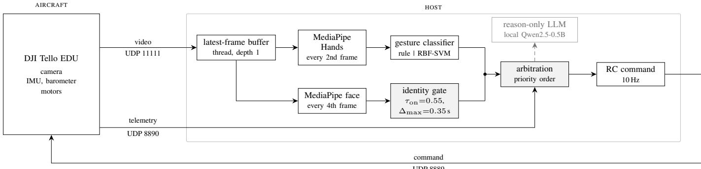
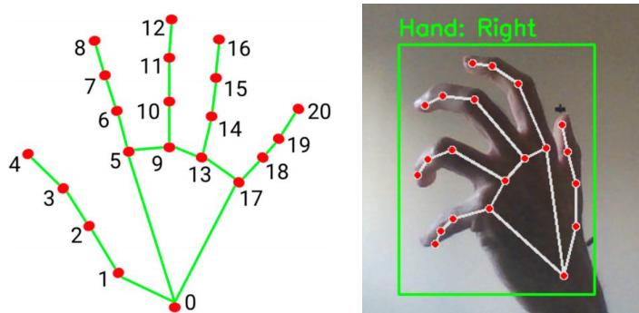
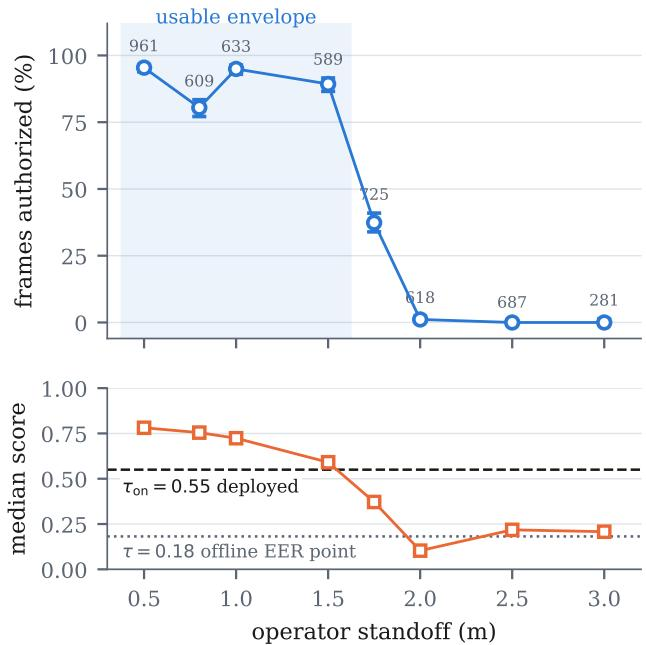
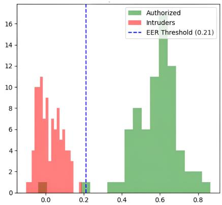
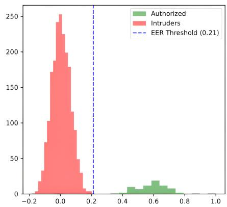
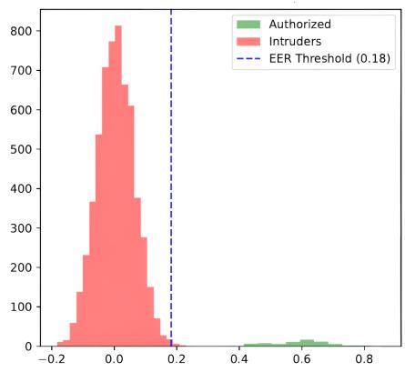

# A Deployment Study of Identity-Gated Drone Gesture Control

Diyari Mohammed Salih1, Ilyes Chaabeni1, and Naïma Aït Oufroukh2

Abstract—Vision-based gesture control accepts commands from any hand in the camera field of view, which is unsafe in shared indoor spaces. This paper presents IGATE, an identitygated control stack that includes gesture control and face tracking, in which commands are admitted only when an enrolled operator is verified. The system performs few-shot user enrolment from 20 initial face frames, without prior user-specific training: verification compares an embedding of the current face crop against the enrolled template by cosine similarity, while face tracking uses proportional correction. Gesture control is achieved by classifying extracted hand landmarks using an RBF-SVM trained on a custom dataset. Additionally, a hierarchical finitestate machine handles mode selection, default, and fallback behaviours. The approach is tested on a DJI Tello EDU, each component evaluated offline and in-flight across 270 trials (149 flown). Face verification yields a 0.32% offline equal error rate versus 19.3% in-flight. Under hover-locked conditions, the RBF-SVM gesture classifier outperforms the geometric rule (0.850 vs. 0.651 accuracy), with 82% of this gap stemming from the depth channel. All logs and reproduction scripts will be released.

Index Terms—human-drone interaction, gesture control, face verification, deployment evaluation, unmanned aerial vehicles

## I. INTRODUCTION

Small indoor drones are increasingly operated through vision-based gesture interfaces, which remove the physical controller and lower the barrier for novice users. A camerabased recogniser, however, responds to whichever hand enters the field of view, so in a shared indoor space it admits commands from bystanders. Predictable interaction therefore requires two rarely combined capabilities: identity-aware authorization, so that only an enrolled operator’s commands are honoured, and deterministic arbitration between teleoperation, tracking and safety behaviours.

This paper presents IGATE, an identity-gated gesture control stack for a drone with a monocular camera, and evaluates it inflight on the DJI Tello EDU. The design is conventional in its parts: MediaPipe landmarks, an RBF-SVM gesture classifier, an ArcFace-trained face embedding, and a hierarchical state machine. Our contribution is the in-flight evaluation, and a choice of components driven by cheap computation at acceptable precision. Each component is characterised both by the offline metric conventionally reported for it and by the rate it achieves through the drone’s own video pipeline, and for every component that measurement is taken in flight.

## TABLE I

POSITIONING AGAINST REPRESENTATIVE GESTURE-CONTROLLED UAVSYSTEMS. “OPERATIONAL” MEANS MEASURED THROUGH THEAIRCRAFT’S OWN VIDEO PIPELINE. †IN-FLIGHT GESTURE ACCURACY ANDIN-FLIGHT FALSE REJECTION.

<table><tr><td></td><td>Identity gate</td><td>Explicit arbitration</td><td>Cross-sess. eval.</td><td>Operational rates†</td></tr><tr><td>Latif et al. [1]</td><td></td><td>一</td><td></td><td></td></tr><tr><td>HGIC [2]</td><td></td><td>yes</td><td></td><td></td></tr><tr><td>Taylor et al. [3]</td><td></td><td>yes</td><td></td><td></td></tr><tr><td>Seidu &amp; Lawal [4]</td><td>yes</td><td>一</td><td></td><td></td></tr><tr><td>Varga [5]</td><td></td><td>一</td><td>yes</td><td></td></tr><tr><td>This work</td><td>yes</td><td>yes</td><td>yes</td><td>0.850/19.3%</td></tr></table>

The size of the gap between the two is not uniform across the stack. It is large where a component depends on image quality (video compression, motion blur, lighting): the identity gate loses a factor of 23 in false rejection to the aircraft’s imagery at a fixed threshold. It is small where a component depends on evaluation protocol: gesture accuracy moves from 0.997 to 0.850 almost entirely through the choice of split. Diagnosing which is at work requires per-frame logging dense enough to reconstruct a trial’s internal state after the fact, released here with the system.

The contributions are as follows.

• IGATE, an identity-gated human-drone interaction stack in which gesture and tracking commands are filtered by session-level face verification and arbitrated by a deterministic state machine, with a local language model excluded from actuation.

• A three-protocol evaluation of the gesture classifier giving 0.997, 0.910 and 0.783, and a hover-locked in-flight comparison of both deployed classifiers at matched standoff giving 0.850 against 0.651.

• An operational characterisation of the identity gate: false rejection through the aircraft video pipeline and an authorization envelope in operator standoff, reported against the offline equal error rate of the same model and decomposed into the cost of the imagery and the cost of the operating point.

• Six deployment behaviours that appear only in flight, three of them corrected and reported with paired measurements.

Every quantitative claim is rederived from the released logs by an accompanying audit script, which reports any figure it cannot reproduce.

TABLE II  
PARAMETERS SECTION III SPECIFIES AND SECTION V MEASURES. VALUES ARE GENERATED FROM THE DEPLOYED CONFIGURATION.
<table><tr><td>Parameter</td><td>Value</td><td>Measured in</td></tr><tr><td> $\theta _ { \mathrm { s c a l e } }$  on  $\Delta { } s _ { t }$ </td><td>0.18</td><td>§V-D</td></tr><tr><td>Face-follow target  $\rho ^ { \star }$ </td><td>0.075 of frame</td><td>§V-C</td></tr><tr><td> $\tau _ { \mathrm { o n } }$ </td><td>0.55</td><td>§V-C</td></tr><tr><td> $\tau _ { \mathrm { o f f } } , k$ </td><td>0.45, 3</td><td>§ V-D</td></tr><tr><td> $\Delta _ { \mathrm { m a x } }$  crop freshness</td><td>0.35 s</td><td>§V-D</td></tr><tr><td>Mode hold, release</td><td> $1 . 2 ~ \mathrm { s } , ~ 0 . 8 ~ \mathrm { s }$ </td><td>§V</td></tr><tr><td>Search sweep</td><td>28 s</td><td>§V-D</td></tr><tr><td>Battery failsafe</td><td>15%</td><td>§V-D</td></tr></table>

## II. RELATED WORK

Gesture control for UAVs is well established. Wachs et al. [6] set out the requirements for hand-gesture interfaces, and later systems map landmarks or learned features to flight commands [1]–[3], [7], [8], against dedicated datasets such as UAV-GESTURE [9]. These systems report classification accuracy on curated datasets and demonstrate flight qualitatively; they do not report what the recogniser achieves through the aircraft’s own video link, and they treat any detected hand as a valid operator.

Face recognition supplies the missing authorization. $\mathbf { A r } _ { - }$ cFace [10] is the standard margin-based objective and is reported by equal error rate on still-image benchmarks such as LFW [11]. That characterisation is known to travel poorly: Cheng et al. [12] report a large drop between benchmark figures and native surveillance imagery. Whether it survives a rolling-shutter camera, an H.264 encoder and a 2.4 GHz link is not usually asked, and Section V-C finds that it does not.

On evaluation protocol, Varga [5] shows that random splits over frames from continuous recordings overstate hand-gesture accuracy, and argues for subject-independent partitioning. Section V-A reaches a consistent conclusion from sessionindependent partitioning, which removes a different leakage axis: all four sessions here are one operator, so every figure in this paper is within-subject and is an upper bound on crosssubject performance. Language models have been proposed as robot planners [13] and constrained by guardrails [14]; IGATE excludes the model from actuation entirely.

## III. METHOD

## A. Platform and Perception

The platform is a DJI Tello EDU (TLW004), an 87 g quadrotor with a stabilised RGB camera and no obstacleavoidance sensors; perception, telemetry and arbitration run on a host PC (Intel Core i7-9750H, CPU-only inference) over the three UDP channels of Fig. 1. The host decodes video in a separate thread into a single-slot buffer, which bounds staleness at the cost of throughput, and the age of each frame at consumption is logged, since a host-side latency measurement that omits it describes the wrong system. Both detectors are throttled, hands every second frame and faces every fourth.

MediaPipe Hands produces 21 landmarks per detected hand, flattened to

$$
\mathbf { f } _ { t } = [ x _ { 1 } , y _ { 1 } , z _ { 1 } , \ldots , x _ { 2 1 } , y _ { 2 1 } , z _ { 2 1 } ] ^ { \top } \in \mathbb { R } ^ { 6 3 } .\tag{1}
$$

Coordinates are normalised to the image frame, so the representation is invariant to where the hand sits in view but not to how large it appears; Section V-A finds that residual scale dependence to be the strongest single predictor of cross-session transfer. The geometric rule smooths $\mathbf { f } _ { t }$ with an exponential moving average at $\alpha = 0 . 3 5$ and resets it when the hand is lost; the learned classifier receives $\mathbf { f } _ { t }$ unsmoothed.

## B. Two Gesture Vocabularies

IGATE carries two gesture classifiers, and they decode different vocabularies: the rule reads where the index finger points, the classifier reads the configuration of the whole hand. A pose meaning FORWARD to one is not a degraded FORWARD to the other but an input it has no reading for, so every comparison in Section V cues each classifier on the vocabulary it decodes.

With $\mathbf { p } _ { \mathrm { t i p } }$ and $\mathbf { p } _ { \mathrm { m c p } }$ the index tip and metacarpophalangeal joint, the rule’s directional vector is $\mathbf { v } = \mathbf { p } _ { \mathrm { t i p } } - \mathbf { p } _ { \mathrm { m c p } } ,$ , and a lateral or vertical component is emitted when the corresponding element of v exceeds $\theta _ { \mathrm { d i r } } = 0 . 1 0$ in normalised units. Depth is inferred not from a pose but from a change: with $A _ { t }$ the landmark bounding-box area,

$$
\Delta s _ { t } = \frac { A _ { t } - A _ { t - 1 } } { A _ { t - 1 } } ,\tag{2}
$$

and FORWARD or BACK is emitted when $| \Delta s _ { t } |$ exceeds $\theta _ { \mathrm { s c a l e } } ~ = ~ 0 . 1 8 .$ . Equation (2) is not normalised by $\Delta t ,$ , so the same physical motion yields different values at different frame rates. The learned classifier standardises $\mathbf { f } _ { t }$ and applies a support vector machine with a radial basis function kernel, $C = 1 0$ and $\gamma$ set by the scale heuristic, over seven classes, fitted on a stratified 75/25 split at seed 42.

The classifier is selected explicitly at launch, validated before the aircraft is armed, and recorded in the run manifest with the model’s SHA-256; a released regression test fails on any run whose manifest and per-frame latency columns disagree.

## C. Identity Gate and Arbitration

At startup the operator enrols: $N = 2 0$ accepted face crops (bounding boxes) are embedded and averaged into a template $E _ { \mathrm { a u t h } } ,$ and each later crop $c _ { t }$ is compared with it by cosine similarity, $S _ { t } = \langle \phi ( c _ { t } ) , E _ { \mathrm { a u t h } } \rangle$ , both vectors being unit length. The embedding network is frozen; enrolment only averages its outputs. Authorization $a _ { t }$ is a Schmitt trigger rather than a perframe comparison,

$$
a _ { t } = \left\{ \begin{array} { l l } { 1 , } & { S _ { t } \geq \tau _ { \mathrm { o n } } , } \\ { 0 , } & { S _ { t } < \tau _ { \mathrm { o f f } } \mathrm { ~ f o r ~ } k \mathrm { ~ c o n s e c u t i v e ~ f r a m e s } , } \\ { a _ { t - 1 } , } & { \mathrm { o t h e r w i s e } , } \end{array} \right.\tag{3}
$$

with $\tau _ { \mathrm { o n } } = 0 . 5 5 , \tau _ { \mathrm { o f f } } = 0 . 4 5$ and $k = 3$ . The opening threshold sits well above the 0.18 that balances the two error rates

  
Fig. 1. IGATE. The aircraft carries no computation: perception, authorization and arbitration run on the host, and every stage is logged per frame. The language model sits off this path entirely.

  
Fig. 2. The 21-point hand skeleton IGATE classifies (left) and the runtime overlay the operator sees (right). The numbered joints are the indices used throughout: 0 the wrist, 4 the thumb tip, 5 and 8 the index metacarpophalangeal joint and tip that carry the rule’s directional vector, and 20 the littlefinger tip that separates LEFT from BACK (Section V-D).

where to fly.

offline, because a false accept hands control to the wrong person while a false reject only costs a repeated gesture (Section V-C). MediaPipe detects all faces in the frame and supplies their bounding boxes, whose padded crop is resized to 112 × 112 and embedded by ϕ(·), a MobileFaceNet [15] trained on WebFace600K under the ArcFace additive angular margin loss [10]. The embedding is therefore used outside the pipeline it was trained in, which aligns each crop onto five facial landmarks and pairs the network with a RetinaFace [16] detector; Section V-C treats that as one untested candidate for the operational false rejection rate.

Detection and recognition carry different time constants and the two are not interchangeable. Arbitration holds its face predicate across detection gaps for 2.0 s so that mode selection does not flicker on a low-frame-rate stream; identity accepts a crop only if its detection is younger than $\Delta _ { \mathrm { m a x } } = 0 . 3 5 \mathrm { ~ s ~ }$ because re-embedding a stale box feeds the network whatever now occupies a region the face has left.

A gesture is admitted when a hand is present and $a _ { t } =$ 1. These are two independent tests over the frame, not an association: the perception path returns a single hand and never binds it to the authorized face, so the gate establishes operator presence rather than command provenance.

Face following uses the detection box, not the embedding: the aircraft centres the box and holds its area at a fixed fraction of the frame, which Section V-C calibrates to a 0.94 m standoff. The embedding decides whether to follow, the box

A state machine selects one mode per control tick by the first satisfied condition in the fixed order: battery failsafe, gesture, face following, bounded search, hover. Battery at or below 15% forces an irreversible landing. A mode is held for at least 1.2 s and released only after its signal has been absent for 0.8 s. With nothing seen for 10 s the aircraft begins a yaw sweep of 28 s, one full rotation at the deployed rate of approximately 13°/s.

Every command is computed by (3) and the state machine. A structured summary of each decision then goes to a local Qwen2.5-0.5B instance, which returns one sentence for the log but cannot reach the actuation path.

## IV. EXPERIMENTAL SETUP

Each launch writes a timestamped run directory containing telemetry, decision, per-frame performance and trial logs, with a manifest recording configuration, Git commit, library versions and host. Two conventions make the latency figures meaningful: a throttled stage contributes a sample only on frames where it executed, and frames are deduplicated by sequence number before any rate is computed.

Four sessions of seven gesture classes (CENTER, LEFT, RIGHT, UP, DOWN, FORWARD, BACK) were captured at 400 images per class under deliberately different conditions rather than as replicates. Session A is the reference condition, daylight against a uniform blue wall separating hand from background in intensity and hue. B and C were recorded in two domestic rooms under artificial light against cluttered backdrops, and D in daylight against a cluttered room, the cell that separates the two factors. After landmark extraction the usable samples are 2715, 2345, 2613 and 2784.

A flight trial counts only if the aircraft was airborne within the trial window, verified from the command log; the rule is uniform and does not select on outcome. Of 150 flight trials one was excluded, having been opened after a failsafe landing and before the next takeoff, leaving 149 flown among 270 valid trials. All 149 produced the specified mode transition, as did 61 of 61 webcam-harness trials in the deployed configuration. With no trial failing, this result is at ceiling: it shows the arbitration layer behaves as designed, but cannot tell correct perception beneath it from incorrect.

Latency is measured over 557 s airborne and 12,419 frames. Median end-to-end camera-to-command latency is 18.6 ms (95th percentile 55.2 ms) at 22.3 fps, of which frame age at consumption contributes a median 4.0 ms and a 95th percentile of 30.5 ms. Stage costs are higher in flight than on the ground, hand detection rising from 24.4 to 26.7 ms and face embedding from 9.0 to 13.0 ms. Gesture inference costs a mean 0.84 ms for the SVM and 0.07 ms for the rule, so the choice between them is not a latency trade-off.

## V. RESULTS

## A. Gesture Classification at Three Protocols

The classifier is scored three ways, each stricter than the last: a within-session split; a held-out session split, trained on three sessions and tested on the fourth; and an operational measurement on frames the aircraft itself encoded. The metric is per-frame accuracy over the seven classes.

Evaluated within each session under a stratified random split, the SVM reaches an accuracy of 0.997, 0.988, 1.000 and 1.000 on sessions A, B, C and D. The protocol does not separate the reference condition from the three degraded ones: it returns 1.000 on both C and D and its lowest figure on A, the condition in which hand and background are most separable. A protocol that ranks the hardest capture conditions above the easiest is characterising the recording rather than the classifier. The mechanism is visible in the sampling density: within session A accuracy rises monotonically with the frames retained per class, 0.9486 at 100, 0.9840 at 250, 0.9971 at 400. Frames captured milliseconds apart during a continuous recording of a static pose are near-identical in landmark space, so a random split distributes near-duplicates across both partitions. That is the signature of leakage, and is consistent with the subject-independence analysis of Varga [5].

Leave-one-session-out (Group K-fold) cross-validation gave 0.793, 0.882, 0.978 and 0.988, a mean of 0.910. Transfer is markedly asymmetric: A reaches 0.815, 0.842 and 0.930 on B, C and D as a training set, whereas C reaches only 0.471 and 0.509 on A and B. A clean backdrop is therefore the more valuable training condition and the more misleading test condition. Grouping the twelve ordered pairs by what changes between their two sessions gives 0.739 where neither factor moves (2 pairs), 0.784 for background alone (2), 0.880 for illumination alone (4) and 0.709 where both move (4). The two single-factor groups order as expected but their ranges overlap almost completely, 0.638–0.930 against 0.737–0.977, and the difference is not significant $( p = 0 . 5 3 )$ ; at two against four the smallest attainable p is 0.067, so the design cannot reach significance even in principle. A post-hoc analysis suggests the axis it misses: the fraction of a test session’s handscale distribution lying inside the training session’s 5th–95th percentile range correlates with transfer at Pearson r = 0.76 over the 12 pairs, against 0.30 for shared background and −0.09 for shared illumination. This is exploratory, chosen after seeing the matrix at $n = 1 2$ , and is a caveat on the grouping rather than a replacement for it.

TABLE III  
GESTURE CLASSIFICATION IN FLIGHT ↑, HOVER-LOCKED CUED CAPTURE. RECALL IS UNCONDITIONED; THE BRACKETED FIGURE CONDITIONS ON DETECTION. PER-HOLD SCORES EACH OF THE 42 HOLDS BY MAJORITY VOTE.
<table><tr><td></td><td colspan="3">RBF-SVM</td><td colspan="3">Rule</td></tr><tr><td>Class</td><td>Recall</td><td>Prec.</td><td> $F _ { 1 }$ </td><td>Recall</td><td>Prec.</td><td> $F _ { 1 }$ </td></tr><tr><td>CENTER</td><td>0.988</td><td>0.941</td><td>0.964</td><td>0.881</td><td>0.567</td><td>0.690</td></tr><tr><td>LEFT</td><td>0.980</td><td>0.736</td><td>0.841</td><td>0.999</td><td>1.000</td><td>0.999</td></tr><tr><td>RIGHT</td><td>0.985</td><td>0.685</td><td>0.808</td><td>0.968</td><td>0.997</td><td>0.982</td></tr><tr><td>UP</td><td>0.999</td><td>1.000</td><td>0.999</td><td>0.854</td><td>0.548</td><td>0.668</td></tr><tr><td>DOWN</td><td>0.920</td><td>1.000</td><td>0.958</td><td>0.908</td><td>1.000</td><td>0.952</td></tr><tr><td>FORWARD</td><td>0.777 (0.858)</td><td>1.000</td><td>0.874</td><td>0.000</td><td>0.000</td><td>0.000</td></tr><tr><td>BACK</td><td>0.336</td><td>0.859</td><td>0.483</td><td>0.008</td><td>0.750</td><td>0.017</td></tr><tr><td>Per frame</td><td>0.850 [0.840, 0.860]</td><td></td><td></td><td>0.651 [0.638, 0.664]</td><td></td><td></td></tr><tr><td>Per hold</td><td>0.905 [0.779, 0.962]</td><td></td><td></td><td></td><td>0.714 [0.564, 0.828]</td><td></td></tr><tr><td>Detection</td><td>0.986</td><td></td><td></td><td></td><td>0.984</td><td></td></tr></table>

A third measurement scores the classifier on frames the aircraft encoded, transmitted and the host decoded. With the drone powered and streaming on the ground and its propellers removed, a cued protocol named one of the seven classes, allowed 5 s to form it and recorded 6 s, over 42 holds in six rounds of randomised class order. The SVM reaches 0.783 over all 2947 cued frames and 0.809 over the 42 holds, the hold being the independent unit because the operator was cued once and formed the gesture once. A hand was detected in every frame, so the loss is entirely misclassification.

The three protocols therefore give 0.997, 0.910 and 0.783, each stricter than the last.

## B. Both Classifiers in Flight

A final protocol puts both classifiers in the air under the identical cue. Cued holds are not flyable in a domestic room with actuation live, since a sustained directional command translates roughly 3.9 m in six seconds, so the captures use a hover lock: perception, gating, arbitration and the command computation run and are logged exactly as deployed, while the transmitted radio-control command is held at zero. Suppression is applied at the transmit boundary, so nothing upstream branches on it and the logged command is the one the aircraft would have received.

Each classifier was cued on the vocabulary it decodes over 42 holds in six rounds of randomised class order, at a matched standoff inside the authorization envelope of Section V-C: median 0.85 m for the SVM and 0.89 and 0.81 m for the two rule captures. These 84 holds are a separate protocol and are not among the 270 trials. Table III reports the result. The SVM reaches 0.850 per frame [0.840, 0.860] and 0.905 per hold, the rule 0.651 and 0.714, with hand detection above 0.98 in both. One asymmetry bounds the comparison: the moving average is applied inside the rule rather than in the shared perception path, so the rule is scored on smoothed landmarks and the SVM on raw ones. The smoothing favours the rule, so it cannot account for the direction of the gap.

The gesture classifier does not degrade in flight as the identity gate does. It reaches 0.783 on the ground and 0.850 airborne through the aircraft’s optics, against 0.910 held out across sessions and 0.997 within session: what governs the gesture figure is the evaluation protocol, not the platform.

TABLE IV  
FALSE REJECTION OF THE ENROLLED OPERATOR ↓, IN PER CENT, AT THEOFFLINE EQUAL-ERROR THRESHOLD AND AT THE DEPLOYED ONE.
<table><tr><td>Condition</td><td>Frames</td><td>FRR (%)</td></tr><tr><td>Offline still images,  $\tau = 0 . 1 8$ </td><td>13,410</td><td>0.32</td></tr><tr><td>Drone in  $\mathrm { { f l i g h t } } , \tau = 0 . 1 8$ </td><td>684</td><td>7.3</td></tr><tr><td>Drone in flight,  $\tau = 0 . 5 5 ,$  per frame</td><td>684</td><td>35.1</td></tr><tr><td>Drone in flight,  $\tau = 0 . 5 5 ,$  deployed gate</td><td>684</td><td>19.3</td></tr><tr><td>Drone on ground,  $\tau = 0 . 5 5 ,$  per frame</td><td>2792</td><td>16.7</td></tr><tr><td>Drone on ground,  $\tau = 0 . 5 5 ,$  deployed gate</td><td>2792</td><td>9.2</td></tr></table>

The comparison was specified before it was flown. A preregistration fixed the primary metric as per-hold accuracy on the depth channel, the sample size at 42 holds per classifier with the all-class comparison declared underpowered and descriptive, the frozen model and its SHA-256, and an exclusion rule admitting only declared operator error. It recorded one directional prediction, that the SVM’s RIGHT would collapse into BACK as it had on the ground, at $F _ { 1 }$ 0.433. That prediction was disconfirmed. In flight the SVM reads RIGHT correctly on 0.985 of cued frames and BACK never; the confusion reversed direction, BACK becoming the error source rather than its target and dividing between LEFT at 0.33 and RIGHT at 0.30. The preregistration carries two caveats: it was written to disk before the first flight but never placed under version control, and its cued protocol assumes an actuation revised to the hover lock above.

No static class falls below 0.92 recall on the SVM, DOWN reaching that figure exactly; on $F _ { 1 }$ two fall short, LEFT at 0.841 and RIGHT at 0.808, because BACK leaks into both and recall does not show it. Two of five reach 0.92 on the rule, CENTER, UP and DOWN falling short at 0.881, 0.854 and 0.908. Of the 0.199 gap in per-frame accuracy, 0.162 — 82% — is contributed by FORWARD and BACK alone; the remaining 0.037 falls on UP and CENTER.

## C. Identity Verification

The embedding is characterised first in the manner conventional for the component. A positive set of 76 images of the enrolled operator was scored against a negative set combining 100 webcam images of other individuals and approximately 13,000 images from Labeled Faces in the Wild [11]. Against the full combined set of 13,410 the equal error rate is 0.32%, at a threshold of $\tau = 0 . 1 8$

That benchmark is not the operating point the aircraft runs at; it was performed for validation. The deployed gate opens at $\tau _ { \mathrm { o n } } = 0 . 5 5$ , chosen for impostor margin rather than for equalerror balance, so comparing the two figures directly confounds a change of imagery with a change of threshold. Table IV separates them by holding the threshold fixed. At the offline threshold, moving from curated stills to the aircraft’s own video raises false rejection from 0.32% to 7.3%, a factor of 23. H.264 compression, motion blur, variable illumination and a moving camera are the obvious candidates; a fourth is that the embedding is used outside the pipeline it was trained in, on an unaligned crop from a different detector (Section III). Which dominates is not resolved here, since separating them needs a capture that varies one at a time.

  
Fig. 3. Authorization rate ↑ against operator standoff, frame counts annotated, Wilson intervals. Below: median similarity against the two thresholds.

Raising the threshold to the deployed 0.55 raises false rejection again to 35.1%. The choice of operating point therefore costs more than the change of imagery does. The Schmitt trigger of (3) recovers part of that, returning 19.3% against 35.1% for the same frames thresholded independently, so hysteresis is worth 16 points of false rejection measured on identical data. On the ground, inside the envelope below, false rejection is 16.7% per frame and 9.2% through the deployed gate over 2792 frames, both below the corresponding in-flight rates, which is the expected ordering.

Fig. 3 reports authorization against declared standoff over a cued ground sweep of 5,103 scored frames at eight marked distances. Between 0.5 and 1.5 m the gate admits 80–95% of frames; at 1.75 m it admits 37%, and at 2.0 m and beyond essentially none. The usable envelope is therefore 0.5–1.5 m. The same sweep calibrates the face-following standoff against the gate’s: over the 4,861 frames at marks inside the envelope the median of $\sqrt { \rho _ { t } } d$ is 0.258 m, with $\rho _ { t }$ the face box as a fraction of frame area and d the declared distance, so the follower’s target $\rho ^ { \star } = 0 . 0 7 5$ sits at 0.94 m, near the middle of the range the gate admits. The offline benchmark cannot supply this, since it relates a control parameter to a physical standoff through the deployed optics.

Beyond the envelope the failure changes character. Median apparent face size falls with distance as far as 1.75 m and then rises again, from 132 px to 165, 211 and 210 px at 2.0, 2.5 and 3.0 m, which no receding face can do. Beyond 2.0 m the scores have mean 0.177 and standard deviation 0.082, statistically the background population identified at $0 . 1 9 3 \pm 0 . 0 3 3$ : the detector is returning false positives on the backdrop and the gate is embedding them. Facial identity verification refuses them correctly, but arbitration is still told a face is present.

  
Fig. 4. Similarity scores of the enrolled operator against impostors, as the negative set grows: 100 webcam images of other individuals, then $N = 4 { , } 6 7 8 { , }$ then the full $N \dot { = } 1 3 { , } 4 1 0$ including Labeled Faces in the Wild [11]. The dashed line is the equal-error threshold, which holds at 0.21 until the negative set is enlarged and then settles at 0.18 at an equal error rate of 0.32%. The two populations stay separated throughout; what Section V-C measures is what happens to that separation when the imagery comes from the aircraft.

## D. Deployment Behaviours

Six behaviours appeared only in flight. Three were corrected and are reported with paired measurements on the same protocol.

Stale bounding boxes. The arbitration layer held its face predicate across detection gaps, and the identity path reembedded the same held box. Restricting identity crops to detections under $\Delta _ { \mathrm { m a x } } = 0 . 3 5$ s old drops the share of frames scoring in the background population from 56% to 20% and raises the authorized share from 41% to 68%, while spurious search decisions fall from 130 to 4. Two correct components had shared one temporal predicate.

Authorization hysteresis. The Schmitt trigger of (3) reduces the mode-switch rate from 78.5 to 15.7 per minute against a bare per-frame threshold on identical data. It is not free: under the bare threshold no impostor was ever authorized, and with hysteresis 5.6% of impostor frames were, across 20 trials in which the impostor was otherwise rejected.

Depth commands. Expressed as a static pose and read by the SVM, FORWARD and BACK reach 0.777 and 0.336 in flight against 0.000 and 0.008 for the motion cue, on the same aircraft at the same standoff under the same protocol. The pose formulation removes the motion cue’s pathology outright. A motion cue has no steady state: the correct component fired in every one of the twelve depth holds but occupied 9% of the window, the return stroke supplies the opposite command unless made slower than the threshold, and 67% of BACK holds emitted a spurious FORWARD. The ∆t defect of (2) is therefore a consequence of choosing a motion cue rather than an independent fault.

Vocabulary packing. BACK does not follow FORWARD, and its 0.336 is a second and independent problem. Three of the seven trained poses share a closed fist and are distinguished by a single extended digit: LEFT by the little finger, RIGHT by the thumb, BACK by neither. Over the in-flight frames cued BACK, little finger extension normalised by palm length is

0.884 on the frames read as LEFT against 0.551 on those read correctly; genuine LEFT poses measure 0.821, so on the misread holds the estimator reported a little finger more extended than on the class it belongs to. The failure is one of landmark estimation, not of classification, and it follows from a vocabulary whose classes are separated by less than the estimator resolves.

Search coverage and battery failsafe. Measured from yaw telemetry, the deployed sweep covers a median $3 1 8 ^ { \circ }$ over 22 episodes. Its 28 s duration is set by the yaw rate: at the configured ≈13°/s a full rotation requires 28 s, and an earlier 5 s specification covered a median 60° for that reason. Stepping the battery threshold down after each activation produced eleven consecutive automatic landings between 91% and 21% charge in one 580 s flight.

Radio environment. Stream rate varied between 4 and 24 fp across 31 runs, and battery charge does not explain it (pooled Pearson $r ~ = ~ - 0 . 0 8 )$ ; venue does. In a university building with dense access-point coverage a ground test achieved 21.8 fps with no reconnections, whereas flight in the same room on the same link gave 8.4 fps with 48 reconnections and SDK command timeouts while airborne, including a failed emergency stop. Motor interference, higher current draw and a rotating antenna occur only in flight, so bench evaluation does not expose this constraint.

Reason-only language model. In one instrumented run the model was called 199 times, populating 490 decision records. Eleven calls returned a timeout, 5.5% of calls and 7.1% of records, and latency averaged 1766 ms against a command interval of 100 ms. Across all runs the verbatim low-battery sentence was emitted at charges as high as 94%, a state the telemetry contradicts. Each figure measures one of the properties for which the model was excluded from actuation.

## VI. DISCUSSION

Three of the behaviours above share a structure: each arose between components that were individually correct and individually characterised. The stale crop came from two components sharing one temporal predicate; the authorization chatter from a correct threshold feeding a correct state machine; the spurious depth commands from a correct rule evaluated at an uncontrolled rate. Vocabulary packing is not of that kind. There the estimator and the classifier both behave as specified, and the fault lies in the specification itself. What exposed them was not component-level evaluation, nor the scenario validation in which every trial passed, but per-frame logging, latency conditioned on the frames where work occurred, and operational rates recorded alongside offline metrics.

The gap between a reported figure and a deployed one has a parallel in the simulation-to-reality literature [17]; here both measurements are taken on the same hardware, and the mismatch is between two evaluation protocols over one component. Only the absolute rates belong to this aircraft. A 19.3% false rejection rate, a 4–24 fps stream and a 0.5–1.5 m envelope follow from one rolling-shutter camera, one H.264 encoder and one 2.4 GHz link. The couplings, the specification error and the measurement practice do not move with the hardware, and it is the last of these that carries furthest.

Limitations. The in-flight comparison suppresses actuation, so it does not measure the closed loop in which a command moves the aircraft and changes the operator’s framing. The two classifiers are cued on different vocabularies, necessarily, so the comparison is between deployed capabilities rather than classifiers on matched input, and the operator knows which one is running. The results characterise one enrolled operator across four sessions; extending them across operators is the natural next study. The gate establishes that an authorized operator is present, not that the commanding hand is theirs, and binding them through person detection is the most valuable extension. The radio-environment result rests on two sites.

## VII. CONCLUSION

This paper proposed IGATE, an identity-gated gesture control stack for a low-cost indoor drone, and evaluated it through 270 logged trials of which 149 were flown. Every valid flight trial produced the specified behaviour.

The offline and operational figures disagree, and by how much depends on what the component rests on. Gesture accuracy falls 0.997, 0.910, 0.783 across three successively stricter protocols, almost entirely through the choice of split; face verification operates at 19.3% false rejection in flight against a 0.32% offline equal error rate, a gap that divides into the cost of the imagery and the cost of an operating threshold three times the equal-error point. Flown under a hover-locked cue at matched standoff the RBF-SVM reaches 0.850 and the geometric rule 0.651, with 82% of that gap on the depth channel. Six deployment behaviours were quantified from the logs and three corrected with paired measurements. These results support reporting operational rates and conditioned perstage latency alongside offline benchmarks for systems of this class.

## ETHICS, DATA AND CODE AVAILABILITY

Face images of the operator were collected by the operator; public face datasets were used only for offline evaluation. The enrolled embedding is held in volatile memory for the session and is not persisted. The system implements no liveness detection or anti-spoofing and is not a biometric security mechanism: its threat model is prevention of accidental control by bystanders after enrolment. Indoor flight used propeller guards, conservative command limits and manual supervision. Implementation, instrumentation, all run logs and the tableand figure-generation scripts will be released at https://github. com/Diyari-Fariq-M-salih/gesture-controlled-tello-drone. The authors thank the M2 Smart Aerospace and Autonomous Systems program at University Paris-Saclay.

## REFERENCES

[1] B. Latif, N. Buckley, and E. L. Secco, “Hand gesture and human-drone interaction,” in Intelligent Systems and Applications, ser. Lecture Notes in Networks and Systems. Springer, 2022, vol. 544, pp. 299–308.

[2] M. Hu, J. Li, R. Jin, C. Shi, L. Xu, and R. Liu, “HGIC: A hand gesture based interactive control system for efficient and scalable multi-UAV operations,” arXiv preprint arXiv:2403.05478, 2024.

[3] B. Taylor, M. Allen, P. Henson, X. Gao, H. Malik, and P. Zhu, “Enhancing drone navigation and control: Gesture-based piloting, obstacle avoidance, and 3D trajectory mapping,” Applied Sciences, vol. 15, no. 13, p. 7340, 2025.

[4] I. Seidu and J. O. Lawal, “Personalized drone interaction: Adaptive hand gesture control with facial authentication,” International Journal of Scientific Research in Science, Engineering and Technology, vol. 11, no. 4, pp. 43–60, 2024.

[5] D. Varga, “On the evaluation protocol of “gesture recognition for UAVbased rescue operation based on deep learning”: A subject-independence perspective,” arXiv preprint arXiv:2602.17854, 2026.

[6] J. P. Wachs, M. Kölsch, H. Stern, and Y. Edan, “Vision-based handgesture applications,” Communications of the ACM, vol. 54, no. 2, pp. 60–71, 2011.

[7] F. Zhang, V. Bazarevsky, A. Vakunov, A. Tkachenka, G. Sung, C.-L. Chang, and M. Grundmann, “MediaPipe hands: On-device real-time hand tracking,” in CVPR Workshop on Computer Vision for Augmented and Virtual Reality, 2020.

[8] S. Abdalla and S. Baidya, “UAV control with vision-based hand gesture recognition over edge-computing,” arXiv:2505.17303, 2025.

[9] A. G. Perera, Y. W. Law, and J. Chahl, “UAV-GESTURE: A dataset for UAV control and gesture recognition,” in Proc. Eur. Conf. Comput. Vis. (ECCV) Workshops, 2018.

[10] J. Deng, J. Guo, N. Xue, and S. Zafeiriou, “ArcFace: Additive angular margin loss for deep face recognition,” in Proc. IEEE/CVF Conf. on Computer Vision and Pattern Recognition, 2019, pp. 4690–4699.

[11] G. B. Huang, M. Mattar, T. Berg, and E. Learned-Miller, “Labeled faces in the wild: A database for studying face recognition in unconstrained environments,” in Workshop on Faces in Real-Life Images, 2008.

[12] Z. Cheng, X. Zhu, and S. Gong, “Surveillance face recognition challenge,” arXiv:1804.09691, 2018.

[13] M. Ahn, A. Brohan, N. Brown et al., “Do as I can, not as I say: Grounding language in robotic affordances,” arXiv preprint arXiv:2204.01691, 2022.

[14] Z. Ravichandran, A. Robey, V. Kumar, G. J. Pappas, and H. Hassani, “Safety guardrails for LLM-enabled robots,” IEEE Robot. Autom. Lett., 2026, arXiv:2503.07885.

[15] S. Chen, Y. Liu, X. Gao, and Z. Han, “MobileFaceNets: Efficient CNNs for accurate real-time face verification on mobile devices,” in Chinese Conf. Biometric Recognition (CCBR), 2018.

[16] J. Deng, J. Guo, E. Ververas, I. Kotsia, and S. Zafeiriou, “RetinaFace: Single-shot multi-level face localisation in the wild,” in Proc. IEEE/CVF Conf. Comput. Vis. Pattern Recognit. (CVPR), 2020, pp. 5203–5212.

[17] E. Aljalbout, J. Xing, A. Romero, I. Akinola, C. R. Garrett, E. Heiden, A. Gupta, T. Hermans, Y. Narang, D. Fox, D. Scaramuzza, and F. Ramos, “The reality gap in robotics: Challenges, solutions, and best practices,” Annu. Rev. Control Robot. Auton. Syst., vol. 9, 2026, to appear; arXiv:2510.20808.