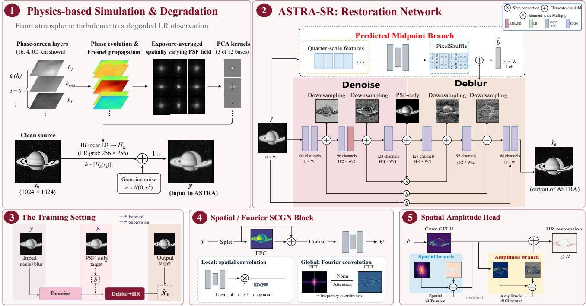
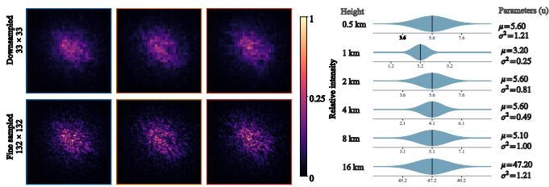
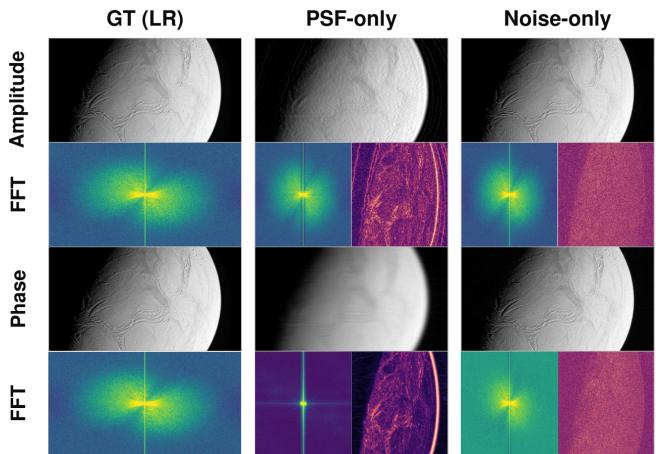
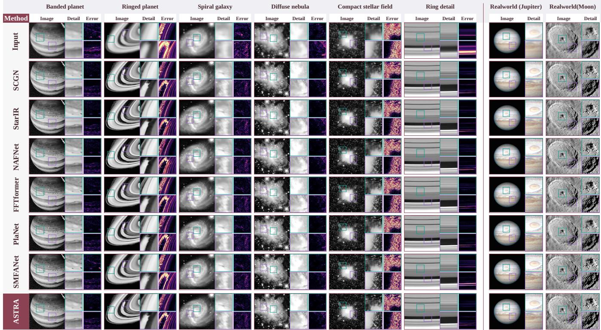

# ASTRA-SR: ATMOSPHERIC SEEING AND TURBULENCE RESTORATION FOR ASTRONOMICAL IMAGE SUPER-RESOLUTION

Xining Ge1 Ziteng Cui2,3 Shuhong Liu3,†

1 Hangzhou Dianzi University 2 Hong Kong University of Science and Technology, Guangzhou 3 The University of Tokyo

## ABSTRACT

Ground-based planetary imaging suffers from atmospheric turbulence, sensor noise, and limited sampling, making restoration a joint denoising, deblurring, and super-resolution problem. We present ASTRA-SR, a blind single-frame restoration framework trained on a physics-grounded synthetic dataset. High-dynamic-range spacecraft RAW observations serve as clean sources, and paired LR inputs are synthesized using measured layer-integrated turbulence strengths, propagated moving phase screens, exposure-averaged spatially varying PSFs, and sensor noise. ASTRA-SR first estimates a noisesuppressed but blur-retaining LR image, then restores spatial structure through multiscale processing and reconstructs HR detail with serial spatial-amplitude refinement. It yields a 0.49 dB foreground PSNR gain over the strongest baseline approaches.

Index Terms— Blind Restoration, Astronomical Imaging, Atmospheric Turbulence, Super-Resolution, Fourier Amplitude

## 1. INTRODUCTION

Planetary imaging reveals atmospheric bands, storms, rings, impact structures, and surface morphology, supporting scientific monitoring and coordinated professional–amateur observations [1, 2]. Professional observatories and space missions provide high-quality measurements, but access to major facilities is scarce and cannot support routine individual use. Affordable telescopes and cameras are more accessible, although their images contain substantially less detail than spaceborne or large-observatory data. Reliable enhancement of a single observation is therefore valuable when adaptive optics, repeated lucky-imaging acquisition, or extensive multi-frame processing is unavailable.

Ground-based planetary images are degraded by turbulenceinduced local displacement, spatially varying blur, contrast attenuation, and temporal intensity variation. Finite exposure averages these effects into an effective point-spread function (PSF), while detector noise and limited sampling cause further information loss. Consequently, planetary bands become oversmoothed and ring edges or crater boundaries become indistinct. Recovering a high-resolution (HR) image from one low-resolution (LR) observation therefore couples denoising, deblurring, and super-resolution while risking noise amplification and artifacts [3–5].

Learning-based natural-image restoration benefits from large collections of aligned clean targets and degraded inputs [6, 7]. Comparable astronomical pairs are rarely available because the same celestial scene cannot be captured under identical turbulent and turbulence-free conditions. Existing datasets therefore either pair observations from different instruments or synthesize turbulence from clean images. Cross-instrument pairs remain affected by differences in pixel scale, spectral response, optical PSF, detector noise, exposure, acquisition time, and viewing geometry after registration. Synthetic approaches scale more readily, but rendered RGB imagery and generic turbulence models may not represent high-dynamic-range spacecraft RAW data, measured layered turbulence, finite-exposure averaging, and instrument-specific sensor noise.

ASTRA-SR addresses this gap with a physics-grounded planetary RAW dataset and a blind single-frame restoration framework. Space craft observations provide high-dynamic-range, turbulence-free clean sources; measured layer-integrated turbulence strengths, propagated moving phase screens, exposure-averaged spatially varying PSFs, and sensor noise produce paired LR inputs. The network first estimates a noise-suppressed but blur-retaining LR image, then restores spatial structure through blur-aware multiscale processing, and finally recon structs HR detail through serial spatial-amplitude refinement. Our contributions are (i) a planetary dataset of spacecraft RAW images and physically simulated LR pairs, (ii) a staged spatial-frequency framework for denoising and deblurring, and (iii) a serial spatialamplitude HR head.

## 2. RELATED WORK

General image restoration uses convolutional priors [6], Transformer and frequency-domain modeling [7, 8], state-space architectures [9, 10], and diffusion priors [11–13]. Recent work also explores datacentric training, self-ensemble, complementary branch fusion, and efficient super-resolution [14–17]. Explicit inverse formulations include plug-and-play restoration [18], blind deconvolution [19, 20], and distribution matching [21].

Astronomical restoration additionally depends on atmospheric propagation and instrument-specific acquisition. P2S accelerates turbulence synthesis [22]; PlaNet combines synthetic planetary turbulence with variable-frame restoration [23]; FluxFlow uses co-registered ground-to-space pairs [24]; and recent methods model adaptive-optics super-resolution or video turbulence [5, 25]. Sensoraware RAW processing, physical-degradation benchmarks, and noise modeling [26–29] complement self-supervised scientific denoising [30–33]. ASTRA-SR focuses on blind single-frame planetary RAW restoration under spatially varying, exposure-averaged turbulence and sensor noise.

## 3. PHYSICS-GROUNDED SYNTHESIS

We define a forward degradation model that synthesizes degraded LR observations from clean planetary RAW images. The left portion of Fig. 1 illustrates the synthesis pipeline from atmospheric propagation and sensor corruption to paired LR observations and HR targets.

  
Fig. 1. ASTRA-SR architecture. The synthesis path generates the degraded LR input and training-only targets; the restoration path contains the three-scale SCGN backbone, intermediate LR estimation branch, stage-specific refinement, and sequential spatial-amplitude HR head.

  
Fig. 2. Representative PSFs and layer-strength sampling models for an illustrated MASS profile.

## 3.1. Atmospheric Synthesis and PSF Formation

The simulator randomly samples six-layer turbulence strengths at {0.5, 1, 2, 4, 8, 16} km from real MASS observation records1 [34]. The stored values are layer-integrated strengths $\begin{array} { r } { J _ { \ell } = \int C _ { n } ^ { 2 } ( h ) } \end{array}$ dh in $1 0 ^ { - 1 5 } \mathrm { m } ^ { 1 / 3 }$ rather than pointwise samples. For $k _ { 0 } = 2 \pi / \lambda$

$$
J _ { \ell } = \int C _ { n } ^ { 2 } ( h ) d h , \qquad r _ { 0 } ^ { - 5 / 3 } = 0 . 4 2 3 k _ { 0 } ^ { 2 } \sum _ { \ell } J _ { \ell } .\tag{1}
$$

Each atmospheric layer is modeled by a wind-driven phase screen under the frozen-flow assumption. The optical field is propagated successively between layers by split-step Fresnel propagation, followed by Fraunhofer propagation through the telescope pupil to obtain the focal-plane intensity [35]. With M temporal samples,

$$
u _ { \ell + 1 } ^ { \alpha , t } = \mathcal { P } _ { \Delta h _ { \ell } } \left( u _ { \ell } ^ { \alpha , t } e ^ { i \phi _ { \ell } ^ { t } } \right) , \quad k _ { \alpha } = \mathcal { N } \Bigg ( \frac { 1 } { M } \sum _ { t = 1 } ^ { M } \big | \mathcal { F } \{ A u _ { g } ^ { \alpha , t } \} \big | ^ { 2 } \Bigg ) ~ ,\tag{2}
$$

where $\mathcal { N }$ performs resampling, recentering, non-negative clipping, and unit-sum normalization. The propagated exposure PSFs are resampled to the LR lattice and act as effective discrete PSFs in the LR-domain forward model [36, 37].

## 3.2. Planetary RAW Dataset and LR Observation Formation

We collect approximately 400,000 raw observations from the Cassini Imaging Science Subsystem (ISS) and manually remove corrupted, severely noisy, and near-duplicate frames. This process yields approximately 20,000 high-dynamic-range images of planets, asteroids, and natural satellites. Spaceborne capture preserves faint and brightregion detail without ground-atmosphere turbulence. Multiple degradations produce 63,582 training samples and 1,355 source-disjoint test samples.

Each clean source $x _ { 0 }$ is independently resampled to form the LR image $x _ { L } = R _ { L } ( x _ { 0 } )$ and HR target $x _ { H } = R _ { H } ( x _ { 0 } )$ . Blur is applied on the LR grid. A mean kernel k¯ and 12 PCA basis kernels $\{ k _ { j } \}$ represent the spatially varying PSF field,

$$
\begin{array} { l } { { b ( p ) = \displaystyle \biggl [ ( \bar { k } * x _ { L } ) ( p ) + \sum _ { j = 1 } ^ { 1 2 } c _ { j } ( p ) ( k _ { j } * x _ { L } ) ( p ) \biggr ] _ { + } , } } \\ { { y = [ b + n ] _ { + } , \qquad n \sim \mathcal N ( 0 , \sigma ^ { 2 } ) . } } \end{array}\tag{3}
$$

Inference receives only $y .$ The PSF, turbulence, noise, and auxiliarytarget information are never provided as inputs.

  
Fig. 3. Fourier-component restoration analysis under full, PSF-only, and noise-only degradation.

## 4. ASTRA-SR

The right portion of Fig. 1 presents the three stages of ASTRA-SR. Intermediate LR estimation suppresses noise while retaining blur information, blur-aware LR restoration recovers spatial and spectral structure, and sequential spatial-amplitude reconstruction produces the final HR image. To guide the placement of frequency processing, we decompose synthesized observations into Fourier magnitude and phase and evaluate recovery when each component is restored toward its clean counterpart. The diagnosis in Fig. 3 shows that magnitude restoration yields larger gains than phase restoration under full and PSF-only degradation, motivating frequency-aware LR processing and amplitude-aware HR refinement [38].

## 4.1. Intermediate LR Estimation

Given the degraded LR observation y, a shallow head extracts features that are processed by SCGN blocks at full, half, and quarter resolution. PixelUnshuffle and convolution connect adjacent scales. At half resolution, a frequency-band adapter routes low-, mid-, and high frequency responses while preserving spatial information before the quarter-scale bottleneck. The resulting feature Q predicts

$$
\hat { b } = y + \operatorname { P S } _ { 4 } ( C _ { b } ( Q ) ) .\tag{4}
$$

Because the target b removes sensor noise while retaining PSF blur, this auxiliary supervision encourages early denoising without prema ture deconvolution. The estimate ˆb also provides blur-aware context for the next stage.

## 4.2. Blur-Aware LR Restoration

The LR restoration pathway fuses multiscale features through crossscale skip connections. Each block combines SCGN processing with dilated depthwise branches to capture broad degradation patterns and local structure. At full LR resolution, an overlapping Patch-Fourier refiner corrects residual blur in local complex spectra. A tail convolution predicts residual $^ { r , }$ modulated by a bounded global gain g and the local gain $\ell ( y , r , \hat { b } )$

$$
\hat { x } _ { L } = y + g ( y ) \ell ( y , r , \hat { b } ) \odot r .\tag{5}
$$

This update adapts restoration strength across images and spatial locations, while the bounded gains limit noise over-amplification.

Tab. 1. Quantitative comparison on 1,355 synthetic test images.
<table><tr><td>Method</td><td>Venue</td><td>PSNR↑</td><td>SSIM↑</td><td>Obj.-PSNR↑</td></tr><tr><td>Bicubic [39]</td><td>1</td><td>29.868</td><td>0.778</td><td>25.547</td></tr><tr><td>Bilinear [40]</td><td>1</td><td>29.757</td><td>0.776</td><td>25.427</td></tr><tr><td>NAFNet [6]</td><td>ECCV&#x27;22</td><td>35.275</td><td>0.843</td><td>31.434</td></tr><tr><td>Restormer [7]</td><td>CVPR&#x27;22</td><td>32.615</td><td>0.819</td><td>28.602</td></tr><tr><td>FFTformer [8]</td><td>CVPR&#x27;23</td><td>35.131</td><td>0.844</td><td>31.547</td></tr><tr><td>SMFANet [41]</td><td>ECCV’24</td><td>33.605</td><td>0.836</td><td>29.605</td></tr><tr><td>PlaNet [23]</td><td>AAAI&#x27;25</td><td>35.141</td><td>0.841</td><td>31.427</td></tr><tr><td>RDBM [42]</td><td>CVPR&#x27;26</td><td>34.618</td><td>0.844</td><td>31.661</td></tr><tr><td>SCGN [43]</td><td>CVPR&#x27;26</td><td>35.138</td><td>0.846</td><td>31.620</td></tr><tr><td>StarIR [44]</td><td>TPAMI&#x27;26</td><td>35.218</td><td>0.844</td><td>31.553</td></tr><tr><td>ASTRA-SR</td><td>Ours</td><td>35.824</td><td>0.849</td><td>32.148</td></tr></table>

## 4.3. Sequential Spatial-Amplitude HR Reconstruction

Let $H _ { 0 }$ denote the feature entering the HR reconstruction head. A spatial branch first refines local structure, after which an amplitude branch adjusts the spectral response,

$$
H _ { 1 } = H _ { 0 } + \Delta _ { s } ( H _ { 0 } ) , \qquad H _ { 2 } = H _ { 1 } + \Delta _ { f } ( H _ { 1 } ) .\tag{6}
$$

For $\Delta _ { f } ,$ pooled local windows are transformed into the Fourier domain. Their channel-averaged log magnitudes predict a bounded gain $1 + a ,$ which adjusts magnitude while preserving phase. The refined feature $H _ { 2 }$ is mapped to an HR residual and added to bilinearly upsampled $\hat { x } _ { L }$

$$
{ \hat { x } } _ { H } = \mathrm { B i l i n e a r } _ { 2 } ( { \hat { x } } _ { L } ) + \mathrm { P S } _ { 2 } ( C _ { H } ( H _ { 2 } ) ) .\tag{7}
$$

Training jointly constrains HR intensity, image gradients, and the intermediate LR estimate,

$$
\mathcal { L } = \| \hat { x } _ { H } - x _ { H } \| _ { 1 } + 0 . 1 \| \nabla \hat { x } _ { H } - \nabla x _ { H } \| _ { 1 } + 0 . 1 \| D _ { 4 } ( \hat { b } ) - D _ { 4 } ( b ) \| _ { 1 } .\tag{8}
$$

The three terms supervise HR intensity, image gradients, and intermediate denoising. The frequency-band adapter and Patch-Fourier refiner therefore operate at complementary LR stages, while the sequential head performs final HR spatial-amplitude refinement.

## 5. EXPERIMENTS

Implementation Details and Metrics. Each sample maps a singlechannel 256 × 256 degraded LR input to a 512 × 512 HR target. The three-scale SCGN backbone uses widths (64, 96, 128) with block layouts (2, 1, 1) for estimation and (1, 1, 2) for restoration. The local branches use dilation rates {1, 4, 9}, the global and local residual gains are bounded to (0.5, 1.5), and the amplitude branch operates on pooled 32×32 windows with modulation scale 0.10. Training intensities are divided by 2500, giving a normalized Gaussian noise standard deviation of $8 \times \mathrm { 1 0 ^ { - 4 } }$ . Predictions are clipped to the physical range and normalized to [0, 1]. We report macro PSNR, SSIM, and Object-PSNR by removing background. Matched ablations are trained from scratch for 20 epochs under the same optimization settings.

## 5.1. Quantitative Evaluation on Synthetic Dataset

Fig. 3 reports the quantitative Fourier-component restoration analysis used to guide the network design. Under full degradation, magnitude restoration improves PSNR from 31.164 to 34.903 dB, while phase restoration reaches 31.558 dB. The corresponding PSF-only values for the degraded input, magnitude restoration, and phase restoration are 31.195, 35.324, and 31.518 dB. Noise-only degradation benefits similarly from restoring either component.

  
Fig. 4. Qualitative comparisons on paired synthetic data and real observations. All methods use identical coordinates and zoom regions. The real Jupiter and lunar observations have no reference targets.

Tab. 2. Matched ASTRA ablation by module dimension. ∆ is computed from unrounded PSNR values.
<table><tr><td>Dimension</td><td>Variant</td><td>PSNR</td><td>∆ (dB)</td></tr><tr><td>Full model</td><td>ASTRA-SR full model</td><td>35.824</td><td>一</td></tr><tr><td rowspan="2">LR estimation</td><td>w/o frequency-band adapter</td><td>35.734</td><td>0.090</td></tr><tr><td>w/o intermediate LR supervision</td><td>35.719</td><td>0.105</td></tr><tr><td rowspan="3">LR restoration</td><td>w/o dilated branches</td><td>35.713</td><td>0.112</td></tr><tr><td>w/o Patch-Fourier refiner</td><td>35.739</td><td>0.085</td></tr><tr><td>w/o local residual gain</td><td>35.733</td><td>0.091</td></tr><tr><td rowspan="3">HR recon.</td><td>w/o spatial branch</td><td>35.742</td><td>0.082</td></tr><tr><td>w/o amplitude branch</td><td>35.411</td><td>0.413</td></tr><tr><td>w/o both branches</td><td>34.940</td><td>0.885</td></tr></table>

ASTRA-SR achieves the best PSNR, SSIM, and Object-PSNR among all evaluated methods. Based on the reported table values, it improves over the strongest baseline for each metric by 0.549 dB, 0.003, and 0.487 dB, respectively. The substantial foreground-region PSNR margin further shows that the improvement extends to compact astronomical structures rather than arising only from background smoothing.

## 5.2. Qualitative Evaluation on Real-World Dataset

Fig. 4 includes real Jupiter and lunar observations without reference targets. On Jupiter, ASTRA-SR produces clearer band boundaries and localized atmospheric structures while retaining smooth large-scale intensity variation. On the lunar observation, crater rims and fine surface transitions become more distinct without obvious periodic ringing or isolated artifacts. Although quantitative assessment is unavailable, these results provide qualitative evidence of generalization to real-world data.

On the paired synthetic cases, ASTRA-SR preserves localized detail with fewer structured residuals near object boundaries.

## 5.3. Ablation Study

Removing the amplitude branch reduces PSNR by 0.413 dB, while removing both HR branches causes a 0.885 dB drop, confirming that spatial and amplitude reconstruction are complementary. Removing intermediate LR supervision or the dilated branches decreases PSNR by 0.11 and 0.11 dB, respectively, which supports the staged separation of noise suppression and blur recovery. The frequency-band adapter, Patch-Fourier refiner, and local residual gain yield smaller but consistent gains, showing that each stage contributes without dominating the complete model.

## 6. CONCLUSION

ASTRA-SR combines measurement-driven atmospheric simulation with blur-aware multiscale restoration and serial spatial-amplitude HR reconstruction for blind astronomical super-resolution. Intermediate supervision, Fourier-component analysis, and matched ablations support its staged, amplitude-aware design. Because paired realworld references and astronomical restoration data remain scarce, broader quantitative evaluation across telescope configurations and observing conditions is left for future study.

## 7. REFERENCES

[1] O. Mousis, R. Hueso, J.-P. Beaulieu, et al., “Instrumental methods for professional and amateur collaborations in planetary astronomy,” Experimental Astronomy, vol. 38, no. 1–2, pp. 91–191, 2014.

[2] E. Kardasis, J. H. Rogers, G. Orton, M. Delcroix, A. Christou, M. Foulkes, P. Yanamandra-Fisher, M. Jacquesson, and G. Maravelias, “The need for professional-amateur collaboration in studies of Jupiter and Saturn,” Journal of the British Astronomical Association, vol. 126, no. 1, pp. 29–39, 2016.

[3] William Hadley Richardson, “Bayesian-based iterative method of image restoration,” Journal of the Optical Society of America, vol. 62, no. 1, pp. 55–59, 1972.

[4] Leon B. Lucy, “An iterative technique for the rectification of observed distributions,” The Astronomical Journal, vol. 79, pp. 745–754, 1974.

[5] Robin Swanson, Esther Y. H. Lin, Masen Lamb, Suresh Sivanandam, and Kiriakos N. Kutulakos, “Super resolved imaging with adaptive optics,” in 2025 IEEE/CVF International Conference on Computer Vision (ICCV). IEEE, 2025, pp. 29142–29152.

[6] Liangyu Chen, Xiaojie Chu, Xiangyu Zhang, and Jian Sun, “Simple baselines for image restoration,” in Proc. European Conference on Computer Vision (ECCV), 2022, pp. 17–33.

[7] Syed Waqas Zamir, Aditya Arora, Salman Khan, Munawar Hayat, Fahad Shahbaz Khan, and Ming-Hsuan Yang, “Restormer: Efficient transformer for high resolution image restoration,” in Proc. IEEE/CVF Conference on Computer Vision and Pattern Recognition (CVPR), 2022, pp. 5728–5739.

[8] Lingshun Kong, Jiangxin Dong, Jianjun Ge, Mingqiang Li, and Jinshan Pan, “Efficient frequency domain-based transformers for high-quality image deblurring,” in Proc. IEEE/CVF Conference on Computer Vision and Pattern Recognition (CVPR), 2023, pp. 5886–5895.

[9] Hang Guo, Jinmin Li, Tao Dai, Zhihao Ouyang, Xudong Ren, and Shu-Tao Xia, “MambaIR: A simple baseline for image restoration with state-space model,” in Proc. European Conference on Computer Vision (ECCV), 2024, pp. 222–241.

[10] Hang Guo, Yong Guo, Yaohua Zha, Yulun Zhang, Wenbo Li, Tao Dai, Shu-Tao Xia, and Yawei Li, “MambaIRv2: Attentive state space restoration,” in Proc. IEEE/CVF Conference on Computer Vision and Pattern Recognition (CVPR), 2025, pp. 28124–28133.

[11] Zongsheng Yue, Jianyi Wang, and Chen Change Loy, “ResShift: Efficient diffusion model for image super-resolution by residual shifting,” in Advances in Neural Information Processing Systems, 2023, vol. 36, pp. 13294–13307.

[12] Xinqi Lin, Jingwen He, Ziyan Chen, Zhaoyang Lyu, Bo Dai, Fanghua Yu, Yu Qiao, Wanli Ouyang, and Chao Dong, “DiffBIR: Toward blind image restoration with generative diffusion prior,” in Proc. European Conference on Computer Vision (ECCV), 2024, pp. 430–448.

[13] Rongyuan Wu, Tao Yang, Lingchen Sun, Zhengqiang Zhang, Shuai Li, and Lei Zhang, “SeeSR: Towards semantics-aware real-world image super-resolution,” in Proc. IEEE/CVF Conference on Computer Vision and Pattern Recognition (CVPR), 2024, pp. 25456–25467.

[14] Gengjia Chang, Xining Ge, Weijun Yuan, Zhan Li, Qiurong Song, Luen Zhu, and Shuhong Liu, “Beyond model design: Data-centric training and self-ensemble for Gaussian color image denoising,” arXiv preprint arXiv:2604.11468, 2026.

[15] Gengjia Chang, Xining Ge, Weijun Yuan, Zhan Li, Qiurong Song, Luen Zhu, and Shuhong Liu, “Training-free model ensemble for single-image superresolution via strong-branch compensation,” arXiv preprint arXiv:2604.11564, 2026.

[16] Xining Ge, Gengjia Chang, Weijun Yuan, Zhan Li, Zhanglu Chen, Boyang Yao, Yihang Chen, Yifan Deng, and Shuhong Liu, “Dual-branch remote sensing infrared image super-resolution,” arXiv preprint arXiv:2604.10112, 2026.

[17] Bin Ren, Hang Guo, Yan Shu, et al., “The eleventh NTIRE 2026 efficient super-resolution challenge report,” in Proc. IEEE/CVF CVPR Workshops, 2026.

[18] Kai Zhang, Yawei Li, Wangmeng Zuo, Lei Zhang, Luc Van Gool, and Radu Timofte, “Plug-and-play image restoration with deep denoiser prior,” IEEE Transactions on Pattern Analysis and Machine Intelligence, vol. 44, no. 10, pp. 6360–6376, 2022.

[19] Dongwei Ren, Kai Zhang, Qilong Wang, Qinghua Hu, and Wangmeng Zuo, “Neural blind deconvolution using deep priors,” in Proc. IEEE/CVF Conference on Computer Vision and Pattern Recognition (CVPR), 2020, pp. 3341–3350.

[20] Hyungjin Chung et al., “Parallel diffusion models of operator and image for blind inverse problems,” in Proc. IEEE/CVF Conference on Computer Vision and Pattern Recognition (CVPR), 2023, pp. 6059–6069.

[21] Giacomo Meanti, Thomas Ryckeboer, Michael Arbel, and Julien Mairal, “Unsupervised imaging inverse problems with diffusion distribution matching,” in Proc. IEEE/CVF International Conference on Computer Vision (ICCV), 2025, pp. 28364–28374.

[22] Z. Mao, N. Chimitt, and S. H. Chan, “Accelerating atmospheric turbulence sim ulation via learned phase-to-space transform,” in Proc. IEEE/CVF International Conference on Computer Vision (ICCV), 2021, pp. 14759–14768.

[23] Yifei Xia, Chu Zhou, Chengxuan Zhu, Chao Xu, and Boxin Shi, “PlaNet: Learning to mitigate atmospheric turbulence in planetary images,” Proceedings of the AAAI Conference on Artificial Intelligence, vol. 39, no. 8, pp. 8584–8592, 2025.

[24] Shuhong Liu, Xining Ge, Ziteng Cui, Liuzhuozheng Li, Gengjia Chang, Jun Liu, Ziying Gu, Dong Li, Xuangeng Chu, Lin Gu, and Tatsuya Harada, “FluxFlow: Conservative flow-matching for astronomical image super-resolution,” arXiv preprint arXiv:2605.03749, 2026.

[25] Xingguang Zhang, Nicholas Chimitt, Xijun Wang, Yu Yuan, and Stanley H. Chan, “Learning phase distortion with selective state space models for video turbulence mitigation,” in Proc. IEEE/CVF Conference on Computer Vision and Pattern Recognition (CVPR), 2025, pp. 2127–2138.

[26] Shuhong Liu, Gengjia Chang, Jun Liu, Xuangeng Chu, Yinqiang Zheng, Tatsuya Harada, and Ziteng Cui, “RAWild: Sensor-agnostic RAW object detection via physics-guided curve and grid modeling,” arXiv preprint arXiv:2605.05941, 2026.

[27] Shuhong Liu, Chenyu Bao, Ziteng Cui, Yun Liu, Xuangeng Chu, Lin Gu, Marcos V. Conde, Ryo Umagami, Tomohiro Hashimoto, Zijian Hu, Tianhan Xu, Yuan Gan, Yusuke Kurose, and Tatsuya Harada, “RealX3D: A physicallydegraded 3D benchmark for multi-view visual restoration and reconstruction,” International Journal ofComputer Vision, vol. 134, 2026, Art. no. 382.

[28] Yue Cao, Ming Liu, Shuai Liu, Xiaotao Wang, Lei Lei, and Wangmeng Zuo, “Physics-guided ISO-dependent sensor noise modeling for extreme low-light photography,” in Proc. IEEE/CVF Conference on Computer Vision and Pattern Recognition (CVPR), 2023, pp. 5744–5753.

[29] Shuhong Liu, Xining Ge, Ziying Gu, Quanfeng Xu, Ziteng Cui, Lin Gu, Xuangeng Chu, Jun Liu, Dong Li, and Tatsuya Harada, “Denoising the deep sky: Physics-based CCD noise formation for astronomical imaging,” in European Conference on Computer Vision (ECCV), 2026, Accepted for publication; arXiv:2601.23276.

[30] Jason Lequyer, Reuben Philip, Amit Sharma, Wen-Hsin Hsu, and Laurence Pelletier, “A fast blind zero-shot denoiser,” Nature Machine Intelligence, vol. 4, pp. 953–963, 2022.

[31] Xinyang Li, Xiaowan Hu, Xingye Chen, Jiaqi Fan, Zhifeng Zhao, Jiamin Wu, Haoqian Wang, and Qionghai Dai, “Spatial redundancy transformer for selfsupervised fluorescence image denoising,” Nature Computational Science, vol. 3, pp. 1067–1080, 2023.

[32] Tie Liu, Yuhui Quan, Yingna Su, Yang Guo, Shu Liu, Haisheng Ji, Qi Hao, Yulong Gao, Yuxia Liu, Yikang Wang, Wenqing Sun, and Mingde Ding, “Astronomical image denoising by self-supervised deep learning and restoration processes,” Nature Astronomy, vol. 9, pp. 608–615, 2025.

[33] Yuduo Guo, Hao Zhang, Mingyu Li, Fujiang Yu, Yunjing Wu, Yuhan Hao, Song Huang, Yongming Liang, Xiaojing Lin, Xinyang Li, Jiamin Wu, Zheng Cai, and Qionghai Dai, “Deeper detection limits in astronomical imaging using self-supervised spatiotemporal denoising,” Science, vol. 392, no. 6797, 2026, Art. no. eady9404.

[34] European Southern Observatory, “Paranal ambient query forms,” ESO Science Archive Facility, Astronomical Site Monitor database, Accessed: 2026-09-15.

[35] Emiel H Por, Sebastiaan Y Haffert, Vikram M Radhakrishnan, David S Doelman, Maaike Van Kooten, and Steven P Bos, “High contrast imaging for python (HCIPy): an open-source adaptive optics and coronagraph simulator,” in Adaptive Optics Systems VI. SPIE, 2018, vol. 10703, pp. 1112–1125.

[36] Dongxin Xie, Yan Huang, Yong Xu, and Hui Ji, “Physically-grounded turbulence mitigation with frame-shared degradation parameters,” in Proceedings of the IEEE/CVF Conference on Computer Vision and Pattern Recognition, 2026, pp. 29919–29928.

[37] Junwei Zeng, Dong Liang, Sheng-Jun Huang, Kun Zhan, and Songcan Chen, “Continuous exposure-time modeling for realistic atmospheric turbulence synthesis,” in Proceedings of the IEEE/CVF Conference on Computer Vision and Pattern Recognition, 2026, pp. 26678–26687.

[38] Yuning Cui, Syed Waqas Zamir, Salman Khan, Alois Knoll, Mubarak Shah, and Fahad Khan, “AdaIR: Adaptive all-in-one image restoration via frequency min ing and modulation,” in International Conference on Learning Representations, 2025.

[39] Robert G. Keys, “Cubic convolution interpolation for digital image processing,” IEEE Transactions on Acoustics, Speech, and Signal Processing, vol. 29, no. 6, pp. 1153–1160, 1981.

[40] Thomas M. Lehmann, Claudia Gonner, and Klaus Spitzer, “Survey: Interpo-¨ lation methods in medical image processing,” IEEE Transactions on Medical Imaging, vol. 18, no. 11, pp. 1049–1075, 1999.

[41] Mingjun Zheng, Long Sun, Jiangxin Dong, and Jinshan Pan, “SMFANet: A lightweight self-modulation feature aggregation network for efficient image super-resolution,” in Proc. European Conference on Computer Vision (ECCV), 2024, pp. 359–375.

[42] Hebaixu Wang, Jing Zhang, Haoyang Chen, Haonan Guo, Di Wang, Jiayi Ma, and Bo Du, “Residual diffusion bridge model for image restoration,” in Proceedings of the IEEE/CVF Conference on Computer Vision and Pattern Recognition, 2026, pp. 8375–8386.

[43] Hesong Li, Ziqi Wu, Ruiwen Shao, and Ying Fu, “Statistical characteristicguided denoising for rapid high-resolution transmission electron microscopy imaging,” in Proc. IEEE/CVF Conference on Computer Vision and Pattern Recognition (CVPR), 2026, pp. 34050–34060.

[44] Yuning Cui, Syed Waqas Zamir, Ming-Hsuan Yang, Alois Knoll, Fahad Shahbaz Khan, and Salman Khan, “StarIR: Convolutional image restoration with spatial-frequency fusion,” IEEE Transactions on Pattern Analysis and Machine Intelligence, vol. 48, no. 7, pp. 8216–8233, 2026.