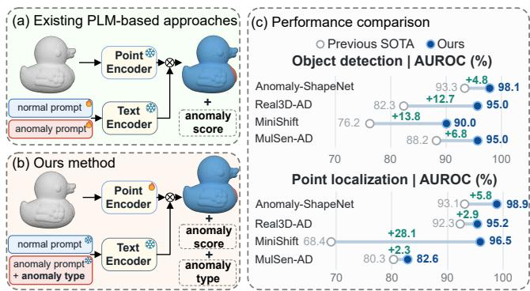
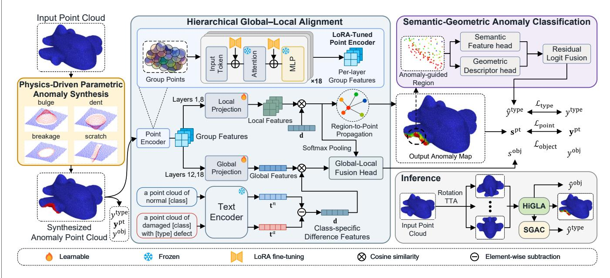
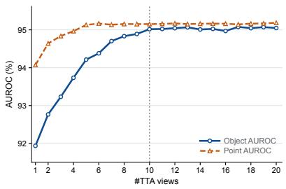
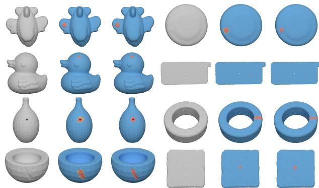

# AT3D-AD: Anomaly Type-Aware 3D Anomaly Detection via Hierarchical Point-Language Alignment

Jingyu Zeng, Haoquan Lu, Can Gao∗

College of Computer Science and Software Engineering and the Guangdong Key Laboratory of Intelligent Information

Processing,

Shenzhen University, Shenzhen 518060, China

Email: 2005gaocan@163.com

## Abstract

Detecting and localizing 3D point-cloud defects is essential for industrial inspection. However, existing methods often sufer from imprecise localization due to the lack of anomaly supervision and reliance on single-granularity representations. To address these limitations, we propose Anomaly Type-Aware 3D Anomaly Detection (AT3D-AD), a unified framework for joint detection, localization, and classification. Specifically, we first design the Physics-Driven Parametric Anomaly Synthesis (PDPAS) module employing multiple parametric functions to generate synthetic anomalies, providing explicit anomaly supervision. Then, we propose the Hierarchical Global–Local Anomaly Alignment (HiGLA) module to align global and local representations within the normal and anomalous groups. Finally, we propose the Semantic–Geometric Anomaly Classification (SGAC) module to jointly learn localization and classification, yielding spatially precise and type-discriminative anomaly representations. Extensive experiments establish new state-of-the-art performance on all four benchmarks. AT3D-AD achieves Object/Point AUROC scores of 98.1%/98.9% on Anomaly-ShapeNet and 95.0%/95.2% on Real3D-AD, while reaching 74.2% Macro-F1 for anomaly-type recognition on Real3D-AD.

## Introduction

3D anomaly detection (3D AD) aims to identify defective objects and localize anomalous regions in point clouds. It supports automated product screening and geometric quality control in industrial inspection (Bergmann et al. 2022; Wang et al. 2023; Horwitz and Hoshen 2023). In practical applications, an inspection system is expected to detect anomalous objects, localize the defects, and identify their defect categories. However, defective samples are scarce and expensive to annotate, while normal samples are abundant. Hence, most 3D AD methods adopt unsupervised training using only normal samples(Liu et al. 2023; Li et al. 2024; Zhou et al. 2024c; Ye et al. 2025).

Existing methods can be broadly divided into embeddingbased and reconstruction-based methods. Embedding-based methods model defect-free samples in a feature space and measure test-time deviations from normal features (Horwitz and Hoshen 2023; Wang et al. 2023; Liu et al. 2023). Reconstruction-based methods instead learn to recover normal geometry and identify anomalies from the diference between input and reconstructed point clouds, as in IMRNet and R3D-AD (Li et al. 2024; Zhou et al. 2024c).

  
Figure 1: Comparison of existing point-language model (PLM)-based approaches and ours. (a) Existing approaches. (b) AT3D-AD. (c) Detection and localization performance of AT3D-AD and the previous state of the art on four benchmarks. The reported AT3D-AD metrics were obtained using ten-view test-time augmentation.

Despite their efectiveness, these methods face two key limitations. First, unsupervised training does not provide direct supervision for the shape or location of the defect. Hence, localization must be inferred from feature distances or reconstruction errors. Although existing methods (Zhou et al. 2024c; Ye et al. 2025) employ synthetic anomalies for anomaly-aware learning, they fail to fully exploit the rich structural and semantic information represented by the generated anomalies. Second, PointCore combines local and global features, whereas BTP aligns patch, geometric, and global representations (Zhao et al. 2026; Li et al. 2026). However, they fail to explicitly specify structural anomaly features during training. Hence, GLFM integrates anomaly synthesis with global-local feature matching (Cheng et al. 2025b). Nevertheless, it collapses all defects into a single anomaly class, overlooking the discriminability of type-specific anomaly semantics.

To address these limitations, this study proposes an Anomaly Type-Aware 3D Anomaly Detection method (AT3D-AD) for joint anomaly detection, localization, and type recognition on 3D point clouds. The diferences between existing methods and AT3D-AD are shown in Figure 1. AT3D-AD synthesizes bulge, dent, breakage, and scratch defects from normal point clouds, yielding normal and anomalous labels fed into the hierarchical global-local alignment network. The network extracts features aligned with shared normal and anomalous semantic prototypes, enhancing object-level anomaly discrimination and point-level anomaly localization. Based on the predicted anomalous regions, AT3D-AD further integrates semantic representations with local geometric features for fine-grained anomaly-type classification. By jointly optimizing anomaly localization and type classification, AT3D-AD enables the semantic and geometric cues learned from diferent anomaly types to further refine the localization of anomalous regions.

Our contributions are as follows:

• We propose Physics-Driven Parametric Anomaly Synthesis (PDPAS), which models four geometric defects in local surface coordinates and generates object-level, point-level, and type-level supervision from normal point clouds.

• We develop Hierarchical Global–Local Anomaly Alignment (HiGLA) to align global and local features with shared text prototypes and connect object-, region-, and point-level anomaly evidence.

• Experiments on four benchmarks show that AT3D-AD achieves state-of-the-art detection and localization performance together with accurate anomaly-type recognition.

## Related Work

## 3D Anomaly Detection

Unsupervised 3D AD methods broadly follow featuremodeling and reconstruction paradigms. BTF pairs handcrafted Fast Point Feature Histograms (FPFH) with a PatchCore-style memory bank. M3DM fuses point and RGB memories, whereas PointCore combines local and global point features (Rusu, Blodow, and Beetz 2009; Horwitz and Hoshen 2023; Wang et al. 2023; Zhao et al. 2026). The Reg3D-AD baseline registers test point clouds to normal prototypes before memory-bank retrieval (Liu et al. 2023). Reconstruction methods instead learn to recover anomalyfree geometry. IMRNet uses iterative masked reconstruction, R3D-AD uses difusion reconstruction, and PO3AD predicts point ofsets from pseudo anomalies (Li et al. 2024; Zhou et al. 2024c; Ye et al. 2025).

Synthetic anomaly generation exposes models to diverse abnormal structures and provides explicit signals for anomaly-aware representation learning. Anomaly-ShapeNet uses 3D anomaly synthesis to construct diverse defects with dense annotations (Li et al. 2024). R3D-AD uses Patch-Gen to augment difusion reconstruction. PO3AD uses normalvector-guided Norm-AS to supervise point-ofset prediction. GLFM applies point-stretching synthesis before global-local feature matching (Zhou et al. 2024c; Ye et al. 2025; Cheng et al. 2025b).

## Vision-Language Models

CLIP introduced the image-text contrastive interface used by many zero-shot recognition and anomaly detection methods (Radford et al. 2021). In 2D anomaly detection, WinCLIP and AnomalyCLIP use normal and anomalous text semantics to produce class-agnostic or few-shot responses (Jeong et al. 2023; Zhou et al. 2024a). PointCLIP and PointCLIP V2 extend this interface to 3D recognition by rendering point clouds into multiple views (Zhang et al. 2022; Zhu et al. 2023). CLIP3D-AD and PointAD apply a similar projectionbased strategy to few-shot or zero-shot 3D AD (Zuo et al. 2024; Zhou et al. 2024b).

ULIP and ULIP-2 avoid rendering by aligning point clouds, images, and text in a shared representation space (Xue et al. 2023, 2024). PLANE adapts ULIP-2 with categoryspecific static prompts, sample-specific dynamic prompts, Point Cloud Feature Adaptation, and Ano3D pseudo anomalies (Wang et al. 2026). BTP targets zero-shot transfer by integrating multilayer patch features, global semantics, and FPFH-supervised geometry in the text-aligned space (Li et al. 2026).

However, efective supervision requires discriminative information. Synthetic supervision methods generate anomalies without type-level supervision. Conversely, visionlanguage models provide rich type-level semantic information without point-level supervision for localization. To address these problems, we propose an anomaly type-aware 3D AD method, jointly learning the type-level classification and global-local detection information.

## Method

## Problem Setting

Given an input point cloud $\mathcal { P } = \{ \mathbf { p } _ { i } \in \mathbb { R } ^ { 3 } \} _ { i = 1 } ^ { N }$ , 3D pointcloud anomaly detection aims to determine whether $\mathcal { P }$ is anomalous, localize its anomalous points, and identify its anomaly type. The corresponding ground-truth labels are defined as

$$
y ^ { \mathrm { o b j } } \in \{ 0 , 1 \} , \quad \mathbf { y } ^ { \mathrm { p t } } \in \{ 0 , 1 \} ^ { N } , \quad y ^ { \mathrm { t y p e } } \in \{ 1 , \ldots , C \} .\tag{1}
$$

Here, $y ^ { \mathrm { o b j } }$ and $y _ { i } ^ { \mathrm { p t } }$ indicate whether the object and point i are anomalous, respectively. For an anomalous input, $y ^ { \mathrm { t y p e } }$ specifies one of C anomaly types.

## Overview

AT3D-AD jointly learns object-level detection, point-level localization, and anomaly-type classification. As shown in Figure 2, it comprises Physics-Driven Parametric Anomaly Synthesis (PDPAS), Hierarchical Global–Local Anomaly Alignment (HiGLA), and Semantic–Geometric Anomaly Classification (SGAC).

## Physics-Driven Parametric Anomaly Synthesis

Synthetic anomalies provide explicit supervision for anomaly detection. PDPAS incorporates physical priors associated with three common defect-formation processes: local deformation, loss of surface support, and elongated surface damage. For each point cloud, we construct a symmetric knearest-neighbor (k-NN) graph and expand from a random seed to obtain a connected patch Ω. Local principal component analysis (PCA) estimates the outward surface normal n, while projecting a random vector onto the tangent plane provides a tangent direction, together defining a surface-aligned coordinate frame. The generator then independently samples the patch size, displacement amplitude, boundary taper, patch count, and optional deformation cores.

  
Figure 2: Overview of PDPAS, HiGLA, and SGAC. The complete framework shows training supervision, shared modules, information flow, objectives, and inference outputs.

PDPAS applies seven operations to synthesize four canonical anomaly types. For Bulge and Dent, PDPAS displaces each patch point along the estimated surface normal:

$$
\widetilde { \bf p } _ { i } = { \bf p } _ { i } + s A w _ { i } { \bf n } , \qquad i \in \Omega ,\tag{2}
$$

where $A = \alpha \ell \sqrt { r } > 0$ is the scale-adaptive displacement amplitude: α controls deformation strength, ℓ is the median first-neighbor distance within the patch, and r is the patchto-cloud size ratio. The spatial weight $w _ { i } \in [ 0 , 1 ]$ applies a cosine boundary taper, multiplied by a normalized multi-core Gaussian field when enabled. Finally, $s \in \{ - 1 , + 1 \}$ sets the displacement direction, with $s = + 1$ for bulges and $s = - 1$ for dents.

Breakage anomalies are synthesized as holes, cracks, or edge chips by replacing points in a central core, a tangentaligned band, or a one-sided peripheral region, respectively, with points resampled from the retained neighborhood. This operation preserves the input point count. Linear and curved scratches are generated by applying inward normal displacements along corresponding surface trajectories.

The seven operations are grouped as Bulge {bulge}, Dent {dent}, Breakage {hole, crack, edge chip}, and Scratch {scratch, curved scratch}. All patches in a sample share the same operation and type. Each synthetic sample is assigned $y ^ { \mathrm { o b j } } = 1$ , a type label $y ^ { \mathrm { t y p e } }$ , and point-level labels $\mathbf { y } ^ { \mathrm { { p t } } }$ marking the operation-specific afected region. By integrating these complementary processes into a unified surfacealigned generator, PDPAS derives synchronized object-, point-, and type-level supervision entirely from normal data.

## Hierarchical Global–Local Anomaly Alignment

Using the synthesized anomaly supervision, HiGLA aligns global and local point-cloud representations with textdefined anomaly directions.

HiGLA first uses Farthest Point Sampling (FPS) to select G group centers $\bar { \mathcal { P } } = \{ \bar { \bf p } _ { g } \} _ { g = 1 } ^ { G }$ , and each center is grouped with its $k ^ { \mathrm { g r o u p } }$ nearest neighbors. Then the point encoder maps each local group to a group token. The group tokens, together with a CLS token, are then processed by L Transformer layers with LoRA modules inserted into their attention projections. At layer $\ell ,$ the Transformer produces the group features ${ \bf H } ^ { ( \ell ) } = [ { \bf h } _ { 1 } ^ { ( \ell ) } , \ldots , { \bf h } _ { G } ^ { ( \ell ) } ] ^ { \top } \in \bar { \mathbb { R } } ^ { \bar { G } \times d }$ and the CLS feature $\mathbf { h } _ { \mathrm { c l s } } ^ { ( \ell ) } \in \mathbb { R } ^ { d }$

Features from selected Transformer layers are projected and aggregated into local and global embeddings as follows:

$$
\begin{array} { r l } & { \mathbf { Z } ^ { \mathrm { l o c } } = \underset { \ell \in \mathcal { T } ^ { \mathrm { l o c } } } { \mathrm { M e a n } } \left( \mathrm { N o r m } \left( \mathbf { H } ^ { ( \ell ) } \mathbf { W } ^ { \mathrm { l o c } } \right) \right) , } \\ & { \mathbf { z } ^ { \mathrm { g l o b } } = \underset { \ell \in \mathcal { T } ^ { \mathrm { g l o b } } } { \mathrm { M e a n } } \left( \mathrm { N o r m } \left( \mathbf { W } ^ { \mathrm { g l o b } \top } [ \mathbf { h } _ { \mathrm { c l s } } ^ { ( \ell ) } \lVert \underset { g = 1 } { \mathrm { M a x P o o l } } \mathbf { h } _ { g } ^ { ( \ell ) } ] \right) \right) , } \end{array}\tag{3}
$$

where $\mathbf { Z } ^ { \mathrm { l o c } } \in \mathbb { R } ^ { G \times D }$ and $\mathbf { z } ^ { \mathrm { g l o b } } \in \mathbb { R } ^ { D }$ denote the aggregated local and global features, respectively. The matrices $\mathbf { \breve { W } } ^ { \mathrm { l o c } } \in \mathbb { R } ^ { d \times D }$ and ${ \bf W } ^ { \mathrm { g l o b } } \in \dot { \mathbb { R } } ^ { 2 d \times \dot { \bf D } }$ project the local and global layer features into the shared embedding space. The operator Norm(·) denotes $\ell _ { 2 }$ normalization along the feature dimension, and ∥ denotes feature concatenation. The sets $\mathcal { T } ^ { \mathrm { l o c } }$ and $\mathcal { T } ^ { \mathrm { g l o b } }$ specify the Transformer layers selected for local and global aggregation, respectively.

For an input from object category $^ { O , }$ the frozen text encoder provides a normal prototype $\mathbf { t } _ { o } ^ { n }$ and an anomalous prototype $\mathbf { t } _ { o , c } ^ { a }$ for each anomaly type c. The corresponding semantic anomaly direction is

$$
\mathbf { d } _ { c } = { \frac { \mathbf { t } _ { o , c } ^ { a } } { \lVert \mathbf { t } _ { o , c } ^ { a } \rVert _ { 2 } } } - { \frac { \mathbf { t } _ { o } ^ { n } } { \lVert \mathbf { t } _ { o } ^ { n } \rVert _ { 2 } } } , \qquad c = 1 , \ldots , C .\tag{4}
$$

Because the object category o is fixed for each input, we omit it from the notation below. HiGLA compares the global and local representations with all type-specific anomaly directions:

$$
\begin{array} { r l r } & { } & { s _ { c } ^ { \mathrm { g l o b } } = \tau _ { \mathrm { g l o b } } ^ { - 1 } \left. \mathbf { z } ^ { \mathrm { g l o b } } , \mathbf { d } _ { c } \right. , } \\ & { } & { \mathbf { s } _ { c } ^ { \mathrm { l o c } } = \tau _ { \mathrm { l o c } } ^ { - 1 } \left. \mathbf { Z } ^ { \mathrm { l o c } } , \mathbf { d } _ { c } \right. . } \end{array}\tag{5}
$$

The local inner product is computed row-wise, yielding ${ \mathbf s } _ { c } ^ { \mathrm { l o c } } \in \mathbb { R } ^ { G }$ . The resulting scores are then smoothly aggregated over the $C$ anomaly types to obtain the global score $\mathbf { \Pi } _ { s } ^ { \mathrm { { e l o b } } }$ and the group-level local scores $\mathbf { s } ^ { \mathrm { l o c } } \in \mathbb { R } ^ { \tilde { G } }$

HiGLA propagates type-specific group scores to each point using its K nearest group centers $\mathcal { N } _ { K } ( i )$

$$
\begin{array} { l } { { \displaystyle w _ { i g } = \mathrm { s o f t m a x } \left( - \| \mathbf { p } _ { i } - \bar { \mathbf { p } } _ { g } \| _ { 2 } / \tau _ { \mathrm { d i s t } } \right) } , } \\ { { \displaystyle s _ { i , c } ^ { \mathrm { p t } } = \sum _ { g \in \mathcal { N } _ { K } ( i ) } w _ { i g } s _ { g , c } ^ { \mathrm { l o c } } } . } \end{array}\tag{6}
$$

Here, $\tau _ { \mathrm { d i s t } }$ controls distance weighting. Applying $\mathcal { A } _ { \tau _ { \mathrm { t y p e } } }$ over the C anomaly types gives the final point scores $\mathbf { s } ^ { \mathrm { p t } } \in \mathbb { R } ^ { N }$ which are supervised by $\mathbf { y } ^ { \mathrm { { p t } } }$ with focal, Dice, and ranking losses. A regional KL loss further aligns the mask-derived target distribution with the predicted group distribution.

HiGLA pools the group-level scores into a local objectlevel cue $\begin{array} { r } { s ^ { \mathrm { l o c } } = \sum _ { g = 1 } ^ { G } \rho _ { g } s _ { g } ^ { \mathrm { l o c } } } \end{array}$ , where $\rho _ { g }$ is a temperaturescaled softmax weight. A zero-initialized local-to-global (L2G) residual head then fuses the detached global and local scores:

$$
\begin{array} { r } { s ^ { \mathrm { o b j } } = \bar { s } ^ { \mathrm { g l o b } } + F _ { \mathrm { L 2 G } } \left( \bar { s } ^ { \mathrm { g l o b } } , \bar { s } ^ { \mathrm { l o c } } \right) , } \end{array}\tag{7}
$$

where s¯ = stopgrad(s). Zero initialization makes the initial output equal to $\mathbf { \Pi } _ { s ^ { \mathrm { g l o b } } }$ , while gradient detachment ensures that the fusion loss updates only $F _ { \mathrm { L 2 G } }$

## Semantic–Geometric Anomaly Classification

SGAC predicts the anomaly type from the region localized by HiGLA. During training, the region mask m contains a random subset of anomalous points with limited normal context; during inference, it is obtained from the highestscoring points. The mask induces normalized group weights ${ \pmb { \sigma } } \in \mathbb { R } ^ { G }$ , yielding the region representation

$$
\mathbf { r } = \pmb { \sigma } ^ { \top } \mathbf { Z } ^ { \mathrm { l o c } } .\tag{8}
$$

SGAC combines semantic and geometric type evidence:

$$
\begin{array} { r l } & { \mathbf { u } = H _ { \mathrm { s e m } } \left( \mathbf { r } , \mathbf { z } ^ { \mathrm { g l o b } } , \mathbf { T } _ { o } \right) , } \\ & { \mathbf { v } = H _ { \mathrm { g e o } } \left( \phi ( \mathcal { P } , \mathbf { m } ) \right) , } \\ & { \ell ^ { \mathrm { t y p e } } = \mathbf { u } + \mathbf { v } + H _ { \mathrm { f u s e } } \left( \left[ \mathbf { u } ; \mathbf { v } ; \mathbf { u } - \mathbf { v } ; \mathbf { u } \odot \mathbf { v } \right] \right) . } \end{array}\tag{9}
$$

Here, $\mathbf { T } _ { o } ~ \in ~ \mathbb { R } ^ { C \times D }$ contains the anomaly-type text prototypes for object category $^ { O , }$ and u, ${ \bf v } , \ell ^ { \mathrm { t y p e } } \in \mathbb { R } ^ { C }$ . The composite semantic head $H _ { \mathrm { s e m } }$ combines an MLP over the region feature, global context, and their diference with centered prototype-similarity calibration. The geometric descriptor ϕ combines FPFH statistics (Rusu, Blodow, and Beetz 2009), signed surface profiles, and local morphology. The geometric and fusion heads are MLPs.

For SGAC, the group tokens and global feature are detached from the backbone. The type loss therefore updates the SGAC heads and $\mathbf { W } ^ { \mathrm { l o c } }$ without altering the PointBERT features.

## Training Objective and Inference

The overall objectivejointly optimizes object-level detection, point-level localization, and anomaly-type classification:

$$
\begin{array} { r } { \mathcal { L } = \mathcal { L } _ { \mathrm { o b j } } + \mathcal { L } _ { \mathrm { p o i n t } } + \mathcal { L } _ { \mathrm { t y p e } } . } \end{array}\tag{10}
$$

The object-level term applies weighted binary cross-entropy with logits to $s ^ { \mathrm { g l o b } } , s ^ { \mathrm { l o c } }$ , and $s ^ { \mathrm { \tilde { o b j } } }$ using $y ^ { \mathrm { { { \dot { o b j } } } } }$ . The pointlevel term combines focal, Dice, and ranking losses on $\mathbf { s } ^ { \mathrm { { p t } } }$ against $\mathbf { y } ^ { \mathrm { { p t } } }$ with regional KL alignment. For samples with valid anomaly-type labels, the type term applies classbalanced, label-smoothed cross-entropy to $\ell ^ { \mathrm { t y p e } }$ using $y ^ { \mathrm { t y p e } }$ augmented by hard-negative and auxiliary branch losses.

At inference, we apply random SO(3) rotations as testtime augmentation (TTA) to reduce orientation-dependent variation in point-cloud predictions. Object and point scores are averaged over the original point cloud and its rotated views, while the corresponding group and global features are averaged for type classification. The averaged point map determines the highest-scoring regions, which SGAC classifies using the averaged features.

## Experiments

## Experimental Setup

Datasets and Metrics. We evaluate AT3D-AD on Anomaly-ShapeNet (Li et al. 2024), Real3D-AD (Liu et al. 2023), MiniShift (Cheng et al. 2026), and MulSen-AD (Li et al. 2025). Type evaluation includes all four types on Anomaly-ShapeNet. On Real3D-AD, it uses the available Bulge and Dent labels. MiniShift and MulSen-AD evaluate only detection and localization because they do not provide defect-type labels.

We report object-level AUROC, point-level AUROC and AUPRO following previous anomaly-detection protocols (Liu et al. 2023), macro-F1 for anomaly-type classification, and both single-view and $N _ { \mathrm { T T A } } ~ = ~ 1 0$ rotationensemble results.

Implementation details. We initialize the network from the released ULIP-2 PointBERT checkpoint (Xue et al. 2024; Yu et al. 2022). Inputs are downsampled to 10,000 points, except for MiniShift, where we sample 20,000 points. We train a separate model for each dataset for 250 epochs and evaluate its final-epoch checkpoint. All experiments are conducted on an NVIDIA RTX 3090 GPU.

Compared methods. For detection and localization, we compare with IMRNet (Li et al. 2024), Reg3D-AD (Liu et al. 2023), R3D-AD (Zhou et al. 2024c), GLFM (Cheng et al. 2025b), PLANE (Wang et al. 2026), PO3AD (Ye et al. 2025),

<table><tr><td>Method</td><td>Venue</td><td>ashtray0</td><td>bag0</td><td>bottle0</td><td>bottle1</td><td>bottle3</td><td>bowl0</td><td>bowl1</td><td>bowl2</td><td>bowl3</td><td>bowl4 bowl5</td><td>bucket0</td><td></td><td>bucket1</td><td>cap0</td><td>cap3</td><td>cap4</td><td>cap5</td><td>cup0</td><td>cup1</td><td>eraser0</td></tr><tr><td>IMRNet</td><td>CVPR24</td><td>67.1</td><td>66.0</td><td>55.2</td><td>70.0</td><td>64.0</td><td>68.1</td><td>70.2</td><td>68.5</td><td>59.9</td><td>67.6</td><td>71.0</td><td>58.0</td><td>77.1</td><td>73.7</td><td>77.5</td><td>65.2</td><td>65.2</td><td></td><td>64.3 75.7</td><td>54.8</td></tr><tr><td>GLFM</td><td>IEEE TASE25</td><td>52.8</td><td>53.7</td><td>49.5</td><td>69.9</td><td>74.5</td><td>53.1</td><td>54.3</td><td>61.0</td><td>79.4</td><td>75.1</td><td>72.0</td><td>51.2</td><td>66.2</td><td>62.1</td><td>56.4</td><td>81.2</td><td>64.2</td><td>56.4</td><td>63.4</td><td>55.7</td></tr><tr><td>PLANE</td><td>ESWA25</td><td>90.5</td><td>91.4</td><td>84.3</td><td>81.4</td><td>99.4</td><td>96.3</td><td>90.7</td><td>95.6</td><td>70.6</td><td>89.3</td><td>80.0</td><td>98.1</td><td>96.8</td><td>94.4</td><td>95.4</td><td>73.0</td><td>87.0</td><td>80.5</td><td>70.5</td><td>100.0</td></tr><tr><td>PO3AD</td><td>CVPR25</td><td>100.0</td><td>83.3</td><td>90.0</td><td>93.3</td><td>92.6</td><td>92.2</td><td>82.9</td><td>83.3</td><td>88.1</td><td>98.1</td><td>84.9</td><td>85.3</td><td>78.8</td><td>87.7</td><td>85.9</td><td>79.2</td><td>67.0</td><td>87.1</td><td>83.3</td><td>99.5</td></tr><tr><td>MC3D-AD</td><td>IJCAI25</td><td>96.2</td><td>80.5</td><td>79.5</td><td>70.9</td><td>75.6</td><td>93.0</td><td>97.8</td><td>71.9</td><td>88.5</td><td>91.1</td><td>75.4</td><td>89.8</td><td>78.4</td><td>79.3</td><td>70.1</td><td>83.5</td><td>76.1</td><td>74.3</td><td>95.2</td><td>77.6</td></tr><tr><td>Simple3D</td><td>AAAI26</td><td>99.5</td><td>88.1</td><td>97.6</td><td>95.1</td><td>100.0</td><td>100.0</td><td>83.0</td><td>71.1</td><td>91.1</td><td>73.0</td><td>86.3</td><td>95.9</td><td>79.0</td><td>85.2</td><td>86.7</td><td>91.2</td><td>80.4</td><td>100.0</td><td>82.4</td><td>100.0</td></tr><tr><td>CASL</td><td>AAAI26</td><td>94.3</td><td>94.8</td><td>95.7</td><td>95.4</td><td>100.0</td><td>100.0</td><td>93.3</td><td>99.3</td><td>99.6</td><td>94.4</td><td>88.8</td><td>99.0</td><td>91.4</td><td>94.8</td><td>82.1</td><td>77.2</td><td>55.4</td><td>99.0</td><td>64.8</td><td>99.5</td></tr><tr><td>PA3AD</td><td>PR26</td><td>100.0</td><td>93.8</td><td>98.1</td><td>93.3</td><td>97.1</td><td>98.9</td><td>89.6</td><td>95.6</td><td>90.4</td><td>98.9</td><td>92.6</td><td>96.8</td><td>89.5</td><td>94.4</td><td>93.3</td><td>90.5</td><td>92.6</td><td>100.0</td><td>95.7</td><td>100.0</td></tr><tr><td>SeDiR</td><td>CVPR26</td><td>97.6</td><td>88.6</td><td>92.9</td><td>91.6</td><td>98.4</td><td>95.9</td><td>95.6</td><td>92.6</td><td>96.7</td><td>98.5</td><td>97.9</td><td>91.1</td><td>93.3</td><td>98.5</td><td>98.9</td><td>99.6</td><td>87.4</td><td>99.5</td><td>100.0</td><td>66.7</td></tr><tr><td>MFF-M3AD</td><td>NN26</td><td>89.0</td><td>80.0</td><td>85.2</td><td>76.8</td><td>94.0</td><td>99.2</td><td>92.2</td><td>86.7</td><td>93.3</td><td>84.8</td><td>98.9</td><td>84.1</td><td>90.8</td><td>89.3</td><td>81.8</td><td>97.2</td><td>95.4</td><td>97.6</td><td>97.6</td><td>74.3</td></tr><tr><td>Ours</td><td></td><td>100.0</td><td>100.0</td><td>98.6</td><td>100.0</td><td>100.0</td><td>100.0</td><td>95.6</td><td>100.0</td><td>99.6</td><td>100.0</td><td>100.0</td><td>97.1</td><td>93.3</td><td>95.6</td><td>96.1</td><td>97.9</td><td>92.3</td><td>100.0</td><td>99.5</td><td>100.0</td></tr><tr><td>Ours (TTA=10)</td><td></td><td>100.0</td><td>100.0</td><td>100.0</td><td>100.0</td><td>100.0</td><td>100.0</td><td>97.0</td><td>100.0</td><td>100.0</td><td>100.0</td><td>100.0</td><td>98.7</td><td>94.6</td><td>98.9</td><td>99.0</td><td>97.5</td><td>95.1</td><td>100.0</td><td>99.5</td><td>100.0</td></tr><tr><td>Method</td><td>Venue</td><td>headset0</td><td>headset1</td><td>helmet0</td><td>helmet1</td><td>helmet2</td><td>helmet3</td><td>jar0</td><td>phone0</td><td>shelf0</td><td>tap0</td><td>tap1</td><td>vase0 vase1</td><td>vase2</td><td>vase3</td><td>vase4</td><td>vase5</td><td>vase7</td><td>vase8</td><td>vase9</td><td>Mean</td></tr><tr><td>IMRNet</td><td>CVPR24</td><td>72.0</td><td>67.6</td><td>59.7</td><td>60.0</td><td>64.1</td><td>57.3</td><td>78.0</td><td>75.5</td><td>60.3</td><td></td><td>69.6</td><td></td><td></td><td></td><td></td><td></td><td></td><td></td><td></td><td></td></tr><tr><td>GLFM</td><td>IEEE TASE25</td><td>59.2</td><td>63.4</td><td>59.3</td><td>62.8</td><td>56.5</td><td>53.8</td><td>56.9</td><td>71.9</td><td>57.0</td><td>67.6 68.9</td><td>53.3 42.6 66.7</td><td>75.7 76.1</td><td>61.4 59.3</td><td>70.0 67.3</td><td>52.4 57.3</td><td>67.6 54.8</td><td>63.5 51.3</td><td>63.0 66.3</td><td>59.4 70.3</td><td>66.1 61.9</td></tr><tr><td>PLANE</td><td>ESWA25</td><td>78.2</td><td>77.6</td><td>70.4</td><td>54.3</td><td>100.0</td><td>72.1</td><td>100.0</td><td>100.0</td><td>75.9</td><td>46.7</td><td>65.2 89.6</td><td>77.1</td><td>97.1</td><td>78.2</td><td>77.3</td><td>69.0</td><td>93.8</td><td>96.4</td><td>59.2</td><td>83.6</td></tr><tr><td>PO3AD</td><td>CVPR25</td><td>80.8</td><td>92.3</td><td>76.2</td><td>96.1</td><td>86.9</td><td>75.4</td><td>86.6</td><td>77.6</td><td>57.3</td><td>74.5</td><td>68.1 85.8</td><td>74.2</td><td>95.2</td><td>82.1</td><td>67.5</td><td>85.2</td><td>96.6</td><td>73.9</td><td>83.0</td><td>83.9</td></tr><tr><td>MC3D-AD</td><td>IJCAI25</td><td>86.2</td><td>88.6</td><td>67.2</td><td>100.0</td><td>60.9</td><td>97.9</td><td>97.1</td><td>91.9</td><td>84.1</td><td>94.5</td><td>97.0 82.1</td><td>85.7</td><td>92.9</td><td>76.1</td><td>87.6</td><td>97.6</td><td>93.8</td><td>67.0</td><td>73.6</td><td>84.2</td></tr><tr><td>Simple3D</td><td>AAAI26</td><td>98.2</td><td>95.7</td><td>69.0</td><td>71.9</td><td>75.4</td><td>65.5</td><td>90.5</td><td>100.0</td><td>74.8</td><td>70.3</td><td>59.6 95.4</td><td>82.4</td><td>87.1</td><td>81.2</td><td>86.4</td><td>96.2</td><td>89.5</td><td>85.5</td><td>81.5</td><td>86.0</td></tr><tr><td>CASL PA3AD</td><td>AAAI26</td><td>83.6</td><td>96.7</td><td>78.3</td><td>89.0</td><td>88.1</td><td>86.1</td><td>99.5</td><td>98.1</td><td>83.2</td><td>76.1</td><td>56.3 83.8</td><td>89.0</td><td>98.1</td><td>93.0</td><td>82.1</td></table>

Table 1: Per-category Object AUROC on Anomaly-ShapeNet (%). Bold and underlined values denote the best and second-best results, respectively.
<table><tr><td></td><td></td><td colspan="3">airplane</td><td colspan="3">chicken diamond</td><td colspan="3">gemstone</td><td colspan="3">starfish</td><td rowspan="2"></td></tr><tr><td>Method</td><td>Venue</td><td></td><td>candybar</td><td>car</td><td></td><td></td><td>duck</td><td>fish</td><td></td><td>seahorse</td><td>shell</td><td></td><td>Mean toffees</td></tr><tr><td>GLFM</td><td>IEEE TASE25</td><td>54.6</td><td>71.5</td><td>84.2</td><td>68.8</td><td>71.2</td><td>94.5 69.5</td><td>68.8</td><td></td><td>92.4</td><td>73.3 74.8</td><td></td><td>76.3</td><td>75.0</td></tr><tr><td>PLANE</td><td>ESWA25</td><td>63.0</td><td>77.4</td><td>83.3</td><td>69.3</td><td>99.8</td><td>83.9 93.9</td><td></td><td>89.1</td><td>54.0</td><td>86.6</td><td>60.1</td><td>71.6</td><td>77.7</td></tr><tr><td>PO3AD</td><td>CVPR25</td><td>80.4</td><td>78.5</td><td>65.4</td><td>68.6</td><td>80.1</td><td>82.0 85.9</td><td></td><td>69.3</td><td>75.6</td><td>80.0</td><td>75.8</td><td>77.1</td><td>76.5</td></tr><tr><td>MC3D-AD</td><td>IJCAI25</td><td>85.0</td><td>83.0</td><td>74.9</td><td>71.5</td><td>95.5</td><td>83.1 86.5</td><td></td><td>56.0</td><td>71.6</td><td>80.3</td><td>76.6</td><td>73.8</td><td>78.2</td></tr><tr><td>Simple3D</td><td>AAAI26</td><td>76.5</td><td>65.1</td><td>98.1</td><td>82.6</td><td>100.0</td><td>77.8 91.2</td><td></td><td>70.4</td><td>93.0</td><td>51.4</td><td>69.6</td><td>88.8</td><td>80.4</td></tr><tr><td>CAŠL</td><td>AAAI26</td><td>80.8</td><td>84.8</td><td>79.9</td><td>65.7</td><td>97.6</td><td>83.6 93.5</td><td></td><td>76.9</td><td>64.3</td><td>79.1</td><td>89.3</td><td>92.4</td><td>82.3</td></tr><tr><td>PA3AD</td><td>PR26</td><td>76.0</td><td>76.9</td><td>75.2</td><td>67.7</td><td>77.6</td><td>78.2 95.4</td><td></td><td>72.8</td><td>87.5</td><td>80.8</td><td>79.6</td><td>78.9</td><td>78.9</td></tr><tr><td>SeDiR</td><td>CVPR26</td><td>86.0</td><td>81.9</td><td>78.3</td><td>72.9</td><td>94.8</td><td>86.2</td><td>93.8</td><td>62.7</td><td>67.4</td><td>77.9</td><td>85.4</td><td>84.5</td><td>81.0</td></tr><tr><td>MFF-M3AD</td><td>NN26</td><td>90.2</td><td>77.0</td><td>85.1</td><td>74.5</td><td>98.4</td><td>84.9</td><td>94.3</td><td>59.8</td><td>76.9</td><td>74.5</td><td>80.0</td><td>78.0</td><td>81.1</td></tr><tr><td>Ours</td><td></td><td>88.6</td><td>100.0</td><td>80.0</td><td>88.0</td><td>100.0</td><td>77.4 97.4</td><td></td><td>92.2</td><td>99.6</td><td>90.8</td><td>92.4</td><td>97.0</td><td>91.9</td></tr><tr><td>Ours (TTA=10) –</td><td></td><td>93.3</td><td>100.0</td><td>88.0</td><td>92.4</td><td>100.0</td><td>84.0 99.0</td><td></td><td>95.2</td><td>98.9</td><td>96.1</td><td>94.9</td><td>98.4</td><td>95.0</td></tr></table>

Table 2: Per-category Object AUROC on Real3D-AD (%). Bold and underlined values denote the best and second-best results, respectively.

MC3D-AD (Cheng et al. 2025a), MFF-M3AD (Liang et al. 2026), Simple3D (Cheng et al. 2026), CASL (Zha et al. 2026), PA3AD (Ning et al. 2026), and SeDiR (Kim, Lee, and Cho 2026). For anomaly classification, we compare with an MLP, PointNet (Qi et al. 2017a), PointNet++ (Qi et al. 2017b), DGCNN (Wang et al. 2019), and semantic-only and geometry-only variants of our classifier.

## Comparison with State-of-the-Art Methods

Anomaly-ShapeNet Results Tables 1 and 3 report Object AUROC and Point AUROC, respectively, across all 40 categories. AT3D-AD achieved 96.9/98.6 Object/Point AUROC without TTA and 98.1/98.9 with ten views. The TTA variant ranked first in 25/38 object/point categories and second in another 10/2. Its point score ranked among the top two in

<table><tr><td>Method</td><td>Venue</td><td>ashtray0</td><td>bag0</td><td>bottle0</td><td>bottle1</td><td>bottle3</td><td>bowl0</td><td>bowll</td><td>bowl2</td><td>bowl3</td><td>bowl4 bowl5</td><td>bucket0</td><td></td><td>bucket1</td><td>cap0</td><td>cap3</td><td>cap4</td><td>cap5</td><td>cup0</td><td>cup1</td><td>eraser0</td></tr><tr><td>IMRNet</td><td>CVPR24</td><td>67.1</td><td>66.8</td><td>55.6</td><td>70.2</td><td>64.1</td><td>78.1</td><td>70.5</td><td>68.4</td><td>59.9</td><td>57.6</td><td>71.5</td><td>58.5</td><td>77.4</td><td>71.5</td><td>70.6</td><td>75.3</td><td>74.2</td><td></td><td>64.3 68.8</td><td>54.8</td></tr><tr><td>GLFM</td><td>IEEE TASE25</td><td>74.1</td><td>75.4</td><td>80.9</td><td>70.7</td><td>83.3</td><td>83.0</td><td>62.0</td><td>73.8</td><td>87.7</td><td>59.7</td><td>58.2</td><td>60.9</td><td>69.4</td><td>97.6</td><td>89.1</td><td>92.6</td><td>87.2</td><td>73.1</td><td>55.9</td><td>60.9</td></tr><tr><td>PLANE</td><td>ESWA25</td><td>73.4</td><td>90.4</td><td>83.3</td><td>90.0</td><td>94.9</td><td>81.0</td><td>87.4</td><td>83.4</td><td>88.0</td><td>85.3</td><td>79.3</td><td>85.5</td><td>94.7</td><td>90.4</td><td>95.1</td><td>89.4</td><td>84.4</td><td>83.4</td><td>84.7</td><td>96.7</td></tr><tr><td>PO3AD</td><td>CVPR25</td><td>96.2</td><td>94.9</td><td>91.2</td><td>84.4</td><td>88.0</td><td>97.8</td><td>91.4</td><td>91.8</td><td>93.5</td><td>96.7</td><td>94.1</td><td>75.5</td><td>89.9</td><td>95.7</td><td>94.8</td><td>94.0</td><td>86.4</td><td>90.9</td><td>93.2</td><td>97.4</td></tr><tr><td>MC3D-AD</td><td>IJCAI25</td><td>80.7</td><td>85.7</td><td>90.2</td><td>86.7</td><td>90.2</td><td>77.5</td><td>56.2</td><td>59.7</td><td>77.9</td><td>67.0</td><td>56.2</td><td>90.2</td><td>86.8</td><td>85.4</td><td>90.3</td><td>85.8</td><td>88.2</td><td>76.3</td><td>69.4</td><td>82.0</td></tr><tr><td>Simple3D</td><td>AAAI26</td><td>92.0</td><td>95.4</td><td>97.4</td><td>72.8</td><td>83.8</td><td>98.8</td><td>95.1</td><td>93.3</td><td>99.3</td><td>92.9</td><td>97.9</td><td>72.5</td><td>92.1</td><td>98.8</td><td>96.4</td><td>97.9</td><td>96.4</td><td>97.9</td><td>93.7</td><td>97.0</td></tr><tr><td>CASL</td><td>AAAI26</td><td>88.7</td><td>96.8</td><td>85.3</td><td>86.2</td><td>91.4</td><td>95.8</td><td>97.5</td><td>98.2</td><td>99.8</td><td>99.6</td><td>97.4</td><td>79.6</td><td>92.7</td><td>97.4</td><td>97.1</td><td>94.9</td><td>66.9</td><td>98.0</td><td>79.7</td><td>87.6</td></tr><tr><td>PA3AD</td><td>PR26</td><td>96.3</td><td>96.5</td><td>95.8</td><td>91.5</td><td>94.0</td><td>97.1</td><td>88.3</td><td>93.4</td><td>96.4</td><td>98.4</td><td>94.8</td><td>90.0</td><td>92.0</td><td>95.9</td><td>95.5</td><td>94.5</td><td>96.3</td><td>97.5</td><td>95.8</td><td>98.0</td></tr><tr><td>SeDiR</td><td>CVPR26</td><td>76.4</td><td>89.8</td><td>91.1</td><td>89.8</td><td>94.5</td><td>86.6</td><td>70.0</td><td>79.5</td><td>86.9</td><td>80.6</td><td>64.6</td><td>71.7</td><td>88.4</td><td>90.0</td><td>97.2</td><td>94.0</td><td>95.0</td><td>87.1</td><td>84.2</td><td>74.8</td></tr><tr><td>MFF-M3AD</td><td>NN26</td><td>79.1</td><td>84.8</td><td>92.2</td><td>87.5</td><td>93.0</td><td>83.3</td><td>56.1</td><td>73.4</td><td>82.8</td><td>73.1</td><td>56.8</td><td>72.1</td><td>86.3</td><td>88.1</td><td>90.8</td><td>91.0</td><td>91.9</td><td>84.9</td><td>74.8</td><td>82.3</td></tr><tr><td>Ours</td><td></td><td>98.4</td><td>99.5</td><td>99.6</td><td>98.5</td><td>99.7</td><td>98.6</td><td>98.5</td><td>99.8</td><td>99.9</td><td>99.9</td><td>99.4</td><td>98.2</td><td>98.6</td><td>99.3</td><td>99.9</td><td>99.8</td><td>99.6</td><td>99.4</td><td>98.1</td><td>99.6</td></tr><tr><td>Ours (TTA=10)</td><td></td><td>98.6</td><td>99.7</td><td>99.7</td><td>98.7</td><td>99.7</td><td>99.3</td><td>98.9</td><td>99.9</td><td>99.9</td><td>99.9</td><td>99.7</td><td>98.5</td><td>98.6</td><td>99.4</td><td>99.9</td><td>99.9</td><td>99.6</td><td>99.6</td><td>98.6</td><td>99.7</td></tr><tr><td>Method</td><td>Venue</td><td>headset0</td><td>headset1</td><td>helmet0</td><td>helmet1</td><td>helmet2</td><td>helmet3</td><td>jar0</td><td>phone0</td><td>shelf0</td><td>tap0</td><td>tap1 vase0</td><td>vasel</td><td>vase2</td><td>vase3</td><td>vase4</td><td>vase5</td><td>vase7</td><td>vase8</td><td>vase9</td><td>Mean</td></tr><tr><td>IMRNet</td><td>CVPR24</td><td>70.5</td><td>47.6</td><td>59.8</td><td>60.4</td><td>64.4</td><td>66.3</td><td>76.5</td><td>74.2</td><td>60.5</td><td>68.1</td><td>69.9 53.5</td><td>68.5</td><td>61.4</td><td></td><td>52.4</td><td></td><td></td><td></td><td></td><td></td></tr><tr><td>GLFM</td><td>IEEE TASE25</td><td>72.6</td><td>60.8</td><td>75.3</td><td>62.6</td><td>81.8</td><td>72.8</td><td>74.9</td><td>81.4</td><td>64.4</td><td>70.6</td><td>78.3 77.8</td><td>93.4</td><td>61.4</td><td>40.1 76.7</td><td>70.6</td><td>68.2 61.5</td><td>59.3 75.8</td><td>63.5 95.2</td><td>69.1 74.4</td><td>65.0 74.5</td></tr><tr><td>PLANE</td><td>ESWA25</td><td>68.9</td><td>70.4</td><td>77.9</td><td>62.1</td><td>92.3</td><td>79.2</td><td>91.1</td><td>92.1</td><td>88.1</td><td>44.1</td><td>47.4 84.7</td><td>65.6</td><td>82.3</td><td>78.5</td><td>82.6</td><td>72.7</td><td>92.6</td><td>95.9</td><td>76.6</td><td>82.1</td></tr><tr><td>PO3AD</td><td>CVPR25</td><td>82.3</td><td>90.7</td><td>87.8</td><td>94.8</td><td>93.2</td><td>84.6</td><td>87.1</td><td>81.0</td><td>66.3</td><td>78.3</td><td>69.2 95.5</td><td>88.2</td><td>97.8</td><td>88.4</td><td>90.2</td><td>93.7</td><td>98.2</td><td>95.0</td><td>95.2</td><td>89.8</td></tr><tr><td>MC3D-AD</td><td>IJCAI25</td><td>66.6</td><td>59.2</td><td>74.9</td><td>59.1</td><td>81.8</td><td>58.5</td><td>84.7</td><td>89.1</td><td>62.5</td><td>50.2 58.4</td><td>89.7</td><td>60.8</td><td>78.1</td><td>80.0</td><td>77.2</td><td>58.8</td><td>57.6</td><td>87.4</td><td>76.2</td><td>74.8</td></tr><tr><td>Simple3D</td><td>AAAI26</td><td>93.6</td><td>95.8</td><td>90.2</td><td>90.2</td><td>94.7</td><td>92.8</td><td>97.8</td><td>96.4</td><td>90.1</td><td>85.7 81.1</td><td>93.4</td><td>80.7</td><td>98.6</td><td>91.0</td><td>98.5</td><td>96.6</td><td>99.0</td><td>97.5</td><td>91.3</td><td>92.9</td></tr><tr><td>CASL</td><td>AAAI26</td><td>77.0</td><td>90.9</td><td>92.3</td><td>88.2</td><td>92.9</td><td>98.0</td><td>97.4</td><td>83.8</td><td>92.8</td><td>65.2 60.2</td><td>89.4</td><td>97.2</td><td>97.1</td><td>93.1</td><td>91.3</td></table>

Table 3: Per-category Point AUROC on Anomaly-ShapeNet (%). Bold and underlined values denote the best and second-best results, respectively.

every category.

Real3D-AD Results Table 2 reports the two metrics separately. The single-view model achieved 91.9 Object AUROC, compared with the previous best score of 82.3. TTA results increased the means to 95.0. It ranked first in nine object categories and second in two. The margin over previous works is 12.7% for Object AUROC.

MiniShift and MulSen-AD Results Table 4 combines the macro results on the two datasets. On MiniShift, the singleview model achieved 88.7/95.5 Object/Point AUROC and exceeded CASL by 12.5/27.1 points. TTA result increased the scores to 90.0/96.5. On MulSen-AD, the corresponding scores increased from 93.0/81.9 to 95.0/82.6. The TTA model exceeded Simple3D by 6.8/2.3 points and MC3D-AD by 17.7/8.4 points.

## Anomaly Classification

Table 5 compares the complete semantic–geometric classifier with semantic-only, geometry-only, and standard pointcloud heads based on PointNet, PointNet++, and DGCNN. Every classifier receives the same anomaly-region input. On Real3D-AD, the complete head achieved 77.5% accuracy and 74.2% Macro-F1. It exceeded the stronger single branch by 2.6/2.3 points and the strongest standard head by 9.4/9.3 points. On Anomaly-ShapeNet, the complete head achieved 74.4% accuracy and 67.6% Macro-F1. These scores exceeded the stronger single branch by 14.0/10.3 points.

<table><tr><td></td><td colspan="2">MiniShift</td><td colspan="2">MulSen-AD</td></tr><tr><td>Method</td><td>Object AUROC</td><td>Point AUROC</td><td>Object AUROC</td><td>Point AUROC</td></tr><tr><td>R3D-AD</td><td>68.7</td><td>54.9</td><td>80.6</td><td>56.6</td></tr><tr><td>Reg3D-AD</td><td>51.6</td><td>52.0</td><td>77.0</td><td>60.3</td></tr><tr><td>GLFM</td><td>55.8</td><td>58.7</td><td>78.5</td><td>66.5</td></tr><tr><td>MC3D-AD</td><td>60.2</td><td>65.2</td><td>77.3</td><td>74.2</td></tr><tr><td>Simple3D</td><td>68.6</td><td>66.2</td><td>88.2</td><td>80.3</td></tr><tr><td>CAŚL</td><td>76.2</td><td>68.4</td><td>84.6</td><td>77.9</td></tr><tr><td>Ours</td><td>88.7</td><td>95.5</td><td>93.0</td><td>81.9</td></tr><tr><td>Ours (TTA=10)</td><td>90.0</td><td>96.5</td><td>95.0</td><td>82.6</td></tr></table>

Table 4: Macro Object AUROC and Point AUROC on MiniShift and MulSen-AD (%). Bold and underlined values denote the best and second-best results, respectively.

## Ablation Studies

Table 6 follows a strictly nested PDPAS chain: global alignment, local alignment, local-to-global residual fusion, and SGAC are added one at a time. The PO3AD row is a separate matched-synthesis control. It uses the same global, local, and L2G modules as the corresponding PDPAS row without

<table><tr><td>Method</td><td colspan="2">Anomaly-ShapeNet</td><td colspan="2">Real3D-AD</td></tr><tr><td></td><td>Accuracy</td><td>Macro-F1</td><td>Accuracy</td><td>Macro-F1</td></tr><tr><td>MLP</td><td>51.3</td><td>47.3</td><td>67.5</td><td>63.3</td></tr><tr><td>PointNet</td><td>50.1</td><td>46.6</td><td>68.1</td><td>64.9</td></tr><tr><td>PointNet++</td><td>50.1</td><td>46.2</td><td>64.2</td><td>61.0</td></tr><tr><td>DGCNN</td><td>50.6</td><td>47.6</td><td>64.9</td><td>61.7</td></tr><tr><td>Semantic-only</td><td>59.7</td><td>57.3</td><td>70.8</td><td>66.6</td></tr><tr><td>Geometry-only</td><td>60.4</td><td>51.4</td><td>74.9</td><td>71.9</td></tr><tr><td>Ours</td><td>74.4</td><td>67.6</td><td>77.5</td><td>74.2</td></tr></table>

Table 5: End-to-end anomaly-type classification. Accuracy and Macro-F1 are percentages. Bold and underlined values denote the best and second-best results, respectively.
<table><tr><td>Synth. G L L2G SGAC O-AUROC P-AUROC P-AUPRO</td></tr><tr><td>None 65.96 71.11 38.75 一</td></tr><tr><td>PO3AD √√ V 72.74 88.67 68.86</td></tr><tr><td>PDPAS √ 一 一 87.85 85.83 66.22</td></tr><tr><td>PDPAS √√ 89.77 92.84 85.74 1</td></tr><tr><td>PDPAS √√ √ 91.04 92.84 85.74</td></tr><tr><td>PDPAS √ √ √ √ 91.94 94.07 87.21</td></tr></table>

Table 6: Nested module ablation on Real3D-AD (%). G denotes global alignment, and L denotes local alignment. Every trained row uses its final-epoch checkpoint.

  
Figure 3: TTA sensitivity on Real3D-AD. All other settings are held fixed relative to the single-view evaluation. The vertical dotted line marks the ten-view setting used in the main comparison.

  
Figure 4: Qualitative comparison shows the input point cloud, AT3D-AD, and the ground truth.

SGAC.

After excluding the matched PO3AD control, the nested PDPAS chain improved monotonically across all three primary metrics. Local alignment contributed 7.01 Point-AUROC and 19.52 Point-AUPRO points over the globalonly row. L2G afects only the object readout. It increased Object AUROC from 89.77 to 91.04 without changing the point map. SGAC further increased the three metrics to 91.94/94.07/87.21. Under matched G+L+L2G settings, PDPAS exceeded PO3AD by 19.2/5.4/18.35 points.

TTA Sensitivity. We first varied the total number of SO(3) test-time views from 1 to 20 while reusing the same finalepoch checkpoint. On Real3D-AD, Figure 3 shows that both Object and Point AUROC improved rapidly with additional views before reaching a narrow plateau. We therefore use ten views in all main comparisons as a practical trade-of between performance gains and additional inference cost.

## Qualitative Visualization and Eficiency

Figure 4 arranges each example as the raw point cloud, the AT3D-AD anomaly map, and the ground-truth.

Eficiency. We measured single-view inference on the RTX 3090 using the Real3D-AD dataset and 10,000-point inputs. The detection/localization path required 731.29M total parameters, 4.13M trainable parameters, and a median 39.92 ms over 100 runs. Adding SGAC increased these values to 733.43M, 6.27M, and 63.17 ms, respectively. Thus, SGAC added 2.14M parameters (0.29% of the full model) and 23.25 ms (58.2%) per sample. The SGAC overhead is incurred only when type predictions are requested. Total counts include the frozen ULIP-2 text encoder.

## Conclusion

This study proposes an Anomaly Type-aware 3D Anomaly Detection (AT3D-AD) method for industrail inspection. By leveraging synthetic anomaly samples and semanticsdriven anomaly classification, the proposed AT3D-AD addresses the limitations of previous methods in exploiting anomaly supervision and multi-granularity semantic information, thereby enabling fine-grained anomaly localization and detection. The designed Physics-Driven Parametric Anomaly Synthesis (PDPAS) module generates anomalous samples in four anomaly types, which enhance the discriminability of model. The Hierarchical Global-Local Anomaly Alignment (HiGLA) module efectively captures hierarchical global and local information which are aligned with semantic representations, facilitating the training of anomaly detection model. Furthermore, the Semantic-Geometric Anomaly Classification (SGAC) module capitalizes on the jointly learning anomaly detection and type classification, enabling precise anomaly localization. Extensive experiments demonstrate the superiority of AT3D-AD, achieving state-of-the-art performance on four benchmark datasets for 3D AD. Future work will focus on improving the model’s generalization ability on zero-shot settings.

## References

Bergmann, P.; Jin, X.; Sattlegger, D.; and Steger, C. 2022. The MVTec 3D-AD Dataset for Unsupervised 3D Anomaly Detection and Localization. In Proceedings of the 17th International Joint Conference on Computer Vision, Imaging and Computer Graphics Theory and Applications, 202–213.

Cheng, J.; Gao, C.; Zhou, J.; Wen, J.; Dai, T.; and Wang, J. 2025a. MC3D-AD: A Unified Geometry-aware Reconstruction Model for Multi-category 3D Anomaly Detection. In Proceedings of the Thirty-Fourth International Joint Conference on Artificial Intelligence, 837–845. Montreal, Canada: International Joint Conferences on Artificial Intelligence Organization. ISBN 978-1-956792-06-5.

Cheng, Y.; Cao, Y.; Wang, D.; Shen, W.; and Li, W. 2025b. Boosting Global-Local Feature Matching via Anomaly Synthesis for Multi-Class Point Cloud Anomaly Detection. IEEE Transactions on Automation Science and Engineering, 22: 12560–12571.

Cheng, Y.; Sun, Y.; Zhang, H.; Shen, W.; and Cao, Y. 2026. Towards High-Resolution 3d Anomaly Detection: A Scalable Dataset and Real-Time Framework for Subtle Industrial Defects. In Proceedings ofthe AAAI Conference on Artificial Intelligence, volume 40, 3327–3334.

Horwitz, E.; and Hoshen, Y. 2023. Back to the Feature: Classical 3D Features Are (Almost) All You Need for 3D Anomaly Detection. In Proceedings of the IEEE/CVF Conference on Computer Vision and Pattern Recognition Workshops, 2968–2977.

Jeong, J.; Zou, Y.; Kim, T.; Zhang, D.; Ravichandran, A.; and Dabeer, O. 2023. Winclip: Zero-/Few-Shot Anomaly Classification and Segmentation. In Proceedings of the IEEE/CVF Conference on Computer Vision and Pattern Recognition, 19606–19616.

Kim, S.; Lee, W.; and Cho, M. 2026. A Semantically Disentangled Unified Model for Multi-category 3D Anomaly Detection. In Proceedings of the IEEE/CVF Conference on Computer Vision and Pattern Recognition, 33036–33045.

Li, K.; Li, G.; Zhou, M.; Li, M.; Han, D.; and Wan, J. 2026. Back to Point: Exploring Point-Language Models for Zero-Shot 3D Anomaly Detection. In Proceedings of the IEEE/CVF Conference on Computer Vision and Pattern Recognition, 14167–14177.

Li, W.; Xu, X.; Gu, Y.; Zheng, B.; Gao, S.; and Wu, Y. 2024. Towards Scalable 3D Anomaly Detection and Localization: A Benchmark via 3D Anomaly Synthesis and A Self-Supervised Learning Network. In Proceedings of the IEEE/CVF Conference on Computer Vision and Pattern Recognition, 22207–22216.

Li, W.; Zheng, B.; Xu, X.; Gan, J.; Lu, F.; Li, X.; Ni, N.; Tian, Z.; Huang, X.; Gao, S.; and Wu, Y. 2025. Multi-Sensor Object Anomaly Detection: Unifying Appearance, Geometry, and Internal Properties. In Proceedings of the IEEE/CVF Conference on Computer Vision and Pattern Recognition, 9984–9993.

Liang, H.; Hu, C.; Tang, Y.; Shen, L.; Wang, J.; and Gao, C. 2026. MFF-M3AD: A unified reconstruction method with

multi-scale feature fusion for multi-category 3D anomaly detection. Neural Networks, 203: 109131.

Liu, J.; Xie, G.; Chen, R.; Li, X.; Wang, J.; Liu, Y.; Wang, C.; and Zheng, F. 2023. Real3D-AD: A Dataset of Point Cloud Anomaly Detection. In Advances in Neural Information Processing Systems, volume 36, 30402–30415. Curran Associates, Inc.

Ning, J.; Zou, Q.; Wu, L.; Yue, Y.; Li, K.; Chen, S.; and Wang, Z. 2026. Physics-inspired pseudo anomaly generation and prototype feature guidance for 3D anomaly detection. Pattern Recognition, 180: 114391.

Qi, C. R.; Su, H.; Mo, K.; and Guibas, L. J. 2017a. Point-Net: Deep Learning on Point Sets for 3D Classification and Segmentation. In Proceedings of the IEEE Conference on Computer Vision and Pattern Recognition, 652–660.

Qi, C. R.; Yi, L.; Su, H.; and Guibas, L. J. 2017b. Point-Net++: Deep Hierarchical Feature Learning on Point Sets in a Metric Space. In Advances in Neural Information Processing Systems, volume 30, 5099–5108.

Radford, A.; Kim, J. W.; Hallacy, C.; Ramesh, A.; Goh, G.; Agarwal, S.; Sastry, G.; Askell, A.; Mishkin, P.; Clark, J.; Krueger, G.; and Sutskever, I. 2021. Learning Transferable Visual Models From Natural Language Supervision. In Meila, M.; and Zhang, T., eds., Proceedings of the 38th International Conference on Machine Learning, volume 139 of Proceedings of Machine Learning Research, 8748–8763. PMLR.

Rusu, R. B.; Blodow, N.; and Beetz, M. 2009. Fast Point Feature Histograms (FPFH) for 3D Registration. In Proceedings of the IEEE International Conference on Robotics and Automation, 3212–3217.

Wang, J.; Xu, H.; Chen, X.; Xu, H.; Huang, Y.; Ding, X.; and Tu, X. 2026. Exploiting Point-Language Models with Dual-Prompts for 3D Anomaly Detection. Expert Systems with Applications, 298: 129758.

Wang, Y.; Peng, J.; Zhang, J.; Yi, R.; Wang, Y.; and Wang, C. 2023. Multimodal Industrial Anomaly Detection via Hybrid Fusion. In Proceedings of the IEEE/CVF Conference on Computer Vision and Pattern Recognition, 8032–8041.

Wang, Y.; Sun, Y.; Liu, Z.; Sarma, S. E.; Bronstein, M. M.; and Solomon, J. M. 2019. Dynamic Graph CNN for Learning on Point Clouds. ACM Transactions on Graphics, 38(5): 146:1–146:12.

Xue, L.; Gao, M.; Xing, C.; Martín-Martín, R.; Wu, J.; Xiong, C.; Xu, R.; Niebles, J. C.; and Savarese, S. 2023. Ulip: Learning a Unified Representation of Language, Images, and Point Clouds for 3d Understanding. In Proceedings of the IEEE/CVF Conference on Computer Vision and Pattern Recognition, 1179–1189.

Xue, L.; Yu, N.; Zhang, S.; Panagopoulou, A.; Li, J.; Martín-Martín, R.; Wu, J.; Xiong, C.; Xu, R.; Niebles, J. C.; and Savarese, S. 2024. ULIP-2: Towards Scalable Multimodal Pre-Training for 3D Understanding. In Proceedings of the IEEE/CVF Conference on Computer Vision and Pattern Recognition, 27091–27101.

Ye, J.; Zhao, W.; Yang, X.; Cheng, G.; and Huang, K. 2025. Po3ad: Predicting Point Ofsets toward Better 3d Point Cloud

Anomaly Detection. In Proceedings ofthe Computer Vision and Pattern Recognition Conference, 1353–1362.

Yu, X.; Tang, L.; Rao, Y.; Huang, T.; Zhou, J.; and Lu, J. 2022. Point-BERT: Pre-Training 3D Point Cloud Transformers with Masked Point Modeling. In Proceedings of the IEEE/CVF Conference on Computer Vision and Pattern Recognition, 19313–19322.

Zha, Y.; Yuerong, X.; Fan, C.; Wang, Y.; Dai, T.; Chen, K.; and Xia, S.-T. 2026. Casl: Curvature-augmented Self-Supervised Learning for 3d Anomaly Detection. In Proceedings of the AAAI Conference on Artificial Intelligence, volume 40, 12340–12348.

Zhang, R.; Guo, Z.; Zhang, W.; Li, K.; Miao, X.; Cui, B.; Qiao, Y.; Gao, P.; and Li, H. 2022. Pointclip: Point Cloud Understanding by Clip. In Proceedings of the IEEE/CVF Conference on Computer Vision and Pattern Recognition, 8552–8562.

Zhao, B.; Zhang, X.; Guo, J.; and Liu, Q. 2026. Point-Core: An Eficient Framework for Unsupervised Point Cloud Anomaly Detection Using Joint Local–Global Features. Neural Networks, 197: 108446.

Zhou, Q.; Pang, G.; Tian, Y.; He, S.; and Chen, J. 2024a. AnomalyCLIP: Object-agnostic Prompt Learning for Zeroshot Anomaly Detection. In Kim, B.; Yue, Y.; Chaudhuri, S.; Fragkiadaki, K.; Khan, M.; and Sun, Y., eds., International Conference on Learning Representations, volume 2024, 49705–49737.

Zhou, Q.; Yan, J.; He, S.; Meng, W.; and Chen, J. 2024b. PointAD: Comprehending 3D Anomalies from Points and Pixels for Zero-Shot 3D Anomaly Detection. Advances in Neural Information Processing Systems, 37: 84866–84896.

Zhou, Z.; Wang, L.; Fang, N.; Wang, Z.; Qiu, L.; and Zhang, S. 2024c. R3D-AD: Reconstruction via Difusion for 3D Anomaly Detection. In Computer Vision – ECCV 2024, 91–107. Springer Nature Switzerland.

Zhu, X.; Zhang, R.; He, B.; Guo, Z.; Zeng, Z.; Qin, Z.; Zhang, S.; and Gao, P. 2023. PointCLIP V2: Prompting CLIP and GPT for Powerful 3D Open-World Learning. In Proceedings of the IEEE/CVF International Conference on Computer Vision, 2639–2650.

Zuo, Z.; Dong, J.; Wu, Y.; Qu, Y.; and Wu, Z. 2024. CLIP3D-AD: Extending CLIP for 3D Few-Shot Anomaly Detection with Multi-View Images Generation. arXiv preprint arXiv:2406.18941.