# BAS-OPD: BUDGET-AWARE SELECTIVE ON-POLICY SELF-DISTILLATION FOR FINE-GRAINED MULTIMODAL PERCEPTION

Zihan Chen1,2, Hengguang Zhou3, Yuan Kang1,2, Yiming Zhang1,2, Wenhui Fang1,2, Zenghui Ding1, Yining Sun1,2, Cho-Jui Hsieh3

1HFIPS, Chinese Academy of Sciences 2University of Science and Technology of China 3University of California, Los Angeles

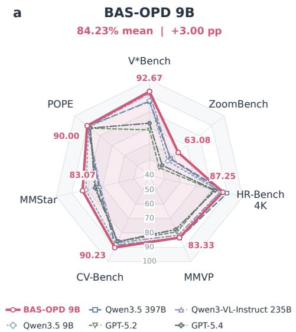

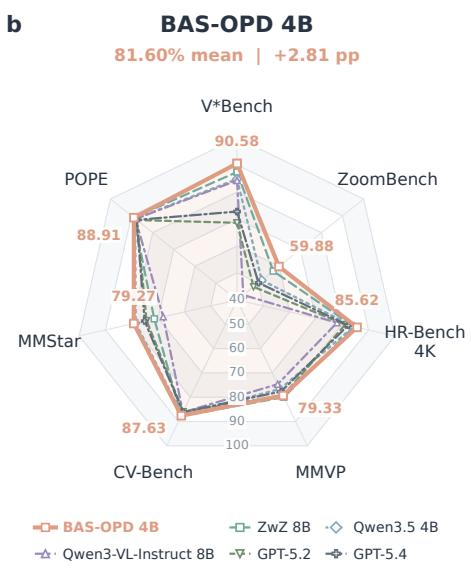

Accuracy (%) across seven visual understanding benchmarks: V\*Bench, ZoomBench, HR-Bench 4K, MMVP, CV-Bench, MMStar and POPE.

## ABSTRACT

Multimodal large language models (MLLMs) often struggle with fine-grained visual perception when processing complete images, as critical evidence may only appear in local regions. On-policy self-distillation (OPD) enables transferring privileged visual knowledge from informative views to full-image policies, but querying the teacher for every rollout introduces substantial supervision costs. In this work, we propose BAS-OPD, a budget-aware selective OPD framework that allocates teacher supervision under limited query budgets. Instead of querying all rollouts, BAS-OPD selects informative samples while maintaining full-batch student generation. We explore random, uncertainty-based, and learned utilitybased selection strategies, where the learned selector estimates query value from detached rollout statistics and online utility signals derived from student–teacher agreement and teacher confidence without additional student forward passes. BAS-OPD only changes training-time supervision allocation and preserves singlepass full-image inference. Experiments on fine-grained multimodal perception benchmarks demonstrate that BAS-OPD achieves strong performance while substantially reducing teacher supervision costs, highlighting the effectiveness of selective OPD under constrained budgets.

## 1 INTRODUCTION

Multimodal large language models (MLLMs) have become general-purpose interfaces for combining visual perception with language reasoning. Their performance, however, remains brittle when an answer depends on a small object, a local attribute, or a spatial relation embedded in a highresolution scene. V\*Bench and HR-Bench expose this limitation by requiring models to locate and interpret fine visual evidence in large images (Wu & Xie, 2024; Wang et al., 2025). The underlying difficulty is not only local recognition. Resizing an image or encoding the scene at nearly uniform spatial fidelity can weaken the few visual signals that determine the answer. Reliable fine-grained perception must therefore preserve local evidence while directing limited computation toward the regions that matter.

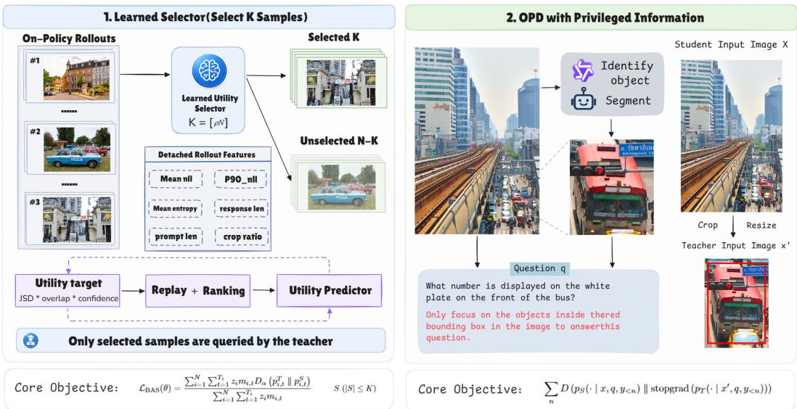  
Figure 1: Overview of BAS-OPD. The full-image policy generates all rollouts; a budget-aware selector sends only K samples to the crop teacher for distillation and utility learning. Selection is removed at inference.

Existing methods improve access to fine visual evidence along two main directions. Model-side approaches retain more pixels through high-resolution encoders or dynamic tiling; for example, InternVL 1.5 processes an image as up to 40 tiles to support 4K inputs (Chen et al., 2024b). Inferencetime approaches instead decide where to look. V\* performs language-guided visual search, while DC2 recursively partitions an image, describes its patches, and retrieves relevant regional information (Wu & Xie, 2024; Wang et al., 2025). These methods reduce information loss, but they trade against larger visual-token budgets, repeated patch processing, or additional inference calls. More importantly, they recover detail as an inference-time operation rather than teaching a single-pass full-image policy to internalize the advantage of focused regional evidence.

On-policy distillation transfers teacher behavior along trajectories sampled from the student. In autoregressive language models, it reduces the mismatch between teacher-forced training and studentgenerated inference while supporting sequence-level knowledge transfer (Agarwal et al., 2024; Ko et al., 2024). A recent multimodal formulation applies this principle to transfer privileged regional evidence into a single-pass full-image policy (Yuan et al., 2026). Existing methods mainly focus on learning objectives or supervision quality and typically query the teacher for every eligible rollout. This ties supervision cost to the full rollout batch, even when feedback is redundant or weakly in formative. The unresolved challenge is to allocate teacher queries selectively under a strict budget while preserving the benefits of student-generated training.

We introduce BAS-OPD, which selects on-policy rollouts before crop-teacher scoring under a strict sample-level budget. The full-image policy generates responses for the entire batch, but only selected samples enter teacher scoring and distillation. We support three selection strategies: random, student-entropy, and learned utility selection. The learned selector uses detached rollout statistics, requiring no additional student forward pass. Online utility targets combine student–teacher divergence, top-k overlap, and teacher confidence to prioritize large, confident corrections from privileged regional evidence. Selection is used only during training, preserving single-pass full-image inference.

We evaluate BAS-OPD with Qwen3.5-4B and Qwen3.5-9B on seven benchmarks, measuring downstream accuracy together with teacher calls and scored tokens. With the 4B backbone, learned selection under a 25% teacher-call budget achieves an average accuracy of 81.60%, 1.84 points above full querying, while using only 15.78% of its teacher-scored tokens. Scaling BAS-OPD to 9B yields an average accuracy of 84.23%, 3.00 points above the strongest non-BAS open-source single-forwardpass model. Within this comparison group, BAS-OPD 9B ranks first on five benchmarks and second on the remaining two. A frozen-selector audit further shows that learned selection retrieves higherutility rollouts than student-entropy selection. Our contributions are:

• Budget-Aware OPD. We formulate regional-to-global on-policy self-distillation with a strict, directly measurable teacher-query budget.

• Online Utility Selection. We unify random, student-entropy, and learned utility policies while ensuring that unselected rollouts never enter the crop-teacher forward pass.

• Accuracy–Cost and Selection Diagnostics. We evaluate accuracy and teacher cost across policies and budgets, with utility, ranking, and gradient analyses characterizing how learned selection concentrates supervision.

## 2 METHOD

## 2.1 BUDGET-AWARE SELECTIVE OPD

Figure 1 summarizes the training and inference paths. Algorithm 1 details the learned-selection training loop. BAS-OPD augments regional-to-global OPD with an explicit budget on crop-teacher supervision (Yuan et al., 2026). Consider a training batch $\boldsymbol { B } = \{ ( x _ { i } , \tilde { x } _ { i } , q _ { i } ) \} _ { i = 1 } ^ { N }$ , where $x _ { i }$ is the full image, ${ \tilde { x } } _ { i }$ is its privileged evidence-centered crop, and $q _ { i }$ is the language prompt. The full-image policy first samples an on-policy response $y _ { i } = ( y _ { i , 1 } , . . . , y _ { i , T _ { i } } )$ for every example in the batch. For response position t, we denote the student distribution conditioned on the full image by $p _ { i , t } ^ { S }$ and the crop-teacher distribution over the same response prefix by $p _ { i , t } ^ { T }$

$$
p _ { i , t } ^ { S } = p _ { \theta } ( \cdot \mid x _ { i } , q _ { i } , y _ { i , < t } ) ,\tag{1}
$$

$$
p _ { i , t } ^ { T } = p _ { \bar { \theta } } ( \cdot \mid \tilde { x } _ { i } , q _ { i } , y _ { i , < t } ) .\tag{2}
$$

Here, θ denotes the trainable full-image policy and $\bar { \theta }$ denotes the crop-conditioned teacher maintained by the underlying OPD procedure. Standard OPD minimizes the expected token-level divergence along responses sampled from the student:

$$
\mathcal { L } _ { \mathrm { O P D } } ( \boldsymbol { \theta } ) = \mathbb { E } _ { \boldsymbol { ( x _ { i } , \tilde { x } _ { i } , q _ { i } ) } \sim \boldsymbol { D } } \left[ \frac { 1 } { T _ { i } } \sum _ { t = 1 } ^ { T _ { i } } D _ { \alpha } \big ( p _ { i , t } ^ { T } \mid \mid p _ { i , t } ^ { S } \big ) \right] ,\tag{3}
$$

where $\mathcal { D }$ is the training distribution and $D _ { \alpha }$ is the distillation divergence; our experiments use Jensen–Shannon divergence with $\alpha = 0 . 5$ . The teacher scores the same response prefixes generated by the student. BAS-OPD does not change how responses are generated or how the teacher is regularized; it changes which rollouts are allowed to enter the crop-teacher forward pass.

Let ${ \mathcal { C } } \subseteq \{ 1 , \ldots , N \}$ be the samples for which privileged crops are available. Given a query ratio $\rho \in ( 0 , 1 ]$ , we impose the sample budget

$$
K = \lfloor \rho \vert \mathcal { C } \vert \rfloor , \quad \quad s \subseteq \mathcal { C } , \quad \vert \mathcal { S } \vert \leq K ,\tag{4}
$$

where S is chosen before any crop-teacher computation. The full-image policy therefore produces rollouts for the complete batch, while the crop teacher scores only the selected subset. This ordering is important: the budget reduces the actual teacher input batch rather than masking losses after an already completed teacher forward pass. For $i \not \in { \mathcal { S } }$ , no crop-teacher distribution or OPD target is constructed.

Selection aims to maximize the total utility of the queried subset under this budget. Because utility is observed only after teacher scoring, we predict it from statistics already produced by student rollouts (Algorithm 1, lines 3–9).

Algorithm 1 BAS-OPD with learned utility selection   
Input: Policy θ; query ratio $\rho ;$ exploration ratio ϵ; replay threshold $M ;$ EMA rate $\tau .$   
Output: Trained full-image policy θ for inference without crops or a selector.   
1: Initialize $\bar { \theta }  \theta ,$ predictor $f _ { \psi } ,$ feature normalizer, and FIFO buffer ${ \mathcal { R } } \gets { \mathcal { D } } .$   
2: for each training step s with rollout batch B do   
3: Generate $y _ { i } \sim p _ { \theta } ( \cdot \mid x _ { i } , q _ { i } )$ for all $i \in B ;$ identify crop-eligible candidates $c .$   
4: Form detached features ϕi (Eq. 5) and update normalization on ${ \mathit { c } } ;$ set $K \gets \lfloor \rho \vert { \mathcal { C } } \vert \rfloor$   
5: if $f _ { \psi }$ has not yet been updated then   
6: $\mathbf { \bar { \boldsymbol { S } } } \gets \operatorname { U n i f i o r m } ( \mathcal { C } , K )$ , sampling without replacement.   
7: else   
8: Predict $\hat { u } _ { i } \gets f _ { \psi } ( \mathrm { N }$ ormalize $\left( \phi _ { i } \right) )$ for $i \in { \mathcal { C } } ;$ set $K _ { \mathrm { e } } \gets \lceil \epsilon K \rceil$   
9: Form S from the top $K - { \dot { K } } _ { \mathrm { e } }$ candidates by $\hat { u } _ { i }$ plus $K _ { \mathrm { e } }$ candidates sampled uniformly without   
replacement from the remainder.   
10: end if   
11: Run the standard OPD student forward for $p ^ { S } \colon$ ; obtain detached crop-teacher $p ^ { T }$ on the same tokens only   
for $i \in S .$   
12: Compute detached utility labels $u _ { i }$ for $i \in \mathcal { S } \left( \mathrm { E q . ~ } 9 \right) .$   
13: Update θ using $\mathcal { L } _ { \mathrm { B A S } }$ (Eq. 11); after a valid update, set $\bar { \theta }  ( 1 - \tau ) \bar { \theta } + \tau \theta .$   
14: Add valid detached $\left( \phi _ { i } , u _ { i } , s \right)$ to bounded replay R; if new pairs were added and $| \mathcal { R } | \geq M$ , update only   
ψ from replay using $\mathcal { L } _ { \mathrm { s e l } }$ (Eq. 10).   
15: end for

## 2.2 LEARNED UTILITY SELECTION

For each rollout, Algorithm 1 (line 4) constructs a detached feature vector

$$
\phi _ { i } = \left[ \overline { { \ell } } _ { i } , Q _ { 0 . 9 } ( \ell _ { i } ) , \overline { { H } } _ { i } , T _ { i } , L _ { i } , a _ { i } \right] ^ { \top } ,\tag{5}
$$

which summarizes rollout likelihood and entropy, response and prompt lengths, and crop area. These quantities require no additional MLLM forward pass. A lightweight predictor estimates query utility from normalized features; feature definitions, running normalization, and network architecture are given in Appendix A.2:

$$
\hat { u } _ { i } = f _ { \psi } ( \mathrm { N o r m a l i z e } ( \phi _ { i } ) ) .\tag{6}
$$

Algorithm 1 (lines 5–9) selects K candidates uniformly before the first predictor update. Thereafter, it reserves $K _ { \mathrm { e } } = \lceil \epsilon K \rceil$ queries for random exploration and assigns the remaining $K - K _ { \mathrm { e } }$ queries to the highest-scoring candidates. Exploration samples from the remaining candidates to avoid a self-confirming selection loop while preserving the strict budget.

The supervision for $f _ { \psi }$ is obtained online from selected rollouts (Algorithm 1, line 12). Let $P _ { i , t } ^ { S }$ and $P _ { i , t } ^ { T }$ denote student and teacher probabilities evaluated on the student’s top-k token indices and renormalized over this shared support. We measure their disagreement with the Jensen–Shannon divergence

$$
d _ { i , t } = \mathrm { J S D } \big ( P _ { i , t } ^ { S } , P _ { i , t } ^ { T } \big ) .\tag{7}
$$

Divergence alone can be uninformative when the teacher is diffuse or favors different tokens. We define $o _ { i , t }$ as the fraction of student top-k indices also in the teacher’s own top-k set, and compute the normalized teacher confidence

$$
c _ { i , t } = 1 - \frac { H ( P _ { i , t } ^ { T } ) } { \log k } ,\tag{8}
$$

and define the detached per-sample target as

$$
u _ { i } = \frac { 1 } { \sum _ { t } m _ { i , t } } \sum _ { t } m _ { i , t } d _ { i , t } o _ { i , t } c _ { i , t } ,\tag{9}
$$

where $m _ { i , t }$ masks padding and invalid response positions. This target is high when the crop teacher makes a large, support-consistent, and confident correction to the full-image policy. Only queried samples yield $( \phi _ { i } , u _ { i } )$ pairs; unselected samples are never assigned synthetic utility labels.

Observed feature–utility pairs train the predictor through replay using weighted Huber regression and pairwise ranking:

$$
\mathcal { L } _ { \mathrm { s e l } } = \mathcal { L } _ { \mathrm { r e g } } + \lambda _ { \mathrm { r a n k } } \mathcal { L } _ { \mathrm { r a n k } } ,\tag{10}
$$

Regression calibrates utility values, while ranking learns their ordering. Algorithm 1 (line 14) updates only the selector from detached features and targets; the replay procedure and loss definitions are given in Appendix A.3.

## 2.3 SELECTIVE DISTILLATION AND INFERENCE

Algorithm 1 (lines 11–13) scores only S with the crop teacher and compares its detached distri butions with the standard OPD student distributions on the same response tokens. Using $D _ { \alpha }$ from Eq. 3, we aggregate selected valid tokens with a masked mean. With $z _ { i } = \mathbf { 1 } [ i \in \mathcal { S } ]$ , the budgeted objective is

$$
\mathcal { L } _ { \mathrm { B A S } } ( \boldsymbol { \theta } ) = \frac { \sum _ { i = 1 } ^ { N } \sum _ { t = 1 } ^ { T _ { i } } z _ { i } m _ { i , t } D _ { \alpha } \left( p _ { i , t } ^ { T } \Vert p _ { i , t } ^ { S } \right) } { \operatorname* { m a x } \Bigl ( 1 , \sum _ { i = 1 } ^ { N } \sum _ { t = 1 } ^ { T _ { i } } z _ { i } m _ { i , t } \Bigr ) } .\tag{11}
$$

At full budget, $\rho = 1$ and ${ \mathcal { S } } = { \mathcal { C } } $ , this objective recovers full-query OPD with the same tokenmean reduction. Under a reduced budget, unselected rows are absent from the crop-teacher forward pass and are masked out of the distillation loss. Empty-selection and update handling are detailed in Appendix A.3. The MLLM parameters θ and selector parameters ψ are optimized separately by ${ \mathcal { L } } _ { \mathrm { B A S } }$ and ${ \mathcal { L } } _ { \mathrm { s e l } } ,$ respectively. Baselines and supervision-cost definitions are given in Appendices A.1 and C. All selection components are training-only. At inference, BAS-OPD retains the original fullimage policy and produces an answer in a single forward pass without privileged crops, a selector, or an external visual tool.

## 3 EXPERIMENTS

## 3.1 EXPERIMENTAL SETUP

MLLM and selector training. We evaluate BAS-OPD with Qwen3.5-4B and Qwen3.5-9B; policy ablations and cost measurements use the 4B model. Training uses 3,120 preprocessed full-image– crop pairs from the released training set (Yuan et al., 2026), JSD with $\alpha = 0 . 5 ,$ , top-100 distillation, a crop-teacher EMA rate of 0.05, and maximum prompt/response lengths of 8,192/1,024 tokens. The MLLM parameters θ use AdamW (lr $2 \times 1 0 ^ { - 6 }$ ; weight decay 0.01); the selector parameters ψ use separate Adam (lr $1 \times 1 0 ^ { - 3 } )$ in Learned-10/25/50. Each run uses 28 prompts per step and eight rollouts per prompt, trains for one epoch on four NVIDIA A100-SXM4 80 GB GPUs, and uses training seed 42. Appendix A.2 and Table 6 give the remaining selector settings and run lengths.

Evaluation benchmarks. We evaluate on seven benchmarks spanning high-resolution perception, general visual understanding, and object hallucination. V\*Bench (Wu & Xie, 2024), ZoomBench (Wei et al., 2026), and HR-Bench 4K (Wang et al., 2025) assess fine-grained perception; MMVP (Tong et al., 2024b), CV-Bench (Tong et al., 2024a), and MMStar (Chen et al., 2024a) measure broader visual capabilities. POPE (Li et al., 2023) evaluates object hallucination across adversarial, popular, and random splits.

Evaluation protocol. Evaluation uses only the original full image. Privileged crops and all selection modules are disabled. We use deterministic decoding with temperature 0 and seed 42. Benchmarkspecific parsers score multiple-choice and exact-answer outputs. GPT-5.5 at temperature 0 judges the remaining free-form responses. We report accuracy or the official aggregate score for each benchmark.

## 3.2 EXPERIMENTAL RESULTS

Comparison with state-of-the-art MLLMs. Table 1 compares BAS-OPD with agentic, closed source, and open-source MLLMs. BAS-OPD 9B averaged 84.23%, exceeding Qwen3.5-9B, the strongest non-BAS open-source single-forward-pass model by average score, by 3.00 points. Among open-source single-forward-pass models, it ranked first on five benchmarks and second on two. It also outperformed Qwen3-VL-Instruct 235B on all seven benchmarks. BAS-OPD 4B averaged 81.60%, exceeding Qwen3.5-9B and Qwen3.5-397B by 0.37 and 0.46 points, respectively. Against closed-source models, BAS-OPD 9B led on four benchmarks, while Gemini remained stronger on the other three.

Table 1: Comparison with state-of-the-art MLLMs across seven benchmarks. We report accuracy (%) for each benchmark. Among the reported open-source single-forward-pass results, the best value is shown in bold and the second-best is underlined.
<table><tr><td>Model</td><td>Param. Size</td><td></td><td>V*Bench ZoomBench</td><td>HR-Bench 4K</td><td>MMVP</td><td>CV-Bench MMStar POPE</td><td></td><td></td></tr><tr><td colspan="9">&quot;Thinking-with-Images&quot;Agentic Models</td></tr><tr><td>DeepEyes</td><td>7B</td><td>79.58</td><td>46.04</td><td>74.25</td><td>72.00</td><td>76.81</td><td>61.33</td><td>88.42</td></tr><tr><td>Thyme</td><td>7B</td><td>81.68</td><td>46.39</td><td>76.75</td><td>70.33</td><td>75.81</td><td>60.53</td><td>60.53</td></tr><tr><td>DeepEyesV2</td><td>7B</td><td>80.63</td><td>46.27</td><td>75.00</td><td>72.33</td><td>80.48</td><td>61.07</td><td>89.08</td></tr><tr><td colspan="9">Closed-Source Models (Single Forward Pass)</td></tr><tr><td>GPT-5.2</td><td>一</td><td>68.59</td><td>47.81</td><td>81.12</td><td>79.33</td><td>85.99</td><td>74.40</td><td>87.51</td></tr><tr><td>GPT-5.4</td><td></td><td>72.77</td><td>50.18</td><td>82.25</td><td>77.67</td><td>86.08</td><td>75.13</td><td>87.58</td></tr><tr><td>Gemini-3.1-Pro</td><td>一</td><td>88.48</td><td>60.83</td><td>89.62</td><td>91.00</td><td>89.98</td><td>83.67</td><td>89.72</td></tr><tr><td>Gemini-3.5-Flash</td><td>一</td><td>90.05</td><td>60.95</td><td>89.50</td><td>94.33</td><td>88.83</td><td>84.20</td><td>89.88</td></tr><tr><td colspan="9">Open-Source Models (Single Forward Pass)</td></tr><tr><td>Qwen3.5</td><td>4B</td><td>84.82</td><td>51.72</td><td>84.38</td><td>76.67</td><td>87.13</td><td>78.53</td><td>88.28</td></tr><tr><td>Qwen3.5</td><td>9B</td><td>86.91</td><td>54.56</td><td>85.75</td><td>83.33</td><td>88.29</td><td>80.93</td><td>88.88</td></tr><tr><td>Qwen3-VL-Instruct</td><td>8B</td><td>84.29</td><td>42.96</td><td>78.00</td><td>74.67</td><td>86.22</td><td>68.07</td><td>88.12</td></tr><tr><td>MiMo-VL-RL</td><td>7B</td><td>81.68</td><td>43.20</td><td>73.25</td><td>75.67</td><td>80.45</td><td>69.87</td><td>88.36</td></tr><tr><td>ZwZ</td><td>8B</td><td>87.43</td><td>57.16</td><td>84.50</td><td>80.00</td><td>87.77</td><td>71.47</td><td>88.97</td></tr><tr><td>MiniCPM-V-4.5</td><td>9B</td><td>69.63</td><td>42.84</td><td>68.75</td><td>78.00</td><td>79.88</td><td>67.53</td><td>87.51</td></tr><tr><td>Qwen3-VL-Instruct</td><td>235B</td><td>91.62</td><td>56.69</td><td>85.75</td><td>81.67</td><td>86.90</td><td>71.87</td><td>89.26</td></tr><tr><td>Qwen3.5</td><td>397B</td><td>86.39</td><td>56.92</td><td>89.88</td><td>83.67</td><td>88.92</td><td>72.60</td><td>89.63</td></tr><tr><td>BAS-OPD (4B)</td><td>4B</td><td>90.58</td><td>59.88</td><td>85.62</td><td>79.33</td><td>87.63</td><td>79.27</td><td>88.91</td></tr><tr><td>BAS-OPD (9B)</td><td>9B</td><td>92.67</td><td>63.08</td><td>87.25</td><td>83.33</td><td>90.23</td><td>83.07</td><td>90.00</td></tr></table>

Comparison with alternative training objectives. Table 2 compares BAS-OPD with vanilla inference, SFT, GRPO, DAPO, and OPSD on matched Qwen3.5 backbones. At 4B and 9B, BAS-OPD led on six benchmarks, tied the best MMVP score, and improved the OPSD average by 3.03 and 3.24 points, respectively, under a 25% teacher-query budget. Its largest gains over the strongest alternatives were on V\*Bench and ZoomBench.

Table 2: Accuracy (%) of vanilla Qwen3.5 (Qwen Team, 2026), SFT (Ouyang et al., 2022), GRPO (Shao et al., 2024), DAPO (Yu et al., 2025), OPSD (Zhao et al., 2026), and BAS-OPD (learned selection, 25% teacher-query budget). Best results per backbone are bold.
<table><tr><td rowspan="2">Method</td><td colspan="3">Fine-Grained Visual Tasks</td><td colspan="4">Holdout Tasks</td></tr><tr><td>V*Bench ZoomBench</td><td></td><td>HR-Bench 4K</td><td>MMVP</td><td>CV-Bench MMStar POPE</td><td></td><td></td></tr><tr><td colspan="8">Qwen3.5-4B</td></tr><tr><td>Vanilla</td><td>84.82</td><td>51.72</td><td>84.38</td><td>76.67</td><td>87.13</td><td>78.53</td><td>88.28</td></tr><tr><td>SFT on Self-Teacher</td><td>78.53</td><td>54.44</td><td>80.00</td><td>78.00</td><td>85.78</td><td>68.27</td><td>87.44</td></tr><tr><td>GRPO</td><td>83.25</td><td>55.62</td><td>82.50</td><td>79.33</td><td>87.16</td><td>70.67</td><td>86.39</td></tr><tr><td>DAPO</td><td>85.86</td><td>55.38</td><td>84.38</td><td>79.33</td><td>87.07</td><td>72.53</td><td>86.59</td></tr><tr><td>OPSD</td><td>83.77</td><td>54.32</td><td>82.00</td><td>79.00</td><td>87.19</td><td>74.87</td><td>88.88</td></tr><tr><td>BAS-OPD</td><td>90.58</td><td>59.88</td><td>85.62</td><td>79.33</td><td>87.63</td><td>79.27</td><td>88.91</td></tr><tr><td colspan="8">Qwen3.5-9B</td></tr><tr><td>Vanilla</td><td>86.91</td><td>54.56</td><td>85.75</td><td>83.33</td><td>88.29</td><td>80.93</td><td>88.88</td></tr><tr><td>SFT on Self-Teacher</td><td>81.68</td><td>58.82</td><td>83.13</td><td>81.33</td><td>88.05</td><td>73.53</td><td>87.50</td></tr><tr><td>GRPO</td><td>85.86</td><td>57.40</td><td>87.00</td><td>80.67</td><td>87.70</td><td>73.33</td><td>87.72</td></tr><tr><td>DAPO</td><td>87.43</td><td>56.09</td><td>86.00</td><td>79.67</td><td>87.39</td><td>75.80</td><td>87.51</td></tr><tr><td>OPSD</td><td>90.58</td><td>57.75</td><td>84.50</td><td>80.33</td><td>87.37</td><td>78.93</td><td>87.50</td></tr><tr><td>BAS-OPD</td><td>92.67</td><td>63.08</td><td>87.25</td><td>83.33</td><td>90.23</td><td>83.07</td><td>90.00</td></tr></table>

## 3.3 ABLATION AND EFFICIENCY ANALYSIS

Accuracy–cost trade-off. Table 3 reports seven-benchmark accuracy and teacher cost. Figure 5 in the appendix visualizes the comparison for full querying, Entropy-25, and Learned-25. Full querying averaged 79.76%, versus 79.25%, 80.24%, and 81.60% for Random-25, Entropy-25, and Learned-25. Learned-25 improved accuracy by 2.35, 1.36, and 1.84 points over random selection, entropy selection, and full querying, respectively. The three budgeted policies used identical query ratios, isolating how teacher calls were allocated. Learned-25 exceeded full querying on every benchmark, with the largest gains on HR-Bench 4K (3.37 points) and V\*Bench (3.15 points).

c  
Table 3: Selection-policy accuracy and teacher cost. Query ratio is selected/candidate; token ratio is relative to full querying. Bold marks the best 25%-budget result.
<table><tr><td rowspan="2">Policy</td><td colspan="2">Teacher Cost</td><td colspan="3">Fine-Grained Visual Tasks</td><td colspan="4">Holdout Tasks</td><td rowspan="2">Avg.</td></tr><tr><td>Query Ratio</td><td>Token Ratio</td><td>V*Bench</td><td>Bench</td><td>Zoom HR-Bench 4K</td><td>MMVP CV-Bench MMStar POPE</td><td></td><td></td><td></td></tr><tr><td>Full querying</td><td>100.00 100.00</td><td></td><td>87.43</td><td>58.46</td><td>82.25</td><td>78.33</td><td>85.56</td><td>77.73</td><td>88.58</td><td>79.76</td></tr><tr><td>Random-25</td><td>25.00</td><td>26.28</td><td>86.43</td><td>56.51</td><td>82.88</td><td>78.33</td><td>85.77</td><td>77.00</td><td>87.83</td><td>79.25</td></tr><tr><td>Entropy-25</td><td>25.00</td><td>27.65</td><td>88.48</td><td>58.58</td><td>83.62</td><td>77.33</td><td>86.41</td><td>77.87</td><td>89.40</td><td>80.24</td></tr><tr><td>Learned-25</td><td>25.00</td><td>15.78</td><td>90.58</td><td>59.88</td><td>85.62</td><td>79.33</td><td>87.63</td><td>79.27</td><td>88.91</td><td>81.60</td></tr></table>

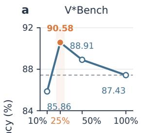

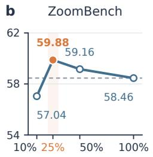

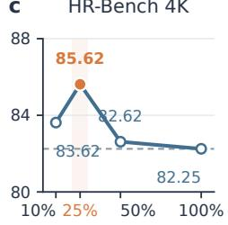

d  
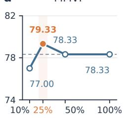

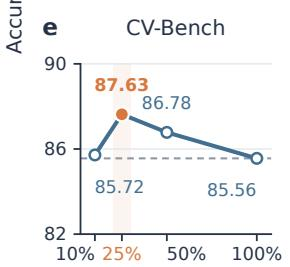

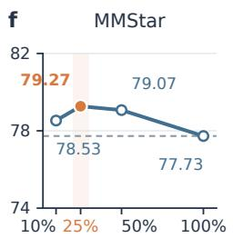

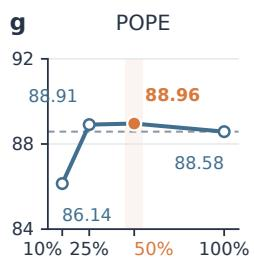

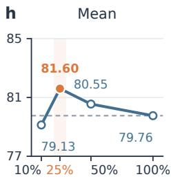  
Figure 2: Qwen3.5-4B accuracy across teacher-query budgets on seven benchmarks; panel (h) is their mean. Orange marks each panel’s maximum; dashed lines mark full querying.

Learned-25 exceeded full querying and Random-25 on all seven benchmarks and outperformed Entropy-25 on six, with gains of 1.22–2.10 points; Entropy-25 led on POPE by 0.49 points. Unlike entropy, the learned target also scores confident, support-consistent teacher corrections. At a 25% query budget, Learned-25 achieved the highest mean accuracy while using 15.78% of full-query scored tokens (Table 3). Appendix C reports detailed token and wall-clock costs.

Effect of query budget. Figure 2 compares four budgets on seven benchmarks. The 25% budget leads six sweeps, while 50% leads on POPE by 0.05 points. At 10%, 25%, 50%, and 100%, the seven-benchmark means are 79.13%, 81.60%, 80.55%, and 79.76%, confirming non-monotonic returns.

Utility concentration and ranking behavior. Figure 3 audits 2,240 rollouts across ten batches. At 25%, learned ranking captures 58.14% of utility, versus 72.70% for the oracle and 25% for random ranking (Figure 3a). Utility decreases across rank bands; the top-quartile mean is 1.75 times the next quartile $( 5 . { \bar { 5 } } 2 \times 1 0 ^ { - 3 }$ versus $3 . 1 5 \times 1 0 ^ { - 3 }$ ; Holm-adjusted $p = 0 . 0 0 6 \mathrm { { ; } }$ ; Figure 3b). Using trainingdistribution batches and a frozen final student instead of the unserialized EMA teacher, this audit diagnoses policy behavior rather than out-of-distribution generalization.

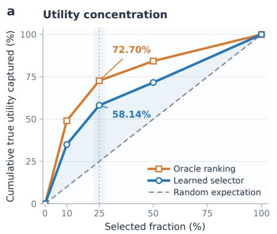

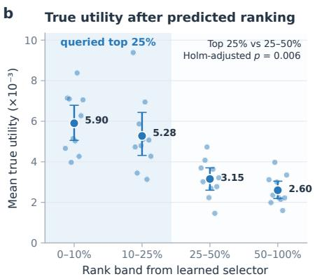

Figure 3: Utility diagnostics over 2,240 candidates from ten batches. (a) Cumulative utility captured by oracle, learned, and random rankings. (b) Mean utility by predicted rank band with 95% bootstrap confidence intervals; p is Holm-adjusted over three one-sided paired sign-flip tests.  
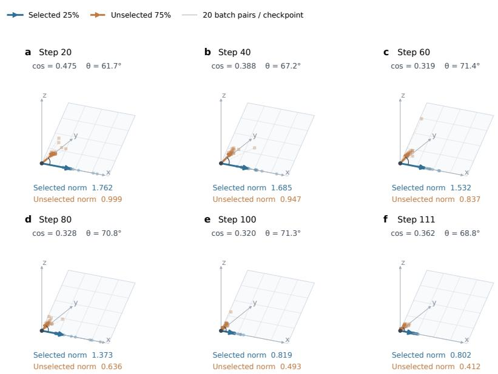  
Figure 4: Gradient geometry for Learned-25 at six checkpoints. Arrows show selected and unselected mean gradients; faint vectors show 20 batch pairs per checkpoint. Coordinates are aligned for display.

Gradient geometry. Figure 4 shows that, across six checkpoints, the selected 25% produced 1.66– 2.16× larger mean OPD gradient norms than the unselected 75%. Cosine similarities of 0.319–0.475 (angles of 61.7◦–71.4◦) indicate partial alignment. These single-trajectory results use 20 batch pairs per checkpoint and do not establish that unselected rollouts are harmful or that 25% is optimal.

Utility-target and selector-design ablations. Table 4 isolates top-k overlap, teacher confidence, ranking supervision, and random exploration. The full selector achieved the highest sevenbenchmark average of 81.60%. Removing individual components lowered average accuracy by 2.79–3.66 points, with teacher confidence causing the largest drop, consistent with its role in downweighting diffuse teacher distributions. On MMStar, the ablations caused larger drops of 7.80–9.87 points, showing that the gains extended to holdout evaluation, although their magnitude varied by benchmark.

Table 4: Component ablations of the learned utility selector across seven benchmarks. Avg. is the unweighted mean across the seven benchmarks.
<table><tr><td rowspan="2">Selector variant</td><td colspan="3">Fine-Grained Visual Tasks</td><td colspan="4">Holdout Tasks</td><td rowspan="2">Avg.</td></tr><tr><td>V*Bench</td><td>Zoom HR-Bench Bench</td><td>4K</td><td>MMVP CV-Bench MMStar POPE</td><td></td><td></td><td></td></tr><tr><td>Without top-k overlap (d c)</td><td>86.39</td><td>57.04</td><td>82.25</td><td>76.33</td><td>86.09</td><td>70.80</td><td></td><td>88.9778.27</td></tr><tr><td>Without teacher confidence (d o)</td><td>88.48</td><td>55.50</td><td>81.00</td><td>77.33</td><td>84.99</td><td>69.40</td><td></td><td>88.8777.94</td></tr><tr><td>Without ranking loss</td><td>89.53</td><td>56.69</td><td>79.38</td><td>76.33</td><td>85.46</td><td>70.53</td><td></td><td>89.11 78.15</td></tr><tr><td>Without random exploration</td><td>85.86</td><td>58.70</td><td>83.38</td><td>77.00</td><td>86.23</td><td>71.47</td><td></td><td>89.0378.81</td></tr><tr><td>Full learned selector (d o c)</td><td>90.58</td><td>59.88</td><td>85.62</td><td>79.33</td><td>87.63</td><td>79.27</td><td></td><td>88.91 81.60</td></tr></table>

## 4 RELATED WORK

## 4.1 ON-POLICY DISTILLATION

Conventional distillation supervises a student on a fixed data distribution, whereas on-policy distillation evaluates the teacher along student-generated trajectories to reduce the train–inference mismatch. GKD trains on student-generated sequences, while MiniLLM and DistiLLM combine student rollouts with alternative divergence objectives or adaptive on- and off-policy mixtures (Agarwal et al., 2024; Gu et al., 2024; Ko et al., 2024). Recent self-distillation methods condition the same model on privileged reasoning traces or demonstrations, extending on-policy learning to mathematical reasoning and continual learning (Zhao et al., 2026; Shenfeld et al., 2026). A complementary analysis identifies teacher–student compatibility, novel teacher capability, and dense token-level su pervision cost as central factors in successful on-policy distillation (Li et al., 2026). Privileged regional supervision has also been explored for multimodal perception (Yuan et al., 2026). BAS-OPD instead addresses query allocation: under a fixed budget, it selects which rollouts should receive supervision before the teacher forward pass.

## 4.2 FINE-GRAINED VISUAL UNDERSTANDING FOR MLLMS

Fine-grained MLLM perception is limited when small but decisive evidence is lost during image encoding. High-resolution architectures retain more detail through dynamic tiling, variable visualtoken counts, or adaptive image slicing, as in InternVL 1.5, Qwen2-VL, and LLaVA-UHD (Chen et al., 2024b; Wang et al., 2024; Guo et al., 2024). Inference-time methods such as V\* and DC2 instead search, partition, or retrieve relevant regions for each query (Wu & Xie, 2024; Wang et al., 2025). These approaches improve access to local evidence, but increase visual processing or introduce additional inference steps. BAS-OPD is complementary: it changes neither the visual architecture nor the inference procedure, but allocates privileged regional supervision selectively during training and retains single-pass full-image inference.

## 5 CONCLUSION AND LIMITATIONS

We introduced BAS-OPD, which allocates crop-teacher supervision under a fixed query budget using online utility estimates. Learned-25 raised the Qwen3.5-4B seven-benchmark average from 79.76% to 81.60% while querying 25% of candidates and using 15.78% of full-query scored tokens; BAS-OPD 9B reached 84.23%. BAS-OPD thus improves the training accuracy–cost trade-off while preserving single-pass full-image inference.

## Limitations.

Selection analyses use Qwen3.5-4B and one seed, and the budget sweep covers seven benchmarks; broader seeds, backbones, and matched 9B ablations remain untested. Wall-clock results depend on implementation and hardware utilization. Because the EMA teacher was not serialized, the frozen-selector audit measures training-distribution subset retrieval rather than out-of-distribution generalization.

## REFERENCES

Rishabh Agarwal, Nino Vieillard, Yongchao Zhou, Piotr Stanczyk, Sabela Ramos, Matthieu Geist, and Olivier Bachem. On-policy distillation of language models: Learning from self-generated mistakes. In The Twelfth International Conference on Learning Representations, 2024.

Lin Chen, Jinsong Li, Xiaoyi Dong, Pan Zhang, Yuhang Zang, Zehui Chen, Haodong Duan, Jiaqi Wang, Yu Qiao, Dahua Lin, and Feng Zhao. Are we on the right way for evaluating large visionlanguage models? In Advances in Neural Information Processing Systems, volume 37, 2024a.

Zhe Chen, Weiyun Wang, Hao Tian, Shenglong Ye, Zhangwei Gao, Erfei Cui, Wenwen Tong, Jiapeng Luo, Zheng Ma, et al. How far are we to GPT-4V? closing the gap to commercial multimodal models with open-source suites. arXiv preprint arXiv:2404.16821, 2024b.

Yuxian Gu, Li Dong, Furu Wei, and Minlie Huang. MiniLLM: Knowledge distillation of large language models. In The Twelfth International Conference on Learning Representations, 2024.

Zonghao Guo, Ruyi Xu, Yuan Yao, Junbo Cui, Zanlin Ni, Chunjiang Ge, Tat-Seng Chua, Zhiyuan Liu, and Gao Huang. LLaVA-UHD: An LMM perceiving any aspect ratio and high-resolution images. In European Conference on Computer Vision, 2024.

Jongwoo Ko, Sungnyun Kim, Tianyi Chen, and Se-Young Yun. DistiLLM: Towards streamlined distillation for large language models. In Proceedings of the 41st International Conference on Machine Learning, volume 235 of Proceedings ofMachine Learning Research, pp. 24872–24895, 2024.

Yaxuan Li, Yuxin Zuo, Bingxiang He, Jinqian Zhang, Chaojun Xiao, Cheng Qian, Tianyu Yu, Huanang Gao, Wenkai Yang, Zhiyuan Liu, and Ning Ding. Rethinking on-policy distillation of large language models: Phenomenology, mechanism, and recipe. arXiv preprint arXiv:2604.13016, 2026.

Yifan Li, Yifan Du, Kun Zhou, Jinpeng Wang, Wayne Xin Zhao, and Ji-Rong Wen. Evaluating object hallucination in large vision-language models. In Proceedings of the 2023 Conference on Empirical Methods in Natural Language Processing, pp. 292–305, 2023.

Long Ouyang, Jeff Wu, Xu Jiang, Diogo Almeida, Carroll L. Wainwright, Pamela Mishkin, Chong Zhang, Sandhini Agarwal, Katarina Slama, Alex Ray, John Schulman, Jacob Hilton, Fraser Kel ton, Luke Miller, Maddie Simens, Amanda Askell, Peter Welinder, Paul Christiano, Jan Leike, and Ryan Lowe. Training language models to follow instructions with human feedback. In Advances in Neural Information Processing Systems, volume 35, pp. 27730–27744, 2022.

Qwen Team. Qwen3.5: Towards native multimodal agents, February 2026. URL https://qwen. ai/blog?id=qwen3.5.

Zhihong Shao, Peiyi Wang, Qihao Zhu, Runxin Xu, Junxiao Song, Xiao Bi, Haowei Zhang, Mingchuan Zhang, Y. K. Li, Y. Wu, and Daya Guo. DeepSeekMath: Pushing the limits of mathematical reasoning in open language models. arXiv preprint arXiv:2402.03300, 2024.

Idan Shenfeld, Mehul Damani, Jonas Hübotter, and Pulkit Agrawal. Self-distillation enables continual learning. arXiv preprint arXiv:2601.19897, 2026.

Shengbang Tong, Ellis Brown, Penghao Wu, Sanghyun Woo, Manoj Middepogu, Sai Charitha Akula, Jihan Yang, Shusheng Yang, Adithya Iyer, Xichen Pan, Ziteng Wang, Rob Fergus, Yann LeCun, and Saining Xie. Cambrian-1: A fully open, vision-centric exploration of multimodal LLMs. In Advances in Neural Information Processing Systems, volume 37, 2024a.

Shengbang Tong, Zhuang Liu, Yuexiang Zhai, Yi Ma, Yann LeCun, and Saining Xie. Eyes wide shut? exploring the visual shortcomings of multimodal LLMs. In Proceedings of the IEEE/CVF Conference on Computer Vision and Pattern Recognition, pp. 9568–9578, 2024b.

Peng Wang, Shuai Bai, Sinan Tan, Shijie Wang, Zhihao Fan, Jinze Bai, Keqin Chen, Xuejing Liu, Jialin Wang, Wenbin Ge, Yang Fan, Kai Dang, Mengfei Du, Xuancheng Ren, Rui Men, Dayiheng Liu, Chang Zhou, Jingren Zhou, and Junyang Lin. Qwen2-VL: Enhancing vision-language model’s perception of the world at any resolution. arXiv preprint arXiv:2409.12191, 2024.

Wenbin Wang, Liang Ding, Minyan Zeng, Xiabin Zhou, Li Shen, Yong Luo, Wei Yu, and Dacheng Tao. Divide, conquer and combine: A training-free framework for high-resolution image perception in multimodal large language models. In Proceedings of the AAAI Conference on Artificial Intelligence, volume 39, pp. 7907–7915, 2025.

Lai Wei, Liangbo He, Jun Lan, Lingzhong Dong, Yutong Cai, Siyuan Li, Huijia Zhu, Weiqiang Wang, Linghe Kong, Yue Wang, Zhuosheng Zhang, and Weiran Huang. Zooming without zooming: Region-to-image distillation for fine-grained multimodal perception. arXiv preprint arXiv:2602.11858, 2026.

Penghao Wu and Saining Xie. V∗: Guided visual search as a core mechanism in multimodal LLMs. In Proceedings of the IEEE/CVF Conference on Computer Vision and Pattern Recognition, pp. 13084–13094, 2024.

Qiying Yu, Zheng Zhang, Ruofei Zhu, Yufeng Yuan, Xiaochen Zuo, Yu Yue, Tiantian Fan, Gaohong Liu, Lingjun Liu, Xin Liu, Haibin Lin, Zhiqi Lin, Bole Ma, Guangming Sheng, Yuxuan Tong, Chi Zhang, Mofan Zhang, Wang Zhang, Hang Zhu, Jinhua Zhu, Jiaze Chen, Jiangjie Chen, Chengyi Wang, Hongli Yu, Weinan Dai, Yuxuan Song, Xiangpeng Wei, Hao Zhou, Jingjing Liu, Wei-Ying Ma, Ya-Qin Zhang, Lin Yan, Mu Qiao, Yonghui Wu, and Mingxuan Wang. DAPO: An opensource LLM reinforcement learning system at scale. arXiv preprint arXiv:2503.14476, 2025.

Qianhao Yuan, Jie Lou, Xing Yu, Hongyu Lin, Le Sun, Xianpei Han, and Yaojie Lu. Vision-OPD: Learning to see fine details for multimodal LLMs via on-policy self-distillation. arXiv preprint arXiv:2605.18740, 2026.

Siyan Zhao, Zhihui Xie, Mengchen Liu, Jing Huang, Guan Pang, Feiyu Chen, and Aditya Grover. Self-distilled reasoner: On-policy self-distillation for large language models. arXiv preprint arXiv:2601.18734, 2026.

## A IMPLEMENTATION DETAILS

## A.1 RANDOM AND ENTROPY SELECTION BASELINES

Random and student-entropy selection use the same query-budget interface as learned selection, but neither trains a utility predictor.

Random-25 samples $K = \lfloor 0 . 2 5 \lvert \mathcal { C } \rvert \rfloor$ eligible rollouts uniformly without replacement at each training step. Sampling uses a CPU random permutation with a seed derived from the selector seed and training step. Only these selected rollouts are sent to the crop teacher. The policy has no trainable selector and requires no additional student forward pass.

Entropy-25 is a fixed student-uncertainty heuristic. When token entropy is already available from the rollout path, each candidate is scored by its mean valid-token entropy. Otherwise, the selector uses mean sampled-token negative log-likelihood (NLL) from the stored rollout log-probabilities. The top-K rows are queried. This policy adds no trainable parameters and requires no additional student forward pass.

## A.2 PREDICTOR CONFIGURATION AND FEATURE HANDLING

Algorithm 1 (line 4) forms the detached feature vector in Eq. 5. The sampled-token negative loglikelihood is $\ell _ { i , t } = - \log p _ { \mathrm { o l d } } ( y _ { i , t } \mid x _ { i } , q _ { i } , y _ { i , < t } ) ; \overline { { \ell } } _ { i }$ and $Q _ { 0 . 9 } ( \ell _ { i } )$ are its response-level mean and 90th percentile. The remaining features are mean token entropy $\overline { { H } } _ { i }$ when available, response length $T _ { i } .$ , prompt length $L _ { i }$ , and crop-to-full-image area ratio $a _ { i }$

The predictor $f _ { \psi }$ consists of layer normalization, one hidden linear layer with a SiLU activation, and a scalar output. The operator Normalize(·) uses running feature statistics, updated on crop-eligible candidates during feature extraction and held fixed during replay updates.

Table 5 gives the selector settings shared by Learned-10, Learned-25, and Learned-50. The predictor runs on the CPU and ranks candidates by predicted utility, without dividing by response-token cost. Running feature normalization uses exponential mean and variance with numerical constant $1 0 ^ { - 6 }$ Unavailable entropy, prompt-length, or crop-area values are represented by zero. If separate teacher top-k indices are unavailable, the implementation sets the overlap factor to one.

Table 5: Learned-selector configuration shared across query budgets.
<table><tr><td>Hyperparameter</td><td>Value</td></tr><tr><td>Feature dimension / hidden dimension</td><td>6/32</td></tr><tr><td>Selector optimizer / learning rate</td><td>Adam  $/ 1 \times 1 0 ^ { - 3 }$ </td></tr><tr><td>Running-normalizer momentum</td><td>0.99</td></tr><tr><td>Replay capacity / start threshold</td><td>512 / 96 labels</td></tr><tr><td>Replay minibatch size</td><td>256</td></tr><tr><td>Selector updates per training step</td><td>2</td></tr><tr><td>Replay age half-life</td><td>10 steps</td></tr><tr><td>Pairwise ranking weight</td><td>0.2</td></tr><tr><td>Minimum utility gap for a pair</td><td> $1 \times 1 0 ^ { - 6 }$ </td></tr><tr><td>Exploration ratio</td><td>0.10</td></tr><tr><td>Selector seed</td><td>0</td></tr><tr><td>Score mode</td><td></td></tr><tr><td></td><td>predicted utility</td></tr></table>

## A.3 SELECTOR TRAINING AND UPDATE HANDLING

Algorithm 1 (line 14) stores observed feature–utility pairs in a bounded first-in, first-out replay buffer together with their collection steps. Replay updates require newly observed valid pairs and the minimum buffer size specified in Table 5. Each update samples a minibatch uniformly without replacement, capped by the current buffer size. At training step $s ,$ an item collected at $s _ { i }$ receives the recency weight $w _ { i } \stackrel { \cdot } { = } 2 ^ { - ( s - s _ { i } ) / h }$ , where h is the age half-life.

For each replay update, we normalize stored features using the current statistics without changing those statistics, and recompute $\hat { u } _ { i }$ with the current predictor while retaining gradients to ψ. The weighted Huber term in Eq. 10 is

$$
\mathcal { L } _ { \mathrm { r e g } } = \frac { \sum _ { i } w _ { i } \ \mathrm { H u b e r } ( \hat { u } _ { i } - u _ { i } ) } { \sum _ { i } w _ { i } } .\tag{12}
$$

The ranking term $\mathcal { L } _ { \mathrm { r a n k } }$ trains the ordering of labeled samples. Each pair $( i , j )$ with $| u _ { i } - u _ { j } | >$ $1 0 ^ { - 6 }$ contributes so $\mathrm { \ t p l u s { [ - \mathrm { s g n } ( u _ { i } - u _ { j } ) ( \hat { u } _ { i } - \hat { u } _ { j } ) ] } }$ , weighted by $\sqrt { w _ { i } w _ { j } }$ . Features and targets are detached, and the selector has a separate optimizer, so $\mathcal { L } _ { \mathrm { s e l } }$ does not update the MLLM.

The denominator of Eq. 11 is clamped to at least one. When $s = \emptyset$ , crop-teacher scoring is skipped and the distillation term is zero; the remaining updates follow the standard OPD optimizer and teacher-update rules. The teacher EMA follows a valid student update (Algorithm 1, line 13). An empty selected set provides no new utility labels and therefore does not trigger a replay update.

## B TRAINING AND EVALUATION DETAILS

## B.1 TRAINING CONFIGURATION

Table 6 records the batch configuration and step counts for the four retained policy runs. The maximum model length is 9,216 tokens; the optimizer and remaining training settings are specified in the main experimental setup.

Table 6: Training configurations for the four selection-policy runs.
<table><tr><td>Configuration</td><td>Full querying</td><td>Random-25</td><td>Entropy-25</td><td>Learned-25</td></tr><tr><td>Prompt batch</td><td>28</td><td>28</td><td>28</td><td>28</td></tr><tr><td>Rollouts per prompt</td><td>8</td><td>8</td><td>8</td><td>8</td></tr><tr><td>Candidates per step</td><td>224</td><td>224</td><td>224</td><td>224</td></tr><tr><td>Selected per step</td><td>224</td><td>56</td><td>56</td><td>56</td></tr><tr><td>Completed steps</td><td>111</td><td>111</td><td>111</td><td>111</td></tr><tr><td>Internal query ratio</td><td>100%</td><td>25%</td><td>25%</td><td>25%</td></tr><tr><td>Training seed</td><td>42</td><td>42</td><td>42</td><td>42</td></tr></table>

## B.2 EVALUATION PROTOCOL

Generation uses temperature 0 and seed 42. Benchmark-native option or exact-answer parsing is used when available; remaining free-form answers are judged with GPT-5.5 at temperature 0. CV-Bench is reported as the macro-average of its 2D and 3D accuracy categories, and POPE is reported by accuracy in the policy comparison. The POPE evaluation contains 9,000 samples.

## C TEACHER-SUPERVISION COST

Training cost is recorded directly as the number of selected teacher calls, |S|, and the number of response tokens scored by the teacher, $\textstyle \sum _ { i \in S } T _ { i }$

Figure 5 summarizes the average accuracy and teacher cost. Tables 7 and 8 provide the recorded supervision counts and observed training times underlying the main accuracy–cost comparison.

Teacher-scored tokens. Random-25 and Entropy-25 used 26.28% and 27.65% of full-query teacher-scored tokens, whereas Learned-25 used 15.78% (Table 3). These reductions of 10.50 and 11.87 percentage points reflect shorter selected responses, since all three policies queried one quarter of their candidates. Learned-25 therefore combined the highest aggregate accuracy with the fewest scored tokens.

Observed training time. Wall-clock savings were smaller: Learned-25 reduced accumulated teacher-forward time by 16.02% and total step time by 9.84% relative to full querying. Student generation, communication, data loading, and rollout scheduling remain substantial costs. We therefore report teacher calls, scored tokens, teacher-forward time, and total step time together, with measurement details and comparability limits in Table 8.

Budget-aware selection improves average fine-grained visual performance  
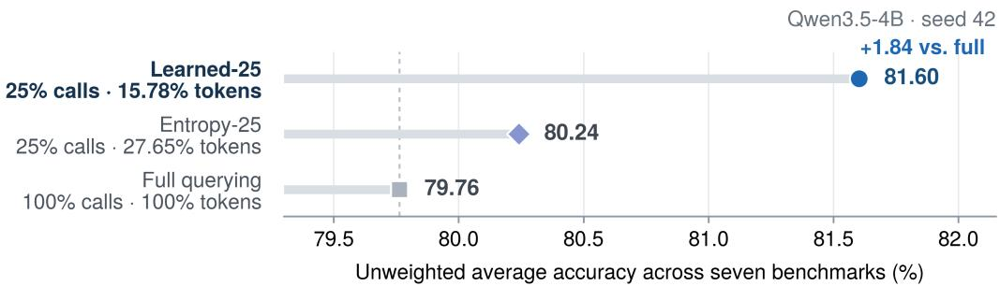  
Figure 5: Accuracy–cost comparison on Qwen3.5-4B (seed 42). Points show the unweighted mean accuracy across seven benchmarks. Row labels report the teacher-query budget and the ratio of scored tokens to full querying.

Table 7: Measured teacher-supervision cost. Token ratios use Full querying as the denominator. For Learned-25, the 25% budget is computed directly from the recorded aggregate counts as 6,216/24,864.
<table><tr><td>Policy</td><td>Candidates</td><td>Teacher calls</td><td>Query ratio</td><td>Scored tokens</td><td>Tokens vs. Full</td><td>Max overrun</td></tr><tr><td>Full querying</td><td>24,864</td><td>24,864</td><td>100.00%</td><td>2,167,850</td><td>100.00%</td><td>0</td></tr><tr><td>Random-25</td><td>24,864</td><td>6,216</td><td>25.00%</td><td>569,674</td><td>26.28%</td><td>0</td></tr><tr><td>Entropy-25</td><td>24,864</td><td>6,216</td><td>25.00%</td><td>599,321</td><td>27.65%</td><td>0</td></tr><tr><td>Learned-25</td><td>24,864</td><td>6,216</td><td>25.00%</td><td>342,089</td><td>15.78%</td><td>0</td></tr></table>

Table 8: Observed training time on the original machines. These measurements are secondary because code path, device utilization, and rollout scheduling are not fully controlled across runs.
<table><tr><td>Policy</td><td>Teacher forward sum</td><td>Mean teacher/step</td><td>Mean step</td><td>Total step time</td></tr><tr><td>Full querying</td><td>5,174.38 s</td><td>46.62 s</td><td>499.88 s</td><td>55,487.15 s</td></tr><tr><td>Random-25</td><td>4,705.55 s</td><td>42.39s</td><td>468.95 s</td><td>52,053.55 s</td></tr><tr><td>Entropy-25</td><td>4,690.39 s</td><td>42.26s</td><td>469.30s</td><td>52,092.85 s</td></tr><tr><td>Learned-25</td><td>4,345.38 s</td><td>39.15 s</td><td>450.70 s</td><td>50,027.87 s</td></tr></table>