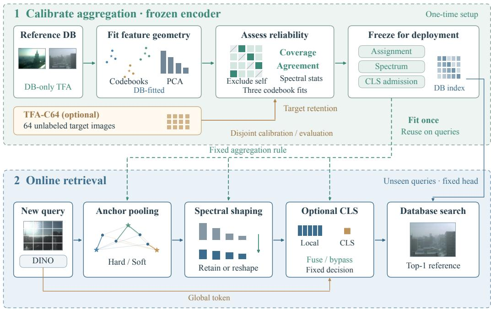
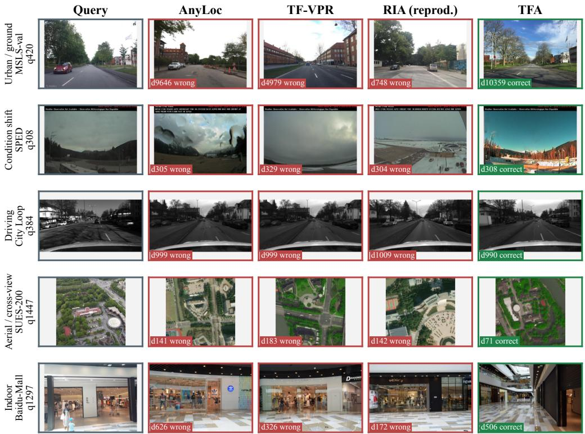
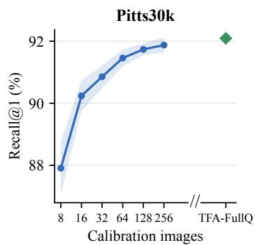
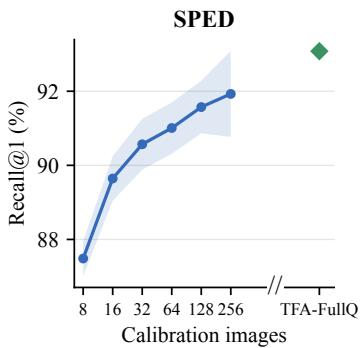
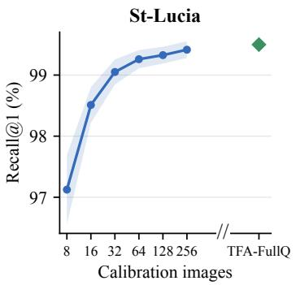
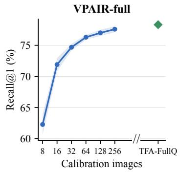
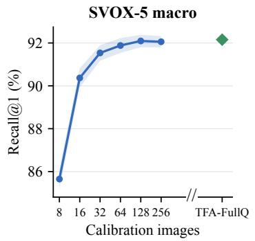
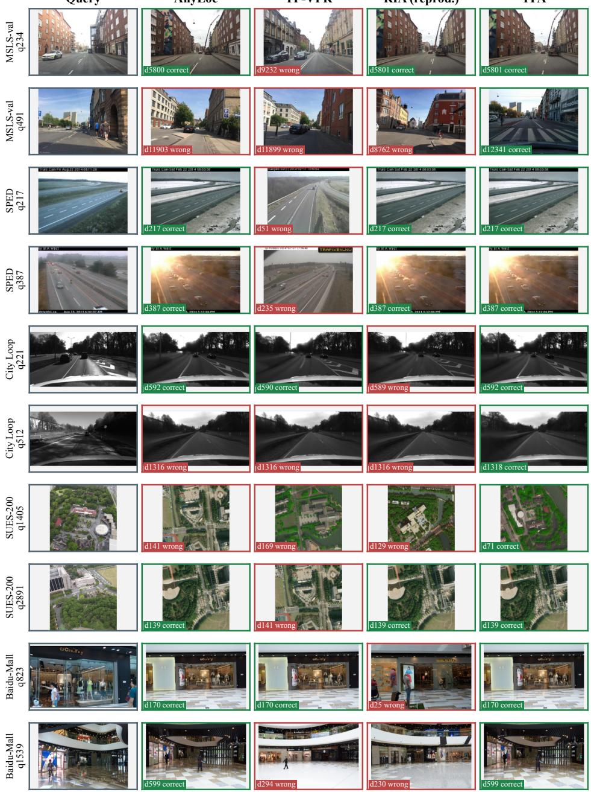
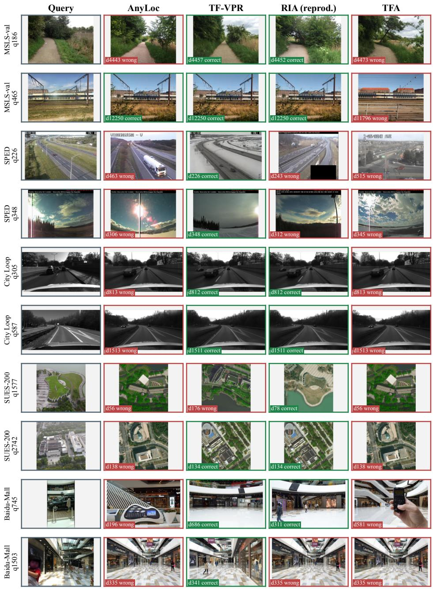

# CALIBRATING RETRIEVAL GEOMETRY: RELIABILITY-GUIDED TRAINING-FREE AGGREGATION FOR VISUAL PLACE RECOGNITION

Xin Li1,2,\*, Zhimin Mao1,2, Shang Wang1,2, Siyuan Duan1,2, Geng Zhang1,\*

1Key Laboratory of Spectral Imaging Technology CAS, Xi’an Institute of Optics and Precision Mechanics,   
Chinese Academy of Sciences, Xi’an, 710119, China 2University of Chinese Academy of Sciences, Beijing, 100049, China

Corresponding authors: lixin200@mails.ucas.edu.cn, gzhang@opt.ac.cn

## ABSTRACT

Frozen visual foundation models offer transferable representations for visual place recognition, but fixed aggregation rules can suppress useful distinctions when deployed in new environments. We introduce TFA, a reliability-guided, training-free aggregation method that calibrates frozen representations without place labels or task-specific weight updates. Our central observation is that reproducible retrieval does not necessarily imply discriminative retrieval: independently constructed codebooks can consistently select a small set of database hubs. TFA combines cross-codebook agreement, retrieval coverage, and spectral statistics to control residual assignment, spectral shaping, and global-feature fusion. The databaseonly variant establishes its rules before accessing deployment queries; TFA-C64 uses 64 disjoint unlabeled target images to assess reference-to-query information retention and calibrate decisions for subsequent queries. Its inner spectral kernel recovers the original descriptor similarity exactly when intervention strengths vanish. Controlled comparisons across 20 ground protocols use a fixed DINOv2-B backbone and identical input resolution. Database-only TFA improves Recall@1 over AnyLoc by 17.39 percentage points on MSLS-val and 9.55 points on SPED, while comparisons with TFA-C64 show the benefit of the target-aware controller in driving environments. Across eight aerial/cross-view protocols with DINOv2 and DINOv3, database-only TFA attains the highest Recall@1 among the compared training-free heads in 14 of 16 backbone–protocol combinations. In a separate native-system comparison, the DINOv2-G-based 64-image calibration system achieves 91.46% Recall@1 on Pitts30k and 76.29% on VPAIR, exceeding the displayed training-free comparators across all five evaluated benchmarks. These results demonstrate that reliability-guided aggregation can recover additional retrieval capability from frozen representations, providing a practical baseline for new retrieval environments with scarce place supervision.

## 1 INTRODUCTION

Visual place recognition retrieves observations of the same location despite changes in appearance, viewpoint, and sensing conditions. In a new deployment, the reference database may be available well before representative place-labeled training pairs. Frozen visual foundation models make this regime increasingly practical: their dense features can be reused without task-specific encoder training. AnyLoc demonstrated the cross-environment value of combining these features with unsupervised VLAD (Keetha et al., 2024; Oquab et al., 2024). This raises a representation-use question: how much retrieval capability can be recovered from fixed features by adapting their aggregation, without collecting positives or updating model weights?

Aggregation determines which distinctions in the patch representation survive as image-level similarity. A patch can contribute to one anchor or several; dominant descriptor directions can be retained or downweighted; a global token can supply complementary semantic evidence. A fixed choice need not transfer between maps. Under the same frozen feature interface, full whitening improves SPED (Chen et al., 2017) from 76.00 to 85.34 R@1 but reduces AmsterTime (Yildiz et al., 2022) from 45.71 to 0.76. Partial whitening is a substantially stronger general control, yet also leaves map-dependent gains unrecovered. The challenge is therefore to decide which transformation is supported by a new deployment using unlabeled evidence.

  
Figure 1: TFA overview. DB-fitted geometry and reliability evidence determine a fixed aggregation head. C64 adds 64 disjoint target images for calibration. Dashed arrows: fixed controls; solid: data. Feature diagrams are schematic; retrieval shows DB-only SPED q55, seed 0.

The central challenge is interpreting unlabeled evidence. Agreement across independently constructed codebooks can reflect reproducible place structure, or merely the repeated selection of a few database hubs, a known high-dimensional nearest-neighbor phenomenon (Radovanovic et al., ´ 2010). We call the latter failure stable collapse. Broad retrieval support alone has the complementary problem: noisy rankings can cover many database images. Consequently, neither construction stability nor support is sufficient by itself. Their joint behavior provides evidence for adapting aggregation, while database-only measurements may still miss a database–query distribution shift.

We introduce TFA, a database-calibrated aggregation head. Reference images serve as pseudo queries after self and descriptor-equivalent matches are excluded. Support and cross-codebook agreement control assignment, spectral carrier selection, and global-token admission. Split-database spectral statistics determine the strengths of a reversible inner kernel. The complete head is fixed before processing any deployment query; vocabulary fitting and PCA use only the reference database.

Our contributions are a database-only reliability controller for frozen retrieval features, a direct-sum spectral formulation with exact original-geometry fallback at zero intervention, and a scene-stratified evaluation of its transfer across representations. Under a common DINOv2-B interface, TFA improves on all three training-free controls in nine ground protocols and ties the best in one. Its gains over AnyLoc include 17.39 R@1 points on MSLS-val and 9.55 on SPED. The aerial comparison extends the study to DINOv3, with fourteen of sixteen backbone–protocol comparisons favoring TFA over the displayed training-free alternatives.

TFA-C64 extends database-only deployment with 64 disjoint unlabeled target images; TFA-FullQ serves as an idealized full-query calibration reference. A separate larger-backbone, dual-vocabulary

TFA-C64 system retains 97.4–99.8% of its paired full-query R@1 across five map units. These extensions measure the benefit of target observations beyond the database-only deployment setting.

## 2 RELATED WORK

Learned place representations. NetVLAD makes residual aggregation differentiable and learns it with place supervision (Arandjelovic et al., 2016). SALAD reformulates local-feature assignment as´ optimal transport, including a dustbin for features left out of the aggregated representation (Izquierdo & Civera, 2024). BoQ instead learns global queries that aggregate image features through crossattention (Ali-bey et al., 2024). SelaVPR++ adapts foundation models with lightweight modules and combines binary initial retrieval with floating-point global-feature reranking (Lu et al., 2026). These methods provide the supervised reference systems in our comparisons. TFA addresses deployment without task-specific weight optimization, adapting the aggregation rule through unlabeled statistics rather than learned VPR parameters.

Training-free aggregation and segment retrieval. AnyLoc combines off-the-shelf selfsupervised features with unsupervised aggregation, establishing their utility across structured and unstructured environments (Keetha et al., 2024). Its VLAD formulation is the residual-aggregation reference in our experiments. TF-VPR benchmarks frozen foundation features and uses trainingfree graph-attention and cross-attention modules to aggregate token relationships for place retrieval (Wang et al., 2026). Riemannian Invariant Aggregation (RIA) models second-order patch statistics as covariance descriptors and maps their positive-definite geometry into a Euclidean representation; it reports both zero-shot and fine-tuned configurations (Cheng et al., 2026). Our trainingfree comparison concerns its zero-shot formulation. Revisit Anything introduces SegVLAD, which encodes image segments and neighboring-segment groups, then retrieves partial representations to reduce interference from non-overlapping image content (Garg et al., 2024). We compare its pretrained-feature configuration, SegVLAD-PreT, in the complete-system table. These approaches motivate different aggregation units and statistics. TFA focuses on how unlabeled retrieval evidence can determine assignment, spectral intervention, and global-token admission within an image-level residual representation.

Cross-view localization. Sample4Geo learns cross-view representations with a symmetric contrastive objective and hard negatives selected using geographic proximity and feature similarity (Deuser et al., 2023). It is the trained reference in our aerial comparison, using a released University-1652 checkpoint across target protocols. This contrasts task-trained cross-view transfer with aggregation of unchanged foundation features; the two systems retain their respective encoders and training histories.

Statistical calibration. Centering and whitening are established retrieval operations (Jégou & Chum, 2012). TFA contributes evidence for admitting and combining these operations, including database coverage and cross-codebook agreement. TFA-C64 additionally estimates targetdependent decisions from a disjoint unlabeled calibration set. In contrast to test-time or source-free adaptation that optimizes model parameters (Wang et al., 2021; Liang et al., 2020), the encoder remains fixed and subsequent queries reuse the calibrated rule. We distinguish this target-data access from database-only adaptation in the experimental protocol.

## 3 RELIABILITY-CONTROLLED RETRIEVAL GEOMETRY

## 3.1 SETTING AND RESIDUAL REPRESENTATION

Let D denote the reference database and $N _ { d } = | \mathcal { D } |$ its size. For each image x, a frozen encoder returns $n _ { x }$ patch tokens $p _ { i } ( x ) \in \mathbb { R } ^ { d _ { p } } , i = 1 , \ldots , n _ { x }$ , and a global token $g ( x ) ; d _ { p }$ is the patch-feature dimension. Image arguments are omitted when clear. TFA fits its controller exclusively on $\mathcal { D }$ without retrieval labels, poses, or deployment queries. Its statistics and decisions are then fixed for independent query inference. Throughout the main comparisons, TFA denotes this database-only head. TFA-C64 additionally uses 64 disjoint unlabeled target images. The two configurations share residual representations, database-fitted PCA, and the spectral kernel below; their controllers use evidence suited to their available observations. Appendix B defines the target-aware controller.

Following VLAD (Jégou et al., 2010), fit a vocabulary of K centers, indexed by $k = 1 , \ldots , K$ , and normalize its centers to $c _ { k }$ . Write $\operatorname { L 2 } ( u ) = u / \| u \| _ { 2 }$ for a nonzero vector u, with zero vectors left zero, and $\tilde { p } _ { i } = \mathrm { L 2 } ( p _ { i } )$ . For assignment type $\stackrel { } { a } \in \{ H , S \}$ (Hard or Soft), let $w _ { i k } ^ { a }$ be the weight of patch i at center k. Hard gives weight one to the center with largest inner product and zero to the others; Soft uses $\begin{array} { r } { w _ { i k } ^ { S } = \exp ( \langle \tilde { p } _ { i } , c _ { k } \rangle / \tau ) / \sum _ { l = 1 } ^ { K } \exp ( \langle \tilde { p } _ { i } , c _ { l } \rangle / \tau ) } \end{array}$ , where l also indexes centers and $\tau > 0$ is the temperature. Soft assignment follows the weighted-quantization principle (Philbin et al., 2008). Both use the same residual coordinates with intra-normalization (Arandjelovic & Zisserman,´ 2013):

$$
v ^ { a } = \mathrm { L } 2 \left[ \mathrm { L } 2 \left( \sum _ { i = 1 } ^ { n _ { x } } w _ { i k } ^ { a } ( \tilde { p } _ { i } - c _ { k } ) \right) \right] _ { k = 1 } ^ { K } , \qquad a \in \{ H , S \} .\tag{1}
$$

Here $[ \cdot ] _ { k = 1 } ^ { K }$ concatenates the $K$ residual blocks, so $\boldsymbol { v } ^ { a } \in \mathbb { R } ^ { d _ { v } }$ with $d _ { v } = K d _ { p }$ . The construction index set is $ { \mathcal { S } } = \{ 0 , 1 , 2 \}$ . These three vocabulary fits, fixed before evaluation, quantify sensitivity to the anchor bank; their indices are suppressed in descriptor formulas.

## 3.2 DATABASE PSEUDO-QUERY EVIDENCE

A fixed subset $\mathcal { P } \subseteq \mathcal { D }$ , containing at most 5,000 images, is retrieved against the full database. Each pseudo query excludes itself and numerically identical residual descriptors. For each assignment and spectral carrier, we measure the number of distinct retrieved database images and pairwise top-1 agreement across the three vocabulary constructions. Coverage measures whether retrieval distinguishes different reference images; agreement measures whether that behavior persists across vocabulary fits. Agreement alone also rewards a collapsed retriever that always returns the same database image. We therefore use coverage and agreement jointly as unlabeled evidence, rather than interpreting either statistic as correctness.

Hard assignment is admitted over Soft only when it increases support without reducing agreement in every construction pair. Otherwise Soft is retained. The same admission test governs global-token fusion. The statistics and spectral selection rule are defined below; all decisions precede query access.

## 3.3 A REVERSIBLE INNER SPECTRAL KERNEL

For a fixed assignment and construction, database PCA (Jolliffe & Cadima, 2016) provides the mean $\mu \in \mathbb { R } ^ { d _ { v } }$ , an orthonormal basis $U \in \mathbb { R } ^ { d _ { v } \times r }$ , and positive eigenvalues $\lambda _ { j } , j = 1 , \dotsc , r ,$ , where $r$ is the retained rank. Below v denotes a descriptor for this assignment and construction. For a spectral exponent $\gamma \in [ 0 , 1 ]$ ], define

$$
\phi _ { \gamma } ( v ) = \mathrm { L } 2 \left( \mathrm { d i a g } _ { j = 1 } ^ { r } ( \lambda _ { j } ^ { - \gamma / 2 } ) U ^ { \top } ( v - \mu ) \right) .\tag{2}
$$

The operator diag constructs a diagonal matrix. Numerically unsupported directions are excluded. The fixed controls $\gamma = 0 , \frac { 1 } { 2 } , 1$ denote projected centered features, partial whitening, and whitening (Jégou & Chum, 2012). $\mathbf { A } \mathfrak { t } \gamma = 0$ , centering and projection remain active; original-descriptor cosine is defined separately as $S _ { 0 }$ . Scaling by $\lambda _ { i } ^ { - \gamma / 2 }$ progressively reduces the dominance of highvariance directions. Low-variance directions can also carry noise, so stronger whitening need not improve discrimination.

For a query image q and database image d, define original similarity $S _ { 0 } ( q , d ) \ = \ \langle v _ { q } , v _ { d } \rangle$ , centered/projected similarity $S _ { c } ( q , d ) \ = \ \bar { \langle } \phi _ { 0 } ( v _ { q } ) , \phi _ { 0 } ( v _ { d } ) \bar { \rangle }$ , and weighted similarity $S _ { w } \big ( c ; q , d \big ) \ =$ $\langle \phi _ { c } ( v _ { q } ) , \phi _ { c } ( v _ { d } ) \rangle ; v _ { q } , v _ { d }$ are their unit-normalized residual descriptors. The scalar $c \in [ 0 , 1 ]$ controls spectral shaping and $\beta ~ \in ~ [ 0 , 1 ]$ controls centering. Split-database spectral-energy agreement and construction dispersion determine both (Appendix A). To preserve an exact route back to the unprojected descriptor, we mix original, centered, and spectrally weighted similarities. With $\ell ( t ) = \sin ^ { 2 } ( \pi t / 2 )$ for $t \in [ 0 , 1 ]$ , and suppressing the image arguments, the inner kernel is

$$
S _ { A } = ( 1 - \ell ( c ) ) [ ( 1 - \ell ( \beta ) ) { S } _ { 0 } + \ell ( \beta ) { S } _ { c } ] + \ell ( c ) { S } _ { w } ( c ) .\tag{3}
$$

The smooth map ℓ takes [0, 1] to [0, 1] with endpoints zero and one. It is a design choice; the preservation property below follows from the nonnegative mixture and its endpoint weights. This construction uses the standard closure of kernels under nonnegative sums (Aronszajn, 1950).

Proposition 1 (Scope of the fallback). For fixed deployment strengths and nonzero normalized branch descriptors, Eq. (3) is a direct-sum cosine kernel. At $c = \beta = 0$ , it equals $S _ { 0 }$ exactly, regardless of PCA truncation.

Proof. Set $w _ { 0 } = ( 1 - \ell ( c ) ) ( 1 - \ell ( \beta ) ) , w _ { c } = ( 1 - \ell ( c ) ) \ell ( \beta )$ , and $w _ { w } = \ell ( c )$ . All three weights are nonnegative and sum to one. Define the concatenated feature

$$
\Psi ( v ) = [ \sqrt { w _ { 0 } } v ; \sqrt { w _ { c } } \phi _ { 0 } ( v ) ; \sqrt { w _ { w } } \phi _ { c } ( v ) ] .
$$

Its squared norm is $w _ { 0 } + w _ { c } + w _ { w } = 1$ , and its inner product is $w _ { 0 } S _ { 0 } + w _ { c } S _ { c } + w _ { w } S _ { w } ( c ) = S _ { A }$ $\mathrm { A t } ~ c = \beta = 0$ the weights are $( 1 , 0 , 0 )$ , yielding exactly $S _ { 0 }$ without any requirement on the PCA rank. □

This preservation property applies to the inner kernel. The complete head subsequently applies outer carrier selection and CLS admission. The proposition establishes representability and exact fallback, not a guarantee of improved retrieval accuracy; the selection rules are evaluated experimentally.

## 3.4 SUPPORT, AGREEMENT, AND AUXILIARY EVIDENCE

For a candidate retrieval rule m and construction $s \in S .$ , let $t _ { m , s } ( q )$ be the top-1 database index returned for pseudo query $q \in \mathcal { P }$ . The indicator $\mathbf { 1 } \{ E \}$ equals one when condition E holds and zero otherwise; | · | denotes set cardinality. Define

$$
U _ { m } = \frac { 1 } { | \mathcal { S } | } \sum _ { s \in \mathcal { S } } | \{ t _ { m , s } ( q ) : q \in \mathcal { P } \} | , \quad A _ { m } ^ { s s ^ { \prime } } = \frac { 1 } { | \mathcal { P } | } \sum _ { q \in \mathcal { P } } \mathbf { 1 } \{ t _ { m , s } ( q ) = t _ { m , s ^ { \prime } } ( q ) \} .\tag{4}
$$

Here $s , s ^ { \prime } \in \mathcal { S }$ are distinct constructions. The first statistic measures support, the second reproducibility. For candidate rules $m , n$ , let $\begin{array} { r } { D _ { m n } = \operatorname* { m a x } _ { s < s ^ { \prime } } ( A _ { m } ^ { s s ^ { \prime } } - A _ { n } ^ { s s ^ { \prime } } ) } \end{array}$ , with the maximum over construction pairs. For spectral selection at a fixed assignment, m $\ r \in \ \{ 0 , P , A \}$ denotes original cosine $S _ { 0 }$ , partial whitening $S _ { P } = S _ { w } ( 1 / 2 )$ , or the adaptive kernel $S _ { A }$ , respectively. The deployed carrier is selected in the following top-to-bottom order (∧ means “and” and ∨ means $^ { 6 6 } \mathrm { o r } ^ { 3 9 } )$ . This decision rule operationalizes the coverage–consistency criterion:

$$
m ^ { * } = \left\{ \begin{array} { l l } { 0 , } & { U _ { P } \leq U _ { 0 } \land D _ { P 0 } < 0 , } \\ { P , } & { U _ { P } > U _ { A } \lor ( U _ { A } > U _ { P } \land D _ { A P } < 0 ) , } \\ { A , } & { \mathrm { o t h e r w i s e } . } \end{array} \right.\tag{5}
$$

Thus the original geometry is restored when partial whitening fails both support and reproducibility. Partial whitening replaces the adaptive carrier when it expands support, or when adaptive expansion is unanimously less reproducible. An exact support tie preserves the adaptive carrier.

For two candidate rankings, write m ≻ n when $U _ { m } > U _ { n }$ and $D _ { m n } \geq 0$ . Assignment chooses Hard precisely when its adaptive carrier satisfies $H \succ S ;$ here the candidate labels $\check { H } , S$ refer to adaptive retrieval under the two assignments. CLS denotes the encoder’s global token $^ { g , }$ whose branch score is cosine similarity between normalized global tokens. CLS is admitted when equal-weight fusion of database-standardized local and global scores satisfies the same criterion against the local adaptive score. The scale of each branch is its median row-wise score standard deviation on database pseudo queries. These scales and the CLS decision are frozen before outer carrier selection. Appendix A specifies the split statistics and edge conventions.

## 4 EXPERIMENTS

## 4.1 MATCHED HEADS AND SYSTEM-LEVEL CALIBRATION

Training-free heads use DINOv2-B/14 (Oquab et al., 2024) final tokens at $3 2 2 \times 3 2 2$ for the ground comparison, a common database/query protocol, and K64 for VLAD-derived methods. Vocabulary fitting uses at most 300,000 database patches and spectral rank is capped at 4,096. Table 1 fixes the backbone; Table 2 evaluates both DINOv2-B and DINOv3-B (Siméoni et al., 2025) for every aerial protocol. Supervised references retain their trained weights. Appendix C lists the original dataset references and the benchmark releases used for each protocol.

Table 1: Ground retrieval, R@1 (%). Frozen DINOv2-B/14, 3222. TFA: DB-only; C64: 64-query calibration (mean±SD). Protocol: Sec. 4.1; dataset sources: Table 5.
<table><tr><td rowspan="2">Dataset</td><td colspan="2">Supervised References</td><td colspan="5">Training Free Systems</td></tr><tr><td>SALAD</td><td>SelaVPR++</td><td>AnyLoc</td><td>TF-VPR</td><td>RIAd</td><td>TFA</td><td>TFA-C64</td></tr><tr><td colspan="8">Urban / ground</td></tr><tr><td>Pitts30k</td><td>92.37r</td><td>93.21r</td><td>82.12</td><td>84.93</td><td>81.84</td><td></td><td>86.01 84.33±1.59</td></tr><tr><td>Pitts250k</td><td>95.08^</td><td>95.95ⁿ</td><td>82.97</td><td>82.96</td><td>84.73</td><td></td><td>87.01 83.70±1.63</td></tr><tr><td>MSLS-val</td><td>92.03r</td><td>93.78r</td><td>52.70</td><td>41.49</td><td>44.41</td><td>70.09</td><td>71.16±2.55</td></tr><tr><td>St-Lucia</td><td>100.00r</td><td>99.93r</td><td>92.31</td><td>88.11</td><td>85.31</td><td>97.61</td><td>95.72±2.87</td></tr><tr><td>Eynsham</td><td>91.59°</td><td>92.24ⁿ</td><td>76.45</td><td>71.15</td><td>73.13</td><td>88.45</td><td>85.19±3.92</td></tr><tr><td>GSV-Brussels</td><td>95.53</td><td>94.48r</td><td>74.04</td><td>63.06</td><td>63.66</td><td>84.36</td><td>84.75±0.90</td></tr><tr><td>Essex3in1</td><td>90.00r</td><td>91.43™</td><td>78.25</td><td>73.81</td><td>71.11</td><td>82.38</td><td>82.21±0.85</td></tr><tr><td>V4RL shopping</td><td>94.00</td><td>93.53</td><td>89.05</td><td>82.97</td><td>86.97</td><td></td><td>69.54 86.91±2.66</td></tr><tr><td colspan="8">Condition shift</td></tr><tr><td>SPED</td><td>92.09r</td><td>90.77r</td><td>75.57</td><td></td><td>73.48 69.85</td><td></td><td>85.12 83.79±0.63</td></tr><tr><td>Nordland</td><td>86.46^</td><td>94.89r</td><td>29.50</td><td></td><td>29.4621.03</td><td>39.60</td><td>30.23±3.27</td></tr><tr><td>AmsterTime</td><td>58.57™</td><td>57.27™</td><td>45.71</td><td>41.35</td><td>36.50</td><td>44.84</td><td>52.00±1.76</td></tr><tr><td>CrossSeason</td><td>100.00r</td><td>100.00^</td><td>99.83</td><td>100.00</td><td>99.65</td><td>100.00</td><td>99.97±0.08</td></tr><tr><td colspan="8">Driving</td></tr><tr><td>4Seasons Business Campus</td><td>98.35r</td><td>98.65r</td><td>94.84</td><td></td><td>88.27 84.06</td><td></td><td>51.23 95.55±0.65</td></tr><tr><td>4Seasons City Loop</td><td>95.09r</td><td>98.32r</td><td>78.25</td><td></td><td>62.7974.03</td><td></td><td>60.5982.88±0.77</td></tr><tr><td>4Seasons Countryside</td><td>73.53^</td><td>85.06</td><td>28.05</td><td>32.3735.12</td><td></td><td></td><td>12.5836.76±5.75</td></tr><tr><td>4Seasons Office Loop</td><td>99.16r</td><td>98.88r</td><td>90.50</td><td>78.51</td><td>79.49</td><td>7.91</td><td>90.20±0.75</td></tr><tr><td>4Seasons Old Town</td><td>88.96r</td><td>86.94r</td><td>70.24</td><td></td><td>64.5465.58</td><td>9.75</td><td>70.20±1.87</td></tr><tr><td>4Seasons Parking Garage</td><td>100.00</td><td>100.00^</td><td>99.89</td><td></td><td>99.01 99.23</td><td>97.21</td><td>99.30±0.28</td></tr><tr><td>RobotCar nine conditions</td><td>92.84^</td><td>92.39r</td><td>87.82</td><td></td><td>78.93 86.63</td><td></td><td>69.4688.33±0.46</td></tr><tr><td colspan="8">Indoor</td></tr><tr><td>Baidu-Mall</td><td>68.41™</td><td>67.98^</td><td>63.26</td><td></td><td>51.22 58.04</td><td></td><td>56.14 63.55±1.71</td></tr></table>

d: RIA reconstruction; r: checkpoint inference. Bold/underline: best/second-best training-free result (C64 mean). C64 excludes calibration images; other columns use full query sets. RobotCar uses 64 calibration images across nine conditions.

TFA uses database-only calibration; C64 fits the query-calibrated controller on 64 unlabeled images and evaluates the disjoint remainder. The variants share residual representations and the spectral kernel, while their assignment and CLS decision rules differ. Their comparison assesses deployed heads; it does not isolate query access alone. Throughout, mean±SD denotes the mean and sample standard deviation across ten random splits, averaging three codebook recalls within each split. Bold/underline rank reported means; calibration access and evaluation subsets may differ. TFA-FullQ uses all unlabeled queries. Appendix Tables 8 and 9 compare these variants; controller definitions are in Appendices A–B.

The database-only head exceeds AnyLoc, TF-VPR, and RIA on nine ground protocols and ties the best of these baselines on CrossSeason. Its driving results expose a limitation of database pseudoquery evidence: on Office Loop and Old Town, R@1 falls to 7.91 and 9.75, respectively. The query-calibrated variants avoid much of this degradation. Database consistency therefore provides useful adaptation evidence but does not ensure transfer to incoming queries. See Appendix A for the Office Loop failure analysis.

Which head benefits from a new representation? Switching to DINOv3 improves SUES R@1 by 14.72 points for TFA and 10.53 for AnyLoc. On University satellite-to-drone, TFA gains 30.39 points versus 15.55 for RIA: RIA leads with DINOv2-B, TFA with DINOv3-B. Thus representation gains depend on the aggregation head and scene. Supplementary ground comparisons use TFA-FullQ.

Table 2: Aerial / cross-view retrieval, R@1/5/10 (%). TFA: DB-only. Bold/underline rank training-free heads within each backbone. Calibration variants: Table 9; dataset sources: Table 5.
<table><tr><td rowspan="3"></td><td>Trained Reference</td><td colspan="7">Training Free Systems</td></tr><tr><td colspan="2">Sample4Geo</td><td colspan="3">AnyLoc TF-VPR</td><td colspan="2">RIAd</td><td colspan="2">TFA</td></tr><tr><td>R@1 R@5R@10</td><td></td><td>R@1 R@5R@10</td><td>R@1 R@5R@10</td><td></td><td>R@1 R@5R@10</td><td></td><td>R@1 R@5R@10</td><td></td></tr><tr><td colspan="2">Backbone UAV-VisLoc</td><td></td><td></td><td></td><td></td><td></td><td></td><td></td><td></td></tr><tr><td>DINOv2-B</td><td rowspan="2">10.44r 21.33 27.16</td><td rowspan="2">12.98 27.61</td><td rowspan="2">34.89</td><td rowspan="2">6.02 14.96</td><td rowspan="2">20.20</td><td rowspan="2">13.16 26.27</td><td rowspan="2">32.64</td><td rowspan="2"></td><td rowspan="2">15.63 34.02 41.59</td></tr><tr><td></td></tr><tr><td>DINOv3-B</td><td></td><td></td><td>14.38 30.31</td><td>38.25</td><td>10.52 23.34</td><td>29.54</td><td>12.76 23.49</td><td>29.29</td><td>19.94 37.80</td><td>45.17</td></tr><tr><td>VPAIR-full</td><td rowspan="2"></td><td rowspan="2"></td><td rowspan="2">32.20 50.39</td><td rowspan="2">58.62</td><td rowspan="2">23.73 41.61</td><td rowspan="2">49.93</td><td rowspan="2">29.76 44.53</td><td rowspan="2">51.43</td><td rowspan="2">41.20 61.64 69.96</td></tr><tr><td>DINOv2-B</td></tr><tr><td>DINOv3-B</td><td>37.66 49.59 56.25</td><td></td><td>33.96 50.48</td><td>58.36</td><td>36.47 55.36</td><td>64.19</td><td>26.55 39.27</td><td>46.54</td><td>42.10 62.47</td><td>71.24</td></tr><tr><td>SUES-200</td><td></td><td></td><td></td><td></td><td></td><td></td><td></td><td></td><td></td><td></td></tr><tr><td>DINOv2-B</td><td>80.29r 94.38 97.14</td><td></td><td>48.75 76.18</td><td>85.54</td><td>51.22 75.89</td><td>84.77</td><td>54.23 78.97</td><td>87.16</td><td>58.95 81.05 87.43</td><td></td></tr><tr><td>DINOv3-B</td><td></td><td></td><td>59.28 82.40</td><td>89.25</td><td>63.24 85.46</td><td>91.09</td><td>49.95 72.73</td><td>81.65</td><td>73.67 91.43</td><td>95.66</td></tr><tr><td>DenseUAV</td><td></td><td></td><td>5.48 17.9026.74</td><td></td><td></td><td></td><td></td><td></td><td></td><td></td></tr><tr><td>DINOv2-B DINOv3-B</td><td>23.68 47.53 57.53</td><td></td><td>4.26 16.0624.82</td><td></td><td>7.16 24.62 7.21 23.98</td><td>36.72 35.82</td><td>6.05 19.68 29.73 5.95 19.23</td><td>28.47</td><td>8.84 26.93 39.47 8.19 27.17 39.45</td><td></td></tr><tr><td>Park</td><td></td><td></td><td></td><td></td><td></td><td></td><td></td><td></td><td></td><td></td></tr><tr><td>DINOv2-B</td><td>26.52&quot; 62.48 75.62</td><td></td><td>34.4970.29</td><td>82.50</td><td>33.19 69.66</td><td>79.98</td><td>29.56 66.28 78.83</td><td></td><td>38.98 77.72 88.42</td><td></td></tr><tr><td>DINOv3-B</td><td></td><td></td><td>46.1276.42</td><td>85.23</td><td>38.61 71.67</td><td>81.49</td><td>33.74 70.16</td><td>80.27</td><td>46.02 78.22</td><td>86.59</td></tr><tr><td>Urbanscape</td><td></td><td></td><td></td><td></td><td></td><td></td><td></td><td></td><td></td><td></td></tr><tr><td>DINOv2-B</td><td>67.83r 87.43 90.98</td><td></td><td>76.95 92.56</td><td>95.38</td><td>61.24 82.62</td><td>88.82</td><td>69.71 86.13</td><td>91.03</td><td>84.93 95.68 97.25</td><td></td></tr><tr><td>DINOv3-B</td><td></td><td></td><td>82.4193.48</td><td>95.43</td><td>69.70 87.87</td><td>91.83</td><td>74.51 88.29</td><td>92.27</td><td>87.27 95.12 96.43</td><td></td></tr><tr><td>University drone→sat.</td><td></td><td></td><td></td><td></td><td></td><td></td><td></td><td></td><td></td><td></td></tr><tr><td>DINOv2-B</td><td>92.00 97.55 98.13</td><td></td><td>27.59 43.01</td><td>50.01</td><td>22.08 36.56</td><td>43.70</td><td>31.06 49.01</td><td>57.22</td><td>44.29 61.81</td><td>68.78</td></tr><tr><td>DINOv3-B</td><td></td><td></td><td>42.4965.64</td><td>73.94</td><td>41.16 63.46</td><td>71.49</td><td>39.50 58.17</td><td>65.66</td><td>46.81 67.10</td><td>74.03</td></tr><tr><td>University sat.→drone</td><td></td><td></td><td></td><td></td><td></td><td></td><td></td><td></td><td></td><td></td></tr><tr><td>DINOv2-B</td><td>95.15¹ 97.0097.29</td><td></td><td>45.89 58.54 62.53</td><td></td><td>36.09 51.93 58.63</td><td></td><td>66.76 78.08</td><td>81.98</td><td>53.54 65.05</td><td>70.66</td></tr><tr><td>DINOv3-B</td><td></td><td></td><td>71.14 81.4685.92</td><td></td><td>62.62 77.18</td><td>81.03</td><td>82.31 90.16</td><td>92.06</td><td>83.93 92.34</td><td>94.63</td></tr></table>

UAV-VisLoc: coverage-qualified 100m recall; Park/Urbanscape: 50m XY; others: registered identities/positives. SUES averages four heights. Park AnyLoc uses seed0; Urbanscape AnyLoc uses seed0 for D2 and three seeds for D3. TFA/RIA use three replicas. Sample4Geo: University-trained ConvNeXt-B, 3842, shared across backbone rows; r: checkpoint inference; l: author log. Native interfaces: Appendix D.1.

Trained reference systems. SALAD and SelaVPR++ provide ground references; Sample4Geo provides aerial context using one University-trained checkpoint without target fine-tuning. Sample4Geo is stronger on SUES-200, DenseUAV, and University; TFA is stronger on UAV-VisLoc, VPAIR, Park, and Urbanscape. These native-system comparisons show scene-dependent transfer under distinct training and feature interfaces.

Figure 2 compares database-calibrated TFA and baseline retrievals across five scene families.

Additional successes and complementary failures across the same five scene families appear in Appendix Figures 4 and 5.

## 4.2 SMALL DISJOINT CALIBRATION SETS

The TFA-C64 system combines DINOv2-G L31 value features at 640 × 480, source/map vocabularies, and target-score calibration. Statistics are fitted on the disjoint calibration partition and fixed for subsequent queries.

Table 3 compares native systems and calibration budgets. TFA-C64 is competitive on conventional benchmarks and strong on VPAIR. Calibration-size curves appear in Appendix Figure 3. The singlevocabulary B head is separately tested with identical inputs and paired evaluation subsets in Appendix F.

Across the five map units, 64 calibration images preserve 97.41–99.76% of paired full-query absolute R@1. Complementarily, net-gain recovery measures the retained improvement over the uncalibrated system; it is 50.3% on SPED. SVOX uses condition-specific calibration.

  
Figure 2: Selected Top-1 retrievals across five scene families. DINOv2-B, seed 0, DB-only TFA; green/red denote correct/incorrect matches. Each selected query is recovered by TFA but missed by all three baselines. RIA uses our reconstruction. Aggregate results: Tables 1 and 2.

Calibration transfers to held-out queries. With the feature interface fixed, database calibration gives 84.37/96.04/50.71 R@1 on Pitts30k/St-Lucia/VPAIR, versus 92.09/99.50/78.31 with even/odd query cross-fitting. Each query is excluded from its own statistics; cross-fitting remains within 0.29/0.18/0.17 points of full-query calibration. This isolates the benefit of target statistics in that system.

## 4.3 WHY THE OPERATOR DECISIONS MATTER

Table 4 shows why a fixed spectral transformation is insufficient: whitening improves SPED but collapses AmsterTime. Under query-calibrated control, support–agreement selection retains the adaptive spectrum on SPED and partial whitening on Pitts30k and AmsterTime. On the four held out 4Seasons maps, the TFA-FullQ outer selector matches the best displayed spectral candidate, whereas database-only calibration can fail to transfer (Appendix A). Assignment and CLS provide complementary controls: single-anchor assignment helps the Nardo-D3 stress case but hurts a City Loop split; unconditional CLS fusion degrades eight of 17 development cells, while the queryaware retention veto improves the mean by 2.17 points over the local branch. Appendix D.3 gives the component-specific protocols and evidence ablations.

## 4.4 DEPLOYMENT COST

On RTX 3090, the matched AmsterTime benchmark measures 12.468 ms for the DINOv2-B encoder and 1.223 ms for the TFA-FullQ head, including Top-10 search; the head adds 0.410 ms over singleanchor VLAD. Separate H100 measurements quantify database-only and C64 setup and retrieval costs. Appendix D.2 specifies both timing protocols.

Table 3: Native-system comparison, R@1 (%). TFA uses the dual-vocabulary DINOv2-G L31 value configuration at 640 × 480. TFA-CN: N disjoint calibration images (mean±SD); TFA-FullQ (Cross-fit): two-fold query cross-fitting.
<table><tr><td>System</td><td>Backbone/interface</td><td>Pitts30k</td><td>SPED</td><td>St-Lucia</td><td>SVOX-5</td><td>VPAIR-full</td></tr><tr><td colspan="7">Supervised References</td></tr><tr><td>BoQp</td><td>native</td><td>93.7</td><td>92.5</td><td>100</td><td>98.38</td><td>29.3</td></tr><tr><td>SALADp</td><td>DINOv2-B</td><td>92.4</td><td>92.1</td><td>100</td><td>97.66</td><td>22.1</td></tr><tr><td>SelaVPR++</td><td>DINOv2-L (perf.)</td><td>94.4p</td><td>92.75ⁿ</td><td>100.00r</td><td>98.54^</td><td>42.39r</td></tr><tr><td colspan="7">Training Free Systems</td></tr><tr><td>TF-VPRp</td><td>DINOv2-B</td><td>84.3</td><td>77.6</td><td>90.8</td><td>58.54</td><td>67.5</td></tr><tr><td>AnyLoc</td><td>DINOv2-G L31</td><td>87.7p</td><td> $8 5 . 5 0 ^ { r }$ </td><td>96.2p</td><td>85.84™</td><td>66.7p</td></tr><tr><td>SegVLAD-PreT</td><td>G + SAM-H</td><td> $8 { \overline { { 6 . 7 0 } } } ^ { p }$ </td><td> $8 8 . 6 3 ^ { r }$ </td><td> $9 6 . 7 9 ^ { r }$ </td><td> $\underline { { 8 6 . 0 9 } } ^ { r }$ </td><td> ${ 6 9 . 8 0 } ^ { p }$ </td></tr><tr><td>RIA</td><td>DINOv2-G L31</td><td> $8 6 . 7 0 ^ { p }$ </td><td> $6 8 . 3 7 ^ { r }$ </td><td> $9 7 . 2 0 ^ { p }$ </td><td> $4 1 . 7 1 ^ { r }$ </td><td> $\overline { { 4 5 . 2 3 } } ^ { r }$ </td></tr><tr><td>TFA-C64</td><td>DINOv2-G L31</td><td>91.46±.27</td><td>91.01±.6999.26±.1591.88±.34</td><td></td><td></td><td>76.29±.39</td></tr><tr><td colspan="7">Calibration budget for the dual-vocabulary system</td></tr><tr><td>TFA-C8</td><td></td><td>87.91±.86</td><td>87.48±.48 97.12±.57 85.65±.48 62.29±1.66</td><td></td><td></td><td></td></tr><tr><td>TFA-C16</td><td></td><td>90.24±.49</td><td></td><td></td><td></td><td>89.64±.6098.51±.29 90.37±.45 71.90±1.07</td></tr><tr><td>TFA-C32</td><td></td><td>90.85±.37</td><td>90.57±.69</td><td></td><td>99.05±.21 91.54±.36</td><td> $7 4 . 6 8 { \pm } . 5 4 $ </td></tr><tr><td>TFA-C128</td><td></td><td>91.74±.19</td><td>91.57±.71</td><td></td><td>99.33±.14 92.09±.29</td><td> $7 6 . 9 9 2 . 5 0 $ </td></tr><tr><td>TFA-C256</td><td></td><td>91.88±.24</td><td>91.93±1.16</td><td></td><td>99.42±.14 92.06±.26</td><td>77.58±.48</td></tr><tr><td>TFA-FullQ (Cross-fit)</td><td></td><td>92.09</td><td>93.08</td><td>99.50</td><td>92.15</td><td>78.31</td></tr></table>

p: published; r: our inference of comparison methods. Bold/underline: best/second-best training-free system at TFA-C64; additional budgets are unranked. SVOX: five-condition macro. TFA-CN excludes calibration images; other methods use native query sets. Interfaces and RIA reconstruction details: Appendix D.1.

Table 4: Spectral controls and complete heads, R@1 (%). Controls fix the TFA-FullQ assignment; adaptive spectrum is $S _ { A }$ before selection and CLS. C64: mean±SD. Bold/underline: best/secondbest.
<table><tr><td rowspan="2">Map</td><td colspan="4">Spectral controls (TFA-FullQ assignment)</td><td colspan="3">Complete heads</td></tr><tr><td>Original cosine</td><td>Partial whitening</td><td>Full whitening</td><td>Adaptive spectrum</td><td>TFA</td><td>TFA-C64</td><td>TFA-FullQ</td></tr><tr><td colspan="8">(a) Fixed transformations have map-dependent effects</td></tr><tr><td>Pitts30k</td><td>83.97</td><td>86.00</td><td>85.00</td><td>85.64</td><td>86.01</td><td>84.33±1.59</td><td>86.00</td></tr><tr><td>SPED</td><td>76.00</td><td>83.31</td><td>85.34</td><td>85.01</td><td>85.12</td><td>83.79±0.63</td><td>85.01</td></tr><tr><td>AmsterTime</td><td>45.71</td><td>52.69</td><td>0.76</td><td>48.87</td><td>44.84</td><td>52.00±1.76</td><td>52.72</td></tr><tr><td colspan="8">(b) 4Seasons: maps held out from the TFA-FullQ outer-selector design</td></tr><tr><td>City Loop</td><td>80.66</td><td>83.94</td><td>56.16</td><td>82.60</td><td>60.59</td><td>82.88±0.77</td><td>83.94</td></tr><tr><td>Office Loop</td><td>90.50</td><td>89.09</td><td>7.87</td><td>90.54</td><td>7.91</td><td>90.20±0.75</td><td>90.54</td></tr><tr><td>Old Town</td><td>70.71</td><td>67.39</td><td>7.62</td><td>70.71</td><td>9.75</td><td>70.20±1.87</td><td>70.71</td></tr><tr><td>Parking Garage</td><td>99.51</td><td>98.36</td><td>96.99</td><td>97.59</td><td>97.21</td><td>99.30±0.28</td><td>99.51</td></tr><tr><td>Four-map mean</td><td>85.34</td><td>84.69</td><td>42.16</td><td>85.36</td><td>43.87</td><td>85.64±0.51</td><td>86.17</td></tr></table>

C64 excludes calibration images; other columns use full query sets. Spectral controls fix the assignment; complete heads compare deployed configurations with different controllers and calibration access. TFA-FullQ rejects CLS in panel (b); its maps were held out from outer-selector design. C64 macro statistics average maps within each split.

## 5 DISCUSSION AND CONCLUSION

TFA adapts frozen-feature aggregation using only an unlabeled reference database. Its support– agreement controller and reversible spectral kernel provide a practical baseline for new retrieval environments without task-specific weight training. The aerial comparisons show strong performance across two foundation models; the ground results reveal that database consistency can misrepresent deployment conditions. Query-calibrated variants quantify the benefit of target observations under an explicitly different access protocol. The distinction between reference reliability and transfer reliability is central to further progress in training-free retrieval.

## AI USE STATEMENT

Generative AI tools assisted with methodological discussions, experimental design, mathematical exposition, implementation and debugging, interpretation of results, literature discovery, figure preparation, and manuscript editing. Reported retrieval metrics are computed by evaluation programs from model predictions and dataset annotations. The authors are responsible for the accuracy, originality, and reproducibility of the final submission.

## REFERENCES

Amar Ali-bey, Brahim Chaib-draa, and Philippe Giguère. GSV-Cities: Toward appropriate supervised visual place recognition. Neurocomputing, 513:194–203, 2022. doi: 10.1016/j.neucom. 2022.09.127.

Amar Ali-bey, Brahim Chaib-draa, and Philippe Giguère. BoQ: A place is worth a bag of learnable queries. In CVPR, pp. 17794–17803, 2024. doi: 10.1109/CVPR52733.2024.01685.

Relja Arandjelovic and Andrew Zisserman. All about VLAD. In´ CVPR, pp. 1578–1585, 2013. URL https://openaccess.thecvf.com/content\_cvpr\_2013/papers/ Arandjelovic\_All\_About\_VLAD\_2013\_CVPR\_paper.pdf.

Relja Arandjelovic, Petr Gronat, Akihiko Torii, Tomas Pajdla, and Josef Sivic. NetVLAD: CNN´ architecture for weakly supervised place recognition. In CVPR, pp. 5297–5307, 2016.

Nachman Aronszajn. Theory of reproducing kernels. Transactions of the American Mathematical Society, 68:337–404, 1950. doi: 10.1090/S0002-9947-1950-0051437-7.

Gabriele Berton, Valerio Paolicelli, Carlo Masone, and Barbara Caputo. Adaptive-attentive geolocalization from few queries: A hybrid approach. In WACV, pp. 2918–2927, 2021.

Gabriele Berton, Riccardo Mereu, Gabriele Trivigno, Carlo Masone, Gabriela Csurka, Torsten Sattler, and Barbara Caputo. Deep visual geo-localization benchmark. In CVPR, pp. 5396–5407, 2022. URL https://openaccess.thecvf.com/content/CVPR2022/html/ Berton\_Deep\_Visual\_Geo-Localization\_Benchmark\_CVPR\_2022\_paper. html.

Zetao Chen, Adam Jacobson, Niko Sünderhauf, Ben Upcroft, Lingqiao Liu, Chunhua Shen, Ian Reid, and Michael Milford. Deep learning features at scale for visual place recognition. In IEEE International Conference on Robotics and Automation (ICRA), pp. 3223–3230, 2017. doi: 10.1109/ICRA.2017.7989366.

Jintao Cheng, Weibin Li, Zhijian He, Jin Wu, Chi Man Vong, and Wei Zhang. Beyond first-order: Learning riemannian geometries for invariant visual place recognition. arXiv:2602.00841, 2026.

Mark Cummins and Paul Newman. Highly scalable appearance-only SLAM—FAB-MAP 2.0. In Robotics: Science and Systems, 2009. URL https://roboticsproceedings.org/ rss05/p39.pdf.

Ming Dai, Enhui Zheng, Zhenhua Feng, Lei Qi, Jiedong Zhuang, and Wankou Yang. Vision-based UAV self-positioning in low-altitude urban environments. IEEE Transactions on Image Processing, 33:493–508, 2024. doi: 10.1109/TIP.2023.3346279.

Fabian Deuser, Konrad Habel, and Norbert Oswald. Sample4geo: Hard negative sampling for crossview geo-localisation. In Proceedings of the IEEE/CVF International Conference on Computer Vision, pp. 16847–16856, 2023. URL https://arxiv.org/abs/2303.11851.

Bradley Efron. Bootstrap methods: Another look at the jackknife. The Annals of Statistics, 7(1): 1–26, 1979. doi: 10.1214/aos/1176344552.

Kartik Garg, Sai Shubodh Puligilla, Shishir Kolathaya, Madhava Krishna, and Sourav Garg. Revisit anything: Visual place recognition via image segment retrieval. In ECCV, pp. 326–343, 2024.

Sergio Izquierdo and Javier Civera. Optimal transport aggregation for visual place recognition. In CVPR, pp. 17658–17668, 2024. doi: 10.1109/CVPR52733.2024.01672.

Hervé Jégou and Ondˇrej Chum. Negative evidences and co-occurences in image retrieval: The benefit of PCA and whitening. In ECCV, volume 7573 of Lecture Notes in Computer Science, pp. 774–787, 2012. doi: 10.1007/978-3-642-33709-3\_55.

Hervé Jégou, Matthijs Douze, Cordelia Schmid, and Patrick Pérez. Aggregating local descriptors into a compact image representation. In CVPR, pp. 3304–3311, 2010. doi: 10.1109/CVPR.2010. 5540039.

Ian T. Jolliffe and Jorge Cadima. Principal component analysis: A review and recent developments. Philosophical Transactions of the Royal Society A, 374(2065):20150202, 2016. doi: 10.1098/ rsta.2015.0202.

Nikhil Keetha, Avneesh Mishra, Jay Karhade, Krishna Murthy Jatavallabhula, Sebastian Scherer, Madhava Krishna, and Sourav Garg. AnyLoc: Towards universal visual place recognition. IEEE Robotics and Automation Letters, 9(2):1286–1293, 2024. doi: 10.1109/LRA.2023.3343602.

Simon Kornblith, Mohammad Norouzi, Honglak Lee, and Geoffrey Hinton. Similarity of neural network representations revisited. In ICML, volume 97 of Proceedings of Machine Learning Research, pp. 3519–3529, 2019. URL https://proceedings.mlr.press/v97/ kornblith19a.html.

Solomon Kullback and Richard A. Leibler. On information and sufficiency. The Annals ofMathematical Statistics, 22(1):79–86, 1951. doi: 10.1214/aoms/1177729694.

Måns Larsson, Erik Stenborg, Lars Hammarstrand, Torsten Sattler, Marc Pollefeys, and Fredrik Kahl. A cross-season correspondence dataset for robust semantic segmentation. In CVPR, pp. 9532–9542, 2019. URL https://arxiv.org/abs/1903.06916.

Xin Li, Siyuan Duan, Shang Wang, Zhimin Mao, Bingliang Hu, and Geng Zhang. RIM: A retrievalin-matching framework for cross-domain global visual localization of UAVs. Knowledge-Based Systems, 352:117027, 2026. doi: 10.1016/j.knosys.2026.117027.

Jian Liang, Dapeng Hu, and Jiashi Feng. Do we really need to access the source data? Source hypothesis transfer for unsupervised domain adaptation. In ICML, volume 119 of Proceedings of Machine Learning Research, pp. 6028–6039, 2020.

Ashok Litwin-Kumar, Kameron Decker Harris, Richard Axel, Haim Sompolinsky, and L. F. Abbott. Optimal degrees of synaptic connectivity. Neuron, 93(5):1153–1164.e7, 2017. doi: 10.1016/j. neuron.2017.01.030.

Stuart P. Lloyd. Least squares quantization in PCM. IEEE Transactions on Information Theory, 28 (2):129–137, 1982. doi: 10.1109/TIT.1982.1056489.

Feng Lu, Tong Jin, Xiangyuan Lan, Lijun Zhang, Yunpeng Liu, Yaowei Wang, and Chun Yuan. SelaVPR++: Towards seamless adaptation of foundation models for efficient place recognition. IEEE Transactions on Pattern Analysis and Machine Intelligence, 48(3):2731–2748, 2026.

Will Maddern, Geoff Pascoe, Chris Linegar, and Paul Newman. 1 year, 1000 km: The oxford RobotCar dataset. The International Journal of Robotics Research, 36(1):3–15, 2017. doi: 10. 1177/0278364916679498.

Fabiola Maffra, Zetao Chen, and Margarita Chli. Viewpoint-tolerant place recognition combining 2D and 3D information for UAV navigation. In ICRA, pp. 2542–2549, 2018. doi: 10.1109/ICRA. 2018.8460786.

Michael J. Milford and Gordon F. Wyeth. Mapping a suburb with a single camera using a biologically inspired SLAM system. IEEE Transactions on Robotics, 24:1038–1053, 2008.

Maxime Oquab, Timothée Darcet, Théo Moutakanni, Huy V. Vo, Marc Szafraniec, Vasil Khali dov, Pierre Fernandez, Daniel Haziza, Francisco Massa, Alaaeldin El-Nouby, Mahmoud Assran, Nicolas Ballas, Wojciech Galuba, Russell Howes, Po-Yao Huang, Shang-Wen Li, Ishan Misra, Michael Rabbat, Vasu Sharma, Gabriel Synnaeve, Hu Xu, Hervé Jégou, Julien Mairal, Patrick Labatut, Armand Joulin, and Piotr Bojanowski. DINOv2: Learning robust visual features without supervision. Transactions on Machine Learning Research, 2024.

James Philbin, Ondˇrej Chum, Michael Isard, Josef Sivic, and Andrew Zisserman. Lost in quantization: Improving particular object retrieval in large scale image databases. In CVPR, 2008. doi: 10.1109/CVPR.2008.4587635.

Miloš Radovanovic, Alexandros Nanopoulos, and Mirjana Ivanovi´ c. Hubs in space: Popular near-´ est neighbors in high-dimensional data. Journal ofMachine Learning Research, 11:2487–2531, 2010.

Peter J. Rousseeuw and Christophe Croux. Alternatives to the median absolute deviation. Journal ofthe American Statistical Association, 88(424):1273–1283, 1993. doi: 10.1080/01621459.1993. 10476408.

Torsten Sattler, Will Maddern, Carl Toft, Akihiko Torii, Lars Hammarstrand, Erik Stenborg, Daniel Safari, Masatoshi Okutomi, Marc Pollefeys, Josef Sivic, Fredrik Kahl, and Tomas Pajdla. Benchmarking 6DOF outdoor visual localization in changing conditions. In CVPR, pp. 8601–8610, 2018.

Michael Schleiss, Fahmi Rouatbi, and Daniel Cremers. VPAIR—aerial visual place recognition and localization in large-scale outdoor environments. arXiv preprint arXiv:2205.11567, 2022.

Oriane Siméoni, Huy V. Vo, Maximilian Seitzer, Federico Baldassarre, Maxime Oquab, Cijo Jose, Vasil Khalidov, Marc Szafraniec, Seungeun Yi, Michaël Ramamonjisoa, Francisco Massa, Daniel Haziza, Luca Wehrstedt, Jianyuan Wang, Timothée Darcet, Théo Moutakanni, Leonel Sentana, Claire Roberts, Andrea Vedaldi, Jamie Tolan, John Brandt, Camille Couprie, Julien Mairal, Hervé Jégou, Patrick Labatut, and Piotr Bojanowski. DINOv3. arXiv:2508.10104, 2025.

Xun Sun, Yuanfan Xie, Pei Luo, and Liang Wang. A dataset for benchmarking image-based localization. In CVPR, pp. 5641–5649, 2017. URL https://openaccess.thecvf.com/ content\_cvpr\_2017/html/Sun\_A\_Dataset\_for\_CVPR\_2017\_paper.html.

Niko Sünderhauf, Peer Neubert, and Peter Protzel. Are we there yet? challenging SeqSLAM on a 3000 km journey across all four seasons. In ICRA Workshop on Long-Term Autonomy, 2013.

Akihiko Torii, Josef Sivic, Tomas Pajdla, and Masatoshi Okutomi. Visual place recognition with repetitive structures. In CVPR, pp. 883–890, 2013. URL https: //openaccess.thecvf.com/content\_cvpr\_2013/html/Torii\_Visual\_ Place\_Recognition\_2013\_CVPR\_paper.html.

Akihiko Torii, Relja Arandjelovic, Josef Sivic, Masatoshi Okutomi, and Tomas Pajdla. 24/7 place´ recognition by view synthesis. IEEE Transactions on Pattern Analysis and Machine Intelligence, 40(2):257–271, 2018.

Chenxu Wang, Qingtong Meng, Bonan Zhang, and Fusen Guo. TF-VPR: A novel benchmark for training-free visual place recognition. Neurocomputing, 681:133399, 2026. doi: 10.1016/j.neucom.2026.133399.

Dequan Wang, Evan Shelhamer, Shaoteng Liu, Bruno Olshausen, and Trevor Darrell. Tent: Fully test-time adaptation by entropy minimization. In ICLR, 2021.

Frederik Warburg, Søren Hauberg, Manuel López-Antequera, Pau Gargallo, Yubin Kuang, and Javier Civera. Mapillary street-level sequences: A dataset for lifelong place recognition. In CVPR, pp. 2626–2635, 2020.

Patrick Wenzel, Rui Wang, Nan Yang, Qing Cheng, Qadeer Khan, Lukas von Stumberg, Niclas Zeller, and Daniel Cremers. 4Seasons: A cross-season dataset for multi-weather SLAM in autonomous driving. In Pattern Recognition – DAGM German Conference on Pattern Recognition (GCPR), volume 12544 of Lecture Notes in Computer Science, pp. 404–417, 2021. doi: 10.1007/978-3-030-71278-5\_29.

Wenjia Xu, Yaxuan Yao, Jiaqi Cao, Zhiwei Wei, Chunbo Liu, Jiuniu Wang, and Mugen Peng. UAV-VisLoc: A large-scale dataset for UAV visual localization. arXiv preprint arXiv:2405.11936, 2024.

Qi Yan, Jianhao Zheng, Simon Reding, Shanci Li, and Iordan Doytchinov. CrossLoc: Scalable aerial localization assisted by multimodal synthetic data. In CVPR, pp. 17358–17368, 2022. URL https://crossloc.github.io/.

Yibin Ye, Xichao Teng, Shuo Chen, Leqi Liu, Kun Wang, Xiaokai Song, and Zhang Li. Exploring the best way for UAV visual localization under low-altitude multi-view observation condition: A benchmark. In CVPR Findings, pp. 1731–1741, 2026. URL https://github.com/ UAV-AVL/Benchmark.

Burak Yildiz, Seyran Khademi, Ronald Maria Siebes, and Jan van Gemert. AmsterTime: A visual place recognition benchmark dataset for severe domain shift. In International Conference on Pattern Recognition (ICPR), pp. 2749–2755, 2022. doi: 10.1109/ICPR56361.2022.9956049.

Mubariz Zaffar, Shoaib Ehsan, Michael Milford, and Klaus McDonald-Maier. Memorable maps: A framework for re-defining places in visual place recognition. IEEE Transactions on Intelligent Transportation Systems, 22(12):7355–7369, 2021a. doi: 10.1109/TITS.2020.3001228.

Mubariz Zaffar, Sourav Garg, Michael Milford, Julian Kooij, David Flynn, Klaus McDonald-Maier, and Shoaib Ehsan. VPR-Bench: An open-source visual place recognition evaluation framework with quantifiable viewpoint and appearance change. International Journal of Computer Vision, 129:2136–2174, 2021b. doi: 10.1007/s11263-021-01469-5.

Zhedong Zheng, Yunchao Wei, and Yi Yang. University-1652: A multi-view multi-source benchmark for drone-based geo-localization. In ACM Multimedia, pp. 1395–1403, 2020. doi: 10.1145/3394171.3413896.

Runzhe Zhu, Ling Yin, Mingze Yang, Fei Wu, Yuncheng Yang, and Wenbo Hu. SUES-200: A multiheight multi-scene cross-view image benchmark across drone and satellite. IEEE Transactions on Circuits and Systemsfor Video Technology, 33(9):4825–4839, 2023. doi: 10.1109/TCSVT.2023. 3249204.

## A DATABASE-ONLY CONTROLLER

TFA calibrates its aggregation head on the reference database and then processes incoming queries independently. Each assignment uses three database-fitted K64 vocabularies, temperature $\tau = 0 . 0 1$ for $\bar { \mathsf { S o f t } }$ , unit-normalized centers, and the residual definition in the main text. $\mathrm { P } \bar { \mathrm { C A } }$ retains at most $4 { , } 0 9 6$ numerically supported directions. The fixed sample used to fit Pitts250k PCA contains 5,000 database images; retrieval still uses the full gallery.

Split-database spectral statistics. A common database-fitted PCA basis defines the coordinates for measuring construction stability. A seed-0 permutation partitions the database into alternating halves $\mathcal { D } _ { 0 } , \mathcal { D } _ { 1 }$ , indexed by $h \in \{ 0 , 1 \}$ . For construction $s \in \mathcal { S } , U _ { s } , \mu _ { s }$ are its PCA basis and mean, vd is the normalized residual descriptor of database image $d ,$ and $j$ indexes a retained PCA coordinate. These statistics are computed separately for each assignment. Let $e _ { s , h }$ be the vector with entries $\begin{array} { r } { e _ { s , h , j } = | \mathcal { D } _ { h } | ^ { - 1 } \sum _ { d \in \mathcal { D } _ { h } } [ U _ { s } ^ { \top } ( v _ { d } - \mu _ { s } ) ] _ { j } ^ { 2 } } \end{array}$ . Let corr denote Pearson correlation and $\mathrm { c l i p } ( x , a , b ) = \operatorname* { m i n } ( b , \operatorname* { m a x } ( a , x ) )$ . Define $\rho _ { s } = \mathrm { c o r r } ( e _ { s , 0 } , e _ { s , 1 } )$ and $\alpha _ { s } = \mathrm { c l i p } ( \rho _ { s } , 0 , 1 ) ^ { 2 \mathrm { P R } _ { s } ^ { u } }$ where $\begin{array} { r } { \mathrm { P R } _ { s } ^ { u } = ( \sum _ { j } \nu _ { s , j } ) ^ { 2 } / \sum _ { j } \nu _ { s , j } ^ { 2 } } \end{array}$ and $\nu _ { s , j }$ are the eigenvalues of the uncentered database Gram matrix formed from the normalized descriptors. This participation ratio measures spectral dimen sionality (Litwin-Kumar et al., 2017). The correlation measures agreement of per-direction energies. Raising its clipped value to $2 \mathrm { P R } _ { s } ^ { u }$ makes the score more conservative when energy is spread over many directions: at any correlation strictly between zero and one, increasing the exponent lowers the score. The exponent is a fixed reliability heuristic, not a probability derived from a noise model. Undefined correlations are set to zero. For a vector $\boldsymbol { x } = ( x _ { 0 } , x _ { 1 } , x _ { 2 } )$ of construction-level values, define $\mathrm { M A D } ( x ) = \mathrm { m e d i a n } _ { s } \left| x _ { s } - \mathrm { m e d i a n } ( x ) \right|$ |. The normal-consistent MAD scale follows Rousseeuw & Croux (1993). Let Φ be the standard normal cumulative distribution function and $\Phi ^ { - 1 }$ its quantile function. The dispersion-penalized statistic is

$$
L ( x ) = \mathrm { c l i p } \left[ \mathrm { m e d i a n } ( x ) - { \frac { \Phi ^ { - 1 } ( . 9 7 5 ) \mathrm { M A D } ( x ) } { \Phi ^ { - 1 } ( . 7 5 ) { \sqrt { 3 } } } } , 0 , 1 \right] .\tag{6}
$$

Here $L$ is a dispersion-penalized reliability score with a normal-reference scale. With only three dependent vocabulary fits, it is not a calibrated 95% confidence bound. Its role is to reduce intervention when constructions disagree. Let $\mu _ { s , h }$ be the mean normalized descriptor in half $h ,$ and let $\alpha = ( \alpha _ { s } ) _ { s \in \mathcal { S } }$ and $\rho = ( \rho _ { s } ) _ { s \in \mathcal { S } }$ . Then

$$
c = L ( \alpha ) , \qquad \beta = \mathrm { c l i p } \left[ \mathrm { m e d i a n } _ { s } \frac { \| \mu _ { s , 0 } - \mu _ { s , 1 } \| _ { 2 } } { \mathrm { m a x } ( \| \mu _ { s } \| _ { 2 } , 1 0 ^ { - 3 0 } ) } ( 1 - L ( \rho ) ) , 0 , 1 \right] .\tag{7}
$$

These strengths enter Eq. 3. Thus c increases with reproducible spectral energy, while $\beta$ requires both a mean displacement and reduced energy agreement. These definitions specify how evidence sets intervention strength; the kernel’s algebraic fallback property holds independently of this particular scoring rule.

Pseudo-query decisions. All database images are used as pseudo queries when $N _ { d } \leq 5 , 0 0 0 ;$ otherwise a fixed seed-0 subset of 5,000 is used. The gallery is unchanged. We exclude self-matches and numerical duplicates, identified by cosine similarity within $5 \times 1 0 ^ { - 1 3 }$ of one in float64 arithmetic. Hard is selected only if its adaptive score increases distinct-image support and has a nonnegative agreement change in at least one codebook pair; otherwise Soft is selected. Original cosine, partial whitening, and the adaptive kernel then enter Eq. 5.

For CLS admission, the local adaptive score and CLS cosine are separately divided by their median pseudo-query row standard deviations, computed over unmasked gallery entries with population normalization. Their equal mixture is admitted by the same support–agreement test against the local adaptive score. These two scales and the admission decision are fixed before replacing the local carrier. Denote these fixed scales by $\sigma _ { \mathrm { l o c a l } }$ and $\sigma _ { \mathrm { C L S } }$ , the selected local score by $S _ { m ^ { * } }$ , and globaltoken cosine by $S _ { \mathrm { C L S } }$ . At inference an admitted mixture is $\scriptstyle \frac { 1 } { 2 } ( S _ { m ^ { * } } / \sigma _ { \mathrm { l o c a l } } + S _ { \mathrm { C L S } } ) ( \sigma _ { \mathrm { C L S } } )$ ; otherwise the selected local score is used. Exact ranking ties use ascending database index. Reported recalls average the three constructions.

Target-domain calibration. When 64 unlabeled target images are available, TFA-C64 measures transfer from the database to this disjoint calibration set. It shares the residual representation and spectral kernel with TFA, but uses capacity–relation assignment and quality-weighted CLS fusion with a retention test (Appendix B). Thus the two deployed variants differ in controller as well as calibration access. All decisions are fixed before evaluating subsequent queries.

Failure case: within-database reliability does not ensure transfer. On 4Seasons Office Loop, database-only TFA selects Soft assignment, the adaptive spectrum with $c = 0 . 9 8 1 4$ , and CLS fusion, obtaining 7.91% R@1. Replacing only the spectral score by original cosine, while retaining the assignment and CLS decision and scales, recovers 90.54%; fixed partial whitening reaches 89.28%. This intervention identifies spectral shaping as the principal source of the degradation despite favorable database support and cross-codebook agreement. In contrast, TFA-C64 estimates $c \in [ 0 . 0 8 4 , 0 . 2 9 6 ]$ for its selected assignment across ten splits and obtains $9 0 . 2 0 { \pm } 0 . 7 5 \%$ on the disjoint evaluation complements. Six splits retain the adaptive kernel, two select original cosine, and two select partial whitening. In one adaptive split, the spectral mixture weight falls from 99.91% for database-only TFA to 1.73%, preserving predominantly original similarity. C64 also changes assignment and rejects CLS in all ten splits; their individual contributions are not isolated by this comparison. The failure demonstrates that reproducible database discrimination can favor a spectral geometry that does not transfer to target observations; target-domain calibration can substantially reduce the resulting intervention.

## B TFA-C64: CALIBRATION FOR INDEPENDENT QUERY INFERENCE

TFA-C64 uses 64 unlabeled target-domain images to calibrate a fixed head for subsequent retrieval. Vocabulary fitting and PCA remain database-only; target images determine assignment, spectral strengths, and CLS admission. Calibration images are excluded from evaluation, and evaluation queries do not update the head.

We use the dimensions, normalization, assignment labels, and construction set defined in the main text; bold vectors denote the same quantities. Let Q be the disjoint unlabeled calibration set, $N _ { q } =$ $| \mathcal { Q } | = 6 4$ , and $N _ { d } = | \mathcal { D } |$ . All query statistics below refer to calibration images in $\mathcal { Q } ;$ database-index sums run over $j = 1 , \dots , N _ { d }$ , unless PCA coordinates are specified. The positive scalar ϵ denotes a numerical stabilizer in the stated statistic. Clipping, MAD, and the standard-normal quantile $\Phi ^ { - 1 }$ follow Appendix $\mathbf { A } ; \mathbf { 1 } \{ E \}$ is the indicator of event $E$

## B.1 RESIDUAL HYPOTHESES

For each map, row-normalized database patch tokens are used to fit a visual vocabulary ${ \mathcal { C } } =$ $\{ \mathbf { c } _ { k } \} _ { k = 1 } ^ { K } . \ \mathrm { ~ A ~ }$ predefined set of independent codebook constructions $s \in \mathcal { S }$ quantifies vocabulary uncertainty.

Database-only K-means (Lloyd, 1982) gives fitted centers $\pmb { \mu } _ { k }$ . We use spherical residual coordinates $\mathbf { c } _ { k } = \mathrm { L 2 } ( \mu _ { k } )$ for both assignment and subtraction. For a normalized patch $\tilde { \mathbf { p } } _ { i } .$ , we then form singleanchor (Hard) and multi-anchor (Soft) assignments

$$
w _ { i k } ^ { H } = \mathbf { 1 } \bigg \{ k = \arg \operatorname* { m a x } _ { 1 \leq l \leq K } \langle \tilde { \mathbf { p } } _ { i } , \mathbf { c } _ { l } \rangle \bigg \} ,\tag{8}
$$

$$
w _ { i k } ^ { S } = \frac { \exp ( \langle \tilde { \bf p } _ { i } , { \bf c } _ { k } \rangle / \tau ) } { \sum _ { l } \exp ( \langle \tilde { \bf p } _ { i } , { \bf c } _ { l } \rangle / \tau ) } , \qquad \tau > 0 .\tag{9}
$$

The corresponding VLAD residual blocks (Jégou et al., 2010) and intra-normalized descriptor (Arandjelovic & Zisserman, 2013) are´

$$
\mathbf { v } _ { k } ^ { a } = \sum _ { i } w _ { i k } ^ { a } ( \widetilde { \mathbf { p } } _ { i } - \mathbf { c } _ { k } ) , \qquad \mathbf { v } ^ { a } = \mathrm { L 2 } \big ( [ \mathrm { L 2 } ( \mathbf { v } _ { 1 } ^ { a } ) ; \dots ; \mathrm { L 2 } ( \mathbf { v } _ { K } ^ { a } ) ] \big ) ,\tag{10}
$$

where $a \in \{ H , S \}$ . Hard assignment removes all non-winning anchor mass; Soft assignment preserves graded residual evidence. Their selection therefore cannot be based only on which construction appears more stable.

Shared geometry and controller-specific evidence. The residual coordinates and spectral mixture are shared with the database-only head. The formulas below define how the target-aware controller uses a calibration set to assess transfer. Information ratios and joint evidence scores are

operational design choices; their role is evaluated through assignment and CLS ablations, separately from the spectral-kernel proof.

## B.2 CAPACITY-COHERENT ASSIGNMENT

Hub-corrected information retention. Let $t _ { a , s } ( q )$ be the top-1 database index of calibration image q under assignment a and codebook s. Its empirical distribution over the three constructions is $p _ { a } ( j | \textit { q } )$ , and $p _ { a } ( j ) = N _ { q } ^ { - 1 } \sum _ { q } p _ { a } ( j | q )$ is the pooled database occupancy; $p _ { a } ( j | q ) =$ $\textstyle | S | ^ { - 1 } \sum _ { s \in { \mathcal { S } } } \mathbf { 1 } \{ t _ { a , s } ( q ) = j \}$ . Using a stabilized, normalized Kullback–Leibler-type score (Kullback & Leibler, 1951), we define

$$
I _ { a } ( q ) = \frac { 1 } { \log \operatorname * { m i n } ( N _ { q } , N _ { d } ) } \sum _ { j } p _ { a } ( j \mid q ) \log \frac { p _ { a } ( j \mid q ) } { p _ { a } ( j ) + \epsilon } .\tag{11}
$$

The marginal correction prevents a repeatedly retrieved hub from being mistaken for informative agreement. Applying the same calculation to leave-self-out database pseudo queries gives $\bar { I } _ { a } ^ { d . }$ ; the calibration-set mean is $\hat { I } _ { a } ^ { q }$ . Their ratio

$$
C _ { a } = \frac { \bar { I } _ { a } ^ { q } } { \bar { I } _ { a } ^ { d } + \epsilon }\tag{12}
$$

measures how much reference-state information survives deployment shift. Write $\mathrm { C I _ { . 9 5 } }$ for a resampling-based 95% interval. A paired bootstrap (Efron, 1979) estimates the 95% interval $\operatorname { C I } _ { C } \doteq \operatorname { C I } _ { . 9 5 } [ \log ( C _ { S } / C _ { H } ) ]$ ; negative values favor Hard and positive values favor Soft.

Independent relational evidence. Capacity measures how much information remains, but not whether the residual geometry is coherent. We therefore evaluate two views: the K residual-block norms (anchor-mass view A) and the complete normalized residual descriptor (global-direction view G). In each view, we compare the calibration-image cosine Gram matrix with the Gram matrix of the corresponding top-1 database matches. The calibration-to-database score matrix also supplies the reciprocal rank of each selected database column among calibration images and the fraction of reciprocal top-1 matches. A self-calibrated joint score combines non-negative centered kernel alignment (Kornblith et al., 2019), mean reciprocal rank, mutual-top-1 support, and effective-rank preservation, each normalized by its database-pseudo-query reference. Let $\kappa , M$ , and F denote these first three terms, and define $u ( x ; x ^ { d } ) = \mathrm { c l i p } ( x ^ { \cdot } / ( x ^ { d } { + } \epsilon ) , 0 , \dot { 1 } ) . \mathrm { I f } r _ { q }$ and $r _ { m }$ denote the effective ranks of the centered query and matched-descriptor Gram matrices, $\bar { P _ { \mathrm { } } } = \operatorname* { m i n } ( r _ { q } / r _ { m } , r _ { m } / r _ { q } )$ measures rank preservation. A superscript d denotes the corresponding database-pseudo-query reference. The joint score is

$$
{ \cal J } = \big [ u ( \kappa ; \kappa ^ { d } ) u ( { \cal M } ; { \cal M } ^ { d } ) u ( { \cal F } ; { \cal F } ^ { d } ) \big ] ^ { 1 / 3 } u ( { \cal P } ; { \cal P } ^ { d } ) .\tag{13}
$$

The geometric mean requires concurrent support from the three normalized terms: a near-zero term limits the combined score. This multiplicative construction expresses a conjunction of evidence, not statistical independence or a calibrated probability of a correct match. Effective rank is the participa tion ratio (Litwin-Kumar et al., 2017) $\textstyle \dot { ( \sum _ { j } \eta _ { j } ) ^ { 2 } } \big / ( \sum _ { j } \eta _ { j } ^ { 2 } + \epsilon )$ of nonnegative Gram eigenvalues $\eta _ { j }$ In ${ \cal J } _ { a } ^ { R }$ , a specifies assignment and R the relational view. For $R \in \{ A , G \}$ , repeated fixed calibration subsamples give

$$
m _ { R } = \mathrm { m e d i a n } ( J _ { S } ^ { R } - J _ { H } ^ { R } ) , \qquad \mathrm { C I } _ { R } = \mathrm { C I } _ { . 9 5 } ( J _ { S } ^ { R } - J _ { H } ^ { R } ) .\tag{14}
$$

Writing $b _ { R } ^ { - } , b _ { R } ^ { + }$ for the bounds of $\mathrm { C I } _ { R }$ and $b _ { C } ^ { + }$ for the upper bound of $\mathrm { C I } _ { C }$ , the frozen assignment route is

$$
\mathcal { R } _ { \mathrm { a s s i g n } } = \left\{ \begin{array} { l l } { H , } & { b _ { A } ^ { + } < 0 \mathrm { ~ \land ~ } b _ { G } ^ { + } < 0 , } \\ { H , } & { b _ { C } ^ { + } < 0 \mathrm { ~ \land ~ } m _ { A } < 0 \mathrm { ~ \land ~ } m _ { G } < 0 , } \\ { R , } & { b _ { A } ^ { - } > 0 , } \\ { S , } & { \mathrm { o t h e r w i s e } . } \end{array} \right.\tag{15}
$$

The first two cases admit evidence deletion only under two-view structural support or under significant capacity loss with coherent relation direction. The route label R denotes a reversible score mixture, distinct from the relational-view index. Let $S _ { H } , S _ { S }$ be the Hard and Soft branch similarities, $S _ { R }$ their mixture, and $w _ { S }$ its Soft weight. For $\delta = \mathrm { c l i p } ( m _ { A } , - 1 , 1 )$

$$
w _ { S } = \sin ^ { 2 } \left( \frac { \pi ( \delta + 1 ) } { 4 } \right) , \qquad S _ { R } = ( 1 - w _ { S } ) S _ { H } + w _ { S } S _ { S } .\tag{16}
$$

Zero is the only decision boundary. Soft is the default because it does not irreversibly discard nonwinning anchor evidence.

## B.3 SUPPORT–AGREEMENT SPECTRAL CARRIER

For the selected assignment, a database-only float64 PCA of normalized VLAD descriptors gives mean $\mu ,$ directions ${ \mathrm { { \bar { \tau } } } } _ { U }$ , and supported eigenvalues $\lambda _ { j } . \mathrm { ~ \bf ~ A ~ }$ direction is retained when $\lambda _ { j } \mathrm { ~ \tiny ~ > ~ }$ $\lambda _ { \operatorname* { m a x } } \operatorname* { m a x } ( N _ { d } , d _ { v } ) \epsilon _ { 6 4 }$ , where $\lambda _ { \mathrm { m a x } }$ is the largest eigenvalue, $d _ { v }$ is the descriptor dimension, and ϵ is float64 machine precision. For exponent $\gamma ,$ let

$$
\begin{array} { r } { \phi _ { \gamma } ( \mathbf { v } ) = \mathrm { L 2 } \Big ( \mathrm { d i a g } [ ( \lambda _ { j } + \epsilon ) ^ { - \gamma / 2 } ] U ^ { \top } ( \mathbf { v } - \pmb { \mu } ) \Big ) . } \end{array}\tag{17}
$$

The conventional controls $\gamma \in \{ 0 , 0 . 5 , 1 \}$ give centered PCA projection, partial whitening, and full whitening (Jégou & Chum, 2012). Original cosine retains the uncentered, unprojected descriptors.

For codebook $s ,$ let $\rho _ { s }$ be the Pearson correlation between per-axis database and calibration-set energies in the PCA basis. If $\{ \nu _ { j } \}$ are the eigenvalues of the uncentered database Gram matrix, its participation ratio is $\mathrm { P R } _ { s } ^ { u } = ( et { } { ' } \sum _ { j } \nu _ { j } ) ^ { 2 } / ( \sum _ { j } \bar { \nu } _ { j } ^ { 2 } + \epsilon )$ . The spectral-transfer score is

$$
\alpha _ { s } = \mathrm { c l i p } ( \rho _ { s } , 0 , 1 ) ^ { 2 \mathrm { P R } _ { s } ^ { u } } .\tag{18}
$$

Both statistics are computed in the residual coordinates of the selected assignment and vocabulary. We aggregate construction dispersion using the normal-consistent MAD scale (Rousseeuw & Croux, 1993). For $N _ { s } = | S |$ replicas, define

$$
\begin{array} { r l r } {  { \widehat { \sigma } _ { \mathrm { M A D } } ( \alpha ) = \frac { \mathrm { M A D } _ { s } ( \alpha _ { s } ) } { \Phi ^ { - 1 } ( 3 / 4 ) } , } } \\ & { } & { z . 9 7 5 = \Phi ^ { - 1 } ( . 9 7 5 ) , } \\ & { } & { c = \mathrm { c l i p } \bigg ( \operatorname* { m e d i a n } _ { s } \alpha _ { s } - \frac { z . 9 7 5 \widehat { \sigma } _ { \mathrm { M A D } } ( \alpha ) } { \sqrt { N _ { s } } } , 0 , 1 \bigg ) . } \end{array}\tag{19}
$$

Here $N _ { s } = 3$ , and c is a reliability score with a normal-reference scale. Applying the same construction to $\rho _ { s }$ gives the robust lower-side estimate $\rho _ { - }$ . If $\Delta _ { \mu }$ is the median relative distance between calibration and database mean descriptors, centering strength is

$$
\beta = \mathrm { c l i p } [ \Delta _ { \mu } ( 1 - \rho _ { - } ) , 0 , 1 ] .\tag{20}
$$

Let $S _ { 0 }$ be the original descriptor cosine, $S _ { c }$ the cosine after centering and projection, and $S _ { w } ( c )$ the cosine after additionally reweighting the supported PCA coordinates by $\lambda _ { j } ^ { - c / 2 }$ . With $\ell ( t ) =$ $\sin ^ { 2 } ( \pi t / 2 )$ , the local score is

$$
S _ { \mathrm { l o c a l } } = ( 1 - \ell ( c ) ) [ ( 1 - \ell ( \beta ) ) { S } _ { 0 } + \ell ( \beta ) { S } _ { c } ] + \ell ( c ) { S } _ { w } ( c ) .\tag{21}
$$

Each branch is independently L2-normalized, making Eq. (21) a direct-sum cosine kernel with the exact fallback $S _ { \mathrm { l o c a l } } = S _ { \mathrm { 0 } } { \mathrm { ~ a t ~ } } c = \beta = 0$

Calibration compares three candidate carriers: $S _ { A } = S _ { \mathrm { l o c a l } }$ , fixed power-0.5 $S _ { P } = S _ { w } ( 1 / 2 )$ , and the original no-PCA cosine $S _ { 0 }$ . For carrier $m$ , let $t _ { m , s } ( q )$ be the Top-1 database index under codebook replica s. Its mean database support and pairwise replica agreement are

$$
\begin{array} { l } { { \displaystyle U _ { m } = \frac { 1 } { N _ { s } } \sum _ { s \in \mathcal { S } } \left. \left\{ t _ { m , s } ( q ) : q \in \mathcal { Q } \right\} \right. , } } \\ { { \displaystyle A _ { m } ^ { i j } = \frac { 1 } { N _ { q } } \sum _ { q } \mathbf { 1 } \{ t _ { m , i } ( q ) = t _ { m , j } ( q ) \} } . } \end{array}\tag{22}
$$

Here $i , j \in S$ index distinct codebook replicas, not image patches. Support alone can reward noisy coverage, whereas agreement alone admits stable collapse. The outer carrier selector therefore uses

$$
m ^ { * } = \left\{ \begin{array} { l l } { 0 , } & { U _ { P } \leq U _ { 0 } \land \operatorname* { m a x } _ { i < j } ( A _ { P } ^ { i j } - A _ { 0 } ^ { i j } ) < 0 , } \\ { P , } & { U _ { P } > U _ { A } , } \\ { P , } & { U _ { A } > U _ { P } \land \operatorname* { m a x } _ { i < j } ( A _ { A } ^ { i j } - A _ { P } ^ { i j } ) < 0 , } \\ { A , } & { \mathrm { o t h e r w i s e } . } \end{array} \right.\tag{23}
$$

Original cosine is restored when partial whitening fails to expand support and is unanimously less reproducible. Power overrides the adaptive carrier when it has a strict support advantage, or when adaptive support expansion is unanimously less reproducible. Otherwise the inner adaptive carrier is preserved, including exact support ties.

## B.4 CLS FUSION WITH A RETENTION VETO

The local score captures anchored patch residuals, whereas CLS supplies global semantic evidence. Their score scales are calibrated from leave-self-out database rows. Let $\sigma _ { b } ^ { d }$ be the median offdiagonal row standard deviation for branch $b \in \{ l , g \}$ , where l denotes local and g denotes CLS. Let $S _ { l }$ be local similarity and $S _ { g }$ cosine similarity of normalized global tokens. Define $B _ { b }$ as the smaller of mean calibration and pseudo-query information for branch $b , J _ { b }$ as its median calibrated relation score, and $H _ { b }$ as its pooled extreme-support coverage, specified below. Branch quality is

$$
Q _ { b } = ( B _ { b } J _ { b } H _ { b } ) ^ { 1 / 3 } ,\tag{24}
$$

If $O _ { b }$ database items are occupied by the pooled top-1 predictions, $M _ { b }$ is the largest observable support, and $p _ { b } ^ { \mathrm { m a x } }$ is the largest pooled occupancy probability, then $H _ { b } = \sqrt { ( O _ { b } / M _ { b } ) / ( p _ { b } ^ { \mathrm { m a x } } M _ { b } ) }$ It penalizes both unused gallery support and a dominant top-1 hub. The cube root preserves the scale of the component scores while penalizing a weak information, relation, or coverage component. This quality score provides nonnegative relative weights for the candidate fusion:

$$
S _ { F } = \frac { Q _ { l } } { Q _ { l } + Q _ { g } } \frac { S _ { l } } { \sigma _ { l } ^ { d } } + \frac { Q _ { g } } { Q _ { l } + Q _ { g } } \frac { S _ { g } } { \sigma _ { g } ^ { d } } .\tag{25}
$$

Quality alone can still overestimate CLS under condition shift. Let $T _ { b }$ be the ratio between the mean top-1 z-score of calibration rows and its database-pseudo-query analogue. We compare CLS with the local branch through score-evidence retention ${ r _ { T } } = { { \bar { T } } _ { g } } / { \dot { ( T } _ { l } } + \epsilon )$ , information-capacity ratio $r _ { C } = B _ { g } / ( B _ { l } + \epsilon )$ , and information–relation reliability ratio

$$
r _ { J } = \frac { \sqrt { B _ { g } J _ { g } } } { \sqrt { B _ { l } J _ { l } } + \epsilon } .\tag{26}
$$

The point test $Q _ { g } \geq Q _ { l }$ is retained only if $r _ { T } \geq 1 . \mathrm { ~ A ~ }$ complementarity rescue is allowed when local and CLS row-dispersion statistics are negatively correlated for every codebook and all three non-collapse ratios are at least one. Specifically, $S _ { l } ^ { s } ( q , j )$ is the local score for query q and database image $j$ under construction $s ,$ while $\bar { \boldsymbol { S } } _ { g } ( \boldsymbol { q } , \boldsymbol { j } )$ is the global-token score. $\mathrm { S t d } _ { j }$ denotes row standard deviation over database images, and $\operatorname { C o r r } _ { q }$ denotes Pearson correlation over calibration queries. Thus co $\mathrm { \Phi } \cdot \mathrm { \Phi } = \mathrm { C o r r } _ { q } [ \mathrm { S t d } _ { j } S _ { l } ^ { s } ( q , j ) , \mathrm { S t d } _ { j } S _ { g } ^ { \dot { } } ( q , j ) ]$ , and

$$
\begin{array} { r } { \mathrm { a d m i t } _ { \mathrm { C L S } } = ( Q _ { g } \geq Q _ { l } \land r _ { T } \geq 1 ) \qquad } \\ { \lor \left( \forall s : \mathrm { c o r r } _ { s } < 0 \land r _ { C } , r _ { T } , r _ { J } \geq 1 \right) . } \end{array}\tag{27}
$$

The CLS decision, local quality, and local score unit are frozen using the inner adaptive carrier $S _ { A }$ before applying Eq. (23). The selected carrier supplies the local score in Eq. (25), using the fixed fusion weights and scales. The final score is $S _ { F }$ with that substitution when CLS is admitted and exactly the selected local carrier otherwise. The boundaries at zero and one express directional support and retention relative to the local branch.

## B.5 CALIBRATION AND DEPLOYMENT

TFA-C64 first evaluates the residual hypotheses on D and the 64 calibration images, fixes assignment, and estimates spectral and CLS controls. The resulting head is reused for every evaluation query without re-estimating target statistics. Calibration requires neither place labels nor modelweight updates.

Full-calibration reference. TFA-FullQ applies the same target-calibration formulation with $\mathcal { Q }$ equal to the entire unlabeled evaluation query set, replacing the budget $N _ { q } = 6 4$ by its full size. This idealized data-access setting provides an empirical full-access reference for finite-sample calibration. Independent deployment uses TFA-C64.

Larger-backbone system. The separate TFA-C64 system in Table 3 combines dual vocabularies with target-score calibration. It likewise fixes its statistics on disjoint calibration images before processing evaluation queries. Appendix D.1 specifies its feature interface and the complementaryfold full-calibration reference.

## C DATASET SOURCES AND PROTOCOL ATTRIBUTION

Table 5 attributes the datasets used in the main comparisons and supplementary analyses. Dataset publications and benchmark releases are distinguished from our retrieval adaptations; a source citation does not imply that our split, gallery construction, or positive threshold is identical to the source paper’s localization experiment.

Table 5: Dataset sources. Multiple maps, conditions, heights, and retrieval directions share their parent dataset reference.
<table><tr><td colspan="2">Dataset / protocols Original source and benchmark attribution</td></tr><tr><td>Pitts30k / Pitts250k</td><td>Pittsburgh imagery (Torii et al., 2013); retrieval splits (Arandjelović et al.,</td></tr><tr><td>MSLS-val</td><td>2016). Mapillary Street-Level Sequences (Warburg et al., 2020).</td></tr><tr><td>St-Lucia</td><td>Milford &amp;Wyeth (2008); curated retrieval release (Berton et al., 2022).</td></tr><tr><td>Eynsham</td><td>Cummins &amp; Newman (2009); curated retrieval release (Berton et al.,</td></tr><tr><td>GSV-Brussels</td><td>2022). Brussels subset of GSV-Cities (Ali-bey et al., 2022).</td></tr><tr><td>Essex3in1</td><td>Zaffar et al. (2021a); VPR-Bench release (Zaffar et al., 2021b).</td></tr><tr><td>SPED</td><td>Specific Places Dataset (Chen et al., 2017).</td></tr><tr><td>Nordland</td><td>Seasonal railway traversals (Sünderhauf et al., 2013).</td></tr><tr><td>AmsterTime</td><td>Historical/contemporary images (Yildiz et al., 2022).</td></tr><tr><td>CrossSeason</td><td>Cross-season correspondences (Larsson et al., 2019); VPR-Bench re-</td></tr><tr><td>4Seasons (six maps)</td><td>lease (Zaffar et al., 2021b). Cross-season driving dataset (Wenzel et al., 2021).</td></tr><tr><td>RobotCar (nine conditions)</td><td>Original data (Maddern et al., 2017); Seasons benchmark (Sattler et al.,</td></tr><tr><td>Baidu-Mall</td><td>2018). Indoor localization dataset (Sun et al., 2017); AnyLoc packaging (Keetha</td></tr><tr><td>V4RL shopping</td><td>et al., 2024). Shopping Street, urban place-recognition dataset (Maffra et al., 2018).</td></tr><tr><td>SVOX (five conditions)</td><td>Street View Oxford (Berton et al., 2021).</td></tr><tr><td>UAV-VisLoc</td><td>UAV imagery and satellite maps (Xu et al., 2024).</td></tr><tr><td>VPAIR-full</td><td>Aerial retrieval/localization dataset (Schleiss et al., 2022).</td></tr><tr><td>SUES-200 (four heights)</td><td>Multi-height drone/satellite benchmark (Zhu et al., 2023).</td></tr><tr><td>DenseUAV</td><td>Low-altitude UAV self-positioning dataset (Dai et al., 2024).</td></tr><tr><td>University (both directions)</td><td>University-1652 (Zheng et al., 2020).</td></tr><tr><td>Urbanscape</td><td>CrossLoc benchmark (Yan et al., 2022); our rendered-reference retrieval</td></tr><tr><td>Park</td><td>protocol. UAV-to-synthetic-map localization environment from RIM (Li et al., 2026), with near-nadir views and extensive low-texture regions; adapted</td></tr><tr><td></td><td>for retrieval.</td></tr><tr><td>Tokyo24/7 Nardo-Air</td><td>View-synthesis place-recognition benchmark (Torii et al., 2018). Aerial stress-test data distributed with AnyLoc (Keetha et al., 2024)</td></tr><tr><td>AnyVisLoc</td><td>Low-altitude multi-view localization benchmark (Ye et al., 2026).</td></tr></table>

Park uses UAV observations and rendered map references from the challenging, largely low-texture environment described in RIM (Li et al., 2026). Urbanscape retains the CrossLoc image source but uses our reference-map retrieval construction. These two protocols use 50 m horizontal-distance positives. UAV-VisLoc uses coverage-qualified 100 m recall. Other protocols retain their registered positive sets. Public data formatting also draws on the Deep Visual Geo-Localization Benchmark (Berton et al., 2022) and, where noted, VPR-Bench (Zaffar et al., 2021b) and AnyLoc (Keetha et al., 2024).

## D EVALUATION PROTOCOLS AND SYSTEM CONFIGURATIONS

Tables 1 and 2 evaluate the database-calibrated TFA head; disjoint target calibration is reported as TFA-C64. Full-query measurements provide a transductive reference. Pittsburgh contributes two related protocols; six 4Seasons maps are grouped for dataset-level counts. RobotCar uses a nine-condition macro and SUES a four-height macro. Pitts250k scores its full gallery while fitting PCA on a fixed 5,000-image sample. Park and Urbanscape AnyLoc controls use seed 0, except Urbanscape DINOv3, which averages three seeds. Primary protocols require at least 500 queries; smaller protocols are used for diagnostics. Retrieval positives follow the released or registered dataset protocol, not one shared geometric radius.

## D.1 NATIVE-SYSTEM INTERFACES

We distinguish three configurations. TFA is the single-vocabulary DB-only head. TFA-C64 and TFA-FullQ use the target-aware controller at finite and full query access, respectively. TFA-CN denotes a calibration budget of N. Table 3 uses the dual-vocabulary G-based system, whereas Table 1 uses the single-vocabulary B-based head. The G-based extension combines a source K32 vocabulary and a map-fitted K64 vocabulary with score calibration. The three map-codebook seeds are experimental replicas, not three fused branches.

Table 3 uses each method’s native interface. SelaVPR++ uses the DINOv2-L performance model at $3 2 2 ^ { 2 }$ , with 512-bit Hamming Top-100 retrieval followed by 4096-D global-feature reranking; Table 1 instead uses its DINOv2-B single-branch model. TF-VPR uses 3362. AnyLoc uses released K32 vocabularies at 640 × 480; SegVLAD-PreT retains native image sizes and segment voting. RIA retains paper values on Pitts30k and St-Lucia; other Table 3 entries use our covariance implementation with Giant L31 value features at 640 × 480, averaged over projection seeds 0/1/42. Sample4Geo uses one University-trained ConvNeXt-B checkpoint at 3842 across all aerial protocols. Its published drone-to-satellite R@1 is 92.65; AP is not substituted for R@5/R@10. Author-log and checkpoint-inference values are marked separately in Table 2.

In Table 3, TFA-FullQ (Cross-fit) uses even/odd folds: each query uses statistics from the opposite fold. Fixed-budget TFA-CN uses disjoint calibration and evaluation sets; evaluation complements vary with N. SVOX uses condition-specific calibration. Cross-system rankings compare reported performance under these declared access settings.

University reverse protocol. University-1652 satellite-to-drone uses 701 queries and 51,355 database images. Predictions are sealed before identity-based evaluation. TFA/AnyLoc average seeds 0/1/2; RIA uses projection seeds 0/1/42; TF-VPR is deterministic.

Dual-vocabulary calibration. The controlled D2-B batch study uses database-fitted K32 and K64 branches, so its gain does not require a released external vocabulary. It fixes partial whitening, equal branch weights, unit temperature, and even/odd folds. It improves the stronger single-capacity branch in 27/28 cells, but exceeds the TFA-FullQ head in 19/23 protocols. RobotCar is a major exception: even/odd calibration gives 71.94 against 89.40 for K64, while contiguous halves give 90.88. Nordland has the opposite split sensitivity, 65.47 versus 56.76. These controls show the sensitivity of score calibration to calibration-set composition.

The G-backbone Cal64 curves use ten disjoint splits per calibration size and three codebooks averaged within each split. Source-like development maps for this score operator are Pitts30k, St-Lucia, and VPAIR; SPED and SVOX use the frozen operator. The reported 97.41–99.76% absoluteperformance retention is different from net-gain recovery, which is 85.1/50.3/21.9/80.3/89.6% for Pitts30k/SPED/St-Lucia/VPAIR/SVOX. The St-Lucia gain is only 0.30 points, making its gainrecovery ratio particularly sensitive to small changes.

Scale controls and timing scope. At fixed final-token 3222 interfaces, the inner-head comparison gives four-map means 73.12/73.17/77.00 for DINOv2-B/L/G and margins 4.00/0.46/1.97 to the strongest matched head. These measurements isolate the inner head, with the final outer selector excluded. Nordland-L is the largest failure,6.79 points below its strongest comparator. Encoder-only batch-one RTX 3090 latencies are 12.47/33.05/100.35 ms for B/L/G; these figures do not measure end-to-end retrieval or map preparation.

## D.2 DEPLOYMENT TIMING

The RTX 3090 batch-one comparison uses FP32, CUDA-resident query tokens, 20 warm-up iterations, and 100 timed batches, with exact Top-10 search over the 1,231-image AmsterTime gallery. Image decoding, resizing, transfers, and map preparation are excluded for all methods. The common DINOv2-B encoder takes 12.468 ms and the TFA-FullQ head takes 1.223 ms, totaling 13.691 ms. This configuration stores 245.62 MiB of database descriptors and 223.88 MiB of projection bases.

Table 6 measures the released database-only and C64 implementations on one H100 PCIe GPU using identical DINOv2-B/14 Pitts30k features at 3222, a 10,000-image gallery, and the same 6,752 evaluation queries. The remaining 64 queries calibrate C64 and are excluded from evaluation for both variants. Three fresh-process repetitions alternate variant execution order, with four CPU threads and a 20-GiB CUDA allocator limit. Setup includes database PCA and controller estimation; shared feature extraction and codebook construction are excluded. Retrieval timings include descriptor loading, transfers, score computation, and Top-10 selection for all three codebook replicas. Repli cas are evaluated independently, rather than fused into an ensemble. The implementations use their native numerical and batching paths; these wall times characterize the released pipelines, including their I/O and intermediate computations. All repetitions produce identical rankings within each variant.

Table 6: Pitts30k deployment costs on H100, mean±sample SD over three repetitions. Retrieval covers 6,752 queries and three codebook replicas. Amortized time is per query per replica, rather than batch-one latency.
<table><tr><td>System</td><td>Setup (s)</td><td>Retrieval (s)</td><td>Amortized (ms)</td></tr><tr><td>TFA</td><td>78.38±1.78</td><td>7.01±0.17</td><td>0.346±0.008</td></tr><tr><td>TFA-C64</td><td>138.52±2.83</td><td>27.22±1.02</td><td>1.344±0.050</td></tr></table>

Within C64 setup, target-aware controller estimation takes 37.93±0.35 s. The additional cost reflects both calibration and implementation-specific computation; it does not isolate the cost of accessing target observations alone.

## D.3 COMPONENT ANALYSIS

The spectral controls in Table 4 isolate transformations under the TFA-FullQ assignment. Its last three columns compare complete database-only, C64, and TFA-FullQ heads. The component ablations below use query-calibrated control and are distinct from that complete-head comparison.

Unlabeled spectral selection. Table 4(a) holds the no-label assignment fixed before changing the spectral operation. Whitening helps SPED but collapses AmsterTime; the same support–agreement rule keeps adaptive on SPED and partial whitening on Pitts30k/AmsterTime. The remaining SPED gap to post-hoc whitening is 0.33 points. On ten carrier configurations, the final head wins/ties/loses 3/7/0 against fixed partial whitening, with an equal-cell mean gain of 0.82 points. Against the earlier adaptive complete head the corresponding count is 7/2/1, mean gain 2.22, and worst change−0.43. The two comparisons quantify gains over a fixed spectrum and an adaptive head, respectively.

Both support and agreement are needed. A support tie incorrectly treated as evidence for partial whitening reduces MSLS-val from 75.86 to 73.29. A support-contraction-only fallback instead sends Tokyo24/7 to original cosine at 87.09, whereas requiring agreement to contradict the intervention gives 92.27. Tokyo serves as a small-query mechanism case. Together these controls demonstrate the complementary roles of retrieval support and cross-construction agreement.

Spectral selection transfers across physical maps. The four maps in Table 4(b) were excluded from formulation of the outer rule. Its predictions were frozen before the registered geometry was read. The rule selects partial/adaptive/original/original, matching the best displayed candidate on all four maps and improving the adaptive-spectrum mean by 0.81. This evaluates outer-selector transfer within a dataset family previously used for inner-head development.

Table 7: Ground-backbone comparison, R@1 (%). TFA uses DB-only calibration; C64 uses disjoint calibration (mean±SD). TFA-FullQ is the transductive reference.
<table><tr><td>Dataset</td><td>Backbone</td><td>AnyLoc</td><td>TF-VPR</td><td> $\mathrm { R I A } ^ { d }$ </td><td>TFA</td><td>TFA-C64</td><td>TFA-FullQ</td></tr><tr><td>MSLS-val</td><td>DINOv2-B</td><td>52.70</td><td>41.49</td><td>44.41</td><td>70.09</td><td>71.16±2.55</td><td>75.86</td></tr><tr><td>MSLS-val</td><td>DINOv3-B</td><td>47.39</td><td>40.54</td><td>39.77</td><td>72.21</td><td>63.17±5.24</td><td>71.53</td></tr><tr><td>SPED</td><td>DINOv2-B</td><td>75.57</td><td>73.48</td><td>69.85</td><td>85.12</td><td>83.79±0.63</td><td>85.01</td></tr><tr><td>SPED</td><td>DINOv3-B</td><td>70.95</td><td>76.94</td><td>69.85</td><td>87.92</td><td>85.75±0.84</td><td>86.55</td></tr><tr><td>Nordland</td><td>DINOv2-B</td><td>29.50</td><td>29.46</td><td>21.03</td><td>39.60</td><td>30.23±3.27</td><td>35.76</td></tr><tr><td>Nordland</td><td>DINOv3-B</td><td>25.15</td><td>30.81</td><td>19.07</td><td>40.17</td><td>31.51±4.90</td><td>30.98</td></tr><tr><td>Essex3in1</td><td>DINOv2-B</td><td>78.25</td><td>73.81</td><td>71.11</td><td>82.38</td><td>82.21±0.85</td><td>83.81</td></tr><tr><td>Essex3in1</td><td>DINOv3-B</td><td>76.35</td><td>66.19</td><td>68.57</td><td>79.68</td><td>78.68±2.54</td><td>81.27</td></tr><tr><td>CrossSeason</td><td>DINOv2-B</td><td>99.83</td><td>100.00</td><td>99.65</td><td>100.00</td><td>99.97±0.08</td><td>100.00</td></tr><tr><td>CrossSeason</td><td>DINOv3-B</td><td>100.00</td><td>100.00</td><td>99.83</td><td>100.00</td><td>100.00±0.00</td><td>100.00</td></tr><tr><td>V4RL shopping</td><td>DINOv2-B</td><td>89.05</td><td>82.97</td><td>86.97</td><td>69.54</td><td>86.91±2.66</td><td>87.29</td></tr><tr><td>V4RL shopping</td><td>DINOv3-B</td><td>91.53</td><td>88.49</td><td>84.57</td><td>72.18</td><td>89.36±2.27</td><td>87.13</td></tr><tr><td>SVOX-5 macro</td><td>DINOv3-B</td><td>50.09</td><td>56.51</td><td>44.50</td><td>68.00</td><td>57.94±7.28</td><td>79.40</td></tr></table>

C64 excludes calibration images; other columns evaluate the full query set. SVOX uses 64 calibration images across five conditions, with macro averaging before split-wise SD. TFA-FullQ is a system-level reference, not a paired calibration-budget ablation.

Complementary roles of assignment and CLS. Stable multi-anchor assignment on the Nardo-D3 stress case obtains 46.48 R@1, whereas single-anchor assignment reaches 68.54. The converse occurs on a 4Seasons City Loop split, where forcing single-anchor assignment loses 2.41 points. In the four-cell City-Loop/Countryside D2/D3 assignment comparison, the capacity–relation rule selects the post-hoc best fixed assignment in three cells and remains within 0.56 points in the fourth.

Across 17 development cells, unconditional CLS fusion has mean gain 0.64 but degrades 8 cells and loses up to 7.51 points. The retention veto has mean gain 2.17, admits a positive change in four cells, and returns exactly to the local branch in thirteen. Selective admission therefore improves the benefi of CLS while preserving the local branch when evidence is weak. The assignment, spectrum, and CLS experiments measure component-specific effects on their respective evaluation populations.

Reproduction and supplementary coverage. AnyLoc’s author-pipeline Pitts30k check gives 87.63/94.69 R@1/R@5 against the reported 87.7/94.7. The RIA reconstruction gives 83.13/91.05, below its fixed-seed 86.36 R@1 reference; it remains explicitly a diagnostic port. Its positive results are nevertheless retained in the University comparison. AnyVisLoc contains 24 scenes. The supplementary SegVLAD adaptation covers seven scenes, so no all-scene aggregate is reported for that adaptation.

Interpreting the mechanism. The confidence statistic in the inner spectral kernel depends on residual coordinates. For SPED-G, retaining native raw center norms changes spectral participation ratios and can make the adaptive gate under-intervene even when fixed whitening remains useful. The result motivates stating the declared unit-center interface precisely, rather than claiming invariance to all backbone facets and residual parameterizations. The direct-sum proposition establishes exact geometric fallback only; empirical recall improvements come from the ablations and held-out decisions, not from an unsupervised accuracy guarantee.

## E ADDITIONAL CALIBRATION RESULTS

Table 8: Ground query-calibrated variants, R@1 (%). DINOv2-B/14, $3 2 2 ^ { 2 }$ . C64: mean±SD; DBonly results appear in Table 1.
<table><tr><td>Dataset</td><td>TFA-C64</td><td>TFA-FullQ</td><td>Dataset</td><td>TFA-C64</td><td>TFA-FullQ</td></tr><tr><td>Pitts30k</td><td> $8 4 . 3 3 { \pm } 1 . 5 9$ </td><td>86.00</td><td>CrossSeason</td><td> $9 9 . 9 7 { \scriptstyle \pm 0 . 0 8 }$ </td><td>100.00</td></tr><tr><td>Pitts250k</td><td> $8 3 . 7 0 { \pm } 1 . 6 3 $ </td><td>87.51</td><td>4S Business Campus</td><td> $9 5 . 5 5 { \pm } 0 . 6 5 $ </td><td>94.64</td></tr><tr><td>MSLS-val</td><td> $7 1 . 1 6 { \pm } 2 . 5 5 $ </td><td>75.86</td><td>4S City Loop</td><td> $8 2 . 8 8 { \pm } 0 . 7 7$ </td><td>83.94</td></tr><tr><td>St-Lucia</td><td> $9 5 . 7 2 { \scriptstyle \pm 2 . 8 7 }$ </td><td>97.95</td><td>4S Countryside</td><td> $3 6 . 7 6 { \pm } 5 . 7 5 $ </td><td>41.85</td></tr><tr><td>Eynsham</td><td> $8 5 . 1 9 { \pm } 3 . 9 2 $ </td><td>88.45</td><td>4S Office Loop</td><td> $9 0 . 2 0 { \pm } 0 . 7 5 $ </td><td>90.54</td></tr><tr><td>GSV-Brussels</td><td> $8 4 . 7 5 { \scriptstyle \pm 0 . 9 0 }$ </td><td>84.36</td><td>4S Old Town</td><td> $7 0 . 2 0 { \scriptstyle \pm 1 . 8 7 }$ </td><td>70.71</td></tr><tr><td>Essex3in1</td><td> $8 2 . 2 1 { \pm } 0 . 8 5 $ </td><td>83.81</td><td>4S Parking Garage</td><td> $9 9 . 3 0 { \pm } 0 . 2 8 $ </td><td>99.51</td></tr><tr><td>SPED</td><td> $8 3 . 7 9 2 0 . 6 3$ </td><td>85.01</td><td>RobotCar (nine cond.)</td><td> $8 8 . 3 3 { \pm } 0 . 4 6 $ </td><td>89.34</td></tr><tr><td>Nordland</td><td> $3 0 . 2 3 { \pm } 3 . 2 7 $ </td><td>35.76</td><td>Baidu-Mall</td><td> $6 3 . 5 5 { \pm } 1 . 7 1 $ </td><td>62.29</td></tr><tr><td>AmsterTime</td><td> $5 2 . 0 0 { \pm } 1 . 7 6 $ </td><td>52.72</td><td>V4RL shopping</td><td> $8 6 . 9 1 { \pm } 2 . 6 6$ </td><td>87.29</td></tr></table>

4S: 4Seasons. TFA-FullQ uses all queries for calibration and evaluation; C64 evaluates the disjoint complement. TFA-FullQ provides a system-level reference; Table 3 compares calibration budgets within a fixed system

Table 9: Aerial query-calibrated variants, R@1/5/10 (%). C64: disjoint 64-query calibration (mean±SD); TFA-FullQ: full-query calibration. DB-only results appear in Table 2.
<table><tr><td colspan="2"></td><td colspan="3">TFA-C64</td><td colspan="4">TFA-FullQ</td></tr><tr><td rowspan="2">Dataset</td><td rowspan="2">Backbone</td><td>R@1</td><td>R@5</td><td></td><td>R@10</td><td>R@1</td><td>R@5</td><td>R@10</td></tr><tr><td>15.05±2.34</td><td>31.54±3.89</td><td>38.92±4.00</td><td></td><td></td><td></td><td></td></tr><tr><td rowspan="2">UAV-VisLoc</td><td>D2-B D3-B</td><td>18.33±2.22</td><td></td><td></td><td>43.90±3.59</td><td>18.50 20.61</td><td>37.46</td><td>44.94</td></tr><tr><td>D2-B</td><td>38.52±2.93</td><td>36.43±3.55 57.56±3.48</td><td>65.71±3.53</td><td></td><td>39.71</td><td>40.42</td><td>47.96</td></tr><tr><td rowspan="2">VPAIR-full</td><td>D3-B</td><td>38.71±1.73</td><td>57.42±1.99</td><td>65.69±1.98</td><td></td><td>40.32</td><td>60.05 60.52</td><td>68.63</td></tr><tr><td>D2-B</td><td>58.65±2.00</td><td>82.58±1.26</td><td>89.72±0.87</td><td></td><td>60.89</td><td>83.77</td><td>69.30 90.45</td></tr><tr><td rowspan="2">SUES-200 DenseUAV</td><td>D3-B</td><td>66.55±2.26</td><td>86.06±1.58</td><td>91.38±1.27</td><td></td><td>73.58</td><td>91.59</td><td>96.00</td></tr><tr><td>D2-B</td><td>7.53±0.82</td><td>23.12±2.41</td><td>34.21±3.53</td><td></td><td>7.85</td><td>24.45</td><td>36.09</td></tr><tr><td rowspan="2">Park</td><td>D3-B</td><td>6.22±1.24</td><td>20.56±3.52</td><td>30.59±4.28</td><td></td><td>8.57</td><td>27.64</td><td>39.34</td></tr><tr><td>D2-B</td><td>36.61±1.33</td><td>74.77±2.05</td><td>85.58±1.81</td><td></td><td>38.97</td><td>78.08</td><td>88.64</td></tr><tr><td rowspan="2">Urbanscape</td><td>D3-B</td><td>44.87±0.58</td><td>80.52±0.81</td><td>88.41±0.98</td><td></td><td>43.18</td><td>80.57</td><td>88.99</td></tr><tr><td>D2-B</td><td>81.97±3.81</td><td>94.21±1.79</td><td></td><td>96.20±1.03</td><td>84.93</td><td>95.78</td><td>97.32</td></tr><tr><td rowspan="2">University D→S</td><td>D3-B</td><td>84.71±1.93</td><td>94.38±0.74</td><td>96.04±0.51</td><td></td><td>87.11</td><td>95.10</td><td>96.33</td></tr><tr><td>D2-B</td><td>40.39±4.40</td><td>58.23±5.23</td><td></td><td>65.39±5.25</td><td>44.27</td><td>61.81</td><td>68.78</td></tr><tr><td rowspan="2">University S→D</td><td>D3-B</td><td>45.28±2.59</td><td>68.72±2.94</td><td>76.78±2.76</td><td></td><td>45.74</td><td>69.59</td><td>77.55</td></tr><tr><td>D2-B</td><td> $5 3 . 7 3 { \scriptstyle \pm 4 . 6 7 }$ </td><td>66.58±4.60</td><td></td><td> $7 1 . 8 4 \pm 5 . 3 5$ </td><td>57.44</td><td>69.09</td><td>75.13</td></tr><tr><td rowspan="2"></td><td>D3-B</td><td> $8 5 . 5 9 { \pm } 0 . 3 7 $ </td><td>93.24±0.25</td><td> $9 4 . 9 9 { \pm } 0 . 1 8 $ </td><td></td><td>85.78</td><td>93.20</td><td>95.01</td></tr><tr><td></td><td></td><td></td><td></td><td></td><td></td><td></td><td></td></tr></table>

D2/D3-B: DINOv2/v3-B; D/S: drone/satellite. SUES uses 64 calibration images across four heights, with macro averaging before split-wise SD. University directions are separate protocols. C64 excludes calibration images; TFA-FullQ evaluates all queries. Metrics follow Table 2. DB-only and query-calibrated variants differ in both control statistics and data access.

## F CALIBRATION-SIZE SENSITIVITY

Paired single-vocabulary calibration. With identical DINOv2-B/14 features at $3 2 2 ^ { 2 }$ and the same target-aware controller, TFA-C64 and TFA-FullQ are evaluated on the same held-out C64 complement in each of ten splits. TFA-FullQ additionally accesses these evaluation images during calibration. Mean R@1 for C64 versus TFA-FullQ is 84.58/86.35 on Pitts30k, 83.79/84.64 on SPED, 95.72/98.04 on St-Lucia, 51.99/52.41 on AmsterTime, and 63.55/62.37 on Baidu-Mall. C64 sample standard deviations are 1.39, 0.63, 2.87, 1.75, and 1.71 points, respectively. The paired results quantify the effect of calibration access within a fixed system, with no uniform advantage from using all queries.

  
TFA-CN ◆ TFA-FullQ (Cross-fit)  
Fixed G dual-vocabulary system Shading: mean ± SD Cross-fit: opposite-fold statistics Separated point: not a batch size  
Figure 3: Disjoint calibration-size experiment, R@1. Blue: DINOv2-G dual-vocabulary TFA-CN system, mean±SD over ten splits. The separated TFA-FullQ (Cross-fit) point uses opposite-fold query statistics (Table 3); its horizontal position is schematic. All points use the same backbone and dual-vocabulary configuration; calibration and evaluation sets follow the stated protocols.

## G EXTENDED CROSS-METHOD RETRIEVAL COMPARISONS

Query  
AnyLoc  
TF-VPR  
RIA (reprod.)  
TFA  
  
Figure 4: Additional Top-1 retrievals where DB-only TFA succeeds and at least one baseline fails (DINOv2-B, seed 0). Green/red indicate correctness under the dataset positives; RIA uses our same-feature reconstruction. Two query-index-tertile examples per dataset exclude the main-figure queries. Images retain their full field of view.

  
Figure 5: Complementary failures: DB-only TFA misses a match recovered by at least one baseline. The protocol and sampling rule follow Figure 4, with two examples per dataset. Correctness follows the dataset positives, not visual similarity alone.