# CODE PLANS, DIFFUSION RENDERS: OPEN-ENDED GENERATIVE WORLD MODELING

Zixun Fang1,2 Yawen Shao1,2 Kai Zhu2 Jie Xiao2 Shihan Chen1 Yu Liu2 Xueyang Fu1 Yang Cao1 Wei Zhai1 Zheng-Jun Zha1

1USTC 2TongYi Lab

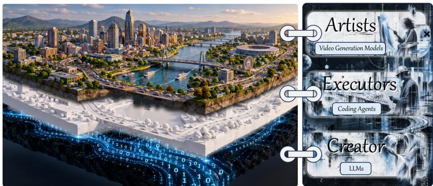  
Figure 1: Our conception of a world: the Creator establishes its rules, the Executors build the world accordingly, and the Artist brings it to life.

## ABSTRACT

We introduce CoDeR, a new paradigm for world modeling. Unlike existing video world models that implicitly represent world dynamics through visual observations, our system explicitly constructs an executable world with code and employs video generation models for visual realization. Specifically, we coordinate five complementary roles to translate high-level concepts into structured world rules, executable dynamics, and perceptual observations. This design enables long-term memory, open-ended interactions, autonomous world evolution, and multi-agent scenarios, where multiple entities can act, interact, and evolve persistently beyond the current observation. Extensive experiments demonstrate that our framework substantially extends the capabilities of existing world models, enabling long-term memory, open-ended interactions, autonomous evolution, and persistent multi-agent dynamics, while achieving state-of-the-art performance across multiple evaluation settings. Code and model weights will be made publicly available. Project Page: CoDeR.

## 1 INTRODUCTION

World modeling aims to simulate interactive environments that evolve in response to agents’ actions, with applications in embodied AI (NVIDIA et al., 2026; Bar et al., 2025), video games (Guo et al., 2025; Sun et al., 2025; Alonso et al., 2024), and virtual reality (Yang et al., 2024b; Xie et al., 2026). Many recent approaches build on video generation models to synthesize visually compelling observations (Yu et al., 2025d; Huang et al., 2026a; Yang et al., 2026; Zhou et al., 2026), incorporating control signals (Yu et al., 2025c; Li et al., 2025b; Mao et al., 2025b; Feng et al., 2025) such as camera poses to enable interaction (He et al., 2025a). However, these approaches often encode world state implicitly in visual histories, which can make it difficult to maintain persistent memory, model off-screen dynamics, and enforce consistent object interactions (Ma et al., 2026b; Li et al., 2025a). Moreover, visual observations reveal only part of a world: underlying states, rules, and relationships—such as resource ownership, physical constraints, and social connections (Park et al., 2023)—can shape future events without being directly visible.

A coherent world should evolve according to well-defined rules, even when it is not being observed. This principle reflects everyday experience: water placed in a functioning freezer continues to cool and eventually freezes. Its evolution depends on physical conditions, rather than its visibility to an observer. This motivates a world representation that maintains persistent state (Garcin et al., 2026; Wang et al., 2026b) and governs its evolution independently of visual observation. Meanwhile, recent large language models (LLMs) exhibit remarkable world knowledge and robust reasoning capabilities, offering a promising route toward this goal: translating a world into executable rules and state transitions (Tang et al., 2024; Piriyakulkij et al., 2025). Such a formulation enables the maintenance of the underlying world representation, while a video generation model synthesizes temporary visual observations on top of the structured world (Zhan et al., 2026).

Realizing this vision requires more than generating executable scene code. A complete world comprises heterogeneous systems, such as transportation, construction, and resource management, each governed by local mechanisms while remaining subject to shared constraints. Constructing these systems therefore requires a way to decompose the world into manageable components and coordinate their interactions. Equally important is the connection between executable state and visual observation: abstract rules and state transitions must be translated into spatial and temporal conditions that a video generation model can follow (Chen et al., 2026a). These challenges call for a framework that organizes world construction and connects its execution to visual synthesis.

To this end, we introduce CoDeR, a framework organized around five complementary roles: the God of Concepts, the Creator, Executors, Artists, and Travelers. Specifically, the God of Concepts expresses the desired world through language or images. The Creator, instantiated as a large language model, interprets this intent, elaborates shared rules and a thematic direction, and produces a world design blueprint. Executors, a group of coding agents, translate the blueprint into executable entities, behaviors, and systems. Artists, implemented as video generation models, transform visual conditions derived from this executable world into detailed artistic realizations. Finally, Travelers explore the environment and experience its unfolding events from their own perspectives. Together with our proposed Logical Spaces strategy and Observation as World Registration paradigm, CoDeR achieves consistent world generation, open-ended interactions, dynamic evolution and multi-agent collaboration.

In summary, our contributions are as follows:

• We introduce CoDeR, a new paradigm for world modeling that coordinates five complementary roles to transform conceptual intent into executable, evolving, and visually expressive worlds.

• We propose Logical Spaces to organize collaborative world construction under shared rules, and Observation as World Registration to integrate generated observations into a persistent world representation, enabling visual information to be retained and reused across viewpoints and interactions.

• Extensive experiments demonstrate the superior performance of CoDeR across key world mod eling capabilities, ranging from persistent memory to multi-agent interaction.

## 2 RELATED WORK

## 2.1 VIDEO GENERATION

Extending image generation to the temporal domain, video generation models aim to synthesize high-quality, temporally coherent videos (NVIDIA et al., 2025a) through training on large-scale video datasets (NVIDIA et al., 2025c). For models trained with flow matching (Lipman et al., 2023), a neural network learns a velocity field along a prescribed path between the data and noise distributions. Formally, let $x _ { 0 }$ denote a clean video sample or its latent representation, c the associated conditioning information, and $\epsilon \sim \mathcal { N } ( 0 , I )$ Gaussian noise. A linear interpolation between data and noise is defined as:

$$
x _ { t } = ( 1 - t ) x _ { 0 } + t \epsilon , \qquad t \in [ 0 , 1 ] .\tag{1}
$$

The model $v _ { \theta }$ is trained to predict the target velocity $\epsilon - x _ { 0 }$ by minimizing:

$$
\mathcal { L } _ { \mathrm { F M } } = \mathbb { E } _ { \boldsymbol { x } _ { 0 } , \boldsymbol { c } , \boldsymbol { \epsilon } , t } \left[ \big | | \boldsymbol { v } _ { \boldsymbol { \theta } } ( \boldsymbol { x } _ { t } , t , \boldsymbol { c } ) - ( \boldsymbol { \epsilon } - \boldsymbol { x } _ { 0 } ) \big | \big | _ { 2 } ^ { 2 } \right] ,\tag{2}
$$

where $( x _ { 0 } , c )$ is sampled from the training distribution and $t \sim \mathcal { U } ( 0 , 1 )$ . At inference, samples are generated by numerically integrating the learned velocity field backward from $t = 1 \mathrm { t o } t = 0 .$ starting from Gaussian noise.

Beyond visual quality, controllable video generation (Tang et al., 2025; Cao et al., 2026; Zhu et al., 2026) aims to provide fine-grained control over the content and dynamics of synthesized videos (Wang et al., 2023). Within the above formulation, the conditioning information c can incorporate structured signals such as human poses (Gao et al., 2026a; Wang et al., 2026c; Li et al., 2026b; Tu et al., 2025), camera trajectories (Zhu et al., 2025), and scene layouts (Kim et al., 2026; NVIDIA et al., 2025b). These signals guide the generation process toward desired spatial configurations and temporal behaviors (Fridman et al., 2023; Zhai et al., 2025).

## 2.2 WORLD MODELING

Beyond passive video synthesis, world models aim to simulate an environment as a persistent process whose state changes in response to actions, events, and the passage of time. Recent advances in generative modeling (Yu et al., 2025a; Huang et al., 2026b; Bahmani et al., 2026) have substantially improved the visual fidelity of such simulated worlds (Huang et al., 2025b; Chen et al., 2025a), while progressively extending them toward interactive, persistent, and autonomous environments.

Interactivity. A fundamental capability of world models is to respond to actions (Tong et al., 2026; Li et al., 2026a; Tang et al., 2026) rather than merely generate a predetermined visual trajectory. Early works such as Genie Bruce et al. (2024) learn action-controllable environments from largescale videos, while GameNGen Valevski et al. (2025) demonstrates that a diffusion model can directly serve as a real-time neural game engine. Subsequent approaches, including GameGen-X Che et al. (2025), Matrix-Game Zhang et al. (2025), and its real-time extensions (He et al., 2025b; Wang et al., 2026e), further improve action controllability, visual quality, and streaming efficiency (Sun et al., 2026b; Xu et al., 2026a; Qian et al., 2026). Nevertheless, the action spaces of many existing world models remain dominated by navigation or predefined control signals. Recent methods such as ActWorld Xiong et al. (2026) begin to support richer mid-rollout object interactions, highlighting the transition from merely explorable environments toward genuinely interactive worlds (Gao et al., 2026b; Mao et al., 2025a; DreamX Team et al., 2026).

Memory. Long-term interaction further requires a world to preserve information beyond the immediate generation context (Huang et al., 2025a; Chen et al., 2025b; Shen et al., 2026; Ma et al., 2026a). This includes not only temporal continuity, but also persistent object identities, spatial layouts (Wu et al., 2025; Yu et al., 2026b; Wang et al., 2026f), and the consequences of previous interactions when a location is revisited. Recent world models therefore increasingly incorporate explicit longhorizon memory mechanisms (Xiao et al., 2025; Zhao et al., 2026a; Ren et al., 2025). RELIC Hong et al. (2025), for example, compresses historical observations into camera-aware latent memories for real-time long-duration exploration. Related approaches such as AlayaWorld AlayaWorld Team et al. (2026) integrate compressed history and geometry-aware spatial memories to stabilize long autoregressive rollouts. These efforts substantially extend the effective temporal horizon of video world models (Yu et al., 2026a; Oshima et al., 2026; Chen et al., 2026c); however, such memory is primarily designed to reconstruct or retrieve previously observed states (Li et al., 2025c; Yu et al., 2025b), rather than to explicitly model how the underlying world itself changes over time.

Evolution. A persistent world should not only remember its past, but also continue to evolve independently of the observer. This distinction exposes a fundamental limitation of observation-centric video world models: when an entity leaves the camera view, its internal state may effectively stop evolving until it becomes visible again. Recent studies explicitly identify this out-of-sight dynamics problem. LiveWorld Duan et al. (2026) addresses this problem by separating observation rendering from a persistent global state, allowing dynamic entities to continue evolving while they are outside the current field of view. ReMind Xu et al. (2026b) further trains video generators to retrieve and propagate hidden dynamic states across observation gaps. These approaches move world modeling beyond static spatial memory toward persistent temporal processes (Lillemark et al., 2026; Chen et al., 2026b). Nevertheless, supporting open-ended evolution—where independent entities, events, and processes can autonomously alter the world over arbitrarily long timescales—remains largely unexplored.

Beyond Vision. More fundamentally, a world is not merely a sequence of visual observations. Pixels describe how a world appears, but do not explicitly represent the concepts, rules, relations, and causal mechanisms that determine how it operates. This has motivated recent efforts to augment neural world models with structured and executable representations (Tang et al., 2024; Wang et al., 2026a; Piriyakulkij et al., 2025). Agent World Model Wang et al. (2026d) constructs code-driven, database-backed environments for training interactive agents, providing explicit and reliable state transitions beyond natural-language simulation. Collectively, these works suggest a transition from purely visual world models toward hybrid systems in which structured representations govern world logic and generative models realize perceptual observations (Cai et al., 2026; Meng et al., 2026). Our CoDeR follows this direction while further organizing world construction and evolution through multiple specialized agents, enabling world logic, autonomous processes, and visual realization to evolve collaboratively rather than being represented by a single monolithic visual dynamics model.

## 3 CODER

## 3.1 OVERVIEW

This section presents the pipeline of our proposed CoDeR. We begin by elaborating on the functionalities of the roles introduced within the system, followed by an illustration of how these roles interact and collaborate to construct an interactive and continuously evolving world model.

The God of Concepts. “Let there be light!” said the God. In our world system, the God of Concepts serves as the ultimate origin of the world to be created. In practice, this role can freely describe the desired world through text or images, in a manner similar to how prior works directly prompt video generation models (Che et al., 2025). However, unlike the prevalent paradigm in current world modeling, where a text encoder or prompt enhancer processes this intent before feeding it directly into a DiT (Diffusion Transformer) (Peebles & Xie, 2023), our system applies only minimal modification (e.g., format alignment) to the input—motivated by our belief that a world is inherently difficult to describe using only one or a few sentences—and instead forwards this intent to the next node, the Creator.

The Creator. To faithfully yet creatively realize this will, the Creator establishes the rules and sets the tone for the world. Powered by advanced LLMs, the Creator recursively decomposes and refines the idea through a set of agents, each following a structured duty and collaboratively shaping different aspects of the world—such as its visual appearance and operational mechanics.

As is well known, many aspects of a world are difficult to infer directly from visual information alone. Examples include underlying rules (e.g., traffic regulations), the internal states of agents (e.g., health or reputation), and precise physical dynamics governing motion (e.g., Newton’s laws). This is a key reason why previous video-generation-based paradigms often fall short in maintaining long-term world consistency and reasoning about such hidden information. Specifically, since these models are trained to directly synthesize pixel-level appearances from data, they lack any explicit mechanism to represent or track such information—information that cannot be readily obtained from visual cues alone. In contrast, the Creator addresses this challenge by explicitly defining such hidden information—including rules, agent states, and physical dynamics—as part of the world state from the very outset, thereby ensuring that all subsequent generation strictly adheres to these constraints. In a word, the Creator is the “main brain” of the world.

Executors. Once the Creator has established the governing rules, Executors are assigned to complete different parts of the desired world. Driven by advanced multimodal LLMs, Executors act as coding agents that generate executable code to instantiate the whitebox world, i.e., a 3D blockout representation constructed entirely through code, in strict accordance with the Creator’s blueprint.

Representing the world through executable code, rather than raw pixels, allows the hidden information to be explicitly encoded and enforced, rather than being implicitly and unreliably inferred from visual appearance.

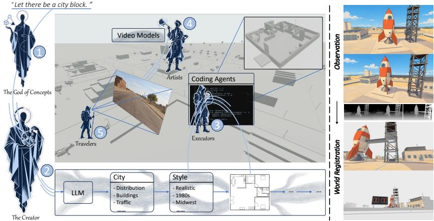  
Figure 2: Method Overview. Left: The pipeline of our CoDeR. The God of Concepts conveys its intent to the Creator. The Creator (LLM) orchestrates the entire world, while the Executors (coding agents) implement the whitebox world. Finally, the Artists (video generation models) render observations along the trajectories sampled by the Travelers. Right: The Observation as World Registration paradigm. Once an observation is generated, it is registered back into the world using its depth map.

Artists. The world needs art. While representing the world through executable code provides precise control over its underlying rules and geometric structure, the resulting whitebox world inevitably lacks visual richness—appearing plain, untextured, and empty. To address this limitation, Artists are introduced to transform the whitebox world into a visually compelling representation, endowing it with a diverse range of visual styles—from photorealistic scenes to anime-inspired aesthetics—all while preserving the structural and logical fidelity established by the Creator and Executors.

Specifically, we tame state-of-the-art video generation models to serve as the Artists within this hierarchically constructed world. An Artist observes a segment of the otherwise drab world and innovatively translates it into a visually appealing, detail-rich video aligned with the Creator’s tone. After generation, the Artist returns the video to the Executors, which register its appearance in the corresponding world region—a mechanism we refer to as Observation as World Registration, which we elaborate on below.

Travelers. As the world’s explorers, Travelers visit the world, interact with the environment and other entities, and determine which regions require rendering by the Artists as they explore. In this world system, a Traveler may take the form of a visible entity with a defined appearance, or simply exist as a disembodied camera viewpoint.

## 3.2 WORLD SYSTEM

Logical Spaces. Once the key parameters of a world have been established by the Creator, our harness decomposes the global construction objective g into a graph of logical spaces:

$$
\mathcal { G } = ( \mathcal { V } , \mathcal { E } ) = \mathcal { D } ( g ) , \qquad \mathcal { V } = \{ ( g _ { i } , { \cal K } _ { i } ) \} _ { i = 1 } ^ { N }\tag{3}
$$

where D denotes the decomposition process, V contains N logical spaces indexed by i, and E specifies their dependencies and connections. Each logical space is characterized by a local objective g and an interface contract $\kappa _ { i }$ , which specifies its inputs, outputs, and construction constraints. These contracts incorporate the shared world rules established by the Creator while leaving space-specific implementation choices to individual Executors. A logical space therefore defines a functional scope rather than necessarily a disjoint spatial region.

Each logical space is assigned to an Executor, $i . e . .$ , a coding agent, which constructs its corresponding module:

$$
B _ { i } = { \mathcal { A } } _ { i } ( g _ { i } , { \mathcal { K } } _ { i } ) , \qquad i = 1 , \ldots , N ,\tag{4}
$$

where $\mathbf { \mathcal { A } } _ { i }$ denotes the construction process performed by the assigned Executor, including code generation, tool execution, and local refinement, and $B _ { i }$ denotes the resulting module with its scene elements, executable behaviors, and exposed interfaces. Executors can develop modules concurrently once their interface contracts and required dependencies are available. For example, constructing a traffic system involves vehicle design, traffic regulations, and road network layout, making endto-end development by a single Executor challenging and time-consuming. Decomposition allows these responsibilities to be distributed across multiple Executors.

The harness subsequently integrates the resulting modules through explicit interface bindings:

$$
\begin{array} { r } { W = \mathrm { C o m p o s e } ( \{ B _ { i } \} _ { i = 1 } ^ { N } , \{ \mathrm { B i n d } _ { \beta _ { i j } } ( B _ { i } , B _ { j } ) \} _ { ( i , j ) \in \mathcal { E } } ) , } \end{array}\tag{5}
$$

where W is the assembled, executable world, j indexes a connected module, and $\beta _ { i j }$ specifies the binding between modules $B _ { i }$ and $B _ { j }$ , such as a spatial transformation, state mapping, or event connection. The operator Bind instantiates each connection prescribed by $\mathcal { E } ,$ while Compose assembles the modules and their connections into a unified system. For instance, a vehicle’s visual geometry and collision geometry can be developed concurrently under an agreed spatial specification and sub sequently bound to the same vehicle state. Similarly, a separately constructed cockpit can expose a driver-camera interface that is bound to the vehicle’s pose, allowing its interior viewpoint to observe the shared world. This design supports modular, concurrent construction while preserving explicit relationships among logical spaces.

Observation as World Registration. To preserve a consistent world state each time an Artist paints a segment of the world, we propose the Observation as World Registration paradigm. The core idea is that once an Artist has generated a visual rendering of a segment, this generation is registered back into the world, becoming part of the observation that any subsequent agent perceives when looking at that region.

The Artist model in our system is a video generation model, which takes the drab, plain whitebox observation along with its corresponding depth as input, and outputs a visually rich, colorful video. Given an observation chunk with n frames sampled from the whitebox world, denoted as the video $\mathcal { W } = \{ w _ { 0 } , w _ { 1 } , . . . , w _ { n - 1 } \}$ , we can readily obtain the corresponding ground-truth depth video $\mathcal { D } = \{ d _ { 0 } , d _ { 1 } , . . . , d _ { n - 1 } \} .$ , as well as semantic information about the sampled location and its surroundings. While not directly discernible from W itself, it can be directly retrieved from the whitebox world’s underlying state, since the identity and attributes of every entity are already known. We then construct a prompt $\mathcal { P }$ based on this information, such that $\mathcal { V } = \mathrm { A r t i s t } ( \mathcal { W } , \mathcal { D } , \mathcal { P } )$ where $\mathcal { V } = \{ v _ { 0 } , v _ { 1 } , . . . , v _ { n - 1 } \}$ is the resulting generated video.

To endow the Artist model with the ability to perceive historical context, we introduce a partial registration mechanism. Specifically, given a previously generated video V and its corresponding ground-truth depth D, we back-project a randomly sampled subset of $\gamma _ { \mathrm { { s } } }$ pixels onto the whitebox world W and render it from the observation viewpoints, yielding a partially registered observation video R—wherein some regions retain their original plain appearance while others have already been colored according to prior generations. Concretely, the known camera parameters and world geometry allow us to associate the selected pixels with the corresponding surfaces and project their colors into the observation viewpoints. We retain only projections that correspond to the same surface and pass depth-based visibility checks, blending valid observations where they overlap. Denoting these projected colors by Π(V, D), with zeros at uncovered locations, and their binary coverage mask by $\mathcal { M } ,$ , the partial registration is written as:

$$
\begin{array} { r } { \mathcal { R } = \mathcal { M } \odot \Pi ( \mathcal { V } , \mathcal { D } ) + ( { \bf 1 } - \mathcal { M } ) \odot \mathcal { W } , } \end{array}\tag{6}
$$

where ⊙ denotes element-wise multiplication and $\mathcal { M }$ is one in registered regions and zero elsewhere. Thus, previously observed appearance becomes part of the Artist’s next observation, while unobserved regions retain the whitebox appearance for subsequent generation. We then train the Artist model to recover the complete, fully colored video from this partial observation.

## 4 EXPERIMENTS

## 4.1 WHITEBOX WORLD GENERATION

We leverage Three.js as the framework for constructing the code-generated whitebox world, owing to its lightweight, programmable, and composable interface. This allows Executors to construct independent parts of the world as modular code snippets, which can then be seamlessly linked back together to form the integrated world as described above in Sec. 3.2. For human-related scenarios, we adopt SMPL-H (Romero et al., 2017) as the underlying representation to model human motion, hand-object interaction, and viewpoint binding.

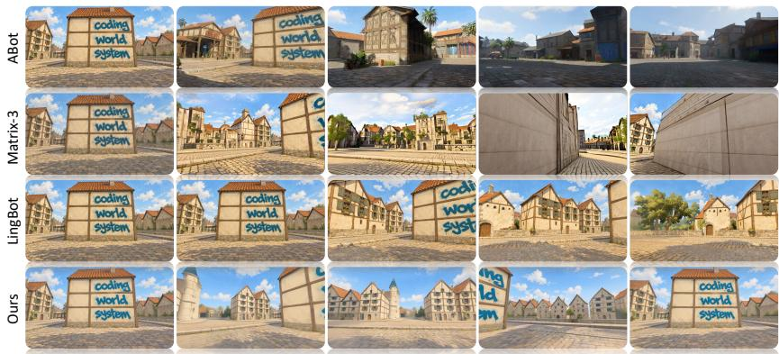  
Figure 3: We sample a rotational trajectory to examine whether the “Coding World System” mark is consistently maintained on the wall. The results show that ABot-World exhibits severe quality degradation, while Matrix-Game 3.0 fails to preserve the mark. LingBot-World fails to accurately respond to the control signals, resulting in duplicated frames. In contrast, our method successfully follows the rotational trajectory while consistently preserving the mark on the wall.

We implement Creator and Executors using GPT-6 Astra, an advanced multimodal LLM-based coding agent with strong 3D spatial awareness. Leveraging its capabilities in multimodal reasoning and geometric understanding, GPT-6 Astra is able to interpret spatial constraints, reason about object placement and interaction, and generate executable Three.js code that faithfully reflects the intended design.

## 4.2 ARTIST MODEL

We choose MiniMax H3 (MiniMax, 2026), a state-of-the-art open-source video generation model, as our Artist model. Although this video generation model can natively re-render whitebox-like videos into colorful ones, we find that it tends to produce render-style outputs—e.g., hard edges, monotonous textures, and flat lighting—which undermine the diversity and realism of the generated visuals. In addition, it is difficult to directly adapt this model to our proposed Observation as World Registration paradigm without further tuning.

To address this, we propose a Visual Cue Hacking strategy, which extracts common and reliable visual cues (e.g., Canny edges and depth maps) from the whitebox world and leverages them to guide the model taming process.

Data Curation. To construct training data using the proposed Visual Cue Hacking strategy, we begin by sampling a random trajectory within the code-generated whitebox world, and extract the corresponding data following the same procedure described in Sec. 3.2. Following the notation introduced earlier, this yields a whitebox video W together with its corresponding prompt P. We then extract Canny edge maps from W (depth is directly available as D), and feed these cues into ControlNet (Zhang et al., 2023) to generate videos spanning diverse visual styles, denoted as V. In this way, we obtain training tuples (W or R, D, P, V) for our Artist model.

Training. We train our Artist model using 32 NVIDIA A800 GPUs, with a global batch size of 16 for 200 training steps. We adopt AdamW (Loshchilov & Hutter, 2019) as the optimizer with a learning rate of $1 \times \overline { { 1 } } 0 ^ { - 5 }$ . Each video clip is resized to a resolution of 1280 × 704 and temporally sampled to contain 124 frames. During training, the transformer backbone is fine-tuned using LoRA (Hu et al., 2022) while the ControlNet branch undergoes full-parameter fine-tuning.

## 4.3 QUALITATIVE COMPARISON

In this section, we demonstrate that our CoDeR exhibits several key properties that a reliable world should possess, including memory, open-ended interactivity, and continuous evolution, and further explore its capabilities in multi-agent scenarios (Wu et al., 2026; Sun et al., 2026a; Hu et al., 2026b; Savva et al., 2026).

Memory. Although our Artist model is trained with a fixed context length of 124 frames, we observe strong long-term memory capabilities enabled by our proposed Observation as World Registration strategy. We evaluate a 360-degree rotation to examine whether the tested methods can preserve the scene structure and the “Coding World System” mark over a long temporal horizon. As illustrated in Fig. 3, ABot-World (Jiang et al., 2026) exhibits severe quality degradation, while Matrix-Game 3.0 (Wang et al., 2026e) loses the building structure, and LingBot-World (Robbyant Team et al., 2026) fails to accurately follow the input trajectory. In contrast, our method achieves a closed-loop rollout while preserving both geometric and appearance consistency.

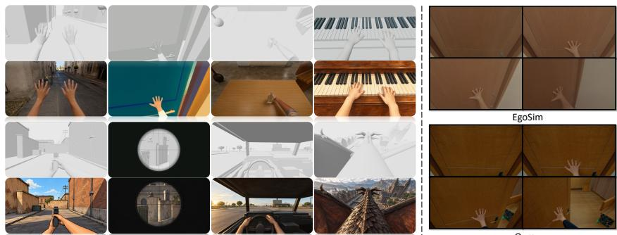  
Figure 4: Left: We support open-ended interactions ranging from playing the piano to riding a dragon. Right: Comparison with EgoSim, which fails to open the door, while our method successfully opens it and reveals the new environment.

Open-ended Interactions. We enable open-ended world interactions, ranging from opening a door to piloting a spaceship, by leveraging powerful code-defined interaction logic. Rather than relying on a predefined action space, our CoDeR allows the Creator to define new actions, which are subsequently implemented by the Executors, making the action space continuously extensible. As shown in Fig. 4, the left part of the figure demonstrates diverse code-defined actions in the whitebox world together with their corresponding visual realizations by the Artists. Experiments further show that conventional methods with predefined interactions tend to fail on challenging environment-level interactions, such as opening doors. As illustrated on the right side of Fig. 4, EgoSim (Hao et al., 2026) is unable to open the door. In contrast, our method successfully opens the door and reveals the new environment behind it.

Evolution. Our CoDeR effectively models event evolution, an essential capability for maintaining persistent dynamics in world models. We evaluate this capability against existing methods in Fig. 5. The results show that HyDRA (Chen et al., 2026b) fails to model the continuous water-pouring process, as the water column remains nearly static across frames. LiveWorld (Duan et al., 2026) captures some water dynamics but exhibits obvious visual artifacts and fails to correctly update the water level in the cup after it moves out of sight. In contrast, our method accurately captures the water dynamics and continuously updates the underlying state even when the cup is outside the field of view, correctly reflecting the increased water level when it becomes visible again.

Multi-agent Scenarios. We additionally explore multi-Traveler (multi-agent) scenarios (Zhao et al., 2026b; Hu et al., 2026a; Mo et al., 2026; Liu et al., 2026) and find that, with our proposed Observation as World Registration paradigm, the actions of one Traveler can modify the shared environment, while the resulting changes are simultaneously reflected in the observations of other agents.

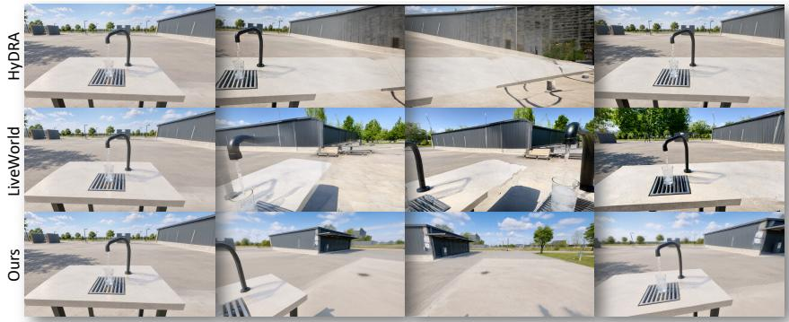  
Figure 5: We demonstrate the world evolution mechanism of our method in comparison with other approaches. In the first frame, a tap is pouring water into a glass cup. The camera then moves away from the cup and later returns to examine whether the water level has continued to rise. HyDRA produces a static water column, while LiveWorld exhibits obvious visual artifacts. In contrast, our method continuously updates the water level even when the cup is out of sight.

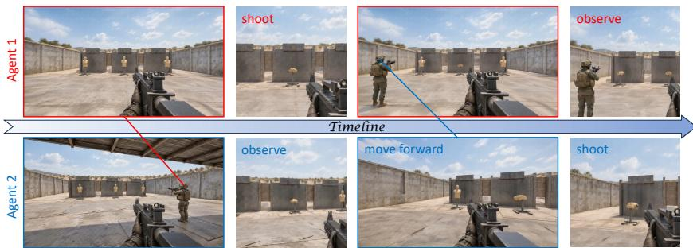  
Figure 6: We further explore multi-agent scenarios in our system. When Agent 1 takes down a target, the event is simultaneously observed by Agent 2. Likewise, when Agent 2 moves forward and shoots another target, the event is also observed by Agent 1.

As shown in Fig. 6, when Agent 1 takes down a target, the event is observed by Agent 2. Likewise, when Agent 2 moves forward and takes down another target, the event is also observed by Agent 1. These results demonstrate the potential of our CoDeR as a promising framework for multi-agent world modeling.

## 4.4 QUANTITATIVE COMPARISON

We conduct a quantitative comparison with ABot-World, LingBot-World, and Matrix-Game 3.0 across 10 metrics on the WorldScore (Duan et al., 2025) benchmark. The results are shown in Tab. 1, where our method achieves state-of-the-art performance across all metrics compared with the other approaches.

Table 1: Quantitative Comparison. Our method outperforms all competing methods across all metrics.
<table><tr><td>Methods</td><td>Camera Ctrl</td><td>Object Ctrl</td><td>Content Align</td><td>3D Consist</td><td>Photo Consist</td><td>Style Consist</td><td>Subjective Qual</td><td>Motion Acc</td><td>Motion Mag</td><td>Motion Smooth</td><td>Average</td></tr><tr><td>ABot-World (Jiang et al., 2026)</td><td>92.47</td><td>84.23</td><td>76.94</td><td>80.60</td><td>83.56</td><td>83.22</td><td>39.95</td><td>50.33</td><td>26.89</td><td>74.21</td><td>69.24</td></tr><tr><td>Matrix-Game 3.0 (Wang et al., 2026e)</td><td>96.72</td><td>84.61</td><td>83.12</td><td>81.10</td><td>86.96</td><td>83.42</td><td>59.04</td><td>60.79</td><td>24.75</td><td>81.50</td><td>74.20</td></tr><tr><td>LingBot-World (Robbyant Team et al., 2026)</td><td>90.50</td><td>87.73</td><td>75.29</td><td>86.28</td><td>90.03</td><td>85.39</td><td>65.71</td><td>59.48</td><td>27.93</td><td>79.60</td><td>74.79</td></tr><tr><td>Ours</td><td>98.91</td><td>92.25</td><td>98.44</td><td>88.65</td><td>91.10</td><td>89.40</td><td>69.08</td><td>82.76</td><td>84.92</td><td>83.31</td><td>87.88</td></tr></table>

## 4.5 ABLATION STUDY

We conduct ablation studies on our Visual Cue Hacking strategy and Observation as World Registration paradigm using three metrics from WorldScore (Duan et al., 2025) and four metrics from VBench (Huang et al., 2024) to evaluate their contributions to visual quality. As shown in Tab. 2, removing either Visual Cue Hacking or Observation as World Registration leads to degraded visual quality compared with the full model.

Table 2: Ablation Study. Both Visual Cue Hacking and Observation as World Registration contribute to improved visual quality across WorldScore and VBench metrics.
<table><tr><td rowspan="2">Methods</td><td colspan="3">WorldScore</td><td colspan="4">VBench</td></tr><tr><td>Content Align</td><td>Photo Consist</td><td>Subjective Qual</td><td>Imaging Quality</td><td>Aesthetic Quality</td><td>Subject Consistency</td><td>Dynamic Degree</td></tr><tr><td rowspan="2">w/o Vis. Cue Hack. w/o Obs. as WR.</td><td>82.48</td><td>89.21</td><td>49.05</td><td>63.52</td><td>66.18</td><td>87.54</td><td>97.29</td></tr><tr><td>89.06</td><td>84.85</td><td>53.98</td><td>69.37</td><td>70.44</td><td>84.63</td><td>98.02</td></tr><tr><td>Full Method</td><td>98.44</td><td>91.10</td><td>69.08</td><td>70.77</td><td>72.29</td><td>96.31</td><td>98.16</td></tr></table>

## 5 CONCLUSION

In this work, we introduced CoDeR, a new paradigm for world modeling that separates the underlying world from its visual realization. Instead of relying on video models to implicitly encode world dynamics, our framework constructs persistent and executable worlds through collaborative coding agents, while employing generative models to render perceptual observations. Extensive experiments demonstrate that this design not only broadens the capabilities of current world models, but also achieves state-of-the-art performance across diverse settings. More broadly, we hope this work encourages a shift from modeling worlds as sequences of observations toward constructing worlds as persistent computational systems that can be created, experienced, and continuously evolved. And finally, every Traveler is, in essence, the God of Concepts.

## REFERENCES

AlayaWorld Team, Kaipeng Zhang, Chuanhao Li, Yifan Zhan, Yongtao Ge, Yuanyang Yin, Jiaming Tan, Kang He, Liaoyuan Fan, Mingliang Zhai, Ruicong Liu, Xiaojie Xu, Xuangeng Chu, Zhen Li, Zhengyuan Lin, Zhixiang Wang, Zian Meng, and Zihui Gao. AlayaWorld: Interactive Long-Horizon World Modeling - Full Technical Report (v1.1). arXiv preprint arXiv:2608.13492, 2026.

Eloi Alonso, Adam Jelley, Vincent Micheli, Anssi Kanervisto, Amos Storkey, Tim Pearce, and Franc¸ois Fleuret. Diffusion for World Modeling: Visual Details Matter in Atari. In A. Globerson, L. Mackey, D. Belgrave, A. Fan, U. Paquet, J. Tomczak, and C. Zhang (eds.), Advances in Neural Information Processing Systems, volume 37, pp. 58757–58791. Curran Associates, Inc., 2024. doi: 10.52202/079017-1873.

Sherwin Bahmani, Tianchang Shen, Jiawei Ren, Jiahui Huang, Yifeng Jiang, Haithem Turki, Andrea Tagliasacchi, David Lindell, Zan Gojcic, Sanja Fidler, Huan Ling, Jun Gao, and Xuanchi Ren. Lyra: Generative 3D Scene Reconstruction via Video Diffusion Model Self-Distillation. In International Conference on Learning Representations, volume 2026, pp. 82850–82880, 2026.

Amir Bar, Gaoyue Zhou, Danny Tran, Trevor Darrell, and Yann LeCun. Navigation World Models. In Proceedings of the IEEE/CVF Conference on Computer Vision and Pattern Recognition (CVPR), pp. 15791–15801, jun 2025.

Jake Bruce, Michael D Dennis, Ashley Edwards, Jack Parker-Holder, Yuge Shi, Edward Hughes, Matthew Lai, Aditi Mavalankar, Richie Steigerwald, Chris Apps, Yusuf Aytar, Sarah Maria Elisabeth Bechtle, Feryal Behbahani, Stephanie C.Y. Chan, Nicolas Heess, Lucy Gonzalez, Simon Osindero, Sherjil Ozair, Scott Reed, Jingwei Zhang, Konrad Zolna, Jeff Clune, Nando De Freitas, Satinder Singh, and Tim Rocktaschel. Genie: Generative Interactive Environments. In Ruslan¨ Salakhutdinov, Zico Kolter, Katherine Heller, Adrian Weller, Nuria Oliver, Jonathan Scarlett, and Felix Berkenkamp (eds.), Proceedings of the 41st International Conference on Machine Learning, volume 235 of Proceedings of Machine Learning Research, pp. 4603–4623. PMLR, 21–27 Jul 2024.

Ziqi Cai, Siqi Yang, Yimu Wang, Zixian Gao, Yunheng Liu, Shuchen Weng, Erwin Wu, Kaipeng Zhang, and Boxin Shi. MASS: Multiplayer World Models with Authoritative Shared State. arXiv preprint arXiv:2608.06257, 2026.

Jin Cao, Zian Meng, and Kaipeng Zhang. ShadowDancer: Teaching Video World Models Any Action by Learning Unified Dynamics Representations from a Video and Its Shadow. arXiv preprint arXiv:2607.28362, 2026.

Nicolas Carion, Laura Gustafson, Yuan-Ting Hu, Shoubhik Debnath, Ronghang Hu, Didac Suris Coll-Vinent, Chaitanya Ryali, Kalyan Vasudev Alwala, Haitham Khedr, Andrew Huang, et al. Sam 3: Segment anything with concepts. In International conference on learning representations, volume 2026, pp. 138846–138923, 2026.

Haoxuan Che, Xuanhua He, Quande Liu, Cheng Jin, and Hao Chen. GameGen-X: Interactive Open-world Game Video Generation. In International Conference on Learning Representations, volume 2025, pp. 37546–37593, 2025.

Junhao Chen, Mingjin Chen, Henghaofan Zhang, Minglin Chen, Liaoyuan Fan, Boran Zhang, Saining Zhang, Mingze Sun, Hao Zhao, Ruqi Huang, Zhihao Li, and Yufei Wang. Video Models as Native 4D Renderers: World-Grounded Conditioning from Animated Mesh. arXiv preprint arXiv:2608.00094, 2026a.

Junyi Chen, Haoyi Zhu, Xianglong He, Yifan Wang, Jianjun Zhou, Wenzheng Chang, Yang Zhou, Zizun Li, Zhoujie Fu, Jiangmiao Pang, and Tong He. DeepVerse: 4D Autoregressive Video Generation as a World Model. arXiv preprint arXiv:2506.01103, 2025a.

Kaijin Chen, Dingkang Liang, Xin Zhou, Yikang Ding, Xiaoqiang Liu, Pengfei Wan, and Xiang Bai. Out of Sight but Not Out of Mind: Hybrid Memory for Dynamic Video World Models. arXiv preprint arXiv:2603.25716, 2026b.

Taiye Chen, Xun Hu, Zihan Ding, and Chi Jin. Learning World Models for Interactive Video Generation. In Advances in Neural Information Processing Systems, volume 38, Main Conference, pp. 154456–154483. Curran Associates, Inc., 2025b. doi: 10.52202/085713-5166.

Zhifei Chen, Luozhou Wang, Guibao Shen, Dongyu Yan, Shuai Yang, Tianshuo Xu, Yihua Du, Wei Wang, Tianyi Gui, Lianghua Huang, and Yingcong Chen. ReWorld: An Interactive World Model with Long-Horizon Memory. arXiv preprint arXiv:2608.23565, 2026c.

DreamX Team, Yancheng Bai, Rui Chen, Xiangxiang Chu, Rujing Dang, Hao Dou, Bingjie Gao, Qiwen Gu, Siyu Hong, Jiachen Lei, Geng Li, Jifan Li, Ruimin Lin, Qingfeng Shi, Bingze Song, Lei Sun, Jing Tang, Ruitian Tian, Jun Wang, Jiahong Wu, Pengfei Zhang, Shen Zhang, and Jiashu Zhu. DreamX-World 1.0: A General-Purpose Interactive World Model. arXiv preprint arXiv:2606.16993, 2026.

Haoyi Duan, Hong-Xing Yu, Sirui Chen, Li Fei-Fei, and Jiajun Wu. WorldScore: A Unified Evaluation Benchmark for World Generation. In Proceedings ofthe IEEE/CVF International Conference on Computer Vision (ICCV), pp. 27713–27724, October 2025.

Zicheng Duan, Jiatong Xia, Zeyu Zhang, Wenbo Zhang, Gengze Zhou, Chenhui Gou, Yefei He, Feng Chen, Xinyu Zhang, and Lingqiao Liu. LiveWorld: Simulating Out-of-Sight Dynamics in Generative Video World Models. In Computer Vision – ECCV 2026, 2026.

Ruili Feng, Han Zhang, Zhilei Shu, Zhantao Yang, Longxiang Tang, Zhicai Wang, Andy Zheng, Jie Xiao, Zhiheng Liu, Ruihang Chu, Yukun Huang, Yu Liu, and Hongyang Zhang. The Matrix: Infinite-Horizon World Generation with Real-Time Moving Control. In D. Belgrave, C. Zhang, H. Lin, R. Pascanu, P. Koniusz, M. Ghassemi, and N. Chen (eds.), Advances in Neural Information Processing Systems, volume 38, pp. 87318–87344. Curran Associates, Inc., 2025. doi: 10.52202/ 085713-2920.

Rafail Fridman, Amit Abecasis, Yoni Kasten, and Tali Dekel. SceneScape: Text-Driven Consistent Scene Generation. In A. Oh, T. Naumann, A. Globerson, K. Saenko, M. Hardt, and S. Levine (eds.), Advances in Neural Information Processing Systems, volume 36, pp. 39897–39914. Curran Associates, Inc., 2023. doi: 10.52202/075280-1734.

Quankai Gao, Jiawei Yang, Qiangeng Xu, Le Chen, and Yue Wang. LOME: Learning Human-Object Manipulation with Action-Conditioned Egocentric World Model. arXiv preprint arXiv:2603.27449, 2026a.

Zelin Gao, Qiuyu Wang, Jiapeng Zhu, Jingye Chen, Zichen Liu, Qingyan Bai, Jiahao Wang, Yufeng Yuan, Hanlin Wang, Yichong Lu, Ka Leong Cheng, Haojie Zhang, Jian Gao, Tianrui Feng, Yuzheng Liu, Yao Yao, Yinghao Xu, Xing Zhu, Yujun Shen, and Hao Ouyang. Infinite Worlds with Versatile Interactions. arXiv preprint arXiv:2607.07534, 2026b.

Samuel Garcin, Tom Walker, Steven McDonagh, Tim Pearce, Hakan Bilen, Tianyu He, Kaixin Wang, and Jiang Bian. Beyond Pixel Histories: World Models with Persistent 3D State. In Proceedings of the 43rd International Conference on Machine Learning, 2026.

Junliang Guo, Yang Ye, Tianyu He, Haoyu Wu, Yushu Jiang, Tim Pearce, and Jiang Bian. MineWorld: a Real-Time and Open-Source Interactive World Model on Minecraft. arXiv preprint arXiv:2504.08388, 2025.

Jinkun Hao, Mingda Jia, Xudong Xu, Ruiyan Wang, Xihui Liu, Ran Yi, Lizhuang Ma, and Jiangmiao Pang. EgoSim: Egocentric World Simulator for Embodiment Interaction Generation. In Computer Vision – ECCV 2026, 2026.

Hao He, Yinghao Xu, Yuwei Guo, Gordon Wetzstein, Bo Dai, Hongsheng Li, and Ceyuan Yang. CameraCtrl: Enabling Camera Control for Video Diffusion Models. In Y. Yue, A. Garg, N. Peng, F. Sha, and R. Yu (eds.), International Conference on Learning Representations, volume 2025, pp. 100433–100464, 2025a.

Xianglong He, Chunli Peng, Zexiang Liu, Boyang Wang, Yifan Zhang, Qi Cui, Fei Kang, Biao Jiang, Mengyin An, Yangyang Ren, Baixin Xu, Hao-Xiang Guo, Kaixiong Gong, Size Wu, Wei Li, Xuchen Song, Yang Liu, Yangguang Li, and Yahui Zhou. Matrix-game 2.0: An open-source real-time and streaming interactive world model. arXiv preprint arXiv:2508.13009, 2025b.

Yicong Hong, Yiqun Mei, Chongjian Ge, Yiran Xu, Yang Zhou, Sai Bi, Yannick Hold-Geoffroy, Mike Roberts, Matthew Fisher, Eli Shechtman, Kalyan Sunkavalli, Feng Liu, Zhengqi Li, and Hao Tan. RELIC: Interactive Video World Model with Long-Horizon Memory. arXiv preprint arXiv:2512.04040, 2025.

Anthony Hu, Vaclav Volhejn, Adrien Ramanana Rahary, Chris Mulder, Aditya Makkar, Alyx Liao,´ Amelie Royer, Manu Orsini, Adam Jelley, Eloi Alonso, Florian Laurent, Fredrik Nor´ en, James´ Swingos, Jan Hunermann, Kent Rollins, Lucas Hosseini, Matthieu Le Cauchois, Maxim Peter,¨ Pim de Witte, Tim Brown, Vincent Micheli, Moritz Bohle, Gabriel de Marmiesse, Viktoriia Shar-¨ manska, Lucia Specia, Michael Black, and Patrick Perez. Multiplayer Interactive World Models´ with Representation Autoencoders. arXiv preprint arXiv:2607.05352, 2026a.

Edward Hu, Yelong Shen, Phillip Wallis, Zeyuan Allen-Zhu, Yuanzhi Li, Shean Wang, Lu Wang, and Weizhu Chen. LoRA: Low-Rank Adaptation of Large Language Models. In International Conference on Learning Representations, 2022.

Teng Hu, Mingchun Lu, Yating Wang, Jiangning Zhang, Jinkun Hao, Ye Pan, Ran Yi, Lizhuang Ma, and Dacheng Tao. MetaWorld: Scaling Multi-Agent Video World Model from Single-view Video Data. arXiv preprint arXiv:2606.02753, 2026b.

Junchao Huang, Xinting Hu, Boyao Han, Shaoshuai Shi, Zhuotao Tian, Tianyu He, and Li Jiang. Memory Forcing: Spatio-Temporal Memory for Consistent Scene Generation on Minecraft. arXiv preprint arXiv:2510.03198, 2025a.

Kaiyi Huang, Yukun Huang, Yu Li, Jianhong Bai, Xintao Wang, Zinan Lin, Xuefei Ning, Jiwen Yu, Yu Wang, and Xihui Liu. CineScene: Implicit 3D as Effective Scene Representation for Cinematic Video Generation. In Proceedings of the IEEE/CVF Conference on Computer Vision and Pattern Recognition (CVPR), pp. 25381–25392, June 2026a.

Tianyu Huang, Wangguandong Zheng, Tengfei Wang, Yuhao Liu, Zhenwei Wang, Junta Wu, Jie Jiang, Hui Li, Rynson Lau, Wangmeng Zuo, and Chunchao Guo. Voyager: Long-Range and World-Consistent Video Diffusion for Explorable 3D Scene Generation. ACM Transactions on Graphics, 44(6):1–15, Dec 2025b. doi: 10.1145/3763330.

Yukun Huang, Jiwen Yu, Yanning Zhou, Jianan Wang, Xintao Wang, Pengfei Wan, and Xihui Liu. OmniX: From Unified Panoramic Generation and Perception To Graphics-Ready 3D Scenes. In Paolo Favaro, Zuzana Kukelova, Atsuto Maki, Anna Rohrbach, Konrad Schindler, and Federico Tombari (eds.), Computer Vision – ECCV 2026, pp. 547–565, Cham, 2026b. Springer Nature Switzerland. ISBN 978-3-032-37271-0. doi: 10.1007/978-3-032-37271-0 30.

Ziqi Huang, Yinan He, Jiashuo Yu, Fan Zhang, Chenyang Si, Yuming Jiang, Yuanhan Zhang, Tianxing Wu, Qingyang Jin, Nattapol Chanpaisit, Yaohui Wang, Xinyuan Chen, Limin Wang, Dahua Lin, Yu Qiao, and Ziwei Liu. VBench: Comprehensive Benchmark Suite for Video Generative Models. In Proceedings of the IEEE/CVF Conference on Computer Vision and Pattern Recognition (CVPR), pp. 21807–21818, June 2024.

Fan Jiang, Zhaoxu Sun, Mengchao Wang, Ziyu Zhu, Chiyu Wang, Yunpeng Zhang, Wenlin Liu, Yun Wang, Xue Zheng, Rui Sun, Junfeng Ni, Hongyu Pan, Zhongxu Sun, Fei Yu, Zengye Ge, Mengmeng Du, Nianfei Fan, Mingchao Sun, Yu Liu, Yongchang, Yanqing Zhu, Jiahang Wang, Ning Ying, Yuze Xuan, Di Yang, Zhicheng Liu, Zhe Gao, Tingbing Xu, Jiacheng Sui, Wenjin Yang, Junnan Lai, Shufeng Liu, Yuan Liu, Zheng Zhou, Yingliang Peng, Dawei Cao, Kaifeng Sheng, Yuxiang Cai, Fei Lu, Mu Xu, and Ning Guo. ABot-World-0: Infinite Interactive World Rollout on a Single Desktop GPU. arXiv preprint arXiv:2607.19191, 2026.

Byungjun Kim, Taeksoo Kim, Junyoung Lee, and Hanbyul Joo. Dexterous World Models. In Proceedings of the IEEE/CVF Conference on Computer Vision and Pattern Recognition (CVPR), pp. 29663–29673, June 2026.

Dacheng Li, Yunhao Fang, Yukang Chen, Shuo Yang, Shiyi Cao, Justin Wong, Michael Luo, Xiaolong Wang, Hongxu Yin, Joseph Gonzalez, Ion Stoica, Song Han, and Yao Lu. WorldModelBench: Judging Video Generation Models As World Models. In D. Belgrave, C. Zhang, H. Lin, R. Pascanu, P. Koniusz, M. Ghassemi, and N. Chen (eds.), Advances in Neural Information Processing Systems, volume 38, Main Conference. Curran Associates, Inc., 2025a. doi: 10.52202/085713-1834.

Dayou Li, Lulin Liu, Bangya Liu, Shijie Zhou, Jiu Feng, Ziqi Lu, Minghui Zheng, Chenyu You, and Zhiwen Fan. Egocentric World Model for Photorealistic Hand Object Interaction Synthesis. In European Conference on Computer Vision (ECCV), 2026a.

Jiaqi Li, Junshu Tang, Zhiyong Xu, Longhuang Wu, Yuan Zhou, Shuai Shao, Tianbao Yu, Zhiguo Cao, and Qinglin Lu. Hunyuan-GameCraft: High-dynamic Interactive Game Video Generation with Hybrid History Condition. arXiv preprint arXiv:2506.17201, 2025b.

Runjia Li, Philip Torr, Andrea Vedaldi, and Tomas Jakab. VMem: Consistent Interactive Video Scene Generation with Surfel-Indexed View Memory. In Proceedings of the IEEE/CVF International Conference on Computer Vision (ICCV), pp. 25690–25699, 2025c.

Yu Li, Menghan Xia, Gongye Liu, Xintao Wang, Conglang Zhang, Lei Ke, Yuxuan Lin, Ruihang Chu, Pengfei Wan, Kun Gai, and Yujiu Yang. AnchorWorld: Embodied Egocentric World Simu lation with View-based Evolution Customization. arXiv preprint arXiv:2606.07326, 2026b.

Hansen Lillemark, Benhao Huang, Fangneng Zhan, Yilun Du, and T. Anderson Keller. Flow Equivariant World Models: Structured Memory for Dynamic Environments. In Proceedings of the 43rd International Conference on Machine Learning, 2026.

Yaron Lipman, Ricky T. Q. Chen, Heli Ben-Hamu, Maximilian Nickel, and Matthew Le. Flow Matching for Generative Modeling. In International Conference on Learning Representations, 2023.

Fangfu Liu, Kai He, Tianchang Shen, Tianshi Cao, Sanja Fidler, Yueqi Duan, Jun Gao, Igor Gilitschenski, Zian Wang, and Xuanchi Ren. Gamma-World: Generative Multi-Agent World Modeling Beyond Two Players. arXiv preprint arXiv:2605.28816, 2026.

Ilya Loshchilov and Frank Hutter. Decoupled Weight Decay Regularization. In International Conference on Learning Representations, 2019.

Wenchao Ma, Changran Liu, Sharon X. Huang, and Haomiao Jiang. Closing the Loop: Training-Free Revisit Consistency for Autoregressive Generative Rendering. arXiv preprint arXiv:2607.21848, 2026a.

Ziqi Ma, Mengzhan Liufu, and Georgia Gkioxari. Out of Sight, Out of Mind? Evaluating State Evolution in Video World Models. In Computer Vision – ECCV 2026, 2026b.

Xiaofeng Mao, Zhen Li, Chuanhao Li, Xiaojie Xu, Kaining Ying, Tong He, Jiangmiao Pang, Yu Qiao, and Kaipeng Zhang. Yume-1.5: A Text-Controlled Interactive World Generation Model. arXiv preprint arXiv:2512.22096, 2025a.

Xiaofeng Mao, Shaoheng Lin, Zhen Li, Chuanhao Li, Wenshuo Peng, Tong He, Jiangmiao Pang, Mingmin Chi, Yu Qiao, and Kaipeng Zhang. Yume: An Interactive World Generation Model. arXiv preprint arXiv:2507.17744, 2025b.

Zian Meng, Zhen Li, Chuanhao Li, Qiang Li, and Kaipeng Zhang. Marionette: Predicting World States, Rendering Geometry, Painting Appearance. arXiv preprint arXiv:2608.14530, 2026.

MiniMax. MiniMax H3: An Open Model Breaking the Boundaries Between Tasks and Modalities. MiniMax Research blog, July 2026. URL https://www.minimax.io/blog/ minimax-h3.

Sicheng Mo, Yuheng Li, Ziyang Leng, Krishna Kumar Singh, and Bolei Zhou. Streaming Multi-Agent Autoregressive Diffusion Model with World State Registers. arXiv preprint arXiv:2607.21594, 2026.

NVIDIA, Niket Agarwal, Arslan Ali, Maciej Bala, Yogesh Balaji, Erik Barker, Tiffany Cai, Prithvijit Chattopadhyay, Yongxin Chen, Yin Cui, Yifan Ding, Daniel Dworakowski, Jiaojiao Fan, Michele Fenzi, Francesco Ferroni, Sanja Fidler, Dieter Fox, Songwei Ge, Yunhao Ge, Jinwei Gu, Siddharth Gururani, Ethan He, Jiahui Huang, Jacob Huffman, Pooya Jannaty, Jingyi Jin, Seung Wook Kim, Gergely Klar, Grace Lam, Shiyi Lan, Laura Leal-Taixe, Anqi Li, Zhaoshuo´ Li, Chen-Hsuan Lin, Tsung-Yi Lin, Huan Ling, Ming-Yu Liu, Xian Liu, Alice Luo, Qianli Ma, Hanzi Mao, Kaichun Mo, Arsalan Mousavian, Seungjun Nah, Sriharsha Niverty, David Page, Despoina Paschalidou, Zeeshan Patel, Lindsey Pavao, Morteza Ramezanali, Fitsum Reda, Xiaowei Ren, Vasanth Rao Naik Sabavat, Ed Schmerling, Stella Shi, Bartosz Stefaniak, Shitao Tang, Lyne Tchapmi, Przemek Tredak, Wei-Cheng Tseng, Jibin Varghese, Hao Wang, Haoxiang Wang, Heng Wang, Ting-Chun Wang, Fangyin Wei, Xinyue Wei, Jay Zhangjie Wu, Jiashu Xu, Wei Yang, Lin Yen-Chen, Xiaohui Zeng, Yu Zeng, Jing Zhang, Qinsheng Zhang, Yuxuan Zhang, Qingqing Zhao, and Artur Zolkowski. Cosmos World Foundation Model Platform for Physical AI. arXiv preprint arXiv:2501.03575, 2025a.

NVIDIA, Hassan Abu Alhaija, Jose Alvarez, Maciej Bala, Tiffany Cai, Tianshi Cao, Liz Cha, Joshua Chen, Mike Chen, Francesco Ferroni, Sanja Fidler, Dieter Fox, Yunhao Ge, Jinwei Gu, Ali Hassani, Michael Isaev, Pooya Jannaty, Shiyi Lan, Tobias Lasser, Huan Ling, Ming-Yu Liu, Xian Liu, Yifan Lu, Alice Luo, Qianli Ma, Hanzi Mao, Fabio Ramos, Xuanchi Ren, Tianchang Shen, Xinglong Sun, Shitao Tang, Ting-Chun Wang, Jay Wu, Jiashu Xu, Stella Xu, Kevin Xie, Yuchong Ye, Xiaodong Yang, Xiaohui Zeng, and Yu Zeng. Cosmos-Transfer1: Conditional World Generation with Adaptive Multimodal Control. arXiv preprint arXiv:2503.14492, 2025b.

NVIDIA, Arslan Ali, Junjie Bai, Maciej Bala, Yogesh Balaji, Aaron Blakeman, Tiffany Cai, Jiaxin Cao, Tianshi Cao, Elizabeth Cha, Yu-Wei Chao, Prithvijit Chattopadhyay, Mike Chen, Yongxin Chen, Yu Chen, Shuai Cheng, Yin Cui, Jenna Diamond, Yifan Ding, Jiaojiao Fan, Linxi Fan, Liang Feng, Francesco Ferroni, Sanja Fidler, Xiao Fu, Ruiyuan Gao, Yunhao Ge, Jinwei Gu, Aryaman Gupta, Siddharth Gururani, Imad El Hanafi, Ali Hassani, Zekun Hao, Jacob Huffman, Joel Jang, Pooya Jannaty, Jan Kautz, Grace Lam, Xuan Li, Zhaoshuo Li, Maosheng Liao, Chen-Hsuan Lin, Tsung-Yi Lin, Yen-Chen Lin, Huan Ling, Ming-Yu Liu, Xian Liu, Yifan Lu, Alice Luo, Qianli Ma, Hanzi Mao, Kaichun Mo, Seungjun Nah, Yashraj Narang, Abhijeet Panaskar, Lindsey Pavao, Trung Pham, Morteza Ramezanali, Fitsum Reda, Scott Reed, Xuanchi Ren, Haonan Shao, Yue Shen, Stella Shi, Shuran Song, Bartosz Stefaniak, Shangkun Sun, Shitao Tang, Sameena Tasmeen, Lyne Tchapmi, Wei-Cheng Tseng, Jibin Varghese, Andrew Z. Wang, Hao Wang, Haoxiang Wang, Heng Wang, Ting-Chun Wang, Fangyin Wei, Jiashu Xu, Dinghao Yang, Xiaodong Yang, Haotian Ye, Seonghyeon Ye, Xiaohui Zeng, Jing Zhang, Qinsheng Zhang, Kaiwen Zheng, Andrew Zhu, and Yuke Zhu. World Simulation with Video Foundation Models for Physical AI. arXiv preprint arXiv:2511.00062, 2025c.

NVIDIA, Aditi, Niket Agarwal, Arslan Ali, Jon Allen, Martin Antolini, Adeline Aubame, Alisson Azzolini, Junjie Bai, Maciej Bala, Yogesh Balaji, Josh Bapst, Aarti Basant, Mukesh Beladiya, Mohammad Qazim Bhat, Zaid Pervaiz Bhat, Dan Blick, Vanni Brighella, Han Cai, Tiffany Cai, Eric Cameracci, Jiaxin Cao, Yulong Cao, Mark Carlson, Carlos Casanova, Ting-Yun Chang, Yan Chang, Yu-Wei Chao, Prithvijit Chattopadhyay, Roshan Chaudhari, Chieh-Yun Chen, Junyu Chen, Ke Chen, Qizhi Chen, Wenkai Chen, Xiaotong Chen, Yu Chen, An-Chieh Cheng, Click Cheng, Xiu Chia, Jeana Choi, Chaeyeon Chung, Wenyan Cong, Yin Cui, Magdalena Dadela, Nalin Dadhich, Wenliang Dai, Joyjit Daw, Alperen Degirmenci, Rodrigo Vieira Del Monte, Robert Denomme, Sameer Dharur, Marco Di Lucca, Ke Ding, Wenhao Ding, Yifan Ding, Yuzhu Dong, Nicole Drumheller, Yilun Du, Aigul Dzhumamuratova, Aleksandr Efitorov, Hamid Eghbalzadeh, Naomi Eigbe, Imad El Hanafi, Hassan Eslami, Benedikt Falk, Jiaojiao Fan, Jim Fan, Amol Fasale, Sergiy Fefilatyev, Liang Feng, Francesco Ferroni, Sanja Fidler, Xiao Fu, Vikram Fugro, Prashant Gaikwad, TJ Galda, Katelyn Gao, Yihuai Gao, Wenhang Ge, Sreyan Ghosh, Arushi Goel, Vivek Goel, Akash Gokul, Rama Govindaraju, Jinwei Gu, Miguel Guerrero, Elfie Guo, Aryaman Gupta, Siddharth Gururani, Hugo Hadfield, Song Han, Ankur Handa, Zekun Hao, Mohammad Harrim, Ali Hassani, Nathan Hayes-Roth, Yufan He, Chris Helvig, Cyrus Hogg, Madison Huang, Michael Huang, Sophia Huang, Yufan Huang, Jacob Huffman, DeLesley Hutchins, Suneel Indupuru, Boris Ivanovic, Arihant Jain, Joel Jang, Ryan Ji, Yanan Jian, Dongfu Jiang, Jingyi Jin, Atharva Joshi, Nikhilesh Joshi, Pranjali Joshi, Andy Ju, Jaehun Jung, Weiwei Kang, Scott Kassekert, Jan Kautz, Ashna Khetan, Julia Kiczka, Slawek Kierat,

Gwanghyun Kim, Kuno Kim, Sunny Kim, Kezhi Kong, Xin Kong, Zhifeng Kong, Tomasz Kornuta, Egor Krivov, Hui Kuang, Saurav Kumar, Chia-Wen Kuo, George Kurian, Wojciech Kutak, JF Lafleche, Himangshu Lahkar, Omar Laymoun, Jayjun Lee, Sanggil Lee, Gabriele Leone, Boyi Li, Freya Li, Jiajun Li, Jinfeng Li, Ling Li, Pengcheng Li, Shangru Li, Tingle Li, Xiaolong Li, Xuan Li, Zhaoshuo Li, Zhiqi Li, Hao Liang, Maosheng Liao, Chen-Hsuan Lin, Tsung-Yi Lin, Ming-Yu Liu, Sifei Liu, Zihan Liu, Hai Loc Lu, Xiangyu Lu, Alice Luo, Ruipu Luo, Wenjie Luo, Jiangran Lyu, Martin Ding Ma, Nic Ma, Qianli Ma, Dawid Majchrowski, Louis Marcoux, Miguel Martin, Qing Miao, Ashkan Mirzaei, Shreyas Misra, Kaichun Mo, Durra Mohsin, Hyejin Moon, Pawel Morkisz, Saeid Motiian, Kirill Motkov, Seungjun Nah, Yashraj Narang, Deepak Narayanan, Thabang Ngazimbi, Julian Ouyang, Shubham Pachori, David Page, Yatian Pang, Sehwi Park, Mahesh Patekar, Mostofa Patwary, Marco Pavone, Trung Pham, Wei Ping, Soha Pouya, Shrimai Prabhumoye, Varun Praveen, Delin Qu, Hesam Rabeti, Morteza Ramezanali, Marilyn Reeb, Xuanchi Ren, Kristen Rumley, Wojciech Rymer, Jun Saito, Yeongho Seol, John Shao, Piyush Shekdar, Tianwei Shen, Humphrey Shi, Min Shi, Stella Shi, Kevin Shih, Mohammad Shoeybi, Mateusz Sieniawski, Shuran Song, Alexander Sotelo, Amir Sotoodeh, Sunil Srinivasa, Vignesh Srinivasakumar, Bartosz Stefaniak, Rahul Heinrich Steiger, Shangkun Sun, Jiaxiang Tang, Shitao Tang, Yangyang Tang, Yue Tang, Tolou Tavakkoli, Kayley Ting, Krzysztof Tomala, Wei-Cheng Tseng, Jibin Varghese, Sergei Vasilev, Thomas Volk, Raju Wagwani, Roger Waleffe, Andrew Z. Wang, Boxiang Wang, Haoxiang Wang, Qiao Wang, Shihao Wang, Shijie Wang, Ting-Chun Wang, Yan Wang, Yu Wang, Rohit Watve, David Wehr, Fangyin Wei, Xinshuo Weng, Jay Zhangjie Wu, Kedi Wu, Hongchi Xia, Summer Xiao, Tianjun Xiao, Kevin Xie, Daguang Xu, Jiashu Xu, Mengyao Xu, Ruqing Xu, Xingqian Xu, Yao Xu, Dinghao Yang, Dong Yang, Hans Yang, Xiaodong Yang, Xuning Yang, Yichu Yang, Yurong You, Zhiding Yu, Hao Yuan, Simon Yuen, Xiaohui Zeng, Pengcuo Zeren, Cindy Zha, Haotian Zhang, Jenny Zhang, Jing Zhang, Liangkai Zhang, Paris Zhang, Shun Zhang, Xuanmeng Zhang, Zhizheng Zhang, Ann Zhao, Yilin Zhao, Yuliya Zhautouskaya, Charles Zhou, Fengzhe Zhou, Shilin Zhu, Yuke Zhu, Dima Zhylko, and Artur Zolkowski. Cosmos 3: Omnimodal World Models for Physical AI. arXiv preprint arXiv:2606.02800, 2026.

Yuta Oshima, Yusuke Iwasawa, Masahiro Suzuki, Yutaka Matsuo, and Hiroki Furuta. WorldPack: Dynamic Frame Compression for Long-context Video World Modeling. Transactions on Machine Learning Research, 2026.

Joon Sung Park, Joseph O’Brien, Carrie Jun Cai, Meredith Ringel Morris, Percy Liang, and Michael S. Bernstein. Generative Agents: Interactive Simulacra of Human Behavior. In Proceedings ofthe 36th Annual ACM Symposium on User Interface Software and Technology, UIST ’23, pp. 1–22. ACM, Oct 2023. doi: 10.1145/3586183.3606763.

William Peebles and Saining Xie. Scalable Diffusion Models with Transformers. In Proceedings of the IEEE/CVF International Conference on Computer Vision (ICCV), pp. 4195–4205, 2023.

Top Piriyakulkij, Yichao Liang, Hao Tang, Adrian Weller, Marta Kryven, and Kevin Ellis. PoE-World: Compositional World Modeling with Products of Programmatic Experts. In Advances in Neural Information Processing Systems, volume 38, Main Conference, pp. 26609–26638. Curran Associates, Inc., 2025. doi: 10.52202/085713-0896.

Runjia Qian, Zile Wang, Jihai Zhang, Kai Zou, Wei Yu, Jiaxing Li, Zexiang Liu, Yaokun Li, Fei Kang, Kaichen Huang, Mengyin An, Haobo Zhang, Biao Jiang, Jiahua Wang, Haofeng Sun, Yang Liu, and Yangguang Li. Matrix-Game 3.5: Enhancing Real-Time Streaming Interactive World Models with Patch Memory. arXiv preprint arXiv:2608.29910, 2026.

Xuanchi Ren, Tianchang Shen, Jiahui Huang, Huan Ling, Yifan Lu, Merlin Nimier-David, Thomas Muller, Alexander Keller, Sanja Fidler, and Jun Gao. GEN3C: 3D-Informed World-Consistent¨ Video Generation with Precise Camera Control. In Proceedings of the IEEE/CVF Conference on Computer Vision and Pattern Recognition (CVPR), pp. 6121–6132, 2025.

Robbyant Team, Zelin Gao, Qiuyu Wang, Yanhong Zeng, Jiapeng Zhu, Ka Leong Cheng, Yixuan Li, Hanlin Wang, Yinghao Xu, Shuailei Ma, Yihang Chen, Jie Liu, Yansong Cheng, Yao Yao, Jiayi Zhu, Yihao Meng, Kecheng Zheng, Qingyan Bai, Jingye Chen, Zehong Shen, Yue Yu, Xing Zhu, Yujun Shen, and Hao Ouyang. Advancing Open-source World Models. arXiv preprint arXiv:2601.20540, 2026.

Javier Romero, Dimitrios Tzionas, and Michael J. Black. Embodied Hands: Modeling and Capturing Hands and Bodies Together. ACM Transactions on Graphics, 36(6):245:1–245:17, 2017. doi: 10.1145/3130800.3130883.

Georgy Savva, Oscar Michel, Daohan Lu, Suppakit Waiwitlikhit, Timothy Meehan, Dhairya Mishra, Srivats Poddar, Jack Lu, and Saining Xie. Solaris: Building a Multiplayer Video World Model in Minecraft. arXiv preprint arXiv:2602.22208, 2026.

Tianchang Shen, Sherwin Bahmani, Kai He, Sangeetha Grama Srinivasan, Tianshi Cao, Jiawei Ren, Ruilong Li, Zian Wang, Nicholas Sharp, Zan Gojcic, Sanja Fidler, Jiahui Huang, Huan Ling, Jun Gao, and Xuanchi Ren. Lyra 2.0: Explorable Generative 3D Worlds. In ACM SIGGRAPH Asia, 2026.

Huiqiang Sun, Zhan Peng, Size Wu, Kun Wang, Kang Liao, Dianyi Wang, Xingyu Zeng, Sheng Jin, Yangguang Li, Zhiguo Cao, Ziwei Liu, and Wei Li. Prisma-World: Camera-Controllable Multi-Agent Video World Model. arXiv preprint arXiv:2606.09507, 2026a.

Wenqiang Sun, Fangyun Wei, Jinjing Zhao, Xi Chen, Zilong Chen, Hongyang Zhang, Jun Zhang, and Yan Lu. From Virtual Games to Real-World Play. arXiv preprint arXiv:2506.18901, 2025.

Wenqiang Sun, Haiyu Zhang, Haoyuan Wang, Junta Wu, Zehan Wang, Zhenwei Wang, Yunhong Wang, Jun Zhang, Tengfei Wang, and Chunchao Guo. WorldPlay: Towards Long-Term Geometric Consistency for Real-Time Interactive World Modeling. In Proceedings of the 43rd International Conference on Machine Learning, 2026b.

Hao Tang, Darren Key, and Kevin Ellis. WorldCoder, a Model-Based LLM Agent: Building World Models by Writing Code and Interacting with the Environment. In A. Globerson, L. Mackey, D. Belgrave, A. Fan, U. Paquet, J. Tomczak, and C. Zhang (eds.), Advances in Neural Information Processing Systems, volume 37, pp. 70148–70212. Curran Associates, Inc., 2024. doi: 10.52202/ 079017-2243.

Junshu Tang, Jiacheng Liu, Jiaqi Li, Longhuang Wu, Haoyu Yang, Penghao Zhao, Siruis Gong, Xiang Yuan, Shuai Shao, Linfeng Zhang, and Qinglin Lu. Hunyuan-GameCraft-2: Instructionfollowing Interactive Game World Model. arXiv preprint arXiv:2511.23429, 2025.

Rongze Tang, Jianjie Fang, Zhaolu Wang, Ziyou Wang, Xvyuan Liu, Haisheng Su, Xin Zhang, Wei Wu, Chen Gao, Yong Li, and Zhibo Chen. IMPACT: Attention Is the Interaction Map for Scalable Interaction-Aware World Model Training. arXiv preprint arXiv:2609.00161, 2026.

Zizhao Tong, Yeying Jin, Hongfeng Lai, Zeqing Wang, Zhaohu Xing, Kexu Cheng, Haoran Xu, Zhao Pu, Shangwen Zhu, Ruili Feng, Jian Zhao, Yan Zhang, Hao Tang, and Ling Shao. SCOPE: Simulating Cross-game Operations in Playable Environments for FPS World Models. arXiv preprint arXiv:2605.23345, 2026.

Yuanpeng Tu, Hao Luo, Xi Chen, Xiang Bai, Fan Wang, and Hengshuang Zhao. PlayerOne: Egocentric World Simulator. In D. Belgrave, C. Zhang, H. Lin, R. Pascanu, P. Koniusz, M. Ghassemi, and N. Chen (eds.), Advances in Neural Information Processing Systems, volume 38, Main Conference, pp. 145235–145261. Curran Associates, Inc., 2025. doi: 10.52202/085713-4861.

Dani Valevski, Yaniv Leviathan, Moab Arar, and Shlomi Fruchter. Diffusion Models Are Real-Time Game Engines. In Y. Yue, A. Garg, N. Peng, F. Sha, and R. Yu (eds.), International Conference on Learning Representations, volume 2025, pp. 73754–73776, 2025.

Hongyu Wang, Jingquan Wang, Ashvin Anilkumar, Bocheng Zou, Radu Serban, and Dan Negrut. ChronoAgentic: A Code-based Multi-Agent World Simulator for Physically Grounded Simulation Construction. arXiv preprint arXiv:2605.14398, 2026a.

Weijie Wang, Haoyu Zhao, Yifan Yang, Feng Chen, Zeyu Zhang, Yefei He, Zicheng Duan, Donny Y. Chen, Yuqing Yang, and Bohan Zhuang. Latent Spatial Memory for Video World Models. arXiv preprint arXiv:2606.09828, 2026b.

Xiang Wang, Hangjie Yuan, Shiwei Zhang, Dayou Chen, Jiuniu Wang, Yingya Zhang, Yujun Shen, Deli Zhao, and Jingren Zhou. VideoComposer: Compositional Video Synthesis with Motion Controllability. In A. Oh, T. Naumann, A. Globerson, K. Saenko, M. Hardt, and S. Levine (eds.), Advances in Neural Information Processing Systems, volume 36, pp. 7594–7611. Curran Associates, Inc., 2023. doi: 10.52202/075280-0334.

Yuxi Wang, Wenqi Ouyang, Tianyi Wei, Yi Dong, Zhiqi Shen, and Xingang Pan. Hand2World: Autoregressive Egocentric Interaction Generation via Free-Space Hand Gestures. arXiv preprint arXiv:2602.09600, 2026c.

Zhaoyang Wang, Canwen Xu, Boyi Liu, Yite Wang, Siwei Han, Zhewei Yao, Huaxiu Yao, and Yuxiong He. Agent World Model: Infinity Synthetic Environments for Agentic Reinforcement Learning. In Proceedings ofthe 43rd International Conference on Machine Learning, 2026d.

Zile Wang, Zexiang Liu, Jiaxing Li, Kaichen Huang, Baixin Xu, Fei Kang, Mengyin An, Peiyu Wang, Biao Jiang, Yichen Wei, Yidan Xietian, Jiangbo Pei, Liang Hu, Boyi Jiang, Hua Xue, Zidong Wang, Haofeng Sun, Wei Li, Wanli Ouyang, Xianglong He, Yang Liu, Yangguang Li, and Yahui Zhou. Matrix-Game 3.0: Real-Time and Streaming Interactive World Model with Long-Horizon Memory. arXiv preprint arXiv:2604.08995, 2026e.

Zun Wang, Han Lin, Jaehong Yoon, Jaemin Cho, Yue Zhang, and Mohit Bansal. AnchorWeave: World-Consistent Video Generation with Retrieved Local Spatial Memories. In Computer Vision – ECCV 2026, volume 17051 of Lecture Notes in Computer Science, pp. 203–224. Springer Nature Switzerland, 2026f. ISBN 978-3-032-37356-4. doi: 10.1007/978-3-032-37356-4 12.

Haoyu Wu, Jiwen Yu, Yingtian Zou, and Xihui Liu. MultiWorld: Scalable Multi-Agent Multi-View Video World Models. CVPR 2026 Workshop on Multi-Agent Robotic Systems: Scaling with Compositional Intelligence (MARS-EAI), 2026. Accepted workshop paper; non-archival venue; Best Paper Award.

Tong Wu, Shuai Yang, Ryan Po, Yinghao Xu, Ziwei Liu, Dahua Lin, and Gordon Wetzstein. Video World Models with Long-term Spatial Memory. In Advances in Neural Information Processing Systems, volume 38, Main Conference, pp. 49371–49393. Curran Associates, Inc., 2025. doi: 10.52202/085713-1651.

Zeqi Xiao, Yushi Lan, Yifan Zhou, Wenqi Ouyang, Shuai Yang, Yanhong Zeng, and Xingang Pan. WorldMem: Long-term Consistent World Simulation with Memory. In D. Belgrave, C. Zhang, H. Lin, R. Pascanu, P. Koniusz, M. Ghassemi, and N. Chen (eds.), Advances in Neural Information Processing Systems, volume 38, Main Conference, pp. 49632–49652. Curran Associates, Inc., 2025. doi: 10.52202/085713-1659.

Linxi Xie, Lisong C. Sun, Ashley Neall, Tong Wu, Shengqu Cai, and Gordon Wetzstein. Generated Reality: Human-centric World Simulation using Interactive Video Generation with Hand and Camera Control. In Proceedings of the IEEE/CVF Conference on Computer Vision and Pattern Recognition Workshops (CVPRW), Findings Track, 2026.

Zhexiao Xiong, Yizhi Song, Hao Kang, Qing Yan, Liming Jiang, Jenson Yang, Zhoujie Fu, Stathi Fotiadis, Angtian Wang, Zichuan Liu, Bo Liu, Yiding Yang, Xin Lu, and Nathan Jacobs. Act-World: From Explorable to Interactive World Model via Action-Aware Memory. arXiv preprint arXiv:2606.17730, 2026.

Jiacong Xu, Hanwen Jiang, Zhixin Shu, Kalyan Sunkavalli, Vishal M. Patel, and Yiqun Mei. Wonder: Video World Model Done Better. arXiv preprint arXiv:2607.26037, 2026a.

Tianshuo Xu, Yichen Xie, Depu Meng, Chensheng Peng, Quentin Herau, Bo Jiang, Yihan Hu, and Wei Zhan. Teaching Video Generators to Remember: Eliciting Dynamic Memory for Out-of-Sight State Evolution. arXiv preprint arXiv:2605.25333, 2026b.

Lihe Yang, Bingyi Kang, Zilong Huang, Zhen Zhao, Xiaogang Xu, Jiashi Feng, and Hengshuang Zhao. Depth anything v2. Advances in neural information processing systems, 37:21875–21911, 2024a.

Sherry Yang, Yilun Du, Seyed Ghasemipour, Jonathan Tompson, Leslie Kaelbling, Dale Schuurmans, and Pieter Abbeel. Learning Interactive Real-World Simulators. In International Conference on Learning Representations, volume 2024, pp. 45210–45234, 2024b.

Yuxue Yang, Lue Fan, Ziqi Shi, Junran Peng, Feng Wang, and Zhaoxiang Zhang. NeoVerse: Enhancing 4D World Model with in-the-wild Monocular Videos. In Proceedings of the IEEE/CVF Conference on Computer Vision and Pattern Recognition (CVPR), pp. 40340–40351, 2026.

Hong-Xing Yu, Haoyi Duan, Charles Herrmann, William T. Freeman, and Jiajun Wu. Wonder-World: Interactive 3D Scene Generation from a Single Image. In Proceedings of the IEEE/CVF Conference on Computer Vision and Pattern Recognition (CVPR), pp. 5916–5926, June 2025a.

Jiwen Yu, Jianhong Bai, Yiran Qin, Quande Liu, Xintao Wang, Pengfei Wan, Di Zhang, and Xihui Liu. Context as Memory: Scene-Consistent Interactive Long Video Generation with Memory Retrieval. In Proceedings ofthe SIGGRAPHAsia 2025 Conference Papers, SA Conference Papers ’25, pp. 1–11. ACM, Dec 2025b. doi: 10.1145/3757377.3763833.

Jiwen Yu, Yiran Qin, Xintao Wang, Pengfei Wan, Di Zhang, and Xihui Liu. GameFactory: Creating New Games with Generative Interactive Videos. In Proceedings of the IEEE/CVF International Conference on Computer Vision (ICCV), pp. 11590–11599, October 2025c.

Jiwen Yu, Jianxiong Gao, Jianhong Bai, Yiran Qin, Kaiyi Huang, Quande Liu, Xintao Wang, Pengfei Wan, Kun Gai, and Xihui Liu. MemLearner: Learning to Query Context Memory for Video World Models. In Paolo Favaro, Zuzana Kukelova, Atsuto Maki, Anna Rohrbach, Konrad Schindler, and Federico Tombari (eds.), Computer Vision – ECCV 2026, pp. 96–114, Cham, 2026a. Springer Nature Switzerland. ISBN 978-3-032-37595-7. doi: 10.1007/978-3-032-37595-7 6.

Wangbo Yu, Jinbo Xing, Li Yuan, Wenbo Hu, Xiaoyu Li, Zhipeng Huang, Xiangjun Gao, Tien-Tsin Wong, Ying Shan, and Yonghong Tian. ViewCrafter: Taming Video Diffusion Models for Highfidelity Novel View Synthesis. IEEE Transactions on Pattern Analysis and Machine Intelligence, pp. 1–18, 2025d. doi: 10.1109/tpami.2025.3613256.

Wei Yu, Runjia Qian, Yumeng Li, Liquan Wang, Songheng Yin, Sri Siddarth Chakaravarthy P, Dennis Anthony, Yang Ye, Yidi Li, Weiwei Wan, and Animesh Garg. MosaicMem: Hybrid Spatial Memory for Controllable Video World Models. arXiv preprint arXiv:2603.17117, 2026b.

Zheng Zeng, Valentin Deschaintre, Iliyan Georgiev, Yannick Hold-Geoffroy, Yiwei Hu, Fujun Luan, Ling-Qi Yan, and Milos Haˇ san. Rgbˇ ↔x: Image decomposition and synthesis using material-and lighting-aware diffusion models. In ACM SIGGRAPH 2024 conference papers, pp. 1–11, 2024.

Shangjin Zhai, Zhichao Ye, Jialin Liu, Weijian Xie, Jiaqi Hu, Zhen Peng, Hua Xue, Danpeng Chen, Xiaomeng Wang, Lei Yang, Nan Wang, Haomin Liu, and Guofeng Zhang. StarGen: A Spatiotemporal Autoregression Framework with Video Diffusion Model for Scalable and Controllable Scene Generation. In Proceedings of the IEEE/CVF Conference on Computer Vision and Pattern Recognition (CVPR), pp. 26822–26833, 2025.

Xiaoyu Zhan, Xinyu Wang, Xiaohong Zhang, Huanjie Zhu, Tengjiao Sun, Pengcheng Fang, Jiaxing Yu, Yanwen Guo, and Dongjie Fu. Magpie: Real-Time World Renderer for Interactive Games. arXiv preprint arXiv:2608.27168, 2026.

Lvmin Zhang, Anyi Rao, and Maneesh Agrawala. Adding Conditional Control to Text-to-Image Diffusion Models. In Proceedings ofthe IEEE/CVF International Conference on Computer Vision (ICCV), pp. 3836–3847, October 2023.

Yifan Zhang, Chunli Peng, Boyang Wang, Puyi Wang, Qingcheng Zhu, Fei Kang, Biao Jiang, Zedong Gao, Eric Li, Yang Liu, and Yahui Zhou. Matrix-Game: Interactive World Foundation Model. arXiv preprint arXiv:2506.18701, 2025.

Jinjing Zhao, Fangyun Wei, Zhening Liu, Hongyang Zhang, Chang Xu, and Yan Lu. Spatia: Video Generation with Updatable Spatial Memory. In Proceedings of the IEEE/CVF Conference on Computer Vision and Pattern Recognition (CVPR), pp. 4245–4257, June 2026a.

Renjie Zhao, Yuxiang Wu, Mingyu Zhang, Jiaxin Li, Sisi Li, He Li, Yimin Sheng, Tianxi Tan, Zhenkai Zhang, Jiao Liang, Jianyi Zhu, and Yong-Lu Li. Population-Scalable Multi-Agent World Modeling. arXiv preprint arXiv:2608.08600, 2026b.

Yang Zhou, Ziheng Wang, Yuqin Lu, Haofeng Liu, Jun Liang, Shengfeng He, and Jing Li. Mo-Verse: Real-Time Video World Modeling with Panoramic Gaussian Scaffold. arXiv preprint arXiv:2606.13376, 2026.

Haoyi Zhu, Yifan Wang, Jianjun Zhou, Wenzheng Chang, Yang Zhou, Zizun Li, Junyi Chen, Chunhua Shen, Jiangmiao Pang, and Tong He. Aether: Geometric-Aware Unified World Modeling. In Proceedings of the IEEE/CVF International Conference on Computer Vision (ICCV), pp. 8535– 8546, October 2025.

Shangwen Zhu, Qianyu Peng, Zhao Pu, Zhilei Shu, Xiangrui Ke, Zhaohu Xing, Zizhao Tong, Zeqing Wang, Xinyu Cui, Zian Zheng, Huangji Wang, Jian Zhao, Yeying Jin, Fan Cheng, and Ruili Feng. Incantation: Natural Language as the Action Interface for Multi-Entity Video World Models. arXiv preprint arXiv:2605.18601, 2026.

## APPENDIX

In this appendix, we first clarify how AI is used in this paper, followed by details of the user study, Visual Cue Hacking and evaluation. We then discuss the limitations of our method and outline directions for future work.

## AI USE STATEMENT

We use GPT-6 Astra as the backbone model for both the Creator and Executors in our CoDeR, as described in Sec. 4.1. The use of AI in these components constitutes a methodological design of our proposed framework rather than auxiliary assistance. In addition, we use AI-based tools to assist with language polishing and improve the clarity and readability of the manuscript. All technical content, experimental design, analysis, and conclusions are reviewed and finalized by the authors.

## USER STUDY

To further evaluate our proposed CoDeR, we conduct a user study comparing it with Matrix-Game 3.0 (Wang et al., 2026e), LingBot-World (Robbyant Team et al., 2026), EgoSim (Hao et al., 2026), and LiveWorld (Duan et al., 2026) across the following dimensions: Visual Quality, Interaction Consistency, Memory & Persistence, World Evolution, and Overall Preference. Each participant is asked to score the videos generated by different methods along each dimension. As shown in Fig. 7, we collect 30 valid questionnaires, and the results show that our method consistently outperforms the competing approaches across all evaluated dimensions.

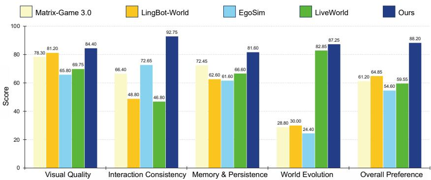  
Figure 7: User Study. Human evaluation across Visual Quality, Interaction Consistency, Memory and Persistence, World Evolution, and Overall Preference. Our method consistently achieves the highest scores across all evaluated dimensions.

## VISUAL CUE HACKING

We further illustrate the effect of our Visual Cue Hacking strategy in Fig. 8. We compare videos generated by directly conditioning on the whitebox renderings with those produced using Visual Cue Hacking. As shown in Fig. 8, directly rendering from whitebox videos tends to produce visually monotonous, render-like results with overly sharp and rigid edges, as the generation model closely follows the low-level geometry of the white-box inputs. In contrast, Visual Cue Hacking effectively adapts the model to the whitebox domain while preventing it from overfitting to these artificial boundaries. As a result, the model treats the whitebox video primarily as a structural cue rather than a pixel-level rendering target, enabling substantially higher visual quality with richer appearance and more natural details.

## EVALUATION DETAILS

Since our method cannot be directly adapted to the input formats of many existing benchmarks, we first construct a corresponding whitebox world from the benchmark inputs and then sample videos within this reconstructed environment for evaluation. Specifically, given a first frame, we first use

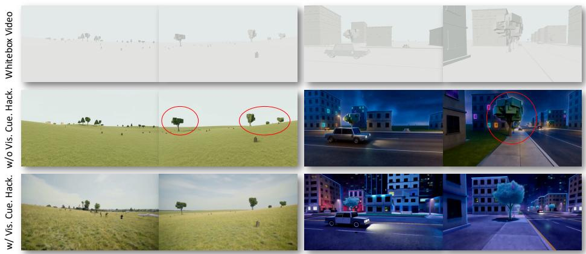  
Figure 8: Effect of Visual Cue Hacking. Directly conditioning on whitebox renderings produces monotonous, render-like videos with rigid edges, whereas our Visual Cue Hacking strategy encourages the model to use the whitebox input as a structural cue, resulting in richer appearance and higher visual quality.

SAM 3 (Carion et al., 2026) to segment the scene into its constituent objects and employ Depth Anything V2 (Yang et al., 2024a) to estimate the corresponding depth map. We then feed the first frame, segmentation map, and depth map into GPT-6 Astra to construct the whitebox world, as illustrated in Fig. 9.

Note that the reconstructed whitebox world is not required to be perfectly aligned with the first frame. In practice, discrepancies may arise in object geometry, shape, or fine-grained scene structure. Nevertheless, we find that conditioning the generation model on the original first frame effectively anchors the visual content to the reconstructed world. Even when the geometry of an object is only approximately matched, the generated appearance can still be aligned with its corresponding location in the whitebox world, allowing the reconstructed environment to serve as a reliable structural scaffold for benchmark evaluation.

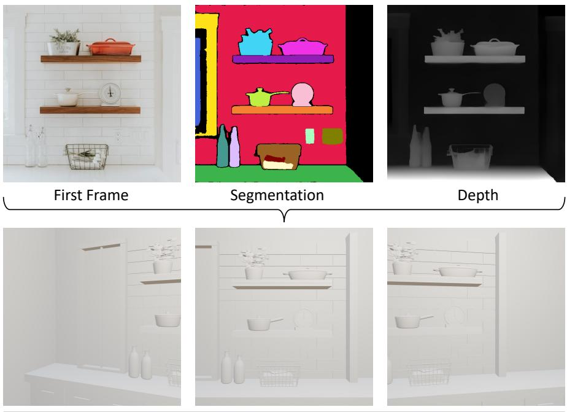  
Whitebox World  
Figure 9: Given the first frame, we obtain its segmentation map and depth map, and then reconstruct a corresponding whitebox world.

## LIMITATIONS

Extreme-Long Video Generation. Our current Artist model is fine-tuned with a fixed temporal window of 124 frames and does not undergo additional post-training specifically designed for longhorizon video generation. To generate longer sequences, we adopt a chunk-based generation strategy and concatenate multiple clips autoregressively. As a result, visual errors and distribution shifts can gradually accumulate over time, inevitably leading to quality degradation in extremely long rollouts. As shown in Fig. 10, at approximately 5,000 frames, noticeable degradation appears in the generated video. We believe that incorporating dedicated long-video post-training or more effective temporal memory mechanisms could further improve long-horizon generation quality.

3D Interpenetration  
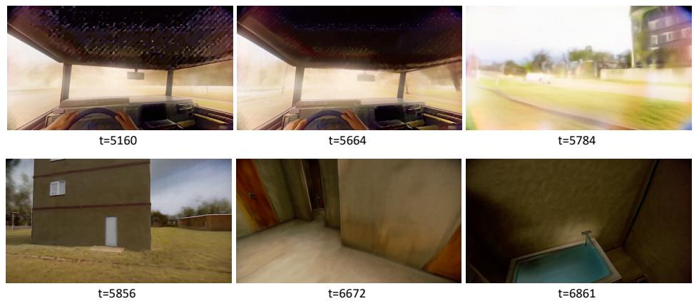  
Figure 10: Limitation of Long-Horizon Video Generation. Our Artist model is trained with a fixed 124- frame window and generates long videos through chunk-based rollout. Noticeable visual degradation emerges due to accumulated generation errors.

Whitebox Modeling. Our framework also inherits limitations from the construction and simulation of the whitebox world. In particular, accurately modeling complex hand-object interactions remains challenging, where the reconstructed or simulated hand poses may exhibit severe geometric distortion. In addition, imperfect scene geometry or collision handling can occasionally result in 3D interpenetration between objects. Representative failure cases are shown in Fig. 11. These limitations suggest that more accurate geometry reconstruction, articulated object modeling, and physically grounded interaction simulation could further improve the fidelity of the underlying world representation.

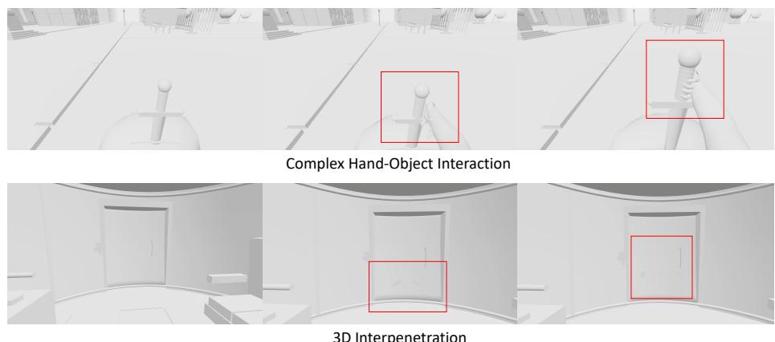  
Figure 11: Limitations of Whitebox Modeling. Our current whitebox world may exhibit failure cases in complex hand-object interactions and 3D geometry, including severely distorted hand poses and object interpenetration.

## FUTURE WORK

Beyond improving long-horizon video generation as discussed above, an important direction for future work is to further disentangle the visual generation process of the Artist model. Our current Artist directly generates complete RGB observations, in which geometry, material properties, illumination, and appearance are implicitly entangled. To better align with the paradigm proposed in this work, future Artist models could instead generate decomposed visual representations, such as Albedo, Normal, Roughness, and Irradiance maps, following recent progress in material- and lighting-aware image decomposition and synthesis (Zeng et al., 2024). As illustrated in Fig. 12, such factorized representations could provide more explicit and reusable scene information, making generated observations easier to register, update, and re-render within the underlying world. We believe this direction could further strengthen our Observation as World Registration paradigm by turning observations from monolithic RGB frames into structured visual states that can be more faithfully integrated back into the world.

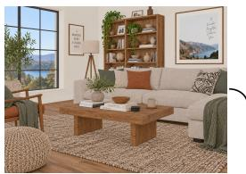

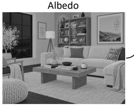  
Roughness

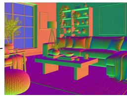

RGB  
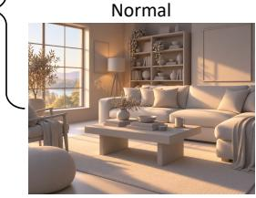  
Irradiance  
Figure 12: Towards Disentangled Visual Generation. Future Artist models could decompose RGB observations into structured visual representations, including Albedo, Normal, Roughness, and Irradiance, enabling more explicit scene registration, editing, and re-rendering within the CoDeR.