# Decoupling Disease, Covariates, and Individual Variability: A Unified Disentanglement Framework for Medical Image Classification

Shengjie Zhang, Jinglin Zhang, Zhuangzhuang Jiang, Ziqi Yu, Yipin Zhang, Qi Zhang, Xiang Chen, Haibo Yang, Fei Gao, Longbiao Cui, Yuan Zhou, Xiao-Yong Zhang, and Alzheimer’s Disease Neuroimaging Initiative

Abstract—Accurately isolating disease-related features from confounding covariates (e.g., age, gender, site) and individual variations remains a fundamental challenge in medical image classification. Traditional regression-based approaches may ignore non-linear relations between image features and true covariates. To overcome this issue, we present a generalized Medical Imaging Disentanglement Learning (MedIDL) framework. MedIDL maps image features into three mutually orthogonal latent spaces through specialized disentanglement heads: a disease classification head guided by a supervised loss, a covariate-alignment head constrained by cross-subject similarity matching, and a Gaussian head absorbing individual variations. We evaluated our framework across 7 datasets encompassing diverse imaging modalities. MedIDL outperforms state-of-the-art supervised and self-supervised classification methods in accuracy across all datasets. Association analyses demonstrate that MedIDL successfully isolates target-specific latent representations. Gradientbased interpretability mappings localize pathognomonic patterns aligning with established clinical literature.

Index Terms—Disentanglement Learning, Medical Image Classification, Feature Distillation, Covariate Confounding.

## I. INTRODUCTION

D EEP learning has revolutionized medical image analysisby learning representations directly from data [1]. Medical imaging spans a wide spectrum of modalities, from 2D radiographs and 3D volumetric magnetic resonance imaging (MRI) to brain networks derived from resting-state functional MRI (rs-fMRI) or diffusion tensor imaging (DTI). These diverse data structures provide complementary, multi-scale views of human physiology and pathology [2]. For example, rs-fMRI captures dynamic blood-oxygen-level-dependent (BOLD) fluctuations that reflect functional connectivity, while DTI and structural MRI (sMRI) reveal the underlying whitematter connectivity and gray-matter morphology respectively [3]. Accurately classifying patients from healthy controls (HCs) using these diverse imaging sources can diagnose patients at an early stage and reveal disease-related changes [4].

In this task, a fundamental challenge exists: deep learning models struggle to disentangle disease-specific pathological signals from confounding covariates (such as age, gender, acquisition site, education level, and scanner type) and individual variability [5]. In some real-world preprocessed datasets (Fig. 1a), image features are highly correlated with various covariates. For example, age is positively associated with the prefrontal cortex-amygdala connectivity in fMRI of young healthy individuals in the Attention Deficit Hyperactive Disorder (ADHD)-200 dataset and positively associated with the temporal lobe intensity in sMRI (T1) of healthy individuals in the Alzheimer’s Disease Neuroimaging Initiative (ADNI) (Fig. 1b). Besides these covariate associations, individual variability also exists. For example, HC subjects who share identical demographic profiles exhibit substantial inter-individual differences in imaging appearance [6]. As a result, standard convolutional neural networks (CNNs), vision transformers (ViTs), and graph neural networks (GNNs) could inadvertently encode and memorize these nuisance variables. This entanglement leads to biased representations, poor cross-site generalizability, and inflated performance on in-distribution data [7].

Existing strategies for handling this entanglement remain insufficient. Traditional methods typically linearly regress image features on covariates to adjust the features to the center of covariates, assuming that these exists a linear relationship [8]. Normative modeling extends the linear relationship by using Gaussian process regression to predict image features from covariates [9]. Residuals from the prediction are considered as features deprived of covariate effects. With the emergence of deep learning, adversarial learning and domain-adversarial neural networks have been employed to suppress demographic biases [10] while regression has also been attempted to isolate covariates such as age [11]. These approaches typically address only a subset of confounders or operate under restrictive linear assumptions (Fig. 1c), which may overly constrain the representation space and fail to capture complex, non-linear interactions between features and true covariates.

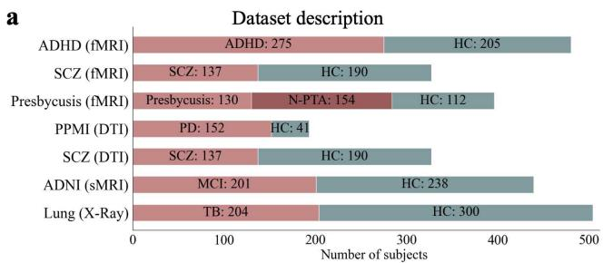

Association between features and covariates  
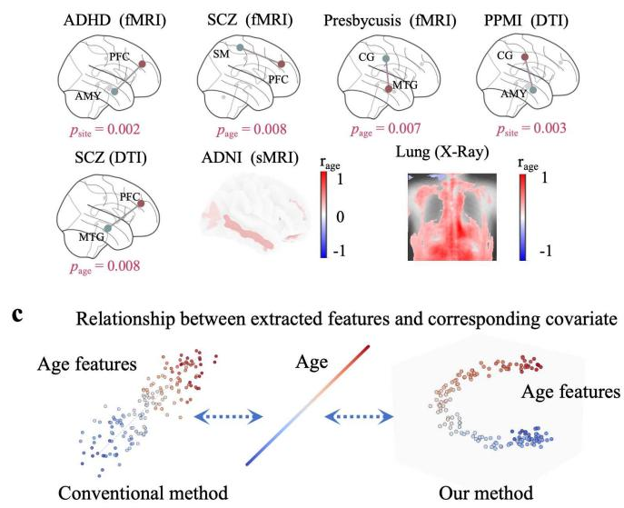  
Fig. 1. Overview of the datasets, covariate association, and advantage of the proposed framework. (a) illustrates the dataset description, showing the sample sizes across diverse modalities. (b) visualizes the most significantly associated biomarker(s) for a covariate (e.g. age or scanner site) within the HCs of a dataset. The image biomarkers are functional/structural connectivity for fMRI/DTI, intensity for sMRI and X-ray. The p-values were false discovery rate (FDR)-corrected in each dataset. (c) conceptually illustrates the latent representation spaces, highlighting that conventional methods typically enforce linear relationships between the extracted covariate features and true covariates, whereas our framework allows for non-linear manifold alignment.

Furthermore, existing methods are hindered by a pervasive architectural compartmentalization. Specifically, GNNs operate almost exclusively on non-Euclidean topologies for functional and structural brain connectomes [3], while CNNs and ViTs are confined to the Euclidean grid structures characteristic of 2D planar or 3D volumetric tensors. This preempts the formulation of a unified, geometry-agnostic representation paradigm capable of assimilating heterogeneous data topologies within a single optimization landscape. Consequently, adapting to different imaging modalities necessitates modality-specific network re-engineering and isolated optimization pipelines.

To overcome these limitations, we propose a generalized Medical Imaging Disentanglement Learning (MedIDL) framework that explicitly decomposes the latent representation of any medical imaging input into three complementary components: (i) disease-related features that separate HCs from patients, (ii) covariate-related features that capture demographic and acquisition-related effects, and (iii) individual variations that account for residual subject-specific differences. Inspired by contrastive variational autoencoders [12], MedIDL incorporates a novel covariate alignment scheme to isolate covariaterelated features without assuming a linear relationship with the true covariate. Specifically, covariate-related features are learned by explicitly aligning a similarity matrix between latent embeddings of subjects with the ground-truth covariate similarity matrix, enabling the covariate features to preserve neighborhood proximity while being flexible enough to form any 1-dimensional manifold in the feature space for a covariate (Fig. 1c). Furthermore, disease-related features are isolated through supervised classification, while an independent individual head captures the remaining variability.

To validate the proposed framework, we conduct comprehensive evaluations across seven medical datasets, covering functional networks (fMRI), structural networks (DTI), 3D anatomical volumes (sMRI), and 2D radiographs (X-ray) (Fig. 1a). The main contributions of this work are threefold:

• A unified disentanglement framework: We present the first end-to-end model capable of decomposing latent features into disease-related, covariate-related, and individual-variation components without requiring restrictive linear assumptions.

• Modality-adaptable architecture: We design a lightweight encoder-adaptive mechanism that enables adaptation across 2D planar images, 3D volumetric scans, and graphstructured brain networks.

• Extensive multimodal validation: We conduct comprehensive experiments on 7 datasets spanning diverse modalities and diseases including ADHD-200, Schizophrenia (SCZ), Presbycusis, Parkinson’s Progression Marker Initiative (PPMI), ADNI, and Lung.

Preliminary work was published in 2025 International conference on Medical Image Computing and Computer-Assisted Intervention (MICCAI) [13].

## II. RELATED WORK

## A. Medical image classification algorithms

Over the past decade, computer-aided diagnosis has transitioned from localized spatial feature extraction to global, multi-modal, and topology-aware classification frameworks. Early milestones pioneered by Li et al. [14] deployed shallow CNNs to replace hand-crafted descriptors, a paradigm subsequently extended by Zhang et al. [15]. As reviewed by Chen et al. [16], while CNNs remain effective for localized lesion extraction, their stationary receptive fields inherently restrict macroscale long-range dependency modeling. To bridge this contextual gap, hybrid ViTs emerged. Manzari et al. [17] developed MedViT to combine convolutional efficiency with global self-attention, while Wu et al. [18] engineered CTransCNN to seamlessly integrate parallel CNN and Transformer pathways for multi-label diagnosis. Further optimizing selfattention, Chowdary and Yin [19] introduced Med-former with specialized tokenization to capture complex multi-sequence patterns. Recent frameworks migrated to frequency domains and non-Euclidean topological spaces. For example, Zhang et al. [20] proposed a 3D global Fourier network, utilizing 3D fast Fourier transforms to extract global descriptors from sMRI, while Li et al. [21] introduced BrainGNN to leverage graph convolutions and pooling for functional connectivity classification. Despite the transition toward holistic and topology-aware architectures, these paradigms still struggle with inherent feature entanglement.

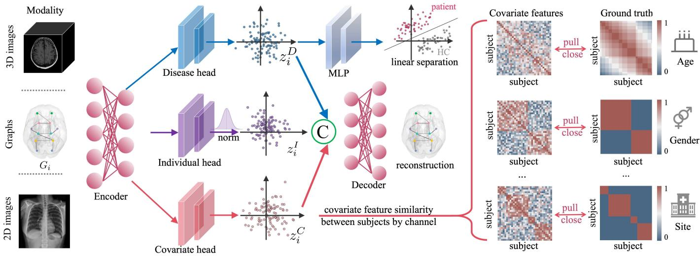  
Fig. 2. Overall architecture of the proposed disentangled representation learning framework. For any given input modality (e.g., 3D images, brain graphs, or 2D images), the data is processed by an encoder and subsequently projected into three separate latent spaces via dedicated heads. The disease head extracts disease-specific features $( z _ { i } ^ { D } )$ optimized for separating patients from HCs. The individual head captures normalized, individual-specific latent variations $( z _ { i } ^ { I } ) .$ The covariate head extracts demographic and site-related features $( z _ { i } ^ { C } )$ , which are supervised by aligning the channel-wise subject similarity matrices with the corresponding ground truth similarity matrices from the covariates (e.g., age, gender, and site). Finally, the three disentangled components are concatenated and fed into a decoder to reconstruct the original input.

## B. Covariate removal strategy

Traditionally, linear regression for removing the covariate effects has existed for a long time. For example, voxel-based morphometry (VBM) utilizes Generalized Linear Models (GLMs) to account for nuisance covariates [22], a practice also performed at the population scale by Smith et al. [23]. Explicit covariate elimination is widely formulated via regressionbased residualization, where GLMs are fitted on HC subjects to yield orthogonalized residual features [24]. In addition, such a covariate-removal workflow is often paired with z-score normalization to remove the scale of different dimensions [25]. Furthermore, advanced harmonization pipelines like ComBat [26] extended standard GLMs via empirical Bayes estimation. Although highly efficient and interpretable, these traditional paradigms operate under rigid parametric assumptions and simplified linear constraints. Consequently, they may fail to model non-linear interactions between covariates and image features.

## C. Deep disentanglement learning in medical imaging

Modern deep learning architectures have shifted toward disentangled representation learning (DRL) to explicitly model and isolate heterogeneous covariates within latent spaces. In this paradigm, treating nuisance variations as explicit conditioning factors or adversarial targets serves as an architectural form of feature factorization. For instance, Zhao et al. [27] introduced an adversarial learning framework by formulating a competitive game between a primary disease predictor and a confounder classifier. By training the predictor to actively deceive the classifier, the network learns imaging representations independent of site or demographic variations. Chartsias et al. [28] factorized medical images into mutually exclusive subspaces separating invariant anatomy from style factors, while Moyer et al. [29] advanced scanner-invariant representation learning for diffusion MRI by deploying information-theoretic boundaries to filter out site-specific variations from brain connectivity networks.

Concurrently, deep contrastive learning and non-linear metric constraints have transformed how networks isolate target pathological variations from complex backgrounds. For example, Aglinskas et al. [12] introduced a contrastive machine learning framework that successfully disentangled shared healthy population backgrounds from neuroanatomical alterations in Autism Spectrum Disorder (ASD). To capture dynamic developmental trajectories, Yu et al. [30] developed a conditional intensive triplet network that embeds timeprogressive covariates directly into a deep metric loss. Recently, Ouyang et al. [31] weakly supervised longitudinal MRIs to segregate normal aging from disease severity, and Maeng et al. [32] proposed IdenBAT to decouple age from ageinvariant morphological identity traits. Collectively, these deep covariate-modeling methodologies establish a solid paradigm for separating disease-specific traits from confounders.

## III. METHOD

## A. General architecture

Let the input for the i-th subject be $x _ { i } ,$ which can be a graph, a 3D volumetric image, or a 2D planar image. The MedIDL framework explicitly decomposes the latent representation of any input medical image into three independent components: (i) disease-related feature $z _ { i } ^ { D } ~ \in ~ \mathbb { R } ^ { d }$ , (ii) covariate-related feature $z _ { i } ^ { C } \in \mathbb { R } ^ { d }$ and (iii) individual variation $z _ { i } ^ { I } \in \mathbb { R } ^ { d }$ . The framework consists of three modular stages (Fig. 2):

1) A modality-aware encoder $E n c ( \cdot )$ that extracts features based on the specific input data structure and projects them into a latent space $z _ { i } = E n c ( x _ { i } ) \in \mathbb { R } ^ { d }$

2) Three parallel disentanglement heads, disease head $g _ { D } ,$ covariate head $g _ { C } ,$ , and individual head $g _ { I }$ , that disentangle the unified representation into three components:

$$
z _ { i } ^ { D } = g _ { D } ( z _ { i } ) , \quad z _ { i } ^ { C } = g _ { C } ( z _ { i } ) , \quad z _ { i } ^ { I } = g _ { I } ( z _ { i } ) .
$$

3) A shared latent decoder Dec that reconstructs the original input from the concatenated disentangled features, ensuring information preservation.

Next, we give details on the input data structure, the encoder, the disentanglement heads, the decoder, and the loss function.

## B. Input data structure and encoder

For brain graphs from fMRI/DTI, we have

$$
\begin{array} { r } { x _ { i } = G _ { i } = ( A _ { i } , X _ { i } ) , \quad A _ { i } \in \mathbb { R } ^ { N \times N } , \quad X _ { i } \in \mathbb { R } ^ { N \times F } , } \end{array}
$$

where $N = 1 1 6$ is the number of the nodes from the Automated Anatomical Labeling (AAL) 1 atlas, $A _ { i }$ is the adjacency matrix, and $X _ { i }$ contains node features. The adjacency matrix is Pearson’s correlation coefficient between regional BOLD signals for fMRI or mean streamline count for DTI. The node features are amplitude of low-frequency fluctuation (ALFF) in Slow-5, Slow-4, and classical bands $( F = 3 )$ for fMRI. For DTI, $X _ { i }$ encapsulates the concatenated 6-dimensional microstructural tensor profile comprising fractional anisotropy (FA), mean diffusivity (MD), axial diffusivity (AD), radial diffusivity (RD), tensor mode (MO), and trace (TR) $( F = 6 )$ We use the graph isomorphism network (GIN) as the encoder for this type of data.

For 3D volumetric MRI, we have

$$
\boldsymbol { x } _ { i } = \boldsymbol { X } _ { i } \in \mathbb { R } ^ { H \times W \times D \times C } ,
$$

where $H = W = D = 9 6$ and $C = 1 , x _ { i }$ represents the processed T1-weighted MRI following a pipeline of skullstripping, MNI-152 template alignment through affine registration, intensity normalization, center-cropping and scaling. We use the Swin-ViT as the encoder for this type of data.

For 2D planar X-ray, we have

$$
x _ { i } = X _ { i } \in \mathbb { R } ^ { H \times W \times C } ,
$$

where $C \ = \ 1 , \ x _ { i }$ represents a grayscale chest radiograph, resized to $2 2 4 \times 2 2 4$ . We use a 2D residual CNN-based (Res-Conv) neural network as the encoder.

All encoders output a fixed d = 64-dimensional latent vector $z _ { i } ~ \in ~ \mathbb { R } ^ { d }$ . This creates a modality-agnostic information bottleneck for the downstream disentanglement heads. Detailed architectural configurations for each encoder are provided in Appendix A.

## C. Disentanglement heads

The disentanglement heads $g _ { D } , g _ { C } ,$ , and $g _ { I }$ are implemented as independent 2-layer multi-layer perceptrons (MLPs) with ReLU activations. Each head maps the representation $z _ { i }$ into a d-dimensional latent vector, yielding $\bar { z } _ { i } ^ { D } , z _ { i } ^ { C } , z _ { i } ^ { I } \ \in \mathbb { R } ^ { d }$ respectively.

1) Covariate head: The covariate head $g _ { C }$ projects intermediate representations into a d-dimensional covariate feature space, yielding $z _ { i } ^ { C } ~ \in ~ \mathbb { R } ^ { d }$ . To align the latent space with the non-imaging covariates, we evaluate pairwise similarity matrices and force the feature-level similarity matrix to be close to the ground truth similarity matrix for each covariate.

Specifically, for a given covariate $k ~ \in ~ \mathcal { C } ~ ( \mathbf { e . g . } , ~ k ~ \in$ {age, gender, site}), we compute the feature-level similarity matrix $\hat { S } ^ { ( k ) } = [ \hat { S } _ { i j } ^ { ( k ) } ] _ { B \times B }$ over a mini-batch of size B using a scale-invariant, lightweight linear projection $\phi _ { k } ( z _ { i } ^ { C } )$

$$
\hat { S } _ { i j } ^ { ( k ) } = \frac { \phi _ { k } ( z _ { i } ^ { C } ) ^ { \top } \phi _ { k } ( z _ { j } ^ { C } ) } { \| \phi _ { k } ( z _ { i } ^ { C } ) \| _ { 2 } \| \phi _ { k } ( z _ { j } ^ { C } ) \| _ { 2 } } .\tag{1}
$$

The ground-truth covariate similarity matrix $\begin{array} { r l } { S ^ { ( k ) } } & { { } = } \end{array}$ $[ S _ { i j } ^ { ( k ) } ] _ { B \times B } ^ { = }$ is defined based on the covariate type:

• Continuous variables $( { \mathrm { e . g . , ~ a g e ~ } } a _ { i } ) { \mathrm { : } }$ To handle potential scaling issues, a continuous covariate $a _ { i }$ is first linearly mapped into the range [0, 1] over all the subjects in the training set, yielding ${ \tilde { a } } _ { i } .$ . The similarity is then defined as:

$$
S _ { i j } ^ { ( \mathrm { a g e } ) } = 1 - | \tilde { a } _ { i } - \tilde { a } _ { j } | .\tag{2}
$$

• Categorical variables (e.g., gender or site $s _ { i } )$

$$
S _ { i j } ^ { ( \mathrm { s i t e } ) } = \mathbb { I } ( s _ { i } = s _ { j } ) ,\tag{3}
$$

where $\mathbb { I } ( \cdot )$ is the indicator function.

The covariate alignment loss is then formulated as:

$$
\mathcal { L } _ { c o v } = \frac { 1 } { | \mathcal { C } | } \sum _ { k \in \mathcal { C } } \frac { 1 } { B ^ { 2 } } \left\| S ^ { ( k ) } - \hat { S } ^ { ( k ) } \right\| _ { F } ^ { 2 } ,\tag{4}
$$

where $\| \cdot \| _ { F }$ denotes the Frobenius norm.

2) Individual head: To model individual variation without introducing complex optimization landscapes, we impose a parameter-free structural prior on the individual variations $z _ { i } ^ { I }$ Specifically, $z _ { i } ^ { I }$ is channel-wisely normalized (whitened) to approximate a standard Gaussian distribution in a batch:

$$
z _ { i } ^ { I }  \frac { z _ { i } ^ { I } - \mu ( z _ { i } ^ { I } ) } { \sigma ( z _ { i } ^ { I } ) + \epsilon } ,
$$

where the mean operator $\mu$ and the standard deviation operator σ operate in a batch, and ϵ is a small constant for numerical stability. This simple yet effective whitening operation forces the network to absorb uninformative, random stochastic variations into $z _ { i } ^ { I }$

3) Disease head: The disease-related features $z _ { i } ^ { D }$ are fed into an MLP classifier:

$$
p _ { i } = \mathrm { s o f t m a x } ( h _ { D } ( z _ { i } ^ { D } ) ) .
$$

where $h _ { D }$ is an MLP with 2 layers using the ReLU activation function and a hidden dimension of d. The supervised classification objective is:

$$
\mathcal { L } _ { s u p } = - \frac { 1 } { B } \sum _ { i = 1 } ^ { B } \sum _ { c = 1 } ^ { C } y _ { i , c } \log ( p _ { i , c } ) ,
$$

where C is the number of classes, $y _ { i } = [ y _ { i , 1 } , \ldots , y _ { i , C } ] ^ { \top }$ is the one-hot encoded class label.

## D. Decoder and final loss function

Finally, to guarantee minimal information loss during the disentanglement process, the concatenated features $[ z _ { i } ^ { \bar { D } } ; z _ { i } ^ { C } ; z _ { i } ^ { I } ] ~ \in ~ \bar { \mathbb { R } } ^ { 3 d }$ are fed into a decoder to reconstruct the original image or node features $\hat { X _ { i } } = D e c ( [ z _ { i } ^ { D } ; z _ { i } ^ { C } ; z _ { i } ^ { I } ] )$ yielding the latent reconstruction loss:

$$
\mathcal { L } _ { r e c } = \frac { 1 } { B } \sum _ { i = 1 } ^ { B } \| X _ { i } - \hat { X } _ { i } \| _ { 2 } ^ { 2 } .
$$

The decoder Dec is similarly a 2-layer MLP that maps the concatenated 3d-dimensional vector back to the original input space. The hidden layer has a dimension of d with a ReLU activation function. This reconstruction is efficient enough while ensuring that the disentangled features collectively preserve the full expressivity of the original input.

The total objective is collectively optimized end-to-end:

$$
\mathcal { L } = \mathcal { L } _ { \mathrm { s u p } } + \lambda _ { 1 } \mathcal { L } _ { c o v } + \lambda _ { 2 } \mathcal { L } _ { r e c } ,
$$

where $\lambda _ { 1 }$ and $\lambda _ { 2 }$ are fixed across all experiments. By subjecting each branch to mutually exclusive supervision signals (class labels, covariate similarities, whitening) while binding them together via the latent reconstruction loss, the framework effectively achieves robust implicit disentanglement.

## E. Implementation details

The framework is implemented in PyTorch and trained on a single NVIDIA A6000 or V100 GPU.

The GIN encoder processes brain graphs using a 2-layer GIN with 64 hidden dimensions and ReLU activations, followed by global average pooling.

The ViT encoder processes 3D MRI scans using $1 6 \times 1 6 \times$ 16 patches and an 8-layer Transformer (6 heads, 768 hidden dimensions). Patch tokens are aggregated via global average pooling and linearly projected $( \bar { W } _ { \mathrm { p r o j } } \in \mathbb { R } ^ { 6 4 \times 7 6 \bar { 8 } } ) \mathrm { ~ t o ~ } z _ { i }$

The 2D CNN-based residual network extracts features from 2D X-ray radiographs across four residual down-sampling stages $( 3 \times 3$ convolutions, batch normalization (BN), ReLU, and $1 \times 1$ projection shortcuts), followed by global average pooling.

We use the Adam optimizer (learning rate is $1 \times 1 0 ^ { - 3 }$ and weight decay is $1 \times 1 0 ^ { - 5 } )$ , batch size $B = 3 2$ , and train for 300 epochs with early stopping on validation accuracy. The same hyperparameters, $\lambda _ { 1 } = 1 . 0 , \lambda _ { 2 } = 0 . 6 , d = 6 4 , \epsilon = 1 0 ^ { - 4 }$ , are fixed across all datasets without per-dataset tuning.

## IV. RESULTS

## A. Datasets and preprocessing

We used 7 datasets acquired from diverse multi-center clinical cohorts for evaluation, including 4 public datasets — ADHD-200 (fMRI), PPMI (DTI), ADNI (sMRI), Lung (2D X-ray) [33] — and 3 private datasets — SCZ (fMRI), SCZ (DTI), Presbycusis (fMRI). Both the functional and structural SCZ datasets are derived from the same multi-modal cohort, which was collected at Xijing Hospital, affiliated with the Fourth Military Medical University, China. They are treated as entirely independent benchmarks. The Presbycusis dataset was collected at Shandong Provincial Hospital Affiliated to Shandong First Medical University.

All datasets were uniformized into three canonical representation formats: non-Euclidean graphs (functional graph: ADHD-200, SCZ, Presbycusis; structural graph: PPMI, SCZ), 3D volumetric images (ADNI), and 2D planar images (Lung). All cohorts provide three clinical covariates for training — age, gender, and site – except for the Presbycusis and Lung datasets which contain only age and gender. Dataset details and preprocessing steps are left in Appendix B.

## B. Classification accuracy

Table I summarizes the classification results on the fMRI (ADHD, SCZ, Presbycusis) and DTI (PPMI, SCZ) datasets under the evaluation strategy detailed in Appendix C. The proposed framework consistently achieves the highest accuracy and AUC across all five datasets. Notably, on the challenging SCZ fMRI and DTI classification tasks, our method yields accuracies of 70.02% and 73.42%, outperforming the strongest baseline (DMG) by absolute margins of 2.88% and 3.33%, respectively. Similarly, in the multi-class Presbycusis task, our model achieves an OvR-AUC of 87.05%, demonstrating its capacity to handle multi-class scenarios.

The evaluation on 3D/2D images is reported in Table II. Again, our method establishes a new state-of-the-art on both 3D/2D datasets. On the ADNI dataset, it achieves an accuracy of 85.71% and an AUC of 86.48%, surpassing the highly competitive diffusion-based method DiffMed-v2 by 1.25% in accuracy and 1.93% in AUC. On the 2D X-ray lung-infection task, our framework reaches an accuracy of 87.60%.

## C. Quantitative validation offeature disentanglement

To verify that the proposed framework successfully isolates the target information in the latent space, we quantitatively evaluated the correlation between the learned latent representations and the ground truth covariates. Specifically, we computed the Kendall’s Tau rank correlation coefficient between the five disentangled latent embeddings and the actual ground-truth covariates. For each test set, the similarity of a subject between all the other subjects is calculated for both the feature and the ground truth such that Kendall’s Tau rank correlation coefficient can be calculated between these 2 similarity vectors, then the mean correlation coefficient is evaluated over all the subjects in this test set.

TABLE I  
CLASSIFICATION PERFORMANCE ON FMRI (ADHD-200, SCZ, PRESBYCUSIS) AND DTI (PPMI, SCZ) CONNECTOMES.
<table><tr><td rowspan="3">Method</td><td colspan="6">fMRI</td><td colspan="4">DTI</td></tr><tr><td colspan="2">ADHD</td><td colspan="2">SCZ</td><td colspan="2">Presbycusis</td><td colspan="2">PPMI</td><td colspan="2">SCZ</td></tr><tr><td>Accuracy a</td><td>AUC</td><td>Accuracy</td><td>AUC</td><td>Accuracy</td><td> $\mathbf { \sigma } _ { \mathrm { O v R - A U C } }$ </td><td>Accuracy</td><td>AUC</td><td>Accuracy</td><td>AUC</td></tr><tr><td>BrainGNN</td><td> $6 2 . 2 2 \pm 3 . 8 7$ </td><td> $6 3 . 0 4 \pm 4 . 4 2$ </td><td> $6 4 . 8 6 \pm 3 . 5 7$ </td><td> $6 4 . 4 8 \pm 2 . 7 3$ </td><td> $8 3 . 0 9 \pm 4 . 4 1$  一</td><td> $8 4 . 0 2 \pm 4 . 5 1$  </td><td> $6 7 . 5 4 \pm 3 . 8 5$ </td><td> $6 9 . 0 2 \pm 4 . 1 7$ </td><td> $6 8 . 6 1 \pm 3 . 2 6$ </td><td> $6 9 . 2 2 \pm 3 . 4 0$ </td></tr><tr><td>NEGAT</td><td> $6 2 . 0 8 \pm 2 . 9 4$ </td><td> $6 2 . 9 5 \pm 3 . 3 5$ </td><td> $6 3 . 3 3 \pm 4 . 5 6$ </td><td> $6 4 . 0 9 \pm 3 . 9 1$ </td><td> $8 2 . 7 9 \pm 3 . 8 5$ </td><td> $8 2 . 9 5 \pm 3 . 3 6$ </td><td> $6 9 . 3 1 \pm 3 . 5 2$ </td><td> $7 0 . 5 3 \pm 3 . 9 2$ </td><td> $6 8 . 2 5 \pm 3 . 8 2$ </td><td> $6 8 . 7 2 \pm 3 . 9 1$ </td></tr><tr><td>GraphCL</td><td> $6 2 . 8 6 \pm 4 . 7 1$ </td><td> $6 2 . 2 1 \pm 4 . 2 7$ </td><td> $6 5 . 3 1 \pm 4 . 7 2$  一</td><td> $6 5 . 1 9 \pm 4 . 4 0$  一</td><td> $8 3 . 4 5 \pm 4 . 4 9$  1</td><td> $8 2 . 5 0 \pm 3 . 9 2$ </td><td> $7 0 . 6 5 \pm 4 . 5 8$ </td><td>一  $7 2 . 3 6 \pm 4 . 2 0$  一</td><td> $6 8 . 2 9 \pm 3 . 4 1$  一</td><td> $6 8 . 8 8 \pm 3 . 6 2$ </td></tr><tr><td>JOAO</td><td> $6 1 . 9 2 \pm 3 . 7 2$ </td><td> $6 2 . 1 2 \pm 3 . 8 4$ </td><td> $6 4 . 9 2 \pm 5 . 1 1$ </td><td> $6 4 . 8 0 \pm 4 . 6 3$ </td><td> $8 3 . 1 5 \pm 3 . 7 7$ </td><td> $8 2 . 6 9 \pm 4 . 4 3$ </td><td> $7 0 . 2 8 \pm 3 . 5 9$ </td><td> $7 1 . 9 2 \pm 3 . 4 7$ </td><td> $6 8 . 3 7 \pm 4 . 1 0$ </td><td> $6 9 . 3 0 \pm 3 . 8 6$ </td></tr><tr><td>LaGraph</td><td> $6 3 . 8 8 \pm 2 . 6 8$ </td><td>一  $6 3 . 9 2 \pm 2 . 6 3$ </td><td> $6 5 . 2 5 \pm 3 . 8 3$ </td><td> $6 4 . 4 6 \pm 4 . 3 0$ </td><td> $8 3 . 8 5 \pm 4 . 0 2$ </td><td>一  $8 3 . 1 9 \pm 3 . 4 6$ </td><td> $7 1 . 5 8 \pm 3 . 7 2$ </td><td>一  $7 2 . 2 0 \pm 3 . 9 1$ </td><td> $6 9 . 2 4 \pm 3 . 6 9$  </td><td> $7 0 . 1 1 \pm 4 . 0 3$ </td></tr><tr><td>AGCL</td><td> $6 3 . 2 5 \pm 4 . 1 8$ </td><td> $6 2 . 6 3 \pm 4 . 2 9$ </td><td>一  $6 7 . 2 5 \pm 4 . 1 8$ </td><td>一  $6 5 . 3 5 \pm 3 . 6 4$ </td><td> $8 4 . 1 5 \pm 4 . 1 7$ </td><td>一  $8 3 . 5 5 \pm 3 . 8 6$ </td><td> $7 2 . 4 8 \pm 4 . 2 5$ </td><td>一  $7 2 . 8 5 \pm 3 . 7 4$ </td><td> $6 9 . 9 2 \pm 3 . 8 8$ </td><td> $7 0 . 1 6 \pm 4 . 0 5$ </td></tr><tr><td>GATE</td><td> $6 2 . 2 5 \pm 3 . 8 4$ </td><td> $6 2 . 7 1 \pm 4 . 0 3$ </td><td> $6 6 . 2 8 \pm 3 . 7 1$  一</td><td> $6 6 . 0 5 \pm 4 . 1 2$  一</td><td> $8 3 . 9 7 \pm 3 . 4 7$  一</td><td> $8 3 . 2 7 \pm 2 . 4 9$  </td><td> $7 2 . 1 8 \pm 3 . 6 2$ </td><td> $7 2 . 5 5 \pm 4 . 1 0$  一</td><td> $6 8 . 3 3 \pm 3 . 9 2$  一</td><td> $6 9 . 8 1 \pm 3 . 6 0$ </td></tr><tr><td>BrainGCL</td><td> $6 2 . 0 5 \pm 3 . 5 9$ </td><td> $6 1 . 5 2 \pm 3 . 7 0$ </td><td> $6 5 . 2 7 \pm 2 . 9 7$ </td><td> $6 4 . 3 1 \pm 3 . 5 9$ </td><td> $8 2 . 8 5 \pm 2 . 9 8$ </td><td> $8 3 . 0 6 \pm 4 . 1 4$ </td><td> $7 2 . 1 1 \pm 4 . 1 3$ </td><td> $7 2 . 4 6 \pm 3 . 8 6$ </td><td> $6 8 . 2 5 \pm 4 . 0 5$ </td><td> $6 9 . 0 3 \pm 3 . 7 2$ </td></tr><tr><td>DMG</td><td> $6 2 . 5 7 \pm 2 . 9 5$ </td><td> $6 2 . 0 8 \pm 3 . 5 1$ </td><td> $6 7 . 1 4 \pm 3 . 9 5$ </td><td> $6 8 . 5 2 \pm 4 . 4 1$ </td><td> $8 4 . 0 8 \pm 3 . 1 9$ </td><td> $8 3 . 9 5 \pm 4 . 3 9$ </td><td> $7 2 . 6 5 \pm 3 . 5 0$ </td><td> $7 3 . 0 7 \pm 4 . 0 3$ </td><td> $7 0 . 0 9 \pm 4 . 1 4$ </td><td> $7 1 . 5 8 \pm 3 . 9 5$ </td></tr><tr><td>Ours</td><td> ${ \pm \bf 5 . 2 4 } \pm 3 . 1 7 ^ { \mathrm { ~ b ~ } }$ </td><td> ${ \bf 6 6 . 0 3 \pm 4 . 0 5 }$ </td><td> ${ \bf 7 0 . 0 2 \pm 4 . 0 6 }$ </td><td> ${ \bf 7 1 . 0 5 \pm 4 . 5 7 }$ </td><td> ${ \bf 8 6 . 2 2 \pm 3 . 3 6 }$ </td><td> ${ \bf 8 7 . 0 5 \pm 5 . 0 4 }$ </td><td> $7 4 . 4 6 \pm 3 . 5 2$ </td><td> $\mathbf { 7 4 . 9 1 \pm 4 . 1 0 }$ </td><td> $7 3 . 4 2 \pm 4 . 0 6$ </td><td> $\mathbf { 7 4 . 0 8 \ : \pm { 4 . 0 2 } }$ </td></tr></table>

a Test results are reported as mean ± standard deviation across 5 folds.  
b The best result for each dataset and metric is in boldface.

TABLE II  
CLASSIFICATION PERFORMANCE ON 2D/3D VISION TASKS.
<table><tr><td rowspan="2">Method</td><td colspan="2">3D MRI</td><td colspan="2">2D X-ray</td></tr><tr><td colspan="2">ADNI</td><td colspan="2">Lung</td></tr><tr><td></td><td>Accuracy a</td><td>AUC</td><td>Accuracy</td><td>AUC</td></tr><tr><td>v-CNN</td><td> $8 0 . 5 3 \pm 4 . 1 5$ </td><td> $8 1 . 1 4 \pm 3 . 5 8$ </td><td> $8 2 . 3 5 \pm 2 . 3 0$ </td><td> $8 3 . 0 5 \pm 1 . 9 6$ </td></tr><tr><td>ResNet</td><td> $8 1 . 3 2 \pm 3 . 7 2$ </td><td> $8 0 . 8 8 \pm 4 . 0 5$ </td><td> $8 2 . 9 5 \pm 2 . 3 5$ </td><td> $8 3 . 5 2 \pm 2 . 0 6$ </td></tr><tr><td>ViT</td><td> $8 1 . 5 9 \pm 3 . 9 0$ </td><td> $8 2 . 2 2 \pm 3 . 7 4$  </td><td> $8 3 . 4 8 \pm 2 . 0 2$ </td><td> $8 4 . 1 5 \pm 1 . 6 5$ </td></tr><tr><td>GF-Net</td><td> $8 3 . 0 7 \pm 4 . 1 6$ </td><td> $8 3 . 2 5 \pm 3 . 1 0$ </td><td> $8 5 . 0 5 \pm 1 . 5 9$ </td><td> $8 5 . 6 8 \pm 2 . 1 5$ </td></tr><tr><td>V-Mamba</td><td> $8 2 . 2 9 \pm 3 . 9 0$ </td><td> $8 4 . 0 2 \pm 4 . 0 7$ </td><td> $8 5 . 2 8 \pm 1 . 9 4$ </td><td> $8 5 . 7 5 \pm 2 . 2 3$ </td></tr><tr><td>DiffMed-v2</td><td> $8 4 . 4 6 \pm 4 . 1 8$ </td><td> $8 4 . 5 5 \pm 3 . 2 9$ </td><td> $8 6 . 2 6 \pm 2 . 0 6$ </td><td> $8 6 . 8 1 \pm 1 . 4 5$ </td></tr><tr><td>SimCLR</td><td> $8 3 . 8 8 \pm 2 . 9 5$ </td><td> $8 4 . 0 9 \pm 3 . 3 4$ </td><td> $8 4 . 4 9 \pm 1 . 4 5$ </td><td> $8 4 . 5 0 \pm 1 . 5 9$ </td></tr><tr><td>ADIOS</td><td> $8 3 . 5 8 \pm 3 . 5 2$ </td><td> $8 3 . 8 6 \pm 3 . 7 5$ </td><td> $8 5 . 1 5 \pm 2 . 2 9$ </td><td> $8 5 . 4 2 \pm 1 . 8 8$ </td></tr><tr><td>SGLA-Net</td><td> $8 2 . 0 9 \pm 3 . 8 5$ </td><td> $8 3 . 1 1 \pm 3 . 7 9$ </td><td> $8 4 . 3 0 \pm 1 . 9 2$ </td><td> $8 4 . 8 5 \pm 2 . 0 1$ </td></tr><tr><td>Ours</td><td> $\mathbf { 8 5 . 7 1 \pm 3 . 5 2 \ : ^ { b } }$ </td><td> ${ \bf 8 6 . 4 8 \pm 4 . 8 3 }$ </td><td> ${ \bf 8 7 . 6 0 } \pm 3 . 4 2$ </td><td> ${ \bf 8 7 . 9 1 } \pm 2 . 4 8$ </td></tr></table>

a Test results are reported as mean ± standard deviation across 5 folds. b The best result for each dataset and metric is in boldface.

The correlation analysis reveals a highly specific and orthogonal mapping across all seven datasets (Fig. 3). A diagonal pattern — where each ground-truth covariate is strongly and exclusively correlated only with its corresponding latent feature — is robustly maintained for age (top row), gender (middle row), and site (bottom row) across all imaging modalities. These results provide a compelling evidence that MedIDL effectively performs feature disentanglement.

## D. Comprehensive ablation and sensitivity analysis

To validate the architectural components, optimization stability, and generalizability, we conducted extensive ablation and sensitivity studies (Fig. 4).

2) Robustness across modality-aware backbones: The second row of Fig. 4 benchmarks the disentanglement performance across different backbone encoders. For functional and structural brain graphs, we evaluated Graph Convolutional Networks (GCN), Graph Attention Networks (GAT), Graph-SAGE (Sage), and GIN. While GIN consistently yields slight advantages, the framework maintains highly stable performance across all graph encoders. Similarly, for 3D/2D image data, we substituted the backbone with residual convolutional networks (Res-Conv), basic MLPs, diffusion-based bottlenecks (Diff), and Swin-ViT. The absence of catastrophic performance drops across these diverse architectures confirms that our framework successfully purifies the embeddings independent of the upstream feature extractors.

3) Effectiveness of the tri-branch disentanglement: The third row of Fig. 4 investigates the core components of our framework: the tri-branch disentanglement mechanism. We compared the full MedIDL model (“with all”) against three degenerative variants: removing the individual head (“w/o $g _ { I } \ddot { } )$ , removing the covariate head $( ^ { 6 6 } \mathrm { w } / 0 ~ g _ { C } { } ^ { 3 3 } ) ,$ and removing both heads simultaneously (“w/o both”, reducing the framework to a standard encoder-decoder). Across all datasets, the “w/o both” variant suffers from the most severe performance degradation. In addition, removing the covariate head (“w/o $g _ { C } \ " )$ causes a sharper decline in accuracy than removing the individual head (“w/o gI”). This empirically corroborates our hypothesis that demographic variables and site-specific biases act as the dominant confounders in medical imaging.

1) Information bottleneck and latent dimensionality: The first row of Fig. 4 delineates the sensitivity of the model with respect to the latent embedding dimension d. Across all datasets, a clear upward trajectory in accuracy is observed as the dimension increases from 16. However, the performance typically reaches an optimal plateau between $d \ = \ 3 2$ and 64. Beyond 64 (e.g., at $\begin{array} { r l r } { d } & { { } = } & { 1 2 8 ) } \end{array}$ , the accuracy either saturates or marginally declines. This phenomenon aligns with the information bottleneck principle: overly expansive latent spaces encourage the memorization of redundant noise and increase the risk of overfitting.

4) Hyperparameter stability: The fourth row presents the accuracy heatmaps by varying the loss weighting hyperparameters $( \lambda _ { 1 }$ for covariate alignment and $\lambda _ { 2 }$ for reconstruction). The heatmaps reveal a consistent, broad “sweet spot” across the modalities. While the framework demonstrates remarkable tolerance to hyperparameter shifts, moderate-to-high regularization weights typically yield the best trade-off.

5) Superiority over explicit de-confounding strategies: Finally, the fifth row of Fig. 4 addresses a critical question: Is our implicit representation disentanglement superior to traditional linear regression-based de-confounding? We compared conventional linear regression-based de-confounding against our framework. The empirical results are definitive. For both graph baselines and 3D/2D image baselines, standard linear regression fails to sufficiently mitigate confounding bias, yielding performance that is either marginally superior or virtually identical to uncorrected baselines. In contrast, our framework achieves significantly higher accuracies across all datasets.

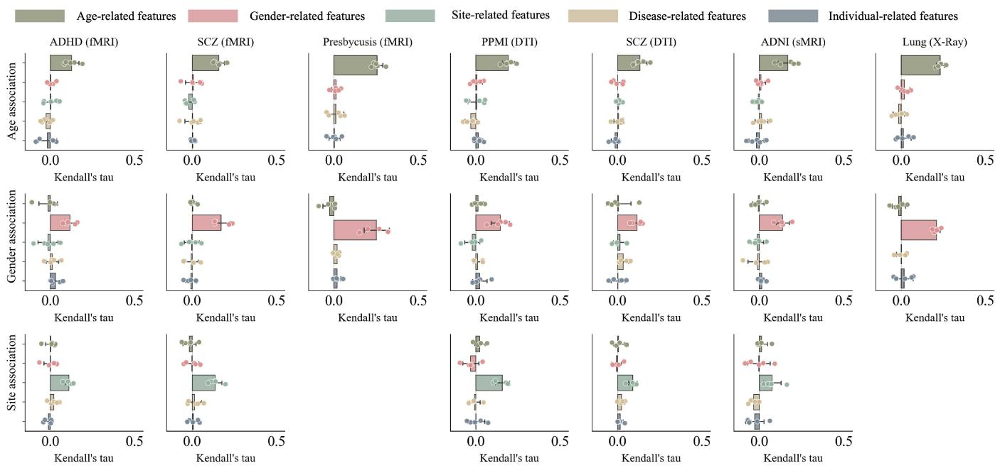  
Fig. 3. Quantitative validation of feature disentanglement using Kendall’s Tau rank correlation across seven datasets. Each row represents a ground-truth covariate (age, gender, or site) for evaluating the correlation. A dot within a subplot denotes the mean correlation over all the subjects in a test set, where the correlation for a subject measures the order consistency between similarities from this subject to all the others measured by a distinct feature (by color) and similarities measured by the true covariate.

## E. Clinical interpretability and biomarker discovery

To verify that our model extracts genuine pathological signals, we identify the disease-discriminating features. Specifically, we construct gradient-based saliency maps by computing the first-order partial derivatives of the predicted disease logits with respect to the input space (node features for graphs and pixel/voxel intensities for 2D/3D images). A counterfactual perturbation analysis by masking the identified top ROIs or voxels/pixels confirms that removing these signals leads to a more rapid decrease of the prediction probability on the patients from the test sets (Fig. 5). We further visualize these top ROIs/voxels/pixels in Fig. 6.

In the SCZ and ADHD cohorts, alterations are concentrated on the hippocampus, amygdala, and prefrontal regions, consistent with existing psychiatric literature [34]. On the PPMI (DTI) dataset, the identified regions strongly implicate basal ganglia and thalamic networks, in line with Parkinsonism degeneration [35]. On the ADNI (sMRI) dataset, the model highlights regions such as amygdala, lateral ventricle, medial superior frontal gyrus, precentral gyrus, which are wellestablished regions of early cognitive impairment [36]. On the Lung (X-ray) dataset, the saliency maps delineate localized pulmonary opacities and lesions corresponding to Tuberculosis infections annotated by a clinical expert.

## V. DISCUSSION AND CONCLUSION

In this study, we proposed a MedIDL framework to overcome a pervasive bottleneck in medical image analysis: the entanglement of disease-specific pathological signals with confounding covariates and individual variability. By introducing a modality-aware encoder alongside a tri-branch latent disentanglement architecture, MedIDL explicitly routes diagnostic features, covariate features, and individual variations into different latent spaces. Through extensive evaluations across seven datasets, our framework consistently demonstrated superior classification accuracy. Ablation, correlation, and counterfactual analyses confirmed that decoupling these representations effectively isolates demographic biases and improves classification accuracy and biomarker discovery.

Our MedIDL framework pushes the accuracy of fMRIbased classification for ADHD from 62–64% [13], [37], [38] to 65.24%. For SCZ and PPMI, our method outperformed the accuracies of upper 60% to low 70% from recent advanced GNNs [39]–[42] by achieving 70.02% on SCZ (fMRI), 73.42% on SCZ (DTI), and 74.46% on PPMI (DTI). In the Presbycusis task, MedIDL achieved an impressive OvR-AUC of 87.05%. On the ADNI (sMRI) dataset, we advanced the accuracy of classifying mild cognitive impairment (MCI) from HCs from 82–84% [43], [44] to 85.71% and AUC to 86.48%. On the Lung 2D X-ray dataset, our framework achieved an accuracy of 87.60%, outperforming ViT and SimCLR by 4.12% and 3.11% respectively. These findings demonstrate that the performance bottleneck in contemporary medical image classification does not solely depend on the backbone architecture, but also on feature disentanglement.

The identified disease-related regions align well with established clinical literature. On both the SCZ and ADHD datasets, the model identified hyper-connectivity and functional disruptions primarily within the default mode network, the prefrontal cortex, and the amygdala — hubs intricately linked to cognitive control and emotional dysregulation in psychiatric literature [45]. On the PPMI dataset, the top discriminative structural features were mapped to the basal ganglia, and thalamocortical tracts, which are the exact pathways compromised in dopaminergic depletion in Parkinson’s disease [46], [47]. In the HC vs. MCI task, our model localized morphometric alterations to the right amygdala, neocortical hubs including the right superior medial frontal and precentral gyri, and the left lateral ventricle, capturing early limbic neurodegeneration accompanied by lateral ventricular enlargement, characteristic of prodromal Alzheimer’s disease [48], [49]. On the Lung (X-ray) dataset, our saliency maps delineated localized apical pulmonary opacities and cavitations, matching the radiological presentation of pulmonary tuberculosis [50].

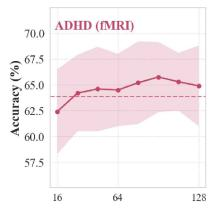

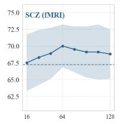

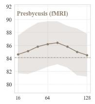

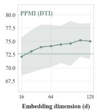

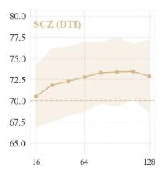

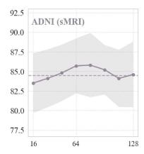

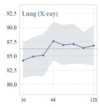

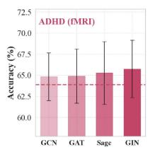

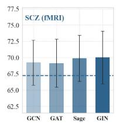

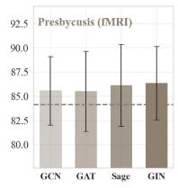

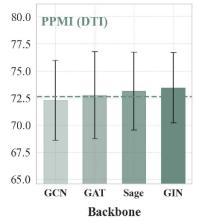

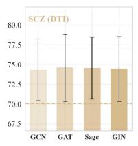

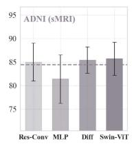

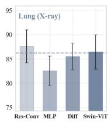

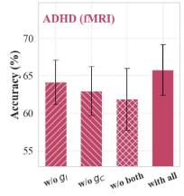

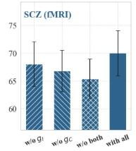

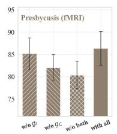

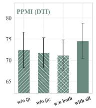

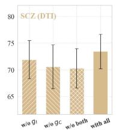

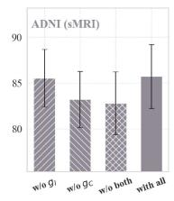

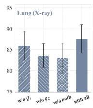

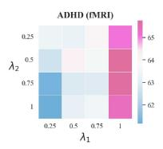

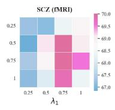

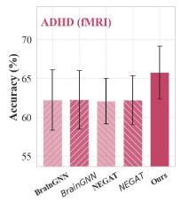

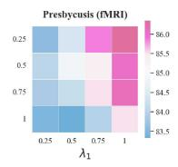

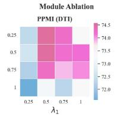

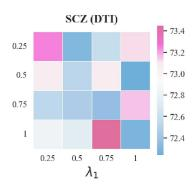

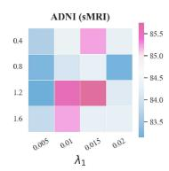

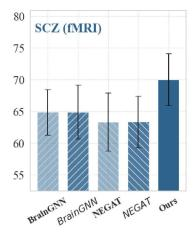

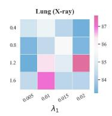

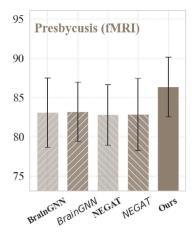

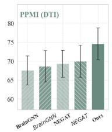

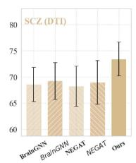

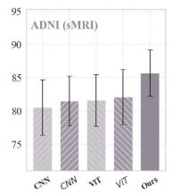

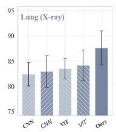  
Fig. 4. Comprehensive ablation and sensitivity analysis of the MedIDL framework across diverse imaging modalities. (Row 1) Impact of the unified latent embedding dimension (d) on classification accuracy. Shaded regions indicate standard deviations. The dashed line denotes the top competing method. (Row 2) Robustness validation across various modality-aware backbones. The dashed line denotes the top competing method. (Row 3) Component-wise ablation of th tri-branch disentanglement module. (Row 4) Joint hyperparameter sensitivity heatmaps for the covariate alignment weight (λ1) and latent reconstruction weight (λ2), suggesting a stable, broad high-accuracy zone (darker red regions). (Row 5) Superiority of our implicit latent disentanglement (solid bars) over traditiona input-level de-confounding via linear regression. Dark hatched bars represent explicit de-confounding (regressing out covariates prior to classification), whil light hatched bars denote classification without covariate removal.

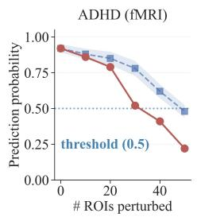

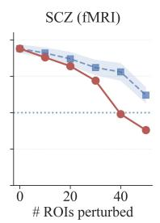

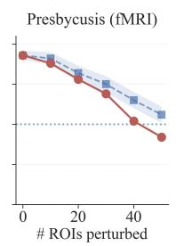

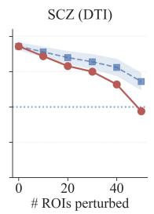

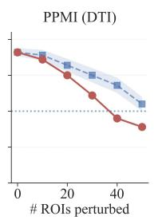

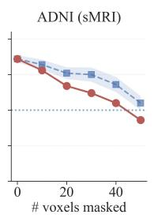

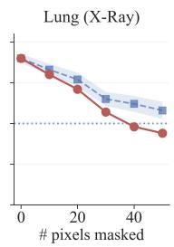  
Fig. 5. Quantitative validation of biomarker importance via counterfactual perturbation analysis across seven datasets. A plot depicts the degradation trajectories of the model’s mean prediction probability as input features are progressively perturbed/masked (replaced by means from HCs) from the patients in the test sets. Solid red lines represent the targeted perturbation of the “top important features” identified by our framework. Dashed blue lines with shades serve as the baseline representing the mean and standard deviation from 5 “random perturbations”. To accommodate the distinct spatial topologies of different modalities, the x-axis denotes the number of ROIs perturbed for fMRI and DTI, 3D voxels masked for sMRI, or 2D pixels masked for X-ray.

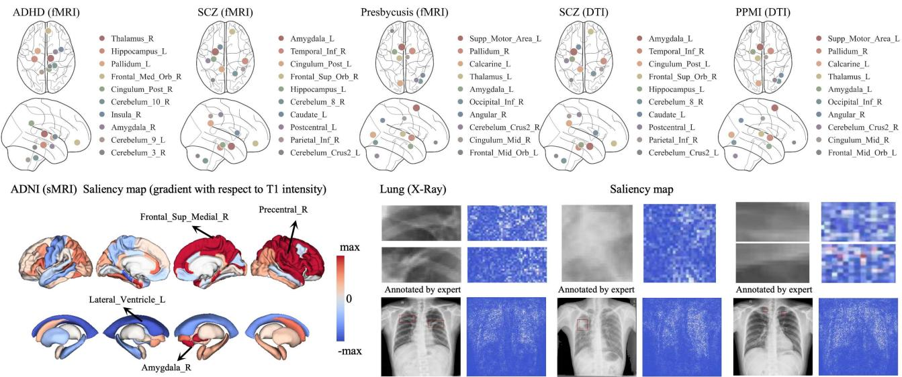  
Fig. 6. Saliency maps identified by the proposed framework across seven datasets. (Top): For graph-based brain networks, the framework maps the most discriminative ROIs in the MNI space, where the marker size scales proportionally with the node’s importance score. (Bottom): For voxel/pixel-based datasets, gradient-based feature attribution maps localize structural and radiological anomalies. On ADNI (sMRI), the gradient is with respect to T1 intensity after affine registration. Hence, positive values in the cortical region indicate gray matter atrophy; negative values in the ventricle indicate enlarged ventricle. On Lung (X-ray), red rectangles are pulmonary lesions annotated by a clinical expert.

Despite its strong performance and generalizability, this study also has limitations. First, the covariate head relies on the availability of covariate information. If a covariate is missing, the framework lacks a mechanism to discover and decouple it. Second, we model the individual variability using a simple channel-wise Gaussian normalization. While this successfully absorbs random stochasticity, individual variability might not perfectly conform to a standard normal distribution. Finally, maintaining three parallel disentanglement branches and computing cross-subject similarity matrices increases the computational overhead and memory footprint during the training phase, although inference time remains unaffected.

In conclusion, we introduced the MedIDL framework, a highly adaptable, unified approach for extracting pure, diseasespecific representations from complex medical imaging data. By adapting to diverse modalities and decoupling pathological signals from demographic covariates and individual variability, MedIDL establishes a new state-of-the-art across seven datasets. Beyond predictive accuracy, the framework isolated covariate features that only correlated with the designated true covariates and discovered biomarkers that aligned with established literature. Hence, MedIDL represents a significant step toward developing robust and interpretable artificial intelligence systems for real-world clinical deployment.

## ACKNOWLEDGMENT

This work was supported by grants from the National Natural Science Foundation of China (82441016, 82471940), Natural Science Foundation of Shanghai (24TS1415000), and China Postdoctoral Science Foundation (2024M762010).

Data collection and sharing for this project were funded by the Alzheimer’s Disease Neuroimaging Initiative (ADNI) (NIH Grant U01 AG024904; DOD ADNI W81XWH-12-2- 0012). ADNI is funded by the National Institute on Aging, the National Institute of Biomedical Imaging and Bioengineering, and through contributions from numerous industry partners. A complete listing of ADNI investigators and funding sources can be found at: http://adni.loni.usc.edu.

Data used in the preparation of this article was obtained on July 21, 2025 from the PPMI database (www.ppmi-info.org/access-dataspecimens/download-data), RRID:SCR\_006431. For up-to-date information on the study, visit www.ppmi-info.org. PPMI – a public-private partnership – is funded by the Michael J. Fox Foundation for Parkinson’s Research, and funding partners; including AbbVie, Aligning Science Across Parkinson’s (ASAP), Avid Radiopharmaceuticals, Biogen, BioHaven, BioLegend, Bristol Myers Squibb, Celgene, Eli Lilly and Company, Genentech, GlaxoSmithKline, Golub Capital, Handl Therapeutics, Insitro, Janssen Neuroscience, Lundbeck, Merck & Co., Inc., Meso Scale Discovery, Neurocrine Biosciences, Pfizer, Piramal, Roche, Sanofi Genzyme, Servier, Takeda, Teva, UCB, Verily, and Voyager Therapeutics.

We thank Dr. Wenting Rui at Huashan Hospital, Fudan University for ROI annotations on the Lung dataset.

## APPENDIX

An appendix is available in the online version.

## REFERENCES

[1] G. K. Thakur, A. Thakur, S. Kulkarni, N. Khan, and S. Khan, “Deep learning approaches for medical image analysis and diagnosis,” Cureus, vol. 16, no. 5, 2024.

[2] M. A. Alharbi et al., “Deep learning algorithms in medical image processing: A critical and comprehensive review,” Advances in Artificial Intelligence and Machine Learning, vol. 5, no. 4, p. 248, 2025.

[3] H. Mohammadi and W. Karwowski, “Graph neural networks in brain connectivity studies: Methods, challenges, and future directions,” Brain Sciences, vol. 15, no. 1, p. 17, 2024.

[4] K. Han, D. Hu, F. Zhao, T. Liu, F. Yang, and G. Li, “Incomplete multimodal disentanglement learning with application to alzheimer’s disease diagnosis,” IEEE TMI, 2025.

[5] F. Kheiri, S. Rahnamayan, and M. Makrehchi, “Deceptive bias measurement in deep learning: Assessing shortcut reliance in tcga cancer models,” medRxiv, pp. 2025–12, 2025.

[6] J. Hendriks et al., “Impact of simulated mri artifacts on deep learningbased brain age prediction,” medRxiv, pp. 2026–03, 2026.

[7] C. Boland, K. A. Goatman, S. A. Tsaftaris, and S. Dahdouh, “There are no shortcuts to anywhere worth going: identifying shortcuts in deep learning models for medical image analysis,” in Medical Imaging with Deep Learning, 2024.

[8] F. Alfaro-Almagro et al., “Confound modelling in uk biobank brain imaging,” NeuroImage, vol. 224, p. 117002, 2021.

[9] A. F. Marquand, I. Rezek, J. Buitelaar, and C. F. Beckmann, “Understanding heterogeneity in clinical cohorts using normative models: beyond case-control studies,” Biological psychiatry, vol. 80, no. 7, pp. 552–561, 2016.

[10] P. Zhao and X. Ding, “Dfca: Disentangled feature contrastive learning and augmentation for fairer dermatological diagnostics,” in IJCAI, 2025, pp. 646–654.

[11] F. Yan, G. Yang, Y. Li, A. Liu, and X. Chen, “Dual graph attention based disentanglement multiple instance learning for brain age estimation,” arXiv preprint arXiv:2403.01246, 2024.

[12] A. Aglinskas, J. K. Hartshorne, and S. Anzellotti, “Contrastive machine learning reveals the structure of neuroanatomical variation within autism,” Science, vol. 376, no. 6597, pp. 1070–1074, 2022.

[13] S. Zhang et al., “Graph disentanglement learning for fmri analysis: Decoupling disease, covariates, and individual variability,” in MICCAI. Springer, 2025, pp. 352–361.

[14] Q. Li, W. Cai, X. Wang, Y. Zhou, D. D. Feng, and M. Chen, “Medical image classification with convolutional neural network,” in ICARCV. IEEE, 2014, pp. 844–848.

[15] J. Zhang, Y. Xie, Q. Wu, and Y. Xia, “Medical image classification using synergic deep learning,” Medical image analysis, vol. 54, pp. 10– 19, 2019.

[16] C. Chen, N. A. M. Isa, and X. Liu, “A review of convolutional neural network based methods for medical image classification,” Computers in biology and medicine, vol. 185, p. 109507, 2025.

[17] O. N. Manzari, H. Ahmadabadi, H. Kashiani, S. B. Shokouhi, and A. Ayatollahi, “Medvit: a robust vision transformer for generalized medical image classification,” Computers in biology and medicine, vol. 157, p. 106791, 2023.

[18] X. Wu et al., “Ctranscnn: Combining transformer and cnn in multilabel medical image classification,” Knowledge-Based Systems, vol. 281, p. 111030, 2023.

[19] G. J. Chowdary and Z. Yin, “Med-former: A transformer based architecture for medical image classification,” in MICCAI. Springer, 2024, pp. 448–457.

[20] S. Zhang et al., “3d global fourier network for alzheimer’s disease diagnosis using structural mri,” in MICCAI. Springer, 2022, pp. 34–43.

[21] X. Li et al., “Braingnn: Interpretable brain graph neural network for fmri analysis,” Medical image analysis, vol. 74, p. 102233, 2021.

[22] J. Ashburner and K. J. Friston, “Voxel-based morphometry—the methods,” Neuroimage, vol. 11, no. 6, pp. 805–821, 2000.

[23] S. M. Smith et al., “A positive-negative mode of population covariation links brain connectivity, demographics and behavior,” Nature neuroscience, vol. 18, no. 11, pp. 1565–1567, 2015.

[24] J. Dukart, M. L. Schroeter, K. Mueller, and A. D. N. Initiative, “Age correction in dementia–matching to a healthy brain,” PloS one, vol. 6, no. 7, p. e22193, 2011.

[25] F. Falahati et al., “The effect of age correction on multivariate classification in alzheimer’s disease, with a focus on the characteristics of incorrectly and correctly classified subjects,” Brain Topography, vol. 29, no. 2, pp. 296–307, 2016.

[26] J.-P. Fortin et al., “Harmonization of cortical thickness measurements across scanners and sites,” Neuroimage, vol. 167, pp. 104–120, 2018.

[27] Q. Zhao, E. Adeli, and K. M. Pohl, “Training confounder-free deep learning models for medical applications,” Nature communications, vol. 11, no. 1, p. 6010, 2020.

[28] A. Chartsias et al., “Disentangled representation learning in cardiac image analysis,” Medical image analysis, vol. 58, p. 101535, 2019.

[29] D. Moyer, G. Ver Steeg, C. M. Tax, and P. M. Thompson, “Scanner invariant representations for diffusion mri harmonization,” Magnetic resonance in medicine, vol. 84, no. 4, pp. 2174–2189, 2020.

[30] X. Yu et al., “Longitudinal infant functional connectivity prediction via conditional intensive triplet network,” in MICCAI. Springer, 2022, pp. 255–264.

[31] J. Ouyang, Q. Zhao, E. Adeli, G. Zaharchuk, and K. M. Pohl, “Disentangling normal aging from severity of disease via weak supervision on longitudinal mri,” IEEE TMI, vol. 41, no. 10, pp. 2558–2569, 2022.

[32] J. Maeng, K. Oh, W. Jung, and H.-I. Suk, “Idenbat: Disentangled representation learning for identity-preserved brain age transformation,” Artificial Intelligence in Medicine, vol. 164, p. 103115, 2025.

[33] S. Jaeger, S. Candemir, S. Antani, Y.-X. J. Wáng, P.-X. Lu, and G. Thoma, “Two public chest x-ray datasets for computer-aided screening of pulmonary diseases,” Quantitative imaging in medicine and surgery, vol. 4, no. 6, p. 475, 2014.

[34] E. Kim et al., “Prefrontal cortex astrocytes modulate distinct neuronal populations to control anxiety-like behavior,” Nature communications, vol. 16, no. 1, p. 7819, 2025.

[35] N. D’Cruz, G. Vervoort, S. Chalavi, B. W. Dijkstra, M. Gilat, and A. Nieuwboer, “Thalamic morphology predicts the onset of freezing of gait in parkinson’s disease,” NPJ Parkinson’s disease, vol. 7, no. 1, p. 20, 2021.

[36] S. F. Eskildsen et al., “Prediction of alzheimer’s disease in subjects with mild cognitive impairment from the adni cohort using patterns of cortical thinning,” Neuroimage, vol. 65, pp. 511–521, 2013.

[37] D. Chen et al., “Self-supervised learning with adaptive graph structure and function representation for cross-dataset brain disorder diagnosis,” in MICCAI. Springer, 2024, pp. 612–622.

[38] X. Shen, S. Zhang, W. Liu, and Y. Zhou, “Disentangle disease-relevant patterns from irrelevant patterns in fmri analysis using equivariant and contrastive learning,” in IPMI. Springer, 2025, pp. 94–108.

[39] X. Li et al., “Braingnn: Interpretable brain graph neural network for fmri analysis,” Medical Image Analysis, vol. 74, p. 102233, 2021.

[40] Y. Chen et al., “Adversarial learning based node-edge graph attention networks for autism spectrum disorder identification,” IEEE TNNLS, 2022.

[41] Y. You, T. Chen, Y. Shen, and Z. Wang, “Graph contrastive learning automated,” in ICML. PMLR, 2021, pp. 12 121–12 132.

[42] Y. You, T. Chen, Y. Sui, T. Chen, Z. Wang, and Y. Shen, “Graph contrastive learning with augmentations,” NeurIPS, vol. 33, pp. 5812– 5823, 2020.

[43] Y. Yang, H. Fu, A. I. Aviles-Rivero, Z. Xing, and L. Zhu, “Diffmicv2: Medical image classification via improved diffusion network,” IEEE TMI, vol. 44, no. 5, pp. 2244–2255, 2025.

[44] L. Zhu, B. Liao, Q. Zhang, X. Wang, W. Liu, and X. Wang, “Vision mamba: Efficient visual representation learning with bidirectional state space model,” arXiv preprint arXiv:2401.09417, 2024.

[45] L. M. McTeague, J. Huemer, D. M. Carreon, Y. Jiang, S. B. Eickhoff, and A. Etkin, “Identification of common neural circuit disruptions in cognitive control across psychiatric disorders,” American Journal of Psychiatry, vol. 174, no. 7, pp. 676–685, 2017.

[46] R. L. Albin, A. B. Young, and J. B. Penney, “The functional anatomy of basal ganglia disorders,” Trends in neurosciences, vol. 12, no. 10, pp. 366–375, 1989.

[47] K. A. Schindlbeck and D. Eidelberg, “Network imaging biomarkers: insights and clinical applications in parkinson’s disease,” The Lancet Neurology, vol. 17, no. 7, pp. 629–640, 2018.

[48] C. Jack Jr et al., “Comparison of different mri brain atrophy rate measures with clinical disease progression in ad,” Neurology, vol. 62, no. 4, pp. 591–600, 2004.

[49] K. A. Johnson, N. C. Fox, R. A. Sperling, and W. E. Klunk, “Brain imaging in alzheimer disease,” Cold Spring Harbor perspectives in medicine, vol. 2, no. 4, p. a006213, 2012.

[50] S. M. Lyon and M. D. Rossman, “Pulmonary tuberculosis,” Microbiology spectrum, vol. 5, no. 1, pp. 10–1128, 2017.

# Decoupling Disease, Covariates, and Individual Variability: A Unified Disentanglement Framework for Medical Image Classification - Appendix

Shengjie Zhang1,2,3, Jinglin Zhang4, Zhuangzhuang Jiang4, Ziqi Yu1,2,3, Yipin Zhang5, Qi Zhang1, Xiang Chen5, Haibo Yang5, Fei Gao6, Longbiao Cui7, Yuan Zhou4,\*, Xiao-Yong Zhang1,2,3,\*, Alzheimer’s Disease Neuroimaging Initiative

## APPENDIX A: ARCHITECTURAL DETAILS

GNN for brain graphs

For brain graphs $\{ x _ { i } = ( A _ { i } , X _ { i } ) : i = 1 , \ldots , B \}$ in a batch, the default encoder is a 2-layer Graph Isomorphism Network (GIN) with the update of each layer being

$$
\begin{array} { r } { H _ { i } ^ { ( l ) } = \mathrm { M L P } ^ { ( l ) } \Big ( ( ( 1 + \epsilon ) I + A _ { i } ) H _ { i } ^ { ( l - 1 ) } \Big ) , \quad l = 1 , 2 , } \end{array}\tag{1}
$$

where $H _ { i } ^ { ( l ) } = [ \mathbf { h } _ { i , 1 } ^ { ( l ) } , \ldots , \mathbf { h } _ { i , N } ^ { ( l ) } ] ^ { \top }$ is the node features at the l-th layer of the i-th sample $( H _ { i } ^ { ( 0 ) } = X _ { i } )$ , I is the identity matrix, $\epsilon = 0$ , and the multi-layer perceptron (MLP) at layer l transforms each node feature by

$$
\begin{array} { r } { \mathrm { M L P } ^ { ( l ) } ( \mathbf { h } _ { i , v } ^ { ( l ) } ) = W _ { 2 } ^ { ( l ) } \mathrm { R e L U } \Big ( W _ { 1 } ^ { ( l ) } \mathbf { h } _ { i , v } ^ { ( l ) } + b _ { 1 } ^ { ( l ) } \Big ) + b _ { 2 } ^ { ( l ) } , } \end{array}\tag{2}
$$

with $W _ { 1 } ^ { ( l ) } \in \mathbb { R } ^ { d _ { \mathrm { h i d d e n } } \times d } , W _ { 2 } ^ { ( l ) } \in \mathbb { R } ^ { d \times d _ { \mathrm { h i d d e n } } } , b _ { 1 } ^ { ( l ) } , b _ { 2 } ^ { ( l ) }$ being learnable parameters, ReLU is the activation function, and $d _ { \mathrm { h i d d e n } } = 6 4$ After the second layer, global average pooling yields

$$
z _ { i } = \frac { 1 } { N } \sum _ { v = 1 } ^ { N } \mathbf { h } _ { i , v } ^ { ( 2 ) } .\tag{3}
$$

For ablation studies we also support Graph Attention Net (GAT), GraphSAGE, and Graph Convolutional Network (GCN) with identical layer counts and hidden dimensions.

## 3D ViT for volumetric MRI

To process 3D MRI volumes, we convert each 3D image $x _ { i }$ into patches $\{ x _ { i , k } ^ { \mathrm { p a t c h } } \} _ { k = 1 } ^ { P }$ and adopt a 3D ViT architecture with a patch size of $1 6 \times 1 6 \times 1 6$ , where P is the total number of 3D spatial patches. The 3D patch embedding for the k-th patch is formulated as

$$
p _ { i , k } = \mathrm { L i n e a r } \left( x _ { i , k } ^ { \mathrm { p a t c h } } \right) + E _ { i , k } ^ { \mathrm { p o s } } , \quad k = 1 , \ldots , P ,\tag{4}
$$

where $E ^ { \mathrm { p o s } } \in \mathbb { R } ^ { P \times D }$ denotes the learnable positional embeddings.

To feed these patch embeddings into the Transformer encoder, we construct an initial token sequence matrix $Z _ { i } ^ { ( 0 ) } =$ $[ p _ { i , 1 } , p _ { i , 2 } , \ldots , p _ { i , P } ] ^ { \top } \in \mathbb { R } ^ { P \times D }$ . The backbone consists of an 8-layer Transformer encoder. For each layer $l = 1 , \ldots , 8 ,$ , the feature updates via MLPs, multi-head self-attention, layer normalization, and residual connections are formulated as:

$$
Z _ { i } ^ { ( l - \frac { 1 } { 2 } ) } = Z _ { i } ^ { ( l - 1 ) } + \mathrm { M H S A } \left( \mathrm { L a y e r N o r m } ( Z _ { i } ^ { ( l - 1 ) } ) \right) ,\tag{5}
$$

TABLE I  
DEMOGRAPHIC, CLINICAL, AND DETAILED IMAGING ACQUISITION CHARACTERISTICS ACROSS THE SEVEN DATASETS.
<table><tr><td>Dataset &amp; Modality</td><td>Class</td><td>Sites</td><td>Subjects</td><td>Gender (F/M)</td><td>Age  $( \mathrm { m e a n } \pm \mathrm { s t d } )$ </td><td>Scanner Hardware</td><td>Acquisition Parameters</td></tr><tr><td>ADHD-200 (fMRI)</td><td>ADHD HC</td><td>4</td><td>275 205</td><td>79/196 105/100</td><td> $1 1 . 5 { \pm 2 . 8 }$  12.1±3.2</td><td>Siemens/Philips 3T</td><td> $\mathrm { T R } = 2 0 0 0 / 2 5 0 0 ~ \mathrm { m s } , \mathrm { T E } = 1 5 { - } 3 0 ~ \mathrm { m s } .$   $\mathrm { F A } = 7 5 ^ { \circ } / 9 0 ^ { \circ }$  , voxel  $\mathrm { s i z e } \approx 3 ~ \mathrm { m m ^ { 3 } }$ </td></tr><tr><td>SCZ (fMRI)</td><td>SCZ HC</td><td>3</td><td>137 190</td><td>62/75 92/98</td><td> $2 4 . 8 { \pm } 7 . 5 $  24.9±8.2</td><td>3.0T Siemens Magnetom Trio Tim scanner</td><td> $\mathrm { T R } = 2 \ \mathrm { s } ,$  TE = 30 ms, flip angle =  $9 0 ^ { \circ } , \mathrm { F O V } = 2 2 0 \times 2 2 0 \ \mathrm { m m } ^ { 2 }$ </td></tr><tr><td>Presbycusis (fMRI)</td><td>Presbycusis N-PTA HC</td><td>1</td><td>130 154 112</td><td>55/75 70/84 48/64</td><td> $6 3 . 2 \pm 3 . 3$   $6 3 . 6 { \pm } 4 . 6 $   $6 3 . 1 \pm 3 . 2$ </td><td>3.0T Philips Achieva MR scanner</td><td> $\mathrm { T R } = 2 \ \mathrm { s } , \ \mathrm { T E } = 3 5$  ms, FOV = 240  $\times ~ 2 4 0 ~ \mathrm { { m m ^ { 2 } } }$  resolution  $= 3 . 7 5 \times 3 . 7 5$   $\mathrm { m m } ^ { 2 }$  , 35 slices, thickness = 4 mm, 240 vols</td></tr><tr><td>PPMI (DTI)</td><td>PD HC</td><td>15</td><td>152 41</td><td>103/49 28/13</td><td> $6 1 . 3 { \pm } 9 . 1 $   $5 9 . 5 { \pm } 1 0 . 8 $ </td><td>3.0T Siemens Tim Trio scanner</td><td> $\mathrm { T R } / \mathrm { T E } ~ = ~ 9 0 0 / 8 8$  ms,  $\mathrm { F A } = 9 0 ^ { \circ } , ~ 7 2$  slices,  $b = 1 0 0 0$  s/mm², 64 diffusion dirs, voxel  ${ \mathrm { s i z e } } = 2 \times 2 \times 2 { \mathrm { ~ m m } } ^ { 3 }$  Cardiac-triggered</td></tr><tr><td>SCZ (DTI)†</td><td>SCZ HC</td><td>3</td><td>137 190</td><td>62/75 92/98</td><td> $2 4 . 8 { \pm } 7 . 5 $   $2 4 . 9 { \pm } 8 . 2 $ </td><td>3.0T Siemens Magnetom Trio Tim scanner</td><td> $b = 1 0 0 0 ~ \mathrm { { s / m m ^ { 2 } } } .$  32 dirs,  $\mathrm { r e s o l u t i o n } = 2 { \times } 2 { \times } 2 \ \mathrm { m m } ^ { 3 }$ </td></tr><tr><td>ADNI (sMRI)</td><td>MCI HC</td><td>4</td><td>201 238</td><td>101/100 125/113</td><td> $7 6 . 5 { \pm } 7 . 0 $   $7 3 . 7 { \pm } 8 . 0 $ </td><td>Multi-site 1.5T/3T</td><td>T1-weighted MPRAGE, isotropic 1 mm³ voxels</td></tr><tr><td>Lung (2D X-Ray)</td><td>TB HC</td><td>1</td><td>204 300</td><td>72/132 98/202</td><td> $3 3 . 7 { \pm } 1 4 . 9$   $3 3 . 4 \pm 1 4 . 0$ </td><td>Philips DR Digital Diagnost system</td><td>Frontal projection (PA/AP), approx.  $3 \mathrm { K } \times 3 \hat { \mathrm { K } }$  pixels, PNG format</td></tr></table>

† The SCZ (DTI) dataset has the same sample size and characteristics as the SCZ (fMRI) dataset. ADHD: attention deficit hyperactivity disorder. SCZ: schizophrenia. N-PTA: normal pure-tone audiometry. PD: Parkinson’s disease. MCI: mild cognitive impairment. TB: tuberculosis. HC: healthy control.

$$
Z _ { i } ^ { ( l ) } = Z _ { i } ^ { ( l - \frac { 1 } { 2 } ) } + \mathrm { M L P } \left( \mathrm { L a y e r N o r m } ( Z _ { i } ^ { ( l - \frac { 1 } { 2 } ) } ) \right) .\tag{6}
$$

Specifically, the encoder employs 8 Transformer layers with 6 attention heads per layer and a hidden dimension of $D = 7 6 8$ The global representation $z _ { \mathrm { g } } \mathrm { - }$ obtained via global average pooling over the final output patch tokens $Z _ { i } ^ { ( 8 ) }$ — is subsequently projected by a linear layer $\mathsf { \bar { W } _ { p r o j } } \in \mathbb { R } ^ { 6 4 \times 7 6 8 }$ to derive the final representation vector:

$$
z _ { i } = W _ { \mathrm { p r o j } } \cdot z _ { \mathrm { g } } .\tag{7}
$$

## 2D CNN for X-ray

We adapt a residual neural network backbone to extract structural feature representations from 2D X-ray radiographs. To accommodate continuous spatial down-sampling and channel expansion across residual stages, the residual block is formulated as:

$$
\mathbf { h } _ { i } ^ { ( l + 1 ) } = \mathcal { W } \left( \mathbf { h } _ { i } ^ { ( l ) } \right) + \mathrm { C o n v 2 D _ { 1 } } \left( \mathrm { R e L U } \left( \mathrm { B N } \left( \mathrm { C o n v 2 D _ { 2 } } ( \mathbf { h } _ { i } ^ { ( l ) } ) \right) \right) \right) ,\tag{8}
$$

where $\mathbf { h } _ { i } ^ { ( l ) }$ denotes the input feature map at layer $l \ ( \mathbf { h } _ { i } ^ { ( 0 ) } = x _ { i } )$ , and BN represents batch normalization. W(·) is the projection shortcut — implemented as $\textbf { a } 1 \times 1$ convolution with a stride of 2. Conv2Dj performs spatial 2D convolution with a $3 \times 3$ kernel and a stride of $j .$ . After four down-sampling stages, a global average pooling layer aggregates the feature maps into a d-dimensional embedding $z _ { i }$

## APPENDIX B: DATASET DETAILS AND PREPROCESSING

Details of the 7 datasets are in Table I. Their preprocessing steps are given below.

## Brain graph preprocessing (fMRI and DTI)

For functional connectivity, rs-fMRI data are parcellated using the AAL1 atlas [1], resulting in N = 116 ROIs. Each ROI is treated as a node, while the pairwise functional connectivity between ROIs defines the edges, forming the adjacency matrix. Node features are characterized by three ALFF measures — Slow-5 (0.01–0.027 Hz), Slow-4 (0.027–0.073 Hz), and the conventional band (0.01–0.08 Hz) — which quantify intrinsic neuronal oscillations through the Fourier transform of BOLD time series [2]. Consequently, each node is represented by a 3-dimensional ALFF feature vector.

For structural connectivity, DTI data are aligned to the same AAL1 template to ensure ROI correspondence with the rs-fMRI data. The mean streamline number between two ROIs is employed as the edge weight, reflecting the strength of white matter connectivity. To characterize localized tract microstructures, four core diffusion tensor metrics — FA, MD, axial diffusivity, and RD — are computed and concatenated alongside tensor MO and TR, yielding a 6-dimensional feature vector for each node.

To ensure stable learning across modalities, node features are normalized to [0, 1] and edge weights to [−1, 1].

## 3D volumetric MRI preprocessing

For 3D sMRI (T1-weighted scans from ADNI), the raw neuroimaging volumes underwent a rigorous standardization pipeline utilizing the FMRIB Software Library (FSL) package [3]. The preprocessing protocol incorporated automated skull-stripping to isolate brain tissues, followed by affine registration —FMRIB’s Linear Image Registration Tool (FLIRT) — to the standard MNI152 stereotaxic space to eliminate anatomical misalignment. Finally, intensity z-score normalization was applied and the volumes were center-cropped and down-sampled to a uniform grid of 96 × 96 × 96 voxels.

## 2D planar X-ray preprocessing

For 2D planar images (chest radiographs), the raw X-ray scans inherently suffer from varied spatial resolutions and exposure discrepancies. To standardize the inputs, all images were strictly resized to a fixed spatial dimension of 224 × 224 pixels using bicubic interpolation. Subsequently, global min-max normalization was applied to map the pixel intensities into the [0, 1] range. This normalization step homogenizes the contrast distribution, ensuring numerical stability for the downstream encoders.

## APPENDIX C: EVALUATION STRATEGY

To demonstrate the efficacy of our framework, comprehensive benchmarking was conducted against multiple state-of-the-art baselines across graph and Euclidean modalities. For fMRI and DTI graph classification, we evaluated our model against nine competing methods, which are categorized into: (i) two supervised learning methods, namely BrainGNN [4] and NEGAT [5]; (ii) six self-supervised learning (SSL) methods, including GraphCL [6], JOAO [7], LaGraph [8], AGCL [9], GATE [10], and BrainGCL [11]; and (iii) one graph disentangling framework, DMG [12]. For volumetric and planar images, our model was compared against standard deep vision backbones. Specifically, for 3D medical image classification, the baselines comprised vanilla CNN [13], ResNet [14], ViT [15], GF-Net [16], V-Mamba [17], DiffMed-v2 [18], SimCLR [19], ADIOS [20], and SGLA-Net [21]. For 2D images, the framework was benchmarked against the 2D counterparts of the aforementioned 3D backbones.

For a fair comparison, all baselines take the officially released code or are re-implemented. All methods are evaluated with identical training/validation/test splits (60/20/20%) in 5-fold cross-validation. In supervised learning, the validation set is used to determine the optimal training epoch for evaluating the test set. In SSL, the validation set serves to tune the hyperparameter of the downstream classifier — a linear support vector machine (SVM). Evaluation metrics are accuracy and area under the curve (AUC) (OvR-AUC for multi-class in Presbycusis).

## REFERENCES

[1] N. Tzourio-Mazoyer et al., “Automated anatomical labeling of activations in spm using a macroscopic anatomical parcellation of the mni mri single-subject brain,” Neuroimage, vol. 15, no. 1, pp. 273–289, 2002.

[2] X. Guo, H. Chen, Z. Long, X. Duan, Y. Zhang, and H. Chen, “Atypical developmental trajectory of local spontaneous brain activity in autism spectrum disorder,” Scientific reports, vol. 7, no. 1, pp. 1–10, 2017.

[3] M. Jenkinson, C. F. Beckmann, T. E. Behrens, M. W. Woolrich, and S. M. Smith, “Fsl,” Neuroimage, vol. 62, no. 2, pp. 782–790, 2012.

[4] X. Li et al., “Braingnn: Interpretable brain graph neural network for fmri analysis,” Medical image analysis, vol. 74, p. 102233, 2021.

[5] Y. Chen et al., “Adversarial learning based node-edge graph attention networks for autism spectrum disorder identification,” IEEE TNNLS, 2022

[6] Y. You, T. Chen, Y. Sui, T. Chen, Z. Wang, and Y. Shen, “Graph contrastive learning with augmentations,” NeurIPS, vol. 33, pp. 5812–5823, 2020.

[7] Y. You, T. Chen, Y. Shen, and Z. Wang, “Graph contrastive learning automated,” in ICML. PMLR, 2021, pp. 12 121–12 132.

[8] Y. Xie, Z. Xu, and S. Ji, “Self-supervised representation learning via latent graph prediction,” in ICML. PMLR, 2022, pp. 24 460–24 477.

[9] S. Zhang et al., “A-gcl: Adversarial graph contrastive learning for fmri analysis to diagnose neurodevelopmental disorders,” Medical Image Analysis, vol. 90, p. 102932, 2023.

[10] L. Peng, N. Wang, J. Xu, X. Zhu, and X. Li, “Gate: Graph cca for temporal self-supervised learning for label-efficient fmri analysis,” IEEE TMI, vol. 42, no. 2, pp. 391–402, 2022.

[11] X. Luo, G. Dong, J. Wu, A. Beheshti, J. Yang, and S. Xue, “An interpretable brain graph contrastive learning framework for brain disorder analysis,” in Proceedings of the 17th ACM International Conference on Web Search and Data Mining, 2024, pp. 1074–1077.

[12] Y. Mo, Y. Lei, J. Shen, X. Shi, H. T. Shen, and X. Zhu, “Disentangled multiplex graph representation learning,” in ICML. PMLR, 2023, pp. 24 983–25 005.

[13] Q. Li, W. Cai, X. Wang, Y. Zhou, D. D. Feng, and M. Chen, “Medical image classification with convolutional neural network,” in ICARCV. IEEE, 2014, pp. 844–848.

[14] K. He, X. Zhang, S. Ren, and J. Sun, “Deep residual learning for image recognition,” in CVPR, 2016, pp. 770–778.

[15] Z. Liu et al., “Swin transformer: Hierarchical vision transformer using shifted windows,” in ICCV, 2021, pp. 10 012–10 022.

[16] S. Zhang et al., “3d global fourier network for alzheimer’s disease diagnosis using structural mri,” in MICCAI. Springer, 2022, pp. 34–43.

[17] A. Nasiri-Sarvi, M. S. Hosseini, and H. Rivaz, “Vision mamba for classification of breast ultrasound images,” in Deep Breast Workshop on AI and Imaging for Diagnostic and Treatment Challenges in Breast Care. Springer, 2024, pp. 148–158.

[18] Y. Yang, H. Fu, A. I. Aviles-Rivero, Z. Xing, and L. Zhu, “Diffmic-v2: Medical image classification via improved diffusion network,” IEEE TMI, vol. 44, no. 5, pp. 2244–2255, 2025.

[19] T. Chen, S. Kornblith, M. Norouzi, and G. Hinton, “A simple framework for contrastive learning of visual representations,” in ICML. PmLR, 2020, pp. 1597–1607.

[20] Y. Shi, N. Siddharth, P. Torr, and A. R. Kosiorek, “Adversarial masking for self-supervised learning,” in ICML. PMLR, 2022, pp. 20 026–20 040.

[21] T. Jiang et al., “A segmentation knowledge-based global-local attention network for tumor classification in breast ultrasound images,” Pattern Recognition, p. 112152, 2025.