# Diffusion Drafts, AR Verifies: Accelerating Document OCR with Self-Speculative Decoding

Dohyun Kim<sup>1,2</sup>, Sungjun Han<sup>1</sup>, Hyungguk Kim<sup>1</sup>, Yusik Kim<sup>1</sup>, Jamin Shin<sup>1</sup>, Paul Hongsuck Seo<sup>2</sup>, Hongjoon Ahn<sup>1,3</sup>

<sup>1</sup>Trillion Labs , <sup>2</sup>Korea University , <sup>3</sup>Seoul National University

## Abstract

Autoregressive OCR vision–language models accurately convert document images into text and structured markup, but require one sequential decoding step per output token, limiting inference speed. Unlike open-ended text generation, OCR outputs are strongly grounded in the input image, making diffusion-based parallel generation promising. However, when several tokens are predicted in one diffusion step, each is predicted before the others are known. Committing them directly can therefore introduce errors. We therefore introduce GRAVIT YOCR, a parameter-shared AR–block-diffusion model jointly trained for parallel drafting and causal AR verification. Verifying drafts before commitment lets the model commit multiple output tokens per round without a separate drafting network. The causal AR path also enables GRPO with sequence- and structure-level OCR rewards, avoiding diffusion-trajectory likelihood estimation while updating the shared drafter parameters. On OmniDocBench v1.6, AR-path GRPO improves the Overall score from 94.92 to 95.16 without reducing diffusion drafting efficiency, while the final model remains close to the original GLM-OCR score of 95.48. In an SGLang serving deployment, GR AVIT YOCR commits an average of 9.7 output tokens per forward pass and achieves a 3.94× decode-only speedup on region crops and a 1.32× end-to-end page-processing speedup over AR decoding.

Code & Documentation Model Weights

## 1. Introduction

Generative OCR vision–language models have emerged as a leading approach to document understanding, converting document images into serialized sequences of plain text and structured markup such as HTML and LaTeX. Most of these models generate their outputs autoregressively, requiring one sequential decoding step for each output token. This sequential dependency directly affects latency and throughput when OCR models are deployed at scale. Recent OCR systems have therefore explored faster generation through multi-token prediction and speculative decoding (Chen et al., 2023; Duan et al., 2026; Leviathan et al., 2023; Li et al., 2026). In parallel, diffusion-based OCR models have begun to generate multiple output tokens simultaneously (Dong et al., 2026; Man et al., 2026).

OCR is particularly amenable to parallel generation because many output positions are directly constrained by the input image, unlike in open-ended text generation (Dong et al., 2026; Man et al., 2026). Masked diffusion provides a natural mechanism for exploiting this property: multiple output positions can be recovered together rather than generated strictly one at a time (Austin et al., 2021; Sahoo et al., 2024). This makes diffusion-based decoding a promising direction for reducing the inference cost of OCR.

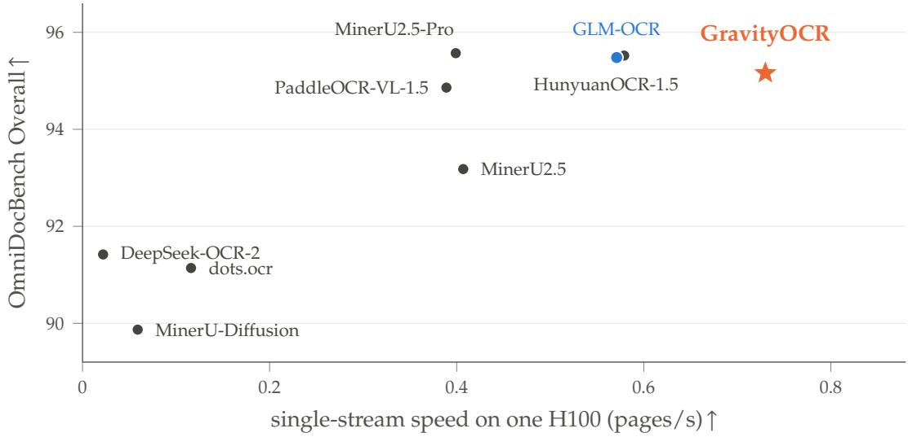  
Figure 1 | Accuracy–speed landscape of document OCR systems. OmniDocBench v1.6 Overall vs. single-stream page rate, with the same evaluation set used across systems for each metric. GravityOCR is the fastest system measured while maintaining top-tier accuracy.

Visual grounding, however, does not eliminate sequential dependencies among OCR output tokens. Text must preserve its reading order, while tags and delimiters in tables and formulas must remain structurally consistent. Under causal AR decoding, each token is predicted after the preceding tokens have become available. In a parallel diffusion step, by contrast, positions predicted together cannot condition on the tokens simultaneously selected at the other positions. Directly committing these predictions can therefore produce tokens that are individually plausible under the partially resolved block but inconsistent in the completed output. Figure 2 illustrates this failure mode under confidence-based parallel decoding (Wu et al., 2025b).

Motivated by this failure mode, we introduce GR AVIT YOCR, a parameter-shared AR–diffusion model inspired by recent AR–diffusion hybrids and diffusion-based drafting methods (Chen et al., 2026; Fu et al., 2026; Liu et al., 2025b; Wu et al., 2026a). GRAVIT YOCR uses block diffusion (Arriola et al., 2025) to propose an entire token block in one forward pass and causal AR decoding to verify the proposal before commitment. The causal path commits only the longest draft prefix consistent with its token-by-token predictions. With top-1 verification, the resulting self-speculative decoder reproduces the causal AR greedy output in exact arithmetic (Appendix B.3 measures the agreement under bf16 serving kernels). Successful drafts allow decoding to advance by multiple tokens, whereas a draft–verifier disagreement limits the accepted draft length and attainable acceleration. Because both prediction paths share the same parameters, the method requires neither a separate drafting network nor an auxiliary prediction head.

We instantiate GR AVIT YOCR by adapting GLM-OCR (Duan et al., 2026). The causal AR verifier determines the final output, so we apply GRPO through this path using sequence- and structurelevel OCR rewards. This updates the shared parameters without estimating likelihoods over diffusion trajectories. On OmniDocBench v1.6, our final model retains 99.7% of the original GLM-OCR model’s Overall score (95.16 vs. 95.48), while self-speculative decoding substantially reduces the number of sequential decoding steps (Figure 1).

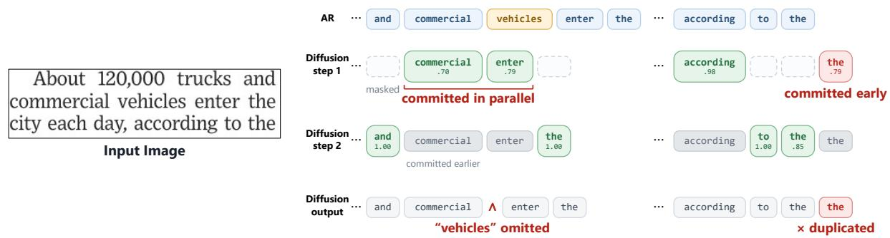  
<sup>SUGGESTED</sup> <sup>CAPTION</sup><sub>Qualitative</sub> <sub>errors</sub> <sub>from</sub> <sub>parallel</sub> <sub>token</sub> <sub>commitment (τ</sub> <sub>=</sub> <sub>0.7).</sub> <sub>Every</sub> <sub>masked</sub> <sub>position</sub> <sub>whose</sub> <sub>confidence</sub> <sub>exceeds</sub> <sub>τ</sub> <sub>is</sub> <sub>committed</sub> <sub>in</sub> <sub>the</sub> <sub>same</sub>Figure 2 | Failure case of confidence-based parallel commitment. $\mathrm { A t } \tau _ { c } { = } 0 . 7 ,$ <sub>ndently</sub> <sub>of</sub> <sub>the</sub> <sub>others.</sub> <sub>In</sub> <sub>step</sub>  commercial and are still masked. In step 2 the remaining context resolves to “…according to the”, turning the early commitment into a duplicate: “to the the”. The autoregressive decoder with the same weights enter are committed together while the intervening position remains unresolved, ultimately omitting vehicles. Similarly, the final the is committed before the two positions to its left are resolved, producing the repeated span to the the. The causal AR output from the same checkpoint is shown for comparison.

## Our contributions are summarized as follows:

• We show that a pretrained causal AR OCR model can be adapted into a parameter-shared block-diffusion drafter and causal AR verifier, enabling faster decoding with minimal accuracy degradation and without requiring a separate drafting network.

• We implement full-backbone self-speculative decoding in SGLang (Zheng et al., 2024), achieving 9.7 tokens per forward (TPF), where both diffusion drafting and causal verification forwards are counted. This yields a 3.94× speedup in token generation and a 1.32× speedup in end-to-end page processing over causal AR decoding.

• We compare direct block-diffusion and self-speculative decoding on OCR, characterizing their accuracy–parallelism trade-off. We further show that GRPO applied only through the causal AR path improves the OmniDocBench Overall score from 94.92 to 95.16 while preserving the efficiency of the shared diffusion drafter.

## 2. Preliminaries

Task Formulation. Given an image � and a task prompt �, let $\mathbf { y } = ( y _ { 1 } , \dots , y _ { N } )$ denote the corresponding target token sequence, which may encode plain text, an HTML table, or a LaTeX formula. Let $\overset { \cdot } { p _ { \theta } ^ { \mathrm { A R } } }$ denote the conditional distribution induced by the decoder under causal attention. The autoregressive likelihood of y is factorized as

$$
p _ { \theta } ^ { \mathrm { A R } } ( \mathbf { y } \mid I , c ) = \prod _ { i = 1 } ^ { N } p _ { \theta } ^ { \mathrm { A R } } \left( y _ { i } \mid I , c , \mathbf { y } _ { < i } \right) ,\tag{1}
$$

with the negative log-likelihood objective

$$
\mathcal { L } _ { \mathrm { A R } } = - \sum _ { i = 1 } ^ { N } \log p _ { \theta } ^ { \mathrm { A R } } \left( y _ { i } \mid I , c , \mathbf { y } _ { < i } \right) .\tag{2}
$$

At inference, each token is generated only after its preceding tokens become available, so an output of length � requires � sequential decoding steps.

Block Diffusion. Rather than generating one token at a time, masked diffusion language models iteratively reconstruct multiple masked positions at each denoising step (Austin et al., 2021; Nie et al., 2025; Ye et al., 2025). Block diffusion partitions the output sequence y into contiguous blocks $\mathbf { y } ^ { ( b ) }$ , each containing at most � tokens (Arriola et al., 2025; Wu et al., 2025a). Here, � indexes the blocks in left-to-right order. Generation is causal across blocks: the current block $\mathbf { y } ^ { ( b ) }$ conditions on the completed prefix $\mathbf { y } ^ { ( < b ) } = [ \mathbf { y } ^ { ( 1 ) } , \ldots , \mathbf { y } ^ { ( b - 1 ) } ]$ Within the current block, attention is bidirectional. Let $p _ { \theta } ^ { \mathrm { d i f f } }$ denote the conditional distribution induced by the decoder under this block-causal attention pattern. For a sampled noise level �, let $\mathbf { y } _ { t } ^ { ( b ) }$ denote the corrupted block obtained by replacing the positions in $\hat { \mathcal { M } } _ { t } ^ { ( b ) }$ with a dedicated mask token, denoted by [M]. The corresponding denoising objective is

$$
\mathcal { L } _ { \mathrm { d i f f } } = - \mathbb { E } _ { b , t , \boldsymbol { M } _ { t } ^ { ( b ) } } \left[ w ( t ) \sum _ { j \in \boldsymbol { M } _ { t } ^ { ( b ) } } \log p _ { \theta } ^ { \mathrm { d i f f } } \left( y _ { j } ^ { ( b ) } \mid I , c , \mathbf { y } ^ { ( < b ) } , \mathbf { y } _ { t } ^ { ( b ) } \right) \right] ,\tag{3}
$$

where � indexes token positions within block $b ,$ and $w ( t )$ denotes the timestep-dependent loss weight.

At inference, the current block is initialized with � mask tokens. At each denoising step, the model predicts all remaining masked positions in parallel, after which a selection rule—such as random selection, confidence-based top-� selection, or confidence thresholding—determines which predictions are unmasked and retained (Nie et al., 2025; Sahoo et al., 2024; Wu et al., 2025b). The updated block is then used as input for the next denoising step. Once the block is complete, it is appended to the prefix. Because completed prefix blocks remain unchanged, their KV states can be cached and reused when decoding subsequent blocks (Arriola et al., 2025; Wu et al., 2025b).

Speculative Decoding. Speculative decoding accelerates AR generation by allowing a drafter to propose multiple future tokens, which the target AR model evaluates in parallel (Chen et al., 2023; Leviathan et al., 2023). Under greedy decoding, consecutive draft tokens are accepted while they match the target model’s predictions. Under stochastic decoding, the standard acceptance–rejection rule preserves the target distribution. Our shared-model realization is described in Section 3.2.

## 3. Method

Our goal is to reduce the decoding cost of OCR while retaining the recognition accuracy of causal AR decoding. Motivated by the failure mode analyzed in Figure 2, we separate parallel drafting from token commitment: a block-diffusion path proposes multiple tokens in parallel, while a causal AR path verifies the proposals before they are committed. Sections 3.1 to 3.3 describe joint AR–diffusion adaptation, self-speculative decoding, and reinforcement learning through the causal AR path with sequence- and structure-level OCR rewards, respectively.

## 3.1. Learning a Shared Block-Diffusion Drafter and AR Verifier

AR-to-Diffusion Conversion. We adapt a pretrained AR OCR model into a parameter-shared model that supports both causal AR and block-diffusion prediction. The two modes share the vision encoder, language decoder, and LM head; the only architectural addition is a learned embedding for the dedicated mask token, denoted by [M] in our figures. We introduce neither a separate drafter network nor an auxiliary prediction head.

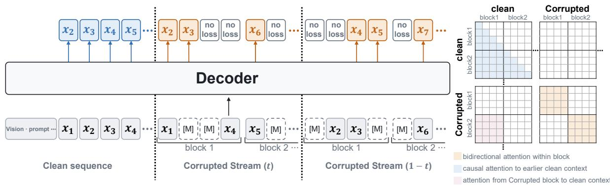  
Figure 3 | Joint AR–diffusion training in a single forward pass. The clean response stream provides causal next-token supervision, while two complementary corrupted streams with masking ratios � and 1 − � provide denoising supervision over disjoint masked targets. All streams share the visual and prompt context, decoder, and LM head. The right panel contrasts token-level causal attention in the clean stream with causal cross-block and bidirectional withinblock attention in the corrupted streams.

Joint AR–Diffusion Training. We jointly train the shared model for self-speculative decoding. Under block diffusion, the tokens decoded in the same step are predicted from the same partially masked block and cannot condition on one another’s values, so committing them directly can leave the completed output inconsistent. We therefore also train the model on next-token prediction over the clean sequence, preserving the causal AR path that verifies each draft and rejects inconsistent proposals before they are committed. Figure 3 provides an overview of our training procedure. At each training step, the shared model processes one clean response stream alongside two complementary corrupted response streams in a single forward pass. The clean stream provides causal next-token supervision for the AR verifier, whereas the corrupted streams provide denoising supervision for the block-diffusion drafter. All three response streams are conditioned on the same image � and task prompt $c ,$ both of which remain uncorrupted.

For each block $\mathbf { y } ^ { ( b ) }$ , we sample a noise level $t \sim \mathcal { U } ( 0 , 1 )$ and mask each response token in the block independently with probability $t ,$ giving a set of masked indices $\boldsymbol { \mathcal { M } } _ { t } ^ { ( b ) }$ . The first corrupted stream replaces the tokens indexed by $\hat { \mathcal { M } } _ { t } ^ { ( b ) }$ with the mask token, whereas the second corrupted stream masks the complementary positions of the same block. The two streams therefore have expected masking ratios � and $1 - t ,$ respectively. Because the two masks are complementary, every response token, including the � end-of-sequence tokens appended to each response (Appendix A), is masked and receives denoising supervision in exactly one of the two streams, while image and prompt tokens are never masked or supervised. This complementary masking scheme follows Fast-dLLM $\mathbf { v } 2$ (Wu et al., 2025a).

The clean stream uses causal attention, so each target token $y _ { i }$ is predicted using only the image �, task prompt $c ,$ and preceding tokens $\mathbf { y } _ { < i } .$ . Within each corrupted stream, tokens in block � can attend to all positions in the same corrupted block. They can also attend to the preceding clean response blocks $\mathbf { y } ^ { ( < b ) }$ , but not to the current or future clean blocks. Both clean and corrupted streams predict $y _ { i }$ from the logit at position � − 1. In corrupted streams, denoising supervision applies only to masked targets.

Training Objective. The losses from the clean and corrupted streams are combined as

$$
\begin{array} { r } { \mathcal { L } = \mathcal { L } _ { \mathrm { A R } } + \lambda \mathcal { L } _ { \mathrm { d i f f } } , } \end{array}\tag{4}
$$

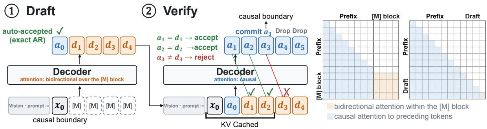  
Figure 4 | Self-speculative decoding. Given a causal boundary token $x _ { 0 }$ followed by � mask tokens, the shared decoder produces in a single forward pass one causal token $a _ { 0 }$ that is accepted by construction and � parallel draft tokens $d _ { 1 : B } ,$ , attending bidirectionally within the mask block and causally to the cached prefix; the draft is passed on without iterative unmasking or confidence-based selection. A causal verification pass over �<sub>0</sub>, �<sub>1:�</sub> produces $a _ { 1 : B + 1 }$ and commits the longest AR-consistent draft prefix and the next AR token while simultaneously constructing the KV cache for the accepted prefix, so no additional cache-construction pass is needed; the states of rejected tokens are discarded. The final AR token becomes the causal boundary for the next round and obtains its KV state there.

where � controls the relative weight of the diffusion objective. In implementation, we average the AR loss in Equation 2 over supervised clean-stream tokens and the diffusion loss in Equation 3 over masked targets pooled across both corrupted streams, using �(�) = 1. We normalize the combined loss by 1 + � and use � = 1, giving each objective weight 0.5, except in the no-AR-loss ablation in Table 5.

## 3.2. Self-Speculative Decoding

In direct block-diffusion decoding, token commitment is based on the diffusion model’s confidence. An incorrect token can therefore be committed before the block is fully resolved; once fixed, it may lead to omissions, repetitions, or structural errors. We avoid this failure mode by separating parallel drafting from token commitment. The block-diffusion path proposes a token block in parallel, while the causal AR path verifies the draft and determines which tokens enter the output. The verifier accepts only the longest draft prefix that matches its next-token predictions, preserving causal AR decoding while allowing successful drafts to advance generation by multiple tokens. Figure 4 illustrates the resulting procedure.

Each round starts from the last committed token $x _ { 0 } ,$ followed by � mask tokens. The boundary position $x _ { 0 }$ uses causal attention, while the masked positions attend to the committed prefix and bidirectionally within the mask block. In a single forward pass, the shared decoder produces the next AR token $a _ { 0 }$ from the boundary position and the draft tokens $d _ { 1 : B }$ from the masked positions. Since $a _ { 0 }$ is already a causal AR prediction, it is committed directly.

To verify the draft tokens, we feed the sequence $[ a _ { 0 } , d _ { 1 : B } ]$ into the shared decoder under tokenlevel causal attention. This verification pass produces the AR predictions $a _ { 1 : B + 1 }$ . Following Section 2, we accept the longest draft prefix $d _ { 1 : A }$ satisfying $d _ { j } = a _ { j }$ for every $1 \leq j \leq A ,$ , and append the next AR token $a _ { A + 1 }$ . This final token serves as the boundary token for the next round.

## 3.3. RL on the AR Path

The joint training objective in Section 3.1 provides token-level supervision for both causal AR prediction and block-diffusion drafting. However, OCR quality is evaluated on complete outputs using sequence- and structure-level criteria that are not directly optimized by token-level likelihood training. We therefore further optimize the jointly trained model using task-aware OCR rewards.

For multi-step masked diffusion, evaluating the sequence likelihood requires marginalizing over unmasking trajectories, so existing RL methods approximate it or apply policy gradients along the denoising trajectory (Zhan, 2025; Zhao et al., 2025). In GRAVITYOCR, however, the causal AR verifier determines the output of self-speculative decoding. We can therefore optimize the AR path using its exact autoregressive likelihood and apply standard GRPO directly. We finetune the full model through this path, updating the diffusion drafter through shared parameters without a diffusion-specific objective.

Task-Aware OCR Rewards. For each sampled output, we select the reward according to its OCR task. For plain-text recognition, we use normalized edit similarity, 1 − NED, where NED is the normalized edit distance. For HTML table recognition, we combine structure-only TEDS (Zhong et al., 2020) with a cell-content similarity and penalize malformed or degenerate markup. For formula recognition, we use the edit similarity of canonicalized LaTeX, scaled down when the output fails well-formedness checks, as a rendering-free proxy for CDM (Wang et al., 2024b). All rewards lie in [0, 1]; exact definitions and coefficients are given in Appendix E.

GRPO on the Causal AR Path. For each input, we sample a group of outputs from the jointly trained model’s causal AR path and score them with the corresponding task-aware reward. GRPO (Shao et al., 2024) computes relative advantages within each group and updates the model using causal token-level log-probabilities. Because RL updates through the causal AR path are applied to the shared parameters, they can also change the block-diffusion drafter and its agreement with the verifier. As shown in Section 4.5, GRPO improves OCR accuracy while tokens per forward remain essentially unchanged, indicating that drafter–verifier agreement is preserved after RL.

## 4. Experiments

## 4.1. Setup

Model and Training. We initialize GRAVITYOCR from the released GLM-OCR checkpoint (Duan et al., 2026) and jointly fine-tune its vision encoder and language decoder for causal AR and block-diffusion prediction. In the original pipeline, PP-DocLayout-V3 (Sun et al., 2025) identifies document regions, the region-level OCR model decodes each crop, and the resulting outputs are assembled by the merge and post-processing pipeline. We retain the layout detector and assembly pipeline unchanged and apply the AR-to-diffusion adaptation only to the regionlevel OCR model. Unless otherwise specified, we use a block size of � = 32 during both training and inference, and construct each self-speculative draft with a single block-diffusion forward pass. The joint objective weighs the two losses equally (� = 1.0). We train for 40,000 steps, processing ∼26B forward tokens in total; this count includes vision tokens and the three response streams of each example. Further optimization and implementation details are provided in

Appendix A. Unless otherwise stated, results use the final GRPO checkpoint, obtained after 40,000 joint-training steps and 500 GRPO steps (Section 4.5).

Training Data. The training pool contains 12.3M region-level examples assembled from predominantly public data, including DocGenome (Xia et al., 2024), Docmatix (Laurençon et al., 2024), PubTables-1M (Smock et al., 2022), FinTabNet (Zheng et al., 2021), SynthTabNet (Nassar et al., 2022), PubTabNet (Zhong et al., 2020), RVL-CDIP (Harley et al., 2015), DocLayNet (Pfitzmann et al., 2022), and the training split of UniMER (Wang et al., 2024a). Each example is a layout region cropped from a full page at native resolution, paired with a text target. For fullpage sources, regions are detected with the same PP-DocLayout-V3 detector used at inference; table- and formula-only sources are used as whole crops. Targets are transcriptions of each crop produced by the base GLM-OCR model, except for table crops from sources that ship cell-level annotations (about 39% of the table stream), for which we use the original annotations converted to the evaluation markup convention. The pool consists of three streams—page text (6.49M regions), tables (2.90M), and formulas (2.89M)—and is predominantly English. To realize a fixed 60/20/20 stream ratio by example count, the table and formula streams are each subsampled once with a fixed seed to 2.16M examples, giving a 10.8M training set that is globally shuffled. We additionally hold out 1,000 pages (4,614 region crops) as an internal validation set. The pool contains no OmniDocBench pages (checked by document identifier, text shingles, table cells, and formula strings); PubTabNet is used through its training split only.

Benchmarks and Metrics. We use OmniDocBench v1.6 as our primary benchmark, which contains 1,651 document pages and evaluates document parsing under its official protocol and aggregation (Ouyang et al., 2025; Wang et al., 2026). We report the official Overall score together with the corresponding text, table, formula, and reading-order metrics. We additionally evaluate structured recognition on the PubTabNet validation set, comprising 9,115 tables, and on UniMER-Test for mathematical expression recognition (Wang et al., 2024a; Zhong et al., 2020). For PubTabNet, we report both full TEDS and structure-only TEDS, while UniMER is evaluated using CDM (Wang et al., 2024b). All models are evaluated using the same scoring pipeline for each benchmark.

Baselines. For in-family comparisons, we compare the original GLM-OCR model with causal AR decoding and its built-in MTP branch (Duan et al., 2026) against GRAVITYOCR’s causal AR, direct block-diffusion, and self-speculative decoding. Direct block-diffusion decoding serves as a diagnostic baseline that iteratively commits confidence-selected diffusion predictions without causal verification. For cross-model evaluation, we report the reproduced results of MinerU2.5 (Niu et al., 2025), MinerU2.5-Pro (Wang et al., 2026), MinerU-Diffusion (Dong et al., 2026), PaddleOCR-VL-1.5 (Cui et al., 2026), dots.ocr (rednote hilab, 2025), DeepSeek-OCR-2 (Wei et al., 2026), and HunyuanOCR-1.5 (Li et al., 2026) using the released implementations.

Efficiency Measurement. We measure tokens per forward (TPF) over the complete decoding run as

$$
\mathrm { T P F } = \frac { \mathrm { n u m b e r ~ o f ~ c o m m i t t e d ~ o u t p u t ~ t o k e n s } } { \mathrm { n u m b e r ~ o f ~ f o r w a r d ~ p a s s e s } } ,\tag{5}
$$

where each block-diffusion drafting and each causal verification are counted separately as one forward pass. TPF is measured with a single request in flight (batch size 1), so one forward pass is one model invocation on that request, and the per-request vision and prompt prefill forward is not counted. We also report the number of drafted tokens accepted per round, excluding the boundary prediction �<sub>0</sub> and the verifier’s own token, which every round commits regardless of the draft. Under this convention, standard AR decoding has a TPF of 1 by construction. We additionally report decoding throughput in tokens per second (tok/s) and document throughput in pages per second (pages/s). Unless stated otherwise, GRAVITYOCR and the GLM-OCR AR baseline are served with SGLang (Zheng et al., 2024) and timed through its client interface; the GLM-OCR MTP row uses its official vLLM path, and each external system runs on its own official inference stack (vLLM, PaddleX, or native Transformers; see Appendix C). The Hugging Face Transformers rows of Table 3 are an in-process eager implementation, included as an unoptimized reference.<sup>1</sup>

Table 1 | Main results on OmniDocBench v1.6 and page-processing speed. Text and Order measure normalized edit distance over character sequences and text-block reading order, respectively; TEDS is tree-edit-distance similarity for tables, and CDM is character detection matching for formulas. Overall averages the three recognition axes. Page speed includes each system’s layout stage. TPF denotes output tokens committed per model forward. All results are our measurements; speed protocols are in Appendix C. <sup>†</sup>These modes use extra draft parameters; TPF counts tokens accepted per base-model verification, excluding drafting computation.
<table><tr><td></td><td></td><td colspan="5">Quality</td><td colspan="3">Speed</td></tr><tr><td>Model</td><td>Decode</td><td>Text↓</td><td>TEDS↑</td><td>CDM↑</td><td>Order↓</td><td>Overall↑</td><td>TPF↑</td><td>tok/s↑</td><td>pages/s↑</td></tr><tr><td>External parsers</td><td></td><td></td><td></td><td></td><td></td><td></td><td></td><td></td><td></td></tr><tr><td>MinerU2.5</td><td>AR</td><td>0.045</td><td>0.881</td><td>0.959</td><td>0.130</td><td>93.18</td><td>1.0</td><td>559</td><td>0.407</td></tr><tr><td>MinerU2.5-Pro</td><td>AR</td><td>0.037</td><td>0.935</td><td>0.969</td><td>0.124</td><td>95.57</td><td>1.0</td><td>545</td><td>0.399</td></tr><tr><td>MinerU-Diffusion</td><td>diff</td><td>0.073</td><td>0.853</td><td>0.916</td><td>0.154</td><td>89.87</td><td>5.2</td><td>79</td><td>0.059</td></tr><tr><td>PaddleOCR-VL-1.5</td><td>AR</td><td>0.042</td><td>0.919</td><td>0.969</td><td>0.129</td><td>94.86</td><td>1.0</td><td>741</td><td>0.389</td></tr><tr><td>dots.ocr</td><td>AR</td><td>0.048</td><td>0.865</td><td>0.917</td><td>0.140</td><td>91.14</td><td>1.0</td><td>149</td><td>0.116</td></tr><tr><td>DeepSeek-OCR-2</td><td>AR</td><td>0.049</td><td>0.859</td><td>0.933</td><td>0.144</td><td>91.42</td><td>1.0</td><td>24</td><td>0.022</td></tr><tr><td>HunyuanOCR-1.5</td><td>AR</td><td>0.036</td><td>0.952</td><td>0.949</td><td>0.125</td><td>95.52</td><td>1.0</td><td>390</td><td>0.313</td></tr><tr><td>HunyuanOCR-1.5</td><td>DFlash</td><td>0.036</td><td>0.952</td><td>0.949</td><td>0.125</td><td>95.52</td><td>9.9†</td><td>720</td><td>0.579</td></tr><tr><td>GLM-OCR (base)</td><td>AR</td><td>0.040</td><td>0.934</td><td>0.970</td><td>0.141</td><td>95.48</td><td>1.0</td><td>807</td><td>0.571</td></tr><tr><td>GLM-OCR (base)</td><td>MTP</td><td>0.040</td><td>0.934</td><td>0.970</td><td>0.141</td><td>95.48</td><td>3.7†</td><td>667</td><td>0.472</td></tr><tr><td>Ours</td><td></td><td></td><td></td><td></td><td></td><td></td><td></td><td></td><td></td></tr><tr><td>GravityOCR</td><td>AR</td><td>0.040</td><td>0.928</td><td>0.967</td><td>0.141</td><td>95.16</td><td>1.0</td><td>794</td><td>0.554</td></tr><tr><td>GravityOCR</td><td>self-spec 0.040</td><td></td><td>0.928</td><td>0.967</td><td>0.141</td><td>95.16</td><td>9.7</td><td>1,047</td><td>0.730</td></tr></table>

## 4.2. Main Results

OmniDocBench. Table 1 compares GRAVITYOCR with the original GLM-OCR model and representative document parsing systems on OmniDocBench v1.6, reporting recognition quality and page-processing speed side by side. GRAVIT YOCR achieves an Overall score of 95.16, compared with 95.48 for the original GLM-OCR, retaining its document parsing quality within 0.32 points. Relative to the base model, TEDS and CDM drop only slightly. Apart from the original GLM-OCR, the Overall score of GRAVIT YOCR is surpassed only by MinerU2.5-Pro and HunyuanOCR-1.5 among the evaluated parsers.

Table 2 | Table and formula recognition. PubTabNet table recognition on the full validation set (9,115 tables) and UniMER formula recognition, all rows measured by us under one pipeline per benchmark, with each system’s own task prompt and the same output normalisation.
<table><tr><td>Model</td><td>PubTabNet TEDS↑</td><td>TEDS-struct↑</td><td>UniMER CDM↑</td></tr><tr><td>MinerU2.5</td><td>0.854</td><td>0.909</td><td>0.927</td></tr><tr><td>MinerU2.5-Pro</td><td>0.866</td><td>0.913</td><td>0.956</td></tr><tr><td>MinerU-Diffusion</td><td>0.734</td><td>0.858</td><td>0.952</td></tr><tr><td>PaddleOCR-VL-1.5</td><td>0.828</td><td>0.900</td><td>0.956</td></tr><tr><td>dots.ocr</td><td>0.893</td><td>0.935</td><td>0.910</td></tr><tr><td>DeepSeek-OCR-2</td><td>0.849</td><td>0.896</td><td>0.863</td></tr><tr><td>HunyuanOCR-1.5</td><td>0.852</td><td>0.903</td><td>0.942</td></tr><tr><td>GLM-OCR (base, AR)</td><td>0.803</td><td>0.858</td><td>0.963</td></tr><tr><td>GravityOCR</td><td>0.871</td><td>0.916</td><td>0.962</td></tr></table>

Page Processing Speed. The speed columns of Table 1 are measured on a 100-page subset of OmniDocBench, using a single H100 with one page in flight. Each model is evaluated through its released page-processing pipeline, with layout analysis, region recognition, and output assembly included in the wall-clock measurement. With self-speculative decoding, GRAVITYOCR commits an average of 9.7 output tokens per model forward and achieves 1,047 tok/s and 0.730 pages/s, the highest processing rates in the table. Its page throughput exceeds that of MinerU2.5-Pro at 0.399 pages/s and HunyuanOCR-1.5 with DFlash at 0.579 pages/s. The causal AR mode of the same checkpoint reaches 794 tok/s and 0.554 pages/s, corresponding to a 1.32× page-processing speedup from self-speculative decoding. GR AVIT YOCR also exceeds the built-in MTP mode of the original GLM-OCR at 0.472 pages/s. Notably, the MTP mode remains slower than the original model’s causal AR mode at 0.571 pages/s despite advancing 3.7 tokens per forward, whereas the parallelism of GRAVIT YOCR translates into a wall-clock page-processing gain.

Table and Formula Recognition. Beyond OmniDocBench, Table 2 evaluates GRAVITYOCR on PubTabNet and UniMER, dedicated benchmarks for table and formula recognition, respectively. On PubTabNet, GRAVITYOCR achieves a TEDS score of 0.871 and a TEDS-struct score of 0.916. TEDS evaluates both table structure and cell content, whereas TEDS-struct isolates the recovered table structure. Compared with the original GLM-OCR, GRAVITYOCR improves TEDS from 0.803 to 0.871 and TEDS-struct from 0.858 to 0.916. On UniMER, GRAVITYOCR achieves a CDM score of 0.962, closely matching the original GLM-OCR score of 0.963 and exceeding all evaluated external systems.

Taken together, these results show that our framework largely preserves the recognition performance of the base model across the evaluated benchmarks while enabling block-diffusion drafting and causal AR verification.

## 4.3. Decoding Efficiency

Inference Backend and Measurement Scope. Table 3 compares AR and self-speculative decoding under two inference backends, Hugging Face Transformers (Wolf et al., 2020) and SGLang (Zheng et al., 2024), using the same checkpoint and region inputs. For each backend, we report decode-only throughput for token generation and end-to-end throughput including vision encoding and prompt prefill. With the Transformers implementation, self-speculation raises the decode-only rate from 53 to 293 tok/s (5.53×) and the end-to-end rate from 51 to 161 tok/s (3.20×). With SGLang, self-speculation raises decode-only throughput from 777 to 3,057 tok/s (3.94×) and end-to-end throughput from 486 to 844 tok/s (1.74×). The decode-only gain is larger in the Transformers implementation, whose eager execution is bound by kernel-launch overhead: a forward costs roughly the same whether it processes one token or a whole draft window, so the gain approaches the tokens-per-forward ratio. SGLang’s fused kernels make each forward cheaper but scale its cost with the number of tokens processed, and the fixed per-crop cost of vision encoding and prompt prefill becomes a larger share of a request whose decoding is much faster, which is why its end-to-end gain is smaller.

Table 3 | AR vs. self-speculative decoding. Decode-only and end-to-end throughput under Transformers and SGLang.
<table><tr><td rowspan="2">Backend</td><td rowspan="2">Decode</td><td colspan="2"> $\mathrm { \ t o k / s ^ { \uparrow } }$ </td><td rowspan="2">speedup</td></tr><tr><td>decode-only</td><td>end-to-end</td></tr><tr><td>Transformers</td><td>AR</td><td>53</td><td>51</td><td></td></tr><tr><td>Transformers</td><td>self-spec</td><td>293</td><td>161</td><td>5.53× / 3.20×</td></tr><tr><td>SGLang</td><td>AR</td><td>777</td><td>486</td><td></td></tr><tr><td>SGLang</td><td>self-spec</td><td>3057</td><td>844</td><td>3.94× / 1.74×</td></tr></table>

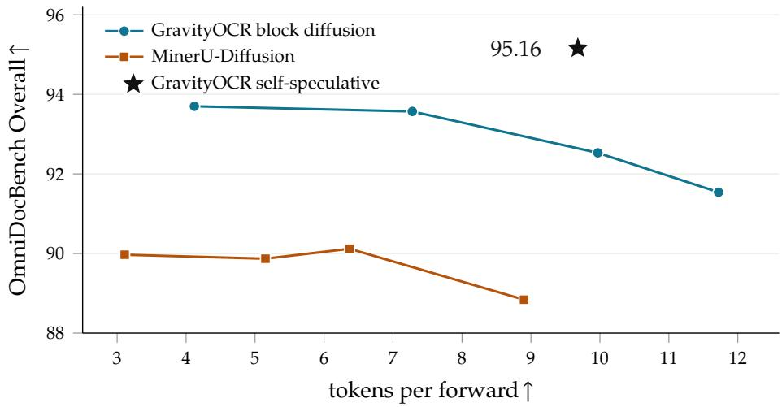  
Figure 5 | Quality and parallelism of diffusion decoding. Curves sweep each system’s confidence threshold $\tau _ { c } .$ . Direct block-diffusion TPF counts forwards that commit tokens, excluding cache writes; self-speculative TPF counts both drafting and verification (Appendix C).

Direct Block-Diffusion vs. Self-Speculative Decoding. We compare direct block-diffusion and self-speculative decoding to measure the effect of causal AR verification. Direct block-diffusion commits confidence-selected predictions without verification, exposing the quality–parallelism trade-off of parallel commitment. Self-speculative decoding instead uses the diffusion path to propose a block and the causal AR path to determine which tokens are committed. Figure 5 compares this with MinerU-Diffusion, a representative diffusion-native OCR model. Across the evaluated confidence thresholds, increasing the number of tokens committed per forward is accompanied by lower recognition accuracy under direct diffusion decoding. The diffusion mode of GR AVIT YOCR remains more accurate than MinerU-Diffusion throughout the sweep, but exhibits the same trade-off. At comparable parallelism of approximately 10 tokens per forward, direct block-diffusion decoding achieves an Overall score of 92.53, whereas selfspeculative decoding achieves 95.16 at 9.7 tokens per forward. This comparison shows that causal AR verification avoids the recognition loss associated with direct parallel commitment while retaining comparable parallelism.

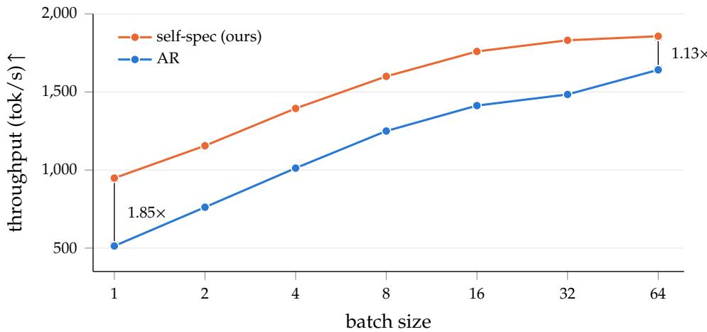  
Figure 6 | Throughput vs. batch size. The speedup narrows with batch size: speculation leads by 1.85× at batch 1 and by 1.13× at batch 64. Protocol in Appendix C.

Table 4 | Parallelism and speed by content type. Accepted tokens is the number of draft tokens accepted per round. TPF divides committed output tokens by all draft and verification forwards pooled within each content type.
<table><tr><td colspan="3">mean output</td><td rowspan="2">accepted</td><td colspan="3">tok/s↑</td><td rowspan="2">speedup</td></tr><tr><td>Type</td><td>crops</td><td>tokens</td><td>tokens↑</td><td>TPF↑ AR</td><td>self-spec</td></tr><tr><td>Text</td><td>7,019</td><td>73</td><td>15.0</td><td>8.5</td><td>419</td><td>647</td><td>1.54×</td></tr><tr><td>Formula</td><td>1,660</td><td>95</td><td>18.9</td><td>10.5</td><td>520</td><td>947</td><td>1.82×</td></tr><tr><td>Table</td><td>243</td><td>872</td><td>25.0</td><td>13.5</td><td>732</td><td>2,462</td><td>3.36×</td></tr><tr><td>All</td><td>8,922</td><td>99</td><td>17.4</td><td>9.7</td><td>486</td><td>844</td><td>1.74×</td></tr></table>

Throughput Scaling with Batch Size. Batching can improve GPU utilization for causal AR decoding, potentially narrowing the relative advantage of self-speculation. Figure 6 evaluates SGLang throughput under increasing numbers of concurrently processed region inputs, including vision encoding, prompt prefill, and token generation. In this sweep, measured before RL, self-speculative decoding leads by 1.85× at batch size one. As the batch size increases, batching exposes more parallel work from the AR decoder to the GPU, improving its utilization and narrowing the advantage of self-speculation. At batch size 64, AR decoding reaches 1,642 tok/s and self-speculative decoding reaches 1,857 tok/s. Although the advantage narrows at higher batch sizes, self-speculative decoding still achieves a 1.13× higher throughput. These results show that self-speculative decoding provides its largest throughput gains in low-concurrency settings, where sequential AR decoding leaves more GPU capacity underutilized.

Decoding Efficiency by Output Type. Table 4 shows that table regions benefit more from self-speculative decoding than text regions. They accept 25.0 of the 32 drafted tokens per round, compared with 15.0 for text, and achieve speedups of 3.36× and 1.54×, respectively. Table outputs are also longer, averaging 872 tokens compared with 73 for text, which reduces the relative cost of vision encoding and prompt prefill. Their higher draft acceptance may reflect the stronger syntactic constraints of structured outputs.

Table 5 | Effect of the auxiliary AR loss on self-speculative decoding. Both models are 10k-step checkpoints that share the training setup except the AR loss weight.
<table><tr><td></td><td>OmniDocBench Overall↑</td><td>TPF↑</td></tr><tr><td>no AR loss</td><td>93.64</td><td>6.96</td></tr><tr><td>AR loss</td><td>95.02</td><td>6.75</td></tr></table>

Table 6 | GRPO on the AR path. OmniDocBench v1.6 Overall and TPF for direct block-diffusion and self-speculative decoding before and after GRPO.
<table><tr><td rowspan="2">Decode</td><td rowspan="2"> $\tau _ { c }$ </td><td colspan="3">Overall↑</td><td colspan="2">TPF↑</td></tr><tr><td>before</td><td>after</td><td>Δ</td><td>before</td><td>after</td></tr><tr><td>Block diffusion</td><td>0.7</td><td>86.17</td><td>86.06</td><td>-0.11</td><td>14.85</td><td>15.43</td></tr><tr><td>Block diffusion</td><td>0.9</td><td>91.55</td><td>91.54</td><td>-0.01</td><td>11.89</td><td>11.72</td></tr><tr><td>Block diffusion</td><td>0.95</td><td>89.62</td><td>92.53</td><td>+2.91</td><td>10.20</td><td>9.97</td></tr><tr><td>Block diffusion</td><td>0.99</td><td>93.23</td><td>93.57</td><td>+0.34</td><td>7.18</td><td>7.28</td></tr><tr><td>Self-spec</td><td></td><td>94.92</td><td>95.16</td><td>+0.24</td><td>9.61</td><td>9.68</td></tr></table>

## 4.4. Effect of the AR Loss

Table 5 isolates the auxiliary AR loss. Even without this loss, the model can perform causal verification because it is initialized from a pretrained AR model. Removing AR supervision lowers the Overall score from 95.02 to 93.64, while TPF remains similar: 6.75 with the AR loss and 6.96 without it. The AR objective therefore preserves verifier accuracy with little change in drafting efficiency.

## 4.5. RL on the AR Path

GRPO on the AR Path. We evaluate whether AR-path GRPO improves OCR quality while preserving diffusion drafting efficiency. Table 6 compares direct diffusion and self-speculative decoding before and after GRPO.

Under self-speculative decoding, GRPO improves the OmniDocBench Overall score from 94.92 to 95.16, while TPF remains essentially unchanged at 9.61 and 9.68, respectively. Direct diffusion also retains similar or improved accuracy and similar TPF across the evaluated confidence thresholds, despite receiving no diffusion-specific training objective. These results show that AR-path GRPO improves OCR quality while preserving drafting efficiency.

## 5. Related Work

Document Parsing VLMs. Generative document parsing models translate document images into serialized text and structured markup. Early systems such as Nougat focused on imageto-markup transcription for scientific documents, while olmOCR extended generative parsing to large-scale document conversion (Blecher et al., 2023; Poznanski et al., 2025). More recent OCR-specialized VLMs, including GLM-OCR, MinerU2.5-Pro, OvisOCR2, PaddleOCR-VL, dots.ocr, and DeepSeek-OCR, improve document parsing through compact architectures, specialized training data, and document-aware visual processing (Cui et al., 2025; Duan et al., 2026; Lu et al., 2026; rednote hilab, 2025; Wang et al., 2026; Wei et al., 2025). For example, DeepSeek-OCR compresses document images into compact optical contexts, PaddleOCR-VL adopts coarse-to-fine visual processing, and GLM-OCR combines layout analysis with regionlevel content generation. These studies primarily improve visual representation, training data, or the document-processing pipeline, while retaining causal AR generation for the output sequence.

A smaller body of work directly targets OCR decoding efficiency. GLM-OCR incorporates an MTP branch that predicts multiple future tokens from its AR backbone (Duan et al., 2026). Because this branch is included in our base OCR system, we use it as the direct in-model acceleration baseline. HunyuanOCR-1.5 instead adapts DFlash to OCR by training a separate block-diffusion drafter conditioned on features from the target AR model (Chen et al., 2026; Li et al., 2026). HSD accelerates document parsing at a different granularity: it constructs regionlevel drafts, verifies regions in parallel, and performs an additional page-level verification stage to preserve global document coherence (Liao et al., 2026). These approaches establish multi-token drafting and verification as practical directions for accelerating generative OCR, but differ in whether drafting is performed by auxiliary prediction heads, an external draft model, or a hierarchical document pipeline.

Diffusion Language Models. Discrete diffusion modeling for text originated from denoising objectives over corrupted token sequences (Austin et al., 2021; Sahoo et al., 2024), and was subsequently scaled to large diffusion language models such as LLaDA and Dream (Nie et al., 2025; Ye et al., 2025). Later work has focused on making diffusion generation compatible with efficient language-model serving. Block Diffusion introduces a block-wise formulation that supports reuse of completed context (Arriola et al., 2025). Fast-dLLM develops caching-aware inference techniques for pretrained diffusion language models (Wu et al., 2025b), while Fast-dLLM v2 proposes a data-efficient AR-to-block-diffusion adaptation scheme using complementary clean and corrupted training streams (Wu et al., 2025a). WeDLM follows a different approach, using causal attention and topological token reordering to enable parallel prediction while retaining compatibility with standard prefix KV caching (Liu et al., 2025a).

Diffusion decoding has recently been introduced to document OCR. DODO develops a blockdiscrete diffusion OCR model designed to mitigate the structural instability of global masked diffusion (Man et al., 2026). MinerU-Diffusion formulates document OCR as inverse rendering and combines a block-wise diffusion decoder with an uncertainty-driven training curriculum (Dong et al., 2026). These models demonstrate that document outputs can be recovered through parallel diffusion decoding and provide favorable accuracy–efficiency trade-offs. Nevertheless, direct diffusion decoding has not consistently matched the recognition accuracy of strong AR OCR systems across all reported benchmarks and operating points, motivating methods that retain parallel proposals without directly committing every diffusion prediction.

AR–Diffusion Hybrid Models. Rather than replacing pretrained AR models with diffusiononly models, recent work adapts AR checkpoints to support both causal and diffusion-style prediction. SDAR studies data-efficient conversion from pretrained AR models to block-wise diffusion models (Cheng et al., 2025). Fast-dVLM extends direct AR-to-diffusion conversion to vision–language models, jointly training causal and denoising objectives so that the adapted model retains both generation modes (Wu et al., 2026a). Nemotron-Labs-Diffusion scales this formulation to a family of language and vision–language models that can operate in AR, diffusion, or self-speculative modes (Fu et al., 2026). TiDAR more tightly integrates the two modes through a structured attention pattern that combines diffusion-based drafting with AR generation (Liu et al., 2025b).

A related line of work uses diffusion models specifically as drafters for an AR target. Speculative diffusion decoding and DFlash train dedicated diffusion drafters for parallel block proposal (Chen et al., 2026; Christopher et al., 2025). DiffuSpec instead repurposes a pretrained diffusion language model as a training-free drafter, while SpecDiff-2 improves agreement between the diffusion drafter and AR verifier (Li et al., 2025; Sandler et al., 2025). A further line studies how to align a block drafter with left-to-right verification, through position-aware loss weighting, accept-until-fail supervision, or targeted repair of uncertain positions (Liu et al., 2026; Whalen et al., 2026; Wu et al., 2026b; Yang and Li, 2026). Across these approaches, speculative verification allows diffusion prediction errors to reduce accepted draft length rather than directly alter the output of the AR target. Our method follows the shared-model branch of this literature: we adapt the region-level generation model of GLM-OCR to support block-diffusion drafting and causal AR verification within the same parameter set, without introducing a separate draft network.

Reinforcement Learning for Diffusion Language Models. Policy-gradient RL over a diffusion language model requires a sequence likelihood that depends on the denoising trajectory, so existing methods either optimize an approximation of it or derive step-level gradients that remain unbiased (Zhan, 2025; Zhao et al., 2025). Self-speculative decoding has separately been used to accelerate the rollout phase of RL itself (Kim et al., 2026). Our setting avoids the estimation problem rather than solving it: because the adapted model retains an exact causal factorization, GRPO (Shao et al., 2024) can be applied through the AR path, and the shared parameters it updates are the ones the diffusion drafter uses.

## 6. Conclusion

We presented GRAV ITYOCR, a parameter-shared framework that combines block-diffusion drafting with causal AR verification to accelerate document OCR. Joint AR–diffusion training enables a single model to draft token blocks in parallel and verify them before commitment, preserving its AR output while allowing multiple tokens to be committed per round. We further apply GRPO through the causal AR path using sequence- and structure-level OCR rewards, avoiding diffusion-trajectory likelihood estimation while updating the shared drafter and verifier parameters. On OmniDocBench v1.6, this improves the Overall score from 94.92 to 95.16, close to the original GLM-OCR score of 95.48, while preserving diffusion drafting efficiency. In SGLang, GRAVI TYOCR achieves a 3.94× decode-only speedup on region crops and a 1.32× end-to-end page-processing speedup over AR decoding. These results show that parameter-shared drafting and verification accelerate document OCR while largely retaining the base model’s recognition capabilities, without a separate drafter network.

## References

M. Arriola, A. Gokaslan, J. T. Chiu, Z. Yang, Z. Qi, J. Han, S. S. Sahoo, and V. Kuleshov. Block diffusion: Interpolating between autoregressive and diffusion language models. International Conference on Learning Representations, 2025.

J. Austin, D. D. Johnson, J. Ho, D. Tarlow, and R. van den Berg. Structured denoising diffusion models in discrete state-spaces. Advances in Neural Information Processing Systems, 2021.

L. Blecher, G. Cucurull, T. Scialom, and R. Stojnic. Nougat: Neural optical understanding for academic documents. arXiv preprint arXiv:2308.13418, 2023.

C. Chen, S. Borgeaud, G. Irving, J.-B. Lespiau, L. Sifre, and J. Jumper. Accelerating large language model decoding with speculative sampling. arXiv preprint arXiv:2302.01318, 2023.

J. Chen, Y. Liang, and Z. Liu. DFlash: Block diffusion for flash speculative decoding. arXiv preprint arXiv:2602.06036, 2026.

S. Cheng, Y. Bian, D. Liu, L. Zhang, Q. Yao, Z. Tian, W. Wang, Q. Guo, K. Chen, B. Qi, et al. Sdar: A synergistic diffusion-autoregression paradigm for scalable sequence generation. arXiv preprint arXiv:2510.06303, 2025.

J. K. Christopher, B. R. Bartoldson, T. Ben-Nun, M. Cardei, B. Kailkhura, and F. Fioretto. Speculative diffusion decoding: Accelerating language generation through diffusion. In NAACL, 2025. arXiv:2408.05636.

C. Cui, T. Sun, S. Liang, T. Gao, Z. Zhang, et al. PaddleOCR-VL: Boosting multilingual document parsing via a 0.9b ultra-compact vision-language model. arXiv preprint arXiv:2510.14528, 2025.

C. Cui, T. Sun, S. Liang, T. Gao, Z. Zhang, J. Liu, X. Wang, C. Zhou, H. Liu, M. Lin, Y. Zhang, Y. Zhang, Y. Liu, D. Yu, and Y. Ma. Paddleocr-vl-1.5: Towards a multi-task 0.9b VLM for robust in-the-wild document parsing. arXiv preprint arXiv:2601.21957, 2026.

H. Dong, J. Niu, B. Wang, W. Zeng, W. Zhang, and C. He. Mineru-diffusion: Rethinking document OCR as inverse rendering via diffusion decoding. arXiv preprint arXiv:2603.22458, 2026.

S. Duan, Y. Xue, W. Wang, Z. Su, H. Liu, et al. GLM-OCR technical report. arXiv preprint arXiv:2603.10910, 2026.

Y. Fu, L. Whalen, A. Garg, C. Wu, M. Khadkevich, N. Oswald, E. Xie, D. Egert, S. T. Sreenivas, S. Diao, et al. Nemotron-labs-diffusion: A tri-mode language model unifying autoregressive, diffusion, and self-speculation decoding. arXiv preprint arXiv:2607.05722, 2026.

A. W. Harley, A. Ufkes, and K. G. Derpanis. Evaluation of deep convolutional nets for document image classification and retrieval. In International Conference on Document Analysis and Recognition, 2015.

M. Kim, M. Lee, S. Oh, K. Galim, D. Kim, C. Hooper, H. Singh, A. Gholami, H. I. Koo, and W. Kang. Efficientrollout: System-aware self-speculative decoding for rl rollouts. arXiv preprint arXiv:2606.18967, 2026.

W. Kwon, Z. Li, S. Zhuang, Y. Sheng, L. Zheng, C. H. Yu, J. E. Gonzalez, H. Zhang, and I. Stoica. Efficient memory management for large language model serving with pagedattention. In Proceedings of the 29th Symposium on Operating Systems Principles (SOSP), 2023. arXiv:2309.06180.

H. Laurençon, A. Marafioti, V. Sanh, and L. Tronchon. Building and better understanding vision-language models: insights and future directions. arXiv preprint arXiv:2408.12637, 2024.

Y. Leviathan, M. Kalman, and Y. Matias. Fast inference from transformers via speculative decoding. In International Conference on Machine Learning, 2023.

G. Li, Z. Fu, M. Fang, Q. Zhao, M. Tang, C. Yuan, and J. Wang. Diffuspec: Unlocking diffusion language models for speculative decoding. arXiv preprint arXiv:2510.02358, 2025.

G. Li, X. Wan, S. Peng, W. Wang, H. Feng, Y. Du, B. Wu, Z. Ruan, et al. Hunyuanocr-1.5: Making lightweight OCR VLMs faster and better. arXiv preprint arXiv:2607.04884, 2026.

W. Liao, H. Li, P. Xie, X. Cai, Y. Shen, Y. Xin, Q. Qin, S. Ye, et al. Hsd: Training-free acceleration for document parsing vision-language models with hierarchical speculative decoding. arXiv preprint arXiv:2602.12957, 2026.

A. Liu, M. He, S. Zeng, S. Zhang, L. Zhang, C. Wu, W. Jia, Y. Liu, X. Zhou, and J. Zhou. WeDLM: Reconciling diffusion language models with standard causal attention for fast inference. arXiv preprint arXiv:2512.22737, 2025a.

A. Liu, J. Meng, F. Liu, and Y. Chen. Cure: Local uncertainty repair for block-parallel speculative decoding. arXiv preprint arXiv:2608.00531, 2026.

J. Liu, X. Dong, Z. Ye, R. Mehta, Y. Fu, V. Singh, J. Kautz, C. Zhang, and P. Molchanov. TiDAR: Think in diffusion, talk in autoregression. arXiv preprint arXiv:2511.08923, 2025b.

S. Lu, Y. Li, Y. Xia, Y. Chen, A.-Y. Ji, et al. Ovisocr2 technical report. arXiv preprint arXiv:2607.13639, 2026.

S. Man, G. Deutch, R. Ganz, R. Ronen, S. Tsiper, S. Mazor, and N. Nayman. Dodo: Discrete OCR diffusion models. arXiv preprint arXiv:2602.16872, 2026.

A. Nassar, N. Livathinos, M. Lysak, and P. Staar. Tableformer: Table structure understanding with transformers. In IEEE/CVF Conference on Computer Vision and Pattern Recognition, 2022.

S. Nie, F. Zhu, Z. You, X. Zhang, J. Ou, J. Hu, J. Zhou, Y. Lin, J.-R. Wen, and C. Li. Large language diffusion models. arXiv preprint arXiv:2502.09992, 2025.

J. Niu, Z. Liu, Z. Gu, B. Wang, L. Ouyang, et al. Mineru2.5: A decoupled vision-language model for efficient high-resolution document parsing. arXiv preprint arXiv:2509.22186, 2025.

L. Ouyang, Y. Qu, H. Zhou, J. Zhu, R. Zhang, et al. OmniDocBench: Benchmarking diverse PDF document parsing with comprehensive annotations. In CVPR, 2025.

B. Pfitzmann, C. Auer, M. Dolfi, A. S. Nassar, and P. Staar. Doclaynet: A large human-annotated dataset for document-layout segmentation. In ACM SIGKDD Conference on Knowledge Discovery and Data Mining, 2022.

J. Poznanski, A. Rangapur, J. Borchardt, J. Dunkelberger, R. Huff, et al. olmocr: Unlocking trillions of tokens in pdfs with vision language models. arXiv preprint arXiv:2502.18443, 2025.

rednote hilab. dots.ocr: Multilingual document layout parsing in a single vision-language model. https://github.com/rednote-hilab/dots.ocr, 2025.

S. S. Sahoo, M. Arriola, Y. Schiff, A. Gokaslan, E. Marroquin, J. T. Chiu, A. Rush, and V. Kuleshov. Simple and effective masked diffusion language models. Advances in Neural Information Processing Systems, 2024.

J. Sandler, J. K. Christopher, T. Hartvigsen, and F. Fioretto. Specdiff-2: Scaling diffusion drafter alignment for faster speculative decoding. arXiv preprint arXiv:2511.00606, 2025.

Z. Shao, P. Wang, Q. Zhu, R. Xu, J. Song, X. Bi, H. Zhang, M. Zhang, Y. K. Li, Y. Wu, and D. Guo. Deepseekmath: Pushing the limits of mathematical reasoning in open language models. arXiv preprint arXiv:2402.03300, 2024.

B. Smock, R. Pesala, and R. Abraham. Pubtables-1m: Towards comprehensive table extraction from unstructured documents. In IEEE/CVF Conference on Computer Vision and Pattern Recognition, 2022.

T. Sun, C. Cui, Y. Du, and Y. Liu. Pp-doclayout: A unified document layout detection model to accelerate large-scale data construction. arXiv preprint arXiv:2503.17213, 2025.

B. Wang, Z. Gu, G. Liang, C. Xu, B. Zhang, B. Shi, and C. He. Unimernet: A universal network for real-world mathematical expression recognition. arXiv preprint arXiv:2404.15254, 2024a.

B. Wang, F. Wu, L. Ouyang, Z. Gu, R. Zhang, R. Xia, B. Zhang, and C. He. Image over text: Transforming formula recognition evaluation with character detection matching. arXiv preprint arXiv:2409.03643, 2024b.

B. Wang, T. He, L. Ouyang, F. Wu, Z. Zhao, et al. Mineru2.5-pro: Pushing the limits of data-centric document parsing at scale. arXiv preprint arXiv:2604.04771, 2026.

H. Wei, Y. Sun, and Y. Li. DeepSeek-OCR: Contexts optical compression. arXiv preprint arXiv:2510.18234, 2025.

H. Wei, Y. Sun, and Y. Li. DeepSeek-OCR 2: Visual causal flow. arXiv preprint arXiv:2601.20552, 2026.

L. Whalen, Y. Ito, and R. Sakamoto. Teaching diffusion to speculate left-to-right. arXiv preprint arXiv:2606.11552, 2026.

T. Wolf, L. Debut, V. Sanh, J. Chaumond, C. Delangue, A. Moi, P. Cistac, T. Rault, R. Louf, M. Funtowicz, J. Davison, S. Shleifer, P. von Platen, C. Ma, Y. Jernite, J. Plu, C. Xu, T. Le Scao, S. Gugger, M. Drame, Q. Lhoest, and A. M. Rush. Transformers: State-of-the-art natural language processing. In Proceedings of the 2020 Conference on Empirical Methods in Natural Language Processing: System Demonstrations, pages 38–45. Association for Computational Linguistics, 2020.

C. Wu, H. Zhang, S. Xue, S. Diao, Y. Fu, Z. Liu, P. Molchanov, P. Luo, S. Han, and E. Xie. Fast-dLLM v2: Efficient Block-Diffusion LLM. arXiv preprint arXiv:2509.26328, 2025a.

C. Wu, H. Zhang, S. Xue, Z. Liu, S. Diao, L. Zhu, P. Luo, S. Han, and E. Xie. Fast-dLLM: Trainingfree acceleration of diffusion LLM by enabling KV cache and parallel decoding. arXiv preprint arXiv:2505.22618, 2025b.

C. Wu, S. Lan, Y. Fu, S. Gao, J. Wang, J. Yu, J. M. Alvarez, P. Molchanov, P. Luo, S. Han, L. Zhu, and E. Xie. Fast-dvlm: Efficient Block-Diffusion VLM via direct conversion from autoregressive VLM. arXiv preprint arXiv:2604.06832, 2026a.

T. Wu, Y. Yao, Z. Qi, H. Zheng, Z. Wang, H. Ma, L. Liao, H. Lakkaraju, J. Li, and Y. Du. Dpace: Dynamic position-aware cross-entropy for parallel speculative drafting. arXiv preprint arXiv:2605.18810, 2026b.

R. Xia, S. Mao, X. Yan, H. Zhou, B. Zhang, H. Peng, J. Pi, D. Fu, W. Wu, H. Ye, S. Wang, J. Ye, B. Wang, A. Zhou, Z. Chen, Q. Zhang, F. Wang, C. Chen, L. Bai, H. Li, J. Yan, and Y. Qiao. Docgenome: An open large-scale scientific document benchmark for training and testing multi-modal large language models. arXiv preprint arXiv:2406.11633, 2024.

T. Yang and M. Li. Spec-auf: Accept-until-fail training under train-inference misalignment for masked block drafters. arXiv preprint arXiv:2607.01893, 2026.

J. Ye, Z. Xie, L. Zheng, J. Gao, Z. Wu, X. Jiang, Z. Li, and L. Kong. Dream 7b: Diffusion large language models. arXiv preprint arXiv:2508.15487, 2025.

A. Zhan. Simple policy gradients for reasoning with diffusion language models. arXiv preprint arXiv:2510.04019, 2025.

S. Zhao, D. Gupta, Q. Zheng, and A. Grover. d1: Scaling reasoning in diffusion large language models via reinforcement learning. arXiv preprint arXiv:2504.12216, 2025.

L. Zheng, L. Yin, Z. Xie, C. Sun, J. Huang, et al. SGLang: Efficient execution of structured language model programs. In Advances in Neural Information Processing Systems, 2024. arXiv:2312.07104.

X. Zheng, D. Burdick, L. Popa, X. Zhong, and N. X. R. Wang. Global table extractor (gte): A framework for joint table identification and cell structure recognition using visual context. In IEEE/CVF Winter Conference on Applications of Computer Vision, 2021.

X. Zhong, E. ShafieiBavani, and A. Jimeno Yepes. Image-based table recognition: Data, model, and evaluation. In European Conference on Computer Vision, 2020.

Table 7 | Training configuration.
<table><tr><td>Hardware</td><td>16×H100 (2 nodes)</td></tr><tr><td>Steps</td><td>40,000 (warmup 500, linear decay to 0)</td></tr><tr><td>Optimizer</td><td>AdamW  $( \beta _ { 1 } { = } 0 . { \overset { \cdot } { 9 } } , \beta _ { 2 } { = } 0 . 9 9 9 )$  , no weight decay</td></tr><tr><td>Peak LR</td><td> $2 \times 1 0 ^ { - 5 }$  decoder,  $2 \times 1 0 ^ { - 6 }$  vision encoder</td></tr><tr><td>Precision / parallelism</td><td>bf1  $6 , Z \mathrm { e R O }$  stage 2, gradient clipping 1.0</td></tr><tr><td>Batch</td><td>1 packed row/GPU × 16 GPUs × accumulation 4</td></tr><tr><td>Packing budget Block size / mask schedule</td><td>10,240 forward tokens/row (response cap 3,072)</td></tr><tr><td></td><td> $B { = } 3 2 , t \sim \mathcal { U } ( 0 , 1 )$ </td></tr><tr><td>Loss weights</td><td> $0 . 5 \mathcal { L } _ { \mathrm { d i f f } } + 0 . 5 \mathcal { L } _ { \mathrm { A R } }$ </td></tr></table>

## A. Training Details

Table 7 lists the training configuration. All parameters are trained, including the vision encoder, which uses 0.1× the decoder learning rate; the only architectural addition is the [M] embedding, a new vocabulary row initialized by mean-resizing, i.e. drawn from a normal distribution fitted to the existing embedding statistics. The joint loss is normalized so that its coefficients sum to one, $0 . 5 \mathcal { L } _ { \mathrm { d i f f } } + 0 . 5 \mathcal { L } _ { \mathrm { A R } }$ for � = 1, leaving learning-rate semantics unchanged.

Shared-prefix packing. Because the three response streams of Figure 3 share one image and prompt, a training row costs prompt + vision + 3 · response forward tokens, and the packer fills each row against this cost rather than the raw sequence length—the same consideration behind Fast-dVLM’s vision-efficient concatenation (Wu et al., 2026a) and Nemotron’s asymmetric dual stream (Fu et al., 2026). Rows are filled first-fit with carry-over: a sample that does not fit starts the next batch, and typical rows pack 21–30 document samples.

EOS block fill. Each response is padded with exactly � EOS tokens during training, so the model learns to fill the tail block with an EOS run instead of leaking length information through block alignment. The AR loss counts only the first EOS of each run, while the diffusion streams supervise all of them; without this restriction the AR path over-predicts EOS and Overall drops by more than four points.

## B. Decoding Details and Equality Testing

## B.1. Direct Block-Diffusion Decoding

The completed prefix is represented by causal KV states, and generation proceeds block by block. Each block is initialized with � [M] tokens; under the shifted convention, the prediction for the block’s first position comes from the final position of the preceding block.

At each denoising step, one forward pass predicts all remaining masked positions in parallel, reading the distribution for position � from the logit at position � − 1. Every prediction whose token probability exceeds the confidence threshold $\tau _ { c }$ is revealed; if none exceeds it, the single most confident position is revealed instead. Revealed tokens remain fixed in later steps.

Once the block is complete, one additional forward pass writes its KV states into the cache. This pass extends the cache only and does not verify or replace any token. Generation stops at the block containing the EOS token, and the output is truncated at the first EOS.

## B.2. Self-Speculative Decoding and KV-Cache Update

One self-speculative round of the serving implementation proceeds as follows; Figure 4 illustrates the same round.

1. State. The KV cache holds causal states for every committed token except the boundary token $x _ { 0 } ,$ the last committed token, which was produced as the verifier’s prediction in the preceding round and has not yet been fed to the model as input (the initial boundary is the first token generated during prefill).

2. Draft forward. A window is formed from $x _ { 0 }$ followed by � [M] tokens. The boundary position attends causally to the cache; the masked positions attend causally to the cache and bidirectionally within the window. One forward pass yields, under the shifted alignment, $a _ { 0 }$ from the boundary logit, which is identical to the causal AR prediction, and the draft $d _ { 1 : B }$ from the mask logits. No confidence threshold is applied: the one-shot draft proposes all positions unconditionally.

3. Verify forward. The sequence $a _ { 0 } , d _ { 1 : B }$ is processed under token-level causal attention in a single forward pass, attending to the cache and to $x _ { 0 } ,$ , whose causal KV state was written by the draft forward, and producing the AR predictions $a _ { 1 : B + 1 }$ . The verification pass reuses the draft’s KV slots for the mask positions and overwrites their bidirectional states with causal ones, so the cache that later rounds read is always causal.

4. Accept. $A \leq B$ is the length of the longest prefix with $d _ { j } = a _ { j }$ . The round commits $a _ { 0 } , d _ { 1 : A } ,$ and $a _ { A + 1 } ;$ the committed tokens are the verifier’s own predictions at every position.

5. Cache update. The causal KV states of $x _ { 0 } , a _ { 0 }$ and $d _ { 1 : A }$ are retained; the states of the rejected suffix are freed. No bidirectional draft state survives the round.

6. Next round. $a _ { A + 1 }$ becomes the next boundary token and obtains its KV state in the next draft forward. If $A = B ,$ , the draft was fully accepted and $a _ { A + 1 }$ is the bonus prediction following the entire block. If any committed token completes a stop condition, the committed run is truncated at that token and the remainder of the round is discarded.

A round therefore commits between two tokens $( a _ { 0 }$ and $a _ { 1 } )$ and $B { + 2 }$ tokens $( a _ { 0 } ,$ , the full draft, and the bonus token).

## B.3. AR-Equivalence and Equality Testing

Argument. Under top-1 decoding, every committed token is the verifier’s argmax prediction given the committed prefix: $a _ { 0 }$ is computed under strictly causal attention at the boundary, each accepted draft token satisfies $d _ { j } = a _ { j }$ by the acceptance rule, and $a _ { A + 1 }$ is the verifier’s own prediction. By induction over rounds, the committed sequence equals the sequence that standalone greedy AR decoding produces from the same checkpoint, in exact arithmetic.

Empirical check. We compare the decoded output strings of the two decoders under identical checkpoint, prompts, region crops, and greedy decoding: the final GRPO checkpoint, both decoders served with SGLang, block size �=32, repetition penalty 1.0, and no output cap. On the full English OmniDocBench crop set (8,922 crops), the two outputs are identical on 96.6% of crops. The remaining differences are consistent with near-tie argmax flips under bf16 kernels: the AR and verification forwards use different attention kernels, and at the first divergent position the median top-two logit margin is 0.14 nats. Re-evaluating the 305 first divergences in fp32, the fp32 argmax agrees with the AR token in 228 cases and with the self-speculative token in $7 7 ,$ and 65 of these positions are ties with a margin below 0.05 nats.

## C. Speed-Measurement Protocol and Profiles

What each speed table measures. All speed tables and Figure 6 use one H100, full resolution, no output cap (natural EOS), and are run solo (no co-tenant job on the node).

Speed columns of Table 1 — page-level, single stream. The unit is one OmniDocBench page and pages are submitted one at a time (�=1). The wall clock covers the entire pipeline including layout analysis (112–146 ms/page for the GLM-family systems, measured live inside the wall) plus region cropping, recognition and markdown assembly. Systems differ in what happens inside one page, and we keep each system’s own design: region-pipeline models (ours, GLM-OCR) detect ∼18 regions and fire those recognition requests concurrently, MinerU runs its own two-step pipeline with a much heavier layout stage (∼1.3 s/page), while full-page models (HunyuanOCR, dots.ocr, DeepSeek-OCR-2) answer the page in a single request and have no layout stage. Each competitor runs on its own official inference stack: HunyuanOCR-1.5 on vLLM (Kwon et al., 2023) with the vendor recipe, MinerU2.5 and MinerU2.5-Pro through their native pipeline over a vLLM engine, dots.ocr on a vLLM server, PaddleOCR-VL-1.5 on the PaddleX generative-AI server with a vLLM backend, DeepSeek-OCR-2 and MinerU-Diffusion through their native Transformers and diffusion pipelines, and the GLM-OCR MTP mode on vLLM; the GLM-OCR AR baseline and our model are served with SGLang.

Concurrency regimes. Same client, pages and layout-included boundary as Table 1, measured before RL; the only change is how the ∼18 region requests of a page are issued: strictly sequentially (�=1: self-spec 1.54× over AR, 0.420 vs 0.273 pages/s) or all at once (�=18: 1.34×, 0.781 vs 0.581). This isolates how much of the speculative advantage comes from an otherwise idle GPU.

Table 3 — crop-level, batch 1, no layout. The unit is a single ground-truth region crop from the English OmniDocBench set (8,922 crops), fed directly to the model, so layout is not involved at all and there is no page assembly. Here end-to-end is the full request wall (vision encoding + prefill + decode); decode-only counts only the time spent generating output tokens, excluding the per-crop vision encoding and prompt prefill.

Figure 6 — crop-level throughput with varying batch size. Throughput is measured before RL on layout-detected crops from 755 English OmniDocBench pages. Layout is run once beforehand and excluded from timing. We measure the time to process all crops, including vision encoding, prompt prefill, and decoding, with a full client queue (� = max(64, 4 × bs)) and the server’s running-request cap set to the plotted batch size. Table 3 instead uses crops defined by the dataset’s annotated region boundaries, submitted one at a time, and the final GRPO checkpoint.

Forward-count accounting. For GLM-OCR MTP and DFlash, TPF counts base-model verification forwards and excludes auxiliary drafting computation. For GRAVITYOCR self-speculation, it counts both full-model draft and verification forwards, excluding prefill. For direct blockdiffusion decoding, it counts only forwards that commit at least one token, excluding prefill and the cache-write forward performed after each completed 32-token block. This direct-diffusion convention matches the step-count accounting used for MinerU-Diffusion.

## D. Additional Results

Speedup by Output Length. Table 8 breaks the crop-level comparison of Table 3 down by output length. Both acceptance and speedup rise monotonically with length, from 1.43× below 128 output tokens to 3.68× above 1,024. Two effects compound. Longer outputs spend more of their wall-clock time in decoding, which is the only stage speculation accelerates, so the fixed per-crop vision and prefill cost stops diluting the gain. At the same time, acceptance itself grows with length, from 14.8 of 32 drafted tokens per round below 128 output tokens to 23.9 above 1,024—long regions are dominated by structured, syntax-constrained spans that the one-shot draft predicts well—so each verification also commits more tokens. Four fifths of OmniDocBench crops fall in the shortest bin, which is why the crop-averaged speedup of 1.74× sits well below the longest bin; the content-type breakdown in Table 4 is largely this length effect in disguise, with table regions both the longest and the fastest-accelerating outputs.

Table 8 | Parallelism and speed by output length. AR and self-speculative decoding results across output-length ranges. � is the number of crops in each range. Throughput includes vision encoding, prompt prefill, and decoding; speedup is relative to AR.
<table><tr><td>Output length</td><td>n</td><td>accepted tokens↑</td><td>TPF↑</td><td>AR tok/s</td><td>self-spec tok/s</td><td>speedup</td></tr><tr><td>&lt; 128</td><td>7,257</td><td>14.8</td><td>8.4</td><td>357</td><td>510</td><td>1.43×</td></tr><tr><td>128-511</td><td>1,496</td><td>18.1</td><td>10.1</td><td>583</td><td>1,176</td><td>2.02×</td></tr><tr><td>512-1023</td><td>92</td><td>18.4</td><td>10.2</td><td>737</td><td>2,033</td><td>2.76×</td></tr><tr><td>≥ 1024</td><td>77</td><td>23.9</td><td>12.9</td><td>761</td><td>2,805</td><td>3.68×</td></tr></table>

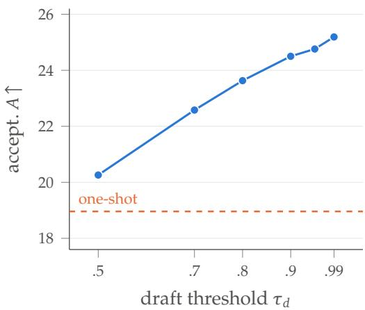  
(a) Accepted draft tokens per round

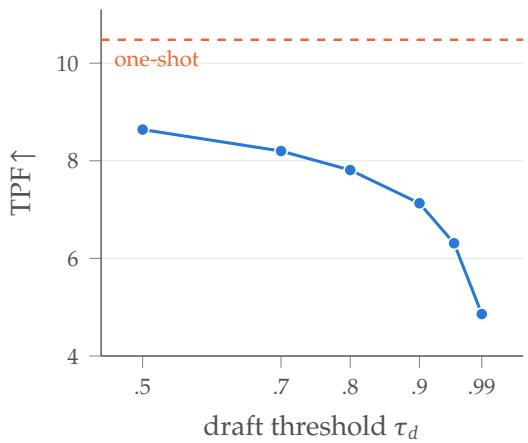  
(b) Tokens per forward  
Figure 7 | Multi-step drafting versus one-shot drafting. Instead of filling the masked block in a single forward pass, the draft is refined over several denoising steps: at each step the positions whose confidence exceeds the threshold $\tau _ { d }$ are fixed and the rest are re-drafted, and the finished draft is then verified by the causal AR pass exactly as before, so the committed output is identical at every point. (a) A higher threshold spends more steps on the draft and more of its tokens are accepted per round. (b) Every extra step is another forward pass, and the tokens it adds do not pay for it: tokens per forward falls monotonically, and one-shot drafting (dashed) commits the fewest tokens per round yet delivers the highest tokens per forward.

Draft Schedule. Figure 7 sweeps the number of denoising steps used to build the draft, controlled by the draft-side confidence threshold $\tau _ { d } ,$ measured on 400 English OmniDocBench crops. Refining the draft over more steps raises the accepted length per round (Figure 7(a)) but costs additional draft forwards, and the extra forwards cost more than the tokens they buy: tokens per forward falls monotonically as the draft is refined (Figure 7(b)). One-shot drafting is therefore the operating point we deploy.

Table 9 | All-mask training does not produce a better draft. The all-mask model commits fewer tokens per forward at every checkpoint, and its accuracy is behind at five of six.
<table><tr><td>tokens per forward↑ (self-speculative)</td><td>2k</td><td>4k</td><td>5k</td><td>6k</td><td>8k</td><td>10k</td></tr><tr><td>All-mask Uniform t (ours)</td><td>4.04 4.64</td><td>4.82 5.30</td><td>5.54 6.04</td><td>5.94 6.00</td><td>6.45 6.78</td><td>6.66 6.75</td></tr><tr><td>OmniDocBench Overall↑</td><td>2k</td><td>4k</td><td>5k</td><td>6k</td><td>8k</td><td>10k</td></tr><tr><td>All-mask</td><td>94.49</td><td>94.59</td><td>94.75</td><td>94.66</td><td>94.76</td><td>94.86</td></tr><tr><td>Uniform t (ours)</td><td>94.71</td><td>94.74</td><td>94.76</td><td>94.55</td><td>94.92</td><td>95.02</td></tr></table>

Direct-Diffusion Quality. Table 6 also reports the diagnostic direct-diffusion mode of $\mathsf { A p - }$ pendix B.1 on the official protocol at four confidence thresholds. After GRPO, quality rises monotonically with $\tau _ { c }$ while parallelism falls; even the best direct-diffusion operating point trails self-speculative decoding on both axes simultaneously.

Mask Schedule. Table 9 compares the uniform partial-masking objective against an all-mask variant matched in every other training setting, evaluated at the same step counts on the selfspeculative path. The all-mask model is behind on quality at five of six checkpoints and commits fewer tokens per forward, indicating that the partial-masking objective, not merely exposure to masked positions, is what makes the draft strong.

The $\tau _ { c } { = } 0 . 9 5$ Gap After GRPO. In Table 6, direct diffusion gains +2.91 Overall at $\tau _ { c } { = } 0 . 9 5$ while every other threshold moves by less than 0.4. The pre-GRPO model degrades three times as many formulas at exactly that setting—116 versus 37 expressions scoring zero CDM out of 2,352—which is also why its accuracy is non-monotone in $\tau _ { c }$ while the post-GRPO curve is not.

## E. RL Details

Optimization. We apply GRPO with full fine-tuning of the entire model (no LoRA), starting from the jointly trained 40k checkpoint. Each step draws 24 prompts with 28 rollouts per prompt (672 completions); advantages are standardized within each group, the loss is token-level, and clipping is asymmetric $( \varepsilon _ { \mathrm { l o w } } { = } 0 . 2 , \varepsilon _ { \mathrm { h i g h } } { = } 0 . 2 8 )$ . A KL penalty with $\scriptstyle { \bar { \boldsymbol { \beta } } } = 1 0 ^ { - 3 }$ anchors the policy to a frozen copy of the initial checkpoint. Training uses a learning rate of $3 \times 1 0 ^ { - 6 }$ with cosine decay, 8-bit AdamW, bf16, and gradient clipping 1.0; checkpoints are saved every 250 steps, and we report step 500 (about 1.6 epochs over the prompt pool). Truncated completions are masked out of the loss. No diffusion-specific objective is applied during GRPO; the drafter changes only through the shared parameters updated by the AR-path loss. On the 8,922 English OmniDocBench crops, tokens per forward are 9.61 before RL and 9.68 at step 500.

Rollouts. Rollouts are sampled from the causal AR policy at temperature 1.0 without nucleus truncation, with a maximum completion length of 8,448 tokens, using a colocated vLLM engine (Kwon et al., 2023). Policy log-probabilities are recomputed by the training framework through the same causal factorization, with token-level importance-sampling correction between the rollout and training kernels.

Rewards. All rewards lie in [0, 1]; CDM is not used as a reward. Both the prediction and the reference are first normalized with the same markup normalization the official OmniDocBench scorer applies, so the reward cannot be improved by markup conventions the evaluation ignores. Plain text is scored by the normalized Levenshtein similarity of the two normalized strings. For tables, let TEDS be the structure-only TEDS and $s _ { \mathrm { c e l l } }$ the normalized Levenshtein similarity of the concatenated cell strings in reading order; the reward is

$$
\begin{array} { r l } & { r _ { \mathrm { t a b l e } } = \mathrm { c l i p } _ { [ 0 , 1 ] } \big ( ( 0 . 4 5 \mathrm { T E D S } _ { s } + 0 . 5 5 s _ { \mathrm { c e l l } } ) ( 1 - p _ { \mathrm { r o w } } ) ( 1 - p _ { \mathrm { l o o p } } ) \big ) , } \\ & { p _ { \mathrm { r o w } } = 0 . 3 5 \ \mathrm { m i n } ( 1 , \mathrm { o v e r } / d ) + 0 . 3 5 \ \mathrm { m i n } ( 1 , \mathrm { u n d e r } / d ) , \qquad d = \mathrm { m a x } ( 4 , n _ { \mathrm { g t } } ) , } \\ & { p _ { \mathrm { l o o p } } = \left\{ \begin{array} { l l } { 0 } & { f = 0 , } \\ { \mathrm { m i n } ( 1 , \ 0 . 3 0 + 0 . 7 0 f ) } & { f > 0 , } \end{array} \right. } \end{array}
$$

where over and under are the row-count excess and shortfall relative to the $n _ { \mathrm { g t } }$ reference rows, and $f$ is the fraction of predicted rows that are excess repeats of a row key beyond max $( 3 , n _ { \mathrm { g t } } ( \mathrm { k e y } ) + 1 )$ , zero if no row repeats that often. The result is then raised toward one by an exact-grid bonus, $r  r + b ( 1 - r )$ , where � is 0.05 if the predicted row count matches the reference plus 0.05 if the predicted column count matches. An unclosed <table> scores zero (the evaluator drops such tables), and a table that cannot be parsed scores 0.15 times the plain edit similarity. For formulas, the reward is $r _ { \mathrm { f o r m u l a } } = \sin ( \cos ( \hat { y } ) , \cos ( y ) ) \cdot 0 . 3 ^ { \nu }$ , where sim is normalized Levenshtein similarity and canon strips math delimiters, maps \dfrac and \tfrac to \frac, and removes \left/\right, spacing commands, whitespace, and braces; � counts the well-formedness checks (\left/\right balance, brace balance, \begin/\end environments, and unescaped \$ parity) failed by the prediction but not by the reference. Every reward is finally multiplied by a degeneration guard $g = \operatorname* { m i n } \left( \rho _ { 8 } , \ \operatorname* { m a x } ( 0 , 1 - ( L _ { \mathrm { r u n } } - 2 0 ) / 2 0 0 ) \right)$ , where $\rho _ { 8 }$ is the distinct 8-gram ratio, computed only for outputs of at least 16 whitespace-separated tokens and taken as one otherwise, and $L _ { \mathrm { r u n } }$ is the longest single-character run.

Prompt pool. The pool contains 7,723 region crops from public document datasets of the same kind as the training pool; it contains no benchmark images, and the PubTabNet portion uses its training split only. Its composition is 92% tables, 6% text, and 2% formulas. References are the source datasets’ original annotations for the table and formula crops (94% of the pool) and teacher transcriptions for the text crops. Candidate prompts were screened by sampling eight rollouts each and discarding prompts whose reward variance is zero (their group advantage vanishes under GRPO), and the remainder was mined toward hard and long tables; the median reference length is about 1,900 characters.

## F. Qualitative Examples

Figures 8 to 10 show self-speculative decoding with the final GRPO checkpoint on OmniDocBench crops of the three region types. For each crop we show the raw serialized output with every character shaded by the decoding round that committed it; one round is one bidirectional draft forward over the masked block followed by one causal verify forward, so the number of shaded segments is the number of forward pairs that produced the output. A red tick marks a position where the verifier rejected the draft and committed its own token instead. Every round commits $a _ { 0 } ,$ , the accepted draft prefix and the verifier’s own next token, so each round advances by at least two tokens; <EOS> marks the end-of-sequence token, shaded with the round that emitted it. Each figure carries a legend of the rounds it contains, and each block is headed by its number of rounds and tokens. For all crops shown, the self-speculative output is byte-identical to autoregressive greedy decoding of the same weights.

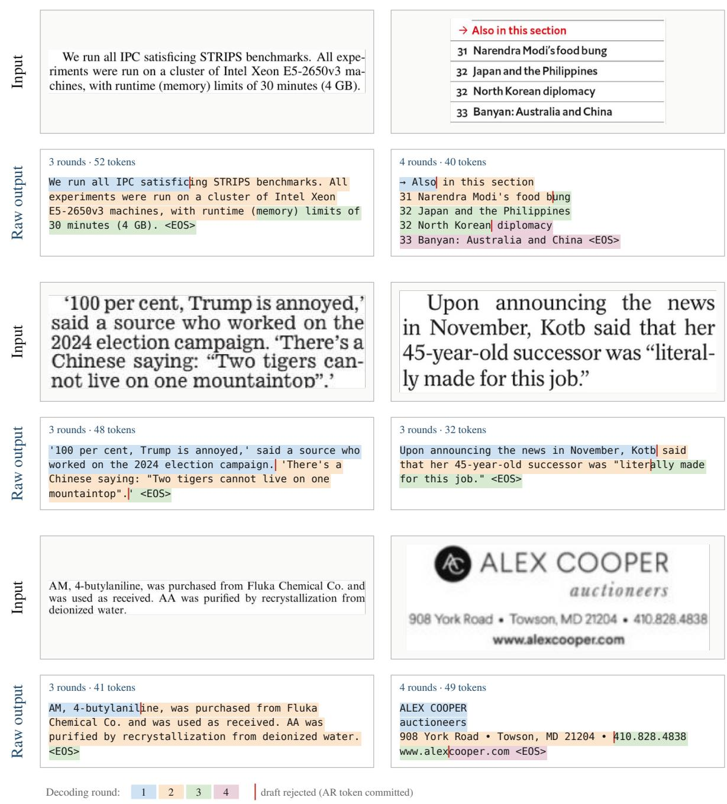  
Figure 8 | Qualitative results on text regions. Self-speculative decoding on OmniDocBench. Each block shows the input crop (top) and the raw output (bottom); each color denotes a different decoding round, a red tick marks a rejected draft token, and <EOS> is the end-of-sequence token.

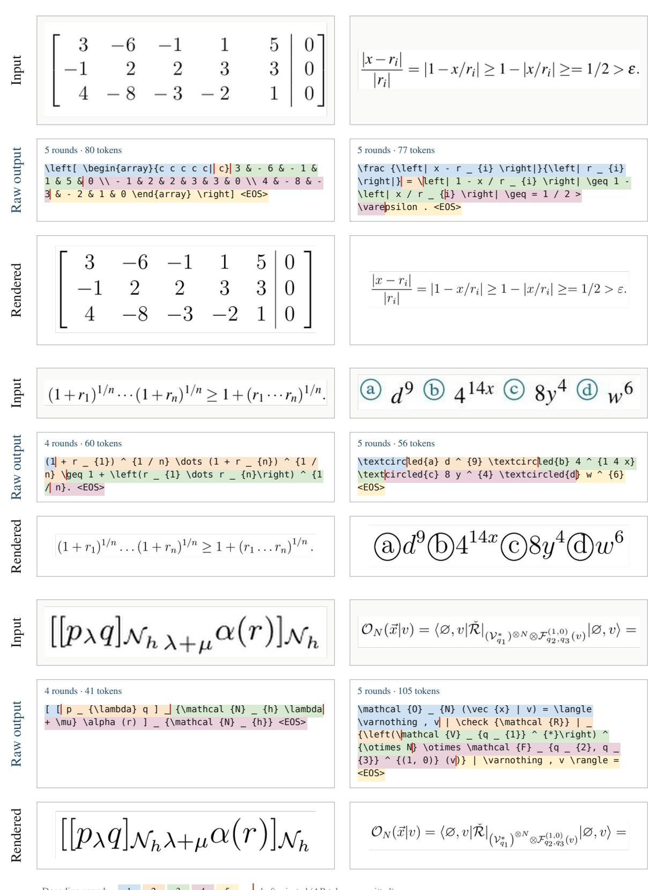  
Figure 9 | Qualitative results on formula regions. Self-speculative decoding on OmniDocBench. Each block shows the input crop, the LAT X output and its rendering; each color denotes a different decoding round, a red tick marks a rejected draft token, and <EOS> is the end-ofsequence token.

<table><tr><td>7:30 p.m.</td><td>Colorado at Chicago TNT</td></tr><tr><td>7:30 p.m.</td><td>PWHL: Boston at Minnesota NESN</td></tr><tr><td>10 p.m.</td><td>Florida at Utah TNT</td></tr></table>

```html
4 rounds · 100 tokens
<table>
<tr><td>7:30 p.m.</td><td>Colorado at Chicago</td><td>
TNT</td></tr>
<tr><td>7:30 p.m.</td><td>PWHL: Boston at
Minnesota</td><td>NESN</td></tr>
<tr><td>10 p.m.</td><td>Florida at Utah</td><td>
TNT</td></tr>
</table> <EOS>
```

<table><tr><td rowspan=1 colspan=1>7:30 p.m.</td><td rowspan=1 colspan=1>Colorado at Chicago</td><td rowspan=1 colspan=1>TNT</td></tr><tr><td rowspan=1 colspan=1>7:30 p.m.</td><td rowspan=1 colspan=1>PWHL: Boston at Minnesota</td><td rowspan=1 colspan=1>NESN</td></tr><tr><td rowspan=1 colspan=1>10 p.m.</td><td rowspan=1 colspan=1>Florida at Utah</td><td rowspan=1 colspan=1>TNT</td></tr></table>

<table><tr><td></td><td>Local bone graft</td><td>ICBG</td><td>Statistical analysis (P)</td></tr><tr><td>Deep Infection</td><td>1</td><td>0</td><td>N.S.</td></tr><tr><td>Hematoma of spinal canal</td><td>0</td><td>0</td><td>N.S.</td></tr><tr><td>Hematoma of iliac crest</td><td>0</td><td>0</td><td>N.S.</td></tr><tr><td>Sensory loss around iliac crest</td><td>0</td><td>8</td><td>0.01</td></tr><tr><td>Pain around iliac crest</td><td>0</td><td>6</td><td>0.025</td></tr></table>

8 rounds · 214 tokens   
<table>   
<tr><td></td><td>Local bone graft</td><td>ICBG</td><td>   
Statistical analysis(P)</td></tr>   
<tr><td>Deep Infection</td><td>1</td><td>0</td><td>   
N.S.</td></tr>   
<tr><td>Hematoma of spinal canal</td><td>0</td><td>   
0</td><td>N.S.</td></tr>   
<tr><td>Hematoma of iliac crest</td><td>0</td><td>   
0</td><td>N.S.</td></tr>   
<tr><td>Sensory loss around iliac crest</td><td>0</td>   
<td>8</td><td>0.01</td></tr>   
<tr><td>Pain around iliac crest</td><td>0</td><td>   
6</td><td>0.025</td></tr>   
</table> <EOS>   
4 rounds · 103 tokens   
<table>   
<tr><td>Rotor</td><td>Laser flash lamps</td><td>Rotor   
frequency/flash lamp rate</td><td>Camera and   
q-switch</td></tr>   
<tr><td>1,041 RPM\~17.35 Hz</td><td>9.914 Hz</td><td>   
m/n=7/4</td><td>2.479 Hz</td></tr>   
</table> <EOS>

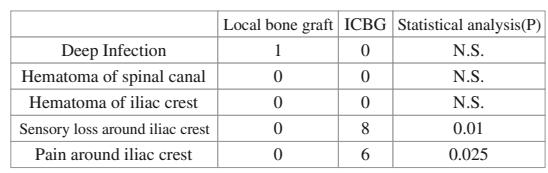

<table><tr><td rowspan=1 colspan=1>Name</td><td rowspan=1 colspan=1>Type</td><td rowspan=1 colspan=1>Offset</td><td rowspan=1 colspan=1>Scope</td></tr><tr><td rowspan=1 colspan=1>inGlobal</td><td rowspan=1 colspan=1>int</td><td rowspan=1 colspan=1>0</td><td rowspan=1 colspan=1>global</td></tr><tr><td rowspan=1 colspan=1>inLocal</td><td rowspan=1 colspan=1>int</td><td rowspan=1 colspan=1>0</td><td rowspan=1 colspan=1>main</td></tr><tr><td rowspan=1 colspan=1>outLocalA</td><td rowspan=1 colspan=1>int</td><td rowspan=1 colspan=1>-1</td><td rowspan=1 colspan=1>main</td></tr><tr><td rowspan=1 colspan=1>outLocalB</td><td rowspan=1 colspan=1>int</td><td rowspan=1 colspan=1>-2</td><td rowspan=1 colspan=1>main</td></tr></table>

<table><tr><td>5 rounds · 150 tokens</td></tr><tr><td>&lt;table&gt;</td></tr><tr><td>&lt;tr&gt;&lt;td&gt;Name&lt;/td&gt;&lt;td&gt;Type&lt;/td&gt;&lt;td&gt;0ffset&lt;/td&gt;&lt;td&gt;</td></tr><tr><td>Scope&lt;/td&gt;&lt;/tr&gt;</td></tr><tr><td>&lt;tr&gt;&lt;td&gt;inGlobal&lt;/td&gt;&lt;td&gt;int&lt;/td&gt;&lt;td&gt;0&lt;/td&gt;&lt;td&gt;</td></tr><tr><td>global&lt;/td&gt;&lt;/tr&gt;</td></tr><tr><td>&lt;tr&gt;&lt;td&gt;inLocal&lt;/td&gt;&lt;td&gt;int&lt;/td&gt;&lt;td&gt;0&lt;/td&gt;&lt;td&gt;main&lt;/td&gt; &lt;/tr&gt;</td></tr><tr><td>&lt;tr&gt;&lt;td&gt;outLocalA&lt;/td&gt;&lt;td&gt;int&lt;/td&gt;&lt;td&gt;-1&lt;/td&gt;&lt;td&gt;</td></tr><tr><td>main&lt;/td&gt;&lt;/tr&gt;</td></tr><tr><td>&lt;tr&gt;&lt;td&gt;outLocalB&lt;/td&gt;&lt;td&gt;int&lt;/td&gt;&lt;td&gt;-2&lt;/td&gt;&lt;td&gt;</td></tr><tr><td>main&lt;/td&gt;&lt;/tr&gt;</td></tr><tr><td>&lt;/table&gt; &lt;EOS&gt;</td></tr></table>

<table><tr><td rowspan=1 colspan=1>Name</td><td rowspan=1 colspan=1>Type</td><td rowspan=1 colspan=1>Offset</td><td rowspan=1 colspan=1>Scope</td></tr><tr><td rowspan=1 colspan=1>inGlobal</td><td rowspan=1 colspan=1>int</td><td rowspan=1 colspan=1>0</td><td rowspan=1 colspan=1>global</td></tr><tr><td rowspan=1 colspan=1>inLocal</td><td rowspan=1 colspan=1>int</td><td rowspan=1 colspan=1>0</td><td rowspan=1 colspan=1>main</td></tr><tr><td rowspan=1 colspan=1>outLocalA</td><td rowspan=1 colspan=1>int</td><td rowspan=1 colspan=1>-1</td><td rowspan=1 colspan=1>main</td></tr><tr><td rowspan=1 colspan=1>outLocalB</td><td rowspan=1 colspan=1>int</td><td rowspan=1 colspan=1>-2</td><td rowspan=1 colspan=1>main</td></tr></table>

<table><tr><td>Rotor</td><td>Laser flash lamps</td><td>Rotor frequency/flash lamp rate</td><td>Camera and q-switch</td></tr><tr><td>1,041 RPM~17.35 Hz</td><td>9.914 Hz</td><td>m/n=7/4</td><td>2.479 Hz</td></tr></table>

<table><tr><td rowspan=1 colspan=1>Rotor</td><td rowspan=1 colspan=1>Laser flash lamps</td><td rowspan=1 colspan=1>Rotor frequency/flash lamp rate</td><td rowspan=1 colspan=1>Camera and q-switch</td></tr><tr><td rowspan=1 colspan=1>1,041 RPM~17.35 Hz</td><td rowspan=1 colspan=1>9.914 Hz</td><td rowspan=1 colspan=1>m/n=7/4</td><td rowspan=1 colspan=1>2.479 Hz</td></tr></table>

draft rejected (AR token committed)  
Figure 10 | Qualitative results on table regions. Self-speculative decoding on OmniDocBench. Each block shows the input crop, the HTML output and its rendering; each color denotes a different decoding round, a red tick marks a rejected draft token, and <EOS> is the end-ofsequence token.