# Do Vision Model See Like the Brain? A Comparison Across EEG Encoding Model

Shashank Baghela, Kshitij Dwivedib,c, Dinesh Singha,∗ and Sanjeev Naraa,∗

aCentrefor Human-Computer Interaction, Indian Institute ofTechnology, Mandi, Mandi, 175075, Himachal Pradesh, India

bFreie Universität, Berlin, Germany

cGoethe University, Frankfurt, Germany

## A R T I C L E I N F O

Keywords:6   
EEG Encoding2 Visual Hierarchy Vision Transformers Convolutional Neural Networks Electroencephalography (EEG)p

## A BS T R AC T

Convolutional neural networks (CNNs) and vision transformers are both used to model the human visual system, but whether the two architectures diverge at a specific point in network depth is unclear. We compared six CNNs and two vision transformers by computing the Pearson correlation (�) between each model’s predicted and measured EEG response at every layer or block, in ten participants viewing 200 natural images. For the transformer models, we also tested four token representations, from the classification (CLS) token alone to CLS combined with all patch tokens. CNNs showed strongest correspondence at the earliest layers, weakening at deeper layers, particularly later in the post-stimulus response. Transformers instead sustained strong correspondence at their deepest blocks, though not at their earliest ones. This advantage depended on token representation: pooled representations gave weaker peak correlations (�≈0.48–0.51) than representations retaining all patch tokens (�=0.640 for CLIP-ViT-B/32, �=0.656 for DINOv2- ViT-B/14). Controlled comparisons showed architecture, not training objective, drove this efect: MoCo-v1 and ResNet-50 (matched architecture) performed nearly identically (�=0.673, 0.670), whereas CLIP-RN50 and CLIP-ViT-B/32 (matched objective) diverged until patch tokens were preserved. We propose that CNN training’s classification bottleneck compresses brain-relevant information at depth, unlike transformers’ self-attention and non-classification objectives. A spatial topography analysis showed a common occipital-dominant pattern across all models, indicating these diferences reflect signal strength and persistence rather than distinct brain regions. Patch-preserving transformer representations sustain brain-predictive correspondence where CNNs collapse.

## 1. Introduction

Deep vision models have become the dominant tool for investigating how the brain constructs visual representations. In the past years of work comparing convolutional neural networks (CNNs) to neural recordings, a consistent picture has emerged that early network layers predict early visual cortex, and deeper layers predict higher visual areas (Yamins, Hong, Cadieu, Solomon, Seibert and DiCarlo, 2014; Khaligh-Razavi and Kriegeskorte, 2014; Güçlü and van Gerven, 2015; Cichy, Khosla, Pantazis, Torralba and Oliva, 2016). This correspondence is useful because it turns a question, whether a model processes images the way the brain does, into a quantitative one that can be tested layer by layer. The motivation runs in both directions, beyond using models to explain the brain, the human visual system still outperforms vision models on many tasks such as few shot generalization and robust multimoda understanding, so identifying where current models diverge from biological vision is also a step toward designing more brain like vision models. But nearly all of this evidence comes from CNNs, and nearly all of it comes from fMRI or invasive electrophysiology. Vision transformers have since become the dominant architecture in computer vision, trained under objectives, classification, contrastive language image alignment, and self-distillation, that difer sharply from one another and from the classification objective used in the CNN models. Whether the brain correspondence found for CNNs is a property of the visual hierarchy itself, or a property tied to CNNs and their classification objective specifically, is the question this work answers. We ask it using EEG modality, does the CNN to brain correspondence generalize to transformers, and if it does not, does the divergence trace to architecture, to training objective, or to both.

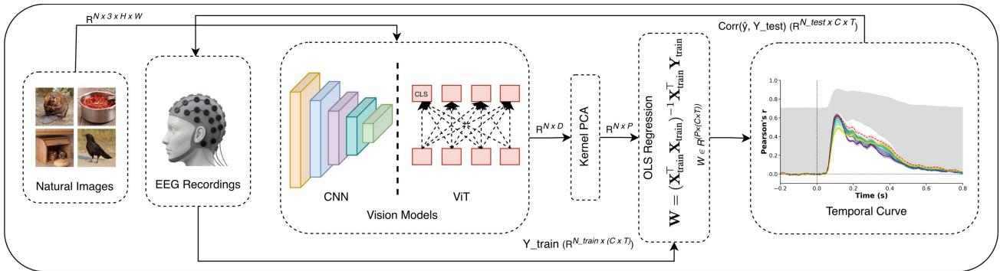  
Figure 1: Overview of the EEG encoding pipeline. Natural images are passed through vision models (CNNs and ViTs) to extract features, which are reduced via Kernel PCA and mapped to EEG responses via OLS regression. Model predictions are evaluated against held-out EEG using Pearson correlation.

The CNN side of this question is fairly explored. Supervised CNNs trained on ImageNet classification reliably predict neural activity along the ventral stream, with a hierarchical match between network depth and cortical stage (Yamins et al., 2014; Khaligh-Razavi and Kriegeskorte, 2014; Güçlü and van Gerven, 2015). Brain Score and related benchmarking eforts have extended this into a standard methodology for scoring any model against primate visual cortex (Schrimpf, Kubilius, Hong, Majaj, Rajalingham, Issa, Kar, Bashivan, Prescott-Roy, Schmidt, Yamins and DiCarlo, 2018). MEG and EEG work has shown that this same hierarchical correspondence unfolds over time, with a feedforward sweep from low level to category level representations visible within the first 200 ms of the neural response (Cichy et al., 2016; Grootswagers, Robinson and Carlson, 2019). Separately, a handful of recent studies have begun to test vision transformers and multimodal models such as CLIP against fMRI, generally finding that these models predict higher visual cortex at least as well as, and sometimes better than, CNNs (Oota, Arora, Rowtula, Gupta and Bapi, 2022; Wang, Kay, Naselaris, Tarr and Wehbe, 2023). What is missing is the intersection of these two literatures: no prior study evaluates a broad set of CNN and transformer models against EEG within a single, matched analysis pipeline, and none uses the millisecond resolution of EEG to ask specifically where, along network depth, CNNs and transformers begin to disagree. We close this gap by performing a layer by layer analysis of all models, evaluating Pearson’s Correlation at every individual layer or transformer block (Fig. 1). This gives a natural way to ask when, not just whether, a model diverges from the brain, using EEG’s millisecond resolution to resolve a layer by layer profile that fMRI’s slow hemodynamic response cannot. Applying this to six CNNs and two vision transformers reveals a clear asymmetry. At the earliest and intermediate layers, the two architecture families are statistically indistinguishable, predicting EEG responses with almost similar peak Pearson correlation. The divergence appears only once the network reaches its deeper layers: CNNs middle layers correlation with EEG begins to fall noticeably below that of the transformers middle blocks, and the gap widens further at the final layers. The result is a gap that is negligible at shallow depth but grows into a clear, sizeable transformer advantage by the final layers.

To separate why this happens, we test two candidate causes rather than treating "transformer" as a single unexplained label. The first is the classification bottleneck: a network trained to sort images into 1,000 ImageNet categories has every incentive to discard information that does not help distinguish those categories, and this compression appears to actively damage its correspondence with the brain’s own semantic representations (Yamins et al., 2014; Khaligh-Razavi and Kriegeskorte, 2014). CORnet-S ofers a direct test of whether this is fixable by architecture alone: its layers are explicitly labelled V1, V2, V4, and IT to match cortical anatomy, yet its IT layer still falls into the same low pearsons correlation range as the deepest layers of every other CNN we tested. The second candidate cause is self attention itself: every transformer block, including the last, attends across the full set of spatia tokens, so information present early in the network remains reachable throughout, unlike the CNN’s progressive spatia pooling. CLIP-ViT-B/32 is trained to align images with natural language descriptions (Radford, Kim, Hallacy, Ramesh, Goh, Agarwal, Sastry, Askell, Mishkin, Clark, Krueger and Sutskever, 2021) and DINOv2 is trained with no labels at all through self distillation (Oquab, Darcet, Moutakanni, Vo, Szafraniec, Khalidov, Fernandez, Haziza, Massa, El-Nouby, Assran, Ballas, Galuba, Howes, Huang, Li, Misra, Rabbat, Sharma, Synnaeve, Xu, Jégou, Mairal, Labatut,

Joulin and Bojanowski, 2023); neither is forced to compress its output into a fixed small set of categories. Because training objective and self attention are conflated in a simple CNN versus transformer comparison, we include two additional models, MoCo-v1 and CLIP-RN50, that each hold one factor fixed while varying the other.

Contributions of this study includes:

• A layer by layer Analysis We test six CNNs and two Vision Transformers across every individual layer (as shown in Fig. 1) and show that the two architecture families predict EEG equally well at early and intermediate layers, then diverge sharply at deeper layers.

• Two controlled experiments that isolate the cause of this divergence. MoCo-v1 is compared against supervised CNNs of the same architecture to isolate the efect of training objective alone, and CLIP-RN50 is compared against CLIP-ViT-B/32 under the same training objective to isolate the efect of self-attention alone.

• Exploring variation of Vision Transformers tokens We argue that the CNN classification bottleneck and the transformer’s token preserving self-attention together account for why transformers, but not CNNs, sustain brain like representations at the deepest layers, which correspond to inferotemporal cortex, the brain’s semantic object recognition stage.

## 2. Related Work

The literature connecting deep vision models to brain activity divides naturally along two axes: the neuroimaging modality used to record the brain signals, and the model architecture being tested. We organize this section along both. We first trace the biological inspiration behind convolutional architectures and their growing divergence from human perception, then cover CNN-brain correspondence as characterized through spatial neuroimaging (fMRI and invasive electrophysiology) and through temporal neuroimaging (MEG and EEG), before closing with the still thin literature on vision transformers as brain models.

## 2.1. Biological Inspiration and Modern Optimization Divergence

The modern study of brain encoding is rooted in the pioneering work of Hubel and Wiesel (1962), who demonstrated that neurons in the primary visual cortex (V1) respond selectively to simple visual features such as oriented edges and proposed a hierarchical organization of visual processing. Their discovery of simple and complex cells established the biological principle that increasingly complex visual representations emerge through successive cortical stages, an idea that later inspired hierarchical computational vision models and, ultimately, convolutional neural networks. Fukushima’s Neocognitron (Fukushima, 1980) introduced alternating S-cell and C-cell layers for hierarchical feature extraction and shift-invariant recognition, providing the conceptual precursor to modern CNNs. Serre, Wolf, Bileschi, Riesenhuber and Poggio (2007) extended this biologically inspired framework through hierarchical feedforward models employing alternating template-matching and max-pooling operations for rapid object categorization, and Krizhevsky, Sutskever and Hinton (2012)’s AlexNet demonstrated that these principles could scale to large-scale image classification. Subsequent work showed that convolutional networks develop increasingly specialized representations across their intermediate and deeper layers, with diferent layers contributing diferently to classification performance (Zeiler and Fergus, 2014). However, networks optimized primarily for classification accuracy may diverge from human visual perception. Model-optimized controversial stimuli expose systematic diferences between neural network predictions and human perceptual judgments (Golan, Raju and Kriegeskorte, 2020), while comprehensive reviews highlight persistent discrepancies between CNNs and biological vision (Lindsay, 2021). Furthermore, recent work suggests that improvements in ImageNet accuracy do not necessarily correspond to better alignment with human perceptual similarity judgments (Kumar, Houlsby, Kalchbrenner and Cubuk, 2022). This growing divergence between task optimization and perceptual alignment motivates our investigation of whether alternative architectures and training paradigms, including Transformers trained with multimodal or self-supervised objectives, better preserve brain-like visual representations.

## 2.2. CNN-Brain Correspondence via Spatial Neuroimaging

A major advance in human neuroimaging came with Kamitani and Tong (2005), who showed that multivoxel fMRI activity patterns in early visual cortex contain suficient information to decode the orientation perceived or attended by a subject. This work demonstrated that distributed brain activity could be quantitatively decoded using multivoxel pattern analysis, laying the foundation for modern neural encoding and decoding research.

Deep neural networks later emerged as computational models of the visual hierarchy itself. Yamins et al. (2014) showed that performance-optimized CNNs can predict neural responses across macaque visual cortex, with higher-level representations corresponding to responses in IT. Cadieu, Hong, Yamins, Pinto, Ardila, Solomon, Majaj and DiCarlo (2014) further demonstrated that high-performing CNNs can achieve representational performance comparable to primate IT cortex for core visual object recognition, while their high-level features can also predict individual IT neural responses. Together, these findings provided strong evidence that task-optimized CNNs capture important aspects of hierarchical visual representations in the primate ventral stream. However, both studies rely on invasive electrophysiology in primates, recording a small number of IT/V4 neurons under static image presentation; neither tests human EEG, nor any architecture beyond a single CNN, leaving open whether the finding generalizes to non invasive human recordings or to other model families. Khaligh-Razavi and Kriegeskorte (2014) extended this to human IT, via fMRI, and macaque IT jointly, reporting that supervised CNNs match cortical representations far better than unsupervised models. This comparison, however, predates the vision transformer entirely: self-attention based architectures, and the many alternative training objectives now available for them, simply did not exist at the time, so the study could not have asked whether the supervised training advantage it reports is a property of CNNs specifically, or of visual hierarchies more generally.

Working with human fMRI directly, Güçlü and van Gerven (2015) showed that lower CNN layers correspond to early visual areas (V1–V3) while deeper layers align with higher regions such as V4 and the lateral occipital cortex. This mapping is built entirely on fMRI, using features from a single pretrained AlexNet. Eickenberg, Gramfort, Varoquaux and Thirion (2017) used voxel-wise encoding models with fMRI to show that representations from diferent CNN layers predict activity across multiple visual regions, with diferent layers exhibiting distinct correspondence across the visual hierarchy. However, their analysis relied on fMRI and a single CNN model, leaving open whether these layer–brain correspondences generalize across architectures and training objectives.

Building on earlier demonstrations of CNN–cortex correspondence (Yamins et al., 2014; Khaligh-Razavi and Kriegeskorte, 2014), Schrimpf et al. (2018) proposed Brain-Score, a standardized benchmark that evaluates models using neural and behavioral predictivity. Their results showed that higher ImageNet accuracy does not necessarily imply greater brain-likeness. However, Brain-Score summarizes correspondence using the best-matching layer for each cortical region, rather than providing a layer-by-layer characterization of representational alignment throughou the network.

## 2.3. CNN-Brain Correspondence via Temporal Neuroimaging

Cichy et al. (2016) combined fMRI and MEG through representational similarity analysis and did resolve a temporal dimension, showing a feedforward sweep from low level to category level representations within roughly the first 200 ms. This is one of the few studies to combined both modalities to obtain a spatio-temporal comparison, but it evaluates CNNs based architectures exclusively. Seeliger, Fritsche, Güçlü, Schoenmakers, Schofelen, Bosch and van Gerven (2018) extended earlier encoding studies by performing both encoding and decoding using MEG data. Using a pretrained VGG-S network, they demonstrated that CNN features accurately predict the spatiotemporal evolution of neural responses and that the learned encoding model can be inverted to decode the viewed object from MEG activity. However, the study was limited to a single CNN architecture (VGG-S). Wen, Shi, Zhang, Lu, Cao and Liu (2018) extended CNN to brain encoding to dynamic natural movie stimuli using fMRI, validating hierarchical feature representations across visual regions under naturalistic viewing, but movie fMRI still inherits fMRI’s coarse temporal resolution and again tests using single CNN architecture (Alexnet) only.

EEG captures the dynamics of visual processing at millisecond resolution, with neural representations evolving from relatively low-level visual features at earlier latencies toward increasingly abstract and categorical representations at later stages of processing (Grootswagers et al., 2019). Despite this well-established temporal structure, EEG-based encoding studies remain considerably fewer than their fMRI counterparts, and most existing EEG model comparisons, as reviewed above, evaluate only a single CNN architecture rather than a matched set of diverse models. The THINGS-EEG2 dataset (Giford, Dwivedi, Roig and Cichy, 2022) provides a large-scale, high-SNR EEG resource specifically designed for computational modeling of visual object recognition, comprising responses from 10 participants across 16,540 training images and 200 test images. However, although the dataset has enabled large-scale EEG encoding and decoding studies, it has not been used for a unified, layer-wise comparison of a broad range of CNN and Transformer architectures.

## 2.4. Transformer-Brain Comparisons

Oota et al. (2022) directly compared CNNs, Vision Transformers, and multimodal models such as CLIP against human fMRI, making it the closest prior work to ours in evaluating both architecture families within a unified framework. However, the analysis remains limited to fMRI, whose coarse temporal resolution precludes tracking the millisecond by millisecond evolution of layer-wise representations or determining when CNNs and Transformers begin to diverge during visual processing.

Vision Transformers process images as sequences of patches using multi-head self-attention, enabling each layer to model global spatial relationships without the progressive spatial downsampling characteristic of CNNs (Dosovitskiy, Beyer, Kolesnikov, Weissenborn, Zhai, Unterthiner, Dehghani, Minderer, Heigold, Gelly, Uszkoreit and Houlsby, 2021). Conwell, Prince, Kay, Alvarez and Konkle (2024) performed the most comprehensive controlled comparison of CNNs, Vision Transformers, and other modern vision models to date, systematically isolating the efects of architecture, training objective, and visual diet on brain predictivity. Their results showed that, under matched training conditions, CNNs and Vision Transformers achieve comparable alignment with the human ventral visual system, while training objective and visual diet exert a greater influence than architecture alone. The analysis relied exclusively on fMRI and summarized each model using its best-predicting layer for each cortical region, rather than characterizing how brain correspondence evolves across all layers over time. Consequently, it remains unclear whether CNNs and Vision Transformers diverge at specific stages of visual processing or exhibit distinct layerwise temporal dynamics. This is the question addressed in the present work.

## 3. Methods

## 3.1. Dataset

The study is conducted on the Alessandro T. Giford dataset (Giford et al., 2022), which contains EEG recordings from 10 participants viewing natural object images. The experimental data is partitioned into a training set comprising 16,540 unique images (presented with 4 repetitions each) and a test set comprising 200 images (presented with 80 repetitions each). While the EEG was originally recorded using a 63 channel system, the analysis focuses on vision related processing by utilizing a subset of 17 posterior visual channels. The continuous neural data are epoched from −200 to 800 ms relative to stimulus onset and downsampled to 100 time points, yielding a 10 ms temporal resolution. Crucially, averaging the EEG responses over the high number of repetitions, particularly the 80 repetitions in the test set, produces neural responses with a high signal to noise ratio, making it an ideal benchmark for evaluating models of human visual object recognition.

## 3.2. Choice of Vision Models

We test 8 models: 6 CNN based (AlexNet, VGG16, ResNet50, CORnet-S, MoCo-v1, and CLIP-RN50) and 2 vision transformer based (DINOv2-ViT-B/14 and CLIP-ViT-B/32).

## 3.2.1. Supervised CNNs

AlexNet (Krizhevsky et al., 2012), VGG16 (Simonyan and Zisserman, 2014), ResNet50 (He, Zhang, Ren and Sun, 2015), and CORnet-S (Kubilius, Schrimpf, Nayebi, Bear, Yamins and DiCarlo, 2018), all trained end to end on ImageNet classification. Features were extracted at every named layer from the first convolutional output to the fina classification layer.

## 3.2.2. Self-supervised CNN

MoCo-v1 (He, Fan, Wu, Xie and Girshick, 2020), a ResNet-50 backbone trained with a contrastive instance discrimination objective and no class labels, matching the supervised CNNs in architecture but not objective. Layers are extracted identically to the supervised CNNs.

## 3.2.3. Vision Transformers

DINOv2-ViT-B/14 (Oquab et al., 2023) is trained via self-distillation between a student and a slowly updated teacher network, with no labels and no language supervision. CLIP-ViT-B/32 (Radford et al., 2021) is trained to align images with natural language captions. Features for both are extracted at the output of each of the 12 transformer blocks.

## 3.2.4. Architecture and Objective Controlled Comparisons

CLIP-RN50 shares CLIP-ViT-B/32’s contrastive language-image training objective but uses a ResNet-50 backbone instead of a transformer. Together, MoCo-v1 (architecture fixed, objective changed) and CLIP-RN50 (objective fixed, architecture changed) let us ask whether the deep layer divergence reported in Section 4 tracks architecture, training objective, or both. All eight models are used as frozen feature extractors; no fine tuning was performed.

## 3.3. EEG Encoding Model

Brain responses are predicted through a fixed pipeline: features are reduced via Kernel PCA, mapped to EEG via OLS regression, and evaluated by correlating predictions against held-out test EEG. This pipeline is applied both per layer and on all layers concatenated, described in items 3 and 4 below.

## 3.3.1. Kernel PCA Dimensionality Reduction

This step follows the pipeline $\mathbf { X } _ { \mathrm { r a w } }$ → standardize → KernelPCA → �. Raw feature dimensionality ranges from a few thousand (single CNN layers) to hundreds of thousands (all layer ViT concatenation). Features are first standardized to zero mean and unit variance, then reduced to $P { = } 3 { , } 0 0 0$ components via polynomial kernel PCA:

$$
\begin{array} { r } { K ( \mathbf x , \mathbf y ) = ( \gamma \mathbf x ^ { \top } \mathbf y + 1 ) ^ { 4 } , \quad \gamma = \frac { 1 } { D } } \end{array}\tag{1}
$$

where � is the standardized input dimensionality and $\gamma { = } 1 / D ,$ , coeficient 1, and degree 4 match the standard KernelPCA defaults. The kernel matrix is fitted and eigendecomposed once on the full training features; test features are projected out of sample using the fitted eigenvectors and eigenvalues, without ever recomputing the decomposition on test data. This nonlinear projection captures feature interactions up to degree 4 while keeping the downstream regression tractable.

Choice of component count. The value 3,000 was not chosen arbitrarily. Fig. 2 sweeps the number of retained KernelPCA components from a 100 to 3,000, for each of the eight base models, using the same full time window peak metric used throughout the paper. Six of the eight models plateau well before 2,000 components, with negligible change (within ±0.003 in Pearson �) from 2,000 to 3,000. VGG-16 and CLIP-RN50 continue rising slightly beyond 2,000, but the gain from 2,000 to 3,000 components is small (under 0.01 in � for both), indicating that 3,000 components is suficient to capture the vast majority of the achievable encoding accuracy across all eight models.

## 3.3.2. Ordinary Least-Squares Encoding

This step follows the pipeline $\mathbf { X } , \mathbf { Y } _ { \mathrm { t r a i n } } \to \mathbf { O L S } \to \mathbf { W }$ . The EEG training target for each image is the response averaged across all available training repetitions. Encoding weights � are estimated via ordinary least squares on the training set:

$$
\mathbf { W } = ( \mathbf { X } _ { \mathrm { t r a i n } } ^ { \top } \mathbf { X } _ { \mathrm { t r a i n } } ) ^ { - 1 } \mathbf { X } _ { \mathrm { t r a i n } } ^ { \top } \mathbf { Y } _ { \mathrm { t r a i n } }\tag{2}
$$

where $\mathbf { X } _ { \mathrm { t r a i n } } \in \mathbb { R } ^ { N _ { \mathrm { t r a i n } } \times P }$ is the projected training feature matrix and $\mathbf { Y } _ { \mathrm { t r a i n } }$ is the EEG response matrix. Weights are estimated separately for each subject.

Here, $N _ { \mathrm { t r a i n } }$ is the number of training images, � is the number of retained KernelPCA components, � is the number of EEG channels, and � is the number of timepoints. The EEG response tensor is flattened along the channel and time axes before regression, so that $\mathbf { Y } _ { \mathrm { t r a i n } } \in \mathbb { R } ^ { N _ { \mathrm { t r a i n } } \times ( C \times T ) }$

## 3.3.3. Layer-wise Encoding

Each layer follows the pipeline $\mathbf { X } _ { l }  \mathrm { K e r n e l P C A } ( \mathbf { X } _ { l } )  \mathrm { O L S }  \hat { \mathbf { Y } } _ { l }  r _ { l }$ , for all $l \in \{ 1 , \ldots , L \}$ . In this mode, each layer $l \in \{ 1 , \ldots , L \}$ is analyzed independently: its raw feature matrix $\mathbf { X } _ { l } \in \mathbb { R } ^ { N \times D _ { l } }$ , where � is the number of images and $D _ { l }$ is the raw feature dimensionality of layer �, is passed through its own KernelPCA reduction to $\mathbf { X } _ { \mathfrak { \jmath } } ^ { \prime } \in \mathbb { R } ^ { N \times P }$ and a separate OLS encoding model $\mathbf { W } _ { l }$ is fit and evaluated for that layer alone. This is what produces the per-layer encoding scores reported throughout Section 4.

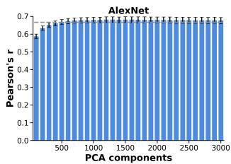

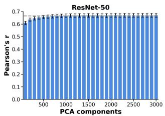

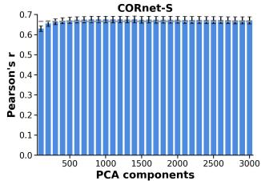

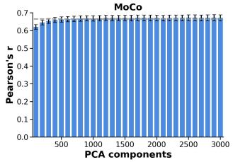

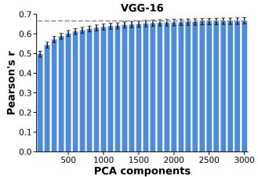

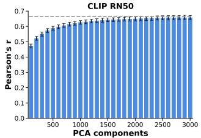

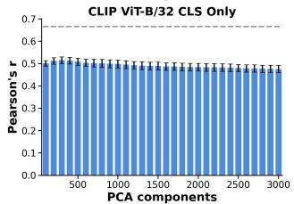

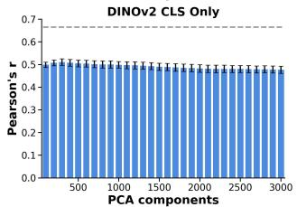

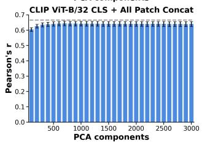

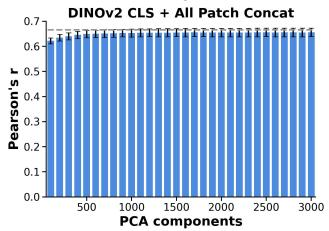  
Figure 2: Whole model EEG encoding accuracy (Pearson �, mean ± SEM over 10 subjects) versus number of retained KernelPCA components, swept up to 3,000, for each of the eight base models. Dashed line: noise ceiling lower bound.

## 3.3.4. All Layer Concatenated Encoding

This mode follows the pipeline $\mathbf { X } _ { \mathrm { c o n c a t } } = \mathbf { X } _ { 1 } \parallel \mathbf { X } _ { 2 } \parallel \cdots \parallel \mathbf { X } _ { L }  { \mathrm { K e r n e l P C A } }  { \mathrm { O L S } }  { \hat { \mathbf { Y } } }  r$ . In this mode, every layer’s raw features are concatenated along the feature axis before reduction:

$$
\mathbf { X } _ { \mathrm { c o n c a t } } = \left[ \mathbf { X } _ { 1 } \parallel \mathbf { X } _ { 2 } \parallel \cdots \parallel \mathbf { X } _ { L } \right] \in \mathbb { R } ^ { N \times \sum _ { l = 1 } ^ { L } D _ { l } }\tag{3}
$$

where � is the total number of layers in the model and ‖ denotes concatenation along the feature dimension. A single KernelPCA reduction is then fitted on $\mathbf { X } _ { \mathrm { c o n c a t } }$ to obtain $\mathbf { X } \in \mathbb { R } ^ { N \times P }$ , and a single OLS model � is fit on this combined representation, producing predicted responses over $\mathbb { R } ^ { N \times ( C \times T ) }$ . This is the whole model score used for the overall model ranking (Table 2).

## 3.4. Evaluation and Statistical Procedure

## 3.4.1. Test set Prediction

Once � is estimated, the model’s predicted EEG response on the test set, $\hat { \mathbf { Y } } \in \mathbb { R } ^ { N _ { \mathrm { t e s t } } \times C \times T }$ , is computed once from the projected test features and held fixed for all subsequent evaluation steps.

## 3.4.2. Split half Correlation

Brain model alignment is measured as the Pearson correlation between the fixed predicted response and actual EEG on the test set, computed independently for each channel � and timepoint �. Rather than compare the prediction against a single fixed average of the test repetitions $( R _ { \mathrm { t e s t } } )$ , we follow the split half procedure of Giford et al. (2022): for each of $i = 1 , \dots , M$ random splits, the $R _ { \mathrm { t e s t } }$ repetitions are divided into two halves and one half is averaged into $y _ { c , t } ^ { ( 1 ) , i }$ . The correlation for that split is

$$
r _ { c , t } ^ { ( i ) } = \frac { \sum _ { n = 1 } ^ { N _ { \mathrm { t e s t } } } ( \hat { y } _ { n , c , t } - \bar { \hat { y } } _ { c , t } ) ( y _ { n , c , t } ^ { ( 1 ) , i } - \bar { y } _ { c , t } ^ { ( 1 ) , i } ) } { \sqrt { \sum _ { n = 1 } ^ { N _ { \mathrm { t e s t } } } ( \hat { y } _ { n , c , t } - \bar { \hat { y } } _ { c , t } ) ^ { 2 } } ~ \sqrt { \sum _ { n = 1 } ^ { N _ { \mathrm { t e s t } } } ( y _ { n , c , t } ^ { ( 1 ) , i } - \bar { y } _ { c , t } ^ { ( 1 ) , i } ) ^ { 2 } } }\tag{4}
$$

where $N _ { \mathrm { t e s t } }$ is the number of test images, $\hat { y } _ { n , c , t }$ is the model’s predicted response, and the sums and means are taken over test images �. The reported correlation averages over all �=100 splits,

$$
r _ { c , t } = \frac { 1 } { M } \sum _ { i = 1 } ^ { M } r _ { c , t } ^ { ( i ) } ,\tag{5}
$$

which is less sensitive to which particular trials happen to fall into a given half than a single split would be.

## 3.4.3. Temporal and Layer-wise Peak Encoding

This channel wise correlation is then averaged over all � channels at each of the � time points spanning the full −200 to 800 ms time window. For each layer and subject, we take the peak value of this channel averaged correlation over the entire time window. We do not restrict this peak search to a sub window: the full time window is searched so that no processing stage is favored by the choice of time range.

## 3.4.4. Noise Ceiling

Since trial to trial EEG variability caps how high any model’s correlation can go, we bound it using the same splits: the lower bound is $\mathrm { C o r r } ( y _ { c , t } ^ { ( 1 ) , i } , y _ { c , t } ^ { ( 2 ) , i } )$ between the two independent halves, and the upper bound is Corr $( y _ { c , t } ^ { ( 1 ) , i } , \bar { y } _ { c , t } )$ between one half and the full $R _ { \mathrm { t e s t } }$ repetition average, both averaged over the � iterations.

## 3.4.5. Subject level Aggregation

The per layer, per subject peak value obtained above is then averaged across all subjects to obtain a single encoding score for each layer or model.

## 4. Experimental Evaluation and Discussion

We evaluate brain correspondence across vision models along four complementary axes. We begin by examining how encoding accuracy evolves across the depth of each network, layer by layer. We then investigate how diferent strategies for aggregating transformer tokens (CLS, patch, and their combinations) influence encoding performance. Next, we compare models at an aggregate level correspondence with brain activity. Finally, we present a topography study of encoding accuracy across EEG channels to identify where these efects are strongest.

## 4.1. Layer-wise Encoding Across CNN Models

We first examine the correspondence between CNN representations and EEG responses as a function of network depth, evaluating each layer independently rather than aggregating layers into broader stages. For each layer, the corresponding EEG response is predicted using the encoding procedure described in Section III, and the Pearson correlation between predicted and measured responses is evaluated across the visual EEG channels and the complete −200 to 800 ms time window.

Table 1  
Each model’s peak layer-wise encoding accuracy (Pearson �), achieved within the 60–150 ms post-stimulus window.
<table><tr><td>Model</td><td>Peak Layer</td><td>Peak r</td></tr><tr><td>AlexNet</td><td>maxpool2</td><td>0.654</td></tr><tr><td>VGG-16</td><td>pool2</td><td>0.646</td></tr><tr><td>ResNet-50</td><td>block2</td><td>0.653</td></tr><tr><td>MoCo-v1</td><td>block2</td><td>0.646</td></tr><tr><td>CORnet-S</td><td>V2</td><td>0.636</td></tr><tr><td>CLIP-RN50</td><td>layer2</td><td>0.638</td></tr><tr><td>CLIP-ViT-B/32 (CLS only)</td><td>block_3</td><td>0.448</td></tr><tr><td>CLIP-ViT-B/32 (Mean patch)</td><td>block_4</td><td>0.459</td></tr><tr><td>CLIP-ViT-B/32 (CLS+Mean patch)</td><td>block_4</td><td>0.473</td></tr><tr><td>CLIP-ViT-B/32 (CLS+AIl patch)</td><td>block_2</td><td>0.629</td></tr><tr><td>DINOv2-ViT-B/i4 (CLS only)</td><td>block_3</td><td>0.448</td></tr><tr><td>DINOv2-ViT-B/14 (Mean patch)</td><td>block_2</td><td>0.467</td></tr><tr><td> $\mathsf { D I N O v { 2 } { - } V i T { - } B / 1 4 } \ ( \mathsf { C L S + M e a n \ p a t c h } )$ </td><td>block_3</td><td>0.475</td></tr><tr><td> $\mathsf { D I N O v 2 – V i T - B / 1 4 } \left( \mathsf { C L S + A l l p a t c h } \right)$ </td><td>block_2</td><td>0.660</td></tr></table>

Fig. 3 shows the layer-wise temporal encoding profiles for the CNN based models. Across the diferent CNN architectures, the earliest layers generally produce strong correspondence with the measured EEG responses: peak layer-wise accuracy is consistently reached within 60–150 ms window, with AlexNet’s maxpool2, ResNet-50’s block2, and MoCo-v1’s block2 reaching the highest values $( r ~ = ~ 0 . 6 5 4 , 0 . 6 5 3$ , and 0.646 respectively), while CORnet-S’s V2 marks the lower end of this range at � = 0.636 (Table 1). For example, early layers such as AlexNet’s maxpool1 and maxpool2, VGG-16’s pool1 and pool2, Resnet 50 block 1 CLIP-RN50’s layer1, MoCo-v1’s first residual block, and the V1 and V2 layers of CORnet-S exhibit strong encoding responses. Their temporal profiles show a pronounced increase in encoding accuracy shortly after stimulus onset, with the strongest responses occurring during the early portion of the visual response.

This early correspondence is consistent with the hierarchical organization of the human ventral visual stream, in which early visual regions such as V1 and V2 are associated with the representation of relatively low level visual properties such as edges, contours, textures, and basic shape information. The strong encoding observed in the early and intermediate CNN layers therefore indicates that, at these stages, the CNN representations follow the expected progression of visual processing observed in the brain. In particular, the correspondence between early CNN representations and the early EEG response is consistent with the rapid feedforward processing of low level visual information during the initial stages of visual perception.

As the representations progress toward deeper layers, the encoding profiles generally become weaker. This reduction is particularly evident in the final layers of the CNNs, including AlexNet’s fc8, VGG-16’s fc8, CLIP-RN50’s attention pooling representation, MoCo-v1’s final fully connected representation, and CORnet-S’s IT layer. This pattern is visible directly in the layer × time heatmaps of Fig. 4: the brightest, strongest correlation values are concentrated in the top rows (earliest layers) shortly after stimulus onset, while the bottom rows (deepest layers) remain visibly darker throughout the time window, indicating consistently weaker correspondence with the EEG response. These deeper representations show weaker correspondence with the EEG response than the earlier layers, particularly after the initial visual response. Although the CNNs provide strong encoding at shallow and intermediate depths that is consistent with the early stages of the visual hierarchy, this correspondence with later layers does not remain equally strong as processing progresses toward the higher level and semantic representations.

The same pattern is observed across the diferent CNN training settings. In particular, the self-supervised MoCo-v1 representation follows a layer-wise trajectory broadly similar to the supervised CNNs, while CLIP-RN50 also exhibits a reduction in encoding toward its later representation. CORnet-S provides an additional reference because its layers are explicitly labeled according to stages of the visual hierarchy; nevertheless, its final IT representation also exhibits weaker EEG encoding than its earlier representations. This is notable because the IT label of CORnet-S was explicitly designed to correspond to a high level visual processing stage, yet its final representation does not maintain the strong EEG correspondence observed in the earlier CNN layers.

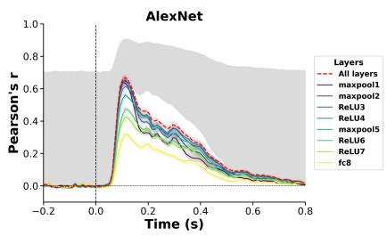

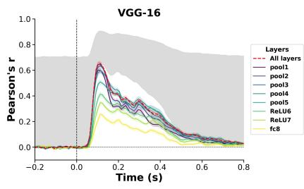

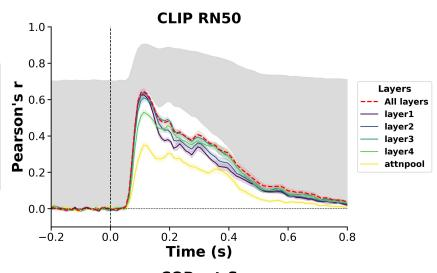

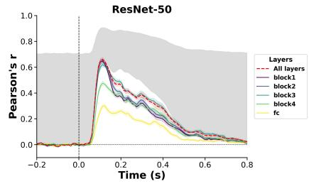

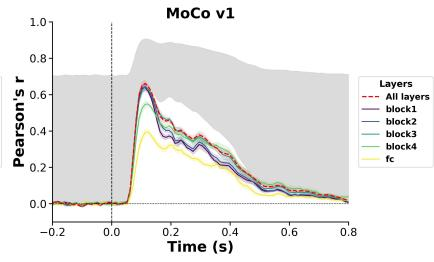

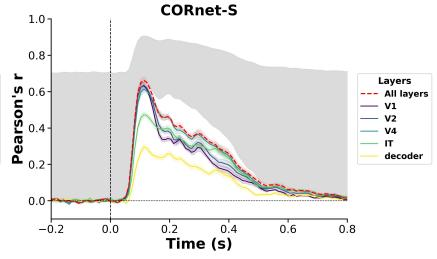  
Figure 3: Layer-wise temporal encoding curves for the CNN based models (AlexNet, VGG-16, CLIP-RN50, Resnet 50, MoCo-v1, and CORnet-S), each panel showing Pearson � across the full −200 to 800 ms epoch for every layer of the respective model.

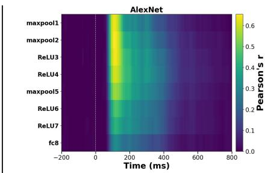

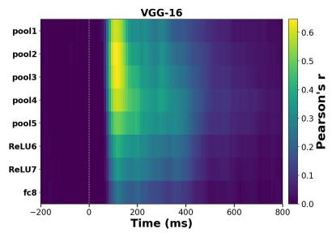

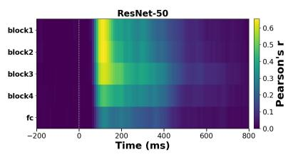

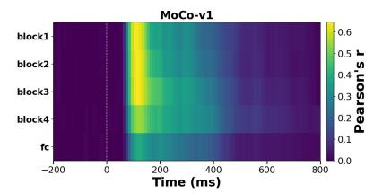

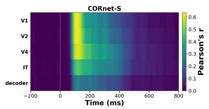

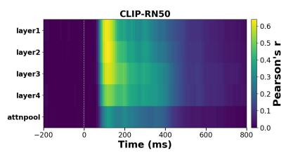  
Figure 4: Layer × time EEG encoding heatmaps for the CNN based models (AlexNet, VGG-16, ResNet-50, MoCo-v1, CORnet-S, and CLIP-RN50), showing Pearson � across the full −200 to 800 ms epoch (x-axis) and network depth (y-axis, early to deep layers).

## 4.2. Block-wise Encoding of Vision Transformers

We next examine the corresponding layer-wise encoding profiles of CLIP-ViT-B/32 and DINOv2-ViT-B/14. Unlike the CNNs, the transformer models do not show a simple reduction in encoding accuracy with increasing depth, using the default CLS token representation, both reach their peak correlation at block\_3 (� = 0.448 for each), well below the $r = 0 . 6 3 6 \mathrm { - } 0 . 6 5 4$ achieved by the strongest CNN layers (Table 1). Instead, their block-wise responses exhibit a progressive change in temporal encoding across transformer depth. The later blocks retain relatively strong correspondence with the EEG response, particularly after 200ms as shown in Figs. 5 and 6. In this respect, the transformer representations exhibit a depth dependent progression that difers from the reduction observed in the deepest CNN representations. This pattern is visible directly in the block × time heatmaps of Fig. 7 and Fig. 8: unlike the CNN heatmaps, the bottom rows (deepest blocks) remain bright well into the later portion of the time window rather than fading, showing that both DINOv2-ViT-B/14 and CLIP-ViT-B/32 sustain strong correspondence with the EEG response at depth.

This depth dependent diference raises a question about the representation used for the transformer models. CNN layers retain a spatial feature map, whereas vision transformers represent an image as a sequence of a global CLS token and spatial patch tokens, so the representation supplied to the encoding model depends on how information across these tokens is aggregated. We therefore examine whether the observed transformer encoding pattern depends on the token representation used.

## 4.2.1. Transformer Token Representation Analysis

Vision transformers represent an image as a sequence of tokens, consisting of a global CLS token and spatial patch tokens. Unlike convolutional feature maps, this representation allows the spatial patch information to be either retained or compressed before being used for EEG encoding. To determine how this representational choice afects brain encoding, we evaluate four token aggregation strategies for both DINOv2-ViT-B/14 and CLIP-ViT-B/32.

The four representations are: (1) the CLS token alone, (2) the mean of all patch tokens, (3) the CLS token concatenated with the mean patch representation, and (4) the CLS token concatenated with all individual patch tokens. The first three strategies compress the spatial patch sequence into a global or pooled representation, whereas the fourth retains the individual spatial patch representations without pooling. This same advantage of the CLS + all patches representation is visible in the block × time heatmaps of Fig. 7 and Fig. 8, which show consistently brighter, stronger correlation across blocks and time compared with the pooled token variants.

## 4.2.2. Temporal Encoding Across Token Representations

Figs. 5 and 6 show the layer-wise temporal encoding profiles for the four token representations of DINOv2-ViT-B/14 and CLIP-ViT-B/32, respectively. Across both transformer models, the choice of token representation produces a substantial diference in encoding accuracy. The CLS only, mean patch, and CLS+ mean representations show broadly similar temporal profiles, whereas the CLS+all patches concatenated representation consistently produces stronger encoding responses.

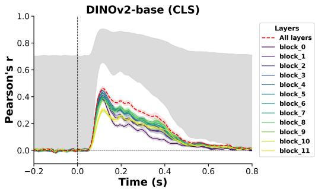

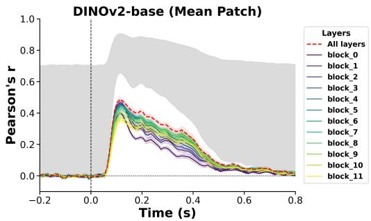

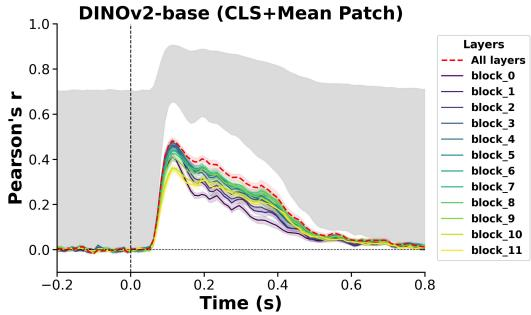

DINOv2-base (CLS+AII Patch)  
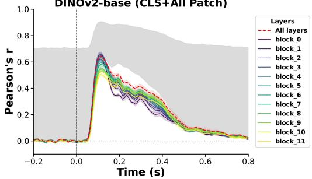  
Figure 5: Layer-wise temporal encoding curves for ${ \mathsf { D I N O v } } 2 { \mathsf { - V i T - B } } / { 1 4 ^ { \circ } } { \mathsf { s } }$ four token aggregation variants (CLS token only, mean of patch tokens, CLS + mean of patch tokens, CLS + all patch tokens concatenated).

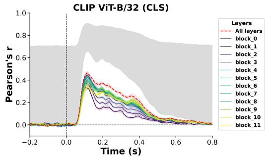

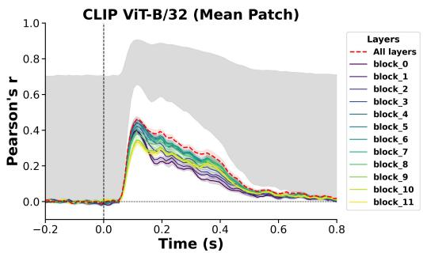

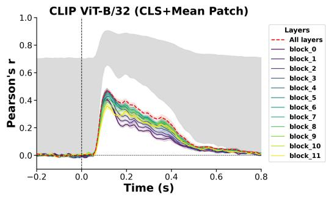  
Figure 6: Layer-wise temporal encoding curves for ${ \mathsf { C L I P - V i T - B } } / 3 2 ^ { \circ } s$ four token aggregation variants (CLS token only, mean of patch tokens, ${ \mathsf { C l S } } +$ mean of patch tokens, CLS + all patch tokens concatenated).

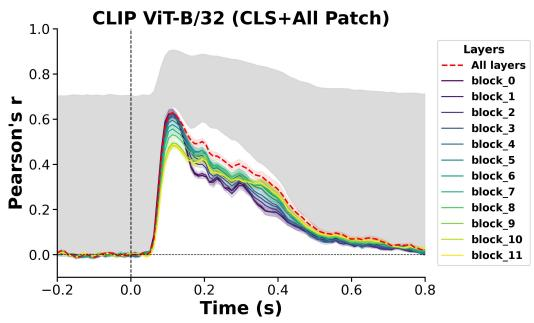

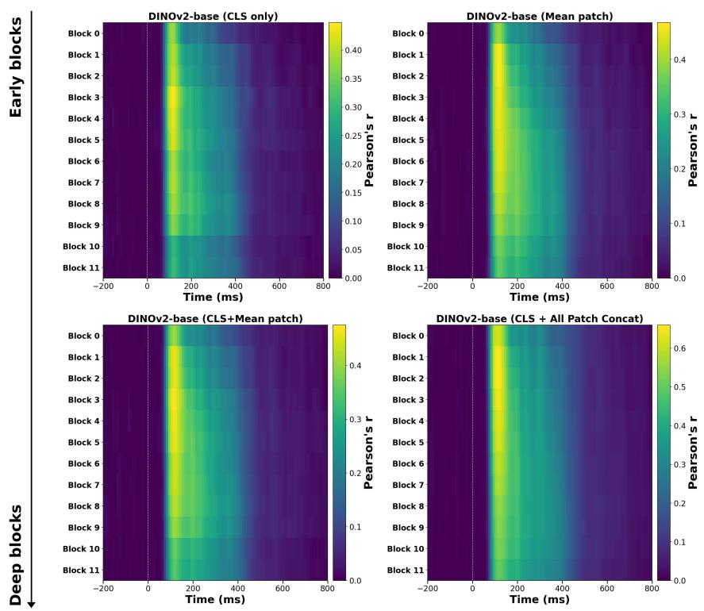  
Figure 7: Block × time EEG encoding heatmaps for DINOv2-ViT-B/14’s four token aggregation variants (CLS token only, mean of patch tokens, CLS + mean of patch tokens, CLS + all patch tokens concatenated)

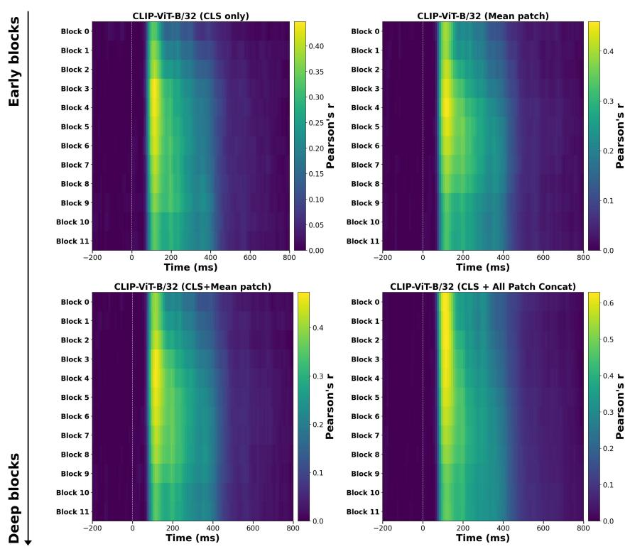  
Figure 8: Block × time EEG encoding heatmaps for ${ \mathsf { C L I P - V i T - B } } / 3 2 ^ { \circ } s$ four token aggregation variants (CLS token only, mean of patch tokens, CLS + mean of patch tokens, CLS + all patch tokens concatenated).

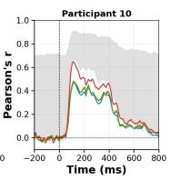

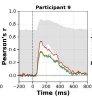

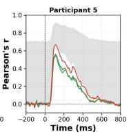

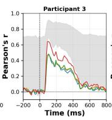

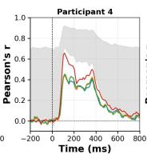

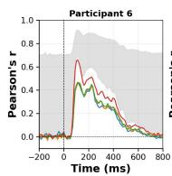

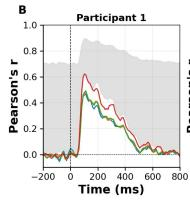

The CLS+all patches concatenated representation maintains stronger EEG encoding during the later post-stimulus response than the pooled representations, indicating a sustained advantage across the measured time window.

Importantly, retaining the individual patch tokens strengthens the correspondence at the earlier stages of processing. This suggests that the weaker early encoding observed with the native or pooled transformer representations is not necessarily a limitation of the transformer itself, but is strongly influenced by which components of the internal token representation are provided to the encoding model.

## 4.2.3. Efect of Token Aggregation on Encoding Accuracy

To summarize the diferences observed in the temporal encoding profiles, Figs. 9 and 10 compare the four token representations for CLIP-ViT-B/32 and DINOv2-ViT-B/14, respectively. In both figures, Panel A shows the group averaged temporal encoding curves across all 10 participants, while Panel B shows the corresponding temporal profiles for each participant individually (Participants 1–10). Across both transformer models, the three representations that compress the spatial patch sequence, CLS only, mean of patch tokens, and CLS + mean of patch tokens, show substantially lower encoding accuracy than the representation that preserves the individual patch tokens. In the group averaged profiles shown in Panel A, the CLS + all patches concatenated representation consistently produces the strongest encoding response and maintains a clear advantage over the pooled representations throughout the poststimulus period. The same pattern is also visible across the individual participant profiles in Panel B, although the magnitude and temporal shape of the response vary across participants. For DINOv2, the three pooled representations achieve peak correlations of approximately $r { = } 0 . 4 8 { \mathrm { - } } 0 . 5 1$ , whereas the CLS + all patches representation reaches approximately $r { = } 0 . 6 6$ . A similar pattern is observed for CLIP-ViT, where the three pooled representations remain near $r { = } 0 . 4 8 .$ , while the CLS + all patches representation reaches $r { = } 0 . 6 4$ . The diference between the $\mathrm { C L S } + \mathrm { a l l }$ patches representation and the pooled representations is substantially larger than the diferences among the three pooled representations themselves. These results indicate that the dominant factor is whether the individual spatial patch tokens are retained, rather than which particular pooled representation is used. Preserving the complete patch-level representation therefore provides substantially stronger EEG encoding for both transformer models. Fig. 11 summarizes this peak encoding accuracy across all four token representations for both transformer models.

## CLIP ViT-B/32 - Token Variant Comparison

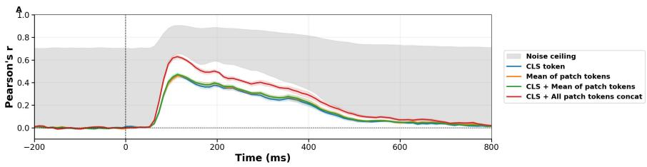  
Figure 9: Temporal EEG encoding profiles for $\mathsf { C L I P - V i T - B } / 3 2$ across four token representations. Panel A: group average across 10 participants; Panel B: individual participant profiles.

## DINOv2 ViT-B/14 — Token Variant Comparison

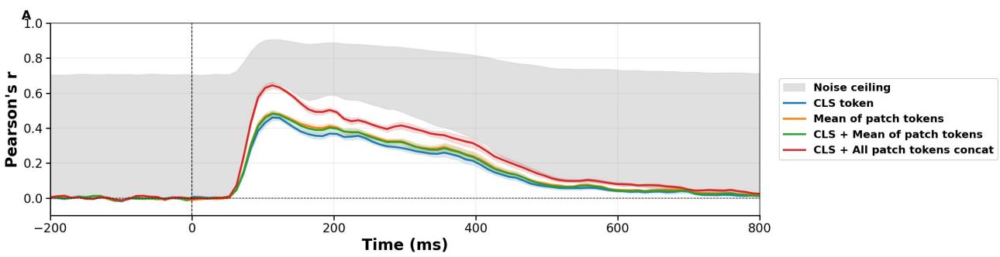

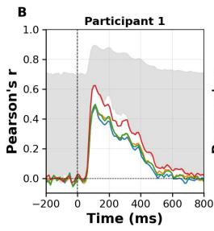

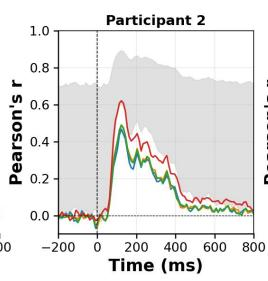

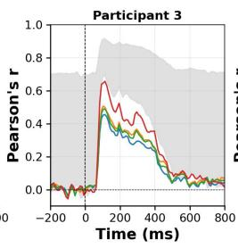

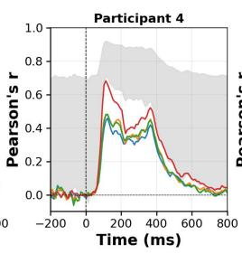

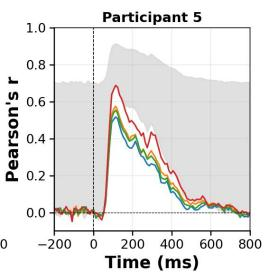

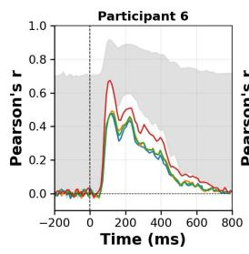

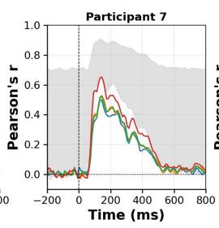

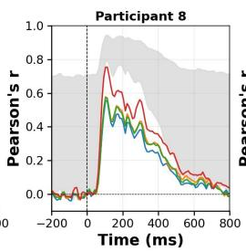

  
Figure 10: Temporal EEG encoding profiles for DINOv2-ViT-B/14 across four token representations. Panel A: group average across 10 participants; Panel B: individual participant profiles.

Token Variant Comparison  
  
Figure 11: Peak EEG encoding accuracy across transformer token representations.

## 4.3. Model-Level Performance and Architecture/Training Objective Controls

The layer-wise analysis revealed a qualitative diference between the two architecture families: CNNs show their strongest correspondence at early layers, with encoding accuracy declining toward deeper layers, whereas transformers maintain comparatively stronger correspondence into deeper blocks, particularly during the later poststimulus period (beyond approximately 200 ms) associated with higher-level visual regions such as V4 and IT. The token analysis further showed that this transformer advantage depends on preserving the individual spatia patch tokens: representations that discard them show substantially weaker encoding, whereas the CLS + all patches concatenated representation provides the strongest correspondence for both transformer models. We therefore use the CLS + all patches concatenated representation for CLIP-ViT-B/32 and DINOv2-ViT-B/14 in the following modellevel comparison, which evaluates all models using their strongest available representation under the same encoding framework.

We next examine encoding performance across the complete set of model representations, using features from al network depths. For the transformer models, the CLS + all patches concatenated representation is used where specified. Fig. 12 shows the temporal encoding profiles obtained from these representations, while Table 2 and Fig. 13 summarize the corresponding peak encoding accuracies.

## All Models — EEG Encoding Accuracy (All Layers)

  
Figure 12: Temporal EEG encoding profiles for all base models and transformer token variants using all layer concatenated representations. Panel A: group average across 10 participants; Panel B: individual participant profiles.

Across the eight models, the CNN and CNN-backbone models achieve the highest peak encoding accuracies, with AlexNet achieving $r { = } 0 . 6 7 7 \pm 0 . 0 5 2$ , MoCo-v1 $r { = } 0 . 6 7 3 \pm 0 . 0 5 0 .$ , CORnet-S $r { = } 0 . 6 7 2 \pm 0 . 0 5 2$ , ResNet-50

Table 2  
Peak EEG encoding accuracy (Pearson �) across all models and their respective token variants.
<table><tr><td>Model</td><td>Mean r</td><td>Peak time (ms)</td></tr><tr><td>AlexNet</td><td> $0 . 6 7 7 \pm 0 . 0 5 2$ </td><td>114.14</td></tr><tr><td>MoCo-v1</td><td> $0 . 6 7 3 \pm 0 . 0 5 0$ </td><td>113.13</td></tr><tr><td>CORnet-S</td><td> $0 . 6 7 2 \pm 0 . 0 5 2$ </td><td>114.14</td></tr><tr><td>ResNet-50</td><td> $0 . 6 7 0 \pm 0 . 0 4 9$ </td><td>112.12</td></tr><tr><td>VGG-16</td><td> $0 . 6 6 7 \pm 0 . 0 4 9$ </td><td>111.11</td></tr><tr><td>CLIP-RN50</td><td> $0 . 6 5 9 \pm 0 . 0 4 3$ </td><td>114.14</td></tr><tr><td>DINOv2 (CLS + all patches)</td><td> $0 . 6 5 6 \pm 0 . 0 5 1$ </td><td>117.17</td></tr><tr><td>CLIP-ViT (CLS + all patches)</td><td> $0 . 6 4 0 \pm 0 . 0 4 8$ </td><td>114.14</td></tr><tr><td>DINOv2 (mean pooled patches)</td><td> $0 . 5 0 5 \pm 0 . 0 4 5$ </td><td>116.16</td></tr><tr><td>DINOv2 (CLS + mean pooled patches)</td><td> $0 . 5 0 0 \pm 0 . 0 4 4$ </td><td>118.18</td></tr><tr><td>CLIP-ViT (CLS + mean pooled patches)</td><td> $0 . 4 8 5 \pm 0 . 0 5 1$ </td><td>114.14</td></tr><tr><td>CLIP-ViT (mean pooled patches)</td><td> $0 . 4 7 8 \pm 0 . 0 5 2$ </td><td>115.15</td></tr><tr><td>DINOv2 (CLS only)</td><td> $0 . 4 7 7 \pm 0 . 0 4 7$ </td><td>117.17</td></tr><tr><td>CLIP-ViT (CLS only)</td><td> $0 . 4 7 6 \pm 0 . 0 4 9$ </td><td>117.17</td></tr></table>

$r { = } 0 . 6 7 0 { \scriptstyle \pm 0 . 0 4 9 } .$ , VGG-16 �=0.667±0.049, and CLIP-RN50 �=0.659±0.043. Using the CLS + all patches concatenated representation, DINOv2 achieves $r { = } 0 . 6 5 6 \pm 0 . 0 5 1$ , while CLIP-ViT achieves $r { = } 0 . 6 4 0 \pm 0 . 0 4 8$ . The resulting ranking difers from the layer-wise comparison in Sections 4A and 4B because this analysis combines representations across all depths. Consequently, strong encoding from early and intermediate representations contributes substantially to the overall peak accuracy and can mask the diferences observed at deeper layers.

  
Figure 13: Peak EEG encoding accuracy (Pearson r, mean $\pm \mathsf { S E M }$ over 10 participants) for all base models and transformer token variants, sorted in descending order.

To examine the efect of training objective while keeping the architecture fixed, we compare MoCo-v1 with ResNet-50, since both use a ResNet-50 backbone but difer in their training objectives. Their temporal encoding profiles are highly similar, and their peak encoding accuracies are also nearly identical, with MoCo-v1 achieving $r { = } 0 . 6 7 3 \pm 0 . 0 5 0$ and ResNet-50 achieving $r { = } 0 . 6 7 0 \pm 0 . 0 4 9$ . This close correspondence suggests that, at the level of encoding performance across the complete set of model representations, changing from supervised classification to the contrastive objective used by MoCo-v1 does not substantially alter the EEG encoding pattern, both models are unable to capture the semantic representations.

We next compare CLIP-RN50 and CLIP-ViT-B/32, which share the same contrastive language-image training objective but difer in architecture. With the standard transformer representation, CLIP-ViT achieves a lower peak encoding accuracy of $r { = } 0 . 4 7 6 \pm 0 . 0 4 9$ compared with $r { = } 0 . 6 5 9 \pm 0 . 0 4 3$ for CLIP-RN50. However, despite its lower peak correlation, the CLIP-ViT temporal profile shows stronger correspondence during the later portion of the poststimulus response, including the period associated with higher level and semantic processing. The subsequent token representation analysis provides an explanation for this diference. When the individual patch tokens are retained using the $\mathrm { C L S } + \mathrm { a l l }$ patches concatenated representation, CLIP-ViT reaches a substantially higher peak encoding accuracy of $r { = } 0 . 6 4 0 { \pm } 0 . 0 4 8$ , approaching the $r { = } 0 . 6 5 9 { \scriptstyle \pm 0 . 0 4 3 }$ achieved by CLIP-RN50, while retaining the stronger late temporal encoding profile. Thus, the transformer advantage is not simply reflected in its maximum correlation; rather, it is reflected in its ability to maintain brain-predictive information into later stages of the neural response, which becomes more apparent when the patch representations are retained.

## 4.4. Spatial Topography of Encoding Accuracy Across Model Categories

The stage wise and model level analyses above average encoding across all 17 EEG channels. To determine whether this averaging conceals architecture or objective specific spatial patterns, we visualize the full channel × time correlation surface averaged across all 10 participants.

Supervised and self-supervised CNNs. Fig. 14 shows AlexNet, ResNet-50, VGG-16, CLIPRN50, CORnet-S, and MoCo-v1. All models produce a visually near identical topography: encoding accuracy peaks sharply in the occipital channels $( \mathbf { O } 1 , \mathbf { O } \mathbf { z } , \mathbf { O } 2 )$ , falls of moderately in the parieto occipital channels (PO7, PO3, POz, PO4, PO8), and remains weak throughout the parietal channels $( \mathrm { P z } , \mathrm { P l } \mathrm { - P 8 } )$ . The onset is sharp at 60–70 ms in every model. This topography is unchanged between classification trained networks (AlexNet, VGG-16, ResNet-50, CORnet-S) and the contrastively trained MoCo-v1, indicating that this spatial signature is a property of the convolutional architecture rather than the supervised/self-supervised distinction.

CNN backbone with a non classification objective. CLIP-RN50, shown in the sixth panel of Fig. 14, reproduces the same occipital dominant topography as the classification trained CNNs despite never being trained to classify images. Holding architecture fixed while changing the training objective leaves the spatial pattern of brain alignment unchanged, reinforcing that this topography tracks architecture, not objective.

  
Figure 14: Channel × time EEG encoding correlation for CNN and CNN-backbone models (all subjects)

Transformer token variants. Fig. 15 shows all four token strategies for both CLIP-ViT-B/32 and DINOv2-ViT-B/14. Every variant preserves the same occipital dominant spatial topography; token aggregation choice does not change where the signal is strongest. What changes is the strength and duration of the response: the CLS+all patches concatenated variant shows the deepest and longest sustained correlation (extending to roughly 400–500 ms in the parieto-occipital channels), while the pooled variants (CLS only, mean pooled patches) show a visibly weaker, more short lived response. This provides direct spatial temporal confirmation of the token aggregation result in Section 4: retaining individual patch tokens, not a pooled summary, is what sustains encoding accuracy.

Transformer Token Variants — Channel x Time Encoding Correlation (all subjects)

  
Figure 15: Channel × time EEG encoding correlation for four token representations of CLIP-ViT-B/32 and DINOv2-ViT-B/14 (all subjects).

Taken together, these four categories show that the occipital dominant spatial topography is present in visual encoding task in all models and variants tested, and does not by itself distinguish CNNs from transformers or classification objectives from contrastive ones. The architecture and objective dependent efects reported throughout this study the semantic stage collapse of CNNs, the sustained accuracy of transformers, and the dependence of that sustained accuracy on patch token retention are diferences in the temporal extent and strength of the encoded signal within this shared spatial map, not diferences in which channels respond.

## 4.5. Discussion

The findings show a distinct diference in the way CNNs and vision transformers encode visual information as a function of network depth and time. In the case of CNNs, the strongest EEG correlation is found in the first layers, which is in line with the initial feedforward phase of low-level visual processing, although this correlation gradually decreases at deeper layers, especially in the later part of the post-stimulus response. This trend is observed regardless of whether the CNNs were trained in a supervised, self-supervised, or contrastive manner, and it is clearly visible in the layer × time heatmaps of Fig. 4, where the highest correlation values are located in the early layers right after the stimulus has been presented, while the deepest layers stay comparatively dark over the entire period. Vision transformers, on the other hand, display a diferent pattern: rather than showing a simple decline with increasing depth, their deeper blocks maintain a relatively strong correlation with the EEG response right up to the later part of the time window, as can be seen in the block × time heatmaps of Fig. 7 and Fig. 8. It should be noted, though, that the earliest transformer blocks do not reach the level of correlation found in the earliest CNN layers, so the diference between the two types of networks is not that one of them uniformly performs better than the other; it is that CNNs and transformers distribute their correspondence with the brain in diferent ways across depth and time.

It is important to note that this advantage of the transformer relies strongly on how the internal token representation is kept. When only the CLS token or a pooled summary of the patch tokens is used, both CLIP-ViT-B/32 and DINOv2- ViT-B/14 exhibit considerably lower peak correlations (approximately � = 0.48 to 0.51) than in the case where the full set of individual patch tokens is retained together with the CLS token $( r = 0 . 6 4 0$ for CLIP-ViT and $r = 0 . 6 5 6$ for

DINOv2). The same advantage is evident in the block × time heatmaps and in the spatial topography analysis, since the representation that preserves the patches maintains a more robust and prolonged response than the ones based on pooling. Therefore, the transformer advantage is not an inherent feature of the architecture by itself, but rather arises specifically when the distributed patch-level information is preserved rather than compressed.

The controlled comparisons allow the contributions of architecture and training objective to be separated. MoCo-v1 and ResNet-50 have the same convolutional architecture but diferent training objectives, and their whole model peak accuracies are very similar (� = 0.673 and � = 0.670), and their temporal profiles are also highly similar, which together show that altering the training objective alone, while keeping the CNN architecture fixed, does not make a significant diference to the encoding pattern. On the other hand, CLIP-RN50 and CLIP-ViT-B/32 have the same contrastive language-image objective but difer in architecture. With its default representation, CLIP-ViT achieves a considerably lower peak accuracy (� = 0.476) than CLIP-RN50 (� = 0.659), although its temporal profile already displays a stronger correspondence later in the post-stimulus response. When the individual patch tokens are retained, CLIP-ViT’s peak accuracy increases to $r = 0 . 6 4 0$ , reaching a level close to that of CLIP-RN50 while still maintaining its stronger late temporal profile. This suggests that the transformer’s ability for sustained late correspondence is dependent on its architecture, but in order to fully show of that advantage in peak accuracy it is also necessary to preserve the patch level representation structure.

The analysis of spatial topography ofers a complementary perspective. Whether or not the models and token variants considered difer in architecture, training objective, or token aggregation strategy, they all produce the same occipital-dominant spatial pattern, the accuracy of the encoding being concentrated in the occipital and parietooccipital channels. This shows that the diferences noted in this study are not due to the various models activating diferent brain areas, but instead result from variations in the strength and duration of the encoded signal within a common spatial map. The patch-preserving transformer representation maintains this response for a long period, approximately 400 to 500 ms, whereas the pooled representations and the deeper CNN layers exhibit a relatively weaker and shorter-lasting response.

Together, these results show that both CNNs and transformers are about equally aligned with the brain’s earliest visual response, but they begin to difer as processing goes deeper and as time moves beyond the first feedforward pass. In the deepest layers, the alignment between CNNs and the EEG response fades substantially, whereas transformers, especially when their patch-level representations are kept, maintain a stronger correspondence for a longer time. This benefit is due to a combined efect of both architecture and representation structure, not to either of these factors by themselves.

## 5. Conclusion

The study presents a systematic approach for determining when and at what network depth visual models most closely match human brain activity. It finds that both CNNs and transformers show similar levels of alignment in their early layers but become diferent at deeper layers, transformers retaining a stronger correspondence during the later part of the post-stimulus response, a phase linked to higher level visual areas such as V4 and the inferotemporal (IT) cortex. This benefit is dependent on the transformer token representation employed: by keeping all the patch tokens the overall accuracy of the encoding is considerably improved, which in turn allows for both strong peak correlations and a longer-lasting response. The results also indicate that the classification bottleneck present in conventional CNNs may be responsible for the loss of brain predictive information at deeper layers, since the representations become more and more compressed as they approach fixed categorical outputs. These findings form the basis for creating vision models that are inspired by and aligned with the brain. Instead of preferring one architecture, both CNNs and transformers, as well as possibly hybrid architectures, can ofer better representations throughout the visual hierarchy

## CRediT authorship contribution statement

Shashank Baghel: Conceptualization and Methodology, Experiments, Analysis, Draft preparation, Review and Editing. Kshitij Dwivedi: Conceptualization and Methodology, Review and Editing. Dinesh Singh: Conceptualization and Methodology, Review and Editing. Sanjeev Nara: Conceptualization and Methodology, Review and Editing.

## References

Cadieu, C.F., Hong, H., Yamins, D.L.K., Pinto, N., Ardila, D., Solomon, E.A., Majaj, N.J., DiCarlo, J.J., 2014. Deep neural networks rival the representation of primate IT cortex for core visual object recognition. PLoS Computational Biology 10, e1003963. doi:10.1371/journal. pcbi.1003963.

Cichy, R.M., Khosla, A., Pantazis, D., Torralba, A., Oliva, A., 2016. Comparison of deep neural networks to spatio-temporal cortical dynamics of human visual object recognition reveals hierarchical correspondence. Scientific Reports 6. URL: https://api.semanticscholar.org/ CorpusID:1226725.

Conwell, C., Prince, J.S., Kay, K.N., Alvarez, G.A., Konkle, T., 2024. A large-scale examination of inductive biases shaping high-level visual representation in brains and machines. Nature Communications 15, 9383. URL: https://doi.org/10.1038/s41467-024-53147-y, doi:10.1038/s41467-024-53147-y.

Dosovitskiy, A., Beyer, L., Kolesnikov, A., Weissenborn, D., Zhai, X., Unterthiner, T., Dehghani, M., Minderer, M., Heigold, G., Gelly, S., Uszkoreit, J., Houlsby, N., 2021. An image is worth 16x16 words: Transformers for image recognition at scale, in: 9th International Conference on Learning Representations, ICLR 2021, OpenReview.net. URL: https://openreview.net/forum?id=YicbFdNTTy.

Eickenberg, M., Gramfort, A., Varoquaux, G., Thirion, B., 2017. Seeing it all: Convolutional network layers map the function of the human visual system. NeuroImage 152, 184–194. URL: // / / / / , doi:10.1016/j.neuroimage.2016.10.001.

Fukushima, K., 1980. Neocognitron: A self-organizing neural network model for a mechanism of pattern recognition unafected by shift in position. Biological Cybernetics 36, 193–202. URL: https://api.semanticscholar.org/CorpusID:206775608.

Giford, A.T., Dwivedi, K., Roig, G., Cichy, R.M., 2022. A large and rich EEG dataset for modeling human visual object recognition. NeuroImage 264, 119754. URL: https://www.sciencedirect.com/science/article/pii/S1053811922008758, doi:10.1016/j.neuroimage. 2022 1197 4.

Golan, T., Raju, P.C., Kriegeskorte, N., 2020. Controversial stimuli: Pitting neural networks against each other as models of human cognition. Proceedings of the National Academy of Sciences 117, 29330–29337. URL: https://www.pnas.org/doi/abs/10.1073/pnas.1912334117, doi:10.1073/pnas.1912334117.

Grootswagers, T., Robinson, A.K., Carlson, T.A., 2019. The representational dynamics of visual objects in rapid serial visual processing streams. NeuroImage 188, 668–679. URL: https://www.sciencedirect.com/science/article/pii/S1053811918321906, doi:10.1016/j. neuroimage.2018.12.046.

Güçlü, U., van Gerven, M.A.J., 2015. Deep neural networks reveal a gradient in the complexity of neural representations across the ventral stream. Journal of Neuroscience 35, 10005–10014. doi:10.1523/JNEUROSCI.5023-14.2015.

He, K., Fan, H., Wu, Y., Xie, S., Girshick, R., 2020. Momentum contrast for unsupervised visual representation learning, in: 2020 IEEE/CVF Conference on Computer Vision and Pattern Recognition (CVPR), pp. 9726–9735. doi:10.1109/CVPR42600.2020.00975.

He, K., Zhang, X., Ren, S., Sun, J., 2015. Deep residual learning for image recognition. 2016 IEEE Conference on Computer Vision and Pattern Recognition (CVPR) , 770–778URL: https://api.semanticscholar.org/CorpusID:206594692.

Hubel, D.H., Wiesel, T.N., 1962. Receptive fields, binocular interaction and functional architecture in the cat’s visual cortex. The Journal of Physiology 160. URL: https://api.semanticscholar.org/CorpusID:17055992.

Kamitani, Y., Tong, F., 2005. Decoding the visual and subjective contents of the human brain. Nature Neuroscience 8, 679–685. URL: https://doi.org/10.1038/nn1444, doi:10.1038/nn1444.

Khaligh-Razavi, S.M., Kriegeskorte, N., 2014. Deep supervised, but not unsupervised, models may explain IT cortical representation. PLoS Computational Biology 10. URL: https://api.semanticscholar.org/CorpusID:14942477.

Krizhevsky, A., Sutskever, I., Hinton, G.E., 2012. Imagenet classification with deep convolutional neural networks. Communications of the ACM 60, 84–90. URL: https://api.semanticscholar.org/CorpusID:195908774.

Kubilius, J., Schrimpf, M., Nayebi, A., Bear, D., Yamins, D.L.K., DiCarlo, J.J., 2018. Cornet: Modeling the neural mechanisms of core object recognition. bioRxiv URL: https://www.biorxiv.org/content/early/2018/09/04/408385, doi:10.1101/408385.

Kumar, M., Houlsby, N., Kalchbrenner, N., Cubuk, E.D., 2022. Do better imagenet classifiers assess perceptual similarity better? Transactions on Machine Learning Research 2022. URL: https://api.semanticscholar.org/CorpusID:252118897.

Lindsay, G.W., 2021. Convolutional neural networks as a model of the visual system: Past, present, and future. Journal of Cognitive Neuroscience 33, 2017–2031. URL: https://doi.org/10.1162/jocn\_a\_01544, doi:10.1162/jocn\_a\_01544.

Oota, S.R., Arora, J., Rowtula, V., Gupta, M., Bapi, R.S., 2022. Visio-linguistic brain encoding, in: Proceedings of the 29th International Conference on Computational Linguistics, pp. 116–133.

Oquab, M., Darcet, T., Moutakanni, T., Vo, H.V., Szafraniec, M., Khalidov, V., Fernandez, P., Haziza, D., Massa, F., El-Nouby, A., Assran, M., Ballas, N., Galuba, W., Howes, R., Huang, P.Y., Li, S.W., Misra, I., Rabbat, M.G., Sharma, V., Synnaeve, G., Xu, H., Jégou, H., Mairal, J., Labatut, P., Joulin, A., Bojanowski, P., 2023. DINOv2: Learning robust visual features without supervision. Transactions on Machine Learning Research abs/2304.07193. URL: https://api.semanticscholar.org/CorpusID:258170077.

Radford, A., Kim, J.W., Hallacy, C., Ramesh, A., Goh, G., Agarwal, S., Sastry, G., Askell, A., Mishkin, P., Clark, J., Krueger, G., Sutskever, I., 2021. Learning transferable visual models from natural language supervision, in: Meila, M., Zhang, T. (Eds.), Proceedings of the 38th International Conference on Machine Learning, ICML 2021, PMLR. pp. 8748–8763. URL: http://proceedings.mlr.press/v139/radford21a.html.

Schrimpf, M., Kubilius, J., Hong, H., Majaj, N.J., Rajalingham, R., Issa, E.B., Kar, K., Bashivan, P., Prescott-Roy, J., Schmidt, K., Yamins, D., DiCarlo, J.J., 2018. Brain-score: Which artificial neural network for object recognition is most brain-like? bioRxiv URL: https: //api.semanticscholar.org/CorpusID:91917265.

Seeliger, K., Fritsche, M., Güçlü, U., Schoenmakers, S., Schofelen, J.M., Bosch, S.E., van Gerven, M.A.J., 2018. Convolutional neural network based encoding and decoding of visual object recognition in space and time. NeuroImage 180, 253–266. URL: https://www.sciencedirect. com/science/article/pii/S1053811917305864, doi:10.1016/j.neuroimage.2017.07.018. new advances in encoding and decoding of brain signals.

Serre, T., Wolf, L., Bileschi, S., Riesenhuber, M., Poggio, T., 2007. Robust object recognition with cortex-like mechanisms. IEEE Transactions on Pattern Analysis and Machine Intelligence 29, 411–426. doi:10.1109/TPAMI.2007.56.

Simonyan, K., Zisserman, A., 2014. Very deep convolutional networks for large-scale image recognition. arXiv preprint arXiv:1409.1556 .

Wang, A.Y.. Kay, K., Naselaris. T.. Tarr, M.J., Wehbe, L., 2023. Better models of human high-level visual cortex emerge from natural language supervision with a large and diverse dataset. Nature Machine Intelligence 5, 1415–1426. URL: https://doi.org/10.1038/ s42256-023-00753-y, doi:10.1038/s42256-023-00753-y.

Wen, H., Shi, J., Zhang, Y., Lu, K.H., Cao, J., Liu, Z., 2018. Neural encoding and decoding with deep learning for dynamic natural vision. Cerebral Cortex 28, 4136–4160. URL: https://doi.org/10.1093/cercor/bhx268, doi:10.1093/cercor/bhx268.

Yamins, D.L.K., Hong, H., Cadieu, C.F., Solomon, E.A., Seibert, D., DiCarlo, J.J., 2014. Performance-optimized hierarchical models predict neura responses in higher visual cortex. Proceedings of the National Academy of Sciences 111, 8619–8624. URL: https://www.pnas.org/doi/ abs/10.1073/pnas.1403112111, doi:10.1073/pnas.1403112111.

Zeiler, M.D., Fergus, R., 2014. Visualizing and understanding convolutional networks, in: Fleet, D., Pajdla, T., Schiele, B., Tuytelaars, T. (Eds.), Computer Vision – ECCV 2014, Springer International Publishing, Cham. pp. 818–833.