# Evidence-gated multimodal parsing and vectorization of architectural floor plans

Hongxuan Chen†, Wenda Wang†, Jiachen Lu, Qirui Shen, Zilong Huang, Lei He, Xinyue Dong, Weixin Huang∗

School of Architecture, Tsinghua University

† These authors contributed equally.

Corresponding author: Weixin Huang; 3512232835@qq.com

## Abstract

Architectural floor plans remain a high-friction barrier to archive digitization and early designmodel preparation because heterogeneous graphics encode spatial semantics and editable geometry together. We introduce SALI-FP, an evidence-gated multimodal pipeline that converts a plan into reviewable semantic maps, objects, vectors, and relation records while constraining local revisions by image evidence. In a full production audit of 11,534 heterogeneous plans, SALI-FP produced structured outputs for every plan, including 752,510 valid polygon-bearing objects. The same output form has supported initial drawing digitization and design-model preparation in practical design work. Public-benchmark calibration is paired with a 30-case matched visual evidence set in Appendix F, where room-scale coverage, openings, oblique boundaries, and circulation continuity can be inspected directly. SALI-FP ofers an engineering-oriented interpretation-to-geometry workflow for reviewed CAD/BIM preparation and existing-building information recovery. Keywords: Architectural floor plan parsing; Semantic vectorization; Vision-language models; Evidence-gated agents; Large language models; Geometric reconstruction.

## Highlights

• Evidence-gated multimodal parsing links floor-plan interpretation to geometry.

• Local evidence gates constrain semantic edits and retain recoverable states.

• Structured outputs are recovered for 11,534 heterogeneous architectural plans.

• Stage comparisons separate semantic revision from coordinate efects.

## 1 Introduction

Floor plans encode geometry, connectivity, and function in the same drawing. When editable CAD or building information modeling (BIM) sources are unavailable, raster archives become an important starting point for existing-building documentation, renovation surveys, and operations information. Recovering objects and their coordinates can reduce the need to reconstruct every geometric entity from linework, while retaining the source for dimensional and functional verification.

Rule-based approaches exploit line patterns and drawing conventions [1]. CubiCasa5K links annotated floor plans to multi-task learning [2]; Raster-to-Vector predicts junctions and structured geometry [3], while Floor-SP reconstructs room polygons [4]. Room-boundary-guided recognition couples room and boundary tasks [5]. VectorFloorSeg and self-constructing graph networks incorporate geometric relationships [6, 7]. These methods establish recognition and structural recovery as connected but distinct problems.

Heterogeneous drawings contain oblique boundaries, furniture, dimensions, and occupancy types that difer from training examples. Object detection [8], multi-unit corpora [9], and sparse point representations [10] address complementary aspects of this challenge. Beyond assigning pixel labels, geometric model initialization requires identifiable boundaries, recoverable coordinates, and explicit failure states.

We propose SALI-FP as an evidence-gated multimodal parsing method. Its central design separates contextual interpretation from authorization to change the drawing: a model proposes semantic edits, deterministic rules screen the evidence, and a protected state connects accepted changes to structured output. Fig. 1 illustrates the task.

(a) Raster input  
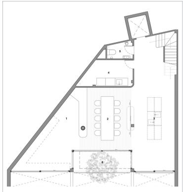

(b) Semantic map  
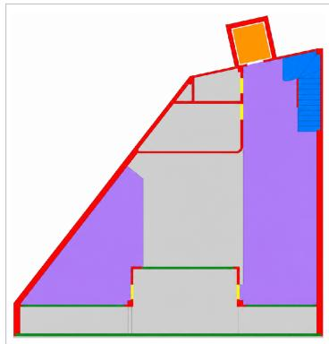

(c) Inverse rendering  
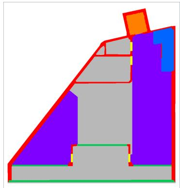  
Fig. 1: Floor-plan recognition and vectorization: (a) source raster; (b) semantic output; (c) sparse inverse rendering.

We contribute an integrated parsing method, a corpus-scale execution study on Architecture Plans 10k (ArchP10k), and a multi-layer protocol linking recognition, geometry, and execution evidence. The evaluation connects shared-annotation calibration with corpus-scale delivery and direct visual inspection of complex drawings. Appendix F provides the latter evidence through 30 fixed, same-coordinate comparisons with localized observations of room coverage, openings, oblique boundaries, and circulation continuity.

Three research questions structure the evaluation: RQ1, how does the method recover semantic and vector representations for reviewed engineering use? RQ2, what recorded changes occur across audit, repair, and representation stages? RQ3, what structured outputs and residual failures emerge on complex heterogeneous plans? Sections 2–4 describe related work, the method, and evaluation settings; Sections 5–7 answer these questions through results, discussion, and conclusions.

## 2 Related research

## 2.1 Semantic segmentation and structural recovery

Existing methods span rule-based interpretation, supervised segmentation, junction prediction, and vector or graph decoding [1–7]. Pixel losses provide dense supervision, while explicit geometric recovery supplies valid polygon topology. Junction-based methods encode geometric relationships directly, and room-wise reconstruction makes spatial closure central to decoding. Architectural conventions and source-domain distributions influence all of these routes. Recent reviews emphasize the range of datasets and target tasks rather than a single interchangeable definition of floor-plan recognition [11].

Table 1. Research routes and the evidence required for comparison.
<table><tr><td>Route</td><td>Main output</td><td>Comparison boundary</td></tr><tr><td>Supervised segmentation [2, 5]</td><td>Pixel classes</td><td>Shared labels, canvas, and test split</td></tr><tr><td>Junction or polygon recovery [3,4, 10]</td><td>Structured geometry</td><td>Native decoder and topology must be identified</td></tr><tr><td>Graph-based interpretation [6, 7]</td><td>Objects and relations</td><td>Align object and relation scope</td></tr><tr><td>Vision-language understanding [12-15]</td><td>Semantic or vector predictions</td><td>Evaluate localization explicitly</td></tr><tr><td>Tool-using agents [16–18]</td><td>Plans, actions, and state</td><td>Report execution and drawing evidence separately</td></tr></table>

## 2.2 Multimodal evidence and evidence-gated agents

Text recognition supplies room names and technical labels [19], while multimodal symbol spotting combines heterogeneous evidence [20]. LLM-based semantic layering [12] and WAFFLE [13] extend floor-plan understanding beyond a fixed pixel taxonomy. Visual language models can identify graphics semantically [14], and FloorplanVLM explores structured vector output [15]. SALI-FP uses these capabilities to connect semantic interpretation with localized, coordinate-aware action.

Agent schemas for building analysis separate planning, action, memory, and tools [16]. BIM coordination [17] and Text2BIM [18] show how language-based interaction can drive structured software operations. SALI-FP adapts this division of responsibility to floor-plan parsing: the audit model proposes a localized action, deterministic gates authorize the action, and state records retain its outcome.

## 2.3 Datasets and quantitative evaluation

CubiCasa5K provides a reproducible public raster/SVG evaluation setting [2]. Multi-unit plans [9] and FloorPlanCAD [21] cover diferent building scales or symbol tasks. The present quantitative comparison uses the oficial CubiCasa5K test plans, a shared target mapping, and frozen preprocessing so that recognition and representation evidence can be read on common coordinates.

## 2.4 Geometric interfaces and recent reproducible methods

BIM reconstruction from drawings [22], vector-to-energy-model editing [23], and tool-augmented IFC reasoning [24] require geometric and semantic attributes beyond a visually coherent mask. MiT-UNet [25] provides a recent released wall-segmentation checkpoint, Boundary IoU [26] measures contour agreement separately from region overlap, and Raster2Seq [27] releases polygon-sequence code and weights. FloorPlanFormer [28] contributes a related training formulation. The reproducible rerun set used here combines the released CubiCasa5K, MiT-UNet, and Raster2Seq implementations.

HEAT uses holistic edge attention for planar graph reconstruction [29], and RoomFormer predicts room polygons with two-level queries [30]. Their indoor benchmarks use projected 3D observations, whereas Raster2Seq [27] directly models raster-conditioned polygon sequences and is therefore included in our room-geometry comparison. We retain each method’s native output form when constructing the shared evidence tables.

Generative polygon refinement ofers a complementary route. PolyDifuse [31] uses guided set difusion to refine polygon proposals; its indoor experiments condition on projected scan evidence rather than architectural raster semantics. Unlike proposal refinement with learned geometric priors, SALI-FP authorizes image-space changes using local evidence gates before constructing polygons.

## 3 SALI-FP method

SALI-FP integrates global parsing, local audit and gating, optional repair, and representation generation. Models interpret the drawing and propose changes; local operations decide admissibility, preserve a recoverable state, and construct geometric outputs. Fig. 2 links the complete data flow to the proposal gates, protected state selection, and representation operations.

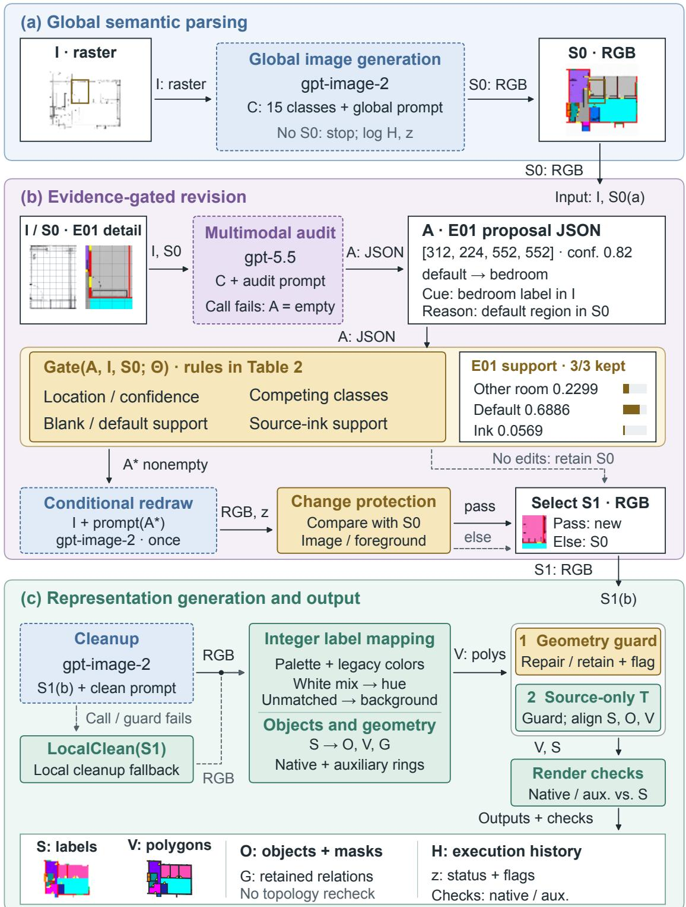  
Fig. 2: SALI-FP architecture and evidence flow: (a) global semantic parsing; (b) evidence-gated revision and protected candidate selection; (c) representation generation and a connected output package. Rounded containers group operations; rectangular frames contain data and recorded evidence. Arrows identify data or selection conditions. The frozen CubiCasa5K test 0002 example supplies the images and E01 record; three accepted proposals illustrate the recorded evidence-gated execution. G retains generated relations. The local geometric extension is evaluated as a subsequent representation stage.

## 3.1 Problem definition and semantic representation

Let I be the input raster, C the fixed class set, and Θ the gate and representation configuration. Eq. (1) defines the outputs: integer labels S, objects O, vector geometry V, relation records G, history H, and status z. In ${ \bf G } ,$ R contains identified spatial objects and $E _ { G }$ contains generated relations. The intermediate S0 and S1 are RGB candidate images, S is the integer-label output, and H records execution history and retained states.

$$
\mathcal { F } ( I ; \mathcal { C } , \Theta ) = ( S , O , V , G , H , z ) , \qquad G = ( \mathcal { R } , E _ { G } ) .\tag{1}
$$

The palette contains five component types, nine named spatial types, and one fallback type. RGB assignment first applies thresholded current/legacy palette matching, then white-mixture transition matching, and finally ordered hue rules; unassigned pixels become background. This order resolves anti-aliased and tinted outputs before geometric processing. Appendix A defines labels and Appendix B gives the executed predicates and archived settings.

## 3.2 Audit, gated repair, and failure handling

The initial candidate $S _ { 0 }$ retains drawing context. The audit model reads I and $S _ { 0 }$ with coordinate grids and returns proposals A containing a bounding box or polygon, current and expected classes, source evidence, a described candidate error, repair rationale, and confidence. Gate maps A to $A ^ { * }$ by testing these fields against source pixels and the current labels. A nonempty accepted set triggers one source-conditioned redraw: the image model receives I and a repair prompt assembled from $A ^ { * }$ while $S _ { 0 }$ serves as the audit reference and protected comparison. A passed guard selects the redraw as $S _ { 1 } ;$ all other branches retain $S _ { 0 }$ . This design gives every local action explicit spatial, class, and image-change support before it enters the structured output chain.

Table 2. Inspected proposal gates and image-change guards.
<table><tr><td>Condition</td><td>Setting and action</td></tr><tr><td>Confidence / target support</td><td>Reject below 0.80 / below 16 target pixels</td></tr><tr><td>Existing target label</td><td>Reject at 0.70 coverage; construction targets at 0.15</td></tr><tr><td>Other named room / blank or fallback</td><td>Reject at 0.30 other-room coverage / below 0.35 support</td></tr><tr><td>Source structure</td><td>Intensity below 170; require 0.02 dark support for</td></tr><tr><td>Image-change fraction</td><td>non-door construction Repair at most 0.55; cleanup at most 0.35</td></tr><tr><td>Cleanup foreground change</td><td>Non-white fraction changes by at most 0.15</td></tr></table>

Table 2 reports the frozen implementation settings that operationalize action authorization. Missing evidence, invalid locations, and incompatible class changes are screened before repair. Appendix B records predicate order, prompt provenance, and the local threshold replay.

SafeCall is the bounded request wrapper. The resume path checks stored success status, output size, and the generation-prompt hash; the evidence evaluations additionally freeze input and code hashes. H records response identifiers, attempts, exceptions, and retained state, while LocalClean applies deterministic palette assignment and local cleanup to the last valid image. Algorithm 1 makes semantic, geometric, and execution states explicit.

SALI-FP  
```csv
Algorithm 1 Evidence-gated multimodal floor-plan parsing
Input: I, class set $\mathrm { C } ,$ gate configuration Θ, image and audit models, frozen prompts
Output: S, O, V, G, H, z
1: S ← SafeCall(image model, I, global prompt)
2: If $S _ { 0 }$ is absent: record failure in H, z; return
3: A ← SafeCall(audit model, I, $S _ { 0 } ,$ , audit prompt)
4: If audit fails: A ← empty; record audit degradation
5: A∗ ← Gate(A, I, S , Θ); S ← S
6: If $A ^ { * }$ is nonempty:
7: Candidate ← SafeCall(image model, I, repair prompt assembled from A∗)
8: If comparison with $S _ { 0 }$ passes protection: S ← Candidate
9: Else: retain $S _ { 0 } ;$ record protected fallback
10: Candidate ← SafeCall(image model, $S _ { 1 } ,$ cleanup prompt)
11: If cleanup fails or violates protection: Candidate ← LocalClean $( S _ { 1 } )$
12: S ← integer labels; extract O, V and relation records G
13: Validate ${ \mathrm { V } } ;$ accept guarded repair or retain object failure status
14: T ← source-only anchoring(I, S); use identity if inadmissible
15: Apply T to S, O masks and V; restore state if geometry protection fails
16: Inverse-render V and auxiliary rings; record their separate RCR values
17: Preserve G as the generated relation record; record H and z
18: Return S, O, V, G, H, z
```

The normal path uses two image calls and one audit call; repair adds one image call. Each request allows at most three attempts, transient repair/cleanup failures permit one stage-level re-request, and a case allows at most three end-to-end attempts. Recovery reuses intact stages. Fig. 3 uses a public test example distinct from Fig. 1; its stages are measured jointly in Section 5.3.

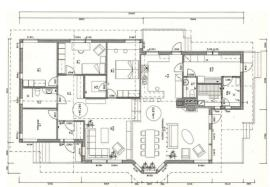

## (a) Source raster

Drawing coordinates and fine line evidence

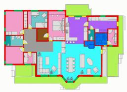

(b) Initial candidate

Global semantic interpretation

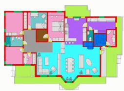

## (c) Protected repair

One recorded prompt-guided revision

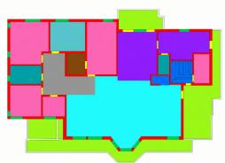

(d) Cleanup

Color-to-label normalization

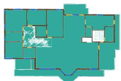  
Fig. 3: Recorded stages of cubicasa5k\_test\_0001: (a) source; (b) initial candidate; (c) protected repair; (d) cleanup; (e) final source-aligned labels.

## (e) Final representation

Labels aligned to source-line evidence

## 3.3 Geometric output and Rhino interface

Representation generation uses two complementary geometric layers. Native sparse objects store simplified exterior and hole rings; auxiliary rendering groups use class-specific smoothing and expansion for raster replay. Source-only enhanced correlation coeficient (ECC) registration [32] aligns accepted coordinates to drawing line evidence, and linework repair [33] admits invalid-object corrections under raster-change and positive-area guards. Appendix B specifies both layers. The retained model outputs precede this subsequently evaluated local extension.

Eq. (2) defines internal render-consistency rate (RCR) on the non-background union. We report RCR separately for delivered sparse geometry and auxiliary rendering rings, thereby separating representation agreement from the annotation-aligned recognition and geometry measures reported in Appendix C.

$$
U = \{ p : S ( p ) \neq 0 \vee \widehat { S } ( p ) \neq 0 \} , \qquad \mathrm { R C R } = \frac { \sum _ { p \in U } { \bf 1 } [ S ( p ) = \widehat { S } ( p ) ] } { | U | } .\tag{2}
$$

Labeled footprints and openings provide inputs for Rhino wall, slab, and opening operations (Fig. 4). The illustrated interface establishes the handof from semantic-vector output to model construction; project workflows then apply their source-coordinate, scale, and extrusion specifications.

(a) From semantic representation to geometric entities

Semantic map Walls and openings

Footprint extraction Regions and apertures

Geometry   
normalization   
Snapping and   
merging   
Rhino   
construction   
Walls and   
slabs

Opening validation Boolean checks and logs

(b) Model example I  
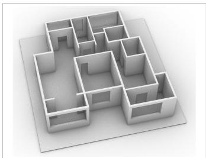

(c) Model example II  
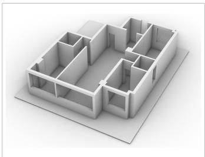

(d) Model example III  
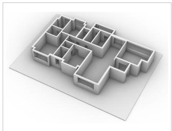  
Fig. 4: Semantic-to-Rhino interface and retained model illustrations.

## 4 Corpus and experimental design

## 4.1 ArchP10k collection and governance

We organize web-sourced architectural plans by source project and recorded building category. Exact SHA-256 duplicates and 64-bit perceptual-hash candidates with Hamming distance at most 6 undergo relationship review. Removing 174 duplicates from 11,708 inputs yields 11,534 working images standardized to 1024 × 1024 pixels. Source links, categories, and governance records are retained separately from predictions.

The corpus contains 7,210 residential and 4,324 other plans. Frozen project-level partitions contain 9,225 development, 1,157 validation, and 1,152 test plans; development denotes a study partition, not supervised model training. The hard subset contains the 400 highest-complexity test plans. Table 3 summarizes the evidence; Appendix A retains source-group counts and predicted semantic composition.

Table 3. ArchP10k research corpus and evidence.
<table><tr><td>Item</td><td>Record</td></tr><tr><td>Working plans / format</td><td>11,534 / 1024 ×1024 PNG</td></tr><tr><td>Development / validation / test</td><td>9,225 / 1,157 / 1,152</td></tr><tr><td>Hard subset</td><td>400 within test</td></tr><tr><td>Independent-reference annotation package</td><td>200 stratified tasks</td></tr><tr><td>Release governance</td><td>Source-specific access, privacy, and redistribution review</td></tr></table>

## 4.2 Public GT and baseline protocols

CubiCasa5K provides 4,200 training, 400 validation, and 400 test plans [2]. All 400 test plans enter pixel evaluation on the same aspect-preserving 1024 × 1024 canvas. The shared evaluation targets structural boundary, door/opening, window, and room: walls and railings form the first class, door/window labels override spaces, and SALI-FP stairs and elevators map to background within this common protocol.

We rerun the trained CubiCasa5K checkpoint with its oficial four-rotation handling and retain all 44 prediction channels. The native argmax and oficial polygon postprocessor are evaluated separately. Raster2Seq uses its released CubiCasa5K checkpoint and native room decoding, MiT-UNet retains its released wall-only configuration, and Table 4 identifies the output scope of each method.

Table 4. Oficial-weight baseline configurations.
<table><tr><td>Method</td><td>Preprocessing and decoder</td><td>Evaluation scope</td></tr><tr><td>CubiCasa5K [2]</td><td>Four right-angle rotations; full 44 channels</td><td>Four-class argmax; official polygon decoder</td></tr><tr><td>Raster2Seq [27]</td><td>256-pixel bicubic input; released EMA checkpoint</td><td>Native room polygons; room, corner, angle matching</td></tr><tr><td>MiT-UNet [25]</td><td>512-pixel native normalization; wall threshold 0.5</td><td>Visible walls only</td></tr><tr><td>SALI-FP</td><td>representation stage</td><td>Retained image/audit outputs; frozen Four common classes; stored sparse room geometry</td></tr></table>

Raster2Seq inference uses the repository’s pure PyTorch deformable-attention reference on CPU, with released weights loaded without training or architecture changes. CubiCasa5K retains its junction channels for polygon decoding. Code, checkpoints, adapters, and per-case outputs are hashed. Appendix C reports the resulting run conditions separately from published timing settings.

The original 60/40 validation allocation yields 44 calibration and 32 holdout outputs. Registration is selected on calibration, checked on holdout, and then frozen. The resulting comparisons use fixed inputs, transformations, and evaluation records; Appendix C gives the complete calibration and stage analyses.

## 4.3 Multi-layer evaluation and statistical analysis

We separate GT recognition, GT-referenced room geometry, representation cost, and corpus execution. Pixel metrics are pooled mean intersection over union (mIoU), mean class pixel accuracy (PA), overall accuracy (OA), and per-class IoU. Boundary IoU (BIoU) [26] averages ten diagonal-relative bands from 0.1% to 1.0%; boundary F1 and visible-wall clDice [34] provide supplementary contour and centerline measures. Appendix B defines denominators and empty-set handling.

Native room, corner, and angle evaluation uses the Raster2Seq CubiCasa entry Evaluator\_RPlan with room IoU above 0.5, corner tolerance 10 pixels on a 256-pixel canvas, and angle tolerance 5 degrees. GT follows oficial source-coordinate rounding, closing-token removal, upper-bound clipping, and the 100-pixel source-area cutof before the frozen common-canvas transform. Every method uses the same disabled-overlap primary setting and enabled-overlap sensitivity setting. Geometry evaluation contains 398 eligible room references, while the complete 400-case record is retained; the 5 failed CubiCasa polygon predictions contribute zero where an eligible reference exists. The common-canvas reruns provide a controlled comparison of the released methods, and angle is reported as its own geometric measure.

For accuracy-cost curves, every common-class raster passes through the same pixel-cell decoder with topology-preserving simplification at 0, 0.25, 0.5, 1, 2, 4, and 8 pixels. Each globally fixed tolerance is evaluated against GT. Appendix B and Tables C.9-C.10 additionally report the ownprediction fidelity measurement for representation analysis.

Public-test intervals use 10,000 paired bias-corrected and accelerated (BCa) bootstrap resamples. Pixel metrics pool confusion counts; native geometry first averages plan precision and recall and then computes their harmonic F1, with mean per-plan F1 reported separately. Every replicate repeats that aggregation. Corpus inference resamples source-project clusters, factor tests use Holm correction, and stage analyses report original coordinates alongside the same frozen final source-only transform applied to every stage. Interquartile ranges (IQRs) describe dispersion.

## 4.4 Implementation and reproducibility

Production records identify gpt-image-2 for image generation, repair, and cleanup, and gpt-5.5 for multimodal audit through an OpenAI-compatible gateway. Image editing takes images and text and returns 1024 × 1024 images; auditing takes two annotated images and text and returns structured suggestions. Production used 16 client workers. Deployment aliases, response identifiers, and frozen local materials establish the operational record; Appendix E documents the reproducibility inventory.

Existing model outputs are retained unchanged. Local representation export uses OpenCV 5.0.0, Shapely 2.1.2, and 8 CPU workers; shared pixel-cell extraction uses Rasterio 1.4.4. The new stage and oficial-weight comparisons make no image-model or audit-model API calls. Appendix E records exact code and weight hashes, prompt availability, compatible-runtime changes, and unresolved historical configuration gaps.

## 5 Results and analysis

## 5.1 Benchmark calibration and engineering-oriented evidence

RQ1 is answered through a deliberately linked engineering-evidence path. The CubiCasa5K protocol provides necessary annotation-aligned calibration on shared coordinates. Fixed-taxonomy pixel and room metrics, however, cannot alone show whether heterogeneous drawings retain coherent spatial organization, editable geometry, and a traceable review path. The corpus audit establishes delivery of semantic, object, vector, relation, and state records at production scale. Appendix F makes the corresponding room-scale organization, opening retention, oblique boundaries, circulation continuity, and residual errors directly inspectable on matched complex plans. Appendix C retains the complete public-test scores, intervals, native-room measures, stage trajectories, and pixel diagnostics.

The principal contribution of SALI-FP is a complete, traceable interpretation-to-geometry chain. Table 5 records its delivered structure across the full ArchP10k corpus; Fig. 5 shows how controlled calibration, corpus-scale output, and visual structural reading form one engineeringoriented evidence argument.

Table 5. Corpus-scale structured-output evidence.
<table><tr><td>Output layer</td><td>Delivered evidence</td><td>Scale</td><td>Engineering interpretation</td></tr><tr><td>Semantic labels S</td><td>Nonempty normalized semantic map</td><td>11,534 / 11,534 plans</td><td>Common input to object and geometry extraction</td></tr><tr><td>Objects O</td><td>Typed shape records</td><td>783,299 shapes</td><td>Explicit semantic units for review</td></tr><tr><td>Native vectors V</td><td>Polygon-bearing objects passing the delivery audit</td><td>752,510 / 783,299 (96.07%)</td><td>Editable geometry with retained status</td></tr><tr><td>Relations G</td><td>Generated relation pairs</td><td>1,591,739 pairs</td><td>Preserved structural context for downstream</td></tr><tr><td>Trace  $H , z$ </td><td>State and recovery records11,534 plans</td><td></td><td>inspection Recoverable execution and review path</td></tr></table>

Complementary evidence for the SALI-FP parsing chain  
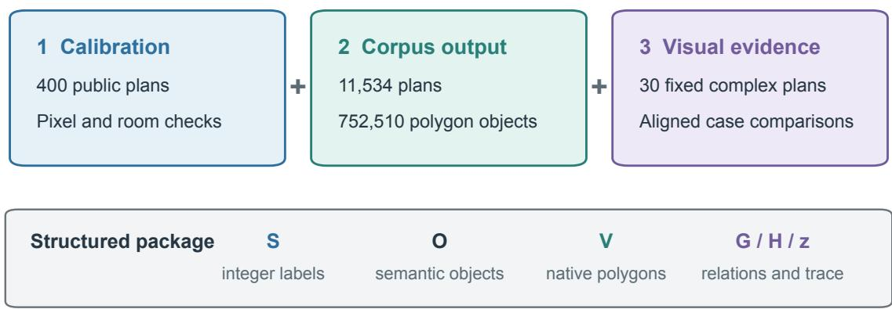  
Fig. 5: Evidence route for SALI-FP. Strict public-test calibration, full-corpus structured output, and fixed visual comparisons answer complementary parts of the evaluation. Detailed baseline scores and diagnostics are retained in Appendix C; the 30 matched complex-plan comparisons are in Appendix F.

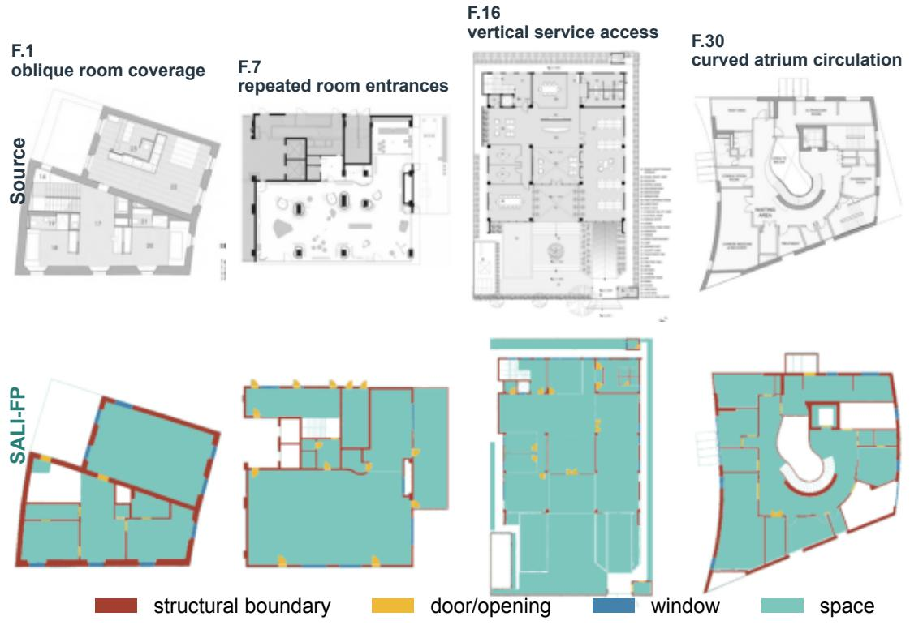  
Each index opens a same-canvas, multi-method comparison with two aligned detail regions in Appendix F.  
Fig. 6: Entry points to the fixed visual-evidence set. Each source/SALI-FP pair corresponds to a full, matched baseline comparison with two aligned detail regions in Appendix F.1, F.7, F.16, and F.30; Appendix F contains all 30 cases.

Appendix F is an integral RQ1 result rather than supplementary illustration and should be inspected alongside the calibration tables. Its 30 fixed complex-plan pages use common canvases, paired local regions, and case-specific observations to expose room-scale coverage, opening retention, nonorthogonal boundaries, circulation continuity, and residual errors. The complete score tables in Appendix C provide the complementary population-level calibration.

## 5.2 Full-corpus output and geometric validity

All 11,534 ArchP10k plans produce nonempty structured outputs after recovery, answering the coverage component of RQ3. The corpus yields 783,299 shapes, 15,002,422 control points, and 1,591,739 generated relation pairs. Of these objects, 752,510 (96.07%) carry polygon geometry that passes the delivery audit. Fig. 7 connects output coverage, geometric readiness, representation scale, and retained execution states across the complete SALI-FP chain.

Residual object identities and geometric causes remain attached to the review record, making the delivered representation directly inspectable. Tables C.18–C.21 provide the full cause taxonomy and category cross-tabs. This traceability is central to SALI-FP: it delivers a structured starting point for review, revision, and later modeling work.

## 5.3 Recorded stage changes and gating

The recorded stages make every intervention path inspectable. Across ArchP10k, 5,273 plans trigger one revision and 6,261 retain the initial candidate; 11,481 audit proposals yield 8,033 accepted actions and 3,448 rejected actions, while 2,181 plans record a protective state or fallback. Appendix Tables C.11, C.16, and Fig. C.7 provide the complete coordinate-conditioned stage analysis, paired intervals, and skipped-output record.

(a) Output layers  
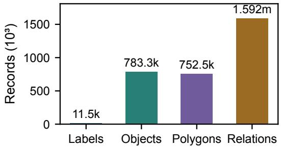

(b) Geometry readiness  
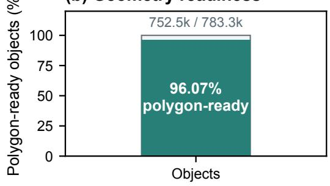

(c) Representation scale  
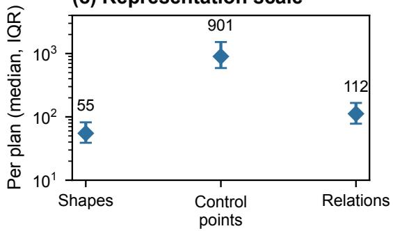

(d) Action ledger  
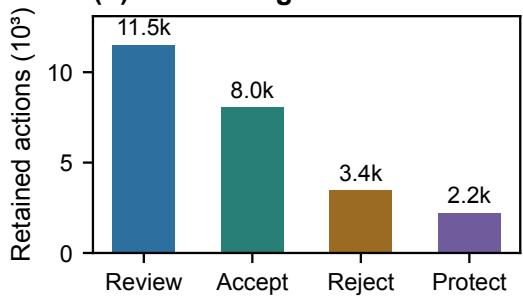  
Counts describe retained execution records, not semantic-correctness labels.  
Fig. 7: ArchP10k structured-output audit: (a) delivered output layers; (b) polygon-bearing geometry passing the delivery audit; (c) per-plan representation scale; and (d) retained audit-action records. Quantities have diferent denominators and are presented separately.

Complexity is associated with a larger representation burden: median control points rise from 651 to 1,288 across quartiles. Project-cluster analysis separates the five factors (Table D.1); hard versus non-hard patterns are retained in Table D.2. The fallback class occupies 16.85% of predicted foreground and 28.0% in ofice/education/research sources, locating functionally unresolved regions for later review.

## 5.4 Visual structural evidence and interface observations

Public error matrices and spatial diagnostics in Appendix Tables C.17 and C.22 and Fig. C.8 locate the calibration targets. Appendix F supplies their case-level engineering reading: every page aligns the source plan, oficial baselines, SALI-FP output, and two matched local regions, then identifies the visible structural evidence in that case. The resulting comparisons make room-scale completeness, aperture retention, oblique envelopes, and continuous circulation available for direct review.

## 6 Discussion and practical implications

## 6.1 Evidence-led method positioning

SALI-FP is designed for an architectural work unit that combines global reading, admissible local action, preserved state, and structured geometry in one inspectable process. The public benchmark anchors annotation-aligned localization, while the corpus audit and Appendix F demonstrate how the same process retains coherent rooms, openings, boundaries, and usable geometric records across heterogeneous drawings.

Fixed-taxonomy and pixel-alignment measures provide the annotation-aligned calibration reported in Appendix C and remain essential for comparable evaluation. They capture a diferent evidence layer from spatial organization, geometric editability, and review traceability. SALI-FP unifies these operational attributes with explicit gates, recoverable actions, corpus-scale output, and object-level geometry, thereby supplying the reviewed semantic-vector material required by downstream design workflows.

## 6.2 Deployment and reproducibility

The production audit records 39,875 logical calls and 41,931 HTTP attempts across the full corpus. Retained protocols, prompts where recoverable, input identifiers, output states, and local geometry records support inspection and local replay. The same semantic-object-vector output form has supported initial drawing digitization and design-model preparation in practical design work associated with the Architectural Design and Research Institute of Tsinghua University. This use connects visual interpretation to a reviewable geometry handof. The resource profile is appropriate for asynchronous archive conversion and design-model preparation, where a reviewer can inspect the resulting semantic and geometric evidence before downstream use; detailed latency and referencerate records are in Tables C.3 and C.19.

## 6.3 Evidence scope and geometric use

The study combines public annotation-aligned calibration, full-corpus structured-output coverage, and purpose-selected visual comparison. Together, these evidence scopes connect measured recognition, production-scale delivery, and design-relevant interpretation. The frozen 200-plan annotation package and the independent proposal-review package provide the next validation instruments for ArchP10k reference accuracy and decision quality.

For downstream solid construction, the exported status record identifies objects for review, while project-specific source-coordinate, opening, scale, and height specifications complete the modelconstruction workflow. Appendix E records the retained materials and the planned open-weight, repeatability, and annotation extensions.

## 7 Conclusion

We propose SALI-FP as an evidence-gated multimodal method that turns architectural floorplan interpretation into a reviewable structured-geometry handof. Its integrated chain combines global multimodal reading, explicit authorization of local revision, preserved execution state, and inspectable semantic-object-vector-relation output.

Across 11,534 heterogeneous ArchP10k plans, SALI-FP produces nonempty structured outputs for every plan and delivers 752,510 valid polygon-bearing objects. Appendix C supplies the complete public benchmark calibration; Appendix F supplies the matched visual evidence needed to inspect the method on complex rooms, openings, oblique envelopes, and circulation structure. Together, these results establish SALI-FP as an engineering-oriented workflow for reviewed architectural archive digitization, existing-building information recovery, and initial design-model preparation.

## Data Availability

CubiCasa5K data and the released baseline code and weights are available from their authors [2, 25, 27]. The local reproduction package contains protocols, code and weight hashes, prediction identifiers, metric records, recoverable prompts, and annotation templates. Original predictions, derived geometry, and reviewer keys are maintained as distinct materials. ArchP10k follows sourcespecific access, external-processing, privacy, and redistribution governance; the public package stages reproducible materials while keeping reviewer keys and private source mappings protected.

## Declaration of generative AI and AI-assisted technologies in the writing process

OpenAI Codex image generation (backend version not exposed) was used for architecture design studies on 2026-09-13 and 2026-09-15, including three alternative layouts for Fig. 2. The final figure was reconstructed with AI-assisted vector plotting code, independently typeset labels and data paths, and frozen experimental images and proposal records. Generated floor plans, pictograms, and unverified model-proposed connections were not used as scientific evidence.

AI tools assisted language editing, code preparation, and record-based analysis. The authors verified the analyses, approved the manuscript, and take responsibility for the publication disclosures.

## References

[1] Pizarro PN, Hitschfeld N, Sipiran I, Saavedra JM. Automatic floor plan analysis and recognition. Automation in Construction 2022;140:104348. https://doi.org/10.1016/j.autcon.2022.104348.

[2] Kalervo A, Ylioinas J, Häikiö M, Karhu A, Kannala J. CubiCasa5K: A dataset and an improved multi-task model for floorplan image analysis. In: Felsberg M, Forssén PE, Sintorn IM, Unger J, editors. Image Analysis, SCIA 2019. Lecture Notes in Computer Science, vol. 11482. Springer; 2019. p. 28–40. https://doi.org/10.1007/978-3-030-20205-7\_3.

[3] Liu C, Wu J, Kohli P, Furukawa Y. Raster-to-Vector: Revisiting Floorplan Transformation. 2017 IEEE International Conference on Computer Vision (ICCV) 2017:2214-2222. https://doi.org/10.1109/ICCV.2017.241.

[4] Chen J, Liu C, Wu J, Furukawa Y. Floor-SP: Inverse CAD for Floorplans by Sequential Room-Wise Shortest Path. 2019 IEEE/CVF International Conference on Computer Vision (ICCV) 2019:2661-2670. https://doi.org/10.1109/ICCV.2019.0027 5.

[5] Zeng Z, Li X, Yu YK, Fu C. Deep Floor Plan Recognition Using a Multi-Task Network With Room-Boundary-Guided Attention. 2019 IEEE/CVF International Conference on Computer Vision (ICCV) 2019:9095-9103. https://doi.org/10.1 109/ICCV.2019.00919.

[6] Yang B, Jiang H, Pan H, Xiao J. VectorFloorSeg: Two-Stream Graph Attention Network for Vectorized Roughcast Floorplan Segmentation. 2023 IEEE/CVF Conference on Computer Vision and Pattern Recognition (CVPR) 2023:1358-1367. https: //doi.org/10.1109/CVPR52729.2023.00137.

[7] Knechtel J, Rottmann P, Haunert J, Dehbi Y. Semantic floorplan segmentation using self-constructing graph networks. Automation in Construction 2024;166:105649. https://doi.org/10.1016/j.autcon.2024.105649.

[8] Xu Z, Jha N, Mehadi S, Mandal M. Multiscale object detection on complex architectural floor plans. Automation in Construction 2024;165:105486. https://doi.org/10.1016/j.autcon.2024.105486.

[9] Pizarro PN, Hitschfeld N, Sipiran I. Large-scale multi-unit floor plan dataset for architectural plan analysis and recognition. Automation in Construction 2023;156:105132. https://doi.org/10.1016/j.autcon.2023.105132

[10] Xing J, Wu L, Zeng T, Wu Y, Shang J. Comprehensive floor plan vectorization with sparse point set representation. Automation in Construction 2025;173:106023. https://doi.org/10.1016/j.autcon.2025.106023.

[11] Xu Z, Jha N, Mehadi S, Mandal M. Automatic floor plan analysis: Datasets, methods, and applications (2000–2025). Automation in Construction 2025;178:106378. https://doi.org/10.1016/j.autcon.2025.106378.

[12] Kim T, Min B. Semantic Layering in Room Segmentation via LLMs. 2024 IEEE/RSJ International Conference on Intelligen Robots and Systems (IROS) 2024:9831-9838. https://doi.org/10.1109/IROS58592.2024.10801361.

[13] Ganon K, Alper M, Mikulinsky R, Averbuch-Elor H. WAFFLE: Multimodal Floorplan Understanding in the Wild. 2025 IEEE/CVF Winter Conference on Applications ofComputer Vision (WACV) 2025:1488-1497. https://doi.org/10.1109/WACV 61041.2025.00152.

[14] Nardoni V, Ali KN, Ziran Z, Marinai S. Visual Large Language Models for Graphics Understanding: A Case Study on Floorplan Images. Proceedings of the 2025 ACM Symposium on Document Engineering 2025:1-4. https://doi.org/10.114 5/3704268.3748681.

[15] Liu Y, Yang Z, Li Y, Yang Y. FloorplanVLM: A vision-language model for floorplan vectorization. arXiv preprint arXiv:2602.06507. 2026. https://doi.org/10.48550/arXiv.2602.06507.

[16] Zhang L, Fu X, Li Y, Chen J. Large language model-based agent Schema and library for automated building energy analysis and modeling. Automation in Construction 2025;176:106244. https://doi.org/10.1016/j.autcon.2025.106244.

[17] Dong Y, Zhan Z, Hu Y, Doe DM, Han Z. AI BIM coordinator for non-expert interaction in building design using LLM-driven multi-agent systems. Automation in Construction 2025;180:106563. https://doi.org/10.1016/j.autcon.2025.106563.

[18] Du C, Esser S, Nousias S, Borrmann A. Text2BIM: Generating Building Models Using a Large Language Model-Based Multiagent Framework. Journal of Computing in Civil Engineering 2026;40:04025142. https://doi.org/10.1061/JCCEE5.C PENG-6386.

[19] Schönfelder P, Stebel F, Andreou N, König M. Deep learning-based text detection and recognition on architectural floor plans. Automation in Construction 2024;157:105156. https://doi.org/10.1016/j.autcon.2023.105156.

[20] Xing J, Gao G, Zeng T, Shang J, Han Y, Tao Z, et al. Multimodal integration for advanced floor plan symbol spotting. Automation in Construction 2026;181:106659. https://doi.org/10.1016/j.autcon.2025.106659.

[21] Fan Z, Zhu L, Li H, Chen X, Zhu S, Tan P. FloorPlanCAD: A Large-Scale CAD Drawing Dataset for Panoptic Symbol Spotting. 2021 IEEE/CVF International Conference on Computer Vision (ICCV) 2021:10108-10117. https://doi.org/10.1109/ICCV48 922.2021.00997.

[22] Zhao Y, Deng X, Lai H. Reconstructing BIM from 2D structural drawings for existing buildings. Automation in Construction 2021;128:103750. https://doi.org/10.1016/j.autcon.2021.103750.

[23] Liao X, Li B, Li N, Du C, Zhang S, Li G, et al. Semi-automated reconstruction and editing of building energy models from vector floor plans. Automation in Construction 2026;185:106882. https://doi.org/10.1016/j.autcon.2026.106882.

[24] Gao Y, Hu F, Chai C, Weng Y, Li H. Multi-agent framework for schema-guided reasoning and tool-augmented interaction with IFC models. Automation in Construction 2026;186:106888. https://doi.org/10.1016/j.autcon.2026.106888.

[25] Parashchuk D, Kaspshitskiy A, Karyakin Y. Enhancing floor plan recognition: a hybrid mix-transformer and U-Net approach for precise wall segmentation. Machine Vision and Applications 2026;37:53. https://doi.org/10.1007/s00138-026-01815-y.

[26] Cheng B, Girshick R, Dollar P, Berg AC, Kirillov A. Boundary IoU: Improving Object-Centric Image Segmentation Evaluation. 2021 IEEE/CVF Conference on Computer Vision and Pattern Recognition (CVPR) 2021:15329-15337. https://doi.org/10.110 9/CVPR46437.2021.01508.

[27] Phung H, Averbuch-Elor H. Raster2Seq: Polygon sequence generation for floorplan reconstruction. ACM SIGGRAPH Conference Papers; 2026. https://doi.org/10.1145/3799902.3811124.

[28] Liang Y, Wu Z, Zheng R, Xie S, Hong B, Lin Y. FloorPlanFormer: Multi-Task Transformer Network for Floor Plan Recognition with Outer-to-Inner Feature Refinement. Proceedings of the AAAI Conference on Artificial Intelligence 2026;40:6916- 6924. https://doi.org/10.1609/aaai.v40i9.37625.

[29] Chen J, Qian Y, Furukawa Y. HEAT: Holistic edge attention transformer for structured reconstruction. Proceedings of the IEEE/CVF Conference on Computer Vision and Pattern Recognition; 2022. p. 3866–3875. https://openaccess.thecvf.com/co ntent/CVPR2022/html/Chen\_HEAT\_Holistic\_Edge\_Attention\_Transformer\_for\_Structured\_Reconstruction\_CVPR\_2022\_ paper.html.

[30] Yue Y, Kontogianni T, Schindler K, Engelmann F. Connecting the dots: Floorplan reconstruction using two-level queries. Proceedings of the IEEE/CVF Conference on Computer Vision and Pattern Recognition; 2023. p. 845–854. https://openacce ss.thecvf.com/content/CVPR2023/papers/Yue\_Connecting\_the\_Dots\_Floorplan\_Reconstruction\_Using\_Two-Level\_Queri es\_CVPR\_2023\_paper.pdf.

[31] Chen J, Deng R, Furukawa Y. PolyDifuse: Polygonal Shape Reconstruction via Guided Set Difusion Models. Advances in Neural Information Processing Systems 36; 2023. https://proceedings.neurips.cc/paper\_files/paper/2023/hash/05f0e2fa003 602db2d98ca72b79dec51-Abstract-Conference.html.

[32] Evangelidis GD, Psarakis EZ. Parametric image alignment using enhanced correlation coeficient maximization. IEEE Transactions on Pattern Analysis and Machine Intelligence 2008;30(10):1858–1865. https://doi.org/10.1109/TPAMI.20 08.113. Implementation: OpenCV findTransformECC, version 5.0.0.

[33] Gillies S, van der Wel C, Van den Bossche J, Taves MW, Arnott J, Ward BC, et al. Shapely, version 2.1.2. Software; 2025. https://doi.org/10.5281/zenodo.5597138. Algorithm documentation: https://shapely.readthedocs.io/en/2.1.2/reference/shapel y.make\_valid.html.

[34] Shit S, Paetzold JC, Sekuboyina A, Ezhov I, Unger A, Zhylka A, et al. clDice: A Novel Topology-Preserving Loss Function for Tubular Structure Segmentation. Proceedings ofthe IEEE/CVF Conference on Computer Vision and Pattern Recognition 2021:16555-16564. https://doi.org/10.1109/CVPR46437.2021.01629.

## A Semantic mappings and corpus composition

Table A.1. Semantic palette and common-class display mapping.
<table><tr><td>Class</td><td>RGB</td><td>Common target</td></tr><tr><td>wall</td><td>255,0,0</td><td>Structural boundary</td></tr><tr><td>door</td><td>255,255,0</td><td>Door/opening</td></tr><tr><td>window</td><td>0,200,83</td><td>Window</td></tr><tr><td>stair</td><td>0, 102, 255</td><td>Background (unmapped)</td></tr><tr><td>elevator</td><td>255, 128, 0</td><td>Background (unmapped)</td></tr><tr><td>living_room</td><td>0,255,255</td><td>Room</td></tr><tr><td>bedroom</td><td>255,77,184</td><td>Room</td></tr><tr><td>kitchen</td><td>128,0,255</td><td>Room</td></tr><tr><td>bathroom</td><td>0,153,153</td><td>Room</td></tr><tr><td>balcony</td><td>153,255,0</td><td>Room</td></tr><tr><td>entrance</td><td>255,0,255</td><td>Room</td></tr><tr><td>storage</td><td>128,64,0</td><td>Room</td></tr><tr><td>corridor</td><td>128, 128, 128</td><td>Room</td></tr><tr><td>study</td><td>32, 32, 160</td><td>Room</td></tr><tr><td>room_default</td><td>184, 184, 184</td><td>Room</td></tr></table>

SALI-FP stair and elevator labels have no separate target in the frozen common-class raster   
mapping and are mapped to background, not silently excluded from the denominator. All other SALI-  
FP space labels, including the fallback class, map to room. CubiCasa5K native room types map to   
room except walls/railings; native door/window icons override the room map. The common target is   
therefore a disclosed operational mapping rather than a claim that every source ontology is identical. Table A.2. Source-group composition and predicted fallback-class share.

<table><tr><td>Source group</td><td>Plans</td><td>room_default / predicted non-background pixels</td></tr><tr><td>Residential</td><td>7,210</td><td>13.6%</td></tr><tr><td>Commercial and hospitality</td><td>942</td><td>15.1%</td></tr><tr><td>Office, education, and</td><td>1,169</td><td>28.0%</td></tr><tr><td>research Mixed use</td><td>305</td><td>20.4%</td></tr><tr><td>Civic, cultural, and health</td><td>941</td><td>27.2%</td></tr><tr><td>General interior</td><td>678</td><td>14.8%</td></tr><tr><td>Industrial and infrastructure</td><td>82</td><td>21.8%</td></tr><tr><td>Landscape and urban</td><td>53</td><td>17.9%</td></tr><tr><td>Unspecified source group</td><td>154</td><td>18.8%</td></tr></table>

Table A.3. Predicted semantic pixel composition of the full ArchP10k run.
<table><tr><td>Predicted class</td><td>Pixels Share of predicted non-background pixels</td><td></td></tr><tr><td>living_room</td><td>1,419,369,397</td><td>24.21%</td></tr><tr><td>room_default</td><td>987,723,922</td><td>16.85%</td></tr><tr><td>bedroom</td><td>764,413,067</td><td>13.04%</td></tr><tr><td>wall</td><td>699,703,665</td><td>11.94%</td></tr><tr><td>balcony</td><td>487,712,685</td><td>8.32%</td></tr><tr><td>kitchen</td><td>349,764,932</td><td>5.97%</td></tr><tr><td>bathroom</td><td>284,839,808</td><td>4.86%</td></tr><tr><td>stair</td><td>281,147,325</td><td>4.80%</td></tr><tr><td>corridor</td><td>196,332,949</td><td>3.35%</td></tr></table>

SALI-FP
<table><tr><td>Predicted class</td><td>Pixels</td><td>Share of predicted non-background pixels</td></tr><tr><td>window</td><td>130,412,363</td><td>2.22%</td></tr><tr><td>entrance</td><td>76,736,868</td><td>1.31%</td></tr><tr><td>door</td><td>69,874,801</td><td>1.19%</td></tr><tr><td>storage</td><td>39,998,446</td><td>0.68%</td></tr><tr><td>elevator</td><td>37,906,193</td><td>0.65%</td></tr><tr><td>study</td><td>36,222,820</td><td>0.62%</td></tr></table>

Pixel shares in Tables A.2-A.3 describe predictions. They cannot establish class prevalence in independently annotated drawings.

## B Metric definitions and geometric audit

Let $n _ { i j }$ denote the number of GT-class i pixels predicted as $j .$ . Class IoU, class accuracy, mean PA, and mIoU are given in Eqs. (B.1)-(B.2). Background contributes to confusion counts and OA but not to the four-class means. Empty-class unions are undefined rather than perfect; available class values enter each plan-level boundary macro.

$$
\mathrm { I o U } _ { i } = \frac { n _ { i i } } { \sum _ { j } n _ { i j } + \sum _ { j } n _ { j i } - n _ { i i } } , \qquad \mathrm { P A } _ { i } = \frac { n _ { i i } } { \sum _ { j } n _ { i j } } .\tag{B.1}
$$

$$
\mathrm { m I o U } = \frac { 1 } { \vert K \vert } \sum _ { i \in K } \mathrm { I o U } _ { i } , \quad \mathrm { m e a n ~ P A } = \frac { 1 } { \vert K \vert } \sum _ { i \in K } \mathbf { P A } _ { i } , \quad \mathrm { O A } = \frac { \sum _ { i } n _ { i i } } { \sum _ { i j } n _ { i j } } .\tag{B.2}
$$

Boundary masks follow the oficial zero-padded erosion implementation [26]. The band width is the rounded image-diagonal fraction, with a minimum of 1 pixel. Ten fractions from 0.1% to 1.0% are evaluated; their mean, the four-class mean, and the plan mean define the reported BIoU. Eq. (B.3) applies to each class and band. The image-border padding is essential for a mask that touches the canvas.

$$
\mathsf { B I o U } _ { d } ( P , T ) = \frac { | B _ { d } ( P ) \cap B _ { d } ( T ) | } { | B _ { d } ( P ) \cup B _ { d } ( T ) | } .\tag{B.3}
$$

Original validity is measured from stored exterior and hole coordinates without repair, using Shapely 2.1.2, positive area, nonempty geometry, and its validity predicate. Malformed inputs count as invalid. The separately versioned repair is evaluated on the same original object IDs. A valid geometry collection with polygon area counts as polygon-containing, but a collapsed line does not. Sparse objects and auxiliary rendering groups have diferent denominators; Table B.1 retains both.

Table B.1. Original and guarded-repair geometry denominators.
<table><tr><td>Item</td><td>Count</td></tr><tr><td>Original sparse objects</td><td>783299</td></tr><tr><td>Originally valid</td><td>673880</td></tr><tr><td>Valid polygon-containing objects after repair</td><td>752510</td></tr><tr><td>Accepted repairs</td><td>78630</td></tr><tr><td>Raster-guard rejection</td><td>22963</td></tr><tr><td>Collapsed without polygon</td><td>7820</td></tr><tr><td>Malformed inputs</td><td>6</td></tr><tr><td>All-object-valid plans after repair</td><td>2932</td></tr><tr><td>Original auxiliary render groups</td><td>825215</td></tr><tr><td>Invalid auxiliary render groups</td><td>21534</td></tr></table>

For boundary F1, let $B _ { P } , B _ { T }$ be one-pixel contours and $N _ { t }$ the Euclidean neighborhood with radius t times the diagonal. Eq. (B.4) counts each predicted or reference boundary pixel once. Tolerances are 0.25%, 0.50%, and 1.00%; one absent boundary yields zero, while two absent boundaries are excluded with their count reported. Scores average over available classes and then plans.

Visible-wall clDice [34] uses hard skeletons in the shared wall-evaluation domain, with precision and recall in Eq. (B.5). It measures centerline coverage, not door-room adjacency. Eq. (B.6) gives class Dice from pooled confusion counts.

$$
p _ { t } = \frac { | B _ { P } \cap N _ { t } ( B _ { T } ) | } { | B _ { P } | } , r _ { t } = \frac { | B _ { T } \cap N _ { t } ( B _ { P } ) | } { | B _ { T } | } , \mathbf { B } \mathbf { F } \mathbf { l } _ { t } = \frac { 2 p _ { t } r _ { t } } { p _ { t } + r _ { t } } .\tag{B.4}
$$

$$
p _ { c } = { \frac { | \mathbf { s k e l } ( P ) \cap T | } { | \mathbf { s k e l } ( P ) | } } , \quad r _ { c } = { \frac { | \mathbf { s k e l } ( T ) \cap P | } { | \mathbf { s k e l } ( T ) | } } , \quad \mathrm { c l D i c e } = { \frac { 2 p _ { c } r _ { c } } { p _ { c } + r _ { c } } } .\tag{B.5}
$$

$$
{ \mathrm { D i c e } } _ { i } = { \frac { 2 n _ { i i } } { \sum _ { j } n _ { i j } + \sum _ { j } n _ { j i } } } .\tag{B.6}
$$

Table B.2. Frozen registration and numerical guards.
<table><tr><td>Setting</td><td>Value</td></tr><tr><td>Working resolution / ECC iterations / termination</td><td>512 pixels / 150 / 0.00001</td></tr><tr><td>Affine singular-value range / maximum ratio</td><td>0.65-1.35 / 1.25</td></tr><tr><td>Maximum rotation / corner displacement</td><td>5 degrees / 25% of diagonal</td></tr><tr><td>Foreground retained / source-score gain</td><td>At least 98% / strictly positive</td></tr><tr><td>Calibration source-gain candidates</td><td>0 / 0.01 / 0.03 / 0.06</td></tr><tr><td>Calibration selection</td><td>Maximum pooled mIoU; BIoU decline at most 0.005</td></tr><tr><td>Holdout acceptance</td><td>Pooled mIoU gain at least 0.02; BIoU decline at most 0.005; paired CI above zero</td></tr><tr><td>Polygon repair raster-difference cap</td><td>2% of before/after union</td></tr><tr><td>Affine numerical-repair area limit</td><td>max(1e-8, 1e-9 x absolute area)</td></tr><tr><td>On inadmissible registration or numerical repair</td><td>Identity transform; retain original frame</td></tr></table>

## B.1 Representation-stage implementation and audit

The local extension operates on retained outputs and makes no model calls. It estimates an afine map from predicted structural boundaries to line evidence in the source drawing, using enhancedcorrelation registration [32]. At 512-pixel working resolution, initialization combines identity and similarity alignment. A candidate must improve the source-only structural overlap score, retain at least 98% of foreground, and satisfy scale, rotation, anisotropy, and displacement guards. The same map is applied to integer labels by nearest-neighbor sampling and to vector coordinates; classes are not reassigned. Failed or inadmissible registration retains identity. This source-driven criterion uses no GT at inference and is not itself an accuracy metric.

Invalid sparse geometry is processed separately with linework-based validity repair [33]. Originally valid coordinates are preserved. An invalid object’s repair is accepted only when the raster symmetric diference is at most 2% of the before/after union and the result is valid with positive polygon area. Geometry collections can retain lower-dimensional remnants; a collapsed line is not counted as a usable polygon. Original objects, rejected changes, malformed inputs, and per-object dispositions remain auditable. Afine roundof is repaired only within numerical-area and raster guards; otherwise the whole plan retains its original frame. Relation records are referenced but not recomputed, so repaired geometry does not establish corrected topology.

Postprocessing was selected on existing validation outputs, separately from the fixed test evaluation. Of a previously fixed 60/40 calibration/holdout allocation, 44 calibration and 32 holdout outputs were complete; the missing 16/8 cases were not replaced. Identity, similarity, and afine registration were compared on calibration only. The selected configuration improved holdout pooled mIoU from 0.1808 to 0.3794, with a paired plan-mean change of 0.2107 [0.1733, 0.2476]. The configuration was then frozen before applying it to all 400 test plans. Earlier raw test scores had already been inspected, so this is an exploratory follow-up, not a claim of an untouched-test development history.

The supervised reruns retain their released checkpoints and preprocessing. The frozen local extension uses OpenCV 5.0.0, Shapely 2.1.2, and CPU processing with 8 workers for the corpus export. A lookup over all 16,777,216 RGB colors accelerates the existing pixelwise classifier without changing its labels; equality was checked on 20 real outputs, randomized layouts, gradients, and legacy color aliases. No remote requests, retraining, new image generation, or test-GT registration are involved. The same source-only registration is also applied to each baseline as a sensitivity check, while unmodified baseline outputs remain the primary comparison. Code, input and output hashes, transforms, and fallback reasons accompany the derived release.

Of 783,299 original sparse objects, 673,880 are valid (86.03%). Guarded repair accepts 78,630 changes, raising valid polygon-containing objects to 752,510 (96.07%) and all-object-valid plans from 384 to 2,932. Rejected or collapsed objects are retained with explicit status, not silently deleted. Among accepted repairs, raster diferences total 1,090,285 pixels over a 1,241,315,793-pixel union (0.0878%). Auxiliary rendering groups remain a distinct layer; their original validity rate is 97.39%. Appendix F retains the original 30-case illustration set and is not used to evaluate the new repairs.

Table B.3. Frozen shared-decoder representation protocol.
<table><tr><td>Setting</td><td>Value</td></tr><tr><td>Input</td><td>Same 400 test plans; final SALI-FP and native baselines</td></tr><tr><td>Extraction</td><td>Pixel-cell polygons; four-connectivity; retain holes and components</td></tr><tr><td>Simplification grid (pixels)</td><td>0, 0.25, 0.5, 1, 2, 4, 8; preserve topology</td></tr><tr><td>Fidelity thresholds</td><td>0.95, 0.98 (primary), 0.995; minimum nonempty-class IoU</td></tr><tr><td>Selection</td><td>Fewest vertices; then bytes; then tolerance</td></tr><tr><td>Serialization</td><td>Compact UTF-8 JSON; six decimal places; identical fields</td></tr><tr><td>Pixel replay</td><td>Pixel centers; room, boundary, door, window priority</td></tr><tr><td>Missing or empty input</td><td>Retain case in denominator; no compactness score</td></tr></table>

The experiment freezes source and code hashes before evaluating vector costs and makes no model calls. Zero-tolerance pixel-cell reconstruction is required to reproduce every source prediction exactly. Linework validity splitting resolves self-touching cell rings without deleting area. Polygon and hole counts are checked across every simplification candidate. Coordinates are serialized before raster replay, so quantization is included in the fidelity check. All selected candidates must be valid; a 100% valid fraction here is an admission condition of the shared decoder, not evidence that native model geometry is universally valid. BCa intervals that are undefined for degenerate statistics are recorded as unavailable rather than replaced with another interval method.

The shared-decoder quantity $V _ { \beta }$ in Eq. (B.7) is the smallest tested vertex budget whose classwise raster replay reaches fidelity $\beta$ against its own prediction P. It is not a GT accuracy metric. N counts exterior and hole vertices without repeated closing points; $\mathcal { E }$ is the fixed tolerance grid.

$$
\begin{array} { l } { { \displaystyle { F ( P , V ) = \operatorname* { m i n } _ { c : | P _ { c } | > 0 } \frac { | P _ { c } \cap \widehat { P } _ { c } ( V ) | } { | P _ { c } \cup \widehat { P } _ { c } ( V ) | } } , } } \\ { { \displaystyle V _ { \beta } ( P ) = \operatorname* { m i n } _ { \epsilon \in \mathcal { E } : F ( P , V _ { \epsilon } ) \geq \beta , \ V _ { \epsilon } \mathrm { ~ v a l i d } } N ( V _ { \epsilon } ) } . } \end{array}\tag{B.7}
$$

Table B.4. Gate predicates and parameter provenance.
<table><tr><td>Step</td><td>Evidence and decision</td></tr><tr><td>Schema and location</td><td>Require source-coordinate bbox, valid palette target, confidence and evidence fields</td></tr><tr><td>Confidence and area</td><td>Require confidence  $> = 0 . 8 0$  and target mask &gt;= 16 pixels</td></tr><tr><td>Current target protection</td><td>Reject existing target coverage  $> = 0 . 7 0 ;$  construction threshold 0.15</td></tr><tr><td>Named-room protection</td><td>Reject other named-room fraction  $> = 0 . 3 0$ </td></tr><tr><td>Room support</td><td>Require blank or fallback support  $> = 0 . 3 5$ </td></tr><tr><td>Construction support</td><td>Require source intensity &lt; 170 over &gt;= 0.02 of the region; door exception</td></tr><tr><td>Image-change protection</td><td>Repair 0.55, cleanup 0.35, non-white fraction change 0.15</td></tr><tr><td>Parameter origin</td><td>Inspected heuristic configuration; full historical source equivalence not established</td></tr></table>

Table B.5. Audit fields and coordinate roles.
<table><tr><td>Field</td><td>Meaning</td></tr><tr><td>bbox; source_coordinate_space</td><td>Rough source-image region; image1_source_plan</td></tr><tr><td>semantic_key; expected_semantic_key</td><td>Requested class from the frozen palette</td></tr><tr><td>current_semantic_key</td><td>Candidate class or white_or_unmapped / unknown</td></tr><tr><td>first_pass_problem; problem_evidence</td><td>Visible candidate error and supporting observation</td></tr><tr><td>source_evidence; fix_rationale</td><td>Drawing cue and rationale for the proposed correction</td></tr><tr><td>confidence; source_cues; reason</td><td>Model assessment and concise textual support</td></tr><tr><td>Source / candidate grids</td><td>32 / 64 pixels; source is the coordinate authority</td></tr></table>

The reproduction materials distinguish archived generation/repair/cleanup prompts from the audit prompt recovered from currently inspected source. Full audit text cannot be certified against every historical run. Retained records use deployment aliases rather than immutable snapshots; cache reuse in the inspected workflow checks output availability, successful status, prompt hash, and image size, not a complete historical model fingerprint. A content-addressed evaluation cache is frozen separately for this revision.

Integer-label assignment is pixelwise and order-dependent. Direct matches require every RGB channel to lie within 20 of a current or legacy palette entry; the minimum squared RGB distance wins, with palette order breaking ties. Only unassigned chromatic pixels enter white-mixture matching: the median channelwise mixture coeficient must lie in [0.06, 1.05], of-ray deviation must not exceed 24, and channel span must be at least 4. The first qualifying palette entry wins. Remaining pixels enter the ordered rules in Table B.7 only if value is at least 40, channel span at least 35, and they are not near-white background (minimum RGB channel at least 240 and span at most 25). Each rule claims only unassigned pixels; the remainder is background. Gray classes can be assigned by direct matching before the chromatic stages. The frozen RGB lookup performs assignment only, not object-size filtering or morphological cleanup. Its source hash matches the inspected classifier; historical object parameters are read from each saved pointset, not inferred from current defaults. Tables B.6–B.8 and the full configuration inventory preserve these distinctions.

Table B.6. Executed color-assignment stages.
<table><tr><td>Stage</td><td>Rule</td></tr><tr><td>1. Palette thresholds</td><td>Per-channel tolerance 20; minimum squared RGB distance; current and legacy aliases</td></tr><tr><td>2. White mixtures</td><td>Unassigned chromatic pixels; t in [0.06, 1.05]; off-ray &lt;= 24; span &gt;= 4</td></tr><tr><td>3. Ordered hue predicates</td><td>Unassigned, non-background pixels; value &gt;= 40; span &gt;= 35; Table B.7</td></tr><tr><td>4. Background</td><td>All remaining pixels receive integer ID 0</td></tr><tr><td>Frozen provenance</td><td>All-RGB LUT and classifier source hashes; stored pointset configuration per plan</td></tr></table>

Table B.7. Ordered hue predicates after direct and mixture matching; H is in degrees.
<table><tr><td>Order</td><td>Target</td><td>Predicate</td></tr><tr><td>1</td><td>wall</td><td>((H &lt;= 15) or (H &gt;= 350)) and (R &gt; 180) and (G &lt; 100) and (B &lt; 100)</td></tr><tr><td>2</td><td>door</td><td>(H &gt;= 45) and (H &lt;= 68) and (R &gt; 180) and (G &gt; 180) and (B &lt; 100)</td></tr><tr><td>3</td><td>window</td><td>(H &gt;= 85) and (H &lt;= 150) and (G &gt; 100) and (R &lt; 110) and (B &lt; 130)</td></tr><tr><td>4</td><td>stair</td><td>(H &gt;= 200) and (H &lt;= 245) and (B &gt; 120) and (R &lt; 100) and (G &lt; 160) and (maxRGB &gt;= 170)</td></tr><tr><td>5</td><td>elevator</td><td>(H &gt;= 20) and (H &lt;= 44) and (R &gt; 180) and (G &gt; 70) and (G &lt; 180) and (B &lt; 120)</td></tr><tr><td>6</td><td>living room</td><td>(H &gt;= 170) and (H &lt;= 192) and (R &lt; 90) and (G &gt; 190) and (B &gt; 190) and (maxRGB &gt;= 220)</td></tr><tr><td>7</td><td>bathroom</td><td>(H &gt;= 170) and (H &lt;= 192) and (R &lt; 90) and (G &gt;= 90) and (B &gt;= 90) and (maxRGB &lt; 220)</td></tr><tr><td>8</td><td>living room</td><td>(H &gt;= 176) and (H &lt;= 196) and (R &lt; 130) and (G &gt;= 180) and (B &gt;= 190) and (maxRGB &gt;= 200)</td></tr><tr><td>9</td><td>bedroom</td><td>(H &gt;= 315) and (H &lt;= 350) and (R &gt; 180) and (G &gt;= 50) and (G &lt;= 170) and (B &gt;= 120) and (B &lt;= 235)</td></tr><tr><td>10</td><td>bedroom</td><td>(H &gt;= 316) and (H &lt;= 340) and (R &gt; 180) and (G &lt; 60) and (B &gt;= 100) and (B &lt;= 210) and (B * 100 &lt; R * 90)</td></tr><tr><td>11</td><td>kitchen</td><td>(H &gt;= 255) and (H &lt;= 290) and (B &gt; 150) and (R &gt;= 80) and (R &lt;= 215) and (G &lt; 130)</td></tr><tr><td>12</td><td>balcony</td><td>(H &gt;= 68) and (H &lt;= 100) and (R &gt;= 120) and (G &gt;= 150) and (B &lt; 120)</td></tr><tr><td>13</td><td>entrance</td><td>(H &gt;= 290) and (H &lt;= 315) and (R &gt; 180) and (B &gt; 180) and (G &lt; 90)</td></tr><tr><td>14</td><td>storage</td><td>(H &gt;= 10) and (H &lt;= 35) and (R &gt;= 80) and (R &lt;= 180) and (G &gt;= 30) and (G &lt;= 130) and (B &lt; 120) and (maxRGB &lt; 220)</td></tr><tr><td>15</td><td>storage</td><td>(H &gt;= 25) and (H &lt;= 52) and (R &gt;= 180) and (G &gt;= 135) and (G &lt;= 225) and (B &gt;= 100) and (B &lt;= 195) and (span &gt;= 45) and (maxRGB &gt;= 170)</td></tr></table>

SALI-FP
<table><tr><td>Order</td><td>Target</td><td>Predicate</td></tr><tr><td>16</td><td>study</td><td>(H &gt;= 220) and (H &lt;= 250) and (B &gt;= 80) and (R &lt; 100) and (G &lt; 100) and (maxRGB &lt; 190)</td></tr><tr><td>17</td><td>study</td><td>(H &gt;= 205) and (H &lt;= 250) and (B &gt;= 80) and (R &lt; 120) and (G &lt; 130) and (maxRGB &lt; 190)</td></tr><tr><td>18</td><td>room default</td><td>(maxRGB &gt;= 185) and (minRGB &gt;= 145) and (span &gt;= 30) and (span &lt;= 95)</td></tr></table>

Table B.8. Serialized native and auxiliary representation settings (all 11,534 records).
<table><tr><td>Operation</td><td>Saved setting</td></tr><tr><td>Native contour simplification / minimum area</td><td>1.2 px / 24 px squared</td></tr><tr><td>Rectangle eligibility</td><td>Area ratio &gt;= 0.9; at most 6 approximated corners</td></tr><tr><td>Coordinate offset / short-edge length</td><td>0.5 / 2.0 px</td></tr><tr><td>Native orthogonal snap</td><td>1.5 px</td></tr><tr><td>Auxiliary room / construction simplification</td><td>0.6 / 4.0 px</td></tr><tr><td>Auxiliary expansion: room / construction / opening</td><td>1 / 1 / 1 px</td></tr><tr><td>Construction axis snap / gap close</td><td>5.0 / 1 px</td></tr><tr><td>Construction rectangle fill / outlier limit</td><td>0.72 / 0.08</td></tr><tr><td>Surface gap kernel / room-fragment area</td><td>9 px / 2048 px squared</td></tr><tr><td>Maximum linkage points per pair</td><td>4</td></tr></table>

Native objects retain exterior and hole coordinates; qualifying hole-free contours may use rectangle fitting, otherwise they use sparse polygon approximation and orthogonal/short-edge cleanup. Auxiliary rings follow class-specific masks and smoothing, so their group count can difer from native objects. Existing holes are not silently counted as filled area in native storage. Rendering order and masks are frozen with the saved artifacts. Some inspected code defaults, including an additional construction-polygon tolerance, were not serialized in historical records; their equivalence across all historical runs cannot be certified. This inventory therefore distinguishes recorded values from reconstruction assumptions.

## C Detailed measured results

Table C.1. CubiCasa5K test: original and identically registered outputs.
<table><tr><td>Method / stage</td><td>Metric</td><td>Estimate [95% BCa CI]</td></tr><tr><td>SALI-FP / raw</td><td>oa</td><td>0.7830 [0.7757, 0.7899]</td></tr><tr><td>SALI-FP / raw</td><td>mean_pa</td><td>0.3001 [0.2903, 0.3123]</td></tr><tr><td>SALI-FP / raw</td><td>miou</td><td>0.2074 [0.2000, 0.2162]</td></tr><tr><td>SALI-FP / raw</td><td>biou</td><td>0.0570 [0.0530, 0.0623]</td></tr><tr><td>SALI-FP / raw</td><td>Visible-wall IoU</td><td>0.1116 [0.1013, 0.1245]</td></tr><tr><td>SALI-FP / raw</td><td>Wall clDice</td><td>0.1728 [0.1589, 0.1892]</td></tr><tr><td>SALI-FP / registered</td><td>oa</td><td>0.8657 [0.8574, 0.8733]</td></tr><tr><td>SALI-FP / registered</td><td>mean_pa</td><td>0.4797 [0.4639, 0.4951]</td></tr><tr><td>SALI-FP / registered</td><td>miou</td><td>0.3596 [0.3449, 0.3740]</td></tr><tr><td>SALI-FP / registered</td><td>biou</td><td>0.1858 [0.1756, 0.1961]</td></tr><tr><td>SALI-FP / registered</td><td>Visible-wall IoU</td><td>0.3325 [0.3105, 0.3549]</td></tr><tr><td>SALI-FP / registered</td><td>Wall clDice</td><td>0.5113 [0.4857, 0.5362]</td></tr><tr><td>CubiCasa5K / raw</td><td>oa</td><td>0.9517 [0.9456, 0.9566]</td></tr><tr><td>CubiCasa5K / raw</td><td>mean_pa</td><td>0.8230 [0.8122, 0.8313]</td></tr><tr><td>CubiCasa5K / raw</td><td>miou</td><td>0.7390 [0.7270, 0.7496]</td></tr><tr><td>CubiCasa5K / raw</td><td>biou</td><td>0.5546 [0.5444, 0.5643]</td></tr><tr><td>CubiCasa5K / raw</td><td>Visible-wall IoU</td><td>0.7482 [0.7344, 0.7603]</td></tr><tr><td>CubiCasa5K / raw</td><td>Wall clDice</td><td>0.8575 [0.8482, 0.8660]</td></tr><tr><td>CubiCasa5K / registered</td><td>oa</td><td>0.9468 [0.9405, 0.9517]</td></tr><tr><td>CubiCasa5K / registered</td><td>mean_pa</td><td>0.7996 [0.7885, 0.8085]</td></tr><tr><td>CubiCasa5K / registered</td><td>miou</td><td>0.7015 [0.6890, 0.7128]</td></tr><tr><td>CubiCasa5K / registered</td><td>biou</td><td>0.4947 [0.4842, 0.5047]</td></tr><tr><td>CubiCasa5K / registered</td><td>Visible-wall IoU</td><td>0.6972 [0.6820, 0.7107]</td></tr><tr><td>CubiCasa5K / registered</td><td>Wall clDice</td><td>0.8314 [0.8199, 0.8417]</td></tr><tr><td>MiT-UNet / raw</td><td>Visible-wall IoU</td><td>0.7721 [0.7435, 0.7843]</td></tr><tr><td>MiT-UNet / raw</td><td>Wall clDice</td><td>0.9302 [0.9219, 0.9372]</td></tr><tr><td>MiT-UNet / registered</td><td>Visible-wall IoU</td><td>0.7129 [0.6892, 0.7309]</td></tr><tr><td>MiT-UNet / registered</td><td>Wall clDice</td><td>0.8901 [0.8743, 0.9030]</td></tr></table>

Table C.2. ArchP10k partitions: internal consistency only.
<table><tr><td>Partition</td><td>Plans</td><td>Mean RCR [95% CI]</td><td>Micro RCR</td></tr><tr><td>full</td><td>11534</td><td>0.9569 [0.9565, 0.9573]</td><td>0.9595</td></tr><tr><td>development</td><td>9225</td><td>0.9571 [0.9566, 0.9575]</td><td>0.9597</td></tr><tr><td>validation</td><td>1157</td><td>0.9566 [0.9552, 0.9578]</td><td>0.9592</td></tr><tr><td>test</td><td>1152</td><td>0.9556 [0.9541, 0.9569]</td><td>0.9582</td></tr><tr><td>hard</td><td>400</td><td>0.9507 [0.9483, 0.9530]</td><td>0.9531</td></tr><tr><td>nonhard test</td><td>752</td><td>0.9582 [0.9565, 0.9596]</td><td>0.9612</td></tr></table>

SALI-FP  
Table C.3. Retained production call and stage records.
<table><tr><td>Quantity</td><td>Value</td><td>Interpretation</td></tr><tr><td>Logical calls / HTTP attempts</td><td>39,875 / 41,931</td><td>2,056 excess request attempts</td></tr><tr><td>Audit median [IQR]</td><td>39.3 [24.0, 62.5] s</td><td>Recorded remote stage</td></tr><tr><td>Conditional repair median [IQR]</td><td>164.8 [100.9, 235.0] s</td><td>Only triggered repairs</td></tr><tr><td>Cleanup median [IQR]</td><td>138.4 [93.8, 211.5] s</td><td>Recorded remote stage</td></tr><tr><td>Recorded subtotal median</td><td>260.8 s</td><td>Not full end-to-end time</td></tr><tr><td>Reference-rate total / mean</td><td>$9,430.83 / $0.818</td><td>Rate-card calculation, not billing</td></tr><tr><td>Reference-rate median [IQR]</td><td>$0.82 [$0.66, $0.91]</td><td>Not a measured monetary saving</td></tr></table>

The cost calculation is retained solely as an explicitly labeled resource estimate derived from request records. It is not an invoice. Initial-generation and reused local-stage timestamps do not yield reliable full latency; aggregate wall-clock throughput is therefore omitted. No manual labor rate or editing-time saving is multiplied into a claimed return on investment. Table C.4. Full-run complexity quartiles.
<table><tr><td>Quartile</td><td>Plans</td><td>Mean RCR</td><td>Protected (%)</td><td>Median points</td></tr><tr><td>1</td><td>2884</td><td>0.9607</td><td>15.46</td><td>651.0</td></tr><tr><td>2</td><td>2883</td><td>0.9578</td><td>18.38</td><td>827.0</td></tr><tr><td>3</td><td>2883</td><td>0.9561</td><td>19.11</td><td>999.0</td></tr><tr><td>4</td><td>2884</td><td>0.9529</td><td>22.68</td><td>1288.0</td></tr></table>

Table C.5. Full-run outcome denominators.
<table><tr><td>Quantity</td><td>Count</td></tr><tr><td>Structured outputs</td><td>11534</td></tr><tr><td>One repair</td><td>5273</td></tr><tr><td>No repair</td><td>6261</td></tr><tr><td>Protective status</td><td>2181</td></tr><tr><td>Suggested / accepted / rejected</td><td>11,481 / 8,033 / 3,448</td></tr><tr><td>RCR below 0.90</td><td>191</td></tr><tr><td>RCR below 0.95</td><td>3098</td></tr></table>

Source

a) Test 0332: boundary neighborhood

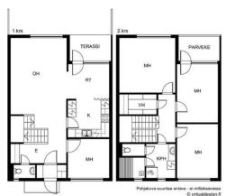  
GT

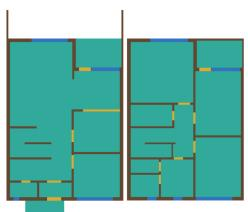

SALI-FP

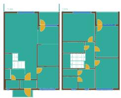  
Error pixels

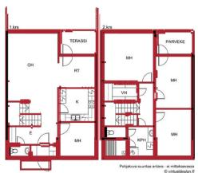

b) Test 0328: interior omission

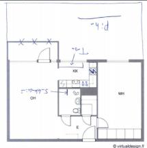

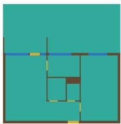

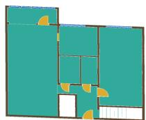

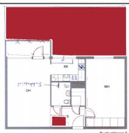

c) Test 0048: false addition

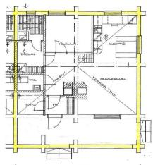

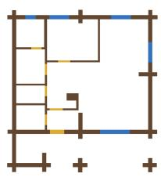

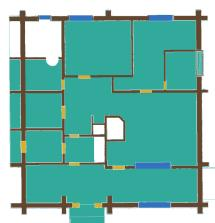

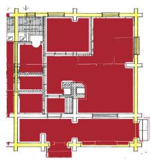

d) Test 0010: foreground confusion

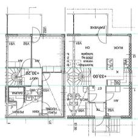

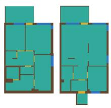

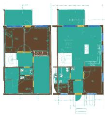

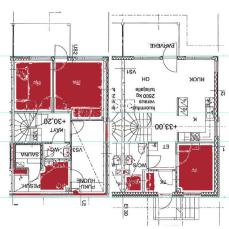

Fig. C.1: Systematic-error examples: source, GT, final SALI-FP, and selected error pixels. Each case maximizes one absolute error count. Test 0048 lacks Space references; its room-addition mask also reflects annotation scope (Table C.23).

Tables C.6-C.8 and Fig. C.2 separate export behavior, tolerance-dependent boundary agreement,   
and class overlap. Raw supervised outputs must not be replaced by their lower-scoring registered   
variants when judging SALI-FP. The original examples in Fig. C.1 and Appendix F are unchanged. Table C.6. Full ArchP10k local export audit; no additional model calls.

<table><tr><td>Quantity</td><td>Measured value</td></tr><tr><td>Exported plans</td><td>11534</td></tr><tr><td>Registration accepted</td><td>10981</td></tr><tr><td>Whole-plan geometry fallback</td><td>14</td></tr><tr><td>Objects receiving affine numerical repair</td><td>72</td></tr><tr><td>Plans with out-of-canvas coordinates</td><td>597</td></tr><tr><td>Mean / micro RCR, repaired geometry before registration</td><td>0.9290 / 0.9341</td></tr><tr><td>Mean / micro RCR, repaired geometry after registration</td><td>0.9284/0.9339</td></tr><tr><td>Local seconds per case, median [IQR]</td><td>0.908 [0.729, 1.173]</td></tr><tr><td>Additional API calls</td><td>0</td></tr></table>

Table C.7. Common-class boundary F1 across diagonal tolerances (400 plans).

<table><tr><td>Method / stage</td><td>0.25%</td><td>0.50%</td><td>1.00%</td></tr><tr><td>SALI-FP / raw</td><td>0.1174</td><td>0.2100</td><td>0.3271</td></tr><tr><td>SALI-FP / registered</td><td>0.3264</td><td>0.4962</td><td>0.6131</td></tr><tr><td>CubiCasa5K / raw</td><td>0.8300</td><td>0.8888</td><td>0.9127</td></tr><tr><td>CubiCasa5K / registered</td><td>0.7820</td><td>0.8821</td><td>0.9108</td></tr></table>

Table C.8. Pooled class overlap on the common four-class target.
<table><tr><td>Method / stage</td><td>Class</td><td>IoU</td><td>Dice</td></tr><tr><td>SALI-FP / raw</td><td>Boundary</td><td>0.1094</td><td>0.1972</td></tr><tr><td>SALI-FP / raw</td><td>Door/opening</td><td>0.0396</td><td>0.0762</td></tr><tr><td>SALI-FP / raw</td><td>Window</td><td>0.0520</td><td>0.0989</td></tr><tr><td>SALI-FP / raw</td><td>Room</td><td>0.6284</td><td>0.7718</td></tr><tr><td>SALI-FP / registered</td><td>Boundary</td><td>0.3180</td><td>0.4826</td></tr><tr><td>SALI-FP / registered</td><td>Door/opening</td><td>0.1454</td><td>0.2539</td></tr><tr><td>SALI-FP / registered</td><td>Window</td><td>0.2318</td><td>0.3763</td></tr><tr><td>SALI-FP / registered</td><td>Room</td><td>0.7433</td><td>0.8528</td></tr><tr><td>CubiCasa5K / raw</td><td>Boundary</td><td>0.7173</td><td>0.8354</td></tr><tr><td>CubiCasa5K / raw</td><td>Door/opening</td><td>0.6181</td><td>0.7640</td></tr><tr><td>CubiCasa5K / raw</td><td>Window</td><td>0.7199</td><td>0.8372</td></tr><tr><td>CubiCasa5K / raw</td><td>Room</td><td>0.9006</td><td>0.9477</td></tr><tr><td>CubiCasa5K / registered</td><td>Boundary</td><td>0.6697</td><td>0.8022</td></tr><tr><td>CubiCasa5K / registered</td><td>Door/opening</td><td>0.5720</td><td>0.7277</td></tr><tr><td>CubiCasa5K / registered</td><td>Window</td><td>0.6727</td><td>0.8043</td></tr><tr><td>CubiCasa5K / registered</td><td>Room</td><td>0.8917</td><td>0.9427</td></tr></table>

(a) Common-class mloU

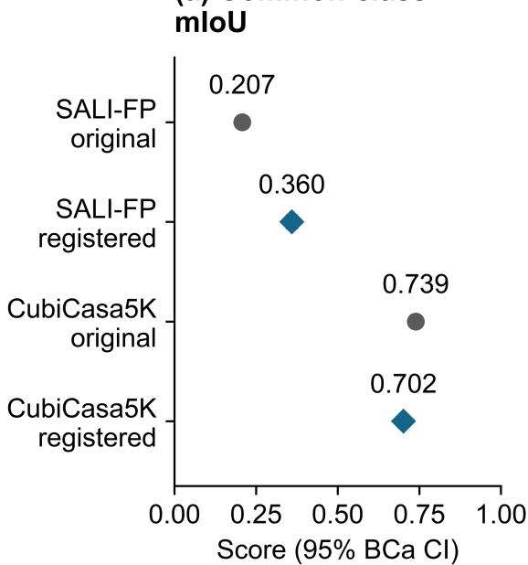  
(b) Boundary loU

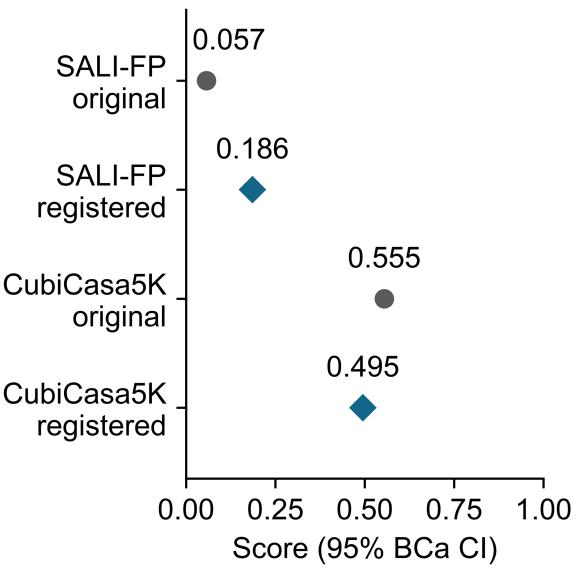

(c) Visible-wall loU  
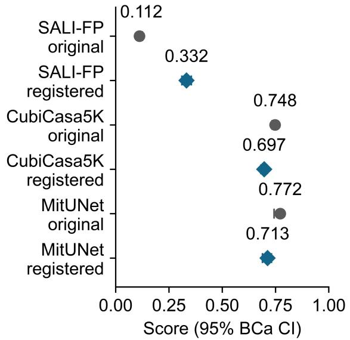

(d) Wall cIDice  
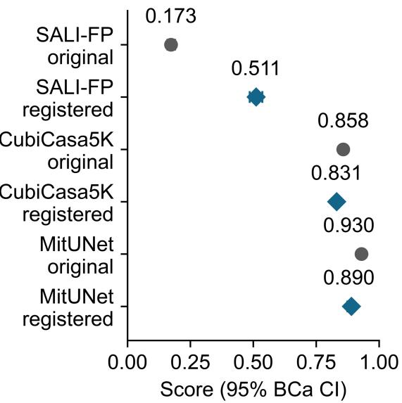  
Fig. C.2: All-method sensitivity to identical source-only registration. Gray circles denote original outputs; blue diamonds denote registered outputs. Unmodified supervised predictions remain the primary baseline. MiT-UNet is included only for visible-wall metrics.

Tables C.9 and C.10 retain the wall-only comparison and all primary paired cost ratios. Reconstruction fidelity refers to each predicted mask; GT wall IoU retains the visible-wall domain of the accuracy protocol. The common-four-class vertex medians [IQR] are 3,641.0 [2,454.0, 5,616.5] for SALI-FP and 5,785.0 [4,525.5, 6,914.5] for CubiCasa5K; storage medians [IQR] are 79.0 [53.0, 122.2] and 91.0 [70.2, 109.4] KiB. At 0.95/0.995 fidelity the corresponding vertex medians are 3,602/3,641 and 5,660/5,785. All 400 cases satisfy each threshold; every zero-tolerance replay is exact. Per-class constraints often retain a lossless candidate to protect thin elements. This evaluation measures raster-derived representation economy, not equivalence of the methods semantic correctness or native vector decoders.

Table C.9. Wall-target accuracy and prediction-referenced vector costs at 0.98 fidelity.
<table><tr><td>Method</td><td>GT wall IoU</td><td>Vertices [IQR]</td><td>KiB [IQR]</td><td>Achieved</td></tr><tr><td>SALI-FP</td><td>0.3325</td><td>644.0 [422.0, 967.0]</td><td>12.3 [7.7, 18.3]</td><td>400/400</td></tr><tr><td>CubiCasa5K</td><td>0.7482</td><td>2,912.0 [2,263.5, 3,574.5]</td><td>47.5 [37.5, 57.7]</td><td>400/400</td></tr><tr><td>MiT-UNet</td><td>0.7721</td><td>431.0 [309.5, 570.5]</td><td>6.5 [4.6, 8.8]</td><td>400/400</td></tr></table>

Table C.10. Matched median cost ratios: SALI-FP divided by each baseline.
<table><tr><td>Target</td><td>Baseline</td><td>Cost</td><td>Ratio [95% BCa CI]</td><td>Paired</td></tr><tr><td>common4</td><td>CubiCasa5K</td><td>vertices</td><td>0.639 [0.610, 0.678]</td><td>400/400</td></tr><tr><td>common4</td><td>CubiCasa5K</td><td>bytes</td><td>0.886 [0.824, 0.941]</td><td>400/400</td></tr><tr><td>wall</td><td>CubiCasa5K</td><td>vertices</td><td>0.217 [0.202, 0.232]</td><td>400/400</td></tr><tr><td>wall</td><td>CubiCasa5K</td><td>bytes</td><td>0.245 [0.233, 0.269]</td><td>400/400</td></tr><tr><td>wall</td><td>MiT-UNet</td><td>vertices</td><td>1.438 [1.353, 1.534]</td><td>400/400</td></tr><tr><td>wall</td><td>MiT-UNet</td><td>bytes</td><td>1.692 [1.599, 1.797]</td><td>400/400</td></tr></table>

Table C.11. Recorded paired stage changes; per-plan mean diferences.
<table><tr><td colspan="3"></td><td colspan="2">Change [95% BCa</td></tr><tr><td>Group</td><td>Transition</td><td>Metric</td><td>CI]</td><td>Plans</td></tr><tr><td>all</td><td>protected_repair minus initial</td><td>plan-mean miou</td><td>-0.0088 [-0.0131, -0.0045]</td><td>400</td></tr><tr><td>all</td><td>protected_repair minus initial</td><td>plan-mean biou</td><td>-0.0032 [-0.0060, -0.0005]</td><td>400</td></tr><tr><td>all</td><td>cleanup minus protected_repair</td><td>plan-mean miou</td><td>0.0055 [0.0032, 0.0078]</td><td>400</td></tr><tr><td>all</td><td>cleanup minus protected_repair</td><td>plan-mean biou</td><td>-0.0040 [-0.0055, -0.0025]</td><td>400</td></tr><tr><td>all</td><td>final minus cleanup</td><td>plan-mean miou</td><td>0.1699 [0.1579, 0.1821]</td><td>400</td></tr><tr><td>all</td><td>final minus cleanup</td><td>plan-mean biou</td><td>0.1288 [0.1195, 0.1383]</td><td>400</td></tr><tr><td>repair_triggered</td><td>protected_repair minus initial</td><td>plan-mean miou</td><td>-0.0134 [-0.0201, -0.0069]</td><td>263</td></tr><tr><td>repair_triggered</td><td>protected_repair minus initial</td><td>plan-mean biou</td><td>-0.0049 [-0.0092, -0.0007]</td><td>263</td></tr><tr><td>repair_triggered</td><td>cleanup minus protected_repair</td><td>plan-mean miou</td><td>0.0062 [0.0039, 0.0087]</td><td>263</td></tr><tr><td>repair_triggered</td><td>cleanup minus protected_repair</td><td>plan-mean biou</td><td>-0.0048 [-0.0065, -0.0032]</td><td>263</td></tr><tr><td>repair_triggered</td><td>final minus cleanup</td><td>plan-mean miou</td><td>0.1567 [0.1421, 0.1713]</td><td>263</td></tr></table>

SALI-FP
<table><tr><td></td><td></td><td></td><td>Change [95% BCa</td><td></td></tr><tr><td>Group</td><td>Transition</td><td>Metric</td><td>CI]</td><td>Plans</td></tr><tr><td>repair_triggered</td><td>final minus cleanup</td><td>plan-mean biou</td><td>0.1187 [0.1075, 0.1304]</td><td>263</td></tr></table>

Table C.12. Native geometry: F1 of mean precision and recall; overlap filter disabled.

<table><tr><td>Method</td><td>Metric</td><td>F1 [95% BCa CI]</td><td>Mean P / R</td><td>Mean plan F1</td></tr><tr><td>SALI-FP</td><td>Room</td><td>0.4450 [0.4221, 0.4683]</td><td>0.3647 / 0.5705</td><td>0.4271</td></tr><tr><td>SALI-FP</td><td>Corner</td><td>0.1590 [0.1494, 0.1690]</td><td>0.0973 / 0.4345</td><td>0.1559</td></tr><tr><td>SALI-FP</td><td>Angle</td><td>0.0932 [0.0863, 0.1002]</td><td>0.0573 / 0.2495</td><td>0.0916</td></tr><tr><td>CubiCasa5K / polygons</td><td>Room</td><td>0.6305 [0.6093, 0.6523]</td><td>0.6446 / 0.6170</td><td>0.6175</td></tr><tr><td>CubiCasa5K / polygons</td><td>Corner</td><td>0.3274 [0.3134, 0.3424]</td><td>0.2429 / 0.5020</td><td>0.3167</td></tr><tr><td>CubiCasa5K / polygons</td><td>Angle</td><td>0.2358 [0.2237, 0.2494]</td><td>0.1763 / 0.3563</td><td>0.2278</td></tr><tr><td>Raster2Seq</td><td>Room</td><td>0.7626 [0.7455, 0.7787]</td><td>0.7504 / 0.7752</td><td>0.7531</td></tr><tr><td>Raster2Seq</td><td>Corner</td><td>0.5458 [0.5297, 0.5610]</td><td>0.5000 / 0.6008</td><td>0.5373</td></tr><tr><td>Raster2Seq</td><td>Angle</td><td>0.3681 [0.3549, 0.3809]</td><td>0.3366 / 0.4062</td><td>0.3626</td></tr></table>

Table C.13. Fixed-tolerance GT accuracy and shared-decoder control-point costs.
<table><tr><td colspan="2"></td><td colspan="3">GT mIoU [95% BCa</td></tr><tr><td>Method</td><td>Tolerance (px)</td><td>CI]</td><td>Median vertices</td><td>Completed</td></tr><tr><td>sali_fp</td><td>0</td><td>0.3596 [0.3449, 0.3740]</td><td>3,869.0</td><td>400/400</td></tr><tr><td>sali_fp</td><td>0.25</td><td>0.3596 [0.3449, 0.3740]</td><td>3,869.0</td><td>400/400</td></tr><tr><td>sali_fp</td><td>0.5</td><td>0.3596 [0.3449, 0.3740]</td><td>3,641.0</td><td>400/400</td></tr><tr><td>sali_fp</td><td>1</td><td>0.3613 [0.3464, 0.3757]</td><td>1,916.5</td><td>400/400</td></tr><tr><td>sali_fp</td><td>2</td><td>0.3612 [0.3463, 0.3756]</td><td>1,734.0</td><td>400/400</td></tr><tr><td>sali_fp</td><td>4</td><td>0.3609 [0.3461, 0.3753]</td><td>1,675.0</td><td>400/400</td></tr><tr><td>sali_fp</td><td>8</td><td>0.3559 [0.3415, 0.3702]</td><td>1,618.5</td><td>400/400</td></tr><tr><td>cubicasa5k</td><td>0</td><td>0.7390 [0.7270, 0.7496]</td><td>6,268.0</td><td>400/400</td></tr><tr><td>cubicasa5k</td><td>0.25</td><td>0.7390 [0.7270, 0.7496]</td><td>6,268.0</td><td>400/400</td></tr><tr><td>cubicasa5k</td><td>0.5</td><td>0.7390 [0.7270, 0.7496]</td><td>5,785.0</td><td>400/400</td></tr><tr><td>cubicasa5k</td><td>1</td><td>0.7384 [0.7264, 0.7489]</td><td>1,725.0</td><td>400/400</td></tr><tr><td>cubicasa5k</td><td>2</td><td>0.7327 [0.7210, 0.7433]</td><td>1,172.5</td><td>400/400</td></tr></table>

SALI-FP
<table><tr><td colspan="2"></td><td colspan="3">GT mIoU [95% BCa</td></tr><tr><td>Method</td><td>Tolerance (px)</td><td>CI]</td><td>Median vertices</td><td>Completed</td></tr><tr><td>cubicasa5k</td><td>4</td><td>0.7105 [0.6990, 0.7206]</td><td>884.0</td><td>400/400</td></tr><tr><td>cubicasa5k</td><td>8</td><td>0.6674 [0.6564, 0.6773]</td><td>792.0</td><td>400/400</td></tr><tr><td>cubicasa_polygon</td><td>0</td><td>0.6612 [0.6429, 0.6773]</td><td>246.0</td><td>395/400</td></tr><tr><td>cubicasa_polygon</td><td>0.25</td><td>0.6612 [0.6429, 0.6773]</td><td>246.0</td><td>395/400</td></tr><tr><td>cubicasa_polygon</td><td>0.5</td><td>0.6612 [0.6429, 0.6773]</td><td>246.0</td><td>395/400</td></tr><tr><td>cubicasa_polygon</td><td>1</td><td>0.6612 [0.6429, 0.6773]</td><td>229.0</td><td>395/400</td></tr><tr><td>cubicasa_polygon</td><td>2</td><td>0.6611 [0.6428, 0.6772]</td><td>222.0</td><td>395/400</td></tr><tr><td>cubicasa_polygon</td><td>4</td><td>0.6607 [0.6424, 0.6768]</td><td>210.0</td><td>395/400</td></tr><tr><td>cubicasa_polygon</td><td>8</td><td>0.6440 [0.6262, 0.6598]</td><td>187.0</td><td>395/400</td></tr></table>

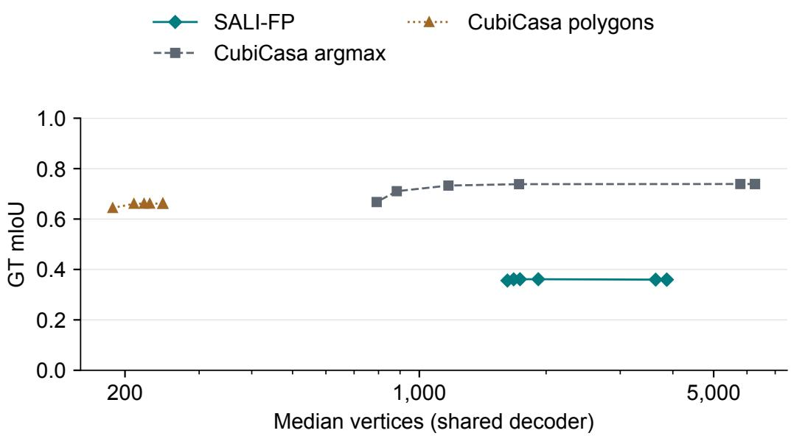  
Fig. C.3: GT accuracy versus shared-decoder control-point cost at the seven fixed simplification tolerances in Table C.13. Every setting is applied to all test plans; no per-plan selection uses GT. Markers denote the frozen tolerance settings.

Table C.14. Additional production, stage, and decision audit.
<table><tr><td>Observation</td><td>Result</td><td>Scope</td></tr><tr><td>Plans with extra HTTP attempts</td><td>1,591 /11,534</td><td>Per-case request counters</td></tr><tr><td>Additional HTTP attempts / maximum per plan</td><td>2,056 / 6</td><td>Not extra logical repairs</td></tr><tr><td>Repair-triggered / skipped public plans</td><td>263 / 137</td><td>Same 400 test plans</td></tr><tr><td>Already-target threshold 0.56</td><td>350 / 3760</td><td>One nonconstruction predicate only</td></tr><tr><td>Already-target threshold 0.7</td><td>200 / 3760</td><td>One nonconstruction predicate only</td></tr><tr><td>Already-target threshold 0.84</td><td>64 / 3760</td><td>One nonconstruction predicate only</td></tr><tr><td>Independent plan tasks / proposal tasks</td><td>200 / 400</td><td>No completed human scores</td></tr><tr><td>Accepted source-only affine transforms</td><td>356/400</td><td>Not GT displacement estimates</td></tr><tr><td>Absolute horizontal translation (px)</td><td>13.061 [3.095, 36.444]</td><td>Median [IQR], all 400 plans</td></tr><tr><td>Absolute vertical translation (px)</td><td>57.132[18.054, 106.558]</td><td>Median [IQR], all 400 plans</td></tr><tr><td>Minimum affine scale</td><td>0.934 [0.873, 0.976]</td><td>Median [IQR], all 400 plans</td></tr><tr><td>Maximum affine scale</td><td>0.984 [0.946, 1.000]</td><td>Median [IQR], all 400 plans</td></tr></table>

Native room scores in Table C.12 use 398 SVGs containing room references; cubicasa5k\_test\_0048 and cubicasa5k\_test\_0219 have no Space polygons. They remain in all pixel and inference records. Method failures retain the eligible reference denominator. Angle F1 follows the oficial angle criterion and is not an edge score. Shared raster-component contours are not substituted for native SALI-FP sparse room objects.

The fixed-tolerance curve reports each configuration on every plan, including failed polygon decodes as empty raster predictions. Vertex medians refer to completed representations; completed counts are shown rather than assigning failures zero storage. Gate replay changes one predicate on retained statistics and does not regenerate repair outputs or measure edit correctness.

Table C.15. Native room costs and common overlap-filter sensitivity.
<table><tr><td>Method</td><td>Completed</td><td>Cost n</td><td>Vertices [IQR]</td><td>KiB [IQR]</td><td>Filtered room F1</td></tr><tr><td>SALI-FP</td><td>400/400</td><td>398</td><td>294 [199, 431]</td><td>5.219 [3.596, 7.622]</td><td>0.4443</td></tr><tr><td>CubiCasa5K / polygons</td><td>395/400</td><td>393</td><td>132 [92, 188]</td><td>2.266 [1.619, 3.136]</td><td>0.6273</td></tr><tr><td>Raster2Seq</td><td>400/400</td><td>398</td><td>70 [52, 103.75]</td><td>1.457 [1.075, 2.086]</td><td>0.7018</td></tr></table>

Native costs retain exterior and hole vertices without a repeated closing point. Compact UTF-8 JSON uses common fields, room class, 1024-canvas coordinates, and two decimal places. Cost summaries exclude failed inference and absent room GT, with their counts explicit; accuracy keeps failed predictions as zero. All three methods use the same primary and sensitivity overlap switches.

SALI-FP  
Table C.16. Stages under one frozen final source-only transform.
<table><tr><td>Subset</td><td>n</td><td>Stage</td><td>Pooled mIoU [95% BCa CI]</td><td>BIoU</td></tr><tr><td>all</td><td>400</td><td>initial</td><td>0.2763 [0.2653, 0.2885]</td><td>0.1152</td></tr><tr><td>all</td><td>400</td><td>protected repair</td><td>0.3159 [0.3028, 0.3295]</td><td>0.1515</td></tr><tr><td>all</td><td>400</td><td>cleanup</td><td>0.3596 [0.3449, 0.3740]</td><td>0.1858</td></tr><tr><td>repair triggered</td><td>263</td><td>initial</td><td>0.2410 [0.2315, 0.2519]</td><td>0.0849</td></tr><tr><td>repair triggered</td><td>263</td><td>protected repair</td><td>0.2984 [0.2833, 0.3144]</td><td>0.1402</td></tr><tr><td>repair triggered</td><td>263</td><td>cleanup</td><td>0.3384 [0.3213, 0.3553]</td><td>0.1708</td></tr><tr><td>repair skipped</td><td>137</td><td>initial</td><td>0.3521 [0.3270, 0.3774]</td><td>0.1734</td></tr><tr><td>repair skipped</td><td>137</td><td>protected repair</td><td>0.3521 [0.3270, 0.3774]</td><td>0.1734</td></tr><tr><td>repair skipped</td><td>137</td><td>cleanup</td><td>0.4040 [0.3769, 0.4297]</td><td>0.2146</td></tr></table>

The repair-triggered fixed-frame mean per-plan mIoU change is 0.0702 [0.0574, 0.0842]. These plan-mean contrasts and pooled mIoU diferences use diferent aggregation; all per-metric paired intervals are retained in the evidence table. The original-coordinate contrasts remain in Table C.11. No stage-specific refitting or GT-derived selection is used.

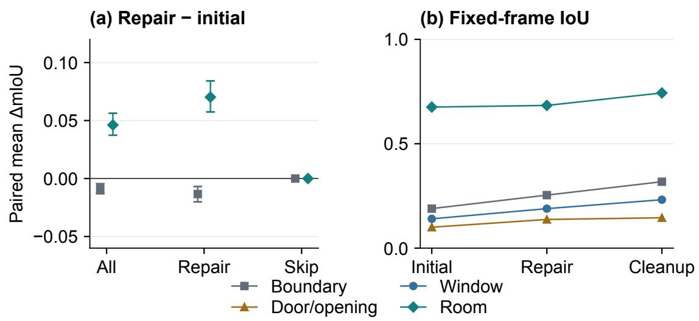  
Fig. C.4: Stage-detail audit: (a) paired plan-mean repair-minus-initial mIoU diferences with 95% BCa intervals; (b) class IoU under the frozen final transform. Repair-skipped images are identical before cleanup. Frame-conditioned results and group counts are in Table C.16.

SALI-FP  
Table C.17. Exclusive pixel errors; parentheses are percentages of all errors.
<table><tr><td>Method</td><td>Band</td><td>Errors</td><td>Boundary</td><td>Omitted</td><td>Added</td><td>Confused</td></tr><tr><td>SALI-FP</td><td>0.25%</td><td>56,350,103</td><td>19,719,198 (34.99%)</td><td>12,199,963 (21.65%)</td><td>17,045,832 (30.25%)</td><td>7,385,110 (13.11%)</td></tr><tr><td>SALI-FP</td><td>0.5%</td><td>56,350,103</td><td>25,050,419 (44.45%)</td><td>10,094,113 (17.91%)</td><td>16,115,423 (28.60%)</td><td>5,090,148 (9.03%)</td></tr><tr><td>SALI-FP</td><td>1%</td><td>56,350,103</td><td>31,796,315 (56.43%)</td><td>7,180,240 (12.74%)</td><td>14,375,243 (25.51%)</td><td>2,998,305 (5.32%)</td></tr><tr><td>CubiCasa5K / argmax</td><td>0.25%</td><td>20,259,975</td><td>7,341,614 (36.24%)</td><td>4,223,581 (20.85%)</td><td>7,850,721 (38.75%)</td><td>844,059 (4.17%)</td></tr><tr><td>CubiCasa5K / argmax</td><td>0.5%</td><td>20,259,975</td><td>8,266,735 (40.80%)</td><td>3,842,951 (18.97%)</td><td>7,608,690 (37.56%)</td><td>541,599 (2.67%)</td></tr><tr><td>CubiCasa5K / argmax</td><td>1%</td><td>20,259,975</td><td>9,604,690 (47.41%)</td><td>3,222,779 (15.91%)</td><td>7,140,895 (35.25%)</td><td>291,611 (1.44%)</td></tr><tr><td>CubiCasa5K / polygons</td><td>0.25%</td><td>28,911,667</td><td>10,312,167 (35.67%)</td><td>9,579,585 (33.13%)</td><td>7,206,143 (24.92%)</td><td>1,813,772 (6.27%)</td></tr><tr><td>CubiCasa5K / polygons</td><td>0.5%</td><td>28,911,667</td><td>12,545,367 (43.39%)</td><td>8,440,341 (29.19%)</td><td>6,912,552 (23.91%)</td><td>1,013,407 (3.51%)</td></tr><tr><td>CubiCasa5K / polygons</td><td>1%</td><td>28,911,667</td><td>15,533,958 (53.73%)</td><td>6,659,522 (23.03%)</td><td>6,370,200 (22.03%)</td><td>347,987 (1.20%)</td></tr></table>

Every method retains 419,430,400 pixels (400 square 1024-pixel canvases). The hierarchy assigns each wrong pixel first to the GT-boundary neighborhood, otherwise to foreground-tobackground omission, background-to-foreground addition, or foreground-class confusion. The band is the rounded diagonal fraction around both sides of adjacent GT-label changes. Five-class pooled and GT-row-normalized confusion matrices, per-class decomposition, and failed-case records accompany the table.

Table C.18. Exclusive geometric causes before and after delivery.
<table><tr><td>Geometric cause</td><td>Original objects</td><td>Delivered objects</td></tr><tr><td>empty</td><td>7765</td><td>7765</td></tr><tr><td>hole or ring structure</td><td>4</td><td>0</td></tr><tr><td>malformed</td><td>6</td><td>6</td></tr><tr><td>other invalid</td><td>90</td><td>11</td></tr><tr><td>self intersection</td><td>101478</td><td>22935</td></tr><tr><td>valid</td><td>673880</td><td>752510</td></tr><tr><td>zero area or collapsed</td><td>76</td><td>72</td></tr></table>

Classification prioritizes malformed, empty, nonfinite, zero-area/collapsed, valid, selfintersection, hole/ring-structure, too-few-point, and other-invalid conditions. The raw GEOS reason remains attached to each object. Repair dispositions in Table B.1 are independent processing outcomes; neither is inferred from the other. Residual IDs are excluded from automatic solid construction pending review.

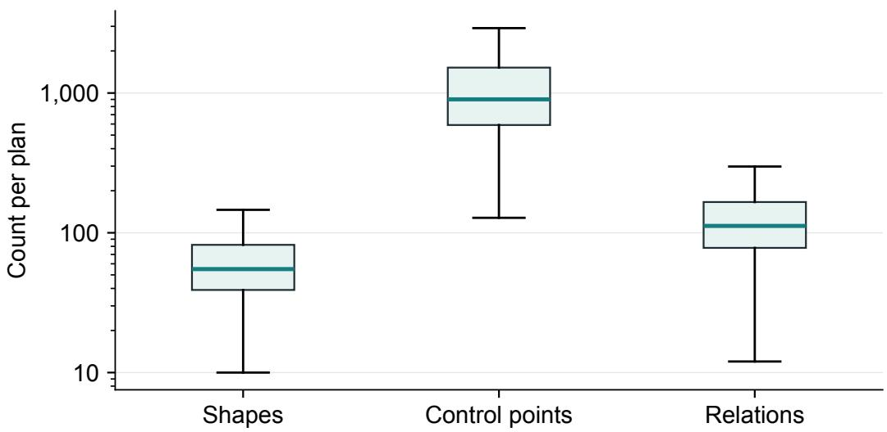  
Fig. C.5: ArchP10k representation sizes per plan. Boxes span the interquartile range, center lines mark medians, and whiskers extend to the furthest observations within 1.5 IQR. Outliers are omitted only from this display; all plans remain in the statistics. The count axis is logarithmic; related export statistics are in Table C.6.

SALI-FP  
Table C.19. Retained local baseline timers; seconds per attempted plan.
<table><tr><td>Local method</td><td>n</td><td>Median (s)</td><td>IQR (s)</td></tr><tr><td>CubiCasa5K / argmax</td><td>400</td><td>0.380</td><td>0.368–0.388</td></tr><tr><td>CubiCasa5K / polygons</td><td>400</td><td>6.804</td><td>6.589–7.301</td></tr><tr><td>MiT-UNet</td><td>400</td><td>0.050</td><td>0.049–0.052</td></tr><tr><td>Raster2Seq</td><td>400</td><td>1.153</td><td>0.866-1.728</td></tr></table>

Timers exclude model loading and include each retained per-case inference/export routine; polygon timers additionally include oficial postprocessing. Apple Silicon local CPU/MPS execution is distinct from the unobservable remote image/audit accelerator. These entries are not end-toend deployment benchmarks. No baseline monetary bill or unmeasured SALI-FP stage is imputed; remote-stage records and reference-price estimates remain in Table C.3.

Table C.20. Delivered geometric causes by semantic class.
<table><tr><td>Class</td><td>Objects</td><td>Self-cross</td><td>Empty</td><td>Other invalid</td><td>Invalid share</td></tr><tr><td>balcony</td><td>15,524</td><td>296</td><td>160</td><td>1</td><td>2.94%</td></tr><tr><td>bathroom</td><td>32,109</td><td>261</td><td>11</td><td>0</td><td>0.85%</td></tr><tr><td>bedroom</td><td>49,056</td><td>2,839</td><td>1,582</td><td>12</td><td>9.04%</td></tr><tr><td>corridor</td><td>22,345</td><td>2,044</td><td>779</td><td>8</td><td>12.67%</td></tr><tr><td>door</td><td>160,745</td><td>216</td><td>148</td><td>1</td><td>0.23%</td></tr><tr><td>elevator</td><td>10,389</td><td>104</td><td>63</td><td>0</td><td>1.61%</td></tr><tr><td>entrance</td><td>5,528</td><td>83</td><td>10</td><td>0</td><td>1.68%</td></tr><tr><td>kitchen</td><td>15,098</td><td>130</td><td>100</td><td>0</td><td>1.52%</td></tr><tr><td>living room</td><td>18,960</td><td>306</td><td>31</td><td>1</td><td>1.78%</td></tr><tr><td>room default</td><td>87,979</td><td>8,385</td><td>1,659</td><td>23</td><td>11.44%</td></tr><tr><td>stair</td><td>34,671</td><td>707</td><td>167</td><td>3</td><td>2.53%</td></tr><tr><td>storage</td><td>7,053</td><td>264</td><td>30</td><td>5</td><td>4.24%</td></tr><tr><td>study</td><td>4,565</td><td>1,011</td><td>138</td><td>11</td><td>25.41%</td></tr><tr><td>wall</td><td>177,097</td><td>3,059</td><td>577</td><td>7</td><td>2.06%</td></tr><tr><td>window</td><td>142,180</td><td>3,230</td><td>2,310</td><td>17</td><td>3.91%</td></tr></table>

Table C.21. Building categories with the most residual invalid objects; remainder pooled.
<table><tr><td>Source category</td><td>Objects</td><td>Self-cross</td><td>Empty</td><td>Other invalid</td><td>Invalid share</td></tr><tr><td>residential other</td><td>440,079</td><td>13,684</td><td>4,867</td><td>47</td><td>4.23%</td></tr><tr><td>office</td><td>51,837</td><td>1,417</td><td>446</td><td>7</td><td>3.61%</td></tr><tr><td>interior general</td><td>38,446</td><td>1,218</td><td>429</td><td>7</td><td>4.30%</td></tr><tr><td>hotel</td><td>38,203</td><td>1,317</td><td>308</td><td>7</td><td>4.27%</td></tr><tr><td>education</td><td>52,371</td><td>1,200</td><td>317</td><td>5</td><td>2.91%</td></tr><tr><td>cultural other</td><td>45,099</td><td>966</td><td>387</td><td>6</td><td>3.01%</td></tr><tr><td>mixed use</td><td>25,715</td><td>724</td><td>220</td><td>3</td><td>3.68%</td></tr><tr><td>restaurant bar</td><td>14,085</td><td>450</td><td>131</td><td>1</td><td>4.13%</td></tr><tr><td>all remaining categories</td><td>77,464</td><td>1,959</td><td>660</td><td>6</td><td>3.39%</td></tr></table>

Tables C.20–C.21 retain every object. Other-invalid counts combine zero-area, nonfinite, malformed, hole/ring and other GEOS causes. The pooled remainder is not excluded; the full buildingcategory cross-tabulation remains in the evidence files.

SALI-FP  
Table C.22. Door/window error locations; percentages of the respective GT-class pixels.
<table><tr><td>Method</td><td>GT class</td><td>GT pixels</td><td>Boundary error</td><td>Interior omitted</td><td>Interior confused</td></tr><tr><td>SALI-FP</td><td>Door/opening</td><td>2,162,846</td><td>65.99%</td><td>1.38%</td><td>4.23%</td></tr><tr><td>SALI-FP</td><td>Window</td><td>4,708,442</td><td>55.19%</td><td>4.48%</td><td>7.66%</td></tr><tr><td>CubiCasa5K / argmax</td><td>Door/opening</td><td>2,162,846</td><td>29.63%</td><td>0.08%</td><td>1.68%</td></tr><tr><td>CubiCasa5K / argmax</td><td>Window</td><td>4,708,442</td><td>18.84%</td><td>0.17%</td><td>1.37%</td></tr><tr><td>CubiCasa5K / polygons</td><td>Door/opening</td><td>2,162,846</td><td>30.62%</td><td>0.70%</td><td>2.44%</td></tr><tr><td>CubiCasa5K / polygons</td><td>Window</td><td>4,708,442</td><td>25.18%</td><td>2.70%</td><td>4.10%</td></tr></table>

Correct pixels occupy the remaining GT support. Background-to-foreground additions are tabulated in Table C.17, not assigned to an invented door/window GT instance. Spatial error categories do not identify a unique generative cause.

Table C.23. Reference-scope sensitivity; the primary evaluation retains all 400 plans.
<table><tr><td>Scope</td><td>Plans</td><td>Method</td><td>mIoU</td><td>Added pixels</td></tr><tr><td>complete test</td><td>400</td><td>SALI-FP</td><td>0.3596</td><td>16,115,423</td></tr><tr><td>complete test</td><td>400</td><td>CubiCasa5K / argmax</td><td>0.7390</td><td>7,608,690</td></tr><tr><td>complete test</td><td>400</td><td>CubiCasa5K / polygons</td><td>0.6612</td><td>6,912,552</td></tr><tr><td>nonempty room reference</td><td>398</td><td>SALI-FP</td><td>0.3603</td><td>15,362,301</td></tr><tr><td>nonempty room reference</td><td>398</td><td>CubiCasa5K / argmax</td><td>0.7409</td><td>6,804,133</td></tr><tr><td>nonempty room reference</td><td>398</td><td>CubiCasa5K / polygons</td><td>0.6628</td><td>6,081,348</td></tr></table>

Test 0048 and Test 0219 have no SVG Space references. The apparent room additions in Test 0048 therefore expose annotation scope as well as prediction disagreement; they are not verified hallucinations. Table C.23 separately pools the 398 nonempty-room references without changing the oficial 400-case primary denominator.

Table C.24. Public-test benchmark calibration and native room geometry.
<table><tr><td>Method</td><td>Four-class mIoU [95% BCa CI]</td><td>Room F1</td><td>Corner F1</td><td>Angle F1</td></tr><tr><td>SALI-FP</td><td>0.3596 [0.3449,</td><td>0.445</td><td>0.159</td><td>0.093</td></tr><tr><td>CubiCasa5K /</td><td>0.3740] 0.7390 [0.7270,</td><td>N/A</td><td>N/A</td><td>N/A</td></tr><tr><td>argmax CubiCasa5K /</td><td>0.7496] 0.6612 [0.6422,</td><td>0.630</td><td>0.327</td><td>0.236</td></tr><tr><td>polygons Raster2Seq</td><td>0.6766] N/A</td><td>0.763</td><td>0.546</td><td>0.368</td></tr></table>

Pixel calibration uses all 400 test plans; native room geometry uses the 398 plans with SVG room references. Native polygon methods and raster argmax are distinguished explicitly. Raster2Seq has no directly comparable four-class mask in this evaluation, and MiT-UNet remains in the wallonly calibration (Table C.9). These values establish strict annotation-aligned calibration; they do not substitute for the structured-output and matched visual evidence reported in the main text and Appendix F.

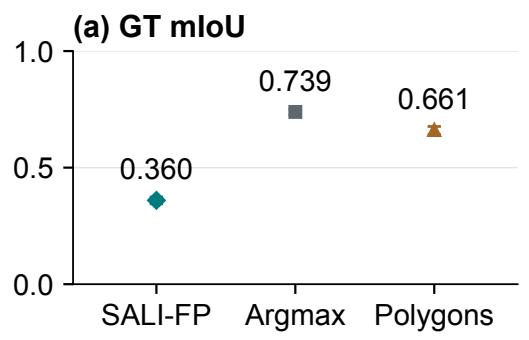

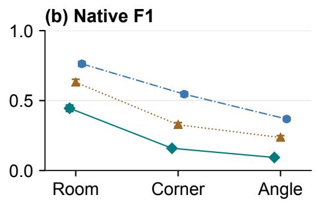

<table><tr><td>Native medians</td><td>SALI-FP</td><td>CubiCasa polygons</td><td>Raster2Seq</td></tr><tr><td>Vertices</td><td>294</td><td>132</td><td>70</td></tr><tr><td>KiB</td><td>5.22</td><td>2.27</td><td>1.46</td></tr></table>

Fig. C.6: CubiCasa5K benchmark calibration: (a) GT mIoU; (b) native room, corner, and angle F1 with 95% BCa intervals. The lower band reports native room medians; IQRs are in Table C.15. Fixed-tolerance curves are in Fig. C.3.

SALI-FP  
Table C.25. Recorded SALI-FP stages on the same 400 public test plans.
<table><tr><td>Stage</td><td>mIoU [95% BCa CI]</td><td>BIoU</td><td>Boundary F1</td></tr><tr><td>Initial  $S _ { 0 }$ </td><td>0.2099 [0.2024, 0.2193]</td><td>0.0642</td><td>0.2358</td></tr><tr><td>Protected  $S _ { 1 }$ </td><td>0.2015 [0.1942, 0.2101]</td><td>0.0610</td><td>0.2260</td></tr><tr><td>Cleanup labels</td><td>0.2074 [0.2000, 0.2162]</td><td>0.0570</td><td>0.2100</td></tr><tr><td>Final representation</td><td>0.3596 [0.3449, 0.3740]</td><td>0.1858</td><td>0.4962</td></tr></table>

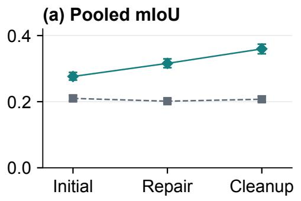

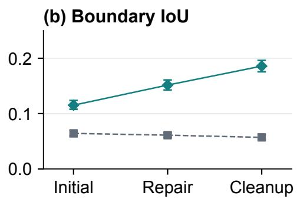

Paired plan-mean ΔmIoU: repair − initial
<table><tr><td></td><td>All (400)</td><td>Repair (263)</td><td>Skip (137)</td></tr><tr><td>Original frame</td><td>-0.0088</td><td>-0.0134</td><td>0.0000</td></tr><tr><td>Frozen final frame</td><td>+0.0461</td><td>+0.0702</td><td>0.0000</td></tr></table>

Fig. C.7: Recorded stages in original and frozen final coordinates: pooled mIoU and boundary IoU with 95% BCa intervals. The band reports plan-mean repair-minus-initial diferences; complete paired intervals and class trajectories are in Fig. C.4.

(a) SALI-FP  
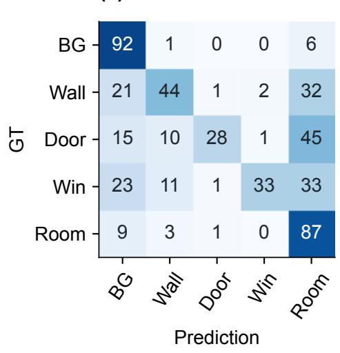

(b) CubiCasa argmax  
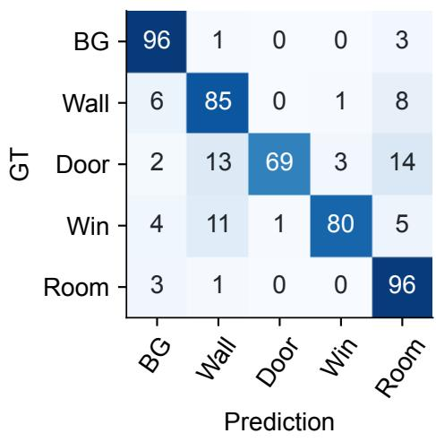

(c) CubiCasa polygons  
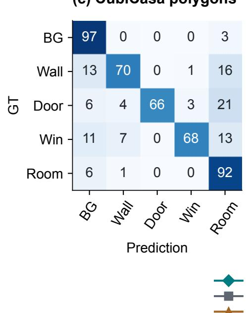

(d) Error partition  
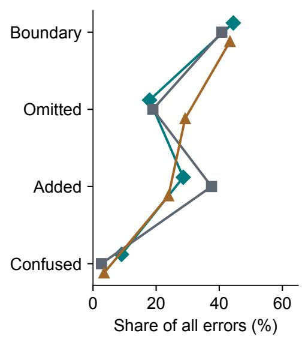  
Fig. C.8: Systematic pixel-error diagnostics: SALI-FP, CubiCasa5K argmax, and CubiCasa5K polygons, with GT-row-normalized confusion and the disjoint 0.5%-diagonal error decomposition.

## D Complexity definition

The frozen complexity score averages five standardized image factors: ink fraction, edge density, log connected-component count, orientation entropy, and non-orthogonal edge fraction. Eq. (D.1) describes this operational score. Standardization and hard-subset selection use the frozen registry, not SALI-FP errors or baseline outputs. The test hard subset contains its 400 highest-ranked plans. Complexity is a visual proxy, not an annotation of architectural dificulty. No PCA or factor-ablation sensitivity result is reported.

$$
C _ { i } = \frac { 1 } { 5 } \sum _ { k = 1 } ^ { 5 } \frac { x _ { i k } - \mu _ { k } } { \sigma _ { k } } .\tag{D.1}
$$

Table D.1. Project-cluster Spearman associations; 10,000 BCa resamples.
<table><tr><td>Factor</td><td>Representation</td><td>rho [95% CI]</td><td>Holm p</td></tr><tr><td>ink ratio</td><td>auxiliary rcr</td><td>0.072 [0.050, 0.094]</td><td>0.0012</td></tr><tr><td>ink ratio</td><td>delivered rcr</td><td>0.030 [0.009, 0.051]</td><td>0.0141</td></tr><tr><td>edge density</td><td>auxiliary rcr</td><td>-0.093 [-0.114, -0.071]</td><td>0.0012</td></tr><tr><td>edge density</td><td>delivered rcr</td><td>-0.101 [-0.120, -0.080]</td><td>0.0012</td></tr><tr><td>component count</td><td>auxiliary rcr</td><td>0.004 [-0.018, 0.027]</td><td>1.0000</td></tr><tr><td>component count</td><td>delivered rcr</td><td>0.002 [-0.019, 0.023]</td><td>1.0000</td></tr><tr><td>orientation entropy</td><td>auxiliary rcr</td><td>-0.243 [-0.263, -0.223]</td><td>0.0012</td></tr><tr><td>orientation entropy</td><td>delivered rcr</td><td>-0.186 [-0.205, -0.166]</td><td>0.0012</td></tr><tr><td>nonorthogonal ratio</td><td>auxiliary rcr</td><td>-0.234 [-0.254, -0.212]</td><td>0.0012</td></tr><tr><td>nonorthogonal ratio</td><td>delivered rcr</td><td>-0.178 [-0.198, -0.158]</td><td>0.0012</td></tr><tr><td>complexity score</td><td>auxiliary rcr</td><td>-0.169 [-0.189, -0.147]</td><td>0.0012</td></tr><tr><td>complexity score</td><td>delivered rcr</td><td>-0.142 [-0.162, -0.122]</td><td>0.0012</td></tr></table>

Table D.2. Hard (400) minus non-hard test (752), clustered by 730 projects.
<table><tr><td>Outcome</td><td>Hard mean</td><td>Non-hard mean</td><td>Difference [95% CI]</td><td>Holm p</td></tr><tr><td>auxiliary rcr</td><td>0.9507</td><td>0.9582</td><td>-0.0075 [-0.0102, -0.0047]</td><td>0.0003</td></tr><tr><td>delivered rcr</td><td>0.9133</td><td>0.9324</td><td>-0.0191 [-0.0269, -0.0120]</td><td>0.0003</td></tr><tr><td>protected</td><td>0.2275</td><td>0.1729</td><td>0.0546 [0.0043, 0.1099]</td><td>0.0436</td></tr></table>

Factor intervals resample 7379 projects with replacement and use leave-one-project-out BCa acceleration. Weighted midranks reproduce duplicated observations. Two-sided centered bootstrap tests use a plus-one correction and Holm adjustment over twelve factor-by-representation tests; hard contrasts form a separate three-test family. Component count has the same ranks as its log transform. These associations do not validate complexity against human dificulty judgments.

## E Availability and reproducibility inventory

SALI-FP  
Table E.1. Oficial resource status rechecked on 2026-09-07.
<table><tr><td>Resource</td><td>Located material</td><td>Use in this study</td></tr><tr><td>CubiCasa5K [2]</td><td>Official images, SVG labels, code, trained checkpoint</td><td>400 GT reruns; full-channel polygon rerun; 30 retained illustrations</td></tr><tr><td>MiT-UNet [25]</td><td>Official code, trained weights, regional-data link</td><td>400 visible-wall tests; 30 illustrations</td></tr><tr><td>Raster2Seq [27]</td><td>Official code and checkpoint</td><td>400 CPU native-polygon inferences; room evaluation on 398 reference cases</td></tr><tr><td>FloorPlanFormer [28]</td><td>Training code; validation/test links</td><td>No official inference checkpoint located</td></tr><tr><td>R2V / R3D [3, 5]</td><td>Code and test lists; incomplete authorized original inputs</td><td>No SALI-FP benchmark values</td></tr><tr><td>MLStructFP [9]</td><td>Official dataset documentation and request process</td><td>Not downloaded as an unrestricted mirror</td></tr></table>

The evidence inventory identifies code commits, checkpoint SHA-256 values, input hashes, mapping rules, dependency versions, and per-case predictions for the reruns. A weight file used for human-pose initialization is not interchangeable with the trained CubiCasa5K floor-plan checkpoint. Runtime adapters preserve architecture and weights; their fixed-canvas and device diferences are disclosed rather than described as exact replication of published timing.

Table E.2. Unfinished validation and acceptance criteria.
<table><tr><td>Item</td><td>Prepared material</td><td>Required completion</td></tr><tr><td>ArchP10k accuracy</td><td>200 category/complexity-stratified plans; two blank annotation templates</td><td>Independent annotations, adjudication, frozen GT metrics</td></tr><tr><td>Gate correctness</td><td>200 accepted and 200 rejected proposals, blinded</td><td>Independent correctness scores; weighted estimates and agreement</td></tr><tr><td>Causal stage ablation</td><td>Recorded-stage paired evaluation</td><td>Controlled reruns holding models, prompts, and inputs fixed</td></tr><tr><td>Pretraining-exposure diagnostics</td><td>Exposure is not auditable from deployment aliases</td><td>Frozen near-duplicate and memorization probes with control images; no</td></tr><tr><td>Open-weight substitution</td><td>Interface and label protocol</td><td>absence-of-contamination claim Frozen image/VL weights; matched-subset inference and GT</td></tr><tr><td>Independent repeatability</td><td>Case and prompt identifiers</td><td>evaluation Multiple uncached model runs; variance and output-identity audit</td></tr><tr><td>Rhino operator study</td><td>Interface examples</td><td>Source-linked scale/height, randomized paired operators, timing logs</td></tr><tr><td>Public release</td><td>Private source and rights registry</td><td>Permission and privacy audit; approved license and release archive</td></tr><tr><td>Author disclosures</td><td>Names, order, equal contribution, affiliation, and corresponding contact confirmed</td><td>CRediT, funding, conflicts, and final author approval remain to be confirmed</td></tr></table>

The 200-plan sample uses proportional category-by-complexity allocation with seed 20260907 and prioritizes unique projects. Predictive quality does not enter selection. Images and two empty label templates are supplied independently from predictions. The 400-proposal package hides acceptance labels; private answer keys retain the population weighting. Human annotation, adjudication, and proposal correctness remain incomplete (Table E.2).

## F Selected complex-plan illustrations

We examine 30 purpose-selected complex plans with successful SALI-FP outputs and high internal RCR. This subset supports detailed visual comparison rather than a representative estimate of accuracy. CubiCasa5K and MiT-UNet use the oficial checkpoints described in Section 4.2. Each page compares the source with the three methods on a common canvas. SALI-FP is shown at the semantic-output stage, without subsequent registration or geometry repair.

The common display distinguishes structural boundaries, doors/openings, windows and spaces. MiT-UNet predicts walls only; its blank non-wall areas are not room or opening errors. The two detail regions, R1 and R2, use identical coordinates and magnification across all methods. They are selected to explain visible diferences, not to estimate overall accuracy. Case-specific observations describe source-visible structure, advantages and residual errors; prediction-derived reference masks and omission counts are not used.

The compact output record reports internal RCR, shape and control-point counts, and the number of invalid polygons in the original sparse representation, before geometry repair. These are SALI-FP output properties rather than cross-method accuracy scores. Corresponding inverse-rendering and internal-disagreement images are included in the reproducibility materials.

## F<sub>.</sub> 1 Obl i<sub>q</sub> ue room covera<sub>g</sub>e and i nternal <sub>p</sub>artitions

## (a) Sou rce plan

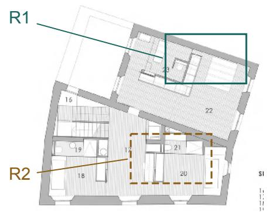

## (c) M i t U N et : wa l l s o n ly


(b) Cu biCasa5K  


(d) SALI-FP  


Cu biCasa5K  
  
Door / o<sub>p</sub>en i n<sub>g</sub>

M itU Net  


  
Fi<sub>g.</sub> F<sub>.</sub> 1<sub>. a</sub>r<sub>c</sub>h<sub>p</sub> 1 0k 00063 3 <sub>:</sub> <sub>o</sub>bli<sub>que</sub> r<sub>oo</sub>m <sub>cove</sub>r<sub>age</sub> <sub>a</sub>nd int<sub>e</sub>rn<sub>a</sub>l <sub>pa</sub>rtiti<sub>o</sub>n<sub>s</sub> .

## Overal l com <sub>p</sub>arison

SAL I - F P reta i ns the obl i<sub>q</sub> u e u <sub>p p</sub>e r room a nd the lower room <sub>g</sub> rou <sub>p</sub> as a cohere nt la<sub>y</sub>out<sub>.</sub> Cu bi Casa5 K leaves most of the u <sub>pp</sub>er room u nfi l l ed a nd th i cke ns seve ra l i nte rior bou nd a ries <sub>;</sub> M itU N et reta i ns <sub>p</sub>arts of the envelo<sub>p</sub>e but loses <sub>p</sub>a rtition conti n u it<sub>y.</sub> SAL I - F P sti l l om its th e sma l l u <sub>pp</sub>er-room enclosu re and leaves a th i n exterior trace <sub>.</sub>

## Re<sub>g</sub> ion R1

I n the l a r<sub>g</sub>e u <sub>p p</sub>e r-ri<sub>g</sub> ht room SAL I - F P <sub>p</sub>rovid es conti n uous s<sub>p</sub>atial covera<sub>g</sub>e and d isti nct facade se<sub>g</sub> ments <sub>.</sub> Cu bi Casa5 K i nstead <sub>p</sub>rod uces a l a r<sub>g</sub>e l<sub>y</sub> b l a n k i nte rior with ra<sub>gg</sub>ed bou nd a r<sub>y</sub> fra<sub>g</sub> ments <sub>.</sub> The advanta<sub>g</sub>e is room-scale cove ra<sub>g</sub>e not recove r<sub>y</sub> of eve r<sub>y</sub> fixtu re or i nte rn a l e n closu re <sub>.</sub>

## Re<sub>g</sub> ion R2

At the j u n ction of the lowe r-rig ht room a nd the central <sub>p</sub>assa<sub>g</sub>e SAL I - F P retai ns a con nected d ivider and an o<sub>p</sub>en i n<sub>g</sub> label <sub>.</sub> Cu bi Casa5 K mer<sub>g</sub>es m u ch of th is smal l-room arra n<sub>g</sub>ement wh i le M itU N et leaves d iscon nected wal l ends a rou nd th e sa me j u n ction <sub>.</sub>

SALI-FP out<sub>p</sub>ut record
<table><tr><td>Internal RCR</td><td>0.9747</td></tr><tr><td>Shapes / control points</td><td>41/ 927</td></tr><tr><td>Invalid sparse polygons</td><td>2</td></tr></table>

## F<sub>.</sub>2 Facade o<sub>p</sub>en i n<sub>g</sub>s arou nd a cou rt<sub>y</sub>ard <sub>p</sub>lan

(a) Sou rce plan  


(c) M i t U N et : wa l l s o n ly  


(b) Cu biCasa5K  
(d) SALI-FP  


  
Fi<sub>g.</sub> F<sub>.</sub>2<sub>. arc</sub>h<sub>p</sub> 1 0k 000690 <sub>:</sub> f<sub>aca</sub>d<sub>e</sub> <sub>open</sub>i<sub>ngs</sub> <sub>aroun</sub>d <sub>a</sub> <sub>cour</sub>t<sub>yar</sub>d <sub>p</sub>l<sub>an</sub>.

## Overal l com <sub>p</sub>arison

The two end blocks are more clean l<sub>y</sub> bou nded i n SAL I - F P than i n Cu bi Casa5 K whose <sub>p</sub>eri meter conta i ns th ickened a nd scattered fra<sub>g</sub> ments <sub>.</sub> M itU Net <sub>p</sub>reserves several heav<sub>y</sub> wal l se<sub>g</sub> ments but i n com <sub>p</sub>letel<sub>y</sub> con nects the blocks <sub>.</sub> The central cou rtyard remai ns a major q ual ification : SAL I - F P fi l ls m u ch of th is o<sub>p</sub>e n re<sub>g</sub> ion a nd ca n not be j u dged bette r th e re <sub>.</sub>

## Re<sub>g</sub> ion R1

Alon<sub>g</sub> the recessed u <sub>pp</sub>er facade SAL I - F P d isti n<sub>g</sub> u ishes narrow wi ndow se<sub>g</sub> ments between sol id projections <sub>.</sub> Cu bi Casa5 K bl u rs these recesses i nto th icker bou nd ar<sub>y</sub> <sub>p</sub>atches <sub>.</sub> M itU N et records the sol id projections but leaves the i nte rve n i n<sub>g</sub> facad e con n ections i n com <sub>p</sub>l ete i n its wa l l-on l<sub>y</sub> out<sub>p</sub>ut<sub>.</sub>

## Re<sub>g</sub> ion R2

The lower service block has a shar<sub>p</sub>er <sub>p</sub>artition and a more d isti nct o<sub>p</sub>en i n<sub>g</sub> se<sub>g</sub> ment i n SAL I - F P<sub>.</sub> Cu bi Casa5 K <sub>p</sub>rod uces a broad nois<sub>y</sub> base and less d isti n ct con nections to the sid e <sub>p</sub>assa<sub>g</sub>e <sub>.</sub> The shared view also ex<sub>p</sub>oses resid ual al i<sub>g</sub> n ment d ifferences near the lower facade <sub>.</sub>

## SALI-FP out<sub>p</sub>ut record

<table><tr><td>Internal RCR</td><td>0.9722</td></tr><tr><td>Shapes / control points</td><td>47 / 712</td></tr><tr><td>Invalid sparse polygons</td><td>7</td></tr></table>

## F<sub>.</sub>3 Com <sub>p</sub>act room <sub>g</sub> rou <sub>p</sub>s with res id ual <sub>g</sub>eometric d rift

(a) Sou rce plan  
  
(c) M i t U N et : wa l l s o n ly

(b) Cu biCasa5K  


(d) SALI-FP  


Cu biCasa5K  


  
Fi<sub>g.</sub> F<sub>.</sub>3<sub>. a</sub>r<sub>c</sub>h<sub>p</sub> 1 0k 00055 3 <sub>:</sub> <sub>co</sub>m<sub>pac</sub>t r<sub>oo</sub>m <sub>g</sub>r<sub>oups</sub> <sub>w</sub>ith r<sub>es</sub>id<sub>ua</sub>l <sub>geo</sub>m<sub>e</sub>tri<sub>c</sub> drift.

## Overal l com <sub>p</sub>arison

SAL I - F P <sub>p</sub>rod uces cleaner room re<sub>g</sub> ions than Cu bi Casa5 K and retai ns more con nected lower <sub>p</sub>a rtitions tha n M itU N et<sub>.</sub> H oweve r its foot<sub>p</sub> ri nt is vertical l<sub>y</sub> ex<sub>p</sub>anded relative to the sou rce so th is case su <sub>pp</sub>orts a re<sub>p</sub>resentational advanta<sub>g</sub>e rathe r tha n bette r re<sub>g</sub> istration <sub>.</sub> The l a r<sub>g</sub>e m id d l e co u rt<sub>y</sub>a rd i s fi l l ed i n both se m a nti c o ut<sub>p</sub> uts <sub>,</sub> l i m iti n <sub>g</sub> con cl usions a bout fu n ction a l i nte r<sub>p</sub> retation <sub>.</sub>

## Re<sub>g</sub> ion R1

Arou nd the lowe r sta i r a nd ci rcu l ation core SAL I - F P retai ns a com <sub>p</sub>act con nected <sub>p</sub>artition arran<sub>g</sub>ement<sub>.</sub> Cu bi Casa5 K fi l ls or mer<sub>g</sub>es smal l i nternal areas and M itU N et leaves several wal l ends d etached <sub>.</sub> Thei r relative <sub>p</sub>ositions d iffer wh ich remai ns visi ble because no method-s<sub>p</sub>ecific a l i<sub>g</sub> n me nt is a <sub>p p</sub>l ied <sub>.</sub>

## Re<sub>g</sub> ion R2

At the lower facade SAL I - F P shows d isti nct bou ndar<sub>y</sub> and o<sub>p</sub>en i n<sub>g</sub> se<sub>g</sub> ments i nstead of the exterior s<sub>p</sub>eckles visi ble i n Cu bi Casa5 K<sub>.</sub> The room outl i n es re ma i n si m <sub>p</sub>l ified a nd th e i r d is<sub>p</sub>lacement from the ori<sub>g</sub> i nal bottom rooms <sub>p</sub>reve nts i nter<sub>p</sub>reti n<sub>g</sub> th is cl ea ner a <sub>pp</sub>ea ra n ce as a <sub>p</sub>ositional accu rac<sub>y</sub> <sub>g</sub>a i n <sub>.</sub>

## SALI-FP out<sub>p</sub>ut record

<table><tr><td>Internal RCR</td></tr><tr><td>0.9702 Shapes / control points 58 / 712</td></tr><tr><td>Invalid sparse polygons 4</td></tr></table>

(a) Sou rce plan  


(c) M i t U N et : wa l l s o n ly  


(b) Cu biCasa5K  
  
(d) SALI-FP


  
Fi<sub>g.</sub> F<sub>.</sub>4<sub>. arc</sub>h<sub>p</sub> 1 0k 000734 <sub>:</sub> <sub>au</sub>dit<sub>or</sub>i<sub>um</sub> li<sub>newor</sub>k <sub>an</sub>d <sub>a</sub> li<sub>n</sub>k<sub>e</sub>d l<sub>ower</sub> <sub>w</sub>i<sub>ng</sub>

## Overal l com <sub>p</sub>arison

SAL I - F P <sub>p</sub>reserves the l i n ked u <sub>pp</sub>er and lower bu i ld i n<sub>g</sub> masses and avoids m u ch of the fra<sub>g</sub> mented fi l l seen i n Cu bi Casa5 K<sub>.</sub> M itU N et d etects some stron<sub>g</sub> <sub>p</sub>eri meter wal ls but loses ma n<sub>y</sub> con necti n<sub>g</sub> se<sub>g</sub> me nts <sub>.</sub> With i n the aud itori u m SAL I - F P su <sub>pp</sub>resses seati n<sub>g</sub> l i nework effective l<sub>y,</sub> a lthou<sub>g</sub> h it a lso si m <sub>p</sub>l ifies <sub>g</sub>e n u i n e cu rved ci rcu l ation featu res that shou ld not be m istaken for recovered <sub>g</sub>eometr<sub>y.</sub>

## Re<sub>g</sub> ion R1

The central seati n<sub>g</sub> zone remai ns one coherent s<sub>p</sub>ace i n SAL I - F P Cu bi Casa5 K i ntrod uces stru ctu ral-colored arcs a nd isolated fra<sub>g</sub> ments with i n the seati n<sub>g</sub> <sub>p</sub>atte rn <sub>.</sub> SAL I - F P avoids these add itions but does not retai n the detai led cu rved a isl e a rra n<sub>g</sub>e me nt visi b l e i n th e sou rce <sub>.</sub>

## Re<sub>g</sub> ion R2

I n th e lowe r-ri<sub>g</sub> ht wi n<sub>g</sub> SAL I - F P ma i nta i ns conti n uous s<sub>p</sub>atial covera<sub>g</sub>e and marks the entrance from the central con nector Cu bi Casa5 K l eaves a l a r<sub>g</sub>e fra<sub>g</sub> me nted <sub>g</sub>a <sub>p</sub> i n th is wi n<sub>g .</sub> M itU N et kee<sub>p</sub>s the outer stri <sub>p</sub> more clearl<sub>y</sub> tha n its i nte rn a l con n ections <sub>.</sub>

SALI-FP out<sub>p</sub>ut record
<table><tr><td>Internal RCR</td><td>0.9666</td></tr><tr><td>Shapes / control points</td><td>101 / 1,539</td></tr><tr><td>Invalid sparse polygons</td><td>7</td></tr></table>

## F<sub>.</sub>5 G lazed fronta<sub>g</sub>e and an o<sub>p</sub>en central i nterior

(a) Sou rce plan  


(c) M i t U N et : wa l l s o n ly  
  
(b) Cu biCasa5K


(d) SALI-FP  


  
Fi<sub>g.</sub> F<sub>.</sub>5<sub>. arc</sub>h<sub>p</sub> 1 0k 0005 3 1 <sub>:</sub> <sub>g</sub>l<sub>aze</sub>d f<sub>ron</sub>t<sub>age</sub> <sub>an</sub>d <sub>an</sub> <sub>open</sub> <sub>cen</sub>t<sub>ra</sub>l i<sub>n</sub>t<sub>er</sub>i<sub>or</sub>.

## Overal l com <sub>p</sub>arison

SAL I - F P reta i ns a conti n uous recta n<sub>g</sub> u la r envelo<sub>p</sub>e and a coherent central i nterior des<sub>p</sub>ite th e d e nse fu rn itu re a nd su rface textu res <sub>.</sub> Cu bi Casa5 K leaves lar<sub>g</sub>e holes and adds bu l k<sub>y</sub> i nternal bou nd aries whereas M itU N et ma i n l<sub>y</sub> reta i ns the heavier wal ls The clearer SAL I - F P fi l l is accom <sub>p</sub>an ied b<sub>y</sub> a narrow i nterior cutout and some <sub>g</sub>eometri c d is<sub>p</sub>lace me nt that sti l l re<sub>q</sub> u i re review<sub>.</sub>

## Re<sub>g</sub> ion R1

Across the u <sub>pp</sub>er facade SAL I - F P <sub>p</sub>reserves a se<sub>q</sub> uence of wi ndow-colored l i n ks between stru ctu ral <sub>p</sub>iers <sub>.</sub> Cu bi Casa5 K th ickens the facad e a nd loses several i nterven i n<sub>g</sub> s<sub>p</sub>a ns <sub>.</sub> M itU N et lar<sub>g</sub>el<sub>y</sub> red u ces th is ed<sub>g</sub>e to d iscon nected <sub>p</sub>iers co n s i ste nt with its restri cted wa l l -o n l<sub>y</sub> <sub>p</sub> red i cti o n <sub>.</sub>

## Re<sub>g</sub> ion R2

The lower service stri <sub>p</sub> remai ns con nected to the horizonta l ci rcu l ation ba nd i n SAL I - F P Cu bi Casa5 K <sub>p</sub>rod u ces ra<sub>gg</sub>ed fi l l arou nd the ce ntra l j u n ction a nd M itU N et l eaves i n com pl ete j u n ct i o n s <sub>.</sub> SAL I - F P st i l l s i m p l i fi es t h e fi xtu re - ri c h rooms rath e r tha n recove ri n<sub>g</sub> th e i r i nte rn a l e<sub>q</sub> u i <sub>p</sub> me nt l a<sub>y</sub>out<sub>.</sub>

## SALI-FP out<sub>p</sub>ut record

<table><tr><td>Internal RCR</td><td>0.9740</td></tr><tr><td>Shapes / control points</td><td>40 / 494</td></tr><tr><td>Invalid sparse polygons</td><td>3</td></tr></table>

## F<sub>.</sub>6 Fu rn itu re su <sub>pp</sub>ress ion and an an<sub>g</sub> led entrance

Cu biCasa5K  
(a) Sou rce plan  
  
(c) M i t U N et : wa l l s o n ly


(b) Cu biCasa5K  
  
(d) SALI-FP


  
Fi<sub>g.</sub> F<sub>.</sub>6<sub>. a</sub>r<sub>c</sub>h<sub>p</sub> 1 0k\_000870 <sub>:</sub> f<sub>u</sub>rnit<sub>u</sub>r<sub>e</sub> <sub>supp</sub>r<sub>ess</sub>i<sub>o</sub>n <sub>a</sub>nd <sub>a</sub>n <sub>a</sub>n<sub>g</sub>l<sub>e</sub>d <sub>e</sub>ntr<sub>a</sub>n<sub>ce</sub>.

## Overal l com <sub>p</sub>arison

I n th is com <sub>p</sub>act i nterior SAL I - F P su <sub>pp</sub>resses m u ch of th e fu rn itu re-d rive n stru ctu re that a <sub>p p</sub>ea rs i n Cu bi Casa5 K<sub>.</sub> The retai ned envelo<sub>p</sub>e is easier to fol low tha n M itU N et<sup>'</sup>s d iscon nected <sub>p</sub>eri meter<sub>.</sub> Th is does not resolve al l a m bi<sub>g</sub> u it<sub>y</sub>: the exterior rectan<sub>g</sub> u lar featu re above the mai n room receives s<sub>p</sub>atial fi l l a nd the out<sub>p</sub>ut does not re<sub>p</sub>rod u ce eve r<sub>y</sub> sma l l i nte rn a l bou nd a r<sub>y</sub> fa ithfu l l<sub>y.</sub>

## Re<sub>g</sub> ion R1

Cu bi Casa5 K tu rns the central cou nter a nd su rrou nd i n<sub>g</sub> textu re i nto th i ck stru ctu ra l <sub>p</sub>atch es a nd a s<sub>p</sub>u rious horizonta l fra<sub>g</sub> me nt<sub>.</sub> SAL I - F P kee<sub>p</sub>s th is area lar<sub>g</sub>el<sub>y</sub> conti n uous Th is is a vis i b l e red u ction of fu rn itu re-re l ated i nte rfe re n ce rathe r tha n evid e n ce that eve r<sub>y</sub> cou nte r bou nd a r<sub>y</sub> shou ld be d iscarded <sub>.</sub>

## Re<sub>g</sub> ion R2

At the bottom entrance SAL I - F P retai ns the an<sub>g</sub> led enclosu re and se<sub>p</sub>arates the entrance o<sub>p</sub>en i n<sub>g</sub> from the sol id wal l Cu bi Casa5 K <sub>p</sub>rod u ces a less d isti n ct o<sub>p</sub>en i n<sub>g</sub> tra nsition <sub>.</sub> M itU N et leaves a <sub>g</sub>a<sub>p</sub> i n the enclosu re maki n<sub>g</sub> the entrance <sub>g</sub>eometr<sub>y</sub> harder to trace <sub>.</sub>

## SALI-FP out<sub>p</sub>ut record

<table><tr><td>Internal RCR</td><td>0.9755</td></tr><tr><td>Shapes / control points</td><td>25/332</td></tr><tr><td>Invalid sparse polygons</td><td>5</td></tr></table>

Door / o<sub>p</sub>en i n<sub>g</sub>

## F<sub>.</sub>7 Door seq uences and a cu rved lobby j u nction

(a) Sou rce plan  


(c) M i t U N et : wa l l s o n ly  


(b) Cu biCasa5K  


(d) SALI-FP  


  
F<sup>i</sup>g<sub>.</sub> F<sub>.</sub>7<sub>.</sub> archp 1 0k 0005 1 5 : door sequences and a curved lobby junction.

## Overal l com <sub>p</sub>arison

SAL I - F P <sub>g</sub> ives the l a r<sub>g</sub>e fu rn ished ha l l conti n uous covera<sub>g</sub>e wh i le reta i n i n<sub>g</sub> the u <sub>pp</sub>er service-room or<sub>g</sub>a n ization <sub>.</sub> Cu bi Casa5 K fra<sub>g</sub> ments the hal l near the ri<sub>g</sub> ht-ha nd recess a nd treats some i nterior objects as stru ctu re ; M itU N et keeps on ly portions of the en closi n<sub>g</sub> wal ls <sub>.</sub> SAL I - F P nevertheless si m <sub>p</sub>l ifies the u <sub>pp</sub>er-left rooms a nd does not preserve al l smal l i nterior objects or sou rce geome<sup>t</sup>ry<sub>.</sub>

## Re<sub>g</sub> ion R1

Alon<sub>g</sub> the u <sub>pp</sub>er ed<sub>g</sub>e SAL I - F P ex<sub>p</sub>l icitl<sub>y</sub> se<sub>p</sub>arates door-colored se<sub>g</sub> ments from the enclosi n<sub>g</sub> wal l <sub>.</sub> Cu bi Casa5K mer<sub>g</sub>es several tra nsitions i nto th i n or th i cke n ed bou nd a r<sub>y</sub> ba nds <sub>.</sub> The sou rce door swi n<sub>g</sub>s su <sub>pp</sub>ort th is local d isti n ction a lthou<sub>g</sub> h the i r exact d i me nsions a re not eval uated here <sub>.</sub>

## Re<sub>g</sub> ion R2

At the cu rved j u n ction betwee n the se rvi ce rooms a nd the ma i n ha l l SAL I - F P reta i ns a conti n uous tra nsition a nd adjacent open i ng <sub>.</sub> Cu bi Casa5 K leaves fra<sub>g</sub> mented covera<sub>g</sub>e arou nd the same recess wh i le M itU N et<sup>'</sup>s local outl i ne is broken <sub>.</sub> Some cu rvatu re is sti l l re<sub>g</sub> u larized i n SAL I - F P

## SALI-FP out<sub>p</sub>ut record

I nte rn a l RC R 0 <sub>.</sub>9699   
S ha <sub>p</sub>es / control <sub>p</sub>oi nts 56 / 899   
I nval id s<sub>p</sub>arse <sub>p</sub>ol<sub>yg</sub>ons 6

## F<sub>.</sub>8 D i n i n<sub>g</sub> ci rcu lation and re<sub>p</sub>eated room entrances

(a) Sou rce plan  


(c) M i t U N et : wa l l s o n ly  


(b) Cu biCasa5K  
  
(d) SALI-FP


  
Fi<sub>g.</sub> F<sub>.</sub>8<sub>. a</sub>r<sub>c</sub>h<sub>p</sub> 1 0k 000802 <sub>:</sub> dinin<sub>g</sub> <sub>c</sub>ir<sub>cu</sub>l<sub>a</sub>ti<sub>o</sub>n <sub>a</sub>nd r<sub>epea</sub>t<sub>e</sub>d r<sub>oo</sub>m <sub>e</sub>ntr<sub>a</sub>n<sub>ces</sub> .

## Overal l com <sub>p</sub>arison

SAL I - F P reta i ns the major wi ngs a nd repeated entra n ces arou nd the central d i n i n<sub>g</sub> zone more coherentl<sub>y</sub> tha n the basel i nes <sub>.</sub> Cu bi Casa5 K fi l ls some re<sub>g</sub> ions u neven l<sub>y</sub> and breaks the u <sub>pp</sub>er ci rcu lation band <sub>;</sub> M itU N et loses several weak con n ections <sub>.</sub> The i nte r<sub>p</sub>retation of the ce ntra l o<sub>p</sub>e n re<sub>g</sub> ion a nd lower terrace rema i ns u n certa i n so com <sub>p</sub>lete sema ntic correctness is not i nferred from covera<sub>g</sub>e alone <sub>.</sub>

## Re<sub>g</sub> ion R1

The u <sub>pp</sub>er corridor shows d isti n ct entra n ce markers and con nected room d ividers i n SAL I - F P Cu bi Casa5 K leaves a lon<sub>g</sub> <sub>g</sub>a <sub>p</sub> th rou<sub>g</sub> h th is ba nd a nd wea kl<sub>y</sub> d isti n<sub>g</sub> u ishes several doors M itU N et d etects <sub>p</sub>arts of the d ivid ers but does not ma i nta i n a l l con n ections to th e corrid or wa l l <sub>.</sub>

## Re<sub>g</sub> ion R2

At the lower-ri<sub>g</sub> ht sta i r ba<sub>y</sub> SAL I - F P kee<sub>p</sub>s the e n closu re a nd n e i<sub>g</sub> h bori n<sub>g</sub> e ntra n ce d isti n ct from the d i n i n<sub>g</sub> area <sub>.</sub> Cu bi Casa5 K lar<sub>g</sub>el<sub>y</sub> fi l ls the ba<sub>y</sub> a nd b l u rs its i nte rior tra nsitions Th e sta i r itse lf is not a se<sub>p</sub>arate class i n the com mon d is<sub>p</sub>la<sub>y</sub> so its b l a n k i nte rior is not scored as a n om ission <sub>.</sub>

## SALI-FP out<sub>p</sub>ut record

<table><tr><td>Internal RCR</td><td>0.9643</td></tr><tr><td>Shapes / control points</td><td>110 / 1,555</td></tr><tr><td>Invalid sparse polygons</td><td>12</td></tr></table>

## F<sub>.</sub>9 D i n i n<sub>g</sub> -room o<sub>p</sub>en i n<sub>g</sub>s with terrace am bi<sub>g</sub> u it<sub>y</sub>

(a) Sou rce plan  


(c) M i t U N et : wa l l s o n ly  


(b) Cu biCasa5K  


(d) SALI-FP  


Cu biCasa5K  


  
Fi<sub>g.</sub> F<sub>.</sub>9<sub>. a</sub>r<sub>c</sub>h<sub>p</sub> 1 0k 000776 <sub>:</sub> dinin<sub>g</sub>-r<sub>oo</sub>m <sub>ope</sub>nin<sub>gs</sub> <sub>w</sub>ith t<sub>e</sub>rr<sub>ace</sub> <sub>a</sub>mbi<sub>gu</sub>it<sub>y</sub>.

## Overal l com <sub>p</sub>arison

SAL I - F P re<sub>p</sub>resents the d i n i n<sub>g</sub>-room facade and entrance more d isti nctl<sub>y</sub> wh i le Cu bi Casa5 K adds seve ra l cou nte r-re l ated <sub>p</sub>a rtitions i n th e l eft ha lf<sub>.</sub> M itU N et reta i ns stron<sub>g</sub> wal l se<sub>g</sub> ments but loses con nections alon<sub>g</sub> the fronta<sub>g</sub>e <sub>.</sub> N either sema ntic ma<sub>p</sub> resolves the terrace consistentl<sub>y;</sub> SAL I - F P also d is<sub>p</sub>laces <sub>p</sub>arts of the la<sub>y</sub>out and leaves an u <sub>pp</sub>er room u nfi l led <sub>p</sub>reventi n<sub>g</sub> a whole-<sub>p</sub>lan s u <sub>p</sub>e ri o rit<sub>y</sub> cl a i m <sub>.</sub>

## Re<sub>g</sub> ion R1

Alon<sub>g</sub> the ri<sub>g</sub> ht-hand d i n i n<sub>g</sub> facade SAL I - F P <sub>p</sub>rovides a cleaner se<sub>q</sub> uence of structu ral and wi ndow se<sub>g</sub> ments than Cu bi Casa5 K<sup>'</sup>s th ickened ed<sub>g</sub>e <sub>.</sub> M itU N et leaves lon<sub>g g</sub>a<sub>p</sub>s between wal l fra<sub>g</sub> me nts <sub>.</sub> Th e reta i n ed d isti n ction is usefu l for traci n<sub>g</sub> th e facad e <sub>,</sub> a lthou<sub>g</sub> h re<sub>g</sub> istration re ma i ns i m <sub>p</sub>e rfect <sub>.</sub>

## Re<sub>g</sub> ion R2

The lower dou ble entra n ce is re<sub>p</sub>resented b<sub>y</sub> a d isti nct o<sub>p</sub>en i n<sub>g</sub> i n SAL I - F P <sub>;</sub> Cu bi Casa5 K <sub>p</sub>rod uces a broader less local ized <sub>p</sub>atch <sub>.</sub> The sou rce <sub>p</sub>rovid es visi ble swi n<sub>g</sub> evid en ce <sub>.</sub> Both outputs exte nd fi l l i nto th e adjoi n i ng exte rior a rea wh ich is a se<sub>p</sub>arate u n resolved sema ntic issu e <sub>.</sub>

SALI-FP out<sub>p</sub>ut record
<table><tr><td>Internal RCR</td><td>0.9759</td></tr><tr><td>Shapes / control points</td><td>41/ 770</td></tr><tr><td>Invalid sparse polygons</td><td>6</td></tr></table>

Wi ndow

Space

## F<sub>.</sub> 1 0 C u rved hotel <sub>p</sub>eri meter and obl i<sub>q</sub> ue room wi n<sub>g</sub>s

Sou rce  
(a) Sou rce plan  


## (c) M i t U N et : wa l l s o n ly


(b) Cu biCasa5K  
  
(d) SALI-FP


Cu biCasa5K  
  
Door / o<sub>p</sub>en i n<sub>g</sub>

M itU Net  


SALI-FP  
  
Fi<sub>g.</sub> F<sub>.</sub> 10<sub>. arc</sub>h<sub>p</sub> 1 0k 000896 <sub>:</sub> <sub>curve</sub>d h<sub>o</sub>t<sub>e</sub>l <sub>per</sub>i<sub>me</sub>t<sub>er</sub> <sub>an</sub>d <sub>o</sub>bli<sub>que</sub> <sub>room</sub> <sub>w</sub>i<sub>ngs</sub> .

## Overal l com <sub>p</sub>arison

SAL I - F P retai ns the rou nded trian<sub>g</sub> u lar envelo<sub>p</sub>e and con nected room wi n<sub>g</sub>s <sub>.</sub> Cu bi Casa5K leaves most rooms blan k and fra<sub>g</sub> ments the cu rved <sub>p</sub>eri meter<sub>;</sub> M itU N et d etects <sub>p</sub>artitions but i n com <sub>p</sub>letel<sub>y</sub> recovers the outer bou nd ar<sub>y.</sub> SAL I - F P sti l l fi l ls a n exte rior stri <sub>p</sub> a nd si m <sub>p</sub>l ifies bath room d ivisions <sub>,</sub> so its stron<sub>g</sub>est adva nta<sub>g</sub>e is th e ma i n s<sub>p</sub>atia l or<sub>g</sub>a n ization <sub>.</sub>

## Re<sub>g</sub> ion R1

Arou nd the ri<sub>g</sub> ht-ha nd cu rve SAL I - F P ma i nta i ns a conti n uous room envelo<sub>p</sub>e with se<sub>p</sub>arated facade se<sub>g</sub> ments <sub>.</sub> Cu bi Casa5K <sub>g</sub> ives <sub>p</sub>atch<sub>y</sub> covera<sub>g</sub>e and ra<sub>gg</sub>ed wal l traces <sub>.</sub> M itU N et<sup>'</sup>s cu rve is i ncom <sub>p</sub>lete leavi n<sub>g</sub> the con nection between the obl i<sub>q</sub> u e room wi n<sub>g</sub> and the rou nd ed end d ifficu lt to fo l l ow<sub>.</sub>

## Re<sub>g</sub> ion R2

I n the lower cu rved wi n<sub>g</sub> SAL I - F P reta i ns the en closi n<sub>g</sub> arc a nd the room-to-corridor d ivision Cu bi Casa5 K leaves su bsta ntial <sub>g</sub>a <sub>p</sub>s i n the room i nterior a nd th ickens the service core SAL I - F P<sup>'</sup>s si m <sub>p</sub>l ified bath room arran<sub>g</sub>ement remai ns a visi bl e loss of d eta i l with i n th is othe rwise cohe re nt wi ng <sub>.</sub>

## SALI-FP out<sub>p</sub>ut record

<table><tr><td>Internal RCR</td><td>0.9580</td></tr><tr><td>Shapes / control points</td><td>86 / 1,721</td></tr><tr><td>Invalid sparse polygons</td><td>3</td></tr></table>

(a) Sou rce plan  
  
(c) M i t U N et : wa l l s o n ly


(b) Cu biCasa5K  
(d) SALI-FP  
  
Cu biCasa5K


M itU Net  


  
Fi<sub>g.</sub> F<sub>.</sub> 1 1 <sub>. a</sub>r<sub>c</sub>h<sub>p</sub> 1 0k 000737 <sub>:</sub> <sub>ope</sub>n <sub>c</sub>ir<sub>cu</sub>l<sub>a</sub>ti<sub>o</sub>n <sub>a</sub>r<sub>ou</sub>nd <sub>a</sub> <sub>s</sub>t<sub>a</sub>ir <sub>e</sub>ntr<sub>a</sub>n<sub>ce</sub>.

## Overal l com <sub>p</sub>arison

SAL I - F P avoids several central d ivisions that Cu bi Casa5 K i ntrod uces alon<sub>g</sub> cou nters and fu rn itu re <sub>y</sub>ie ld i n<sub>g</sub> more conti n u ous ci rcu l ation th rou<sub>g</sub> h the lowe r ha l l <sub>.</sub> M itU N et reta i ns heav<sub>y</sub> wal ls but brea ks several con nections The sta i r ba<sub>y</sub> is ke<sub>p</sub>t d isti n ct <sub>y</sub>et SAL I - F P si m <sub>p</sub>l ifies the ri<sub>g</sub> ht-hand service rooms and removes some i nte rior bou nd a ries whose a rch itectu ra l rol e can not be resolved from th is overview alone <sub>.</sub>

## Re<sub>g</sub> ion R1

Cu bi Casa5 K i nserts a stron<sub>g</sub> vertical se<sub>p</sub>aration th rou<sub>g</sub> h the cou nte r-ri ch ce nte r a nd l eaves adjacent fi l l frag mented <sub>.</sub> SAL I - F P keeps a clearer route th rou<sub>g</sub> h th is o<sub>p</sub>e n a rea <sub>.</sub> The d iffe re n ce shou ld be read a<sub>g</sub>a i nst th e fu rn itu re l a<sub>y</sub>out<sub>,</sub> si n ce low <sub>p</sub>a rtitions ca n not be cl assified re l ia b l<sub>y</sub> b<sub>y</sub> appearance a<sup>l</sup>one <sub>.</sub>

## Re<sub>g</sub> ion R2

At th e u <sub>p p</sub>e r-ri<sub>g</sub> ht sta i r e ntra n ce <sub>,</sub> SAL I - F P ma i nta i ns a d isti n ct o<sub>p</sub>en i n<sub>g</sub> a nd a bou nd ed sta i r zone <sub>.</sub> Cu bi Casa5 K m ixes i rre<sub>g</sub> u lar s<sub>p</sub>atial fi l l i nto that zone wh i le M itU N et leaves the th reshold d iscon nected <sub>.</sub> The com <sub>p</sub>arison concerns en closu re a nd access not classification of i nd ivid u a l sta i r treads <sub>.</sub>

## SALI-FP out<sub>p</sub>ut record

<table><tr><td>Internal RCR</td><td>0.9778</td></tr><tr><td>Shapes / control points</td><td>42/534</td></tr><tr><td>Invalid sparse polygons</td><td>3</td></tr></table>

## F<sub>.</sub> 1 2 D iamond-sha<sub>p</sub>ed hal l and d ia<sub>g</sub>onal access routes

Cu biCasa5K  
(a) Sou rce plan  


(c) M i t U N et : wa l l s o n ly  


(b) Cu biCasa5K  


(d) SALI-FP  


  
Fi<sub>g.</sub> F<sub>.</sub> 12<sub>. arc</sub>h<sub>p</sub> 1 0k 000709 <sub>:</sub> di<sub>amon</sub>d-<sub>s</sub>h<sub>ape</sub>d h<sub>a</sub>ll <sub>an</sub>d di<sub>agona</sub>l <sub>access rou</sub>t<sub>es</sub> .

## Overal l com <sub>p</sub>arison

SAL I - F P recovers the d iamond-sha<sub>p</sub>ed envelo<sub>p</sub>e a nd its d ia<sub>g</sub>ona l ci rcu l ation more cohe re ntl<sub>y</sub> tha n either basel i ne <sub>.</sub> Cu bi Casa5 K i ntrod uces broad stru ctu ral <sub>p</sub>atches arou nd sid e rooms wh i le M itU N et m isses lon<sub>g p</sub>eri meter sections <sub>.</sub> The SAL I - F P la<sub>y</sub>out reta i ns the <sub>p</sub>ri n ci <sub>p</sub>al e ntra n ces but mer<sub>g</sub>es several smal l service com <sub>p</sub>artments so its advanta<sub>g</sub>e i n lar<sub>g</sub>e-scale or<sub>g</sub>an ization does not extend to com <sub>p</sub>lete room-level recover<sub>y.</sub>

## Re<sub>g</sub> ion R1

Alon<sub>g</sub> the left wi n<sub>g</sub> SAL I - F P re<sub>p</sub>laces Cu bi Casa5 K<sup>'</sup>s bu l k<sub>y</sub> fra<sub>g</sub> mented stru ctu ral <sub>p</sub>atches with con nected room bou ndaries and o<sub>p</sub>en i n<sub>g</sub> markers <sub>.</sub> M itU N et recovers on l<sub>y</sub> fra<sub>g</sub> ments of these d ia<sub>g</sub>onal wal ls <sub>.</sub> However the sma l l toi l et com <sub>p</sub>a rtme nts visi b l e i n th e sou rce a re not al l se<sub>p</sub>aratel<sub>y</sub> <sub>p</sub>reserved <sub>.</sub>

## Re<sub>g</sub> ion R2

At th e ha l l-to-lob by j u n ction <sub>,</sub> SAL I - F P reta i ns th e o<sub>pp</sub>osed entrances and the an<sub>g</sub> led d ivid i n<sub>g</sub> wal ls <sub>.</sub> Cu bi Casa5 K <sub>p</sub>rod u ces i rre<sub>g</sub> u lar fi l l across th is tra nsition a nd M itU N et i n com <sub>p</sub>letel<sub>y</sub> con nects the d ivid ers <sub>.</sub> The sou rce door swi n<sub>g</sub>s ma ke th is a clearer local com <sub>p</sub>arison tha n the s<sub>p</sub>arsel<sub>y</sub> d eta i l e d h a l l i n te ri o r<sub>.</sub>

## SALI-FP out<sub>p</sub>ut record

<table><tr><td>Internal RCR</td><td>0.9593</td></tr><tr><td>Shapes / control points</td><td>64 / 1,149</td></tr><tr><td>Invalid sparse polygons</td><td>6</td></tr></table>

## F<sub>.</sub> 1 3 Concentric bou ndaries with i n an an<sub>g</sub> u lar envelo<sub>p</sub>e

(a) Sou rce plan  
  
(c) M i t U N et : wa l l s o n ly


(b) Cu biCasa5K  


(d) SALI-FP  


  
Fi<sub>g.</sub> F<sub>.</sub> 13<sub>. arc</sub>h<sub>p</sub> 1 0k 0007 1 6 <sub>:</sub> <sub>concen</sub>t<sub>r</sub>i<sub>c</sub> b<sub>oun</sub>d<sub>ar</sub>i<sub>es</sub> <sub>w</sub>ithi<sub>n</sub> <sub>an</sub> <sub>angu</sub>l<sub>ar</sub> <sub>enve</sub>l<sub>ope</sub>.

## Overal l com <sub>p</sub>arison

SAL I - F P <sub>p</sub> rese rves th e ci rcu l a r core <sub>,</sub> su rrou nd i n<sub>g</sub> ci rcu lation and an<sub>g</sub> u lar outer envelo<sub>p</sub>e as a more conti n uous arra n<sub>g</sub>ement<sub>.</sub> Cu bi Casa5 K reta i ns m u ch of the ci rcl e but l eaves patchy adjoi n i ng re<sub>g</sub> ions <sub>;</sub> M itU N et fra<sub>g</sub> ments both the arcs a nd <sub>p</sub>eri meter<sub>.</sub> SAL I - F P chan<sub>g</sub>es the scale of some <sub>p</sub>a rts a nd fi l ls th e ce ntra l ci rcl e whose fu n ction a l i nter<sub>p</sub>retation is not establ ished b<sub>y</sub> the d is<sub>p</sub>la<sub>y</sub>ed com mon classes <sub>.</sub>

## Re<sub>g</sub> ion R1

Th e lowe r con ce ntri c bou nd a ries a nd i nte rve n i n<sub>g</sub> <sub>p</sub>assa<sub>g</sub>e are more conti n uousl<sub>y</sub> re<sub>p</sub>resented i n SAL I - F P<sub>.</sub> Cu bi Casa5 K brea ks the adjoi n i ng fi l l i nto fra<sub>g</sub> ments whereas M itU N et leaves <sub>g</sub>a<sub>p</sub>s i n the arcs <sub>.</sub> SAL I - F P also retai ns an o<sub>p</sub>en i n<sub>g</sub> at the lower access <sub>p</sub>oi nt althou<sub>g</sub> h the d eta i led cu rvatu re is re<sub>g</sub> u larized <sub>.</sub>

## Re<sub>g</sub> ion R2

At th e ri<sub>g</sub> ht-ha nd tra nsition from th e d ia<sub>g</sub>on a l wi n<sub>g</sub> to the vertical facade SAL I - F P kee<sub>p</sub>s con nected bou ndar<sub>y</sub> and wi ndow se<sub>g</sub> ments Cu bi Casa5 K th i cke ns the j u n ction ; M itU N et loses m u ch of the outer ed<sub>g</sub>e <sub>.</sub> The shared coord i nates reveal a re ma i n i n<sub>g</sub> d is<sub>p</sub>l ace me nt of th e ci rcu l a r core <sub>.</sub>

## SALI-FP out<sub>p</sub>ut record

<table><tr><td>Internal RCR</td><td>0.9576</td></tr><tr><td>Shapes / control points</td><td>56 / 1,653</td></tr><tr><td>Invalid sparse polygons</td><td>10</td></tr></table>

(a) Sou rce plan  
  
(c) M i t U N et : wa l l s o n ly


(b) Cu biCasa5K  


(d) SALI-FP  


  
Fi<sub>g.</sub> F<sub>.</sub> 14<sub>. arc</sub>h<sub>p</sub> 1 0k 000726 <sub>: par</sub>ki<sub>ng exc</sub>l<sub>us</sub>i<sub>on an</sub>d <sub>a narrow c</sub>i<sub>rcu</sub>l<sub>a</sub>ti<sub>on core</sub>.

## Overal l com <sub>p</sub>arison

SAL I - F P d isti n<sub>g</sub> u ishes the ma i n i nte rior from the la r<sub>g</sub>e <sub>p</sub>a rki n<sub>g</sub> zone more cl ea rl<sub>y</sub> tha n Cu bi Casa5 K wh ich s<sub>p</sub>reads room-colored fi l l across the <sub>p</sub>arki n<sub>g</sub> area <sub>.</sub> M itU N et reta i ns several en closi n<sub>g</sub> wal ls but i n com <sub>p</sub>letel<sub>y</sub> con nects the n a rrow core <sub>.</sub> SAL I - F P<sup>'</sup>s resu lt is not fu l l<sub>y</sub> cl ea n : resid u al text a nd veh icle l i nework rema i n a nd the i n n e r <sub>g</sub>a rd e n is not d isti n<sub>g</sub> u ish ed from occu <sub>p</sub> ied rooms i n th is com mon d is<sub>p</sub>la<sub>y.</sub>

## Re<sub>g</sub> ion R1

Th e lowe r <sub>p</sub>a rki n<sub>g</sub> zon e re ma i ns l a r<sub>g</sub>e l<sub>y</sub> u nfi l l ed i n SAL I - F P i nstead of becom i n<sub>g</sub> a broad room-colored re<sub>g</sub> ion as i n Cu bi Casa5 K Th is matches the labeled exterior use i n the sou rce F i ne veh icle a nd site-l i ne rem na nts nevertheless re ma i n i n th e SAL I - F P out<sub>p</sub>ut<sub>.</sub>

## Re<sub>g</sub> ion R2

With i n the narrow u <sub>pp</sub>er core SAL I - F P kee<sub>p</sub>s the sta i r stri <sub>p</sub> a nd hal lwa<sub>y</sub> bou nd aries more d isti n ct<sub>.</sub> Cu bi Casa5 K frag ments the adjoi n i ng fi l l a nd M itU N et brea ks the slend er <sub>p</sub>artitions <sub>.</sub> The benefit concerns se<sub>p</sub>aration of the core rather than exact <sub>p</sub>reservation of ste<sub>p</sub> <sub>g</sub>eometr<sub>y.</sub>

SALI-FP out<sub>p</sub>ut record
<table><tr><td>Internal RCR</td><td>0.9458</td></tr><tr><td>Shapes / control points</td><td>59 / 2,182</td></tr><tr><td>Invalid sparse polygons</td><td>12</td></tr></table>

## F<sub>.</sub> 1 5 Con nected school ci rcu lation and restrai ned exterior fi l l

Cu biCasa5K  
(a) Sou rce plan  


  
(b) Cu biCasa5K

(c) M i t U N et : wa l l s o n ly  


(d) SALI-FP  


  
Fi<sub>g.</sub> F<sub>.</sub> 15<sub>. arc</sub>h<sub>p</sub> 1 0k 000657 <sub>:</sub> <sub>connec</sub>t<sub>e</sub>d <sub>sc</sub>h<sub>oo</sub>l <sub>c</sub>i<sub>rcu</sub>l<sub>a</sub>ti<sub>on</sub> <sub>an</sub>d <sub>res</sub>t<sub>ra</sub>i<sub>ne</sub>d <sub>ex</sub>t<sub>er</sub>i<sub>or</sub> fill.

## Overal l com <sub>p</sub>arison

SAL I - F P reta i ns the school la<sub>y</sub>out a nd central ci rcu lation more coherentl<sub>y</sub> than Cu bi Casa5 K wh ich leaves i nternal <sub>g</sub>a<sub>p</sub>s and extensive exterior fi l l <sub>.</sub> M itU N et d etects wa l l fra<sub>g</sub> me nts without consistentl<sub>y</sub> con necti n<sub>g</sub> them <sub>.</sub> SAL I - F P <sub>p</sub>reserves man<sub>y</sub> entrances althou<sub>g</sub> h some smal l rooms re ma i n si m <sub>p</sub>l ified <sub>;</sub> its ma i n be n efits a re con n ected covera<sub>g</sub>e and red uced exterior s<sub>p</sub>i l l <sub>.</sub>

## Re<sub>g</sub> ion R1

O utsid e the u <sub>pp</sub>er-ri<sub>g</sub> ht wi n<sub>g</sub> Cu bi Casa5 K s<sub>p</sub>reads room-colored re<sub>g</sub> ions i nto the su rrou nd i n<sub>g</sub> site <sub>.</sub> SAL I - F P l a r<sub>g</sub>el<sub>y</sub> confi n es the ma i n fi l l to the bu i ld i n<sub>g</sub> ed<sub>g</sub>e <sub>.</sub> The sou rce terrace a nd exte rior fu rn itu re re ma i n visi b l e for ch ecki n<sub>g</sub> th is d isti n ction <sub>;</sub> m i nor bou nd a r<sub>y</sub> offsets shou ld sti l l be i ns<sub>p</sub>ected <sub>.</sub>

## Re<sub>g</sub> ion R2

SAL I - F P con n ects the ce ntra l ci rcu l ation ha l l to su rrou nd i n<sub>g</sub> room th resholds Cu bi Casa5 K leaves a l a r<sub>g</sub> e b l a n k i nte ri o r d es <sub>p</sub> ite th e vi s i b l e h a l l i n th e sou rce wh i le M itU N et reta i ns d iscon nected <sub>p</sub>a rtitions <sub>.</sub> The SAL I - F P adva nta<sub>g</sub>e is conti n uous covera<sub>g</sub>e with entra n ces not recover<sub>y</sub> of the fu rn itu re a rra n<sub>g</sub>e me nt<sub>.</sub>

SALI-FP out<sub>p</sub>ut record
<table><tr><td>Internal RCR</td><td>0.9513</td></tr><tr><td>Shapes / control points</td><td>201 / 2,863</td></tr><tr><td>Invalid sparse polygons</td><td>17</td></tr></table>

## F<sub>.</sub> 1 6 Service-room access i n a vertical l<sub>y</sub> or<sub>g</sub>an ized office

(a) Sou rce plan  
  
(c) M i t U N et : wa l l s o n ly  
(b) Cu biCasa5K


(d) SALI-FP  


  
Fi<sub>g.</sub> F<sub>.</sub> 16<sub>. arc</sub>h<sub>p</sub> 1 0k 000662 <sub>: serv</sub>i<sub>ce</sub>-<sub>room access</sub> i<sub>n a ver</sub>ti<sub>ca</sub>ll<sub>y organ</sub>i<sub>ze</sub>d <sub>o</sub>fi<sub>ce</sub>.

## Overal l com <sub>p</sub>arison

SAL I - F P reta i ns th e lon<sub>g</sub> ci rcu l ation stru ctu re a nd more sma l l e ntra n ce tra nsitions tha n the basel i nes <sub>.</sub> Cu bi Casa5 K leaves i rre<sub>g</sub> u lar <sub>g</sub>a <sub>p</sub>s th rou<sub>g</sub> h th e u <sub>p p</sub>e r i nte rior<sub>;</sub> M itU N et m isses ma n<sub>y</sub> th i n <sub>p</sub>a rtitions a nd facad e con nections <sub>.</sub> The sou rce also conta i ns dou ble-hei<sub>g</sub> ht a nd exterior re<sub>g</sub> ions that SAL I - F P fi l ls so the clea ner s<sub>p</sub>atial ma<sub>p</sub> shou ld not be i nter<sub>p</sub>reted as com <sub>p</sub>lete recover<sub>y</sub> of floor-versus-void sema ntics <sub>.</sub>

## Re<sub>g</sub> ion R1

Across the u <sub>pp</sub>er service <sub>g</sub> rou <sub>p ,</sub> SAL I - F P kee<sub>p</sub>s smal l en closu res a nd d isti n ct entra n ce markers <sub>.</sub> Cu bi Casa5 K mer<sub>g</sub>es several tra nsitions i nto th i n bou ndar<sub>y</sub> bands whereas M itU N et i ncom <sub>p</sub>letel<sub>y</sub> l i n ks the <sub>p</sub>artitions These d ifferen ces are <sub>p</sub>a rti cu l a rl<sub>y</sub> visi b l e a rou nd th e sta i r l a nd i n<sub>g</sub> a nd toi let-room access <sub>.</sub>

## Re<sub>g</sub> ion R2

The central doorwa<sub>y</sub> se<sub>q</sub> uence remai ns ex<sub>p</sub>l icit i n SAL I - F P i nstead of bei n<sub>g</sub> absorbed i nto broad room re<sub>g</sub> ions <sub>.</sub> Cu bi Casa5K weakl<sub>y</sub> se<sub>p</sub>arates the adjoi n i ng areas and M itU N et loses several con n ecti n<sub>g</sub> wa l ls <sub>.</sub> The dou bl e-he i<sub>g</sub> ht l a bels i n the sou rce sti l l re<sub>q</sub> u i re a se<sub>p</sub>arate sema ntic i n te r<sub>p</sub> retat i o n <sub>.</sub>

SALI-FP out<sub>p</sub>ut record
<table><tr><td>Internal RCR</td><td>0.9538</td></tr><tr><td>Shapes / control points</td><td>84 / 1,338</td></tr><tr><td>Invalid sparse polygons</td><td>10</td></tr></table>

(a) Sou rce plan  


## (c) M i t U N et : wa l l s o n ly


  
Cu biCasa5K

(b) Cu biCasa5K  


  
(d) SALI-FP


  
Fi<sub>g.</sub> F<sub>.</sub> 17<sub>. arc</sub>h<sub>p</sub> 1 0k 0007 1 3 <sub>:</sub> <sub>cour</sub>t<sub>yar</sub>d <sub>exc</sub>l<sub>us</sub>i<sub>on</sub> <sub>an</sub>d b<sub>e</sub>d<sub>room</sub> <sub>access</sub> .

## Overal l com <sub>p</sub>arison

SAL I - F P reta i ns the central cou rt<sub>y</sub>ard as a n u nfi l led o<sub>p</sub>en i n<sub>g</sub> wh i le Cu bi Casa5 K treats it as a conti n uous room-colored re<sub>g</sub> ion <sub>.</sub> I t also kee<sub>p</sub>s a clearer entrance se<sub>q</sub> uence arou nd the u <sub>pp</sub>er rooms tha n M itU N et<sup>'</sup>s fra<sub>g</sub> mented wal ls <sub>.</sub> Other d isti n ctions are less rel iable : the <sub>g</sub>ard en a nd <sub>p</sub>arki n<sub>g</sub> areas are not consistentl<sub>y</sub> se<sub>p</sub>arated from i ndoor s<sub>p</sub>ace <sub>,</sub> a nd the overal l foot<sub>p</sub>ri nt is d is<sub>p</sub>laced re l ative to th e sou rce <sub>.</sub>

## Re<sub>g</sub> ion R1

The <sub>p</sub>lanted central cou rt<sub>y</sub>ard <sub>p</sub>rovides d i rect visu a l evid e n ce for l eavi n<sub>g</sub> a n o<sub>p</sub>e n re<sub>g</sub> ion <sub>.</sub> SAL I - F P <sub>p</sub>reserves th is void u n l i ke Cu bi Casa5 K<sup>'</sup>s fu l l s <sub>p</sub>ati a l fi l l <sub>.</sub> M itU N et reco rd s o n l<sub>y p</sub>a rts of its en closi n<sub>g</sub> wal ls The cou rt<sub>y</sub>ard outl i ne i n SAL I - F P is cl ea n e r b ut re ma i ns offset<sub>.</sub>

## Re<sub>g</sub> ion R2

At the u <sub>pp</sub>er-left bed room access SAL I - F P retai ns a n o<sub>p</sub>e n i n<sub>g</sub> n ext to the room <sub>p</sub>a rtition Cu bi Casa5 K <sub>g</sub> ives less d isti nct doorwa<sub>y</sub> tra nsitions <sub>;</sub> M itU N et brea ks <sub>p</sub>arts of the en closu re <sub>.</sub> Th is local benefit does not establ ish the correctness of the adjoi n i ng outdoor-space labels <sub>.</sub>

SALI-FP out<sub>p</sub>ut record
<table><tr><td>Internal RCR</td><td>0.9506</td></tr><tr><td>Shapes / control points</td><td>87 / 1,143</td></tr><tr><td>Invalid sparse polygons</td><td>9</td></tr></table>

  
(a) Sou rce plan  
(b) Cu biCasa5K

## F<sub>.</sub> 1 8 Obl i<sub>q</sub> ue office wi n<sub>g</sub> with an u n resolved central void

## Overal l com <sub>p</sub>arison

SAL I - F P recovers the lon<sub>g</sub> obl i<sub>q</sub> ue office wi n<sub>g</sub> that Cu bi Casa5 K lar<sub>g</sub>el<sub>y</sub> m isses <sub>,</sub> and con nects more of its <sub>p</sub>a rtitions tha n M itU N et<sub>.</sub> Th e ri<sub>g</sub> ht-ha nd service <sub>g</sub> rou <sub>p</sub> is also more le<sub>g</sub> i ble <sub>.</sub> However SAL I - F P fi l ls the ex<sub>p</sub>l icitl<sub>y</sub> labeled central void wh ich is a su bsta ntial sema ntic error<sub>.</sub> The case therefore d emonstrates stron<sub>g</sub>er wi n<sub>g</sub> recover<sub>y</sub> a lon<sub>g</sub>sid e a cl ea r u n resolved l i m itation <sub>.</sub>

## Re<sub>g</sub> ion R1

Alon<sub>g</sub> the l eft-ha nd offi ce row SAL I - F P reta i ns re<sub>p</sub>eated d ividers and entrance markers Cu bi Casa5 K leaves most of th is wi n<sub>g</sub> blan k wh i le M itU N et traces on l<sub>y</sub> i n com <sub>p</sub>lete th i n wal ls The local adva nta<sub>g</sub>e is stron<sub>g</sub> d es<sub>p</sub>ite si m <sub>p</sub>l ification of the sma l l offi ces a nd the i r i nd ivid u a l door geome<sup>t</sup>ry<sub>.</sub>

## Re<sub>g</sub> ion R2

The service j u n ction above the void shows clearer room bou nd aries a nd door tra nsitions i n SAL I - F P tha n i n Cu bi Casa5 K<sub>.</sub> M itU N et leaves several d iscon nected ends <sub>.</sub> The nei<sub>g</sub> h bori n<sub>g</sub> central void re ma i ns i n correctly fi l l ed so i m proved j u n ction d eta i l does not i m <sub>p</sub>l<sub>y</sub> correct s<sub>p</sub>atial sema ntics th rou<sub>g</sub> hout th e <sub>p</sub>l a n <sub>.</sub>

## SALI-FP out<sub>p</sub>ut record

<table><tr><td>Internal RCR</td><td>0.9506</td></tr><tr><td>Shapes / control points</td><td>119/3,017</td></tr><tr><td>Invalid sparse polygons</td><td>4</td></tr></table>

Fi<sub>g.</sub> F<sub>.</sub>18<sub>. arc</sub>h<sub>p</sub> 1 0k 000820<sub>: o</sub>bli<sub>que o</sub>fi<sub>ce w</sub>i<sub>ng w</sub>ith <sub>an unreso</sub>l<sub>ve</sub>d <sub>cen</sub>t<sub>ra</sub>l <sub>vo</sub>id.

## F<sub>.</sub> 1 9 A conti n uous cl i n ic corridor arou nd a dense core

(a) Sou rce plan  


(c) M i t U N et : wa l l s o n ly  


(b) Cu biCasa5K  


(d) SALI-FP  


  
Fi<sub>g.</sub> F<sub>.</sub> 19<sub>. arc</sub>h<sub>p</sub> 1 0k 000646 <sub>:</sub> <sub>a</sub> <sub>con</sub>ti<sub>nuous</sub> <sub>c</sub>li<sub>n</sub>i<sub>c</sub> <sub>corr</sub>id<sub>or</sub> <sub>aroun</sub>d <sub>a</sub> d<sub>ense</sub> <sub>core</sub>.

## Overal l com <sub>p</sub>arison

SAL I - F P reta i ns the corridor a rou nd the cl i n i c<sup>'</sup>s central core more conti n uousl<sub>y</sub> than Cu bi Casa5 K wh i ch l eaves m u ch of that ri n<sub>g</sub> u nfi l l ed <sub>.</sub> M itU N et breaks several corridor and room bou ndaries <sub>.</sub> SAL I - F P also kee<sub>p</sub>s the smal l core com <sub>p</sub>artments le<sub>g</sub> i ble but leaves an u <sub>pp</sub>er room blan k and si m <sub>p</sub>l ifies th e cu rved lowe r sta i r<sub>,</sub> <sub>p</sub> reve nti n<sub>g</sub> a n i nte r<sub>p</sub> retation of u n iform l<sub>y</sub> i m <sub>p</sub> roved recove r<sub>y.</sub>

## Re<sub>g</sub> ion R1

Alon<sub>g</sub> the u <sub>pp</sub>er corridor SAL I - F P retai ns a conti n u ous horizonta l ci rcu l ation ba nd Cu bi Casa5 K <sub>p</sub>rod uces a cons<sub>p</sub>icuous blan k stri <sub>p</sub> wh i le M itU N et om its several en closi n<sub>g</sub> se<sub>g</sub> ments <sub>.</sub> Th is location makes SAL I - F P<sup>'</sup>s i m <sub>p</sub>roved ci rcu lation covera<sub>g</sub>e visi bl e without rel<sub>y</sub>i n<sub>g</sub> on a<sub>g</sub> reement between its own re<sub>p</sub>resentations <sub>.</sub>

## Re<sub>g</sub> ion R2

Arou nd the lower stai r SAL I - F P se<sub>p</sub>arates a wh ite sta i r zon e from th e adjoi n i ng fi l l ed floor Cu bi Casa5 K <sub>p</sub>artl<sub>y</sub> fi l ls that zone and adds i nte rna l fra<sub>g</sub> me nts <sub>.</sub> SAL I - F P does not <sub>p</sub>rese rve the ori<sub>g</sub> i n a l cu rved sta i r outl i n e so th e reta i n ed excl usion is more convi n ci n<sub>g</sub> tha n th e d eta i l ed shape <sub>.</sub>

SALI-FP out<sub>p</sub>ut record
<table><tr><td>Internal RCR</td><td>0.9677</td></tr><tr><td>Shapes / control points</td><td>86/ 899</td></tr><tr><td>Invalid sparse polygons</td><td>4</td></tr></table>

## F<sub>.</sub>20 Seati n<sub>g</sub> i nterference i n an obl i<sub>q</sub> ue aud itori u m

(a) Sou rce plan  


(c) M i t U N et : wa l l s o n ly  


(b) Cu biCasa5K  


(d) SALI-FP  


Cu biCasa5K  


  
Fi<sub>g.</sub> F<sub>.</sub>20<sub>. arc</sub>h<sub>p</sub> 1 0k 000626 <sub>: sea</sub>ti<sub>ng</sub> i<sub>n</sub>t<sub>er</sub>f<sub>erence</sub> i<sub>n an o</sub>bli<sub>que au</sub>dit<sub>or</sub>i<sub>um</sub>.

## Overal l com <sub>p</sub>arison

SAL I - F P <sub>g</sub> ives the aud itori u m a more coherent i nte rior tha n Cu b i Casa5 K wh i ch tu rns seati n<sub>g</sub> a nd ce ntra l featu res i nto <sub>p</sub>a rtitions a nd l eaves <sub>p</sub>atch<sub>y</sub> cove ra<sub>g</sub>e <sub>.</sub> M itU N et reta i ns the ma i n slo<sub>p</sub> i n<sub>g</sub> wa l l b ut on l<sub>y</sub> fra<sub>g</sub> me nts of th e re ma i n i n<sub>g</sub> e n closu re <sub>.</sub> SAL I - F P su bsta ntial l<sub>y</sub> sh ifts a nd en lar<sub>g</sub>es the foot<sub>p</sub> ri nt so its su <sub>p p</sub> ression of i nte rior cl utte r m ust be d isti n<sub>g</sub> u ished from <sub>g</sub>eometric re<sub>g</sub> istration <sub>q</sub> u a l i t<sub>y.</sub>

## Re<sub>g</sub> ion R1

Cu bi Casa5 K encloses <sub>p</sub>art of the central seati n<sub>g</sub> featu re with stru ctu ra l-colored l i n es that a re absent as fu l l wal ls i n the sou rce SAL I - F P kee<sub>p</sub>s the central area lar<sub>g</sub>el<sub>y</sub> o<sub>p</sub>en <sub>.</sub> The d is<sub>p</sub>la<sub>y</sub>ed offset rema i ns visi ble a nd <sub>p</sub>recl ud es cla i m i n<sub>g</sub> a <sub>p</sub> ixe l-accu rate reconstru ction of th is re<sub>g</sub> ion <sub>.</sub>

## Re<sub>g</sub> ion R2

SAL I - F P <sub>p</sub>reserves a con nected slo<sub>p</sub>i n<sub>g</sub> facade and its lower chan<sub>g</sub>e of d i rection where Cu bi Casa5 K is ra<sub>gg</sub>ed and M itU N et has <sub>g</sub>a<sub>p</sub>s <sub>.</sub> The sha <sub>p</sub>e is more coherent as a n outl i ne but its <sub>p</sub>osition d iffe rs from the ori<sub>g</sub> i na l a nd the cu rved i n te ri o r fe atu re i s s i m <sub>p</sub> l i fi ed <sub>.</sub>

## SALI-FP out<sub>p</sub>ut record

<table><tr><td>Internal RCR</td><td>0.9675</td></tr><tr><td>Shapes / control points</td><td>54 / 1,076</td></tr><tr><td>Invalid sparse polygons</td><td>6</td></tr></table>

## F<sub>.</sub>2 1 A narrow ci rcu lation s<sub>p</sub>i ne and cu rved entr<sub>y</sub>

(a) Sou rce plan  


(c) M i t U N et : wa l l s o n ly  


(b) Cu biCasa5K  
(d) SALI-FP  


Cu biCasa5K  


  
Fi<sub>g.</sub> F<sub>.</sub>21<sub>. arc</sub>h<sub>p</sub> 1 0k 00067 1 <sub>:</sub> <sub>a</sub> <sub>narrow</sub> <sub>c</sub>i<sub>rcu</sub>l<sub>a</sub>ti<sub>on</sub> <sub>sp</sub>i<sub>ne</sub> <sub>an</sub>d <sub>curve</sub>d <sub>en</sub>t<sub>ry</sub>.

## Overal l com <sub>p</sub>arison

SAL I - F P reta i ns th e lon<sub>g</sub> i nte rior or<sub>g</sub>a n ization a nd cu rved entrance of th is narrow <sub>p</sub>lan <sub>.</sub> Cu bi Casa5 K frag me nts the adjoi n i ng ci rcu l ation ba nds wh i l e M itU N et <sub>p</sub>rod u ces a n u n usu a l l<sub>y</sub> th i ck ri<sub>g</sub> ht-ha nd st ru ct u ra l st ri <sub>p</sub> a n d ve r<sub>y</sub> l i tt l e i n te rn a l d eta i l <sub>.</sub> SAL I - F P <sub>p</sub>rovides a more usable s<sub>p</sub>atial outl i ne for i ns<sub>p</sub>ection b ut seve ra l fu rn itu re-l i ke featu res become <sub>p</sub>artitions and some cu rved entr<sub>y</sub> <sub>g</sub>eometr<sub>y</sub> is re<sub>g</sub> u larized <sub>.</sub>

## Re<sub>g</sub> ion R1

Alon<sub>g</sub> the narrow u <sub>pp</sub>er s<sub>p</sub>i ne SAL I - F P mai ntai ns conti n uous sid e ba nds arou nd the central area <sub>.</sub> Cu bi Casa5K leaves i rre<sub>g</sub> u lar <sub>g</sub>a<sub>p</sub>s and M itU N et l a r<sub>g</sub>el<sub>y</sub> om its the th i n i nte rna l d ivid e rs <sub>.</sub> The d isti n ction con cerns con nected s<sub>p</sub>atial or<sub>g</sub>a n ization rathe r tha n ve rifi cation of each fu rn itu re or cou nte r bou nd a r<sub>y</sub>

## Re<sub>g</sub> ion R2

Th e lowe r-l eft e ntra n ce reta i ns its p roj ecti ng outl i n e a nd cu rved tra nsition i n SAL I - F P Cu bi Casa5 K s<sub>p</sub>reads ra<sub>gg</sub>ed fi l l across th is area a nd M itU N et red u ces it to isolated stru ctu ral fra<sub>g</sub> ments <sub>.</sub> SAL I - F P si m <sub>p</sub>l ifies the rou nd ed lower e nd <sub>,</sub> wh i ch re ma i ns visi b l e a<sub>g</sub>a i nst th e ori<sub>g</sub> i n a l entrance geometry<sub>.</sub>

## SALI-FP out<sub>p</sub>ut record

<table><tr><td>Internal RCR</td><td>0.9484</td></tr><tr><td>Shapes / control points</td><td>85/ 947</td></tr><tr><td>Invalid sparse polygons</td><td>9</td></tr></table>

## F<sub>.</sub>22 Hal l th resholds and a ta<sub>p</sub>ered service wi n<sub>g</sub>

(a) Sou rce plan  
  
(c) M i t U N et : wa l l s o n ly


(b) Cu biCasa5K  
  
(d) SALI-FP


  
Fi<sub>g.</sub> F<sub>.</sub>22<sub>. arc</sub>h<sub>p</sub> 1 0k 0006 1 9 <sub>:</sub> h<sub>a</sub>ll th<sub>res</sub>h<sub>o</sub>ld<sub>s</sub> <sub>an</sub>d <sub>a</sub> t<sub>apere</sub>d <sub>serv</sub>i<sub>ce</sub> <sub>w</sub>i<sub>ng</sub> .

## Overal l com <sub>p</sub>arison

SAL I - F P reta i ns th e i rre<sub>g</sub> u l a r e nve lo<sub>p</sub>e a nd th e ha l l-to-lob b<sub>y</sub> con n ection with more conti n uous s<sub>p</sub>atial covera<sub>g</sub>e than Cu bi Casa5K<sub>.</sub> M itU N et fol lows <sub>p</sub>ortions of th e outl i n e b ut l eaves ma n<sub>y</sub> i nte rna l j u n ctions d iscon n ected <sub>.</sub> The sta i r zon es and lower service wi n<sub>g</sub> are more clearl<sub>y</sub> se <sub>p</sub>a rated i n SAL I - F P althou<sub>g</sub> h the foot<sub>p</sub>ri nt is sh ifted a nd seve ra l fi n e <sub>p</sub>a rtitions re ma i n s i m <sub>p</sub> l ifi ed re l ative to th e so u rce <sub>.</sub>

## Re<sub>g</sub> ion R1

At the lower ed<sub>g</sub>e of the mai n hal l SAL I - F P retai ns the proj ecti ng th reshold a nd expl i cit e ntra n ces i nto the lobby<sub>.</sub> Cu bi Casa5 K leaves patchy adjoi n i ng fi l l a nd <sub>p</sub>oorl<sub>y</sub> local ized tra nsitions <sub>.</sub> M itU N et brea ks several se<sub>g</sub> ments arou nd the same hal l bou ndar<sub>y</sub> wea ke n i n<sub>g</sub> its e n closu re <sub>.</sub>

## Re<sub>g</sub> ion R2

The smal l rooms alon<sub>g</sub> the ta<sub>p</sub>ered lower ed<sub>g</sub>e remai n more conti n uousl<sub>y</sub> d ivided i n SAL I - F P than i n the basel i nes <sub>.</sub> Cu bi Casa5 K mer<sub>g</sub>es some narrow com <sub>p</sub>artments and M itU N et leaves o<sub>p</sub>en wal l ends <sub>.</sub> The d is<sub>p</sub>la<sub>y</sub>ed arra n<sub>g</sub>ement is si m <sub>p</sub>l ified not a ve rified i nsta n ce-l evel reconstru ction of ever<sub>y</sub> service room <sub>.</sub>

## SALI-FP out<sub>p</sub>ut record

<table><tr><td>Internal RCR</td><td>0.9581</td></tr><tr><td>Shapes / control points</td><td>70 / 1,374</td></tr><tr><td>Invalid sparse polygons</td><td>9</td></tr></table>

## F<sub>.</sub>23 Re<sub>p</sub>eated hotel entrances and a d ia<sub>g</sub>onal lower wi n<sub>g</sub>

(a) Sou rce plan  
  
(c) M i t U N et : wa l l s o n ly


(b) Cu biCasa5K  


(d) SALI-FP  


  
Door / o<sub>p</sub>en i n<sub>g</sub>


  
Fi<sub>g.</sub> F<sub>.</sub>23<sub>. arc</sub>h<sub>p</sub> 1 0k 000872 <sub>:</sub> <sub>repea</sub>t<sub>e</sub>d h<sub>o</sub>t<sub>e</sub>l <sub>en</sub>t<sub>rances</sub> <sub>an</sub>d <sub>a</sub> di<sub>agona</sub>l l<sub>ower</sub> <sub>w</sub>i<sub>ng</sub> .

## Overal l com <sub>p</sub>arison

SAL I - F P retai ns the left room se<sub>q</sub> uence and the lower d ia<sub>g</sub>onal wi n<sub>g</sub> that Cu bi Casa5 K on l<sub>y</sub> <sub>p</sub>artl<sub>y</sub> fi l ls <sub>.</sub> M itU N et d etects scatte red <sub>p</sub>a rtitions but i ncom <sub>p</sub>letel<sub>y</sub> con nects the re<sub>p</sub>eated rooms <sub>.</sub> I m <sub>p</sub>orta nt errors rema i n i n SAL I - F P : several central d ivisions d isa<sub>pp</sub>ear and an u <sub>pp</sub>er service block becomes a lar<sub>g</sub>e structu ral-colored <sub>p</sub>atch <sub>.</sub> Its clearer envelo<sub>p</sub>e shou ld therefore be se<sub>p</sub>arated from room-level sema ntic correctness <sub>.</sub>

## Re<sub>g</sub> ion R1

Alon<sub>g</sub> the left row SAL I - F P shows re<sub>p</sub>eated entrance markers con nected to the central corridor<sub>.</sub> Cu bi Casa5 K wea kl<sub>y</sub> d isti n<sub>g</sub> u ishes these tra nsitions a nd leaves corridor <sub>g</sub>a <sub>p</sub>s wh i le M itU N et fra<sub>g</sub> ments the room wal ls <sub>.</sub> Several smal l i nte rn a l bath roo m <sub>p</sub>a rtiti o n s a re sti l l a bse nt fro m SAL I -F P

## Re<sub>g</sub> ion R2

SAL I - F P <sub>p</sub>reserves the lower d ia<sub>g</sub>onal outl i ne and fi l ls the room wi n<sub>g ,</sub> whereas Cu bi Casa5 K loses m uch of th is area and M itU N et leaves d iscon nected facade se<sub>g</sub> ments <sub>.</sub> Some SAL I - F P d ivid ers are ver<sub>y</sub> fa i nt or m issi n<sub>g</sub> so the benefit is wi n<sub>g</sub> recover<sub>y</sub> rather than com <sub>p</sub>lete room se<sub>p</sub>aration <sub>.</sub>

SALI-FP out<sub>p</sub>ut record
<table><tr><td>Internal RCR</td><td>0.9501</td></tr><tr><td>Shapes / control points</td><td>144 / 2,115</td></tr><tr><td>Invalid sparse polygons</td><td>7</td></tr></table>

## F<sub>.</sub>24 Pai red u n its arou nd a com mon stai r core

(a) Sou rce plan  


(c) M i t U N et : wa l l s o n ly  
  
(b) Cu biCasa5K  
(d) SALI-FP


  
Cu biCasa5K


M itU Net  


  
Fi<sub>g.</sub> F<sub>.</sub>24<sub>. arc</sub>h<sub>p</sub> 1 0k 00052 1 <sub>:</sub> <sub>pa</sub>i<sub>re</sub>d <sub>un</sub>it<sub>s</sub> <sub>aroun</sub>d <sub>a</sub> <sub>common</sub> <sub>s</sub>t<sub>a</sub>i<sub>r</sub> <sub>core</sub>.

## Overal l com <sub>p</sub>arison

SAL I - F P reta i ns the <sub>p</sub>a i red-u n it a rra n<sub>g</sub>e me nt a nd a clearer sta i r excl usion tha n Cu bi Casa5 K wh ich <sub>p</sub>artl<sub>y</sub> fi l ls the sta i r core a nd adds isolated stru ctu ra l <sub>p</sub>atch es n ea r fu rn itu re <sub>.</sub> M itU N et reta i ns major wal l seg ments but breaks several enclosu re con nections SAL I - F P also i ntrod u ces smal l wh ite cutouts a nd sh ifts <sub>p</sub>arts of the facad e so the visu al com <sub>p</sub>arison does not establ ish better re <sub>g</sub> i st rat i o n <sub>.</sub>

## Re<sub>g</sub> ion R1

The shared sta i r core forms a clearer u nfi l led re<sub>g</sub> ion i n SAL I - F P Cu bi Casa5 K m ixes s<sub>p</sub>atial fi l l and a ra<sub>gg</sub>ed <sub>g</sub>a<sub>p</sub> th rou<sub>g</sub> h the core M itU N et reta i ns several su rrou nd i n<sub>g</sub> wal ls but leaves d iscon nected ends The sta i r outl i ne i n SAL I - F P is si m <sub>p</sub>l ified rath e r tha n tread-l eve l <sub>g</sub>eometr<sub>y.</sub>

## Re<sub>g</sub> ion R2

N ear the u <sub>pp</sub>er room <sup>'</sup>s fu rn itu re Cu bi Casa5 K adds a n isolated stru ctu ral-colored <sub>p</sub>atch <sub>.</sub> SAL I - F P avoids that sol id add ition but leaves a smal l wh ite cutout i nstead Th is is a local ized red u ction i n fa lse stru ctu re not <sub>p</sub> roof that th e room has been recovered without error<sub>.</sub>

SALI-FP out<sub>p</sub>ut record
<table><tr><td>Internal RCR</td><td>0.9696</td></tr><tr><td>Shapes / control points</td><td>33/ 434</td></tr><tr><td>Invalid sparse polygons</td><td>2</td></tr></table>

(a) Sou rce plan  


(c) M i t U N et : wa l l s o n ly  


(b) Cu biCasa5K  


(d) SALI-FP  


  
Fi<sub>g.</sub> F<sub>.</sub>25<sub>. arc</sub>h<sub>p</sub> 1 0k 000543 <sub>:</sub> <sub>room</sub> th<sub>res</sub>h<sub>o</sub>ld<sub>s</sub> b<sub>es</sub>id<sub>e</sub> <sub>p</sub>l<sub>an</sub>t<sub>e</sub>d <sub>ou</sub>td<sub>oor</sub> <sub>spaces</sub> .

## Overal l com <sub>p</sub>arison

SAL I - F P reta i ns more entra n ce tra nsitions a nd a clearer room se<sub>q</sub> uence than Cu bi Casa5 K or M itU N et<sub>.</sub> Cu bi Casa5 K fi l ls m u ch of the <sub>p</sub>la nted su rrou nd i n<sub>g</sub>s whereas M itU N et m isses n u merous enclosi n<sub>g</sub> se<sub>g</sub> ments <sub>.</sub> SAL I - F P also has obvious resid ual errors : ve<sub>g</sub>etation becomes colored s<sub>p</sub>eckles and ci rcu lar wi ndow-l i ke <sub>p</sub>atches and a smal l u <sub>pp</sub>er room becomes stru ctu ral fi l l <sub>.</sub> These l i m i t i n te r<sub>p</sub> retat i o n of i ts i m <sub>p</sub> rove d o r<sub>g</sub> a n i zat i o n <sub>.</sub>

## Re<sub>g</sub> ion R1

At the u <sub>pp</sub>er meeti n<sub>g</sub>-room con nection SAL I - F P retai ns a d isti nct o<sub>p</sub>en i n<sub>g</sub> between the room and the ci rcu lation stri <sub>p .</sub> Cu b i Casa5 K has a wea ker th reshold tra nsition a nd M itU N et leaves a n i ncom <sub>p</sub>lete enclosu re <sub>.</sub> The nei<sub>g</sub> h bori n<sub>g p</sub>lanted area is not rel iabl<sub>y</sub> classified b<sub>y</sub> either sema ntic out<sub>p</sub>ut<sub>.</sub>

## Re<sub>g</sub> ion R2

The lower room se<sub>q</sub> uence shows clearer i nternal access markers i n SAL I - F P than i n Cu bi Casa5 K wh i le M itU N et leaves man<sub>y p</sub>artition ends d iscon nected <sub>.</sub> The i m <sub>p</sub>rovement is local : the su rrou nd i n<sub>g p</sub>l a nt s<sub>y</sub>m bols a nd exte rior fi l l sti l l conta i n cl assifi cation a rtifacts that a re visi b l e i n the whol e-<sub>p</sub>l a n view<sub>.</sub>

## SALI-FP out<sub>p</sub>ut record

<table><tr><td>Internal RCR</td><td>0.9512</td></tr><tr><td>Shapes / control points</td><td>80 / 1,824</td></tr><tr><td>Invalid sparse polygons</td><td>14</td></tr></table>

## F<sub>.</sub>26 Con nected obl i<sub>q</sub> ue retai l and activit<sub>y</sub> wi n<sub>g</sub>s

(a) Sou rce plan  


(c) M i t U N et : wa l l s o n ly  


(b) Cu biCasa5K  


(d) SALI-FP  


Cu biCasa5K  


  
Fi<sub>g.</sub> F<sub>.</sub>26<sub>. arc</sub>h<sub>p</sub> 1 0k 0006 1 8 <sub>:</sub> <sub>connec</sub>t<sub>e</sub>d <sub>o</sub>bli<sub>que</sub> <sub>re</sub>t<sub>a</sub>il <sub>an</sub>d <sub>ac</sub>ti<sub>v</sub>it<sub>y</sub> <sub>w</sub>i<sub>ngs</sub> .

## Overal l com <sub>p</sub>arison

SAL I - F P <sub>p</sub>reserves the con nection between the recta n<sub>g</sub> u lar activit<sub>y</sub> rooms a nd the obl i<sub>q</sub> u e reta i l wi n<sub>g .</sub> Cu b i Casa5 K i ntrod u ces th i ck stru ctu ral <sub>p</sub>atches a nd fra<sub>g</sub> me nted fi l l i n the obl i<sub>q</sub> u e ha lf<sub>;</sub> M itU N et loses ma n<sub>y</sub> facad e l i n ks a nd i nternal tra nsitions SAL I - F P reta i ns the <sub>p</sub>ri n ci <sub>p</sub>al access <sub>p</sub>oi nts but sh ifts the <sub>g</sub>eometr<sub>y</sub> a nd si m <sub>p</sub>l ifies several service com <sub>p</sub>artments so detai led <sub>p</sub>ositional a<sub>g</sub> reement remai ns u n resolved

## Re<sub>g</sub> ion R1

Th e ob l i<sub>q</sub> u e reta i l wi n<sub>g</sub> re ma i ns conti n u ousl<sub>y</sub> fi l l ed and bou nded i n SAL I - F P<sub>.</sub> Cu bi Casa5 K <sub>p</sub>rod uces la r<sub>g</sub>e i rre<sub>g</sub> u la r wal l <sub>p</sub>atches with i n the o<sub>p</sub>e n a rea wh i l e M itU N et reta i ns d iscon n ected stru ctu ra l <sub>p</sub>ieces The SAL I - F P resu lt better se<sub>p</sub>arates the e nve lo<sub>p</sub>e from fu rn itu re-ri ch i nte rior l i n ework d es<sub>p</sub>ite a visi ble offset<sub>.</sub>

## Re<sub>g</sub> ion R2

At th e n a rrow con n ection betwee n th e wi n<sub>g</sub>s SAL I - F P <sub>p</sub>reserves the cha n<sub>g</sub>e of d i rection a nd d isti n ct o<sub>p</sub>en i n<sub>g</sub> markers Cu bi Casa5 K th ickens the tra nsition a nd loses nearb<sub>y</sub> s<sub>p</sub>atial covera<sub>g</sub>e <sub>.</sub> M itU N et brea ks the facad e con nections <sub>,</sub> ma ki n<sub>g</sub> th e conti n u it<sub>y</sub> of th e route l ess a <sub>p p</sub>a re nt<sub>.</sub>

SALI-FP out<sub>p</sub>ut record
<table><tr><td>Internal RCR</td><td>0.9526</td></tr><tr><td>Shapes / control points</td><td>53 / 908</td></tr><tr><td>Invalid sparse polygons</td><td>5</td></tr></table>


## F<sub>.</sub>27 Works<sub>p</sub>ace envelo<sub>p</sub>es with a m isclassified central stri <sub>p</sub>

<table><tr><td>Internal RCR</td><td>0.9601</td></tr><tr><td>Shapes / control points</td><td>50 / 826</td></tr><tr><td>Invalid sparse polygons</td><td>6</td></tr></table>

Fi<sub>g.</sub> F<sub>.</sub>27<sub>. arc</sub>h<sub>p</sub> 1 0k 000848 <sub>:</sub> <sub>wor</sub>k<sub>space</sub> <sub>enve</sub>l<sub>opes</sub> <sub>w</sub>ith <sub>a</sub> <sub>m</sub>i<sub>sc</sub>l<sub>ass</sub>ifi<sub>e</sub>d <sub>cen</sub>t<sub>ra</sub>l <sub>s</sub>t<sub>r</sub>i<sub>p</sub> .

## F<sub>.</sub>28 O<sub>p</sub>en -floor covera<sub>g</sub>e arou nd m u lti <sub>p</sub>le service cores

(a) Sou rce plan  


(c) M i t U N et : wa l l s o n ly  


(b) Cu biCasa5K  


(d) SALI-FP  


  
Fi<sub>g.</sub> F<sub>.</sub>28<sub>. arc</sub>h<sub>p</sub> 1 0k 000694 <sub>:</sub> <sub>open</sub>-fl<sub>oor</sub> <sub>coverage</sub> <sub>aroun</sub>d <sub>mu</sub>lti<sub>p</sub>l<sub>e</sub> <sub>serv</sub>i<sub>ce</sub> <sub>cores</sub> .

## Overal l com <sub>p</sub>arison

SAL I - F P retai ns conti n uous o<sub>p</sub>en-floor covera<sub>g</sub>e a nd d isti n ct se rvi ce cores i n th is l a r<sub>g</sub>e m ixed-use <sub>p</sub>lan <sub>.</sub> Cu bi Casa5K leaves extensive blan k zones and mer<sub>g</sub>es <sub>p</sub>ortions of the cores wh i le M itU N et ca<sub>p</sub>tu res <sub>p</sub>iers and some wal ls without com <sub>p</sub>lete con nections SAL I - F P also si m <sub>p</sub>l ifies the central ste <sub>p p</sub>ed featu re i nto a wh ite cutout<sub>,</sub> so its stron<sub>g</sub> s<sub>p</sub>atial covera<sub>g</sub>e does not establ ish the correctness of ever<sub>y</sub> void <sub>.</sub>

## Re<sub>g</sub> ion R1

Alon<sub>g</sub> the u <sub>pp</sub>er <sub>p</sub>eri meter SAL I - F P con nects the ci rcu l ation stri <sub>p</sub> wh i l e <sub>p</sub> rese rvi n<sub>g</sub> a lte rn ati n<sub>g</sub> <sub>p</sub> ie rs and wi ndow-colored s<sub>p</sub>ans <sub>.</sub> Cu bi Casa5 K leaves a broad u nfi l led band M itU N et detects isolated <sub>p</sub>iers b ut om its ma n<sub>y</sub> l i n ks <sub>,</sub> ma ki n<sub>g</sub> th e e n closi n<sub>g</sub> fronta<sub>g</sub>e l ess conti n u ous i n its wa l l-on l<sub>y</sub> re <sub>p</sub> rese ntation <sub>.</sub>

## Re<sub>g</sub> ion R2

At the left service core SAL I - F P se<sub>p</sub>arates shaft-l i ke wh ite reg ions from adjacent fi l led rooms a nd marks thei r access <sub>p</sub>oi nts <sub>.</sub> Cu bi Casa5 K fi l ls or mer<sub>g</sub>es several of these su bd ivisions wh i le M itU N et brea ks the smal l <sub>p</sub>artitions <sub>.</sub> The <sub>p</sub>recise fu n ction of each wh ite re<sub>g</sub> ion sti l l re<sub>q</sub> u i res sou rce-l eve l ve rifi cation <sub>.</sub>

## SALI-FP out<sub>p</sub>ut record

<table><tr><td>Internal RCR</td><td>0.9627</td></tr><tr><td>Shapes / control points</td><td>184 / 2,234</td></tr><tr><td>Invalid sparse polygons</td><td>12</td></tr></table>

(a) Sou rce plan  


(c) M i t U N et : wa l l s o n ly  


(b) Cu biCasa5K  


(d) SALI-FP  


Cu biCasa5K  


  
Fi<sub>g.</sub> F<sub>.</sub>29<sub>. arc</sub>h<sub>p</sub> 1 0k 000702 <sub>:</sub> f<sub>urn</sub>it<sub>ure</sub>-<sub>r</sub>i<sub>c</sub>h h<sub>a</sub>ll <sub>an</sub>d <sub>compac</sub>t <sub>serv</sub>i<sub>ce</sub> <sub>en</sub>t<sub>rances</sub> .

## Overal l com <sub>p</sub>arison

SAL I - F P <sub>p</sub>reserves the o<sub>p</sub>en hal l without man<sub>y</sub> fu rn itu re-re l ated stru ctu ra l fra<sub>g</sub> me nts i ntrod u ced b<sub>y</sub> Cu bi Casa5 K<sub>.</sub> M itU N et retai ns <sub>p</sub>arts of the envelo<sub>p</sub>e and service wal ls but leaves su bstantial <sub>g</sub>a<sub>p</sub>s <sub>.</sub> SAL I -F P makes service accesses more ex<sub>p</sub>l icit <sub>y</sub>et fi l ls the lower exterior stri <sub>p</sub> a nd loses several fixtu res <sub>;</sub> its adva nta<sub>g</sub>e is cl utter su <sub>p p</sub>ression rathe r tha n com <sub>p</sub>l ete fu n ctiona l i n te r<sub>p</sub> retat i o n <sub>.</sub>

## Re<sub>g</sub> ion R1

Arou nd th e ce ntra l cou nte r a nd seati n<sub>g</sub> <sub>g</sub> rou <sub>p ,</sub> Cu bi Casa5 K <sub>p</sub>rod u ces isolated stru ctu ral l i nes a nd <sub>g</sub>a <sub>p</sub>s i n the su rrou nd i n<sub>g</sub> floor<sub>.</sub> SAL I - F P kee<sub>p</sub>s the ha l l l a r<sub>g</sub>el<sub>y</sub> conti n uous <sub>.</sub> Th is red u ces visi bl e fu rn itu re i nte rfe re n ce a lthou<sub>g</sub> h low cou nte rs a nd <sub>p</sub>a rtia l-he i<sub>g</sub> ht <sub>p</sub>a rtitions ca n not be ve rified from the shared labels alone <sub>.</sub>

## Re<sub>g</sub> ion R2

SAL I - F P marks the smal l u <sub>pp</sub>er-ri<sub>g</sub> ht service entra n ces more d isti n ctl<sub>y</sub> tha n Cu bi Casa5 K<sup>'</sup>s broad bou ndar<sub>y</sub> transitions <sub>.</sub> M itU N et kee<sub>p</sub>s some en closi ng wal ls but leaves i n com plete j u n ctions <sub>.</sub> The <sub>p</sub>ositions are not id entical to the sou rce a nd the adjacent sta i r or eq u i pment reg ions rema i n s i m <sub>p</sub> l i fi ed <sub>.</sub>

## SALI-FP out<sub>p</sub>ut record

<table><tr><td>Internal RCR</td><td>0.9721</td></tr><tr><td>Shapes / control points</td><td>64 / 1,359</td></tr><tr><td>Invalid sparse polygons</td><td>18</td></tr></table>

Sou rce  
(a) Sou rce plan  
  
(c) M i t U N et : wa l l s o n ly


(b) Cu biCasa5K  


(d) SALI-FP  


Cu biCasa5K  
  
Door / o<sub>p</sub>en i n<sub>g</sub>

M itU Net  


  
Fi<sub>g.</sub> F<sub>.</sub>30<sub>. a</sub>r<sub>c</sub>h<sub>p</sub> 1 0k 0005 87 <sub>: cu</sub>r<sub>ve</sub>d <sub>a</sub>tri<sub>u</sub>m <sub>a</sub>nd <sub>co</sub>nn<sub>ec</sub>t<sub>e</sub>d <sub>wa</sub>itin<sub>g c</sub>ir<sub>cu</sub>l<sub>a</sub>ti<sub>o</sub>n.

## Overal l com <sub>p</sub>arison

SAL I - F P retai ns the cu rved central o<sub>p</sub>en i n<sub>g</sub> and su rrou nd i n<sub>g</sub> wa iti n<sub>g</sub> ci rcu l ation more coh e re ntl<sub>y</sub> than Cu bi Casa5 K wh ich fra<sub>g</sub> ments both the void bou ndar<sub>y</sub> and nearb<sub>y</sub> fi l l <sub>.</sub> M itU N et ca<sub>p</sub>tu res portions of th e cu rve b ut l eaves th e adjoi n i ng rooms d iscon nected <sub>.</sub> SAL I - F P sti l l si m <sub>p</sub>l ifies the lower-ri<sub>g</sub> ht ba<sub>y</sub>s a nd several smal l <sub>p</sub>artitions so its stron<sub>g</sub>est evid en ce is <sub>p</sub>reservation of the <sub>p</sub> ri n ci <sub>p</sub>a l atri u m -ci rcu l ati o n re l ati o n s h i <sub>p .</sub>

## Re<sub>g</sub> ion R1

The central o<sub>p</sub>en i n<sub>g</sub> labeled o<sub>p</sub>en to below rema i ns a coherent wh ite re<sub>g</sub> ion i n SAL I - F P<sub>.</sub> Cu bi Casa5 K <sub>p</sub>rod uces an i rre<sub>g</sub> u lar void and broken su rrou nd i n<sub>g</sub> covera<sub>g</sub>e whereas M itU N et leaves <sub>p</sub>art of the cu rve detached SAL I - F P reta i ns the conti n uous rel ationsh i <sub>p</sub> betwee n the cu rve a nd th e wa iti n<sub>g</sub> a rea <sub>.</sub>

## Re<sub>g</sub> ion R2

Alon<sub>g</sub> the lower waiti n<sub>g</sub>-room ed<sub>g</sub>e SAL I -F P con nects the ci rcu lation ba nd to several d isti n ct door o<sub>p</sub>en i n<sub>g</sub>s <sub>.</sub> Cu bi Casa5 K loses su bsta ntial fi l l near the an<sub>g</sub> led rooms and M itU N et leaves d iscon nected <sub>p</sub>artitions SAL I - F P reta i ns the <sub>p</sub>ri n ci <sub>p</sub>al access arra n<sub>g</sub>ement wh i le sti l l si m <sub>p</sub>l if<sub>y</sub>i n<sub>g</sub> sma l l treatme nt-room bou nd a ries <sub>.</sub>

SALI-FP out<sub>p</sub>ut record
<table><tr><td>Internal RCR</td><td>0.9540</td></tr><tr><td>Shapes / control points</td><td>65 / 1,673</td></tr><tr><td>Invalid sparse polygons</td><td>7</td></tr></table>