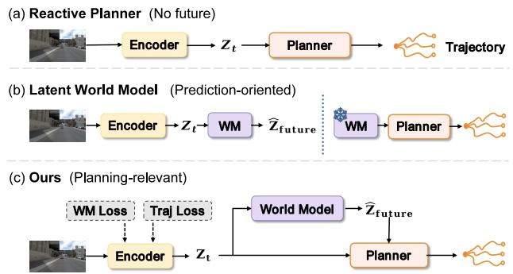
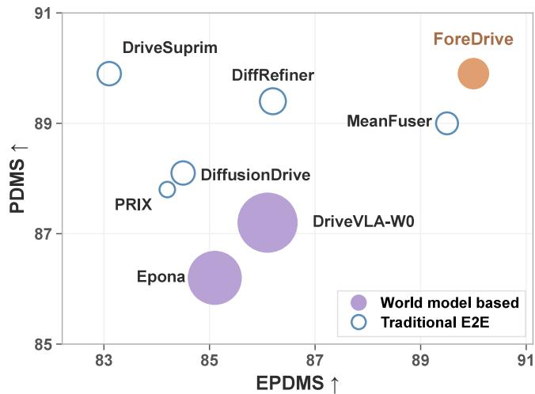
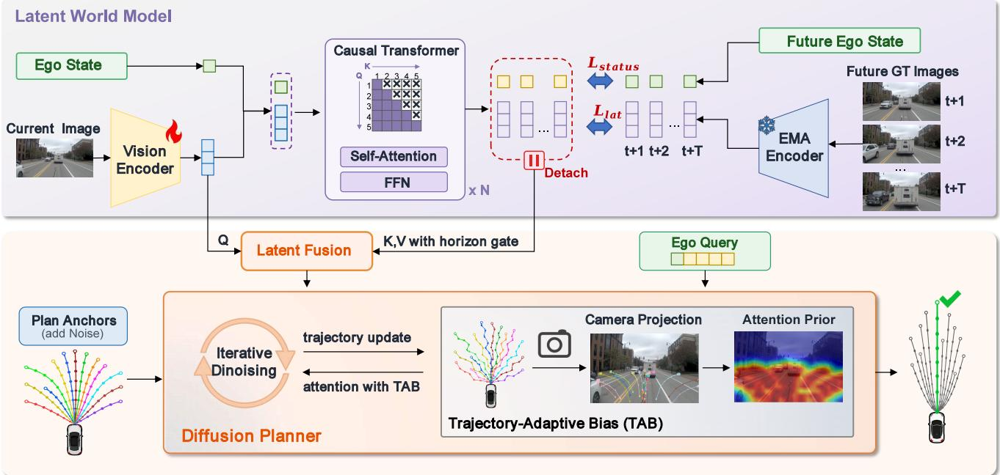
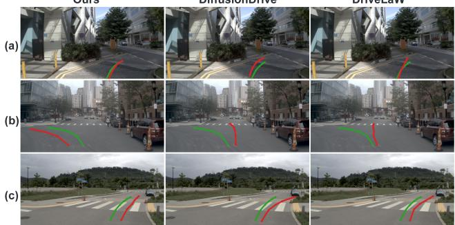
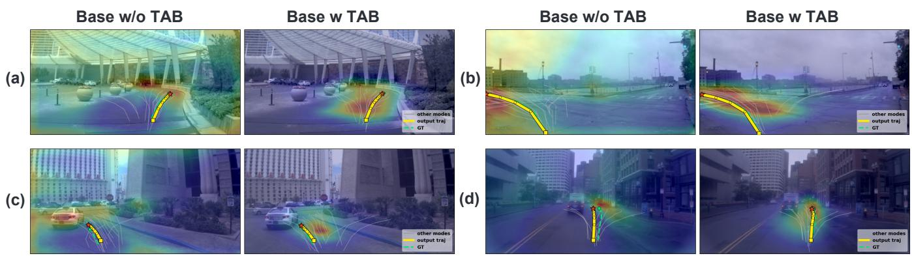
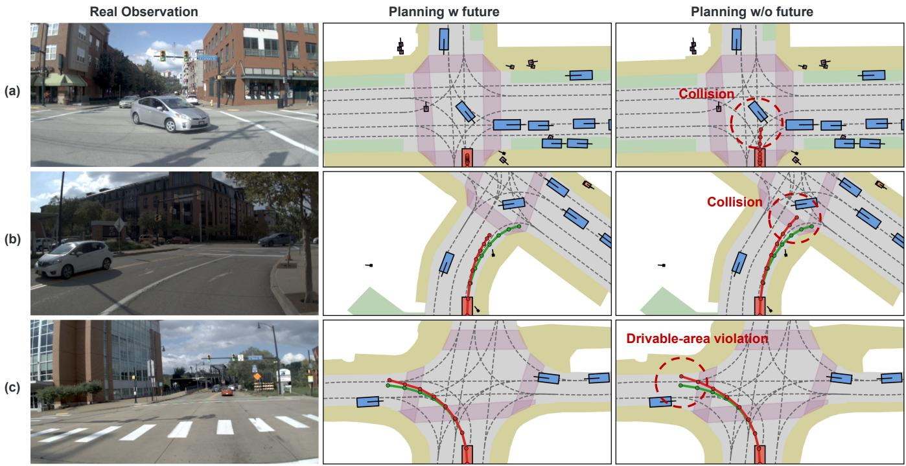
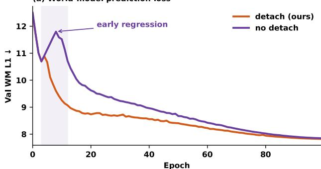
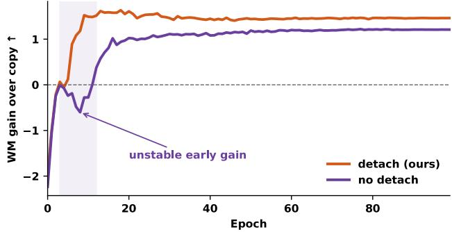
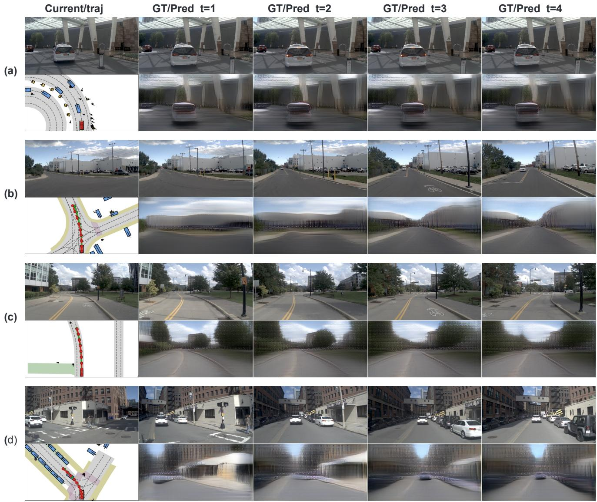

# ForeDrive: Foresight-Guided End-to-End Autonomous Driving with a Planning-Relevant Latent World Model

Sinuo Wang1,2∗, Zichong Gu2∗, Yuhan Huang1, Wenxin Wen2, Xun Yang2, Yiqing Zhang2, Xingyu Zhang2, Ningyu Che2†, Jie Ling2, Qiankun Yu2, Wei Liu1, Jing Xu1#, Xinggang Wang1#

1Huazhong University of Science and Technology

2Shanghai Zaofu Intelligent Technology Co., Ltd.

## Abstract

Existing latent world models are typically optimized for future predictability, yet the resulting representations are not necessarily useful for planning in autonomous driving. Predictions are commonly used for pretraining or auxiliary supervision rather than as direct conditioning signals for trajectory generation. We propose ForeDrive, which learns a planning-relevant latent representation and couples it asymmetrically to a Difusion Transformer (DiT) planner. The planner consumes multihorizon latent future representations learned with a JEPA-style world model; planning gradients update the shared online encoder, while stop-gradient routing trains the latent predictor with forecasting losses only. Because predicted futures have varying reliability across horizons and BEV trajectories are misaligned with image tokens, we use gated visual fusion, future-status injection, and Trajectory-Adaptive Bias (TAB) to inject future latents as guidance without overriding the current observation. Trained with pure imitation learning and using only the current front-view image as visual input at inference, ForeDrive attains 89.9 PDMS on NAVSIM v1 and 90.0 one-stage EPDMS on NAVSIM v2, without reinforcement learning or an external trajectory scorer.

## 1 Introduction

End-to-end driving planners must both anticipate how a scene may evolve and generate a trajectory that covers multiple maneuvers. Latent world models (Assran et al. 2025; Zhou et al. 2025; Karypidis et al. 2025; Baldassarre et al. 2025; Wang et al. 2026b) predict future latent representations without RGB reconstruction, enabling eficient semantic foresight. Difusion Transformer (DiT) planners such as DifusionDrive (Liao et al. 2025) generate multimodal trajectories under imitation learning. Forecast accuracy, however, does not guarantee planning usefulness, as predicted latents may omit decision-critical information. Conversely, currentconditioned planners generate trajectories without explicit future representations.

In existing driving systems, predicted future latent representations often provide pretraining signals, auxiliary losses, or features for candidate evaluation rather than direct conditioning signals for trajectory generation (Li et al. 2025a;

  
Figure 1: Representation paradigms for end-to-end planning. (a) Reactive Planner: action generation from the current latent only (e.g., DifusionDrive, MeanFuser). (b) Latent World Model: predicted futures mainly for pretraining or auxiliary losses (e.g., LAW, Drive-JEPA). (c) Ours: joint WM and trajectory supervision shapes the shared encoder, and futures guide the planner.

Zheng et al. 2025). Methods that do condition planning on predicted futures commonly introduce structured scene prediction, pixel-level generation, or staged optimization (Li et al. 2025b; Zhang et al. 2025; Xia et al. 2026). Few methodsjointly learn a latent that is useful for planning and couple it to a generative planner while preventing planning gradients from directly rewriting the predictor (Figure 1).

ForeDrive jointly learns planning-relevant latent representations and integrates multi-horizon future latents as complementary multi-scale future context into a DiT planner through asymmetric latent optimization and current-anchored fusion. Because predicted futures have varying reliability across horizons, ForeDrive treats them as complementary guidance anchored by reliable current observations, rather than allowing futures to dominate current perception. A JEPA-style online/EMA predictor estimates multi-horizon visual and ego-state latents without pixel reconstruction or a separate training stage.

We evaluate ForeDrive on NAVSIM under a camera-only, pure imitation-learning protocol. It attains 89.9 PDMS on v1 and 90.0 one-stage EPDMS on v2, outperforming recent end-to-end (E2E) and world-model planners under the same protocol. A zero-shot transfer to nuScenes tests cross-dataset generalization. Ablations attribute the gains mainly to future consumption, current-primary fusion, and asymmetric encoder updates.

  
Figure 2: NAVSIM performance comparison under diferent model scales (EPDMS vs. PDMS). Only methods with reported total model parameters and both scores are shown. Marker area indicates model parameter scale (area ∝ log parameter count).

Our main contributions are summarized as follows:

• We propose ForeDrive, which learns a planning-relevant latent representation and asymmetrically couples multihorizon latent prediction with trajectory generation. Planning updates the shared encoder while stop-gradient routing prevents planning gradients from updating the latent predictor, reducing prediction–planning gradient interference.

• We introduce planning-oriented interfaces, including gated visual fusion, future-status injection, and Trajectory-Adaptive Bias (TAB), that incorporate predicted future dynamics into difusion planning. These designs keep the current observation as primary evidence, and TAB links each trajectory candidate to the image tokens along its projected path during denoising.

• We validate ForeDrive on NAVSIM v1 and v2 under a camera-only, pure imitation-learning protocol (89.9 PDMS / 90.0 EPDMS). Using only a single front-view image at inference, ForeDrive establishes a new state-ofthe-art among imitation-learning methods.

## 2 Related Work

End-to-End Autonomous Driving. End-to-end driving maps sensor observations directly to planned trajectories. Early systems such as TransFuser and UniAD emphasize multi-sensor fusion and BEV-centric perception– planning (Chitta et al. 2023; Hu et al. 2023; Li et al. 2022), while recent work increasingly adopts camera-only inputs (Liao et al. 2025; Wang et al. 2026a; Wozniak et al. 2026). Beyond imitation learning, several high-scoring methods further apply reinforcement-learning post-training, as in ReCogDrive-RL (Li et al. 2026b), or rule-based candidate scoring, as in Hydra-MDP and DriveSuprim (Li et al. 2024; Yao et al. 2026). These stages raise benchmark scores, but the gains of a pure imitation-learning planner without RL or external scorers remain less clear. ForeDrive therefore adopts a camera-only, pure-IL setting and examines whether a planning-relevant foresight representation improves the sensor-to-plan model without RL post-training or auxiliary scorers.

Difusion-based Planning. Difusion models are widely used for multimodal trajectory generation in end-to-end driving, as iterative denoising can represent multiple futures and trajectory uncertainty under imitation learning. DifusionDrive combines truncated difusion with trajectory anchors; DifRefiner (Yin et al. 2026), MeanFuser, and GoalFlow (Xing et al. 2025) further develop coarse-to-fine, one-step, and flow-matching variants. These planners are typically conditioned on current or short-history features and do not condition on an explicit predicted future for planning. ForeDrive retains anchor-based difusion decoding and feeds multi-horizon latent predictions as complementary guidance under asymmetric coupling.

World Models for Driving. Prior work couples foresight and driving in four ways. (i) Predictive world models with structured scene forecasting use BEV or occupancy futures for planning (Hu et al. 2021; Wang et al. 2024; Zheng et al. 2024; Chen, Wang, and Zhang 2025; Li et al. 2025b; Zheng et al. 2025). (ii) JEPA-style latent predictors such as Drive-JEPA and LAW (Wang et al. 2026b; Li et al. 2025a) mainly treat predicted latents as pretraining or auxiliary signals rather than as inputs to a generative planner. (iii) Video-prediction approaches such as Epona and DriveLaW (Zhang et al. 2025; Xia et al. 2026) condition trajectory DiTs on generated video features, but rely on pixel generation and, for DriveLaW, multi-stage freezing. (iv) Unconstrained planning-conditioned prediction allows planning objectives to reshape the foresight module without isolating forecast supervision (Wang et al. 2026c; Li et al. 2026a; Zhao et al. 2025). ForeDrive instead learns planning-relevant latents and couples them to a generative planner under asymmetric optimization, keeping current evidence primary.

## 3 Method

In this section, we present ForeDrive (Figure 3). We define a planning-relevant latent as a future representation that is grounded by predictive supervision while retaining information useful for downstream trajectory generation. These objectives introduce a trade-of because forecasting favors target alignment, while planning benefits from decisionsensitive information. ForeDrive mitigates this trade-of by learning such latents with a JEPA-style world model, injecting them into a DiT planner as complementary guidance through planning-oriented interfaces (gated fusion, futurestatus injection, and TAB), and applying asymmetric latent optimization. Implementation details, architectural configurations, and hyperparameters are provided in the supplementary material.

  
Figure 3: Overview of ForeDrive. Multi-horizon future latents guide an anchor-based DiT via gated fusion, future-status injection, and TAB; stop-gradient routing updates the shared encoder while isolating the predictor.

## Planning-Relevant Latent World Model

Planning depends on future agent motion, ego-state evolution, and other scene changes that need not be represented at pixel level. This module therefore predicts future latent representations at multiple temporal scales for planning. We adopt a JEPA-style online/EMA architecture to predict latents in a DINOv3-initialized space (Oquab et al. 2024; Siméoni et al. 2025). The online encoder is shared with the planner, while the predictor is optimized only by the forecasting losses defined below. This separation allows planning to shape the source representation without directly updating the predictor with planning gradients.

Online/EMA encoding. Given a current front-camera image $I _ { 0 }$ and ego status $s _ { 0 } .$ , an online encoder $E _ { \theta }$ maps $I _ { 0 }$ to N patch tokens $z _ { 0 } = E _ { \theta } ( I _ { 0 } ) \in \mathbb { R } ^ { N \times d }$ . These tokens are later shared by foresight and planning. An EMA target encoder $E _ { \bar { \theta } } ,$ , which copies only the vision encoder, encodes future images $I _ { t }$ into stop-gradient EMA targets. Future images are used only to construct training targets and are unavailable at inference.

Causal latent prediction. The current observation is represented by an ego-status token and N visual tokens, while each future horizon $t \in \mathcal { H } = \{ 1 , 2 , 3 , 4 \}$ s is assigned learned query tokens, collectively denoted by $Q _ { \mathcal { H } }$ with $\check { H } = | \mathcal { H } |$ . The core prediction is

$$
\left\{ \left( \hat { z } _ { t } , \hat { s } _ { t } \right) \right\} _ { t \in \mathcal { H } } = P _ { \psi } ( z _ { 0 } , s _ { 0 } , Q _ { \mathcal { H } } ) .\tag{1}
$$

All tokens are projected to a common predictor width and augmented with token-type and horizon embeddings. The Transformer predictor $P _ { \psi }$ processes the resulting sequence under a frame-level block-causal mask in a single forward pass rather than an autoregressive rollout. Earlier horizons may influence later ones, while later horizons remain invisible to earlier ones. Diferent horizons provide complementary multi-scale future context rather than sequential rollout states. Status and visual futures are read from their corresponding query tokens.

Foresight supervision. We supervise horizon-weighted latent regression and status prediction

$$
\mathcal { L } _ { \mathrm { l a t } } = \frac { 1 } { H } \sum _ { t \in \mathcal { H } } w _ { t } \ell _ { t } ,\tag{2}
$$

$$
\mathcal { L } _ { \mathrm { s t a t u s } } = \frac { 1 } { H } \sum _ { t \in \mathcal { H } } \bigl [ \mathrm { C E } ( \hat { s } _ { t } ^ { c } , s _ { t } ^ { c } ) + \mathrm { M S E } ( \hat { s } _ { t } ^ { m } , s _ { t } ^ { m } ) \bigr ] .\tag{3}
$$

where $\ell _ { t }$ is a token-averaged $L _ { 1 }$ between predicted and EMA visual latents, $w _ { t }$ are fixed horizon loss weights (uniform if weighting is disabled), and $s _ { t } ^ { c } / s _ { t } ^ { m }$ are the navigation-command and ego-motion (velocity/acceleration) status components.

## Foresight-Guided Generative Planning

Because current observations are more reliable than predicted futures, ForeDrive keeps current visual tokens on the residual path and admits future latents through gated visual fusion and future-status memory. A coarse-to-fine DiT decodes multimodal trajectories from these conditions. Trajectory-Adaptive Bias (TAB) connects trajectory anchors to image tokens by projecting evolving candidates into the front view and biasing cross-attention toward path-relevant visual tokens during denoising.

<table><tr><td>Method</td><td>Venue</td><td>Mod.</td><td>NC↑</td><td>DAC↑</td><td>TTC↑</td><td>Comf.↑</td><td>EP↑</td><td>PDMS↑</td></tr><tr><td colspan="9">Traditional end-to-end methods</td></tr><tr><td>UniAD (Hu et al. 2023)</td><td>CVPR&#x27;23</td><td>C</td><td>97.8</td><td>91.9</td><td>92.9</td><td>100.0</td><td>78.8</td><td>83.4</td></tr><tr><td>TransFuser (Chitta et al. 2023)</td><td>TPAMI&#x27;23</td><td>C+L</td><td>97.7</td><td>92.8</td><td>92.8</td><td>100.0</td><td>79.2</td><td>84.0</td></tr><tr><td>PARA-Drive (Weng et al. 2024)</td><td>CVPR&#x27;24</td><td>C</td><td>97.9</td><td>92.4</td><td>93.0</td><td>99.8</td><td>79.3</td><td>84.0</td></tr><tr><td>DRAMA (Yuan et al. 2024)</td><td>ISRR&#x27;24</td><td>C+L</td><td>98.0</td><td>93.1</td><td>94.8</td><td>100.0</td><td>80.1</td><td>85.5</td></tr><tr><td>ReCogDrive-IL (Li et al. 2026b)</td><td>ICLR&#x27;26</td><td>C</td><td>98.1</td><td>94.7</td><td>94.2</td><td>100.0</td><td>80.9</td><td>86.5</td></tr><tr><td>PRIX (Wozniak et al. 2026)</td><td>RA-L&#x27;26</td><td>C</td><td>98.1</td><td>96.3</td><td>94.1</td><td>100.0</td><td>82.3</td><td>87.8</td></tr><tr><td>DiffusionDrive (Liao et al. 2025)</td><td>CVPR&#x27;25</td><td>C+L</td><td>98.2</td><td>96.2</td><td>94.7</td><td>100.0</td><td>82.2</td><td>88.1</td></tr><tr><td>MeanFuser (Wang et al. 2026a)</td><td>CVPR&#x27;26</td><td>C</td><td>98.6</td><td>97.0</td><td>95.0</td><td>100.0</td><td>82.8</td><td>89.0</td></tr><tr><td>DiffRefiner-R34 (Yin et al. 2026)</td><td>AAAI&#x27;26</td><td>C</td><td>98.4</td><td>97.4</td><td>95.3</td><td>100.0</td><td>83.4</td><td>89.4</td></tr><tr><td colspan="9">World-model and video-action methods</td></tr><tr><td>LAW (Li et al. 2025a)</td><td>ICLR&#x27;25</td><td>C</td><td>96.4</td><td>95.4</td><td>88.7</td><td>99.9</td><td>81.7</td><td>84.6</td></tr><tr><td>Epona (Zhang et al. 2025)</td><td>ICCV’25</td><td>C</td><td>97.9</td><td>95.1</td><td>93.8</td><td>99.9</td><td>80.4</td><td>86.2</td></tr><tr><td>DriveVLA-W0 (Li et al. 2026a)</td><td>ICLR&#x27;26</td><td>C</td><td>98.4</td><td>95.3</td><td>95.2</td><td>100.0</td><td>80.9</td><td>87.2</td></tr><tr><td>PWM (Zhao et al. 2025)</td><td>NeurIPS&#x27;25</td><td>C</td><td>98.6</td><td>95.9</td><td>95.4</td><td>100.0</td><td>81.8</td><td>88.1</td></tr><tr><td>WoTE (Li et al. 2025b)</td><td>ICCV’25</td><td>C+L</td><td>98.5</td><td>96.8</td><td>94.9</td><td>99.9</td><td>81.9</td><td>88.3</td></tr><tr><td>DriveLaW (Xia et al. 2026)</td><td>CVPR&#x27;26</td><td>C</td><td>99.0</td><td>97.1</td><td>96.7</td><td>100.0</td><td>81.3</td><td>89.1</td></tr><tr><td>ForeDrive (ours)</td><td></td><td>C</td><td>98.6</td><td>97.6</td><td>95.6</td><td>100.0</td><td>83.8</td><td>89.9</td></tr><tr><td>ForeDrive (ViT-L)</td><td></td><td>C</td><td>98.7</td><td>97.9</td><td>96.1</td><td>100.0</td><td>84.3</td><td>90.4</td></tr></table>

Table 1: Comparison on NAVSIM v1 navtest. C and C+L denote camera and camera+LiDAR. ForeDrive (ours) uses DINOv3 ViT-B/16; ForeDrive (ViT-L) is a larger-encoder upper bound.

Current-primary Latent Fusion. Projection necks map current tokens $z _ { \mathrm { 0 } }$ and predicted future latent representations $\hat { z } _ { t }$ to planner-width tokens c¯ and ${ \bar { f } } _ { t } .$ , respectively. We add shared spatial and per-horizon temporal embeddings, then apply a sample-shared gate $g _ { t } ^ { \mathrm { v i s } } = \sigma ( a _ { t } ^ { \mathrm { v i s } } )$ as $\tilde { f } _ { t } = g _ { t } ^ { \mathrm { v i s } } \bar { f } _ { t } .$ The gate learns horizon-level contribution weights rather than sample-specific uncertainty estimates. Latent fusion $\mathcal { F }$ performs residual cross-attention with c¯ as queries and concatenated gated futures as keys/values,

$$
K , V = \operatorname { C o n c a t } _ { t \in \mathcal { H } } ( \tilde { f } _ { t } ) , \qquad c ^ { \mathrm { f u s e } } = \mathcal { F } ( \bar { c } , K , V ) ,\tag{4}
$$

keeping current evidence as the residual backbone.

Future-status injection. Predicted future ego motion provides complementary conditioning for trajectory generation. We embed $\mathrm { s g } ( \hat { s } _ { t } ^ { m } )$ and modulate it with an independent sample-shared gate $g _ { t } ^ { \mathrm { s t } } = \sigma ( a _ { t } ^ { \mathrm { s t } } )$ , yielding gated embeddings $\tilde { e } _ { t }$ . These embeddings are concatenated with the current ego embedding $e _ { 0 }$ from $s _ { 0 }$ to form the planner memory

$$
E _ { \mathrm { e g o } } = [ e _ { 0 } ; \tilde { e } _ { 1 } ; \ldots ; \tilde { e } _ { H } ] ,\tag{5}
$$

which conditions every decoder layer. Navigation commands $\hat { s } _ { t } ^ { c }$ are not injected through this pathway.

Coarse-to-fine difusion planner. Following Difusion-Drive (Liao et al. 2025), we apply truncated difusion with a cascaded DiT decoder to a fixed set of trajectory anchors A. Conditioned on fused visual tokens $c ^ { \mathrm { f u s e } }$ and ego memory $E _ { \mathrm { e g o } }$ , the planner predicts multimodal trajectories $\tau \in \mathbb { R } ^ { 8 \times \mathbf { \breve { 3 } } }$ over 4 s. Each decoder stage uses hard closest-anchor assignment, sigmoid focal loss for mode classification, and $L _ { 1 }$ regression for the winning mode:

$$
\mathcal { L } _ { \mathrm { p l a n } } = \sum _ { k = 1 } ^ { 2 } \left( \lambda _ { \mathrm { c l s } } \mathcal { L } _ { \mathrm { f o c a l } } ^ { ( k ) } + \lambda _ { \mathrm { r e g } } \mathcal { L } _ { 1 } ^ { ( k ) } \right) .\tag{6}
$$

At inference, truncated DDIM runs for two steps and selects the mode by arg max of the classification head.

Trajectory-Adaptive Bias for Planning. Anchor-based DiT decoding represents trajectory candidates in ego/BEV coordinates, while the visual stream consists of front-view image tokens. Standard trajectory-to-visual cross-attention therefore lacks an explicit correspondence between BEV paths and image patches. We introduce Trajectory-Adaptive Bias (TAB) as a trajectory-aware visual attention interface to connect BEV trajectory candidates with front-view image tokens. For each mode, TAB projects the current ego/BEV trajectory candidate onto the front-camera image and builds a soft Gaussian proximity field over visual tokens; its log afinity is added to the cross-attention logits, so each mode attends more strongly to visual tokens near its projected path while retaining access to the full scene.

As denoising updates the trajectory candidates, TAB recomputes the bias at stage boundaries. The bias is modespecific and diferentiable; if a candidate has no valid projection, the added bias is constant and leaves the attention distribution unchanged. We apply TAB in every decoder layer of both stages, independently of future injection.

## Asymmetric Latent Optimization

The online representation $z _ { \mathrm { 0 } }$ is shared by forecasting and planning, so the two objectives may introduce optimization interference. Back-propagating the planning loss through the predictor can turn $P _ { \psi }$ into a planning feature adapter and weaken forecast fidelity, whereas freezing the encoder for forecasting prevents planning from shaping actionable futures. ForeDrive mitigates this interference with asymmetric latent optimization via stop-gradient routing: both losses update the shared encoder, but planning gradients do not update the latent predictor.

<table><tr><td>Method</td><td>Venue</td><td>NC↑</td><td>DAC↑</td><td>DDC↑</td><td>TLC↑</td><td>EP↑</td><td>TTC↑</td><td>LK↑</td><td>HC↑</td><td>EC↑</td><td>EPDMS↑</td></tr><tr><td colspan="10">Traditional end-to-end methods</td><td></td><td></td><td></td></tr><tr><td>TransFuser (Chitta et al. 2023)</td><td>TPAMI&#x27;23</td><td>96.9</td><td>89.9</td><td>97.8</td><td>99.7</td><td>87.1</td><td>95.4</td><td>92.7</td><td>98.3</td><td>87.2</td><td>76.7</td></tr><tr><td>ReCogDrive-IL (Li et al. 2026b)</td><td>ICLR&#x27;26</td><td>98.2</td><td>94.5</td><td>99.3</td><td>99.9</td><td>87.4</td><td>97.3</td><td>97.1</td><td>98.3</td><td>87.2</td><td>86.6</td></tr><tr><td>PRIX (Wozniak et al. 2026)</td><td>RA-L&#x27;26</td><td>98.0</td><td>95.6</td><td>99.5</td><td>99.8</td><td>87.4</td><td>97.2</td><td>97.1</td><td>98.3</td><td>87.6</td><td>84.2</td></tr><tr><td>DiffusionDrive (Liao et al. 2025)</td><td>CVPR&#x27;25</td><td>98.2</td><td>95.9</td><td>99.4</td><td>99.8</td><td>87.5</td><td>97.3</td><td>96.8</td><td>98.3</td><td>87.7</td><td>84.5</td></tr><tr><td>DiffRefiner-R34 (Yin et al. 2026)</td><td>AAAI&#x27;26</td><td>98.5</td><td>97.4</td><td>99.6</td><td>99.8</td><td>87.6</td><td>97.7</td><td>97.7</td><td>98.3</td><td>86.2</td><td>86.2</td></tr><tr><td>MeanFuser (Wang et al. 2026a)</td><td>CVPR&#x27;26</td><td>98.3</td><td>97.2</td><td>99.6</td><td>99.8</td><td>87.6</td><td>97.4</td><td>97.3</td><td>98.3</td><td>88.2</td><td>89.5</td></tr><tr><td colspan="10">World-model and video-action methods</td><td></td><td></td><td></td></tr><tr><td>World4Drive (Zheng et al. 2025)</td><td>ICCV’25</td><td>97.8</td><td>96.3</td><td>99.4</td><td>99.8</td><td>88.3</td><td>97.1</td><td>97.7</td><td>98.0</td><td>53.9</td><td>84.8</td></tr><tr><td>Epona (Zhang et al. 2025)</td><td>ICCV&#x27;25</td><td>97.1</td><td>95.7</td><td>99.3</td><td>99.7</td><td>88.6</td><td>96.3</td><td>97.0</td><td>98.0</td><td>67.8</td><td>85.1</td></tr><tr><td>DriveVLA-W0 (Li et al. 2026a)</td><td>ICLR&#x27;26</td><td>98.5</td><td>99.1</td><td>98.0</td><td>99.7</td><td>86.4</td><td>98.1</td><td>93.2</td><td>97.9</td><td>58.9</td><td>86.1</td></tr><tr><td>WorldRFT (Yang et al. 2026)</td><td>AAAI&#x27;26</td><td>97.8</td><td>96.5</td><td>99.5</td><td>99.8</td><td>88.5</td><td>97.0</td><td>97.4</td><td>98.1</td><td>69.1</td><td>86.7</td></tr><tr><td>Drive-JEPA (Wang et al. 2026b)</td><td>arXiv&#x27;26</td><td>98.4</td><td>98.6</td><td>99.1</td><td>99.8</td><td>88.4</td><td>97.8</td><td>97.6</td><td>97.9</td><td>84.8</td><td>87.8</td></tr><tr><td>Latent-WAM (Wang et al. 2026c)</td><td>arXiv&#x27;26</td><td>98.1</td><td>97.3</td><td>99.6</td><td>99.8</td><td>87.7</td><td>97.3</td><td>97.6</td><td>98.1</td><td>87.3</td><td>89.3</td></tr><tr><td>ForeDrive (ours)</td><td></td><td>98.6</td><td>97.6</td><td>99.6</td><td>99.8</td><td>87.6</td><td>97.9</td><td>97.9</td><td>98.3</td><td>87.5</td><td>90.0</td></tr><tr><td>ForeDrive (ViT-L)</td><td></td><td>98.7</td><td>97.9</td><td>99.6</td><td>99.9</td><td>87.6</td><td>98.2</td><td>97.7</td><td>98.4</td><td>88.1</td><td>90.6</td></tr></table>

Table 2: Comparison on NAVSIM v2 navtest (one-stage non-reactive EPDMS). ForeDrive (ours) uses DINOv3 ViT-B/16; ForeDrive (ViT-L) is a larger-encoder upper bound.
<table><tr><td rowspan="2">Method</td><td colspan="4">L2 (m)↓</td><td colspan="4">Collision (%)↓</td></tr><tr><td>1s</td><td>2s</td><td>3s</td><td>Avg.</td><td>1 s</td><td>2s</td><td>3s</td><td>Avg.</td></tr><tr><td>PWM (FT) (Zhao et al. 2025)</td><td>0.41</td><td>0.75</td><td>1.17</td><td>0.78</td><td>0.02</td><td>0.10</td><td>0.35</td><td>0.16</td></tr><tr><td>Epona (Zhang et al. 2025)</td><td>0.96</td><td>1.59</td><td>2.32</td><td>1.62</td><td>0.09</td><td>0.27</td><td>0.67</td><td>0.34</td></tr><tr><td>DriveLaW (Xia et al. 2026)</td><td>0.30</td><td>0.48</td><td>0.83</td><td>0.54</td><td>0.23</td><td>0.16</td><td>0.19</td><td>0.19</td></tr><tr><td>ForeDrive (ours)</td><td>0.22</td><td>0.44</td><td>0.79</td><td>0.48</td><td>0.01</td><td>0.09</td><td>0.23</td><td>0.11</td></tr></table>

Table 3: Zero-shot planning performance on the nuScenes validation set under the VAD /ST-P3 protocol. PWM (FT) uses nuScenes-trained checkpoints.

Asymmetric gradient routing is given by

$$
{ \mathcal { L } } _ { \mathrm { p l a n } } \to E _ { \theta } , { \mathcal { F } } , { \mathrm { p l a n n e r } } , \qquad { \mathcal { L } } _ { \mathrm { p l a n } } \not \to P _ { \psi } .\tag{7}
$$

The latent and status objectives train $P _ { \psi }$ . Planning updates $E _ { \theta } ,$ and the EMA target encoder tracks $E _ { \theta }$ by exponential moving average, so planning afects EMA targets only through this encoder–EMA path. Injected future latent representations remain stop-gradient.

The full training objective is

$$
\mathcal { L } = \lambda _ { \mathrm { t r a j } } \mathcal { L } _ { \mathrm { p l a n } } + \lambda _ { z } \mathcal { L } _ { \mathrm { l a t } } + \lambda _ { s } \mathcal { L } _ { \mathrm { s t a t u s } } .\tag{8}
$$

All objectives are optimized in one stage, and the EMA target receives no gradient. The EMA target and auxiliary status objective help avoid representational collapse.

## 4 Experiments

## Setup

We train on the oficial NAVSIM navtrain split and report final metrics on navtest. The default backbone is DINOv3 ViT-B/16 with a 256 × 512 front image; the WM predicts futures at 1/2/3/4 s, and the planner uses 20 trajectory anchors over a 4 s horizon. Default ForeDrive uses a 4-layer predictor, a 2×5 DiT, and AdamW at $6 \times 1 0 ^ { - 4 }$ for 100 epochs (batch 1024). Full configs are in the supplementary material.

## Benchmark

We evaluate on NAVSIM v1 and v2 (Dauner et al. 2024). The primary metrics are PDMS on v1 and one-stage EPDMS on v2 navtest; we also report the associated safety and progress submetrics. NAVSIM uses non-reactive simulation: the ego vehicle commits to one planned trajectory over a fixed horizon while surrounding agents follow log replay. We use one-stage EPDMS for the Extended PDM Score computed from a single 4 s horizon of real observations under this protocol.

Ours  
DiffusionDrive  
DriveLaW  
  
Figure 4: Trajectory comparison with DifusionDrive and DriveLaW (green: expert; red: prediction).

## Main Results

Comparison on NAVSIM v1. Default ForeDrive (ViT-B/16) attains 89.9 PDMS on NAVSIM v1 (Table 1), improving over DifRefiner-R34 and MeanFuser by 0.5 and 0.9 points, DifusionDrive by 1.8, and DriveLaW and PWM by 0.8 and 1.8. Retraining the default recipe from three diferent random seeds yields PDMS in 89.7–89.9 with a standard deviation of 0.1; the table reports the primary run. Scaling only the vision encoder to ViT-L/16 further reaches 90.4 PDMS. Under the pure-IL protocol, these gains hold across seeds.

Comparison on NAVSIM v2. On NAVSIM v2, default ForeDrive (ViT-B/16) reaches 90.0 one-stage EPDMS (Table 2), improving over MeanFuser by 0.5 points and over Latent-WAM and Drive-JEPA by 0.7 and 2.2 points, respectively. The ViT-L upper bound further attains 90.6. Together with the v1 results, the same pure-IL recipe yields consistent margins on both metric suites. Figure 2 compares PDMS/EPDMS across methods of diferent scales: at 118.4M parameters, ForeDrive matches the best listed PDMS and attains the highest EPDMS among the plotted methods, while remaining substantially smaller than Epona (2.5B) and DriveVLA-W0 (7.5B).

Zero-shot performance on nuScenes. Table 3 reports open-loop planning on the nuScenes validation set under the VAD /ST-P3 protocol (Jiang et al. 2023; Hu et al. 2022), with all methods re-evaluated under a shared metric implementation. ForeDrive is transferred zero-shot from NAVSIM without nuScenes fine-tuning. It attains the lowest L2 at every horizon and the lowest collision at 1 s, 2 s, and on average, reaching 0.48 m / 0.11% versus 0.54 m / 0.19% for DriveLaW and 0.78 m / 0.16% for nuScenes-trained PWM (FT); DriveLaW remains lower at collision@3 s (0.19% vs. 0.23%). These results indicate that foresight-guided planning learned on NAVSIM transfers across datasets in both displacement accuracy and safety.

Qualitative results. Figure 4 compares ForeDrive with DifusionDrive and DriveLaW on three interactive scenes (green: expert; red: prediction). ForeDrive stays closer to the expert corridor where the reactive DiT baselines leave the lane or incur safety/progress failures. These cases illustrate that foresight-guided planning helps on maneuvers that are dificult for current-only DiT planners.

<table><tr><td>Setting</td><td>WM TAB</td><td>PDMS↑ Δ vs. Base</td><td></td></tr><tr><td>DiffusionDrive</td><td></td><td>88.1</td><td></td></tr><tr><td>Base</td><td></td><td>88.9</td><td></td></tr><tr><td> $\mathrm { B a s e } + \mathrm { T A B }$ </td><td>√</td><td>89.5</td><td>+0.6</td></tr><tr><td> $\mathbf { B a s e + W M }$ </td><td>√</td><td>89.6</td><td>+0.7</td></tr><tr><td> $\mathbf { B a s e + W M + T A B }$ </td><td>V √</td><td>89.9</td><td>+1.0</td></tr></table>

Table 4: Ablation study of WM and TAB relative to Base. DifusionDrive is an external reference. Here WM denotes the complete future representation pipeline, including latent prediction supervision and future conditioning interfaces.
<table><tr><td>Setting</td><td colspan="4">Aux. z Inject. s Inject. PDMS↑ ∆ vs. Base</td></tr><tr><td>Base</td><td></td><td></td><td>88.9</td><td></td></tr><tr><td>Auxiliary</td><td>√</td><td></td><td>89.0</td><td>+0.1</td></tr><tr><td>Visual only</td><td>√</td><td>L</td><td>89.4</td><td>+0.5</td></tr><tr><td>Status only</td><td>√</td><td>√</td><td>89.3</td><td>+0.4</td></tr><tr><td>Full WM</td><td>√</td><td>√ √</td><td>89.6</td><td>+0.7</td></tr></table>

Table 5: Ablation study of future representation components without TAB on NAVSIM v1 (auxiliary loss, visual injection, and status injection).

## Ablation Study

Base configuration. The planner retains DifusionDrive’s anchor-based truncated-difusion formulation but replaces its camera–LiDAR BEV interface with DINOv3 features from one current front-view image. We then add FiLM conditioning on the current ego state and deepen both DiT stages from one to five layers. The resulting current-only model is Base. Base and ForeDrive use the same DINOv3 ViT-B/16 encoder, 2×5-layer DiT, navigation command, and positional and temporal embeddings. Base contains neither the world model (WM) nor TAB. The supplementary material reports the stepwise construction at ViT-S scale.

Component ablation. Table 4 ablates WM and TAB on the matched Base (88.9 PDMS), with DifusionDrive listed only as an external reference (88.1). Adding TAB or WM alone raises PDMS to 89.5 (+0.6) and 89.6 (+0.7), respectively, while combining both reaches 89.9 (+1.0). The joint gain exceeds either factor alone, indicating that WM and TAB contribute distinct efects.

Table 5 further decomposes the WM under TAB of. Auxiliary prediction alone yields only +0.1 PDMS, indicating that a forecasting side objective is insuficient. Exposing predicted futures to the planner accounts for most of the gain: visual injection reaches +0.5 and future-status injection +0.4; using both pathways attains +0.7 and recovers the Base+WM result in Table 4. The main improvement thus comes from consuming predicted futures, not from adding a forecasting loss alone.

<table><tr><td>Training paradigm</td><td> $\mathcal { L } _ { \mathrm { l a t } \downarrow }$ </td><td>Lat. Cos.↑</td><td> $\mathcal { L } _ { \mathrm { s t a t u s } } \downarrow$  PDMS↑</td></tr><tr><td>Two-stage / freeze WM 5.93</td><td></td><td>0.843</td><td>0.604 87.9</td></tr><tr><td>Joint + detach encoder</td><td>6.07</td><td>0.838</td><td>0.599 88.6</td></tr><tr><td>Joint + aux-only</td><td>7.44</td><td>0.769</td><td>0.536 89.6</td></tr><tr><td>Full joint (ours)</td><td>7.64</td><td>0.759</td><td>0.531 89.9</td></tr></table>

Table 6: Comparison of training paradigms on NAVSIM. We report latent $L _ { 1 }$ , latent cosine similarity (Lat. Cos.), composite future-status loss, and navtest PDMS.

<table><tr><td colspan="2">Interface PDMS↑</td><td> $\Delta$  vs. ours</td></tr><tr><td>Gated fusion (ours)</td><td>89.4</td><td>0.0</td></tr><tr><td>Current only</td><td>88.9</td><td>-0.5</td></tr><tr><td>Future only</td><td>84.2</td><td>-5.2</td></tr><tr><td>Concatenation</td><td>89.2</td><td>-0.2</td></tr><tr><td>Dual-memory</td><td>89.0</td><td>-0.4</td></tr><tr><td>Ungated fusion</td><td>89.0</td><td>-0.4</td></tr></table>

Table 7: Future-injection interfaces on NAVSIM (TAB and future-status injection of).

Training paradigm. Table 6 compares four training paradigms along two axes: whether planning gradients update the shared online encoder, and whether predicted futures are injected. Two-stage /freeze WM pretrains then freezes the world model; Joint + detach encoder trains jointly but stops planner gradients before the shared encoder; Joint + aux-only updates the encoder with both losses yet does not inject futures; Full joint is our setting, with planning-driven encoder updates, future injection, and forecasting-only supervision of the predictor.

The first two settings best match EMA visual targets (lowest $\mathcal { L } _ { \mathrm { l a t } } 5 . 9 3 / 6 . 0 7 ;$ highest latent cosine 0.843 / 0.838) yet obtain the weakest PDMS (87.9 / 88.6). Encoder-updating joint training raises PDMS to 89.6–89.9 despite weaker visual alignment. Under matched future injection, full joint improves over encoder detachment by 1.3 PDMS; with encoder updates retained, enabling injection adds 0.3 over the auxiliary-only joint baseline. Across variants, better generic latent forecast alignment does not necessarily correspond to higher planning scores, indicating that planning-oriented representations may deviate from prediction-optimal targets to preserve decision-relevant information.

Latent fusion strategies. Under a matched protocol with TAB and future-status ego-KV disabled, we compare futureinjection interfaces in Table 7. Gated current-primary fusion attains 89.4 PDMS; current-only is lower by 0.5, while future-only drops by 5.2. Predicted futures therefore improve planning only when fused with the present observation, and current evidence should remain primary. Concatenation, dual-memory, and ungated fusion trail gated fusion by 0.2– 0.4, indicating that a gated residual interface is preferable to exposing additional future tokens alone. Under the same TAB-/status-of protocol, permuting predicted horizons at inference leaves PDMS unchanged at 89.4, whereas zeroing futures at test time reduces it to 88.0. The permutation result suggests that the planner mainly exploits aggregated multiscale future context rather than strict horizon ordering, which is consistent with our parallel latent prediction design. Full breakdowns are reported in the supplementary material.

<table><tr><td>Encoder</td><td>Params</td><td>Base↑</td><td>Full↑</td><td> $\Delta$ </td></tr><tr><td>DINOv3 ViT-S/16</td><td>21M</td><td>87.4</td><td>89.0</td><td> $+ 1 . 6$ </td></tr><tr><td>DINOv3 ViT-B/16</td><td>86M</td><td>88.9</td><td>89.9</td><td> $+ 1 . 0$ </td></tr><tr><td>DINOv3 ViT-L/16</td><td>300M</td><td>89.3</td><td>90.4</td><td> $+ 1 . 1$ </td></tr></table>

Table 8: DINOv3 backbone capacity on NAVSIM v1 under a fixed ForeDrive pipeline. Params counts the vision encoder only. Base is the matched current-only planner; Full is ForeDrive (WM+TAB); ∆ is Full−Base. ViT-L is a capacity upper bound; main results and ablations use ViT-B.

Encoder capacity. Table 8 varies only the DINOv3 backbone under a fixed ForeDrive pipeline. Stronger encoders raise both Base and Full: a better current representation already improves the current-only planner, and Full improves as well (89.0 / 89.9 / 90.4 at ViT-S/B/L). Full still outperforms its matched Base at every scale. The Base→Full margin is largest on ViT-S (+1.6), where perception is weakest, and remains positive on ViT-B and ViT-L (+1.0 / +1.1). Foresight and TAB still help at every encoder scale; they do not replace a stronger backbone. Single-factor and WMcomponent breakdowns at ViT-S/L appear in the supplementary material. We keep ViT-B/16 for the main results and ablations for its accuracy–cost trade-of, and report ViT-L only as a capacity upper bound.

Inference eficiency. On a single H20 GPU, the default ForeDrive runs at 58.2 ms per frame (17.2 FPS) with 1.03 GB peak memory, while latent foresight adds approximately 26 ms over the current-only Base. The full model has 118.4M parameters at evaluation; the training-only EMA encoder is excluded from this total.

## 5 Conclusion

ForeDrive learns planning-relevant future latent representations and couples them asymmetrically to a DiT planner. Asymmetric latent optimization via stop-gradient routing mitigates direct prediction–planning optimization interference, while planning-oriented interfaces that include gated fusion, future-status injection, and TAB connect predicted futures to difusion planning. With a single front-view image at inference and pure imitation learning, ForeDrive attains 89.9 PDMS on NAVSIM v1 and 90.0 EPDMS on v2. Matched ablations show that auxiliary forecasting alone is insuficient, that incorporating future latents is necessary, and that encoder updates yield planning-relevant futures despite weaker EMA alignment.

The evaluation is limited to camera-only, non-reactive simulation, where inaccurate futures can still mislead the planner. Testing under interactive closed-loop settings is an important next step.

## References

Assran, M.; Bardes, A.; Fan, D.; Garrido, Q.; Howes, R.; Komeili, M.; Muckley, M.; Rizvi, A.; Roberts, C.; Sinha, K.; Zholus, A.; Arnaud, S.; Gejji, A.; Martin, A.; Hogan, F. R.; Dugas, D.; Bojanowski, P.; Khalidov, V.; Labatut, P.; Massa, F.; Szafraniec, M.; Krishnakumar, K.; Li, Y.; Ma, X.; Chandar, S.; Meier, F.; LeCun, Y.; Rabbat, M.; and Ballas, N. 2025. V-JEPA 2: Self-Supervised Video Models Enable Understanding, Prediction and Planning. arXiv:2506.09985.

Baldassarre, F.; Szafraniec, M.; Terver, B.; Khalidov, V.; Massa, F.; LeCun, Y.; Labatut, P.; Seitzer, M.; and Bojanowski, P. 2025. Back to the Features: DINO as a Foundation for Video World Models. arXiv:2507.19468.

Chen, Y.; Wang, Y.; and Zhang, Z. 2025. DrivingGPT: Unifying Driving World Modeling and Planning with Multimodal Autoregressive Transformers. In Proceedings of the IEEE/CVF International Conference on Computer Vision, 26890–26900.

Chitta, K.; Prakash, A.; Jaeger, B.; Yu, Z.; Renz, K.; and Geiger, A. 2023. TransFuser: Imitation with Transformer-Based Sensor Fusion for Autonomous Driving. IEEE Transactions on Pattern Analysis and Machine Intelligence, 45(11): 12878–12895.

Dauner, D.; Hallgarten, M.; Li, T.; Weng, X.; Huang, Z.; Yang, Z.; Li, H.; Gilitschenski, I.; Ivanovic, B.; Pavone, M.; Geiger, A.; and Chitta, K. 2024. NAVSIM: Data-Driven Non-Reactive Autonomous Vehicle Simulation and Benchmarking. In Advances in Neural Information Processing Systems.

Hu, A.; Murez, Z.; Mohan, N.; Dudas, S.; Hawke, J.; Badrinarayanan, V.; Cipolla, R.; and Kendall, A. 2021. FIERY: Future Instance Prediction in Bird’s-Eye View from Surround Monocular Cameras. In Proceedings of the IEEE/CVF International Conference on Computer Vision, 15273–15282.

Hu, S.; Chen, L.; Wu, P.; Li, H.; Yan, J.; and Tao, D. 2022. ST-P3: End-to-End Vision-based Autonomous Driving via Spatial-Temporal Feature Learning. In European Conference on Computer Vision, 533–549.

Hu, Y.; Yang, J.; Chen, L.; Li, K.; Sima, C.; Zhu, X.; Chai, S.; Du, S.; Lin, T.; Wang, W.; Lu, L.; Jia, X.; Liu, Q.; Dai, J.; Qiao, Y.; and Li, H. 2023. Planning-Oriented Autonomous Driving. In Proceedings of the IEEE/CVF Conference on Computer Vision and Pattern Recognition, 17853–17862.

Jiang, B.; Chen, S.; Xu, Q.; Liao, B.; Chen, J.; Zhou, H.; Zhang, Q.; Liu, W.; Huang, C.; and Wang, X. 2023. VAD: Vectorized Scene Representation for Eficient Autonomous Driving. In Proceedings of the IEEE/CVF International Conference on Computer Vision, 8340–8350.

Karypidis, E.; Kakogeorgiou, I.; Gidaris, S.; and Komodakis, N. 2025. DINO-Foresight: Looking into the Future with DINO. arXiv:2412.11673.

Li, Y.; Fan, L.; He, J.; Wang, Y.; Chen, Y.; Zhang, Z.; and Tan, T. 2025a. LAW: Enhancing End-to-End Autonomous Driving with Latent World Model. In International Conference on Learning Representations.

Li, Y.; Shang, S.; Liu, W.; Zhan, B.; Wang, H.; Wang, Y.; Chen, Y.; Wang, X.; An, Y.; Tang, C.; Hou, L.; Fan, L.; and Zhang, Z. 2026a. DriveVLA-W0: World Models Amplify Data Scaling Law in Autonomous Driving. In International Conference on Learning Representations.

Li, Y.; Wang, Y.; Liu, Y.; He, J.; Fan, L.; and Zhang, Z. 2025b. End-to-End Driving with Online Trajectory Evaluation via BEV World Model. In Proceedings of the IEEE/CVF International Conference on Computer Vision, 27137–27146.

Li, Y.; Xiong, K.; Guo, X.; Li, F.; Yan, S.; Xu, G.; Zhou, L.; Chen, L.; Sun, H.; Wang, B.; Ma, K.; Chen, G.; Ye, H.; Liu, W.; and Wang, X. 2026b. ReCogDrive: A Reinforced Cognitive Framework for End-to-End Autonomous Driving. In International Conference on Learning Representations.

Li, Z.; Li, K.; Wang, S.; Lan, S.; Yu, Z.; Ji, Y.; Li, Z.; Zhu, Z.; Kautz, J.; Wu, Z.; Jiang, Y.-G.; and Alvarez, J. M. 2024. Hydra-MDP: End-to-end Multimodal Planning with Multitarget Hydra-Distillation. arXiv:2406.06978.

Li, Z.; Wang, W.; Li, H.; Xie, E.; Sima, C.; Lu, T.; Yu, Q.; and Dai, J. 2022. BEVFormer: Learning Bird’s-Eye-View Representation from Multi-Camera Images via Spatiotemporal Transformers. In European Conference on Computer Vision, 1–18.

Liao, B.; Chen, S.; Yin, H.; Jiang, B.; Wang, C.; Yan, S.; Zhang, X.; Li, X.; Zhang, Y.; Zhang, Q.; and Wang, X. 2025. DifusionDrive: Truncated Difusion Model for End-to-End Autonomous Driving. In Proceedings of the IEEE/CVF Conference on Computer Vision and Pattern Recognition, 12037–12047.

Oquab, M.; Darcet, T.; Moutakanni, T.; Vo, H. V.; Szafraniec, M.; Khalidov, V.; Fernandez, P.; Haziza, D.; Massa, F.; El-Nouby, A.; Assran, M.; Ballas, N.; Galuba, W.; Howes, R.; Huang, P.-Y.; Li, S.-W.; Misra, I.; Rabbat, M.; Sharma, V.; Synnaeve, G.; Xu, H.; Jégou, H.; Mairal, J.; Labatut, P.; Joulin, A.; and Bojanowski, P. 2024. DINOv2: Learning Robust Visual Features without Supervision. Transactions on Machine Learning Research.

Siméoni, O.; Vo, H. V.; Seitzer, M.; Baldassarre, F.; Oquab, M.; Jose, C.; Khalidov, V.; Szafraniec, M.; Yi, S.; Ramamonjisoa, M.; Massa, F.; Haziza, D.; Wehrstedt, L.; Wang, J.; Darcet, T.; Moutakanni, T.; Sentana, L.; Roberts, C.; Vedaldi, A.; Tolan, J.; Brandt, J.; Couprie, C.; Mairal, J.; Jégou, H.; Labatut, P.; and Bojanowski, P. 2025. DINOv3. arXiv:2508.10104.

Wang, J.; Zheng, Y.; Liu, X.; Xing, Z.; Li, P.; Ma, K.; Ye, H.; Chen, G.; Li, G.; Chen, L.; Xia, Z.; and Zhang, Q. 2026a. MeanFuser: Fast One-Step Multi-Modal Trajectory Generation and Adaptive Reconstruction via MeanFlow for End-to-End Autonomous Driving. In Proceedings ofthe IEEE/CVF Conference on Computer Vision and Pattern Recognition, 17884–17893.

Wang, L.; Yang, Z.; Bai, C.; Zhang, G.; Liu, X.; Zheng, X.; Long, X.-X.; Lu, C.-T.; and Lu, C. 2026b. Drive-JEPA: Video JEPA Meets Multimodal Trajectory Distillation for End-to-End Driving. arXiv:2601.22032.

Wang, L.; Zheng, Y.; Chen, Q.; Li, S.; Zhang, Y.; Xing, Z.; Zhang, Q.; Li, X.; Qian, D.; Yang, P.; Dong, Y.; Hao, C.;

Ye, X.; han, J.; Pan, Y.; and Zhao, D. 2026c. Latent-WAM: Latent World Action Modeling for End-to-End Autonomous Driving. arXiv:2603.24581.

Wang, Y.; He, J.; Fan, L.; Li, H.; Chen, Y.; and Zhang, Z. 2024. Driving into the Future: Multiview Visual Forecasting and Planning with World Model for Autonomous Driving. In Proceedings of the IEEE/CVF Conference on Computer Vision and Pattern Recognition, 14749–14759.

Weng, X.; Ivanovic, B.; Wang, Y.; Wang, Y.; and Pavone, M. 2024. PARA-Drive: Parallelized Architecture for Realtime Autonomous Driving. In Proceedings of the IEEE/CVF Conference on Computer Vision and Pattern Recognition, 15449–15458.

Wozniak, M. K.; Liu, L.; Cai, Y.; and Jensfelt, P. 2026. PRIX: Learning to Plan from Raw Pixels for End-to-End Autonomous Driving. IEEE Robotics and Automation Letters, 11(5).

Xia, T.; Li, Y.; Zhou, L.; Yao, J.; Xiong, K.; Sun, H.; Wang, B.; Ma, K.; Chen, G.; Ye, H.; Liu, W.; and Wang, X. 2026. DriveLaW: Unifying Planning and Video Generation in a Latent Driving World. In Proceedings of the IEEE/CVF Conference on Computer Vision and Pattern Recognition, 39701–39712.

Xing, Z.; Zhang, X.; Hu, Y.; Jiang, B.; He, T.; Zhang, Q.; Long, X.; and Yin, W. 2025. GoalFlow: Goal-Driven Flow Matching for Multimodal Trajectories Generation in End-to-End Autonomous Driving. In Proceedings ofthe IEEE/CVF Conference on Computer Vision and Pattern Recognition, 1602–1611.

Yang, P.; Lu, B.; Xia, Z.; Han, C.; Gao, Y.; Zhang, T.; Zhan, K.; Lang, X.; Zheng, Y.; and Zhang, Q. 2026. WorldRFT: Latent World Model Planning with Reinforcement Fine-Tuning for Autonomous Driving. In Proceedings of the AAAI Conference on Artificial Intelligence, volume 40, 11649–11657.

Yao, W.; Li, Z.; Lan, S.; Wang, Z.; Sun, X.; Alvarez, J. M.; and Wu, Z. 2026. DriveSuprim: Towards Precise Trajectory Selection for End-to-End Planning. In Proceedings of the AAAI Conference on Artificial Intelligence, volume 40, 11910–11918.

Yin, L.; Ju, R.; Guo, G.; and Cheng, E. 2026. DifRefiner: Coarse to Fine Trajectory Planning via Difusion Refinement with Semantic Interaction for End to End Autonomous Driving. In Proceedings of the AAAI Conference on Artificial Intelligence, volume 40, 12009–12017.

Yuan, C.; Zhang, Z.; Sun, J.; Sun, S.; Huang, Z.; Lee, C. D. W.; Li, D.; Han, Y.; Wong, A.; Tee, K. P.; and Ang, M. H. 2024. DRAMA: An Eficient End-to-end Motion Planner for Autonomous Driving with Mamba. In International Symposium ofRobotics Research.

Zhang, K.; Tang, Z.; Hu, X.; Pan, X.; Guo, X.; Liu, Y.; Huang, J.; Yuan, L.; Zhang, Q.; Long, X.-X.; Cao, X.; and Yin, W. 2025. Epona: Autoregressive Difusion World Model for Autonomous Driving. In Proceedings of the IEEE/CVF International Conference on Computer Vision, 27220–27230.

Zhao, Z.; Fu, T.; Wang, Y.; Wang, L.; and Lu, H. 2025. From Forecasting to Planning: Policy World Model for Col-

laborative State-Action Prediction. In Advances in Neural Information Processing Systems.

Zheng, W.; Chen, W.; Huang, Y.; Zhang, B.; Duan, Y.; and Lu, J. 2024. OccWorld: Learning a 3D Occupancy World Model for Autonomous Driving. In European Conference on Computer Vision.

Zheng, Y.; Yang, P.; Xing, Z.; Zhang, Q.; Zheng, Y.; Gao, Y.; Li, P.; Zhang, T.; Xia, Z.; Jia, P.; and Zhao, D. 2025. World4Drive: End-to-End Autonomous Driving via Intention-aware Physical Latent World Model. In Proceedings of the IEEE/CVF International Conference on Computer Vision, 28632–28642.

Zhou, G.; Pan, H.; LeCun, Y.; and Pinto, L. 2025. DINO-WM: World Models on Pre-trained Visual Features Enable Zero-shot Planning. In Proceedings of the 42nd International Conference on Machine Learning.

Organization. We organize the appendix by question: Sec. A gives implementation details; Sec. B builds the ViT-S Base for small-encoder ablations; Sec. C visualizes TAB on the ViT-B Base; Sec. D tests causal use of predicted futures (TAB/status of); Sec. E contrasts Full (WM+TAB+status) with Base+TAB; Sec. F varies multi-scale future-query sets; Sec. G repeats WM/TAB factorials at ViT-S and ViT-L; Sec. H isolates stop-gradient routing for future latent injection; Sec. I probes trajectory readability under a frozen backbone; Sec. J checks scene grounding via an RGB readout; Sec. K lists parameter counts for the main accuracy–size plot.

## A More Implementation Details

We detail the data pipeline, latent world model, currentprimary foresight interface, Trajectory-Adaptive Bias (TAB), truncated-difusion planner, and joint training recipe.

Data pipeline and evaluation protocol. We train on oficial NAVSIM navtrain, with 18,179 held-out validation samples and 85,109 training samples. Checkpoints are selected on validation; the 12,147-scenario navtest set is used only for final reporting. Unless noted otherwise, we report NAVSIM v1 PDMS and NAVSIM v2 one-stage EPDMS under oficial non-reactive simulation. The ego commits to one 4 s plan while surrounding agents follow log replay. We do not use two-stage pseudo-simulation.

The sensor input is one front-camera frame. We crop 28 pixels from the top and bottom, resize to 256×512, and apply no stochastic augmentation. Future frames are used only to build EMA latent targets and are unavailable at inference. By default, the world model predicts four horizons at $1 / 2 / 3 / 4 \mathrm { { \dot { s } } }$ on the 2 Hz NAVSIM grid. The planning target is an eightpose trajectory $( x , y , \theta )$ over 4 s at 0.5 s steps, decoded from 20 anchors.

Latent world model. The default backbone is DINOv3 ViT-B/16. It encodes the current front image into 512 patch tokens of width 768. An EMA copy of the vision encoder provides stop-gradient targets for future frames; only this encoder is mirrored. A lightweight Transformer predictor forecasts multi-horizon (multi-scale) visual latents and egostatus quantities from current tokens and learnable future queries.

The predictor is a 4-layer pre-LN Transformer of width 512 (8 heads, FFN 2048, GELU, dropout 0.1). Linear projections bridge the 768-D encoder space and the predictor width; time/token embeddings and future queries share that width. Attention uses a frame-level block-causal mask: tokens within a horizon attend freely, while later horizons stay invisible. All horizons are predicted in one forward pass, not by autoregressive rollout. Each horizon emits a status token for a 4-way navigation-command classifier (CE) and raw velocity/acceleration regressions (MSE). Predicted visual futures are projected back to 768-D before the latent

<table><tr><td>Step Configuration</td><td>PDMS↑</td></tr><tr><td>Ref. DiffusionDrive (camera+LiDAR BEV)</td><td>88.1</td></tr><tr><td>Input/representation adaptation</td><td></td></tr><tr><td>(a) DINOv3 ViT-S camera only</td><td>86.4</td></tr><tr><td>(b)  $\mathrm { a + c u r r e n t - s t a t u s F i L M }$ </td><td>86.6</td></tr><tr><td>(c) b + deepen DiT (1→5/stage) (= ViT-S Base)</td><td>87.4</td></tr></table>

Table 1: From DifusionDrive to ViT-S Base on NAVSIM v1 (DINOv3 ViT-S/16, camera-only). Steps (a)–(c) are uncontrolled input/representation adaptations. DifusionDrive is not a controlled baseline due to LiDAR input; it is listed as an external reference only.

loss.

Foresight supervision covers the four default horizons. Visual terms use token-averaged $L _ { 1 }$ against EMA targets, without a patch mask. Horizon weights are proportional to $1 / ( i { + } 1 )$ on the 2 Hz index i, then rescaled to unit mean. The status objective equally weights command CE and motion MSE, and is scaled by 0.1 in the joint loss.

Current-primary foresight interface. Predicted futures condition the planner without replacing current evidence. Current and future visual tokens are projected to width 256 (Linear+LayerNorm), then given shared spatial embeddings and learnable per-horizon time embeddings. A sampleshared sigmoid gate scales each future stream before fusion; it encodes dataset-level horizon preference, not per-sample reliability. Fusion is one Post-LN cross-attention layer (8 heads, no FFN): current tokens are residual queries, and gated futures are keys/values.

Complementary predicted future ego motion is injected as planner memory (not ground-truth future status). Stopgradient predicted velocity and acceleration are embedded to width 256, scaled by a second sample-shared sigmoid gate, and concatenated with the measured current ego embedding. Navigation commands are not routed through this path. The resulting ego memory conditions every decoder layer with the fused visual tokens.

Trajectory-Adaptive Bias. TAB is a soft geometry prior that links BEV trajectory candidates to front-view image tokens. It provides a trajectory-conditioned spatial bias rather than learned sample-specific attention weights. Each candidate pose is projected into the camera. A pose is valid only if camera depth exceeds $1 0 ^ { - 3 }$ and the pixel lies inside the image (no clamping); invalid poses are excluded. For each mode–token pair, we take the maximum Gaussian afinity (bandwidth 0.25) between the token center and the mode’s valid projected waypoints, then convert it to a log-bias with floor $\dot { 1 } 0 ^ { - 6 }$ . If a mode has no valid projection, the bias is a uniform shift and leaves the softmax unchanged.

We add this bias to trajectory-to-visual attention logits before softmax in every layer of both DiT stages, broadcast across heads. Ego-memory cross-attention is unchanged. Within one DDIM step, the first stage shares the initial noisyanchor plan for projection; later layers then use that stage’s supervised plan.

Figure 1: Trajectory-to-image attention with vs. without TAB (ViT-B Base; no WM). Left: Base (σ=0); right: Base+TAB $\left( \sigma \mathrm { = } 0 . 2 5 \right)$ . Heatmaps average decoder attention over layers and trajectory-mode queries; yellow/cyan: selected plan / expert. TAB concentrates mass on the near-road corridor.
<table><tr><td>Mode</td><td>NC</td><td>DAC</td><td>EP</td><td>TTC</td><td>C</td><td>DDC</td><td>PDMS</td><td>∆ vs. normal</td></tr><tr><td>oracle</td><td>98.9</td><td>97.0</td><td>83.5</td><td>96.0</td><td>100.0</td><td>98.5</td><td>89.6</td><td>+0.2</td></tr><tr><td>horizon_shuffle</td><td>98.7</td><td>97.1</td><td>83.6</td><td>95.4</td><td>100.0</td><td>98.3</td><td>89.4</td><td>+0.0</td></tr><tr><td>normal</td><td>98.7</td><td>97.1</td><td>83.6</td><td>95.4</td><td>100.0</td><td>98.3</td><td>89.4</td><td>0</td></tr><tr><td>token_mask (r=0.75)</td><td>98.9</td><td>96.7</td><td>82.7</td><td>95.7</td><td>100.0</td><td>98.4</td><td>89.0</td><td>-0.4</td></tr><tr><td>zero</td><td>98.9</td><td>95.8</td><td>81.2</td><td>95.9</td><td>99.9</td><td>98.4</td><td>88.0</td><td>-1.4</td></tr><tr><td>persistence</td><td>98.3</td><td>95.6</td><td>81.7</td><td>93.7</td><td>100.0</td><td>98.1</td><td>87.0</td><td>-2.4</td></tr><tr><td>cross_sample</td><td>98.0</td><td>95.9</td><td>81.7</td><td>93.2</td><td>99.9</td><td>98.3</td><td>87.0</td><td>-2.4</td></tr></table>

Table 2: Causal interventions on future latents without TAB/status (gated fusion only). ∆: PDMS vs. normal. Subscore abbreviations follow NAVSIM (NC/DAC/EP/TTC/C/DDC).

Truncated difusion planner. Following DifusionDrive, we use truncated difusion over 20 fixed k-means (x, y) anchors; heading is tanh(·) · π. Training uses a 1,000-step DDIM schedule with sample prediction and truncated noise levels from $\{ 0 , \ldots , 4 9 \}$ . Noise is added to normalized anchors (not ground-truth trajectories) and denormalized before decoding. Each of two cascaded stages is a 5-layer DiT with independently cloned weights. A stage predicts a clean plan by residual xy update plus a heading head. Training draws one truncated noise sample and runs both stages in one forward. At the stage boundary, first-stage xy is stopgradient-copied at the same noise level without re-noising. Sinusoidal timestep embeddings pass through a small MLP for AdaLN-style modulation.

Mode assignment uses hard closest-anchor matching on mean-horizon xy $L _ { 2 } .$ Classification uses sigmoid focal loss $( \gamma = 2 , \alpha { = } 0 . 2 5 ) ; L _ { 1 }$ regression applies only to the winning mode, including heading. At inference we run two truncated DDIM steps starting near t≈8, execute the full multi-stage decoder each step, and select the mode by classification arg max, without an external scorer.

<table><tr><td>Horizons (s)</td><td>Type</td><td>w/o TAB↑</td><td>w/ TAB↑</td></tr><tr><td>{1}</td><td>near-term</td><td>89.1</td><td>89.6</td></tr><tr><td>{2}</td><td>mid-term</td><td>89.3</td><td>89.8</td></tr><tr><td>{1,2}</td><td>two-step</td><td>89.3</td><td>89.7</td></tr><tr><td>{1, 2, 3, 4}</td><td>four-step</td><td>89.6</td><td>89.9</td></tr></table>

Table 3: Future-query sets vs. PDMS (NAVSIM). Default Full: $1 / 2 / 3 / 4 \mathrm { s } ( \bar { \{ 1 , 3 , 5 , 7 \} }$ at 2 Hz).

Joint optimization. We train for 100 epochs with AdamW (base lr $6 \times 1 0 ^ { - 4 }$ , weight decay $1 0 ^ { - 4 }$ , cosine decay) on 32 GPUs, global batch 1,024, and gradient clipping 1.0. Norm and bias parameters receive no weight decay. EMA decay for the target encoder is 0.999. Joint loss weights for classification / regression / trajectory / latent / status are $1 0 / 8 / 1 2 / 5 / 0 . 1$ . Planning gradients update the shared online encoder but stop before the latent predictor, so injected futures are consumed as a stop-gradient signal (main-paper asymmetric recipe; matched inject ablation in Sec. H). The stop-gradient is applied only on the injected future representations before planner consumption; gradients from planning still update the online encoder through the current representation path.

Backbone fine-tuning depends on encoder capacity. For

  
Figure 2: Qualitative comparison only: Full (WM+TAB+status) vs. Base+TAB (no WM; matched DiT). This isolates the practical efect of future conditioning rather than a controlled ablation. Left: front view; middle/right: BEV plans (green: expert; red: prediction; blue: agents). Base+TAB fails via collisions (a,b) or DAC (c) with per-scene PDMS 0; Full remains feasible.

DINOv3 ViT-S/16 (ViT-S Base decomposition and smallencoder ablations), we use full fine-tuning: layer-wise decay 1.0, no stochastic depth, three-epoch warmup, and the same AdamW groups as the heads. The small encoder can adapt directly to driving with little extra regularization.

For default DINOv3 ViT-B/16, we use a conservative layered schedule. Layer-wise decay 0.7 shrinks early-block learning rates; the predictor, fusion modules, and DiT keep the full base rate. We also use stochastic depth 0.15, fiveepoch warmup, and BF16 in the backbone. ViT-L capacity runs use the same schedule except layer-wise decay 0.8. Early pretrained features are largely preserved; adaptation concentrates in upper encoder layers and the WM/planning heads. DropPath widens the online–EMA gap in training and is disabled at evaluation, so it is a training regularizer rather than a deployment mismatch.

Compute and software. We train with PyTorch 2.4 and PyTorch Lightning 2.2 on a standard NAVSIM stack (Python 3.9, CUDA 12.1). Training uses 32×NVIDIA H20 GPUs (96 GB) as 4 nodes×8 GPUs with DDP and BF16; per-GPU batch size is 32 (global batch 1,024). Randomness is controlled by Lightning seed\_everything. The reported ViT-L capacity checkpoint uses seed 0; the default ViT-B main-table score reports a primary run plus three-seed stability, as in the main paper. Inference latency is measured on one idle H20 with batch size 1 and 256 × 512 inputs as pure FP32 forward time (excluding crop/resize and data loading). Training uses the oficial NAVSIM navtrain latent cache and OpenScene v1.1; evaluation follows oficial PDMS / one-stage EPDMS.

## B Baseline Decomposition

Table 1 constructs the current-only ViT-S Base used in smallencoder ablations (NAVSIM v1, DINOv3 ViT-S/16). DifusionDrive (88.1 PDMS) is an external reference only: it uses camera+LiDAR BEV and is not a controlled drop-in for our camera-only setting. Starting from the same truncateddifusion planner, we replace the BEV interface with a single front-view DINOv3 stream and drop LiDAR (a), lowering PDMS to 86.4. Present-status FiLM (b) adds +0.2; deepening each DiT stage from 1 to 5 layers (c) yields ViT-S Base at 87.4.

ViT-S Base is thus a current-only camera planner: presentstatus FiLM and a deeper DiT, but no world model and no TAB. Present-status FiLM is not the full model’s predicted future-status injection. Steps (a)–(c) jointly change sensors and representation, so they are uncontrolled adaptations; controlled WM/TAB gains appear in Table 4. The main-paper Base uses ViT-B.

## C Base vs. Base+TAB Attention

We next ask what TAB changes in planner spatial attention on the main-paper ViT-B Base (current-only; no WM). TAB should pull trajectory-to-image attention toward the projected plan—typically the near road—rather than a nearuniform front-view scan. We isolate this efect without a world model: two ViT-B Base runs share data and decoder and difer only in TAB bandwidth (σ=0 vs. σ=0.25). This is not the ViT-S Base of Sec. B; the goal is mechanism visualization, not cross-scale score comparison.

<table><tr><td>Setting</td><td>WM TAB PDMS↑ ∆ vs. Base</td></tr><tr><td>Base</td><td>87.4</td><td></td></tr><tr><td> $\mathrm { B a s e } + \mathrm { T A B }$ </td><td>√</td><td>88.1  $+ 0 . 7$ </td></tr><tr><td> $\mathrm { B a s e } + \mathrm { W M }$ </td><td>88.0</td><td>+0.6</td></tr><tr><td> $\mathbf { B a s e + W M + T A B }$ </td><td>√ 89.0</td><td>+1.6</td></tr></table>

Table 4: WM×TAB factorial on DINOv3 ViT-S/16 (mirrors the main paper). ∆: PDMS vs. Base. WM includes aux. prediction and visual/status injection.

<table><tr><td>Setting</td><td colspan="3">Aux. z Inject. s Inject. PDMS↑ ∆ vs. Base</td></tr><tr><td>Base</td><td></td><td></td><td>87.4</td></tr><tr><td>Auxiliary</td><td>√</td><td>87.7</td><td>+0.3</td></tr><tr><td>Visual only</td><td>√ √</td><td>87.8</td><td>+0.4</td></tr><tr><td>Status only</td><td>√</td><td>√ 87.9</td><td>+0.5</td></tr><tr><td>Full WM</td><td>√ √</td><td>√ 88.0</td><td>+0.6</td></tr></table>

Table 5: WM components without TAB on DINOv3 ViT-S/16 (mirrors the main paper). z/s: visual/status injection; stop-gradient by default.

In Fig. 1, Base attention is difuse over the lower image, while Base+TAB collapses onto a near-road band along the plan. TAB therefore reshapes spatial evidence gathering, not only the trajectory head prior. The direction matches the matched Base→Base+TAB PDMS gain; causal attribution still rests on the main-paper TAB ablations.

## D Future-Latent Causal Interventions

Does a WM-conditioned planner use predicted future latents, or only a generic “non-zero” signal? We fix a checkpoint and change only the future tokens at inference. We report PDMS on NAVSIM navtest (N=12,147). Modes: normal (WM predictions); oracle (EMA ground-truth futures); horizon\_shufle (permute horizons, keep slot-wise time embeddings); token\_mask (drop 75% offuture tokens); cross\_sample (swap another sample’s predictions); persistence (tile the current latent); zero (remove futures).

Isolating the visual future channel. We intervene on a checkpoint trained without TAB and without predicted future-status injection (gated fusion only; Table 2). Degradations must then come from the visual future channel. Normal leads among predicted-future settings: fusion sees indistribution WM tokens. Oracle gains only +0.2: GT futures are cleaner but still mismatched to the predictor-trained fusion path. Horizon shufle matches normal on every subscore (89.4). With the main-paper permutation result, this suggests the DiT uses multi-horizon futures as aggregated multi-scale temporal context rather than a strict ordered rollout; oversmoothed predictions further weaken the order probe. Token mask (−0.4) is mild: remaining in-distribution tokens still help. The key contrast is zero versus identity corruptions. Zeroing drops PDMS by 1.4, mainly via EP/DAC (EP 83.6→81.2, DAC 97.1→95.8), while TTC/NC slightly improve. Without futures the policy is more conservative but less progressive—bad for PDMS, not mainly via collisions. Persistence and cross-sample fall below zero (87.0 vs. 88.0): gated fusion can down-weight near-empty inputs, yet still trusts structured but semantically wrong futures; TTC collapses (93.7 / 93.2) despite higher EP than zero. Summary: matched predictions help; GT helps little under mismatch; missing futures hurt progress; wrong futures hurt collision metrics more than no futures. A remaining limitation is that predicted latents are over-smoothed relative to GT.

<table><tr><td>Setting</td><td>WM TAB PDMS↑ ∆ vs. Base</td><td></td><td></td></tr><tr><td>Base</td><td></td><td>89.3</td><td></td></tr><tr><td> $\mathrm { B a s e } + \mathrm { T A B }$ </td><td>√</td><td>90.0</td><td> $+ 0 . 7$ </td></tr><tr><td> $\mathbf { B a s e + W M }$ </td><td>√</td><td>89.8</td><td>+0.5</td></tr><tr><td> $\mathbf { B a s e + W M + T A B }$ </td><td>√ √</td><td>90.4</td><td>+1.1</td></tr></table>

Table 6: WM×TAB factorial on DINOv3 ViT-L/16 (mirrors the main paper). Full matches the main encoder-capacity result.

<table><tr><td colspan="5">Setting Aux. z Inject. s Inject. PDMS↑ ∆ vs. Base</td></tr><tr><td>Base</td><td></td><td></td><td>89.3</td><td></td></tr><tr><td>Auxiliary</td><td>√</td><td></td><td>89.4</td><td>+0.1</td></tr><tr><td>Visual only</td><td>√</td><td>√</td><td>89.5</td><td>+0.2</td></tr><tr><td>Status only</td><td>√</td><td>√</td><td>89.6</td><td>+0.3</td></tr><tr><td>Full WM</td><td>√</td><td>√ √</td><td>89.8</td><td>+0.5</td></tr></table>

Table 7: WM components without TAB on DINOv3 ViT-L/16 (mirrors the main paper). z/s: visual/status injection; stop-gradient by default.

## E Qualitative Future Conditioning

Figure 2 qualitatively compares Full (WM+TAB+status) with Base+TAB (TAB on; no WM / no future injection) under a matched DiT backbone. Unlike Sec. D (TAB/status of), this isolates the practical efect of future conditioning rather than a controlled ablation, and is not the same protocol as Table 2.

In the multi-agent intersection (a) and turning conflict (b), Base+TAB cuts across an interacting vehicle (per-scene PDMS 0; collisions), while Full stays clear (1.00 / 0.58). In the left-turn corridor (c), Base+TAB leaves the drivable area (per-scene PDMS 0); Full tracks the expert (1.00). The cases illustrate two failure modes that foresight can mitigate: dynamic collisions and static DAC errors when a TABequipped, future-free decoder misreads the corridor. They are illustrative; aggregate evidence is in the quantitative tables.

## F Predicted-Horizon Sets

Causal interventions leave open which future-query sets to train with. Because horizon shufle leaves PDMS unchanged (Sec. D), we treat horizons as complementary multi-scale context, not a strict ordered rollout. Table 3 compares query sets under matched training, with and without TAB. Default Full uses $1 / 2 / 3 / 4 \mathrm { s } .$

(a) World-model prediction loss  

(b) Improvement vs. copy baseline  
  
Figure 3: Early WM probes under matched inject (ViT-B; TAB of). (a) Val. WM L1. (b) Gain over copy, $L _ { 1 } ^ { \mathrm { { ' c o p y } } } { - } L _ { 1 } ^ { \mathrm { { W M } } }$ (> 0: better than pasting the current latent). Joint shows an early rebound; detach is monotonic. Primary planning claim: Table 8.

Without TAB, four horizons reach 89.6 PDMS vs. 89.1 for {1} and 89.3 for {2} and {1, 2}. With TAB, all settings improve and the range shrinks from 0.5 to 0.3; {1, 2, 3, 4} remains best at 89.9. Aggregating scales helps, but singlerun gaps are small: we do not claim any single horizon is necessary, nor that inference requires strict order. Learned gates likewise do not attribute the gaps to specific horizons.

## G Encoder-Scale Ablations (ViT-S / ViT-L)

We repeat the main-paper WM×TAB factorial and the WMcomponent ablation (TAB of) at DINOv3 ViT-S/16 and ViT-L/16. Protocol matches the main tables (NAVSIM v1 PDMS; single-run). Full ForeDrive at ViT-S/L matches the main encoder-capacity results (89.0 / 90.4); ViT-S Base matches Table 1 (87.4). With the main-paper ViT-B results (Base 88.9 → Full 89.9), these tables test whether the mechanisms are capacity artifacts.

WM×TAB factorial. On ViT-S (Table 4), Base is 87.4. TAB / WM alone reach 88.1 / 88.0 (+0.7 / +0.6); combining both reaches 89.0 (+1.6). The joint gain exceeds either factor and the ViT-B combined gain (+1.0); this single run is suggestive, not conclusive, of a larger weak-encoder benefit. On ViT-L (Table 6), Base is 89.3. TAB / WM alone add +0.7 / +0.5; Full reaches 90.4 (+1.1). TAB adds 0.7 at both scales; WM-only gains are 0.6 and 0.5. Gains are positive at both scales; attributing the WM-gap to capacity needs more runs. WM and TAB remain complementary: Full beats the better single factor by +0.9 (ViT-S) and +0.4 (ViT-L).

<table><tr><td>Setting</td><td> $L _ { 1 \downarrow }$ </td><td>Cos.↑</td><td> $\mathcal { L } _ { s \downarrow }$ </td><td>PDMS↑</td></tr><tr><td>Inject + detach (ours)</td><td>8.06</td><td>0.743</td><td>0.532</td><td>89.6</td></tr><tr><td>Inject + joint</td><td>8.08</td><td>0.747</td><td>0.514</td><td>89.2</td></tr></table>

Table 8: Detach vs. joint through the inject path (ViT-B; TAB of; matched inject). $L _ { 1 } / { \mathrm { C o s . } } / { \mathcal { L } } _ { s }$ : WM probes on 18,179 val samples from last.ckpt.
<table><tr><td>Source</td><td>ADE↓</td><td>FDE↓</td><td>Shuffle ADE↓</td></tr><tr><td>ForeDrive (pred.)</td><td>1.55</td><td>2.77</td><td>2.52</td></tr><tr><td>Pred.-opt. (pred.)</td><td>1.83</td><td>3.24</td><td>3.38</td></tr><tr><td>EMA-GT</td><td>2.10</td><td>3.61</td><td>2.93</td></tr><tr><td>Current</td><td>2.31</td><td>4.08</td><td>一</td></tr></table>

Table 9: Frozen-backbone trajectory probe: two-layer MLP regresses expert futures from one latent source. Pred.: WM predictions; EMA-GT: EMA targets; Shufle ADE: horizon permutation at eval.

WM-component ablation (TAB of). Tables 5 and 7 isolate auxiliary prediction vs. visual/status injection. On ViT-S, aux / visual / status / Full WM add $+ 0 . 3 / \bar { + 0 . 4 / + 0 . 5 / + 0 . 6 }$ On ViT-L, the corresponding gains are +0.1 / +0.2 / +0.3 / +0.5. Across encoders, direct injection beats auxiliary prediction alone.

Takeaway across scales. Main-paper encoder-capacity already summarizes Base→Full $( + 1 . 6 / + 1 . 0 / + 1 . 1$ at ViT-S/B/L). The tables above give the single-factor and WMcomponent breakdowns; each tested scale improves in the single-run setting.

## H Stop-Gradient Routing for Future Latent Injection

The main paper shows that joint encoder updates help planning, but leaves a finer inject-path choice: should ${ \mathcal { L } } _ { \mathrm { p l a n } }$ also flow into the world-model predictor? We isolate that flag under matched future injection. We change only whether injected visual latents and predicted future status are stopgradient before the planner. All else is matched: ViT-B/16, predictor width 512, 16×32 tokens, gated fusion, predicted status injection on, TAB of $( \sigma _ { \mathrm { T A B } } { = } 0 )$ . The stop-gradient is applied only on the injected future representations before planner consumption; gradients from planning still update the online encoder through the current representation path.

Why detach. Under matched inject, stop-gradient improves PDMS by 0.4 (89.6 vs. 89.2; Table 8), while final WM probes stay tied $( L _ { 1 }$ difers by 0.02; joint is slightly better on cosine $\phantom { } ^ { \prime } \mathcal { L } _ { s } )$ . Detach is not justified by a higher terminal forecast score. We use it for asymmetric role separation: the WM is trained only by prediction losses, and the planner consumes stop-gradient futures so trajectory supervision does not rewrite the WM objective. The PDMS gain aligns with early-training stability (Fig. 3) and clearer objective separation, not with lower absolute prediction error. We do not claim a theoretical resolution of gradient interference.

Early-training motivation. Figure 3 shows training dynamics. Panel (a): validation WM $L _ { 1 }$ . Panel (b): gain over copy,

$$
\mathrm { g a i n } = L _ { 1 } ^ { \mathrm { c o p y } } - L _ { 1 } ^ { \mathrm { W M } } ,\tag{1}
$$

where $L _ { 1 } ^ { \mathrm { c o p y } }$ pastes the current latent to every future horizon. Positive gain means the WM beats this baseline. In epochs 3–8, joint shows a val. $L _ { 1 }$ rebound (10.69→11.80); detach decreases monotonically. Detach turns stably positive earlier; joint oscillates near zero longer. After this phase both improve, and final WM probes nearly align (Table 8). We treat the early curves as an engineering motivation for stopgradient—joint can be unstable while the predictor adapts— not as evidence of a better terminal forecast. The planning conclusion remains: under matched inject and matched final WM quality, detach improves PDMS.

## I Trajectory Probe of Future Latents

Detach improves PDMS while final WM reconstruction stays nearly unchanged. Do predicted latents preserve more trajectory-relevant information, or are they only equally reconstructible? Closed-loop scores and WM L /cosine cannot separate those cases. We freeze the vision encoder and world model and train a weak readout to regress expert trajectories from one latent source at a time. Unlike reconstruction probes, this tests whether latents retain information useful for trajectory regression; it does not prove that the planner must rely on these latents, nor that the representation is planning-optimal. It complements Sec. D: swapping EMA-GT into a predictor-trained planner yields little PDMS gain (mismatch); a freshly trained shallow head can still ask which frozen latent is more trajectory-readable.

Protocol. Scenes and readout architecture are fixed; only the latent source changes. Each condition trains its own twolayer MLP. Per-horizon latents are spatially mean-pooled and concatenated in time; the backbone stays frozen. We use about 20k/4k train/val scenes, train 50 epochs, and report best ADE. As a diagnostic, we permute future horizons at evaluation: a large ADE rise means the readout uses cross-horizon structure. Sources: (i) current-frame features; (ii) ForeDrive predicted futures; (iii) prediction-optimized predicted futures (better WM reconstruction, weaker PDMS in the main paper); (iv) EMA target futures.

Results. ForeDrive yields the lowest readout error (ADE 1.55 vs. 1.83 / 2.10 / 2.31; Table 9). Current is worst, so gains are not current-only leakage. ForeDrive beats the predictionoptimized future by about 0.28 ADE (≈15%). The latter matches EMA targets more closely yet scores lower PDMS: better reconstruction need not mean a more actionable future. ForeDrive also beats EMA-GT under this shallow probe, consistent with planning-joint training favoring trajectoryreadable futures over scene-target fidelity. Horizon shufle raises ADE by about 0.8–1.5 for all future sources, so latents retain cross-horizon structure. This contrasts with the planner’s near-invariance to shufle (Sec. D): the DiT aggregates multi-scale context robustly, while the latent still preserves temporal structure for an ordered readout.

In short, under a frozen backbone and shallow readout, ForeDrive predicted futures regress expert plans more accurately than a more reconstruction-accurate predicted future, EMA targets, and current-only features. This provides evidence that predicted latents preserve trajectory-relevant information, rather than serving only as ordinary future-feature augmentation; we do not claim a planning-optimal representation.

## J Latent RGB Probe Visualization

The trajectory probe tests planning readability; we also check scene grounding. We train a lightweight RGB readout on a frozen ForeDrive encoder, without updating the world model or planner.

Probe architecture. The readout is a lightweight upsampling decoder from frozen DINOv3 ViT-B patch tokens to 256 × 512 RGB, trained with weighted L1 + LPIPS. The same decoder is shared across current and future frames.

Training protocol. We freeze the jointly trained online/EMA vision encoder and fit only the probe on up to 20k cached training scenes. Inputs are frozen encodings of the current frame and WM future frames (about 0.5–4 s); targets are camera RGB. We optimize $\mathcal { L } = 1 . 0 { \cdot } \mathrm { L } 1 { + } 0 . 1 { \cdot } \mathrm { L P I P S }$ (AlexNet) with AdamW (lr $3 \times 1 0 ^ { - 4 }$ , wd $1 0 ^ { - 4 }$ , batch 16) for 8 epochs. Training uses EMA latents only—not predictor rollouts—so the probe tests whether the latent space itself is RGB-decodable (final train loss ≈ 0.069). At visualization time we decode both EMA targets and predictor rollouts with the same frozen probe. Predicted latents lie in the same space via the latent prediction objective, so qualitative comparison needs no predictor update.

Qualitative analysis. Figure 4 shows four NAVSIM scenes. Reconstructions are intentionally coarse, as expected for a latent prediction space not trained for photorealism. Still, the probe recovers scene structure useful for planning diagnostics—road layout (c), nearby vehicles and buildings (a,d), and ego-motion-consistent viewpoint change (b)—with coherent evolution from t=1 to t=4. Predicted futures remain scene-grounded after asymmetric joint training; the RGB readout is diagnostic only and never used for planning.

## K Accuracy–Size Plot Data

Table 10 lists total parameter counts and NAVSIM scores for methods in the main accuracy–size figure.

We count all modules in the evaluated model (encoder, WM, planner, and test-time heads). Trainingonly EMA encoders are excluded when distinguished (ForeDrive: 118.4M). Self-reports are preferred; otherwise we use published third-party totals (MeanFuser for Trans-Fuser/DifusionDrive). Marker area in the main figure scales with log parameters. Among traditional end-to-end planners (37–75M), ForeDrive ties the best listed PDMS (89.9, with DriveSuprim-R34) and exceeds the strongest EPDMS (MeanFuser, 89.5) by 0.5 at 118.4M. Relative to Epona (2.5B) and DriveVLA-W0 (7.5B), it improves both aggregates at one to two orders of magnitude smaller scale.

<table><tr><td colspan="3">Method Params (M) PDMS↑ EPDMS↑</td></tr><tr><td colspan="3">Traditional end-to-end methods</td></tr><tr><td>TransFuser</td><td>55.9 84.0</td><td>76.7</td></tr><tr><td>PRIX</td><td>37 87.8</td><td>84.2</td></tr><tr><td>DiffusionDrive 60.7</td><td>88.1</td><td>84.5</td></tr><tr><td>MeanFuser 54.6</td><td>89.0</td><td>89.5</td></tr><tr><td>DiffRefiner-R34</td><td>74.8 89.4</td><td>86.2</td></tr><tr><td>DriveSuprim-R34 61</td><td>89.9</td><td>83.1</td></tr><tr><td colspan="3">World-model and video-action methods</td></tr><tr><td>Epona</td><td>86.2</td><td>85.1</td></tr><tr><td>DriveVLA-W0</td><td>2500 7500 87.2</td><td>86.1</td></tr><tr><td>ForeDrive (ours)</td><td>118.4 89.9</td><td>90.0</td></tr></table>

Table 10: Total parameters and NAVSIM scores for the main accuracy–size figure. Same total-parameter definition throughout; self-reports preferred (Trans-Fuser/DifusionDrive from MeanFuser when needed).

  
Figure 4: Latent RGB probe. Left: current view and BEV plan. Right: GT frames vs. reconstructions from predicted futures (t=1–4; probe trained on EMA targets only). Coarse but scene-grounded; not used for planning.