# HARMONY: HIERARCHICAL AGENTIC REASONING FOR MONOCULAR IMAGE-TO-SCENE SYNTHESIS

Shufan Sun<sup>∗</sup> Chen Wang<sup>∗</sup> Enxin Song Jiatao Gu Lingjie Liu

University of Pennsylvania https://cwchenwang.github.io/harmony

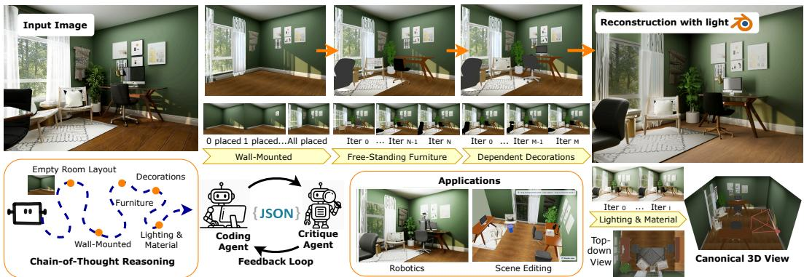  
Figure 1: Given a single input image, we reconstruct individual objects and use a VLM to reason object placements and orientations, yielding a high-quality compositional 3D scene.

## ABSTRACT

Compositional 3D scene reconstruction has recently been explored from two directions: agentic reasoning that provides semantic understanding of spatial relationships but lacks precise alignment with input images; and visual geometry foundation models that predict dense point maps from input images but the reconstruction quality is limited. Therefore, recovering a complete 3D scene from a single monocular image with accurate inter-object relationships and high-fidelity reconstruction quality remains challenging. In this paper, we present HARMONY, a hierarchical chain-of-thought framework that leverages both agentic reasoning and visual geometry foundation. Given an image of an indoor scene, starting from an empty 3D floorplan, HARMONY first calibrates the camera against the reference image to establish a semantically-grounded spatial frame, then uses agentic VLM reasoning to recover the 3D room layout and an initial placement order. It then places the objects in a hierarchical order, from wall-mounted elements, free-standing furniture, to dependent decorations on top of furniture. We also use depth-first traversal for furniture so each placement conditions on previously resolved structure and a reflective feedback loop to avoid error accumulation. After each object placement by VLM, we use the point cloud estimations to perform geometry-based refinement so that the rendered image aligns better with the input. HARMONY can produce 3D scenes that are semantically consistent and perceptually aligned with the reference image, extending single-image compositional reconstruction to complex indoor scene images. Experiments on synthetic and real-world images demonstrate that HARMONY outperforms the evaluated reconstruction baselines, while qualitative comparisons with GPT-6 Astra suggest more faithful object arrangements and better preservation of scene details.

## 1 INTRODUCTION

Reconstructing a compositional 3D scene from a single image is a long-standing problem in computer graphics and vision, with applications spanning AR/VR content creation, embodied AI, robotic navigation, and interactive scene editing. However, recovering a 3D scene from a single image is inherently ill-posed: a single view captures only partial geometry and typically exhibits heavy interobject occlusions. Beyond geometry, producing a plausible scene layout is also challenging, as 2D images provide no explicit cues about exact object scales and spatial relationships.

Prior work on compositional 3D scene reconstruction has largely built upon image-to-3D generation and visual geometry foundation models. Given an input image, these methods (Sautter et al., 2025; Dong et al., 2025; Zhu et al., 2025; Yao et al., 2025) segment and reconstruct each object separately, then assemble them into a shared coordinate system by aligning perception signals such as estimated depth and point clouds. Relying solely on low-level perceptual cues without explicit reasoning over inter-object relationships, they often struggle with occluded and small objects, producing errors in object pose and relative placement. Another line of work leverages vision–language models (VLMs) for spatial reasoning over object relationships (Pfaff et al., 2026; Yin et al., 2026; Xia et al., 2026; Yao et al., 2025), modeling how each object interacts with the floorplan and surrounding objects rather than how it projects into a camera. Text-conditioned methods (Pfaff et al., 2026) exploit spatial reasoning to plan a hierarchical placement order from wall-aligned items to furniture in order to recover relations such as “against the wall” or “on top of”. However, because they operate purely in language and ground the scene through asset retrieval, these pipelines are restricted to scenes composed of simple objects and template-like arragments. Image-conditioned VLM methods (Xia et al., 2026; Yin et al., 2026; Yang et al., 2024a; Bian et al., 2025) restore this grounding and achieve strong high-level semantic alignment with the observed scene, but inherit the VLM’s well-known weakness of being unable to perform precise visual–geometric reasoning, yielding inaccurate object placements and noticeable visual mismatch with the input.

In this paper, we propose HARMONY, a hierarchical VLM-guided framework for high-quality single-image to 3D scene reconstruction that leverages the strengths of both agentic reasoning and visual geometry-grounded signals. We first use the semantic and spatial understanding of VLM to reason and plan a 3D scene that highly aligns with the input image. Specifically, rather than placing all objects at once, we decompose the problem into a structured reasoning process of multiple stages. The VLM first grounds itself spatially in the scene by identifying corners, walls, and viewpoint to establish a fixed frame of reference. It then reasons through object placement in a hierarchical order: wall-mounted items, free-standing furniture, and finally decorations that rest on top of the furniture. We also use depth-first traversal to place the furniture: at the moment any object is placed, every previously placed object lies behind it from the camera’s perspective. Therefore, each new candidate appears in a clean, unoccluded view of the partial scene, allowing the VLM to reason about its orientation and pairing without any interference from clutter. After the VLM obtains a good plan of the 3D scene, we leverage visual geometry signals as a refinement tool for more fine-grained positioning, including both image-space alignment and depth-space alignment. Our design avoids the weaknesses of previous methods that rely only on point clouds, which cannot handle occlusions or small objects. Also, after each placement stage, we introduce a reflective feedback loop that uses VLM to compare the rendering of the partial scene against the input image and identify correspondence issues such as missing items, incorrect pairings, or wrong orderings, etc. This allows us to correct and prevent errors from propagating to the next stages. We evaluate our method on both synthetic and real-world indoor input images, and the results demonstrate that we are able to reconstruct the 3D scene in a high-quality compositional manner.

In summary, our contributions can be summarized as the following:

• Given a single image of an indoor scene, we propose a hierarchical chain-of-thought framework to reconstruct a compositional 3D scene. We frame this problem as a structured reasoning process and use VLM to ground the scene spatially and place objects in multiple stages.

• HARMONY marries the complementary strengths of VLMs and visual geometry-grounded models. We first use a VLM to reason about spatial and semantic relationships, i.e, what an object leans against, sits on, faces, or pairs with. Then we adjust the precise position based on the estimated point clouds.

• HARMONY achieves state-of-the-art performance in single-image compositional 3D scene reconstruction on both synthetic and challenging real-world inputs, with qualitative comparisons against GPT-6 Astra indicating more faithful object arrangements and better preservation of scene details.

## 2 RELATED WORK

Image-to-3D Object Reconstruction Given an image of a 3D object, image-to-3D reconstruction outputs both the 3D geometry and textures. The current dominant paradigm is based on 3D native diffusion that trains a diffusion model directly on 3D representations. 3DShape2VecSet (Zhang et al., 2023) pioneers this line of research, encoding shapes into latents with cross-attention that can be decoded to occupancy fields. CLAY (Zhang et al., 2024) scales latent-set diffusion to billionscale parameters on large-scale 3D data, and TRELLIS (Xiang et al., 2024) unifies geometry and appearance in a structured latent that decodes to multiple representations, including 3D Gaussians, radiance fields, and meshes. Recent works have further pushed scale, fidelity, and material ex pressiveness based on the latent diffusion transformer. The Hunyuan3D 2 series (Tencent Hunyuan3D Team, 2025b) progressively adds PBR materials and finer geometric detail; TripoSG (Li et al., 2025) adopts a rectified-flow transformer with larger latent capacity; and Direct3D-S2 (Wu et al., 2025) introduces sparse attention for gigascale training. TRELLIS.2 (Xiang et al., 2025) extends the structured-latent design with a field-free O-Voxel representation that jointly handles arbitrary topology and PBR appearance. From a complementary angle, SAM3D (SAM 3D Team et al., 2025) introduces human-in-the-loop annotation for strong reconstructions on in-the-wild images with heavy occlusion. Our method integrates these advances in object reconstruction with hierarchical reasoning and geometry-grounded refinement to assemble coherent scenes with object scales, orientations, and spatial relationships aligned with the input image.

Geometry-Grounded Image-to-3D Scene Reconstruction Recent advances in visual geometry learning and 2D segmentation have facilitated the reconstruction of single-view input images. A typical line of methods decomposes the problem into multiple stages, including point cloud estimation (Wang et al., 2025), segmentation (Kirillov et al., 2023; Liu et al., 2023; Ren et al., 2024), context-aware inpainting (Team, 2025; Bai et al., 2025; Wang et al., 2024; Bai et al., 2023; Google, 2026), single object reconstruction (Xiang et al., 2025; Tencent Hunyuan3D Team, 2025b; SAM 3D Team et al., 2025), and finally layout optimization. For example, Gen3DSR (Dogaru et al., 2025) applies a divide-and-conquer strategy that pairs holistic scene parsing with object-level generative reconstruction and ZeroScene (Tang et al., 2026) optimizes per-object poses by jointly minimizing 3D and 2D projection losses on segmented point clouds. CAST (Yao et al., 2025) reasons about inter-object spatial relations through a GPT-based scene parser, employs an occlusion-aware large 3D generation model for each component, and resolves penetration and floating artifacts through SDF-based physical correction. 3D-RE-GEN (Sautter et al., 2025) extends this idea with explicit background reconstruction and a 4-DoF differentiable optimization that aligns reconstructed objects to the estimated ground plane. A complementary direction trains a single network to directly predict the whole scene. Coherent 3D Scene Diffusion (Dahnert et al., 2024) and MIDI (Huang et al., 2025) jointly diffuse all objects’ shapes and poses with cross-instance attention, while SceneGen (Meng et al., 2025) produces all 3D assets in a single feed-forward pass without per-object optimization. However, these pipelines lack semantic spatial understanding for resolving object orientation, so they often recover noisy facings and miss inter-object relationships, such as how a chair should face relative to a desk.

Agentic Reasoning for 3D Scene Generation Advances in multimodal vision-language models (VLMs) (Bai et al., 2023; 2025; Wang et al., 2024; Team, 2025) have enabled reasoning about object arrangements and scene graphs based on semantics. Given a text description of a scene, SceneSmith (Pfaff et al., 2026), for instance, uses a VLM to initialize a floorplan with wall dimensions, then reasons about a hierarchical placement order that captures how objects relate to one another and to the surrounding layout. Moreover, because text descriptions are not able to describe accurate 3D positions and orientations, these methods often rely on asset retrieval and hand-designed priors, such as canonical object orientations like the canonical facing direction of a bed in a bedroom.

Adding a reference image to VLM generation provides a more concrete grounding signal. Holodeck and Holodeck2.0 (Bian et al., 2025; Yang et al., 2024b) use a VLM to parse objects and emit constraint relations that drive a layout solver, while SAGE (Xia et al., 2026) converts the image to text descriptions and only align the image semantically. VIGA (Yin et al., 2026) builds a Blender agent that iteratively adjusts the reconstructed scene by rendering and comparing it with the input. However, it still only produces scenes that are semantically similar to the reference because VLM itself cannot reason precise numerical quantities. Spatially-Contextualized VLMs (Liu et al., 2025) augment VLM reasoning with explicit perception signals, i.e, point clouds produced by Fast3R (Yang et al., 2025). However, small objects such as decorations can be difficult to resolve in monocular images, leading to incomplete or noisy point-cloud estimates. Our work proposes a hierarchical reasoning pipeline and performs checking in each stage to reduce error accumulation.

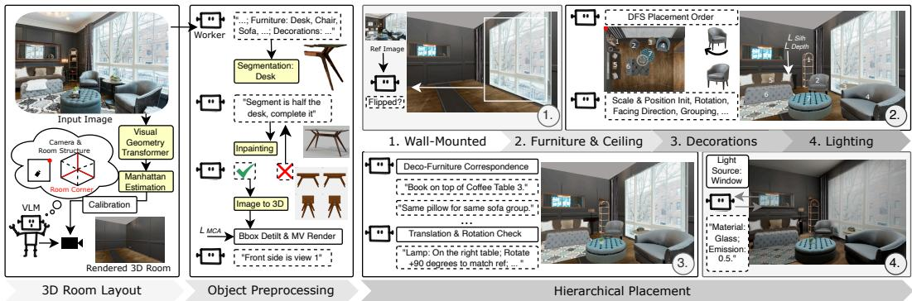  
Figure 2: Overview of our pipeline. HARMONY takes a monocular image as input. It first creates an empty 3D room layout and anchors the camera to the 3D scene based on the estimated point cloud and Manhattan frame. It then segments and inpaints the objects in the scene and reconstructs their 3D meshes. Next, a VLM hierarchically plans and places the objects in three stages, with point clouds used for geometric correction. Finally, HARMONY relights the reconstructed scene using VLM-estimated material and emission properties.

## 3 METHOD

Given a monocular image of an indoor scene, our goal is to reconstruct a compositional 3D scene that faithfully recovers all objects together with their spatial relationships, such that renderings of the reconstructed scene closely match the input view. To this end, HARMONY integrates VLM-based relational and spatial reasoning, 2D and 3D generation, and visual geometry-grounded models into a unified and scalable pipeline.

As shown in Figure 2, the backbone of HARMONY is a hierarchical chain-of-thought framework based on VLM. Starting from an empty 3D room, we first estimate the camera pose that aligns with the perspective of the input view, anchoring its initial understanding of the scene (Section 3.1). Next, we segment and inpaint each object, and then reconstruct them into 3D meshes (Section 3.2). Then, the VLM reasons about object placement in a hierarchical order (Section 3.3): first wall-mounted objects, then furniture and ceiling objects, and finally decorations. HARMONY explicitly models spatial relationships such as what an object leans against, sits on, faces, or is paired with. Visual geometry cues are further leveraged to refine each object’s scale and position. In each stage, we also introduce a reflective feedback loop that uses the VLM to critique the rendered scene against the reference image, identifying missing items, mismatched sizes, incorrect pairings, or wrong orderings, and issues targeted corrections. This reflective feedback loop refinement progressively reduces error accumulation and yields a scene that is both globally consistent and locally faithful to the input. Finally, HARMONY uses the VLM to estimate per-object materials and the scene’s emissive light sources for a physically-based render (Section 3.4).

## 3.1 3D ROOM LAYOUT AND CAMERA INITIALIZATION

In this stage, we aim to obtain a mesh of an empty room (i.e., walls without objects) with a camera pose that projects a layout that aligns with the reference image. Our solution combines both semantic room understanding from the VLM and geometric corner detection from VGGT.

## 3.1.1 VLM SEMANTIC INITIALIZATION.

As shown in the leftmost column of Figure 2, we first use the VLM to infer approximate room dimensions from semantic cues in the reference image (e.g., (3, 4, 3)m for a bedroom). These estimates serve as a scale prior for initializing the room geometry, consisting of walls, a floor, and a ceiling. The VLM then identifies the deepest visible room corner as a spatial anchor (or the farthest wall endpoint if only walls are visible) from the reference image. We associate the identified anchor with the corresponding vertical edge of the canonical room mesh, whose floor and ceiling endpoints are denoted by $\widehat { X _ { f } }$ and ${ \widehat { X } } c ,$ with estimated room height $H _ { \mathrm { r o o m } } = | \widehat { X } _ { c } - \widehat { X } _ { f } | _ { 2 }$ . The VLM further labels each visible wall relative to this anchor, establishing which surface regions in the canonical mesh correspond to which image walls. After this stage, we have an empty room box with semantically-aligned corners and planes.

## 3.1.2 VGGT GEOMETRIC REFINEMENT.

To anchor the same corner and its adjoining floor–wall boundaries in the VGGT reconstruction, we estimate a Manhattan frame from the predicted point cloud and VGGT camera, with extrinsics $( R _ { 0 } , \mathbf { t } _ { 0 } )$ and intrinsics K (focal length $f _ { x } )$ , using SVD-based clustering of surface normals, yielding three mutually orthogonal axes $\bar { \mathbf { a } } _ { w } , \bar { \mathbf { a } } _ { v } , \mathbf { a } _ { d } \in \bar { \mathbb { R } } ^ { 3 }$ (corresponding to the width, vertical, and depth directions), with the width–depth assignment resolved in the calibration step below. The room’s six bounding planes are located along these axes by a per-axis histogram fit and normal alignment with the surface normals. Within this Manhatthan frame we identify the deepest floor corner (farthest from the camera) $\overline { { \boldsymbol X } } _ { f }$ as the intersection of the floorplane with the two wall planes meeting at it, and its ceiling counterpart directly above it, $\overline { { \boldsymbol X } } _ { c }$ , both in VGGT coordinate space. The Manhattan frame also identifies the two floor-wall edges extending from the anchor corner along $\mathbf { a } _ { w } , \mathbf { a } _ { d }$ corresponding to the width- and depth-facing walls.

## 3.1.3 CAMERA CALIBRATION.

We use the VGGT camera and Manhattan frame obtained in the previous step to solve in closed form for a single similarity transform (rotation $R _ { \mathrm { a l i g n } }$ , uniform scale s, translation t) that re-expresses this pose in the canonical frame, with $\overline { { \boldsymbol X } } _ { f } , \overline { { \boldsymbol X } } _ { c }$ aligned with the corresponding floor and ceiling endpoints of a vertical room edge. Applying this transform to the VGGT camera itself then gives its pose in the canonical frame.

Rotation. We first orient the canonical axes directly from the Manhattan frame: $\mathbf { a } _ { v }$ is oriented upward; between $\mathbf { a } _ { w } , \mathbf { a } _ { d } .$ , whichever has the larger-magnitude dot product with the camera’s forward direction $R _ { 0 } ^ { \top } { \bf e } _ { z }$ is assigned to the canonical depth axis (oriented so the camera looks toward the back wall), and the remaining axis to canonical width, with its sign fixed so that

$$
R _ { \mathrm { a l i g n } } = [ \mathbf { a } _ { w } ^ { \top } ; ~ \mathbf { a } _ { v } ^ { \top } ; ~ \mathbf { a } _ { d } ^ { \top } ]
$$

is a proper rotation (the determinant of $R _ { \mathrm { a l i g n } } \mathrm { i s } + 1 )$

Scale. We then recover metric scale directly from the anchor edge, using the room’s known height $H _ { \mathrm { r o o m } }$ as the sole external metric reference:

$$
s = H _ { \mathrm { r o o m } } / \| \overline { { \boldsymbol X } } _ { c } - \overline { { \boldsymbol X } } _ { f } \| .
$$

Translation. We solve in closed form for the translation t that places the floor anchor exactly on its corresponding canonical wall corner $\widehat { X _ { f } }$

$$
\mathbf { t } = \widehat { \mathbfcal { X } } _ { f } - s R _ { \mathrm { a l i g n } } \overline { { \pmb { X } } } _ { f } ,
$$

giving the similarity map $X \mapsto s R _ { \mathrm { a l i g n } } X + \mathbf { t }$ from VGGT space into the canonical room frame.

Camera pose. The camera rotation and center can thus be solved using the above similarity transform:

$$
R = R _ { 0 } R _ { \mathrm { a l i g n } } ^ { \top } , \qquad \mathbf { c } = s R _ { \mathrm { a l i g n } } \mathbf { c } _ { 0 } + \mathbf { t } ,
$$

where ${ \bf c } _ { 0 } = - R _ { 0 } ^ { \top } { \bf t }$ <sub>0</sub> is the raw VGGT camera center.

## 3.2 OBJECT SEGMENTATION AND RECONSTRUCTION

For compositional reconstruction, we detect and segment each object in the image, inpaint occluded ones and finally reconstruct them into 3D meshes.

Object Detection. We detect and segment objects hierarchically, processing one level at a time: wall-mounted items (e.g., paintings, windows), free-standing furniture (ground-mounted objects like desks and ceiling-mounted objects like chandeliers), and decorations that rest on furniture. At each level, the VLM parses the reference image to list the objects of that category with their per-instance counts; we pass this list to open-vocabulary detection (Wang et al., 2026) for bounding boxes and then to a segmentation model (Ravi et al., 2024) for masks. Afterwards, we also filter duplicate and spurious detections and attach each decoration to its supporting furniture.

Object Inpainting. For each detected object, the VLM produces a detailed description conditioned on the surrounding scene context, which is passed together with the cropped object region to an image-editing model (Google, 2026) to inpaint the occluded region. A half-occluded table, for example, is described as such by the VLM, so the model can generate a complete table compatible with the scene. The VLM then inspects the inpainted result for consistency with the reference object in terms of object type, completeness, and shape alignment. If the output does not match, it regenerates with additional material and color hints.

Mesh Canonicalization and Orientation Labeling. After obtaining the complete image for each object, we reconstruct its 3D mesh using an image-to-3D model (Tencent Hunyuan3D Team, 2025b). Since the inpainted views inherit the perspective of the input image, the resulting meshes are in noncanonical poses. We first canonicalize each mesh by applying Principal Component Analysis (PCA) to its vertices and aligning its dominant axis with world-up. The VLM then inspects multi-view renders of the mesh and labels its facing direction, assigning a per-object canonical frame that the placement stage uses to enforce correct relative orientations between paired objects (e.g., a chair facing its companion desk).

## 3.3 HIERARCHICAL SCENE RECONSTRUCTION

In this stage, the VLM reasons about the spatial relationships among objects and places them into the 3D scene in three ordered stages as in object detection: wall-mounted items, free-standing objects and decorations. We parameterize each object by its position $ { \mathbf { p } } \in \mathbb { R } ^ { 3 }$ and a uniform scale s, with its yaw set by the VLM during placement. In each stage, a reflective feedback loop inspects the rendered scene and corrects errors before the pipeline proceeds.

VLM Placement Order Reasoning. Building on the anchor corner from the previous step, the VLM uses it as a spatial reference for performing object placements. Treating this anchor corner as the deepest point of the room, the VLM performs a depth-first traversal over the visible objects ordered by proximity to the corner: the VLM first places objects nearest the anchor along the two adjacent walls, then progressively moves outward toward the room’s interior, finishing with the objects closest to the camera. In this way, each new object can be aligned with the existing geometry without occlusion, while its orientation and pairwise relationships are resolved within a consistent, previously established scene context.

VLM-based Object Placement. Once the placement order is determined, the VLM assigns an initial size to each object from prior knowledge and reasons about per-object prompts describing each object’s spatial relationship to the room and other objects, e.g, “sofa back against the left wall”, “vase on the desk”, or “chair facing the small coffee table”. Using each object’s canonical front from the preprocessing stage (Section 3.2), the VLM then sets its orientation from these relations, e.g, turning the sofa’s back toward the specified wall and rotating it to face the specified neighbor. Finally, the VLM visually compares the rendered object against the reference image and applies small rotation adjustments to better match it. For decorations, the VLM identifies which previously placed piece of furniture supports each decoration and verifies that it rests on the correct one. Since the VLM’s semantic reasoning can confuse furniture that shares a category label (e.g, two similar end tables), we add a consistency check to prevent misattachment, such as a vase placed on the wrong table. When the VLM flags such a case, it triggers a bounding-box check that compares the decoration’s box against those of the candidate hosts and reassigns the decoration to the host whose box it overlaps most.

Visual Geometry-Grounded Refinement The placements produced by the VLM capture the correct semantic relations between objects but only approximate scale and location. We refine each placement in two coupled stages: the image-space silhouette fixes the object’s lateral position and its scale-to-depth ratio $s / Z$ from the apparent silhouette width, while the point cloud fixes the forward distance Z, which in turn resolves the metric scale s.

For image-space alignment, we render the object silhouette with horizontal center $u _ { c }$ and width w, and align it with its segmentation mask (center $\hat { u } _ { c } .$ , width wˆ). With the current object depth $Z =$ $\left( \mathbf { p } - \mathbf { c } \right) \cdot \hat { \mathbf { f } }$ , the horizontal offset $\Delta u = \hat { u } _ { c } - u _ { c }$ back-projects to a lateral translation $\begin{array} { r } { \mathbf p \gets \mathbf p + \frac { \Delta u Z } { f _ { x } } \hat { \mathbf r } . } \end{array}$ For objects not flagged as heavily occluded, we further read the object’s apparent (angular) size from the silhouette, $\begin{array} { r } { \overline { { \alpha } } = \frac { \hat { w } } { f _ { x } } = \frac { \overline { { s } } w _ { \mathrm { o b j } } } { Z } } \end{array}$ , where $w _ { \mathrm { o b j } }$ is the object’s canonical width. The silhouette is inherently ambiguous between object scale and depth, so α determines only the ratio $s / Z ;$ we therefore refine the VLM’s coarse size prior but defer the metric scale to the depth stage.

For depth-space alignment, we leverage the point cloud estimated by VGGT (Wang et al., 2025) and segment it with the per-object mask, and likewise lift the rendered scene within the rendered mask. For each object, we extract the robust front-surface means ${ \bf c } _ { \mathrm { r e f } } ^ { \mathrm { f r o n t } } , { \bf c } _ { \mathrm { r e n } } ^ { \mathrm { f r o n t } }$ by iterative median with MAD outlier rejection, and correct the depth by their displacement along the view direction: $Z ^ { \prime } = Z + \left( \mathbf { c } _ { \mathrm { r e f } } ^ { \mathrm { f r o n t } } - \mathbf { c } _ { \mathrm { r e n } } ^ { \mathrm { f r o n t } } \right) \cdot \hat { \mathbf { f } } , ~ \mathbf { p } \gets \mathbf { p } + \left( Z ^ { \prime } - Z \right) \hat { \mathbf { f } }$ . Combining the silhouette-derived angular size α with the corrected depth $Z ^ { \prime }$ , we finalize the metric scale as: $\begin{array} { r } { s \ = \ \frac { \alpha Z ^ { \prime } } { w _ { \mathrm { o b j } } } \ = \ \frac { \hat { w } Z ^ { \prime } } { f _ { x } w _ { \mathrm { o b j } } } } \end{array}$

Collision Resolution. For a colliding pair $( i , j )$ , let $\delta _ { i } , \delta _ { j }$ be the minimal collision-free displacements that separate the pair by moving object i or object $j ,$ , respectively. The two differ because each object is constrained by a different local neighborhood, so its feasible escape direction and distance are object-specific. We apply the smaller least-disruptive move to the corresponding object: $\mathbf { p } _ { k }  \mathbf { p } _ { k } + \delta _ { k }$ k = arg mi $\mathsf { l } _ { k \in \{ i , j \} } \left\| \delta _ { k } \right\|$ . If no single move separates them, neighbors in the colliding group are moved as well. When a collision persists, we invoke the VLM to revise the placement order, addressing the conflict at its source rather than locally.

Reflective Feedback Loop. After each placement stage is planned and executed, we render the updated 3D scene and send it back to the VLM together with the input image. The VLM performs a reflective visual check for issues such as incorrect scale, inaccurate orientation, or misplaced items, and applies corrective actions before the pipeline proceeds to the next stage, preventing error accumulation. It also reasons over groups of visually matched objects to equalize their scale. For instance, chairs placed as a matched pair are inferred to share a common size. After the decoration stage, the VLM further counts the placed objects against the reference and fills any missing instance, either by reusing an existing mesh of the same type or by regenerating one through mesh generation.

## 3.4 LIGHTING

For photorealistic rendering, the VLM assigns materials and recovers the scene’s lighting. Since the image-to-3D generator outputs only a baked base color, the VLM infers each object’s dominant PBR material from per-category priors, such as a glass table being transmissive. It then identifies the emissive sources such as lamps and windows and estimates each one’s activation state, color, and intensity from the reference. Finally, a reflective loop compares the Blender Cycles render against the reference and refines these parameters until the appearance matches.

## 4 EXPERIMENTS

## 4.1 EXPERIMENT PROTOCOL

Benchmarks. We evaluate our method on two datasets: Front3D (Fu et al., 2021b;a) renders that contain 100 images with 3D ground truth and HARMONY30, which contains 30 real-world, copyright-free in-the-wild images spanning indoor scenes with varying layouts, styles, and lighting. To further demonstrate the robustness of our method, we construct a HARMONY300, a broader benchmark containing 300 single-image indoor scenes (including these 30 evaluation scenes) and run our full pipeline on them.

Evaluation Metrics. To evaluate the rendering quality of our method, following VIGA (Yin et al., 2026), we render each method from the input viewpoint and compare against the reference image using image-similarity metrics, including Negative-CLIP score (N-CLIP), which is $1 - \mathrm { C L I P } _ { \mathrm { c o s } } ^ { - } ( I _ { \mathrm { p r e d } } , \bar { I } _ { \mathrm { r e f } } )$ , where $\mathrm { C L I P _ { c o s } }$ denotes CLIP-ViT-B/32 image embeddings and photometric loss (PL), which is the pixel-wise MSE over normalized RGB in [0, 1], and LPIPS. For datasets with ground-truth meshes, i.e, Front3D, we also evaluate the geometry quality and report Chamfer Distance (CD) and F-score at thresholds 0.1, 0.01 and 0.001. We additionally conducted a user study with 16 participants across 20 scenes, where participants ranked our method against five baselines. We report the mean rank with standard deviation, as well as the percentage of scenes ranked first (Top-1) or among the top two (Top-2).

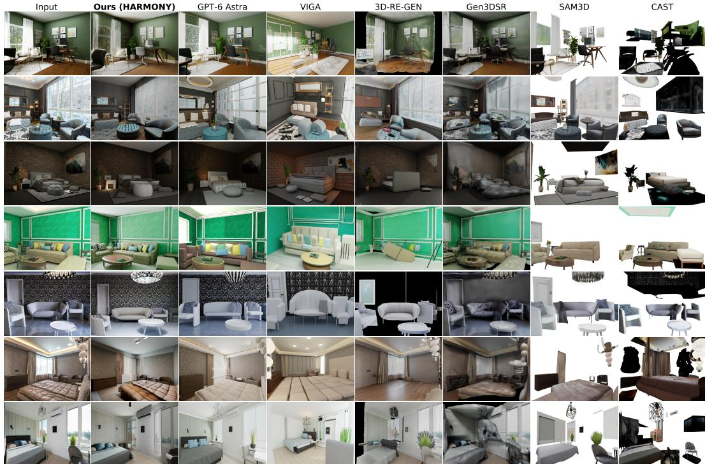  
Figure 3: Qualitative comparison between HARMONY and baselines.

Baselines. We compare HARMONY against representative single image to 3D scene methods: Gen3DSR (Dogaru et al., 2025), 3D-ReGen (Sautter et al., 2025), CAST (Yao et al., 2025), SAM3D (SAM 3D Team et al., 2025), and the concurrent work VIGA (Yin et al., 2026). All methods use their officially released checkpoints where available. Note that SAM3D requires per-object masks as input, so we use HARMONY’s segmentation mask and denote the baseline as SAM3D\*. CAST has no official release, so we use the best available unofficial implementation<sup>\*</sup>. Also, CAST and SAM3D don’t reconstruct backgrounds; we augment with our method’s background when calculating perceptual metrics.

## 4.2 QUANTITATIVE RESULTS

Results on Front100 Dataset with Geometric GT. Table 1 reports both rendering quality and geometry quality on the 100 Front3D cases. HARMONY achieves the best score on every metric: it is most semantically faithful (N-CLIP) because the VLM plans and places all objects, most pixel-accurate (PL) and geometrically accurate (CD, F-score) because we ground each placement in dense metric image evidence (silhouette + depth) and use a strong image-to-3D generator for perobject reconstruction. Under the evaluated configuration, GPT-6 Astra produces visually plausible reconstructions but exhibits larger geometric errors, e.g., beds might not align with walls.

Results on Harmony30 Subset. Table 2 reports the results of perceptual evaluation on real-world images from our benchmark. HARMONY achieves the best N-CLIP and PL scores, indicating that its reconstructed scenes better preserve both the semantic content and perceptual structure of the input images even for complex real-world inputs.

Results on User Study. Results of user study can be found Table 2. HARMONY is ranked first in 67.0% of choices and in the top two in 86.0%, with a mean rank of 1.54. These results suggest that HARMONY consistently reconstructs 3D scenes that are visually and semantically more faithful to the input than competing methods.

Table 1: Perceptual and Geoemtric Results on Front3D testset.
<table><tr><td>Method</td><td>N-CLIP↓</td><td>PL↓</td><td>CD↓</td><td>F@0.1↑</td><td>F@0.01↑</td><td>F@0.001↑</td></tr><tr><td>SAM3D*</td><td>0.127</td><td>0.069</td><td>0.056</td><td>81.79</td><td>14.44</td><td>0.089</td></tr><tr><td>Gen3DSR</td><td>0.168</td><td>0.043</td><td>0.057</td><td>78.33</td><td>10.01</td><td>0.050</td></tr><tr><td>CAST</td><td>0.149</td><td>0.077</td><td>0.052</td><td>85.70</td><td>14.39</td><td>0.093</td></tr><tr><td>3D-ReGen</td><td>0.163</td><td>0.142</td><td>0.060</td><td>78.87</td><td>12.65</td><td>0.088</td></tr><tr><td>VIGA</td><td>0.179</td><td>0.079</td><td>0.055</td><td>83.90</td><td>12.67</td><td>0.074</td></tr><tr><td>Ours</td><td>0.092</td><td>0.041</td><td>0.049</td><td>89.82</td><td>19.47</td><td>0.130</td></tr><tr><td>GPT-6 Astra</td><td>0.095</td><td>0.052</td><td>0.061</td><td>77.44</td><td>14.04</td><td>0.090</td></tr></table>

Table 2: Quantitative results on real-world inputs and user study on selected scenes.
<table><tr><td>Method</td><td>N-CLIP↓</td><td>PL↓</td><td>Mean Rank↓</td><td>Top-1 (%)↑</td><td>Top-2 (%)↑</td></tr><tr><td>SAM3D*</td><td>0.194</td><td>0.051</td><td> $3 . 2 6 \pm 1 . 6 0$ </td><td>13.7</td><td>39.3</td></tr><tr><td>Gen3DSR</td><td>0.213</td><td>0.049</td><td> $3 . 3 4 \pm 1 . 5 9$ </td><td>11.3</td><td>37.3</td></tr><tr><td>CAST</td><td>0.172</td><td>0.099</td><td> $4 . 1 5 \pm 1 . 4 4$ </td><td>3.3</td><td>14.7</td></tr><tr><td>3D-ReGen</td><td>0.154</td><td>0.053</td><td> $4 . 3 4 \pm 1 . 4 9$ </td><td>4.0</td><td>13.7</td></tr><tr><td>VIGA</td><td>0.184</td><td>0.069</td><td> $4 . 3 7 \pm 1 . 2 3$ </td><td>0.7</td><td>9.0</td></tr><tr><td>Ours</td><td>0.112</td><td>0.045</td><td> ${ \bf 1 . 5 4 \pm 0 . 9 3 }$ </td><td>67.0</td><td>86.0</td></tr><tr><td>GPT-6 Astra</td><td>0.127</td><td>0.047</td><td></td><td></td><td></td></tr></table>

## 4.3 QUALITATIVE RESULTS

Qualitative comparisons are shown in Figure 3. Gen3DSR (Dogaru et al., 2025) optimizes objects in the scene context using Score Distillation Sampling (SDS). While it roughly preserves the room layout, its results exhibit substantial geometry and appearance degradation, with nearby objects often merged, support relationships distorted, and textures blurred or flattened. In contrast, our method reconstructs objects individually with generative models, producing higher-quality geometry and textures. 3D-RE-GEN (Sautter et al., 2025) recovers major furniture and approximate scene layouts, but often produces inaccurate object orientations, scales, and placements due to its reliance on noisy geometric cues. Small objects and decorations are also frequently missing or misplaced, while limited modeling of object relationships can lead to floating or incorrectly supported objects. VIGA (Yin et al., 2026) relies on VLM-based critique of the final rendered scene to iteratively refine the reconstruction, providing limited direct geometric supervision for individual object placements. In contrast, HARMONY combines a globally grounded floorplan with dense local geometric cues, including silhouettes and depth, to refine each object against explicit geometric targets. SAM3D (SAM 3D Team et al., 2025) relies on accurate per-object segmentation and degrades substantially when applied directly to the full image, limiting its robustness in cluttered scenes. CAST (Yao et al., 2025) similarly struggles with object segmentation and pose estimation, leading to missing objects and inaccurate spatial configurations. Overall, HARMONY leverages VLM-based semantic and spatial reasoning to establish coherent scene structure and object relationships, followed by local geometry-based refinement for precise placement. This combination yields more faithful object poses and more coherent spatial arrangements.

## 4.4 ABLATION STUDY

Table 3 ablates each pipeline component in isolation, including the separate roles the VLM plays (reasoning, placement order, refinement) and the depth-first furniture traversal. Removing silhouette refinement and camera calibration hurts perceptual similarity the most because the accuracy comes from grounding placements in dense, metric image evidence. Removing the canonicalized detection and feedback loop, and the VLM reasoning collapses semantic fidelity (N-CLIP) toward reasoningfree baselines. The depth-first-traversal and placement-order ablations isolate structured reasoning: even with correct per-object estimates, unordered placement causes occlusion and attachment errors. Our full method benefits from the interaction of global geometric grounding and structured, imagesupervised reasoning, not any single component.

Table 3: Ablation of our key design choices.
<table><tr><td>Variant</td><td>N-CLIP↓</td><td>PL↓</td><td>Variant</td><td>N-CLIP↓</td><td>PL↓</td></tr><tr><td>HARMONY (full)</td><td>0.1034</td><td>0.0462</td><td>w/o VGGT refinement</td><td>0.1069</td><td>0.0509</td></tr><tr><td>w/o depth-first traversal</td><td>0.1045</td><td>0.0523</td><td>w/o VLM placement reasoning</td><td>0.1079</td><td>0.0522</td></tr><tr><td>w/o placement refinement</td><td>0.1051</td><td>0.0516</td><td>w/o feedback loop</td><td>0.1184</td><td>0.0509</td></tr><tr><td>w/o placement order</td><td>0.1065</td><td>0.0477</td><td>w/o camera calibration</td><td>0.1381</td><td>0.0596</td></tr></table>

## 4.5 FAILURE CASES

We discuss our three common failure cases here and examples can be found in Figure 4.

Case 1: Rare-type synonym mismatch. For rare object types, a mismatch between the VLM’s and the detector’s vocabulary would affect detection: 25.9% of detections carry a low grounding confidence (< 0.35), and genuine placement failures (after routing and de-duplication are excluded)

remain rare at 0.3% of objects. These issues can be resolved using stronger foundation models within the same framework.

Case 2: Heavy occlusion due to foreground clipping. When an object sits very close to the camera and is largely clipped, the VLM still recovers the correct semantic relation (e.g., which wall it leans against), but the reconstructed mesh is not well constrained from the render viewpoint.  
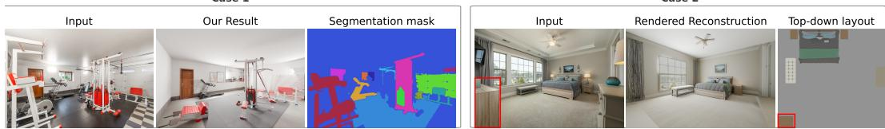  
Figure 4: Failure cases of HARMONY. Case 1 (gym) shows rare items that fail to detect or inpaint; In Case 2, the red box marks an object present in the input image and reconstructed scene in topdown layout but occluded in the rendered reconstruction, since it sits against a wall occluded from render camera.

## 5 CONCLUSION AND FUTURE WORK

In this paper, we present HARMONY, a hierarchical agentic reasoning framework for reconstructing compositional 3D scenes from a monocular indoor image. Starting from an empty 3D room, HAR-MONY first calibrates the camera against the reference image, then places objects in a hierarchical order each stage followed by refinement from geometry-grounded models. We leverage the strengths of VLMs for spatial reasoning and visual geometry-grounded models for geometry perception. A reflective feedback loop after each stage prevents error propagation. Experiments on both synthetic and real-world indoor images show that HARMONY produces compositional 3D reconstructions that align closely with the input. Future works can extend our work to multi-view images and also infer object articulations.

## ACKNOWLEDGEMENT

The authors would like to thank Apple Inc. for supporting this project. The authors would also like to thank Qiao Feng and Minseong Kweon for proofreading this manuscript.

## REFERENCES

Jinze Bai, Shuai Bai, Shusheng Yang, Shijie Wang, Sinan Tan, Peng Wang, Junyang Lin, Chang Zhou, and Jingren Zhou. Qwen-vl: A versatile vision-language model for understanding, localization, text reading, and beyond. arXiv preprint arXiv:2308.12966, 2023.

Shuai Bai, Keqin Chen, Xuejing Liu, Jialin Wang, Wenbin Ge, Sibo Song, Kai Dang, Peng Wang, Shijie Wang, Jun Tang, Humen Zhong, Yuanzhi Zhu, Mingkun Yang, Zhaohai Li, Jianqiang Wan, Pengfei Wang, Wei Ding, Zheren Fu, Yiheng Xu, Jiabo Ye, Xi Zhang, Tianbao Xie, Zesen Cheng, Hang Zhang, Zhibo Yang, Haiyang Xu, and Junyang Lin. Qwen2.5-vl technical report. arXiv preprint arXiv:2502.13923, 2025.

Zixuan Bian, Ruohan Ren, Yue Yang, and Chris Callison-Burch. Holodeck 2.0: Vision-languageguided 3d world generation with editing. arXiv preprint arXiv:2508.05899, 2025.

Manuel Dahnert, Angela Dai, Norman Muller, and Matthias Nießner. Coherent 3d scene diffusion¨ from a single rgb image. In Advances in Neural Information Processing Systems, 2024.

Andreea Dogaru, Mert Ozer, and Bernhard Egger. Generalizable 3d scene reconstruction via divide<sup>¨</sup> and conquer from a single view. In International Conference on 3D Vision (3DV), 2025.

Wenqi Dong, Zesong Yang, Yuan Li, Hujun Bao, Yuewen Ma, and Zhaopeng Cui. Hiscene: Creating hierarchical 3d scenes with isometric view generation. In Proceedings of the 33rd ACM International Conference on Multimedia, pp. 3746027.3755132, 2025. doi: 10.1145/3746027.3755132. URL https://dl.acm.org/doi/10.1145/3746027.3755132.

Huan Fu, Rongfei Jia, Lin Gao, Mingming Gong, Binqiang Zhao, Steve Maybank, and Dacheng Tao. 3d-future: 3d furniture shape with texture. International Journal of Computer Vision, 129 (12):3313–3337, 2021a.

Huan Fu, Rongqi Jia, Lin Gao, Mingming Jing, Jiaming Li, Qixing Li, Haisong Xu, Yu-Kun Zhang, Ge Tang, Aaron Wang, Yong-Liang Liu, and Yu-Shen Wang. 3d-front: 3d furnished rooms with layouts and semantics. In Proceedings of the IEEE/CVF International Conference on Computer Vision (ICCV), October 2021b.

Google. Gemini image generator, 2026. URL https://gemini.google.com/. Prompt: ”Create a detailed image of...”.

Zehuan Huang, Yuan-Chen Guo, Xingqiao An, Yunhan Yang, Yangguang Li, Zi-Xin Zou, Ding Liang, Xihui Liu, Yan-Pei Cao, and Lu Sheng. Midi: Multi-instance diffusion for single image to 3d scene generation. In Proceedings of the IEEE/CVF Conference on Computer Vision and Pattern Recognition, pp. 23646–23657, 2025.

Alexander Kirillov, Eric Mintun, Nikhila Ravi, Hanzi Mao, Chloe Rolland, Laura Gustafson, Tete Xiao, Spencer Whitehead, Alexander C. Berg, Wan-Yen Lo, Piotr Dollar, and Ross Girshick.´ Segment anything. arXiv:2304.02643, 2023.

Yangguang Li, Zi-Xin Zou, Zexiang Liu, Dehu Wang, Yuan Liang, Zhipeng Yu, Xingchao Liu, Yuan-Chen Guo, Ding Liang, Wanli Ouyang, et al. Triposg: High-fidelity 3d shape synthesis using large-scale rectified flow models. IEEE Transactions on Pattern Analysis and Machine Intelligence, 2025.

Shilong Liu, Zhaoyang Zeng, Tianhe Ren, Feng Li, Hao Zhang, Jie Yang, Chunyuan Li, Jianwei Yang, Hang Su, Jun Zhu, et al. Grounding dino: Marrying dino with grounded pre-training for open-set object detection. arXiv preprint arXiv:2303.05499, 2023.

Xinhang Liu, Yu-Wing Tai, and Chi-Keung Tang. Agentic 3d scene generation with spatially contextualized vlms. arXiv preprint arXiv:2505.20129, 2025.

Yanxu Meng, Haoning Wu, Ya Zhang, and Weidi Xie. Scenegen: Single-image 3d scene generation in one feedforward pass. arXiv preprint arXiv:2508.15769, 2025.

OpenAI. Introducing gpt-5.5. https://openai.com/index/introducing-gpt-5-5/, 2026. Accessed: 2026-07-23.

Nicholas Pfaff, Thomas Cohn, Sergey Zakharov, Rick Cory, and Russ Tedrake. Scenesmith: Agentic generation of simulation-ready indoor scenes, 2026. URL https://arxiv.org/abs/ 2602.09153.

Nikhila Ravi, Valentin Gabeur, Yuan-Ting Hu, Ronghang Hu, Chaitanya Ryali, Tengyu Ma, Haitham Khedr, Roman Radle, Chloe Rolland, Laura Gustafson, Eric Mintun, Junting Pan, Kalyan Va-¨ sudev Alwala, Nicolas Carion, Chao-Yuan Wu, Ross Girshick, Piotr Dollar, and Christoph Fe-´ ichtenhofer. Sam 2: Segment anything in images and videos. arXiv preprint arXiv:2408.00714, 2024. URL https://arxiv.org/abs/2408.00714.

Tianhe Ren, Shilong Liu, Ailing Zeng, Jing Lin, Kunchang Li, He Cao, Jiayu Chen, Xinyu Huang, Yukang Chen, Feng Yan, Zhaoyang Zeng, Hao Zhang, Feng Li, Jie Yang, Hongyang Li, Qing Jiang, and Lei Zhang. Grounded sam: Assembling open-world models for diverse visual tasks, 2024.

SAM 3D Team, Xingyu Chen, Fu-Jen Chu, Pierre Gleize, Kevin J Liang, Alexander Sax, Hao Tang, Weiyao Wang, Michelle Guo, Thibaut Hardin, Xiang Li, Aohan Lin, Jiawei Liu, Ziqi Ma, Anushka Sagar, Bowen Song, Xiaodong Wang, Jianing Yang, Bowen Zhang, Piotr Dollar, Georgia´ Gkioxari, Matt Feiszli, and Jitendra Malik. Sam 3d: 3dfy anything in images. arXiv preprint arXiv:2511.16624, 2025.

Tobias Sautter, Jan-Niklas Dihlmann, and Hendrik Lensch. 3d-re-gen: 3d reconstruction of indoor scenes with a generative framework. arXiv preprint arXiv:2512.17459, 2025.

Xiang Tang, Rui Li, and Xiaopeng Fan. Zeroscene: A zero-shot framework for 3d scene generation from a single image and controllable texture editing. Computer Graphics Forum, 2026. arXiv preprint arXiv:2509.23607.

Qwen Team. Qwen3 technical report, 2025. URL https://arxiv.org/abs/2505.09388.

Tencent Hunyuan3D Team. Hunyuan3d 2.5: Towards high-fidelity 3d assets generation with ultimate details. arXiv preprint arXiv:2506.16504, 2025a.

Tencent Hunyuan3D Team. Hunyuan3d 2.0: Scaling diffusion models for high resolution textured 3d assets generation. arXiv preprint arXiv:2501.12202, 2025b.

Jianyuan Wang, Minghao Chen, Nikita Karaev, Andrea Vedaldi, Christian Rupprecht, and David Novotny. Vggt: Visual geometry grounded transformer. In Proceedings of the IEEE/CVF Conference on Computer Vision and Pattern Recognition, 2025.

Peng Wang, Shuai Bai, Sinan Tan, Shijie Wang, Zhihao Fan, Jinze Bai, Keqin Chen, Xuejing Liu, Jialin Wang, Wenbin Ge, Yang Fan, Kai Dang, Mengfei Du, Xuancheng Ren, Rui Men, Dayiheng Liu, Chang Zhou, Jingren Zhou, and Junyang Lin. Qwen2-vl: Enhancing vision-language model’s perception of the world at any resolution. arXiv preprint arXiv:2409.12191, 2024.

Shihao Wang, Shilong Liu, Yuanguo Kuang, Xinyu Wei, Yangzhou Liu, Zhiqi Li, Yunze Man, Guo Chen, Andrew Tao, Guilin Liu, Jan Kautz, Lei Zhang, and Zhiding Yu. Locateanything: Fast and high-quality vision-language grounding with parallel box decoding. arXiv preprint arXiv:2605.27365, 2026.

Shuang Wu, Youtian Lin, Feihu Zhang, Yifei Zeng, Yikang Yang, Yajie Bao, Jiachen Qian, Siyu Zhu, Xun Cao, Philip Torr, and Yao Yao. Direct3d-s2: Gigascale 3d generation made easy with spatial sparse attention. arXiv preprint arXiv:2505.17412, 2025.

Hongchi Xia, Xuan Li, Zhaoshuo Li, Qianli Ma, Jiashu Xu, Ming-Yu Liu, Yin Cui, Tsung-Yi Lin, Wei-Chiu Ma, Shenlong Wang, Shuran Song, and Fangyin Wei. Sage: Scalable agentic 3d scene generation for embodied ai. arXiv preprint arXiv:2602.10116, 2026.

Jianfeng Xiang, Zelong Lv, Sicheng Xu, Yu Deng, Ruicheng Wang, Bowen Zhang, Dong Chen, Xin Tong, and Jiaolong Yang. Structured 3d latents for scalable and versatile 3d generation. arXiv preprint arXiv:2412.01506, 2024.

Jianfeng Xiang, Xiaoxue Chen, Sicheng Xu, Ruicheng Wang, Zelong Lv, Yu Deng, Hongyuan Zhu, Yue Dong, Hao Zhao, Nicholas Jing Yuan, and Jiaolong Yang. Native and compact structured latents for 3d generation. arXiv preprint arXiv:2512.14692, 2025.

Jianing Yang, Alexander Sax, Kevin J. Liang, Mikael Henaff, Hao Tang, Ang Cao, Joyce Chai, Franziska Meier, and Matt Feiszli. Fast3r: Towards 3d reconstruction of 1000+ images in one forward pass. In Proceedings of the IEEE/CVF Conference on Computer Vision and Pattern Recognition (CVPR), June 2025.

Yue Yang, Fan-Yun Sun, Luca Weihs, Eli VanderBilt, Alvaro Herrasti, Winson Han, Jiajun Wu, Nick Haber, Ranjay Krishna, Lingjie Liu, Chris Callison-Burch, Mark Yatskar, Aniruddha Kembhavi, and Christopher Clark. Holodeck: Language guided generation of 3d embodied ai environments. In Proceedings of the IEEE/CVF Conference on Computer Vision and Pattern Recognition (CVPR), pp. 16227–16237, June 2024a.

Yue Yang, Fan-Yun Sun, Luca Weihs, Eli VanderBilt, Alvaro Herrasti, Winson Han, Jiajun Wu, Nick Haber, Ranjay Krishna, Lingjie Liu, et al. Holodeck: Language guided generation of 3d embodied ai environments. In 2024 IEEE/CVF Conference on Computer Vision and Pattern Recognition (CVPR), pp. 16277–16287. IEEE, 2024b.

Kaixin Yao, Longwen Zhang, Xinhao Yan, Yan Zeng, Qixuan Zhang, Lan Xu, Wei Yang, Jiayuan Gu, and Jingyi Yu. Cast: Component-aligned 3d scene reconstruction from an rgb image. ACM Transactions on Graphics (TOG), 44(4):1–19, 2025.

Shaofeng Yin, Jiaxin Ge, Zora Zhiruo Wang, Xiuyu Li, Michael J. Black, Trevor Darrell, Angjoo Kanazawa, and Haiwen Feng. Vision-as-inverse-graphics agent via interleaved multimodal reasoning, 2026. URL https://arxiv.org/abs/2601.11109.

Biao Zhang, Jiapeng Tang, Matthias Niessner, and Peter Wonka. 3dshape2vecset: A 3d shape representation for neural fields and generative diffusion models. ACM Transactions on Graphics (TOG), 42(4):1–16, 2023.

Longwen Zhang, Ziyu Wang, Qixuan Zhang, Qiwei Qiu, Anqi Pang, Haoran Jiang, Wei Yang, Lan Xu, and Jingyi Yu. Clay: A controllable large-scale generative model for creating high-quality 3d assets. ACM Transactions on Graphics (TOG), 43(4):1–20, 2024.

Xiaoming Zhu, Xu Huang, Qinghongbing Xie, Zhi Deng, Junsheng Yu, Yirui Guan, Zhongyuan Liu, Lin Zhu, Qijun Zhao, Ligang Liu, and Long Zeng. Imaginarium: Vision-guided high-quality 3d scene layout generation. ACM Transactions on Graphics (TOG), 44(6):1–24, 2025. doi: 10.1145/3763353.

## CONTENTS

A Overview 1   
B Implementation Details 2   
B.1 Foundation models 2   
B.2 Camera Calibration Parameters 2   
B.3 Image-to-3D settings 2   
B.4 Hardware and runtime 2   
B.5 Rendering 3   
B.6 Baseline Setup 3   
C Prompts for Each Stage 4   
C.1 Geometry Preprocessing 4   
C.2 Wall-Mounted Object Placement . 5   
C.3 Furniture Placement . 6   
C.4 Ceiling Object Placement . 8   
C.5 Material and Lighting Estimation . 10   
D HARMONY300 Dataset 11   
D.1 Splits 11   
D.2 Per-scene contents 12   
D.3 Sourcing and licensing 12   
E User Study 12   
Additional Results 12   
F.1 3D-Front Results 13   
F.2 Diverse Room Types 13   
F.3 Canonical Views 14   
F.4 Multi-Room Layout . 14   
F.5 Applications . 14   
F.5.1 Physical Simulations 15   
F.5.2 Robot Interaction . 17   
F.6 Robot Interaction 17

## A OVERVIEW

HARMONY reconstructs a scene ${ \cal S } = ( { \mathcal { G } } , \{ O _ { i } \} )$ with room geometry $\mathcal { G }$ (walls, floor, ceiling, and openings) together with a set of placed objects, each $O _ { i } = ( \bar { \mathcal { M } } _ { i } , T _ { i } , \mathbf { \bar { p } } _ { i } , \Theta _ { i } )$ carrying a mesh $\mathcal { M } _ { i } ,$ texture $T _ { i } ,$ pose $\mathbf { p } _ { i } ,$ and PBR material factors $\Theta _ { i }$ (roughness, metallicity, index of refraction, and, for transmissive objects, transmission) from a single photograph input $\dot { I } .$ Reconstruction proceeds through six sequential phases, from floorplan and camera recovery, wall-mounted object placement, furniture placement, ceiling object placement, decoration placement, to lighting estimation. Unlike a monolithic reconstruction network, HARMONY rebuilds every object independently through a common set of roles, and gates each stage with object-level and geometric verifiers so that errors are caught and repaired locally rather than propagated downstream.

<table><tr><td>Model</td><td>Role in HARMONY</td><td>Access</td></tr><tr><td>gpt-5.5 (OpenAI, 2026)</td><td>scene / layout / lighting VLM</td><td>API</td></tr><tr><td>Gemini-Flash-2.5 (Google, 2026)</td><td>amodal completion, appearance</td><td>API</td></tr><tr><td>Hunyuan3D-2 (Tencent Hunyuan3D Team, 2025a) i</td><td>image-to-3D mesh + texture</td><td>local server</td></tr><tr><td>VGGT (Wang et al., 2025)</td><td>Manhattan / metric alignment</td><td>local</td></tr><tr><td>LocateAnything (Wang et al., 2026)</td><td>open-vocab. box proposals</td><td>local</td></tr><tr><td>SAM2 (Ravi et al., 2024)</td><td>instance segmentation</td><td>local</td></tr><tr><td>Blender (Cycles)</td><td>physically-based relighting</td><td>local</td></tr></table>

Table 4: Foundation models used by HARMONY. The two prompted models (VLM and image editor) can be served locally or through hosted APIs with no change to the pipeline.

## B IMPLEMENTATION DETAILS

## B.1 FOUNDATION MODELS

HARMONY composes off-the-shelf foundation models; no component is trained or fine-tuned. Table 4 lists every model and its role. All vision–language reasoning (scene analysis, object verification, layout analysis, decoration comparison, lighting estimation) is served by a single openvocabulary VLM. All amodal completion and object-appearance synthesis is served by a single image-editing diffusion model. Geometry-to-mesh generation uses an image-to-3D model.

## B.2 CAMERA CALIBRATION PARAMETERS

Camera pose solving uses the following fixed values, held constant across all scenes: the row-band fraction $\rho \ : = \ : 0 . 2$ (fraction of image rows sampled for the floor/ceiling bands); the wall-normal alignment threshold $\tau = 0 . 7$ (minimum |normal · axis| for a point to count toward a given bounding plane); and the extension percentiles $p _ { \mathrm { f c } } = 9 8$ (floor/ceiling) and $p _ { \mathrm { w a l l } } = 9 7$ (the two wall planes), used to extend each coarse plane fit outward.

Algorithm 1 summarizes our implementation of the camera pose calibration procedure described in the paper.

## B.3 IMAGE-TO-3D SETTINGS

For each isolated, amodally completed object we generate a textured mesh with Hunyuan3D-2. Mesh fidelity is governed by three parameters: the marching-cubes octree resolution, the number of shape-diffusion steps, and the target face count after decimation. We use an octree resolution of 384, 25 diffusion steps, and a target of 80,000 faces; these values noticeably reduce fragmented thin structures (foliage, slats) relative to the model’s fast-preview defaults (128 / 5 / 40,000).

## B.4 HARDWARE AND RUNTIME

All results were produced on NVIDIA L40 GPUs (46 GB each). Reconstructing one scene takes 20–90 minutes depending on object count and VLM latency, averaging 3.4 VLM calls per placed object. A full scene from a single photograph to a furnished, relit scene full.glb is completed without any per-scene manual intervention; the pipeline is re-entrant, and each stage skips work already present on disk.

Algorithm 1 Camera Pose Solving: estimate a Manhattan frame from the VGGT point cloud, refine   
its six bounding planes, then solve in closed form for the single rigid-body similarity transform that   
pins the deepest floor/ceiling corner to its canonical wall corner.   
Require: $K , R _ { 0 } , \mathbf { t } _ { 0 }$ (VGGT intrinsic/extrinsic), point cloud with per-point normals; room dims   
$\mathrm { \Delta } W _ { \mathrm { r o o m } } , D _ { \mathrm { r o o m } } , H _ { \mathrm { r o o m } } ;$ row-band fraction $\rho ,$ normal threshold $\tau .$ , percentiles $p _ { \mathrm { f c } } , p _ { \mathrm { w a l l } }$   
Ensure: $R , \mathbf { c } -$ calibrated camera rotation and center in the canonical room frame   
1: $\mathbf { a } _ { w } , \mathbf { a } _ { v } , \mathbf { a } _ { d } \gets \mathbf { S } \mathbf { V } \mathbf { D } \mathbf { C } \mathbf { L }$ USTER(normals)   
▷ Manhattan axes via iterative SVD normal clustering   
2: planes $\mathbf { \Psi } _ { k } , k \in w , v ,$ d ← HISTOGRAMFIT(points, ${ \bf { a } } _ { k } )$   
▷ coarse per-axis bounding-plane fit (density peak)   
3: for $k \in w , v , d$ do   
4: extend planes outward to the p-th percentile of points with |normal ${ \bf s } _ { k }$ $\mathbf { a } _ { k } | > \tau$   
▷ floor/ceiling $\scriptstyle ( k = v ) :$ restricted to the bottom/top row-band of fraction $\rho ;$ walls $( k \in w , d ) \colon$ over   
the full image   
5: end for   
6: {corners $\} _ { i = 1 } ^ { 8 }  { \bf B }$ OXCORNERS $\mathbf { \xi } _ { : } ( \{ \mathbf { a } _ { k } \} , \{ \mathrm { p l a n e s } _ { k } \} )$   
7: $\overline { { \pmb { X } } } _ { f }  \arg \operatorname* { m a x } _ { \pmb { X } \in \mathcal { C } _ { f } } \mathbf { e } _ { z _ { \pm } } ^ { \top } ( R _ { 0 } \pmb { X } + \mathbf { t } _ { 0 } )$   
$\triangleright \ddot { C } _ { f } \colon$ floor corners in front of the camera and projecting inside the image   
▷ deepest visible floor corner   
8: $\overline { { \boldsymbol X } } _ { c } \gets$ vertical partner of $\overline { { \boldsymbol X } } _ { f }$ ▷ same corner, ceiling side   
9: Swap $\mathbf { a } _ { w }$ and $\bar { \mathbf { a } _ { d } } \mathrm { i f } | \mathbf { a } _ { w } ^ { \top } R _ { 0 } ^ { \top } \mathbf { e } _ { z } | > | \mathbf { a } _ { d } ^ { \top } R _ { 0 } ^ { \top } \mathbf { e } _ { z } |$   
▷ assign width/depth by alignment with camera forward   
10: fix signs of $\mathbf { a } _ { w } , \mathbf { a } _ { d }$ so $R _ { \mathrm { a l i g n } } = [ \pm \mathbf { a } _ { w } ; \mathbf { a } _ { v } ; \pm \mathbf { \bar { a } } _ { d } ]$ has det $= + \dot { 1 }$   
11: $s  H _ { \mathrm { r o o m } } / \| \overline { { \boldsymbol X } } _ { c } - \overline { { \boldsymbol X } } _ { f } \|$ ▷ metric scale from the anchor edge   
12: $\mathbf { t } \gets \widehat { X } f - s R _ { \mathrm { a l i g n } } \overline { { X } } _ { f }$ ▷ pin floor anchor to its canonical corner   
13: $R \gets R _ { 0 } R _ { \mathrm { a l i g n } } ^ { \top } , \quad \mathbf { c } \gets s R _ { \mathrm { a l i g n } } \mathbf { c } _ { 0 } + \mathbf { t } , \ \mathbf { c } _ { 0 } = - R _ { 0 } ^ { \top } \mathbf { t } _ { 0 }$   
14: return $R , \mathbf { c }$

## B.5 RENDERING

HARMONY exports renderable meshes compatible with any renderer; before it enters the relighting stage, HARMONY utilizes pyrender under flat ambient light using each mesh’s baked-in texture, while the relighting stage (section C.5) relights with Blender’s Cycles.

## B.6 BASELINE SETUP

For every baseline we use the officially released code (except for CAST which has no official code), feed the same monocular image, and render the resulting scene from the camera each method recovers. Retrieval- and part-assembly baselines are rendered with their native exporters; mesh-only baselines are rendered under the same pyrender flat-ambient setup as HARMONY (Section B) so appearance differences reflect reconstruction, not shading. All baseline outputs in our qualitative comparison (Section F) are produced by this uniform protocol.

We run Gen3DSR with the authors’ stock default configuration. VIGA and 3D-RE-GEN required non-default changes to run on our evaluation set at all or to stay computationally tractable at our scale; we list them here for reproducibility. For VIGA, we use SAM3D for object reconstruction and GPT-5.5 for the Blender code agent. For 3D-RE-GEN, we use gpt-image-2 for the background empty-room inpainting instead of their default Gemini-Image, which we found ${ \tt g p t - i m a g e } { - } 2$ works much more reliably. SAM3D requires precise per-object segmentation and degrades on whole-image input, so we augment it with each object’s mask from HARMONY’s own segmentation colormap (Section D).

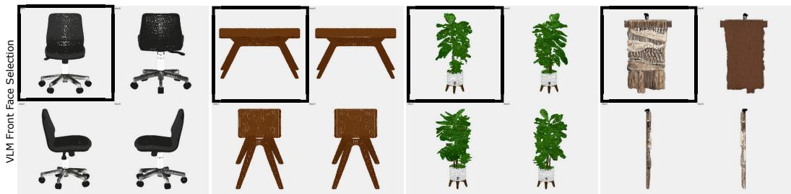  
Figure 5: Visualization of VLM-selected front face for each object for PCA-aligned meshes.

## s<sup>o</sup>C PROMPTS FOR EACH STAGE

## C.1 GEOMETRY PREPROCESSING

<sup>VLM</sup> <sup>Rotation</sup> <sup>Check</sup> <sup>VLM</sup> <sup>Grouped</sup> <sup>Object</sup> <sup>Reasoning</sup>Canonicalization The VLM-selected front face for each canonicalized mesh is shown in Figure 5; n<sup>g</sup>the abridged prompt is below:

Given a 2x2 grid of the de-tilted mesh rendered at four yaw rotations   
(A=0deg, B=90deg, C=180deg, D=270deg), pick the panel showing the   
object’s FRONT, using per-category hints (e.g. a sofa/chair faces its   
seat concavity).   
OUTPUT -- JSON ONLY: {"front panel": "A|B|C|D"}.

The chosen panel’s yaw is baked in permanently: the mesh is rotated by that yaw (after PCA de-tilt), re-centered, and re-exported as the object’s canonical GLB, with the resulting front local axis saved to detilt results.json for the placement stage to consume.

Layout Generation The layout stage recovers room geometry and camera pose from the single input photograph. The VLM analyzes the image in a fixed step order, tracing the baseboard, counting openings, inferring room type and dimensions, recovering camera pose and returning a strict JSON description of the room, its walls and openings, the camera, and per-surface texture descriptions; the camera is then refined by corner-pinning and analytic orbit correction against a render of the recovered empty geometry (Section 3.1). Figure 8 shows an example: the top-down floor plan on the left and the corresponding empty-room render on the right, with the same wall labels marked on both, and the corner where they meet. Throughout this appendix, runtime-substituted values are shown in braces (e.g. {room width}); decorative Unicode rules in the originals are rendered here as ASCII, and the complete byte-exact templates are released with the code. The following prompt shows the step skeleton and output schema.

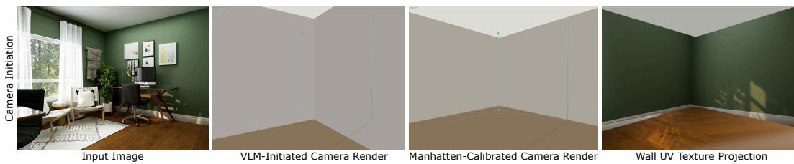  
Figure 6: Visualization of the calibration process during layout generation stage.

You are reconstructing only what is VISIBLE in a single photograph.   
Do NOT infer, guess, or add anything not directly visible.   
STEP 1 -- TRACE THE BASEBOARD. For each continuous baseboard segment,   
label the wall (left/back/right) and its run direction; a direction   
change is a real room corner (apply the baseboard corner test).   
STEP 2 -- IDENTIFY ROOM TYPE, set dimension priors (floor W x D,   
ceiling height) from visible furniture and scale anchors (door ∼0.9m,

desk ∼0.7m), then estimate each visible wall’s length/height and any   
opening’s width/height/offset (offset+width ≤ wall length).   
STEP 3 -- CAMERA PLACEMENT: height, floor junction y frac (primary   
tilt cue), yaw, aim target world m + landmark, dist to back, facing,   
deepest-corner column.   
STEP 4 -- TEXTURES: describe floor/wall MATERIAL only (no   
lighting/shadows) and a physical tile size m for each.   
OUTPUT -- VALID JSON ONLY: room {room type, floor width m,   
floor depth m, ceiling height m}; walls [{orientation, length m,   
height m, surface}]; camera {height m, tilt deg, floor junction y frac,   
yaw deg, dist to back m, facing, corner px, back wall side,   
aim target world m, aim target landmark, visible wall height m,   
visible floor depth m}; floor texture {material, color, pattern,   
tile size m, synthesis prompt}; wall texture {material, color, finish,   
tile size m, synthesis prompt}; blocked corners [].

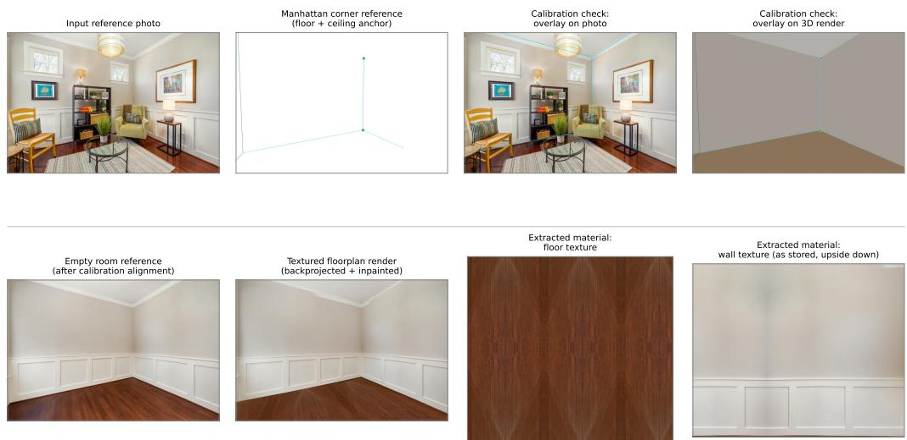  
Figure 7: Visualization of the layout initialization stage, left to right and top to bottom. Given a reference image, the Manhattan corner estimated from the converted VGGT point cloud backprojects onto the render plane and shows clear orthogonal structure, with its floor and ceiling anchors and the edges extending from the floor corner. The camera initialized on the canonical wall-box mesh by the VLM is then aligned to this same floor corner, its extending edges, and the ceiling point during camera calibration, anchoring itself onto the backprojected reference until convergence – shown as the corner reprojected onto both the reference photo and the calibrated 3D render. The emptyroom image is inpainted by Gemini-Flash-2.5 from the reference image to remove furniture while preserving room structure, then backprojected onto the aligned floorplan to give it partial texture. Gemini then completes the floor’s and each wall’s texture into a full, coherent tileable material.

## C.2 WALL-MOUNTED OBJECT PLACEMENT

This stage operates on the walls already labeled left/back/right during layout initialization. Wallmounted objects, such as windows, doors, curtains, and wall art, are proposed by VLM, detected by LocateAnything and segmented by SAM2, and verified by the VLM, amodally completed with their glass and artwork preserved, rectified to the wall plane for frame-like objects like windows and paintings and doors, meshed, and mounted. Detection emits a structured list; completion runs on the image editor.

Rectification and meshing. For frame-like, planar objects only, such as windows, doors, paintings, and mirrors, the segmented crop is unwarped before meshing: a perspective transform maps its tilted quad (fit with a rotated bounding rectangle) to a fronto-parallel rectangle, so the mesh is generated flat rather than keystoned by the viewing angle. Non-planar objects (shelves, sconces, TVs) skip this step and are meshed directly from the raw crop.

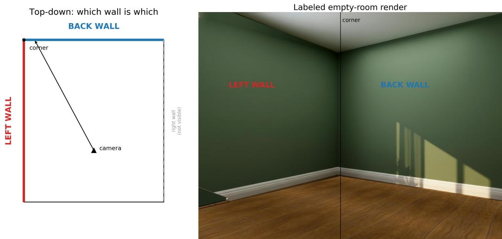  
Figure 8: Wall labeling example. Left: top-down floor plan with the camera position and viewing direction. Right: the corresponding reference-textured empty-room render, with the same left/back wall labels and their shared corner marked.

Placement Position comes from pure geometric back-projection, not a depth network: the segmentation mask’s centroid is cast as a ray from the camera and intersected against the room’s four wall planes (already fixed by the layout stage) to get both the 3D hit point and which wall it belongs to; a VLM only adjudicates ties when the ray lands near a corner seam. Real-world size follows from the mask’s pixel extent divided by focal length and scaled by that hit’s camera-space depth, with a foreshortening correction and a plausibility clamp against per-category default aspect ratios. Orientation prefers a VLM-identified front face when available, otherwise snaps to the nearest 90<sup>◦</sup> increment of the wall’s outward normal, before the mesh is translated to the hit point and snapped flush against the wall.

## VLM Detection Prompt

List every wall-mounted/wall-attached object clearly visible (window,   
door, curtain, shelf, tv, painting, mirror, clock, sconce, radiator,   
air conditioner, vent, etc.). A sconce’s bracket must be bolted to   
the wall itself (excludes floor/table lamps); a curtain hangs from a   
wall-mounted rod. Objects resting ON furniture (a TV on a console,   
items on a shelf) belong to the decoration stage, not here -- list   
only things fixed to the bare wall.   
OUTPUT -- JSON array of strings, e.g. ["window", "curtain", "art"].

Containment and fragment removal Raw detections are filtered in two passes before verification. A pre-segmentation box filter drops a detected box when another box of equal or higher confidence covers most of its area. The same mechanism also resolves a ”gallery wall” box that contains several individual frames by keeping the individuals and dropping the group box. After segmentation, sametype masks with high IoU or near-full containment are collapsed, discarding the lower-confidence duplicate. A separate VLM verification pass then rejects fragments and false positives, such as reflections, a painting-within-a-painting, a ceiling light mistaken for a wall sconce, a sliver at the frame edge, and a rejected candidate is dropped before its mask is ever written to disk, rather than kept with a failing tag. Figure 9 shows this end to end for one scene: all detected candidates, the subset that survives filtering and verification, and the resulting placement.

## C.3 FURNITURE PLACEMENT

We specify the usage of VLM reasoning here; the usage of silhouette and depth refinement is specified in section 3.3.

## Detection Prompt

Reference photo

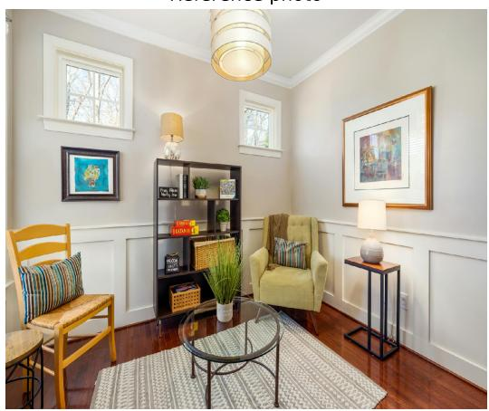  
Wall-mounted objects placed  
All detected candidates

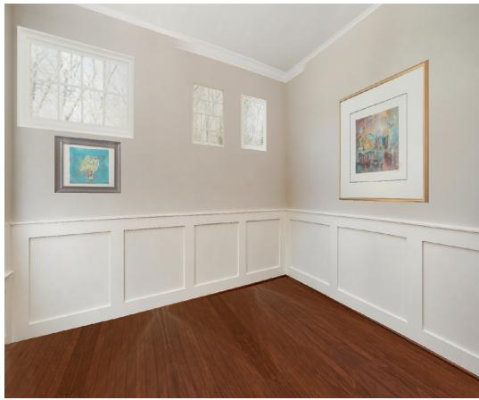  
Used for placement (after filtering)

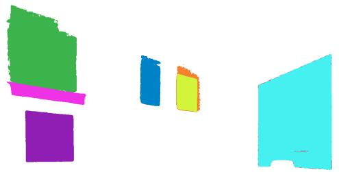

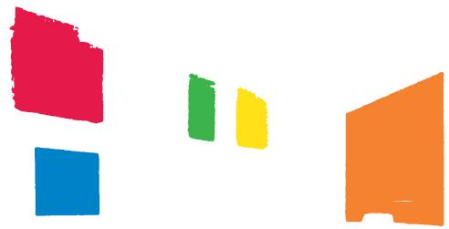  
Figure 9: Wall-mounted detection-to-placement pipeline. Top: the reference photo and the final render with wall-mounted objects placed. Bottom: all detected segmentation candidates before filtering, and the subset actually used for placement after containment/fragment removal and verification.

List only floor-standing furniture and floor coverings clearly visible   
(sofa, chair, table, bed, cabinet, carpet, etc.) -- exclude anything   
small or decorative (pillows, books, plants on a shelf). For each,   
give a short grounding phrase for open-vocabulary detection.   
OUTPUT -- JSON array: [{type, gdino}], e.g. [{"type":"sofa",   
"gdino":"leather sofa . leather couch"}].

Depth and Relational Analysis Prompts In order to avoid reasoning about dense collisions between multiple placed objects, depth analysis is applied to ease it at the source. Wall affinity is assigned relative to the same left/back/right wall labels established during layout initialization (Figure 8).

Given the annotated empty-room render, the original photo, and per-object crops, the VLM then assigns each object a relational description, such as wall affinity, facing, functional group, and support relations, together with a dependency-aware placement order and a matched-set count. The placement solver then snaps each mesh to its reference silhouette and refines it against a predicted depth map. The box below abridges the layout template.

```jsonl
Room W x D x H and camera pose are given; camera faces the back
wall (Z=0). For every detected object decide: verify (exclude
outdoor scenery / wall-mounted items / on-surface decorations /
fragments of a larger piece; correct wrong type labels); wall affinity
(back/left/right/centre -- the object’s BACK touches that wall);
relations (on top of / in front of / behind / facing toward, by index
-- "in front of" means between the anchor and the camera); and count
(total identical instances forming one matched set).
PLACEMENT ORDER: deepest corner first; wall-affine objects before
centre objects; farther before nearer; dependencies always after their
anchor; include ALL.
OUTPUT: {"placement order": [{index, type, exclude, depth,
wall affinity, wall, on top of, in front of, facing toward, behind,
opening relation, group, notes, count}], "scene summary": "..."}
```

Post-placement group refinement The post-placement step corrects three group-level errors. First, per-chair orientation is set independently by the analysis mechanisms above and never checked for group coherence, so a dining set can end up with one chair facing the table while its neighbours face slightly outward instead of all pointing inward toward a shared centre. The post-refinement step modifies the orientations of chair groups with anchored table coordinate with visually-inspected correspondence. Second, the representative-mesh swap copies geometry but not scale, so a group assembled from differently-sized source crops can render with uniform detail but inconsistent size across members, which is unified by the post-processing step. Third, the post-refinement step analyzes colour/appearance: if two visually distinct chairs (e.g. one light, one dark) are placed on the wrong sides of a symmetric arrangement, it swaps them and re-renders the group.

## C.4 CEILING OBJECT PLACEMENT

Ceiling-mounted fixtures such as pendants, chandeliers, flush-mount and recessed lights, track lights, and fans, are detected by the VLM, amodally completed (viewed from below), meshed, and hung from the ceiling plane.

Detection and placement both follow the same overall pattern as furniture (Section C.3) and wall mounted objects (Section C.2); only the differences are described below.

Placement Position and size use the same back-projection-ray and pixel-extent/focal-length/depth estimate as furniture and wall-mounted placement, here intersected with a single ceiling-height plane rather than a wall or floor; a ray that never reaches this plane instead initializes the object at the room’s center and gradually shifts it toward its estimated depth position.

Decoration Placement Small items are added by comparing, per furniture piece, the reference crop against the clean reconstructed piece, and listing what rests on the surface in the photo but is absent from the reconstruction. Presence and already-placed checks guard against hallucinated or duplicated decorations before any mesh is generated.

Missing-decoration detection For each already-placed furniture piece, the VLM compares a reference crop (the piece boxed in red, neighbouring furniture boxed in blue to exclude their items) against the isolated, furniture-only reconstruction, and lists every object resting on its surface in the photo that is absent from the reconstruction.

IMAGE 1 is a zoomed reference crop with the target furniture boxed in   
RED and neighbouring furniture boxed in BLUE (objects on blue-boxed   
furniture are ignored); IMAGE 2 is the isolated, furniture-only 3D   
reconstruction of the same piece. List every object resting on the   
RED piece’s surface in IMAGE 1 that is absent from IMAGE 2 (e.g.   
the surface begins at the top edge of the red box, so items such as   
plants, lamps, or vases that extend above it count8).   
RULES: include any surface item (pillows, blankets, books, plants,   
lamps, electronics, tableware, etc.) except structural parts (legs,   
armrests); describe each by quantity, colour, material, and position;   
trust what is visually seen over the furniture-type label; use the   
room type to disambiguate ambiguous small objects; never hallucinate   
an object that is not visible; return an empty list if nothing is   
missing.   
OUTPUT: {"label": "...", "missing decorations": [{"name",   
"description"}, ...]}

Placement A separate VLM call first matches the decoration to its supporting furniture instance by type, and by size/camera-distance cues when several same-type pieces exist (e.g. the larger, closer coffee table vs. the smaller, farther one); a post-placement verification pass re-checks this match against the reference and reassigns it if it landed on the wrong piece, but not for minor position differences within the same piece. Another VLM call estimates the decoration’s real-world size from common-sense knowledge of its category, a coarse placement type (resting flat on the surface, leaning against a backrest like a sofa pillow, or standing on the floor beside the furniture), a left/- center/right surface position, a front/middle/back depth position (for on-surface items), and whether it has a meaningful front face that must face into the room (a monitor, a picture frame) or none (a lamp, a pillow).

Given the decoration crop and its supporting furniture: estimate   
its real-world width x height x depth in metres from common knowledge   
(e.g. a standard monitor is roughly 0.55 x 0.45 x 0.22 m); classify   
placement type (on surface / against back / on floor); surface   
position (left/center/right) and, for on surface items, depth position   
(front/middle/back); and whether it has a meaningful front face that   
must face toward the room (a screen, a picture frame) or none (a lamp,   
vase, pillow).   
OUTPUT: {"size m": {width, height, depth}, "placement type",   
"surface position", "depth position", "facing", "reasoning"}.

Orientation correction. The placed object is rendered at its current pose and at the three other axis-aligned yaw rotations (90<sup>◦</sup> CCW, 180<sup>◦</sup>, 90<sup>◦</sup> CW), the four renders are stitched into a 2×2 grid, and the VLM picks the one panel whose orientation (the lamp’s arm/head, a screen’s face, a book’s spine) matches the reference in a single call. Symmetric objects (a vase, a centred lamp shade) default to the unrotated panel. Up to three further single-step fine-tune passes then correct any residual error the picked yaw didn’t fully resolve.

Matched-group reordering For a set of same-type decorations placed together (e.g. pillows across a sofa), the VLM compares the placed left-to-right sequence against the reference’s left-to-right sequence by colour and shape, and returns a list of index swaps to correct any ordering mismatch or copy an existing similar mesh to correct the missing object, re-rendering after each is applied.

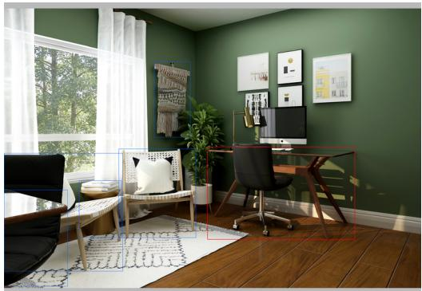

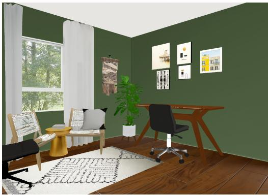

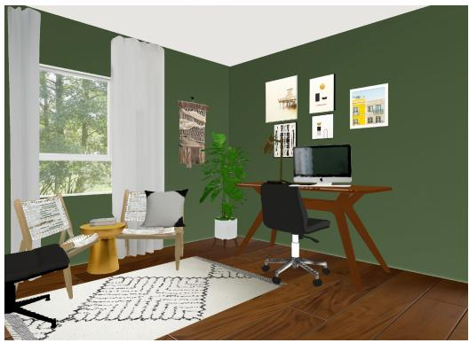

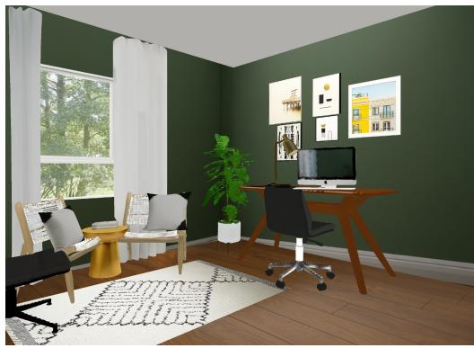  
Figure 10: Decoration Placement Correction. Top left: Reference image with VLM-selected furniture to reason and place decorations; Top right: Base render before placing decorations onto the desk for the VLM to compare and reason the decorations that should be placed; Bottom left: Initial placement of decorations onto corresponding supporting furniture; Bottom right: pyrender rendering of the scene after per-object orientation correction of the lamp and matched-group reordering of the pillows.

## C.5 MATERIAL AND LIGHTING ESTIMATION

Material estimation For every generated object (furniture, wall-mounted, ceiling, and decoration GLBs alike), the VLM is shown the isolated object crop and classifies its dominant surface material into one of a fixed set of categories, then estimates PBR factors (roughness, metallic, IOR, transmission) written onto the GLB material and physical properties (weight, thickness, elasticity) written to a sidecar for downstream physics; per-category defaults fill in and clamp anything the VLM omits or returns out of range.

The image shows a single object ({obj type}) isolated on a plain grey   
background, with its real-world bounding size. Estimate its DOMINANT   
surface material and physical properties: material category (fabric,   
leather, wood, metal, glass, plastic, ceramic, stone, rattan, foam,   
paper, other), roughness, metallic, IOR, transmission (0 opaque -- 1   
clear glass/acrylic), weight kg, thickness m, and elasticity (0 rigid   
-- 1 springy). Judge from visible sheen/reflections; if the object   
mixes materials, report the one covering the most surface area.   
OUTPUT: {"material category", "roughness", "metallic", "ior",   
"transmission", "weight kg", "thickness m", "elasticity"}

Lighting estimation Given the reference photo and the world-space positions of every placed light source, the VLM decides which sources are emitting and their color and intensity, returning a compact lighting specification consumed by the renderer (shown below).

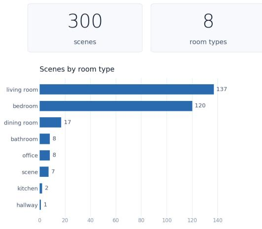

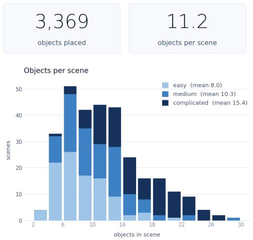  
Figure 11: HARMONY300 example: reference photo, instance segmentation colormap, and HAR-MONY’s physically-lit render.

IMAGE 1 is the reference photo; IMAGE 2 is the current lit   
preview under the CURRENT LIGHTING SETUP given below. Diagnose   
brightness (too bright / matches / too dim) and tone (too warm   
/ matches / too cool) versus the reference. If too dim, raise   
global intensity mult (bounded [0.5, 1.3]) to scale every active   
light’s intensity, including ambient; if too bright, lower it.   
Optionally fine-tune individual lights (intensity multiplier, colour   
shift, on/off) when only one lamp/window is off; if it already   
matches, return empty deltas and verdict "converged".   
OUTPUT: {"brightness assessment", "tone assessment",   
"global intensity mult", "ambient delta": {"color delta",   
"intensity mult"}, "directional delta": [{"index", "color delta",   
"intensity mult"}], "point light deltas": [{"id", "set on",   
"color delta", "intensity mult", "offset delta m"}], "window deltas":   
[{"id", "set daylight on", "color delta", "intensity mult"}], "verdict"}

## D HARMONY300 DATASET

Beyond the curated real-image set presented in the main paper, we release HARMONY300, a benchmark comprising 300 single-image indoor scenes across three difficulty levels. Each scene is paired with its reconstructed 3D scene and a physically lit render produced by HARMONY. Figure 11 summarizes the distribution of room types and the number of objects in the scenes across the dataset.

## D.1 SPLITS

easy (100 scenes) are 3D-FRONT synthetic renders with 3D ground truth, used for the metric geometric evaluation below; medium (100) are real photos with a single dominant layout; complicated (100) are real photos with cluttered, multi-object layouts. Room types are diverse and imbalanced by design, following what naturally occurs in each source pool rather than a fixed quota: easy is mostly living/dining rooms (3D-FRONT’s furnished-room distribution), medium is mostly bedrooms, and complicated spans living rooms, bedrooms, offices, dining rooms, kitchens, bathrooms, gyms, and a hallway.

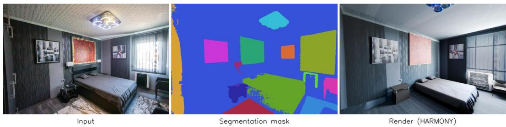  
Figure 12: HARMONY300 example: reference photo, instance segmentation colormap, and HAR-MONY’s physically-lit render.

## D.2 PER-SCENE CONTENTS

Each <difficulty>/<room type> NN/ folder contains the reference photo, the physicallylit render, the reconstructed scene, shell + wall-mounted + furniture + ceiling objects + decorations), and the calibrated camera used to render it from Section Section 3.1. Every scene additionally ships two structured annotation files: a segmentation colormap merges the per-object masks segmented across every placement stage (furniture, wall-mounted, ceiling, decoration) into a single image, each object rendered in its own solid RGB colour, while the companion json records, per object, that color alongside its stage, type, source phrase, and originating mask file; and another json giving each object’s size, world position, wall affinity, and inter-object spatial relations (facing, in-front-of, on-top-of, grouped-with) recovered during placement.

## D.3 SOURCING AND LICENSING

196 scenes are sourced from Pexels and 2 from Unsplash (both permissive, no attribution required), 100 from 3D-FRONT, and 2 synthetic renders from 3D-FUTURE (via SceneGen); the latter two require research-only use and citation. Per-scene source URLs are listed in the csv file included in the dataset. The dataset is released under CC-BY-NC-4.0.

## E USER STUDY

A self-contained static web page in Figure 13 shows, per scene, the input photo beside the scene’s six reconstructions (HARMONY + five baselines) as anonymized panels A–F; we use the 20 scenes (10 front3D cases from easy and 10 reallife cases from the medium and hard randomly-selected from HARMONY300 dataset) with a successful render from every method, so each trial is a complete sixway comparison. Participants assign each panel a unique rank from 1 (best match to the input) to 6 (worst) so that the interface forbids ties. The letter–method mapping is reshuffled per (participant, scene) via a seed hashed from participant ID and scene name, so no participant sees a consistent panel–identity association; identities are decoded only afterward, from the stored seed. Responses autosave locally and submit to a shared log on completion. The 16 participants were uncompensated volunteers, each ranking all 20 scenes. The interface instructions read verbatim:

You’ll see 20 real room photos. For each, six reconstructions (A to   
F, shown in random order) attempt to recreate the scene. Rank all   
six by how well they match the input photo perceptually (geometry,   
objects, layout, realism): give each a distinct rank from 1 = best   
to 6 = worst. Clicking a rank that’s already used moves it to the   
current one, so every rank ends up used exactly once.

## F ADDITIONAL RESULTS

This section presents additional qualitative results across all three HARMONY300 splits, an alternative viewpoint for inspecting the reconstructed geometry and generalization to multi-room layouts.

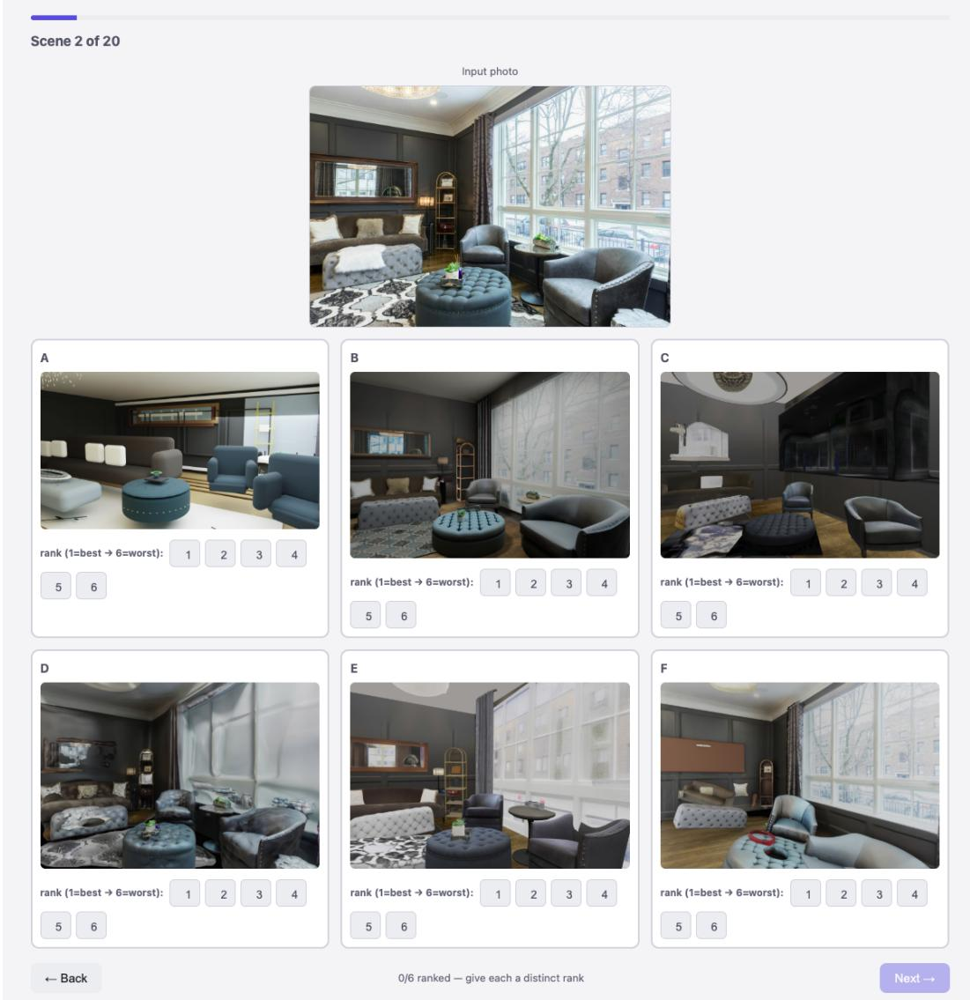  
Figure 13: An example study trial: the input photo shown to participants (top) and the six candidate reconstructions they rank (bottom, 2×3) including HARMONY and five baselines. In the live interface each panel appears unlabeled as an anonymized letter A–F, reshuffled per (participant, scene); method identities are shown here only for illustration.

## F.1 3D-FRONT RESULTS

Figure 14 shows further scenes from the synthetic easy split (3D-Front renders), illustrating reconstruction quality across diverse layouts, furniture styles, wall colours, and lighting conditions.

## F.2 DIVERSE ROOM TYPES

Figure 15 shows further scenes from the harder medium and complicated splits, such as real photos spanning bedrooms, living rooms, offices, kitchens, and bathrooms, demonstrating that reconstruction quality holds up on cluttered, real-world layouts and not just the synthetic easy split.

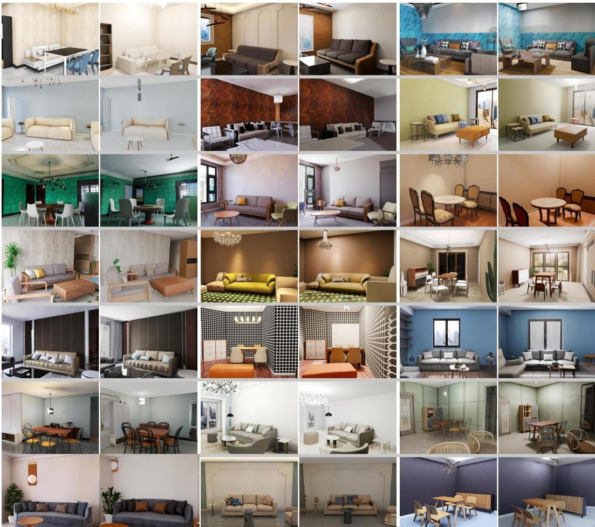  
Figure 14: Scenes from HARMONY300’s easy split. For each pair: input photo (left) and HAR-MONY’s render (right)

## F.3 CANONICAL VIEWS

The galleries above render each scene from its VGGT-calibrated input camera, which shows only the portion of the room the reference photo happened to frame. Figure 16 instead renders each scene from a canonical viewpoint in 3D, exposing the full room layout and making furniture arrangement and geometry directly comparable across scenes, independent of how each photograph was composed.

## F.4 MULTI-ROOM LAYOUT

By refining camera poses with respect to a canonical layout, HARMONY naturally generalizes to diverse room configurations and multi-room environments. As shown in Figure 17, our framework can adapt the reconstructed scene to different layout settings while maintaining consistent spatial relationships.

## F.5 APPLICATIONS

Reconstruction quality is ultimately judged by what the scene supports downstream. We demonstrate two uses that stress different properties of the output: passive physical plausibility, and contact-rich interaction by an embodied agent.

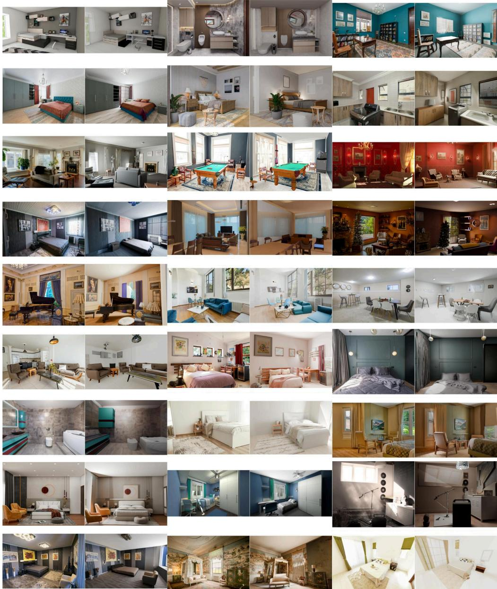  
Figure 15: Scenes from HARMONY300’s medium and complicated splits, spanning diverse room types, layouts and lighting conditions. For each pair: input photo (left) and HARMONY’s render (right).

## F.5.1 PHYSICAL SIMULATIONS

As a downstream test that the reconstruction is physically usable, not just visually plausible, we animate each finished scene as a rigid-body simulation, path-traced with the same Cycles + lighting as the still render, under earthquake regime. Furniture and decorations are genuine dynamic bodies, moving only from gravity and friction with each object’s own VLM-estimated mass and friction, so a tall bookcase topples while a heavy sofa barely shifts. Figure 18 shows evenly-sampled frames from both regimes.

You estimate physical properties for a rigid-body simulation of this   
room. For EACH item label below, give a realistic real-world mass

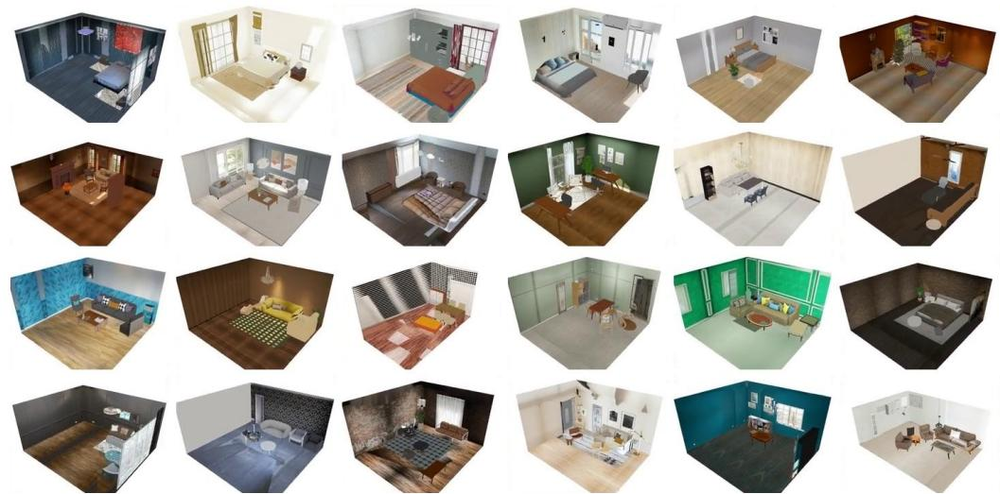  
Figure 16: Reconstructed HARMONY300 scenes rendered from a canonical elevated viewpoint rather than the input camera, with the ceiling and near wall removed so the full room layout is visible.

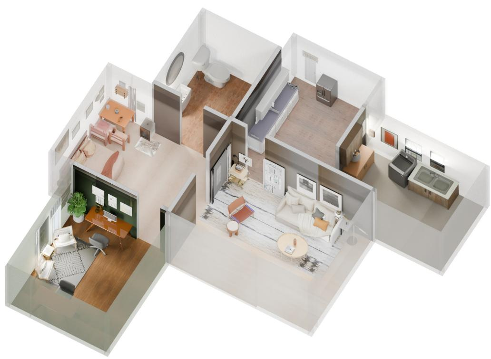  
Figure 17: Multi-room layout generalization. HARMONY adapts the reconstructed scene to diverse room configurations by refining camera poses with respect to a canonical layout.

in kilograms and a coefficient of friction against a wood floor (0.2 = very slippery, 0.9 = high grip). Base it on a typical reala li example of that object. Labels: {labels}

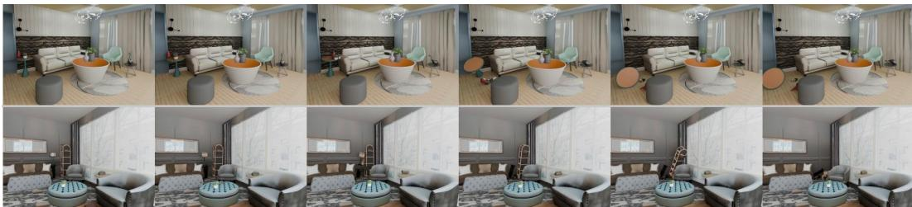  
Figure 18: Six evenly-spaced frames from rigid-body animations simulating earthquakes.

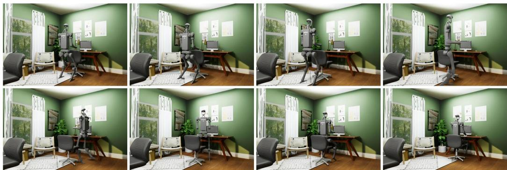  
Figure 19: Humanoid interaction in a reconstructed room. A Unitree H1 (19 DoF) operating in a scene reconstructed from a single photograph by HARMONY. Ordered left to right, top to bottom: the robot crouches to reach the chair backrest, draws the chair away from the desk, releases and stands, steps around the chair, crosses to its front, turns, seats itself, and places both hands on the desk. All contacts are resolved against the reconstructed geometry: hands meet the backrest at, thighs rest on the seat pan, and both feet remain on the floor across all 230 frames.

OUTPUT: {"items": {"<label>": {"mass kg", "friction"}, ...}}

## F.5.2 ROBOT INTERACTION

## F.6 ROBOT INTERACTION

Beyond passive dynamics, the reconstructed room is also useful as a robotics environment if its surfaces support contact-rich interaction. We import each finished scene into Isaac Sim and drive two embodied agents through manipulation sequences: a Unitree H1 humanoid that relocates the office chair, seats itself, and reaches the workstation, and a Franka Panda that grasps the chair backrest and draws it back. Contact targets are taken from the reconstructed geometry itself, so the interaction is grounded in the reconstruction rather than in hand-placed proxies. Robot motion is kinematically scripted; the sequences test the geometry’s affordances, not a control policy. Figures 19 and 20 show sampled frames.

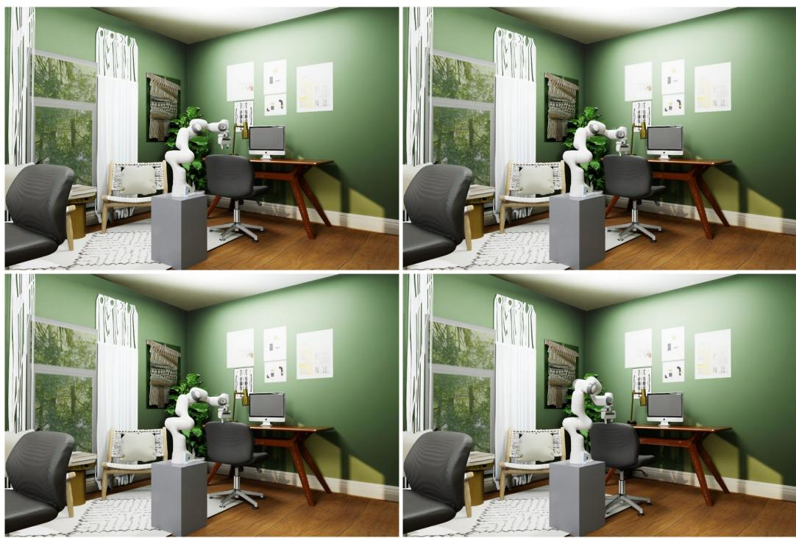  
Figure 20: Manipulator grasp of a reconstructed object. A Franka Panda descends onto the office chair’s backrest, aligns its fingers to straddle the panel, closes the jaw, and draws the chair backward. The grasp height is set from the measured panel cross-section: at 0.868 m the backrest is 68 mm thick, within the 80 mm jaw, whereas 35 mm lower it thickens to 87 mm and cannot be grasped. End-effector poses are solved with Lula IK (no failures across 140 frames), and the fingertips hold 0.868 m throughout the 0.45 m pull.