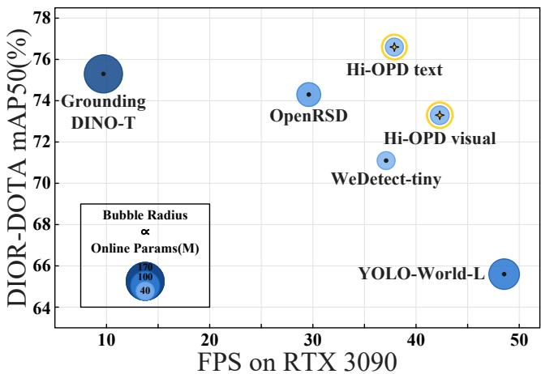
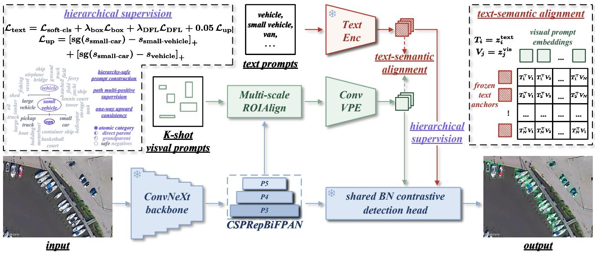
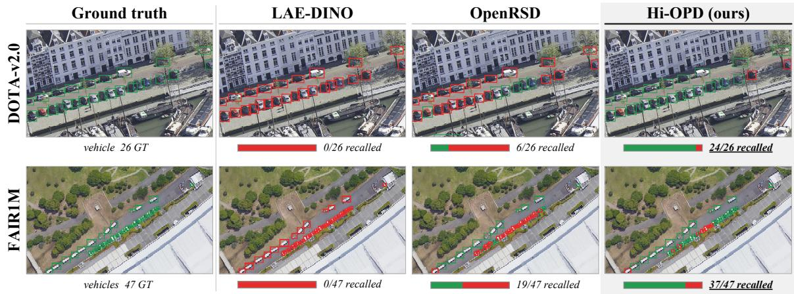
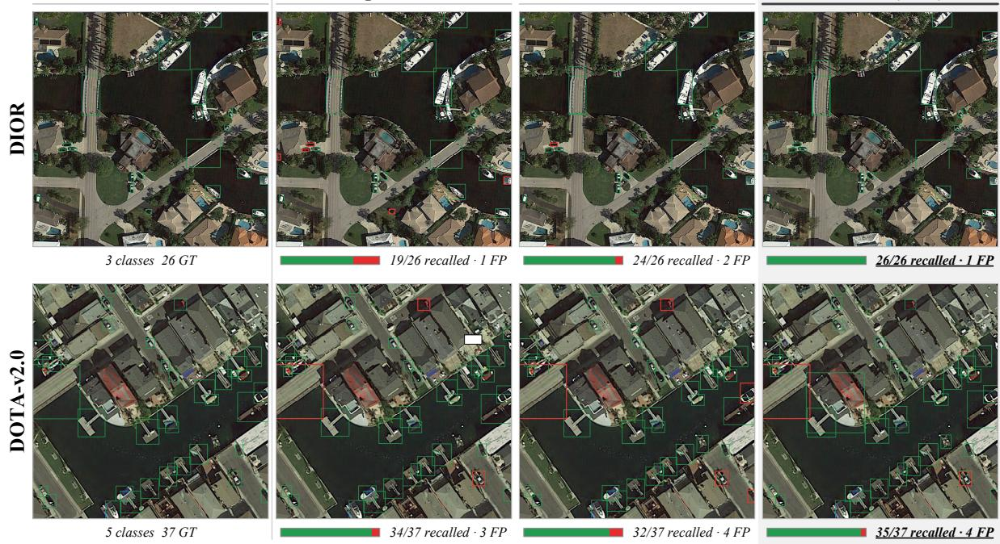

# Hi-OPD: Hierarchy-Aware Open-Prompt Detection for Remote Sensing Images

Jinlong Hu1, Yi Zhang2, Zhiqi Xia1, Yikang Zhou1, Shunping Ji1

1Wuhan University

2Institute of Seismology, China Earthquake Administration

## Abstract

Hi-OPD addresses a failure mode left uncontrolled by flat open-prompt training: descendant retrieval need not persist under ancestor queries when multi-source remote sensing annotations exhibit inconsistent granularity and missing labels. A detector may localize car and van under atomic prompts yet miss the same instances under vehicle; flat AP does not expose this cross-level inconsistency.

We propose Hi-OPD, a hierarchy-aware open-prompt detector, and construct RS153-HierOPD from 175,644 retained training image/tile records and 3.48M boxes mapped to 153 atomic categories with sparse hierarchy and alias relations. Hi-OPD learns ancestor retrieval through hierarchy-safe negative sampling, path multi-positive supervision, and one-way upward consistency, while per-source risk exclusion handles potentially missing labels. ConvVPE converts K-shot support boxes into text-compatible embeddings using detector-native features and the shared contrastive head.

On Track A, Hi-OPD obtains 79.7/72.3 AP50 on DIOR/DOTA-v2.0, above the literature-reported OpenRSD results of 76.7/71.8. Under controlled training on the original converted annotations, the full hierarchy recipe raises DOTA-v2.0 parent AP50 from 7.2 to 71.5 and FAIR1M grandparent AP50 from 31.6 to 71.4, while DOTA-v2.0 atomic AP50 changes from 71.4 to 72.3. The text path reaches 99.7% CAR50 (0.3% violation) across the three common sources and 99.9%/0.1% on FAIR1M grandparent relations. On heldout VEDAI, text AP50 is 75.9, 6.2 points above OpenRSD. Joint AP and CAR show that explicit hierarchy training repairs this failure mode while retaining atomic detection and prompt transfer.

## Introduction

Object detection in remote sensing images underpins applications such as urban monitoring, trafic analysis, disaster response, and land-use management. Most remote sensing benchmarks assume a fixed category set shared by training and testing, an assumption strained by new areas, sensors, tasks, and annotation policies.

Open-prompt detection relaxes this assumption by accepting category prompts at inference time. Recent remote sensing systems such as OpenRSD (Huang et al. 2025) and LAE-DINO (Pan et al. 2025) extend this paradigm with visual prompting and domain-specific training, demonstrating strong atomic-category detection and cross-dataset transfer.

  
Figure 1: Accuracy–eficiency–size trade-of. The axes report mean DIOR/DOTA-v2.0 AP50 and FP32 FPS on an RTX 3090; bubble radius is proportional to online/evaluation parameters. Stars denote Hi-OPD variants. LAE-DINO is omitted because DOTA AP50 is not reported.

Despite this progress, existing remote sensing openprompt systems largely organize prompts as flat category labels: query a class name, detect that class, and report average precision over a flat category set. Strong atomic detection therefore does not guarantee that the same objects remain retrievable when a user issues a coarser ancestor prompt.

Semantic hierarchies have been explored in generaldomain open-vocabulary detection. SHiNe (Liu et al. 2024a) constructs training-free hierarchy-aware classifiers from super- and sub-category descriptions; LHST (Huang et al. 2024) introduces language hierarchies into weakly supervised self-training and prompt generation; and HCC (Lee et al. 2026) uses consistency across class, super-category, and sub-category predictions to calibrate pseudo-label confidence. These studies establish that vocabulary granularity matters, but focus on classifier construction, image-level weak supervision, or pseudo-label calibration. They do not study direct ancestor-query retrieval under heterogeneous remote sensing annotations, where category granularity and missing-box patterns vary by source.

Remote sensing couples two challenges that flat prompting leaves unresolved: hierarchy-dependent queries and sourcedependent partial labels.

Missing hierarchical recall. Operational search is often coarse-to-fine, yet flat AP does not test whether objects detected under fine-grained labels remain retrievable from a parent prompt. Track B directly measures this capability.

Multi-source granularity conflicts. Sources difer in annotation granularity, and single- or few-class datasets leave co-visible objects outside their target taxonomies unlabeled. Treating those categories as negatives suppresses true objects, whereas merging parent and child labels erases finegrained distinctions.

We therefore ask how the same object instances can be retrieved consistently across semantic granularities without introducing false negatives from heterogeneous annotations. Hi-OPD addresses this question with a unified 153-class atomic vocabulary, a sparse explicit hierarchy over semantically meaningful subsets, hierarchy-safe text training, and detector-native visual prompting. The hierarchy is intentionally not exhaustive: only atomic categories with operationally meaningful ancestor queries participate in the corresponding hierarchy evaluations.

Our contributions are fourfold:

• We introduce RS153-HierOPD, which unifies multisource remote sensing data into 153 atomic categories and records explicit parent–child and alias relations over hierarchy-enabled subsets. It supports atomic detection, direct hierarchy-query evaluation with both absolute AP and conditional ancestor recall, and cross-dataset prompt generalization.

• We formulate direct ancestor-query detection under heterogeneous annotation granularity. Hi-OPD prevents semantically valid prompts from becoming false negatives through hierarchy-safe negative sampling, path multipositive supervision, and one-way upward consistency.

• To enable lightweight, detector-native visual prompting, we propose ConvVPE, which encodes K-shot support regions directly from the detector’s own multi-scale features into visual prompt embeddings compatible with the textprompt space, thereby reusing the same detection head without introducing an external visual encoder.

• We provide controlled evaluation across atomic detection, direct parent and grandparent queries, and held-out cross-dataset transfer. Within the same detector architecture and training protocol, hierarchy-aware training repairs the ancestor-query failure mode of flat training while preserving atomic detection.

## Related Work

Open-prompt detection. Open-prompt detection casts category recognition as matching between region features and category embeddings. CLIP (Radford et al. 2021) provides transferable vision-language representations; GLIP (Li et al. 2022) and Grounding DINO (Liu et al. 2024b) introduce phrase grounding into detection pretraining; other representative systems (Minderer et al. 2022; Gu et al. 2022; Zhong et al. 2022; Zhou et al. 2022; Kamath et al. 2021; Yao et al. 2022; Cheng et al. 2024) span vision-transformer open-vocabulary detection, region–language distillation and pretraining, text-conditioned detection, image-level supervision, and eficient deployment. WeDetect (Fu et al. 2026) reformulates open-category detection as retrieval and provides a fast YOLO-World-style detector; we use WeDetect-tiny as the base detector and build both text and visual prompt paths on top of it.

Remote sensing detection and open-prompt detection. Remote sensing detection difers from natural image detection due to overhead viewpoints, dense small objects, large scale variation, and specialized category names. DOTA (Ding et al. 2022), DIOR (Li et al. 2020), FAIR1M (Sun et al. 2022), HRSC2016 (Liu et al. 2017), ShipRSImageNet (Zhang et al. 2021), and SODA-A (Cheng et al. 2023) have advanced horizontal, oriented, and finegrained aerial object detection. OpenRSD (Huang et al. 2025) systematically introduces text- and image-prompt detection in remote sensing, while LAE-DINO (Pan et al. 2025) builds a large remote sensing corpus and dynamic category set to reduce domain mismatch. Their reported protocols primarily evaluate flat category vocabularies. Hi-OPD retains atomic and cross-dataset evaluation while adding direct ancestor queries and explicit treatment of multi-source granularity conflicts.

Hierarchy-aware open-vocabulary detection. Earlier work uses WordNet (Miller 1995), WordTree detectors (Redmon and Farhadi 2017), and hierarchy-aware objectives (Bertinetto et al. 2020; Deng et al. 2012) to organize labels or trade accuracy against semantic specificity. More recently, SHiNe (Liu et al. 2024a) exposes the instability of open-vocabulary detectors across vocabulary granularities and builds a training-free nexus classifier by integrating super- and sub-category descriptions. LHST (Huang et al. 2024) expands image-level labels through a language hierarchy and co-regularizes weakly supervised self-training, whereas HCC (Lee et al. 2026) calibrates pseudo-label confidence from class/super-category/sub-category consistency. These general-domain methods use hierarchy for classifier construction, weak image-level supervision, or pseudo-label selection. In contrast, Hi-OPD directly supervises ancestor prompts for descendant boxes and prevents ancestor, descendant, alias, and source-risk prompts from becoming false negatives under heterogeneous remote sensing annotations.

Multi-dataset taxonomies and incomplete labels. Unified-label detectors (Zhao et al. 2020), Simple Multi-Dataset Detection (Zhou, Koltun, and Krähenbühl 2022), Detection Hub (Meng et al. 2023), and ScaleDet (Chen et al. 2023) address heterogeneous label spaces, semantic alignment, and domain variation. LVIS (Gupta, Dollár, and Girshick 2019), Detic (Zhou et al. 2022), and long-tail losses (Tan et al. 2020; Wang et al. 2021) address vocabulary scale, weak supervision, or class imbalance. These approaches do not directly resolve the coupled case in which one source uses a coarse parent label, another uses its finegrained descendants, and non-target objects remain unannotated. Hi-OPD uses explicit hierarchy, alias, and source-risk relations to determine which prompts are valid positives, unsafe negatives, or masked categories.

Visual prompting. Visual prompts specify categories through examples rather than names. T-Rex2 (Jiang et al. 2024) supports box- or point-conditioned prompts, while OpenRSD (Huang et al. 2025) extracts remote sensing image prompts with an external DINOv2 encoder (Oquab et al. 2024). ConvVPE instead pools support regions from the detector’s own multi-scale features and maps them into the shared contrastive prompt space, providing a lightweight visual extension without a separate visual encoder.

## RS153-HierOPD Benchmark

RS153-HierOPD maps twelve heterogeneous sources into 153 atomic categories. Its submitted manifests contain 175,644 training image/tile records with 3,477,064 boxes and 56,695 validation records with 1,297,548 boxes. The hierarchy is sparse rather than exhaustive: 108 atomic categories participate in 108 direct and 70 grandparent relations, using 11 parent and two grandparent nodes. Eleven atomic classes also serve as ancestors, and three alias groups provide 11 protected links.

Construction retains visually decidable atomic categories, uses strict is-a relations for hierarchy edges, and reserves alias links for naming equivalence or protocol-level ambiguity. Part-of relations, co-occurrence, and appearance similarity alone are excluded. Table 1 makes the evaluation-bearing structure explicit. The code-and-data appendix includes the complete taxonomy, all hierarchy and alias edges, all 246 source-label mappings, efective per-source Risk sets, split provenance, relation-level evaluation metadata, audit boundaries, and validation scripts.

<table><tr><td>Benchmark item</td><td>Count</td></tr><tr><td>Atomic / hierarchy-enabled atomic classes</td><td>153 / 108</td></tr><tr><td>Parent / grandparent nodes</td><td>11 /2</td></tr><tr><td>Direct / grandparent relations</td><td>108 / 70</td></tr><tr><td>Alias groups / protected links</td><td>3/ 11</td></tr><tr><td>Atomic classes also serving as ancestors</td><td>11</td></tr><tr><td>Train records / boxes</td><td>175,644 / 3,477,064</td></tr><tr><td>Validation records / boxes</td><td>56,695 / 1,297,548</td></tr><tr><td>Risk-covered sources (global / source-specific)</td><td>12/3</td></tr><tr><td>Track-B relations (common / standalone GP)</td><td>36/9</td></tr><tr><td>Track-B GT (common / standalone GP)</td><td>782,132 / 290,906</td></tr></table>

Table 1: Review-time RS153-HierOPD statistics. Track-B counts use source-specific relation entries; the FAIR1M depth-2 diagnostic is separate.

RS153-HierOPD defines three tasks. Track A measures atomic detection over the 153-class vocabulary. Track B rolls ground truth to the requested level and provides only the corresponding coarse prompts; its common direct/mixed protocol contains 36 source-specific relations and 782,132 GT instances, while nine FAIR1M depth-2 relations (290,906 GT) form a separate grandparent diagnostic. Track C evaluates zero-shot text and K-shot visual prompt generalization on datasets excluded from training. A visual summary of the three evaluation tasks is provided in the technical appendix.

## Method

## Overview

Hi-OPD addresses two coupled problems in multi-source remote sensing open-prompt detection: category hierarchy and source-dependent partial labels. Given an image I and a prompt category set $\dot { C }$ , the detector extracts region features $r _ { i }$ and matches each region to a prompt embedding $z _ { c } \mathrm { : }$

$$
s _ { i c } = \gamma r _ { i } ^ { \top } z _ { c } + b _ { c } ,\tag{1}
$$

where $\gamma$ is a learnable logit scale and $b _ { c }$ is a category bias. Unlike flat prompt training, Hi-OPD decides which classes can safely serve as negatives using parent, descendant, alias, and source-risk relations.

Figure 2 illustrates the framework. Hi-OPD has two prompt paths. The text path performs prompt-based inference from category names without requiring support examples, whereas the visual path uses ConvVPE to construct category prompts from K-shot support boxes. Both paths produce 768- dimensional prompt embeddings compatible with the same batch-normalized (BN) contrastive detection head:

$$
z _ { c } = \left\{ \begin{array} { l l } { \mathrm { N o r m a l i z e } ( T ( c ) ) , } & { \mathrm { t e x t , } } \\ { \mathrm { N o r m a l i z e } ( \mathrm { C o n v V P E } ( S _ { c } ; \phi ) ) , } & { \mathrm { v i s u a l . } } \end{array} \right.
$$

Here $T ( \cdot )$ is the cached text encoder, $S _ { c }$ is the support set of class $c ,$ and ϕ denotes ConvVPE parameters.

## Hierarchy-Safe Prompt Construction

Flat negative sampling can generate false-negative supervision. For a region of class $y ,$ its parent prompt should also be able to recall this region. If the parent, a descendant, an alias, or a source-risk class is sampled as a negative, training explicitly suppresses a semantically valid prompt. Let $\mathcal { \bar { H } } \bar { ( Y ) } \overset { \cdot } { = } \bar { \operatorname { A n c } } ( \bar { Y ) } \cup \operatorname { D e s c } ( Y ) \cup \bar { \operatorname { A l i a s } } \bar { ( Y ) }$ denote the hierarchy/alias neighborhood of observed classes. We define the potential false-negative pool as

$$
F ( Y , s ) = \left( { \mathcal { H } } ( Y ) \cup \operatorname { R i s k } ( s ) \right) \backslash Y ,\tag{2}
$$

where Y is the set of observed positive classes in a source-s image, and Anc, Desc, and Alias denote ancestor, descendant, and alias sets. Risk(s) is an unsafe-negative set rather than an additional positive-label set: it contains categories that are plausible in source s but are not exhaustively annotated under that source’s labeling policy. The executable policy contains one global protection rule applied to all twelve sources and additional source-specific rules for three sources. It has two uses. First, during headline Hi-OPD training, its members are excluded from the sampled negative prompt pool so that potentially unlabeled instances are not explicitly suppressed. Second, in a separate auxiliary experiment, the responses preserved for Risk(s) categories are used to mine candidates for supplemental annotation. The supplemental annotations are not used to train the headline models; this second use evaluates data-curation potential rather than a separate final-AP module. The technical appendix reports the candidate-mining analysis, and the code-and-data appendix includes the complete efective set for every source.

The hierarchy-safe negative set is

$$
N _ { \mathrm { s a f e } } = C \setminus \left( Y \cup { \mathcal { H } } ( Y ) \cup \operatorname { R i s k } ( s ) \right) .\tag{3}
$$

  
Figure 2: Overview of Hi-OPD. RS153-HierOPD provides multi-source data and hierarchy/alias metadata. The text detector is trained through staged hierarchy-aware continuation with path multi-positive supervision and one-way upward consistency. ConvVPE is trained separately as a frozen-body visual prompt branch. Text and visual prompts share the same BN contrastive detection head.

The training prompt pool contains observed positive classes, ancestor prompts along the semantic path, and sampled safe negatives:

$$
P _ { \mathrm { t r a i n } } = Y \cup \mathrm { A n c } _ { \leq 2 } ( Y ) \cup \mathrm { S a m p l e } ( N _ { \mathrm { s a f e } } ) .\tag{4}
$$

For a region whose atomic category is $y _ { i } .$ , we supervise the whole valid hierarchy path rather than only the leaf. Let $\Pi _ { i } = \{ y _ { i } \} \cup \operatorname { A n c } _ { \leq 2 } ( { \dot { y _ { i } } } )$ be the path from the atomic category to its direct parent and grandparent. The path multi-positive target is

$$
t _ { i c } = \left\{ \begin{array} { l l } { 1 , } & { c = y _ { i } , } \\ { \beta _ { d } , } & { c \in \operatorname { A n c } _ { d } ( y _ { i } ) , d \le 2 , } \\ { 0 , } & { c \in N _ { \mathrm { s a f e } } , } \end{array} \right.\tag{5}
$$

where $\beta _ { d }$ is an ancestor-positive weight. We set $\beta _ { 1 } = \beta _ { 2 } =$ $0 . 8 , m = 0 .$ , and $\lambda _ { \mathrm { u p } } = 0 . 0 5$ in the final recipe. Thus, both direct parents and selected grandparents receive the same path-positive weight. This difers from post-hoc label roll-up: the detector learns to score each hierarchy prompt directly, matching the hierarchy-query protocol used at evaluation time.

Path supervision alone does not explicitly order logits along the hierarchy. We therefore add a one-way upward consistency term:

$$
\mathcal { L } _ { \mathrm { u p } } = \frac { 1 } { | \mathcal { P } | } \sum _ { ( i , a ) \in \mathcal { P } } \left[ \mathrm { s g } ( s _ { i y _ { i } } ) - s _ { i a } + m \right] _ { + } ,\tag{6}
$$

where $a \in \mathrm { A n c } _ { \leq 2 } ( y _ { i } ) , \mathrm { s g } ( \cdot )$ stops gradients through the child logit (detach\_child=True), and m is a margin. Because $m = 0$ , this is a zero-margin one-way ordering constraint: each ancestor logit is required to be no lower than the detached child logit. The loss can only pull ancestor logits upward when they fall below the atomic evidence; it does not push down fine-grained atomic logits. This one-way design is important for improving parent and grandparent recall while preserving Track-A atomic detection. Classes not covered by the target or safe negatives are masked from the classification loss. The final text-path detection objective is

$$
\mathcal { L } _ { \mathrm { d e t } } = \mathcal { L } _ { \mathrm { c l s } } ( s _ { i c } , t _ { i c } ) + \lambda _ { \mathrm { b o x } } \mathcal { L } _ { \mathrm { b o x } } + \lambda _ { \mathrm { d f f } } \mathcal { L } _ { \mathrm { d f f } } + \lambda _ { \mathrm { u p } } \mathcal { L } _ { \mathrm { u p } } .\tag{7}
$$

## Detector-Native Visual Prompt Encoder

Existing image-prompt methods often rely on an external visual encoder to extract support features. ConvVPE instead runs on the detector’s own multi-scale features. Given class c and support set $S _ { c } = \{ ( I _ { m } , b _ { m } ) \} _ { m = 1 } ^ { M }$ , ConvVPE applies multi-scale ROI alignment on detector feature maps and augments the crop with box-coordinate encoding:

$$
u _ { m } = \mathrm { R O I A l i g n } \big ( \{ P _ { 3 } , P _ { 4 } , P _ { 5 } \} , b _ { m } \big ) \oplus e ( b _ { m } ) .\tag{8}
$$

A lightweight convolutional encoder and projection layer map each support sample to a visual anchor:

$$
\hat { z } _ { m } = \mathrm { P r o j } \big ( \mathrm { C o n v E n c o d e r } ( u _ { m } ) \big ) .\tag{9}
$$

For multiple support samples of the same class, a gating branch estimates normalized support weights:

$$
\begin{array} { l } { \displaystyle a _ { m } = \frac { \exp \bigl ( g \bigl ( \hat { z } _ { m } \bigr ) \bigr ) } { \sum _ { j = 1 } ^ { M } \exp \bigl ( g \bigl ( \hat { z } _ { j } \bigr ) \bigr ) } , } \\ { \displaystyle z _ { c } ^ { \mathrm { v i s } } = \mathrm { N o r m a l i z e } \biggl ( \sum _ { m = 1 } ^ { M } a _ { m } \hat { z } _ { m } \biggr ) . } \end{array}\tag{10}
$$

ConvVPE only aggregates support samples within a class; it does not perform text-visual fusion. The resulting visual embedding has the same dimensionality as the text embedding and is directly consumed by the shared detection head.

## Training and Inference

Text detector training stages. Stage 1 learns the multisource text detector, and Stage 2 continues it with the hierarchy-aware objective above. The resulting checkpoint is used for text-prompt inference and initializes the frozenbody ConvVPE branch.

Frozen-body visual prompt learning. ConvVPE is initialized from the Stage-2 hierarchy-aware text checkpoint and trained as an independent visual-prompt branch. During this step, the detector body—including the backbone, neck, non-BN detection-head parameters, and cached text embeddings—is frozen, and only ConvVPE parameters are updated. For K-shot support boxes, ConvVPE maps support samples to 768-dimensional prompt embeddings, which are normalized and fed into the same BN contrastive head as text embeddings. The training objective is

$$
\mathcal { L } _ { \mathrm { v i s } } = \mathcal { L } _ { \mathrm { c l s } } ^ { \mathrm { v i s } } + \lambda _ { \mathrm { a l i g n } } \mathcal { L } _ { \mathrm { a l i g n } } ,\tag{11}
$$

where $\mathcal { L } _ { \mathrm { c l s } } ^ { \mathrm { v i s } }$ uses the same hierarchy-safe classification loss through the shared head, and $\mathcal { L } _ { \mathrm { a l i g n } }$ aligns visual prompt embeddings with their corresponding text anchors. We set $\lambda _ { \mathrm { a l i g n } } = 1 . 0$ . During training, the number of supports is sampled from $M \in \langle \overline { { 1 } } , 2 , 3 , 5 \rangle$ with support dropout; evaluation uses $M = 5$

## Experiments

## Experimental Setup

Data. The RS153-HierOPD training set comprises twelve sources: DIOR (Li et al. 2020), DOTA-v2.0 (Ding et al. 2022), FAIR1M (Sun et al. 2022), GLH Bridge (Li et al. 2024), HRSC2016 (Liu et al. 2017), LEVIR (Zou and Shi 2018), NWPU-VHR-10 (Cheng et al. 2014), SIMD (Haroon, Shahzad, and Fraz 2020), SODA-A (Cheng et al. 2023), ShipRSImageNet (Zhang et al. 2021), WHU Buildings (Ji, Wei, and Lu 2019), and xView (Lam et al. 2018). The converted files contain 175,644 training records / 3,477,064 boxes and 56,695 validation records / 1,297,548 boxes; the reported Stage-2 model uses only these original annotations, without supplemental or relabel-assisted boxes. Track A evaluates DIOR and DOTA-v2.0. Track B uses the sixsource common direct/mixed ancestor protocol (36 relations, 782,132 GT) plus the separate FAIR1M grandparent diagnostic (nine relations, 290,906 GT). HRRSD (Zhang et al. 2019), RSOD (Long et al. 2017), UCAS-AOD (Zhu et al. 2015), and VEDAI (Razakarivony and Jurie 2016) are excluded from training and used for Track-C prompt generalization; detailed splits and source roles are provided in the technical appendix.

Base detector and baselines. We use WeDetect-tiny (Fu et al. 2026) as the base detector. Its image backbone is ConvNeXt-tiny (Liu et al. 2022), its head follows a YOLO-World-style BN contrastive head, and the prompt dimension is 768. We compare against two WeDetect baselines: an oficial LVIS-weight zero-shot transfer baseline and a persource flat fine-tuning baseline initialized from the oficial WeDetect-tiny weights. We also compare with remote sensing open-prompt or open-set baselines OpenRSD (Huang et al. 2025) and LAE-DINO (Pan et al. 2025).

External-result provenance. Track-A values for YOLO-World-L, Grounding DINO-T, and OpenRSD (text prompt) are taken from the OpenRSD paper’s HBB AP50 table for DIOR-R and DOTA-v2.0, whereas those for LAE-DINO are taken from its original paper. OpenRSD does not report DOTA-v2.0 mAP for the first three rows; LAE-DINO reports DOTA-v2.0 mAP but not AP50, and unavailable entries are shown as dashes. For Track B, YOLO-World-L and Grounding DINO-T are flat-fine-tuned separately on each source’s original categories for 10 epochs; OpenRSD and LAE-DINO are re-evaluated from released weights. All use method-native category prompts under shared images, labels, COCO AP implementation, and detection budget; we do not substitute Hi-OPD prompts. The OpenRSD Track-C score is literature-reported. LAE-DINO Track-C results are measured in this work using the oficial LAE-1M pretrained checkpoint and native dataset category prompts, without targetset fine-tuning. The oficial LAE-DINO data catalog lists RSOD under LAE-FOD/LAE-1M pretraining but does not list HRRSD, UCAS-AOD, or VEDAI; we therefore exclude RSOD only when calculating the three-source held-out comparison stated in the text. All Hi-OPD results and Panel A baselines are measured in this work.

Eficiency protocol. FPS is measured on an RTX 3090 with batch size 1 in FP32. The two WeDetect-tiny baselines and Hi-OPD text use the same cached RS153 text embeddings at inference; YOLO-World-L is likewise reparameterized with cached text. Parameter counts exclude prompt caches (the WeDetect-tiny/Hi-OPD text cache is 2.5 MB); full precision, latency, memory, and cache accounting is provided in the technical appendix.

Training and metrics. Stage 1 trains the text path at 832 resolution, with its epoch-25 checkpoint initializing Stage 2. Stage 2 continues at 896 resolution for 15 epochs. ConvVPE is subsequently trained for 8 epochs as a frozen-body visualprompt branch initialized from the Stage-2 hierarchy-aware text checkpoint. Track A reports COCO-style mAP, AP50, and AP75; Tracks B and C report AP50 for hierarchy queries and cross-dataset prompt transfer, respectively. Track B additionally reports conditional ancestor recall. For each groundtruth hierarchy relation $r = ( i , y , a )$ , let $A _ { r }$ indicate that instance i is recalled under its atomic query y, and let $H _ { r }$ indicate that the same instance is recalled under ancestor query a. Then

$$
\mathrm { C A R _ { 5 0 } } = { \frac { \sum _ { r } A _ { r } H _ { r } } { \sum _ { r } A _ { r } } } , \quad \mathrm { V i o l a t i o n _ { 5 0 } } = 1 - \mathrm { C A R _ { 5 0 } } .\tag{12}
$$

CAR50 uses class-aware, score-ordered one-to-one matching at IoU 0.50, method-native NMS, score $\ge ~ 0 . 0 5 .$ , and at most 600 detections per image and query branch. We report each source, a relation-level micro aggregation, and an equal-weight source macro over DOTA-v2.0, FAIR1M, and HRSC2016; the latter two summaries expose the influence of FAIR1M’s much larger relation count. Because CAR conditions on atomic success, it measures cross-granularity preservation rather than absolute coverage. Moreover, broad prompts can obtain high CAR at this permissive operating point despite false positives, so CAR is always interpreted jointly with ancestor AP50.

<table><tr><td>Method</td><td>Prompt</td><td colspan="3">Track A: atomic</td><td colspan="2">Track B: hierarchy</td><td colspan="2">Efficiency</td></tr><tr><td></td><td></td><td>DIOR AP50</td><td>DOTA mAP</td><td>DOTA AP50</td><td>Parent-child AP50</td><td>Grandparent-child AP50</td><td>FPS</td><td>Params (M)</td></tr><tr><td colspan="9">Panel A: RS153-HierOPD evaluations in this work</td></tr><tr><td>WeDetect-tiny (zero-shot)</td><td>text</td><td>6.2</td><td>2.3</td><td>4.9</td><td>9.3 / 11.5</td><td>13.0</td><td>37.1</td><td>38.1</td></tr><tr><td>WeDetect-tiny (per-source ft)</td><td>text</td><td>76.5</td><td>42.6</td><td>65.6</td><td>50.5 / 50.2</td><td>30.5</td><td>37.1</td><td>38.1</td></tr><tr><td>Hi-OPD text</td><td>hier. text</td><td>79.7</td><td>48.2</td><td>72.3</td><td>81.1 / 76.0</td><td>71.4</td><td>37.9</td><td>38.1</td></tr><tr><td>Hi-OPD visual</td><td>visual 5-shot</td><td>75.2</td><td>46.1</td><td>69.5</td><td>61.9 / 59.7</td><td>57.2</td><td>36.4</td><td>41.5</td></tr><tr><td colspan="9">Panel B: external methods (method-native training and prompts)</td></tr><tr><td>YOLO-World-L (Cheng et al. 2024)*</td><td>text</td><td>73.2</td><td></td><td>58.0</td><td>35.5 / 36.5</td><td>22.5</td><td>48.5</td><td>110.3</td></tr><tr><td>Grounding DINO-T (Liu et al. 2024b)*</td><td>text</td><td>78.7</td><td></td><td>71.8</td><td>35.6/38.3</td><td>53.2</td><td>9.7</td><td>173.0</td></tr><tr><td>OpenRSD (Huang et al. 2025)</td><td>text</td><td>76.7</td><td></td><td>71.8</td><td>57.0/50.5</td><td>60.8</td><td>29.6</td><td>67.2</td></tr><tr><td>LAE-DINO (Pan et al. 2025)</td><td>text</td><td>85.5‡</td><td>46.8</td><td></td><td>33.6 / 27.5</td><td>20.9</td><td>7.9</td><td>181.6</td></tr></table>

Table 2: Main Track-A and Track-B results. Panel A reports evaluations in this work. Panel B combines literature-reported Track-A values with Track-B evaluations in this work; sources and protocols are detailed in the setup. ⋆For Track B, YOLO-World-L and Grounding DINO-T are flat-fine-tuned separately on each source for 10 epochs. Parent-child AP50 is shown as common/all-source macro, and grandparent-child AP50 is the FAIR1M ship/vehicle diagnostic. ‡LAE-DINO DIOR follows the broader seen-data protocol in its original paper.

## Track A: Atomic Category Detection

Track A evaluates atomic detection over each evaluated source’s mapped subset of the 153-class vocabulary. Table 2 reports DIOR and DOTA-v2.0, the two shared anchors used by most external open-prompt baselines; except for the DOTA mAP column, the dataset columns report AP50.

Hi-OPD obtains 79.7 AP50 on DIOR and 48.2 mAP / 72.3 AP50 on DOTA-v2.0. Complete eight-source text-path results are provided in the technical appendix.

Eficiency. Under like-for-like FP32 inference, Hi-OPD is faster and lighter than OpenRSD, Grounding DINO-T, and LAE-DINO while remaining close to cached YOLO-World-L (Table 2). ConvVPE requires no external visual encoder.

## Track B: Hierarchy-Query Recall

Track B tests whether a detector can directly use coarse prompts to recall descendant objects. It difers from merging child APs because inference neither expands child prompts nor rolls predictions up to parent labels. Table 2 summarizes absolute ancestor AP, and Table 3 reports conditional cross-granularity preservation; the complete source-wise AP breakdown is provided in the technical appendix. The DOTAv2.0/FAIR1M/HRSC2016 common macro is the primary cross-model subset; we additionally report the six-source AP mean for every re-evaluated public checkpoint.

<table><tr><td>Model</td><td>DOTA</td><td>FAIR</td><td>HRSC</td><td>Common micro / src.</td><td>FAIR GP</td></tr><tr><td>WeDetect-tiny (zero-shot)</td><td>23.6</td><td>39.6</td><td>95.5</td><td>40.1 / 52.9</td><td>26.7</td></tr><tr><td>WeDetect-tiny (per-source ft)</td><td>12.4</td><td>77.9</td><td>94.8</td><td>62.4 / 61.7</td><td>2.0</td></tr><tr><td>Hi-OPD text</td><td>99.5</td><td>99.8</td><td>99.5</td><td>99.7 / 99.6</td><td>99.9</td></tr><tr><td>Hi-OPD visual</td><td>97.3</td><td>98.1</td><td>99.5</td><td>97.9 /98.3</td><td>99.0</td></tr><tr><td>YOLO-World-L</td><td>9.3</td><td>54.8</td><td>4.0</td><td>41.4/22.7</td><td>1.6</td></tr><tr><td>Grounding DINO-T</td><td>93.9</td><td>87.3</td><td>94.4</td><td>88.8 / 91.9</td><td>97.4</td></tr><tr><td>OpenRSD</td><td>94.2</td><td>99.2</td><td>99.4</td><td>98.0 / 97.6</td><td>99.6</td></tr><tr><td>LAE-DINO</td><td>15.7</td><td>94.4</td><td>98.4</td><td>75.3 / 69.5</td><td>7.1</td></tr></table>

Table 3: Track-B CAR50 (%, higher is better). Common reports relation-level micro / equal-weight source macro over DOTA-v2.0, FAIR1M, and HRSC2016; FAIR GP uses depth-2 ship/vehicle relations. Violation is 100 − CAR50. Ancestor AP50 is reported in Table 2.

On the common three-source subset and across all six parent-query sources, Hi-OPD obtains 81.1 and 76.0 ancestor AP50, compared with 57.0/50.5 for OpenRSD and 33.6/27.5 for LAE-DINO. Its parent/grandparent CAR50 reaches 99.7%/99.9%, versus 62.4%/2.0% for the controlled flat WeDetect baseline. High CAR is not unique: OpenRSD reaches 98.0%/99.6% CAR50 but only 57.0/60.8 ancestor AP50. Thus, CAR measures conditional cross-granularity preservation, whereas AP50 measures detection accuracy; both are required. Figure 3 provides qualitative examples.

## Track C: Cross-Dataset Prompt Generalization

Track C measures dataset-level open-prompt transfer rather than base/novel-category OvOD: target categories may overlap the training vocabulary, but target images are excluded from detector optimization. Text prompts are evaluated zeroshot; visual prompts use K-shot boxes from the target training split, with no target-set parameter updates or query-GT-based support selection.
<table><tr><td>Dataset</td><td>Hi-OPD text</td><td>Hi-OPD visual</td><td>LAE-DINO</td><td>OpenRSD</td></tr><tr><td>HRRSD</td><td>44.2</td><td>42.9</td><td>43.9*</td><td></td></tr><tr><td>RSOD</td><td>63.4</td><td>64.7</td><td></td><td></td></tr><tr><td>UCAS-AOD</td><td>69.3</td><td>72.8</td><td>83.3*</td><td></td></tr><tr><td>VEDAI</td><td>75.9</td><td>75.1</td><td>62.0*</td><td>69.7</td></tr><tr><td>Macro</td><td>63.1</td><td>63.6</td><td>63.1*</td><td></td></tr></table>

Table 4: Track-C AP50. ∗The LAE-DINO target is absent from the oficial LAE-1M source catalog; RSOD is omitted because it appears in LAE-FOD pretraining. Macro uses HRRSD/UCAS-AOD/VEDAI. The OpenRSD VEDAI value is literature-reported; blanks are unavailable results.

On the three targets absent from LAE-1M, Hi-OPD text, Hi-OPD visual, and LAE-DINO obtain 63.1, 63.6, and 63.1 macro AP50, respectively. LAE-DINO leads on UCAS-AOD, the methods are close on HRRSD, and both Hi-OPD paths lead on VEDAI. On VEDAI, Hi-OPD text exceeds the published OpenRSD result by 6.2 points (75.9 vs. 69.7 AP50).

## Ablation Studies

Hierarchy-safe components. Table 5 reports a cumulative four-group ablation on the original-annotation RS153-

  
Figure 3: Track-B parent-query qualitative comparison using parent prompts only, without child-prompt expansion.

HierOPD data using epoch-15 checkpoints, 896 input, and maxDets 600; hierarchy queries use no child-prompt expansion or output roll-up. The depth-2 FAIR1M diagnostic is retained because the efect of one-way upward consistency is concentrated at the grandparent level.

<table><tr><td>Setting</td><td>DOTA atomic mAP / AP50</td><td>DOTA parent mAP / AP50</td><td>FAIR1M grandparent mAP / AP50</td></tr><tr><td>CO Flat</td><td>47.6/ 71.4</td><td>3.8 / 7.2</td><td>15.1 / 31.6</td></tr><tr><td>C1 + Safe negatives</td><td>47.6/71.6</td><td>17.3 / 35.7</td><td>16.8 / 34.9</td></tr><tr><td>C2 + PathMP</td><td>47.6 /71.4</td><td>33.1 / 71.3</td><td>38.6 / 66.6</td></tr><tr><td>C3 + Upward consistency</td><td>48.2 / 72.3</td><td>33.1 / 71.5</td><td>45.1 / 71.4</td></tr></table>

Table 5: Cumulative hierarchy-component ablation.

Safe negatives improve parent AP50 by 28.5 points but grandparent AP50 by only 3.3. Adding PathMP supplies the largest gains: +35.6 parent AP50 and +31.7 grandparent AP50. Upward consistency is a terminal correction for direct parents (+0.2 AP50), but remains important at depth 2, adding 4.8 grandparent AP50 while also increasing atomic AP50 by 0.9.

## Conclusion

We presented Hi-OPD, a hierarchy-aware open-prompt detector for remote sensing images, together with RS153- HierOPD for atomic detection, hierarchy-query recall, and cross-dataset prompt generalization. Hierarchy-safe negatives, path multi-positive supervision, and upward consistency address multi-source granularity conflicts, while ConvVPE provides a lightweight detector-native visual prompt path. Joint ancestor AP and CAR evaluation shows that explicit hierarchy supervision improves both absolute coarse-query retrieval and cross-granularity preservation while retaining atomic detection.

## References

Bertinetto, L.; Mueller, R.; Tertikas, K.; Samangooei, S.; and Lord, N. A. 2020. Making Better Mistakes: Leveraging Class Hierarchies With Deep Networks. In Proceedings of the IEEE/CVF Conference on Computer Vision and Pattern Recognition (CVPR), 12506–12515.

Chen, Y.; Wang, M.; Mittal, A.; Xu, Z.; Favaro, P.; Tighe, J.; and Modolo, D. 2023. ScaleDet: A Scalable Multi-Dataset Object Detector. In Proceedings of the IEEE/CVF Conference on Computer Vision and Pattern Recognition (CVPR), 7288–7297.

Cheng, G.; Han, J.; Zhou, P.; and Guo, L. 2014. Multi-Class Geospatial Object Detection and Geographic Image Classification Based on Collection of Part Detectors. ISPRS Journal of Photogrammetry and Remote Sensing, 98: 119– 132.

Cheng, G.; Yuan, X.; Yao, X.; Yan, K.; Zeng, Q.; Xie, X.; and Han, J. 2023. Towards Large-Scale Small Object Detection: Survey and Benchmarks. IEEE Transactions on Pattern Analysis and Machine Intelligence, 45(11): 13467–13488.

Cheng, T.; Song, L.; Ge, Y.; Liu, W.; Wang, X.; and Shan, Y. 2024. YOLO-World: Real-Time Open-Vocabulary Object Detection. In Proceedings of the IEEE/CVF Conference on Computer Vision and Pattern Recognition (CVPR), 16901– 16911.

Deng, J.; Krause, J.; Berg, A. C.; and Li, F.-F. 2012. Hedging Your Bets: Optimizing Accuracy-Specificity Trade-Ofs in Large Scale Visual Recognition. In Proceedings ofthe IEEE Conference on Computer Vision and Pattern Recognition (CVPR), 3450–3457.

Ding, J.; Xue, N.; Xia, G.-S.; Bai, X.; Yang, W.; Yang, M. Y.; Belongie, S.; Luo, J.; Datcu, M.; Pelillo, M.; and Zhang, L. 2022. Object Detection in Aerial Images: A Large-Scale Benchmark and Challenges. IEEE Transactions on Pattern Analysis and Machine Intelligence, 44(11): 7778–7796.

Fu, S.; Su, Y.; Rao, F.; Lyu, J.; Xie, X.; and Zheng, W.-S. 2026. WeDetect: Fast Open-Vocabulary Object Detection as Retrieval. In Proceedings of the IEEE/CVF Conference on Computer Vision and Pattern Recognition (CVPR), 20377– 20387.

Gu, X.; Lin, T.-Y.; Kuo, W.; and Cui, Y. 2022. Open-Vocabulary Object Detection via Vision and Language Knowledge Distillation. In International Conference on Learning Representations (ICLR).

Gupta, A.; Dollár, P.; and Girshick, R. 2019. LVIS: A Dataset for Large Vocabulary Instance Segmentation. In Proceedings of the IEEE/CVF Conference on Computer Vision and Pattern Recognition (CVPR), 5356–5364.

Haroon, M.; Shahzad, M.; and Fraz, M. M. 2020. Multisized Object Detection Using Spaceborne Optical Imagery. IEEE Journal of Selected Topics in Applied Earth Observations and Remote Sensing, 13: 3032–3046.

Huang, J.; Zhang, J.; Jiang, K.; and Lu, S. 2024. Open-Vocabulary Object Detection via Language Hierarchy. In Advances in Neural Information Processing Systems, volume 37.

Huang, Z.; Feng, Y.; Liu, Z.; Yang, S.; Liu, Q.; and Wang, Y. 2025. OpenRSD: Towards Open-prompts for Object Detection in Remote Sensing Images. In Proceedings of the IEEE/CVF International Conference on Computer Vision (ICCV), 8384–8394.

Ji, S.; Wei, S.; and Lu, M. 2019. Fully Convolutional Networks for Multisource Building Extraction From an Open Aerial and Satellite Imagery Data Set. IEEE Transactions on Geoscience and Remote Sensing, 57(1): 574–586.

Jiang, Q.; Li, F.; Zeng, Z.; Ren, T.; Liu, S.; and Zhang, L. 2024. T-Rex2: Towards Generic Object Detection via Text-Visual Prompt Synergy. In Computer Vision – ECCV 2024, volume 15091 of Lecture Notes in Computer Science, 38–57. Springer.

Kamath, A.; Singh, M.; LeCun, Y.; Synnaeve, G.; Misra, I.; and Carion, N. 2021. MDETR—Modulated Detection for End-to-End Multi-Modal Understanding. In Proceedings of the IEEE/CVF International Conference on Computer Vision (ICCV), 1780–1790.

Lam, D.; Kuzma, R.; McGee, K.; Dooley, S.; Laielli, M.; Klaric, M.; Bulatov, Y.; and McCord, B. 2018. xView: Objects in Context in Overhead Imagery. arXiv:1802.07856.

Lee, S.; Lee, G.; Park, H.; and Ham, B. 2026. Exploring Hierarchical Consistency and Unbiased Objectness for Open-Vocabulary Object Detection. In Proceedings of the IEEE/CVF Conference on Computer Vision and Pattern Recognition (CVPR) Findings, 6819–6828.

Li, K.; Wan, G.; Cheng, G.; Meng, L.; and Han, J. 2020. Object Detection in Optical Remote Sensing Images: A Survey and a New Benchmark. ISPRS Journal of Photogrammetry and Remote Sensing, 159: 296–307.

Li, L. H.; Zhang, P.; Zhang, H.; Yang, J.; Li, C.; Zhong, Y.; Wang, L.; Yuan, L.; Zhang, L.; Hwang, J.-N.; Chang, K.-W.; and Gao, J. 2022. Grounded Language-Image Pre-Training. In Proceedings of the IEEE/CVF Conference on Computer Vision and Pattern Recognition (CVPR), 10965–10975.

Li, Y.; Luo, J.; Zhang, Y.; Tan, Y.; Yu, J.-G.; and Bai, S. 2024. Learning to Holistically Detect Bridges From Large-Size VHR Remote Sensing Imagery. IEEE Transactions on Pattern Analysis and Machine Intelligence, 46(12): 11507– 11523.

Liu, M.; Hayes, T. L.; Ricci, E.; Csurka, G.; and Volpi, R. 2024a. SHiNe: Semantic Hierarchy Nexus for Open-Vocabulary Object Detection. In Proceedings of the

IEEE/CVF Conference on Computer Vision and Pattern Recognition (CVPR), 16634–16644.

Liu, S.; Zeng, Z.; Ren, T.; Li, F.; Zhang, H.; Yang, J.; Jiang, Q.; Li, C.; Yang, J.; Su, H.; Zhu, J.; and Zhang, L. 2024b. Grounding DINO: Marrying DINO with Grounded Pre-Training for Open-Set Object Detection. In Computer Vision – ECCV 2024, volume 15105 of Lecture Notes in Computer Science, 38–55. Springer.

Liu, Z.; Mao, H.; Wu, C.-Y.; Feichtenhofer, C.; Darrell, T.; and Xie, S. 2022. A ConvNet for the 2020s. In Proceedings of the IEEE/CVF Conference on Computer Vision and Pattern Recognition (CVPR), 11976–11986.

Liu, Z.; Yuan, L.; Weng, L.; and Yang, Y. 2017. A High Resolution Optical Satellite Image Dataset for Ship Recognition and Some New Baselines. In Proceedings of the 6th International Conference on Pattern Recognition Applications and Methods (ICPRAM), 324–331.

Long, Y.; Gong, Y.; Xiao, Z.; and Liu, Q. 2017. Accurate Object Localization in Remote Sensing Images Based on Convolutional Neural Networks. IEEE Transactions on Geoscience and Remote Sensing, 55(5): 2486–2498.

Meng, L.; Dai, X.; Chen, Y.; Zhang, P.; Chen, D.; Liu, M.; Wang, J.; Wu, Z.; Yuan, L.; and Jiang, Y.-G. 2023. Detection Hub: Unifying Object Detection Datasets via Query Adaptation on Language Embedding. In Proceedings of the IEEE/CVF Conference on Computer Vision and Pattern Recognition (CVPR), 11402–11411.

Miller, G. A. 1995. WordNet: A Lexical Database for En glish. Communications ofthe ACM, 38(11): 39–41.

Minderer, M.; Gritsenko, A.; Stone, A.; Neumann, M.; Weissenborn, D.; Dosovitskiy, A.; Mahendran, A.; Arnab, A.; Dehghani, M.; Shen, Z.; Wang, X.; Zhai, X.; Kipf, T.; and Houlsby, N. 2022. Simple Open-Vocabulary Object Detection with Vision Transformers. In Computer Vision – ECCV 2022, 728–755.

Oquab, M.; Darcet, T.; Moutakanni, T.; Vo, H. V.; Szafraniec, M.; Khalidov, V.; Fernandez, P.; Haziza, D.; Massa, F.; El-Nouby, A.; Assran, M.; Ballas, N.; Galuba, W.; Howes, R.; Huang, P.-Y.; Li, S.-W.; Misra, I.; Rabbat, M.; Sharma, V.; Synnaeve, G.; Xu, H.; Jégou, H.; Mairal, J.; Labatut, P.; Joulin, A.; and Bojanowski, P. 2024. DINOv2: Learning Robust Visual Features without Supervision. Transactions on Machine Learning Research.

Pan, J.; Liu, Y.; Fu, Y.; Ma, M.; Li, J.; Paudel, D. P.; Van Gool, L.; and Huang, X. 2025. Locate Anything on Earth: Advancing Open-Vocabulary Object Detection for Remote Sensing Community. Proceedings of the AAAI Conference on Artificial Intelligence, 39(6): 6281–6289.

Radford, A.; Kim, J. W.; Hallacy, C.; Ramesh, A.; Goh, G.; Agarwal, S.; Sastry, G.; Askell, A.; Mishkin, P.; Clark, J.; Krueger, G.; and Sutskever, I. 2021. Learning Transferable Visual Models From Natural Language Supervision. In Proceedings of the 38th International Conference on Machine Learning (ICML), volume 139 of Proceedings of Machine Learning Research, 8748–8763.

Razakarivony, S.; and Jurie, F. 2016. Vehicle Detection in Aerial Imagery: A Small Target Detection Benchmark. Journal ofVisual Communication and Image Representation, 34: 187–203.

Redmon, J.; and Farhadi, A. 2017. YOLO9000: Better, Faster, Stronger. In Proceedings of the IEEE Conference on Computer Vision and Pattern Recognition (CVPR), 7263– 7271.

Sun, X.; Wang, P.; Yan, Z.; Xu, F.; Wang, R.; Diao, W.; Chen, J.; Li, J.; Feng, Y.; Xu, T.; Weinmann, M.; Hinz, S.; Wang, C.; and Fu, K. 2022. FAIR1M: A Benchmark Dataset for Fine-Grained Object Recognition in High-Resolution Remote Sensing Imagery. ISPRS Journal of Photogrammetry and Remote Sensing, 184: 116–130.

Tan, J.; Wang, C.; Li, B.; Li, Q.; Ouyang, W.; Yin, C.; and Yan, J. 2020. Equalization Loss for Long-Tailed Object Recognition. In Proceedings of the IEEE/CVF Conference on Computer Vision and Pattern Recognition (CVPR), 11662–11671.

Wang, J.; Zhang, W.; Zang, Y.; Cao, Y.; Pang, J.; Gong, T.; Chen, K.; Liu, Z.; Loy, C. C.; and Lin, D. 2021. Seesaw Loss for Long-Tailed Instance Segmentation. In Proceedings of the IEEE/CVF Conference on Computer Vision and Pattern Recognition (CVPR), 9695–9704.

Yao, L.; Han, J.; Wen, Y.; Liang, X.; Xu, D.; Zhang, W.; Li, Z.; Xu, C.; and Xu, H. 2022. DetCLIP: Dictionary-Enriched Visual-Concept Paralleled Pre-Training for Open-World Detection. In Advances in Neural Information Processing Systems, volume 35, 9125–9138.

Zhang, Y.; Yuan, Y.; Feng, Y.; and Lu, X. 2019. Hierarchical and Robust Convolutional Neural Network for Very High-Resolution Remote Sensing Object Detection. IEEE Transactions on Geoscience and Remote Sensing, 57(8): 5535– 5548.

Zhang, Z.; Zhang, L.; Wang, Y.; Feng, P.; and He, R. 2021. ShipRSImageNet: A Large-Scale Fine-Grained Dataset for Ship Detection in High-Resolution Optical Remote Sensing Images. IEEE Journal of Selected Topics in Applied Earth Observations and Remote Sensing, 14: 8458–8472.

Zhao, X.; Schulter, S.; Sharma, G.; Tsai, Y.-H.; Chandraker, M.; and Wu, Y. 2020. Object Detection with a Unified Label Space from Multiple Datasets. In Computer Vision – ECCV 2020, 178–193.

Zhong, Y.; Yang, J.; Zhang, P.; Li, C.; Codella, N.; Li, L. H.; Zhou, L.; Dai, X.; Yuan, L.; Li, Y.; and Gao, J. 2022. RegionCLIP: Region-Based Language-Image Pretraining. In Proceedings of the IEEE/CVF Conference on Computer Vision and Pattern Recognition (CVPR), 16793–16803.

Zhou, X.; Girdhar, R.; Joulin, A.; Krähenbühl, P.; and Misra, I. 2022. Detecting Twenty-Thousand Classes Using Image-Level Supervision. In Computer Vision – ECCV 2022, 350– 368.

Zhou, X.; Koltun, V.; and Krähenbühl, P. 2022. Simple Multi-Dataset Detection. In Proceedings of the IEEE/CVF Conference on Computer Vision and Pattern Recognition (CVPR), 7571–7580.

Zhu, H.; Chen, X.; Dai, W.; Fu, K.; Ye, Q.; and Jiao, J. 2015. Orientation Robust Object Detection in Aerial Images Using Deep Convolutional Neural Network. In Proceedings of the IEEE International Conference on Image Processing (ICIP), 3735–3739.

Zou, Z.; and Shi, Z. 2018. Random Access Memories: A New Paradigm for Target Detection in High Resolution Aerial Remote Sensing Images. IEEE Transactions on Image Processing, 27(3): 1100–1111.

## Technical Appendix

This appendix records the benchmark definition and the implementation and evaluation details that are useful for reproducibility but too detailed for the main text: taxonomy and relation coverage, source inventories, bounded leakage and license audits, auxiliary supplemental annotation details, external-baseline coverage, training hyperparameters, Track-B diagnostics, visualprompt results, and additional qualitative examples.

## Review-Time Benchmark Definition

RS153-HierOPD retains 153 source-observed categories as its atomic vocabulary. Atomic classes must be visually decidable at the available remote-sensing resolution, and each hierarchy edge must express a strict is-a relation. Part-of relations, scene co-occurrence, shared function, and appearance similarity alone are excluded. Alias links encode naming equivalence or protocol level ambiguity and do not create ancestor supervision. The hierarchy is intentionally sparse: only operationally meaningful ancestor queries are retained. Table 6 summarizes its complete scale.

<table><tr><td>Item</td><td>Statistics</td></tr><tr><td>Atomic / hierarchy-enabled atomic classes</td><td>153 / 108</td></tr><tr><td>Unique parent / grandparent nodes</td><td>11 / 2</td></tr><tr><td>Direct / grandparent relations</td><td>108 / 70</td></tr><tr><td>Alias groups / protected links</td><td>3/ 11</td></tr><tr><td>Atomic classes also serving as ancestors</td><td>11</td></tr><tr><td>Training records / GT boxes</td><td>175,644 / 3,477,064</td></tr><tr><td>Validation records / GT boxes</td><td>56,695 / 1,297,548</td></tr><tr><td>Effective Risk coverage (global / source-specific)</td><td>12 / 3 sources</td></tr><tr><td>Track-B relations (common / standalone GP)</td><td>36/9</td></tr><tr><td>Track-B GT (common / standalone GP)</td><td>782,132 / 290,906</td></tr></table>

Table 6: Complete benchmark scale. Track-B counts use source-specific relation entries.

Figure 4 summarizes the benchmark’s three open-prompt evaluation tasks and their prompt and metric conventions.
<table><tr><td>≡TAS K</td><td>PROMPT</td><td>GOAL</td><td>METRIC</td><td></td></tr><tr><td>Atomic Detection</td><td>Atomic text prompts</td><td>Detect concrete RS categories</td><td>mAP</td><td>AP50 AP75</td></tr><tr><td></td><td>Parent-Query Recall</td><td>Parent text prompts</td><td>Recall descendants using only parent prompts</td><td>AP50 family AP50</td></tr><tr><td></td><td>Cross-Dataset Generalization</td><td>Text or visual prompts</td><td>Transfer prompts to held-out datasets zero-shot</td><td>K-shot AP50</td></tr></table>

Figure 4: Three open-prompt evaluation tasks in RS153-HierOPD. Track A evaluates atomic-category detection; Track B evaluates absolute and atomic-conditioned descendant recall using only hierarchy-level prompts, without child-prompt expansion or post-hoc label roll-up; and Track C evaluates text- or visual-prompt generalization on held-out datasets.

The code-and-data appendix makes the complete definition inspectable. It contains the 153-row class table, machine-readable taxonomy, 108 direct and 70 grandparent edges, alias groups, all 246 verified source-label mappings, the efective Risk set for every source, split and tile provenance, and the exact 45 Track-B relation entries with their GT counts. Automated validation confirms unique IDs and normalized names, resolvable parent chains, no hierarchy cycles, and semantic agreement of all 45 released Track-B relations with the taxonomy. The full relation provenance check traces 1,073,038 hierarchy annotations back to their source annotation IDs, image IDs, categories, and boxes.

<table><tr><td>Source</td><td>Protocol role</td><td>Relations</td><td>GT relations</td></tr><tr><td>DOTA-v2.0</td><td>common</td><td>2</td><td>105,591</td></tr><tr><td>SODA-A</td><td>common</td><td>2</td><td>373,905</td></tr><tr><td>FAIR1M</td><td>common</td><td>9</td><td>290,906</td></tr><tr><td>HRSC2016</td><td>common</td><td>4</td><td>218</td></tr><tr><td>ShipRSImageNet</td><td>common</td><td>1</td><td>65</td></tr><tr><td>SIMD</td><td>common</td><td>18</td><td>11,447</td></tr><tr><td>Common subtotal</td><td></td><td>36</td><td>782,132</td></tr><tr><td>FAIR1M</td><td>standalone grandparent</td><td>9</td><td>290,906</td></tr></table>

Table 7: Track-B relation coverage. The FAIR1M depth-2 diagnostic is kept separate from the common direct/mixed protocol.

Audit and release boundaries. The code-and-data appendix includes raw-image-independent metadata and validation scripts, not raw source images. All 10,838 pre-identified same-source/same-filename train/validation pairs in FAIR1M were checked at byte level; none is byte-identical. This bounded check does not establish an all-pairs perceptual near-duplicate audit or geographic isolation, which cannot be claimed for sources lacking stable geographic identity. The taxonomy has passed structural and Track B semantic validation, but no independent second-person agreement statistic is claimed. License status is reported per source; redistribution of raw assets remains gated by the original terms, while mappings, logical split IDs, checksums, and deterministic standardized-COCO merge code are provided.

## Reproducibility Checklist Clarifications

The novel benchmark definition is included in the code-and-data appendix: complete taxonomy, hierarchy and alias metadata, source mappings, efective Risk sets, Track-A/B/C protocol files, split provenance, bounded audits, and validation/standardized-COCO merge scripts. All source datasets are publicly available and are cited in the main paper. Upon publication, the benchmark metadata, mappings, protocols, and code will be released under a license allowing free research use. Raw source images are not redistributed; users obtain them from their oficial public sources and remain subject to the corresponding original terms. Thus public availability of the benchmark does not assert a new redistribution license over third-party raw imagery.

Preprocessing and experiment-code availability are also distinguished. The code-and-data appendix contains deterministic standardized-COCO merging and all benchmark validation scripts, but not every source-native download/conversion adapter or the complete training/evaluation repository; the latter is committed for public release upon publication. Random-seed documentation remains partial because the final Track-C support-bank image/box manifest and its selection seed have not yet been recovered, although the support-origin and no-query-GT selection policy are documented. The duplicate audit is limited to exact-byte comparison of pre-identified same-source/same-filename train/validation pairs and is not claimed as an all-pairs perceptual or geographic audit.

## Data Sources and Auxiliary Supplemental Annotations

Table 8 lists the datasets used to construct RS153-HierOPD and clarifies each source’s role in training or evaluation. Table 9 records the separate supplemental annotation resource for partial-label sources; it is not a main-method contribution and is not used to train the headline RS153-HierOPD models. Following the dataset-inventory style of LAE-DINO, Table 11 documents which Track-B sources have training-coverage evidence for the external baselines used in the main-paper Track-B comparison. The external numerical rows themselves use the shared Track-B evaluation protocol; this table only records diferences in the reported training-source coverage. The counts in Table 8 are retained image/tile and box records in our converted JSON files after source-specific splitting, tiling, filtering, and label normalization; they are not native dataset totals. The mapped-label counts likewise describe labels retained after conversion into RS153-HierOPD, rather than the size of each source’s origina taxonomy. FAIR1M results use the validation split with available annotations rather than the oficial test server.

<table><tr><td>Source</td><td>Train records / boxes</td><td>Val/test records / boxes</td><td>Mapped labels</td><td>Role</td></tr><tr><td>DIOR</td><td>11,725 / 68,070</td><td>11,738 / 124,441</td><td>20</td><td>training; Track A validation</td></tr><tr><td>DOTA-v2.0</td><td>22,021 / 534,788</td><td>6,612 / 159,539</td><td>18</td><td>training; Track A/B validation</td></tr><tr><td>FAIR1M</td><td>40,701 / 795,351</td><td>18,528 / 369,556</td><td>37</td><td>training; Track B validation only</td></tr><tr><td>SODA-A</td><td>36,128 /1,126,316</td><td>16,576 / 583,636</td><td>9</td><td>training; Track B validation only</td></tr><tr><td>HRSC2016</td><td>617 / 1,748</td><td>438 / 1,228</td><td>22/23†</td><td>training; Track B ship validation only</td></tr><tr><td>ShipRSImageNet</td><td>2,748 / 13,963</td><td>687 / 3,610</td><td>50</td><td>training; Track B fine-grained ship validation</td></tr><tr><td>SIMD</td><td>3,999 / 34,923</td><td>1,000 / 9,595</td><td>14</td><td>only training; Track B airport validation only</td></tr><tr><td>WHU Buildings</td><td>3,094 / 159,178</td><td>1,116 / 45,943</td><td>9</td><td>main training; supplemental variant analyzed</td></tr><tr><td>GLH Bridge</td><td>41,601 / 83,473</td><td>train-only</td><td>6</td><td>main training; supplemental variant analyzed</td></tr><tr><td>LEVIR</td><td>3,791 / 11,028</td><td>train-only</td><td>6</td><td>main training; supplemental variant analyzed</td></tr><tr><td>NWPU-VHR-10</td><td>650 / 3,896</td><td>train-only</td><td>10</td><td>training only</td></tr><tr><td>xView</td><td>8,569 / 644,330</td><td>train-only</td><td>60</td><td>training only</td></tr><tr><td>RS153-HierOPD total</td><td>175,644 / 3,477,064</td><td>56,695 / 1,297,548</td><td>153</td><td>12-source train/validation manifests</td></tr><tr><td>HRRSD</td><td></td><td>10,943 / 30,043</td><td>13</td><td>Track C validation</td></tr><tr><td>RSOD</td><td></td><td>976 / 7,400</td><td>4</td><td>Track C validation</td></tr><tr><td>UCAS-AOD</td><td></td><td>1,510 /14,597</td><td>2</td><td>Track C validation</td></tr><tr><td>VEDAI</td><td></td><td>938 / 3,001</td><td>3</td><td>Track C validation</td></tr></table>

Table 8: Dataset inventory and source roles in RS153-HierOPD. Counts report retained records after conversion, not native dataset sizes.

† For HRSC2016, 22/23 denotes the numbers of distinct mapped labels observed in its training/validation splits, respectively. The additional validation label is Commander, which has one HRSC2016 validation instance. It is absent only from the HRSC2016 training split: the multi-source training set contains 120 Commander boxes from ShipRSImageNet, so this is not an unseen category for the trained detector.
<table><tr><td>Source</td><td>Images / boxes after supplementation</td><td>Pseudo boxes</td><td>Main relabeled classes</td><td>Exclusion / retention rule</td></tr><tr><td>WHU Buildings</td><td>3,094 / 436,455</td><td>277,277</td><td>vehicle 146,354; small-vehicle 125,931; large-vehicle 4,908; a few bridge/tower/facility</td><td>Keep original building GT; relabel mainly vehicle family; exclude source-implausible or overly broad categories</td></tr><tr><td>GLH Bridge</td><td>41,601 / 441,074</td><td>357,601</td><td>candidates small-vehicle 296,347; large-vehicle 50,066; swimming-pool 6,571; shipping-container 2,834; roundabout 1,783</td><td>Keep original bridge GT; exclude 1,170,341 building pseudo boxes to avoid dominating training</td></tr><tr><td>LEVIR</td><td>3,791 / 40,894</td><td>29,866</td><td>small-vehicle 21,233; building 8,581; large-vehicle 52</td><td>Keep original airplane/ship/storage-tank labels; add building and vehicle-family pseudo boxes</td></tr></table>

Table 9: Auxiliary supplemental annotation details for partial-label sources. These data-curation details are not a main-method contribution.

Exploratory reliable-annotation continuation. We additionally explored reliability-filtered supplemental annotations generated with SAM 3 and the final text detector, then continued training from the final Stage-2 RS153-HierOPD text checkpoint trained without supplemental annotations. This exploratory continuation is not a third method stage: it uses the same hierarchy aware objective and serves only as a data-quality check. Under the same evaluation protocol, it did not yield consistent gains on the main DIOR and DOTA-v2.0 anchors. We therefore report all headline text-path results from that Stage-2 epoch-15 checkpoint and treat the supplemental annotations only as an auxiliary analysis rather than a method contribution.

Two roles of Risk(s). Risk(s) is an unsafe-negative set with a primary training role and an auxiliary data-curation role. The policy used by the original-annotation models applies one global building protection to all twelve sources and adds sourcespecific sets for GLH Bridge, WHU Buildings, and LEVIR. During headline hierarchy-aware training, efective Risk members are removed from the negative prompt pool for source s because they may occur in its images but are not exhaustively annotated. This exclusion does not assign positive labels to unannotated objects; it only prevents those categories from being optimized as negatives. The code-and-data appendix includes the complete efective set for all twelve sources, its scope, and its action. In the auxiliary supplemental-annotation analysis, we use the responses preserved for Risk(s) categories to mine potential missing boxes. Table 10 compares candidates mined on WHU with and without source-risk exclusion: vehicle and smallvehicle candidates increase substantially at low detector-score thresholds when the exclusion is enabled. Because WHU has no vehicle ground truth, these counts are a candidate-recall proxy rather than Recall@IoU or final AP. The resulting supplemental annotations are not used by the headline models, and candidate-count growth is not claimed as final-AP improvement; the exploratory continuation above did not yield consistent gains on the main anchors.

<table><tr><td>Score threshold</td><td>Category</td><td>No-risk</td><td>With-risk</td><td>∆</td></tr><tr><td>0.005</td><td>vehicle</td><td>276</td><td>1,489</td><td>+1,213</td></tr><tr><td>0.005</td><td>small-vehicle</td><td>105</td><td>738</td><td>+633</td></tr><tr><td>0.01</td><td>vehicle</td><td>48</td><td>437</td><td>+389</td></tr><tr><td>0.01</td><td>small-vehicle</td><td>31</td><td>230</td><td>+199</td></tr><tr><td>0.03</td><td>vehicle</td><td>3</td><td>54</td><td>+51</td></tr><tr><td>0.05</td><td>vehicle</td><td>1</td><td>25</td><td>+24</td></tr></table>

Table 10: Comparison of supplementary-annotation candidates mined on WHU with and without Risk(s). Scores are detector ranking scores, not calibrated probabilities.
<table><tr><td>Track-B source</td><td>Hi-OPD</td><td>OpenRSD</td><td>LAE-DINO</td><td>Evidence summary</td></tr><tr><td>DOTA-v2.0</td><td>seen</td><td>seen</td><td>seen</td><td>OpenRSD reports DOTA-v2.0 in its source inventory; LAE-DINO reports DOTAv2.0 benchmark/fine-tuning.</td></tr><tr><td>SODA-A</td><td>seen</td><td>not evidenced</td><td>not evidenced</td><td>OpenRSD reports SODA-A only in cross-dataset evaluation; LAE-DINO does not list SODA/SODA-A in its source inventory.</td></tr><tr><td>FAIR1M</td><td>seen</td><td>seen</td><td>seen</td><td>OpenRSD includes FAIR1M-2.0; LAE-DINO lists FAIR1M in its LAE-1M source tables.</td></tr><tr><td>HRSC2016</td><td>seen</td><td>seen</td><td>seen</td><td>Both OpenRSD and LAE-DINO include HRSC2016 in their source inventories.</td></tr><tr><td>ShipRSImageNet</td><td>seen</td><td>seen</td><td>not evidenced</td><td>OpenRSD includes ShipRSImageNet; LAE-DINO does not list ShipRSImageNet in its source inventory.</td></tr><tr><td>SIMD</td><td>seen</td><td>not evidenced</td><td>not evidenced</td><td>Neither OpenRSD nor LAE-DINO lists SIMD as a training source.</td></tr></table>

Table 11: Training-source coverage evidence for Track-B external diagnostics, based on the source inventories and evaluation descriptions in OpenRSD and LAE-DINO; full citations are provided in the main paper. This table concerns training-source coverage only: all numerical comparisons in the main paper use the shared Track-B evaluation images, labels, splits, COCO AP implementation, and detection budget, while each method retains its native published prompts. “Not evidenced” means that we did not find training-source evidence in the corresponding paper; those sources are excluded from the three-method common macro.

## Training Hyperparameters

Table 12 summarizes the training recipe. Following the main-text convention, Stage 1 pretrains the multi-source text detector, Stage 2 continues it with hierarchy-aware supervision, and the ConvVPE visual branch is trained separately with a frozen detector body.
<table><tr><td>Parameter</td><td>Stage 1 text pretraining</td><td>Stage 2 hierarchy-aware text</td><td>ConvVPE visual branch</td></tr><tr><td>Training recipe</td><td>multi-source cached text</td><td>hierarchy-safe continuation</td><td>frozen-body visual prompt learning</td></tr><tr><td>Initialization</td><td>public WeDetect weights</td><td>Stage 1 epoch 25</td><td>Stage 2 epoch 15</td></tr><tr><td>Input size</td><td>832</td><td>896</td><td>896</td></tr><tr><td>Training epochs</td><td>36 (select epoch 25)</td><td>15</td><td>8</td></tr><tr><td>Frozen modules</td><td></td><td></td><td>backbone / neck / non-BN head / text cache</td></tr><tr><td>Learning rate</td><td>2e-5</td><td>5e-6</td><td>2.5e-5</td></tr><tr><td>Weight decay</td><td>0.025</td><td>0.025</td><td>0.05</td></tr><tr><td>loss bbox / dfl / cls</td><td>7.5 / 0.375 / 0.5</td><td>same as Stage 1</td><td>same as Stage 1</td></tr><tr><td>Support samples M</td><td></td><td></td><td>train: {1,2,3,5}; eval: 5</td></tr><tr><td>Support dropout</td><td></td><td></td><td>0.10</td></tr><tr><td> $\lambda _ { \mathrm { a l i g n } }$ </td><td></td><td></td><td>1.0</td></tr><tr><td>Ancestor weights  $\beta _ { 1 } / \beta _ { 2 }$ </td><td></td><td>0.8 / 0.8</td><td>through shared head</td></tr><tr><td>Upward margin m  $/ \lambda _ { \mathrm { u p } }$ </td><td></td><td>0.0 / 0.05</td><td>through shared head</td></tr><tr><td>Detach child logit Hierarchy supervision</td><td></td><td>true path multi-positive, depth</td><td>through shared head</td></tr><tr><td></td><td></td><td> $\leq 2 ;$  zero-margin one-way ordering</td><td>through shared head</td></tr><tr><td>Training prompt classes</td><td>80 per image</td><td>80 per image</td><td>80 per image</td></tr></table>

Compute environment. All training and evaluation experiments were conducted on a server with two AMD EPYC 7302 CPUs (32 physical cores and 64 threads), 256 GB of system memory, and eight NVIDIA GeForce RTX 3090 GPUs with 24 GB memory each, running Ubuntu 24.04.1 LTS. Hi-OPD and the controlled MMDetection-based baselines used Python 3.10.20, PyTorch 2.5.1+cu124 with CUDA 12.4 and cuDNN 9.1, TorchVision 0.20.1, MMEngine 0.10.7, MMCV 2.1.0, MMDetection 3.3.0, OpenCV 4.13.0, Transformers 4.57.1, and timm 1.0.27. YOLO-World-L used its released environment with Python 3.9.25, PyTorch 1.13.1+cu117, MMEngine 0.10.3, MMCV 2.0.0, MMDetection 3.0.0, MMYOLO 0.6.0, and YOLO-World 0.1.0. Distributed training used eight GPUs, whereas all eficiency measurements used one RTX 3090 with batch size 1.

Stage-1 validation uses the eight source-specific splits with available in-domain validation annotations—DIOR, DOTA-v2.0, SODA-A, WHU Buildings, FAIR1M, HRSC2016, ShipRSImageNet, and SIMD—comprising 56,695 records and 1,297,548 boxes in total. Validation is scheduled every five epochs. The configured automatic save\_best rule monitors the equal-weight mean of DIOR and DOTA-v2.0 Track-A AP50, the two shared main-table anchors, and selects epoch 25: it reaches 72.6, compared with 67.1, 71.6, 71.6, 71.9, 71.5, and 71.9 at epochs 10, 15, 20, 30, 35, and the final epoch 36, respectively. The corresponding equal-weight anchor mAP also peaks at epoch 25 (50.0).

## Controlled Hierarchy-Component Ablation

The four cumulative groups in Table 13 use the same original-annotation RS153-HierOPD training and validation data, epoch-15 checkpoints, 896 input, maxDets 600, nms\_pre=30000, and cached-text evaluation implementation. C0 uses flat training; C1 adds hierarchy-safe negatives; C2 additionally adds path multi-positive supervision (PathMP); and C3 adds detached one-way upward consistency.

<table><tr><td>Setting</td><td>DOTA atomic mAP / AP50</td><td>DOTA parent mAP / AP50</td><td>FAIR1M grandparent mAP/ AP50</td></tr><tr><td>CO Flat</td><td>47.6 / 71.4</td><td>3.8 / 7.2</td><td>15.1 / 31.6</td></tr><tr><td>C1 + Safe negatives</td><td>47.6 / 71.6</td><td>17.3 / 35.7</td><td>16.8 / 34.9</td></tr><tr><td>C2 + PathMP</td><td>47.6 / 71.4</td><td>33.1 / 71.3</td><td>38.6 / 66.6</td></tr><tr><td>C3 + Upward consistency</td><td>48.2 / 72.3</td><td>33.1 / 71.5</td><td>45.1 / 71.4</td></tr></table>

Table 13: Original-annotation hierarchy-component ablation under the unified epoch-15 protocol.

Safe negatives contribute +28.5 parent AP50 but only +3.3 grandparent AP50. PathMP is the main source of hierarchy-query improvement, adding +35.6 parent and +31.7 grandparent AP50 over C1. The final upward-consistency term changes direct parent AP50 by only +0.2 but adds +4.8 grandparent AP50 and +0.9 atomic AP50. This supports its role as a zero-margin terminal ordering correction whose clearest efect appears on depth-2 retrieval.

## Unsafe-Negative Exposure and Additional Track-B Results

We report the unsafe-negative exposure rate of flat sampling: the fraction of sampled flat negatives that fall into the policy defined ancestor, descendant, alias, or source-risk sets. This is not a GT-verified false-negative rate. Table 14 reports the auxiliary diagnostic on ten of the twelve training sources (166,425 images); xView and NWPU-VHR-10 remain part of RS153- HierOPD training but are not included. Within each source, the listed value is constant by construction because the protected vocabulary and prompt budget are source-level, which explains why the previous mean/median/max summaries were identical. The diagnostic-subset value is image-weighted across sources. Table 15 further breaks down text-path Track-B performance by direct parent source, and Table 16 gives the corresponding cross-model AP50 comparison. Table 17 reports the FAIR1M grandparent diagnostic, and Table 18 gives the text zero-shot Track-C source-wise results. Tables 21, 22, 23, and 24 report the complete final ConvVPE evaluation on Track A, direct-parent Track B, the standalone Track-B grandparent diagnostic, and Track C, respectively.

<table><tr><td>Source</td><td>Images</td><td>Exposure</td></tr><tr><td>Single-class sources</td><td>48,486</td><td>1.00</td></tr><tr><td>DIOR</td><td>11,725</td><td>0.81</td></tr><tr><td>DOTA-v2.0</td><td>22,021</td><td>0.73</td></tr><tr><td>FAIR1M</td><td>40,701</td><td>0.72</td></tr><tr><td>SODA-A</td><td>36,128</td><td>0.67</td></tr><tr><td>HRSC2016</td><td>617</td><td>0.26</td></tr><tr><td>SIMD</td><td>3,999</td><td>0.10</td></tr><tr><td>ShipRSImageNet</td><td>2,748</td><td>0.08</td></tr><tr><td>Diagnostic subset</td><td>166,425</td><td>0.74</td></tr></table>

Table 14: Policy-derived unsafe-negative exposure under flat sampling on the ten-source diagnostic subset.

<table><tr><td>Source</td><td>Parent prompt</td><td>GT</td><td>AP50</td></tr><tr><td>DOTA-v2.0</td><td>vehicle</td><td>105,591</td><td>71.5</td></tr><tr><td>SODA-A</td><td>vehicle</td><td>373,905</td><td>79.2</td></tr><tr><td>FAIR1M</td><td>parent classes</td><td>290,906</td><td>74.6</td></tr><tr><td>HRSC2016</td><td>parent classes</td><td>218</td><td>97.2</td></tr><tr><td>ShipRSImageNet</td><td>Passenger Ship</td><td>65</td><td>42.5</td></tr><tr><td>SIMD</td><td>parent classes (depth-1)</td><td>11,447</td><td>91.2</td></tr><tr><td>Macro</td><td>all sources</td><td>一</td><td>76.0</td></tr></table>

Table 15: Track-B direct-parent diagnostics for the epoch-15 Stage-2 RS153-HierOPD text model trained without supplemental annotations. The standalone FAIR1M grandparent diagnostic is reported in Table 17.
<table><tr><td>Source</td><td>Ancestor prompt</td><td>Hi-OPD text</td><td>OpenRSD</td><td>LAE-DINO</td></tr><tr><td>DOTA-v2.0</td><td>vehicle</td><td>71.5</td><td>61.0</td><td>11.6</td></tr><tr><td>SODA-A</td><td>vehicle</td><td>79.2</td><td>67.4*</td><td>1.6*</td></tr><tr><td>FAIR1M</td><td>cargo/vehicle</td><td>74.6</td><td>64.0</td><td>59.2</td></tr><tr><td>HRSC2016</td><td>ship family</td><td>97.2</td><td>46.1</td><td>30.1</td></tr><tr><td>ShipRSImageNet</td><td>Passenger Ship</td><td>42.5</td><td>14.2*</td><td>1.2*</td></tr><tr><td>SIMD</td><td>direct parents</td><td>91.2</td><td>50.4*</td><td>61.4*</td></tr><tr><td>Common macro</td><td>DOTA/FAIR1M/HRSC2016</td><td>81.1</td><td>57.0</td><td>33.6</td></tr><tr><td>All-source macro</td><td>six sources</td><td>76.0</td><td>50.5</td><td>27.5</td></tr><tr><td>FAIR1M grandparent</td><td>ship/vehicle</td><td>71.4</td><td>60.8</td><td>20.9</td></tr></table>

Table 16: Complete Track-B hierarchy-query AP50 comparison. ∗The corresponding released OpenRSD or LAE-DINO model has no evidenced training coverage for that source and is evaluated directly from its public checkpoint. The common macro uses the three sources with evidenced coverage for all three methods.

For CAR50, DOTA-v2.0, FAIR1M, and HRSC2016 contain 105,591, 290,906, and 218 direct-parent ground-truth relations, respectively; the FAIR1M grandparent diagnostic contains 290,906 depth-2 relations. The CAR denominator is the model dependent subset of these relations recalled under atomic queries. Consequently, the relation-micro summary is strongly influenced by FAIR1M, while the equal-source macro in the main paper weights the three sources equally. Both summaries and all three source-wise CAR50 values are therefore reported.

<table><tr><td>Grandparent prompt</td><td>GT</td><td>mAP</td><td>AP50</td></tr><tr><td>ship</td><td>16,820</td><td>38.1</td><td>50.4</td></tr><tr><td>vehicle</td><td>274,086</td><td>52.0</td><td>92.3</td></tr><tr><td>Overall</td><td>290,906</td><td>45.1</td><td>71.4</td></tr></table>

Table 17: FAIR1M grandparent diagnostic for text prompts under maxDets 600. Overall is the equal-weight macro over the ship and vehicle prompts; it is not part of the six-source direct-parent macro.

<table><tr><td>Source</td><td>Classes</td><td>mAP</td><td>AP50</td><td>AP75</td></tr><tr><td>HRRSD</td><td>13</td><td>30.5</td><td>44.2</td><td>35.5</td></tr><tr><td>RSOD</td><td>4</td><td>35.8</td><td>63.4</td><td>34.1</td></tr><tr><td>UCAS-AOD</td><td>2</td><td>29.7</td><td>69.3</td><td>21.4</td></tr><tr><td>VEDAI</td><td>3</td><td>54.6</td><td>75.9</td><td>64.3</td></tr><tr><td>4-source macro</td><td></td><td>37.7</td><td>63.2</td><td>38.8</td></tr></table>

Table 18: Track-C text zero-shot source-wise results for the epoch-15 Stage-2 RS153-HierOPD model trained without supplemental annotations.

The LAE-1M coverage designation follows the oficial LAE-DINO data catalog (https://github.com/jaychempan/LAE-DINO# dataset), which lists RSOD under LAE-FOD but does not list HRRSD, UCAS-AOD, or VEDAI.
<table><tr><td>Source</td><td>LAE-DINO mAP</td><td>AP50</td><td>AP75</td></tr><tr><td>HRRSD*</td><td>29.5</td><td>43.9</td><td>33.8</td></tr><tr><td>RSOD</td><td></td><td></td><td></td></tr><tr><td>UCAS-AOD* VEDAI*</td><td>40.0</td><td>83.3 62.0</td><td>37.0 42.7</td></tr><tr><td></td><td>38.7</td><td></td><td></td></tr><tr><td>Macro* *</td><td>36.1</td><td>63.1</td><td>37.8</td></tr></table>

Table 19: LAE-DINO Track-C evaluation using the oficial LAE-1M pretrained checkpoint, native category prompts, and no target-set fine-tuning. ∗The target is absent from the oficial LAE-1M source catalog. The RSOD row is intentionally left blank because RSOD appears in LAE-FOD pretraining and is excluded from comparison. Macro is computed over HRRSD, UCAS-AOD, and VEDAI.

## Complete Text-Path Track-A Results

Table 20 reports the final Stage-2 epoch-15 text checkpoint under the full Track-A protocol (896 input, COCO bbox evaluation, and maxDets 600). Each source is evaluated on its mapped subset of the 153-class vocabulary. The DIOR and DOTA-v2.0 AP50 values match the main-paper headline results; validation-set sizes are listed in Table 8. A dash indicates that the source contains no valid COCO ground truth at that object scale.

<table><tr><td>Source</td><td>Cats.</td><td>mAP</td><td>AP50</td><td>AP75</td><td>APs</td><td>APm</td><td>APl</td></tr><tr><td>DIOR</td><td>20</td><td>57.2</td><td>79.7</td><td>62.5</td><td>19.2</td><td>45.3</td><td>77.0</td></tr><tr><td>DOTA-v2.0</td><td>18</td><td>48.2</td><td>72.3</td><td>54.2</td><td>27.0</td><td>50.3</td><td>59.4</td></tr><tr><td>SODA-A</td><td>9</td><td>39.7</td><td>81.7</td><td>44.8</td><td>39.6</td><td>52.8</td><td></td></tr><tr><td>WHU Buildings</td><td>1</td><td>78.3</td><td>96.1</td><td>90.5</td><td>52.8</td><td>84.8</td><td>91.5</td></tr><tr><td>FAIR1M</td><td>37</td><td>28.8</td><td>41.3</td><td>32.1</td><td>12.3</td><td>25.9</td><td>39.0</td></tr><tr><td>HRSC2016</td><td>23</td><td>70.0</td><td>77.2</td><td>76.3</td><td></td><td>51.3</td><td>70.8</td></tr><tr><td>ShipRSImageNet</td><td>50</td><td>49.9</td><td>63.6</td><td>55.5</td><td>15.8</td><td>32.3</td><td>54.2</td></tr><tr><td>SIMD</td><td>14</td><td>69.1</td><td>85.3</td><td>80.2</td><td>26.6</td><td>56.0</td><td>74.8</td></tr><tr><td>8-source macro</td><td>一</td><td>55.2</td><td>74.7</td><td>62.0</td><td>27.6*</td><td>49.8</td><td>66.7*</td></tr></table>

Table 20: Complete Track-A results for the final text path. Source macros weight the eight sources equally. ∗APs excludes HRSC2016 and APl excludes SODA-A because the corresponding COCO scale metric is undefined.

## Final ConvVPE Results

All visual results below use the final ConvVPE checkpoint trained for eight epochs with a frozen detector body, initialized from the final Stage-2 epoch-15 text checkpoint, trained only on the original converted RS153-HierOPD annotations without supplemental or relabel-assisted boxes, and evaluated with M = 5. It obtains 75.2 AP50 on DIOR and 46.1 mAP / 69.5 AP50 on DOTA-v2.0, giving a 72.4 two-source AP50 average. Earlier internal component and support-number studies came from a relabel-assisted branch initialized from its epoch-10 text checkpoint and also used a diferent ConvVPE checkpoint and support bank. The DIOR/DOTA validation annotations and evaluation protocol were byte-identical, so the discrepancy was not caused by evaluation data; nevertheless, those results do not constitute ablations of the final original-annotation model and are excluded from this paper. Because the component and M-sweep analyses have not yet been repeated with the final original-annotation checkpoint, we omit the older numbers rather than mix training branches. Every numerical result measured in this work is a single evaluation of a fixed checkpoint; no repeated-seed mean or variance is claimed.

<table><tr><td>Source</td><td>mAP</td><td>AP50</td></tr><tr><td>DIOR</td><td>53.9</td><td>75.2</td></tr><tr><td>DOTA-v2.0</td><td>46.1</td><td>69.5</td></tr><tr><td>SODA-A</td><td>35.7</td><td>75.9</td></tr><tr><td>WHU Buildings</td><td>78.0</td><td>96.0</td></tr><tr><td>FAIR1M</td><td>25.3</td><td>35.5</td></tr><tr><td>HRSC2016</td><td>54.8</td><td>60.3</td></tr><tr><td>ShipRSImageNet</td><td>30.2</td><td>38.5</td></tr><tr><td>SIMD</td><td>57.7</td><td>70.9</td></tr><tr><td>8-source macro</td><td>47.7</td><td>65.2</td></tr></table>

Table 21: Complete Track-A visual K-shot results for the final ConvVPE branch (epoch 8, 896 input, M = 5).

<table><tr><td>Source / query</td><td>mAP</td><td>AP50</td></tr><tr><td>DOTA-v2.0 / vehicle</td><td>31.3</td><td>69.8</td></tr><tr><td>SODA-A / vehicle</td><td>20.9</td><td>78.2</td></tr><tr><td>FAIR1M / parent classes</td><td>40.3</td><td>66.7</td></tr><tr><td>HRSC2016 / parent classes</td><td>45.6</td><td>49.3</td></tr><tr><td>ShipRSImageNet / Passenger Ship</td><td>4.5</td><td>6.6</td></tr><tr><td>SIMD / parent classes (depth-1)</td><td>71.9</td><td>87.8</td></tr><tr><td>Common macro (DOTA/FAIR1M/HRSC)</td><td>39.1</td><td>61.9</td></tr><tr><td>All-source macro</td><td>35.8</td><td>59.7</td></tr></table>

Table 22: Complete Track-B direct-parent results for the final ConvVPE branch (epoch 8, 896 input, M = 5). The common macro matches the DOTA-v2.0, FAIR1M, and HRSC2016 coverage used for external-method comparison.

<table><tr><td>Grandparent query</td><td>mAP</td><td>AP50</td></tr><tr><td>ship</td><td>20.0</td><td>28.4</td></tr><tr><td>vehicle</td><td>45.0</td><td>86.0</td></tr><tr><td>Overall</td><td>32.5</td><td>57.2</td></tr></table>

Table 23: FAIR1M grandparent visual K-shot diagnostic for the final ConvVPE branch (epoch 8, 896 input, M = 5, maxDets 600). Overall is the equal-weight macro over the ship and vehicle prompts and is separate from the six-source direct-parent macro.

<table><tr><td>Source</td><td>mAP</td><td>AP50</td><td>AP75</td></tr><tr><td>HRRSD</td><td>29.2</td><td>42.9</td><td>33.9</td></tr><tr><td>RSOD</td><td>36.9</td><td>64.7</td><td>35.8</td></tr><tr><td>UCAS-AOD</td><td>31.2</td><td>72.8</td><td>22.4</td></tr><tr><td>VEDAI</td><td>54.2</td><td>75.1</td><td>64.1</td></tr><tr><td>4-source macro</td><td>37.9</td><td>63.9</td><td>39.1</td></tr></table>

Table 24: Complete Track-C visual K-shot results for the final ConvVPE branch (epoch 8, 896 input, M = 5).

## Text and Visual Prompt Paths

Table 25 compares the final text and visual prompt paths on the two Track-A sources reported in the main table. The visual path uses only detector-native support features.
<table><tr><td>Path</td><td>Prompt source</td><td>DIOR mAP / AP50</td><td>DOTA mAP / AP50</td></tr><tr><td>Final text path (Stage 2)</td><td>XLM-R text embedding</td><td>57.2 / 79.7</td><td>48.2 / 72.3</td></tr><tr><td>Final ConvVPE visual</td><td>5-shot support bank</td><td>53.9 / 75.2</td><td>46.1 / 69.5</td></tr></table>

Table 25: Text path versus final ConvVPE visual prompt path on the main Track-A sources (epoch 8, 896 input, M = 5).

## Deployment Parameter and Cache Accounting

Table 26 reports the full inference speed and memory measurements behind the FPS column of the main results table. Table 27 separates non-cache online evaluation parameters from ofline prompt encoders, and Table 28 reports prompt/support cache footprint.

<table><tr><td>Model</td><td>Mode</td><td>FPS</td><td>ms/img</td><td>Memory</td></tr><tr><td>YOLO-World-L</td><td>cached FP32</td><td>48.539</td><td>20.602</td><td>687.7 MB</td></tr><tr><td>Hi-OPD text</td><td>AMP-safe</td><td>44.107</td><td>22.672</td><td>294.2 MB</td></tr><tr><td>Hi-OPD visual M=5</td><td>AMP-safe</td><td>42.299</td><td>23.641</td><td>382.0 MB</td></tr><tr><td>Hi-OPD text</td><td>FP32</td><td>37.914</td><td>26.376</td><td>354.4 MB</td></tr><tr><td>Hi-OPD visual M=5</td><td>FP32</td><td>36.369</td><td>27.496</td><td>442.1 MB</td></tr><tr><td>WeDetect-tiny</td><td>online XLM-R FP32</td><td>30.589</td><td>32.692</td><td>1416.9 MB</td></tr><tr><td>OpenRSD</td><td>FP32</td><td>29.603</td><td>33.781</td><td>517.8 MB</td></tr><tr><td>Grounding DINO-T</td><td>FP32</td><td>9.7</td><td>103.1</td><td>1030 MB</td></tr><tr><td>LAE-DINO</td><td>FP32</td><td>7.9</td><td>126.6</td><td>1057 MB</td></tr></table>

Table 26: Inference speed and memory on RTX 3090, batch size 1. FP32 rows provide the like-for-like comparison used in the main results table; AMP-safe rows are the Hi-OPD deployment mode.
<table><tr><td>Model</td><td>Online / eval parameters</td><td>Text or language path</td><td>Visual / prompt path</td></tr><tr><td>Hi-OPD text cached</td><td>38.078M</td><td>0 online; offline XLM-R 278.634M</td><td>ConvNeXt 28.589M</td></tr><tr><td>Hi-OPD visual + ConvVPE</td><td>41.510M</td><td>0 online</td><td>ConvNeXt 28.589M + ConvVPE 3.432M</td></tr><tr><td>WeDetect-tiny online YOLO-World-L</td><td>316.712M</td><td>XLM-R 278.634M online</td><td>ConvNeXt 28.589M</td></tr><tr><td></td><td>110.312M before reparameterization</td><td>CLIP text 63.428M</td><td>YOLO backbone 19.832M</td></tr><tr><td>OpenRSD</td><td>67.227M eval / 76.752M checkpoint</td><td>support text cached</td><td>DINOv2 offline only</td></tr><tr><td>Grounding DINO-T</td><td>173.007M</td><td>BERT 108.892M</td><td>Swin-T + fusion ≈64.115M</td></tr><tr><td>LAE-DINO</td><td>181.567M</td><td>BERT 108.892M</td><td>Swin-T + fusion ≈72.675M</td></tr></table>

Table 27: Non-cache parameter accounting for online evaluation. Cached prompt or support embeddings are excluded here and summarized separately in Table 28.

<table><tr><td>Cache</td><td>Content</td><td>Size</td></tr><tr><td>Hi-OPD text cache</td><td>831 prompts × 768 float32</td><td>2.5 MB</td></tr><tr><td>Hi-OPD visual support cache</td><td>153 classes, at most 200 supports per class, 768 float32</td><td>71 MB</td></tr><tr><td>YOLO-World one-class cache</td><td> $1 \times 5 1 2$ </td><td>2KB</td></tr><tr><td>YOLO-World RS153 cache</td><td> $1 5 3 \times 5 1 2$ </td><td>0.30 MiB</td></tr><tr><td>OpenRSD DOTA2 support cache</td><td>18 classes with 16 text prompts × 768 and 50 visual prompts × 1024</td><td>4.0 MB</td></tr><tr><td>OpenRSD negative support cache</td><td>237 negative support classes</td><td>59 MB</td></tr></table>

Table 28: Prompt and support cache footprint used by cached-inference variants.

## Additional Qualitative Examples

Figure 5 complements the parent-query qualitative comparison in the main paper with atomic Track-A examples on DIOR and DOTA-v2.0. We keep this larger visual comparison in the appendix so that the main text can foreground the primary quantitative tables and the hierarchy-specific Track-B examples.

Ground truth  
OpenRSD  
LAE-DINO  
Hi-OPD (ours)  
  
Figure 5: Track-A atomic detection qualitative comparison. Green boxes denote detections and red boxes denote missed ground truth objects in method panels.