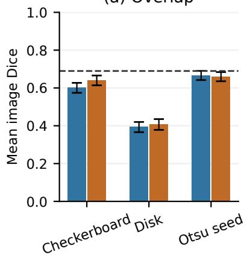
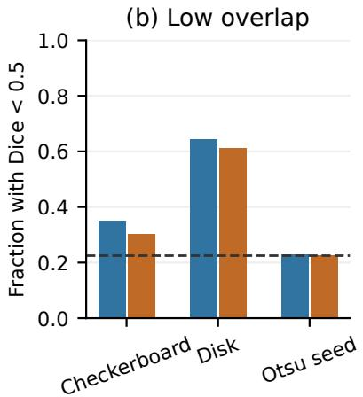
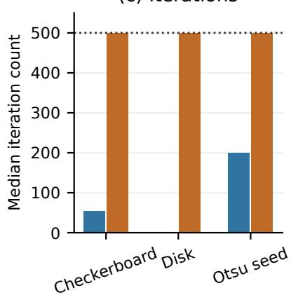
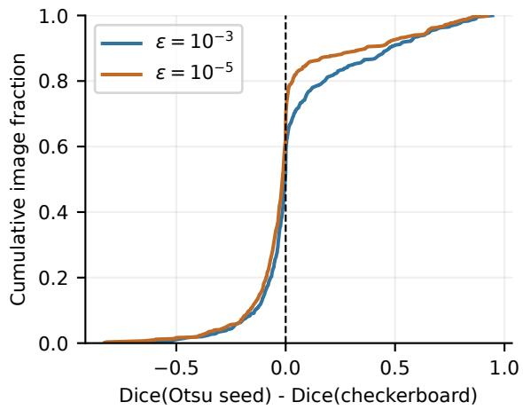
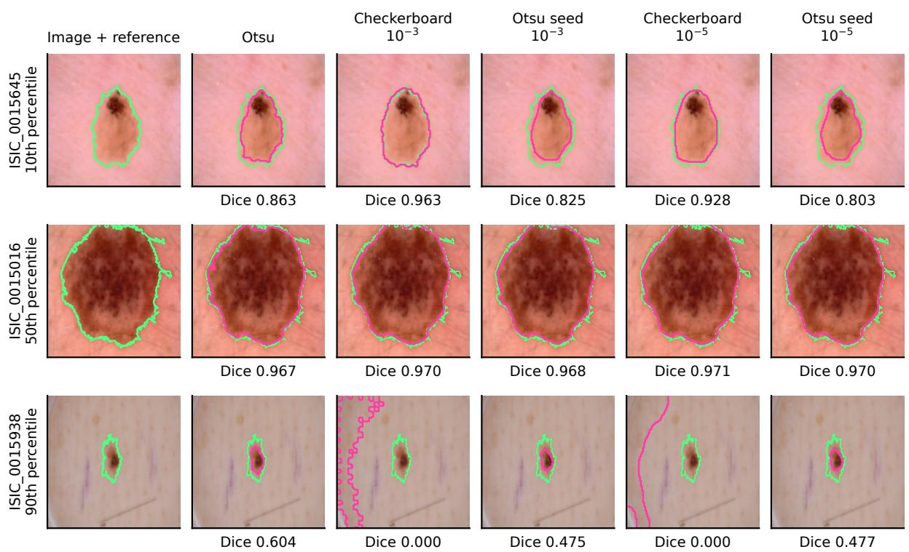

# Initialization and Stopping Tolerance in CPU Dermoscopic Segmentation

Wenhao Xu1, Yixian Kong2, Ting Pan2, Changwei Wang4, Feilong Wang2, Rongtao Xu3,∗

1Zhengzhou Police University, Zhengzhou, China

2School of Artificial Intelligence, Beijing University of Posts and Telecommunications, Beijing, China

3Institute of Automation, Chinese Academy of Sciences, Beijing, China

4Qilu University of Technology and Jinan Supercomputing Center, Jinan, China changweiwang@sdas.org; \*Corresponding author: xurongtao2022@gmail.com

Keywords: Skin Lesion Segmentation, Chan–Vese, Initialization, Stopping Tolerance, Reproducibility.

Abstract:

Contour initialization and numerical stopping can jointly affect the evaluation of active-contour segmentation. We examine their interaction using the open-source scikit-image Chan–Vese implementation on a resized ISIC 2017 mirror. A fixed development set of 100 images selects a common input channel; all 600 images in the repository’s held-out partition are then evaluated. Otsu thresholding is compared with checkerboard-, disk-, and Otsu-initialized contours under default and tighter level-set tolerances. At the default tolerance, Otsu initialization increases mean image Dice from 0.6011 to 0.6660 relative to checkerboard initialization, a paired difference of 0.0649 (95% image-bootstrap interval [0.0452, 0.0860]). Otsu thresholding alone achieves 0.6897. The default disk initializer stops after one iteration on 471 images. Tightening the tolerance reduces the Otsu-seed advantage over checkerboard initialization to 0.0197, with most runs reaching the 500-iteration limit. The default-tolerance advantage also reverses between small- and large-lesion strata. These findings show that an improvement over a generic initializer can coexist with deterioration relative to the threshold baseline. Evaluations should retain the unrefined mask as a comparator and report the initial-field definition, stopping tolerance, and observed iteration counts together.

## 1 INTRODUCTION

Dermoscopic lesion segmentation delineates a lesion against surrounding skin and forms a distinct task in the ISIC challenge (Codella et al., 2017). Learned approaches can optimize overlap directly through a Jaccard-based objective (Yuan et al., 2017); generalized Dice losses address foreground imbalance in medical segmentation (Sudre et al., 2017). Trainingfree methods remain useful reference points, particularly when computation is limited to a CPU. A useful comparison should measure the contribution of each processing step.

Otsu thresholding estimates a global intensity split (Otsu, 1979), whereas the Chan–Vese model evolves a contour through regional intensity agreement and a boundary penalty (Chan and Vese, 2001). Using a threshold mask to initialize the contour connects the two approaches. The practical question is whether contour evolution improves this partition enough to justify its additional computation.

The answer depends on the numerical implementation as well as the energy model. A level-set solver requires an initial field, update rule, stopping tolerance, and iteration limit. A tolerance on changes in the field does not directly measure segmentation error. Different initial fields can therefore receive substantially different amounts of contour evolution under the same stopping rule.

This study evaluates three Chan–Vese initializers and an Otsu-only baseline on 600 held-out image IDs. A development-motivated sensitivity analysis changes only the stopping tolerance and records the resulting iteration counts. The comparison links overlap, boundary agreement, computation, and lesion size under a common pipeline. Source snapshots, data hashes, predictions, and per-image measurements accompany the manuscript.

## 2 RELATED WORK

## 2.1 Active Contours and Initialization

Classical snakes combine curve regularity with image forces (Kass et al., 1988); geodesic active contours express boundary detection through geometric curve evolution (Caselles et al., 1997). Chan–Vese instead fits regional intensity means, allowing segmentation without a strong image gradient (Chan and Vese, 2001). Localized region models and region-scalable fitting relax the global intensity assumption (Lankton and Tannenbaum, 2008; Li et al., 2008). They address spatial inhomogeneity by changing the fitting model, so their behavior cannot be inferred by tightening a global model’s stopping tolerance.

Numerical treatment is a separate consideration. Distance-regularized evolution controls the level-set profile during optimization (Li et al., 2010), while Getreuer provides a reproducible treatment of Chan– Vese segmentation (Getreuer, 2012). We use the public scikit-image solver (van der Walt et al., 2014; scikitimage contributors, 2025) and vary its initialization and stopping tolerance without modifying the energy or update rule.

For dermoscopy, previous studies compare contour initializers (Nagieb et al., 2018), optimize the initial circular region with a genetic algorithm (Ashour et al., 2021), and use adaptive Otsu-based initialization (Malik et al., 2022). The present experiment evaluates a plain histogram threshold and its signed-distance field; it does not reproduce the adaptive algorithm. Retaining the threshold mask as a separate comparator isolates the contribution of contour evolution.

## 2.2 Learned Context and Boundaries

U-Net couples an encoder–decoder with skip connections (Ronneberger et al., 2015); UNet++, Attention U-Net, and DoubleU-Net extend feature transfer, gating, and network staging (Zhou et al., 2018; Oktay et al., 2018; Jha et al., 2020). Recurrent residual units accumulate features in R2U-Net (Alom et al., 2018), while MultiResUNet combines multiple receptive-field scales and residual paths (Ibtehaz and Rahman, 2019). CE-Net uses atrous convolution and multi-kernel pooling to retain spatial context (Gu et al., 2019), and UNet 3+ aggregates full-scale features with deep supervision (Huang et al., 2020). These designs address spatial information that a two-mean intensity model does not represent.

Transformer approaches include hybrid convolution–attention models (Chen et al., 2021; Zhang et al., 2021), pure-transformer encoders (Cao et al., 2021), and gated axial attention (Valanarasu et al., 2021). Boundary-aware transformers introduce contour information into skin lesion segmentation (Wang et al., 2021b). Related medical segmentation work uses statistical texture and complementary context (Xu et al., 2024b; Xu et al., 2021; Xu et al., 2023b), task-specific vessel and polyp representations (Wang et al., 2022b; Wang et al., 2021a; Xu et al., 2024g; Wang et al., 2023c), and graph-based spatial relationships (Xu et al., 2022; Meng et al., 2021). Thin vessels, individual instances, and a single lesion foreground require different annotation and boundary conventions.

## 2.3 Supervision and Evaluation Conditions

Medical segmentation has explored soft-mask supervision (Wang et al., 2022a; Wang et al., 2023b) and affinity-aware image-level supervision (Wang et al., 2024b). Weakly supervised semantic segmentation also uses activation maps, correspondence distillation, matting, and mutual representation learning (Xu et al., 2023c; Xu et al., 2023a; Wang et al., 2023d; Xu et al., 2025a); related object-localization studies address foreground discrimination and incomplete activation (Wang et al., 2024a; Xu et al., 2024f). The distinction between a localization cue and a complete binary reference is consequential here: the mirror contains grayscale mask boundaries, so binarization forms part of the evaluation definition.

Segment Anything and its medical adaptation introduce promptable segmentation (Kirillov et al., 2023; Ma et al., 2024); other work extends segmentation to unseen classes and open vocabularies (Xu et al., 2024h; Xu et al., 2024e; Yi et al., 2025). Multimodal 3D segmentation and scene completion additionally change the available inputs and geometric target (Xu et al., 2024a; Xu et al., 2024c). Comparisons must therefore specify supervision, adaptation data, prompt provenance, and output representation. Our imageonly methods receive no reference-derived prompts.

## 2.4 Computation and Pipeline Design

nnU-Net treats preprocessing, configuration, training, and postprocessing as an integrated system (Isensee et al., 2021). MALUNet and EGE-UNet target compact skin lesion networks (Ruan et al., 2022; Ruan et al., 2023); UNeXt combines convolution with tokenized MLP blocks for rapid medical segmentation (Valanarasu and Patel, 2022). Efficient attention is a further direction in visual representation learning (Feng et al., 2026). Parameter counts and theoretical operation counts do not directly determine CPU runtime, which also depends on implementation, resolution, and hardware. We measure computation within one fixed pipeline and retain the unrefined mask to establish whether refinement justifies its cost. Published network scores are not pooled with these measurements because the datasets and evaluation conditions differ.

## 3 METHODS

## 3.1 Common Image Pipeline

Each RGB image is resized to 128 × 128 pixels using Pillow’s LANCZOS resampler and converted to float64 in [0, 1]. Development compares blue intensity with luminance $0 . 2 1 2 5 R + 0 . 7 1 5 4 G + 0 . 0 7 2 1 B .$ The selected channel is smoothed with a Gaussian of standard deviation one pixel and reflected boundaries, then supplied to every method. The pipeline uses no hair removal, border cropping, or image-specific parameter tuning.

Common postprocessing retains the largest 8- connected component and fills its enclosed holes. Nearest-neighbor interpolation returns the mask to the mirror’s $2 4 \bar { 8 } \times 2 4 8$ grid for scoring. This procedure assumes a single dominant lesion.

## 3.2 Threshold Baseline and Initializers

Otsu’s criterion maximizes between-class variance (Otsu, 1979). We use 256 equal-width bins on [0,1], select the first maximizing split in a tie, and threshold at the corresponding bin boundary. The darker class defines the lesion candidate. Applying common postprocessing to this mask gives the Otsu-only baseline.

We compare three initial level-set fields in Chan– Vese:

• Checkerboard: the upstream sinusoidal preset with five-pixel squares.

• Disk: the upstream large-disk preset, centered at pixel (63,63) with radius 63 on the processing grid.

• Otsu seed: the unprocessed threshold mask M is converted into

$$
\Phi 0 \left( x \right) = \frac { d ( x , M ^ { c } ) - d ( x , M ) } { 6 4 } ,\tag{1}
$$

where d denotes Euclidean distance to the indicated set. Thus $\Phi _ { 0 } > 0$ inside the threshold region. The denominator fixes the field scale relative to the image half-width.

The level-set scale in Equation 1 is fixed throughout the study.

## 3.3 Contour Evolution and Stopping

For normalized image I and contour C, the underlying two-region energy can be written as

$$
\begin{array} { r l } { { \displaystyle E ( C , c _ { 1 } , c _ { 2 } ) = \mu \mathrm { L e n g t h } ( C ) } } & { { } } \\ { { \displaystyle ~ + \lambda _ { 1 } \int _ { \mathrm { i n } ( C ) } ( I - c _ { 1 } ) ^ { 2 } d x } } & { { } } \\ { { \displaystyle ~ + \lambda _ { 2 } \int _ { \mathrm { o u t } ( C ) } ( I - c _ { 2 } ) ^ { 2 } d x , } } \end{array}\tag{2}
$$

where $c _ { 1 } , c _ { 2 }$ are region means. The area term is absent. The implementation rescales its scalar input to [0,1] using the image minimum and maximum. Its finite-difference updates, smoothed Heaviside/Dirac functions, boundary treatment, and evolution without level-set reinitialization are retained (scikit-image contributors, 2025).

All contour runs use $\mu = 0 . 2 5 , \lambda _ { 1 } = \lambda _ { 2 } = 1$ , time step 0.5, and a maximum of 500 iterations. The upstream stopping statistic is

$$
r _ { t } = \sqrt { | \Omega | ^ { - 1 } \sum _ { x \in \Omega } ( \Phi _ { t + 1 } ( x ) - \Phi _ { t } ( x ) ) ^ { 2 } } .\tag{3}
$$

Iterations stop when $r _ { t } \le \varepsilon \mathrm { o r }$ the budget is exhausted. Primary runs use the upstream default $\varepsilon = 1 0 ^ { - 3 }$ . A one-step disk run observed during development motivated a sensitivity analysis at $\mathfrak { E } = 1 0 ^ { - 5 }$ for all three initializers. This analysis was specified before test prediction and retained the selected channel and all other settings.

Because phase labels are arbitrary, the phase with lower mean processed intensity is designated as the lesion whenever both phases are nonempty. Empty or full masks are retained. Phase assignment and postprocessing use no reference-mask information.

## 4 EXPERIMENTAL DESIGN

## 4.1 Data, Splits, and Integrity

The public flyingU-ai/isic2017 repository, pinned to commit 4480fed25ccb, contains 2,000 image-mask pairs in train and 600 in val (flyingU-ai, 2021). Development uses the 100 training paths with the smallest unsigned 32-bit FNV-1a hashes of 20260909: concatenated with the path. All 600 validation pairs form the held-out set. The selection rule and case list were recorded before performance evaluation; image IDs do not overlap across sets.

Images and masks are paired by exact ISIC filename ID. All 1,400 PNG files match their expected

Git blob SHA-1 and byte count and have dimensions $2 4 8 \times 2 4 8$ . Every mask contains intermediate grayscale values and is binarized at 128 on the 0–255 scale. The resulting references are nonempty and nonfull. All selected cases are retained.

Decoded RGB hashes identify two duplicate-image pairs within the test partition, leaving 598 distinct arrays. Their reference masks differ, with Dice agreement 0.956 and 0.905. No exact RGB duplicate crosses the development/test boundary. The primary analysis retains all 600 IDs; a sensitivity analysis averages scores within each duplicate group and weights the 598 distinct arrays equally. Patient identifiers are unavailable.

The mirror’s transformation history and correspondence to the official test partition remain unverified. Evaluation therefore concerns this repository partition. The original challenge portal lists the 2017 segmentation data under CC0 (International Skin Imaging Collaboration, 2026).

## 4.2 Development and Frozen Evaluation

One common channel is selected by mean image Dice, averaged equally over the four default-setting methods on development data. Blue scores 0.5720 versus 0.4958 for luminance and is fixed for all test experiments.

The primary contrast is mean Dice for Otsuinitialized minus checkerboard-initialized Chan–Vese at the default tolerance. Secondary contrasts use the Otsu-only and disk-initialized baselines. All tightertolerance configurations are reported as sensitivity results. The protocol, selected channel, and source SHA-256 hashes were recorded locally before test execution; this record is not an external preregistration.

## 4.3 Measurements and Uncertainty

Metric selection should reflect the target structure and intended use (Taha and Hanbury, 2015; Maier-Hein et al., 2024). Aggregation and implementation choices can also change the interpretation of segmentation scores (Reinke et al., 2024). We therefore report overlap and boundary agreement together, with explicit averaging and tolerance conventions.

For predicted mask $P$ and reference $G ,$ the principal overlap measures are

$$
{ \mathrm { D i c e } } = { \frac { 2 | P \cap G | } { | P | + | G | } } , \qquad { \mathrm { I o U } } = { \frac { | P \cap G | } { | P \cup G | } } .\tag{4}
$$

Scores are averaged per image. Additional measures are the proportion with Dice below 0.5 and boundary F1 within a two-pixel Euclidean tolerance on the mirror grid. Boundaries comprise mask pixels removed by one $3 \times 3$ erosion; precision and recall count pixels within the tolerance of the opposing boundary. The tolerance is defined in pixels, without a physical-distance interpretation.

Uncertainty is summarized by 95% percentile intervals from 10,000 paired bootstrap resamples of image IDs, using seed 20260909. These intervals describe image-level sampling variability and do not account for unknown patient clusters, site shift, or channelselection uncertainty. Secondary and sensitivity contrasts are descriptive, without multiplicity adjustment.

Prespecified strata use reference lesion area: below 10%, 10–30%, and above 30% of image area. This information is used only for analysis. Qualitative examples are the image IDs nearest the 10th, 50th, and 90th percentiles of the default Otsu-seed minus checkerboard Dice difference, with ties broken by ID.

## 4.4 Implementation and Timing

The numerical source is \_chan\_vese.py from scikitimage v0.25.2, Git blob 31c3f1e72af4 (scikit-image contributors, 2025). A compatibility module redirects one private dtype-utility import; a trailing newline is the only other source change. All inputs use float64. The original blob is verified, and the imported function agrees exactly with the preserved source for three synthetic initializers.

Experiments use an Intel Xeon Platinum 8370C CPU at 2.80 GHz with an eight-core quota, Python 3.12.14, NumPy 2.3.5, SciPy 1.17.0, and Pillow 12.3.0. Eight image workers each use one numerical-library thread. Process CPU time includes preprocessing, initialization, evolution, postprocessing, and output resizing; file loading and scoring are excluded. These measurements describe computation per case, not endto-end latency. All 4,200 held-out prediction masks are retained, and their saved overlap statistics are independently verified by recounting pixels.

## 5 RESULTS

## 5.1 Overlap and Boundary Agreement

Otsu alone gives the highest mean Dice (0.6897), IoU (0.6011), and boundary F1 (0.3079) among the tested configurations (Table 1). At the default tolerance, Otsuinitialized Chan–Vese exceeds checkerboard initialization by 0.0649 in mean Dice (95% paired imagebootstrap interval [0.0452, 0.0860]), but falls below Otsu alone (difference −0.0237 [−0.0314, −0.0156]). Contour refinement therefore reduces overlap relative to the threshold baseline.

The Otsu-seed versus checkerboard comparison improves on 257 images, ties on 30, and worsens on 313. Its positive mean difference reflects larger gains on a minority of images, as illustrated by the paired distributions in Figure 2.

## 5.2 Stopping-Criterion Sensitivity

At the default tolerance, disk initialization stops after one iteration in 471/600 cases (78.5%). Median iteration counts are 54, 1, and 199 for checkerboard, disk, and Otsu initialization, respectively (Figure 1); 15, 7, and 87 runs reach the ceiling. Thus, the common maximum budget yields substantially different amounts of computation.

At $\varepsilon = 1 0 ^ { - 5 }$ , mean Dice is 0.6404 for checkerboard, 0.4069 for disk, and 0.6601 for Otsu initialization. All three have a median of 500 iterations. The limit is reached by 551 checkerboard runs and all 600 runs for each other initializer, leaving full convergence unresolved.

The Otsu-seed advantage over checkerboard decreases to 0.0197 [0.0006, 0.0396]. The change in this contrast is −0.0453 [−0.0610, −0.0294]. Stopping tolerance therefore affects the observed initialization comparison, although the iteration ceiling prevents interpretation as a comparison of converged solutions. Otsu-seeded contours also remain below Otsu alone, with a mean difference of −0.0296 [−0.0410, −0.0179].

Median CPU time increases from 127.2 to 908.4 ms for checkerboard and from 359.8 to 934.9 ms for Otsu initialization. Otsu alone takes 3.8 ms, retaining both an overlap and a computation advantage in this implementation.

## 5.3 Size Strata, Duplicate Images, and Examples

Lesion size changes the ordering of the initializers (Table 2). Below 10% foreground area, default-tolerance Otsu initialization increases Dice from 0.299 to 0.534 relative to checkerboard. Above 30%, the ordering reverses: 0.756 versus 0.806. These strata describe reference area rather than clinical subgroups.

Equal weighting of the 598 distinct RGB arrays gives default- and tighter-tolerance Otsu-seed versus checkerboard differences of 0.0652 and 0.0197. Accounting for the two exact-duplicate groups therefore leaves the observed ordering unchanged.

Figure 3 illustrates the fixed percentile-based examples. Checkerboard agrees better with the reference in the lower-difference example, while the median example gives similar masks. In the upper-difference example, checkerboard follows a peripheral intensity region; Otsu initialization localizes the lesion but underestimates its extent. A large improvement over checkerboard thus need not yield an accurate boundary.

Table 1: Results for all 600 held-out image IDs. BF : boundary F1 within two pixels. Low Dice: count with Dice < 0.5. Iteration count and CPU time are medians; timing excludes loading and scoring.
<table><tr><td>Configuration</td><td>ε</td><td>Dice</td><td>IoU</td><td> $\mathrm { B F } _ { 2 }$ </td><td>Low Dice</td><td>Iter.</td><td>CPU (ms)</td></tr><tr><td>Otsu only</td><td></td><td>0.6897</td><td>0.6011</td><td>0.3079</td><td>135</td><td>0</td><td>3.8</td></tr><tr><td>CV: checkerboard</td><td> $1 0 ^ { - 3 }$ </td><td>0.6011</td><td>0.5049</td><td>0.1873</td><td>210</td><td>54</td><td>127.2</td></tr><tr><td>CV: disk</td><td> $1 0 ^ { - 3 }$ </td><td>0.3933</td><td>0.3113</td><td>0.0843</td><td>385</td><td>1</td><td>14.4</td></tr><tr><td>CV: Otsu seed</td><td> $1 0 ^ { - 3 }$ </td><td>0.6660</td><td>0.5654</td><td>0.2024</td><td>137</td><td>199</td><td>359.8</td></tr><tr><td>CV: checkerboard</td><td> $1 0 ^ { - 5 }$ </td><td>0.6404</td><td>0.5491</td><td>0.2399</td><td>181</td><td>500</td><td>908.4</td></tr><tr><td>CV: disk</td><td> $1 0 ^ { - 5 }$ </td><td>0.4069</td><td>0.3314</td><td>0.1062</td><td>366</td><td>500</td><td>919.6</td></tr><tr><td>CV: Otsu seed</td><td> $1 0 ^ { - 5 }$ </td><td>0.6601</td><td>0.5590</td><td>0.1916</td><td>135</td><td>500</td><td>934.9</td></tr></table>

(a) Overlap  

$$
\varepsilon = 1 0 ^ { - 5 }
$$

  
(c) Iterations  
Figure 1: Overlap and computation under the two stopping tolerances. Dashed lines in (a,b) mark the Otsu-only baseline; error bars in (a) show 95% image-bootstrap intervals. The dotted line in (c) marks the 500-iteration limit.

Table 2: Mean image Dice by reference foreground fraction. ${ \bf D } { \boldsymbol { : } } { \bf \varepsilon } = 1 0 ^ { - 3 } ; { \bf T } { \boldsymbol { : } } { \bf \varepsilon } = 1 0 ^ { - 5 } ,$
<table><tr><td>Configuration</td><td> $< 1 0 \%$ </td><td>10–30%</td><td> $> 3 0 \%$ </td></tr><tr><td>Images</td><td>225</td><td>182</td><td>193</td></tr><tr><td>Otsu</td><td>0.583</td><td>0.747</td><td>0.760</td></tr><tr><td>Checkerboard D</td><td>0.299</td><td>0.757</td><td>0.806</td></tr><tr><td>Disk D</td><td>0.080</td><td>0.363</td><td>0.787</td></tr><tr><td>Otsu seed D</td><td>0.534</td><td>0.733</td><td>0.756</td></tr><tr><td>Checkerboard T</td><td>0.402</td><td>0.772</td><td>0.795</td></tr><tr><td>Disk T</td><td>0.073</td><td>0.404</td><td>0.798</td></tr><tr><td>Otsu seed T</td><td>0.543</td><td>0.711</td><td>0.749</td></tr></table>

  
Figure 2: Cumulative distributions of per-image Dice differences. Positive values favor Otsu-seeded over checkerboardinitialized Chan–Vese.

  
Figure 3: Examples nearest the 10th, 50th, and 90th percentiles of the default Otsu-seed minus checkerboard Dice difference, shown from top to bottom. Green contours: reference; magenta contours: prediction. Values below panels are per-image Dice.

## 6 DISCUSSION AND CONCLUSION

Otsu initialization improves mean Dice over checkerboard under both tolerances but reduces agreement relative to Otsu alone. The threshold comparator changes the interpretation of refinement, while lesionsize strata reveal a reversal hidden by the overall mean.

The one-step disk outcomes expose a limitation of reporting only the energy and maximum budget. Equation 3 measures field change, whose magnitude depends on geometry, scale, and update dynamics. A small update can coexist with poor segmentation. Tightening the tolerance changes the comparison, but ceiling hits leave convergence unresolved. Iteration distributions should accompany the tolerance and initial-field definition.

Shape and foreground scale also guide segmentation in remote sensing and infrared imagery (Xu et al., 2023d; Wang et al., 2023a; Xu et al., 2024d; Xu et al., 2025c); evaluating such priors for dermoscopy would require lesion-size strata alongside aggregate scores.

Extensions to embodied perception and action (Zhang et al., 2024; Xu et al., 2025b; Zhang et al.,

2026) would require temporal and task-success criteria beyond mask overlap.

The conclusions concern one global two-phase model, solver, curvature weight, and preprocessing pipeline. Local intensity models (Li et al., 2008; Lankton and Tannenbaum, 2008), hair removal, trained networks, and adaptive initialization (Malik et al., 2022) require separate evaluation.

Resampling may alter texture and boundaries, and antialiased masks require explicit binarization. Missing patient, diagnosis, skin-tone, and acquisition metadata prevent patient-level independence checks and clinical subgroup assessment. Duplicate weighting addresses only the two detected RGB pairs. The darkerphase and largest-component assumptions can fail with border artifacts, disconnected regions, or low contrast. Boundary agreement alone does not establish clinical adequacy.

Thresholding achieves the strongest overlap at the lowest CPU cost in this cohort. Testing whether this ordering persists requires original-resolution data and independent datasets, retaining the unrefined baseline and recording numerical stopping behavior.

## DECLARATIONS

Data and code. This retrospective analysis uses publicly available image-mask files and involves no participant recruitment or intervention. The accompanying package contains the evaluated data, numerical source, configuration records, predictions, and per-image scores.

Use of generative AI. ChatGPT/Codex (OpenAI, 2026) assisted study design, literature retrieval, code development and execution, plotting, and manuscript preparation.

## REFERENCES

Alom, M. Z., Hasan, M., Yakopcic, C., et al. (2018). Recurrent residual convolutional neural network based on U-Net (R2U-Net) for medical image segmentation. arXiv:1802.06955.

Ashour, A. S., Nagieb, R. M., El-Khobby, H. A., et al. (2021). Genetic algorithm-based initial contour optimization for skin lesion border detection. Multimedia Tools and Applications, 80:2583–2597.

Cao, H., Wang, Y., Chen, J., et al. (2021). Swin-Unet: Unet-like pure transformer for medical image segmentation. arXiv:2105.05537.

Caselles, V., Kimmel, R., and Sapiro, G. (1997). Geodesic active contours. International Journal of Computer Vision, 22:61–79.

Chan, T. F. and Vese, L. A. (2001). Active contours without edges. IEEE Transactions on Image Processing, 10(2):266–277.

Chen, J., Lu, Y., Yu, Q., et al. (2021). TransUNet: Transformers make strong encoders for medical image segmentation. arXiv:2102.04306.

Codella, N. C. F., Gutman, D., Celebi, M. E., et al. (2017). Skin lesion analysis toward melanoma detection: A challenge at the 2017 international symposium on biomedical imaging (ISBI), hosted by the international skin imaging collaboration (ISIC). arXiv:1710.05006.

Feng, Z., Lian, S., Wang, C., et al. (2026). LaplacianFormer: Rethinking linear attention with Laplacian kernel. arXiv:2604.20368.

flyingU-ai (2021). isic2017: Resized image and mask repository. https://github.com/flyingU-ai/isic2017. Commit 4480fed25ccb; accessed 9 September 2026.

Getreuer, P. (2012). Chan–Vese segmentation. Image Processing On Line, 2:214–224.

Gu, Z., Cheng, J., Fu, H., et al. (2019). CE-Net: Context encoder network for 2D medical image segmentation. IEEE Transactions on Medical Imaging.

Huang, H., Lin, L., Tong, R., et al. (2020). UNet 3+: A full-scale connected UNet for medical image segmentation. In IEEE ICASSP, pages 1055–1059.

Ibtehaz, N. and Rahman, M. S. (2019). MultiResUNet: Rethinking the U-Net architecture for multimodal biomedical image segmentation. arXiv:1902.04049.

International Skin Imaging Collaboration (2026). ISIC challenge datasets. https://challenge.isic-archive.com /data/. 2017 Task 1; accessed 9 September 2026.

Isensee, F., Jaeger, P. F., Kohl, S. A. A., et al. (2021). nnU-Net: A self-configuring method for deep learningbased biomedical image segmentation. Nature Methods, 18:203–211.

Jha, D., Riegler, M. A., Johansen, D., et al. (2020). DoubleU-Net: A deep convolutional neural network for medical image segmentation. arXiv:2006.04868.

Kass, M., Witkin, A., and Terzopoulos, D. (1988). Snakes: Active contour models. International Journal of Computer Vision, 1:321–331.

Kirillov, A., Mintun, E., Ravi, N., et al. (2023). Segment anything. In ICCV.

Lankton, S. and Tannenbaum, A. (2008). Localizing regionbased active contours. IEEE Transactions on Image Processing, 17(11).

Li, C., Kao, C.-Y., Gore, J. C., et al. (2008). Minimization of region-scalable fitting energy for image segmentation. IEEE Transactions on Image Processing, 17(10):1940–1949.

Li, C., Xu, C., Gui, C., et al. (2010). Distance regularized level set evolution and its application to image segmentation. IEEE Transactions on Image Processing, 19(12):3243–3254.

Ma, J., He, Y., Li, F., et al. (2024). Segment anything in medical images. Nature Communications, 15:654.

Maier-Hein, L., Reinke, A., Godau, P., et al. (2024). Metrics reloaded: Recommendations for image analysis validation. Nature Methods, 21:195–212.

Malik, Y. S., Tamoor, M., Naseer, A., et al. (2022). Applying an adaptive Otsu-based initialization algorithm to optimize active contour models for skin lesion segmentation. Journal of X-Ray Science and Technology, 30(6).

Meng, Y., Zhang, H., Gao, D., et al. (2021). BI-GCN: Boundary-aware input-dependent graph convolution network for biomedical image segmentation. In BMVC.

Nagieb, R. M., Ashour, A. S., Guo, Y., et al. (2018). Initialization of active contour for dermoscopic image segmentation: A comparative study. In IEEE International Symposium on Signal Processing and Information Technology (ISSPIT), pages 370–374. IEEE Xplore document 8642628.

Oktay, O., Schlemper, J., Le Folgoc, L., et al. (2018). Attention U-Net: Learning where to look for the pancreas. arXiv:1804.03999.

OpenAI (2026). ChatGPT/Codex. https://openai.com/. Used 9 September 2026; scope described in Declarations.

Otsu, N. (1979). A threshold selection method from graylevel histograms. IEEE Transactions on Systems, Man, and Cybernetics, 9(1):62–66.

Reinke, A., Tizabi, M. D., Baumgartner, M., et al. (2024). Understanding metric-related pitfalls in image analysis validation. Nature Methods, 21:182–194.

Ronneberger, O., Fischer, P., and Brox, T. (2015). U-Net: Convolutional networks for biomedical image segmentation. In MICCAI.

Ruan, J., Xiang, S., Xie, M., et al. (2022). MALUNet: A multi-attention and light-weight UNet for skin lesion segmentation. arXiv:2211.01784.

Ruan, J., Xie, M., Gao, J., et al. (2023). EGE-UNet: An efficient group enhanced UNet for skin lesion segmentation. arXiv:2307.08473.

scikit-image contributors (2025). Chan–Vese implementation, version 0.25.2. https://github.com/scikit-image/s cikit-image/blob/v0.25.2/skimage/segmentation/\_ch an\_vese.py. Accessed 9 September 2026.

Sudre, C. H., Li, W., Vercauteren, T., et al. (2017). Generalised Dice overlap as a deep learning loss function for highly unbalanced segmentations. In DLMIA/ML-CDS.

Taha, A. A. and Hanbury, A. (2015). Metrics for evaluating 3D medical image segmentation: Analysis, selection, and tool. BMC Medical Imaging, 15:29.

Valanarasu, J. M. J., Oza, P., Hacihaliloglu, I., et al. (2021). Medical transformer: Gated axial-attention for medical image segmentation. In MICCAI.

Valanarasu, J. M. J. and Patel, V. M. (2022). UNeXt: MLPbased rapid medical image segmentation network. arXiv:2203.04967.

van der Walt, S., Schönberger, J. L., Nunez-Iglesias, J., et al. (2014). scikit-image: Image processing in Python. PeerJ, 2:e453.

Wang, C., Xu, R., Xu, S., et al. (2023a). Toward accurate and efficient road extraction by leveraging the characteristics of road shapes. IEEE Transactions on Geoscience and Remote Sensing.

Wang, C., Xu, R., Xu, S., et al. (2024a). Exploring intrinsic discrimination and consistency for weakly supervised object localization. IEEE Transactions on Image Processing.

Wang, C., Xu, R., Xu, S., et al. (2022a). SoftGAN: Towards accurate lung nodule segmentation via soft mask supervision. In IEEE ICME.

Wang, C., Xu, R., Xu, S., et al. (2023b). Accurate lung nodule segmentation with detailed representation transfer and soft mask supervision. IEEE Trans. Neural Networks and Learning Systems. Early access.

Wang, C., Xu, R., Xu, S., et al. (2022b). DA-Net: Dual branch transformer and adaptive strip upsampling for retinal vessels segmentation. In MICCAI, pages 528–538.

Wang, C., Xu, R., Xu, S., et al. (2023c). Automatic polyp segmentation via image-level and surrounding-level context fusion deep neural network. Engineering Applications of Artificial Intelligence.

Wang, C., Xu, R., Xu, S., et al. (2023d). Treating pseudolabels generation as image matting for weakly supervised semantic segmentation. In ICCV, pages 755–765.

Wang, C., Xu, R., Zhang, Y., et al. (2021a). Retinal vessel segmentation via context guide attention net with joint hard sample mining strategy. In IEEE ISBI, pages 1319–1323.

Wang, H., Wu, J., Wang, C., et al. (2024b). AC-CAM: Affinity-aware contrast CAM for weakly-supervised semantic segmentation on MRI brain tumor. In IEEE International Conference on Bioinformatics and Biomedicine (BIBM).

Wang, J., Wei, L., Wang, L., et al. (2021b). Boundary-aware transformers for skin lesion segmentation. In MICCAI, pages 206–216.

Xu, R., Li, Y., Wang, C., et al. (2022). Instance segmentation of biological images using graph convolutional network. Engineering Applications ofArtificial Intelligence, 110:104739.

Xu, R., Wang, C., Sun, J., et al. (2023a). Self correspondence distillation for end-to-end weakly-supervised semantic segmentation. In AAAI, volume 37, pages 3045–3053.

Xu, R., Wang, C., Xu, S., et al. (2021). DC-Net: Dual context network for 2D medical image segmentation. In MICCAI, pages 503–513.

Xu, R., Wang, C., Xu, S., et al. (2023b). Dual-stream representation fusion learning for accurate medical image segmentation. Engineering Applications of Artificial Intelligence, 123:106402.

Xu, R., Wang, C., Xu, S., et al. (2023c). Wave-like class activation map with representation fusion for weaklysupervised semantic segmentation. IEEE Trans. Multimedia. Early access.

Xu, R., Wang, C., Xu, S., et al. (2025a). RML: Efficient representation mutual learning framework for end-toend weakly supervised semantic segmentation. IEEE Transactions on Instrumentation and Measurement.

Xu, R., Wang, C., Zhang, D., et al. (2024a). DefFusion: Deformable multimodal representation fusion for 3D semantic segmentation. In IEEE International Conference on Robotics and Automation (ICRA).

Xu, R., Wang, C., Zhang, J., et al. (2023d). RSSFormer: Foreground saliency enhancement for remote sensing land-cover segmentation. IEEE Trans. Image Processing, 32:1052–1064.

Xu, R., Wang, C., Zhang, J., et al. (2024b). SkinFormer: Learning statistical texture representation with transformer for skin lesion segmentation. arXiv:2409.08652.

Xu, R., Zhang, J., Guo, M., et al. (2025b). A0: An affordance-aware hierarchical model for general robotic manipulation. In ICCV.

Xu, R., Zhang, J., Sun, J., et al. (2024c). MRFTrans: Multimodal representation fusion transformer for monocular 3D semantic scene completion. Information Fusion, 111:102493.

Xu, S., Zheng, S., Xu, W., et al. (2024d). HCF-Net: Hierarchical context fusion network for infrared small object detection. arXiv:2403.10778.

Xu, W., Wang, C., Feng, X., et al. (2024e). Generalization boosted adapter for open-vocabulary segmentation. arXiv:2409.08468.

Xu, W., Wang, C., Xu, R., et al. (2024f). Token masking transformer for weakly supervised object localization. IEEE Transactions on Multimedia. Early access.

Xu, W., Xu, R., Wang, C., et al. (2024g). PSTNet: Enhanced polyp segmentation with multi-scale alignment and frequency domain integration. arXiv:2409.08501.

Xu, W., Xu, R., Wang, C., et al. (2024h). Spectral prompt tuning: Unveiling unseen classes for zero-shot semantic segmentation. In AAAI, volume 38, pages 6369–6377.

Xu, W., Zheng, S., Wang, C., et al. (2025c). SAMamba: Adaptive state space modeling with hierarchical vision for infrared small target detection. arXiv:2505.23214.

Yi, T., Wang, S., Zhang, Z., et al. (2025). OV-BIS: Openvocabulary boundary guide zero-shot 3D instance segmentation. IEEE Transactions on Multimedia.

Yuan, Y., Chao, M., and Lo, Y.-C. (2017). Automatic skin lesion segmentation using deep fully convolutional networks with Jaccard distance. IEEE Trans. Medical Imaging, 36(9):1876–1886.

Zhang, J., Wang, K., Xu, R., et al. (2024). NaVid: Videobased VLM plans the next step for vision-andlanguage navigation. In Robotics: Science and Systems.

Zhang, K., Zhang, J., Xu, R., et al. (2026). A1: A fully transparent open-source, adaptive and efficient truncated vision-language-action model. arXiv:2604.05672.

Zhang, Y., Liu, H., and Hu, Q. (2021). TransFuse: Fusing transformers and CNNs for medical image segmentation. In MICCAI.

Zhou, Z., Siddiquee, M. M. R., Tajbakhsh, N., et al. (2018). UNet++: A nested U-Net architecture for medical image segmentation. In DLMIA.