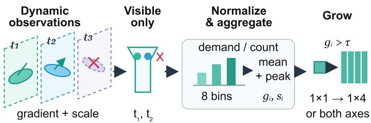
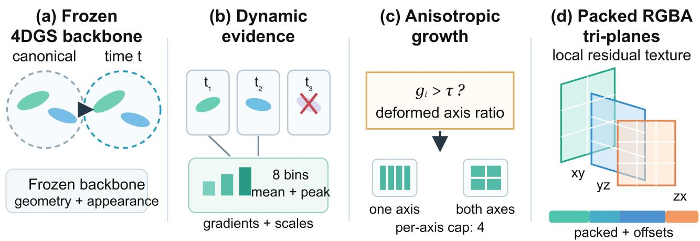
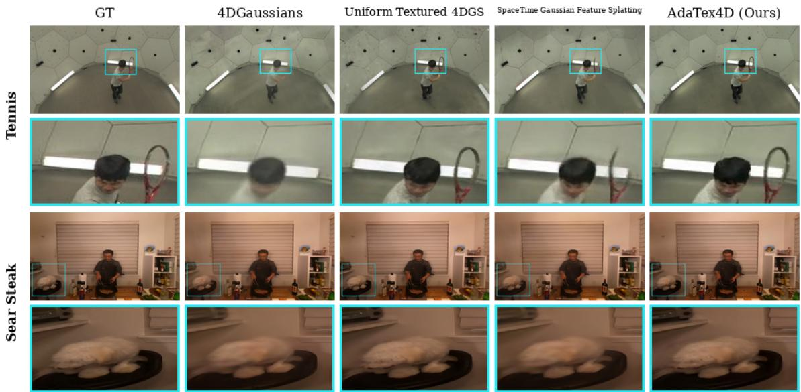

# ADATEX4D: ADAPTIVE TEXTURE CAPACITY ALLOCATION FOR 4D GAUSSIANSPLATTING

De Jiang1, Peiqiang Wang2, Kehong Yuan3, Shaohua Ma4,∗

1,2,3,4 Tsinghua Shenzhen International Graduate School, Tsinghua University, Shenzhen, China

## ABSTRACT

Textured Gaussians improve local appearance capacity, but assigning the same texture resolution to every primitive wastes storage on low-detail or weakly visible regions. We introduce Ada-Tex4D, an adaptive texture-capacity module for deformation-based 4D Gaussian Splatting. Each Gaussian carries packed RGBA triplanes whose two axes grow independently according to visibilitynormalized screen-space gradients and deformed local scales. Experiments on N3DV and PanopticSports show that AdaTex4D reduces texture storage by more than half while preserving reconstruction quality. Under fixed memory budgets, adaptive allocation also improves quality over uniform texture assignment and reduces overall model and peak memory. These results show that dynamic, anisotropic texture allocation provides a more efficient way to distribute local appearance capacity in 4D Gaussian representations.

Index Terms— 4D Gaussian splatting, dynamic view synthesis, textured Gaussians, adaptive representation, storage-efficient representation

## 1. INTRODUCTION

Neural radiance fields established high-quality novel-view synthesis through continuous volumetric functions [1], while 3D Gaussian Splatting (3DGS) replaced expensive ray sampling with an explicit differentiable rasterizer [2]. Dynamic Gaussian methods model time-varying scenes through deformation, motion control, or framewise updates [3, 4, 5, 6, 7, 8]. These advances improve dynamic geometry and rendering efficiency, but each Gaussian still offers limited spatial variation inside its projected footprint. Per-primitive texturing increases local appearance capacity [9, 10].

This added capacity creates a new allocation problem. Uniform textured Gaussians assign the same square texture to every primitive, although projected footprint, visibility, motion, and local image detail vary substantially. Large textures are therefore also paid for by small, occluded, or visually simple Gaussians, while detailcritical regions are not distinguished from easy regions. Increasing the global texture resolution can improve local detail, but its memory cost grows for every primitive at once. Existing compact representations and compression methods reduce static Gaussian redundancy [11, 12, 13] or dynamic storage [14, 15, 16, 17]. The key question here is where to place texture capacity.

Static A2TG addresses this mismatch by growing textures from image-space gradients and Gaussian anisotropy [18]. Directly transferring the same rule to 4D scenes is insufficient. A dynamic Gaussian can be visible in only part of a sequence, change projected scale after deformation, or become detail-critical for a short interval. Canonical geometry cannot describe these time-varying states, while a simple temporal average can suppress rare but important peaks. Per-frame resizing would have the opposite problem: it reacts to transient noise and repeatedly changes parameter shapes during optimization.

  
Fig. 1. Dynamic evidence aggregation in AdaTex4D. Only visible dynamic observations contribute to each Gaussian’s normalized gradient demand and deformed-scale statistics; these aggregated signals determine whether local texture capacity grows along one or both axes.

Dynamic allocation therefore needs evidence that is both selective and stable. Occluded observations should not contribute as strongly as visible ones; short-lived high-detail events should survive aggregation; and the growth direction should follow deformed, rather than canonical, local scales. At the same time, the geometric backbone and Gaussian count should remain fixed so that any gain can be attributed to appearance-capacity allocation rather than extra primitives.

We address these requirements with AdaTex4D. Starting from a trained deformation-based 4DGS model, we freeze geometry, deformation, opacity, spherical-harmonic (SH) appearance, and primitive count, and optimize only a packed residual texture branch. Three RGBA planes start at 1 × 1 and grow anisotropically to at most 4×4. Growth is driven by visibility-normalized image-space gradients, temporal peak demand, and deformed local scales aggregated over dynamic observations. This lets texture capacity follow where and when local appearance detail is needed.

Across 12 N3DV and PanopticSports scenes, the resulting allocation preserves reconstruction quality with substantially less texture state. Fixed-memory and fixed-Gaussian-count protocols further separate the benefit of adaptive placement from simply increasing texture resolution or primitive count.

Packed texel counts describe storage, but checkpoint size, peak GPU memory, and runtime capture different costs. We report these quantities because the current renderer still materializes dense textures, limiting throughput gains from packing.

Our contributions are:

1. We extend anisotropic texture allocation to deforming 4D Gaussians using visibility-aware temporal evidence and de-

  
Fig. 2. Overview of AdaTex4D. Starting from a frozen 4DGS backbone, we aggregate visibility-normalized image-space gradient demand and deformed Gaussian scales over dynamic observations. These statistics drive anisotropic texture growth along one or both local axes, while each axis remains capped at resolution 4. The resulting heterogeneous RGBA tri-planes are stored in packed tensors and act as bounded residual appearance features, so the geometry, deformation, opacity, SH appearance, and Gaussian count of the backbone remain unchanged.

formed local scales.

2. At 80 MiB, AdaTex4D improves PSNR by 0.175 and 0.205 dB over Uniform Textured 4DGS on N3DV and Panoptic-Sports, respectively.

3. Across 12 scenes, AdaTex4D uses 47.3% of the uniform texture bytes while preserving reconstruction quality.

## 2. METHOD

## 2.1. Dynamic Gaussian parameterization

At time t, the frozen 4DGS backbone provides the center $\mu _ { i } ^ { t } ,$ , rotation $\mathbf { R } _ { i } ^ { t } .$ , scale $\mathbf { s } _ { i } ^ { t } ,$ opacity $\alpha _ { i } ,$ and SH color $\mathbf { c } _ { i } ^ { \mathrm { { S H } } }$ for Gaussian i. We freeze these quantities, the deformation field, and the Gaussian count, and optimize only the texture branch. A 3D sample x is first mapped to the Gaussian’s local frame,

$$
\mathbf { x } _ { i } = \mathrm { d i a g } ( \mathbf { s } _ { i } ^ { t } ) ^ { - 1 } ( \mathbf { R } _ { i } ^ { t } ) ^ { \top } ( \mathbf { x } - { \pmb \mu } _ { i } ^ { t } ) .\tag{1}
$$

Each Gaussian carries three RGBA textures $\mathbf { T } _ { i } ^ { p } , p \in \{ x y , y z , z x \}$ We project $\mathbf { x } _ { i }$ onto each plane, map the projected coordinate from [−1, 1] to that plane’s texture grid, and bilinearly sample it. The three RGB samples are fused into a residual $\mathbf { r } _ { i } ,$ while sampled alpha modulates the Gaussian opacity. Rendering is

$$
\widehat { \mathbf { I } } = \sum _ { i } w _ { i } \left[ \mathbf { c } _ { i } ^ { \mathrm { S H } } + 0 . 1 \operatorname { t a n h } ( \mathbf { r } _ { i } ) \right] , \qquad w _ { i } = \widetilde { \alpha } _ { i } \prod _ { j < i } ( 1 - \widetilde { \alpha } _ { j } ) .\tag{2}
$$

All textures start at $1 \times 1$ . Each axis may grow through {1, 2, 4}, while the uniform control uses $4 \times 4$ on every plane.

## 2.2. Visibility-normalized dynamic evidence

A2TG uses image-space gradients to allocate texture capacity in static scenes [18]. For visible occurrence k of Gaussian $i ,$ we use the projected-center gradient magnitude

$$
q _ { i , k } = \left. \nabla _ { \mathbf { m } _ { i , k } } \mathcal { L } _ { k } \right. _ { 1 }\tag{3}
$$

as its texture demand. We split visible observations into eight temporal bins and let $q _ { i } ^ { b }$ denote the mean demand in nonempty bin $b .$

The final allocation score is simply a mixture of persistent and peak demand,

$$
\begin{array} { r } { g _ { i } = \frac { 1 } { 2 } \operatorname* { m e a n } _ { b } ( q _ { i } ^ { b } ) + \frac { 1 } { 2 } \operatorname* { m a x } _ { b } q _ { i } ^ { b } . } \end{array}\tag{4}
$$

Only visible observations are included. The highest-demand bin also provides the mean deformed scale used by the growth rule below. Signed gradients are unchanged for optimization; the absolute quantity $q _ { i , k }$ is used only for allocation. Statistics are reduced across workers before resizing.

## 2.3. Anisotropic texture growth

Growth is evaluated at steps 500 and 1000. A Gaussian is resized only when $g _ { i } > 2 \times 1 0 ^ { - 5 }$ . For one texture plane, write its current size as $( h , w )$ and the corresponding two components of the selected-bin deformed scale as $\left( s _ { h } , s _ { w } \right)$ . We then apply the A2TGstyle anisotropic rule [18]:

$$
( h ^ { \prime } , w ^ { \prime } ) = \left\{ \begin{array} { l l } { ( 2 h , w ) , } & { s _ { h } / s _ { w } > 4 , s _ { w } < 0 . 0 1 , } \\ { ( h , 2 w ) , } & { s _ { w } / s _ { h } > 4 , s _ { h } < 0 . 0 1 , } \\ { ( 2 h , 2 w ) , } & { \mathrm { o t h e r w i s e } . } \end{array} \right.\tag{5}
$$

Each doubled axis is capped at 4. Thus a thin Gaussian grows mainly along one texture axis, while a more isotropic Gaussian grows along both. New texels are initialized by area interpolation, and Adam moments are resized with the same mapping.

## 2.4. Optimization and storage

Texture values are optimized for 5,000 steps at learning rate 0.0025 using

$$
\mathcal { L } = 0 . 8 \| \mathbf { I } - \widehat { \mathbf { I } } \| _ { 1 } + 0 . 2 \big ( 1 - \mathrm { S S I M } ( \mathbf { I } , \widehat { \mathbf { I } } ) \big ) .\tag{6}
$$

Eight data-parallel workers render one view each per step. Packed texture storage scales with the total number of active RGBA texels, plus a small amount of dimension and offset metadata. We report this texture state together with full-model storage, peak allocated memory, training time, and FPS. The current renderer still materializes dense 4×4 textures, so storage savings do not yet increase rendering throughput.

  
Fig. 3. Qualitative comparison. Each column shows one method. For each scene, the first row is the full frame and the second row is the enlarged ROI. Top: Tennis. Bottom: Sear Steak.

## 3. EXPERIMENTS

## 3.1. Protocol

We evaluate six N3DV scenes [19]—coffee martini, cook spinach, cut roasted beef, flame salmon, flame steak, and sear steak—and six PanopticSports scenes from the CMU Panoptic capture system [20]: basketball, boxes, football, juggle, softball, and tennis. N3DV holds out Cam00, whereas PanopticSports follows its official split; all reported images use a white background. Paired runs use seed 6666 and the same precomputed camera schedule. Dataset means are unweighted averages over all six scenes. Metrics are PSNR, LPIPS-Alex [21], structural dissimilarity at data ranges 1.0 and 2.0 for N3DV, SSIM [22] for PanopticSports, packed texture MiB, checkpoint MiB, peak allocated memory, training time, and FPS.

We compare 4DGaussians, Uniform Textured 4DGS, and Ada-Tex4D under two protocols. The fixed-memory study follows A2TG [18] with 80 MiB and 150 MiB total-model budgets. Each method adjusts Gaussian count and appearance capacity to approach the target budget without exceeding it. The fixed-count study uses 25% and 50% of the converged 4DGaussians count with identical Gaussian subsets across methods. Training uses 5,000 steps on both N3DV and PanopticSports with eight views per step. STG [5] is an external projected anchor; PanopticSports uses TC3DGS [23], and fixedcount Mem is count-normalized to active Gaussians. The 12-scene matrix uses one seed; confidence intervals are paired scene-level bootstrap intervals.

## 3.2. Main quality–storage result

Across 12 scenes, AdaTex4D/Textured 4DGS uses 51.7/109.3 MiB texture (ratio 0.473, −52.7%), 178.0/235.6 MiB full-model storage (−24.4%), and 1.16/1.59 GiB peak memory (−27.0%); training is 2.18/1.64 h (+32.9%) and rendering 84.1/100.8 FPS (−16.6%). Quality is similar: PSNR 28.191/28.157 dB (+0.034 dB; paired 95% bootstrap CI [−0.035, 0.113]) and LPIPS differs by +0.0011; N3DV/PanopticSports structural metrics are reported separately.

The 57.6 MiB decrease in packed texture state is also the dominant source of the checkpoint reduction because the 4DGS backbone is frozen. The large storage change and small metric change indicate that a uniform 4×4 texture assigns substantial capacity to primitives that do not need it. AdaTex4D instead concentrates texels on Gaussians that repeatedly produce reconstruction gradients or become important after deformation. The result is therefore a redistribution of appearance capacity rather than a reduction of geometric capacity.

## 3.3. Comparison under fixed memory budgets

We use the same 80 MiB and 150 MiB total-memory budgets for both datasets. Mem denotes total model storage, and each configuration is tuned to approach the target budget from below.

At 80 MiB, AdaTex4D exceeds Uniform Textured 4DGS by 0.175/0.205 dB on N3DV/PanopticSports at nearly identical storage, and exceeds 4DGaussians by 0.153/0.152 dB. On N3DV, STG gives the lowest dssim values, while AdaTex4D gives the highest PSNR and lowest LPIPS; on PanopticSports, AdaTex4D leads all three quality metrics. The gain is strongest in this tight-budget regime because selective growth avoids spending texture capacity on low-demand primitives.

At 150 MiB, AdaTex4D reaches 27.203 dB on N3DV and 26.532 dB on PanopticSports, using 149.7 MiB on both datasets. As the budget relaxes, the PanopticSports gap narrows: 4DGaussians has the highest PSNR/SSIM, while AdaTex4D has the lowest LPIPS. The two budgets show that adaptive textures are most useful when memory is the active constraint.

## 3.4. Comparison at fixed Gaussian counts

We next hold the Gaussian subset fixed at 25% or 50% of the converged 4DGaussians count for each scene. Uniform Textured 4DGS and AdaTex4D use the same Gaussian identities as the 4DGaussians control. This protocol isolates the effect of attaching and allocating texture capacity while keeping the primitive subset fixed.

Table 1. Quantitative comparison under fixed total-memory budgets. Both datasets use 80 MiB and 150 MiB budgets. Mem is total model storage in MiB; STG is a projected anchor. Colors mark the best three values; Mem is ranked by total storage.
<table><tr><td></td><td colspan="5">N3DV</td><td colspan="4">PanopticSports</td></tr><tr><td>Method</td><td>PSNR↑</td><td>DSSIM1↓</td><td>DSSIM2↓</td><td>LPIPS↓</td><td>Mem↓</td><td>PSNR↑</td><td>SSIM↑</td><td>LPIPS↓</td><td>Mem↓</td></tr><tr><td colspan="10">Memory budget = 80 MiB</td></tr><tr><td>4DGaussians [3]</td><td>26.257</td><td>0.0654</td><td>0.0380</td><td>0.1741</td><td>79.8</td><td>25.813</td><td>0.8590</td><td>0.2606</td><td>79.9</td></tr><tr><td>Uniform Textured 4DGS [9]</td><td>26.235</td><td>0.0658</td><td>0.0383</td><td>0.1698</td><td>79.9</td><td>25.760</td><td>0.8568</td><td>0.2487</td><td>79.8</td></tr><tr><td>Spacetime Gaussian Feature Splatting [5]</td><td>26.330</td><td>0.0639</td><td>0.0368</td><td>0.1675</td><td>79.7</td><td>20.008</td><td>0.7681</td><td>0.4622</td><td>79.8</td></tr><tr><td>ÁdaTex4D (Ours)</td><td>26.410</td><td>0.0649</td><td>0.0374</td><td>0.1589</td><td>79.6</td><td>25.965</td><td>0.8612</td><td>0.2358</td><td>79.7</td></tr><tr><td colspan="10">Memory budget = 150 MiB</td></tr><tr><td>4DGaussians [3]</td><td>26.546</td><td>0.0627</td><td>0.0357</td><td>0.1662</td><td>149.9</td><td>26.639</td><td>0.8844</td><td>0.2096</td><td>149.9</td></tr><tr><td>Uniform Textured 4DGS [9]</td><td>27.046</td><td>0.0631</td><td>0.0362</td><td>0.1553</td><td>149.9</td><td>26.319</td><td>0.8729</td><td>0.2181</td><td>149.8</td></tr><tr><td>Spacetime Gaussian Feature Splatting [5]</td><td>26.997</td><td>0.0585</td><td>0.0335</td><td>0.1566</td><td>149.8</td><td>21.234</td><td>0.7930</td><td>0.4071</td><td>149.8</td></tr><tr><td>AdaTex4D (Ours)</td><td>27.203</td><td>0.0627</td><td>0.0360</td><td>0.1480</td><td>149.7</td><td>26.532</td><td>0.8749</td><td>0.2037</td><td>149.7</td></tr></table>

Table 2. Quantitative comparison under fixed Gaussian counts. Six-scene means at 25% or 50% of converged 4DGaussians. DSSIM1/2 use ranges 1.0/2.0. Mem is total active-model storage with A2TG-style count normalization. Colors mark the best three values.
<table><tr><td></td><td colspan="5">N3DV</td><td colspan="4">PanopticSports</td></tr><tr><td>Method</td><td>PSNR↑</td><td>DSSIM1↓</td><td>DSSIM2↓</td><td>LPIPS↓</td><td>Mem↓</td><td>PSNR↑</td><td>SSIM↑</td><td>LPIPS↓</td><td>Mem↓</td></tr><tr><td colspan="10">Gaussian count = 25%</td></tr><tr><td>4DGaussians [3]</td><td>21.917</td><td>0.1127</td><td>0.0762</td><td>0.3024</td><td>22.2</td><td>23.949</td><td>0.8211</td><td>0.3444</td><td>40.0</td></tr><tr><td>Uniform Textured 4DGS [9]</td><td>23.505</td><td>0.1006</td><td>0.0647</td><td>0.2753</td><td>38.4</td><td>24.130</td><td>0.8103</td><td>0.3183</td><td>74.9</td></tr><tr><td>Spacetime Gaussian Feature Splatting [5]</td><td>22.367</td><td>0.1057</td><td>0.0714</td><td>0.2870</td><td>49.1</td><td>17.199</td><td>0.7011</td><td>0.6044</td><td>106.3</td></tr><tr><td>AdaTex4D (Ours)</td><td>22.412</td><td>0.1131</td><td>0.0734</td><td>0.3032</td><td>31.9</td><td>23.980</td><td>0.8079</td><td>0.3264</td><td>60.4</td></tr><tr><td colspan="10">Gaussian count = 50%</td></tr><tr><td>4DGaussians [3]</td><td>25.073</td><td>0.0763</td><td>0.0472</td><td>0.2066</td><td>44.4</td><td>25.813</td><td>0.8590</td><td>0.2606</td><td>80.1</td></tr><tr><td>Uniform Textured 4DGS [9]</td><td>26.085</td><td>0.0701</td><td>0.0423</td><td>0.1864</td><td>76.8</td><td>25.964</td><td>0.8539</td><td>0.2354</td><td>150.4</td></tr><tr><td>Spacetime Gaussian Feature Splatting [5]</td><td>25.709</td><td>0.0696</td><td>0.0430</td><td>0.1917</td><td>98.1</td><td>19.063</td><td>0.7390</td><td>0.5206</td><td>212.7</td></tr><tr><td>AdaTex4D (Ours)</td><td>25.402</td><td>0.0799</td><td>0.0489</td><td>0.2027</td><td>63.5</td><td>25.812</td><td>0.8525</td><td>0.2408</td><td>121.5</td></tr></table>

At 25%/50% Gaussian count, AdaTex4D saves 16.9%/17.3% active-model storage on N3DV and 19.4%/19.2% on PanopticSports versus Uniform Textured 4DGS. Its PSNR gaps are 1.093/0.683 and 0.150/0.152 dB, respectively. The smaller N3DV gap at 50% suggests that texture allocation cannot fully compensate for missing Gaussian support at 25%.

Together, the fixed-memory and fixed-count results separate primitive coverage from texture placement: adaptive allocation helps most when Gaussian support is sufficient.

## 3.5. Qualitative comparison

Figure 3 shows AdaTex4D retaining the head outline and racket hoop in Tennis and the steak’s boundary and surface detail in Sear Steak. These features appear blurred in 4DGaussians and Spacetime Gaussian Feature Splatting, but resemble Uniform Textured 4DGS despite AdaTex4D using less texture storage.

## 3.6. Ablations and allocation behavior

Removing temporal peaks lowers PSNR by 0.331/0.322 dB on N3DV/PanopticSports; removing anisotropic allocation lowers it by 0.461/0.452 dB. Removing visibility normalization lowers PSNR by 0.645/0.652 dB. Peaks preserve brief detail, anisotropic growth avoids unnecessary texels, and visibility normalization corrects observation-frequency bias.

Square growth uses 32.4 rather than 30.9 MiB on N3DV and lowers PSNR. Across 12 scenes, 53.8% of Gaussians use an anisotropic plane; AdaTex4D stores 44.2% of uniform texels and

Table 3. Ablation at 50% Gaussian count (Mem: model/texture MiB).
<table><tr><td colspan="4">N3DV</td></tr><tr><td>Variant</td><td></td><td>PSNR↑ dssim1↓ dssim2↓ LPIPS↓</td><td>Mem↓</td></tr><tr><td>Ours</td><td>27.188 0.0589</td><td>0.0326 0.1540</td><td>122.4/30.9</td></tr><tr><td>w/o Temporal Peak</td><td>26.857 0.0608</td><td>0.0335 0.1577</td><td>123.5/30.9</td></tr><tr><td>w/o Anisotropic Allocation</td><td>26.727 0.0607</td><td>0.0335 0.1571</td><td>123.4/32.4</td></tr><tr><td>w/o Visibility Normalization</td><td>26.543 0.0605</td><td>0.0335 0.1596</td><td>123.6/31.0</td></tr><tr><td colspan="4">PanopticSports</td></tr><tr><td>Variant</td><td>PSNR↑ SSIM↑ LPIPS↓</td><td></td><td>Mem↓</td></tr><tr><td>Ours</td><td>26.854 0.8872</td><td>0.1820</td><td>236.2/70.0</td></tr><tr><td>w/o Temporal Peak</td><td>26.532 0.8858</td><td>0.1840</td><td>236.4/70.2</td></tr><tr><td>w/o Anisotropic Allocation</td><td>26.402 0.8854</td><td>0.1869</td><td>237.4/70.0</td></tr><tr><td>w/o Visibility Normalization</td><td>26.202 0.8854</td><td>0.1860</td><td>238.5/70.2</td></tr></table>

47.3% of packed texture bytes. Dimension and offset metadata account for the difference.

## 4. CONCLUSION

Uniform textures waste capacity when dynamic Gaussians need different levels of detail. AdaTex4D grows packed textures anisotropically using visibility-normalized gradients, temporal peaks, and deformed scales while freezing the 4DGS backbone. Experiments show comparable reconstruction quality with less storage, and ablations support the allocation signals. Dense texture materialization currently limits runtime gains.

## 5. REFERENCES

[1] Ben Mildenhall, Pratul P. Srinivasan, Matthew Tancik, Jonathan T. Barron, Ravi Ramamoorthi, and Ren Ng, “NeRF: Representing scenes as neural radiance fields for view synthesis,” in European Conference on Computer Vision, 2020, pp. 405–421.

[2] Bernhard Kerbl, Georgios Kopanas, Thomas Leimkuhler, and¨ George Drettakis, “3D gaussian splatting for real-time radiance field rendering,” ACM Transactions on Graphics, vol. 42, no. 4, pp. 139:1–139:14, 2023.

[3] Guanjun Wu, Taoran Yi, Jiemin Fang, Lingxi Xie, Xiaopeng Zhang, Wei Wei, Wenyu Liu, Qi Tian, and Xinggang Wang, “4D gaussian splatting for real-time dynamic scene rendering,” in IEEE/CVF Conference on Computer Vision and Pattern Recognition, 2024, pp. 20310–20320.

[4] Ziyi Yang, Xinyu Gao, Wen Zhou, Shaohui Jiao, Yuqing Zhang, and Xiaogang Jin, “Deformable 3D gaussians for high-fidelity monocular dynamic scene reconstruction,” in IEEE/CVF Conference on Computer Vision and Pattern Recognition, 2024, pp. 20331–20341.

[5] Zhan Li, Zhang Chen, Zhong Li, and Yi Xu, “Spacetime gaussian feature splatting for real-time dynamic view synthesis,” in IEEE/CVF Conference on Computer Vision and Pattern Recognition, 2024, pp. 8508–8520.

[6] Yi-Hua Huang, Yang-Tian Sun, Ziyi Yang, Xiaoyang Lyu, Yan-Pei Cao, and Xiaojuan Qi, “SC-GS: Sparse-controlled gaussian splatting for editable dynamic scenes,” in IEEE/CVF Conference on Computer Vision and Pattern Recognition, 2024, pp. 4220–4230.

[7] Jiakai Sun, Han Jiao, Guangyuan Li, Zhanjie Zhang, Lei Zhao, and Wei Xing, “3DGStream: On-the-fly training of 3D gaussians for efficient streaming of photo-realistic free-viewpoint videos,” in IEEE/CVF Conference on Computer Vision and Pattern Recognition, 2024, pp. 20675–20685.

[8] Youtian Lin, Zuozhuo Dai, Siyu Zhu, and Yao Yao, “Gaussianflow: 4D reconstruction with dynamic 3D gaussian particle,” in IEEE/CVF Conference on Computer Vision and Pattern Recognition, 2024, pp. 21136–21145.

[9] Brian Chao, Hung-Yu Tseng, Lorenzo Porzi, Chen Gao, Tuotuo Li, Qinbo Li, Ayush Saraf, Jia-Bin Huang, Johannes Kopf, Gordon Wetzstein, and Changil Kim, “Textured gaussians for enhanced 3D scene appearance modeling,” in IEEE/CVF Conference on Computer Vision and Pattern Recognition, 2025, pp. 8964–8974.

[10] Victor Rong, Jingxiang Chen, Sherwin Bahmani, Kiriakos N. Kutulakos, and David B. Lindell, “GStex: Per-primitive texturing of 2D gaussian splatting for decoupled appearance and geometry modeling,” in Winter Conference on Applications of Computer Vision, 2025, pp. 3508–3518.

[11] Tao Lu, Mulin Yu, Linning Xu, Yuanbo Xiangli, Limin Wang, Dahua Lin, and Bo Dai, “Scaffold-GS: Structured 3D gaussians for view-adaptive rendering,” in IEEE/CVF Conference on Computer Vision and Pattern Recognition, 2024, pp. 20654–20664.

[12] Joo Chan Lee, Daniel Rho, Xiangyu Sun, Jong Hwan Ko, and Eunbyung Park, “Compact 3D gaussian representation for radiance field,” in IEEE/CVF Conference on Computer Vision and Pattern Recognition, 2024, pp. 21719–21728.

[13] Simon Niedermayr, Josef Stumpfegger, and Rudiger Wester- ¨ mann, “Compressed 3D gaussian splatting for accelerated novel view synthesis,” in IEEE/CVF Conference on Computer Vision and Pattern Recognition, 2024, pp. 10349–10358.

[14] Kai Katsumata, Duc Minh Vo, and Hideki Nakayama, “A compact dynamic 3D gaussian representation for real-time dynamic view synthesis,” in European Conference on Computer Vision, 2024, pp. 394–412.

[15] Qiang Hu, Zihan Zheng, Houqiang Zhong, Sihua Fu, Li Song, Xiaoyun Zhang, Guangtao Zhai, and Yanfeng Wang, “4DGC: Rate-aware 4D gaussian compression for efficient streamable free-viewpoint video,” in IEEE/CVF Conference on Computer Vision and Pattern Recognition, 2025, pp. 875–885.

[16] Sangwoon Kwak, Joonsoo Kim, Jun Young Jeong, Won-Sik Cheong, Jihyong Oh, and Munchurl Kim, “MoDec-GS: Global-to-local motion decomposition and temporal interval adjustment for compact dynamic 3D gaussian splatting,” in IEEE/CVF Conference on Computer Vision and Pattern Recognition, 2025, pp. 11338–11348.

[17] Xinjie Zhang, Zhening Liu, Yifan Zhang, Xingtong Ge, Dailan He, Tongda Xu, Yan Wang, Zehong Lin, Shuicheng Yan, and Jun Zhang, “MEGA: Memory-efficient 4D gaussian splatting for dynamic scenes,” in IEEE/CVF International Conference on Computer Vision, 2025, pp. 27828–27838.

[18] Sheng-Chi Hsu, Ting-Yu Yen, Shih-Hsuan Hung, and Hung-Kuo Chu, “A2TG: Adaptive anisotropic textured gaussians for efficient 3D scene representation,” in International Conference on Learning Representations, 2026.

[19] Tianye Li, Mira Slavcheva, Michael Zollhoefer, Simon Green, Christoph Lassner, Changil Kim, Tanner Schmidt, Steven Lovegrove, Michael Goesele, Richard Newcombe, and Zhaoyang Lv, “Neural 3D video synthesis from multi-view video,” in IEEE/CVF Conference on Computer Vision and Pattern Recognition, 2022, pp. 5521–5531.

[20] Hanbyul Joo, Tomas Simon, Xulong Li, Hao Liu, Lei Tan, Lin Gui, Sean Banerjee, Timothy Godisart, Bart Nabbe, Iain Matthews, Takeo Kanade, Shohei Nobuhara, and Yaser Sheikh, “Panoptic studio: A massively multiview system for social interaction capture,” IEEE Transactions on Pattern Analysis and Machine Intelligence, vol. 41, no. 1, pp. 190–204, 2019.

[21] Richard Zhang, Phillip Isola, Alexei A. Efros, Eli Shechtman, and Oliver Wang, “The unreasonable effectiveness of deep features as a perceptual metric,” in IEEE Conference on Computer Vision and Pattern Recognition, 2018, pp. 586–595.

[22] Zhou Wang, Alan C. Bovik, Hamid R. Sheikh, and Eero P. Simoncelli, “Image quality assessment: From error visibility to structural similarity,” IEEE Transactions on Image Processing, vol. 13, no. 4, pp. 600–612, 2004.

[23] Saqib Javed, Ahmad Jarrar Khan, Corentin Dumery, Chen Zhao, and Mathieu Salzmann, “Temporally compressed 3D gaussian splatting for dynamic scenes,” in British Machine Vision Conference (BMVC), 2025.