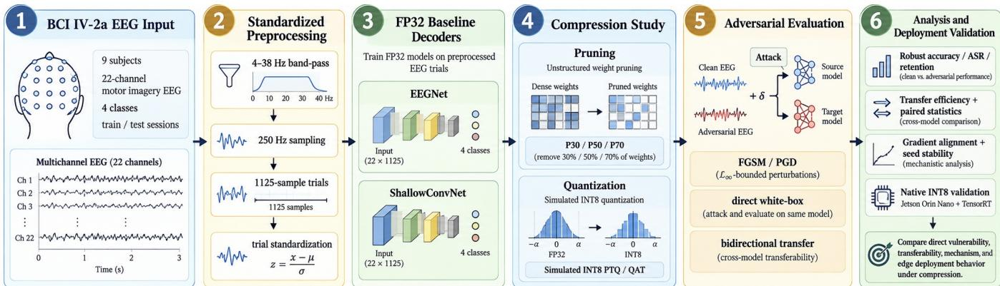
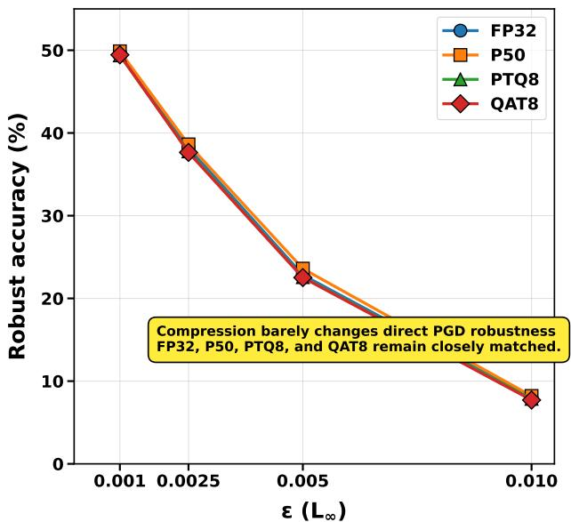
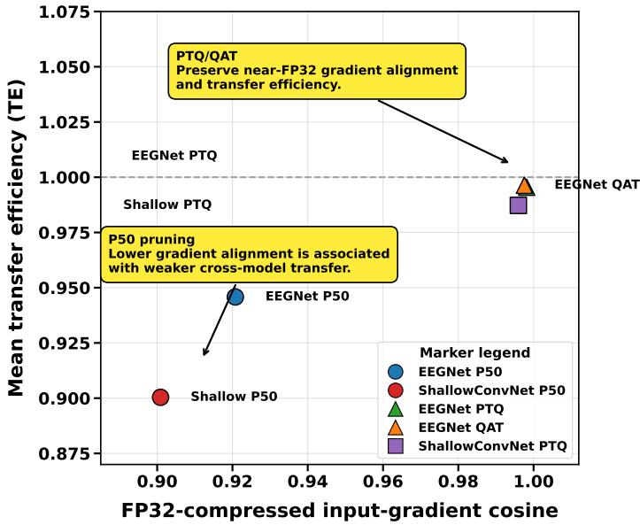
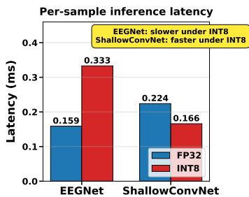
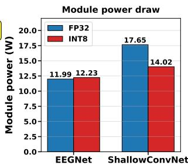

# AERIAL: ADVERSARIAL EVALUATION OF ROBUSTNESS IN ACCURACY-PRESERVING LOW-PRECISION EEG DECODERS

Saim Rehman, Muhammad Shafique

eBRAIN Lab, Division of Engineering, New York University Abu Dhabi (NYUAD), Abu Dhabi, UAE

{sr7849, muhammad.shafique} @nyu.edu

## ABSTRACT

Deployment-oriented compression is attractive for resourceconstrained brain-computer interfaces (BCIs), but whether it changes adversarial vulnerability remains unclear. On BCI Competition IV-2a, we compare 32-bit floating-point (FP32) EEGNet and ShallowConvNet models with global magnitude pruning and simulated INT8 post-training quantization (PTQ) and quantization-aware training (QAT) across nine subjects and three seeds. Simulation provides differentiable quantize— dequantize models for white-box attacks and gradient analysis, while native TensorRT deployment is used for validation. Accuracy-preserving compression does not improve direct robustness: at € = 0.005, EEGNet PGD accuracy remains 22–24% across FP32, 50% pruning (P50), PTQ, and QAT. However, P50 reduces bidirectional transfer efficiency to 0.963/0.928 (FP32→P50/P50→FP32), versus 0.994/0.997 for PTQ; the same trend holds for ShallowConvNet. Gradient alignment shows a corresponding separation, while native PTQ agrees with simulated clean/adversarial predictions in 95–98% of cases. These results show that direct robustness, adversarial transfer, and deployment efficiency are distinct properties of compressed EEG decoders.

Index Terms— EEG, Brain-Computer Interface, Adversarial Robustness, Model Pruning, Quantization.

## 1. INTRODUCTION

Motor-imagery EEG decoders increasingly rely on compact convolutional networks such as EEGNet and ShallowConvNet [1-3]. Yet EEG classifiers are vulnerable to small adversarial perturbations and transferable attacks [4]. Recent work has therefore emphasized adversarial training, detection, and benchmark design for secure BCIs [5, 6]. In parallel, deployment on low-power hardware motivates pruning and low-precision inference [7–9]. These two concerns intersect: pruning or quantization may alter gradients and attack transfer even when task accuracy is unchanged, and quantized models can exhibit misleading apparent robustness under weak gradient evaluations [10–12].

Recent EEG adversarial studies have primarily focused on improving robustness through adversarial training, defense benchmarking, or robust architectures [5, 6, 13], while edgeoriented EEG work has studied quantization and model compression mainly from the perspective of accuracy, memory, latency, and energy [14, 15]. These two lines of work leave a distinct methodological gap: it remains unclear whether accuracy-preserving compression changes direct white-box vulnerability and cross-model adversarial transfer under otherwise matched EEG decoders, and whether conclusions drawn from differentiable quantization simulation persist under a native edge runtime. We address this intersection by holding the data protocol, decoder family, and attack configuration fixed while varying compression mechanism, and by separately validating simulated PTQ with native TensorRT execution. Accordingly, we ask: for EEG motor-imagery decoders, when a compression method preserves clean accuracy, does it also change the adversarial attack surface?

Our novel contributions, henceforth, are:

• Providing a systematic study of how neural-network compression alters the adversarial attack surface of motor-imagery EEG decoders on BCI Competition IV-2a, explicitly separating direct white-box robustness from cross-model adversarial transferability

• To show that compression methods with nearly identical clean accuracy and direct adversarial robustness can exhibit substantially different transfer behavior: 50% magnitude pruning consistently weakens adversarial transfer across distinct CNN decoder architectures, whereas simulated INT8 PTQ and QAT largely preserve FP32 transferability, which demonstrates that the observed compression-dependent separation is not specific to a single model architecture.

• Validating the simulated PTQ findings under native TensorRT deployment on a Jetson Orin Nano. Native and simulated PTQ agree on 95–98% of clean/adversarial predictions, while measured latency and power reveal architecture-dependent INT8 deployment benefits.

• Investigating the mechanism underlying these differences through FP32-compressed input-gradient cosine similarity and sign agreement, showing that stronger pruning substantially disrupts local gradient alignment, while PTQ/QAT retain gradient geometry close to the FP32 models. This links compression-induced changes in adversarial transferability to changes in local inputgradient structure

  
Fig. 1: Full Methodology uncovering AERIAL's evaluation pipeline

## 2. EXPERIMENTAL DESIGN

## 2.1. Data, models, and compression

We use BCI Competition IV-2a [1]: nine subjects, four motorimagery classes, 22 EEG channels at 250 Hz, and separate training (T) and evaluation (E) sessions. Signals are band-pass filtered to 4–38 Hz, converted to $\mu \mathrm { V } ,$ exponentially standardized $( 1 0 ^ { - 3 } ;$ ; 1000-sample initialization), and segmented from -0.5 to 4.0 s relative to the cue. T is stratified 80/20 for train/validation and E is used only for testing. We evaluate EEGNet [2] and ShallowConvNet [3] over seeds {1, 48, 550 }.

We apply global unstructured $L _ { 1 }$ magnitude pruning at 30/50/70% with recovery fine-tuning, and symmetric simulated INT8 Q/DQ using PTQ and QAT. PTQ activation ranges use training data only; QAT fine-tunes the calibrated model with straight-through gradients. P30/P50 preserve EEGNet clean accuracy, whereas P70 collapses to 25.96% and is treated as over-compression rather than evidence of robustness.

## 2.2. Threat model and analysis

Attacks perturb the standardized digital decoder input under $L _ { \infty }$ budgets $\epsilon \in \{ . 0 0 1 , . 0 0 2 5 , . 0 0 5 , . 0 1 \}$ . EEGNet uses FGSM and PGD; Shallow provides confirmatory PGD results at {.001, .005, .01}. PGD uses 20 steps, five random restarts, random initialization, and step size €/4 [16, 17]. Because attacks act after standardization, € is dimensionless. We report clean/robust accuracy, ASR, and transfer efficiency

$$
\mathrm { T E } = \frac { A _ { \mathrm { c l e a n } } - A _ { \mathrm { t r a n s f e r } } } { A _ { \mathrm { c l e a n } } - A _ { \mathrm { d i r e c t } } } ,
$$

where TE= 1 denotes transfer as effective as direct PGD. Gradient cosine/sign agreement are computed on common-

Table 1: Clean and direct PGD accuracy (%) at € = 0.005. P70 represents over-compression rather than a robust operating point.
<table><tr><td>Arch.</td><td>Variant</td><td>Clean</td><td>PGD</td><td></td></tr><tr><td>EEGNet</td><td>FP32</td><td>57.39</td><td>22.83</td><td rowspan="5"></td></tr><tr><td></td><td>P30</td><td>57.47</td><td>23.06</td></tr><tr><td></td><td>P50</td><td>58.38</td><td>23.60</td></tr><tr><td></td><td>P70</td><td>25.96</td><td>24.01</td></tr><tr><td></td><td>PTQ8 QAT8</td><td>57.42 57.45</td><td>22.57 22.52</td></tr><tr><td>Shallow</td><td>FP32 P50</td><td>57.73 57.47</td><td>42.39</td></tr></table>

correct samples. Seeds are averaged within subject before paired inference (n = 9); we use Wilcoxon tests with Holm correction, bootstrap CIs, and rank-biserial effect size.

## 3. RESULTS

## 3.1. Compression preserves clean accuracy, not white-box robustness

Table 1 separates accuracy-preserving compression from overcompression. For EEGNet, P30, P50, PTQ, and QAT retain clean accuracy within 0.99 pp of FP32, while direct PGD accuracy at ∈ = 0.005 remains 22–24%. In contrast, P70 collapses clean accuracy to 25.96% and is therefore treated as an overcompressed operating point rather than evidence of robustness. ShallowConvNet shows the same accuracy-preserving pattern for P50 and PTQ, with direct PGD accuracy remaining near 42%. Across €, the plotted accuracy-preserving variants closely track FP32 (Fig. 2(a), indicating little compressiondependent change in direct white-box vulnerability; the separation instead emerges under cross-model transfer (Sec. 3.2) Simulated PTQ/QAT provide differentiable low-precision models for attack and gradient analysis, while PTQ is validated separately under native TensorRT execution (Sec. 3.5).

Figure 1 summarizes the complete evaluation pipeline from preprocessing and FP32 training through compression, adversarial analysis, and native deployment validation.

  
(a) Direct PGD robustness.

  
(b) Gradient alignment versus transfer efficiency.  
Fig. 2: Direct vulnerability and compression-induced transfer geometry.

## 3.2. Pruning changes transfer geometry and local gradient alignment

The direct curves conceal a reproducible change in attack alignment. $\mathrm { A t } \epsilon = 0 . 0 0 5$ , EEGNet P50 transfers with TE 0.963 (FP32→P50) and 0.928 (P50→FP32), versus PTQ 0.994/0.997 and QAT 0.995/0.997. Shallow confirms the contrast: P50 TE is 0.897/0.904, versus PTQ 0.979/0.996. P50 gaps are positive for all nine subjects in both directions on both architectures (rank-biserial = 1); the corresponding paired effects and Holmadjusted tests are reported in Table 2.

Input-gradient diagnostics provide a mechanistic correlate. On a common-correct clean set, FP32–P50 cosine is 0.921 on EEGNet and 0.901 on Shallow, versus 0.998/0.996 for PTQ; EEGNet QAT is 0.998 and P30 is 0.990. Sign agreement fol-1ows the same pattern (P50 0.861/0.848 vs. PTQ 0.986/0.978). P50 cosine is lower than PTQ for all 9 subjects on both architectures (Holm $p = 0 . 0 1 5 6 )$ , and lower than QAT on EEGNet by 0.0768. Figure 2 shows that compression-level gradient alignment co-varies with transfer efficiency. Within-condition subject-wise Spearman correlations are not consistently significant, so we treat this as a local mechanistic probe rather than causal proof.

## 3.3. Cross-epsilon consistency and attack-strength checks

Table 2 shows that the transfer effect persists across all three PGD budgets shared by the architectures and reports paired ∆pp and Holm-adjusted p at $\epsilon = 0 . 0 0 5$ .P50 remains below PTQ in every direction and budget. EEGNet P50 transfer is weakest for P50→FP32 at small-to-moderate budgets, while ShallowConvNet shows a broader reduction (TE ≈ 0.88— 0.92); PTQ remains near unity throughout. As attacks approach saturation, TE moves toward one as both direct and transferred attacks approach the accuracy floor.

Table 2: Transfer efficiency (TE) across shared PGD budgets. ∆ and pí are reported at $\epsilon = 0 . 0 0 5 ; \Delta > 0$ denotes weaker transfer than direct PGD.
<table><tr><td>Arch.</td><td>Direction</td><td>.001.005</td><td></td><td>.01</td><td>∆pp</td><td>pH</td></tr><tr><td rowspan="4"></td><td>EEGNet FP32→P50</td><td>.921</td><td>.963</td><td>.980</td><td>1.22</td><td>.0156</td></tr><tr><td>P50→FP32</td><td>.897</td><td>.928</td><td>.964</td><td>2.47</td><td>.0156</td></tr><tr><td>FP32→PTQ</td><td>.981</td><td>.994</td><td>.999</td><td>0.21</td><td>.0313</td></tr><tr><td>PTQ→FP32</td><td>1.004</td><td>.997</td><td>1.000</td><td>0.09</td><td>.0938</td></tr><tr><td rowspan="4"></td><td>Shallow FP32→P50</td><td>.914</td><td>.897</td><td>.918</td><td>1.57</td><td>.0156</td></tr><tr><td>P50→FP32</td><td>.882</td><td>.904</td><td>.912</td><td>1.48</td><td>.0156</td></tr><tr><td>FP32→PTQ</td><td>.968</td><td>.979</td><td>.994</td><td>0.32</td><td>.0156</td></tr><tr><td>PTQ→FP3</td><td>.992</td><td>.996</td><td>.999</td><td>0.06</td><td>.0625</td></tr></table>

Attack-strength checks support the PGD configuration. In the EEGNet pilot at € = 0.005, 10-, 20-, and 50-step PGD converge to the same mean robust accuracy (37.36%), motivating 20 steps. On the full test set, PGD is at least as strong as FGSM at all four budgets; the FP32 robust-accuracy gap grows from 0.06 pp at $\epsilon = . 0 0 1$ to 0.93 pp at .01. These checks reduce the risk that the compression comparison is an under-optimized first-order attack artifact.

## 3.4. Quantization and gradient-masking check

Quantized models do not exhibit the classic pattern of false robustness from unusable gradients [10, 18]. At EEGNet € = .005, direct PTQ/QAT robust accuracy is 22.57/22.52%, FP32-crafted transfer gives 22.78/22.70%, and reverse transfer to FP32 gives 22.92/22.89% versus 22.83% direct. QAT transfer efficiency is 0.995/0.997, and its FP32 gradient cosine is 0.998. Cross-precision attacks therefore remain nearly as effective as direct attacks, arguing that simulated INT8 preserves vulnerability rather than creating severe gradient obfuscation.

Table 3: Native TensorRT PTQ fidelity. Accuracy and prediction agreement are means over nine subjects using seed 1.
<table><tr><td>Metric</td><td>EEGNet</td><td>Shallow</td></tr><tr><td>Clean acc., sim./native (%)</td><td>59.22 / 58.99</td><td>58.37 / 57.45</td></tr><tr><td>PGD acc., sim./native (%)</td><td></td><td>27.58 / 27.7842.36 / 42.90</td></tr><tr><td>Clean agreement (%)</td><td>97.42</td><td>94.91</td></tr><tr><td>PGD agreement (%)</td><td>97.84</td><td>94.98</td></tr></table>

  
Fig. 3: Native TensorRT runtime characteristics on Jetson Orin Nano at batch size one (A01, seed 1). INT8 denotes INT8-preferred mixedprecision execution with FP32 fallback.

## 3.5. Native edge-runtime validation

To test whether the simulated PTQ conclusions persist under a real deployment backend, we exported the seed-1 models to TensorRT 10.16 on a Jetson Orin Nano operating in MAXN-SUPER mode. TensorRT was configured to prefer INT8 execution with FP32 fallback where required, so this should be interpreted as an INT8-preferred mixed-precision deployment rather than a fully integer implementation. Clean and adversarial agreement were evaluated over all nine heldout subjects, while latency and power were measured on the representative A01 seed-1 model at batch size one. This native experiment is therefore a deployment-fidelity check, not part of the three-seed statistical robustness comparison.

Table 3 shows that native execution closely preserves simulated PTQ behavior: native-minus-simulated clean/PGD accuracy differs by only −0.23/ + 0.19 pp for EEGNet and —0.93/ + 0.54 pp for ShallowConvNet, with clean/adversarial prediction agreement of 97.42/97.84% and 94.91/94.98%, respectively. Thus, the simulated adversarial behavior largely survives the native backend.

Hardware efficiency, however, is architecture dependent (Fig. 3). INT8 increases EEGNet latency by 2.09× with essentially unchanged module power (+2%), whereas Shallow-ConvNet reduces latency by 26% and module power by 21%. Engine inspection provides a plausible explanation: Shallow-ConvNet's main compute path executes in INT8, while EEG-Net retains FP32 fallback in its spatial convolution and incurs additional reformatting. Numerical fidelity under quantization therefore does not imply a uniform hardware benefit.

## 4. CONCLUSION

The results distinguish direct vulnerability from cross-model alignment. P50 preserves clean and direct PGD accuracy yet consistently weakens bidirectional transfer and FP32— compressed gradient alignment, whereas PTQ/QAT remain close to FP32 in both properties. P30 causes little separation, while P70 collapses clean accuracy near chance and is therefore an over-compression failure rather than a robust operating point. Native TensorRT results further show that simulated PTQ accurately predicts adversarial behavior, but hardware efficiency depends on architecture.

Our scope is limited to BCI IV-2a motor imagery, two CNNs, global unstructured magnitude pruning, symmetric INT8 quantization, and digital first-order attacks on standardized inputs. Native validation covers PTQ with one seed across nine subjects, with latency/power measured on A01; we do not claim generality to structured pruning, other EEG paradigms, physical attacks, quantization schemes, or accelerators. Overall, accuracy-preserving compression is not an adversarial defense: pruning can change transferable attack geometry without removing white-box vulnerability, while INT8 largely preserves that geometry. Robustness, transferability, and deployment efficiency should therefore be evaluated as separate properties of compressed EEG decoders.

## Acknowledgment

This work was supported in part by the NYUAD Center for CyberSecurity (CCS), funded by Tamkeen under the NYUAD Research Institute grant G1104. This research was carried out on the High Performance Computing resources at New York University Abu Dhabi.

## Generative AI Use Disclosure

During the preparation of this work, the authors used Generative AI tools (specifically ChatGPT and Grammarly) for language editing, text refinement, and visual refinement of the methodology figure. The authors reviewed and edited all generated or refined content as needed and take full responsibility for the publication's content.

## 5. REFERENCES

[1] M. Tangermann et al., “Review of the BCI competition IV," Frontiers in Neuroscience, vol. 6, pp. 55, 2012.

[2] V. J. Lawhern et al., “EEGNet: A compact convolutional neural network for EEG-based brain-computer interfaces," Journal of Neural Engineering, vol. 15, no. 5, pp. 056013, 2018.

[3] R. T. Schirrmeister et al., “Deep learning with convolutional neural networks for EEG decoding and visualization," Human Brain Mapping, vol. 38, no. 11, pp. 5391–5420, 2017.

[4] X. Zhang and D. Wu, “On the vulnerability of CNN classifiers in EEG-based BCIs," IEEE Transactions on Neural Systems and Rehabilitation Engineering, vol. 27, no. 5, pp. 814–825, 2019.

[5] Xiaoqing Chen, Ziwei Wang, and Dongrui Wu, “Alignment-based adversarial training (abat) for improving the robustness and accuracy of eeg-based bcis,"IEEE Transactions on Neural Systems and Rehabilitation Engineering, vol. 32, pp. 1703–1714, 2024.

[6] X. Chen, T. Jia, and D. Wu, "Data alignment based adversarial defense benchmark for EEG-based BCIs," Neural Networks, vol. 188, pp. 107516, 2025.

[7] S. Han, J. Pool, J. Tran, and W. J. Dally, “Learning both weights and connections for efficient neural network," in Advances in Neural Information Processing Systems, 2015, vol. 28, pp. 1135–1143.

[8] B. Jacob et al., “Quantization and training of neural networks for efficient integer-arithmetic-only inference, in Proceedings of the IEEE/CVF Conference on Computer Vision and Pattern Recognition (CVPR), 2018, pp. 2704–2713.

[9] M. Nagel, M. Fournarakis, R. A. Amjad, Y. Bondarenko, M. van Baalen, and T. Blankevoort, “A white paper on neural network quantization," 2021.

[10] K. Gupta and T. Ajanthan, "Improved gradient-based adversarial attacks for quantized networks," in Proceedings of the AAAI Conference on Artificial Intelligence, 2022, vol. 36, pp. 6810–6818.

[11] R. Bernhard, P.-A. Moellic, and J.-M. Dutertre, "Impact of low-bitwidth quantization on the adversarial robustness for embedded neural networks," 2019.

[12] G. Piras, M. Pintor, A. Demontis, B. Biggio, G. Giacinto, and F. Roli, “Adversarial pruning: A survey and benchmark of pruning methods for adversarial robustness," Pattern Recognition, vol. 168, pp. 111788, 2025.

[13] Jebin Samuel, Tamilarasi Kathirvel Murugan, Logeswari Govindaraj, Madhan Balaji, Vikkram SenthilKumar, and Sreenevedh Sundararajan, “Adversarial robust eeg-based brain-computer interfaces using a hierarchical convolutional neural network," Scientific Reports, vol. 16, pp. 4353, 2026.

[14] Tibor Schneider, Xiaying Wang, Michael Hersche, Lukas Cavigelli, and Luca Benini, “Q-eegnet: An energyefficient 8-bit quantized parallel eegnet implementation for edge motor-imagery brain-machine interfaces," in 2020 IEEE International Conference on Smart Computing (SMARTCOMP), 2020, pp. 284–289.

[15] Xiaying Wang, Michael Hersche, Michele Magno, and Luca Benini, "Mi-bminet: An efficient convolutional neural network for motor imagery brain-machine interfaces with eeg channel selection," IEEE Sensors Journal, vol. 24, no. 6, pp. 8835–8847, 2024.

[16] A. Madry, A. Makelov, L. Schmidt, D. Tsipras, and A. Vladu, “Towards deep learning models resistant to adversarial attacks," in Proceedings of the International Conference on Learning Representations (ICLR), 2018.

[17] N. Carlini et al., “On evaluating adversarial robustness," 2019.

[18] A. Athalye, N. Carlini, and D. Wagner, "Obfuscated gradients give a false sense of security: Circumventing defenses to adversarial examples," in Proceedings of the 35th International Conference on Machine Learning (ICML). 2018, vol. 80 of Proceedings of Machine Learning Research, pp. 274–283, PMLR.