# Beneath the Scores: Rethinking Hallucination Evaluation for Video Understanding Models

Shuzhi Gong Fengze Sun Yuansan Liu The University of Melbourne {shuzhi, fengze.sun1, yuansan.liu1}@unimelb.edu.au

## Abstract

Video understanding is increasingly performed by multi-stage LLM agents that separate temporal grounding, visual observation, and reasoning. Yet these stages are typically evaluated on different benchmarks and distributions, making it difficult to determine where hallucinations originate. We first organize existing benchmarks around these stages and show that their scores provide inconsistent diagnostic signals: stronger stage-level performance does not reliably imply lower downstream hallucination, and even benchmarks targeting the same capability can disagree.

We therefore introduce a causal stage-intervention protocol that overwrites individual stages while holding the downstream task fixed. Across 60,008 runs on three video-agent architectures, we find that grounding is the dominant source of downstream error, with roughly four times the causal impact of corrupting visual observations. Successful grounding depends primarily on locating the correct region rather than precise temporal overlap, explaining why standard mIoU metrics poorly predict downstream reliability. We further find that incorrect evidence is substantially more harmful than missing evidence. Finally, auditing existing benchmarks against these interventions reveals that their scores do not reliably predict causal cascade sensitivity and can fail under distribution shift. These results motivate intervention-based, stage-aware evaluation for trustworthy video agents.

## 1 Introduction

Video understanding is increasingly moving from monolithic Video LLMs toward agentic systems that decompose long-video reasoning into specialized stages Tang et al. [2025], Maaz et al. [2024], Zhang et al. [2023], Lin et al. [2024], Li et al. [2024b], Wang et al. [2024a], Liu et al. [2025b], Zhang et al. [2026b], Liu et al. [2025a]. A typical video agent first grounds the question to relevant moments, then watches those moments to extract visual evidence, and finally reasons over the evidence to produce an answer (Figure 1). This decomposition improves flexibility and scalability, but also creates multiple points of failure: an agent may retrieve the wrong moment, misinterpret the right one, or reason incorrectly over otherwise valid evidence. Errors can therefore propagate across stages before appearing in the final answer.

Evaluation, however, has not evolved with this pipeline. Existing hallucination benchmarks largely score final outputs Huang et al. [2026], Lu et al. [2025], Wang et al. [2024b], Rawal et al. [2025a], whereas capability benchmarks separately evaluate grounding Chen et al. [2025a], Xiao et al. [2024a], temporal understanding Wang et al. [2025], or related intermediate behaviors. Because these benchmarks use different datasets, distributions, and protocols, their scores are not directly comparable across stages. A high grounding score, for example, does not establish that grounding errors are unimportant downstream, nor does a poor hallucination score identify which stage caused the failure.

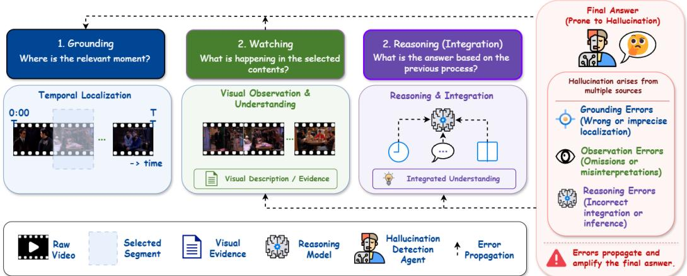  
Figure 1: A three-stage view of video understanding. Grounding localizes relevant moments, Watching extracts visual evidence, and Reasoning integrates that evidence into an answer. Downstream failures may originate at any stage and propagate through the pipeline.

This raises a fundamental question: Can existing benchmark scores actually diagnose failures in multi-stage video-agent pipelines?

We first examine this question observationally. We organize five established benchmarks around Grounding, Watching, and Reasoning and evaluate representative open-weight video agents under controlled inference settings. The resulting profiles are strikingly inconsistent: stronger upstream scores do not reliably imply better downstream hallucination behavior, benchmarks assigned to the same stage can move in opposite directions under the same inference change, and hallucination metrics can produce anomalous values on agentic architectures. These inconsistencies expose a more fundamental limitation: when stages are evaluated on different data, cross-stage comparisons remain correlational and cannot determine which stage actually changes the final outcome.

We therefore replace cross-benchmark correlation with a controlled stage-intervention protocol. Using 2,522 questions over 227 long videos with ground-truth temporal evidence, we overwrite one stage while keeping the downstream task fixed. For Grounding, we substitute oracle, random, offtarget, and progressively dilated temporal windows; for Watching, we systematically omit or replace frames within the correct window. Across 60,008 intervened runs over three architecturally distinct agents, this design directly measures how changing a stage changes downstream performance. We further complement answer accuracy with an evidence-level diagnosis that tests whether apparently correct answers are actually supported by the video.

The interventions reveal a consistent causal picture. Grounding dominates downstream error: replacing a length-matched random window with the oracle evidence span improves accuracy by 17–18 points across all three architectures, roughly four times the effect of substantial frame corruption during Watching. Yet deployed grounding modules recover only about one quarter of this available gain. Moreover, being on-target matters far more than being temporally precise: expanding an oracle span by up to 8× incurs essentially no loss, explaining why overlap-based metrics such as mIoU can poorly reflect downstream utility. Finally, wrong evidence is more harmful than missing evidence: agents tolerate severe frame omission but degrade when plausible frames from elsewhere in the video replace the correct evidence. Consistent with these results, our audit finds no existing benchmark score that detectably predicts causally measured cascade sensitivity. Evidence-level diagnosis further reveals that 42–65% of correct answers can be unsupported by the video, while a hallucination metric that discriminates on its native distribution can silently saturate under domain shift.

## Our contributions are threefold:

1. We provide a stage-aligned analysis of existing video evaluation, showing that fragmented benchmark scores cannot reliably diagnose where failures arise in multi-stage video agents.

2. We introduce a causal stage-intervention protocol that overwrites individual pipeline stages on a shared item set while holding the downstream task fixed, enabling direct measurement of stage-level effects across agent architectures.

3. Using this causal reference, we reveal systematic gaps in current evaluation: grounding dominates downstream error, while deployed grounders capture only a small fraction of the available headroom; on-target evidence matters more than precise temporal localization; incorrect evidence is more damaging than missing evidence; and existing answer- and hallucination-level scores can fail to reflect causal reliability.

## 2 Preliminary Study

## 2.1 Pipeline Formalization and Parameters

We abstract modern video agents into three functional stages: Grounding (G), which localizes question-relevant temporal evidence; Watching (W), which extracts visual information from the selected content; and Reasoning (R), which integrates this information with the question to produce the final answer. These stages need not correspond to explicit modules—different agents may implement them through retrieval, frame selection, visual descriptions, latent representations, or tool use—but they provide a common interface for stage-aligned evaluation. The pipeline is sequential, $\mathcal { G }  \mathcal { W }  \dot { \mathcal { R } } .$ , so upstream errors may affect downstream predictions.

For the preliminary study, we vary two inference-time controls shared by the evaluated systems: the number of sampled frames f and the maximum tool-call budget τ. f controls the amount of visual evidence exposed to the model; we use $f \in \{ 1 6 , 3 2 , 6 4 \}$ for Video-R1, VideoMind, and EVA. τ limits the number of agentic tool invocations and is varied from 4 to 16 for EVA; the other models do not expose an equivalent control. We focus on these parameters because they can be changed at inference time without modifying model weights, enabling controlled comparisons across configurations.

## 2.2 Models, Benchmarks and Metrics

We evaluate three representative open-weight systems spanning distinct video-agent designs: VIDEO-R1 [Feng et al., 2026], a monolithic Qwen2.5-VL-based reasoner; VIDEOMIND [Liu et al., 2025b], which separates stages with role-specific LoRA modules; and EVA [Zhang et al., 2026b], a multi-agent framework with ex-

<table><tr><td>Stage</td><td>Benchmark</td><td>Scale</td><td>Metric</td></tr><tr><td>Grounding</td><td>NExT-GQA [Xiao et al., 2024b] CG-BENCH [Chen et al., 2025a]</td><td>990 / 5,553 1,219 / 12,129</td><td>Acc, mIoU Acc, mIoU</td></tr><tr><td>Watching</td><td>LVBENCH (T.G.) [Wang et al., 2025] ARGUS [Rawal et al., 2025a]</td><td>72 / 179 500 / 500</td><td>Acc Costh, Costo</td></tr><tr><td>Reasoning</td><td>ARGUS [Rawal et al., 2025a] ELV-HALLUC [Lu et al., 2025] VideoHallucer [Wang et al., 2024b]</td><td>500 / 500 200 / 3,600 948 / 1,800</td><td>Costh, Costo Acc, Diff, SAH Basic, Halluc, Both</td></tr></table>

Table 1: Stage-aligned benchmarks and metrics.

plicit localization, observation, and answering components. All experiments use publicly released checkpoints without additional fine-tuning. For VIDEOMIND and EVA, intermediate stage outputs are directly exposed; for VIDEO-R1, we obtain them through structured prompting. The same systems are used in the causal intervention study in Section 3.

We organize existing benchmarks by the pipeline stage they primarily probe, as summarized in Table 1. Grounding is evaluated with NEXT-GQA and CG-BENCH, Watching with the temporalgrounding subset of LVBENCH and ARGUS, and downstream hallucination/reasoning with ARGUS, ELV-HALLUC, and VideoHallucer. ARGUS spans Watching and Reasoning because it evaluates the faithfulness of generated visual descriptions.

## 2.3 Results and Limits of Fragmented Evaluation

We first examine whether existing stage-aligned benchmarks provide consistent diagnostic signals for hallucination in video agents.

Table 2 shows that capability scores and hallucination scores do not align consistently across stages. Strong Grounding or Watching performance does not imply lower downstream hallucination: for example, EVA achieves the best CG-Bench accuracy and LVBench score, yet performs poorly on ELV-Halluc and the hallucination subset of VideoHallucer. Conversely, models with weaker standard capability scores can be substantially more robust on hallucination-oriented evaluation. ARGUS provides a useful intermediate signal by directly evaluating hallucination and omission in visual descriptions, but it still operates on a separate dataset.

<table><tr><td rowspan="3">Method</td><td colspan="4">Grounding</td><td>Watching</td><td colspan="2">W↔ H</td><td colspan="6">Hallucination</td></tr><tr><td colspan="2">CG-Bench</td><td colspan="2">NeXT-GQA</td><td>LVBench*</td><td colspan="2">ARGUS</td><td colspan="3">ELV-Halluc</td><td colspan="3">VideoHallucer</td></tr><tr><td></td><td>Acc↑ mIoU↑</td><td></td><td>Acc↑ mIoU↑</td><td>Acc↑</td><td>CostH ↓ Costo ↓</td><td></td><td></td><td></td><td>Acc↑ Diff↓ SAH↓ 1</td><td>Basic↑ Halluc↑ Both↑</td><td></td><td></td></tr><tr><td>Qwen2-VL-7B</td><td>31.37</td><td></td><td>74.59</td><td></td><td>54.79</td><td>55.52</td><td>82.09</td><td>8.1</td><td>5.8</td><td>6.1</td><td>76.42</td><td>64.25</td><td>46.58</td></tr><tr><td>Qwen2.5-VL-7B</td><td>32.24</td><td></td><td>72.98</td><td></td><td>58.10</td><td>51.19</td><td>81.57</td><td>14.2</td><td>4.5</td><td>5.1</td><td>74.58</td><td>68.83</td><td>49.58</td></tr><tr><td>Video-R1</td><td>35.32</td><td>1.44</td><td>75.38</td><td>21.14</td><td>59.82</td><td>66.15</td><td>83.58</td><td>15.2</td><td>-0.3</td><td>-0.3</td><td>81.08</td><td>55.50</td><td>42.58</td></tr><tr><td>VideoMind-7B</td><td>38.40</td><td>7.10</td><td>76.79</td><td>31.40</td><td>54.79</td><td>55.63</td><td>83.06</td><td>11.4</td><td>4.2</td><td>4.6</td><td>76.25</td><td>64.58</td><td>46.83</td></tr><tr><td>EVA</td><td>40.20</td><td>4.51</td><td>68.99</td><td>26.87</td><td>60.27</td><td>53.10</td><td>82.81</td><td>0.6</td><td>-0.5</td><td>-0.5</td><td>88.25</td><td>45.83</td><td>39.08</td></tr><tr><td>Avg.</td><td>35.51</td><td>4.35</td><td>73.75</td><td>26.47</td><td>57.55</td><td>56.32</td><td>82.62</td><td>9.90</td><td>2.74</td><td>3.00</td><td>79.32</td><td>59.80</td><td>44.93</td></tr></table>

Table 2: Stage-aligned benchmark results under default inference settings.1

Overall, the benchmark profile can rank individual capabilities, but it does not reveal where a downstream hallucination originates. Detailed per-model comparisons are provided in Appendix A. Additional parameter-sweep results in Appendix A further show that changing the sampled-frame count or tool-call budget produces benchmark- and model-dependent effects, with no consistent improvement in downstream hallucination robustness.

Why Fragmented Evaluation Is Not Enough? The preliminary study exposes two problems. First, stage-level capability scores are only weakly connected to downstream hallucination. Second, conclusions do not reliably transfer across datasets, even within the same nominal stage. The anomalous near-zero or negative ELV-Halluc readings for EVA and VIDEO-R1 make this ambiguity particularly clear: from the score alone, we cannot tell whether the model failed or the metric did.

More fundamentally, all of these comparisons are correlational and are measured on different datasets. They can reveal disagreement, but cannot determine which pipeline stage caused a downstream error or how much correcting that stage would help. Section 3 therefore replaces cross-benchmark comparison with controlled stage interventions on a single item set.

## 3 Causal Stage Intervention

The preliminary study reveals disagreement between stage-level and hallucination scores, but cannot identify its source because each stage is evaluated on a different dataset. We therefore move to a controlled design in which the same items and downstream task are retained while one upstream stage is overwritten with a known value. This allows us to directly measure how errors at each stage affect the final prediction. Overall, we conduct 60,008 intervened agent runs and 5,784 evidence-level diagnoses across three architectures.

## 3.1 Intervention Protocol

Data and grounding interventions. We construct the intervention set from CG-BENCH [Chen et al., 2025a], which provides both ground-truth temporal evidence spans (clue\_intervals) and a native Hallucination question category. We use all 2,522 questions from the 227 videos containing at least one Hallucination item: 444 Hallucination questions and 2,078 questions from eleven other categories. Because both groups concern the same videos, comparisons are not confounded by video distribution. The median video lasts 26 minutes, whereas the median clue span is only $1 0 \mathrm { ~ s ~ } \dot  ( 0 . 6 4 \%$ of the video). For each item, we replace the agent’s temporal window while leaving the remaining pipeline unchanged. The conditions are full (whole video), predicted (the agent’s predicted span), oracle (ground-truth clue span), random (a length-matched random span), and off-target (a length-matched span in the largest evidence-free gap). We additionally dilate the oracle span by $2 \times 7 4 \times / 8 \times / 1 \bar { 6 } \times$ on 300 items to test how precise grounding must be.

Watching interventions and implementation. With grounding fixed to oracle, we corrupt the sampled frames within the correct window. Omission removes a fraction ρ of frames, whereas fabrication replaces them with frames sampled at least 60 s away from the same video while preserving their original timestamp labels, with $\rho \in \{ \bar { 0 } . 2 5 , 0 . 5 , 0 . 7 5 \}$ . Both interventions operate on the sampled frame list shared by all three systems. The intervention is inserted at the corresponding interface of each architecture: EVA’s requested windows are restricted to the assigned span, VIDEOMIND’s answerer receives that span instead of the grounder’s prediction, and VIDEO-R1, which has no explicit grounding module, receives it directly through its frame list and serves as the monolithic control. Thus, predicted is undefined for VIDEO-R1.

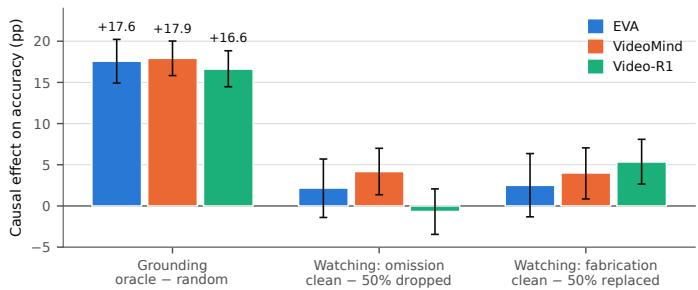  
(a) Causal effects of grounding and watching interventions.

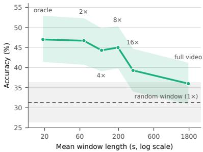  
(b) Oracle-window dilation accuracy.  
Figure 2: Grounding determines where the model looks, but does not need to be temporally precise. Left: replacing a length-matched random window with the oracle span improves accuracy by 17– 18 pp across all three architectures, substantially more than corrupting frames within the correct window. Right: expanding the oracle window up to 8× causes little degradation; performance drops only once the window becomes very broad.

Statistical protocol. We report 95% paired bootstrap intervals clustered by video (227 clusters). Paired binary outcomes are tested with exact McNemar tests and Holm correction within each contrast family; unparseable outputs count as incorrect and are reported separately as abstentions. As a pre-specified sanity check, oracle must outperform random for every agent, while off-target must not outperform random. Both conditions hold (Table 3), confirming that the interventions are effectively propagated to the models.

<table><tr><td>Grounding condition</td><td>EVA</td><td>VIDEOMIND</td><td>VIDEO-R1</td></tr><tr><td>oracle (GT clue span)</td><td>46.6 [44.2, 48.9]</td><td>49.3 [47.0, 51.6]</td><td>47.2 [44.9, 49.6]</td></tr><tr><td>predicted (agent as deployed)</td><td>34.1 [31.8, 36.4]</td><td>35.9 [33.6, 38.2]</td><td></td></tr><tr><td>full (whole video)</td><td>27.0 [25.1, 28.9]</td><td>34.8 [32.5, 37.1]</td><td>33.3 [31.1, 35.4]</td></tr><tr><td>random (length-matched)</td><td>29.0 [27.0, 31.1]</td><td>31.4 [29.3, 33.4]</td><td>30.6 [28.7, 32.6]</td></tr><tr><td>off-target (length-matched)</td><td>27.2 [25.3, 29.1]</td><td>30.6 [28.4, 33.0]</td><td>30.7 [28.6, 32.8]</td></tr><tr><td colspan="4">Headroom decomposition (paired contrasts, pp)</td></tr><tr><td>oracle — random (total headroom)</td><td>+17.6 [14.9, 20.2]</td><td>+17.9 [15.8, 20.0]</td><td>+16.6 [14.5, 18.8]</td></tr><tr><td>predicted - random (captured)</td><td>+5.0 [2.7, 7.3]</td><td>+4.5 [2.6, 6.4]</td><td></td></tr><tr><td>oracle — predicted (left on the table)</td><td>+12.5 [10.2, 14.8]</td><td>+13.4 [11.3, 15.5]</td><td></td></tr></table>

Table 3: Causal grounding intervention on 2,522 paired CG-BENCH items from 227 video clusters. Top: accuracy (%) with clustered 95% bootstrap CIs. Bottom: paired contrasts. All oracle−random differences are significant at $p < 0 . 0 0 1$ . The deployed grounders capture only ∼25% of the available oracle headroom.

## 3.2 Analysis and Findings of Causal Stage Intervention

Grounding Dominates Downstream Error. Table 3 and Figure 2 show a clear asymmetry between grounding and watching. Replacing a length-matched random window with the oracle span improves accuracy by 16.6–17.9 pp across all three architectures $( p \ < \ 0 . 0 0 1 )$ . By contrast, dropping or replacing half of the frames within the correct window changes accuracy by at most about 5 pp. Thus, for long-video understanding, where the model looks matters substantially more than moderate corruption of what it sees once the relevant moment has been found.

Current grounding modules exploit only a small fraction of this opportunity. Relative to a random window, the oracle span provides roughly 18 pp of headroom, whereas the deployed grounders recover only 5.0 pp for EVA and 4.5 pp for VIDEOMIND. The remaining gap is 12.5 and 13.4 pp, respectively.

In particular, VIDEOMIND’s predicted grounding performs only marginally better than showing the whole video, while EVA obtains a clearer gain. Across these different architectures, the same pattern emerges: grounding is both the most consequential stage and the stage with the largest remaining room for improvement.

Wrong evidence is more harmful than missing evidence. The watching interventions further show that agents tolerate missing visual evidence better than misleading evidence. Even after dropping 75% of the frames within the correct window, the degradation is small and not consistently significant. Replacing those frames with plausible content from elsewhere in the same video causes a clearer drop in accuracy (Appendix B). This suggests that grounding errors are harmful not simply because they remove useful frames, but because they can supply convincing evidence from the wrong moment.

Why the unified design matters. These effects are difficult to recover from cross-benchmark comparisons. On the shorter DR.V-BENCH slice, for example, predicted grounding does not outperform simply exposing the whole video for either EVA or VIDEOMIND. This is consistent with the dilation result: when the video itself is relatively short, a broad but on-target context can be sufficient. More generally, comparing grounding and hallucination scores across different datasets cannot separate such distribution effects from genuine stage sensitivity. The intervention design avoids this confound by changing one stage while evaluating the same downstream items.

## 4 Auditing the Benchmark Ecosystem Against the Causal Standard

The intervention protocol provides more than stage-level error attribution. For each item and system configuration, it gives a direct measure of how much a particular stage affects the final prediction. This allows us to revisit the observation in Section 2.3 that existing benchmark scores are only weakly connected across stages, and ask a more concrete question: do existing benchmark scores predict how sensitive thefinal answer is to a causal intervention on that stage?

Cascade sensitivity. For each item, we define cascade sensitivity as the change in answer accuracy when grounding is replaced by the oracle span rather than a length-matched random span. At the system level, we average this quantity over items. Because sensitivity is measured on the same 2,522 items used in Section 3, it serves as a causal reference quantity rather than another benchmark score.

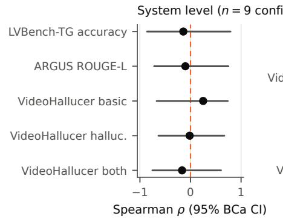

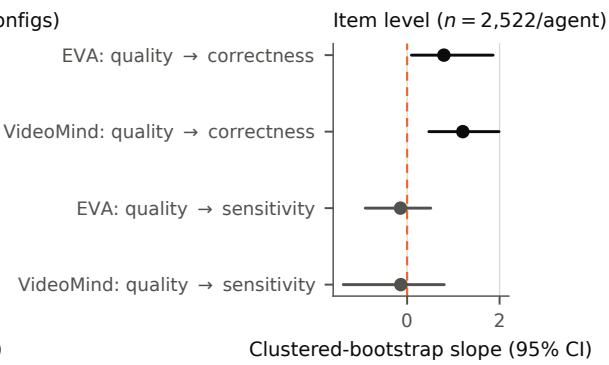  
Figure 3: No existing benchmark score detectably predicts causally measured cascade sensitivity. Left: Spearman correlation between five retained stage-aligned benchmark scores (recomputed from per-item outputs of Section 2.3) and causal sensitivity across nine agent×frame-budget configurations; every 95% BCa interval spans zero. Right: within-agent, per-item clustered regression. Grounding quality (frame-level evidence rate) predicts whether the agent answers correctly (top two rows, intervals exclude zero), but does not predict whether grounding causally determines the answer (bottom two rows). The same pattern appears for both agents with an explicit grounding stage.

## 4.1 No benchmark score predicts what causally matters

Figure 3 shows the same pattern at both the item and system levels: conventional benchmark scores track performance, but not causal dependence.

Item level. Better grounding is associated with higher final-answer accuracy for both EVA and VIDEOMIND, confirming the familiar leaderboard signal that agents tend to answer better when they localize more relevant evidence. However, grounding quality does not predict cascade sensitivity: items with better grounding are no more likely to be those whose answers actually change when grounding is corrected. The regression slopes for correctness are clearly positive, whereas those for causal sensitivity remain near zero (Figure 3). In other words, standard grounding metrics can tell us whether an agent is doing well, but not whether grounding is the stage responsible for that outcome.

System level. The same conclusion holds across agent and frame-budget configurations. None of the retained stage-aligned benchmarks—LVBENCH-TG, ARGUS, or the three VideoHallucer scores— shows a detectable association with causally measured cascade sensitivity. Despite measuring grounding, visual faithfulness, and hallucination from different perspectives, these scores do not identify which systems are more sensitive to grounding errors.

Taken together, the two analyses expose a fundamental gap between benchmark performance and diagnostic value: existing scores can rank systems by how well they perform, but they do not reveal how strongly a particular stage causally determines the final answer.

## 4.2 Beyond right and wrong: correct answers can still be hallucinated

Final-answer accuracy cannot distinguish a correct answer supported by the video from one reached without sufficient visual evidence. To expose this difference, we apply DR.V, a stage-aware hallucination diagnosis framework that verifies claims in an agent’s answer against sampled visual evidence and attributes failures to perceptive, temporal, or cognitive causes.2 We run the diagnosis on 900 outputs from the DR.V-BENCH long-video slice and 4,884 outputs from CG-BENCH.

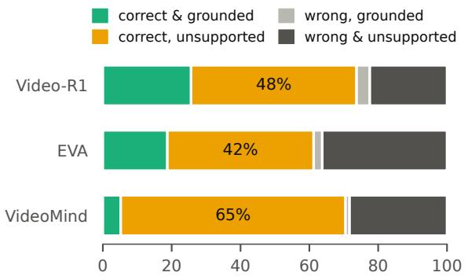  
Share of diagnosed answers (%), Dr.V-Bench

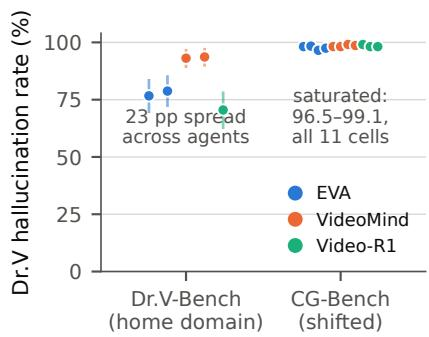  
Figure 4: Left: evidence-level diagnosis on DR.V-BENCH. A large fraction of answers are correct but unsupported: 42–65% of correct answers lack sufficient visual evidence, a failure mode hidden by final-answer accuracy. Right: DR.V clearly separates agents on its home domain, but saturates on CG-BENCH across agents and intervention conditions, indicating that the same hallucination metric can lose discriminative power under distribution shift.

Figure 4 reveals a substantial gap between answer correctness and evidential support. Across the three agents, 42–65% of correct answers are not sufficiently supported by the video. These answers would be counted as successful under a conventional accuracy metric, even though the model did not establish the visual evidence needed to justify them.

This difference is important for reliability evaluation. Agents with similar final-answer accuracy can differ substantially in how much of that accuracy is actually grounded in the video. In our results, DR.V separates the agents by more than 20 percentage points in hallucination rate despite much smaller differences in answer accuracy. Thus, final-answer correctness and evidential support capture different aspects of model behavior.

A correct answer is therefore not necessarily a reliable answer. Evaluation should distinguish whether the model arrives at the right prediction from supported visual evidence, rather than treating all correct outputs as equally successful.

## 4.3 Metric failure versus model failure

The preliminary study shows that anomalous benchmark scores do not necessarily imply model failure. On ELV-HALLUC, EVA and VIDEO-R1 obtain near-zero or negative scores, far outside the regime observed for the monolithic models on which the benchmark was validated.

Our intervention results show how such failures can arise. DR.V clearly separates agents on its native DR.V-BENCH distribution, but saturates near 100% on CG-BENCH across agents and intervention conditions (Figure 4, right). More importantly, replacing a random grounding window with the oracle span improves answer accuracy by about 17 pp while barely changing the DR.V score. The metric therefore loses discriminative power under the shifted evaluation regime. The likely cause is a mismatch between the metric and the target setting: CG-BENCH produces long free-form answers with many checkable claims, while the diagnosis relies on sparsely sampled frames from long videos, making a positive hallucination verdict almost inevitable. A similar architectural mismatch may explain the anomalous ELV-HALLUC scores for tool-calling agents.

An extreme benchmark score can therefore reflect metric failure rather than model failure.

## 4.4 Implications for trustworthy evaluation

These results suggest three practical changes to how multi-stage video systems should be evaluated.

(i) Measure whether grounding is on target, not only how tightly it overlaps the annotation. Finding 3 shows that substantial temporal dilation around the correct evidence has little effect on downstream accuracy, even though it can strongly reduce overlap-based measures such as mIoU. Grounding metrics should therefore distinguish between missing the relevant event and selecting a somewhat wider window around it. One useful criterion is whether the annotated evidence is contained within the selected window at a practically useful dilation.

(ii) Check that a metric remains discriminative in the target regime. Before interpreting a hallucination score, the metric should be tested against a controlled manipulation known to change model behavior. An oracle-span intervention provides one inexpensive and reusable probe. If a metric remains nearly constant despite a large and independently verified change in answer accuracy, as in Section 4.3, its numerical value should not be treated as a reliable measure of model behavior in that regime.

(iii) Evaluate evidential support in addition to answer correctness. The 42–65% rate of correct-but unsupported answers shows that correctness alone is insufficient for assessing reliability. Evaluation should therefore record not only whether an answer is correct, but also whether the visual evidence available to the agent actually supports it. Stage-annotated datasets such as CG-BENCH, which provide clue intervals, make this type of evidence-level evaluation feasible at benchmark scale.

## 5 Conclusion

Existing video benchmarks can rank capabilities, but they do not reliably diagnose where failures arise or which stages causally determine downstream outcomes in multi-stage video agents. By replacing cross-benchmark comparison with controlled stage interventions, we find that grounding is the dominant downstream bottleneck, that being on-target matters more than precise temporal overlap, and that wrong evidence is substantially more harmful than missing evidence. Our benchmark audit further shows that conventional capability- and hallucination-level scores do not reliably predict causal cascade sensitivity. These results suggest that trustworthy evaluation should move beyond isolated benchmark scores toward intervention-based, evidence-aware evaluation of video agents.

Limitations. First, the CG-BENCH intervention results measure downstream answer error rather than hallucination defined as unsupported content. The latter is examined separately with DR.V-BENCH, where the diagnosis instrument retains discriminative power. Second, we evaluate one checkpoint per architecture, so cross-agent dissociations (e.g., VIDEO-R1’s sensitivity to fabrication) cannot separate architecture from model identity. Third, the system-level audit covers nine configurations and its wide intervals support only “no detectable relationship”; the item-level analysis $_ { ( n = 2 , 5 2 2 }$ per agent) is the powered version of the claim. Fourth, EVA’s full condition required a forced-answer prompt to suppress tool-denied refusals (flagged per-run; Appendix D), and multi-interval clues (11% of items) are served as their temporal hull.

## References

Mubashara Akhtar, Anka Reuel, Prajna Soni, Sanchit Ahuja, Pawan Sasanka Ammanamanchi, Ruchit Rawal, Vilém Zouhar, Srishti Yadav, Chenxi Whitehouse, Dayeon Ki, et al. When ai benchmarks plateau: A systematic study of benchmark saturation. arXiv preprint arXiv:2602.16763, 2026.

Norah Alzahrani, Hisham Alyahya, Yazeed Alnumay, Sultan Alrashed, Shaykhah Alsubaie, Yousef Almushayqih, Faisal Mirza, Nouf Alotaibi, Nora Al-Twairesh, Areeb Alowisheq, et al. When benchmarks are targets: Revealing the sensitivity of large language model leaderboards. In Proceedings ofthe 62nd Annual Meeting ofthe Associationfor Computational Linguistics (Volume 1: Long Papers), pages 13787–13805, 2024.

Guo Chen, Yicheng Liu, Yifei Huang, Baoqi Pei, Jilan Xu, Yuping He, Tong Lu, Yali Wang, and Limin Wang. Cg-bench: Clue-grounded question answering benchmark for long video understanding. In International Conference on Learning Representations, volume 2025, pages 45647–45682, 2025a.

Guo Chen, Yicheng Liu, Yifei Huang, Baoqi Pei, Jilan Xu, Yuping He, Tong Lu, Yali Wang, and Limin Wang. Cg-bench: Clue-grounded question answering benchmark for long video understanding. In International Conference on Learning Representations, volume 2025, pages 45647–45682, 2025b.

Lin Chen, Jinsong Li, Xiaoyi Dong, Pan Zhang, Yuhang Zang, Zehui Chen, Haodong Duan, Jiaqi Wang, Yu Qiao, Dahua Lin, et al. Are we on the right way for evaluating large vision-language models? Advances in Neural Information Processing Systems, 37:27056–27087, 2024.

Yue Fan, Xiaojian Ma, Rujie Wu, Yuntao Du, Jiaqi Li, Zhi Gao, and Qing Li. Videoagent: A memoryaugmented multimodal agent for video understanding. In European Conference on Computer Vision, pages 75–92. Springer, 2024.

Bo Feng, Zhengfeng Lai, Shiyu Li, Zizhen Wang, Simon Wang, Ping Huang, and Meng Cao. Breaking down video llm benchmarks: Knowledge, spatial perception, or true temporal understanding? arXiv preprint arXiv:2505.14321, 2025.

Kaituo Feng, Kaixiong Gong, Bohao Li, Zonghao Guo, Yibing Wang, Tianshuo Peng, Junfei Wu, Xiaoying Zhang, Benyou Wang, and Xiangyu Yue. Video-r1: Reinforcing video reasoning in mllms. Advances in Neural Information Processing Systems, 38:99114–99137, 2026.

Chaoyou Fu, Yuhan Dai, Yongdong Luo, Lei Li, Shuhuai Ren, Renrui Zhang, Zihan Wang, Chenyu Zhou, Yunhang Shen, Mengdan Zhang, et al. Video-mme: The first-ever comprehensive evaluation benchmark of multi-modal llms in video analysis. In Proceedings of the IEEE/CVF conference on computer vision and pattern recognition, pages 24108–24118, 2025.

Chaoyou Fu, Haozhi Yuan, Yuhao Dong, Yi-Fan Zhang, Yunhang Shen, Xiaoxing Hu, Xueying Li, Jinsen Su, Chengwu Long, Xiaoyao Xie, et al. Video-mme-v2: Towards the next stage in benchmarks for comprehensive video understanding. arXiv preprint arXiv:2604.05015, 2026.

Bin Huang, Xin Wang, Hong Chen, Zihan Song, and Wenwu Zhu. Vtimellm: Empower llm to grasp video moments. In Proceedings ofthe IEEE/CVF Conference on Computer Vision and Pattern Recognition, pages 14271–14280, 2024.

Yiyang Huang, Yitian Zhang, Yizhou Wang, Mingyuan Zhang, Liang Shi, Huimin Zeng, and Yun Fu. Distorted or fabricated? a survey on hallucination in video llms. arXiv preprint arXiv:2604.12944, 2026.

Ming Kong, Xianzhou Zeng, Luyuan Chen, Yadong Li, Bo Yan, and Qiang Zhu. Mhbench: Demystifying motion hallucination in videollms. In Proceedings of the AAAI Conference on Artificial Intelligence, volume 39, pages 4401–4409, 2025.

Chaoyu Li, Eun Woo Im, and Pooyan Fazli. Vidhalluc: Evaluating temporal hallucinations in multimodal large language models for video understanding. In Proceedings of the IEEE/CVF Conference on Computer Vision and Pattern Recognition, pages 13723–13733, 2025.

Kunchang Li, Yali Wang, Yinan He, Yizhuo Li, Yi Wang, Yi Liu, Zun Wang, Jilan Xu, Guo Chen, Ping Luo, et al. Mvbench: A comprehensive multi-modal video understanding benchmark. In Proceedings of the IEEE/CVF Conference on Computer Vision and Pattern Recognition, pages 22195–22206, 2024a.

Yanwei Li, Chengyao Wang, and Jiaya Jia. Llama-vid: An image is worth 2 tokens in large language models. In European Conference on Computer Vision, pages 323–340. Springer, 2024b.

Bin Lin, Yang Ye, Bin Zhu, Jiaxi Cui, Munan Ning, Peng Jin, and Li Yuan. Video-llava: Learning united visual representation by alignment before projection. In Proceedings of the 2024 conference on empirical methods in natural language processing, pages 5971–5984, 2024.

Runtao Liu, Ziyi Liu, Jiaqi Tang, Yue Ma, Renjie Pi, Jipeng Zhang, and Qifeng Chen. Longvideoagent: Multi-agent reasoning with long videos. arXiv preprint arXiv:2512.20618, 2025a.

Ye Liu, Kevin Qinghong Lin, Chang Wen Chen, and Mike Zheng Shou. Videomind: A chain-of-lora agent for long video reasoning. arXiv e-prints, pages arXiv–2503, 2025b.

Hao Lu, Jiahao Wang, Yaolun Zhang, Ruohui Wang, Xuanyu Zheng, Yepeng Tang, Dahua Lin, and Lewei Lu. Elv-halluc: Benchmarking semantic aggregation hallucinations in long video understanding. arXiv preprint arXiv:2508.21496, 2025.

Hao Lu, Jiahao Wang, Yaolun Zhang, Ruohui Wang, Xuanyu Zheng, Yepeng Tang, Dahua Lin, and Lewei Lu. Elv-halluc: Benchmarking semantic aggregation hallucinations in video understanding. In Proceedings of the IEEE/CVF Conference on Computer Vision and Pattern Recognition, pages 32572–32581, 2026.

Muhammad Maaz, Hanoona Rasheed, Salman Khan, and Fahad Khan. Video-chatgpt: Towards detailed video understanding via large vision and language models. In Proceedings ofthe 62nd Annual Meeting ofthe Associationfor Computational Linguistics (Volume 1: Long Papers), pages 12585–12602, 2024.

Karttikeya Mangalam, Raiymbek Akshulakov, and Jitendra Malik. Egoschema: A diagnostic benchmark for very long-form video language understanding. Advances in Neural Information Processing Systems, 36:46212–46244, 2023.

Patrick Ramos, Ryan Ramos, and Noa Garcia. Data leakage in visual datasets. In Proceedings ofthe IEEE/CVF International Conference on Computer Vision, pages 6309–6319, 2025.

Ruchit Rawal, Reza Shirkavand, Heng Huang, Gowthami Somepalli, and Tom Goldstein. Argus: Hallucination and omission evaluation in video-llms. In Proceedings ofthe IEEE/CVF International Conference on Computer Vision, pages 20280–20290, 2025a.

Ruchit Rawal, Reza Shirkavand, Heng Huang, Gowthami Somepalli, and Tom Goldstein. Argus: Hallucination and omission evaluation in video-llms. In Proceedings ofthe IEEE/CVF International Conference on Computer Vision, pages 20280–20290, 2025b.

Shuhuai Ren, Linli Yao, Shicheng Li, Xu Sun, and Lu Hou. Timechat: A time-sensitive multimodal large language model for long video understanding. In Proceedings ofthe IEEE/CVF Conference on Computer Vision and Pattern Recognition, pages 14313–14323, 2024.

Enxin Song, Wenhao Chai, Guanhong Wang, Yucheng Zhang, Haoyang Zhou, Feiyang Wu, Haozhe Chi, Xun Guo, Tian Ye, Yanting Zhang, et al. Moviechat: From dense token to sparse memory for long video understanding. In Proceedings of the IEEE/CVF Conference on Computer Vision and Pattern Recognition, pages 18221–18232, 2024.

Yunlong Tang, Jing Bi, Siting Xu, Luchuan Song, Susan Liang, Teng Wang, Daoan Zhang, Jie An, Jingyang Lin, Rongyi Zhu, et al. Video understanding with large language models: A survey. IEEE Transactions on Circuits and Systemsfor Video Technology, 2025.

Weihan Wang, Zehai He, Wenyi Hong, Yean Cheng, Xiaohan Zhang, Ji Qi, Ming Ding, Xiaotao Gu, Shiyu Huang, Bin Xu, et al. Lvbench: An extreme long video understanding benchmark. In Proceedings of the IEEE/CVF International Conference on Computer Vision, pages 22958–22967, 2025.

Xiaohan Wang, Yuhui Zhang, Orr Zohar, and Serena Yeung-Levy. Videoagent: Long-form video understanding with large language model as agent. In European Conference on Computer Vision, pages 58–76. Springer, 2024a.

Yuxuan Wang, Yueqian Wang, Dongyan Zhao, Cihang Xie, and Zilong Zheng. Videohallucer: Evaluating intrinsic and extrinsic hallucinations in large video-language models. arXiv preprint arXiv:2406.16338, 2024b.

Yuxuan Wang, Yueqian Wang, Dongyan Zhao, Cihang Xie, and Zilong Zheng. Videohallucer: Evaluating intrinsic and extrinsic hallucinations in large video-language models. arXiv preprint arXiv:2406.16338, 2024c.

Junbin Xiao, Angela Yao, Yicong Li, and Tat-Seng Chua. Can i trust your answer? visually grounded video question answering. In Proceedings ofthe IEEE/CVF Conference on Computer Vision and Pattern Recognition, pages 13204–13214, 2024a.

Junbin Xiao, Angela Yao, Yicong Li, and Tat-Seng Chua. Can i trust your answer? visually grounded video question answering. In Proceedings ofthe IEEE/CVF Conference on Computer Vision and Pattern Recognition, pages 13204–13214, 2024b.

Dongjie Yang, Suyuan Huang, Chengqiang Lu, Xiaodong Han, Haoxin Zhang, Yan Gao, Yao Hu, and Hai Zhao. Vript: A video is worth thousands of words. Advances in Neural Information Processing Systems, 37:57240–57261, 2024.

Xiaocui Yang, Wenfang Wu, Shi Feng, Ming Wang, Daling Wang, Yang Li, Qi Sun, Yifei Zhang, Xiaoming Fu, and Soujanya Poria. Mm-instructeval: Zero-shot evaluation of (multimodal) large language models on multimodal reasoning tasks. Information Fusion, 122:103204, 2025.

Hang Zhang, Xin Li, and Lidong Bing. Video-llama: An instruction-tuned audio-visual language model for video understanding. In Proceedings of the 2023 conference on empirical methods in natural language processing: system demonstrations, pages 543–553, 2023.

Jiacheng Zhang, Yang Jiao, Shaoxiang Chen, Na Zhao, Zhiyu Tan, Hao Li, Xingjun Ma, and Jingjing Chen. Eventhallusion: Diagnosing event hallucinations in video llms. arXiv preprint arXiv:2409.16597, 2024.

Xiaoyi Zhang, Zhaoyang Jia, Zongyu Guo, Jiahao Li, Bin Li, Houqiang Li, and Yan Lu. Deep video discovery: Agentic search with tool use for long-form video understanding. Advances in Neural Information Processing Systems, 38:89863–89895, 2026a.

Yaolun Zhang, Ruohui Wang, Jiahao Wang, Yepeng Tang, Xuanyu Zheng, Haonan Duan, Hao Lu, Hanming Deng, and Lewei Lu. Eva: Efficient reinforcement learning for end-to-end video agent. In Proceedings of the IEEE/CVF Conference on Computer Vision and Pattern Recognition, pages 12289–12299, 2026b.

## NeurIPS Paper Checklist

## 1. Claims

Question: Do the main claims made in the abstract and introduction accurately reflect the paper’s contributions and scope?

Answer: [Yes]

Justification: Contributions are correctly reflected in abstract and introduction.

Guidelines:

• The answer [N/A] means that the abstract and introduction do not include the claims made in the paper.

• The abstract and/or introduction should clearly state the claims made, including the contributions made in the paper and important assumptions and limitations. A [No] or [N/A] answer to this question will not be perceived well by the reviewers.

• The claims made should match theoretical and experimental results, and reflect how much the results can be expected to generalize to other settings.

• It is fine to include aspirational goals as motivation as long as it is clear that these goals are not attained by the paper.

## 2. Limitations

Question: Does the paper discuss the limitations of the work performed by the authors?

Answer: [Yes]

Justification: Limitations and corresponding future works are discussed.

Guidelines:

• The answer [N/A] means that the paper has no limitation while the answer [No] means that the paper has limitations, but those are not discussed in the paper.

• The authors are encouraged to create a separate “Limitations” section in their paper.

• The paper should point out any strong assumptions and how robust the results are to violations of these assumptions (e.g., independence assumptions, noiseless settings, model well-specification, asymptotic approximations only holding locally). The authors should reflect on how these assumptions might be violated in practice and what the implications would be.

• The authors should reflect on the scope of the claims made, e.g., if the approach was only tested on a few datasets or with a few runs. In general, empirical results often depend on implicit assumptions, which should be articulated.

• The authors should reflect on the factors that influence the performance of the approach. For example, a facial recognition algorithm may perform poorly when image resolution is low or images are taken in low lighting. Or a speech-to-text system might not be used reliably to provide closed captions for online lectures because it fails to handle technical jargon.

• The authors should discuss the computational efficiency of the proposed algorithms and how they scale with dataset size.

• If applicable, the authors should discuss possible limitations of their approach to address problems of privacy and fairness.

• While the authors might fear that complete honesty about limitations might be used by reviewers as grounds for rejection, a worse outcome might be that reviewers discover limitations that aren’t acknowledged in the paper. The authors should use their best judgment and recognize that individual actions in favor of transparency play an important role in developing norms that preserve the integrity of the community. Reviewers will be specifically instructed to not penalize honesty concerning limitations.

## 3. Theory assumptions and proofs

Question: For each theoretical result, does the paper provide the full set of assumptions and a complete (and correct) proof?

Answer: [Yes]

Justification: Proof or analysis of the proposed theoretical result are included in the paper. Guidelines:

• The answer [N/A] means that the paper does not include theoretical results.

• All the theorems, formulas, and proofs in the paper should be numbered and crossreferenced.

• All assumptions should be clearly stated or referenced in the statement of any theorems.

• The proofs can either appear in the main paper or the supplemental material, but if they appear in the supplemental material, the authors are encouraged to provide a short proof sketch to provide intuition.

• Inversely, any informal proof provided in the core of the paper should be complemented by formal proofs provided in appendix or supplemental material.

• Theorems and Lemmas that the proof relies upon should be properly referenced.

## 4. Experimental result reproducibility

Question: Does the paper fully disclose all the information needed to reproduce the main experimental results of the paper to the extent that it affects the main claims and/or conclusions of the paper (regardless of whether the code and data are provided or not)?

Answer: [Yes]

Justification: Model details are disclosed

Guidelines:

• The answer [N/A] means that the paper does not include experiments.

• If the paper includes experiments, a [No] answer to this question will not be perceived well by the reviewers: Making the paper reproducible is important, regardless of whether the code and data are provided or not.

• If the contribution is a dataset and/or model, the authors should describe the steps taken to make their results reproducible or verifiable.

• Depending on the contribution, reproducibility can be accomplished in various ways. For example, if the contribution is a novel architecture, describing the architecture fully might suffice, or if the contribution is a specific model and empirical evaluation, it may be necessary to either make it possible for others to replicate the model with the same dataset, or provide access to the model. In general. releasing code and data is often one good way to accomplish this, but reproducibility can also be provided via detailed instructions for how to replicate the results, access to a hosted model (e.g., in the case of a large language model), releasing of a model checkpoint, or other means that are appropriate to the research performed.

• While NeurIPS does not require releasing code, the conference does require all submissions to provide some reasonable avenue for reproducibility, which may depend on the nature of the contribution. For example

(a) If the contribution is primarily a new algorithm, the paper should make it clear how to reproduce that algorithm.

(b) If the contribution is primarily a new model architecture, the paper should describe the architecture clearly and fully.

(c) If the contribution is a new model (e.g., a large language model), then there should either be a way to access this model for reproducing the results or a way to reproduce the model (e.g., with an open-source dataset or instructions for how to construct the dataset).

(d) We recognize that reproducibility may be tricky in some cases, in which case authors are welcome to describe the particular way they provide for reproducibility. In the case of closed-source models, it may be that access to the model is limited in some way (e.g., to registered users), but it should be possible for other researchers to have some path to reproducing or verifying the results.

## 5. Open access to data and code

Question: Does the paper provide open access to the data and code, with sufficient instructions to faithfully reproduce the main experimental results, as described in supplemental material?

## Answer: [No]

Justification: Code and instructions will be released upon acceptance

## Guidelines:

• The answer [N/A] means that paper does not include experiments requiring code.

• Please see the NeurIPS code and data submission guidelines (https://neurips.cc/ public/guides/CodeSubmissionPolicy) for more details.

• While we encourage the release of code and data, we understand that this might not be possible, so [No] is an acceptable answer. Papers cannot be rejected simply for not including code, unless this is central to the contribution (e.g., for a new open-source benchmark).

• The instructions should contain the exact command and environment needed to run to reproduce the results. See the NeurIPS code and data submission guidelines (https: //neurips.cc/public/guides/CodeSubmissionPolicy) for more details.

• The authors should provide instructions on data access and preparation, including how to access the raw data, preprocessed data, intermediate data, and generated data, etc.

• The authors should provide scripts to reproduce all experimental results for the new proposed method and baselines. If only a subset of experiments are reproducible, they should state which ones are omitted from the script and why.

• At submission time, to preserve anonymity, the authors should release anonymized versions (if applicable).

• Providing as much information as possible in supplemental material (appended to the paper) is recommended, but including URLs to data and code is permitted.

## 6. Experimental setting/details

Question: Does the paper specify all the training and test details (e.g., data splits, hyperparameters, how they were chosen, type of optimizer) necessary to understand the results?

Answer: [Yes]

Justification: All details are provided.

Guidelines:

• The answer [N/A] means that the paper does not include experiments.

• The experimental setting should be presented in the core of the paper to a level of detail that is necessary to appreciate the results and make sense of them.

• The full details can be provided either with the code, in appendix, or as supplemental material.

## 7. Experiment statistical significance

Question: Does the paper report error bars suitably and correctly defined or other appropriate information about the statistical significance of the experiments?

Answer: [Yes]

Justification: The paper reports standard metrics including error bars.

Guidelines:

• The answer [N/A] means that the paper does not include experiments.

• The authors should answer [Yes] if the results are accompanied by error bars, confidence intervals, or statistical significance tests, at least for the experiments that support the main claims of the paper.

• The factors of variability that the error bars are capturing should be clearly stated (for example, train/test split, initialization, random drawing of some parameter, or overall run with given experimental conditions).

• The method for calculating the error bars should be explained (closed form formula, call to a library function, bootstrap, etc.)

• The assumptions made should be given (e.g., Normally distributed errors).

• It should be clear whether the error bar is the standard deviation or the standard error of the mean.

• It is OK to report 1-sigma error bars, but one should state it. The authors should preferably report a 2-sigma error bar than state that they have a 96% CI, if the hypothesis of Normality of errors is not verified.

• For asymmetric distributions, the authors should be careful not to show in tables or figures symmetric error bars that would yield results that are out of range (e.g., negative error rates).

• If error bars are reported in tables or plots, the authors should explain in the text how they were calculated and reference the corresponding figures or tables in the text.

## 8. Experiments compute resources

Question: For each experiment, does the paper provide sufficient information on the computer resources (type of compute workers, memory, time of execution) needed to reproduce the experiments?

Answer: [Yes]

Justification: All details are provided

Guidelines:

• The answer [N/A] means that the paper does not include experiments.

• The paper should indicate the type of compute workers CPU or GPU, internal cluster, or cloud provider, including relevant memory and storage.

• The paper should provide the amount of compute required for each of the individual experimental runs as well as estimate the total compute.

• The paper should disclose whether the full research project required more compute than the experiments reported in the paper (e.g., preliminary or failed experiments that didn’t make it into the paper).

## 9. Code of ethics

Question: Does the research conducted in the paper conform, in every respect, with the NeurIPS Code of Ethics https://neurips.cc/public/EthicsGuidelines?

Answer: [Yes]

Justification: the research conform with the NeurIPS Code of Ethics.

Guidelines:

• The answer [N/A] means that the authors have not reviewed the NeurIPS Code of Ethics.

• If the authors answer [No], they should explain the special circumstances that require a deviation from the Code of Ethics.

• The authors should make sure to preserve anonymity (e.g., if there is a special consideration due to laws or regulations in their jurisdiction).

## 10. Broader impacts

Question: Does the paper discuss both potential positive societal impacts and negative societal impacts of the work performed?

Answer: [Yes]

Justification: Discussed in conclusion

Guidelines:

• The answer [N/A] means that there is no societal impact of the work performed.

• If the authors answer [N/A] or [No], they should explain why their work has no societal impact or why the paper does not address societal impact.

• Examples of negative societal impacts include potential malicious or unintended uses (e.g., disinformation, generating fake profiles, surveillance), fairness considerations (e.g., deployment of technologies that could make decisions that unfairly impact specific groups), privacy considerations, and security considerations.

• The conference expects that many papers will be foundational research and not tied to particular applications, let alone deployments. However, if there is a direct path to any negative applications, the authors should point it out. For example, it is legitimate to point out that an improvement in the quality of generative models could be used to generate Deepfakes for disinformation. On the other hand, it is not needed to point out that a generic algorithm for optimizing neural networks could enable people to train models that generate Deepfakes faster.

• The authors should consider possible harms that could arise when the technology is being used as intended and functioning correctly, harms that could arise when the technology is being used as intended but gives incorrect results, and harms following from (intentional or unintentional) misuse of the technology.

• If there are negative societal impacts, the authors could also discuss possible mitigation strategies (e.g., gated release of models, providing defenses in addition to attacks, mechanisms for monitoring misuse, mechanisms to monitor how a system learns from feedback over time, improving the efficiency and accessibility of ML).

## 11. Safeguards

Question: Does the paper describe safeguards that have been put in place for responsible release of data or models that have a high risk for misuse (e.g., pre-trained language models, image generators, or scraped datasets)?

Answer: [N/A]

Justification: the paper poses no such risks

Guidelines:

• The answer [N/A] means that the paper poses no such risks.

• Released models that have a high risk for misuse or dual-use should be released with necessary safeguards to allow for controlled use of the model, for example by requiring that users adhere to usage guidelines or restrictions to access the model or implementing safety filters.

• Datasets that have been scraped from the Internet could pose safety risks. The authors should describe how they avoided releasing unsafe images.

• We recognize that providing effective safeguards is challenging, and many papers do not require this, but we encourage authors to take this into account and make a best faith effort.

## 12. Licenses for existing assets

Question: Are the creators or original owners of assets (e.g., code, data, models), used in the paper, properly credited and are the license and terms of use explicitly mentioned and properly respected?

Answer: [Yes]

Justification: existing assets are properly credited

Guidelines:

• The answer [N/A] means that the paper does not use existing assets.

• The authors should cite the original paper that produced the code package or dataset.

• The authors should state which version of the asset is used and, if possible, include a URL.

• The name of the license (e.g., CC-BY 4.0) should be included for each asset.

• For scraped data from a particular source (e.g., website), the copyright and terms of service of that source should be provided.

• If assets are released, the license, copyright information, and terms of use in the package should be provided. For popular datasets, paperswithcode.com/datasets has curated licenses for some datasets. Their licensing guide can help determine the license of a dataset.

• For existing datasets that are re-packaged, both the original license and the license of the derived asset (if it has changed) should be provided.

• If this information is not available online, the authors are encouraged to reach out to the asset’s creators.

## 13. New assets

Question: Are new assets introduced in the paper well documented and is the documentation provided alongside the assets?

Answer: [N/A]

Justification: the paper does not release new assets.

Guidelines:

• The answer [N/A] means that the paper does not release new assets.

• Researchers should communicate the details of the dataset/code/model as part of their submissions via structured templates. This includes details about training, license, limitations, etc.

• The paper should discuss whether and how consent was obtained from people whose asset is used.

• At submission time, remember to anonymize your assets (if applicable). You can either create an anonymized URL or include an anonymized zip file.

## 14. Crowdsourcing and research with human subjects

Question: For crowdsourcing experiments and research with human subjects, does the paper include the full text of instructions given to participants and screenshots, if applicable, as well as details about compensation (if any)?

Answer: [N/A]

Justification: the paper does not involve crowdsourcing nor research with human subjects. Guidelines:

• The answer [N/A] means that the paper does not involve crowdsourcing nor research with human subjects.

• Including this information in the supplemental material is fine, but if the main contribution of the paper involves human subjects, then as much detail as possible should be included in the main paper.

• According to the NeurIPS Code of Ethics, workers involved in data collection, curation, or other labor should be paid at least the minimum wage in the country of the data collector.

## 15. Institutional review board (IRB) approvals or equivalent for research with human subjects

Question: Does the paper describe potential risks incurred by study participants, whether such risks were disclosed to the subjects, and whether Institutional Review Board (IRB) approvals (or an equivalent approval/review based on the requirements of your country or institution) were obtained?

Answer: [N/A]

Justification: paper does not involve crowdsourcing nor research with human subjects.

Guidelines:

• The answer [N/A] means that the paper does not involve crowdsourcing nor research with human subjects.

• Depending on the country in which research is conducted, IRB approval (or equivalent) may be required for any human subjects research. If you obtained IRB approval, you should clearly state this in the paper.

• We recognize that the procedures for this may vary significantly between institutions and locations, and we expect authors to adhere to the NeurIPS Code of Ethics and the guidelines for their institution.

• For initial submissions, do not include any information that would break anonymity (if applicable), such as the institution conducting the review.

## 16. Declaration of LLM usage

Question: Does the paper describe the usage of LLMs if it is an important, original, or non-standard component of the core methods in this research? Note that if the LLM is used only for writing, editing, or formatting purposes and does not impact the core methodology, scientific rigor, or originality of the research, declaration is not required.

## Answer: [Yes]

Justification: the core research in this paper involves LLMs as important components.

## Guidelines:

• The answer [N/A] means that the core method development in this research does not involve LLMs as any important, original, or non-standard components.

• Please refer to our LLM policy in the NeurIPS handbook for what should or should not be described.

## A Additional Analysis of the Preliminary Study

This appendix expands the observational results reported in Section 2.3. Table 2 remains in the main paper; here we provide additional interpretation of the benchmark profiles and parameter sweeps.

## A.1 Detailed Benchmark Comparisons

Grounding. The two Grounding benchmarks distinguish temporal localization capability, but their rankings do not translate consistently to hallucination robustness. VIDEOMIND achieves the strongest grounding mIoU, while EVA obtains the best CG-Bench accuracy. However, EVA performs substantially worse on hallucination-oriented metrics, indicating that stronger measured grounding does not necessarily correspond to lower downstream hallucination.

Watching. A similar disconnect appears for visual observation. EVA obtains the highest LVBench accuracy but weak hallucination scores, whereas Qwen2.5-VL-7B performs slightly worse on LVBench yet much better on ELV-Halluc and VideoHallucer. ARGUS is more directly related to hallucination because it measures fabricated and omitted content in generated visual descriptions, but it still provides only an observational signal on its own distribution.

Hallucination metrics. ELV-Halluc and VideoHallucer show some common model-level tendencies, but their absolute behavior differs substantially. In particular, ELV-Halluc returns near-zero or negative values for EVA and VIDEO-R1, well outside its usual operating regime. These values are therefore difficult to interpret without an independent reference for whether the underlying model behavior actually changed.

## A.2 Detailed Parameter-Sweep Analysis

Frame count. For EVA, increasing the number of sampled frames raises CG-Bench long-video accuracy from 36.93% to 41.00%, but decreases NeXT-GQA mIoU. Thus, two Grounding benchmarks react in opposite directions to the same change. ARGUS varies only mildly for EVA and VIDEOMIND, while VideoHallucer is largely flat for EVA, changes slightly for VIDEOMIND, and degrades more substantially for VIDEO-R1.

Tool-call budget. Increasing EVA’s tool-call budget likewise produces no monotonic benefit. CG-Bench accuracy peaks at an intermediate budget, NeXT-GQA changes only marginally, and hallucination-oriented metrics show small or inconsistent responses. Hence, additional reasoning steps do not reliably improve hallucination robustness.

## A.3 Detailed Parameter-Sweep Analysis

Frame count. For EVA, increasing the number of sampled frames raises CG-Bench long-video accuracy from 36.93% to 41.00%, but decreases NeXT-GQA mIoU. Thus, two Grounding benchmarks react in opposite directions to the same change. ARGUS varies only mildly for EVA and VIDEOMIND, while VideoHallucer is largely flat for EVA, changes slightly for VIDEOMIND, and degrades more substantially for VIDEO-R1.

Tool-call budget. Increasing EVA’s tool-call budget likewise produces no monotonic benefit. CG-Bench accuracy peaks at an intermediate budget, NeXT-GQA changes only marginally, and hallucination-oriented metrics show small or inconsistent responses. Hence, additional reasoning steps do not reliably improve hallucination robustness.

## A.4 Inference-Parameter Sweeps

Figure 5 shows that the same inference change can lead to different conclusions across benchmarks. For EVA, increasing the sampled-frame count improves CG-Bench long-video accuracy but decreases NeXT-GQA mIoU, even though both evaluate Grounding. Watching and hallucination metrics are similarly model-dependent.

Figure 6 shows the same instability for agentic reasoning: increasing EVA’s tool-call budget does not monotonically improve either Grounding or hallucination metrics. More frames or more tool calls therefore cannot be interpreted as uniformly improving hallucination robustness.

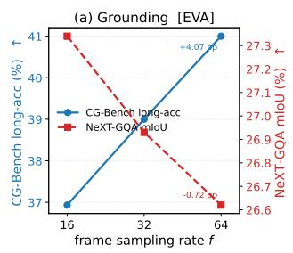

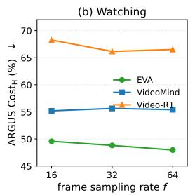

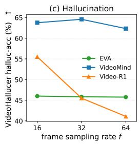  
Figure 5: Effect of frame sampling rate on Grounding, Watching, and Hallucination benchmarks. The same increase in frame count can improve one benchmark while degrading another, revealing benchmark-dependent responses to identical inference changes.

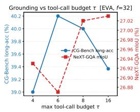

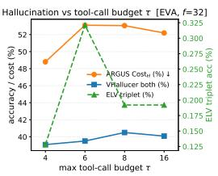  
Figure 6: Effect of maximum tool-call budget τ for EVA at fixed frame count $f = 3 2$ . Larger tool budgets do not yield monotonic gains in either Grounding or hallucination metrics.

## A.5 Interpretation

These observations demonstrate instability rather than attribution. Because each benchmark uses a different dataset and protocol, cross-benchmark differences conflate model capability with dataset effects. They therefore motivate, but cannot replace, the controlled intervention study in Section 3.

## B Full Intervention Ladders

Tables 4 and 5 report the complete watching-corruption and dilation ladders. All intervals are 95% bootstrap CIs clustered by video. At the strongest corruption rate (ρ=0.75), the paired clean−corrupted contrasts are: omission $+ 5 . 7 \mathrm { p p } \left[ - 0 . { \bar { 3 } } , + 1 1 . 6 \right] \left( \mathrm { \bar { E } V A } \right)$ and +1.7 pp [−3.0, +6.2] (VIDEO-R1); fabrication $+ 6 . 7 \mathrm { p p } \ [ + 1 . 0 , + 1 2 . 6 ] \ ( \mathrm { E V A } ) \ \mathrm { a n d } + 4 . 3 \mathrm { p p } \ [ 0 . 0 , + 8 . 9 ] \ ( \mathrm { V I D E O - R 1 } )$ . Even discarding three quarters of the evidence frames inside a correct window is not reliably detectable, whereas replacing them with plausible frames from elsewhere in the same video is.

<table><tr><td>Corruption</td><td>ρ</td><td>EVA</td><td>VIDEOMIND</td><td>VIDEO-R1</td></tr><tr><td>none (clean, oracle window)</td><td>0</td><td>43.2 [39.3, 47.0]</td><td>49.5 [45.5, 53.5]</td><td>46.5 [42.6, 50.4]</td></tr><tr><td rowspan="3">omission (frames dropped)</td><td>0.25</td><td>46.7 [41.1, 52.2]</td><td>50.0 [44.3, 55.6]</td><td>48.0 [42.2, 53.9]</td></tr><tr><td>0.50</td><td>41.0 [37.2, 44.8]</td><td>45.3 [41.4, 49.3]</td><td>47.2 [43.3, 50.9]</td></tr><tr><td>0.75</td><td>40.3 [35.3, 45.4]</td><td>45.7 [40.0, 51.3]</td><td>43.7 [38.1, 49.3]</td></tr><tr><td rowspan="3">fabrication (frames replaced)</td><td>0.25</td><td>42.7 [37.2, 48.4]</td><td>50.3 [44.9, 55.7]</td><td>45.0 [39.7, 50.6]</td></tr><tr><td>0.50</td><td>40.7 [36.9, 44.5]</td><td>45.5 [41.4, 49.5]</td><td>41.2 [37.3, 45.0]</td></tr><tr><td>0.75</td><td>39.3 [34.5, 44.3]</td><td>43.0 [37.6, 48.5]</td><td>41.0 [35.5, 46.6]</td></tr></table>

Table 4: Watching-corruption ladder: accuracy (%) with grounding pinned to the oracle span and a fraction $\rho$ of in-window frames corrupted (n=600 at $\rho \in \{ 0 , 0 . 5 \}$ , n=300 otherwise). Fabricated frames are sampled ≥60 s away in the same video and keep their original timestamp labels.

<table><tr><td>Oracle window dilation</td><td>EVA</td><td>VIDEOMIND</td><td>VIDEO-R1</td></tr><tr><td>2×</td><td>45.7 [40.3, 51.2]</td><td>50.3 [44.6, 55.9]</td><td>46.7 [40.7, 52.4]</td></tr><tr><td>4×</td><td>46.7 [41.6, 51.7]</td><td>46.7 [41.1, 52.3]</td><td>44.3 [39.0, 49.8]</td></tr><tr><td>8×</td><td>43.3 [38.0, 48.6]</td><td>46.0 [40.0, 52.0]</td><td>45.0 [39.7, 50.3]</td></tr><tr><td>16×</td><td>38.7 [33.6, 43.7]</td><td>45.3 [39.6, 51.0]</td><td>39.3 [34.0, 44.8]</td></tr></table>

Table 5: Dilation ladder for all three agents (n=300): accuracy (%) when the oracle window is expanded about its centre. The plateau through 8× replicates across architectures; only 16× (≈5 min around a 10 s clue) degrades.

## C Audit Details

Table 6 lists the nine agent×frame-budget configurations used in the system-level audit (Section 4.1), with their causally measured cascade sensitivity (oracle − random, set S, n=400 items). The retained benchmark scores were recomputed from the per-item outputs of the preliminary study; the recomputation reproduces Table 2 exactly (e.g., VIDEOMIND at f=32 gives VideoHallucer 76.25/64.58/46.83).
<table><tr><td>Configuration</td><td>Sens. (pp)</td><td>95% CI</td><td>Configuration</td><td>Sens. (pp)</td><td>95% CI</td></tr><tr><td>EVA f=16</td><td>16.8</td><td>[11.0, 22.5]</td><td>VIDEOMIND  $f { = } 6 4$ </td><td>13.8</td><td>[9.2, 18.4]</td></tr><tr><td>EVA  $f { = } 3 2$ </td><td>17.8</td><td>[11.9, 23.5]</td><td>VIDEO-R1  $f { = } 1 6$ </td><td>11.5</td><td>[6.8, 16.3]</td></tr><tr><td>EVA  $f { = } 6 4$ </td><td>15.0</td><td>[10.0, 20.1]</td><td>VIDEO-R1 f=32</td><td>16.3</td><td>[11.9, 20.7]</td></tr><tr><td>VIDEOMIND  $f { = } 1 6$ </td><td>15.8</td><td>[10.5, 21.0]</td><td>VIDEO-R1 f=64</td><td>15.5</td><td>[10.5, 20.5]</td></tr><tr><td>VIDEOMIND f=32</td><td>16.5</td><td>[11.6, 21.4]</td><td></td><td></td><td></td></tr></table>

Table 6: The nine configurations of the system-level audit and their causal cascade sensitivity. Across these systems, the Spearman correlations between each retained benchmark score and sensitivity are: LVBench-TG −0.14 [−0.86, +0.79], ARGUS ROUGE-L −0.10 [−0.72, +0.75], VideoHallucer basic +0.25 [−0.67, +0.74], halluc −0.02 [−0.63, +0.67], both −0.17 [−0.75, +0.60] (95% BCa); every interval spans zero.

## D Protocol Details

EVA under the full condition. Denied its frame-selection tool, EVA initially refused to answer 20% of items; a single forced-answer follow-up prompt reduced refusals to 4%, and every nudged run is flagged forced\_answer in the released logs. Without this control, every EVA oracle−full contrast would be inflated by a format artefact rather than a grounding effect.

Multi-interval clues. 11% of items carry multiple ground-truth clue intervals; since all three agents consume one contiguous window, these are served as their temporal hull.

Abstention. Unparseable output counts as wrong and is additionally reported as abstention; abstention rates are $\leq 1 . 7 \%$ in every grounding condition (max: EVA off-target).

Dr.V diagnosis coverage. Diagnosis failure rates are 3.3–16.7% on DR.V-BENCH and 1.1–3.4% on CG-BENCH; rates and per-level (perceptive/temporal/cognitive) attributions are included in the released reports. On CG-BENCH the graded verdict variant is as flat as the binary one (0.746–0.768 across all cells).

Compute and reproduction. The campaign comprises 60,008 intervened runs and 5,784 diagnoses. Item manifests and span generation are seeded, so all three agents receive byte-identical spans and a re-run reproduces every number. Each run row records its condition, requested and effective span, frame timestamps, frame-level evidence rate, span IoU, parse path, and latency. Only the 227 required videos (64 GB) of the gated 411 GB CG-BENCH release were fetched, by reading each remote archive’s central directory over HTTP range requests.

## E Related Work

## E.1 Video Understanding Pipelines

Video understanding has evolved from monolithic vision–language models that directly answer questions from uniformly sampled video frames to increasingly agentic systems that decompose reasoning into multiple stages Tang et al. [2025], Maaz et al. [2024], Zhang et al. [2023], Lin et al. [2024], Li et al. [2024b], Wang et al. [2024a]. Early video-language models typically process an entire video through a single forward pass and generate an answer without exposing intermediate reasoning, making their decision process difficult to interpret or diagnose Maaz et al. [2024], Zhang et al. [2023], Lin et al. [2024], Li et al. [2024b]. To improve temporal grounding, long-video understanding, and reasoning efficiency, recent approaches increasingly decompose video understanding into multiple functional stages, including temporal localization, visual observation, memory retrieval, and answer synthesis Song et al. [2024], Ren et al. [2024], Huang et al. [2024], Fan et al. [2024], Wang et al. [2024a], Liu et al. [2025b]. Representative systems include retrieval-based pipelines, multi-agent frameworks, and role-specialized architectures, where different modules are responsible for locating relevant moments, extracting visual evidence, and integrating observations into a final response Wang et al. [2024a], Fan et al. [2024], Liu et al. [2025b], Zhang et al. [2026a], Liu et al. [2025a], Zhang et al. [2026b]. Such modular designs substantially improve scalability, interpretability, and long-video reasoning capability, and have rapidly become a common paradigm for modern video understanding systems Tang et al. [2025], Wang et al. [2024a], Zhang et al. [2026a], Liu et al. [2025a], Zhang et al. [2026b]. However, while video understanding has evolved into an inherently multi-stage process, its evaluation largely remains end-to-end Mangalam et al. [2023], Li et al. [2024a], Fu et al. [2025]. Existing studies primarily assess only the correctness of the final prediction, providing limited insight into how errors emerge and propagate across the underlying reasoning pipeline.

## E.2 Video Hallucination Evaluation

Hallucination has recently emerged as one of the central challenges in video understanding, motivating a growing number of benchmark datasets and evaluation protocols Huang et al. [2026], Wang et al. [2024c], Zhang et al. [2024], Kong et al. [2025], Li et al. [2025], Rawal et al. [2025b]. Existing benchmarks characterize hallucination from different perspectives, including visual fabrication, temporal inconsistency, semantic aggregation, descriptive omission, and event-level reasoning errors Wang et al. [2024c], Yang et al. [2024], Li et al. [2025], Kong et al. [2025], Rawal et al. [2025b], Zhang et al. [2024], Lu et al. [2026]. Some benchmarks evaluate whether generated answers are faithfully grounded in visual evidence, while others measure caption faithfulness or consistency between local observations and global event understanding Wang et al. [2024c], Yang et al. [2024], Rawal et al. [2025b], Zhang et al. [2024], Lu et al. [2026]. Together, these benchmarks have substantially advanced the systematic evaluation of hallucination in video-language models and enabled quantitative comparison across different architectures Huang et al. [2026], Li et al. [2025], Rawal et al. [2025b], Lu et al. [2026]. Despite their different definitions and evaluation protocols, most existing benchmarks share a common assumption: hallucination is evaluated solely from the model’s final output Wang et al. [2024c], Li et al. [2025], Rawal et al. [2025b], Lu et al. [2026]. Consequently, they determine whether an answer is hallucinated, but provide little evidence about where the hallucination originates. For modern multi-stage video agents, however, hallucinated responses may arise from inaccurate temporal localization, incomplete visual observation, or incorrect reasoning over otherwise correct evidence. End-to-end evaluation therefore conflates failures from multiple reasoning stages, making targeted diagnosis and model improvement considerably more difficult.

## E.3 Benchmark Diagnosis

Beyond proposing new benchmarks, an emerging line of research has begun to investigate the reliability and limitations of existing evaluation benchmarks themselves Chen et al. [2024], Yang et al. [2025], Alzahrani et al. [2024], Feng et al. [2025], Akhtar et al. [2026]. Previous studies have examined issues including benchmark saturation, dataset bias, inconsistent model rankings across benchmarks, shortcut learning, and the sensitivity of evaluation results to inference configurations Chen et al. [2024], Yang et al. [2025], Alzahrani et al. [2024], Ramos et al. [2025], Akhtar et al. [2026], Feng et al. [2025], Fu et al. [2026]. These findings suggest that benchmark performance does not always faithfully reflect a model’s underlying capability, motivating more reliable evaluation methodologies and benchmark diagnosis Chen et al. [2024], Alzahrani et al. [2024], Akhtar et al. [2026], Feng et al. [2025], Fu et al. [2026]. Our work is closely related to this direction but differs in both objective and methodology. Rather than introducing another hallucination benchmark or comparing benchmark difficulty, we investigate whether existing benchmarks remain informative when the evaluation target shifts from monolithic video-language models to modern multi-stage video agents. Specifically, we organize representative benchmarks according to the functional stages of video understanding and study how effectively they diagnose hallucinations throughout the reasoning pipeline. Our analysis reveals that benchmarks developed independently for individual capabilities can produce inconsistent, incomplete, or even misleading signals when collectively evaluating modern agentic architectures. Methodologically, prior benchmark-diagnosis studies remain observational: they compare scores across datasets, models, or inference settings, and thus inherit the confounds of the distributions they compare. We instead adopt the standard of controlled intervention—overwriting a single pipeline stage with a known value while holding the downstream task fixed on one stage-annotated item set—which turns stage attribution from a correlational conjecture into a measured causal quantity, and provides a reference standard against which the predictive value of existing benchmark scores can itself be audited.

## F EVA’s Sweep on CG-Bench

<table><tr><td rowspan="2">Method</td><td rowspan="2">Size 一</td><td rowspan="2">long-acc. mIoU</td><td rowspan="2"></td><td rowspan="2">rec.@IoU</td><td rowspan="2">acc.@IoU</td><td colspan="3">Averaged Token Usage</td></tr><tr><td>Visual</td><td>Total</td><td>Vis. Frac.</td></tr><tr><td>EVA (mt=4, nf=16)</td><td>7B</td><td>36.93</td><td>4.41</td><td>4.97</td><td>2.63</td><td>8.1K</td><td>9.2K</td><td>85.8%</td></tr><tr><td>EVA (mt=4, nf=32)</td><td>7B</td><td>39.00</td><td>4.47</td><td>4.90</td><td>2.57</td><td>13.2K</td><td>14.7K</td><td>88.3%</td></tr><tr><td>EVA (mt=4, nf=64)</td><td>7B</td><td>41.00</td><td>4.83</td><td>5.35</td><td>2.69</td><td>16.5K</td><td>18.5K</td><td>88.3%</td></tr><tr><td>EVA (mt=6, nf=16)</td><td>7B</td><td>38.17</td><td>4.58</td><td>5.28</td><td>2.93</td><td>8.2K</td><td>9.5K</td><td>84.5%</td></tr><tr><td>EVA (mt=6, nf=32)</td><td>7B</td><td>40.20</td><td>4.51</td><td>4.99</td><td>2.59</td><td>13.3K</td><td>14.9K</td><td>87.8%</td></tr><tr><td>EVA (mt=6, nf=64)</td><td>7B</td><td>41.70</td><td>4.87</td><td>5.39</td><td>2.85</td><td>16.6K</td><td>18.7K</td><td>88.2%</td></tr><tr><td>EVA (mt=8, nf=16)</td><td>7B</td><td>37.53</td><td>4.51</td><td>5.28</td><td>3.17</td><td>8.1K</td><td>9.4K</td><td>84.4%</td></tr><tr><td>EVA (mt=8, nf=32)</td><td>7B</td><td>40.00</td><td>4.64</td><td>5.13</td><td>2.71</td><td>13.3K</td><td>14.9K</td><td>87.9%</td></tr><tr><td>EVA (mt=8, nf=64)</td><td>7B</td><td>40.70</td><td>4.77</td><td>5.38</td><td>2.69</td><td>16.6K</td><td>18.6K</td><td>88.2%</td></tr><tr><td>EVA (mt=10, nf=16)</td><td>7B</td><td>37.77</td><td>4.50</td><td>5.14</td><td>2.83</td><td>8.2K</td><td>9.5K</td><td>84.6%</td></tr><tr><td>EVA (mt=10, nf=32)</td><td>7B</td><td>39.87</td><td>4.52</td><td>4.87</td><td>2.58</td><td>13.2K</td><td>14.8K</td><td>87.8%</td></tr><tr><td>EVA (mt=10, nf=64)</td><td>7B</td><td>41.03</td><td>4.79</td><td>5.32</td><td>2.61</td><td>16.6K</td><td>18.7K</td><td>88.1%</td></tr><tr><td>EVA (mt=16, nf=16)</td><td>7B</td><td>37.83</td><td>4.49</td><td>5.21</td><td>2.73</td><td>8.2K</td><td>9.5K</td><td>84.5%</td></tr><tr><td>EVA (mt=16, nf=32)</td><td>7B</td><td>39.37</td><td>4.64</td><td>5.21</td><td>2.57</td><td>13.3K</td><td>14.9K</td><td>87.8%</td></tr><tr><td>EVA (mt=16, nf=64)</td><td>7B</td><td>40.80</td><td>4.77</td><td>5.27</td><td>2.64</td><td>16.8K</td><td>18.9K</td><td>88.2%</td></tr></table>

Table 7: Performance of EVA variants on CG-Bench [Chen et al., 2025b]. mt denotes the maximum number of tool-call turns and nf the number of frames per tool call.

## G Eva’s Sweep on Next-GQA

## H LVBench and ARGUS Performance

## I Per-Sample Cascade Analysis: VideoMind Grounding Quality on CGBench

Table 11 reports how VIDEOMIND-7B’s per-sample grounding quality (measured as IoU between the Grounder’s predicted span and the ground-truth temporal span) correlates with final answer correctness across N = 3,000 CGBench questions. The threshold $\mathrm { I o U } \geq 0 . 1$ is used to distinguish samples where the Grounder at least partially localized the relevant segment from those where it missed entirely; mean grounding IoU is 0.065, confirming that accurate temporal localization is rare and constitutes the primary bottleneck.

<table><tr><td rowspan="2">Method</td><td rowspan="2">Size</td><td colspan="3">IoU</td><td colspan="3">IoP</td><td rowspan="2"></td><td rowspan="2">Long Acc Acc@GQA</td><td colspan="3">Averaged Token Usage</td></tr><tr><td>|R@0.3</td><td>R@0.5</td><td>mIoU</td><td>R@0.3</td><td>R@0.5 mIoP</td><td></td><td>Visual</td><td>Total</td><td>Vis. Frac.</td></tr><tr><td>EVA (mt=4, nf=16)</td><td>7B</td><td>35.47</td><td>17.46</td><td>27.34</td><td>37.44</td><td>20.17</td><td>29.83</td><td>69.43</td><td>14.84</td><td>3.2K</td><td>4.0K</td><td>79.9%</td></tr><tr><td>EVA (mt=4, nf=32)</td><td>7B</td><td>34.51</td><td>16.60</td><td>26.93</td><td>36.10</td><td>19.20</td><td>29.21</td><td>68.99</td><td>14.26</td><td>5.9K</td><td>7.0K</td><td>84.8%</td></tr><tr><td>EVA (mt=4, nf=64)</td><td>7B</td><td>33.46</td><td>16.35</td><td>26.62</td><td>34.84</td><td>18.59</td><td>28.69</td><td>68.95</td><td>13.80</td><td>10.1K</td><td>11.6K</td><td>86.7%</td></tr><tr><td>EVA (mt=6, nf=16)</td><td>7B</td><td>35.37</td><td>17.25</td><td>27.29</td><td>37.04</td><td>20.06</td><td>29.82</td><td>69.25</td><td>14.76</td><td>3.2K</td><td>4.0K</td><td>80.0%</td></tr><tr><td>EVA (mt=6, nf=32)</td><td>7B</td><td>34.55</td><td>16.39</td><td>26.87</td><td>36.16</td><td>19.14</td><td>29.22</td><td>69.27</td><td>13.92</td><td>5.9K</td><td>6.9K</td><td>84.7%</td></tr><tr><td>EVA (mt=6, nf=64)</td><td>7B</td><td>33.38</td><td>16.25</td><td>26.52</td><td>34.91</td><td>18.62</td><td>28.62</td><td>68.87</td><td>13.58</td><td>10.1K</td><td>11.7K</td><td>86.6%</td></tr><tr><td>EVA (mt=8, nf=16)</td><td>7B</td><td>35.37</td><td>17.40</td><td>27.27</td><td>37.15</td><td>20.08</td><td>29.68</td><td>68.97</td><td>14.72</td><td>3.2K</td><td>4.0K</td><td>79.8%</td></tr><tr><td>EVA (mt=8, nf=32)</td><td>7B</td><td>34.63</td><td>16.67</td><td>27.02</td><td>36.33</td><td>19.31</td><td>29.30</td><td>68.85</td><td>14.19</td><td>5.8K</td><td>6.9K</td><td>84.6%</td></tr><tr><td>EVA (mt=8, nf=64)</td><td>7B</td><td>33.37</td><td>16.27</td><td>26.61</td><td>34.88</td><td>18.55</td><td>28.73</td><td>69.31</td><td>13.42</td><td>10.1K</td><td>11.7K</td><td>86.7%</td></tr><tr><td>EVA (mt=10, nf=16)</td><td>7B</td><td>35.66</td><td>17.55</td><td>27.39</td><td>37.44</td><td>20.29</td><td>29.83</td><td>69.16</td><td>15.01</td><td>3.2K</td><td>4.0K</td><td>79.8%</td></tr><tr><td>EVA (mt=10, nf=32)</td><td>7B</td><td>34.23</td><td>16.73</td><td>26.90</td><td>35.95</td><td>19.24</td><td>29.17</td><td>69.37</td><td>14.09</td><td>5.9K</td><td>6.9K</td><td>84.6%</td></tr><tr><td>EVA (mt=10, nf=64)</td><td>7B</td><td>33.17</td><td>16.21</td><td>26.52</td><td>34.67</td><td>18.59</td><td>28.65</td><td>68.32</td><td>13.61</td><td>10.2K</td><td>11.7K</td><td>86.7%</td></tr><tr><td>EVA (mt=16, nf=16)</td><td>7B</td><td>35.24</td><td>17.51</td><td>27.31</td><td>37.04</td><td>20.23</td><td>29.70</td><td>69.43</td><td>14.99</td><td>3.2K</td><td>4.0K</td><td>79.9%</td></tr><tr><td>EVA (mt=16, nf=32)</td><td>7B</td><td>34.53</td><td>16.86</td><td>27.03</td><td>36.12</td><td>19.50</td><td>29.36</td><td>69.90</td><td>14.28</td><td>5.9K</td><td>6.9K</td><td>84.6%</td></tr><tr><td>EVA (mt=16, nf=64)</td><td>7B</td><td>33.38</td><td>16.18</td><td>26.56</td><td>34.88</td><td>18.55</td><td>28.63</td><td>68.89</td><td>13.54</td><td>10.1K</td><td>11.6K</td><td>86.7%</td></tr></table>

Table 8: Ablation study on EVA sweep configurations on NExT-GQA [Xiao et al., 2024a]. mt denotes the maximum number of tool-call turns and nf the number of frames per tool call.

<table><tr><td>Model</td><td>Entity Recognition</td><td>Event Understanding</td><td>Key Info. Retrieval</td><td>Reasoning</td><td>Summarization</td><td>Overall Avg.</td></tr><tr><td>VideoMind-7B</td><td>62.90</td><td>57.61</td><td>62.50</td><td>29.73</td><td>54.14</td><td>54.79</td></tr><tr><td>VideoMind-2B</td><td>61.29</td><td>58.70</td><td>58.33</td><td>37.84</td><td>50.00</td><td>55.25</td></tr><tr><td>Video-R1</td><td>58.06</td><td>65.22</td><td>66.67</td><td>45.95</td><td>42.86</td><td>59.82</td></tr><tr><td>MARC-3B</td><td>38.71</td><td>30.43</td><td>58.33</td><td>29.73</td><td>14.29</td><td>35.16</td></tr><tr><td>EVA</td><td>66.13</td><td>56.52</td><td>70.83</td><td>54.05</td><td>57.14</td><td>60.27</td></tr><tr><td># of samples</td><td>62</td><td>92</td><td>24</td><td>37</td><td>14</td><td>total: 219</td></tr></table>

Table 9: Performance comparison on different LVBench categories. Metric: Accuracy (%).

## J Performance on ELV-Halluc Dataset

## K Performance on VideoHallucer

These tables report per-category performance on VideoHallucer [Wang et al., 2024b] for Video-R1, VideoMind-7B, and EVA under all evaluated configurations. nf denotes the number of input frames; for EVA, mt additionally denotes the maximum number of tool-call turns. Three metrics are reported: Basic Acc (accuracy on basic questions), Halluc Acc (accuracy on hallucination questions), and Both Acc (both questions simultaneously correct).

<table><tr><td rowspan="2">Model</td><td colspan="2">Param.</td><td rowspan="2"> $\mathbf { C o s t _ { H } } \downarrow$ </td><td rowspan="2">Costo ↓</td></tr><tr><td>nframe</td><td>nmax-tool</td></tr><tr><td rowspan="4">Video-R1</td><td>16</td><td>一</td><td>0.6825</td><td>0.8384</td></tr><tr><td>32</td><td></td><td>0.6615</td><td>0.8358</td></tr><tr><td>64</td><td>一</td><td>0.6651</td><td>0.8328</td></tr><tr><td>16</td><td>一</td><td>0.5518</td><td>0.8299</td></tr><tr><td rowspan="2">VideoMind-7B</td><td>32</td><td></td><td>0.5563</td><td>0.8306</td></tr><tr><td>64</td><td>一</td><td>0.5540</td><td>0.8424</td></tr><tr><td rowspan="20">EVA</td><td>16</td><td>4</td><td>0.4956</td><td>0.8254</td></tr><tr><td>32</td><td>4</td><td>0.4880</td><td>0.8157</td></tr><tr><td>64</td><td>4</td><td>0.4795</td><td>0.8141</td></tr><tr><td>16</td><td>6</td><td>0.5165</td><td>0.8262</td></tr><tr><td>32</td><td>6</td><td>0.5310</td><td>0.8281</td></tr><tr><td>64</td><td>6</td><td>0.5305</td><td>0.8159</td></tr><tr><td>16</td><td>8</td><td>0.5292</td><td>0.8190</td></tr><tr><td>32</td><td>8</td><td>0.5305</td><td>0.8156</td></tr><tr><td>64</td><td>8</td><td>0.5232</td><td>0.8107</td></tr><tr><td>16</td><td>10</td><td>0.5235</td><td>0.8254</td></tr><tr><td>32</td><td>10</td><td>0.5251</td><td>0.8191</td></tr><tr><td>64</td><td>10</td><td>0.5390</td><td>0.8136</td></tr><tr><td>16</td><td>16</td><td>0.5253</td><td>0.8184</td></tr><tr><td>32</td><td>16</td><td>0.5219</td><td>0.8199</td></tr><tr><td>64</td><td>16</td><td>0.5150</td><td>0.8223</td></tr></table>

Table 10: Cost comparison under different frame numbers $( n _ { f r a m e } )$ and maximum tool budgets $( m a x _ { t o o l } )$ . Lower is better.

<table><tr><td>Category</td><td>N</td><td>Mean IoU</td><td>Acc (IoU&lt;0.1)↑</td><td>Acc (IoU≥0.1)↑</td><td> $\Delta \uparrow$ </td></tr><tr><td>2D Spatial Perception</td><td>180</td><td>0.052</td><td>33.1</td><td>46.2</td><td>+13.1</td></tr><tr><td>Entity Cognition</td><td>300</td><td>0.046</td><td>27.5</td><td>23.8</td><td>-3.7</td></tr><tr><td>Entity Perception</td><td>600</td><td>0.071</td><td>31.0</td><td>38.1</td><td>+7.0</td></tr><tr><td>Event Cognition</td><td>300</td><td>0.087</td><td>40.3</td><td>51.4</td><td>+11.1</td></tr><tr><td>Event Perception</td><td>600</td><td>0.069</td><td>30.6</td><td>43.0</td><td>+12.4</td></tr><tr><td>Hallucination</td><td>240</td><td>0.054</td><td>38.8</td><td>59.0</td><td>+20.2</td></tr><tr><td>Scene Cognition</td><td>15</td><td>0.176</td><td>20.0</td><td>60.0</td><td>+40.0</td></tr><tr><td>Scene Perception</td><td>180</td><td>0.047</td><td>47.4</td><td>73.1</td><td>+25.7</td></tr><tr><td>Text Cognition</td><td>45</td><td>0.081</td><td>30.6</td><td>55.6</td><td>+25.0</td></tr><tr><td>Text Perception</td><td>300</td><td>0.065</td><td>44.4</td><td>54.0</td><td>+9.6</td></tr><tr><td>Time Cognition</td><td>60</td><td>0.171</td><td>25.6</td><td>14.3</td><td>-11.4</td></tr><tr><td>Time Perception</td><td>180</td><td>0.031</td><td>33.8</td><td>50.0</td><td>+16.2</td></tr><tr><td>Overall</td><td>3000</td><td>0.065</td><td>34.6</td><td>44.9</td><td>+10.3</td></tr></table>

Table 11: Per-sample cascade analysis for VIDEOMIND-7B on CGBench (default configuration, $n f =$ 32). For each CGBench question the Grounder’s predicted temporal span is compared against the ground-truth span to compute IoU. “Acc $( \mathrm { I o U } { < } 0 . 1 ) ^ { \bar { > } }$ and $\^ { \left. } \mathrm { A c c } ( \mathrm { I o \bar { U } } { \geq } 0 . 1 ) ^ { \right. }$ are final answer accuracies when grounding fails and succeeds, respectively. ∆ is the cascade lift in percentage points. Scene, Hallucination, and Text categories show the strongest cascade (>20pp); Time Cognition reverses, suggesting temporal-reasoning questions are impaired by narrow window grounding. $r = 0 . 0 7 2$ $p < 0 . 0 0 1$ overall.

<table><tr><td rowspan="2">Models</td><td rowspan="2">LLM Size</td><td colspan="3">Visual Details</td><td colspan="3">Object</td><td colspan="3">Declarative Content</td><td rowspan="2">Avg Acc↑</td><td rowspan="2">Avg Diff.↓</td><td rowspan="2">SAH Ratio↓</td><td rowspan="2"></td></tr><tr><td>In.</td><td>Out. Diff.</td><td>In.</td><td></td><td>Out. Diff.</td><td>Out. Diff.</td><td></td><td>In. Out.</td><td>Diff.</td></tr><tr><td></td><td></td><td>Existing Results from ELV-Halluc</td><td></td><td></td><td></td><td></td><td></td><td></td><td></td><td></td><td></td><td></td><td></td></tr><tr><td>InternVL3-1B</td><td>0.5B</td><td>11</td><td>3</td><td>8.7</td><td></td><td>8.7</td><td>12.5</td><td>3.8</td><td>11.3</td><td>8.3</td><td></td><td>9.9</td><td>1.5</td></tr><tr><td>InternVL3-2B</td><td>1.5B</td><td>8</td><td>15.5 8.5</td><td>8.7</td><td>11 17.2</td><td>2.3 8.5 7.2</td><td>10.5</td><td>3.3</td><td>10</td><td>13</td><td>33</td><td>11.1</td><td>1.6</td></tr><tr><td>SmolVLM-2.2B</td><td>1.7B</td><td>7 0</td><td>0</td><td>3</td><td>5 2</td><td>0</td><td>0</td><td>0</td><td>0</td><td>0</td><td></td><td>5.8 0.5</td><td>6.3 0.5</td></tr><tr><td>Qwen2.5VL-3B</td><td>3B</td><td>2.2</td><td>0 10.5 8.3</td><td>7.7</td><td>13.8 6.1</td><td>5</td><td>8</td><td>3</td><td>6</td><td>6</td><td>7.4</td><td>4.3</td><td>4.5</td></tr><tr><td>LLaVA-Video-7B</td><td>7B</td><td>3.7</td><td>3.7 0</td><td>4.5</td><td>2.5 -2</td><td>3.7</td><td>3.2</td><td>-0.5</td><td>4</td><td>4</td><td></td><td>3.6 -0.6</td><td>0.1</td></tr><tr><td>Video-chatgpt-7B</td><td>7B</td><td>28</td><td>2.5 0.5</td><td>2.5</td><td>1.7</td><td>-0.7 1.2</td><td>1.2</td><td>0</td><td>2.2</td><td>3.2</td><td>0 1</td><td>2.0</td><td>0.2</td></tr><tr><td>LLaVA-OV-7B</td><td>7B</td><td></td><td>13.2 5.2</td><td>9.5</td><td>13.7</td><td>4.2 8.7</td><td>10.7</td><td>2</td><td>7.7</td><td>7.5</td><td>-0.2</td><td>9.9 2.8</td><td></td></tr><tr><td>Qwen2.5VL-7B</td><td>7B</td><td>10.2</td><td>26 15.8</td><td></td><td>8 17.5 30.7 13.2</td><td>13</td><td>20.7</td><td>7.7</td><td>16.8</td><td>10.5</td><td>-6.3 18.1 4.9</td><td>7.6</td><td>8.8</td></tr><tr><td>InternVL3-8B</td><td>7B</td><td>12.5 19.5</td><td>7.0</td><td>14.5</td><td>19.5 5.0</td><td>13.5</td><td>20.5</td><td>7.0</td><td>12.8 17.7</td><td></td><td>16.3</td><td>5.9</td><td>6.8</td></tr><tr><td>InternVL3-14B</td><td>14B</td><td>17.5 24.5</td><td>7.0</td><td>22.8 24.5</td><td>1.7</td><td>16.3</td><td>17.7</td><td>1.4</td><td>15.2 15.5</td><td></td><td>19.2</td><td>2.6</td><td>3.1</td></tr><tr><td>Qwen2.5VL-32B</td><td>32B</td><td>16.5 24.5</td><td>8.0</td><td>21.7</td><td>24.5 2.8</td><td>17.2</td><td>15.0</td><td>-2.2</td><td>15.2</td><td>7.2</td><td>17.7</td><td>0.1</td><td>0.2 4.3</td></tr><tr><td>InternVL3-38B</td><td>32B</td><td>25.3 29</td><td>3.7</td><td>24.2</td><td>28 3.8</td><td>24</td><td>30</td><td>6</td><td>24.5</td><td>24.2</td><td>-0.3 26.1</td><td>3.3</td><td>5.8</td></tr><tr><td>Qwen2.5VL-72B</td><td>72B</td><td>24</td><td>35.5 11.5</td><td>35.7</td><td>41.5 5.8</td><td>27.8</td><td>32.3</td><td>4.5</td><td>32.3</td><td>27</td><td>32.0</td><td>4.1</td><td></td></tr><tr><td>InternVL3-78B</td><td>72B</td><td>25</td><td>31.2 6.2</td><td>32</td><td>36.5</td><td>28.5</td><td>31.2</td><td></td><td>24.2</td><td>26.5</td><td>-5.3 2.3 29.3</td><td>3.9</td><td></td></tr><tr><td>GPT-40</td><td>1</td><td>7.7 8.3</td><td>0.6</td><td>8</td><td>8.7</td><td>4.5 0.7 8.7</td><td>10.2</td><td>2.7 1.5</td><td>8.5</td><td>9.5</td><td>1</td><td>8.7</td><td>0.9</td></tr><tr><td colspan="10">Gemini2.5-Flash 1 47 58 11 56.5 58.8 2.3 50.5 53.2</td><td>3.3</td><td>53.1 4.8</td><td>9.8</td></tr><tr><td colspan="10">VideoMind</td><td></td><td></td><td></td></tr><tr><td colspan="10">VideoMind-2B (f=16) 11.0</td><td>-1.5 9.7</td><td>0.8</td><td>0.9</td></tr><tr><td>VideoMind-2B (f=32)</td><td>2B 2B</td><td>9.0 9.7</td><td>2.1 11.5 1.8</td><td>8.2 7.7</td><td>9.7 1.5 9.2 1.5</td><td>10.5 9.5</td><td>11.8 11.0</td><td>1.3 1.5</td><td>9.5 8.7</td><td>7.9 8.7</td><td>0.0 9.5</td><td>1.2</td><td></td></tr><tr><td>VideoMind-7B (f=16)</td><td>7B</td><td>12.6 20.0</td><td>7.4</td><td>18.2 24.6</td><td>6.4</td><td></td><td></td><td>2.1</td><td>13.8 12.6</td><td></td><td>-1.3 16.2</td><td>3.7</td><td>1.3 4.3</td></tr><tr><td>VideoMind-7B (f=32)</td><td>7B</td><td>6.9</td><td>14.9 8.0</td><td>12.1</td><td>19.5 7.4</td><td>13.1</td><td>15.1</td><td>0.5</td><td>8.2 9.0</td><td></td><td>11.4</td><td>4.2</td><td>4.6</td></tr><tr><td>VideoMind-2B (f=64)</td><td>2B</td><td>13.8</td><td>13.6 -0.3</td><td>12.3</td><td>12.3 0.0</td><td>10.0</td><td>10.5 13.6</td><td>2.3</td><td>9.7 9.0</td><td>0.8 -0.8</td><td>12.0</td><td>0.3</td><td>0.4</td></tr><tr><td>VideoMind-7B (f=64)</td><td></td><td>6.2</td><td>10.0 3.8</td><td>9.0</td><td>16.2 7.2</td><td>11.3</td><td>10.3</td><td>3.6</td><td>5.6 7.2</td><td></td><td>8.9</td><td>4.0</td><td>4.3</td></tr><tr><td></td><td>7B</td><td>21.3</td><td>20.5 -0.8</td><td>17.7</td><td>2.1</td><td>6.7</td><td></td><td>-0.3</td><td>21.0</td><td>1.5</td><td></td><td>-0.1</td><td>-0.1</td></tr><tr><td>VideoMind-2B (f=128)</td><td>2B</td><td></td><td></td><td></td><td>19.7 3.3</td><td>21.0</td><td>20.8</td><td>3.8</td><td>19.7</td><td>-1.3 -0.3</td><td>20.2</td><td></td><td></td></tr><tr><td>VideoMind-7B (f=128) VideoMind-2B (f=256)</td><td>7B</td><td>3.6</td><td>8.2</td><td>4.6 6.9</td><td>10.3</td><td>4.6</td><td>8.5</td><td></td><td>5.6 5.4</td><td></td><td>6.6 26.4</td><td>2.9</td><td></td></tr><tr><td>VideoMind-7B (f=256)</td><td>2B 7B</td><td>25.6 2.8</td><td>29.5 5.1</td><td>3.8 25.1 2.3 4.4</td><td>24.1 -1.0 8.5</td><td>27.7 3.3</td><td>28.2</td><td>0.5</td><td>26.2 4.1</td><td>24.6</td><td>-1.5</td><td>0.4 2.2</td><td></td></tr><tr><td colspan="10"></td><td>0.3 4.7</td><td></td><td>2.3</td></tr><tr><td></td><td></td><td></td><td>15.9</td><td></td><td>Video-R1 (frame-count sweep)</td><td></td><td></td><td></td><td></td><td></td><td></td></table>

Table 12: Performance on ELV-Halluc. “In.” and “Out.” denote accuracies on in-video and out-video hallucination samples, respectively. “Diff.” denotes the difference between the two accuracies. Lower SAH Ratio indicates better robustness against semantic aggregation hallucinations.

<table><tr><td>Method</td><td>Size</td><td>Overall</td><td>Obj-Rel</td><td>Temporal</td><td>Sem-Det</td><td>Ext-Fact</td><td>Ext-NF</td><td>Fact-Det</td><td>Interact</td></tr><tr><td>Video-R1 (nf=16)</td><td>7B</td><td>81.08</td><td>72.00</td><td>55.11</td><td>93.00</td><td>91.50</td><td>89.50</td><td>98.00</td><td>69.35</td></tr><tr><td>Video-R1 (nf=32)</td><td>7B</td><td>71.67</td><td>28.00</td><td>51.70</td><td>84.00</td><td>91.50</td><td>92.00</td><td>94.00</td><td>67.74</td></tr><tr><td>Video-R1 (nf=64)</td><td>7B</td><td>64.08</td><td>4.50</td><td>60.80</td><td>52.00</td><td>91.00</td><td>93.00</td><td>94.00</td><td>70.16</td></tr><tr><td>VideoMind (nf=16)</td><td>7B</td><td>74.75</td><td>81.00</td><td>55.68</td><td>89.00</td><td>89.50</td><td>89.50</td><td>34.00</td><td>54.03</td></tr><tr><td>VideoMind (nf=32)</td><td>7B</td><td>76.25</td><td>82.50</td><td>56.25</td><td>92.00</td><td>90.00</td><td>90.00</td><td>38.00</td><td>55.65</td></tr><tr><td>VideoMind (nf =64)</td><td>7B</td><td>79.00</td><td>82.00</td><td>61.93</td><td>88.50</td><td>92.50</td><td>92.50</td><td>60.00</td><td>54.84</td></tr><tr><td>EVA (mt=4, nf=16)</td><td>7B</td><td>88.50</td><td>84.00</td><td>91.48</td><td>93.00</td><td>92.00</td><td>93.00</td><td>98.00</td><td>63.71</td></tr><tr><td>EVA (mt=4, nf=32)</td><td>7B</td><td>88.25</td><td>84.50</td><td>94.89</td><td>92.00</td><td>94.00</td><td>89.00</td><td>98.00</td><td>60.48</td></tr><tr><td>EVA (mt=4, nf=64)</td><td>7B</td><td>88.00</td><td>82.00</td><td>95.45</td><td>91.50</td><td>92.00</td><td>92.50</td><td>99.00</td><td>58.87</td></tr><tr><td>EVA (mt=4, nf=128)</td><td>7B</td><td>87.58</td><td>81.50</td><td>94.32</td><td>93.50</td><td>91.50</td><td>90.50</td><td>98.00</td><td>58.87</td></tr><tr><td>EVA (mt=6, nf=16)</td><td>7B</td><td>88.42</td><td>85.50</td><td>93.18</td><td>92.50</td><td>92.50</td><td>92.50</td><td>97.00</td><td>59.68</td></tr><tr><td>EVA (mt=6, nf=32)</td><td>7B</td><td>87.17</td><td>82.50</td><td>92.05</td><td>91.50</td><td>91.50</td><td>89.50</td><td>98.00</td><td>61.29</td></tr><tr><td>EVA (mt=6, nf=64)</td><td>7B</td><td>88.00</td><td>83.00</td><td>93.18</td><td>92.50</td><td>93.50</td><td>90.50</td><td>98.00</td><td>60.48</td></tr><tr><td>EVA (mt=6, nf=128)</td><td>7B</td><td>88.25</td><td>80.50</td><td>94.32</td><td>93.00</td><td>92.00</td><td>92.50</td><td>99.00</td><td>62.90</td></tr><tr><td>EVA (mt=8, nf=16)</td><td>7B</td><td>88.08</td><td>82.50</td><td>93.18</td><td>93.00</td><td>92.50</td><td>91.00</td><td>97.00</td><td>62.90</td></tr><tr><td>EVA (mt=8, nf=32)</td><td>7B</td><td>88.42</td><td>85.00</td><td>96.02</td><td>92.00</td><td>90.50</td><td>91.00</td><td>100.00</td><td>60.48</td></tr><tr><td>EVA (mt=8, nf=64)</td><td>7B</td><td>88.83</td><td>83.00</td><td>95.45</td><td>92.50</td><td>92.50</td><td>92.50</td><td>99.00</td><td>62.90</td></tr><tr><td>EVA (mt=8, nf=128)</td><td>7B</td><td>87.92</td><td>83.50</td><td>92.61</td><td>94.00</td><td>90.00</td><td>92.50</td><td>98.00</td><td>59.68</td></tr><tr><td>EVA (mt=10, nf=16)</td><td>7B</td><td>88.25</td><td>81.00</td><td>93.18</td><td>94.00</td><td>91.50</td><td>92.50</td><td>99.00</td><td>62.90</td></tr><tr><td>EVA (mt=10, nf=32)</td><td>7B</td><td>87.67</td><td>82.00</td><td>94.89</td><td>91.50</td><td>92.50</td><td>91.00</td><td>99.00</td><td>58.06</td></tr><tr><td>EVA (mt=10, nf=64)</td><td>7B</td><td>88.00</td><td>83.00</td><td>93.75</td><td>93.50</td><td>92.50</td><td>90.50</td><td>98.00</td><td>59.68</td></tr><tr><td>EVA (mt=10, nf=128)</td><td>7B</td><td>88.33</td><td>82.00</td><td>94.89</td><td>93.00</td><td>93.00</td><td>91.00</td><td>99.00</td><td>61.29</td></tr><tr><td>EVA (mt=16, nf=16)</td><td>7B</td><td>88.42</td><td>79.50</td><td>94.89</td><td>94.00</td><td>93.50</td><td>92.00</td><td>98.00</td><td>62.90</td></tr><tr><td>EVA (mt=16, nf=32)</td><td>7B</td><td>87.17</td><td>81.00</td><td>92.05</td><td>92.00</td><td>91.50</td><td>91.00</td><td>100.00</td><td>58.87</td></tr><tr><td>EVA (mt=16, nf=64)</td><td>7B</td><td>87.67</td><td>79.50</td><td>92.61</td><td>93.50</td><td>91.50</td><td>91.00</td><td>100.00</td><td>62.90</td></tr><tr><td>EVA (mt=16, nf=128)</td><td>7B</td><td>87.83</td><td>82.50</td><td>94.32</td><td>91.50</td><td>92.50</td><td>91.50</td><td>97.00</td><td>60.48</td></tr></table>

Table 13: VideoHallucer [Wang et al., 2024b] Basic Accuracy (%) per category. Obj-Rel = Object Relation, Sem-Det = Semantic Detail, Ext-Fact = External Factual, Ext-NF = External Non-Factual, Fact-Det = Fact Detection, Interact = Interaction.

<table><tr><td>Method</td><td>|Size</td><td>Overall</td><td>Obj-Rel</td><td>Temporal</td><td>Sem-Det</td><td>Ext-Fact</td><td>Ext-NF</td><td>Fact-Det</td><td>Interact</td></tr><tr><td>Video-R1 (nf=16)</td><td>7B</td><td>55.50</td><td>68.50</td><td>90.34</td><td>63.50</td><td>14.00</td><td>55.50</td><td>50.00</td><td>43.55</td></tr><tr><td>Video-R1 (nf=32)</td><td>7B</td><td>45.50</td><td>24.00</td><td>86.36</td><td>54.50</td><td>14.00</td><td>55.00</td><td>49.00</td><td>40.32</td></tr><tr><td>Video-R1 (nf=64)</td><td>7B</td><td>41.08</td><td>5.00</td><td>85.23</td><td>37.50</td><td>14.50</td><td>54.00</td><td>64.00</td><td>45.97</td></tr><tr><td>VideoMind (nf=16)</td><td>7B</td><td>63.75</td><td>76.50</td><td>88.64</td><td>75.00</td><td>26.00</td><td>63.50</td><td>41.00</td><td>69.35</td></tr><tr><td>VideoMind (nf=32)</td><td>7B</td><td>64.58</td><td>76.50</td><td>88.64</td><td>74.50</td><td>33.00</td><td>67.00</td><td>43.00</td><td>59.68</td></tr><tr><td>VideoMind (nf =64)</td><td>7B</td><td>62.33</td><td>77.00</td><td>88.64</td><td>71.50</td><td>28.00</td><td>66.00</td><td>41.00</td><td>53.23</td></tr><tr><td>EVA (mt=4, nf=16)</td><td>7B</td><td>46.00</td><td>72.50</td><td>43.75</td><td>59.00</td><td>24.50</td><td>52.00</td><td>28.00</td><td>25.00</td></tr><tr><td>EVA (mt=4, nf=32)</td><td>7B</td><td>45.83</td><td>72.50</td><td>42.61</td><td>56.00</td><td>20.00</td><td>53.00</td><td>40.00</td><td>25.81</td></tr><tr><td>EVA (mt=4, nf=64)</td><td>7B</td><td>45.75</td><td>73.50</td><td>37.50</td><td>58.50</td><td>22.00</td><td>56.50</td><td>30.00</td><td>25.81</td></tr><tr><td>EVA (mt=4, nf=128)</td><td>7B</td><td>46.17</td><td>74.50</td><td>43.75</td><td>59.00</td><td>19.00</td><td>55.50</td><td>31.00</td><td>24.19</td></tr><tr><td>EVA (mt=6, nf=16)</td><td>7B</td><td>46.92</td><td>73.50</td><td>44.32</td><td>57.00</td><td>22.50</td><td>50.50</td><td>36.00</td><td>33.87</td></tr><tr><td>EVA (mt=6, nf=32)</td><td>7B</td><td>46.17</td><td>72.50</td><td>44.32</td><td>58.00</td><td>20.50</td><td>51.00</td><td>37.00</td><td>28.23</td></tr><tr><td>EVA (mt=6, nf=64)</td><td>7B</td><td>45.50</td><td>74.50</td><td>42.05</td><td>58.00</td><td>18.50</td><td>52.50</td><td>31.00</td><td>27.42</td></tr><tr><td>EVA (mt=6, nf=128)</td><td>7B</td><td>46.25</td><td>75.50</td><td>40.91</td><td>57.00</td><td>22.00</td><td>51.50</td><td>35.00</td><td>29.03</td></tr><tr><td>EVA (mt=8, nf=16)</td><td>7B</td><td>46.33</td><td>75.50</td><td>44.32</td><td>59.50</td><td>20.00</td><td>50.50</td><td>32.00</td><td>28.23</td></tr><tr><td>EVA (mt=8, nf=32)</td><td>7B</td><td>46.67</td><td>70.00</td><td>44.32</td><td>57.50</td><td>24.00</td><td>55.50</td><td>34.00</td><td>27.42</td></tr><tr><td>EVA (mt=8, nf=64)</td><td>7B</td><td>45.50</td><td>75.00</td><td>39.20</td><td>59.50</td><td>19.00</td><td>53.00</td><td>34.00</td><td>24.19</td></tr><tr><td>EVA (mt=8, nf=128)</td><td>7B</td><td>46.33</td><td>75.00</td><td>44.89</td><td>56.00</td><td>19.50</td><td>55.50</td><td>28.00</td><td>29.84</td></tr><tr><td>EVA (mt=10, nf=16)</td><td>7B</td><td>46.33</td><td>73.50</td><td>43.75</td><td>59.00</td><td>22.00</td><td>49.00</td><td>34.00</td><td>30.65</td></tr><tr><td>EVA (mt=10, nf=32)</td><td>7B</td><td>46.17</td><td>76.00</td><td>40.34</td><td>59.50</td><td>22.50</td><td>48.50</td><td>40.00</td><td>24.19</td></tr><tr><td>EVA (mt=10, nf=64)</td><td>7B</td><td>47.17</td><td>75.00</td><td>43.75</td><td>60.00</td><td>20.50</td><td>55.50</td><td>30.00</td><td>29.84</td></tr><tr><td>EVA (mt=10, nf=128)</td><td>7B</td><td>47.33</td><td>74.50</td><td>45.45</td><td>59.50</td><td>19.00</td><td>54.00</td><td>36.00</td><td>30.65</td></tr><tr><td>EVA (mt=16, nf=16)</td><td>7B</td><td>45.58</td><td>72.00</td><td>43.18</td><td>55.50</td><td>20.50</td><td>51.00</td><td>32.00</td><td>33.06</td></tr><tr><td>EVA (mt=16, nf=32)</td><td>7B</td><td>46.67</td><td>74.00</td><td>43.75</td><td>59.00</td><td>21.50</td><td>52.00</td><td>40.00</td><td>24.19</td></tr><tr><td>EVA (mt=16, nf=64)</td><td>7B</td><td>47.33</td><td>72.00</td><td>42.61</td><td>59.00</td><td>22.00</td><td>57.00</td><td>37.00</td><td>29.03</td></tr><tr><td>EVA (mt=16, nf=128)</td><td>7B</td><td>47.25</td><td>75.50</td><td>43.18</td><td>58.50</td><td>19.00</td><td>54.50</td><td>38.00</td><td>30.65</td></tr><tr><td>Video-R1 (nf=16)</td><td>7B</td><td>42.58</td><td>52.00</td><td>48.86</td><td>58.00</td><td>12.00</td><td>48.00</td><td>49.00</td><td>29.03</td></tr><tr><td>Video-R1 (nf=32)</td><td>7B</td><td>34.08</td><td>20.00</td><td>43.18</td><td>46.50</td><td>12.50</td><td>49.50</td><td>47.00</td><td>23.39</td></tr><tr><td>Video-R1 (nf=64)</td><td>7B</td><td>29.17</td><td>3.50</td><td>51.14</td><td>19.00</td><td>11.50</td><td>47.50</td><td>59.00</td><td>30.65</td></tr><tr><td>VideoMind (nf=16)</td><td>7B</td><td>44.58</td><td>61.00</td><td>46.59</td><td>64.50</td><td>21.00</td><td>54.50</td><td>11.00</td><td>32.26</td></tr><tr><td>VideoMind (nf=32)</td><td>7B</td><td>46.83</td><td>61.50</td><td>49.43</td><td>67.00</td><td>27.50</td><td>58.00</td><td>13.00</td><td>27.42</td></tr><tr><td>VideoMind (nf =64)</td><td>7B</td><td>46.58</td><td>62.50</td><td>53.98</td><td>60.50</td><td>24.00</td><td>59.50</td><td>22.00</td><td>23.39</td></tr><tr><td>EVA (mt=4, nf=16)</td><td>7B</td><td>40.67</td><td>61.00</td><td>42.05</td><td>52.50</td><td>21.00</td><td>47.50</td><td>28.00</td><td>17.74</td></tr><tr><td>EVA (mt=4, nf=32)</td><td>7B</td><td>39.08</td><td>60.00</td><td>42.05</td><td>50.00</td><td>17.00</td><td>44.00</td><td>39.00</td><td>11.29</td></tr><tr><td>EVA (mt=4, nf=64)</td><td>7B</td><td>39.67</td><td>61.00</td><td>36.93</td><td>53.50</td><td>20.00</td><td>49.00</td><td>30.00</td><td>11.29</td></tr><tr><td>EVA (mt=4, nf=128)</td><td>7B</td><td>39.42</td><td>59.00</td><td>41.48</td><td>54.50</td><td>16.00</td><td>47.50</td><td>29.00</td><td>13.71</td></tr><tr><td>EVA (mt=6, nf=16)</td><td>7B</td><td>40.42</td><td>60.50</td><td>43.75</td><td>51.50</td><td>19.50</td><td>45.50</td><td>35.00</td><td>15.32</td></tr><tr><td>EVA (mt=6, nf=32)</td><td>7B</td><td>39.50</td><td>59.00</td><td>42.61</td><td>52.00</td><td>16.50</td><td>43.00</td><td>37.00</td><td>16.94</td></tr><tr><td>EVA (mt=6, nf=64)</td><td>7B</td><td>39.17</td><td>61.50</td><td>40.91</td><td>52.50</td><td>14.50</td><td>45.50</td><td>31.00</td><td>15.32</td></tr><tr><td>EVA (mt=6, nf=128)</td><td>7B</td><td>39.00</td><td>59.00</td><td>39.77</td><td>52.00</td><td>17.50</td><td>44.50</td><td>35.00</td><td>13.71</td></tr><tr><td>EVA (mt=8, nf=16)</td><td>7B</td><td>39.75</td><td>62.00</td><td>41.48</td><td>54.00</td><td>16.50</td><td>43.00</td><td>32.00</td><td>16.94</td></tr><tr><td>EVA (mt=8, nf=32)</td><td>7B</td><td>40.50</td><td>59.00</td><td>44.32</td><td>51.50</td><td>19.00</td><td>49.00</td><td>34.00</td><td>13.71</td></tr><tr><td>EVA (mt=8, nf=64)</td><td>7B</td><td>39.42</td><td>61.00</td><td>37.50</td><td>54.50</td><td>15.50</td><td>48.00</td><td>34.00</td><td>12.10</td></tr><tr><td>EVA (mt=8, nf=128)</td><td>7B</td><td>40.08</td><td>62.00</td><td>43.18</td><td>52.00</td><td>16.00</td><td>49.00</td><td>28.00</td><td>15.32</td></tr><tr><td>EVA (mt=10, nf=16)</td><td>7B</td><td>40.00</td><td>60.00</td><td>41.48</td><td>54.50</td><td>18.00</td><td>42.50</td><td>34.00</td><td>18.55</td></tr><tr><td>EVA (mt=10, nf=32)</td><td>7B</td><td>39.92</td><td>62.00</td><td>40.34</td><td>54.50</td><td>18.00</td><td>42.00</td><td>40.00</td><td>12.10</td></tr><tr><td>EVA (mt=10, nf=64)</td><td>7B</td><td>39.75</td><td>60.00</td><td>42.05</td><td>54.50</td><td>17.00</td><td>47.50</td><td>30.00</td><td>12.10</td></tr><tr><td>EVA (mt=10, nf=128)</td><td>7B</td><td>40.67</td><td>60.50</td><td>43.75</td><td>54.50</td><td>14.00</td><td>46.50</td><td>35.00</td><td>20.16</td></tr><tr><td>EVA (mt=16, nf=16)</td><td>7B</td><td>39.17</td><td>56.50</td><td>41.48</td><td>51.00</td><td>18.00</td><td>45.50</td><td>31.00</td><td>19.35</td></tr><tr><td>EVA (mt=16, nf=32)</td><td>7B</td><td>40.08</td><td>57.00</td><td>43.75</td><td>53.00</td><td>18.00</td><td>45.00</td><td>40.00</td><td>14.52</td></tr><tr><td>EVA (mt=16, nf=64)</td><td>7B</td><td>40.58</td><td>58.00</td><td>41.48</td><td>54.50</td><td>17.50</td><td>49.00</td><td>37.00</td><td>15.32</td></tr><tr><td>EVA (mt=16, nf=128)</td><td>7B</td><td>40.17</td><td>62.00</td><td>42.05</td><td>52.50</td><td>15.50</td><td>47.00</td><td>36.00</td><td>14.52</td></tr></table>

Table 14: VideoHallucer [Wang et al., 2024b] Hallucination Accuracy (%) per category.

Table 15: VideoHallucer [Wang et al., 2024b] Both Accuracy (%) per category — both basic and hallucination questions answered correctly.