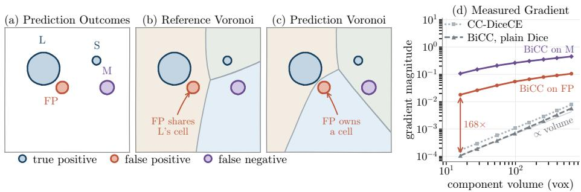
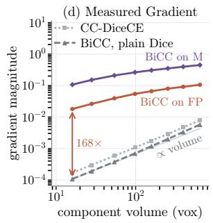
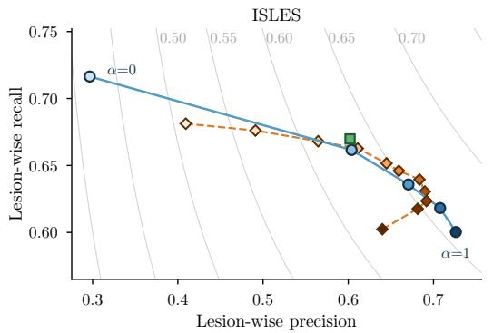
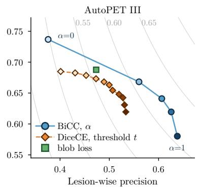

# BiCC: Bidirectional Connected-Component Loss for Instance-Aware Segmentation

Luc Bouteille1, Frederic Jonske1, Jens Kleesiek1, and Alexander Jaus2

1 Institute for AI in Medicine (IKIM), University Hospital Essen, Essen, Germany 2 Institute for Anthropomatics and Robotics (IAR), Karlsruhe Institute of Technology, Karlsruhe, Germany

Abstract. Common segmentation losses aggregate errors voxel-wise, so lesions influence the objective in proportion to their volume, giving small but clinically critical lesions disproportionately little weight. Instanceaware losses aim to address this mismatch by assigning each lesion its own term. However, blob loss and CC-DiceCE derive their regions solely from annotations, so false-positive components receive no instance-level term. This matters in computer-assisted review, where each false-positive component may require separate inspection, making precision and falsepositive burden important alongside recall. We introduce the bidirectional connected-component loss (BiCC), which pairs annotation- and prediction-derived partitions to score predicted components on their own scale. By deriving instances from the predictions, this branch directly penalizes false-positive components regardless of their size. The balance parameter α allows control over the lesion-wise precision-recall trade-of. Across five datasets with five-fold cross-validation using nnU-Net, BiCC outperforms CC-DiceCE in lesion-wise F1 on four datasets and blob loss on all five. It significantly improves over DiceCE on three datasets and matches it on two; CC-DiceCE instead loses up to 0.363 precision by favoring recall. Code is available at https://github.com/TIO-IKIM/ BiCC-Loss.

Keywords: Medical image segmentation · Instance-aware loss · Small lesions · Connected components · Lesion detection

## 1 Introduction

In applications where each lesion can afect diagnosis or treatment, segmentation must be assessed beyond foreground overlap: a model can segment the total lesion volume well while small lesions are missed or falsely detected. The case for high lesion-wise recall is clear, but gains achieved at the expense of precision can still limit utility: each false-positive component may require separate inspection, adding rather than reducing review burden.

Cross-entropy, Dice, and their combination aggregate errors over voxels, generally giving larger lesions more influence. Instance-aware losses address this mismatch by assigning each lesion its own term. However, blob loss masks the other annotated objects, and CC-DiceCE assigns each component a Voronoi region [3,10]. Both emphasize small objects, but both define their regions purely from the annotation: an isolated false positive is absorbed into reference-derived terms rather than receiving its own equally weighted term. Thus, these losses do not remove size dependence for false positives. The false instance rate loss of [18] targets false positives directly, but floors each per-instance overlap. Its gradient is zero or undefined, so the term cannot afect training. A separate family reweights reference-defined instances by component size [4,16,17,19] or segmentation dificulty [9]. Because the instance set remains annotation-derived, false positives receive no instance-level term.

  
Fig. 1. (a) Synthetic slice with matched (L, S), missed (M), and false-positive (FP) lesions. (b,c) Reference and prediction Voronoi cells. (d) $\ell _ { 1 }$ norm of instance-loss probability gradients on FP (violet: FN M) across a 40× volume sweep. Eq. (3) reduces gradient spread from 53.4× (plain Dice) to 5.9×.

We introduce BiCC, which pairs the reference-derived partition with one derived from the prediction, so every predicted component defines its own training region. For unambiguous false-positive regions, Dice is near-flat, so we score them by the mass-weighted mean of the predicted probability (Fig. 1). A single balance parameter α splits the instance-loss budget between the two branches. Our contributions are:

1. a precision-oriented instance branch built on a prediction-derived partition, with a scoring rule for unambiguous false-positive cells;

2. a controlled five-dataset comparison across MRI, CT, and PET/CT against DiceCE, blob loss, and CC-DiceCE;

3. an analysis of how α allows control along the lesion-wise precision-recall frontier.

## 2 Method

## 2.1 Bidirectional Formulation

Let $\smash { \Omega \ \subset \ \mathbb { Z } ^ { 3 } }$ be a training patch, $y _ { i } ~ \in ~ \{ 0 , 1 \}$ the target, and $p _ { i }$ the foreground probability. Let $\mathcal { C } ^ { \mathrm { g t } }$ contain the 26-connected components of the ground

truth and $\mathcal { C } ^ { \mathrm { p r e d } }$ those obtained by thresholding the predictions at 0.5. For $r \in$ gt, pred , the Voronoi cells

$$
V _ { k } ^ { r } = \{ i \in \Omega : k = \tau ( i ) , \quad \tau ( i ) \in \arg \operatorname* { m i n } _ { j } \mathrm { d i s t } _ { 2 } ( i , C _ { j } ^ { r } ) \} ,\tag{1}
$$

partition the patch by nearest component under Euclidean distance in physical space, with τ resolving ties deterministically. Let $\ell ( p , y ; V )$ denote DiceCE restricted to V. The directional instance loss is

$$
\mathcal { L } _ { \mathrm { C C } } ^ { r } = \frac { 1 } { | \mathcal { C } ^ { r } | } \sum _ { C _ { k } ^ { r } \in \mathcal { C } ^ { r } } \ell ( p , y ; V _ { k } ^ { r } ) , \qquad r \in \{ \mathrm { g t } , \mathrm { p r e d } \} .\tag{2}
$$

If ${ \mathcal { C } } ^ { r } = \emptyset$ , we fall back to whole-patch DiceCE, $\mathcal { L } _ { \mathrm { C C } } ^ { r } = \ell ( p , y ; \varOmega )$ . Each component contributes one loss term on its Voronoi cell with weight $1 / | \mathcal { C } ^ { r } |$ , regardless of its volume.

## 2.2 Scoring GT-Empty Cells

Every ground-truth cell contains its generating component, so $\sum _ { i \in V _ { k } ^ { \mathrm { g t } } } y _ { i } >$ 0. In a GT-empty prediction cell $\textstyle \bigl ( \sum _ { i \in V } y _ { i } \ = \ 0 \bigr )$ , smoothed Dice reduces to $\textstyle 1 - \epsilon / ( \sum _ { i \in V } p _ { i } + \epsilon )$ . With the default small $\epsilon ,$ its gradient is efectively zero. Increasing ϵ instead gives the gradient an arbitrary bell-shaped dependence on component size, peaking at np¯ ϵ and decaying strongly as $\epsilon / ( n \bar { p } ^ { 2 } )$ for $n \bar { p } \gg \epsilon$ (e.g., for $\epsilon = 1 0$ and $\bar { p } = 0 . 5 ,$ , a component with $n = 2 0$ is weighted more strongly than one with $n = 1$ or $n = 1 0 0 )$ ). We therefore replace Dice in these cells with a prediction-mass score whose total derivative with respect to the cell probabilities is constant across component sizes,

$$
\ell ( p , y ; V ) = \sum _ { i \in V } w _ { i } p _ { i } + \mathrm { C E } ( p , y ; V ) , \qquad w _ { i } = \mathrm { s g } \left( { \frac { p _ { i } } { \sum _ { j \in V } p _ { j } } } \right) ,\tag{3}
$$

Here, sg denotes stop-gradient: the weights are calculated from the current predictions but treated as constants during backpropagation.

Consequently, for the false-positive cell score $\begin{array} { r } { q ( p ; V ) = \sum _ { i \in V } w _ { i } p _ { i } } \end{array}$ , we have $\partial q / \partial p _ { j } = w _ { j }$ . Since $\textstyle \sum _ { j \in V } w _ { j } = 1$ , these derivatives sum to one, so the total gradient magnitude is independent of component size. In practice, the FP gradient in Fig. 1(d) is much less size-dependent, though not constant, because foreground probability extends beyond the component and CE depends on volume. Including surrounding voxels avoids choosing an arbitrary cutof around the component, while CE retains an asymptotic penalty as $p _ { i } \to 1$

## 2.3 Combined Loss Function

The complete objective is

$$
{ \mathcal { L } } _ { \mathrm { B i C C } } = { \mathcal { L } } _ { \mathrm { D i c e C E } } + \big [ ( 1 - \alpha ) { \mathcal { L } } _ { \mathrm { C C } } ^ { \mathrm { g t } } + \alpha { \mathcal { L } } _ { \mathrm { C C } } ^ { \mathrm { p r e d } } \big ] , \qquad \alpha \in [ 0 , 1 ] ,\tag{4}
$$

where the bracketed instance term is weighted 1:1 against the global term, as in prior component-based objectives [3,11]. Since that budget is fixed, α controls only the relative contribution of the reference- and prediction-derived partitions.

## 3 Experiments

## 3.1 Data

We evaluate five datasets spanning a wide range of modalities, lesion sizes, and lesion counts (Table 1). CMB is the cerebral microbleed task of VALDO [20]. BraTS-METS is the multisequence brain MRI cohort of the BraTS 2026 metastases challenges [14,15]. We use tumor core as a binary target and the mandatory T1n, T1c, and T2f sequences, excluding the partly synthesized optional T2w. For LiTS contrast-enhanced abdominal CT [2], we follow [10] and segment only the liver tumor class to keep all segmentation targets binary. AutoPET III combines 1,014 FDG and 597 PSMA PET/CT studies with whole-body tumor lesion annotations from two clinical centers [5,8]. From ISLES 2026, we use 1,453 labeled native-space T1-weighted MRI scans of stroke lesions, drawn from multi-center source cohorts [1,12,13].

Table 1. Cohort characteristics. Components use 26-connectivity and native spacing; component-volume statistics are computed across all components in the dataset. For each case, intra-case CoV is the standard deviation divided by the mean of its groundtruth component volumes. Bracketed entries are the IQR of the preceding median.
<table><tr><td></td><td></td><td colspan="3">CC/case</td><td colspan="2">Component volume  $\left( \mathrm { m m } ^ { 3 } \right)$ </td><td rowspan="2">(%)</td><td rowspan="2">Foreground Intra-case CoV median</td></tr><tr><td>Dataset</td><td>Scans</td><td>median mean</td><td></td><td></td><td>median</td><td>mean</td></tr><tr><td>AutoPET III</td><td>1611</td><td>2 [0, 11]</td><td></td><td>17.0</td><td>1294 [495, 3471]</td><td>8856</td><td>0.028</td><td>0.37 [0.00, 1.67]</td></tr><tr><td>ISLES</td><td>1453</td><td>2 [1, 4]</td><td></td><td>3.4</td><td>162 [20, 1300]</td><td>8287</td><td>0.268</td><td>0.73 [0.00, 1.28]</td></tr><tr><td>BraTS-METS</td><td>1294</td><td>4 [1, 8]</td><td></td><td>7.6</td><td>43.0 [14.5, 185.8]</td><td>742</td><td>0.056</td><td>0.90 [0.00, 1.38]</td></tr><tr><td>LiTS</td><td>131</td><td></td><td>3 [1, 9]</td><td>6.9</td><td>539 [145, 2733]</td><td>11249</td><td>0.124</td><td>0.85 [0.00, 1.45]</td></tr><tr><td>CMB</td><td>72</td><td></td><td>1 [0, 2]</td><td>3.3</td><td>9.9 [7.3, 17.1]</td><td>18.7</td><td>0.001</td><td>0.00 [0.00, 0.03]</td></tr></table>

## 3.2 Experimental Setup

All methods use the same self-configured 3D nnU-Net [6] and difer only in their objective: DiceCE, blob loss, CC-DiceCE, or BiCC. All three instance-aware objectives use DiceCE as their regional segmentation loss. Without per-dataset tuning, we set α = 0.5. For each method-dataset combination, we use five-fold cross-validation and train for 500 epochs as a tradeof between convergence and compute. As the DiceCE baseline does not converge with $\epsilon = 1 0 ^ { - 5 }$ on CMB, following [3], we set $\epsilon = 0$ for all methods and datasets to keep them comparable. AutoPET III and BraTS-METS folds are grouped by patient to prevent leakage.

## 3.3 Evaluation

Metrics. We report global Dice, CC-Dice [7], and lesion-wise precision, recall, and F1. For the detection metrics, masks are split into 26-connected components. Reference and predicted components with IoU > 0.1 are matched with maximum-cardinality one-to-one matching. All metrics are macro-averaged over scans. Following [20], empty-GT scans are excluded from these five metrics. For these scans, we separately report $\mathrm { F P / n e g } .$ , the mean number of predicted components.

Statistical Analysis. We compare each non-DiceCE method with DiceCE and, separately, BiCC with CC-DiceCE using paired Wilcoxon signed-rank tests. Cases are grouped by patient for AutoPET III and BraTS-METS and paired by scan otherwise. Holm-Bonferroni correction is applied separately per datasetmetric across these four contrasts; we report adjusted p-values.

## 3.4 Ablations

We use the ablations to answer three questions. Branch balance. How does α control the lesion-wise precision-recall tradeof? We sweep $\alpha \in \{ 0 , 1 / 4 , 1 / 2 , 3 / 4$ 1 . False-positive scoring. Does smoothed Dice fail for unambiguous false positives as analyzed in Sec. 2.2? At $\alpha = 1 / 2$ , we replace Eq. (3) with DiceCE using smoothed Dice $( \epsilon = 1 0 ^ { - 5 } )$ . Post-hoc thresholding. Can thresholding a standard DiceCE model reproduce the same behavior? We re-evaluate the trained DiceCE checkpoints at $t = \sigma ( s )$ for logit shifts $s \in \{ - 5 , \ldots , 5 \}$ , where $s =$ 0 reproduces Table 2. We shift logits because nnU-Net ensembles and aggregates predictions in logit space, so a constant foreground-logit ofset passes through mirroring, sliding-window aggregation, and resampling unchanged. We run all three ablations on ISLES, where BiCC matches DiceCE, and AutoPET III, where it outperforms DiceCE.

## 4 Results and Discussion

## 4.1 Comparison with Baselines

Precision vs. Recall. CC-DiceCE raises recall on every dataset but lowers precision on four, by up to 0.363 (Table 2). The precision loss outweighs the recall gain: F1 is significantly lower than DiceCE on those four datasets and higher only on CMB. BiCC avoids this precision collapse, increasing precision over DiceCE on all five datasets, significantly on three. Recall increases on BraTS-METS and LiTS and decreases on AutoPET III and ISLES, with a non-significant decrease on CMB. The resulting F1 gains are significant on AutoPET III, BraTS-METS, and LiTS, while ISLES and CMB remain comparable to DiceCE. Directly compared with CC-DiceCE, BiCC has significantly higher precision and F1 on all four non-CMB datasets. None of the precision, recall, or F1 diferences is significant on CMB. On empty-GT scans, BiCC produces the fewest components on all five datasets, with significant reductions against both DiceCE and CC-DiceCE on four. Thus, BiCC generally provides a better precision-recall balance than CC-DiceCE while improving or maintaining F1 relative to DiceCE.

CC-Dice. Compared with DiceCE, BiCC gains up to +0.014 in CC-Dice (AutoPET III) and gives up at most 0.009 (ISLES), but remains below CC-DiceCE on all five datasets. This ordering is consistent with CC-Dice’s recall bias: it averages one overlap score per reference component. Missing a lesion makes one of these scores zero. A false-positive component, however, receives no separate score and only reduces the score of the reference-derived Voronoi cell containing it. The false-positive penalty is therefore diluted by the volume of the reference component defining the region, decreasing as that volume increases. As a result, CC-Dice penalizes misses more directly than false positives, favoring recall over precision.

Table 2. Main results (mean over held-out cases, five-fold cross-validation). Bold best, underline second best per dataset; † difers from that dataset’s DiceCE baseline at Holm-Bonferroni-adjusted $p < 0 . 0 5$ . Shading runs worst (red) to best (green) within each dataset and column.
<table><tr><td>Dataset</td><td>Method</td><td>Dice</td><td>CC-Dice</td><td>Prec.</td><td>Rec.</td><td>F1</td><td>FP/neg</td></tr><tr><td rowspan="4">AutoPET III</td><td>DiceCE</td><td>0.5654</td><td>0.4481</td><td>0.4998</td><td>0.6631</td><td>0.5301</td><td>5.5009</td></tr><tr><td>blob loss</td><td>0.5452†</td><td>0.4415†</td><td>0.4733†</td><td>0.6877†</td><td>0.5210†</td><td>6.7312†</td></tr><tr><td>CC-DiceCE</td><td>0.5722†</td><td>0.4791†</td><td>0.3758†</td><td>0.7368†</td><td>0.4621†</td><td>10.8482†</td></tr><tr><td>BiCC</td><td>0.5848†</td><td>0.4616†</td><td>0.6065†</td><td>0.6410†</td><td>0.5880†</td><td>3.4293†</td></tr><tr><td rowspan="4">ISLES</td><td>DiceCE</td><td>0.6518</td><td>0.4845</td><td>0.6594</td><td>0.6460</td><td>0.5905</td><td>3.0000</td></tr><tr><td>blob loss</td><td>0.6438†</td><td>0.4921†</td><td>0.6021†</td><td>0.6698†</td><td>0.5710†</td><td>1.8000</td></tr><tr><td>CC-DiceCE</td><td>0.6497</td><td>0.5197†</td><td>0.2966†</td><td>0.7164†</td><td>0.3602†</td><td>2.8000</td></tr><tr><td>BiCC</td><td>0.6411†</td><td>0.4760†</td><td>0.6706</td><td>0.6358†</td><td>0.5886</td><td>1.0000</td></tr><tr><td rowspan="4">BraTS-METS</td><td>DiceCE</td><td>0.7477</td><td>0.5966</td><td>0.8053</td><td>0.7370</td><td>0.7383</td><td>1.1600</td></tr><tr><td>blob loss</td><td>0.7184†</td><td>0.5798†</td><td>0.7857†</td><td>0.7428†</td><td>0.7320†</td><td>1.0800</td></tr><tr><td>CC-DiceCE</td><td>0.7528†</td><td>0.6311†</td><td>0.6803†</td><td>0.7943†</td><td>0.6967†</td><td>1.2800</td></tr><tr><td>BiCC</td><td>0.7405</td><td>0.5972</td><td>0.8242†</td><td>0.7422†</td><td></td><td>0.7531† 0.5200†</td></tr><tr><td rowspan="4">LiTS</td><td>DiceCE</td><td>0.5739</td><td>0.4683</td><td>0.4698</td><td>0.7112</td><td>0.5229</td><td>3.8462</td></tr><tr><td>blob loss</td><td>0.5443</td><td>0.4563</td><td>0.4441†</td><td>0.7443†</td><td>0.5132</td><td>4.5385</td></tr><tr><td>CC-DiceCE</td><td>0.5892 0.5059†</td><td></td><td>0.4004†</td><td>0.7920†</td><td>0.4947†</td><td>4.2308</td></tr><tr><td>BiCC</td><td>0.5696</td><td>0.4747†</td><td>0.5772†</td><td>0.7279†</td><td></td><td>0.6098† 2.0000†</td></tr><tr><td rowspan="4">CMB</td><td>DiceCE</td><td>0.4528</td><td>0.4195</td><td>0.6069</td><td>0.6375</td><td>0.5826</td><td>1.0455</td></tr><tr><td>blob loss</td><td>0.4295</td><td>0.3992</td><td>0.5605</td><td>0.6043</td><td>0.5326</td><td>1.2273</td></tr><tr><td>CC-DiceCE</td><td>0.5035</td><td>0.4710</td><td>0.6910</td><td>0.6854 0.6648†</td><td></td><td>1.0909</td></tr><tr><td>BiCC</td><td>0.4462</td><td>0.4125</td><td>0.6182</td><td>0.6202</td><td>0.5812</td><td>0.7727†</td></tr></table>

Global Overlap. Relative to DiceCE, global Dice changes by 0.011 to +0.019. As global Dice is dominated by large lesions and insensitive to missed or falsely detected small lesions, we consider these modest diferences secondary to lesion-wise metrics.

Computational cost. Benchmarked on an NVIDIA RTX A6000, BiCC adds a 17–23% training overhead per epoch over DiceCE and 7–10% over CC-DiceCE. It incurs no additional inference cost.

Limitations. On CMB, CC-DiceCE has higher mean F1 than BiCC, though the diference is not significant. CMB has the smallest, most uniform lesions (Table 1), so CC-DiceCE may already penalize false positives suficiently through reference-cell overlap. For this lesion profile, $\mathcal { L } _ { \mathrm { C C } } ^ { \mathrm { p r e d } }$ may over-penalize predicted components without improving precision.

## 4.2 Ablations

Table 3. Ablations on the folds of Table 2. Rows vary α of Eq. (4); “Smoothed Dice” replaces Eq. (3) at $\alpha = 1 / 2 .$ . † difers from $\alpha = 0$ of the same dataset at Holm-Bonferroni-adjusted $p < 0 . 0 5$
<table><tr><td>Dataset</td><td>Variant</td><td>Dice</td><td>CC-Dice</td><td>Prec.</td><td>Rec.</td><td>F1</td><td> $\mathrm { F P / n e g }$ </td></tr><tr><td rowspan="6">AutoPET III</td><td> $\alpha = 0 ~ \mathrm { ( C C - D i c e C E ) }$ </td><td>0.5722</td><td>0.4791</td><td>0.3758</td><td>0.7368</td><td></td><td>0.4621 10.8482</td></tr><tr><td> $\alpha = 1 / 4$ </td><td>0.5854†</td><td> $0 . 4 7 3 3 ^ { \dagger }$ </td><td>0.5602†</td><td>0.6682†</td><td>0.5742†</td><td>4.3560†</td></tr><tr><td> $\mathbf { B i C C } \ ( \alpha = 1 / 2 )$ </td><td>0.5848†</td><td> $0 . 4 6 1 6 ^ { \dagger }$ </td><td>0.6065†</td><td> $0 . 6 4 1 0 ^ { \dagger }$ </td><td></td><td>0.5880† 3.4293†</td></tr><tr><td> $\alpha = 3 / 4$ </td><td>0.5809</td><td>0.4506†</td><td>0.6256†</td><td> $0 . 6 1 9 5 ^ { \dagger }$ </td><td></td><td>0.5865† 3.0855†</td></tr><tr><td> $\alpha = 1$ </td><td>0.5653†</td><td>0.4265†</td><td>0.6380†</td><td>0.5802†</td><td>0.5735†</td><td>2.5969†</td></tr><tr><td>Smoothed Dice (α = 1/2)</td><td>0.5855†</td><td>0.4891†</td><td>0.4059†</td><td>0.7308</td><td>0.4850†</td><td>9.6667†</td></tr><tr><td rowspan="6">ISLES</td><td> $\alpha = 0 ~ \mathrm { ( C C - D i c e C E ) }$ </td><td>0.6497</td><td>0.5197</td><td>0.2966</td><td>0.7164</td><td>0.3602</td><td>2.8000</td></tr><tr><td> $\alpha = 1 / 4$ </td><td>0.6477</td><td>0.4924†</td><td>0.6039†</td><td>0.6616†</td><td>0.5673†</td><td>1.4000</td></tr><tr><td>BiCC  $( \alpha = 1 / 2 )$ </td><td>0.6411†</td><td>0.4760†</td><td>0.6706†</td><td>0.6358†</td><td>0.5886†</td><td>1.0000</td></tr><tr><td> $\alpha = 3 / 4$ </td><td>0.6370†</td><td>0.4651†</td><td>0.7078†</td><td>0.6182†</td><td>0.5975†</td><td>0.8000</td></tr><tr><td> $\alpha = 1$ </td><td>0.6310† 0.4561†</td><td>0.7263†</td><td></td><td>0.6003†</td><td>0.5964†</td><td>1.0000</td></tr><tr><td>Smoothed Dice  $( \alpha = 1 / 2 )$ </td><td>0.6541 0.5250†</td><td>0.2737†</td><td></td><td>0.7250†</td><td>0.3381†</td><td>1.8000</td></tr></table>

Branch Balance. Across the α sweep, precision increases monotonically and recall decreases on both datasets (Table 3, Fig. 2). At $\alpha = 1 / 4$ , about 70% of the total precision change and almost 90% of the maximum F1 improvement are already attained. F1 then remains nearly constant, indicating that $\alpha =$ $1 / 2$ is a robust default without dataset-specific tuning. Global Dice remains comparatively stable and false positives on empty-GT scans fall substantially across the sweep. CC-Dice decreases, consistent with its recall bias.

False-Positive Scoring. With smoothed Dice in place of $\operatorname { E q . }$ (3), results on both datasets closely resemble the $\alpha = 0$ operating point. This confirms our hypothesis: with a small smoothing constant, the gradient for unambiguous false positives is efectively zero, so the prediction-derived branch contributes no meaningful false-positive penalty.

Mixed Cells. A prediction-derived cell may contain annotation that does not overlap its generating component. Separating the signals would require rules for component support, matching, splits, and merges. We retain DiceCE in mixed cells and apply the precision penalty only to unambiguous false positives. This recall-first, precision-second strategy matters because the α ablation already shows a strong shift toward precision.

Post-hoc thresholding. Shifting DiceCE logits cannot replicate tuning α (Fig. 2). On ISLES, thresholding reaches a comparable peak F1 but spans a substantially narrower precision-recall range; at high thresholds, shrinking components fall below the IoU > 0.1 matching cutof, causing precision to reverse rather than continue improving. On AutoPET III, the α sweep strictly dominates thresholding across their shared recall range. Thus, changing α provides a broader and more efective operating range, whereas post-hoc thresholding only matches its performance on ISLES, where DiceCE is already competitive.

  
Fig. 2. The lesion-wise precision-recall plane traced by the branch balance α (five trained models) and by the decision threshold t on the DiceCE checkpoint (eleven points on each dataset). Colour runs light (low value) to dark (high value) along each sweep; panels do not share axis ranges. Grey curves are F1 isolines of the plotted means.

## 5 Conclusion

We introduced the bidirectional connected-component loss BiCC, which pairs reference- and prediction-derived partitions to evaluate missed lesions and false positives on their own spatial scale with a simple, size-independent training signal.

The hyperparameter α provides continuous training-time control along the lesion-wise precision-recall frontier, letting clinicians select the trade-of appropriate to their use case in a way that post-hoc decision thresholding cannot replicate. Across five diverse 3D datasets at fixed α = 0.5, BiCC consistently outperforms blob loss, matches or improves upon DiceCE, and generally improves upon CC-DiceCE in instance-level F1. It also substantially reduces false positives on lesion-free scans.

Requiring no architectural changes or inference overhead, BiCC ofers a practical drop-in loss for instance-aware 3D medical image segmentation.

Data Use. The BraTS-METS and AutoPET III datasets are provided under CC BY-NC 4.0. VALDO is licensed under CC BY-NC-SA 4.0, while LiTS is provided under CC BY-NC-ND 4.0. The ISLES’26 training data are subject to ATLAS Terms of Use.

## References

1. Absher, J., Goncher, S., Newman-Norlund, R., Perkins, N., Yourganov, G., Vargas, J., Sivakumar, S., Parti, N., Sternberg, S., Teghipco, A., et al.: The stroke outcome optimization project: Acute ischemic strokes from a comprehensive stroke center. Scientific Data 11(1), 839 (2024)

2. Bilic, P., Christ, P., Li, H.B., Vorontsov, E., Ben-Cohen, A., Kaissis, G., Szeskin, A., Jacobs, C., Mamani, G.E.H., Chartrand, G., et al.: The liver tumor segmentation benchmark (LiTS). Medical Image Analysis 84, 102680 (2023)

3. Bouteille, L., Jaus, A., Kleesiek, J., Stiefelhagen, R., Heine, L.: Learning to look closer: A new instance-wise loss for small cerebral lesion segmentation. In: IEEE International Symposium on Biomedical Imaging. pp. 1–5 (2026)

4. Fenneteau, A., Helbert, D., Bourdon, P., M’Rabet, I., Fernandez-Maloigne, C., Guillevin, R.: A size-adaptative segmentation method for better detection of multiple sclerosis lesions. Preprint, HAL: hal-03836787v1 (2022), https://hal.science/ hal-03836787v1

5. Gatidis, S., Hepp, T., Früh, M., La Fougère, C., Nikolaou, K., Pfannenberg, C., Schölkopf, B., Küstner, T., Cyran, C., Rubin, D.: A whole-body fdg-pet/ct dataset with manually annotated tumor lesions. Scientific Data 9(1), 601 (2022)

6. Isensee, F., Jaeger, P.F., Kohl, S.A.A., Petersen, J., Maier-Hein, K.H.: nnU-Net: A self-configuring method for deep learning-based biomedical image segmentation. Nature Methods 18(2), 203–211 (2021)

7. Jaus, A., Seibold, C.M., Reiß, S., Marinov, Z., Li, K., Ye, Z., Krieg, S., Kleesiek, J., Stiefelhagen, R.: Every component counts: Rethinking the measure of success for medical semantic segmentation in multi-instance segmentation tasks. In: Proceedings of the AAAI Conference on Artificial Intelligence. vol. 39, pp. 3904–3912 (2025)

8. Jeblick, K., et al.: A whole-body psma-pet/ct dataset with manually annotated tumor lesions (psma-pet-ct-lesions) (2024). https://doi.org/10.7937/r7ep-3x37

9. Jiang, W., Li, Y., Yi, Z., Chen, M., Wang, J.: Multi-instance imbalance semantic segmentation by instance-dependent attention and adaptive hard instance mining. Knowledge-Based Systems 304, 112554 (2024)

10. Kofler, F., Shit, S., Ezhov, I., Fidon, L., Horvath, I., Al-Maskari, R., Li, H.B., Bhatia, H., Loehr, T., Piraud, M., et al.: blob loss: Instance imbalance aware loss functions for semantic segmentation. In: Information Processing in Medical Imaging. pp. 755–767 (2023)

11. Kundu, S.S., Kofler, F., Ivory, M., Möller, H., Shapey, J., Vercauteren, T.: Instance awareness of multi-class semantic segmentation loss functions. In: Proceedings of the IEEE/CVF Conference on Computer Vision and Pattern Recognition (CVPR) Workshops. pp. 6680–6688 (2026)

12. Liew, S.L., Anglin, J.M., Banks, N.W., Sondag, M., Ito, K.L., Kim, H., Chan, J., Ito, J., Jung, C., Khoshab, N., et al.: A large, open source dataset of stroke anatomical brain images and manual lesion segmentations. Scientific data 5(1), 180011 (2018)

13. Liew, S.L., Tavenner, B.P., Donnelly, M.R., Zavaliangos-Petropulu, A., Jeong, J.N., Barisano, G., Hutton, A., Simon, J.P., Juliano, J.M., Suri, A., et al.: A large, curated, open-source stroke neuroimaging dataset to improve lesion segmentation algorithms. Scientific data 9(1), 320 (2022)

14. Maleki, N., Amiruddin, R., Moawad, A.W., Yordanov, N., Gkampenis, A., Fehringer, P., Umeh, F., Chukwurah, C., Memon, F., Petrovic, B., et al.: Analysis

of the miccai brain tumor segmentation–metastases (brats-mets) 2025 lighthouse challenge: brain metastasis segmentation on pre-and post-treatment mri. arXiv preprint arXiv:2504.12527 (2025)

15. Moawad, A.W., Janas, A., Baid, U., Ramakrishnan, D., Saluja, R., Ashraf, N., Maleki, N., Jekel, L., Yordanov, N., Fehringer, P., et al.: The brain tumor segmentation (BraTS-METS) challenge 2023: Brain metastasis segmentation on pretreatment MRI. arXiv preprint arXiv:2306.00838 (2024)

16. Nichyporuk, B., Szeto, J., Arnold, D.L., Arbel, T.: Optimizing operating points for high performance lesion detection and segmentation using lesion size reweighting. arXiv preprint arXiv:2107.12978 (2021)

17. Preedanan, W., Suzuki, K., Kondo, T., Kobayashi, M., Tanaka, H., Ishioka, J., Matsuoka, Y., Fujii, Y., Kumazawa, I.: Urinary stones segmentation in abdominal X-ray images using cascaded U-net pipeline with stone-embedding augmentation and lesion-size reweighting approach. IEEE Access 11, 25702–25712 (2023)

18. Rachmadi, M.F., Byra, M., Skibbe, H.: A new family of instance-level loss functions for improving instance-level segmentation and detection of white matter hyperintensities in routine clinical brain MRI. Computers in Biology and Medicine 174, 108414 (2024)

19. Shirokikh, B., Shevtsov, A., Kurmukov, A., Dalechina, A., Krivov, E., Kostjuchenko, V., Golanov, A., Belyaev, M.: Universal loss reweighting to balance lesion size inequality in 3D medical image segmentation. In: Medical Image Computing and Computer Assisted Intervention. pp. 523–532. Springer (2020)

20. Sudre, C.H., Van Wijnen, K., Dubost, F., Adams, H., Atkinson, D., Barkhof, F., Birhanu, M.A., Bron, E.E., Camarasa, R., Chaturvedi, N., et al.: Where is valdo? vascular lesions detection and segmentation challenge at miccai 2021. Medical Image Analysis 91, 103029 (2024)