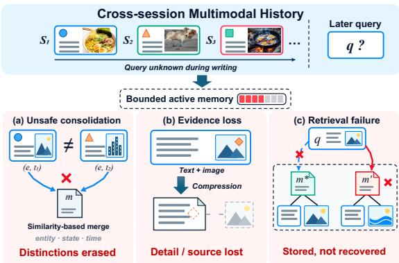
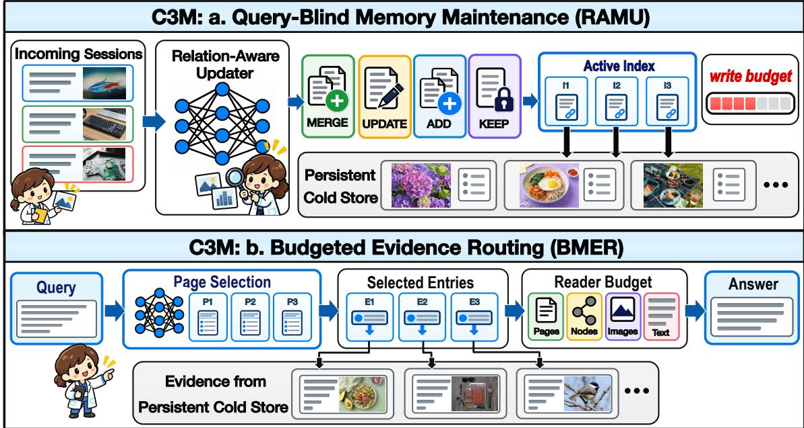
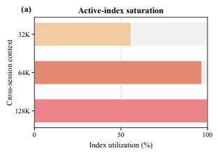
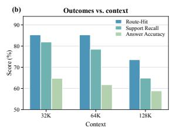
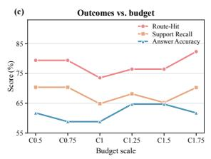
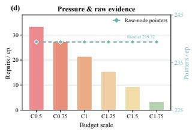
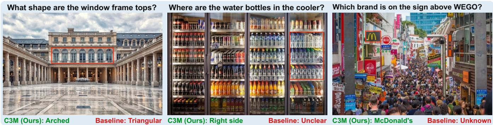

# C3M: CROSS-SESSION MULTIMODAL MEMORY MAINTENANCE FOR LONG-HORIZON TASKS

Xueshu Chen1\*, Yan Wang2\*, Zihao Xue1, Jiefu Li1, Zhenfang Liu1, Jayden Chen3, Zhen Bi1†, Jungang Lou1

1Huzhou Normal University 2Alibaba Group 3University of Waterloo

## ABSTRACT

Long-horizon tasks require preserving and later recovering crosssession evidence under a bounded, query-blind memory budget. Existing compression can discard fine-grained visual cues or conflate semantically similar but incompatible observations. We present C3M, a cross-session multimodal memory organization that maintains a bounded active index over persistent source text-image evidence. Relation-aware updates consolidate safe redundancy while preserving complementary and incompatible records. At query time, budgeted routing selects useful index pages and expands their associated source evidence under a fixed reader budget. Together, these mechanisms establish a compact, provenancepreserving multimodal memory organization for cross-session longhorizon tasks, retaining temporal distinctions and source links required for reliable downstream reasoning. Code is available at https://github.com/HuzhouNLP/C3M.

Index Terms— multimodal memory, long-horizon tasks, memory maintenance

## 1. INTRODUCTION

Long-horizon tasks require agents to preserve information across interactions [1, 2, 3], because later requests may depend on earlier observations, changed states, or evidence whose relevance becomes apparent only retrospectively [4, 5, 6]. This has motivated persistent memory systems that store, update, organize, and retrieve accumulated experience across time [7, 8, 9, 10]. The challenge becomes harder in cross-session multimodal settings, where relevant evidence may be distributed across text and images, and fine-grained visual details can determine future answers. Memory must therefore remain compact while keeping earlier source evidence recoverable when summaries are insufficient.

The central challenge is maintaining a bounded, query-blind state without collapsing distinctions that future queries may require. Observations can be redundant or complementary, while records similar in text or appearance may differ in entity, state, or time. Aggressive merging can erase differences visible only in joint text-image context; retaining every near-duplicate instead consumes capacity and weakens routing selectivity. Compact entries must therefore preserve provenance, distinguish stable facts from later states, and recover source images when summaries are insufficient. These requirements are especially important across sessions: interruptions, partial observability, and delayed feedback make forgotten or conflated state difficult to reconstruct, while irreversible actions amplify the cost of errors [1].

  
Fig. 1. Query-blind multimodal memory challenges. (a) Similar records can be distinct. (b) Compression can lose visual details or source links. (c) Routing can leave stored evidence unrecovered.

Existing multimodal memory systems address parts of this problem through visual-token compression and sparse memory, fixed-budget updates, and gist or context distillation [11, 12, 13, 14]. Content-aware and conflict-aware [15, 16] approaches improve retention, but similarity alone does not imply safe merging. Compression may discard visual cues, text-image bindings, source images, or temporal versions, while routing remains constrained by fixed reader budgets. Memory benefits also vary, reflecting trade-offs among compactness, information preservation, and utility [17, 18]. Multimodal long-context reasoning is further challenged by imagetext distractors, compression-induced loss of visual fidelity, and modality-relevance gaps [19, 20, 21].

Therefore, we introduce C3M, a cross-session multimodal memory organization that maintains a bounded active index over persistent source text-image evidence, preserves necessary distinctions during maintenance, and expands source evidence from selected pages under a fixed reader budget. Our detailed contributions are as follows:

• A multimodal memory organization for cross-session long-horizon tasks that couples a bounded active index with persistently addressable text-image evidence.

• C3M for multimodal memory maintenance. It maintains compact routing representations over persistent source evidence accumulated across sessions.

• More effective memory organization under a fixed memory budget than existing compression methods, preserving evidence distinctions and provenance-linked access to original images from earlier sessions.

  
Fig. 2. Overview of C3M. (a) During query-blind memory maintenance, RAMU applies relation-aware MERGE, UPDATE, ADD, or KEEP actions to incoming multimodal sessions. Compact, provenance-linked entries are maintained in the active index under a fixed write budget, while original evidence is preserved in the persistent Cold Store. (b) Given a query, BMER selects index pages (P) and entries (E), then retrieves linked Raw Nodes and original images from the Cold Store under a joint reader budget over pages, nodes, images, and text for answer generation.

## 2. CROSS-SESSION MULTIMODAL MEMORYMAINTENANCE

Let $\mathcal { S } _ { 1 : t }$ denote the sessions observed up to time t. Each session yields immutable Raw Nodes of text, images, and provenance in a persistent Cold Store, whereas the bounded active index $\mathcal { T } _ { t }$ stores only compact routing representations and pointers. Built before the final query $q$ is known, C3M uses Relation-Aware Multimodal Memory Update (RAMU) for each arriving session and Budgeted Multimodal Evidence Routing (BMER) for q (Fig. 2). BMER traverses the index under a joint page, node, image, and text budget B: RAMU preserves write-time distinctions, and BMER retrieves their original evidence when needed.

## 2.1. Relation-Aware Multimodal Memory Update

When a new session $S _ { t }$ arrives, RAMU constructs an incoming entry $m _ { t }$ with routing representation $\mathbf { z } _ { t }$ . Let $\mathcal { U } _ { t }$ denote its Raw Nodes; the entry stores their pointers rather than replacing their contents:

$$
\begin{array} { r l } & { m _ { t } = ( \mathbf { z } _ { t } , \mathcal { P } _ { t } , \tau _ { t } ) , } \\ & { \mathcal { P } _ { t } = \{ \mathrm { p t r } ( u ) ~ | ~ u \in \mathcal { U } _ { t } \} , \qquad \mathcal { U } _ { 1 : t - 1 } \subseteq \mathcal { U } _ { 1 : t } . } \end{array}\tag{1}
$$

It retrieves a small candidate set and predicts a relation and confidence for every candidate as

$$
\begin{array} { r l } & { \mathcal { N } ( m _ { t } ) = \mathop { \mathrm { T o p K } } _ { e \in \mathcal { T } _ { t - 1 } } s ( \mathbf { z } _ { t } , \mathbf { z } _ { e } ) , } \\ & { \quad \quad r _ { t , e } = \mathop { \mathrm { a r g m a x } } _ { r \in \mathcal { R } } g _ { r } \big ( \phi ( m _ { t } , e ) \big ) , } \\ & { \quad \quad c _ { t , e } = \mathop { \mathrm { m a x } } _ { r \in \mathcal { R } } g _ { r } \big ( \phi ( m _ { t } , e ) \big ) . } \end{array}\tag{2}
$$

Here, s retrieves candidates; $\phi$ compares entity, state, time, action, scope, and text-image agreement; and R contains same, update, distinct, and uncertain. Following the prospective local-update principle of reflective memory management [8], similarity proposes candidates rather than deciding a merge. For the highest-confidence candidate $\boldsymbol { e } _ { t } ^ { \star }$ , RAMU takes a conservative action under threshold δ:

$$
a _ { t } = \left\{ \begin{array} { l l } { { \mathrm { M E R G E } } ( e _ { t } ^ { \star } ) , } & { r _ { t , e _ { t } ^ { \star } } = \mathrm { s a m e } \ \wedge \ c _ { t , e _ { t } ^ { \star } } \geq \delta , } \\ { { \mathrm { U P D A T E } } ( e _ { t } ^ { \star } , m _ { t } ) , } & { r _ { t , e _ { t } ^ { \star } } = \mathrm { u p d a t e } \ \wedge \ c _ { t , e _ { t } ^ { \star } } \geq \delta , } \\ { { \mathrm { A D D } } ( m _ { t } ) , } & { \mathcal { N } ( m _ { t } ) = \emptyset , } \\ { { \mathrm { K E E P } } ( m _ { t } ) , } & { \mathrm { o t h e r w i s e } . } \end{array} \right.\tag{3}
$$

A compatible description of the same stable fact is therefore MERGE; a later state of the same entity is UPDATE; and related but non-interchangeable or uncertain evidence is KEEP. An update creates links to both the predecessor and the new source, whereas a keep action retains an independent entry. In all cases, Raw Nodes are never overwritten. Let Src(e) denote the source pointers reachable from entry $e ,$ including predecessor links. For a merged or updated entry $e _ { t } ^ { \prime } ,$ , provenance preservation requires

$$
\operatorname { S r c } ( e _ { t } ^ { \prime } ) \supseteq \operatorname { S r c } ( e _ { t } ^ { \star } ) \cup \mathcal { P } _ { t } .\tag{4}
$$

This condition preserves access to both earlier and incoming evidence without requiring identical routing representations. A merge consolidates support for a stable fact, whereas an update retains the connection between successive states. For ADD and KEEP, $\mathcal { P } _ { t }$ remains attached to an independent entry. Thus, maintenance reorganizes access while preserving the underlying observations for queries not yet known.

At capacity, C3M consolidates only confirmed safe redundancy. Otherwise, it uses a separately recorded pointer-preserving fallback rather than a semantic merge, preventing surface similarity from erasing necessary distinctions.

Table 1. Main results under our online, session-by-session evaluation protocol on MemLens, across two execution models, five task cate gories, and three history lengths. All reported scores are accuracy percentages, shown without the % sign; boldface indicates the best scores among the compared methods
<table><tr><td rowspan="2">Model</td><td rowspan="2">Method</td><td>IE</td><td>MSR</td><td>TR</td><td></td><td>KU</td><td>AR</td><td></td><td>Overall</td></tr><tr><td>32K 64K</td><td>128K 32K 64K</td><td>128K 32K</td><td>64K 128K</td><td>32K 64K</td><td>128K 32K</td><td>64K 128K</td><td>32K 64K 128K</td></tr><tr><td rowspan="4">GPT-5.6 Sol</td><td>ReSum</td><td>44.26 37.70 42.62</td><td>22.86 20.00 22.86</td><td>64.58 56.25</td><td>43.75 34.48</td><td>24.14 17.24</td><td>59.09 50.00</td><td>45.45 45.64</td><td>38.4635.90</td></tr><tr><td>MovieChat</td><td>73.77 65.57 57.38</td><td>45.71 42.86 54.29</td><td>70.83 70.83</td><td>58.33 44.83</td><td>48.28 44.83</td><td>86.36 86.36</td><td>72.73</td><td>65.13 62.56 56.92</td></tr><tr><td>MemRefine</td><td>67.21 60.6665.57</td><td>65.71 57.14</td><td>57.14 72.92 75.00</td><td>70.83</td><td>51.7251.7244.83</td><td>86.3681.82</td><td>63.64 68.21</td><td>64.6262.05</td></tr><tr><td>CDRs C3M (Ours)</td><td>72.13 67.21 68.85</td><td>45.71 51.43 51.43 64.58 66.67 72.92 48.28 51.72</td><td></td><td>55.17</td><td></td><td></td><td>51.72 90.91 86.36 81.82 64.10 64.10 65.64</td><td></td></tr><tr><td></td><td>ReSum</td><td>72.13 68.85 60.66 21.67 21.67 18.33</td><td>71.43 57.14 54.29 29.41 26.47 26.47</td><td>77.08 79.17 54.35 54.35</td><td>70.83 45.65 39.29</td><td>55.17 48.28 21.43 17.86</td><td>95.45 77.27 57.14 80.95</td><td></td><td>86.36 73.33 68.21 63.08</td></tr><tr><td>Qwen 3.8 Flash MemRefine</td><td>MovieChat</td><td>68.33 58.33 46.67 68.3360.00 56.6750.0055.8855.8871.7471.7463.0457.14 50.0046.4376.1966.6757.1465.0861.3856.61</td><td>44.12 44.12</td><td></td><td>52.9467.3973.9150.0050.00 57.14 46.4361.9061.9066.67</td><td></td><td></td><td>76.19 37.57</td><td>37.04 32.80 60.32 59.79 50.79</td></tr><tr><td rowspan="4"></td><td></td><td></td><td></td><td></td><td></td><td></td><td></td><td></td><td></td></tr><tr><td>CDRs</td><td>68.3365.0055.0044.12 50.0052.94 71.74 69.5769.5757.14 50.0046.4366.6771.4357.14 62.96 61.9057.14</td><td></td><td></td><td></td><td></td><td></td><td></td><td></td></tr><tr><td></td><td>C3M (Ours) 63.33 68.33 51.67 67.65 50.00 47.06 76.09 76.09 69.57 50.00 42.86 46.43 76.19 66.67 66.67 66.67 62.96 56.08</td><td></td><td></td><td></td><td></td><td></td><td></td><td></td></tr></table>

## 2.2. Budgeted Multimodal Evidence Routing

At query time, BMER routes q through page, entry, Raw Node, and original text-image addresses. Let P be the index pages and Ent(p) the entries on page p. It first forms a hierarchy of candidate pages, entries, and pointer-linked evidence groups:

$$
\begin{array} { r l } & { \mathcal { P } _ { q } = \mathrm { T o p K } _ { p \in \mathcal { P } } \left[ s ( q , p ) + \gamma \mathrm { C o v G a i n } ( p ) \right] , } \\ & { \mathcal { D } _ { q } = \mathrm { T o p K } _ { e \in \bigcup _ { p \in \mathcal { P } _ { q } } \mathrm { E n t } ( p ) } s ( q , e ) , } \\ & { \mathcal { C } _ { q } = \bigcup _ { e \in \mathcal { D } _ { q } } \mathrm { E x p a n d } ( e ) . } \end{array}\tag{5}
$$

CovGain favours source sessions, recorded relation labels, and evidence clusters not yet represented, while Expand resolves an entry into its associated Raw Nodes, text, and original images. From $\mathcal { C } _ { q } ,$ it selects:

$$
\begin{array} { c } { { \varepsilon _ { q } ^ { \star } = \underset { \varepsilon \subseteq c _ { q } } { \mathrm { a r g } \mathrm { m a x } } ~ [ \mathrm { R e l } ( q , \mathcal { E } ) + \lambda \mathrm { C o v } ( \mathcal { E } ) ] } } \\ { { \mathrm { s . t . } \quad \mathrm { C o s t } ( \mathcal { E } ) \preceq { \mathcal { B } } . } } \end{array}\tag{6}
$$

Cov rewards uncovered source sessions, recorded relation labels, and evidence clusters, while λ sets the relevance–coverage trade-off. More explicitly, the joint read budget is

$$
\begin{array} { l } { \displaystyle \mathrm { C o s t } ( \mathcal { E } ) = \big ( \vert \mathrm { P g } ( \mathcal { E } ) \vert , \vert \mathrm { R a w } ( \mathcal { E } ) \vert , } \\ { \displaystyle \vert \mathrm { I m g } ( \mathcal { E } ) \vert , \displaystyle \sum _ { u \in \mathrm { R a w } ( \mathcal { E } ) } \vert \mathrm { T x t } ( u ) \vert \big ) \preceq \mathcal { B } . } \end{array}\tag{7}
$$

Entries only guide routing, while selected Raw Nodes and original images reach the answerer. Every accessed page, node, image, and text token is charged to B. It logs page-entry retrieval, Raw Nodeimage expansion, and final context coverage to separate update, routing, and answerer failures. The hierarchy separates locating evidence from reading it. For the selected set $\bar { \mathcal { E } } _ { q } ^ { \star }$ , define the source context and final answer as

$$
\begin{array} { r l } & { \mathcal { X } _ { q } = \mathrm { T e x t } ( \mathcal { E } _ { q } ^ { \star } ) \cup \mathrm { I m a g e s } ( \mathcal { E } _ { q } ^ { \star } ) , } \\ & { \hat { y } _ { q } = \mathrm { A n s w e r } ( q , \mathcal { X } _ { q } ) . } \end{array}\tag{8}
$$

Here, Text and Images return source text and original images. Coverage preserves cross-session evidence, while Eq. (7) bounds the source context even after an entry is selected.

## 3. EXPERIMENT

## 3.1. Experimental Settings

We evaluate MemLens’s official 195-question agent subset (789 total) at 32K/64K/128K histories [20]. Tasks cover information extraction (IE), multi-session reasoning (MSR), temporal reasoning (TR), knowledge update (KU), and answer refusal (AR), potentially combining visual details with textual context across sessions.

Unlike offline full-history evaluation, chronological replay retains original questions and interleaved text-image evidence. Updates access only incoming sessions and memory; future sessions, query, gold answer, and question type are hidden. Query-blind consolidation and forgetting precede budgeted retrieval after the final session.

## 3.2. Baselines and Fair Protocol

Baselines retain their policies over shared Raw Nodes and provenance: text-based ReSum summarizes older blocks, retaining recent nodes [14]; video-based MovieChat merges temporally adjacent entries in short-/long-term buffers [11]; text-based MemRefine applies LLM-guided DELETE/MERGE/PRESERVE to globally similar pairs [15]; embodied-memory CDRs uses an independent graph with query-local conflict detection [16].

Shared limits cover the active store (36 entries, six pages, 6,144 index tokens, 384 KiB), and reader limits (page beam 3, 12 Raw Nodes, eight images, 12K text tokens). Answerers match per model; one judge is shared. CDRs’s graph bytes and pre-filter candidates count toward the same budgets. Raw Nodes and embeddings are shared; only maintenance and routing differ. This controls evidence availability when comparing how methods organize and retrieve memory.

## 3.3. Main Results

In Table 1, GPT-5.6 Sol/Qwen 3.8 Flash build and maintain memory and answer queries; one frontier model judges both.

C3M leads Overall at 32K and 64K with both models. With GPT-5.6 Sol, C3M leads or ties on MSR/TR/KU at both lengths; with Qwen 3.8 Flash, it leads on MSR/TR/AR at 32K and IE/TR at 64K, supporting temporal distinctions and cross-session evidence recovery across both execution models. At 128K, CDRs leads Overall;

Fig. 3. Cross-session history pressure and active-index budget scaling. (a, b) With fixed C1 limits, history growth raises utilization and lowers task outcomes. (c, d) At fixed 128K history, active-index scaling reduces overflow repairs but yields non-monotonic outcomes; Raw-Node pointers remain fixed. Writer policy and reader budget are shared.  
  
Fig. 4. Case studies of multimodal evidence routing. C3M correctly identifies arched window frames (left), water bottles on the cooler’s right side (middle), and the McDonald’s sign above WEGO (right), while the baseline gives incorrect or inconclusive answers. Red boxes mark relevant evidence; green and red text indicate C3M and baseline answers, respectively.

C3M leads GPT-5.6 Sol AR and ties on Qwen 3.8 Flash KU. Multimodal memory maintenance leaves room for further optimization as cross-session histories grow longer.

## 4. ABLATION STUDY

## 4.1. Cross-Session Context Pressure

Longer cross-session histories increase active-index pressure. We conduct this diagnostic on a fixed, coverage-balanced subset of 34 questions spanning all five MemLens abilities. All conditions use the same query-blind writer, fixed C1 (24-entry) active-index budget, and reader allocation. Fig. 3 shows that, as history grows from 32K to 128K, active-index utilization reaches saturation while Route-Hit, Support Recall, and Answer Accuracy decline. The accompanying resource audit reports a corresponding increase in overflow repairs, from 0.00 to 21.44 per episode, while the reader allocation remains unchanged. Raw-Node pointers increase with the source history (64.79, 126.97, and 239.32 per episode) and match the number of input Raw Nodes, indicating that the active-index constraint limits routing organization rather than deleting the underlying source text-image evidence.

## 4.2. Active-Index Budget Scaling

Active-index expansion reduces maintenance pressure but does not guarantee monotonic task gains. At a fixed 128K cross-session history length, we proportionally scale the entry capacity, per-page capacity, routing-text allowance, and index-byte allowance, while holding the reader budget and persistent Raw-Node pointers constant. Fig. 3 shows that expanding the active index steadily reduces overflow repairs, from 33.38 to 3.38 per episode. In contrast, Route-

Hit, Support Recall, and Answer Accuracy vary non-monotonically and peak at different scales: Route-Hit is highest at C1.75, whereas Overall accuracy peaks at C1.25 and C1.5. Thus, additional capacity alleviates structural index pressure but cannot replace selective index organization and query-time evidence routing.

## 4.3. Case Study: Multimodal Evidence Routing

C3M routes queries to original multimodal evidence. In Fig. 4, C3M identifies arched window frames, water bottles on the cooler’s right side, and McDonald’s above WEGO; the baseline answers triangular, unclear, and unknown, respectively. Compact index entries and provenance pointers guide budgeted retrieval of Raw Nodes and original images from the multimodal memory store to verify shape, location, and brand against source evidence.

## 5. CONCLUSION

We proposed a multimodal memory organization for cross-session long-horizon tasks. It maintains memory under a fixed active-index budget without access to future queries, coupling a bounded active index with persistently addressable source text-image evidence: relation-aware maintenance preserves distinctions among redundant, evolving, and incompatible observations, while budgeted evidence routing connects compact index entries to the original text and images through provenance-preserving pointers. Experiments under our online, session-by-session evaluation protocol across different cross-session histories show that C3M performs better overall than other memory compression methods under shared index and reader budgets. C3M integrates source evidence preservation, relationaware updates, and budgeted retrieval for cross-session multimodal memory maintenance in long-horizon tasks.

## 6. ACKNOWLEDGMENT

This work was supported by the National Natural Science Foundation of China under Grant 62506128, the Zhejiang Provincial Natural Science Foundation of China under Grants LQN25F020023 and LRG25F030003, and the Huzhou Key Research and Development Program under Grant 2025YZ23. The authors declare no competing interests.

## 7. COMPLIANCE WITH ETHICAL STANDARDS

This study used publicly available data and did not involve the collection of new data from human participants or animals. Ethical approval was not required for this study.

## 8. REFERENCES

[1] Guanting Dong, Xiaoshuai Song, Yuyang Hu, Jiajie Jin, Chenghao Zhang, Yifei Chen, Xiaoxi Li, Huaying Yuan, Xinyu Yang, Tongyu Wen, Jiejun Tan, Hongjin Qian, Shijue Huang, Junting Lu, Zhenyu Li, Wanjun Zhong, Yutao Zhu, Tat-Seng Chua, Zhicheng Dou, and Ji-Rong Wen, “Towards longhorizon agents: A survey,” Preprints, July 2026.

[2] Joon Sung Park, Joseph C. O’Brien, Carrie Jun Cai, Meredith Ringel Morris, Percy Liang, and Michael S. Bernstein, “Generative agents: Interactive simulacra of human behavior,” in UIST. 2023, pp. 2:1–2:22, ACM.

[3] Prateek Chhikara, Dev Khant, Saket Aryan, Taranjeet Singh, and Deshraj Yadav, “Mem0: Building production-ready AI agents with scalable long-term memory,” in ECAI. 2025, vol. 413 of Frontiers in Artificial Intelligence and Applications, pp. 2993–3000, IOS Press.

[4] Weizhi Wang, Li Dong, Hao Cheng, Xiaodong Liu, Xifeng Yan, Jianfeng Gao, and Furu Wei, “Augmenting language models with long-term memory,” in NeurIPS, 2023.

[5] Bernal Jimenez Guti´ errez, Yiheng Shu, Yu Gu, Michihiro Ya-´ sunaga, and Yu Su, “HippoRAG: Neurobiologically inspired long-term memory for large language models,” in NeurIPS, 2024.

[6] Wujiang Xu, Zujie Liang, Kai Mei, Hang Gao, Juntao Tan, and Yongfeng Zhang, “A-mem: Agentic memory for LLM agents,” in NeurIPS, 2025.

[7] Wanjun Zhong, Lianghong Guo, Qiqi Gao, He Ye, and Yanlin Wang, “Memorybank: Enhancing large language models with long-term memory,” in AAAI. 2024, pp. 19724–19731, AAAI Press.

[8] Zhen Tan, Jun Yan, I-Hung Hsu, Rujun Han, Zifeng Wang, Long T. Le, Yiwen Song, Yanfei Chen, Hamid Palangi, George Lee, Anand Rajan Iyer, Tianlong Chen, Huan Liu, Chen-Yu Lee, and Tomas Pfister, “In prospect and retrospect: Reflective memory management for long-term personalized dialogue agents,” in ACL (1). 2025, pp. 8416–8439, Association for Computational Linguistics.

[9] Wenquan Ma, Jiayan Nan, and Wenlong Wu, “What deserves memory: Adaptive memory distillation for LLM agents,” in ACL (1). 2026, pp. 34789–34812, Association for Computational Linguistics.

[10] Yu Wang, Yifan Gao, Xiusi Chen, Haoming Jiang, Shiyang Li, Jingfeng Yang, Qingyu Yin, Zheng Li, Xian Li, Bing Yin, Jingbo Shang, and Julian McAuley, “MEMORYLLM: Towards self-updatable large language models,” in ICML. 2024, vol. 235 of Proceedings of Machine Learning Research, pp. 50453–50466, PMLR.

[11] Enxin Song, Wenhao Chai, Guanhong Wang, Yucheng Zhang, Haoyang Zhou, Feiyang Wu, Haozhe Chi, Xun Guo, Tian Ye, Yanting Zhang, Yan Lu, Jenq-Neng Hwang, and Gaoang Wang, “Moviechat: From dense token to sparse memory for long video understanding,” in CVPR. 2024, pp. 18221–18232, IEEE.

[12] Baiyang Song, Yuli Lin, Qiong Wu, Tao Chen, Jun Peng, Xiao Chen, Yiyi Zhou, and Rongrong Ji, “Towards a dynamic and fixed-budget memory bank for efficient streaming video understanding,” CoRR, vol. abs/2606.25658, 2026.

[13] Niu Lian, Yuting Wang, Hanshu Yao, Jinpeng Wang, Bin Chen, Yaowei Wang, Min Zhang, and Shu-Tao Xia, “From verbatim to gist: Distilling pyramidal multimodal memory via semantic information bottleneck for long-horizon video agents,” in ACL (1). 2026, pp. 11601–11617, Association for Computational Linguistics.

[14] Xixi Wu, Kuan Li, Yida Zhao, Liwen Zhang, Litu Ou, Huifeng Yin, Zhongwang Zhang, Yong Jiang, Pengjun Xie, Fei Huang, Minhao Cheng, Shuai Wang, Hong Cheng, and Jingren Zhou, “Resum: Unlocking long-horizon search intelligence via context summarization,” CoRR, vol. abs/2509.13313, 2025.

[15] Minjae Kim, Jinheon Baek, Soyeong Jeong, and Sung Ju Hwang, “Memrefine: Llm-guided compression for long-term agent memory,” CoRR, vol. abs/2606.13177, 2026.

[16] Kexin Ma, Haotian Wang, Shenglin Chen, Yishuai Cai, Yu Huang, and Ruochun Jin, “Conflict-aware memory for embodied agents: Enhancing vector data quality via detection rules,” in ACL (1). 2026, pp. 28328–28347, Association for Computational Linguistics.

[17] Zhen Bi, Xueshu Chen, Yan Wang, Zhizhi Peng, Haosen Hong, Zhen Wang, Zhixuan Chu, Bingyu Zhu, and Jungang Lou, “Memory is not always needed: Characterizing conditional memory in scientific reasoning,” CoRR, vol. abs/2608.23982, 2026.

[18] Yifei Wang, Ziteng Wang, Yuling Shi, Silin Chen, Xinrui Wang, Yueqi Wang, Beijun Shen, Linjing Li, Xiaodong Gu, Julian McAuley, and Daniel Dajun Zeng, “Context compression for LLM agents: A survey of methods, failure modes, and evaluation,” Preprints, May 2026.

[19] Tsung-Han Wu, Giscard Biamby, Jerome Quenum, Ritwik Gupta, Joseph E. Gonzalez, Trevor Darrell, and David M. Chan, “Visual haystacks: A vision-centric needle-in-ahaystack benchmark,” in ICLR. 2025, OpenReview.net.

[20] Xiyu Ren, Zhaowei Wang, Yiming Du, Zhongwei Xie, Chi Liu, Xinlin Yang, Haoyue Feng, Wenjun Pan, Tianshi Zheng, Baixuan Xu, Zhengnan Li, Yangqiu Song, Ginny Y. Wong, and Simon See, “Memlens: Benchmarking multimodal longterm memory in large vision-language models,” CoRR, vol. abs/2605.14906, 2026.

[21] Dingyi Kang, Dongming Jiang, Yi Li, Guanpeng Li, and Bingzhe Li, “V-mem: Modality-routed retrieval for long-term multimodal agentic memory,” CoRR, vol. abs/2608.01543, 2026.