# CAN FROZEN HYPERSPHERICAL FEATURES GUIDE THE SELECTION OF PSEUDO MASKS?

Xinge Guo1, Fengyang Xiao1, Dingming Zhang1, Yuhan Chen1, Rihan Zhang1 Xingjian Li2, Tianyang Wang3, Chunming He1,†, Sina Farsiu1

1Duke University 2Carnegie Mellon University 3University of Alabama at Birmingham

## ABSTRACT

Foundation segmenters such as SAM return several plausible masks for an unlabeled image, and a student trained on the wrong one inherits its errors. Choosing among them means querying a second large model or fitting a quality head to annotated masks. We show that a candidate can be judged by what it does to a frozen self-supervised backbone’s features. Normalized DINOv2 patch features lie on a hypersphere, and a candidate mask splits that sphere in two. Based on this reading, we introduce SPHERETRUST, which scores each candidate by three properties of the split, the angular contrast between the two sides, the coverage of the foreground’s appearance modes, and contact with the image frame, one for each of three common ways a mask fails, and ranks a pool in 0.55 s per image from the frozen features alone. On eight SAM and SAM3 candidate pools spanning camouflaged, salient, and dichotomous segmentation and camouflage under low light, SPHERETRUST exceeds the strongest evaluated external baseline on six pools by 1.7 to 9.3 percentage points in mean selected Dice. These comparisons include published selection rules and explicitly labeled adaptations of DSS and UCOD-MKD. On the two prompted camouflage pools, its mean selected Dice is within 0.1 percentage points of the candidate-derived DSS adaptation, with a lower catastrophic-error rate. Which cue carries the signal depends on the candidate pool. The same sphere also supports training. The leading candidates enter as a candidate set with their scores as priors, prototypes reorder them, and a crossfitted second round completes the labels, raising weighted F by 4.5, 2.3, and 5.5 points over fixed-label training on the three MLLM anchor pools, with students competitive with published unsupervised methods on nineteen test sets.

## 1 INTRODUCTION

Pseudo labels turn model predictions into training targets (Lee, 2013; Sohn et al., 2020), and unsupervised segmentation learns from masks discovered automatically (Wang et al., 2023; 2024). A student trained on such masks inherits their errors, an omitted part, leaked background, or the wrong object. Foundation segmenters such as the Segment Anything Model (SAM) return several plausible candidates per image (Kirillov et al., 2023), so the question shifts from producing a mask to choosing one, and the generator judges its own output poorly. On a camouflage pool whose best candidates average .685 Dice (Dice, 1945), SAM predicted IoU picks masks averaging .276 (Appendix Tab. 7).

Existing selectors judge a candidate from the outside, by consensus among the generator’s masks (Shin et al., 2022; Chen et al., 2026), by the contour alone, or with a second large model (Yang et al., 2026). We ask what the mask does to the image’s own features.

Self-supervised vision transformers place their normalized patch features on $\mathbb { S } ^ { d - 1 }$ (Caron et al., 2021; Oquab et al., 2024), and LOST (Siméoni et al., 2021) and TokenCut (Wang et al., 2022b)

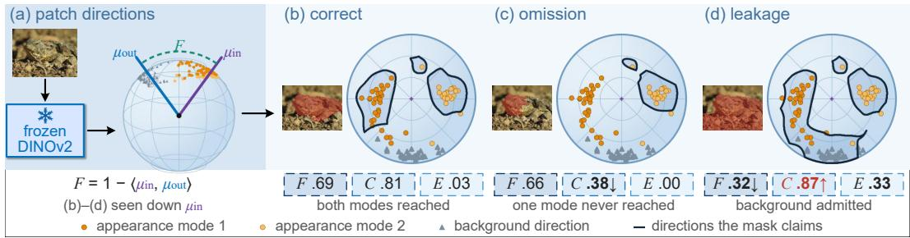  
Figure 1: A mask as a partition of the sphere. Frozen DINOv2 patch directions under a correct mask, an omission, and leakage. The three measures respond differently to the two errors.

search this geometry for an object. We are handed candidates and ask which one the geometry already agrees with. A binary mask is a bipartition of the image’s patch directions, so a candidate’s quality becomes a property of that partition. A good mask separates two directional populations and reaches every appearance mode of the foreground, a fragmented selection pulls the two mean directions together, an omission leaves a mode uncovered, and contact with the frame marks the background side (Fig. 1). Angular contrast measures how sharply a candidate cuts the directions, and a coherent distractor cuts just as sharply, so the target itself comes from the pool’s prompts (§4.1). SPHERETRUST reads the three properties as angular contrast F, spherical coverage C, and frame contact E, standardized within the image and summed with equal weights. Contrast is invariant under complementation, so coverage and frame contact tell the two sides apart, with a foreground prototype read off the patches most candidates share and a background prototype off the border ring. A multimodal anchor enters only where two of the three pools are built (§4.2).

This reading passes three tests (§4.1). On six of the eight pools, SPHERETRUST exceeds the strongest evaluated external comparator by 1.7 to 9.3 percentage points in selected Dice; on the two prompted camouflage pools, it is within 0.1 percentage points of the candidate-derived DSS adaptation, with a lower catastrophic-error rate. The comparisons include published selection rules and explicitly labeled adaptations, and SPHERETRUST ranks candidates in 0.55 s per image. For the tested median-margin statistic, normalized feature directions rank mask quality better than raw features or feature norms, and angular contrast from SAM’s own encoder yields less than half the selected Dice. The pool’s prompts provide target information while the score ranks candidate extent and quality.

Selecting a pseudo mask and using it for training are two decisions. Training on a fixed top ranked mask discards the other candidates as supervision. We instead retain a few leading, distinct masks and use their geometric scores as priors for target selection during training, so the student changes its target where a better fit outweighs the score gap (§3.2).

Our scope is the DIS formulation (Qin et al., 2022), a binary foreground/background mask, on camouflaged, salient, and dichotomous segmentation and on camouflage under synthetic low light, at the Vision Transformer (ViT) patch scale (Dosovitskiy et al., 2021). Both regimes are usually studied with pixel labels from the target domain (Song et al., 2024; He et al., 2025b) or with illumination restored first (He et al., 2025a; 2026). We make three contributions.

1. A new reading of pseudo mask quality. A candidate is judged by the partition it induces on the hypersphere of a frozen self-supervised backbone, through three measures answering to three common failures, wrong object, omission, and leakage, combined within each image.

2. A label-free selector built on that reading. Three standardized measures summed with equal weights rank a pool’s candidates from frozen features in 0.55 s per image. For the tested median-margin statistic, normalized feature directions rank mask quality better than raw features or feature norms (§4.1, Appendix §B.2).

3. A training stage fed by the same sphere. The leading candidates enter training as a candidate set with their scores as priors, prototypes on the same sphere reorder them, and a cross-fitted second round completes the labels. The stage raises the student of each of three ranking rules by 2.6 to 10.7 points of weighted F on camouflaged, salient, and dichotomous data, showing that the training stage improves on fixed-label training across all three tested ranking rules (§4.2, Appendix §F.3).

(A) SPHERETRUST ranking  
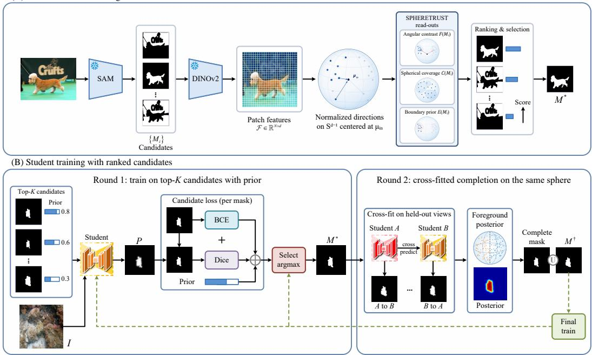  
Figure 2: SPHERETRUST overview. (A) Frozen DINOv2 directions rank candidates by angular contrast, spherical coverage, and frame contact, where F is the patch feature matrix, distinct from F of Eq. (1). (B) A foreground posterior on the same sphere joins the ranking, the student chooses among the leading candidates as it learns, and a second round adds a completed mask from a cross fitted prediction (§3.2). The select argmax box in (B) is Eq. (5), arg maxk $\bar { [ \pi _ { i k } - \ell _ { i k } / T ] }$

## 2 RELATED WORK

Pseudo mask selection and quality estimation. Self training converts model predictions into targets (Lee, 2013) and keeps the confident ones (Sohn et al., 2020) or those consistent across views (Tarvainen & Valpola, 2017; Berthelot et al., 2019), although Guo et al. (2017) show that confidence can be miscalibrated. SAM exposes predicted IoU (Kirillov et al., 2023), SAMRefiner rank candidates by it (Lin et al., 2025), SAQ scores the contour alone (Lin et al., 2024), and learned quality models require labels or a reference set (Huang et al., 2019; Robinson et al., 2018; Valindria et al., 2017). Two closely related procedures are the feature-map and boundary score of DSS (Yang et al., 2026) and the mask-grading stage of UCOD-MKD (Chen et al., 2026). DSS scores a mask against a similarity map built from a separately discovered region, and UCOD-MKD select by generator confidence and assigns a quality tier using agreement among candidates and, where applicable, structural checks on the selected mask. SPHERETRUST instead scores the bipartition of patch directions that the candidate itself induces. We compare explicitly labeled adaptations of both on identical candidate pools (§4.1, Appendix §C.3).

Unsupervised object and camouflage segmentation. Surveyed for camouflage by Xiao et al. (2024), this literature spans object discovery, pseudo mask refinement, knowledge transfer, proposal agreement, and priors from foundation models (Wang et al., 2023; 2024; Yuan et al., 2024; Shin et al., 2022; Zhou et al., 2023; Yan et al., 2025), and UCOD-MKD (Chen et al., 2026) distills from an MLLM and a SAM teacher. Camouflage frameworks that build their own masks, by retrieval (Du et al., 2025b), attention shifting (Shou et al., 2025), or spectral refinement (Liu et al., 2026), are generators rather than selectors, so their published numbers stand beside our students in Tab. 3 rather than in Tab. 1.

Candidate set supervision. Partial label learning trains on examples carrying a set of candidate labels and resolves the set during training by the model’s own fit (Lv et al., 2020; Wang et al., 2022a), and dynamic pseudo label schedules do the same for segmentation (Yan et al., 2025). Eq. (5) is the spatial dense form, with the generator’s candidates as the label set and the score of §3.1 as the prior.

## 3 METHOD

Setup and notation. A frozen generator returns $K _ { i }$ binary candidates $\mathcal { M } _ { i } = \{ M _ { i j } \} _ { i = 1 } ^ { K _ { i } }$ for image i, each held at image resolution for the segmentation loss and on the binary feature grid for every sum over patches. A frozen DINOv2 ViT-B/14 maps each $3 5 0 \times 3 5 0$ image to a $G \times G$ grid of patch features $f _ { p } \in \mathbb { R } ^ { 7 6 8 } \left( G = 2 5 \right)$ , normalized to $\hat { f } _ { p } = f _ { p } / \lVert f _ { p } \rVert _ { 2 } \in \mathbb { S } ^ { 7 6 7 }$ . For any patch set $S ,$ $\textstyle \mu ( S ) = \sum _ { p \in S } { \hat { f } } _ { p } / ( \| \sum _ { p \in S } { \hat { f } } _ { p } \| _ { 2 } + \varepsilon _ { \mu } )$ , and $\langle \cdot , \cdot \rangle$ is the inner product. The anchor region Ω is the bounding box of the candidate union in an unprompted pool, or the union of the expanded prompt boxes in a prompted pool, and $M _ { \Omega } = M \cap \Omega$

## 3.1 RANKING BY THE INDUCED PARTITION

Angular contrast. Writing $\bar { M }$ for the grid minus M, we define angular contrast as how far apart the partition drives the two mean directions,

$$
F ( M ) = 1 - \left. \mu ( M ) , \mu ( \bar { M } ) \right. \in [ 0 , 2 ] .\tag{1}
$$

F is small when M splits one directional population and large when it separates two.

The spherical dictionary. Coverage needs an estimate of which directions in Ω resemble foreground, built once per image from the frozen features and candidates. A foreground prototype $\phi _ { \mathrm { f g } } ~ = ~ \mu ( \Omega _ { \mathrm { c o r e } } )$ is taken over the core $\Omega _ { \mathrm { c o r e } } \subseteq \Omega$ , the patches covered by at least half of that image’s candidates, and a background prototype $\phi _ { \mathrm { b g } } = \mu ( B )$ over the border ring B, two patches wide, with fallbacks that keep the core populated (Appendix $\ S \mathrm { A . 1 } )$ . Euclidean k-means on the unit directions of the candidate union inside Ω, with the fitted centroids projected back to the sphere, the usual substitute for spherical k-means (Dhillon & Modha, 2001), gives at most $J = 4$ centroids $\mu _ { 1 } , \ldots , \mu _ { J }$ , the image’s appearance modes, of which the foreground modes are those closer to $\phi _ { \mathrm { f g } }$ than to $\phi _ { \mathrm { b g } } , \ : { \mathcal K } _ { f } = \{ j : \langle \mu _ { j } , \phi _ { \mathrm { f g } } \rangle > \langle \mu _ { j } , \phi _ { \mathrm { b g } } \rangle \}$ , falling back to the best aligned mode when the set is empty. A patch $p \in \Omega$ goes to its nearest foreground mode, $a ( p ) = \arg \operatorname* { m a x } _ { j \in \mathcal { K } _ { f } } \langle \hat { f } _ { p } , \mu _ { j } \rangle$ and counts as foreground when that mode explains it better than the background prototype does, $s ( p ) = \mathbf { 1 } [ \mathrm { m a x } _ { j \in { \mathcal { K } } _ { f } } \langle \hat { f } _ { p } , \mu _ { j } \rangle > \langle \hat { f } _ { p } , { \phi } _ { \mathrm { b g } } \rangle ]$

Spherical coverage. Let $\Omega _ { j } = \{ p \in \Omega : s ( p ) = 1 , a ( p ) = j \}$ be the foreground patches that mode j owns and $r _ { j } ( M ) = | M \cap \Omega _ { j } | / ( | \Omega _ { j } | + \varepsilon _ { C } )$ , with $\varepsilon _ { C } = 1 0 ^ { - 8 } ( \Omega _ { j } \subseteq \Omega _ { \ast }$ , so restricting M to Ω changes nothing). Spherical coverage is the average of this recall over all foreground modes,

$$
C ( M ) = \frac { 1 } { | \mathcal { K } _ { f } | } \sum _ { j \in \mathcal { K } _ { f } } r _ { j } ( M ) .\tag{2}
$$

An empty $\Omega _ { j }$ scores zero and stays in the average. C is nondecreasing as patches are added, so it detects omissions but may reward leakage (Fig. 1).

One spatial prior. With ∂I the outermost pixel ring of the mask at the 350×350 working resolution of the backbone, the border term is the fraction of that ring the mask occupies,

$$
E ( M ) = \frac { | \partial I \cap M | } { | \partial I | } \in [ 0 , 1 ] ,\tag{3}
$$

which the rule subtracts. It is the boundary prior of unsupervised saliency (Zhu et al., 2014), and the candidate filter keeps its range to $[ 0 , \frac { 1 } { 2 } )$

Combined selection score. The three terms have different ranges, so we standardize each within one image’s candidate set. For statistic $x ,$ we compute $z _ { i } ( x _ { i j } ) = ( x _ { i j } - { \bar { x } } _ { i } ) / ( \sigma _ { i } ( x ) + \varepsilon _ { z } ) { \mathrm { i f } } \sigma _ { i } ( x ) >$ $\varepsilon _ { z }$ and 0 otherwise $( \varepsilon _ { z } = 1 0 ^ { - 6 } , \sigma _ { i }$ the population standard deviation), and sum the guarded terms with equal weights,

$$
\begin{array} { r } { \mathcal { R } ( M _ { i j } ) = z _ { i } \big ( F ( M _ { i j } ) \big ) + z _ { i } \big ( C ( M _ { i j } ) \big ) - z _ { i } \big ( E ( M _ { i j } ) \big ) , \qquad \hat { \jmath } _ { i } = \arg \operatorname* { m a x } _ { i } \mathcal { R } ( M _ { i j } ) . } \end{array}\tag{4}
$$

We use this untrained combination in every evaluation, and exact ties fall back to generator confidence. Two of the three terms read the mask on the $2 5 \times 2 5$ patch grid, so masks differing inside a patch score alike (§5). Fig. 3 shows the three terms on real candidates.

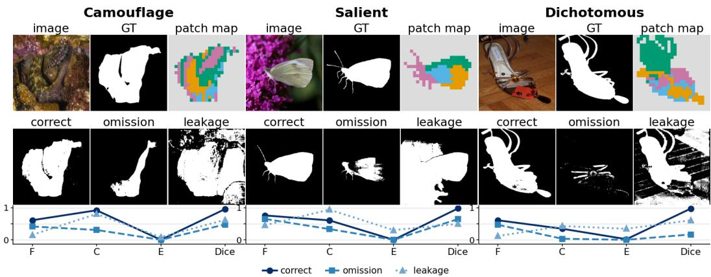  
Figure 3: The three cues on real candidates. For one image per regime, the patch map coloured by the nearest foreground appearance mode and three candidates with their F, C, E, and Dice.

## 3.2 FROM GEOMETRIC RANKING TO CANDIDATE SET TRAINING

Eq. (4) selects one mask per image, and training can revisit that choice as the student improves. We retain the leading, distinct candidates and use their geometric scores as priors for the active supervision, which after a short fixed label phase balances them against the student’s current loss.

Sphere term. Eq. (4) uses one image at a time, while the selected masks of the whole pool fix which directions foreground patches take on the same sphere. Von Mises–Fisher prototypes (Mardia & Jupp, 2000; Banerjee et al., 2005) fitted by spherical k-means on the block 12 directions of one half of the training images, labeled by their selected masks (Appendix $\ S \mathrm { A . 1 } )$ , give through the log likelihood ratio of the two mixtures a foreground posterior $G _ { i } ( \boldsymbol { p } )$ for every patch of the other half, and vice versa. The sphere term $\Gamma ( M )$ is the mean of $G _ { i }$ inside M minus the mean outside, and the training order is $\mathcal { R } ( M _ { i j } ) + z _ { i } ( \Gamma ( M _ { i j } ) )$ .

Candidate set training. For image i let $M _ { i 1 } , \dots , M _ { i K }$ be its candidates in decreasing training order after greedy removal of any candidate whose IoU with a kept one reaches 0.8, with $K = 5 ,$ and let $\pi _ { i k }$ be the training score of each. Here k indexes the retained set and j the pool, as in Eq. (4). With $\hat { y } _ { i }$ the student’s soft prediction and $\ell _ { i k }$ the BCE+Dice loss of $\hat { y } _ { i }$ against $M _ { i k }$ , the image is supervised by the candidate that balances its geometric score against the student’s current fit,

$$
\begin{array} { r } { k _ { i } ^ { \star } = \underset { k } { \arg \operatorname* { m a x } } \big [ \pi _ { i k } - \ell _ { i k } / T \big ] , \qquad \mathcal { L } = \sum _ { i } \ell _ { i k _ { i } ^ { \star } } , } \end{array}\tag{5}
$$

with $T = 0 . 1$ and the choice detached from the gradient. During the first five of 25 epochs $k _ { i } ^ { \star } = 1$ which is training on one fixed label, and afterwards an image moves to a lower ranked candidate only where the student’s fit outweighs the score gap, the dense form of partial label learning (Lv et al., 2020; Wang et al., 2022a).

Second round. Round two obtains a label free signal by crossfitting. The training images are split into the same two halves and a round one student trained on each predicts the other. Each image is predicted by a student trained on images in the other fold. However, the prototype-based ordering of that student’s training candidates uses pseudo-label information from the predicted fold. These are out-of-fold predictions with shared prototype information. Removing the prototype term eliminates this route but does not establish that the route has no effect in the full method (Tab. 2b). Writing $P _ { i }$ for that prediction, candidates are rescored by

$$
S ( M _ { i j } ) = \mathcal { R } ( M _ { i j } ) + z _ { i } \big ( \Gamma ( M _ { i j } ) \big ) + z _ { i } \big ( \mathrm { I o U } ( M _ { i j } , P _ { i } ) \big ) ,\tag{6}
$$

with the soft intersection over union against $P _ { i }$ . The completed mask $U _ { i } = M _ { i } ^ { S } \cup \{ P _ { i } \geq \tau \}$ , the leading candidate $M _ { i } ^ { S }$ under S joined with the confident region of the prediction, is placed first in a new candidate set, followed by the four leading distinct candidates under S. $U _ { i }$ inherits the prior of $M _ { i } ^ { S }$ , which always stays available (Appendix $\ S \mathrm { A . 1 } )$ . The final student is trained on this set by $\operatorname { E q . } \left( { \bar { 5 } } \right)$ and decides per image between the completed mask and the plain candidates (Appendix §D). Its training order and $\tau = 0 . 9$ were chosen on validation splits held out of the training pools (§4), and its fold students, prototypes and candidate sets come from seed 0 and are shared by the three final seeds.

## 4 EXPERIMENTS

Datasets and protocol. We evaluate mask selection on shared candidate pools and the downstream students over 15 sets in four regimes, reporting COD10K (Fan et al., 2020), DUTS-TE (Wang et al., 2017), DIS-VD (Qin et al., 2022), and LL-COD, synthetic degradation of the COD10K test images scored with the camouflage student (Appendix §A.2). P1 is the unprompted pool capped at twelve candidates, and P2 the prompted training pool, with the candidates of every anchor box merged (Appendix §A.1). Selected Dice is the quality of the chosen mask, Top-1 the fraction of images on which the selector picks the highest Dice candidate (Lin et al., 2025), and catastrophic error is $\mathrm { P r } [ D _ { \mathrm { s e l } } < 0 . 2 ]$ , all conditional on the eligibility filter of Appendix §A.2. One evaluator computes $S _ { \alpha } , F _ { \beta } ^ { w } , E _ { \phi }$ , and MAE (Fan et al., 2017; Margolin et al., 2014; Fan et al., 2018) for every downstream method with released predictions, and transcribed rows are compared only under the same metric definition (Appendix §E). All students share the architecture, schedule, and three seeds, and the two open settings of the training stage were chosen on validation splits by one rule for al regimes, with the test sets scored after that choice (Appendix Tab. 10).

Label use. The selector uses no ground-truth annotations. The downstream training configuration was selected using 1,085 annotated validation images. The label-free claim therefore applies to the selector, and downstream model development uses validation supervision (Appendix §A.1).

## 4.1 SELECTION ON A FIXED CANDIDATE POOL

Table 1: Unsupervised selection on prompted pools, the camouflage training pool SAM3 builds alone and the three training pools prompted from the MLLM anchor with SAM (Appendix Tab. 4). Red, blue and grey mark the first, second and third value in each column among the evaluated external comparators, the published selection rules and the labeled adaptations, our row is shaded, and the rows below the rule, the size control and the oracle, stay unmarked.

<table><tr><td rowspan="2">Selector</td><td rowspan="2">SAM3 alone COD</td><td colspan="3">MLLM anchor + SAM</td></tr><tr><td>COD</td><td>SOD</td><td>DIS</td></tr><tr><td>each entry: sel-Dice↑ / Top-1↑ / Dice&lt;.2↓</td><td></td><td></td><td></td><td></td></tr><tr><td>Random</td><td>.657/.096/.193 .821/.124/.062</td><td>.678/.057/.170</td><td>.771/.045/.111</td><td>.576/.047/.204</td></tr><tr><td>SelfMask vote (Shin et al., 2022) SAQ (Lin et al., 2024)</td><td>.576/.109/.275</td><td>.778/.060/.085 .676/.098/.184</td><td>.887/.034/.024 .771/.163/.125</td><td>.701/.060/.086 .606/.117/.187</td></tr><tr><td>Generator confidence (Carion et al., 2025)</td><td></td><td>.728/.057/.135</td><td></td><td>.636/.060/.179</td></tr><tr><td>Generator stability (Carion et al., 2025)</td><td>.802/.145/.082</td><td>.733/.071/.135</td><td>.874/.033/.040</td><td>.620/.080/.196</td></tr><tr><td>TokenCut (Wang et al., 2022b)</td><td>.688/.138/.187</td><td></td><td>.876/.089/.038</td><td></td></tr><tr><td></td><td>.730/.215/.121</td><td>.707/.177/.130</td><td>.912/.284/.025</td><td>.688/.309/.142</td></tr><tr><td>Generator confidence with UCOD-MKD-inspired structural filtering Adapted DSS scoring rule (candidate-derived map)</td><td>.804/.137/.078</td><td>.772/.070/.088</td><td>.889/.035/.018</td><td>.715/.075/.071</td></tr><tr><td></td><td>.825/.252/.066</td><td>.788/.198/.093</td><td>.912/.197/.019</td><td>.720/.171/.095</td></tr><tr><td>Adapted DSS scoring rule (anchor-box map) SPHERETRUST</td><td>.620/.132/.227</td><td>.549/.099/.305</td><td>.839/.181/.080</td><td>.606/.148/.199</td></tr><tr><td></td><td>.824/.251/.049</td><td>.787/.199/.073</td><td>.929/.270/.010</td><td>.771/.262/.050</td></tr><tr><td>size control: z(F) + z(log area) − z(E) oracle</td><td>.822/.280/.053 .893/1.000/.018</td><td>.763/.231/.089 .852/1.000/.040</td><td>.909/.419/.024 .949/1.000/.006</td><td>.755/.289/.062 .839/1.000/.016</td></tr></table>

Table 1 compares every selector on the same candidates of the SAM3 pool and of the three MLLM anchor pools (Appendix §A.2). Two rows adapt closely related methods to identical candidate pools. The DSS adaptation uses Eq. (7) of Yang et al. (2026), substituting a similarity map derived from the candidate’s own foreground and our border term for the original discovery map and border measure (Appendix §C.3). A second adaptation reads the map from the anchor box instead and is weaker on all four pools, so the margins below use the stronger of the two. The UCOD-MKD-inspired adaptation applies structural filtering before selecting by generator confidence. SPHERETRUST has the highest selected Dice on the salient and dichotomous pools, by 1.7 and 5.2 points over adapted DSS, the strongest evaluated external comparator on both. On the two camouflage pools, its selected Dice is within 0.1 percentage points of that adaptation, .7873 against .7881 and .8241 against .8245. Among the evaluated external comparators and SPHERETRUST, it has the lowest catastrophic-error rate on all four prompted pools and the second-highest Top-1 on three of four. Generator confidence trails it by 2.2 points on the SAM3 pool and 5.5 to 13.6 on the SAM pools (all margins use unrounded values). Fig. 4 shows the pick of each rule on two images per pool. On the four unprompted SAM pools of Appendix §C.1, the margin over the strongest evaluated external comparator is 2.5 to 9.3 points (Fig. 5), and Fig. 6 shows where the selected masks move.

Contribution of each term. Table 2(a) tests all seven term combinations, and the full score has the highest selected Dice on all three pools, by .008 and .036 over the best pair on COD and DIS and by .001 on SOD, and equal weights match or exceed fitted linear predictors (Appendix §F.1). Coverage correlates with area, so the size control of Tab. 1 replaces z(C) by z(log area), and coverage selects better on every prompted pool and on the decoder pool (Appendix §B.1).

Table 2: Ranking and training ablations on the MLLM anchor pools. (a) Selected Dice for all seven combinations of the three ranking terms, with random and oracle selection as references. (b) $F _ { \beta } ^ { w }$ of the student, mean over the regime’s test sets and three seeds, with candidate set training (set), the sphere term in the round one order $( \Gamma _ { 1 } )$ , the second round (R2), the completed mask (U), cross fitting (XF), and the sphere term in the second round score $\left( \Gamma _ { 2 } \right)$ on or off. Marks as in Tab. 1, reference rows stay unmarked, and Appendix Tab. 9 adds the seed spreads.  
(a) Ranking
<table><tr><td>F C</td><td></td><td> $E$ </td><td>COD</td><td>SOD</td><td>DIS</td></tr><tr><td colspan="3">random candidate</td><td>.6780</td><td>.7709</td><td>.5762</td></tr><tr><td>oracle candidate</td><td></td><td></td><td>.8517</td><td>.9486</td><td>.8385</td></tr><tr><td>√</td><td>X</td><td>X</td><td>.7663</td><td>.8789</td><td>.6351</td></tr><tr><td>X</td><td>√</td><td>X</td><td>.6587</td><td>.8894</td><td>.6761</td></tr><tr><td>X</td><td>X</td><td>√</td><td>.7490</td><td>.8269</td><td>.6108</td></tr><tr><td>√</td><td>√</td><td>X</td><td>.7546</td><td>.9280</td><td>.7356</td></tr><tr><td>√</td><td>X</td><td>√</td><td>.7789</td><td>.8918</td><td>.6741</td></tr><tr><td>X</td><td>√</td><td>√</td><td>.7112</td><td>.9049</td><td>.7339</td></tr><tr><td></td><td>√</td><td>√</td><td>.7873</td><td>.9288</td><td>.7714</td></tr></table>

(b) Training
<table><tr><td>set</td><td> $\Gamma _ { 1 }$ </td><td>R2</td><td>U</td><td>XF</td><td> $\Gamma _ { 2 }$ </td><td>COD</td><td>SOD</td><td>DIS</td></tr><tr><td colspan="9">oracle candidate, fixed</td></tr><tr><td>X</td><td>X</td><td>X</td><td>×</td><td>X</td><td>X</td><td>.7513</td><td>.8148</td><td>.6048</td></tr><tr><td>X</td><td>√</td><td>×</td><td>X</td><td>X</td><td>X</td><td>.7825</td><td>.8211</td><td>.6261</td></tr><tr><td>√</td><td>√</td><td>X</td><td>X</td><td>X</td><td>X</td><td>.7930</td><td>.8232</td><td>.6384</td></tr><tr><td>√</td><td>√</td><td>√</td><td>X</td><td>√</td><td>√</td><td>.7941</td><td>.8209</td><td>.6434</td></tr><tr><td>√</td><td>√</td><td>V</td><td>√</td><td>X</td><td>√</td><td>.7953</td><td>.8280</td><td>.6475</td></tr><tr><td>X</td><td>S</td><td>√</td><td>√</td><td>√</td><td>√</td><td>.7866</td><td>.8330</td><td>.6570</td></tr><tr><td>√</td><td>X</td><td>√</td><td>√</td><td>√</td><td>√</td><td>.7932</td><td>.8368</td><td>.6579</td></tr><tr><td>J</td><td>x</td><td>J</td><td></td><td>S</td><td>X</td><td>.7896</td><td>.8377</td><td>.6573</td></tr><tr><td></td><td></td><td></td><td></td><td></td><td></td><td>.7961</td><td>.8376</td><td>.6594</td></tr></table>

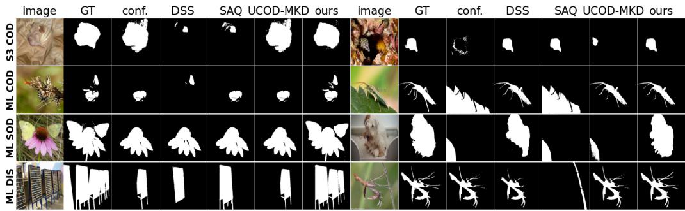  
Figure 4: Selected masks on the prompted pools. For two images of each pool, the SAM3 pool (S3) and the three MLLM anchor pools (ML), the ground truth and the candidate chosen by generator confidence (conf.), the candidate-derived adaptation of DSS (DSS), SAQ, UCOD-MKD-inspired filtering, and SPHERETRUST (ours) from one candidate list.

Direction, backbone, and which object is the target. For the tested median-margin statistic (Appendix §B.2), normalized directions give AUROC .934, against .899 for raw features and .752 for the norm alone, so normalization helps that statistic while magnitude still carries some signal. Angular contrast gives AUROC .946 whether patches are normalized before averaging or raw features are averaged; this equality is empirical and does not imply mathematical invariance of the raw-feature version. From SAM’s own encoder F gives .256 selected Dice against .574 from DINOv2 ViT-B, and from the earlier blocks of that backbone far less (Fig. 6, left). A decoy occurs in 91% of unprompted COD training images, and the rule ranks candidates overlapping the target above decoys at AUC 0.981 (Appendix §C.1).

## 4.2 TRAINING THE STUDENT

Section 4.1 tested the sphere as a selector. This section evaluates a second use of the same frozen features in training, with ablations of the training components and a matched comparison across selection rules. Selection and training use the frozen features and the candidate masks alone (Fig. 2).

Candidate set training against a fixed top ranked label. Table 2(b) separates how candidates are ranked from how they are used for supervision. Under the same round-one ordering $\mathcal { R } + z ( \Gamma )$ candidate-set training improves weighted F by 1.1, 0.2, and 1.2 points on COD, SOD, and DIS relative to a fixed label selected by that ordering. The complete procedure improves it by 4.5, 2.3, and 5.5 points relative to the original fixed label selected by R, with gains of at least 4.3, 1.7, and

Table 3: Downstream comparison on one benchmark per condition, marks as in Tab. 1. Rows marked † are transcribed, each camouflage method in its strongest published configuration (Appendix §E), other rows use our evaluator on released predictions or weights, and the Selfment rows are its published result and its released checkpoint under our evaluation. Selection only trains the same student on the fixed mask R selects. The rank marks cover the published methods and our full method, leaving out that row and the last block, which prompts foundation models at test time.
<table><tr><td colspan="3"> $S _ { \alpha } \uparrow F _ { \beta } ^ { w } \uparrow E _ { \phi } \uparrow \mathrm { M A E \downarrow }$  Method</td><td colspan="2">Method</td></tr><tr><td colspan="3">Camouflage  $C O D I O K , n = 2 0 2 6$ </td><td colspan="3">Sα↑ FB ↑ Salient DUTS-TE, n = 5019</td></tr><tr><td>EReCu (Jiang et al., 2026)†</td><td>.7221.5628.8185</td><td>.0613</td><td>3SD (Yasarla et al., 2024)</td><td>.8121.6370.7859</td><td>.0869</td></tr><tr><td>FOUND (Siméoni et al., 2023)†</td><td>.6783.5056.6475</td><td>.0841</td><td>CutLÈR (Wang et al., 2023)</td><td>.6503 .5149.6578</td><td>.2180</td></tr><tr><td></td><td></td><td>.1023</td><td></td><td></td><td></td></tr><tr><td>TokenCut (Wang et al., 2022b)†</td><td>.6638.4770.7539</td><td></td><td>FOUND (Simoni et al., 2023)</td><td>.8029.7479.8709</td><td>.0579</td></tr><tr><td>UCOD-DPL (DINOv2) (Yan et al., 2025)†</td><td>.8340.7630.9160</td><td>.0310</td><td>UMNet (Wang et al., 2022c)</td><td>.8027.7039.8448</td><td>.0667</td></tr><tr><td>UCOD-MKD (PVTv2) (Chen et al., 2026)</td><td>.8350.7400.9080</td><td>.0310</td><td>Selfment, our evaluation (You et al., 2026) .7977 .5659 .7737</td><td></td><td>.1139</td></tr><tr><td>RISE (SAM masks) (Du et al., 2025b)</td><td>.7900.6430.8540</td><td>.0440</td><td>A2S-v3 (Yuan et al., 2024)</td><td>.8477.7930.9040</td><td>.0473</td></tr><tr><td>DualUCOD (DINOv2) (Liu et al., 2026)†</td><td>.7610.6350.8560</td><td>.0420</td><td>CSNet-crf (Guan et al., 2025)</td><td>.7964.7275.8457</td><td>.0562</td></tr><tr><td>Selfment, published (You et al., 2026)†</td><td>.8730.7540 .9000</td><td>.0330</td><td>CSNet (full) (Guan et al., 2025)</td><td>.8532.8187.9110</td><td>.0431</td></tr><tr><td>Selfment, our evaluation (You et al., 2026)</td><td>.8253.5507.8439</td><td>.0577</td><td>TSD (Zhou et al., 2023)</td><td>.8424.7835.9019</td><td>.0468</td></tr><tr><td>A2S-v3 (Yuan et al., 2024)</td><td>.6704.4762.7415</td><td>.0960</td><td>selection only, fixed label</td><td>.8629.7993.8929</td><td>.0470</td></tr><tr><td>CSNet-crf (Guan et al., 2025)</td><td>.6238.3879.6259</td><td>.0740</td><td>SPHERETŘÚST, MLLM anchor</td><td>.8752 .8232 .9071</td><td>.0450</td></tr><tr><td>selection only, fixed label</td><td>.8253 .7018.8710</td><td>.0442</td><td></td><td></td><td></td></tr><tr><td>SPHERETŘUST, MLLM anchor</td><td>.8428 .7446.9007</td><td>.0357</td><td>Dichotomous  $D I S – V D , n = 4 7 0$ </td><td></td><td></td></tr><tr><td>SPHERETRUST, SAM3 pool</td><td>.8613 .7733 .9279</td><td>.0239</td><td>Selfment, our evaluation (You et al., 2026) .7410 .4673 .6920 A2S-v3 (Yuan et al., 2024)</td><td>.6247.4844.7235</td><td>.1469 .1545</td></tr><tr><td colspan="3">Low light  $L L { \cdot } C O D , n = 2 0 2 6$ </td><td>CSNet-crf (Guan et al., 2025)</td><td>.5940.4300.7015</td><td>.1376</td></tr><tr><td>Selfment, our evaluation (You et al., 2026)</td><td>.8183.5452.8261</td><td>.0576</td><td>selection only, fixed label</td><td>.7333.6016.7849</td><td>.1095</td></tr><tr><td>A2S-v3 (Yuan et al., 2024)</td><td>.6243.4031.7070</td><td>.0991</td><td>SPHERETRUST, MLLM anchor</td><td>.7599 .6516 .8233</td><td>.0968</td></tr><tr><td>CSNet-crf (Guan et al., 2025)</td><td>.5626 .2536.5054</td><td>.0795</td><td></td><td></td><td></td></tr><tr><td>selection only, fixed label</td><td>.7811.6315.8333</td><td>.0594</td><td> $C O D I O K , p r o m p t i n g S A M , S A M 2 , o r M L L M a t t e s t t i m e$ </td><td></td><td></td></tr><tr><td>SPHERETŘUST, MLLM anchor</td><td>.8001 .6791 .8625</td><td>.0513</td><td>EASE + SAM (Du et al., 2025a)†</td><td>.8560.8010.9140</td><td>.0280</td></tr><tr><td></td><td>.8274 .7191 .9030</td><td>.0304</td><td>EASE + HQ-SAM (Du et al., 2025a)†</td><td>.8660.8110.9180</td><td>.0230</td></tr><tr><td>SPHERETRUST, SAM3 pool</td><td></td><td></td><td>DSS (SAM2, MLLM) (Yang et al., 2026)†</td><td>.8870.8490.9420</td><td>.0220</td></tr></table>

5.3 points on every seed. The prototype term adds 3.1, 0.6, and 2.1 points to fixed label training, but removing it from the complete procedure changes the score by only −0.65, +0.01, and −0.21 points (Appendix Tab. 9), so its incremental effect depends on the surrounding procedure. On SOD the full method exceeds a student trained on the pool’s oracle candidate (.8376 against .8311), a fixed label student rather than an annotation ceiling, and closes 84% and 78% of that gap on COD and DIS. Table 3 places the students among published methods, with a selection only row so the training stage’s margin can be read directly, and Figs. 7 and 8 show the predictions. The MLLM anchor student leads $S _ { \alpha }$ and $F _ { \beta } ^ { w }$ on DUTS-TE and every metric on DIS-VD, and on COD10K the SAM3 pool student is first in $F _ { \beta } ^ { w } , E _ { \phi }$ , and MAE among the methods above the rule of Tab. 3, and second in

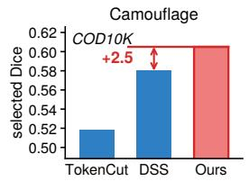

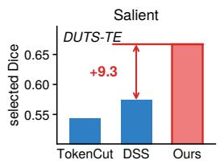

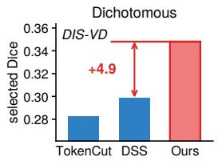

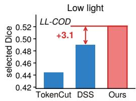  
Figure 5: Selection where it is hardest. Selected Dice on the four unprompted SAM pools of Appendix Tab. 6, where a selector must first find the target among decoys, for the two strongest evaluated external comparators, TokenCut and the candidate-derived adaptation of DSS, and SPHERETRUST, margins in points.

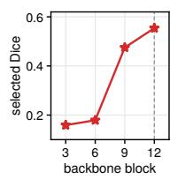

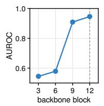

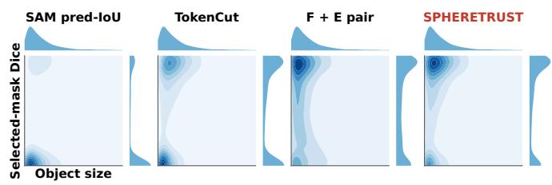  
Figure 6: Depth of the signal, and where the selected masks move. Left, angular contrast alone from each probed block on the unprompted COD10K test pool. Right, target size against selected Dice on the P1 camouflage training subset for four selectors. Mass leaves the lower left, small targets with a wrong or partial mask, and the full score selects .038 higher Dice than the $F + E$ pair (Appendix §B.1).

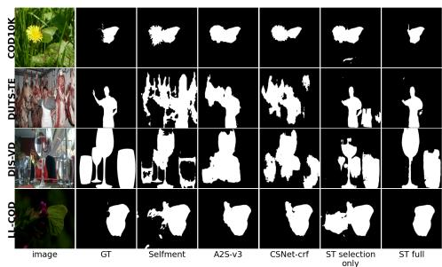  
Figure 7: Downstream predictions on the four conditions of Tab. 3, one row per condition, against three published methods and the selection only student.

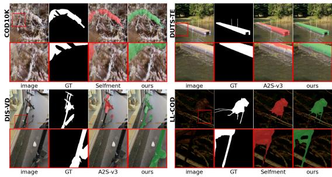  
Figure 8: Where the student differs. One hard case per condition against a strong published method, with the boxed region magnified beneath.

$S _ { \alpha }$ to the published Selfment row (You et al., 2026), whose released checkpoint scores 20.3 points of $F _ { \beta } ^ { w }$ below it (Appendix §E). EASE and DSS are reported in a separate block of Table 3 because their inference pipelines retain promptable segmentation models; DSS also uses an MLLM. Our students use a single student forward pass. These resource differences should be considered when interpreting accuracy and cost, but do not establish the cause of an accuracy difference. The fixedpool selection tables evaluate explicitly labeled scoring adaptations; the complete DSS pipeline is reported separately.

The selection rule under a matched training procedure. Every downstream row above is supervised by SPHERETRUST’s own ranking, so it measures the pipeline rather than the selector. Appendix Tab. 16 therefore trains the three pools under SPHERETRUST, the size control and the candidate-derived adaptation of the DSS scoring rule. Under fixed-label training, the three rules separate by 2.3 to 5.8 points, and which rule performs best depends on the regime. The complete procedure improves all three rules by 2.6 to 10.7 percentage points relative to their own fixed-label baselines and leaves SPHERETRUST first in every regime and every reported seed, with mean advantages of 0.1 to 0.4 points over the size control, which a matched score scale removes on two of the three regimes (Appendix §F.3), and 0.2 to 1.0 over adapted DSS, which it does not. The training procedure therefore improves all three tested scoring rules, with gains varying by rule and regime. Our downstream results demonstrate the performance of the combined selection and training pipeline; the total gain does not isolate the contribution of spherical geometry.

Generators and anchors. SAM3 (Carion et al., 2025) as both anchor and generator gives a second camouflage pool whose student gains on every metric of COD10K, NC4K, and CHAMELEON and 4.0 points of $F _ { \beta } ^ { w }$ under low light, while the anchored pool stays 0.9 points higher on CAMO (Appendix Tabs. 15a and 11).

## 5 DISCUSSION

Summary. A pseudo mask read as a partition of the frozen hypersphere carries a label-free measure of its quality, and the same sphere also supports training. As a selector, SPHERETRUST exceeds the strongest evaluated external comparator on six pools by 1.7 to 9.3 percentage points in selected Dice and is within 0.1 percentage points of the candidate-derived DSS adaptation on the two prompted camouflage pools, with a lower catastrophic-error rate. These comparisons include explicitly labeled adaptations of related methods. The candidate set, prototype term, and cross-fitted second round together add 4.5, 2.3, and 5.5 points of weighted F under our ranking and 2.6 to 10.7 points across the three tested rankings.

Limitations. Selection needs two viable candidates per image, and the cues operate at the ViT patch scale, so the rule is blind to boundary detail inside a patch, which dichotomous benchmarks score. SAM3 replaces the multimodal anchor on camouflage only, where its pools were stronger; on PlantCamo, its student trails the MLLM anchor student by 9.3 points of $F _ { \beta } ^ { w }$ (Appendix §G). On unprompted SAM output a size control, area in place of coverage, selects as well or slightly better (Appendix §B.1). On camouflage, the candidate-derived DSS adaptation trains the better fixedlabel student, whereas the complete procedure yields a small observed advantage of 0.18 percentage points for SPHERETRUST (Appendix §F.3). On COD10K the students trail the strongest published configurations, target identity comes from the pool and was examined on camouflage only, and LL-COD is synthetic.

## REPRODUCIBILITY STATEMENT

Appendix §A.1 lists the model choices, construction of each candidate pool, scoring constants, and student training schedule. Equations 1 to 4 define the candidate score and selection rule, Eq. 5 the candidate set loss, and Eq. 6 the second round score. The complete code will be released publicly on GitHub, covering pool construction, candidate scoring and selection, the validation and fold splits, the prototype fit, and both training rounds, together with the configuration of every reported run, the archived per candidate scores, and the scripts that produce each table and figure of this paper. The three seeds of the final student share the round two candidate sets built from seed 0’s fold students, so their standard deviations describe variation at the final stage, conditional on those sets. The configuration of the training stage was chosen on the 1,085 annotated validation images held out of the three training pools. The reported students were then trained on the complete pools, those images included, and scored once on the test sets.

## AI USE STATEMENT

We used AI assistants (large language models) for writing and language polishing, LaTeX compilation and layout (including the method diagram), and elementary code assistance for routine scripts used in data loading, batch execution, and result tables. AI assistants were also used to cross-check reported numbers and literature comparisons against the cited sources and our experimental records, and feedback obtained this way on the comparison tables, the description of the iterative training and supervision ablation, and the interpretation of the selection results was incor porated after verification by the authors. The authors produced all experiments and reported results, reviewed every retained suggestion against the underlying data and code, and take full responsibility for the paper.

## REFERENCES

Shuai Bai, Keqin Chen, Xuejing Liu, Jialin Wang, Wenbin Ge, Sibo Song, Kai Dang, Peng Wang, Shijie Wang, Jun Tang, Humen Zhong, Yuanzhi Zhu, Mingkun Yang, Zhaohai Li, Jianqiang Wan, Pengfei Wang, Wei Ding, Zheren Fu, Yiheng Xu, Jiabo Ye, Xi Zhang, Tianbao Xie, Zesen Cheng, Hang Zhang, Zhibo Yang, Haiyang Xu, and Junyang Lin. Qwen2.5-VL technical report. arXiv preprint arXiv:2502.13923, 2025.

Arindam Banerjee, Inderjit S Dhillon, Joydeep Ghosh, and Suvrit Sra. Clustering on the unit hypersphere using von Mises–Fisher distributions. Journal of Machine Learning Research (JMLR), 6: 1345–1382, 2005.

David Berthelot, Nicholas Carlini, Ian Goodfellow, Nicolas Papernot, Avital Oliver, and Colin A Raffel. MixMatch: A holistic approach to semi-supervised learning. In Advances in Neural Information Processing Systems (NeurIPS), pp. 5049–5059, 2019.

Nicolas Carion, Laura Gustafson, Yuan-Ting Hu, Shoubhik Debnath, Ronghang Hu, Dídac Surís, Chaitanya Ryali, Kalyan Vasudev Alwala, Haitham Khedr, Andrew Huang, Jie Lei, Tengyu Ma, Baishan Guo, Arpit Kalla, Markus Marks, Joseph Greer, Meng Wang, Peize Sun, Roman Rädle, Triantafyllos Afouras, Effrosyni Mavroudi, Katherine Xu, Tsung-Han Wu, Yu Zhou, Liliane Momeni, Rishi Hazra, Shuangrui Ding, Sagar Vaze, Francois Porcher, Feng Li, Siyuan Li, Aishwarya Kamath, et al. SAM 3: Segment anything with concepts. arXiv preprint arXiv:2511.16719, 2025.

Mathilde Caron, Hugo Touvron, Ishan Misra, Hervé Jégou, Julien Mairal, Piotr Bojanowski, and Armand Joulin. Emerging properties in self-supervised vision transformers. In IEEE/CVF International Conference on Computer Vision (ICCV), pp. 9650–9660, 2021.

Huafeng Chen, Chenguang Zhu, Yueming Lyu, and Caifeng Shan. Beyond weak supervision: MLLMs-guided graded knowledge distillation for unsupervised camouflaged object detection. In

Proceedings of the IEEE/CVF Conference on Computer Vision and Pattern Recognition (CVPR), pp. 27547–27557, 2026.

Inderjit S Dhillon and Dharmendra S Modha. Concept decompositions for large sparse text data using clustering. Machine Learning, 42(1–2):143–175, 2001.

Lee R. Dice. Measures of the amount of ecologic association between species. Ecology, 26(3): 297–302, 1945.

Alexey Dosovitskiy, Lucas Beyer, Alexander Kolesnikov, Dirk Weissenborn, Xiaohua Zhai, Thomas Unterthiner, Mostafa Dehghani, Matthias Minderer, Georg Heigold, Sylvain Gelly, Jakob Uszkoreit, and Neil Houlsby. An image is worth 16x16 words: Transformers for image recognition at scale. In International Conference on Learning Representations (ICLR), 2021.

Ji Du, Fangwei Hao, Mingyang Yu, Desheng Kong, Jiesheng Wu, Bin Wang, Jing Xu, and Ping Li. Shift the lens: Environment-aware unsupervised camouflaged object detection. In Proceedings of the IEEE/CVF Conference on Computer Vision and Pattern Recognition (CVPR), pp. 19271– 19282, 2025a.

Ji Du, Xin Wang, Fangwei Hao, Mingyang Yu, Chunyuan Chen, Jiesheng Wu, Bin Wang, Jing Xu, and Ping Li. Beyond single images: Retrieval self-augmented unsupervised camouflaged object detection. In Proceedings ofthe IEEE/CVF International Conference on Computer Vision (ICCV), pp. 22131–22142, 2025b.

Deng-Ping Fan, Ming-Ming Cheng, Yun Liu, Tao Li, and Ali Borji. Structure-measure: A new way to evaluate foreground maps. In Proceedings of the IEEE International Conference on Computer Vision (ICCV), pp. 4548–4557, 2017.

Deng-Ping Fan, Cheng Gong, Yang Cao, Bo Ren, Ming-Ming Cheng, and Ali Borji. Enhanced alignment measure for binary foreground map evaluation. In Proceedings of the Twenty-Seventh International Joint Conference on Artificial Intelligence (IJCAI), pp. 698–704, 2018.

Deng-Ping Fan, Ge-Peng Ji, Guolei Sun, Ming-Ming Cheng, Jianbing Shen, and Ling Shao. Camouflaged object detection. In IEEE/CVF Conference on Computer Vision and Pattern Recognition (CVPR), pp. 2777–2787, 2020.

Huankang Guan, Jiaying Lin, and Rynson W. H. Lau. A contrastive-learning framework for unsupervised salient object detection. IEEE Transactions on Image Processing, 34:2487–2498, 2025.

Chuan Guo, Geoff Pleiss, Yu Sun, and Kilian Q Weinberger. On calibration of modern neural networks. In International Conference on Machine Learning (ICML), volume 70 of Proceedings ofMachine Learning Research, pp. 1321–1330, 2017.

Chunming He, Chengyu Fang, Yulun Zhang, Longxiang Tang, Jinfa Huang, Kai Li, Zhenhua Guo, Xiu Li, and Sina Farsiu. Reti-Diff: Illumination degradation image restoration with retinex-based latent diffusion model. In International Conference on Learning Representations (ICLR), 2025a.

Chunming He, Rihan Zhang, Fengyang Xiao, Chengyu Fang, Longxiang Tang, Yulun Zhang, Linghe Kong, Deng-Ping Fan, Kai Li, and Sina Farsiu. RUN: Reversible unfolding network for concealed object segmentation. In International Conference on Machine Learning (ICML), volume 267 of Proceedings of Machine Learning Research, pp. 22853–22864, 2025b.

Chunming He, Rihan Zhang, Fengyang Xiao, Chengyu Fang, Longxiang Tang, Yulun Zhang, and Sina Farsiu. UnfoldIR: Rethinking deep unfolding network in illumination degradation image restoration. In Proceedings of the IEEE/CVF Conference on Computer Vision and Pattern Recognition (CVPR) Findings, pp. 5003–5013, 2026.

Zhaojin Huang, Lichao Huang, Yongchao Gong, Chang Huang, and Xinggang Wang. Mask scoring R-CNN. In IEEE/CVF Conference on Computer Vision and Pattern Recognition (CVPR), pp. 6409–6418, 2019.

Huaizu Jiang, Jingdong Wang, Zejian Yuan, Yang Wu, Nanning Zheng, and Shipeng Li. Salient object detection: A discriminative regional feature integration approach. In IEEE Conference on Computer Vision and Pattern Recognition (CVPR), 2013.

Shuo Jiang, Gaojia Zhang, Min Tan, Yufei Yin, and Gang Pan. EReCu: Pseudo-label evolution fusion and refinement with multi-cue learning for unsupervised camouflage detection. In Proceedings of the IEEE/CVF Conference on Computer Vision and Pattern Recognition (CVPR), pp. 25547–25556, 2026.

Alexander Kirillov, Eric Mintun, Nikhila Ravi, Hanzi Mao, Chloe Rolland, Laura Gustafson, Tete Xiao, Spencer Whitehead, Alexander C Berg, Wan-Yen Lo, Piotr Dollár, and Ross Girshick. Segment anything. In IEEE/CVF International Conference on Computer Vision (ICCV), pp. 4015– 4026, 2023.

Trung-Nghia Le, Tam V Nguyen, Zhongliang Nie, Minh-Triet Tran, and Akihiro Sugimoto. Anabranch network for camouflaged object segmentation. Computer Vision and Image Understanding (CVIU), 184:45–56, 2019.

Dong-Hyun Lee. Pseudo-label: The simple and efficient semi-supervised learning method for deep neural networks. In ICML Workshop on Challenges in Representation Learning, 2013.

Guanbin Li and Yizhou Yu. Visual saliency based on multiscale deep features. In Proceedings ofthe IEEE Conference on Computer Vision and Pattern Recognition (CVPR), pp. 5455–5463, 2015.

Yin Li, Xiaodi Hou, Christof Koch, James M. Rehg, and Alan L. Yuille. The secrets of salient object segmentation. In Proceedings of the IEEE Conference on Computer Vision and Pattern Recognition (CVPR), pp. 280–287, 2014.

Xiangru Lin, Ziyi Wu, Guanqi Chen, Guanbin Li, and Yizhou Yu. A causal debiasing framework for unsupervised salient object detection. In Proceedings of the AAAI Conference on Artificial Intelligence (AAAI), volume 36, pp. 1610–1619, 2022.

Yuqi Lin, Hengjia Li, Wenqi Shao, Zheng Yang, Jun Zhao, Xiaofei He, Ping Luo, and Kaipeng Zhang. SAMRefiner: Taming segment anything model for universal mask refinement. In International Conference on Learning Representations (ICLR), 2025.

Zheng Lin, Zheng-Peng Duan, Xuying Zhang, and Luojun Lin. No-reference segmentation annotation quality assessment. In Proceedings of the IEEE International Conference on Multimedia and Expo (ICME), pp. 1–6, 2024.

Pingzhu Liu, Chunming He, Zunnan Xu, Chao Hao, Bo Zhao, Xingyu Shao, Jun Zhou, Zitong Yu, and Xiu Li. Unsupervised camouflaged object detection with dual-eigenvector spectral pseudolabeling and contrastive refinement. In Proceedings of the 43rd International Conference on Machine Learning (ICML), 2026.

Tie Liu, Zejian Yuan, Jian Sun, Jingdong Wang, Nanning Zheng, Xiaoou Tang, and Heung-Yeung Shum. Learning to detect a salient object. IEEE Transactions on Pattern Analysis and Machine Intelligence, 33(2):353–367, 2011.

Ilya Loshchilov and Frank Hutter. Decoupled weight decay regularization. In International Conference on Learning Representations (ICLR), 2019.

Jiaqi Lv, Miao Xu, Lei Feng, Gang Niu, Xin Geng, and Masashi Sugiyama. Progressive identification of true labels for partial-label learning. In International Conference on Machine Learning (ICML), 2020.

Yunqiu Lv, Jing Zhang, Yuchao Dai, Aixuan Li, Bowen Liu, Nick Barnes, and Deng-Ping Fan. Simultaneously localize, segment and rank the camouflaged objects. In IEEE/CVF Conference on Computer Vision and Pattern Recognition (CVPR), pp. 11591–11601, 2021.

Kanti V Mardia and Peter E Jupp. Directional Statistics. John Wiley & Sons, 2000.

Ran Margolin, Lihi Zelnik-Manor, and Ayellet Tal. How to evaluate foreground maps? In Proceedings of the IEEE Conference on Computer Vision and Pattern Recognition (CVPR), pp. 248–255, 2014.

Vida Movahedi and James H. Elder. Design and perceptual validation of performance measures for salient object segmentation. In IEEE Conference on Computer Vision and Pattern Recognition Workshops (CVPRW), 2010.

Maxime Oquab, Timothée Darcet, Théo Moutakanni, Huy V. Vo, Marc Szafraniec, Vasil Khalidov, Pierre Fernandez, Daniel Haziza, Francisco Massa, Alaaeldin El-Nouby, Mahmoud Assran, Nicolas Ballas, Wojciech Galuba, Russell Howes, Po-Yao Huang, Shang-Wen Li, Ishan Misra, Michael Rabbat, Vasu Sharma, Gabriel Synnaeve, Hu Xu, Hervé Jégou, Julien Mairal, Patrick Labatut, Armand Joulin, and Piotr Bojanowski. DINOv2: Learning robust visual features without supervision. Transactions on Machine Learning Research (TMLR), 2024.

Xuebin Qin, Hang Dai, Xiaobin Hu, Deng-Ping Fan, Ling Shao, and Luc Van Gool. Highly accurate dichotomous image segmentation. In Computer Vision – ECCV 2022, volume 13678 of Lecture Notes in Computer Science, pp. 38–56. Springer, 2022.

René Ranftl, Alexey Bochkovskiy, and Vladlen Koltun. Vision transformers for dense prediction. In IEEE/CVF International Conference on Computer Vision (ICCV), pp. 12179–12188, 2021.

Robert Robinson, Ozan Oktay, Wenjia Bai, Vanya V. Valindria, Mihir M. Sanghvi, Nay Aung, José M. Paiva, Filip Zemrak, Kenneth Fung, Elena Lukaschuk, Aaron M. Lee, Valentina Carapella, Young Jin Kim, Bernhard Kainz, Stefan K. Piechnik, Stefan Neubauer, Steffen E. Petersen, Chris Page, Daniel Rueckert, and Ben Glocker. Real-time prediction of segmentation quality. In Medical Image Computing and Computer Assisted Intervention – MICCAI 2018, volume 11073 of Lecture Notes in Computer Science, pp. 578–585, 2018.

Gyungin Shin, Samuel Albanie, and Weidi Xie. Unsupervised salient object detection with spectral cluster voting. In Proceedings of the IEEE/CVF Conference on Computer Vision and Pattern Recognition Workshops (CVPRW), pp. 3971–3980, 2022.

Peiyao Shou, Yixiu Liu, Wei Wang, Yaoqi Sun, Zhigao Zheng, Shangdong Zhu, and Chenggang Yan. SdalsNet: Self-distilled attention localization and shift network for unsupervised camouflaged object detection. In Proceedings of the AAAI Conference on Artificial Intelligence, volume 39, pp. 6914–6921, 2025.

Oriane Siméoni, Gilles Puy, Huy V. Vo, Simon Roburin, Spyros Gidaris, Andrei Bursuc, Patrick Pérez, Renaud Marlet, and Jean Ponce. Localizing objects with self-supervised transformers and no labels. In Proceedings ofthe British Machine Vision Conference (BMVC), 2021.

Oriane Siméoni, Chloé Sekkat, Gilles Puy, Antonín Vobecký, Éloi Zablocki, and Patrick Pérez. Unsupervised object localization: Observing the background to discover objects. In Proceedings of the IEEE/CVF Conference on Computer Vision and Pattern Recognition (CVPR), pp. 3176– 3186, 2023.

Przemysław Skurowski, Hassan Abdulameer, Jakub Błaszczyk, Tomasz Depta, Adam Kornacki, and Przemysław Kozieł. Animal camouflage analysis: Chameleon database, 2017. Silesian University of Technology dataset resource.

Kihyuk Sohn, David Berthelot, Nicholas Carlini, Zizhao Zhang, Han Zhang, Colin A Raffel, Ekin Dogus Cubuk, Alex Kurakin, and Chun-Liang Li. FixMatch: Simplifying semi-supervised learning with consistency and confidence. In Advances in Neural Information Processing Systems (NeurIPS), 2020.

Yicheng Song, Shuyong Gao, Haozhe Xing, Yiting Cheng, Yan Wang, and Wenqiang Zhang. Towards end-to-end unsupervised saliency detection with self-supervised top-down context. In Proceedings of the 31st ACM International Conference on Multimedia (ACM MM), pp. 5532–5541, 2023.

Yiran Song, Qianyu Zhou, Xiangtai Li, Deng-Ping Fan, Xuequan Lu, and Lizhuang Ma. BA-SAM: Scalable bias-mode attention mask for segment anything model. In IEEE/CVF Conference on Computer Vision and Pattern Recognition (CVPR), pp. 3162–3173, 2024.

Antti Tarvainen and Harri Valpola. Mean teachers are better role models: Weight-averaged consistency targets improve semi-supervised deep learning results. In Advances in Neural Information Processing Systems (NeurIPS), pp. 1195–1204, 2017.

Vanya V. Valindria, Ioannis Lavdas, Wenjia Bai, Konstantinos Kamnitsas, Eric O. Aboagye, Andrea G. Rockall, Daniel Rueckert, and Ben Glocker. Reverse classification accuracy: Predicting segmentation performance in the absence of ground truth. IEEE Transactions on Medical Imag ing, 36(8):1597–1606, 2017.

Haobo Wang, Ruixuan Xiao, Yixuan Li, Lei Feng, Gang Niu, Gang Chen, and Junbo Zhao. PiCO: Contrastive label disambiguation for partial label learning. In International Conference on Learning Representations (ICLR), 2022a.

Lijun Wang, Huchuan Lu, Yifan Wang, Mengyang Feng, Dong Wang, Baocai Yin, and Xiang Ruan. Learning to detect salient objects with image-level supervision. In Proceedings ofthe IEEE Conference on Computer Vision and Pattern Recognition (CVPR), pp. 136–145, 2017.

Xudong Wang, Rohit Girdhar, Stella X Yu, and Ishan Misra. Cut and learn for unsupervised object detection and instance segmentation. In IEEE/CVF Conference on Computer Vision and Pattern Recognition (CVPR), pp. 3124–3134, 2023.

XuDong Wang, Jingfeng Yang, and Trevor Darrell. Segment anything without supervision. In Advances in Neural Information Processing Systems (NeurIPS), volume 37, pp. 138731–138755, 2024.

Yangtao Wang, Xi Shen, Shell Xu Hu, Yuan Yuan, James L Crowley, and Dominique Vaufreydaz. Self-supervised transformers for unsupervised object discovery using normalized cut. In IEEE/CVF Conference on Computer Vision and Pattern Recognition (CVPR), pp. 14543–14553, 2022b.

Yifan Wang, Wenbo Zhang, Lijun Wang, Ting Liu, and Huchuan Lu. Multi-source uncertainty mining for deep unsupervised saliency detection. In Proceedings of the IEEE/CVF Conference on Computer Vision and Pattern Recognition (CVPR), pp. 11727–11736, 2022c.

Fengyang Xiao, Sujie Hu, Yuqi Shen, Chengyu Fang, Jinfa Huang, Chunming He, Longxiang Tang, Ziyun Yang, and Xiu Li. A survey of camouflaged object detection and beyond. arXiv preprint arXiv:2408.14562, 2024.

Chenxi Xie, Changqun Xia, Mingcan Ma, Zhirui Zhao, Xiaowu Chen, and Jia Li. Pyramid grafting network for one-stage high resolution saliency detection. In IEEE/CVF Conference on Computer Vision and Pattern Recognition (CVPR), 2022.

Qiong Yan, Li Xu, Jianping Shi, and Jiaya Jia. Hierarchical saliency detection. In Proceedings of the IEEE Conference on Computer Vision and Pattern Recognition (CVPR), pp. 1155–1162, 2013.

Weiqi Yan, Lvhai Chen, Huaijia Kou, Shengchuan Zhang, Yan Zhang, and Liujuan Cao. UCOD-DPL: Unsupervised camouflaged object detection via dynamic pseudo-label learning. In Proceedings ofthe IEEE/CVF Conference on Computer Vision and Pattern Recognition (CVPR), pp. 30365–30375, 2025.

Chuan Yang, Lihe Zhang, Huchuan Lu, Xiang Ruan, and Ming-Hsuan Yang. Saliency detection via graph-based manifold ranking. In Proceedings of the IEEE Conference on Computer Vision and Pattern Recognition (CVPR), pp. 3166–3173, 2013.

Jinyu Yang, Qingwei Wang, Feng Zheng, Peng Chen, Aleš Leonardis, and Deng-Ping Fan. Plant-Camo: Plant camouflage detection. CAAI Artificial Intelligence Research, 2025.

Yilong Yang, Jianxin Tian, Shengchuan Zhang, and Liujuan Cao. Discover, segment, and select: A progressive mechanism for zero-shot camouflaged object segmentation. In Proceedings of the IEEE/CVF Conference on Computer Vision and Pattern Recognition (CVPR), pp. 34745–34754, 2026.

Rajeev Yasarla, Renliang Weng, Wongun Choi, Vishal M. Patel, and Amir Sadeghian. 3SD: Selfsupervised saliency detection with no labels. In IEEE/CVF Winter Conference on Applications of Computer Vision (WACV), pp. 313–322, 2024.

Zuyao You, Zuxuan Wu, and Yu-Gang Jiang. Learning accurate segmentation purely from selfsupervision. arXiv preprint arXiv:2602.23759, 2026.

Yao Yuan, Wutao Liu, Pan Gao, Qun Dai, and Jie Qin. Unified unsupervised salient object detection via knowledge transfer. In Proceedings of the Thirty-Third International Joint Conference on Artificial Intelligence (IJCAI), pp. 1616–1624, 2024.

Jing Zhang, Jianwen Xie, and Nick Barnes. Learning noise-aware encoder-decoder from noisy labels by alternating back-propagation for saliency detection. In Proceedings of the European Conference on Computer Vision (ECCV), pp. 349–366, 2020.

Huajun Zhou, Bo Qiao, Lingxiao Yang, Jianhuang Lai, and Xiaohua Xie. Texture-guided saliency distilling for unsupervised salient object detection. In Proceedings of the IEEE/CVF Conference on Computer Vision and Pattern Recognition (CVPR), pp. 7257–7267, 2023.

Wangjiang Zhu, Shuang Liang, Yichen Wei, and Jian Sun. Saliency optimization from robust background detection. In Proceedings ofthe IEEE Conference on Computer Vision and Pattern Recognition (CVPR), pp. 2814–2821, 2014.

## APPENDICES

A Protocol 17   
A.1 Implementation Details . 17   
A.2 Candidate Pools, Eligibility, and Datasets 18   
A.3 Prompts and Phrase Ladders 19   
B What the Selection Measures Capture 20   
B.1 What Each Term Contributes 20   
B.2 Analysis of the Scoring Rule 21   
C Detailed Results for Candidate Selection 21   
C.1 Stress Test on Unprompted SAM Output 21   
C.2 Detailed Selector and Student Comparisons 22   
C.3 The Two Closest Selectors on a Fixed Pool 22   
D Candidate Set Training and the Second Round 24   
D.1 Ablation of the Training Method . 24   
D.2 Choice of the Training Configuration 24   
E Downstream Results by Test Set 25   
F Fitted Rules and Other Generators 25   
F.1 Fitted Scoring Rules and Evaluation Across Datasets 25   
F.2 Other Generators and Anchors 25   
F.3 One Training Procedure, Three Selection Rules 27   
G Four Further Benchmarks 29

## A PROTOCOL

## A.1 IMPLEMENTATION DETAILS

Unless stated otherwise, all datasets and experiments use the same scoring and student settings. Dice is computed between the generator’s native resolution mask and the native resolution ground truth, with the ground truth binarized at 0.5 and no resampling of either, and the 350 × 350 grid is used only for features and for the patch level terms. Every selection number in the paper follows this protocol.

1. Backbone. DINOv2 ViT-B/14 (timm), frozen, with $3 5 0 \times 3 5 0$ inputs and a $2 5 \times 2 5$ patch grid. Patch features are read from the last of the four probed blocks $3 / 6 / 9 / 1 2 .$ , that is from block 12 (Appendix §B.2).

2. Generator. SAM ViT-H. P1 uses automatic mask generation with 24 points along each side, predicted IoU threshold 0.86, stability threshold 0.90, and crop layers disabled. P2 turns every anchor box into seven prompt boxes, four expansions moving each side out by 0, 5, 12, and 25% of the box width and height, clipped to the image, and three jitters at amplitudes 6, 10, and 15% displacing the two corners independently, each offset drawn from $\mathcal { U } [ - a , a ]$ times the width or height $\left( \mathrm { d e f a u l t \_ r n g \left( \mathrm { 7 } } + { s h a r d \right) } \right)$ . The decoder is called on each prompt box with multimask\_output=True, returning three masks, so one anchor box yields 21 raw masks, and where an image has two or more anchor boxes the most confident mask of each is joined into a further union candidate. The filters of item 3 and duplicate removal then apply, leaving 25 to 28 candidates an image. The SAM3 pool of §4.2 replaces anchor and generator and prompts its own decoder from every instance box without expansion or jitter.

3. Candidate filters. Relative area in [0.01, 0.70], the fraction of frame pixels covered $( | \partial I \cap$ $M | / | \partial I | < 0 . 5 )$ , and at least three patches on both sides of the mask. The P1 unprompted pool retains the top 12 candidates by predicted IoU, P2 merges and retains all candidates across prompt boxes (Tab. 4), and these checks precede every prototype and score.

4. Anchor region, prototypes, modes. Ω is the bounding box of the union of the image’s candidates on the patch grid, or the union of the expanded prompt boxes when they exist. The foreground prototype is the renormalized mean direction of the core, the patches present in at least half the candidates and inside Ω. Below two such patches the threshold drops to 0.3, and below two again the core is all of Ω, so it stays populated and $\phi _ { \mathrm { f g } }$ is always a unit direction. The background prototype is the border ring’s, two patches wide. Modes are fitted on the patches of Ω at least one candidate covers, with Euclidean k-means (sklearn) at $k = \operatorname* { m i n } ( 4 , \cdot )$ over that support, $\begin{array} { r } { \mathrm { n \_ i n i t } = 3 . } \end{array}$ , random\_ $\mathfrak { t a t e } = 0 ,$ , and the fitted centroids renormalized to the sphere afterwards. On unit directions the Euclidean and the cosine assignments differ only through the centroid norms, so this departs from spherical k-means only during the fit. Modes closer to the foreground prototype than to the background one are kept (the best aligned mode if none is), each staying in the coverage average.

5. Fusion. z scores within each image, summed with equal weights. A term with standard deviation at most $1 0 ^ { - 6 }$ contributes zero, and otherwise its denominator is $\sigma + 1 0 ^ { - 6 }$ . Exact ties preserve the input order, which is decreasing predicted IoU. The formula, the equal weights, the normalization, the border ring, k, and the candidate filters are one setting shared by every pool, dataset, and generator in the paper.

6. Student. A DPT-lite decoder (Ranftl et al., 2021) on the frozen backbone, trained from scratch, with two refinement stages conditioned on the image at half and full output resolution (2.3M parameters). Training uses 25 epochs, batch size 12, AdamW (Loshchilov & Hutter, 2019) at $2 \times 1 0 ^ { - 4 }$ with a cosine schedule and warm up, BCE+Dice, random resized crops, photometric jitter, cross view consistency, and seeds {0, 1, 2}. Every student variant, the selection only reference included, uses this architecture and schedule, and the two supervision modes differ only in the loss, a fixed label or the candidate set rule of Eq. (5).

7. Sphere term. The labeled images of a pool are split into two halves by a fixed permutation. Spherical k-means with 25 iterations on a random subset of 400,000 patch directions per side of one half gives 16 foreground prototypes from patches whose spatial mask overlap $o ( p )$ , the fraction of patch $p \mathrm { ^ { \circ } s }$ 14 × 14 pixels that the selected mask of Eq. (4) covers, exceeds 0.7, and 64 background prototypes from patches with $o ( p )$ below 0.05 (o is a per patch spatial quantity, unrelated to the image level C of Eq. (2)). The two sides share the prior mass equally, each prototype carries its cluster fraction, the concentration is 10, and $G _ { i }$ is the sigmoid of the log likelihood ratio for every image of the other half. $\Gamma$ enters the round one order and Eq. (6) as a z score within the image. For an image in one half, $G _ { i }$ comes from the 80 prototype directions fitted on the other half, and no mask of its own half enters that fit. The fold student of a half trains on the images of that half with candidate sets ordered by $\mathcal { R } + z ( \Gamma )$ . For the image it later predicts, that image’s candidates and its label stay outside its training, but the ordering of its own training candidates was made with prototypes fitted on the fold it predicts, so the two folds are not independent and we do not claim they are (§3.2). Tab. 9 reports the variant that drops Γ from both rounds, in which the halves are linked through $P _ { i }$ only, which bounds the effect of removing this route.

8. Candidate sets. Round one keeps for each training image its candidates in decreasing $\mathcal { R } + z ( \Gamma )$ greedily dropping any candidate whose IoU with a kept one reaches 0.8. The builder stores up to eight per image, and the first $K = 5$ enter training with that score as prior $\pi _ { i k }$ . The loss picks arg ma $\mathrm { x } _ { k } [ \pi _ { i k } - \ell _ { i k } / T ]$ with $T = 0 . 1$ once the first five epochs, which use rank one only, are over, and the choice is detached from the gradient. Round two trains one round one student per half and stores each student’s soft prediction $\bar { P } _ { i }$ on the other half at $3 5 0 \times 3 5 0$ . The round two set holds the completed mask $U _ { i }$ first, with the prior of the leading candidate under $S ,$ , followed by the four leading distinct candidates under $S ,$ and training repeats the rule above, so its warm up epochs train on $U _ { i }$ The fold students, $P _ { i } , G _ { i } ,$ , and the round two sets come from seed 0 and are shared by the three seeds of the final student.

9. Validation splits and configuration. Each training pool holds out a fixed tenth of its images, drawn once with RandomState(2027) over the sorted stems (386, 402, and 297 for COD, SOD, and DIS, 1,085 in all), kept out of every run that took part in choosing the configuration, candidate sets, folds, prototype fit, out-of-fold maps and students alike. They were not held out of the reported students, which were trained on the complete pools once the choice was frozen, which is why Tab. 4’s pool sizes are the full 3,857, 4,025, and 2,969. K, T, the warm up length, the deduplication threshold, and the prototype counts are code constants. Two settings were open, the round one training order and the treatment of the completed mask in round two (Tab. 10). The choice is the highest mean $F _ { \beta } ^ { w }$ over the three validation splits, one configuration for all regimes, with differences under .001 counted as ties and resolved toward the more conservative setting, for the threshold the one that admits fewer completion pixels, round one first and round two on its fold students. The chosen configuration was then trained on the full pools with three seeds, with the validation splits as the only images scored during training, and the test sets were scored once afterwards, which gives every student number of the paper.

10. Anchor boxes. The anchor provides box prompts when the training pool is built and at that point only. The MLLM anchor is Qwen2.5-VL-7B-Instruct (Bai et al., 2025) with greedy decoding and at most three boxes. Two prompts per image ask for the single most prominent foreground object and for every distinct salient object, with wording for each regime (Appendix §A.3), the box sets are merged, and duplicates with IoU above 0.9 are removed. The SAM3 anchor (Carion et al., 2025) grounds each phrase of a short ladder separately (Appendix §A.3) and prompts its own mask decoder from every instance box.

## A.2 CANDIDATE POOLS, ELIGIBILITY, AND DATASETS

P1 is the unprompted SAM construction capped at the top 12 candidates by predicted IoU. P2 merges candidates generated from the anchor box prompts and retains the complete merged set. Two prompted constructions appear. The single prompt one, from the first anchor prompt only (3,743, 4,019, and 2,947 images, about 20 candidates each), serving the diagnostics of Appendix §C.2, and the merged one from both prompts (3,857, 4,025, and 2,969 images, 25 to 28 candidates each), which Tab. 4 reports and every student of Tabs. 9, 3, 15, and 9 trained on. The three source splits are of unequal size, so each is capped before any candidate is generated. The camouflage split (CAMO-train + COD10K-train) holds 4,040 images and DIS-TR 3,000, both taken whole, while DUTS-TR’s 10,553 are cut to the first 4,040 stems in sorted filename order. The cut is a deterministic prefix rather than a random subsample, so it needs no seed and is reproducible from the dataset alone. The eligibility filter then leaves 3,857, 4,025, and 2,969 images. The index lists are released with checksums. Each pool is built once before any selector is applied. The two families differ in baseline candidate quality (Tab. 4). P1 candidates vary more widely in target identity and coverage, which is why P1 serve selection analysis and P2 training, and the two contain different images. On the single prompt construction of P2, with roughly 20 largely overlapping candidates per image against about 10.2 under $\mathrm { P } 1$ , generator confidence and SPHERETRUST both select a higher Dice than on P1, at a lower catastrophic rate and a lower Top-1, and SPHERETRUST leads on both families (Tabs. 1 and 6).

The SAM3 pool. Tab. 1 runs every selector on the pool SAM3 builds alone (§4.2), 3,787 COD training split images (2,833 from COD10K-train, 954 from CAMO-train) with 56,705 candidates, under the eligibility filter below. Generator confidence is SAM3’s own score for the mask and generator stability the IoU of its two thresholded logit maps, and a candidate formed as the union of two boxes ranks last under both.

Pool eligibility. Selection is evaluated on images whose annotation contains both foreground and background and that have at least two candidates passing the common filters, with candidates generated before ground truth is consulted. Eligible counts are COD10K 1979/2026 (97.7%), DUTS-TE 4993/5019 (99.5%), DIS-VD 465/470 (98.9%), and LL-COD 1932/2026 (95.4%), and downstream uses the full test sets. The filters of Appendix §A.1 apply to candidates and identically for every selector, so an image whose target is smaller than the 1% area floor stays eligible whenever the generator returns two admissible candidates elsewhere (Fig. 9).

Table 4: Selection pools and training pools. k is candidates per image, and random and oracle define the available selection gap. Selection uses unprompted generator output, training pools prompt the same generator from the MLLM anchor (the SAM3 pool is in Tabs. 1 and 15), and LL-COD reuses the degraded COD10K test set (Fan et al., 2020) with the camouflage students.
<table><tr><td rowspan="2">regime</td><td colspan="4">selection pool (Tab. 6)</td><td colspan="4">training pool (Tab. 3)</td></tr><tr><td>n</td><td></td><td>k random</td><td>oracle</td><td>n</td><td></td><td>k random</td><td>oracle</td></tr><tr><td>Camouflage</td><td>1979</td><td>10.2</td><td>.1319</td><td>.6770</td><td>3857</td><td>25.6</td><td>.6780</td><td>.8517</td></tr><tr><td>Salient</td><td>4993</td><td>10.7</td><td>.1697</td><td>.7878</td><td>4025</td><td>25.0</td><td>.7709</td><td>.9486</td></tr><tr><td>Dichotomous</td><td>465</td><td>11.3</td><td>.0992</td><td>.4856</td><td>2969</td><td>28.4</td><td>.5762</td><td>.8385</td></tr><tr><td>Low light</td><td>1932</td><td>9.4</td><td>.1307</td><td>.6028</td><td></td><td></td><td>direct camouflage evaluation</td><td></td></tr></table>

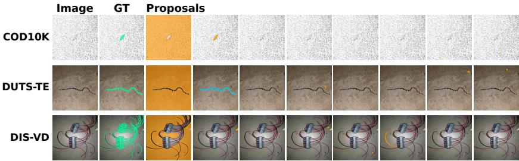  
Figure 9: Images with fewer than two eligible candidates after the plausibility filters, one per regime, with the ground truth and every proposal the generator returned.

Datasets and regimes. The 15 evaluation sets are 14 public benchmarks plus LL-COD, four camouflage sets (Le et al., 2019; Fan et al., 2020; Lv et al., 2021; Skurowski et al., 2017) (CAMO, COD10K, NC4K, CHAMELEON), five salient sets (ECSSD, DUTS-TE, DUT-OMRON, HKU-IS, PASCAL-S) (Yan et al., 2013; Wang et al., 2017; Yang et al., 2013; Li & Yu, 2015; Li et al., 2014), five DIS splits (DIS-VD and DIS-TE1 to DIS-TE4) (Qin et al., 2022), and LL-COD, a synthetic condition on COD10K test images. With seed 13, P1 samples 1157 images from the standard 4040-image COD (CAMO-train + COD10K-train) split, disjoint from testing, and the merged P2 contains 3857, 4025, and 2969 images for COD, SOD, and DIS after filtering, with checksummed lists. The target ambiguity diagnostic of §4.1 uses the unprompted SAM pool of the whole 4,040-image split, of which 3,925 images pass the eligibility filter above, with 10.1 candidates per image. LL-COD applies to every COD10K test image a gamma of 2.5, an exposure factor of 0.45, shot noise of 0.7 signal, read noise with $\sigma = 6 ,$ and Gaussian blur with σ = 0.6 at seed 0, leaves the ground truth unchanged, and every compared method is rerun on the degraded images (Selfment as in Appendix §E, A2S-v3 with its released stage two checkpoint at 320 pixels, CSNet at 352 pixels followed by dense CRF).

## A.3 PROMPTS AND PHRASE LADDERS

Anchor prompt (pool construction). “You are given an image containing a camouflaged object. The object may have similar color, texture, or illumination to the background. Identify the most likely camouflaged foreground object. Return ONLY up to 3 bounding boxes in JSON as a list: [{"bbox\_2d":[x1,y1,x2,y2],"confidence":0.0}]. Coordinates inpixels ofTHIS image. Boxes should tightly cover the full visible object. Do not select ordinary background.” This is the exact first anchor prompt for camouflage. The second prompt, used for every regime, is

“You are given an image. Identify EVERY distinct salient foreground object in it, not only the most prominent one. Objects may be subtle or low-contrast against their surroundings. If there is genuinely only one salient object, return exactly one box. Return ONLY bounding boxes in JSON as a list: [{"bbox\_2d":[x1,y1,x2,y2],"confidence":0.0}]. Coordinates in pixels of THIS image. One box per object, tightly covering that object’s full visible extent. Do not merge several objects into one box, and do not select ordinary background.”

and the first prompt outside camouflage, which the salient and dichotomous pools use, is

“You are given an image containing one main foreground object or region of interest, which may be subtle or low-contrast against its surroundings. Identify the single most prominent foreground object. Return ONLY up to 3 bounding boxes in JSON as a list: [{"bbox\_2d":[x1,y1,x2,y2],"confidence":0.0}]. Coordinates in pixels of THIS image. Boxes should tightly cover the full visible object. Do not select ordinary background.”

Decoding is greedy in every case, and the box expansion and jitter that turn these boxes into prompt boxes are in Appendix §A.1, item 2.

SAM3 phrase ladders. The SAM3 anchor grounds four phrases per regime, one at a time, and keeps every instance box together with the index of its phrase. The ladder is animal, camouflaged animal, insect, object for camouflage, object, person, animal, vehicle for salient objects, and object, animal, vehicle, tool for dichotomous segmentation. The camouflage ladder gives the pool of Tab. 15, and the salient and dichotomous ladders gav weaker students than the MLLM anchor, so those regimes keep it.

## B WHAT THE SELECTION MEASURES CAPTURE

## B.1 WHAT EACH TERM CONTRIBUTES

Term ablations. These use the P1 camouflage training subset (1,157 images, 11,848 candidates) unless stated otherwise, whereas Tab. 2 uses the three prompted training pools, on which the margin of the full score over the $F + E$ pair is +.008, +.037, and +.097, and +.033, +.111, +.121, and +.030 on the four unprompted test pools. On the training subset, removing angular contrast, the boundary prior, and spherical coverage changes selected Dice $ { \mathbf { b } } \mathbf { y } \ - . 1 2 6 , \ - . 0 9 6$ , and −.038, the boundary prior alone selects at .469 against .629 (+.161, CI [+.140, +.182]), and subtracting z(E) from generator confidence, TokenCut, and perturbation consistency yields .433, .579, and .595. The $F + \dot { E }$ pair, which shares features, candidates and normalization with the full score, sits +.038 below the full score here (CI [+.023, +.052]), with margins of +.099–+.158 across four pool constructions of the released ablation data, each a macro average over seven object datasets, positive on all four, and of changing sign on four medical sets outside this paper’s scope.

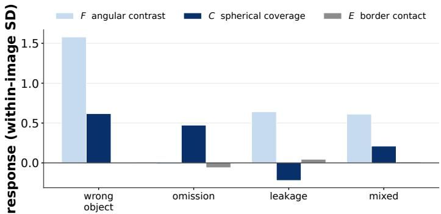  
Figure 10: How the cues respond to errors. Standardized responses of the three cues to controlled corruptions of the ground truth mask, grouped into wrong object, omission, leakage, and mixed errors.

Responses to controlled corruptions. Fig. 10 groups seven controlled corruptions of the ground truth mask (translation by 5 to 40% of the diagonal, substitution of another image’s object, erosion and dilation with kernels of 1 to 13 pixels, cropping to 80 down to $2 0 \% ,$ a background blob of 5 to 40% relative area, and a mix of translation, erosion, and blob) into errors of object identity, omission, leakage, and mixed families, each at seven levels. Each response is the score of the clean mask minus that of the corrupted mask, normalized by the term’s standard deviation within the image. F changes most for object identity and leakage, C responds to omissions and negatively to leakage, so coverage alone can favor oversized masks, and E changes little because these corruptions rarely reach the image boundary.

Area as a surrogate that depends on the pool. Let $a _ { \mathrm { m a s k } } ( M ) = | M | / ( H _ { i } W _ { i } )$ denote the fraction of image pixels covered by mask M. Table 5 compares the full score $z ( F ) \dot { + } z \ddot { ( C ) } - z \dot { ( E ) }$ with the area replacement $\overset { \cdot } { z } ( F ) + z ( \log a _ { \mathrm { m a s k } } ) - z ( E )$ on identical candidates, over the P1 camouflage macro (CAMO, COD10K, NC4K, and $\mathrm { C H A M E L E O N } )$ , the prompted COD, SOD, and DIS training pools, and the DPT-lite pool of Tab. 15, with 20,000 paired bootstrap draws over images within each dataset and equal weight to the datasets of a family. The sign changes with the pool, in favor of area on unprompted SAM output and of coverage on prompted SAM output and on the pool from another generator. The mean also hides that the two fail differently. Area has the higher Top-1 on every prompted pool, by 2.8, 3.3, 14.9, and 2.6 points, and the higher catastrophic rate on all four, .089 against .073 on the camouflage SAM pool and .024 against .010 on the salient one, because rewarding size picks the best candidate more often when proposals are fragmented and leaks badly when they are intact, whereas coverage stops rewarding a mask once it spans the foreground modes. Coverage also assumes a localized anchor, since its foreground prototype is the mean direction of the core, the patches at least half the candidates cover, and its modes are fitted on the candidate union inside Ω, so under a prompted pool, where candidates concentrate on one or a few boxes, the core is a reliable proxy for the target’s interior, while under unprompted output, spread over the whole frame, it is small and often falls on background clutter and the modes then belong to that clutter. Area needs no such anchor, which is why it survives the change of pool that undoes coverage (Tab. 6). Coverage nonetheless stays associated with true Dice after conditioning on the other terms and area, by regressing, within each image, the ranks of $C$ and of true Dice on the ranks of $F ,$ $E ,$ and log $a _ { \mathrm { m a s k } }$ (images with at least eight candidates) and correlating the residuals gives partial Spearman coefficients of $+ . 3 8 2 \ [ + . 3 4 8 , + . 4 1 3 ]$ on the unprompted macro, $+ . 2 4 2 \ [ + . 2 3 4 , + . 2 5 1 ]$ on the prompted macro, and +.112 [+.080, +.145] on the DPT-lite pool, and among candidates of one image whose areas differ by at most five percent, C picks the mask with greater Dice in 0.851, 0.815, and 0.791 of pairs on COD10K, DUTS-TE, and DIS-VD, and area in 0.481, 0.491, and 0.537 of the same pairs.

Table 5: Coverage and area on identical candidates. $\Delta$ is selected mask Dice for $z ( F ) + z ( C ) -$ z(E) minus that f $\mathrm { o r } z ( F ) + z ( \log a _ { \mathrm { m a s k } } ) - z ( E )$ , with a 95% bootstrap interval.
<table><tr><td>pool family</td><td>datasets</td><td>images</td><td>candidates</td><td colspan="2">∆ selected Dice [95% CI]</td></tr><tr><td>unprompted SAM macro</td><td>4</td><td>6,340</td><td>64,962</td><td>-.0150</td><td>[-.0192, -.0107]</td></tr><tr><td>prompted SAM macro</td><td>3</td><td>10,851</td><td>283,759</td><td>+.0206</td><td>[+.0178, +.0235]</td></tr><tr><td>non-SAM pool</td><td>4</td><td>913</td><td>10,338</td><td></td><td>+.0045 [+.0004, +.0089]</td></tr></table>

## B.2 ANALYSIS OF THE SCORING RULE

Directional features. For a single von Mises–Fisher component per class (Mardia & Jupp, 2000; Banerjee et al., 2005) with common concentration, the foreground-to-background log-likelihood ratio is linear in the normalized feature direction. With multiple components, it becomes a difference of log-sum-exp terms and is generally nonlinear. This motivates using feature direction, but does not establish angular contrast as an estimator of mask quality. We compare particular direction-based and magnitude-based statistics empirically in §4.1 and below; these comparisons do not determine whether magnitude adds information beyond direction. Equation 1 normalizes each patch before averaging and therefore discards patch magnitudes. Averaging raw features generally changes the mean directions and the resulting contrast. Both implementations nevertheless achieve the same reported AUROC of .946 on the unprompted COD10K pool in this experiment. We also compare a median-margin statistic in normalized and raw-feature forms. With $\bar { f } _ { \mathrm { i n } }$ and $f _ { \mathrm { o u t } }$ the mean patch feature inside and outside a mask, the margin of patch p is $q _ { p } = \langle f _ { p } , \bar { f } _ { \mathrm { i n } } \rangle - \langle f _ { p } , \bar { f } _ { \mathrm { o u t } } \rangle$ , and the median margin is the median of $q _ { p }$ over inside patches minus its median over outside patches. On unit directions, with $\hat { f } _ { p }$ in place of $f _ { p }$ and both means normalized, it reaches AUROC .934, on the raw features .899, and the feature norm alone, the mean $\| f _ { p } \| _ { 2 }$ inside minus outside, .752. Partialling out area reduces the Spearman coefficient of angular contrast by 0.015, and under photometric perturbations of 59,720 candidate pairs the angular score flips 3.0% of rankings against 5.0% for the variant with magnitude.

Layer and backbone. Across blocks $3 / 6 / 9 / 1 2$ of the frozen backbone on the P1 camouflage training subset (1,157 images, 11,848 candidates), selected Dice from angular contrast rises from .162 to .575 (.171 and .475 at blocks 6 and 9) and AUROC from .525 to .938 (.570 and .900 at the two middle blocks), and the same monotone pattern holds on a COD10K test pool (20,270 candidates over 1,970 images, .159 to .554). The subset’s oracle is .685. Block 12, the final block of the backbone, is the deployed setting. On the P1 pool (11,848 candidates), the AUROC of angular contrast is .937 with DINOv2 ViT-B, .959 with ViT-L, and .747 with SAM’s image encoder, alongside the selected Dice reported in §4.1.

Normalization and candidate count. On the pool of Appendix §F.1, scaling each statistic to [0, 1] within the image in place of z scores changes selected Dice by 0.001, whereas ranks cost 0.030, since ranks discard the spacing between candidate scores within an image. Selection quality increases with the number of candidates $( \bar { 3 } / 5 / 8 / 1 2 \to 0 . 4 9 4 / 0 . 5 7 2 / 0 . 6 2 3 / 0 . 6 5 0 )$

## C DETAILED RESULTS FOR CANDIDATE SELECTION

## C.1 STRESS TEST ON UNPROMPTED SAM OUTPUT

Tab. 6 repeats Tab. 1 on the four unprompted P1 test pools, one per regime, where SAM proposes every segment and the twelve candidates with the highest predicted IoU are kept. The average candidate has Dice .0992 to .1697 with the target, the oracle reaches .4856 to .7878, and 91% of camouflage training images contain a decoy, so a selector must first find the target among unrelated segments and then judge its extent. SPHERETRUST leads the strongest evaluated external comparator, which on all four of these pools is the candidate-derived DSS adaptation, by +9.3 points of selected Dice on DUTS-TE, +4.9 on DIS-VD, +2.5 on COD10K, and +3.1 on LL-COD, with the highest Top-1 and the lowest catastrophic rate on every pool. SelfMask’s consensus recovers .087 to .288 of the gap between random selection and the oracle here, against .644 to .868 for R. The size control selects better than the full score on three of the four pools (+1.2, +1.7, and +1.3 points, −0.3 on DIS-VD), the reverse of the prompted, SAM3, and decoder pools, and Appendix §B.1 examines why area is the stronger single surrogate on unprompted output.

Table 6: Unsupervised selection on unprompted SAM output, one fixed pool per regime. Marks are those of Tab. 1, and the rows below the rule are references and carry none. Appendix §A.2 states eligibility.
<table><tr><td>Selector</td><td>COD COD10K</td><td>SOD DUTS-TE</td><td>DIS DIS-VD</td><td>LL LL-COD</td></tr><tr><td>each entry: sel-Dice↑ / Top-1↑ / Dice&lt;.2↓</td><td></td><td></td><td></td><td></td></tr><tr><td>Random SelfMask vote (Shin et al., 2022)</td><td>.132/.162/.821</td><td>.170/.129/.743</td><td>.099/.120/.824 .133/.110/.757</td><td>.131/.183/.813 .203/.219/.731</td></tr><tr><td></td><td>.218/.221/.723</td><td>.348/.274/.534</td><td></td><td></td></tr><tr><td>SAQ (Lin et al., 2024)</td><td>.102/.133/.855</td><td>.141/.098/.777</td><td>.072/.067/.867</td><td>.082/.131/.876</td></tr><tr><td>SAM predicted IoU (Kirillov et al., 2023)</td><td>.256/.303/.693</td><td>.285/.264/.650</td><td>.096/.131/.843</td><td>.201/.271/.741</td></tr><tr><td>SAM stability (Kirillov et al., 2023)</td><td>.147/.175/.806</td><td>.181/.143/.745</td><td>.078/.071/.862</td><td>.128/.179/.819</td></tr><tr><td>TokenCut (Wang et al., 2022b) Generator confidence with</td><td>.518/.656/.384</td><td>.543/.619/.364</td><td>.283/.445/.563</td><td>.444/.622/.435</td></tr><tr><td>UCOD-MKD-inspired structural filtering</td><td>.372/.399/.558</td><td>.508/.444/.361</td><td>.190/.176/.660</td><td>.317/.367/.595</td></tr><tr><td>Adapted DSS scoring rule (candidate-derived map)</td><td>.580/.677/.317</td><td>.574/.562/.325</td><td>.299/.387/.536</td><td>490/.632/.390</td></tr><tr><td>SPHERETRUST</td><td>.605/.723/.278</td><td>.667/.700/.202</td><td>.348/.493/.456</td><td>.521/.681/.336</td></tr><tr><td>size control:  $z ( F ) + z ( \log \operatorname { a r e a } ) - z ( E )$ </td><td>.618/.742/.268</td><td>.684/.733/.185</td><td>.345/.488/.458</td><td></td></tr><tr><td>oracle</td><td>.677/1.000/.195</td><td>.788/1.000/.066</td><td>.486/1.000/.222</td><td>.533/.711/.324 .603/1.000/.235</td></tr></table>

## C.2 DETAILED SELECTOR AND STUDENT COMPARISONS

Tab. 7 evaluates every selector on the P1 camouflage pool under one protocol, and Tab. 8 trains a student with each spherical term alone and with the full score, the supervision held fixed at one label per image as in the selection only row of Tab. 9, on a 3,744 image construction of the camouflage training pool, so its .772 mDice and the .7513 Fw of Tab. 9 describe different pools and metrics. Selected Dice is likewise pool specific, 0.605 in Tab. 6 on 1979 COD10K test images, 0.629 in Tab. 7 on the 1,157 image training subset, 0.650 in and Appendix §F.1 on the macro pool over four sets. Timing in Tab. 7 starts after candidate generation and the shared DINOv2 forward pass.

Consensus, contour, and perturbation baselines. The consensus rows of Tab. 1 and Tab. 6 use SelfMask’s rule (Shin et al., 2022) in full, dropping the candidates whose bounding box spans the frame (9% to 16% of them) and taking the highest mean pairwise IoU among the rest. It is reported on those eight pools rather than on the fixed pool of Tab. 7. SAQ (Lin et al., 2024) scores the predicted contour alone with the released implementation, once per image on the shared crop. Perturbation consistency is a control of ours rather than a published selector. The frozen DINOv2 is run on four perturbations of the image (horizontal flip, gamma 0.6 and 1.6, Gaussian blur), the normalized cut foreground of each is realigned to the original frame, and their average gives a saliency map $S _ { \mathrm { p c } } \in [ 0 , 1 ]$ that is stable under perturbation. A candidate scores mean $( S _ { \mathrm { p c } }$ $M ) - \operatorname* { m e a n } ( S _ { \mathrm { p c } } \mid \bar { M } )$ , at five backbone passes and five cuts an image, 31 s against 0.55 s for R.

The structural checks alone lift the generator’s own confidence from .276 to .400 selected Dice on this pool, while the agreement statistic they are paired with ranks candidates no better than chance (AUROC .459). On the prompted pools of Tab. 1, where the candidates of an image are near duplicates, the same row reaches .715 to .889.

Fig. 11 shows the images on which R and generator confidence disagree most.

## C.3 THE TWO CLOSEST SELECTORS ON A FIXED POOL

We compare scoring adaptations inspired by two related methods on identical candidate pools. These adaptations are distinguished from the original methods and their complete pipelines.

Adapted DSS scoring rule (candidate-derived map). DSS (Yang et al., 2026) discovers coarse regions by clustering frozen features, reads a similarity map from each region, prompts SAM2 with a box from that map, and scores the resulting mask by Eq. $( 7 ) , s _ { i } = \mathrm { c o r r } ( m _ { i } , \mathrm { s i m } _ { i } ) + \left( \bar { 1 } - \bar { \mathrm { B C } } ( m _ { i } ) \right)$ , with corr the Pearson correlation between the mask and the similarity map of the region that prompted it and BC the fraction of a border strip the mask occupies. Its selection is therefore defined on the candidates its own discovery stage produces, and on a pool built elsewhere the map it reads is absent. The row applies the formula to our candidates with two substitutions, stated here so the row is read for what it is. The similarity map is the cosine between every patch direction and the mean direction of the patches the candidate itself covers, on the frozen DINOv2 ViT-B/14 every other row uses, and BC is the border term E of Eq. (3). The row therefore compares scoring rules on one backbone and one pool, and DSS as a pipeline, with its own discovery, SAM2 and multimodal stages, is compared as a whole in Tab. 3 and Tab. 11.

We additionally evaluate an anchor-box adaptation, deriving the similarity map from the patches of the anchor box that generated the candidate, rasterized on the same $2 5 \times 2 5$ grid and read through the same foreground routine. The generating box is recorded for candidates from images with a single box, which is 47% to 69% of each pool, and assigned otherwise by the box holding the largest share of the mask. The reference map therefore uses the box metadata from pool construction without using the candidate mask being scored, which is what DSS does for its own prompts. Both variants substitute the same border term and both are reported in Tab. 1. The anchor-box map selects .620, .549, .839, and .606 against .825, .788, .912, and .720 for the candidate-derived map, below random selection on both camouflage pools, because the mean direction of a box mixes the object with the background the box also contains, and two other assignment rules, the box whose geometry best matches the mask and the union of the image’s boxes, move the row by at most 2.9 points against the 7 to 24 points that separate it from the candidate-derived map. The margins reported in §4.1 therefore use the stronger of the two adaptations, and are a conservative comparison across two adaptations of the scoring rule rather than the performance of one fixed selector.

<table><tr><td>selector</td><td>AUROC</td><td></td><td>sel. Dice regret↓ AURC↓ Top-1</td><td></td><td></td><td>cost</td></tr><tr><td colspan="7">full pool: 1157 images, 11848 candidates</td></tr><tr><td>SAM predicted IoU</td><td>.623</td><td>.276</td><td>.410</td><td>.723</td><td>.318</td><td>0</td></tr><tr><td> $F + \overleftarrow { E } \mathrm { p a i r } z ( F ) - z ( E )$ </td><td>.936</td><td>.591</td><td>.094</td><td>.280</td><td>.596</td><td>&lt; 1 ms</td></tr><tr><td>TokenCut</td><td>.919</td><td>.544</td><td>.142</td><td>.349</td><td>.682</td><td>5.9s</td></tr><tr><td>perturbation consistency</td><td>.929</td><td>.586</td><td>.099</td><td>.207</td><td>.714</td><td>31 s</td></tr><tr><td>SAQ Generator confidence with</td><td>.470</td><td>.098</td><td>.587</td><td>.955</td><td>.126</td><td>0.31 s</td></tr><tr><td>UCOD-MKD-inspired filtering</td><td>.663</td><td>.400</td><td>.285</td><td>.515</td><td>.424</td><td>0.5s</td></tr><tr><td>Adapted DSS (candidate-derived map)</td><td>.956</td><td>.590</td><td>.096</td><td>.212</td><td>.684</td><td>&lt; 1 ms</td></tr><tr><td>SPHERETRUST</td><td>.955</td><td>.629</td><td>.056</td><td>.232</td><td>.754</td><td>0.55s</td></tr><tr><td>oracle</td><td>一</td><td>.685</td><td>.000</td><td>.092</td><td>1.000</td><td>一</td></tr></table>

Table 7: Every selector on one fixed pool. P1 retains up to twelve masks per image from the COD training split, ordered by generator confidence. AUROC treats Dice $\geq 0 . 5$ as positive, cost is per image on one RTX A5000 with shared features, and the AURC mark is on the lowest value. Single terms give AU-ROC .938 (F) and .856 (C). The candidate-derived adaptation of DSS is included as a separate row. Red marks the best observed value among the reported selection rules for each metric. The consensus baseline is reported on the eight pools of Tabs. 1 and 6 rather than here.

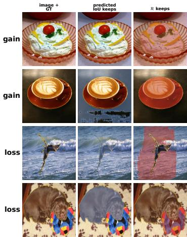

<table><tr><td>selection rule</td><td>student mDice seeds</td><td></td></tr><tr><td>train on the candidate union</td><td>.553±0.001</td><td>3</td></tr><tr><td>SAM predicted IoU</td><td>.748±0.003</td><td>3</td></tr><tr><td>C only</td><td>.684±0.002</td><td>3</td></tr><tr><td>F only</td><td>.753±0.001</td><td>3</td></tr><tr><td>SPHERETRUST, z(F)+z(C)−z(E)</td><td>.772±0.002</td><td>3</td></tr><tr><td>oracle (GT ceiling)</td><td>.802±0.001</td><td>3</td></tr></table>

Table 8: Selection controls and individual terms in downstream training (mean mDice over four COD sets and three seeds, with ± the seed standard deviation). Only the mask selection rule changes between rows.  
Figure 11: Largest disagreements between R and predicted IoU. These are examples, while the decoy statistics of §4.1 are computed over the whole unprompted pool of the COD training split. Columns show ground truth and each selector’s choice. Gains recover the target from a confident but disjoint region. Losses illustrate the complement symmetry $F ( 1 - M ) = { \bf \dot { \bar { F } } } ( M )$ where the partition and the annotated object disagree.

Generator confidence with UCOD-MKD-inspired structural filtering. In the released UCOD-MKD procedure (Chen et al., 2026), the candidate with the highest SAM predicted IoU is selected within each prompt group before grading. Agreement statistics and structural checks then determine a quality tier for distillation. The structural checks grade the selected mask in the intermediate agreement case; they do not filter the candidate pool before selection. Our comparison instead applies a structural filter before selecting the highest-confidence remaining candidate. We retain the ten-pixel edge margin, twenty-pixel strip threshold, at most one truncated edge, and at most 49 connected components. This adaptation rejects 15% to 31% of candidates. On the merged camouflage pool it improves selected Dice from .728 to .772; on the SAM3-only pool the gain is 0.2 points. These results describe the adaptation, not the original selection procedure.

What the comparison shows. On the two camouflage prompted pools the candidate-derived DSS adaptation and SPHERETRUST are within 0.1 percentage points, .7881 against .7873 and .8245 against .8241, with the lower catastrophic-error rate on SPHERETRUST’s side. They disagree on the winner in 64% of the merged camouflage pool’s images, and on the salient, dichotomous and four unprompted pools SPHERETRUST is ahead of the strongest evaluated external comparator by 1.7 to 9.3 points.

## D CANDIDATE SET TRAINING AND THE SECOND ROUND

## D.1 ABLATION OF THE TRAINING METHOD

Tab. 9 reports the training ablation with the seed standard deviations and the paired difference of each variant against the full method per seed, three seeds being too few for an interval. Every row trains the same architecture on the same images with the same schedule, only the supervision changing. Selection only trains on the mask of Eq. (4) as a fixed label, candidate set training is round one of §3.2, and the rows below the full method remove one part at a time. Without the completed mask, the round two set holds the five leading candidates under S. Without cross fitting, $P _ { i }$ comes from a single round one student trained on all images. Without candidate set training, the final student trains on $U _ { i }$ as a fixed label. Without the sphere term in the round one order, round one orders its candidates by R alone, and without it in both rounds S also drops $z ( \Gamma )$ . The two reference rows train on a fixed label chosen by $\mathcal { R } + z ( \Gamma )$ and on the oracle candidate. The full method exceeds selection only and round one alone for every seed on every regime, the completed mask and cross fitting provide the salient and dichotomous gains, candidate set training provides the camouflage gain, and the sphere term contributes on camouflage and dichotomous data and is neutral on salient data, although alone it reselects a better fixed label than R on every regime.

Table 9: Ablation of the training method, $F _ { \beta } ^ { w }$ on the MLLM anchor pools averaged over every test set of the regime, mean ± population standard deviation over three seeds, the full method in red, and the paired difference of each row against the full method in points for seeds $0 / 1 / 2$ . The seed varies the final student only. The fold split, the fold students, the out-of-fold maps $P _ { i } .$ , the prototype fit and the round two candidate sets were produced once with seed 0 and are shared, so these spreads describe the last stage conditional on that cache rather than the end to end variance of the pipeline, which would be larger.
<table><tr><td rowspan="2"></td><td colspan="2">COD</td><td colspan="2">SOD</td><td colspan="2">DIS</td></tr><tr><td> $F _ { \beta } ^ { w }$ </td><td>∆ per seed</td><td> $F _ { \beta } ^ { w }$ </td><td>∆ per seed</td><td> $F _ { \beta } ^ { w }$ </td><td>∆ per seed</td></tr><tr><td>selection only (fixed rank one label) .7513±.0004 -4.3/-4.6/−4.6 .8148±.0033 −2.7/−1.7/-2.5 .6048±.0018 -5.7/-5.4/-5.3</td><td></td><td></td><td></td><td></td><td></td><td></td></tr><tr><td>+ candidate set training (round one) .7930±.0006 −0.3/−0.3/−0.3 .8232±.0031 −1.3/−1.0/−2.0 .6384±.0026 −1.9/-2.2/−2.3</td><td></td><td></td><td></td><td></td><td></td><td></td></tr><tr><td>+ second round (full method)</td><td>.7961±.0007</td><td></td><td>.8376±.0013</td><td></td><td>.6594±.0014</td><td></td></tr><tr><td>full method without completed mask</td><td></td><td></td><td></td><td></td><td></td><td></td></tr><tr><td></td><td></td><td></td><td></td><td>.7941±.0002 -0.1/-0.2/-0.3.8209±.0010-1.8/-1.4/-1.9.6434±.0010 -1.6/-1.6/-1.6</td><td></td><td></td></tr><tr><td>cross fitting candidate set training</td><td></td><td></td><td></td><td>.7953±.0006 -0.1/-0.1/-0.1 .8280±.0012 -0.9/-1.0/-1.0.6475±.0005 -1.3/-1.0/-1.3</td><td></td><td></td></tr><tr><td>sphere term, round one order</td><td></td><td></td><td></td><td>.7866±.0007 -0.9/-1.0/-0.9.8330±.0030 -0.3/-0.7/-0.3.6570±.0002 -0.4/-0.1/-0.3</td><td></td><td></td></tr><tr><td>sphere term, both rounds</td><td>.7896±.0016 -0.8/-0.6/-0.6.8377±.0019</td><td>.7932±.0015 -0.3/-0.1/-0.4.8368±.0030</td><td></td><td>-0.4/0.0/+0.2 0.0/-0.1/+0.1</td><td>.6579±.0006 .6573±.0008</td><td>-0.3/0.0/-0.1</td></tr><tr><td></td><td></td><td></td><td></td><td></td><td></td><td>-0.2/-0.1/-0.3</td></tr><tr><td>sphere re-selected label, fixed</td><td>.7825±.0010</td><td></td><td>.8211±.0015</td><td></td><td>.6261±.0008</td><td></td></tr><tr><td>oracle candidate, fixed</td><td>.8048±.0023</td><td></td><td>.8311±.0009</td><td></td><td> $. 6 7 4 5 { \pm } . 0 0 0 8$ </td><td></td></tr></table>

What the second round costs and what it fixes. Completion is a union, so it is monotone in area, since it restores parts the candidates omit and leaves any background a candidate leaked in place. What keeps the student off an over grown label is the candidate set, since a plain candidate stays available at every step after the warm up. Subtracting a confident background region, which would make the refinement bidirectional, remains unevaluated. Completion is worth 1.7 and 1.6 points on salient and dichotomous data, whose failures are omitted parts, and 0.2 on camouflage, whose failures are leaked background. The compute follows the same split. The second round trains two extra students on half the data each, and on camouflage it returns 0.3 of the 4.5 points, so round one alone buys 93% of the gain for half the compute. Ambiguous camouflaged targets rarely clear the fixed threshold $\tau = 0 . 9 ,$ , so $U _ { i }$ adds few pixels over $\dot { M } _ { i } ^ { S }$ there. On salient and dichotomous data, where it returns 1.4 and 2.1 points, the second round pays for itself.

What the oracle row is. The reference row oracle candidate, fixed is a fixed label student trained on the best single mask the generator’s pool contains, so the full method exceeding it on salient data exceeds a fixed label student rather than an annotation ceiling. The completed mask $U _ { i }$ joins the leading candidate with the confident region of a cross fitted prediction and can therefore cover parts that no candidate in the pool covers, which moves the supervision outside the discrete candidate set rather than above the ground truth.

## D.2 CHOICE OF THE TRAINING CONFIGURATION

Tab. 10 lists every candidate configuration of the training stage with the validation score that decided the choice (Appendix §A.1) and the test regime means of the same runs. On the test sets the four completion thresholds lie within about one point of each other on every regime, all four exceed round one alone on salient and dichotomous data and equal it on camouflage, and the two orderings by R differ from the chosen one by at most 1.1 points.

Table 10: Candidate configurations of the training stage. Validation $F _ { \beta } ^ { w }$ on the held out split of each training pool with its mean over the three, the number the choice read, and the test regime means of the same runs, single trainings with seed 0 on the nine tenths of each pool outside the validation split. The chosen configuration is in red.
<table><tr><td rowspan="2">configuration</td><td colspan="4">validation  $F _ { \beta } ^ { w }$ </td><td colspan="3">test regime mean  $F _ { \beta } ^ { w }$ </td></tr><tr><td>COD</td><td>SOD</td><td>DIS</td><td>mean</td><td>COD</td><td>SOD</td><td>DIS</td></tr><tr><td>round one</td><td></td><td></td><td></td><td></td><td></td><td></td><td></td></tr><tr><td>order by  ${ \mathcal { R } } ,$  argmax rule</td><td>.7701</td><td>.9377</td><td>.7580</td><td>.8219</td><td>.7873</td><td>.8210</td><td>.6377</td></tr><tr><td>order by  ${ \mathcal { R } } ,$  softmax weights</td><td>.7675</td><td>.9400</td><td>.7549</td><td>.8208</td><td>.7841</td><td>.8181</td><td>.6371</td></tr><tr><td>order by  $\mathscr { R } + z ( \Gamma )$  ,argmax rule (chosen)</td><td>.7759</td><td>.9392</td><td>.7544</td><td>.8232</td><td>.7955</td><td>.8185</td><td>.6372</td></tr><tr><td>second round</td><td></td><td></td><td></td><td></td><td></td><td></td><td></td></tr><tr><td> $U _ { i }$  as a fixed label</td><td>.7713</td><td>.9367</td><td>.7775</td><td>.8285</td><td>.7878</td><td>.8359</td><td>.6505</td></tr><tr><td>candidate set without  $U _ { i }$ </td><td>.7751</td><td>.9393</td><td>.7566</td><td>.8236</td><td>.7922</td><td>.8227</td><td>.6388</td></tr><tr><td>candidate set with  $U _ { i } , \tau = 0 . 7$ </td><td>.7753</td><td>.9431</td><td>.7844</td><td>.8343</td><td>.7937</td><td>.8382</td><td>.6558</td></tr><tr><td>candidate set with  $U _ { i } , \tau = 0 . 8$ </td><td>.7766</td><td>.9437</td><td>.7865</td><td>.8356</td><td>.7953</td><td>.8421</td><td>.6566</td></tr><tr><td>candidate set with  $U _ { i } , \tau = 0 . 9 ( \mathrm { c h o s e n } )$ </td><td>.7776</td><td>.9433</td><td>.7836</td><td>.8348</td><td>.7946</td><td>.8324</td><td>.6551</td></tr><tr><td>candidate set with  $U _ { i } , \tau = 0 . 9 5$ </td><td>.7756</td><td>.9423</td><td>.7793</td><td>.8324</td><td>.7945</td><td>.8330</td><td>.6557</td></tr></table>

## E DOWNSTREAM RESULTS BY TEST SET

Tabs. 11 to 14 report the sets outside Tab. 3 with the metrics customary for each regime. Rows marked † are transcribed from the source named in the caption, and every other entry is evaluated over the complete set with our evaluator from released predictions or weights (TSD and the full CSNet model released outputs for the salient sets only), absent predictions count as empty maps (A2S-v3 on 3 of 5,019 DUTS-TE images, 3SD on 1, CutLER on 4), and red and blue mark the best and second best per column, with our rows shaded. Selfment appears twice on camouflage, with the zero shot values its paper reports for a frozen DINOv3-7B backbone and with our evaluation of its released weights, run as in its README in fp32 over the complete set, on the five camouflage sets at the 1,536 pixels that README uses by default and on the salient and dichotomous sets at 768, the resolution the released head was trained at, in an earlier run whose maps we no longer hold. We could not reproduce the published COD10K result under the stated released-checkpoint protocol: the published weighted $\hat { F _ { 1 } }$ s .7540 and ours at the default resolution is .5507, a difference of 20.3 percentage points, with $S _ { \alpha }$ and $E _ { \phi }$ lower by 4.8 and 5.6 points and MAE higher by 2.5 points. The published and reproduced results are labeled separately. We scored the released maps with our evaluator and with Selfment’s own eval.py on the same predictions and ground truth, and the two agree to four decimals on all four metrics, so the gap does not lie in evaluation. Checkpoint, inference entry point, resolution, probability conversion, resampling, split and precision all match the release. Moving the five camouflage sets from 1,280 to 1,536 raises weighted F by 0.1 to 0.4 points, so we report the released model as we measured it.

Metric conventions. Table 12 reports MAE, adaptive-threshold $F _ { \beta }$ , and mean $E _ { \phi }$ . The transcribed CutLER result with $F _ { \beta }$ at a fixed threshold of 0.5 is labeled accordingly and excluded from adaptive-threshold rankings. Table 3 reports $S _ { \alpha }$ and weighted F. Tab. 13 scores every evaluated row of Tab. 12 under $S _ { \alpha }$ and $F _ { \beta } ^ { w }$ from the same scoring run, so the two conventions can be read side by side, and their orders differ. Under MAE, $F _ { \beta }$ , and $E _ { \phi } ,$ CSNet (full) leads our student on DUTS-TE, HKU-IS, and DUT-OMRON. Under $S _ { \alpha }$ and $F _ { \beta } ^ { w }$ our student leads every evaluated method on DUTS-TE, ECSSD, and PASCAL-S and on $S _ { \alpha }$ of HKU-IS, CSNet (full) leads $F _ { \beta } ^ { w }$ on HKU-IS, and A2S-v3 leads both on DUT-OMRON, where our student is fourth. Our students use the MLLM anchor, and the camouflage table also lists the student of the pool SAM3 builds alone (§4.2).

## F FITTED RULES AND OTHER GENERATORS

## F.1 FITTED SCORING RULES AND EVALUATION ACROSS DATASETS

A linear predictor fitted to annotated mask quality is the natural alternative to equal weights, with three features (the score terms) or eleven (every candidate statistic), scoring the same candidates. Least squares on the P1 camouflage evaluation across four sets reaches selected Dice 0.647 with three features and 0.649 with eleven, against 0.650 for equal weights, and a separate evaluation across four sets gives 0.457 and 0.449 against 0.478. Weights fitted on one half of the data and applied to the other give 0.617, identical to equal weights, so we keep them.

## F.2 OTHER GENERATORS AND ANCHORS

Here we build a pool from three trained DPT-lite decoders, sampled over checkpoints, four test time views and three thresholds, deduplicated at IoU > 0.97 and capped at twelve by uniform sampling, a macro average over 913 images from 4 sets outside the downstream suite. The decoders were trained on masks selected by generator confidence, so only the candidate generator differs from the SAM pools. Tab. 15(b) reports the full

Table 11: Downstream, camouflage. Rows marked † are transcribed, EASE (DINO ViT-S/8), EReCu, FOUND, TokenCut, and UCOD-DPL (DINO ViT-S/8) from Table 1 of EReCu (Jiang et al., 2026), which reruns released code and copies EASE from its paper, the other EASE configurations from its Tables 1 and 2, and RISE, SdalsNet, DualUCOD, DSS, UCOD-DPL (DINOv2), UCOD-MKD, and Selfment (DINOv3-7B) from their papers, and Selfment, our evaluation is its released checkpoint under our evaluation. RISE uses SAM only to build its training masks, and SdalsNet reports max $F _ { \beta }$ and max $E _ { \phi } ,$ , so those entries stay empty. The rows below the last rule prompt SAM, HQ-SAM, or SAM2 at test time, DSS also an MLLM, and are listed for reference outside the marks. Other rows use our evaluator on released predictions.
<table><tr><td></td><td colspan="4"> $\mathbf { C A M O } , n = 2 5 0$ </td><td colspan="4">CHAMELEON, n = 76</td><td colspan="4"> $\mathsf { N C } 4 \mathsf { K } , n = 4 1 2 1$ </td></tr><tr><td>Method</td><td>Sα ↑</td><td>FB</td><td>↑ Eφ</td><td>↑ MAE↓</td><td>Sα ↑</td><td>FD ↑</td><td> $E _ { \phi }$ </td><td>↑MAE↓</td><td>Sα↑</td><td>FB ↑</td><td>Eφ↑</td><td>MAE↓</td></tr><tr><td>EASE (DINO ViT-S/8) (Du et al., 2025a)†</td><td>.6530</td><td>.5630</td><td>.7370</td><td>.1660</td><td>.6760</td><td>.5500</td><td>.7650</td><td>.1050</td><td>.7280</td><td>.6330</td><td>.7900</td><td>.1080</td></tr><tr><td>EASE (DINOv2 ViT-L/14) (Du et al., 2025a)</td><td>.7490</td><td>.6840</td><td>.8310</td><td>.0980</td><td>.8190</td><td>.7410</td><td>.8990</td><td>.0440</td><td>.8000</td><td>.7350</td><td>.8840</td><td>.0560</td></tr><tr><td>RISE (DINOv2 ViT-L/14) (Du et al., 2025b)1</td><td>.7340</td><td>.6100</td><td>.7870</td><td>.1090</td><td>.8220</td><td>.7200</td><td>.8840</td><td>.0500</td><td>.8050</td><td>.7050</td><td>.8680</td><td>.0610</td></tr><tr><td>RISE (SAM ViT-H masks) (Du et al., 2025b)</td><td>.7600</td><td>.6510</td><td>.8070</td><td>.1020</td><td>.8230</td><td>.7330</td><td>.8820</td><td>.0550</td><td>.8250</td><td>.7360</td><td>.8740</td><td>.0560</td></tr><tr><td>DualUCOD (DINOv2) (Liu et al., 2026)†</td><td>.7710</td><td>.7020</td><td>.8520</td><td>.0830</td><td>.8270</td><td>.7540</td><td>.9180</td><td>.0410</td><td>.8080</td><td>.7450</td><td>.8960</td><td>.0520</td></tr><tr><td>SdalsNet (DINO ViT-S/8) (Shou et al., 2025)†</td><td>.6960</td><td></td><td></td><td>.1170</td><td>.7240</td><td></td><td></td><td>.0800</td><td>.7380</td><td></td><td></td><td>.0840</td></tr><tr><td>EReCu (Jiang et al., 2026)†</td><td>.7027</td><td>.6083</td><td>.8003</td><td>.1072</td><td>.7321</td><td>.6187</td><td>.8523</td><td>.0716</td><td>.7583</td><td>.6642</td><td>.8498</td><td>.0742</td></tr><tr><td>FOUND (Siméoni et al., 2023)†</td><td>.6913</td><td>.6217</td><td>.7465</td><td>.1373</td><td>.7161</td><td>.6112</td><td>.7704</td><td>.0892</td><td>.7459</td><td>.6589</td><td>.8073</td><td>.0886</td></tr><tr><td>TokenCut (Wang et al., 2022b)†</td><td>.6450</td><td>.5149</td><td>.7237</td><td>.1605</td><td>.6573</td><td>.5018</td><td>.7351</td><td>.1379</td><td>.7338</td><td>.6137</td><td>.7919</td><td>.1083</td></tr><tr><td>UCOD-DPL (DINO ViT-S/8) (Yan et al., 2025)†</td><td>.7013</td><td>.6109</td><td>.7921</td><td>.1082</td><td>.7287</td><td>.6154</td><td>.8486</td><td>.0725</td><td>.7538</td><td>.6674</td><td>.8447</td><td>.0745</td></tr><tr><td>UCOD-DPL (DINOv2) (Yan et al., 2025)</td><td>.7930</td><td>.7470</td><td>.8620</td><td>.0770</td><td>.8640</td><td>.8250</td><td>.9310</td><td>.0310</td><td>.8500</td><td>.8180</td><td>.9230</td><td>.0430</td></tr><tr><td>UCOD-MKD (PVTv2) (Chen et al., 2026)†</td><td>.8090</td><td>.7530</td><td>.8750</td><td>.0710</td><td></td><td></td><td></td><td></td><td>.8570</td><td>.8030</td><td>.9180</td><td>.0400</td></tr><tr><td>UCOD-MKD (R50) (Chen et al., 2026)†</td><td>.7640</td><td>.7010</td><td>.8330</td><td>.0850</td><td></td><td></td><td></td><td></td><td>.8210</td><td>.7570</td><td>.8840</td><td>.0510</td></tr><tr><td>Selfment, published (You et al., 2026)†</td><td>.8690</td><td>.7920</td><td>.8940</td><td>.0600</td><td>.9100</td><td>.8430</td><td>.9440</td><td>.0250</td><td>.9020</td><td>.8360</td><td>.9310</td><td>.0330</td></tr><tr><td>Selfment, our evaluation (You et al., 2026)</td><td>.8633</td><td>.6802</td><td>.8406</td><td>.0855</td><td>.8995</td><td>.7234</td><td>.8875</td><td>.0469</td><td>.8774</td><td>.6789</td><td>.8642</td><td>.0634</td></tr><tr><td>A2S-v3 (Yuan et al., 2024)</td><td>.6889</td><td>.5768</td><td>.7543</td><td>.1359</td><td>.6710</td><td>.5109</td><td>.7328</td><td>.1319</td><td>.7412</td><td>.6314</td><td>.8109</td><td>.0914</td></tr><tr><td>CSNet-crf (Guan et al., 2025)</td><td>.6016</td><td>.4300</td><td>.6349</td><td>.1479</td><td>.5841</td><td>.3354</td><td>.5537</td><td>.1010</td><td>.6887</td><td>.5480</td><td>.7204</td><td>.0895</td></tr><tr><td>SPHERETRUST, MLLM anchor</td><td>.8640</td><td>.8121</td><td>.9089</td><td>.0531</td><td>.8669</td><td>.7937</td><td>.9185</td><td>.0344</td><td>.8837</td><td>.8340</td><td>.9301</td><td>.0350</td></tr><tr><td>SPHERETRUST, SAM3 pool</td><td>.8558</td><td>.8034</td><td>.9034</td><td>.0527</td><td>.8748</td><td>.8102</td><td>.9289</td><td>.0308</td><td>.8923</td><td>.8476</td><td>.9427</td><td>.0294</td></tr><tr><td colspan="9">prompting SAM, HQ-SAM, SAM2, or an MLLM at test time</td><td></td><td></td><td></td><td></td></tr><tr><td>EASE + SAM ViT-H (Du et al., 2025a)</td><td>.7770</td><td>.7480</td><td>.8410</td><td>.0990</td><td>.8530</td><td>.8120</td><td>.9120</td><td>.0440</td><td>.8490</td><td>.8150</td><td>.9020</td><td>.0510</td></tr><tr><td>EASE + HQ-SAM ViT-H (Du et al., 2025a)†</td><td>.8070</td><td>.7710</td><td>.8650</td><td>.0780</td><td>.8640</td><td>.8270</td><td>.9160</td><td>.0370</td><td>.8660</td><td>.8330</td><td>.9150</td><td>.0390</td></tr><tr><td>DSS (SAM2 ViT-L, MLLM) (Yang et al., 2026)</td><td>.8080</td><td>.7660</td><td>.8700</td><td>.0780</td><td>.8830</td><td>.8480</td><td>.9260</td><td>.0340</td><td>.8910</td><td>.8700</td><td>.9400</td><td>.0310</td></tr></table>

Table 12: Downstream, salient objects (DUTS-TE 5,019 images, ECSSD 1,000, HKU-IS 4,447, DUT-OMRON 5,168, PASCAL-S 850). Rows marked † are transcribed, six methods from the comparison table of A2S-v3 (Yuan et al., 2024) and the DUTS-TE row of CutLER from Table I of CSNet (Guan et al., 2025), each in its source’s convention. The $F _ { \beta }$ of that CutLER row, marked ‡, is at a fixed threshold of 0.5 and stays outside the adaptive-threshold ranking. Evaluated rows use the adaptive threshold $F _ { \beta }$ and the mean $E _ { \phi } ,$ 3SD and UMNet from their released maps (UMNet’s release omits PASCAL-S), FOUND from its released weights (single mask setting with the bilateral solver), and CutLER as the union of its released detector’s instances at confidence 0.35, which differs from CSNet’s CutLER row, so both are kept.
<table><tr><td></td><td colspan="3">DUTS-TE</td><td colspan="3">ECSSD</td><td colspan="3">HKU-IS</td><td colspan="3">DUT-OMRON</td><td colspan="3">PASCAL-S</td></tr><tr><td>Method</td><td>MAE↓</td><td> $F _ { \beta }$  ←</td><td> $E _ { \phi } ~ \mathrm { \uparrow }$ </td><td>MAE↓</td><td> $F _ { \beta } ~ ^ { \circ }$  ←</td><td> $E _ { \phi } \uparrow$ </td><td>MAE↓</td><td> $F _ { \beta } ~ ^ { \cdot }$  ←</td><td> $E _ { \phi } \uparrow$ </td><td>MAE↓</td><td>Fβ↑</td><td>Eφ↑</td><td>MAE↓</td><td> $F _ { \beta } \uparrow E _ { \phi } \uparrow$ </td><td></td></tr><tr><td>A2S-v3 (Yuan et al., 2024)†</td><td>.0470</td><td>.8160</td><td>.9060</td><td>.0380</td><td>.9230</td><td>.9510</td><td>.0330</td><td>.9080</td><td>.9540</td><td>.0620</td><td>.7590</td><td>.8680</td><td>.0690</td><td>.8440</td><td>.8990</td></tr><tr><td>DCFD (Lin et al., 2022)†</td><td>.0640</td><td>.7640</td><td>.8550</td><td>.0590</td><td>.8880</td><td>.9150</td><td>.0420</td><td>.8890</td><td>.9350</td><td>.0700</td><td>.7100</td><td>.8370</td><td>.0900</td><td>.7950</td><td>.8600</td></tr><tr><td>EDNS (Zhang et al., 2020)†</td><td>.0650</td><td>.7350</td><td>.8470</td><td>.0680</td><td>.8720</td><td>.9060</td><td>.0460</td><td>.8740</td><td>.9330</td><td>.0760</td><td>.6820</td><td>.8210</td><td>.0970</td><td>.8010</td><td>.8460</td></tr><tr><td>STC (Song et al., 2023)†</td><td>.0520</td><td>.8090</td><td>.8910</td><td>.0500</td><td>.9030</td><td>.9350</td><td>.0410</td><td>.8910</td><td>.9420</td><td>.0680</td><td>.7530</td><td>.8520</td><td>.0760</td><td>.8270</td><td>.8810</td></tr><tr><td>SelfMask (Shin et al., 2022)†</td><td>.0630</td><td>.7140</td><td>.8480</td><td>.0580</td><td>.8560</td><td>.9200</td><td>.0530</td><td>.8190</td><td>.9150</td><td>.0780</td><td>.6680</td><td>.8150</td><td>.0870</td><td>.7740</td><td>.8560</td></tr><tr><td>TSD (Zhou et al., 2023)†</td><td>.0470</td><td>.8100</td><td>.9010</td><td>.0440</td><td>.9160</td><td>.9380</td><td></td><td>.0370.9020</td><td>.9470</td><td></td><td>.0610.7450</td><td>.8630</td><td>.0740</td><td>.8300</td><td>.8820</td></tr><tr><td>CutLER (Wang et al., 2023)†</td><td>.1310</td><td>.6600‡</td><td>.7670</td><td></td><td></td><td></td><td></td><td></td><td></td><td></td><td></td><td></td><td></td><td></td><td></td></tr><tr><td>3SD (Yasarla et al., 2024)</td><td>.0869</td><td>.6613</td><td>.7859</td><td>.0773</td><td>.8370</td><td>.8521</td><td>.0676</td><td>.8218</td><td>.8533</td><td>.0944</td><td>.6475</td><td>.7766</td><td>.1188</td><td></td><td>.7875</td></tr><tr><td>CutLÈR (Wang et al., 2023)</td><td>.2180</td><td>.5442</td><td>.6578</td><td>.1263</td><td>.7689</td><td>.8175</td><td>.1373</td><td>.7253</td><td>.7951</td><td>.2592</td><td>.4927</td><td>.6053</td><td>.1626</td><td>.7364 .6899</td><td>.7607</td></tr><tr><td>FOUND (Siméoni et al., 2023)</td><td>.0579</td><td>.7851</td><td>.8709</td><td>.0529</td><td>.9088</td><td>.9136</td><td>.0630</td><td>.8457</td><td>.8651</td><td>.0738</td><td>.7106</td><td>.8310</td><td>.0790</td><td>.8238</td><td>.8740</td></tr><tr><td>UMNet (Wang et al., 2022c)</td><td>.0667</td><td>.752</td><td>.8448</td><td>.0636</td><td>.879</td><td>.8989</td><td>.0412</td><td>.889</td><td>.9267</td><td>.0631</td><td>.743</td><td>.8392</td><td></td><td></td><td></td></tr><tr><td>Selfment, our evaluation (You et al., 2026)</td><td>.1139</td><td>.6936</td><td>.7737</td><td>.0994</td><td>.8555</td><td>.8251</td><td>.0855</td><td>.8400</td><td>.8371</td><td>.1730</td><td>.5942</td><td>.6695</td><td>.1264</td><td>.7599</td><td>.7822</td></tr><tr><td>A2S-v3 (Yuan et al., 2024)</td><td>.0473</td><td>.8154</td><td>.9040</td><td>.0379</td><td>.9231</td><td>.9478</td><td>.0331</td><td>.9080</td><td>.9498</td><td>.0621</td><td>.7592</td><td>.8668</td><td>.0679</td><td>.8380</td><td>.8971</td></tr><tr><td> $\mathrm { C S N e t – c r f \ ( G u a n \ e t a l . , 2 0 2 5 ) } $ </td><td>.0562</td><td>.7784</td><td>.8457</td><td>.0540</td><td>.8948</td><td>.9086</td><td>.0423</td><td>.8866</td><td>.9091</td><td>.0808</td><td>.6721</td><td>.7673</td><td>.0838</td><td>.7998</td><td>.8568</td></tr><tr><td>CSNet (fulì) (Guan et al., 2025)</td><td>.0431</td><td>.8515</td><td>.9110</td><td>.0475</td><td>.9121</td><td>.9190</td><td>.0311</td><td>.9268</td><td>.9447</td><td>.0683</td><td>.7615</td><td>.8409</td><td>.0725</td><td>.8380</td><td>.8827</td></tr><tr><td>TSD (Zhou et al., 2023)</td><td>.0468</td><td>.8104</td><td>.9019</td><td>.0441</td><td>.9167</td><td>.9366</td><td>.0365</td><td>.9025</td><td>.9424</td><td>.0609</td><td>.7456</td><td>.8635</td><td>.0732</td><td>.8260</td><td>.8869</td></tr><tr><td>SPHERETRUST, MLLM anchor</td><td>.0450</td><td>.8349</td><td>.9071</td><td>.0307</td><td>.9383</td><td>.9543</td><td>.0325</td><td>.9169</td><td>.9435</td><td></td><td></td><td>.0792 .7271 .8397</td><td></td><td>.0566 .8589</td><td>.9113</td></tr></table>

score at .784 against .773 for the F + E pair and .769 for generator confidence (oracle .818, random .758), a lead of +.011 selected Dice over the pair (95% CI [+.006, +.017]), with F alone at .775, C alone at .762, and generator confidence keeping the better AURC (.126 against .218).

Table 13: Downstream, salient objects, under $S _ { \alpha }$ and $F _ { \beta } ^ { w }$ . The evaluated rows of Tab. 12 scored under the convention of Tab. 3 in the same scoring run, red and blue marking the best and second best entry per column. Transcribed rows are left out since their sources report neither.
<table><tr><td rowspan="2">Method</td><td colspan="2">DUTS-TE</td><td colspan="2">ECSSD</td><td colspan="2">HKU-IS</td><td colspan="2">DUT-OMRON</td><td colspan="2">PASCAL-S</td></tr><tr><td> $S _ { \alpha }$  ←</td><td> $F _ { \beta } ^ { w } \uparrow$ </td><td> $S _ { \alpha } \uparrow$ </td><td> $F _ { \beta } ^ { w } \uparrow$ </td><td> $S _ { \alpha } \uparrow$ </td><td> $F _ { \beta } ^ { w } \uparrow$ </td><td> $S _ { \alpha } \uparrow$ </td><td> $F _ { \beta } ^ { w } \uparrow$ </td><td> $S _ { \alpha } \uparrow$ </td><td> $F _ { \beta } ^ { w } \uparrow$ </td></tr><tr><td>3SD (Yasarla et al., 2024)</td><td>.8121</td><td>.6370</td><td>.8848</td><td>.7907</td><td>.8774</td><td>.7662</td><td>.7979</td><td>.6187</td><td>.8060</td><td>.6859</td></tr><tr><td>CutLÉR (Wang et al., 2023)</td><td>.6503</td><td>.5149</td><td>.7897</td><td>.7426</td><td>.7686</td><td>.7005</td><td>.6092</td><td>.4660</td><td>.7275</td><td>.6574</td></tr><tr><td>FOUND (Simoni et al., 2023)</td><td>.8029</td><td>.7479</td><td>.8691</td><td>.8708</td><td>.7959</td><td>.7810</td><td>.7709</td><td>.6793</td><td>.8075</td><td>.7838</td></tr><tr><td>UMNet (Wang et al., 2022c)</td><td>.8027</td><td>.7039</td><td>.8677</td><td>.8391</td><td>.8865</td><td>.8561</td><td>.8047</td><td>.6972</td><td></td><td></td></tr><tr><td>Selfment (You et al., 2026)</td><td>.7977</td><td>.5659</td><td>.8790</td><td>.7194</td><td>.8700</td><td>.6966</td><td>.7141</td><td>.4284</td><td>.8219</td><td>.6500</td></tr><tr><td>A2S-v3 (Yuan et al., 2024)</td><td>.8477</td><td>.7930</td><td>.9050</td><td>.9027</td><td>.8977</td><td>.8895</td><td>.8206</td><td>.7400</td><td>.8429</td><td>.8129</td></tr><tr><td>CSNet-crf (Guan et al., 2025)</td><td>.7964</td><td>.7275</td><td>.8677</td><td>.8582</td><td>.8601</td><td>.8470</td><td>.7328</td><td>.6151</td><td>.8013</td><td>.7589</td></tr><tr><td>CSNet (fuli) (Guan et al., 2025)</td><td>.8532</td><td>.8187</td><td>.8862</td><td>.8826</td><td>.9015</td><td>.9023</td><td>.7944</td><td>.7208</td><td>.8305</td><td>.8054</td></tr><tr><td>TSD (Zhou et al., 2023)</td><td>.8424</td><td>.7835</td><td>.8935</td><td>.8883</td><td>.8899</td><td>.8781</td><td>.8122</td><td>.7225</td><td>.8301</td><td>.7937</td></tr><tr><td>SPHERETRUST, MLLM anchor</td><td>.8752</td><td>.8232</td><td>.9313</td><td>.9257</td><td>.9066</td><td>.8929</td><td>.8018</td><td>.7025</td><td>.8711</td><td>.8436</td></tr></table>

Table 14: Downstream, dichotomous segmentation, marks per column within each set.
<table><tr><td>Method</td><td> $S _ { \alpha } \ \uparrow$ </td><td> $F _ { \beta } ^ { w \ \mathrm { ~ . ~ } }$  t</td><td> $E _ { \phi } \uparrow$ </td><td>MAE↓</td><td>mDice↑</td></tr><tr><td colspan="6">DIS-TE1, n = 500</td></tr><tr><td>Selfment (You et al., 2026)</td><td>.7054</td><td>.3870</td><td>.6628</td><td>.1445</td><td>.5061</td></tr><tr><td>A2S-v3 (Yuan et al., 2024)</td><td>.6028</td><td>.4105</td><td>.6887</td><td>.1379</td><td>.4683</td></tr><tr><td>CSNet-crf (Guan et al., 2025)</td><td>.5828</td><td>.3625</td><td>.6645</td><td>.1171</td><td>.3996</td></tr><tr><td>SPHERETRUST, MLLM anchor</td><td>.7765</td><td>.6463</td><td>.8324</td><td>.0699</td><td>.6866</td></tr><tr><td colspan="6">DIS-TE2.  $n = 5 0 0$ </td></tr><tr><td>Selfment (You et al., 2026)</td><td>.7573</td><td>.4826</td><td>.7091</td><td>.1367</td><td>.5854</td></tr><tr><td>A2S-v3 (uan et al., 2024)</td><td>.6348</td><td>.4945</td><td>.7378</td><td>.1424</td><td>.5550</td></tr><tr><td>CSNet-crf (Guan et al., 2025)</td><td>.6156</td><td>.4629</td><td>.7075</td><td>.1246</td><td>.5015</td></tr><tr><td>SPHERETRUST, MLLM anchor</td><td>.7901</td><td>.6970</td><td>.8478</td><td>.0794</td><td>.7290</td></tr></table>

<table><tr><td>Method</td><td> $S _ { \alpha } \uparrow$ </td><td> $F _ { \beta } ^ { w }$  ↑</td><td> $E _ { \phi } ~ ^ { \cdot }$  </td><td>MAE↓</td><td>mDice↑</td></tr><tr><td colspan="6">DIS-TE3,  $n = 5 0 0$ </td></tr><tr><td>Selfment (You et al., 2026)</td><td>.7640</td><td>.4995</td><td>.7110</td><td>.1408</td><td>.5850</td></tr><tr><td>A2S-v3 (Yuan et al., 2024)</td><td>.6586</td><td>.5403</td><td>.7736</td><td>.1338</td><td>.5996</td></tr><tr><td>CSNet-crf (Guan et al., 2025)</td><td>.6222</td><td>.4831</td><td>.7267</td><td>.1240</td><td>.5176</td></tr><tr><td>SPHERETRUST, MLLM anchor</td><td>.7659</td><td>.6724</td><td>.8315</td><td>.0915</td><td>.7086</td></tr><tr><td colspan="6">DIS-TE4  $n = 5 0 0$ </td></tr><tr><td>Selfment (You et al., 2026)</td><td>.7372</td><td>.4832</td><td>.6864</td><td>.1569</td><td>.5495</td></tr><tr><td>A2S-v3 (Yuan et al., 2024)</td><td>.6247</td><td>.5160</td><td>.7420</td><td>.1641</td><td>.5816</td></tr><tr><td>CSNet-crf (Guan et al., 2025)</td><td>.5914</td><td>.4534</td><td>.6942</td><td>.1485</td><td>.4909</td></tr><tr><td>SPHERETRUST, MLLM anchor .7186</td><td></td><td>.6299</td><td>.7931</td><td>.1245</td><td>.6803</td></tr></table>

Table 15: The rule across generators and anchors. (a) The camouflage training pool from the MLLM anchor with SAM and from SAM3 alone, pool oracle and selected Dice on the 2,770 COD10K-train images both pools contain, and the final student over four camouflage test sets and three seeds (Appendix §E). (b) Selection on a pool of 913 images from trained DPT-lite decoders (Appendix §F.2).  
(a) Camouflage training pool
<table><tr><td></td><td colspan="2">pool</td><td colspan="4">student, mean of four COD sets</td></tr><tr><td>pool</td><td></td><td>oracle selected</td><td> $S _ { \alpha } \uparrow$ </td><td> $F _ { \beta } ^ { w }$  ←</td><td> $E _ { \phi }$  ←</td><td>MAE↓</td></tr><tr><td>MLLM anchor + SAM</td><td>.858</td><td>.790</td><td>.8643</td><td>.7961</td><td>.9146</td><td>.0395</td></tr><tr><td>SAM3 alone</td><td>.895</td><td>.829</td><td>.8710</td><td></td><td>.8086 .9257</td><td>.0342</td></tr></table>

(b) Decoder pool
<table><tr><td>selector</td><td>sel. Dice</td><td>Top-1</td></tr><tr><td>generator confidence</td><td>.769</td><td>.072</td></tr><tr><td> $\mathbf { \dot { \boldsymbol { F } } } + \boldsymbol { E } \operatorname { p a i r } \boldsymbol { z } ( \boldsymbol { F } ) - \boldsymbol { z } ( \boldsymbol { E } )$ </td><td>.773</td><td>.191</td></tr><tr><td>SPHERÉTRUST</td><td>.784</td><td>.251</td></tr><tr><td>oracle</td><td>.818</td><td>1.000</td></tr></table>

## F.3 ONE TRAINING PROCEDURE, THREE SELECTION RULES

Every downstream number elsewhere in the paper is supervised by SPHERETRUST’s own ranking, so it measures a pipeline rather than a selection rule. This experiment compares three scoring rules under a common student architecture, training schedule, and candidate-set procedure. The score transformations, candidate ordering, and training priors used for each rule are specified below. On each of the three MLLM anchor training pools we run three rules, SPHERETRUST, the size control $z ( F ) + z ( \log a _ { \mathrm { m a s k } } ) - z ( E )$ , and the candidatederived adaptation of the DSS scoring rule, each under two supervisions, fixed label training on the mask that rule selects, and the complete two round procedure of §3.2 with the candidate sets ordered by that same rule, its own prototype fit, fold students and completed masks. Images, student, schedule, hyperparameters and the three seeds are identical across the six runs of a regime, and SPHERETRUST is retrained here rather than copied from Tab. 9. The masks each rule selects reproduce its row of Tab. 1, and the rules disagree on 44% to 66% of the images of a pool, so the three carry different supervision.

Scores and priors of each rule. Each alternative replaces R in Eq. (5) and Eq. (6) and nothing else changes. For SPHERETRUST, the size control, and adapted DSS, the scores used for candidate ordering are $\rho + z _ { i } ( \Gamma )$ in round one and $\rho { + } z _ { i } ( \Gamma ) { + } z _ { i } ( \operatorname { I o U } ( M , P _ { i } ) )$ in round two, where ρ is the rule itself, $, z ( F ) + z ( C ) - z ( E ) , z ( F ) +$ $z ( \log a _ { \mathrm { m a s k } } ) - z ( E )$ , or z(sDSS) with sDSS the candidate-derived Eq. (7) score, and every z a standardization over the candidates of one image. The priors supplied to Eq. (5) are these same ordering scores, $\pi _ { i k }$ equal to the round one score in round one and to the round two score in round two, without further normalization or coefficients, with $T = 0 . 1$ , and the completed mask takes the prior of the leading candidate. The rule term is standardized per term but not rescaled across the three. Within an image $z ( s _ { \mathrm { D S S } } )$ has unit variance, whereas the two sphere rules sum three standardized terms, so the rule enters the ordering and the prior at a larger scale in those two. The comparison uses a common student architecture and training schedule, with these stated scoring and prior definitions.

Table 16: One training procedure, three scoring rules, on the three MLLM anchor training pools. The three rules are SPHERETRUST $z ( F ) + z ( C ) - z ( E )$ , the size control $z ( F ) + z ( \log a _ { \mathrm { m a s k } } ) -$ $z ( E )$ , and the candidate-derived adaptation of the DSS scoring rule. The selection columns report the mean Dice of each rule’s selected masks. Fixed andfull report weighted $F$ for fixed label training and the complete procedure, as means ± population standard deviations across three final student seeds after averaging each seed’s results over the test sets of its regime. For the full procedure, these spreads describe final student variation conditional on the shared upstream fold students, prototype fit, and round two candidate cache of that rule. The student architecture, images, and schedule are matched, and the numerical score definitions are specified above. SPHERETRUST was retrained for this comparison. Red marks the highest observed mean, and paired per seed differences are reported for the full procedure in Tab. 17.
<table><tr><td></td><td colspan="3">COD</td><td colspan="3">SOD</td><td colspan="3">DIS</td></tr><tr><td>ranking rule</td><td>sel</td><td>fixed</td><td>full</td><td>sel</td><td>fixed</td><td>full</td><td>sel</td><td>fixed</td><td>full</td></tr><tr><td>SPHERETRUST</td><td>.787</td><td>.7526±.0004</td><td>.7971±.0009</td><td>.929</td><td> $. 8 1 4 4 { \pm } . 0 0 0 6$ </td><td> $. 8 4 0 3 { \pm } . 0 0 0 9$ </td><td>.771</td><td> $. 6 0 4 7 { \scriptstyle \pm . 0 0 1 3 }$ </td><td> $. 6 5 9 7 { \scriptstyle \pm . 0 0 1 0 }$ </td></tr><tr><td>size control</td><td>.763</td><td>.7287±.0009</td><td> $. 7 9 5 8 { \pm } . 0 0 0 5$ </td><td>.909</td><td> $. 8 0 0 9 { \pm } . 0 0 1 9$ </td><td> $. 8 3 6 7 { \scriptstyle \pm . 0 0 0 4 }$ </td><td>.755</td><td> $. 5 8 4 2 { \pm } . 0 0 0 9$ </td><td> $. 6 5 7 1 { \pm } . 0 0 0 8$ </td></tr><tr><td>adapted DSS</td><td>.788</td><td>.7624±.0011</td><td> $. 7 9 5 3 { \pm } . 0 0 1 6$ </td><td>.912</td><td> $. 7 9 1 8 { \pm } . 0 0 1 2$ </td><td> $. 8 3 0 3 { \pm } . 0 0 1 8$ </td><td>.720</td><td> $. 5 4 6 4 { \pm } . 0 0 3 2$ </td><td> $. 6 5 2 9 { \pm } . 0 0 1 1$ </td></tr></table>

What it shows. Under fixed label training the rules separate, by 3.4 points of $F _ { \beta } ^ { w }$ on camouflage, 2.3 on salient objects and 5.8 on dichotomous segmentation, and which rule comes first depends on the pool. On camouflage the candidate-derived DSS adaptation trains the better student, .7624 against .7526 for SPHERETRUST and .7287 for the size control, on every seed $( + 0 . 9 \mathrm { t o } + 1 . 1 $ points for $\mathrm { D S S , \bar { - } 2 . 3 t o - 2 . 5 }$ for the size control). The two leading rules select masks of the same mean quality there, .788 against .787, so the difference lies in which masks they select rather than in their average quality. On salient objects and on dichotomous segmentation SPHERETRUST’s ranking trains the better student, .8144 against .7918 for DSS and .6047 against .5464, by 2.1 to 2.4 and 5.6 to 6.0 points on every seed. Under the complete procedure every rule gains, 4.5, 2.6 and 5.5 points for SPHERETRUST, 6.7, 3.6 and 7.3 for the size control, and 3.3, 3.9 and 10.7 for DSS, and the spread among the three narrows to 0.2, 1.0 and 0.7 points, with SPHERETRUST first on every regime and every seed. The regime means lead the size control by 0.1 to 0.4 points and the adapted DSS rule by 0.2 to 1.0, and the paired per seed differences of Tab. 17 run from +0.1 to +0.5 and from +0.1 to +1.1. In each regime the rule that starts furthest behind gains the most. The candidate set, the prototypes and the completion recover most of what the ranking rule decides, which is the sense in which the downstream tables of this paper measure a pipeline rather than a selector.

The retrained SPHERETRUST runs reproduce the corresponding rows of Tab. 9, .7513, .8148 and .6048 under fixed labels and .7961, .8376 and .6594 under the complete procedure, to within 0.3 points throughout.

Table 17: Paired per seed differences under the complete procedure, SPHERETRUST minus the named rule on the same seed, in points of $F _ { \beta } ^ { w }$ . Every difference is positive, so the ordering of Tab. 16 holds seed by seed as well as in the mean.
<table><tr><td></td><td colspan="3">COD</td><td colspan="3">SOD</td><td colspan="3">DIS</td></tr><tr><td>comparator</td><td>s0</td><td>s1</td><td>s2</td><td>s0</td><td>s1</td><td>s2</td><td>s0</td><td>s1</td><td>s2</td></tr><tr><td>size control</td><td>+0.08</td><td>+0.10</td><td>+0.20</td><td>+0.20</td><td>+0.40</td><td>+0.48</td><td> $+ 0 . 2 9$ </td><td>+0.29</td><td>+0.20</td></tr><tr><td>adapted DSS</td><td>+0.26</td><td>+0.19</td><td>+0.09</td><td>+1.13</td><td>+1.02</td><td>+0.88</td><td> $+ 0 . 9 4$ </td><td>+0.66</td><td>+0.45</td></tr></table>

Sensitivity to the score scale. The three rule scores enter the candidate order and the prior on different scales. Within an image the adapted DSS term is one standardized quantity of unit variance, whereas each sphere rule sums three, and on 300 images the variance of the SPHERETRUST rule term is 3.56. Standardizing each sphere rule once more, z(R) and $z ( z ( F ) + z ( \log a _ { \mathrm { m a s k } } ) - z ( E ) )$ , and substituting the standardized score for ρ in both rounds’ ordering scores and priors puts the rule terms on the same within-image scale as the adapted DSS term. This changes the rule term’s weight relative to the prototype and IoU terms, so the combined training orderings, retained candidate sets, and priors can change. Fixed label training is unaffected, since a positive affine map does not move an argmax, and the complete procedure was retrained for both rules on all three pools. Under the matched scale SPHERETRUST reaches .7977, .8382 and .6593 against .7953, .8303 and .6529 for the adapted DSS rule and .7951, .8399 and .6602 for the size control. The margin over the adapted DSS rule survives on every regime and seed, from +0.10 to +1.02 points, so it is not an artefact of the scale. The margin over the size control survives on camouflage, from +0.17 to +0.40 points, and reverses on salient and dichotomous data by 0.17 and 0.09 points in the mean. Against the size control the comparison is therefore scale dependent and the two rules are level, and the 0.1 to 0.4 points of Tab. 16 are not on their own evidence that the spherical term beats the area surrogate.

## G FOUR FURTHER BENCHMARKS

Tabs. 18 and 19 score the rule, the generator’s two scores, SelfMask’s consensus, SAQ, TokenCut, and the final students on four public test sets outside the 15 of Appendix §A.2, on prompted P2 pools built as in §4, with generator, eligibility filter, selectors and students unchanged. The sets are the test split of PlantCamo (Yang et al., 2025) (250 images) for camouflage, SOD300 (Movahedi & Elder, 2010) (226) and MSRA-B (Liu et al., 2011; Jiang et al., 2013) (1,937) for salient objects, and UHRSD (Xie et al., 2022) (988) for dichotomous segmentation, after removal of the 74 SOD300 and 63 MSRA-B photographs that ECSSD or the camouflage training split also contain.

Selection. In Tab. 18, the signed selected Dice margins over the strongest external comparator are −0.1, +1.8, +1.3, and +2.4 percentage points on PlantCamo, SOD300, MSRA-B, and UHRSD, respectively. The candidate-derived DSS adaptation is that comparator on three of the four sets and is 0.1 points ahead on Plant-Camo, where SPHERETRUST still leads it on Top-1. Coverage leads the size control by .003, .014, .017, and .017, as on the prompted pools of Tab. 1.

Students. The final students exceed the selection only students on all four metrics on all four sets $( F _ { \beta } ^ { w } + 1 . 6 ,$ +5.5, +1.4, +4.0), and on PlantCamo the SAM3 pool student trails the MLLM anchor student by 9.3 points of $F _ { \beta } ^ { w }$ and falls 7.7 below even the selection only student. This difference may partly reflect the animal-focused phrase ladder used to build the SAM3 training pool (animal, camouflaged animal, insect, object), whereas PlantCamo’s targets are plants and the MLLM anchor prompt names no taxon. The comparison does not isolate the effect of the phrase ladder from other differences between the two training pools.

Table 18: Unsupervised selection on the four further benchmarks, prompted pools, n eligible images, k candidates per image, selected Dice. Red and blue mark the highest and second highest point estimates among the evaluated external selectors and SPHERETRUST, below them the size control and the oracle.
<table><tr><td rowspan="2">Selector</td><td rowspan="2">camouflage PlantCamo n=233, k=34.7</td><td colspan="2">salient SOD300 MSRA-B</td><td rowspan="2">dichotomous UHRSD 969,26.8</td></tr><tr><td>219,29.7</td><td>1932, 24.6</td></tr><tr><td>Random</td><td>.434</td><td>.555</td><td>.747</td><td>.676</td></tr><tr><td>SelfMask vote</td><td>.505</td><td>.611</td><td>.873</td><td>.789</td></tr><tr><td>SAQ</td><td>.433</td><td>.519</td><td>.769</td><td>.683</td></tr><tr><td>SAM predicted IoU</td><td>.474</td><td>.625</td><td>.856</td><td>.770</td></tr><tr><td>SAM stability</td><td>.459</td><td>.612</td><td>.849</td><td>.758</td></tr><tr><td>TokenCut</td><td>.560</td><td>.681</td><td>.868</td><td>.814</td></tr><tr><td>Generator confidence with UCOD-MKD-inspired filtering Adapted DSS scoring rule (candidate-derived map)</td><td>.485 .569</td><td>.626 .668</td><td>.875 .889</td><td>.791 .821</td></tr><tr><td>SPHERETRUST</td><td>.568</td><td>.699</td><td>.902</td><td>.845</td></tr><tr><td></td><td></td><td></td><td></td><td></td></tr><tr><td>size control</td><td>.565</td><td>.685</td><td>.885</td><td>.828</td></tr><tr><td>oracle</td><td>.661</td><td>.760</td><td>.932</td><td>.891</td></tr></table>

Table 19: Students on the four further benchmarks, mean of three seeds (seed standard deviations at most .016), the full method against selection only.
<table><tr><td>student</td><td>Sα ↑</td><td>FB ↑</td><td>Eφ↑</td><td>MAE↓</td></tr><tr><td colspan="5">camouflage students, PlantCamo-TE</td></tr><tr><td>full method, MLLM anchor</td><td>.686</td><td>.515</td><td>.763</td><td>.097</td></tr><tr><td>full method, SAM3 pool</td><td>.621</td><td>.422</td><td>.682</td><td>.110</td></tr><tr><td>selection only, MLLM anchor salient student, SOD300</td><td>.681</td><td>.499</td><td>.755</td><td>.101</td></tr><tr><td>full method</td><td>.765</td><td>.736</td><td>.797</td><td>.116</td></tr><tr><td>selection only</td><td>.730</td><td>.681</td><td>.752</td><td>.131</td></tr></table>

<table><tr><td>student</td><td>Sα ↑</td><td> $F _ { \beta } ^ { w } \uparrow$ </td><td>Eφ↑</td><td>MAE↓</td></tr><tr><td colspan="5">salient student, MSRA-B-TE</td></tr><tr><td>full method</td><td>.906</td><td>.883</td><td>.930</td><td>.045</td></tr><tr><td>selection only</td><td>.898</td><td>.869</td><td>.921</td><td>.048</td></tr><tr><td colspan="5">dichotomous student, UHRSD-TE</td></tr><tr><td>full method</td><td>.885</td><td>.850</td><td>.908</td><td>.052</td></tr><tr><td>selection only</td><td>.859</td><td>.810</td><td>.873</td><td>.071</td></tr></table>