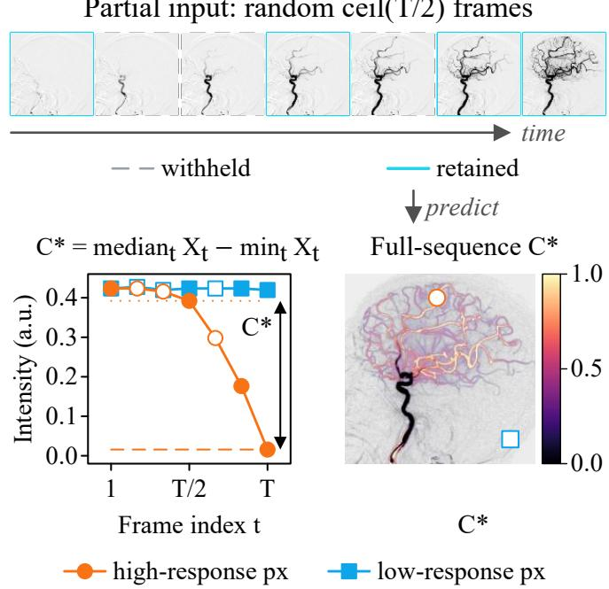
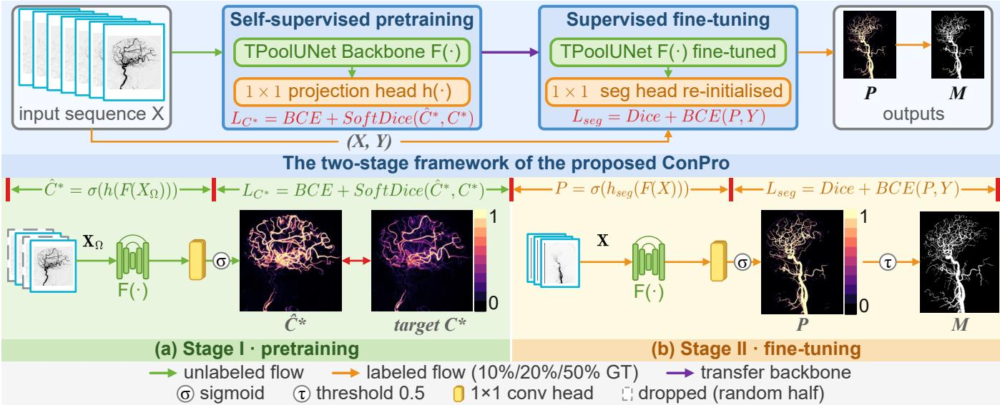
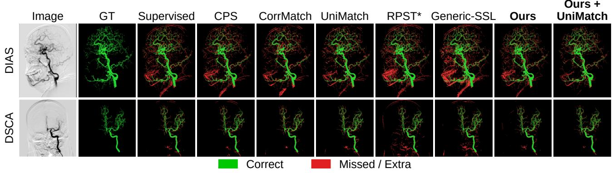
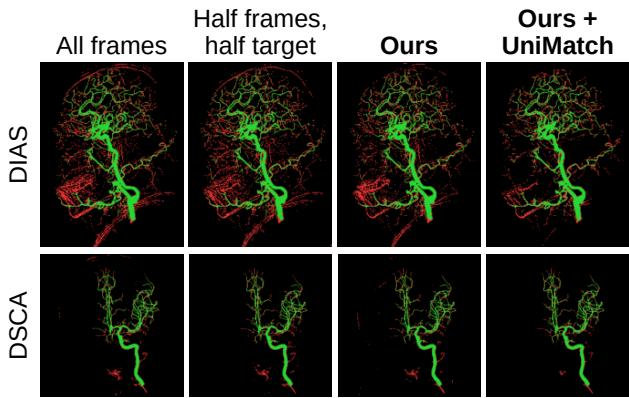

# CONPRO: CONTRAST PROJECTION PRETRAINING FOR LABEL-EFFICIENT VESSEL SEGMENTATION IN DSA SEQUENCES

Xinge Guo1, Yuanhao Wang2, Liqi Shu3, Yang Liu2, Min Xu2∗

1Duke University, Durham, NC, USA 2Carnegie Mellon University, Pittsburgh, PA, USA 3University of Pittsburgh Medical Center, Pittsburgh, PA, USA

## ABSTRACT

Dense vessel annotation in digital subtraction angiography (DSA) is labor-intensive, yet every unlabeled sequence records how contrast passes through the vessels. Semi-supervised methods take their targets from the current model, and generic self-supervised pretexts reconstruct static appearance, so this signal goes unused. We propose ConPro, a self-supervised pretraining scheme whose target is a contrast projection, the normalized drop of every pixel below its temporal median over the sequence. On DIAS and DSCA, with 10%, 20% and 50% of the training cases labeled, ConPro improves on training from scratch at every label fraction and is the best of the compared methods on DSCA at 20% and 50% labels. Controlled comparisons show that the gain comes from the target. A temporal-median target with the same input, loss and budget stays at scratch level, and using the projection directly instead of learning it, as an input channel or a pseudo-label, helps little or hurts. ConPro provides pretrained weights without changing the segmentation architecture, so it combines with semi-supervised training, and UniMatch, the strongest baseline, gains 0.5 to 2.0 Dice and 0.9 to 2.3 clDice at every label fraction when started from ConPro weights, reaching 75.4 Dice on DIAS and 81.3 on DSCA.

Index Terms— Digital subtraction angiography, vessel segmentation, self-supervised pretraining, label efficiency, temporal contrast projection

## 1. INTRODUCTION

Digital subtraction angiography (DSA) is the reference examination for intracranial stenosis, occlusion, aneurysm and moyamoya disease [1], and it records the passage of contrast through the cerebral vessels as a short image sequence. A mask of the arteries supports stenosis quantification, reperfusion scoring, 3D reconstruction and guidance during endovascular treatment [2, 3]. Since different phases opacify different branches, the mask is predicted from several frames at once. Drawing such a mask is pixel-by-pixel work that senior neurosurgeons then review, which is why the two public datasets contain only 60 and 224 labeled sequences even though DIAS alone was selected from over a thousand acquisitions [2]. Supervised DSA models already use the timing of contrast arrival as an input channel [4]. We use the same signal earlier, as a mask-free pretraining target.

Weak supervision replaces dense masks with cheaper annotations [5]. Semi-supervised methods derive pseudo-labels or consistency targets from the current model [6, 7, 8], so their supervision is bounded by that model. Self-supervised pretraining defines the target from the images themselves, as masked appearance or missing pixels [9, 10, 11, 12]. In DSA the images carry a target that is specific to the modality, since contrast produces a transient, vessellocalized darkening [13, 14]. Angiographic pretexts to date reconstruct masked appearance [15, 16], learn the subtraction step [17], or extract vessels directly [18, 19], and the temporal course of the contrast has so far been left aside as a target.

  
Fig. 1. Annotation-free pretraining. The network sees a subset of the frames (cyan) and predicts the contrast projection C⋆ of the whole sequence. Grey frames are withheld.

ConPro turns this course into the supervision target (Fig. 1) and trains the backbone to predict it before any mask is seen.

Technical contributions. The first contribution is the contrast projection C⋆, the largest drop of every pixel below its temporal median, together with a pretraining objective that treats it as a soft mask. The projection turns the opacification recorded in the sequence into a supervision signal that needs no manual annotation. To the best of our knowledge, ConPro is the first to use the temporal contrast projection of the DSA sequence itself, a target tied to the vessels, for self-supervised pretraining, and to apply it to artery segmentation of whole sequences with few labels. The second is a set of controlled comparisons that separate the target from everything around it. Holding input, loss and budget fixed, we swap $C ^ { \star }$ for temporalmedian targets; holding the target fixed, we vary which frames the network sees; and we run $C ^ { \star }$ itself as an input channel and as a pseudo-label, with no pretraining at all. Together these place the gain on the target and on learning to predict it. The third is that the pretrained weights are a drop-in initialization, so the same backbone can be handed to a semi-supervised method, which we test with Uni-Match and RPST∗.

  
Fig. 2. ConPro pipeline. Stage I predicts $C ^ { \star }$ from a subset of frames $X _ { \Omega }$ , and Stage II transfers the backbone F to vessel segmentation.

Medical relevance. ConPro reduces the amount of annotation that sequence-level artery segmentation needs. The pretraining runs on unlabeled sequences that any angiography archive already holds, and the largest gain in our experiments, 4.4 Dice and 5.2 clDice, is obtained with only three labeled DIAS sequences. Crucially, the network used at inference is completely unchanged. ConPro alters only its initialization and adds no parameters, inputs or computation.

## 2. METHOD

Figure 2 summarizes ConPro. Stage I predicts the contrast projection of unlabeled sequences, and Stage II transfers the backbone to supervised vessel segmentation.

## 2.1. Contrast projection target

Let $X = \{ X _ { 1 } , \ldots , X _ { T } \}$ be the valid, intensity-normalized frames of one sequence and x a pixel. In subtracted DSA, contrast transiently darkens vessel pixels against a comparatively stable background. We encode this change as

$$
R ( x ) = \mathrm { m e d i a n } X _ { t } ( x ) \ : - \ : \mathrm { m i n } X _ { t } ( x ) ,\tag{1}
$$

where the median approximates the typical intensity of the pixel and the minimum records its strongest darkening. Each sequence is then normalized to limit extreme values:

$$
C ^ { \star } ( x ) = \mathrm { c l i p } \left( { \frac { R ( x ) } { Q _ { 9 9 } ( R ) + \epsilon } } , 0 , 1 \right) , \qquad \epsilon = 1 0 ^ { - 6 } ,\tag{2}
$$

where $Q _ { 9 9 }$ is the 99th percentile of $R$ over the sequence, computed from the valid frames before any padding. The median reference tolerates a first frame that already carries contrast.

## 2.2. Stage I: pretraining objective

Let F be the backbone and h a 1× 1 projection head. Given an input set of frames $X _ { \mathcal { T } } .$ , the logits $Z = h ( F ( X _ { \tau } ) ) $ give the prediction $\hat { C } ^ { \star } = \sigma ( Z )$ and the loss

$$
\mathcal { L } _ { C ^ { \star } } \ = \ \mathcal { L } _ { \mathrm { B C E } } ( Z , C ^ { \star } ) \ + \ \mathcal { L } _ { \mathrm { D i c e } } \Big ( \hat { C } ^ { \star } , C ^ { \star } \Big ) ,\tag{3}
$$

where BCE is evaluated from logits and $\mathcal { L } _ { \mathrm { D i c e } }$ is one minus soft Dice [20]. Both accept continuous targets.

The input set is a design choice that Sec. 4.2 tests. The network can receive all T frames, or at each iteration a subset Ω drawn uniformly with $| \Omega | = \operatorname* { m a x } ( 2 , \lceil T / 2 \rceil )$ and kept in temporal order. The target can likewise be $C ^ { \star }$ computed from all frames or $C _ { \Omega } ^ { \star }$ computed from $X _ { \Omega }$ alone. Our default feeds a random half and keeps the full target, which amounts to frame dropout.

## 2.3. Temporally pooled backbone and Stage II transfer

We use a lightweight temporally pooled U-Net (TPoolUNet) made of a shared 2D encoder, masked temporal max pooling at each scale, and a U-Net decoder [21]. For valid-frame indices I, the encoder maps each frame to features $e _ { t } ^ { \ell } \ : = \ : E \ell \big ( X _ { t } ; \theta _ { E } \big )$ at four scales, the pool takes ${ \bar { e } } _ { \mathcal { T } } ^ { \ell } = \operatorname* { m a x } _ { t \in \mathcal { T } } e _ { t } ^ { \ell }$ per location and channel, and the decoder D produces $F _ { \theta _ { F } } ( X _ { \mathcal { T } } ) \ = \ D ( \bar { e } _ { \mathcal { T } } ^ { 1 } , \dots , \bar { e } _ { \mathcal { T } } ^ { 4 } )$ . Restricting the maximum to I keeps padded frames out of the pool [22]. Stage I sets $\mathcal { T } = \Omega$ and Stage II uses all valid frames. The backbone has 1.08 million parameters.

Stage II discards h, initializes the backbone from the Stage I weights, $\theta _ { F } ^ { \mathrm { I I } , 0 } = \widehat { \theta } _ { F } ^ { \mathrm { I } }$ , and adds a randomly initialized $1 \times 1$ segmentation head g. For a sequence X with vessel mask Y , fine-tuning minimizes BCE plus Dice between $g ( F _ { \theta _ { F } } ( X ) )$ ) and ${ \cal Y } ,$ as in Eq. (3), and the test mask thresholds the sigmoid output at 0.5. Labeled subsets, budget and evaluation are those of scratch training (Sec. 3).

## 3. EXPERIMENTAL SETUP

Data and evaluation. We use nested $1 0 / 2 0 / 5 0 \%$ labeled subsets, $3 / 6 / 1 5$ of the 30 DIAS training cases and $1 5 / 3 1 / 7 6$ of the 153

Table 1. Dice / clDice (%; three-seed means), matched backbone and Stage II update budget. Sup.: labeled sequences only; Semi: labeled and unlabeled sequences; Self: self-supervised pretraining, then supervised fine-tuning. The three $\mathbf { \hat { \chi } } _ { C ^ { \star } }$ rows use the contrast projection directly, without pretraining. The last three rows are ours, ConPro fine-tuned with labels only, and RPST∗ and UniMatch started from ConPro weights. Bold: best; underline: second best.
<table><tr><td rowspan="2">Method</td><td rowspan="2">Type</td><td colspan="3">DIAS</td><td colspan="3">DSCA</td></tr><tr><td>10%</td><td>20%</td><td>50%</td><td>10%</td><td>20%</td><td>50%</td></tr><tr><td>Supervised</td><td>Sup.</td><td>65.1/58.7</td><td>71.8/65.2</td><td>73.5/67.2</td><td>79.4/75.2</td><td>80.2/76.1</td><td>80.2/76.1</td></tr><tr><td>CPS [6]</td><td>Semi</td><td>69.1/61.6</td><td>71.7/64.5</td><td>72.3/64.9</td><td>79.8/75.5</td><td>80.5/76.4</td><td>80.6/76.5</td></tr><tr><td>CorrMatch [7]</td><td>Semi</td><td>64.1/55.5</td><td>69.2/61.2</td><td>71.2/63.2</td><td>76.1/70.3</td><td>77.5/72.2</td><td>78.2/73.5</td></tr><tr><td>UniMatch [8]</td><td>Semi</td><td>71.2/65.0</td><td>73.1/66.6</td><td>74.9/68.8</td><td>80.0/76.0</td><td>79.6/76.1</td><td>79.3/75.5</td></tr><tr><td>RPST* [2]</td><td>Semi</td><td>70.6/63.7</td><td>72.3/65.5</td><td>72.1/65.2</td><td>76.6/70.7</td><td>76.7/71.2</td><td>77.0/71.8</td></tr><tr><td>Generic-SSL [9, 10]</td><td>Self</td><td>65.7/58.6</td><td>70.4/64.0</td><td>72.2/65.8</td><td>78.7/74.2</td><td>79.9/75.9</td><td>80.1/76.2</td></tr><tr><td>Supervised + C* channel</td><td>Sup.</td><td>66.1/59.4</td><td>70.6/64.7</td><td>72.6/65.7</td><td>79.6/75.5</td><td>80.4/76.5</td><td>80.6/76.5</td></tr><tr><td> $C ^ { \star }$  pseudo-labels</td><td>Semi</td><td>66.4/63.0</td><td>69.1/63.3</td><td>72.2/66.8</td><td>75.6/72.8</td><td>76.3/73.0</td><td>77.2/73.9</td></tr><tr><td> $C ^ { \star }$  channel + pseudo-labels</td><td>Semi</td><td>64.2/60.4</td><td>65.5/61.0</td><td>68.2/62.3</td><td>75.7/72.5</td><td>76.2/72.9</td><td>75.9/72.7</td></tr><tr><td>ConPro</td><td>Self</td><td>69.5/63.9</td><td>72.5/66.5</td><td>74.6/68.6</td><td>80.2/75.9</td><td>81.0/77.4</td><td>81.3/77.6</td></tr><tr><td>ConPro + RPST*</td><td> $_ \mathrm { S e l f + S e m i }$ </td><td>71.3/65.1</td><td>73.1/66.7</td><td>72.3/65.5</td><td>77.5/72.9</td><td>78.3/73.5</td><td>78.2/73.5</td></tr><tr><td>ConPro + UniMatch</td><td> $_ \mathrm { S e l f + S e m i }$ </td><td>72.5/66.4</td><td>74.5/68.9</td><td>75.4/69.7</td><td>80.7 /76.9</td><td>81.0/77.3</td><td>81.3/77.8</td></tr></table>

  
Fig. 3. Qualitative results at 20% labels, one test sequence per dataset. Green marks correct vessel pixels, red marks errors.

Table 2. Stage I ablations (Dice / clDice %; three-seed means). Target: input fixed to a random half $X _ { \Omega } ,$ , target varied. Input: contrast projection kept, frame feeding varied. Protocols trained independently; bold: highest within a protocol.
<table><tr><td></td><td></td><td></td><td></td><td></td><td colspan="2">DIAS</td><td colspan="4">DSCA</td></tr><tr><td>Protocol Pretraining</td><td></td><td>Input</td><td>Target</td><td>Loss</td><td>10%</td><td>20%</td><td>50%</td><td>10%</td><td>20%</td><td>50%</td></tr><tr><td>Target</td><td>None</td><td></td><td></td><td></td><td>65.1/58.771.8/65.2 73.5/67.2 79.4/75.2 80.2/76.180.2/76.1</td><td></td><td></td><td></td><td></td><td></td></tr><tr><td></td><td>Median, all frames</td><td> $X _ { \Omega }$ </td><td>med(X)</td><td>BCE+Dice 64.1/57.670.7/63.771.7/64.378.8/74.379.9/75.880.1/76.2</td><td></td><td></td><td></td><td></td><td></td><td></td></tr><tr><td></td><td>Median, all frames</td><td> $X _ { \Omega }$ </td><td>med(X)</td><td> $L _ { 1 }$ </td><td>61.9/58.968.7/61.571.2/64.478.8/74.379.6/75.679.9/75.9</td><td></td><td></td><td></td><td></td><td></td></tr><tr><td></td><td>Median, withheld frames</td><td> $X _ { \Omega }$ </td><td> $\operatorname { m e d } ( { \dot { X } } _ { \bar { \Omega } } )$ </td><td> $L _ { 1 }$ </td><td>61.8/57.169.3/62.970.6/63.178.7/74.379.7/75.879.7/75.7</td><td></td><td></td><td></td><td></td><td></td></tr><tr><td></td><td>Contrast projection</td><td> $X _ { \Omega }$ </td><td> $C ^ { \star }$ </td><td></td><td>BCE+Dice69.3/63.571.9/66.074.4/68.4 80.0/75.881.2/77.481.4/77.6</td><td></td><td></td><td></td><td></td><td></td></tr><tr><td>Input</td><td>All frames, full target</td><td> $X$ </td><td> $C ^ { \star }$ </td><td></td><td>BCE+Dice 68.5/63.3 71.3/64.7 73.8/67.5 80.0/75.781.1/77.381.0/77.2</td><td></td><td></td><td></td><td></td><td></td></tr><tr><td></td><td>Half frames, half target</td><td> $X _ { \Omega }$ </td><td> $C _ { \Omega } ^ { \star }$ </td><td>BCE+Dice69.5/63.571.9/65.874.4/68.479.8/75.680.9/77.181.2/77.4</td><td></td><td></td><td></td><td></td><td></td><td></td></tr><tr><td></td><td>Half frames, full target (default)</td><td> $X _ { \Omega }$ </td><td> $C ^ { \star }$ </td><td>BCE+Dice 69.5/63.9 72.5/66.5 74.6/68.6 80.2/75.981.0/77.4 81.3/77.6</td><td></td><td></td><td></td><td></td><td></td><td></td></tr></table>

DSCA non-validation cases. DIAS further provides 10 validation, 20 test and 60 unlabeled sequences; DSCA has 27 validation and 44 test cases. Seeds {0, 1, 2} determine subsets, initialization and data order. Stage I sees the 90 DIAS training and unlabeled sequences or the 153 DSCA training sequences. Frames are resized to 256 × 256. DIAS sequences keep 4 to 14 frames and DSCA sequences are resampled to eight. The Stage II checkpoint is selected by validation

Dice and evaluated once on the test set. We report sequence Dice and the topology-aware clDice [23], macro-averaged over test cases.

Compared methods. Every segmentation network is a TPoolUNet, and all methods share the labeled subsets and the Stage II update budget. CPS [6] trains two networks with exchanged pseudo-labels, CorrMatch [7] propagates pseudo-labels through a correlation head, and UniMatch [8] enforces weak-to-strong consistency, all following the official implementations. RPST∗ is our shared-backbone implementation of RPST [2], one self-training round with equal numbers of labeled and pseudo-labeled $1 2 8 \times 1 2 8$ patches. Generic-SSL is a masked-reconstruction control in the style of Models Genesis and MAE [9, 10] that predicts the all-frame temporal median from a patch-masked sequence with an $L _ { 1 }$ loss, everything else being identical to ConPro. Three controls use $C ^ { \star }$ without any pretraining under the Stage II protocol, as a second input channel of every frame, as a pseudo-label (thresholded at a value chosen on the validation set) for the same unlabeled pool that ConPro pretrains on, and as both at once. Since ConPro yields a checkpoint of the same backbone, we also run UniMatch and $\mathrm { R P S T ^ { * } }$ from it.

  
Fig. 4. Input variants of Table 2 on the sequences of Fig. 3, alone and with UniMatch. Colors as in Fig. 3.

Ablations. Table 2 has two independently trained protocols. In Target every model receives $X _ { \Omega }$ and only the target changes. Here med(X) is the temporal median of all frames, med $( X _ { \bar { \Omega } } )$ that of the withheld frames $\mathbf { \bar { \Omega } } = \{ 1 , \dots , T \} \setminus \Omega$ , and $L _ { 1 }$ is mean absolute error. Input keeps the contrast projection and varies whether the network sees all frames or a random half, and whether the target comes from all frames or from the same half.

Optimization and statistics. Stage I runs 8,000 AdamW [24] updates (constant rate, weight decay $1 0 ^ { - 4 }$ , batch 4, Stage II augmentation) and transfers the final checkpoint as is. Stage II runs 1,200 AdamW updates (initial rate $1 0 ^ { - 3 } .$ , cosine decay), validated every 150 updates. Supervised fine-tuning uses four labeled sequences per batch; semi-supervised methods add four unlabeled sequences. Pretrained encoders use 0.3× the base learning rate. Differences in Table 1 were checked with paired sign-flip tests on per-sequence scores, Holm-corrected over all comparisons.

## 4. RESULTS

## 4.1. Performance with limited labels

ConPro has a higher three-seed mean than supervised training on both metrics at every label fraction of both datasets (Table 1, Fig. $3 ) .$ The gain is largest at DIAS 10%, 4.4 Dice and 5.2 clDice, and between 0.7 and 1.5 points elsewhere. The Holm-corrected paired test confirms the gain at DIAS 10% and at DSCA 20% and 50% on both metrics and at DSCA 10% on Dice $( p \leq 0 . 0 1 )$ ). At DIAS 20% and 50% the gain is not significant.

UniMatch is the strongest baseline. On DIAS it scores 0.2 to 1.7 points above ConPro fine-tuned with labels only, and none of these differences is significant $( p = 1 . 0 0$ after correction). On DSCA at 20% and 50% labels the order reverses, and ConPro leads UniMatch by 1.4 to 2.0 Dice and 1.3 to 2.1 clDice $( p < 0 . 0 1 )$ . UniMatch, RPST∗ and CorrMatch all fall below supervised training on parts of DSCA.

ConPro provides pretrained weights without changing the segmentation architecture, so it combines with these methods. Uni-Match started from ConPro weights is above UniMatch from scratch at every label fraction, by 0.5 to 2.0 Dice and 0.9 to 2.3 clDice, and the increase is significant everywhere except DIAS 50% Dice $( p = 0 . 1 0 )$ . This combination is the best entry of the table on DIAS and at DSCA 10%.

## 4.2. Effect of target and input

The Target protocol in Table 2 isolates the pretraining target. With the same random half as input and the same BCE+Dice loss, predicting the all-frame median leaves every mean within 0.1 of scratch or below it, whereas predicting $C ^ { \star }$ raises it by 1.2 to 5.2 Dice and 1.4 to 5.9 clDice over that median target. The median shows the vessels at rest, whereas $C ^ { \star }$ asks for the excursion below it, where the vessel $\mathrm { i s . }$

The Input protocol then varies how the frames are fed while the target stays a contrast projection. The three variants differ little, and all of them improve on scratch except all-frame training at DIAS 20%, which stays 0.5 points below it. Averaged over label fractions, the default (half frames, full target) is 1.0 Dice and 1.1 clDice above training on all frames on DIAS and 0.3 Dice and 0.4 clDice above the half-frame target, and on DSCA the three are within 0.3 points. Figure 4 agrees, and we keep frame dropout as a default rather than claim it as a mechanism.

$C ^ { \star }$ is label-free and already highlights vessels, so the three $C ^ { \star }$ rows of Table 1 test whether it needs to be learned at all. Fed as an input channel, $C ^ { \star }$ changes supervised training little, and on DIAS at 20% and 50% labels it lowers the result, by up to 1.2 Dice and 1.5 clDice. ConPro stays 1.8 to 4.5 points above this control on DIAS. Used as a pseudo-label, $C ^ { \star }$ raises DIAS 10% clDice from 58.7 to 63.0 and costs two to four points on DSCA, and adding the channel on top lowers the DIAS results further. Thresholded directly at a validation-chosen level, $C ^ { \star }$ itself reaches 52.0 and 59.3 Dice. These results favor using the contrast projection as a pretraining target rather than through the direct-use strategies evaluated here.

## 4.3. Scope and limitations

TPoolUNet pools frames with a maximum and $C ^ { \star }$ is built from a median and a minimum, so shuffling frames is an identity and the evidence above concerns which contrast phases the network sees, not their order. The target inherits the subtraction, so motion artifacts enter $C ^ { \star }$ and vessels that never opacify are absent from it. Behavior at true lesions and clinical value remain to be measured.

## 5. CONCLUSION

A DSA sequence already describes its own vessels, because the drop of each pixel below its temporal median marks where contrast arrived. ConPro trains the backbone to predict this map from unlabeled sequences and then fine-tunes it with whatever labels exist. On DIAS and DSCA this initialization improves on training from scratch at every label fraction, gives the best results of the compared methods on DSCA at 20% and 50% labels, and also improves UniMatch, the strongest baseline, when UniMatch starts from its weights. The ablations put the credit on the target itself, and everything the method needs is already in an angiography archive.

## 6. COMPLIANCE WITH ETHICAL STANDARDS

This study was conducted retrospectively using human subject data made available in open access by DIAS [2] and DSCA [3]. Ethical approval was not required, as confirmed by the dataset licenses.

## 7. ACKNOWLEDGMENTS

No funding was received for conducting this study. The authors have no relevant financial or nonfinancial interests to disclose.

## 8. REFERENCES

[1] Shirin Shaban, Bella Huasen, Abilash Haridas, Murray Killingsworth, John Worthington, Pascal Jabbour, and Sonu Menachem Maimonides Bhaskar, “Digital subtraction angiography in cerebrovascular disease: current practice and perspectives on diagnosis, acute treatment and prognosis,” Acta Neurologica Belgica, vol. 122, no. 3, pp. 763–780, 2022.

[2] Wentao Liu, Tong Tian, Lemeng Wang, Weijin Xu, Lei Li, Haoyuan Li, Wenyi Zhao, Siyu Tian, Xipeng Pan, Yiming Deng, Feng Gao, Huihua Yang, Xin Wang, and Ruisheng Su, “DIAS: A dataset and benchmark for intracranial artery segmentation in DSA sequences,” Medical Image Analysis, vol. 97, pp. 103247, 2024.

[3] Jiong Zhang, Qihang Xie, Lei Mou, Dan Zhang, Da Chen, Caifeng Shan, Yitian Zhao, Ruisheng Su, and Mengguo Guo, “DSCA: A digital subtraction angiography sequence dataset and spatio-temporal model for cerebral artery segmentation,” IEEE Transactions on Medical Imaging, vol. 44, no. 6, pp. 2515–2527, 2025.

[4] Lemeng Wang, Wentao Liu, Weijin Xu, Haoyuan Li, Huihua Yang, and Feng Gao, “TSI-Net: A timing sequence image segmentation network for intracranial artery segmentation in digital subtraction angiography,” in Proc. IEEE Int. Symp. Biomedical Imaging (ISBI), 2024, pp. 1–5.

[5] Arvind Vepa et al., “Weakly-supervised convolutional neural networks for vessel segmentation in cerebral angiography,” in Proc. IEEE/CVF Winter Conf. Applications of Computer Vision (WACV), 2022, pp. 3220–3229.

[6] Xiaokang Chen, Yuhui Yuan, Gang Zeng, and Jingdong Wang, “Semi-supervised semantic segmentation with cross pseudo supervision,” in Proc. IEEE/CVF Conf. Computer Vision and Pattern Recognition (CVPR), 2021, pp. 2613–2622.

[7] Boyuan Sun, Yuqi Yang, Le Zhang, Ming-Ming Cheng, and Qibin Hou, “CorrMatch: Label propagation via correlation matching for semi-supervised semantic segmentation,” in Proc. IEEE/CVF Conf. Computer Vision and Pattern Recognition (CVPR), 2024, pp. 3097–3107.

[8] Lihe Yang, Lei Qi, Litong Feng, Wayne Zhang, and Yinghuan Shi, “Revisiting weak-to-strong consistency in semisupervised semantic segmentation,” in Proc. IEEE/CVF Conf. Computer Vision and Pattern Recognition (CVPR), 2023, pp. 7236–7246.

[9] Zongwei Zhou, Vatsal Sodha, Jiaxuan Pang, Michael B. Gotway, and Jianming Liang, “Models Genesis,” Medical Image Analysis, vol. 67, pp. 101840, 2021.

[10] Kaiming He, Xinlei Chen, Saining Xie, Piotr Dollar, Yanghao´ Li, and Ross Girshick, “Masked autoencoders are scalable vision learners,” in Proc. IEEE/CVF Conf. Computer Vision and Pattern Recognition (CVPR), 2022, pp. 15979–15988.

[11] Zhan Tong, Yibing Song, Jue Wang, and Limin Wang, “Video-MAE: Masked autoencoders are data-efficient learners for selfsupervised video pre-training,” in Advances in Neural Information Processing Systems (NeurIPS), 2022.

[12] Christoph Feichtenhofer, Haoqi Fan, Yanghao Li, and Kaiming He, “Masked autoencoders as spatiotemporal learners,” in Advances in Neural Information Processing Systems (NeurIPS), 2022.

[13] Fabien Scalzo and David S. Liebeskind, “Perfusion angiography in acute ischemic stroke,” Computational and Mathematical Methods in Medicine, vol. 2016, pp. 2478324, 2016.

[14] Denise Brunozzi, Sophia F. Shakur, Rahim Ismail, Andreas Linninger, Chih-Yang Hsu, Fady T. Charbel, and Ali Alaraj, “Correlation between contrast time-density time on digital subtraction angiography and flow: an in vitro study,” World Neurosurgery, vol. 110, pp. e315–e320, 2018.

[15] De-Xing Huang, Xiao-Hu Zhou, Mei-Jiang Gui, Xiao-Liang Xie, Shi-Qi Liu, Shuang-Yi Wang, Tian-Yu Xiang, Rui-Ze Ma, Nu-Fang Xiao, and Zeng-Guang Hou, “VasoMIM: Vascular anatomy-aware masked image modeling for vessel segmentation,” arXiv:2508.10794, 2025.

[16] Zhiming Shao, Yingqian Zhang, Zechen Wei, Yong Ge, Chen Wang, Guodong Ding, Lei Gao, Liwei Zhang, Yundai Chen, Jie Tian, and Hui Hui, “Contrastive masked video modeling for coronary angiography diagnosis,” in Proc. Medical Image Computing and Computer Assisted Intervention (MIC-CAI), 2025, pp. 128–138.

[17] Yunjie Zeng, Han Liu, Juan Hu, Zhengbo Zhao, and Qiang She, “Pretrained subtraction and segmentation model for coronary angiograms,” Scientific Reports, vol. 14, pp. 19888, 2024.

[18] Yuxin Ma, Yang Hua, Hanming Deng, Tao Song, Hao Wang, Zhengui Xue, Heng Cao, Ruhui Ma, and Haibing Guan, “Selfsupervised vessel segmentation via adversarial learning,” in Proc. IEEE/CVF Int. Conf. Computer Vision (ICCV), 2021, pp. 7536–7545.

[19] Boah Kim, Yujin Oh, and Jong Chul Ye, “Diffusion adversarial representation learning for self-supervised vessel segmentation,” in Proc. Int. Conf. Learning Representations (ICLR), 2023.

[20] Fausto Milletari, Nassir Navab, and Seyed-Ahmad Ahmadi, “V-Net: Fully convolutional neural networks for volumetric medical image segmentation,” in Proc. Int. Conf. 3D Vision (3DV), 2016, pp. 565–571.

[21] Olaf Ronneberger, Philipp Fischer, and Thomas Brox, “U-Net: Convolutional networks for biomedical image segmentation,” in Proc. Medical Image Computing and Computer-Assisted Intervention (MICCAI), 2015, pp. 234–241.

[22] Joe Yue-Hei Ng, Matthew Hausknecht, Sudheendra Vijayanarasimhan, Oriol Vinyals, Rajat Monga, and George Toderici, “Beyond short snippets: deep networks for video classification,” in Proc. IEEE Conf. Computer Vision and Pattern Recognition (CVPR), 2015, pp. 4694–4702.

[23] Suprosanna Shit, Johannes C. Paetzold, Anjany Sekuboyina, Ivan Ezhov, Alexander Unger, Andrey Zhylka, Josien P. W. Pluim, Ulrich Bauer, and Bjoern H. Menze, “clDice – a novel topology-preserving loss function for tubular structure segmentation,” in Proc. IEEE/CVF Conf. Computer Vision and Pattern Recognition (CVPR), 2021, pp. 16560–16569.

[24] Ilya Loshchilov and Frank Hutter, “Decoupled weight decay regularization,” in Proc. Int. Conf. Learning Representations (ICLR), 2019.