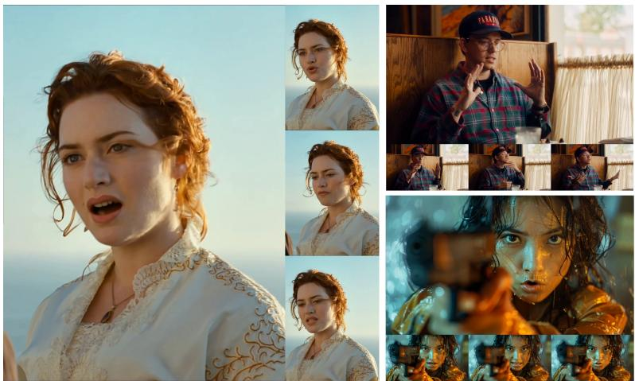
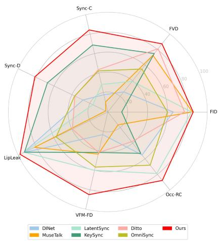
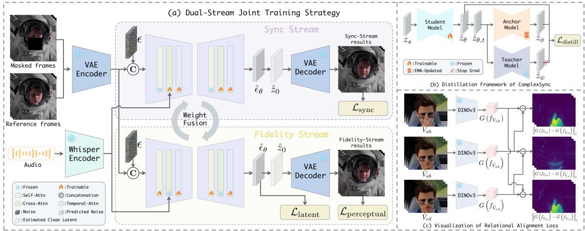
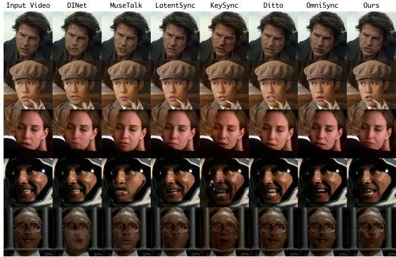
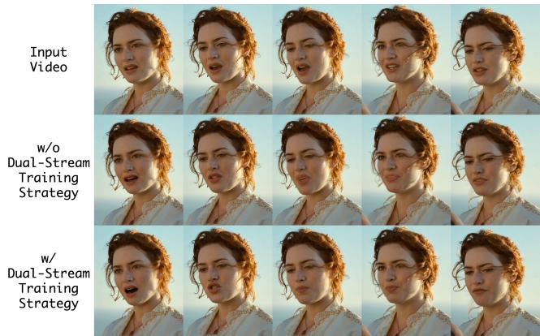
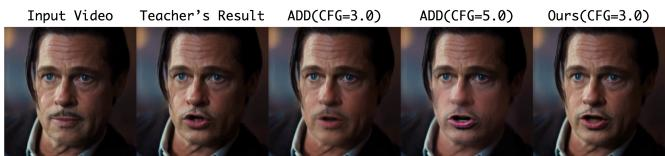
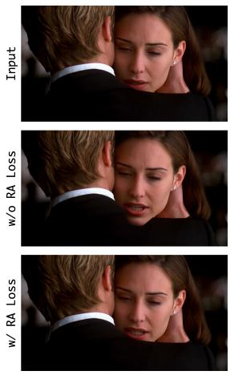
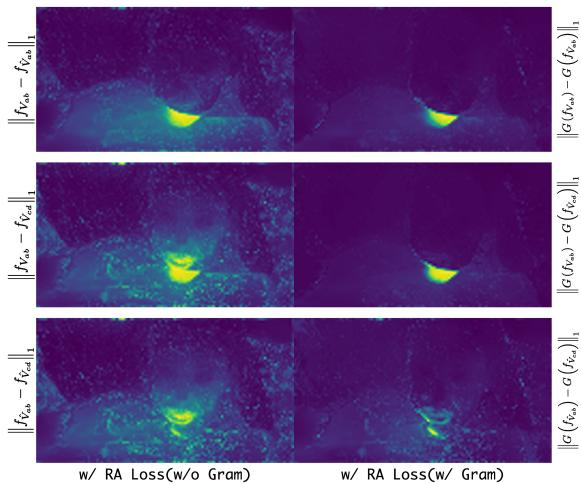
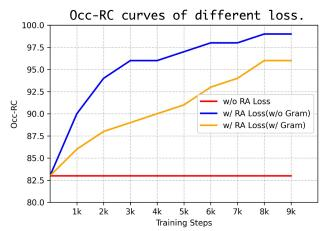
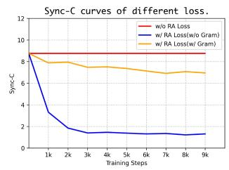

# ComplexSync: High-Fidelity and Real-Time Lip Sync in Complex Scenarios

Jiaran Cai

Xingpei Ma

Shenneng Huang

Guangzhou Quwan Network Technology

https://github.com/Playmate111/ComplexSync

## Abstract

Lip synchronization aims to generate visual lip dynamics that align precisely with speech audio. Despite the high generation quality of diffusion models, they often struggle in complex scenarios and suffer from prohibitive inference latency, limiting real-world deployment. We present ComplexSync, a unified diffusion-basedframework that enables real-time, high-fidelity lip sync under complex conditions. First, we introduce a dual-stream joint training strategy to mitigate information leakage from reference frames while preserving natural dynamics. Second, we develop a distillation-based acceleration scheme for single-step denoising, achieving a throughput of over 70 FPS. Third, we propose a relational alignment loss that leverages structural priors from Vision Foundation Models (VFMs) to enhance robustness against complex scene factors. Furthermore, we present the first benchmark specifically designed for complex lip synchronization, comprising over 200 challenging video sequences and specialized metrics. Extensive experiments demonstrate that ComplexSync achieves stateof-the-art performance across both standard and complex scenarios while enabling real-time inference.

## 1. Introduction

Lip synchronization [65] is an audio-driven video-to-video task that generates speech-aligned facial dynamics while preserving identity and visual context. Driven by its transformative potential in applications such as film dubbing, digital avatars, and immersive virtual reality, this field has garnered significant research interest [26, 40, 76]. Recent advances in diffusion models [11, 38, 43] have elevated lip synchronization from a niche post-processing tool to a fundamental generative primitive. However, deploying these methods in real-world scenarios remains challenging. Specifically, achieving real-time inference alongside precise lip movements under unconstrained conditions, such as varying illumination, and facial occlusions, remains an open problem.

Traditional GAN-based [8] approaches [5, 9, 26, 40, 76] primarily focus on photorealistic texture synthesis but often struggle with high-resolution generation and visual fidelity. More recently, diffusion-based methods [1, 20, 28, 73] have emerged as a promising alternative, demonstrating strong cross-identity generalization without identity-specific finetuning. Nevertheless, key challenges remain. First, spatial information leakage remains unresolved, where the generated output inadvertently inherits unwanted motion or structural artifacts from the reference frames [5, 20, 31, 67]. Second, the high computational cost of the iterative denoising process leads to prohibitive inference latency, precluding real-time deployment. Finally, state-of-the-art (SOTA) methods exhibit limited robustness under complex conditions such as drastic illumination variations or partial facial occlusions, frequently resulting in visual artifacts or inaccurate lip movements. These shortcomings highlight a significant gap toward truly realistic and deployable lip synchronization.

To bridge this gap, we propose ComplexSync, a diffusion-based framework for high-fidelity, real-time lip synchronization in unconstrained environments. First, we introduce a dual-stream joint training strategy: two functionally distinct yet architecturally identical experts are trained jointly with periodic weight fusion, effectively suppressing reference-inherited artifacts while preserving natural dynamics. Second, building on Score Distillation Sampling (SDS) [39], we develop a distillation-based acceleration scheme that enables single-step denoising, achieving over 70 FPS. Third, we introduce a relational alignment loss that leverages structural priors from Vision Foundation Models (VFMs) [21, 33, 41, 63] to implicitly encode complex scene factors, such as occlusions and illumination variations, thereby enhancing synchronization accuracy and realism under unconstrained conditions, particularly in cinematic and TV drama scenarios.

Furthermore, we present the first benchmark specifically designed for complex lip synchronization, comprising over 200 challenging sequences and specialized metrics. Our contributions are:

• A dual-stream joint training strategy that mitigates information leakage and enables high-fidelity lip-synced video

  
(a) Frames generated by ComplexSync.

  
(b) Performance benchmarking.  
Figure 1. We propose ComplexSync, a unified diffusion-based framework for real-time, high-fidelity lip synchronization in challenging scenarios. Extensive experiments show that ComplexSync achieves SOTA performance across both standard and challenging scenarios while supporting real-time inference.

generation.

• A distillation-based acceleration scheme that achieves single-step denoising, enabling real-time inference at over 70 FPS.

• A relational alignment loss leveraging VFMs to model scene complexity for robust lip movements under unconstrained conditions.

• A new benchmark and specialized metrics for evaluating lip synchronization robustness in complex real-world scenarios.

## 2. Related Work

## 2.1. Audio-Driven Portrait Animation

Audio-driven portrait animation [14] is a broader task than lip synchronization that synthesizes lifelike talking-face videos from a single image and speech audio [29, 53, 55, 56, 64]. Framed as an image-to-video task, it synthesizes entire frames end-to-end without constraining head pose or expression, bypassing complex blending in video-to-video pipelines. Early GAN-based methods [55, 56, 71, 78, 79] often struggled to model cross-modal correlations between speech prosody and facial dynamics, leading to stiff and unexpressive results. Recent work has shifted to end-toend diffusion models that map audio directly to motion, eliminating reliance on intermediate priors like 3DMMs or landmarks [13, 29, 53, 64]. Representative approaches like EMO [53], Hallo [64], and EchoMimic [4] leverage the generative capabilities of Stable Diffusion [43] to produce temporally coherent animations. More recently, Diffusion Transformers (DiTs) [35] have emerged as a powerful backbone for this task. Methods such as OmniHuman-1 [23] and InfiniteTalk [68] leverage large-scale DiT architectures [45, 57] to extend animation to the upper body or full body, achieving remarkable temporal smoothness [18,

30, 61]. However, these holistic models remain suboptimal for dedicated lip sync due to shortcut learning, as observed in LatentSync [20].

## 2.2. Audio-Driven Lip Synchronization

Unlike portrait animation, audio-driven lip synchronization [5, 31, 32, 34, 36, 48, 52, 59, 60, 66, 67, 73, 77] is a video-to-video editing task that necessitates preserving the original visual context while modifying only the mouth dynamics. Seminal works like Wav2Lip [40] pioneered audio-visual alignment via pre-trained Sync-Net [7]. Subsequent research has leveraged StyleGAN2- based architectures [15] to bolster identity consistency (e.g., StyleSync [9], StyleLipSync [16]) or capitalized on 3D mesh representations [10] to achieve higher geometric fidelity. Alternatively, DINet [76] introduced spatial feature deformation as a mechanism to synthesize precise mouth articulations. Recently, diffusion models have driven significant progress: LatentSync [20] introduced an end-toend latent diffusion framework; KeySync [1] proposed a two-stage pipeline with a tailored masking strategy to mitigate expression leakage and handle facial occlusions; and OmniSync [37] developed a mask-free DiT architecture with dynamic spatiotemporal guidance to suppress lip shape leakage. Despite these advances, critical bottlenecks persist. First, the iterative nature of diffusion models leads to prohibitive inference latency, precluding real-time deployment [20]. Second, existing methods exhibit limited environmental robustness and often struggle in unconstrained real-world settings characterized by physical occlusions and volatile illumination variations. In contrast, our method, ComplexSync, directly addresses both challenges by enabling real-time, high-fidelity lip synchronization in complex, real-world environments.

  
Figure 2. Overview of ComplexSync. (a) Dual-stream joint training strategy designed to suppress spatial information leakage and ensure high-fidelity synthesis. (b) Distillation-based acceleration scheme that facilitates single-step denoising for real-time inference. (c) Rela tional alignment loss leveraging VFMs to enhance synchronization precision and robustness under unconstrained conditions.

## 2.3. Diffusion Distillation Models

Accelerating inference is a pivotal challenge in diffusion research [47]. Current strategies primarily bifurcate into training-free caching [24, 46, 81] and training-intensive distillation [12, 27, 44, 69]. While caching methods like TeaCache [24] offer engineering-level speedups, distillation paradigms such as LCM [27] and ADD [44] provide more substantial theoretical acceleration. In the animation domain, recent works have also explored efficiency: AniTalker [25] and Ditto [22] employ lightweight diffusion models for motion prediction; autoregressive-based methods [6] enable streaming via context-aware generation; and READ [58] achieves real-time talking-head synthesis in a highly compressed latent space. However, achieving highfidelity, real-time lip synchronization via diffusion remains largely underexplored. Motivated by this, we adapt and extend the SDS framework to facilitate single-step denoising, enabling a significant throughput of over 70 FPS.

## 3. Methodology

In this section, we present ComplexSync, a unified diffusion-based framework for real-time, high-fidelity lip synchronization in complex scenarios (overview in Fig. 2). Our approach comprises three core components: (1) a dual-stream joint training strategy (Sec. 3.1) that mitigates reference-frame information leakage; (2) a single-step denoising paradigm (Sec. 3.2) based on score distillation for real-time inference; and (3) a relational alignment loss (Sec. 3.3) that enhances robustness to challenging scene factors such as volatile illumination and facial occlusions.

## 3.1. Dual-stream Joint Training Strategy

Motivation and Dual-Stream Strategy. A primary challenge in diffusion-based lip synchronization is spatial information leakage [1, 20], where the model over-prioritizes structural cues from reference frames at the expense of audio conditioning, thereby inducing spurious facial motion artifacts. While recent methods (e.g., LatentSync [20], KeySync [1]) attempt to mitigate this, they often struggle in complex scenarios. To address this, we propose a dualstream joint training strategy comprising a synchronization stream optimized for precise audio-visual alignment and a fidelity stream dedicated to identity and background consistency.

Task Definition and Backbone. Let V denote the ground-truth video. Our framework generates $\hat { V }$ conditioned on speech A and reference frames $V _ { \mathrm { r e f } } .$ As shown in Fig. 2(a), we build upon Stable Diffusion (initialized from SD 1.5) with a pre-trained Whisper [42] audio encoder. Audio embeddings are integrated into the U-Net via crossattention. In addition, we incorporate a temporal attention module to enhance inter-frame consistency. In contrast to the fixed two-stage training in [1, 20], we conceptualize the temporal attention mechanism as a pluggable tempora smoother. During training, this module is stochastically bypassed following a CFG-like dropout protocol. This strategy facilitates precise control over the degree of temporal stability during inference; by modulating the CFG scale, we can adaptively tune the smoothing intensity to balance motion vividness and temporal coherence.

Synchronization Stream. This stream aims for precise audio-visual alignment by leveraging a pre-trained StableSyncNet [20] as a pixel-space supervisor. To bypass iterative sampling during training, we estimate the clean latent zˆ in a single step from the predicted noise $\epsilon _ { \theta } ( z _ { t } )$ , following DDIM [51]:

$$
\hat { z } _ { 0 } = \frac { z _ { t } - \sqrt { 1 - \overline { { \alpha } } _ { t } } \epsilon _ { \theta } \left( z _ { t } , \mathcal { E } \left( V _ { \mathrm { r e f } } \right) , A \left( A \right) , t \right) } { \sqrt { \overline { { \alpha } } _ { t } } } ,\tag{1}
$$

where A and $\mathcal { A }$ denote the input audio and the audio encoder, respectively; $\epsilon _ { \theta }$ is the predicted noise parameterized by $\theta ;$ and $V _ { \mathrm { r e f } }$ and E represent the reference frames and the VAE [17] encoder, respectively. To mitigate information leakage, we randomly select a single reference frame as $V _ { \mathrm { r e f } }$ during this stage. Only the audio cross-attention layers and temporal attention module are optimized; the rest of the U-Net is frozen. Given 16 decoded frames $\mathcal { D } ( \hat { z } _ { 0 } ) _ { i : i + 1 6 }$ and their corresponding audio segment $A _ { i : i + 1 6 } .$ , the sync loss is formulated as:

$$
\mathcal { L } _ { \mathrm { s y n c } } = \mathbb { E } _ { z _ { 0 } , A , t , \epsilon , i } \left[ \mathrm { S t a b l e S y n c N e t } \left( \mathcal { D } \left( \hat { z } _ { 0 } \right) _ { i : i + 1 6 } , A _ { i : i + 1 6 } \right) \right]\tag{2}
$$

where D represents the VAE decoder.

Fidelity Stream. To preserve identity consistency and background integrity, this stream optimizes all parameters except the audio cross-attention layers. This ensures that the model focuses on spatial-temporal consistency without being adversely influenced by acoustic features. The objective combines a latent-space reconstruction loss and a pixelspace perceptual loss. The former is:

$$
\mathcal { L } _ { \mathrm { l a t e n t } } = \mathbb { E } _ { A , V _ { \mathrm { r e f } } , t , \epsilon } \left[ \left\| \epsilon - \epsilon _ { \theta } \left( z _ { t } , \mathcal { E } \left( V _ { \mathrm { r e f } } \right) , A \left( A \right) , t \right) \right\| _ { 2 } ^ { 2 } \right]\tag{3}
$$

where ϵ is additive Gaussian noise. To further refine visual fidelity, we employ a VGG-based [50] perceptual loss:

$$
\mathcal { L } _ { \mathrm { p e r c e p t u a l } } = \mathbb { E } _ { z _ { 0 } , x , \epsilon , t , i } \left[ \| \mathcal { V } \left( \mathcal { D } \left( \hat { z } _ { 0 } \right) _ { i } \right) - \mathcal { V } \left( x _ { i } \right) \| _ { 1 } \right] ,\tag{4}
$$

where V denotes the VGG-19 feature extractor and i denotes the frame index. The joint objective is:

$$
\begin{array} { r } { \mathcal { L } _ { \mathrm { t o t a l } } = \lambda _ { 1 } \mathcal { L } _ { \mathrm { l a t e n t } } + \lambda _ { 2 } \mathcal { L } _ { \mathrm { p e r c e p t u a l } } , } \end{array}\tag{5}
$$

where $\lambda _ { 1 } = 1 . 0$ and $\lambda _ { 2 } = 1 . 5$

Joint Training Strategy. In contrast to the conventional two-stage training used in methods like KeySync and LatentSync, we propose a unified joint training strategy that enables faster convergence and effectively suppresses information leakage. Specifically, upon establishing the two aforementioned streams, both branches are optimized in parallel. To facilitate synergistic learning, we introduce a periodic weight fusion mechanism. After a predefined number of iterations, the parameters of both expert branches are averaged and updated with their fused weights. The rationale is that each branch serves as a domain-specific expert—optimizing for either lip synchronization or identity preservation. By periodically averaging weights, each expert internalizes complementary representations from its counterpart, fostering multi-modal proficiency. Furthermore, this fusion mechanism ensures a smooth optimization trajectory, effectively mitigating catastrophic forgetting and steering the model toward a stable global optimum.

## 3.2. Real-time Single-step Denoising

In this section, we delineate the overall distillation framework of ComplexSync, designed to enable real-time inference while preserving the generative prior of the base model. As illustrated in Fig. 2(b), our pipeline comprises three networks: a student, a teacher, and an anchor. All three are initialized with the pre-trained weights obtained in Sec. 3.1, and the teacher’s parameters are kept frozen throughout training. Notably, the teacher uses CFG during inference, while the student and anchor operate without it.

Following SDS [39], we perform distillation in the latent space. For brevity, conditioning variables $( V _ { \mathrm { r e f } } , A )$ are omitted in the following. Given an input video $V _ { ; }$ , we encode its latent $z _ { 0 }$ via the VAE encoder and obtain noisy latents $z _ { s } =$ $\alpha _ { s } z _ { 0 } + \sigma _ { s } \epsilon$ through forward diffusion. The timestep s is uniformly sampled from a discrete set $T _ { \mathrm { s t u d e n t } } = \{ \tau _ { 1 } , . . . , \tau _ { n } \}$ In practice, we adopt single-step distillation with $N = 1$ and fixed $\tau _ { 1 } = 1 0 0 0$ . Inspired by ADD [44], we perturb the student’s output $\hat { z } _ { \theta } ( z _ { s } , s )$ via forward diffusion to obtain $\hat { z } _ { \theta , t } = \alpha _ { t } \hat { z } _ { \theta } ( z _ { s } , s ) + \sigma _ { t } \epsilon ^ { \prime } ,$ . This perturbed latent serves as input to both teacher and anchor models. Their denoising predictions, $\hat { z } _ { \psi } ( \hat { z } _ { \theta , t } , t )$ and $\hat { z } _ { \phi } ( \hat { z } _ { \theta , t } , t )$ , act as distillation targets, supervising the student through a latent-space consistency loss.

We define the distance function as $\mathrm { d } ( x , y ) : = \| x - y \| _ { 2 } ^ { 2 }$ yielding the original SDS loss:

$$
\begin{array} { r l } & { \mathcal { L } _ { \mathrm { S D S } } = \mathbb { E } _ { z _ { 0 } , \epsilon , \epsilon ^ { \prime } , s , t } \left[ w \left( t \right) d \left( \hat { z } _ { \theta } \left( z _ { s } , s \right) , \hat { z } _ { \psi } \left( \mathrm { s g } \left( \hat { z } _ { \theta , t } \right) , t \right) \right) \right] } \\ & { \quad \quad \quad = \mathbb { E } _ { z _ { 0 } , \epsilon , \epsilon ^ { \prime } , s , t } \left[ w \left( t \right) \big \| \hat { z } _ { \theta } \left( z _ { s } , s \right) - \hat { z } _ { \psi } \left( \mathrm { s g } \left( \hat { z } _ { \theta , t } \right) , t \right) \big \| _ { 2 } ^ { 2 } \right] , } \end{array}\tag{6}
$$

where $\operatorname { s g } ( \cdot )$ denotes stop-gradient. We employ the weighting factor $w ( t ) = \alpha _ { t }$ to de-emphasize high-noise components, thereby prioritizing the refinement of clean structural details.

Intuitively, SDS optimization aligns the student’s generated distribution with the teacher’s score manifold by minimizing their score discrepancy. However, a critical challenge arises: the teacher receives pseudo-latent samples derived from the student’s current output, which are then aggressively amplified by CFG. This dependency distorts the distillation target and often leads to mode collapse. In severe cases, it causes information leakage, where the student overfits to artifacts in the corrupted guidance signal, thereby compromising the fidelity and generalization of the distilled knowledge.

To mitigate instability and objective distortion, we propose an enhanced SDS loss that improves convergence and training stability. Our approach introduces an anchor model updated via exponential moving average (EMA) to serve as a stable reference. Instead of supervising the student with the teacher alone, we use a joint prediction from both the teacher and the anchor as the distillation target. This design acts as a structural regularizer that shields the student from noisy gradients caused by the teacher’s hallucinated latents under high CFG scales. Our final distillation objective is

formulated as:

$$
\begin{array} { r l } & { \mathcal { L } _ { \mathrm { d i s t i l } } = \mathbb { E } \left[ w \left( t \right) \left. \hat { z } _ { \psi } \left( \mathrm { s g } \left( \hat { z } _ { \theta , t } \right) , t \right) - \hat { z } _ { \phi } \left( \hat { z } _ { \theta , t } , t \right) \right. _ { 2 } ^ { 2 } \right] } \\ & { \qquad = \mathbb { E } \left[ \sigma _ { t } \left( \hat { z } _ { \psi } \left( \mathrm { s g } \left( \hat { z } _ { \theta , t } \right) , t \right) - \hat { z } _ { \phi } \left( \hat { z } _ { \theta , t } , t \right) \right) ^ { T } \left( \hat { z } _ { \psi } \left( \mathrm { s g } \left( \hat { z } _ { \theta , t } \right) , t \right) - \hat { z } _ { \theta } \left( z _ { s } , s \right) \right) \right] , } \end{array}\tag{7}
$$

where the expectation is taken over $\{ z _ { 0 } , \epsilon , \epsilon ^ { \prime } , s , t \}$

The derivation of Eq. (7) proceeds as follows. Under the diffusion framework and without loss of generality, we set $\alpha _ { t } = 1$ , so that $z _ { t } = z _ { 0 } + \sigma _ { t } \epsilon$ and $q \left( z _ { t } \mid z _ { 0 } \right) = \mathcal { N } \left( z _ { 0 } , \sigma _ { t } ^ { 2 } \mathbf { I } \right)$ This yields:

$$
q \left( z _ { t } \mid z _ { 0 } \right) \propto \exp \left( - \frac { 1 } { 2 \sigma _ { t } ^ { 2 } } \| z _ { t } - z _ { 0 } \| ^ { 2 } \right) ,\tag{8}
$$

$$
\nabla _ { z _ { t } } \log { q \left( z _ { t } \mid z _ { 0 } \right) } = - \frac { z _ { t } - z _ { 0 } } { \sigma _ { t } ^ { 2 } } ,\tag{9}
$$

$$
\begin{array} { c } { { \nabla _ { z _ { t } } q \left( z _ { t } \mid z _ { 0 } \right) = q \left( z _ { t } \mid z _ { 0 } \right) \nabla _ { z _ { t } } \log q \left( z _ { t } \mid z _ { 0 } \right) } } \\ { { = - q \left( z _ { t } \mid z _ { 0 } \right) \displaystyle \frac { z _ { t } - z _ { 0 } } { \sigma _ { t } ^ { 2 } } . } } \end{array}\tag{10}
$$

The marginal distribution of the noisy data is $\begin{array} { r } { p \left( z _ { t } \right) = \int q \left( z _ { t } \mid z _ { 0 } \right) p \left( z _ { 0 } \right) } \end{array}$ dz0, with gradient $\nabla _ { z _ { t } } p \left( z _ { t } \right) =$ $\begin{array} { r } { \int \nabla _ { z _ { t } } q \left( z _ { t } ~ | ~ z _ { 0 } \right) p \left( z _ { 0 } \right) } \end{array}$ dz0. Substituting Eq. (10) yields:

$$
\nabla _ { z _ { t } } \log p \left( z _ { t } \right) = \int \frac { - q \left( z _ { t } \mid z _ { 0 } \right) \frac { z _ { t } - z _ { 0 } } { \sigma _ { t } ^ { 2 } } } { p \left( z _ { t } \right) } p \left( z _ { 0 } \right) ~ d z _ { 0 } = - \frac { 1 } { \sigma _ { t } ^ { 2 } } \left( z _ { t } - \frac { \int z _ { 0 } q \left( z _ { t } \mid z _ { 0 } \right) p \left( z _ { 0 } \right) d z _ { 0 } } { p \left( z _ { t } \right) } \right) .\tag{11}
$$

The posterior expectation of $z _ { \mathrm { 0 } }$ given $z _ { t }$ is:

$$
\mathbb { E } \left( z _ { 0 } \mid z _ { t } \right) = \int z _ { 0 } q \left( z _ { 0 } \mid z _ { t } \right) d z _ { 0 } = \frac { \int z _ { 0 } q \left( z _ { t } \mid z _ { 0 } \right) p \left( z _ { 0 } \right) d z _ { 0 } } { p \left( z _ { t } \right) } .\tag{12}
$$

Combining Eq. (11) and Eq. (12), we obtain:

$$
\nabla _ { z _ { t } } \log p \left( z _ { t } \right) = - \frac { 1 } { \sigma _ { t } ^ { 2 } } \left( z _ { t } - \mathbb { E } \left( z _ { 0 } \mid z _ { t } \right) \right) .\tag{13}
$$

By the Score Projection Identity [80], it holds that:

$$
\begin{array} { r } { \mathbb { E } _ { z _ { t } \sim p \theta \left( z _ { t } \right) } \left[ u ^ { \top } ( z _ { t } ) \nabla _ { z _ { t } } \log p \left( z _ { t } \right) \right] = \mathbb { E } _ { ( z _ { t } , z _ { 0 } ) \sim q ( z _ { t } | z _ { 0 } ) p \theta \left( z _ { 0 } \right) } \left[ u ^ { \top } ( z _ { t } ) \nabla _ { z _ { t } } \log q \left( z _ { t } \mid z _ { 0 } \right) \right] . } \end{array}\tag{14}
$$

Combining Eq. (13) and Eq. (14), we arrive at the following derivation for the distillation loss ${ \mathcal { L } } _ { \mathrm { d i s t i l l } } \colon$

$$
\begin{array} { r l } & { \mathcal { L } _ { \mathrm { d i s s i l l } } = \mathbb { E } [ w ( t ) \lVert \hat { z } _ { \psi } ( \mathrm { s g } ( \hat { z } _ { \theta , t } ) , t ) - \hat { z } _ { \phi } ( \hat { z } _ { \theta , t } , t ) \rVert _ { 2 } ^ { 2 } ] } \\ & { \quad = \mathbb { E } [ w ( t ) \sigma _ { t } ^ { 4 }  \nabla _ { z _ { t } } \log p _ { T } ( z _ { t } ) - \nabla _ { z _ { t } } \log p _ { A } ( z _ { t } )  _ { 2 } ^ { 2 } ] } \\ & { \quad = \mathbb { E } [ w ( t ) \sigma _ { t } ^ { 4 } ( \nabla _ { z _ { t } } \log p _ { T } ( z _ { t } ) - \nabla _ { z _ { t } } \log p _ { A } ( z _ { t } ) ) ^ { \top } ( \nabla _ { z _ { t } } \log p _ { T } ( z _ { t } ) - \nabla _ { z _ { t } } \log p _ { A } ( z _ { t } ) ) ] } \\ & { \quad = \mathbb { E } [ w ( t ) \sigma _ { t } ^ { 4 } ( \nabla _ { z _ { t } } \log p _ { T } ( z _ { t } ) - \nabla _ { z _ { t } } \log p _ { A } ( z _ { t } ) ) ^ { \top } ( \nabla _ { z _ { t } } \log p _ { T } ( z _ { t } ) - \nabla _ { z _ { t } } \log q _ { A } ( z _ { t } \mid z _ { 0 } ) ) ] } \\ &  \quad = \mathbb { E } [ w ( t ) ( \hat { z } _ { \psi } ( \mathrm { s g } ( \hat { z } _ { \theta , t } ) , t ) - \hat { z } _ { \phi } ( \hat { z } _ { \theta , t } , t ) ) ^ { \top } ( \hat { z } _ { \psi } ( \mathrm { s g } ( \hat { z } _ { \theta , t } ) , t \ \end{array}\tag{15}
$$

## 3.3. Relational Alignment Loss

Despite achieving precise lip synchronization, diffusionbased generators often degrade in unconstrained scenarios involving occlusions, extreme lighting variations, or $\mathrm { { d y } \mathrm { { - } } }$ namic camera motion. To improve generation fidelity, we propose a relational alignment loss that leverages structural priors from VFMs to implicitly encode complex scene factors. Our approach is motivated by the insight that stronger perceptual grounding leads to higher-quality synthesis. Building on REPA [19, 54, 70], which bridges pretrained foundation models and generative diffusion models, and inspired by VideoREPA [72], we employ DINOv3 [49] as our VFM backbone and inject scene-aware knowledge (e.g., occlusion patterns and illumination dynamics) into the lip-sync model via targeted fine-tuning.

  
Figure 3. Qualitative comparison with existing methods. Refer to Appendix for details. We provide supplementary videos to capture temporal attributes (synchronization, naturalness, stability) missing in static images.

As shown in Fig. 2(c), we employ a frozen VFM encoder ${ \mathcal { E } } _ { v }$ to extract spatiotemporal features $f _ { v } \in \mathbb { R } ^ { f \times N \times D }$ from a video $V \in \dot { \mathbb { R } ^ { F \times C \times H \times W } }$ , where $N = h \times w$ is the number of tokens and $( F / f , H / h , W / w )$ denote the temporal and spatial compression ratios. Specifically, we sample a video clip $V _ { a b }$ and two distinct audio segments $A _ { a b }$ and $A _ { c d } .$ , indexed by non-overlapping intervals (a: b) and $( c { : } d )$ Treating $V _ { a b }$ as the reference, we condition the generator on $A _ { a b }$ and $A _ { c d }$ to synthesize $\hat { V } _ { a b }$ and $\hat { V } _ { c d } .$ , respectively. The resulting features $f _ { V _ { a b } } , f _ { \hat { V } _ { a b } }$ , and $f _ { \hat { V } _ { c d } }$ are then obtained via the same frozen ${ \mathcal { E } } _ { v }$ . The relational alignment loss is defined as:

$$
\mathcal { L } _ { \mathrm { R A } } = \left. G \left( f _ { V _ { a b } } \right) - G \left( f _ { \hat { V } _ { a b } } \right) \right. _ { 1 } + \left. G \left( f _ { V _ { a b } } \right) - G \left( f _ { \hat { V } _ { c d } } \right) \right. _ { 1 } - \left. G \left( f _ { \hat { V } _ { a b } } \right) - G \left( f _ { \hat { V } _ { c d } } \right) \right. _ { 1 }\tag{16}
$$

Here, $G ( f ) = \operatorname { C o n c a t } ( S _ { 1 } , S _ { 2 } , \ldots , S _ { f } ) \in \mathbb { R } ^ { f \times N \times N }$ , where each $S _ { t } \in \mathbb { R } ^ { N \times N }$ is a spatial token-wise similarity matrix with entries

$$
S _ { t , i , j } = { \frac { f _ { t , i } ^ { \top } f _ { t , j } } { \| f _ { t , i } \| \| f _ { t , j } \| } } ,\tag{17}
$$

denoting the cosine similarity between features at spatial positions i and j in frame t. We adopt this Gram-like representation because it is invariant to spatial layout, enabling robust capture of second-order statistics—such as texture, occlusion patterns, and illumination characteristics—while discarding positional information.

<table><tr><td rowspan="2">Methods</td><td colspan="5">HDTF</td><td colspan="4">ComplexSync-Val</td><td rowspan="2">Occ-RC↑</td><td rowspan="2">FPS↑</td></tr><tr><td>FID↓</td><td>FVD↓</td><td>CSIM↑</td><td>Sync-C↑</td><td>Sync-D↓</td><td>LipLeak↓</td><td>Sync-C↑</td><td>Sync-D↓</td><td>VFM-FD↓</td></tr><tr><td>DINet</td><td>10.14</td><td>59.72</td><td>0.835</td><td>4.62</td><td>9.17</td><td>0.0596</td><td>3.52</td><td>7.69</td><td>0.086</td><td>87.70</td><td>57.74</td></tr><tr><td>Musetalk</td><td>7.26</td><td>40.90</td><td>0.909</td><td>4.36</td><td>9.93</td><td>0.1822</td><td>2.83</td><td>9.60</td><td>0.074</td><td>78.80</td><td>20.16</td></tr><tr><td>LatentSync</td><td>7.37</td><td>54.27</td><td>0.900</td><td>4.99</td><td>9.50</td><td>0.0685</td><td>6.73</td><td>7.37</td><td>0.064</td><td>93.10</td><td>2.13</td></tr><tr><td>KeySync</td><td>17.90</td><td>40.04</td><td>0.801</td><td>6.41</td><td>7.98</td><td>0.0708</td><td>1.67</td><td>9.81</td><td>0.075</td><td>87.20</td><td>1.14</td></tr><tr><td>Ditto</td><td>8.43</td><td>37.55</td><td>0.916</td><td>5.52</td><td>8.90</td><td>0.6048</td><td>4.26</td><td>9.61</td><td>0.075</td><td>83.80</td><td>16.6</td></tr><tr><td>OmniSync</td><td>11.01</td><td>47.98</td><td>0.826</td><td>5.48</td><td>8.89</td><td>0.4236</td><td>3.86</td><td>10.55</td><td>0.066</td><td>90.70</td><td>-</td></tr><tr><td>Ours</td><td>7.13</td><td>35.07</td><td>0.927</td><td>6.95</td><td>7.56</td><td>0.0213</td><td>8.87</td><td>6.28</td><td>0.049</td><td>95.20</td><td>72.73</td></tr></table>

Table 1. Quantitative comparisons with existing methods on two test datasets. The best results are in bold, and the second-best are in underlined.

The first term of Eq. (16), $\left. G \left( f _ { V _ { a b } } \right) - G \left( f _ { \hat { V } _ { a b } } \right) \right. _ { 1 }$ primarily enforces similarity in non-mouth regions between the ground-truth video and the generation conditioned on the correct audio. This encourages the model to faithfully reproduce scene-level factors including occlusions and lighting conditions. The second term, $\left\| G \left( f _ { V _ { a b } } \right) - G \left( \bar { f } _ { \hat { V } _ { c d } } \right) \right\|$ , captures deviations in non-1 mouth regions as well as mouth-shape discrepancies caused by mismatched audio, thereby penalizing spurious content leakage from irrelevant acoustic signals. The third term, $\left\| G \left( \bar { f } _ { \hat { V } _ { a b } } \right) - G \left( f _ { \hat { V } _ { c d } } \right) \right\| .$ , isolates the lip-motion difference driven solely by the audio condition. By jointly minimizing the first two terms and preserving the magnitude of the third, our loss effectively decouples lip-sync accuracy from background realism. This ensures that the model generates distinct and accurate mouth movements for different audio inputs while simultaneously maintaining high-fidelity textures in non-mouth regions, including complex occlusions and illumination variations. We further demonstrate this effectiveness through feature-based attention heatmaps, illustrating how our objective enhances structural consistency without compromising audio-driven articulation.

## 4. Experiment

## 4.1. Experimental Settings

Datasets. We train ComplexSync on a large-scale mixture of datasets, including SpeakerVid-5M [74], TalkVid [3], and an in-house talking-head video dataset. To ensure high data quality, we apply automated filtering tools such as Koala-36M [62] to remove videos with low brightness or poor aesthetic quality. This standardized curation pipeline yields over 1.2 million high-quality training samples, amounting to more than 2,400 hours of speech-aligned audiovisual content. For evaluation, we use both the HDTF [75] benchmark and our newly introduced ComplexSync-Val dataset to assess animation fidelity and robustness. Recognizing that existing benchmarks are limited in scope and predominantly feature constrained talkinghead scenarios with frontal views and static illumination, we introduce ComplexSync-Val to better reflect real-world challenges. It contains over 200 videos, comprising a balanced mix of real-world recordings and AI-generated content. It features a wide array of demanding conditions, including physical occlusions, dynamic backgrounds, and intricate lighting variations, and is specifically designed to assess the robustness of generative models in unconstrained, open-domain scenes.

Implementation Details. We train our model at 512 × 512 resolution using the AdamW optimizer with a fixed learning rate of $1 \times 1 0 ^ { - 5 }$ . Training proceeds in three stages: in the first stage (Sec. 3.1), we train for 200K steps on 8 NVIDIA A100 GPUs with a per-GPU batch size of 2; in the second stage (Sec. 3.2), we train for 50K steps on 4 A100 GPUs with a per-GPU batch size of 4; and in the final stage (Sec. 3.3), we train for 10K steps using the same setup as the second stage.

Evaluation Metrics. We evaluate our method using a suite of established metrics: Fréchet Inception Distance (FID) for per-frame visual fidelity, Fréchet Video Distance (FVD) for temporal coherence, CSIM (Cosine Similarity of Identity) for identity preservation, and Sync-C/Sync-D for audio-visual synchronization. To specifically address the challenge of spatial information leakage, we incorporate the LipLeak [1] metric introduced by KeySync, which serves as a specialized diagnostic tool to measure a model’s susceptibility to identity-induced lip movement leakage. Notably, as ComplexSync-Val includes AI-generated content and cinematic clips lacking ground-truth audio-lip alignment, FID and FVD are excluded from this benchmark. To further evaluate robustness in unconstrained scenarios, we introduce two specialized metrics. First, VFM Feature Distance (VFM-FD) measures fidelity to complex scene factors by computing the $\ell _ { 1 }$ distance between spatiotemporal features extracted via the frozen VFM described in Sec. 3.3, analogous to the first term in Eq. (16). Second, Occlusion Recovery Capability (Occ RC) evaluates occlusion handling by calculating the Intersection-over-Union (IoU) between ground-truth occlusion masks and those extracted from synthesized frames, both obtained via SAM3 [2].

<table><tr><td>Methods</td><td>Lip-Sync↑</td><td>Video Definition↑</td><td>Naturalness↑</td><td>VA↑</td></tr><tr><td>DINet</td><td>1.750</td><td>1.679</td><td>1.696</td><td>1.732</td></tr><tr><td>Musetalk</td><td>2.089</td><td>1.982</td><td>2.571</td><td>2.339</td></tr><tr><td>LatentSync</td><td>2.446</td><td>2.786</td><td>2.875</td><td>2.857</td></tr><tr><td>KeySync</td><td>3.393</td><td>3.196</td><td>2.696</td><td>2.857</td></tr><tr><td>Ditto</td><td>3.214</td><td>3.429</td><td>3.375</td><td>3.429</td></tr><tr><td>OmniSync</td><td>3.554</td><td>3.768</td><td>3.143</td><td>3.232</td></tr><tr><td>Ours</td><td>4.239</td><td>4.128</td><td>4.312</td><td>4.129</td></tr></table>

Table 2. User Study results. The best results are in bold, and the second-best are in underlined.

<table><tr><td>Datasets</td><td>Methods</td><td>FID↓</td><td>FVD↓</td><td>Sync-C↑</td><td>Sync-D↓</td><td>LipLeak.↓</td><td>Occ-RC↑</td></tr><tr><td rowspan="7">HDTF</td><td>w/o Dual-Stream w/o weight fusion</td><td>7.92</td><td>40.73</td><td>4.95</td><td>9.35</td><td>0.0246</td><td></td></tr><tr><td>(Sync Stream)</td><td>10.05</td><td>59.94</td><td>8.18</td><td>6.71</td><td>0.0110</td><td></td></tr><tr><td>w/o weight fusion (Fidelity Stream)</td><td>8.04</td><td>119.48</td><td>1.18</td><td>13.83</td><td>0.3116</td><td></td></tr><tr><td>w/ Dual-Stream</td><td>7.89</td><td>36.73</td><td>6.95</td><td>7.57</td><td>0.0153</td><td></td></tr><tr><td>w/o EMA anchor</td><td>8.69</td><td>53.38</td><td>6.08</td><td>8.52</td><td>0.0698</td><td></td></tr><tr><td>DMD2 distillation</td><td>8.62</td><td>39.45</td><td>5.42</td><td>9.03</td><td>0.1144</td><td></td></tr><tr><td>w/ EMA anchor</td><td>8.11</td><td>38.56</td><td>7.85</td><td>6.81</td><td>0.0103</td><td></td></tr><tr><td rowspan="3">ComplexSync Val</td><td>w/o RA loss</td><td>10.43</td><td>66.60</td><td>9.07</td><td>6.24</td><td>-</td><td>82.70</td></tr><tr><td>w/o Gram in RA</td><td>5.48</td><td>35.92</td><td>1.69</td><td>11.94</td><td></td><td>98.90</td></tr><tr><td>w/ Gram in RA</td><td>8.49</td><td>41.88</td><td>8.87</td><td>6.28</td><td></td><td>95.20</td></tr></table>

Table 3. Quantitative ablation study. Rows 1-4 evaluate dualstream strategy (w/o Stages 2-3). Rows 5-7, starting from dualstream, compare distillation schemes to verify our EMA anchor. Final three rows validate RA loss and Gram operation.

  
Figure 4. Ablation Study for the Dual-stream Joint Training Strategy.

## 4.2. Results and Analysis

To evaluate ComplexSync, we perform extensive comparisons with SOTA baselines such as DINet [76], MuseTalk [73], Ditto [22], LatentSync [20], KeySync [1], and OmniSync [37]. For OmniSync, since the official implementation remains unavailable, we utilized its commercial interface (Kling) for generating inference outputs for our qualitative and quantitative analysis.

Quantitative Results. As shown in Tab. 1, ComplexSync achieves the best results across all evaluation metrics on both test datasets. Specifically, it significantly outperforms SOTA methods in visual quality (FID, FVD), identity preservation (CSIM), and lip-sync accuracy (Sync-C, Sync-D). Notably, our method demonstrates remarkable robustness in complex scenarios, evidenced by substantial improvements in LipLeak (0.0213 compared to the secondbest 0.0596) and occlusion recovery (Occ-RC). Furthermore, ComplexSync is highly efficient, achieving the fastest inference speed at 72.73 FPS, establishing a new optimal trade-off between generation quality and real-time performance.

  
Figure 5. Ablation Study for the Proposed Distillation Strategy.

Qualitative Results. We present qualitative comparisons between ComplexSync and existing methods in Fig. 3. Our approach generates more natural facial expressions and achieves superior lip synchronization. In contrast, MuseTalk, DINet, KeySync, and Ditto exhibit significant visual artifacts and struggle with occlusion recovery. Furthermore, LatentSync and OmniSync often fail to achieve accurate lip shapes, which is likely attributable to inherent information leakage and leads to suboptimal synchronization. Conversely, ComplexSync generates vivid, expressive lip motions and demonstrates exceptional robustness to heavy occlusions, consistently outperforming existing solutions in visual fidelity. For additional comparative details, please refer to the Appendix. Given that static images cannot fully capture critical temporal attributes such as synchronization, naturalness, and stability, we provide comprehensive video comparisons in the supplementary materials.

User Study. To further validate the effectiveness of ComplexSync, we conducted a comprehensive user study involving 50 participants. Users were tasked with evaluating 29 sets of videos, covering both standard scenarios and challenging conditions, using a 5-point Mean Opinion Score (MOS) scale. The evaluation spanned four critical dimensions: Lip Synchronization, Video Definition, Naturalness, and Visual Appeal. As summarized in Tab. 2, ComplexSync consistently outperforms all competing methods across all metrics. This holistic evaluation underscores the superiority of our approach in generating realistic and expressive talking-head animations while maintaining robust identity consistency and high visual fidelity.

## 4.3. Ablation Study

We conduct a comprehensive ablation study on the three core modules of ComplexSync to evaluate their individual contributions. Quantitative ablation results are presented in Tab. 3, while qualitative ablation results are shown in Figs. 4 to 6.

Ablation Study for the Dual-stream Joint Training Strategy. As shown in rows 1–4 of Tab. 3, we train several model variants: a single-stream model following the training pipeline of LatentSync and KeySync, a standalone Sync Stream model, a standalone Fidelity Stream model, and our full dual-stream model. Quantitative results demonstrate that dual-stream training effectively balances lip-sync accuracy and visual fidelity, whereas single-stream training suffers from inherent bias (e.g., Fidelity Stream achieves a favorable FID score but yields poor Sync-C performance). As illustrated in Fig. 4, the absence of our dual-stream strategy leads to significant feature leakage, frequently resulting in inaccurate lip synchronization. Furthermore, the generated teeth are noticeably biased by the reference frames, even exhibiting direct replication of the reference tooth textures (e.g., the 3rd and 4th columns of the 2nd row). In contrast, our proposed method effectively resolves these issues by maintaining an optimal balance between audio and visual cues.

  
(a) Qualitative comparison.

  
(b) Attention activation map.

  
(c) Accuracy curves.  
Figure 6. Ablation Study for the Relational Alignment Loss.

Ablation Study for the Proposed Distillation Strategy. Rows 5–7 of Tab. 3 compare different distillation methods, all initialized from the same pretrained model. Quantitative results demonstrate that our distillation approach maintains model performance while significantly reducing inference latency. Fig. 5 presents a qualitative comparison between our proposed distillation strategy and the ADD method. As illustrated, distillation via ADD tends to yield suboptimal results across varying CFG scales. Specifically, at a low CFG scale (CFG=3.0), ADD suffers from feature leakage, resulting in failed lip editing and blurred textures; conversely, at a higher CFG scale (CFG=5.0), it encounters identity shift issues. In contrast, our proposed strategy enables high-fidelity generation in a single denoising step while strictly preserving identity consistency and lipsyncing accuracy.

Ablation Study for the Relational Alignment Loss. The last three rows of Tab. 3 validate the RA loss and Gram matrix operation. Quantitative results indicate that removing the Gram matrix yields a higher Occ-RC score but degrades Sync-C due to information leakage (i.e., direct replication of reference frames). (Note: Occ-RC is omitted for

HDTF due to absence of occlusions; LipLeak is excluded for ComplexSync-Val due to missing ground truth.) Fig. 6 further evaluates individual contributions of the RA loss and Gram matrix. As shown in Fig. 6(a), the model without RA loss fails to reconstruct occluded regions, producing pronounced facial artifacts when objects obscure the face. Moreover, Fig. 6(b) demonstrates that omitting the Gram matrix causes unintended attention biases in non-facial regions, undermining training stability and preventing the loss from functioning as intended. Similarly, Fig. 6(c) highlights that absence of either component precludes achieving optimal balance between lip-syncing accuracy and occlusion recovery. In contrast, our complete method exhibits superior robustness in complex scenarios while maintaining precise equilibrium between driving performance and facial reconstruction.

## 5. Conclusion

We present ComplexSync, a unified framework achieving high-fidelity, real-time lip synchronization in complex scenarios. To mitigate identity leakage from reference frames while preserving natural lip dynamics, we introduce a dual-stream joint training strategy. To overcome the prohibitive latency of iterative diffusion sampling, we develop a novel distillation-based acceleration scheme enabling high-quality single-step denoising at over 70 FPS. We further propose a relational alignment loss that leverages structural priors from VFMs to improve robustness against challenging factors such as occlusions and dynamic lighting. To bridge the evaluation gap, we contribute ComplexSync-Val, the first specialized benchmark for complex lip synchronization, which comprises over 200 diverse video sequences and specialized metrics. Experiments validate that ComplexSync achieves state-of-the-art performance across both standard and complex scenarios, establishing a new frontier for efficient and robust lip sync.

## References

[1] Antoni Bigata, Rodrigo Mira, Stella Bounareli, Michał Stypułkowski, Konstantinos Vougioukas, Stavros Petridis, and Maja Pantic. Keysync: A robust approach for leakagefree lip synchronization in high resolution. arXiv preprint arXiv:2505.00497, 2, 2025. 1, 2, 3, 6, 7

[2] Nicolas Carion, Laura Gustafson, Yuan-Ting Hu, Shoubhik Debnath, Ronghang Hu, Didac Suris, Chaitanya Ryali, Kalyan Vasudev Alwala, Haitham Khedr, Andrew Huang, et al. Sam 3: Segment anything with concepts. arXiv preprint arXiv:2511.16719, 2025. 7

[3] Shunian Chen, Hejin Huang, Yexin Liu, Zihan Ye, Pengcheng Chen, Chenghao Zhu, Michael Guan, Rongsheng Wang, Junying Chen, Guanbin Li, et al. Talkvid: A largescale diversified dataset for audio-driven talking head synthesis. arXiv preprint arXiv:2508.13618, 2025. 6

[4] Zhiyuan Chen, Jiajiong Cao, Zhiquan Chen, Yuming Li, and Chenguang Ma. Echomimic: Lifelike audio-driven portrait animations through editable landmark conditions. In Proceedings of the AAAI Conference on Artificial Intelligence, pages 2403–2410, 2025. 2

[5] Kun Cheng, Xiaodong Cun, Yong Zhang, Menghan Xia, Fei Yin, Mingrui Zhu, Xuan Wang, Jue Wang, and Nannan Wang. Videoretalking: Audio-based lip synchronization for talking head video editing in the wild. In SIGGRAPH Asia 2022 Conference Papers, pages 1–9, 2022. 1, 2

[6] Xuangeng Chu, Nabarun Goswami, Ziteng Cui, Hanqin Wang, and Tatsuya Harada. Artalk: Speech-driven 3d head animation via autoregressive model. In Proceedings of the SIGGRAPH Asia 2025 Conference Papers, pages 1–9, 2025. 3

[7] Joon Son Chung and Andrew Zisserman. Out of time: automated lip sync in the wild. In Asian conference on computer vision, pages 251–263. Springer, 2016. 2

[8] Ian Goodfellow, Jean Pouget-Abadie, Mehdi Mirza, Bing Xu, David Warde-Farley, Sherjil Ozair, Aaron Courville, and Yoshua Bengio. Generative adversarial networks. Communications ofthe ACM, 63(11):139–144, 2020. 1

[9] Jiazhi Guan, Zhanwang Zhang, Hang Zhou, Tianshu Hu, Kaisiyuan Wang, Dongliang He, Haocheng Feng, Jingtuo Liu, Errui Ding, Ziwei Liu, et al. Stylesync: High-fidelity generalized and personalized lip sync in style-based generator. In Proceedings of the IEEE/CVF Conference on Computer Vision and Pattern Recognition, pages 1505–1515, 2023. 1, 2

[10] Jiazhi Guan, Zhiliang Xu, Hang Zhou, Kaisiyuan Wang, Shengyi He, Zhanwang Zhang, Borong Liang, Haocheng Feng, Errui Ding, Jingtuo Liu, et al. Resyncer: Rewiring style-based generator for unified audio-visually synced facial performer. In European Conference on Computer Vision, pages 348–367. Springer, 2024. 2

[11] Jonathan Ho, Ajay Jain, and Pieter Abbeel. Denoising diffusion probabilistic models. Advances in neural information processing systems, 33:6840–6851, 2020. 1

[12] Xun Huang, Zhengqi Li, Guande He, Mingyuan Zhou, and Eli Shechtman. Self forcing: Bridging the train-

test gap in autoregressive video diffusion. arXiv preprint arXiv:2506.08009, 2025. 3

[13] Xiaozhong Ji, Xiaobin Hu, Zhihong Xu, Junwei Zhu, Chuming Lin, Qingdong He, Jiangning Zhang, Donghao Luo, Yi Chen, Qin Lin, et al. Sonic: Shifting focus to global audio perception in portrait animation. In Proceedings of the Computer Vision and Pattern Recognition Conference, pages 193–203, 2025. 2

[14] Diqiong Jiang, Jian Chang, Lihua You, Shaojun Bian, Robert Kosk, and Greg Maguire. Audio-driven facial animation with deep learning: A survey. Information, 15(11):675, 2024. 2

[15] Tero Karras, Samuli Laine, Miika Aittala, Janne Hellsten, Jaakko Lehtinen, and Timo Aila. Analyzing and improving the image quality of stylegan. In Proceedings of the IEEE/CVF conference on computer vision and pattern recognition, pages 8110–8119, 2020. 2

[16] Taekyung Ki and Dongchan Min. Stylelipsync: Style-based personalized lip-sync video generation. In Proceedings of the IEEE/CVF international conference on computer vision, pages 22841–22850, 2023. 2

[17] Diederik P Kingma and Max Welling. Auto-encoding varia tional bayes. arXiv preprint arXiv:1312.6114, 2013. 4

[18] Zhe Kong, Feng Gao, Yong Zhang, Zhuoliang Kang, Xiaoming Wei, Xunliang Cai, Guanying Chen, and Wenhan Luo. Let them talk: Audio-driven multi-person conversational video generation. arXiv preprint arXiv:2505.22647, 2025. 2

[19] Xingjian Leng, Jaskirat Singh, Yunzhong Hou, Zhenchang Xing, Saining Xie, and Liang Zheng. Repa-e: Unlocking vae for end-to-end tuning of latent diffusion transformers. In Proceedings of the IEEE/CVF International Conference on Computer Vision, pages 18262–18272, 2025. 5

[20] Chunyu Li, Chao Zhang, Weikai Xu, Jingyu Lin, Jinghui Xie, Weiguo Feng, Bingyue Peng, Cunjian Chen, and Weiwei Xing. Latentsync: Taming audio-conditioned latent diffusion models for lip sync with syncnet supervision. arXiv preprint arXiv:2412.09262, 2024. 1, 2, 3, 7

[21] Junnan Li, Dongxu Li, Silvio Savarese, and Steven Hoi. Blip-2: Bootstrapping language-image pre-training with frozen image encoders and large language models. In International conference on machine learning, pages 19730– 19742. PMLR, 2023. 1

[22] Tianqi Li, Ruobing Zheng, Minghui Yang, Jingdong Chen, and Ming Yang. Ditto: Motion-space diffusion for controllable realtime talking head synthesis. In Proceedings of the 33rd ACM International Conference on Multimedia, pages 9704–9713, 2025. 3, 7

[23] Gaojie Lin, Jianwen Jiang, Jiaqi Yang, Zerong Zheng, Chao Liang, Yuan Zhang, and Jingtuo Liu. Omnihuman-1: Rethinking the scaling-up of one-stage conditioned human animation models. In Proceedings of the IEEE/CVF Interna tional Conference on Computer Vision, pages 13847–13858, 2025. 2

[24] Feng Liu, Shiwei Zhang, Xiaofeng Wang, Yujie Wei, Haonan Qiu, Yuzhong Zhao, Yingya Zhang, Qixiang Ye, and Fang Wan. Timestep embedding tells: It’s time to cache for video diffusion model. In Proceedings of the Computer Vision and Pattern Recognition Conference, pages 7353–7363, 2025. 3

[25] Tao Liu, Feilong Chen, Shuai Fan, Chenpeng Du, Qi Chen, Xie Chen, and Kai Yu. Anitalker: Animate vivid and diverse talking faces through identity-decoupled facial motion encoding. In Proceedings of the 32nd ACM International Conference on Multimedia, pages 6696–6705, 2024. 3

[26] Yuanxun Lu, Jinxiang Chai, and Xun Cao. Live speech portraits: real-time photorealistic talking-head animation. ACM Transactions on Graphics (ToG), 40(6):1–17, 2021. 1

[27] Simian Luo, Yiqin Tan, Longbo Huang, Jian Li, and Hang Zhao. Latent consistency models: Synthesizing highresolution images with few-step inference. arXiv preprint arXiv:2310.04378, 2023. 3

[28] Junxian Ma, Shiwen Wang, Jian Yang, Junyi Hu, Jian Liang, Guosheng Lin, Kai Li, Yu Meng, et al. Sayanything: Audiodriven lip synchronization with conditional video diffusion. arXiv preprint arXiv:2502.11515, 2025. 1

[29] Xingpei Ma, Jiaran Cai, Yuansheng Guan, Shenneng Huang, Qiang Zhang, and Shunsi Zhang. Playmate: Flexible control of portrait animation via 3d-implicit space guided diffusion. arXiv preprint arXiv:2502.07203, 2025. 2

[30] Xingpei Ma, Shenneng Huang, Jiaran Cai, Yuansheng Guan, Shen Zheng, Hanfeng Zhao, Qiang Zhang, and Shunsi Zhang. Playmate2: Training-free multi-character audiodriven animation via diffusion transformer with reward feedback. arXiv preprint arXiv:2510.12089, 2025. 2

[31] Urwa Muaz, Wondong Jang, Rohun Tripathi, Santhosh Mani, Wenbin Ouyang, Ravi Teja Gadde, Baris Gecer, Sergio Elizondo, Reza Madad, and Naveen Nair. Sidgan: Highresolution dubbed video generation via shift-invariant learning. In 2023 IEEE/CVF International Conference on Computer Vision (ICCV), pages 7799–7808. IEEE, 2023. 1, 2

[32] Soumik Mukhopadhyay, Saksham Suri, Ravi Teja Gadde, and Abhinav Shrivastava. Diff2lip: Audio conditioned diffusion models for lip-synchronization. In 2024 IEEE/CVF Winter Conference on Applications of Computer Vision (WACV), pages 5280–5290. IEEE, 2024. 2

[33] Maxime Oquab, Timothée Darcet, Théo Moutakanni, Huy Vo, Marc Szafraniec, Vasil Khalidov, Pierre Fernandez, Daniel Haziza, Francisco Massa, Alaaeldin El-Nouby, et al. Dinov2: Learning robust visual features without supervision. arXiv preprint arXiv:2304.07193, 2023. 1

[34] Se Jin Park, Minsu Kim, Joanna Hong, Jeongsoo Choi, and Yong Man Ro. Synctalkface: Talking face generation with precise lip-syncing via audio-lip memory. In Proceedings of the AAAI Conference on Artificial Intelligence, pages 2062– 2070, 2022. 2

[35] William Peebles and Saining Xie. Scalable diffusion models with transformers. In Proceedings of the IEEE/CVF international conference on computer vision, pages 4195–4205, 2023. 2

[36] Ziqiao Peng, Wentao Hu, Yue Shi, Xiangyu Zhu, Xiaomei Zhang, Hao Zhao, Jun He, Hongyan Liu, and Zhaoxin Fan. Synctalk: The devil is in the synchronization for talking head synthesis. In 2024 IEEE/CVF Conference on Computer Vision and Pattern Recognition (CVPR), pages 666–676. IEEE, 2024. 2

[37] Ziqiao Peng, Jiwen Liu, Haoxian Zhang, Xiaoqiang Liu, Songlin Tang, Pengfei Wan, Di ZHANG, Hongyan Liu, and

Jun He. Omnisync: Towards universal lip synchronization via diffusion transformers. In The Thirty-ninth Annual Conference on Neural Information Processing Systems, 2025. 2, 7

[38] Dustin Podell, Zion English, Kyle Lacey, Andreas Blattmann, Tim Dockhorn, Jonas Müller, Joe Penna, and Robin Rombach. Sdxl: Improving latent diffusion models for high-resolution image synthesis. arXiv preprint arXiv:2307.01952, 2023. 1

[39] Ben Poole, Ajay Jain, Jonathan T Barron, and Ben Mildenhall. Dreamfusion: Text-to-3d using 2d diffusion. arXiv preprint arXiv:2209.14988, 2022. 1, 4

[40] KR Prajwal, Rudrabha Mukhopadhyay, Vinay P Namboodiri, and CV Jawahar. A lip sync expert is all you need for speech to lip generation in the wild. In Proceedings of the 28th ACM international conference on multimedia, pages 484–492, 2020. 1, 2

[41] Alec Radford, Jong Wook Kim, Chris Hallacy, Aditya Ramesh, Gabriel Goh, Sandhini Agarwal, Girish Sastry, Amanda Askell, Pamela Mishkin, Jack Clark, et al. Learning transferable visual models from natural language supervision. In International conference on machine learning, pages 8748–8763. PmLR, 2021. 1

[42] Alec Radford, Jong Wook Kim, Tao Xu, Greg Brockman, Christine McLeavey, and Ilya Sutskever. Robust speech recognition via large-scale weak supervision. In International conference on machine learning, pages 28492–28518. PMLR, 2023. 3

[43] Robin Rombach, Andreas Blattmann, Dominik Lorenz, Patrick Esser, and Björn Ommer. High-resolution image synthesis with latent diffusion models. In Proceedings of the IEEE/CVF conference on computer vision and pattern recognition, pages 10684–10695, 2022. 1, 2

[44] Axel Sauer, Dominik Lorenz, Andreas Blattmann, and Robin Rombach. Adversarial diffusion distillation. In European Conference on Computer Vision, pages 87–103. Springer, 2024. 3, 4

[45] Team Seawead, Ceyuan Yang, Zhijie Lin, Yang Zhao, Shanchuan Lin, Zhibei Ma, Haoyuan Guo, Hao Chen, Lu Qi, Sen Wang, et al. Seaweed-7b: Cost-effective train ing of video generation foundation model. arXiv preprint arXiv:2504.08685, 2025. 2

[46] Pratheba Selvaraju, Tianyu Ding, Tianyi Chen, Ilya Zharkov, and Luming Liang. Fora: Fast-forward caching in diffusion transformer acceleration. arXiv preprint arXiv:2407.01425, 2024. 3

[47] Hui Shen, Jingxuan Zhang, Boning Xiong, Rui Hu, Shoufa Chen, Zhongwei Wan, Xin Wang, Yu Zhang, Zixuan Gong, Guangyin Bao, et al. Efficient diffusion models: A survey. arXiv preprint arXiv:2502.06805, 2025. 3

[48] Shuai Shen, Wenliang Zhao, Zibin Meng, Wanhua Li, Zheng Zhu, Jie Zhou, and Jiwen Lu. Difftalk: Crafting diffusion models for generalized audio-driven portraits animation. In 2023 IEEE/CVF Conference on Computer Vision and Pattern Recognition (CVPR), pages 1982–1991. IEEE, 2023. 2

[49] Oriane Siméoni, Huy V Vo, Maximilian Seitzer, Federico Baldassarre, Maxime Oquab, Cijo Jose, Vasil Khalidov,

Marc Szafraniec, Seungeun Yi, Michaël Ramamonjisoa, et al. Dinov3. arXiv preprint arXiv:2508.10104, 2025. 5

[50] Karen Simonyan and Andrew Zisserman. Very deep convolutional networks for large-scale image recognition. arXiv preprint arXiv:1409.1556, 2014. 4

[51] Jiaming Song, Chenlin Meng, and Stefano Ermon. Denoising diffusion implicit models. arXiv preprint arXiv:2010.02502, 2020. 3

[52] Michał Stypułkowski, Konstantinos Vougioukas, Sen He, Maciej Zi˛eba, Stavros Petridis, and Maja Pantic. Diffused heads: Diffusion models beat gans on talking-face generation. In 2024 IEEE/CVF Winter Conference on Applications of Computer Vision (WACV), pages 5089–5098. IEEE, 2024. 2

[53] Linrui Tian, Qi Wang, Bang Zhang, and Liefeng Bo. Emo: Emote portrait alive generating expressive portrait videos with audio2video diffusion model under weak conditions. In European Conference on Computer Vision, pages 244–260. Springer, 2024. 2

[54] Yuchuan Tian, Hanting Chen, Mengyu Zheng, Yuchen Liang, Chao Xu, and Yunhe Wang. U-repa: Aligning diffusion u-nets to vits. arXiv preprint arXiv:2503.18414, 2025. 5

[55] Konstantinos Vougioukas, Stavros Petridis, and Maja Pantic. End-to-end speech-driven realistic facial animation with temporal gans. In CVPR workshops, pages 37–40, 2019. 2

[56] Konstantinos Vougioukas, Stavros Petridis, and Maja Pantic. Realistic speech-driven facial animation with gans. International Journal ofComputer Vision, 128(5):1398–1413, 2020. 2

[57] Team Wan, Ang Wang, Baole Ai, Bin Wen, Chaojie Mao, Chen-Wei Xie, Di Chen, Feiwu Yu, Haiming Zhao, Jianxiao Yang, et al. Wan: Open and advanced large-scale video generative models. arXiv preprint arXiv:2503.20314, 2025. 2

[58] Haotian Wang, Yuzhe Weng, Jun Du, Haoran Xu, Xiaoyan Wu, Shan He, Bing Yin, Cong Liu, Jianqing Gao, and Qingfeng Liu. Read: Real-time and efficient asynchronous diffusion for audio-driven talking head generation. arXiv preprint arXiv:2508.03457, 2025. 3

[59] Jiadong Wang, Xinyuan Qian, Malu Zhang, Robby T Tan, and Haizhou Li. Seeing what you said: Talking face generation guided by a lip reading expert. In 2023 IEEE/CVF Conference on Computer Vision and Pattern Recognition (CVPR), pages 14653–14662. IEEE, 2023. 2

[60] Jiayu Wang, Kang Zhao, Shiwei Zhang, Yingya Zhang, Yujun Shen, Deli Zhao, and Jingren Zhou. Lipformer: Highfidelity and generalizable talking face generation with a prelearned facial codebook. In 2023 IEEE/CVF Conference on Computer Vision and Pattern Recognition (CVPR), pages 13844–13853. IEEE, 2023. 2

[61] Mengchao Wang, Qiang Wang, Fan Jiang, Yaqi Fan, Yunpeng Zhang, Yonggang Qi, Kun Zhao, and Mu Xu. Fantasytalking: Realistic talking portrait generation via coherent motion synthesis. In Proceedings of the 33rd ACM International Conference on Multimedia, pages 9891–9900, 2025. 2

[62] Qiuheng Wang, Yukai Shi, Jiarong Ou, Rui Chen, Ke Lin, Jiahao Wang, Boyuan Jiang, Haotian Yang, Mingwu Zheng, Xin Tao, et al. Koala-36m: A large-scale video dataset improving consistency between fine-grained conditions and video content. In Proceedings of the Computer Vision and Pattern Recognition Conference, pages 8428–8437, 2025. 6

[63] Wenhui Wang, Hangbo Bao, Li Dong, Johan Bjorck, Zhiliang Peng, Qiang Liu, Kriti Aggarwal, Owais Khan Mohammed, Saksham Singhal, Subhojit Som, et al. Image as a foreign language: Beit pretraining for vision and visionlanguage tasks. In Proceedings of the IEEE/CVF Conference on Computer Vision and Pattern Recognition, pages 19175– 19186, 2023. 1

[64] Mingwang Xu, Hui Li, Qingkun Su, Hanlin Shang, Liwei Zhang, Ce Liu, Jingdong Wang, Yao Yao, and Siyu Zhu. Hallo: Hierarchical audio-driven visual synthesis for portrait image animation. arXiv preprint arXiv:2406.08801, 2024. 2

[65] Haiwei Xue, Xiangyang Luo, Zhanghao Hu, Xin Zhang, Xunzhi Xiang, Yuqin Dai, Jianzhuang Liu, Zhensong Zhang, Minglei Li, Jian Yang, et al. Human motion video generation: A survey. IEEE Transactions on Pattern Analysis and Machine Intelligence, 2025. 1

[66] Dogucan Yaman, Fevziye Irem Eyiokur, Leonard Bärmann, Seymanur Akti, Hazım Kemal Ekenel, and Alexander Waibel. Audio-visual speech representation expert for enhanced talking face video generation and evaluation. In Proceedings OfThe IEEE/CVF Conference On Computer Vision And Pattern Recognition, pages 6003–6013, 2024. 2

[67] Dogucan Yaman, Fevziye Irem Eyiokur, Leonard Bärmann, Hazım Kemal Ekenel, and Alexander Waibel. Audio-driven talking face generation with stabilized synchronization loss. In European Conference on Computer Vision, pages 417– 435. Springer, 2024. 1, 2

[68] Shaoshu Yang, Zhe Kong, Feng Gao, Meng Cheng, Xiangyu Liu, Yong Zhang, Zhuoliang Kang, Wenhan Luo, Xunliang Cai, Ran He, et al. Infinitetalk: Audio-driven video generation for sparse-frame video dubbing. arXiv preprint arXiv:2508.14033, 2025. 2

[69] Tianwei Yin, Michaël Gharbi, Taesung Park, Richard Zhang, Eli Shechtman, Fredo Durand, and Bill Freeman. Improved distribution matching distillation for fast image syn thesis. Advances in neural information processing systems, 37:47455–47487, 2024. 3

[70] Sihyun Yu, Sangkyung Kwak, Huiwon Jang, Jongheon Jeong, Jonathan Huang, Jinwoo Shin, and Saining Xie. Representation alignment for generation: Training diffusion transformers is easier than you think. arXiv preprint arXiv:2410.06940, 2024. 5

[71] Wenxuan Zhang, Xiaodong Cun, Xuan Wang, Yong Zhang, Xi Shen, Yu Guo, Ying Shan, and Fei Wang. Sadtalker: Learning realistic 3d motion coefficients for stylized audiodriven single image talking face animation. In Proceedings of the IEEE/CVF conference on computer vision and pattern recognition, pages 8652–8661, 2023. 2

[72] Xiangdong Zhang, Jiaqi Liao, Shaofeng Zhang, Fanqing Meng, Xiangpeng Wan, Junchi Yan, and Yu Cheng. Vide orepa: Learning physics for video generation through re-

lational alignment with foundation models. arXiv preprint arXiv:2505.23656, 2025. 5

[73] Yue Zhang, Zhizhou Zhong, Minhao Liu, Zhaokang Chen, Bin Wu, Yubin Zeng, Chao Zhan, Yingjie He, Junxin Huang, and Wenjiang Zhou. Musetalk: Real-time high-fidelity video dubbing via spatio-temporal sampling. arXiv preprint arXiv:2410.10122, 2024. 1, 2, 7

[74] Youliang Zhang, Zhaoyang Li, Duomin Wang, Jiahe Zhang, Deyu Zhou, Zixin Yin, Xili Dai, Gang Yu, and Xiu Li. Speakervid-5m: A large-scale high-quality dataset for audiovisual dyadic interactive human generation. arXiv preprint arXiv:2507.09862, 2025. 6

[75] Zhimeng Zhang, Lincheng Li, Yu Ding, and Changjie Fan. Flow-guided one-shot talking face generation with a high-resolution audio-visual dataset. In Proceedings of the IEEE/CVF conference on computer vision and pattern recognition, pages 3661–3670, 2021. 6

[76] Zhimeng Zhang, Zhipeng Hu, Wenjin Deng, Changjie Fan, Tangjie Lv, and Yu Ding. Dinet: Deformation inpainting network for realistic face visually dubbing on high resolution video. In Proceedings of the AAAI conference on artificial intelligence, pages 3543–3551, 2023. 1, 2, 7

[77] Weizhi Zhong, Chaowei Fang, Yinqi Cai, Pengxu Wei, Gangming Zhao, Liang Lin, and Guanbin Li. Identitypreserving talking face generation with landmark and appearance priors. In 2023 IEEE/CVF Conference on Computer Vision and Pattern Recognition (CVPR), pages 9729– 9738. IEEE, 2023. 2

[78] Hang Zhou, Yu Liu, Ziwei Liu, Ping Luo, and Xiaogang Wang. Talking face generation by adversarially disentangled audio-visual representation. In Proceedings ofthe AAAI conference on artificial intelligence, pages 9299–9306, 2019. 2

[79] Hang Zhou, Yasheng Sun, Wayne Wu, Chen Change Loy, Xiaogang Wang, and Ziwei Liu. Pose-controllable talking face generation by implicitly modularized audio-visual representation. In Proceedings of the IEEE/CVF conference on computer vision and pattern recognition, pages 4176–4186, 2021. 2

[80] Mingyuan Zhou, Huangjie Zheng, Zhendong Wang, Mingzhang Yin, and Hai Huang. Score identity distillation: Exponentially fast distillation of pretrained diffusion models for one-step generation. In Forty-first International Conference on Machine Learning, 2024. 5

[81] Chang Zou, Xuyang Liu, Ting Liu, Siteng Huang, and Linfeng Zhang. Accelerating diffusion transformers with tokenwise feature caching. arXiv preprint arXiv:2410.05317, 2024. 3