# Dense Coverage, Sparse Refinement: Byte-Constrained Cooperative Perception

Melih Yazgan1,2† Timon Mueller1\* J. Marius Zoellner1,2

1FZI Research Center for Information Technology, 2Karlsruhe Institute of Technology

last.name@fzi.de

## Abstract

Collaborative perception improves autonomous perception by sharing intermediate Bird’s-Eye-View (BEV) features across connected agents, but dense feature exchange is difficult to deploy under strict Vehicle-to-Everything (V2X) bandwidth limits. Existing efficient methods typically either compress the full feature map uniformly, spending bits on low-value background, or sparsify communication, risking the loss ofuseful context. We propose a coverage-refinement design for byte-constrained cooperative perception: each agent transmits a highly compressed coarse layer over the full BEV map and allocates the remaining budget to selected high-resolution patches. A Task-Aware Benefit Selector ranks cells by estimated downstream utility, enabling deterministic budgeted refinement and zero-retraining adaptation to changing bandwidth. The receiver reconstructs a dense BEV tensor compatible with standard fusion modules. Experiments on DAIR-V2X and OPV2V show strong accuracy–payload trade-offs at kilobyte-scale budgets. On DAIR-V2X, our method reaches 0.60 AP@0.7 at only 1.87 KB per non-ego agent, compared with 0.52 at 4.61 KB for uniform SimVQ compression. Controlled diagnostics further show that the gain arisesfrom coverage–refinement allocation rather than quantization alone. Code will be published.

## 1. Introduction

Collaborative perception (CP) extends the sensing range of autonomous agents by sharing intermediate Bird’s-Eye-View (BEV) features across vehicles and infrastructure [18, 29, 34, 45]. However, dense BEV tensors are expensive to transmit and can exceed practical Vehicle-to-Everything (V2X) bandwidth. This creates a central challenge: how can agents preserve the benefit of dense collaborative features while communicating only a few kilobytes?

Existing communication-efficient CP methods mainly follow three paradigms. Global compression methods, such as autoencoders [26, 31, 35] or vector quantization [23], preserve dense spatial support but allocate bits uniformly, including to task-irrelevant background. Spatial sparsification methods [5, 12, 30, 39, 40, 43] transmit only selected high-utility regions, but their select-or-discard design removes unselected context and may require missingnessaware fusion. Interactive query-based methods [28, 33, 37] can reduce redundancy further, but multi-round handshakes introduce latency and are less suitable for one-shot V2X broadcast [19].

We argue that byte-constrained CP should be formulated as a coverage-refinement problem. Instead of choosing between dense uniform compression and sparse incomplete transmission, each agent should first provide a coarse but dense representation of the full scene, and then spend the remaining bytes on fine details only where they are most useful for detection. Based on this principle, we propose a dual-resolution communication strategy. A heavily compressed coarse base layer guarantees dense BEV coverage and preserves compatibility with standard fusion modules. A Task-Aware Benefit Selector then estimates the marginal utility of refining each spatial cell and selects the highestbenefit cells for fine transmission under a strict payload budget. Since fine cells have constant bit cost, inference reduces to deterministic ranked-prefix selection, enabling instant budget adaptation without retraining or multi-round communication.

Our contributions are threefold:

• Coverage-refinement communication. We reformulate bandwidth-limited cooperative perception as dense coarse coverage plus sparse fine refinement, preserving a standard dense BEV fusion interface while avoiding the complete information loss of sparse-only communication.

• Task-aware budget allocation. We introduce a senderside Task-Aware Benefit Selector that ranks spatial cells by the expected downstream value of fine transmission, yielding deterministic, nested patch selections across changing byte budgets.

• Controlled validation of the allocation principle. Through frozen-codec ranking controls, no-quantization diagnostics, no-coarse ablations, and dynamic-budget evaluation, we show that the gain stems from task-aware coverage–refinement allocation rather than from quantization alone, while preserving zero-retraining adaptation.

## 2. Related Work

Communication efficiency is a central challenge in intermediate-fusion cooperative perception, with prior methods spanning compression, selective communication, and combined strategies [42]. We organize the most relevant recent methods into three practical communication paradigms: interactive/query-based coordination, senderside spatial sparsification, and global feature compression. We also discuss layered, scalable coding as a related design principle for our coverage-refinement formulation.

Interactive and Query-Based Collaboration. Interactive methods [7, 13, 44], including CoSDH [33], JigsawComm† [27], and WhisperNet† [2], reduce redundancy by letting the receiver or ego agent coordinate complementary information from collaborators. CoSDH follows a supply–demand request–response design, while WhisperNet first exchanges lightweight spatial–channel saliency metadata and then allocates communication budgets across agents, spatial regions, and feature channels. Such query-driven or receiver-coordinated designs can be highly bandwidth-efficient because the ego agent explicitly requests missing, uncertain, or complementary information. However, they typically require multi-stage communication, metadata exchange, or score-map exchange, which introduces additional latency and makes deployment more difficult in one-shot, connectionless V2X broadcast settings.

Spatial Sparsification and Filtering. Sender-side sparse communication avoids multi-round exchange by transmitting only selected regions. Where2comm [5] masks lowconfidence BEV regions using spatial confidence maps, whereas EffiComm [43] further adapts per-agent sparsity through GNN-based grid reduction and MoE attention fusion. Task-oriented and information-bottleneck methods such as InfoCom [30], PragComm† [6], and RDComm† [10]1 aim to transmit compact task-relevant representations. These approaches are effective under limited bandwidth, but their select-or-discard design removes unselected regions entirely. Under severe byte budgets, this can discard weak but useful context and may require the receiver or fusion module to explicitly handle missing regions using masks, sparse attention, or other mechanisms that account for missingness.

Global Feature Compression. A complementary line of work compresses the full feature tensor using autoencoders, channel reduction, entropy coding, or vector quantization (VQ) [23, 26, 31, 35, 51]. These methods preserve dense spatial support and are therefore compatible with standard dense fusion modules. However, uniform compression allocates capacity across the entire BEV map, regardless of downstream task utility. As a result, scarce bits may be spent on static background or low-value regions, while foreground objects and localization-sensitive structures receive the same resolution as irrelevant areas.

Layered and Scalable Communication. Layered baseenhancement coding is a classical strategy for scalable transmission [17, 21]. In cooperative perception, the same principle is attractive because a receiver often expects a dense BEV tensor for fusion. However, the objective differs from conventional reconstruction: the transmitted representation should maximize downstream detection accuracy under a strict byte budget. Our method instantiates this idea in a task-aware form, using a coarse base layer for dense coverage and a learned refinement layer for high-utility regions.

Positioning. Our approach bridges global compression and spatial sparsification. Unlike uniform VQ, it allocates bits according to task utility; unlike sparse-only communication, it preserves dense scene coverage through a coarse base layer. Sparse fine refinements are then added under a strict byte budget, yielding a standard dense BEV tensor without modifying downstream fusion.

## 3. Methodology

We propose a coverage-refinement communication design for intermediate-fusion cooperative perception. Each transmitting agent encodes its point cloud into a BEV feature map $\breve { \mathbf { F } } \in \mathbb { R } ^ { C \times H \times W }$ and constructs a two-layer message: a dense coarse base layer over the full BEV map and sparse fine refinements selected under a strict byte budget. The receiver reconstructs a unified dense feature map Fˆ , allowing standard BEV fusion modules to operate without sparse-specific validity masks. When integrated into CoBEVT [34], we denote the resulting model as CoBEVT-DR. Unless stated otherwise, we describe the transmission of one non-ego agent and omit the agent index i for readability. In figures and multi-agent notation, $\mathbf { F } _ { i } , \mathbf { B } _ { i } , \mathbf { M } _ { i } ^ { \mathrm { s o f t } }$ $\mathbf { M } _ { i } ,$ and $\hat { { \bf F } } _ { i }$ denote the BEV feature map, benefit map, soft training mask, deterministic inference mask, and reconstructed feature map of agent i, respectively.

## 3.1. Coverage-Refinement Feature Encoding

We partition F into a grid of $G _ { h } \times G _ { w }$ non-overlapping cells of size $C _ { \mathrm { c e l l } } \times C _ { \mathrm { c e l l } }$ . We use $( u , v )$ to denote dense BEV feature locations in the full $H \times W$ map and $( h , w )$ to denote cell indices in the $G _ { h } \times G _ { w }$ refinement grid. The set $\Omega _ { h , w }$ contains all dense BEV locations belonging to cell (h, w). A cell is the atomic unit for fine-refinement selection, while VQ tokens are the atomic transmitted units. This keeps the fine-patch cost constant and avoids the coordinate overhead and fragmented context of selecting individual BEV locations.

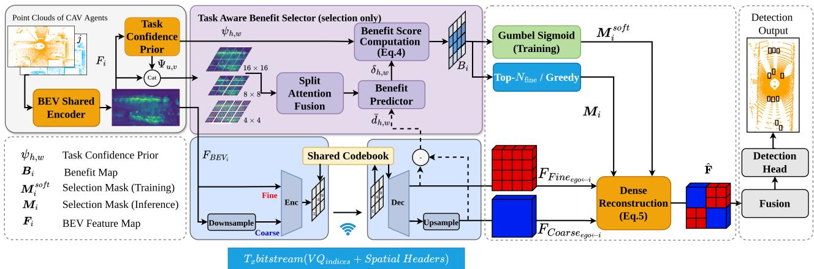  
Figure 1. Overview of our Dual-Resolution Budget-Aware Transmission Framework. CAV i extracts BEV features $\mathbf { F } _ { i }$ (Sec. 3.1) and computes a pooled task-confidence prior $\psi _ { h , w }$ (Sec. 3.2). Guided by $\psi _ { h , w } ,$ , the selector predicts a benefit map $B _ { i }$ to output a soft mask $M _ { i } ^ { \mathrm { { s o \bar { f } } \bar { t } } }$ for budgeted training via dual ascent (Secs. 3.3 and 3.4), or a deterministic Top- $N _ { \mathrm { f i n e } }$ mask $M _ { i }$ for strict inference constraints. The ego vehicle decodes the highly compressed payload (VQ indices and spatial headers) to reconstruct $M _ { i }$ and the dense feature map Fˆ for fusion (Sec. 3.6). The dashed arrow $( \bar { d } _ { h , w } )$ denotes the regularized offline supervision target (Sec. 3.5).

Compression is performed with a shared Vector-Quantized Variational Autoencoder $( \mathrm { V Q - V A E } )$ codebook $\mathcal { C } \in \mathbb { R } ^ { K \times D }$ . For each latent token $\mathbf { f } _ { h , w , t } \in \mathbb { R } ^ { D }$ , quantization selects the nearest codebook vector:

$$
k _ { h , w , t } = \mathop { \arg \operatorname* { m i n } } _ { k \in \{ 1 , \dots , K \} } \| \mathbf { f } _ { h , w , t } - \mathbf { e } _ { k } \| _ { 2 } ^ { 2 } , \qquad \mathbf { e } _ { k } \in \mathcal { C } .\tag{1}
$$

We use SimVQ [52] for stable codebook utilization, but the coverage-refinement allocation is codec-independent: the codec maps transmitted representations to compact indices, while our policy determines where fine resolution is spent.

• Fine refinement. A selected cell is transmitted at full spatial resolution, yielding $n _ { \mathrm { f i n e } } = ( C _ { \mathrm { c e l l } } / s _ { \mathrm { e n c } } ) ^ { 2 }$ tokens.

• Coarse base layer. The full BEV map is downsampled $S _ { \mathrm { b a s e } }$ before quantization and upsampled after decoding, providing dense low-rate coverage. For accounting on the same cell grid, each cell-equivalent region contributes $n _ { \mathrm { c o a r s e } } \approx n _ { \mathrm { f i n e } } / S _ { \mathrm { b a s e } } ^ { 2 }$ tokens.

Both branches share the same VQ-VAE weights, so decoded coarse and fine features remain in a unified feature space. With $s _ { \mathrm { e n c } } = 1 , C _ { \mathrm { c e l l } } = 1 6$ , and $S _ { \mathrm { b a s e } } ~ = ~ 4 .$ , a selected fine cell contains $1 6 \times 1 6 = 2 5 6$ tokens, while its cell-equivalent coarse region contains $4 \times 4 = 1 6$ tokens. In Sec. 4, we isolate the coverage-refinement design from quantization by comparing raw full, raw coarse, and raw coarse+fine transmission. Fig. 2 illustrates the hierarchy between BEV locations, fine-selection cells, the globally downsampled coarse base layer, and VQ tokens.

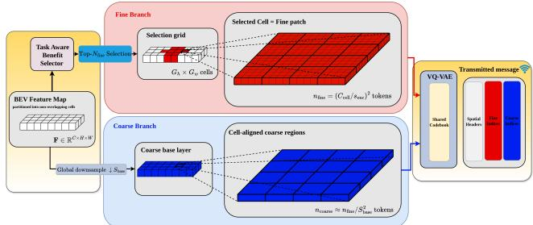  
Figure 2. Spatial hierarchy and bitstream composition. The selector sends selected cells as fine patches, while a globally downsampled BEV map provides the dense coarse base layer. Both branches share the VQ-VAE codebook; the bitstream stores spatial headers, fine indices, and coarse indices.

## 3.2. Task-Aware Benefit Prediction

Task Confidence Prior. We derive task confidence from channel-wise mean absolute BEV activation. For each feature location $( u , v )$

$$
m _ { u , v } = \frac { 1 } { C } \sum _ { c = 1 } ^ { C } \left| \mathbf { F } _ { c , u , v } \right| , \Psi _ { u , v } = \mathrm { c l i p } \left( \frac { m _ { u , v } - p _ { 0 2 } } { p _ { 9 8 } - p _ { 0 2 } + \epsilon } , 0 , 1 \right) ,\tag{2}
$$

where $p _ { 0 2 }$ and $p _ { 9 8 }$ are per-vehicle 2nd/98th percentiles of m. Each cell $( h , w )$ corresponds to a set of dense coordinates $\Omega _ { h , w }$ . We pool the dense prior to a cell-level prior:

$$
\psi _ { h , w } = \operatorname* { m a x } _ { ( u , v ) \in \Omega _ { h , w } } \Psi _ { u , v } .\tag{3}
$$

Multi-Scale Benefit Prediction. All attention operations are performed at the full feature resolution. Our selector network $f _ { \theta }$ processes the concatenated dense input [F, Ψ] using Pyramid Window Attention with parallel window sizes $( 4 \times 4 , 8 \times 8 .$ , and $1 6 \times 1 6 )$ in feature pixels. These representations are aggregated via Split Attention Fusion [48] and projected to predict a dense distortionreduction logit map $\delta _ { u , v } .$ . We then pool to the cell grid as $\delta _ { h , w } = \operatorname* { m a x } _ { ( u , v ) \in \Omega _ { h , w } } \delta _ { u , v } .$ yielding per-cell scores under a shared target budget $B _ { \mathrm { t a r g e t } }$ . The final benefit score is

$$
\beta _ { h , w } = \operatorname* { m a x } \left( \psi _ { h , w } \cdot \left[ w _ { \mathrm { t a s k } } + \left( 1 - w _ { \mathrm { t a s k } } \right) \cdot \sigma ( \delta _ { h , w } ) \right] , \beta _ { \mathrm { f l o o r } } \right) .\tag{4}
$$

where $\delta _ { h , w }$ predicts a distortion-reduction proxy for upgrading cell $( h , w )$ from coarse to fine transmission, and $\sigma ( \cdot )$ is the sigmoid function. The hyperparameter $w _ { \mathrm { t a s k } }$ balances the task confidence prior against pure reconstruction fidelity, while $\beta _ { \mathrm { { f l o o r } } }$ ensures a minimum selection probability for background regions. Crucially, this scalar score, $\beta _ { h , w } ,$ allows us to globally rank and prioritize regions, enabling the system to adaptively allocate bandwidth within any target budget $B _ { \mathrm { t a r g e t } }$ . The score $\beta _ { h , w }$ is used only for ranking cells under a byte budget; it does not require transmitting a dense score map to the receiver.

## 3.3. Differentiable Selection

To enable end-to-end training of a discrete transmission policy, we use a Binary-Concrete relaxation [8, 15]. We collect the predicted benefits into a pragmatic benefit map $B _ { i } = [ \beta _ { h , w } ] \in \mathbb { R } ^ { G _ { h } \times G _ { w } }$ . For each vehicle, the entries of $B _ { i }$ are min-max normalized and median-centered to yield $\beta _ { h , w } . \mathrm { L e t } B _ { \mathrm { c o a r s e } }$ denote the fixed coarse-layer payload and $B _ { \mathrm { f i n e } } = B _ { \mathrm { t a r g e t } } - B _ { \mathrm { c o a r s e } }$ the remaining refinement budget. We then form selection logits $u _ { h , w } \ = \ \ddot { \beta } _ { h , w } \ - \ - - \ \lambda \cdot \ \rho _ { h , w } ,$ where $\rho _ { h , w } ~ = ~ b _ { h , w } / B _ { \mathrm { f i n e } }$ is the normalized transmission cost. To allow differentiable sampling, we inject logistic noise $g _ { h , w } \sim \mathrm { L o g i s t i c } ( 0 , 1 )$ and compute a soft selection mask $M _ { h , w } ^ { \mathrm { s o f t } } \ = \ \sigma ( ( u _ { h , w } + g _ { h , w } ) / \tau )$ , where $\tau$ is linearly annealed during training to mitigate train-test distribution shift.

Here $M ^ { \mathrm { s o f t } } \ \in \ \mathbb { R } ^ { G _ { h } \times G _ { w } }$ is applied to $\mathbf { F } _ { \mathrm { f i n e } } , \mathbf { F } _ { \mathrm { c o a r s e } } \in$ $\mathbb { R } ^ { C \times H \times W }$ by tiling each mask entry over its corresponding spatial region $\Omega _ { h , w }$ (and broadcasting across channels). The reconstructed feature map is a soft blend of both modes:

$$
\hat { \mathbf { F } } = ( 1 - M ^ { \mathrm { s o f t } } ) \odot \mathbf { F } _ { \mathrm { c o a r s e } } + M ^ { \mathrm { s o f t } } \odot \mathbf { F } _ { \mathrm { f i n e } } .\tag{5}
$$

At inference, each cell has a predicted benefit $\beta _ { h , w } . ~ \mathrm { A s }$ described in Supp. Sec. D, the fine-patch payload is constant, $\mathrm { i . e . , } b _ { h , w } = B _ { \mathrm { p a t c h } } ( \mathrm { e . g . , } 1 , 5 8 4$ bits) for all candidate cells. Under this uniform-cost setting, our per-vehicle budgeted selection formulation becomes a 0-1 knapsack problem with identical weights. This is mathematically equivalent to selecting the $\mathrm { T o p } { - } N _ { \mathrm { f i n e } }$ cells ranked by $\beta _ { h , w }$ , where $N _ { \mathrm { f i n e } } ~ = ~ \lfloor ( B _ { \mathrm { t a r g e t } } - B _ { \mathrm { c o a r s e } } ) / B _ { \mathrm { p a t c h } } \rfloor$ . Since all fine cells have identical cost, greedy $\mathrm { T o p } { - } N _ { \mathrm { f i n e } }$ selection is optimal for the per-agent refinement budget. Moreover, decreasing the budget simply truncates the same ranked list, producing nested selections across budgets. This property enables zero-retraining budget adaptation at inference. To maximize bandwidth efficiency, the final deterministic mask M is not transmitted as a dense binary grid; rather, the coordinates of the selected Top- $N _ { \mathrm { f i n e } }$ cells are extracted and transmitted as per-patch spatial headers, allowing the receiver to reconstruct $\mathbf { M } _ { i }$

## 3.4. Budget-Constrained Training

During training, the dense coarse base layer has a fixed payload $B _ { \mathrm { c o a r s e } } ,$ so the remaining refinement budget is $B _ { \mathrm { f i n e } } =$ $B _ { \mathrm { t a r g e t } } - B _ { \mathrm { c o a r s e } } .$ . The soft mask induces an expected finerefinement payload $\begin{array} { r } { \hat { B } _ { \mathrm { f i n e } } = \sum _ { h , w } M _ { h , w } ^ { \mathrm { s o f t } } b _ { h , w } } \end{array}$ . We penalize budget violations by comparing $\hat { B } _ { \mathrm { f i n e } }$ against $B _ { \mathrm { f i n e } }$

$$
\mathrm { p e n } ( \hat { B } _ { \mathrm { f i n e } } ) = 2 { \cdot } \mathrm { R e L U } \left( \frac { \hat { B } _ { \mathrm { f i n e } } } { B _ { \mathrm { f i n e } } } - 1 \right) + \mathrm { R e L U } \left( 0 . 8 - \frac { \hat { B } _ { \mathrm { f i n e } } } { B _ { \mathrm { f i n e } } } \right) .\tag{6}
$$

The first term strongly discourages over-budget messages, while the second avoids trivial under-use of the channel. The penalty weight is controlled by a dual variable λ, updated by projected dual ascent during training. In inference, no soft penalty is needed because deterministic Top-Nfine selection exactly satisfies the target byte budget.

## 3.5. Training Objectives

The system is trained end-to-end from scratch, minimizing a joint objective that comprises detection accuracy, codebook commitment, selector supervision, and the dynamic budget penalty:

$$
\mathcal { L } = \mathcal { L } _ { \mathrm { d e t } } + \alpha _ { \mathrm { v q } } \mathcal { L } _ { \mathrm { V Q } } + \alpha _ { \mathrm { r d } } \mathcal { L } _ { \mathrm { s u p } } + \mathcal { L } _ { \mathrm { b u d g e t } } ,\tag{7}
$$

Detection $( { \mathcal { L } } _ { \mathbf { d e t } } )$ & Commitment Losses $( \mathcal { L } _ { \mathbf { V } \mathbf { Q } } )$ . We apply standard detection losses (Focal Loss for classification heatmaps and Smooth-L1 for bounding box regression parameters) to the final fused feature map. To ensure continuous embeddings align stably with the discrete codebook, we minimize the standard VQ commitment loss [25] alongside our joint objective.

Benefit supervision. To train the selector, we construct an offline target measuring the relative gain of fine over coarse reconstruction:

$$
\begin{array} { r } { \Delta d _ { h , w } = \log \left( \Vert \mathbf { F } _ { h , w } - \mathbf { F } _ { \mathrm { c o a r s e } , h , w } \Vert _ { 2 } ^ { 2 } \right) - \log \left( \Vert \mathbf { F } _ { h , w } - \mathbf { F } _ { \mathrm { f i n e } , h , w } \Vert _ { 2 } ^ { 2 } \right) . } \\ { ( 8 ) \qquad } \end{array}
$$

We normalize this value to $\bar { d } _ { h , w } \in [ 0 , 1 ]$ and gate it by the task prior $\psi _ { h , w } :$

$$
\beta _ { h , w } ^ { * } = \operatorname* { m a x } \bigr ( \psi _ { h , w } \left[ w _ { \mathrm { t a s k } } + ( 1 - w _ { \mathrm { t a s k } } ) \bar { d } _ { h , w } \right] , \beta _ { \mathrm { f l o o r } } \bigr )\tag{9}
$$

This suppresses high log-ratio values in empty or noisy regions and encourages refinement where reconstruction gain

is also task-relevant. The selector is trained with Smooth-L1 losses on both $\beta _ { h , w }$ and the auxiliary distortion term $\sigma ( \delta _ { h , w } )$ , with stop-gradient applied to the targets.

## 3.6. Reconstruction and Cooperative Fusion

At the receiver, coarse and selected fine indices are decoded with the shared VQ codebook. The transmitted patch headers reconstruct the refinement mask, which replaces the corresponding coarse regions with fine-resolution features to obtain a dense map Fˆ . Neighbor features are then warped into the ego frame and fused with a standard BEV fusion module. We use SwapFusion [34] by default and additionally evaluate MaxFusion and Where2comm-style fusion in Sec. 4.4. Since reconstruction is dense, no sparse-specific validity masks or fusion modifications are required.

## 4. Evaluation

## 4.1. Implementation Details

We evaluate on the real-world DAIR-V2X [46] and simulated OPV2V [36] benchmarks, which represent complementary V2I and V2V cooperative-perception settings [41]. Following standard cooperative-perception settings [9, 30, 33], PointPillars voxelization uses a (0.4 m, 0.4 m, 4.0 m) grid, and the encoder outputs the intermediate BEV feature map F after a 4× spatial downsampling stride. DAIR-V2X annotations are extended following common practice [14]. Unless stated otherwise, controlled variants share the same backbone, detection head, fusion module, training protocol, and evaluation code, differing only in the transmitted representation.

Payload is reported as the decodable per-agent message size, i.e., the bit-packed representation including all VQ indices and side information required for reconstruction; dense masks and benefit maps are not transmitted. We use 1 KB = 1,000 bytes. CoBEVT-DR reports realized payload under a strict per-message cap, whereas threshold-based baselines use the dataset-average operating point closest to the target budget. Our SimVQ codebook uses K = 64 entries (6 bits/token) with latent dimension d = 64. The BEV map is partitioned into 16×16 cells; each selected fine patch contains 256 tokens (1,536 bits), while the $S _ { \mathrm { b a s e } } = 4$ coarse layer contributes 16 tokens (96 bits) per cell-equivalent region. Each fine patch also carries a 48-bit spatial header including coordinates, framing, and CRC-16. Full accounting is provided in Supp. Sec. D.

For reproduced baselines, we use official implementations and released fusion modules when available. If a method is incompatible with our controlled Open-COOD/PointPillars+SwapFusion setup, we evaluate its communication module within the same detector and fusion pipeline to isolate communication efficiency. Megabytescale baselines are omitted from OPV2V kilobyte-regime comparisons; dense CoBEVT is reported as the dense uncompressed reference. Models are trained for 30 epochs on one RTX 4090, with batch size 4 for DAIR-V2X and 2 for OPV2V. Hyperparameters and additional codec studies are given in Supp. Secs. A and B.

## 4.2. Controlled Diagnostics

Before comparing against external baselines, we isolate the source of the communication gain through two controlled diagnostics: a frozen-checkpoint selector isolation and a noquantization feature diagnostic.

Table 1. Controlled diagnostics on DAIR-V2X. (A) Frozencheckpoint selector isolation under the same 2 KB cap. (B) No-VQ diagnostic separating coverage-refinement allocation from quantization. Payload is per non-ego agent; C/F denotes coarse/fine.
<table><tr><td>Test</td><td>Variant</td><td>AP@0.5↑</td><td>AP@0.7↑</td><td>KB↓</td></tr><tr><td rowspan="3">(A) Frozen ranking</td><td>Random</td><td>0.680</td><td>0.573</td><td>1.878</td></tr><tr><td>Prior only (ψ)</td><td>0.713</td><td>0.589</td><td>1.878</td></tr><tr><td>Learned benefit (β)</td><td>0.736</td><td>0.604</td><td>1.878</td></tr><tr><td rowspan="4">(B) No VQ</td><td>Raw full</td><td>0.720</td><td>0.580</td><td>6291.46</td></tr><tr><td>Raw C</td><td>0.651</td><td>0.546</td><td>393.22</td></tr><tr><td>Raw C+F (25% fine cells)</td><td>0.715</td><td>0.583</td><td>1966.12</td></tr><tr><td>DR+SimVQ</td><td>0.736</td><td>0.604</td><td>1.878</td></tr></table>

Note: In the no-VQ diagnostic, Raw C+F uses the dense raw coarse base plus the same selected fine-cell ratio as the 2 KB DR setting, but transmits raw features without quantization.

Frozen-checkpoint selector isolation. Tab. 1(A) isolates the ranking policy from codec training. All variants use the same frozen encoder, SimVQ codebook, decoder, detection head, coarse layer, and 2 KB payload cap; only the inference-time ranking score is changed. Thus, the quantizer cannot be specialized differently for random, prioronly, or learned selection. The learned benefit score improves over both random selection and the task-prior-only ranking at the same 1.878 KB payload, indicating that the selector improves the allocation of fixed codec capacity rather than relying only on codec-selector co-adaptation.

No-quantization diagnostic. Tab. 1(B) removes SimVQ from the diagnostic variants. Raw coarse transmission provides dense coverage but loses fine detail, while raw coarse+fine recovers near full-raw accuracy at substantially lower payload. Thus, the dual-resolution layout contributes independently of quantization. SimVQ then reduces this MB-scale coverage-refinement representation to the final kilobyte regime.

## 4.3. Comparison with Communication-Efficient Baselines

Tab. 2 compares detection accuracy and communication cost under ideal pose. Since cooperative-perception results are sensitive to dataset split, annotation extension, spatial range, backbone, fusion module, training schedule, and payload accounting, we separate protocolcontrolled comparisons from external baselines. The controlled CoBEVT codec variants use the same Open-COOD/CoBEVT pipeline, detector, fusion module, training protocol, and evaluation code, isolating the effect of the transmitted representation. External baselines are reported using released implementations when compatible; otherwise, controlled reproductions are explicitly marked. Payload is measured as average decodable KB per non-ego agent per frame, including all side information required for receiver reconstruction. For sparse baselines, masks or selected regions are encoded in the most compact decodable form supported by the implementation, using coordinates or bit-packed indices when available rather than assuming dense floating-point score maps. For threshold-based masking methods, we sweep the masking threshold and report the operating point whose mean payload is closest to our target budget. In contrast, CoBEVT-DR enforces a strict byte cap through ranked truncation. Within the controlled

Table 2. Accuracy-payload comparison under ideal pose. Payload (KB) is the average decodable message size per non-ego agent. Threshold-based methods report the closest mean payload from a sweep. OPV2V is denser; MB-scale baselines are omitted from the kilobyte-regime comparison and shown as N/A.
<table><tr><td rowspan="2">Method</td><td colspan="3">DAIR-V2X [46]</td><td colspan="3">OPV2V [36]</td></tr><tr><td>AP@0.5↑</td><td>AP@0.7↑</td><td>KB↓</td><td>AP@0.5↑</td><td>AP@0.7↑</td><td>KB↓</td></tr><tr><td colspan="7">Dense &amp; Sparse Baselines (High Bandwidth)</td></tr><tr><td>CoBEVT (Original)</td><td>0.72</td><td>0.58</td><td>6291.46</td><td>0.95</td><td>0.88</td><td>8650</td></tr><tr><td>Where2comm [5]</td><td>0.72</td><td>0.57</td><td>2415.22</td><td></td><td>N/A (MB-scale)</td><td></td></tr><tr><td>ERMVP [49]</td><td>0.70</td><td>0.57</td><td>1230.00</td><td></td><td>N/A (MB-scale)</td><td></td></tr><tr><td>EffiComm [43]</td><td>0.72</td><td>0.57</td><td>785.00</td><td></td><td>N/A (MB-scale)</td><td></td></tr><tr><td colspan="7">Efficient &amp; Quantized Approaches (Low Bandwidth)</td></tr><tr><td>CodeFilling [7]</td><td>0.74</td><td>0.59</td><td>~27.00</td><td>0.92</td><td>0.85</td><td>~12.00</td></tr><tr><td>CoSDH* [33]</td><td>0.67</td><td>0.54</td><td>~4.63</td><td>0.85</td><td>0.73</td><td>~3.3</td></tr><tr><td>mmCooper [9]</td><td>0.70</td><td>0.57</td><td>~3.80</td><td>0.95</td><td>0.88</td><td>~9.40</td></tr><tr><td>InfoCom+ (SwapFusion) [30]</td><td>0.66</td><td>0.55</td><td>~2.32</td><td>0.95</td><td>0.86</td><td>~2.92</td></tr><tr><td colspan="7">Controlled CoBEVT Codec Variants</td></tr><tr><td>CoBEVT-RVQ† (3-stage, K = 64)</td><td>0.70</td><td>0.54</td><td>13.82</td><td>0.94</td><td>0.86</td><td>19.2</td></tr><tr><td>CoBEVT-SimVQ (K = 64)</td><td>0.71</td><td>0.52</td><td>4.61</td><td>0.94</td><td>0.85</td><td>6.41</td></tr><tr><td>CoBEVT-DR</td><td>0.74</td><td>0.60</td><td>1.87</td><td>0.95</td><td>0.87</td><td>1.98</td></tr></table>

Notes. + InfoCom is integrated into our PointPillars+SwapFusion pipeline because the released fusion stack is incompatible with our controlled OpenCOOD setup. We report decodable payload, including latent features, quantized masks, and bit-packed indices; see Supp. Sec. D.  
CoSDH is request-response by design. We report a budget-adjusted operating point obtained by sweeping the communication threshold. Our reproduction of the original high-payload operating point reaches 0.773 AP@0.5 and 0.598 AP@0.7 on DAIR-V2X, but requires 174.53 KB per non-ego agent; this full operating point is included in Fig. 4a. To avoid penalizing CoSDH for its query stage, all CoSDH payloads report only the response payload from non-ego agent to ego, following [33]; see Supp. Sec. D.

† CoBEVT-RVQ is our reproduction of an RVQ-based baseline in the same CoBEVT pipeline, following [23], for which no official implementation is available.

codec comparison, increasing quantization rate alone does not recover the same trade-off. Uniform SimVQ reaches 0.52 AP@0.7 at 4.61 KB and three-stage RVQ reaches 0.54 at 13.82 KB, whereas CoBEVT-DR achieves 0.60 AP@0.7 at only 1.87 KB. This shows that task-aware spatial allocation is substantially more effective than uniformly increasing codec rate in the kilobyte regime. Additional codec studies in Supp. Sec. B support this design choice: global downsampling strongly degrades high-IoU precision, Finite Scalar Quantization (FSQ) and AutoEncoder (AE) require substantially larger payloads, and RVQ improves accuracy mainly by increasing the number of transmitted stages. We do not interpret the small gain over dense CoBEVT on DAIR-V2X as evidence that lossy compression is generally superior to dense transmission; rather, uniform SimVQ and RVQ remain below the dense reference, and the gain appears only when bytes are allocated through the taskaware coverage-refinement policy. Compared with lowbandwidth external baselines under the stated protocols, CoBEVT-DR provides a strong accuracy-payload trade-off on DAIR-V2X and remains close to dense CoBEVT-level accuracy on OPV2V while using only kilobyte-scale messages. Additional qualitative comparisons are provided in Supp. Sec. H.

## 4.4. Generalization and Dynamic Bandwidth

We evaluate whether the proposed coverage-refinement principle transfers across fusion modules, LiDAR backbones, and downstream BEV tasks, and whether a single trained model adapts to changing byte budgets without retraining. Dynamic-object BEV segmentation results are provided in Supp. Sec. I, while additional V2X-Real [32] and V2XVerse [11] experiments on multi-class detection are reported in Supp. Sec. J and K.

Fusion-module generalization. To test whether the proposed message construction and allocation design depends on CoBEVT’s attention fusion, we integrate the same coverage-refinement communication design into nonattention MaxFusion and Where2comm [5] multi-scale fusion. For Where2comm, we disable its original sparse communication mechanism during training and replace the transmitted message with our dense coarse plus sparse refinement representation. As shown in Tab. 3, DR improves AP@0.7 under both fusion settings while reducing payload to the kilobyte regime. This indicates that the proposed communication design is not tied to a specific fusion operator.

Table 3. Fusion generalization on DAIR-V2X. DR improves high-IoU accuracy with MaxFusion and Where2comm-style fusion while reducing payload to the kilobyte regime. Payload is per non-ego agent.
<table><tr><td>Fusion</td><td>Communication</td><td>AP@0.5↑</td><td>AP@0.7↑</td><td>KB↓</td></tr><tr><td>MaxFusion</td><td>SimVQ</td><td>0.686</td><td>0.457</td><td>4.61</td></tr><tr><td>MaxFusion</td><td>DR</td><td>0.682</td><td>0.525</td><td>1.878</td></tr><tr><td>Where2comm</td><td>SimVQ</td><td>0.700</td><td>0.532</td><td>4.61</td></tr><tr><td>Where2comm</td><td>DR</td><td>0.721</td><td>0.575</td><td>1.878</td></tr></table>

Backbone generalization. We replace only the LiDAR backbone with SECOND [38], while keeping the communication head, Task-Aware Benefit Selector, and SwapFusion module unchanged. The communicated tensor maintains the same dense BEV interface, with C = 256 channels and a spatial size of 48 × 128; therefore, the same cell decomposition, tokenization, and payload accounting apply. As shown in Tab. 4, DR improves SECOND+SimVQ from 0.681 to 0.707 AP@0.5 and from 0.404 to 0.518 AP@0.7 at a lower payload. This suggests that the gain comes from the coverage-refinement communication design rather than a PointPillars-specific interaction.

Table 4. Backbone generalization with SECOND on DAIR-V2X. DR improves over uniform SimVQ with the SECOND backbone at lower payload. Payload is per non-ego agent.
<table><tr><td>Method</td><td>AP@0.5↑</td><td>AP@0.7↑</td><td>KB↓</td></tr><tr><td>SECOND</td><td>0.712</td><td>0.499</td><td>6291.46</td></tr><tr><td>SECOND + SimVQ</td><td>0.681</td><td>0.404</td><td>4.61</td></tr><tr><td> $\mathrm { S E C O N D + O u r s }$ </td><td>0.707</td><td>0.518</td><td>1.878</td></tr></table>

Dynamic budget adaptation. Finally, we test whether one trained model can operate under changing byte budgets. As established in Sec. 3.3, constant fine-patch cost makes the selected patch set a nested ranked prefix. Fig. 3 visualizes this behavior: the selector first allocates fine patches to high-value object cores and then expands toward surrounding context as the budget increases. Quantitatively, Tab. 5(A) evaluates one trained model across fixed hard budget caps on DAIR-V2X. The coarse layer alone provides a dense fallback, and performance saturates around the 2.0 KB operating point. Tab. 5(B) further evaluates per-frame, per-agent budget variation on OPV2V, where each agent receives a budget from {0, 1, 2} KB and transmits the largest decodable prefix that fits the assigned cap. Under this dynamic schedule, the model maintains 0.920 AP@0.5 at only 1.213 KB average payload, demonstrating zero-retraining adaptation to abrupt bandwidth changes. Multi-agent scaling with up to five non-ego collaborators is reported in Supp. Sec. E; under a 2.0 KB/agent cap, total communication remains only 10 KB at N=5, compared with ∼ 31.4 MB for dense exchange.

## 4.5. Robustness to Real-World Challenges

Following the noise settings in [9, 35], composite localization and heading noise are sampled from Gaussian distributions $\mathcal { N } ( 0 , \sigma _ { t } )$ and $\mathcal { N } ( 0 , \sigma _ { \theta } )$ , with $\sigma _ { t } \in$ $\{ 0 . 0 , 0 . 1 , 0 . 3 , 0 . 5 \}$ m and $\sigma _ { \theta } ~ \in ~ \{ 0 . 0 , 0 . 1 , 0 . 3 , 0 . 5 \} ^ { \circ }$ . We also introduce sender-side time delays to simulate asynchronous communication. Fig. 4 summarizes the results.

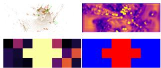  
(a) Task-Aware Pipeline: Scene context mapped to Benefit Map and selection mask. Red: Fine patches; Blue: Coarse floor.

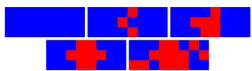  
(b) Monotonic Scalability: Policy expands strictly from object cores to context as budget increases.  
Figure 3. Integrated Scalability Analysis. Visual logic (a) and mask expansion (b) illustrate the learned refinement policy used for fixed and dynamic budget adaptation.

Table 5. Budget adaptation. (A) Fixed-budget scalability on DAIR-V2X using a single trained model. (B) Dynamic per-frame budget scheduling on OPV2V, where each agent receives a budget from {0, 1, 2} KB and 0 KB means no transmission.  
(A) Fixed budget scalability on DAIR-V2X
<table><tr><td>Budget</td><td>AP@0.5↑</td><td>AP@0.7↑</td><td>R@0.5↑</td></tr><tr><td>Coarse</td><td>0.645</td><td>0.554</td><td>0.670</td></tr><tr><td>1.0 KB</td><td>0.706</td><td>0.588</td><td>0.743</td></tr><tr><td>1.5 KB</td><td>0.730</td><td>0.601</td><td>0.773</td></tr><tr><td>2.0 KB</td><td>0.736</td><td>0.604</td><td>0.779</td></tr><tr><td>3.0 KB</td><td>0.738</td><td>0.605</td><td>0.782</td></tr></table>

(B) Dynamic budget scheduling on OPV2V
<table><tr><td>Budget</td><td>AP@0.5↑</td><td>AP@0.7↑</td><td>R@0.5↑</td><td>KB↓</td></tr><tr><td>1KB</td><td>0.934</td><td>0.853</td><td>0.943</td><td>0.99</td></tr><tr><td>2KB</td><td>0.955</td><td>0.874</td><td>0.966</td><td>1.98</td></tr><tr><td>0/1/2 KB</td><td>0.920</td><td>0.830</td><td>0.932</td><td>1.213</td></tr></table>

Localization and pose error. Dense fusion and uniform quantization achieve strong peak accuracy but are sensitive to spatial misalignment, while highly sparse baselines are more stable but have lower performance ceilings. CoBEVT-DR provides a middle ground: the coarse base layer supplies a continuous spatial anchor, while fine patches preserve high-utility details. Under severe noise (0.5 m/0.5◦), CoBEVT-DR remains around 0.65 AP@0.5 while retaining a stronger clean-pose operating point.

Asynchronous time delays. We evaluate temporal misalignment on OPV2V with delays up to 200 ms. Dense fusion degrades strongly as stale features are aggregated, whereas CoBEVT-DR maintains 0.834 AP@0.5 at 200 ms. Its stability is comparable to the aggressively sparse Info-Com baseline, but with a higher clean-pose accuracy. This indicates that the compressed coarse representation provides a useful regularized fallback under moderate asynchrony, although our method does not explicitly perform temporal compensation.

Real-time feasibility. Our one-shot broadcast design avoids the request-response handshakes required by interactive protocols such as CoSDH [33]; detailed latency modeling is provided in Supp. Sec. F.

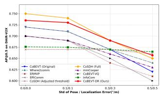

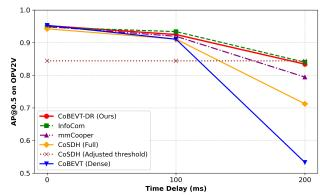  
(a) Pose and Localization Error Robustness on DAIR-V2X Dataset  
(b) Time Delay Robustness on OPV2V  
Figure 4. Robustness Analysis. (a) Pose Error: High-bandwidth baselines (Full) degrade rapidly under noise, while thresholdconstrained versions (Adjusted) suffer from low performance ceilings. (b) Time Delays: CoBEVT-DR and InfoCom show comparable stability, while CoBEVT-DR maintains a stronger clean-pose operating point.

## 4.6. Ablation Studies

We validate the main architectural choices under strict bandwidth budgets on DAIR-V2X. Tab. 6 studies the coarse-layer stride and cell size, Tab. 7 evaluates task-aware supervision, and Tab. 8 verifies the need for the dense coarse floor.

Structural ablation. We ablate the coarse-layer stride $S _ { \mathrm { b a s e } }$ and selection granularity $C _ { \mathrm { c e l l } }$ in Tab. 6. Setting $S _ { \mathrm { b a s e } } = 2$ consumes ∼1.16 KB of the budget for the base layer and leaves too little capacity for refinement, while $S _ { \mathrm { b a s e } } = 8$ is too coarse to provide a meaningful semantic floor. Our default $S _ { \mathrm { b a s e } } = 4$ provides the best trade-off. For granularity, coarser selection $( C _ { \mathrm { c e l l } } = 3 2 )$ wastes bandwidth on background regions, while fine selection $( C _ { \mathrm { c e l l } } = 8 )$ increases metadata overhead. We therefore use $C _ { \mathrm { c e l l } } = 1 6$

Table 6. Structural ablation at 2.0 KB. Effect of base-layer stride $S _ { \mathrm { b a s e } }$ and cell granularity $C _ { \mathrm { c e l l } }$
<table><tr><td>Param.</td><td>Set</td><td>Base↓</td><td>AP@0.5↑</td><td>AP@0.7↑</td></tr><tr><td rowspan="3"> $S _ { \mathrm { b a s e } }$ </td><td>8</td><td>~0.08</td><td>0.726</td><td>0.594</td></tr><tr><td>2</td><td>~1.16</td><td>0.730</td><td>0.593</td></tr><tr><td>4</td><td>~0.29</td><td>0.736</td><td>0.604</td></tr><tr><td rowspan="3"> $C _ { \mathrm { c c l l } }$ </td><td>8</td><td>一</td><td>0.735</td><td>0.600</td></tr><tr><td>32</td><td>一</td><td>0.718</td><td>0.589</td></tr><tr><td>16</td><td>一</td><td>0.736</td><td>0.604</td></tr></table>

Selector supervision. We compare task-aware selector supervision against a task-agnostic variant trained only on the internal reconstruction-improvement signal (∆MSE). This ablation tests whether selecting cells by reconstruction gain alone is sufficient, or whether refinement must be aligned with downstream detection utility. As shown in Tab. 7, task-aware supervision improves AP@0.5 by +3.3 points and AP@0.7 by +4.9 points at 2.0 KB. Selector architecture and utility diagnostics are provided in Supp. Secs. C and G. The adopted Pyramid Attention selector uses 1.27 M parameters and 28.84 GFLOPs, and its predicted benefit achieves a ROC-AUC of 0.785 for identifying highutility patches according to counterfactual marginal detection loss.

Table 7. Selector supervision ablation. Task-aware supervision Ψ outperforms reconstruction-only supervision ∆MSE.
<table><tr><td rowspan="2">Target</td><td colspan="2">1.0 KB</td><td colspan="2">2.0 KB</td></tr><tr><td>AP@0.5↑</td><td>AP@0.7↑</td><td>AP@0.5↑</td><td>AP@0.7↑</td></tr><tr><td>Ψ</td><td>0.706</td><td>0.588</td><td>0.736</td><td>0.604</td></tr><tr><td>∆MSE</td><td>0.676</td><td>0.535</td><td>0.703</td><td>0.555</td></tr></table>

No-coarse diagnostic. To test whether fine patches alone are sufficient, we remove the coarse layer and reallocate the entire 1.0 KB budget to additional fine patches. As shown in Tab. 8, zero-filling missing regions performs poorly, and even adding a validity mask remains below our dualresolution design. This confirms that a dense low-resolution semantic floor is more useful than simply maximizing the number of high-resolution patches under the same byte budget.

Table 8. No-coarse diagnostic at 1.0 KB. Removing the coarse base layer degrades performance, especially when missing regions are zero-filled.
<table><tr><td>Setting</td><td>AP@0.5↑</td><td>AP@0.7↑</td></tr><tr><td>No-coarse + zero-fill</td><td>0.360</td><td>0.290</td></tr><tr><td>No-coarse + validity-mask</td><td>0.663</td><td>0.540</td></tr><tr><td>Ours (DR)</td><td>0.706</td><td>0.588</td></tr></table>

## 5. Conclusion

We presented a dual-resolution collaborative perception framework that combines dense coarse BEV coverage with task-aware sparse refinement under kilobyte-scale budgets. The method preserves a standard dense fusion interface while enabling strict payload control and dynamic budget adaptation. Experiments on DAIR-V2X and OPV2V show strong accuracy–payload trade-offs across fusion modules, backbones, dynamic budgets, localization noise, and delay. Limitations and Future Work. One-shot broadcast does not remove cross-agent redundancy, so communication still grows with the number of collaborators. Future work will explore redundancy-aware coordination and task-specific refinement for downstream decision tasks.

## Supplementary Material for Dense Coverage, Sparse Refinement: Byte-Constrained Cooperative Perception

A. Hyperparameter

Table 9. Methodological Configuration. Condensed hyperparameters for training, architecture, and the differentiable selector (Train | Inference). Unless stated otherwise, dataset-dependent values are reported as DAIR-V2X / OPV2V.
<table><tr><td>Parameter</td><td>Value / Setting</td></tr><tr><td colspan="2">Training Setup</td></tr><tr><td>Hardware</td><td>1 × RTX 4090</td></tr><tr><td>Epochs</td><td> $3 0 / 4 0$ </td></tr><tr><td>Batch size</td><td>4/2</td></tr><tr><td>Optimizer</td><td> $\mathrm { A d a m W }$ </td></tr><tr><td>LR (detector)</td><td> $1 \times 1 0 ^ { - 3 } / 2 \times 1 0 ^ { - 3 }$ </td></tr><tr><td>LR (selector)</td><td> $2 \times 1 0 ^ { - 4 } / 5 \times 1 0 ^ { - 4 }$ </td></tr><tr><td>LR (codebook)</td><td> $5 \times 1 0 ^ { - 4 } / 1 \times 1 0 ^ { - 3 }$ </td></tr><tr><td>Warm-up epochs</td><td> $5 / 5$ </td></tr><tr><td>Warm-up LR</td><td> $2 \times 1 0 ^ { - 4 } / 2 \times 1 0 ^ { - 4 }$ </td></tr><tr><td>Scheduler</td><td>CosineAnneal</td></tr><tr><td colspan="2">Architecture &amp; Loss Weights</td></tr><tr><td>BEV Channels / Codebook (K, d)</td><td>256 / (64, 64)</td></tr><tr><td>Selector Attn. (Dim / Heads / Fusion)</td><td>256 / 4 / SplitAttn</td></tr><tr><td>Patch Cell Size (c) / Metadata</td><td>16 / 48-bit</td></tr><tr><td>Joint Loss Weights  $( \alpha _ { \mathrm { v q } } , \alpha _ { \mathrm { r d } } )$ </td><td>0.5, 2.0</td></tr><tr><td>Detection Loss Weights (Cls. / Reg.)</td><td>1.0, 2.0</td></tr><tr><td>Benefit Sup.  $\mathrm { C o n f i g . \ ( } | S | , w _ { \mathrm { t a s k } } , \gamma , \beta _ { \mathrm { f l o o r } } )$ </td><td>256, 0.5, 0.5, 0.1</td></tr><tr><td colspan="2">Selector Dynamics (Train → Inference)</td></tr><tr><td>Temperature (τ)</td><td> $1 . 0  0 . 2 \ | \ \mathrm { G r e e d y }$ </td></tr><tr><td>Budget Penalty  $\mathbf { \alpha } ^ { \prime } \left( \lambda \right)$ </td><td> $\operatorname { I n i t } 0 , \operatorname { E M A } { \dot { 0 } } . 9 \mid \mathrm { N } / \mathrm { \dot { A } }$ </td></tr><tr><td>Sampling  $\boldsymbol { ( X / Y ) } ^ { * }$ </td><td> $5 0 / 1 2 8 \to 5 0 / 3 0 \mid \mathrm { T o p } { - } N _ { \mathrm { f i n e } }$ </td></tr><tr><td>Target Budget  $( B _ { t a r g e t } )$ </td><td> $3 . 0 \mathrm { K B } \mid \mathrm { D y n a m i c }$ </td></tr><tr><td>Base Stride (S)</td><td>4</td></tr></table>

\*Codec Stabilization: $X / Y$ denotes selecting X highest-utility patches and Y random patches. High initial random exposure $( \bar { k } _ { \mathrm { r a n d } } = 1 2 8 )$ prevents early codebook collapse, gradually transitioning to selector-focused exploitation.

Selector Architecture Details. The Pyramid Window Attention module operates directly on the pooled 48 × 128 spatial grid. It comprises a transformer block with an input/hidden dimension of 256, 4 attention heads (with a perhead dimension of 64), and learnable 2D relative positional embeddings. It processes the feature map through parallel window sizes of $4 \times 4 , 8 \times 8 ,$ and $1 6 \times 1 6$ , and aggregates the multi-scale outputs using a channel-wise Split Attention fusion mechanism.

## B. Architectural Justification (Preliminary Studies)

We conducted a systematic ablation study directly on the DAIR-V2X dataset to determine the optimal compression strategy. These findings, summarized below, fundamentally shaped our dual-resolution design.

## B.1. Global Downsampling degrades Precision

We investigated simply reducing the spatial resolution of the transmitted feature map to save bandwidth. We conducted this analysis using CoBEVT integrated with SimVQ [52] and a codebook size of $K = 6 4$ . As shown in Tab. 10, applying a global 2× compression factor $( H / 2 , W / 2 )$ reduced the payload by 4× but caused a catastrophic drop in highprecision detection (AP@0.7 dropped from 0.52 to 0.39). Design Decision: Instead of degrading the entire scene, we adopted a sparse fine layer at full resolution to preserve object fidelity.

Table 10. Justification for Fine Layer. Preliminary analysis on DAIR-V2X shows that global downsampling harms precision.
<table><tr><td>Method</td><td>Factor</td><td>AP@0.5</td><td>AP@0.7</td></tr><tr><td>Full Res</td><td>1×</td><td>0.71</td><td>0.52</td></tr><tr><td>Global Downsample</td><td>2×</td><td>0.65</td><td>0.39</td></tr></table>

## B.2. VQ methods to prevent Codebook Collapse

Standard VQ often suffers from codebook under-utilization (dead codes) under strict bandwidth budgets, which reduces bottleneck capacity and destabilizes end-to-end training [20, 24]. We therefore use SimVQ [52], which learns a reparameterization of the code space to improve codebook optimization and mitigate collapse in practice; empirically, it achieves a stronger rate-accuracy trade-off than Finite Scalar Quantization (FSQ) in our setting (Supp. Sec. B.3). Codebook collapse occurs when a large majority of the available codebook vectors are not selected during training, effectively reducing the model’s capacity and leading to poor representation learning. To address this, we evaluated SimVQ by Zhu et al. [52], which is designed to improve codebook utilization. We compared SimVQ against a standard VQ-VAE baseline [25] using CoBEVT on the OPV2V dataset with a codebook size of $K = 1 0 2 4 .$ . To monitor the training dynamics, we used two primary metrics. Codebook usage is visualized as a heatmap showing how frequently each entry is selected, utilizing a $\log _ { 1 0 } ( x + 1 )$ transformation to ensure that low-frequency entries remain visible. The codebook update (∆) is visualized as the $L _ { 2 }$ distance between a codeword at the current and previous epoch, defined as $\| c ^ { ( t ) } - c ^ { ( t - 1 ) } \| _ { 2 }$ , which indicates which specific vectors are actively being updated during the training process. As shown in Fig. 5, the standard VQ approach suffers from severe collapse. By Epoch 11, only four codebook vectors receive any significant updates (Fig. 5c), and the usage remains concentrated in a tiny fraction of the available slots (Fig. 5a). This lack of diversity is further evidenced by a validation loss that rises steadily from the beginning of training. In contrast, SimVQ maintains high codebook utilization (Fig. 5b) and ensures that a wide variety of vectors are actively updated throughout the training process (Fig. 5d). Design Decision: Based on these results, we use SimVQ for all subsequent experiments.

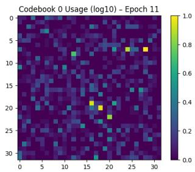  
(a) VQ Codebook Utilization

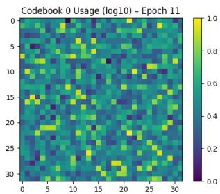  
(b) SimVQ Codebook Utilization

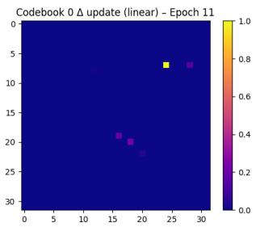  
(c) VQ Codebook Update

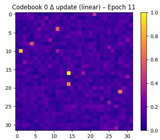  
(d) SimVQ Codebook Update  
Figure 5. Comparison of codebook dynamics at Epoch 11. (a) and (c) show that standard VQ collapses, with only a few vectors being utilized or updated. (b) and (d) demonstrate that SimVQ maintains a healthy, distributed codebook usage and consistent updates across the entire grid.

## B.3. Learned Codebooks outperform Scalar Quantization

We evaluate learned Vector Quantization (SimVQ [52]) against Finite Scalar Quantization (FSQ) [16] and the Autoencoder (AE) compression used in CoBEVT [34]. FSQ uses a fixed, non-learnable grid to quantize latent dimensions independently, whereas SimVQ learns a reparameterization of the code space that improves codebook optimization and mitigates dead-code behavior in practice. Architectural details are summarized in Tab. 11. Tab. 12 highlights the rate–accuracy gap: FSQ requires ∼24–49 KB (≈5–11× higher payload) yet yields only a marginal gain in AP@0.5, while SimVQ operates at 4.61 KB with competitive accuracy. SimVQ also outperforms the CoBEVT-VAE baseline while using ∼20× less bandwidth. Design Decision: We adopt learned codebooks (SimVQ) to maximize spectral efficiency under strict bandwidth constraints.

## B.4. Latent Channel Dimension vs. Codebook Efficiency

Tab. 13 summarizes experiments using CoBEVT with the SimVQ module to analyze the interplay between latent dimensionality and quantization performance. Our analysis highlights the relationship between the number of latent channels and overall system efficiency. Interestingly, reducing the latent channel dimension from the default feature depth of 256 down to 64 yields noticeable performance gains (AP@0.7 increases from 0.500 to 0.523) while simultaneously decreasing the VQ module’s parameter count by nearly 90%. Design Decision: We hypothesize that this lower-dimensional bottleneck encourages the model to capture more compact, sparse semantic information, effectively regularizing the latent space for quantization. Consequently, we adopt a latent dimension of 64 to minimize both the computational footprint and the risk of codebook under-utilization.

Table 11. Model Configuration Comparison. A detailed break down of architectural parameters for AE, SimVQ and FSQ.
<table><tr><td>Method</td><td>(VAE)</td><td>(SimVQ)</td><td>(FSQ v1)</td><td>(FSQ v2)</td></tr><tr><td>Input Channels</td><td>256</td><td>256</td><td>256</td><td>256</td></tr><tr><td>Latent Channels</td><td>4</td><td>64</td><td>32</td><td>16</td></tr><tr><td>Compression Ratio</td><td>64×</td><td>=</td><td>–</td><td></td></tr><tr><td>Codebook Size (K)</td><td>=</td><td>64</td><td>=</td><td>=</td></tr><tr><td>Num. Codebook</td><td>=</td><td>-</td><td>16</td><td>16</td></tr><tr><td>Level</td><td>=</td><td>=</td><td>4</td><td>4</td></tr></table>

Table 12. Justification for Learned Codebooks. Comparison of Learned VQ against FSQ and the Autoencoder compression shows that Learned VQ achieves the best balance between accuracy and bandwidth.
<table><tr><td>Method</td><td>AP@0.5↑</td><td>AP@0.7↑</td><td>KB↓</td></tr><tr><td>FSQ v1</td><td>0.71</td><td>0.58</td><td>49.15</td></tr><tr><td>FSQ v2</td><td>0.73</td><td>0.57</td><td>24.58</td></tr><tr><td>CoBEVT-VAE</td><td>0.61</td><td>0.47</td><td>98.3</td></tr><tr><td>CoBEVT-SimVQ</td><td>0.71</td><td>0.52</td><td>4.61</td></tr></table>

Table 13. Impact of Latent Dimension. Reducing latent channels improves accuracy and efficiency.
<table><tr><td>K</td><td>Latent Channels</td><td>AP@0.7↑</td><td>Inference time (ms)</td><td>Params (M)</td></tr><tr><td>64</td><td>64</td><td>0.523</td><td>19.6</td><td>0.596</td></tr><tr><td>64</td><td>128</td><td>0.508</td><td>21.6</td><td>1.79</td></tr><tr><td>64</td><td>256</td><td>0.500</td><td>24.0</td><td>5.97</td></tr></table>

## B.5. VQ vs. Residual VQ

Unlike standard Vector Quantization (VQ), which maps a latent vector to a single index, Residual Vector Quantization (RVQ [47]) employs a cascade of multiple quantizers. The first stage provides a coarse approximation of the feature, while each subsequent stage iteratively refines the residual error from the previous step. The evaluation shows that while Residual Vector Quantization (RVQ) significantly improves detection accuracy, it inherently increases the communication overhead. A key advantage of the residual approach is that it allows the model to be deployed using a variable number of quantizers without the need for retraining. For instance, the number of quantization steps can be reduced to a single stage at runtime to accommodate lower bandwidth requirements or limited computational resources. However, our evaluation shows that using only the first quantization step of a multi-stage RVQ model is less performant than a dedicated VQ model trained for that specific bit budget, as illustrated in Tab. 14. Design Decision: Given the strict bandwidth constraints of V2X communication, we prioritize the efficiency of standard VQ over the runtime adaptability of RVQ.

Table 14. VQ vs. Residual VQ. While RVQ benefits from additional stages, standard VQ achieves better accuracy-per-bit compared to the first RVQ stage.
<table><tr><td>Model</td><td>Stages</td><td>Payload (KB)↓</td><td>AP@0.5↑</td><td>AP@0.7↑</td></tr><tr><td colspan="5">Codebook Size 64</td></tr><tr><td>VQ</td><td>1</td><td>4.61</td><td>0.71</td><td>0.52</td></tr><tr><td>RVQ</td><td>1</td><td>4.61</td><td>0.71</td><td>0.51</td></tr><tr><td>RVQ</td><td>3</td><td>13.82</td><td>0.70</td><td>0.54</td></tr><tr><td colspan="5">Codebook Size 128</td></tr><tr><td>VQ</td><td>1</td><td>5.38</td><td>0.71</td><td>0.51</td></tr><tr><td>RVQ</td><td>1</td><td>5.38</td><td>0.70</td><td>0.50</td></tr><tr><td>RVQ</td><td>3</td><td>16.13</td><td>0.71</td><td>0.54</td></tr><tr><td colspan="5">Codebook Size 256</td></tr><tr><td>VQ</td><td>1</td><td>6.14</td><td>0.71</td><td>0.51</td></tr><tr><td>RVQ</td><td>1</td><td>6.14</td><td>0.71</td><td>0.50</td></tr><tr><td>RVQ</td><td>3</td><td>18.43</td><td>0.72</td><td>0.55</td></tr><tr><td colspan="5">Codebook Size 512</td></tr><tr><td>VQ</td><td>1</td><td>6.91</td><td>0.72</td><td>0.53</td></tr><tr><td>RVQ</td><td>1</td><td>6.91</td><td>0.71</td><td>0.52</td></tr><tr><td>RVQ</td><td>3</td><td>20.74</td><td>0.71</td><td>0.54</td></tr><tr><td colspan="5">Codebook Size 1024</td></tr><tr><td>VQ</td><td>1</td><td>7.68</td><td>0.71</td><td>0.52</td></tr><tr><td>RVQ</td><td>1</td><td>7.68</td><td>0.70</td><td>0.51</td></tr><tr><td>RVQ</td><td>3</td><td>23.04</td><td>0.72</td><td>0.55</td></tr></table>

## B.6. End-to-End Optimization outperforms Staged Training

We investigated whether a curriculum learning approach could improve stability by decoupling feature learning from quantization. We compared a staged approach, where the backbone is pre-trained before activating and fine-tuning the compression module—against two joint training strategies: one where the VQ module is initialized with pretrained weights and kept frozen, and the standard approach where the entire pipeline is optimized jointly from scratch. Contrary to expectations, complex schedules yielded suboptimal results. As shown in Tab. 15, both the staged finetuning strategy (AP@0.7 of 0.49) and the frozen codebook approach (AP@0.7 of 0.49) failed to match the performance of joint optimization from scratch (AP@0.7 of 0.52).

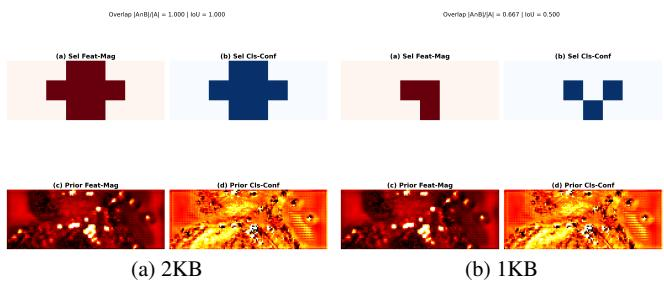  
Figure 6. Selection robustness under different priors. Top: binary cell selection masks; bottom: corresponding prior heatmaps.

Design Decision: We hypothesize that freezing or pretraining the codebook limits the encoder’s ability to coadapt to quantization errors. Consequently, we adopt a fully end-to-end training strategy, allowing the perception backbone and compression module to optimize simultaneously.

Table 15. Impact of Training Strategy. Joint optimization from scratch outperforms both staged fine-tuning and frozen codebook strategies.
<table><tr><td>Strategy</td><td>AP@0.5↑</td><td>AP@0.7↑</td></tr><tr><td>Staged (Fine-Tuned)</td><td>0.70</td><td>0.49</td></tr><tr><td>Joint Training (Frozen Codebook)</td><td>0.69</td><td>0.49</td></tr><tr><td>End-to-End (Joint from Scratch)</td><td>0.71</td><td>0.52</td></tr></table>

## B.7. Robustness to Prior Formulation

Selection Agreement. In the main paper, the cell-level task prior $\psi _ { h , w }$ is derived from normalized feature magnitude. To evaluate sensitivity to this choice, we replace $\psi _ { h , w }$ at inference with a detector-derived confidence prior obtained from the classification head (PSM). All other components, including distortion prediction δ and greedy ranked selection, remain unchanged.

Under moderate bandwidth (e.g., 2KB), the selection masks are identical (overlap = 1.000, IoU = 1.000) in several scenes, despite clear visual differences in the prior heatmaps. At stricter budgets (e.g., 1KB), agreement remains substantial (overlap = 0.667, IoU = 0.500), where discrete truncation effects amplify small score differences. The selections and heatmaps are illustrated in Figure 6.

Impact on Detection. Across all evaluated budgets, detection performance remains unchanged when replacing the prior. This indicates that ranking is primarily governed by the learned distortion-aware term $\sigma ( \delta _ { h , w } )$ , while $\psi _ { h , w }$ serves as a stabilizing modulation rather than the dominant selection driver.

Discussion. These results demonstrate that the magnitude-based prior is not a brittle heuristic. Instead, the overall selection mechanism is structurally robust to prior formulation, suggesting that the dominant factor in selection is the learned rate-aware utility prediction.

## C. Selector Architecture Trade-Off

To justify our use of the Pyramid Window Attention module, we compare its rate-distortion ranking performance against a lightweight Dilated CNN baseline. Both architectures are trained with the same task-aware supervision (Ψ). As shown in Tab. 16, although the Dilated CNN is computationally efficient, requiring only 0.39 M parameters and 9.54 GFLOPs, its local receptive field limits its ability to globally rank competing spatial patches.

This limitation becomes particularly apparent under severe bandwidth constraints. At a strict 1.0 KB budget, Pyramid Attention outperforms the Dilated CNN by 2.0 percentage points at AP@0.5 (0.706 vs. 0.686) and 3.3 percentage points at AP@0.7 (0.588 vs. 0.555). This gap indicates that capturing global, multi-scale context is critical when most of the feature map must be discarded. At a more relaxed 2.0 KB budget, the gap narrows at AP@0.5 (0.736 vs. 0.725), but Pyramid Attention still provides better finegrained localization at AP@0.7 (0.604 vs. 0.580). We therefore adopt Pyramid Attention, concluding that its additional compute cost is a worthwhile trade-off for improved spectral efficiency in the kilobyte regime.

Table 16. Selector architecture trade-off. Pyramid Attention improves ranking under strict budgets compared to a local Dilated CNN (both with task-aware supervision Ψ).
<table><tr><td>Budget</td><td>Architecture</td><td>AP@0.5</td><td>AP@0.7</td><td>Params (M)</td><td>GFLOPs</td></tr><tr><td>1.0 KB</td><td>Dilated CNN</td><td>0.686</td><td>0.555</td><td>0.39</td><td>9.54</td></tr><tr><td>1.0 KB</td><td>Pyramid Attn.</td><td>0.706</td><td>0.588</td><td>1.27</td><td>28.84</td></tr><tr><td>2.0 KB</td><td>Dilated CNN</td><td>0.725</td><td>0.580</td><td>0.39</td><td>9.54</td></tr><tr><td>2.0 KB</td><td>Pyramid Attn.</td><td>0.736</td><td>0.604</td><td>1.27</td><td>28.84</td></tr></table>

## D. Detailed Payload Composition

To validate the feasibility of our reported operating point, we provide a byte-level breakdown demonstrating strict adherence to the bandwidth budget. We report the actual payload transmitted per non-ego agent in KB, computed directly from the bitstreams produced by our implementation (1 KB = 1,000 bytes). We do not apply entropy coding. Let K be the codebook size, $n _ { \mathrm { c o a r s e } }$ the total number of transmitted coarse VQ indices, $n _ { \mathrm { f i n e } }$ the number of VQ indices per selected fine patch, and $N _ { \mathrm { f i n e } }$ the number of selected fine patches. The total payload in bits is:

$$
B _ { \mathrm { t o t a l } } ( i ) = \left( n _ { \mathrm { c o a r s e } } + N _ { \mathrm { f i n e } } \cdot n _ { \mathrm { f i n e } } \right) \log _ { 2 } ( K ) + N _ { \mathrm { f i n e } } \cdot B _ { \mathrm { h e a d e r } } ,\tag{10}
$$

where $B _ { \mathrm { h e a d e r } }$ is the per-patch metadata cost. Crucially, our selector strictly respects the bandwidth cap $B _ { \mathrm { t a r g e t } }$ . Below, we decompose the 2.0 KB operating point on DAIR-V2X [46].

## D.1. System Parameters

• BEV Feature Map F: $4 8 \times 1 2 8$ features, resulting from a 4× backbone stride on the $1 9 2 \times 5 1 2$ voxel grid.

• Fine Cell Size: 16 × 16 BEV feature locations.

• Codebook (K): 64 entries, corresponding to 6 bits per token.

• Header $( B _ { \mathrm { h e a d e r } } ) { : }$ : 48 bits per fine patch, conservatively covering spatial coordinates, CRC-16, and framing.

• Budget Constraint $\mathbf { ( } B _ { \mathrm { t a r g e t } } ) { \mathrm { : } }$ 2.0 KB, i.e., 16,000 bits.

## D.2. Strict Budget Enforcement

1. Fixed overhead: coarse base layer. The coarse base layer is spatially downsampled by $S _ { \mathrm { b a s e } } = 4$ in both dimensions, yielding a $1 2 \times 3 2$ grid of coarse code indices from the valid 48 × 128 feature area:

$$
B _ { \mathrm { c o a r s e } } = ( 1 2 \times 3 2 ) \times 6 = 2 { , } 3 0 4 { \mathrm { b i t s } } \approx 0 . 2 8 8 { \mathrm { K B } } .\tag{11}
$$

This leaves $1 6 , 0 0 0 - 2 , 3 0 4 = 1 3 , 6 9 6$ bits for fine refinement.

2. Per-patch fine cost. Each selected fine patch transmits its full-resolution $1 6 \times 1 6 \mathrm { V Q }$ tokens plus the metadata header:

$$
B _ { \mathrm { p a t c h } } = ( 2 5 6 \times 6 ) + 4 8 = 1 { , } 5 8 4 { \mathrm { b i t s / p a t c h } } .\tag{12}
$$

3. Maximum fine-patch count. The selector fills the remaining budget with the highest-ranked fine patches. The maximum number of selected fine patches is:

$$
N _ { \mathrm { f i n e } } = \left\lfloor { \frac { 1 3 , 6 9 6 } { 1 , 5 8 4 } } \right\rfloor = 8 .\tag{13}
$$

A ninth fine patch would require $9 \times 1 , 5 8 4 = 1 4 , 2 5 6$ bits, exceeding the available $^ { 1 3 , 6 9 6 }$ bits. Therefore, the allocator selects eight fine patches.

## D.3. Total Payload Summary

Table 17 details the final bitstream for DAIR-V2X. The total payload is 1.872 KB, or 14,976 bits, satisfying the strict 2.0 KB constraint.

## D.4. Baseline Accounting Used in the Main Paper.

All KB results in the main paper use the decodable accounting (including indices where required for sparse representations). Unless noted, all KB values denote the total transmitted payload per non-ego agent per fusion step (computed from decodable messages); for request–response protocols, we conservatively include both ego→agent and agent→ego messages.

Table 17. Bitstream composition under a 2.0 KB budget (DAIR-V2X). Under a 2.0 KB cap, the system transmits the coarse floor and the top-8 highest-utility refinement patches. The 48-bit header includes the spatial coordinate required to reconstruct $M _ { i }$ at the receiver.
<table><tr><td>Component</td><td>Count</td><td>Size (Bits)</td><td>Size (KB)</td></tr><tr><td>1. Coarse Base Layer</td><td>1 (Full 12 × 32 Grid)</td><td>2,304</td><td>0.288</td></tr><tr><td>2. Fine Patches (VQ Indices)</td><td>8 patches</td><td>12,288</td><td>1.536</td></tr><tr><td>3. Per-Patch Headers</td><td>8 headers</td><td>384</td><td>0.048</td></tr><tr><td>Total Payload</td><td></td><td>14,976</td><td>1.872</td></tr></table>

Where2comm (mask-based sparse FP32). Mask-based approaches transmit only the spatial positions selected by a binary communication mask. Let Maski $\in \{ 0 , 1 \} ^ { H \times \hat { W } }$ denote the selection mask for non-ego agent i, $\begin{array} { r l } { K _ { i } } & { { } = } \end{array}$ $\begin{array} { r } { \sum _ { u , v } \mathrm { M a s k } _ { i } ( u , v ) } \end{array}$ the number of selected cells, C the feature channel dimension, and sizeof(dtype) the bytes per element (4 for FP32).

Overhead assumption. The receiver does not know Maski a priori; it must be transmitted. Following a decodable accounting without entropy coding, we assume the sender transmits the full binary mask as a dense bitfield $( H \times W ~ \mathrm { b i t s } ) . ^ { 2 }$ The total communication cost per frame is therefore:

$$
\begin{array} { r } { \mathrm { C o m m } _ { \mathrm { K B } } ^ { \mathrm { W h e r e 2 c o m m } } = \frac { 1 } { 1 0 0 0 } \sum _ { i \in \mathcal { N } } \Bigl [ \underbrace { K _ { i } \cdot C \cdot \mathrm { s i z e o f ( d t y p e ) } } _ { \mathrm { p a y l o a d ( f e a u r e ~ v a l u e s ) } } + \underbrace { \frac { H \times W } { 8 } } _ { \mathrm { m a s k o v e r h e a d ( b y t e s ) } } \Bigr ] . } \end{array}\tag{14}
$$

For multi-scale architectures with L feature levels of spatial size $( H _ { \ell } , W _ { \ell } )$ , the mask overhead generalises to $\Sigma _ { \ell = 1 } ^ { L } H _ { \ell } W _ { \ell } / 8$ bytes per agent.

EffiComm (two-stage mask-based sparse FP32). EffiComm applies two cascaded spatial selections: (i) a confidence-based binary mask $\mathrm { M a s k } _ { i } ^ { ( 1 ) } \ \in \ \mathsf { \{ 0 , 1 \} } ^ { H \times W }$ (identical to Where2comm’s Communication mask), followed by (ii) an adaptive grid reduction that retains a GNNpredicted fraction $\rho _ { i }$ of the remaining cells via a second top-k mask $\mathrm { M a s k } _ { i } ^ { ( 2 ) }$ . The effective selection is $\mathrm { M a s k } _ { i } =$ $\mathrm { M a s k } _ { i } ^ { ( 1 ) } \odot \mathrm { M a s k } _ { i } ^ { ( 2 ) }$ with $\begin{array} { r } { K _ { i } = \sum _ { u , v } \mathrm { M a s k } _ { i } ( u , v ) } \end{array}$ surviving cells.

Overhead assumption. The receiver does not know Mask a priori; it must be transmitted. We transmit a single composite binary mask as a dense bitfield $( H \times W$ bits) per agent; the receiver does not need to reconstruct each selection stage separately.3

$$
\begin{array} { r } { \mathrm { C o m m } _ { \mathrm { K B } } ^ { \mathrm { E f f C o m m } } = \frac { 1 } { 1 0 0 0 } \sum _ { i \in \cal N } \left[ \underbrace { K _ { i } \cdot C \cdot \mathrm { s i z e o f ( d t y p e ) } } _ { \mathrm { p a y l o a d } } + \underbrace { \frac { H \times W } { 8 } } _ { \mathrm { m a s k o v e r h e a d } } \right] } \end{array}
$$

ERMVP (token-based). ERMVP selects $K _ { i }$ tokens per agent via top-k scoring followed by DPC-KNN clustering, and transmits each token’s feature vector together with its position on the $H \times W$ grid.

Overhead assumption. Because $K _ { i } \ll H W$ in the typical operating regime (e.g., topk $. \mathtt { r a t i o } \approx 0 . 0 5 \ – 0 . 2 5 )$ , it is cheaper to send position indices rather than a full $H \times W$ bitfield mask.4

Empirical cost (as implemented). In the released implementation, each token carries a single flattened grid index $\in [ 0 , H W )$ stored as torch.int64 (8 bytes). Thus sizeof(pos dtype) = 8 and the per-agent payload is:

$$
\begin{array} { r } { \mathrm { C o m m } _ { \mathrm { K B } } ^ { \mathrm { e m p } } = \frac { 1 } { 1 0 0 0 } \sum _ { i \in \mathcal { N } } K _ { i } \Big ( \underbrace { C \cdot \mathrm { s i z e o f ( d t y p e ) } } _ { \mathrm { p a y l o a d } } + \underbrace { 8 } _ { \mathrm { p o s i t i o n ~ i n d e x ~ ( i n t \ 6 4 ) } } \Big ) . } \end{array}\tag{16}
$$

Theoretical lower bound. An entropy-optimal representation would bit-pack the flattened index using $\lceil \log _ { 2 } ( H W ) \rceil$ bits per token:

$$
\mathrm { C o m m } _ { \mathrm { K B } } ^ { \mathrm { t h e o r y } } = \frac { 1 } { 8 0 0 0 } \sum _ { i \in \cal N } K _ { i } \Bigl ( \underbrace { { \cal C } \cdot 3 2 } _ { \mathrm { p a y l o a d \ : ( b i t s ) } } + \underbrace { \left[ \log _ { 2 } ( H W ) \right] } _ { \mathrm { i n d e x \ : o v e r h e a d \ : ( b i t s ) } } \Bigr ) .\tag{17}
$$

MMCooper. MMCooper transmits (i) sparse masked feature positions and (ii) filtered bounding boxes. Let m be the average number of masked feature positions (each with $C = 6 4$ channels) and n the average number of bounding boxes (each with 7 parameters) across batch size B:

$$
\overline { { { m } } } = \frac { 1 } { B } \sum _ { b = 1 } ^ { B } \sum _ { u , v } \mathbf { 1 } [ \mathrm { M a s k } _ { b } ^ { \mathrm { f e a t } } ( u , v ) > 0 ] , \quad \overline { { { n } } } = \frac { 1 } { B } \sum _ { b = 1 } ^ { B } N _ { b } ^ { \mathrm { b o x } } .\tag{18}
$$

The original implementation reports a log-scale proxy:

$$
{ \mathrm { C o m m } } _ { \log _ { 2 } { \mathrm { b y t e s } } } = \log _ { 2 } \left( ( C \cdot { \overline { { m } } } + 7 \cdot { \overline { { n } } } ) \cdot 4 \right)\tag{19}
$$

where $C = 6 4$ is the feature channel count and 4 bytes converts FP32 elements. For direct KB comparison, we convert to bytes. The lower-bound (features + boxes only) is:

$$
\mathrm { C o m m } _ { \mathrm { K B } } ^ { \mathrm { l b } } = { \frac { ( C \cdot { \overline { { m } } } + 7 \cdot { \overline { { n } } } ) \cdot 4 } { 1 0 0 0 } }\tag{20}
$$

For decodable transmission, position indices must be included. Using 4 bytes per position (flattened int32 index or two int16 coordinates):

$$
\mathrm { C o m m } _ { \mathrm { K B } } ^ { \mathrm { i d x } } = \mathrm { C o m m } _ { \mathrm { K B } } ^ { \mathrm { l b } } + \frac { \overline { { m } } \cdot 4 } { 1 0 0 0 }\tag{21}
$$

Instantiation: We report Comm $^ { \mathrm { i d x } } _ { \mathrm { K B } }$ (decodable) in main plots. Index dtype: int32 (4 bytes per position). We treat each transmitted box as 7 FP32 values; if the implementation transmits additional fields (e.g., score, class ID), the payload increases linearly and can be added straightforwardly.

CoSDH (supply-demand aware intermediate-late hybrid). CoSDH performs communication-efficient collaboration by (i) selecting sparse collaboration regions via a supply–demand mask, (ii) transmitting sparse multi-scale intermediate features with autoencoder-based channel compression, and (iii) optionally transmitting detection results for confidence-aware late fusion.

Supply-demand selection. Each agent i produces a binary demand mask $D _ { i } \in \{ 0 , 1 \} ^ { H \times \bar { W } }$ indicating where it needs information, and each collaborating agent j produces a binary supply mask $S _ { j } \in \{ 0 , 1 \} ^ { H \times W }$ from its detection confidence map. The selection mask is

$$
M _ { j  i } = D _ { i } \odot S _ { j } \in \{ 0 , 1 \} ^ { H \times W } ,\tag{22}
$$

which is downsampled per scale and applied to multiscale BEV features $\{ F _ { j } ^ { ( l ) } \} _ { l = 1 } ^ { L }$ to obtain sparse features $\{ Z _ { j \to i } ^ { ( l ) } \} _ { l = 1 } ^ { L }$ . During communication, only the non-zero parts and their corresponding coordinates are transmitted [33].

Intermediate feature message (per agent $j  i ) .$ . For each scale $l \in \{ 1 , \ldots , L \}$ , let $H _ { l } \times W _ { l }$ and C denote the spatial and channel dimensions of the l-th feature map, and let $K _ { j  i , l }$ be the number of selected positions at that scale. CoSDH compresses sparse features along the channel dimension using a per-scale autoencoder with compression ratio $c _ { 0 }$ . Before transmission, compressed features are converted from float32 to float16 [33]. A decodable cost for the intermediate message is:

$$
\begin{array} { r } { \mathrm { B y t e s } _ { j  i } ^ { \mathrm { i n t e r } } = \sum _ { l = 1 } ^ { L } K _ { j  i , l } ( \underbrace { \frac { C _ { l } } { C _ { 0 } } \cdot 2 } _ { \mathrm { F P l 6 ~ f e a t u r e ~ v a l u e s } } + \underbrace { \mathrm { B y t e s } _ { \mathrm { i d x } } ( H _ { l } W _ { l } ) } _ { \mathrm { c o o r d i n a t e s } } ) . } \end{array}\tag{23}
$$

where $\mathrm { B y t e s } _ { \mathrm { i d x } } ( H _ { l } W _ { l } )$ is the coordinate overhead per selected position (e.g., $\lceil \log _ { 2 } ( H _ { l } W _ { l } ) \rceil / 8$ bytes with optimal bit packing, or a fixed integer dtype).

Late fusion message (optional, per agent $j $ i). CoSDH optionally transmits detection results for confidence-aware late fusion; dense predictions before NMS are transmitted [33]. Let $\mathrm { B y t e s } _ { j  i } ^ { \mathrm { l a t e } }$ denote this cost.

Total response-only cost. The total decodable payload received by ego agent i from collaborators is:

$$
\begin{array} { r } { \mathrm { C o m m } _ { \mathrm { K B } } ^ { \mathrm { C o S D H } } = \frac { 1 } { 1 0 0 0 } \sum _ { j \neq i } ( \mathrm { B y t e s } _ { j  i } ^ { \mathrm { i n t e r } } + 1 [ \mathrm { l a t e ~ f u s i o n } ] \cdot \mathrm { B y t e s } _ { j  i } ^ { \mathrm { l a t e } } ) . } \end{array}\tag{24}
$$

Demand-mask note. The demand mask $D _ { i }$ is required to form $M _ { j  i }$ . If explicitly broadcast, a bit-packed cost is $H W / 8$ bytes per frame.

InfoCom. InfoCom transmits two components per nonego agent: (i) an information-aware latent feature $\mathbf { \bar { E } } \in \mathbb { R } ^ { D }$ from the IB encoder (FP32), and (ii) a sparse quantized mask $M ^ { q }$ containing only the $K = \lfloor \alpha \cdot H \cdot W \rfloor$ retained positions. The paper’s Eq. (11) gives a lower bound (latent + mask values only):

$$
{ \mathrm { B i t s } } _ { \mathrm { p a p e r } } = D \cdot 3 2 + K \cdot b .\tag{25}
$$

For decodable transmission, position indices must be included. We use bit-packed indices with $\lceil \log _ { 2 } ( H W ) \rceil$ bits each, which is more favorable than storing indices as int16/int32:

$$
{ \mathrm { B i t s } } _ { \mathrm { i d x } } = K \cdot \lceil \log _ { 2 } ( H \cdot W ) \rceil .\tag{26}
$$

Total decodable payload per agent:

$$
{ \mathrm { B i t s } } _ { \mathrm { a g e n t } } = D \cdot 3 2 + K \cdot b + K \cdot \lceil \log _ { 2 } ( H \cdot W ) \rceil .\tag{27}
$$

For $N _ { \mathrm { c a v } }$ non-ego agents:

$$
\mathrm { C o m m } _ { \mathrm { K B } } = \frac { N _ { \mathrm { c a v } } \cdot \mathrm { B i t s } _ { \mathrm { a g e n t } } } { 8 \times 1 0 0 0 } .\tag{28}
$$

Instantiation used in our evaluation:

• Latent dimension: D = 256 (FP32, 32 bits)

• Mask quantization: b = 4 bits per retained position

• Mask resolution: $H \ : = \ : 4 8 , W \ : = \ : 1 7 6$ (OPV2V spatial range)

• Retention ratio: $\alpha = 0 . 1$ (at convergence), yielding $K =$ $\left\lfloor 0 . 1 \cdot 4 8 \cdot 1 7 6 \right\rfloor = 8 4 4$

• Index bits: Since $H \times W = 4 8 \times 1 7 6 = 8 . 4 4 8$ , each retained position requires $\lceil \log _ { 2 } ( 8 , 4 4 8 ) \rceil = 1 4$ bits under bit-packed indexing.

$$
{ \mathrm { B i t s } } _ { \mathrm { l a t e n t } } = 2 5 6 \times 3 2 = 8 { , } 1 9 2 { \mathrm { b i t s } } = 1 { . } 0 2 4 { \mathrm { K B } }
$$

$$
{ \mathrm { B i t s } } _ { \mathrm { m a s k } } = 8 4 4 \times 4 = 3 { , } 3 7 6 { \mathrm { b i t s } } = 0 { . } 4 2 2 { \mathrm { K B } }
$$

$$
{ \mathrm { B i t s } } _ { \mathrm { i d x } } = 8 4 4 \times 1 4 = 1 1 { , } 8 1 6 { \mathrm { b i t s } } = 1 { . } 4 7 7 { \mathrm { K B } }
$$

$$
\mathrm { T o t a l _ { d e c o d a b l e } \approx 2 . 9 2 3 ~ K B ~ p e r ~ n o n { - } e g o ~ a g e n t }
$$

Dense-mask alternative. If instead a dense $H \times W$ mask quantized to b bits is transmitted (no indices), the per-agent cost is:

$$
\begin{array} { r } { \mathrm { C o m m } _ { \mathrm { K B } } ^ { \mathrm { d e n s e } } = \frac { D \cdot 3 2 + H \cdot W \cdot b } { 8 \times 1 0 0 0 } \approx 5 . 2 4 8 \mathrm { K B } \mathrm { p e r n o n } \mathrm { - e g o } \ \mathrm { a g e n t } . } \end{array}\tag{29}
$$

Note: We report CommKB (decodable, with bit-packed indices) in main plots/tables.

## E. Sensitivity Analysis

At a fixed per-agent budget (2.0 KB/agent), CoBEVT-DR improves from N = 1 to N = 3 and remains competitive at $N \ = \ 4$ , while performance drops at $N = 5$ due to accumulated quantization artifacts from multiple highlycompressed sources, as illustrated in Fig. 7. Importantly, matching the dense baseline at $N = 5$ requires an impractical aggregate payload of 31.4 MB per frame, whereas CoBEVT-DR uses only 10 KB across all 5 agents. Since typical V2X collaboration most often involves $N \in \{ 2 , 3 \}$ the proposed method scales favorably in the common operating regime.

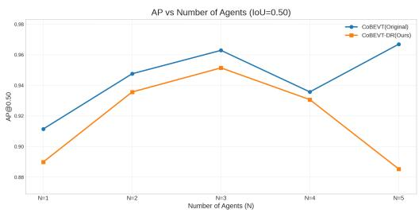  
Figure 7. Scaling with number of agents under fixed budgets (OPV2V). AP@0.5 versus non-ego agent count N at a 2.0 KB/agent cap for CoBEVT-DR. Dense CoBEVT uses ∼6.3 MB/agent (∼31.4 MB total network payload at $N { = } 5 ) ,$ whereas CoBEVT-DR uses ∼2.0 KB/agent (∼10 KB total at $N { = } 5 )$

## F. System Overhead and Real-Time Feasibility

To validate deployment feasibility, we benchmark the wallclock inference runtime on a single NVIDIA RTX 4090. We report the average per-frame latency for the encoder, selector, and fusion modules.

Table 18. Inference and End-to-End (E2E) Latency Analysis. We compare compute runtime alongside a theoretical E2E latency model $( T _ { E 2 E } = T _ { c o m p u t e } + N _ { t r i p s } \times 1 0 \mathrm { m s } )$ . Interactive methods require multiple network trips, resulting in higher E2E latency than one-shot broadcast methods.
<table><tr><td>Method</td><td>Mode</td><td>Compute</td><td>Trips</td><td>Est. E2E</td></tr><tr><td>CoBEVT (Dense)</td><td>Broadcast</td><td>17 ms</td><td>1</td><td>27 ms</td></tr><tr><td>CoBEVT + VQ</td><td>Broadcast</td><td>21 ms</td><td>1</td><td>31 ms</td></tr><tr><td>CoSDH [33]</td><td>Interactive</td><td>35 ms</td><td>2</td><td>55 ms</td></tr><tr><td>InfoCom [30]</td><td>Broadcast</td><td>37 ms</td><td>1</td><td>47 ms</td></tr><tr><td>Ours (Dual-Res)</td><td>Broadcast</td><td>40 ms</td><td>1</td><td>50 ms</td></tr></table>

Analysis. As shown in Table 18, standard CoBEVT is computationally the fastest (17 ms) but requires untenable bandwidth. State-of-the-art efficient methods like CoSDH [33] achieve a low inference latency of 35 ms. CoSDH theoretically mitigates its interactive communication delays by parallelizing local backbone compute with the transmission of demand masks. However, this assumes ideal, uninterrupted channel access and implies that transmission delays scale strictly with data volume.

To provide a fair end-to-end (E2E) system comparison, we introduce a standard theoretical network model: $T _ { E 2 E } = T _ { c o m p u t e } + N _ { t r i p s } \times T _ { h o p } ,$ assuming a typical V2X transmission delay of $T _ { h o p } ~ = ~ 1 0 $ ms. In the kilobyte regime $( \mathrm { e . g . , < 2 . 0 \mathrm { K B ) } }$ , transmission latency in IEEE 802.11-based V2X systems is not dominated by payload serialization time but by channel access delay and fixed PHY overheads. In CSMA/CA-based systems, packet transmission requires arbitration, random backoff, and inter-frame spacing, whose duration depends on contention rather than payload size [1, 4]. Furthermore, each transmission incurs a fixed physical-layer preamble and PLCP header overhead that becomes dominant for small packets [3]. As a result, reducing payload size below the kilobyte level yields diminishing returns in latency, while multi-round interactive protocols incur the fixed channel-access cost multiple times per frame $( N _ { t r i p s } \ge 2 )$ . In contrast, sender-driven broadcast methods like InfoCom [30] and our approach bypass these handshakes entirely $( N _ { t r i p s } = 1 )$

Real-World Implication. Our proposed method has a compute latency of 40 ms (+5 ms vs CoSDH, +3 ms vs Info-Com). Crucially, because our approach operates in a strict one-shot broadcast mode, it transmits both the deterministic coarse base layer and prioritized fine patches in a single, kilobyte-scale payload, entirely avoiding multi-round handshake vulnerabilities. Under our E2E model, our total estimated latency is 50 ms, which is faster than the interactive CoSDH pipeline (55 ms) when accounting for unavoidable MAC-layer contention. Under this modeled communication setting, the estimated end-to-end latency remains below the 100 ms (10 Hz) operating interval, providing state-of-theart deterministic coverage while maintaining a strict realtime advantage over interactive protocols.

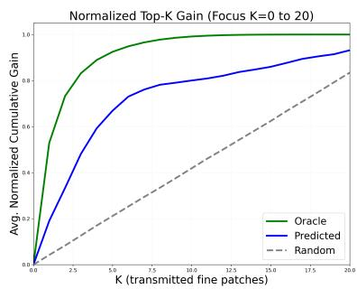  
Figure 8. Per-agent Top-K normalized cumulative marginal detection gain $( K \le 2 0 )$ . Ranking patches by our predicted benefit score $\beta$ successfully concentrates the majority of attainable detection gain within a strict low-K budget cap regime, vastly outperforming random allocation.

## G. Correlation of Benefit Score with Marginal Detection Gain

To rigorously verify that our learned selection policy accurately prioritizes critical spatial regions, we measure the true marginal detection impact of refining a single spatial patch i. We define this marginal gain as the drop in detection loss when swapping the coarse reconstruction of a selected cell for a fine patch: $\Delta L _ { i } ~ = ~ L _ { d e t } ( F _ { c o a r s e } ) ~ -$ $L _ { d e t } ( F _ { c o a r s e  f i n e ( i ) } )$

By isolating the non-negative gain as $\begin{array} { r l } { \Delta L _ { i } ^ { + } } & { { } = } \end{array}$ max $( \Delta L _ { i } , 0 )$ , we sort the available patches per agent by our network’s predicted benefit score $\beta$ and compare it against an oracle ranking that uses the true $\Delta L _ { i } ^ { + }$ . As illustrated in Fig. 8, prioritizing patches by $\beta$ captures a substantial fraction of the total attainable detection gain even under strict bandwidth constraints. Furthermore, as a dataset-level diagnostic, $\beta$ achieves a ROC-AUC of 0.785 for successfully identifying the highest-utility patches (defined as the top 15% by $| \Delta L | )$ . This yields a Precision@10% of 0.509 compared to a 0.10 random baseline, confirming that our predicted benefit score is strongly correlated with actual downstream task utility.

## H. Qualitative Analysis

Fig. 9 provides representative qualitative comparisons between InfoCom and CoBEVT-DR under the same scenes and payload regime. InfoCom communicates sparse taskrelevant regions, but the missing spatial context can lead to incomplete object support or less stable predictions. In contrast, CoBEVT-DR preserves a dense coarse BEV floor and refines selected high-utility regions, maintaining scenelevel context while recovering fine object details. These examples illustrate the main advantage of the proposed coverage-refinement design: sparse high-resolution communication without breaking the dense BEV structure expected by the fusion module.

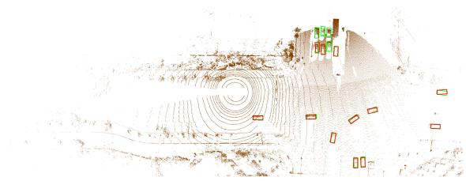

(a) InfoCom  
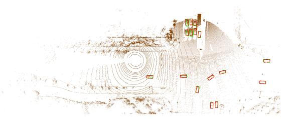  
(b) CoBEVT-DR (Ours)  
Figure 9. Qualitative comparison. Green: ground truth. Red: detections. (a) InfoCom relies on pure sparsification, discarding unselected regions and missing several vehicles in the upper-right cluster. (b) CoBEVT-DR at a strict 2 KB budget recovers the cluster; the dense coarse floor provides a continuous semantic anchor even for unselected objects.

## I. Task transfer to dynamic-object segmentation.

As an additional task-transfer check, we evaluate CoBEVT-DR on dynamic-object BEV segmentation using the original CoBEVT dynamic-object segmentation setup. The segmentation BEV range is $x , y ~ \in ~ [ - 5 0 , 5 0 ] \mathrm { m }$ , with height range $z \in [ - 3 , 1 ]$ m, following CoBEVT [34]. The communication design, coarse/fine tokenization, and payload accounting remain unchanged; only the downstream objective and metric differ.

As shown in Tab. 19, CoBEVT-DR reaches dense-level dynamic-object IoU at 0.40 KB and remains close to the dense baseline at 0.20 KB per non-ego agent, while using orders of magnitude less communication than dense CoBEVT. At the more aggressive 0.09 KB operating point, performance decreases but still provides a useful lowbandwidth fallback. Compared with uniform SimVQ compression, coverage-refinement achieves higher IoU at substantially lower payload, suggesting that the proposed allocation strategy transfers beyond 3D object detection under strict byte budgets.

Table 19. Task transfer to dynamic-object BEV segmentation. We evaluate the same coverage-refinement communication design on dynamic-object segmentation using the original CoBEVT segmentation setup. Payload is reported per non-ego agent.
<table><tr><td>Method</td><td>Dynamic IoU↑</td><td>KB↓</td></tr><tr><td>CoBEVT</td><td>0.47</td><td>524.28</td></tr><tr><td>CoBEVT-SimVQ</td><td>0.43</td><td>0.72</td></tr><tr><td>CoBEVT-DR</td><td>0.47</td><td>0.40</td></tr><tr><td>CoBEVT-DR</td><td>0.46</td><td>0.20</td></tr><tr><td>CoBEVT-DR</td><td>0.37</td><td>0.09</td></tr></table>

## J. Additional Evaluation on V2X-Real

We additionally evaluate our model on the real-world multiclass V2X-Real-VC benchmark [32] under a strict 2.0 KB per-agent payload cap. As shown in Table 20, our model reaches 66.8/56.8 mAP at IoU thresholds 0.3/0.5, with 89.3/86.6 AP for vehicles, 47.9/24.1 AP for pedestrians, and 63.1/59.8 AP for trucks. Published results use different detector architectures and evaluation implementations and are therefore included as contextual rather than strictly controlled comparisons.

Table 20. Multi-class detection performance on the V2X-Real-VC test set. Car, Ped., and Truck report AP@0.3/AP@0.5. Published results are taken from the respective papers and may use different detector architectures and evaluation implementations.
<table><tr><td>Method</td><td>Car AP@0.3/0.5↑ Ped. AP@0.3/0.5↑ Truck AP@0.3/0.5↑ mAP@0.3↑ mAP@0.5↑</td><td></td><td></td><td></td><td></td></tr><tr><td>No Fusion [32]</td><td>38.7/35.9</td><td>25.5/13.1</td><td>20.2/14.5</td><td>28.2</td><td>21.2</td></tr><tr><td>Early Fusion [32]</td><td>51.1/47.6</td><td>31.6/16.0</td><td>32.5/23.6</td><td>38.4</td><td>29.1</td></tr><tr><td>F-Cooper [32]</td><td>57.3/54.2</td><td>30.0/14.1</td><td>27.0/21.2</td><td>38.1</td><td>29.8</td></tr><tr><td>AttFuse [32]</td><td>62.6/59.4</td><td>32.2/15.5</td><td>32.6/26.6</td><td>42.5</td><td>33.8</td></tr><tr><td>V2X-ViT [32]</td><td>62.7/60.3</td><td>36.7/18.6</td><td>35.1/28.3</td><td>44.8</td><td>35.8</td></tr><tr><td>CooPre [50]</td><td>71.5/70.2</td><td>46.9/28.0</td><td>61.9/58.3</td><td>60.1</td><td>52.2</td></tr><tr><td>FocalComm [22]</td><td>91.5/89.6</td><td>57.4/27.3</td><td>53.9/51.6</td><td>67.6</td><td>56.1</td></tr><tr><td>CoBEVT-DR (2 KB)</td><td>89.3/86.6</td><td>47.9/24.1</td><td>63.1/59.8</td><td>66.8</td><td>56.8</td></tr></table>

## K. Additional Evaluation on V2XVerse

To evaluate whether the proposed byte-constrained representation transfers beyond the perception benchmarks used in the main paper, we additionally evaluate it on V2XVerse [11]. We report both multi-class object detection and open-loop ego-planning performance under increasing communication budgets. The communication mechanism is unchanged: each collaborator transmits the coarse base representation together with budgeted high-resolution refinement patches.

Table 21 compares our method against representative V2XVerse fusion baselines. Even under kilobytescale communication, the proposed representation achieves strong detection performance across all three object classes. At only 2 KB per collaborator, our method reaches 73.20 mAP@0.3, compared with 68.0 for CoDriving. Increasing the budget to 3 KB further improves mAP@0.3 to 74.67.

Table 21. Multi-class detection performance on V2XVerse. Our DR variants operate under strict per-agent communication budgets. Values are AP. The results are taken from CoDriving [11].
<table><tr><td rowspan="2">Method</td><td colspan="3">Vehicle</td><td colspan="2">Bicyclist</td><td colspan="2">Pedestrian</td><td rowspan="2">mAP30</td></tr><tr><td>AP30</td><td>AP50</td><td>AP70</td><td>AP30</td><td>AP50</td><td>AP30</td><td>AP50</td></tr><tr><td>No Fusion</td><td>0.89</td><td>0.84</td><td>0.73</td><td>0.40</td><td>0.30</td><td>0.41</td><td>0.24</td><td>0.57</td></tr><tr><td>Late Fusion</td><td>0.88</td><td>0.86</td><td>0.81</td><td>0.43</td><td>0.38</td><td>0.45</td><td>0.27</td><td>0.59</td></tr><tr><td>F-Cooper</td><td>0.93</td><td>0.82</td><td>0.68</td><td>0.44</td><td>0.29</td><td>0.56</td><td>0.33</td><td>0.64</td></tr><tr><td>V2X-ViT</td><td>0.93</td><td>0.91</td><td>0.84</td><td>0.50</td><td>0.36</td><td>0.41</td><td>0.12</td><td>0.61</td></tr><tr><td>CoopDet3D</td><td>0.93</td><td>0.90</td><td>0.81</td><td>0.48</td><td>0.41</td><td>0.53</td><td>0.31</td><td>0.65</td></tr><tr><td>CoDriving</td><td>0.94</td><td>0.91</td><td>0.83</td><td>0.52</td><td>0.41</td><td>0.58</td><td>0.35</td><td>0.68</td></tr><tr><td>CoBEVT-DR – Coarse (~330 B)</td><td>0.9164</td><td>0.9054</td><td>0.8545</td><td>0.5037</td><td>0.4097</td><td>0.5246</td><td>0.2874</td><td>0.6482</td></tr><tr><td>CoBEVT-DR – 1 KB</td><td>0.9106</td><td>0.9025</td><td>0.8685</td><td>0.5235</td><td>0.4561</td><td>0.5646</td><td>0.3379</td><td>0.6662</td></tr><tr><td>CoBEVT-DR – 2 KB</td><td>0.9515</td><td>0.9396</td><td>0.9034</td><td>0.6103</td><td>0.5372</td><td>0.6341</td><td>0.3779</td><td>0.7320</td></tr><tr><td>CoBEVT-DR – 3 KB</td><td>0.9648</td><td>0.9525</td><td>0.9125</td><td>0.6282</td><td>0.5544</td><td>0.6472</td><td>0.3850</td><td>0.7467</td></tr></table>

The gains are particularly pronounced for vulnerable road users. From the coarse-only representation to 3 KB, AP@0.5 improves by 4.71 points for vehicles, 9.76 points for pedestrians, and 14.47 points for bicyclists. This indicates that sparse high-resolution refinement is especially beneficial for more challenging object classes, rather than merely improving already strong vehicle detections.

## References

[1] Ieee standard for information technology– telecommunications and information exchange between systems–local and metropolitan area networks–specific requirements–part 11: Wireless lan medium access control (mac) and physical layer (phy) specifications, 2020. 7

[2] Gong Chen, Chaokun Zhang, and Xinyan Zhao. Whispernet: A scalable solution for bandwidth-efficient collaboration. In Proceedings of the IEEE/CVF Conference on Computer Vi sion and Pattern Recognition (CVPR), pages 32154–32163, 2026. 2

[3] Qi Chen, Daniel Jiang, and Luca Delgrossi. Performance evaluation of ieee 802.11p for vehicular communications. In IEEE ICC Workshops, 2012. 7

[4] Hannes Hartenstein and Kenneth P. Laberteaux. VANET: Vehicular Applications and Inter-Networking Technologies. Wiley, 2010. 7

[5] Yue Hu, Shaoheng Fang, Zixing Lei, Yiqi Zhong, and Siheng Chen. Where2comm: Communication-efficient collaborative perception via spatial confidence maps. Advances in neural information processing systems, 35:4874–4886, 2022. 1, 2, 6

[6] Yue Hu, Xianghe Pang, Xiaoqi Qin, Yonina C Eldar, Siheng Chen, Ping Zhang, and Wenjun Zhang. Pragmatic com munication in multi-agent collaborative perception. arXiv preprint arXiv:2401.12694, 2024. 2

[7] Yue Hu, Juntong Peng, Sifei Liu, Junhao Ge, Si Liu, and Siheng Chen. Communication-efficient collaborative perception via information filling with codebook. In Proceedings

of the IEEE/CVF Conference on Computer Vision and Pattern Recognition, pages 15481–15490, 2024. 2, 6

[8] Eric Jang, Shixiang Gu, and Ben Poole. Categorical reparameterization with gumbel-softmax. In International Conference on Learning Representations (ICLR), 2017. 4

[9] Bingyi Liu, Jian Teng, Hongfei Xue, Enshu Wang, Chuanhui Zhu, Pu Wang, and Libing Wu. mmcooper: A multi-agent multi-stage communication-efficient and collaboration-robust cooperative perception framework. arXiv preprint arXiv:2501.12263, 2025. 5, 6, 7

[10] Genjia Liu, Anning Hu, Yue Hu, Wenjun Zhang, and Siheng Chen. Rate-distortion optimized communication for collaborative perception. arXiv preprint arXiv:2509.21994, 2025. 2

[11] Genjia Liu, Yue Hu, Chenxin Xu, Weibo Mao, Junhao Ge, Zhengxiang Huang, Yifan Lu, Yinda Xu, Junkai Xia, Yafei Wang, et al. Toward collaborative autonomous driving: Simulation platform and end-to-end system. IEEE transactions on pattern analysis and machine intelligence, 47(8):6566– 6584, 2025. 6, 9

[12] Yuntao Liu, Qian Huang, Rongpeng Li, Xianfu Chen, Zhifeng Zhao, Shuyuan Zhao, Yongdong Zhu, and Honggang Zhang. Select2col: Leveraging spatial-temporal importance of semantic information for efficient collaborative perception. IEEE Transactions on Vehicular Technology, 73 (9):12556–12569, 2024. 1

[13] Yen-Cheng Liu, Junjiao Tian, Chih-Yao Ma, Nathan Glaser, Chia-Wen Kuo, and Zsolt Kira. Who2com: Collaborative perception via learnable handshake communication. In 2020 IEEE International Conference on Robotics and Automation (ICRA), pages 6876–6883. IEEE, 2020. 2

[14] Yifan Lu, Quanhao Li, Baoan Liu, Mehrdad Dianati, Chen Feng, Siheng Chen, and Yanfeng Wang. Robust collaborative 3d object detection in presence of pose errors. In 2023 IEEE International Conference on Robotics and Automation (ICRA), pages 4812–4818. IEEE, 2023. 5

[15] Chris J Maddison, Andriy Mnih, and Yee Whye Teh. The concrete distribution: A continuous relaxation of discrete random variables. In International Conference on Learning Representations (ICLR), 2017. 4

[16] Fabian Mentzer, David Minnen, Eirikur Agustsson, and Michael Tschannen. Finite scalar quantization: Vq-vae made simple. arXiv preprint arXiv:2309.15505, 2023. 2

[17] J-R Ohm. Advances in scalable video coding. Proceedings ofthe IEEE, 93(1):42–56, 2005. 2

[18] Donghao Qiao and Farhana Zulkernine. Adaptive feature fusion for cooperative perception using lidar point clouds. In Proceedings of the IEEE/CVF Winter Conference on Applications of Computer Vision (WACV), pages 1186–1195, 2023. 1

[19] Darijo Raca, Dylan Leahy, Cormac J Sreenan, and Jason J Quinlan. Beyond throughput, the next generation: A 5g dataset with channel and context metrics. In Proceedings ofthe 11th ACM multimedia systems conference, pages 303– 308, 2020. 1

[20] Aurko Roy, Ashish Vaswani, Arvind Neelakantan, and Niki Parmar. Theory and experiments on vector quantized autoencoders. arxiv. arXiv preprint arXiv:1805.11063, 2018. 1

[21] Heiko Schwarz, Detlev Marpe, and Thomas Wiegand. Overview of the scalable video coding extension of the h. 264/avc standard. IEEE Transactions on circuits and systemsfor video technology, 17(9):1103–1120, 2007. 2

[22] Dereje Shenkut and Vijayakumar Bhagavatula. Focalcomm: Hard instance-aware multi-agent perception. In 2026 IEEE/CVF Winter Conference on Applications of Computer Vision (WACV), pages 6277–6286. IEEE, 2026. 9

[23] Dereje Shenkut and BV Kumar. Residual vector quantization for communication-efficient multi-agent perception. arXiv preprint arXiv:2509.21464, 2025. 1, 2, 6

[24] Casper Kaae Sønderby, Ben Poole, and Andriy Mnih. Con tinuous relaxation training of discrete latent variable image models. In Beysian DeepLearning workshop, NIPS, 2017. 1

[25] Aaron Van Den Oord, Oriol Vinyals, et al. Neural discrete representation learning. Advances in neural information processing systems, 30, 2017. 4, 1

[26] Binglu Wang, Lei Zhang, Zhaozhong Wang, Yongqiang Zhao, and Tianfei Zhou. Core: Cooperative reconstruction for multi-agent perception. in 2023 ieee. In CVF International Conference on Computer Vision (ICCV), pages 8676– 8686, 2023. 1, 2

[27] Chenyi Wang, Zhaowei Li, Ming F Li, and Wujie Wen. Jig sawcomm: Joint semantic feature encoding and transmission for communication-efficient cooperative perception. arXiv preprint arXiv:2511.17843, 2025. 2

[28] Rujia Wang, Xiangbo Gao, Hao Xiang, Runsheng Xu, and Zhengzhong Tu. Cocmt: Communication-efficient crossmodal transformer for collaborative perception. In 2025 IEEE/RSJ International Conference on Intelligent Robots and Systems (IROS), pages 2471–2478. IEEE, 2025. 1

[29] Tsun-Hsuan Wang, Sivabalan Manivasagam, Ming Liang, Bin Yang, Wenyuan Zeng, and Raquel Urtasun. V2vnet: Vehicle-to-vehicle communication for joint perception and prediction. In Computer Vision–ECCV 2020: 16th European Conference, Glasgow, UK, August 23–28, 2020, Pro ceedings, Part II 16, pages 605–621. Springer, 2020. 1

[30] Quanmin Wei, Penglin Dai, Wei Li, Bingyi Liu, and Xiao Wu. Infocom: Kilobyte-scale communication-efficient collaborative perception with information bottleneck. arXiv preprint arXiv:2512.10305, 2025. 1, 2, 5, 6, 7

[31] Hao Xiang, Runsheng Xu, and Jiaqi Ma. Hm-vit: Heteromodal vehicle-to-vehicle cooperative perception with vision transformer. In Proceedings of the IEEE/CVF international conference on computer vision, pages 284–295, 2023. 1, 2

[32] Hao Xiang, Zhaoliang Zheng, Xin Xia, Runsheng Xu, Letian Gao, Zewei Zhou, Xu Han, Xinkai Ji, Mingxi Li, Zonglin Meng, et al. V2x-real: a largs-scale dataset for vehicle-toeverything cooperative perception. In European Conference on Computer Vision, pages 455–470. Springer, 2024. 6, 9

[33] Junhao Xu, Yanan Zhang, Zhi Cai, and Di Huang. Cosdh: communication-efficient collaborative perception via supply-demand awareness and intermediate-late hybridization. In Proceedings of the Computer Vision and Pattern Recognition Conference, pages 6834–6843, 2025. 1, 2, 5, 6, 7

[34] Runsheng Xu, Zhengzhong Tu, Hao Xiang, Wei Shao, Bolei Zhou, and Jiaqi Ma. Cobevt: Cooperative bird’s eye view

semantic segmentation with sparse transformers. arXiv preprint arXiv:2207.02202, 2022. 1, 2, 5, 8

[35] Runsheng Xu, Hao Xiang, Zhengzhong Tu, Xin Xia, Ming-Hsuan Yang, and Jiaqi Ma. V2x-vit: Vehicle-to-everything cooperative perception with vision transformer. In European conference on computer vision, pages 107–124. Springer, 2022. 1, 2, 7

[36] Runsheng Xu, Hao Xiang, Xin Xia, Xu Han, Jinlong Li, and Jiaqi Ma. Opv2v: An open benchmark dataset and fusion pipeline for perception with vehicle-to-vehicle communication. In 2022 International Conference on Robotics and Automation (ICRA), pages 2583–2589, 2022. 5, 6

[37] Yunjiang Xu, Lingzhi Li, Jin Wang, Yupeng Ouyang, and Benyuan Yang. Instinct: Instance-level interaction architecture for query-based collaborative perception. In Proceedings of the IEEE/CVF International Conference on Computer Vision, pages 25464–25473, 2025. 1

[38] Yan Yan, Yuxing Mao, and Bo Li. Second: Sparsely embedded convolutional detection. Sensors, 18(10):3337, 2018. 7

[39] Dingkang Yang, Kun Yang, Yuzheng Wang, Jing Liu, Zhi Xu, Rongbin Yin, Peng Zhai, and Lihua Zhang. How2comm: Communication-efficient and collaboration-pragmatic multiagent perception. Advances in Neural Information Processing Systems, 36:25151–25164, 2023. 1

[40] Kun Yang, Dingkang Yang, Jingyu Zhang, Mingcheng Li, Yang Liu, Jing Liu, Hanqi Wang, Peng Sun, and Liang Song. Spatio-temporal domain awareness for multi-agent collaborative perception. In Proceedings of the IEEE/CVF International Conference on Computer Vision (ICCV), pages 23383–23392, 2023. 1

[41] Melih Yazgan, Mythra Varun Akkanapragada, and J. Marius Zoellner. Collaborative Perception Datasets in Autonomous Driving: A Survey, 2024. 5

[42] Melih Yazgan, Thomas Graf, Min Liu, Tobias Fleck, and J. Marius Zoellner. A Survey on Intermediate Fusion Methods for Collaborative Perception Categorized by Real World Challenges, 2024. 2

[43] Melih Yazgan, Allen Xavier Arasan, and J. Marius Zollner.¨ Efficomm: Bandwidth efficient multi agent communication. In 2025 IEEE 28th International Conference on Intelligent Transportation Systems (ITSC), pages 2273–2280, 2025. 1, 2, 6

[44] Melih Yazgan, Qiyuan Wu, Iramm Hamdard, Shiqi Li, and J. Marius Zollner. Slimcomm: Doppler-guided sparse¨ queries for bandwidth-efficient cooperative 3-d perception. In Proceedings of the IEEE/CVF International Conference on Computer Vision (ICCV) Workshops, pages 1782–1791, 2025. 2

[45] Melih Yazgan, Iramm Hamdard, Qiyuan Wu, Svetlana Pavlitska, and J. Marius Zollner. 4-d radar meets lidar and cam-¨ era: Cooperative perception under adverse weather. In Proceedings of the IEEE/CVF Conference on Computer Vision and Pattern Recognition (CVPR) Workshops, pages 805– 814, 2026. 1

[46] Haibao Yu, Yizhen Luo, Mao Shu, Yiyi Huo, Zebang Yang, Yifeng Shi, Zhenglong Guo, Hanyu Li, Xing Hu, Jirui Yuan, et al. Dair-v2x: A large-scale dataset for vehicle-

infrastructure cooperative 3d object detection. In Proceed ings of the IEEE/CVF conference on computer vision and pattern recognition, pages 21361–21370, 2022. 5, 6, 4

[47] Neil Zeghidour, Alejandro Luebs, Ahmed Omran, Jan Skoglund, and Marco Tagliasacchi. Soundstream: An endto-end neural audio codec. IEEE/ACM Transactions on Au dio, Speech, and Language Processing, 30:495–507, 2021. 2

[48] Hang Zhang, Chongruo Wu, Zhongyue Zhang, Yi Zhu, Haibin Lin, Zhi Zhang, Yue Sun, Tong He, Jonas Mueller, R Manmatha, et al. Resnest: Split-attention networks. In Proceedings of the IEEE/CVF conference on computer vision and pattern recognition, pages 2736–2746, 2022. 4

[49] Jingyu Zhang, Kun Yang, Yilei Wang, Hanqi Wang, Peng Sun, and Liang Song. Ermvp: Communication-efficient and collaboration-robust multi-vehicle perception in challenging environments. In Proceedings of the IEEE/CVF Conference on Computer Vision and Pattern Recognition (CVPR), pages 12575–12584, 2024. 6

[50] Seth Z Zhao, Hao Xiang, Chenfeng Xu, Xin Xia, Bolei Zhou, and Jiaqi Ma. Coopre: Cooperative pretraining for v2x cooperative perception. In 2025 IEEE/RSJ International Conference on Intelligent Robots and Systems (IROS), pages 11765–11772. IEEE, 2025. 9

[51] Seth Z Zhao, Huizhi Zhang, Zhaowei Li, Juntong Peng, Anthony Chui, Zewei Zhou, Zonglin Meng, Hao Xiang, Zhiyu Huang, Fujia Wang, et al. Quantv2x: A fully quan tized multi-agent system for cooperative perception. arXiv preprint arXiv:2509.03704, 2025. 2

[52] Yongxin Zhu, Bocheng Li, Yifei Xin, Zhihua Xia, and Linli Xu. Addressing representation collapse in vector quantized models with one linear layer. In Proceedings of the IEEE/CVF International Conference on Computer Vision, pages 22968–22977, 2025. 3, 1, 2