# Eficient Continuous DEM Reconstruction under Limited Target-Resolution Supervision

Zekai Shia, Meng Zhanga,∗, Haokun Zhanga, Bo Zhangb

aSchool ofHuman Settlements and Civil Engineering, Xi’an Jiaotong University, Xi’an, 710049, China bSchool of Artificial Intelligence, Optics and Electronics (iOPEN), Northwestern Polytechnical University, Xi’an, 710072, China

## Abstract

High-resolution digital elevation models (DEMs) support Earth observation applications, but paired training references are often available only at coarser output resolutions. Reconstructing finer terrain grids therefore requires both efective transfer beyond the supervised scale and control of dense-query computation. To address this problem, SCOPE learns a continuous terrain representation from coarser-resolution pairs. It predicts a latent coeficient field on the low-resolution grid and reuses local Fourier residual functions through basis evaluation and geometry-guided ensemble fusion. This separates high-dimensional coeficient prediction from output-grid construction. Experiments on geographically distributed land–ocean samples assess supervised reconstruction, unseen-scale inference, cross-domain generalization, and theoretical computation. SCOPE leads the compared methods across six metrics in the main supervised-scale evaluation. At an unseen factor three times the training factor, land reconstruction reducesS RMSE and MAE by approximately 12% relative to bicubic interpolation, with errors close to target-scale fine-tuning. Ninefold output density increases counted multiply–accumulate operations by only about 2%. Frozen-model validation on held-out external marine regions reduces RMSE relative to the DEM-specific implicit baseline EBCF-CDEM by approximately 19% under self-downsampling and 2% with cross-product inputs, while also yielding lower RMSE than LIIF-MS in both settings. These results demonstrate the value of reusable coeficient fields for accurate reconstruction beyond the supervised resolution with low incremental arithmetic cost.

Keywords: Continuous DEM reconstruction, Limited target-resolution supervision, Coeficient-field prediction, Computational. eficiency, Cross-domain evaluation, Earth observation

## 1. Introduction

1.1. DEM Products and Limited Target-Resolution Supervision Digital elevation models (DEMs) and bathymetric grids are fundamental Earth observation products for terrain interpretation, hydrologic modeling, hazard assessment, coastal management,. and marine resource exploration (Miller and Laflamme, 1958; Moore et al., 1991; Smith and Sandwell, 1997). The spatial resolution required by these applications is not always supported by the available observations. Satellite missions such as SRTM and TanDEM-X have improved terrestrial elevation coverage (Farr et al., 2007; Krieger et al., 2007; Wessel et al., 2018), whereas marine observations remain more spatially incomplete. The GEBCO\_2024 release reports that 26.1% of the global seabed had been mapped using modern survey techniques (GEBCO, 2024); extensive regions rely on bathymetric estimates inferred from satellite-altimetry-derived gravity anomalies (Tozer et al., 2019; Smith and Sandwell, 1994).

Airborne LiDAR, photogrammetry, interferometric SAR, and shipborne acoustic surveys can provide detailed terrain observations, but acquisition cost, sensor characteristics, and uneven coverage constrain their availability. Consequently, paired DEMs may support learning at a coarser output resolution even when reference data at the desired finer resolution are unavailable for training. The practical question is whether these available pairs can support reconstruction beyond interpolation at a finer target grid, without requiring new target-scale training labels. In this study, limited target-resolution supervision denotes learning from paired elevation references at a coarser output resolution than the desired reconstruction grid.

## 1.2. Limitations ofFixed-Scale DEM Reconstruction

Classical DEM enhancement uses interpolation, geostatistical estimation, multi-source fusion, and terrain examples to construct denser elevation grids (Yang et al., 2019; Straub, 2012; Yue et al., 2015). Deep learning approaches have adapted convolutional, residual, adversarial, attention-based, and Transformer architectures to DEM reconstruction (Dong et al., 2014; Xu et al., 2019; Demiray et al., 2021; Zhou et al., 2021; Zhang et al., 2022). DEM-specific models further exploit terrain decomposition, frequency separation, shaded relief, and hydrological or uncertainty-related information (Wang et al., 2024; Wen et al., 2025; Huang et al., 2024, 2025).

Many learned grid-to-grid approaches, including the fixedscale configurations of EDSR, SwinIR, and HAT, optimize a mapping to a predefined output grid. Changing the reconstruction factor commonly requires a diferent output head or another training configuration with appropriate target-scale examples. Interpolation can produce arbitrary grid spacings without such training, but does not learn terrain-dependent corrections from paired observations. Thus, output-grid flexibility and learned elevation reconstruction need to be considered together when the desired resolution exceeds the available supervision.

## 1.3. Continuous Terrain Representation

Continuous representations ofer a way to separate the output sampling grid from the learned terrain function. Coordinateconditioned models evaluate elevations at requested spatial locations, while Fourier feature mappings and sinusoidal representations provide tools for representing spatial variation (Tancik et al., 2020; Sitzmann et al., 2020). Meta-SR, LIIF, LTE, and CiaoSR explore arbitrary-scale image reconstruction using scaleconditioned filters, local implicit functions, frequency-aware estimation, and neighborhood aggregation (Hu et al., 2019; Chen et al., 2021; Lee and Jin, 2022; Cao et al., 2023). Continuous DEM and LIIF-style elevation models have likewise established arbitrary-coordinate terrain reconstruction (He et al., 2022; Yao et al., 2024).

These approaches share flexible coordinate querying but difer in the predicted quantities and their computational roles. LIIF predicts values from local features and query coordinates; LTE uses query-centered frequency-aware estimation; EBCF-CDEM predicts an elevation bias relative to a nearest-neighbor terrain base. These mechanisms provide relevant baselines for examining both reconstruction accuracy and the work repeated at each output coordinate. Continuous query capability alone does not establish the accuracy of a model beyond its training scales, and a larger number of output queries can also increase the repeated decoding cost.

## 1.4. From Coordinate Querying to Reusable Terrain Functions

To what extent can a continuous terrain representation learned under coarser-resolution supervision sustain reconstruction accuracy at finer, unseen scales without target-scale retraining or substantial growth in computational cost? The evaluation jointly examines reconstruction accuracy outside the supervised scale and computational growth as the output grid becomes denser.

To address this problem, SCOPE predicts a latent coeficient field on the low-resolution (LR) feature grid. The coeficients parameterize local Fourier residual functions that are reused across output coordinates. Local basis evaluation and a geometryguided Local Attentive Ensemble (LAE) combine neighboring residual candidates over a bicubic base surface. This shifts highdimensional coeficient prediction to the LR grid and leaves a lightweight evaluation task at the query stage. The central distinction is therefore the predicted object and the allocation of repeated computation, rather than the use of Fourier functions in isolation.

Figure 1 illustrates the output-scale motivation while retaining fixed-grid and coordinate-wise INR reconstruction as separate reference categories. Figure 2 summarizes the corresponding representation and decoding mechanisms.

The main contributions are summarized as follows:

• A reconstruction study under limited target-resolution supervision examines whether a model learned from coarser LR–HR pairs can reconstruct a finer target grid without target-scale retraining, distinguishing output-grid flexibility from demonstrated scale extrapolation.

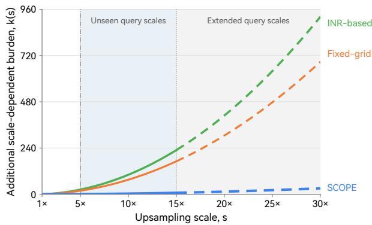  
Figure 1: Schematic architectural trends in scale-dependent computational burden from 1× to 30× for fixed-grid reconstruction, coordinate-wise INR decoding, and SCOPE. SCOPE concentrates coeficient prediction on the LR grid and uses lightweight local evaluation for denser output. Solid curves extend through 15×; dashed extensions illustrate conceptual trends to 30×. Markers identify the supervised 5× scale and the maximum accuracy-evaluation factor of 15×. Quantitative GMACs and computation–latency trajectories are reported in Sec. 5.

• A reusable coeficient-field formulation concentrates highdimensional prediction on the LR grid and reconstructs elevation residuals through local basis evaluation and geometry-guided fusion, reducing the arithmetic work repeated across dense output coordinates.

• An evaluation combines supervised-scale accuracy, unseenscale reconstruction, and theoretical operation counts with external cross-domain tests. The external tests distinguish cross-region generalization under synthetic degradation from transfer to matched inputs drawn from a diferent DEM product.

The remainder of this paper is organized as follows. Section 2 describes the data sources, study design, sample construction, and evaluation protocol. Section 3 presents the SCOPE network. Section 4 reports the experimental setup, baseline comparison, ablation studies, and qualitative analyses. Section 5 discusses implications and limitations. Section 6 concludes the paper.

## 2. Data and Study Design

## 2.1. Data Sources

Two complementary data collections are used: a main land– ocean collection for supervised reconstruction and scale-transfer experiments, and a held-out marine collection for frozen-model external evaluation. Table 1 summarizes their source products and experimental roles. Figure 3 maps source-product coverage and regional extents, while Secs. 2.2 and 2.3 describe sample construction and the evaluated subsets.

The elevation products integrated in this study include global terrestrial DEMs, global background bathymetry, and regional high-resolution coastal or marine datasets. Their main spatial characteristics are summarized in Table 1. For products originally distributed on angular grids, spatial resolutions are reported as approximate meter-scale ground spacing to facilitate comparison with the 30 m reference products. Specifically, the 1 arcsecond NOAA CRM grid corresponds to approximately 30 m, the 15 arc-second GEBCO\_2024 grid corresponds to approximately 450 m, and the 1/16 arc-minute EMODnet DTM grid corresponds to approximately 100 m near the equator. These values represent nominal ground spacing converted from the native angular grids; the actual east–west ground spacing varies with latitude.

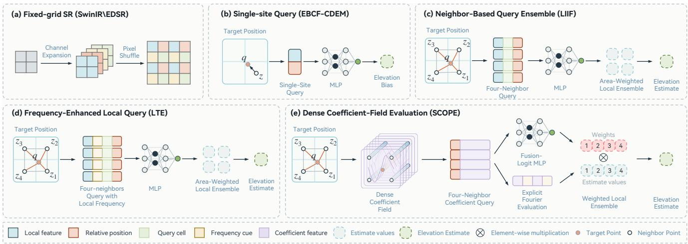  
Figure 2: Conceptual distinction among representative continuous reconstruction methods and SCOPE. The comparison highlights the predicted object, supervision setting, and decoding mechanism: query-wise implicit value prediction, query-centered frequency-aware reconstruction, DEM-specific elevation-bias prediction, and reusable latent coeficient-field evaluation.

TanDEM-X 30 m EDEM is used as the primary highresolution terrestrial reference because it provides a globally consistent radar-derived representation of land topography with fine spatial resolution and homogeneous acquisition characteristics (German Aerospace Center (DLR), 2024; Rizzoli et al., 2017). GEBCO\_2024 serves as the global ocean and background bathymetric product, providing broad terrain coverage in marine regions where direct high-resolution acoustic observations are sparse (GEBCO Compilation Group, 2024).

Four regional bathymetric products are further incorporated to improve the representation of high-resolution coastal and marine terrain. The refined 1 arcsec NOAA Coastal Relief Models (CRMs) from Vols. 1–5, 7, 9 and 10 provide ∼30 m topographic– bathymetric surfaces for U.S. coastal zones and characterize land–ocean transition terrain (NOAA National Centers for Environmental Information, 2023). The AusBathyTopo Torres Strait 30 m 2023 and Bass Strait 30 m 2022 datasets provide representative Australian reef–island and shallow-shelf bathymetry, respectively, with complex local gradients and smoother shelf backgrounds (Geoscience Australia, 2023, 2022).

The EMODnet Digital Bathymetry DTM 2024 Caribbean tile further expands the regional marine sample set at approximately 100 m resolution by integrating survey, acoustic, satellitederived, and global background bathymetric sources (EMODnet Bathymetry Consortium, 2024). After resampling, this dataset is used only in the fixed 5× evaluation subset. Together, these regional products complement TanDEM-X and GEBCO\_2024 by adding coastal, reef, shallow-shelf, and open-marine terrain conditions.

## 2.2. Study Area and Sample Construction

The study encompasses geographically distributed terrain samples between 65°N and 65°S. Figure 3 distinguishes sourceproduct coverage associated with the main study from that associated with external marine evaluation. The selected extent covers complex land, coastal, and shallow-marine terrain, providing the spatial basis for constructing multi-source land–ocean terrain samples.

Both terrestrial and marine DEM products are included during sample construction. The land DEM samples provide relatively abundant and structurally clear high-resolution terrain references, including elevation variation, slope transitions, ridge–valley morphology, and local relief patterns. Marine and coastal samples complement the land data with bathymetric surfaces and land– ocean transition structures, where high-resolution observations are usually sparser and more heterogeneous.

All DEM and bathymetric products are processed under a unified GDAL-based geospatial workflow before sample construction. The original datasets are transformed to the WGS84 geographic coordinate system, converted to meter-based elevation or depth units when necessary, and standardized into GeoTIFF raster format. Nodata regions, abnormal elevation values, and invalid bathymetric cells are removed or excluded during preprocessing.

For paired or cross-product comparisons, LR and HR rasters are further co-registered and aligned on the raster grid before patch extraction. When products have diferent native resolutions or grid definitions, resampling is performed within the same GDAL-based workflow to ensure that paired samples correspond to the same geographic footprint. This alignment step reduces spatial mismatch among heterogeneous DEM products and provides spatially consistent patches for subsequent supervised reconstruction and evaluation. The evaluation patches were generated through a predefined automated sampling and terrain-classification procedure without manual location selection.

Table 1: DEM and bathymetric source products and their experimental roles. Parenthetical region identifiers refer to Fig. 3. The first six products support the main study; GEBCO\_2023 and the four regional products below it support frozen-model external evaluation. All external reference rasters are prepared on a nominal 90 m evaluation grid. The external subset contains 12 reference rasters and 3,825 valid patches; Great Barrier Reef blocks B–D are used, with block A excluded for spatial overlap with the main-study region.
<table><tr><td>Product</td><td>Coverage</td><td>Grid spacing</td><td>Role in this study</td></tr><tr><td>TanDEM-X EDEM</td><td>Global land</td><td>30 m</td><td>Land HR reference</td></tr><tr><td>GEBCO_2024</td><td>Global ocean and land</td><td>~450 m</td><td>Ocean background</td></tr><tr><td>NOAA CRMs (A–C, E)</td><td>U.S. coastal zones</td><td>~30 m</td><td>Land-sea transition reference</td></tr><tr><td>Torres Strait 2023 (F)</td><td>139–146°E, 8–13°S</td><td>30 m</td><td>Reef and island reference</td></tr><tr><td>Bass Strait 2022 (G) EMODnet DTM 2024 (D)</td><td>143–149°E, 38–41°S</td><td>30 m</td><td>Shelf bathymetry reference</td></tr><tr><td></td><td>Caribbean tile</td><td>~100 m</td><td>Fixed-5× evaluation only</td></tr><tr><td>GEBCO_2023</td><td>Global ocean and land</td><td>~450 m</td><td>Matched cross-product LR input</td></tr><tr><td>CHS NONNA-100 (H1, H2)</td><td>Canadian waters</td><td>0.001° (source)</td><td>External bathymetric reference</td></tr><tr><td>MH370 bathymetry (I)</td><td>Southern Indian Ocean survey areas</td><td>90 m (evaluation)</td><td>External bathymetric reference</td></tr><tr><td>AusBathyTopo Northern Australia (J)</td><td>121–133°E, 18–8°S</td><td>30 m (source)</td><td>External bathymetric reference</td></tr><tr><td>AusBathyTopo Great Barrier Reef (K)</td><td>Northeastern Australian waters</td><td>30 m (source)</td><td>External reference, blocks B-D</td></tr></table>

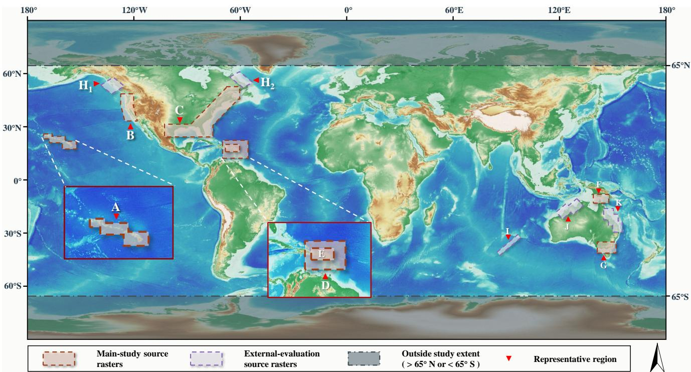  
Figure 3: Geographic distribution and coverage context of the source products. Brown and purple outlines distinguish main-study and external-evaluation product extents, respectively. A, B, C, and E identify NOAA CRMs Vols. 10, 7, 1–5, and 9; D identifies the EMODnet DTM 2024 Caribbean tile; F and G identify Torres Strait 2023 and Bass Strait 2022. H /H , I, J, and K identify CHS NONNA-100, MH370 bathymetry, Northern Australia, and Great Barrier Reef sources, respectively. The evaluated subsets are defined in Table 1 and Sec. 2.3. Red triangles locate representative regions, insets enlarge selected areas, and gray shading marks latitudes outside the 65◦N–65◦S study limits.

This study employs two types of LR–HR sample construction. The first is controlled paired construction, where the LR input is generated from the HR reference through a predefined degradation operator:

$$
I _ { \mathrm { L R } } = \mathcal { D } _ { s } ( I _ { \mathrm { H R } } ) .\tag{1}
$$

Here, $\mathcal { D } _ { s } ( \cdot )$ denotes the scale-dependent degradation process and s is the reconstruction scale. This setting provides reproducible LR–HR pairs under controlled resolution relationships.

The second is cross-product matched construction, where the LR and HR samples are obtained from diferent elevation products:

$$
\begin{array} { r } { ( I _ { \mathrm { L R } } ^ { m } , I _ { \mathrm { H R } } ^ { m } ) = \mathcal { M } ( I _ { \mathrm { L R } } ^ { r a w } , I _ { \mathrm { H R } } ^ { r a w } ) . } \end{array}\tag{2}
$$

Here, $M ( \cdot )$ represents spatial co-registration, resampling, validregion intersection, and patch-level quality control. This setting represents paired samples in which the LR input and HR reference are derived from diferent elevation products.

The resulting paired and cross-product samples provide the data basis for the experimental evaluation described in Sec. 4.

## 2.3. External Marine Datafor Cross-Domain Evaluation

External marine evaluation uses four regional source groups, identified as $\mathrm { H } _ { 1 } / \mathrm { H } _ { 2 } { - } \mathrm { K }$ in Fig. 3. CHS NONNA-100 provides Canadian bathymetry distributed in geographic tiles; south of 68◦N, the nominal source grid spacing is 0 001◦ (Canadian Hydrographic Service, 2018). The MH370 data provide bathymetric survey areas and track coverage in the southern Indian Ocean (Geoscience Australia, 2018). The Northern Australia 30 m product covers the northwestern–northern shelf within 121–133◦E and 18–8◦S (Beaman, 2018). The Great Barrier Reef 30 m product comprises overlapping regional blocks; B–D enter this evaluation, with A excluded because of spatial overlap with the main-study region (Geoscience Australia, 2017).

The selected subset contains 12 reference rasters, all prepared on a nominal 90 m evaluation grid from the source products listed in Table 1. These rasters are held out from model training and checkpoint selection. They yield 3,825 valid patches: 18 from the Canadian group, 27 from MH370, 1,116 from Northern Australia, and 2,664 from the Great Barrier Reef. Aggregate metrics use equal weighting of valid patches.

Two LR constructions use the same reference patches and nominal $4 5 0 ~  ~ 9 0 ~$ m reconstruction factor. In the selfdownsampled setting, bicubic downsampling of the 90 m reference generates the 450 m LR input, testing cross-region transfer under a controlled synthetic degradation. In the matched crossproduct setting, the LR input is drawn from GEBCO\_2023 and aligned with the regional reference (The Nippon Foundation-GEBCO, 2023). Each setting is evaluated and reported separately.

## 3. Methodology

This section describes the proposed SCOPE network for continuous DEM reconstruction. As illustrated in Fig. 4, the SCOPE network comprises a terrain encoder, the Neighborhood-Attentive Field (NAF) decoder, the Local Attentive Ensemble (LAE) module, and a bicubic base surface. The LR DEM is first encoded into an LR-aligned terrain feature field and transformed into a latent coeficient field. For a continuous query coordinate q, NAF samples neighboring coeficient vectors and evaluates local residual candidates $r _ { i } ( \mathbf { q } )$ through local basis evaluation. LAE estimates compatibility weights among these candidates and fuses them into r(q), which is added to the bicubic base surface $B ( \mathbf { q } )$ to produce the reconstructed elevation bz(q).

The following subsections introduce the overall SCOPE network, the NAF decoder and its latent coeficient field, the LAE module, the activation function, and the training objective together with the evaluation protocol.

## 3.1. SCOPE Network

As illustrated in Fig. 4, SCOPE reconstructs a continuous HR elevation surface through a base–residual formulation. The bicubic branch provides a conservative base surface B(q) that preserves the large-scale elevation trend of the LR DEM, while the Neighborhood-Attentive Field (NAF) decoder predicts a latent coeficient field from the LR terrain context. Neighboring coeficient vectors define local residual candidates r (q) at the query coordinate ${ \bf q } ,$ and the Local Attentive Ensemble (LAE) fuses these candidates into $r ( \mathbf { q } )$ before they are added back to the base surface. Following their initial definition, the abbreviations NAF and LAE denote these components throughout this section.

Let $\Omega \subset \mathbb { R } ^ { 2 }$ denote the continuous spatial domain of the target DEM and let $\Lambda _ { \mathrm { L R } } \subset \Omega$ denote the LR sampling lattice. Given an LR DEM patch $I _ { \mathrm { L R } }$ and a continuous query coordinate $\mathbf { q } \in \Omega ,$ SCOPE defines the reconstructed elevation as

$$
\widehat { z } ( { \bf q } ) = B ( { \bf q } ) + r ( { \bf q } )\tag{3}
$$

where B(q) is the bicubic base surface evaluated at q and r(q) is the LAE-fused residual. This formulation separates lowfrequency terrain continuity from fine-scale residual reconstruction, so the query coordinate q is used to evaluate local residual functions encoded in the coeficient field rather than to drive direct coordinate-to-elevation regression.

The input to SCOPE combines the normalized LR DEM with an amplitude-normalization condition channel. The terrain encoder maps this input to an LR-aligned feature field:

$$
\mathbf { F } = { \mathcal { E } } _ { \theta } ( I _ { \mathrm { L R } } , C _ { n } ) ,\tag{4}
$$

where $C _ { n }$ denotes the amplitude-normalization condition field and $\varepsilon _ { \theta }$ is the terrain encoding operator. Under the global normalization used here, $C _ { n }$ is constant; the output sampling density is specified through the query grid. The feature field F remains aligned with the LR lattice $\Lambda _ { \mathrm { L R } }$ , because the encoder functions as a context extractor rather than a grid upsampling module. This alignment allows each LR lattice point to provide local terrain context for coeficient prediction and continuous residual evaluation.

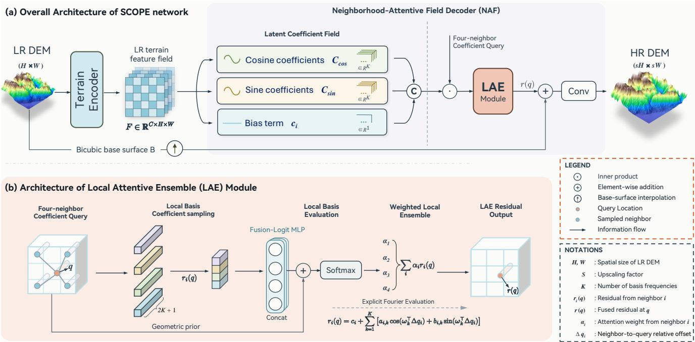  
Figure 4: Architecture of SCOPE network. (a) Overall framework. The LR DEM is encoded into an LR-aligned terrain feature field and transformed by NAF into a latent coeficient field. For a continuous query coordinate q, coeficients sampled at neighboring LR locations xi are evaluated using the relative ofsets $\Delta \mathbf { q } _ { i }$ to produce local residual candidates r (q). These candidates are fused by LAE into r(q) and added to the bicubic base surface B(q). (b) LAE module. Four neighboring residual candidates are fused using geometry-guided compatibility weights.

NAF maps the LR-aligned feature field to a latent coeficient field instantiated by local basis coeficients:

$$
\begin{array} { r } { \pmb { \Theta } = g _ { \phi } ( \mathbf { F } ) = \left( C , \{ \mathcal { A } _ { k } , \mathcal { B } _ { k } \} _ { k = 1 } ^ { K } \right) , } \end{array}\tag{5}
$$

where $\mathcal { G } _ { \phi }$ denotes the coeficient prediction operator, C is the bias coeficient field, and $\mathcal { A } _ { k }$ and $\mathcal { B } _ { k }$ are the cosine and sine coeficient fields associated with the k-th basis component. These channels form an LR-lattice-aligned latent coeficient field whose sampled vectors parameterize local residual functions rather than directly storing discrete elevation residual values.

For the ith neighboring LR location $\mathbf { x } _ { i } \in \Lambda _ { \mathrm { L R } }$ , the local coeficient vector is obtained by sampling the coeficient fields at xi:

$$
\begin{array} { r l } & { \pmb { \theta } _ { i } = \left( c _ { i } , \{ a _ { i , k } , b _ { i , k } \} _ { k = 1 } ^ { K } \right) , } \\ & { \quad = \left( C ( \mathbf { x } _ { i } ) , \{ \mathcal { A } _ { k } ( \mathbf { x } _ { i } ) , \mathcal { B } _ { k } ( \mathbf { x } _ { i } ) \} _ { k = 1 } ^ { K } \right) . } \end{array}\tag{6}
$$

where $c _ { i } = C ( \mathbf { x } _ { i } ) , a _ { i , k } = \mathcal { A } _ { k } ( \mathbf { x } _ { i } )$ , and $b _ { i , k } = \mathcal { B } _ { k } ( \mathbf { x } _ { i } )$ denote the bias, cosine, and sine coeficients sampled at the ith neighboring LR location xi, respectively. For an arbitrary continuous query coordinate ${ \bf q } ,$ the relative displacement with respect to the ith neighboring LR location $\mathbf { x } _ { i }$ is defined as $\Delta \mathbf q _ { i } = \mathbf q - \mathbf x _ { i }$ . Rather than directly regressing the elevation at q, NAF evaluates a local residual candidate associated with $\mathbf { X } _ { i }$ from the sampled coeficient vector as

$$
\begin{array} { r } { r _ { i } ( \mathbf { q } ) = c _ { i } + \displaystyle \sum _ { k = 1 } ^ { K } \Bigl [ a _ { i , k } \cos { \left( \omega _ { k } ^ { \mathrm { T } } \Delta \mathbf { q } _ { i } \right) } } \\ { + b _ { i , k } \sin { \left( \omega _ { k } ^ { \mathrm { T } } \Delta \mathbf { q } _ { i } \right) } \Bigr ] , } \end{array}\tag{7}
$$

where $\omega _ { k } = 2 \pi \mathbf { f } _ { k }$ is the k-th angular wave vector. This equation defines a local residual surface around each neighboring LR location. Therefore, changing the density of query coordinates produces DEM outputs at diferent reconstruction scales by repeatedly evaluating the same latent coeficient field, without changing the encoded feature field or introducing a scale-specific output layer.

The local residual candidates from neighboring LR locations are combined by LAE. For a continuous query coordinate q, let $N ( { \bf q } ) = \{ { \bf x } _ { i } \} _ { i = } ^ { 4 }$ denote the four surrounding LR locations. Each neighboring LR location $\mathbf { x } _ { i } \in N ( \mathbf { q } )$ provides a local residual candidate $r _ { i } ( \mathbf { q } )$ , a relative displacement $\Delta \mathbf { q } _ { i }$ , and a bilinear geometric weight $w _ { i } ^ { \mathrm { b i l i n e a r } }$ . LAE computes a geometry-guided compatibility logit and normalized ensemble weight as

$$
\begin{array} { r } { \ell _ { i } ( \mathbf { q } ) = g _ { \psi } \left( r _ { i } ( \mathbf { q } ) , \Delta \mathbf { q } _ { i } , w _ { i } ^ { \mathrm { b i l i n e a r } } \right) } \\ { + \log \left( w _ { i } ^ { \mathrm { b i l i n e a r } } + \epsilon \right) } \end{array}\tag{8}
$$

$$
\alpha _ { i } ( { \bf { q } } ) = \frac { \exp ( \ell _ { i } ( { \bf { q } } ) ) } { \sum _ { j = 1 } ^ { 4 } \exp ( \ell _ { j } ( { \bf { q } } ) ) } ,\tag{9}
$$

$$
r ( \mathbf { q } ) = \sum _ { i = 1 } ^ { 4 } \alpha _ { i } ( \mathbf { q } ) r _ { i } ( \mathbf { q } ) , \qquad \sum _ { i = 1 } ^ { 4 } \alpha _ { i } ( \mathbf { q } ) = 1 .\tag{10}
$$

Here, $g _ { \psi }$ is a lightweight MLP, $\ell _ { i } ( { \bf q } )$ is the compatibility logit, α (q) is the LAE weight, and ϵ is a small constant for numerical stability. The learned score estimates the relative compatibility of each local residual candidate $r _ { i } ( \mathbf { q } )$ with the query location, while the logarithmic bilinear term injects the geometric interpolation prior into the logit space. As a result, LAE retains the spatial preference of bilinear interpolation while allowing terrain-dependent adjustment around local structures.

Finally, the LAE-fused residual r(q) in Eq. (10) is substituted into the base–residual reconstruction in Eq. (3). These operations define the continuous base–residual representation. In the full implementation, the residual is scaled by η before addition, giving $z _ { 0 } ( \mathbf { q } ) = B ( \mathbf { q } ) + \eta r ( \mathbf { q } )$ . For a complete output grid, a lightweight convolutional refinement R produces $\widehat { I } = I _ { 0 } + \eta \mathcal { R } ( I _ { 0 } )$ where $I _ { 0 }$ samples z0 on that grid. The query coordinate q is not directly mapped to an elevation value. Instead, coeficient vectors sampled from neighboring LR locations are evaluated using the relative displacements $\Delta \mathbf { q } _ { i }$ , producing local residual candidates $r _ { i } ( \mathbf { q } )$ that are subsequently fused by LAE.

## 3.2. Sign-Adaptive Smooth Unit

The SCOPE network is required to model both positive and negative terrain residual responses. Positive residual responses may correspond to locally sharpened ridges, raised terrain details, or seabed features that are smoothed in the coarse DEM, whereas negative responses may correspond to incised channels, valleys, depressions, or local bathymetric troughs. To improve nonlinear residual representation, a parameter-free sign-adaptive activation function, termed the Sign-Adaptive Smooth Unit (SASU), is adopted in the elevation residual decoder.

For an input activation value x, SASU combines the Gaussian error linear unit (GELU) and the sigmoid-weighted linear unit (SiLU) in a sign-adaptive piecewise manner:

$$
\mathrm { G E L U } ( x ) = x \Phi ( x ) = \frac { x } { 2 } \left[ 1 + \operatorname { e r f } \left( \frac { x } { \sqrt { 2 } } \right) \right] ,
$$

$$
\mathrm { S i L U } ( x ) = x \sigma ( x ) = \frac { x } { 1 + \exp ( - x ) } ,
$$

$$
\operatorname { S A S U } ( x ) = { \left\{ \begin{array} { l l } { \operatorname { G E L U } ( x ) , } & { x \geq 0 , } \\ { \operatorname { S i L U } ( x ) , } & { x < 0 . } \end{array} \right. }\tag{11}
$$

where Φ(·) denotes the cumulative distribution function of the standard normal distribution, $\sigma ( \cdot )$ denotes the sigmoid function, and erf(·) denotes the error function. The two branches share the same function value and first-order derivative at the origin, i.e., $\mathrm { S A S U } ( 0 ) = 0$ and $\mathrm { S A S U } ^ { \prime } ( 0 ) = 1 / 2$ , ensuring a smooth transition during optimization.

The positive GELU branch provides smooth activation while preserving salient positive terrain responses, whereas the negative SiLU branch maintains non-zero responses and gradients for suppressed features. Compared with ReLU, negative features are not hard-truncated; compared with applying GELU or SiLU alone, positive and negative residual responses are modulated by diferent nonlinear behaviors. SASU serves as the default activation function in SCOPE, especially in the elevation residual decoder.

## 3.3. Training Objective

The SCOPE network is trained with paired LR and HR DEM samples. The objective combines reconstruction, gradient, and

circular direction losses:

$$
\mathcal { L } _ { \mathrm { r e c } } = \| I _ { \mathrm { S R } } - I _ { \mathrm { H R } } \| _ { 1 } ,\tag{12}
$$

$$
\mathcal { L } _ { \mathrm { g r a d } } = \| \nabla I _ { \mathrm { S R } } - \nabla I _ { \mathrm { H R } } \| _ { 1 } ,\tag{13}
$$

$$
\mathcal { L } _ { \mathrm { d e g } } = \frac { \sum _ { p } m _ { p } \left[ 1 - \mathrm { c l i p } ( c _ { p } , - 1 , 1 ) \right] } { \sum _ { p } m _ { p } } ,\tag{14}
$$

$$
{ \mathcal { L } } _ { \mathrm { t o t a l } } = \lambda _ { 1 } { \mathcal { L } } _ { \mathrm { r e c } } + \lambda _ { 2 } { \mathcal { L } } _ { \mathrm { g r a d } } + \lambda _ { 3 } { \mathcal { L } } _ { \mathrm { d e g } } .\tag{15}
$$

where ∇(·) denotes the spatial gradient operator and $\lambda _ { 1 } , \lambda _ { 2 }$ , and $\lambda _ { 3 }$ are loss weights. For each pixel $p , c _ { p }$ is the numerically stabilized cosine similarity between the SR and HR Sobel-gradient vectors. The mask $m _ { p }$ selects HR gradient magnitudes above a per-sample relative threshold; the direction loss is zero when no valid pixels remain. This circular loss constrains local orientation without imposing an artificial discontinuity at the angular wraparound. The reconstruction and gradient terms preserve elevation consistency and local relief variation.

The complete experimental protocol, including same-scale reconstruction, ablation analysis, unseen-scale inference, scaletransfer evaluation, and terrain-stratified assessment, is described in Sec. 4.

## 4. Experimental Setup and Results

This section evaluates reconstruction under limited targetresolution supervision through component ablation, fixed-scale accuracy, terrain-structure assessment, cross-domain evaluation, and unseen-scale reconstruction. Cross-domain evaluation separates the existing paired-product experiment from frozen-model tests on external marine regions.

## 4.1. Experimental Design

The experiments evaluate SCOPE in terms of supervisedscale reconstruction, reconstruction beyond the supervised scale, terrain-structure preservation, and external transfer. The data construction protocol and study regions follow Sec. 2. Training and validation regions are spatially separated before patch extraction, with no overlapping or adjacent patches across the two subsets. Gradient updates use the training subset; the validation subset supports training monitoring, checkpoint selection, and the main quantitative comparisons. The external marine data in Sec. 2.3 are reserved for frozen-model evaluation, with checkpoints fixed before external testing.

Unless otherwise specified, experiments are conducted under fixed 5× supervised reconstruction. The physical-resolution protocol uses a nominal 450 m input grid and 90 m supervision. The fixed-5× model is subsequently evaluated at a nominal 30 m output grid (15×) over the same spatial footprint. SCOPE-5F uses 90 m training labels; 30 m target-resolution supervision is supplied to the explicitly identified SCOPE-15D and SCOPE-15FT controls. Native source-product resolution and training-label grid spacing are specified separately. LR inputs for training and validation are generated from HR DEMs by bicubic downsampling with antialiasing, and the validation scale remains fixed at 5×. Elevation values are globally normalized after excluding the most extreme 0.1% of values. Land and marine samples are jointly used during training at a target ratio of 3:1, and all compared methods follow the same fixed-5× preprocessing and evaluation protocol. The 15× evaluation uses the land portion of the fixed 5× evaluation data.

SCOPE is implemented as a single-encoder continuous DEM reconstruction model. The terrain encoder follows a shiftedwindow Transformer design and is trained end-to-end within SCOPE to extract 192-dimensional terrain features. The Neighborhood-Attentive Field (NAF) decoder predicts latent coeficient fields instantiated with 96 basis frequencies. Four neighboring local residual candidates are fused by the Local Attentive Ensemble (LAE), added to the bicubic base surface with a residual scaling factor of 0.1, and passed through the post-refinement module in the full configuration. SASU is used as the default activation function.

Model optimization follows an iteration-based protocol over approximately 230,000 LR–HR DEM patch pairs. Adam is used with a batch size of 6, an initial learning rate of $1 \times 1 0 ^ { - 4 } .$ , a minimum learning rate of $1 \times 1 0 ^ { - 6 }$ , and a weight decay of $1 \times 1 0 ^ { - 6 }$ A cosine learning-rate schedule and gradient clipping with a maximum norm of 2.0 are adopted. Validation is performed every 2000 iterations, and the checkpoint with the best validation composite score is selected for the reported quantitative comparisons.

The training objective combines elevation reconstruction, gradient, and aspect losses with weights of 1.0, 0.05, and 0.01, respectively. Edge loss is disabled, and the aspect loss is computed only in valid sloped regions to avoid unstable directional supervision over nearly flat terrain.

The compared methods include interpolation baselines, fixedscale deep super-resolution models, and implicit neural reconstruction models. Learning-based baselines follow the same LR–HR data protocol whenever applicable. RMSE and MAE measure physical elevation errors in meters, while PSNR is reported in decibels. The table headings Slope, Aspect, and Corr. consistently denote the logged RMSE-Slope, RMSE-Aspect, and SlopeCorr metrics, respectively; Corr. measures slope consistency between reconstructed and reference terrain structures. Slope-related metrics are calculated with unit pixel spacing and quantify relative grid-space structure. Aspect errors use circular angular diferences with a slope-based validity mask under the same convention. Lower RMSE, MAE, Slope, and Aspect and higher PSNR and Corr. indicate better performance.

PSNR is computed on globally normalized elevation arrays clipped to [0, 1], using a unit data range.

For the external evaluation, the existing SCOPE-5F, EDSR, LIIF-MS, and EBCF-CDEM checkpoints are frozen. Every method is evaluated on the same 3,825 valid reference patches in each input setting, with bicubic interpolation retained as the nonlearned baseline. RMSE and MAE are calculated per patch in the physical elevation domain in meters, and their arithmetic means are reported over all valid patches. Relative error reduction is $1 0 0 ( E _ { \mathrm { b i c u b i c } } - E _ { \mathrm { m e t h o d } } ) / E _ { \mathrm { b i c u b i c } } ,$ , so negative values indicate higher error. The final scale-transfer experiment compares unseen-scale inference, direct 15× training, and 5× training followed by 15× fine-tuning to examine whether fixed 5× supervision can support reconstruction at the unseen 15× scale.

All experiments are implemented in PyTorch and conducted on a workstation equipped with a single NVIDIA GeForce RTX 5090 GPU. A CUDA-enabled environment supports model optimization and evaluation. The same hardware and software environment is maintained across SCOPE, baseline methods, ablation variants, and scale-transfer experiments to ensure consistent comparison.

## 4.2. Ablation Study on Key Components

The ablation results in Table 2 indicate that the full SCOPE network configuration provides the most balanced performance in both elevation accuracy and terrain-structure preservation. Here, Corr. denotes the slope-consistency score between reconstructed and reference terrain structures. Removing the bicubic base surface produces a clear deterioration, with RMSE increasing from 4.150 to 4.682 and Corr. decreasing from 0.659 to 0.521, showing that a low-frequency terrain reference is important for stable continuous reconstruction. Substituting bilinear or nearest interpolation for the base surface causes only moderate changes, but both remain slightly weaker than the default bicubic base surface. Replacing LAE with bilinear fusion also leads to a small yet consistent decline, suggesting that local reliability-aware fusion helps preserve fine-scale relief variation.

The refinement and loss-related variants mainly afect terrain morphology. Removing post-refinement markedly increases slope and aspect errors, indicating weaker control of local artifacts and high-frequency terrain details. The variant without the aspect-related loss shows the strongest degradation among the loss settings, especially in slope and aspect errors, which highlights the role of directional supervision in areas with complex local relief. Although the L1-only variant remains competitive in elevation accuracy, its weaker terrain-structure metrics show that elevation-wise fitting alone is insuficient for geomorphologically consistent DEM reconstruction.

The activation comparison further confirms the efectiveness of SASU as the default activation function in SCOPE. SiLU produces results very close to the full SASU-based model, suggesting that smooth gated nonlinearities are generally suitable for the elevation residual decoder. In contrast, GELU leads to a more evident degradation in both elevation accuracy and terrainrelated metrics. Overall, the ablation study demonstrates that the bicubic base surface, adaptive local fusion, post-refinement operation, terrain-structure-aware supervision, and SASU activation jointly contribute to the final performance of the SCOPE network.

## 4.3. Quantitative Comparison with Baselines

The quantitative comparison in Table 3 evaluates the SCOPE network against interpolation methods, fixed-scale superresolution networks, and implicit neural reconstruction baselines under the fixed 5× setting. Under this supervised scale, the SCOPE network ranks first across all six evaluation metrics. Relative to the strongest non-SCOPE result for each metric, RMSE, MAE, and slope error are reduced by 6.04%, 5.28%, and 7.16%, respectively. Aspect error is reduced by 1.21%, while

Table 2: Ablation study of the SCOPE network under the fixed 5× reconstruction setting. Slope and Aspect denote slope-based and aspect-based reconstruction errors, respectively. Corr. denotes the slope-consistency score between reconstructed and reference terrain structures.
<table><tr><td>Category</td><td>Variant</td><td>RMSE↓</td><td>MAE↓</td><td>Slope ↓</td><td>Aspect↓</td><td>PSNR ↑</td><td>Corr. ↑</td></tr><tr><td>Full model</td><td>SCOPE network*</td><td>4.150</td><td>2.816</td><td>12.051</td><td>46.473</td><td>77.48</td><td>0.659</td></tr><tr><td></td><td>No base</td><td>4.682</td><td>3.238</td><td>14.718</td><td>57.076</td><td>73.88</td><td>0.521</td></tr><tr><td>Base &amp; Fusion</td><td>Bilinear base</td><td>4.153</td><td>2.817</td><td>12.051</td><td>46.571</td><td>77.43</td><td>0.659</td></tr><tr><td></td><td>Nearest base</td><td>4.176</td><td>2.830</td><td>12.223</td><td>47.227</td><td>77.19</td><td>0.651</td></tr><tr><td></td><td>Bilinear fusion</td><td>4.186</td><td>2.830</td><td>12.285</td><td>47.013</td><td>77.16</td><td>0.652</td></tr><tr><td></td><td>No post-refinement</td><td>4.885</td><td>3.372</td><td>17.468</td><td>63.935</td><td>73.64</td><td>0.436</td></tr><tr><td>Refinement &amp; Loss</td><td>L1 + Lgrad</td><td>5.179</td><td>3.626</td><td>20.705</td><td>69.565</td><td>71.93</td><td>0.347</td></tr><tr><td></td><td>L1 only</td><td>4.215</td><td>2.828</td><td>12.421</td><td>46.753</td><td>77.28</td><td>0.653</td></tr><tr><td>Activation</td><td>GELU</td><td>4.404</td><td>3.009</td><td>14.939</td><td>57.471</td><td>74.32</td><td>0.517</td></tr><tr><td></td><td>SiLU</td><td>4.152</td><td>2.817</td><td>12.074</td><td>46.511</td><td>77.45</td><td>0.658</td></tr></table>

1. ↓ indicates that a lower value is better, while ↑ indicates that a higher value is better.

2. ∗ denotes the full configuration comprising the bicubic base surface, the composite reconstruction–gradient–aspect loss, and the SASU activation function.

PSNR and Corr. increase by 1.32 dB and 0.019. EBCF-CDEM is highly eficient with only 1.450M parameters and 11.153 GMACs. Compared with LIIF and LTE, SCOPE reduces the counted GMACs by 79.77% and 77.62%, respectively, while achieving the best overall reconstruction performance.

EDSR obtains the second-best RMSE, MAE, and slope error. Bicubic interpolation ranks second in aspect, PSNR, and Corr. SCOPE achieves the leading result across both elevation and terrain-structure metrics.

Among the INR-based methods, EBCF-CDEM obtains the lowest RMSE and MAE, showing competitive pointwise elevation fitting, but its slope, aspect, PSNR, and Corr. results are weaker than those of LIIF. LIIF is therefore used as the main INR-style visual baseline in the following qualitative comparison, while EBCF-CDEM remains the closest DEM-specific continuous reconstruction baseline in the quantitative analysis. Overall, the fixed-scale results indicate that the SCOPE network provides a more balanced reconstruction than interpolation, gridbased learning, and implicit neural representation baselines.

## 4.4. Fixed-Scale Visual Analysis

The figures show representative land and marine examples, and quantitative metrics are computed over the complete predefined evaluation set. The qualitative comparisons include bicubic interpolation, the fixed-scale models EDSR and SwinIR, and the continuous reconstruction models LIIF and EBCF-CDEM. EBCF-CDEM provides the DEM-specific continuous reconstruction comparison.

## 4.4.1. Visual Reconstruction Comparison

To further examine fixed-scale reconstruction behavior, representative land and marine patches are visualized under the supervised 5× setting. As shown in Figs. 5 and 6, the comparison includes the HR reference, the LR input, bicubic interpolation, EDSR, SwinIR, LIIF, EBCF-CDEM, and the SCOPE network, with local enlargements highlighting fine-scale terrain details and geomorphological structures.

For the land patch, the LR input loses most narrow valley and ridge details, while bicubic interpolation restores the broad elevation pattern but produces an overly smooth surface. EDSR,

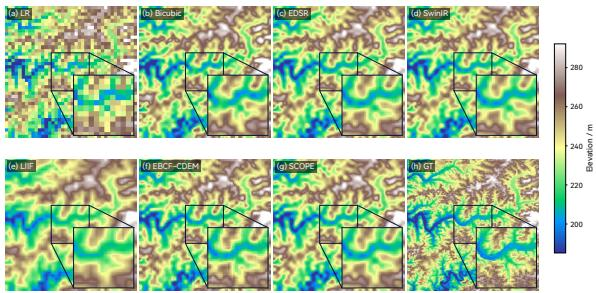  
Figure 5: Fixed-scale visual comparison on a representative land patch under the 5× reconstruction setting. Panels (a)–(g) show the LR input, bicubic interpolation, EDSR, SwinIR, LIIF, EBCF-CDEM, and the SCOPE network, respectively, while panel (h) shows the GT HR DEM. All panels are compared over the same elevation range. The enlarged regions highlight local terrain details, where the SCOPE network better preserves ridge–valley structures and fine-scale relief variations.

SwinIR, and LIIF recover more coherent terrain than interpolation, yet small ridge–valley transitions and local elevation contrasts remain softened. For the marine and coastal patch, smooth bathymetric areas coexist with sharper nearshore transitions; here, LR degradation and bicubic interpolation weaken local gradients, and EDSR, SwinIR, and LIIF still blur subtle bathymetric and coastal relief variations. EBCF-CDEM remains important, but nearest-neighbor basing causes block artifacts in the marine example. In contrast, the SCOPE network better preserves valley continuity, ridge-like transitions, coastal gradients, and fine-scale relief variations, producing reconstructions that are visually closer to the HR reference. These observations are consistent with Table 3, where the SCOPE network achieves the best overall performance across elevation accuracy and terrain-related metrics.

## 4.4.2. Elevation Error Distribution and Profile Analysis

The absolute elevation-error maps and elevation profiles jointly reveal the spatial distribution and local magnitude of reconstruction errors. As shown in Figs. 7 and 8, the LR input produces strong block-related errors around narrow valleys, ridge boundaries, coastal slopes, and bathymetric transition zones.

Table 3: Quantitative comparison with interpolation, fixed-scale super-resolution, and implicit neural reconstruction baselines under the fixed 5× setting. All baseline architectures follow their oficial implementations or recommended model configurations and are trained and evaluated under the unified data and evaluation protocol. Params and GMACs are reported for batch size 1 with a 40 × 40 LR input and a 200 × 200 output, counting convolution, linear projection, attention matrix multiplication, and explicit basis-evaluation matrix multiplication. Red and blue indicate the best and second-best results for each metric, respectively. Lower RMSE, MAE, Slope, and Aspect indicate better performance, while higher PSNR and Corr. indicate better performance.
<table><tr><td>Category</td><td>Method</td><td>Params (M)</td><td>GMACs</td><td>RMSE↓</td><td>MAE↓</td><td>Slope ↓</td><td>Aspect↓</td><td>PSNR ↑</td><td>Corr. ↑</td></tr><tr><td></td><td>Bicubic</td><td>0</td><td>一</td><td>4.733</td><td>3.205</td><td>13.304</td><td>47.041</td><td>76.16</td><td>0.640</td></tr><tr><td>Interpolation</td><td>Bilinear</td><td>0</td><td>一</td><td>5.551</td><td>3.747</td><td>14.172</td><td>49.389</td><td>74.81</td><td>0.618</td></tr><tr><td></td><td>Nearest</td><td>0</td><td>一</td><td>8.059</td><td>5.535</td><td>36.380</td><td>80.548</td><td>71.06</td><td>0.216</td></tr><tr><td></td><td>SRCNN</td><td>0.479</td><td>19.150</td><td>7.844</td><td>3.890</td><td>13.858</td><td>50.629</td><td>67.75</td><td>0.576</td></tr><tr><td>Fixed-scale SR</td><td>EDSR</td><td>21.582</td><td>34.577</td><td>4.417</td><td>2.973</td><td>12.981</td><td>49.803</td><td>75.36</td><td>0.612</td></tr><tr><td></td><td>SwinIR</td><td>17.555</td><td>41.848</td><td>4.456</td><td>3.067</td><td>13.095</td><td>50.560</td><td>74.82</td><td>0.606</td></tr><tr><td></td><td>HAT</td><td>5.287</td><td>10.214</td><td>5.742</td><td>3.230</td><td>14.842</td><td>56.412</td><td>71.61</td><td>0.520</td></tr><tr><td></td><td>LIIF</td><td>15.375</td><td>127.005</td><td>5.568</td><td>3.763</td><td>14.164</td><td>49.462</td><td>74.61</td><td>0.620</td></tr><tr><td>INR-based</td><td>LTE</td><td>15.958</td><td>114.827</td><td>5.807</td><td>4.077</td><td>14.198</td><td>51.125</td><td>71.94</td><td>0.596</td></tr><tr><td></td><td>EBCF-CDEM</td><td>1.450</td><td>11.153</td><td>5.151</td><td>3.624</td><td>17.803</td><td>64.682</td><td>73.80</td><td>0.425</td></tr><tr><td>Ours</td><td>SCOPE network</td><td>15.400</td><td>25.693</td><td>4.150</td><td>2.816</td><td>12.051</td><td>46.473</td><td>77.48</td><td>0.659</td></tr></table>

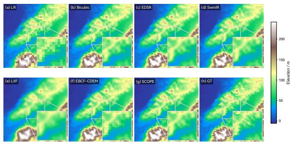  
Figure 6: Fixed-scale visual comparison on a representative marine and coastal patch under the 5× reconstruction setting. Panels (a)–(g) show the LR input, bicubic interpolation, EDSR, SwinIR, LIIF, EBCF-CDEM, and the SCOPE network, respectively, while panel (h) shows the GT HR DEM. All panels are shown with a shared elevation range. The enlarged regions illustrate the reconstruction of coastal and bathymetric transition structures, where the SCOPE network produces a sharper and more coherent terrain surface.

Bicubic interpolation reduces part of these artifacts but leaves evident errors along terrain boundaries, indicating that smooth interpolation cannot recover missing high-frequency relief structures.

Compared with bicubic interpolation, EDSR, SwinIR, and LIIF reduce part of the large-scale error but still show structured deviations where elevation changes rapidly. EBCF-CDEM is close to SCOPE, but SCOPE gives lower errors, especially along coastal transitions. In contrast, the SCOPE network exhibits a more spatially restrained error distribution, with fewer high-error responses in the enlarged regions. This indicates that SCOPE reduces not only average elevation deviation but also structured errors associated with complex terrain transitions.

The profile comparison in Fig. 9 further assesses local elevation fidelity. All methods broadly follow the large-scale elevation trend, but diferences remain around local peaks, valleys, and rapidly changing slopes. The LR profile shows step-like variations, bicubic interpolation smooths local extremes, and LIIF underestimates or slightly shifts several peak–valley amplitudes. EDSR and SwinIR follow the HR trajectory closely and remain strong fixed-scale elevation baselines, consistent with Table 3; however, their weaker aspect and Corr. metrics indicate that elevation fitting alone does not ensure terrain-structure consistency. EBCF-CDEM follows SCOPE closely, but larger local interpolation deviations remain. Compared with EDSR and SwinIR, the SCOPE network maintains similar or better profile fidelity while improving directional and geomorphological consistency under the fixed 5× setting.

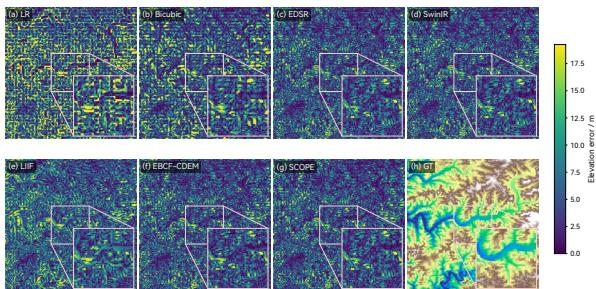  
Figure 7: Absolute elevation-error comparison on the representative land patch under the fixed 5× reconstruction setting. Panels (a)–(g) show the absolute elevation errors of the LR input, bicubic interpolation, EDSR, SwinIR, LIIF, EBCF-CDEM, and the SCOPE network, respectively, with respect to the GT HR DEM shown in panel (h). The enlarged regions highlight error distributions around local ridge–valley structures.

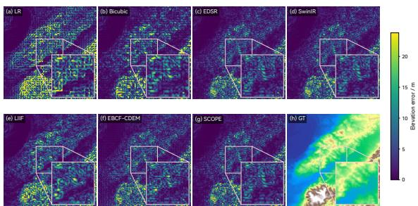  
Figure 8: Absolute elevation-error comparison on the representative marine and coastal patch under the fixed 5× reconstruction setting. Panels (a)–(g) show the absolute elevation errors of the LR input, bicubic interpolation, EDSR, SwinIR, LIIF, EBCF-CDEM, and the SCOPE network, respectively, with respect to the GT HR DEM shown in panel (h). The enlarged regions emphasize errors near coastal and bathymetric transition zones.

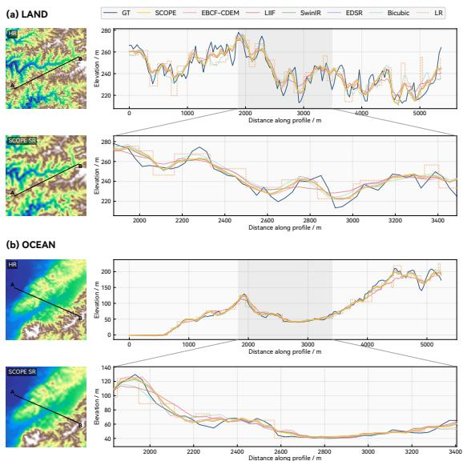  
Figure 9: Elevation profile comparison on representative land and ocean patches under the fixed 5× reconstruction setting. For each case, the HR reference and SCOPE network reconstruction are shown with the same A–B profile line, while the full and zoomed elevation profiles compare HR, LR, bicubic interpolation, EDSR, SwinIR, LIIF, EBCF-CDEM, and the SCOPE network. The zoomed profiles provide a detailed view of local peak–valley reconstruction fidelity.

## 4.4.3. Directional Terrain Structure Analysis

The aspect visualizations further examine whether the reconstructed DEMs preserve directionally consistent terrain structures. As shown in Figs. 10 and 11, the HR aspect maps exhibit organized directional patterns along ridge flanks, valley sides, coastal slopes, and bathymetric transition zones. These patterns are strongly degraded in the LR input, where coarse sampling produces block-like and locally inconsistent aspect responses. Bicubic interpolation partially restores directional continuity, but the recovered aspect fields remain over-smoothed, with weakened transitions around complex terrain boundaries.

EDSR, SwinIR, and LIIF recover plausible large-scale aspect patterns, but local artifacts remain: EDSR and SwinIR produce smoother, interpolation-like directional textures, whereas LIIF shows more regular block-like patterns in several enlarged areas. EBCF-CDEM preserves broad directions, but block-like aspect artifacts remain near complex transitions. In contrast, the SCOPE network better preserves fine-scale directional variations while maintaining spatial coherence. Its aspect fields are closer to the HR reference, with clearer local directional bands and fewer artificial discontinuities, supporting the quantitative improvement in the aspect-related metric and the preservation

of local slope-facing direction.

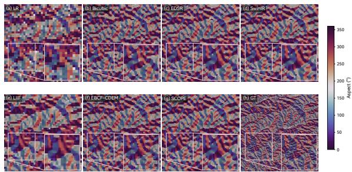  
Figure 10: Aspect-based directional terrain comparison on the representative land patch under the fixed 5× reconstruction setting. The HR reference, LR input, bicubic interpolation, EDSR, SwinIR, LIIF, EBCF-CDEM, and the SCOPE network are visualized with the same cyclic aspect color mapping. The enlarged regions highlight local ridge–valley directional structures, where the SCOPE network better preserves fine-scale terrain orientation and directional continuity.

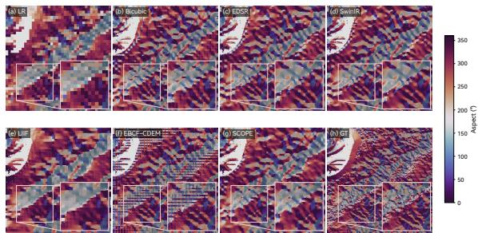  
Figure 11: Aspect-based directional terrain comparison on the representative marine and coastal patch under the fixed 5× reconstruction setting. The HR reference, LR input, bicubic interpolation, EDSR, SwinIR, LIIF, EBCF-CDEM, and the SCOPE network are visualized with the same cyclic aspect color mapping. The enlarged regions emphasize coastal and bathymetric directional transitions, where the SCOPE network produces aspect patterns that are more consistent with the HR terrain structure.

## 4.5. Cross-Domain Evaluation

Cross-domain evaluation distinguishes regional transfer under a controlled degradation from transfer between diferent DEM products. The existing matched-pair experiment examines the efect of paired-product supervision, while the external marine evaluation tests the frozen main checkpoints on previously unused regions under both input constructions.

## 4.5.1. Matched-Product Supervision and Transfer

Table 4 and Figs. 12–13 report the matched LR–HR experiment, in which the LR and HR DEMs are derived from diferent products. SCOPE-Direct and SCOPE-Transfer denote the paired-data and synthetic-data training variants in this experiment, respectively. The subsequent external marine experiment evaluates the separately identified frozen SCOPE-5F checkpoint.

SCOPE-Direct achieves the lowest RMSE and MAE, while SCOPE-Transfer obtains the lowest grid-space slope error. Bicubic interpolation gives the lowest aspect error and the highest PSNR and Corr. The RMSE and MAE of SCOPE-Transfer are 8.546 and 6.223, compared with 8.452 and 6.145 for bicubic.

Table 4: Matched-product supervision and transfer in the existing LR–HR paired experiment, distinct from the frozen external tests in Table 5. SCOPE-Direct is trained directly on matched paired data, while SCOPE-Transfer is trained with synthetic downsampling and evaluated on the paired data. Red and blue indicate the best and second-best results for each metric, respectively. Lower RMSE, MAE, Slope, and Aspect indicate better performance, while higher PSNR and Corr. indicate better performance.
<table><tr><td>Method</td><td>RMSE↓</td><td>MAE↓</td><td>Slope ↓</td><td>Aspect↓</td><td>PSNR ↑</td><td>Corr. ↑</td></tr><tr><td>Bicubic</td><td>8.452</td><td>6.145</td><td>15.230</td><td>57.081</td><td>69.53</td><td>0.537</td></tr><tr><td>Bilinear</td><td>8.989</td><td>6.544</td><td>15.931</td><td>57.565</td><td>69.17</td><td>0.528</td></tr><tr><td>Nearest</td><td>10.774</td><td>7.733</td><td>37.668</td><td>83.901</td><td>67.16</td><td>0.172</td></tr><tr><td>SCOPE-Direct</td><td>8.164</td><td>5.880</td><td>15.184</td><td>60.453</td><td>69.05</td><td>0.507</td></tr><tr><td>SCOPE-Transfer</td><td>8.546</td><td>6.223</td><td>14.963</td><td>61.152</td><td>68.78</td><td>0.496</td></tr></table>

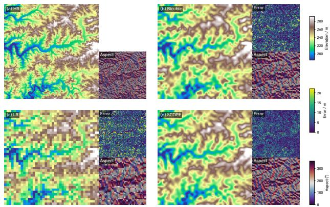  
Figure 12: Cross-dataset visual comparison on a representative land patch under the matched LR–HR paired setting. The HR reference, LR input, bicubic interpolation, and SCOPE network reconstruction are shown together with local error and aspect insets. Here, the SCOPE network corresponds to the directly trained SCOPE-Direct variant reported in Table 4.

Figures 12 and 13 show the corresponding land and marine reconstructions for SCOPE-Direct.

## 4.5.2. Frozen-Model Evaluation on External Marine Regions

Table 5 reports the same six metrics used in the other comparisons for the two input settings on the same external reference patches. Under self-downsampling, SCOPE-5F achieves the lowest RMSE, MAE, Slope, and Aspect and the highest PSNR and Corr. among all compared methods, including bicubic interpolation. Its RMSE of 3.4009 m and MAE of 2.1734 m correspond to reductions of 10.11% and 8.97% relative to bicubic, and 2.88% and 2.73% relative to EDSR. Relative to the DEM-specific EBCF-CDEM baseline, its RMSE is reduced by 19.40%. The accompanying improvement in terrain-related metrics supports cross-region generalization under the controlled degradation used to form the LR inputs.

With matched GEBCO\_2023 inputs, SCOPE-5F leads the learned methods in RMSE, MAE, Slope, and PSNR. Its RMSE is 2.08% lower than EBCF-CDEM, and its RMSE and MAE are lower than EDSR by 0.0138 m and 0.0052 m, respectively. Bicubic achieves the lowest RMSE, MAE, and Slope and the highest PSNR across all methods; SCOPE-5F’s RMSE and MAE are 3.69% and 3.22% higher than bicubic. LIIF-MS attains the lowest Aspect error and the highest Corr., with RMSE and MAE of 75.2739 m and 74.2693 m.

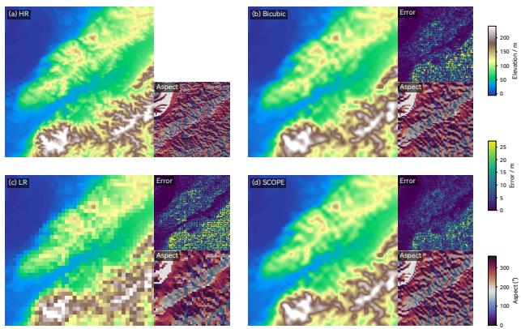  
Figure 13: Cross-dataset visual comparison on a representative marine and coastal patch under the matched LR–HR paired setting. The HR reference, LR input, bicubic interpolation, and SCOPE network reconstruction are shown together with local error and aspect insets. Here, the SCOPE network corresponds to the directly trained SCOPE-Direct variant reported in Table 4.

## 4.6. Reconstruction Beyond the Supervised Scale

The central scale-transfer experiment evaluates whether a terrain representation learned solely under fixed 5× supervision remains efective when directly queried at the unseen 15× scale. Within the same spatial support, this setting increases the output-grid density by a factor of nine, while SCOPE-5F receives neither 15× target supervision nor target-scale retraining. It therefore provides a stricter test than arbitrary-scale querying within or near the supervised scale range.

As reported in Table 6, SCOPE-5F achieves an RMSE of 6.753 and an MAE of 4.609. Relative to LIIF-MS, these errors are reduced by 21.66% and 22.00%, respectively, while the reductions over EBCF-CDEM reach 34.21% and 36.12% within the same unseen-15× land evaluation subset. SCOPE-5F also improves RMSE, MAE, slope error, PSNR, and Corr. over bicubic interpolation. Aspect errors are 71.534 for SCOPE-5F and 71.386 for bicubic.

The controlled SCOPE variants show closely matched performance. SCOPE-5F is numerically better than SCOPE-15D across all six metrics in this evaluation. SCOPE-15FT produces the best overall result, with RMSE 0.08% lower than SCOPE-5F. SCOPE-5MS yields an RMSE of 6.769 and an MAE of 4.613, compared with 6.753 and 4.609 for SCOPE-5F.

Figure 14 reports the absolute errors and diferences relative to SCOPE-5F across 2×–15×. The fixed-5× model achieves the reported 15× reconstruction directly from its learned coeficient field. EBCF-CDEM uses 1.450M parameters and 84.799 GMACs at 15×. Compared with LIIF-MS and EBCF-CDEM, SCOPE-5F reduces the counted GMACs by 97.23% and 69.09%, respectively, while achieving lower RMSE, MAE, slope error, and higher Corr.

Table 5: Frozen-model external marine evaluation at 5× (nominal 450 → 90 m), using the same 12 reference rasters and 3,825 valid patches per method in both input settings. All metrics are averaged over patches. Slope, Aspect, and Corr. follow the definitions used throughout the paper and correspond to RMSE-Slope, RMSE-Aspect, and SlopeCorr in the evaluation logs. Red and blue indicate the best and second-best distinct values within each setting, including ties at the displayed precision.
<table><tr><td>Input setting</td><td>Method</td><td>RMSE ↓</td><td>MAE↓</td><td>Slope ↓</td><td>Aspect↓</td><td>PSNR ↑</td><td>Corr. ↑</td></tr><tr><td rowspan="5">Self-downsampled</td><td>Bicubic</td><td>3.7834</td><td>2.3876</td><td>15.0834</td><td>51.3582</td><td>77.4655</td><td>0.6045</td></tr><tr><td>LIIF-MS</td><td>73.6168</td><td>73.3150</td><td>15.7968</td><td>53.3109</td><td>44.5991</td><td>0.5898</td></tr><tr><td>EBCF-CDEM</td><td>4.2196</td><td>2.8100</td><td>20.5145</td><td>71.4522</td><td>73.6952</td><td>0.3776</td></tr><tr><td>EDSR</td><td>3.5019</td><td>2.2343</td><td>14.1920</td><td>52.4866</td><td>77.5683</td><td>0.5953</td></tr><tr><td>SCOPE-5F</td><td>3.4009</td><td>2.1734</td><td>13.9307</td><td>51.0133</td><td>78.3732</td><td>0.6241</td></tr><tr><td rowspan="5">Matched GEBCO_2023</td><td>Bicubic</td><td>9.0587</td><td>5.7358</td><td>17.6567</td><td>68.0274</td><td>68.6858</td><td>0.4574</td></tr><tr><td>LIIF-MS</td><td>75.2739</td><td>74.2693</td><td>18.0105</td><td>66.8491</td><td>44.4350</td><td>0.4586</td></tr><tr><td>EBCF-CDEM</td><td>9.5928</td><td>6.0837</td><td>21.9579</td><td>79.8568</td><td>67.6670</td><td>0.3199</td></tr><tr><td>EDSR</td><td>9.4070</td><td>5.9258</td><td>18.0412</td><td>73.0962</td><td>68.1560</td><td>0.4157</td></tr><tr><td>SCOPE-5F</td><td>9.3932</td><td>5.9206</td><td>17.9543</td><td>72.5997</td><td>68.1863</td><td>0.4230</td></tr></table>

## 5. Discussion

## 5.1. Crossing the Supervision Boundary: From Known Scales to Unseen Reconstruction

The reconstruction problem considered here combines a supervision constraint with a computational requirement: labels are available at a coarser output resolution, while deployment may request a denser terrain grid. SCOPE addresses this combination through reusable coeficient-field prediction rather than through continuous coordinate querying alone. The fixed-5× to unseen-15× experiment evaluates this design outside the supervised output scale, increasing the query density ninefold without additional target-scale training labels.

SCOPE supports this transition by separating terrain representation learning from output-grid construction. A latent coeficient field is learned on the LR feature grid and parameterizes reusable local elevation-residual functions. Changing the reconstruction factor therefore does not require a new scale-specific output head or a diferent terrain representation; only the density at which the coeficient field is evaluated is altered. The bicubic base preserves the broad elevation trend, while local basis evaluation and LAE reconstruct terrain variations from neighboring coeficient vectors. This design makes the reconstructed surface depend on a reusable terrain field rather than on isolated query-wise elevation answers.

The land scale-transfer results support the usefulness of the learned representation beyond its supervised resolution. With the input held at nominal 450 m spacing, the model trained against 90 m labels remains efective when queried at 30 m. Direct target-scale training and fine-tuning yield results close to those of the fixed-5× model. The evidence therefore supports useful reconstruction with supervision at the coarser output resolution, without requiring a claim that fixed-scale training is intrinsically superior to the alternative protocols.

## 5.2. Implicationsfor Earth Observation Terrain Products

The coeficient-field formulation allows a terrain representation learned from available paired data to be evaluated on diferent output grids. For applications requiring finer sampling than the training references provide, this can reduce dependence on separate scale-specific models and target-resolution training labels. The land results demonstrate a useful case: a model trained with nominal 90 m supervision improves on interpolation when evaluated against 30 m references. The deployment value lies in flexible reconstruction from existing products, rather than in replacing new terrain observations.

The external marine tests clarify a separate requirement for such use. Under self-downsampling, SCOPE retains an accuracy advantage on the held-out regions, whereas matched GEBCO inputs do not yield a gain over bicubic. Its cross-product elevation errors are close to EDSR, and LIIF-MS leads the Aspect and Corr. metrics despite its large elevation errors. The earlier matched-product experiment also distributes the best metrics across SCOPE-Direct, SCOPE-Transfer, and bicubic. These metric-specific rankings do not establish a uniform cross-product advantage. Regional generalization under a common degradation model and transfer between real products are therefore diferent capabilities. Diferences in acquisition source, vertical reference, interpolation history, and terrain distribution can affect matched-product reconstruction; the aggregate results do not isolate their individual contributions.

## 5.3. Why Lightweight Local Attentive Ensemble Is Suficient

Table 7 shows that LAE provides small but consistent improvements over Transformer-style fusion across the terrain-related metrics. At each query coordinate q, the fusion module receives only four local residual candidates r (q) together with their relative displacements ∆qi. Its role is therefore not to learn longrange interactions or rich token dependencies, but to estimate compatibility weights for a compact set of geometry-related residual candidates.

Table 6: Quantitative comparison at the target 15× reconstruction scale. LIIF-MS is trained with 5× as the primary scale and random downsampling across {2× 3× 4×} for multi-scale supervision. SCOPE-5F denotes fixed 5× training only, SCOPE-5MS denotes multiscale training up to 5×, SCOPE-15D denotes direct 15× training, and SCOPE-15FT denotes 5× training followed by 15× fine-tuning. Params and GMACs are reported for batch size 1 with a 40 × 40 LR input and a 600 × 600 output, counting convolution, linear projection, attention matrix multiplication, and explicit basis-evaluation matrix multiplication. Red and blue indicate the best and second-best results for each metric, respectively. Lower RMSE, MAE, Slope, and Aspect indicate better performance, while higher PSNR and Corr. indicate better performance.
<table><tr><td>Method</td><td>Params (M)</td><td>GMACs</td><td>RMSE↓</td><td>MAE↓</td><td>Slope ↓</td><td>Aspect↓</td><td>PSNR ↑</td><td>Corr. ↑</td></tr><tr><td>Bicubic</td><td>0</td><td></td><td>7.657</td><td>5.212</td><td>21.468</td><td>71.386</td><td>69.57</td><td>0.447</td></tr><tr><td>LIIF-MS</td><td>15.375</td><td>946.533</td><td>8.620</td><td>5.909</td><td>22.293</td><td>73.185</td><td>68.61</td><td>0.426</td></tr><tr><td>EBCF-CDEM</td><td>1.450</td><td>84.799</td><td>10.265</td><td>7.215</td><td>29.331</td><td>96.334</td><td>65.01</td><td>0.182</td></tr><tr><td>SCOPE-5F</td><td>15.400</td><td>26.208</td><td>6.753</td><td>4.609</td><td>19.824</td><td>71.534</td><td>70.45</td><td>0.455</td></tr><tr><td>SCOPE-5MS</td><td>15.400</td><td>26.208</td><td>6.769</td><td>4.613</td><td>19.915</td><td>71.667</td><td>70.43</td><td>0.454</td></tr><tr><td>SCOPE-15D</td><td>15.400</td><td>26.208</td><td>6.789</td><td>4.629</td><td>19.839</td><td>72.028</td><td>70.37</td><td>0.446</td></tr><tr><td>SCOPE-15FT</td><td>15.400</td><td>26.208</td><td>6.748</td><td>4.600</td><td>19.807</td><td>71.492</td><td>70.45</td><td>0.456</td></tr></table>

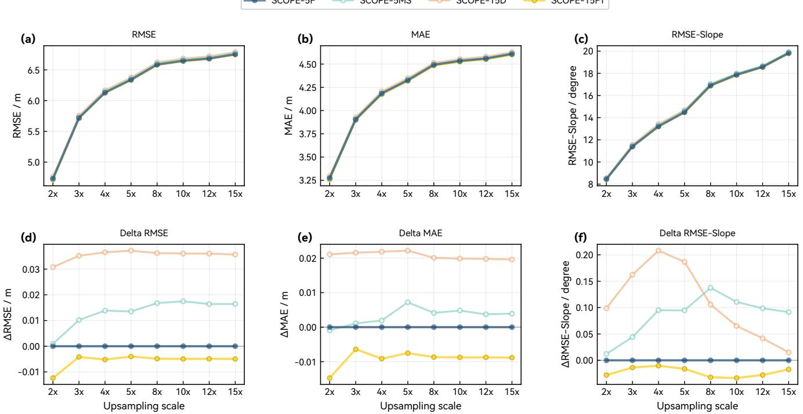  
Figure 14: Scale-transfer behavior of diferent SCOPE network training protocols from 2× to 15×. The top row reports absolute RMSE, MAE, and slope error, while the bottom row reports metric diferences computed as each compared protocol minus SCOPE-5F at the same scale. SCOPE-5F denotes fixed 5× training, SCOPE-5MS denotes multiscale training, SCOPE-15D denotes direct 15× training, and SCOPE-15FT denotes 5× training followed by 15× fine-tuning.

Transformer-style fusion remains a powerful general interaction mechanism, particularly for feature extraction and larger token sets, as already exploited by the upstream encoder. At the query stage, however, most terrain context has been encoded into the latent coeficient field, leaving only a low-dimensional local aggregation problem. LAE introduces a more direct inductive bias by mapping local residual candidates and geometric ofsets to adaptive compatibility weights. Its slightly lower elevation and terrain-structure errors indicate that this compact weighting mechanism is suficient for local basis evaluation, while avoiding unnecessary query-side complexity.

Table 7: Comparison between MLP-based LAE and Transformer-style local fusion. Lower values indicate better performance.
<table><tr><td>Fusion</td><td>RMSE</td><td>MAE</td><td>Slope</td><td>Aspect</td></tr><tr><td>MLP-based LAE</td><td>4.150</td><td>2.816</td><td>12.051</td><td>46.473</td></tr><tr><td>Transformer-style fusion</td><td>4.186</td><td>2.832</td><td>12.30247.061</td><td></td></tr></table>

## 5.4. Efect of Sign-Adaptive Activation

The activation ablation shows lower errors with SASU than with GELU in the reported run, reducing RMSE from 4.404 to 4.150 and grid-space slope error from 14.939 to 12.051. SASU and SiLU produce nearly identical results. SASU is retained as the default activation, while the comparison supports the use of smooth gated nonlinearities without establishing a substantial advantage over SiLU.

SASU applies diferent smooth nonlinear responses to nonnegative and negative activations without introducing additional parameters, providing a lightweight component for residual decoding.

## 5.5. Computational Scaling and Inference Eficiency

The Params and GMACs reported in Tables 3 and 6 show a distinct computational response to denser querying. When the reconstruction scale increases from 5× to 15×, the counted GMACs increase by only 0.515 for SCOPE, compared with 819.528 for LIIF and 73.646 for EBCF-CDEM. This contrast arises from what is repeated during HR querying. Query-wise implicit baselines repeatedly apply linear layers in an MLP to dense HR coordinates, whereas SCOPE generates a latent coeficient field once from spatially organized LR feature maps. The query coordinate then mainly triggers coeficient sampling, basis-function combination, and lightweight LAE weighting, rather than another high-dimensional coordinate-to-elevation regression. This computational distinction can be summarized as

$$
\begin{array} { r } { \mathrm { M A C } _ { \mathrm { q u e r y } } ( Q ) = C _ { \mathrm { e n c } } + Q C _ { \mathrm { q u e r y } } , } \\ { \mathrm { M A C } _ { \mathrm { S C O P E } } ( Q ) = C _ { \mathrm { f i e l d } } + Q C _ { \mathrm { e v a l } } . } \end{array}\tag{16}
$$

where Q is the number of output query points, $C _ { \mathrm { q u e r y } }$ denotes the per-query MLP cost in query-wise implicit baselines, and $C _ { \mathrm { f i e l d } }$ includes LR-side feature extraction and coeficient prediction. The efective per-output cost $C _ { \mathrm { e v a l } }$ includes the counted operations of local field evaluation, LAE fusion, and output-grid post-refinement. Under the evaluated configurations, this cost is much smaller than repeated high-dimensional query prediction. Both formulations retain a term linear in $Q ;$ the advantage is a lower marginal arithmetic cost, not constant-cost dense reconstruction. The LR-side work dominates SCOPE’s reported total at the evaluated sizes, so ninefold output density yields only a small increase in GMACs even though SCOPE is not the smallest model in parameter count. These tabulated counts characterize the specified arithmetic operations and are distinct from the relative-latency comparison below.

Figure 15 complements the arithmetic analysis with computation–latency trajectories at seven reconstruction factors from 2× to 30×. SCOPE follows a comparatively narrow computation range while its latency increases with output density; LIIF-MS and LTE move toward both higher computation and higher latency. The near-vertical SCOPE trajectory therefore indicates limited arithmetic growth, not scale-independent execution time. EBCF-CDEM and EDSR retain lower latency at several plotted factors, so this comparison does not establish SCOPE as universally fastest. Together with the reconstruction results in Tables 3 and 6, the trajectories support a joint assessment of reconstruction quality and scale-dependent execution cost. The 20× and 30× points extend the cost analysis only, not the reference-based accuracy evaluation.

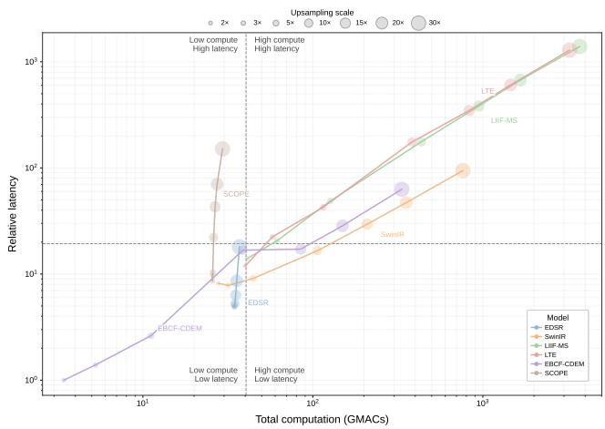  
Figure 15: Computation–latency trajectories across reconstruction scales. Both axes are logarithmic; lower-left positions indicate lower cost. Marker sizes encode 2×, 3×, 5×, 10×, 15×, 20×, and 30×; lines connect increasing factors within each model. Dashed lines partition the cost space.

## 5.6. Limitations and Extensions toward Latent Geomorphological Prior Learning

SCOPE remains a paired grid-space reconstruction method, constrained by the information, noise, and uncertainty in the observed LR–HR products. The main quantitative comparisons use the validation subset employed for checkpoint selection, rather than a separate held-out main-study test set; the external marine experiment provides a distinct frozen-model evaluation. The present 15× accuracy results cover land terrain because some regional 30 m marine products contain stronger local noise. Independently referenced 30 m bathymetric reconstruction is outside this evaluation. Small diferences among training protocols and activations are reported descriptively, without a claim of statistical significance.

The geographic scope is bounded by the selected regions and sampling protocol. Polar and high-latitude terrain outside 65◦N–65◦S is excluded because snow and ice cover, sparse observations, complex surface conditions, and vertical-reference diferences introduce additional uncertainty. The external marine aggregate is patch-weighted and dominated by the Northern Australia and Great Barrier Reef groups, rather than equally weighted by source or representative of global bathymetry. Regional holdout does not establish independence of the underlying surveys incorporated into diferent bathymetric compilations. Similarly, the source-product extents and tile-index boundaries in Fig. 3 indicate geographic context, not uninterrupted valid observations or complete tested coverage.

Grid spacing and evaluation metrics also delimit interpretation. The common 90 m external grid is a processing convention rather than a guarantee of efective 90 m bathymetric detail. Slope-related metrics use unit pixel spacing and assess gridspace structure rather than physical slope errors at 90 m or 30 m horizontal spacing. Fine-scale reconstruction remains an inference constrained by LR observations and learned terrain priors; it should not be interpreted as newly observed topographic measurements.

A more fundamental extension would be to move beyond gridspace sharpening toward latent geomorphological prior learning. LR and HR DEMs could be jointly embedded into a shared highdimensional terrain manifold, where cross-scale consistency, basis-structured terrain variation, slope–aspect geometry, and terrain-type semantics are explicitly constrained. This direction should be distinguished from directly adopting codebook-based or difusion-based image super-resolution: although learned latent priors have reduced ambiguity in restoration tasks (van den Oord et al., 2017; Esser et al., 2021; Zhou et al., 2022; Gu et al., 2022; Saharia et al., 2023), DEM reconstruction requires stronger physical and geomorphological control. Future work may therefore explore latent terrain-atlas learning, cross-scale representation alignment, uncertainty-aware constraints, and multi-source geospatial priors.

## 6. Conclusion

This study addresses continuous DEM reconstruction when paired training data are available at a lower reconstruction factor but labels at the desired target factor are unavailable for training. SCOPE learns a reusable coeficient field from the available pairs and reconstructs a denser elevation grid through local basis evaluation and geometry-guided ensemble fusion. The same design reduces the high-dimensional prediction repeated across output coordinates, addressing target-scale supervision constraints and computational growth together.

Under fixed 5× supervision, SCOPE ranks first across six metrics in the main supervised-scale evaluation. In the land evaluation at the unseen 15× factor, it reduces RMSE and MAE by approximately 12% relative to bicubic, with RMSE within 0.08% of target-scale fine-tuning. Ninefold output density increases the counted computation by approximately 2%. Together, these results support efective reconstruction beyond the supervised resolution with low incremental arithmetic cost.

Frozen-model validation on 3,825 held-out external marine patches complements the scale-transfer evidence. Relative to the DEM-specific EBCF-CDEM baseline, SCOPE reduces RMSE by approximately 19% under self-downsampling and 2% with matched GEBCO\_2023 inputs, and yields lower RMSE than LIIF-MS in both settings. It leads all six metrics under selfdownsampling and the learned models in RMSE, MAE, Slope, and PSNR under matched cross-product inputs. Together, the supervised-scale, unseen-scale, and external evaluations support reusable terrain functions as an efective approach to scaleflexible DEM reconstruction under limited target-resolution supervision.

## Acknowledgements

The authors gratefully acknowledge the German Aerospace Center (DLR) for providing the TanDEM-X 30 m EDEM, the GEBCO Compilation Group for the GEBCO\_2024 and GEBCO\_2023 grids, NOAA’s National Centers for Environmental Information (NCEI) for the Coastal Relief Models, EMODnet Bathymetry for the EMODnet DTM, the Canadian Hydrographic Service for NONNA bathymetry, and Geoscience Australia and the AusSeabed contributors for the regional bathymetric products and MH370 data. This work was supported by the National Natural Science Foundation of China [grant number 42401446].

## Declarations

## Funding

This work was supported by the National Natural Science Foundation of China [grant number 42401446].

## Competing Interests

The authors have no relevant financial or non-financial interests to disclose.

## Author Contributions

Zekai Shi: Conceptualization, Methodology, Software, Formal analysis, Investigation, Visualization, Writing—original draft. Meng Zhang: Supervision, Resources, Project administration, Writing—review and editing. Haokun Zhang: Validation, Writing—review and editing. Bo Zhang: Writing—review and editing. All authors read and approved the final manuscript.

## Data Availability

The datasets analyzed during the current study are publicly available from their original providers. Dataset names and access information are provided in the manuscript.

## References

Beaman, R., 2018. AusBathyTopo (Northern Australia) 30 m 2018: A regional-scale depth model. Geoscience Australia, dataset record 121620. URL: https://researchdata.e du.au/ausbathytopo-northern-australia-model-2 0180020c/3440316, doi:10.4225/25/5b35b3b8074a9. product metadata; accessed 22 September 2026.

Canadian Hydrographic Service, 2018. Canadian hydrographic service non-navigational (NONNA) bathymetric data. Government of Canada Open Government Portal. URL: https: //open.canada.ca/data/en/dataset/d3881c4c-6 50d-4070-bf9b-1e00aabf0a1d. accessed 21 September 2026.

Cao, J., Wang, Q., Xian, Y., Li, Y., Ni, B., Pi, Z., Zhang, K., Zhang, Y., Timofte, R., Van Gool, L., 2023. CiaoSR: Continuous implicit attention-in-attention network for arbitrary-scale image super-resolution, in: 2023 IEEE/CVF Conference on Computer Vision and Pattern Recognition (CVPR), IEEE, Vancouver, BC, Canada. pp. 1796–1807. doi:10.1109/CVPR 52729.2023.00179.

Chen, Y., Liu, S., Wang, X., 2021. Learning continuous image representation with local implicit image function, in: 2021 IEEE/CVF Conference on Computer Vision and Pattern Recognition (CVPR), IEEE, Nashville, TN, USA. pp. 8624–8634. doi:10.1109/CVPR46437.2021.00852.

Demiray, B.Z., Sit, M., Demir, I., 2021. D-SRGAN: DEM superresolution with generative adversarial networks. SN Computer Science 2, 48. doi:10.1007/s42979-020-00442-2.

Dong, C., Loy, C.C., He, K., Tang, X., 2014. Learning a deep convolutional network for image super-resolution, in: Fleet, D., Pajdla, T., Schiele, B., Tuytelaars, T. (Eds.), Computer Vision – ECCV 2014, Springer International Publishing, Cham. pp. 184–199. doi:10.1007/978-3-319-10593-2\_13.

EMODnet Bathymetry Consortium, 2024. EMODnet digital bathymetry (DTM 2024). doi:10.12770/cf51df64-56f 9-4a99-b1aa-36b8d7b743a1.

Esser, P., Rombach, R., Ommer, B., 2021. Taming transformers for high-resolution image synthesis, in: 2021 IEEE/CVF Conference on Computer Vision and Pattern Recognition (CVPR), IEEE, Nashville, TN, USA. pp. 12868–12878. doi:10.1109/CVPR46437.2021.01268.

Farr, T.G., Rosen, P.A., Caro, E., Crippen, R., Duren, R., Hensley, S., Kobrick, M., Paller, M., Rodriguez, E., Roth, L., Seal, D., Shafer, S., Shimada, J., Umland, J., Werner, M., Oskin, M., Burbank, D., Alsdorf, D., 2007. The shuttle radar topography mission. Reviews of Geophysics 45, 2005RG000183. doi:10.1029/2005RG000183.

GEBCO, 2024. Release of the GEBCO\_2024 grid. GEBCO Compilation Group, 2024. GEBCO 2024 grid. doi:doi: 10.5285/1c44ce99-0a0d-5f4f-e063-7086abc0ea0f.

Geoscience Australia, 2017. AusBathyTopo (Great Barrier Reef) 30 m 2017: A regional-scale depth model. Geoscience Australia, dataset record 115066. URL: https: //researchdata.edu.au/ausbathytopo-great-barri er-model-20170025c/3405606. metadata also describe the overlapping A–D grids of the 10 November 2020 release; accessed 22 September 2026.

Geoscience Australia, 2018. The search for MH370: Data release. URL: https://www.ga.gov.au/scientific -topics/marine-and-coastal/showcase/mh370-dat a-release. oficial description of the bathymetric survey and data release; accessed 22 September 2026.

Geoscience Australia, 2022. AusBathyTopo (bass strait) 30m 2022 – a regional-scale depth model (20220003C).

Geoscience Australia, 2023. AusBathyTopo (torres strait) 30m 2023 – a regional-scale depth model (20230006C). doi:10.2 6186/144348.

German Aerospace Center (DLR), 2024. TanDEM-x 30 m edited digital elevation model (EDEM).

Gu, Y., Wang, X., Xie, L., Dong, C., Li, G., Shan, Y., Cheng, M.M., 2022. VQFR: Blind face restoration with vectorquantized dictionary and parallel decoder, in: Avidan, S., Brostow, G., Cissé, M., Farinella, G.M., Hassner, T. (Eds.), Computer Vision – ECCV 2022, Springer Nature Switzerland, Cham. pp. 126–143. doi:10.1007/978-3-031-19797-0 \_8.

He, P., Cheng, Y., Qi, M., Cao, Z., Zhang, H., Ma, S., Yao, S., Wang, Q., 2022. Super-resolution of digital elevation model with local implicit function representation, in: 2022 International Conference on Machine Learning and Intelligent Systems Engineering (MLISE), IEEE Computer Society. pp. 111–116. doi:10.1109/MLISE57402.2022.00030.

Hu, X., Mu, H., Zhang, X., Wang, Z., Tan, T., Sun, J., 2019. Meta-SR: A magnification-arbitrary network for superresolution, in: 2019 IEEE/CVF Conference on Computer Vision and Pattern Recognition (CVPR), IEEE, Long Beach, CA, USA. pp. 1575–1584. doi:10.1109/CVPR.2019.0016 7.

Huang, W., Sun, Q., Guo, W., Xu, Q., Ma, J., Gao, T., Yu, A., 2024. DEM super-resolution guided by shaded relief using attention-based fusion. International Journal of Applied Earth Observation and Geoinformation 132, 104014. doi:10.101 6/j.jag.2024.104014.

Huang, W., Sun, Q., Guo, W., Xu, Q., Wen, B., Gao, T., Yu, A., 2025. Multi-modal DEM super-resolution using relative depth: A new benchmark and beyond. International Journal of Applied Earth Observation and Geoinformation 144, 104865. doi:10.1016/j.jag.2025.104865.

Krieger, G., Moreira, A., Fiedler, H., Hajnsek, I., Werner, M., Younis, M., Zink, M., 2007. TanDEM-X: A satellite formation

for high-resolution SAR interferometry. IEEE Transactions on Geoscience and Remote Sensing 45, 3317–3341. doi:10 .1109/TGRS.2007.900693.

Lee, J., Jin, K.H., 2022. Local texture estimator for implicit representation function, in: 2022 IEEE/CVF Conference on Computer Vision and Pattern Recognition (CVPR), IEEE, New Orleans, LA, USA. pp. 1919–1928. doi:10.1109/CVPR 52688.2022.00197.

Miller, C.L., Laflamme, R.A., 1958. The digital terrain model – theory & application. Photocrammetric Engneering 24.

Moore, I.D., Grayson, R.B., Ladson, A.R., 1991. Digital terrain modelling: A review of hydrological, geomorphological, and biological applications. Hydrological Processes 5, 3–30. doi:10.1002/hyp.3360050103.

NOAA National Centers for Environmental Information, 2023. Coastal relief models (crms). doi:10.25921/5ZN5-KN44.

Rizzoli, P., Martone, M., Gonzalez, C., Wecklich, C., Borla Tridon, D., Bräutigam, B., Bachmann, M., Schulze, D., Fritz, T., Huber, M., Wessel, B., Krieger, G., Zink, M., Moreira, A., 2017. Generation and performance assessment of the global TanDEM-X digital elevation model. ISPRS Journal of Photogrammetry and Remote Sensing 132, 119–139. doi:10.1016/j.isprsjprs.2017.08.008.

Saharia, C., Ho, J., Chan, W., Salimans, T., Fleet, D.J., Norouzi, M., 2023. Image super-resolution via iterative refinement. IEEE Transactions on Pattern Analysis and Machine Intelligence 45, 4713–4726. doi:10.1109/TPAMI.2022.32044 61.

Sitzmann, V., Martel, J.N.P., Bergman, A.W., Lindell, D.B., Wetzstein, G., 2020. Implicit neural representations with periodic activation functions, in: Proceedings of the 34th International Conference on Neural Information Processing Systems, Curran Associates Inc., Red Hook, NY, USA. pp. 7462–7473.

Smith, W.H.F., Sandwell, D.T., 1994. Bathymetric prediction from dense satellite altimetry and sparse shipboard bathymetry. Journal of Geophysical Research: Solid Earth 99, 21803–21824. doi:10.1029/94JB00988.

Smith, W.H.F., Sandwell, D.T., 1997. Global sea floor topography from satellite altimetry and ship depth soundings. Science 277, 1956–1962. doi:10.1126/science.277.5334.1956.

Straub, J., 2012. Super-resolution terrain map enhancement for navigation based on satellite imagery, in: Intelligent Robots and Computer Vision XXIX: Algorithms and Techniques, SPIE. pp. 187–191. doi:10.1117/12.911942.

Tancik, M., Srinivasan, P., Mildenhall, B., Fridovich-Keil, S., Raghavan, N., Singhal, U., Ramamoorthi, R., Barron, J., Ng, R., 2020. Fourier features let networks learn high frequency functions in low dimensional domains, in: Advances in Neural Information Processing Systems, Curran Associates, Inc.. pp. 7537–7547.

The Nippon Foundation-GEBCO, 2023. The GEBCO\_2023 grid.

Tozer, B., Sandwell, D.T., Smith, W.H.F., Olson, C., Beale, J.R., Wessel, P., 2019. Global bathymetry and topography at 15 arc sec: SRTM15+. Earth and Space Science 6, 1847–1864. doi:10.1029/2019EA000658.

van den Oord, A., Vinyals, O., kavukcuoglu, k., 2017. Neural discrete representation learning, in: Advances in Neural Information Processing Systems, Curran Associates, Inc.

Wang, H., Xiong, L., Hu, G., Cao, H., Li, S., Tang, G., Zhou, L., 2024. DEM super-resolution framework based on deep learning: Decomposing terrain trends and residuals. International Journal of Digital Earth 17, 2356121. doi:10.1080/17538947.2024.2356121.

Wen, Z., Chen, H., Zheng, X., 2025. Unmixing frequency features for DEM super resolution. ISPRS Journal of Photogrammetry and Remote Sensing 228, 723–740. doi:10.1 016/j.isprsjprs.2025.07.039.

Wessel, B., Huber, M., Wohlfart, C., Marschalk, U., Kosmann, D., Roth, A., 2018. Accuracy assessment of the global TanDEM-X digital elevation model with GPS data. ISPRS Journal of Photogrammetry and Remote Sensing 139, 171– 182. doi:10.1016/j.isprsjprs.2018.02.017.

Xu, Z., Chen, Z., Yi, W., Gui, Q., Hou, W., Ding, M., 2019. Deep gradient prior network for DEM super-resolution: Transfer learning from image to DEM. ISPRS Journal of Photogrammetry and Remote Sensing 150, 80–90. doi:10.1016/j.is prsjprs.2019.02.008.

Yang, W., Zhang, X., Tian, Y., Wang, W., Xue, J.H., Liao, Q., 2019. Deep learning for single image super-resolution: A brief review. IEEE Transactions on Multimedia 21, 3106– 3121. doi:10.1109/TMM.2019.2919431.

Yao, S., Cheng, Y., Yang, F., Mozerov, M.G., 2024. A continuous digital elevation representation model for DEM superresolution. ISPRS Journal of Photogrammetry and Remote Sensing 208, 1–13. doi:10.1016/j.isprsjprs.2024.01. 001.

Yue, L., Shen, H., Yuan, Q., Zhang, L., 2015. Fusion of multiscale DEMs using a regularized super-resolution method. International Journal of Geographical Information Science 29, 2095–2120. doi:10.1080/13658816.2015.1063639.

Zhang, Y., Yu, W., Zhu, D., 2022. Terrain feature-aware deep learning network for digital elevation model superresolution. ISPRS Journal of Photogrammetry and Remote Sensing 189, 143–162. doi:10.1016/j.isprsjprs.2022.04.028.

Zhou, A., Chen, Y., Wilson, J.P., Su, H., Xiong, Z., Cheng, Q., 2021. An enhanced double-filter deep residual neural network for generating super resolution DEMs. Remote Sensing 13, 3089. doi:10.3390/rs13163089.

Zhou, S., Chan, K., Li, C., Loy, C.C., 2022. Towards robust blind face restoration with codebook lookup transformer, in: Advances in Neural Information Processing Systems, Curran Associates, Inc.. pp. 30599–30611.