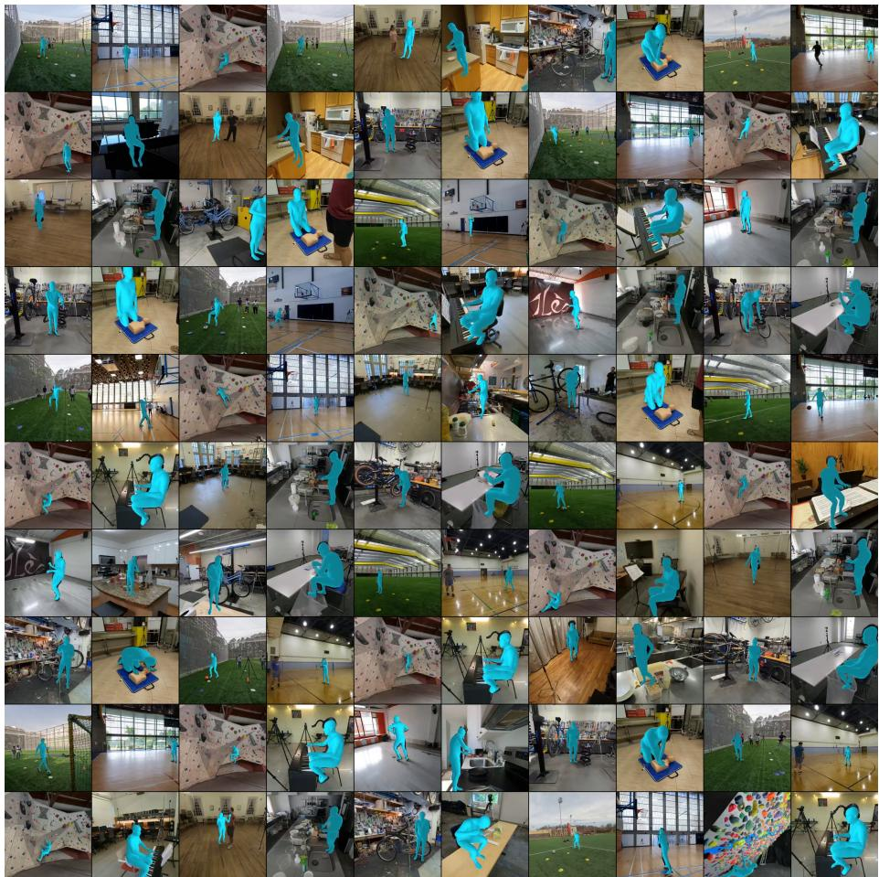
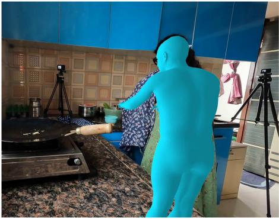
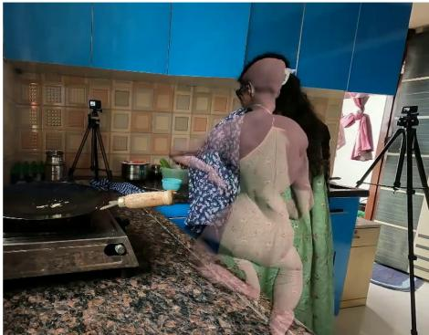

# Ego-Exo4D Human Meshes Dataset: 4D Human Motion Reconstruction for Ego-Exo Captures

Abhiram Maddukuri1 Georgios Pavlakos1

1The University of Texas at Austin

## Abstract

Ego-Exo4D is a large-scale dataset providing synchronized egocentric and multi-view exocentric video, a rich resource for skill learning and assessment, procedural activity understanding, and embodied AI. However, the dataset ships with only sparse 3D human pose annotations, and reconstructing dense human motion from its multi-view captures is nontrivial. To this end, we present Ego-Exo4D-HM, a large-scale dataset of 4D human motion reconstructions for Ego-Exo4D’s captures, and release the accompanying reconstruction pipeline. The code, dataset, and documentation can be found at https://abhiram824.github.io/egoexo4d\_ human\_meshes/.

## 1 Introduction

Ego4D [9] and Ego-Exo4D [10] are among the largest eforts in egocentric data collection, providing thousands of hours of video across a wide range of activities and participants. Datasets of this scale open the door to pipelines for skill learning and assessment, procedural activity understanding, embodied AI and robot imitation learning, and coaching or tutoring systems that give feedback on physical performance.

Ego-Exo4D in particular is a rich dataset, with extensive capture including an egocentric sensor alongside multiple exocentric cameras, all synchronized and calibrated. This multi-view setup should, in principle, significantly improve the quality of 3D human perception, since the exocentric cameras observe the full body of the person performing the activity. However, the dataset’s existing 3D annotations are sparse, and current 3D human reconstruction systems can be brittle at this scale.

To enable broader use of the dataset, we develop a pipeline for recovering the 4D human motion of Ego-Exo4D’s captures. Our approach builds on stateof-the-art methods for 3D human pose reconstruction [30, 7, 20], adapted to take advantage of Ego-Exo4D’s synchronized multi-camera setup. We release the resulting SMPL-H motion sequences as the Ego-Exo4D-HM dataset (see Figure 1), along with our processing pipeline, so future work can use this data directly rather than reprocessing the raw captures.

  
Figure 1: Recovered SMPL-H meshes overlaid on exocentric video across the reconstructed Ego-Exo4D sequences.

## 2 Background

Our pipeline builds on video-based human mesh recovery methods that turn perframe estimates, such as those from HMR2.0 [7], into temporally consistent 4D motion. Methods like WHAM [26] and GVHMR [24] do this in a feed-forward fashion; however, it is challenging to incorporate information from multiple views this way. Instead, we adopt an optimization-based formulation that naturally accepts additional constraints. Specifically, we build on SLAHMR [30], which jointly optimizes pose and root trajectory using 2D body keypoints and a learned motion prior. Our pipeline is related to prior frameworks, like EasyMocap [27], which operates with multiple calibrated views, but also considers egocentric captures and relies on more recent human pose estimation approaches.

MAMMA [4] performs markerless multi-view motion capture directly from raw video streams. We show a short comparison in Section 4.

Previous work has independently considered the problem of egocentric body pose recovery. EgoEgo [16] relies only on the SLAM trajectory of the headmounted camera, without access to image observations, while more recent work, EgoAllo [31], incorporates hand observations estimated from egocentric images. The exocentric cameras of Ego-Exo4D simplify the problem in this setting, since they are observing the body from multiple views.

Our work is heavily motivated by growing use of human motion and activity data in embodied AI. Many works [19, 32, 15, 13] have leveraged diverse motion capture data of human activity to train performant humanoid whole-body controllers. Another line of work [14, 21, 18, 25, 17] uses RGB videos of humans doing tasks to learn visuomotor manipulation policies. Human activity videos have also been useful in learning expressive action-conditioned video models and world models [6, 8, 3]. We hope that our dataset can be useful in advancing these research directions.

Beyond embodied AI, understanding and modeling human activity is also central to skill assessment, coaching, and video forecasting. Previous work has used estimates of 3D motion in egocentric settings to provide actionable feedback [1], predict future interactions [2], forecast hand motion [11], and edit novice motion toward an expert’s skill level [28]. We anticipate that populating ego-exo captures with dense 3D motion estimates at scale will be valuable for supporting these methods.

## 3 Methods

Given synchronized egocentric and exocentric video from the Ego-Exo4D activity dataset [10], our goal is to reconstruct world-frame 3D body and hand motion of the person performing the activity. We build of SLAHMR [30], which can be naturally extended to multi-view settings. Following SLAHMR, we represent the person’s state at timestep t as:

$$
\mathcal { P } _ { t } = \{ \Phi _ { t } , \Theta _ { t } , \beta , \Gamma _ { t } \}\tag{1}
$$

where $\Phi _ { t } \in S O ( 3 )$ is the global root orientation, $\Theta _ { t } \in \mathbb { R } ^ { J \times 3 }$ encodes the body pose across J joints, $\beta \in \mathbb { R } ^ { 1 6 }$ is the time-invariant body shape, and $\Gamma _ { t } \in \mathbb { R } ^ { 3 }$ is the root translation at timestep t. From here we use the SMPL-H [23] model to generate the mesh vertices $\bar { \mathbf { V } } _ { t } \in \mathbb { R } ^ { 3 \times 6 8 9 0 }$ and joints $\mathbf { J } _ { t } \in \mathbb { R } ^ { 3 \times 6 7 }$ of a human body through the function $\mathcal { M } \mathrm { : }$

$$
\left[ \mathbf { V } _ { t } , \mathbf { J } _ { t } \right] = \mathcal { M } ( \Phi _ { t } , \Theta _ { t } , \beta ) + \Gamma _ { t } .\tag{2}
$$

Our mesh recovery pipeline modifies SLAHMR [30] to leverage Ego-Exo4D’s exocentric calibrations and egocentric SLAM estimates. Concretely, our pipeline consists of 3 stages: (1) Single-view pose estimation, (2) Triangulation, and (3) SMPL-H Optimization.

## 3.1 Single-view pose estimation

Takes frequently contain bystanders, so we first identify the camera wearer in each exocentric view. We run a Mask R-CNN [12] detector with a RegNetY-4GF [22] backbone and keep the detection whose box contains the wearer’s projected 3D head position, given by the Aria SLAM trajectory. For each selected box we run ViTPose [29] to obtain human body keypoints and use HaMeR [20] to obtain hand keypoints. In total we get 67 hand and body keypoints.

## 3.2 Triangulation

Each of the 67 keypoints is triangulated independently per frame by minimizing reprojection error over all calibrated views, using nonlinear least squares over the 3D point; at least two views are required. For the hand and wrist keypoints, which are more prone to occlusion and misdetection, we additionally run RANSAC [5] over views to reject outlier detections.

## 3.3 SMPL-H Optimization

The final stage adapts SLAHMR’s optimization to the calibrated multi-view setting. The free variables are the per-frame global translation $\Gamma _ { t } ,$ root orientation $\Phi _ { t } .$ , body and hand pose $\Theta _ { t } .$ , and a single shape vector $\beta$ per take. All camera parameters are frozen to their calibrated values, so the motion is recovered directly in the metric Ego-Exo4D world frame. We utilize the same optimization process as SLAHMR [30], but do not use the motion prior as the triangulated 3D evidence already constrains global motion.

## 4 Results

## 4.1 Curated Dataset

We ran our pipeline on a subset of approximately 3,200 videos from the Ego-Exo4D dataset. From here we apply a quality filter based on two per-take criteria.

1. Reprojection self-consistency: we reproject the final optimized 3D joints through the calibrated cameras and measure the pixel distance to the corresponding 2D detections; a take is flagged if more than 10% of these samples exceed 50 px.

2. Triangulation coverage: a take is flagged if fewer than 50% of its keypoint observations were successfully triangulated, which catches takes reconstructed from too few agreeing views.

A take failing either criterion is discarded, removing 551 takes (17.1%) and retaining 2,649. Ego-Exo4D-HM totals 104.59 hours of reconstructed motion;

Ours  

  
MAMMA  
Figure 2: Comparison of our pipeline with MAMMA [4].

since each take provides four exocentric views and an egocentric view, the dataset totals 522.96 hours of video. For each take we release npz files containing the optimized SMPL-H parameters $( \Gamma _ { t } , \Phi _ { t } , \Theta _ { t } , \beta )$ , the calibrated per-frame camera intrinsics and world-to-camera extrinsics, and the 3D joints $\mathbf { J } _ { t }$ together with their 2D reprojections in each view, from which the mesh vertices $\mathbf { V } _ { t }$ and keypoints in any view can be regenerated via Eq. (2).

## 4.2 Quantitative Results

We evaluate reconstruction accuracy against the ground-truth 3D body and hand keypoint annotations provided by Ego-Exo4D. Since our reconstructions live directly in the dataset’s metric world frame, we report global MPJPE, i.e. the mean Euclidean distance between predicted and annotated 3D joints without any alignment. Our method achieves a global MPJPE of 56.21 mm for body keypoints (over 845 annotated takes) and 51.59 mm for hand keypoints (over 190 annotated takes).

## 4.3 Comparison with MAMMA

We additionally compare qualitatively with MAMMA [4], a recent multi-view mesh recovery method. On the partial body views, occlusions, and truncations common in Ego-Exo4D’s captures, we find that our pipeline produces more robust reconstructions than MAMMA; see Fig. 2.

Acknowledgements: This project received computing support on the Lonestar6 GPU Cluster through the Center for Generative AI (CGAI) and the Texas Advanced Computing Center (TACC) at the University of Texas at Austin.

## References

[1] Kumar Ashutosh, Tushar Nagarajan, Georgios Pavlakos, Kris Kitani, and Kristen Grauman. ExpertAF: Expert actionable feedback from video. In 2025 IEEE/CVF Conference on Computer Vision and Pattern Recognition (CVPR), pages 13582–13594. IEEE, 2025.

[2] Kumar Ashutosh, Georgios Pavlakos, and Kristen Grauman. FIction: 4D future interaction prediction from video. In 2025 IEEE/CVF Conference on Computer Vision and Pattern Recognition (CVPR), pages 17613–17625. IEEE, 2025.

[3] Yutong Bai, Danny Tran, Amir Bar, Yann LeCun, Trevor Darrell, and Jitendra Malik. Whole-body conditioned egocentric video prediction. Advances in Neural Information Processing Systems, 38:164375–164418, 2025.

[4] Hanz Cuevas-Velasquez, Anastasios Yiannakidis, Soyong Shin, Giorgio Becherini, Markus H¨oschle, Joachim Tesch, Taylor Obersat, Tsvetelina Alexiadis, Eni Halilaj, and Michael J. Black. MAMMA: Markerless accurate multi-person motion acquisition. In Proceedings of the IEEE/CVF Conference on Computer Vision and Pattern Recognition (CVPR), pages 7175–7186, 2026.

[5] Martin A. Fischler and Robert C. Bolles. Random sample consensus: a paradigm for model fitting with applications to image analysis and automated cartography. Commun. ACM, 24(6):381–395, June 1981.

[6] Shenyuan Gao, William Liang, Kaiyuan Zheng, Ayaan Malik, Seonghyeon Ye, Sihyun Yu, Wei-Cheng Tseng, Yuzhu Dong, Kaichun Mo, Chen-Hsuan Lin, Qianli Ma, Seungjun Nah, Loic Magne, Jiannan Xiang, Yuqi Xie, Ruijie Zheng, Dantong Niu, You Liang Tan, K.R. Zentner, George Kurian, Suneel Indupuru, Pooya Jannaty, Jinwei Gu, Jun Zhang, Jitendra Malik, Pieter Abbeel, Ming-Yu Liu, Yuke Zhu, Joel Jang, and Linxi Fan. Dreamdojo: A generalist robot world model from large-scale human videos. In Forty-third International Conference on Machine Learning, 2026.

[7] Shubham Goel, Georgios Pavlakos, Jathushan Rajasegaran, Angjoo Kanazawa, and Jitendra Malik. Humans in 4D: Reconstructing and track ing humans with transformers. In Proceedings of the IEEE/CVF International Conference on Computer Vision (ICCV), 2023.

[8] Raktim Gautam Goswami, Amir Bar, David Fan, Tsung-Yen Yang, Gaoyue Zhou, Prashanth Krishnamurthy, Michael Rabbat, Farshad Khorrami, and Yann LeCun. World models for learning dexterous hand-object interactions from human videos. arXiv preprint arXiv:2512.13644, 2026.

[9] Kristen Grauman, Andrew Westbury, Eugene Byrne, Zachary Chavis, Antonino Furnari, Rohit Girdhar, Jackson Hamburger, Hao Jiang, Miao Liu,

Xingyu Liu, Miguel Martin, Tushar Nagarajan, Ilija Radosavovic, Santhosh Kumar Ramakrishnan, Fiona Ryan, Jayant Sharma, Michael Wray, Mengmeng Xu, Eric Zhongcong Xu, Chen Zhao, Siddhant Bansal, Dhruv Batra, Vincent Cartillier, Sean Crane, Tien Do, Morrie Doulaty, Akshay Erapalli, Christoph Feichtenhofer, Adriano Fragomeni, Qichen Fu, Abrham Gebreselasie, Cristina Gonzalez, James Hillis, Xuhua Huang, Yifei Huang, Wenqi Jia, Weslie Khoo, Jachym Kolar, Satwik Kottur, Anurag Kumar, Federico Landini, Chao Li, Yanghao Li, Zhenqiang Li, Karttikeya Mangalam, Raghava Modhugu, Jonathan Munro, Tullie Murrell, Takumi Nishiyasu, Will Price, Paola Ruiz Puentes, Merey Ramazanova, Leda Sari, Kiran Somasundaram, Audrey Southerland, Yusuke Sugano, Ruijie Tao, Minh Vo, Yuchen Wang, Xindi Wu, Takuma Yagi, Yunyi Zhu, Pablo Arbelaez, David Crandall, Dima Damen, Giovanni Maria Farinella, Bernard Ghanem, Vamsi Krishna Ithapu, C. V. Jawahar, Hanbyul Joo, Kris Kitani, Haizhou Li, Richard Newcombe, Aude Oliva, Hyun Soo Park, James M. Rehg, Yoichi Sato, Jianbo Shi, Mike Zheng Shou, Antonio Torralba, Lorenzo Torresani, Mingfei Yan, and Jitendra Malik. Ego4D: Around the world in 3,000 hours of egocentric video. In Proceedings of the IEEE/CVF Conference on Computer Vision and Pattern Recognition (CVPR), 2022.

[10] Kristen Grauman, Andrew Westbury, Lorenzo Torresani, Kris Kitani, Jitendra Malik, Triantafyllos Afouras, Kumar Ashutosh, Vijay Baiyya, Siddhant Bansal, Bikram Boote, Eugene Byrne, Zach Chavis, Joya Chen, Feng Cheng, Fu-Jen Chu, Sean Crane, Avijit Dasgupta, Jing Dong, Maria Escobar, Cristhian Forigua, Abrham Gebreselasie, Sanjay Haresh, Jing Huang, Md Mohaiminul Islam, Suyog Jain, Rawal Khirodkar, Devansh Kukreja, Kevin J Liang, Jia-Wei Liu, Sagnik Majumder, Yongsen Mao, Miguel Martin, Efrosyni Mavroudi, Tushar Nagarajan, Francesco Ragusa, Santhosh Kumar Ramakrishnan, Luigi Seminara, Arjun Somayazulu, Yale Song, Shan Su, Zihui Xue, Edward Zhang, Jinxu Zhang, Angela Castillo, Changan Chen, Xinzhu Fu, Ryosuke Furuta, Cristina Gonzalez, Prince Gupta, Jiabo Hu, Yifei Huang, Yiming Huang, Weslie Khoo, Anush Kumar, Robert Kuo, Sach Lakhavani, Miao Liu, Mi Luo, Zhengyi Luo, Brighid Meredith, Austin Miller, Oluwatumininu Oguntola, Xiaqing Pan, Penny Peng, Shraman Pramanick, Merey Ramazanova, Fiona Ryan, Wei Shan, Kiran Somasundaram, Chenan Song, Audrey Southerland, Masatoshi Tateno, Huiyu Wang, Yuchen Wang, Takuma Yagi, Mingfei Yan, Xitong Yang, Zecheng Yu, Shengxin Cindy Zha, Chen Zhao, Ziwei Zhao, Zhifan Zhu, Jef Zhuo, Pablo Arbelaez, Gedas Bertasius, David Crandall, Dima Damen, Jakob Engel, Giovanni Maria Farinella, Antonino Furnari, Bernard Ghanem, Judy Hofman, C. V. Jawahar, Richard Newcombe, Hyun Soo Park, James M. Rehg, Yoichi Sato, Manolis Savva, Jianbo Shi, Mike Zheng Shou, and Michael Wray. Ego-Exo4D: Understanding skilled human activity from first- and third-person perspectives. In Proceedings of the IEEE/CVF Conference on Computer Vision and Pattern Recognition

(CVPR), 2024.

[11] Masashi Hatano, Zhifan Zhu, Hideo Saito, and Dima Damen. The invisible egohand: 3D hand forecasting through egobody pose estimation. arXiv preprint arXiv:2504.08654, 2025.

[12] Kaiming He, Georgia Gkioxari, Piotr Doll´ar, and Ross Girshick. Mask R-CNN. In Proceedings of the IEEE International Conference on Computer Vision (ICCV), 2017.

[13] Tairan He, Zhengyi Luo, Xialin He, Wenli Xiao, Chong Zhang, Weinan Zhang, Kris M. Kitani, Changliu Liu, and Guanya Shi. Omnih2o: Universal and dexterous human-to-humanoid whole-body teleoperation and learning. In Pulkit Agrawal, Oliver Kroemer, and Wolfram Burgard, editors, Proceedings of The 8th Conference on Robot Learning, volume 270 of Proceedings of Machine Learning Research, pages 1516–1540. PMLR, 2025.

[14] Simar Kareer, Dhruv Patel, Ryan Punamiya, Pranay Mathur, Shuo Cheng, Chen Wang, Judy Hofman, and Danfei Xu. Egomimic: Scaling imitation learning via egocentric video. In 2025 IEEE International Conference on Robotics and Automation (ICRA), pages 13226–13233. IEEE, 2025.

[15] Jialong Li, Xuxin Cheng, Tianshu Huang, Shiqi Yang, Rizhao Qiu, and Xiaolong Wang. Amo: Adaptive motion optimization for hyper-dexterous humanoid whole-body control. Robotics: Science and Systems, 2025.

[16] Jiaman Li, Karen Liu, and Jiajun Wu. Ego-body pose estimation via egohead pose estimation. In Proceedings of the IEEE/CVF Conference on Computer Vision and Pattern Recognition (CVPR), 2023.

[17] Jinhan Li, Yifeng Zhu, Yuqi Xie, Zhenyu Jiang, Mingyo Seo, Georgios Pavlakos, and Yuke Zhu. Okami: Teaching humanoid robots manipulation skills through single video imitation. In Pulkit Agrawal, Oliver Kroemer, and Wolfram Burgard, editors, Proceedings of The 8th Conference on Robot Learning, volume 270 of Proceedings of Machine Learning Research, pages 299–317. PMLR, 2025.

[18] Richard Li, Aditya Prakash, Andrew Wen, Saurabh Gupta, Yilun Du, and Pulkit Agrawal. What matters when cotraining robot manipulation policies on everyday human videos? In RSS 2026 Workshop on Data-Centric Robotics: What Data Do Robots Really Need?, 2026.

[19] Zhengyi Luo, Ye Yuan, Tingwu Wang, Chenran Li, Fernando Casta˜neda, Sirui Chen, Zi-Ang Cao, Jiefeng Li, David Minor, Qingwei Ben, Jinhyung Park, David Sami, Zi Wang, Xingye Da, Runyu Ding, Cyrus Hogg, Lina Song, Edy Lim, Eugene Jeong, Tairan He, Haoru Xue, Wenli Xiao, Simon Yuen, Jan Kautz, Yan Chang, Umar Iqbal, Linxi “Jim” Fan, and Yuke Zhu. Sonic: Supersizing motion tracking for natural humanoid whole-body control. Science Robotics, 11(117), August 2026.

[20] Georgios Pavlakos, Dandan Shan, Ilija Radosavovic, Angjoo Kanazawa, David Fouhey, and Jitendra Malik. Reconstructing hands in 3D with transformers. In Proceedings of the IEEE/CVF Conference on Computer Vision and Pattern Recognition (CVPR), 2024.

[21] Ri-Zhao Qiu, Shiqi Yang, Xuxin Cheng, Chaitanya Chawla, Jialong Li, Tairan He, Ge Yan, David J. Yoon, Ryan Hoque, Lars Paulsen, Ge Yang, Jian Zhang, Sha Yi, Guanya Shi, and Xiaolong Wang. Humanoid policy ∼ human policy. In Joseph Lim, Shuran Song, and Hae-Won Park, editors, Proceedings of The 9th Conference on Robot Learning, volume 305 of Proceedings of Machine Learning Research, pages 2888–2906. PMLR, 2025.

[22] Ilija Radosavovic, Raj Prateek Kosaraju, Ross Girshick, Kaiming He, and Piotr Doll´ar. Designing network design spaces. In Proceedings of the IEEE/CVF Conference on Computer Vision and Pattern Recognition (CVPR), 2020.

[23] Javier Romero, Dimitrios Tzionas, and Michael J. Black. Embodied hands: modeling and capturing hands and bodies together. ACM Transactions on Graphics, 36(6):1–17, November 2017.

[24] Zehong Shen, Huaijin Pi, Yan Xia, Zhi Cen, Sida Peng, Zechen Hu, Hujun Bao, Ruizhen Hu, and Xiaowei Zhou. World-grounded human motion recovery via gravity-view coordinates. In SIGGRAPH Asia 2024 Conference Papers, 2024.

[25] Junyao Shi, Zhuolun Zhao, Tianyou Wang, Ian Pedroza, Amy Luo, Jie Wang, Jason Ma, and Dinesh Jayaraman. Zeromimic: Distilling robotic manipulation skills from web videos. In 2025 IEEE International Conference on Robotics and Automation (ICRA), pages 16939–16947. IEEE, 2025.

[26] Soyong Shin, Juyong Kim, Eni Halilaj, and Michael J. Black. WHAM: Reconstructing world-grounded humans with accurate 3d motion. In Proceedings of the IEEE/CVF Conference on Computer Vision and Pattern Recognition (CVPR), 2024.

[27] Qing Shuai, Qi Fang, Junting Dong, Sida Peng, Di Huang, Hujun Bao, and Xiaowei Zhou. EasyMocap - make human motion capture easier. https: //github.com/zju3dv/EasyMocap, 2021.

[28] Arjun Somayazulu and Kristen Grauman. ExpertEdit: Learning skill-aware motion editing from expert videos. arXiv preprint arXiv:2604.10466, 2026.

[29] Yufei Xu, Jing Zhang, Qiming Zhang, and Dacheng Tao. ViTPose: Simple vision transformer baselines for human pose estimation. In Advances in Neural Information Processing Systems (NeurIPS), 2022.

[30] Vickie Ye, Georgios Pavlakos, Jitendra Malik, and Angjoo Kanazawa. Decoupling human and camera motion from videos in the wild. In Proceedings of the IEEE/CVF Conference on Computer Vision and Pattern Recognition (CVPR), 2023.

[31] Brent Yi, Vickie Ye, Maya Zheng, Yunqi Li, Lea M¨uller, Georgios Pavlakos, Yi Ma, Jitendra Malik, and Angjoo Kanazawa. Estimating body and hand motion in an ego-sensed world. In Proceedings of the IEEE/CVF Conference on Computer Vision and Pattern Recognition (CVPR), 2025.

[32] Yanjie Ze, Zixuan Chen, Joao Pedro Araujo, Zi-ang Cao, Xue Bin Peng, Jiajun Wu, and Karen Liu. Twist: Teleoperated whole-body imitation system. In Joseph Lim, Shuran Song, and Hae-Won Park, editors, Proceedings of The 9th Conference on Robot Learning, volume 305 of Proceedings of Machine Learning Research, pages 2143–2154. PMLR, 2025.