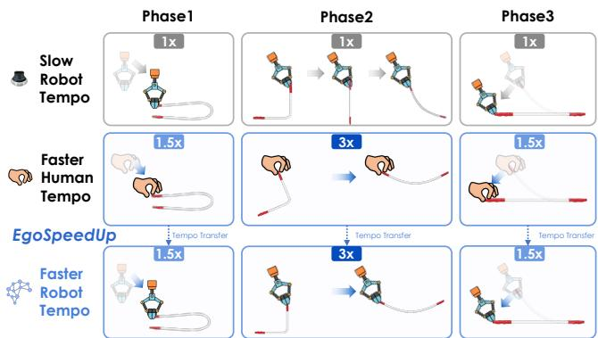
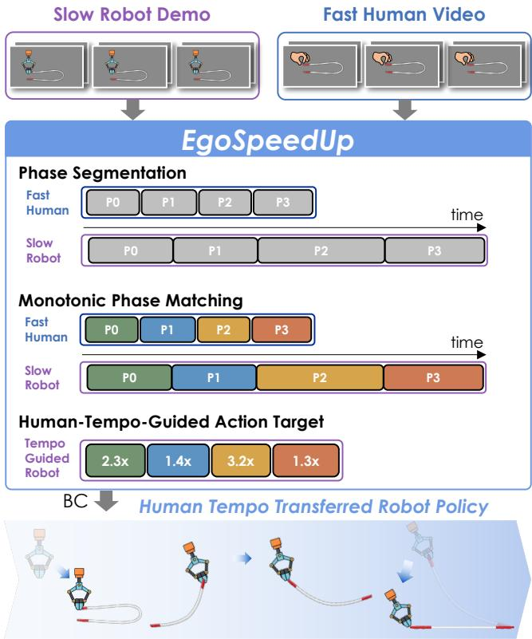
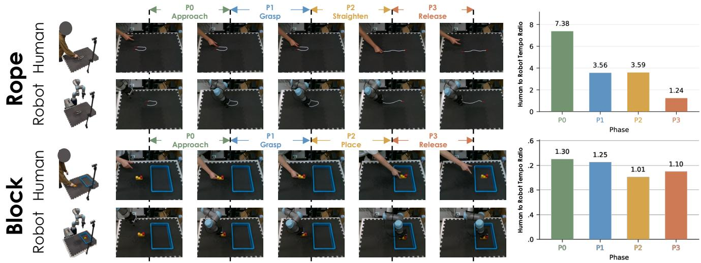
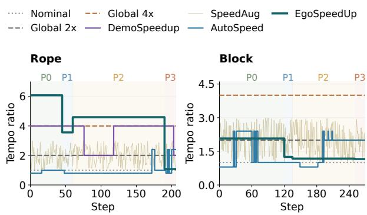
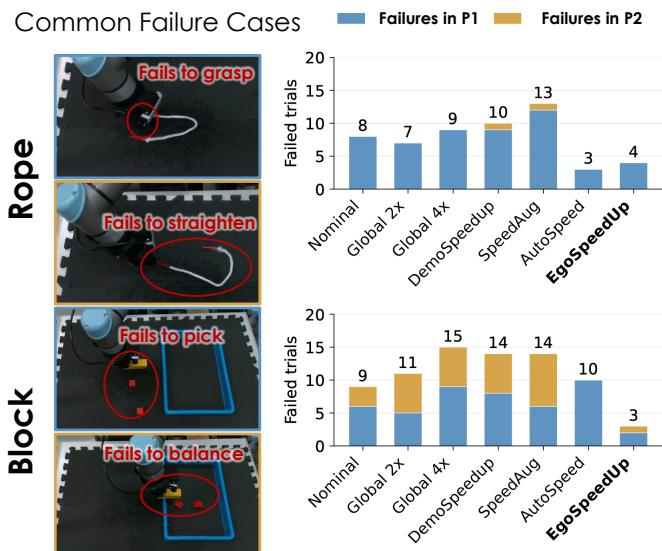

# EgoSpeedUp:

# Transferring Human Manipulation Tempo to Robot Policies

Hanbit Oh†, Yukiyasu Domae, and Takuma Yagi

Abstract— Robot manipulation policies trained through imitation learning inherit not only the demonstrated behavior but also the conservative execution tempo of robot demonstrations. Existing acceleration approaches can execute faster than the original demonstrations, but determine the appropriate acceleration primarily from robot-side information or a predefined set of tempo factors, leaving open how to obtain a task-appropriate reference for how fast each manipulation phase should progress. We introduce EgoSpeedUp, a framework that uses human manipulation as temporal supervision for robot imitation learning. Our key insight is that human demonstrations naturally reveal task-appropriate, phase-wise manipulation tempo. Given slow robot demonstrations and human demonstrations of the same task, EgoSpeedUp aligns corresponding manipulation phases, estimates their relative execution tempos from multiple human demonstrations, and transfers the resulting phase-wise tempo by retiming the robot demonstrations. The retimed demonstrations are then used for standard behavior cloning, allowing the robot to retain its executable manipulation behavior while learning to perform it at a human-informed tempo. Across two real-world manipulation tasks, EgoSpeedUp improves the task success rate by an average of 25 percentage points (pp) while reducing successful execution time by 36.5%. These results demonstrate that human manipulation tempo provides an effective temporal reference for learning faster and more reliable robot policies.

## I. INTRODUCTION

Imitation learning has enabled policies to acquire complex robot manipulation skills from demonstrations [1]– [3]. However, these policies tend to inherit not only the demonstrated behavior but also its execution tempo. Robot demonstrations are often collected slowly and conservatively because teleoperation prioritizes precise and successful task execution over speed [4]–[6]. Even experienced operators can exhibit less smooth motion during teleoperation than during direct manipulation by hand due to the practical constraints of teleoperation [4]. Consequently, even when the same manipulation could be completed much faster, behavior cloning from slow robot demonstrations tends to reproduce the same conservative tempo.

Recent studies have shown that robot policies can execute faster than their demonstrations while retaining task success [4]–[8]. Existing approaches achieve this through various forms of temporal adaptation based primarily on robot demonstrations, robot-side learning objectives, or subsequent interaction. Despite their effectiveness, existing approaches determine the target tempo factor from robot-side information, often under manually selected acceleration factors or tempo ranges. Since an appropriate tempo can vary substantially across tasks, selecting it from such information alone is not straightforward.

  
Fig. 1: EgoSpeedUp transfers phase-wise manipulation tempo from human to robot demonstrations. Human demonstrations implicitly encode task-appropriate manipulation tempo. For example, humans can efficiently straighten a rope by rapidly swinging it during the motion. EgoSpeedUp aligns slow robot demonstrations with this human tempo, enabling faster robot manipulation while maintaining task success.

Our key insight is that the timing observed in successful human manipulation may provide a useful temporal reference for robot manipulation. Human movement timing has been shown to vary with precision and control requirements [9]. For example, in our rope-straightening task, human demonstrations exhibit a rapid swinging motion, as illustrated in Fig. 1. Motivated by this finding, we use the timing of human demonstrations as temporal supervision for estimating the tempo of each manipulation phase.

We propose EgoSpeedUp, which transfers this humanderived temporal supervision to robot policies. Given slow robot demonstrations and human demonstrations of the same task, EgoSpeedUp aligns corresponding manipulation phases and compares their phase lengths. For each robot phase, phase-length ratios from multiple human demonstrations are aggregated into a target tempo factor. These phasewise tempos guide the resampling of future robot actions, which are paired with the original robot observations for behavior cloning. The policy is thereby trained to perform the demonstrated manipulation at a human-informed tempo, with the aim of improving execution speed while retaining task success. Because the target tempos are derived directly from the corresponding human demonstrations, EgoSpeedUp does not require manually selected acceleration factors or tempo ranges for each new task or object.

We evaluate EgoSpeedUp on two real-world manipulation tasks against representative robot policy acceleration approaches. Across the two tasks, EgoSpeedUp improves task success by 25 pp on average while reducing successful execution time by 36.5%. These results demonstrate that human manipulation tempo provides effective temporal supervision for learning faster and more reliable robot policies.

## II. RELATED WORK

Faster-than-demonstration robot policies have become an important research direction in imitation learning, aiming to improve execution efficiency beyond the tempo of collected demonstrations. We first review existing approaches to fasterthan-demonstration robot policies and how they accelerate robot execution. We then examine human videos as an alternative source of temporal supervision for robot learning.

## A. Faster-than-Demonstration Robot Policies

Recent work has shown that robot policies need not be constrained to the execution tempo of their training demonstrations. One line of work estimates the precision requirements of demonstrated motion from policy uncertainty and applies stronger temporal compression to less precisionsensitive segments [4]. Another approach adapts execution speed according to motion complexity [7]. Semantic reasoning has also been used to identify trajectory regions that can be accelerated while preserving regions requiring careful manipulation [6], [10]. Together, these studies demonstrate that selective temporal modification can produce faster-thandemonstration behavior without sacrificing task performance.

Beyond direct trajectory compression, execution tempo can also be learned or optimized. One approach trains a policy over speed-augmented demonstrations and subsequently refines it through reinforcement learning toward faster execution [5]. Another constructs candidate future trajectories at different temporal scales and selects training targets using a prediction objective, resulting in state-dependent execution speed [8]. These approaches derive their temporal adaptation from robot demonstrations, robot-side learning objectives, or robot interaction. Despite their effectiveness, existing approaches derive execution tempo primarily from robotside information, leaving the target tempo factor without an external reference for task-appropriate manipulation speed. We therefore investigate whether human videos can provide such a reference.

## B. Human Videos for Robot Learning

Human videos provide rich supervision that is difficult or expensive to obtain from robot demonstrations alone. Largescale human video has been used to learn reusable visual representations for downstream robot manipulation [11]. Human behavior has also been used to infer task intent and guide robot policy improvement through video-based human–robot correspondence [12]. Object motion extracted from human videos can serve as an intermediate representation connecting human demonstrations with robot control [13]. These studies show that human videos can provide visual, semantic, and object-centric motion information useful for robot learning.

More recent work has moved toward direct human-torobot policy transfer using egocentric demonstrations. Egocentric human observations and 3D hand motion have been used jointly with robot demonstrations for policy training [14]. Cross-embodiment adaptation has also been used to explicitly align human and robot policy representations [15], while large-scale human pretraining and aligned human– robot training have been explored for dexterous manipulation [16]. At a larger scale, generalist vision–language–action models have shown that egocentric human demonstrations can be incorporated alongside robot data and improve transfer to tasks or scenarios demonstrated only by humans, even without an explicit human-to-robot transfer mechanism [17]. Large collaborative egocentric datasets further support systematic study of human-to-robot transfer at scale [18].

These approaches demonstrate effective transfer of visual, semantic, motion, and behavioral knowledge from human videos to robot policies. However, these video-based approaches do not explicitly use human manipulation tempo as a temporal reference for robot execution. Prior work has shown that humans can directly teach robot execution speed through physical interaction with the robot [19]. Here, we instead investigate whether human manipulation videos can provide phase-wise temporal supervision without physical interaction, using phase timing as a task-appropriate reference for robot execution tempo.

## III. PRELIMINARIES

We consider action-chunk imitation learning, where a policy predicts a sequence of future robot actions from the current observation. We then introduce tempo-based action retiming, which forms the basis for EgoSpeedUp.

## A. Imitation Learning with Action-Chunking

Let $\mathcal { D } _ { R } = \{ \tau _ { e } ^ { R } \} _ { e = 1 } ^ { N _ { R } }$ denote a set of robot demonstrations, where $\tau _ { e } ^ { R } = \{ ( o _ { e , t } , \bar { a } _ { e , t } ) \} _ { t = 0 } ^ { T _ { e } - 1 }$ . Given observation $\begin{array} { r } { O _ { \boldsymbol { e } , t } , } \end{array}$ an action-chunk policy predicts H future actions [1],

$$
{ \bf A } _ { e , t } = [ a _ { e , t } , a _ { e , t + 1 } , \dots , a _ { e , t + H - 1 } ] .\tag{1}
$$

Standard behavior cloning therefore learns action targets at the temporal spacing of the original robot demonstrations.

## B. Tempo-Based Action Retiming

The execution tempo can be increased by temporally resampling future action targets while keeping the actionchunk length fixed [5]. Given a tempo factor $v \geq 1$ , we construct the retimed target as

$$
\begin{array} { r } { \widetilde { \bf A } _ { e , t } ( v ) = [ a _ { e } ( t + ( j + 1 ) v - 1 ) ] _ { j = 0 } ^ { H - 1 } , } \end{array}\tag{2}
$$

where actions at non-integer indices are obtained by linear interpolation. When $\ v \ = \ 1$ , the original action chunk is recovered, whereas $v \ > \ 1$ selects actions farther into the demonstrated future and thereby encourages faster task progression. The remaining question is how to determine an appropriate tempo v; EgoSpeedUp derives it from human manipulation timing.

  
Fig. 2: Overview of EgoSpeedUp. Fast human videos and slow robot demonstrations are segmented into manipulation phases and aligned through monotonic phase matching. Corresponding phase lengths provide tempo ratios that determine phase-wise target tempos for the robot demonstrations. These tempos are used to retime future robot action targets, forming the EgoSpeedUp training data for behavior cloning.

## IV. EGOSPEEDUP

Fig. 2 illustrates the overall pipeline. Given human and robot demonstrations of the same task, EgoSpeedUp segments both into ordered manipulation phases and establishes correspondence through monotonic phase matching. The corresponding phase lengths in steps are compared across multiple human references to obtain a target tempo factor for each robot episode and phase. These human-derived tempos retime future robot action targets used for behavior cloning. Unlike a single task-level acceleration factor, the target tempo is estimated separately for each episode and phase.

## A. Human–Robot Temporal Alignment

Comparing total sequence lengths provides only a global tempo ratio and does not distinguish the temporal requirements of different manipulation phases. We therefore establish correspondence at the level of task interaction phases. Let $\bar { \mathcal { D } } _ { H } = \mathrm { ~ \bar { \{ ~ \tau _ { m } ^ { H } \} } ~ } _ { m = 1 } ^ { M }$ denote the human reference demonstrations for a given task. We consider demonstrations that follow a shared ordered sequence of P phases, such as approach, grasp, object manipulation, and release. Semantic subtask annotations are obtained using an Embodied Chain-of-Thought (ECoT) annotation pipeline [20] and consolidated into this task-specific phase schema. To prevent segmentation errors from obscuring the effect of tempo transfer, we refine the semantic phase boundaries using physical interaction cues, following prior work that segments manipulation around grasp– release events and changes in hand–object motion [21]–[23]. Robot phases are anchored to gripper events and manipulation progress, while human phases are identified from hand– object interaction, coupled object motion, and release. This produces comparable temporal units without requiring equal phase durations across demonstrations.

For robot episode e, let $0 = b _ { e , 0 } ^ { R } < \dots < b _ { e , P } ^ { R } = T _ { e }$ denote the phase boundaries in the recorded frame sequence. Likewise, $\mathrm { ~  ~ { ~ \widehat ~ { ~ 0 ~ } ~ } ~ } = \ b _ { m , 0 } ^ { H } \ < \ \cdots \ < \ b _ { m , P } ^ { H } \ = \ T _ { m } ^ { H }$ denotes the boundaries of human demonstration m. The corresponding phase intervals are

$$
\begin{array} { r l } & { \boldsymbol { S } _ { e , p } ^ { R } = [ \boldsymbol { b } _ { e , p } ^ { R } , \boldsymbol { b } _ { e , p + 1 } ^ { R } ) , } \\ & { \boldsymbol { S } _ { m , p } ^ { H } = [ \boldsymbol { b } _ { m , p } ^ { H } , \boldsymbol { b } _ { m , p + 1 } ^ { H } ) , \qquad p = 0 , \ldots , P - 1 . } \end{array}\tag{3}
$$

Under the shared phase schema, matching associates robot phase p with human phase $p$ in each reference demonstration. This correspondence preserves the order of task progression and constitutes the monotonic phase matching shown in Fig. 2. The original phase lengths in steps are retained for tempo estimation.

## B. Human-Guided Target Tempo Factor Estimation

Each aligned phase pair provides a relative tempo estimate by comparing the lengths of the corresponding robot and human phases in steps. Let $\ell _ { e , p } ^ { R }$ and $\ell _ { m , p } ^ { H }$ denote the lengths in steps of robot and human phase p, respectively:

$$
\begin{array} { r l } & { \ell _ { e , p } ^ { R } = b _ { e , p + 1 } ^ { R } - b _ { e , p } ^ { R } , } \\ & { \ell _ { m , p } ^ { H } = b _ { m , p + 1 } ^ { H } - b _ { m , p } ^ { H } . } \end{array}\tag{4}
$$

The pairwise tempo ratio is

$$
r _ { e , p , m } = \frac { \ell _ { e , p } ^ { R } } { \ell _ { m , p } ^ { H } } .\tag{5}
$$

A ratio greater than one indicates that the corresponding human phase occupies fewer steps than the robot phase and therefore provides a reference for increasing the robot target tempo.

To summarize timing across multiple human demonstrations, we average the pairwise ratios:

$$
\bar { r } _ { e , p } = \frac { 1 } { M } \sum _ { m = 1 } ^ { M } r _ { e , p , m } , \qquad \hat { v } _ { e , p } = \operatorname * { m a x } \{ 1 , \bar { r } _ { e , p } \} .\tag{6}
$$

The lower bound retains the original target tempo factor when the aggregated ratio would otherwise imply slowing down the robot demonstration. Importantly, the aggregation is performed over individual human–robot phase-length ratios rather than over human phase lengths before division. The resulting $\hat { v } _ { e , p }$ is a deterministic target tempo factor for robot episode e and phase p. Its episode dependence accounts for variation in robot phase lengths, while its phase dependence retains the temporal structure provided by the human references.

## C. Tempo-Guided Action Target Construction

For each robot training window, EgoSpeedUp selects the target tempo factor associated with the manipulation phase containing its starting timestep. Let $p _ { e } ( t )$ denote this phase for timestep t of episode e. The tempo used for action-target construction is

$$
v _ { e , t } = \hat { v } _ { e , p _ { e } ( t ) } .\tag{7}
$$

Using this tempo in the retiming procedure defined in Sec. III-B, the original action chunk $\mathbf { A } _ { e , t }$ is replaced by the retimed target $\widetilde { \mathbf { A } } _ { e , t } ( v _ { e , t } )$ during behavior cloning. The robot observations remain unchanged, so the human-derived phase-wise tempo enters policy learning directly through the retimed action targets.

The policy is trained using the original robot observations and the retimed action targets:

$$
\begin{array} { r } { \mathcal { L } _ { \mathrm { E g o S p e e d U p } } ( \theta ) = \mathbb { E } _ { ( e , t ) \sim \mathcal { D } _ { R } } \left[ \ell _ { \mathrm { B C } } \left( \theta ; o _ { e , t } , \widetilde { \mathbf { A } } _ { e , t } \right) \right] . } \end{array}\tag{8}
$$

The observation timestamps and sampling procedure remain unchanged; human-derived timing enters the learning objective through the action targets. In our experiments, we use a flow-based visuomotor policy backbone [3] and retain its training loss and inference procedure. At deployment, the learned policy predicts action chunks from robot observations without requiring phase annotations or a tempo lookup.

## V. EXPERIMENTS

We evaluate EgoSpeedUp on real-robot manipulation tasks to address two questions: Q1: Does Human-Derived Tempo Improve the Success–Execution-Time Trade-off over Alternative Acceleration Strategies? Q2: How does the effect of human-derived tempo vary across tasks with different temporal demands? We then examine the design choices underlying human-derived tempo estimation and analyze the resulting tempo profiles and failure patterns.

## A. Experimental Setup

As shown in Fig. 3, the real-robot setup consists of a Universal Robots UR5e manipulator equipped with a Robotiq Hand-E parallel gripper and two Intel RealSense D435 RGB-D cameras, providing a fixed workspace view and a wrist view. The observation consists of two consecutive RGB images from both cameras, resized to $2 2 4 \times 2 2 4$ , together with robot proprioception. The seven-dimensional action consists of six joint-position targets and one gripper command.

1) Tasks: We consider two manipulation tasks with different object dynamics and execution requirements: rope straightening and block placement. In Rope, the robot grasps a rope and manipulates it into a straight configuration, involving both grasp acquisition and dynamic manipulation of a deformable object, where rapid motion can facilitate straightening. In Block, the robot transports a yellow base block supporting a tower of two stacked red blocks to a target region while preserving the stability of the stacked structure, making excessive acceleration potentially detrimental to task success. These tasks therefore provide contrasting temporal demands for evaluating whether human-derived tempo adapts the degree of acceleration to the task.

2) Human and Robot Demonstration: For each task, we use 80 robot demonstrations collected through teleoperation with a 3D mouse and 40 egocentric human demonstrations of the same manipulation. The robot demonstrations cover vari ations in the initial end-effector and object configurations, while the human demonstrations provide reference timing for the corresponding manipulation phases. All compared methods use the same robot training set. Human and robot demonstrations are recorded at approximately 20 Hz and 10 Hz, respectively. Target tempo factors are computed from phase lengths in recorded steps, as defined in §IV-B; the fixed sampling rates therefore induce a constant scaling of the corresponding wall-clock duration ratios.

3) Task-Specific Phase Segmentation: We segment each human and robot demonstration into a shared sequence of task-specific manipulation phases following the temporalalignment procedure described in Sec. IV-A. For Rope, we define four phases: approach, grasp, straighten, and release; for Block, the phases are approach, grasp, place, and release, as shown in Fig. 3. The initial phase boundaries are obtained from semantic annotations generated using ECoT [20] and then refined using task-specific physical interaction events.

For robot demonstrations, grasp and release boundaries are anchored to gripper closing and opening events, respectively. The onset of object manipulation is identified from the corresponding task motion: the start of rope straightening for Rope and the start of block transport toward the tray for Block. These events are used to refine the initial semantic boundaries and determine the final robot phase segmentation.

For human demonstrations, equivalent gripper events are not directly available, so the corresponding interaction events are inferred from hand and object observations. 2D hand keypoints are detected using WiLoR [24], and the thumb and index fingertips are tracked in 3D using the depth stream from the RGB-D camera described in the experimental setup. Hand opening and closing are detected from the 3D distance between the two fingertips, while the manipulated object is tracked using SAM 2 [25]. Grasp onset is identified from hand–object proximity together with taskspecific object responses—rope deformation for Rope and sustained proximity followed by coupled hand–object motion for Block—while the manipulation phase begins with sustained rope straightening or block transport toward the tray, respectively. Release is identified from hand–object separation and hand opening; for Block, stable placement inside the tray is additionally used to confirm the release boundary. These interaction events refine the initial semantic boundaries. Fig. 3 shows the resulting human–robot phase correspondence and the mean phase-wise tempo ratio defined in §IV-B.

  
Fig. 3: Human–robot phase correspondence and phase-wise tempo ratios for the Rope and Block tasks. Representative human and robot demonstrations are aligned into four manipulation phases (P0–P3). The corresponding mean tempo ratios are computed from phase lengths and provide the temporal reference used by EgoSpeedUp.

4) Compared Methods: All policies use the same ManiFlow backbone [3]. See Appendix I for implementation details of the ManiFlow backbone. We compare EgoSpeedUp against the following methods:

• Nominal: trains on the original robot action targets without temporal modification.

• Global 2× / 4×: applies a fixed target tempo factor uniformly across each robot demonstration.

• DemoSpeedup: applies entropy-guided demonstration acceleration, using a 2× target tempo factor for segments requiring higher precision and a 4× target tempo factor for segments with lower precision requirements, following the original implementation [4].

• SpeedAug-prior: trains on action targets augmented using target tempo factors from a predefined 1×–3× range, following the original implementation [5]. We evaluate the tempo-augmented prior before reinforcement-learning fine-tuning to isolate the effect of tempo augmentation.

• AutoSpeed: selects action targets using target tempo factors from a predefined 0.8×–2.2× range based on a robot-side prediction objective, following the original implementation [8].

We further analyze EgoSpeedUp through ablations on global versus phase-wise target tempo factors, the number of human references, and the aggregation rule (see §V-C.1).

5) Evaluation Metrics: We report task success rate, and the mean/median execution times over successful episodes. Speedup is defined as the mean successful execution time of Nominal divided by that of the compared method within the same task. Consequently, speedup describes successfulepisode duration rather than throughput or the cost of failed attempts. We assess success and execution time jointly, since a short completion time among successful episodes can coexist with a low overall success rate.

## B. Quantitative Results

Table I summarizes the results for both tasks. We organize the comparison around two questions, separating the effect of human-derived tempo from comparisons with alternative acceleration methods and differences between tasks.

1) Q1: Does Human-Derived Tempo Improve the Success– Execution-Time Trade-off over Alternative Acceleration Strategies?: We first examine the aggregate performance across both tasks. EgoSpeedUp achieves the highest pooled success rate of 82.5% while providing a 1.58× overall speedup relative to Nominal. In comparison, methods that achieve larger speedups show substantially lower pooled success: Global 4× and DemoSpeedup reach 2.71× and 2.60× speedup, but only 40.0% success, while SpeedAug achieves 1.76× speedup with 32.5% success. Conversely, AutoSpeed attains the second-highest pooled success rate (67.5%) but does not improve execution speed over Nominal (0.97×).

Overall, these results indicate that human-derived temporal guidance provides a favorable balance between task completion and execution speed rather than simply maximizing acceleration. This suggests that task-appropriate manipulation tempo encoded in human demonstrations can contribute not only to faster execution but also to reliable task completion.

2) Q2: How Does the Effect of Human-Derived Tempo Vary Across Tasks with Different Temporal Demands?: The effect of human-derived tempo differs substantially between the two tasks. On Rope, EgoSpeedUp primarily improves execution efficiency: it reduces mean successful execution time from 14.76 s to 5.60 s, corresponding to a 2.63× speedup, while also increasing success from 60% to 80%. AutoSpeed achieves slightly higher success (85%), but requires 17.16 s on average, whereas Global 4× and DemoSpeedup reach similar execution times to EgoSpeedUp at considerably lower success rates of 55% and 50%. Thus, the main effect of human-derived tempo on Rope is aggressive acceleration without the reliability loss observed for the faster fixed and demonstration-derived alternatives.

TABLE I: Main results on Rope and Block. Each method is evaluated on 20 trials per task (two policy seeds × 10 initial poses). Total is the average over the two tasks. Bold indicates the highest observed success rate within each task and overall. indicates that EgoSpeedUp significantly outperforms the corresponding baseline (two-sided paired t-tests, $p < 0 . 0 5 )$
<table><tr><td></td><td colspan="4">Rope</td><td colspan="4">Block</td><td colspan="2">Total</td></tr><tr><td>Method</td><td>Succ.</td><td>Mean (s)</td><td>Med. (s)</td><td>Speedup</td><td>Succ.</td><td>Mean (s)</td><td>Med. (s)</td><td>Speedup</td><td>Succ.</td><td>Speedup</td></tr><tr><td>Nominal</td><td>12/20 (60%)</td><td>14.76</td><td>14.31</td><td>1.00×</td><td>11/20 (55%)</td><td>14.48</td><td>14.33</td><td>1.00×</td><td>23/40 (57.5%)*</td><td>1.00×*</td></tr><tr><td>Global 2x</td><td>13/20 (65%)</td><td>8.54</td><td>8.39</td><td>1.73×</td><td>9/20 (45%)</td><td>7.98</td><td>8.09</td><td>1.81×</td><td>22/40 (55.0%)*</td><td>1.77×</td></tr><tr><td>Global 4x</td><td>11/20 (55%)</td><td>5.92</td><td>5.90</td><td>2.49×</td><td>5/20 (25%)</td><td>4.87</td><td>4.83</td><td>2.97×</td><td>16/40 (40.0%)*</td><td>2.71×</td></tr><tr><td>DemoSpeedup</td><td>10/20 (50%)</td><td>5.96</td><td>5.95</td><td>2.47×</td><td>6/20 (30%)</td><td>5.29</td><td>5.23</td><td>2.74×</td><td>16/40 (40.0%)*</td><td>2.60×</td></tr><tr><td>SpeedAug-prior</td><td>7/20 (35%)</td><td>8.71</td><td>9.00</td><td>1.70×</td><td>6/20 (30%)</td><td>7.92</td><td>8.13</td><td>1.83×</td><td>13/40 (32.5%)*</td><td>1.76×</td></tr><tr><td>AutoSpeed</td><td>17/20 (85%)</td><td>17.16</td><td>16.99</td><td>0.86×</td><td>10/20 (50%)</td><td>13.07</td><td>12.10</td><td>1.11×</td><td>27/40 (67.5%)</td><td>0.97×*</td></tr><tr><td>EgoSpeedUp</td><td>16/20 (80%)</td><td>5.60</td><td>5.66</td><td>2.63×</td><td>17/20 (85%)</td><td>12.89</td><td>12.82</td><td>1.12×</td><td>33/40 (82.5%)</td><td>1.58×</td></tr></table>

On Block, the effect is different. EgoSpeedUp increases success from 55% to 85%, while mean successful execution time decreases only moderately from 14.48 s to 12.89 s (1.12× speedup). More aggressive acceleration achieves much shorter successful execution times, but substantially reduces success: Global 4× and DemoSpeedup achieve 25% and 30% success, respectively. Here, the primary benefit of human-derived tempo is therefore improved task completion rather than large execution-time reduction.

These contrasting outcomes are consistent with the taskdependent tempo profiles in Fig. 4. Rope receives substantially stronger phase-wise acceleration, whereas Block is assigned a more moderate tempo profile. The results suggest that human temporal supervision adapts the degree of acceleration to the manipulation demands of each task.

## C. Analysis of Human-Derived Tempo

We next analyze how human-derived tempo is constructed and how it affects robot execution. The design analysis examines the temporal scope, number of human references, and aggregation rule used to estimate the target tempo factor. The behavioral analysis compares the resulting tempo profiles across methods and examines the corresponding failure counts.

1) Design Analysis: Table II evaluates three design choices associated with the target tempo estimation in Eq. (6): phase-wise versus global estimation, the number of human references M, and pairwise-ratio aggregation (mean versus median).

a) Phase-Wise vs. Global Tempo: We compare the default phase-wise target tempo factors with a single global tempo factor computed for each robot episode as the ratio of its total duration to the mean total duration of the human demonstrations, which is applied uniformly across all phases.

TABLE II: Design analysis relative to the default EgoSpeedUp configuration (phase-wise tempo, $M ~ = ~ 4 0$ human references, and pairwise mean aggregation). The first row reports the absolute performance of EgoSpeedUp. All subsequent rows report changes relative to this reference.
<table><tr><td>Method</td><td>Succ. ↑</td><td>Time (s) ↓</td></tr><tr><td>EgoSpeedUp</td><td>82.5%</td><td>9.25</td></tr><tr><td>EgoSpeedUp w/ Global Tempo</td><td>-17.5 pp</td><td>+1.76</td></tr><tr><td>EgoSpeedUp w/ M = 5</td><td>-22.5 pp</td><td>+0.16</td></tr><tr><td>EgoSpeedUp w/ M = 10</td><td>-17.5 pp</td><td>+0.25</td></tr><tr><td>EgoSpeedUp w/ Median Aggregation</td><td>-20 pp</td><td>+0.18</td></tr></table>

Replacing phase-wise tempo with global tempo reduces overall success by 17.5 pp and increases mean successful execution time by 1.76 s. These results support phase-wise estimation of human tempo as a better approximation of task-appropriate manipulation tempo than a single global estimate.

b) Effect of the Number of Human Demonstrations: We compare $M \ \in \ \{ 5 , 1 0 , 4 0 \}$ human references with all other settings fixed. Relative to M = 40, using M = 5 and M = 10 lowers overall success by 22.5 and 17.5 pp, respectively, while increasing mean successful execution time by only 0.16, s and 0.25, s. Phase durations can vary depending on the initial object configuration, making the estimated target tempo factors sensitive to the diversity of the human reference set. With fewer human references, the estimated phase-wise target tempo factors may be biased toward particular initial object configurations, making the resulting temporal supervision less representative of other configurations. A larger reference set can better capture this variation, yielding more representative target tempo factors across different initial object configurations and thereby improving task success.

c) Aggregation Strategy: We use the pairwise mean as the default aggregation to estimate the average relative tempo across the human reference set. Unlike the mean, median aggregation does not reflect the magnitude of tempo ratios away from the center of the distribution, which may underrepresent meaningful temporal variation across different initial object configurations. Consistent with this interpretation, replacing the pairwise mean with the median reduces overall success by 20.0 pp while increasing mean successful execution time by only 0.18 s.

  
Fig. 4: Target tempo profiles for representative Rope and Block demonstrations. The horizontal axis denotes the original demonstration step, and the curves show the target tempo factor assigned to each training window. Global baselines use fixed tempo factors, whereas EgoSpeedUp assigns piecewiseconstant target tempo factors derived from aligned human manipulation phases. The plotted values are training targets, not measured rollout speedups.

## 2) Behavioral Analysis:

a) Phase-Wise Tempo Profiles: Fig. 4 compares the target tempo factors produced by the evaluated methods. The baseline profiles reflect their predefined tempo settings described in Sec. V-A.4. Global 2× and 4× remain fixed at their prescribed factors, DemoSpeedup switches between 2× and 4×, SpeedAug varies within its predefined 1×–3× range, and AutoSpeed selects targets within its predefined 0.8×–2.2× range.

In contrast, EgoSpeedUp does not prespecify either discrete tempo factors or a bounded tempo range, but derives its target tempo factors directly from human manipulation videos. For Rope, EgoSpeedUp assigns approximately 6× tempo in P0, 3.6× in P1, and 4.6× in P2, before decreasing to approximately 1× in P3. For Block, the target tempo factor is substantially more moderate, decreasing from approximately 2.1× in P0 to about 1.2× in the later phases. Thus, EgoSpeedUp selects different target tempo factors across phases and tasks according to the corresponding human manipulation timing.

These results highlight an important distinction from the compared acceleration baselines, which prespecify either discrete tempo factors or a bounded range of tempo adjustment. Rather than determining in advance how much the robot should be accelerated, EgoSpeedUp derives target tempo factors directly from human manipulation timing. This removes the need to manually define an acceleration range and provides flexibility to adapt the target tempo factor across new tasks and objects.

b) Failure Case Analysis: Fig. 5 reveals distinct failure patterns across the two tasks.

Most failures on Rope occur during grasping. EgoSpeedUp records four grasping failures and no straightening failures, compared with eight grasping failures for Nominal. Demo-Speedup and SpeedAug record nine and twelve grasping failures, respectively, together with one straightening failure each. Thus, the higher Rope success rate of EgoSpeedUp is primarily associated with fewer grasping failures. AutoSpeed records one fewer failure than EgoSpeedUp, but at a substantially longer execution time.

  
Fig. 5: Representative failure cases and phase-associated failure counts for Rope and Block. Rope failures are categorized as grasping and straightening, and Block failures as picking and unstable placement. Stacked bars report failed trials among 20 attempts per method and task; numbers above the bars indicate total failures. Failure counts are not normalized by the number of trials that reached each phase.

On Block, EgoSpeedUp reduces failures in both object acquisition and final placement. It records two picking failures and one unstable-placement failure, compared with six and three, respectively, for Nominal. More aggressive baselines exhibit substantially larger failure counts, consistent with their lower success rates in Table I. This suggests that the higher Block success rate of EgoSpeedUp is associated with fewer failures across multiple stages rather than improvement at a single stage.

## VI. DISCUSSION

EgoSpeedUp shows that human manipulation tempo can serve as phase-wise temporal supervision for accelerating robot policies. Despite this, EgoSpeedUp has several limi tations. First, it assumes that human and robot demonstrations can be aligned through a shared ordered sequence of manipulation phases; repeated, branching, or weakly structured tasks may require more flexible correspondence mechanisms, such as trajectory-level alignment across human and robot demonstrations [26]. Second, EgoSpeedUp assigns a single deterministic target tempo factor to each aligned phase, which cannot capture within-phase tempo variation or state-dependent changes in execution difficulty. Combining human-derived tempo with uncertainty- or state-dependent adaptation, as explored in entropy-guided acceleration [4] and stage-adaptive speed selection [8], could enable finergrained tempo adaptation while preserving human tempo as an external reference.

TABLE III: Common hyperparameters for all evaluated ManiFlow-based methods.
<table><tr><td>Hyperparameter</td><td>Value</td><td>Hyperparameter</td><td>Value</td></tr><tr><td>Learning rate AdamW betas</td><td> $1 0 ^ { - 4 } \to 1 0 ^ { - 5 }$  (0.9, 0.95)</td><td>Policy backbone Transformer layers</td><td>DiTX 12</td></tr><tr><td>Weight decay Batch size</td><td> $1 0 ^ { - 3 }$  64</td><td>Hidden dimension Attention heads</td><td>768 8</td></tr><tr><td></td><td></td><td></td><td></td></tr><tr><td>Visual encoder</td><td>CLIP ViT-B/16</td><td>Flow inference steps</td><td>10</td></tr><tr><td></td><td></td><td></td><td></td></tr><tr><td>Observation steps</td><td>2</td><td>Action horizon</td><td>16</td></tr></table>

## VII. CONCLUSION

We presented EgoSpeedUp, a framework that transfers human manipulation tempo to robot policies through phase-wise temporal supervision. By aligning correspond ing manipulation phases, estimating human-derived target tempo factors, and retiming robot action targets accordingly, EgoSpeedUp enables standard behavior cloning to learn robot policies with task-appropriate execution tempo. Across two real-world manipulation tasks, EgoSpeedUp achieved a favorable trade-off between success rate and execution time compared with state-of-the-art methods, providing strong acceleration on Rope while substantially improving task success on Block. These results demonstrate that human manipulation tempo can serve as an effective external temporal reference for learning faster and more reliable robot policies.

## APPENDIX I

## IMPLEMENTATION DETAILS

The compared methods are described in Sec. V-A.4. Table III reports the common ManiFlow configuration used throughout the experiments.

## REFERENCES

[1] T. Z. Zhao, V. Kumar, S. Levine, and C. Finn, “Learning fine-grained bimanual manipulation with low-cost hardware,” in Proc. of Robotics: Science and Systems, 2023.

[2] C. Chi, Z. Xu, S. Feng, E. Cousineau, Y. Du, B. Burchfiel, R. Tedrake, and S. Song, “Diffusion policy: Visuomotor policy learning via action diffusion,” The Int. Journal of Robotics Research, vol. 44, no. 10–11, pp. 1684–1704, 2025.

[3] G. Yan, J. Zhu, Y. Deng, S. Yang, R.-Z. Qiu, X. Cheng, M. Memmel, R. Krishna, A. Goyal, X. Wang, and D. Fox, “ManiFlow: A general robot manipulation policy via consistency flow training,” in Proc. of the 9th Conf. on Robot Learning, vol. 305, pp. 2268–2293, PMLR, 2025.

[4] L. Guo, Z. Xue, Z. Xu, and H. Xu, “DemoSpeedup: Accelerating visuomotor policies via entropy-guided demonstration acceleration,” in Proc. of the 9th Conf. on Robot Learning, vol. 305, pp. 599–609, PMLR, 2025.

[5] T. Nam, J. Cho, Y. Jang, and S. J. Hwang, “SpeedAug: Policy acceleration via tempo-enriched policy and RL fine-tuning,” arXiv preprint arXiv:2512.00062, 2025.

[6] B. Kim, J. Pahk, C. Lee, J. Kim, J. Lee, T. T. Kim, K. Shim, J. K. Lee, and B.-T. Zhang, “ESPADA: Execution speedup via semantics aware demonstration data downsampling for imitation learning,” IEEE Robotics and Automation Letters, vol. 11, no. 9, pp. 10305–10312, 2026.

[7] N. R. Arachchige, Z. Chen, W. Jung, W. C. Shin, R. Bansal, P. Barroso, Y. H. He, Y. C. Lin, B. Joffe, S. Kousik, and D. Xu, “SAIL: Fasterthan-demonstration execution of imitation learning policies,” in Proc. of the 9th Conf. on Robot Learning, vol. 305, pp. 721–749, PMLR, 2025.

[8] Q. Hu, Z. Qiu, J. Zhao, Z. Gan, and W. Ding, “AutoSpeed: Annotationfree stage-adaptive motion speed learning for robot manipulation,” in European Conference on Computer Vision, pp. 37–53, 2026.

[9] W. A. Wickelgren, “Speed-accuracy tradeoff and information processing dynamics,” Acta psychologica, vol. 41, no. 1, pp. 67–85, 1977.

[10] R. Ramirez Sanchez, D. J. Evans, D. P. Losey, and S. Jain, “VOLT: Vision and language trajectory segmentation for faster-thandemonstration policies,” arXiv preprint arXiv:2606.06323, 2026.

[11] S. Nair, A. Rajeswaran, V. Kumar, C. Finn, and A. Gupta, “R3M: A universal visual representation for robot manipulation,” in Proc. of the 6th Conf. on Robot Learning, vol. 205, pp. 892–909, PMLR, 2022.

[12] S. Bahl, A. Gupta, and D. Pathak, “Human-to-robot imitation in the wild,” in Proc. of Robotics: Science and Systems, 2022.

[13] M. Xu, Z. Xu, Y. Xu, C. Chi, G. Wetzstein, M. Veloso, and S. Song, “Flow as the cross-domain manipulation interface,” in Proc. of the 8th Conf. on Robot Learning, vol. 270, pp. 2475–2499, PMLR, 2024.

[14] S. Kareer, D. Patel, R. Punamiya, P. Mathur, S. Cheng, C. Wang, J. Hoffman, and D. Xu, “EgoMimic: Scaling imitation learning via egocentric video,” in 2025 IEEE Int. Conf. on Robotics and Automation, pp. 13226–13233, 2025.

[15] R. Punamiya, D. Patel, P. Aphiwetsa, P. Kuppili, L. Y. Zhu, S. Kareer, J. Hoffman, and D. Xu, “EgoBridge: Domain adaptation for generalizable imitation from egocentric human data,” in Advances in Neural Info. Processing Systems, vol. 38, 2025.

[16] R. Zheng, D. Niu, Y. Xie, J. Wang, M. Xu, Y. Jiang, F. Castaneda,˜ F. Hu, Y. L. Tan, L. Fu, T. Darrell, F. Huang, Y. Zhu, D. Xu, and L. Fan, “EgoScale: Scaling dexterous manipulation with diverse egocentric human data,” arXiv preprint arXiv:2602.16710, 2026.

[17] S. Kareer, K. Pertsch, J. Darpinian, J. Hoffman, D. Xu, S. Levine, C. Finn, and S. Nair, “Emergence of human to robot transfer in visionlanguage-action models,” in Proc. of Robotics: Science and Systems, 2026.

[18] R. Punamiya, S. Kareer, Z. Liu, J. Citron, R.-Z. Qiu, X. Cai, A. Gavryushin, J. Chen, D. Liconti, L. Y. Zhu, P. Aphiwetsa, B. Li, A. Cheluva, P. Kuppili, Y. Liu, D. Patel, A. Gao, H.-Y. Chung, R. Co, R. Zbizika, J. Liu, X. Xu, H. Xiong, G. Chen, S. Oliani, C. Yang, X. Wang, J. Fort, R. A. Newcombe, J. Gao, J. Chong, G. Matsuda, A. Doriwala, M. Pollefeys, R. K. Katzschmann, X. Wang, S. Song, J. Hoffman, and D. Xu, “EgoVerse: An egocentric human dataset for robot learning from around the world,” in Proc. of Robotics: Science and Systems, 2026.

[19] B. Nemec, N. Likar, A. Gams, and A. Ude, “Human robot cooperation with compliance adaptation along the motion trajectory,” Autonomous robots, vol. 42, no. 5, pp. 1023–1035, 2018.

[20] M. Zawalski, W. Chen, K. Pertsch, O. Mees, C. Finn, and S. Levine, “Robotic control via embodied chain-of-thought reasoning,” in Proc. of the 8th Conf. on Robot Learning, vol. 270, pp. 3157–3181, PMLR, 2024.

[21] M. Kyrarini, M. A. Haseeb, D. Ristic-Durrant, and A. Gr´ aser, “Robot¨ learning of industrial assembly task via human demonstrations,” Autonomous Robots, vol. 43, pp. 239–257, 2019.

[22] S. B. Kang and K. Ikeuchi, “Determination of motion breakpoints in a task sequence from human hand motion,” in Proc. of the IEEE Int. Conf. on Robotics and Automation, vol. 1, pp. 551–556, 1994.

[23] N. Hendrich, D. Klimentjew, and J. Zhang, “Multi-sensor based segmentation of human manipulation tasks,” in 2010 IEEE Conf. on Multisensor Fusion and Integration for Intelligent Systems, pp. 223– 229, 2010.

[24] R. A. Potamias, J. Zhang, J. Deng, and S. Zafeiriou, “Wilor: Endto-end 3d hand localization and reconstruction in-the-wild,” in 2025 IEEE/CVF Conference on Computer Vision and Pattern Recognition (CVPR), pp. 12242–12254, IEEE, 2025.

[25] N. Ravi, V. Gabeur, Y.-T. Hu, R. Hu, C. Ryali, T. Ma, H. Khedr, R. Radle, C. Rolland, L. Gustafson,¨ et al., “SAM 2: Segment anything in images and videos,” in Int. Conf. on Learning Representations, vol. 2025, pp. 28085–28128, 2025.

[26] Y. Liu, W. C. Shin, Y. Han, Z. Chen, H. Ravichandar, and D. Xu, “ImMimic: Cross-domain imitation from human videos via mapping and interpolation,” in Proc. of the 9th Conf. on Robot Learning, 2025.