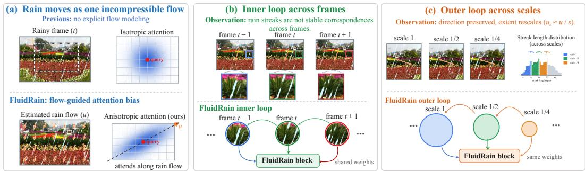
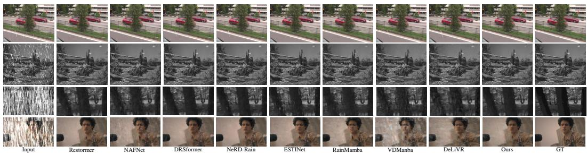
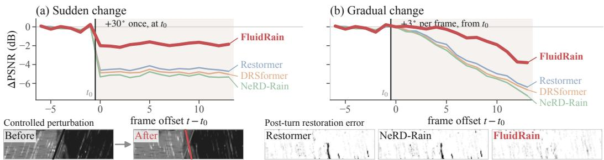
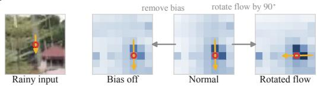
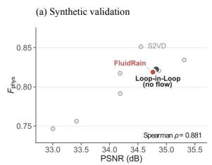
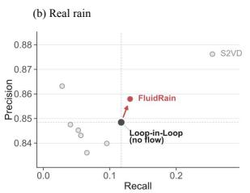
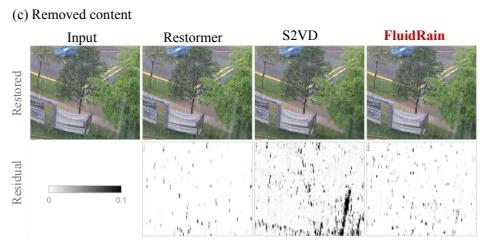
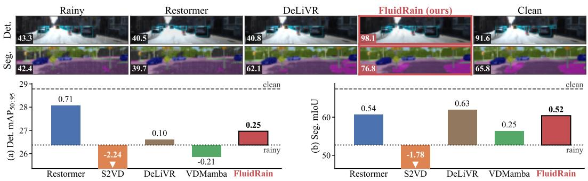

# FLUIDRAIN: INCOMPRESSIBLE RAIN FLOW AS AN ATTENTION BIAS FOR LOOP-IN-LOOP VIDEO DERAINING

Pu Wang1, Yongcong Wang2, Wenhao Li1, Xiang Chen3, Guangwei Gao3, Jinshan Pan3, Siyuan Yao4, Shujun Fu1, Zhuoran Zheng5

1Shandong University 2Central South University

3Nanjing University of Science and Technology

4Beijing University of Posts and Telecommunications

5National University of Defense Technology

## ABSTRACT

Existing video deraining methods typically exploit neighboring frames through either explicit alignment or implicit spatiotemporal aggregation. Explicit alignment relies on accurate motion estimation, which can become unreliable under dense rain, while implicit aggregation avoids alignment but lacks explicit guidance on the directional and temporally coherent structure of rain. This leaves a gap between reliable temporal aggregation and explicit modeling of rain motion.

To address these limitations, we propose FluidRain, a lightweight video derainer that uses divergence-free rain flow to guide Loop-in-Loop attention across scales and neighboring frames. Motivated by fluid mechanics, we model rain motion as a divergence-free image-space flow and use it to organize multi-scale and temporal aggregation. Specifically, FluidRain first estimates a rain-flow field for each frame and projects it onto the divergence-free subspace. The resulting flow steers window attention along rain streaks, enabling neighboring frames to be aggregated without explicit alignment. Since rain-flow structure is preserved across scales and nearby frames, Loop-in-Loop reuses the same attention operator across both dimensions, resulting in a three-frame model with only 0.80M parameters. Experiments on four benchmarks show that FluidRain remains competitive with substantially larger restoration models. We further examine how temporal evidence scales with different input views. To evaluate whether the model remains reliable when rain motion changes across frames, we introduce RainSyn-Gust, which injects controlled changes in rain-streak direction into existing benchmarks. We also develop a physics-based no-reference metric that evaluates real-rain removal without requiring clean targets.

## 1 INTRODUCTION

Rain streaks in video arise from the motion blur of falling raindrops carried by the wind and imaged by a moving camera. Their apparent direction and length are jointly determined by wind, scene depth, and camera motion, and thus vary across sequences (Garg & Nayar, 2004).

Early video deraining methods were largely physics-driven. They modeled the formation and appearance of rain streaks (Garg & Nayar, 2004; 2006) and combined these models with hand-crafted temporal or low-rank priors (Kim et al., 2015). With the rise of deep learning, the field gradually shifted toward data-driven temporal modeling, first through recurrent architectures (Liu et al., 2018; Yang et al., 2022; Yue et al., 2021) and more recently through attention and state-space models (Wu et al., 2024; Sun et al., 2025). Modern methods typically exploit neighboring frames in two ways. One line explicitly aligns them using optical flow or related motion estimation, whose reliability can degrade in heavily rain-corrupted regions (Chan et al., 2022; Guo et al., 2023). The other aggregates neighboring features implicitly, avoiding explicit alignment but leaving the network to learn the structure of rain motion entirely from data. Meanwhile, physical knowledge has mainly been introduced through rendering models, regularization terms, or rain synthesis (Yang et al., 2017; Hu et al., 2019; Yue et al., 2021), while geometric priors have been incorporated into attention biases (Liu et al., 2021; Sun et al., 2026). Yet the motion structure of rain itself remains largely unused in guiding how information is aggregated across frames.

  
Figure 1: Physical motivation and Loop-in-Loop design of FluidRain. (a) Rain flow guides anisotropic attention. (b) Temporal persistence motivates the inner loop across frames. (c) Scale consistency motivates the outer loop across resolutions.

Classical studies have shown that rain exhibits structured spatial and temporal properties rather than arbitrary corruption (Garg & Nayar, 2007; Barnum et al., 2010). Later work further characterized rain layers through attributes such as direction, scale, and temporal motion (Bossu et al., 2011; Yue et al., 2021). These regularities suggest that rain physics may provide not only guidance for feature aggregation, but also a principled basis for deciding where computation can be reused. At the same time, looped Transformers have recently regained attention in large language models (LLMs) as a parameter-efficient alternative to conventional depth scaling. Relaxed Recursive Transformers repeatedly reuse shared blocks across depth, while recent scaling-law analyses show that recurrence can provide measurable capacity gains despite parameter sharing (Bae et al., 2025; Schwethelm et al., 2026). This leads to the central question of our work: can the physical regularities of rain determine how and where a shared operator should recur in video restoration?

To investigate this question, Figure 1 links three physical properties of rain to the design of FluidRain. (a) Inspired by fluid mechanics, we model coherent rain motion within a frame as a divergence-free image-space rain-flow field, which guides anisotropic attention along rain streaks. (b) Across neighboring frames, the flow remains persistent while individual streaks are renewed, motivating an inner loop that reuses the same rain-aware operator over complementary observations. (c) Across resolutions, rain-flow direction is preserved while streak extent rescales, motivating an outer loop that reuses the same operator across scales. Together, the two loops form our Loop-in-Loop design, enabling alignment-free temporal and multi-scale aggregation with only 0.80M parameters. Our main contributions are summarized as follows:

• We develop a fluid-mechanical rain-flow representation that guides attention along rain streaks, enabling temporal aggregation without relying on potentially unreliable explicit alignment under heavy rain.

• Based on the temporal and multi-scale regularities of rain flow, Loop-in-Loop reuses the same attention operator across neighboring frames and resolutions, resulting in a 0.80Mparameter model.

• For broader evaluation, RainSyn-Gust tests robustness to changing rain motion, while $F _ { \mathrm { p h y s } }$ enables no-reference assessment on real rainy videos. Extensive experiments confirm competitive restoration performance with substantially fewer parameters.

## 2 RELATED WORK

Video deraining. Early video deraining methods relied on temporal filtering, low-rank priors, and recurrent architectures to exploit redundancy across neighboring frames (Kim et al., 2015; Liu et al., 2018; Yang et al., 2022; Yue et al., 2021). With the development of attention-based models, temporal information has increasingly been aggregated through learned feature interactions rather than handcrafted priors (Yang et al., 2023). Recent state-space models further improve long-range spatiotemporal modeling with more favorable computational complexity. RainMamba introduces locality aware state-space scanning for video deraining (Wu et al., 2024), while VDMamba combines spatial and temporal state-space branches with adaptive multi-frame fusion (Sun et al., 2025). Another line of work explicitly establishes temporal correspondences through optical flow, deformable alignment, or alignment-and-fusion strategies (Chan et al., 2022; Xue et al., 2025). More recent methods have also explored semi-supervised learning, test-time adaptation, and video diffusion models to improve generalization to real-world adverse weather (Lin et al., 2025). Overall, current video deraining methods increasingly emphasize effective temporal modeling, robust multi-frame fusion, and generalization beyond synthetic rain.

Physical priors and looped architectures. Physical modeling has long provided structured priors for rain removal. Classical studies describe rain streak formation through drop motion, exposure, and imaging geometry (Garg & Nayar, 2004; 2006; 2007). Learning-based methods later incorporated such knowledge through rain formation models, decomposition constraints, and learned rain synthesis (Yang et al., 2017; Hu et al., 2019; Yue et al., 2021). More recently, structured information has been injected directly into feature interactions. Relative-position biases encode spatial geometry in window attention (Liu et al., 2021), while motion-related quantities can guide spatio-temporal attention (Sun et al., 2026). Structure can also be imposed on how computation itself is reused. Recursive and looped networks repeatedly apply shared operators, increasing the effective processing depth without introducing a new set of parameters at every stage (Kim et al., 2016; Dehghani et al., 2019). This idea has recently received renewed attention in LLMs. Relaxed Recursive Transformers reuse shared Transformer blocks across depth (Bae et al., 2025), and recent scaling analyses further study the capacity gained from recurrence under parameter sharing (Schwethelm et al., 2026). Related forms of recursive reuse have also appeared in recent vision and image-restoration models (He et al., 2026). Existing looped architectures mainly organize such recurrence along network depth or iterative refinement.

## 3 METHOD

FluidRain models rain streaks as an image-space rain-flow field, projects the estimated flow onto the divergence-free subspace, and uses it to construct an anisotropic attention bias. Its scale and temporal regularities further enable the same rain-aware operator to be reused across resolutions and neighboring frames, forming the Loop-in-Loop architecture for centre-frame restoration.

Notation. Given a three-frame rainy clip $\mathbf { I } _ { \tau } \in \mathbb { R } ^ { 3 \times H \times W } , \tau \in \{ t - 1 , t , t + 1 \}$ , the network predicts the restored centre frame $\hat { \mathbf { I } } _ { t } ^ { } ,$ , with clean target $\mathbf { I } _ { t } ^ { \mathrm { g t } }$ . On synthetic benchmarks, ${ \bf I } _ { \tau } = { \bf I } _ { \tau } ^ { \mathrm { g t } } + { \bf R } _ { \tau }$ , where $\mathbf { R } _ { \tau }$ is the rain layer. Upright bold upper-case symbols denote tensors, such as frames, feature maps and attention matrices; upright bold lower-case symbols denote vector fields over the image domain Ω; italic symbols denote scalars, and upright subscripts are descriptive labels.

## 3.1 PHYSICAL BACKGROUND AND RAIN-FLOW PROPERTIES

Rain flow. A rain streak is the image-space trace of a falling droplet integrated over the camera exposure. Let a droplet fall at terminal velocity $v _ { t } ,$ be advected by wind $\mathbf { w } ,$ and be observed by a camera with focal length f and motion c. For a droplet at depth $\dot { Z ( \mathbf { x } ) }$ , its projected image velocity is

$$
\mathbf { u } ( \mathbf { x } ) = \frac { f } { Z ( \mathbf { x } ) } \left( v _ { t } \hat { \mathbf { g } } + \mathbf { w } - \mathbf { c } \right) _ { \perp } ,\tag{1}
$$

where $\hat { \bf g }$ denotes the direction of gravity and $( \cdot ) _ { \perp }$ extracts the image-plane component. Over an exposure of duration $T$ , the corresponding streak is oriented along u and has approximate length $| \mathbf { u } | _ { T }$ . We refer to u as the rainflow. It describes the rain structure within a frame and should not be confused with optical flow, which describes scene correspondence between frames. The following three properties of rain flow form the physical basis of FluidRain.

Proposition 1 (Divergence-free rain flow). Under the incompressible-flow assumptions, the imagespace rain flow satisfies

$$
\nabla \cdot \mathbf { u } = 0 .\tag{2}
$$

For an arbitrary estimate $\hat { \mathbf { u } } ,$ , its nearest admissible divergence-free field in $L _ { 2 }$ is

$$
\Pi ( \hat { \mathbf { u } } ) = \hat { \mathbf { u } } - \nabla \phi , \qquad \nabla ^ { 2 } \phi = \nabla \cdot \hat { \mathbf { u } } .\tag{3}
$$

Proposition 2 (Depth–scale equivariance). Let $D _ { s }$ denote downsampling by a factor s. For fixed projected droplet velocity, Eq. (1) gives

$$
{ \bf u } _ { s Z } = \frac { { \bf u } _ { Z } } { s } = D _ { s } [ { \bf u } _ { Z } ] \qquad \mathrm { i n ~ g r i d ~ u n i t s . }\tag{4}
$$

Hence, changing depth or image resolution rescales the apparent streak extent while preserving its orientation.

Proposition 3 (Short-term flow persistence and streak renewal). Over a short inter-frame interval, the underlying rain flow varies slowly, whereas individual streak instances are not preserved across frames. Let

$$
\begin{array} { r } { \Delta \mathbf { u } _ { \tau } = \mathbf { u } _ { \tau + 1 } - \mathbf { u } _ { \tau } . } \end{array}\tag{5}
$$

Under the same assumptions, $\Delta { \bf u } _ { \tau }$ remains bounded for ordinary rain motion, while rain-induced occlusions in neighbouring frames provide distinct observations of the same scene.

## 3.2 RAIN-FLOW ESTIMATION AND ATTENTION BIAS

Rain-flow estimation. The rain flow in Eq. (1) depends on wind, scene depth, and camera motion, which are unknown at test time. We therefore infer it directly from the observed rain streaks. Given the frame feature $\mathbf { F } _ { \tau } = \mathcal { S } ( \mathbf { I } _ { \tau } )$ , a four-layer convolutional head H predicts a raw rain-flow field.

$$
\hat { \mathbf { u } } _ { \tau } = \mathcal { H } ( \mathbf { F } _ { \tau } ) .\tag{6}
$$

We predict $\hat { \mathbf { u } } _ { \tau }$ at quarter resolution, which is sufficient for capturing the slowly varying rain-flow structure while keeping the estimator lightweight. The same head H is reused for all input frames, so the flow estimator adds only 6,243 parameters.

However, uˆτ is produced by an unconstrained neural predictor and is not guaranteed to satisfy the divergence-free property in Proposition 1. We therefore enforce this physical constraint by projecting the raw estimate onto the divergence-free subspace.

$$
\mathbf { u } _ { \tau } = \Pi ( \hat { \mathbf { u } } _ { \tau } ) .\tag{7}
$$

After projection, u serves as the rain-flow field for frame $\mathbf { I } _ { \tau }$ . Its direction indicates the local rainstreak orientation, while its magnitude sets the along-streak extent of the attention bias. We next use these two quantities to construct the rain-flow attention bias.

Rain-flow attention bias. Since rain flow characterizes rain-streak geometry rather than scene correspondence, we do not use it for feature warping. Instead, we convert its orientation and extent into an additive bias on the attention logits, encouraging attention to follow the local rain structure.

Consider a $w \times$ w attention window at scale s. Let $\mathbf { u } _ { w }$ denote the mean rain flow over the window. The local rain flow $\mathbf { u } _ { w }$ determines both the orientation and extent of the rain streak. At scale s, we define

$$
\hat { \mathbf { t } } = \frac { \mathbf { u } _ { w } } { \vert \mathbf { u } _ { w } \vert } , \qquad \hat { \mathbf { n } } \perp \hat { \mathbf { t } } , \qquad \ell _ { s } = \operatorname* { m a x } \left( \frac { \vert \mathbf { u } _ { w } \vert } { s ^ { 2 } } , 1 \right) ,\tag{8}
$$

where $\hat { \mathbf { t } }$ and nˆ denote the directions along and across the streak, respectively, and $\ell _ { s }$ is its extent in grid units. The grid-unit flow $\mathbf { u } _ { w } / s$ is divided by s once more, so $\ell _ { s }$ is a local extent of one to two cells for the trained models; the direction is what is carried across scales.

These quantities directly parameterize the attention bias: $\hat { \mathbf { t } }$ and nˆ specify the along-streak and acrossstreak directions, while $\ell _ { s }$ sets the effective range along the streak. For a query at q and a key at k, let $\mathbf { d } = \mathbf { k } - \mathbf { q }$ . The additive rain-flow bias $\mathbf { B } _ { \mathrm { f l o w } } ^ { ( h ) }$ for attention head h has entrie

$$
\big [ \mathbf { B } _ { \mathrm { f l o w } } ^ { ( h ) } \big ] _ { \mathbf { d } } = - \frac { 4 } { w ^ { 2 } } \left[ a _ { h } ( \mathbf { d } \cdot \hat { \mathbf { n } } ) ^ { 2 } + b _ { h } \frac { ( \mathbf { d } \cdot \hat { \mathbf { t } } ) ^ { 2 } } { \ell _ { s } ^ { 2 } } \right] , \qquad a _ { h } , b _ { h } \geq 0 .\tag{9}
$$

The two terms control the bias in the directions normal and tangent to the rain streak, respectively. Displacements across the streak are penalized directly, whereas displacements along the streak are normalized by $\ell _ { s } ^ { 2 }$ . Consequently, a larger $\ell _ { s }$ yields a broader attention range along the rain direction, producing an anisotropic bias aligned with the local streak. The bias adds only two learnable parameters, $a _ { h }$ and $b _ { h }$ , for each attention head.

## 3.3 LOOP-IN-LOOP ACROSS SCALE AND TIME

A weight-tied operator is most useful when each reuse receives complementary information rather than the same observation. According to Propositions 2 and 3, rain provides such variation across both scale and time: streak extent changes across resolutions, while neighboring frames contain renewed streak instances under a similar flow structure. This motivates our Loop-in-Loop design, with an outer loop across scales and an inner loop across neighboring frames.

Outer loop: sharing across scales. Proposition 2 shows that downsampling preserves the rain-flow direction and rescales its magnitude by $\bar { 1 } / s$ . Therefore, after expressing the flow in the current grid as $\mathbf { u } / s$ , the same rain-aware operator can be applied at different resolutions. Sharing is motivated primarily by this scale-consistent direction; the extent $\ell _ { s }$ of Eq. (8) remains local at each scale. We thus reuse the same block stack $\boldsymbol { B }$ at three scales $s \in \{ 1 , 2 , 4 \}$

For each scale $s ,$ the centre-frame feature is first resized as

$$
\mathbf { X } _ { s } = D _ { s } ( \mathbf { X } ) ,\tag{10}
$$

where $D _ { s }$ denotes resampling by a factor s. The corresponding rain flow is represented as $\mathbf { u } _ { t } / s$ and converted into the rain-flow bias using Eq. (9). The shared stack then produces

$$
\mathbf { Y } _ { s } = { \mathcal { B } } ( \mathbf { X } _ { s } ; \mathbf { B } _ { \mathrm { f l o w } } ( \mathbf { u } _ { t } / s ) ) ,\tag{11}
$$

where ${ \bf Y } _ { s }$ is the processed feature at scale s. After upsampling, ${ \bf Y } _ { s }$ becomes the state X for the next scale; the three upsampled outputs are fused with weights Softmax $( \mathbf { W } _ { f } \mathbf { M } )$ , M being the clip descriptor defined below, and predict the residual added to $\mathbf { I } _ { t }$

Inner loop: sharing across frames. Proposition 3 shows that neighboring frames share similar rainflow structure while containing different rain-streak realizations, and thus provide complementary observations for restoring the centre frame. We therefore use the centre-frame state as the query and reuse the same attention operator to read keys and values from the centre and neighboring frames without explicit alignment.

At scale s, let X denote the current centre-frame state and ${ \bf N } _ { \delta }$ the feature of frame $t + \delta ,$ where $\delta \in \{ 0 , - 1 , + 1 \}$ . The centre state provides the query,

$$
\mathbf { Q } = \mathbf { X } \mathbf { W } _ { Q } ,\tag{12}
$$

while each temporal pass obtains its keys and values from the frame being read.

$$
{ \bf K } _ { \delta } = { \bf N } _ { \delta } { \bf W } _ { K } , \qquad { \bf V } _ { \delta } = { \bf N } _ { \delta } { \bf W } _ { V } .\tag{13}
$$

The corresponding attention output is

$$
\mathbf { A } _ { \delta } = \mathrm { S o f t m a x } \left( \frac { \mathbf { Q } \mathbf { K } _ { \delta } ^ { \top } } { \sqrt { d } } + \mathbf { B } _ { \mathrm { r e l } } + \mathbf { B } _ { \mathrm { f l o w } } \left( \frac { \mathbf { u } _ { t + \delta } } { s } \right) \right) \mathbf { V } _ { \delta } ,\tag{14}
$$

where ${ \bf { B } } _ { \mathrm { { r e l } } }$ is the standard learned relative-position bias and $\mathbf { B } _ { \mathrm { f l o w } }$ is defined in Eq. (9). After reading the centre and two neighbouring frames with the shared attention operator, we obtain three attention outputs ${ \bf A } _ { 0 } , { \bf A } _ { - 1 }$ , and $\mathbf { A } _ { + 1 }$ . Rather than combining them equally, we predict three fusion weights from the centre-frame feature and a simple summary of the rain-flow change. Specifically, with $\Delta \mathbf { u } = \mathbf { u } _ { t + 1 } - \mathbf { u } _ { t }$ , we define

$$
\psi ( \Delta \mathbf { u } ) = \left[ \overline { { | \Delta \mathbf { u } | } } , \ \overline { { \cos \angle ( \mathbf { u } _ { t + 1 } , \mathbf { u } _ { t } ) } } \right] , \qquad \mathbf { M } = \mathbf { W } _ { m } \overline { { \mathbf { F } _ { t } } } + \mathbf { W } _ { d } \psi ( \Delta \mathbf { u } ) ,\tag{15}
$$

where M is a compact clip descriptor and $\psi$ summarizes the frame-to-frame change in rain flow. The temporal fusion weights are then obtained as

$$
g = \mathrm { S o f t m a x } ( \mathbf { W } _ { g } \mathbf { M } ) , \qquad \mathbf { X } \gets \mathbf { X } + \sum _ { \delta \in \{ 0 , - 1 , + 1 \} } g _ { \delta } \mathbf { A } _ { \delta } .\tag{16}
$$

The fused feature is subsequently processed by the standard MLP sublayer, completing the innerloop update. Together with the outer scale loop, this forms the Loop-in-Loop architecture: the same block stack is reused across resolutions, while the same attention operator is reused to read different frames within each block.

Table 1: Quantitative comparison on video deraining benchmarks. Best and second-best results are highlighted in bold and underline.
<table><tr><td></td><td></td><td></td><td></td><td colspan="3">NTURain</td><td colspan="3">RainSynLight</td><td colspan="3">RainSynComplex</td><td colspan="3">RainSynAl1100</td></tr><tr><td>Method</td><td>Venue</td><td>#P (M) Time (ms) ↓ PSNR ↑ SSIM ↑ LPIPS ↓ PSNR ↑ SSIM ↑ LPIPS ↓ PSNR ↑ SSIM ↑ LPIPS ↓ PSNR ↑ SSIM ↑ LPIPS ↓</td><td></td><td></td><td></td><td></td><td></td><td></td><td></td><td></td><td></td><td></td><td></td><td></td><td></td></tr><tr><td>SwinIR-light ICCVW&#x27;21</td><td></td><td>0.91</td><td>803</td><td>32.79</td><td>0.952</td><td>0.0572</td><td>33.25</td><td>0.956</td><td>0.0667</td><td>26.61</td><td>0.848</td><td>0.2232</td><td>32.49</td><td>0.924</td><td>0.1150</td></tr><tr><td>Restormer</td><td>CVPR&#x27;22</td><td>26.11</td><td>232</td><td>35.09</td><td>0.962</td><td>0.0355</td><td>37.19</td><td>0.978</td><td>0.0241</td><td>30.07</td><td>0.897</td><td>0.1302</td><td>38.06</td><td>0.965</td><td>0.0417</td></tr><tr><td>NAFNet</td><td>ECCV&#x27;22</td><td>29.16</td><td>20</td><td>33.88</td><td>0.956</td><td>0.0432</td><td>35.60</td><td>0.967</td><td>0.0443</td><td>28.04</td><td>0.854</td><td>0.1980</td><td>35.30</td><td>0.934</td><td>0.1007</td></tr><tr><td>IDT</td><td>TPAMI&#x27;23</td><td>16.42</td><td>249</td><td>33.23</td><td>0.952</td><td>0.0586</td><td>35.81</td><td>0.969</td><td>0.0404</td><td>27.97</td><td>0.860</td><td>0.1894</td><td>35.44</td><td>0.946</td><td>0.0733</td></tr><tr><td>DRSformer</td><td>CVPR&#x27;23</td><td>33.66</td><td>468</td><td>34.07</td><td>0.958</td><td>0.0474</td><td>37.46</td><td>0.977</td><td>0.0244</td><td>29.68</td><td>0.892</td><td>0.1356</td><td>37.41</td><td>0.958</td><td>0.0549</td></tr><tr><td>NeRD-Rain</td><td>CVPR&#x27;24</td><td>22.89</td><td>298</td><td>34.71</td><td>0.960</td><td>0.0444</td><td>37.47</td><td>0.978</td><td>0.0244</td><td>29.79</td><td>0.888</td><td>0.1404</td><td>38.16</td><td>0.959</td><td>0.0546</td></tr><tr><td>S2VD</td><td>CVPR&#x27;21</td><td>0.53</td><td>28</td><td>34.17</td><td>0.956</td><td>0.0504</td><td>25.36</td><td>0.913</td><td>0.1389</td><td>28.23</td><td>0.836</td><td>0.2242</td><td>31.53</td><td>0.878</td><td>0.1637</td></tr><tr><td>ESTINet</td><td>TPAMI&#x27;23</td><td>29.90</td><td>513</td><td>35.65</td><td>0.962</td><td>0.0450</td><td>40.74</td><td>0.983</td><td>0.0195</td><td>31.48</td><td>0.912</td><td>0.1135</td><td>35.85</td><td>0.945</td><td>0.0751</td></tr><tr><td>RainMamba</td><td>ACM MM&#x27;24</td><td>30.86</td><td>75</td><td>32.65</td><td>0.942</td><td>0.0527</td><td>33.49</td><td>0.934</td><td>0.0816</td><td>27.75</td><td>0.809</td><td>0.2861</td><td>29.89</td><td>0.864</td><td>0.1993</td></tr><tr><td>VDMamba</td><td>CVPR&#x27;25</td><td>12.70</td><td>168</td><td>34.00</td><td>0.953</td><td>0.0538</td><td>35.38</td><td>0.946</td><td>0.0946</td><td>27.85</td><td>0.806</td><td>0.2753</td><td>31.13</td><td>0.866</td><td>0.2047</td></tr><tr><td>DeLiVR</td><td>ICLR&#x27;26</td><td>5.63</td><td>920</td><td>32.79</td><td>0.944</td><td>0.0714</td><td>33.41</td><td>0.941</td><td>0.0948</td><td>26.47</td><td>0.785</td><td>0.3199</td><td>32.26</td><td>0.872</td><td>0.1937</td></tr><tr><td>FluidRain</td><td></td><td>0.80</td><td>271</td><td>35.73</td><td>0.961</td><td>0.0446</td><td>37.52</td><td>0.973</td><td>0.0429</td><td>30.18</td><td>0.898</td><td>0.1782</td><td>35.64</td><td>0.948</td><td>0.0986</td></tr></table>

## 3.4 TRAINING

The network is trained primarily with an $\ell _ { 1 }$ reconstruction loss on the restored centre frame:

$$
\mathcal { L } _ { \mathrm { r e c } } = \left\| \hat { \mathbf { I } } _ { t } - \mathbf { I } _ { t } ^ { \mathrm { g t } } \right\| _ { 1 } .\tag{17}
$$

On synthetic data, the rain layer ${ \bf R } _ { t } = { \bf I } _ { t } - { \bf I } _ { t } ^ { \mathrm { g t } }$ also provides supervision for the rain-flow head. For each quarter-resolution cell containing rain, we extract a target streak orientation $\theta ^ { * }$ and length $\ell ^ { * }$ Let θ and ℓ denote the corresponding quantities from the projected flow $\mathbf { u } _ { t }$ . The flow loss is

$$
\mathcal { L } _ { \mathrm { \tiny { f l o w } } } = \frac { 1 } { | \Omega _ { r } | } \sum _ { \Omega _ { r } } \left[ 1 - \cos 2 ( \theta - \theta ^ { * } ) + ( \log \ell - \log \ell ^ { * } ) ^ { 2 } \right] ,\tag{18}
$$

where $\Omega _ { r }$ denotes cells containing visible rain. The total objective is

$$
\begin{array} { r } { \mathcal { L } = \mathcal { L } _ { \mathrm { r e c } } + \lambda _ { \mathrm { f l o w } } \mathcal { L } _ { \mathrm { f l o w } } . } \end{array}\tag{19}
$$

For NTURain we use $\lambda _ { \mathrm { f l o w } } = 0 . 0 1$ , selected on the validation set. For RainSynLight, RainSynComplex, and RainSynAll100, $\lambda _ { \mathrm { f l o w } } = 0$ , so the rain-flow head is learned solely through the restoration objective.

## 4 EXPERIMENTS

## 4.1 SETTINGS

Datasets. We evaluate on NTURain (Chen et al., 2018), RainSynLight and RainSynComplex (Liu et al., 2018), and RainSynAll100 (Yang et al., 2022), covering synthetic and real rain, light and heavy rain, non-linear background motion, and veiling effects. We further introduce RainSyn-Gust to evaluate robustness to changing rain motion, which is absent from existing benchmarks. Since the rain layer is exactly separable in RainSynLight and RainSynComplex, we rotate only the rain layer and add it back to the clean frame, so that rain direction changes while the background remains unchanged. We consider a $3 0 ^ { \circ }$ step at the middle frame (G-cam) and a 3◦-per-frame ramp (G-wind).

Protocol. All methods are retrained under the same protocol on a single RTX 4090 GPU and evaluated on the full test sets. We report PSNR and SSIM on synthetic benchmarks, with LPIPS and FVD additionally reported on NTURain. For real rainy videos without ground truth, we use our proposed physics-based no-reference metric $F _ { \mathrm { p h y s } }$ . We compare with three groups of baselines: general image restoration (SwinIR-light (Liang et al., 2021), Restormer (Zamir et al., 2022), and NAFNet (Chen et al., 2022)), single-image deraining (IDT (Xiao et al., 2023), DRSformer (Chen et al., 2023), and NeRD-Rain (Chen et al., 2024)), and video deraining (S2VD (Yue et al., 2021), ESTINet (Zhang et al., 2023), RainMamba (Wu et al., 2024), VDMamba (Sun et al., 2025), and DeLiVR (Sun et al., 2026)).

  
Figure 2: Qualitative comparison on video deraining benchmarks.

Table 2: Analysis of the Loop-in-Loop design.
<table><tr><td></td><td>Baseline</td><td>Repeat</td><td colspan="3">Complementary views</td><td colspan="2">Temporal range</td><td colspan="2">Weight Sharing Full model</td></tr><tr><td>Setting</td><td>Centre Only Repeat Centre Shifted Centre One neighbour Neighbour + shift Two neighbours Five frames</td><td></td><td></td><td></td><td></td><td></td><td></td><td>Untied scales</td><td>FluidRain</td></tr><tr><td>Passes</td><td>t</td><td>t, t</td><td>t, t</td><td>t,t+1</td><td>t, t+1</td><td>t, t±1</td><td>t, t±1, t±2</td><td>t, t±1</td><td>t, t±1</td></tr><tr><td>#P (M)</td><td>0.79</td><td>0.79</td><td>0.79</td><td>0.79</td><td>0.79</td><td>0.79</td><td>0.79</td><td>2.17</td><td>0.80</td></tr><tr><td>NTURain</td><td>32.57</td><td>32.73</td><td>33.06</td><td>33.54</td><td>33.78</td><td>34.55</td><td>34.25</td><td>33.81</td><td>35.73</td></tr><tr><td>RainSynLight</td><td>33.29</td><td>33.17</td><td>33.79</td><td>35.65</td><td>35.66</td><td>36.85</td><td>36.71</td><td>36.11</td><td>37.52</td></tr><tr><td>RainSynComplex</td><td>26.56</td><td>26.61</td><td>27.47</td><td>27.85</td><td>27.96</td><td>28.78</td><td>29.04</td><td>28.55</td><td>30.18</td></tr></table>

## 4.2 COMPARISON ON FOUR BENCHMARKS

Table 1 compares FluidRain with representative image and video deraining methods on four benchmarks. With only 0.80M parameters, FluidRain remains competitive with substantially larger models, achieving the second-highest PSNR on both NTURain and RainSynComplex while maintaining strong performance on RainSynLight and RainSynAll100. These results indicate that the proposed Loop-in-Loop design provides an effective trade-off between restoration quality and model size. Qualitative comparisons in Figure 2 further show that FluidRain effectively removes rain streaks while preserving scene structures and fine details.

## 4.3 ANALYSIS OF THE LOOP-IN-LOOP DESIGN

Table 2 examines where the benefit of Loop-in-Loop comes from. For the view-based controls, we disable the rain-flow pathway and keep the same backbone, changing only the observation available to each shared pass. We additionally vary the temporal range and whether the scale-specific operators share weights. The full FluidRain is included in the last column for reference.

Simply repeating the centre-frame observation provides only marginal and inconsistent gains, whereas changing the spatial view or reading a neighbouring frame consistently improves restoration. The improvement becomes substantially larger when both immediate neighbours are used, indicating that the shared operator benefits primarily from complementary observations rather than repeated computation on the same input. Extending the temporal range to five frames does not provide a consistent advantage: it slightly improves RainSynComplex but degrades NTURain and RainSynLight. Likewise, untying the scale-specific operators increases the parameter count from 0.79M to 2.17M without improving the shared three-frame configuration. These results support using the weight-tied three-frame setting {t − 1, t, t + 1} as the Loop-in-Loop backbone. Adding the rain-flow pathway further improves this backbone on all three benchmarks, with the largest gain on RainSynComplex.

## 4.4 ANALYSIS OF THE RAIN-FLOW PATHWAY

Table 3 evaluates the rain-flow pathway on top of the Loop-in-Loop backbone. With only 6.6K additional parameters, the full pathway improves PSNR by 0.67–1.40 dB across the four benchmarks, with the largest gain on RainSynComplex. Removing either the divergence-free projection or the rain-flow bias consistently degrades performance, whereas the differential term has only a minor effect. This suggests that the main benefit comes from the projected flow and its use as directional attention guidance.

Table 3: Ablation of the rain-flow pathway.
<table><tr><td>Variant</td><td>#P (M)</td><td>NTURain</td><td></td><td>RainSynLight RainSynComplex RainSynAll100</td><td></td></tr><tr><td>w/o rain-flow pathway</td><td>0.79</td><td>34.55</td><td>36.85</td><td>28.78</td><td>34.72</td></tr><tr><td>w/o projection</td><td>0.80</td><td>35.01</td><td>37.06</td><td>29.73</td><td>35.14</td></tr><tr><td>w/o rain-flow bias</td><td>0.80</td><td>35.07</td><td>36.96</td><td>29.61</td><td>35.08</td></tr><tr><td>w/o differential term</td><td>0.80</td><td>35.29</td><td>37.23</td><td>30.07</td><td>35.53</td></tr><tr><td>FluidRain (full)</td><td>0.80</td><td>35.73</td><td>37.52</td><td>30.18</td><td>35.64</td></tr></table>

  
Figure 4: Robustness to changing rain motion on RainSyn-Gust. The bottom strip shows the controlled $3 0 ^ { \circ }$ perturbation and the corresponding post-turn restoration errors.

To understand how the rain-flow bias affects feature aggregation, we intervene on the attention of a representative query in Figure 3. With the learned bias, attention preferentially extends along the projected rain-flow direction. Removing the bias weakens this directional preference, while rotating the supplied flow by $9 0 °$ redirects the attention accordingly. These interventions show that the rain-flow bias explicitly steers the direction from which contextual features are aggr

  
Figure 3: Intervention on the rain-flow attention bias. Removing the bias weakens the flowaligned attention, while rotating the flow redirects it.

## 4.5 ROBUSTNESS TO CHANGING RAIN MOTION

Existing benchmarks exhibit nearly constant rain directions within each sequence, leaving robustness to changing rain motion largely untested. We therefore construct RainSyn-Gust by rotating the separable rain layer while keeping the clean background fixed, with either a sudden $3 \bar { 0 } ^ { \circ }$ change (G-cam) or a gradual $3 ^ { \circ }$ -per-frame variation (G-wind). As shown in Figure 4, per-frame restoration models suffer substantially larger relative PSNR degradation, whereas FluidRain remains stable under both settings. The rain-flow prior provides direction-aware guidance for aggregation, and Loop-in-Loop reuses the same operator across neighbouring frames and scales. The post-turn error maps further visualize the improved robustness of FluidRain.

## 4.6 $F _ { \mathrm { p h y s } }$ : NO-REFERENCE EVALUATION ON REAL RAIN

Real rainy videos lack clean references, making PSNR and SSIM unavailable. We therefore evaluate the removed residual $\mathbf { r } _ { t } = \mathbf { I } _ { t } - \hat { \mathbf { I } } _ { t }$ using $F _ { \mathrm { p h y s } }$ , which balances whether the removed content is physically consistent with rain (precision) and how much rain-like content is removed (recall).

$$
\mathrm { P r e c } = ( T C P ) ^ { 1 / 3 } , \qquad \mathrm { R e c } = 1 - \frac { E _ { \mathrm { r a i n } } ( \hat { \bf l } ) } { E _ { \mathrm { r a i n } } ( { \bf l } ) } , \qquad F _ { \mathrm { p h y s } } = \frac { 2 \mathrm { P r e c } \mathrm { R e c } } { \mathrm { P r e c } + \mathrm { R e c } } .
$$

Here, $T$ measures temporal transience, $C$ streak coherence, and $P$ consistency with the divergencefree rain-flow constraint; $E _ { \mathrm { r a i n } } ( \cdot )$ measures rain-like residual energy.

As shown in Figure 5, $F _ { \mathrm { p h y s } }$ agrees well with PSNR on synthetic NTURain (Spearman $\rho = 0 . 8 8 1 )$ validating its use when references are unavailable. On real NTURain, FluidRain improves both precision and recall over its flow-less backbone, while the residual visualizations provide a qualitative view of the content removed by different methods.

  
Figure 5: Evaluation of $F _ { \mathrm { p h y s } } .$ (a) Correlation with PSNR on NTURain. (b) Precision–recall on real rain. (c) Restored crops and residuals.

## 4.7 DOWNSTREAM PERCEPTION UNDER RAIN

We further evaluate the effect of deraining on downstream perception using KITTI Tracking (Geiger et al., 2012) and KITTI 2015 (Menze & Geiger, 2015). As shown in Figure 6, FluidRain substantially improves both detection and segmentation performance over the rainy inputs, recovering 25% of the detection degradation and 52% of the segmentation degradation. Despite having only 0.80M parameters, FluidRain remains competitive with substantially larger restoration models on both tasks.

  
Figure 6: Downstream perception under rain.

## 5 CONCLUSION

We presented FluidRain, a lightweight video deraining framework built on the physical structure of rain flow. FluidRain estimates a divergence-free rain-flow field to guide attention and reuses the same operator across resolutions and neighbouring frames through the Loop-in-Loop design. This enables alignment-free restoration from three frames with only 0.80M parameters. Experiments on standard benchmarks, RainSyn-Gust, and real rainy videos demonstrate the effectiveness and robustness of the proposed design.

## REPRODUCIBILITY STATEMENT

Code, configuration files, and data-processing scripts will be released with the paper. All reported tables and figures are generated from stored experimental results using the released evaluation scripts.

## AI USE STATEMENT

Generative AI tools were used under the authors’ direction to assist with the development and refinement of hypotheses, experimental design, software implementation, literature search, result interpretation, and the drafting and editing of the manuscript. They were also used to assist with mathematical derivations and proof writing. All AI-assisted code, analyses, proofs, figures, and text were reviewed and verified by the authors. The authors take full responsibility for the final content of this work.

## REFERENCES

Sangmin Bae, Adam Fisch, Hrayr Harutyunyan, Ziwei Ji, Seungyeon Kim, and Tal Schuster. Relaxed recursive transformers: Effective parameter sharing with layer-wise LoRA. In ICLR, 2025.

Peter C. Barnum, Srinivasa Narasimhan, and Takeo Kanade. Analysis of rain and snow in frequency space. IJCV, 86(2–3):256–274, 2010.

Jérémie Bossu, Nicolas Hautière, and Jean-Philippe Tarel. Rain or snow detection in image sequences through use of a histogram of orientation of streaks. IJCV, 93(3):348–367, 2011.

Kelvin C.K. Chan, Shangchen Zhou, Xiangyu Xu, and Chen Change Loy. BasicVSR++: Improving video super-resolution with enhanced propagation and alignment. In CVPR, pp. 5972–5981, 2022.

Jie Chen, Cheen-Hau Tan, Junhui Hou, Lap-Pui Chau, and He Li. Robust video content alignment and compensation for rain removal in a CNN framework. In CVPR, 2018.

Liangyu Chen, Xiaojie Chu, Xiangyu Zhang, and Jian Sun. Simple baselines for image restoration. In ECCV, 2022.

Xiang Chen, Hao-Ran Li, Mingqiang Li, and Jinshan Pan. Learning a sparse transformer network for effective image deraining. In CVPR, 2023.

Xiang Chen, Jinshan Pan, and Jiangxin Dong. Bidirectional multi-scale implicit neural representations for image deraining. In CVPR, 2024.

Mostafa Dehghani, Stephan Gouws, Oriol Vinyals, Jakob Uszkoreit, and Łukasz Kaiser. Universal transformers. In ICLR, 2019.

Kshitiz Garg and Shree K. Nayar. Detection and removal of rain from videos. In CVPR, 2004.

Kshitiz Garg and Shree K. Nayar. Photorealistic rendering of rain streaks. ACM TOG, 25(3):996– 1002, 2006.

Kshitiz Garg and Shree K. Nayar. Vision and rain. IJCV, 75(1):3–27, 2007.

Andreas Geiger, Philip Lenz, and Raquel Urtasun. Are we ready for autonomous driving? The KITTI vision benchmark suite. In CVPR, pp. 3354–3361, 2012.

Yun Guo, Xueyao Xiao, Yi Chang, Shumin Deng, and Luxin Yan. From sky to the ground: A large-scale benchmark and simple baseline towards real rain removal. In ICCV, 2023.

Yunhong He, Zhengqing Yuan, Weixiang Sun, Yiyang Li, Yixin Liu, Yanfang Ye, and Lichao Sun. Vision-MoR: Scaling vision transformer via patch-level mixture-of-recursions. In AAAI, vol ume 40, pp. 4699–4707, 2026.

Xiaowei Hu, Chi-Wing Fu, Lei Zhu, and Pheng-Ann Heng. Depth-attentional features for singleimage rain removal. In CVPR, 2019.

Jin-Hwan Kim, Jae-Young Sim, and Chang-Su Kim. Video deraining and desnowing using temporal correlation and low-rank matrix completion. IEEE TIP, 24(9):2658–2670, 2015.

Jiwon Kim, Jung Kwon Lee, and Kyoung Mu Lee. Deeply-recursive convolutional network for image super-resolution. In CVPR, 2016.

Jingyun Liang, Jiezhang Cao, Guolei Sun, Kai Zhang, Luc Van Gool, and Radu Timofte. SwinIR: Image restoration using Swin transformer. In ICCVW, 2021.

Chih-Hao Lin, Zian Wang, Ruofan Liang, Yuxuan Zhang, Sanja Fidler, Shenlong Wang, and Zan Gojcic. Controllable weather synthesis and removal with video diffusion models. In ICCV, pp. 13580–13591, 2025.

Jiaying Liu, Wenhan Yang, Shuai Yang, and Zongming Guo. Erase or fill? Deep joint recurrent rain removal and reconstruction in videos. In CVPR, 2018.

Ze Liu, Yutong Lin, Yue Cao, Han Hu, Yixuan Wei, Zheng Zhang, Stephen Lin, and Baining Guo. Swin transformer: Hierarchical vision transformer using shifted windows. In ICCV, 2021.

Moritz Menze and Andreas Geiger. Object scene flow for autonomous vehicles. In CVPR, pp. 3061–3070, 2015.

Kristian Schwethelm, Daniel Rueckert, and Georgios Kaissis. How much is one recurrence worth? Iso-depth scaling laws for looped language models. arXiv preprint arXiv:2604.21106, 2026.

Shangquan Sun, Wenqi Ren, Juxiang Zhou, Shu Wang, Jianhou Gan, and Xiaochun Cao. Semisupervised state-space model with dynamic stacking filter for real-world video deraining. In CVPR, pp. 26114–26124, 2025.

Shuning Sun, Jialang Lu, Xiang Chen, Jichao Wang, Dianjie Lu, Guijuan Zhang, Guangwei Gao, and Zhuoran Zheng. DeLiVR: Differential spatiotemporal Lie bias for efficient video deraining. In ICLR, 2026.

Hongtao Wu, Yijun Yang, Huihui Xu, Weiming Wang, Jinni Zhou, and Lei Zhu. RainMamba: Enhanced locality learning with state space models for video deraining. In ACM MM, pp. 7881– 7890, 2024.

Jie Xiao, Xueyang Fu, Aiping Liu, Feng Wu, and Zheng-Jun Zha. Image de-raining transformer. IEEE TPAMI, 45(11):12978–12995, 2023.

Xinwei Xue, Jia He, Long Ma, Xiangyu Meng, Wenlin Li, and Risheng Liu. ASF-Net: Robust video deraining via temporal alignment and online adaptive learning. Pattern Recognition, 158:110973, 2025.

Wenhan Yang, Robby T. Tan, Jiashi Feng, Jiaying Liu, Zongming Guo, and Shuicheng Yan. Deep joint rain detection and removal from a single image. In CVPR, 2017.

Wenhan Yang, Robby T. Tan, Jiashi Feng, Shiqi Wang, Bin Cheng, and Jiaying Liu. Recurrent multi-frame deraining: Combining physics guidance and adversarial learning. IEEE TPAMI, 44 (11):8569–8586, 2022.

Yijun Yang, Angelica I. Aviles-Rivero, Huazhu Fu, Ye Liu, Weiming Wang, and Lei Zhu. Video adverse-weather-component suppression network via weather messenger and adversarial backpropagation. In ICCV, pp. 13200–13210, 2023.

Zongsheng Yue, Jianwen Xie, Qian Zhao, and Deyu Meng. Semi-supervised video deraining with dynamical rain generator. In CVPR, 2021.

Syed Waqas Zamir, Aditya Arora, Salman Khan, Munawar Hayat, Fahad Shahbaz Khan, and Ming-Hsuan Yang. Restormer: Efficient transformer for high-resolution image restoration. In CVPR, 2022.

Kaihao Zhang, Dongxu Li, Wenhan Luo, Wenqi Ren, and Wei Liu. Enhanced spatio-temporal interaction learning for video deraining: Faster and better. IEEE TPAMI, 45(1):1287–1293, 2023.