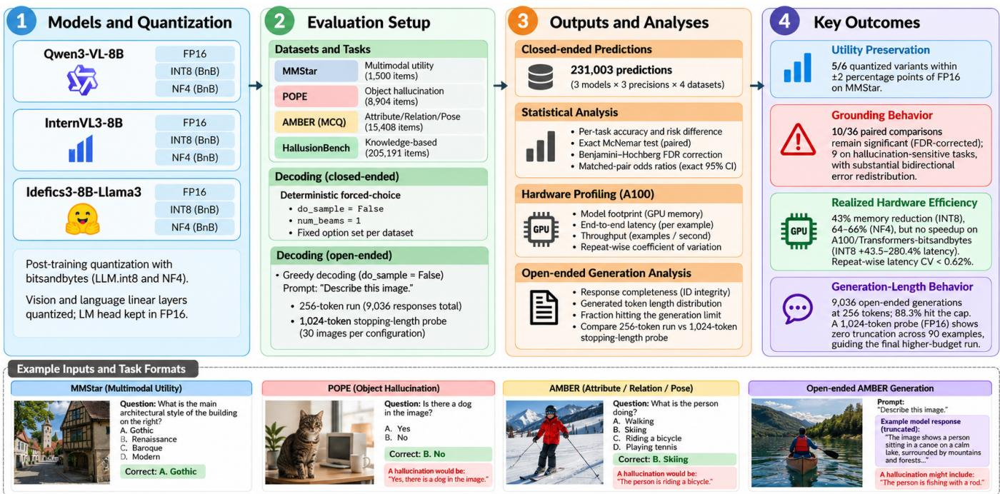
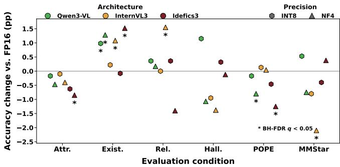
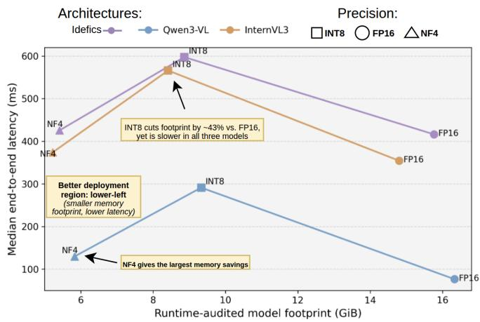

# GHOST-Q: TOWARDS STUDYING GROUNDING HALLUCINATIONS OVERLOOKED UNDER SAME-SCORE TRADEOFFS IN QUANTIZED VLMS

Saim Rehman, Muhammad Shafique

eBRAIN Lab, Division of Engineering, New York University Abu Dhabi (NYUAD), Abu Dhabi, UAE

{sr7849, muhammad.shafique}@nyu.edu

## ABSTRACT

Post-training quantization of vision–language models (VLMs) is typically assessed through aggregate task accuracy and memory savings, but preserving a headline score does not guarantee preservation of visual grounding behavior. We present GHOST-Q, a cross-precision controlled evaluation of three 8B VLM families under FP16, INT8, and NF4 across utility and hallucination-sensitive benchmarks. Rather than comparing only aggregate accuracy, we pair FP16 and quantized predictions item-by-item to quantify how compression redistributes grounding successes and failures. Five of six quantized variants preserve MMStar accuracy within ±2 percentage points, yet 10 of 36 paired effects remain significant after false-discovery-rate correction, nine on hallucinationsensitive conditions. Same-device A100 profiling further demonstrates that substantial memory reduction does not necessarily mean lower inference latency. Finally, an openended AMBER audit reveals strong generation-budget censoring whose severity varies by architecture and precision. These results show that quantized VLMs should be evaluated jointly for aggregate utility, grounding reliability, generation behavior, and realized deployment efficiency.

Index Terms— Vision-Language Models, Quantization, Hallucination, Multimodal Reliability

## 1. INTRODUCTION

Large vision-language models (VLMs) increasingly serve as general multimodal interfaces, but their memory footprint motivates aggressive compression. Quantization methods such as LLM.int8(), GPTQ, SmoothQuant, AWQ, and NF4-based QLoRA reduce transformer memory while often retaining conventional task performance [1–5]. In parallel, a distinct literature shows that strong VLMs can hallucinate objects, attributes, relations, or answers that are weakly grounded in visual evidence [6–9]. This motivates the following question: if quantization preserves multimodal utility, does it also preserve the model’s pattern of grounding successes and failures? Moreover, nominally lower precision need not yield lower latency unless the software stack and kernels realize that efficiency. We evaluate this intersection using Qwen3-VL-8B [10], InternVL3-8B [11], and Idefics3- 8B [12], each in FP16, INT8, and NF4.

Motivating case study. Recent VLM quantization methods such as MBQ and VLMQ improve low-bit deployment by explicitly accounting for modality imbalance, token importance, and quantization sensitivity [13–15]. However, their primary validation still centers on retained multimodal benchmark performance and compression efficiency, while hallucination benchmarks such as POPE and AMBER evaluate grounding failures without studying how compression redistributes them [6,7]. This leaves an important gap: a quantized model may preserve its headline utility score while changing which individual examples it grounds correctly. In our motivating case, Idefics3-NF4 changes MMStar accuracy by only +0.40 pp, yet POPE accuracy falls by 1.24 pp, with 257 FP16-correct predictions becoming wrong versus 145 FP16 errors being corrected (BH-adjusted $q = 3 . 0 \times 1 0 ^ { - 7 } )$ . This demonstrates why aggregate accuracy alone is insufficient to certify grounding reliability after quantization.

Our main contributions are as follows:

• We introduce a controlled cross precision evaluation protocol that compares FP16, INT8, and NF4 VLMs under matched examples, preprocessing, prompts, and decoding conditions across three architectures and multiple utility and grounding-sensitive benchmarks.

• We move beyond aggregate accuracy by introducing an item-level paired reliability analysis that distinguishes harmful and beneficial precision-induced prediction flips using bootstrap confidence intervals, exact Mc-Nemar tests, FDR correction, and matched-pair effect sizes.

• We jointly characterize behavioral reliability and realized deployment efficiency on the same A100 platform, showing when memory compression is decoupled from actual inference latency.

• We study generation-budget sensitivity in open-ended VLM evaluation, showing that fixed decoding budgets can introduce architecture- and precision-dependent censoring and therefore confound naive hallucination comparisons.

## 2. BACKGROUND

Quantization. To begin, LLM.int8() introduced mixedprecision 8-bit matrix multiplication for large transformers [1]; GPTQ uses approximate second-order information for one-shot low-bit weight quantization [2]; SmoothQuant targets W8A8 PTQ [3]; and AWQ protects activation-salient weight channels [4]. QLoRA introduced NormalFloat-4 (NF4) and double quantization [5]. For multimodal models, Q-VLM targets VLM PTQ through cross-layer dependency modeling [16]; MBQ accounts for different vision/language token sensitivities [13]; VLMQ incorporates token importance into a Hessian-based objective [14]; and Das et al. systematically study bit width, quantization method, and component sensitivity across multimodal tasks [15].

Grounding and hallucination. POPE operationalizes object hallucination through polling-style questions [6]. AMBER provides LLM-free discriminative evaluation of existence, attribute, and relation hallucination [7]. HallusionBench probes image-context reasoning under entangled language hallucination and visual illusions [8]. Surveys document the broader VLM hallucination landscape [9]. Our focus, rather, is complementary: we test whether compression itself changes grounding-sensitive decisions even when aggregate utility is nearly preserved.

## 3. METHODOLOGY

## 3.1. Controlled Cross-Precision Evaluation

Ghost-Q compares each quantized VLM against its own FP16 reference under matched inputs and evaluation conditions. For architecture m, precision p, dataset d, and example $i ,$ candidate responses are scored deterministically from model logits,

$$
\hat { y } _ { i } ^ { m , p } = \mathop { \arg \operatorname* { m a x } } _ { c \in \mathcal { C } _ { d } } s _ { m , p } ( c \mid x _ { i } ) .
$$

We compute accuracy $A _ { m , p , d }$ and define the paired precision effect as

$$
\begin{array} { r } { \Delta _ { m , p , d } = A _ { m , p , d } - A _ { m , \mathrm { F P 1 6 } , d } . } \end{array}
$$

All FP16–quantized comparisons use the same examples, preprocessing, and candidate sets, isolating precision as the experimental factor. For MMStar, $| \Delta | \leq 2 { \mathrm { ~ p p } }$ is used only as a practical reporting tolerance and not as a statistical equivalence test.

## 3.2. Paired Grounding-Shift Analysis

Aggregate accuracy can remain stable even when different examples change correctness after quantization. We therefore compare FP16 and quantized predictions item-by-item and count harmful C→W and beneficial W→C transitions. We form 10,000 paired bootstrap resamples for confidence intervals and apply the exact McNemar test [17] to discordant pairs. Benjamini–Hochberg correction controls false discovery across all 36 FP16–quantized comparisons [18]. Effect direction is summarized by the matched-pair odds ratio

$$
\mathrm { O R } = n _ { \mathrm { W  C } } / n _ { \mathrm { C  W } } ,
$$

where $\mathrm { O R } > 1$ indicates more beneficial than harmful flips and $\mathrm { O R } < 1$ the reverse.

## 3.3. Open-Ended Generation Audit

Forced-choice evaluation isolates precision-induced decision changes from free-form decoding. To examine whether the decoding itself is also precision-sensitive, we additionally evaluate open-ended AMBER generation under identical prompts, greedy decoding, and a shared token budget. We record whether each response naturally terminates or reaches the generation ceiling and use a higher-budget FP16 stoppinglength probe to distinguish natural stopping behavior from budget-induced truncation.

## 4. EXPERIMENTAL SETUP

## 4.1. Models and Quantization

We evaluate Qwen3-VL-8B [10], InternVL3-8B [11], and Idefics3-8B [12] in FP16, bitsandbytes LLM.int8(), and NF4. NF4 uses FP16 compute and double quantization [5], while INT8 uses the mixed-precision LLM.int8() path [1]. Neither quantized loader requires a calibration dataset. Module audits show that 92.35–93.38% of logical linear weights are quantized; detected vision and language linear layers are converted while the final LM head remains FP16.

## 4.2. Benchmarks

MMStar provides 1,500 multimodal utility questions [19]. Grounding-sensitive evaluation uses POPE (9,000 examples), AMBER existence (4,924), attribute (7,628), and relation (1,664) items [6, 7], and 951 HallusionBench image examples [8]. Each model–precision configuration therefore produces 25,667 forced-choice predictions, giving 231,003 predictions overall. For open-ended evaluation, we use the 1,004-image AMBER generative subset with the official “Describe this image.” prompt, greedy decoding, and a common 256-token ceiling. Moreover, Qwen3-VL uses the same fixed 1-megapixel longest-edge image budget across all three precisions.

## 4.3. Hardware Profiling

All nine configurations are profiled sequentially on the same NVIDIA A100-SXM4-80GB GPU. After 10 warm-up examples, we perform three measured repeats over the same 200 POPE inputs, yielding 600 measured inferences per configuration. We report runtime model footprint, peak allocated memory, median/p95 end-to-end latency, throughput, and repeat-wise variability. Power telemetry is treated only as run-level characterization rather than per-inference energy.

  
Fig. 1. Overview of the Ghost-Q evaluation pipeline and main analyses.

Table 1. Accuracy (%) across utility and grounding-sensitive tasks. “Macro” is the unweighted mean of POPE, three AM-BER subsets, and HallusionBench.
<table><tr><td>Model</td><td>Prec. MM*</td><td>POPE</td><td>A-E</td><td>A-A</td><td>A-R</td><td>Hall.</td><td>Macro</td></tr><tr><td rowspan="3">Qwen3</td><td>FP16 63.53</td><td>88.68</td><td>92.73</td><td>86.88</td><td>85.22</td><td>72.77</td><td>85.25</td></tr><tr><td>INT8 64.07</td><td>88.51</td><td>93.70</td><td>86.72</td><td>85.58</td><td>73.92</td><td>85.69</td></tr><tr><td>NF4 62.80</td><td>87.89</td><td>94.01</td><td>86.43</td><td>85.40</td><td>71.71</td><td>85.09</td></tr><tr><td rowspan="3">InternVL3</td><td>FP16</td><td>66.47 90.87</td><td>91.96</td><td>87.02</td><td>83.35</td><td>65.93</td><td>83.83</td></tr><tr><td>INT8 65.67</td><td>91.00</td><td>92.18</td><td>86.93</td><td>83.35</td><td>64.98</td><td>83.69</td></tr><tr><td>NF4 64.40</td><td>90.92</td><td>92.73</td><td>86.63</td><td>84.92</td><td>64.56</td><td>83.95</td></tr><tr><td rowspan="3">Idefics3</td><td>FP16 47.33</td><td>87.43</td><td>89.40</td><td>77.31</td><td>87.02</td><td>54.15</td><td>79.06</td></tr><tr><td>INT8 46.93</td><td>86.98</td><td>89.32</td><td>76.68</td><td>87.38</td><td>54.47</td><td>78.96</td></tr><tr><td>NF4 47.73</td><td>86.19</td><td>90.62</td><td>77.81</td><td>85.64</td><td>54.05</td><td>78.86</td></tr></table>

## 5. RESULTS

## 5.1. Aggregate Utility is Mostly Preserved

Table 1 summarizes utility and grounding-sensitive accuracy. Five of six quantized variants remain within the ±2 pp MMStar tolerance; InternVL3-NF4 is the only exception, at −2.07 pp relative to FP16.

Table 2. FDR-significant FP16–quantized paired effects. ∆ is quantized minus FP16 accuracy (pp). C→W/W→C denote harmful/beneficial flips. q is the Benjamini–Hochbergadjusted McNemar p-value. Matched OR > 1 indicates more beneficial than harmful flips; OR < 1 indicates the reverse.
<table><tr><td>Model</td><td>Task</td><td>Prec.</td><td></td><td>∆ C→W W→C</td><td></td><td>q</td><td>OR [95% CI]</td></tr><tr><td>Qwen3</td><td>A-exist</td><td>INT8 +0.97</td><td></td><td>4</td><td>52</td><td>&lt; 10−8</td><td>13.00 [4.78, 49.50]</td></tr><tr><td>Qwen3</td><td>A-exist</td><td>NF4 +1.28</td><td></td><td>14</td><td>77</td><td> $< 1 0 ^ { - 8 }$ </td><td>5.50 [3.09, 10.53]</td></tr><tr><td>Idefics3</td><td>POPE</td><td>NF4</td><td>-1.24</td><td>257</td><td>145</td><td> $3 . 0 \times 1 0 ^ { - 7 }$ </td><td>0.56 [0.46, 0.69]</td></tr><tr><td>Qwen3</td><td>POPE</td><td>NF4</td><td>-0.79</td><td>149</td><td>78</td><td> $2 . 6 \times 1 0 ^ { - 5 }$ </td><td>0.52 [0.39, 0.69]</td></tr><tr><td>Idefics3</td><td>A-exist</td><td>NF4</td><td>+1.22</td><td>67</td><td>127</td><td> $1 . 4 \times 1 0 ^ { - 4 }$ </td><td>1.90 [1.40, 2.59]</td></tr><tr><td>InternVL3</td><td>A-exist</td><td>NF4</td><td>+0.77</td><td>27</td><td>65</td><td>5.6 × 10−4</td><td>2.41 [1.52, 3.92]</td></tr><tr><td>Idefics3</td><td>POPE</td><td>INT8-0.46</td><td></td><td>87</td><td>46</td><td> $2 . 5 \times 1 0 ^ { - 3 }$ </td><td>0.53 [0.36, 0.76]</td></tr><tr><td>InternVL3</td><td>A-rel.</td><td>NF4 +1.56</td><td></td><td>20</td><td>46</td><td> $8 . 4 \times 1 0 ^ { - 3 }$ </td><td>2.30 [1.33, 4.10]</td></tr><tr><td>Idefics3</td><td>A-attr.</td><td>INT8-0.63</td><td></td><td>148</td><td>100</td><td> $1 . 1 \times 1 0 ^ { - 2 }$ </td><td>0.68 [0.52, 0.88]</td></tr><tr><td></td><td>InternVL3 MMStar NF4</td><td></td><td>-2.07</td><td>74</td><td>43</td><td> $1 . 9 \times 1 0 ^ { - 2 }$ </td><td>0.58 [0.39, 0.86]</td></tr></table>

## 5.2. Preserved Averages Hide Paired Grounding Shifts

The grounding macro changes by at most 0.43 pp from FP16, yet paired analysis reveals substantial item-level redistribution (Fig. 2). Ten of 36 comparisons remain significant after FDR correction, nine on hallucination-sensitive conditions, and the effects are bidirectional. Table 2 reports all significant effects; matched ORs range from 13.0 for Qwen3 INT8 on AMBER existence to 0.52 for Qwen3 NF4 on POPE.

## 5.3. Memory Compression Does Not Imply A100 Speedup

Table 3 shows that INT8 reduces model footprint by 42.9– 43.8% and NF4 by 64.3–65.7%. However, neither improves median end-to-end latency over FP16 on the tested A100/Transformers-bitsandbytes stack: INT8 incurs 43.5– 280.4% higher latency and NF4 +2.2–69.6%. Repeat-wise median-latency CV remains below 0.62%, and NF4 dominates INT8 in both footprint and median latency for all three architectures. These results characterize the tested stack rather than quantization algorithms in general.

  
Fig. 2. Accuracy change relative to each architecture’s FP16 baseline. Stars mark comparisons significant after Benjamini–Hochberg correction over all 36 paired tests $( q <$ 0.05).

Table 3. Same-device A100 profile. E2E values are median/p95 latency over 600 measured inferences per configuration.
<table><tr><td>Model</td><td>Prec.</td><td>Foot. (GiB)</td><td>Peak (GiB)</td><td>E2E50 (ms)</td><td>E2E95 (ms)</td><td>Thr. ex/s</td></tr><tr><td rowspan="3">Qwen3</td><td>FP16</td><td>16.33</td><td>16.53</td><td>76.6</td><td>86.9</td><td>13.00</td></tr><tr><td>INT8</td><td>9.33</td><td>9.63</td><td>291.3</td><td>309.0</td><td>3.40</td></tr><tr><td>NF4</td><td>5.83</td><td>6.18</td><td>129.8</td><td>134.7</td><td>7.70</td></tr><tr><td rowspan="3">InternVL3</td><td>FP16</td><td>14.80</td><td>16.01</td><td>354.5</td><td>363.8</td><td>3.68</td></tr><tr><td>INT8</td><td>8.41</td><td>9.63</td><td>566.0</td><td>578.7</td><td>2.12</td></tr><tr><td>NF4</td><td>5.22</td><td>6.55</td><td>373.9</td><td>381.1</td><td>3.43</td></tr><tr><td rowspan="3">Idefics3</td><td>FP16</td><td>15.76</td><td>16.96</td><td>416.3</td><td>537.2</td><td>2.34</td></tr><tr><td>INT8</td><td>8.86</td><td>10.09</td><td>597.5</td><td>733.3</td><td>1.64</td></tr><tr><td>NF4</td><td>5.41</td><td>6.73</td><td>425.5</td><td>539.2</td><td>2.30</td></tr></table>

## 5.4. Open-ended Generation Reveals Budget Sensitivity

All nine configurations complete the 1,004-image subset, yielding 9,036 valid responses, but 7,977 (88.28%) reach the common 256-token ceiling. Censoring varies across both architectures and precision settings (Table 4), showing that quantization can alter open-ended generation-length behavior under otherwise identical decoding conditions.

A separate 1,024-token FP16 diagnostic confirms that 256 tokens is below natural stopping length: none of 90 generations reaches the 1,024-token ceiling, with maximum lengths of 400, 635, and 769 tokens for Qwen3-VL, Idefics3, and InternVL3, respectively. We therefore treat the 256-token experiment as a controlled budget-sensitivity audit rather than an uncensored generative-hallucination estimate.

  
Fig. 3. Measured footprint–latency trade-off on the same A100 GPU. Quantization consistently moves left (smaller footprint) but not down (faster inference); NF4 dominates INT8 in this two-dimensional efficiency plane for all three architectures.

Table 4. AMBER open-ended generation under a common 256-token budget. Entries are responses that hit the token ceiling out of 1,004.
<table><tr><td>Model</td><td>FP16</td><td>INT8</td><td>NF4</td></tr><tr><td>Qwen3-VL</td><td>794 (79.1%)</td><td>768 (76.5%)</td><td>734 (73.1%)</td></tr><tr><td>InternVL3</td><td>920 (91.6%)</td><td>913 (90.9%)</td><td>844 (84.1%)</td></tr><tr><td>Idefics3</td><td>1001 (99.7%)</td><td>1001 (99.7%)</td><td>1002 (99.8%)</td></tr></table>

## 6. DISCUSSION AND CONCLUSION

Across three 8B VLM families, GHOST-Q shows that preserved aggregate utility does not guarantee preserved grounding behavior or realized deployment efficiency: quantization can redistribute item-level errors, and substantial memory savings need not reduce latency on the tested stack. Open-ended evaluation further reveals precision-dependent generation-budget censoring. Although limited to three model families, bitsandbytes weight quantization, and batchone A100 inference, these results motivate evaluating quantized VLMs jointly in terms of utility, paired grounding reliability, generation conditions, and realized deployment behavior.

## Acknowledgment

This work was supported in part by the NYUAD Center for CyberSecurity (CCS), funded by Tamkeen under the NYUAD Research Institute grant G1104. This research was carried out on the High Performance Computing resources at New York University Abu Dhabi.

## Generative AI Use Disclosure

During the preparation of this work, the authors used Generative AI tools (specifically ChatGPT and Grammarly) for language editing, text refinement, and visual refinement of the methodology figure. The authors reviewed and edited all generated or refined content as needed and take full responsibility for the publication’s content.

## 7. REFERENCES

[1] T. Dettmers, M. Lewis, Y. Belkada, and L. Zettlemoyer, “LLM.int8(): 8-bit matrix multiplication for transformers at scale,” arXiv preprint arXiv:2208.07339, 2022.

[2] E. Frantar, S. Ashkboos, T. Hoefler, and D. Alistarh, “GPTQ: Accurate post-training quantization for generative pre-trained transformers,” arXiv preprint arXiv:2210.17323, 2022.

[3] G. Xiao, J. Lin, M. Seznec, H. Wu, J. Demouth, and S. Han, “SmoothQuant: Accurate and efficient posttraining quantization for large language models,” in Proceedings of the 40th International Conference on Machine Learning, 2023.

[4] J. Lin et al., “AWQ: Activation-aware weight quantization for LLM compression and acceleration,” arXiv preprint arXiv:2306.00978, 2023.

[5] T. Dettmers, A. Pagnoni, A. Holtzman, and L. Zettlemoyer, “QLoRA: Efficient finetuning of quantized LLMs,” arXiv preprint arXiv:2305.14314, 2023.

[6] Y. Li, Y. Du, K. Zhou, J. Wang, W. X. Zhao, and J.-R. Wen, “Evaluating object hallucination in large visionlanguage models,” in Proceedings of the 2023 Conference on Empirical Methods in Natural Language Processing, 2023.

[7] J. Wang et al., “AMBER: An LLM-free multidimensional benchmark for MLLMs hallucination evaluation,” arXiv preprint arXiv:2311.07397, 2023.

[8] T. Guan et al., “HallusionBench: An advanced diagnostic suite for entangled language hallucination and visual illusion in large vision-language models,” in Proceedings of the IEEE/CVF Conference on Computer Vision and Pattern Recognition, 2024.

[9] H. Liu et al., “A survey on hallucination in large visionlanguage models,” arXiv preprint arXiv:2402.00253, 2024.

[10] S. Bai et al., “Qwen3-VL technical report,” arXiv preprint arXiv:2511.21631, 2025.

[11] J. Zhu et al., “InternVL3: Exploring advanced training and test-time recipes for open-source multimodal models,” arXiv preprint arXiv:2504.10479, 2025.

[12] H. Laurenc¸on, A. Marafioti, V. Sanh, and L. Tronchon, “Building and better understanding vision-language models: Insights and future directions,” arXiv preprint arXiv:2408.12637, 2024.

[13] S. Li et al., “MBQ: Modality-balanced quantization for large vision-language models,” in Proceedings of the IEEE/CVF Conference on Computer Vision and Pattern Recognition, 2025, pp. 4167–4177.

[14] Y. Xue, Y. Huang, J. Shao, and J. Zhang, “VLMQ: Efficient post-training quantization for large visionlanguage models via hessian augmentation,” arXiv preprint arXiv:2508.03351, 2025.

[15] G. Das, V. La, E. Lau, A. Shrivastava, and M. Gwilliam, “Towards understanding best practices for quantization of vision-language models,” arXiv preprint arXiv:2601.15287, 2026.

[16] C. Wang, Z. Wang, X. Xu, Y. Tang, J. Zhou, and J. Lu, “Q-VLM: Post-training quantization for large visionlanguage models,” arXiv preprint arXiv:2410.08119, 2024.

[17] Q. McNemar, “Note on the sampling error of the difference between correlated proportions or percentages,” Psychometrika, vol. 12, no. 2, pp. 153–157, 1947.

[18] Y. Benjamini and Y. Hochberg, “Controlling the false discovery rate: A practical and powerful approach to multiple testing,” Journal of the Royal Statistical Society: Series B, vol. 57, no. 1, pp. 289–300, 1995.

[19] L. Chen et al., “Are we on the right way for evaluating large vision-language models?” in Advances in Neural Information Processing Systems, 2024.