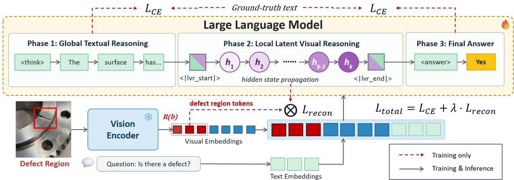
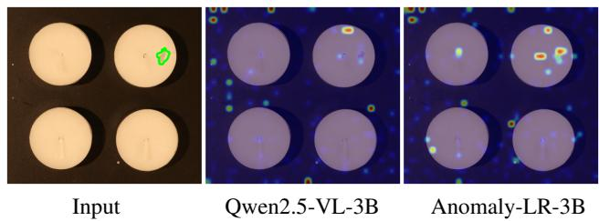

# INDUSTRIAL ANOMALY DETECTION VIA DEFECT-GROUNDED REASONING IN VISUAL LATENT SPACE

Jaron Yeh1∗, Yen-Wei Chang1∗, Jiang Liu2, Shao-Yuan Lo1

1National Taiwan University, 2AMD GenAI

{b12505014, b12901068, shaoyuan}@ntu.edu.tw, jiang.liu@amd.com

## ABSTRACT

Industrial anomaly detection (IAD) is evolving beyond conventional detection and localization toward multimodal inspection systems that can describe, explain, and reason about fine-grained defects. Although recent multimodal large language model (MLLM)-based methods improve anomaly understanding through textual reasoning and visual guidance, they face two limitations in fine-grained inspec tion. First, their visual refinement often requires iteratively revisiting local image regions or augmenting with additional tools. Second, the resulting local defect evidence may not be reliably preserved throughout subsequent reasoning. To address these, we propose Anomaly-LR, a defect-grounded latent reasoning framework that first forms a global understanding of the input and then progressively refines anomaly-relevant representations directly in the visual latent space. We further construct IAD-LR-22K, the first IAD instruction dataset designed for latent reasoning, containing 22,228 image-question instances from 4,523 industrial images, with global textual reasoning traces and region-level visual annotations. Extensive experiments show that Anomaly-LR achieves state-of-the-art performance among comparable-scale methods across multiple IAD benchmarks, without requiring external references or tools. The code and data will be released at https://github.com/Yen666/Anomaly-LR.

Index Terms— industrial anomaly detection, latent reasoning, multimodal large language models, instruction datasets

## 1. INTRODUCTION

Industrial anomaly detection (IAD) is a critical component of manufacturing quality control, traditionally formulated as detecting anomalous samples and localizing defective regions. Convolutional networkbased methods mainly produce anomaly scores or localization maps, offering limited semantic interpretation [1, 2, 3]. The emergence of multimodal large language models (MLLMs) [4, 5, 6] has broadened industrial inspection toward more comprehensive understanding, enabling anomaly discrimination, localization, text description, and deeper analysis [7, 8].

Building on this shift, recent advances introduce increasingly sophisticated reasoning mechanisms for fine-grained defect inspection. IAD-R1 [9] enhances textual reasoning through chain-of-thought supervision and reinforcement learning. AgentIAD [10] iteratively revisits suspicious regions through external agentic tools. Reason IAD [11] performs iterative latent optimization with a dynamic visual injection mechanism. Although these approaches strengthen anomaly reasoning from different perspectives, several limitations remain. Text-based reasoning provides only an indirect means of capturing fine-grained visual details, while visual refinement based on region revisiting or external visual tools introduces extra inspection steps. Moreover, the resulting local defect evidence may not always be effectively preserved and utilized throughout subsequent reasoning, as providing additional visual inputs does not necessarily guarantee that the model will attend to and exploit the relevant information [12, 13]. This raises the question of whether anomaly reasoning can reduce reliance on repeated visual intervention while more directly incorporating localized defect evidence into the reasoning process.

To this end, we propose Anomaly-LR, a defect-grounded latent reasoning framework that internalizes localized visual refinement within the model’s latent space. Guided by textual global understanding, Anomaly-LR progressively refines intermediate hidden states by aligning them with defect-relevant visual features before answer generation. This design establishes a global-to-local reasoning process without repeated region revisiting or reliance on external tools. To train Anomaly-LR, we further construct IAD-LR-22K, the first IAD instruction dataset designed for latent reasoning, consisting of 22,228 image-question instances from 4,523 industrial images, with global textual reasoning traces and region-level visual annotations.

Extensive experiments demonstrate that Anomaly-LR consistently outperforms state-of-the-art approaches at both 3B and 7B model scales, while maintaining these gains under cross-dataset evaluation. In addition, attention map analysis shows that Anomaly-LR concentrates substantially more attention within defect regions, supporting its effectiveness in defect-grounded reasoning. This is achieved without requiring auxiliary reference images, information, or tools. We have made the Anomaly-LR model and IAD-LR-22K dataset publicly available to support future research in IAD.

Our main contributions are summarized as follows. (1) We propose Anomaly-LR, a defect-grounded latent reasoning framework that internalizes localized visual refinement within the model’s latent space. (2) We construct IAD-LR-22K, the first IAD instruction dataset designed for latent reasoning, with global textual reasoning traces and region-level visual annotations. (3) Experiments and atten tion analysis validate Anomaly-LR’s effectiveness in defect-grounded reasoning without external reference images, information, or tools.

## 2. METHOD

This section introduces defect-grounded latent supervision. We supervise the intermediate states of an MLLM using visual tokens from annotated defect regions and global textual reasoning traces.

## 2.1. Overall architecture

Given an input image, the frozen vision encoder and projector encode it into M visual embeddings $e _ { 1 } , \ldots , e _ { M }$ . Given a defect bounding box $b ,$ we define $\mathcal { R } ( b ) \subseteq 1 , \ldots , M$ as the subset of visual tokens whose corresponding patches fall within the box, and let $N = | \mathcal { R } ( b )$ |.

  
Fig. 1. Overview of the proposed Anomaly-LR built on an MLLM backbone. Its defect-grounded reasoning process consists of three phases: global textual reasoning, N steps of local latent visual reasoning delimited by the <lvr start> and <lvr end> tokens, and final answer generation. At training time, the latent positions are supervised to reconstruct the visual embeddings of the annotated defect region. At inference time, the model feeds its own hidden states back for K steps.

As illustrated in Fig. 1, the proposed defect-grounded reasoning process in the LLM consists of three phases; they are global textual reasoning, local latent visual reasoning, and final answer generation:

$$
\underbrace { < \mathrm { t h i n k } > t < / \mathrm { t h i n k } > } _ { \mathrm { g l o b a l } } \underbrace { < \mathrm { l v } \mathtt { r } > ^ { N } } _ { \mathrm { l a t e n t } } \underbrace { < \mathrm { a n s w e r } > a n s < / \mathrm { a n s w e r } > } _ { \mathrm { a n s w e r } } ,\tag{1}
$$

where t is a concise global textual reasoning trace for the entire image, ans is the final answer, and ${ < \exists \boldsymbol { \mathrm { v r } } > } ^ { N }$ denotes N latent positions delimited by the <|lvr start|> and <|lvr end|> tokens.

The global textual reasoning phase first forms a concise naturallanguage understanding of the entire image, after which the local latent visual reasoning phase examines suspicious regions. This global-to-local reasoning follows the natural inspection process of first identifying the object and its overall condition, and then investigating potentially defective areas [8].

Inspired by [13], the local latent visual reasoning phase uses positions without explicit token identities and is directly supervised with visual embeddings from the annotated defect region. This encourages the model to reconstruct localized visual evidence in the latent space. The number of latent positions is determined by the size of the defect region, allowing larger defects to receive more positions for reconstruction. The final phase derives the answer from the preceding global textual and local latent visual reasoning states.

## 2.2. Training and inference

During training, the latent states are supervised through a latent reconstruction objective [13]. Specifically, the input embedding x at the p-th latent position is replaced with its corresponding target embedding:

$$
\mathbf { x } _ { \pi ( p ) }  e _ { r _ { p } } , \qquad r _ { p } \in \mathcal { R } ( b ) ,\tag{2}
$$

where $\pi ( p )$ is the sequence index of that position. Consequently, the model is trained to reconstruct each region token from the hidden state immediately preceding its position. Letting $h _ { p } \triangleq h _ { \pi ( p ) - 1 }$ and $\hat { e } _ { p } \triangleq e _ { r _ { p } } ,$ we employ a cosine-similarity-based reconstruction loss,

$$
\mathcal { L } _ { \mathrm { r e c o n } } ~ = ~ 1 - \frac { 1 } { N } \sum _ { p = 1 } ^ { N } \frac { \langle h _ { p } , \hat { e } _ { p } \rangle } { \left\| h _ { p } \right\| \left\| \hat { e } _ { p } \right\| } .\tag{3}
$$

This objective differs from the $L _ { 2 }$ loss used in [13], as we observe that $h _ { p }$ and $\hat { e } _ { p }$ exhibit substantially different magnitudes. Hence, the squared-error objective is dominated by this scale mismatch rather than the directional alignment of the reconstructed region representation (see Sec. 3.3).

The latent reconstruction objective is combined with the standard token-level cross-entropy over the textual positions T , including the global reasoning trace and the final answer:

$$
\mathcal { L } _ { \mathrm { C E } } = - \frac { 1 } { | T | } \sum _ { t \in \mathcal { T } } \log p _ { \theta } ( y _ { t } \mid y _ { < t } ) ,\tag{4}
$$

yielding the overall training objective:

$$
\mathcal { L } _ { \mathrm { t o t a l } } = \mathcal { L } _ { \mathrm { C E } } + \lambda \mathcal { L } _ { \mathrm { r e c o n } } ,\tag{5}
$$

where λ balances the two objectives. Latent positions carry no token identity and thus are excluded from T, while $\scriptstyle { \mathcal { L } } _ { \mathrm { r e c o n } }$ is computed only over the latent positions. This separation also motivates the global reasoning phase. Since the answer span is short, its cross-entropy loss saturates early in training. Therefore, without the preceding global trace, ${ \mathcal { L } } _ { \mathrm { r e c o n } }$ can dominate the overall optimization, degrading answer prediction (see Sec. 3.3). Introducing a global textual reasoning trace maintains a language-modeling signal throughout training, allowing the model to learn global image understanding while preventing the latent objective from overwhelming the textual objective.

During inference, no annotations are available, so the latent segment is generated autoregressively. After emitting the <|lvr start|> token, the model feeds its own hidden state back as the next input embedding for K steps before resuming textual decoding (see Fig. 1). We employ the fixed-budget decoding strategy, which was reported to outperform both a learned stopping token and an auxiliary mode-switching objective [13].

## 2.3. IAD-LR-22K dataset

Existing IAD instruction datasets primarily supervise textual predictions and reasoning processes [8, 9, 14]. To our knowledge, none provides annotations that explicitly ground intermediate latent representations in localized defect evidence. To enable defect-grounded latent supervision, we construct IAD-LR-22K, the first IAD instruction dataset designed for latent reasoning. It contains 22,228 imagequestion instances derived from 4,523 industrial images sourced from the MMAD [14] and Real-IAD [15] datasets. For MMAD, we sample 1,600 images spanning all 38 categories, with a balanced split between normal and anomalous cases. We retain the original questions, answer choices, and ground-truth answers, yielding 7,613 image-question instances. For Real-IAD, we use 2,923 images across 30 categories and generate five MMAD-style inspection questions per image, resulting in 14,615 instances. For each instance, we construct a concise global textual reasoning trace together with a region-level visual annotation. Defect regions are derived from the existing anomaly labels, while normal images are assigned object-centric regions. We refer to the resulting MMAD and Real-IAD subsets as IAD-LR-22K-MMAD and IAD-LR-22K-RealIAD, respectively. IAD-LR-22K supports defectgrounded reasoning across a range of IAD tasks, including anomaly detection, localization, defect description, and anomaly analysis.

Table 1. Per-subtask accuracy on the MMAD dataset [14]. ‡ denotes methods that adopt the same protocol of the 20%/80% MMAD train/test split as ours. All baseline numbers are taken from their original papers. Several methods use reference retrieval and external tool use, whereas Anomaly-LR requires neither. “Aux.”: use auxiliary reference images, domain information, or external tools; “Disc.”: Discrimination; “Cls.”: classification; “Loc.”: localization; “Desc.”: description; “Anal.”: analysis. Bold denotes the best value, and underline denotes the second-best value in each column, excluding the human reference.
<table><tr><td></td><td></td><td></td><td></td><td>Anomaly</td><td colspan="4">Defect</td><td colspan="2">Object</td><td></td></tr><tr><td>Type</td><td>Method</td><td>Scale</td><td>Aux.</td><td>Disc.</td><td>Cls.</td><td>Loc.</td><td>Desc.</td><td>Anal.</td><td>Cls.</td><td>Anal.</td><td>Average</td></tr><tr><td>Human</td><td>Human (expert)</td><td>一</td><td>1</td><td>95.04</td><td>75.00</td><td>92.31</td><td>83.33</td><td>94.20</td><td>86.11</td><td>80.37</td><td>86.65</td></tr><tr><td>reference</td><td>Human (ordinary)</td><td>一</td><td></td><td>86.90</td><td>66.25</td><td>85.58</td><td>71.25</td><td>81.52</td><td>89.58</td><td>69.72</td><td>78.69</td></tr><tr><td>Generic</td><td>GPT-40</td><td></td><td></td><td>68.63</td><td>65.80</td><td>55.62</td><td>73.21</td><td>83.41</td><td>94.98</td><td>82.80</td><td>74.92</td></tr><tr><td>MLLMs</td><td>Qwen2.5-VL</td><td>72B</td><td></td><td>72.66</td><td>62.31</td><td>67.16</td><td>73.56</td><td>81.95</td><td>94.30</td><td>86.78</td><td>76.96</td></tr><tr><td rowspan="10"></td><td>AnomalyGPT (AAAI&#x27;24) [7]</td><td>7B</td><td>X</td><td>65.57</td><td>27.49</td><td>27.97</td><td>36.86</td><td>32.11</td><td>29.84</td><td>35.82</td><td>36.52</td></tr><tr><td>AnomalyR1 (arXiv&#x27;25) [16]</td><td>3B</td><td>X</td><td>60.20</td><td>63.50</td><td>70.14</td><td>80.47</td><td>85.28</td><td>92.48</td><td>86.15</td><td>76.96</td></tr><tr><td>OmniAD‡ (arXiv&#x27;25) [17]</td><td>3B</td><td>X</td><td>66.30</td><td>75.90</td><td>72.90</td><td>65.10</td><td>85.40</td><td>93.50</td><td>85.60</td><td>77.50</td></tr><tr><td>OmniAD‡ (arXiv&#x27;25) [17]</td><td>7B</td><td>X</td><td>68.80</td><td>78.80</td><td>75.50</td><td>67.20</td><td>86.40</td><td>96.00</td><td>86.40</td><td>79.87</td></tr><tr><td>AD-FM‡ (AAAI&#x27;26) [18]</td><td>7B</td><td>X</td><td></td><td>73.36</td><td>77.53</td><td>86.80</td><td>86.75</td><td>89.98</td><td>86.67</td><td></td></tr><tr><td>EMIT (arXiv&#x27;25) [19]</td><td>8B</td><td>√</td><td>73.87</td><td>80.85</td><td>76.39</td><td>83.00</td><td>85.92</td><td>90.26</td><td>83.37</td><td>81.95</td></tr><tr><td>AD-Copilot (arXiv&#x27;26) [20]</td><td>7B</td><td>√</td><td>73.95</td><td>74.29</td><td>76.40</td><td>84.92</td><td>86.93</td><td>91.86</td><td>87.67</td><td>82.29</td></tr><tr><td>ReasonIAD* (arXiv&#x27;26) [11]</td><td>7B</td><td>√</td><td>70.74</td><td>67.97</td><td>60.82</td><td>72.78</td><td>82.62</td><td>97.17</td><td>84.99</td><td>76.73</td></tr><tr><td>InspectorGPT‡ (arXiv&#x27;26) [21]</td><td>7B</td><td>√</td><td>73.90</td><td>75.32</td><td>75.91</td><td>82.18</td><td>88.25</td><td>92.94</td><td>88.18</td><td>82.38</td></tr><tr><td>AgentIAD‡ (arXiv&#x27;25) [10]</td><td>3B</td><td>√</td><td>69.49</td><td>72.73</td><td>80.94</td><td>85.27</td><td>87.84</td><td>93.27</td><td>90.59</td><td>82.88</td></tr><tr><td rowspan="2">Ours</td><td>Anomaly-LR</td><td>3B</td><td>X</td><td>71.66</td><td>82.49</td><td>80.57</td><td>88.59</td><td>88.20</td><td>97.43</td><td>93.09</td><td>86.00</td></tr><tr><td>Anomaly-LR‡</td><td>7B</td><td>X</td><td>75.39</td><td>82.70</td><td>81.62</td><td>89.29</td><td>89.39</td><td>98.07</td><td>93.36</td><td>87.12</td></tr></table>

## 3. EXPERIMENTS

## 3.1. Experimental setup

Datasets and evaluation protocol. Our experiments cover both in-domain and out-of-domain (OOD) evaluations. For in-domain evaluation, we train Anomaly-LR on IAD-LR-22K-MMAD and test it on the remaining MMAD [14] data, comprising 32,059 multiplechoice questions from 6,766 images. The training and test sets are disjoint, with an approximate 20%/80% split. This setting follows the evaluation protocol adopted in recent advances [10, 17, 18]. MMAD assesses seven subtasks via multiple-choice questions: Anomaly Discrimination, Defect Classification, Defect Localization, Defect Description, Defect Analysis, Object Classification, and Object Analysis. Accuracy is used as the metric. For OOD evaluation, we train

Anomaly-LR on IAD-LR-22K-RealIAD and test it on six OOD benchmarks, including MVTec [22], MPDD [23], VisA [24], DAGM [25], DTD [26], and SDD [27].

Baselines. We compare our Anomaly-LR with human reference, general-purpose MLLMs [5, 6], and nine state-of-the-art MLLMbased IAD methods [7, 10, 11, 16, 17, 19, 18, 20, 21].

Implementation details. We adopt Qwen2.5-VL [6] 3B and 7B as the MLLM backbones for Anomaly-LR. We train both models for three epochs with random seed 42, a batch size of 8, weight decay of 0.1, and λ = 0.1, using a cosine learning-rate schedule with 3% warmup. The learning rate is set to $1 \times 1 0 ^ { - 5 }$ for the 3B model and $5 \times 1 0 ^ { - 6 }$ for the 7B model. We use at most 5,120 visual tokens per image during training. At inference time, we follow the official MMAD configuration, using at most 1,280 visual tokens per image. We decode greedily with a maximum of 320 new tokens and set the number of latent reasoning steps to K = 8.

## 3.2. Main results

In-domain evaluation. Table 1 reports per-subtask accuracy on MMAD. Anomaly-LR with both 3B and 7B backbones achieves the highest average accuracy, outperforming state-of-the-art methods. Notably, our 3B model surpasses all 7B and 8B competitors, as well as substantially larger general-purpose MLLMs, while our 7B model achieves the best accuracy across all seven subtasks. Several strong baselines, including AgentIAD [10], AD-FM [18], and OmniAD [17], adopt the same protocol of the 20%/80% MMAD train/test split as ours, making their results directly comparable. In addition, many methods rely on auxiliary reference images, domain information, or external tools, whereas Anomaly-LR requires neither.

OOD evaluation. Table 2 reports the OOD evaluation results. IAD-R1 [9] uses the same Qwen2.5-VL backbone and Real-IAD [15] training images as Anomaly-LR, making it directly comparable. Anomaly-

Table 2. OOD evaluation on six IAD benchmarks: MVTec [22], MPDD [23], VisA [24], DAGM [25], DTD [26], and SDD [27]. Results are reported in terms of balanced accuracy, following IAD-R1 [9]. Bold denotes the best value and underline denotes the second-best value.
<table><tr><td>Method</td><td>Scale</td><td>MVTec</td><td>MPDD</td><td>VisA</td><td>DAGM</td><td>DTD</td><td>SDD</td><td>Average</td></tr><tr><td>GPT-40 [5]</td><td>一</td><td>69.6</td><td>60.3</td><td>63.5</td><td>63.0</td><td>69.9</td><td>65.7</td><td>65.3</td></tr><tr><td>Claude Sonnet 4 [28]</td><td>一</td><td>67.6</td><td>65.9</td><td>63.5</td><td>69.2</td><td>88.4</td><td>81.7</td><td>72.7</td></tr><tr><td>Qwen2.5-VL [6]</td><td>3B</td><td>62.6</td><td>52.9</td><td>58.4</td><td>54.2</td><td>64.4</td><td>50.3</td><td>57.1</td></tr><tr><td>Qwen2.5-VL [6]</td><td>7B</td><td>66.0</td><td>56.0</td><td>58.4</td><td>57.7</td><td>59.2</td><td>67.4</td><td>60.8</td></tr><tr><td>AnomalyGPT (AAAI&#x27;24) [7]</td><td>7B</td><td>46.6</td><td>54.2</td><td>57.3</td><td>49.6</td><td>64.1</td><td>49.5</td><td>53.6</td></tr><tr><td>Anomaly-OV (CVPR’25) [8]</td><td>7B</td><td>74.3</td><td>70.3</td><td>74.3</td><td>77.5</td><td>90.7</td><td>88.7</td><td>78.9</td></tr><tr><td>IAD-R1 (AAAI&#x27;26) [9]</td><td>3B</td><td>77.6</td><td>59.2</td><td>69.8</td><td>85.2</td><td>89.1</td><td>83.4</td><td>77.4</td></tr><tr><td>IAD-R1 (AAAI&#x27;26) [9]</td><td>7B</td><td>81.9</td><td>65.8</td><td>75.4</td><td>85.2</td><td>90.8</td><td>83.4</td><td>80.4</td></tr><tr><td>Anomaly-LR</td><td>3B</td><td>74.9</td><td>66.6</td><td>63.4</td><td>92.3</td><td>85.5</td><td>91.5</td><td>79.0</td></tr><tr><td>Anomaly-LR</td><td>7B</td><td>77.9</td><td>66.8</td><td>67.3</td><td>95.4</td><td>92.8</td><td>92.7</td><td>82.2</td></tr></table>

Table 3. Ablation results on the MMAD dataset [14]. All models are trained using the same protocol.
<table><tr><td>Configuration</td><td>3B</td><td>7B</td></tr><tr><td>(a) Architecture design</td><td></td><td></td></tr><tr><td>Qwen2.5-VL backbone [6]</td><td>65.25</td><td>71.07</td></tr><tr><td>Phase 1 + Phase 3</td><td>85.49</td><td>87.03</td></tr><tr><td>Phase 2 + Phase 3</td><td>83.37</td><td>84.01</td></tr><tr><td>Phase 1 + Phase 2 + Phase 3 (ours)</td><td>86.00</td><td>87.12</td></tr><tr><td>(b) Latent reconstruction loss  $( \mathcal { L } _ { r e c o n } )$ </td><td></td><td></td></tr><tr><td>L2-norm</td><td>85.23</td><td>87.13</td></tr><tr><td>Cosine similarity (ours)</td><td>86.00</td><td>87.12</td></tr><tr><td>(c) Latent budget during inference (K)</td><td></td><td></td></tr><tr><td>K = 0 (no rollout)</td><td>84.77</td><td>86.25</td></tr><tr><td>K = 8 (default)</td><td>86.00</td><td>87.12</td></tr></table>

LR improves the average accuracy from 77.4% to 79.0% at the 3B scale and from 80.4% to 82.2% at the 7B scale, achieving state-of-theart performance. These results show the cross-dataset generalizability of the proposed defect-grounded latent reasoning framework.

## 3.3. Ablation study

Architecture design. Table 3a compares different architectural variants on MMAD [14] under the in-domain evaluation setting. The Phase 1 + Phase 3 variant removes the local latent visual reasoning stage and is trained only with ${ \mathcal { L } } _ { \mathrm { C E } } .$ making it analogous to standard text-based supervised fine-tuning. The Phase 2 + Phase 3 variant retains local latent visual reasoning but removes the global textual reasoning stage, making it similar to [13]. The full three-phase architecture achieves the best performance. In particular, Phase 2 + Phase 3 tends to collapse to a single answer because the answer span is short and its cross-entropy loss saturates early during training. These results show that global textual reasoning and local latent visual reasoning are both effective and complementary.

Latent reconstruction loss. Table 3b compares different objectives for the latent reconstruction loss ${ \mathcal { L } } _ { \mathrm { r e c o n } } .$ Cosine similarity outperforms the $L _ { 2 }$ loss used in [13] at the 3B scale and performs comparably at the 7B scale. We attribute this to the scale mismatch between the latent hidden states and target visual embeddings. The $L _ { 2 }$ loss is sensitive to differences in magnitude, whereas cosine similarity focuses on their directional alignment.

Latent budget during inference. As mentioned in Sec. 3.1, we set

  
Fig. 2. Attention maps of the models on a VisA [24] test image (candle). The green circle denotes the ground-truth defect region. Compared to the Qwen2.5-VL-3B [6] backbone, Anomaly-LR-3B focuses much more strongly on the defect region.

K = 8 as the default number of latent reasoning steps. As shown in Table 3c, removing the latent rollout entirely (K = 0) drops the accuracy, confirming that iterative reasoning in the visual latent space contributes to the final prediction.

Attention map analysis. Fig. 2 visualizes the attention maps of the models on a VisA [24] test image (candle). Compared to the Qwen2.5- VL-3B [6] backbone, Anomaly-LR-3B focuses much more strongly on the defect region. Following the evidence-attention diagnostic of [29], we quantify each map by the attention mass assigned to the annotated defect region at layer ⌊2L/3⌋, normalized by the mass that uniform attention would assign to the same region. Qwen2.5-VL-3B assigns 4.4× the uniform attention mass to the defect region, whereas Anomaly-LR-3B reaches 19.5×. These results demonstrate that the proposed defect-grounded latent reasoning more effectively directs the model’s attention toward localized defect evidence.

## 4. CONCLUSION

We introduce Anomaly-LR, a defect-grounded latent reasoning framework that internalizes localized visual refinement within the model’s latent space, and IAD-LR-22K, the first IAD dataset designed for latent reasoning. Guided by global textual reasoning, Anomaly-LR progressively refines intermediate hidden states by aligning them with defect-relevant visual features. This design reduces reliance on repeated visual intervention. Anomaly-LR achieves strong performance across model scales and benchmarks, demonstrating the effectiveness of defect-grounded latent reasoning for fine-grained industrial anomaly understanding.

## 5. COMPLIANCE WITH ETHICAL STANDARDS

This study uses existing public benchmarks and collects no new human-subject data. No ethical approval was required.

## 6. REFERENCES

[1] Chun-Liang Li, Kihyuk Sohn, Jinsung Yoon, and Tomas Pfister, “Cutpaste: Self-supervised learning for anomaly detection and localization,” in CVPR, 2021.

[2] Zhiyuan You, Lei Cui, Yujun Shen, Kai Yang, Xin Lu, Yu Zheng, and Xinyi Le, “A unified model for multi-class anomaly detection,” in NeurIPS, 2022.

[3] Shao-Yuan Lo, Poojan Oza, and Vishal M. Patel, “Adversarially robust one-class novelty detection,” IEEE Trans. Pattern Anal. Mach. Intell., 2022.

[4] Haotian Liu, Chunyuan Li, Qingyang Wu, and Yong Jae Lee, “Visual instruction tuning,” in NeurIPS, 2023.

[5] Aaron Hurst, Adam Lerer, Adam P Goucher, et al., “Gpt-4o system card,” arXiv preprint arXiv:2410.21276, 2024.

[6] Shuai Bai, Keqin Chen, Xuejing Liu, et al., “Qwen2.5-vl technical report,” arXiv preprint arXiv:2502.13923, 2025.

[7] Zhaopeng Gu, Bingke Zhu, Guibo Zhu, Yingying Chen, Ming Tang, and Jinqiao Wang, “Anomalygpt: Detecting industrial anomalies using large vision-language models,” in AAAI, 2024.

[8] Jiacong Xu, Shao-Yuan Lo, Bardia Safaei, Vishal M. Patel, and Isht Dwivedi, “Towards zero-shot anomaly detection and reasoning with multimodal large language models,” in CVPR, 2025.

[9] Yanhui Li, Yunkang Cao, Chengliang Liu, Yuan Xiong, Xinghui Dong, and Chao Huang, “Iad-r1: Reinforcing consistent reasoning in industrial anomaly detection,” in AAAI, 2026.

[10] Junwen Miao, Penghui Du, Yingying Fan, Yi Liu, Yu Wang, Runze He, Lida Huang, and Yan Wang, “Agentiad: Agentic in dustrial anomaly detection via adaptive memory augmentation,” arXiv preprint arXiv:2512.13671, 2025.

[11] Peng Chen, Chao Huang, Yunkang Cao, Chengliang Liu, Wei Wang, Wenqiang Wang, Mingbo Yang, Li Shen, Wenqi Ren, and Xiaochun Cao, “Towards explainable industrial anomaly detection via knowledge-guided latent reasoning,” arXiv preprint arXiv:2602.09850, 2026.

[12] Shibo Hao, Sainbayar Sukhbaatar, DiJia Su, Xian Li, Zhiting Hu, Jason Weston, and Yuandong Tian, “Training large language models to reason in a continuous latent space,” in COLM, 2025.

[13] Bangzheng Li, Ximeng Sun, Jiang Liu, Ze Wang, Jialian Wu, Xiaodong Yu, Hao Chen, Emad Barsoum, Muhao Chen, and Zicheng Liu, “Latent visual reasoning,” in ICLR, 2026.

[14] Xi Jiang, Jian Li, Hanqiu Deng, Yong Liu, Bin-Bin Gao, Yifeng Zhou, Jialin Li, Chengjie Wang, and Feng Zheng, “Mmad: The comprehensive benchmark for multimodal large language models in industrial anomaly detection,” in ICLR, 2025.

[15] Chengjie Wang, Wenbing Zhu, Bin-Bin Gao, Zhenye Gan, Jianning Zhang, Zhihao Gu, Shuguang Qian, Mingang Chen, and Lizhuang Ma, “Real-IAD: A real-world multi-view dataset for benchmarking versatile industrial anomaly detection,” in CVPR, 2024.

[16] Yuhao Chao, Jie Liu, Jie Tang, and Gangshan Wu, “Anomalyr1: A grpo-based end-to-end mllm for industrial anomaly detection,” arXiv preprint arXiv:2504.11914, 2025.

[17] Shifang Zhao, Yiheng Lin, Lu Han, Yao Zhao, and Yunchao Wei, “Omniad: Detect and understand industrial anomaly via multimodal reasoning,” arXiv preprint arXiv:2505.22039, 2025.

[18] Jingyi Liao, Yongyi Su, Rong-Cheng Tu, Zhao Jin, Wenhao Sun, Yiting Li, Xun Xu, Dacheng Tao, and Xulei Yang, “Adfm: multimodal llms for anomaly detection via multi-stage reasoning and fine-grained reward optimization,” in AAAI, 2026.

[19] Wei Guan, Jun Lan, Jian Cao, Hao Tan, Huijia Zhu, and Weiqiang Wang, “Emit: Enhancing mllms for industrial anomaly detection via difficulty-aware grpo,” arXiv preprint arXiv:2507.21619, 2025.

[20] Xi Jiang, Yue Guo, Jian Li, Yong Liu, Bin-Bin Gao, Hanqiu Deng, Jun Liu, Heng Zhao, Chengjie Wang, and Feng Zheng, “Ad-copilot: A vision-language assistant for industrial anomaly detection via visual in-context comparison,” arXiv preprint arXiv:2603.13779, 2026.

[21] Weifei Chen, Honghao Zhang, Zhiyuan You, and Xinyi Le, “Inspectorgpt: A comparative reasoning enhanced vlm for comprehensive industrial anomaly detection,” arXiv preprint arXiv:2608.29783, 2026.

[22] Paul Bergmann, Michael Fauser, David Sattlegger, and Carsten Steger, “Mvtec ad—a comprehensive real-world dataset for unsupervised anomaly detection,” in CVPR, 2019.

[23] Stepan Jezek, Martin Jonak, Radim Burget, Pavel Dvorak, and Milos Skotak, “Deep learning-based defect detection of metal parts: Evaluating current methods in complex conditions,” in ICUMT, 2021.

[24] Yang Zou, Jongheon Jeong, Latha Pemula, Dongqing Zhang, and Onkar Dabeer, “Spot-the-difference self-supervised pretraining for anomaly detection and segmentation,” in ECCV, 2022.

[25] Matthias Wieler and Tobias Hahn, “Weakly supervised learning for industrial optical inspection,” in DAGM Symposium, 2007.

[26] Toshimichi Aota, Lloyd Teh Tzer Tong, and Takayuki Okatani, “Zero-shot versus many-shot: Unsupervised texture anomaly detection,” in WACV, 2023.

[27] Domen Tabernik, Samo Sela, Jure Skvarˇ c, and Danijel Skoˇ caj,ˇ “Segmentation-based deep-learning approach for surface-defect detection,” Journal ofIntelligent Manufacturing, 2020.

[28] Anthropic, “Claude opus 4 and claude sonnet 4 system card,” 2025, Technical report.

[29] Ruina Hu, Chen Wang, Lai Wei, Jionghao Bai, Bin Yu, Weiran Huang, Kai Wang, and Yue Wang, “Attend to evidence: Evidence-anchored spatial attention supervision for multimodal rlvr,” in EMNLP, 2026.