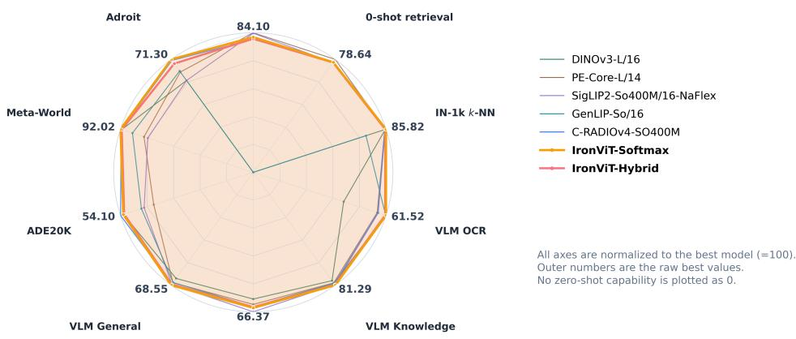
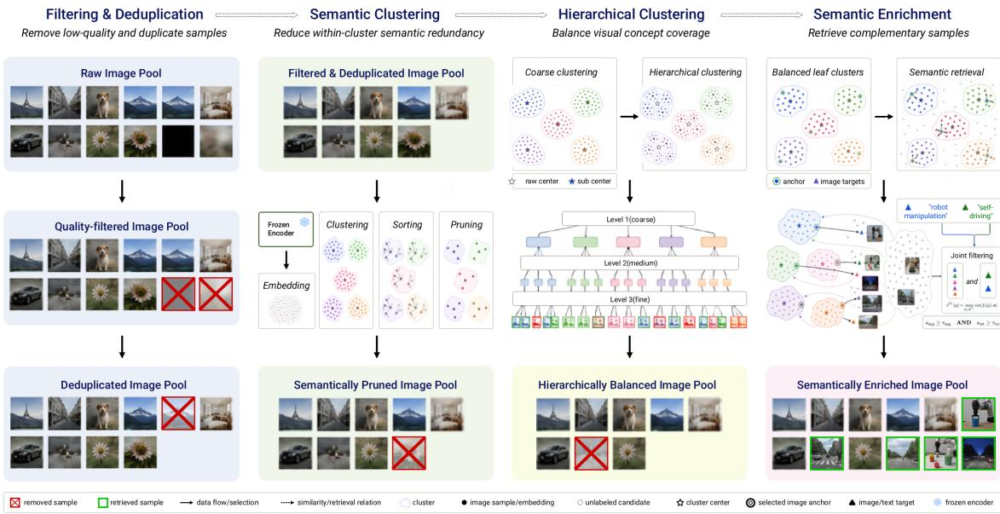
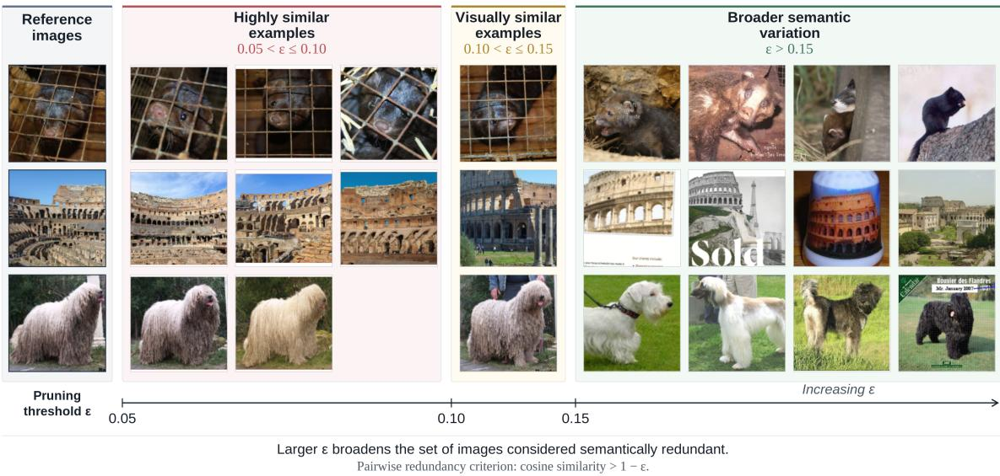
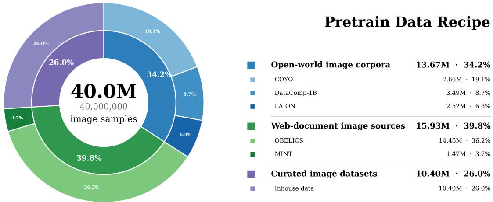
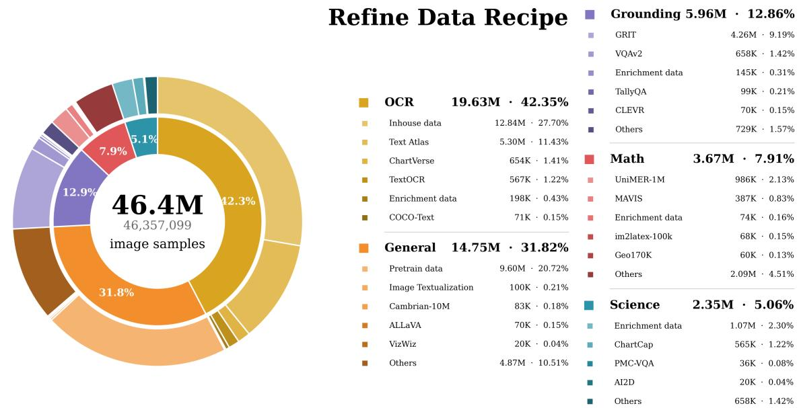
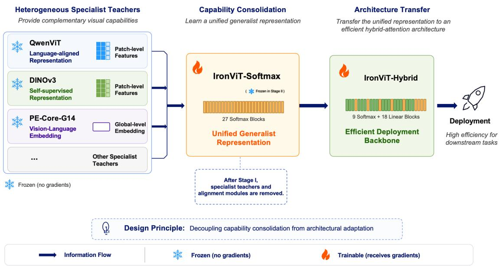
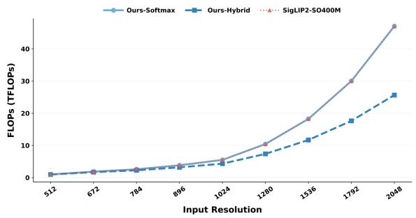
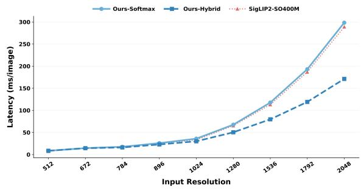
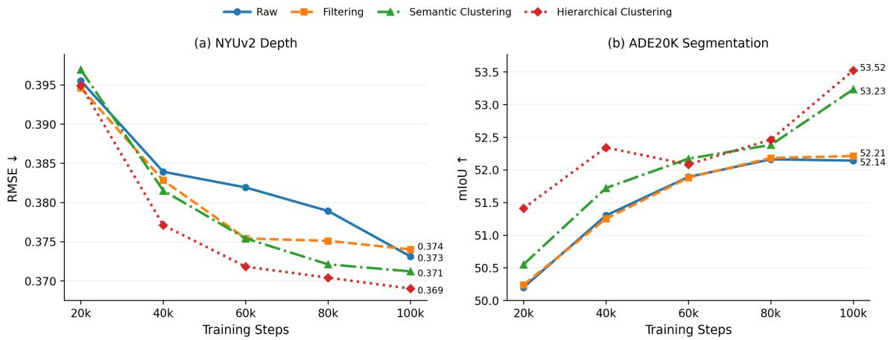
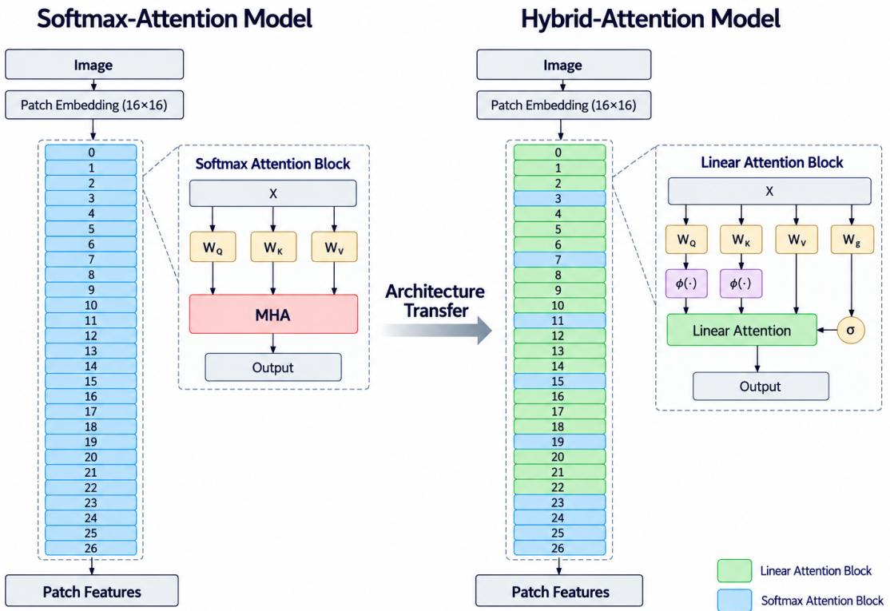

# IronViT: Toward Efficient Generalist Visual Representation Learning

Jiaxi Huang∗, Yueqi Hu∗, Xin Zhu∗,‡, Xiaopeng Zhang, Huiting Qiao, Yanglin Zhang, Zefeng Ji, Rongxue Li, Yifei Xu, Huiying Yu, Wei Liu, Jiayin Zheng, Yinggan Xu, Peipeng Chen, Yin Zhang§, Jian Yao§

Robotics Foundation Model Team, Xpeng Inc.

## Abstract

A generalist vision encoder must capture semantic, spatial, language-aligned, and action-relevant cues within a unified representation, yet softmax attention underlying today’s most capable visual backbones becomes prohibitively expensive at high resolution. A natural attempt to address both challenges is to distill multiple specialist teachers directly into an efficient architecture. We find that directly coupling these objectives degrades representation quality, as the student must simultaneously reconcile heterogeneous capabilities and adapt them to a different token-mixing architecture. We introduce IronViT, built on a simple principle: consolidate capabilities before constraining computation. IronViT first distills complementary specialists into a softmax attention capability bridge, then progressively transfers the consolidated representation to a hybrid softmax–linear attention encoder. A purpose-built data pipeline further curates the distillation corpus for higher information density and broader domain coverage. Across recognition, retrieval, dense prediction, multimodal understanding, and robotic learning, Iron-ViT is competitive with leading specialist and generalist vision encoders. The softmax bridge achieves the strongest aggregate performance in multimodal understanding and robotic learning among the evaluated backbones, while the hybrid encoder retains broad transfer performance with an efficiency advantage that grows with input resolution. Together, these results show that consolidating capabilities before architectural conversion can yield a generalist visual encoder without inheriting the prohibitive high-resolution cost of conventional softmax attention.

  
Figure 1: Capability profile of IronViT and representative baselines.

## Contents

1 Introduction 4   
2 Data Curation 5   
2.1 Filtering and deduplication 6   
2.2 Semantic clustering and in-cluster pruning . 6   
2.3 Hierarchical balanced sampling . 6   
2.4 Semantic enrichment 7   
2.5 Training corpora . 8   
3 Method 8   
3.1 Problem Formulation . 8   
3.2 Stage I: Heterogeneous Capability Consolidation 9   
3.2.1 Complementary Specialist Teachers 9   
3.2.2 Capability Bridge . 10   
3.2.3 Progressive Capability Learning 10   
3.3 Stage II: Cross-Architecture Representation Transfer 12   
3.3.1 Hybrid Attention Student Architecture . 12   
3.3.2 Cross-Architecture Objectives 12   
3.3.3 Progressive Architecture-Transfer Curriculum . 12   
Experiments 12   
4.1 Classification 13   
4.2 Retrieval . 14   
4.3 Dense vision tasks . 14   
4.4 VLM visual encoder 14   
4.5 Robotic learning . 15   
4.6 Capability retention from specialist teachers . 16   
4.7 Efficiency at high resolution 17   
4.8 Ablation studies . 17   
4.8.1 Data curation 18   
4.8.2 Two-stage distillation . 19   
4.8.3 Multi-phase training curriculum 19   
5 Conclusion 20   
A Additional Details 24   
A.1 Data curation details 25   
A.2 Training details 25   
A.2.1 Training hyperparameters 25   
A.2.2 Per-teacher alignment 25   
A.2.3 Backbone architectures 25   
A.3 Evaluation protocols and results 26   
A.3.1 Data curation ablation 26   
A.3.2 Classification . 27   
A.3.3 Image–text retrieval 27   
A.3.4 Dense prediction 27   
A.3.5 VLM 28   
A.3.6 Robotic learning 28   
A.3.7 Detailed VLM results . 28

## 1 Introduction

Visual representation learning is shifting from task-specific models toward general-purpose backbones that support a wide range of perception and embodied intelligence tasks. Modern Vision Transformers (ViTs) now transfer across image classification [1], semantic and instance segmentation [2, 3], monocular depth estimation [4], vision–language understanding [5], and robotic control [6]. Yet progress in these areas has been driven by different supervision sources and optimization objectives, resulting in representations with distinct strengths and trade-offs. Classification models emphasize category-level semantics but often underrepresent fine-grained spatial structure; dense prediction models preserve local detail but are less suited to open-vocabulary recognition; vision–language models align visual and linguistic spaces but may sacrifice dense-feature quality; and robot-learning representations must capture action-relevant cues that are rarely emphasized in static image datasets. Obtaining a backbone that performs strongly across all of these capabilities is therefore difficult under any single training paradigm.

Multi-teacher distillation [7–10] provides a natural way to bridge this fragmentation. Rather than learning semantic, geometric, language-aligned, and action-relevant representations entirely from raw data, a student can inherit capabilities already encoded by specialized foundation models. This is particularly attractive when training data and compute are limited, as distillation can directly exploit mature teacher feature spaces instead of rediscovering these representations from scratch. Consolidating heterogeneous teachers, however, remains challenging. Their representations differ in dimensionality, spatial resolution, semantic abstraction, and invariance properties, while their supervisory signals may be redundant or conflicting on the same input. A successful generalist therefore requires a coherent representation space in which complementary capabilities can coexist.

Beyond capability consolidation, efficiently deploying a generalist vision backbone remains challenging. Most high-capacity vision foundation models rely on softmax self-attention, whose time and memory costs grow quadratically with the number of visual tokens. This bottleneck becomes particularly pronounced in dense prediction, high-resolution vision–language reasoning, multi-view perception, and temporally extended robotic observations, where preserving spatial or temporal detail produces long token sequences. Linear attention mechanisms [11] can reduce this quadratic dependence, but they exhibit optimization behavior and inductive biases that differ from those of softmax attention. Training such architectures typically requires substantial pretraining, while directly replacing softmax attention in a pretrained model can disrupt representations that are important for downstream transfer.

A seemingly natural solution is to distill all specialist teachers directly into a hybrid attention student. This formulation, however, couples two distinct transfer problems. The first is a capability gap: the student must reconcile heterogeneous semantic, spatial, geometric, multimodal, and action-relevant capabilities. The second is an architectural gap: representations learned with softmax attention must be transferred to a different token-mixing architecture. Solving both simultaneously requires the hybrid attention student to discover a shared representation space while adapting that space to a new attention operator. Architectural mismatch may interfere with teacher aggregation, while conflicting teacher signals may in turn hinder architectural adaptation. This motivates a simple principle: Capabilities should be consolidated before computation is constrained.

Based on this principle, we introduce IronViT, a two-stage framework for building an efficient generalist vision backbone. We first distill complementary specialist teachers into a unified softmax attention ViT whose representations cover recognition, vision–language, and robotic tasks. This model serves as an intermediate capability bridge that consolidates heterogeneous knowledge into a coherent representation. We then distill the unified model into a hybrid attention backbone, transferring its learned capabilities while improving efficiency at high resolution and long sequence lengths. By separating capability consolidation from architectural adaptation, our framework decomposes the joint multi-teacher, cross-architecture problem into two more controlled stages.

This decoupling also places stronger demands on the training data. Multi-teacher distillation benefits from samples that provide informative supervision across complementary capabilities while limiting redundancy under a practical training budget. We therefore construct a purpose-built data pipeline that selects, enriches, and balances training samples for multi-teacher distillation. With this pipeline, IronViT achieves broad multi-task transfer using fewer than 100M curated training images and a total of 2,336 H200 GPU-hours across both distillation stages.

The benchmark-level profile in Figure 1 summarizes the empirical performance of IronViT across representative recognition, retrieval, dense prediction, multimodal reasoning, and robotic-control evaluations. The intermediate softmax attention model successfully consolidates complementary teacher capabilities, while the resulting hybrid attention model preserves most of this performance with substantially improved efficiency in high-resolution and long-sequence regimes. Moreover, the two-stage formulation consistently outperforms direct multi-teacher distillation into the same hybrid attention student across our ablation settings, supporting the value of capability consolidation before architectural adaptation.

  
Figure 2: Overview of the proposed data curation framework.

The remainder of this paper is organized as follows. Section 2 details our distillation-oriented data curation pipeline, including redundancy reduction, coverage-aware selection, and target-domain enrichment. Section 3 formulates our two-stage framework, from heterogeneous capability consolidation in a softmax attention model to cross-architecture transfer into a hybrid attention backbone. Section 4 evaluates IronViT across classification, image–text retrieval, dense prediction, vision–language understanding, and robotic learning, and further examines its accuracy–efficiency trade-off and the contribution of each design component.

## 2 Data Curation

Large-scale image collections can contain substantial low-quality and redundant data, while providing uneven coverage of visual concepts and target domains. Motivated by data-centric pretraining [12], we develop a scalable, modular image-curation framework to address these complementary challenges and construct visual training corpora tailored to our multi-stage training procedure.

Starting from a noisy web-scale image pool, the framework removes invalid and low-quality samples, suppresses both low-level and semantic redundancy, rebalances the distribution of visual concepts, and enriches underrepresented target domains with additional relevant images. It is designed to improve the information density and semantic coverage of the training data, supporting more efficient visual representation learning.

As illustrated in Figure 2, the framework comprises four modules: image-quality filtering and perceptual deduplication; semantic clustering with in-cluster pruning, following SemDeDup [13]; hierarchical k-means with resampling and balanced sampling [14]; and target-aware semantic enrichment inspired by SSE [15]. These modules are applied selectively to construct the pretraining and refinement corpora, as detailed in Section 2.5.

## 2.1 Filtering and deduplication

Quality filtering. Given the raw image corpus $\mathcal { D } _ { r a w }$ , We apply conservative image-level checks to remove invalid or severely degraded inputs before subsequent embedding-based processing. These checks use only image content and metadata and cover three categories:

1. Decoding and format failures: images that cannot be decoded, have unsupported formats, corrupted byte streams, or inconsistent image metadata are removed.

2. Resolution and geometry outliers: images with extremely small or large resolutions, invalid dimensions, or extreme aspect ratios are filtered to stabilize the visual input distribution.

3. Low visual quality: images with severe blur or visual degradation are discarded using conservative quality heuristics.

These checks target basic image validity and usability rather than semantic relevance.

Perceptual deduplication. We use DCT-based perceptual hashing [16] to identify low-level visual duplicates and remove redundant copies. This procedure targets near-identical image variants rather than semantically similar but visually distinct samples; the latter are addressed by the embedding-based pruning module in Section 2.2.

## 2.2 Semantic clustering and in-cluster pruning

Perceptual deduplication does not fully address redundancy in visual content. Following SemDeDup [13], we identify semantically redundant images in a pretrained embedding space and restrict similarity comparisons to local clusters, avoiding exhaustive comparisons over the entire corpus.

Image embedding. We extract image features using pretrained CLIP-style encoders [17], specifically ViT-H/14 models loaded through OpenCLIP. The encoders remain frozen, and each embedding $\mathbf { \hat { e } } _ { i } \in \mathbb { R } ^ { D }$ is $L _ { 2 }$ -normalized before clustering and similarity computation.

Semantic clustering. We partition the embeddings into K clusters using spherical k-means implemented in FAISS [18]. Each image is assigned to its most similar centroid:

$$
c _ { i } = \arg \operatorname* { m a x } _ { c \in \{ 1 , \ldots , K \} } \mathbf { e } _ { i } ^ { \top } { \boldsymbol { \mu } } _ { c } , \qquad d _ { i } = 1 - \mathbf { e } _ { i } ^ { \top } { \boldsymbol { \mu } } _ { c _ { i } } ,
$$

where $\mu _ { c }$ denotes the unit-normalized centroid of cluster c, and $d _ { i }$ is the sample’s distance to its assigned centroid. The resulting clusters define the neighborhoods used for redundancy detection.

In-cluster semantic pruning. Following SemDeDup, samples within each cluster are sorted by decreasing centroid distance, giving priority to less central samples. For a cluster of size m, let $\mathbf { e } _ { ( 1 ) } , \ldots , \mathbf { e } _ { ( m ) }$ denote the embeddings in this order. A sample at position $j > 1$ is removed if

$$
\operatorname* { m a x } _ { 1 \leq i < j } \mathbf { e } _ { ( i ) } ^ { \top } \mathbf { e } _ { ( j ) } > 1 - \varepsilon ,\tag{1}
$$

where all preceding samples participate in the comparison, regardless of whether they are themselves marked for removal. The first sample in each cluster is retained. We use a cosine-distance threshold of $\varepsilon = 0 . 1 5 ,$ corresponding to a cosine-similarity threshold of 0.85.

Our implementation computes similarities blockwise to avoid materializing the full within-cluster similarity matrix while preserving the pruning criterion. The retained images form the semantically pruned pool used for subsequent hierarchical balanced sampling.

## 2.3 Hierarchical balanced sampling

Semantic pruning reduces local redundancy but does not necessarily balance the distribution of visual concepts. We therefore adopt hierarchical balanced sampling following Vo et al. [14] to select a fixed-size subset while mitigating the overrepresentation of frequent visual concepts.

  
Figure 3: Effect of the semantic pruning threshold ε. Increasing ε broadens the neighborhood considered semantically redundant, resulting in progressively more aggressive in-cluster pruning.

Hierarchical clustering with resampling. We build a bottom-up clustering hierarchy over the retained image embeddings. The first level partitions image embeddings into fine-grained clusters, while each subsequent level clusters the centroids from the preceding level. Following [14], we refine the hierarchy through iterative resampling: up to $r _ { \ell }$ centroid-nearest input points are selected from each cluster at level $\dot { \ell } ,$ and the resulting subset is used to recompute the centroids. Reassignment and resampling are repeated to reduce the influence of the original sample density on centroid allocation.

Top-down balanced sampling. Given a target subset size $N _ { \mathrm { t a r g e t } } ,$ we recursively allocate the sampling budget from the coarsest clusters to the finest ones. For a parent node $p ,$ let $\mathcal { I } _ { p }$ denote its children, $B _ { p }$ its assigned budget, and $m _ { j }$ the number of available images in the subtree rooted at child $j .$ Initial child quotas are

$$
\widetilde { n } _ { j } = \operatorname* { m i n } ( q _ { p } , m _ { j } ) , \qquad \sum _ { j \in \mathcal { I } _ { p } } \widetilde { n } _ { j } \le B _ { p } ,\tag{2}
$$

where $q _ { p }$ is the largest integer not exceeding $\operatorname* { m a x } _ { j \in \mathcal { I } _ { p } } m _ { j }$ that satisfies the budget constraint. Any remaining budget is distributed by assigning one additional sample to randomly chosen children with unused capacity, yielding integer quotas that sum exactly to $B _ { p }$

This allocation is applied recursively, starting with $B _ { \mathrm { r o o t } } = N _ { \mathrm { t a r g e t } }$ . At the finest level, images are sampled uniformly at random without replacement. The procedure balances budgets among sibling subtrees while respecting their capacities, rather than enforcing identical sample counts across all clusters.

Implementation adaptations. We reuse the normalized CLIP embeddings from Section 2.2 and implement spherical k-means with FAISS [18], replacing the Euclidean clustering used in the reference implementation. To limit the cost of finest-level clustering, centroid fitting and resampling operate on a fixed subset of the retained embeddings. The final centroids are then used to assign the full retained pool in chunks; subsequent sampling budgets are computed from these full-pool assignments, not from subsample counts. Higher levels operate on the complete centroid set from the preceding level. This subsampling approximates hierarchy construction while retaining the capacity-constrained sampling procedure described above.

## 2.4 Semantic enrichment

Generic image collections may provide insufficient coverage of target visual domains. Inspired by the semantic enrichment framework of SSE [15], we retrieve relevant images from an external unlabeled pool to supplement these domains. Whereas SSE uses generated caption embeddings to expand semantic coverage, our approach performs target-conditioned retrieval using image and text anchors in a shared CLIP embedding space. The external pool aggregates multiple public and in-house image collections, including web-scale sources such as DataComp-1B [12].

Target anchors. Given a target-domain seed image set, we apply spherical k-means to its normalized CLIP embeddings and select the embedding of the nearest seed image to each centroid as an image anchor. This yields a compact anchor set ${ \mathcal { A } } ^ { \mathrm { i m g } }$ representing the target visual distribution. We additionally encode domain-level text prompts using the corresponding text encoder to obtain ${ \mathcal { A } } ^ { \mathrm { t x t } }$ . These prompts describe the desired domains rather than individual seed images. All image and text embeddings are $L _ { 2 } .$ -normalized.

Joint image–text selection. For each candidate image with embedding $\mathbf { e } _ { r } ,$ we compute its maximum similarity to each anchor set:

$$
s _ { \mathrm { i m g } } ( r ) = \operatorname* { m a x } _ { \mathbf { a } \in \mathcal { A } ^ { \mathrm { i m g } } } \mathbf { e } _ { r } ^ { \top } \mathbf { a } ,\tag{3}
$$

$$
s _ { \mathrm { t x t } } ( \boldsymbol { r } ) = \operatorname* { m a x } _ { \mathbf { t } \in \mathcal { A } ^ { \mathrm { t x t } } } \mathbf { e } _ { r } ^ { \top } \mathbf { t } .\tag{4}
$$

Because the embeddings are normalized, these inner products equal cosine similarities. A candidate is selected only when

$$
s _ { \mathrm { i m g } } ( r ) \geq \tau _ { \mathrm { i m g } } \quad \land \quad s _ { \mathrm { t x t } } ( r ) \geq \tau _ { \mathrm { t x t } } .\tag{5}
$$

The image constraint measures similarity to the seed examples, while the text constraint provides complementary domain relevance. The thresholds are calibrated separately using the empirical score percentiles, without assuming that image–image and image–text similarities share the same numerical scale.

## 2.5 Training corpora

We construct two image corpora using the curation modules described above: a pretraining corpus $\mathcal { D } _ { \mathrm { p r e } }$ and a refinement corpus $\mathcal { D } _ { \mathrm { r e f } }$ . Their use in the multi-stage training procedure is described in Section 3.

Pretraining corpus. We assemble a candidate pool of approximately 85.5 million image samples from openworld image corpora, web-document sources, and curated image collections. Image filtering and perceptual deduplication reduce the pool to approximately 79 million samples, and semantic clustering with in-cluster pruning further reduces it to approximately 64 million. Hierarchical balanced sampling then selects 40 million samples to form our final $\mathcal { D } _ { \mathrm { p r e } }$ . Its source composition is summarized in Figure 4.

Refinement corpus. The refinement corpus $\mathcal { D } _ { \mathrm { r e f } }$ combines capability-oriented image collections, including OCR, grounding, math, and science, with a subset of the pretraining data. Following image-level filtering, we apply semantic enrichment to supplement target visual domains. The final corpus contains approximately 46.4 million image samples, including 1.487 million samples retrieved through semantic enrichment. Its post-enrichment composition is summarized in Figure 5.

The cumulative ablation in Section 4.8.1 (Figure 8) evaluates the contributions of image filtering, semantic pruning, and hierarchical balanced sampling to representation quality.

## 3 Method

Figure 6 provides an overview of IronViT, which decouples capability consolidation from architectural adaptation. Stage I consolidates complementary specialist capabilities into a unified softmax attention Vision Transformer, and Stage II transfers this representation to an efficient hybrid attention backbone.

## 3.1 Problem Formulation

Let D denote the stage-specific training corpus described in Section 2, and let $\mathcal { T } = \{ T _ { k } \} _ { k = 1 } ^ { K }$ denote a set of frozen visual teachers with complementary capabilities. Given an image x, teacher $T _ { k }$ produces a target representation $T _ { k } ( x ) \in \mathbb { R } ^ { N _ { k } \times d _ { k } }$ , where $N _ { k }$ and $d _ { k }$ denote the token count and feature dimension, respectively $( N _ { k } = 1$ for a global embedding). These targets differ in spatial resolution, feature dimension, and representational emphasis.

Our objective is to train a hybrid attention encoder $H _ { \psi } ,$ parameterized by ψ, whose representations transfer effectively to recognition, dense prediction, multimodal understanding, and robotic tasks. We write its output as $H _ { \psi } ( x ) = ( \mathbf { H } _ { \mathrm { p } } ( x ) , \mathbf { h } _ { \mathrm { g } } ( x ) )$ , where the subscripts p and g denote patch and global features, respectively. Direct multi-teacher distillation jointly optimizes ψ and the teacher-specific alignment interfaces $\{ A _ { k } \} _ { k = 1 } ^ { K }$ by minimizing

  
Figure 4: Recipe for the pretraining candidate pool. The inner and outer rings show recipe components and their constituent sources, respectively. Counts and percentages refer to the 40.0M-image candidate pool after curation.

$$
\mathcal { L } _ { \mathrm { d i r e c t } } = \sum _ { k = 1 } ^ { K } \mathcal { L } _ { k } \big ( A _ { k } ( H _ { \psi } ( x ) ) , \Phi _ { k } ( T _ { k } ( x ) ) \big ) ,\tag{6}
$$

where $A _ { k }$ serves as the alignment interface for teacher $T _ { k } , \Phi _ { k }$ normalizes the teacher target, and $\mathcal { L } _ { k }$ matches the resulting features, as detailed in Stage I. Spatial alignment of dense features is implicit in this notation. We use $\mathcal { L } _ { k }$ for teacher-specific feature-matching losses and stage-specific subscripts for the overall objectives, written for an image x and aggregated over training minibatches from D. This objective couples two optimization challenges: reconciling heterogeneous teacher targets and reproducing them with a different token-mixing architecture.

We address this coupling in two stages. Stage I jointly trains a softmax attention capability bridge $B _ { \theta }$ and its teacher-specific alignment interfaces against the frozen specialist ensemble. Stage II freezes the trained bridge and uses it as the sole teacher for the hybrid attention encoder $H _ { \psi }$

## 3.2 Stage I: Heterogeneous Capability Consolidation

Stage I learns a shared representation from heterogeneous teachers while retaining softmax attention. This separates capability consolidation from adaptation to a different token-mixing operator.

## 3.2.1 Complementary Specialist Teachers

We select three teachers for their complementary capabilities: language-aligned semantics, self-supervised spatial structure, and image-level discriminability.

• QwenViT (the vision encoder of Qwen3-VL-8B [19]) provides language-aligned patch features that transfer decoder-compatible semantics to the bridge.

• DINOv3 ViT-H+/16 provides spatially precise, category-agnostic patch features learned without language supervision. We discard its CLS and register tokens.

• PE-Core-G14 provides a globally discriminative image–text representation through its pooled $\ell _ { 2 } .$ -normalized embedding, supervising the bridge’s global representation.

  
Figure 5: Recipe for the refinement corpus after semantic enrichment. The inner and outer rings show recipe components and their constituent sources, respectively. Counts and percentages refer to the final 46.4M-image refinement corpus.

All teachers remain frozen and retain their native intensity normalization, with geometrically consistent views across model inputs. For PE-Core, the input is resampled to $1 4 g _ { h } \times 1 4 g _ { w } ,$ , yielding a patch grid aligned with the student’s $g _ { h } \times g _ { w }$ token layout, where $g _ { h }$ and $g _ { w }$ denote the grid height and width. Dense targets are spatially aligned with the bridge features as described in Section 3.2.2.

## 3.2.2 Capability Bridge

The capability bridge $B _ { \theta }$ is a softmax attention ViT trained from scratch. Its output is $B _ { \theta } ( x ) = ( { \bf F } _ { \mathrm { p } } ( x ) , { \bf f } _ { \mathrm { g } } ( x ) )$ with dense patch features $\mathbf { F } _ { \mathfrak { p } } ( x ) \in \mathbb { R } ^ { N _ { \mathfrak { p } } \times d }$ and a global feature $\mathbf { f } _ { \mathrm { g } } ( x ) \in \mathbb { R } ^ { d }$ . Here, $N _ { \mathfrak { p } } = g _ { h } g _ { w }$ is the patch token count and $d = 1 1 5 2$ is the shared hidden dimension of both encoders. The backbone uses $N _ { \mathrm { r } } = 8$ learnable register tokens, giving an attention sequence length of $N = N _ { \mathrm { p } } + N _ { \mathrm { r } }$ . A multi-head attention-pooling (MAP) head derives the global representation from the patch features.

Each teacher has an alignment interface $A _ { k }$ and a target normalization operator $\Phi _ { k }$ . For dense supervision, $A _ { k }$ projects patch features into the teacher space, with token reordering and spatial resampling as needed to align prediction and target grids. For global supervision, it projects the MAP output. The interface includes both the learnable projection and the required spatial alignment.

Following the feature standardization strategy of EUPE [9], we normalize each teacher target per channel as $\Phi _ { k } ( T _ { k } ( x ) ) = ( T _ { k } ( x ) - \mu _ { k } ) / \sigma _ { k }$ , where $\mu _ { k } , \sigma _ { k } \in \mathbb { R } ^ { d _ { k } }$ are estimated before training and then held fixed. This reduces differences in target feature statistics. The alignment interfaces are trained jointly with the bridge in Stage I and are not used during Stage II. Implementation details are provided in Appendix A.2.2.

## 3.2.3 Progressive Capability Learning

QwenViT and DINOv3 provide dense patch supervision, while PE-Core-G14 provides global supervision. The matching loss for teacher $T _ { k }$ is

$$
\mathcal { L } _ { k } = \left\{ \begin{array} { l l } { 0 . 9 \mathcal { L } _ { \mathrm { c o s } } + 0 . 1 \mathcal { L } _ { \mathrm { s l l } } , } & { T _ { k } \mathrm { ~ i s ~ d e n s e } , } \\ { \mathcal { L } _ { \mathrm { c o s } } , } & { T _ { k } \mathrm { ~ i s ~ g l o b a l } . } \end{array} \right.\tag{7}
$$

Both terms act on the same aligned prediction and normalized target. Here, ${ \mathcal { L } } _ { \mathrm { c o s } }$ is the cosine distance $1 - \cos ( \cdot , \cdot )$ , and $\mathcal { L } _ { \mathrm { s l l } }$ is the smooth- ${ \boldsymbol { \mathbf { \ell } } } _ { \mathbf { \ell } } - { \boldsymbol { \ell } } _ { 1 }$ loss with $\beta = 1 0 ^ { - 3 }$ . For dense supervision, both losses are averaged over spatial positions, with $\mathcal { L } _ { \mathrm { s l l } }$ additionally averaged over feature channels. The cosine term aligns feature directions, while the smooth- ${ \bf \nabla } \cdot \ell _ { 1 }$ term also constrains feature magnitudes.

IronViT: Two-Stage Representation Transfer Framework  
  
Figure 6: Overview of IronViT. Stage I consolidates complementary specialist capabilities into a softmax attention bridge, and Stage II transfers the unified representation to a hybrid attention encoder through progressive distillation.

Table 1: Stage-I training curriculum. Phase I-A learns the capability bridge at fixed resolution, and Phase I-B refines it using native-resolution inputs.
<table><tr><td></td><td>Phase I-A</td><td>Phase I-B</td></tr><tr><td>Input geometry</td><td>Square crop, 384 × 384</td><td>Native aspect ratio</td></tr><tr><td>Token budget</td><td> $2 4 \times 2 4 = 5 7 6$  patches</td><td>≤3920 merged tokens (≈4.0M px)</td></tr><tr><td>Peak / final LR</td><td> $1 0 ^ { - 3 } / 1 0 ^ { - 5 }$ </td><td> $1 0 ^ { - 4 } / 1 0 ^ { - \bar { 6 } }$ </td></tr><tr><td>Batch / device</td><td>64</td><td>16</td></tr><tr><td>Training cost</td><td>960 H200 GPU-hours</td><td>288 H200 GPU-hours</td></tr><tr><td>Training data</td><td> $\mathcal { D } _ { \mathrm { p r e } }$ </td><td> $\mathcal { D } _ { \mathrm { r e f } }$ </td></tr></table>

Stage I jointly optimizes θ and $\{ A _ { k } \} _ { k = 1 } ^ { K }$ by minimizing the equally weighted objective

$$
\mathcal { L } _ { \mathrm { I } } = \sum _ { k = 1 } ^ { K } \mathcal { L } _ { k } ( A _ { k } ( B _ { \theta } ( \boldsymbol { x } ) ) , \Phi _ { k } ( T _ { k } ( \boldsymbol { x } ) ) ) .\tag{8}
$$

Training proceeds from fixed-resolution consolidation to native-resolution refinement, as summarized in Table 1.

Phase I-A: Fixed-resolution consolidation. We first train the bridge on 384 × 384 crops from the curated pretraining corpus $\mathcal { D } _ { \mathrm { p r e } }$ (Section 2), consolidating teacher features on a fixed token grid to provide a stable setting to reconcile the heterogeneous teacher targets.

Phase I-B: Native-resolution refinement. We continue from the Phase I-A checkpoint using native aspect ratios, a larger token budget, and the refinement corpus ${ \mathcal { D } } _ { \mathrm { r e f } }$ . We lower the learning rate while retaining the same teachers, alignment interfaces, and objective.

## 3.3 Stage II: Cross-Architecture Representation Transfer

Stage II transfers the frozen bridge’s representation to a hybrid softmax–linear backbone, following ViT-AdaLA’s sequential attention and feature alignment strategy [20].

## 3.3.1 Hybrid Attention Student Architecture

The final encoder $H _ { \psi }$ preserves the bridge’s patch embedding, token layout, feature dimensions, and output interface, while replacing softmax attention with linear mixers in 18 of the 27 blocks. Compatible parameters are inherited from the trained bridge. The linear blocks avoid materializing pairwise attention maps, while the remaining 9 softmax blocks retain exact global interactions. The complete configuration is provided in Appendix A.2.3, and its efficiency–accuracy trade-off is evaluated in Section 4.7.

## 3.3.2 Cross-Architecture Objectives

We first align each replacement linear mixer with its frozen softmax counterpart. Both receive the same normalized block input, with the frozen softmax path advancing the residual stream. This keeps preceding linear approximation errors out of the alignment inputs. The objective is

$$
\mathcal { L } _ { \mathrm { I I } } ^ { \mathrm { a t t n } } = \frac { 1 } { \lvert S _ { \mathrm { l i n } } \rvert N d } \sum _ { b \in S _ { \mathrm { l i n } } } \Vert \mathbf { O } _ { b } ^ { \mathrm { l i n } } - \mathbf { O } _ { b } ^ { \mathrm { s o f t } } \Vert ^ { 2 } ,\tag{9}
$$

where $ { S _ { \mathrm { l i n } } }$ indexes the replaced attention blocks, $\mathbf { O } _ { b } ^ { \mathrm { s o f t } } , \mathbf { O } _ { b } ^ { \mathrm { l i n } } \in \mathbb { R } ^ { N \times d }$ denote the output token sequences after attention output projection and before residual addition at block b. Here, N includes patch and register tokens. The loss averages squared errors over selected blocks, tokens, and feature channels.

We then directly match the student’s final patch and global features to the bridge outputs, which have the same dimensions. Using the matching losses in Eq. (7), with no teacher-specific alignment or target standardization, the full-model objective is

$$
\begin{array} { r l } & { \mathcal { L } _ { \mathrm { I I } } ^ { \mathrm { a r c h } } = \mathcal { L } _ { \mathrm { c o s } } ( { \bf h } _ { \mathrm { g } } , { \bf f } _ { \mathrm { g } } ) } \\ & { ~ + 0 . 9 \mathcal { L } _ { \mathrm { c o s } } ( \mathbf { H } _ { \mathrm { p } } , { \bf F } _ { \mathrm { p } } ) + 0 . 1 \mathcal { L } _ { \mathrm { s l 1 } } ( \mathbf { H } _ { \mathrm { p } } , { \bf F } _ { \mathrm { p } } ) . } \end{array}\tag{10}
$$

Matching only the final outputs leaves intermediate features free to adapt to the new mixers.

## 3.3.3 Progressive Architecture-Transfer Curriculum

The three-phase curriculum progresses from local attention alignment to full-model distillation and nativeresolution refinement (Table 2).

Phase II-A: Attention-module alignment. We first optimize the replacement linear mixers using Eq. (9), keeping the rest of the transferred backbone frozen. This initializes the mixers for end-to-end adaptation.

Phase II-B: Fixed-resolution full-model distillation. We then unfreeze the complete student and optimize $\mathcal { L } _ { \mathrm { I I } } ^ { \mathrm { a r c h } }$ at fixed resolution using $\mathcal { D } _ { \mathrm { p r e } }$ , allowing inherited and replacement components to co-adapt to the bridge targets.

Phase II-C: Native-resolution refinement. Finally, we continue full-model distillation with native aspect ratios and ${ \mathcal { D } } _ { \mathrm { r e f } }$ , retaining the frozen bridge and $\mathcal { L } _ { \mathrm { I I } } ^ { \mathrm { a r c h } }$ . Optimization settings are reported in Appendix A.2.1.

## 4 Experiments

We evaluate both stages of IronViT: the softmax attention capability bridge IronViT-Softmax and the final hybrid attention encoder IronViT-Hybrid. The two models share the same macro-architecture and output interfaces, with similar parameter counts, allowing us to assess how well the consolidated capabilities are retained after cross-architecture transfer. We compare them with publicly available encoders of similar scale: DINOv3-L/16 [21], PE-Core-L/14 [22], SigLIP2-So400M/16-NaFlex [23], GenLIP-So/16 [24], and C-RADIOv4-SO400M [25]. Together, these baselines represent self-supervised, contrastive vision–language, generative language–image, and multi-teacher distillation paradigms. Their vision encoders contain approximately 0.30–0.42B parameters. The larger Stage-I teachers are evaluated separately as non-scale-matched references in Section 4.6.

Table 2: Stage-II architecture-transfer curriculum. The three phases progressively expand the trainable parameter set and input geometry while retaining the frozen capability bridge as teacher.
<table><tr><td></td><td>Phase II-A</td><td>Phase II-B</td><td>Phase II-C</td></tr><tr><td>Objective</td><td> ${ \mathcal { L } } _ { \mathrm { I I } } ^ { \mathrm { a t t n } }$ </td><td> $\mathcal { L } _ { \mathrm { I I } } ^ { \mathrm { a r c h } }$ </td><td> $\mathcal { L } _ { \mathrm { I I } } ^ { \mathrm { a r c l } }$  1</td></tr><tr><td>Trainable parameters</td><td>Linear mixers only</td><td>Complete student</td><td>Complete student</td></tr><tr><td>Input geometry</td><td> $\mathrm { S q u a r e } , 3 8 4 \times 3 8 \dot { 4 }$ </td><td>Square, 384 × 384</td><td>Native aspect ratio</td></tr><tr><td>Token budget</td><td> $2 4 \times 2 4 = 5 7 6 \mathrm { p a t c h e s }$ </td><td> $2 4 \times 2 4 = 5 7 6 \mathrm { p a t c h e s }$ </td><td>≤ 3920 merged tokens</td></tr><tr><td>Peak LR</td><td> $1 0 ^ { - 2 }$ </td><td> $1 0 ^ { - 4 }$ </td><td> $1 0 ^ { - 4 }$ </td></tr><tr><td>Batch / device</td><td>32</td><td>16</td><td>16</td></tr><tr><td>Training cost</td><td>32 H200 GPU-hours</td><td>768 H200 GPU-hours</td><td>288 H200 GPU-hours</td></tr><tr><td>Training data</td><td> $\mathcal { D } _ { \mathrm { p r e } }$ </td><td> $\mathcal { D } _ { \mathrm { p r e } }$ </td><td> $\mathcal { D } _ { \mathrm { r e f } }$ </td></tr></table>

Table 3: ImageNet recognition accuracy (top-1, %). Zero-shot results are reported on ImageNet-1k (IN-1k), ImageNet-V2 (V2), ImageNet-R (R), ImageNet-A (A), and ImageNet-Sketch (Sk); Avg. is their unweighted mean. Linear probing and k-NN are evaluated on ImageNet-1k only. A dash indicates that zero-shot evaluation is not applicable.
<table><tr><td></td><td colspan="6">Zero-shot</td><td>| Linear probe</td><td>k-NN</td></tr><tr><td>Method</td><td>IN-1k</td><td>V2</td><td>R</td><td>A</td><td>Sk</td><td>Avg.</td><td>IN-1k</td><td>IN-1k</td></tr><tr><td>DINOv3-L/16 [21]</td><td></td><td></td><td></td><td></td><td></td><td></td><td>87.07</td><td>85.42</td></tr><tr><td>PE-Core-L/14 [22]</td><td>83.56</td><td>77.91</td><td>95.31</td><td>90.24</td><td>73.47</td><td>84.10</td><td>87.17</td><td>85.01</td></tr><tr><td>SigLIP2-So400M-NaFlex [23]</td><td>83.81</td><td>77.75</td><td>95.78</td><td>85.56</td><td>75.99</td><td>83.78</td><td>87.45</td><td>85.28</td></tr><tr><td>GenLIP-So/16 [24]</td><td></td><td></td><td></td><td></td><td></td><td></td><td>71.25</td><td>72.88</td></tr><tr><td>C-RADIOv4-SO400M [25]</td><td>81.14</td><td>75.05</td><td>94.59</td><td>80.92</td><td>68.91</td><td>80.12</td><td>87.33</td><td>85.04</td></tr><tr><td>IronViT-Softmax</td><td>83.27</td><td>76.91</td><td>94.13</td><td>81.99</td><td>71.18</td><td>81.50</td><td>87.35</td><td>85.82</td></tr><tr><td>IronViT-Hybrid</td><td>82.88</td><td>76.20</td><td>93.48</td><td>79.89</td><td>70.22</td><td>80.53</td><td>87.12</td><td>85.37</td></tr></table>

We use official checkpoints for all encoders and follow the task-specific preprocessing protocols described in Appendix A.3, with model-specific input normalization. Unless otherwise specified, the visual backbones remain frozen. Each downstream task consumes the output representation specified in its corresponding evaluation protocol. In the standard benchmark tables, the best and second-best results are bolded and underlined, respectively; any task-specific conventions are stated in the corresponding captions. We evaluate the generality of the learned representations across five complementary capability dimensions: visual recognition, image–text retrieval, dense prediction, multimodal understanding, and robotic learning. Detailed evaluation protocols are provided in the corresponding subsections.

## 4.1 Classification

We evaluate image recognition under zero-shot and frozen-feature settings. Zero-shot classification is evaluated on ImageNet-1k [26] and four distribution-shift variants: ImageNet-V2 [27], ImageNet-Sketch [28], ImageNet-Rendition (ImageNet-R) [29], and ImageNet-Adversarial (ImageNet-A) [30]. For models with languagealigned representations, we use the corresponding text tower; our models are coupled with the PE-Core-G14 text tower through the PE-aligned adapter A , while C-RADIOv4 uses its SigLIP2-g adapter with the corresponding SigLIP2-giant text tower. We further assess frozen visual representations on ImageNet-1k using linear probing and k-NN classification. All models follow the same evaluation protocol for each setting. Full implementation details are provided in Appendix A.3.2.

As shown in Table 3, IronViT-Softmax yields highly discriminative frozen representations, ranking first under k-NN classification and second under linear probing. IronViT-Hybrid closely preserves this capability after architecture transfer. In the zero-shot setting, PE-Core and SigLIP2 achieve the strongest average performance, consistent with their direct vision–language pretraining. Nevertheless, IronViT-Softmax outperforms the comparable multi-teacher baseline C-RADIOv4 on four of the five datasets and by 1.37 points on average, while IronViT-Hybrid remains competitive. These results indicate that capability consolidation produces strong visual representations with effective language alignment, and that these properties are largely retained after transfer to the hybrid attention architecture.

Table 4: Zero-shot image–text retrieval on COCO and Flickr30k (Recall@1). Avg. is the unweighted mean across both datasets and retrieval directions. Only models with text-aligned representations are included.
<table><tr><td rowspan="2">Method</td><td colspan="2">COCO (R@1)</td><td colspan="2">Flickr30k (R@1)</td><td rowspan="2"> $\operatorname { A v g } .$ </td></tr><tr><td>T→I</td><td>I→T</td><td>T→I</td><td>I→T</td></tr><tr><td>PE-Core-L/14 [22]</td><td>56.98</td><td>76.04</td><td>85.74</td><td>95.80</td><td>78.64</td></tr><tr><td>SigLIP2-So400M-NaFlex [23]</td><td>56.24</td><td>72.28</td><td>83.12</td><td>94.40</td><td>76.51</td></tr><tr><td>C-RADIOv4-SO400M [25]</td><td>56.26</td><td>71.38</td><td>83.84</td><td>94.50</td><td>76.50</td></tr><tr><td>IronViT-Softmax</td><td>56.33</td><td>71.36</td><td>84.24</td><td>94.70</td><td>76.66</td></tr><tr><td>IronViT-Hybrid</td><td>56.22</td><td>70.66</td><td>84.92</td><td>94.10</td><td>76.48</td></tr></table>

Table 5: Dense prediction with frozen visual encoders. We report mIoU on ADE20K semantic segmentation and RMSE on NYUv2 depth estimation.
<table><tr><td>Method</td><td>ADE20K mIoU ↑</td><td>NYUv2 RMSE↓</td></tr><tr><td>DINOv3-L/16 [21]</td><td>52.86</td><td>0.320</td></tr><tr><td>PE-Core-L/14 [22]</td><td>40.57</td><td>0.611</td></tr><tr><td>SigLIP2-So400M-NaFlex [23]</td><td>44.48</td><td>0.459</td></tr><tr><td>GenLIP-So/16 [24]</td><td>45.59</td><td>0.484</td></tr><tr><td>C-RADIOv4-SO400M [25]</td><td>54.10</td><td>0.295</td></tr><tr><td>IronViT-Softmax</td><td>52.97</td><td>0.339</td></tr><tr><td>IronViT-Hybrid</td><td>52.6</td><td>0.343</td></tr></table>

## 4.2 Retrieval

We evaluate cross-modal retrieval on COCO [31] and Flickr30k [32], reporting Recall@1 for both image-totext and text-to-image retrieval. We use the same model-specific vision–language interfaces as in zero-shot classification and exclude models without text-aligned representations. Retrieval-specific details are provided in Appendix A.3.3.

As shown in Table 4, IronViT-Softmax achieves the second-best overall retrieval performance and slightly outperforms the comparable multi-teacher baseline C-RADIOv4 on average, demonstrating that strong crossmodal alignment is retained during capability consolidation. IronViT-Hybrid largely preserves text-to-image retrieval, but degrades more noticeably in the reverse direction, suggesting that this retrieval direction is somewhat more sensitive to the representation changes introduced by softmax-to-hybrid transfer.

## 4.3 Dense vision tasks

We evaluate the spatial quality of frozen representations on ADE20K semantic segmentation [33] and NYUv2 monocular depth estimation [34]. The two evaluations follow the DINOv2 linear-probe [2] and TIPS protocols [35], respectively. All encoders use identical task-specific training and inference settings: ADE20K uses $5 1 2 ^ { 2 }$ training and sliding-window crops, whereas NYUv2 retains its native 480 × 640 resolution. This keeps the task-side evaluation settings consistent across encoders, so performance differences primarily reflect the frozen visual representations. Full implementation details are provided in Appendix A.3.4.

As shown in Table 5, IronViT-Softmax ranks second on ADE20K segmentation and remains competitive with the spatially specialized DINOv3 on NYUv2 depth, while outperforming all language-pretrained baselines on both tasks. IronViT-Hybrid closely matches its segmentation performance and incurs only a modest degradation in depth estimation, indicating that dense spatial representations are largely preserved after architecture transfer. Together with the classification and retrieval results, these findings show that IronViT remains competitive across both semantic and spatial evaluations, despite the different strengths of languagealigned and dense-prediction baselines.

## 4.4 VLM visual encoder

We evaluate each encoder as the vision tower in a controlled LLaVA-NeXT [36] pipeline with a Qwen2.5-7B-Instruct decoder [37]. The connector, training data, and optimization schedule are held fixed across models to enable a controlled comparison of the visual representations. Following LLaVA-NeXT, the vision encoder is frozen during connector alignment and unfrozen for joint optimization during the second-stage instruction tuning. Evaluation spans 22 benchmarks covering OCR and document understanding, knowledge and diagram reasoning, vision-centric perception, and general multimodal understanding. Full training and evaluation details are provided in Appendix A.3.5.

Table 6: Multimodal understanding with each encoder as the vision tower in a controlled LLaVA-NeXT setup. Italicized rows report unweighted family means, and the final row averages all 22 benchmarks. Entries are accuracy unless noted; the raw MME Perception score is divided by 20 when computing means.
<table><tr><td rowspan="2"></td><td rowspan="2">DINOv3-L/16</td><td rowspan="2">PE-Core-L/14</td><td rowspan="2">SigLIP2</td><td rowspan="2">GenLIP</td><td rowspan="2">C-RADIOv4</td><td colspan="2">IronViT</td></tr><tr><td>Softmax</td><td>Hybrid</td></tr><tr><td>Benchmark OCR and document understanding</td><td>[21] 41.90</td><td>[22] 57.43</td><td>[23] 57.94</td><td>[24] 61.34</td><td>[25] 57.73</td><td>61.52</td><td>61.14</td></tr><tr><td></td><td>47.25</td><td>66.83</td><td>68.16</td><td>70.55</td><td>66.40</td><td>68.89</td><td>67.86</td></tr><tr><td>TextVQA [38] DocVQA [39]</td><td>51.46</td><td>72.93</td><td>71.38</td><td>77.30</td><td>70.99</td><td>76.99</td><td>76.34</td></tr><tr><td>OCRBench [40] (total acc.)</td><td>36.60</td><td>54.80</td><td>57.40</td><td>62.50</td><td>57.60</td><td>64.20</td><td>62.90</td></tr><tr><td>ChartQA [41]</td><td>57.72</td><td>72.64</td><td>72.32</td><td>74.64</td><td>73.44</td><td>75.68</td><td>75.80</td></tr><tr><td>OCRBench-v2 [42] (total acc.)</td><td>16.47</td><td>19.95</td><td>20.42</td><td>21.72</td><td>20.21</td><td>21.85</td><td>22.82</td></tr><tr><td>Knowledge and diagram reasoning</td><td>78.04</td><td>79.66</td><td>80.86</td><td>79.86</td><td>80.40</td><td>81.29</td><td>80.96</td></tr><tr><td></td><td></td><td></td><td></td><td></td><td></td><td></td><td></td></tr><tr><td>ScienceQA [43] AI2D [44]</td><td>79.63 76.46</td><td>82.08 77.23</td><td>82.53 79.18</td><td>80.57 79.15</td><td>81.40 79.40</td><td>82.06 80.51</td><td>81.99 79.92</td></tr><tr><td>Vision-centric perception</td><td>60.29</td><td>62.84</td><td>66.37</td><td></td><td></td><td></td><td></td></tr><tr><td></td><td></td><td></td><td></td><td>63.95</td><td>64.01</td><td>64.48</td><td>64.12</td></tr><tr><td>RealWorldQA [45] POPE [46] (F1)</td><td>63.14 87.72</td><td>63.27 87.38</td><td>65.23 87.19</td><td>63.79</td><td>64.44</td><td>64.84</td><td>63.66</td></tr><tr><td>MMVP [47]</td><td>46.67</td><td>52.67</td><td>54.00</td><td>87.54</td><td>88.10 54.67</td><td>86.43</td><td>87.24</td></tr><tr><td>CV-Bench-2D [48] (Overall)</td><td>63.38</td><td>68.00</td><td>68.34</td><td>52.00</td><td>68.83</td><td>52.00 66.88</td><td>50.00</td></tr><tr><td>CV-Bench-3D [48] (Overall)</td><td>61.00</td><td>68.83</td><td>63.33</td><td>67.36 68.42</td><td>69.50</td><td>66.08</td><td>65.82</td></tr><tr><td>WhatsUp [49]</td><td>69.23</td><td>65.74</td><td>65.56</td><td></td><td>65.05</td><td></td><td>66.00</td></tr><tr><td>HallusionBench [50]</td><td>58.46</td><td>58.90</td><td>60.94</td><td>66.65</td><td></td><td>68.26 63.24</td><td>67.93</td></tr><tr><td>BLINK [51]</td><td>42.71</td><td>44.13</td><td>42.19</td><td>60.50</td><td>61.38</td><td></td><td>61.29</td></tr><tr><td>CountBenchQA [52]</td><td>50.31</td><td>56.67</td><td>90.55</td><td>43.82 65.50</td><td>41.50 62.63</td><td>42.35 70.23</td><td>42.82</td></tr><tr><td>General multimodal understanding</td><td></td><td></td><td></td><td></td><td></td><td></td><td>72.28</td></tr><tr><td></td><td>64.46</td><td>67.08</td><td>67.97</td><td>66.92</td><td>67.76</td><td>68.55</td><td>68.08</td></tr><tr><td>GQA [53]</td><td>64.10</td><td>65.65</td><td>65.20</td><td>64.96</td><td>65.41</td><td>64.99</td><td>65.04</td></tr><tr><td>MME [54] (Perception)</td><td>1492.04</td><td>1636.25</td><td>1640.09</td><td>1609.74</td><td>1586.16</td><td>1650.76</td><td>1630.15</td></tr><tr><td>MMStar [55]</td><td>49.47</td><td>50.60</td><td>52.80</td><td>52.27</td><td>54.07</td><td>56.27</td><td>55.20</td></tr><tr><td>SEEDBench-IMG [56]</td><td>72.37</td><td>74.51</td><td>74.89 84.62</td><td>74.00</td><td>75.00</td><td>74.18</td><td>74.27</td></tr><tr><td>MMBench-dev-EN [57]</td><td>78.61 47.62</td><td>82.77 47.14</td><td>48.29</td><td>81.54</td><td>84.20</td><td>85.31</td><td>84.87</td></tr><tr><td>MMMU [58] Average (all 22)</td><td>58.86</td><td>64.30</td><td>66.21</td><td>48.29 65.62</td><td>48.57 65.10</td><td>48.00 66.44</td><td>47.62 66.05</td></tr></table>

As shown in Table 6, IronViT-Softmax achieves the best overall average and leads three of the four capability families: OCR and document understanding, knowledge and diagram reasoning, and general multimodal understanding. It also ranks second on vision-centric perception, indicating that the consolidated representation transfers broadly rather than relying on a single benchmark category. IronViT-Hybrid remains competitive after architecture transfer, ranking second in both knowledge and diagram reasoning and general multimodal understanding, with a 0.39-point reduction in the overall average. Together with its strong dense-prediction performance, these results demonstrate that IronViT combines multimodal semantic reasoning with spatial perception, while the hybrid attention model retains most of this generality under a more efficient architecture.

## 4.5 Robotic learning

We evaluate frozen visual representations for embodied control on CortexBench [59], using two dexterousmanipulation tasks from Adroit [60] (pen, relocate) and five tabletop tasks from Meta-World [61] (assembly, bin-picking, button-press-topdown, drawer-open, and hammer). Following the Theia protocol [10], visual features are coupled with a lightweight behavior-cloning policy while the encoder remains frozen. All models share the same policy, demonstrations, and evaluation protocol; implementation details are provided in Appendix A.3.6.

Table 7: CortexBench manipulation success rate (%). Italicized rows average the tasks within each suite, and the final row averages all seven tasks. Subscripts denote standard deviations across seeds.
<table><tr><td></td><td>DINOv3-L/16</td><td>PE-Core-L/14</td><td> $\mathrm { S i g L I P 2 }$ </td><td>GenLIP</td><td>C-RADIOv4</td><td colspan="2">IronViT</td></tr><tr><td>Benchmark</td><td>[21]</td><td>[22]</td><td>[23]</td><td>[24]</td><td>[25]</td><td>Softmax</td><td>Hybrid</td></tr><tr><td>Adroit [60]</td><td>58.00</td><td>63.35</td><td>58.00</td><td>64.00</td><td>70.67</td><td>71.30</td><td>68.65</td></tr><tr><td>pen relocate</td><td> $7 3 . 3 3 \pm 6 . 1 1$ </td><td>70.7 ±6.1</td><td> $7 3 . 3 3 \pm 8 . 3 3$ </td><td> $7 3 . 3 3 \pm 8 . 3 3$ </td><td> $\underline { { 7 4 . 6 7 } } \pm 2 . 3 1$ </td><td> $7 7 . 3 { \pm } 2 . 3 $ </td><td> $7 7 . 3 { \pm } 4 . 6 $ </td></tr><tr><td></td><td> $4 2 . 6 7 \pm 9 . 2 4$ </td><td>56.0±4.0</td><td> $4 2 . 6 7 \pm 9 . 2 4$ </td><td> $5 4 . 6 7 \pm 6 . 1 1$ </td><td> ${ \bf 6 6 . 6 7 \pm 6 . 1 1 }$ </td><td> $6 5 . 3 \pm 6 . 1$ </td><td> $6 0 . 0 { \pm } 4 . 0 $ </td></tr><tr><td>Meta-World [61]</td><td>91.20</td><td>75.74</td><td>73.07</td><td>83.73</td><td>91.46</td><td>92.02</td><td>91.18</td></tr><tr><td>assembly</td><td> $9 4 . 6 7 \pm 9 . 2 4$ </td><td> $8 2 . 7 \pm 1 0 . 1 $ </td><td> $7 7 . 3 3 \pm 1 8 . 9 0$ </td><td> $9 3 . 3 3 \pm 8 . 3 3 $ </td><td> $\mathbf { 9 7 . 3 3 \bot } 4 . 6 2$ </td><td> $9 6 . 0 { \pm } 6 . 9$ </td><td> $\underline { { 9 7 . 3 } } \pm 4 . 6 $ </td></tr><tr><td>bin-picking</td><td> $7 7 . 3 3 \pm 8 . 3 3$ </td><td> $7 6 . 0 { \scriptstyle \pm 6 . 9 }$ </td><td> $6 6 . 6 7 \pm 6 . 1 1$ </td><td>73.33 ±2.31</td><td>73.33±12.22</td><td>82.7 ±4.6</td><td> ${ \bf 8 5 . 3 \pm 1 2 . 9 }$ </td></tr><tr><td>button-press-topdown</td><td> $\underline { { 8 8 . 0 0 } } \pm 4 . 0 0 $ </td><td> $5 2 . 0 { \pm } 4 . 0$ </td><td> $6 4 . 0 0 { \scriptstyle \pm 8 . 0 0 }$ </td><td> $6 5 . 3 3 \pm 6 . 1 1$ </td><td> $\mathbf { 8 9 . 3 3 \bot } 4 . 6 2$ </td><td> $8 6 . 7 \pm 4 . 6 $ </td><td> $8 1 . 3 { \scriptstyle \pm 8 . 3 }$ </td></tr><tr><td>drawer-open</td><td> $\mathbf { 1 0 0 . 0 0 } \pm 0 . 0 0$ </td><td>100.00</td><td> $\mathbf { 1 0 0 . 0 0 } 2 0 . 0 0$ </td><td> $\mathbf { 1 0 0 . 0 0 } { \scriptstyle \pm 0 . 0 0 }$ </td><td> $\mathbf { 1 0 0 . 0 0 } 2 0 . 0 0$ </td><td> $\mathbf { 1 0 0 . 0 } 2 0 . 0$ </td><td> $\mathbf { 1 0 0 . 0 } 2 0 . 0$ </td></tr><tr><td>hammer</td><td> $9 6 . 0 0 { \scriptstyle \pm 4 . 0 0 }$ </td><td> $6 8 . 0 { \scriptstyle \pm 1 2 . 0 }$ </td><td> $5 7 . 3 3 \pm 8 . 3 3$ </td><td> $8 6 . 6 7 \pm 9 . 2 4$ </td><td> $\mathbf { 9 7 . 3 3 } { \scriptstyle \pm 2 . 3 1 }$ </td><td> $9 4 . 7 \pm 6 . 1 $ </td><td> $9 2 . 0 { \pm } 4 . 0 $ </td></tr><tr><td>Average</td><td>81.71</td><td>72.20</td><td>68.76</td><td>78.09</td><td>85.52</td><td>86.10</td><td>84.74</td></tr></table>

Table 8: Multimodal downstream performance relative to the QwenViT teacher under the controlled setup of Section 4.4. Family and overall means follow Table 6.
<table><tr><td>Benchmark</td><td>QwenViT [19]</td><td>IronViT-Softmax</td></tr><tr><td>OCR and document understanding</td><td>63.65</td><td>61.52</td></tr><tr><td>Knowledge and diagram reasoning</td><td>80.41</td><td>81.29</td></tr><tr><td>Vision-centric perception</td><td>62.94</td><td>64.48</td></tr><tr><td>General multimodal understanding</td><td>68.20</td><td>68.55</td></tr><tr><td>Average</td><td>66.12</td><td>66.44</td></tr></table>

IronViT-Softmax achieves the highest overall success rate and leads the aggregate performance on both Adroit and Meta-World, demonstrating consistent transfer across dexterous and tabletop manipulation rather than gains confined to a single task family. This balanced performance shows that multi-teacher consolidation preserves visual features that generalize effectively to closed-loop control. Following architecture transfer, IronViT-Hybrid retains 98.4% of the overall success rate of IronViT-Softmax, while attaining the best result on bin-picking and matching it on pen. The small aggregate gap between the two variants indicates that the action-relevant structure of the consolidated representation is largely preserved by the more efficient hybrid attention architecture.

## 4.6 Capability retention from specialist teachers

To assess Stage-I capability consolidation, we compare IronViT-Softmax with each specialist teacher in its respective capability domain: language-aligned recognition and retrieval for PE-Core, spatial representation learning for DINOv3, and multimodal understanding for QwenViT. Frozen-feature recognition and dense prediction provide complementary measures of general visual quality. Together, these evaluations quantify how effectively the language, spatial, and multimodal capabilities of the three teachers are consolidated within a single encoder.

Multimodal capability. We substitute IronViT-Softmax for QwenViT in the controlled LLaVA-NeXT setup of Section 4.4. Table 8 reports capability-family and overall results; the complete benchmark-level comparison is provided in Appendix A.3.7.

Under the same downstream adaptation protocol, IronViT-Softmax matches the overall performance of QwenViT and performs slightly better in knowledge and diagram reasoning, vision-centric perception, and general multimodal understanding. This indicates that the decoder-facing capability learned from QwenViT is largely retained alongside the complementary semantic and spatial supervision from the other teachers. The remaining gap in OCR and document understanding identifies fine-grained text recognition as the least preserved aspect of the teacher’s multimodal capability.

Table 9: Comparison with the Stage-I specialist teachers across recognition, retrieval, and dense prediction. Shift denotes the mean over the four ImageNet distribution-shift benchmarks.
<table><tr><td></td><td colspan="4">Recognition</td><td colspan="4">Retrieval (R@1)</td><td colspan="2">Dense prediction</td></tr><tr><td></td><td colspan="2">Zero-shot</td><td>k-NN</td><td>Linear probe</td><td colspan="2">COCO</td><td colspan="2">Flickr30k</td><td>ADE20K</td><td>NYUv2</td></tr><tr><td>Encoder</td><td>IN-1k</td><td>Shift</td><td>IN-1k</td><td>IN-1k</td><td>T→I</td><td>I→T</td><td>T→I</td><td>I→T</td><td>mIoU↑</td><td>RMSE↓</td></tr><tr><td>PE-Core-G14 [22]</td><td>85.24</td><td>86.16</td><td>86.68</td><td>86.84</td><td>57.48</td><td>74.98</td><td>85.16</td><td>95.10</td><td>39.38</td><td>0.602</td></tr><tr><td>DINOv3-H+/16 [21]</td><td>一</td><td>一</td><td>85.55</td><td>87.59</td><td>一</td><td>一</td><td>一</td><td>1</td><td>52.83</td><td>0.327</td></tr><tr><td>QwenViT [19]</td><td>一</td><td>-</td><td>80.22</td><td>78.28</td><td>一</td><td>一</td><td>一</td><td>一</td><td>33.81</td><td>0.503</td></tr><tr><td>IronViT-Softmax</td><td>83.27</td><td>81.05</td><td>85.82</td><td>87.35</td><td>56.33</td><td>71.36</td><td>84.24</td><td>94.70</td><td>52.97</td><td>0.339</td></tr></table>

Language-aligned capability. Compared with PE-Core-G14, IronViT-Softmax largely preserves zero-shot retrieval performance, nearly matching the teacher on Flickr30k and remaining competitive on COCO. The larger gap in zero-shot classification, especially under distribution shift, suggests that class-level alignment is more sensitive to consolidation than instance-level cross-modal matching. This asymmetry may partly reflect the distillation objective: the student matches PE-Core’s visual representations without being jointly optimized with its text tower, which may alter the cross-modal geometry required for zero-shot prediction. Overall, the results demonstrate effective retention of language-aligned capability while incorporating supervision from the other specialist teachers.

Frozen and spatial representations. On frozen-feature recognition, IronViT-Softmax remains close to the strongest teacher under both k-NN and linear probing, while clearly outperforming QwenViT. Its spatial features are similarly well preserved: the student slightly exceeds DINOv3-H+/16 on ADE20K segmentation and incurs only a small increase in NYUv2 depth error. These results indicate that consolidation maintains the discriminative and spatial structure of the specialist features, rather than trading them for language or multimodal alignment.

## 4.7 Efficiency at high resolution

We compare the forward FLOPs and inference latency of IronViT-Hybrid, its softmax counterpart IronViT-Softmax, and SigLIP2-So400M-NaFlex across input resolutions from 512 to 2048 pixels per side (Figure 7). SigLIP2 provides an external baseline of comparable model size with the same patch size. We report forward FLOPs per image using two FLOPs per multiply–accumulate, excluding normalization, elementwise activations, softmax exponentiation, and RoPE.

Latency is measured at batch size 1 in bfloat16 on the same GPU, using CUDA Graph execution for all three models. We report the median CUDA-event time after warm-up, with inputs allocated on the GPU to exclude host-to-device transfer. Both IronViT variants use a fixed-resolution inference path with cached positional and sequence metadata, fused QK normalization and RoPE, and an equivalent 2D patch embedding for static images. These optimizations reduce redundant computation, synchronization, and memory traffic while preserving the model’s mathematical function. For SigLIP2, the redundant mask is omitted for unpadded inputs to enable the optimized attention backend.

Figure 7 shows a growing efficiency advantage for IronViT-Hybrid as resolution increases, with lower FLOPs and latency than both softmax baselines and the largest gains at high resolution. At 2048 × 2048, it requires approximately 45% fewer FLOPs and achieves about 1.75× speedup relative to IronViT-Softmax. This trend is consistent with the increasing contribution of quadratic attention as the token count grows: replacing 18 of 27 softmax blocks reduces this cost, while shared projection and feed-forward operations limit the gains at lower resolutions. The slightly smaller latency improvement relative to the FLOPs reduction reflects the influence of implementation and hardware efficiency. Combined with the preceding capability results, these findings demonstrate that the hybrid architecture preserves broad visual competence while substantially reducing the cost of high-resolution inference.

## 4.8 Ablation studies

We examine three design choices used throughout the main experiments: the construction of the training corpus, the two-stage factorization of multi-teacher distillation, and the coarse-to-fine curriculum within each

  
(a) Forward FLOPs per image.

  
(b) Batch-1 inference latency.  
Figure 7: Computational scaling with input resolution under a shared evaluation setup.

Table 10: Cumulative ablation of the data curation pipeline. All variants use the same student architecture, multi-teacher setup, and training configuration, and differ only in the training corpus. We report finalcheckpoint performance after 100K training steps on ImageNet robustness benchmarks and dense prediction tasks.
<table><tr><td></td><td colspan="4">ImageNet Robustness</td><td colspan="2">Dense Prediction</td></tr><tr><td>Data</td><td>IN-V2↑</td><td>IN-Sketch ↑</td><td>IN-A↑</td><td>IN-R ↑</td><td>ADE20K mIoU ↑</td><td>NYUv2 RMSE ↓</td></tr><tr><td>Raw (85M)</td><td>77.42</td><td>63.60</td><td>73.39</td><td>86.96</td><td>52.14</td><td>0.373</td></tr><tr><td>Filtering &amp; Deduplication (79M)</td><td>77.28</td><td>63.56</td><td>73.48</td><td>86.88</td><td>52.21</td><td>0.374</td></tr><tr><td>Semantic Clustering (64M)</td><td>77.87</td><td>63.60</td><td>74.55</td><td>87.48</td><td>53.23</td><td>0.371</td></tr><tr><td>Hierarchical Balanced Sampling (40M)</td><td>78.06</td><td>63.89</td><td>73.53</td><td>87.96</td><td>53.52</td><td>0.369</td></tr></table>

stage. Unless otherwise stated, variants keep the backbone scale, teacher ensemble, optimization budget, and evaluation protocol fixed.

## 4.8.1 Data curation

We evaluate the data pipeline at two stages of training. First, we study how progressive corpus curation affects representation learning during the fixed-resolution consolidation stage. We then evaluate the contribution of semantic enrichment introduced during the subsequent native-resolution refinement stage.

Pretraining corpus curation. We conduct a cumulative ablation under a fixed multi-teacher training setup. Starting from the raw image pool, we progressively apply filtering and deduplication, semantic clustering with in-cluster pruning, and hierarchical balanced sampling. All other training settings are kept identical. As shown in Table 10, progressively curated data consistently improves representation quality across ImageNet robustness and dense prediction. The gain is most pronounced on dense tasks, which are particularly sensitive to the diversity and spatial coverage of the pretraining corpus. Figure 8 further shows that semantic clustering and hierarchical balancing provide the largest gains on ADE20K and NYUv2, with the improvement emerging early during training rather than only at the final checkpoint. These results suggest that reducing semantic redundancy and balancing visual concept coverage are important contributors to the benefit of the curation pipeline.

Semantic enrichment during refinement. We next evaluate the semantic enrichment applied during the refinement stage. Unlike the preceding ablation, which modifies the composition of the pretraining corpus, this experiment examines whether introducing semantically enriched data during refinement further improves the learned representation. We compare the checkpoint immediately before refinement against the resulting checkpoint after semantic-enriched refinement, while keeping the backbone architecture and evaluation protocols unchanged.

As shown in Table 11, semantic enrichment leads to clear improvements across both recognition and dense prediction tasks. These results indicate that semantic enrichment during refinement complements the corpuslevel curation performed during pretraining, further improving both semantic robustness and dense spatial representations.

  
Figure 8: Training dynamics under progressively curated data. All variants are trained for 100K steps under the same multi-teacher configuration and evaluated every 20K steps. We report (a) NYUv2 monocular depth estimation (RMSE, lower is better) and (b) ADE20K semantic segmentation (mIoU, higher is better).

Table 11: Ablation of semantic enrichment during the refinement stage. We compare the model before refinement with the model after applying semantic-enriched refinement. The backbone architecture and evaluation protocols are kept unchanged.
<table><tr><td></td><td></td><td colspan="4">ImageNet Robustness</td><td colspan="2">Dense Prediction</td></tr><tr><td>Variant</td><td>Refinement Data</td><td>IN-V2↑</td><td>IN-Sketch ↑</td><td>IN-A↑</td><td>IN-R↑</td><td>ADE20K mIoU ↑</td><td>NYUv2 RMSE ↓</td></tr><tr><td>Before refinement</td><td>44.9M</td><td>73.63</td><td>67.74</td><td>80.72</td><td>90.30</td><td>53.50</td><td>0.365</td></tr><tr><td>+ Semantic enrichment</td><td>46.4M</td><td>74.65</td><td>68.71</td><td>81.16</td><td>92.37</td><td>53.97</td><td>0.349</td></tr><tr><td>Δ</td><td>+1.5M</td><td>+1.02</td><td>+0.97</td><td>+0.44</td><td>+2.07</td><td>+0.47</td><td>-0.016</td></tr></table>

## 4.8.2 Two-stage distillation

We next test whether the capability bridge is necessary. The direct baseline optimises the hybrid student against the full teacher ensemble in a single multi-teacher distillation run, following Eq. (6). This baseline asks the hybrid model to solve two difficult problems simultaneously: reconciling heterogeneous teacher targets and adapting those targets to a different token-mixing architecture. In contrast, our two-stage procedure first consolidates teacher capabilities into the softmax attention bridge, and only then transfers the consolidated representation to the hybrid student. Table 12 compares the two strategies across recognition, dense prediction, and VLM evaluation. For compactness, it reports the mean over the five zero-shot ImageNet benchmarks, ImageNet-1k linear-probe and k-NN accuracy, ADE20K mIoU, NYUv2 RMSE, and the mean over the 22 VLM benchmarks. Complete benchmark-level results are provided in Appendix A.3.7.

The two-stage strategy consistently outperforms direct multi-teacher distillation across all evaluation dimensions. The improvements are most pronounced in zero-shot classification, depth estimation, and VLM evaluation, with the VLM average increasing by 7.90 points and NYUv2 RMSE decreasing from 1.046 to 0.343. Gains in linear probing, k-NN, and segmentation further show that the benefit extends to both global discrimination and dense spatial representations. These results are consistent with the proposed factorization: under this comparison, introducing a softmax attention bridge before cross-architecture transfer yields stronger final representations than direct multi-teacher distillation into the hybrid student.

## 4.8.3 Multi-phase training curriculum

Finally, we evaluate the repeated training phases used inside each stage. The primary focus is Stage I, where Phase I-A learns a stable fixed-resolution multi-teacher representation and Phase I-B refines it under native aspect ratios and a larger token budget. This comparison tests whether the second training pass merely extends optimization or provides a distinct benefit by exposing the bridge to higher-resolution and variablegeometry inputs. Table 13 reports the two Stage-I checkpoints across classification, dense prediction, and VLM evaluation families; complete benchmark-level VLM results are provided in Appendix A.3.7.

Table 12: Two-stage distillation ablation.
<table><tr><td></td><td colspan="3">Classification</td><td colspan="2">Dense prediction</td><td>VLM</td></tr><tr><td>Strategy</td><td>ZS↑</td><td>LP↑</td><td>k-NN↑</td><td>Seg. ↑</td><td>Depth ↓</td><td>Avg. ↑</td></tr><tr><td>Direct multi-teacher</td><td>75.11</td><td>85.37</td><td>83.39</td><td>52.27</td><td>1.046</td><td>58.15</td></tr><tr><td>Two-stage (ours)</td><td>80.53</td><td>87.12</td><td>85.37</td><td>52.6</td><td>0.343</td><td>66.05</td></tr></table>

Table 13: Stage-I curriculum ablation across classification, dense prediction, and VLM evaluation families.
<table><tr><td></td><td></td><td colspan="2">Classification Dense prediction</td><td colspan="5">VLM</td></tr><tr><td>Stage-I checkpoint</td><td>IN-1k LP</td><td>Seg.</td><td>Depth</td><td>OCR</td><td>Know.</td><td>Percep.</td><td>General</td><td>Avg.</td></tr><tr><td>Phase I-A</td><td>86.56</td><td>52.51</td><td>0.384</td><td>59.34</td><td>80.5</td><td>62.97</td><td>68.23</td><td>65.17</td></tr><tr><td>+ Phase I-B</td><td>87.35</td><td>52.97</td><td>0.339</td><td>61.52</td><td>81.29</td><td>64.48</td><td>68.55</td><td>66.44</td></tr></table>

Adding Phase I-B improves every reported evaluation. Beyond gains in linear probing and segmentation, NYUv2 RMSE decreases from 0.384 to 0.339, consistent with stronger spatial transfer after the complete Phase I-B refinement. The VLM improvements are largest in OCR and vision-centric perception, raising the overall average by 1.27 points while also improving the knowledge and general understanding categories. This consistent pattern shows that native-resolution refinement complements fixed-resolution consolidation, strengthening geometric and visually grounded capabilities without compromising global recognition or multimodal reasoning.

## 5 Conclusion

We presented IronViT, a framework for learning efficient generalist visual representations by separating capability consolidation from architectural adaptation. Supported by curated data, a softmax attention capability bridge unifies complementary teacher representations and enables their transfer to a hybrid attention encoder. Experiments demonstrate broad downstream transfer, substantial efficiency gains at high resolution, and consistent improvements over direct multi-teacher distillation. Together, these findings suggest that establishing a shared representation before constraining its computation provides a practical path toward efficient generalist vision. The retained softmax blocks still impose quadratic cost, and transfer to video and real-world robotic deployment remains to be established.

Looking forward, IronViT provides a foundation for visual encoders that can grow in both capability and domain coverage. Mixture-of-experts architectures offer a natural route to scaling capability consolidation: specialized representation pathways and adaptive routing could accommodate an expanding set of heterogeneous teachers while reducing interference among their inductive biases. Beyond architectural scaling, continual learning could transform distillation from a one-off compression procedure into an evolving learning process. By continually absorbing deployment data, task supervision, and embodied feedback, the resulting encoder could adapt to the distinctive visual distributions encountered in autonomous driving and robotics, including specialized sensing geometries such as fisheye cameras. This could enable the student to acquire capabilities beyond those explicitly transferred from a fixed teacher ensemble, progressing from capability inheritance toward capability acquisition.

## References

[1] Alexey Dosovitskiy, Lucas Beyer, Alexander Kolesnikov, Dirk Weissenborn, Xiaohua Zhai, Thomas Unterthiner, Mostafa Dehghani, Matthias Minderer, Georg Heigold, Sylvain Gelly, et al. An Image is worth 16x16 words: Transformers for image recognition at scale. arXiv preprint arXiv:2010.11929, 2020.

[2] Maxime Oquab, Timothée Darcet, Théo Moutakanni, Huy Vo, Marc Szafraniec, Vasil Khalidov, Pierre Fernandez, Daniel Haziza, Francisco Massa, Alaaeldin El-Nouby, et al. Dinov2: Learning robust visual features without supervision. arXiv preprint arXiv:2304.07193, 2023.

[3] Alexander Kirillov, Eric Mintun, Nikhila Ravi, Hanzi Mao, Chloe Rolland, Laura Gustafson, Tete Xiao, Spencer Whitehead, Alexander C Berg, Wan-Yen Lo, et al. Segment anything. In 2023 IEEE/CVF international conference on computer vision (ICCV), pages 3992–4003. IEEE, 2023.

[4] Lihe Yang, Bingyi Kang, Zilong Huang, Xiaogang Xu, Jiashi Feng, and Hengshuang Zhao. Depth anything: Unleashing the power of large-scale unlabeled data. In 2024 IEEE/CVF Conference on Computer Vision and Pattern Recognition (CVPR), pages 10371–10381. IEEE, 2024.

[5] Xiaohua Zhai, Basil Mustafa, Alexander Kolesnikov, and Lucas Beyer. Sigmoid loss for language image pre-training. In 2023 IEEE/CVF International Conference on Computer Vision (ICCV), pages 11941–11952. IEEE, 2023.

[6] Moo Jin Kim, Karl Pertsch, Siddharth Karamcheti, Ted Xiao, Ashwin Balakrishna, Suraj Nair, Rafael Rafailov, Ethan Foster, Grace Lam, Pannag Sanketi, et al. OpenVLA: An open-source vision-languageaction model. arXiv preprint arXiv:2406.09246, 2024.

[7] Mike Ranzinger, Greg Heinrich, Jan Kautz, and Pavlo Molchanov. Am-radio: Agglomerative vision foundation model reduce all domains into one. In 2024 IEEE/CVF Conference on Computer Vision and Pattern Recognition (CVPR), pages 12490–12500. IEEE, 2024.

[8] Greg Heinrich, Mike Ranzinger, Hongxu Yin, Yao Lu, Jan Kautz, Andrew Tao, Bryan Catanzaro, and Pavlo Molchanov. RADIOv2.5: Improved baselines for agglomerative vision foundation models. In Proceedings of the IEEE/CVF Conference on Computer Vision and Pattern Recognition, pages 22487– 22497, 2025.

[9] Chenchen Zhu, Saksham Suri, Cijo Jose, Maxime Oquab, Marc Szafraniec, Wei Wen, Yunyang Xiong, Patrick Labatut, Piotr Bojanowski, Raghuraman Krishnamoorthi, et al. Efficient universal perception encoder. arXiv preprint arXiv:2603.22387, 2026.

[10] Jinghuan Shang, Karl Schmeckpeper, Brandon B May, Maria Vittoria Minniti, Tarik Kelestemur, David Watkins, and Laura Herlant. Theia: Distilling diverse vision foundation models for robot learning. arXiv preprint arXiv:2407.20179, 2024.

[11] Angelos Katharopoulos, Apoorv Vyas, Nikolaos Pappas, and François Fleuret. Transformers are RNNs: Fast autoregressive transformers with linear attention. In International conference on machine learning, pages 5156–5165. PMLR, 2020.

[12] Samir Yitzhak Gadre, Gabriel Ilharco, Alex Fang, Jonathan Hayase, Georgios Smyrnis, Thao Nguyen, Ryan Marten, Mitchell Wortsman, Dhruba Ghosh, Jieyu Zhang, et al. Datacomp: In search of the next generation of multimodal datasets. In Advances in Neural Information Processing Systems, volume 36, pages 27092–27112, 2023.

[13] Amro Abbas, Kushal Tirumala, Dániel Simig, Surya Ganguli, and Ari S Morcos. SemDeDup: Dataefficient learning at web-scale through semantic deduplication. arXiv preprint arXiv:2303.09540, 2023.

[14] Huy V Vo, Vasil Khalidov, Timothée Darcet, Théo Moutakanni, Nikita Smetanin, Marc Szafraniec, Hugo Touvron, Camille Couprie, Maxime Oquab, Armand Joulin, et al. Automatic data curation for self-supervised learning: A clustering-based approach. arXiv preprint arXiv:2405.15613, 2024.

[15] Maying Shen, Nadine Chang, Sifei Liu, and Jose M Alvarez. Sse: Multimodal semantic data selection and enrichment for industrial-scale data assimilation. In Proceedings ofthe 31st ACM SIGKDD Conference on Knowledge Discovery and Data Mining V. 1, pages 2525–2535, 2025.

[16] Christoph Zauner. Implementation and benchmarking of perceptual image hash functions. Master’s thesis, Upper Austria University of Applied Sciences, Hagenberg Campus, 2010.

[17] Alec Radford, Jong Wook Kim, Chris Hallacy, Aditya Ramesh, Gabriel Goh, Sandhini Agarwal, Girish Sastry, Amanda Askell, Pamela Mishkin, Jack Clark, et al. Learning transferable visual models from natural language supervision. In International conference on machine learning, pages 8748–8763. PmLR, 2021.

[18] Jeff Johnson, Matthijs Douze, and Hervé Jégou. Billion-scale similarity search with GPUs. IEEE transactions on big data, 7(3):535–547, 2019.

[19] Shuai Bai, Yuxuan Cai, Ruizhe Chen, Keqin Chen, Xionghui Chen, Zesen Cheng, Lianghao Deng, Wei Ding, Chang Gao, Chunjiang Ge, et al. Qwen3-vl technical report. arXiv preprint arXiv:2511.21631, 2025.

[20] Yifan Li, Seunghyun Yoon, Viet Dac Lai, Franck Dernoncourt, Jason Kuen, Yu Kong, and Trung Bui. Vit-adala: Adapting vision transformers with linear attention. arXiv preprint arXiv:2603.16063, 2026.

[21] Oriane Siméoni, Huy V Vo, Maximilian Seitzer, Federico Baldassarre, Maxime Oquab, Cijo Jose, Vasil Khalidov, Marc Szafraniec, Seungeun Yi, Michaël Ramamonjisoa, et al. Dinov3. arXiv preprint arXiv:2508.10104, 2025.

[22] Daniel Bolya, Po-Yao Huang, Peize Sun, Jang Hyun Cho, Andrea Madotto, Chen Wei, Tengyu Ma, Jiale Zhi, Jathushan Rajasegaran, Hanoona Bangalath, et al. Perception encoder: The best visual embeddings are not at the output of the network. In Advances in Neural Information Processing Systems, volume 38, pages 60884–60937, 2025.

[23] Michael Tschannen, Alexey Gritsenko, Xiao Wang, Muhammad Ferjad Naeem, Ibrahim Alabdulmohsin, Nikhil Parthasarathy, Talfan Evans, Lucas Beyer, Ye Xia, Basil Mustafa, et al. Siglip 2: Multilingual vision-language encoders with improved semantic understanding, localization, and dense features. arXiv preprint arXiv:2502.14786, 2025.

[24] Yan Fang, Mengcheng Lan, Zilong Huang, Weixian Lei, Yunqing Zhao, Yujie Zhong, Yingchen Yu, Qi She, Yao Zhao, and Yunchao Wei. Let vit speak: Generative language-image pre-training. arXiv preprint arXiv:2605.00809, 2026.

[25] Mike Ranzinger, Greg Heinrich, Collin McCarthy, Jan Kautz, Andrew Tao, Bryan Catanzaro, and Pavlo Molchanov. C-radiov4 (tech report). arXiv preprint arXiv:2601.17237, 2026.

[26] Jia Deng, Wei Dong, Richard Socher, Li-Jia Li, Kai Li, and Li Fei-Fei. ImageNet: A large-scale hierarchical image database. In 2009 IEEE Conference on Computer Vision and Pattern Recognition, pages 248–255. IEEE, 2009.

[27] Benjamin Recht, Rebecca Roelofs, Ludwig Schmidt, and Vaishaal Shankar. Do imagenet classifiers generalize to imagenet? In International conference on machine learning, pages 5389–5400. PMLR, 2019.

[28] Haohan Wang, Songwei Ge, Zachary Lipton, and Eric P Xing. Learning robust global representations by penalizing local predictive power. In Advances in Neural Information Processing Systems, volume 32, 2019.

[29] Dan Hendrycks, Steven Basart, Norman Mu, Saurav Kadavath, Frank Wang, Evan Dorundo, Rahul Desai, Tyler Zhu, Samyak Parajuli, Mike Guo, et al. The many faces of robustness: A critical analysis of out-of-distribution generalization. In 2021 IEEE/CVF International Conference on Computer Vision (ICCV), pages 8320–8329. IEEE, 2021.

[30] Dan Hendrycks, Kevin Zhao, Steven Basart, Jacob Steinhardt, and Dawn Song. Natural adversarial examples. In Proceedings of the IEEE/CVF conference on computer vision and pattern recognition, pages 15262–15271, 2021.

[31] Tsung-Yi Lin, Michael Maire, Serge Belongie, James Hays, Pietro Perona, Deva Ramanan, Piotr Dollár, and C Lawrence Zitnick. Microsoft coco: Common objects in context. In European conference on computer vision, pages 740–755. Springer, 2014.

[32] Bryan A Plummer, Liwei Wang, Chris M Cervantes, Juan C Caicedo, Julia Hockenmaier, and Svetlana Lazebnik. Flickr30k entities: Collecting region-to-phrase correspondences for richer image-to-sentence models. In Proceedings ofthe IEEE international conference on computer vision, pages 2641–2649, 2015.

[33] Bolei Zhou, Hang Zhao, Xavier Puig, Sanja Fidler, Adela Barriuso, and Antonio Torralba. Scene parsing through ade20k dataset. In 2017 IEEE conference on computer vision and pattern recognition (CVPR), pages 5122–5130. IEEE, 2017.

[34] Nathan Silberman, Derek Hoiem, Pushmeet Kohli, and Rob Fergus. Indoor segmentation and support inference from rgbd images. In European conference on computer vision, pages 746–760. Springer, 2012.

[35] Kevis-Kokitsi Maninis, Kaifeng Chen, Soham Ghosh, Arjun Karpur, Koert Chen, Ye Xia, Bingyi Cao, Daniel Salz, Guangxing Han, Jan Dlabal, et al. Tips: Text-image pretraining with spatial awareness. In International Conference on Learning Representations, volume 2025, pages 64256–64279, 2025.

[36] Haotian Liu, Chunyuan Li, Yuheng Li, Bo Li, Yuanhan Zhang, Sheng Shen, and Yong Jae Lee. LLaVA-NeXT: Improved reasoning, OCR, and world knowledge, jan 2024. URL https://llava-vl.github. io/blog/2024-01-30-llava-next/.

[37] An Yang, Baosong Yang, Beichen Zhang, Binyuan Hui, Bo Zheng, Bowen Yu, et al. Qwen2.5 technical report. arXiv preprint arXiv:2412.15115, 2024. doi: 10.48550/arXiv.2412.15115.

[38] Amanpreet Singh, Vivek Natarajan, Meet Shah, Yu Jiang, Xinlei Chen, Dhruv Batra, Devi Parikh, and Marcus Rohrbach. Towards vqa models that can read. In 2019 IEEE/CVF Conference on Computer Vision and Pattern Recognition (CVPR), pages 8309–8318. IEEE, 2019.

[39] Minesh Mathew, Dimosthenis Karatzas, and CV Jawahar. Docvqa: A dataset for vqa on document images. In 2021 IEEE Winter Conference on Applications ofComputer Vision (WACV), pages 2199–2208. IEEE, 2021.

[40] Yuliang Liu, Zhang Li, Mingxin Huang, Biao Yang, Wenwen Yu, Chunyuan Li, Xu-Cheng Yin, Cheng Lin Liu, Lianwen Jin, and Xiang Bai. OCRBench: On the hidden mystery of OCR in large multimodal models. Science China Information Sciences, 67(12):220102, 2024.

[41] Ahmed Masry, Jia Qing Tan, Shafiq Joty, Enamul Hoque, et al. Chartqa: A benchmark for question answering about charts with visual and logical reasoning. In Findings ofthe associationfor computational linguistics: ACL 2022, pages 2263–2279, 2022.

[42] Ling Fu, Zhebin Kuang, Jiajun Song, Mingxin Huang, Biao Yang, Yuzhe Li, Linghao Zhu, Qidi Luo, Xinyu Wang, Hao Lu, et al. OCRBench v2: An improved benchmark for evaluating large multimodal models on visual text localization and reasoning. Advances in Neural Information Processing Systems, 38, 2025.

[43] Pan Lu, Swaroop Mishra, Tanglin Xia, Liang Qiu, Kai-Wei Chang, Song-Chun Zhu, Oyvind Tafjord, Peter Clark, and Ashwin Kalyan. Learn to explain: Multimodal reasoning via thought chains for science question answering. In Advances in Neural Information Processing Systems, volume 35, pages 2507–2521, 2022.

[44] Aniruddha Kembhavi, Mike Salvato, Eric Kolve, Minjoon Seo, Hannaneh Hajishirzi, and Ali Farhadi. A diagram is worth a dozen images. In European conference on computer vision, pages 235–251. Springer, 2016.

[45] X AI. Grok-1.5 vision preview, 2024. URL https://x.ai/blog/grok-1-5v.

[46] Yifan Li, Yifan Du, Kun Zhou, Jinpeng Wang, Xin Zhao, and Ji-Rong Wen. Evaluating object hallucination in large vision-language models. In Proceedings of the 2023 conference on empirical methods in natural language processing, pages 292–305, 2023.

[47] Shengbang Tong, Zhuang Liu, Yuexiang Zhai, Yi Ma, Yann LeCun, and Saining Xie. Eyes wide shut? exploring the visual shortcomings of multimodal llms. In 2024 IEEE/CVF Conference on Computer Vision and Pattern Recognition (CVPR), pages 9568–9578. IEEE, 2024.

[48] Shengbang Tong, Ellis Brown, Penghao Wu, Sanghyun Woo, Manoj Middepogu, Sai C Akula, Jihan Yang, Shusheng Yang, Adithya Iyer, Xichen Pan, et al. Cambrian-1: A fully open, vision-centric exploration of multimodal LLMs. In Advances in Neural Information Processing Systems, volume 37, pages 87310–87356, 2024.

[49] Amita Kamath, Jack Hessel, and Kai-Wei Chang. What’s “up” with vision-language models? investigating their struggle with spatial reasoning. In Proceedings of the 2023 Conference on Empirical Methods in Natural Language Processing, pages 9161–9175, 2023.

[50] Tianrui Guan, Fuxiao Liu, Xiyang Wu, Ruiqi Xian, Zongxia Li, Xiaoyu Liu, Xijun Wang, Lichang Chen, Furong Huang, Yaser Yacoob, et al. Hallusionbench: an advanced diagnostic suite for entangled language hallucination and visual illusion in large vision-language models. In 2024 IEEE/CVF Conference on Computer Vision and Pattern Recognition (CVPR), pages 14375–14385. IEEE, 2024.

[51] Xingyu Fu, Yushi Hu, Bangzheng Li, Yu Feng, Haoyu Wang, Xudong Lin, Dan Roth, Noah A Smith, Wei-Chiu Ma, and Ranjay Krishna. Blink: Multimodal large language models can see but not perceive. In European Conference on Computer Vision, pages 148–166. Springer, 2024.

[52] Roni Paiss, Ariel Ephrat, Omer Tov, Shiran Zada, Inbar Mosseri, Michal Irani, and Tali Dekel. Teaching clip to count to ten. In 2023 IEEE/CVF International Conference on Computer Vision (ICCV), pages 3147–3157. IEEE, 2023.

[53] Drew A Hudson and Christopher D Manning. Gqa: A new dataset for real-world visual reasoning and compositional question answering. In 2019 IEEE/CVF Conference on Computer Vision and Pattern Recognition (CVPR), pages 6693–6702. IEEE, 2019.

[54] Chaoyou Fu, Peixian Chen, Yunhang Shen, Yulei Qin, Mengdan Zhang, Xu Lin, Jinrui Yang, Xiawu Zheng, Ke Li, Xing Sun, et al. MME: A comprehensive evaluation benchmark for multimodal large language models. In Advances in Neural Information Processing Systems, volume 38, 2025.

[55] Lin Chen, Jinsong Li, Xiaoyi Dong, Pan Zhang, Yuhang Zang, Zehui Chen, Haodong Duan, Jiaqi Wang, Yu Qiao, Dahua Lin, et al. Are we on the right way for evaluating large vision-language models? In Advances in Neural Information Processing Systems, volume 37, pages 27056–27087, 2024.

[56] Bohao Li, Rui Wang, Guangzhi Wang, Yuying Ge, Yixiao Ge, and Ying Shan. SEED-Bench: Benchmarking multimodal LLMs with generative comprehension. arXiv preprint arXiv:2307.16125, 2023.

[57] Yuan Liu, Haodong Duan, Yuanhan Zhang, Bo Li, Songyang Zhang, Wangbo Zhao, Yike Yuan, Jiaqi Wang, Conghui He, Ziwei Liu, et al. Mmbench: Is your multi-modal model an all-around player? In European conference on computer vision, pages 216–233. Springer, 2024.

[58] Xiang Yue, Yuansheng Ni, Kai Zhang, Tianyu Zheng, Ruoqi Liu, Ge Zhang, Samuel Stevens, Dongfu Jiang, Weiming Ren, Yuxuan Sun, et al. Mmmu: A massive multi-discipline multimodal understanding and reasoning benchmark for expert agi. In Proceedings ofthe IEEE/CVF conference on computer vision and pattern recognition, pages 9556–9567, 2024.

[59] Arjun Majumdar, Karmesh Yadav, Sergio Arnaud, Jason Ma, Claire Chen, Sneha Silwal, Aryan Jain, Vincent-Pierre Berges, Tingfan Wu, Jay Vakil, et al. Where are we in the search for an artificial visual cortex for embodied intelligence? In Advances in Neural Information Processing Systems, volume 36, pages 655–677, 2023.

[60] Aravind Rajeswaran, Vikash Kumar, Abhishek Gupta, Giulia Vezzani, John Schulman, Emanuel Todorov, and Sergey Levine. Learning complex dexterous manipulation with deep reinforcement learning and demonstrations. arXiv preprint arXiv:1709.10087, 2017.

[61] Tianhe Yu, Deirdre Quillen, Zhanpeng He, Ryan Julian, Karol Hausman, Chelsea Finn, and Sergey Levine. Meta-world: A benchmark and evaluation for multi-task and meta reinforcement learning. In Conference on robot learning, pages 1094–1100. PMLR, 2020.

[62] Ruijie Zhang, Yequan Zhao, Ziyue Liu, Zhengyang Wang, Yupeng Su, Liyan Tan, and Zheng Zhang. Muon+: Towards more effective muon via one additional normalization step for llm pre-training. arXiv preprint arXiv:2602.21545, 2026.

## A Additional Details

This appendix documents the data curation settings, model architectures, training configurations, and downstream evaluation protocols used in our experiments. It also provides benchmark-level results for the VLM comparisons and ablation studies.

Table 14: Implementation settings for the data curation pipeline.
<table><tr><td>Module</td><td>Setting</td><td>Configuration</td></tr><tr><td>Perceptual deduplication</td><td>Hashing</td><td>64-bit DCT-based perceptual hash (hash size 8; high-frequency factor 4)</td></tr><tr><td></td><td>Image preprocessing</td><td>Lanczos downsampling to max  $( H , W ) \leq 4 { , } 0 9 6 ;$  aspect ratio preserved</td></tr><tr><td></td><td>Duplicate criterion</td><td>Hamming distance = 0; highest-resolution representative retained</td></tr><tr><td>Semantic clustering</td><td>Image encoder</td><td>Frozen CLIP ViT-L/14 and ViT-H/14 encoders</td></tr><tr><td></td><td>k-means</td><td>Spherical k-means;  $K = 2 0 , 0 0 0 ; 5 0$  iterations;  $\leq 2 5 6$  training samples per centroid</td></tr><tr><td></td><td>Semantic pruning</td><td>Descending order of centroid distance; comparison with all preceding samples; ε = 0.15</td></tr><tr><td>Hierarchical balanced</td><td>Hierarchy</td><td> $( K _ { 1 } , K _ { 2 } , K _ { 3 } ) = ( 2 0 , 0 0 0 , 5 , 0 0 0 , 1 , 0 0 0 )$  , from finest to coarsest</td></tr><tr><td>sampling</td><td>Level-1 fitting</td><td> $5 \times 1 0 ^ { 6 }$  embeddings sampled uniformly without replacement; 50 itera- tions; seed = 0</td></tr><tr><td></td><td>Resampling</td><td>10 rounds per level; (15,5,2) centroid-nearest representatives per cluster at Levels 1–3</td></tr><tr><td></td><td>Final selection</td><td>Capacity-constrained recursive balanced allocation; uniform sampling without replacement within leaf clusters</td></tr><tr><td>Semantic enrichment</td><td>Image anchors</td><td>Centroid-nearest seed images; CLIP ViT-L/14; 50 target-domain k-</td></tr><tr><td></td><td>Text anchors</td><td>means iterations 5–8 prompts per domain, 59 total; corresponding CLIP text encoder</td></tr></table>

## A.1 Data curation details

Table 14 summarizes the data curation settings. The pipeline and corpus composition are described in Section 2 and Section 2.5. Unless otherwise specified, similarity is measured by cosine similarity between $L _ { 2 }$ -normalized embeddings.

## A.2 Training details

## A.2.1 Training hyperparameters

Teachers remain frozen and use bfloat16 precision; the student uses bfloat16 mixed precision with FP32 master weights. Two-dimensional weight matrices are optimized with MuonPlus [62]. Biases, normalization parameters, and other one-dimensional parameters use AdamW. All parameter groups use linear learning-rate warm-up followed by cosine decay. Teacher and student inputs are geometrically aligned, with model-specific normalization.

In Stage I, updates are skipped when the combined gradient norm exceeds 5.0 after the first 2,000 steps. In Stage II, weight decay is set to 0.05 for Phase II-A and 0.01 for Phases II-B and II-C, with 2-step gradient accumulation in the latter two phases. Other phase-specific settings are summarized in Tables 1 and 2.

## A.2.2 Per-teacher alignment

The learnable projection within each teacher-specific alignment interface $A _ { k }$ is a $d  1 5 3 6  d _ { k }$ MLP, where $d = 1 1 5 2$ , with bias-free linear layers separated by LayerNorm and GELU. Teacher and student patch tokens are aligned in row-major order for dense supervision, accounting for Qwen3-VL’s native $2 \times 2$ blocked layout. When their grids differ, features are bicubically resampled to a common grid whose height and width are the respective maxima of the two grids. Per-channel teacher statistics $\left( \mu _ { k } , \sigma _ { k } \right)$ are estimated over 500 data-loader iterations before training and remain fixed thereafter.

## A.2.3 Backbone architectures

Architecture. The capability bridge and hybrid model share a 27-block pre-LayerNorm ViT with hidden width $d = 1 1 5 2 .$ , MLP width 4,304, 16 attention heads, $1 6 \times 1 6$ patches, and $N _ { \mathrm { r } } = 8$ register tokens. Both use interpolated absolute positional embeddings and 2D RoPE.

  
Figure 9: Architectural overview of the softmax and hybrid attention models.

A single-query MAP head without query–key normalization pools the layer-normalized patch features. Register tokens participate in backbone attention but are excluded from pooling.

The bridge and hybrid backbones contain 416M and 440M parameters, respectively, including linear-attention gates but excluding the MAP head and teacher-specific adapters.

Attention. The bridge uses softmax attention in all 27 blocks. The hybrid model retains it at zero-based indices {3,7, 11,15,19,23, 24,25,26} and uses linear attention in the remaining 18 blocks. For a single head, let Q, K, and V denote the query, key, and value matrices. The softmax attention output for token i is

$$
{ \bf O } _ { i } ^ { \mathrm { s o f t } } = \sum _ { j = 1 } ^ { N } \frac { \exp ( { \bf Q } _ { i } { \bf K } _ { j } ^ { \top } ) } { \sum _ { k = 1 } ^ { N } \exp ( { \bf Q } _ { i } { \bf K } _ { k } ^ { \top } ) } { \bf V } _ { j } .\tag{11}
$$

Linear-attention blocks use the feature map $\phi ( \mathbf { x } ) = 1 + \mathrm { E L U } ( \mathbf { x } )$

$$
\mathbf { O } _ { i } ^ { \mathrm { l i n } } = \sigma ( \mathbf { X } _ { i } \mathbf { W } _ { g } ) \odot \frac { \phi ( \mathbf { Q } _ { i } ) \sum _ { j = 1 } ^ { N } \phi ( \mathbf { K } _ { j } ) ^ { \top } \mathbf { V } _ { j } } { \phi ( \mathbf { Q } _ { i } ) \sum _ { k = 1 } ^ { N } \phi ( \mathbf { K } _ { k } ) ^ { \top } } .\tag{12}
$$

Here, $N = N _ { \mathrm { p } } + N _ { \mathrm { r } }$ counts patch and register tokens, $\mathbf { X } _ { i }$ is the input representation of token i, and $\mathbf { W } _ { g }$ is the gate projection; σ and ⊙ denote sigmoid and element-wise multiplication. The gate projection is zero-initialized, giving an initial gate value of 0.5, and the gated output is passed through the output projection. Query–key normalization and 2D RoPE are omitted from the equations for brevity.

## A.3 Evaluation protocols and results

## A.3.1 Data curation ablation

Each corpus variant is used to train an independent capability bridge for 100k steps under the Phase I-A configuration (Table 1), with checkpoints evaluated every 20k steps. Only the training corpus varies; all other training and evaluation settings are held fixed. Additional training and alignment details are provided in Appendix A.2.1 and Appendix A.2.2.

## A.3.2 Classification

All classification experiments use frozen visual encoders with model-specific input normalization. Global image features are obtained from the CLS token, mean-pooled patch tokens, or a MAP head, depending on the architecture. IronViT uses the MAP output.

Zero-shot classification. For IronViT, the MAP features are mapped to the PE-specific alignment head and transformed back to the PE-Core-G14 embedding space by inverting the distillation-time target standardization. Images are bicubically resized to 384 × 384 without center cropping. Class prototypes are obtained by averaging the L2-normalized text embeddings of 80 English CLIP prompts [17]. Predictions use cosine similarity to these prototypes, restricted to the corresponding 200 classes for ImageNet-A and ImageNet-R.

Linear probing. Images are bicubically resized to a shorter side of 438 pixels while preserving the aspect ratio, then center-cropped to 384 × 384. We train a linear classifier for 20 epochs with cross-entropy and Nesterov SGD (batch size 1,024, peak learning rate 0.1), without weight decay or label smoothing. A 2-epoch warm-up is followed by cosine learning-rate decay. We report the highest validation top-1 accuracy.

k-NN classification. We report 20-NN top-1 accuracy using the full ImageNet-1k training set as the reference set. Neighbors are ranked by cosine similarity between $L _ { 2 } .$ -normalized features, with class votes weighted by exp(s/0.07), where s denotes cosine similarity.

## A.3.3 Image–text retrieval

We evaluate on the Karpathy test splits of COCO (5,000 images) and Flickr30k (1,000 images). Before tokenization, captions are lowercased, stripped of selected punctuation, and truncated to 50 words. Evaluation uses the same text encoders, image adapters, and image preprocessing as zero-shot classification, without retrieval-specific training. IronViT pairs its PE-aligned MAP features with the PE-Core-G14 text encoder.

We rank the full test-set gallery by cosine similarity between $L _ { 2 }$ -normalized image and text embeddings and report Recall@1 in both retrieval directions (Table 4).

## A.3.4 Dense prediction

Visual encoders remain frozen with native input normalization; only task heads are trained. Dense features are reordered into raster order when needed.

ADE20K. We use the standard ADE20K split with 150 semantic categories. Patch features are concatenated with a spatially broadcast global feature, then processed by BatchNorm and a 1 × 1 convolution. The resulting logits are bilinearly upsampled to the input resolution for cross-entropy supervision, with unlabeled pixels ignored.

Training uses random scaling $( s \sim \mathcal { U } ( 0 . 5 , 2 . 0 ) ) , 5 1 2 \times 5 1 2$ random crops, horizontal flipping, and photometric distortion. We train the head for 40k iterations using AdamW (batch size 16, peak learning rate $1 0 ^ { - 3 }$ , weight decay $1 0 ^ { - 4 } )$ , with 1.5k warm-up iterations followed by linear learning-rate decay.

At inference, images are resized to a shorter side of 512 pixels while preserving the aspect ratio. Slidingwindow prediction uses $5 1 2 \times 5 1 2$ crops with a $3 4 1 \times 3 4 1$ stride, averaging logits in overlapping regions. We report the highest validation mIoU.

NYUv2. We use the standard BTS/Eigen split at the native $4 8 0 \times 6 4 0$ resolution. Patch features are concatenated with their broadcast spatial mean, bilinearly upsampled by $4 \times .$ , and projected to 256 depthbin logits using $\textbf { a } 1 \times 1$ convolution. After interpolation to the image resolution, depth is computed as the softmax-weighted mean of bin centers uniformly spaced between $1 0 ^ { - 3 }$ and 10 meters.

We train the head for 50k iterations using AdamW (batch size 8, peak learning rate $1 0 ^ { - 4 }$ , weight decay 0.01), with 16k linear warm-up iterations followed by cosine learning-rate decay. The loss combines scale-invariant log loss $( \lambda = 0 . 1 5 ;$ log-RMSE during the first 100 iterations) with a depth-gradient term weighted by 0.5. Training augmentation includes random rotation, horizontal flipping, and color jitter.

We average predictions from original and horizontally flipped images and evaluate valid depths in $( 1 0 ^ { - 3 } , 1 0 )$ meters within the Eigen crop. We report RMSE for the checkpoint with the highest $\delta _ { 1 }$ accuracy on the test set.

Table 15: Detailed VLM results. Family scores are unweighted means, and the overall score averages all 22 benchmarks, with MME Perception divided by 20 before averaging (as in Table 6). Entries are accuracy unless noted; the best overall score is bolded.
<table><tr><td rowspan="2"></td><td>Teacher baseline</td><td colspan="2">Stage-I curriculum</td><td colspan="2">Transfer strategy</td></tr><tr><td>QwenViT</td><td>Phase I-A</td><td>IronViT-Softmax (Phase I-B)</td><td>Direct</td><td>IronViT-Hybrid</td></tr><tr><td>OCR and document understanding</td><td>63.65</td><td>59.34</td><td>61.52</td><td>43.77</td><td>61.14</td></tr><tr><td>TextVQA [38]</td><td>71.04</td><td>66.44</td><td>68.89</td><td>54.75</td><td>67.86</td></tr><tr><td>DocVQA [39]</td><td>79.69</td><td>74.22</td><td>76.99</td><td>49.16</td><td>76.34</td></tr><tr><td>OCRBench [40]</td><td>66.10</td><td>59.80</td><td>64.20</td><td>46.20</td><td>62.90</td></tr><tr><td>ChartQA [41]</td><td>77.64</td><td>75.00</td><td>75.68</td><td>53.36</td><td>75.80</td></tr><tr><td>OCRBench-v2 [42]</td><td>23.77</td><td>21.24</td><td>21.85</td><td>15.39</td><td>22.82</td></tr><tr><td>Knowledge and diagram reasoning</td><td>80.41</td><td>80.50</td><td>81.29</td><td>76.44</td><td>80.96</td></tr><tr><td>ScienceQA [43]</td><td>81.42</td><td>81.49</td><td>82.06</td><td>79.79</td><td>81.99</td></tr><tr><td>AI2D [44]</td><td>79.40</td><td>79.50</td><td>80.51</td><td>73.09</td><td>79.92</td></tr><tr><td>Vision-centric perception</td><td>62.94</td><td>62.97</td><td>64.48</td><td>58.56</td><td>64.12</td></tr><tr><td>RealWorldQA [45]</td><td>62.35</td><td>63.14</td><td>64.84</td><td>61.05</td><td>63.66</td></tr><tr><td>POPE [46] (F1)</td><td>86.39</td><td>87.55</td><td>86.43</td><td>87.03</td><td>87.24</td></tr><tr><td>MMVP [47]</td><td>44.67</td><td>48.00</td><td>52.00</td><td>38.67</td><td>50.00</td></tr><tr><td>CV-Bench-2D [48]</td><td>66.01</td><td>63.79</td><td>66.88</td><td>60.90</td><td>65.82</td></tr><tr><td>CV-Bench-3D [48]</td><td>63.92</td><td>68.58</td><td>66.08</td><td>64.17</td><td>66.00</td></tr><tr><td>WhatsUp [49]</td><td>68.50</td><td>64.74</td><td>68.26</td><td>63.71</td><td>67.93</td></tr><tr><td>HallusionBench [50]</td><td>62.18</td><td>61.82</td><td>63.24</td><td>53.76</td><td>61.29</td></tr><tr><td>BLINK [51]</td><td>40.77</td><td>41.77</td><td>42.35</td><td>41.93</td><td>42.82</td></tr><tr><td>CountBenchQA [52]</td><td>71.66</td><td>67.35</td><td>70.23</td><td>55.85</td><td>72.28</td></tr><tr><td>General multimodal understanding</td><td>68.20</td><td>68.23</td><td>68.55</td><td>63.41</td><td>68.08</td></tr><tr><td>GQA [53]</td><td>64.33</td><td>64.79</td><td>64.99</td><td>62.86</td><td>65.04</td></tr><tr><td>MME [54] (Perception)</td><td>1655.89</td><td>1634.50</td><td>1650.76</td><td>1537.32</td><td>1630.15</td></tr><tr><td>MMStar [55]</td><td>55.73</td><td>55.13</td><td>56.27</td><td>44.40</td><td>55.20</td></tr><tr><td>SEEDBench-IMG [56]</td><td>73.62</td><td>74.27</td><td>74.18</td><td>70.75</td><td>74.27</td></tr><tr><td>MMBench-dev-EN [57]</td><td>84.71</td><td>85.15</td><td>85.31</td><td>79.79</td><td>84.87</td></tr><tr><td>MMMU [58]</td><td>48.00</td><td>48.29</td><td>48.00</td><td>45.81</td><td>47.62</td></tr><tr><td>Average (all 22)</td><td>66.12</td><td>65.17</td><td>66.44</td><td>58.15</td><td>66.05</td></tr></table>

## A.3.5 VLM

Following LLaVA-NeXT, we first train a randomly initialized MLP connector on 558,000 image–caption pairs while freezing both the vision encoder and language model (learning rate $1 0 ^ { - 3 }$ , global batch size 256). We then unfreeze the vision encoder for 1 epoch of joint instruction tuning on 739,000 multimodal instruction examples. Learning rates are $2 \times 1 0 ^ { - 5 }$ for the language model and $2 \bar { \times } 1 0 ^ { - 6 }$ for the vision encoder, with a global batch size of 128, 3% warm-up, and no weight decay.

Images are processed using AnyRes multi-crop, and only patch tokens are passed to the connector. Global batch sizes are matched across models.

## A.3.6 Robotic learning

Adroit and Meta-World use 100 and 25 expert demonstrations per task, respectively. Frames are rendered at $2 5 6 \times 2 5 6$ and resized to 224 × 224. Following Theia [10], three convolution–BatchNorm layers map the spatial features to a 256-dimensional representation. The policy is trained by behavior cloning for 100 epochs using Adam (learning rate $1 0 ^ { - 3 }$ , batch size 256) and an MSE loss. We evaluate 25 episodes every 5 epochs and report success rates across 3 training seeds.

## A.3.7 Detailed VLM results

Table 15 reports benchmark-level VLM results for the QwenViT baseline [19], the Phase I-A and I-B checkpoints, and the hybrid models obtained through direct and two-stage distillation.