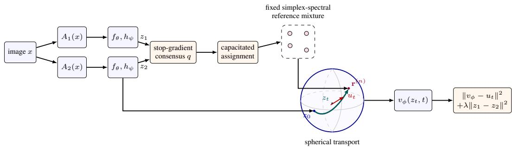
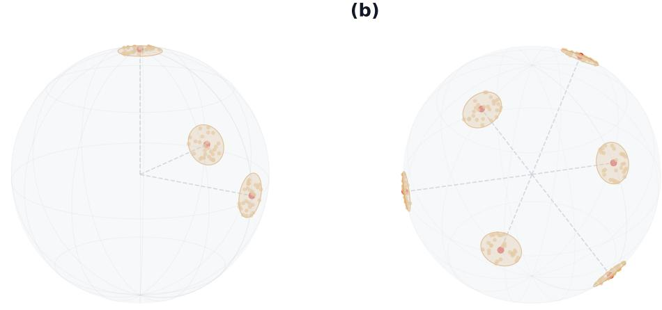

# LEARNING A FLOW TO SELF-SUPERVISED REPRESEN-TATIONS

Yuling Jiao1 Wensen Ma2 Houduo Qi3,2 Defeng Sun2

## ABSTRACT

Explicit geometric references offer a direct way to structure self-supervised representations. Existing adversarial distribution-matching formulations, however, require costly encoder–critic optimization (Jiao et al., 2026). We introduce Flow-Based Distribution Matching (FBDM), a non-adversarial framework that learns this reference-directed geometry through spherical conditional velocity regression. An ETF-inspired reference allows its number of components $K ^ { \prime }$ to exceed the auxiliary flow dimension d⋆ while retaining structured geometric separation. We assign both augmented views of each image to the same target, while limiting how many images each reference center can receive. An explicit alignment loss further pulls the two views’ representations closer together. Experiments across benchmarks ranging from CIFAR to ImageNet show that FBDM achieves performance nearly on par with DM and remains competitive with existing SSL methods. Matched training-cost comparisons show a 1.48–1.83× speedup over DM with a negligible increase in GPU memory usage. We also provide a theoretical explanation for the usefulness of the learned representations: under stated conditions, we bound the downstream misclassification rate in terms of the FBDM pretraining loss.

## 1 INTRODUCTION

Self-supervised learning (SSL) learns transferable representations without labels, but must prevent collapse: perfect view agreement is useless if all images map to the same vector. Contrastive, predictor-based, and redundancy-reduction methods address this through negative pairs, asymmetry, or statistical constraints (Chen et al., 2020; He et al., 2020; Grill et al., 2020; Chen & He, 2021; Zbontar et al., 2021; Hua et al., 2021; Ermolov et al., 2021; Bardes et al., 2022). Recent work continues to develop these objectives and their analysis (Huang et al., 2024; Duan et al., 2025; Siméoni et al., 2025; Zhang et al., 2026; Luthra et al., 2026). These approaches largely specify what representations should not become, leaving their desired global distribution implicit.

Distribution Matching (DM) offers a generative perspective: it prescribes an explicit reference distribution ν and trains the encoder f by minimizing $\mathbf { \bar { \it W } } _ { 1 } ( f _ { \# } P _ { \cal A } , \nu )$ , where $W _ { 1 }$ denotes the Wasserstein-1 distance and $f _ { \# } P _ { A }$ is the encoded augmentation distribution. In practice, this distance is estimated by an adversarial critic (Jiao et al., 2026). Two restrictions remain. Its coordinate reference requires $\dot { K } ^ { \prime } \leq d ^ { \star }$ , coupling the number of latent templates to the matching dimension. Its critic-based objective requires opposing updates: the critic increases the estimated discrepancy while the encoder decreases it (Arjovsky et al., 2017). Tracking the evolving encoder requires multiple critic steps per encoder update and careful hyperparameter tuning. Can we retain explicit distribution design without the adversarial critic, while allowing more templates in a compact flow space?

Our answer is FBDM. Generative learning is itself a distribution-transport problem, and flow matching provides analytic velocity targets instead of critic-estimated distances (Lipman et al., 2023; Liu et al., 2023). FBDM uses this tool for representation learning rather than sample generation: its flow objective guides the encoder toward an explicit geometric reference. The auxiliary velocity field provides a training signal but is discarded downstream, without repeated critic optimization. An ETF-inspired simplex-spectral reference permits $K ^ { \prime } > d ^ { \star }$ ; a two-view consensus assigns each image a shared destination, and an explicit starting-point penalty reinforces alignment. Figure 1 summarizes the pipeline. Training needs neither critic maximization nor a numerical ODE solve; only the backbone is retained downstream. Experiments across benchmarks ranging from CIFAR to ImageNet show that this approach learns competitive representations, while matched training-cost comparisons demonstrate a 1.48–1.83× speedup over DM with modest additional GPU memory (Section 4).

  
Figure 1: FBDM in one view. Two augmented views are encoded on the unit sphere. Their stopgradient consensus selects a capacity-constrained reference component and a locally perturbed target $\mathbf { r } ^ { ( n ) }$ . Conditional flow matching regresses the target velocity $u _ { t }$ along the resulting geodesic $z _ { t }$ , while an explicit start-point loss aligns the views. Only the backbone is retained downstream.

Our population theory links the full FBDM loss to classification from the initial representation. Under augmentation-quality, regularity, and transport-identifiability assumptions, Theorem 1 bounds nearestcentroid error by an augmentation-dependent residual plus a square-root loss term, in a positivemargin, small-loss regime. Velocity regression controls terminal Wasserstein error; identifiability and ODE stability transfer class separation to the initial representation, while alignment and augmentation quality control within-class variation.

Our contributions are:

• An ETF-inspired reference permits $K ^ { \prime } > d ^ { \star }$ with structured geometric separation, decoupling reference granularity from the auxiliary flow dimension.

• Building on this reference, FBDM replaces critic-based distribution matching with velocity regression. It achieves comparable performance to DM and competitive SSL results across benchmarks ranging from CIFAR to ImageNet, with 1.48–1.83× higher training throughput and about 0.50 GiB additional peak allocated memory under matched hardware.

• A conditional population guarantee bounds downstream misclassification by the full FBDM loss and augmentation quality, for a nearest-centroid classifier on the initial normalized representation.

## 2 RELATED WORK

SSL theory studies latent-class transfer, alignment and uniformity, spectral structure, and downstream generalization (Saunshi et al., 2019; Wang & Isola, 2020; HaoChen et al., 2021; 2022; Huang et al., 2023; Duan et al., 2025). DM connects representation quality to explicit Wasserstein matching (Jiao et al., 2026). Flow matching instead learns distributional transport by velocity regression (Lipman et al., 2023; Fukumizu et al., 2024), including geodesic constructions on manifolds (Chen & Lipman, 2024). REPA reports that generative diffusion features lag dedicated SSL features on classification probes, and uses pretrained features to improve generation (Yu et al., 2025). Self-Flow learns representations within multimodal synthesis (Chefer et al., 2026). SenFlow (Ukita & Okita, 2026) jointly trains an encoder and a conditional flow generator in an autoencoder-like design, targeting both recognition and generation. Generation remains an objective in all three.

(a)  
  
Figure 2: From a coordinate reference to an overcomplete spherical reference. (a) Jiao et al. (2026) assigns at most one template to each orthogonal coordinate direction, which requires $K ^ { \prime } \leq d ^ { \star }$ (b) Our construction permits $K ^ { \prime } > d ^ { \star }$ and places more reference components on the unit sphere in the $d ^ { \star }$ -dimensional flow space. The pale point clouds depict local samples $( \mathbf { c } _ { k } + \varepsilon \pmb { \eta } ) / \Vert \mathbf { c } _ { k } + \varepsilon \mathbf { \bar { \pmb { \eta } } } \Vert _ { 2 }$ around each center, with $\pmb { \eta } \sim \mathrm { U n i f } ( \mathbb { S } ^ { d ^ { \star } - 1 } )$ ; they are not additional centers. The illustration is schematic, while Proposition 1 gives the precise ETF/Welch geometry.

FBDM instead uses reference-directed velocity regression to train an encoder for downstream recognition, without generating data or using a pretrained teacher. Appendix F discusses additional SSL methods, probability-flow ODE theory, and frame geometry.

## 3 FLOW-BASED DISTRIBUTION MATCHING

Notation. Vectors and matrices are bold; X, Z, and R denote random vectors. We reserve d for the input-image dimension and $d ^ { \star }$ for the auxiliary flow-space dimension. Write $[ N ] = \{ 1 , \dots , N \}$ $\mathbb { S } ^ { q - 1 } = \left\{ \mathbf { u } \in \mathbb { R } ^ { q } : \| \mathbf { u } \| _ { 2 } = 1 \right\}$ , and $\mathbf { I } _ { q } ,$ , 1 for the identity matrix and all-ones vector. For a set $s$ Unif(S) is its uniform law; sg is stop-gradient and ,→ an injective map.

## 3.1 REPRESENTATIONS AND A FLEXIBLE REFERENCE

Given unlabeled images $\mathcal { D } _ { N } = \{ \mathbf { x } _ { i } \} _ { i = 1 } ^ { N } \subset \mathbb { R } ^ { d }$ , each iteration draws B images. For each $\mathbf { x } ^ { ( n ) }$ , draw two views independently from the augmentation kernel $\mathcal { A } ( \cdot \mid \mathbf { x } ^ { ( n ) } )$ . Since assignment compares directions, normalize the backbone–projector output:

$$
\mathbf { z } _ { j } ^ { ( n ) } = \frac { h _ { \psi } ( f _ { \theta } ( \mathbf { x } _ { j } ^ { ( n ) } ) ) } { \| h _ { \psi } ( f _ { \theta } ( \mathbf { x } _ { j } ^ { ( n ) } ) ) \| _ { 2 } } \in \mathbb { S } ^ { d ^ { \star } - 1 } , \qquad j \in \{ 1 , 2 \} .\tag{1}
$$

We now specify a destination law, pair views with its components, and construct the resulting transport signal.

More components without a larger flow space. DM uses ${ \bf c } _ { k } ^ { \mathrm { D M } } = s _ { k } { \bf e } _ { \pi ( k ) }$ , where $\mathbf { e } _ { i }$ is the ith standard basis vector in $\mathbb { R } ^ { d ^ { \star } }$ , with independent $s _ { k } \sim \operatorname { U n i f } ( \{ - 1 , 1 \} )$ and $\pi : [ K ^ { \prime } ] \hookrightarrow [ d ^ { \star } ]$ (Jiao et al., 2026). Thus $K ^ { \prime } \leq d ^ { \star } \colon$ : discovering more latent groups requires increasing the matching dimension $d ^ { \star }$ . To allow finer template granularity without increasing this dimension, we instead construct $K ^ { \prime }$ unit centers $\mathcal { C } = \{ { \bf c } _ { k } \} _ { k = 1 } ^ { K ^ { \prime } }$ with $K ^ { \prime } > d ^ { \star }$ . Figure 2 illustrates this decoupling.

From an ideal geometry to a compact reference. To give these components a geometrically separated arrangement, we use an equiangular tight frame (ETF) as the ideal template: it minimizes the largest absolute inner product between distinct unit centers (Appendix A.1). However, an exact ETF need not exist for an arbitrary pair $( K ^ { \prime } , d ^ { \star } )$ . We therefore use a Gram-first construction: for the guaranteed pair $( K ^ { \prime } , K ^ { \prime } - 1 )$ , we prescribe the ideal simplex Gram matrix

$$
\mathbf { G } _ { \Delta } = \frac { K ^ { \prime } } { K ^ { \prime } - 1 } \left( \mathbf { I } _ { K ^ { \prime } } - \frac { \mathbf { 1 1 } ^ { \top } } { K ^ { \prime } } \right) \in \mathbb { R } ^ { K ^ { \prime } \times K ^ { \prime } } .\tag{2}
$$

Its diagonal entries are 1 and off-diagonal entries are $- 1 / ( K ^ { \prime } - 1 )$ , directly encoding unit norms and equiangularity. Appendix $_ { \mathrm { A } . 2 }$ verifies that $\mathbf { G } _ { \Delta }$ is positive semidefinite with rank $K ^ { \prime } - 1$ and spectrally realizes an exact ETF of $K ^ { \prime }$ vectors in $\mathbb { R } ^ { K ^ { \prime } - 1 }$ . We then project this ideal geometry to the target matching dimension $2 \leq d ^ { \star } < K ^ { \prime } - 1$

Let $\mathbf { U } _ { d ^ { \star } }$ and $\Lambda _ { d ^ { \star } }$ collect the leading $d ^ { \star }$ orthonormal eigenvectors and eigenvalues. The projected coordinate matrix is

$$
\mathbf { Y } = \mathbf { U } _ { d ^ { \star } } \mathbf { \Lambda } \mathbf { \Lambda } \mathbf { \Lambda } _ { d ^ { \star } } ^ { 1 / 2 } \in \mathbb { R } ^ { K ^ { \prime } \times d ^ { \star } } .\tag{3}
$$

Lemma 2 shows that (3) minimizes the total squared error in the simplex’s pairwise inner products before normalization. We then obtain spherical centers by normalizing each row:

$$
\mathbf { c } _ { k } = { \frac { \mathbf { Y } _ { k , : } } { \| \mathbf { Y } _ { k , : } \| _ { 2 } } } , \qquad k \in [ K ^ { \prime } ] .
$$

The retained eigenspace is chosen to give nonzero rows and distinct normalized directions. Since normalization only rescales each nonzero row by a positive scalar, it preserves the directions and pairwise angles of the projected rows. The construction recovers the exact simplex at $d ^ { \star } = K ^ { \prime } - 1$ and an ETF-inspired reference in lower dimensions. Appendix $_ { \mathrm { A } . 2 }$ gives the eigenpair definitions and Algorithm 2 summarizes the construction.

To retain local variation rather than force all images in a component to the same point, perturb its center by a spherical direction, with $0 \leq \varepsilon < 1$

$$
Q _ { k } ^ { \varepsilon } = \mathrm { L a w } \left( \frac { \mathbf { c } _ { k } + \varepsilon \eta } { \| \mathbf { c } _ { k } + \varepsilon \eta \| _ { 2 } } \right) , \qquad \nu _ { \varepsilon } = \frac { 1 } { K ^ { \prime } } \sum _ { k = 1 } ^ { K ^ { \prime } } Q _ { k } ^ { \varepsilon } , \quad \eta \sim \mathrm { U n i f } ( \mathbb { S } ^ { d ^ { \star } - 1 } ) .\tag{4}
$$

Here $K ^ { \prime }$ controls template granularity and ε local spread; components are label-free templates, not prescribed ground-truth classes.

## 3.2 TWO-VIEW CAPACITATED ASSIGNMENT

Flow matching must pair each view with a destination. To align a positive pair implicitly, we choose one shared destination using its detached consensus:

$$
\mathbf { q } ^ { ( n ) } = \frac { \mathrm { s g } ( \mathbf { z } _ { 1 } ^ { ( n ) } ) + \mathrm { s g } ( \mathbf { z } _ { 2 } ^ { ( n ) } ) } { \| \mathrm { s g } ( \mathbf { z } _ { 1 } ^ { ( n ) } ) + \mathrm { s g } ( \mathbf { z } _ { 2 } ^ { ( n ) } ) \| _ { 2 } } .\tag{5}
$$

Detachment keeps the combinatorial assignment outside the gradient path. The normalized sum is defined for non-antipodal views.

A directly balanced construction assumes $K ^ { \prime } \mid B _ { i }$ , meaning that $K ^ { \prime }$ divides $B ,$ and allocates $m _ { 0 } =$ $B / K ^ { \prime }$ images to each center. However, minibatches need not be semantically balanced, and fixed per-center quotas may force images sharing similar semantics toward incompatible components. To relax this fixed quota, we use an epoch-indexed capacity $m _ { D _ { N } } ( e ) > B / \bar { K ^ { \prime } }$ ′, where e denotes the training epoch, and select only B of the available slots:

$$
\begin{array} { r } { \mathcal { P } _ { \mathcal { D } _ { N } } ( e ) = [ K ^ { \prime } ] \times [ m _ { \mathcal { D } _ { N } } ( e ) ] , \qquad \kappa : [ K ^ { \prime } ] \times \mathbb { N } \to [ K ^ { \prime } ] , \quad \kappa ( ( k , \ell ) ) = k . } \end{array}\tag{6}
$$

The injective assignment

$$
\alpha ^ { * } \in \arg \operatorname* { m a x } _ { \alpha : [ B ] \hookrightarrow \mathcal { P } _ { \mathcal { D } _ { N } } ( e ) } \sum _ { n = 1 } ^ { B } ( \mathbf { q } ^ { ( n ) } ) ^ { \top } \mathbf { c } _ { \kappa ( \alpha ( n ) ) }\tag{7}
$$

caps occupancy without enforcing equality. Draw $\pmb { \eta } ^ { ( n ) } \sim \mathrm { U n i f } ( \mathbb { S } ^ { d ^ { \star } - 1 } )$ and set

$$
\mathbf { r } ^ { ( n ) } = \frac { \mathbf { c } _ { \kappa ( \alpha ^ { * } ( n ) ) } + \varepsilon \pmb { \eta } ^ { ( n ) } } { \| \mathbf { c } _ { \kappa ( \alpha ^ { * } ( n ) ) } + \varepsilon \pmb { \eta } ^ { ( n ) } \| _ { 2 } } .\tag{8}
$$

The resulting $\mathbf { r } ^ { ( n ) }$ is the shared endpoint toward which both $\mathbf { z } _ { i } ^ { ( n ) }$ are transported along the velocity field; sharing it across the two views implements implicit alignment. The capacity schedule controls per-center availability; Appendix D.3, Table 5, gives the dataset-specific choices.

## 3.3 SPHERICAL TRANSPORT AND ITS LEARNING SIGNAL

Because representations and destinations lie on the sphere, a shortest great-circle path is a natural interpolation (Chen & Lipman, 2024). For non-antipodal $\mathbf { z } , \mathbf { r } ,$ , let $\omega = \operatorname { a r c c o s } ( \mathbf { z } ^ { \top } \mathbf { r } )$ and define progress $s \in [ 0 , 1 ]$ by

$$
\gamma _ { \mathbf { z } , \mathbf { r } } ( s ) = \frac { \sin ( ( 1 - s ) \omega ) } { \sin \omega } \mathbf { z } + \frac { \sin ( s \omega ) } { \sin \omega } \mathbf { r } .\tag{9}
$$

The $\omega = 0$ case is understood by continuity. Appendix B.1 derives the spherical path and its tangent velocity. A comparison with linear interpolation is provided in Appendix E.

Fix a training epoch e and suppress its dependence in the notation. Assume that the assignment in Section 3.2 has produced the representation–endpoint pairs, and denote their induced coupling by $\Pi _ { f } = \operatorname { L a w } ( \mathbf { Z } _ { 0 } , \mathbf { \dot { R } } )$ . For $( \mathbf { Z } _ { 0 } , \bar { \mathbf { R } } ) \sim \Pi _ { f }$ , a continuously differentiable increasing clock $s ( t )$ with $s ( \tilde { 0 } ) = 0 , s ( \mathrm { \ i } ) = 1$ defines

$$
\begin{array} { r } { \mathbf { Z } _ { t } = \gamma \mathbf { Z } _ { 0 } , \mathbf { R } \big ( \boldsymbol { s } ( t ) \big ) , \qquad p _ { t } = \mathrm { L a w } ( \mathbf { Z } _ { t } ) . } \end{array}\tag{10}
$$

Its analytic velocity is the signal to be regressed:

$$
{ \bf U } _ { t } = \frac { \mathrm { d } { \bf Z } _ { t } } { \mathrm { d } t } = \dot { s } ( t ) \left. \partial _ { s } \gamma _ { { \bf Z } _ { 0 } , { \bf R } } ( s ) \right| _ { s = s ( t ) } .\tag{11}
$$

The conditional mean $v ^ { \star } ( \mathbf { z } , t ) = \mathbb { E } [ \mathbf { U } _ { t } \mid \mathbf { Z } _ { t } = \mathbf { z } ]$ realizes the distributional path through

$$
\begin{array} { r } { \partial _ { t } p _ { t } ( \mathbf { z } ) + \nabla \mathbf { \cdot } ( p _ { t } ( \mathbf { z } ) \pmb { v } ^ { \star } ( \mathbf { z } , t ) ) = 0 . } \end{array}\tag{12}
$$

Here $\nabla \cdot$ is divergence; when $p _ { t }$ has no ambient density, (12) is understood in the standard weak sense. Conditional expectation connects path construction to velocity regression (Lipman et al., 2023):

$$
\mathcal { R } _ { \mathrm { C F M } } ( \phi ; q _ { T } ) = \frac { 1 } { { { d ^ { \star } } } } \mathbb { E } _ { \Pi _ { f } , T } \left[ \lVert \boldsymbol { v } _ { \phi } ( \mathbf { Z } _ { T } , T ) - \mathbf { U } _ { T } \rVert _ { 2 } ^ { 2 } \right] , \qquad T \sim q _ { T } ,\tag{13}
$$

where $T$ is independent of the endpoints.

Time reparameterization and uniform-progress sampling. For semantic encoding, reaching an appropriate reference component matters more than precise positioning within it. We therefore choose clocks with decreasing ${ \dot { s } } ( t )$ . Through (11), this strengthens component-directed motion early and attenuates within-component refinement late without changing the path. For example, the rational schedule used on several datasets has $\dot { s } ( t ) = ( 1 + a ) / ( 1 + \dot { a } t ) ^ { 2 }$ , which decreases for $a > 0$ The reported rational and exponential choices appear in Table 6 and follow the distance-scheduling perspective of Chen & Lipman (2024). Uniformly sampling t would overrepresent the slow late segment, so inverse-transform sampling instead draws $S _ { j } ^ { ( n ) } \sim \operatorname { U n i f } ( [ 0 , 1 ] )$ and sets

$$
T _ { j } ^ { ( n ) } = s ^ { - 1 } ( S _ { j } ^ { ( n ) } ) .\tag{14}
$$

This gives $q _ { T } ( t ) = \dot { s } ( t )$ and uniform progress coverage: early states carry stronger targets rather than being sampled more often. The network takes $( \mathbf { Z } _ { j } ^ { ( n ) } , T _ { j } ^ { ( n ) } )$ and predicts $\mathbf { U } _ { j } ^ { ( n ) }$ , where

$$
\mathbf { Z } _ { j } ^ { ( n ) } = \gamma _ { \mathbf { z } _ { j } ^ { ( n ) } , \mathbf { r } ^ { ( n ) } } ( S _ { j } ^ { ( n ) } ) , \qquad \mathbf { U } _ { j } ^ { ( n ) } = \dot { s } ( T _ { j } ^ { ( n ) } ) \partial _ { s } \gamma _ { \mathbf { z } _ { j } ^ { ( n ) } , \mathbf { r } ^ { ( n ) } } ( S _ { j } ^ { ( n ) } ) .\tag{15}
$$

## 3.4 OBJECTIVE, UPDATES, AND INFERENCE

A shared endpoint provides only implicit alignment. The no-alignment diagnostic in Appendix E motivates an explicit penalty on the starting representations:

$$
\widehat { \mathcal { R } } _ { \mathrm { F M } , B } = \frac { 1 } { 2 B d ^ { \star } } \sum _ { n = 1 } ^ { B } \sum _ { j = 1 } ^ { 2 } \| \pmb { v } _ { \phi } ( \mathbf { Z } _ { j } ^ { ( n ) } , T _ { j } ^ { ( n ) } ) - \mathbf { U } _ { j } ^ { ( n ) } \| _ { 2 } ^ { 2 } ,\tag{16}
$$

$$
\widehat { \mathcal { R } } _ { \mathrm { a l i g n } , B } = \frac { 1 } { B d ^ { \star } } \sum _ { n = 1 } ^ { B } \| \mathbf { z } _ { 1 } ^ { ( n ) } - \mathbf { z } _ { 2 } ^ { ( n ) } \| _ { 2 } ^ { 2 } ,\tag{17}
$$

$$
\begin{array} { r } { \widehat { \mathcal { R } } _ { B } = \widehat { \mathcal { R } } _ { \mathrm { F M } , B } + \lambda \widehat { \mathcal { R } } _ { \mathrm { a l i g n } , B } , \qquad \lambda \geq 0 . } \end{array}\tag{18}
$$

Algorithm 1 Core FBDM pretraining loop.   
Require: $\mathcal { D } _ { N } , \mathcal { A } , \mathcal { C } , \varepsilon , \lambda , m _ { \mathcal { D } _ { N } } ( e ) , s ( t )$ ; networks $f _ { \theta } , h _ { \psi } , v _ { \phi }$   
1: for each epoch e and minibatch $B \dot { \subset } { \mathcal { D } } _ { N }$ do   
2: Draw two views and compute $\mathbf { z } _ { j } ^ { ( n ) }$ by (1)   
3: Form $\mathbf { q } ^ { ( n ) }$ and solve the capacitated assignment (7)   
4: Draw one endpoint $\mathbf { r } ^ { ( n ) }$ by (8) and share it across both views   
5: Draw $S _ { j } ^ { ( n ) }$ , obtain $T _ { j } ^ { ( n ) }$ , and form $( \mathbf { Z } _ { j } ^ { ( n ) } , \mathbf { U } _ { j } ^ { ( n ) } )$ by (14)–(15)   
6: Evaluate (18) and update $( \theta , \psi , \phi )$   
7: return $f _ { \theta }$

The empirical risk averages this objective over random minibatches and augmentation, perturbation, and progress randomness: $\widehat { \mathcal { R } } _ { N } = \mathbb { E } _ { \mathcal { T } , \xi } [ \widehat { \mathcal { R } } _ { B } ]$ . Here I is a uniform size-B subset of $[ N ]$ and ξ collects the other sampling variables. Since assignment couples the samples, this is a batch-level expectation; (111) gives the explicit sampling law.

Algorithm 1 uses detached assignments. The reported ResNet-18 runs attenuate the FM gradient entering the encoder and projector, allowing the velocity field to track their evolving geometry. Appendix D.2 specifies these backward-only updates; they are not ordinary gradients of the unmodified scalar risk. After pretraining, only the 512-dimensional backbone feature $f _ { \boldsymbol { \theta } } ( \mathbf { x } )$ is used for linear and 5-NN evaluation.

## 4 EXPERIMENTS

## 4.1 ACCURACY AND REPRESENTATION QUALITY

We evaluate CIFAR-10, CIFAR-100, STL-10, and Tiny ImageNet with frozen ResNet-18 features using linear classification and cosine 5-NN (Table 1), and report ImageNet-1K separately under a matched ResNet-50, 100-epoch, batch-size-512 linear-evaluation protocol (Table 2). Full configurations are given in Appendix D.3.

Table 1: Top-1 accuracy (%) on CIFAR-10, CIFAR-100, STL-10, and Tiny ImageNet with ResNet-18. Linear evaluates the frozen representation; 5-NN uses $k = 5 .$ Non-FBDM results except DM follow the published benchmark (Weng et al., 2022); DM results are taken from its source paper (Jiao et al., 2026).
<table><tr><td rowspan="2">Method</td><td colspan="2">CIFAR-10</td><td colspan="2">CIFAR-100</td><td colspan="2">STL-10</td><td colspan="2">Tiny ImageNet</td></tr><tr><td>Linear</td><td>5-NN</td><td>Linear</td><td>5-NN</td><td>Linear</td><td>5-NN</td><td>Linear</td><td>5-NN</td></tr><tr><td>FBDM</td><td>92.37</td><td>89.68</td><td>66.59</td><td>56.74</td><td>89.79</td><td>86.23</td><td>48.55</td><td>33.01</td></tr><tr><td>DM (Jiao et al., 2026)</td><td>92.11</td><td>89.17</td><td>67.71</td><td>56.18</td><td>90.22</td><td>85.51</td><td></td><td></td></tr><tr><td>Barlow Twins (Zbontar et al., 2021)</td><td>88.51</td><td>86.53</td><td>65.78</td><td>55.76</td><td>88.36</td><td>83.71</td><td>47.44</td><td>32.65</td></tr><tr><td>SimCLR (Chen et al., 2020)</td><td>91.80</td><td>88.42</td><td>66.83</td><td>56.56</td><td>90.51</td><td>85.68</td><td>48.84</td><td>32.86</td></tr><tr><td>BYOL (Grill et al., 2020)</td><td>91.73</td><td>89.45</td><td>66.60</td><td>56.82</td><td>91.99</td><td>88.64</td><td>51.00</td><td>36.24</td></tr><tr><td>SimSiam (Chen &amp; He, 2021)</td><td>90.51</td><td>86.82</td><td>66.04</td><td>55.79</td><td>88.91</td><td>84.84</td><td>48.29</td><td>34.21</td></tr><tr><td>Shuffled-DBN (Hua et al., 2021)</td><td>90.45</td><td>88.15</td><td>66.07</td><td>56.97</td><td>89.20</td><td>84.51</td><td>48.60</td><td>32.14</td></tr><tr><td>Zero-ICL (Zhang et al., 2022)</td><td>88.12</td><td>86.64</td><td>61.91</td><td>53.47</td><td>86.35</td><td>82.51</td><td>46.25</td><td>32.74</td></tr><tr><td>VICReg (Bardes et al., 2022)</td><td>90.32</td><td>88.41</td><td>66.45</td><td>56.78</td><td>90.78</td><td>85.72</td><td>48.71</td><td>33.35</td></tr><tr><td>W-MSE (Ermolov et al., 2021)</td><td>91.55</td><td>89.69</td><td>66.10</td><td>56.69</td><td>90.36</td><td>87.10</td><td>48.20</td><td>34.16</td></tr><tr><td>CW-RGP (Weng et al., 2022)</td><td>91.92</td><td>89.54</td><td>67.51</td><td>57.35</td><td>90.76</td><td>87.34</td><td>49.23</td><td>34.04</td></tr></table>

Table 2: ImageNet-1K linear-evaluation top-1 accuracy (%) with ResNet-50 after 100 epochs at global batch size 512. The SimCLR value is the reproduction reported by AndrewAtanov/simclr-pytorch.
<table><tr><td>Method</td><td>Linear</td></tr><tr><td>FBDM</td><td>59.32</td></tr><tr><td>SimCLR (Chen et al., 2020)</td><td>60.14</td></tr></table>

Across the benchmark suite from CIFAR to ImageNet, FBDM achieves competitive representation quality without an adversarial critic.

## 4.2 THROUGHPUT AND GPU MEMORY

Table 3 compares native DM and FBDM under a matched single-GPU protocol on CIFAR-10, CIFAR-100, and STL-10; measurement details are given in Appendix D.4.

Table 3: Native-stack training cost on one Tesla V100-SXM2-16GB. Memory is peak CUDA allocated/reserved GiB. V100-hours are projected from the median seconds per epoch for 1000 epochs.
<table><tr><td>Dataset</td><td>System</td><td>Peak memory (GiB)</td><td>Seconds/epoch</td><td>V100-h/1000 ep.</td><td>Speedup vs. DM</td></tr><tr><td rowspan="2">CIFAR-10</td><td>DM</td><td>4.78/5.14</td><td>75.61</td><td>21.00</td><td rowspan="2">1.83×</td></tr><tr><td>FBDM</td><td>5.28/5.82</td><td>41.35</td><td>11.49</td></tr><tr><td rowspan="2">CIFAR-100</td><td>DM</td><td>4.78/5.14</td><td>76.37</td><td>21.21</td><td rowspan="2">1.69×</td></tr><tr><td>FBDM</td><td>5.28/5.82</td><td>45.27</td><td>12.58</td></tr><tr><td rowspan="2">STL-10</td><td>DM</td><td>7.06/8.17</td><td>173.35</td><td>48.15</td><td rowspan="2">1.48×</td></tr><tr><td>FBDM</td><td>7.56/8.94</td><td>117.39</td><td>32.61</td></tr></table>

FBDM is 1.83×, 1.69×, and 1.48× faster per epoch on CIFAR-10, CIFAR-100, and STL-10, saving 9.52, 8.64, and 15.55 projected V100-hours per 1000 epochs. It uses about 0.50 GiB more allocated and 0.67–0.77 GiB more reserved memory; absolute times remain hardware dependent.

## 5 THEORETICAL ANALYSIS

We analyze FBDM at the population level to connect its training objective to downstream classification. Pretraining and classification use the same distribution $( \mathbf { X } , Y ) \sim P$ , with labels hidden during pretraining, $Y \in [ K ]$ , and $p _ { k } = P ( Y = k ) > 0 ;$ ; write $p _ { \operatorname* { m i n } } = \operatorname* { m i n } _ { k } p _ { k }$ . We treat the normalized map in (1) as a single encoder $f : \mathcal { X } \to \mathbb { S } ^ { d ^ { \star } - 1 }$ , where $\mathcal { X } \subseteq \mathbb { R } ^ { d }$ contains images and their views.

## 5.1 QUESTIONS MOTIVATING THE ANALYSIS

The velocity field is used only during pretraining and discarded downstream. This raises three linked questions:

1. Why can a velocity field used only during pretraining improve the encoder representation after the field is discarded?

2. Under what conditions does label-free matching to separated reference components induce semantic class separation rather than an arbitrary partition?

3. How do the resulting between-class separation and alignment-controlled within-class variation yield a small downstream misclassification rate?

The proof, detailed in Appendix C.3, follows four steps. First, flow regularity converts the label-free FM risk into a bound on the terminal $W _ { 1 }$ discrepancy (Lemma 7). Second, transport identifiability turns this marginal bound into class–component leakage control, placing terminal class means near distinct reference-component means (Lemma 8 and (79)). Third, ODE stability transfers this terminal separation back to the encoder space ((91)). Finally, augmentation and alignment control within-class variation (Lemmas 3 and 4); together with the recovered separation, this yields the downstream classification bound.

## 5.2 POPULATION OBJECTIVE AND ASSUMPTIONS

The augmentation kernel A is fixed. Given X, let $\widetilde { \mathbf { X } } _ { 1 }$ and $\widetilde { \mathbf { X } } _ { 2 }$ be conditionally independent draws from $\mathcal { A } ( \cdot | \mathbf { X } )$ . Denote the law of one view by $P _ { A }$ and their joint law by $\Pi _ { A } ^ { + } = \mathrm { L a w } ( \widetilde { \mathbf { X } } _ { 1 } , \widetilde { \mathbf { X } } _ { 2 } )$ . The reference is also fixed: we consider $K ^ { \prime } = K$ and $\begin{array} { r } { \nu _ { \varepsilon } = \sum _ { k } w _ { k } \ ' Q _ { k } ^ { \varepsilon } } \end{array}$ , with $w _ { k } \dot { > } 0$ and $\begin{array} { r } { \sum _ { k } w _ { k } = 1 } \end{array}$ . No equal class priors or equality $p _ { k } = w _ { k }$ is required. Set $\begin{array} { r } { \overline { { S } } _ { k } ^ { \varepsilon } = \operatorname { s u p p } ( Q _ { k } ^ { \varepsilon } ) } \end{array}$ and

$$
\Delta _ { \mathcal { C } } = \underset { k \neq \ell } { \operatorname* { m i n } } \| \mathbf { c } _ { k } - \mathbf { c } _ { \ell } \| _ { 2 } , \qquad r _ { \varepsilon } = \underset { k } { \operatorname* { m a x } } \ \underset { \mathbf { r } \in S _ { k } ^ { \varepsilon } } { \operatorname* { s u p } } \| \mathbf { r } - \mathbf { c } _ { k } \| _ { 2 } , \qquad \Delta _ { \mathcal { C } } > 2 r _ { \varepsilon } .\tag{19}
$$

Thus the reference supports are disjoint. Recall the representation–endpoint coupling $\Pi _ { f } ~ =$ $\mathrm { L a w } ( \mathbf { Z } _ { 0 } , \mathbf { R } )$ from Section 3.3. For the population analysis, its source marginal is the encoded augmentation law Law $( \mathbf { Z } _ { 0 } ) = f _ { \# } P _ { \mathcal { A } }$ , and its endpoint marginal is Law $( \mathbf { R } ) = \nu _ { \varepsilon }$ . The latent label $Y$ remains on the underlying population space but is never used during pretraining. With paths (10), targets (11), and independent $T \sim q _ { T }$ , define

$$
\mathcal { R } _ { \mathrm { F M } } = \frac { 1 } { d ^ { \star } } \mathbb { E } _ { \Pi _ { f } , T } [ \| \pmb { v } _ { \phi } ( \mathbf { Z } _ { T } , T ) - \mathbf { U } _ { T } \| _ { 2 } ^ { 2 } ] ,\tag{20}
$$

$$
\mathcal { R } _ { \mathrm { a l i g n } } = \frac { 1 } { d ^ { \star } } \mathbb { E } _ { \Pi _ { \boldsymbol { A } } ^ { + } } [ \| f ( \widetilde { \mathbf { X } } _ { 1 } ) - f ( \widetilde { \mathbf { X } } _ { 2 } ) \| _ { 2 } ^ { 2 } ] ,\tag{21}
$$

$$
\mathcal { R } _ { \mathrm { F B D M } } ( f , \phi ) = \mathcal { R } _ { \mathrm { F M } } ( f , \phi ) + \lambda \mathcal { R } _ { \mathrm { a l i g n } } ( f ) , \qquad \lambda > 0 .\tag{22}
$$

See (53) for $\Pi _ { A } ^ { + }$ and Table 4 for the analysis notation.

Assumption ${ \bf 1 } \left( \left( \sigma , \delta \right) \right.$ -augmentation and encoder regularity). The kernel A samples uniformly from a fixed finite family $\mathcal { T } = \mathbf { \bar { \{ } }  A _ { 1 } , \ldots , A _ { N _ { \mathrm { a u g } } } \mathbf { \bar { \ } } $ of measurable maps $\mathcal { X }  \mathcal { X }$ , including the identity. For $P _ { k } = \operatorname { L a w } ( \mathbf { X } \mid Y = k )$ , each class has a measurable core $C _ { k } ^ { \circ } \subseteq \operatorname { s u p p } ( P _ { k } )$ such that

$$
P _ { k } ( C _ { k } ^ { \circ } ) \geq \sigma , \qquad \operatorname* { s u p } _ { \mathbf { x } , \mathbf { x } ^ { \prime } \in C _ { k } ^ { \circ } } \operatorname* { m i n } _ { A , A ^ { \prime } \in \mathcal { T } } \| A ( \mathbf { x } ) - A ^ { \prime } ( \mathbf { x } ^ { \prime } ) \| _ { 2 } \leq \delta ,\tag{23}
$$

where $\sigma \in ( 0 , 1 ] , \delta \geq 0$ , and $f$ is $L _ { f } { \mathrm { - L i p s c h i t z } }$

Here σ measures class-core coverage, while δ measures how closely suitable views connect same-class images (Huang et al., 2023; Duan et al., 2025; Jiao et al., 2026).

Assumption 2 (Uniform flow regularity and time coverage). The field $\pmb { v } _ { \phi } : \mathbb { R } ^ { d ^ { \star } } \times [ 0 , 1 ]  \mathbb { R } ^ { d ^ { \star } }$ is measurable in t, with

$$
\| v _ { \phi } ( \mathbf { z } , t ) - v _ { \phi } ( \mathbf { z } ^ { \prime } , t ) \| _ { 2 } \leq \ell _ { \phi } ( t ) \| \mathbf { z } - \mathbf { z } ^ { \prime } \| _ { 2 } , \qquad \int _ { 0 } ^ { 1 } \ell _ { \phi } ( t ) \mathrm { d } t \leq L _ { v } < \infty .\tag{24}
$$

Here $\ell _ { \phi } \geq 0$ and $L _ { v }$ is fixed over the admissible fields. Also $\begin{array} { r } { \int _ { 0 } ^ { 1 } \| \pmb { v } _ { \phi } ( \mathbf { 0 } , t ) \| _ { 2 } \mathrm { d } t < \infty } \end{array}$ . Conditional paths are absolutely continuous, with $\begin{array} { r } { \mathbb { E } \int _ { 0 } ^ { 1 } \| \mathbf { U } _ { t } \| _ { 2 } ^ { 2 } \mathrm { d } t < \infty } \end{array}$ and $\mathbb { E } \| \mathbf { U } _ { T } \| _ { 2 } ^ { 2 } < \infty$ . The fixed time density satisfies $q _ { T } \geq q _ { \mathrm { m i n } } > 0$ almost everywhere.

For (14), $q _ { T } ( t ) = \dot { s } ( t )$ . The schedules used in our experiments satisfy $q _ { \mathrm { m i n } } > 0 ;$ ; their explicit forms and parameters are listed in Appendix D.3, Table 6.

Let $\Phi _ { t }$ solve

$$
\frac { \mathrm { d } \Phi _ { t } ( \mathbf { z } ) } { \mathrm { d } t } = v _ { \phi } ( \Phi _ { t } ( \mathbf { z } ) , t ) , \quad \Phi _ { 0 } ( \mathbf { z } ) = \mathbf { z } , \quad \widehat { \mathbf { Z } } _ { t } : = \Phi _ { t } ( \mathbf { Z } _ { 0 } ) , \quad \widehat { p } _ { t } : = \mathrm { L a w } ( \widehat { \mathbf { Z } } _ { t } ) , \quad t \in [ 0 , 1 ] .\tag{25}
$$

This learned terminal law need not equal the analytic endpoint law ${ \mathrm { L a w } } ( \mathbf { R } ) = \nu _ { \varepsilon }$ . For probability laws $\mu$ and ν on $\mathbb { R } ^ { d ^ { \star } }$ with finite first moments, let $\Pi ( \mu , \nu )$ denote their set of couplings and define

$$
W _ { 1 } ( \mu , \nu ) : = \operatorname* { i n f } _ { \gamma \in \Pi ( \mu , \nu ) } \int \| \mathbf { z } - \mathbf { r } \| _ { 2 } \gamma ( \mathrm { d } \mathbf { z } , \mathrm { d } \mathbf { r } ) .\tag{26}
$$

Although $W _ { 1 }$ does not appear in the training objective, Lemma 7 shows that the FM risk controls this terminal distributional mismatch:

$$
W _ { 1 } ( \widehat { p } _ { 1 } , \nu _ { \varepsilon } ) \leq e ^ { L _ { v } } \sqrt { \frac { d ^ { \star } } { q _ { \operatorname* { m i n } } } \mathcal { R } _ { \mathrm { F M } } } .\tag{27}
$$

Semantic identifiability. The label-free bound (27) controls the overall marginal transport but cannot by itself identify classes. Following Jiao et al. (2026), we therefore impose a quantitative condition on the optimal terminal–reference coupling. Let $\Gamma ^ { \star } \in \Pi ( \widehat { p } _ { 1 } , \nu _ { \varepsilon } )$ attain the infimum in (26); thus it is the joint law of $( \widehat { \mathbf { Z } } _ { 1 } , \mathbf { R } ^ { \star } )$ only. Labels enter the analysis afterward. Recall $S _ { j } ^ { \varepsilon } = \mathrm { s u p p } ( Q _ { j } ^ { \varepsilon } )$ and define

$$
\pi _ { k } ( \widehat { \mathbf { z } } ) : = P ( Y = k \mid \widehat { \mathbf { Z } } _ { 1 } = \widehat { \mathbf { z } } ) , \qquad q _ { k j } ^ { \star } : = \int \pi _ { k } ( \widehat { \mathbf { z } } ) \mathbf { 1 } \{ \mathbf { r } \in S _ { j } ^ { \varepsilon } \} \Gamma ^ { \star } ( \mathrm { d } \widehat { \mathbf { z } } , \mathrm { d } \mathbf { r } ) .\tag{28}
$$

Let $S _ { K }$ denote the set of permutations of $[ K ]$ and define

$$
\tau ^ { \star } \in \arg \operatorname* { m a x } _ { \tau \in S _ { K } } \sum _ { k = 1 } ^ { K } q _ { k , \tau ( k ) } ^ { \star } .\tag{29}
$$

Then

$$
q _ { k } ^ { \star } = q _ { k , \tau ^ { \star } ( k ) } ^ { \star } , \qquad \mathrm { L e a k } ( \Gamma ^ { \star } ) = \operatorname* { m a x } _ { k } \{ p _ { k } + w _ { \tau ^ { \star } ( k ) } - 2 q _ { k } ^ { \star } \} .\tag{30}
$$

Each summand counts outgoing and incoming mass for a class–component pair. This analytical coupling is distinct from the training-induced representation–endpoint coupling $\Pi _ { f }$

Assumption 3 (Transport identifiability). There is such an optimal coupling with

$$
\operatorname { L e a k } ( \Gamma ^ { \star } ) \leq C _ { \mathrm { i d } } W _ { 1 } ( \widehat { p } _ { 1 } , \nu _ { \varepsilon } ) ,\tag{31}
$$

where $C _ { \mathrm { i d } } > 0$ is a constant.

Appendix C.4 gives a sufficient soft geometric condition; neither labels nor this analytical condition are used by the training algorithm. Substituting the flow-matching guarantee (27) into the identifiability condition (31) yields

$$
\mathrm { L e a k } ( \Gamma ^ { \star } ) \leq C _ { \mathrm { i d } } e ^ { L _ { v } } \sqrt { \frac { d ^ { \star } } { q _ { \operatorname* { m i n } } } \mathcal { R } _ { \mathrm { F M } } } .\tag{32}
$$

The remaining argument turns this small leakage into separated terminal class means, transfers that separation back through the flow, and compares it with the encoder’s within-class radius.

## 5.3 A POPULATION MISCLASSIFICATION GUARANTEE

For each k, let $\mathbf { X } \sim P _ { k }$ and $A \sim \operatorname { U n i f } ( \mathcal { T } )$ be independent. Define the augmented class means and nearest-centroid classifier by

$$
\mathbf { m } _ { k } = \mathbb { E } [ f ( A ( \mathbf { X } ) ) ] , \qquad G _ { f } ( \mathbf { x } ) = \arg \operatorname* { m i n } _ { k \in [ K ] } \| f ( \mathbf { x } ) - \mathbf { m } _ { k } \| _ { 2 } ^ { 2 } ,\tag{33}
$$

with fixed tie-breaking, and $\operatorname { E r r } ( G _ { f } ) = P \{ G _ { f } ( \mathbf { X } ) \neq Y \}$ . Its scores $2 \mathbf { m } _ { k } ^ { \top } f ( \mathbf { x } ) - \| \mathbf { m } _ { k } \| _ { 2 } ^ { 2 }$ are affine in the initial representation; classification does not run the ODE.

Theorem 1 (Population FBDM loss controls classification error). Suppose Assumptions 1–3 hold. Fix a view-stability tolerance $\varepsilon _ { \mathrm { a l } } > 0$ such that

$$
e ^ { - L _ { v } } ( \Delta c - 2 r _ { \varepsilon } ) > 4 L _ { f } \delta + 8 \varepsilon _ { \mathrm { a l } } + 1 2 ( 1 - \sigma ) .\tag{34}
$$

There is an explicit threshold $r _ { 0 } > 0 ,$ , depending only on thesefixed parameters and specified in (84), such that $\mathcal { R } _ { \mathrm { F B D M } } ( f , \phi ) \leq r _ { 0 }$ implies

$$
\mathrm { E r r } ( G _ { f } ) \leq ( 1 - \sigma ) + C _ { \mathrm { e r r } } \sqrt { \mathcal { R } _ { \mathrm { F B D M } } ( f , \phi ) } , \qquad C _ { \mathrm { e r r } } = \frac { N _ { \mathrm { a u g } } } { \varepsilon _ { \mathrm { a l } } } \sqrt { \frac { d ^ { \star } } { \lambda } } .\tag{35}
$$

The residual $1 - \sigma$ accounts for images outside class cores. The proof in Appendix C.3 uses FM regression to control terminal Wasserstein error, identifiability to recover terminal class separation, and ODE stability to transfer it to the initial means. Alignment and augmentation quality bound the within-class radius. Thus smaller full loss tightens the classification bound in the stated regime. This result concerns the normalized map f with population centroids; it is not a separate guarantee for the discarded-projector backbone probes. The small-loss condition is sufficient, not an optimizationconvergence claim.

## 6 CONCLUSION

FBDM combines explicit target geometry with non-adversarial velocity regression on spherical paths. It separates reference granularity $K ^ { \prime }$ from flow-space dimension $d ^ { \star }$ , discards its transport components downstream, and is substantially faster than critic-based DM under matched measurement. Results across benchmarks ranging from CIFAR to ImageNet support explicit geometric design as a practical principle for self-supervised representation learning.

## REPRODUCIBILITY STATEMENT

The appendix gives the complete objective, assignment procedure, clock, augmentation and optimization settings, initialization, evaluation rules, and the distinction between online screening and fixed evaluation. The public DM code used for the systems comparison is available at https://github.com/vincen-github/DM. The FBDM code is available at https: //github.com/vincen-github/FBDM.

## AI USE STATEMENT

The authors developed the research roadmap, initial FBDM idea, and initial algorithmic implementation. Throughout the project, they set the conceptual direction, proposed and evaluated experimental directions, identified the central weakness to address in the theoretical analysis, and specified the goal of relating the pretraining objective to downstream misclassification.

Within this author-defined framework, OpenAI’s ChatGPT and Codex served as substantial researchassistance tools. They helped develop and implement the theoretical details, including the populationlevel analysis, intermediate mathematical arguments and bounds, and proof drafts toward the authors specified goal. They also assisted with algorithmic refinement, experimental design, implementation and review of training and evaluation code, debugging, interpretation of intermediate experimental results, literature search, manuscript drafting and revision, figure and table preparation, and LaTeX.

The authors critically examined AI-assisted suggestions, derivations, and experimental proposals through iterative discussion; chose which ideas and experiments to pursue; verified the implementations, proofs, citations, and experimental outputs; and made all final scientific and presentation decisions. The authors take full responsibility for the accuracy, integrity, and conclusions of the method, theoretical analysis, experiments, citations, and reported results.

## REFERENCES

Martin Arjovsky, Soumith Chintala, and Léon Bottou. Wasserstein generative adversarial networks. In Proceedings ofthe 34th International Conference on Machine Learning, volume 70 of Proceedings of Machine Learning Research, pp. 214–223, 2017. URL https://proceedings.mlr. press/v70/arjovsky17a.html.

Adrien Bardes, Jean Ponce, and Yann LeCun. VICReg: Variance-invariance-covariance regularization for self-supervised learning. In International Conference on Learning Representations, 2022.

Changxiao Cai and Gen Li. Minimax optimality of the probability flow ODE for diffusion models, 2025. URL https://arxiv.org/abs/2503.09583.

Mathilde Caron, Ishan Misra, Julien Mairal, Priya Goyal, Piotr Bojanowski, and Armand Joulin. Unsupervised learning of visual features by contrasting cluster assignments. In Advances in Neural Information Processing Systems, volume 33, 2020. URL https://proceedings.neurips.cc/paper\_files/paper/2020/ hash/70feb62b69f16e0238f741fab228fec2-Abstract.html.

Mathilde Caron, Hugo Touvron, Ishan Misra, Hervé Jégou, Julien Mairal, Piotr Bojanowski, and Armand Joulin. Emerging properties in self-supervised vision transformers. In Proceedings of the IEEE/CVF International Conference on Computer Vision, pp. 9650–9660, 2021. URL https://openaccess.thecvf.com/content/ICCV2021/html/Caron\_ Emerging\_Properties\_in\_Self-Supervised\_Vision\_Transformers\_ICCV\_ 2021\_paper.html.

Hila Chefer, Patrick Esser, Dominik Lorenz, Dustin Podell, Vikash Raja, Vinh Tong, Antonio Torralba, and Robin Rombach. Self-supervised flow matching for scalable multi-modal synthesis, 2026. URL https://arxiv.org/abs/2603.06507.

Ricky T. Q. Chen and Yaron Lipman. Flow matching on general geometries. In International Conference on Learning Representations, 2024. URL https://openreview.net/forum? id=g7ohDlTITL.

Ricky T. Q. Chen, Yulia Rubanova, Jesse Bettencourt, and David Duvenaud. Neural ordinary differential equations. In Advances in Neural Information Processing Systems, 2018.

Ting Chen, Simon Kornblith, Mohammad Norouzi, and Geoffrey Hinton. A simple framework for contrastive learning of visual representations. In International Conference on Machine Learning, 2020.

Xinlei Chen and Kaiming He. Exploring simple siamese representation learning. In IEEE/CVF Conference on Computer Vision and Pattern Recognition, 2021.

Chenguang Duan, Yuling Jiao, Huazhen Lin, Wensen Ma, and Jerry Yang. Adv-SSL: Adversarial self-supervised representation learning with theoretical guarantees. In Advances in Neural Information Processing Systems, volume 38, 2025. doi: 10.52202/085713-4097. URL https://proceedings.neurips.cc/paper\_files/paper/2025/hash/ b216ce49d808157ba14adec9453983a4-Abstract-Conference.html.

Carl Eckart and Gale Young. The approximation of one matrix by another of lower rank. Psychometrika, 1(3):211–218, 1936.

Aleksandr Ermolov, Aliaksandr Siarohin, Enver Sangineto, and Nicu Sebe. Whitening for selfsupervised representation learning. In International Conference on Machine Learning, 2021.

Kenji Fukumizu, Taiji Suzuki, Noboru Isobe, Kazusato Oko, and Masanori Koyama. Flow matching achieves minimax optimal convergence, 2024. URL https://arxiv.org/abs/2405. 20879.

Xuefeng Gao and Lingjiong Zhu. Convergence analysis for general probability flow ODEs of diffusion models in wasserstein distances, 2025. URL https://arxiv.org/abs/2401.17958.

Jean-Bastien Grill, Florian Strub, Florent Altché, Corentin Tallec, Pierre H. Richemond, Elena Buchatskaya, Carl Doersch, Bernardo Avila Pires, Zhaohan Daniel Guo, Mohammad Gheshlaghi Azar, Bilal Piot, Koray Kavukcuoglu, Rémi Munos, and Michal Valko. Bootstrap your own latent: A new approach to self-supervised learning. In Advances in Neural Information Processing Systems, 2020.

Jeff Z. HaoChen, Colin Wei, Adrien Gaidon, and Tengyu Ma. Provable guarantees for self-supervised deep learning with spectral contrastive loss. In Advances in Neural Information Processing Systems, volume 34, pp. 5000–5011, 2021. URL https://proceedings.neurips.cc/paper\_files/paper/2021/hash/ 27debb435021eb68b3965290b5e24c49-Abstract.html.

Jeff Z. HaoChen, Colin Wei, Ananya Kumar, and Tengyu Ma. Beyond separability: Analyzing the linear transferability of contrastive representations to related subpopulations. In Advances in Neural Information Processing Systems, volume 35, pp. 26889–26902, 2022. URL https://proceedings.neurips.cc/paper\_files/paper/2022/ hash/ac112e8ffc4e5b9ece32070440a8ca43-Abstract-Conference.html.

Junlin He, Jinxiao Du, and Wei Ma. Preventing dimensional collapse in selfsupervised learning via orthogonality regularization. In Advances in Neural Information Processing Systems, volume 37, 2024. doi: 10.52202/079017-3028. URL https://proceedings.neurips.cc/paper\_files/paper/2024/hash/ ad7922fd4650f8aba5d8b067e622ca84-Abstract-Conference.html.

Kaiming He, Haoqi Fan, Yuxin Wu, Saining Xie, and Ross Girshick. Momentum contrast for unsupervised visual representation learning. In Proceedings ofthe IEEE/CVF Conference on Computer Vision and Pattern Recognition, pp. 9729–9738, 2020. URL https://openaccess. thecvf.com/content\_CVPR\_2020/html/He\_Momentum\_Contrast\_for\_ Unsupervised\_Visual\_Representation\_Learning\_CVPR\_2020\_paper.html.

Tianyu Hua, Wenxiao Wang, Zihui Xue, Sucheng Ren, Yue Wang, and Hang Zhao. On feature decorrelation in self-supervised learning. In Proceedings of the IEEE/CVF International Conference on Computer Vision, pp. 9598–9608, 2021.

Daniel Zhengyu Huang, Jiaoyang Huang, and Zhengjiang Lin. Convergence analysis of probability flow ODE for score-based generative models. IEEE Transactions on Information Theory, 71(6): 4581–4601, 2025. doi: 10.1109/TIT.2025.3557050. URL https://doi.org/10.1109/ TIT.2025.3557050.

Hanxun Huang, Ricardo J. G. B. Campello, Sarah Monazam Erfani, Xingjun Ma, Michael E. Houle, and James Bailey. LDReg: Local dimensionality regularized self-supervised learning. In International Conference on Learning Representations, 2024. URL https://openreview. net/forum?id=oZyAqjAjJW.

Weiran Huang, Mingyang Yi, Xuyang Zhao, and Zihao Jiang. Towards the generalization of contrastive self-supervised learning. In International Conference on Learning Representations, 2023. URL https://openreview.net/forum?id=XDJwuEYHhme.

Yuling Jiao, Wensen Ma, Defeng Sun, Hansheng Wang, and Yang Wang. Bringing generative learning to representation learning: Self-supervised transfer learning as distribution matching, 2026. URL https://arxiv.org/abs/2502.14424.

Gen Li, Yuting Wei, Yuejie Chi, and Yuxin Chen. A sharp convergence theory for the probability flow ODEs of diffusion models, 2024. URL https://arxiv.org/abs/2408.02320.

Yaron Lipman, Ricky T. Q. Chen, Heli Ben-Hamu, Maximilian Nickel, and Matt Le. Flow matching for generative modeling. In International Conference on Learning Representations, 2023.

Xingchao Liu, Chengyue Gong, and Qiang Liu. Flow straight and fast: Learning to generate and transfer data with rectified flow. In International Conference on Learning Representations, 2023. URL https://openreview.net/forum?id=XVjTT1nw5z.

Achleshwar Luthra, Priyadarsi Mishra, and Tomer Galanti. On the alignment between supervised and self-supervised contrastive learning. In International Conference on Learning Representations, 2026. URL https://proceedings.iclr.cc/paper\_files/paper/2026/hash/ fa76985f05e0a25c66528308dda33de0-Abstract-Conference.html.

Vardan Papyan, X. Y. Han, and David L. Donoho. Prevalence of neural collapse during the terminal phase of deep learning training. Proceedings of the National Academy of Sciences, 117(40): 24652–24663, 2020.

Nikunj Saunshi, Orestis Plevrakis, Sanjeev Arora, Mikhail Khodak, and Hrishikesh Khandeparkar. A theoretical analysis of contrastive unsupervised representation learning. In Proceedings of the 36th International Conference on Machine Learning, volume 97 of Proceedings ofMachine Learning Research, pp. 5628–5637, 2019. URL https://proceedings.mlr.press/ v97/saunshi19a.html.

Oriane Siméoni et al. DINOv3, 2025. URL https://arxiv.org/abs/2508.10104.

Jiaqi Tang and Yuling Yan. Adaptivity and convergence of probability flow ODEs in diffusion generative models, 2025. URL https://arxiv.org/abs/2501.18863.

Kosuke Ukita and Tsuyoshi Okita. High-performance self-supervised learning by joint training of flow matching. In Proceedings ofthe 29th International Conference on Artificial Intelligence and Statistics, volume 300 of Proceedings of Machine Learning Research, pp. 4492–4500. PMLR, 2026. URL https://proceedings.mlr.press/v300/ukita26a.html.

Tongzhou Wang and Phillip Isola. Understanding contrastive representation learning through alignment and uniformity on the hypersphere. In International Conference on Machine Learning, 2020.

Lloyd R. Welch. Lower bounds on the maximum cross correlation of signals (corresp.). IEEE Transactions on Information Theory, 20(3):397–399, 1974. doi: 10.1109/TIT.1974.1055219. URL https://doi.org/10.1109/TIT.1974.1055219.

Xi Weng, Lei Huang, Lei Zhao, Rao Muhammad Anwer, Salman Khan, and Fahad Shahbaz Khan. An investigation into whitening loss for self-supervised learning. In Advances in Neural Information Processing Systems, volume 35, 2022. doi: 10.52202/068431-2157. URL https://proceedings.neurips.cc/paper\_files/paper/2022/hash/ c057cb81b8d3c67093427bf1c16a4e9f-Abstract-Conference.html.

Sihyun Yu, Sangkyung Kwak, Huiwon Jang, Jongheon Jeong, Jonathan Huang, Jinwoo Shin, and Saining Xie. Representation alignment for generation: Training diffusion transformers is easier than you think. In International Conference on Learning Representations, 2025. URL https://proceedings.iclr.cc/paper\_files/paper/2025/hash/ d9e42b4d7163931f3689d6d6fbaa11d0-Abstract-Conference.html.

Jure Zbontar, Li Jing, Ishan Misra, Yann LeCun, and Stéphane Deny. Barlow twins: Self-supervised learning via redundancy reduction. In International Conference on Machine Learning, 2021.

Shaofeng Zhang, Feng Zhu, Junchi Yan, Rui Zhao, and Xiaokang Yang. Zero-CL: Instance and feature decorrelation for negative-free symmetric contrastive learning. In International Conference on Learning Representations, 2022. URL https://openreview.net/forum?id= RAW9tCdVxLj.

Yipeng Zhang, Hafez Ghaemi, Jungyoon Lee, Shahab Bakhtiari, Eilif B. Muller, and Laurent Charlin. Self-supervised learning from structural invariance. In International Conference on Learning Representations, 2026. URL https://proceedings.iclr.cc/paper\_files/paper/ 2026/hash/d26d1923ce22d5afc3ee0db15ef4d900-Abstract-Conference. html.

## A REFERENCE GEOMETRY

This appendix supports the reference construction in Section 3.1. Appendix A.1 establishes the angular benchmark provided by ETFs; Appendix A.2 verifies the exact simplex ETF encoded by $\mathbf { G } _ { \Delta }$ and gives its spectral construction; Appendix A.3 justifies the lower-dimensional approximation.

## A.1 ETF ANGULAR BENCHMARK

We first ask how far apart $K ^ { \prime }$ unit centers can be placed in $\mathbb { R } ^ { d ^ { \star } }$ . The following definition and proposition formalize the ETF benchmark invoked in Section 3.1.

Definition 1 (Equiangular tight frame). Let $K ^ { \prime } \geq d ^ { \star } \geq 2 .$ . A collection $\mathcal { C } = \{ \mathbf { c } _ { k } \} _ { k = 1 } ^ { K ^ { \prime } } \subset \mathbb { S } ^ { d ^ { \star } - 1 }$ is an equiangular tight frame (ETF) if

$$
\sum _ { k = 1 } ^ { K ^ { \prime } } \mathbf { c } _ { k } \mathbf { c } _ { k } ^ { \top } = \frac { K ^ { \prime } } { d ^ { \star } } \mathbf { I } _ { d ^ { \star } } , \qquad | \mathbf { c } _ { k } ^ { \top } \mathbf { c } _ { \ell } | = \alpha \quad ( k \neq \ell )\tag{36}
$$

for a constant $\alpha \geq 0$ . These conditions express tightness and equiangularity, respectively.

For $K ^ { \prime } \geq d ^ { \star }$ , define

$$
\mu ( \mathcal { C } ) : = \operatorname* { m a x } _ { k \neq \ell } \vert \mathbf { c } _ { k } ^ { \top } \mathbf { c } _ { \ell } \vert , \qquad \theta _ { \operatorname* { m i n } } ^ { \pm } ( \mathcal { C } ) : = \operatorname { a r c c o s } ( \mu ( \mathcal { C } ) ) .\tag{37}
$$

Proposition 1 (ETF angular benchmark). Let $K ^ { \prime } \geq d ^ { \star } \geq 2 .$ Every collection $\mathcal { C } = \{ \mathbf { c } _ { k } \} _ { k = 1 } ^ { K ^ { \prime } } \subset \mathbb { S } ^ { d ^ { \star } - 1 }$ satisfies

$$
\mu ( \mathcal { C } ) \geq \mu _ { \mathrm { W } } : = \sqrt { \frac { K ^ { \prime } - d ^ { \star } } { d ^ { \star } ( K ^ { \prime } - 1 ) } } , \qquad \theta _ { \mathrm { m i n } } ^ { \pm } ( \mathcal { C } ) \leq \operatorname { a r c c o s } ( \mu _ { \mathrm { W } } ) .\tag{38}
$$

Equality holds ifand only $i f { \mathcal { C } }$ is an ETF in the sense ofDefinition 1.

Equivalently, every placement of $K ^ { \prime }$ centers contains at least one pair whose sign-invariant angle is at most arccos $\left( \mu _ { \mathrm { W } } \right)$ ; when an ETF exists, it makes this worst-pair angle as large as possible (Welch, 1974).

Proof of Proposition 1. Assume $K ^ { \prime } \geq d ^ { \star } \geq 2$ . Let $\mathbf { C } \in \mathbb { R } ^ { K ^ { \prime } \times d ^ { \star } }$ have kth row $\mathbf { c } _ { k } ^ { \top }$ , and let $\mathbf { G } =$ $\mathbf { C } \mathbf { C } ^ { \dagger }$ . With $\mu = \operatorname* { m a x } _ { k \neq \ell } | \mathbf { c } _ { k } ^ { \top } \mathbf { c } _ { \ell } |$

$$
\| \mathbf { G } \| _ { F } ^ { 2 } = K ^ { \prime } + \sum _ { k \neq \ell } | \mathbf { c } _ { k } ^ { \top } \mathbf { c } _ { \ell } | ^ { 2 } \leq K ^ { \prime } + K ^ { \prime } ( K ^ { \prime } - 1 ) \mu ^ { 2 } .\tag{39}
$$

Thus, a lower bound on $\mu$ follows from a lower bound on $\Vert \mathbf G \Vert _ { F } ^ { 2 }$ . Let $r = { \mathrm { r a n k } } ( \mathbf G ) \leq d ^ { \star }$ and let $\lambda _ { 1 } ( \mathbf { G } ) , \ldots , \lambda _ { r } ( \mathbf { G } ) > 0$ be its nonzero eigenvalues. Since G is positive semidefinite and the centers have unit norm, $\begin{array} { r } { \mathrm { t r } ( \mathbf { G } ) = \sum _ { i = 1 } ^ { r } \lambda _ { i } ( \mathbf { G } ) = K ^ { \prime } } \end{array}$ . Cauchy–Schwarz therefore gives

$$
\begin{array} { r l } & { \| \mathbf { G } \| _ { F } ^ { 2 } = \displaystyle \sum _ { i = 1 } ^ { r } \lambda _ { i } ( \mathbf { G } ) ^ { 2 } \geq \frac { 1 } { r } \left\{ \displaystyle \sum _ { i = 1 } ^ { r } \lambda _ { i } ( \mathbf { G } ) \right\} ^ { 2 } } \\ & { \quad \quad \quad = \frac { \operatorname { t r } ( \mathbf { G } ) ^ { 2 } } { r } \geq \frac { \operatorname { t r } ( \mathbf { G } ) ^ { 2 } } { d ^ { \star } } = \frac { K ^ { \prime 2 } } { d ^ { \star } } . } \end{array}\tag{40}
$$

The first inequality is Cauchy–Schwarz, and the second uses $r \leq d ^ { \star }$ . Substituting this bound into the preceding inequality yields

$$
\mu ^ { 2 } \geq \frac { K ^ { \prime } - d ^ { \star } } { d ^ { \star } ( K ^ { \prime } - 1 ) } ,\tag{41}
$$

which is (38). Equality requires equality in both preceding steps. Equality in the first bound means that all off-diagonal inner products have the same magnitude, which is equiangularity. In the eigenvalue bound, equality in Cauchy–Schwarz requires $\lambda _ { 1 } ( \mathbf G ) = \cdot \cdot \cdot = \lambda _ { r } ( \mathbf { \bar { G } } )$ , while equality in the step $r \leq d ^ { \star }$ requires $r = d ^ { \star }$ . Together these conditions are equivalent to $\mathbf { \bar { C } } ^ { \top } \mathbf { C } = ( \bar { K } ^ { \prime } / d ^ { \star } ) \mathbf { I } _ { d ^ { \star } }$ , which is tightness. The converse follows by substituting the ETF identities into the two bounds. Because arccos is decreasing on $[ 0 , 1 ] , \theta _ { \mathrm { m i n } } ^ { \pm } \dot { ( \mathcal { C } ) } = \operatorname { a r c c o s } \dot { ( \mu ( \mathcal { C } ) ) }$ gives the angular inequality in (38), with equality under exactly the same ETF conditions. □

## A.2 SIMPLEX GRAM MATRIX AND SPECTRAL CONSTRUCTION

The construction in Section 3.1 starts from the following goal: realize $K ^ { \prime }$ unit vectors in $\mathbb { R } ^ { K ^ { \prime } - 1 }$ that are simultaneously equiangular and tight. Rather than choosing their coordinates directly, we first encode the desired geometry in the ideal Gram matrix $\mathbf { G } _ { \Delta }$ from (2), whose entries are

$$
( \mathbf { G } _ { \Delta } ) _ { k \ell } = { \binom { 1 , } { - 1 / ( K ^ { \prime } - 1 ) , k \neq \ell . } }
$$

The diagonal directly prescribes unit row norms, while the off-diagonal entries prescribe the common inner product $- 1 / ( \dot { K ^ { \prime } } - 1 )$

The matrix $\mathbf { G } _ { \Delta }$ is positive semidefinite with $\mathrm { r a n k } ( \mathbf G _ { \Delta } ) = K ^ { \prime } - 1$ . Its $K ^ { \prime } - 1$ positive eigenvalues are all $K ^ { \prime } / ( K ^ { \prime } - 1 )$ ), and its remaining eigenvalue is zero. Equivalently, its full spectral decomposition is

$$
\mathbf { G } _ { \Delta } = \mathbf { U } \mathbf { A } \mathbf { U } ^ { \top } , \qquad \mathbf { U } \in \mathbb { R } ^ { K ^ { \prime } \times K ^ { \prime } } , \quad \mathbf { \Lambda } = \mathrm { d i a g } \left( \frac { K ^ { \prime } } { K ^ { \prime } - 1 } \mathbf { I } _ { K ^ { \prime } - 1 } , 0 \right) \in \mathbb { R } ^ { K ^ { \prime } \times K ^ { \prime } } .
$$

Thus the Gram realization theorem guarantees $K ^ { \prime }$ vectors in R $K ^ { \prime } { - } 1$ with this Gram matrix.

For an explicit realization, let $\mathbf { U } _ { + } \in \mathbb { R } ^ { K ^ { \prime } \times ( K ^ { \prime } - 1 ) }$ and $\pmb { \Lambda } _ { + } \in \mathbb { R } ^ { ( K ^ { \prime } - 1 ) \times ( K ^ { \prime } - 1 ) }$ denote the eigenvectors and diagonal block associated with the positive eigenvalues. The subscript + always refers to this positive-eigenvalue block. Since the omitted spectral term is $0 \mathbf { u } _ { 0 } \mathbf { u } _ { 0 } ^ { \top } = \mathbf { 0 }$ , the thin factorization remains exact:

$$
\mathbf { G } _ { \Delta } = \mathbf { U } _ { + } \mathbf { A } _ { + } \mathbf { U } _ { + } ^ { \top } , \qquad \mathbf { A } _ { + } = \frac { K ^ { \prime } } { K ^ { \prime } - 1 } \mathbf { I } _ { K ^ { \prime } - 1 } .
$$

Set $\mathbf { C } _ { \Delta } = \mathbf { U } _ { + } \mathbf { \Lambda } _ { + } ^ { 1 / 2 } \in \mathbb { R } ^ { K ^ { \prime } \times ( K ^ { \prime } - 1 ) }$ . Then

$$
\mathbf { C } _ { \Delta } \mathbf { C } _ { \Delta } ^ { \top } = \mathbf { G } _ { \Delta } , \qquad \mathbf { C } _ { \Delta } ^ { \top } \mathbf { C } _ { \Delta } = \frac { K ^ { \prime } } { K ^ { \prime } - 1 } \mathbf { I } _ { K ^ { \prime } - 1 } .
$$

The first identity shows that the rows of $\mathbf { C } _ { \Delta }$ have unit norm and pairwise inner product $- 1 / ( K ^ { \prime } - 1 )$ the second establishes tightness. Therefore these rows form the exact simplex ETF of $K ^ { \prime }$ vectors in $\mathbb { R } ^ { K ^ { \prime } - 1 }$ from Definition 1.

Only now do we reduce the dimension. For $2 \leq d ^ { \star } < K ^ { \prime } - 1$ , retain $d ^ { \star }$ directions from the positive eigenspace and their eigenvalues:

$$
\mathbf { U } _ { d ^ { \star } } \in \mathbb { R } ^ { K ^ { \prime } \times d ^ { \star } } , \qquad \mathbf { A } _ { d ^ { \star } } = \frac { K ^ { \prime } } { K ^ { \prime } - 1 } \mathbf { I } _ { d ^ { \star } } \in \mathbb { R } ^ { d ^ { \star } \times d ^ { \star } } .
$$

Equation (3) forms Y from these matrices. Lemma 2 shows that $\mathbf { Y Y } ^ { \top }$ is an optimal rank-d⋆ approximation of the ideal Gram geometry. At $d ^ { \star } = K ^ { \prime } - 1$ , retaining the entire positive eigenspace recovers the exact simplex ETF.

Algorithm 2 summarizes the complete construction.

Algorithm 2 ETF-inspired simplex-spectral center construction.   
Require: Number of centers $K ^ { \prime }$ and matching dimension $2 \leq d ^ { \star } \leq K ^ { \prime } - 1$   
Ensure: Unit centers $\mathcal { C } = \{ \mathbf { c } _ { k } \} _ { k = 1 } ^ { K ^ { \prime } } \subset \mathbb { S } ^ { d ^ { \star } - 1 }$   
1: Form $\begin{array} { r } { \mathbf { G } _ { \Delta } \gets \frac { K ^ { \prime } } { K ^ { \prime } - 1 } \left( \mathbf { I } _ { K ^ { \prime } } - \frac { \mathbf { 1 1 } ^ { \top } } { K ^ { \prime } } \right) \in \mathbb { R } ^ { K ^ { \prime } \times K ^ { \prime } } } \end{array}$   
2: Compute its nonzero eigenspace, with eigenvalue $K ^ { \prime } / ( K ^ { \prime } - 1 )$   
3: Select $d ^ { \star }$ orthonormal vectors from this eigenspace as $\dot { \mathbf { U } } _ { d ^ { \star } } \in \dot { \mathbb { R } } ^ { K ^ { \prime } \times d ^ { \star } }$   
4: Set $\mathbf { Lambda } \mathbf { 1 } _ { d ^ { \star } }  \frac { K ^ { \prime } } { K ^ { \prime } - 1 } \mathbf { I } _ { d ^ { \star } }$ and $\mathbf { Y } \gets \mathbf { U } _ { d ^ { \star } } \mathbf { \Lambda } \mathbf { \Lambda } _ { d ^ { \star } } ^ { 1 / 2 }$ , with rows $\mathbf { y } _ { k } ^ { \top }$   
5: for $k = 1 , \ldots , K ^ { \prime }$ do   
6: $\mathbf { c } _ { k }  \mathbf { y } _ { k } / \| \mathbf { y } _ { k } \| _ { 2 }$   
7: return C

## A.3 SPECTRAL APPROXIMATION

We finally justify the approximation claim following (3).

Using the eigenpairs defined above, the projected coordinate matrix is

$$
\mathbf { Y } = \mathbf { U } _ { d ^ { \star } } \mathbf { \Lambda } \mathbf { \Lambda } \mathbf { \Lambda } ^ { 1 / 2 } \in \mathbb { R } ^ { K ^ { \prime } \times d ^ { \star } } , \mathbf { Y } _ { k , : } = \mathbf { y } _ { k } ^ { \top } .
$$

The following result concerns these coordinates before row normalization.

Lemma 2 (Optimal preservation of pairwise simplex geometry). Let $K ^ { \prime } > d ^ { \star } \ge 2$ , and let $\widetilde { \mathbf { y } } _ { k } ^ { \top }$ denote the kth row $o f { \widetilde { \mathbf { Y } } }$ . Among all configurations of $K ^ { \prime }$ points in $\mathbb { R } ^ { d ^ { \star } }$ , the spectral coordinates in (3) minimize the total squared distortion ofthe ideal simplex pairwise inner products:

$$
\mathbf { Y } \in \arg \operatorname* { m i n } _ { \widetilde { \mathbf { Y } } \in \mathbb { R } ^ { K ^ { \prime } \times d ^ { \star } } } \left\| \mathbf { G } _ { \Delta } - \widetilde { \mathbf { Y } } \widetilde { \mathbf { Y } } ^ { \top } \right\| _ { F } ^ { 2 } ,\tag{42}
$$

$$
\left\| \mathbf { G } _ { \Delta } - \widetilde { \mathbf { Y } } \widetilde { \mathbf { Y } } ^ { \top } \right\| _ { F } ^ { 2 } = \sum _ { k , \ell = 1 } ^ { K ^ { \prime } } \left\{ ( \mathbf { G } _ { \Delta } ) _ { k \ell } - \widetilde { \mathbf { y } } _ { k } ^ { \top } \widetilde { \mathbf { y } } _ { \ell } \right\} ^ { 2 } .
$$

The first line is the classical Eckart–Young low-rank approximation result (Eckart & Young, 1936); the second line makes its geometry explicit. Dividing by $\dot { K } ^ { \prime 2 }$ shows that spectral projection minimizes the mean squared error over all corresponding pairwise inner products before row normalization. Row normalization then places the projected coordinates on $\mathbb { S } ^ { d ^ { \star } - 1 }$ without changing their directions or pairwise angles. We therefore call (3) an $E T F .$ inspired simplex-spectral reference, not an exact ETF.

## B FLOW-MATCHING DERIVATIONS

## B.1 SPHERICAL PATH AND TARGET VELOCITY

Fix non-antipodal $\mathbf { z } , \mathbf { r } \in \mathbb { S } ^ { d ^ { \star } - 1 }$ and let $\omega = \operatorname { a r c c o s } ( \mathbf { z } ^ { \top } \mathbf { r } )$ . Since $\| \mathbf { z } \| _ { 2 } = 1 , \mathbf { z } ^ { \top } \mathbf { r }$ r is the scalar projection of r onto z. Thus r admits the orthogonal decomposition

$$
\mathbf { r } = \underbrace { ( \mathbf { z } ^ { \top } \mathbf { r } ) \mathbf { z } } _ { \mathrm { n o r m a l ~ c o m p o n e n t } } + \underbrace { \left[ \mathbf { r } - ( \mathbf { z } ^ { \top } \mathbf { r } ) \mathbf { z } \right] } _ { \mathrm { t a n g e n t ~ c o m p o n e n t } } = \cos ( \omega ) \mathbf { z } + \left[ \mathbf { r } - \cos ( \omega ) \mathbf { z } \right] .\tag{43}
$$

The two components are orthogonal. For $0 < \omega < \pi$ , the second has norm sin $( \omega )$ , so normalizing it gives

$$
\mathbf { u } _ { \perp } : = \frac { \mathbf { r } - \cos ( \omega ) \mathbf { z } } { \sin ( \omega ) } .\tag{44}
$$

Then $\{ \mathbf { z } , \mathbf { u } _ { \perp } \}$ is an orthonormal basis of the plane spanned by z and r. The intersection of this plane with the unit sphere is the great circle containing both endpoints. Its arc from z to r is therefore

$$
\gamma _ { \mathbf { z } , \mathbf { r } } ( s ) = \cos ( s \omega ) \mathbf { z } + \sin ( s \omega ) \mathbf { u } _ { \perp } , \qquad s \in [ 0 , 1 ] .\tag{45}
$$

Substituting $\mathbf { u } _ { \perp }$ and using sin((1 − s)ω) = sin(ω) cos(sω) − cos(ω) sin(sω) gives

$$
\gamma _ { \mathbf { z } , \mathbf { r } } ( s ) = \left[ \cos ( s \omega ) - \frac { \cos ( \omega ) \sin ( s \omega ) } { \sin ( \omega ) } \right] \mathbf { z } + \frac { \sin ( s \omega ) } { \sin ( \omega ) } \mathbf { r }\tag{46}
$$

$$
\mathbf { \partial } = { \frac { \sin ( ( 1 - s ) \omega ) } { \sin ( \omega ) } } \mathbf { z } + { \frac { \sin ( s \omega ) } { \sin ( \omega ) } } \mathbf { r } ,\tag{47}
$$

which is (9). Moreover,

$$
\partial _ { s } \gamma _ { \mathbf { z } , \mathbf { r } } ( s ) = \omega \left[ - \sin ( s \omega ) \mathbf { z } + \cos ( s \omega ) \mathbf { u } _ { \perp } \right] ,\tag{48}
$$

Equivalently, the expanded derivative is

$$
\partial _ { s } \gamma _ { \mathbf { z } , \mathbf { r } } ( s ) = - \frac { \omega \cos ( ( 1 - s ) \omega ) } { \sin \omega } \mathbf { z } + \frac { \omega \cos ( s \omega ) } { \sin \omega } \mathbf { r } .\tag{49}
$$

Orthogonality yields

$$
\| \gamma _ { \mathbf { z } , \mathbf { r } } ( s ) \| _ { 2 } = 1 , \qquad \gamma _ { \mathbf { z } , \mathbf { r } } ( s ) ^ { \top } \partial _ { s } \gamma _ { \mathbf { z } , \mathbf { r } } ( s ) = 0 , \qquad \| \partial _ { s } \gamma _ { \mathbf { z } , \mathbf { r } } ( s ) \| _ { 2 } = \omega .\tag{50}
$$

The endpoints are $\gamma _ { \mathbf { z } , \mathbf { r } } ( 0 ) = \mathbf { z }$ and $\gamma _ { \mathbf { z } , \mathbf { r } } ( 1 ) = \mathbf { r } ,$ , and the curve length is $\textstyle \int _ { 0 } ^ { 1 }$ ω ds ${ \bf \Pi } = { \boldsymbol \omega } ,$ , equal to the spherical distance arccos $( \mathbf { z } ^ { \top } \mathbf { r } )$ . Hence it is the unique shortest geodesic for $0 < \omega < \pi . \mathrm { A t } \omega = 0$ the same formula gives the constant path by continuity; the antipodal case $\omega = \pi$ , where the shortest geodesic is not unique, is excluded in Section 3.

## C THEORETICAL ANALYSIS

## C.1 KEY NOTATION AND PROOF SKETCH

Table 4: Key notation for the flow and classification analysis. The index k denotes a semantic class, and j denotes a reference component. All representation vectors lie in $\mathbb { R } ^ { d ^ { \star } }$
<table><tr><td>Symbol</td><td>Meaning / definition</td><td>First defined</td></tr><tr><td> $\mathbf { Z } _ { 0 }$ </td><td>Encoder representation  $f ( \widetilde { \mathbf { X } } )$  before ODE evolution; used for down- stream classification.</td><td>Section 3.3</td></tr><tr><td> $\mathbf { R }$ </td><td>Assigned reference target; the prescribed endpoint of the analytic path.</td><td>Section 3.3</td></tr><tr><td> $\mathbf { Z } _ { t }$ </td><td>State on the prescribed analytic path, with  $\mathbf { Z } _ { 1 } = \mathbf { R } .$ </td><td>(10)</td></tr><tr><td> $\mathbf { U } _ { t }$   $\Phi _ { t }$ </td><td>Conditional target velocity  $\mathrm { d } \mathbf { Z } _ { t } / \mathrm { d } t .$ </td><td>(11)</td></tr><tr><td></td><td>Learned ODE map satisfying  $\mathrm { d } \Phi _ { t } ( \mathbf { z } ) / \mathrm { d } t = { \pmb v } _ { \phi } ( \Phi _ { t } ( \mathbf { z } ) , t )$  and  $\Phi _ { 0 } ( \mathbf { z } ) =$   $\mathbf { z } .$ </td><td>(25)</td></tr><tr><td> $\widehat { \mathbf { Z } } _ { t }$ </td><td>Learned ODE state  $\Phi _ { t } ( \mathbf { Z } _ { 0 } ) ; \widehat { \mathbf { Z } } _ { 1 }$  is its terminal representation, not the prescribed target.</td><td>(25)</td></tr><tr><td> ${ \bf m } _ { k }$ </td><td>Class mean before ODE evolution:  $\mathbb { E } [ \mathbf { Z } _ { 0 } \mid Y = k ] .$  Class mean after learned ODE evolution:  $\mathbb { E } [ \widehat { \mathbf { Z } } _ { 1 } \mid Y = k ] ;$  generally not</td><td>(33)</td></tr><tr><td> $\widehat { \mathbf { m } } _ { k }$ </td><td> $\Phi _ { 1 } ( \mathbf { m } _ { k } )$ </td><td>(73)</td></tr><tr><td> $\mathbf { c } _ { j }$   $\mathbf { b } _ { j }$ </td><td>Geometric center of reference component  $j .$  Reference component mean  $\int \mathbf { r } Q _ { j } ^ { \varepsilon } ( \mathrm { d } \mathbf { r } )$  ; generally not  $\mathbf { c } _ { j }$ </td><td>Section 3.1 (73)</td></tr><tr><td></td><td></td><td>(4); Section 5.2</td></tr><tr><td> $\nu _ { \varepsilon }$   $\widehat { p } _ { 1 }$ </td><td>Fixed reference mixture  $\sum _ { j } w _ { j } Q _ { j } ^ { \varepsilon } .$  Learned terminal marginal  $\operatorname { L a w } ( \hat { \mathbf { Z } } _ { 1 } )$ </td><td>(25)</td></tr><tr><td> $\Pi _ { f }$ </td><td>Training representation-target coupling  $\operatorname { L a w } ( \mathbf { Z } _ { 0 } , \mathbf { R } )$  global transport</td><td>Section 3.3</td></tr><tr><td> $\Gamma ^ { \star }$ </td><td>optimality is not required. Analytical optimal  $W _ { 1 }$  coupling of  $\widehat { p } _ { 1 }$  and  $\nu _ { \varepsilon } \colon \operatorname { L a w } ( \widehat { \mathbf { Z } } _ { 1 } , \mathbf { R } ^ { \star } )$ </td><td>Section 5.2</td></tr></table>

Proof sketch. The proof of Theorem 1 distinguishes the class means before and after the learned ODE, $\mathbf { m } _ { k }$ and $\widehat { \mathbf { m } } _ { k } .$ , from the reference component mean $\mathbf { b } _ { j }$ and its geometric center $\mathbf { c } _ { j }$ . Table 4 records their definitions. The argument proceeds in four steps.

1. Match terminal class means to reference means. Lemma 7 bounds $W _ { 1 } ( \widehat { p } _ { 1 } , \nu _ { \varepsilon } )$ by the square root of the FM risk. Under the leakage condition in Assumption 3, Lemma $^ 8$ converts this overall distributional bound into a bound for each terminal class mean. Using $\mathcal { R } _ { \mathrm { F M } } \leq \mathcal { R } _ { \mathrm { F B D M } }$ gives

$$
\| \widehat { \mathbf { m } } _ { k } - \mathbf { b } _ { \tau ^ { \star } ( k ) } \| _ { 2 } \leq \frac { ( 1 + 2 C _ { \mathrm { i d } } ) e ^ { L _ { v } } } { p _ { \operatorname* { m i n } } } \sqrt { \frac { d ^ { \star } } { q _ { \operatorname* { m i n } } } \mathcal { R } _ { \mathrm { F B D M } } } .
$$

Thus a small FBDM loss makes each ODE-terminal class mean close to the mean of its corresponding reference component.

2. Obtain separation at the ODE endpoint. The reference component means themselves are separated: each lies within $r _ { \varepsilon }$ of its geometric center, so

$$
\| \mathbf { b } _ { i } - \mathbf { b } _ { j } \| _ { 2 } \geq \Delta _ { \mathcal { C } } - 2 r _ { \varepsilon } > 0 , \qquad i \neq j .
$$

Since each terminal class mean is close to a different reference component mean, the triangle inequality transfers this separation to $\widehat { \mathbf { m } } _ { k }$ and $\widehat { \mathbf { m } } _ { \ell }$ when the loss-dependent errors in Step 1 are sufficiently small.

3. Recover separation of the encoder class means. Downstream classification uses the initial encoder representations $\mathbf { Z } _ { 0 } .$ , so the class means we actually need to separate are $\mathbf { m } _ { k }$ and $\mathbf { m } _ { \ell }$ not their terminal counterparts. Lemma 7 establishes the forward Lipschitz bound

$$
\| \Phi _ { 1 } ( \mathbf { m } _ { k } ) - \Phi _ { 1 } ( \mathbf { m } _ { \ell } ) \| _ { 2 } \leq e ^ { L _ { v } } \| \mathbf { m } _ { k } - \mathbf { m } _ { \ell } \| _ { 2 } .
$$

The ODE can enlarge distances by at most $e ^ { L _ { v } }$ , so separated evolved means require separated initial means. Here $\Phi _ { 1 } ( \mathbf { m } _ { k } )$ evolves the initial class mean, whereas $\widehat { \mathbf { m } } _ { k }$ averages the individually evolved representations. Equation (86) in Section C.3 gives

$$
\| \Phi _ { 1 } ( \mathbf { m } _ { k } ) - \widehat { \mathbf { m } } _ { k } \| _ { 2 } \leq e ^ { L _ { v } } ( h _ { \mathrm { a u g } } + 4 b _ { \mathrm { a u g } } ) .
$$

Subtracting these discrepancies from the terminal separation and dividing by $e ^ { L _ { v } }$ yields the initial class-mean distance lower bound (91).

4. Turn separation and concentration into classification. Lemma 4 gives the within-class concentration bound (62):

$$
\begin{array} { r } { \mathbb { E } _ { \mathbf { X } \sim P _ { k } , A \sim \operatorname { U n i f } ( \mathcal { T } ) } \big [ \| f \big ( A ( \mathbf { X } ) \big ) - \mathbf { m } _ { k } \| _ { 2 } \big ] \leq h _ { \mathrm { a u g } } + 4 b _ { \mathrm { a u g } } . } \end{array}
$$

Combining Steps 1–3 gives the initial class-mean distance bound (91). Write $\Delta _ { f } : = { \cal { S } }$ mi $\begin{array} { r } { \mathbf { 1 } _ { k \neq \ell } \| \mathbf { m } _ { k } - \mathbf { m } _ { \ell } \| _ { 2 } } \end{array}$ . Substituting the loss bound from Lemma 7 gives

$$
\begin{array} { r } { \displaystyle \underset { k \neq \ell } { \operatorname* { m i n } } \| \mathbf { m } _ { k } - \mathbf { m } _ { \ell } \| _ { 2 } \geq e ^ { - L _ { v } } ( \Delta _ { \mathcal { C } } - 2 r _ { \varepsilon } ) - 2 h _ { \mathrm { a u g } } - 8 b _ { \mathrm { a u g } } } \\ { - \displaystyle \frac { 2 ( 1 + 2 C _ { \mathrm { i d } } ) } { p _ { \mathrm { m i n } } } \sqrt { \frac { d ^ { \star } } { q _ { \mathrm { m i n } } } } \mathcal { R } _ { \mathrm { F B D M } } . } \end{array}
$$

Thus the encoder representations already have within-class concentration and between-class separation at the ODE’s initial position. More precisely, (63) and the theorem’s small-loss condition (93) give

$$
\| f ( \mathbf { x } ) - \mathbf { m } _ { k } \| _ { 2 } \leq h _ { \mathrm { a u g } } + 2 b _ { \mathrm { a u g } } < \frac { \Delta _ { f } } { 2 } , \qquad \mathbf { x } \in C _ { k } ^ { \circ } \cap \mathcal { V } .
$$

The triangle inequality therefore makes each stable class-core representation closer to its own mean than to any other class mean. Only observations outside these cores or with unstable views can be misclassified. Lemma 3 bounds their mass, giving Theorem 1:

$$
\mathrm { E r r } ( G _ { f } ) \leq ( 1 - \sigma ) + C _ { \mathrm { e r r } } \sqrt { \mathcal { R } _ { \mathrm { F B D M } } } .
$$

The FM risk ensures sufficient between-class separation, while alignment controls withinclass concentration and the unstable mass.

Section C.2 fixes the probability laws, and Section C.3 gives the full proof. Sections C.4 and C.5 discuss a sufficient leakage condition and the implemented batchwise coupling, respectively.

## C.2 PROBABILITY LAWS

Let $( \mathbf { X } , Y ) \sim P ,$ , with $Y \in [ K ]$ and $K \geq 2$ . We require only

$$
p _ { k } : = P ( Y = k ) > 0 , \qquad p _ { \operatorname* { m i n } } : = \operatorname* { m i n } _ { k \in [ K ] } p _ { k } > 0 .\tag{51}
$$

For measurable $E \subseteq { \mathcal { X } }$ , define the marginal law $P _ { X } ( E ) : = P ( \mathbf { X } \in E )$ and let $P _ { k } : = \mathrm { L a w } ( \mathbf { X } \mid$ $Y = k )$ . The augmentation kernel A is fixed independently of the networks. Given X, draw $\widetilde { \mathbf { X } } _ { 1 } , \widetilde { \mathbf { X } } _ { 2 }$ independently from $\mathcal { A } ( \cdot \mid \mathbf { X } )$ . For measurable ${ \dot { E } } , E _ { 1 } , E _ { 2 } \subseteq \mathcal { X }$ , define the augmented-image and positive-pair laws by

$$
P _ { \mathbf { \mathcal { A } } } ( E ) : = \int \mathcal { A } ( E \mid \mathbf { x } ) P _ { X } ( \mathrm { d } \mathbf { x } ) ,\tag{52}
$$

$$
\Pi _ { { \cal A } } ^ { + } ( E _ { 1 } \times E _ { 2 } ) : = \int { \cal A } ( E _ { 1 } \mid \mathbf { x } ) { \cal A } ( E _ { 2 } \mid \mathbf { x } ) P _ { X } ( \mathrm { d } \mathbf { x } ) .\tag{53}
$$

Define $P _ { \mathbf { \mathcal { A } } , k }$ by replacing $P _ { X }$ with $P _ { k }$ in (52). The positive-pair law retains the shared-image dependence and is generally not $P _ { A } \otimes P _ { A }$ .

For later use, the augmentation distance is

$$
d _ { \mathcal { T } } ( \mathbf { x } , \mathbf { x } ^ { \prime } ) : = \operatorname* { m i n } _ { A , A ^ { \prime } \in \mathcal { T } } \| A ( \mathbf { x } ) - A ^ { \prime } ( \mathbf { x } ^ { \prime } ) \| _ { 2 } .\tag{54}
$$

## C.3 PROOF OF THEOREM 1

We combine the stable-core argument of Huang et al. (2023); Jiao et al. (2026) with terminal flow matching and a pullback of class-centre separation. The classifier centres are averages of augmented representations, whereas the classified inputs are original images. All constants use the fixed bounds in Section 5.

Lemma 3 (Alignment controls unstable-view probability). For the tolerance $\varepsilon _ { \mathrm { a l } }$ in Theorem 1, define

$$
\begin{array} { r l } & { \mathcal { V } : = \left\{ \mathbf { x } \in \mathrm { s u p p } ( P _ { X } ) : \displaystyle \operatorname* { m a x } _ { A , A ^ { \prime } \in \mathcal { T } } \| f ( A ( \mathbf { x } ) ) - f ( A ^ { \prime } ( \mathbf { x } ) ) \| _ { 2 } \leq \varepsilon _ { \mathrm { a l } } \right\} , } \\ & { \mathcal { U } : = P _ { X } ( \mathcal { V } ^ { c } ) . } \end{array}\tag{55}
$$

Under Assumption 1,

$$
\mathcal { U } \leq \frac { N _ { \mathrm { a u g } } } { \varepsilon _ { \mathrm { a l } } } \sqrt { d ^ { \star } \mathcal { R } _ { \mathrm { a l i g n } } } \leq C _ { \mathrm { e r r } } \sqrt { \mathcal { R } _ { \mathrm { F B D M } } } .\tag{56}
$$

Proof. For each fixed x, the maximum of the pairwise distances is at most their squared-sum norm. Uniform sampling from T gives

$$
\operatorname* { m a x } _ { A , A ^ { \prime } \in { \mathcal T } } \| f ( A ( \mathbf { x } ) ) - f ( A ^ { \prime } ( \mathbf { x } ) ) \| _ { 2 } \leq \left[ \sum _ { i , j = 1 } ^ { N _ { \mathrm { a u g } } } \| f ( A _ { i } ( \mathbf { x } ) ) - f ( A _ { j } ( \mathbf { x } ) ) \| _ { 2 } ^ { 2 } \right] ^ { 1 / 2 }\tag{57}
$$

Markov’s inequality first gives

$$
\begin{array} { r l } & { \mathcal { U } = P _ { X } \left( \left\{ \mathbf { x } : \displaystyle \operatorname* { m a x } _ { A , A ^ { \prime } \in \mathcal { T } } \| f ( A ( \mathbf { x } ) ) - f ( A ^ { \prime } ( \mathbf { x } ) ) \| _ { 2 } > \varepsilon _ { \mathrm { a l } } \right\} \right) } \\ & { \quad \leq \frac { 1 } { \varepsilon _ { \mathrm { a l } } } \mathbb { E } _ { \mathbf { X } \sim P _ { X } } \left[ \operatorname* { m a x } _ { A , A ^ { \prime } \in \mathcal { T } } \| f ( A ( \mathbf { X } ) ) - f ( A ^ { \prime } ( \mathbf { X } ) ) \| _ { 2 } \right] . } \end{array}\tag{58}
$$

Using the pointwise bound above and then Cauchy–Schwarz,

$$
\begin{array} { r l } & { \mathbb { E } _ { { \mathbf { X } } \sim P _ { X } } \left[ \underset { A , A ^ { \prime } \in \mathcal { T } } { \operatorname* { m a x } } \| f ( A ( { \mathbf { X } } ) ) - f ( A ^ { \prime } ( { \mathbf { X } } ) ) \| _ { 2 } \right] } \\ & { \leq N _ { \mathrm { a u g } } \mathbb { E } _ { { \mathbf { X } } \sim P _ { X } } \left[ \left\{ \mathbb { E } _ { A , A ^ { \prime } } \| f ( A ( { \mathbf { X } } ) ) - f ( A ^ { \prime } ( { \mathbf { X } } ) ) \| _ { 2 } ^ { 2 } \right\} ^ { 1 / 2 } \right] } \\ & { \leq N _ { \mathrm { a u g } } \left[ \mathbb { E } _ { { \mathbf { X } } , A , A ^ { \prime } } \| f ( A ( { \mathbf { X } } ) ) - f ( A ^ { \prime } ( { \mathbf { X } } ) ) \| _ { 2 } ^ { 2 } \right] ^ { 1 / 2 } } \\ & { = N _ { \mathrm { a u g } } \sqrt { d ^ { \star } } \mathcal { R } _ { \mathrm { a l i g n } } . } \end{array}\tag{59}
$$

Combining (58) and (59), and using $\lambda \mathcal { R } _ { \mathrm { a l i g n } } \leq \mathcal { R }$ FBDM, yields

$$
\mathcal { U } \leq \frac { N _ { \mathrm { a u g } } } { \varepsilon _ { \mathrm { a l } } } \sqrt { d ^ { \star } \mathcal { R } _ { \mathrm { a l i g n } } } \leq \frac { N _ { \mathrm { a u g } } } { \varepsilon _ { \mathrm { a l } } } \sqrt { \frac { d ^ { \star } } { \lambda } } \sqrt { \mathcal { R } _ { \mathrm { F B D M } } } = C _ { \mathrm { e r r } } \sqrt { \mathcal { R } _ { \mathrm { F B D M } } } .\tag{60}
$$

Thus $N _ { \mathrm { a u g } }$ is precisely the cost of converting the average pairwise alignment error over the finite augmentation family into uniform control over all augmentation pairs. □

The next lemma turns view-level alignment into class-level concentration. The $( \sigma , \delta )$ -augmentation assumption connects same-class images through nearby views, while Lemma 3 controls the images whose views are not aligned. Together with Lipschitz continuity, these facts place most class-k representations near their class mean. This within-class radius is used later to convert the separation pulled back by the learned flow into a nearest-centroid guarantee.

Lemma 4 (Augmentation cores control within-class distances). Recall from (33) that $\begin{array} { r l } { \mathbf { m } _ { k } } & { { } = } \end{array}$ $\mathbb { E } [ f ( A ( \mathbf { X } ) ) ]$ for independent $\mathbf { X } \sim P _ { k }$ and $A \sim \operatorname { U n i f } ( \mathcal { T } )$ , and set

$$
h _ { \mathrm { a u g } } : = L _ { f } \delta + 2 \varepsilon _ { \mathrm { a l } } , \qquad b _ { \mathrm { a u g } } : = 1 - \sigma + \frac { \mathcal { U } } { p _ { \mathrm { m i n } } } .\tag{61}
$$

Under Assumption 1, for every $k ,$

$$
\begin{array} { r } { \mathbb { E } _ { \mathbf { X } \sim P _ { k } , A \sim \operatorname { U n i f } ( \mathcal { T } ) } \big [ \| f \big ( A ( \mathbf { X } ) \big ) - \mathbf { m } _ { k } \| _ { 2 } \big ] \leq h _ { \mathrm { a u g } } + 4 b _ { \mathrm { a u g } } . } \end{array}\tag{62}
$$

Moreover, every original image $\mathbf { x } \in C _ { k } ^ { \circ } \cap \mathcal { V }$ satisfies

$$
\| f ( \mathbf { x } ) - \mathbf { m } _ { k } \| _ { 2 } \leq h _ { \mathrm { a u g } } + 2 b _ { \mathrm { a u g } } .\tag{63}
$$

The ideal regime is transparentfrom these bounds. As $\sigma  1 , \delta  0 , \varepsilon _ { \mathrm { a l } }  0 ,$ and $\mathcal { U } \to 0 ,$ , both $h _ { \mathrm { a u g } }$ and $ { b _ { \mathrm { a u g } } }$ vanish, so the within-class radius contracts to zero. In the exact limit, (62) gives $\mathbf { Z } _ { 0 } = \mathbf { m } _ { k } ^ { \top }$ almost surely conditional on $Y = k ;$ hence the class-conditional representation has zero variance. Near this limit, the two bounds quantify how imperfect augmentation coverage, augmented distance, and view alignment broaden each class around its mean.

Proof. The union bound, $P _ { k } ( C _ { k } ^ { \circ } ) \ge \sigma$ , and $p _ { k } \ge p _ { \mathrm { m i n } }$ give

$$
\begin{array} { r l } & { P _ { k } ( \{ C _ { k } ^ { \circ } \cap \mathcal { V } \} ^ { c } ) \leq P _ { k } ( \{ C _ { k } ^ { \circ } \} ^ { c } ) + P _ { k } ( \mathcal { V } ^ { c } ) } \\ & { \qquad \leq 1 - \sigma + \frac { P ( \mathbf { X } \in \mathcal { V } ^ { c } , Y = k ) } { p _ { k } } } \\ & { \qquad \leq 1 - \sigma + \frac { \mathcal { U } } { p _ { k } } \leq 1 - \sigma + \frac { \mathcal { U } } { p _ { \operatorname* { m i n } } } = b _ { \mathrm { a u g } } . } \end{array}\tag{64}
$$

For x, $\mathbf { x } ^ { \prime } \in C _ { k } ^ { \circ } \cap \mathcal { V }$ , choose $A _ { * } , A _ { * } ^ { \prime } \in \mathcal { T }$ attaining the minimum in (54). For any $A , A ^ { \prime } \in \mathcal { T }$ , Lipschitz continuity and view stability give

$$
\begin{array} { r l } & { \| f ( A ( \mathbf { x } ) ) - f ( A ^ { \prime } ( \mathbf { x } ^ { \prime } ) ) \| _ { 2 } \leq \| f ( A ( \mathbf { x } ) ) - f ( A _ { \ast } ( \mathbf { x } ) ) \| _ { 2 } + \| f ( A _ { \ast } ( \mathbf { x } ) ) - f ( A _ { \ast } ^ { \prime } ( \mathbf { x } ^ { \prime } ) ) \| _ { 2 } } \\ & { \qquad + \| f ( A _ { \ast } ^ { \prime } ( \mathbf { x } ^ { \prime } ) ) - f ( A ^ { \prime } ( \mathbf { x } ^ { \prime } ) ) \| _ { 2 } } \\ & { \qquad \leq \varepsilon _ { \mathrm { a l } } + L _ { f } \delta + \varepsilon _ { \mathrm { a l } } = h _ { \mathrm { a u g } } . } \end{array}\tag{65}
$$

Since the identity belongs to $\tau ,$ , this includes the unaugmented $\mathbf { x } .$ For fixed $\mathbf { x } \in C _ { k } ^ { \circ } \cap \mathcal { V } ,$ average over an independent $\mathbf { X } ^ { \prime } \sim P _ { k }$ and $A ^ { \prime } \sim \operatorname { U n i f } ( \tau )$ . Every representation has unit norm, so distances involving an observation outside $C _ { k } ^ { \circ } \cap \mathcal { V }$ are at most two. Hence, by (33) and Jensen’s inequality,

$$
\begin{array} { r l } & { \| f ( \mathbf { x } ) - \mathbf { m } _ { k } \| _ { 2 } = \| f ( \mathbf { x } ) - \mathbb { E } _ { \mathbf { X } ^ { \prime } , A ^ { \prime } } [ f ( A ^ { \prime } ( \mathbf { X } ^ { \prime } ) ) ] \| _ { 2 } } \\ & { \qquad = \| \mathbb { E } _ { \mathbf { X } ^ { \prime } , A ^ { \prime } } [ f ( \mathbf { x } ) - f ( A ^ { \prime } ( \mathbf { X } ^ { \prime } ) ) ] \| _ { 2 } } \\ & { \qquad \leq \mathbb { E } _ { \mathbf { X } ^ { \prime } , A ^ { \prime } } \| f ( \mathbf { x } ) - f ( A ^ { \prime } ( \mathbf { X } ^ { \prime } ) ) \| _ { 2 } } \\ & { \qquad \leq P _ { k } ( C _ { k } ^ { \circ } \cap \mathcal { V } ) h _ { \mathrm { a u g } } + 2 P _ { k } ( \{ C _ { k } ^ { \circ } \cap \mathcal { V } \} ^ { c } ) } \\ & { \qquad \leq h _ { \mathrm { a u g } } + 2 b _ { \mathrm { a u g } } . } \end{array}\tag{66}
$$

This proves (63). For (62), first keep the conditioning explicit. Because $P _ { k } = \operatorname { L a w } ( \mathbf { X } \mid Y = k )$ and ${ \bf Z } _ { 0 } = f ( A ( { \bf X } ) )$ , take independent $\mathbf { \bar { X } } , \mathbf { X ^ { \prime } } \sim P _ { k }$ and independent $A , A ^ { \prime } \sim \operatorname { U n i f } ( { \mathcal { T } } )$ . Equation (33) equivalently gives $\mathbf { m } _ { k } = \mathbf { \hat { E } } _ { \mathbf { X ^ { \prime } } , A ^ { \prime } } [ f ( A ^ { \prime } ( \mathbf { X ^ { \prime } } ) ) ]$ ]. Therefore, by linearity of expectation and Jensen’s inequality,

$$
\begin{array} { r l } & { \mathbb { E } [ \| { \mathbf Z } _ { 0 } - { \mathbf m } _ { k } \| _ { 2 } \mid Y = k ] = \mathbb { E } [ \| f ( A ( { \mathbf X } ) ) - { \mathbf m } _ { k } \| _ { 2 } \mid Y = k ] } \\ & { \qquad = \mathbb { E } _ { { \mathbf X } \sim { P } _ { k } , A } \left[ \| f ( A ( { \mathbf X } ) ) - { \mathbf m } _ { k } \| _ { 2 } \right] } \\ & { \qquad = \mathbb { E } _ { { \mathbf X } \sim { P } _ { k } , A } \left[ \| f ( A ( { \mathbf X } ) ) - \mathbb { E } _ { { \mathbf X } ^ { \prime } , A ^ { \prime } } [ f ( A ^ { \prime } ( { \mathbf X } ^ { \prime } ) ) ] \| _ { 2 } \right] } \\ & { \qquad = \mathbb { E } _ { { \mathbf X } \sim { P } _ { k } , A } \left[ \| \mathbb { E } _ { { \mathbf X } ^ { \prime } , A ^ { \prime } } [ f ( A ( { \mathbf X } ) ) - f ( A ^ { \prime } ( { \mathbf X } ^ { \prime } ) ) ] \| _ { 2 } \right] } \\ & { \qquad \le \mathbb { E } _ { { \mathbf X } , { \mathbf X } ^ { \prime } , A , A ^ { \prime } } \| f ( A ( { \mathbf X } ) ) - f ( A ^ { \prime } ( { \mathbf X } ^ { \prime } ) ) \| _ { 2 } . } \end{array}
$$

If both underlying observations lie in $C _ { k } ^ { \circ } \cap \mathcal { V } _ { : }$ , then (65) bounds the last distance by $h _ { \mathrm { a u g } }$ . Otherwise at least one observation lies outside this set, and the unit-norm constraint bounds the distance by two.

Splitting the expectation into these two cases, and then applying the union bound, gives

$$
\begin{array} { r l } & { \mathbb { E } _ { \mathbf { X } , \mathbf { X } ^ { \prime } , A , A ^ { \prime } } \| f ( A ( \mathbf { X } ) ) - f ( A ^ { \prime } ( \mathbf { X } ^ { \prime } ) ) \| _ { 2 } } \\ & { \le h _ { \mathrm { a u g } } P ( \mathbf { X } \in C _ { k } ^ { \circ } \cap \mathcal { V } , \mathbf { X } ^ { \prime } \in C _ { k } ^ { \circ } \cap \mathcal { V } ) } \\ & { \quad + 2 P ( \textbf { X } \notin C _ { k } ^ { \circ } \cap \mathcal { V } \mathrm { o r } \mathbf { X } ^ { \prime } \notin C _ { k } ^ { \circ } \cap \mathcal { V } \ ) } \\ & { \le h _ { \mathrm { a u g } } + 2 P _ { k } ( \{ C _ { k } ^ { \circ } \cap \mathcal { V } \} ^ { c } ) + 2 P _ { k } ( \{ C _ { k } ^ { \circ } \cap \mathcal { V } \} ^ { c } ) } \\ & { \le h _ { \mathrm { a u g } } + 4 b _ { \mathrm { a u g } } . } \end{array}\tag{67}
$$

The endpoint estimate below uses the following standard nonhomogeneous integral form of Gronwall’s inequality, which we state without proof.

Lemma 5 (Integral Gronwall inequality). Let $h : [ 0 , 1 ] \to [ 0 , \infty )$ be continuous, and let $a , b$ $[ 0 , 1 ]  [ 0 , \infty )$ be integrable and $c \geq 0$ . If

$$
h ( t ) \leq c + \int _ { 0 } ^ { t } a ( u ) h ( u ) \mathrm { d } u + \int _ { 0 } ^ { t } b ( u ) \mathrm { d } u , \qquad t \in [ 0 , 1 ] ,
$$

then

$$
h ( t ) \leq \exp \left( \int _ { 0 } ^ { t } a ( u ) \mathrm { d } u \right) \left( c + \int _ { 0 } ^ { t } b ( s ) \mathrm { d } s \right) .
$$

The same endpoint estimate also exchanges an expectation and a time integral through the following standard result, stated here without proof.

Lemma 6 (Tonelli’s theorem for nonnegative integrands). Let $H ( \omega , t )$ be a nonnegative jointly measurable function on a probability space times [0, 1]. Then

$$
\mathbb { E } \left[ \int _ { 0 } ^ { 1 } H ( \omega , t ) \mathrm { d } t \right] = \int _ { 0 } ^ { 1 } \mathbb { E } [ H ( \omega , t ) ] \mathrm { d } t .
$$

Lemma 7 (Velocity regression controls terminal Wasserstein error). Under Assumption $^ { 2 , }$

$$
W _ { 1 } ( \widehat { p } _ { 1 } , \nu _ { \varepsilon } ) \leq \left( \mathbb { E } _ { \Pi _ { f } } [ \| \widehat { \mathbf Z } _ { 1 } - \mathbf R \| _ { 2 } ^ { 2 } ] \right) ^ { 1 / 2 } \leq e ^ { L _ { v } } \sqrt { \frac { d ^ { \star } } { q _ { \operatorname* { m i n } } } \mathcal { R } _ { \mathrm { F M } } } ,\tag{68}
$$

and

$$
\| \Phi _ { 1 } ( \mathbf { z } ) - \Phi _ { 1 } ( \mathbf { z } ^ { \prime } ) \| _ { 2 } \leq e ^ { L _ { v } } \| \mathbf { z } - \mathbf { z } ^ { \prime } \| _ { 2 } .\tag{69}
$$

Proof. The learned trajectory and analytic path start from the same representation $\mathbf { Z } _ { 0 } . \ \mathbf { B y } \left( 2 5 \right)$ and (11), respectively, their derivatives are $\begin{array} { r } { \frac { \mathrm { d } } { \mathrm { d } t } \widehat { \mathbf Z } _ { t } = { \pmb v } _ { \phi } ( \widehat { \mathbf Z } _ { t } , t ) } \end{array}$ and $\begin{array} { r } { \frac { \mathrm { d } } { \mathrm { d } t } \mathbf Z _ { t } = \mathbf U _ { t } } \end{array}$ . Because both paths are absolutely continuous, the fundamental theorem of calculus on $[ 0 , t ]$ gives their integral forms

$$
\begin{array} { r l } & { \widehat { { \mathbf { Z } } } _ { t } = { \mathbf { Z } } _ { 0 } + \displaystyle \int _ { 0 } ^ { t } v _ { \phi } ( \widehat { { \mathbf { Z } } } _ { u } , u ) \mathrm { d } u , } \\ & { { \mathbf { Z } } _ { t } = { \mathbf { Z } } _ { 0 } + \displaystyle \int _ { 0 } ^ { t } { \mathbf { U } } _ { u } \mathrm { d } u . } \end{array}
$$

Subtracting these identities and adding and subtracting ${ \pmb v } _ { \phi } ( { \bf Z } _ { u } , u )$ inside the integrand gives

$$
\begin{array} { l } { \displaystyle \widehat { \mathbf { Z } } _ { t } - \mathbf { Z } _ { t } = \int _ { 0 } ^ { t } [ v _ { \phi } ( \widehat { \mathbf { Z } } _ { u } , u ) - \mathbf { U } _ { u } ] \mathrm { d } u } \\ { \displaystyle \quad \quad = \int _ { 0 } ^ { t } [ v _ { \phi } ( \widehat { \mathbf { Z } } _ { u } , u ) - v _ { \phi } ( \mathbf { Z } _ { u } , u ) ] \mathrm { d } u + \int _ { 0 } ^ { t } [ v _ { \phi } ( \mathbf { Z } _ { u } , u ) - \mathbf { U } _ { u } ] \mathrm { d } u . } \end{array}
$$

Taking norms, applying the triangle inequality for integrals, and then using the spatial Lipschitz condition in Assumption 2 gives

$$
\| \widehat { { \mathbf { Z } } } _ { t } - { \mathbf { Z } } _ { t } \| _ { 2 } \leq \int _ { 0 } ^ { t } \ell _ { \phi } ( u ) \| \widehat { { \mathbf { Z } } } _ { u } - { \mathbf { Z } } _ { u } \| _ { 2 } \mathrm { d } u + \int _ { 0 } ^ { t } \| v _ { \phi } ( { \mathbf { Z } } _ { u } , u ) - { \mathbf { U } } _ { u } \| _ { 2 } \mathrm { d } u .\tag{70}
$$

Applying Lemma 5 with $h ( t ) = \| \widehat { \mathbf { Z } } _ { t } - \mathbf { Z } _ { t } \| _ { 2 } , a ( t ) = \ell _ { \phi } ( t )$ , and $b ( t ) = \| \pmb { v } _ { \phi } ( \mathbf { Z } _ { t } , t ) - \mathbf { U } _ { t } \| _ { 2 } , c = 0 ,$ and using $\begin{array} { r } { \int _ { 0 } ^ { 1 } \ell _ { \phi } ( u ) \mathrm { d } u \leq L _ { v } } \end{array}$ from Assumption 2, yields

$$
\| \widehat { \mathbf { Z } } _ { t } - \mathbf { Z } _ { t } \| _ { 2 } \leq \exp \left( \int _ { 0 } ^ { t } \ell _ { \phi } ( u ) \mathrm { d } u \right) \int _ { 0 } ^ { t } \| v _ { \phi } ( \mathbf { Z } _ { u } , u ) - \mathbf { U } _ { u } \| _ { 2 } \mathrm { d } u .
$$

At t = 1, (10) gives $\mathbf { Z } _ { 1 } = \mathbf { R } { \mathrm { : } }$ ; hence

$$
\| \widehat { \mathbf { Z } } _ { 1 } - \mathbf { R } \| _ { 2 } \leq e ^ { L _ { v } } \int _ { 0 } ^ { 1 } \| \pmb { v } _ { \phi } ( \mathbf { Z } _ { t } , t ) - \mathbf { U } _ { t } \| _ { 2 } \mathrm { d } t .\tag{71}
$$

Squaring (71), applying Cauchy–Schwarz on $[ 0 , 1 ]$ , and then applying Lemma 6 gives

$$
\begin{array} { r l } & { \mathbb { E } _ { \Pi _ { f } } [ \| \widehat { \mathbf { Z } } _ { 1 } - \mathbf { R } \| _ { 2 } ^ { 2 } ] } \\ & { \leq e ^ { 2 L _ { v } } \mathbb { E } _ { \Pi _ { f } } \left[ \left( \displaystyle \int _ { 0 } ^ { 1 } \| v _ { \phi } ( \mathbf { Z } _ { t } , t ) - \mathbf { U } _ { t } \| _ { 2 } \mathrm { d } t \right) ^ { 2 } \right] } \\ & { \leq e ^ { 2 L _ { v } } \mathbb { E } _ { \Pi _ { f } } \left[ \left( \displaystyle \int _ { 0 } ^ { 1 } 1 ^ { 2 } \mathrm { d } t \right) \left( \displaystyle \int _ { 0 } ^ { 1 } \| v _ { \phi } ( \mathbf { Z } _ { t } , t ) - \mathbf { U } _ { t } \| _ { 2 } ^ { 2 } \mathrm { d } t \right) \right] } \\ & { = e ^ { 2 L _ { v } } \displaystyle \int _ { 0 } ^ { 1 } \mathbb { E } _ { \Pi _ { f } } [ \| v _ { \phi } ( \mathbf { Z } _ { t } , t ) - \mathbf { U } _ { t } \| _ { 2 } ^ { 2 } ] \mathrm { d } t . } \end{array}
$$

On the other hand, the definition (20) and the density $q _ { T }$ imply

$$
\begin{array} { r l r } {  { d ^ { \star } \mathcal { R } _ { \mathrm { F M } } = \mathbb { E } _ { \Pi _ { f } , T } [ \| \pmb { v } _ { \phi } ( \mathbf { Z } _ { T } , T ) - \mathbf { U } _ { T } \| _ { 2 } ^ { 2 } ] } } \\ & { } & { = \displaystyle \int _ { 0 } ^ { 1 } q _ { T } ( t ) \mathbb { E } _ { \Pi _ { f } } [ \| \pmb { v } _ { \phi } ( \mathbf { Z } _ { t } , t ) - \mathbf { U } _ { t } \| _ { 2 } ^ { 2 } ] \mathrm { d } t } \\ & { } & { \geq q _ { \operatorname* { m i n } } \displaystyle \int _ { 0 } ^ { 1 } \mathbb { E } _ { \Pi _ { f } } [ \| \pmb { v } _ { \phi } ( \mathbf { Z } _ { t } , t ) - \mathbf { U } _ { t } \| _ { 2 } ^ { 2 } ] \mathrm { d } t , } \end{array}
$$

where the last inequality uses the time-coverage condition $q _ { T } ( t ) \geq q _ { \mathrm { m i n } }$ in Assumption 2. Combining the two displays yields

$$
\mathbb { E } _ { \Pi _ { f } } [ \| \widehat { \mathbf { Z } } _ { 1 } - \mathbf { R } \| _ { 2 } ^ { 2 } ] \leq \frac { d ^ { \star } e ^ { 2 L _ { v } } } { q _ { \operatorname* { m i n } } } \mathcal { R } _ { \mathrm { F M } } .\tag{72}
$$

By (25) and the endpoint marginal of $\Pi _ { f }$ , the pair $( \widehat { \mathbf { Z } } _ { 1 } , \mathbf { R } )$ is a coupling of $\widehat { p } _ { 1 }$ and $\nu _ { \varepsilon }$ . Using this admissible coupling in the infimum defining $W _ { 1 }$ in (26), followed by Cauchy–Schwarz and the preceding endpoint second-moment bound, gives

$$
\begin{array} { r l r } {  { W _ { 1 } ( \widehat { p } _ { 1 } , \nu _ { \varepsilon } ) \leq \mathbb { E } _ { \Pi _ { f } } [ \| \widehat { \mathbf Z } _ { 1 } - \mathbf R \| _ { 2 } ] } } \\ & { } & { \leq \Big ( \mathbb { E } _ { \Pi _ { f } } [ \| \widehat { \mathbf Z } _ { 1 } - \mathbf R \| _ { 2 } ^ { 2 } ] \Big ) ^ { 1 / 2 } } \\ & { } & { \leq e ^ { L _ { v } } \sqrt { \frac { d ^ { \star } } { q _ { \operatorname* { m i n } } } \mathcal { R } _ { \mathrm { F M } } } . } \end{array}
$$

It remains to prove (69). Integrating the two instances of the learned ODE (25), subtracting them, and using the spatial Lipschitz condition in Assumption 2 yields

$$
\| \Phi _ { t } ( \mathbf { z } ) - \Phi _ { t } ( \mathbf { z } ^ { \prime } ) \| _ { 2 } \leq \| \mathbf { z } - \mathbf { z } ^ { \prime } \| _ { 2 } + \int _ { 0 } ^ { t } \ell _ { \phi } ( u ) \| \Phi _ { u } ( \mathbf { z } ) - \Phi _ { u } ( \mathbf { z } ^ { \prime } ) \| _ { 2 } \mathrm { d } u .
$$

Applying Lemma 5 with $c = \| \mathbf { z } - \mathbf { z } ^ { \prime } \| _ { 2 }$ and $b = 0$ gives

$$
\| \Phi _ { t } ( \mathbf { z } ) - \Phi _ { t } ( \mathbf { z } ^ { \prime } ) \| _ { 2 } \leq \exp \left( \int _ { 0 } ^ { t } \ell _ { \phi } ( u ) \mathrm { d } u \right) \| \mathbf { z } - \mathbf { z } ^ { \prime } \| _ { 2 } \leq e ^ { L _ { v } } \| \mathbf { z } - \mathbf { z } ^ { \prime } \| _ { 2 } .
$$

Taking $t = 1$ proves (69).

Lemma 7 controls the mismatch between the overall terminal law and the reference law, but downstream classification requires a class-wise conclusion. Under transport identifiability, the next lemma makes this conversion: each terminal class mean is close to its assigned reference component mean, so their pairwise geometry inherits that of the reference components up to an error controlled by the terminal Wasserstein distance. Here, $\Gamma ^ { \star }$ is the optimal terminal–reference coupling introduced after (26), and $\tau ^ { \star }$ is the optimal class–component permutation defined in (29).

Lemma 8 (Leakage controls terminal class-centre geometry). Define the terminal and reference component means by

$$
\widehat { \mathbf { m } } _ { k } : = \mathbb { E } [ \widehat { \mathbf { Z } } _ { 1 } \mid Y = k ] , \qquad \mathbf { b } _ { j } : = \int \mathbf { r } Q _ { j } ^ { \varepsilon } ( \mathrm { d } \mathbf { r } ) , \qquad D : = \frac { 1 + 2 C _ { \mathrm { i d } } } { p _ { \operatorname* { m i n } } } W _ { 1 } ( \widehat { p } _ { 1 } , \nu _ { \varepsilon } ) .\tag{73}
$$

Under Assumption $^ { 3 , }$

$$
\operatorname* { m a x } _ { k } \| \widehat { \mathbf { m } } _ { k } - \mathbf { b } _ { \tau ^ { \star } ( k ) } \| _ { 2 } \leq D ,\tag{74}
$$

and

$$
\operatorname* { m a x } _ { k \neq \ell } \left| \| \widehat { \mathbf { m } } _ { k } - \widehat { \mathbf { m } } _ { \ell } \| _ { 2 } - \left\| \mathbf { b } _ { \tau ^ { \star } ( k ) } - \mathbf { b } _ { \tau ^ { \star } ( \ell ) } \right\| _ { 2 } \right| \leq 2 D .\tag{75}
$$

Remark 1 (Reference center versus component mean). Since $Q _ { j } ^ { \varepsilon }$ is rotationally symmetric around $\mathbf { c } _ { j } ,$ , its mean satisfies ${ \bf b } _ { j } = \alpha _ { \varepsilon } { \bf c } _ { j }$ for some $\alpha _ { \varepsilon } \in [ 0 , 1 ]$ that is common to all $j .$ Thus $\mathbf { b } _ { j }$ has the same direction as $\mathbf { c } _ { j }$ but generally lies inside the unit sphere. For example, on the unit circle with $\mathbf { c } _ { j } = ( 1 , 0 )$ , the symmetric points (cos $\theta ,$ sin θ) and (cos θ, − sin θ) average to (cos $\theta , 0 ) = \cos \theta \mathbf { c } _ { j }$ In particular, $\alpha _ { \varepsilon } = 1$ when $\varepsilon = 0$

Proof of Lemma 8. We adapt the component-mean decomposition in Jiao et al. (2026). Recall that $p _ { k } = P ( Y = k )$ $w _ { j }$ is the mixture weight of $Q _ { j } ^ { \varepsilon }$ in $\nu _ { \varepsilon }$ , and $\pi _ { k } ( \widehat { \mathbf { z } } ) = P ( Y = k \mid \widehat { \mathbf { Z } } _ { 1 } = \widehat { \mathbf { z } } )$ . Set $F _ { k } : = S _ { \tau ^ { \star } ( k ) } ^ { \varepsilon } ,$ the support of the reference component assigned to class k. In the integrals below, dΓ⋆ abbreviates $\hat { \Gamma } ^ { \star } ( \mathrm { d } \widehat { \mathbf { z } } , \mathrm { d } \mathbf { r } )$

First, the $\widehat { \mathbf { Z } } _ { 1 }$ -marginal of $\Gamma ^ { \star }$ is $\widehat { p } _ { 1 }$ . Bayes’ rule in Radon–Nikodym form gives

$$
\frac { \mathrm { d } P ( \widehat { \mathbf { Z } } _ { 1 } \in \mathbf { \nabla } \cdot \mid Y = k ) } { \mathrm { d } \widehat { p _ { 1 } } } ( \widehat { \mathbf { z } } ) = \frac { \pi _ { k } ( \widehat { \mathbf { z } } ) } { p _ { k } } .
$$

Starting from the definition of $\widehat { \mathbf { m } } _ { k }$ and using this derivative, followed by the $\widehat { \mathbf { Z } } _ { 1 }$ -marginal identity, yields

$$
\begin{array} { l } { \widehat { \mathbf { m } } _ { k } = \displaystyle \int \hat { \mathbf { z } } P ( \widehat { \mathbf { Z } } _ { 1 } \in \mathrm { d } \widehat { \mathbf { z } } \mid Y = k ) } \\ { \displaystyle \quad = \frac { 1 } { p _ { k } } \int \pi _ { k } ( \widehat { \mathbf { z } } ) \widehat { \mathbf { z } } \widehat { p } _ { 1 } ( \mathrm { d } \widehat { \mathbf { z } } ) } \\ { \displaystyle \quad = \frac { 1 } { p _ { k } } \int \pi _ { k } ( \widehat { \mathbf { z } } ) \widehat { \mathbf { z } } \mathrm { d } \Gamma ^ { \star } . } \end{array}
$$

Equivalently, $\begin{array} { r } { p _ { k } \widehat { \mathbf { m } } _ { k } = \int \pi _ { k } ( \widehat { \mathbf { z } } ) \widehat { \mathbf { z } } \mathrm { d } \Gamma ^ { \star } } \end{array}$ . Second, the $\mathbf { R } ^ { \star }$ -marginal of $\Gamma ^ { \star }$ is $\begin{array} { r } { \nu _ { \varepsilon } = \sum _ { j } w _ { j } Q _ { j } ^ { \varepsilon } } \end{array}$ . Since the component supports are disjoint, the relevant Radon–Nikodym derivative is

$$
\frac { \mathrm { d } Q _ { \tau ^ { \star } ( k ) } ^ { \varepsilon } } { \mathrm { d } \nu _ { \varepsilon } } ( \mathbf { r } ) = \frac { \mathbf { 1 } \{ \mathbf { r } \in F _ { k } \} } { w _ { \tau ^ { \star } ( k ) } } \qquad \nu _ { \varepsilon } \mathrm { - a . e . }
$$

Starting from the definition of ${ \bf b } _ { \tau ^ { \star } ( k ) }$ , using this derivative and then the $\mathbf { R } ^ { \star }$ -marginal identity gives

$$
\begin{array} { l } { \displaystyle \mathbf { b } _ { \tau ^ { \star } ( k ) } = \int \mathbf { r } Q _ { \tau ^ { \star } ( k ) } ^ { \varepsilon } ( \mathrm { d } \mathbf { r } ) } \\ { \displaystyle \quad = \frac { 1 } { w _ { \tau ^ { \star } ( k ) } } \int _ { F _ { k } } \mathbf { r } _ { \varepsilon } ( \mathrm { d } \mathbf { r } ) } \\ { \displaystyle \quad = \frac { 1 } { w _ { \tau ^ { \star } ( k ) } } \int \mathbf { 1 } \{ \mathbf { r } \in F _ { k } \} \mathbf { r } \mathrm { d } \Gamma ^ { \star } . } \end{array}
$$

Equivalently, $\begin{array} { r } { w _ { \tau ^ { \star } ( k ) } \mathbf { b } _ { \tau ^ { \star } ( k ) } = \int \mathbf { 1 } \{ \mathbf { r } \in F _ { k } \} \mathbf { r } \mathrm { d } \Gamma ^ { \star } } \end{array}$ . Subtracting these two identities, and then adding and subtracting $\pi _ { k } ( \widehat { \mathbf { z } } ) \mathbf { r }$ inside the integrand, yields

$$
\begin{array} { l } { p _ { k } \widehat { \mathbf { m } } _ { k } - w _ { \tau ^ { \star } ( k ) } \mathbf { b } _ { \tau ^ { \star } ( k ) } = \displaystyle \int \left[ \pi _ { k } ( \widehat { \mathbf { z } } ) \widehat { \mathbf { z } } - \mathbf { 1 } \{ \mathbf { r } \in F _ { k } \} \mathbf { r } \right] \mathrm { d } \Gamma ^ { \star } } \\ { \displaystyle = \int \pi _ { k } ( \widehat { \mathbf { z } } ) ( \widehat { \mathbf { z } } - \mathbf { r } ) \mathrm { d } \Gamma ^ { \star } } \\ { \displaystyle \qquad + \displaystyle \int \left[ \pi _ { k } ( \widehat { \mathbf { z } } ) - \mathbf { 1 } \{ \mathbf { r } \in F _ { k } \} \right] \mathbf { r } \mathrm { d } \Gamma ^ { \star } . } \end{array}\tag{76}
$$

Write $\ell _ { k } : = p _ { k } + w _ { \tau ^ { \star } ( k ) } - 2 q _ { k } ^ { \star }$ . Since $\pi _ { k } ( \widehat { \mathbf { z } } ) \in [ 0 , 1 ]$ and $\mathbf { 1 } \{ \mathbf { r } \in F _ { k } \} \in \{ 0 , 1 \}$ , pointwise we have

$$
{ \big | } \pi _ { k } ( { \widehat { \mathbf { z } } } ) - \mathbf { 1 } \{ \mathbf { r } \in F _ { k } \} { \big | } = \pi _ { k } ( { \widehat { \mathbf { z } } } ) + \mathbf { 1 } \{ \mathbf { r } \in F _ { k } \} - 2 \pi _ { k } ( { \widehat { \mathbf { z } } } ) \mathbf { 1 } \{ \mathbf { r } \in F _ { k } \} .
$$

Recall from the two marginals of $\Gamma ^ { \star }$ and (28) that

$$
\begin{array} { c } { \displaystyle \int \pi _ { k } ( { \widehat { \mathbf { z } } } ) \mathrm { d } \Gamma ^ { \star } = p _ { k } , } \\ { \displaystyle \int \mathbf { 1 } \{ \mathbf { r } \in F _ { k } \} \mathrm { d } \Gamma ^ { \star } = w _ { \tau ^ { \star } ( k ) } , } \\ { \displaystyle \int \pi _ { k } ( { \widehat { \mathbf { z } } } ) \mathbf { 1 } \{ \mathbf { r } \in F _ { k } \} \mathrm { d } \Gamma ^ { \star } = q _ { k } ^ { \star } . } \end{array}
$$

Therefore, integrating the pointwise identity gives

$$
\int \left| \pi _ { k } ( \widehat { \mathbf { z } } ) - \mathbf { 1 } \big \{ \mathbf { r } \in F _ { k } \big \} \right| \mathrm { d } \Gamma ^ { \star } = p _ { k } + w _ { \tau ^ { \star } ( k ) } - 2 q _ { k } ^ { \star } = \ell _ { k } .
$$

Consequently, the second term in (76) satisfies

$$
\left\| \int \left[ \pi _ { k } ( \widehat { \mathbf { z } } ) - \mathbf { 1 } \big \{ \mathbf { r } \in F _ { k } \big \} \right] \mathbf { r } \mathrm { d } \Gamma ^ { \star } \right\| _ { 2 } \leq \int \big | \pi _ { k } ( \widehat { \mathbf { z } } ) - \mathbf { 1 } \big \{ \mathbf { r } \in F _ { k } \big \} \big | \| \mathbf { r } \| _ { 2 } \mathrm { d } \Gamma ^ { \star } = \ell _ { k } ,
$$

where the last equality uses $\| \mathbf { r } \| _ { 2 } = 1$ . Similarly, the first term satisfies

$$
\begin{array} { r l } {  { \| \int \pi _ { k } ( \widehat { \mathbf { z } } ) ( \widehat { \mathbf { z } } - \mathbf { r } ) \mathrm { d } \Gamma ^ { \star } \| _ { 2 } \leq \int \pi _ { k } ( \widehat { \mathbf { z } } ) \| \widehat { \mathbf { z } } - \mathbf { r } \| _ { 2 } \mathrm { d } \Gamma ^ { \star } } } \\ & { \leq \int \| \widehat { \mathbf { z } } - \mathbf { r } \| _ { 2 } \mathrm { d } \Gamma ^ { \star } = W _ { 1 } ( \widehat { p } _ { 1 } , \nu _ { \varepsilon } ) , } \end{array}
$$

because $\Gamma ^ { \star }$ is an optimal coupling. Combining the two bounds yields

$$
\| p _ { k } \widehat { \mathbf { m } } _ { k } - w _ { \tau ^ { \star } ( k ) } \mathbf { b } _ { \tau ^ { \star } ( k ) } \| _ { 2 } \leq W _ { 1 } ( \widehat { p } _ { 1 } , \nu _ { \varepsilon } ) + \ell _ { k } .\tag{77}
$$

Moreover, $| p _ { k } - w _ { \tau ^ { \star } ( k ) } | \le \ell _ { k }$ and $\|  { \mathbf { b } } _ { \tau ^ { \star } ( k ) } \| _ { 2 } \leq 1$ . Consequently,

$$
\begin{array} { r l } & { p _ { k } \| \widehat { \mathbf { m } } _ { k } - \mathbf { b } _ { \tau ^ { \star } ( k ) } \| _ { 2 } \leq W _ { 1 } ( \widehat { p } _ { 1 } , \nu _ { \varepsilon } ) + 2 \ell _ { k } } \\ & { ~ \leq ( 1 + 2 C _ { \mathrm { i d } } ) W _ { 1 } ( \widehat { p } _ { 1 } , \nu _ { \varepsilon } ) . } \end{array}\tag{78}
$$

Division by $p _ { k } \ge p _ { \mathrm { m i n } }$ proves (74). Finally, for $k \neq \ell ,$ the reverse triangle inequality followed by (74) gives

$$
\begin{array} { r l } & { \left| \| \widehat { \mathbf { m } } _ { k } - \widehat { \mathbf { m } } _ { \ell } \| _ { 2 } - \| \mathbf { b } _ { \tau ^ { \star } ( k ) } - \mathbf { b } _ { \tau ^ { \star } ( \ell ) } \| _ { 2 } \right| \leq \| ( \widehat { \mathbf { m } } _ { k } - \mathbf { b } _ { \tau ^ { \star } ( k ) } ) - ( \widehat { \mathbf { m } } _ { \ell } - \mathbf { b } _ { \tau ^ { \star } ( \ell ) } ) \| _ { 2 } } \\ & { \qquad \leq \| \widehat { \mathbf { m } } _ { k } - \mathbf { b } _ { \tau ^ { \star } ( k ) } \| _ { 2 } + \| \widehat { \mathbf { m } } _ { \ell } - \mathbf { b } _ { \tau ^ { \star } ( \ell ) } \| _ { 2 } } \\ & { \qquad \leq 2 D . } \end{array}
$$

This proves (75) and completes the proof.

Since $\| \mathbf b _ { j } - \mathbf c _ { j } \| _ { 2 } \le r _ { \varepsilon }$ , Lemma 8 gives the terminal separation bound

$$
\operatorname* { m i n } _ { k \neq \ell } \| \widehat { \mathbf { m } } _ { k } - \widehat { \mathbf { m } } _ { \ell } \| _ { 2 } \geq \Delta _ { \mathcal { C } } - 2 r _ { \varepsilon } - 2 D .\tag{79}
$$

By Lemma $^ { 7 , }$

$$
D \leq \frac { ( 1 + 2 C _ { \mathrm { i d } } ) e ^ { L _ { v } } } { p _ { \operatorname* { m i n } } } \sqrt { \frac { d ^ { \star } } { q _ { \operatorname* { m i n } } } \mathcal { R } _ { \mathrm { F M } } } .\tag{80}
$$

Theorem 1 (Population FBDM loss controls classification error). Suppose Assumptions 1–3 hold. Fix a view-stability tolerance $\varepsilon _ { \mathrm { a l } } > 0$ such that

$$
e ^ { - L _ { v } } ( \Delta c - 2 r _ { \varepsilon } ) > 4 L _ { f } \delta + 8 \varepsilon _ { \mathrm { a l } } + 1 2 ( 1 - \sigma ) .
$$

Define

$$
\Delta _ { 0 } : = e ^ { - L _ { v } } ( \Delta _ { \mathcal { C } } - 2 r _ { \varepsilon } ) , \qquad C _ { \mathrm { e r r } } : = \frac { N _ { \mathrm { a u g } } } { \varepsilon _ { \mathrm { a l } } } \sqrt { \frac { d ^ { \star } } { \lambda } } ,\tag{81}
$$

$$
C _ { \mathrm { s e p } } : = \frac { 2 ( 1 + 2 C _ { \mathrm { i d } } ) } { p _ { \mathrm { m i n } } } \sqrt { \frac { d ^ { \star } } { q _ { \mathrm { m i n } } } } + \frac { 1 2 C _ { \mathrm { e r r } } } { p _ { \mathrm { m i n } } } ,\tag{82}
$$

$$
\begin{array} { r } { g _ { \mathrm { a u g } } : = \Delta _ { 0 } - 4 L _ { f } \delta - 8 \varepsilon _ { \mathrm { a l } } - 1 2 ( 1 - \sigma ) . } \end{array}\tag{83}
$$

Then $g _ { \mathrm { a u g } } > 0 .$ . Set

$$
r _ { 0 } : = \left( \frac { g _ { \mathrm { a u g } } } { 2 C _ { \mathrm { s e p } } } \right) ^ { 2 } .\tag{84}
$$

These constants depend only on the stated uniform bounds. If RFBDM $( f , \phi ) \leq r _ { 0 } ,$ , then

$$
\mathrm { E r r } ( G _ { f } ) \leq ( 1 - \sigma ) + C _ { \mathrm { e r r } } \sqrt { \mathcal { R } _ { \mathrm { F B D M } } ( f , \phi ) } .
$$

ProofofTheorem $\boldsymbol { l } .$ By construction and (33), Law $( \mathbf { Z } _ { 0 } \mid Y = k ) = f _ { \# } P _ { A , k }$ and ${ \bf m } _ { k } = \mathbb { E } [ { \bf Z } _ { 0 } \ ]$ $Y = k { \mathrm { | } }$ , where $\mathbf { Z } _ { 0 }$ is the source representation in the coupling $\Pi _ { f }$ . Let $\Phi _ { 1 }$ denote the terminal map of the learned flow and define the corresponding terminal class mean by $\bar { \hat { \mathbf { m } } _ { k } } : = \mathbb { E } [ \Phi _ { 1 } ( \mathbf { Z } _ { 0 } ) \mid Y = \dot { k } ]$ For readability, recall the three quantities that measure within-class spread:

$$
\begin{array} { r } { \mathcal { V } : = \left. \mathbf { x } \in \mathrm { s u p p } ( P _ { X } ) : \displaystyle \operatorname* { m a x } _ { A , A ^ { \prime } \in \mathcal { T } } \| f ( A ( \mathbf { x } ) ) - f ( A ^ { \prime } ( \mathbf { x } ) ) \| _ { 2 } \leq \varepsilon _ { \mathrm { a l } } \right. , } \\ { \mathcal { U } : = P _ { X } ( \mathcal { V } ^ { c } ) , \quad \quad \quad \quad \quad \quad } \\ { h _ { \mathrm { a u g } } : = L _ { f } \delta + 2 \varepsilon _ { \mathrm { a l } } , \quad \quad \quad \quad } \\ { b _ { \mathrm { a u g } } : = 1 - \sigma + \displaystyle \frac { \mathcal { U } } { p _ { \mathrm { m i n } } } . } \end{array}\tag{85}
$$

Here $\mathcal { U }$ is the mass of observations whose augmented views are not $\varepsilon _ { \mathrm { a l } }$ -stable, $h _ { \mathrm { a u g } }$ bounds the diameter of a stable class core, and $ { b _ { \mathrm { a u g } } }$ bounds the mass not covered by that core. These are exactly the quantities entering the class-spread bounds in Lemma 4. The next bound compares evolving the class mean, $\Phi _ { 1 } ( \mathbf { m } _ { k } )$ , with averaging the individually evolved representations, $\widehat { \mathbf { m } } _ { k }$ . Since $\Phi _ { 1 } ( \mathbf { m } _ { k } )$ is deterministic conditional on $Y = k ,$ conditional Jensen’s inequality gives

$$
\begin{array} { r l } & { \| \Phi _ { 1 } ( \mathbf m _ { k } ) - \widehat { \mathbf m } _ { k } \| _ { 2 } = \| \mathbb E [ \Phi _ { 1 } ( \mathbf m _ { k } ) - \Phi _ { 1 } ( \mathbf Z _ { 0 } ) \mid Y = k ] \| _ { 2 } } \\ & { \qquad \leq \mathbb E [ \| \Phi _ { 1 } ( \mathbf m _ { k } ) - \Phi _ { 1 } ( \mathbf Z _ { 0 } ) \| _ { 2 } \mid Y = k ] } \\ & { \qquad \leq e ^ { L _ { v } } \mathbb E [ \| \mathbf m _ { k } - \mathbf Z _ { 0 } \| _ { 2 } \mid Y = k ] } \\ & { \qquad \leq e ^ { L _ { v } } ( h _ { \mathrm { a u g } } + 4 b _ { \mathrm { a u g } } ) . } \end{array}\tag{86}
$$

Here the penultimate inequality uses the flow stability in Lemma $^ { 7 , }$ , and the last uses the class-spread bound from Lemma 4. Although $\mathbf { m } _ { k }$ may lie inside the unit sphere, $\Phi _ { 1 } ( \mathbf { m } _ { k } )$ is well-defined because the flow acts on $\mathbb { R } ^ { d ^ { \star } }$ ; (86) controls its discrepancy from $\widehat { \mathbf { m } } _ { k }$

On the reference side, define

$$
\mathbf b _ { j } : = \int \mathbf r Q _ { j } ^ { \varepsilon } ( \mathrm { d } \mathbf r ) , \qquad \boldsymbol D : = \frac { 1 + 2 C _ { \mathrm { i d } } } { p _ { \mathrm { m i n } } } W _ { 1 } ( \widehat { p } _ { 1 } , \nu _ { \varepsilon } ) .\tag{87}
$$

Here $\mathbf { b } _ { j }$ is the mean of reference component $j ,$ , and Lemma 8 shows that D uniformly bounds $\| \widehat { \mathbf { m } } _ { k } - \mathbf { b } _ { \tau ^ { \star } ( k ) } \| _ { 2 }$ , where $\tau ^ { \star } ( k )$ is the reference component matched to class k. Also recall the reference-centre gap and component radius

$$
\Delta _ { \mathcal { C } } : = \operatorname* { m i n } _ { i \neq j } \| \mathbf { c } _ { i } - \mathbf { c } _ { j } \| _ { 2 } , \qquad r _ { \varepsilon } : = \operatorname* { m a x } _ { j } \operatorname* { s u p } _ { \mathbf { r } \in \mathcal { S } _ { j } ^ { \varepsilon } } \| \mathbf { r } - \mathbf { c } _ { j } \| _ { 2 } .\tag{88}
$$

The radius definition implies $\| \mathbf b _ { j } - \mathbf c _ { j } \| _ { 2 } \le r _ { \varepsilon }$ . For $k \neq \ell ,$ , Lemma 8 thus gives

$$
\begin{array} { r l } & { \Delta c - 2 r _ { \varepsilon } \leq \| \mathbf b _ { \tau ^ { \star } ( k ) } - \mathbf b _ { \tau ^ { \star } ( \ell ) } \| _ { 2 } } \\ & { \qquad \leq 2 D + \| \widehat { \mathbf m } _ { k } - \widehat { \mathbf m } _ { \ell } \| _ { 2 } } \\ & { \qquad \leq 2 D + e ^ { L _ { v } } \{ 2 h _ { \mathrm { a u g } } + 8 b _ { \mathrm { a u g } } + \| \mathbf m _ { k } - \mathbf m _ { \ell } \| _ { 2 } \} . } \end{array}\tag{89}
$$

Define the initial class-mean gap and the reference gap that remains after component perturbation and inverse-flow contraction by

$$
\Delta _ { f } : = \operatorname* { m i n } _ { k \neq \ell } \| { \bf m } _ { k } - { \bf m } _ { \ell } \| _ { 2 } , \qquad \Delta _ { 0 } : = e ^ { - L _ { v } } ( \Delta _ { \mathcal { C } } - 2 r _ { \varepsilon } ) .\tag{90}
$$

The preceding display then yields

$$
\Delta _ { f } \geq \Delta _ { 0 } - 2 e ^ { - L _ { v } } D - 2 h _ { \mathrm { a u g } } - 8 b _ { \mathrm { a u g } } .\tag{91}
$$

To compare this separation with the stable-core radius, define

$$
\begin{array} { r } { g _ { \mathrm { a u g } } : = \Delta _ { 0 } - 4 L _ { f } \delta - 8 \varepsilon _ { \mathrm { a l } } - 1 2 ( 1 - \sigma ) , } \end{array}
$$

$$
C _ { \mathrm { s e p } } : = \frac { 2 ( 1 + 2 C _ { \mathrm { i d } } ) } { p _ { \mathrm { m i n } } } \sqrt { \frac { d ^ { \star } } { q _ { \mathrm { m i n } } } + \frac { 1 2 C _ { \mathrm { e r r } } } { p _ { \mathrm { m i n } } } } .\tag{92}
$$

Thus $g _ { \mathrm { a u g } }$ is the fixed separation margin left after the augmentation terms, whereas $C _ { \mathrm { s e p } }$ collects the coefficients of the loss-dependent errors. Here $\begin{array} { r } { p _ { \operatorname* { m i n } } = \operatorname* { m i n } _ { k } P ( Y = k ) , q _ { \operatorname* { m i n } } } \end{array}$ is the lower bound on the flow-time density, and $C _ { \mathrm { i d } }$ is the identifiability constant in Assumption $3 ; C _ { \mathrm { e r r } }$ is given in Theorem 1 above. To prove that an image is closer to its own class mean, $\mathrm { f i x } \mathbf { x } \in C _ { k } ^ { \circ } \cap \mathcal { V }$ and $\ell \neq k$ We show that the difference between its distances to the other class mean and its own class mean is positive. The triangle inequality, the within-class radius bound (63), and the class-mean separation bound (91) give the first three inequalities below. We then substitute the bounds (56) and (80):

$$
\begin{array} { r l } { \| f ( \mathbf { x } ) - \mathbf { m } _ { * } \| _ { 2 } - | f ( \mathbf { x } ) - \mathbf { m } _ { * } | | \geq \widetilde { a } _ { 2 } - 2 \| f ( \mathbf { x } ) - \mathbf { m } _ { * } \| | _ { 2 } } \\ & { \geq \Delta _ { \widetilde { \mathbf { J } } } - 2 ( \widetilde { \mathbf { J } } \mathbf { A } \mathbf { a } _ { \mathbf { k } \mathbf { k } \mathbf { m } } + \widetilde { \mathbf { J } } \mathbf { a } _ { \mathbf { k } \mathbf { m } } ) } \\ & { \geq \Delta _ { \widetilde { \mathbf { J } } } - 2 \epsilon ^ { L _ { k _ { 1 } } L _ { \widetilde { \mathbf { J } } } } - 4 \delta _ { \mathbf { a } \mathbf { k } \mathbf { m } _ { * } } - 1 2 \delta _ { \mathbf { a } \mathbf { k } \mathbf { m } _ { * } } } \\ & { \qquad - \Delta _ { \widetilde { \mathbf { J } } } - 2 \epsilon ^ { L _ { k _ { 2 } } L _ { \widetilde { \mathbf { J } } } } - \Delta _ { \widetilde { \mathbf { J } } } ( L _ { f } \widetilde { \mathbf { J } } \mathbf { \Sigma } \mathbf { a } _ { \widetilde { \mathbf { J } } } ) - 1 2 \left( 1 - \sigma \right) \frac { L _ { k _ { 1 } } } { \rho _ { \mathbf { m } } } } \\ & { \qquad - 4 \Delta _ { \widetilde { \mathbf { J } } } - 4 L _ { f } \widetilde { \mathbf { J } } - 8 \mathbf { m } _ { * } - 1 2 ( 1 - \sigma ) ) - 2 \epsilon ^ { L _ { k _ { 2 } } L _ { \widetilde { \mathbf { J } } } } - 3 2 \delta _ { \mathbf { m } _ { * } } } \\ & { \qquad - \delta _ { \mathbf { m } \widetilde { \mathbf { J } } } - 2 \epsilon ^ { L _ { k _ { 1 } } L _ { f } } - \widetilde { \mathbf { J } } \frac { 1 2 L _ { \widetilde { \mathbf { J } } } } { \rho _ { \mathbf { m } } } } \\ &  \geq \widetilde { \mathbf { J } } \mathbf { a } _ { \mathbf { J } } - \frac  2 \delta L _  \widetilde  \mathbf \end{array}\tag{93}
$$

The first equality substitutes the definitions of $h _ { \mathrm { a u g } }$ and $ { b _ { \mathrm { a u g } } }$ from (85); the next equality identifies the bracketed fixed margin as $g _ { \mathrm { a u g } } .$ The following two inequalities respectively use the bounds on $D$ in (80) and on U in (56). Finally, $\breve { \mathscr { R } } _ { \mathrm { F M } } \leq \mathscr { R } _ { \mathrm { F B D M } }$ and the definition of $C _ { \mathrm { s e p } }$ collect both loss-dependent terms, while (84) gives the last inequality. Therefore, for every $\ell \neq k$

$$
\| f ( \mathbf { x } ) - \mathbf { m } _ { \ell } \| _ { 2 } > \| f ( \mathbf { x } ) - \mathbf { m } _ { k } \| _ { 2 } .\tag{94}
$$

Hence $G _ { f } ( \mathbf { x } ) = k .$ . Misclassification is confined to observations outside their class core or outside the stable-view set:

$$
\begin{array} { r l r } {  { \mathrm { E r r } ( G _ { f } ) \le \sum _ { k = 1 } ^ { K } p _ { k } P _ { k } ( ( C _ { k } ^ { \circ } ) ^ { c } ) + \mathcal { U } } } \\ & { } & { \le ( 1 - \sigma ) + \mathcal { U } \le ( 1 - \sigma ) + C _ { \mathrm { e r r } } \sqrt { \mathscr { R } _ { \mathrm { F B D M } } } . } \end{array}\tag{95}
$$

This proves (35). Augmentation quality contributes the uncovered mass $1 - \sigma$ and the margin $g _ { \mathrm { a u g } } ;$ neither leakage nor Wasserstein discrepancy remains as an uncontrolled term in the final loss-to-error bound. □

## C.4 A GEOMETRIC SUFFICIENT CONDITION FOR LEAKAGE CONTROL

Theorem 1 uses Assumption 3 to turn small terminal $W _ { 1 }$ discrepancy into small class–component leakage. The purpose of this section is to give a concrete geometric condition under which that implication holds. The condition allows a controlled fraction of terminal mass to lie in or near an off-matched reference component.

Recall that $S _ { j } ^ { \varepsilon } : = \operatorname { s u p p } ( Q _ { j } ^ { \varepsilon } )$ is the support of reference component $j .$ . For a distance threshold $\Delta > 0$ define

$$
q _ { k j } ^ { \star , < \Delta } : = \int \pi _ { k } ( \widehat { \mathbf { z } } ) \mathbf { 1 } \{ \mathbf { r } \in { \cal S } _ { j } ^ { \varepsilon } \} \mathbf { 1 } \{ \| \widehat { \mathbf { z } } - \mathbf { r } \| _ { 2 } < \Delta \} \Gamma ^ { \star } ( \mathrm { d } \widehat { \mathbf { z } } , \mathrm { d } \mathbf { r } ) .\tag{96}
$$

Thus $q _ { k j } ^ { \star , < \Delta }$ is the part of $q _ { k j } ^ { \star }$ whose terminal representation is within $\Delta$ of its coupled target in component $j .$ When $j \ne \dot { \tau } ^ { \star } ( k )$ , it measures class-k mass that is paired with an off-matched component and is already inside or close to that component.

Proposition 9 (A soft off-component margin controls leakage). Suppose that, for some $\Delta _ { \mathrm { s e p } } > 0$ and $\alpha _ { \mathrm { s e p } } \in [ 0 , 1 )$

$$
\sum _ { k = 1 } ^ { K } \sum _ { j \neq \tau ^ { \star } ( k ) } q _ { k j } ^ { \star , < \Delta _ { \mathrm { s e p } } } \leq \alpha _ { \mathrm { s e p } } \sum _ { k = 1 } ^ { K } \sum _ { j \neq \tau ^ { \star } ( k ) } q _ { k j } ^ { \star } .\tag{97}
$$

Then

$$
\mathrm { L e a k } ( \Gamma ^ { \star } ) \leq \frac { 2 } { ( 1 - \alpha _ { \mathrm { s e p } } ) \Delta _ { \mathrm { s e p } } } W _ { 1 } ( \widehat { p } _ { 1 } , \nu _ { \varepsilon } ) .\tag{98}
$$

Condition (97) allows some off-matched mass to enter or approach a wrong component, but limits its proportion to $\alpha _ { \mathrm { s e p } }$ . Hence at least a fraction $1 - \alpha _ { \mathrm { s e p } }$ of the off-matched mass pays transport cost no less than $\Delta _ { \mathrm { s e p } } ,$ , allowing $W _ { 1 }$ to control the leakage.

Proof. We first bound the total off-matched mass

$$
\sum _ { k = 1 } ^ { K } \sum _ { j \neq \tau ^ { \star } ( k ) } q _ { k j } ^ { \star }\tag{99}
$$

using $W _ { 1 }$ . Because $\Gamma ^ { \star }$ is an optimal coupling,

$$
\begin{array} { l } { W _ { 1 } ( \widehat { p } _ { 1 } , \nu _ { \varepsilon } ) = \displaystyle \int \| \widehat { \mathbf z } - { \mathbf r } \| _ { 2 } { \Gamma } ^ { \star } ( \mathrm { d } \widehat { \mathbf z } , \mathrm { d } { \mathbf r } ) } \\ { \displaystyle \geq \displaystyle \sum _ { k = 1 } ^ { K } \displaystyle \sum _ { j \neq { \tau } ^ { \star } ( k ) } \int \pi _ { k } ( \widehat { \mathbf z } ) \mathbf { 1 } \big \{ \mathbf { r } \in \mathcal { S } _ { j } ^ { \varepsilon } \big \} \mathbf { 1 } \big \{ \big \| \widehat { \mathbf z } - { \mathbf r } \big \| _ { 2 } \geq \Delta _ { \mathrm { s e p } } \big \} \big \| \widehat { \mathbf z } - { \mathbf r } \big \| _ { 2 } { \Gamma } ^ { \star } ( \mathrm { d } \widehat { \mathbf z } , \mathrm { d } { \mathbf r } ) } \\ { \displaystyle \geq \Delta _ { \mathrm { s e p } } \displaystyle \sum _ { k = 1 } ^ { K } \displaystyle \sum _ { j \neq { \tau } ^ { \star } ( k ) } \Big ( q _ { k j } ^ { \star } - q _ { k j } ^ { \star , \zeta , \Delta _ { \mathrm { s e p } } } \Big ) } \\ { \displaystyle \geq ( 1 - \alpha _ { \mathrm { s e p } } ) \Delta _ { \mathrm { s e p } } \displaystyle \sum _ { k = 1 } ^ { K } \displaystyle \sum _ { j \neq { \tau } ^ { \star } ( k ) } q _ { k j } ^ { \star } . } \end{array}\tag{100}
$$

Here the first inequality restricts a nonnegative integral to off-matched pairs at distance at least $\Delta _ { \mathrm { s e p } }$ the second uses the definition (96); and the last uses (97).

To see why (99) controls leakage, view $Q ^ { \star } = ( q _ { k j } ^ { \star } ) _ { k , j }$ as a class–component mass matrix. After matching class k with column $\tau ^ { \star } ( k )$ , the entries $q _ { k , \tau ^ { \star } ( k ) } ^ { \star }$ form its matched diagonal, and (99) sums all off-diagonal entries. Since the row and column sums are $\begin{array} { r } { p _ { k } = \sum _ { j } q _ { k j } ^ { \star } } \end{array}$ and $\begin{array} { r } { w _ { j } = \sum _ { i } q _ { i j } ^ { \star } } \end{array}$ , class-k leakage is one off-diagonal row sum plus the corresponding off-diagonal column sum. Each is bounded by the sum of all off-diagonal entries; hence

$$
\begin{array} { l } { p _ { k } + w _ { \tau ^ { \star } ( k ) } - 2 q _ { k , \tau ^ { \star } ( k ) } ^ { \star } = \displaystyle \sum _ { j \neq \tau ^ { \star } ( k ) } q _ { k j } ^ { \star } + \displaystyle \sum _ { i \neq k } q _ { i , \tau ^ { \star } ( k ) } ^ { \star } } \\ { \displaystyle \leq 2 \displaystyle \sum _ { i = 1 } ^ { K } \displaystyle \sum _ { j \neq \tau ^ { \star } ( i ) } q _ { i j } ^ { \star } . } \end{array}\tag{101}
$$

Taking the maximum over k in (101) and using (100) gives

$$
\mathrm { L e a k } ( \Gamma ^ { \star } ) \leq \frac { 2 } { ( 1 - \alpha _ { \mathrm { s e p } } ) \Delta _ { \mathrm { s e p } } } W _ { 1 } ( \widehat { p } _ { 1 } , \nu _ { \varepsilon } ) .\tag{102}
$$

This proves the claim.

□

Thus Assumption 3 holds with $C _ { \mathrm { i d } } = 2 / [ ( 1 - \alpha _ { \mathrm { s e p } } ) \Delta _ { \mathrm { s e p } } ] .$

## C.5 RELATION TO THE BATCHWISE POPULATION COUPLING

Theorem 1 is stated for the abstract coupling $\Pi _ { f } ,$ whose endpoint marginal is exactly $\nu _ { \varepsilon } .$ . In the implemented algorithm, however, endpoints are produced by minibatch assignment, and their marginal need not equal $\nu _ { \varepsilon }$ because the resulting component occupancies may differ from the prescribed mixture weights. This section quantifies this endpoint-marginal discrepancy and propagates its effect through the classification guarantee in Theorem 1.

To make the population averaging explicit, first draw a training set $\mathcal { D } _ { N } = ( \mathbf { X } _ { i } ) _ { i = 1 } ^ { N } \sim P _ { X } ^ { \otimes N }$ Conditional on $\mathcal { D } _ { N }$ , draw a minibatch B according to the training sampler, generate its two views, and form their shared targets. The conditional expectation below also includes the augmentation and target-construction randomness. Let $N _ { k } ( B )$ be the number of images in B assigned to component k, and define

$$
\begin{array} { r l } & { \bar { w } _ { B , k } \big ( \mathcal { D } _ { N } \big ) : = \mathbb { E } _ { \mathcal { B } | \mathcal { D } _ { N } } \bigg [ \frac { N _ { k } ( \mathcal { B } ) } { B } \bigg ] , } \\ & { \qquad \bar { w } _ { B , k } : = \mathbb { E } _ { \mathcal { D } _ { N } } \big [ \bar { w } _ { B , k } ( \mathcal { D } _ { N } ) \big ] , } \\ & { \qquad \delta _ { \mathrm { m i x } } : = \cfrac { 1 } { 2 } \displaystyle \sum _ { k = 1 } ^ { K ^ { \prime } } \big | \bar { w } _ { B , k } - w _ { k } \big | . } \end{array}\tag{103}
$$

Once the sampler, augmentation, target construction, encoder, and assignment rule are fixed, $\bar { w } _ { B , k }$ is induced by the population distribution $P _ { X } { \mathrm { i } }$ ; it is a defined quantity, not an additional assumption. After averaging over both $\mathcal { D } _ { N }$ and $B \mid D _ { N }$ , let ΠB denote the resulting population representation–endpoint coupling and let $\nu _ { B } : = \mathrm { L a w } ( \mathbf { R } )$ be its endpoint marginal. Because the endpoint perturbation conditional on component k follows $\begin{array} { r } { Q _ { k } ^ { \varepsilon } , \nu _ { B } = \sum _ { k } \bar { w } _ { B , k } Q _ { k } ^ { \varepsilon } } \end{array}$ , whereas $\begin{array} { r } { \nu _ { \varepsilon } = \sum _ { k } w _ { k } Q _ { k } ^ { \varepsilon } } \end{array}$ . Coupling the common mass within each component and transporting only the unmatched mass over the unit sphere, whose diameter is two, gives

$$
\begin{array} { l } { { W _ { 1 } ( \nu _ { B } , \nu _ { \varepsilon } ) : = \displaystyle \operatorname* { i n f } _ { \Gamma \in { \mathscr C ( \nu _ { B } , \nu _ { \varepsilon } ) } } \int \| { \bf r } - { \bf r } ^ { \prime } \| _ { 2 } \Gamma ( \mathrm { d } { \bf r } , \mathrm { d } { \bf r } ^ { \prime } ) } } \\ { { \le 2 \delta _ { \mathrm { m i x } } , } } \end{array}\tag{104}
$$

where $\mathcal { C } ( \nu _ { B } , \nu _ { \varepsilon } )$ denotes the set of couplings of $\nu _ { B }$ and $\nu _ { \varepsilon }$ . Define

$$
\mathcal { R } _ { \mathrm { F M } , B } : = \frac { 1 } { d ^ { \star } } \mathbb { E } _ { \Pi _ { B } , T } \left[ \| \pmb { v } _ { \phi } ( \mathbf { Z } _ { T } , T ) - \mathbf { U } _ { T } \| _ { 2 } ^ { 2 } \right] .\tag{105}
$$

The proof of Lemma 7 applies to this batchwise pairing. Writing $\widehat { p } _ { 1 , B }$ for the law of $\Phi _ { 1 } ( \mathbf { Z } _ { 0 } )$ under $\Pi _ { B }$ , the triangle inequality gives

$$
W _ { 1 } ( \widehat { p } _ { 1 , B } , \nu _ { \varepsilon } ) \leq W _ { 1 } ( \widehat { p } _ { 1 , B } , \nu _ { B } ) + W _ { 1 } ( \nu _ { B } , \nu _ { \varepsilon } ) \leq e ^ { L _ { v } } \sqrt { \frac { d ^ { \star } } { q _ { \operatorname* { m i n } } } \mathcal { R } _ { \mathrm { F M } , B } } + 2 \delta _ { \operatorname* { m i x } } .\tag{106}
$$

This term propagates through the proof of Theorem 1 without requiring a new geometric argument. Let

$$
A _ { \mathrm { i d } } : = \frac { 1 + 2 C _ { \mathrm { i d } } } { p _ { \operatorname* { m i n } } } , \qquad \mathcal { R } _ { \mathrm { F B D M } , B } : = \mathcal { R } _ { \mathrm { F M } , B } + \lambda \mathcal { R } _ { \mathrm { a l i g n } } .\tag{107}
$$

Replacing (68) by (106) in (91) yields

$$
\Delta _ { f } - 2 ( h _ { \mathrm { a u g } } + 2 b _ { \mathrm { a u g } } ) \geq g _ { \mathrm { a u g } } - C _ { \mathrm { s e p } } \sqrt { { \mathcal R } _ { \mathrm { F B D M } , B } } - 4 e ^ { - L _ { v } } A _ { \mathrm { i d } } \delta _ { \mathrm { m i x } } .\tag{108}
$$

Consequently, if

$$
C _ { \mathrm { s e p } } \sqrt { \mathcal { R } _ { \mathrm { F B D M } , B } } + 4 e ^ { - L _ { v } } A _ { \mathrm { i d } } \delta _ { \mathrm { m i x } } \leq \frac { g _ { \mathrm { a u g } } } { 2 } ,\tag{109}
$$

the same nearest-centroid argument gives

$$
\operatorname { E r r } ( G _ { f } ) \leq ( 1 - \sigma ) + C _ { \mathrm { e r r } } \sqrt { \mathcal { R } _ { \mathrm { F B D M } , B } } .\tag{110}
$$

Thus balanced assignment recovers the exact-marginal case $( \delta _ { \mathrm { m i x } } = 0 )$ , while capacitated assignment is controlled by its population mixture-weight mismatch. Capacity constraints alone limit maximum occupancy but do not generally force $\delta _ { \mathrm { m i x } }$ to vanish.

## D IMPLEMENTATION AND EXPERIMENTAL PROTOCOLS

## D.1 BATCH RISK AND TRAINING UPDATES

Fix an epoch e and suppress the capacity schedule’s dependence on it. On the fixed dataset $\mathcal { D } _ { N }$ , the empirical risk averages over the uniformly sampled minibatch index set I and the random variables $\xi \colon$

$$
\widehat { \mathcal { R } } _ { N } ( \theta , \psi , \phi ) = \mathbb { E } _ { \mathcal { Z } , \xi } \left[ \widehat { \mathcal { R } } _ { B } ( \theta , \psi , \phi ; \mathcal { B } _ { \mathcal { T } } , \xi ) \right] , \qquad \mathcal { Z } \sim \mathrm { U n i f } \left( { \binom { [ N ] } { B } } \right) .\tag{111}
$$

Here, ${ \binom { [ N ] } { B } } : = \{ \mathcal { T } \subseteq [ N ] : | \mathcal { T } | = B \}$ denotes the set of all size-B minibatch index sets, $B _ { \mathcal { T } } = \{ { \bf x } _ { i }$ $i \in \mathcal { T } \}$ , and $\operatorname { U n i f } \left( { \binom { [ N ] } { B } } \right)$ is the uniform law over this set. The expectation averages the scalar forward objective. The detached assignment and the scaled backward rule below specify its implemented training updates.

## D.2 TWO-TIMESCALE GRADIENT REFINEMENT

Unlike conventional flow matching, whose source law is fixed, FBDM jointly learns the source representations and the velocity field. Encoder updates thus change the states, paths, and target velocities defining the regression problem. To let ${ \pmb v } _ { \phi }$ track the current representation geometry before that geometry moves substantially, the reported ResNet-18 runs retain the full velocity-field update while attenuating only the FM gradient entering the encoder and projector. The alignment gradient remains unchanged. The ImageNet-1K run instead uses $\rho = 1$

For a scale $0 < \rho \leq 1$ , this is implemented by the forward-identical surrogate

$$
\widetilde { \mathbf z } = \mathrm { s g } ( \mathbf z ) + \rho ( \mathbf z - \mathrm { s g } ( \mathbf z ) ) .\tag{112}
$$

The surrogate replaces z in both the FM state and its analytic target; alignment uses the original representation and assignment stays detached. It satisfies $\widetilde { \mathbf { z } } = \mathbf { z }$ in the forward pass and $\partial \widetilde { \mathbf { z } } / \partial \mathbf { z } \overset { = } { = } \rho \mathbf { I }$ Consequently, the training gradients are

$$
\nabla _ { \boldsymbol { \theta } , \boldsymbol { \psi } } ^ { \mathrm { t r a i n } } \widehat { \mathcal { R } } _ { B } = \rho \nabla _ { \boldsymbol { \theta } , \boldsymbol { \psi } } \widehat { \mathcal { R } } _ { \mathrm { F M } , B } + \lambda \nabla _ { \boldsymbol { \theta } , \boldsymbol { \psi } } \widehat { \mathcal { R } } _ { \mathrm { a l i g n } , B } ,\tag{113}
$$

$$
\nabla _ { \phi } ^ { \mathrm { t r a i n } } \widehat { \mathcal { R } } _ { B } = \nabla _ { \phi } \widehat { \mathcal { R } } _ { \mathrm { F M } , B } .\tag{114}
$$

Thus $\rho$ changes only the representation-side FM update; it neither changes the forward objective nor weakens velocity regression or view alignment. Algorithm 1 gives the core loop. Main benchmark results use fixed evaluation; online-only diagnostics are explicitly identified in Appendix E.

Velocity-energy regularization. The velocity field is auxiliary during pretraining, whereas the encoder is retained downstream. If the field is left unconstrained, it may absorb much of the discrepancy between a representation and its assigned target through a strong transport, reducing the pressure on the encoder to adapt toward the reference geometry. We therefore use the optional objective

$$
\begin{array} { r } { \mathcal { L } _ { \mathrm { t r a i n } } = \mathcal { L } _ { \mathrm { F B D M } } + \beta \mathbb { E } _ { { \mathbf Z } _ { T } , T } \left[ \| { \mathbf v } _ { \phi } ( { \mathbf Z } _ { T } , T ) \| _ { 2 } ^ { 2 } \right] , \qquad \beta \geq 0 . } \end{array}
$$

The coefficient $\beta$ penalizes large transport velocities and controls the division of optimization burden between representation learning and transport fitting, without removing the transport mechanism.

## D.3 EVALUATION AND CONFIGURATION

Evaluation protocol. The four benchmarks in Table 1 use the frozen 512-dimensional ResNet-18 backbone feature. Their fixed linear protocol trains a classifier for 1000 epochs with probe seeds {0, 1, 2} and reports the mean and population standard deviation in percentage points; cosine 5-NN is deterministic for a fixed feature bank. The separate ImageNet-1K comparison in Table 2 uses ResNet-50 linear evaluation after 100 epochs of pretraining with global batch size 512, matching the cited SimCLR reproduction. Target-center files, source snapshots, and experiment manifests are hash-pinned.

Training hyperparameters. For the dynamic-capacity variant described in Section $^ { 3 , }$ we write the training-set-specific schedule as m $\iota _ { \mathcal { D } _ { N } } ( e )$

Table 5: Dataset-specific assignment capacities used by the reported FBDM runs. Here B is the minibatch size and $m _ { \mathcal { D } _ { N } } ( e )$ is the number of available slots per center at epoch e.
<table><tr><td>Dataset</td><td> $B$ </td><td> $K ^ { \prime }$ </td><td> $d ^ { \star }$ </td><td> $m _ { D _ { N } } ( e )$ </td></tr><tr><td>CIFAR-10</td><td>512</td><td>128</td><td>64</td><td> $5 ( e < 1 0 0 ) , 7 ( 1 0 0 \leq e < 2 5 0 ) , 9 ( e \geq 2 5 0 )$ </td></tr><tr><td>CIFAR-100</td><td>512</td><td>160</td><td>64</td><td> $5 ( e < 1 2 5 ) , 7 ( 1 2 5 \leq e < 2 7 5 ) , 9 ( e \geq 2 7 5 )$ </td></tr><tr><td>STL-10</td><td>512</td><td>128</td><td>64</td><td> $5 ( e < 1 0 0 ) , 7 ( 1 0 0 \leq e < 2 5 0 ) , 9 ( e \geq 2 5 0 )$ </td></tr><tr><td>Tiny ImageNet</td><td>1024</td><td>320</td><td>96</td><td>5 (e &lt; 100), 7 (100 ≤ e &lt; 250), 9 (e ≥ 250)</td></tr><tr><td>ImageNet-1K</td><td>512</td><td>4096</td><td>512</td><td>4</td></tr></table>

The two clock families used by the reported FBDM runs are

$$
s _ { \mathrm { r a t } , a } ( t ) = \frac { ( 1 + a ) t } { 1 + a t } , \qquad s _ { \mathrm { e x p } , a } ( t ) = \frac { 1 - \exp ( - a t ) } { 1 - \exp ( - a ) } .\tag{115}
$$

Table 6 records the exact choice for every FBDM dataset entry in Tables 1 and 2. Within each dataset, all reported evaluation entries use the same time protocol.

Table 6: Time reparameterization for the FBDM entries in Tables 1 and 2. Path-uniform sampling draws $S \sim \mathrm { U n i f } \bar { ( } [ 0 , 1 ] )$ and sets $T = s ^ { - 1 } ( S )$
<table><tr><td>Dataset</td><td>Reported entries</td><td>Clock</td><td>Sampling convention</td></tr><tr><td>CIFAR-10</td><td>Linear, 5-NN</td><td>rational, a = 0.5</td><td>path-uniform</td></tr><tr><td>CIFAR-100</td><td>Linear, 5-NN</td><td>rational, a = 0.5</td><td>path-uniform</td></tr><tr><td>STL-10</td><td>Linear, 5-NN</td><td>exponential, a = 1</td><td>path-uniform</td></tr><tr><td>Tiny ImageNet</td><td>Linear, 5-NN</td><td>exponential, a = 2</td><td>path-uniform</td></tr><tr><td>ImageNet-1K</td><td>Linear</td><td>rational, a = 0.5</td><td>path-uniform</td></tr></table>

Table 7: Core configuration for the reported ResNet-18 FBDM results on CIFAR-10, CIFAR-100, STL-10, and Tiny ImageNet.
<table><tr><td>Component</td><td>Setting</td></tr><tr><td>Backbone</td><td>ResNet-18</td></tr><tr><td>Reference geometry</td><td>Simplex-spectral</td></tr><tr><td> $K ^ { \prime } , d ^ { \star }$  , and capacity</td><td>See Table 5</td></tr><tr><td>Center perturbation</td><td> $1 0 ^ { - 3 }$ </td></tr><tr><td>Velocity time feature</td><td>raw t</td></tr><tr><td>Flow path</td><td>Spherical geodesic</td></tr><tr><td>FM time weighting</td><td>none  $( \gamma = 0 )$ </td></tr><tr><td>Velocity field</td><td>4 layers, width 2048, ReLU</td></tr><tr><td>Alignment weight</td><td>50</td></tr><tr><td>FM encoder grad scale</td><td>0.75</td></tr><tr><td>Optimizer</td><td>Adam, lr  $3 \times 1 0 ^ { - 5 }$ </td></tr><tr><td>Coupled  $L ^ { 2 }$ </td><td> $1 0 ^ { - 4 }$ </td></tr><tr><td>Batch size</td><td>1024 (Tiny ImageNet); 512 otherwise</td></tr><tr><td>Pretraining length</td><td>500 epochs</td></tr><tr><td>Augmentation</td><td>grayscale .1, Gaussian blur .25</td></tr></table>

The reported ResNet-18 configuration uses RandomResizedCrop with scale [0.2, 1] and aspect ratio [0.75, 4/3], horizontal flip probability .5, ColorJitter $( . 4 , . 4 , . 4 , . 1 )$ applied with probability .8, grayscale probability .1, and Gaussian blur probability .25. The two views draw independent randomness from the same distribution except in the asymmetric-blur ablation in Table 9.

ImageNet-1K configuration. We use a ResNet-50 backbone with $K ^ { \prime } = 4 0 9 6$ reference components and auxiliary representation dimension $d ^ { \star } = 5 1 2$ . The physical global batch size is $B = 5 1 2$ To stabilize capacitated assignment without increasing the physical optimization batch, we aggregate eight consecutive physical batches and assign them jointly over a logical window of

$$
W = 8 B = 4 0 9 6
$$

images. Capacity is therefore enforced across 4096 images, while parameter updates use physical batches of 512. Each image contributes two augmented views, but their shared consensus is assigned once, so W counts images rather than views. We use per-component capacity $m = 4 ,$ a simplexspectral reference with perturbation scale $\varepsilon = 1 0 ^ { - 3 }$ , and a four-layer velocity network of width 2048. The velocity-energy coefficient is $\beta = 1 0 ;$ the flow-matching and explicit alignment weights are both 1.3, with full FM gradient to the encoder $( \rho = 1 )$ . Training uses LARS with peak learning rate 0.9, a 25,020-step warm-up, and a 100-epoch cosine schedule. We use spherical geodesic paths, path-uniform sampling, and the rational clock with $a = 0 . 5$

ImageNet-1K data augmentation. Two views are sampled independently from the same pipeline. Each view uses a 224 × 224 random resized crop with scale [0.08, 1.0] and aspect ratio $[ 3 / 4 , 4 / 3 ]$ followed by horizontal flipping with probability 0.5. ColorJitter with brightness, contrast, saturation, and hue strengths (0.8, 0.8, 0.8, 0.2) is applied with probability 0.8, followed by random grayscale conversion with probability 0.2. Gaussian blur with a 23 × 23 kernel and $\sigma \in [ 0 . 1 , 2 . 0 ]$ is applied with probability 0.1. The image is then converted to a tensor without ImageNet mean–standard deviation normalization.

## D.4 THROUGHPUT AND MEMORY MEASUREMENT

The measurements in Table 3 use one Tesla V100-SXM2-16GB with PyTorch 2.2.1 and CUDA 11.8. DM and FBDM both use a ResNet-18 backbone, batch size 512, two views, four data-loading workers, and full precision. Training-loop time is the median after an initial warm-up pass; memory is the maximum peak allocation and reservation over five measured passes. Evaluation and model-saving I/O are excluded. DM uses five critic updates per encoder update, whereas FBDM uses start-point alignment for each dataset. The comparison therefore measures the native training systems rather than architecture-independent complexity. The systems comparison is restricted to CIFAR-10, CIFAR-100, and STL-10.

## E ABLATION STUDIES

Interpolation path. Table 8 compares the spherical-path FBDM results reported in Table 1 with the direct linear alternative to (9), $\gamma _ { \mathbf { z } , \mathbf { r } } ^ { \mathrm { l i n } } ( s ) = ( \dot { 1 } - s ) \mathbf { z } \dot { + } s \mathbf { r }$

Table 8: Reported FBDM top-1 accuracy (%) with the spherical path used in Table 1 and with direct linear interpolation. Linear denotes frozen-representation linear evaluation; 5-NN uses $k = 5$
<table><tr><td rowspan="2">Dataset</td><td colspan="2">Spherical path</td><td colspan="2">Linear path</td></tr><tr><td>Linear</td><td>5-NN</td><td>Linear</td><td>5-NN</td></tr><tr><td>CIFAR-10</td><td>92.37</td><td>89.68</td><td>90.50</td><td>88.47</td></tr><tr><td>CIFAR-100</td><td>66.59</td><td>56.74</td><td>65.01</td><td>55.49</td></tr><tr><td>STL-10</td><td>89.79</td><td>86.23</td><td>87.94</td><td>83.85</td></tr><tr><td>Tiny ImageNet</td><td>48.55</td><td>33.01</td><td>47.47</td><td>32.65</td></tr></table>

Alignment and optimization. We test whether shared-target flow matching can replace explicit view alignment. In a matched 1000-epoch diagnostic that retained the complete FM branch but changed only λ from 50 to 0, the final online linear/5-NN accuracies were 80.85%/75.02% and never exceeded 80.86%/75.19%. Thus the shared endpoint does not substitute for explicit $\mathbf { z } _ { 0 }$ alignment. Moving explicit alignment to the transported $\mathbf { z } _ { 1 }$ was also ineffective, peaking online at 78.96%/72.80%. Both diagnostics use online evaluation rather than the fixed protocol in Appendix D.3, so they are excluded from the fixed comparisons below.

Table 9 gives matched fixed-evaluation comparisons on CIFAR-10. Scaling the FM gradient reaching the encoder to 0.75 and removing the long optimizer warmup improve both metrics. Asymmetric two-view blur mainly improves linear accuracy, whereas time weighting with $\gamma = 0 . 5$ mainly benefits 5-NN.

Table 9: Strict fixed-1000 paired ablations on CIFAR-10. Each row compares a variant with its matched control; $\Delta$ is variant minus control.
<table><tr><td>Factor</td><td>Variant / control</td><td>∆ Linear</td><td>∆5-NN</td></tr><tr><td>FM encoder gradient</td><td>0.75/1.00</td><td>+0.860</td><td>+0.57</td></tr><tr><td>LR warmup steps</td><td>0/500</td><td>+0.330</td><td>+0.56</td></tr><tr><td>View blur  $( p _ { 1 } , p _ { 2 } )$ </td><td>(.20, .30)/(.25, .25)</td><td>+0.420</td><td>+0.08</td></tr><tr><td>Time-loss exponent</td><td>0.5/0</td><td>+0.033</td><td>+0.89</td></tr></table>

Other optimization, augmentation, assignment, flow, sampling, and center variants gave no stable fixed improvement.

## F EXTENDED RELATED WORK

Collapse prevention in SSL. Contrastive learning uses negative pairs and uniformity pressure to retain information across the representation space (Chen et al., 2020; Wang & Isola, 2020). Noncontrastive methods rely on predictor asymmetry, target networks, or stop-gradient mechanisms (Grill et al., 2020; Chen & He, 2021). Redundancy-reduction and whitening methods instead constrain second-order statistics (Zbontar et al., 2021; Ermolov et al., 2021; Bardes et al., 2022; Weng et al., 2022). Other approaches use swapped cluster assignments (Caron et al., 2020), self-distillation (Caron et al., 2021), or orthogonality regularization (He et al., 2024). These approaches are strong, but the resulting global representation geometry is an indirect consequence of the anti-collapse mechanism.

Explicit distribution matching. DM replaces defensive regularization with a prescribed reference measure and optimizes a Mallows/Wasserstein discrepancy through a critic (Jiao et al., 2026). FBDM retains the explicit target but replaces the adversarial estimator with a paired transport regression. This distinction is both conceptual and computational: the critic asks whether two distributions can be distinguished, whereas FBDM learns a velocity field for an explicit coupling between them.

Flow matching and geometric transport. Neural ODEs describe continuous transformations through learned vector fields (Chen et al., 2018). Flow matching avoids simulation during training by regressing analytically available conditional velocities (Lipman et al., 2023). Riemannian flow matching extends this construction to manifolds through geodesic conditional paths and gives closed-form targets on simple geometries (Chen & Lipman, 2024). We use its spherical great-circle construction so both interpolants and target velocities respect representation geometry. Unlike generative flow matching, our goal is not sample generation: the learned vector field is a training-time device that shapes the encoder and is discarded after pretraining.

Theory of representation and flow learning. Theoretical accounts of SSL relate representation quality to latent-class transfer, hyperspherical alignment and uniformity, spectral structure, linear transferability, generalization, adversarial robustness, and explicit Wasserstein distribution matching (Saunshi et al., 2019; Wang & Isola, 2020; HaoChen et al., 2021; 2022; Huang et al., 2023; Duan et al., 2025; Jiao et al., 2026). Separately, flow-matching theory establishes distributional convergence for learned velocity fields, and closely related analyses of probability-flow ODEs characterize convergence in Wasserstein or total-variation distance, numerical discretization error, minimax optimality, and adaptation to intrinsic dimension (Fukumizu et al., 2024; Gao & Zhu, 2025; Huang et al., 2025; Cai & Li, 2025; Li et al., 2024; Tang & Yan, 2025). These results explain representation learning or generative transport in their respective settings, but do not explain why FBDM’s auxiliary flow-matching field improves the downstream utility of the encoder. Our analysis targets precisely this missing connection.

Simplex and frame geometry. Simplex equiangular tight frames appear in the neural-collapse literature as maximally separated class means under suitable dimensionality (Papyan et al., 2020). The orthogonal reference construction used in DM requires $K ^ { \prime } \leq d ^ { \star }$ . FBDM instead derives a label-free finite prior from a low-rank approximation of the ideal simplex Gram matrix, extending explicit reference design to the practically useful regime $K ^ { \prime } > d ^ { \star }$