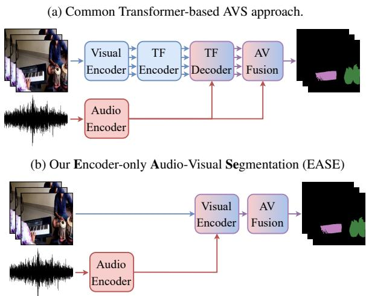
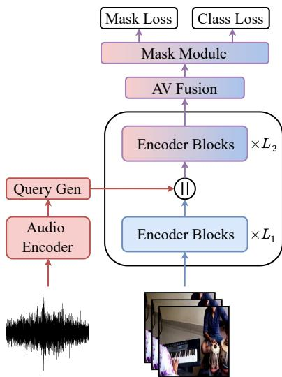

# LESS IS MORE: ENCODER-ONLY AUDIO-VISUAL SEGMENTATION

Ilpo Viertola1, Vladimir Iashin1, Sophie Totterstr¨ om¨ 1, Esa Rahtu1

1Tampere University

## ABSTRACT

Audio-Visual Semantic Segmentation (AVSS) aims to identify, segment, and classify sound-emitting objects in video frames. Previous Transformer-based AVSS approaches largely inherit design principles from image segmentation models. Recent studies show that these image segmentation models contain redundant components that contribute little to the segmentation performance. Following this insight, we propose Encoder-only Audio-Visual Segmentation (EASE). EASE runs at up to 365 FPS, 3× faster than prior State-of-the-Art (SotA) AVS models at comparable accuracy, and trains in under 11 GPU-hours. Furthermore, we achieve SotA AVSS performance across different backbones and input resolutions. Our results demonstrate that AVSS can be both simpler and faster, providing a scalable foundation for future research and real-time applications. Code, model weights, and samples are available at ease-avs.notion.site.

Index Terms— Semantic Segmentation, Audio-Visual Learning

## 1. INTRODUCTION

Audio-Visual Segmentation (AVS) aims to localize and segment sounding objects in a video. Traditionally, the AVS task is divided into three sub-tasks: Single Sound Source Segmentation (S4), Multiple Sound Source Segmentation (MS3), and Audio-Visual Semantic Segmentation (AVSS) [1, 2]. For the first two, the goal is to produce a pixel-level binary mask indicating pixels emitting the sounds. For the semantic segmentation, the goal is also to categorize the masked objects. Since AVSS is larger in size, a more complex task, and includes all samples from S4 and MS3, we focus on it in this work.

Many AVS studies draw inspiration from image segmentation research [3, 4, 5, 6, 7, 8, 9]. Recent works [10, 11, 12] have explored redundant components in current State-of-the-Art (SotA) image segmentation models, while the plain Vision Transformer (ViT) [13] has demonstrated strong generalization across a wide range of computer vision tasks [14, 15, 16]. Additional task-specific components implemented on top of a ViT backbone in image segmentation models often increase model size and computational cost without substantially improving segmentation quality, motivating efforts towards more efficient and modular architectures [10, 11, 12].

A common Transformer-based [17] AVS approach is illustrated in Fig. 1a. We adapt the core design principles of [10, 11, 12] to AVS by removing task-specific building blocks in favor of a plain ViT architecture, and introduce Encoder-only Audio-Visual Segmentation (EASE). Our approach is shown in Fig. 1b. It enables integrating Vision Foundation Models (VFM)s [15, 14] to leverage their strong visual representations while reducing complexity. We experiment with two visual backbones: the commonly used AVS backbone Pyramid Vision Transformer v2 (PVTv2) [18], and the widely adopted VFM DINOv3 [15]. Thanks to extensive pretraining and high VFM capacity, we achieve SotA AVSS performance with 3× higher throughput. The scalable vanilla ViT [13] architecture further enables optimized attention implementations such as FlashAt tention [19] for faster training and inference.

  
Fig. 1: Comparison between our simplified approach and common Transformer-based AVS methods. Our approach eliminates unnecessary architectural complexity, resulting in a more efficient model while preserving high segmentation performance.

Our contributions can be summarized as follows: i) a simple, strong, and efficient baseline for AVS that enables adopting VFMs for AVS, ii) a model-agnostic cross-modal fusion technique with audio feature enhancement, and iii) extensive experiments on all AVS sub-tasks to demonstrate the balance between segmentation performance and efficiency of our method.

## 2. BACKGROUND

Audio-visual segmentation (AVS) refers to the task of predicting pixel-wise masks for the sound-producing objects in a video. It was first proposed by Zhou et al. [1, 2], and it is closely related to Sound Source Localization (SSL) [20, 21, 22]. AVS consists of three sub-tasks, each with a corresponding dataset: Single Sound Source Segmentation (S4), Multiple Sound Source Segmentation (MS3), and Audio-Visual Semantic Segmentation (AVSS). Since the first two concentrate on binary predictions (sound-producing vs. silent pixel), we mainly focus on the AVSS task, where each pixel is also assigned a class label. S4 and MS3 data are subsets of AVSS.

Together with the datasets, Zhou et al. [1, 2] introduced a Convolutional Neural Network (CNN) based temporal pixel-wise audiovisual interaction (TPAVI) network. Later AVS methods utilize crossattention [17] and use audio as a reference query [3, 4, 6, 7, 23, 24, 25, 26] to fuse cross-modal information. To emphasize audio, recent works have introduced bidirectional attention, where audio is used to compute the key and value vectors [5, 27].

  
Fig. 2: Overview of EASE. Audio and visual frames are encoded, and the encoded audio is enhanced by soft clustering it to semantically representative auditory centers. The query generator is used to generate sparse audio queries before concatenating them with the visual features. The concatenated sequence is processed with the remaining $L _ { 2 }$ encoder blocks and fused at each block with the enhanced audio features. The connection between enhanced audio features and AV Fusion is omitted for clarity. Finally, a mask module is employed to produce the final mask predictions from the visual tokens and the class predictions from the sparse audio query tokens.

Many of the aforementioned approaches draw inspiration from Mask Transformer [28]. Adaptation of the Mask Transformer-based approach for AVS relies on semantic alignment of visual and auditory features [5, 7, 25, 27, 29]. Alternatively, Gong et al. [30] explore selective state-space models for AVS. Mao et al. [31, 32] explore modeling a shared modality space using a conditional variational autoencoder [33] and a diffusion model [34] to learn an effective multimodal latent space for segmentation.

Many AVS models are built on top of image segmentation models. As a result, they inherit the same architectural components: hierarchical backbones, multi-scale feature pyramids, and localized attention. These components add task-specific complexity to the plain ViT architecture utilized by modern VFMs. Because AVS models deviate from plain ViT design, they cannot benefit from VFM pretraining without significant re-engineering. Kerssies et al. [10] demonstrate this incompatibility in the image segmentation domain. This motivates us to build a simpler, efficient, and scalable alternative to specialized architectures in the audio-visual segmentation domain.

## 3. METHOD

Encoder-only Audio-Visual Segmentation (EASE), presented in Fig. 2, is a simplified approach for AVS built on top of a plain ViT architecture making it fully compatible with modern VFMs. It also introduces new components: a Gumbel-Softmax-based audio feature enhancement module, a mid-backbone audio query injection strategy, and a bidirectional audio-visual fusion module with learned soft clustering. Our model achieves state-of-the-art performance while being up to 3× faster than existing methods.

Audio Feature Extraction. We follow the standard pipeline established in [1, 2]. Audio is encoded with a pretrained and frozen VGGish [35] encoder, producing frame-level features $f _ { a } \in \mathbb { R } ^ { T \times 1 2 8 }$ where T is the number of frames. This yields a single feature vector per frame, which lacks discriminative semantic structure across different sound sources and intra-class variations.

To address this, we introduce a clustering step that groups audio features around K learned semantic centers $\mathbf { \bar { c } } _ { a } \in \mathbb { R } ^ { T \times \breve { K } \times 1 \hat { 2 } 8 }$ . Each frame is assigned to the centers based on feature similarity, producing audio representations that better capture semantic variation within and across sound categories. We refer to this process as audio feature enhancement. In our experiments, setting K to the number of semantic classes in AVSBench [1, 2] yielded the best results.

The cluster assignments are learned end-to-end via the Gumbel-Softmax operation, which enables discrete-like cluster selection while remaining fully differentiable during training. Standard softmax produces soft, distributed assignments across all K centers, whereas Gumbel-Softmax encourages sparser, more committed assignments that correspond to distinct semantic categories. Following [36], we use $\scriptstyle { c _ { a } }$ to compute a discriminative semantic enhancement for $f _ { a }$ which reduces semantic bias arising from intra-class variation. The resulting enhanced audio feature is denoted $\hat { { f } } _ { a } \in \mathbb { R } ^ { T \times K \times 1 2 8 }$

Our approach differs from DDESeg [36], which precomputes the audio feature bank prior to training. By learning the cluster centers and assignments end-to-end, our method eliminates dataset-level precomputation and adaptively captures the semantic structure of the audio, improving the discriminative power of the features for AVS.

Mask Prediction. The mask prediction design adopts the plain ViT segmentation approach of Kerssies et al. [10] as its structural foundation. Our contribution is the mid-backbone audio query injection strategy, which adapts their design to the multimodal AVS setting.

EASE employs a ViT-based [13] visual backbone to encode input video frames. Rather than processing visual and audio tokens jointly from the start, we split the backbone into two stages at block $L _ { 1 }$ The first stage processes visual tokens independently, producing rich visual representations $\pmb { f } _ { m } \in \mathbb { R } ^ { T \times N _ { m } \times D }$ , where $N _ { m }$ is the number of patch tokens, and $D$ is the shared feature dimension.

After $L _ { 1 }$ blocks, we generate sparse audio queries from the enhanced audio feature ${ \hat { f } } _ { a }$ using the query generator (Query Gen in Fig. 2). This is done by cross-attending $\hat { f } _ { a }$ with a learnable query vector, using $\hat { f } _ { a }$ as keys and values. The audio representation is then projected to a shared feature dimension $D$ of the visual backbone, yielding a set of sparse queries $\pmb { q } \in \mathbb { R } ^ { T \times N _ { q } \times D }$ , where $N _ { q }$ is the num ber of query tokens. Since $f _ { m }$ already carries positional information from the $L _ { 1 }$ stage, learnable positional encodings are added only to $\mathbf { \delta } \mathbf { q } .$ The queries are then concatenated with the visual token sequence along the sequence dimension to form the joint cross-modal sequence ${ \pmb s } ^ { ( 0 ) } = [ { \pmb q } ; ^ { \pmb { \prime } } { \pmb f } _ { m } ] \in \mathbb { R } ^ { T \times ( N _ { q } + N _ { m } ) \times D }$

At each block $l \in \{ L _ { 1 } + 1 , \ldots , L _ { 2 } \}$ , we first split $\mathbf { \boldsymbol { s } } ^ { ( l - 1 ) }$ back into its constituent sequences $\pmb q ^ { ( l - 1 ) }$ and $\mathbf { \Delta } f _ { m } ^ { ( l - 1 ) }$ , apply the audiovisual fusion module to the visual tokens using ${ \hat { f } } _ { a }$ , and re-form the joint sequence before passing it through the ViT block. All AVFusion modules across $L _ { 2 }$ blocks share weights, keeping the added parameter count negligible.

Mask predictions are produced directly from $\pmb { s } ^ { ( L _ { 2 } ) }$ . Following $[ 1 0 , 3 7 ] .$ , a small mask module predicts the final segmentation masks from $\pmb { f } _ { m } ^ { L _ { 2 } }$ and the class labels from $\pmb q ^ { L _ { 2 } }$ . During training, we also apply this module after each $\{ L _ { 1 } + 1 , \ldots , L _ { 2 } - 1 \}$ block to produce intermediate masks that constrain the self-attention of $\pmb q ^ { ( l ) }$ , providing localization supervision. Since masked attention is expensive, we follow [10] and anneal it during training.

Audio-Visual Fusion Module. The AV Fusion module takes visual mask features $\mathbf { f } _ { m } ^ { ( l - 1 ) }$ and enhanced audio features $\hat { f } _ { a }$ as input and returns enhanced visual tokens $\tilde { f } _ { m } ^ { ( l ) }$ . It operates only on token sequences of dimension $D ,$ so it imposes no constraints on the visual backbone and applies to any ViT-based model without modification. Prior to fusion, ${ \hat { f } } _ { a }$ is projected to the shared dimension $D .$

Stage 1: Visual-Guided Audio Suppression We cluster the visual tokens using Gumbel-Softmax clustering, with $K _ { \imath }$ v learnable visual cluster centers, producing visual clusters $\pmb { c } _ { m } \in \mathbb { R } ^ { T \times K _ { v } \times D }$ . In our experiments, $K _ { v } = 5$ yielded the best results. We then attend $\hat { f } _ { a }$ over $\mathbf { c } _ { m }$ via cross-attention to assess how well each audio cluster is grounded in the visual scene, and map the result to a score ${ \textbf { \em s } } \in$ $[ 0 , \stackrel { \smile } { 1 } ] ^ { T \times K _ { \iota } }$ through a linear layer and sigmoid operation. Scaling $\hat { f } _ { a }$ with s yields visually-grounded audio features $\tilde { f } _ { a }$ mitigating the interference of off-screen sounds.

Stage 2: Audio-Conditioned Visual Feature Update We condition the visual tokens on $\tilde { f } _ { a }$ via a second cross-attention, with $\mathbf { f } _ { m } ^ { ( l - 1 ) }$ as queries and $\tilde { f } _ { a }$ as keys and values, producing the updated visual tokens $\tilde { f } _ { m } ^ { ( l ) }$ . These are re-concatenated with $\pmb q ^ { ( l ) }$ and processed through the next ViT block.

## 4. EXPERIMENTS

## 4.1. Setup

Datasets. We utilize the widely adopted audio-visual segmentation dataset AVSBench [1, 2]. The complete dataset includes three subsets: S4, MS3, and AVSS. Videos are 10 seconds long, with one frame per second extracted for segmentation. Input data is uniformly reshaped to $2 2 4 \times 2 2 4 ( 2 2 4 ^ { 2 } )$ or 384 × 384 (3842). Following prior works, masks are predicted in $2 2 4 \times 2 2 4$ spatial size.

Implementation. We utilize pretrained PVTv2 [18] and DINOv3 [15] as visual backbone networks. While PVTv2 is widely adopted in AVS research, our simplified model design enables the effective use of VFMs like DINOv3 with a modest computation budget. For PVTv2, we use Stage 3 visual tokens and disable spatial reduction for $L _ { 2 }$ blocks to improve efficiency.

In our experiments, $L _ { 2 } = 6$ and $L _ { 2 } = 4$ yielded the best results for PVTv2 and DINOv3 respectively. For DINOv3 training, we follow [10], including the loss computation. For PVTv2, we adopt the same training strategy but disable the layer-wise learning rate decay to enable full model fine-tuning. For training and testing, we utilize two NVIDIA A100 GPUs. We train S4 for 46 and 22 epochs, MS3 for 80 and 40 epochs, and AVSS for 36 and 22 epochs for PVTv2 and DINOv3 models, respectively. In GPU hours, training takes up to 7 and 5 hours for S4, up to 1.5 hours for both for MS3, and up to 15 and 11 hours for AVSS using the PVTv2 and DINOv3.

All methods, except DDESeg [36], use the frozen VGGish [35] audio encoder (72M parameters) as their audio backbone. DDESeg [36] replaces VGGish [35] with HTSAT, a substantially smaller and more modern audio encoder (29M parameters). We report parameter counts, including the audio encoder, to ensure transparency in Table 1.

Evaluation Metrics. For quantitative evaluation, we follow common practice and use the mean Jaccard index (J) [38] and F-score with $\overline { { \beta } } ^ { 2 } = 0 . 3 \ : ( \mathcal { F } )$ . To evaluate the model efficiency, we utilize inference speed frames per second (FPS) and the average number of floating-point operations (FLOPs) calculated with a batch size of 1 on a single NVIDIA RTX 4090 GPU. FLOPs are obtained using the DeepSpeed [39] profiler and reported as GFLOPs $( \mathrm { { F L O P s } \times 1 0 ^ { 9 } } )$ Note that reported GLOPs are not operations per second but rather the number of floating-point operations. We evaluate all models using their official codebases while employing a unified dataloading pipeline to eliminate differences in dataloading efficiency.

Table 1: Quantitative comparison on AVSS [1, 2] with efficiency evaluations. We compare performance on AVSS and throughput between EASE and SotA approaches with open-source code. †Retrained on the standard data split and benchmark metrics. ‡DDESeg uses HTSAT (29M) as its audio encoder, while all other methods use VGGish (72M) [35]. Parameter counts are reported inclusive of audio encoders.
<table><tr><td rowspan="3">Method</td><td rowspan="3">Backb. Params Inp.</td><td rowspan="3"></td><td colspan="2">AVSS</td></tr><tr><td>J↑F↑FPS↑GFLOPs↓</td><td></td></tr><tr><td></td><td></td></tr><tr><td>AVSegFormer [3] PVTv2 AVSegFormer [3] PVTv2</td><td></td><td>186M  $2 2 4 ^ { 2 }$ </td><td>36.7 42.0 27</td><td>99</td></tr><tr><td></td><td></td><td>186M  $5 1 2 ^ { 2 }$ </td><td>37.3 42.8 23</td><td>504</td></tr><tr><td>AAVS [7]</td><td>Swin-B</td><td>187M  $3 8 4 ^ { 2 }$ </td><td>48.5 53.2 69</td><td>151</td></tr><tr><td>Selm [9]</td><td>Swin-B</td><td>186M  $4 4 8 ^ { 2 }$ </td><td>41.3 46.9 71</td><td>258</td></tr><tr><td>COMBO [5]</td><td>PVTv2</td><td>499M  $2 2 4 ^ { 2 }$ </td><td>42.1 46.1 73</td><td>346</td></tr><tr><td> $\mathrm { D D E S e g ^ { \dag \ddag } \ [ 3 6 ] }$ </td><td>Transf.</td><td>133M  $2 2 4 ^ { 2 }$ </td><td>43.3 48.7 27</td><td>179</td></tr><tr><td>EASE</td><td>PVTv2</td><td>147M  $2 2 4 ^ { 2 }$ </td><td>42.3 47.6 159</td><td>40</td></tr><tr><td>EASE</td><td>PVTv2</td><td>147M  $3 8 4 ^ { 2 }$ </td><td>46.1 50.6141</td><td>105</td></tr><tr><td>EASE</td><td>ViT-B</td><td>187M  $2 2 4 ^ { 2 }$ </td><td>45.8 50.7 365</td><td>96</td></tr><tr><td>EASE</td><td>ViT-B</td><td>187M  $3 8 4 ^ { 2 }$ </td><td>49.8 54.1 181</td><td>291</td></tr><tr><td>EASE</td><td>ViT-L</td><td>424M  $2 2 4 ^ { 2 }$ </td><td>52.2 57.2 225</td><td>227</td></tr><tr><td>EASE</td><td>ViT-L</td><td>424M  $3 8 4 ^ { 2 }$ </td><td>56.5 61.0 86</td><td>721</td></tr></table>

## 4.2. Main Results

AVSS Quantitative Comparisons. Table 1 shows quantitative comparisons in AVSS [1, 2] benchmark combined with efficiency statistics. AVS-Mamba [30] or BAVS [26] are excluded from the efficiency evaluation as their source code is not publicly available. Their AVSS segmentation scores are reported in Table 2, where EASE with ViT-L achieves superior performance. For the DDESeg [36] model, weights are not publicly available, so we train and evaluate the model following the AVSS [1, 2] standard. For COMBO [5], we use precomputed maskige representations while evaluating the efficiency.

Using PVTv2 [18] together with a lightweight audio-visual fusion module, our model outperforms methods with considerably more complex architectures. As noted in Section 4.1, direct parameter comparisons are complicated by inconsistent audio backbones. The smaller parameter count of DDESeg [36] stems from its smaller audio backbone rather than its visual or fusion design. Increasing the input frame size further improves performance while EASE maintains high computational efficiency.

However, PVTv2 is not a plain ViT. It introduces a hierarchical pyramid structure with overlapping patch embeddings and spatialreduction attention, which enables multi-scale feature extraction rather than a single-scale global representation. Since our approach is not dependent on a specialized architecture, we can utilize a VFM and optimization techniques designed for plain attention.

By utilizing a pretrained ViT [15], we achieve SotA performance with superior model throughput. The benefit of large-scale pretraining of VFMs is clear in the AVSS task, where the class variation is high. Despite utilizing more parameters with ViT [13] based approaches, EASE achieves superior inference throughput. This highlights that the efficiency gains of EASE are architectural in nature, originating from the plain ViT design and its compatibility with optimized attention implementations such as FlashAttention [19]. Although our largest configuration incurs a higher GFLOPs count than the compared baselines, its throughput remains competitive, thanks to modern attention acceleration techniques. In applications such as video understanding, robotics, immersive media, and assistive technologies, model throughput is crucial: higher FPS enables real-time operation and smoother integration into larger processing pipelines. A more comprehensive comparison with existing methods on the AVSS task without efficiency metrics is in Table 2.

Table 2: Quantitative comparison on S4, MS3 and AVSS categorized by backbone model and input size [1, 2]. \*MS3 model was pretrained on S4 data. †Retrained using standard data split and benchmark metrics. ‡DDESeg uses HTSAT as its audio encoder, while all other methods use VGGish [35].
<table><tr><td rowspan="3">Method</td><td rowspan="3">Backb. Inp.</td><td></td><td>AVSS</td><td>S4 MS3</td></tr><tr><td>J↑F↑</td><td>J↑F↑</td><td>J↑F↑</td></tr><tr><td>29.8 35.2</td><td>78.7 87.9</td><td>54.0 64.5</td></tr><tr><td>TPAVI [1]</td><td>PVTv2</td><td> $2 2 4 ^ { 2 }$ </td><td></td><td></td></tr><tr><td>CATR [25]</td><td>PVTv2  $2 2 4 ^ { 2 }$ </td><td>32.8 38.5</td><td>84.4 91.3</td><td>62.7 74.5</td></tr><tr><td>ECMVAE [31]</td><td>PVTv2  $2 2 4 ^ { 2 }$ </td><td></td><td>81.7 90.1</td><td>57.8 70.8</td></tr><tr><td>AQFormer* [23]</td><td>PVTv2  $2 2 4 ^ { 2 }$   $2 2 4 ^ { 2 }$ </td><td></td><td>81.6 89.4</td><td>62.2 72.7</td></tr><tr><td>AVSegFormer [3] PVTv2</td><td> $2 2 4 ^ { 2 }$ </td><td>36.7 42.0</td><td>82.1 89.9</td><td>58.4 69.3</td></tr><tr><td>COMBO [5]</td><td>PVTv2</td><td>42.1 46.1</td><td>84.7 91.9</td><td>59.2 71.2</td></tr><tr><td>CAVP [24] EASE*</td><td>PVTv2  $2 2 4 ^ { 2 }$  PVTv2  $2 2 4 ^ { 2 }$ </td><td>30.4 35.3 42.3 47.6</td><td>78.8 88.9</td><td>55.8 67.1</td></tr><tr><td>AVSegFormer [3] PVTv2</td><td> $5 1 2 ^ { 2 }$ </td><td></td><td>80.4 89.7</td><td>60.8 68.7</td></tr><tr><td>AVS-Mamba [30] PVTv2</td><td></td><td>37.3 42.8</td><td>83.1 90.5</td><td>61.3 73.0</td></tr><tr><td></td><td> $4 4 8 ^ { 2 }$ </td><td>39.7 45.1</td><td>85.0 92.6</td><td>68.6 78.6</td></tr><tr><td>Selm [9] EASE*</td><td>PVTv2  $4 4 8 ^ { 2 }$  PVTv2 3842</td><td>41.3 46.9</td><td>83.5 91.2</td><td>60.3 71.3</td></tr><tr><td></td><td></td><td>46.1 50.6</td><td>83.0 90.9</td><td>61.9 69.8</td></tr><tr><td>AVSC [29]</td><td>Swin-B  $2 2 4 ^ { 2 }$ </td><td></td><td>81.3 88.6</td><td>59.5 65.7</td></tr><tr><td>BAVS [26]</td><td>Swin-B</td><td> $2 2 4 ^ { 2 }$  33.6 37.5</td><td>82.7 89.8</td><td>59.6 65.9</td></tr><tr><td>QDFormer [8]</td><td>Swin-T</td><td> $2 2 4 ^ { 2 }$ </td><td>79.5 88.2</td><td>61.9 66.1</td></tr><tr><td>DDESeg† [36]</td><td>Trans.  $2 2 4 ^ { 4 }$ </td><td>43.3 48.7</td><td>89.4 93.2</td><td>67.8 75.1</td></tr><tr><td>EASE</td><td>ViT-B</td><td> $2 2 4 ^ { 2 }$  45.8 50.7</td><td>83.5 92.0</td><td>61.4 70.2</td></tr><tr><td>EASE</td><td>ViT-L</td><td> $2 2 4 ^ { 2 }$  52.2 57.2</td><td>85.5 92.9</td><td>65.0 71.1</td></tr><tr><td>AAVS [7]</td><td>Swin-B</td><td> $3 8 4 ^ { 2 }$  48.5 53.2</td><td>83.2 91.3</td><td>67.3 77.6</td></tr><tr><td>EASE</td><td>ViT-B</td><td> $3 8 4 ^ { 2 }$  49.8 54.1</td><td>86.2 93.3</td><td>62.9 73.6</td></tr><tr><td>EASE</td><td>ViT-L</td><td> $3 8 4 ^ { 2 }$  56.5 61.0</td><td>87.7 94.1</td><td>70.2 76.5</td></tr></table>

S4 and MS3 Quantitative Comparisons. With the ViT-L backbone, EASE achieves the best MS3 Jaccard index and the best S4 F-score among all compared specialized methods [1, 3, 5, 7, 8, 9, 23, 24, 25, 26, 29, 30, 31, 36], despite using no task-specific components, as shown in Table 2. The results on ViT-B are also highly comparable. On the remaining metrics, specialized models retain an advantage in the low-data S4 and MS3 regimes. We attribute this to the small dataset sizes: the built-in inductive biases of specialized modules, such as multiscale feature extraction, audio source separation, and localized processing, help capture fine-grained spatial detail when training data is very limited. Such specialization may also increase the risk of overfitting and, as shown in Table 1, reduce overall efficiency.

## 4.3. Ablations

Effect of Pretraining on MS3. Since our approach does not rely on architectural inductive biases and PVTv2 [18] is less extensively pretrained than DINOv3 [15], we first pretrain the PVTv2-based model on the S4 task. This stage enables the model to learn basic audio-visual segmentation concepts before fine-tuning on the limited MS3 dataset. By pretraining the model with a 224 × 224 input size,

Table 3: Effect of pretraining on MS3. We pretrain EASE with PVTv2 [18] on S4 data and fine-tune it using MS3.
<table><tr><td rowspan="2">Method</td><td rowspan="2">Backb.</td><td rowspan="2">Input</td><td rowspan="2">Pretrained</td><td colspan="2">MS3</td></tr><tr><td> $\mathcal { I } \uparrow$ </td><td> $\mathcal { F } \uparrow$ </td></tr><tr><td>EASE</td><td>PVTv2</td><td> $2 2 4 ^ { 2 }$ </td><td>X</td><td>55.3</td><td>67.4</td></tr><tr><td>EASE</td><td>PVTv2</td><td> $2 2 4 ^ { 2 }$ </td><td>√</td><td>60.8</td><td>68.7</td></tr><tr><td>EASE</td><td>PVTv2</td><td> $3 8 4 ^ { 2 }$ </td><td>X</td><td>59.4</td><td>70.1</td></tr><tr><td>EASE</td><td>PVTv2</td><td> $3 8 4 ^ { 2 }$ </td><td>√</td><td>61.9</td><td>69.8</td></tr></table>

we gain approximately 9% and 2% performance increases in the Jaccard index and the F-score, respectively. For the 384 × 384 input model, pretraining increases the Jaccard index by roughly 4%, but reduces the F-score by approximately 0.4%.

Table 4: Ablation on different audio enhancers. EASE performance using DINOv3-B [15] 2242 model on AVSBench-Semantic [2] benchmark.
<table><tr><td rowspan="2">Audio Enhancer Type</td><td colspan="2">AVSS</td></tr><tr><td>J↑</td><td>F↑</td></tr><tr><td>Linear</td><td>44.3</td><td>49.3</td></tr><tr><td>Precomputed Clusters</td><td>43.9</td><td>48.8</td></tr><tr><td>Learned Clusters</td><td>45.8</td><td>50.7</td></tr></table>

Audio Enhancer. To assess the impact of audio feature enhancement, we evaluate three configurations: our learned clustering, the precalculated audio feature bank enhancement from DDESeg [36], and a single linear projection layer as a baseline. The learned clusteringbased audio enhancement significantly outperforms the alternatives. The pre-calculated audio feature bank from DDESeg [36] does not improve over the single linear projection baseline, and in some cases reduces performance, suggesting its static nature cannot capture the context-dependent audio-visual interactions in segmentation.

Table 5: Ablation on different Audio-Visual Fusion Modules. EASE performance using DINOv3-B [15] 2242 model on AVSBench-Semantic [2] benchmarks.
<table><tr><td rowspan="2">Fusion Module Type</td><td colspan="2">AVSS</td></tr><tr><td>J↑</td><td>F↑</td></tr><tr><td>Bi-way Attention</td><td>43.5</td><td>48.7</td></tr><tr><td>AVFusion w/o Clustering</td><td>44.4</td><td>49.5</td></tr><tr><td>AVFusion</td><td>45.8</td><td>50.7</td></tr></table>

Audio-Visual Fusion. We further ablate the design of the audiovisual fusion module. Table 5 compares three fusion configurations: a simple cross-attention baseline, the bi-directional attention module from CAVP [24], and the clustering-based bi-directional fusion used in EASE, which is inspired by DDESeg [36]. The clustering-based fusion module significantly outperforms the alternatives, effectively capturing the complex relationships between the modalities.

## 5. CONCLUSION

We presented EASE, a simplified encoder-only architecture that removes task-specific complexity from AVSS models in favor of a plain ViT backbone. By combining learned audio enhancement with a lightweight fusion module, EASE achieves SotA accuracy at 3× the speed of prior methods. EASE shows AVS can exploit modern VFMs and offers a simpler, scalable foundation for future research.

## 6. REFERENCES

[1] J. Zhou, J. Wang, J. Zhang, W. Sun, J. Zhang, S. Birchfield, et al., “Audio–visual segmentation,” in ECCV, 2022.

[2] J. Zhou, X. Shen, J. Wang, J. Zhang, W. Sun, J. Zhang, et al., “Audio-visual segmentation with semantics,” IJCV, 2024.

[3] S. Gao, Z. Chen, G. Chen, W. Wang, and T. Lu, “Avsegformer: Audio-visual segmentation with transformer,” in AAAI, 2024.

[4] Z. Wang, Q. Yang, L. Shi, J. Yu, Q. Liang, F. Li, et al., “Avesformer: Efficient transformer design for real-time audio-visual segmentation,” arXiv preprint arXiv:2408.01708, 2024.

[5] Q. Yang, X. Nie, T. Li, P. Gao, Y. Guo, C. Zhen, et al., “Cooperation does matter: Exploring multi-order bilateral relations for audio-visual segmentation,” in CVPR, 2024.

[6] Z. Shi, Q. Wu, F. Meng, L. Xu, and H. Li, “Cross-modal cognitive consensus guided audio-visual segmentation,” TMM, 2024.

[7] J. Ma, P. Sun, Y. Wang, and D. Hu, “Stepping stones: A progressive training strategy for audio-visual semantic segmentation,” in ECCV, 2024.

[8] X. Li, J. Wang, X. Xu, X. Peng, R. Singh, Y. Lu, et al., “Qdformer: Towards robust audiovisual segmentation in complex environments with quantization-based semantic decomposition,” in CVPR, 2024.

[9] J. Li, S. Yu, Y. Wang, L. Wang, and H. Lu, “Selm: Selective mechanism based audio-visual segmentation,” in ACM MM, 2024.

[10] T. Kerssies, N. Cavagnero, A. Hermans, N. Norouzi, G. Averta, B. Leibe, et al., “Your vit is secretly an image segmentation model,” in CVPR, 2025.

[11] W. Chen, X. Du, F. Yang, L. Beyer, X. Zhai, T.-Y. Lin, et al., “A simple single-scale vision transformer for object localization and instance segmentation,” in ECCV, 2022.

[12] Y. Fang, B. Liao, X. Wang, J. Fang, J. Qi, R. Wu, et al., “You only look at one sequence: Rethinking transformer in vision through object detection,” in NeurIPS, 2021.

[13] A. Dosovitskiy, L. Beyer, A. Kolesnikov, D. Weissenborn, X. Zhai, T. Unterthiner, et al., “An image is worth 16x16 words: Transformers for image recognition at scale,” ICLR, 2021.

[14] M. Oquab, T. Darcet, T. Moutakanni, H. V. Vo, M. Szafraniec, V. Khalidov, et al., “Dinov2: Learning robust visual features without supervision,” TMLR, 2024.

[15] O. Simeoni, H. V. Vo, M. Seitzer, F. Baldassarre, M. Oquab,´ C. Jose, et al., “DINOv3,” 2025.

[16] M. Dehghani, J. Djolonga, B. Mustafa, P. Padlewski, J. Heek, J. Gilmer, et al., “Scaling vision transformers to 22 billion parameters,” in ICML, 2023.

[17] A. Vaswani, N. Shazeer, N. Parmar, J. Uszkoreit, L. Jones, A. N. Gomez, et al., “Attention is all you need,” in NeurIPS, 2017.

[18] W. Wang, E. Xie, X. Li, D.-P. Fan, K. Song, D. Liang, et al., “Pvt v2: Improved baselines with pyramid vision transformer,” CVM, 2022.

[19] T. Dao, “FlashAttention-2: Faster attention with better parallelism and work partitioning,” in ICLR, 2024.

[20] R. Arandjelovic and A. Zisserman, “Look, listen and learn,” in ICCV, 2017.

[21] R. Arandjelovic and A. Zisserman, “Objects that sound,” in ECCV, 2018.

[22] A. Senocak, T.-H. Oh, J. Kim, M.-H. Yang, and I. S. Kweon, “Learning to localize sound source in visual scenes,” in CVPR, 2018.

[23] S. Huang, H. Li, Y. Wang, H. Zhu, J. Dai, J. Han, et al., “Discovering sounding objects by audio queries for audio visual segmentation,” arXiv preprint arXiv:2309.09501, 2023.

[24] Y. Chen, Y. Liu, H. Wang, F. Liu, C. Wang, H. Frazer, et al., “Unraveling instance associations: A closer look for audio-visual segmentation,” in CVPR, 2024.

[25] K. Li, Z. Yang, L. Chen, Y. Yang, and J. Xiao, “Catr: Combinatorial-dependence audio-queried transformer for audiovisual video segmentation,” in ACM MM, 2023.

[26] C. Liu, P. Li, H. Zhang, L. Li, Z. Huang, D. Wang, et al., “Bavs: bootstrapping audio-visual segmentation by integrating foundation knowledge,” TMM, 2024.

[27] T. Chen, Z. Tan, T. Gong, Q. Chu, Y. Wu, B. Liu, et al., “Bootstrapping audio-visual video segmentation by strengthening audio cues,” TCSVT, 2024.

[28] N. Carion, F. Massa, G. Synnaeve, N. Usunier, A. Kirillov, and S. Zagoruyko, “End-to-end object detection with transformers,” in ECCV, 2020.

[29] C. Liu, P. P. Li, X. Qi, H. Zhang, L. Li, D. Wang, et al., “Audiovisual segmentation by exploring cross-modal mutual semantics,” in ACM MM, 2023.

[30] S. Gong, Y. Zhuge, L. Zhang, Y. Wang, P. Zhang, L. Wang, et al., “Avs-mamba: Exploring temporal and multi-modal mamba for audio-visual segmentation,” TMM, 2025.

[31] Y. Mao, J. Zhang, M. Xiang, Y. Zhong, and Y. Dai, “Multimodal variational auto-encoder based audio-visual segmentation,” in ICCV, 2023.

[32] Y. Mao, J. Zhang, M. Xiang, Y. Lv, D. Li, Y. Zhong, et al., “Contrastive conditional latent diffusion for audio-visual segmentation,” TIP, 2025.

[33] D. P. Kingma and M. Welling, “Auto-encoding variational bayes,” ICLR, 2013.

[34] J. Ho, A. Jain, and P. Abbeel, “Denoising diffusion probabilistic models,” in NeurIPS, 2020.

[35] S. Hershey, S. Chaudhuri, D. P. W. Ellis, J. F. Gemmeke, A. Jansen, R. C. Moore, et al., “Cnn architectures for large-scale audio classification,” in ICASSP, 2017.

[36] C. Liu, L. Yang, P. Li, D. Wang, L. Li, and X. Yu, “Dynamic derivation and elimination: Audio visual segmentation with enhanced audio semantics,” in CVPR, 2025.

[37] B. Cheng, I. Misra, A. G. Schwing, A. Kirillov, and R. Girdhar, “Masked-attention mask transformer for universal image segmentation,” in CVPR, 2022.

[38] M. Everingham, L. Van Gool, C. K. I. Williams, J. Winn, and A. Zisserman, “The pascal visual object classes (voc) challenge,” IJCV, 2010.

[39] J. Rasley, S. Rajbhandari, O. Ruwase, and Y. He, “Deepspeed: System optimizations enable training deep learning models with over 100 billion parameters,” in ACM SIGKDD, 2020.