# Mind What Matters for Reasoning: Aligning Cross-Modal Attention via Selective Probability Mass Concentration

Jiaqi Deng1, Zonghan Wu2, Zhan Heng3, Xiaoshui Huang4, Huan Huo1∗, Guandong Xu5∗

1University of Technology Sydney 2East China Normal University 3The University of New South Wales 4Shanghai Jiaotong University 5 The Education University of Hong Kong

## Abstract

Multimodal large language models (MLLMs) achieve strong performance on visual reasoning tasks, yet remain prone to hallucinations and over-reliance on language priors, often generating answers without adequately using task-relevant visual evidence. Existing approaches primarily improve reasoning through reasoning-oriented supervision or inference-time strategies. In this work, we study a complementary question: can multimodal reasoning be improved by strengthening implicit visual grounding without directly supervising the reasoning process? Motivated by the functional specialization of attention heads, we investigate whether reasoning can be improved by guiding only the heads most responsive to visual evidence grounding. We propose Selective Probability Mass Concentration (sPMC), a training framework that identifies grounding-responsive heads and selectively regularizes their text-to-image attention. sPMC treats normalized attention over visual tokens as a spatial probability distribution and encourages the probability mass to be assigned to semantically relevant regions using segmentation-derived spatial priors. Adaptive Head Selection restricts this guidance to visually responsive heads while leaving the remaining heads unconstrained to preserve their complementary functions. Across 6 multimodal benchmark suites, sPMC achieves an average zero-shot improvement of 3% and gains of up to 11.3% across multiple MLLMs while regularizing only 3%-15% of their attention heads. These results demonstrate that targeted guid ance of sparse and implicit visual evidence pathways can directly improve multimodal reasoning.

## Introduction

Multimodal large language models (MLLMs) (Bai et al. 2023; Dai et al. 2023; Team 2024) have made substantial progress on visually grounded reasoning tasks, including Visual Question Answering (VQA) (Li et al. 2025b; Gao et al. 2025; Deng et al. 2025). Nevertheless, they remain prone to hallucinations and over-reliance on language priors (Leng et al. 2024; Bai et al. 2024), often producing answers without adequately using task-relevant visual evidence. This problem is especially acute in fine-grained reasoning, where a correct answer may depend on only a few informative visual cues.

Recent analyses associate these failures with misallocated text-to-image attention (Seil et al. 2025; Woo et al. 2025; Chen et al. 2025). Attention determines which visual signals are emphasized and propagated during decoding; when it is difuse or concentrated on irrelevant regions, the model may aggregate incomplete or misleading evidence. These findings suggest that reasoning failures are often linked not only to deficiencies in reasoning itself, but also to inefective utilization of visual evidence.

Existing methods therefore attempt to improve visual grounding either by manipulating attention dynamics during inference (Seil et al. 2025; Woo et al. 2025; Leng et al. 2024) or by directly aligning attention maps during training (Chen et al. 2025). While inference-time approaches can partially mitigate attention misallocation, they operate on the model’s native attention dynamics and do not fundamentally improve how visual evidence is utilized. Training-based approaches provide stronger supervision signals, but rigidly assume dense alignment across attention maps, requiring broad modification of the attention mechanism. Despite their methodological diferences, both paradigms implicitly treat attention as a uniformly important component. Recent work suggests that visual grounding is concentrated in a small subset of attention heads (Seil et al. 2025; Kang et al. 2025). This raises a unexplored question: can multimodal reasoning be improved by selectively strengthening the attention pathways exhibiting strong visual-grounding signals, rather than directly the reasoning process itself?

In response, we propose Selective Probability Mass Concentration (sPMC), a training framework for targeted textto-image attention guidance. Given a segmentation-derived spatial mask, sPMC increases the total attention mass assigned to the masked region without prescribing its distribution across individual visual tokens. Because the objective constrains only aggregate in-mask mass, it tolerates moderately over-inclusive masks without requiring every masked token to match a fixed target. Through a head-level empirical study, we confirm that strong visual engagement and spatial grounding are consistently concentrated in a small subset of attention heads. Building on this finding, Adaptive Head Selection applies sPMC only through these groundingresponsive heads while leaving the remaining heads unconstrained. Controlled ablations further show that guiding this subset yields consistent improvements in downstream reasoning and is more efective than all-head guidance. This observation suggests that efective visual evidence utilization is not uniformly distributed throughout the attention mechanism. Instead, a relatively small number of attention heads appear to form attention pathways that exhibit particularly strong visual-grounding behavior. Our contributions are:

• We formulate region-level attention guidance as probability-mass concentration, providing flexible spatial supervision without exact patch-wise matching.

• We introduce Adaptive Head Selection, which restricts probability-mass guidance to a small subset of attention heads with high visual engagement and show that selectively applying guidance through these heads is suficient and more efective.

• We evaluate sPMC across six multimodal benchmark suites and multiple MLLMs, obtaining an average zeroshot gain of 3% and gains of up to 11.3% over the corresponding base models.

## Related Work

## Multimodal Large Language Models

MLLMs such as Qwen-VL (Bai et al. 2023), Instruct-BLIP (Dai et al. 2023), and LLaVA (Liu et al. 2024) achieve strong performance across multimodal tasks (Li et al. 2019; Deng et al. 2025). Many architectures connect a pretrained vision encoder, such as ViT (Dosovitskiy et al. 2020), to a language model through a learned adapter. Decoder-only models such as Chameleon (Team 2024) and Qwen3-VL (Bai et al. 2025) instead represent visual and textual inputs in a shared autoregressive sequence. In both designs, attention provides an important interface between queries and visual tokens, making it a natural target for grounding supervision.

## Enhancing Multimodal Reasoning

Recent eforts to enhance multimodal reasoning in MLLMs largely focus on improving intermediate reasoning processes and grounding mechanisms to alleviate multimodal hallucinations. A prominent direction comprises Multimoda Chain-of-Thought (MCoT) methods (Zhang et al. 2024; Gao et al. 2025; Wu et al. 2024), which extend the success of CoT prompting in LLMs to multimodal settings by introducing explicit intermediate reasoning steps (Zheng et al. 2023; Chen et al. 2024b; Zhang et al. 2024; Mitra et al. 2024). ICoT (Gao et al. 2025), for example, interleaves visual regions selected using attention scores, while MVoT (Li et al. 2025a) pairs intermediate reasoning steps with generated visualizations. Such methods improve the reasoning process but may still inherit errors from the mechanism used to select visual evidence.

Another line of studies has identified cross-modal attention misallocation as a key factor contributing to the failure of visual reasoning tasks (Seil et al. 2025; Woo et al. 2025; Chen et al. 2025). These works show that attention maps are often either overly difuse or concentrated on irrelevant regions, leading to inefective aggregation of visual evidence during reasoning. To address this issue, several approaches attempt to rectify attention by manipulating attention distributions. For instance, (Seil et al. 2025) applies diagnostic experiment to identify attention heads that consistently attend to irrelevant patches (attention sinks). They then propose an inference-time intervention that reallocates attention away from these sinks. (Leng et al. 2024) introduces contrastive decoding adjustments to refine attention allocation. Lavender (Chen et al. 2025) enables MLLMs to learn towards difusion’s attention maps through patch-wise regression. While these techniques can partially improve visual perception by redistributing attention, their efectiveness is inherently limited, often yielding modest improvements and incurring additional inference overhead. Also, they fail to directly learn how attention is distributed across visual tokens.

## Methodology

We propose a novel supervision framework to improve MLLMs’ general reasoning abilities by explicitly regularizing their spatial attention distribution. Built on the hypothesis that efective reasoning depends on concentrating attention over semantically relevant image regions, we first construct semantically enriched grounding masks using external segmentation priors. We then selectively identify attention heads that exhibit strong grounding behavior and aggregate multihead, multi-layer attention into a unified spatial representation. Finally, we introduce a probability mass concentration objective that encourages the model to allocate more attention to relevant regions while preserving their pretrained generative capabilities. Together, these components provide a weakly supervised yet efective framework for aligning textual queries with visual evidence.

## Problem Formulation

Let the visual encoder map an image I to $N _ { v }$ visual tokens, let the language model autoregressively generate an answer $\boldsymbol { x } = ( x _ { 1 } , \dots , x _ { T } )$ conditioned on I and a question Q:

$$
p _ { \theta } ( x \mid \mathcal { I } , \mathcal { Q } ) = \prod _ { t = 1 } ^ { T } p _ { \theta } ( x _ { t } \mid x _ { < t } , \mathcal { I } , \mathcal { Q } ) .\tag{1}
$$

Our central hypothesis is that prediction errors on visioncentric tasks often arise when grounding-sensitive attention heads allocate insuficient attention to task-relevant visual evidence. We therefore formulate attention guidance as probability-mass concentration: selected heads are encouraged to allocate greater attention mass to relevant visual regions without being forced to match a fixed token-wise attention pattern.

## Semantically Enriched Grounding Masks

Dense attention annotations are rarely available at scale, so we derive weak spatial priors using SAM 3 (Carion et al. 2026), which is designed to detect and segment visual concepts specified by short noun-phrase prompts.

Given an image, we prompt pre-trained LLMs to derive several semantically enriched text proposals by extracting noun phrases with language modifiers (e.g., color, size and locations) from captions or input context. The textual proposals specify not only object categories but also identifiable fine-grained properties that refer to a particular instance, such as “man wearing green shirt” or “dog on the $l e f t ^ { \prime \prime }$ . For caption-based samples, proposals are extracted from image-associated captions; for VQA samples, they are extracted from reference answers. We retain only concrete noun phrases that denote visually localizable entities. Because these source texts describe the corresponding image, this construction reduces the likelihood that a segmentation prompt refers to an absent concept.

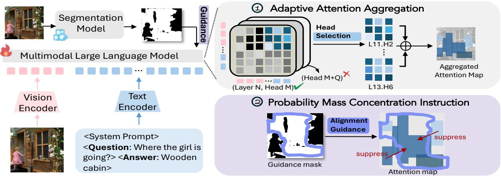  
Figure 1: Overview of the proposed sPMC framework. A text-conditioned segmentation model generates a binary guidance mask; Adaptive Attention Aggregation selects grounding-responsive heads, and probability-mass concentration directs their attention toward the masked regions.

Algorithm 1: Semantically Enriched Grounding Mask Gen  
eration   
Require: Image I, caption or answer T, pretrained LLM G, text  
conditioned segmentation model S, maximum foreground ratio   
$\rho _ { \mathrm { m a x } } = 0 . 6$   
Ensure: Set of binary masks $\{ \mathcal { M } _ { j } \}$   
1: Extract noun phrases with modifiers from T to form proposals   
$\mathcal { P } = \{ p _ { j } \}  \mathit { \hat { G } } ( T )$   
2: for all $p _ { j } \in \mathcal { P }$ do   
3: $\mathcal { R } _ { j } \overset {  } { = } \{ r _ { i , j } \}  \mathsf { S } ( I , p _ { j } )$ ▷ candidate regions   
4: $\mathcal { M } _ { j } \gets \bigvee _ { r _ { i , j } \in \mathcal { R } _ { j } } r _ { i , j }$   
5: $\rho _ { j }  \sum \mathcal { M } _ { j } / | I |$ ▷ foreground ratio   
6: if $\dot { \rho } _ { j } < \rho _ { m a x }$ then   
7: Add $\mathcal { M } _ { j }$ to output set   
8: end if   
9: end for   
10: return $\{ \mathcal { P } = \{ p _ { j } \} , \mathcal { M } = \{ \mathcal { M } _ { j } \} \}$

Conditioned on each proposal, SAM generates multiple candidate regions corresponding to diferent visual hypotheses. We then aggregate these segmentation masks into a single binary mask and discard masks with excessively large foreground ratio (>60%) to avoid coarse or non-informative coverage. The resulting masks $\mathcal { M } _ { i , j } \in \{ 0 , 1 \}$ capture semantically relevant regions corresponding to the noun phrase, which serve as region-level priors that guide text-to-image attention toward relevant areas, without enforcing overly strict supervision. Implementation details can be found in the Appendix and Algorithm 1. We treat the resulting masks as weak spatial priors rather than pixel-accurate ground truth. Merging candidate masks improves coverage, while the foreground-area filter removes overly broad masks. This favors recall because sPMC is more robust to moderate overcoverage than to missing relevant regions.

## Adaptive Attention Aggregation

Attention Aggregation. Let $\mathbf { Z } _ { t } ^ { ( h , l ) } \in \mathbb { R } ^ { N _ { v } }$ denote the presoftmax text-to-image attention logits from answer token t to the visual tokens, produced by head h at layer l. Let $\mathcal { T } _ { \mathrm { a n s } }$ denote the token indices of the target answer span, and let S denote the set of head–layer pairs selected by the adaptive procedure described below. We aggregate the selected attention logits as

$$
\tilde { \mathbf { Z } } = \frac { 1 } { | \mathcal { T } _ { \mathrm { a n s } } | | \mathcal { S } | } \sum _ { t \in \mathcal { T } _ { \mathrm { a n s } } } \sum _ { ( h , l ) \in \mathcal { S } } \mathbf { Z } _ { t } ^ { ( h , l ) } .\tag{2}
$$

The corresponding spatial attention distribution is

$$
\tilde { A } _ { i } = \frac { \exp ( \tilde { Z } _ { i } ) } { \sum _ { j = 1 } ^ { N _ { v } } \exp ( \tilde { Z } _ { j } ) } , \qquad i = 1 , \ldots , N _ { v } .\tag{3}
$$

The distribution $\tilde { \mathbf { A } } \in \Delta ^ { N _ { v } - 1 }$ is reshaped into the original $H _ { v } \times W _ { v }$ visual-token grid, where $H _ { v } \dot { W } _ { v } = N _ { v }$ (Figure 1).

Adaptive Head Selection. Our exploratory analysis (Figure 2) indicates that only a subset of attention heads produces spatially coherent and semantically grounded patterns, while others remain difuse or specialized in text-only reasoning (George et al. 2025; Seil et al. 2025). Uniformly regularizing all heads can disrupt non-grounding functions and dilute optimization signals. We therefore selectively regularize a target subset $\mathcal { H } _ { s } \subseteq \mathcal { H }$ that exhibits strong visual engagement and spatial alignment. A head h is included in $\mathcal { H } _ { s }$ if it satisfies two criteria. The following head-level statistics are computed for each calibration example and then averaged over $\mathcal { D } _ { \mathrm { c a l } }$

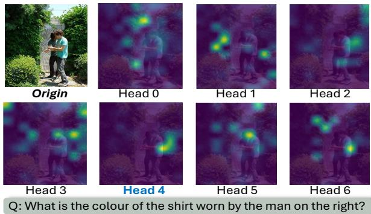  
Figure 2: Exemplar visualization of attention maps from layer 6 of Qwen3-VL-2B. While several heads exhibit irrelevant attention patterns, certain heads (Head 4) demonstrate strong alignment with the task-relevant region.

Criterion 1: Visual Engagement. Let $Z _ { t , i } ^ { ( h , l ) }$ denote the raw pre-softmax attention logit from answer token t to visual token i, produced by head h at layer l. We define the visual engagement score as the mean logit over all answer–visual token pairs:

$$
e ^ { ( h , l ) } = \frac { 1 } { | \mathcal { T } _ { \mathrm { a n s } } | | \mathcal { V } | } \sum _ { t \in \mathcal { T } _ { \mathrm { a n s } } } \sum _ { i \in \mathcal { V } } Z _ { t , i } ^ { ( h , l ) }\tag{4}
$$

A head–layer pair satisfies the visual-engagement criterion if $e ^ { ( h , l ) } \ge \tau _ { m }$

Criterion 2: Spatial Alignment. Spatial alignment measures the negative log attention mass assigned to the target region:

$$
g ^ { ( h , l ) } = \frac { 1 } { \vert { T } _ { \mathrm { a n s } } \vert } \sum _ { t \in { \mathcal T } _ { \mathrm { a n s } } } \left( \mathrm { L S E } _ { i \in { \mathcal V } } Z _ { t , i } ^ { ( h , l ) } - \mathrm { L S E } _ { i \in { \mathcal R } } Z _ { t , i } ^ { ( h , l ) } \right)\tag{5}
$$

where $\begin{array} { r } { \mathrm { L S E } _ { i \in \mathcal { A } } ( u _ { i } ) = \log \sum _ { i \in \mathcal { A } } \exp ( u _ { i } ) } \end{array}$ . Lower values indicate stronger spatial alignment.

The selected set of head–layer pairs is

$$
S = \left\{ ( h , l ) : e ^ { ( h , l ) } \geq \tau _ { m } \mathrm { a n d } g ^ { ( h , l ) } \leq \tau _ { s } \right\}\tag{6}
$$

The thresholds $\tau _ { m }$ and $\tau _ { s }$ are determined from the calibration statistics using the elbow method (Sahoo, Soltani, and Wong 1988) (detailed in Appendix).

## Selective Probability Mass Concentration

Let R denote the visual-token indices covered by the target mask. Given the aggregated logits $\tilde { \mathbf { Z } } ,$ the sPMC loss minimizes the negative log attention mass assigned to R:

$$
\mathcal { L } _ { \mathrm { s P M C } } = - \log \frac { \sum _ { i \in \mathcal { R } } \exp ( \tilde { Z } _ { i } ) } { \sum _ { i = 1 } ^ { N _ { v } } \exp ( \tilde { Z } _ { i } ) }\tag{7}
$$

Equivalently,

$$
\mathcal { L } _ { \mathrm { s P M C } } = \mathrm { L S E } _ { i = 1 } ^ { N _ { v } } ( \tilde { Z } _ { i } ) - \mathrm { L S E } _ { i \in \mathcal { R } } ( \tilde { Z } _ { i } )\tag{8}
$$

The objective depends on the total probability mass within R rather than on point-wise agreement with every masked token. Consequently, moderately over-inclusive masks do not force attention toward each incorrectly included token; the model can satisfy the objective by concentrating on any informative subset within the mask. This makes sPMC more tolerant to false-positive mask regions than point-wise alignment objectives. Our mask-generation procedure mitigates this risk by deriving prompts from image-associated text and merging candidate masks to favor coverage.

This objective increases the collective probability mass assigned to the target region without enforcing a fixed distribution among in-mask tokens. The final objective is

$$
\begin{array} { r } { \mathcal { L } _ { \mathrm { t o t a l } } = \mathcal { L } _ { \mathrm { L M } } + \lambda \mathcal { L } _ { \mathrm { s P M C } } , } \end{array}\tag{9}
$$

where λ controls the strength of attention regularization.

## Experiment

## Experiment Setup

Grounding Mask Dataset Generation. Following the method described earlier, we use Qwen3-Instruct-4B (Yang et al. 2025) to extract important semantically enriched prompts from image captions, which serve as textual queries for subsequent grounding. we apply SAM3 (Carion et al. 2026) to generate binary segmentation masks across two datasets: Flickr30k (Plummer et al. 2015) which contains 31,783 images on human everyday activities with 158,915 captions; RLAIF-V 83k (Yu et al. 2025), which provides 83,132 image pairs covering multiple sources (MSCOCO (Lin et al. 2015), ShareGPT-4V (Chen et al. 2024a), MovieNet (Huang et al. 2020), VQA variants). Totally, 332,480 image-question-mask tuples are generated with our method. We evaluate the quality of these automatically generated masks in the Appendix.

Multimodal benchmarks Our method is evaluated across six benchmark suites, reported as seven evaluation sets, grouped into two categories: general vision-language understanding and hallucination evaluation. 1) General visionlanguage understanding task assesses comprehensive multimodal capabilities such as OCR and reasoning. We include four benchmarks under this category, including MMVP (Tong et al. 2024), VisOnly (Synthetic and Real splits) (Kamoi et al. 2025), V\* (Wu and Xie 2023) and MME (Fu et al. 2025). 2) hallucination evaluation includes POPE (Li et al. 2023) and HallusionBench (Guan et al. 2024), two specialized benchmarks designed to assess whether a model’s responses remain faithful to the input image, thereby evaluating its reliability.

Baseline models As our method improves the model’s allocation of attention and can be simply applied to various MLLMs, we integrate it with the state-of-the-art Qwen3-VL family (Qwen3-VL-2B-Instruct and Qwen3- VL-8B-Instruct) (Bai et al. 2025) and Llama3.2-11B-Vision (Grattafiori et al. 2024) to verify the generalizability of the method.

Implementation details Experiments are conducted on a single NVIDIA RTX Pro 6000 GPU. For fine-tuning, we employ LoRA (Hu et al. 2021) to update only a subset of parameters. Training is performed under gradient accumulation over 4 or 8 steps (depending on the size of the base model) with an efective batch size of 32 using the AdamW optimizer (Loshchilov and Hutter 2017), with the learning rate set to 1e − 4. A cosine learning rate scheduler is applied, beginning with a warm-up phase of 100 steps with one hard reset in the middle of training.

<table><tr><td>Model</td><td>Base</td><td>Data</td><td>POPE</td><td>HalluBench</td><td>MMVP</td><td>VisOnlys</td><td>VisOnlyR</td><td>V*</td><td>MME</td></tr><tr><td>Qwen3-VL-2B</td><td>Qwen3-2B</td><td>N.A.</td><td>89.0</td><td>44.1</td><td>51.3</td><td>38.0</td><td>44.0</td><td>67.5</td><td>2025.8</td></tr><tr><td>+ AutoR. LoRA-FT</td><td>Qwen3-2B</td><td>0.3M</td><td>84.5</td><td>35.3</td><td>51.3</td><td>31.7</td><td>46.2</td><td>63.9</td><td>1525.0</td></tr><tr><td>+ sPMC LoRA-FT</td><td>Qwen3-2B</td><td>0.3M</td><td>89.9</td><td>49.1</td><td>52.7</td><td>38.3</td><td>45.8</td><td>68.1</td><td>2118.8</td></tr><tr><td>% improvement w.r.t. base model</td><td></td><td></td><td>1.0↑</td><td>11.3↑</td><td>2.7↑</td><td>0.8↑</td><td>0.9↑</td><td>1.8↑</td><td>4.6↑</td></tr><tr><td>Qwen3-VL-8B</td><td>Qwen3-8B</td><td>N.A.</td><td>88.0</td><td>58.5</td><td>65.3</td><td>42.2</td><td>54.6</td><td>73.8</td><td>2416.2</td></tr><tr><td>+ AutoR. LoRA-FT</td><td>Qwen3-8B</td><td>0.3M</td><td>86.5</td><td>56.6</td><td>64.0</td><td>40.3</td><td>50.4</td><td>71.2</td><td>2317.5</td></tr><tr><td>+ sPMC LoRA-FT</td><td>Qwen3-8B</td><td>0.3M</td><td>88.5</td><td>59.5</td><td>69.3</td><td>43.1</td><td>55.8</td><td>75.4</td><td>2400.5</td></tr><tr><td>% improvement w.r.t. base model</td><td></td><td></td><td>0.6↑</td><td>1.7个</td><td>6.1↑</td><td>2.1↑</td><td>2.2↑</td><td>2.2↑</td><td>0.6↓</td></tr><tr><td>Llama3.2-11B-V</td><td>Llama3-11B</td><td>N.A.</td><td>88.1</td><td>40.3</td><td>42.0</td><td>25.0</td><td>33.4</td><td>30.2</td><td>1820.0</td></tr><tr><td>+ AutoR. LoRA-FT</td><td>Llama3-11B</td><td>0.3M</td><td>85.5</td><td>35.4</td><td>39.8</td><td>19.8</td><td>28.9</td><td>24.6</td><td>1736.6</td></tr><tr><td>+ sPMC LoRA-FT</td><td>Llama3-11B</td><td>0.3M</td><td>88.5</td><td>40.5</td><td>44.0</td><td>25.0</td><td>37.0</td><td>32.5</td><td>1841.0</td></tr><tr><td>% improvement w.r.t. base model</td><td></td><td></td><td>0.5↑</td><td>0.5↑</td><td>4.8↑</td><td>0.0</td><td>10.8↑</td><td>7.6↑</td><td>1.2↑</td></tr><tr><td colspan="10">Small SOTA Models with Massive FT Data (≥5M) or Large SOTA Models (≥20B)</td></tr><tr><td>Qwen2-VL-72B</td><td>Qwen2-72B</td><td>~50M</td><td>87.2</td><td>58.1</td><td></td><td>41.4</td><td>44.4</td><td></td><td>2482.7</td></tr><tr><td>Molmo-7B-O</td><td>Qwen2-7B</td><td>~35M</td><td>86.7</td><td>42.5</td><td></td><td>34.3</td><td>31.0</td><td></td><td>1714.0</td></tr><tr><td>GPT-4V</td><td>N.A.</td><td>N.A.</td><td>81.8</td><td>43.9</td><td>38.7</td><td>39.0</td><td>48.8</td><td>54.9</td><td>2070.2</td></tr><tr><td>Gemini1.5-Pro</td><td>N.A.</td><td>N.A.</td><td>88.2</td><td>55.9</td><td>40.7</td><td>42.4</td><td>52.6</td><td>71.7</td><td>2110.6</td></tr><tr><td>Llama-3.2-90B</td><td>Llama-3.1-70B</td><td>N.A.</td><td>86.3</td><td>44.1</td><td></td><td>33.7</td><td>37.1</td><td></td><td>1741.0</td></tr><tr><td>InternVL3-38B</td><td>Qwen-2.5-32B</td><td>N.A.</td><td>89.2</td><td>58.4</td><td></td><td>39.0</td><td>42.1</td><td>一</td><td>2500.7</td></tr></table>

Table 1: Zero-shot performance across multimodal benchmarks. The best within each group is shown in bold, and the overall best is underlined. Fair evaluations are performed and supported by VLMEvalKit (Duan et al. 2024).

## Main Results

Table 1 presents a comprehensive comparison of zero-shot performance across multiple multimodal benchmarks under varying model scales and training regimes. Results demonstrate that the proposed method brings consistent performance improvements and reduced hallucination.

The results show that the proposed sPMC drives consistent performance gains on various baseline models across multiple benchmarks (on average 2.1%-3.7% depending on the base model). In particular, our proposed sPMC elevates Qwen3-VL-8B over existing state-of-the-art performance, surpassing larger models such as GPT-4V and Gemini 1.5 Pro on HallusionBench (59.5) and MMVP (69.3), despite being 7× smaller. This demonstrates that our method enables lightweight models to outperform their nominal capacity. sPMC shows a specialized strength in reducing model hallucination. On two specialized hallucination challenges POPE and HallusionBench, our method yields average relative gains of 0.7% and 4.5% performance gains respectively to various base models, which verifies our theoretical hypothesis that better attention distribution can help alleviate MLLMs’ hallucination.

Efective selection of visual grounding attention heads. Table 2 and the two leftmost plots in Figure 3 reveal a consistent pattern in attention-head selection across both decoder-only and cross-attention architectures. In all cases, only a small subset ofheads is repeatedly selected, with selection rates ranging from 3.03% to 15.4%, indicating that visual grounding is highly sparse and concentrated in a limited number of heads. This sparsity is especially pronounced in larger models such as Qwen3-VL-8B, where only 3% of heads are identified as relevant. Additionally, the decoder-only architecture rely only on self-attention mechanism, which entangles perception and reasoning within unified attention heads. This structural entanglement makes text-to-image attention guidance even more challenging for these more modern decoder-only models (Chen et al. 2025). Subsequently, it highlights the inherent significance of identifying groundingrelevant heads, as the results support restricting the alignment loss to heads most strongly associated with visual grounding. These observations motivate our design choice: instead of supervising all attention heads indiscriminately, focusing on a small subset of grounding-relevant heads enables more eficient and precise supervision. This insight underpins the proposed Adaptive Head Selection strategy.

More grounded text-to-image attention. The two rightmost plots in Figure 3, which compare cross-modal attention before and after applying sPMC, provide further evidence of the method’s efectiveness. After application of sPMC, the global distribution of text-to-image attention remains largely stable, with only a slight reduction in total attention mass, indicating that the model does not simply suppress attention. In contrast, the alignment loss decreases substantially, showing that the model reallocates attention toward task-critical visual evidence. Together, these results demonstrate that sPMC sharpens text-to-image attention by preserving overall attention behavior while redirecting focus away from irrelevant regions and toward the correct visual cues.

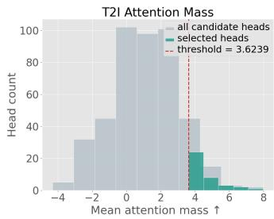

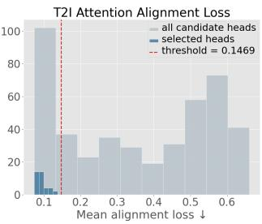

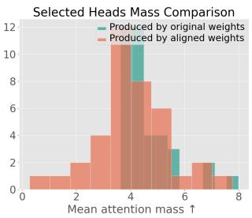

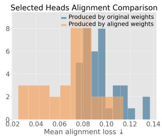  
Figure 3: Head-level diagnostics for Qwen3-VL-2B-Instruct, averaged over 200 randomly sampled images. The left panels show the calibration statistics and thresholds; the right panels compare selected heads before and after sPMC fine-tuning. Fine-tuning slightly reduces the mean visual-attention mass and shifts the alignment loss downward (lower is better).

<table><tr><td></td><td>Qwen3- VL-2B</td><td>Qwen3- VL-8B</td><td>Llama3.2- 11B-V</td></tr><tr><td># Layers</td><td>28</td><td>36</td><td>8</td></tr><tr><td>Total Heads</td><td>448</td><td>1152</td><td>256</td></tr><tr><td>Selected Heads</td><td>69</td><td>35</td><td>37</td></tr><tr><td>Selection Rate (%)</td><td>15.40%</td><td>3.03%</td><td>14.45%</td></tr></table>

Table 2: Summary of adaptive head selection, which demonstrates the sparsity of visual grounding heads. Detailed layerwise head selection is provided in Appendix.

## Ablation study

Adaptive head selection To evaluate Adaptive Head Selection, we compare Adaptive-Late with four variants: aggregation over all heads (All Heads), random selection from late layers (Random-Late), adaptive selection from early layers (Adaptive-Early), and adaptive selection across all layers (Adaptive-Full). All adaptive variants use the head selection criteria; Adaptive-Late applies them to layers 17–28.

Late-layer guidance is more efective. As shown in Figure 4, Adaptive-Late achieves the best performance across all five evaluation metrics. All Heads trails it by 6.24% on average, indicating that indiscriminate regularization can dilute grounding-relevant signals. Random-Late is 3.9 points lower despite using the same layer range, showing that the gains depend on which heads are selected rather than merely on reducing their number. Layer placement is also important: Adaptive-Early trails Adaptive-Late by approximately 10 points, while Adaptive-Full improves upon Adaptive-Early by 4.9 points but remains inferior to late-layer selection. Together, these results support applying sPMC to adaptively selected grounding-responsive heads in later layers.

Training objective variants We compare sPMC with the pretrained model without fine-tuning (No Guidance), autoregressive LoRA fine-tuning (AutoR.), and patchwise cross-entropy alignment with the normalized mask (Cross-Entropy). The choice of alignment objective is critical. As shown in Table 3, AutoR. and Cross-Entropy reduce average zero-shot performance by 3.03% and 9.42%, respectively, relative to the pretrained model. The larger degradation from Cross-Entropy indicates that exact patch-wise alignment imposes an overly restrictive attention target. In contrast, sPMC improves performance, supporting the use of flexible region-level probability-mass guidance over point-wise matching.

<table><tr><td>Method</td><td>Align POPE</td><td></td><td>Hall.</td><td>MMVP</td><td>Vstar</td><td>Avg.</td></tr><tr><td colspan="7">Qwen3-VL-2B</td></tr><tr><td>No Guidance</td><td>X</td><td>89.0</td><td>44.1</td><td>51.3</td><td>67.5</td><td>62.98</td></tr><tr><td>AutoR.</td><td>X</td><td>84.5</td><td>35.3</td><td>51.3</td><td>63.9</td><td>58.75</td></tr><tr><td>CrossEntropy</td><td>V</td><td>81.5</td><td>32.2</td><td>42.0</td><td>58.9</td><td>53.65</td></tr><tr><td>sPMC</td><td>√</td><td>89.9</td><td>49.1</td><td>52.7</td><td>68.1</td><td>64.95</td></tr><tr><td colspan="7">Qwen3-VL-8B</td></tr><tr><td>No Guidance</td><td>X</td><td>88.0</td><td>58.5</td><td>65.3</td><td>73.8</td><td>71.40</td></tr><tr><td>AutoR.</td><td>×</td><td>86.5</td><td>56.6</td><td>64.0</td><td>71.2</td><td>69.58</td></tr><tr><td>CrossEntropy</td><td>V</td><td>81.8</td><td>45.6</td><td>57.3</td><td>62.8</td><td>61.88</td></tr><tr><td>sPMC</td><td>√</td><td>88.5</td><td>59.5</td><td>69.3</td><td>75.4</td><td>73.18</td></tr></table>

Table 3: Ablation of the training objective. AutoR. denotes LoRA fine-tuning with only the next-token objective. Cross-Entropy directly matches attention to the normalized mask. The average is the unweighted mean of the four benchmark scores; × denotes no attention-alignment loss.

## Qualitative analysis

We also present multiple qualitative examples in Figure 5. Across the presented examples, the performance gains are evident over various multimodal tasks, spanning from graphic/diagram interpretation (Chubb illusion and Central bank examples), OCR-intensive text understanding (the question about Abraham Lincoln’s quote) to commonsense reasoning, and fine-grained visual-grounded discrimination. These improvements verify our method’s ability to steer attention toward task-relevant regions, thereby improving access to relevant visual evidence and reducing hallucination.

An illustrative example in the top-right corner further highlights this advantage: the sPMC-tuned model demonstrates stronger alignment between salient visual evidence and generated responses, particularly in scenarios where critical cues are subtle or easily overlooked (e.g., the lady in the corner is carrying a handbag.). By concentrating probability mass on relevant regions, the model is better at capturing fine-grained details that are essential for accurate reasoning.

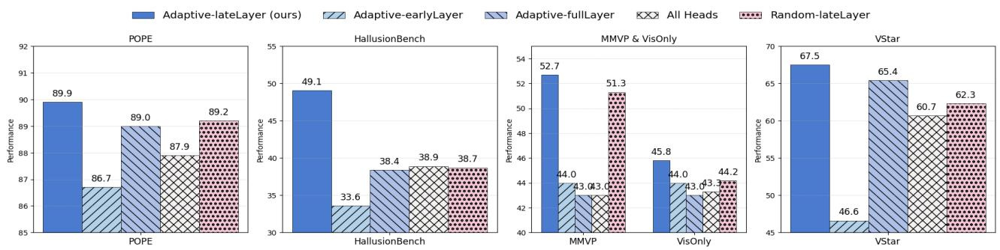  
Figure 4: Ablation study: zero-shot performance of head-selection variants for Qwen3-VL-2B-Instruct (28 layers and 448 heads). We partition layers into early (1–8), middle (9–16), and late (17–28) stages. Adaptive selection in late layers performs best on all five metrics.

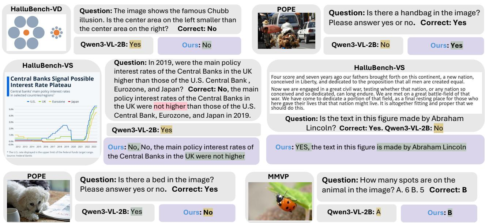  
Figure 5: Qualitative comparison between Qwen3-VL-2B and its sPMC-tuned counterpart. The examples cover diagram interpretation, OCR, commonsense reasoning, and fine-grained visual discrimination. Yellow marks incorrect answers and green marks correct answers. The bottom-left example is a failure case introduced by sPMC.

However, the bottom-left example highlights a representative failure case: when task-relevant evidence is very ambiguous (e.g., a blurred pet bed in the background), our model may under-attend to such low-saliency regions and fail to recover the correct answer. This suggests that while attention concentration improves robustness in most settings, it may also bias the model against weak signals, indicating a limitation in handling uncertain visual details.

## Conclusion and Future Directions

In this work, we study attention misallocation as a potential source of hallucination in MLLMs and reformulate it as a problem of suboptimal probability mass distribution over visual regions. To address this, we propose Selective Probability Mass Concentration (sPMC), an efective weak supervision framework that directly regularizes the global structure of cross-modal attention. By encouraging attention to concentrate on semantically relevant regions and selectively tuning grounding-relevant heads, sPMC enhances MLLMs “visibility” while preserving the model’s inherent reasoning capabilities. Extensive experiments across multiple benchmarks demonstrate that our approach consistently enhances zero-shot performance over base models. A promising direction is to incorporate more diverse and challenging visual inputs, including synthetic data and compositional scenes. Such data could provide richer supervision and improve robustness under complex reasoning conditions.

## References

Bai, J.; Bai, S.; Yang, S.; Wang, S.; Tan, S.; Wang, P.; Lin, J.; Zhou, C.; and Zhou, J. 2023. Qwen-VL: A Versatile Vision-Language Model for Understanding, Localization, Text Reading, and Beyond.

Bai, S.; Cai, Y.; Chen, R.; Chen, K.; Chen, X.; Cheng, Z.; Deng, L.; Ding, W.; Gao, C.; Ge, C.; Ge, W.; Guo, Z.; Huang, Q.; Huang, J.; Huang, F.; Hui, B.; Jiang, S.; Li, Z.; Li, M.; Li, M.; Li, K.; Lin, Z.; Lin, J.; Liu, X.; Liu, J.; Liu, C.; Liu, Y.; Liu, D.; Liu, S.; Lu, D.; Luo, R.; Lv, C.; Men, R.; Meng, L.; Ren, X.; Ren, X.; Song, S.; Sun, Y.; Tang, J.; Tu, J.; Wan, J.; Wang, P.; Wang, P.; Wang, Q.; Wang, Y.; Xie, T.; Xu, Y.; Xu, H.; Xu, J.; Yang, Z.; Yang, M.; Yang, J.; Yang, A.; Yu, B.; Zhang, F.; Zhang, H.; Zhang, X.; Zheng, B.; Zhong, H.; Zhou, J.; Zhou, F.; Zhou, J.; Zhu, Y.; and Zhu, K. 2025. Qwen3-VL Technical Report.

Bai, Z.; Xiao, T.; Shanghai Lab, A. A.; Tong, C. H.; Zongbo Han, C.; Wang, P.; He, T.; Han, Z.; Zhang, Z.; and Zheng Shou, M. 2024. Hallucination of Multimodal Large Language Models: A Survey. Preprint, 1(1): 40.

Carion, N.; Gustafson, L.; Hu, Y.-T.; Debnath, S.; Hu, R.; Suris, D.; Ryali, C.; Alwala, K. V.; Khedr, H.; Huang, A.; Lei, J.; Ma, T.; Guo, B.; Kalla, A.; Marks, M.; Greer, J.; Wang, M.; Sun, P.; Rädle, R.; Afouras, T.; Mavroudi, E.; Xu, K.; Wu, T.-H.; Zhou, Y.; Momeni, L.; Hazra, R.; Ding, S.; Vaze, S.; Porcher, F.; Li, F.; Li, S.; Kamath, A.; Cheng, H. K.; Dollár, P.; Ravi, N.; Saenko, K.; Zhang, P.; and Feichtenhofer, C. 2026. SAM 3: Segment Anything with Concepts. In ICLR 2026.

Chen, J.; Ryutaro, T.; Amrutha, S.; Tom, D.; and Philip, T. 2025. Lavender: Difusion Instruction Tuning. In Forty-Second International Conference on Machine Learning.

Chen, L.; Wei, X.; Li, J.; Dong, X.; Zhang, P.; Zang, Y.; Chen, Z.; Duan, H.; Lin, B.; Tang, Z.; Yuan, L.; Qiao, Y.; Lin, D.; Zhao, F.; and Wang, J. 2024a. ShareGPT4Video: Improving Video Understanding and Generation with Better Captions. Advances in Neural Information Processing Systems, 37.

Chen, Z.; Zhou, Q.; Shen, Y.; Hong, Y.; Sun, Z.; Gutfreund, D.; and Gan, C. 2024b. Visual Chain-of-Thought Prompting for Knowledge-Based Visual Reasoning. In Proceedings of the AAAI Conference on Artificial Intelligence, 1254–1262.

Dai, W.; Li, J.; Li, D.; Tiong, A. M. H.; Zhao, J.; Wang, W.; Li, B.; Fung, P.; and Hoi, S. 2023. InstructBLIP: Towards General-purpose Vision-Language Models with Instruction Tuning.

Deitke, M.; Clark, C.; Lee, S.; Tripathi, R.; Yang, Y.; Park,J. S.; Salehi, M.; Muennighof, N.; Lo, K.; Soldaini, L.;Lu, J.; Anderson, T.; Bransom, E.; Ehsani, K.; Ngo, H.;Chen, Y.; Patel, A.; Yatskar, M.; Callison-Burch, C.; Head,A.; Hendrix, R.; Bastani, F.; Vanderbilt, E.; Lambert, N.;Chou, Y.; Chheda, A.; Sparks, J.; Skjonsberg, S.; Schmitz,M.; Sarnat, A.; Bischof, B.; Walsh, P.; Newell, C.; Wolters,P.; Gupta, T.; Zeng, K.-H.; Borchardt, J.; Groeneveld, D.;Nam, C.; Lebrecht, S.; Wittlif, C.; Schoenick, C.; Michel, O.;Krishna, R.; Weihs, L.; Smith, N. A.; Hajishirzi, H.; Girshick,R.; Farhadi, A.; Kembhavi, A.; and Allen. 2024. Molmo and

PixMo: Open Weights and Open Data for State-of-the-Art Vision-Language Models.

Deng, J.; Wu, Z.; Huo, H.; and Xu, G. 2025. A Comprehensive Survey of Knowledge-Based Vision Question Answering Systems: The Lifecycle of Knowledge in Visual Reasoning Task.

Dosovitskiy, A.; Beyer, L.; Kolesnikov, A.; Weissenborn, D.; Zhai, X.; Unterthiner, T.; Dehghani, M.; Minderer, M.; Heigold, G.; Gelly, S.; Uszkoreit, J.; and Houlsby, N. 2020. An Image is Worth 16x16 Words: Transformers for Image Recognition at Scale.

Duan, H.; Fang, X.; Yang, J.; Zhao, X.; Qiao, Y.; Li, M.; Agarwal, A.; Chen, Z.; Chen, L.; Liu, Y.; Ma, Y.; Sun, H.; Zhang, Y.; Lu, S.; Wong, T. H.; Wang, W.; Zhou, P.; Li, X.; Fu, C.; Cui, J.; Chen, J.; Song, E.; Mao, S.; Ding, S.; Liang, T.; Zhang, Z.; Dong, X.; Zang, Y.; Zhang, P.; Wang, J.; Lin, D.; and Chen, K. 2024. VLMEvalKit: An Open-Source Toolkit for Evaluating Large Multi-Modality Models. MM 2024 - Proceedings of the 32nd ACM International Conference on Multimedia, 11198–11201.

Fu, C.; Chen, P.; Shen, Y.; Qin, Y.; Zhang, M.; Lin, X.; Yang, J.; Zheng, X.; Li, K.; Sun, X.; Wu, Y.; Ji, R.; Shan, C.; and He, R. 2025. MME: A Comprehensive Evaluation Benchmark for Multimodal Large Language Models. In NeurIPS.

Gao, J.; Li, Y.; Cao, Z.; and Li, W. 2025. Interleaved-Modal Chain-of-Thought. In 2025 IEEE/CVF Conference on Computer Vision and Pattern Recognition (CVPR).

George, W.; Jesse, H.; Stan, v. W.; Zach, F.; and Daniel, M. 2025. Diferentiation and Specialization of Attention Heads via the Refined Local Learning Coeficient. In ICLR.

K.; Malik, K.; Chiu, K.; Bhalla, K.; Lakhotia, K.; Rantala-Yeary, L.; van der Maaten, L.; Chen, L.; Tan, L.; Jenkins, L.; Martin, L.; Madaan, L.; Malo, L.; Blecher, L.; Landzaat, L.; de Oliveira, L.; Muzzi, M.; Pasupuleti, M.; Singh, M.; and Others. 2024. The Llama 3 Herd of Models.

Guan, T.; Liu, F.; Wu, X.; Xian, R.; Li, Z.; Liu, X.; Wang, X.; Chen, L.; Huang, F.; Yacoob, Y.; Manocha, D.; and Zhou, T. 2024. HallusionBench: An Advanced Diagnostic Suite for Entangled Language Hallucination and Visual Illusion in Large Vision-Language Models. Proceedings of the IEEE

Sygnowski, J.; Fisher, Z.; Besley, J.; Powell, R.; Ahmed,

Q.; Blanco, L.; Cassirer, A.; Grifith, J.; Das, D.; Lee, S.;

Computer Society Conference on Computer Vision and Pattern Recognition, 14375–14385.

Hu, E. J.; Shen, Y.; Wallis, P.; Allen-Zhu, Z.; Li, Y.; Wang, S.; Wang, L.; and Chen, W. 2021. LoRA: Low-Rank Adaptation of Large Language Models.

Huang, Q.; Xiong, Y.; Rao, A.; Wang, J.; and Lin, D. 2020. MovieNet: A Holistic Dataset for Movie Understanding. In ECCV, volume 12349 LNCS, 709–727. Springer Science and Business Media Deutschland GmbH.

Kamoi, R.; Zhang, Y.; Das, S. S. S.; Zhang, R. H.; and Zhang, R. 2025. VisOnlyQA: Large Vision Language Models Still Struggle with Visual Perception of Geometric Information.

Kang, S.; Kim, J.; Kim, J.; and Hwang, S. J. 2025. Your Large Vision-Language Model Only Needs A Few Attention Heads For Visual Grounding. In Proceedings of the IEEE/CVF Conference on Computer Vision and Pattern Recognition (CVPR), 9339–9350.

Leng, S.; Zhang, H.; Chen, G.; Li, X.; Lu, S.; Miao, C.; and Bing, L. 2024. Mitigating Object Hallucinations in Large Vision-Language Models through Visual Contrastive Decoding. In 2024 IEEE/CVF Conference on Computer Vision and Pattern Recognition (CVPR), 13872–13882. IEEE. ISBN 979-8-3503-5300-6.

Li, C.; Wu, W.; Zhang, H.; Xia, Y.; Mao, S.; Dong, L.; Vuli, I.; and Wei, F. 2025a. Imagine while Reasoning in Space: Multimodal Visualization-of-Thought Chain-of-Thought Multimodal Visualization-of-Thought.

Li, S.; Tao, Z.; Li, K.; and Fu, Y. 2019. Visual to Text: Survey of Image and Video Captioning. IEEE Transactions on Emerging Topics in Computational Intelligence, 3(4): 297– 312.

Li, Y.; Du, Y.; Zhou, K.; Wang, J.; Zhao, W. X.; and Wen, J.-R. 2023. Evaluating Object Hallucination in Large Vision-Language Models. EMNLP 2023 - 2023 Conference on Empirical Methods in Natural Language Processing, Proceedings, 292–305.

Li, Z.; Luo, R.; Zhang, J.; Qiu, M.; Huang, X.; and Wei, Z. 2025b. VoCoT: Unleashing Visually Grounded Multi-Step Reasoning in Large Multi-Modal Models. In Proceedings of the 2025 Conference of the Nations of the Americas Chapter of the Association for Computational Linguistics: Human Language Technologies (Volume 1: Long Papers), 3769–3798. Stroudsburg, PA, USA: Association for Computational Linguistics.

Lin, T.-Y.; Maire, M.; Belongie, S.; Bourdev, L.; Girshick, R.; Hays, J.; Perona, P.; Ramanan, D.; Zitnick, C. L.; and Dollár, P. 2015. Microsoft COCO: Common Objects in Context. Lecture Notes in Computer Science (including subseries Lecture Notes in Artificial Intelligence and Lecture Notes in Bioinformatics), 8693 LNCS(PART 5): 740–755.

Liu, H.; Li, C.; Li, Y.; and Lee, Y. J. 2024. Improved Baselines with Visual Instruction Tuning. In 2024 IEEE/CVF Conference on Computer Vision and Pattern Recognition (CVPR). ISBN 9798350353006.

Loshchilov, I.; and Hutter, F. 2017. Decoupled Weight Decay Regularization.

Mitra, C.; Huang, B.; Darrell, T.; and Herzig, R. 2024. Compositional Chain-of-Thought Prompting for Large Multimodal Models. In 2024 IEEE/CVF Conference on Computer Vision and Pattern Recognition (CVPR).

Plummer, B. A.; Wang, L.; Cervantes, C. M.; Caicedo, J. C.; Hockenmaier, J.; and Lazebnik, S. 2015. Flickr30k Entities: Collecting Region-to-Phrase Correspondences for Richer Image-to-Sentence Models. In Proceedings of the IEEE International Conference on Computer Vision (ICCV), 2015, 2641–2649.

Sahoo, P.; Soltani, S.; and Wong, A. 1988. A survey of thresholding techniques. Computer Vision, Graphics, and Image Processing, 41(2): 233–260.

Seil, K.; Jinyeong, K.; Junhyeok, K.; and Jae, H. 2025. See What You Are Told: Visual Attention Sink in Large Multimodal Models. In ICLR 2025.

Team, C. 2024. Chameleon: Mixed-Modal Early-Fusion Foundation Models.

Z.; Paulus, D.; Reitter, D.; Borsos, Z.; Joshi, R.; Pope, A.;

T.; May, R.; Yang, Z.; Schalkwyk, J.; Butterfield, C.; Hauth,

A.; Goldin, A.; Hawkins, W.; Senter, E.; Brin, S.; Woodman,

O.; Ritter, M.; Noland, E.; Giang, M.; Bolina, V.; Lee, L.;

Blyth, T.; Mackinnon, I.; Reid, M.; Sarvana, O.; Silver, D.;

Chen, A.; Wang, L.; Maggiore, L.; Chang, O.; Attaluri, N.;

Thornton, G.; Chiu, C.-C.; Bunyan, O.; Levine, N.; Chung,

T.; Eltyshev, E.; Si, X.; Lillicrap, T.; Brady, D.; Aggarwal,

V.; Wu, B.; Xu, Y.; McIlroy, R.; Badola, K.; Sandhu, P.;

Moreira, E.; Stokowiec, W.; Hemsley, R.; Li, D.; Tudor, A.;

Shyam, P.; Rahimtoroghi, E.; Haykal, S.; Sprechmann, P.;

Zhou, X.; Mincu, D.; Li, Y.; Addanki, R.; Krishna, K.; Wu,

X.; Frechette, A.; Eyal, M.; Dafoe, A.; Lacey, D.; Whang, J.;

Avrahami, T.; Zhang, Y.; Taropa, E.; Lin, H.; Toyama, D.;

Rutherford, E.; Sano, M.; Choe, H.; Tomala, A.; Safranek-

Shrader, C.; Kassner, N.; Pajarskas, M.; Harvey, M.; Sechrist,

S.; Fortunato, M.; Lyu, C.; Elsayed, G.; Kuang, C.; Lottes,

J.; Chu, E.; Jia, C.; Chen, C.-W.; Humphreys, P.; Baumli,

K.; Tao, C.; Samuel, R.; Santos, C. N. d.; Andreassen, A.;

Rakićević, N.; Grewe, D.; Kumar, A.; Winkler, S.; Caton, J.;

Brock, A.; Dalmia, S.; Sheahan, H.; Barr, I.; Miao, Y.; Natsev,

P.; Devlin, J.; Behbahani, F.; Prost, F.; Sun, Y.; Myaskovsky,

A.; Pillai, T. S.; Hurt, D.; Lazaridou, A.; Xiong, X.; Zheng,

C.; Pardo, F.; Li, X.; Horgan, D.; Stanton, J.; Ambar, M.;

Xia, F.; Lince, A.; Wang, M.; Mustafa, B.; Webson, A.; Lee,

H.; Anil, R.; Wicke, M.; Dozat, T.; Sinha, A.; Piqueras, E.;

Dabir, E.; Upadhyay, S.; Boral, A.; Hendricks, L. A.; Fry, C.;

Djolonga, J.; Su, Y.; Walker, J.; Labanowski, J.; Huang, R.;

Misra, V.; Chen, J.; Skerry-Ryan, R.; Singh, A.; Rijhwani,

S.; Yu, D.; Castro-Ros, A.; Changpinyo, B.; Datta, R.; Bagri,

S.; Hrafnkelsson, A. M.; Maggioni, M.; Zheng, D.; Sulsky,

Y.; Hou, S.; Paine, T. L.; Yang, A.; Riesa, J.; Rogozinska,

D.; Marcus, D.; Badawy, D. E.; Zhang, Q.; Wang, L.; Miller,

H.; Greer, J.; Sjos, L. L.; Nova, A.; Zen, H.; Chaabouni, R.;

Rosca, M.; Jiang, J.; Chen, C.; Liu, R.; Sainath, T.; Krikun,

M.; Polozov, A.; Lespiau, J.-B.; Newlan, J.; Cankara, Z.;

Kwak, S.; Xu, Y.; Chen, P.; Coenen, A.; Meyer, C.; Tsihlas,

K.; Ma, A.; Gottweis, J.; Xing, J.; Gu, C.; Miao, J.; Frank,

C.; Cankara, Z.; Ganapathy, S.; Dasgupta, I.; Hughes-Fitt,

S.; Chen, H.; Reid, D.; Rong, K.; Fan, H.; van Amersfoort,

J.; Zhuang, V.; Cohen, A.; Gu, S. S.; Mohananey, A.; Ilic, A.;

Tobin, T.; Wieting, J.; Bortsova, A.; Thacker, P.; Wang, E.;

Caveness, E.; Chiu, J.; Sezener, E.; Kaskasoli, A.; Baker, S.;

Millican, K.; Elhawaty, M.; Aisopos, K.; Lebsack, C.; Byrd,

N.; Dai, H.; Jia, W.; Wiethof, M.; Davoodi, E.; Weston, A.;

Yagati, L.; Ahuja, A.; Gao, I.; Pundak, G.; Zhang, S.; Azzam,

M.; Sim, K. C.; Caelles, S.; Keeling, J.; Sharma, A.; Swing,

A.; Li, Y.; Liu, C.; Bostock, C. G.; Bansal, Y.; Nado, Z.;

Anand, A.; Lipschultz, J.; Karmarkar, A.; Proleev, L.; Itty-

cheriah, A.; Yeganeh, S. H.; Polovets, G.; Faust, A.; Sun, J.;

Rrustemi, A.; Li, P.; Shivanna, R.; Liu, J.; Welty, C.; Lebron,

F.; Baddepudi, A.; Krause, S.; Parisotto, E.; Soricut, R.; Xu,

Z.; Bloxwich, D.; Johnson, M.; Neyshabur, B.; Mao-Jones,

J.; Wang, R.; Ramasesh, V.; Abbas, Z.; Guez, A.; Segal, C.;

Nguyen, D. D.; Svensson, J.; Hou, L.; York, S.; Milan, K.;

Bridgers, S.; Gworek, W.; Tagliasacchi, M.; Lee-Thorp, J.;

Chang, M.; Guseynov, A.; Hartman, A. J.; Kwong, M.; Zhao,

R.; Kashem, S.; Cole, E.; Miech, A.; Tanburn, R.; Phuong,

M.; Pavetic, F.; Cevey, S.; Comanescu, R.; Ives, R.; Yang,

S.; Du, C.; Li, B.; Zhang, Z.; Iinuma, M.; Hu, C. H.; Roy,

A.; Bijwadia, S.; Zhu, Z.; Martins, D.; Saputro, R.; Gergely,

A.; Zheng, S.; Jia, D.; Antonoglou, I.; Sadovsky, A.; Gu, S.;

Bi, Y.; Andreev, A.; Samangooei, S.; Khan, M.; Kocisky,

T.; Filos, A.; Kumar, C.; Bishop, C.; Yu, A.; Hodkinson,

S.; Mittal, S.; Shah, P.; Moufarek, A.; Cheng, Y.; Bloniarz,

A.; Lee, J.; Pejman, P.; Michel, P.; Spencer, S.; Feinberg,

V.; Xiong, X.; Savinov, N.; Smith, C.; Shakeri, S.; Tran, D.;

Chesus, M.; Bohnet, B.; Tucker, G.; von Glehn, T.; Muir, C.;

Mao, Y.; Kazawa, H.; Slone, A.; Soparkar, K.; Shrivastava,

D.; Cobon-Kerr, J.; Sharman, M.; Pavagadhi, J.; Araya, C.;

Misiunas, K.; Ghelani, N.; Laskin, M.; Barker, D.; Li, Q.;

Briukhov, A.; Houlsby, N.; Glaese, M.; Lakshminarayanan,

B.; Schucher, N.; Tang, Y.; Collins, E.; Lim, H.; Feng, F.;

Recasens, A.; Lai, G.; Magni, A.; De Cao, N.; Siddhant, A.;

Ashwood, Z.; Orbay, J.; Dehghani, M.; Brennan, J.; He, Y.;

Xu, K.; Gao, Y.; Saroufim, C.; Molloy, J.; Wu, X.; Arnold,

S.; Chang, S.; Schrittwieser, J.; Buchatskaya, E.; Radpour,

S.; Polacek, M.; Giordano, S.; Bapna, A.; Tokumine, S.;

Hellendoorn, V.; Sottiaux, T.; Cogan, S.; Severyn, A.; Saleh,

M.; Thakoor, S.; Shefey, L.; Qiao, S.; Gaba, M.; Chang, S.-y.;

Swanson, C.; Zhang, B.; Lee, B.; Rubenstein, P. K.; Song, G.;

Kwiatkowski, T.; Koop, A.; Kannan, A.; Kao, D.; Schuh, P.;

Stjerngren, A.; Ghiasi, G.; Gibson, G.; Vilnis, L.; Yuan, Y.;

Ferreira, F. T.; Kamath, A.; Klimenko, T.; Franko, K.; Xiao,

K.; Bhattacharya, I.; Patel, M.; Wang, R.; Morris, A.; Strudel,

R.; Sharma, V.; Choy, P.; Hashemi, S. H.; Landon, J.; Finkel-

stein, M.; Jhakra, P.; Frye, J.; Barnes, M.; Mauger, M.; Daun,

D.; Baatarsukh, K.; Tung, M.; Farhan, W.; Michalewski, H.;

Viola, F.; Quitry, F. d. C.; Lan, C. L.; Hudson, T.; Wang, Q.;

Fischer, F.; Zheng, I.; White, E.; Dragan, A.; Alayrac, J.-b.;

Ni, E.; Pritzel, A.; Iwanicki, A.; Isard, M.; Bulanova, A.;

Zilka, L.; Dyer, E.; Sachan, D.; Srinivasan, S.; Muckenhirn,

H.; Cai, H.; Mandhane, A.; Tariq, M.; Rae, J. W.; Wang, G.;

Ayoub, K.; FitzGerald, N.; Zhao, Y.; Han, W.; Alberti, C.;

Garrette, D.; Krishnakumar, K.; Gimenez, M.; Levskaya, A.;

Sohn, D.; Matak, J.; Iturrate, I.; Chang, M. B.; Xiang, J.; Cao,

Y.; Ranka, N.; Brown, G.; Hutter, A.; Mirrokni, V.; Chen,

N.; Yao, K.; Egyed, Z.; Galilee, F.; Liechty, T.; Kallakuri,

P.; Palmer, E.; Ghemawat, S.; Liu, J.; Tao, D.; Thornton, C.;

Green, T.; Jasarevic, M.; Lin, S.; Cotruta, V.; Tan, Y.-X.;

Fiedel, N.; Yu, H.; Chi, E.; Neitz, A.; Heitkaemper, J.; Sinha,

A.; Zhou, D.; Sun, Y.; Kaed, C.; Hulse, B.; Mishra, S.; Geor-

gaki, M.; Kudugunta, S.; Farabet, C.; Shafran, I.; Vlasic, D.;

Tsitsulin, A.; Ananthanarayanan, R.; Carin, A.; Su, G.; Sun,

P.; V, S.; Carvajal, G.; Broder, J.; Comsa, I.; Repina, A.;

Wong, W.; Chen, W. W.; Hawkins, P.; Filonov, E.; Loher,

L.; Hirnschall, C.; Wang, W.; Ye, J.; Burns, A.; Cate, H.;

Wright, D. G.; Piccinini, F.; Zhang, L.; Lin, C.-C.; Gog, I.;

Kulizhskaya, Y.; Sreevatsa, A.; Song, S.; Cobo, L. C.; Iyer,

A.; Tekur, C.; Garrido, G.; Xiao, Z.; Kemp, R.; Zheng, H. S.;

Li, H.; Agarwal, A.; Ngani, C.; Goshvadi, K.; Santamaria-

Fernandez, R.; Fica, W.; Chen, X.; Gorgolewski, C.; Sun,

S.; Garg, R.; Ye, X.; Eslami, S. M. A.; Hua, N.; Simon, J.;

Joshi, P.; Kim, Y.; Tenney, I.; Potluri, S.; Thiet, L. N.; Yuan,

Q.; Luisier, F.; Chronopoulou, A.; Scellato, S.; Srinivasan,

P.; Chen, M.; Koverkathu, V.; Dalibard, V.; Xu, Y.; Saeta,

B.; Anderson, K.; Sellam, T.; Fernando, N.; Huot, F.; Jung,

J.; Varadarajan, M.; Quinn, M.; Raul, A.; Le, M.; Habalov,

R.; Clark, J.; Jalan, K.; Bullard, K.; Singhal, A.; Luong, T.;

Wang, B.; Rajayogam, S.; Eisenschlos, J.; Jia, J.; Finchel-

stein, D.; Yakubovich, A.; Balle, D.; Fink, M.; Agarwal, S.;

K.; Liu, R.; Vnukov, D.; Vats, N.; Invernizzi, L.; Jafari, M.; Zhou, H.; Taylor, L.; Prendki, J.; Wu, M.; Eccles, T.; Liu, T.;

N.; Baryshnikov, A.; Kaplanis, C.; Sheng, X.; Chervonyi, Y.;

J.; Patraucean, V.; Du, D.; Mordatch, I.; Jurin, I.; Liu, L.;

M. A.; Baeuml, M.; Strohman, T.; Bai, J.; Petrov, S.; Wu, Y.; Hassabis, D.; Kavukcuoglu, K.; Dean, J.; and Vinyals, O. 2024. Gemini 1.5: Unlocking multimodal understanding across millions of tokens of context.

Tong, S.; Liu, Z.; Zhai, Y.; Ma, Y.; LeCun, Y.; and Xie, S. 2024. Eyes Wide Shut? Exploring the Visual Shortcomings of Multimodal LLMs. Proceedings of the IEEE Computer Society Conference on Computer Vision and Pattern Recognition, 9568–9578.

Woo, S.; Kim, D.; Jang, J.; Choi, Y.; and Kim, C. 2025. Don’t Miss the Forest for the Trees: Attentional Vision Calibration for Large Vision Language Models. In Findings of the Association for Computational Linguistics: ACL 2025, 1927–1951. Stroudsburg, PA, USA: Association for Computational Linguistics.

Wu, P.; and Xie, S. 2023. V\*: Guided Visual Search as a Core Mechanism in Multimodal LLMs. Proceedings of the IEEE Computer Society Conference on Computer Vision and Pattern Recognition, 13084–13094.

Wu, W.; Mao, S.; Zhang, Y.; Xia, Y.; Dong, L.; Cui, L.; and Wei, F. 2024. Mind’s Eye of LLMs: Visualization-of-Thought Elicits Spatial Reasoning in Large Language Models. In Proceedings of the 38th International Conference on Neural Information Processing Systems.

Yang, A.; Li, A.; Yang, B.; Zhang, B.; Hui, B.; Zheng, B.; Yu, B.; Gao, C.; Huang, C.; Lv, C.; Zheng, C.; Liu, D.; Zhou, F.; Huang, F.; Hu, F.; Ge, H.; Wei, H.; Lin, H.; Tang, J.; Yang, J.; Tu, J.; Zhang, J.; Yang, J.; Yang, J.; Zhou, J.; Zhou, J.; Lin, J.; Dang, K.; Bao, K.; Yang, K.; Yu, L.; Deng, L.; Li, M.; Xue, M.; Li, M.; Zhang, P.; Wang, P.; Zhu, Q.; Men, R.; Gao, R.; Liu, S.; Luo, S.; Li, T.; Tang, T.; Yin, W.; Ren, X.; Wang, X.; Zhang, X.; Ren, X.; Fan, Y.; Su, Y.; Zhang, Y.; Zhang, Y.; Wan, Y.; Liu, Y.; Wang, Z.; Cui, Z.; Zhang, Z.; Zhou, Z.; and Qiu, Z. 2025. Qwen3 Technical Report.

Yu, T.; Zhang, H.; Li, Q.; Xu, Q.; Yao, Y.; Chen, D.; Lu, X.; Cui, G.; Dang, Y.; He, T.; Feng, X.; Song, J.; Zheng, B.; Liu, Z.; Chua, T.-S.; and Sun, M. 2025. RLAIF-V: Open-Source AI Feedback Leads to Super GPT-4V Trustworthiness. In Proceedings of the IEEE Computer Society Conference on Computer Vision and Pattern Recognition, 19985–19995. IEEE Computer Society.

Zhang, Z.; Zhang, A.; Li, M.; Services, W.; Zhao, H.; Karypis, G.; and Smola, A. 2024. Multimodal Chain-of-Thought Reasoning in Language Models. Transactions on machine Learning Research.

Zheng, G.; Yang, B.; Tang, J.; Zhou, H.-Y.; and Yang, S. 2023. DDCoT: Duty-Distinct Chain-of-Thought Prompting

for Multimodal Reasoning in Language Models. In 37th Conference on Neural Information Processing Systems (NeurIPS 2023).

Zhu, J.; Wang, W.; Chen, Z.; Liu, Z.; Ye, S.; Gu, L.; Tian,H.; Duan, Y.; Su, W.; Shao, J.; Gao, Z.; Cui, E.; Wang, X.;Cao, Y.; Liu, Y.; Wei, X.; Zhang, H.; Wang, H.; Xu, W.;Li, H.; Wang, J.; Deng, N.; Li, S.; He, Y.; Jiang, T.; Luo,J.; Wang, Y.; He, C.; Shi, B.; Zhang, X.; Shao, W.; He, J.;Xiong, Y.; Qu, W.; Sun, P.; Jiao, P.; Lv, H.; Wu, L.; Zhang,K.; Deng, H.; Ge, J.; Chen, K.; Wang, L.; Dou, M.; Lu, L.;Zhu, X.; Lu, T.; Lin, D.; Qiao, Y.; Dai, J.; and Wang, W.2025. InternVL3: Exploring Advanced Training and Test-Time Recipes for Open-Source Multimodal Models.

## Preliminary Experiment

We conduct a preliminary analysis to better understand the role of attention heads when taking on comprehensive multimodal tasks. Two key observations are: (1) within each model, only a small subset of attention heads consistently exhibits grounding behavior, characterized by relatively concentrated attention on semantically relevant visual regions. This suggests that visual evidence aggregation is not uniformly distributed across heads, but instead localized to a few specialized components.

(2) Second, this pattern is consistent across diferent model architectures and scales. Despite diferences in design, we observe similar head-level behaviors, where a limited number of heads dominate grounding-related attention while others serve complementary roles such as contextual reasoning or difusive exploring.

To support these observations, we provide two illustrative visualizations. Figure 6: Qualitative attention maps that highlights representative heads that consistently capture visual grounding across samples. Figure 7: qualitative attention maps that demonstrates visual evidence aggregation behavior existing across diferent model backbones. These results collectively support our motivation in method design that grounding is an emergent yet sparse property, motivating targeted supervision rather than uniform regulation across all heads.

## Details of Semantically Enriched Grounding Mask Generation

This section describes the automated pipeline generating high-fidelity segmentation masks paired with noun phrases. This process transforms raw image-text pairs from the source dataset into grounded training data through a two-stage extraction and segmentation framework.

The initial stage of our pipeline involves extracting concrete, segmentable entities from complex image descriptions. Given a caption from the dataset, we employ Qwen3-4B-Instruct (Yang et al. 2025) as a semantic parser. This constraint ensures semantic alignment between the text and the image while filtering out abstract concepts (e.g., love, freedom) that are not suitable to localize. The output of this stage is a set of query-ready noun phrases $P = \{ p _ { 1 } , p _ { 2 } , . . . , p _ { n } \}$ where each $p _ { i }$ represents a localized entity with its original modifiers (e.g., colors, sizes, or spatial attributes). Modifiers turn isolated object nouns into fully grounded, semantically rich queries, which is critical for generating accurate masks that correspond to the intended object in context.The specific prompt we used is:

## Prompt Design for Mask Generation

<SYSTEM PROMPT> Extract specific, individual physical objects or regions from the image description as noun or short noun phrases including key modifiers (e.g. color, size, location). Exclude categories and collections. The output must be literal substrings from the text.

<USER PROMPT> Refer to this image description: {caption}

With the extracted semantic queries P, we perform zeroshot instance segmentation to generate binary spatial masks. We utilize the Segment Anything Model 3 (SAM3) (Carion et al. 2026), passing the image I and the extracted phrase p as a multimodal prompt pair. For each image-query pair, the model predicts binary mask of the same resolution as the image.

To refine the spatial accuracy of our generated data, we configure the SAM3 inference parameters to balance semantic recall with spatial accuracy. We apply a detection threshold $\tau _ { d e t } = 0 . 1 5$ to filter out low-confidence object proposals that lack suficient alignment with the text prompt, and a mask binarization threshold $\tau _ { m a s k } = 0 . 5$ to project the model’s soft attention logits into discrete pixel-level assignments. This configuration allows the pipeline to capture challenging or small objects while establishing definitive decision boundaries for foreground pixels, ensuring that the resulting masks provide a sharp, unambiguous signal for downstream probability mass concentration tuning.

To maintain the integrity of the training data, we implement a semantic density filter to prune low-quality or overlygeneralized masks. We define a foreground ratio $\rho$ as:

$$
\rho = \frac { 1 } { H \cdot W } \sum _ { x , y } \mathcal { M } _ { x , y }
$$

Where $\mathcal { M } _ { ( x , y ) } \in \{ 0 , 1 \}$ . H and W represent row and column sizes of the mask. We discard any mask where $\rho > 0 . 6$ . This heuristic efectively filters out hallucinated segmentations or cases where the model fails to diferentiate between a specific object and the global background.

The resulting dataset provides a dense, semanticallygrounded mapping that serves as the foundation for our visual reasoning training. Samples from the curated dataset are illustrated in Figure 8. These examples demonstrate that the generated masks are semantically well-aligned with their corresponding queries and exhibit high spatial precision, with minimal annotation noise.

## Quality Evaluation of Segmentation Masks

We conducted an AI-assisted semantic utility audit on 200 records sampled from the created dataset. For each record, a

Qwen3-VL-2B, 27th Layer, Head 6, and 9 are selected by sPMC  
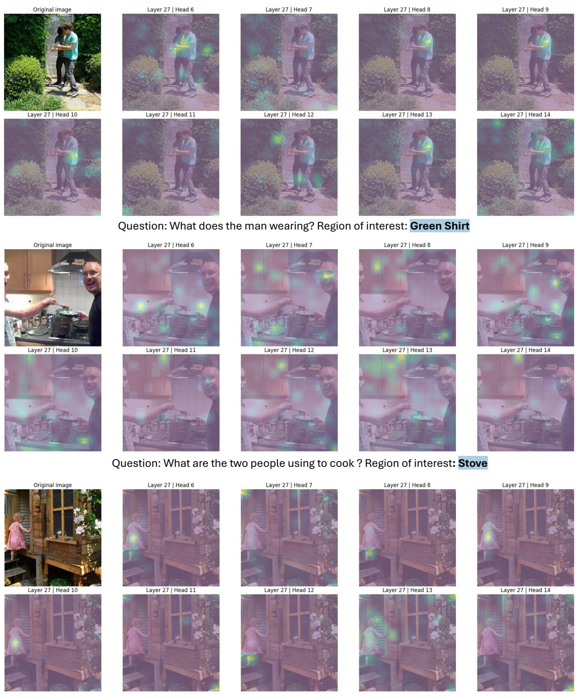  
Question: What does the little girl wearing? Region of interest: Pink dress

Figure 6: Qualitative attention maps highlighting representative heads (e.g., Layer 27, head 6 and 9) that consistently capture relevant visual evidence across samples. Other head’s attention (e.g., head 6, and 14) are scattered in the image or not focusing on the relevant region.

Question: What are the two people using to cook ? Region of interest: Stove human and a blinded multimodal AI evaluator saw the original image, the target phrase, and a side-by-side visualization with the mask overlaid in translucent red; the source question and answer were withheld. The audit measures useful semantic localization for attention supervision rather than pixellevel segmentation accuracy. Imprecise boundaries, partial coverage that clearly localized the target, moderate overcoverage, and merged nearby regions were not automatically penalized. Each example was labeled Accurate, Usable, Unusable, or Unjudgeable. We release the audit artifact in the as Supplementary Media Archive. Each of the 200 records include image with segmentation mask, assessment on target visibility, target coverage, irrelevant coverage, confidence, and decision reason.

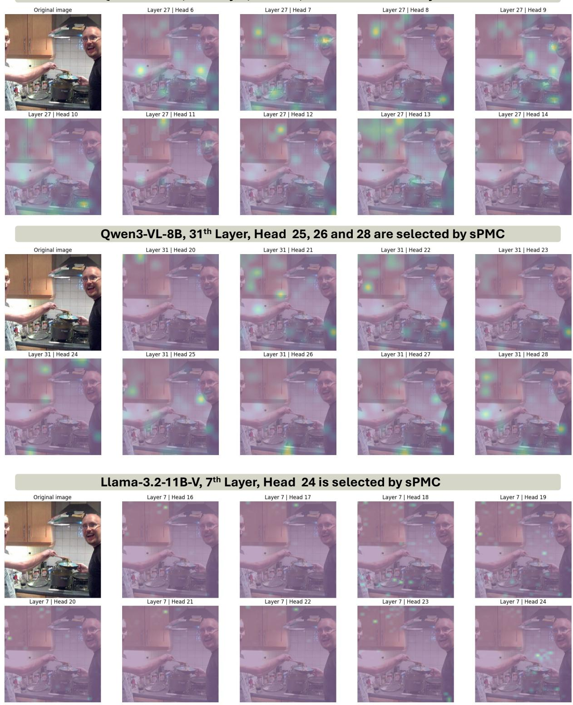  
Figure 7: Qualitative attention maps demonstrating visual evidence aggregation behavior exists across diferent model backbones: Qwen3-VL-2B, Qwen3-VL-8B, Llama-3.2-11B-V. For various backbones, the selected heads appeared to be more concentrated on relevant regions compared to other heads.

Overall, at least 195/200 examples (97.5%) were determined Accurate or Usable. Excluding Unjudgeable cases, the usable-mask rate was 195/198 = 0.985 (98.5%; Wilson 95% CI [95.6%, 99.5%]). This quality is more than suficient for the intended attention-supervision setting because the method is designed to be robust to noisy labels: masks act as weak spatial guidance, not pixel-level ground truth, and the small residual of noisy or ambiguous supervision can therefore be tolerated.

Figure 8 and Figure 9 contain 12 examples from the evaluation: three clear Accurate masks, four imperfect but useful Usable masks, and all five Unusable/Unjudgeable cases identified by AI (human identified Unusable cases are a subset of the shown examples) for an extensive error analysis. It can be seen that the generated segmentation masks are generally quite accurate even for challenging cases. When focusing on the extremely rare error cases, the kite example is dominated by irrelevant sky; the “women”example masks a man and foreground regions; the guitar example highlights the illustrated figure rather than the intended object; the pink-bike example focuses on other bicycles; and the broad “orange items” phrase is too ambiguous for reliable judgment. These cases show the main residual risks are wrong-target or overglobal masks and ambiguous phrases. We do observe that the AI evaluator is slightly stricter than the human evaluator, especially around the criteria for Accurate and Usable. However, it does not change our conclusion that the quality of the generated segmentation mask set is suficient for sPMC training.

Table 4: Segmentation Mask Quality Audit Summary Statistics
<table><tr><td>Label</td><td>Human  $\%$ </td><td>Human #</td><td>AI  $\%$ </td><td>AI #</td></tr><tr><td>Accurate</td><td>77.0%</td><td>154</td><td>61.5%</td><td>123</td></tr><tr><td>Usable</td><td>22.0%</td><td>44</td><td>36.0%</td><td>72</td></tr><tr><td>Unusable</td><td>1.0%</td><td>2</td><td>1.5%</td><td>3</td></tr><tr><td>Unjudgeable</td><td>0%</td><td>0</td><td>1.0%</td><td>2</td></tr></table>

## Theoretical Justification of Adaptive Head Selection Criteria

## Theoretical justification

Based on our main formulation, we model each attention head can induce a conditional probability distribution over visual tokens:

$$
p _ { h } ( v | t ) = \frac { \exp ( a _ { h , t } ( v ) ) } { \sum _ { v ^ { \prime } } \exp ( a _ { h , t } ( v ^ { \prime } ) }
$$

where $a _ { h , t } ( v )$ denotes the attention logit on visual token v at decoding step t. Let V denote all visual tokens and $v ^ { \prime } \subset \mathcal { V }$ is the semantically relevant region defined by the supervision mask.

Criterion 1: High visual engagement. Heads are selected that allocate substantial attention to visual tokens when processing target textual spans.

$$
\tilde { \mathcal { A } } ( T _ { v } ) _ { h } = \frac { 1 } { | T _ { a n s } | } \sum _ { t \in T _ { a n s } } \mathcal { A } _ { h } \geq \tau _ { m }\tag{10}
$$

Given the above conditional probability formulation, the criterion can be reformed as:

$$
\tilde { \mathcal { A } } ( T _ { v } ) _ { h } = \frac { 1 } { | T _ { a n s } | } \sum _ { t \in T _ { a n s } } \sum _ { v \in \mathcal { V } } p _ { h } ( v | t ) \geq \tau _ { m }\tag{11}
$$

Since cross-modal attention competes with textual tokens, this criterion enforces:

$$
\mathbb { E } _ { t } \left[ \sum _ { v \in \mathcal { V } } p _ { h } ( v | t ) \right] \geq \tau _ { m }\tag{12}
$$

Which lower-bounds the marginal probability mass assigned to visual tokens. From an information-theoretic perspective, this ensures that the mutual information between the head and visual inputs is non-trivial. Thus excluding heads whose attention collapses onto textual tokens $( { \mathrm { i . e . , ~ } } p _ { h } ( v ) \ \approx \ 0 )$ which do not contribute to visual evidence aggregation.

Criterion 2: Spatial Consistency. Heads are selected when their attention suficiently aligns with the visual region outlined by the supervision mask.

$$
{ \mathbb E } \left( \log \left( 1 + \exp \left( \log \sum _ { i , j } \exp \left( a _ { i , j } ^ { - } \right) - \log \sum _ { j } \exp \left( a _ { i , j } ^ { + } \right) \right) \right) \right) \le \tau _ { s }\tag{13}
$$

Let:

$$
Z ^ { + } = \sum _ { j } \exp \left( a _ { i , j } ^ { + } \right) , Z ^ { - } = \sum _ { i , j } \exp \left( a _ { i , j } ^ { - } \right)\tag{14}
$$

Then the above formula can be reduced to:

$$
\mathbb { E } _ { t } \left[ \log ( 1 + \exp ( \log Z ^ { - } - \log Z ^ { + } ) ) \right] \leq \tau _ { s }\tag{15}
$$

This is precisely the negative log-likelihood of attention mass within the relevant region, which is implying:

$$
\mathbb { E } _ { t } \left[ - \log \sum _ { v \in \mathcal { V } ^ { + } } p _ { h } ( v | t ) \right] \leq \tau _ { s }\tag{16}
$$

<table><tr><td colspan="2">3. 1292 — accurate stack of white and blue papers</td><td rowspan="2">10. 6202 — accurate red octagon blue jersey</td><td rowspan="2">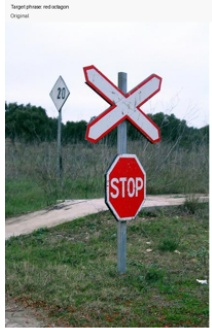 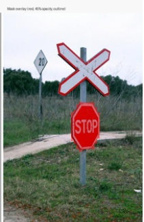</td></tr><tr><td>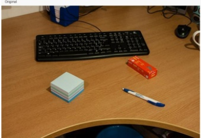</td><td>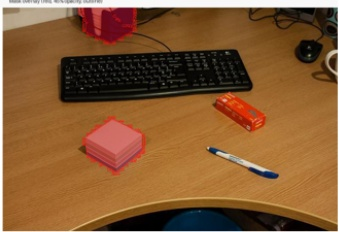</td></tr><tr><td colspan="2">21. 9998 — usable wooden kitchen countertop</td><td colspan="2">48. 20859 — usable</td></tr><tr><td colspan="2"></td><td colspan="3">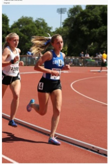 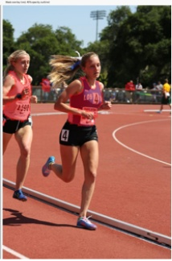</td></tr><tr><td colspan="2"></td><td colspan="3"></td></tr><tr><td colspan="2">69.27226 — unusable kites</td><td colspan="3">110. 42903 — unjudgeable women</td></tr><tr><td colspan="2">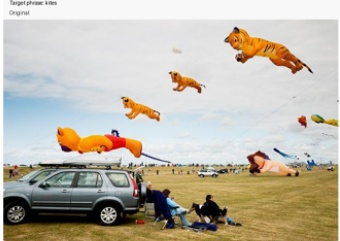</td><td colspan="3"></td></tr><tr><td>54. 23079 — accurate pink flowers </td><td> </td><td>75.30143 — usable tarmac</td><td>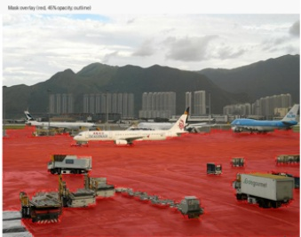</td></tr><tr><td colspan="2">114. 44738 — usable Weiss Ratings Guide to Property and Casualty Insurers</td><td colspan="3">115. 45007 — unusable guitar</td></tr><tr><td colspan="2">Weiss Guide to Property and Casualty Insurers </td><td></td><td colspan="2">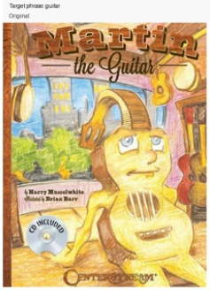 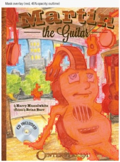</td></tr><tr><td colspan="2">186. 74480 — unjudgeable orange items</td><td>197. 80839 — unusable pink bike Target phrase ppink bike Original</td><td colspan="2"></td></tr><tr><td colspan="2">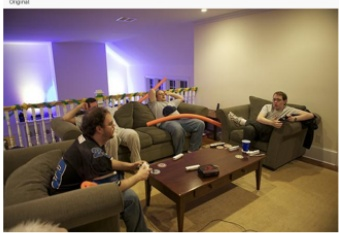</td><td>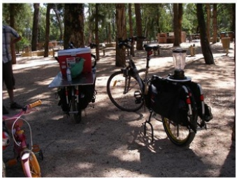</td><td colspan="2">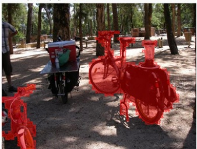</td></tr></table>

Figure 8: Examples from our curated mask dataset and quality audit result. Red masks are the generated segmentation masks.

Which is equivalent to:

$$
\mathbb { E } _ { t } \left[ \sum _ { v \in \mathcal { V } ^ { + } } p _ { h } ( v | t ) \right] \geq \delta ( \tau _ { s } )\tag{17}
$$

It is noteworthy that we do not directly minimize log $\frac { Z ^ { - } } { Z ^ { + } }$ in the practice as it is numerically unstable and unbounded. Therefore, we adopt the softplus transformation in practice as shown in Equation 4, which enables the smooth upper bound and computational stability while preserving the monotonicity of the original design.

Combining both criteria defines a feasible set $\mathcal { H } _ { s } \subseteq \mathcal { H }$ that satisfies non-trivial visual engagement and attending to semantically relevant regions.

## Adaptive thresholds

Rather than employing a fixed heuristic threshold, we dynamically determine the point of diminishing returns by analyzing the distribution of head scores. For a sorted set of scores V , we compute the optimal threshold by treating the distribution as a discrete curve and finding the point of maximum curvature relative to the curve’s secant line.

Given the sorted values $S = \{ s _ { 0 } , s _ { 1 } , . . . , s _ { n } \}$ and a chord $L$ connecting the endpoints $( 0 , s _ { 0 } )$ and $( n , s _ { n } )$ , the optimal head index $\bar { k ^ { * } }$ is defined as:

$$
k ^ { * } = \arg \operatorname* { m a x } _ { k } { \frac { | ( x _ { n } - x _ { 0 } ) ( y _ { 0 } - y _ { k } ) - ( x _ { 0 } - x _ { k } ) ( y _ { n } - y _ { 0 } ) | } { \sqrt { ( x _ { n } - x _ { 0 } ) ^ { 2 } + ( y _ { n } - y _ { 0 } ) ^ { 2 } } } }
$$

where x represents the rank and y represents the score value. This robustly ensures that the selected heads are statistically significant outliers in the performance distribution, resulting in a sparse but highly efective set of grounding-active heads.

## Experiment Setup Details

## More Implementation Details

We use parameter-eficient LoRA tuning and keep the remaining backbone parameters frozen. For all backbones, the adapters use rank 16, LoRA alpha 16, dropout 0.1, and no bias parameters. For Qwen3-VL-2B, LoRA is applied to the query and value projections in the first 14 of 28 language layers; for Qwen3-VL-8B, it is applied to the query and key projections in the final 15 of 36 language layers. For Llama-3.2-11B-Vision, LoRA is applied to the query and key projections of the cross-attention modules across the language backbone (i.e., only blocks containing those modules are afected). These architecture-specific placements are implementation choices rather than components of our method. We train each model for one epoch in bfloat16 with AdamW, a learning rate of $1 0 ^ { - 4 }$ , weight decay 0.1, 100 warmup steps, and a two-cycle cosine schedule with hard restarts. The effective batch size is 32 (using gradient accumulation where needed), and the random seed is 42.

## Benchmarks

Our method is evaluated across multiple VLM benchmarks, grouped into two main categories: general vision-language understanding and visual hallucination task. 1) General vision-language understanding task assesses comprehensive multimodal capabilities such as OCR and reasoning. There three benchmarks under this category:

• MMVP (Tong et al. 2024) is a compact benchmark that contains 300 images-question pairs. It is designed to evaluate vision-language models on “CLIP-blind" visual features. Higher performance on MMVP indicates the MLLMs can genuinely utilize visual information rather than relying on language priors.

• VisOnly (Synthetic and Real splits) (Kamoi et al. 2025) evaluates MLLMs on 12 various geometric perception tasks, and reveals that base MLLMs often cannot accurately perceive basic geometric information in images. The dataset contains synthetic dataset (700 questions) and real dataset (900 questions).

• V\* (Wu and Xie 2023) is a visual search and grounding benchmark designed to evaluate Multimodal Large Language Models (MLLMs) on processing high-resolution images (2246 × 1582 average resolution) and locating small visual details $( \mathrm { a r e a } < \bar { 0 . 0 5 \% } )$ . The dataset consists of 191 multiple-choice evaluation samples split into two core sub-tasks: attribute recognition (115 samples) and spatial relationship reasoning (76 samples).

• MME (Fu et al. 2025) is a large-scale evaluation suite with over 14,000 evaluation samples spanning perception and cognition tasks. It includes fine-grained subtasks such as object recognition, OCR, commonsense reasoning, and numerical understanding, providing a comprehensive assessment of multimodal capability and robustness.

2) Visual hallucination task. In addition to assessing general MLLM capabilities, we conduct evaluations on two specialized benchmarks, where our method demonstrates strong efectiveness in mitigating hallucination:

• POPE (Li et al. 2023) is a diagnostic benchmark for probing object hallucination in MLLMs via binary (yes/no) questions about object presence. It comprises 3,000 questions constructed under diferent sampling strategies (e.g., random, popular, adversarial) to systematically test whether models can correctly assert the existence of certain objects.

• HallusionBench (Guan et al. 2024) comprises 346 images paired with 1129 questions, all meticulously crafted by human experts. It is specifically designed to evaluate multimodal hallucination across diverse visual reasoning scenarios.

## Baseline models

• Base Models.We select Qwen3-VL-2B-Instruct, Qwen3- VL-8B-Instruct (Bai et al. 2025), and Llama3.2-11B-Vision (Grattafiori et al. 2024) as our primary backbones to ensure diversity in both model scale and architectural design. Specifically, Qwen3-VL models represent strong decoder-only self-attention architectures at diferent parameter scales (2B vs 8B), enabling us to analyze scaling efects on attention behavior. In contrast, Llama3.2-11B-Vision adopts a cross-attention-based design, providing a complementary paradigm for multimodal fusion. This combination allows us to comprehensively evaluate the generality of our method across distinct attention mechanisms and model capacities.

• Other Baseline Models. We also consider alternative open-source MLLMs, including Qwen2-VL-72B (Bai et al. 2023), InternVL3-72B (Zhu et al. 2025), Molmo-7B-O (Deitke et al. 2024) and Llama-3.2-90B (Grattafiori et al. 2024), and close-source MLLMs, including Gemini1.5-Pro (Team et al. 2024) and GPT-4V. These models serve as reference points due to their leading performance on multimodal benchmarks, but are not directly comparable as they rely on larger scales (parameter size ≥ 20B) and complex post-training strategies (e.g., mixed preference optimization). In contrast, our method is evaluated on smaller MLLMs (2B-8B) under controlled settings, where it achieves comparable or even superior performance. Moreover, as a lightweight and model-agnostic approach, it can be readily integrated into larger models to further enhance their performance.

<table><tr><td>Stage / Base</td><td>Computation Time</td></tr><tr><td>Mask Generation</td><td></td></tr><tr><td>Noun Phrase Extraction</td><td>0.04 s/iteration</td></tr><tr><td>Grounding Mask Generation</td><td>0.18 s/iteration</td></tr><tr><td>Training</td><td></td></tr><tr><td>Qwen3-VL-2B</td><td>2 h 25 min</td></tr><tr><td>Qwen3-VL-8B</td><td>4h 43 min</td></tr><tr><td>Llama3.2-11B-V</td><td>7 h 26 min</td></tr></table>

Table 5: Computation time for semantically enriched grounding masks generation and model’s instruction tuning.

## More Experiment Results

## Computation Time

In terms of computational eficiency in Table 5, our method introduces no additional overhead compared to prior approaches that explicitly modify or reweight attention maps during inference (Seil et al. 2025; Woo et al. 2025; Leng et al. 2024). This design ensures that performance gains are achieved without sacrificing scalability or eficiency (training time within a few hours on a single GPU), making the method directly compatible with existing architectures and deployment settings.

## Adaptive Head Selection Results

We summarize the details of head selection results in Table 6.

<table><tr><td>Model</td><td>#L</td><td>Sel. Rate (%)</td><td>Selected Heads (by layer)</td></tr><tr><td>Qwen3-VL-2B*</td><td>28</td><td>15.40% (69/448)</td><td>L17: [6, 7, 8, 9, 10, 14, 15, 16]; L18: [2, 3, 9, 11, 12, 13]; L19: [3, 4, 6, 12]; L20: [5, 6, 10, 14]; L21: [4, 5, 7, 9, 12, 13, 14, 15, 16]; L22: [2, 9, 10, 13, 14, 16]; L23: [8, 10, 13]; L24: [1, 2, 5, 7, 15, 16]; L27: [3, 5, 6, 9, 15]</td></tr><tr><td>Qwen3-VL-8B*</td><td>36</td><td>3.03% (35/1152)</td><td>L22: [11, 19, 23, 24, 27]; L23: [23, 24]; L25: [9, 30, 31]; L26: [31]; L29: [1, 24]; L30: [1, 4, 8, 13, 15]; L31: [9, 10, 12, 25, 26, 28]; L32: [5, 6, 7, 8, 14, 15, 16]; L33: [1, 11, 12]; L34: [24]</td></tr><tr><td>Llama3.2-11B-V</td><td>8</td><td>14.45% (37/256)</td><td>L3: [9, 11, 25, 26, 27]; L4: [6, 8, 9, 10, 12, 21, 24, 25]; L5: [1, 2, 3, 4, 5, 6, 7, 8, 13, 16, 17, 18, 19, 20, 25, 27, 32]; L6: [6, 9, 10, 12, 21, 23]; L7: [24]</td></tr></table>

Table 6: Full head selection across base models. Selection rate (Sel. Rate) is computed as the ratio of selected heads to total heads of the model. ∗ indicates that cross-modal attention is achieved via self attention only. #L means the total number of attention layers for each model. Selected head indexes are summarized in lists.