# Multimodal Thinking with Renderable Programs

Sunli Chen University of Massachusetts Amherst

Ding Zhong Ziqiao Ma University of Michigan

Jiaxin Liu University of Illinois Urbana-Champaign

Zeyuan Yang   
Hao Zhang   
University of Massachusetts Amherst

Lie Lu Dolby Laboratories

Joyce Chai University of Michigan

Chuang Gan

University of Massachusetts Amherst

## Abstract

Current vision-language models (VLMs) excel at visual content understanding and textbased reasoning, yet their structure limits the advancement of incorporating images into the reasoning chain. Though Omnimodal models have made eforts in unifying text and image generation, they focus on visual tasks in the open-domain, lacking tractability due to rasterized or latent representations of images. We introduce SVGLM, a framework that uses scalable vector graphics (SVG) primitives to connect text and image in reasoning tasks. We exploit the duality of SVG as both image description and text instructions, yielding a more compact, interpretable solution to equip general VLMs with the capability of generating images within the reasoning process. We provide a large curated dataset of SVG-based image editing dataset, as well as the paradigm to tune open-source VLMs. Experiments on a mathematical reasoning benchmark demonstrate that SVGLM achieves strong SVG generation power as well as think-with-image intelligence. Our results highlight SVG as a suitable medium for building more robust digital domain agents, bridging the gap between text-based thinking and pixel-based images.

## 1 Introduction

Vision-language models (VLMs; Radford et al., 2021; Alayrac et al., 2022; Team et al., 2023; OpenAI, 2024; Wang et al., 2024, inter alia) have demonstrated promising performance in a range of downstream tasks (Yue et al., 2024), serving as an important building block of physical intelligence (Huang et al., 2022; Zitkovich et al., 2023; Nasiriany et al., 2024).

However, two limitations remain salient for digital intelligence, where the visual input is often a graphica artifact rather than a natural photo. First, current VLMs still struggle with infographics such as mathematical diagrams, charts, and structured visual documents (Liu et al., 2023; Tang et al., 2025; Shen et al., 2025).

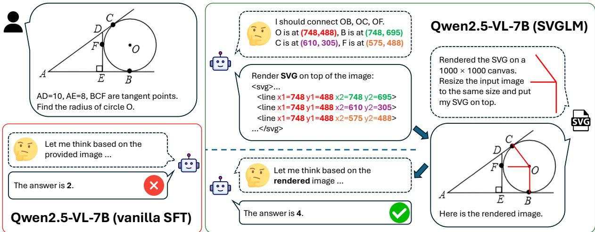  
Figure 1: Comparison between standard multi-modal chain-of-thought and SVG-enhanced thinking. Vanilla SFT and SVGLM yield diferent conversation patterns and results. SVGLM ofers a more robust thinking with images pipeline with better performance on reasoning tasks.

These inputs compress symbolic structure, quantitative relations, and latent constraints into a small number of marks and coordinates. In many cases, the model must understand the graphical structures behind the figure (e.g., axes, scales, layout rules) before reliable reasoning is possible. Second, even when VLMs produce long and fluent rationales, the intermediate steps are frequently weakly grounded in the visual evidence (Yao et al., 2025; Liu et al., 2025; Zhang et al., 2025a). As a result, their conclusions can be dominated by linguistic priors and pattern completion rather than verified visual computation. This becomes acute in tasks where the missing ingredient is an explicit visual operation, e.g., adding an auxiliary line in geometry, where text-only reasoning is insuficient without an externalizable, checkable visual substrate.

Instead of relying on human-provided prompts, OpenAI (2025)’s Thinking with Images paradigm turns the image into an active workspace, where intermediate visual states are created and manipulated to support reasoning. Recent frameworks (Hu et al., 2024; Duan et al., 2025; Qiao et al., 2025) operationalize this idea by treating visual manipulations as part of the reasoning process, e.g., generating auxiliary lines, marks, or plots as explicit intermediate steps. While some works aim to internalize such manipulations in latent space (Zhang et al., 2025b;a; Wang et al., 2025a), explicit visual rationales remain attractive for interpretability and verifiability, especially in geometric and mathematical settings where step-by-step correction matters.

A practical question is the representation used to externalize these visual steps. Many existing systems either (i) generate raster or latent images, or (ii) generate imperative Python code that renders and edits figures. The former can be token-ineficient when interleaving high-resolution visual artifacts over long horizons, and the latter tightly couples reasoning to specific software stacks and runtime environments, which can be brittle under version drift and dependency changes. For instance, VIGA and RECODE rely on Python programs executed in graphics engines or plotting tool chains for iterative render-and-revise loops (Yin et al., 2026; Shen et al., 2025); CodePlot-CoT and DeepSketcher further train models to emit such code-based visual steps for geometry-centric reasoning (Duan et al., 2025; Zhang et al., 2025a). In contrast, renderable programs like Scalable Vector Graphics (SVG) ofer a declarative, hierarchical, and resolution-independent interface: models can operate directly on compositional primitives (paths, shapes, groups, text) via structured text, making each visual modification both grounded and editable (Yang et al., 2025; Wu et al., 2025b; Rodriguez et al., 2025). This makes SVG a natural medium for visual reasoning as executable rationale: editable by construction, verifiable by rendering, and expressive enough to encode geometric structure without committing to heavyweight generation or tooling.

In this work, we present SVGLM, a SVG-enhanced reasoning paradigm to facilitate multimodal reasoning of VLMs, a paradigm to incorporate SVG as part of the thinking process into current vision language models (VLMs). Our contribution is summarized as follows:

• We present a high-quality, LLM-verified dataset of SVG-as-image-editing samples with 8K samples.

• We propose the first scheme to enhance multi-modal thinking with images rendered from vector programs.

• We show that proper SVG integration achieves superior performance on trending multi-modal agents in solving downstream tasks.

## 2 Related Work

## 2.1 Visual Representation by Graphics Programs

A growing body of research has moved towards representing visual content through the lens of structured, editable graphics programs. Recent frameworks like VIGA (Yin et al., 2026) and RECODE (Shen et al., 2025) reconstruct images as executable programs, enabling a "write-run-render-compare-revise" loop to ensure geometric consistency. While VIGA leverages the deterministic nature of 3D engines such as Blender to bridge the semantic gap, RECODE focuses on decomposing visual content into 2D programmatic abstractions. Complementing these programmatic approaches, recent works (Yang et al., 2025; Wu et al., 2025b; Rodriguez et al., 2025) leverage Scalable Vector Graphics (SVG) for visual content generation. Unlike rasterized pixels or the imperative code often used in general program synthesis, SVG provides a declarative, hierarchical, and resolution-independent representation. This nature renders SVG an ideal medium for visual reasoning, as it allows models to manipulate high-level primitives (e.g., paths, shapes) directly through structured text, ensuring that every visual modification is inherently grounded in a verifiable and editable format.

## 2.2 Visual Prompts and Thinking with Images

VLMs exhibit visually grounded understanding of user-provided visual cues, motivating visual prompting (Yang et al., 2023a;b; Feng et al., 2025). Early work relied on tuning-based approaches (Bahng et al., 2022; Yao et al., 2024), while later studies showed that VLMs can follow such cues zero-shot, e.g., overlaid marks and text (Shtedritski et al., 2023; Yang et al., 2023b; Li et al., 2023b; Yang et al., 2023a). A series of training-free methods have been proposed (Lei et al., 2024; Yang et al., 2024; Wan et al., 2024), and recent work further strengthens visual prompting via visual instruction tuning (Cai et al., 2024) or explicit pointer tokens (Lai et al., 2024; Zhang et al., 2024). Instead of relying on human-provided prompts, OpenAI (2025)’s Thinking with Images paradigm transforms it into an active workspace where visual elements are dynamically manipulated to aid reasoning. Recent frameworks such as Visual Sketchpad (Hu et al., 2024), CodePlot-CoT (Duan et al., 2025), and V-Thinker (Qiao et al., 2025) formalize visual prompts as a part of Chain-of-Thought reasoning. In these systems, models explicitly generate auxiliary lines, marks, or plots to externalize intermediate reasoning steps. While some recent works attempt to internalize this process into latent space (Zhang et al., 2025b;a; Wang et al., 2025a), explicit Visual CoT ofers distinct advantages in interpretability and precision, particularly for geometric and mathematical tasks. By externalizing the rationale onto a visual canvas, explicit methods allow for step-by-step verification and correction, a property essential for rigorous reasoning.

## 2.3 Visual Reasoning with Code

Visual reasoning via code generation leverages the modularity and precise logic of programming to address the compositional limitations inherent in end-to-end vision models. Early approaches (Surís et al., 2023; Hu et al., 2024) facilitated this by composing vision models through generated Python subroutines. However, these methods are often constrained by a static, predefined library of vision modules, limiting their adaptability to novel tasks. More recently, agentic frameworks like PyVision (Zhao et al., 2025) and OpenThinkImg (Su et al., 2025) extend this by enabling MLLMs to synthesize bespoke Python tools for specific queries, grounding reasoning in executable code to handle complex geometric and document-based tasks. However, such generalpurpose imperative code often abstracts geometric details behind procedural logic (e.g., hiding coordinates within variables or loops), creating a disconnect between the symbolic code and the actual spatial layout. This contrasts with SVG, which enforces explicit definitions of geometric attributes directly in the text, thereby intrinsically aligning the reasoning process with the visual result.

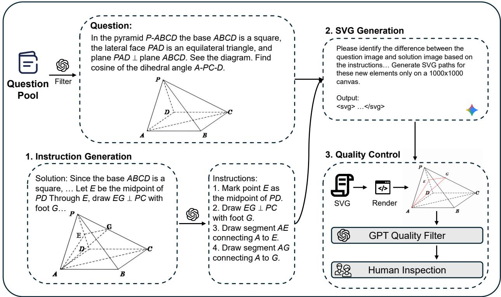  
Figure 2: Our data curation pipeline. We use Gemini-3-Pro to identify the diference between source and target images and generate SVGs. Both GPT filtering and human verification are conducted to ensure the quality of collected samples.

## 3 Method

## 3.1 Scalable Vector Graphics as Programs

Scalable Vector Graphics (SVG) (Dahlström et al., 2011) is an XML-based vector graphics format used widely in icons, webpages, etc. It encodes scalable shapes, figures and texts into XML objects, where each entity is either a special object such as text or an embedded image, or a generic “path” formed by specifying the starting point and moving patterns. Tools like VTracer (VTracer, 2026) can decompose and encode any pixel-based image into SVG programs with arbitrary granularity, showing that SVG has ample visual representation power. Commercial language models like Gemini 3 (DeepMind, 2025) have shown strong abilities in understanding and generating SVGs consisting of simple shapes. These cases prove SVG as a bridge connecting XML-like text and free-form images.

In our work, we utilize SVG as a tool to efectively quantize and visualize the multi-modal thinking process. We emphasize vital properties of the connection between SVG and its rendered image: grounded, as entities like lines and rectangles in SVG will be clearly referenced in the resulting image; editable, since human and language model agents can easily manipulate SVG programs from XML-tree level without paying extra attention to grammatical or algorithmic failures; semantically meaningful, rising from the explicit coordinate representations of each entity in the XML codes in SVG. These properties are crucial in our application where multi-modal agents generate SVG code as part of the thinking process, while the deterministically rendered image from the given SVG is sent back to the agent, consistent with the standard multi-modal conversation pipeline.

## 3.2 Thinking with Renderable Programs

Modern vision-language models excel at understanding semantic visual information, but are not naturally equipped with multi-modal generation abilities. This limits their performance in tasks that require active visual editing and thinking based on the modified images. Omni models like Bagel (Deng et al., 2025) support multi-modal generation through unified pre-training, but lack the power to accurately reflect the thinking process in open-domain image editing. In our work, SVG is used as the medium bridging text-based thinking, which vision-language models are good at, and creating intermediate images that help chain-of-thought thinking. The structure of SVG programs allows surprisingly simple descriptions of standard figures on top of the canvas image, making it suitable for downstream tasks such as plotting and captioning crucial entities in complex visual understanding, or drawing auxiliary lines and shapes within the digital domain.

We introduce Scalable-Vector-Graphics-enhanced Language Models (SVGLM) to boost vision language models’ multi-step reasoning abilities. We adopt the standard multi-turn tool-calling scheme, but allow normal text generation before the tool call. More precisely, the model can evoke a tool-call by wrapping arguments inside ‘<tool\_call>’ and ‘<\ tool\_call>’ tokens any time during its generation process. The calling arguments include XML-encoded SVG and a specification of the image to be used as canvas, which can be either the question image or blank. Figure 1 shows a simplified interaction process, where the agent chooses to either render a new SVG or answer the original question in each turn of the conversation.

Our SVGLM pipeline can work seamlessly with any open-source trainable multi-modal agent. To empower any agent with renderable programs, we construct an 8K dataset of high-quality SVG tool-calling samples, which will be organized in conversation format consistent with the interactive reasoning pipeline mentioned above. A standard supervised fine-tuning is then conducted on each model to learn the structure and semantic relationship of SVGs. More detailed data collection and training are described in Section 3.3 and Section 4.2, respectively.

## 3.3 Data Curation

To equip VLMs with SVG reasoning ability, we curated a dataset consisting of 8,000 high-quality SVGs for drawing auxiliary lines in geometric problems. We use original images from MathCanvas-Instruct (Shi et al., 2025), a large collection of multi-modal QA pairs where a “solution image” is crucial to answer the question. We select the plane geometry and solid geometry splits, as these categories have more samples that necessitates canvas-based geometric constructions instead of drawing from scratch.

As shown in Figure 2, our SVG data collection pipeline proceeded in three stages:

• First, we employ GPT-5 to filter the source dataset, leaving problems where the solution image can be constructed from the question image by only adding captions and drawing new figures.

• Second, Gemini-3.0-Thinking is used to construct precise SVG annotations corresponding to intermediate visual steps. We let Gemini identify the diference between the question image and solution image, while accurately plotting each keypoint’s location on a 1000 × 1000 canvas. We choose Gemini-3.0-Thinking over GPT-5 as Gemini demonstrates stronger abilities in accurately deciding keypoint coordinates.

• Finally, we render generated SVGs onto original question images, and utilize GPT-5 as a visual verifier to assess the quality of the synthesis. Only samples with verified visual accuracy were retained.

<table><tr><td>Perfect Reconstruction</td><td>Slight Translation</td><td>Major Translation</td><td>Structural Error</td></tr><tr><td>79.5%</td><td>10%</td><td>9.5%</td><td>1%</td></tr></table>

Table 1: Human evaluation results in percentage.

To verify the quality of our collected samples, we conduct human evaluations on a random subset of our collected samples, asking if the constructed SVG reflects the shift between the question image and the solution image, as well as the accuracy of key points used by the SVG. We classify each sample into one of: perfect reconstruction, slight translational error, major translational error, and structural error, since translational discrepancy is not catastrophic in SVG generation. Evaluation percentages are indicated in Table 1, showing only 1% of all evaluated samples have structural errors, thus confirming our dataset’s quality.

<table><tr><td>Model</td><td>Medium</td><td>Plane Geometry</td><td>Solid Geometry</td><td>Weighted</td></tr><tr><td>GPT-40</td><td>一</td><td>18.7</td><td>20.3</td><td>19.2</td></tr><tr><td>V-Thinker</td><td>Code</td><td>19.0</td><td>23.8</td><td>20.5</td></tr><tr><td>GPT-4o + Qwen-Image-Edit</td><td>Image</td><td>19.0</td><td>20.8</td><td>19.6</td></tr><tr><td>LLaVa-Next-Mistral-7B</td><td></td><td>11.6</td><td>21.4</td><td>14.6</td></tr><tr><td>LLaVa-Next-Mistral-7B (SFT)</td><td></td><td>9.8</td><td>20.7</td><td>13.2</td></tr><tr><td>LLaVa-Next-Mistral-7B (SVGLM)</td><td>SVG</td><td>20.3</td><td>29.3</td><td>23.1</td></tr><tr><td>Qwen2.5-VL-7B</td><td>一</td><td>19.1</td><td>20.5</td><td>19.5</td></tr><tr><td>Qwen2.5-VL-7B (SFT)</td><td></td><td>20.7</td><td>24.2</td><td>21.8</td></tr><tr><td>Qwen2.5-VL-7B (SVGLM)</td><td>SVG</td><td>30.0</td><td>33.0</td><td>30.9</td></tr><tr><td>InternVL3-8B</td><td>1</td><td>18.9</td><td>20.7</td><td>19.5</td></tr><tr><td>InternVL3-8B (SFT)</td><td></td><td>22.5</td><td>24.1</td><td>23.0</td></tr><tr><td>InternVL3-8B (SVGLM)</td><td>SVG</td><td>28.7</td><td>32.4</td><td>29.8</td></tr></table>

Table 2: Comparative evaluation of multi-modal agents on MathCanvas-Bench. Scores represent weighted accuracy. Best results within each model family are highlighted.

For the multi-modal models’ usage, we generate proper reasoning and tool calling with GPT-5, which is given a complete description and solution of each question, as well as the curated SVG and rendered image. We construct three diferent levels of reasoning density: no reasoning, concise reasoning and complete reasoning to suit diferent abilities of the target models. All generated messages are properly tokenized and organized to form our 3-level SVG-enhanced conversation dataset.

## 4 Experiments

## 4.1 Dataset and Metric

We use MathCanvas-Bench (Shi et al., 2025) as the benchmark to evaluate reasoning ability that benefits from drawing auxiliary lines. MathCanvas-Bench consists of 3000 question-answer pairs over 8 math categories that require multi-step visual thinking, each of which consists of one to three sub-questions. We select Plane Geometry (1092 samples) and Solid Geometry (486 samples) from the benchmark’s splits for evaluation, in accordance with our curated dataset.

To reflect rendering images on a canvas, we filter only samples from the above benchmark with at least one image in question, leaving a total of 1244 (78.8%) QA pairs. We report accuracy over both categories, as well as a weighted overall score. Following MathCanvas-Bench, we calculate accuracy with weighted scoring that rewards correct answers of later sub-questions more heavily, where each sub-question’s weight is 30% larger than the previous sub-question.

## 4.2 Evaluation setting

We select 3 open-source models of roughly the same size: LLaVa-Next-Mistral-7B (Liu et al., 2024), Qwen2.5- VL-7B-Instruct (Bai et al., 2025b) and InternVL-3-8B (Zhu et al., 2025). Despite similar scale and architectures, these models vary in zero-shot abilities like multi-step mathematical reasoning and SVG generation. All selected models are tested against three settings:

• Zero-shot: The models are given the original question and image without training. They then answer each question after Chain-of-Thought thinking (Wei et al., 2022).

• SFT: We collect questions from MathCanvas-Instruct (Shi et al., 2025) as user messages with the same number of samples as our SVG-enhanced conversation dataset. GPT-5-generated chain-of-thought reasoning is conducted with rejection-sampling using questions from MathCanvas-Instruct, after which supervised-finetuning is applied on each model.

<table><tr><td>Model</td><td>Plane Geometry</td><td>Solid Geometry</td><td>Weighted</td></tr><tr><td>Qwen2.5-VL-7B w/o solution image</td><td>19.1</td><td>20.5</td><td>18.8</td></tr><tr><td>Qwen2.5-VL-7B w solution image</td><td>33.9</td><td>34.7</td><td>34.0</td></tr></table>

Table 3: Ablation study of the presence of solution images. All accuracies are calculated the same way as Table 2.

• SVGLM: Selected models are fine-tuned on our SVG-enhanced conversation dataset, respectively. All models are evaluated in the interactive tool-calling paradigm on MathCanvas-Bench.

Each separate SFT experiment is conducted with 3 epochs, learning rate $1 0 ^ { - 5 }$ and batch size 8 on 8 NVIDIA-H100 GPUs. Running time of diferent models varies slightly, but all experiments can finish after 2 hours. Detailed training setups are described in the appendix.

We also select several baseline methods for comparison as follows:

V-Thinker (Qiao et al., 2025) uses python coding as tool-based visual chain-of-thought. We use the oficially released pre-trained model and pipeline of V-Thinker on our dataset.

Qwen-Image-Edit (Wu et al., 2025a) is an open-source image editing model. We use GPT-4o as the backbone to generate clear image editing instructions such as "connect A and B in this image", whose result is then fed into Qwen-Image-Edit-2511 along with the starting canvas to synthesize an image. This is analogous to the SVGLM pipeline with GPT-4o’s instructions replacing SVG generation and Qwen-Image-Edit replacing the SVG renderer.

Commercial models We evaluate GPT-4o under the zero-shot setting to illustrate the dificulty of the MathCanvas benchmark.

## 4.3 Generated SVGs

We show qualitative results of reconstructed SVGs from our trained models in Figure 3, along with image editing results from both Qwen-Image-Edit (Wu et al., 2025a) and Nano-Banana (Google, 2026) with the same instruction. We can see that large image editing models such as Qwen-Image-Edit or Nano-Banana sufer from severe hallucination and domain misalignment, making it dificult to follow the text instructions. Moreover, fine-tuning on difusion-based image editing models requires significantly more data compared to standard VLM fine-tuning, which blocks the path of adapting them to eficient thinking with images.

Figure 3 also verifies the base model’s ability to adjust and construct useful instructions and high-quality SVGs through fine-tuning. We find various types of SVG drawing, including connecting two points, spanning a parallel/perpendicular line from a point, marking an intersection with a letter, and indexing important angles. The diversity of SVG behavior demonstrates the potential of VLMs as primitive vector graphics generators.

## 4.4 Results

A summary of our experiments is shown in Table 2. From the table, it is evident that SVGLM achieves better results on our benchmark with all three base models. While zero-shot and direct SFT on base models yield comparative results to GPT-4o, SVGLM surpasses both GPT-4o and open-source thinking-with-images baselines by a large margin. We find the following points worth noting:

• GPT-4o with Qwen-Image-Edit as the reasoning medium does not improve over using GPT-4o only. As shown in Section 4.3, this is due to the hallucination and low-quality outputs from Qwen-Image-Edit.

• We notice a performance decrease on several entries between zero-shot and direct SFT. Admittedly, diferent models demonstrate diferent sensitivity levels to prompt structures and chain-of-thoughts in training, but only to a marginal error. Further discussion is done in Section 4.6. Most experiments see a reasonable performance improvement on direct SFT, considering the reasoning abilities already present in selected models.

<table><tr><td>Question Image</td><td>Instruction</td><td>SVGLM</td><td>Nano Banana</td><td>Qwen-Image-Edit</td></tr><tr><td>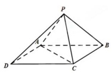</td><td>AB.&#x27;Draw the segment PO from P to O. Draw</td><td>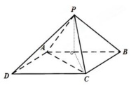</td><td>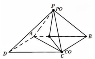</td><td>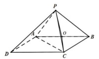</td></tr><tr><td>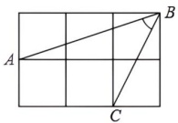</td><td>segment AC as à dashed line connecting point A to point C.</td><td></td><td></td><td></td></tr><tr><td>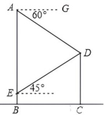</td><td>Draw the perpendicular from D to AB, meeting AB at F, and label the</td><td>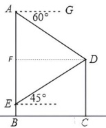</td><td>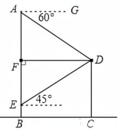</td><td>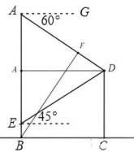</td></tr><tr><td>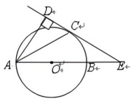</td><td>Draw the radius OC from the center O to point C. Draw the chord BC between</td><td>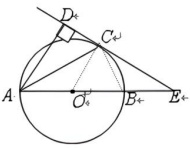</td><td>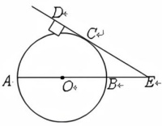</td><td>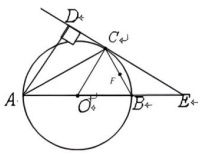</td></tr><tr><td>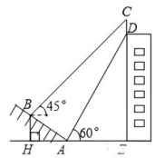 point F, and mark the</td><td>Draw a horizontal line through B to meet the vertical CD at a new</td><td>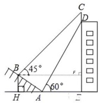</td><td>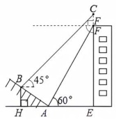</td><td>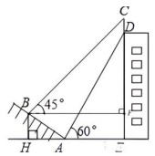</td></tr></table>

Figure 3: Instruction and SVG generated by SVGLM, as well as Qwen-Image-Edit and Nano Banana on the exact same prompt

Overall, we see SVGLM with a significant boost of 8% over zero-shot and 6.5% over direct SFT. It also beats GPT-4o and the two think-with-images baselines.

## 4.5 Generalization to grounded reasoning

Further experiments are conducted to showcase SVG’s power in grounded reasoning, where the answer must ground on specific pixels or regions in the image. We select 30,000 random samples from Visual Genome (Krishna et al., 2016), consisting of visual QA pairs concerning specific objects in the image. The bounding box in each sample is converted so that the rendered SVG contains a visible box on top of the original image. This selected dataset is used to reproduce the whole training process of SVGLM.

We then test our trained models on POPE (Li et al., 2023a), a dataset to evaluate vision-language models’ hallucination. POPE’s samples are hard to answer if not concretely grounded on specific objects in the image, making them a suitable candidate to solve with our canvas-based method. Results are in Table 4, with all three models seeing improvement from vanilla SFT. Although grounded reasoning’s used SVGs are simple and equivalent to explicitly drawing boxes, model can benefit from the generalizability of SVGs to adapt to broader tasks and shapes.

<table><tr><td>Model</td><td>Zero-shot</td><td>SFT</td><td>SVGLM</td></tr><tr><td>LLaVa-Next-Mistral-7B</td><td>47.4</td><td>61.2</td><td>69.4</td></tr><tr><td>Qwen2.5-VL-7B</td><td>74.4</td><td>81.9</td><td>83.8</td></tr><tr><td>InternVL3-8B</td><td>81.6</td><td>82.3</td><td>84.8</td></tr></table>

Table 4: Evaluation results of grounded reasoning with POPE benchmark

## 4.6 Ablation studies

We conduct several ablation studies to strengthen the rationale of the SVGLM pipeline.

Model choices Our three models are chosen as representatives of diferent model families and training strategies. We notice serious training data contamination starting from Qwen3-VL-8B (Bai et al., 2025a) and InternVL-3.5-8B (Wang et al., 2025b). However, we found that: zero-shot inference of Qwen3-VL-8B achieves 30.8% on the benchmark, while pure SFT on the same set of prompts scored 22.8% which is lower than zero-shot; on one category of the dataset, Trigonometry, zero-shot model has 49.2% accuracy, significantly higher than GPT-4o and SFT results, which yields around 20%. This performance degradation suggests potential data contamination with the testing data. Therefore, we choose Qwen2.5-VL-7B and InternVL-3-8B as they are among the most powerful open-sourced vision language models by the time the benchmark was released at the 7B scale.

Is auxiliary images necessary? This question arises from our benchmark naturally, since the dificulty of samples with ground truth solution images is an apparent upper bound of how SVGs can perform given infinite budget of text-based inference. To quantitatively analyze this, we first generate ground truth image editing instructions using the question image and solution image pairs; then, we test zero-shot performances of Qwen2.5-VL-7B on MathCanvas-Bench, given both images alongside the generated text instruction. Table 3 illustrates the impact of solution images’ presence on zero-shot Qwen2.5-VL-7B model. It is evident that the questions do appear much simpler to multi-modal agents when come with the solution image.

Ablation of Framework Components. We verify the contributions of all components within our SVGLM framework by isolating the efects of SVG generation and rendering. To maintain consistency with the supervised fine-tuning (SFT) baselines, we utilize Gemini exclusively to generate the SVGs, while the Chain-of-Thought (CoT) reasoning is generated by GPT-5 across the same set of prompts. However, enforcing perfectly identical prompts across all configurations is not strictly plausible; the full CoT unavoidably incorporates visual information from the rendered SVG. Consequently, omitting the SVG removes crucial context that standard SFT relies on.

To decouple these mechanisms and strengthen our argument, we evaluate models under three distinct settings: the full SVGLM framework, SVGLM without the rendered SVG feedback (forcing the model to output the solution based only on the generated SVG code), and SVGLM without any SVG generation or rendering. As Table 5 indicates, thinking with SVGs (w/o SVG render) already shows improvements over settings lacking both generation and rendering. Incorporating the rendered images back into the context pushes the performance even further. For instance, removing both SVG generation and rendering on Qwen2.5-VL significantly degrades performance, demonstrating that both the generation and rendering phases are crucial to our method. While LLaVa-Next sees a comparatively smaller boost due to its limited capacity in multi-image understanding, all models achieve their highest performance with the full SVGLM equipped. This solidifies our argument that SVGLM’s dual mechanism of creation and visual reflection fundamentally charges VLM reasoning abilities.

<table><tr><td>Model</td><td>SFT</td><td>SVGLM</td><td>w/o SVG render</td><td>w/o SVG gen. &amp; render</td></tr><tr><td>LLaVa-Next</td><td>11.6</td><td>20.0</td><td>19.5</td><td>10.7</td></tr><tr><td>Qwen2.5-VL</td><td>20.3</td><td>26.8</td><td>23.8</td><td>20.2</td></tr><tr><td>InternVL3</td><td>21.7</td><td>26.2</td><td>23.8</td><td>21.4</td></tr></table>

Table 5: Ablation study verifying all framework components. All figures represent the weighted score on MathCanvas-Bench. w/o SVG render forces the model to output the answer after writing the SVG code, without the rendered image as feedback. w/o SVG gen. & render represents the baseline without any SVG assistance.

Efect of diferent prompts We assess the outcome of diferent reasoning densities in our curated dataset, namely: No reasoning only keeps the instruction for the SVG as well as steps to solve the original problem; Concise gives moderate steps of reasoning; Complete is a detailed, step-by-step reasoning on both SVG generation and question answering. Table 6 shows the experimental results on the same benchmark. clearly indicating the impact of prompt patterns in SFT training. Presumably, models with stronger reasoning abilities will prefer shorter answers as SFT, as longer prompts are likely inconsistent with the models’ internal knowledge, thus more resources are used in shifting the distribution of text generation instead of focusing on answering correctly. However, we mark that whichever set of reasoning densities produce a significant increase in weighted accuracies of our benchmark.

<table><tr><td>Model</td><td>No Reasoning</td><td>Concise</td><td>Complete</td></tr><tr><td>LLaVa-Next</td><td>18.0</td><td>20.0</td><td>19.0</td></tr><tr><td>Qwen2.5-VL</td><td>26.8</td><td>23.9</td><td>23.4</td></tr><tr><td>InternVL3</td><td>26.2</td><td>24.8</td><td>22.4</td></tr></table>

Table 6: Ablation study of reasoning density. All figures are the weighted score of MathCanvas-Bench.

## 5 Conclusion

In this paper, we present SVGLM, a paradigm to boost multi-modal agents with the ability to think with renderable programs, as well as a large fine-tuning dataset of 8K high-quality question-SVG pairs. We show that with proper tool-calling integration, multi-modal agents with weak reasoning abilities can learn to think with vector graphics as renderable programs, exhibiting better performance than other thinking with images baselines as well as standard fine-tuned VLMs. On the other hand, SVGLM is suitable for Document QA and grounded reasoning tasks as well, where SVG can be used to draw charts and plot important entities.

The success in both math and spatial reasoning demonstrate the potential of SVGLM as an easy and elegant solution to boosting smaller models’ reasoning abilities.

Limitations Due to lack of compute resources and paid API requests, we’re not able to verify our results in larger models and larger SVG datasets. We will try our best to scale up SVGLM, as well as applying inference-time scaling methods in subsequent works.

## References

Jean-Baptiste Alayrac, Jef Donahue, Pauline Luc, Antoine Miech, Iain Barr, Yana Hasson, Karel Lenc, Arthur Mensch, Katherine Millican, Malcolm Reynolds, et al. Flamingo: a visual language model for few-shot learning. Advances in neural information processing systems, 35:23716–23736, 2022.

Hyojin Bahng, Ali Jahanian, Swami Sankaranarayanan, and Phillip Isola. Exploring visual prompts for adapting large-scale models. arXiv preprint arXiv:2203.17274, 2022.

Shuai Bai, Yuxuan Cai, Ruizhe Chen, Keqin Chen, Xionghui Chen, Zesen Cheng, Lianghao Deng, Wei Ding, Chang Gao, Chunjiang Ge, Wenbin Ge, Zhifang Guo, Qidong Huang, Jie Huang, Fei Huang, Binyuan Hui, Shutong Jiang, Zhaohai Li, Mingsheng Li, Mei Li, Kaixin Li, Zicheng Lin, Junyang Lin, Xuejing Liu, Jiawei Liu, Chenglong Liu, Yang Liu, Dayiheng Liu, Shixuan Liu, Dunjie Lu, Ruilin Luo, Chenxu Lv, Rui Men, Lingchen Meng, Xuancheng Ren, Xingzhang Ren, Sibo Song, Yuchong Sun, Jun Tang, Jianhong Tu, Jianqiang Wan, Peng Wang, Pengfei Wang, Qiuyue Wang, Yuxuan Wang, Tianbao Xie, Yiheng Xu, Haiyang Xu, Jin Xu, Zhibo Yang, Mingkun Yang, Jianxin Yang, An Yang, Bowen Yu, Fei Zhang, Hang Zhang, Xi Zhang, Bo Zheng, Humen Zhong, Jingren Zhou, Fan Zhou, Jing Zhou, Yuanzhi Zhu, and Ke Zhu. Qwen3-vl technical report, 2025a. URL https://arxiv.org/abs/2511.21631.

Shuai Bai, Keqin Chen, Xuejing Liu, Jialin Wang, Wenbin Ge, Sibo Song, Kai Dang, Peng Wang, Shijie Wang, Jun Tang, Humen Zhong, Yuanzhi Zhu, Mingkun Yang, Zhaohai Li, Jianqiang Wan, Pengfei Wang, Wei Ding, Zheren Fu, Yiheng Xu, Jiabo Ye, Xi Zhang, Tianbao Xie, Zesen Cheng, Hang Zhang, Zhibo Yang, Haiyang Xu, and Junyang Lin. Qwen2.5-vl technical report. arXiv preprint arXiv:2502.13923, 2025b.

Mu Cai, Haotian Liu, Siva Karthik Mustikovela, Gregory P Meyer, Yuning Chai, Dennis Park, and Yong Jae Lee. Vip-llava: Making large multimodal models understand arbitrary visual prompts. In IEEE Conference on Computer Vision and Pattern Recognition, 2024.

Erik Dahlström, Patrick Dengler, Anthony Grasso, Chris Lilley, Cameron McCormack, Doug Schepers, and Jonathan Watt. Scalable vector graphics (svg) 1.1 (second edition). W3c recommendation, W3C, 2011. URL https://www.w3.org/TR/SVG11/.

Google DeepMind. Gemini 3: Frontier intelligence for complex reasoning. Technical report, Google DeepMind, December 2025. URL https://deepmind.google/technologies/gemini/. Technical Report.

Chaorui Deng, Deyao Zhu, Kunchang Li, Chenhui Gou, Feng Li, Zeyu Wang, Shu Zhong, Weihao Yu, Xiaonan Nie, Ziang Song, Guang Shi, and Haoqi Fan. Emerging properties in unified multimodal pretraining. arXiv preprint arXiv:2505.14683, 2025.

Chengqi Duan, Kaiyue Sun, Rongyao Fang, Manyuan Zhang, Yan Feng, Ying Luo, Yufang Liu, Ke Wang, Peng Pei, Xunliang Cai, et al. Codeplot-cot: Mathematical visual reasoning by thinking with code-driven images. arXiv preprint arXiv:2510.11718, 2025.

Haiwen Feng, Long Lian, Lisa Dunlap, Jiahao Shu, XuDong Wang, Renhao Wang, Trevor Darrell, Alane Suhr, and Angjoo Kanazawa. Visually prompted benchmarks are surprisingly fragile. arXiv preprint arXiv:2512.17875, 2025.

Google. Gemini 3 pro image. https://aistudio.google.com/models/gemini-3-pro-image, 2026. Accessed: 2026-01-28.

Yushi Hu, Weijia Shi, Xingyu Fu, Dan Roth, Mari Ostendorf, Luke Zettlemoyer, Noah A Smith, and Ranjay Krishna. Visual sketchpad: Sketching as a visual chain of thought for multimodal language models. Advances in Neural Information Processing Systems, 37:139348–139379, 2024.

Wenlong Huang, Fei Xia, Ted Xiao, Harris Chan, Jacky Liang, Pete Florence, Andy Zeng, Jonathan Tompson, Igor Mordatch, Yevgen Chebotar, et al. Inner monologue: Embodied reasoning through planning with language models. arXiv preprint arXiv:2207.05608, 2022.

Ranjay Krishna, Yuke Zhu, Oliver Groth, Justin Johnson, Kenji Hata, Joshua Kravitz, Stephanie Chen, Yannis Kalantidis, Li-Jia Li, David A. Shamma, Michael S. Bernstein, and Fei-Fei Li. Visual genome: Connecting language and vision using crowdsourced dense image annotations, 2016. URL https://arxiv. org/abs/1602.07332.

Xin Lai, Zhuotao Tian, Yukang Chen, Yanwei Li, Yuhui Yuan, Shu Liu, and Jiaya Jia. Lisa: Reasoning segmentation via large language model. In Proceedings of the IEEE/CVF Conference on Computer Vision and Pattern Recognition, pp. 9579–9589, 2024.

Xuanyu Lei, Zonghan Yang, Xinrui Chen, Peng Li, and Yang Liu. Scafolding coordinates to promote vision-language coordination in large multi-modal models. arXiv preprint arXiv:2402.12058, 2024.

Yifan Li, Yifan Du, Kun Zhou, Jinpeng Wang, Wayne Xin Zhao, and Ji-Rong Wen. Evaluating object hallucination in large vision-language models, 2023a. URL https://arxiv.org/abs/2305.10355.

Zongjie Li, Chaozheng Wang, Chaowei Liu, Pingchuan Ma, Daoyuan Wu, Shuai Wang, and Cuiyun Gao. Vrptest: Evaluating visual referring prompting in large multimodal models. arXiv preprint arXiv:2312.04087, 2023b.

Chengzhi Liu, Zhongxing Xu, Qingyue Wei, Juncheng Wu, James Zou, Xin Eric Wang, Yuyin Zhou, and Sheng Liu. More thinking, less seeing? assessing amplified hallucination in multimodal reasoning models. arXiv preprint arXiv:2505.21523, 2025.

Fangyu Liu, Francesco Piccinno, Syrine Krichene, Chenxi Pang, Kenton Lee, Mandar Joshi, Yasemin Altun, Nigel Collier, and Julian Eisenschlos. Matcha: Enhancing visual language pretraining with math reasoning and chart derendering. In Proceedings of the 61st Annual Meeting of the Association for Computational Linguistics (Volume 1: Long Papers), pp. 12756–12770, 2023.

Haotian Liu, Chunyuan Li, Yuheng Li, Bo Li, Yuanhan Zhang, Sheng Shen, and Yong Jae Lee. Llava-next: Improved reasoning, ocr, and world knowledge, January 2024. URL https://llava-vl.github.io/blog/ 2024-01-30-llava-next/.

Soroush Nasiriany, Fei Xia, Wenhao Yu, Ted Xiao, Jacky Liang, Ishita Dasgupta, Annie Xie, Danny Driess, Ayzaan Wahid, Zhuo Xu, et al. Pivot: Iterative visual prompting elicits actionable knowledge for vlms. In International Conference on Machine Learning, pp. 37321–37341. PMLR, 2024.

OpenAI. Hello gpt-4o, May 2024. URL https://openai.com/index/hello-gpt-4o/.

OpenAI. Thinking with images, Apr 2025. URL https://openai.com/index/thinking-with-images/.

Runqi Qiao, Qiuna Tan, Minghan Yang, Guanting Dong, Peiqing Yang, Shiqiang Lang, Enhui Wan, Xiaowan Wang, Yida Xu, Lan Yang, et al. V-thinker: Interactive thinking with images. arXiv preprint arXiv:2511.04460, 2025.

Alec Radford, Jong Wook Kim, Chris Hallacy, Aditya Ramesh, Gabriel Goh, Sandhini Agarwal, Girish Sastry, Amanda Askell, Pamela Mishkin, Jack Clark, et al. Learning transferable visual models from natural language supervision. In International conference on machine learning, pp. 8748–8763. PmLR, 2021.

Juan A Rodriguez, Abhay Puri, Shubham Agarwal, Issam H Laradji, Pau Rodriguez, Sai Rajeswar, David Vazquez, Christopher Pal, and Marco Pedersoli. Starvector: Generating scalable vector graphics code from images and text. In Proceedings of the Computer Vision and Pattern Recognition Conference, pp. 16175–16186, 2025.

Junhong Shen, Mu Cai, Bo Hu, Ameet Talwalkar, David A Ross, Cordelia Schmid, and Alireza Fathi. Recode: Reasoning through code generation for visual question answering. arXiv preprint arXiv:2510.13756, 2025.

Weikang Shi, Aldrich Yu, Rongyao Fang, Houxing Ren, Ke Wang, Aojun Zhou, Changyao Tian, Xinyu Fu, Yuxuan Hu, Zimu Lu, Linjiang Huang, Si Liu, Rui Liu, and Hongsheng Li. Mathcanvas: Intrinsic visual chainof-thought for multimodal mathematical reasoning, 2025. URL https://arxiv.org/abs/2510.14958.

Aleksandar Shtedritski, Christian Rupprecht, and Andrea Vedaldi. What does clip know about a red circle? visual prompt engineering for vlms. In Proceedings of the IEEE/CVF International Conference on Computer Vision, pp. 11987–11997, 2023.

Zhaochen Su, Linjie Li, Mingyang Song, Yunzhuo Hao, Zhengyuan Yang, Jun Zhang, Guanjie Chen, Jiawei Gu, Juntao Li, Xiaoye Qu, and Yu Cheng. Openthinkimg: Learning to think with images via visual tool reinforcement learning, 2025. URL https://arxiv.org/abs/2505.08617.

Dídac Surís, Sachit Menon, and Carl Vondrick. Vipergpt: Visual inference via python execution for reasoning. In Proceedings of the IEEE/CVF international conference on computer vision, pp. 11888–11898, 2023.

Liyan Tang, Grace Kim, Xinyu Zhao, Thom Lake, Wenxuan Ding, Fangcong Yin, Prasann Singhal, Manya Wadhwa, Zeyu Leo Liu, Zayne Sprague, et al. Chartmuseum: Testing visual reasoning capabilities of large vision-language models. arXiv preprint arXiv:2505.13444, 2025.

Gemini Team, Rohan Anil, Sebastian Borgeaud, Yonghui Wu, Jean-Baptiste Alayrac, Jiahui Yu, Radu Soricut, Johan Schalkwyk, Andrew M Dai, Anja Hauth, et al. Gemini: a family of highly capable multimodal models. arXiv preprint arXiv:2312.11805, 2023.

VTracer. Vtracer: Open source raster to SVG vector graphics converter, 2026. URL https://www. visioncortex.org/vtracer/. Accessed: 2026-01-27.

David Wan, Jaemin Cho, Elias Stengel-Eskin, and Mohit Bansal. Contrastive region guidance: Improving grounding in vision-language models without training. arXiv preprint arXiv:2403.02325, 2024.

Peng Wang, Shuai Bai, Sinan Tan, Shijie Wang, Zhihao Fan, Jinze Bai, Keqin Chen, Xuejing Liu, Jialin Wang, Wenbin Ge, et al. Qwen2-vl: Enhancing vision-language model’s perception of the world at any resolution. arXiv preprint arXiv:2409.12191, 2024.

Qixun Wang, Yang Shi, Yifei Wang, Yuanxing Zhang, Pengfei Wan, Kun Gai, Xianghua Ying, and Yisen Wang. Monet: Reasoning in latent visual space beyond images and language, 2025a. URL https: //arxiv.org/abs/2511.21395.

Weiyun Wang, Zhangwei Gao, Lixin Gu, Hengjun Pu, Long Cui, Xingguang Wei, Zhaoyang Liu, Linglin Jing, Shenglong Ye, Jie Shao, Zhaokai Wang, Zhe Chen, Hongjie Zhang, Ganlin Yang, Haomin Wang, Qi Wei, Jinhui Yin, Wenhao Li, Erfei Cui, Guanzhou Chen, Zichen Ding, Changyao Tian, Zhenyu Wu, Jingjing Xie, Zehao Li, Bowen Yang, Yuchen Duan, Xuehui Wang, Zhi Hou, Haoran Hao, Tianyi Zhang, Songze Li, Xiangyu Zhao, Haodong Duan, Nianchen Deng, Bin Fu, Yinan He, Yi Wang, Conghui He, Botian Shi, Junjun He, Yingtong Xiong, Han Lv, Lijun Wu, Wenqi Shao, Kaipeng Zhang, Huipeng Deng, Biqing Qi, Jiaye Ge, Qipeng Guo, Wenwei Zhang, Songyang Zhang, Maosong Cao, Junyao Lin, Kexian Tang, Jianfei Gao, Haian Huang, Yuzhe Gu, Chengqi Lyu, Huanze Tang, Rui Wang, Haijun Lv, Wanli Ouyang, Limin Wang, Min Dou, Xizhou Zhu, Tong Lu, Dahua Lin, Jifeng Dai, Weijie Su, Bowen Zhou, Kai Chen, Yu Qiao, Wenhai Wang, and Gen Luo. Internvl3.5: Advancing open-source multimodal models in versatility, reasoning, and eficiency, 2025b. URL https://arxiv.org/abs/2508.18265.

Jason Wei, Xuezhi Wang, Dale Schuurmans, Maarten Bosma, Fei Xia, Ed Chi, Quoc V Le, Denny Zhou, et al. Chain-of-thought prompting elicits reasoning in large language models. Advances in neural information processing systems, 35:24824–24837, 2022.

Chenfei Wu, Jiahao Li, Jingren Zhou, Junyang Lin, Kaiyuan Gao, Kun Yan, Sheng ming Yin, Shuai Bai, Xiao Xu, Yilei Chen, Yuxiang Chen, Zecheng Tang, Zekai Zhang, Zhengyi Wang, An Yang, Bowen Yu, Chen Cheng, Dayiheng Liu, Deqing Li, Hang Zhang, Hao Meng, Hu Wei, Jingyuan Ni, Kai Chen, Kuan Cao,

Liang Peng, Lin Qu, Minggang Wu, Peng Wang, Shuting Yu, Tingkun Wen, Wensen Feng, Xiaoxiao Xu, Yi Wang, Yichang Zhang, Yongqiang Zhu, Yujia Wu, Yuxuan Cai, and Zenan Liu. Qwen-image technical report, 2025a. URL https://arxiv.org/abs/2508.02324.

Ronghuan Wu, Wanchao Su, and Jing Liao. Chat2svg: Vector graphics generation with large language models and image difusion models. In Proceedings of the Computer Vision and Pattern Recognition Conference, pp. 23690–23700, 2025b.

Jianwei Yang, Hao Zhang, Feng Li, Xueyan Zou, Chunyuan Li, and Jianfeng Gao. Set-of-mark prompting unleashes extraordinary visual grounding in gpt-4v. arXiv preprint arXiv:2310.11441, 2023a.

Lingfeng Yang, Yueze Wang, Xiang Li, Xinlong Wang, and Jian Yang. Fine-grained visual prompting. In Advances in Neural Information Processing Systems, volume 36, 2024.

Yiying Yang, Wei Cheng, Sijin Chen, Xianfang Zeng, Fukun Yin, Jiaxu Zhang, Liao Wang, Gang Yu, Xingjun Ma, and Yu-Gang Jiang. Omnisvg: A unified scalable vector graphics generation model. In The Thirty-ninth Annual Conference on Neural Information Processing Systems, 2025.

Zhengyuan Yang, Linjie Li, Kevin Lin, Jianfeng Wang, Chung-Ching Lin, Zicheng Liu, and Lijuan Wang. The dawn of lmms: Preliminary explorations with gpt-4v (ision). arXiv preprint arXiv:2309.17421, 9(1):1, 2023b.

Yuan Yao, Ao Zhang, Zhengyan Zhang, Zhiyuan Liu, Tat-Seng Chua, and Maosong Sun. Cpt: Colorful prompt tuning for pre-trained vision-language models. AI Open, 5:30–38, 2024.

Zijun Yao, Yantao Liu, Yanxu Chen, Jianhui Chen, Junfeng Fang, Lei Hou, Juanzi Li, and Tat-Seng Chua. Are reasoning models more prone to hallucination? arXiv preprint arXiv:2505.23646, 2025.

Shaofeng Yin, Jiaxin Ge, Zora Zhiruo Wang, Xiuyu Li, Michael J Black, Trevor Darrell, Angjoo Kanazawa, and Haiwen Feng. Vision-as-inverse-graphics agent via interleaved multimodal reasoning. arXiv preprint arXiv:2601.11109, 2026.

Xiang Yue, Yuansheng Ni, Kai Zhang, Tianyu Zheng, Ruoqi Liu, Ge Zhang, Samuel Stevens, Dongfu Jiang, Weiming Ren, Yuxuan Sun, et al. Mmmu: A massive multi-discipline multimodal understanding and reasoning benchmark for expert agi. In Proceedings of the IEEE/CVF Conference on Computer Vision and Pattern Recognition, pp. 9556–9567, 2024.

Chi Zhang, Haibo Qiu, Qiming Zhang, Zhixiong Zeng, Lin Ma, and Jing Zhang. Deepsketcher: Internalizing visual manipulation for multimodal reasoning. arXiv preprint arXiv:2509.25866, 2025a.

Huanyu Zhang, Wenshan Wu, Chengzu Li, Ning Shang, Yan Xia, Yangyu Huang, Yifan Zhang, Li Dong, Zhang Zhang, Liang Wang, et al. Latent sketchpad: Sketching visual thoughts to elicit multimodal reasoning in mllms. arXiv preprint arXiv:2510.24514, 2025b.

Yichi Zhang, Ziqiao Ma, Xiaofeng Gao, Suhaila Shakiah, Qiaozi Gao, and Joyce Chai. Groundhog: Grounding large language models to holistic segmentation. In Proceedings of the IEEE/CVF conference on computer vision and pattern recognition, pp. 14227–14238, 2024.

Shitian Zhao, Haoquan Zhang, Shaoheng Lin, Ming Li, Qilong Wu, Kaipeng Zhang, and Chen Wei. Pyvision: Agentic vision with dynamic tooling, 2025. URL https://arxiv.org/abs/2507.07998.

Yaowei Zheng, Richong Zhang, Junhao Zhang, Yanhan Ye, Zheyan Luo, Zhangchi Feng, and Yongqiang Ma. Llamafactory: Unified eficient fine-tuning of 100+ language models. In Proceedings of the 62nd Annual Meeting of the Association for Computational Linguistics (Volume 3: System Demonstrations), Bangkok, Thailand, 2024. Association for Computational Linguistics. URL http://arxiv.org/abs/2403.13372.

Jinguo Zhu, Weiyun Wang, Zhe Chen, Zhaoyang Liu, Shenglong Ye, Lixin Gu, Hao Tian, Yuchen Duan, Weijie Su, Jie Shao, et al. Internvl3: Exploring advanced training and test-time recipes for open-source multimodal models. arXiv preprint arXiv:2504.10479, 2025.

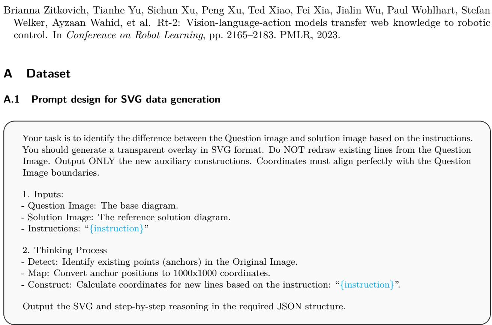  
Figure 4: Template used for SVG generation task. The text highlighted in cyan indicates variables to be replaced.

## A.2 Prompt design for quality assessment

## B Training setup

We adopted LLaMa-Factory (Zheng et al., 2024) as the training base for LLaVa-Next-Mistral-7B (Liu et al., 2024), Qwen2.5-VL-7B-Instruct (Bai et al., 2025b) and InternVL-3-8B (Zhu et al., 2025). Our system for training has Intel(R) Xeon(R) Platinum 8468 CPU and 8 Nvidia H100 GPUs. We use the full fine-tune setting that tunes all language model parameters while freezing all three VLMs’ vision towers and multi-moda projectors. We use cosine learning rate scheduler with 10−5 learning rate. All models are trained for 3 epochs under each setting, with per-device batch size 1 (efectively batch size 8).

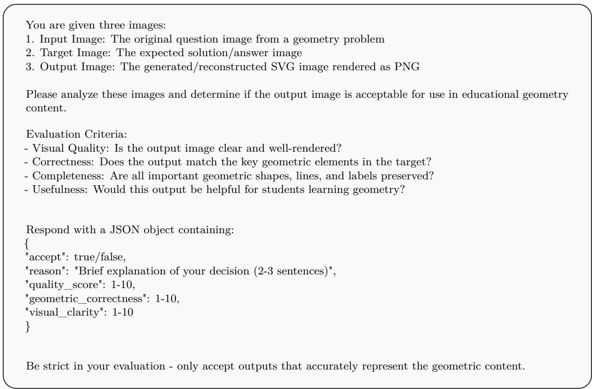  
Figure 5: Template used for SVG quality assessment.