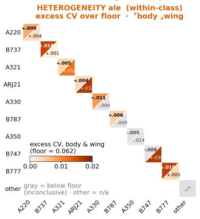
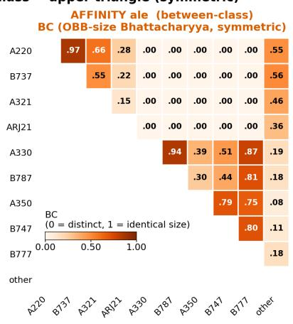
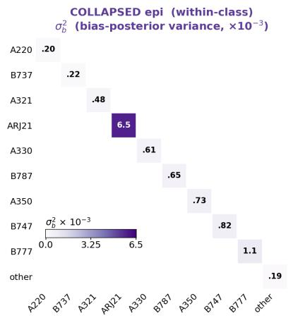
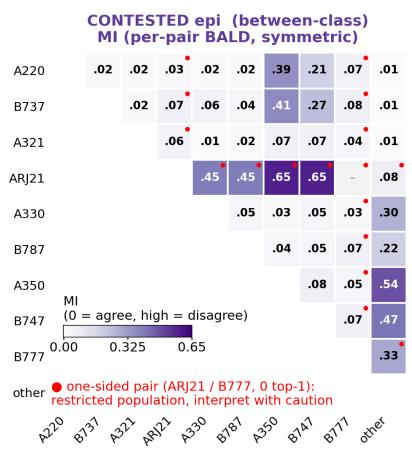
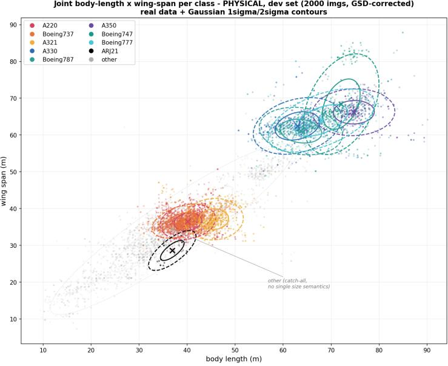
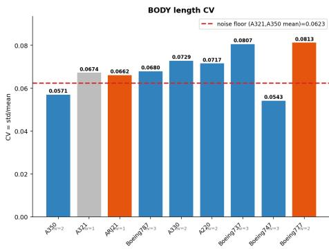
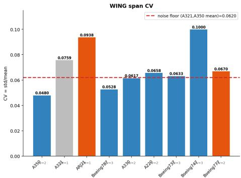
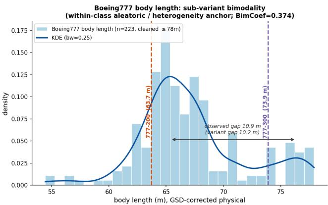

# Not All Confusion Is Equal: A Source-Aware Uncertainty Diagnosis for Fine-Grained Aircraft Detection

Hai Huang and Helmut Mayer

Chair of Visual Computing, Institute for Applied Computer Science, Universit¨at der Bundeswehr M¨unchen, Germany hai.huang@unibw.de

Abstract. Fine-grained object detectors are commonly evaluated with confusion matrices, which show where the model is confused but not why, nor whether the confusion can be reduced. We argue that confusion can be attributed to distinct, separable sources, each quantitatively measurable, turning a passive measurement into actionable guidance. We present $A ^ { 2 } E ^ { 2 }$ , a diagnostic tool that decomposes the sources of confusion along two axes, {aleatoric, epistemic}×{within-class, between-class}, giving a $2 \times 2$ taxonomy that enumerates the source types. Each quadrant is measured by its own quantity, computed in one of three places (input geometry, output-space disagreement, and the bias-parameter posterior), so the two epistemic sources are separated by construction rather than by an empirical correlation. On fine-grained aircraft detection, the four quadrants become four named sources with their own remedy verdict: afinity (geometric similarity, irreducible from size alone), heterogeneity (geometrically heterogeneous sub-variants, pointing to re-labeling rather than more data), contested (an insuficiently trained but learnable boundary, improvable), and collapsed (a class starved of data, reducible). After attributing the confusion to a specific reducible source, we apply a targeted intervention and verify experimentally that it reduces the diagnosed source specifically while leaving the irreducible sources unchanged. $A ^ { 2 } E ^ { 2 }$ thus turns confusion measurement into a concrete, validatable and actionable “diagnosis” in which the same of-diagonal mass can carry opposite causes and opposite remedies. We also state this framework’s limits, including which sources are only partially identifiable on this specific dataset and why.

Keywords: Uncertainty quantification · Confusion analysis · Object detection · Aleatoric and epistemic uncertainty

## 1 Introduction

A confusion matrix is the standard tool for analyzing fine-grained detection. It reports which pairs of classes a model conflates and which classes it recovers poorly. Yet it does not report why a given confusion occurs, whether it can be removed, or how. Two classes may be confused for distinct reasons: (1) they are close to indistinguishable at the available sensor resolution; (2) the decision boundary is under-trained; or (3) one of them has too few examples to compete at all. The first is “irreducible”, i.e., an intrinsic limit that additional data cannot change; the latter two are “actionable” deficiencies that targeted data or rebalancing can address.

Furthermore, in the context of trustworthy and explainable AI, much of the field operates at one of two levels: a conceptual level of principles and taxonomies, or a post-hoc level of saliency and attention maps. Less developed is a quantitative, attributable layer between them, one that turns “the model is unreliable here” into something measured, attributed to a cause, and acted upon. Uncertainty quantification (UQ) is a natural place for such a layer, but standard UQ returns a scalar: a single number indicating that the model should hesitate, without indicating why, whether the hesitation is warranted, or whether it can be reduced.

We address this gap by decomposing the uncertainty behind confusion into source-attributed components: decomposing not the confusion matrix itself, but directly the sources of the uncertainty that produces confusion. We organize the decomposition along two dimensions: (1) the standard UQ distinction between aleatoric uncertainty (intrinsic to the data, irreducible) and epistemic uncertainty (due to limited knowledge, reducible), and (2) within-class (intra-class variation a single label cannot absorb, on the diagonal) and between-class (mistaking one class for another, of-diagonal). The Cartesian product gives a $2 \times 2$ taxonomy of four quadrants: heterogeneity and afinity (two Aleatoric sources), collapsed and contested (two Epistemic sources), i.e., $\dot { A } ^ { 2 } E ^ { 2 }$ (Sec. 3). Each quadrant is assigned a single quantity, computed in one of three parts of the pipeline: the input geometry (a Bhattacharyya overlap of class size distributions for afinity, a size dispersion for heterogeneity), the output-space ensemble disagreement (per-pair mutual information), and the posterior width of the classifier’s bias term $\left( \sigma _ { b } ^ { 2 } \right)$ . The two binary partitions are exhaustive, so the four quadrants enumerate the possible source types (Appendix A). The partition itself is structural; the four quantities are complementary readings rather than statistically independent ones, since the two aleatoric quantities share the input geometry (Appendix C). After attributing a class’s confusion to a specific reducible source, we predict and test a targeted remedy (Sec. 4). The limits of the proposed work on this dataset are reported in Sec. 5.

## 2 Related Work

Aleatoric and epistemic uncertainty. Separating predictive uncertainty into an aleatoric part (intrinsic, irreducible) and an epistemic part (reducible with more data or a better model) is standard [5, 9, 10]. In classification, the epistemic part is commonly the information-theoretic mutual information between predictions and model parameters (BALD) [3, 4, 8], estimated via MC-dropout [4], deep ensembles [11], or a Laplace approximation to the posterior [2, 12, 13]. These methods return a per-sample scalar or aleatoric/epistemic pair, and recent work scrutinizes how cleanly the two can be disentangled at all [18]. We difer in two ways: we attribute class-level confusion, not individual predictions, to a within/between × aleatoric/epistemic grid, and show the epistemic side is not one phenomenon but two: a contested boundary and a collapsed class that a single MI value cannot separate, since they live in diferent model parts. Closest to this point, Toure and Stephens [17] decompose MI into per-class contributions and show that output-space variance is suppressed for rare classes; we build on the same observation but measure collapse in the parameter space, which remains informative when a class is never predicted.

Confusion, error detection, and attribution. A large body of work flags which predictions are likely wrong, via misclassification and out-of-distribution detection [7], or, in fine-grained recognition, via confusion matrices, hard-pair mining, and class-similarity analyses. These tell us where a model fails but not why, nor whether intervention would help. We complement error detection with source attribution, assigning each confusion a cause and a remedy verdict.

Fine-grained recognition and remote-sensing aircraft. Fine-grained recognition features small inter-class and large intra-class variation [19], classically addressed by localizing discriminative parts [22]; this is the lineage of our within-class heterogeneity source, where a single label spans several sub-variant geometries. Fine-grained aircraft recognition in remote sensing is driven by benchmarks such as FAIR1M [16], MAR20 [21], and the Gaofen challenge [15] on which we instantiate the framework, typically with oriented detectors [20,23]: we use this setting not to advance detection accuracy but because oriented boxes give a clean physical handle on class size geometry.

Data-centric and actionable uncertainty. Closest in spirit is work that turns uncertainty into an action on the data. Data-IQ [14] uses aleatoric uncertainty to stratify examples into easy, ambiguous, and hard subgroups; classical active learning [8] uses epistemic uncertainty to pick which examples to label next. We share the premise that decomposed uncertainty should imply an action, but operate on confusion sources rather than individual examples: each quadrant yields a distinct verdict: add class data, add boundary data, re-label into subvariants, or leave alone as irreducible.

Trustworthy and explainable AI. Research on trustworthy and explainable AI ranges from high-level desiderata to post-hoc, instance-level explanations such as saliency and attention maps [1, 6]. Our contribution sits in the quantitative middle: a measured, source-attributed account linking an observed failure to a cause and a remedy. We treat trustworthiness as motivation, not a solved problem, and do not claim mechanistic interpretability: our quantities read the last classification layer, not the backbone.

## 3 The $A ^ { 2 } E ^ { 2 }$ Framework

## 3.1 Setup

We conduct our study on the Gaofen fine-grained aircraft benchmark [15], which has nine aircraft classes plus a catch-all “other” category (ten classes in total). As baseline model we employ the widely used Oriented R-CNN [20], which localizes aircraft and classifies their type at the family level. The confusion we decompose is the classification part given the oriented bounding box (OBB), i.e., “confusion” here refers to class confusion, not localization error.

Each detection is an OBB with corners $P _ { 1 } , \ldots , P _ { 4 }$ . We define the body (fuselage) length and wingspan by a fixed corner convention rather than by sorting, because some aircraft have a wing span larger than their fuselage length, so a max / min convention would silently swap the two axes. The Gaofen images mix two ground sample distances $( \mathrm { G S D } \approx 0 . 8 1 0$ m for about 80% of images and ≈ 0.536 m for the rest), so pixel-based sizes are converted to physical size with the known per-image resolution:

$$
\ell _ { \mathrm { b o d y } } ^ { ( \mathrm { m ) } } = \| P _ { 2 } - P _ { 1 } \| , \qquad \ell _ { \mathrm { w i n g } } ^ { ( \mathrm { m ) } } = \| P _ { 3 } - P _ { 2 } \| .\tag{1}
$$

Size statistics and the uncertainty estimates are computed on the development set (train and validation, 2,000 images and 10,957 instances in total); the held-out test split of 1000 images is kept model-unseen. For the epistemic quantities we place a diagonal Laplace approximation [2,12,13] on the final classification layer (a single linear map from the 1024-dimensional pooled feature to the class logits) and draw an ensemble of M = 16 weight samples. This is a last-layer, post-hoc construction: it reuses the trained checkpoint and adds no training, so we read uncertainty only from this layer and make no claim about the backbone.

## 3.2 Two dimensions, four quadrants

We split the confusion along two binary dimensions. The first is the standard uncertainty dichotomy: a source is aleatoric (intrinsic to the data, irreducible) or epistemic (due to limited knowledge, reducible). The second is structural to confusion: a confusion is between-class (one class mistaken for another, a property of a pair) or within-class (intra-class variation a single label cannot absorb, a property of one class). Their product gives four quadrants, each with its own name and metric, illustrated in Fig. 1.

Two of the quadrants deserve emphasis, since the epistemic side is not a single phenomenon: a contested boundary lives in the output space (metric: per-pair MI, both classes considered but under-trained), while a collapsed class lives in the bias parameter (metric: $\sigma _ { b } ^ { 2 }$ , too few examples to compete). They are diferent phenomena in diferent parts of the model, and one metric is structurally blind to the other: MI is high only when posterior samples disagree about the winner, but a collapsed class loses consistently across samples, so the ensemble agrees and

A²E²: four confusion sources as matrices within-class → diagonal only: between-class → upper triangle (symmetric)

  
Fig. 1. Overview of $A ^ { 2 } E ^ { 2 } ;$ : the four confusion sources as matrices over the ten classes. Within-class sources occupy the diagonal only, between-class sources the (symmetric) upper triangle. Afinity (between-ale) is the OBB-size Bhattacharyya overlap BC (Eq. (2)); contested (between-epi) is the per-pair mutual information MI (Eq. (4)); collapsed (within-epi) is the bias-posterior variance $\sigma _ { b } ^ { 2 }$ (Eq. (5)); heterogeneity (within-ale) is the size dispersion (CV) over a noise floor, split per diagonal cell into body/wing (collapsed classes shown but confounded by scarcity, cf. Fig. 3). Aleatoric sources in orange, epistemic in purple. Red dots mark MI pairs involving ARJ21 or Boeing777 (zero top-1 predictions at baseline), computed on a restricted population (Sec. 3.3) and not read as contested.

MI stays near zero even though the class is far from healthy (Appendix C gives the full argument). On the aleatoric side, between-class afinity (shared physical size, metric BC) is likewise distinct from within-class heterogeneity (sub-variant geometries under one label, metric: size dispersion over a noise floor, Sec. 3.3).

What is claimed about completeness and separation. The two partitions are exhaustive, so the four quadrants enumerate the types of confusion source rather than a convenient subset (Appendix A). The partition into two axes and four quadrants is structural; the four quantities, however, are complementary rather than independent: the two epistemic quantities live in diferent parts of the model (output space vs. bias posterior), while the two aleatoric quantities both read the input geometry (Appendix C).

## 3.3 One quantity per quadrant

We now define the quantity assigned to each quadrant, where in the model it is computed, and its physical and statistical reading.

Afinity (between-class aleatoric): geometric overlap via Bhattacharyya coeficient (BC). For each class we fit a two-dimensional Gaussian to its physical size features $( \ell _ { \mathrm { b o d y } } ^ { ( \mathrm { m } ) } , \ell _ { \mathrm { w i n g } } ^ { ( \mathrm { m } ) } )$ over the development set, obtaining a mean $\mu _ { a }$ and covariance $\Sigma _ { a }$ . For a pair (a, b) we measure the overlap of the two size distributions by:

$$
\operatorname { B C } ( a , b ) = \exp \left( - D _ { B } ( a , b ) \right) , \quad D _ { B } = { \frac { 1 } { 8 } } ( \mu _ { a } - \mu _ { b } ) ^ { \top } \Sigma ^ { - 1 } ( \mu _ { a } - \mu _ { b } ) + { \frac { 1 } { 2 } } \ln { \frac { | { \boldsymbol { \Sigma } } | } { \sqrt { | { \boldsymbol { \Sigma } } _ { a } | | { \boldsymbol { \Sigma } } _ { b } | } } } ,\tag{2}
$$

with $ { \Sigma } = \frac { 1 } { 2 } (  { \Sigma } _ { a } +  { \Sigma } _ { b } )$ . BC lies in [0, 1]: it is 1 when the two size distributions coincide and approaches 0 as they separate. This quantity is computed entirely in the input geometry and never consults the model. Physically it measures whether two aircraft types are the same size and shape on the ground, an intrinsic, data-independent property: no amount of additional training data can make two equal-size airframes geometrically distinguishable. It therefore measures the between-class aleatoric source we call afinity, irreducible from size alone: high BC means the two types are geometrically close kin in size (appearance cues beyond the OBB may still separate them).

Contested (between-class epistemic): per-pair mutual information (MI). Using the M = 16 last-layer posterior samples, we restrict attention to the two logits of a pair $( a , b )$ , renormalize the softmax over those two classes, and obtain a two-class predictive distribution $p _ { a b } ^ { ( m ) }$ from each ensemble member m. We then apply the standard information-theoretic decomposition [4, 8],

$$
\begin{array} { r } { C _ { \mathrm { t o t a l } } ( a , b ) = H \Big ( \frac { 1 } { M } \sum _ { m } p _ { a b } ^ { ( m ) } \Big ) , C _ { \mathrm { a l e } } ( a , b ) = \frac { 1 } { M } \sum _ { m } H \big ( p _ { a b } ^ { ( m ) } \big ) , } \end{array}\tag{3}
$$

$$
\mathrm { M I } ( a , b ) = C _ { \mathrm { t o t a l } } ( a , b ) - C _ { \mathrm { a l e } } ( a , b ) \geq 0 ,\tag{4}
$$

where H is the Shannon entropy. MI is the mutual information between the prediction and the model parameters (BALD): the part of the total two-class uncertainty coming from the ensemble disagreeing about which of $a , b$ wins. It is computed in the model’s output space. MI is high when the posterior samples disagree, the signature of an under-trained but learnable boundary, and near zero when the ensemble agrees, even if it agrees for the wrong reason. MI is evaluated on detections in which the pair is actually in play. For 28 pairs both classes have top-1 detections (valid pairs). Two classes, ARJ21 and Boeing777, receive no top-1 predictions at baseline; their pairs are either recovered from detections whose top-2 contains both classes (e.g. “other”–ARJ21, n = 300), or computed on the partner class’s detections only (one-sided), a restricted population that does not probe a two-class competition and which we do not read as contested.

Collapsed (within-class epistemic): bias-posterior variance $\left( \sigma _ { b } ^ { 2 } \right)$ . The per-class logit variance under the last-layer posterior decomposes into a weightside and a bias-side term,

$$
\mathrm { V a r } _ { m } \big [ \mathrm { l o g i t } _ { X } \big ] = \underbrace { \sum _ { d } z _ { d } ^ { 2 } \sigma _ { W , X , d } ^ { 2 } } _ { \mathrm { W e i g h t ~ t e r m , ~ i n p u t - d e p e n d e n t } } + \underbrace { \sigma _ { b , X } ^ { 2 } } _ { \mathrm { B i a s ~ t e r m , ~ i n p u t - i n d e p e n d e n t } } ,\tag{5}
$$

where z is the pooled feature. We take the bias-side term $\sigma _ { b } ^ { 2 } \equiv \sigma _ { b , X } ^ { 2 }$ , the posterior variance of the classifier’s bias for class X, as the collapsed-epistemic quantity, computed in the bias-parameter posterior: the class’s input-independent prior tendency, its baseline logit before any image feature is considered. When a class has too few training examples, this prior never firms up and its bias posterior stays wide, so the class is overwhelmed in competition regardless of the input. $\sigma _ { b } ^ { 2 }$ is therefore a per-class, undirected quantity: it measures that a class is collapsing, by how scarce its evidence ${ \mathrm { i s } } ,$ but under a diagonal Laplace posterior it cannot say which competitor it collapses toward (requiring of-diagonal, crossclass covariance, which the diagonal approximation sets to zero; see Sec. 5). On this dataset $\sigma _ { b } ^ { 2 }$ is close to a deterministic function of the training count (Pearson $r = + 0 . 9 9 7$ with $1 / n$ across the ten classes, stable over three seeds). This is the expected behavior of a Laplace posterior on a bias term, and unlike $\sigma _ { W } ^ { 2 }$ below, whose target was geometry rather than scarcity, it is confirmatory rather than disqualifying; but it also means that, as a ranking, $\sigma _ { b } ^ { 2 }$ adds little beyond perclass counts, so we rest the collapsed diagnosis on the intervention of Sec. 4.5 rather than on the ranking alone.

Heterogeneity (within-class aleatoric): size dispersion over a noise floor. The fourth quadrant captures intra-class geometric diversity: one label covering several real sub-variants with diferent airframes (e.g. A330-200 vs. A330-300). A single-variant class, measured through oriented boxes, still has non-zero size dispersion from measurement noise alone; the signal of heterogeneity is therefore dispersion in excess of that noise. We quantify it with the classconditional coeficient of variation $\mathrm { C V } = \sigma / \mu$ of each physical size dimension, referenced to a noise floor estimated from classes single-variant in this dataset (A321 and A350, whose dominant variant covers $\sim 9 0 \%$ of instances). The floor is the mean CV of these reference classes, ≈ 0.062 for both body and wing.1 A class whose CV exceeds the floor carries dispersion beyond measurement noise, consistent with sub-variant heterogeneity; a class at or below the floor is inconclusive, i.e., insuficient evidence, not proof of absence. We report CV for body and wing separately rather than averaged, because a class’s variants may difer in one dimension but not the other (e.g. A330-200 vs. -300 difer in fuselage length but share a wingspan), and averaging would let the quieter dimension mask the signal. This quantity is computed in the input geometry (like BC), and, being a property of the size data rather than of any posterior, it is aleatoric by construction.

A tempting last-layer alternative, the weight-side posterior variance $\sigma _ { W } ^ { 2 } \equiv$ $\sigma _ { W , X , d } ^ { 2 }$ from Eq. (5), is not suitable here: it tracks training-sample count $( \rho =$ $- 0 . 9 1 )$ rather than sub-variant geometry, i.e. it is collapsed-epistemic in disguise. We give the evidence for rejecting it (Appendix D), and several peak-finding alternatives (Appendix E); the metric we retain is the input-geometry CV above.

For each quadrant we select clean “anchors”, i.e., exemplar classes or pairs as our study cases, demonstrated in Sec. 4 to both validate the quantities and assign each a remedy verdict.

## 4 Diagnosis with a Remedy Verdict

The proposed framework is only meaningful if it provides insight and guides action against confusion. In this section we study a set of hard cases, and for each we (1) attribute the confusion to a quadrant and (2) issue a remedy verdict: a statement of whether, and how, the confusion can be reduced. Four cases, one per quadrant, cover the full range of verdicts (Tab. 1): a class whose confusion is reducible and repaired (ARJ21, collapsed); a pair reducible in principle and supported (A220–A350, contested); a pair that is irreducible from size, so no amount of data will help (A330–Boeing787, afinity); and a class also irreducible but for a diferent reason, calling for a diferent, non-data remedy (A330, heterogeneity).

Table 1. Four study cases with remedy verdict covering the four quadrants
<table><tr><td>Case</td><td>metric</td><td>value</td><td>Attributed source</td><td>Remedy verdict</td></tr><tr><td>ARJ21 (class)</td><td>σ2</td><td>rank 1/10</td><td>collapsed (within-epi)</td><td>add class data (verified, T1)</td></tr><tr><td>A220–A350 (pair)</td><td>MI</td><td>0.387</td><td>contested (between-epi)</td><td>add boundary data (supported, directional, T2)</td></tr><tr><td>A330–Boeing787 (pair) BC</td><td></td><td>0.945</td><td>affinity (between-ale)</td><td>irreducible from size; more data will not help</td></tr><tr><td>A330 (class)</td><td></td><td></td><td></td><td>excess-CV +0.011 body heterogeneity (within-ale) more data will not help; re-label (initial test null)</td></tr></table>

Before the individual cases, one contrast makes the point of the whole paper concrete. A330–Boeing787 and A220–A350 are both confusable pairs, yet sit at opposite corners of the framework. A330 and Boeing787 are two widebody airframes of almost the same physical size: their size distributions overlap at $\mathrm { B C } = 0 . 9 4 5$ , while their contested uncertainty is low $( \mathrm { M I } = 0 . 0 4 7 )$ . A220 and A350 are a narrow-body and a wide-body of clearly diferent size: their size overlap is essentially zero $( \mathrm { B C } \approx 0 )$ , while their contested uncertainty is among the highest of all aircraft pairs $( \mathrm { M I } = 0 . 3 8 7 ;$ only Boeing737–A350 is higher, 0.41), visible in Fig. 2 (Appendix B). The two pairs are confused for opposite reasons: one because the airframes are genuinely the same size, the other despite being diferent sizes, and, as the verdicts below show, call for opposite responses. A geometric overlap does not imply boundary disagreement, and vice versa; this single contrast is also the most direct empirical illustration of the afinity/contested separation argued in Appendix C.

## 4.1 ARJ21: collapsed, reducible and verified

ARJ21 is the cleanest collapsed class in the dataset: it has (1) the highest data scarcity, (2) the highest size-diference from other classes (ruling out a betweenclass aleatoric explanation), and (3) a unique sub-type (ruling out within-class heterogeneity). This leaves the two epistemic quadrants as candidates, and the quantities separate them cleanly: $\sigma _ { b } ^ { 2 }$ ranks first of ten classes and the class’s retention (predict-to-train frequency ratio on the model-unseen test split) is 0.000: the class never wins. Its contested reading is low (MI = 0.084 on “other”–ARJ21, the only pair in which ARJ21 appears as a competitor, via top-2; its other pairs are one-sided, Sec. 3.3), as expected for a class that has dropped out of competition rather than one fighting an under-trained boundary (Appendix C.2). The diagnosis is therefore unambiguous: ARJ21’s confusion is collapsed epistemic, which the framework labels reducible. The predicted remedy is equally specific: supply more examples of this class, and its recognition should recover while the irreducible (geometric) sources stay put. We verify this prediction directly in Sec. 4.5.

## 4.2 A220–A350: contested, reducible and supported

A220 and A350 are not confused because they look alike on the ground. Their physical size distributions barely overlap (BC ≈ 0): narrow-body vs. wide-body. Yet this pair carries one of the two highest contested readings among aircraft pairs $( \mathrm { M I } = 0 . 3 8 7 )$ , the signature of a boundary the model has not learned cleanly despite both classes being well populated. The diagnosis is contested epistemic: a reducible, under-trained boundary rather than an intrinsic overlap. The verdict is that this confusion is improvable: targeted data or training aimed at this boundary should reduce MI while leaving BC unchanged, since BC is a property of the airframes, not of the training set.

Unlike the two aleatoric cases, this prediction is testable by intervention, and we test it directly (Sec. 4.6): targeting the boundary instances on which the ensemble most disagrees drives the pair’s MI down by more than half while its BC, a property of the airframes, stays fixed: the signature of a boundary that was under-trained rather than intrinsically overlapping.

## 4.3 A330–Boeing787: afinity, irreducible by geometry

A330 and Boeing787 are two wide-body airframes of nearly identical size. Their physical size distributions overlap at $\mathrm { B C } ~ = ~ 0 . 9 4 5$ , the second highest of all pairs, while their contested uncertainty is low $( \mathrm { M I } = 0 . 0 4 7 )$ . The diagnosis is afinity aleatoric: the two types are close to indistinguishable by size geometry rather than facing an under-trained boundary. The verdict is the opposite of the previous two cases: since BC is a property of the airframes, it is unchanged by any amount of training data, so this confusion is irreducible at the level of size geometry. This verdict requires no experiment: the framework states, from input geometry alone, that data will not help, steering efort away from a wasted remedy. Separating A330 from Boeing787 requires a diferent kind of information (finer appearance features beyond OBB size), not more of the same.

## 4.4 A330: heterogeneity, irreducible for a diferent reason

The same class, A330, also illustrates the fourth quadrant, and shows why attribution matters, because its heterogeneity verdict is irreducible like afinity yet calls for the opposite action. A330 covers two real sub-variants of clearly diferent fuselage length (A330-200 vs. -300), which shows up in its class-conditional size dispersion: body-length CV exceeds the noise floor by +0.011 (floor ≈ 0.062), while wingspan CV sits at the floor: exactly the signature expected when variants difer in length but share a wingspan (Fig. 3, Appendix E). Three other multi-variant classes behave the same way (Boeing737 body +0.018, A220 body +0.009, Boeing787 body +0.006), while single-variant A321 sits at the floor. The attributed source is within-class heterogeneity.

This heterogeneity has a measurable footprint on precision: across the noncollapsed classes, body-length excess-CV correlates negatively with per-class precision (Spearman $\rho = - 0 . 7 5 , p = 0 . 0 5 2 )$ . The mechanism is intuitive: a class with large intra-class size spread occupies a wider region of size space, so neighboringclass instances fall inside it and are mislabeled as it (precision down). A330 is the exemplar: recall 0.733 but precision only 0.375. We report this as suggestive rather than causal, since excess-CV also correlates with training count $( \rho = 0 . 7 1 )$ in this small sample.

The remedy verdict is the genuinely new one. Heterogeneity is aleatoric, so like afinity it is irreducible, but for a diferent reason and with a diferent consequence. Adding data does not help: more examples of A330 do not shrink the intrinsic spread between its sub-variants (unlike the collapsed case, where data is exactly the fix). The lever the framework points to is to re-label rather than re-sample: split the class into its sub-variants (A330-200, A330-300) so each sub-class is geometrically tighter. An initial test did not confirm a gain: splitting A330 at a spec-anchored body-length threshold of 62.34 m (derived a priori from the published fuselage lengths plus the annotation bias measured on A321), with a matched split of single-variant A321 as control, changed AP by a diference-in-diferences of +0.0001, against a three-seed baseline AP range of 0.025. The null is bounded rather than decisive: at this resolution size geometry alone misassigns ∼ 26% of instances even under a Bayes-optimal split, and the minority sub-class falls into the scarcity regime of Sec. 4.1. We therefore state re-labeling as the distinctive fourth verdict, one no other quadrant produces, but as a prediction not yet confirmed on this dataset.

## 4.5 A causal treatment: oversampling a collapsed class

The other three verdicts above are predictions. For the collapsed case we test the prediction directly, with a single controlled intervention (denoted T1).

Design. If ARJ21’s confusion is collapsed, i.e., data scarcity, not geometry, then adding ARJ21 examples should reduce its collapsed quantities specifically, without changing the aleatoric overlap of unrelated pairs. Specificity is the point: we must distinguish “repaired because we addressed the right cause” from “the model simply got better overall”. We oversample the $2 7$ training images containing ARJ21 to ∼ 10× its original per-epoch occurrence, concatenated with the full base set. Model, optimizer, schedule, checkpoint selection (by overall mAP), and evaluation match the baseline; ARJ21 gets no other special treatment. Since oversampling is at the image level, it also repeats co-occurring classes; we quantify this by-catch in advance rather than hide it.

Result. The diagnosis holds, and all four pre-registered predictions are confirmed (Tab. 2). ARJ21’s val AP rises from 0.000 to 0.333 and its test AP from 0.000 to 0.139: strong, and still confirmed on the harder, unseen split. Retention rises from 0.000 to 0.072: the class re-enters the competition it had dropped out of. $\sigma _ { b } ^ { 2 }$ falls by 12.5%, the only one of ten classes to fall; the other nine, including heavily by-caught ones, rise 2–23% as the posterior widens under continued training. ARJ21 narrowing against this trend is the signature of a targeted efect: we read $\sigma _ { b } ^ { 2 }$ by direction relative to the other classes, not by magnitude.

Two caveats. Two side efects are worth flagging rather than folding into the headline result. First, A220’s AP moves in opposite directions on the two splits (+0.061 val, −0.045 test); since A220 is not the treated class, this is consistent with the val-side gain being partly a checkpoint-selection artifact rather than a generalizing efect, so we do not count it either way. Second, the $\sigma _ { b } ^ { 2 }$ rise across the other nine classes above is a global efect of the enlarged training set (the Laplace posterior is refit for the whole model, not just ARJ21), not evidence that the intervention harms other classes; it is the background trend against which ARJ21’s own $\sigma _ { b } ^ { 2 }$ fall stands out as targeted.

Specificity: a natural control and the aleatoric side. Boeing777 is a control we did not have to design: also collapsed (retention 0.000 at baseline) but outside the oversampled images, so untreated. After T1 its retention is still 0.000 and its $\sigma _ { b } ^ { 2 }$ has risen by 20.5% with the general trend: generic improvement does not revive an untreated collapsed class, so revival is targeted. (This natural control substitutes for a designed placebo arm, left as confirmatory future work.) On the aleatoric side, geometrically clean pairs (A330–Boeing787, A350–Boeing747) show $C _ { \mathrm { a l e } }$ drifting down uniformly (≈ −0.04), equally on clean and contaminated pairs, a by-product of overall training progress (val mAP 0.557 → 0.622), not an ARJ21-specific efect: no diferential aleatoric response, while BC is unchanged by construction. A targeted collapsed quantity that moves while the aleatoric quantity does not is exactly the dissociation the framework predicts.

Table 2. Verification of T1 (ARJ21 collapsed-epistemic intervention): pre-registered predictions vs. observed outcomes. All four predictions on ARJ21 are confirmed; the aleatoric-reference rows show no matching targeted response. The untreated collapsed control (Boeing777) is discussed in the text. See Sec. 4.5.
<table><tr><td>Metric</td><td>Predicted</td><td>Observed</td><td>Verdict</td></tr><tr><td>val AP</td><td>↑</td><td> $0 . 0 0 0  0 . 3 3 3$ </td><td>√ strong</td></tr><tr><td>test AP</td><td>↑</td><td>0.000 → 0.139</td><td>√ (test harder than val)</td></tr><tr><td> $\sigma _ { b } ^ { 2 }$ </td><td>↓</td><td>-12.5%</td><td>√ targeted narrowing</td></tr><tr><td>retention (test)</td><td>↑</td><td>0.000 → 0.072</td><td>√ targeted revival</td></tr><tr><td> $C _ { \mathrm { a l e } }$  ref.</td><td></td><td></td><td>no change ≈ -0.04 (uniform) no targeted response</td></tr><tr><td>BC</td><td>no change</td><td>unchanged</td><td>geometry is data-independent</td></tr></table>

From collapsed to contested. One further observation closes the loop with Sec. 4.2. After treatment, eight of ARJ21’s nine pairs move from the one-sided or top-2-recovered populations into the valid tier: as the class stops collapsing it re-enters the boundary competition MI can see, and its MI rises accordingly (e.g. “other”–ARJ21 0.084 → 0.101; A330–ARJ21 reaches 0.603, though its onesided baseline value is not directly comparable). The class moves from collapsed (MI-blind) into contested (MI-visible), direct dynamic evidence that the two epistemic sources are distinct and that the collapsed one is reducible.

## 4.6 A second treatment: sharpening a contested boundary

If A220–A350 is contested, i.e., an under-trained but learnable boundary rather than an intrinsic overlap, then more exposure to the instances the model is most unsure about should sharpen the boundary and lower the pair’s MI while leaving BC untouched. We test this (T2) by oversampling, at the same 10× rate as T1, the fifty development images richest in high-disagreement A220/A350 instances (ranked by per-instance ensemble standard deviation), under the otherwiseidentical protocol.

The main efect holds and is confirmed on both splits (Tab. 3). The A220– A350 MI falls from 0.387 to 0.183 (−53%), and the ensemble disagreement on the treated boundary instances narrows accordingly (mean member-std $0 . 2 4  0 . 1 5 ;$ fraction with std > 0.2 drops from 61% to 41%). A350’s AP improves on both val (0.698 → 0.788) and test (0.582 → 0.619), and BC is unchanged by construction, so the confusion was reduced without touching the geometry: consistent with the contested verdict.

Table 3. Verification of T2 (A220–A350 contested-epistemic intervention): preregistered predictions vs. observed outcomes. The main efect (MI drop, A350 improvement, BC unchanged) is confirmed on both splits; A220’s val/test divergence was not predicted and is a caveat discussed in the text.
<table><tr><td>Metric</td><td>Predicted</td><td>Observed</td><td>Verdict</td></tr><tr><td>A220–A350 MI</td><td>↓</td><td>0.387 → 0.183 (−53%) √ strong</td><td></td></tr><tr><td>A350 val AP</td><td>↑</td><td> $0 . 6 9 8 \to 0 . 7 8 8 ( + 0 . 0 9 0 ) \ V$ </td><td></td></tr><tr><td>A350 test AP</td><td>↑</td><td> $0 . 5 8 2  0 . 6 1 9 ~ ( + 0 . 0 3 7 ) ~ \sqrt { }$ </td><td></td></tr><tr><td>BC (overlap)</td><td>unchanged</td><td></td><td>replicated from baseline √ by construction</td></tr><tr><td>A220 val AP</td><td>— (not predicted)</td><td>+0.027</td><td>neutral-to-positive</td></tr><tr><td>A220 test AP</td><td>— (not predicted)</td><td>-0.041</td><td>opposite sign from val</td></tr></table>

A caveat: a val/test divergence on A220. A220 was not the treated class, and its AP moves in opposite directions on the two splits: +0.027 on val, −0.041 on test. This divergence is a more informative signal than either number alone. If the intervention had taught the model a genuinely better A220/A350 boundary, A220’s own AP should not fall on the held-out split. The pattern is instead consistent with the model resolving ensemble disagreement (MI↓) by collapsing toward a single, A350-leaning prediction rather than by learning new discriminative information: on val, this shift happens to land on instances where it still counts as correct (apparent AP gain); on test, the same shift costs A220 detections that would otherwise have counted correctly (the loss surfaces as an AP drop). The retention numbers point the same way: A220’s over-prediction eases from 1.59 (baseline) to 1.19 (under T2), and A350’s under-prediction recovers from 0.50 to 0.73, a shift of predictions away from A220 and toward A350, which is compatible with either a genuinely sharpened boundary or this collapsetoward-A350 reading. We therefore treat the main efect as confirmed but not yet disentangled from this alternative mechanism.

We also flag that this is a directional confirmation rather than a fully isolated efect. Continued training sharpens the posterior globally (all $\sigma _ { b } ^ { 2 }$ drop ∼ 70%, val mAP +0.03), so part of the MI decrease is global; the A220–A350 drop is nonetheless the eighth-largest of all forty-five pairs and well beyond the average pairwise change: a global sharpening plus a clear pair-specific excess. Because oversampling is at the image level, it also inflates the A220/A350 populations as a whole, so exposure and targeting are entangled; a fully specific test, isolating boundary instances without class-level inflation and separating genuine boundary learning from prediction collapse, is left to future work.

## 5 Limits of Measurement

A source-attribution framework is only honest if it states where its instruments run out. The decomposition (Sec. 3) enumerates the types of confusion source, but this does not make all four equally measurable on a given dataset. We report two such limits: the heterogeneity quadrant is observable but noise-limited, and the collapsed quantity is well defined but directionless. In both we give the graded statement rather than overclaim.

## 5.1 Heterogeneity is partially observable, and noise-limited

The within-class aleatoric quadrant is not empty here, but its signal is partial. Conceptually it has two sub-components: (1) sub-variant geometric diversity: diferent airframes sharing one label (e.g. A330-200 vs. -300); and (2) imaginglevel appearance dispersion (blur, illumination, compression). We measure the first and place the second out of scope.

What is observable. Using the excess-CV metric of Sec. 3.3, four multi-variant, non-collapsed classes carry body-length dispersion above the noise floor (Boeing737 +0.018, A330 +0.011, A220 +0.009, Boeing787 +0.006), while singlevariant reference A321 sits at the floor and A350, single-variant here, its dominant type covering ∼ 90% of instances, sits below it (Fig. 3, Appendix E). The above-floor classes are exactly those with known fuselage-length sub-variants, consistent with sub-variant heterogeneity, which is what revived the quadrant.

Where it runs out. The signal is real but weak: measurement noise is of the same order as the variant spacing (the single-variant floor of $\mathrm { C V } \approx 0 . 0 6$ is about ±3.7 m on a 61 m fuselage, while the A330-200/-300 spacing is $\mathrm { o n l y } \sim 5 \mathrm { m } )$ No statistic separates the classes cleanly: excess-CV, a Hartigan dip test, and kernel-density peak counting give mutually inconsistent orderings (the dip test even ranks single-variant A321 above double-variant A330), and a raw bimodality coeficient stays below its 0.555 threshold everywhere, since the sub-variant modes are unequal and merge (Appendix E). The statement is therefore graded: classes above the floor are consistent with heterogeneity; classes at or below it are inconclusive, i.e., insuficient evidence, not evidence of absence. The quadrant is observable but not identifiable at the level of clean anchors, since OBB resolution is comparable to the variant geometry it would resolve.

Imaging-level dispersion is out of scope, not a gap. The second sub-component, dispersion from blur, illumination, and compression, is deliberately out of scope: a data-quality factor applied roughly uniformly across classes, it lowers overall accuracy but does not by itself generate the class-specific structure of a confusion (it does not explain why class A is taken for B rather than C), so it is orthogonal to the source decomposition, not a fifth quadrant. It can be quantified (e.g. by test-time-augmentation variance), but its remedy lies in sensor choice or acquisition, outside the model- and training-level actions $A ^ { 2 } E ^ { 2 }$ is built to guide.

## 5.2 The collapsed quantity has no direction

The collapsed quantity $\sigma _ { b } ^ { 2 }$ is the posterior width of a class’s bias, a per-class scalar. It can report that a class is collapsing, but not which competitor it collapses toward: direction is a two-class relation living in the cross-class covariance of the last-layer posterior, which the diagonal Laplace approximation sets to zero by construction. Recovering it would need a more expensive, harder-to-stabilize of-diagonal posterior. We regard the undirected form as the instrument’s honest scope and leave a directed treatment to future work.

## 6 Conclusion

We have presented $A ^ { 2 } E ^ { 2 }$ , a source-attribution framework decomposing confusion sources along two dimensions, {aleatoric, epistemic} × {within-class, between-class}. It turns a confusion matrix, which records where a model is confused, into a diagnosis with a cause and a remedy verdict. (1) Two exhaustive binary partitions enumerate the source types. (2) Each quadrant has a single quantity, computed in the input geometry, the outputspace ensemble, or the bias-parameter posterior; the partition is structural, while the quantities are complementary readings rather than independent ones. (3) The epistemic side is two phenomena: a contested boundary MI can see, and a collapsed class MI is blind to but $\sigma _ { b } ^ { 2 }$ captures. (4) The four verdicts difer: collapsed is repaired by targeted data (verified); contested is improvable by boundary data; afinity is irreducible from size alone, flagged without any experiment; heterogeneity is also irreducible by data and points to re-labeling into sub-variants, a prediction an initial test could not yet confirm; these are opposite actions no single confusion count could distinguish.

We are also explicit about the instrument’s limits. The heterogeneity quadrant is observable but noise-limited: several multi-variant classes carry size dispersion above the floor, consistent with their sub-variants, but the OBB noise is of the same order as the variant spacing, so the reading is graded (consistent-with / inconclusive) rather than a clean per-class identification. The collapsed quantity, under a diagonal posterior, reports that a class collapses but not toward which competitor. Neither is a failure of the taxonomy; stating them plainly is what lets us claim the rest with confidence. For future work, we would sharpen the two partial quantities (an of-diagonal posterior for collapse direction, a higher-resolution geometric measure for heterogeneity) and validate the framework across further datasets and detectors; the aleatoric axis relies on orientedbox geometry, informative for aircraft but needing a diferent measure elsewhere. The contested boundary-sharpening intervention confirms its prediction directionally; a fully specificity-isolated version and a better-powered re-labeling test for heterogeneity would close the last open loops. Grounding confusion in measured, attributable sources is, we believe, a useful step toward trustworthy finegrained detection.

## References

1. Barredo Arrieta, A., D´ıaz-Rodr´ıguez, N., Del Ser, J., Bennetot, A., Tabik, S., Barbado, A., Garcia, S., Gil-Lopez, S., Molina, D., Benjamins, R., et al.: Explainable Artificial Intelligence (XAI): concepts, taxonomies, opportunities and challenges toward responsible AI. Inf. Fusion 58, 82–115 (2020)

2. Daxberger, E., Kristiadi, A., Immer, A., Eschenhagen, R., Bauer, M., Hennig, P.: Laplace Redux – efortless Bayesian deep learning. In: NeurIPS (2021)

3. Depeweg, S., Hern´andez-Lobato, J.M., Doshi-Velez, F., Udluft, S.: Decomposition of uncertainty in Bayesian deep learning for eficient and risk-sensitive learning. In: ICML (2018)

4. Gal, Y., Ghahramani, Z.: Dropout as a Bayesian approximation: representing model uncertainty in deep learning. In: ICML (2016)

5. Gawlikowski, J., Tassi, C.R.N., Ali, M., Lee, J., Humt, M., Feng, J., Kruspe, A., Triebel, R., Jung, P., Roscher, R., et al.: A survey of uncertainty in deep neural networks. Artif. Intell. Rev. 56(Suppl 1), 1513–1589 (2023)

6. Guidotti, R., Monreale, A., Ruggieri, S., Turini, F., Giannotti, F., Pedreschi, D.: A survey of methods for explaining black box models. ACM Comput. Surv. 51(5), 1–42 (2018)

7. Hendrycks, D., Gimpel, K.: A baseline for detecting misclassified and out-ofdistribution examples in neural networks. In: ICLR (2017)

8. Houlsby, N., Husz´ar, F., Ghahramani, Z., Lengyel, M.: Bayesian active learning for classification and preference learning. arXiv preprint arXiv:1112.5745 (2011)

9. H¨ullermeier, E., Waegeman, W.: Aleatoric and epistemic uncertainty in machine learning: an introduction to concepts and methods. Mach. Learn. 110(3), 457–506 (2021)

10. Kendall, A., Gal, Y.: What uncertainties do we need in Bayesian deep learning for computer vision? In: NeurIPS (2017)

11. Lakshminarayanan, B., Pritzel, A., Blundell, C.: Simple and scalable predictive uncertainty estimation using deep ensembles. In: NeurIPS (2017)

12. MacKay, D.J.C.: A practical Bayesian framework for backpropagation networks. Neural Comput. 4(3), 448–472 (1992)

13. Ritter, H., Botev, A., Barber, D.: A scalable Laplace approximation for neural networks. In: ICLR (2018)

14. Seedat, N., Crabb´e, J., Bica, I., van der Schaar, M.: Data-IQ: characterizing subgroups with heterogeneous outcomes in tabular data. In: NeurIPS (2022)

15. Sun, X., Wang, P., Yan, Z., Diao, W., Lu, X., Yang, Z., Zhang, Y., Xiang, D., Yan, C., Guo, J., Dang, B., Wei, W., Xu, F., Wang, C., H¨ansch, R., Weinmann, M., Yokoya, N., Fu, K.: Automated high-resolution earth observation image interpretation: Outcome of the 2020 Gaofen challenge. IEEE J. Sel. Top. Appl. Earth Obs. Remote Sens. 14, 8922–8940 (2021). https://doi.org/10.1109/JSTARS. 2021.3106941

16. Sun, X., Wang, P., Yan, Z., Xu, F., Wang, R., Diao, W., Chen, J., Li, J., Feng, Y., Xu, T., Weinmann, M., Hinz, S., Wang, C., Fu, K.: FAIR1M: a benchmark dataset for fine-grained object recognition in high-resolution remote sensing imagery. IS-PRS J. Photogramm. Remote Sens. 184, 116–130 (2022)

17. Toure, M.D., Stephens, D.A.: Not just how much, but where: Decomposing epistemic uncertainty into per-class contributions. arXiv preprint arXiv:2602.21160 (2026)

18. Valdenegro-Toro, M., Saromo Mori, D.: A deeper look into aleatoric and epistemic uncertainty disentanglement. In: IEEE/CVF Conf. Comput. Vis. Pattern Recognit. Workshops (CVPRW). pp. 1508–1516 (2022)

19. Wei, X.S., Song, Y.Z., Mac Aodha, O., Wu, J., Peng, Y., Tang, J., Yang, J., Belongie, S.: Fine-grained image analysis with deep learning: a survey. IEEE TPAMI 44(12), 8927–8948 (2022)

20. Xie, X., Cheng, G., Wang, J., Yao, X., Han, J.: Oriented R-CNN for object detection. In: ICCV (2021)

21. Yu, W., Cheng, G., Wang, M., Yao, Y., Xie, X., Yao, X., Han, J.: MAR20: a benchmark for military aircraft recognition in remote sensing images. National Remote Sensing Bulletin 27(12), 2688–2696 (2023)

22. Zhang, N., Donahue, J., Girshick, R., Darrell, T.: Part-based R-CNNs for finegrained category detection. In: ECCV. pp. 834–849 (2014)

23. Zhou, Y., Yang, X., Zhang, G., Wang, J., Liu, Y., Hou, L., Jiang, X., Liu, X., Yan, J., Lyu, C., Zhang, W., Chen, K.: MMRotate: a rotated object detection benchmark using PyTorch. In: ACM MM (2022)

## A Completeness over Source Types

This appendix details the claim that the $A ^ { 2 } E ^ { 2 }$ quadrants enumerate the source types (Sec. 3.2), which rests on two observations. First, the aleatoric/epistemic split is exhaustive. We adopt the standard dichotomy [9, 10]: any predictive uncertainty is either aleatoric (intrinsic and irreducible) or epistemic (from limited knowledge and reducible). We treat distributional or out-of-distribution uncertainty as a sub-case of the epistemic term (the model’s ignorance of unseen regions), not as a separate axis, consistent with the prevailing formulation. Second, the within/between split is exhaustive by construction. Confusion is a class-level event: any single confusion occurs either within a class (one intra-class variant taken for another) or across a class boundary (one class taken for another). This is a mutually exclusive, exhaustive partition and needs no empirical validation. Degenerate classes do not break it: assigning an aircraft to “other” or to background is still a between-class crossing.

The Cartesian product of two exhaustive binary dimensions is itself exhaustive, so the four quadrants cover all source types. We claim completeness of the types; measurability of each in a given dataset is a separate, empirical question. All four quadrants are populated here: the within-class aleatoric (heterogeneity) quadrant, in particular, is not empty: several multi-variant classes show intraclass size dispersion above the measurement noise floor, consistent with their sub-variant geometry (Sec. 3.3, Sec. 5). Its signal is partial and noise-limited rather than absent, and we report both what it reveals and where it runs out.

## B Physical Size Geometry of the Ten Classes

This appendix gives the visual counterpart to two claims made in the main text: the afinity/contested contrast of Sec. 4, where A330–Boeing787 and A220– A350 sit at opposite corners of the framework precisely because of their physical size geometry, and the aleatoric-geometry correlation reported in Appendix C. Figure 2 plots each class’s body length against wingspan directly, making the BCbased overlap and separation of Eq. (2) visible on the raw physical measurements.

## C Separation of the Four Quantities

A decomposition is only useful if its sources can be told apart: if the quantities measured a single underlying thing, attributing a confusion to one source rather than another would be arbitrary. We argue that the partition of $A ^ { 2 } E ^ { 2 }$ is structural and that its quantities read diferent parts of the pipeline, and we then support this empirically, while being explicit about where the evidence is strong and where it is weak. We do not claim that the four quantities are statistically independent: the two aleatoric quantities share their input (Appendix C.1).

Joint body-length x wing-span per class - PHYSICAL, dev set (2000 imgs, GSD-corrected) real data + Gaussian 1sigma/2sigma contours  
  
Fig. 2. Per-class physical size geometry (body length vs. wingspan, meters, GSDcorrected) on the development set, with Gaussian 1σ/2σ contours. Narrow- and widebody aircraft are well separated (BC ≈ 0).

## C.1 The quantities reside in diferent parts of the model

The four quantities defined in Sec. 3.3 are computed in three places:

– BC (between-class aleatoric) and excess-CV (within-class aleatoric) are functions of the input geometry only. They are computed from physical OBB sizes and never read the model’s weights or predictions; both would be unchanged if the model were retrained from scratch.

– MI (contested epistemic) is a function of the output space. It is the disagreement among posterior samples about which of two classes wins, read from the renormalized two-class predictive distribution.

$\sigma _ { b } ^ { 2 }$ (collapsed epistemic) is a function of the bias-parameter posterior. It is the posterior width of a single scalar parameter, the class bias, and is inputindependent by construction (Eq. (5)).

Because a size overlap, an output-space disagreement, and a bias-parameter variance are computed from disjoint parts of the system, no algebraic identity forces them to move together: in this sense the separation between the two epistemic quantities, and between each of them and the input geometry, holds by construction rather than as a low correlation on this dataset. The two aleatoric quantities are the exception. BC depends on each class’s size covariance $\Sigma _ { a } ,$ whose diagonal is the variance underlying CV, so a class with larger dispersion also tends to overlap more with its neighbors. Empirically the coupling is weak here (Pearson $r = + 0 . 3 6$ between excess body CV and a class’s maximum BC, $n = 9 )$ , because inter-class distance dominates $\operatorname { B C } ;$ but weak correlation is not independence, and we treat the two as complementary readings of the same geometry. The two epistemic quantities deserve particular emphasis, because they might be expected to coincide. They do not: MI lives in the output space and measures disagreement between two classes, while $\sigma _ { b } ^ { 2 }$ lives in the bias term and measures a single class’s prior tendency. They can therefore diverge for the same class, and the next subsection shows that one of them is in fact blind to a phenomenon the other captures.

## C.2 Why MI is blind to a collapsed class

MI measures whether the posterior ensemble disagrees about which of two classes wins. Consider a class with very few training examples that has dropped out of competition: across posterior samples it consistently loses to its competitor by a stable margin. The ensemble agrees on the outcome (the rare class loses), even though that agreement is itself a symptom of data starvation. MI is the mutual information between prediction and parameters, so when the ensemble agrees, MI is near zero: precisely when the class is most data-starved. This is a general property of the BALD decomposition, not an artifact of our implementation: disagreement-based epistemic measures read low for a class that is stably, confidently losing. Toure and Stephens [17] formalize the same suppression for per-class decompositions of MI: the per-class predictive variance is bounded by $\mu _ { k } ( 1 - \mu _ { k } )$ , and even their rescaled per-class contribution vanishes for a class whose mean predicted probability is zero. $\sigma _ { b } ^ { 2 } .$ , which lives in parameter space, does not require the class ever to be predicted.

This is the structural reason the epistemic side needs two quantities rather than one. A contested boundary produces disagreement and is caught by MI; a collapsed class produces stable agreement and is missed by MI, but is caught by the bias-posterior width $\sigma _ { b } ^ { 2 } .$ , which reflects how little evidence has constrained the class’s prior. Merging the two into a single epistemic scalar would discard exactly this distinction. The collapsed phenomenon lives in the bias parameter and the contested phenomenon lives in the output prediction, so no single output-space scalar can represent both.

## C.3 Empirical support, reported by strength

The structural separation is an argument about construction; we now ask what the data show. We separate strong evidence (relationships with adequate sample size, and a clean single-class contrast) from weak evidence (a per-class correlation that is underpowered), and we report the weak evidence as such.

The aleatoric quantity tracks geometry, and a control runs the other way. Across pairs, $C _ { \mathrm { a l e } }$ from Eq. (4) correlates with the physical size overlap BC at Spearman $\rho = + 0 . 7 4 6$ (aircraft-only, $n = 3 5 , p < 1 0 ^ { - 4 } )$ , strengthening to $\rho = + 0 . 8 2 5$ when the $\mathrm { ^ { 6 6 } o t h e r } ^ { \prime \ }$ category is included $( n = 4 4 )$ . As a control, $C _ { \mathrm { a l e } }$ correlates with the centroid distance between class size distributions in the opposite direction

Table 4. Single-class cross-validation on ARJ21, the rarest class. Two measures computed along diferent paths (Laplace posterior and prediction counts) both read collapsed-extreme, while the output-space contested measure reads low; see Appendix C.3.
<table><tr><td>Measure (source)</td><td>ARJ21</td><td>Reading</td></tr><tr><td> $\sigma _ { b } ^ { 2 }$  (collapsed, Laplace bias posterior)</td><td> $6 . 4 8 \times 1 0 ^ { - 3 }$ </td><td>rank 1 of 10</td></tr><tr><td>retention ratio (collapsed, raw counts)</td><td>0.000</td><td>tied-lowest</td></tr><tr><td>MI  $( ^ { \mathfrak { s } } \mathrm { o t h e r } ^ { { \mathfrak { n } } } { - } \mathrm { A R J 2 1 } )$  (contested, output space) 0.084</td><td></td><td>low-to-moderate</td></tr></table>

$( \rho \approx - 0 . 6 5 )$ : aleatoric confusion rises as airframes overlap in size and falls as they separate. The two directions match the prediction, and the relationship is computed on enough pairs to be meaningful.

The contested quantity tracks data scarcity. Per-pair MI correlates with the smaller of the two classes’ training counts at ρ = −0.688 (n = 28 valid pairs, $p \approx 5 \times 1 0 ^ { - 5 } )$ : the largest contested uncertainty clusters at the smallest training counts, as expected for a reducible, under-trained boundary.

The collapsed quantity is cross-validated at an anchor, not by a per-class correlation. The cleanest evidence that collapsed epistemic is a distinct source is a single-class contrast on ARJ21, the rarest aircraft class, cross-validated by two measures computed along diferent paths (Tab. 4). ARJ21 reads collapsedextreme on a parameter-side measure $( \sigma _ { b } ^ { 2 }$ ranks first of ten classes) and on a count-side measure (a retention ratio of raw predict-to-train frequency of 0.000), while its contested reading is only low-to-moderate $( \mathrm { M I } = 0 . 0 8 4$ for “other”–ARJ21, the only pair in which ARJ21 competes, recovered via top-2 with $n = 3 0 0 )$ . One quantity is derived from the model’s Laplace posterior and the other from prediction counts on the test split; both are ultimately driven by the class’s scarcity (Sec. 3.3), so their agreement confirms the collapsed reading rather than establishing it independently. What separates the collapsed from the contested source is the low MI on the same class.

The per-class correlation is weak, and we do not lean on it. A direct perclass Spearman between the contested and collapsed readings is weak and nonsignificant $( \rho = - 0 . 2 7 3 , p = 0 . 4 5 )$ , which is consistent with orthogonality but is not strong evidence for it. We flag this explicitly as underpowered: with only ten classes there is little power to separate “truly orthogonal” from “weakly correlated”, and the contested reading for the anchor classes rests on very few measurable pairs (one for ARJ21). We therefore treat the per-class correlation as supporting, not primary, evidence, and rest the separation claim on the structural argument (Appendix C.1, Appendix C.2) and the anchor cross-validation above.

Class-conditional size dispersion (CV) vs noise floor — body & wing multi-variant (nv≥2), non-collapsed single-yariant (ny=1) collapsed class (exclude from anchor)

  
Fig. 3. Heterogeneity metric: class-conditional size CV against the noise floor (dashed, mean CV of the reference classes A321/A350, ≈ 0.062; A350 is drawn as multi-variant by catalogue, but its instances here are predominantly one variant, Sec. 3.3). Left: body length; the multi-variant classes B737/A330/A220/B787 exceed the floor, consistent with their sub-variants; single-variant A321 (gray) sits at it. Right: wingspan; the same classes sit near the floor, since their variants share a wingspan. Collapsed classes (orange, ARJ21/B777) are excluded from anchoring: their dispersion is confounded by scarcity and, for B747/B777 wingspan, by OBB artifacts. See Sec. 5.1.

## D Rejection of the Weight-Side Variance $\pmb { \sigma _ { W } ^ { 2 } }$

A tempting last-layer candidate for within-class heterogeneity is the weightside posterior variance $\sigma _ { W } ^ { 2 } \equiv \sigma _ { W , X , d } ^ { 2 }$ from Eq. (5), the input-dependent part of a class’s logit variance. It is rejected because it does not measure sub-variant geometry. Two tests show this. First, $\sigma _ { W } ^ { 2 }$ does not track a direct sub-variant probe: its correlation with the within-class size dispersion of the multi-variant classes is weak and not significant $( \rho \approx + 0 . 4 )$ . Second, $\sigma _ { W } ^ { 2 }$ correlates strongly and negatively with training-sample count $( \rho = - 0 . 9 1 )$ ), the same quantity that drives the collapsed-epistemic term. In other words, the only clean signal in the weight-side variance is data scarcity, not sub-variant geometry: $\sigma _ { W } ^ { 2 }$ is collapsedepistemic in disguise. What is rejected is the metric, not the concept; the withinclass aleatoric quadrant remains valid and is measured instead by the inputgeometry excess-CV of Sec. 3.3.

## E Rejected Heterogeneity Metrics

Because the OBB measurement noise is of the same order as the sub-variant spacing (Sec. 5.1), several natural bimodality metrics fail to order the classes correctly, which is why we adopt the graded excess-CV reading instead (Fig. 3). (i) Bimodality coeficient (Sarle): stays below the 0.555 threshold for every class, because it is derived from skewness and kurtosis and is insensitive to the unequal, merged sub-variant modes seen here: it reads the clearly bimodal A330 body at only 0.14. (ii) Hartigan dip test: gives inconsistent significance, ranking singlevariant A321 above double-variant A330, because the dip is comparable to noise. (iii) Peak finding: the apparent second peak in Boeing747 wingspan sits at ≈ 82 m, above every real 747 variant, i.e. it is an OBB artifact rather than a sub-variant; Boeing777 body length is genuinely bimodal (two peaks at a ∼ 11 m spacing, matching the 777-200/-300 fuselage diference), but Boeing777 is a collapsed class, so its within-class reading is confounded by scarcity. Figure 4 shows the Boeing777 case. None of these yields a clean, dataset-wide ordering, whereas excess-CV over a single-variant floor at least separates the multi-variant classes from the single-variant references in the body dimension.

  
Fig. 4. Boeing777 body length shows a genuine bimodal structure whose peak spacing (≈ 11 m) matches the 777-200/-300 fuselage diference (10.2 m). However, Boeing777 is a collapsed class, so this within-class signal is confounded with data scarcity and we do not use it as a heterogeneity anchor; it is shown here as a rejected/contaminated case.