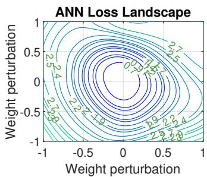
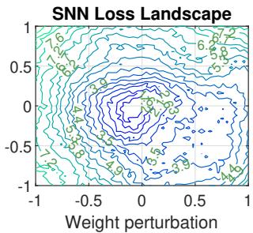
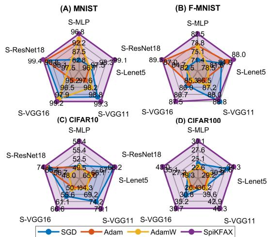
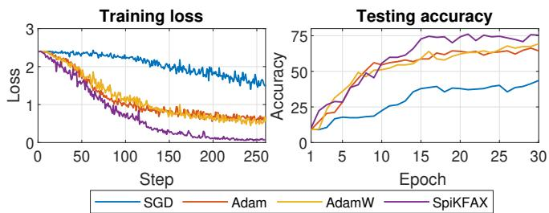
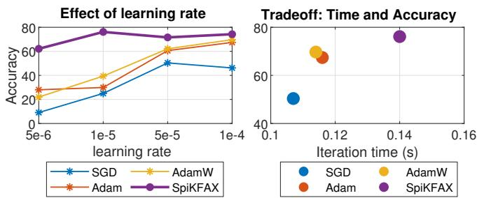

# ON THE SECOND-ORDER OPTIMIZATION FOR SPIKING NEURAL NETWORKS

Ngoc Phu Doan

Centre for Secure Information Technologies Queen’s University Belfast

## ABSTRACT

Index Terms— Spiking Neural Network, second-order optimization, Fisher Information Matrix

Spiking Neural Networks (SNNs) offer an energy-efficient alternative to conventional neural networks by exploiting sparse, binary spikes, and event-driven computation. However, the training of SNNs remains challenging, as spiking activations create a sharp loss landscape that hinders training, and diagonal-curvature optimizers such as the Adam family may fail to capture this geometry. The extension of curvaturebased optimization methods to SNNs is further complicated by the sparse, discrete, and temporally recurrent nature of their underlying dynamics. To address these limitations, we propose SpiKFAX, a second-order optimization method that formulates a computationally tractable, Kronecker-factored approximation of the Fisher information matrix specifically adapted to the structure of SNNs. Empirical evaluation across five architectures and seven datasets demonstrates that SpiK-FAX consistently yields improvements in test accuracy and training stability relative to other popular optimizers.

## 1. INTRODUCTION

Centre for Secure Information Technologies Queen’s University Belfast

Ihsen Alouani

Spiking Neural Networks (SNNs) have emerged as an energyefficient alternative to conventional artificial neural networks (ANNs), owing to their sparse, event-driven computation instead of continuous multiplication operations [1]. However, training SNNs remains challenging: their non-differentiable spiking activation forces the loss landscape into a sharper, more irregular geometry than that of ANNs [2, 3]. As illustrated in Fig. 1, the loss landscape of a spiking VGG11 (S-VGG11) exhibits markedly higher curvature than its ANN counterpart under the same weight perturbation, making firstorder optimizers prone to slow convergence and poor generalization.

Adaptive approaches such as Adam try to mitigate this by maintaining a second-moment estimate of the gradient, which can be interpreted as a diagonal approximation of the curvature [4]. However, this diagonal approximation discards the off-diagonal curvature information that captures interactions between parameters, which is particularly informative in the sharp, spiking-induced loss landscapes described above. As a result, Adam-family optimizers can converge slowly and settle at weaker generalization points when applied to SNNs.

  
Fig. 1. Loss landscape sharpness between VGG11 and S-VGG11 on the CIFAR10 dataset.

A natural remedy is to incorporate second-order curvature information directly into the optimizer. The Hessian matrix, or its Fisher-information surrogate, has been approximated in various ways to precondition gradient updates in deep networks [4, 5]. However, extending these approximations to SNNs is not straightforward: SNNs are sparse in their spike activity, discrete in their output, and time-recurrent in their membrane dynamics, none of which are properties that curvature approximations designed for static, feedforward networks account for. Meanwhile, several optimization algorithms have been proposed specifically for SNNs, targeting complementary aspects of training such as objective-function design, sparsity-enforcing updates, and sharpness-aware minimization to seek flatter minima [6, 7, 8]. Yet, to the best of our knowledge, none of these methods exploit curvature information through a Kronecker-factored approximation of the Fisher matrix, leaving a gap between the second-order optimization literature and SNN-specific training methods.

• We introduce SpiKFAX, an adaptive optimization approach motivated by curvature approximation, that captures second-order information in the sharp loss landscape of SNNs.

• We propose a computable solution to approximate the Fisher Information Matrix for SNNs, deriving a Kronecker-factored form that accounts for SNNs’ timerecurrent, surrogate-gradient-based dynamics while remaining tractable at scale.

• We conduct extensive experiments across five model architectures and seven datasets, spanning both static and neuromorphic vision benchmarks, demonstrating that SpiKFAX consistently improves accuracy and training stability over SGD, Adam, and AdamW.

## 2. METHODOLOGY

Problem formulation. Given the SNN’s parameter $\theta ,$ the data distribution D, and the loss function $l ,$ we minimize $\mathcal { L } ( \theta ) ~ = ~ \mathbb { E } _ { ( x , y ) \sim \mathcal { D } } [ \ell ( f _ { \theta } ( x ) , y ) ]$ , a non-convex, nondifferentiable objective due to the spiking nonlinearity. We seek an approximate stationary point θ s.t. $\mathbb { Z } [ \| \nabla { \mathcal { L } } _ { \sigma } ( \theta ) \| ^ { 2 } ] \le$ $\epsilon ^ { 2 }$ via the preconditioned update $\theta _ { k + 1 } ^ { ( \ell ) } = \theta _ { k } ^ { ( \ell ) } { - } \gamma P _ { k } ^ { ( \ell ) } g ^ { ( \ell ) } ( \theta _ { k } )$ where $P _ { k } ^ { \ell }$ is the inverse curvature approximated by our proposed algorithm (c.f. Lemma 3), g denotes the gradient.

Spiking Neural Network (SNN). Given an input spike $x _ { t }$ with timestamp $t \in [ 1 , \tau ]$ , a spiking layer outputs a sequence of spikes $s _ { t } ~ \in ~ \{ 0 , 1 \}$ . We use the leaky integrate-and-fire neuron with a subtractive (soft) reset:

$$
\left\{ \begin{array} { l l } { u _ { t } = \beta u _ { t - 1 } + W x _ { t } - V _ { t h r } s _ { t - 1 } } \\ { s _ { t } = \Theta \Big ( u _ { t } - V _ { t h r } \Big ) } \end{array} \right.\tag{1}
$$

where $V _ { t h r }$ is the firing threshold, $\beta \in [ 0 , 1 ]$ the membrane decay, W the learnable synaptic weight, and Θ the Heaviside step function, with $u _ { 0 } = 0$ and $s _ { 0 } = 0$

Θ is non-differentiable, so backpropagation is not directly possible. The standard remedy is the surrogate gradient: $\partial { s _ { t } } / \partial { u _ { t } }$ is replaced in the backward pass by $\sigma ^ { \prime } ( u _ { t } - V _ { t h r } )$ for a differentiable surrogate σ, e.g. superspike [9], arctangent [10], or sigmoid. All derivatives below are therefore surrogate derivatives, and every ≈ that follows from this substitution is written explicitly.

Lemma 1 (Recurrent Jacobian, surrogate form). Under the surrogate substitution, the derivative of $u _ { t }$ with respect to $u _ { t - 1 }$ is

$$
\frac { \partial u _ { t } } { \partial u _ { t - 1 } } \approx \beta - V _ { t h r } \sigma ^ { \prime } ( u _ { t - 1 } - V _ { t h r } ) .\tag{2}
$$

Lemma 2 (Backpropagation through time). Let $\delta _ { t } : = \partial \mathcal { L } / \partial u _ { t }$ With the terminal condition $\delta _ { \tau + 1 } = 0 ,$

$$
\delta _ { t } = \underbrace { \frac { \partial \mathcal { L } } { \partial s _ { t } } \sigma ^ { \prime } ( u _ { t } - V _ { t h r } ) } _ { d i r e c t p a t h ( t h i s t i m e s t e p ^ { \prime } s o u t p u t ) } + \underbrace { \delta _ { t + 1 } \left( \beta - V _ { t h r } \sigma ^ { \prime } ( u _ { t } - V _ { t h r } ) \right) } _ { r e c u r r e n t p a t h ( f u t u r e t i m e s t e p s ) }\tag{3}
$$

where $\partial \mathcal { L } / \partial s _ { t }$ aggregates the contributions of all downstream layers that consume $s _ { t }$ at time t.

Proof. $u _ { t }$ influences L only through the spike $s _ { t }$ it emits and through the next membrane state $u _ { t + 1 }$ , so the chain rule gives $\begin{array} { r } { \delta _ { t } = \overline { { \frac { \partial \mathcal { L } } { \partial s _ { t } } } } \frac { \partial s _ { t } } { \partial u _ { t } } + \delta _ { t + 1 } \frac { \partial u _ { t + 1 } } { \partial u _ { t } } } \end{array}$ . Substituting $\partial s _ { t } / \partial u _ { t } \approx \sigma ^ { \prime } ( u _ { t } -$

$V _ { t h r } )$ and Lemma 1 yields (3). At $t = \tau$ there is no future state, hence $\delta _ { \tau + 1 } = 0$ □

Because W is shared across timesteps, $\begin{array} { r } { \frac { \partial \mathcal { L } } { \partial W } = \sum _ { t = 1 } ^ { \tau } \delta _ { t } x _ { t } ^ { \top } } \end{array}$ We write $g _ { t } : = \delta _ { t } x _ { t } ^ { \top }$ for the per-timestep contribution, so that $\begin{array} { r } { \nabla _ { W } \mathcal { L } = \dot { \sum } _ { t = 1 } ^ { \tau } g _ { t } } \end{array}$

SNN-specific Kronecker factorization. We introduce SpiK-FAX, a second-order optimizer for SNNs. The idea is to precondition the gradient with the Fisher information matrix, which captures the curvature of the loss landscape. Computing it exactly is intractable: the matrix is $N \times N$ and its inversion costs $O ( N ^ { 3 } )$ , with N the number of parameters. We therefore build a Kronecker-factored approximation adapted to the temporal structure of SNNs.

Definition 1 (Fisher information matrix). For a model with predictive distribution $p _ { \theta } ( y \vert x )$ ,

$$
F _ { W } = \mathbb { E } _ { \boldsymbol { x } \sim \mathcal { D } } \mathbb { E } _ { \hat { \boldsymbol { y } } \sim p _ { \theta } ( \cdot \vert \boldsymbol { x } ) } \Big [ \mathrm { v e c } \big ( \nabla _ { W } \log p _ { \theta } ( \hat { \boldsymbol { y } } \vert \boldsymbol { x } ) \big ) \mathrm { v e c } \big ( \nabla _ { W } \log p _ { \theta } ( \hat { \boldsymbol { y } } \vert \boldsymbol { x } ) \big ) ^ { \top } \Big ] .\tag{4}
$$

Replacing $\hat { y } \sim p _ { \theta } ( \cdot | x )$ by the observed label y yields the empirical Fisher, a different matrix that does not converge to the Fisher (nor to the Gauss–Newton matrix) away from a zeroresidual optimum.

Definition 2 (Kronecker product). For $A \in \mathbb { R } ^ { m \times n }$ and B of arbitrary dimensions,

$$
A \otimes B = \left[ \begin{array} { c c c } { { [ A ] _ { 1 , 1 } B } } & { { \cdot \cdot \cdot } } & { { [ A ] _ { 1 , n } B } } \\ { { \vdots } } & { { \ddots } } & { { \vdots } } \\ { { [ A ] _ { m , 1 } B } } & { { \cdot \cdot \cdot } } & { { [ A ] _ { m , n } B } } \end{array} \right]
$$

Definition 3 (Vectorize operator). vec $( X )$ stacks the columns of $\ b X \in \mathbb { R } ^ { m \times n }$ into a vector of $\mathrm { : } \mathbb { R } ^ { m n }$

With column-major vec, the following are exact: vec $( g _ { t } ) =$ vec $( \delta _ { t } x _ { t } ^ { \top } ) \ : = \ : x _ { t } \otimes \delta _ { t }$ , and $\operatorname { v e c } ( g _ { t } ) \operatorname { v e c } ( g _ { s } ) ^ { \top } \ : = \ : ( x _ { t } x _ { s } ^ { \top } ) \ : \otimes$ $( \delta _ { t } \delta _ { s } ^ { \top } )$

The Kronecker-factored form rests on three approximations, which we state separately rather than fold into the derivation.

Assumption 1 (Layer-wise block diagonality). $F$ is approximated by its block-diagonal part over layers, i.e. cross-layer parameter interactions are discarded [11, 12].

Assumption 2 (Independent activations and derivatives). $\mathbb { E } [ ( \boldsymbol { x } _ { t } \boldsymbol { x } _ { s } ^ { \top } ) \otimes ( \delta _ { t } \delta _ { s } ^ { \top } ) ] \stackrel { \cdot } { \approx } \mathbb { E } [ \boldsymbol { x } _ { t } \boldsymbol { x } _ { s } ^ { \top } ] \otimes \mathbb { E } [ \delta _ { t } \delta _ { s } ^ { \top } ]$ for all $t , s .$

Assumption 3 (Temporal homogeneity of the input second moment). $\mathbb { E } [ x _ { t } x _ { s } ^ { \top } ] \approx A$ for all $t , s ,$ where A is the pairwise average

$$
A : = \frac { 1 } { \tau ^ { 2 } } \sum _ { t , s = 1 } ^ { \tau } \mathbb { E } [ x _ { t } x _ { s } ^ { \top } ] = \mathbb { E } \big [ r r ^ { \top } \big ] , \qquad r : = \frac { 1 } { \tau } \sum _ { t = 1 } ^ { \tau } x _ { t } ,\tag{5}
$$

i.e. the curvature sees the spike train through its rate vector r rather than through its per-timestep correlation structure.

Table 1. Performance comparison of different optimizers across neuromorphic datasets. All results are reported as mean ± std.
<table><tr><td rowspan="2"></td><td colspan="4">N-MNIST</td><td colspan="4">CIFAR10-DVS</td><td colspan="4">DVS128 Gesture</td></tr><tr><td>Architecture SGD</td><td>Adam</td><td>AdamW</td><td>SpiKFAX</td><td>SGD</td><td>Adam</td><td>AdamW</td><td>SpiKFAX</td><td>SGD</td><td>Adam</td><td>AdamW</td><td>SpiKFAX</td></tr><tr><td> $_ \mathrm { S - L e N e t } 5$ </td><td> $9 2 . 6 6 _ { 1 . 2 7 }$ </td><td> $9 3 . 7 6 _ { 1 . 3 2 }$ </td><td>93.970.63</td><td> $\mathbf { 9 8 . 2 4 } _ { 0 . 1 1 }$ </td><td> $1 6 . 6 _ { 0 . 0 }$ </td><td> $4 0 . 6 _ { 0 . 6 }$ </td><td> $4 2 . 7 _ { 0 . 3 }$ </td><td> $4 6 . 2 _ { 1 . 1 4 }$ </td><td> $5 0 . 3 7 _ { 1 . 3 }$ </td><td> $6 7 . 4 2 _ { 0 . 7 6 }$ </td><td> $6 9 . 7 _ { 0 . 3 8 }$ </td><td> $\mathbf { 7 6 . 1 3 _ { 1 . 8 9 } }$ </td></tr><tr><td>S-VGG11</td><td> $9 6 . 0 6 _ { 0 . 7 4 }$ </td><td> $9 6 . 9 3 _ { 0 . 5 5 }$ </td><td> $9 7 . 3 5 _ { 0 . 2 1 }$ </td><td> $\mathbf { 9 9 . 2 2 } _ { 0 . 0 1 }$ </td><td> $5 0 . 7 _ { 1 . 2 5 }$ </td><td> $4 7 . 9 _ { 3 . 2 }$ </td><td> $4 3 . 1 5 _ { 0 . 2 5 }$ </td><td> ${ \bf 5 6 . 1 5 } _ { 0 . 8 5 }$ </td><td> $5 3 . 7 8 _ { 2 . 2 7 }$ </td><td> $5 2 . 8 4 _ { 0 . 1 9 }$ </td><td> $4 6 . 4 _ { 0 . 9 5 }$ </td><td> $\mathbf { 7 1 . 7 8 } _ { 0 . 5 7 }$ </td></tr><tr><td>S-VGG16</td><td> $9 7 . 1 3 _ { 0 }$  32</td><td> $9 5 . 5 7 _ { 0 }$  45</td><td> $9 6 . 6 8 _ { 0 . 1 2 }$ </td><td> $\mathbf { 9 8 . 4 9 } _ { 0 . 4 7 }$ </td><td> $4 5 . 8 _ { 1 . 0 }$ </td><td> $2 9 . 0 _ { 3 . 8 }$ </td><td> $3 1 . 9 5 _ { 1 0 . 0 5 }$ </td><td> ${ \bar { \mathbf { 5 0 . 5 } } } _ { 1 . 3 }$ </td><td> $5 5 . 1 1 _ { 0 . 1 9 }$ </td><td>51.893.79</td><td> $5 4 . 9 2 _ { 3 . 7 8 }$ </td><td> ${ \bf 6 7 . 0 5 } _ { 0 . 7 6 }$ </td></tr><tr><td>S-ResNet18</td><td> $5 0 . 3 9 _ { 9 . 1 4 }$ </td><td> $8 9 . 3 2 _ { 1 . 0 3 }$ </td><td> $9 3 . 4 3 _ { 0 . } $  39</td><td> $\mathbf { 9 9 . 1 3 } _ { 0 . 1 6 }$ </td><td> $3 1 . 3 _ { 2 . 8 }$ </td><td> $2 9 . 7 5 _ { 3 . 3 5 }$ </td><td> $3 1 . 7 _ { 0 . 4 }$ </td><td> $\mathbf { 4 6 . 9 5 } _ { 2 . 7 5 }$ </td><td> $4 3 . 1 8 _ { 0 . 3 9 }$ </td><td> $4 9 . 2 4 _ { 1 . 5 }$ </td><td> $4 8 . 8 6 _ { 4 . 2 }$ </td><td> $7 0 . 2 7 _ { 2 . 4 6 }$ </td></tr></table>

Lemma 3 (Kronecker-factored Fisher for a shared weight). Let W be shared across $t = 1 , \ldots , \tau ,$ , with $g _ { t } = \delta _ { t } x _ { t } ^ { \top }$ . Under Assumptions $^ { l - 3 , }$

$$
\begin{array} { r } { F _ { W } \approx A \otimes G , \quad A = \mathbb { E } [ r r ^ { \top } ] , \quad G = \mathbb { E } \Big [ \big ( \sum _ { t = 1 } ^ { \tau } \delta _ { t } \big ) \big ( \sum _ { t = 1 } ^ { \tau } \delta _ { t } \big ) ^ { \top } \Big ] , } \end{array}\tag{6}
$$

and, whenever A, G are non-singular, $( A \otimes G ) ^ { - 1 } = A ^ { - 1 } \otimes$ $G ^ { - 1 }$ , so the preconditioned update is $\Delta W = - \gamma G ^ { - 1 } ( \nabla _ { W } { \mathcal { L } } ) A ^ { - 1 } ,$

Proof. By Definition 1 and $\begin{array} { r } { \nabla _ { W } \log p _ { \theta } \ = \ \sum _ { t } g _ { t } , \ F _ { W } \ = \ } \end{array}$ $\begin{array} { r } { \sum _ { t , s = 1 } ^ { \tau } \mathbb { E } [ \mathrm { v e c } ( g _ { t } ) \mathrm { v e c } ( g _ { s } ) ^ { \top } ] = \sum _ { t , s = 1 } ^ { \tau } \mathbb { E } [ ( x _ { t } \overline { { x _ { s } ^ { \top } } } ) ^ { \top } \otimes ( \delta _ { t } \delta _ { s } ^ { \top } ) ] } \end{array}$ the last step being the exact mixed-product identity. Assumption 2 gives $\begin{array} { r } { F _ { W } \overset { \cdot } { \approx } \sum _ { t , s } \mathbb { E } [ x _ { t } x _ { s } ^ { \top } ] \overset { \cdot } { \otimes } \mathbb { E } [ \delta _ { t } \delta _ { s } ^ { \top } ] } \end{array}$ . Only now, with the left factor constant in $( t , s )$ by Assumption 3, may the double sum be pulled through ⊗ by bilinearity:

$$
F _ { W } \approx A \otimes \sum _ { t , s = 1 } ^ { \tau } \mathbb { E } [ \delta _ { t } \delta _ { s } ^ { \top } ] = A \otimes \mathbb { E } \big [ ( \sum _ { t } \delta _ { t } ) ( \sum _ { t } \delta _ { t } ) ^ { \top } \big ] .\tag{7}
$$

Finally vec $( B X C ) = ( C ^ { \top } \otimes B ) \operatorname { v e c } ( X )$ with A, G symmetric gives $F _ { W } ^ { - 1 } \mathrm { v e c } ( \nabla _ { W } \mathcal { L } ) = \mathrm { v e c } ( G ^ { - 1 } ( \nabla _ { W } \mathcal { L } ) A ^ { - 1 } )$ □

Theorem 1 (SpiKFAX complexity). Let layer ℓ have input/output dimensions $m \ell , n \ell$ , let $N _ { \ell } ~ = ~ m _ { \ell } n _ { \ell }$ and $N =$ $\bar { \sum } _ { \ell = 1 } ^ { L } \bar { N } _ { \ell }$ , with batch size B and $\tau$ timesteps. One SpiK-FAX update costs

Remark 1 (Scope of the derivation). Lemma 3 is derived for a fully-connected weight W shared over time. For the convlayers used in Sec. 3, $x _ { t }$ is understood as the patch-extracted input and the expectations additionally average over spatial locations, i.e. the spatially-uncorrelated-derivatives approximation of KFC is assumed on top of Assumptions 1–3.

$$
O \Big ( \sum _ { \ell = 1 } ^ { L } \Big [ B \tau ( m _ { \ell } + n _ { \ell } ) + B ( m _ { \ell } ^ { 2 } + n _ { \ell } ^ { 2 } ) + \frac { m _ { \ell } ^ { 3 } + n _ { \ell } ^ { 3 } } { T _ { \mathrm { i n v } } } + N _ { \ell } ( m _ { \ell } + n _ { \ell } ) \Big ] \Big )\tag{8}
$$

$\begin{array} { r } { \leq 2 \sum _ { \ell } N _ { \ell } ^ { 3 } / \operatorname* { m i n } ( m _ { \ell } , n _ { \ell } ) ^ { 3 } \leq 2 N ^ { 3 } / \operatorname* { m i n } _ { \ell } \operatorname* { m i n } ( m _ { \ell } , n _ { \ell } ) ^ { 3 } } \end{array}$ so inverting the Kronecker factors is cheaper than the $O ( N ^ { 3 } )$ inversion of the full Fisher by at least a factor $\begin{array} { l } { { \frac { 1 } { 2 } } } \end{array}$ minℓ min(mℓ, nℓ for balanced layers $( m _ { \ell } \asymp n _ { \ell } )$ the per-layer curvature cost is $O ( N _ { \ell } ^ { 3 / 2 } )$ instead of $O ( N _ { \ell } ^ { 3 } )$ .

The curvature terms satisfy $\textstyle \sum _ { \ell } ( m _ { \ell } ^ { 3 } + n _ { \ell } ^ { 3 } )$

Proof. Per layer: $R ^ { ( \ell ) , b } , D ^ { ( \ell ) , b }$ cost $O ( B \tau ( m _ { \ell } + n _ { \ell } ) )$ ; the two rank-one accumulations cost $O ( B ( m _ { \ell } ^ { 2 } + n _ { \ell } ^ { 2 } ) )$ ; inverting (or eigendecomposing) $A ^ { ( \ell ) } , G ^ { ( \ell ) }$ costs $O ( m _ { \ell } ^ { 3 } + n _ { \ell } ^ { 3 } )$

  
Fig. 2. Performance comparison of different optimizers and models across static image datasets.

once every $T _ { \mathrm { i n v } }$ steps; the two matrix products forming $\Delta \theta ^ { ( \ell ) }$ cost $O ( m _ { \ell } n _ { \ell } ( m _ { \ell } + n _ { \ell } ) )$ . Summing over ℓ gives the bound. For the comparison, $m ^ { 3 } + n ^ { 3 } \leq 2 \operatorname* { m a x } ( m , n ) ^ { 3 } =$ $2 ( m n ) ^ { 3 } / \operatorname* { m i n } ( m , n ) ^ { \bar { 3 } }$ for any $m , n \geq 1$ , and $\begin{array} { r } { \sum _ { \ell } N _ { \ell } ^ { 3 } ~ \le ~ } \end{array}$ $( \sum _ { \ell } \dot { N } _ { \ell } ) ^ { 3 } = \dot { N } ^ { 3 }$ since the $N _ { \ell }$ are non-negative. If $\begin{array} { r l } { m _ { \ell } } & { { } = } \end{array}$ $n _ { \ell } = d _ { \ell }$ then $N _ { \ell } = d _ { \ell } ^ { 2 }$ and $m _ { \ell } ^ { 3 } + n _ { \ell } ^ { 3 } = 2 N _ { \ell } ^ { 3 / 2 }$ □

## 3. EXPERIMENT

Baselines. We compare SpiKFAX against several popular optimizers in SNN optimization, such as SGD with momentum [13], Adam [14], and AdamW [15].

Datasets and model architectures. We study our proposed optimizer over diversed datasets such as Static Datasets (MNIST [16], F-MNIST [17], CIFAR10 [18], CIFAR100) [18], Neuromorphic Datasets (N-MNIST [19], CIFAR10-DVS [20], DVS128 Gesture). Several architectures are exploited, such as spiking MLP, spiking LeNet5 [21], spiking VGG11, spiking VGG16 [22], and spiking ResNet18 [23].

Training settings. Each experiment is conducted five times, and the mean values are reported. For each optimizer, we vary the values of the learning rate and choose the best setting. We conduct experimental implementation using the SNNTorch framework on a 64 GB RAM, 20-core CPU @NVIDIA RTX A5000 PC. Our code is available in our repository.

Generalization comparison. Across multiple datasets and model architectures, our results demonstrate that SpiK-FAX significantly outperforms baseline optimizers in terms of testing accuracy. Specifically, Table 1 compares the generalization of models optimized by different methods on three neuromorphic datasets: N-MNIST, CIFAR10-DVS, and DVS128-Gesture. On each dataset, the highest accuracy model is consistently the one trained with SpiKFAX, achieving 99.92%, 56.15%, and 76.13%, respectively. The generalization gains are substantial across both datasets and architectures: for instance, S-VGG11 trained with SpiK-FAX improves testing accuracy by 1.87% over the same architecture trained AdamW, while the improvements on CIFAR10-DVS and DVS128-Gesture are even larger, reaching at least 3.5% and 6.43%. This generalization benefit is extended to the traditional static image datasets as well, including MNIST, F-MNIST, CIFAR10, and CIFAR100, as shown in Fig. 2. Across all five model architectures evaluated, training with SpiKFAX consistently yields a significant margin in testing accuracy over other optimizers.

  
Fig. 3. Training loss (over steps) and testing accuracy (over epochs) of S-VGG11 on the DVS128-Gesture dataset.

The stability of SpiKFAX. Fig. 3 shows the training loss and the testing accuracy of S-VGG11 across different optimizers. SpiKFAX drives a dramatically steeper reduction in the training loss, a trend that becomes clearly visible from the $7 5 ^ { t h }$ step onward. Moreover, the model trained with SpiKFAX exhibits some fluctuation at early steps before stabilizing, while models trained with other optimizers remain unstable throughout training. In terms of testing accuracy, the model optimized with SpiKFAX rapidly reaches its peak accuracy of 76.13% by the $1 5 ^ { t h }$ epoch. In contrast, models trained with Adam and AdamW improve more gradually and plateau at lower accuracies of 67.42% and 69.7%, respectively, while the model trained with SGD performs worst overall. These results show that SpiKFAX not only stabilizes training but also achieves superior generalization.

Ablation study. We study the effect of the learning rate on the performance of models trained with different optimizers (c.f. Fig. 4 A). When varying the learning rate, the model optimized by SpiKFAX stays stable with high accuracy. The generalization of the model trained by SpiKFAX consistently performs better than optimization by other methods across different learning rates.

Training time. We measure the training time of SpiK-

  
Fig. 4. Effect of learning rate (left) and training time (right) of S-VGG11 on the DVS128-Gesture dataset.

FAX and compare it against other optimizers, including SGD, Adam, and AdamW (Fig. 4 B). For each iteration, our algorithm is slower than SGD, Adam, and AdamW by 1.4x, 1.2x, and 1.2x, respectively. However, the exact Fisher information computation-based optimization is intractable even for the MLP model, i.e., the running time tends to infinity. Our approximation algorithm reduces the running time significantly and is comparable to second-order optimizers such as Adam or AdamW, while achieving higher generalization.

## 4. RELATED WORK

Several works design optimization algorithms specifically for the spiking setting. For instance, the paper [6] pairs Linearized Bregman Iterations with AdaBreg, a Bregman variant of Adam, to enforce weight sparsity during training. Other works target the sharpness of the SNN loss landscape directly, applying sharpness-aware minimization [7] to encourage flatter, better-generalizing solutions. A separate line departs from backpropagation-through-time altogether, replacing it with local or feedback-driven learning rules; a feedback control optimizer [8], for instance, integrates spikebased local learning with control signals for online, on-chip training without storing intermediate states. These works improve SNN training via the objective function, sparsity, or the credit-assignment mechanism, but none exploit curvature information through a Kronecker-factored Fisher approximation which is the gap SpiKFAX addresses.

## 5. CONCLUSION

We present SpiKFAX, a second-order optimizer adapting K-FAC to spiking neural networks by deriving a Kroneckerfactored Fisher approximation tailored to their time-recurrent, surrogate-gradient dynamics while remaining computationally tractable. SpiKFAX shows that the sharp loss landscape long blamed for slow, poorly generalizing SNN training can be addressed directly through tractable second-order curvature approximation, rather than only through indirect fixes like sharpness perturbation or sparsity constraints.

## 6. ACKNOWLEDGEMENT

This work is partially funded by the UK Government through the New Deal for Northern Ireland. The funding is delivered on behalf of the Northern Ireland Office and the Department for Digital, Culture, Media and Sport by Innovate UK. It is in part supported by the CHIST-ERA grant through EPSRC Grant EP/Y03631X/1.

## 7. REFERENCES

[1] Nitin Rathi, Amogh Agrawal, Chankyu Lee, Adarsh Kumar Kosta, and Kaushik Roy, “Exploring spike-based learning for neuromorphic computing: Prospects and perspectives,” in DATE, 2021, pp. 902–907.

[2] Yechan Kang, Yongjin Kweon, Mingyeong Seo, Sohee Park, Yeonguk Jeon, Jongkil Park, Hyun Jae Jang, Jaewook Kim, YeonJoo Jeong, Suyoun Lee, et al., “A2sg: Adaptive and asymmetric surrogate gradients for training deep spiking neural networks,” arXiv preprint arXiv:2606.11236, 2026.

[3] Shikuang Deng, Yuhang Li, Shanghang Zhang, and Shi Gu, “Temporal efficient training of spiking neural network via gradient re-weighting,” arXiv preprint arXiv:2202.11946, 2022.

[4] Damien GOMES, Yanlei Zhang, Eugene Belilovsky, Guy Wolf, and Mahdi S Hosseini, “Adafisher: Adaptive second order optimization via fisher information,” in ICLR, 2025, vol. 2025, pp. 100016–100057.

[5] James Martens and Roger Grosse, “Optimizing neural networks with kronecker-factored approximate curvature,” in ICML. PMLR, 2015, pp. 2408–2417.

[6] Daniel Windhager, Bernhard A Moser, and Michael Lunglmayr, “Linearized bregman iterations for sparse spiking neural networks,” arXiv preprint arXiv:2603.16462, 2026.

[7] Maximilian Nicholson, “Sharpness-aware surrogate training for on-sensor spiking neural networks,” 2026.

[8] Matteo Saponati, Chiara De Luca, Giacomo Indiveri, and Benjamin Grewe, “A feedback control optimizer for online and hardware-aware training of spiking neural networks,” in NICE, 2025, pp. 1–10.

[9] Friedemann Zenke and Surya Ganguli, “Superspike: Supervised learning in multilayer spiking neural networks,” Neural Comput., vol. 30, no. 6, pp. 1514–1541, 2018.

[10] Matei-Ioan Stan and Oliver Rhodes, “Learning long sequences in spiking neural networks,” Sci. Rep., vol. 14, no. 1, pp. 21957, 2024.

[11] Abdoulaye Koroko, Ani Anciaux-Sedrakian, Ibtihel Ben Gharbia, Valerie Gar´ es, Mounir Haddou, and\` Quang Huy Tran, “Efficient approximations of the fisher matrix in neural networks using kronecker product singular value decomposition,” ESAIM Proc. Surv., vol. 73, pp. 218–237, 2023.

[12] John Sweeney, “The geometry of updates: Fisher alignment at vocabulary scale,” arXiv preprint arXiv:2606.27242, 2026.

[13] Herbert Robbins and Sutton Monro, “A stochastic approximation method,” The annals of mathematical statistics, pp. 400–407, 1951.

[14] Diederik P Kingma and Jimmy Ba, “Adam: A method for stochastic optimization,” arXiv preprint arXiv:1412.6980, 2014.

[15] Ilya Loshchilov and Frank Hutter, “Decoupled weight decay regularization,” arXiv preprint arXiv:1711.05101, 2017.

[16] Li Deng, “The mnist database of handwritten digit images for machine learning research [best of the web],” IEEE Signal Process. Mag., vol. 29, no. 6, pp. 141–142, 2012.

[17] Han Xiao, Kashif Rasul, and Roland Vollgraf, “Fashionmnist: a novel image dataset for benchmarking machine learning algorithms,” arXiv preprint arXiv:1708.07747, 2017.

[18] Alex Krizhevsky, Geoffrey Hinton, et al., “Learning multiple layers of features from tiny images,” 2009.

[19] Garrick Orchard, Ajinkya Jayawant, Gregory K Cohen, and Nitish Thakor, “Converting static image datasets to spiking neuromorphic datasets using saccades,” Front. Neurosci., vol. 9, pp. 437, 2015.

[20] H Li, H Liu, X Ji, G Li, and L Shi, “Cifar10-dvs: an event-stream dataset for object classification front,” Neurosci, vol. 11, pp. 309, 2017.

[21] Yann LeCun, Leon Bottou, Yoshua Bengio, and Patrick ´ Haffner, “Gradient-based learning applied to document recognition,” Proc. IEEE, vol. 86, no. 11, pp. 2278– 2324, 1998.

[22] Karen Simonyan and Andrew Zisserman, “Very deep convolutional networks for large-scale image recognition,” arXiv preprint arXiv:1409.1556, 2014.

[23] Kaiming He, Xiangyu Zhang, Shaoqing Ren, and Jian Sun, “Deep residual learning for image recognition,” in CVPR, 2016, pp. 770–778.