# OceanXL: Large-scale Underwater 3D Gaussian Splating via Block Partitioning and Adaptive Pruning

HAORAN WANG, University of Bristol, UK   
SHAOYU CAI, National University of Singapore, Singapore   
ADRIAN AZZARELLI, University of Bristol, UK   
ZHUODONG JIANG, University of Bristol, UK   
GUOXI HUANG, University of Bristol, UK   
ENG TAT KHOO, National University of Singapore, Singapore   
BRETT SEYMOUR, National Park Service’s Submerged Resources Center, USA   
FAN ZHANG, University of Bristol, UK   
DAVID BULL, University of Bristol, UK   
NANTHEERA ANANTRASIRICHAI, University of Bristol, UK

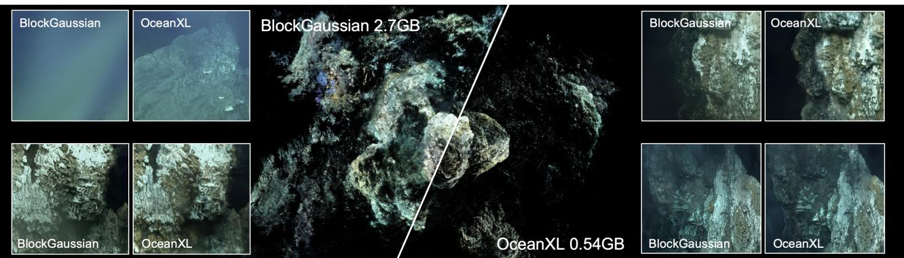  
Fig. 1. OceanXL: A scalable framework for large-scale underwater 3D Gaussian Splating that achieves compact scene representations while preserving high-fidelity rendering quality. Compared with the strongest baseline, BlockGaussian [Wu et al. 2025], OceanXL produces more eficient reconstructions with improved visual quality across diverse underwater environments. Example shown: Eifel Tower 2016.

Underwater 3D reconstruction is critical for marine exploration, ecological monitoring, and subsea infrastructure inspection, yet remains challenging at large scale due to light attenuation, scattering, and limited capture coverage. While 3D Gaussian Splatting (3DGS) enables high-quality real-time rendering, its application to large underwater scenes is constrained by high memory consumption and ineficient optimization over extensive areas. We propose OceanXL, a fast and scalable 3DGS-based framework for large-scale

Authors’ Contact Information: Haoran Wang, University of Bristol, UK, yp22378@ bristol.ac.uk; Shaoyu Cai, National University of Singapore, Singapore, shaoyucai@nus. edu.sg; Adrian Azzarelli, University of Bristol, UK, a.azzarelli@bristol.ac.uk; Zhuodong Jiang, University of Bristol, UK, zhuodong.jiang@bristol.ac.uk; Guoxi Huang, Uni versity of Bristol, UK, guoxi.huang@bristol.ac.uk; Eng Tat Khoo, National University of Singapore, Singapore, etkhoo@nus.edu.sg; Brett Seymour, National Park Service’s Submerged Resources Center, USA, Brett\_Seymour@nps.gov; Fan Zhang, Uni versity of Bristol, UK, Fan.Zhang@bristol.ac.uk; David Bull, University of Bristol, UK, Dave.Bull@bristol.ac.uk; Nantheera Anantrasirichai, University of Bristol, UK, N.Anantrasirichai@bristol.ac.uk.

underwater reconstruction. OceanXL adopts a divide-and-conquer strat egy, partitioning scenes into spatially coherent blocks to enable eficient optimization while preserving global geometric consistency. We further introduce an adaptive pruning scheme tailored to underwater conditions that removes redundant primitives, producing compact representations without sacrificing visual fidelity. Together, these components improve training eficiency and rendering performance for large scenes. We also introduce a large-scale underwater dataset covering diverse marine environments. Experiments on five large-scale scenes demonstrate favorable scalability, compactness, and eficiency–quality trade-ofs over large-scene baselines. Controlled comparisons on the small-scale SeaThru-NeRF dataset further show competitive reconstruction quality with substantially smaller model sizes than underwater-specific methods. Code and datasets are publicly available at https://wanghaoran16.github.io/OceanXL-Large-scale-Underwater-3D-Gaussian-Splatting/.

CCS Concepts: • Computing methodologies → Reconstruction; Rasterization; 3D imaging.

Additional Key Words and Phrases: Gaussian Splatting, Underwater, Largescale 3D reconstruction

ACM Reference Format:

Haoran Wang, Shaoyu Cai, Adrian Azzarelli, Zhuodong Jiang, Guoxi Huang, Eng Tat Khoo, Brett Seymour, Fan Zhang, David Bull, and Nantheera Anantrasirichai.

2026. OceanXL: Large-scale Underwater 3D Gaussian Splatting via Block Partitioning and Adaptive Pruning. In SIGGRAPH Asia 2026 Conference Papers (SA Conference Papers ’26), December 01–04, 2026, Kuala Lumpur, Malaysia. ACM, New York, NY, USA, 12 pages. https://doi.org/10.1145/3829340.3842316

## 1 Introduction

High-fidelity three-dimensional (3D) reconstruction of underwater environments underpins a wide range of applications, including marine habitat monitoring [Marre et al. 2019; Zhong et al. 2025], underwater archaeology and infrastructure inspection [Tanduo et al. 2025], and immersive interactive experiences [Ouyang et al. 2025]. More recently, digital twins of shipwrecks, coral reefs, and deep-sea environments have become increasingly important for virtual reality (VR), augmented reality (AR), film production, and interactive storytelling [Thomas et al. 2018]. The ability to author and explore such scenes in real time also enables new forms of Human–Computer Interaction (HCI), including virtual dive simulations [Jain et al. 2016], educational exhibits [Fauville et al. 2025], and collaborative ocean exploration [Maggipinto et al. 2025].

Reconstruction-driven asset capture approaches, such as photogrammetry and multi-view stereo (MVS), have become standard techniques for generating detailed 3D content from image sequences. However, underwater environments remain particularly challenging for image-based 3D reconstruction due to light absorption, scattering, wavelength-dependent color attenuation, and non-uniform illumination. These efects degrade image quality, distort geometry and appearance consistency, and introduce artifacts that reduce the visual fidelity required for cinematic rendering and immersive experiences. The problem becomes more severe in large-scale underwater scenes, where limited visibility and uneven lighting often produce incomplete geometry, noisy reconstructions, and inconsistent appearance across viewpoints.

Recent advances in neural rendering have significantly improved 3D reconstruction. Among them, Neural Radiance Fields (NeRF) [Mildenhall et al. 2021] demonstrate impressive scene representation quality but remain limited by slow training and rendering speeds, particularly for large-scale environments. To address these limitations, 3D Gaussian Splatting (3DGS) [Kerbl et al. 2023] has emerged as an eficient alternative for real-time neural scene representation. By modeling scenes with anisotropic Gaussian primitives optimized directly in 3D space, 3DGS achieves high-quality rendering with substantially improved training and rendering eficiency, making it well suited for novel-view synthesis, asset capture, and immersive ocean exploration.

Building upon this success, several recent studies have extended Gaussian-based rendering methods to underwater environments [e.g., Jiang et al. 2025; Li et al. 2025; Wang et al. 2025; Yi et al. 2025; Zhang et al. 2025b]. These approaches introduce underwater-aware rendering models or incorporate physical priors to better account for underwater light propagation, improving reconstruction quality under scattering, attenuation, and visibility degradation. In parallel, recent work on compact Gaussian representations [e.g., Fang and Wang 2024; Niemeyer et al. 2025; Wang et al. 2026] has explored adaptive pruning and primitive refinement strategies to reduce redundancy in Gaussian primitives and improve model compactness.

Despite these advances, existing methods remain limited when applied to large-scale underwater environments. Most underwater Gaussian splatting approaches are designed for relatively small scenes [Levy et al. 2023; Wang et al. 2025] and do not address the scalability requirements of large immersive environments for VR/AR applications. At the same time, compact Gaussian strategies have rarely been investigated under underwater degradation, where scattering, turbidity, and color distortion destabilize geometry estimation and radiance modeling. In large underwater scenes, representing spatially varying visibility and attenuation often requires a substantial number of Gaussian primitives, significantly increasing memory footprint and slowing both training and rendering throughput, limiting the real-time and interactive requirements of immersive applications. Moreover, underwater imaging inconsistencies can hinder efective pruning, as noisy or biased observations may be incorrectly preserved as valid structures. As a result, eficient and scalable reconstruction for large underwater environments remains largely underexplored.

Motivated by these challenges, we propose OceanXL, a fast and scalable framework for large-scale underwater reconstruction based on 3D Gaussian Splatting. OceanXL adopts a divide-and-conquer strategy that partitions underwater scenes into spatial blocks for eficient optimization. Each block is reconstructed independently and then merged into a coherent global representation. To further improve eficiency, we introduce an underwater-aware adaptive pruning mechanism that removes redundant Gaussian primitives, reducing model complexity while preserving reconstruction fidelity. As illustrated in Figure 1, OceanXL achieves compact, high-fidelity reconstruction of large underwater environments while improving eficiency over existing large-scene Gaussian splatting methods.

Existing underwater reconstruction datasets are largely limited to small-scale scenes, controlled capture settings, or localized objectcentric reconstructions, restricting the study of scalable neural rendering for immersive underwater exploration. Large-scale datasets suitable for evaluating modern neural scene representations remain scarce, particularly for environments with extensive spatial coverage, severe visibility degradation, complex coral structures, and long unconstrained capture trajectories. To address this gap, we introduce large-scale underwater datasets designed to support 3D neural reconstruction for immersive ocean experiences. The datasets cover diverse underwater environments with extensive spatial coverage, enabling systematic evaluation of scalable reconstruction methods. We hope this work will inspire future neural rendering systems for visually complex underwater environments and broader applications in immersive graphics.

The main contributions can be summarized as follows:

(1) We present OceanXL, a scalable underwater 3D Gaussian Splatting framework that combines adaptive scene decomposition with compact Gaussian optimization for eficient large-scale underwater reconstruction.

(2) We introduce an underwater-aware lightweight density control strategy that compensates for attenuation-induced densification failures while progressively pruning redundant primitives, improving scalability without sacrificing reconstruction fidelity.

(3) We propose a selective Diference-of-Gaussians (DoG) activation mechanism that enhances local representational capacity only in reconstruction-sensitive regions, enabling compact yet high fidelity underwater scene representations.

(4) We introduce large-scale underwater datasets spanning shipwrecks, coral reefs, and deep-sea environments, together with extensive evaluations on large-scale scenes demonstrating favorable trade-ofs between scalability, eficiency, and reconstruction quality, complemented by SeaThru-NeRF comparisons demonstrating compactness against underwater-specific methods.

## 2 Related Work

## 2.1 Underwater 3DGS Reconstruction

Extending 3DGS to underwater environments has gained attention but remains challenging due to scattering, attenuation, and dynamic disturbances [Huang et al. 202], which violate the standard assumptions of consistent radiance and visibility. Existing eforts primarily adapt 3DGS by incorporating underwater image formation models and physical priors. For instance, UW-GS [Wang et al. 2025] introduces physics-aware density control and auxil iary supervision to mitigate scattering and motion artifacts, while WaterSplatting [Li et al. 2025] explicitly models medium transmittance to improve visual realism. Aquatic-GS [Liu et al. 2024a] further combines implicit water representations with explicit Gaussians for more physically consistent reconstruction. More recent approaches explore enhanced robustness under degraded observations: SeaSplat [Yang et al. 2025] disentangles scene radiance from medium efects, RecGS [Zhang et al. 2025b] employs recurrent refinement to stabilise reconstruction, and RUSplatting [Jiang et al. 2025] incorporates uncertainty modeling to handle noisy inputs. R-Splatting [Huang et al. 2025] integrates image enhancement priors to compensate for illumination and color degradation. AtlantisGS [Yi et al. 2025] and SWAGSplatting [Jiang et al. 2026] separate foreground content from the background medium and reallocate primitives to salient regions, improving reconstruction quality under sparse observations.

## 2.2 Pruning Gaussian Splats

Despite the rapid progress of 3DGS, improving computational eficiency remains a major challenge. Standard density control strategies often introduce redundant primitives, increasing memory usage and optimization cost [Bagdasarian et al. 2025]. To address this, many recent works focus on pruning strategies that retain only the most informative Gaussians. Early approaches estimate importance using opacity [Navaneet et al. 2024; Zhang et al. 2025a], while later methods adopt more targeted metrics based on accumulated ray contributions [Niemeyer et al. 2025], blending weights [Fang and Wang 2024], spatial sensitivity [Hanson et al. 2025b], or per-Gaussian gradients [Hanson et al. 2025a]. Other approaches, such as MaskGaussian [Liu et al. 2025b] and LP-3DGS [Zhang et al. 2024], further employ diferentiable masking strategies to learn adaptive importance weights. While these methods improve compactness and eficiency, they are primarily designed for in-air scenes with relatively clean observations. Their efectiveness under severe underwater degradation and spatially varying visibility remains largely unexplored.

## 2.3 3DGS-based Large Scene Reconstruction

Recent advances in scalable 3DGS address eficiency and largescale reconstruction through hierarchical designs and system optimization. Divide-and-conquer approaches partition scenes spatially: Hierarchical-GS [Kerbl et al. 2024] decomposes scenes into hierarchical chunks, enabling joint optimization and level-of-detail (LoD) control, while CityGaussian [Liu et al. 2024b] employs block-wise training with compression-based LoD generation. BlockGaussian [Wu et al. 2025] introduces visibility-aware optimization and pseudo view constraints to reduce block-merging artifacts. Structured LoD representations organize primitives hierarchically: Octree-GS [Ren et al. 2024] uses octree-based multi-scale organization with growand-prune densification, whereas MixGS [Liu et al. 2025a] integrates poses and attributes into view-aware latent representations decoded into fine-scale primitives. System-level optimizations target computational bottlenecks: FlashGS [Feng et al. 2025] reduces redundant computation through precise intersection tests and adaptive scheduling, while GS-Scale [Lee et al. 2026] addresses memory constraints via host-GPU transfers, selective ofloading, and deferred updates to minimize overhead.

## 3 OceanXL: Fast Large-scale Underwater Representation

To enable large-scale underwater scene reconstruction, we propose OceanXL, an eficient divide-and-conquer pipeline that decomposes extensive scenes into manageable subproblems, reconstructs them independently, and integrates them into a unified representation.

Starting from a sparse point cloud and camera poses estimated via SfM, OceanXL first applies the proposed Balanced Scene Partitioning (BSP) scheme (subsection 3.1) to generate spatially balanced partitions by adaptively adjusting sub-scene sizes and distributing optimization complexity across chunks. Each partition is then reconstructed using the proposed Underwater-Pruning Accelerated Gaussian Splatting framework (subsection 3.2), which combines lightweight underwater-aware density control with a compact 3D Diference-of-Gaussians (DoG) representation. This design reduces model complexity and optimization cost while preserving reconstruction fidelity. Finally, all reconstructed partitions are merged into a coherent global representation.

## 3.1 Balanced Scene Partitioning

To address uneven geometry and view distributions in large-scale underwater scenes, we propose a Balanced Scene Partitioning (BSP) strategy that adaptively decomposes the scene, rather than relying on fixed-size grids as in [Kerbl et al. 2024; Liu et al. 2024b]. Fixedgrid partitioning often yields imbalanced partitions: dense regions contain an excessive number of points and camera observations, while sparse regions contribute little useful information. This imbalance reduces computational eficiency and leads to inconsistent optimization costs across sub-scenes.

OceanXL mitigates this issue through content-aware partitioning. Given the sparse SfM point cloud and estimated camera poses, we first compute the scene bounding box. To automatically determine the partitioning dimensionality, we compute the point-cloud extents along the three principal axes, denoted by $l _ { 1 } \ge l _ { 2 } \ge l _ { 3 }$ . We use 2D BSP when $l _ { 3 } / l _ { 2 } < \tau _ { \mathrm { g e o } ; }$ , indicating an approximately planar scene; otherwise, 3D BSP is applied. The same threshold $\tau _ { \mathrm { g e o } } = 0 . 3$ is used for all scenes. We then recursively split a partition whenever its point count exceeds a predefined threshold, with each split performed along the longest spatial axis [Kay and Kajiya 1986]. Unlike [Wu et al. 2025], which partitions at the geometric center, we adaptively adjust the splitting boundary to produce two child partitions with approximately balanced point counts, yielding a more uniform computational load. Specifically, we perform a discrete search over candidate split ratios R along the longest axis. For each $r \in { \mathcal { R } } _ { : }$ , the point cloud is divided into two child partitions with sparse point counts $N _ { 1 } ( r )$ and $N _ { 2 } ( r )$ . The optimal split ratio �∗ is selected by minimizing the relative imbalance:

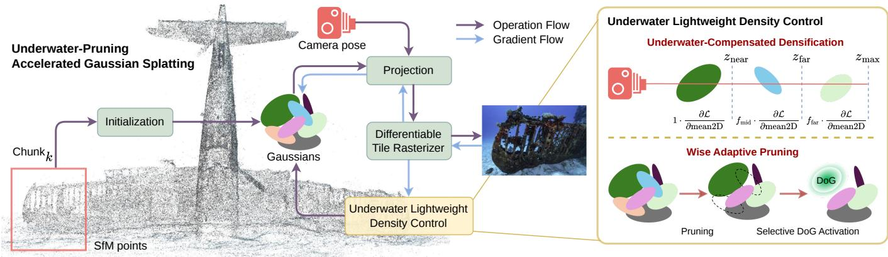  
Fig. 2. Overview of the proposed Underwater-Pruning Accelerated Gaussian Splating pipeline. Starting from SfM points of chunks generated by Balanced Scene Partitioning, Gaussian primitives are initialized and projected onto the 2D image plane for fast rasterization. The proposed Underwater Lightweight Density Control module, highlighted in yellow, regulates primitives through two components: Underwater-Compensated Densification, which uses a few learnable factors to compensate for densification failures caused by underwater light atenuation, and Wise Adaptive Pruning, which removes redundant primitives while progressively introducing 3D-DoG components for high-frequency detail reconstruction.

$$
r ^ { * } = \arg \operatorname* { m i n } _ { r \in \mathcal { R } } \frac { | N _ { 1 } ( r ) - N _ { 2 } ( r ) | } { \operatorname* { m a x } ( N _ { 1 } ( r ) , N _ { 2 } ( r ) ) } ,\tag{1}
$$

where R denotes the set of valid sampled ratios within [0.3, 0.7]. Unlike traditional graphics applications that primarily optimize traversal eficiency, our formulation is designed for sparse point clouds in the context of learning-based reconstruction, where balanced geometry and view distributions are important for stable optimization and reconstruction fidelity. To improve robustness, we further introduce guard rails to avoid degenerate partitions with insuficient geometry or camera coverage. The overall procedure is summarized in Algorithm 1, with representative results shown in Figure 10.

After partitioning, cameras are assigned to each partition based on visibility. Following [Wu et al. 2025], a camera is selected if either a suficient proportion of its observed SfM points falls inside the partition, or the partition is suficiently covered by the points observed by this camera. To improve cross-boundary consistency, we include sparse points outside the chunk if they are observed by the selected cameras. Finally, we discard chunks with too few sparse points or too few associated cameras, and export each valid partition as an independent local reconstruction unit for processing.

## 3.2 Underwater-Pruning Accelerated Gaussian Splating

To improve large-scale underwater reconstruction, we propose Underwater-Accelerated Gaussian Splatting, which integrates a novel Underwater Lightweight Density Control scheme. The proposed scheme enhances densification under underwater degradation and adaptively prunes redundant Gaussians to generate compact models for individual partitions. This reduces memory consumption and computational overhead while preserving reconstruction fidelity. The details of the overall pipeline are shown in Figure 2.

Compared with scenes captured in clear media, underwater envi ronments exhibit stronger degradation due to wavelength-dependent absorption and scattering. These efects attenuate image contrast and suppress structural cues, causing standard 3DGS optimization to underestimate scene complexity, particularly in distant regions [Wang et al. 2025]. Recent underwater Gaussian Splatting methods incorporate physics-based underwater imaging models, commonly based on the revised underwater image formation model [A nak and Treibitz 2018], together with auxiliary neural networks to estimate water-medium parameters and compensate for attenuation during densification [Jiang et al. 2025, 2026; Li et al. 2025; Liu et al. 2024a]. Additional details of the underwater imaging formulation are provided in the supplementary material (Sec. S1).

As observed in UW-GS [Wang et al. 2025], attenuation significantly suppresses the 2D positional gradients used for Gaussian densification, leading to insuficient primitive allocation and underreconstruction in degraded regions. While existing approaches address this issue using MLP-based parameter estimation, the additional networks introduce non-negligible computational overhead and slow down optimization. To overcome this limitation, we replace the MLP-based gradient compensation with a novel lightweight, learnable depth-aware densification scheme, termed Underwatercompensated Densification. Specifically, Gaussians are grouped into near, mid, and far ranges based on their camera-space depth.

ALGORITHM 1: Balanced Scene Partitioning   
Input: Sparse SfM points P, cameras C, point threshold $N _ { p } ,$   
maximum depth �, visibility threshold �   
Output: Local reconstruction chunks $\{ S _ { k } \}$   
Compute global bounding box B of P;   
Initialize queue $Q \gets \{ ( \mathcal { B } , 0 ) \}$ and chunk set ${ \mathcal { R } } \gets \emptyset ;$   
while Q is not empty do   
Pop $( \mathcal { B } _ { k } , d )$ from $\boldsymbol { Q } ;$   
Count points $\begin{array} { r } { \mathcal { P } _ { k }  \{ p \in \mathcal { P } \mid p \in \mathcal { B } _ { k } \} ; } \end{array}$   
if $| \mathcal { P } _ { k } | > N _ { p }$ and $d < D$ then   
Find longest spatial axis of $\mathcal { B } _ { k } ;$   
Sample candidate split ratios along this axis;   
Compute point counts $N _ { 1 }$ and �2 for each candidate split;   
Discard degenerate splits with $N _ { 1 } = 0$ or $N _ { 2 } = 0 ;$   
|� −� |   
Select the split that minimizes $\begin{array} { r } { \frac { 1 - \cdot \cdot _ { 1 } } { \operatorname* { m a x } ( N _ { 1 } , N _ { 2 } ) } ; } \end{array}$   
Split $\mathcal { B } _ { k }$ into two child chunks B1 and $\mathcal { B } _ { k } ^ { 2 } ;$   
Push $( \mathcal { B } _ { k } ^ { 1 } , d + 1 )$ and $( \mathcal { B } _ { k } ^ { 2 } , d + 1 )$ into $\boldsymbol { Q } ;$   
else   
Add $\mathcal { B } _ { k }$ to $\mathcal { R } ;$   
foreach chunk $\mathcal { B } _ { k } \in \mathcal { R }$ do   
Expand $\mathcal { B } _ { k }$ to obtain an enlarged chunk region $\hat { \mathcal B } _ { k }$   
Collect sparse points $\mathcal { P } _ { k }  \{ p \in \mathcal { P } \mid p \in \hat { \mathcal { B } } _ { k } \} ;$   
if $| \mathcal { P } _ { k } |$ is too small then   
Discard this chunk;   
continue;   
Select cameras with suficient SfM point overlap with $\hat { \mathcal B } _ { k } ;$   
Classify selected cameras into base and border views based on   
overlap ratios;   
Add extra sparse points observed by the selected cameras;   
if the number ofselected cameras is too small then   
Discard this chunk;   
continue;   
Export the valid chunk as a local reconstruction unit $s _ { k } ;$   
return $\{ S _ { k } \}$

For the mid and far groups, each of them is assigned a learnable densification weight, while the near region is assumed to have attenuation that can be ignored. Given the camera-space depth $z _ { i }$ of Gaussian �, we assign it to a depth group and define its densification weight as

$$
w _ { i } = \left\{ \begin{array} { l l } { 1 , } & { z _ { i } < z _ { \mathrm { n e a r } } , } \\ { f _ { \mathrm { m i d } } , } & { z _ { \mathrm { n e a r } } \leq z _ { i } < z _ { \mathrm { f a r } } , } \\ { f _ { \mathrm { f a r } } , } & { z _ { i } \geq z _ { \mathrm { f a r } } , } \end{array} \right.\tag{2}
$$

where $f _ { \mathrm { m i d } }$ and $f _ { \mathrm { f a r } }$ are learnable parameters for compensating underwater attenuation in the mid- and far-depth regions, respectively. Since densification is non-diferentiable, $f _ { \mathrm { m i d } }$ and $f _ { \mathrm { f a r } }$ are optimized using gradient-free SPSA, enforcing $f _ { \mathrm { f a r } } \geq f _ { \mathrm { m i d } }$ . Figure 2 (top-right) illustrates the proposed scheme. This design directly modulates densification strength across depth, enabling adaptive emphasis on distant and heavily degraded regions. Importantly, it avoids the need for an auxiliary network, thereby reducing computational overhead while preserving efective geometric reconstruction in underwater scenes.

To ensure scalability to large scenes, we integrate the proposed densification strategy within a compact Gaussian Splatting framework and propose a Wise Adaptive Pruning scheme. Rather than allowing densification to inflate model complexity, the framework maintains eficiency by progressively pruning redundant or lowcontribution primitives, thereby reducing storage and rendering cost. To retain reconstruction fidelity under this compact model, we incorporate Diference-of-Gaussians (DoG) primitives, inspired by [Wang et al. 2026]. These enhance local representational capacity, enabling the model to preserve fine structures and geometric detail even with fewer Gaussians. The DoG formulation is defined as:

$$
\begin{array} { r } { D o G ( \boldsymbol { x } ) = G ( \boldsymbol { x } ) - G _ { \boldsymbol { p } } ( \boldsymbol { x } ) , } \end{array}\tag{3}
$$

where $G _ { p } ( \boldsymbol { x } )$ denotes a pseudo-Gaussian that shares the same center coordinates and kernel parameters as the primary Gaussian $G ( x ) _ { \colon }$ while difering only in opacity and scale. This DoG formulation increases the local expressive ability of the remaining primitives and helps recover sharp structures after pruning. Thus, the original method combines adaptive pruning and DoG scheme to achieve a trade-of between model compactness and rendering fidelity.

Unlike the original strategy in [Wang et al. 2026], which activates DoG components for all primitives and then degenerates insensitive ones back to standard Gaussians, our Wise Adaptive Pruning method introduces a selective DoG activation strategy. We observe that global DoG activation introduces unnecessary computational overhead, since many primitives do not contribute significantly to high-frequency reconstruction. Instead, we identify reconstruction-sensitive primitives based on their gradient responses. Specifically, we use the magnitude of the unweighted 2D positional gradient as an indicator of reconstruction sensitivity. A primitive activates its DoG components only when its gradient magnitude exceeds a predefined threshold �. Formally, the DoG activation indicator for Gaussian � is defined as

$$
a _ { i } = \mathbb { I } \left( \left. \frac { \partial \mathcal { L } } { \partial \mathrm { m e a n } 2 \mathrm { D } _ { i } } \right. _ { 2 } > \tau \right) ,\tag{4}
$$

The gradient in Equation 4 is not weighted by �� in Equation 2, as it is used only for densification and would otherwise introduce depthbiased DoG activation. Here, $a _ { i } = 1$ activates the DoG component„ while $a _ { i } ~ = ~ 0$ retains the standard Gaussian representation. This selective activation avoids redundant computation while preserving representational capacity in detail-critical regions. The benefits of our 3D-DoG representation are clearly demonstrated in Figure 11.

## 4 Datasets

Large-scale underwater datasets remain scarce due to the dificulty and cost of underwater data acquisition. Furthermore, synthesizing realistic underwater imagery is considerably more challenging than in many other domains [Barbosa and Apolinario Jr 2025; Li et al. 2017a], requiring the modeling of light absorption, scattering, spatially varying turbidity, non-uniform illumination, and dynamic water disturbances. To support the evaluation of large-scale underwater reconstruction, we introduce two complementary datasets: Abyssal (image-based) and OceanXplore (video-based). Representative samples are shown in Figure 4.

Abyssal dataset contains two sequences featuring distinctive man-made objects: a shipwreck and an aircraft wreck. The sequences were captured by the Submerged Resources Center of the National Park Service and are denoted as ISRO and KWAJ, respectively. ISRO contains 2,239 images of the Tokai Maru shipwreck near Guam, captured using a Nikon Z7 through the NPS SeaArray photogrammetry system [Wright et al. 2020]. KWAJ contains 1,294 images of the Kwajalein Atoll F4U-1 Corsair wreck near Mellu Island, captured using a Nikon D5 with a Nauticam housing, a 14–24 mm f/2.8 Nikkor lens, and a 230 mm dome port. The 8K images exhibit some distortion due to low-light conditions and sparse viewpoints. Cleaned photogrammetry models with water removed are provided alongside both sequences. OceanXplore dataset comprises three large-scale coral reef video sequences provided by OceanX, a non-profit ocean exploration organization, denoted as Komodo, Amirantes1, and Amirantes2. Komodo was captured using a GoPro near Komodo, Indonesia, at 2704×1520 resolution and 24 fps for 60.77 seconds. It features clear water and abundant dynamic marine life, making it representative of structured yet dynamic reef environments. Amirantes1 and Amirantes2 were recorded using a Lumix GH5 near the Amirantes region in the Seychelles at 1920×1080 and 24 fps, lasting 56.31 and 73.82 seconds, respectively. Amirantes1 exhibits strong illumination variation caused by surface-driven lighting, whereas Amirantes2 contains dense sea-fan structures with substantial geometric complexity.

The current OceanXplore release is designed primarily to evaluate large-scale reconstruction scalability rather than exhaustively cover underwater environments. The three sequences were selected from a larger archive for their extensive spatial coverage and predominantly static scene structure, although transient fish motion remains, particularly in Komodo. Upon acceptance, we will release the sequences together with extracted frames, camera poses, evaluation splits, and preprocessing scripts, and expand the collection in future releases.

In addition to the newly introduced datasets, we further evaluate OceanXL on the large-scale public Eifel Tower dataset [Boittiaux et al. 2023] and Tabuhan P1, a subset ofthe Sweet Corals dataset [Nozdrenkov et al. 2025].

## 5 Experiments

## 5.1 Baselines and Metrics

We compare our method against several large-scale 3DGS baselines, including Hierarchical-GS [Kerbl et al. 2024], CityGaussian [Liu et al. 2024b], Octree-GS [Ren et al. 2024], and BlockGaussian [Wu et al. 2025]. We additionally combine UW-GS [Wang et al. 2025] with the proposed BSP strategy to form an underwater-specific baseline. Evaluation includes PSNR, SSIM, and LPIPS, together with model size and training time to assess scalability for large-scale underwater reconstruction.

## 5.2 Implementation

We employ COLMAP [Schonberger and Frahm 2016] to initialize the point cloud and estimate camera poses. The partitioning dimensionality is automatically selected using the criterion in subsection 3.1. For ISRO and Tabuhan P1, we use 2D partitioning by projecting points onto the ground plane, following common large-scale reconstruction pipelines [Gao et al. 2025; Kerbl et al. 2024; Liu et al. 2024c]. For KWAJ and Eifel Tower 2016, which contain stronger vertical structures, we adopt 3D partitioning by recursively splitting the sparse point cloud along the longest axis of its 3D bounding box. This approach is more appropriate for scenes with vertical structure and produces more balanced partitions in highly elevated environments.

The proposed method is built upon 3DGS [Kerbl et al. 2023]. After partitioning, each chunk is optimized for 40K iterations. The point cloud is densified in the first 20K iterations, after that, we adopt a modified pruning process with 3D-DoGs introduction for another 10,000 iterations and only retain 50% of the original primitives. The final model is produced by merging individual chunks. Compared with other methods, our approach can be trained with limited computational resources, using only a single RTX3090 GPU.

## 5.3 Results and Comparison

5.3.1 Partitioning Results. The partitioning results obtained on the ISRO scene using the proposed BSP strategy are shown in Figure 5. In contrast to the BlockGaussian partitioning strategy [Wu et al. 2025], shown on the left, which mechanically splits the scene into two parts at the midpoint, our method introduces unaligned partition boundaries to satisfy a maximum point budget determined by the available GPU capacity. In this experiment, the point budget is set to 40,000 points per partition. As a result, our strategy achieves a more balanced point-cloud distribution across partitions.

5.3.2 Quantitative Comparison. Table 1 reports the quantitative comparison between the proposed method and existing large-scale Gaussian splatting approaches. OceanXL achieves the best eficiency, producing the smallest model sizes and fastest training times across most datasets, while using only 32.3% as many primitives as BlockGaussian on average. In terms of PSNR, SSIM, and LPIPS, the proposed method performs comparably to or better than existing state-of-the-art methods, demonstrating a strong eficiency– quality trade-of for large-scale underwater reconstruction. There are two notable exceptions. On the Eifel Tower 2016 scene, Octree-GS achieves a smaller model size and faster training speed, while OceanXL produces higher reconstruction quality. On the Tabuhan P1 scene, OceanXL yields a larger model than CityGaussian; however, we restrict CityGaussian point-cloud growth to ensure all methods remain trainable under the single-GPU setting.

5.3.3 Qualitative Comparison. Figure 3 presents a qualitative comparison between the proposed method and baseline approaches. OceanXL recovers fine underwater structures while maintaining a compact scene representation. Additional qualitative comparisons are provided in Figure 6 and Figure 12, while point cloud visualizations are shown in Figure 7.

## 5.4 Ablation Study

To validate the contribution of each component, we conduct the ablation studies reported in Table 2. We use 3DGS with the Block Gaussian partitioning strategy as the baseline. Replacing it with the proposed Balanced Scene Partitioning (BSP) (V1) improves both reconstruction quality and training eficiency. This gain is attributed to the more balanced distribution of geometry across partitions, which reduces the number of reconstruction chunks and improves single-GPU optimization eficiency. Incorporating Underwater-Compensated Densification (UCD) (V2) further improves PSNR, SSIM, and LPIPS by compensating for attenuationinduced densification failures in degraded underwater regions, although it increases the model size. Introducing Wise Adaptive Pruning (WAP) without DoG activation (V3) substantially reduces model size and training time, but degrades reconstruction quality. Activating DoG components for all remaining primitives (V4) recovers quality, but introduces computational overhead. In contrast, OceanXL combines WAP with selective DoG activation for reconstructionsensitive primitives. Although selective activation slightly decreases reconstruction metrics compared with V2 and V4, it achieves a more favorable trade-of between reconstruction quality, compactness, and eficiency.

Table 1. Quantitative evaluation of the proposed approach compared with previous baselines on five large-scale underwater scenes: ISRO, KWAJ, Eifel Tower 2016, Tabuhan P1, and Komodo. ↑ indicates higher is beter, while ↓ indicates lower is beter. Model size is reported in GB. The best , second best , and third best results are highlighted. UW-GS∗ denotes a modified version combined with BSP. OOM indicates out-of-memory failure.
<table><tr><td rowspan="3">Method</td><td colspan="4">ISRO</td><td colspan="6">KWAJ</td><td colspan="4">Eiffel Tower 2016</td><td colspan="6">Tabuhan P1</td><td colspan="4">Komodo</td></tr><tr><td>Size↓</td><td>PSNR↑</td><td>SSIM↑ LPIPS↓</td><td></td><td>Time↓|</td><td>Size↓</td><td>PSNR↑</td><td>SSIM↑ LPIPS↓</td><td></td><td>Time↓</td><td>Size↓</td><td>PSNR↑ SSIM↑ LPIPS↓</td><td></td><td></td><td>Time↓|</td><td>Size↓</td><td></td><td>PSNR↑ SSIM↑ LPIPS↓</td><td>Time↓|</td><td>Size↓</td><td>PSNR↑</td><td></td><td>SSIM↑ LPIPS↓</td><td>Time↓</td></tr><tr><td>UW-GS* (+BSP)</td><td>0.923 20.53</td><td>0.669</td><td>0.442</td><td></td><td>245m45s| 1.070</td><td>21.32</td><td>0.677</td><td>0.448</td><td>198m22s</td><td>1.320</td><td>19.98</td><td>0.592</td><td>0.514</td><td>342m17s|</td><td>OOM</td><td>OOM</td><td>OOM</td><td>OOM</td><td>OOM|</td><td>0.891</td><td>22.56</td><td>0.634</td><td>0.199</td><td>87m43s</td></tr><tr><td>Hierarchical-GS</td><td>13.310</td><td>20.28 0.648</td><td>0.452</td><td></td><td>320m8s</td><td>6.280 21.42</td><td>0.679</td><td>0.380</td><td>115m18s</td><td>9.110</td><td>17.30</td><td>0.519</td><td>0.462</td><td>180m56s</td><td>39.530</td><td>16.28</td><td>0.404</td><td>0.395</td><td>561m50s</td><td>1.590</td><td>23.98</td><td>0.796</td><td>0.184</td><td>55m51s</td></tr><tr><td>CityGaussian</td><td>2.050</td><td>21.42 0.695</td><td>0.490</td><td></td><td>150m10s</td><td>1.090 21.90</td><td>0.699</td><td>0.405</td><td>109m27s</td><td>0.450</td><td>21.91</td><td>0.700</td><td>0.425</td><td>426m0s</td><td>3.800</td><td>18.31</td><td>0.568</td><td>0.417</td><td>430m12s</td><td>2.440</td><td>28.09</td><td>0.905</td><td>0.163</td><td>432m49s</td></tr><tr><td>Octree-GS</td><td>1.420</td><td>24.14 0.753</td><td>0.377</td><td></td><td>52m17s</td><td>0.373 24.20</td><td>0.724</td><td>0.358</td><td>37m41s</td><td>0.184</td><td>23.20</td><td>0.671</td><td>0.444</td><td>26m22s</td><td>OOM</td><td>OOM</td><td>OOM</td><td>OOM</td><td>OOM</td><td>0.181</td><td>28.31</td><td>0.921</td><td>0.149</td><td>52m22s</td></tr><tr><td>BlockGaussian</td><td>3.300</td><td>24.43 0.729</td><td>0.404</td><td></td><td>269m4s</td><td>0.630 27.47</td><td>0.856</td><td>0.244</td><td>70m38s</td><td>2.700</td><td>23.77</td><td>0.771</td><td>0.340</td><td>248m48s</td><td>17.700</td><td>20.87</td><td>0.741</td><td>0.221</td><td>646m15s</td><td>0.410</td><td>26.00</td><td>0.887</td><td>0.178</td><td>30m39s</td></tr><tr><td>OceanXL (ours)</td><td>0.317</td><td>25.03</td><td>0.746</td><td>0.428</td><td>32m50s</td><td>0.204</td><td>27.35 0.848</td><td>0.273</td><td>25m1s</td><td>0.545</td><td>24.29</td><td>0.760</td><td>0.359</td><td>62m47s</td><td>8.440</td><td>20.91</td><td>0.744 0.227</td><td></td><td>307m20s</td><td>0.166</td><td>28.45</td><td>0.922</td><td>0.144</td><td>19m7s</td></tr></table>

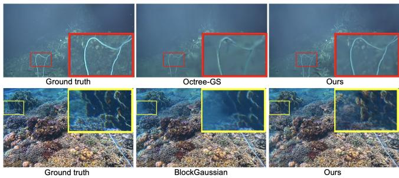  
Fig. 3. Qualitative comparison of the proposed method and baseline approaches on (top) Eifel Tower 2016 and (botom) Tabuhan P1 scenes.

## 5.5 Generalization to Small-Scale Underwater Scenes

Although OceanXL is primarily designed for large-scale underwater reconstruction, we further evaluate its generalization ability on the small-scale SeaThru-NeRF dataset. Unlike the large-scale baselines evaluated in Table 1, this experiment compares OceanXL with representative underwater-specific Gaussian Splatting methods, including WaterSplatting [Li et al. 2025], SeaSplat [Yang et al. 2025], GaussianSplashing [Mualem et al. 2024], RUSplatting [Jiang et al. 2025], and UW-GS [Wang et al. 2025]. We follow the standard evaluation protocol and report PSNR, SSIM, LPIPS, and model size. As shown in Table 2, OceanXL achieves competitive reconstruction quality on SeaThru-NeRF while requiring only 0.125 GB of storage, corresponding to an 82–97% reduction compared with the evaluated

Table 2. The reconstruction performance of diferent variants. We report the average PSNR, SSIM, and LPIPS scores for the Abyssal dataset with 3DGS as the backbone. Full denotes full DoG activation, and selective denotes the proposed selective DoG activation strategy. 3DGS∗ denotes a modified version combined with BlockGaussian partitioning strategy
<table><tr><td></td><td colspan="4">Components</td><td colspan="4">Reconstruction Metrics</td><td colspan="2">Efficiency Metrics</td></tr><tr><td>Variant | BSP</td><td></td><td>UCD</td><td>WAP</td><td>Full</td><td>Selective</td><td>PSNR↑</td><td>SSIM↑</td><td>LPIPS↓</td><td>Time↓</td><td>Size↓</td></tr><tr><td>3DGS*</td><td>x</td><td>x</td><td>x</td><td>x</td><td>x</td><td>22.40</td><td>0.719</td><td>0.420</td><td>43m7s</td><td>0.670</td></tr><tr><td>V1</td><td>√</td><td>x</td><td>x</td><td>x</td><td>x</td><td>23.05</td><td>0.721</td><td>0.402</td><td>31m17s</td><td>0.593</td></tr><tr><td>V2</td><td>√</td><td>√</td><td>x</td><td>x</td><td>x</td><td>26.36</td><td>0.818</td><td>0.334</td><td>37m13s</td><td>0.768</td></tr><tr><td>V3</td><td>√</td><td>√</td><td>√</td><td>x</td><td>x</td><td>26.04</td><td>0.788</td><td>0.361</td><td>25m30s</td><td>0.242</td></tr><tr><td>V4</td><td>√</td><td>√</td><td>√</td><td>√</td><td>x</td><td>26.26</td><td>0.809</td><td>0.344</td><td>37m12s</td><td>0.264</td></tr><tr><td>OceanXL (ours)</td><td>√</td><td>√</td><td>√</td><td>x</td><td>√</td><td>26.19</td><td>0.797</td><td>0.351</td><td>28m56s</td><td>0.261</td></tr></table>

Table 3. Quantitative comparisons on the small-scale SeaThru-NeRF dataset. ↑ indicates higher is beter, while ↓ indicates lower is beter. Model size is reported in GB.
<table><tr><td rowspan=1 colspan=6>Method|Size↓|PSNR↑SSIM↑LPIPS↓</td></tr><tr><td rowspan=2 colspan=2>WaterSplatting</td><td></td><td></td><td></td><td></td></tr><tr><td rowspan=1 colspan=1>tting</td><td rowspan=1 colspan=1>0.689</td><td rowspan=1 colspan=1>28.75</td><td rowspan=1 colspan=1>0.904</td><td rowspan=1 colspan=1>0.148</td></tr><tr><td rowspan=1 colspan=2>SeaSplat</td><td rowspan=1 colspan=1>4.000</td><td rowspan=1 colspan=1>27.11</td><td rowspan=1 colspan=1>0.885</td><td rowspan=1 colspan=1>0.183</td></tr><tr><td rowspan=1 colspan=2>GaussianSplashing</td><td rowspan=1 colspan=1>0.963</td><td rowspan=1 colspan=1>29.00</td><td rowspan=1 colspan=1>0.910</td><td rowspan=1 colspan=1>0.145</td></tr><tr><td rowspan=2 colspan=2>RUSplattingUW-GS</td><td rowspan=1 colspan=1>1.530</td><td rowspan=1 colspan=1>29.29</td><td rowspan=1 colspan=1>0.916</td><td rowspan=1 colspan=1>0.166</td></tr><tr><td rowspan=1 colspan=1>1.160</td><td rowspan=1 colspan=1>28.82</td><td rowspan=1 colspan=1>0.918</td><td rowspan=1 colspan=1>0.143</td></tr><tr><td rowspan=1 colspan=2>OceanXL (ours)</td><td rowspan=1 colspan=1>0.125</td><td rowspan=1 colspan=1>28.75</td><td rowspan=1 colspan=1>0.912</td><td rowspan=1 colspan=1>0.146</td></tr></table>

underwater-specific baselines. These results support the compactness and small-scale generalization of OceanXL, rather than serving as evidence of large-scale scalability.

## 6 Discussion

Our results suggest that scalable underwater scene representation depends less on the raw expressivity of Gaussian primitives than on how computation, capacity, and visibility are distributed across the scene. We further discuss the resulting trade-ofs, practical integration into interactive graphics pipelines, and the framework’s generalization and limitations.

## 6.1 Efectiveness for Large-Scale Data

Naive partitioning of large-scale scenes often yields imbalanced chunks: dense partitions incur high optimization costs, whereas sparse ones lack suficient observations for stable reconstruction. BSP mitigates this imbalance by distributing partition complexity more evenly, improving optimization stability in large-scale underwater scenes, consistent with scalable rendering systems [Kerbl et al. 2024; Lee et al. 2026].

Adaptive pruning further improves scalability by suppressing redundant primitives introduced during densification. Standard 3DGS tends to over-allocate Gaussians in visually ambiguous regions [Bagdasarian et al. 2025], which is exacerbated underwater by scattering and attenuation. By progressively pruning low-contribution primitives and selectively activating DoG components in reconstructionsensitive regions, our strategy allocates representational capacity more eficiently while preserving reconstruction fidelity.

## 6.2 Underwater Reconstruction Quality

Compared with previous underwater 3DGS approaches discussed in section 2, the proposed Underwater-Compensated Densification ofers a substantially lighter-weight alternative using only three depth-dependent densification weights. Despite its simplicity, Figure 8 shows that OceanXL achieves improved underwater color consistency and correction compared with standard large-scene GS approaches. However, the current formulation uses fixed depth boundaries, where $z _ { \mathrm { n e a r } }$ and $z _ { \mathrm { f a r } }$ are set to ${ \scriptstyle \frac { 1 } { 3 } } z _ { \mathrm { m a x } }$ and $\begin{array} { r } { \frac { 2 } { 3 } z _ { \mathrm { m a x } } , } \end{array}$ respectively. While efective in practice, these predefined thresholds may not fully capture spatially varying underwater optical properties. More adaptive depth stratification could further improve reconstruction quality.

## 6.3 Selective Activation of DoG Primitives

By allocating additional capacity only to reconstruction-sensitive regions, the method avoids unnecessary computation and memory overhead in low-detail areas, which is beneficial for underwater scenes with severe visibility degradation. This design can integrate naturally with modern 3DGS pipelines, as DoG activation operates directly at the primitive level without auxiliary neural decoding, remaining compatible with real-time rasterization and chunk-based VR/AR streaming systems. Broadly, the strategy generalizes beyond underwater environments, since it is driven by reconstruction sensitivity rather than domain-specific priors. However, the current formulation still relies on manually defined activation thresholds, which may not always align with perceptual importance under diferent types of degradation.

## 6.4 Failure Cases

OceanXL still struggles with sparse views, as shown in Figure 9. When neighboring viewpoints share limited common observations, the aggressive compactness introduced by adaptive pruning may reduce the representational capacity needed to recover fine structures, leading to slightly blurrier renderings. In future work, we plan to explore sparse-view-aware pruning strategies and incorporate geometry-consistent generative priors to improve fine-detail recovery under limited view overlap while mitigating hallucinated structures. In addition, dynamic marine life is not a focus of OceanXL. Transient fish observations are often filtered out during SfM initialization or suppressed during multi-view 3DGS optimization because they are not geometrically consistent across views. Nevertheless, fish that remain visible across multiple views or move rapidly may still introduce floating, blurring, or ghosting artifacts. Since OceanXL does not employ explicit dynamic-object masks, handling such content remains a limitation. Integrating motion segmentation or dynamic-object masking is left for future work.

## 6.5 Practical Advantages for Real-Time Graphics and VR Applications

Beyond quantitative comparisons, several properties of OceanXL make it well suited for downstream graphics applications. Its blockwise representation naturally supports streaming and level-of-detail (LoD) strategies in VR and real-time engines, allowing chunks to be independently loaded, swapped, or culled. The compact per-chunk footprint, typically a few hundred megabytes even for large marine scenes, remains practical for consumer GPUs and head-mounted displays [Zhao et al. 2026], unlike many prior large-scene methods. In addition, the lightweight density control requires no auxiliary network during inference, enabling straightforward integration into existing splatting-based rasterizers and 3DGS-style pipelines commonly used in film and game production. Together, these properties support neural rendering as a reusable asset format rather than a one-of reconstruction artifact.

## 6.6 Generalization Beyond Underwater Scenes

The underwater-specific component, such as depth-banded densification compensation, can also generalize to other visibility-degraded environments [Li et al. 2017b], such as foggy outdoor scenes [Ramazzina et al. 2023; Yu et al. 2026], smoke-filled architectural spaces [Zheng et al. 2026], and atmospheric VFX backgrounds where visibility progressively decays with distance.

## 7 Conclusion

We presented OceanXL, a scalable framework for large-scale underwater scene reconstruction based on 3D Gaussian Splatting. By combining BSP, underwater-aware lightweight density control, and selective Diference-of-Gaussians activation, the proposed method enables eficient and compact reconstruction of extensive underwater environments while preserving high rendering fidelity. Experimental results across multiple underwater datasets demonstrate improved eficiency-quality trade-ofs compared with existing largescale Gaussian splatting approaches.

Current limitations include fixed depth stratification and lack of explicit dynamic modeling. Future work includes uncertaintyaware merging, physics-informed partitioning, and extension to temporal reconstruction. By making large-scale underwater 3D reconstruction computationally accessible, OceanXL opens new possibilities for marine exploration, archaeological documentation, and immersive ocean experiences.

## Acknowledgments

This work was supported by the EPSRC ECR International Collaboration Grants (EP/Y002490/1) and the UKRI MyWorld Strength in Places Programme (SIPF00006/1). We would like to thank Rachel Fu and Lionel Taillens from the OceanX media team for providing the raw videos and metadata for the OceanXplore dataset.

## References

Derya Akkaynak and Tali Treibitz. 2018. A revised underwater image formation model. In Proceedings of the IEEE conference on computer vision and pattern recognition. 6723–6732.

Milena T Bagdasarian, Paul Knoll, Y Li, Florian Barthel, Anna Hilsmann, Peter Eisert, and Wieland Morgenstern. 2025. 3DGS.zip: A survey on 3d gaussian splatting compression methods. In Computer Graphics Forum, Vol. 44. Wiley Online Library, e70078.

Lucas Amparo Barbosa and Antonio Lopes Apolinario Jr. 2025. From physically based to generative models: A survey on underwater image synthesis techniques. Journal ofImaging 11, 5 (2025), 161.

Clémentin Boittiaux, Claire Dune, Maxime Ferrera, Aurélien Arnaubec, Ricard Marxer, Marjolaine Matabos, Loïc Van Audenhaege, and Vincent Hugel. 2023. Eifel tower: A deep-sea underwater dataset for long-term visual localization. The International Journal ofRobotics Research 42, 9 (2023), 689–699.

Guangchi Fang and Bing Wang. 2024. Mini-splatting: Representing scenes with a constrained number of gaussians. In European Conference on Computer Vision. Springer, 165–181.

Géraldine Fauville, Daniel Pimentel, and Erika Woolsey. 2025. Ocean XR: A deep dive into extended reality for marine education and ocean literacy. Ocean and Society 2 (2025).

Guofeng Feng, Siyan Chen, Rong Fu, Zimu Liao, Yi Wang, Tao Liu, Boni Hu, Linning Xu, Zhilin Pei, Hengjie Li, Xiuhong Li, Ninghui Sun, Xingcheng Zhang, and Bo Dai. 2025. FlashGS: Eficient 3D Gaussian Splatting for Large-scale and High-resolution Rendering. In Proceedings ofthe IEEE/CVFConference on Computer Vision and Pattern Recognition (CVPR). 26652–26662.

Yuanyuan Gao, Hao Li, Jiaqi Chen, Zhengyu Zou, Zhihang Zhong, Dingwen Zhang, Xiao Sun, and Junwei Han. 2025. Citygs-x: A scalable architecture for eficient and geometrically accurate large-scale scene reconstruction. In Proceedings of the IEEE/CVF International Conference on Computer Vision. 27187–27196.

A. Hanson, A. Tu, G. Lin, V. Singla, M. Zwicker, and T. Goldstein. 2025a. Speedy-splat: Fast 3d gaussian splatting with sparse pixels and sparse primitives. In Proceedings ofthe Computer Vision and Pattern Recognition Conference (CVPR). 21537–21546.

Alex Hanson, Allen Tu, Vasu Singla, Mayuka Jayawardhana, Matthias Zwicker, and Tom Goldstein. 2025b. Pup 3D-GS: Principled uncertainty pruning for 3D gaussian splatting. In Proceedings of the Computer Vision and Pattern Recognition Conference. 5949–5958.

G. Huang, H. Wang, Z. Qi, W. Lu, D. Bull, and N. Anantrasirichai. 2025. From Restora tion to Reconstruction: Rethinking 3D Gaussian Splatting for Underwater Scenes. arXiv:2509.17789 (2025).

Guoxi Huang, Haoran Wang, Brett Seymour, Evan Kovacs, John Ellerbrock, Dave Blackham, and Nantheera Anantrasirichai. 202. Visual enhancement and 3D rep resentation for underwater scenes: a review. Artificial Intelligence Review (June 202).

Dhruv Jain, Misha Sra, Jingru Guo, Rodrigo Marques, Raymond Wu, Justin Chiu, and Chris Schmandt. 2016. Immersive scuba diving simulator using virtual reality. In Proceedings ofthe 29th annual symposium on user interface software and technology. 729–739.

Z. Jiang, H. Wang, G. Huang, B. Seymour, and N. Anantrasirichai. 2025. RUSplatting: Robust 3D Gaussian Splatting for Sparse-View Underwater Scene Reconstruction. In BMVC.

Zhuodong Jiang, Haoran Wang, Guoxi Huang, Brett Seymour, and Nantheera Anantrasirichai. 2026. Semantic-guided Gaussian Splatting for High-Fidelity Under water Scene Reconstruction. In arXiv:2509.00800.

Timothy L. Kay and James T. Kajiya. 1986. Ray tracing complex scenes. In Proceedings of the 13th Annual Conference on Computer Graphics and Interactive Techniques (SIGGRAPH ’86). 269–278. doi:10.1145/15922.15916

Bernhard Kerbl, Georgios Kopanas, Thomas Leimkühler, George Drettakis, et al. 2023. 3D gaussian splatting for real-time radiance field rendering. ACM Transactions on Graphics (TOG) 42, 4 (2023), 139–1.

Bernhard Kerbl, Andreas Meuleman, Georgios Kopanas, Michael Wimmer, Alexandre Lanvin, and George Drettakis. 2024. A hierarchical 3D gaussian representation for real-time rendering of very large datasets. ACM Transactions On Graphics (TOG) 43, 4 (2024), 1–15.

Donghyun Lee, Dawoon Jeong, Jae W. Lee, and Hongil Yoon. 2026. GS-Scale: Unlocking Large-Scale 3D Gaussian Splatting Training via Host Ofloading. In Proceedings of the 31st ACM International Conference on Architectural Support for Programming Languages and Operating Systems, Volume 2. 860–875. doi:10.1145/3779212.3790167

Deborah Levy, Amit Peleg, Naama Pearl, Dan Rosenbaum, Derya Akkaynak, Simon Korman, and Tali Treibitz. 2023. Seathru-nerf: Neural radiance fields in scattering media. In Proceedings ofthe IEEE/CVF conference on computer vision and pattern recognition. 56–65.

H. Li, W. Song, T. Xu, A. Elsig, and J. Kulhanek. 2025. WaterSplatting: Fast Underwater 3D Scene Reconstruction using Gaussian Splatting. In International Conference on 3D Vision (3DV).

Jie Li, Katherine A Skinner, Ryan M Eustice, and Matthew Johnson-Roberson. 2017a. WaterGAN: Unsupervised generative network to enable real-time color correction of monocular underwater images. IEEE Robotics and Automation letters 3, 1 (2017), 387–394.

Yu Li, Shaodi You, Michael S Brown, and Robby T Tan. 2017b. Haze visibility en hancement: A survey and quantitative benchmarking. Computer Vision and Image Understanding 165 (2017), 1–16.

Chuandong Liu, Huijiao Wang, Lei Yu, and Gui-Song Xia. 2025a. Holistic Large-Scale Scene Reconstruction via Mixed Gaussian Splatting. In NeurIPS.

S. Liu, J. Lu, Z. Gu, J. Li, and Y. Deng. 2024a. Aquatic-GS: A Hybrid 3D Representation for Underwater Scenes. arXiv:2411.00239 (2024).

Yang Liu, Chuanchen Luo, Lue Fan, Naiyan Wang, Junran Peng, and Zhaoxiang Zhang. 2024b. CityGaussian: Real-time high-quality large-scale scene rendering with gaus sians. In European Conference on Computer Vision. Springer, 265–282.

Yang Liu, Chuanchen Luo, Zhongkai Mao, Junran Peng, and Zhaoxiang Zhang. 2024c. Citygaussianv2: Eficient and geometrically accurate reconstruction for large-scale scenes. arXiv preprint arXiv:2411.00771 (2024).

Yifei Liu, Zhihang Zhong, Yifan Zhan, Sheng Xu, and Xiao Sun. 2025b. MaskGaussian: Adaptive 3d gaussian representation from probabilistic masks. In Proceedings ofthe Computer Vision and Pattern Recognition Conference. 681–690

Beatrice Maggipinto, Nuno Jardim Nunes, Jessica Hammer, Yanick Trindade, and Valentina Nisi. 2025. Diving into the Abyss: Exploring Deep Sea Connection and Curiosity through Virtual Reality. In Proceedings of the 2025 CHI Conference on Human Factors in Computing Systems. 1–18.

Guilhem Marre, Florian Holon, Sandra Luque, Pierre Boissery, and Julie Deter. 2019. Monitoring Marine Habitats With Photogrammetry: A Cost-Efective, Accurate, Precise and High-Resolution Reconstruction Method. Frontiers in Marine Science Volume 6 - 2019 (2019). doi:10.3389/fmars.2019.00276

Ben Mildenhall, Pratul P Srinivasan, Matthew Tancik, Jonathan T Barron, Ravi Ramamoorthi, and Ren Ng. 2021. NeRF: Representing scenes as neural radiance fields for view synthesis. Commun. ACM 65, 1 (2021), 99–106.

Nir Mualem, Roy Amoyal, Oren Freifeld, and Derya Akkaynak. 2024. Gaussian splashing: Direct volumetric rendering underwater. arXiv preprint arXiv:2411.19588 (2024).

KL Navaneet, Kossar Pourahmadi Meibodi, Soroush Abbasi Koohpayegani, and Hamed Pirsiavash. 2024. CompGS: Smaller and faster gaussian splatting with vector quanti zation. In European Conference on Computer Vision. Springer, 330–349.

Michael Niemeyer, Fabian Manhardt, Marie-Julie Rakotosaona, Michael Oechsle, Daniel Duckworth, Rama Gosula, Keisuke Tateno, John Bates, Dominik Kaeser, and Federico Tombari. 2025. Radsplat: Radiance field-informed gaussian splatting for robust real time rendering with 900+ fps. In 2025 International Conference on 3D Vision (3DV). IEEE, 134–144.

Sergei Nozdrenkov, Mujiyanto, Raymon Rahmanov Zedta, Fakhrurrozi, Triona Barker, Muhammad Dziki Rahman, Andrias Steward Samusamu, Fathur Rochman, Leigh Peters, Dr Rita Rachmawati, Dr Ofri Johan, Dr Jamie Craggs, and Prof Michael Sweet. 2025. sweet-corals (Revision bd316dc). doi:10.57967/hf/5162

Yang Ouyang, Yuchen Wu, Xiyuan Wang, Laixin Xie, Weicong Cheng, Jianping Gan, Quan Li, and Xiaojuan Ma. 2025. OceanVive: An Immersive Visualization System for Communicating Complex Oceanic Phenomena. In 2025 IEEE Visualization and Visual Analytics (VIS). IEEE, 326–330.

Andrea Ramazzina, Mario Bijelic, Stefanie Walz, Alessandro Sanvito, Dominik Scheuble, and Felix Heide. 2023. Scatternerf: Seeing through fog with physically-based inverse neural rendering. In Proceedings ofthe IEEE/CVFinternational conference on computer vision. 17957–17968.

Kerui Ren, Lihan Jiang, Tao Lu, Mulin Yu, Linning Xu, Zhangkai Ni, and Bo Dai. 2024. Octree-GS: Towards consistent real-time rendering with lod-structured 3d gaussians. arXiv preprint arXiv:2403.17898 (2024).

Johannes L Schonberger and Jan-Michael Frahm. 2016. Structure-from-motion revisited. In the IEEE/CVFConference on Computer Vision and Pattern Recognition (CVPR). 4104– 4113.

B. Tanduo, E. Borgogno, F. Chiabrando, F. Gallitto, S. Manca, P. Maschio, and A. Lingua. 2025. Underwater Heritage documentation using photogrammetry: the CRAB system. The International Archives of the Photogrammetry, Remote Sensing and Spatial Information Sciences XLVIII-2/W10-2025 (2025), 295–302. doi:10.5194/isprsarchives-XLVIII-2-W10-2025-295-2025

Ashima Thomas, Abhi Kumar, Race Krehel, Kay Vasey, Eng Tat Khoo, Tim Marsh, and Benjamin Li Junting. 2018. Oceans we make: Immersive VR storytelling. In SIGGRAPH Asia 2018 Virtual & augmented reality. 1–2.

Haoran Wang, Nantheera Anantrasirichai, Fan Zhang, and David Bull. 2025. UW-GS: Distractor-aware 3d gaussian splatting for enhanced underwater scene reconstruction. In 2025 IEEE/CVFWinter Conference on Applications ofComputer Vision (WACV). IEEE, 3280–3289.

Haoran Wang, Guoxi Huang, Fan Zhang, David Bull, and Nantheera Anantrasirichai. 2026. Prune Wisely, Reconstruct Sharply: Compact 3D Gaussian Splatting via Adap tive Pruning and Diference-of-Gaussian Primitives. arXiv preprint arXiv:2602.24136 (2026).

Anne E. Wright, David L. Conlin, and Steven M. Shope. 2020. Assessing the Accuracy of Underwater Photogrammetry for Archaeology: A Comparison of Structure from Motion Photogrammetry and Real Time Kinematic Survey at the East Key Construction Wreck. Journal of Marine Science and Engineering 8, 11 (2020). doi:10.3390/jmse8110849

Yongchang Wu, Zipeng Qi, Zhenwei Shi, and Zhengxia Zou. 2025. BlockGaussian: Eficient large-scale scene novel view synthesis via adaptive block-based gaussian splatting. arXiv preprint arXiv:2504.09048 (2025).

Daniel Yang, John J Leonard, and Yogesh Girdhar. 2025. Seasplat: Representing underwater scenes with 3d gaussian splatting and a physically grounded image formation model. In 2025 IEEE International Conference on Robotics and Automation (ICRA). IEEE, 7632–7638.

J. Yi, Q. Bi, H. Zheng, H. Huang, H. Zhan, et al. 2025. AtlantisGS: Underwater Sparse-View Scene Reconstruction via Gaussian Splatting. In ACM International Conference on Multimedia. 7805–7814.

Jinze Yu, Yiqun Wang, Aiheng Jiang, Zhengda Lu, Jianwei Guo, Yong Li, Hongxing Qin, and Xiaopeng Zhang. 2026. Dehazegs: Seeing through fog with 3d gaussian splatting. In Proceedings of the AAAI Conference on Artificial Intelligence, Vol. 40. 12153–12161.

T. Zhang, W. Zhi, B. Meyers, N. Durrant, et al. 2025b. RecGS: Removing Water Caustic With Recurrent Gaussian Splatting. IEEE Robotics and Automation Letters 10, 1 (2025), 668–675. doi:10.1109/LRA.2024.3511418

Yangming Zhang, Wenqi Jia, Wei Niu, and Miao Yin. 2025a. GaussianSpa: An" Optimizing-Sparsifying" Simplification Framework for Compact and High-Quality 3D Gaussian Splatting. In Proceedings of the Computer Vision and Pattern Recognition Conference. 26673–26682.

Zhaoliang Zhang, Tianchen Song, Yongjae Lee, Li Yang, Cheng Peng, Rama Chellappa, and Deliang Fan. 2024. LP-3DGS: Learning to prune 3d gaussian splatting. In Advances in Neural Information Processing Systems, Vol. 37. 122434–122457.

Hexu Zhao, Xiwen Min, Xiaoteng Liu, Moonjun Gong, Yiming Li, Ang Li, Saining Xie, Jinyang Li, and Aurojit Panda. 2026. Clm: Removing the gpu memory barrier for 3d gaussian splatting. In Proceedings of the 31st ACM International Conference on Architectural Support for Programming Languages and Operating Systems, Volume 2. 377–393.

Xinye Zheng, Fei Wang, Yiqi Nie, Kun Li, Junjie Chen, Jiaqi Zhao, Yanyan Wei, and Zhiliang Wu. 2026. 3D Smoke Scene Reconstruction Guided by Vision Priors from Multimodal Large Language Models. arXiv preprint arXiv:2604.05687 (2026).

Jiageng Zhong, Ming Li, Armin Gruen, Xuan Liao, Jiangying Qin, and Bing Wang. 2025. A High-Quality Underwater 3D Reconstruction Solution for Coral Reef Environments Leveraging Advanced Photogrammetric Computer Vision Techniques. Photogrammetric Engineering & Remote Sensing 91, 6 (June 2025), 361–370. doi:10. 14358/PERS.24-00156R3

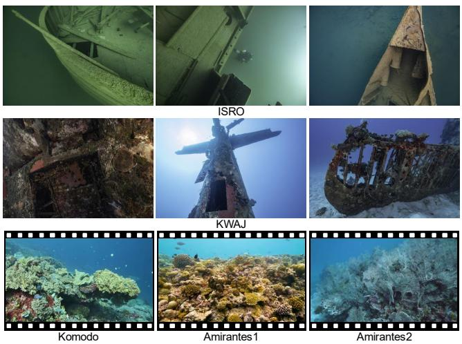

Fig. 4. Samples from the Abyssal and OceanXplore datasets.. (Top) Sample images from ISRO Scene. (Middle) Sample images from KWAJ Scene. (Bottom) Sample frames from Komodo, Amirantes1, and Amirantes2 Scene.  
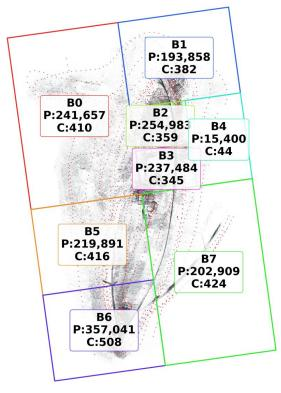  
BlockGaussian

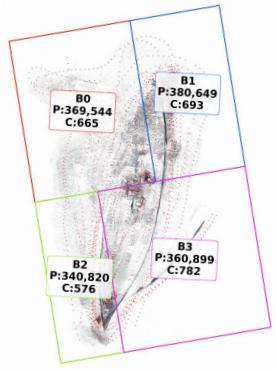  
Balanced Scene Partitioning

Fig. 5. Partitioning comparison on a large-scale underwater scene. BlockGaussian (left) produces imbalanced partitions with large variations in SfM point counts and camera distributions across chunks. In contrast, the proposed BSP strategy (right) generates more balanced partitions, leading to improved workload distribution for large-scale reconstruction. P denotes the number of SfM points and C denotes the number of cameras.  
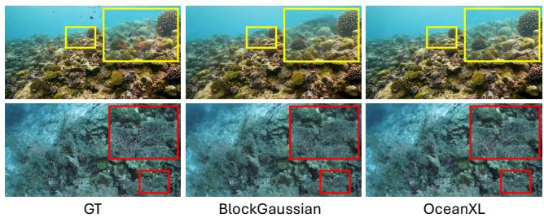  
Fig. 6. Novel view rendering comparison with the baselines. Top: Amirantes1. Botom: Amirantes2. Best viewed zoomed in.

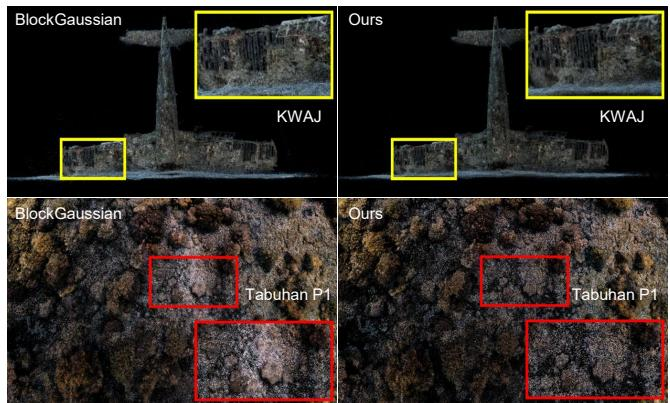

Fig. 7. Point cloud comparison of KWAJ and Tabuhan P1 scenes between BlockGaussian (left) and our OceanXL (right). Best viewed zoomed in.  
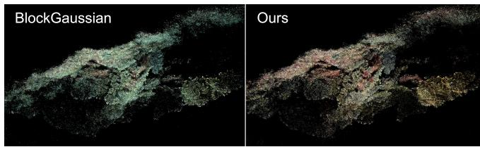

Fig. 8. Underwater color correction on the Komodo scene. Compared with the raw point cloud colors produced by BlockGaussian (left), OceanXL (right) achieves more natural color restoration.  
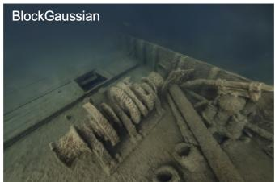

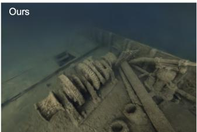

Fig. 9. Failure case. When overlap between nearby views is limited, OceanXL may produce blurrier renderings (e.g., in some part of KWAJ), as shown on the right, compared with BlockGaussian (left), which preserves finer details. However, BlockGaussian requires substantially more Gaussian primitives to achieve this quality.  
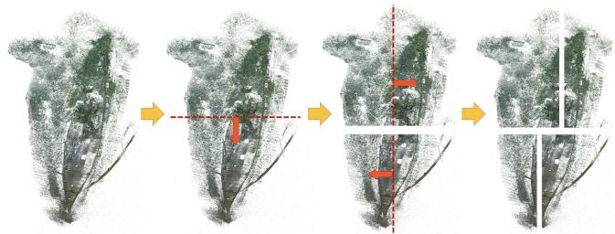  
Fig. 10. Example of the proposed Balanced Scene Partitioning on the ISRO dataset. The red dashed line indicates the spliting boundary initialized at the midpoint of the longest axis, while the red arrows denote the search directions used to balance the point counts of the two partitions.

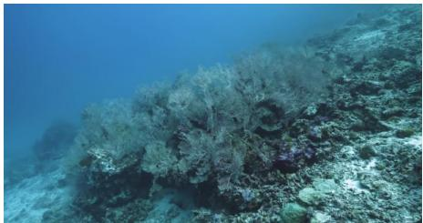  
Full Rendered Result

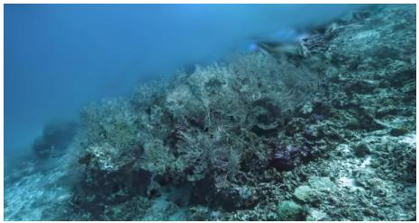  
Only 3D Gaussians

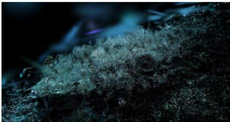  
Only 3D-DoG

Fig. 11. 3D-DoG comparison. Rendering quality comparison (Amirantes2 scene) between OceanXL using both 3DGS and 3D-DoG primitives (left) and using only standard 3DGS primitives (middle). The results show that 3D-DoG primitives improve high-frequency reconstruction and fine structural detai recovery. The right image visualizes the regions where 3D-DoG primitives are activated.  
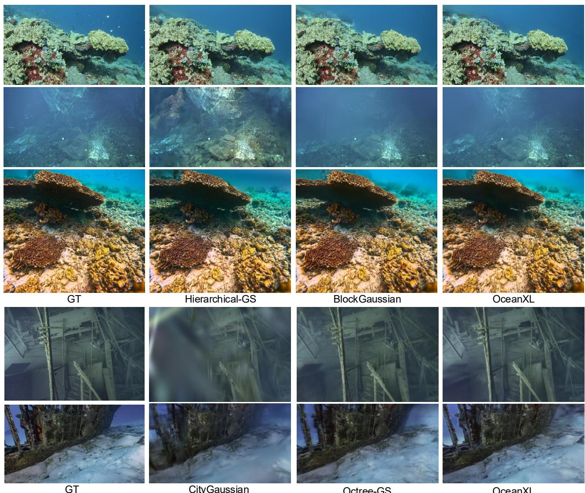  
CityGaussian  
Octree-GS  
OceanXL  
Fig. 12. Novel view rendering comparison with baseline methods. From top to botom: Komodo, Eifel Tower 2016, Tabuhan P1, ISRO, and KWAJ. Best viewed zoomed in. Overall, OceanXL achieves a beter balance between reconstruction fidelity and model compactness, preserving fine underwater structures while maintaining eficient representations. We also include a representative case from Eifel Tower 2016 where Hierarchical-GS produces visually sharper results. However, as shown in Table 1, its overall quantitative performance is worse than several methods, including ours, while requiring substantially larger model sizes.