# ACTIONLENS: DIAGNOSING SPATIAL-TEMPORAL BINDING FAILURES IN VISION-LANGUAGE MODELS

Gueter Josmy Faure1 Min-Hung Chen2 Hao Ping Wang1 Timothée Lardy1 Hung-Ting Su1 Winston H. Hsu1

1National Taiwan University 2NVIDIA

€ Project Page § Code õ Dataset

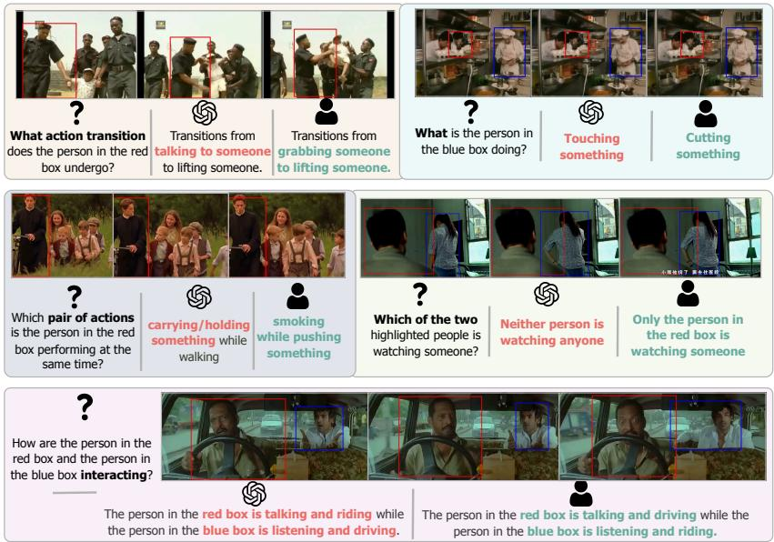  
Figure 1: ActionLens asks questions humans answer in seconds. One example per diagnostic. Red: VLM answer. Teal: human answer. (These are MCQs, not free-form text.)

## ABSTRACT

Video-capable vision-language models score above 80% on popular benchmarks yet struggle with spatial-temporal binding: associating the right action with the right person at the right moment. We introduce ActionLens, a diagnostic benchmark of 6,701 multiple-choice video questions spanning five targeted diagnostics: transition detection, actor-specific identification, concurrent action binding, directed interaction reasoning, and gaze detection. Ground-truth answers are derived deterministically from 1.58 million per-second, per-person annotations. Fourteen rounds of human quality engineering raised answer clarity from 53% to above 90% human accuracy. Across 20 VLMs, the full-set leader scores 68.8%; on the human-reviewed subset, it scores 65.9% versus 91.0% for the pooled human reference. Gaze detection remains near chance against 89.6% human accuracy. On actor disambiguation, reference-interface controls show that relational descriptions recover 5.55–13.25 points over static coordinates, confirming a substantial numeric-parsing penalty; yet visual boxes still lead every model by 1.15–6.50 points, exposing a residual unboxed actor-resolution gap. A binding-trap analysis shows models systematically select the wrong actor’s action. ActionLens provides diagnostic measurements of these distinct failure modes across model families and scales for direct comparison. We release all data, code, and evaluation scripts at https://anonymous.4open.science/r/lmms-eval-2276, with ActionLens integrated into lmms-eval Zhang et al. (2025b).

## 1 INTRODUCTION

Watch someone pick up a phone. In the span of seconds, you register who grabbed it (not their neighbour), what changed (their hand was empty a moment ago), and whether they are calling someone or just scrolling, all without conscious effort. This is spatial-temporal binding: the association of the right action with the right agent at the right moment. It is so automatic in humans that we rarely think of it as a skill. It’s precisely the skill that current video-language models lack.

State-of-the-art VLMs score impressively on popular video benchmarks, often above 80% on VideoMME Fu et al. (2025) and MVBench Li et al. (2024b), yet those benchmarks measure something closer to scene-level recognition: identifying what is broadly happening, which object appears... They do not ask a model to watch two people and answer: “What is the person [attribute] doing?”, a question any child answers in a glance and one that exposes a different set of model competencies.

We introduce ActionLens, a diagnostic benchmark designed to make exactly this distinction explicit. ActionLens decomposes spatial-temporal binding into five targeted diagnostics: D1 (Transition Sensitivity) tests whether a model notices that an action changed, not just what the majority action is; D2 (Actor Disambiguation) asks which of two co-present people is performing a given action, with the other person’s action as a distractor; D3 (Concurrent Binding) probes whether a model can report both actions of a person who is multitasking; D4 (Interaction Reasoning) requires resolving the asymmetric roles in a directed two-person exchange; D5 (Gaze Detection) asks which highlighted person is watching someone else. Every ground-truth answer is derived deterministically from AVA v2.2 Gu et al. (2018), a corpus of 1.58 million per-second, per-person action annotations. No language model generated our labels. A 14-round human quality-engineering process raised question clarity from 53% to above 90% human accuracy, and each diagnostic is defended against known shortcuts: binding traps, physically compatible distractor pairs, and positional bias. The result is 6,701 questions across 6,701 video clips that cannot be passed by exploiting visual scene biases or other shortcuts.

We evaluate 20 VLMs spanning 4B to 38B parameters alongside GPT-5.2 and Gemini 3 Flash. The strongest open-weight model reaches 68.8% on the full set; on the human-reviewed subset, its 65.9% trails the 91.0% pooled human reference by 25 points. The gap is not uniform: models score near 70% on temporal transitions and concurrent binding, but collapse on actor disambiguation (as low as 34%) and gaze detection (near random for most models, despite the pooled human reference scoring 89.6%). Reference-interface controls compare tracked visual boxes, static midpoint coordinates, and ordinary relational descriptions. Two robust conclusions emerge for actor disambiguation. First, relational descriptions recover 5.55–13.25 points over static coordinates, confirming that numeric parsing causes a substantial avoidable penalty. Second, every model remains 1.15–6.50 points below visual boxes, exposing a residual unboxed actor-resolution gap. Interaction reasoning is model-dependent, showing that two-person binding remains highly sensitive to how the actors are specified.

ActionLens is a diagnostic probe: each score measures a targeted operation. A model that scores 65% overall but 34% on actor disambiguation has a specific, actionable failure mode. Naming the failure is the first step toward fixing it.

Contributions. We contribute (1) ActionLens, a diagnostic benchmark of 6,701 multiple-choice video questions spanning five spatial-temporal binding capabilities, with deterministic ground truth and a documented 14-round quality-engineering process; (2) a systematic evaluation of 20 VLMs, revealing that spatial-binding diagnostics and gaze detection remain far below human performance regardless of model scale or family; (3) reference-interface controls establishing a substantial numeric-parsing penalty on actor disambiguation while showing that explicit visual anchors still outperform relational descriptions for every tested model on that diagnostic; (4) extensive ablations: a frame-budget sweep showing which diagnostics require temporal coverage versus a single frame, a text-only audit of vision-dependency, and a binding-trap analysis showing most models systematically select the wrong actor’s action; and (5) a one-command reproduction pipeline integrated into lmms-eval Zhang et al. (2025b), allowing any researcher to evaluate any supported model on the ActionLens suite with a single script.

## 2 RELATED WORK

Video question answering benchmarks. The dominant paradigm for evaluating video understanding models is multiple-choice question answering. Early benchmarks such as MSVD-QA and MSRVTT-QA Xu et al. (2017) convert open-ended video captions into QA pairs but rely on lexical matching metrics that reward action-name recall over genuine understanding. ActivityNet-QA Yu et al. (2019) scales this to 58,000 question–answer pairs drawn from ActivityNet Caba Heilbron et al. (2015), yet answers are single words evaluated with exact match, obscuring how well a model reasons. NExT-QA Xiao et al. (2021) introduces causal and temporal question types with five-option MCQ, revealing that models rely on appearance statistics rather than temporal reasoning. STAR Wu et al. (2021) iso lates four reasoning types (interaction, sequence, prediction, feasibility) using programmatic question generation from situated captions, prefiguring ActionLens’s construction philosophy. MVBench Li et al. (2024b) broadens coverage to 20 tasks generated by a static-to-dynamic conversion of existing annotations, while VideoMME Fu et al. (2025) provides multi-duration evaluation (11 s to 1 hour) with expert-annotated questions across 30 sub-domains. Perception Test Patraucean et al. (2023) combines video QA with tracking and temporal action annotations. EgoSchema Mangalam et al. (2023) stresses temporal certificate length: its QA pairs require attending to 3-minute ego-centric clips. TempCompass Liu et al. (2024) targets temporal perception, constructing conflicting videos that share static content but differ in speed or direction to neutralise single-frame shortcuts.

Despite this breadth, no existing benchmark jointly requires per-person spatial grounding and temporal transition detection with programmatically verified ground truth. Benchmarks that address multiple people (e.g., MVBench’s action counting task) still treat the scene holistically, not binding actions to specific individuals. ActionLens directly operationalises this missing capability through five diagnostics built on per-second, per-person annotations.

Dense video annotation. AVA Gu et al. (2018) provides 80 atomic visual actions annotated persecond and per-person bounding box across 299 Hollywood films, 1.58 million action instance annotations in total, the densest public source of person-level action labels. Our benchmark derives every ground-truth answer deterministically from these annotations, inheriting their reliability and avoiding the LLM-label noise that plagues many recent benchmarks Li et al. (2024b); Fu et al. (2025).

Spatial grounding and compositional reasoning. A growing body of work probes whether vision-language models can bind properties to the correct entities, not merely recognise them. Winoground Thrush et al. (2022) shows that image–text models systematically fail to distinguish “a dog chasing a cat” from “a cat chasing a dog” despite recognising the individual objects, directly motivating our actor–role confusion hypothesis. VSR Liu et al. (2023) benchmarks binary visual spatial relationships (above, below, left of, etc.) in static images and finds frontier models at best ∼70%, illustrating the difficulty of spatial attribute binding even without temporal dynamics. Spatial Bench Cai et al. (2025) extends spatial grounding to 3D scenes; we extend the same question — can models associate spatial annotations with the right entity? — to the video domain through controlled comparisons of tracked visual boxes, static midpoint coordinates, and relational descriptions.

Vision-language models for video. LLaVA-Video Zhang et al. (2024), Qwen3.5 Qwen Team (2026a), InternVL3 Zhu et al. (2025), Gemini 3 Google DeepMind (2025b), and the GPT series OpenAI (2024) represent the current frontier in video-language modelling, combining large language models with video encoders capable of processing dozens of frames. Despite strong global performance, these models are evaluated on benchmarks that reward scene-level recognition rather than per-person spatial binding — the gap ActionLens is designed to expose.

## 3 THE ACTIONLENS BENCHMARK

## 3.1 DESIGN PHILOSOPHY

Fine-grained video understanding is not a single skill, it is a bundle of distinct capabilities that existing benchmarks aggregate into a single score, obscuring which capabilities are actually lacking. ActionLens is built on the premise that progress requires diagnostic decomposition: each diagnostic should isolate exactly one spatial-temporal binding operation, admit an unambiguous correct answer, and be hard enough to discriminate strong models. The five diagnostics introduced in Section 1 each test one such operation; the following subsections specify their construction.

Table 1: ActionLens is the only video benchmark with per-person spatial grounding, programmatic ground truth, and iterated human validation. ✓ = yes; ◦ = partial; – = no.
<table><tr><td>Benchmark</td><td>QA pairs</td><td>Clips</td><td>Per-sec. temporalGT</td><td>Per-person spatialGT</td><td>Multi-person compositional</td><td>Iterated human validation</td></tr><tr><td>VideoMME</td><td>2,700</td><td>900</td><td></td><td></td><td></td><td></td></tr><tr><td>MVBench</td><td>4,000</td><td></td><td></td><td></td><td>o</td><td></td></tr><tr><td>EgoSchema</td><td>5,031</td><td>5,031</td><td>一</td><td></td><td></td><td></td></tr><tr><td>STAR</td><td>60,000</td><td>22,000</td><td>o</td><td></td><td></td><td></td></tr><tr><td>PerceptionTest</td><td>11,619</td><td>691</td><td>√</td><td>一</td><td>0</td><td></td></tr><tr><td>TempCompass</td><td>7,540</td><td>500</td><td>√</td><td>一</td><td>一</td><td></td></tr><tr><td>ActionLens (ours)</td><td>6,701</td><td>6,701</td><td>√</td><td>√</td><td>√</td><td>√</td></tr></table>

Every ground-truth answer is derived deterministically from AVA v2.2 Gu et al. (2018), a corpus of 1.58 million per-second, per-person action annotations across 299 Hollywood films. Since the ground truth is a pure function of the annotations, no human labelling is required for answer generation. This distinguishes ActionLens from recent work that relies on LLM-generated labels Li et al. (2024b); Fu et al. (2025), whose noise is difficult to audit.

## 3.2 THE FIVE DIAGNOSTICS

D1: Transition Sensitivity (194 questions). A model that classifies actions frame-by-frame may correctly recognise each individual pose yet miss that the pose changes mid-clip and reports the majority action. This diagnostic directly tests this blind spot. Each question presents a variable-length clip (4–10 s, mean 7.1 s) with a red bounding box tracking one person. The question asks what action transition the person undergoes. The options always include: (i) the correct before→after sequence, (ii) the temporal reversal after→before, and (iii–iv) two static traps claiming the person performs only one of the two actions throughout. A model that ignores temporal order cannot distinguish the first two options; a model that averages over frames will be pulled toward the static traps.

Transition boundaries are located by a locally-stable boundary scan: a boundary qualifies only when the old action is present (new absent) for at least two consecutive seconds before it, and the new action is present (old absent) for two seconds after. The segment is then centred on the boundary and extended to the limits of the stable regions, yielding natural variable-length clips. Transitions involving exclusively auditory actions (talk, listen) are excluded since they can’t be resolved in muted video. The retained items span posture changes (74%; e.g., stand→bend/bow), object-interaction changes (21%; e.g., touch→carry/hold), locomotion changes (2%) and others (3%).

D2: Actor-Specific Action Disambiguation (2,000 questions). Recognising that a scene contains ‘carrying’ and ‘watching’ is easier than knowing which person is carrying and which is watching. This diagnostic isolates the binding step. Each clip contains two people, each tracked by a differently coloured bounding box (red and blue). The question asks directly: “What is the person in the blue box doing?” Crucially, the red person’s action always appears as a distractor option, creating a binding trap: a model that recognises the action but fails to bind it to the correct person will be drawn toward this distractor. All distractors are verified to be false for the blue person at the query second, so only genuine person-action binding resolves the question.

D3: Concurrent Action Binding (2,000 questions). People routinely multitask: walk while carrying a bag, sit while using a phone. This diagnostic asks whether models can recognise both actions of a person who is simultaneously performing exactly two visual actions, not just the most salient one.

The correct option is an action pair; the three distractors each change one or both actions. Distractor selection enforces two constraints: (a) neither distractor action is a true action of the highlighted person, and (b) distractor pairs are physically compatible. Impossible co-occurrence combinations such as ‘standing while lying down’ or ‘walking while crouching’ are rejected. This prevents models from using biomechanical impossibility as a shortcut rather than watching the video.

D4: Directed Interaction Reasoning (1,611 questions). Each clip pairs two highlighted people with opposite AVA communication labels (talking and listening) and distinct visible co-actions (e.g., throwing and watching). The question asks how both people are interacting; its choices vary which person is assigned each role and co-action.

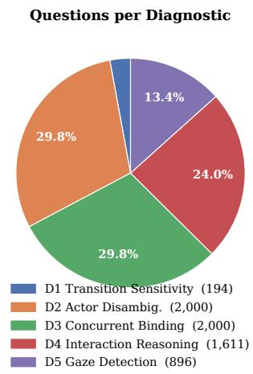  
(a) How many questions per diagnostic. Actor Disambiguation and Concurrent Binding dominate (N = 2,000 each); Transition Sensitivity is the smallest.

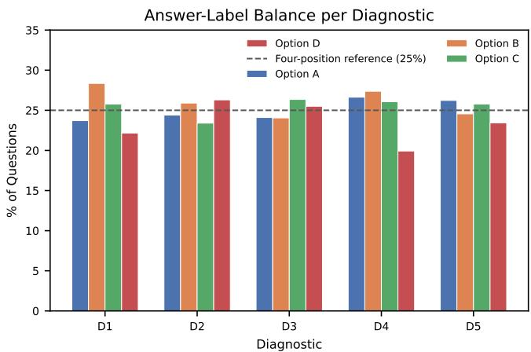  
(b) Answer-label balance. All diagnostics stay within ±5.1% of the 25% four-position reference, with no answer-position shortcut to exploit. The slight option-D dip for Interaction Reasoning is structural: 21% of its items have only three options.  
Figure 2: ActionLens dataset composition. Actor Disambiguation and Concurrent Binding carry the most weight; answer distributions are near-uniform across A–D for every diagnostic.

Four distractor types are used: role swap, co-action swap, scene alternative, and a 3-option variant when the scene pool is too small.

D5: Gaze Detection (896 questions). Gaze is a social signal that models have proven difficulty interpreting. This diagnostic presents two highlighted people and asks which of them is watching someone. The four options cover all binary combinations: only red, only blue, both, or neither. Ground truth uses AVA’s per-person binary gaze label with a 3-second temporal consistency filter.

## 3.3 QUALITY ENGINEERING

A benchmark is only as reliable as its construction process. We conducted 14 iterative human-review rounds, each targeted at a specific failure mode revealed by the previous round. Table 4 (in Appendix) summarises the progression. We document this process as a methodological contribution: iterative refinement with explicit failure-mode tracking is a reliable way to build a diagnostic benchmark that is simultaneously solvable by humans and discriminating for models.

The starting point was a 281-sample pilot review with overall human accuracy of 53%. Rounds 1–6 targeted the most severe structural failures (degenerate labels, distractor contamination, auditory leakage) and raised accuracy to 74%. Rounds 7–14 addressed subtler issues: tracker identity drift, physically-confusable action pairs, and temporal label noise. The refinement also pruned two proposed diagnostics: Temporal Localisation, whose action-onset answers lacked a defensible tolerance window, and the standalone Talker-Listener Detection task, whose role-only answers depended on speech cues that muted video cannot reliably establish. Interaction Reasoning (D4) retains talk/listen labels within composite choices that also require binding distinct visible co-actions to the two people.

Answer-label distributions are audited across all tasks: the most over-represented option deviates from the 25% four-position baseline by at most 5.1% for Interaction Reasoning, and at most 3.4% for all other tasks (Fig. 2b). Its slight imbalance is structural: the 21% 3-option subset leaves option D under-represented by design.

## 3.4 DATASET STATISTICS

Figure 2 reports the per-diagnostic statistics. ActionLens contains 6,701 unique questions drawn from 64 unique videos. All main-task clips are 5 seconds, except Transition Sensitivity (4–10 s, variable). The benchmark spans 73 unique actions, with Concurrent Binding correct answers covering 86 distinct co-action pairs. Every question is paired with a boxed video segment and, in the staticcoordinate reference condition, with the same unboxed segment and textual bounding-box coordinates. The pooled-human-reference subset totals 1,194 items: all 194 Transition Sensitivity items plus 250 randomly selected items per remaining diagnostic (seeded video-diverse round-robin sampler).

## 4 EXPERIMENTS & ABLATIONS

Experimental setup. We evaluate 20 VLMs spanning three size tiers: large open-source (≥27B: InternVL3.5-38B, Qwen3.5-27B, Qwen3-VL-32B, Qwen2.5-VL-32B, Gemma-4-31B, Gemma-3-27B, LLaVA-Video-32B), mid-size (7–9B: Qwen3.5-9B, Qwen3-VL-8B, InternVL3.5- 8B, VideoLLaMA3-7B, LLaVA-OneVision-7B, LLaVA-Video-7B), and small (≤4B: Qwen3.5-4B, Qwen3-VL-4B, InternVL3.5-4B, Gemma-4-E4B, Gemma-3-4B), plus GPT-5.2 OpenAI (2025) and Gemini 3 Flash Google DeepMind (2025b) evaluated on the 1,194-item human-review subset. All open-source models are run via lmms-eval Zhang et al. (2025b) with a uniform prompt template, 32 uniformly-sampled frames, and bfloat16 precision on one NVIDIA H100 GPU (two for ≥38B models). The metric is exact-match accuracy; Full setup details, prompt templates, and per-run configurations are provided in Appendix B. The review subset preserves the broad model ordering, although its question-weighted scores can shift by several points (Appendix P).

## 4.1 RESULTS

Table 2 reports per-diagnostic and average accuracy for all models and the pooled human reference.

No model comes close to the human reference. The pooled human reference answers 91.0% of its 1,194 questions correctly. On those same questions, Qwen3.5-27B scores 65.9%, 299 correct answers behind the pooled human reference—a 25-point gap; on the full 6,701-question benchmark, it leads at 68.8%. The gap is not a quirk of open-source scale: GPT-5.2, the strongest closed-source model, scores 67.6%, and Gemini 3 Flash reaches only 44.6%, barely above the applicable random baseline on several diagnostics. ActionLens is not a benchmark current VLMs are close to solving.

Gaze detection is a wall. Gaze Detection (D5) is the diagnostic where models fail most uniformly and most severely. The pooled human reference scores 89.6%; the best model in any condition reaches 47.2% (GPT-5.2 on the review subset), a gap of 42.4 points. On the full dataset, Qwen3.5-27B leads at 43.3% and every other model falls below 40%, with several sitting near chance. Gaze depends on subtle, low-bandwidth cues such as head orientation and eye-line, which the tested models do not reliably detect. The text-only control offers no consistent shortcut (Section 4.4).

Actor disambiguation (D2) is the sharpest model discriminator. Scores range from 34.0% (LLaVA-Video-7B, barely above chance) to 67.7% (Qwen3.5-27B), a 33-point spread, larger than any other diagnostic. A paired video-cluster bootstrap confirms a 22.7-point gap between Qwen3.5-27B and LLaVA-Video-32B [17.7, 27.6], while its 2.25-point lead over InternVL3.5-38B is unresolved [−1.51, 6.11]. The Qwen3.5 series holds together remarkably well across scales, while LLaVA-Video and Gemma-3 cluster near the chance floor. That a 27-billion-parameter model can score at chance on a diagnostic that a 4-billion-parameter model handles at 66% tells us that parameter count is not the operative variable. A sports-video pilot also records similar trends (Appendix M).

## Finding 1

Models often recognize an action but assign it to the wrong person. For most tested models, wrong-actor answers are selected more often than uniform distractor guessing predicts. The binding trap exposes a systematic identity error hidden by ordinary video-question accuracy.

Scale helps within families but does not explain the family ranking. Qwen3.5-4B and InternVL3.5- 38B both score 63.6% overall despite a nearly tenfold size difference; Qwen3.5-27B gains 5.18 points over its 4B version, while Gemma-4-E4B exceeds Gemma-3-27B by 15.73. On actor disambiguation, Qwen3.5 changes little across 4–27B, while InternVL3.5 and LLaVA-Video each gain about 11 points with scale. Qwen3.5 and InternVL3.5 document spatial-grounding evaluations Qwen Team (2026b); Wang et al. (2025); LLaVA-Video’s disclosed video data emphasize captioning and QA, and its adapter pools spatial tokens Zhang et al. (2024). Training and input differences co-vary with model generation, so this comparison does not identify a single cause (Appendix G).

Table 2: ActionLens results. Per-diagnostic and question-micro accuracy (%) for all 20 VLMs, grouped by size. Avg. = correct answers divided by questions in the relevant evaluation set (6,701 for full-set models; 1,194 for the pooled human reference and review-subset models). Interaction Reasoning (D4) has 26.7% random accuracy because 334 of its 1,611 questions have three options; the full-set weighted random accuracy is 25.4%. Bold: best full-dataset result per column; underline: best within group. Model sources and configurations are listed in Appendix B.
<table><tr><td>Model</td><td>Transition Sensitivity</td><td>Actor Disambig.</td><td>Concurrent Binding</td><td>Interaction Reasoning</td><td>Gaze Detection</td><td>Avg.</td></tr><tr><td colspan="7">Review subset (1,194 items)</td></tr><tr><td>Pooled human reference *</td><td>84.5</td><td>92.4</td><td>94.0</td><td>92.8</td><td></td><td>89.6 91.0</td></tr><tr><td>GPT-5.2</td><td>68.8</td><td>76.0</td><td>76.4</td><td>70.0</td><td>47.2</td><td>67.6</td></tr><tr><td>Gemini 3 Flash</td><td>58.3</td><td>54.4</td><td>52.4</td><td>27.6</td><td>33.2</td><td>44.6</td></tr><tr><td>Gemma-4-31B</td><td>63.9</td><td>66.0</td><td>74.4</td><td>61.6</td><td>46.0</td><td>62.3</td></tr><tr><td>LLava-Video-32B</td><td>60.3</td><td>47.2</td><td>40.8</td><td>47.6</td><td>28.4</td><td>44.1</td></tr><tr><td>InternVL3.5-38B</td><td>68.0</td><td>72.8</td><td>67.6</td><td>68.4</td><td>31.2</td><td>61.3</td></tr><tr><td>Qwen3.5-27B</td><td>64.9</td><td>70.0</td><td>78.4</td><td>76.4</td><td>39.6</td><td>65.9</td></tr><tr><td>InternVL3.5-4B</td><td>61.9</td><td>60.4</td><td>68.4</td><td>46.8</td><td>23.6</td><td>51.8</td></tr><tr><td>Qwen3.5-4B</td><td>60.3</td><td>67.2</td><td>74.0</td><td>66.8</td><td>33.6</td><td>60.4</td></tr><tr><td>Random chance</td><td>25.0</td><td>25.0</td><td>25.0</td><td>26.7</td><td>25.0</td><td>25.4</td></tr><tr><td colspan="7">Large open-source (≥ 27B parameters)</td></tr><tr><td>LLava-Video-32B</td><td>60.3</td><td>45.0</td><td>42.0</td><td>51.0</td><td>28.7</td><td>43.8</td></tr><tr><td>Qwen3.5-27B</td><td>64.9</td><td>67.7</td><td>74.8</td><td>77.3</td><td>43.3</td><td>68.8</td></tr><tr><td>Qwen3-VL-32B</td><td>63.4</td><td>64.0</td><td>66.9</td><td>68.8</td><td>40.5</td><td>62.8</td></tr><tr><td>Gemma-4-31B</td><td>63.9</td><td>63.0</td><td>72.9</td><td>61.6</td><td>42.0</td><td>62.8</td></tr><tr><td>Qwen2.5-VL-32B</td><td>66.0</td><td>54.4</td><td>70.5</td><td>64.7</td><td>34.3</td><td>59.3</td></tr><tr><td>Gemma-3-27B</td><td>67.0</td><td>37.9</td><td>35.1</td><td>26.4</td><td>25.8</td><td>33.5</td></tr><tr><td>InternVL3.5-38B</td><td>68.0</td><td>65.5</td><td>68.4</td><td>68.7</td><td>38.6</td><td>63.6</td></tr><tr><td colspan="7">Mid-size open-source (7–9B parameters)</td></tr><tr><td>Qwen3.5-9B</td><td>64.9</td><td>64.6</td><td>69.1</td><td>70.3</td><td>37.6</td><td>63.7</td></tr><tr><td>Qwen3-VL-8B</td><td>61.9</td><td>57.4</td><td>70.9</td><td>66.2</td><td>30.8</td><td>60.1</td></tr><tr><td>InternVL3.5-8B</td><td>60.3</td><td>58.7</td><td>65.5</td><td>59.7</td><td>33.6</td><td>57.6</td></tr><tr><td>VideoLLaMA3-7B</td><td>71.6</td><td>51.7</td><td>52.6</td><td>58.4</td><td>27.3</td><td>50.9</td></tr><tr><td>LLaVA-OneVision-7B</td><td>67.0</td><td>47.5</td><td>53.8</td><td>53.4</td><td>27.8</td><td>48.7</td></tr><tr><td>LLaVA-Video-7B</td><td>53.6</td><td>34.0</td><td>53.9</td><td>39.2</td><td>25.0</td><td>40.6</td></tr><tr><td colspan="7">Small open-source (≤ 4B parameters)</td></tr><tr><td>Qwen3.5-4B</td><td>60.3</td><td>66.0</td><td>69.9</td><td>69.0</td><td>35.3</td><td>63.6</td></tr><tr><td>Qwen3-VL-4B</td><td>68.0</td><td>60.0</td><td>67.6</td><td>63.4</td><td>30.1</td><td>59.3</td></tr><tr><td>InternVL3.5-4B</td><td>61.9</td><td>54.8</td><td>66.2</td><td>52.5</td><td>31.6</td><td>54.7</td></tr><tr><td>Gemma-4-E4B</td><td>52.1</td><td>47.9</td><td>64.6</td><td>43.2</td><td>28.2</td><td>49.2</td></tr><tr><td>Gemma-3-4B</td><td>48.5</td><td>30.7</td><td>27.2</td><td>24.3</td><td>24.2</td><td>27.7</td></tr></table>

## Finding 2

Parameter count alone does not predict actor-binding performance. A 4B model scores alongside a 38B model overall, while larger variants deliver clear gains within some families. Size is an unreliable shortcut for comparing them.

The large gaps survive video-level resampling. In 10,000 paired bootstrap resamples of the 64 source videos, Qwen3.5-27B leads InternVL3.5-38B by 5.18 points in question-micro accuracy (95% CI [3.61, 6.75]) and LLaVA-Video-32B by 24.98 points ([22.61, 27.35]). Qwen3.5-4B and InternVL3.5-38B, by contrast, are tied to reported precision (difference 0.00 points; [-1.74, 1.59]). The family-scale and cross-family gaps are real; small leaderboard separations need not be. Full intervals and video-level robustness checks appear in Appendix L.

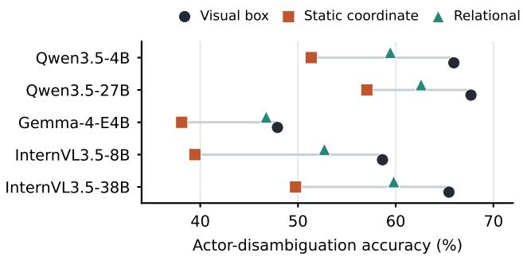

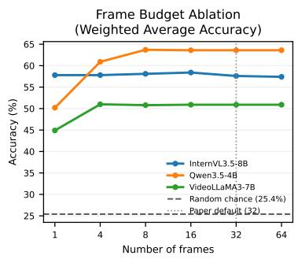  
(a) Who is the target? On actor disambiguation, relational refer- (b) Frame budget. Accuracy vs. frame ences recover much of the static-coordinate penalty for all five models; count. Gains saturate by 8–16 frames; tracked visual boxes remain strongest. the 32-frame default adds little.  
Figure 3: Reference and temporal controls. The actor-reference interface changes accuracy (left); additional frames offer little gain beyond 8–16 (right).

## Finding 3

Aggregate video accuracy hides uneven abilities. Models can detect transitions and concurrent actions while struggling to bind actions to the right person or read gaze. The pooled human reference remains far ahead on these fine-grained judgments.

COT prompting does not improve accuracy and can sharply hurt interaction reasoning (Appendix N).

## 4.2 REFERENCE INTERFACE IS AN ACTOR-BINDING BOTTLENECK

We evaluate five models — InternVL3.5-8B, InternVL3.5-38B, Qwen3.5-4B, Qwen3.5-27B, and Gemma-4-E4B — on all 2,000 actor-disambiguation and 1,611 interaction-reasoning questions with three reference interfaces. The visual-box condition uses tracked overlays. The static-coordinate reference condition uses the raw unboxed video and the target box at the annotated midpoint, with no frame or timestamp token; coordinates are normalised to [0, 1000] for Qwen and InternVL and [0, 1] for other models. The relational reference condition also uses raw unboxed video but names the target with a deterministic ordinary-language description at the midpoint, such as “leftmost person” or “second person from the left.”

Numeric coordinates impose a large actor-disambiguation penalty. Figure 3a shows the three interfaces on the same questions. Actor-disambiguation accuracy falls by 9.8–19.2 points when tracked boxes are replaced with static coordinates. For InternVL3.5-8B, it falls from 58.65% to 39.45%. But this condition is not information-equivalent to a tracked overlay: it requires the model to parse a numeric convention and associate one midpoint box with a person throughout the clip. The coordinate-only contrast therefore does not identify a pure spatial-grounding deficit, but it does establish that numeric coordinates are a poor actor-reference interface for all five models.

Relational language recovers a substantial share. Across all five models, relational descriptions improve over static coordinates by 5.55–13.25 points on actor disambiguation, while remaining 1.15–6.50 points below visual boxes for every model. InternVL3.5-8B, for example, recovers to 52.70% with a relational reference. Numeric-coordinate parsing therefore explains a material share of the original drop, but it does not explain the full advantage of an explicit tracked visual anchor.

Interaction reasoning exposes a harder two-reference regime. Relational descriptions improve over static coordinates for Gemma-4-E4B (+10.09 points) and InternVL3.5-8B (+9.11), but are similar or worse for the other three models. Visual boxes lead for four models; Qwen3.5-27B instead scores highest with coordinates (79.58%). Resolving two people produces no universal ordering of unboxed references. The exact results for both diagnostics appear in Appendix F.

## Finding 4

How the target is specified changes what models can answer. Relational language recovers much of the loss from static coordinates on actor disambiguation, yet tracked visual boxes still lead for every tested model. Two-person interaction reasoning has no universally best unboxed format.

Swapping the target-box color yields no consistent red or blue advantage across models (Appendix O).

## 4.3 WHAT’S THE OPTIMAL FRAME BUDGET

We sweep frame counts {1, 4, 8, 16, 32, 64} on InternVL3.5-8B, Qwen3.5-4B, and VideoLLaMA3- 7B to understand how much temporal information each diagnostic actually requires. Figure 3b shows the weighted-average accuracy; per-diagnostic curves are in Appendix I.

Rapid saturation on the weighted average. All three models improve substantially from 1 to 8 frames then plateau. Doubling the budget from 32 to 64 frames yields essentially no gain for any model, confirming that 32 frames is a sufficient operating point for the main evaluation.

Transition sensitivity is the most frame-hungry diagnostic. Transition Sensitivity requires detecting that an action changed, and the 1-frame baseline reflects this directly: InternVL3.5-8B drops to 40.2% with a single frame, recovering to 63.4% by 8 frames. VideoLLaMA3-7B also shows a sharp transition-sensitivity recovery from 58.3% (1 frame) to 71.7% (4 frames). Temporal sequence is not optional for this diagnostic.

Concurrent binding is the least frame-hungry. Concurrent Action Binding peaks early: InternVL3.5-8B achieves 71.4% with a single frame and does not improve meaningfully with more. Recognising that a person is simultaneously performing two actions is largely solvable from a single well-chosen frame, consistent with the “snapshot” nature of co-occurrence annotations.

InternVL3.5-8B is frame-agnostic; Qwen3.5-4B is frame-sensitive. InternVL3.5-8B’s weighted average barely moves across all budgets (57.8% at 1 frame, 57.6% at 32). In contrast, Qwen3.5- 4B gains 13.5 points from 1 to 8 frames, driven by actor disambiguation (+25.3) and interaction reasoning (+10.7) — precisely the person-binding diagnostics that require seeing more of the scene.

## 4.4 CAN MODELS SOLVE ACTIONLENS FROM TEXT ALONE?

Video carries most of the signal. Removing the clip lowers question-micro accuracy by 15.2–33.4 points across five models (Appendix J). Actor disambiguation, concurrent binding, and interaction reasoning decline for every model: their answers cannot be recovered reliably from the question text. Transition sensitivity is less clean. Familiar action sequences can help models guess a “before/after” answer, and one model even improves slightly without video. Gaze remains difficult with video available; seeing the clip alone does not resolve this subtle cue.

## Finding 5

Seeing the clip matters; adding frames alone has limited returns. Removing video lowers accuracy for every tested model, while the frame-sweep models gain little beyond 8–16 frames. More temporal sampling does not erase the binding failures.

## 5 CONCLUSION

ActionLens asks a simple question: can VLMs watch two people and say what each is doing? After 6,701 questions, 20 models, and 14 rounds of quality engineering, the answer is: not really. On the same 1,194 questions, the best open-weight model sits 25 points below the pooled human reference; gaze detection hovers near chance; and 13 of 16 models are more likely to select the wrong actor’s action than to guess randomly. The reference control sharpens the diagnosis: numeric parsing causes a substantial share of the actor-disambiguation drop, yet every model still trails tracked visual boxes with ordinary relational descriptions. For interaction reasoning, no single unboxed reference format wins across models. These are not quirks of dataset construction. They are named, measurable subproblems: person tracking, multi-actor binding, and gaze inference. ActionLens makes each one easy to quantify. The dataset, code, and a one-command script to run any lmms-eval-supported model are publicly available at https://anonymous.4open.science/r/lmms-eval-2276.

## AI USE STATEMENT

Language models assisted with text editing, manuscript review, and code for auditing experimental outputs. The authors verified AI-assisted code and all reported numerical results against the underlying data and take responsibility for the scientific claims, interpretations, and final content.

## ETHICS STATEMENT

ActionLens derives questions from AVA v2.2’s movie footage and person-action annotations Gu et al. (2018). AVA lists its dataset under a CC BY 4.0 license (https://sites.research. google/gr/ava/download/); use of the underlying footage should follow its applicable source terms. Four non-author raters provided the pooled human reference, reported as aggregate accuracy. ActionLens is intended to diagnose models, not to assess the people depicted. Movie casting and editing limit whose actions and contexts are represented; benchmark scores should not be used to infer suitability for surveillance or other consequential decisions.

## REPRODUCIBILITY STATEMENT

We release the ActionLens dataset, construction and analysis code, task configurations, prompts, raw evaluation outputs, and scripts needed to reproduce the reported results at https://anonymous. 4open.science/r/lmms-eval-2276. Appendix Q documents model settings, video sampling, metrics, human-reference collection and clustered uncertainty analyses.

## REFERENCES

Shuai Bai, Yuxuan Cai, Ruizhe Chen, Keqin Chen, Xionghui Chen, Zesen Cheng, Lianghao Deng, Wei Ding, Chang Gao, Chunjiang Ge, et al. Qwen3-vl technical report. arXiv preprint arXiv:2511.21631, 2025a.

Shuai Bai, Keqin Chen, Xuejing Liu, Jialin Wang, Wenbin Ge, Sibo Song, Kai Dang, Peng Wang, Shijie Wang, Jun Tang, Humen Zhong, Yuanzhi Zhu, Mingkun Yang, Zhaohai Li, Jianqiang Wan, Pengfei Wang, Wei Ding, Zheren Fu, Yiheng Xu, Jiabo Ye, Xi Zhang, Tianbao Xie, Zesen Cheng, Hang Zhang, Zhibo Yang, Haiyang Xu, and Junyang Lin. Qwen2.5-vl technical report, 2025b. URL https://arxiv.org/abs/2502.13923.

Fabian Caba Heilbron, Victor Escorcia, Bernard Ghanem, and Juan Carlos Niebles. Activitynet: A large-scale video benchmark for human activity understanding. In Proceedings of the ieee conference on computer vision and pattern recognition, pp. 961–970, 2015.

Wenxiao Cai, Iaroslav Ponomarenko, Jianhao Yuan, Xiaoqi Li, Wankou Yang, Hao Dong, and Bo Zhao. Spatialbot: Precise spatial understanding with vision language models. In 2025 IEEE International Conference on Robotics and Automation (ICRA), pp. 9490–9498. IEEE, 2025.

Chaoyou Fu, Yuhan Dai, Yongdong Luo, Lei Li, Shuhuai Ren, Renrui Zhang, Zihan Wang, Chenyu Zhou, Yunhang Shen, Mengdan Zhang, et al. Video-mme: The first-ever comprehensive evaluation benchmark of multi-modal llms in video analysis. In 2025 IEEE/CVF Conference on Computer Vision and Pattern Recognition (CVPR), pp. 24108–24118. IEEE, 2025.

Gemma Team. Gemma 3 technical report. arXiv preprint arXiv:2503.19786, 2025.

Google DeepMind. Gemma 3 model card. https://ai.google.dev/gemma/docs/core/ model\_card\_3, 2025a.

Google DeepMind. Gemini 3 flash. https://deepmind.google/models/model-cards/ gemini-3-flash/, 2025b.

Google DeepMind. Gemma 4. https://ai.google.dev/gemma/docs/core/model\_ card\_4, 2026.

Chunhui Gu, Chen Sun, David A Ross, Carl Vondrick, Caroline Pantofaru, Yeqing Li, Sudheendra Vijayanarasimhan, George Toderici, Susanna Ricco, Rahul Sukthankar, et al. Ava: A video dataset of spatio-temporally localized atomic visual actions. In 2018 IEEE/CVF Conference on Computer Vision and Pattern Recognition, pp. 6047–6056. IEEE, 2018.

Takeshi Kojima, Shixiang Shane Gu, Machel Reid, Yutaka Matsuo, and Yusuke Iwasawa. Large language models are zero-shot reasoners. Advances in neural information processing systems, 35: 22199–22213, 2022.

Bo Li, Yuanhan Zhang, Dong Guo, Renrui Zhang, Feng Li, Hao Zhang, Kaichen Zhang, Peiyuan Zhang, Yanwei Li, Ziwei Liu, et al. Llava-onevision: Easy visual task transfer. arXiv preprint arXiv:2408.03326, 2024a.

Kunchang Li, Yali Wang, Yinan He, Yizhuo Li, Yi Wang, Yi Liu, Zun Wang, Jilan Xu, Guo Chen, Ping Luo, et al. Mvbench: A comprehensive multi-modal video understanding benchmark. In Proceedings of the IEEE/CVF conference on computer vision and pattern recognition, pp. 22195– 22206, 2024b.

Yixuan Li, Lei Chen, Runyu He, Zhenzhi Wang, Gangshan Wu, and Limin Wang. Multisports: A multi-person video dataset of spatio-temporally localized sports actions. In Proceedings of the IEEE/CVF International Conference on Computer Vision (ICCV), pp. 13536–13545, October 2021.

Fangyu Liu, Guy Emerson, and Nigel Collier. Visual spatial reasoning. Transactions of the Association for Computational Linguistics, 11:635–651, 2023. doi: 10.1162/tacl\_a\_00566.

Yuanxin Liu, Shicheng Li, Yi Liu, Yuxiang Wang, Shuhuai Ren, Lei Li, Sishuo Chen, Xu Sun, and Lu Hou. TempCompass: Do video LLMs really understand videos? arXiv preprint arXiv:2403.00476, 2024.

Karttikeya Mangalam, Raiymbek Akshulakov, and Jitendra Malik. Egoschema: A diagnostic benchmark for very long-form video language understanding. Advances in Neural Information Processing Systems, 36:46212–46244, 2023.

OpenAI. GPT-4o system card. Technical Report, OpenAI, 2024. URL https://openai.com/ research/gpt-4o-system-card.

OpenAI. Update to GPT-5 system card: GPT-5.2, December 2025. URL https://openai.com/ index/gpt-5-system-card-update-gpt-5-2/.

Viorica Patraucean, Lucas Smaira, Ankush Gupta, Adria Recasens, Larisa Markeeva, Dylan Banarse, Skanda Koppula, joseph heyward, Mateusz Malinowski, Yi Yang, Carl Doersch, Tatiana Matejovicova, Yury Sulsky, Antoine Miech, Alexandre Fréchette, Hanna Klimczak, Raphael Koster, Junlin Zhang, Stephanie Winkler, Yusuf Aytar, Simon Osindero, Dima Damen, Andrew Zisserman, and Joao Carreira. Perception test: A diagnostic benchmark for multimodal video models. In A. Oh, T. Naumann, A. Globerson, K. Saenko, M. Hardt, and S. Levine (eds.), Advances in Neural Information Processing Systems, volume 36, pp. 42748–42761. Curran Associates, Inc., 2023. doi: 10.52202/075280-1852. URL https://proceedings.neurips.cc/paper\_files/ paper/2023/file/8540fba4abdc7f9f7a7b1cc6cd60e409-Paper-Datasets\_ and\_Benchmarks.pdf.

Qwen Team. Qwen3.5: Towards native multimodal agents, February 2026a. URL https://qwen. ai/blog?id=qwen3.5.

Qwen Team. Qwen3.5-4B model card. https://huggingface.co/Qwen/Qwen3.5-4B, 2026b.

Aleksandar Shtedritski, Christian Rupprecht, and Andrea Vedaldi. What does clip know about a red circle? visual prompt engineering for vlms. In 2023 IEEE/CVF International Conference on Computer Vision (ICCV), pp. 11953–11963. IEEE, 2023.

Tristan Thrush, Ryan Jiang, Max Bartolo, Amanpreet Singh, Adina Williams, Douwe Kiela, and Candace Ross. Winoground: Probing vision and language models for visio-linguistic compositionality. In Proceedings of the IEEE/CVF Conference on Computer Vision and Pattern Recognition, pp. 5238–5248, 2022. doi: 10.1109/CVPR52688.2022.00517.

Lei Wang, Wanyu Xu, Yihuai Lan, Zhiqiang Hu, Yunshi Lan, Roy Ka-Wei Lee, and Ee-Peng Lim. Plan-and-solve prompting: Improving zero-shot chain-of-thought reasoning by large language models. In Proceedings ofthe 61st annual meeting ofthe associationfor computational linguistics (volume 1: Long papers), pp. 2609–2634, 2023.

Weiyun Wang, Zhangwei Gao, Lixin Gu, Hengjun Pu, Long Cui, Xingguang Wei, Zhaoyang Liu, Linglin Jing, Shenglong Ye, Jie Shao, et al. Internvl3. 5: Advancing open-source multimodal models in versatility, reasoning, and efficiency. arXiv preprint arXiv:2508.18265, 2025.

Bo Wu, Shoubin Yu, Zhenfang Chen, Joshua B. Tenenbaum, and Chuang Gan. STAR: A benchmark for situated reasoning in real-world videos. In Thirty-fifth Conference on Neural Information Processing Systems Datasets and Benchmarks Track (Round 2), 2021. URL https://arxiv. org/abs/2405.09711.

Junbin Xiao, Xindi Shang, Angela Yao, and Tat-Seng Chua. Next-qa: Next phase of questionanswering to explaining temporal actions. In 2021 IEEE/CVF Conference on Computer Vision and Pattern Recognition (CVPR), pp. 9772–9781. IEEE, 2021.

Dejing Xu, Zhou Zhao, Jun Xiao, Fei Wu, Hanwang Zhang, Xiangnan He, and Yueting Zhuang. Video question answering via gradually refined attention over appearance and motion. In Proceedings of the 25th ACM international conference on Multimedia, pp. 1645–1653, 2017.

Zhou Yu, Dejing Xu, Jun Yu, Ting Yu, Zhou Zhao, Yueting Zhuang, and Dacheng Tao. Activitynet-qa: A dataset for understanding complex web videos via question answering. In Proceedings of the AAAI conference on artificial intelligence, volume 33, pp. 9127–9134, 2019.

Boqiang Zhang, Kehan Li, Zesen Cheng, Zhiqiang Hu, Yuqian Yuan, Guanzheng Chen, Sicong Leng, Yuming Jiang, Hang Zhang, Xin Li, et al. Videollama 3: Frontier multimodal foundation models for image and video understanding. arXiv preprint arXiv:2501.13106, 2025a.

Kaichen Zhang, Bo Li, Peiyuan Zhang, Fanyi Pu, Joshua Adrian Cahyono, Kairui Hu, Shuai Liu, Yuanhan Zhang, Jingkang Yang, Chunyuan Li, et al. Lmms-eval: Reality check on the evaluation of large multimodal models. In Findings ofthe Associationfor Computational Linguistics: NAACL 2025, pp. 881–916, 2025b.

Yuanhan Zhang, Jinming Wu, Wei Li, Bo Li, Zejun Ma, Ziwei Liu, and Chunyuan Li. LLaVA-Video: Video instruction tuning with synthetic data. arXiv preprint arXiv:2410.02713, 2024.

Jinguo Zhu, Weiyun Wang, Zhe Chen, Zhaoyang Liu, Shenglong Ye, Lixin Gu, Hao Tian, Yuchen Duan, Weijie Su, Jie Shao, et al. Internvl3: Exploring advanced training and test-time recipes for open-source multimodal models. arXiv preprint arXiv:2504.10479, 2025.

## A APPENDIX

## B FULL EXPERIMENTAL SETUP

## B.1 MODELS

Table 3 lists all evaluated models with their parameter counts and evaluation scope.

Table 3: All evaluated models. “Full” = full 6,701-item dataset; “Subset” = 1,194-item human-review subset.
<table><tr><td>Model</td><td>Params</td><td>Scope</td></tr><tr><td>Closed-source</td><td></td><td></td></tr><tr><td>GPT-5.2 OpenAI (2025)</td><td></td><td>Subset</td></tr><tr><td>Gemini 3 Flash Google DeepMind (2025b)</td><td></td><td>Subset</td></tr><tr><td>Large open-source (≥27B)</td><td></td><td></td></tr><tr><td>Qwen3.5-27B Qwen Team (2026a)</td><td>27B</td><td>Full</td></tr><tr><td>InternVL3.5-38B Wang et al. (2025)</td><td>38B</td><td>Full</td></tr><tr><td>Qwen3-VL-32B Bai et al. (2025a)</td><td>32B</td><td>Full</td></tr><tr><td>Qwen2.5-VL-32B Bai et al. (2025b)</td><td>32B</td><td>Full</td></tr><tr><td>Gemma-4-31B Google DeepMind (2026)</td><td>31B</td><td>Full</td></tr><tr><td>Gemma-3-27B Gemma Team (2025)</td><td>27B</td><td>Full</td></tr><tr><td>LLaVA-Video-32B Zhang et al. (2024)</td><td>32B</td><td>Full</td></tr><tr><td>Mid-size open-source (7–9B)</td><td></td><td></td></tr><tr><td>Qwen3.5-9B Qwen Team (2026a)</td><td>9B</td><td>Full</td></tr><tr><td>Qwen3-VL-8B Bai et al. (2025a)</td><td>8B</td><td>Full</td></tr><tr><td>InternVL3.5-8B Wang et al. (2025)</td><td>8B</td><td>Full</td></tr><tr><td>VideoLLaMA3-7B Zhang et al. (2025a)</td><td></td><td>Full</td></tr><tr><td>LLaVA-OneVision-7B Li et al. (2024a)</td><td>7B</td><td>Full</td></tr><tr><td>LLaVA-Video-7B Zhang et al. (2024)</td><td>7B 7B</td><td>Full</td></tr><tr><td>Small open-source (≤4B)</td><td></td><td></td></tr><tr><td>Qwen3.5-4B Qwen Team (2026a)</td><td>4B</td><td>Full</td></tr><tr><td>Qwen3-VL-4B Bai et al. (2025a)</td><td></td><td></td></tr><tr><td></td><td>4B</td><td>Full</td></tr><tr><td>InternVL3.5-4B Wang et al. (2025)</td><td>4B</td><td>Full</td></tr><tr><td>Gemma-4-E4B Google DeepMind (2026)</td><td>4B</td><td>Full</td></tr><tr><td>Gemma-3-4B Gemma Team (2025)</td><td>4B</td><td>Full</td></tr></table>

## B.2 PROMPT TEMPLATE

All models share one template — no chain-of-thought, no few-shot examples, no task-specific system prompt:

{question}   
A. {option\_A} B. {option\_B} C. {option\_C} D. {option\_D}   
Answer with the option letter only.

Model-specific chat templates are applied internally by lmms-eval. For the 21% of Interaction Reasoning items with only three options, option D is omitted from the prompt.

## B.3 VIDEO SAMPLING AND HARDWARE

Clips are sampled uniformly to 32 frames by default. Models up to 32B run on a single NVIDIA H100 80 GB SXM5 in bfloat16. InternVL3.5-38B uses two H100s with tensor parallelism. Full-dataset runs take 1–2.5 hours; the full experiment matrix is ≈50 GPU-hours.

## B.4 METRIC DETAILS

A response is correct iff the first predicted option letter matches the ground-truth label. The primary aggregate, question-micro accuracy, is the fraction correct across all 6,701 full-set questions: $\sum _ { d } { N _ { d } } ^ { \bullet }$ $\operatorname { a c c } _ { d } / \sum _ { d } N _ { d } ,$ with $N _ { \mathrm { D 1 } } = 1 9 4 , \stackrel { \cdot } { N } _ { \mathrm { D 2 } } = N _ { \mathrm { D 3 } } = 2 , 0 0 0 , N _ { \mathrm { D 4 } } = 1 , 6 1 1 , N _ { \mathrm { D 5 } } = 8 9 6$ . The pooled human reference and closed-source models use the same definition on their 1,194-item review subset. We also report the mean of the five diagnostic accuracies separately as diagnostic-macro accuracy in Appendix L; this gives each diagnostic equal weight.

## C QUALITY ENGINEERING: THE 14 ROUNDS

We started from a 281-sample pilot with 53% human accuracy and ended above 90% through 14 targeted review-and-fix iterations. Table 4 summarises every round. Two diagnostics were retired during this process (Section C.2).

Table 4: 14-round quality-engineering progression. “Acc” = human accuracy on the reviewed sample after fixes from the previous round. Fix numbers correspond to the detailed log below.
<table><tr><td>Round</td><td>Samples</td><td>Acc (%)</td><td>Primary failure mode</td><td>Fix(es)</td></tr><tr><td>Pre</td><td>281</td><td>53</td><td>Multiple simultaneous failures</td><td></td></tr><tr><td>1-2</td><td>54</td><td>74</td><td>Distractor contamination; auditory actions; degenerate gaze labels; filler distractors</td><td>1-6</td></tr><tr><td>3</td><td>50</td><td>74</td><td>Track drift; confusable pairs; shared co-actions; overlapping boxes</td><td>7-12</td></tr><tr><td>4</td><td>100</td><td>79</td><td>Boundary detection; crowd confounders</td><td>13</td></tr><tr><td>5</td><td>100</td><td>82</td><td>Residual auditory leakage in D1</td><td>14</td></tr><tr><td>6</td><td>100</td><td>84</td><td>Segment centring for D1</td><td>15</td></tr><tr><td>7</td><td>150</td><td>86</td><td>D4 unique co-action requirement</td><td>16</td></tr><tr><td>8</td><td>150</td><td>87</td><td>GT person-ID tracking deployed</td><td>17</td></tr><tr><td>9</td><td>200</td><td>88</td><td>Max bbox area filter</td><td>18</td></tr><tr><td>10</td><td>200</td><td>89</td><td>IoU pair-overlap guard</td><td>19</td></tr><tr><td>11</td><td>250</td><td>90</td><td>Answer-balance audit; D4 3-option subset</td><td>20</td></tr><tr><td>12</td><td>250</td><td>91</td><td>Locally-stable boundary scan (D1)</td><td>21</td></tr><tr><td>13</td><td>300</td><td>91</td><td>Physically-compatible distractor pairs (D3)</td><td>22</td></tr><tr><td>14</td><td>1,194</td><td>91.0</td><td>Pooled human reference — no further fixes</td><td></td></tr></table>

## C.1 DETAILED FIX LOG

Fix 1 — Gaze Detection (D5): Degenerate gaze-type distribution. 100% of initial candidates had gaze\_type = red\_watches\_blue. Fix: emit all four categories (red watches blue, blue watches red, mutual, neither) with balanced sampling (≈25% each).

Fix 2 — Actor Disambiguation (D2): Distractor contamination. 85.5% of questions had at least one distractor that was a true action of the target person. Fix: the distractor sampler receives the full set of true actions as an excluded set.

Fix 3 — Concurrent Binding (D3): Multi-correct action pairs. 57.1% of candidates had 3+ simultaneous actions, making several distractor pairs also valid. Fix: restrict to time-steps with exactly two visual actions.

Fix 4 — Transition Sensitivity (D1): Auditory-only transitions. 61.1% of candidates were talk ↔ listen, invisible in muted video. Fix: skip transitions where both actions are in AUDITORY\_ONLY\_ACTIONS.

Fix 5 — Actor Disambiguation (D2): Auditory correct answers. 54% of correct answers were auditory actions. Fix: require non-empty visual-only distinct action set per person.

Fix 6 — Interaction Reasoning (D4): Generic filler distractors. Distractors used fixed phrases trivially distinguishable from factual correct answers. Fix: all four options are structured variants (correct, role-swap, co-action-swap, scene-alternative). When the scene pool is too small to furnish a valid scene-alternative, the question is emitted as a 3-option item (21% of Interaction Reasoning items); option D is omitted from the prompt in that case.

Fix 7 — Transition Sensitivity (D1): Track identity drift. IoU tracker (threshold 0.7) drifted across nearby people; 54.5% of items were marked unanswerable. Fix: reject tracks whose bbox centre jumps >15% of the frame between consecutive seconds.

Fix 8 — Transition Sensitivity (D1): Visually confusable pairs. ride ↔ drive transitions are visually indistinguishable. Fix: CONFUSABLE\_TRANSITION\_PAIRS blacklist.

Fix 9 — Interaction Reasoning (D4): Shared co-actions produce multi-correct options. When both persons share the same co-actions, role-swap distractors remain valid. Fix: both persons must have unique visual co-actions not shared by the other.

Fix 10 — Gaze Detection (D5): Distant pairs and third-person confounders. AVA’s watch (a person) does not specify who is watched. In crowded scenes the target may be unboxed. Fix: proximity filter (≤0.35 normalised) + maximum 2 people in scene.

Fix 11 — All: Maximum bounding-box area filter. Oversized detections (>60% of frame) cause tracker drift. Fix: drop such instances before track building.

Fix 12 — All: Ground-truth person-ID tracking. AVA’s CSV column 8 is person\_id, not label\_confidence. The pipeline was building its own IoU tracker as a result. Fix: group observations directly by person\_id; eliminates identity drift at the source and supersedes Fixes 7 and 11.

Fix 13 — Transition Sensitivity (D1): Locally-stable boundary scan. Long tracks produced noisy endpoint-to-endpoint transition labels. Fix: a boundary qualifies only when the old action is stable (≥2 consecutive seconds) before, and the new action stable after; segment is centred on the boundary midpoint and extended to the stable-region limits, yielding variable-length clips (4–10 s, mean 7.1 s).

Fixes 14–22 — Rounds 5–13. Subsequent rounds addressed residual auditory leakage, Transition Sensitivity segment-centring edge cases, the Interaction Reasoning unique co-action requirement at scale, answer-balance audits (maximum 5.1 pp deviation from the 25% fourposition reference), and physically-compatible distractor pairs for Concurrent Binding via MUTUALLY\_EXCLUSIVE\_GROUPS.

## C.2 RETIRED DIAGNOSTICS

Talker/Listener Detection. Pre-revision human accuracy was 97.3% on a binary question grounded in AVA talk/listen labels. As a role-only test, it could depend on speech cues absent from muted video and was retired. Interaction Reasoning (D4) uses the same labels only in composite choices with distinct visible co-actions; its result should not be read as isolated speaker-identification accuracy. The composite format does not independently validate every communication-role label from silent video.

Temporal Localisation. Localising an action onset is fundamentally ambiguous for MCQ without a tolerance window; any nearby second is arguably correct.

## D DATASET COMPOSITION

Transition Sensitivity (D1) type breakdown. Figure 4 shows the distribution of transition categories. Posture changes dominate (74%), followed by object-interaction changes (21%), locomotion

Table 5: Per-diagnostic statistics. †D1 clips have variable duration (4–10 s, mean 7.1 s). ‡D4 contains 334 three-option items (21%).
<table><tr><td>ID</td><td>Diagnostic</td><td>N</td><td>Videos</td><td>Duration</td><td>People</td><td>Options</td></tr><tr><td>D1</td><td>Transition Sensitivity</td><td>194</td><td>53</td><td> $4 { - } 1 0 \mathrm { s } ^ { \dagger }$ </td><td>1</td><td>4</td></tr><tr><td>D2</td><td>Actor Disambiguation</td><td>2,000</td><td>63</td><td>5s</td><td>2-7</td><td>4</td></tr><tr><td>D3</td><td>Concurrent Binding</td><td>2,000</td><td>64</td><td>5s</td><td>1</td><td>4</td></tr><tr><td>D4</td><td>Interaction Reasoning</td><td>1,611</td><td>61</td><td>5s</td><td>2-7</td><td>3-4</td></tr><tr><td>D5</td><td>Gaze Detection</td><td>896</td><td>62</td><td>5s</td><td>2</td><td>4</td></tr><tr><td>Total</td><td></td><td>6,701</td><td>64</td><td></td><td></td><td></td></tr></table>

changes (2%), and others (3%). This distribution reflects AVA’s annotation density rather than a design choice; it confirms that this diagnostic is not dominated by a single trivially recognisable pattern.

## D1 Transition Sub-categories

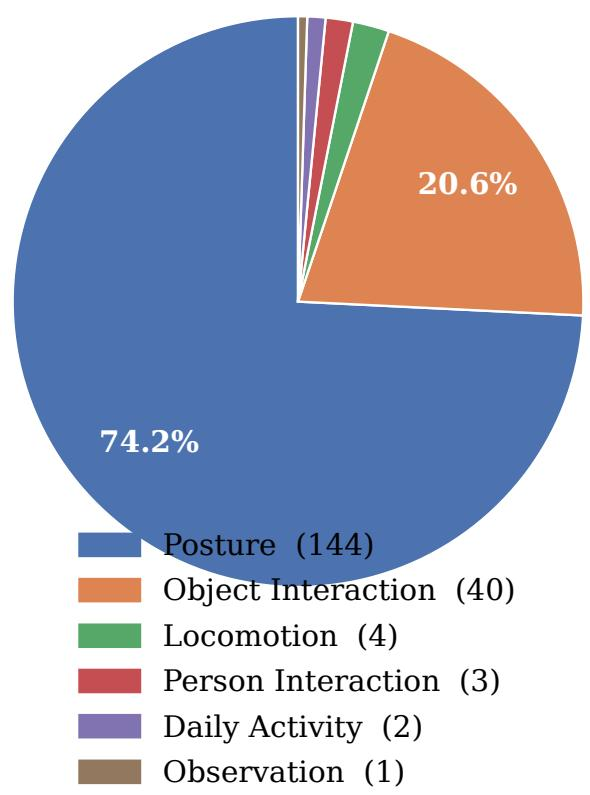  
Figure 4: Transition Sensitivity type distribution. Posture transitions (e.g., stand → bend/bow) are the most common; object-interaction and locomotion transitions are also well represented. “Other” covers single-item categories below 1%.

Interaction Reasoning (D4) distractor design. Each question asks how two highlighted people are interacting (e.g., “Person A talks while throwing; Person B listens while watching”). Four structured distractor types are generated: role swap (talker and listener roles exchanged), co-action swap (unique co-actions swapped between persons), scene alternative (same talker/listener structure but with a different action drawn from the scene pool), and a 3-option variant (21% of items) that omits the scene alternative when the scene pool contains fewer than two distinct alternatives. The unique co-action requirement (Fix 9) is essential: if both persons shared the same co-actions, the role-swap distractor would remain factually correct, making the question multi-answer.

Gaze Detection (D5) construction. AVA’s watch (a person) label is a per-person binary annotation: it records whether a person is watching someone, not whom. Rather than claiming directional gaze (which would require knowing the watching target), this diagnostic asks the weaker but cleanly answerable question of detection per person. A 3-second temporal consistency filter requires the gaze label to agree for at least 3 of the 5 clip seconds, ensuring the model can answer from the majority of visible frames. After filtering (5,353 raw candidates → 1,422 consistent), balanced sampling yields 224 items per gaze type.

Gaze Detection category balance. Figure 5 confirms the near-perfect balance of the four gaze categories after Fix 1 and balanced sampling. No single answer option can be exploited as a positional shortcut.

D5 Gaze-Type Balance  
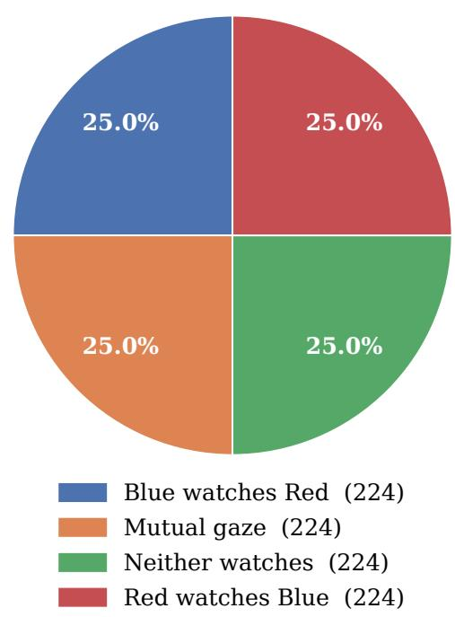  
Figure 5: Gaze Detection category balance. All four categories (red watches blue, blue watches red, mutual, neither) fall within 1.5 pp of the 25% uniform baseline.

## E STATIC-COORDINATE REFERENCE: FULL RESULTS

Figure 6 shows the full static-coordinate reference comparison across all five models and all diagnostics — both the per-diagnostic accuracy bars and the weighted-average summary.

Table 6 gives the exact numbers.

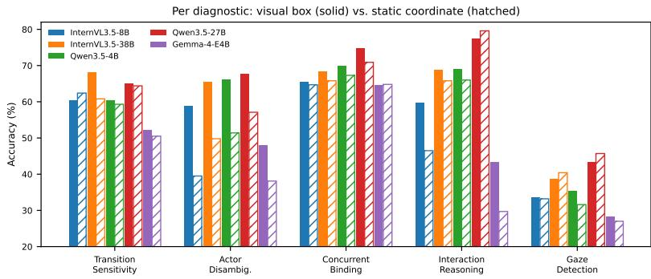

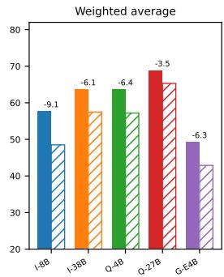  
Figure 6: Visual-box versus static-coordinate reference — full view. Solid bars: tracked visual boxes. Hatched bars: static midpoint coordinates. Left: per-diagnostic breakdown; Actor Disambiguation decreases for every model. Right: weighted-average summary with delta annotations. This two-interface comparison includes coordinate-format sensitivity and should not be interpreted as a pure grounding measure.

Table 6: Visual-box versus static-coordinate reference — full numbers. Each cell: visual box / static coordinate (delta in pp). Bold: $| \Delta | > 5$
<table><tr><td>Model</td><td>D1</td><td>D2</td><td></td><td></td><td>D4</td><td>D5</td><td>WAvg</td></tr><tr><td>InternVL3.5-8B</td><td>60.3/62.4 (+2.1)</td><td>58.7/39.5 (–19.2)</td><td>65.5/64.7 (−0.8)</td><td></td><td>59.7/46.5 (–13.2)</td><td>33.6/33.2 (−0.4)</td><td>57.6/48.5 (–9.1)</td></tr><tr><td>InternVL3.5-38B</td><td>68.0/60.8 (−7.2)</td><td>65.5/49.8 (–15.7)</td><td>68.4/65.8 (-2.6)</td><td>68.7/65.8 (-2.9)</td><td></td><td>38.6/40.4 (+1.8)</td><td>63.6/57.5 (—6.1)</td></tr><tr><td>Qwen3.5-4B</td><td>60.3/59.3 (−1.0)</td><td>66.0/51.4 (–14.6)</td><td>69.9/67.3 (−2.6)</td><td>69.0/66.0 (-3.0)</td><td></td><td>35.3/31.6 (-3.7)</td><td>63.6/57.2 (−6.4)</td></tr><tr><td>Qwen3.5-27B</td><td>64.9/64.4 (−0.5)</td><td>67.7/57.1 (–10.6)</td><td>74.8/70.9 (-3.9)</td><td>77.3/79.6 (+2.3)</td><td></td><td>43.3/45.7 (+2.4)</td><td>68.8/65.3 (-3.5)</td></tr><tr><td>Gemma-4-E4B</td><td>52.1/50.5 (–1.6)</td><td>47.9/38.1 (–9.8)</td><td>64.6/64.8 (+0.2)</td><td></td><td>43.2/29.7 (–13.5)</td><td>28.2/27.0 (−1.2)</td><td>49.2/42.9 (–6.3)</td></tr></table>

## F RELATIONAL REFERENCE CONTROL

Table 7 gives the paired three-interface results for the same five models and question sets shown in Section 4.2. The static-coordinate and relational conditions both use raw, unboxed video; only the target description changes. Relational references identify people by their left-to-right position at the annotated midpoint, such as “leftmost person” or “second person from the left.”

Table 7: Reference-interface accuracy (%). Each model answers all 2,000 Actor Disambiguation questions and all 1,611 Interaction Reasoning questions under each interface. Box = tracked visual overlay; Coord = static midpoint coordinates; Rel = midpoint relational description on unboxed video.
<table><tr><td colspan="4">Actor Disambiguation</td><td colspan="3">Interaction Reasoning</td></tr><tr><td>Model</td><td>Box</td><td>Coord</td><td>Rel</td><td>Box</td><td>Coord</td><td>Rel</td></tr><tr><td>Qwen3.5-4B</td><td>65.95</td><td>51.35</td><td>59.45</td><td>69.03</td><td>66.03</td><td>65.43</td></tr><tr><td>Qwen3.5-27B</td><td>67.70</td><td>57.05</td><td>62.60</td><td>77.28</td><td>79.58</td><td>73.00</td></tr><tr><td>Gemma-4-E4B</td><td>47.90</td><td>38.10</td><td>46.75</td><td>43.20</td><td>29.70</td><td>39.79</td></tr><tr><td>InternVL3.5-8B</td><td>58.65</td><td>39.45</td><td>52.70</td><td>59.65</td><td>46.45</td><td>55.56</td></tr><tr><td>InternVL3.5-38B</td><td>65.45</td><td>49.75</td><td>59.80</td><td>68.65</td><td>65.80</td><td>64.49</td></tr></table>

Crowd size. The interaction task requires resolving two references. In the reported crowd-size stratification, relational references trail visual boxes by 0.8–4.1 points in two-person scenes and by 8.1–13.1 points in four-person scenes across the evaluated models. This is consistent with a growing cost of resolving two people as scenes become more crowded.

## G MODEL FAMILIES AND INPUT HANDLING

Table 8 places the family differences in the context of public model documentation. The grounding column distinguishes reported evaluations or training data from fully specified supervision; neither a RefCOCO score nor an unlisted task proves which examples entered pre-training. The coordinate ranges describe our static-coordinate control, not a model’s required native input format. The main full-set family comparisons use the same 32-frame cap, but visual encoding differs by family.

Table 8: Documented family differences relevant to actor binding. Grounding supervision is marked unspecified where the public sources do not identify it. Dates denote model-family releases; the coordinate column records our ablation convention.
<table><tr><td>Family (year)</td><td>closed</td><td>Grounding evidence dis- Video/frame handling</td><td>Coord.</td></tr><tr><td>Qwen3.5 (2026) 4/9/27B</td><td>Spatial/RefCOCO evaluations; Native video processor exact grounding-training mix unspecified</td><td></td><td>[0, 1000]</td></tr><tr><td>InternVL3.5 (2025) 4/8/38B</td><td>large multimodal SFT; ex- ation act grounding-training mix un-</td><td>RefCOCO evaluations and 448-pixel frame tiles in our evalu- [0, 1000]</td><td></td></tr><tr><td>LLaVA-Video (2024)</td><td>specified tains captions and QA; box la- in our evaluation</td><td>Disclosed 178K video set con- Spatial average pooling, stride 2 [0, 1]</td><td></td></tr><tr><td>7/32B Gemma 3 (2025)</td><td>bels not listed</td><td>Grounding-task supervision 896-pixel image inputs, 256 to- [0, 1]</td><td></td></tr><tr><td>27B Gemma 4 (2026) E4B</td><td>unspecified unspecified; object detection urable visual token budget</td><td>kens per image Grounding-task supervision Video as image frames; config- [0, 1]</td><td></td></tr></table>

The sources are the Qwen3.5 release and model card Qwen Team (2026a;b), the InternVL3.5 report Wang et al. (2025), the LLaVA-Video report Zhang et al. (2024), and the Gemma 3 and 4 model cards Google DeepMind (2025a; 2026). Our released evaluation adapters specify the InternVL tile size and LLaVA-Video pooling setting. Public training descriptions do not establish whether AVA or ActionLens-like tasks were included. These architectural and training differences co-vary with model generation, so the table motivates hypotheses rather than attributing the observed family gaps to any single cause.

Actor-disambiguation scaling. On the same 2,000 questions, Qwen3.5-4B/9B/27B score 65.95/64.55/67.70%, respectively; the 27B–4B paired video-cluster interval [−1.34, 4.66] spans zero. InternVL3.5-4B/8B/38B score 54.75/58.65/65.45%, with a 10.70-point 38B–4B gap [6.67, 14.71]. LLaVA-Video-7B/32B rises from 34.05% to 45.00%, a 10.95-point gap [6.10, 16.08]. Across Gemma generations, Gemma-4-E4B exceeds Gemma-3-27B by 10.05 points on actor disambiguation [4.25, 15.71] and 15.73 points in full-set question-micro accuracy [12.67, 18.81]. All intervals use 10,000 paired bootstrap resamples of source videos; the actor-disambiguation analysis clusters its 2,000 questions by 63 source videos.

## H BINDING TRAP ANALYSIS: FULL RESULTS

Figure 7 plots Actor Disambiguation accuracy against trap rate for all 16 models, complementing the bar chart in the main paper. The negative correlation is clear: models that fall into the trap most often are also the weakest on Actor Disambiguation overall.

Table 9 gives the full numerical breakdown.

## I PER-DIAGNOSTIC FRAME SWEEP

Figure 8 breaks down the frame-budget ablation by diagnostic. The weighted-average curves are in Figure 3b in the main paper.

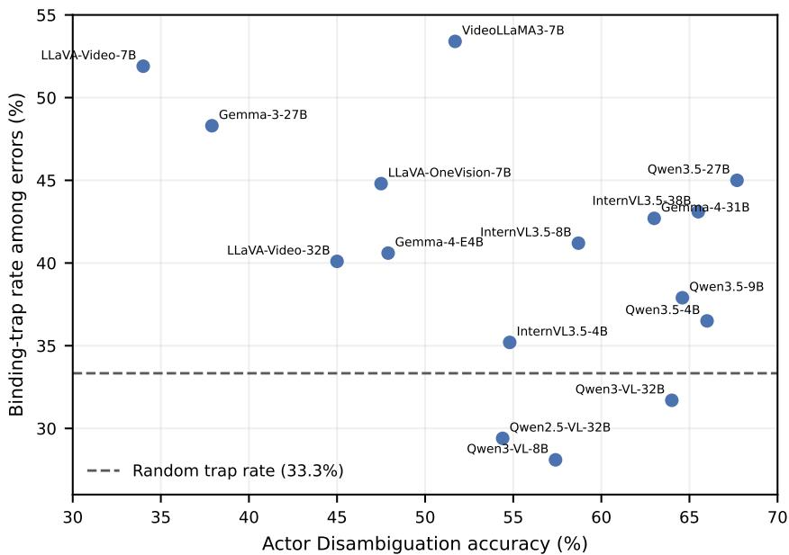  
Figure 7: Actor Disambiguation accuracy vs. binding-trap rate. Each point is one model. The trap rate is the fraction of incorrect responses that selected the binding-trap distractor (the other person’s correct action). Random expectation: 33.3%. Models above the dashed line are systematically biased toward the wrong actor’s action.

Table 9: Binding-trap rates for Actor Disambiguation. Trap rate = fraction of incorrect responses landing on the binding-trap option. Random expectation: 33.3%. Lift >1.0 = systematic actor-binding failure.
<table><tr><td>Model</td><td>Actor Acc. (%)</td><td>Trap rate (%)</td><td>Lift</td></tr><tr><td>VideoLLaMA3-7B</td><td>51.7</td><td>53.4</td><td>1.60×</td></tr><tr><td>LLaVA-Video-7B</td><td>34.0</td><td>51.9</td><td>1.56×</td></tr><tr><td>Gemma-3-27B</td><td>37.9</td><td>48.3</td><td>1.45×</td></tr><tr><td>Qwen3.5-27B</td><td>67.7</td><td>45.0</td><td>1.35×</td></tr><tr><td>LLaVA-OneVision-7B</td><td>47.5</td><td>44.8</td><td>1.34×</td></tr><tr><td>InternVL3.5-38B</td><td>65.5</td><td>43.1</td><td>1.29×</td></tr><tr><td>Gemma-4-31B</td><td>63.0</td><td>42.7</td><td>1.28×</td></tr><tr><td>InternVL3.5-8B</td><td>58.7</td><td>41.2</td><td>1.24×</td></tr><tr><td>Gemma-4-E4B</td><td>47.9</td><td>40.6</td><td>1.22×</td></tr><tr><td>LLaVA-Video-32B</td><td>45.0</td><td>40.1</td><td>1.20×</td></tr><tr><td>Qwen3.5-9B</td><td>64.6</td><td>37.9</td><td>1.14×</td></tr><tr><td>Qwen3.5-4B</td><td>66.0</td><td>36.5</td><td>1.10×</td></tr><tr><td>InternVL3.5-4B</td><td>54.8</td><td>35.2</td><td>1.06×</td></tr><tr><td>Qwen3-VL-32B</td><td>64.0</td><td>31.7</td><td>0.95×</td></tr><tr><td>Qwen2.5-VL-32B</td><td>54.4</td><td>29.4</td><td>0.88×</td></tr><tr><td>Qwen3-VL-8B</td><td>57.4</td><td>28.1</td><td>0.84×</td></tr><tr><td>Random</td><td>25.0</td><td>33.3</td><td>1.00×</td></tr></table>

Figure 9 shows the same data as a heatmap over all (model, diagnostic, frame count) combinations, making the saturation point easy to read off per cell.

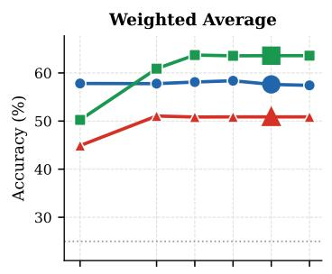

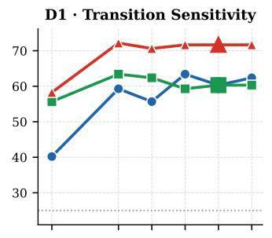

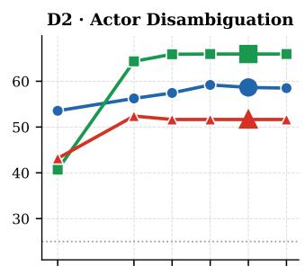

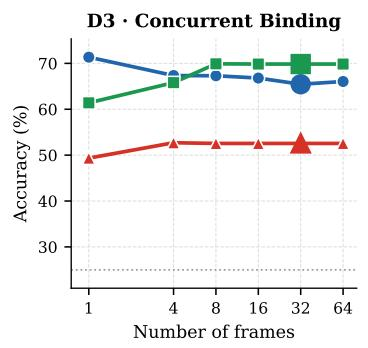

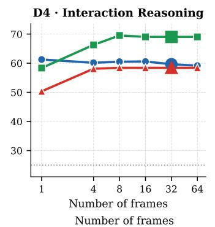

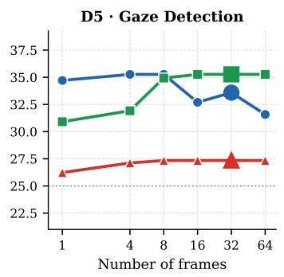  
InternVL3.5-8B Qwen3.5-4B VideoLLaMA3-7B Random chance (25%)

Figure 8: Per-diagnostic frame sweep. Transition Sensitivity is the most frame-hungry: all three models gain substantially from 1 to 8 frames on this diagnostic. Concurrent Binding peaks at 1 frame — it is a snapshot task. Actor Disambiguation and Interaction Reasoning show strong frame sensitivity for Qwen3.5-4B but near-flat curves for InternVL3.5-8B, suggesting different temporal aggregation mechanisms.  
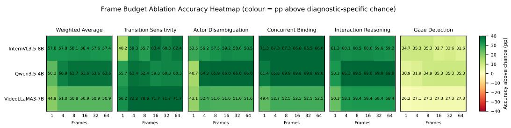  
Figure 9: Frame sweep heatmap. Rows: (model, diagnostic) pairs. Columns: frame counts. Darker = higher accuracy. Most cells stop changing after 8–16 frames; Transition Sensitivity is the primary exception.

## J TEXT-ONLY ABLATION: FULL RESULTS

Five models answered the same questions with and without video. The no-video condition replaced visual input with a blank context while preserving the question and answer options. Table 10 reports all five diagnostics and the question-micro aggregate.

Where wording helps. Transition questions reveal partial action-sequence priors: Qwen3.5-9B loses only 6.1 points without video, Qwen3-VL-8B loses 4.2, and InternVL3.5-38B gains 1.6. The “before/after” wording can suggest familiar transitions, so this diagnostic should not be interpreted as a pure measure of visual change detection.

Table 10: Text-only ablation. Accuracy (%) on matched video and blank-visual conditions. ∆ is text-only minus video; negative values favor video.
<table><tr><td colspan="2"></td><td>Trans. Sens.</td><td>Actor Disambig.</td><td>Conc. Binding</td><td>Inter. Reasoning</td><td>Gaze Det.</td><td>W. Avg.</td></tr><tr><td rowspan="5">Video</td><td>InternVL3.5-38B</td><td>68.0</td><td>65.5</td><td>68.4</td><td>68.7</td><td>38.6</td><td>63.6</td></tr><tr><td>LLava-Video-32B</td><td>60.3</td><td>45.0</td><td>42.0</td><td>51.0</td><td>28.7</td><td>43.8</td></tr><tr><td>Gemma-4-31B</td><td>63.9</td><td>63.0</td><td>72.9</td><td>61.6</td><td>42.0</td><td>62.8</td></tr><tr><td>Qwen3.5-9B</td><td>64.9</td><td>64.6</td><td>69.1</td><td>70.3</td><td>37.6</td><td>63.7</td></tr><tr><td>Qwen3-VL-8B</td><td>61.9</td><td>57.4</td><td>70.9</td><td>66.2</td><td>30.8</td><td>60.1</td></tr><tr><td rowspan="5">Texxt ony</td><td>InternVL3.5-38B</td><td>69.6</td><td>43.3</td><td>40.9</td><td>43.1</td><td>23.9</td><td>40.7</td></tr><tr><td>LLava-Video-32B</td><td>49.0</td><td>31.0</td><td>19.3</td><td>37.1</td><td>24.4</td><td>28.6</td></tr><tr><td>Gemma-4-31B</td><td>27.3</td><td>23.4</td><td>28.7</td><td>28.8</td><td>46.0</td><td>29.4</td></tr><tr><td>Qwen3.5-9B</td><td>58.8</td><td>41.5</td><td>30.9</td><td>49.3</td><td>24.0</td><td>38.4</td></tr><tr><td>Qwen3-VL-8B</td><td>57.7</td><td>33.8</td><td>44.5</td><td>30.1</td><td>24.1</td><td>35.5</td></tr><tr><td rowspan="5">A</td><td>InternVL3.5-38B</td><td>+1.6</td><td>-22.2</td><td>-27.5</td><td>-25.6</td><td>-14.7</td><td>-22.9</td></tr><tr><td>LLava-Video-32B</td><td>-11.3</td><td>-14.0</td><td>-22.7</td><td>-13.9</td><td>-4.3</td><td>-15.2</td></tr><tr><td>Gemma-4-31B</td><td>-36.6</td><td>-39.6</td><td>-44.2</td><td>-32.8</td><td>+4.0</td><td>-33.4</td></tr><tr><td>Qwen3.5-9B</td><td>-6.1</td><td>-23.1</td><td>-38.2</td><td>-21.0</td><td>-13.6</td><td>-25.3</td></tr><tr><td>Qwen3-VL-8B</td><td>-4.2</td><td>-23.6</td><td>-26.4</td><td>-36.1</td><td>-6.7</td><td>-24.6</td></tr></table>

Where video matters. Actor disambiguation, concurrent binding, and interaction reasoning all fall when video is removed, for every tested model. This is the main shortcut check: answer wording alone does not recover the person-action associations. Gaze detection behaves differently. Video scores remain modest, and text-only performance varies substantially by model, so the control does not isolate a single cause of the gaze failure.

## K LIMITATIONS

Domain. ActionLens is derived entirely from AVA v2.2, which consists of Hollywood films. Performance gaps may not transfer directly to other video domains (e.g., sports broadcasts, surveillance footage, ego-centric video), where action distributions, camera motion, and occlusion patterns differ substantially.

Dataset scale and Transition Sensitivity coverage. Transition Sensitivity (D1) contains only 194 items, constrained by AVA’s annotation density for clear action-boundary transitions. Conclusions about this diagnostic should be interpreted with lower statistical power than the other four diagnostics.

Human reference annotation. The 1,194-item pooled human reference was annotated by four non-author raters, each assigned a disjoint set of items. Each item received one response, and the pooled exact-match accuracy is reported as the human reference. The retained questions were iteratively filtered for visual answerability, so the 91.0% reference is specific to this retained item set. The iterative quality-engineering rounds were partly conducted by the authors, as direct involvement was necessary to identify and fix structural failures; this introduces a potential familiarity bias in the quality-review process that cannot be fully controlled.

Closed-source model coverage. GPT-5.2 and Gemini 3 Flash are evaluated only on the 1,194-item review subset due to API cost constraints, not the full 6,701-item benchmark. Direct comparison between closed-source and open-source full-dataset numbers should account for this scope difference.

Statistical uncertainty. Deterministic decoding removes sampling variation from repeated generations, but the 6,701 questions are concentrated in 64 source videos. Different source-video samples can therefore change the measured scores and gaps. We use paired video-cluster bootstrap intervals and video-subset analyses (Appendix L); small model differences should not be interpreted as stable rankings when their paired intervals cross zero.

## L STATISTICAL UNCERTAINTY AND VIDEO-LEVEL ROBUSTNESS

Paired cluster bootstrap. For the 18 open-weight models evaluated on the full benchmark, we draw 10,000 bootstrap samples of the 64 source videos with replacement. Each draw keeps all questions from a sampled video together, and the same draws are used for every model. We report percentile 95% intervals for question-micro accuracy (each question has equal weight) and diagnostic-macro accuracy (each of the five diagnostics has equal weight). Paired model-difference intervals are calculated within each common draw. The intervals characterize sensitivity to the sampled videos, not variation from repeated deterministic decoding.

Table 11: Full-set accuracy and video-cluster 95% intervals (%). All 18 models answer the same 6,701 questions from 64 source videos. Micro weights questions equally; macro weights diagnostics equally.
<table><tr><td>Model</td><td>Question micro</td><td>Diagnostic macro</td></tr><tr><td>Qwen3.5-4B</td><td>63.6 [61.0, 66.1]</td><td>60.1 [57.5, 62.5]</td></tr><tr><td>Qwen3.5-9B</td><td>63.7 [61.3, 66.1]</td><td>61.3 [58.9, 63.5]</td></tr><tr><td>Qwen3.5-27B</td><td>68.8 [66.4, 71.2]</td><td>65.6 [63.1, 68.0]</td></tr><tr><td>Qwen3-VL-4B</td><td>59.3 [56.8, 61.9]</td><td>57.8 [55.4, 60.1]</td></tr><tr><td>Qwen3-VL-8B</td><td>60.1 [57.6, 62.7]</td><td>57.4 [54.8, 60.0]</td></tr><tr><td>Qwen3-VL-32B</td><td>62.8 [60.0, 65.7]</td><td>60.7 [57.5, 63.7]</td></tr><tr><td>Qwen2.5-VL-32B</td><td>59.3 [56.4, 62.3]</td><td>58.0 [55.3, 60.7]</td></tr><tr><td>InternVL3.5-4B</td><td>54.7 [52.2, 57.2]</td><td>53.4 [50.8, 55.7]</td></tr><tr><td>InternVL3.5-8B</td><td>57.6 [55.2, 60.0]</td><td>55.5 [53.2, 57.9]</td></tr><tr><td>InternVL3.5-38B</td><td>63.6 [61.4, 65.9]</td><td>61.8 [59.3, 64.2]</td></tr><tr><td>LLaVA-Video-7B</td><td>40.6 [38.8, 42.3]</td><td>41.1 [39.3, 42.9]</td></tr><tr><td>LLaVA-Video-32B</td><td>43.8 [41.7, 45.9]</td><td>45.4 [43.2, 47.6]</td></tr><tr><td>LLaVA-OneVision-7B</td><td>48.7 [46.0, 51.6]</td><td>49.9 [47.2, 52.6]</td></tr><tr><td>VideoLLaMA3-7B</td><td>50.9 [48.8, 52.9]</td><td>52.3 [50.2, 54.4]</td></tr><tr><td>Gemma-3-4B</td><td>27.7 [26.4, 29.2]</td><td>31.0 [29.4, 32.6]</td></tr><tr><td>Gemma-3-27B</td><td>33.5 [31.8, 35.2]</td><td>38.4 [36.6, 40.2]</td></tr><tr><td>Gemma-4-E4B</td><td>49.2 [46.5, 52.0]</td><td>47.2 [44.9, 49.5]</td></tr><tr><td>Gemma-4-31B</td><td>62.8 [60.1, 65.6]</td><td>60.7 [58.6, 62.8]</td></tr></table>

Table 12: Paired full-set differences in percentage points. Each cell is estimate [video-cluster 95% interval], from the same 10,000 paired resamples. Positive values favor the first model.
<table><tr><td>First model – second model</td><td>Question micro</td><td>Diagnostic macro</td></tr><tr><td>Qwen3.5-27B — Qwen3.5-4B</td><td>+5.18 [3.55, 6.68]</td><td>+5.52 [3.32, 7.73]</td></tr><tr><td>Qwen3.5-27B — Qwen3.5-9B</td><td>+5.06 [3.58, 6.59]</td><td>+4.29 [2.20, 6.50]</td></tr><tr><td>InternVL3.5-38B - InternVL3.5-4B</td><td>+8.85 [7.00, 10.61]</td><td>+8.45 [6.69, 10.15]</td></tr><tr><td>InternVL3.5-38B — InternVL3.5-8B</td><td>+5.97 [4.32, 7.60]</td><td>+6.30 [4.44, 8.17]</td></tr><tr><td>LLaVA-Video-32B — LLaVA-Video-7B</td><td>+3.22 [0.81, 5.65]</td><td>+4.23 [1.79, 6.67]</td></tr><tr><td>Qwen3.5-27B — InternVL3.5-38B</td><td>+5.18 [3.61, 6.75]</td><td>+3.76 [1.69, 5.96]</td></tr><tr><td>InternVL3.5-38B - Qwen3.5-4B</td><td>0.00 [-1.74, 1.59]</td><td>+1.75 [-0.85, 4.36]</td></tr><tr><td>Qwen3.5-27B - LLaVA-Video-32B</td><td>+24.98 [22.61, 27.35]</td><td>+20.22 [17.64, 22.66]</td></tr><tr><td>InternVL3.5-38B - LLaVA-Video-32B</td><td>+19.80 [17.71, 21.93]</td><td>+16.45 [13.84, 18.99]</td></tr><tr><td>Qwen3.5-27B — Qwen3-VL-32B</td><td>+5.92 [4.55, 7.34]</td><td>+4.89 [2.89, 6.95]</td></tr><tr><td>Qwen3.5-27B — Gemma-4-31B</td><td>+5.94 [4.10, 7.70]</td><td>+4.92 [2.78, 6.89]</td></tr><tr><td>Qwen3-VL-32B — Gemma-4-31B</td><td>+0.01 [-1.90, 1.88]</td><td>+0.04 [-2.35, 2.35]</td></tr><tr><td>Gemma-4-E4B — Gemma-3-27B</td><td>+15.73 [12.67, 18.81]</td><td>+8.77 [6.13, 11.54]</td></tr></table>

Source-video concentration and alternative weighting. The 64 sources contribute 36–199 questions each (median 100); the ten largest sources contribute 25.6% of all questions, and 52 sources appear in every diagnostic. Video-cluster 95% interval half-widths are 1.29–2.53 times the corresponding independent-question intervals. Equal-video weighting (one mean accuracy per source video) changes each model’s question-micro score by at most 1.58 points. Under equal-video weighting, Qwen3.5-27B leads InternVL3.5-38B by 4.76 points [3.02, 6.48], and LLaVA-Video-32B by 25.10 points [22.72, 27.48].

Table 13: Ranking stability under distinct-video subsampling. Each row uses 10,000 subsets of videos without replacement and diagnostic-macro scoring; intervals summarize the subset distribution.
<table><tr><td>Videos retained</td><td>Mean Spearman ρ [95% interval]</td><td>Leader retained</td></tr><tr><td>8</td><td>0.946 [0.878, 0.986]</td><td>79.5%</td></tr><tr><td>16</td><td>0.971 [0.926, 0.994]</td><td>96.6%</td></tr><tr><td>32</td><td>0.987 [0.963, 0.998]</td><td>100.0%</td></tr><tr><td>48</td><td>0.993 [0.979, 1.000]</td><td>100.0%</td></tr></table>

Reducing within-video correlation. Across all 64 leave-one-video-out folds, the minimum rank correlation with the full diagnostic-macro ranking is 0.996, and no single omission changes any model’s score by more than 0.54 points. Sampling one question per populated video–diagnostic cell (303 cells) still yields mean rank correlation 0.941 [0.882, 0.981] across 10,000 repetitions. These checks show that the broad model-family pattern is not driven by a few prolific source videos; narrow diagnostic leaderboards remain less stable, especially when very few videos are retained.

## M PORTABILITY TO SPORTS VIDEO

MultiSports Li et al. (2021) supplies person action tubes in sports broadcasts rather than AVA’s movie annotations. We mapped its official validation annotations to the actor-disambiguation template, selected two visible people with distinct actions, and rendered tracked target boxes and wrong-actor distractors. The automatic pool contains 500 candidate questions from 120 volleyball videos; all three models saw the same items.

Table 14: MultiSports actor-disambiguation pilot. Accuracy and wrong-actor selections are measured on 500 automatically generated candidates; intervals resample the 120 source videos. Wrong-actor rate is conditional on an incorrect answer.
<table><tr><td>Model</td><td>Accuracy [95% CI]</td><td>Wrong actor / errors</td></tr><tr><td>Qwen3.5-9B</td><td>57.4 [53.0, 61.7]</td><td>51/213 (23.9%)</td></tr><tr><td>InternVL3.5-8B</td><td>57.6 [52.0, 63.2]</td><td>34/212 (16.0%)</td></tr><tr><td>Gemma-4-E4B</td><td>48.0 [43.5, 52.6]</td><td>46/260 (17.7%)</td></tr></table>

Nominal wrong-actor selections occur in all three models, but their share of errors is below the 33.3% expected from uniformly choosing among the three wrong options. This suggests the error can recur outside AVA, but does not show enrichment to the same degree. These candidates have not passed ActionLens’s visual audit and failure-coded validation; their scores are directional evidence about portability, not a second finalized benchmark.

Minimum evidence for a new domain. The construction recipe needs (i) continuous target identity through the clip, (ii) unique action or role support for the queried person and time, and (iii) a visual audit that the rendered reference and choices admit one defensible answer. Dense per-second labels make these checks easier, but they are not inherently required. Actor disambiguation and concurrent binding can start from verified tracks and distinct actions; transition sensitivity needs action evidence on both sides of a time boundary; interaction reasoning needs a directed relation between identifiable people; gaze detection needs a visually supportable gaze label. With weaker source labels, human adjudication becomes part of ground-truth creation.

Adapter guide. To port the pipeline: map source tracks and labels into a common evidence schema; select only diagnostics supported by that evidence; tune filtering thresholds to the domain; run a small failure-coded pilot and repair global generation rules; then freeze and independently validate the resulting questions. New-domain scores should be reported separately until item validity is established for each source.

## N PROMPTING SENSITIVITY

We compared direct answer selection with zero-shot step-by-step prompting Kojima et al. (2022) and a plan-then-solve prompt Wang et al. (2023) on the same 1,194-item review subset. Direct answers used a 16-token limit; the two reasoning prompts allowed 512 tokens and requested a final option letter. Every output yielded a valid extracted answer. These are prompt variants inspired by the cited methods, not exact replications of their original text-only experiments.

Table 15: Prompting sensitivity (%). All rows use the same 1,194 questions; columns name the five diagnostics. Overall weights questions equally.
<table><tr><td>Model</td><td>Prompt</td><td>Trans. Actor</td><td></td><td>Concurrent</td><td>Interaction</td><td>Gaze</td><td>Overall</td></tr><tr><td>Qwen3.5-4B</td><td>Direct</td><td>60.3</td><td>67.2</td><td>74.0</td><td>66.8</td><td>33.6</td><td>60.4</td></tr><tr><td></td><td>Step-by-step</td><td>64.9</td><td>70.0</td><td>65.2</td><td>51.6</td><td>40.8</td><td>58.2</td></tr><tr><td></td><td>Plan-and-solve</td><td>58.8</td><td>64.0</td><td>68.0</td><td>49.6</td><td>42.4</td><td>56.4</td></tr><tr><td>Qwen3.5-27B</td><td>Direct</td><td>64.9</td><td>70.0</td><td>78.4</td><td>76.4</td><td>39.6</td><td>65.9</td></tr><tr><td></td><td>Step-by-step</td><td>64.9</td><td>67.6</td><td>77.2</td><td>60.8</td><td>44.4</td><td>62.9</td></tr><tr><td></td><td>Plan-and-solve</td><td>58.8</td><td>64.4</td><td>72.8</td><td>39.6</td><td>46.0</td><td>56.2</td></tr><tr><td>InternVL3.5-4B</td><td>Direct</td><td>61.9</td><td>60.4</td><td>68.4</td><td>46.8</td><td>23.6</td><td>51.8</td></tr><tr><td></td><td>Step-by-step</td><td>66.0</td><td>59.6</td><td>67.6</td><td>50.0</td><td>25.2</td><td>53.1</td></tr><tr><td></td><td>Plan-and-solve</td><td>70.1</td><td>52.4</td><td>64.8</td><td>50.0</td><td>34.0</td><td>53.5</td></tr></table>

Reasoning prompts improve gaze detection for these models and modestly improve InternVL3.5-4B overall, but lower overall accuracy for both Qwen3.5 models. The strongest observed decline is on interaction reasoning: Qwen3.5-27B falls from 76.4% with direct answers to 39.6% with plan-andsolve. Prompting is therefore consequential, but neither tested reasoning prompt closes the gap to the 91.0% pooled human reference.

## O TARGET-BOX COLOR SWAP

Rendered marks can change visual-model behavior Shtedritski et al. (2023). We swapped red and blue on all 2,000 actor-disambiguation items while querying the same physical person; the clip interval, options, answer letter, and option order stayed fixed. Positive differences below favor a red target box. Intervals use 10,000 paired bootstrap resamples of the 63 source videos.

Table 16: Same-target red/blue swap. Accuracy (%) and paired red-minus-blue difference in percentage points.
<table><tr><td>Model</td><td>Blue</td><td>Red</td><td>Difference [95% CI]</td></tr><tr><td>Qwen3.5-27B</td><td>67.70</td><td>67.25</td><td>-0.45 [-1.58, 0.65]</td></tr><tr><td>InternVL3.5-8B</td><td>58.65</td><td>58.65</td><td>0.00 [−1.50, 1.50]</td></tr><tr><td>Gemma-4-E4B</td><td>47.90</td><td>50.00</td><td>+2.10 [0.30, 4.04]</td></tr><tr><td>VideoLLaMA3-7B</td><td>51.65</td><td>49.70</td><td>-1.95 [-5.12, 0.99]</td></tr></table>

There is no consistent aggregate preference for red or blue across models. Gemma-4-E4B favors red in this experiment, while the other clustered intervals include zero. Individual decisions can still flip: predictions agree between color conditions on 77.5–92.3% of items, depending on model. The wrong-actor distractor remains a frequent choice under both colors.

## P SCOPE OF THE HUMAN-REVIEW SUBSET

The 1,194-item subset contains every transition-sensitivity question and 250 fixed-seed, round-robin samples from each other diagnostic. It covers all 64 source videos in aggregate. We compare six open models evaluated under the same protocol on both scopes, keeping question-micro and diagnostic-macro aggregation separate.

The full-set leader remains the subset leader. Across these six models, the mean absolute full/subset difference is 0.70 points for diagnostic macro and 2.03 for question micro; the largest question-micro shift is 3.20 points. Thus the subset supports broad comparisons on matched items, but its absolute accuracy is not interchangeable with the full set’s.

Table 17: Full-set versus human-review subset accuracy (%). Micro weights questions equally; macro weights the five diagnostics equally. The subset changes diagnostic proportions, so these aggregates need not shift together.
<table><tr><td rowspan="2">Model</td><td colspan="2">Question micro</td><td colspan="2">Diagnostic macro</td></tr><tr><td>Full</td><td>Subset</td><td>Full</td><td>Subset</td></tr><tr><td>Qwen3.5-27B</td><td>68.8</td><td>65.9</td><td>65.6</td><td>65.9</td></tr><tr><td>InternVL3.5-38B</td><td>63.6</td><td>61.3</td><td>61.8</td><td>61.6</td></tr><tr><td>Gemma-4-31B</td><td>62.8</td><td>62.3</td><td>60.7</td><td>62.4</td></tr><tr><td>Qwen3.5-4B</td><td>63.6</td><td>60.4</td><td>60.1</td><td>60.4</td></tr><tr><td>InternVL3.5-4B</td><td>54.7</td><td>51.8</td><td>53.4</td><td>52.2</td></tr><tr><td>LLaVA-Video-32B</td><td>43.8</td><td>44.1</td><td>45.4</td><td>44.9</td></tr></table>

## Q REPRODUCIBILITY

Code and data. Full pipeline, task configs, and raw evaluation logs are at https://anonymous.   
4open.science/r/lmms-eval-2276.

## One-command evaluation.

bash examples/eval\_actionlens.sh

Videos stream automatically; no manual data preparation is needed. Set environment variables at the top of the script to override model, tasks, device, and output directory.

Determinism. All runs use temperature=0, do\_sample=False, num\_beams=1. Results are fully deterministic given identical model weights and hardware.

Pooled human reference protocol. Annotations were collected by four non-author raters on the 1,194-item review subset, with disjoint item assignments. Each item received one independent response without access to model predictions. Raters watched each clip in full before answering; no time limit was set. The resulting 1,086/1,194 accuracy (91.0%) is the pooled human reference. Note: the iterative quality-engineering rounds (Section C) were partly conducted by the authors, as direct involvement was necessary to diagnose and resolve structural dataset failures.