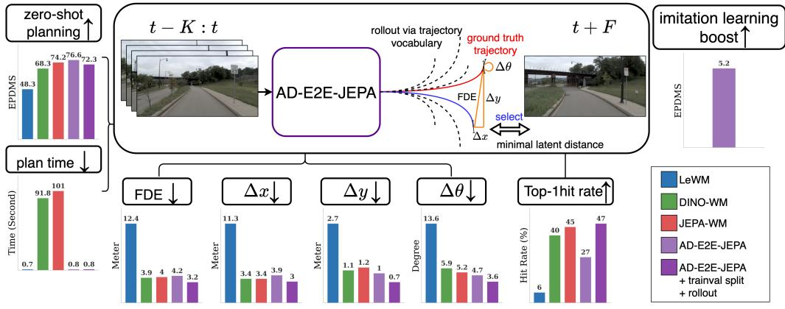
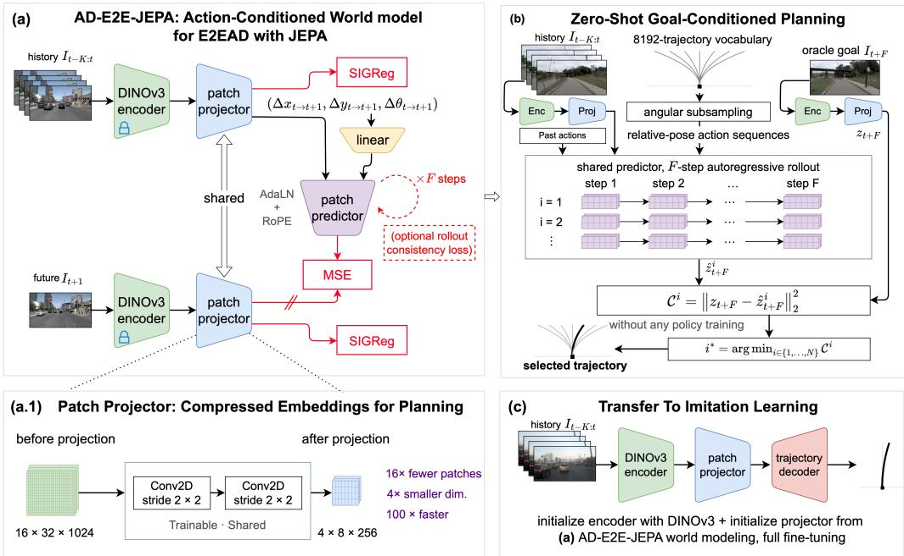
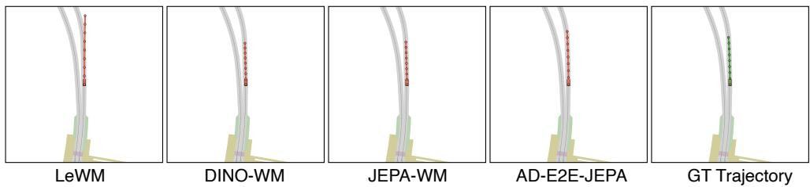
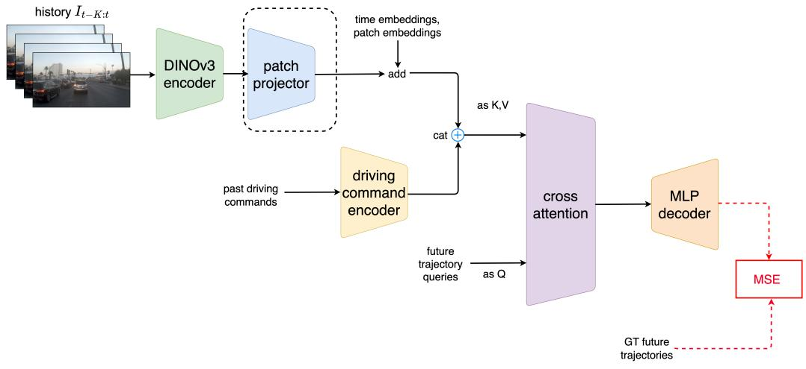

# AD-E2E-JEPA: A JOINT-EMBEDDING PREDICTIVE ARCHITEC-TURE FOR END-TO-END AUTONOMOUS DRIVING

Haoran Zhu1, Wancong Zhang1,2, Yann LeCun1,2, Anna Choromanska1 1New York University 2AMI Labs {hz1922,wz1232,yann.lecun,ac5455}@nyu.edu

## ABSTRACT

Autonomous driving requires world models that can understand the physical world, reason and plan, and operate safely. In this paper, we first systematically evaluate existing action-conditioned joint-embedding predictive architecture (JEPA) world models, including LeWM, DINO-WM, and JEPA-WM for end-to-end autonomous driving (E2EAD). To isolate world-model quality from policy learning, we employ a goal-conditioned zero-shot planning setting that evaluates these models using ground-truth future observations as goals, without training any driving policy. We find that existing JEPA-based world models are either accurate for driving but computationally expensive, or computationally efficient but insufficient for planning. To address this trade-off, we propose AD-E2E-JEPA, which introduces a SIGReg-regularized learnable projector applied to projected patch embeddings. The projector reduces the number of planning patches by 16× and the embedding dimension by 4×, achieving a 100× inference speedup while retaining planning performance, with a 0.8- second runtime for an 8-frame rollout over 256 candidate trajectories. Without training any driving policy, the world model itself reaches the goals located 20 meters away on average within the displacement of respectively 4.0/2.8 meters, using world-model rollouts over trajectory vocabularies of respectively 256/8,192 candidates. On the NAVSIMv2 benchmark, it achieves 67.3/72.9 EPDMS with multiplicative safety metrics and 84.1/86.5 EPDMS† without them in goal-conditioned zero-shot planning. Experiments further show that the selfsupervised pretrained projector improves downstream imitation learning performance from 80.2 to 85.4 EPDMS. The source code is available at https: //github.com/HaoranZhuExplorer/AD-E2E-JEPA.

  
Figure 1: AD-E2E-JEPA is an action-conditioned, JEPA-based world model for end-to-end autonomous driving. Without training any driving policy, it enables driving via goal-conditioned zeroshot planning, where future sensor observations are specified as the goal and a trajectory is selected from the trajectory vocabulary solely via world-model rollouts. AD-E2E-JEPA demonstrates strong zero-shot driving performance, efficient planning, low displacement errors, high trajectory hit rates, and representations that transfer effectively to downstream imitation learning. Zero-shot planning metrics are evaluated on 100 subsampled test scenes for a fair comparison with the time-consuming DINO-WM/JEPA-WM. See Table 2 for AD-E2E-JEPA’s results on the full set of 12,146 test scenes.

## 1 INTRODUCTION

Among intelligent systems operating in the physical world, autonomous vehicles, traditionally operated by humans, lie in the core interest of governments and the industry (Waymo, Tesla, NVIDIA, Wayve, XPENG, Uber, etc.). Efficient, robust, and safe autonomy defines the future of transporta tion leading to improved mobility of the population, reduced commute burdens, and increased road use. End-to-end learning (Pomerleau, 1988; Bojarski et al., 2016; Hu et al., 2023b) has emerged as a popular paradigm for autonomous driving. Instead of relying on modular pipelines, an end-to-end autonomous driving (E2EAD) system (Chen et al., 2024a) takes raw sensor observations as input and directly predicts a driving trajectory. However, existing E2EAD methods still rely heavily on imitation learning (Hu et al., 2023b; Liao et al., 2025), where a reactive policy is trained to imitate human driving trajectories based on observed sensory context, without explicitly modeling the underlying dynamics of the driving environment. Moreover, human driving demonstrations can be suboptimal and noisy, which may limit the quality of supervision provided by imitation learning.

A promising direction beyond purely reactive imitation is to equip autonomous driving agents with a world model (LeCun et al., 2022) based on a joint-embedding predictive architecture (JEPA) that captures the underlying dynamics of the environment. Through self-supervised prediction in a latent embedding space, a driving agent can learn representations of the physical world by anticipating the future consequences of candidate driving trajectories or inferring environmental states that are not directly observable from sensor inputs. Such predictive objectives can yield representations useful for downstream tasks. More importantly, an action-conditioned world model can be rolled out to predict possible future states under different candidate actions, enabling the agent to evaluate alternative trajectories and select actions that best achieve a desired goal. This provides a principled foundation for planning and decision-making beyond direct imitation of human demonstrations.

In this paper, we present AD-E2E-JEPA (Autonomous Driving with an End-to-End Joint-Embedding Predictive Architecture), an action-conditioned JEPA-based world model for autonomous driving. Unlike imitation-learning-based reactive systems, AD-E2E-JEPA uses human driving trajectories only as action conditioning for world-model learning, rather than as supervision for training a driving policy. Without training an explicit driving policy, the learned world model enables goal-conditioned zero-shot planning by selecting among candidate driving trajectories to navigate toward a goal specified by an image. Compared with existing JEPA world models, AD E2E-JEPA introduces a learnable projector with SIGReg regularization, which substantially reduces planning latency while preserving planning performance. Moreover, the self-supervised pretrained projector transfers effectively to downstream imitation-learning-based E2E driving.

Our contributions can be summarized as follows:

• We are the first to adapt JEPA to E2EAD for goal-conditioned zero-shot planning. Beyond the success rate commonly used for JEPA-based world models, we also report driving performance metrics such as planning efficiency, geodesic accuracy, and reliability.

• We show that existing JEPA-based world models face a substantial trade-off between efficiency and performance for planning: they are either computationally efficient but inaccurate at planning, or accurate but require over a minute of planning per scene.

• To address this trade-off, we propose AD-E2E-JEPA, which builds on Wang et al. (2026e) by reducing embedding dimensionality and further reducing the number of patch embeddings while leveraging SIGReg regularization (Balestriero & LeCun, 2025) to preserve planning performance. This design substantially improves planning efficiency and may be applied to other JEPA-based world-model planning domains beyond E2EAD.

• For goal-conditioned zero-shot planning on the NAVSIM test set, AD-E2E-JEPA significantly improves planning performance over LeWM, a gain of 23.7 EPDMS averaged over all 12,146 testing scenes, while requiring 100× less planning time over DINO-WM/JEPA-WM. Our best variant achieves a 72.9 EPDMS, 2.8-meter average displacement error, and a 2.0-degree mean absolute heading error when selecting from 8192 candidate trajectories.

• We further show that the self-supervised pretrained projector transfers effectively to downstream imitation learning. Integrated into a simple ViT-based E2E architecture, it improves EPDMS from 80.2 to 85.4 compared with a random projector, demonstrating that worldmodel representations can also benefit imitation-learning-based E2E driving.

## 2 RELATED WORK

## 2.1 WORLD MODELS

World models are internal representations that enable an agent to predict what is likely, plausible, or impossible, thereby providing a foundation for what is often referred to as common sense (LeCun et al., 2022). The idea of world models can be traced back to a long history of planning and control (Bryson, 1975; Sutton, 1991). Early world models performed predictions directly in pixel space for robotic planning (Finn & Levine, 2017) or learned latent dynamics using pixel reconstruction objectives (Ha & Schmidhuber, 2018). More recent work suggests that learning world models purely in latent space, without reconstructing pixels, can lead to improved planning performance (Zhou et al., 2024). Generative world models have also recently received considerable attention. For example, current generative world models employ diffusion transformers (Peebles & Xie, 2023) to generate high-fidelity videos. However, despite their visual realism, whether such generative models reliably capture physical laws and can consequently benefit planning remains unclear (Kang et al., 2024).

Joint-Embedding Predictive Architecture (JEPA) (LeCun et al., 2022) enables world models to be learned directly in latent space by predicting the representation of target data y from context data x, with regularization-based methods (Bardes et al., 2021; Balestriero & LeCun, 2025; Kuang et al., 2026b; Wu et al., 2026) maximizing information to avoid representation collapse, in which all representations converge to a constant vector and become useless. Recent studies suggest that intuitive physics can emerge from JEPA (Garrido et al., 2025). JEPA-based approaches have been explored across multiple modalities, including images (Assran et al., 2023), videos (Bardes et al., 2024; Assran et al., 2025; Mur-Labadia et al., 2026), LiDAR (Zhu et al., 2026), and audio (Fei et al., 2023; Wang et al., 2026f). These latent representations have further been shown to support zero-shot planning (Zhou et al., 2024; Sobal et al., 2026; Maes et al., 2026) with action-conditioned world models, in which the model predicts future latents conditioned on actions. Recent work has investigated additional structural properties of the latent space that can facilitate planning. Temporal straightening (Wang et al., 2026e), for example, regularizes latent trajectories toward straighter paths, and prior work shows that projecting embeddings into a lower-dimensional space can improve planning performance. Other recent studies have demonstrated the potential of hierarchical planning (Zhang et al., 2026), the benefits of sparse representations for planning (Kuang et al., 2026a), and the benefits of adaptively updating world models during planning (Wang et al., 2026d).

## 2.2 END-TO-END AUTONOMOUS DRIVING

End-to-end autonomous driving (E2EAD) directly maps raw sensor inputs to planning actions using a fully differentiable model (Chen et al., 2024a), reducing error accumulation across modules and enabling joint optimization for planning (Hu et al., 2023b). Most existing methods rely heavily on imitation learning to mimic human driving policies (Chitta et al., 2022; Hu et al., 2023b; Jiang et al., 2023; Chen et al., 2024b). More recently, scoring-based methods rank candidate trajectories using annotated driving scores (Li et al., 2024b; 2025; Kirby et al., 2026), but still need imitation learning and dense trajectory-level supervision. World models have also gained attention in E2EAD, mainly for aligning predicted and ground-truth future representations (Li et al., 2024a; Li & Cui, 2024) or generating future driving videos (Zhang et al., 2025; Hu et al., 2023a).

JEPA has recently been explored for autonomous driving. AD-L-JEPA (Zhu et al., 2026) firstly introduces JEPA pre-training for LiDAR perception, then Drive-JEPA (Wang et al., 2026b; Naeinian et al., 2026) applies JEPA-based representations to end-to-end driving. AD-LiST-JEPA (Zhu & Choromanska, 2026) extends JEPA to temporal LiDAR world modeling, while Auto-JEPA (Yang et al., 2026) and DA-WAM (Zhong et al., 2026) predict future representations for scoring-based planning. WA-JEPA (Wang et al., 2026c) combines representation learning, future prediction, and imitation learning. In contrast, our work directly investigates the zero-shot planning capability of JEPA without task-specific imitation learning.

## 3 METHOD

We propose AD-E2E-JEPA, illustrated in Figure 2, a joint-embedding predictive architecture (JEPA) for end-to-end autonomous driving (E2EAD). It enables efficient zero-shot goal-conditioned planning, while its self-supervised pretrained projector also benefits downstream imitation learning.

  
Figure 2: AD-E2E-JEPA architecture: (a) A self-supervised, action-conditioned JEPA world model for E2EAD. The DINOv3 encoder is frozen, while (a.1) a learnable projector is shared by the context-history and target-future branches, compressing the representation by 16× and its dimensionality by 4×, with SIGReg maximizing information while avoiding collapse and improving planning performance. This enables a 100× speedup in zero-shot goal-conditioned planning in (b), where trajectories are selected via world-model rollouts over a driving vocabulary. (c) The projector pretrained through self-supervision also improves downstream imitation learning.

## 3.1 PRELIMINARY: TASK FORMULATION OF E2EAD

For simplicity, we consider a front-camera-only setting. At each time step t, the driving agent observes a context window of historical image-pose pairs and predicts a sequence of future ego poses that form a driving trajectory:

$$
\begin{array} { r l } { \mathrm { H i s t o r i c a l \ c o n t e x t : } } & { { } \left( \mathbf { I } _ { t - K : t } , \mathbf { P } _ { t - K : t } \right) } \end{array}\tag{1}
$$

$$
\mathrm { T r a j e c t o r y p r e d i c t i o n : } \quad \hat { \mathbf { P } } _ { t + 1 : t + F } = f _ { \phi } ( \mathbf { I } _ { t - K : t } , \mathbf { P } _ { t - K : t } )\tag{2}
$$

Here, $\mathbf { I } _ { j } \in \mathbb { R } ^ { 3 \times H \times W }$ denotes the front-camera image at time step $j ,$ and $\mathbf P _ { j } = [ x _ { j } , y _ { j } , \theta _ { j } ] ^ { \top } \in \mathbb { R } ^ { 3 }$ denotes the corresponding ego pose, consisting of the planar position $( x _ { j } , y _ { j } )$ and heading angle $\theta _ { i }$ in radians. All poses are expressed relative to the current ego pose at time step $t ,$ such that $\bar { \mathbf { P } } _ { t } = [ 0 , 0 , 0 ] ^ { \top }$ . The objective of E2EAD is to predict future ego poses that safely make progress.

## 3.2 WORLD MODEL ARCHITECTURE

## 3.2.1 JEPA-WM ADAPTATION FOR E2EAD

We initialize our world model baseline using the best-performing configuration identified in JEPA-WM (Terver et al., 2025), which conducts extensive ablations on the design choices of JEPA-based world models and finds that the optimal configuration uses DINOv3 (Simeoni et al., 2025) ViT-L as´ the backbone encoder, together with an AdaLN-style (Perez et al., 2018; Peebles & Xie, 2023) predictor equipped with RoPE (Su et al., 2024), optionally with rollout training. DINOv3 is preferred over DINOv2 (Oquab et al., 2023) and V-JEPA 2 (Assran et al., 2025), potentially due to its dense semantic representations, which are also well suited to autonomous driving in our setting.

To adapt the model to E2EAD, we define the action at each time step as the relative pose change between consecutive frames, following Zhang et al. (2025), as shown in Eq. (3):

$$
\mathbf { a } _ { t } = \mathrm { R e l a t i v e } ( \mathbf { P } _ { t } , \mathbf { P } _ { t + 1 } ) = [ \Delta x _ { t  t + 1 } , \Delta y _ { t  t + 1 } , \Delta \theta _ { t  t + 1 } ] ^ { \top } .\tag{3}
$$

The frozen DINOv3 backbone independently encodes the history frames and the subsequent frame, as shown in Eq. (4). Given the history embeddings and action embeddings produced by a linear layer $E _ { a }$ , the AdaLN predictor predicts the embedding sequence one time step ahead, as shown in Eq. (5). We supervise the predictions using only an MSE loss, as defined in Eq. (6), without an additional anti-collapse objective, since the prediction targets are from the frozen DINOv3 encoder:

$$
\begin{array} { r } { s _ { t - K : t + 1 } = \operatorname { E n c } ( \mathbf { I } _ { t - K : t + 1 } ) , } \end{array}\tag{4}
$$

$$
\hat { s } _ { t - K + 1 : t + 1 } = \operatorname { P r e d } \left( s _ { t - K : t } , E _ { a } ( \mathbf { a } _ { t - K : t } ) \right) ,\tag{5}
$$

$$
\mathcal { L } _ { \mathrm { p r e d } } = \mathrm { M S E } \left( \hat { s } _ { t - K + 1 : t + 1 } , s _ { t - K + 1 : t + 1 } \right) .\tag{6}
$$

## 3.2.2 AD-E2E-JEPA

We propose AD-E2E-JEPA for efficient and reliable planning. Existing JEPA-based world model baselines operate on dense patch embeddings produced by the encoder, making planning computationally expensive and potentially requiring several minutes (Assran et al., 2025). This is impractical for the E2EAD setting and motivates embedding compression. Experiments in Wang et al. (2026e) show that adding a projector with two convolutional layers with stride $1 \times 1$ can reduce embedding dimensionality while improving planning performance. Inspired by this, AD-E2E-JEPA further introduces a learnable projector ${ \dot { \mathrm { P r o j } } } ( \cdot )$ consisting of two convolutional layers with stride $2 \times 2 .$ The projector is applied independently to the encoder embeddings of the history and future frames, as shown in Eq. (7), reducing their spatial size by 16× while also reducing the ViT-L embedding dimensionality by 4×, from $D _ { \mathrm { e n c } } = 1 0 2 4$ to $D _ { \mathrm { p r o j } } = 2 5 6$

$$
z _ { t - K : t + 1 } = \operatorname { P r o j } ( s _ { t - K : t + 1 } )\tag{7}
$$

The predictor operates on the projected embeddings, as shown in Eq. (8).

$$
\hat { z } _ { t - K + 1 : t + 1 } = \mathrm { P r e d } ^ { \prime } ( z _ { t - K : t } , E _ { a } ( \mathbf { a } _ { t - K : t } ) )\tag{8}
$$

The prediction loss is then defined over the projected embeddings in Eq. (9). However, in this case, the projected embeddings may suffer from representation collapse, where distinct DINOv3 embeddings are mapped to nearly constant vectors and thus become uninformative. We apply stop gradient (Chen & He, 2021; Grill et al., 2020) to the projected target embedding in the MSE loss.

$$
\begin{array} { r } { \mathcal { L } _ { \mathrm { p r e d } } ^ { \mathrm { p r o j } } = \mathrm { M S E } \left( \hat { z } _ { t - K + 1 : t + 1 } , \mathrm { s g } \left( z _ { t - K + 1 : t + 1 } \right) \right) } \end{array}\tag{9}
$$

Furthermore, we apply SIGReg (Balestriero & LeCun, 2025) to encourage the embeddings to follow an isotropic Gaussian distribution and prevent representation collapse. Unlike the SIGReg formulation in Maes et al. (2026), which is applied to global CLS embeddings across the batch independently at each time step and then averaged over time, we apply SIGReg to patch embeddings independently at each patch location and time step across the batch, and average the resulting regularization over all time steps and patch locations, as shown in Eq. (10):

$$
\mathcal { L } _ { \mathrm { S I G R e g } } ^ { t - K : t + 1 } = \frac { 1 } { N H ^ { \prime } W ^ { \prime } M } \sum _ { l = 1 } ^ { N H ^ { \prime } W ^ { \prime } } \sum _ { m = 1 } ^ { M } T \left( \left\{ \left. z _ { l , b } , { \pmb u } ^ { ( m ) } \right. \right\} _ { b = 1 } ^ { B } \right) .\tag{10}
$$

For the single-step setting in Eq. (10), l indexes the projected patch locations across the temporal window of length $N = { \overline { { K + 2 } } }$ and spatial dimensions $H ^ { \prime } \stackrel { * } { \times } W ^ { \prime } . \ : \ : T ( \cdot )$ denotes the univariate Epps–Pulley test (Epps & Pulley, 1983), which regularizes the D-dimensional embeddings across the batch of size B using M random projection directions $\pmb { u } ^ { ( m ) } \in \mathbb { S } ^ { D - 1 }$ . By the Cramer–Wold´ theorem (Cramer & Wold, 1936), matching all one-dimensional projected distributions is equivalent´ to matching the full joint distribution; SIGReg approximates this objective using a finite number of random projections. A detailed configuration of SIGReg is provided in Appendix A.1.

The overall training loss for AD-E2E-JEPA is given by Eq. (11):

$$
\begin{array} { r } { \mathcal { L } = \mathcal { L } _ { \mathrm { p r e d } } ^ { \mathrm { p r o j } } + \lambda \mathcal { L } _ { \mathrm { S I G R e g } } ^ { t - K : t + 1 } . } \end{array}\tag{11}
$$

We optionally add rollout training, as in JEPA-WM (Terver et al., 2025), over the entire future horizon F for E2EAD. The training objective consists of a teacher-forcing prediction loss, $\overline { { \mathcal { L } } } _ { \mathrm { T F } } .$ over the full future horizon from the next frame through frame $t + F$ . We also apply rollout losses, $\overline { { \mathcal { L } } } _ { 2 } + \cdots + \overline { { \mathcal { L } } } _ { F }$ , based on autoregressive predictions from frame t + 2 through frame $t + F$ . These rollout losses encourage consistency. In addition, we apply SIGReg from frame $t - K$ through frame $t + F$ . The overall loss is given by Eq. (12), with further details provided in Appendix A.2.

$$
{ \mathcal { L } } ^ { \mathrm { m u l t i } } = { \frac { { \overline { { { \mathcal { L } } } } } _ { \mathrm { T F } } + { \overline { { { \mathcal { L } } } } } _ { 2 } + \cdot \cdot \cdot + { \overline { { { \mathcal { L } } } } } _ { F } } { F } } + \lambda { \mathcal { L } } _ { \mathrm { S I G R e g } } ^ { t - K : t + F } .\tag{12}
$$

## 3.3 ZERO-SHOT GOAL-CONDITIONED PLANNING

World models enable zero-shot goal-conditioned planning without training a policy, allowing generalization to unseen scenes. This paradigm has been widely adopted in JEPA-based world models. We are the first to introduce it to E2EAD, significantly improve planning efficiency, and report several quantitative metrics to evaluate world-model beyond the success-rate metric used in prior work.

## 3.3.1 PLANNING WITH AD-E2E-JEPA

The cross-entropy method (CEM) is widely used for JEPA-based world-model planning (Zhou et al., 2024; Terver et al., 2025; Sobal et al., 2026) but is too costly for autonomous driving due to its iterative evaluation of many candidate action sequences. We instead search over the clustered driving trajectory vocabulary as anchors from Chen et al. (2024b), $\mathcal { V } = \{ P _ { t : t + F } ^ { i } \} _ { i = 1 } ^ { 8 1 9 2 }$ . To balance efficiency and trajectory granularity, we sort trajectories by angular coordinate and subsample them at evenly spaced intervals to obtain $\mathrm { \therefore g . , | { V _ { \mathrm { s a m p l e d } } } | = 2 5 6 }$ candidates.

We define the goal as the future image I , F frames ahead. Given our action-conditioned world model, we perform zero-shot planning by selecting the candidate whose predicted future latent embedding is closest to that of the goal. For the i-th candidate trajectory, the planning cost is

$$
\begin{array} { r } { \mathcal { C } ^ { i } = \left. \boldsymbol { z } _ { t + F } - \hat { \boldsymbol { z } } _ { t + F } ^ { i } \right. _ { 2 } ^ { 2 } , } \end{array}\tag{13}
$$

where $\hat { z } _ { t + F } ^ { i }$ is obtained by autoregressively rolling out the world model from the initial projected observations $z _ { t - K : t }$ under the i-th candidate trajectory using $\operatorname { E q . } \left( 8 \right)$ . We select the trajectory as

$$
i ^ { * } = \underset { i \in \{ 1 , \ldots , | V _ { \mathrm { s u p p l e d } } | } \} { \mathrm { a r g m i n } } ~ \mathcal { C } ^ { i } = \underset { i \in \{ 1 , \ldots , | V _ { \mathrm { s a p p l e d } } | } \} { \mathrm { a r g m i n } } \left. z _ { t + F } - \hat { z } _ { t + F } ^ { i } \right. _ { 2 } ^ { 2 } , \qquad P _ { t : t + F } ^ { * } = P _ { t : t + F } ^ { i ^ { * } } .\tag{14}
$$

## 3.3.2 METRICS

To quantitatively evaluate the reliability and efficiency of world-model zero-shot goal-conditioned planning for autonomous driving, we report metrics for driving performance (EPDMS, EPDMS†), planning efficiency, geodesic accuracy. (FDE, $\Delta x , \Delta y , \Delta \theta )$ , and reliability (hit rate). Detailed definitions are provided in Appendix ${ \mathrm { A } } . 3$

EPDMS: NAVSIMv2 (Cao et al., 2025) uses EPDMS as a pseudo-simulation-based planning metric that combines multiplicative safety terms with a weighted measure of driving quality.

EPDMS†: Since zero-shot planning does not explicitly optimize for safety, we report only the weighted component of EPDMS, excluding the multiplicative safety terms.

Planning time: We report planning time to assess E2EAD planning efficiency.

Final-pose displacement $( \mathbf { F D E } , \Delta x , \Delta y , \Delta \theta )$ : We measure the displacement between the final pose of the selected trajectory and the ground-truth pose. Specifically, we report the final displacement error (FDE) and absolute errors in longitudinal position $( \Delta x )$ , lateral position $( \Delta y )$ , and heading (∆θ), which measure the geodesic accuracy. of the world model.

Table 1: Training configurations.
<table><tr><td>Split</td><td>Variant</td><td>GPUs</td><td>Batch size</td><td>Learning rate</td><td>λ</td><td>Training time</td></tr><tr><td rowspan="5">navtrain</td><td>LeWM</td><td>4×A100</td><td>8</td><td> $1 \times 1 0 ^ { - 4 }$ </td><td>0.09</td><td>1 d</td></tr><tr><td>DINO-WM</td><td>4×A100</td><td>64</td><td> $1 \times 1 0 ^ { - 4 }$ </td><td></td><td>11 h</td></tr><tr><td>JEPA-WM</td><td>4×A100</td><td>64</td><td> $1 \times 1 0 ^ { - 4 }$ </td><td></td><td>13 h</td></tr><tr><td>AD-E2E-JEPA</td><td>1×A100</td><td>128</td><td> $1 \times 1 0 ^ { - 4 }$ </td><td>0.09</td><td>20 h</td></tr><tr><td>+ rollout</td><td>1×A100</td><td>128</td><td> $1 \times 1 0 ^ { - 4 }$ </td><td>0.09</td><td>1 d 22 h</td></tr><tr><td rowspan="2">trainval</td><td>AD-E2E-JEPA</td><td>4×A100</td><td>512</td><td> $2 \times 1 0 ^ { - 4 }$ </td><td>0.025</td><td>2d5h</td></tr><tr><td>+ rollout</td><td>4×A100</td><td>256</td><td> $1 . 4 \times 1 0 ^ { - 4 }$ </td><td>0.09</td><td>4d2 h</td></tr></table>

Hit rate: Inspired by the diagnostic metric released in the DrivoR (Kirby et al., 2026) codebase, we use hit rate to measure whether the world model ranks the ground-truth trajectory among the top-k lowest-cost candidates. Specifically, we report Top-1 and Top-5 hit rates based on the rollout latent distance to the goal, which assess the reliability of the world-model rollout.

## 3.4 DOWNSTREAM TRANSFER FOR IMITATION LEARNING

Beyond zero-shot goal-conditioned planning, we evaluate whether the self-supervised projector pretrained during world modeling provides useful representations for imitation learning. Existing works (Wang et al., 2026b; Naeinian et al., 2026) show that self-supervised pretrained representations improve E2EAD, but have not explored projectors that compress dense patch embeddings.

We discard the patch predictor from AD-E2E-JEPA while retaining the DINOv3 encoder and projector, attach a simple trajectory decoder, and fully fine-tune the model for E2EAD. We compare against variants with a randomly initialized projector.

## 4 EXPERIMENTS

## 4.1 DATASETS

We use the NAVSIM (Cao et al., 2025) dataset and evaluate on the latest NAVSIMv2 benchmark. We use the navtrain split, which contains 10 hours of driving video sampled at 2 Hz, for a fair comparison among LeWM, DINO-WM, JEPA-WM, and AD-E2E-JEPA, while scaling AD-E2E-JEPA to 70 hours of driving video from the training portion of the trainval split to further improve its performance.

## 4.2 IMPLEMENTATION DETAILS

We use DINOv3 ViT-L backbone for DINO, JEPA-WM and AD-E2E-JEPA. LeWM’s backbone is ViT-L trained from scratch. We use K + 1 = 4 frames for a 2-s history context and F = 8 frames for a 4-s future horizon. Without the optional rollout loss, AD-E2E-JEPA uses only the first future frame in Eq. (11); the rollout-loss variant uses all 8 future frames in Eq. (12). We use AdamW with 30 training epochs for all settings and scale the learning rate with the square root of the batch size. We use one warmup epoch followed by a cosine annealing schedule. The default SIGReg weight is $\lambda = 0 . 0 9$ ; for larger batch sizes, we tune λ heuristically based on early training loss curves. For LeWM, DINO-WM, and JEPA-WM, we use a learning rate of $1 \times 1 0 ^ { - 4 }$ across all settings with the same learning-rate scheduler. AD-E2E-JEPA requires fewer GPU resources hours than the other methods when training settings are the same. Table 1 summarizes the training configurations. For transferring self-supervised pretrained projectors to imitation learning, see Appendix A.5.

## 4.3 ZERO-SHOT PLANNING PERFORMANCE

We set the number of subsampled trajectories to 256 unless specified. We evaluate zero-shot goalconditioned planning on 100 sampled scenes from the NAVSIM test split for all methods. We additionally evaluate the computationally efficient models on the full test set. DINO-WM and JEPA-WM operate on dense patch embeddings after the encoder, making full-set evaluation prohibitively expensive (over 10 days). AD-E2E-JEPA performs planning following Section 3.3.1. LeWM, DINO-WM, and JEPA-WM follow the same planning procedure, except that DINO-WM and JEPA-WM operate on patch embeddings, whereas LeWM operates on the global CLS token. We omit these formulations for brevity. The qualitative planning visualization across these methods is in Figure 3.

  
Figure 3: Zero-shot goal-conditioned planning qualitative comparison. LeWM is efficient but insufficient for accurate planning, resulting in a shifted selected trajectory. DINO-WM and JEPA-WM better match the ground-truth trajectory. AD-E2E-JEPA achieves comparable planning quality to DINO-WM and JEPA-WM while being 100× faster.

Table 2: Zero-shot goal-conditioned planning on the NAVSIM dataset, evaluated on 100 subsampled test scenes and the full set of 12,146 test scenes, with the ground-truth future frame used as the target. Unless specified, the world model selects from 256 candidate trajectories. The NAVSIMv2 navtest-stage-1 metrics EPDMS↑ and EPDMS† ↑ measure driving performance, where EPDMS includes safety metrics and EPDMS† excludes them. Per-scene planning time (s) measures efficiency on an A100 GPU. FDE (m), ∆x (m), ∆y (m), and ∆θ (degrees) measure geodesic accuracy. Top-1/top-5 hit rate (%) measures world-model reliability. ↑: higher is better; ↓: lower is better. For the 100 subsampled-test scene setting, the extended comfort (EC) metrics for EPDMS and EPDMS† are excluded because the subsampled set does not contain temporally adjacent scenes. See Appendix A.4 for details of each submetric of EPDMS.
<table><tr><td rowspan=1 colspan=2>Method</td><td rowspan=1 colspan=4>Split</td><td rowspan=1 colspan=3>Driving performance|EfficiencyEPDMS↑|EPDMS† ↑|Time ↓</td><td rowspan=1 colspan=5>Geodesic accuracy   |ReliabilityFDE↓|∆x↓|∆y↓|∆θ↓Hit rate ↑</td></tr><tr><td rowspan=1 colspan=14>100 subsampled test scenes</td></tr><tr><td rowspan=4 colspan=2>LeWMDINO-WMJEPA-WMAD-E2E-JEPA+ rollout</td><td rowspan=4 colspan=4>navtrain</td><td rowspan=1 colspan=1>48.3</td><td rowspan=1 colspan=1>73.9</td><td rowspan=1 colspan=1>0.7</td><td rowspan=1 colspan=1>12.4</td><td rowspan=1 colspan=1>11.3</td><td rowspan=1 colspan=1>2.7</td><td rowspan=1 colspan=1>13.6</td><td rowspan=1 colspan=1>6/18</td></tr><tr><td rowspan=3 colspan=1>68.374.276.670.4</td><td rowspan=3 colspan=1>91.490.992.492.2</td><td rowspan=3 colspan=1>91.8101.00.80.8</td><td rowspan=1 colspan=1>3.9</td><td rowspan=1 colspan=1>3.4</td><td rowspan=1 colspan=1>1.1</td><td rowspan=1 colspan=1>5.9</td><td rowspan=1 colspan=1>40/73</td></tr><tr><td rowspan=2 colspan=1>4.04.23.5</td><td rowspan=1 colspan=1>3.43.9</td><td rowspan=1 colspan=1>1.21.0</td><td rowspan=2 colspan=1>5.24.74.1</td><td rowspan=2 colspan=1>45/7527/5934/67</td></tr><tr><td rowspan=1 colspan=1>3.2</td><td rowspan=1 colspan=1>1.0</td></tr><tr><td rowspan=1 colspan=2>AD-E2E-JEPA+ rollout</td><td rowspan=1 colspan=4>trainval</td><td rowspan=1 colspan=1>72.172.3</td><td rowspan=1 colspan=1>89.891.9</td><td rowspan=1 colspan=1>0.80.8</td><td rowspan=1 colspan=2>4.7  4.43.2  3.0</td><td rowspan=1 colspan=1>0.90.7</td><td rowspan=1 colspan=1>3.43.6</td><td rowspan=1 colspan=1>33/5547/78</td></tr><tr><td rowspan=1 colspan=14>Full 12,146 test scenes</td></tr><tr><td rowspan=2 colspan=2>LeWMAD-E2E-JEPA+ rollout</td><td rowspan=2 colspan=4>navtrain</td><td rowspan=2 colspan=1>39.863.564.9</td><td rowspan=1 colspan=1>66.7</td><td rowspan=1 colspan=1>0.7</td><td rowspan=1 colspan=1>14.6</td><td rowspan=1 colspan=1>13</td><td rowspan=1 colspan=1>3.5</td><td rowspan=1 colspan=1>17.2</td><td rowspan=1 colspan=1>5.7/11.3</td></tr><tr><td rowspan=1 colspan=1>80.183.1</td><td rowspan=1 colspan=1>0.80.8</td><td rowspan=1 colspan=1>6.34.5</td><td rowspan=1 colspan=1>5.94.0</td><td rowspan=1 colspan=1>1.21.2</td><td rowspan=1 colspan=1>6.34.1</td><td rowspan=1 colspan=1>32.9/65.342.6/71.0</td></tr><tr><td rowspan=7 colspan=2>AD-E2E-JEPA+ rollout+ rollout, 512 traj.+ rollout, 1024 traj.+ rollout, 2048 traj.+ rollout, 4096 traj.+ rollout, 8192 traj.</td><td rowspan=1 colspan=4></td><td rowspan=1 colspan=1>63.2</td><td rowspan=1 colspan=1>80.1</td><td rowspan=1 colspan=1>0.8</td><td rowspan=1 colspan=1>6.2</td><td rowspan=1 colspan=1>5.8</td><td rowspan=1 colspan=1>1.1</td><td rowspan=1 colspan=1>4.5</td><td rowspan=1 colspan=1>31.0/64.8</td></tr><tr><td rowspan=1 colspan=1></td><td rowspan=1 colspan=3></td><td rowspan=1 colspan=2></td><td rowspan=1 colspan=1>67.3</td><td rowspan=1 colspan=1>84.1</td><td rowspan=1 colspan=1>0.8</td><td rowspan=1 colspan=1>4.0</td><td rowspan=1 colspan=1>3.6</td><td rowspan=1 colspan=1>1.1</td><td rowspan=1 colspan=1>3.5</td><td rowspan=1 colspan=1>53.8/82.7</td></tr><tr><td rowspan=3 colspan=4>trainval</td><td rowspan=1 colspan=1></td><td rowspan=1 colspan=1>69.2</td><td rowspan=1 colspan=1>85.0</td><td rowspan=1 colspan=1>1.4</td><td rowspan=1 colspan=1>3.6</td><td rowspan=1 colspan=1>3.3</td><td rowspan=1 colspan=1>0.9</td><td rowspan=1 colspan=1>2.9</td><td rowspan=1 colspan=1>45.2/73.9</td></tr><tr><td rowspan=1 colspan=1>70.5</td><td rowspan=1 colspan=1>85.5</td><td rowspan=1 colspan=1>2.5</td><td rowspan=1 colspan=1>3.2</td><td rowspan=1 colspan=1>2.9</td><td rowspan=1 colspan=1>0.8</td><td rowspan=1 colspan=1>2.5</td><td rowspan=2 colspan=1>36.3/64.327.4/53.2</td></tr><tr><td rowspan=1 colspan=3></td><td rowspan=1 colspan=1>71.5</td><td rowspan=1 colspan=1>86.0</td><td rowspan=1 colspan=1>4.7</td><td rowspan=1 colspan=1>3.0</td><td rowspan=1 colspan=1>2.7</td><td rowspan=1 colspan=1>0.8</td><td rowspan=1 colspan=1>2.2</td></tr><tr><td rowspan=2 colspan=4></td><td rowspan=1 colspan=2></td><td rowspan=1 colspan=1>72.1</td><td rowspan=1 colspan=1>86.3</td><td rowspan=1 colspan=1>9.3</td><td rowspan=1 colspan=1>2.9</td><td rowspan=1 colspan=1>2.6</td><td rowspan=1 colspan=1>0.8</td><td rowspan=1 colspan=1>2.1</td><td rowspan=2 colspan=1>20.7/43.315.3/33.8</td></tr><tr><td rowspan=1 colspan=1>72.9</td><td rowspan=1 colspan=1>86.5</td><td rowspan=1 colspan=1>18.2</td><td rowspan=1 colspan=1>2.8</td><td rowspan=1 colspan=1>2.5</td><td rowspan=1 colspan=1>0.8</td><td rowspan=1 colspan=1>2.0</td></tr></table>

As shown in Table 2, LeWM is computationally efficient but achieves substantially lower driving performance, geodesic accuracy, and hit rates than the other methods. DINO-WM and JEPA-WM are considerably more reliable, achieving higher hit rates and EPDMS scores of 68.3 and 74.2, respectively, on the 100-scene subset. However, their per-scene planning times are 91.8 and 101.0

seconds, respectively, making full-test-set evaluation prohibitively expensive. In contrast, AD-E2E-JEPA requires only 0.8 seconds per scene. When trained on navtrain, AD-E2E-JEPA achieves the highest driving performance on the 100-scene subset, although its geodesic accuracy and hit rate are lower than those of DINO-WM and JEPA-WM.

Adding the rollout loss and training on the larger trainval split substantially improves geodesic accuracy and reliability. On the 100-scene subset, this configuration achieves an FDE of 3.2 m and a top-1/top-5 hit rate of 47%/78%, comparable to or better than DINO-WM and JEPA-WM on these metrics. Its EPDMS is lower on this subset, which may partly reflect variance from evaluating only 100 scenes. This gap is reduced when evaluating on the full test set. Another possible explanation is that the world model is trained using a latent-distance objective, which is more directly aligned with geodesic distance and hit rate than with the NAVSIM-v2 driving metrics.

On the full 12,146-scene test set, AD-E2E-JEPA trained on trainval with rollout loss achieves an EPDMS of 67.3 and an EPDMS† of 84.1. It also achieves an FDE of 4.0 m and a top-1/top-5 hit rate of 54%/83%, providing the strongest overall results on the full test set and significantly outperforms LeWM in the same setting. When we further scales the subsampled candidates to 512, 1024, 2048, 4096, 8192, it further boosts the performance and 8192 variant reaches an EPDMS of 72.9 and an EPDMS† of 86.5 with FDE of 2.8 m. Hit rate decreases accordingly as the number of candidates increases.

## 4.4 TRANSFER LEARNING PERFORMANCE

Recent high-performing E2E autonomous driving methods can require substantial training compute. For example, WA-JEPA (Wang et al., 2026c), which reports state-of-the-art NAVSIM-v2 performance at submission time, uses 64 A800 GPUs for Stage 1 pretraining and 32 A800 GPUs for Stage 2 training. Rather than pursuing gains through large-scale training, we study a complementary question: whether the lightweight projector learned by self-supervised AD-E2E-JEPA world modeling transfers useful predictive structure to downstream imitation learning. We isolate the effect of projector pretraining without additional self-supervised pretraining of the encoder backbone. While prior JEPA-based E2E driving methods mainly study pretrained encoder representations or jointly pretrained world-action models, we are not aware of prior work that specifically isolates the downstream transferability of a pretrained projector. We include Transfuser (Chitta et al., 2022), Latent-WAM (Wang et al., 2026a), Drive-JEPA (Wang et al., 2026b), and WA-JEPA (Wang et al., 2026c) as reference methods rather than direct baselines.

Table 3: NAVSIMv2 navtest-stage-1 benchmark. V: single-view (SV) or multi-view (MV); Type: perception-free (PF) or perception-based (PB); Fr.: number of input frames. PB methods use perception annotations or trajectory-score labels. ∗ denotes results obtained before the human-filter bug fix in commit 359c7f7 in NAVSIM’s codebase.
<table><tr><td></td><td></td><td></td><td colspan="7">NAVSIMv2 stage 1 driving metrics</td></tr><tr><td>Method</td><td>V</td><td></td><td></td><td></td><td></td><td></td><td>Type Fr.|NC↑ DAC↑ DDC↑ TLC↑ EP↑ TTC↑ LK↑ HC↑ EC↑ EPDMS* ↑ EPDMS↑</td><td></td><td></td></tr><tr><td>Transfuser</td><td>MV</td><td>PF</td><td>1 |96.9</td><td>89.9</td><td>97.8</td><td>99.7</td><td>87.1 95.4 92.7 98.3 87.2</td><td>76.7</td><td></td></tr><tr><td>Latent-WAM</td><td>MV</td><td>PF</td><td>4 98.1</td><td>97.3</td><td>99.6</td><td>99.8</td><td>87.7 97.3 97.6 98.1 72.4</td><td></td><td>89.3</td></tr><tr><td>WA-JEPA</td><td>MV</td><td>PF</td><td>4 99.4</td><td>98.2</td><td>99.7</td><td>99.9</td><td>87.8 98.9 98.3 98.3 88.1</td><td>88.0</td><td>91.7</td></tr><tr><td>Drive-JEPA</td><td>SV</td><td>PB</td><td>2 98.4</td><td>98.6</td><td>99.1</td><td>99.8</td><td>88.4 97.8 97.6 97.9 84.8</td><td>87.8</td><td></td></tr><tr><td>DINOv3</td><td></td><td></td><td></td><td></td><td></td><td></td><td></td><td></td><td></td></tr><tr><td>+ rand. proj.</td><td>SV</td><td>PF</td><td>4 |96.8</td><td>89.8</td><td>98.3</td><td></td><td>99.7 87.1 95.7 94.8 98.3 84.1</td><td></td><td>80.2</td></tr><tr><td>+ AD-E2E-JEPA proj. SV</td><td></td><td>PF</td><td>4 97.7</td><td>93.7</td><td></td><td>99.2</td><td>99.8 87.3 96.8 97.0 98.4 88.7</td><td></td><td>85.4</td></tr></table>

## 5 CONCLUSION

We propose AD-E2E-JEPA, a joint-embedding predictive architecture for end-to-end autonomous driving. To isolate the effect of world modeling from driving policy learning, we perform zeroshot goal-conditioned planning and quantitatively evaluate the JEPA-based world model in terms of driving performance, planning efficiency, geodesic accuracy, and reliability. We further introduce a learnable projector with SIGReg to compress latent representations for planning while preserving their information content. Without any policy training, AD-E2E-JEPA improves planning efficiency by 100× compared with DINO-WM/JEPA-WM under the same setting of 256 candidate trajectories. The best AD-E2E-JEPA variant, using 8192 candidate trajectories, achieves an EPDMS of 72.9, reaches goal with a displacement error of 2.8 meters and a mean heading error of 2.0 degrees. It also demonstrates the projector pretrained during world modeling benefits imitation learning.

## REFERENCES

Mahmoud Assran, Quentin Duval, Ishan Misra, Piotr Bojanowski, Pascal Vincent, Michael Rabbat, Yann LeCun, and Nicolas Ballas. Self-supervised learning from images with a joint-embedding predictive architecture. In 2023 IEEE/CVF Conference on Computer Vision and Pattern Recognition (CVPR), pp. 15619–15629. IEEE, 2023.

Mido Assran, Adrien Bardes, David Fan, Quentin Garrido, Russell Howes, Matthew Muckley, Ammar Rizvi, Claire Roberts, Koustuv Sinha, Artem Zholus, et al. V-jepa 2: Self-supervised video models enable understanding, prediction and planning. arXiv preprint arXiv:2506.09985, 2025.

Randall Balestriero and Yann LeCun. Lejepa: Provable and scalable self-supervised learning without the heuristics. arXiv preprint arXiv:2511.08544, 2025.

Adrien Bardes, Jean Ponce, and Yann LeCun. Vicreg: Variance-invariance-covariance regularization for self-supervised learning. arXiv preprint arXiv:2105.04906, 2021.

Adrien Bardes, Quentin Garrido, Jean Ponce, Xinlei Chen, Michael Rabbat, Yann LeCun, Mahmoud Assran, and Nicolas Ballas. Revisiting feature prediction for learning visual representations from video. arXiv preprint arXiv:2404.08471, 2024.

Mariusz Bojarski, Davide Del Testa, Daniel Dworakowski, Bernhard Firner, Beat Flepp, Prasoon Goyal, Lawrence D Jackel, Mathew Monfort, Urs Muller, Jiakai Zhang, et al. End to end learning for self-driving cars. arXiv preprint arXiv:1604.07316, 2016.

Arthur Earl Bryson. Applied optimal control: optimization, estimation and control. CRC press, 1975.

Wei Cao, Marcel Hallgarten, Tianyu Li, Daniel Dauner, Xunjiang Gu, Caojun Wang, Yakov Miron, Marco Aiello, Hongyang Li, Igor Gilitschenski, et al. Pseudo-simulation for autonomous driving. arXiv preprint arXiv:2506.04218, 2025.

Li Chen, Penghao Wu, Kashyap Chitta, Bernhard Jaeger, Andreas Geiger, and Hongyang Li. Endto-end autonomous driving: Challenges and frontiers. IEEE Transactions on Pattern Analysis and Machine Intelligence, 2024a.

Shaoyu Chen, Bo Jiang, Hao Gao, Bencheng Liao, Qing Xu, Qian Zhang, Chang Huang, Wenyu Liu, and Xinggang Wang. Vadv2: End-to-end vectorized autonomous driving via probabilistic planning. arXiv preprint arXiv:2402.13243, 2024b.

Xinlei Chen and Kaiming He. Exploring simple siamese representation learning. In 2021 IEEE/CVF conference on computer vision and pattern recognition (CVPR), pp. 15745–15753. IEEE, 2021.

Kashyap Chitta, Aditya Prakash, Bernhard Jaeger, Zehao Yu, Katrin Renz, and Andreas Geiger. Transfuser: Imitation with transformer-based sensor fusion for autonomous driving. IEEE transactions on pattern analysis and machine intelligence, 45(11):12878–12895, 2022.

Harald Cramer and Herman Wold. Some theorems on distribution functions.´ Journal ofthe London Mathematical Society, 1(4):290–294, 1936.

Daniel Dauner, Marcel Hallgarten, Tianyu Li, Xinshuo Weng, Zhiyu Huang, Zetong Yang, Hongyang Li, Igor Gilitschenski, Boris Ivanovic, Marco Pavone, et al. Navsim: Data-driven non-reactive autonomous vehicle simulation and benchmarking. Advances in Neural Information Processing Systems, 37:28706–28719, 2024.

Thomas W Epps and Lawrence B Pulley. A test for normality based on the empirical characteristic function. Biometrika, 70(3):723–726, 1983.

Zhengcong Fei, Mingyuan Fan, and Junshi Huang. A-jepa: Joint-embedding predictive architecture can listen. arXiv preprint arXiv:2311.15830, 2023.

Chelsea Finn and Sergey Levine. Deep visual foresight for planning robot motion. In 2017 IEEE international conference on robotics and automation (ICRA), pp. 2786–2793. IEEE, 2017.

Quentin Garrido, Nicolas Ballas, Mahmoud Assran, Adrien Bardes, Laurent Najman, Michael Rabbat, Emmanuel Dupoux, and Yann LeCun. Intuitive physics understanding emerges from self supervised pretraining on natural videos. arXiv preprint arXiv:2502.11831, 2025.

Jean-Bastien Grill, Florian Strub, Florent Altche, Corentin Tallec, Pierre Richemond, Elena´ Buchatskaya, Carl Doersch, Bernardo Avila Pires, Zhaohan Guo, Mohammad Gheshlaghi Azar, et al. Bootstrap your own latent-a new approach to self-supervised learning. Advances in neural information processing systems, 33:21271–21284, 2020.

David Ha and Jurgen Schmidhuber. World models. ¨ arXiv preprint arXiv:1803.10122, 2(3):440, 2018.

Anthony Hu, Lloyd Russell, Hudson Yeo, Zak Murez, George Fedoseev, Alex Kendall, Jamie Shotton, and Gianluca Corrado. Gaia-1: A generative world model for autonomous driving. arXiv preprint arXiv:2309.17080, 2023a.

Yihan Hu, Jiazhi Yang, Li Chen, Keyu Li, Chonghao Sima, Xizhou Zhu, Siqi Chai, Senyao Du, Tianwei Lin, Wenhai Wang, et al. Planning-oriented autonomous driving. In Proceedings of the IEEE/CVF conference on computer vision and pattern recognition, pp. 17853–17862, 2023b.

Herbert Jaeger. Tutorial on training recurrent neural networks, covering BPPT, RTRL, EKF and the echo state network approach. GMD-Forschungszentrum Informationstechnik Bonn, 2002.

Bo Jiang, Shaoyu Chen, Qing Xu, Bencheng Liao, Jiajie Chen, Helong Zhou, Qian Zhang, Wenyu Liu, Chang Huang, and Xinggang Wang. Vad: Vectorized scene representation for efficient autonomous driving. In 2023 IEEE/CVF International Conference on Computer Vision (ICCV), pp. 8306–8316. IEEE, 2023.

Bingyi Kang, Yang Yue, Rui Lu, Zhijie Lin, Yang Zhao, Kaixin Wang, Gao Huang, and Jiashi Feng. How far is video generation from world model: A physical law perspective. arXiv preprint arXiv:2411.02385, 2024.

Ellington Kirby, Alexandre Boulch, Yihong Xu, Yuan Yin, Gilles Puy, Eloi Zablocki, Andrei Bursuc,´ Spyros Gidaris, Renaud Marlet, Florent Bartoccioni, et al. Driving on registers. In Proceedings of the IEEE/CVF Conference on Computer Vision and Pattern Recognition, pp. 32058–32069, 2026.

Yilun Kuang, Yash Dagade, Quentin Le Lidec, Lucas Maes, Randall Balestriero, and Yann LeCun. Lpwm: A case for sparse representations in world models. arXiv preprint arXiv:2608.22764, 2026a.

Yilun Kuang, Yash Dagade, Tim GJ Rudner, Randall Balestriero, and Yann LeCun. Rectified lpjepa: Joint-embedding predictive architectures with sparse and maximum-entropy representations. arXiv preprint arXiv:2602.01456, 2026b.

Lukas Kuhn, Lucas Maes, Giuseppe Serra, Quentin Le Lidec, Yann LeCun, Randall Balestriero, and Florian Buettner. Levjepa: Efficient & scalable video pretraining without the heuristics. arXiv preprint arXiv:2608.27395, 2026.

Yann LeCun et al. A path towards autonomous machine intelligence version 0.9. 2, 2022-06-27. Open Review, 62(1):1–62, 2022.

Kailin Li, Zhenxin Li, Shiyi Lan, Yuan Xie, Zhizhong Zhang, Jiayi Liu, Zuxuan Wu, Zhiding Yu, and Jose M Alvarez. Hydra-mdp++: Advancing end-to-end driving via expert-guided hydradistillation. arXiv preprint arXiv:2503.12820, 2025.

Peidong Li and Dixiao Cui. Navigation-guided sparse scene representation for end-to-end autonomous driving. arXiv preprint arXiv:2409.18341, 2024.

Yingyan Li, Lue Fan, Jiawei He, Yuqi Wang, Yuntao Chen, Zhaoxiang Zhang, and Tieniu Tan. Enhancing end-to-end autonomous driving with latent world model. arXiv preprint arXiv:2406.08481, 2024a.

Zhenxin Li, Kailin Li, Shihao Wang, Shiyi Lan, Zhiding Yu, Yishen Ji, Zhiqi Li, Ziyue Zhu, Jan Kautz, Zuxuan Wu, et al. Hydra-mdp: End-to-end multimodal planning with multi-target hydradistillation. arXiv preprint arXiv:2406.06978, 2024b.

Bencheng Liao, Shaoyu Chen, Haoran Yin, Bo Jiang, Cheng Wang, Sixu Yan, Xinbang Zhang, Xiangyu Li, Ying Zhang, Qian Zhang, et al. Diffusiondrive: Truncated diffusion model for endto-end autonomous driving. In 2025 IEEE/CVF Conference on Computer Vision and Pattern Recognition (CVPR), pp. 12037–12047. IEEE, 2025.

Lucas Maes, Quentin Le Lidec, Damien Scieur, Yann LeCun, and Randall Balestriero. Leworldmodel: Stable end-to-end joint-embedding predictive architecture from pixels. arXiv preprint arXiv:2603.19312, 2026.

Lorenzo Mur-Labadia, Matthew Muckley, Amir Bar, Mido Assran, Koustuv Sinha, Mike Rabbat, Yann LeCun, and Nicolas Ballas. V-jepa 2.1: Unlocking dense features in video self-supervised learning. In European Conference on Computer Vision, pp. 671–689. Springer, 2026.

Fatemeh Naeinian, Ali Hamza, Haoran Zhu, and Anna Choromanska. Zero-shot cross-city generalization in end-to-end autonomous driving: Self-supervised versus supervised representations. arXiv preprint arXiv:2603.11417, 2026.

Maxime Oquab, Timothee Darcet, Th ´ eo Moutakanni, Huy Vo, Marc Szafraniec, Vasil Khalidov,´ Pierre Fernandez, Daniel Haziza, Francisco Massa, Alaaeldin El-Nouby, et al. Dinov2: Learning robust visual features without supervision. arXiv preprint arXiv:2304.07193, 2023.

William Peebles and Saining Xie. Scalable diffusion models with transformers. In 2023 IEEE/CVF International Conference on Computer Vision (ICCV), pp. 4172–4182. IEEE, 2023.

Ethan Perez, Florian Strub, Harm De Vries, Vincent Dumoulin, and Aaron Courville. Film: Visual reasoning with a general conditioning layer. In Proceedings of the AAAI conference on artificial intelligence, 2018.

Dean A Pomerleau. Alvinn: An autonomous land vehicle in a neural network. Advances in neural information processing systems, 1, 1988.

Oriane Simeoni, Huy V Vo, Maximilian Seitzer, Federico Baldassarre, Maxime Oquab, Cijo Jose,´ Vasil Khalidov, Marc Szafraniec, Seungeun Yi, Michael Ramamonjisoa, et al. Dinov3.¨ arXiv preprint arXiv:2508.10104, 2025.

Uladzislau Sobal, Wancong Zhang, Kyunghyun Cho, Randall Balestriero, Tim GJ Rudner, and Yann LeCun. Learning from reward-free offline data: A case for planning with latent dynamics models. Advances in Neural Information Processing Systems, 38:43905–43941, 2026.

Jianlin Su, Murtadha Ahmed, Yu Lu, Shengfeng Pan, Wen Bo, and Yunfeng Liu. Roformer: Enhanced transformer with rotary position embedding. Neurocomputing, 568:127063, 2024.

Richard S Sutton. Dyna, an integrated architecture for learning, planning, and reacting. ACM Sigart Bulletin, 2(4):160–163, 1991.

Basile Terver, Tsung-Yen Yang, Jean Ponce, Adrien Bardes, and Yann LeCun. What drives success in physical planning with joint-embedding predictive world models? arXiv preprint arXiv:2512.24497, 2025.

Linbo Wang, Yupeng Zheng, Qiang Chen, Shiwei Li, Yichen Zhang, Zebin Xing, Qichao Zhang, Xiang Li, Deheng Qian, Pengxuan Yang, et al. Latent-wam: Latent world action modeling for end-to-end autonomous driving. arXiv preprint arXiv:2603.24581, 2026a.

Linhan Wang, Zichong Yang, Chen Bai, Guoxiang Zhang, Xiaotong Liu, Xiaoyin Zheng, Xiao-Xiao Long, Chang-Tien Lu, and Cheng Lu. Drive-jepa: Video jepa meets multimodal trajectory distillation for end-to-end driving. arXiv preprint arXiv:2601.22032, 2026b.

Xinlin Wang, Yujiao Xiang, Yuheng Zhou, Jingqi Wang, Minqing Huang, Jiajie Huang, Dongxu Wei, Tingguang Zhou, Xiyang Wang, Gong Chen, et al. Wa-jepa: Rethinking the video jepa paradigm for world-action modeling in autonomous driving. arXiv preprint arXiv:2608.20974, 2026c.

Ying Wang, Oumayma Bounou, Yann LeCun, and Mengye Ren. Adajepa: An adaptive latent world model. arXiv preprint arXiv:2606.32026, 2026d.

Ying Wang, Oumayma Bounou, Gaoyue Zhou, Randall Balestriero, Tim G. J. Rudner, Yann Le-Cun, and Mengye Ren. Temporal straightening for latent planning. In Forty-third International Conference on Machine Learning, 2026e. URL https://openreview.net/forum?id= Ik1mKtUYlZ.

Ziyu Wang, Kun Fang, and Yann LeCun. Music-jepa: Learning a world model of sound from action. arXiv preprint arXiv:2607.22000, 2026f.

Haiyu Wu, Randall Balestriero, and Morgan Levine. Visreg: Variance-invariance-sketching regularization for jepa training. arXiv preprint arXiv:2606.02572, 2026.

Jiwei Yang, Zhengxian Chen, Chaosheng Huang, and Jun Li. Auto-jepa: A latent world model of continuous intent for end-to-end autonomous driving. arXiv preprint arXiv:2607.29031, 2026.

Kaiwen Zhang, Zhenyu Tang, Xiaotao Hu, Xingang Pan, Xiaoyang Guo, Yuan Liu, Jingwei Huang, Li Yuan, Qian Zhang, Xiao-Xiao Long, et al. Epona: Autoregressive diffusion world model for autonomous driving. In 2025 IEEE/CVF International Conference on Computer Vision (ICCV), pp. 27220–27230. IEEE, 2025.

Wancong Zhang, Basile Terver, Artem Zholus, Soham Chitnis, Harsh Sutaria, Mido Assran, Randall Balestriero, Amir Bar, Adrien Bardes, Yann LeCun, et al. Hierarchical planning with latent world models. arXiv preprint arXiv:2604.03208, 2026.

Ruiguo Zhong, Benshan Ma, Xiaolong Chen, Lang Zhang, Mingyue Feng, Yaonong Wang, Pei Liu, and Jun Ma. Da-wam: Decision-aligned future latents for driving world models. arXiv preprint arXiv:2608.19085, 2026.

Gaoyue Zhou, Hengkai Pan, Yann LeCun, and Lerrel Pinto. Dino-wm: World models on pre-trained visual features enable zero-shot planning. arXiv preprint arXiv:2411.04983, 2024.

Haoran Zhu and Anna Choromanska. Self-supervised jepa-based world models for lidar occupancy completion and forecasting. arXiv preprint arXiv:2602.12540, 2026.

Haoran Zhu, Zhenyuan Dong, Kristi Topollai, Beiyao Sha, and Anna Ewa Choromanska. Selfsupervised representation learning with joint embedding predictive architecture for automotive lidar object detection. In Proceedings ofthe AAAI Conference on Artificial Intelligence, 2026.

## A APPENDIX

## A.1 SIGREG CONFIGURATION DETAILS

T(·) denotes the univariate Epps–Pulley test (Epps & Pulley, 1983). We use the default SIGReg settings (Balestriero & LeCun, 2025) used in LeWorld (Maes et al., 2026; Kuhn et al., 2026), where the integral is approximated with 17 knots over [0, 3] and M = 1024 directions.

## A.2 ROLLOUT SETTING

For the AD-E2E-JEPA variant with rollout training in Eq. (12), we adapt the rollout implementation of Terver et al. (2025) to the full future horizon of F frames. Each prediction window contains K + 2 consecutive frames: the first K + 1 frames are used as input, and the predictor produces the corresponding one-step-shifted predictions. In the NAVSIM setting, F = 8 and K + 1 = 4.

## A.2.1 TEACHER-FORCING LOSS

The first component is the teacher-forcing prediction loss $\overline { { \mathcal { L } } } _ { \mathrm { T F } }$ . For each time window, we use the ground-truth context embeddings as input, without autoregressive rollout. In our current implementation: for $k = 0$ , we supervise the entire prediction window; For each subsequent teacher-forced prediction $( k \geq 1 )$ , we supervise only the final time step of the prediction window. Specifically,

$$
\begin{array} { r } { \widehat { z } _ { t + k - K + 1 : t + k + 1 } ^ { \mathrm { T F } } = \operatorname* { P r e d } ^ { \prime } ( z _ { t + k - K : t + k } , E _ { a } ( \mathbf { a } _ { t + k - K : t + k } ) ) , \qquad k = 0 , \dots , F - 1 . } \end{array}\tag{15}
$$

For the first prediction window,

$$
\mathcal { L } _ { \mathrm { p r e d } } ^ { \mathrm { p r o j } } [ 0 ] = \mathrm { M S E } \left( \hat { z } _ { t - K + 1 : t + 1 } ^ { \mathrm { T F } } , \mathrm { s g } \left( z _ { t - K + 1 : t + 1 } \right) \right) .\tag{16}
$$

For the subsequent prediction windows,

$$
\begin{array} { r } { \mathcal { L } _ { \mathrm { p r e d } } ^ { \mathrm { p r o j } } [ k ] = \mathrm { M S E } \big ( \hat { z } _ { t + k + 1 } ^ { \mathrm { T F } } , \mathbf { s g } ( z _ { t + k + 1 } ) \big ) , \qquad k = 1 , \dots , F - 1 . } \end{array}\tag{17}
$$

The teacher-forcing loss is then

$$
\overline { { \mathcal { L } } } _ { \mathrm { T F } } = \frac { \left( K + 1 \right) \mathcal { L } _ { \mathrm { p r e d } } ^ { \mathrm { p r o j } } [ 0 ] + \sum _ { k = 1 } ^ { F - 1 } \mathcal { L } _ { \mathrm { p r e d } } ^ { \mathrm { p r o j } } [ k ] } { K + F } .\tag{18}
$$

## A.2.2 ROLLOUT CONSISTENCY LOSS

The second component consists of the rollout consistency losses $\overline { { \mathcal { L } } } _ { k }$ for future horizons $k \_ =$ $2 , \ldots , F .$ We perform a single autoregressive rollout of $\dot { F }$ steps starting from the initial context window $z _ { t - K : t }$ . Throughout the rollout, we maintain a context window of $K + 1$ embeddings. After each prediction, we remove the oldest context embedding and append only the final predicted embedding.

Specifically, we initialize the autoregressive context as

$$
\tilde { z } _ { t - K : t } ^ { \mathrm { A R } , ( 0 ) } = z _ { t - K : t } .\tag{19}
$$

We reuse the initial teacher-forcing prediction as the first autoregressive prediction, which uses the initial context without stop-gradient:

$$
\begin{array} { r } { \hat { z } _ { t - K + 1 : t + 1 } ^ { \mathrm { A R } , ( 1 ) } = \mathrm { P r e d } ^ { \prime } \Big ( \tilde { z } _ { t - K : t } ^ { \mathrm { A R } , ( 0 ) } , E _ { a } ( { \bf a } _ { t - K : t } ) \Big ) . } \end{array}\tag{20}
$$

Following Terver et al. (2025), we apply truncated backpropagation through time (TBPTT) (Jaeger, 2002) by stopping gradients through the autoregressive context before each subsequent predictor call. For rollout steps $j = 2 , \ldots , F$ , the predictor produces

$$
\begin{array} { r } { \hat { z } _ { t - K + j : t + j } ^ { \mathrm { A R } , ( j ) } = \mathrm { P r e d } ^ { \prime } \left( \mathrm { s g } \left( \tilde { z } _ { t - K + j - 1 : t + j - 1 } ^ { \mathrm { A R } , ( j - 1 ) } \right) , E _ { a } ( \mathbf { a } _ { t - K + j - 1 : t + j - 1 } ) \right) . } \end{array}\tag{21}
$$

After each prediction, the autoregressive context is updated by removing its earliest embedding and appending the final predicted embedding:

$$
\tilde { z } _ { t - K + j : t + j } ^ { \mathrm { A R } , ( j ) } = \left[ \tilde { z } _ { t - K + j : t + j - 1 } ^ { \mathrm { A R } , ( j - 1 ) } , \hat { z } _ { t + j } ^ { \mathrm { A R } , ( j ) } \right] , \qquad j = 1 , \dotsc , F .\tag{22}
$$

The rollout consistency loss at horizon $k$ supervises only the final prediction in the corresponding window against the ground-truth embedding:

$$
\begin{array} { r } { \overline { { \mathcal { L } } } _ { k } = \mathrm { M S E } \Big ( \hat { z } _ { t + k } ^ { \mathrm { A R } , ( k ) } , \mathrm { s g } ( z _ { t + k } ) \Big ) , \qquad k = 2 , \ldots , F . } \end{array}\tag{23}
$$

The first-step prediction is supervised by the teacher-forcing loss and is therefore excluded from the additional rollout loss terms. Each horizon loss remains differentiable through its current predictor call, while stop-gradient prevents backpropagation through earlier rollout steps.

## A.2.3 SIGREG

The third component is SIGReg, which is applied over all time steps from $t - K$ through $t + F ,$ yielding $\mathcal { L } _ { \mathrm { S I G R e g } } ^ { t - K : t + F }$

Finally, the overall loss for the rollout setting is given by Eq. (12).

## A.3 METRICS

EPDMS. EPDMS is a pseudo-simulation-based metric for evaluating end-to-end autonomous driving planning, introduced in the NAVSIM benchmark (Cao et al., 2025; Dauner et al., 2024). It evaluates both safety and driving quality. Specifically, EPDMS consists of a multiplicative term capturing safety-related metrics, including no at-fault collision (NC), drivable area compliance (DAC), driving direction compliance (DDC), and traffic light compliance (TLC), and a weighted-average term capturing driving quality, including ego progress (EP), time-to-collision (TTC), lane keeping (LK), history comfort (HC), and extended comfort (EC). EC is included only for samples for which a valid neighboring scene is available.

We define an indicator $b _ { i }$ denoting the availability of a valid neighboring scene:

$$
b _ { i } = \left\{ \begin{array} { l l } { 1 , } & { \mathrm { i f ~ a ~ v a l i d ~ n e i g h b o r i n g ~ s c e n e ~ i s ~ a v a i l a b l e ~ f o r ~ c o m p u t i n g ~ E C , } } \\ { 0 , } & { \mathrm { o t h e r w i s e . } } \end{array} \right.\tag{24}
$$

The EPDMS for sample i is then computed as

$$
\mathrm { E P D M S } _ { i } = \mathrm { N C } _ { i } \cdot \mathrm { D A C } _ { i } \cdot \mathrm { D D C } _ { i } \cdot \mathrm { T L C } _ { i } \cdot \frac { 5 \mathrm { E P } _ { i } + 5 \mathrm { T T C } _ { i } + 2 \mathrm { L K } _ { i } + 2 \mathrm { H C } _ { i } + 2 b _ { i } \mathrm { E C } _ { i } } { 1 4 + 2 b _ { i } } .\tag{25}
$$

EPDMS†. Since zero-shot goal-conditioned planning with a world model is not directly optimized for the safety-related components of EPDMS, we additionally report EPDMS†, which excludes the multiplicative safety terms and evaluates driving quality using only the weighted-average component:

$$
\mathrm { E P D M S } _ { i } ^ { \dagger } = \frac { 5 \mathrm { E P } _ { i } + 5 \mathrm { T T C } _ { i } + 2 \mathrm { L K } _ { i } + 2 \mathrm { H C } _ { i } + 2 b _ { i } \mathrm { E C } _ { i } } { 1 4 + 2 b _ { i } } .\tag{26}
$$

Planning time. We report the average per-scene planning time to assess the computational efficiency of end-to-end autonomous driving planning using a single NVIDIA A100 80 GB GPU, with all candidate trajectories evaluated in parallel on the GPU.

Final-pose error (FDE, $\Delta x , \Delta y , \Delta \theta )$ . We evaluate the final-pose error between the ground-truth pose corresponding to the goal image and the final pose of the selected trajectory. FDE denotes the mean Euclidean distance between the ground-truth and selected final positions. We additionally report the mean absolute errors along the x- and y-axes, denoted by $\Delta x$ and $\Delta y .$ , respectively, as well as the mean absolute heading error $\Delta \theta$

Hit rate. Hit rate is a diagnostic metric introduced in the DrivoR (Kirby et al., 2026) codebase, where it was originally used to evaluate whether the proposed scorer can identify high-scoring trajectories. Inspired by this idea, we adapt hit rate to evaluate the reliability of the world model. Given the subsampled candidate trajectory set $V _ { \mathrm { s a m p l e d } }$ , we append the ground-truth trajectory to the candidate set and perform world-model rollouts for all trajectories. We then compute the planning cost for each trajectory according to Eq. (13) and determine whether the ground-truth trajectory ranks among the top-k trajectories with the lowest planning costs. Specifically, we report Top-1 and Top-5 hit rates, which measure the percentage of evaluation scenes in which the ground-truth trajectory is ranked among the top 1 and top 5 lowest-cost trajectories, respectively.

For each evaluation scene $n ,$ we define

$$
h _ { n } ^ { \mathbb { Q } k } = \mathbb { I } \left[ \operatorname { r a n k } \left( C _ { n } ^ { \mathrm { g t } } \right) \leq k \right] ,\tag{27}
$$

where $C _ { n } ^ { \mathrm { g t } }$ denotes the planning cost of the ground-truth trajectory, and the rank is computed over the planning costs of all trajectories in $V _ { \mathrm { s a m p l e d } } \cup \{ P _ { n } ^ { \mathrm { g t } } \}$ , with lower planning costs corresponding to higher ranks. The Top-k hit rate is then

$$
\mathrm { H i t R a t e @ } k = \frac { 1 } { Q } \sum _ { n = 1 } ^ { Q } h _ { n } ^ { \ @ k } , \qquad k \in \{ 1 , 5 \} ,\tag{28}
$$

where Q denotes the number of evaluation scenes.

## A.4 EPDMS DETAILS FOR ZERO-SHOT GOAL-CONDITIONED PLANNING

Detailed EPDMS results are reported in Table 4 for 100 subsampled test scenes and in Table 5 for the full set of 12,146 test scenes.

Table 4: EPDMS details for 100 subsampled test scenes.
<table><tr><td rowspan=1 colspan=1>Method</td><td rowspan=1 colspan=1>Split</td><td rowspan=1 colspan=11>|NC↑|DAC↑|DDC↑|TLC↑|EP↑|TTC↑|LK↑|HC↑|EC↑|EPDMS↑|EPDMS†↑</td></tr><tr><td rowspan=4 colspan=1>LeWMDINO-WMJEPA-WMAD-E2E-JEPA+ rollout</td><td rowspan=4 colspan=1>navtrain</td><td rowspan=4 colspan=1>|78.5|96.094.596.096.0</td><td rowspan=1 colspan=1>77.0</td><td rowspan=1 colspan=1>84.0</td><td rowspan=4 colspan=1>97.0|99.099.099.0100.0</td><td rowspan=1 colspan=1>68.6|</td><td rowspan=1 colspan=1>76.0|</td><td rowspan=1 colspan=1>86.0|</td><td rowspan=1 colspan=1>70.0|</td><td rowspan=1 colspan=1></td><td rowspan=1 colspan=1>48.3</td><td rowspan=1 colspan=1>73.9</td></tr><tr><td rowspan=3 colspan=1>79.087.087.077.0</td><td rowspan=3 colspan=1>96.596.595.595.5</td><td rowspan=3 colspan=1>87.887.688.087.9</td><td rowspan=3 colspan=1>93.092.095.095.0</td><td rowspan=2 colspan=1>92.094.0</td><td rowspan=1 colspan=1>96.0</td><td rowspan=3 colspan=1></td><td rowspan=3 colspan=1>68.374.276.670.4</td><td rowspan=3 colspan=1>91.490.992.492.2</td></tr><tr><td rowspan=1 colspan=1>93.0</td></tr><tr><td rowspan=1 colspan=1>94.093.0</td><td rowspan=1 colspan=1>95.095.0</td></tr><tr><td rowspan=1 colspan=1>AD-E2E-JEPA|+ rollout</td><td rowspan=1 colspan=1>trainval</td><td rowspan=1 colspan=1>|94.0|95.5</td><td rowspan=1 colspan=1>82.082.0</td><td rowspan=1 colspan=1>96.598.0</td><td rowspan=1 colspan=2>|100.0|87.2|99.087.3</td><td rowspan=1 colspan=1>92.0|93.0</td><td rowspan=1 colspan=1>91.0|97.09</td><td rowspan=1 colspan=1>90.0|6.0</td><td rowspan=1 colspan=1></td><td rowspan=1 colspan=1>72.172.3</td><td rowspan=1 colspan=1>89.891.9</td></tr></table>

Table 5: EPDMS details for the full set of 12,146 test scenes.
<table><tr><td rowspan=1 colspan=1>Method</td><td rowspan=1 colspan=2>Split</td><td rowspan=1 colspan=11>|NC↑|DAC↑|DDC↑|TLC↑|EP↑|TTC↑|LK↑|HC↑|EC↑|EPDMS↑|EPDMS†↑</td></tr><tr><td rowspan=3 colspan=1>LeWMAD-E2E-JEPA+ rollout</td><td rowspan=3 colspan=2>|navtrain</td><td rowspan=3 colspan=2>82.0|67.593.182.494.780.9</td><td rowspan=3 colspan=1>81.495.693.8</td><td rowspan=3 colspan=1>98.5|99.599.78</td><td rowspan=2 colspan=1>66.1|80.6</td><td rowspan=1 colspan=1>79.5</td><td rowspan=1 colspan=1>|79.0|</td><td rowspan=1 colspan=1>66.7|</td><td rowspan=2 colspan=2>13.7| 39.889.621.7  63.5</td><td rowspan=2 colspan=1>66.780.1</td></tr><tr><td rowspan=1 colspan=1>90.9</td><td rowspan=1 colspan=1>89.4</td><td rowspan=1 colspan=1>89.6</td><td rowspan=1 colspan=1>21.7</td></tr><tr><td rowspan=1 colspan=1>4.0</td><td rowspan=1 colspan=1>92.5</td><td rowspan=1 colspan=1>87.99</td><td rowspan=1 colspan=1>1.83</td><td rowspan=1 colspan=1>4.6</td><td rowspan=1 colspan=1>64.9</td><td rowspan=1 colspan=1>83.1</td></tr><tr><td rowspan=7 colspan=1>AD-E2E-JEPA+ rollout+ rollout, 512 traj.+ rollout, 1024 traj.+ rollout, 2048 traj.+ rollout, 4096 traj.+ rollout, 8192 traj.</td><td rowspan=6 colspan=2>|trainval</td><td rowspan=5 colspan=2>92.8|82.895.282.095.996.496.7</td><td rowspan=1 colspan=1>95.3</td><td rowspan=1 colspan=1>99.4</td><td rowspan=1 colspan=1>|82.0|</td><td rowspan=1 colspan=1>90.6|</td><td rowspan=1 colspan=1>89.8</td><td rowspan=1 colspan=1>|</td><td rowspan=1 colspan=1>19.5</td><td rowspan=1 colspan=1>63.2</td><td rowspan=1 colspan=1>80.1</td></tr><tr><td rowspan=1 colspan=1>82.0</td><td rowspan=1 colspan=1>94.4</td><td rowspan=1 colspan=1>99.6</td><td rowspan=1 colspan=1>85.2</td><td rowspan=1 colspan=1>93.3</td><td rowspan=1 colspan=1>89.3</td><td rowspan=1 colspan=1>92.3</td><td rowspan=1 colspan=1>35.5</td><td rowspan=1 colspan=1>67.3</td><td rowspan=1 colspan=1>84.1</td></tr><tr><td rowspan=3 colspan=1></td><td rowspan=2 colspan=1>95.596.1</td><td rowspan=2 colspan=1>99.699.6</td><td rowspan=2 colspan=1>85.685.6</td><td rowspan=1 colspan=1>94.4</td><td rowspan=1 colspan=1>90.4</td><td rowspan=1 colspan=1>93.5</td><td rowspan=1 colspan=1>36.9</td><td rowspan=1 colspan=1>69.2</td><td rowspan=1 colspan=1>85.0</td></tr><tr><td rowspan=1 colspan=1>95.0</td><td rowspan=1 colspan=1>91.0</td><td rowspan=1 colspan=1>94.1</td><td rowspan=1 colspan=1>38.5</td><td rowspan=2 colspan=1>70.571.5</td><td rowspan=2 colspan=1>85.586.0</td></tr><tr><td rowspan=1 colspan=1>96.4</td><td rowspan=1 colspan=1>99.7</td><td rowspan=1 colspan=1>85.6</td><td rowspan=1 colspan=1>95.4</td><td rowspan=1 colspan=1>91.5</td><td rowspan=1 colspan=1>94.5</td><td rowspan=1 colspan=1>40.9</td></tr><tr><td rowspan=1 colspan=1></td><td rowspan=1 colspan=1>96.7</td><td rowspan=1 colspan=1>85.4</td><td rowspan=1 colspan=1>96.4</td><td rowspan=1 colspan=1>99.7</td><td rowspan=1 colspan=1>85.5</td><td rowspan=1 colspan=1>95.6</td><td rowspan=1 colspan=1>91.5</td><td rowspan=1 colspan=1>95.0</td><td rowspan=1 colspan=1>42.5</td><td rowspan=1 colspan=1>72.1</td><td rowspan=1 colspan=1>86.3</td></tr><tr><td rowspan=1 colspan=2></td><td rowspan=1 colspan=1>96.9</td><td rowspan=1 colspan=1>86.0</td><td rowspan=1 colspan=1>96.7</td><td rowspan=1 colspan=1>99.7</td><td rowspan=1 colspan=1>85.4</td><td rowspan=1 colspan=1>95.7</td><td rowspan=1 colspan=1>91.89</td><td rowspan=1 colspan=1>5.14</td><td rowspan=1 colspan=1>3.8</td><td rowspan=1 colspan=1>72.9</td><td rowspan=1 colspan=1>86.5</td></tr></table>

## A.5 DOWNSTREAM IMITATION LEARNING

  
Figure 4: Downstream imitation learning architecture.

For downstream imitation learning, we adapt the simple ViT-based architecture used in Drive-JEPA (Wang et al., 2026b). We replace the encoder with a pretrained DINOv3 encoder and append the proposed patch projector. We additionally incorporate temporal embeddings and patch positional embeddings, with the patch positional embeddings shared across frames. The encoded driving command is concatenated with the projected patch embeddings. The future trajectory is encoded as a query and processed by a cross-attention layer, followed by an MLP that predicts the ground-truth future trajectory. We train the network using an MSE loss. We compare the performance of a randomly initialized projector with that of the pretrained projector obtained during AD-E2E-JEPA world modeling. The input context consists of four front-camera frames, each represented as a 3 × 256 × 512 tensor. The architecture is illustrated in Figure 4.