# ADAPTIVE SAFETY FILTERING FOR FROZEN ACC POLICIES VIA CONFORMAL RESIDUAL CALIBRATION

Zhiruo Zhou1,2\*, Rigaudiere Z. Li1\*†, Chen Xiwen1,3\*, Yucheng Chen2, Xiaojun Zhu1, Houde Liu1†

1Tsinghua Shenzhen International Graduate School, Tsinghua University, Shenzhen, China 2Wuhan University of Technology, Wuhan, China 3Shanghai Jiao Tong University, Shanghai, China

## ABSTRACT

Frozen adaptive cruise control (ACC) policies can violate constraints when deployment dynamics difer from their training conditions. We propose residual-aware conformal action filtering (RACF), which calibrates residuals of a fixed nominal predictor and converts their quantile into an operating margin for finite-model action projection. Completed transitions update margins and candidate selection without retraining the policy. In a registered comparison over 2,400 controller– trial units, Adaptive RACF achieves 94.3% episode safety, improving by 19.9 percentage points over the evaluated nominal CBF-QP baseline while reducing projection frequency from 8.11% to 6.63%. A controlled study isolates a 4.54-point improvement from residual-margin injection. In a separate matched-hardware evaluation, Adaptive reduces mean amortized rollout time by 21.2% relative to Robust CBF-QP, with 161/180 versus 170/180 safe episodes. We characterize conditions linking one-step residual coverage to constraint satisfaction and quantify the observed safety–computation trade-ofs.

Index Terms— Safety filtering, conformal prediction, adaptive cruise control, distribution shift, ofline reinforcement learning

## 1. INTRODUCTION

Ofline reinforcement learning (RL) learns from previously collected data [1]. IQL avoids evaluating unseen actions [2], whereas CQL penalizes overestimated values [3]. Crossdomain methods address dynamics shifts during policy learning [4]. These approaches do not remove the need for a runtime safety interface around a frozen controller. In ACC, mass, road grade, and actuator gain alter ego dynamics, whereas braking and stop–go motion change the exogenous lead trajectory, making grade–lead-motion combinations hard cases. A deployed filter must absorb both forms of mismatch while limiting policy distortion.

Runtime safety mechanisms include shielding [5] and continuous-action safety layers [6]. CBF-QPs [7] and predictive safety filters [8] enforce model-based constraints. Conformal prediction calibrates residual uncertainty [9], including under distribution shift [10, 11]. Recent studies connect this uncertainty to safe planning and control [12, 13]. Related work addresses robust verification and shifted environments [14, 15, 16]. We study runtime action filtering for frozen ACC policies under dynamics shift. Changes in vehicle parameters and lead-vehicle motion can make nominal predictions inaccurate, motivating a filter that responds to observed mismatch without retraining the controller. RACF calibrates residuals of a fixed nominal predictor, maps the resulting quantile to an operating margin, and projects policy actions through a finite set of dynamics constraints. Completed transitions update the margin and candidate selection for subsequent actions. This residual-to-action interface separates policy optimization from deployment-time intervention and permits direct comparison of constraint satisfaction, action modification, and computational cost.

Contributions. We make three contributions. First, we introduce a residual-to-action interface that combines conformal residual calibration, online margin updating, and candidate selection without changing policy parameters. Second, we characterize suficient conditions for translating marginal one-step residual coverage into constraint satisfaction by the final applied action. Third, paired ACC comparisons, controlled component studies, and matched-hardware measurements distinguish margin benefits from full-system safety and computational outcomes.

## 2. PROBLEM FORMULATION

Consider a finite-horizon controlled process with observation ot and frozen policy $a _ { t } ^ { \pi } ~ = ~ \pi ( o _ { t } )$ . We seek an applied action at in a bounded set A that preserves the filter margin $h _ { \mathrm { f i l t } } ( s _ { t + 1 } ) \geq 0$ while staying close to aπt . Policy training precedes calibration and evaluation, and filtering does not update the policy weights.

The ACC state is $s ~ = ~ ( v _ { e } , v _ { l } , g , v _ { d } , \phi )$ , comprising ego speed, lead speed, inter-vehicle gap, desired speed, and road grade. Calibration and filtering use fixed dimensionless coordinates. Speeds are divided by $u _ { v } = 1 \mathrm { m } / \mathrm { s } ,$ , gap by $u _ { g } = 1$ m, and grade by $u _ { \phi } = 1 ^ { \circ }$ These reference units preserve the implemented numerical values; bars on normalized states are omitted below.

The normalized action $a \in [ - 1 , 1 ]$ maps linearly to the evaluated actuator range $[ F _ { \mathrm { m i n } } , \dot { F } _ { \mathrm { m a x } } ] \dot { = } [ \dot { - } 6 0 0 0 , 4 0 0 0 ]$ N via

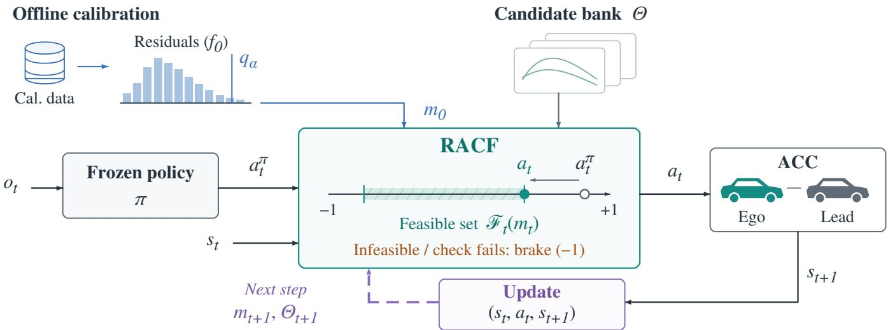  
Fig. 1. RACF data flow. Ofline calibration uses residuals of a fixed nominal predictor to initialize the operating margin. At runtime, the policy proposes $a _ { t } ^ { \pi }$ from $o _ { t }$ , while the filter uses $s _ { t }$ and selected candidate constraints to compute $a _ { t }$ . Completed transitions update the margin and candidate set for the next step. An infeasible solve or failed post-check invokes bounded maximum braking.

$F ( a ) = F _ { \mathrm { m i n } } + ( a + 1 ) ( F _ { \mathrm { m a x } } - F _ { \mathrm { m i n } } ) / 2 = - 1 0 0 0 + 5 0 0 0 a \ \mathrm { N }$ Under an actuator-gain shift $\gamma ,$ the simulator applies $F _ { \gamma } ( a ) =$ $- 1 0 0 0 + 5 0 0 0 \gamma a \ .$ N. At $\Delta t = 0 . 1 \mathrm { s } ,$ the predictor models drag, rolling resistance, road grade, and the mass-dependent forceto-acceleration conversion [17]. The score predictor $f _ { 0 }$ uses a mass of 1500 $\mathrm { k g } ,$ the observed grade, actuator gain 0.7, and constant lead speed. Its drag and rolling coeficients are 0.24 and 0.010, whereas the simulator uses 0.30 and 0.012. Candidate predictors $f _ { \theta }$ vary mass, grade, and gain over a finite set Θ.

We define dimensionless CTH components $\bar { h } _ { g } = ( g - d _ { 0 } -$ $T _ { h } v _ { e } ) / u _ { g }$ and $\bar { h } _ { v } = ( v _ { \operatorname* { m a x } } - v _ { e } ) / u _ { v }$ from the standard ACC spacing policy $d _ { \mathrm { C T H } } = d _ { 0 } + T _ { h } v _ { e } \ [ 1 8 _  $ , 19]. We use $d _ { 0 } = 3$ m, $T _ { h } = 1 . 5 ~ \mathrm { s } ,$ and $v _ { \mathrm { m a x } } = 3 0 ~ \mathrm { m / s } .$ , giving

$$
h _ { \mathrm { f l t } } ( s ) = \operatorname* { m i n } \{ \bar { h } _ { g } ( s ) , \bar { h } _ { v } ( s ) \} .\tag{1}
$$

Closing-speed and braking-distance models provide richer risk definitions [19, 20]. Under the Euclidean norm in the fixed dimensionless coordinates, hfilt is Lipschitz with $L _ { h } = \sqrt { 1 + ( T _ { h } u _ { v } / u _ { g } ) ^ { 2 } } = \sqrt { 3 . 2 5 }$ . Changing reference units or coordinate weights requires recalibration of the score, margin, and Lipschitz conversion.

The episode endpoint $E _ { \mathrm { s a f e } } ( \tau )$ equals one only when every executed transition satisfies $\bar { h } _ { g } ( s _ { t + 1 } ) \geq 0$ and no collision occurs. A collision-terminated episode is unsafe; no undefined post-termination state is evaluated. The speed component $\bar { h } _ { v }$ remains a filter constraint. Speed tracking, headway-violation duration, and comfort are separate outcomes.

## 3. RACF METHOD

## 3.1. Residual calibration and action projection

RACF separates uncertainty calibration from policy optimization. Residuals of the fixed nominal predictor summarize observed one-step mismatch, and their calibrated quantile initializes the operating margin. Projection seeks the smallest feasible change to the policy action under a finite bank of dynamics predictors. Online residual windows let the margin respond to recent mismatch, while candidate selection changes which hypotheses constrain the projection. The predefined bank remains part of the interface, including residual tracking and candidate recovery (Fig. 1). For an independently collected transition $Z = ( s , a , s ^ { + } )$ in the dimensionless coordinates of Sec. 2, define

$$
S _ { 0 } ( Z ) = \| s ^ { + } - f _ { 0 } ( s , a ) \| _ { 2 } , \quad k = \lceil ( n + 1 ) ( 1 - \alpha ) \rceil , \quad q _ { \alpha } = S _ { 0 , ( k ) } ,\tag{2}
$$

where $S _ { 0 , ( k ) }$ is the kth order statistic of the n calibration scores; $q _ { \alpha } = + \infty$ when $k > n$ This score captures aggregate predictor mismatch, including unmodeled lead motion. Conformal risk control provides broader loss-based constructions [21]. In our experiments, $n = 5 0 0$ nominal calibration transitions and $\alpha = 0 . 1$ yield $q _ { \alpha } = 0 . 0 9 1 8 8$ . The independent one-step diagnostic uses uniformly random cruise actions and is separate from the braking and stop–go policy rollouts.

RACF enforces the margin for every active predictor $\{ f _ { \theta }$ : $\theta \in \Theta _ { t } \}$ :

$$
\mathcal { F } _ { t } ( m _ { t } ) = \{ a \in \mathcal { A } : h _ { \mathrm { f l t } } ( f _ { \theta } ( s _ { t } , a ) ) \geq m _ { t } , \ \theta \in \Theta _ { t } \} .\tag{3}
$$

It then minimally modifies the frozen policy proposal:

$$
a _ { t } = \arg \operatorname* { m i n } _ { a \in \mathcal { F } _ { t } ( m _ { t } ) } \| a - a _ { t } ^ { \pi } \| _ { 2 } ^ { 2 } .\tag{4}
$$

The finite candidate set is $\Theta ~ = ~ \{ 1 5 0 0 , 1 8 0 0 \} ~ \times ~ \{ 0 , 3 \} ~ \times$ $\lbrace 0 . 7 , 1 . 0 \rbrace$ over mass (kg), grade (degrees), and actuator gain. Static RACF sets $\Theta _ { t } ~ = ~ \Theta$ and $m _ { t } ~ = ~ \eta q _ { \alpha }$ . Base robust projection keeps the candidate set, objective, bounds, solver, and fallback fixed while setting $m _ { t } = 0$ , thereby isolating the residual-margin efect. Default Static and Adaptive RACF use $\eta \ : = \ : 1$ ; the predictor-aligned comparison instead tests $m = L _ { h } q _ { \alpha }$

The score-defining predictor $f _ { 0 }$ and the constraint predictors $f _ { \theta }$ are separate implementations. A matching parameter label or an implied constraint does not establish functional equality to $f _ { 0 } .$ . Section 4 states the alignment condition linking the nominal score to safety. An empty feasible set or a failed post-solve check invokes bounded maximum braking, which need not preserve this premise (Fig. 1).

## 3.2. Adaptive update and operating envelope

Adaptive RACF updates the candidate set and margin from completed transitions. After a 20-transition warm-up, it recomputes candidate-specific quantiles from a 40-transition window every ten transitions and retains at most four candidates within 0.02 normalized-residual units of the minimum. Observed grade restricts the grid to values within $0 . 7 5 ^ { \circ }$ ; if none qualify, that axis remains unpruned. Outside a recovery period, an upward crossing of $2 q _ { \alpha }$ by the largest candidate residual restores the full grid and suspends pruning for 20 completed transitions; per-step grade filtering continues. Grade compatibility is applied before projection, and an empty intersection restores all compatible candidates. Separately, a 100-transition window Wt updates $m _ { t } = \eta \operatorname* { m a x } \{ q _ { \alpha } , \widehat { q } _ { \alpha } ( W _ { t } ) \}$ on the same schedule. Each episode starts with empty windows, the full residual-tracker set, and $m _ { 0 } = \eta q _ { \alpha }$ After transition $t ,$ the margin and selector updates run in that order and afect action $t + 1$ . These empirical rules use completed transitions only and do not inherit adaptive conformal validity [22].

For a formal finite-horizon construction, define

$$
M _ { H } ( \tau ) = \operatorname* { m a x } _ { 0 \leq t < H } S _ { 0 } ( Z _ { t } ) .\tag{5}
$$

Envelope RACF uses the fixed margin $B = 0 . 4 5$ , which is distinct from a calibrated $q _ { H }$

Nominal and robust CBF-QP minimize action deviation under discrete-time barrier constraints [23]: $\bar { h } _ { j } ( f _ { \theta } ( s _ { t } , a ) ) \geq$ $( 1 - \kappa ) \bar { h } _ { j } ( s _ { t } ) , j \in \{ g , v \}$ . The nominal version enforces one nominal hypothesis, whereas the robust version enforces all eight. We use $\kappa = 0 . 2 ;$ all filters share the same action bounds and bounded-braking fallback.

## 4. COVERAGE AND CONDITIONAL SAFETY

## 4.1. One-step residual coverage

Let $D = ( S _ { 0 , 1 } , \ldots , S _ { 0 , n } ) \sim P ^ { n } $ be i.i.d. calibration scores from P. Conditional on $D ,$ let $Q _ { D }$ be the law of the next deployed score $S _ { 0 , * }$

Theorem 1 (Shifted marginal coverage). For $q _ { \alpha } ( D )$ from (2), i $\dot { { \bf \theta } } \cdot { \bf \cal d } _ { \mathrm { T V } } ( { \cal P } , { \cal Q } _ { \cal D } ) \leq \epsilon$ almost surely in $D$ , then

$$
\mathrm { E } _ { D } Q _ { D } ( ( - \infty , q _ { \alpha } ( D ) ] ) = \operatorname* { P r } _ { D , S _ { 0 , * } } \{ S _ { 0 , * } \le q _ { \alpha } ( D ) \} \ge 1 - \alpha - \epsilon .\tag{6}
$$

Proof sketch. An independent $\smash { \widetilde { S } } _ { * } \sim P$ gives the marginal rank bound. Applying TV to $( - \infty , q _ { \alpha } ( D ) ]$ for each D and averaging subtracts at most ϵ. TV alone does not supply the rank bound. This is marginal over D and $S _ { 0 , * } ;$ it is neither state/history-conditional nor a simultaneous multistep statement.

## 4.2. Residual-to-safety conversion

If the final applied action, including fallback, satisfies $h _ { \mathrm { f l t } } ( f _ { 0 } ( s _ { t } , a _ { t } ) ) ~ \ge ~ m _ { t } ~ \ge ~ L _ { h } q _ { \alpha }$ , then on $S _ { 0 , * } ~ \leq ~ q _ { \alpha }$ , Lipschitz continuity gives $h _ { \mathrm { f i l t } } ( s _ { t + 1 } ) \geq 0 .$ . Under Theorem 1 this yields the same $1 - \alpha - \epsilon$ one-step lower bound. Other candidate constraints require their own discrepancy bound. On the ACC state domain $v _ { e } \geq 0 , h _ { \mathrm { f i l t } } \geq 0$ implies $g \ge d _ { 0 } = 3$ m, above the $_ { 0 . 5 }$ m collision threshold; outside this domain the result is only a barrier-satisfaction bound.

<table><tr><td>Condition</td><td>Role</td><td>Current status</td></tr><tr><td> $\mathrm { I I D } + \mathrm { T V }$ </td><td>Assumed</td><td>Not estimated</td></tr><tr><td> $L _ { h }$ </td><td>Analytic</td><td>Coordinate-derived</td></tr><tr><td> $f _ { 0 } , m = L _ { h } q _ { \alpha }$ </td><td>Structural</td><td>Trace-checked</td></tr><tr><td> $\mathrm { F e a s . \ + \ f a l l b a c k }$ </td><td>Assumed</td><td>Violations logged</td></tr></table>

## 4.3. Practical realizability and premises

Episode-level calibration requires a frozen filter, horizon, reset law, and termination rule. For independent episode maxima $D _ { H } \sim P _ { H } ^ { n _ { H } }$ , a finite-sample qH also requires a shift bound to the deployment episode law. Changing the filter using qH changes that law and requires fresh calibration or another bound; Fig. 2(c) contrasts one-step and policy-conditioned maxima.

Theorem 1 concerns marginal one-step residual coverage under explicit sampling and distribution-shift assumptions. Constraint satisfaction additionally requires the final applied action to satisfy the aligned, Lipschitz-scaled nominal constraint, including on fallback steps. Empirical online updates do not automatically preserve these premises. We therefore separate statistical coverage from executable action conditions; rollout and trace analyses assess observed behavior rather than establish a closed-loop certificate.

## 5. EXPERIMENTS

## 5.1. Evaluation setup

All experiments are ACC partial rollouts. Paired comparisons share policy, condition, scenario, trial, seed, initial state, and lead trajectory. Policy input is its training observation; the filter uses simulator state. Episode safety is $E _ { \mathrm { s a f e } } ( \tau ) = 1$

The registered comparison uses four IQL, four CQL, three BC, and one IDM controller over four physical conditions, two lead scenarios, and 25 shared resets per cell (2,400 units; $H = 5 0 0 )$ . Collision at $g \leq 0 . 5$ m ends an episode. We report uncertainty intervals [24]. Two-sided 95% CIs use 10,000 bootstrap draws of shared reset clusters indexed by condition, scenario, trial, and seed, each carrying all policies.

With $( m , \phi , \gamma )$ in kg, degrees, and actuator gain, nominal and mass shifts use (1500, 0, 1.0) and (1800, 0, 1.0). Slope and combined shifts use (1500, 3, 1.0) and (1800, 3, 0.7). Lead scenarios are brake and stop–go; state-estimation error is outside this study.

## 5.2. Registered comparison

Table 1 compares complete configurations. Adaptive is safe in 2262/2400 episodes (94.3%) versus 1785/2400 (74.4%) for nominal CBF-QP, a 19.9-pp gain. Projection frequency decreases from 8.11% to 6.63%.

(a) Relevant baselines  
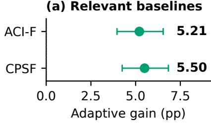

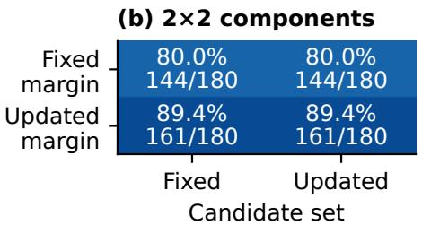  
(d) Matched test differences

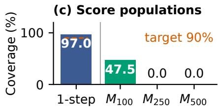

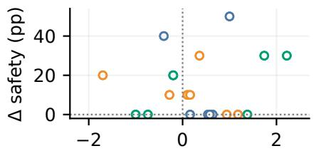  
Δ projection (pp)

(e) Paired online response  
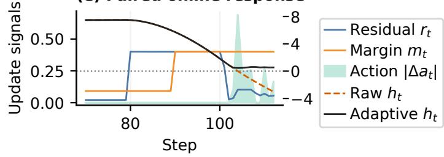  
Fig. 2. ACC partial-rollout evidence. (a) Adaptive-minus-control safety (pp), 95% shared-reset intervals; positive favors Adaptive. (b) Matched candidate-set×margin ablation $( N = 1 8 0 )$ , safety and Safe/N. (c) Independent one-step versus policy-induced episode-max $M _ { H }$ coverage; the 90% target is one-step only. (d) Adaptive-minus-Static safety/projection, 40 development-selected choices; colors denote policy families. (e) Paired trace: $r _ { t } , m _ { t } , | \Delta a _ { t } |$ (left axis), ht (right axis).

Table 1. Separate cohorts. Registered: $N \ = \ 2 4 0 0 ;$ Proj./Corr./Jerk are mean episode projection $( \% )$ , normalized correction, and $P _ { 9 5 }$ jerk $\mathrm { ( m / s ^ { \bar { 3 } } ) }$ Matched hardware: N = 180; time is episode wall time divided by executed steps, averaged over episodes (Supplement Sec. 3.2).
<table><tr><td>Method Safe/N Proj.</td><td>Corr.</td><td>Jerk</td></tr><tr><td>Nominal CBF-QP 1785/2400</td><td>8.11 0.0177</td><td>2.64</td></tr><tr><td>Static RACF</td><td>2133/2400 6.51 0.0172</td><td>3.13</td></tr><tr><td>Adaptive RACF</td><td>2262 /2400 6.63 0.0183</td><td>3.24</td></tr><tr><td>Envelope RACF</td><td>2287 /2400 6.77 0.0188</td><td>3.36</td></tr><tr><td>Robust CBF-QP</td><td>2375/2400 8.02 0.0179</td><td>3.03</td></tr><tr><td>Matched-hardware cohort</td><td> $( N = 1 8 0 )$ </td><td></td></tr><tr><td>Method</td><td> $\mathrm { S a f e } / N$  Runtime (ms/step)</td><td></td></tr><tr><td>Adaptive RACF</td><td>161/180 2.434</td><td></td></tr><tr><td>Envelope RACF</td><td>164/180 4.082</td><td></td></tr><tr><td>Robust CBF-QP</td><td>170/180 3.090</td><td></td></tr></table>

All five methods have zero observed collisions. Fig. 2(a) reports separate Adaptive gains over ACI and CPSF-style of 5.21 pp [3.96, 6.54] and 5.50 pp [4.25, 6.83].

ACI [22] keeps Θ and updates $\alpha _ { t + 1 } ~ = ~ \Pi _ { [ . 0 1 , . 5 0 ] } [ \alpha _ { t } ~ +$ $. 0 1 ( . 1 0 - \overline { { I _ { t } } } ) \big ]$ from a fixed 500-score pool using $\dot { I } _ { t } = \dot { 1 } \dot { \{ S _ { 0 } > } $ $q _ { \alpha _ { t } } \}$ . CPSF-style [8] keeps candidates within $q _ { 0 } = 0 . 0 9 1 8 8$ of $f _ { 0 }$ at $a _ { t } ^ { \pi }$ , restoring Θ if empty. Both share bounds, state, solver, and fallback; they are frozen before test and are one-step interfaces, not multi-step PSF reproductions. Intervention rates are outcomes.

## 5.3. Controlled component studies

With candidates, objective, solver, bounds, and fallback fixed, residual-margin injection raises safety from 1993/2400 to 2102/2400: +4.54 pp [3.63, 5.54]. In a separate 180-unit study, candidate-only and Static reach 144/180, whereas margin-only and joint reach 161/180 (Fig. 2(b)); candidate selection has no independent binary safety gain in this cohort.

Another development/test split gives 162/180, 156/180, 157/180, and 158/180 for selected fixed, rolling, ACI, and Adaptive; Adaptive minus fixed is −2.22 pp [−5.56, 0.56], showing neither superiority nor equivalence. An ofline floor raises rolling/ACI coverage from 83.6/84.3% to 90.4/90.8% without changing paired safety (Supplement Sec. 3.2).

## 5.4. Computational cost and diagnostics

The balanced-order evaluation in Table 1 measures mean amortized rollout time. Adaptive’s mean is 21.2% lower than Robust’s, with 5.00 pp lower safety. This comparison of complete implementations does not isolate candidate selection.

Supplement Secs. 2.3, 2.5, 2.7, and 2.10 provide matchedpoint, coverage, out-of-grid, and typed-fallback diagnostics.

## 6. DISCUSSION AND CONCLUSION

RACF supplies residual-driven action filtering for frozen ACC policies. It has higher episode safety than the evaluated nominal CBF-QP baseline, and controlled tests identify a residualmargin benefit. Adaptive has lower mean amortized rollout time, while Robust CBF-QP has higher episode safety in that cohort. Selected fixed margins remain competitive, so the evidence does not establish a universal advantage for online adaptation.

The conditional analysis links one-step coverage to action execution under explicit premises. Evidence remains limited to simulated ACC, an eight-model library, and simulatorstate access; larger libraries, estimated states, and targethardware evaluation remain future work.

## 7. REFERENCES

[1] S. Levine, A. Kumar, G. Tucker, and J. Fu, “Ofline reinforcement learning: Tutorial, review, and perspectives on open problems,” arXiv:2005.01643, 2020.

[2] I. Kostrikov, A. Nair, and S. Levine, “Ofline reinforcement learning with implicit Q-learning,” in Proc. Int. Conf. Learn. Represent. (ICLR), 2022.

[3] A. Kumar, A. Zhou, G. Tucker, and S. Levine, “Conservative Q-learning for ofline reinforcement learning,” in Adv. Neural Inf. Process. Syst. (NeurIPS), 2020, vol. 33, pp. 1179–1191.

[4] Z. Qiao, R. Yang, J. Lyu, X. Li, Z. Dai, Z. Yang, S. Gao, and S. Qiu, “Dual-robust cross-domain ofline reinforcement learning against dynamics shifts,” in Proc. Int. Conf. Learn. Represent. (ICLR), 2026.

[5] M. Alshiekh, R. Bloem, R. Ehlers, B. K¨onighofer, S. Niekum, and U. Topcu, “Safe reinforcement learning via shielding,” in Proc. AAAI Conf. Artif. Intell., 2018, vol. 32, pp. 2669–2678.

[6] G. Dalal, K. Dvijotham, M. Vecerik, T. Hester, C. Paduraru, and Y. Tassa, “Safe exploration in continuous action spaces,” arXiv:1801.08757, 2018.

[7] A. D. Ames, X. Xu, J. W. Grizzle, and P. Tabuada, “Control barrier function based quadratic programs for safety critical systems,” IEEE Trans. Autom. Control, vol. 62, no. 8, pp. 3861–3876, Aug. 2017.

[8] K. P. Wabersich and M. N. Zeilinger, “A predictive safety filter for learning-based control of constrained nonlinear dynamical systems,” Automatica, vol. 129, 2021, Art. no. 109597.

[9] A. N. Angelopoulos and S. Bates, “Conformal prediction: A gentle introduction,” Found. Trends Mach. Learn., vol. 16, no. 4, pp. 494–591, 2023.

[10] R. J. Tibshirani, R. F. Barber, E. J. Cand\`es, and A. Ramdas, “Conformal prediction under covariate shift,” in Adv. Neural Inf. Process. Syst. (NeurIPS), 2019, vol. 32.

[11] R. F. Barber, E. J. Cand\`es, A. Ramdas, and R. J. Tibshirani, “Conformal prediction beyond exchangeability,” Ann. Statist., vol. 51, no. 2, pp. 816–845, 2023.

[12] L. Lindemann, M. Cleaveland, G. Shim, and G. J. Pappas, “Safe planning in dynamic environments using conformal prediction,” IEEE Robot. Autom. Lett., vol. 8, no. 8, pp. 5116–5123, Aug. 2023.

[13] H. Zhou, Y. Zhang, and W. Luo, “Safety-critical control with uncertainty quantification using adaptive conformal prediction,” in Proc. Amer. Control Conf. (ACC), 2024, pp. 574–580.

[14] Y. Zhao, B. Hoxha, G. Fainekos, J. V. Deshmukh, and L. Lindemann, “Robust conformal prediction for STL runtime verification under distribution shift,” in Proc. ACM/IEEE Int. Conf. Cyber-Phys. Syst. (IC-CPS), 2024, pp. 169–179.

[15] H. Beirami and M. M. M. Islam, “Conformal signal temporal logic for robust reinforcement learning control: A case study,” in Proc. IEEE Int. Conf. Acoust., Speech Signal Process. (ICASSP), 2026, pp. 5881–5885.

[16] K. Rahaman, J. V. Deshmukh, A. R. Hota, and L. Lindemann, “When environments shift: Safe planning with generative priors and robust conformal prediction,” in Proc. 8th Annu. Learn. Dyn. Control Conf. (L4DC), 2026, vol. 331 of Proc. Mach. Learn. Res. (PMLR), pp. 601–623.

[17] R. Rajamani, Vehicle Dynamics and Control, Springer, 2nd edition, 2012.

[18] C. Wu, Z. Xu, Y. Liu, C. Fu, K. Li, and M. Hu, “Spacing policies for adaptive cruise control: A survey,” IEEE Access, vol. 8, pp. 50149–50162, 2020.

[19] T. G. Molnar, G. Orosz, and A. D. Ames, “On the safety of connected cruise control: Analysis and synthesis with control barrier functions,” in Proc. IEEE Conf. Decision Control (CDC), 2023, pp. 1106–1111.

[20] S. Shalev-Shwartz, S. Shammah, and A. Shashua, “On a formal model of safe and scalable self-driving cars,” arXiv:1708.06374, 2017.

[21] A. N. Angelopoulos, S. Bates, A. Fisch, L. Lei, and T. Schuster, “Conformal risk control,” in Proc. Int. Conf. Learn. Represent. (ICLR), 2024.

[22] I. Gibbs and E. J. Cand\`es, “Adaptive conformal inference under distribution shift,” in Adv. Neural Inf. Process. Syst. (NeurIPS), 2021, vol. 34, pp. 1660–1672.

[23] A. Agrawal and K. Sreenath, “Discrete control barrier functions for safety-critical control of discrete systems with application to bipedal robot navigation,” in Proc. Robot.: Sci. Syst. (RSS), 2017.

[24] R. Agarwal, M. Schwarzer, P. S. Castro, A. Courville, and M. G. Bellemare, “Deep reinforcement learning at the edge of the statistical precipice,” in Adv. Neural Inf. Process. Syst. (NeurIPS), 2021, vol. 34, pp. 29304– 29320.

# ADAPTIVE SAFETY FILTERING FOR FROZEN ACC POLICIES VIA CONFORMAL RESIDUAL CALIBRATION

Zhiruo Zhou1,2 Rigaudiere Z. Li1 Chen Xiwen1,3 Yucheng Chen2 Xiaojun Zhu1 Houde Liu1

Supplementary material for the ICASSP 2027 manuscript Tsinghua Shenzhen International Graduate School, Tsinghua University Wuhan University of Technology Shanghai Jiao Tong University

## 1. SUPPLEMENTARY EXPERIMENTS

## 1.1. Evaluation protocol

All studies below are ACC partial rollouts. Compared methods within a cohort share initial physical states, environment seeds, policy checkpoints, inference settings, and exogenous lead trajectories. Policies receive their training-time observations, whereas filters receive simulator state. Outcomes include collision, violation, fallback, early termination, solver status, tracking, jerk, intervention, and latency. Exact McNemar tests are supplementary: they do not account for crosspolicy dependence from shared resets. Binary and continuous efect intervals use 10,000 condition–scenario-stratified shared-reset-cluster bootstrap draws that carry all fixed policies jointly, with Holm correction within each comparison family.

The main comparison contains 12 frozen controllers, four physical conditions, two lead scenarios, 25 resets per cell, and $H = 5 0 0$ . The residual-margin study uses 2,400 fresh paired units; the adaptive study uses 720 units and 80 environment seeds disjoint from calibration and development; the horizon cohort uses 120 units with shared trajectory prefixes. Separate development ablations use nine policies, two conditions, two scenarios, ten resets, and H = 500. The action range is $[ - 1 , 1 ]$ , and all filters use the same bounded-braking fallback. Static/Adaptive RACF use $q _ { \alpha } = 0 . 0 9 1 8 7 6 6$ , Envelope RACF uses fixed $B = 0 . 4 5$ , and ${ \mathrm { C B F - Q P } }$ uses κ = 0.2. Figure 1 presents policy-group, physical-condition, one-step-coverage, and action-noise slices. The controller artifact types and seed provenance are listed in the companion reproducibility record (with SHA-256 asset manifest); all analysis below uses the same frozen assets.

## 1.2. Controlled RACF decomposition

The controlled comparison keeps the eight-candidate projection, dynamics, solver, bounds, and fallback fixed. The zeromargin projection obtains 1,993/2,400 episode-safe rollouts; adding $m = q _ { \alpha }$ produces 2,102/2,400, a paired gain of 4.54 points (95% CI [3.63,5.54]). There are 110 improving pairs and one reversing pair, exact McNemar $p = 8 . 6 \bar { 3 } \times 1 0 ^ { - \bar { 3 } 2 }$ , and zero collisions for both methods.

The margin lowers projection frequency by 0.338 percentage points and violation burden by 0.063 points. Jerk P95 rises by $0 . 2 4 0 \ \mathrm { m / s ^ { 3 } }$ , speed RMSE by 0.002 m/s, and gap RMSE by 0.050 m, exposing the associated control cost.

Table 1. Controlled residual-margin comparison on 2,400 controller–trials. Safe is the exact safe-episode count; Proj. and Viol. are observed-step fractions; Jerk is the mean episode P95 in $\mathrm { m } / \mathrm { s } ^ { 3 }$
<table><tr><td>Method</td><td>Safe</td><td>Proj.</td><td>Viol.</td><td>Jerk</td></tr><tr><td>Base robust projection</td><td>1993</td><td>.0669</td><td>.00323</td><td>2.858</td></tr><tr><td>+ Static RACF</td><td>2102</td><td>.0635</td><td>.00260</td><td>3.098</td></tr></table>

The independent matched cohort evaluates the complete adaptive candidate-and-margin update. Mean correction differs by 0.71% and projection frequency by 0.254 percentage points from static margin 0.25, satisfying the matching criterion. Adaptive obtains 622/720 episode-safe rollouts versus 595/720, a 3.75-point gain (95% CI $[ 2 . 3 6 , 5 . 2 8 ] )$ , with 30 improving and three reversing pairs, $p \doteq 1 . 4 0 \times \mathrm { \ddot { 1 0 } ^ { - 6 } }$ , zero collisions, and speed/gap RMSE ratios of $1 . 0 0 0 5 / 1 . 0 0 4 4$ . Eight policy strata meet the projection-frequency tolerance; BC seed 1 lies outside it, so the comparison is interpreted at the aggregate level.

## 1.3. Absolute filters and candidate set

Robust CBF-QP enforces all eight candidate barrier constraints and has the highest episode-safe rate among evaluated methods in the registered cohort. The controlled decomposition isolates adding the calibrated residual margin to otherwise identical robust projection; it does not compare conformal calibration with alternative margin-selection procedures. In the candidate deletion, only removing the mass axis changes the endpoint; removing grade or gain leaves it unchanged, while the no-mass and nominal sets share the lower endpoint.

## 1.4. Safety-first control-cost selection

The smoothing development study contains 4,320 methodepisodes, 360 paired policy–trial units, and 40 shared resets. Adding the residual margin raises episode-safe count from 249/360 to 277/360 (+7.78 points [5.00,10.56]); fixed

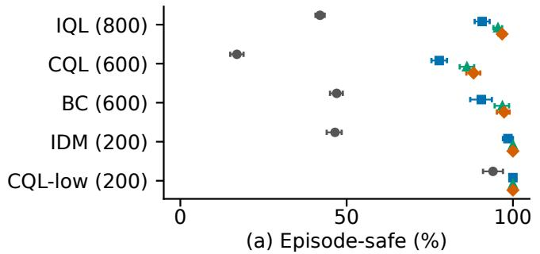

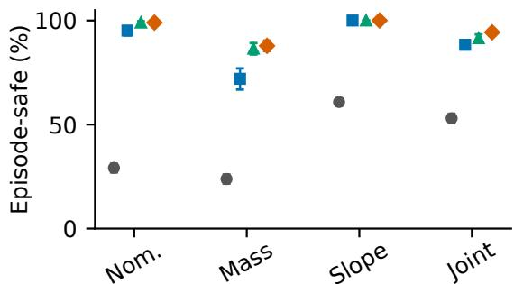  
(b) Physical condition

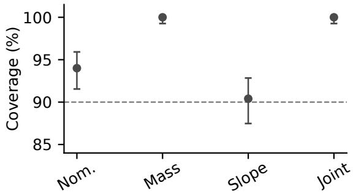  
(c) Physical condition

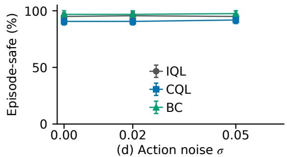  
Fig. 1. Additional ACC results. Panels (a–b) show episode-safe rates with 95% shared-reset cluster-bootstrap intervals for policy groups and physical conditions in the main 12-controller primary matrix. $\mathrm { I Q L / B C }$ use seeds $0 { - } 3 / 0 { - } 2 ~ ( N = 8 0 0 / 6 0 0 ) ;$ CQL uses mixed-data seeds $0 ^ { - 2 } ~ ( N ~ = ~ 6 0 0 )$ , CQL-low the suboptimal-data seed-0 checkpoint $( N = 2 0 0 )$ , and IDM has $N = 2 0 0$ . CQL plus CQL-low forms the CQL family in Table 15. (c) Independent one-step nominal-residual coverage on 500 disjoint transitions per condition, with exact 95% binomial intervals, target $1 - \alpha = 0 . 9$ , and an 84–101.5% detail axis. (d) Adaptive-RACF episode-safe rate with 95% shared-reset cluster-bootstrap intervals for IQL, CQL, and BC under action noise in the six-policy cohort. Color denotes methods in (a–b), while the inset legend denotes policy groups in (d).

B = 0.45 reaches 320/360 (+11.94 points [8.61,15.28]). A matched comparison gives Adaptive 318/360 versus static 302/360 (+4.44 points $[ 2 . 5 0 , 6 . 6 7 ] )$ , accompanied by a 9.11% jerk increase. The separate adaptive study above shows the same direction on independent resets.

We then add $\lambda \| a - a _ { t - 1 } \| _ { 2 } ^ { 2 }$ while retaining the fixed envelope and hard predicted-safety constraints. The selection criterion requires safety within one point, zero collisions, at least 10% jerk reduction, and speed/gap RMSE within 5% of the envelope. The smallest weight reduces jerk by 7.81% while retaining safety within 1.11 points; larger weights yield 31.4–69.6% jerk reductions with broader safety and tracking tradeofs. None of the three smoothing weights meets all four requirements, so subsequent experiments use the original envelope and preserve the predicted-safety priority.

## 1.5. Coverage, horizon, and deployment results

Eight unique $( \alpha , n , H )$ configurations and the $B = 0 . 4 5$ reference give $^ { 1 , 0 8 0 }$ method-episodes. High marginal coverage and trajectory coverage are reported separately:

Across 27 policy–configuration batches (1,080 episode rows and 120 paired reset units), 184 configuration-level observations have at least 90% independent one-step coverage but an episode-level violation. Trace analysis places 97.48% of exceedances in lead-acceleration intervals. The constantlead predictor produces 0.401–0.413 episode maxima under $- 4 ~ \mathrm { { \bar { m } } / \mathrm { { s } } ^ { 2 } }$ braking versus $q = 0 . 0 9 2$ . Retrospectively adding lead modes $\{ - 4 , 0 , 2 \}$ reduces the maximum to 0.0035 and covers 120/120 inspected episodes, motivating dedicated disturbance-aware recalibration on disjoint complete trajectories.

From H = 100 to 500, episode-safe rates change from 66.7 to 7.5% for Raw, 90 to 65% for Base projection, 97.5 to 80% for Static, and 100 to 87.5% for Adaptive/Envelope; Robust CBF-QP remains at 98.3%. The $H \ : = \ : 2 5 0$ values equal the $H = 5 0 0$ values in this cohort. Under action noise $\sigma = 0 , 0 . 0 2 , 0 . 0 5 .$ , Adaptive RACF retains positive gains over Raw across $\mathrm { I Q L / C Q L / B C }$ , while disagreement rises to approximately 0, 0.016, and 0.040. Static/Adaptive/Envelope warmed P95 latencies are 5.72/3.10/5.67 ms on RTX 4090.

A 20-step OSQP MPC solves all 100,000 programs but obtains 0/200 headway-safe trajectories, so it remains a modelmismatch comparison outside the ranking.

Table 2. Main comparison on 2,400 controller–trial units. The lower block selects Envelope–Robust costs; Table 14 includes Adaptive. Corr. is normalized action-correction magnitude, Fall. is an observed-step fraction, Jerk is episode P in $\mathrm { m } / \mathrm { s } ^ { 3 }$ , Speed is speed RMSE in m $\mathrm { _ { 1 / s , } }$ and Gap is gap RMSE in m.
<table><tr><td>Method</td><td>Episode-safe</td><td>Collisions</td></tr><tr><td>Raw</td><td>1001</td><td>904</td></tr><tr><td>Nominal QP</td><td>1437</td><td>0</td></tr><tr><td>Nominal  ${ \dot { \mathrm { C B F - Q P } } }$ </td><td>1785</td><td>0</td></tr><tr><td>Static RACF</td><td>2133</td><td>0</td></tr><tr><td>Adaptive RACF</td><td>2262</td><td>0</td></tr><tr><td>Envelope RACF</td><td>2287</td><td>0</td></tr><tr><td>Robust CBF-QP</td><td>2375</td><td>0</td></tr></table>

<table><tr><td colspan="4">Descriptive control-cost means</td></tr><tr><td>Method</td><td>Corr. Fall.</td><td>Jerk Speed</td><td>Gap</td></tr><tr><td>Envelope RACF Robust CBF-QP .0179 .0073</td><td>.0188 .0097</td><td>3.356 6.706 3.030</td><td>29.079 6.696 28.894</td></tr></table>

Table 3. Candidate-set deletion at fixed $B = 0 . 4 5 .$ . Viol. steps is a count; Proj. and Fallback are observed-step fractions; Safe/120 is the exact safe-episode count.
<table><tr><td>Set</td><td> $\mathrm { S a f e / 1 2 0 }$ </td><td>Viol. steps</td><td>Proj.</td><td>Fallback</td></tr><tr><td>Full grid</td><td>109</td><td>119</td><td>.0701</td><td>.0135</td></tr><tr><td>No mass</td><td>107</td><td>130</td><td>.0776</td><td>.0137</td></tr><tr><td>No grade</td><td>109</td><td>119</td><td>.0701</td><td>.0135</td></tr><tr><td>No gain</td><td>109</td><td>119</td><td>.0713</td><td>.0127</td></tr><tr><td>Nominal</td><td>107</td><td>130</td><td>.0714</td><td>.0133</td></tr></table>

Table 4. Smoothing screen relative to $\lambda \ = \ 0 .$ Safe count is out of 360, ∆Safe is in percentage points, and Jerk/Speed/Gap are ratios. All variants complete 360 rollouts with zero collisions.
<table><tr><td>λ</td><td>Safe count</td><td>∆Safe (pp)</td><td>Jerk</td><td>Speed</td><td>Gap</td></tr><tr><td>0</td><td>320</td><td>0.00</td><td>1.000</td><td>1.000</td><td>1.000</td></tr><tr><td>0.1</td><td>316</td><td>-1.11</td><td>.922</td><td>1.001</td><td>1.009</td></tr><tr><td>1</td><td>293</td><td>-7.50</td><td>.686</td><td>1.011</td><td>1.084</td></tr><tr><td>10</td><td>296</td><td>-6.67</td><td>.304</td><td>1.155</td><td>2.192</td></tr></table>

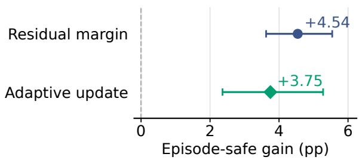  
Fig. 2. Controlled episode-safe efects in two distinct ACC partial-rollout studies: residual-margin injection $( N = 2 4 0 0 )$ and joint candidate–margin updating versus matched Static $( N = 7 2 0 )$ . Whiskers are 95% shared-reset cluster-bootstrap intervals; the latter is not margin-only.

Table 5. Sensitivity results. Setting encodes $\alpha / n / H$ for conformal rows and B, H for the reference. The quantity q is a dimensionless residual threshold; 1-step, MaxCov, and Safe are fractions, and Viol. counts violation steps.
<table><tr><td>Setting</td><td>q 1-step MaxCov Safe Viol.</td></tr><tr><td>.05/500/500 .0962</td><td>.989 .000.800 211</td></tr><tr><td>.10/500/500 .0920</td><td>.970 .000.792 219</td></tr><tr><td>.20/500/500 .0833</td><td>.939 .000.783 225</td></tr><tr><td>.0882</td><td>.959 .000.800 214</td></tr><tr><td>.10/100/500 .10/250/500 .0898</td><td>.963 .000.800 222</td></tr><tr><td> $. 1 0 \dot { / } 1 0 0 \dot { 0 } / 5 0 0$  .0908</td><td>.964 .000.800 221</td></tr><tr><td> $. 1 0 \dot { / } 5 0 0 / \dot { 1 } 0 0$  .0920</td><td>.970 .475.958 18</td></tr><tr><td> $. 1 0 \dot { / } 5 0 0 \dot { / } 2 5 0$  .0920</td><td>.970 .000.792 219 1.000 1.000.925 81</td></tr></table>

Table 6. Robust CBF-QP minus Envelope RACF on 2,400 reset/trial-matched units from separate deterministic runs. Diferences are descriptive, not stepwise paired; positive safety values favor CBF-QP.
<table><tr><td>Metric Robust CBF-Envelope</td></tr><tr><td>Episode-safe (pp) 3.67</td></tr><tr><td>Correction -0.0009</td></tr><tr><td>Projection (pp) 1.25</td></tr><tr><td>Fallback (pp) -0.24</td></tr><tr><td>Jerk P95 -0.327 Gap RMSE -0.185</td></tr><tr><td>Speed RMSE -0.010</td></tr><tr><td></td></tr><tr><td>Latency P95 (ms) -0.029</td></tr></table>

Table 7. Episode-safe rates (%) by physical condition and lead scenario for Raw and Envelope; 300 controller–trial units per row. ∆ is Envelope minus Raw (pp), computed before rounding.
<table><tr><td>Condition/scenario Raw Envelope</td><td></td><td></td></tr><tr><td>Nominal/brake</td><td>50.0</td><td> $1 0 0 . 0 \ \mathrm { ~ + 5 0 . 0 }$ </td></tr><tr><td> $\mathrm { N o m i n a l / s t o p - g o }$ </td><td>8.3</td><td> $9 8 . 0 \ \mathrm { ~ + 8 9 . 7 ~ }$ </td></tr><tr><td> $\mathrm { M a s s / b r a k e }$ </td><td>42.3</td><td> $9 3 . 3 \ \mathrm { \ t { 5 1 . 0 } }$ </td></tr><tr><td> $\mathrm { M a s s / s t o p - g o }$ </td><td>5.3</td><td> $8 2 . 3 \ \mathrm { \Omega } + 7 7 . 0$ </td></tr><tr><td> $\mathrm { S l o p e / b r a k e }$ </td><td>69.7</td><td> $1 0 0 . 0 \ \mathrm { \ t { 3 0 . 3 } }$ </td></tr><tr><td> $\mathrm { S l o p e / s t o p - g o }$ </td><td>52.0</td><td> $1 0 0 . 0 \ + 4 8 . 0$ </td></tr><tr><td> $\mathrm { J o i n t / b r a k e }$ </td><td>69.7</td><td> $9 7 . 0 \ \ + 2 7 . 3$ </td></tr><tr><td> $\mathrm { J o i n t / s t o p - g o }$ </td><td>36.3</td><td> $9 1 . 7 \ \ : + 5 5 . 3 $ </td></tr></table>

Table 8. Initial-state stratification of the Static–Base residual-margin efect. Cuts use pooled medians of 6.618 m headway and −0.0719 m/s closing speed; rows overlap and are not additive; entries are descriptive paired safety diferences. Marginal and intersection rows overlap and are not additive.
<table><tr><td>Initial-state stratum</td><td>Pairs Static-Base</td><td>(pp)</td></tr><tr><td>Small headway, high closing</td><td>696</td><td>6.61</td></tr><tr><td>High closing speed</td><td>1200</td><td>6.67</td></tr><tr><td>Small headway</td><td>1200</td><td>4.92</td></tr><tr><td>Large headway</td><td>1200</td><td>4.17</td></tr><tr><td>Low closing speed</td><td>1200</td><td>2.42</td></tr><tr><td>Large headway, low closing</td><td>696</td><td>2.30</td></tr></table>

Table 9. Paired episode-outcome changes on shared policy, condition, scenario, reset and seed: Raw-unsafe to filter-safe, and the reverse. These count repaired episodes, not withintrajectory recovery events.
<table><tr><td>Filter</td><td>Repaired</td><td>Reverse</td></tr><tr><td>Static RACF</td><td>1132</td><td rowspan="3">0 0</td></tr><tr><td>Adaptive RACF</td><td>1261</td></tr><tr><td>Envelope RACF</td><td>1286</td></tr></table>

## 1.6. Implementation details

Brake episodes start from $( v _ { e } , v _ { l } , g ) \ = \ ( 1 5 , 1 5 , 3 2 )$ in m/s, $\mathrm { m } / \mathrm { s } ,$ , and m; the lead vehicle applies −4 m/s2 over 10–12 s and $+ 2 ~ \mathrm { m } / \mathrm { s } ^ { 2 }$ over 22–25 s.

Stop–go episodes start from (10, 10, 25) and apply the same accelerations over 8–10.5 s and 18–23 s. Randomized resets add independent uniform ofsets in [−1.5, 1.5] m/s to both speeds and multiply gap by a uniform factor in [0.85, 1.15]. Collision terminates an episode at $g \leq 0 . 5$ m; otherwise evaluation ends at the selected horizon.

The policy observes normalized ego-speed error, closing speed, gap, grade, and previous action. The filter uses simulator state; this evaluation excludes sensor and state-estimation error. Adaptive RACF computes candidatespecific $\alpha = 0 . 1$ quantiles from a 40-transition window every ten completed transitions after 20 observations. It retains at most four candidates within 0.02 normalized-residual units of the smallest quantile, with deterministic index tiebreaking. Outside a recovery period, an upward crossing of $2 q _ { \alpha }$ by the maximum candidate residual restores the full candidate set and suspends pruning for 20 completed transitions. Per-step grade filtering continues; pruning resumes at the next eligible ten-transition update. A separate 100- transition nominal-residual window updates the operating margin while preserving $q _ { \alpha }$ as a floor.

RACF and CBF-QP use SLSQP with at most 40 iterations and ftol $= ~ 1 0 ^ { - 1 0 }$ over $a \ \in \ [ - 1 , 1 ]$ . A post-solve constraint tolerance of $1 0 ^ { - 8 }$ determines feasibility; infeasible or unsuccessful solves apply $a = - 1$ . Per-trial outputs retain solver status, iterations, fallback, action correction, constraint margin, latency, and the complete experiment configuration.

Table 10. Predictor-alignment methods on 180 evaluation episodes. Safe is the headway-plus-collision endpoint; FB is fallback steps divided by observed steps. J95 is the mean per-episode jerk P95.
<table><tr><td>Method</td><td>Safe/N Coll. |∆a| FB (%)  $J _ { 9 5 }$ </td></tr><tr><td>Raw 28/180</td><td>82 0.0000 0.00 0.76</td></tr><tr><td>Base projection 124/180</td><td>0 0.0152 1.32 2.13</td></tr><tr><td>Static RACF 144/180</td><td>0 0.0151 1.32 2.20</td></tr><tr><td>Aligned RACF</td><td>149/180 0 0.0155 1.36 2.22</td></tr><tr><td>Robust CBF 170/180</td><td>0 0.0146 0.89 2.03</td></tr><tr><td>Envelope RACF 164/180</td><td>0 0.0158 1.36 2.28</td></tr><tr><td>Episode transfer 170/180</td><td>0 0.0165 1.41 2.23</td></tr><tr><td>Margin only 161/180</td><td>0 0.0158 1.37 2.22</td></tr><tr><td>Candidates only 144/180</td><td>0 0.0153 1.34 2.26</td></tr><tr><td>Both components 161/180</td><td>0 0.0158 1.38 2.26</td></tr></table>

Table 11. Episode-max calibration range by physical condition. Values pool the six policy–scenario strata per condition; coverage counts are descriptive.
<table><tr><td>Condition</td><td>qí range</td><td>Frozen</td><td>Transfer</td></tr><tr><td>Nominal</td><td>0.4016-0.4133</td><td>56/60</td><td>54/60</td></tr><tr><td>Mass +20%</td><td>0.4012–0.4020</td><td>54/60</td><td>55/60</td></tr><tr><td>Gain 0.7</td><td>0.4005-0.4005</td><td>55/60</td><td>55/60</td></tr></table>

## 1.7. Predictor-alignment study

This alignment experiment uses diferent constraints from the equal-cardinality comparison in Sec. 3.2; the two cohorts are analyzed separately. These ACC partial rollouts use three seed-0 policies (IQL, CQL, BC), two lead scenarios, three physical conditions (nominal, mass shift, and actuator gain 0.7), ten development and ten evaluation resets per cell, and H = 500. The experiment contains 2,220 method–episode rows and 1,080,508 observed steps; all rows and early terminations are retained in the accompanying manifest.

The aligned variant explicitly keeps the nominal predictor $f _ { 0 }$ in the constraint set and uses $m = L _ { h } q _ { \alpha } = 0 . 1 6 5 6 3$ . It reaches 149/180 (82.78%) episode-safe evaluation episodes. Static RACF reaches 144/180 (80.00%), while Robust CBF-QP reaches 170/180 (94.44%) in this smaller cohort. The paired aligned–static diference is +2.78 percentage points (6 favorable and 1 adverse pair); this is an empirical operatingpoint result, not a closed-loop guarantee.

The candidate-only ablation has the same 144/180 safety count as Static, whereas the margin-only and joint updates each reach 161/180 (89.44%). Their paired diferences against Static are both +9.44 percentage points; candidate-only has no discordant pair. The window-20 sensitivity reaches 108/120 (90.00%) and top-2 selection 109/120 (90.83%) on the nominal/mass subset. These values support a componentlevel sensitivity statement within this cohort, not a general adaptive-validity claim.

The diagnostic calibrates stopped-episode maxima within 18 pre-frozen policy–condition–scenario strata, including collision-terminated failures. These follow the declared stopping rule and are not complete-H = 500 maxima for terminated episodes. The resulting qH values range from 0.4005 to 0.4133. These values exceed the one-step $q _ { \alpha }$ and hence do not meet $q _ { H } ~ \le ~ q _ { \alpha }$ , the condition obtained from the margin-fit requirement $m _ { t } ~ \ge ~ L _ { h } q _ { H }$ when $m _ { t } = L _ { h } q _ { \alpha }$ The displayed rates therefore serve as operating-point evidence rather than a pathwise guarantee. The frozen aligned controller’s episode-max coverage is reported alongside the transfer controller in Fig. 3; changing the margin changes the trajectory law, so the latter remains an empirical transfer test.

## 2. ADDITIONAL EXPERIMENTS AND ANALYSES

This section examines component efects, coverage, dynamics shifts and fallback behavior. Simulator results are ACC partial rollouts; analyses of existing data and mock measurements are identified explicitly. Experiment identifiers link the reported counts to the accompanying records.

## 2.1. Unified endpoint and fallback definitions

The primary episode-safe endpoint used by Table 2 and resetmatched recovery is satisfied when every executed transition has nonnegative headway (gap) margin and the episode has no collision. A collision is recorded separately even when an episode terminates early. The dual endpoint, which additionally requires the speed margin, is retained as a labelled diagnostic in fixed-scope and replay tables; it is not silently substituted for the Table 2 endpoint. Projection is the fraction of executed steps with the solver’s projected flag (or the equivalent applied–policy action diference in the A100 baseline trace); action correction is the mean $\left| a _ { t } - a _ { t } ^ { \pi } \right| ;$ jerk is the per-episode 95th percentile of absolute jerk; fallback is the fraction of executed steps for which the solver/postcheck path invokes the emergency action. These definitions are applied to the 2×2 ablation, matched comparisons, ACI, and CPSF-style experiments. The initial transition records did not type fallback causes. Job 82163 therefore reruns the frozen evaluation units with post-solve telemetry only and reports the scoped exact taxonomy below; the original actions and trajectories remain bit-identical.

## 2.2. Candidate–margin 2×2 ablation

The four methods reuse 180 policy–condition–scenario–trial units from Job 81161, with identical resets, seeds, solver, bounds, and fallback. The binary endpoint and continuous paired summaries are computed from per-trial records.

The corresponding mean action-correction diferences are +0.00019, +0.00075, −0.00008, and +0.00047; mean jerk-P95 diferences are +0.0616, +0.0206, +0.0415, and +0.0004 in the same order. Thus the observed binary gain in this cohort is attributable to margin adaptation; the candidate update has no separate observed binary gain.

For the predictor-alignment comparison at $q _ { \alpha } ,$ , the sharedreset cluster-bootstrap interval is [18.89, 28.89] pp. Resampling individual rows instead gives [17.78, 30.56] pp; we use the cluster interval to preserve dependence among policies evaluated on the same resets.

## 2.3. Intervention-matched Pareto comparison

Job 82029 evaluated 1,920 rows (three policies, two physical conditions, two lead scenarios, eight operating points, ten development and ten independent test trials). Static margins were selected on development projection rates. The predefined matching criteria (projection-rate error at most 0.005 and relative action correction error at most 0.10) retained 40 of 48 adaptive–static choices, yielding 400 paired test units; eight unmatched choices remain in the records but are excluded from this comparison. Figure 4 shows three safety– utility views: safety–intervention, safety–jerk, and safety– correction views. This is a partial rollout and does not establish a global Pareto frontier.

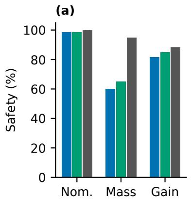

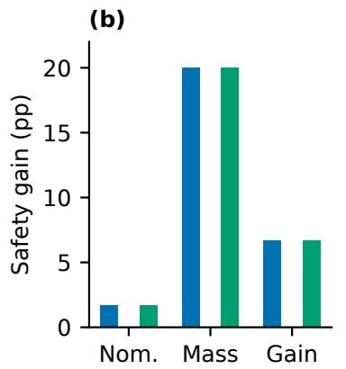

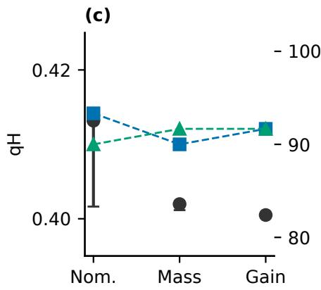

Fig. 3. Predictor-alignment and component comparisons in ACC partial rollouts. (a) Safety for Static, predictor-aligned RACF, and Robust CBF-QP across nominal, mass, and gain conditions. (b) Candidate-only, margin-only, and joint updates relative to Static. (c) Episode-max $q _ { H }$ median and range (left axis) and stopped-episode coverage in percent (right axis); the transfer series changes the controller and is descriptive.  
Table 12. 2×2 ablation on 180 shared evaluation units. Continuous values are treatment minus reference; intervals are shared-cluster bootstrap 95% intervals.
<table><tr><td>Contrast</td><td> ${ \mathrm { S a f e } } _ { \mathrm { r e f } }$ </td><td> $\mathrm { S a f e } _ { \mathrm { t r t } }$ </td><td>∆ safe (pp)</td><td>Proj.  $\Delta$ </td><td>FB  $\Delta$ </td></tr><tr><td>Candidate only - static</td><td>144</td><td>144</td><td>0.00 [0,0]</td><td>-0.00049</td><td>+0.00017</td></tr><tr><td>Margin only - static</td><td>144</td><td>161</td><td>+9.44 [4.44,15.56]</td><td>-0.00107</td><td>+0.00048</td></tr><tr><td>Both – margin only</td><td>161</td><td>161</td><td>0.00 [0,0]</td><td>+0.00026</td><td>+0.00007</td></tr><tr><td>Both – candidate only</td><td>144</td><td>161</td><td>+9.44 [4.44,15.56]</td><td>-0.00032</td><td>+0.00038</td></tr></table>

## 2.4. Predictor alignment and fallback analysis

The predictor-aligned RACF analysis uses 90,000 recorded evaluation steps. The nominal $f _ { 0 }$ is explicitly present at all steps, $m = L _ { h } q _ { \alpha } = 0 . 1 6 5 6 3 2 9 4 8 4$ at all steps, and no strict implication failure is observed. Safety is 149/180; fallback occurs on 1,224/90,000 steps (1.360%). The episode-calibrated transfer variant also includes $f _ { 0 }$ at all steps, but changes the closed-loop policy through qH-dependent margins; it is an empirical transfer diagnostic (170/180 safe, 1,265/90,000 fallback steps), not a guarantee. Emergency fallback can leave a negative robust constraint. The original trace does not itself support a typed decomposition; the separately instrumented Job 82163 below supplies that decomposition without changing the action path. These limitations restrict interpretation of the observed safety results.

## 2.5. Rolling coverage and adaptive conformal baseline

The isolated ACI baseline uses the first 500 nominal calibration scores, $\alpha _ { 0 } ~ = ~ 0 . 1 0 , ~ \gamma ~ = ~ 0 . 0 1$ , and the same state access, candidate grid, solver, and fallback. On 180 paired evaluation episodes it is 143/180 safe, versus 144/180 for static RACF (diference −0.56 pp, cluster-bootstrap CI [−1.67, 0.00]) and 161/180 for adaptive RACF (diference $\dot { \mathbf { \Sigma } } - 1 0 . 0 0 ~ \mathrm { p p } , \mathrm { ~ \dot { C } I ~ } [ - 1 4 . 4 4 , - 6 . 1 1 ] )$ . Descriptive rolling coverage is 0.8997 before step 100 and 0.8675 after step 100 with a 50-step window; the episode miscoverage mean is 0.1261.

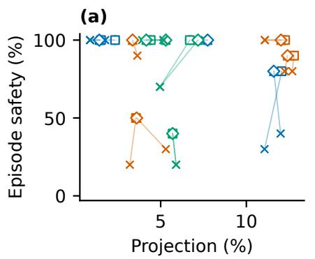

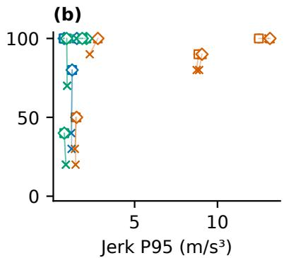

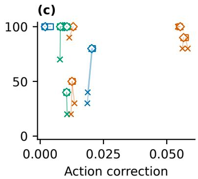  
Fig. 4. Development-matched Pareto comparisons on independent test seeds. (a) Safety versus projection frequency. (b) Safety versus episode $P _ { 9 5 }$ jerk. (c) Safety versus mean action correction. Crosses are Static operating points, open markers are Adaptive points, and lines connect each eligible pair. Colors identify policy families. Marker labels give the residual-window length (40 or 100) and fixed-threshold or residual-triggered updating.

Figure 5 reports the stepwise trajectory. These values do not establish adaptive conformal validity or a closed-loop safety guarantee.

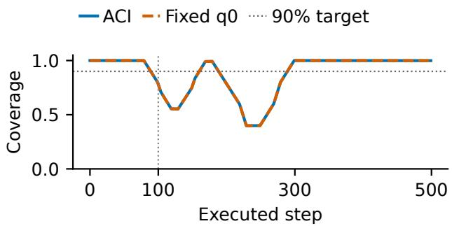  
Fig. 5. Descriptive rolling coverage from the ACI partial rollout. The blue ACI and orange fixed-q0 curves use a 50-step rolling window and coincide where the coverage values agree. The vertical line marks step 100 and the dashed horizontal line the 0.90 target.

## 2.6. External CPSF-style comparator

The external baseline is a one-step finite predictive-set comparator: $\mathcal { C } _ { t } = \{ \theta _ { i } : \| f _ { \theta _ { i } } ( s _ { t } , a _ { t } ^ { \pi } ) - f _ { 0 } ( s _ { t } , a _ { t } ^ { \pi } ) \| \le q _ { 0 } \}$ , followed by the unchanged RACF projection and fallback. It is not a multi-step backup/viability predictive safety filter reproduction. Job 82045 completed 180 paired episodes and 90,000 steps. It obtains 144/180 safety, equal to static RACF (paired diference 0.00 pp, CI [0,0]) and below adaptive RACF by 9.44 pp (CI [−13.89, −5.56]). Fallback is 1,192/90,000 steps (1.324%); no predictive set was empty in this cohort. The result is an empirical external-baseline comparison only.

## 2.7. Dynamic recovery and out-of-grid evidence

The dynamic trace reconstruction uses 180 existing adaptive traces and 360 observable strong-residual proxy events. Margin response occurs for 360/360 events, candidate broadening for 249/360, first action intervention for 155/360, and ten-step residual recovery for 360/360. These are observable proxy alignments, not causal selector-trigger labels. Figure 6 shows one selected time window.

The completed mass development cohort (Job 81979) contains 1,000 rows over 1,200, 1,500, 1,800, and 2,100 kg; 1,200 and 2,100 kg are extrapolation points relative to the registered mass range. It has 46 collision rows and is reported only as development partial-rollout evidence. The four-axis extension (Job 82049) covers mass, grade, actuator gain, and lead braking in 3,750 method–episode observations under its separate frozen protocol. Collision-free and controllable-safe endpoints are reported separately; this remains development partial-rollout evidence rather than a generalization or fullbenchmark claim.

## 2.8. Runtime and utility boundary

The real CPU episode probe covers 54 ACC episodes (three policies, three conditions, two scenarios, three trials) and 27,000 executed steps. Wall-clock episode latency has mean/P50/P95/P99/max 1,030.8/1,039.5/1,424.4/1,590.4/ 1,619.6 ms. The warm per-step policy–filter end-to-end stage has an episode mean of 1.992 ms and an episode-mean P95 of 2.781 ms; its mean filter-only and update stages are 1.591 and 0.234 ms. This is a real CPU partial-rollout measurement, but it remains host-specific and is not a target-hardware or full-benchmark latency claim. The frozen-state CPU mock probe is retained in the evidence package for comparison. Existing utility tables report safety, collision, violation burden, tracking error, jerk, action correction, and projection frequency; fallback safety is kept separate because the analysis shows that emergency fallback can violate the robust constraint.

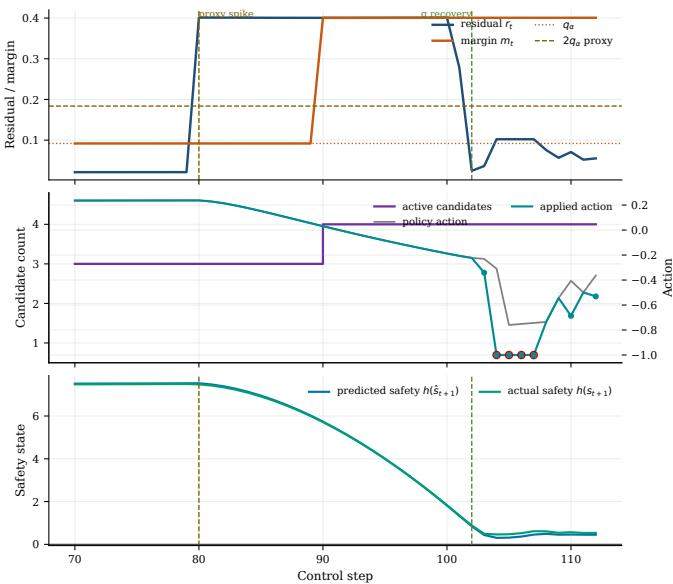

Fig. 6. Dynamic-response trace reconstructed from existing serialized observables. (a) Residual $\boldsymbol { r } _ { t } ,$ margin $m _ { t }$ $q _ { \alpha } ,$ and the $2 q _ { \alpha }$ proxy threshold. (b) Active-candidate count and policy/applied actions; red-outlined points mark emergency braking. (c) Predicted and actual safety margins. Vertical lines mark the proxy spike and residual recovery. The sequence is descriptive and does not imply that fallback preserves safety.  
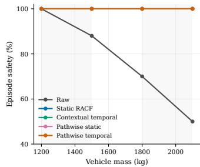

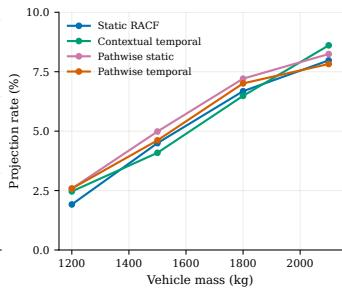  
Fig. 7. Mass-axis development diagnostic. (a) Episode-safe rate and (b) projection rate for Raw and four RACF operating points. Masses 1500 and 1800 kg are registered; 1200 and 2100 kg are extrapolation points. This development partial rollout is not a generalization guarantee.

## 2.9. One-factor sensitivity sweep

Job 82109 evaluates 1,040 episodes from one frozen IQL checkpoint: four physical conditions, two lead scenarios, five development and five independent test trials, and 13 configurations. The default is frozen at window 40, update interval $1 0 , \ \eta \ : = \ 1$ , top-k = 4, pruning slack 0.02, grade threshold $0 . 7 5 ^ { \circ }$ , restore threshold $2 q .$ and recovery length 20. Alternatives vary one factor at a time: window 100; update intervals 5 and 20; $\eta = 0 . 5$ and 1.5; top- $k = 2 ;$ pruning slack 0.01 and 0.05; grade thresholds 0 and $1 . 5 ^ { \circ } ;$ and restore thresholds q and 3q. Development ranking uses safety, then violation rate, action correction, and jerk; independent test rows are never used to select a configuration. The test endpoint is unchanged across these settings in this cohort, while projection, fallback, correction, and jerk diferences are retained in the machine-readable analysis.

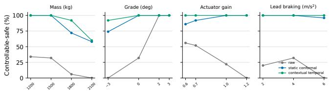  
Fig. 8. Four-axis out-of-grid development summary from Job 82049. Panels show the controllable-safe rate for Raw, Static conformal, and Contextual temporal across mass, grade, actuator gain, and lead braking. Collision-free status, projection, fallback, correction, jerk, and paired cluster-bootstrap contrasts are reported in the numerical results rather than plotted here.

## 2.10. Fallback causes and outcomes

Job 82163 is a 540-episode, 270,000-step ACC partial rollout comprising 180 development traces and the same 180 evaluation units for predictor-aligned and adaptive RACF. It freezes policies, checkpoints, reset seeds, conditions, scenarios, horizon, SLSQP options, action bounds, and emergency action. The instrumentation runs after the unchanged solver/action path; all 540 traces are state- and applied-action-identical to Job 81161 (maximum diferences zero).

For the registered scalar ACC action $a \in [ - 1 , 1 ] ,$ every active one-step constraint is non-increasing in a. Hence the continuous feasible intersection is empty exactly when the complete constraint vector at $a = - 1$ fails the $- 1 0 ^ { - 8 }$ tolerance. Under this scoped predicate, predictor-aligned RACF has 1,224 fallback invocations in 90,000 evaluation steps: 812 feasible-set-empty, 412 solver-failure, and zero post-checkfailure. Adaptive RACF has 1,241: 808, 433, and zero, respectively. The corresponding numbers of episodes with fallback are 140/180 and 145/180. No fallback step is a collision; 439 aligned and 276 adaptive feasible-set-empty fallback steps have a simultaneous gap violation, while solver-failure steps have none. This exactness statement is limited to the registered scalar one-step ACC model and tolerance; it is not a generic RACF or closed-loop safety guarantee. The earlier 401-action analysis is retained as an analysis-only historical cross-check and gives identical counts in this cohort.

## 3. ADDITIONAL EVIDENCE AND REPRODUCIBILITY

Main Fig. 2 summarizes five complementary comparisons. This supplement provides the complete method table, horizon, condition/scenario and family slices, protocols, traces, and continuous utility details. Figure 10 separates horizon, physical-condition, lead- scenario, and policy-family evidence. Table 13 states the intended scope of the three uncertainty-aware interfaces.

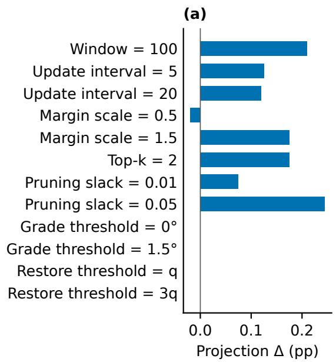

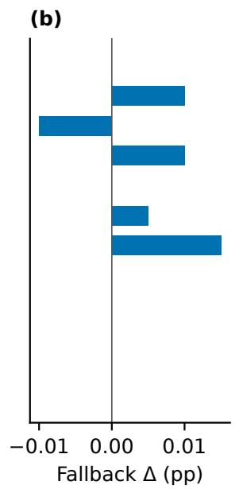

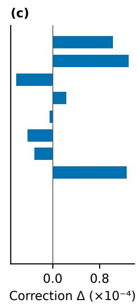  
Fig. 9. Independent-test deltas relative to the frozen sensitivity baseline. Rows vary one hyperparameter at a time; bars show setting-minus-baseline changes in projection and fallback (pp) and mean action correction $( \bar { 1 } 0 ^ { - 4 }$ normalized action units). Safety endpoint deltas and cluster-bootstrap intervals are retained in the accompanying JSON.

## 3.1. Evaluation cohorts and data sources

The residual-margin isolation cohort and the complete registered comparison are distinct experiments. The former is Job 80915 (‘racf pre racf baseline v1‘) with seed base 380000000, 12 policies, four conditions, two scenarios, 25 resets per cell, and 4,800 method rows; its Base/Static counts are 1993/2400 and 2102/2400. The latter reuses the fixed Job 79931 evaluation set and adds the Job 82381 extension under ‘racf full registered acc matrix v1‘; it has 12 policies, four conditions, two scenarios, 25 resets per cell, nine methods, and 21,600 rows; its Static row is 2133/2400. These same-name rows do not share a verified trial-key set and are not pooled. The package includes the two protocols, manifests, source hashes, and document why the cohorts are not pooled.

## 3.2. Matched-window mechanisms and computation

Job 82722 comprises three experiments in one A100 allocation. The margin study uses the same three frozen policies, nominal/mass/gain conditions, brake/stop–go scenarios, solver, eight-candidate set, state access, and fallback. Five development resets per cell select a fixed margin from $\{ 0 , 0 . 0 5 , q _ { \alpha } , L _ { h } q _ { \alpha } , 0 . 2 5 , 0 . 3 5 , 0 . 4 5 , 0 . 6 0 \}$ and clipped-ACI $\gamma ~ \in ~ \{ 0 . 0 0 5 , 0 . 0 1 , 0 . 0 2 \}$ before 10 disjoint test resets per cell. Fixed, rolling without/with an ofline floor, ACI without/with that floor, Adaptive, Envelope, and Robust reach 162, 156, 156, 157, 157, 158, 159, and 171 safe episodes out of 180; all have zero collisions. The floor changes no binary outcomes. Adaptive minus fixed is −2.22 pp (95% sharedcluster $\mathrm { C I } \ [ - 5 . 5 6 , 0 . 5 6 ] )$ , whereas Robust minus Adaptive is +7.22 pp ([2.78, 12.22]). Thus neither a conformal-specific nor an update-rule safety advantage is identified. Fixed, rolling and ACI controls use the full grid; only the four rolling/ACI arms use the strict $r _ { t } > q _ { t } ^ { \mathrm { r a w } }$ miss and 100-step window updated per step after warm-up; standard Adaptive retains candidate selection and ten-step updates. The floor afects only control; ACI feedback uses $q _ { t } ^ { \mathrm { r a w } }$ and $\alpha _ { t }$ updates during warm-up. All 18,000 paired warm-up steps are identical. Floor activation of $4 5 . 7 \% / 4 6 . 2 \%$ raises coverage from 83.6/84.3% to 90.4/90.8% but yields zero discordant safety pairs, an observed null rather than population equivalence.

The runtime study uses one A100-PCIE-40GB GPU, one inference process and eight allocated CPUs; OMP, MKL, OpenBLAS and NumExpr thread limits are one. The CPU model and PyTorch inter-op thread count were not logged. Balanced method order shares the same software and host allocation with two other experiments. Wall time spans episode setup/reset, policy inference, filtering, updates, simulator steps, in-memory diagnostics and outcome aggregation; checkpoint loading and trace-file compression are excluded. Per-episode wall time divided by executed steps is averaged across episodes. Adaptive, Envelope, and Robust average 2.434, 4.082, and 3.090 ms per executed step and reach 161/180, 164/180, and 170/180 safety. Adaptive retains the closest residual candidate on 98.11% of steps with mean residual regret $1 . 5 4 \times 1 0 ^ { - 5 }$ . The alignment study holds cardinality at one: exact $f _ { 0 }$ and a parameter-matched callable are endpoint-identical on all 180 pairs (133/180). A safetydirection residual gives $q _ { h } = 0 . 0 8 1 9 3 \mathrm { : }$ ; margins qα, $L _ { h } q _ { \alpha }$ , and $q _ { h }$ yield 138/180, 143/180, and 139/180 safety. Hence the directional variant does not replace the present method. The accompanying records contain protocols, scripts, hardware specifications, input manifests, paired intervals and SHA256 checksums. All simulator results are partial rollouts, not a closed-loop certificate or external benchmark.

Table 13. Operational distinction between uncertaintyaware safety interfaces. Resid. identifies the calibrated object; Adapt. denotes online updating; Models denotes explicit predictive-model constraints; Fallback records whether a bounded emergency action is part of the interface.
<table><tr><td>Method</td><td>Resid.</td><td></td><td>Adapt. Models Fallback</td><td></td></tr><tr><td>Pred. filter</td><td>set</td><td></td><td>model</td><td></td></tr><tr><td>Adapt. conf.</td><td>quantile</td><td>yes</td><td></td><td></td></tr><tr><td>RACF (ours)</td><td>margin</td><td>yes</td><td>limited bounded</td><td></td></tr></table>

On the shared evaluation cohort, Adaptive RACF exceeds ACI by 5.21 pp (95% paired cluster-bootstrap interval [3.96, 6.54]) with 127 favorable and two adverse pairs. It exceeds CPSF-style by 5.50 pp ([4.25, 6.83]) with 134 favorable and two adverse pairs. The comparison isolates the residual-toaction interface: the policies, reset states, exogenous lead trajectories, solver, and fallback are unchanged. For Adaptive minus Envelope, 95% intervals for safety, projection, correction, and jerk are [−1.58, −0.54] pp, [−0.26, −0.02] pp, [−0.00053, −0.00035], and [−0.182, −0.046]. Against Robust, they are [−5.88, −3.58] pp, [−1.59, −1.20] pp, [0.00031, 0.00063], and [0.126, 0.297].

For Fig. 2(d), each of the 48 development choices is one of four adaptive configurations in a policy–condition–scenario stratum (3 policies, 2 conditions, 2 scenarios). Eligibility requires absolute projection-rate error ≤ 0.5 pp and relative action-correction error $\leq 1 0 \%$ against the nearest Static point. Forty choices pass; the eight failures are omitted from the matched-pair plot. Each retained choice is evaluated on 10 disjoint test resets, giving 400 paired test units.

In Table 16, the added-f configuration minus the singleton has 95% shared-reset intervals [18.89,28.89] pp at qα and [5.56,13.89] pp at $L _ { h } q _ { \alpha }$ . Because adding $f _ { 0 }$ also changes constraint cardinality, these quantify the paired configuration diferences, not isolated alignment efects.

## 3.3. Limitations and negative results

Candidate-only matches Static at 144/180 safe episodes in the fixed cohort, while margin-only and Joint reach 161/180. ACI and CPSF-style comparisons are one-step interface comparisons rather than multi-step viability-filter reproductions. Adaptive and Envelope relax the formal alignment, scaling, feasibility, or fallback premises, so their safety remains empirical.

## 3.4. Assessment of theoretical assumptions

Reference-score exchangeability and the deployment TV radius ϵ are theorem inputs; neither is estimated by the rollout matrix. In the aligned 180-episode study, the exact $f _ { 0 }$ constraint and $m = L _ { h } q _ { \alpha }$ relation are trace-checked on all 90,000 steps with no missing or margin-mismatch rows. This verifies only the structural premises. The same analysis records 1,224 fallback invocations, including 812 steps where emergency braking leaves a negative robust constraint, so premisepreserving fallback is not established. The aligned result therefore remains empirical. An analysis of existing traces checks $V _ { t } \leq C _ { t } + P _ { t }$ on 90,000 archived steps per method; zero violations occur with both residual coverage and the nominal premise satisfied. Full $( V , C , P )$ , fallback-step and fallbackepisode counts are available in the accompanying transitionlevel analysis, which does not estimate IID/TV assumptions or a closed-loop guarantee.

The added-f diagnostic is not a default-grid insertion experiment. Its non-aligned configuration is a singleton with mass 1500 kg, grade $0 ^ { \circ }$ , and actuator gain 1.0. The aligned configuration adds the exact score-defining $f _ { 0 } .$ The development-set diagnostic contains actions for which the singleton candidate passes and $f _ { 0 }$ fails at the same margin, confirming implementation-level non-equivalence. Because cardinality also changes from one to two constraints, the safety diference is not an isolated alignment efect.

## 3.5. Adaptive execution order

At step t, grade compatibility is applied to the selector’s current set before projection. After each completed transition, margin updates precede selector updates; both afect step $t + 1 .$ Selection starts after 20 transitions, uses a 40- transition window, and is recomputed every ten transitions. Outside a recovery period, an upward crossing of $2 q _ { \alpha }$ restores the selector’s full grid for 20 completed transitions; pruning is suspended during this counter, while the per-step grade filter remains active. Pruning resumes at the next eligible ten-transition update. ACI changes only its quantile margin; CPSF-style forms its one-step set at the current policy proposal.

## 3.6. Reproducibility and baseline contracts

The matrix uses four physical conditions, brake and stop–go motion, 25 resets per cell and $H = 5 0 0 \ ( { \mathrm { S e c . ~ } } 1 . 1 )$ . Policies observe normalized speed error, closing speed, gap, grade and previous action; filters receive simulator state. The 500 disjoint nominal calibration transitions give $q _ { \alpha } = 0 . 0 9 1 8 7 6 6$ at α = 0.1. Episode safety requires nonnegative headway margin and no collision $( g \leq 0 . 5 ~ \mathrm { m } )$ . Infeasibility or failed checks invoke bounded braking.

ACI initializes $\alpha _ { 0 } = 0 . 1 0 $ , forms $I _ { t } = 1 \{ e _ { t } > q _ { \alpha _ { t } } \}$ , updates $\alpha _ { t + 1 } = \Pi _ { [ . 0 1 , . 5 0 ] } [ \alpha _ { t } + 0 . 0 1 ( 0 . 1 0 - I _ { t } ) ]$ , and recomputes the quantile from the fixed 500-score pool while retaining all eight candidates. CPSF-style uses $\mathcal { \bar { C } } _ { t } = \{ \theta : \| f _ { \theta } ( s _ { t } , a _ { t } ^ { \bar { \pi } } ) - $ $f _ { 0 } ( s _ { t } , a _ { t } ^ { \pi } ) \lVert _ { 2 } ~ \leq ~ q _ { 0 } \}$ with $q _ { 0 } ~ = ~ 0 . 0 9 1 8 7 6 6 ;$ an empty set restores the full grid. Both interfaces share models, solver and fallback; neither reproduces a multi-step filter.

(a) Shared-trial prefixes  
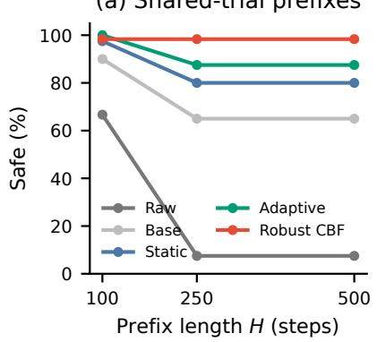

(b) Envelope − Raw gain (pp)  
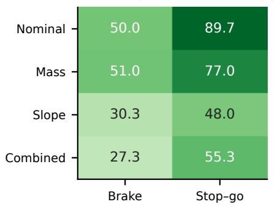

(c) Policy-family slice  
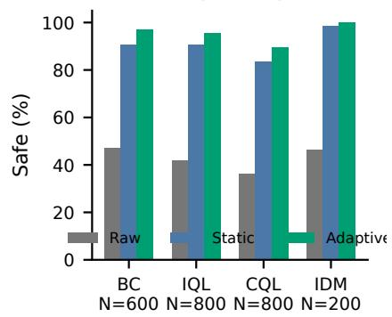  
Fig. 10. Registered supporting slices. (a) Safety on shared trial prefixes; all horizons use fixed denominators and collisionstopped trajectories remain unsafe at longer prefixes. (b) Envelope–Raw safety gain over four physical conditions and two lead scenarios. (c) Raw/Static/Adaptive policy-family safety; denominators appear below each family and exact safe counts are in Table 15.

Table 14. Safety–utility results on the shared ACC cohort. Safe is the exact safe-episode count and SR its percentage; Coll. counts collision-terminated episodes. Projection and fallback are observed-step percentages, Correction is the mean absolute normalized action change, and jerk is episode $P _ { 9 5 }$ in $\mathrm { m } / \mathrm { s } ^ { 3 }$ . Utility uses observed prefixes, so Raw collisions confound cross-method utility comparisons through survival/truncation. All filtered methods record zero collisions. Half-up rounding gives Robust fallback 0.73% from exactly 8,700/1,200,000 steps (fraction 0.00725).
<table><tr><td>Method</td><td>Safe/2400</td><td>SR (%)</td><td>Coll.</td><td>Proj. (%)</td><td>Fallback (%)</td><td>Correction</td><td> $P _ { 9 5 }$  jerk</td></tr><tr><td>Raw</td><td>1001</td><td>41.7</td><td>904</td><td>0.00</td><td>0.00</td><td>0.0000</td><td>0.88</td></tr><tr><td>Nominal  $\mathrm { Q P }$ </td><td>1437</td><td>59.9</td><td>0</td><td>7.21</td><td>0.75</td><td>0.0170</td><td>2.48</td></tr><tr><td>Nominal CBF-QP</td><td>1785</td><td>74.4</td><td>0</td><td>8.11</td><td>0.60</td><td>0.0177</td><td>2.64</td></tr><tr><td>Static RACF</td><td>2133</td><td>88.9</td><td>0</td><td>6.51</td><td>0.91</td><td>0.0172</td><td>3.13</td></tr><tr><td>ACI</td><td>2137</td><td>89.0</td><td>0</td><td>6.57</td><td>0.90</td><td>0.0173</td><td>3.07</td></tr><tr><td>CPSF-style</td><td>2130</td><td>88.8</td><td>0</td><td>6.49</td><td>0.91</td><td>0.0172</td><td>3.11</td></tr><tr><td>Adaptive RACF</td><td>2262</td><td>94.3</td><td>0</td><td>6.63</td><td>0.95</td><td>0.0183</td><td>3.24</td></tr><tr><td>Envelope RACF</td><td>2287</td><td>95.3</td><td>0</td><td>6.77</td><td>0.97</td><td>0.0188</td><td>3.36</td></tr><tr><td>Robust CBF-QP</td><td>2375</td><td>99.0</td><td>0</td><td>8.02</td><td>0.73</td><td>0.0179</td><td>3.03</td></tr></table>

Table 15. Policy-family decomposition of the registered comparison. Policies and Trials give the family denominator; Raw, Static, and Adaptive report exact safe-episode counts.
<table><tr><td>Family Policies</td><td></td><td>Trials</td><td>Raw</td><td>Static</td><td>Adaptive</td></tr><tr><td>BC</td><td>3</td><td>600</td><td>282</td><td>543</td><td>581</td></tr><tr><td>IQL</td><td>4</td><td>800</td><td>336</td><td>726</td><td>764</td></tr><tr><td>CQL</td><td>4</td><td>800</td><td>290</td><td>667</td><td>717</td></tr><tr><td>IDM</td><td>1</td><td>200</td><td>93</td><td>197</td><td>200</td></tr></table>

Table 16. Constraint comparisons on 180 shared units. Safe/total gives exact paired counts; $\Delta$ pp is the first configuration minus the second. Adding $f _ { 0 }$ changes both exact-f inclusion and constraint cardinality.
<table><tr><td>Comparison</td><td>Safe/total</td><td> $\Delta \mathrm { \ p p }$ </td></tr><tr><td>Global fixed / pooled</td><td>170/180 / 170/180</td><td>0.00</td></tr><tr><td>Added fo, qα / singleton</td><td>140/180 / 97/180</td><td>+23.89</td></tr><tr><td>Added fo,  $L _ { h } q _ { \alpha }$ </td><td>/ singleton 143/180 / 126/180</td><td>+9.44</td></tr></table>

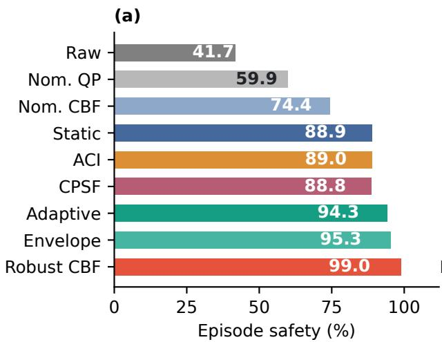

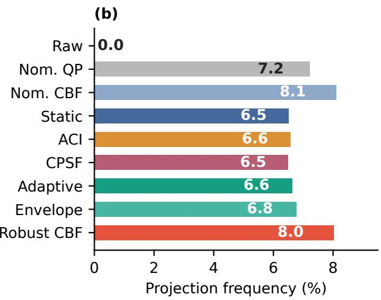

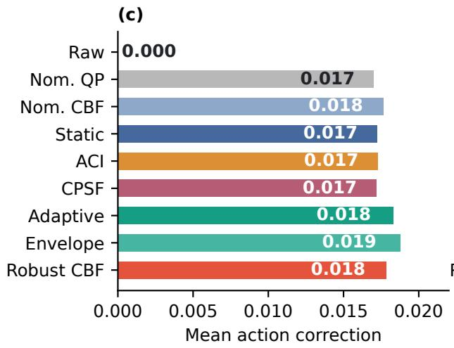

(d)  
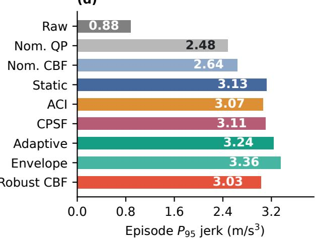  
Fig. 11. Complete nine-method comparison on the shared 2,400-unit ACC cohort. (a) Episode-safe rate. (b) Fraction of observed steps projected. (c) Mean absolute normalized action correction. (d) Mean episode $P _ { 9 5 }$ jerk $( \mathrm { m } / \mathrm { s } ^ { 3 } )$ . ACI and CPSF-style share RACF’s policies, resets, trajectories, solver, and bounded fallback.