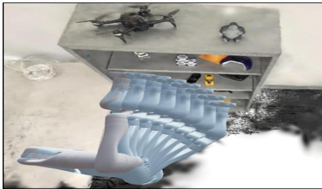
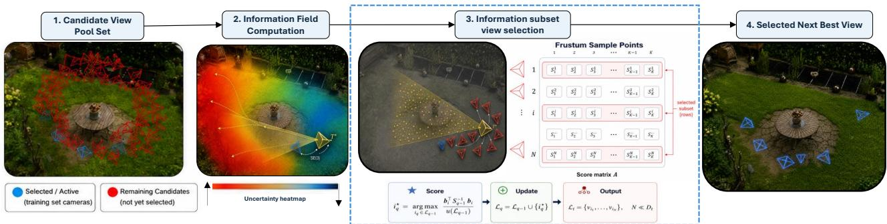
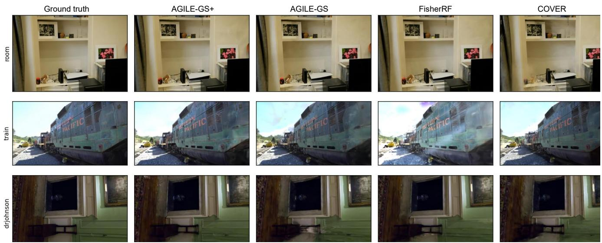
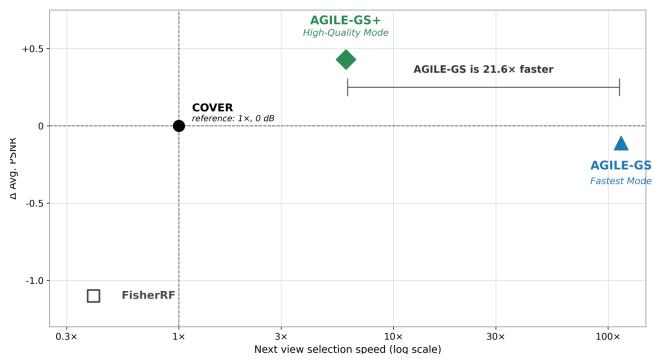
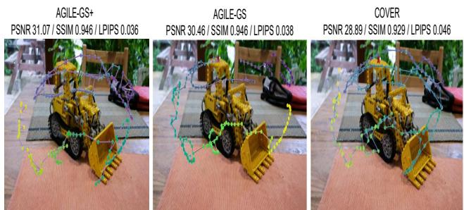
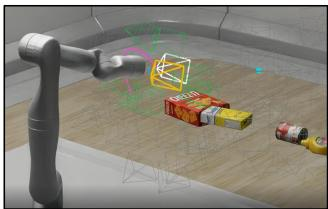
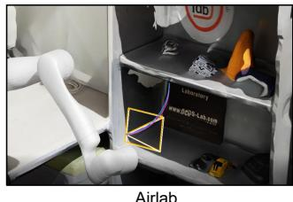

# AGILE-GS: Anchor-Guided Fast Next-Best-View Selection for Active 3D Gaussian Splatting\*

Amirhossein Mollaei Khass†, Nader Motee†

## Abstract

Radiance fields need hundreds of views, and their placement matters as much as their number. Next-best-view (NBV) selectionfor 3D Gaussian Splatting (3DGS) usually scores every candidate in the pool and keeps one. Searching for information and choosing a camera, however, are separable problems. We present AGILE-GS, an anchor-guided NBV method that separates the two. A virtual anchor pose is optimized on SE(3) by Riemannian gradient ascent on expected information gain. It need not be reachable or in the pool; it marks where the model is most uncertain. Candidates are scored against the anchor’s viewing geometry, and a greedy ridge-leverage step distills the pool into a small, non-redundant shortlist without rendering any candidate. The shortlist can be used in two ways. AGILE-GS takes thefirst view on it as the next view, so no Fisher information is computed for any candidate. AGILE-GS+ computes the Fisher information gain of each shortlisted view and picks the best, so the expensive evaluation runs on a handful of views rather than the whole pool. On standard benchmarks and in closed-loop embodied acquisition, both match or exceed existing baselines while cutting selection latency by one to two orders ofmagnitude.

## 1. Introduction

Volumetric radiance fields have become the dominant representation for novel view synthesis and 3D reconstruction. 3D Gaussian Splatting (3DGS) [13] represents a scene with an explicit set of anisotropic Gaussian primitives. It matches the fidelity of neural radiance fields and renders in real time.

Deciding where a sensor should look next is a longstanding problem in computer vision. It goes back to early work on active perception [1, 2] and next-best-view planning [8], where the goal is to build a complete and accurate model from as few observations as possible [25]. Radiance fields have made this problem pressing again. 3DGS needs hundreds of posed views, and reconstruction quality depends strongly on how those views are distributed. Redundant or poorly placed observations leave parts of the scene weakly constrained and produce geometric and photometric artifacts [14, 21, 26]. For a robot, every additional capture also costs time and motion, so views must be chosen rather than collected. Next-best-view (NBV) selection addresses this by repeatedly choosing the observation expected to most improve the current model [4, 6, 11, 27].

  
Figure 1. A simulated robot manipulator autonomously selects informative viewpoints for 3D Gaussian Splatting reconstruction.

Existing NBV criteria trade fidelity against cost. FisherRF [11] and POp-GS [27] estimate the expected uncertainty reduction directly in parameter space. This is accurate, but it requires a differentiable render–backward pass for every candidate, so the cost grows with both the map size and the candidate pool. COVER [6] avoids percandidate rendering, but it captures parameter uncertainty only indirectly. A further inefficiency is shared by all of them. Densely sampled pools contain many near-duplicate views, so a large fraction of any per-candidate evaluation is spent telling apart observations that are effectively redundant.

We take a different route. The most informative viewpoint may be neither reachable nor present in the candidate pool, yet it can still guide the choice among the views that are available. We therefore replace per-candidate evaluation with a fast search for informative candidates. A virtual anchor pose is first optimized on SE(3) by Riemannian gradient ascent to maximize expected information gain. This steers the anchor toward the region of pose space that most reduces uncertainty in the current 3DGS model. Each candidate then receives an anchor leverage score that measures how well it reproduces the anchor’s viewing geometry. A fast subset selection step keeps the highest-scoring candidates and suppresses those that are redundant with views already selected. The result is a compact shortlist, obtained without rendering a single candidate. AGILE-GS (Anchor-Guided Fast Next Best View Selection for Active 3D Gaussian Splatting) returns the leading proposal from this shortlist directly. No Fisher information is computed for any candidate, which gives the lowest latency. AGILE-GS+ instead reranks the shortlist by expected information gain. It recovers model-aware accuracy at a fraction of the full-pool cost, since the expensive evaluation runs on a handful of views rather than all of them.

This work makes three contributions. First, we give a continuous-to-discrete NBV formulation that optimizes a view pose on SE(3) to maximize expected information gain and uses it to guide discrete view selection. Second, we introduce an anchor leverage score and a fast subset selection procedure that return a compact, non-redundant proposal set without rendering any candidate. Third, we present two algorithms, AGILE-GS and AGILE-GS+, that pair anchorguided geometric selection with optional Fisher reranking over the shortlist. They match the reconstruction accuracy of parameter-space methods at one to two orders of magnitude lower selection latency.

## 2. Related Work

View planning has a long history in computer vision and robotics. Connolly [8] used a partial octree model to pick the view that uncovers the most unseen volume, and the survey by Scott et al. [25] covers the model-based and nonmodel-based methods that followed. These methods target range sensors and explicit geometry. Radiance fields change the problem. The model being improved is a set of continuous parameters rather than an occupancy grid, so uncertainty has to be measured in that parameter space.

Recent NBV methods do exactly this. ActiveNeRF [24] propagates predictive uncertainty through a NeRF. FisherRF [11] approximates the uncertainty reduction with Fisher information. POp-GS [27] casts 3DGS acquisition as optimal experimental design. These objectives are principled, but each candidate needs its own rendering or differentiation pass, so the cost scales with both the model size and the candidate pool. COVER [6] takes a geometric route instead. It favors cameras that observe under-constrained regions and scores views through an anisotropic visibility field. This avoids per-candidate rendering, but it captures parameter uncertainty only indirectly. None of these methods addresses a further inefficiency. Dense pools contain many near-duplicate views, so much of the candidate evaluation is spent telling apart observations that are effectively redundant.

A second line of work brings active 3DGS mapping onto robots. RT-GuIDE [26] couples incremental Gaussian mapping with an information heuristic. VISTA [21] adds semantics to plan task-relevant trajectories. Splat-Nav [5] plans safe corridors inside Gaussian maps. Conflict-Aware Active Perception [20] and Splat-CBF [15] couples information acquisition with a safety control barrier function. Closest to our anchor step, Active next-best-view [14] optimizes expected information gain over continuous camera poses on SE(3) under risk-aware path constraints. We build on this continuous formulation, but we use the optimum to guide selection from a discrete pool rather than as the target itself.

Our framework sits between these two groups. It keeps the model-aware SE(3) guidance of parameter-space methods, but it renders no candidate. Candidates are scored by an anchor leverage score and pruned by fast subset selection. The result has the low cost of geometric criteria while staying tied to an information-theoretic optimum.

## 3. Preliminaries

## 3.1. 3D Gaussian Splatting

3D Gaussian Splatting [13] represents a scene as an explicit set of anisotropic primitives,

$$
\mathcal { G } = \{ g _ { i } \} _ { i = 1 } ^ { N } , \qquad g _ { i } = \big ( \mu _ { i } , \mathbf { R } _ { i } , \mathbf { s } _ { i } , o _ { i } , \mathbf { c } _ { i } \big ) ,\tag{1}
$$

with center $\pmb { \mu } _ { i } ~ \in \mathrm { ~ \mathbb { R } ^ { 3 } ~ }$ , rotation $\mathbf { R } _ { i } \ \in \ \mathrm { S O } ( 3 )$ , and scale $\mathbf { s } _ { i } ~ \in ~ \mathbb { R } ^ { 3 }$ , which together define the covariance $\begin{array} { r l } { \Sigma _ { i } } & { { } = } \end{array}$ $\mathbf { R } _ { i } \mathrm { d i a g } ( \dot { \mathbf { s } } _ { i } ^ { 2 } ) \mathbf { R } _ { i } ^ { \top }$ , opacity $o _ { i }$ , and spherical-harmonic coefficients $\mathbf { c } _ { i }$ encoding view-dependent appearance. For a view $v ,$ the visible primitives are projected, depth-ordered, and alpha-composited at each pixel u,

$$
f _ { v } ( u ; \pmb { \theta } ) = \sum _ { i \in \mathcal { N } _ { v } ( u ) } \tau _ { v , i } ( u ) \alpha _ { v , i } ( u ) \mathbf { c } _ { i } \big ( \mathbf { d } _ { v , i } \big ) ,\tag{2}
$$

where $\pmb \theta$ collects the Gaussian parameters and $\mathcal { N } _ { v } ( u )$ is the ordered set of primitives contributing to u. Given the acquired views $\boldsymbol { A } _ { t }$ with reference images $\{ f _ { v } ^ { \mathrm { r e f } } \} _ { v \in \mathcal { A } _ { t } }$ , the parameters are estimated by minimizing a photometric objective,

$$
\hat { \pmb \theta } _ { t } = \arg \operatorname* { m i n } _ { \pmb { \theta } } \sum _ { \boldsymbol v \in \mathcal { A } _ { t } } \mathcal { L } _ { \mathrm { p h o t o } } \big ( f _ { \boldsymbol v } ^ { \mathrm { r e f } } , f _ { \boldsymbol v } ( \pmb \theta ) \big ) .\tag{3}
$$

Rasterization is differentiable, so each view contributes gradients only to the subset of primitives it observes [18].

## 3.2. Expected Information Gain for View Selection

Active acquisition selects the view whose observation is expected to most reduce uncertainty in the estimated scene parameters [10, 16]. Let $Y _ { v }$ denote the image predicted at candidate v through $f _ { v } ( \pmb { \theta } )$ , and let $\hat { \pmb { \theta } } _ { t }$ be the current estimate. The utility of v is the mutual information between the map parameters and $Y _ { v }$ , which equals the expected reduction in posterior entropy $H [ \cdot ]$ after acquiring $Y _ { v }$ [16],

  
Figure 2. System overview. Given a candidate view pool $\mathcal { R } _ { t }$ (red) around the active views $\mathcal { A } _ { t }$ (blue), a virtual anchor is optimized to locate a maximally informative region of pose space (uncertainty heatmap). Candidates are scored against the anchor’s frustum sample geometry to form a score matrix, from which fast greedy ridge-leverage selection extracts a compact, non-redundant subset views.

$$
\begin{array} { r } { \mathcal { T } ( \pmb { \theta } ; Y _ { v } ) = H [ \pmb { \theta } ] - H [ \pmb { \theta } \mid Y _ { v } ] . } \end{array}\tag{4}
$$

The observed information at view v is the negative Hessian of the rendering log-likelihood evaluated at $\hat { \pmb { \theta } } _ { t }$

$$
\mathbf { H } _ { v } = - \left. \nabla _ { \pmb { \theta } } ^ { 2 } \log p ( Y _ { v } \mid \pmb { \theta } ) \right| _ { \pmb { \theta = \hat { \pmb { \theta } } _ { t } } } ,\tag{5}
$$

and the accumulated information over the acquired set is $\begin{array} { r } { \hat { \bf H } _ { t } : = \sum _ { v \in \mathcal { A } _ { t } } { \bf H } _ { v } + \lambda { \bf I } \ \succ \ \textbf { 0 } } \end{array}$ . Under the Laplace approximation, the entropy reduction admits the closed form [11, 14]

$$
\log \mathrm { d e t } \big ( \mathbf { I } + \mathbf { H } _ { v } \hat { \mathbf { H } } _ { t } ^ { - 1 } \big ) ,\tag{6}
$$

where $\hat { \mathbf { H } } _ { t } ^ { - 1 }$ encodes the uncertainty remaining in the current map and Hv quantifies how strongly the candidate constrains it. For the differentiable rendering model $f _ { v } ( \pmb { \theta } )$ , the observed information reduces to its Gauss–Newton form, and the diagonal approximation [11, 14] yields

$$
\mathbf { H } _ { v } \approx \mathrm { d i a g } ( \mathbf { J } _ { v } ^ { \top } \mathbf { J } _ { v } ) , \qquad \left. \mathbf { J } _ { v } : = \nabla _ { \pmb { \theta } } \ : f _ { v } ( \pmb { \theta } ) \right| _ { \hat { \pmb { \theta } } _ { t } } .\tag{7}
$$

The next-best view maximizes the EIG over the candidate pool $\mathcal { R } _ { t }$ with cardinality $D _ { t } = | \mathcal { R } _ { t } |$ |,

$$
v _ { t } ^ { \mathrm { b e s t } } = \arg \operatorname* { m a x } _ { v \in \mathcal { R } _ { t } } \log \operatorname* { d e t } \big ( \mathbf { I } + \mathbf { H } _ { v } \hat { \mathbf { H } } _ { t } ^ { - 1 } \big ) .\tag{8}
$$

Approximating Eq. (6) recovers the trace surrogate $\mathrm { t r } \Big ( \mathbf { H } _ { v } \hat { \mathbf { H } } _ { t } ^ { - 1 } \Big ) \geq$ log det $\left( \mathbf { I } + \mathbf { H } _ { v } \hat { \mathbf { H } } _ { t } ^ { - 1 } \right)$ [16], which we use as a smooth objective for continuous anchor optimization.

## 4. Efficient Next Best View Selection

Direct maximization of Eq. (8) over the full candidate pool $\mathcal { R } _ { t }$ is accurate but expensive; each evaluation of Eq. (6) requires a differentiable render–backward pass over the complete camera pool, and this cost grows with both the model size and the pool size $D _ { t } = \left| \mathcal { R } _ { t } \right|$ . Densely sampled image collections further contain many cameras with strongly overlapping fields of view, so a large fraction of this computation is spent distinguishing nearly redundant observations. The proposed framework addresses both limitations by decoupling the search for an informative region of pose space from the selection of executable cameras. The information gain objective is maximized over SE(3), and its local observation geometry is then used to extract a compact set of relevant, non-redundant candidates. This reduces the effective search from $D _ { t }$ cameras to $N \ll D _ { t }$ proposals while retaining the views most consistent with the continuous information optimum.

## 4.1. Virtual Anchor Optimization

At selection event t, let $\mathcal { R } _ { t } = \{ T _ { v } \} _ { v = 1 } ^ { D _ { t } }$ denote the remaining candidate poses and let $\hat { \mathbf { H } } _ { t } \succ \mathbf { 0 }$ denote the accumulated information from the active train set $\boldsymbol { A } _ { t }$ . Rather than scoring each discrete candidate, a virtual pose $T _ { t } ^ { \star } \in \mathrm { S E } ( 3 )$ is optimized directly on the pose manifold to mark a locally informative region.

For a view pose $T ,$ , let $\mathbf { H } _ { T } \succeq \mathbf { 0 }$ denote the Fisher information contributed by its predicted observation. Under the Laplace approximation, we adopt the expected information gain of pose T from Eq. (6) by the first-order trace surrogate

$$
\psi _ { t } ( T ) : = \mathrm { t r } \big ( { \bf H } _ { T } \hat { \bf H } _ { t } ^ { - 1 } \big ) .\tag{9}
$$

Since the diagonal Fisher term is differentiable in the rendering parameters [14, 18], and the rendering is differentiable in the camera pose, $\psi _ { t } ( T )$ is differentiable with respect to $T$ and can be optimized directly over the pose manifold. The continuous information anchor is,

$$
T _ { t } ^ { \star } = \arg \operatorname* { m a x } _ { T \in \mathrm { S E ( 3 ) } } \psi _ { t } ( T )\tag{10}
$$

which steers the virtual camera toward observations expected to resolve the current model uncertainty. Eq. (10) is solved by the Riemannian gradient ascent method [14].

At iteration k, the Euclidean gradient of $\psi _ { t }$ is mapped to a twist $\pmb { \xi } _ { k } \in \mathfrak { s e } ( 3 ) \cong \mathbb { R } ^ { 6 }$ in the local tangent space at $T _ { k }$ , and the pose is updated through the exponential map retraction,

$$
\begin{array} { r } { T ^ { k + 1 } = T ^ { k } \exp \bigl ( \eta \xi _ { k } ^ { \wedge } \bigr ) , \qquad \xi _ { k } = \nabla \tau \psi _ { t } ( T ) \big | _ { T ^ { k } } , } \end{array}\tag{11}
$$

with step size $\eta > 0 , ( \cdot ) ^ { \wedge } : \mathbb { R } ^ { 6 } \to \mathfrak { s e } ( 3 )$ the twist hat map, and exp : ${ \mathfrak { s e } } ( 3 ) \to { \mathrm { S E } } ( 3 )$ the matrix exponential. The retraction keeps every iterate on the manifold and preserves the coupling between translational and rotational components. The resulting $T _ { t } ^ { \star }$ is an information anchor, not the selected view. In general it might not coincide with a camera in $\mathcal { R } _ { t } ,$ which motivates a principled association between the continuous optimum and the discrete candidate pool.

## 4.2. Candidate View Scoring

Associating the anchor $T _ { t } ^ { \star }$ with its nearest camera is inadequate; pose distance is a property of the manifold alone and carries no information about the scene content a camera observes. Two candidates equidistant from $T _ { t } ^ { \star }$ may see disjoint regions of the map, while distinct poses may induce nearly identical observations. Each candidate is therefore represented not by its pose, but by how faithfully it reproduces the viewing geometry of the information anchor.

The anchor viewing volume is discretized into K frustum support samples,

$$
\mathcal { X } _ { t } = \{ \mathbf { x } _ { k } \} _ { k = 1 } ^ { K } , \qquad \mathbf { x } _ { k } \in \mathcal { F } ( T _ { t } ^ { \star } ) ,\tag{12}
$$

where $\mathcal { F } ( T _ { t } ^ { \star } )$ denotes the viewing frustum of the anchor pose. These samples act as a shared spatial basis against which every remaining camera is evaluated. For a candidate $v \in \mathcal { R } _ { t }$ with pose $T _ { v } = \left( R _ { v } , \mathbf { p } _ { v } \right)$ and optical axis $\mathbf { d } _ { v } ,$ sample $\mathbf { x } _ { k }$ is frustum contained when $\mathbf { x } _ { k } \in \mathcal { F } ( T _ { v } )$ , and the corresponding viewing direction from the camera center is

$$
\chi _ { v k } = \mathbf { 1 } _ { \mathcal { F } ( T _ { v } ) } ( \mathbf { x } _ { k } ) , \qquad \hat { \mathbf { r } } _ { v k } = \frac { \mathbf { x } _ { k } - \mathbf { p } _ { v } } { \left\| \mathbf { x } _ { k } - \mathbf { p } _ { v } \right\| _ { 2 } } .\tag{13}
$$

where $\chi _ { v k } \in \{ 0 , 1 \}$ marks whether candidate v observes $\mathbf { x } _ { k }$ , and $\hat { \mathbf { r } } _ { v k }$ is the viewing direction.

The global consistency of candidate v with the anchor is summarized by a scalar weight $\rho _ { v } \in [ 0 , 1 ]$ , defined as the product of positional, orientational, and coverage factors,

$$
\rho _ { v } = \underbrace { \mathrm { e x p } \left( - \frac { \| \mathbf { p } _ { v } - \mathbf { p } _ { t } ^ { \star } \| _ { 2 } ^ { 2 } } { 2 \sigma _ { p } ^ { 2 } } \right) } _ { \mathrm { p o s i t i o n } } \cdot \underbrace { \left[ \mathbf { d } _ { v } ^ { \top } \mathbf { d } _ { t } ^ { \star } \right] _ { + } ^ { 2 } } _ { \mathrm { o r i e n t a t i o n } } \cdot \underbrace { \frac { 1 } { K } \sum _ { k = 1 } ^ { K } \chi _ { v k } } _ { \mathrm { c o v e r a g e } } ,\tag{14}
$$

with $\sigma _ { p }$ a positional tolerance and $[ \cdot ] _ { + } = \operatorname* { m a x } ( \cdot , 0 )$ . The orientation factor $[ \mathbf { d } _ { v } ^ { \top } \mathbf { d } _ { t } ^ { \star } ] _ { + } ^ { 2 }$ assigns zero weight to back facing cameras and grows quadratically as orientations align.

Combining the global consistency weight $\rho _ { v }$ with persample geometry yields the anchor coverage matrix $\mathbf { M _ { t } } \in$

$\mathbb { R } ^ { D _ { t } \times K }$ , whose entries are

$$
[ \mathbf { M } _ { t } ] _ { v k } = \rho _ { v } ^ { \gamma } \underbrace { \chi _ { v k } \frac { \left[ \mathbf { d } _ { v } ^ { \top } \hat { \mathbf { r } } _ { v k } \right] _ { + } } { \| \mathbf { x } _ { k } - \mathbf { p } _ { v } \| _ { 2 } + \epsilon } } _ { \kappa _ { v k } } ,\tag{15}
$$

where $\gamma > 0$ controls the sharpness of anchor weighting and $\epsilon > 0$ is a small numerical regularizer. The per-sample observation kernel $\kappa _ { v k }$ is nonzero only for visible samples $( \chi _ { v k } = 1 )$ , rewards well centered viewing directions through the rectified alignment $[ \mathbf { d } _ { v } ^ { \top } \hat { \mathbf { r } } _ { v k } ] _ { + }$ , and downweights distant or oblique baselines through the inverse range. The row weight $\rho _ { v } ^ { \gamma }$ scales the entire profile of candidate $v ,$ suppressing cameras that do not preserve the position, orientation, or spatial support of the anchor.

Each row of ${ { \bf { M } } _ { t } }$ is the observation profile of one candidate over the $\mathcal { X } _ { t }$ , and each column describes how the pool candidate views observe a single location $\mathbf { x } _ { k }$ . The entry $[ \mathbf { M } _ { t } ] _ { v k }$ therefore measures how effectively candidate view v observes the anchor viewing volume, jointly accounting for visibility, viewing direction, range, and anchor consistency. Candidates with similar rows induce redundant observation geometry, whereas dissimilar rows provide complementary coverage of the anchor volume.

## 4.3. Fast Subset Selection via Ridge Leverage

Selecting a compact proposal set from the anchor coverage matrix $\mathbf { \breve { M } } _ { t } \in \mathbb { R } ^ { \dot { D } _ { t } \times K }$ requires comparing candidate profiles that live in a K-dimensional support space. Since the number of frustum support samples K can be large, the rows of M are first embedded into a d-dimensional space through a fixed Johnson–Lindenstrauss projection [12, 22],

$$
\mathbf { B } _ { t } = \mathbf { M } _ { t } \mathbf { \Pi } \boldsymbol { \Pi } , \qquad \mathbf { \Pi } \boldsymbol { \Pi } \in \mathbb { R } ^ { K \times d } , \qquad d \ll K .\tag{16}
$$

Let $\mathbf { b } _ { v } \in \mathbb { R } ^ { d }$ denote the row of $\mathbf { B } _ { t }$ associated with candidate $v \in \mathcal { R } _ { t }$ . Ranking candidates by profile magnitude $\| \mathbf { b } _ { v } \| _ { 2 }$ alone can return several cameras that all encode the same dominant observation direction; each is informative in isolation, yet together they leave the remaining directions of the anchor volume unconstrained. The proposal set must therefore reward informativeness and penalize overlap with already selected candidate views. Therefore we employ the candidate view set selection objective as

$$
\mathcal { L } _ { t } ^ { \star } = \arg \operatorname* { m a x } _ { \mathcal { L } \subseteq \mathcal { R } _ { t } , | \mathcal { L } | \leq N } F _ { t } ( \mathcal { L } ) ,\tag{17}
$$

$$
F _ { t } ( \mathcal { L } ) = \log \operatorname* { d e t } \Bigl ( \lambda _ { G } \mathbf { I } _ { d } + \sum _ { v \in \mathcal { L } } \mathbf { b } _ { v } \mathbf { b } _ { v } ^ { \top } \Bigr ) - d \log \lambda _ { G } ,\tag{18}
$$

where $\lambda _ { G } ~ > ~ 0 .$ . Hence, a candidate aligned with a well represented direction expands volume $F _ { t } ( \mathcal { L } )$ little, whereas one contributing a new direction expands it substantially. Maximizing $F _ { t }$ thus selects the most informative cameras subject to mutual complementarity and candidate diversity.

Algorithm 1 AGILE-GS: Anchor-Guided Fast Next-Best-  
View Selection for Active 3D Gaussian Splatting   
1: Input: Active views $\boldsymbol { A } _ { t }$ , candidate pool $\mathcal { R } _ { t } ,$ accumu  
lated information $\begin{array} { r } { \hat { \bf H } _ { t } , } \end{array}$ proposal budget N   
2: Output: Next-best view $v _ { t } ^ { \star }$ and proposal set $\mathcal { L } _ { t }$   
3: Optimize the continuous information anchor on $\operatorname { S E } ( 3 )$   
$T _ { t } ^ { \star } \gets \mathrm { a r g } _ { T \in \mathrm { S E } ( 3 ) } \psi _ { t } ( T )$   
4: Build the coverage matrix $\mathbf { M } _ { t }$   
5: Project the profiles to $\mathbf { B } _ { t } \gets \mathbf { M } _ { t } \mathbf { I I } .$ , with rows $\{ \mathbf { b } _ { v } \}$   
6: Initialize $\mathcal { L } _ { 0 }$ and $\mathbf { S } _ { 0 } ^ { - 1 }  \lambda _ { G } ^ { - 1 } \mathbf { I } _ { d }$   
7: for $q = 1 , \dots , \operatorname* { m i n } ( N , D _ { t } )$ do   
8: Select the highest conditional ridge-leverage candi  
date: $v _ { q } ^ { \star }  \arg \operatorname* { m a x } _ { v \notin \mathcal { L } _ { q - 1 } } \mathbf { b } _ { v } ^ { \top } \mathbf { S } _ { q - 1 } ^ { - 1 } \mathbf { b } _ { v }$   
9: Append $v _ { q } ^ { \star }$ to the proposal set: $\mathcal { L } _ { q } \gets \mathcal { L } _ { q - 1 } \cup \{ v _ { q } ^ { \star } \}$   
10: Update $\mathbf { S } _ { q } ^ { - 1 }$ by a rank-one Sherman–Morrison   
11: end for   
12: $\mathcal { L } _ { t }  \{ v _ { 1 } ^ { \star } , \ldots , v _ { N } ^ { \star } \}$   
13: return leading proposal $v _ { t } ^ { \star }  v _ { 1 } ^ { \star }$ and $\scriptstyle { \mathcal { L } } _ { t }$

Let $\scriptstyle { \mathcal { L } } _ { q - 1 }$ be the first $q - 1$ selections and

$$
\mathbf { S } _ { q - 1 } = \lambda _ { G } \mathbf { I } _ { d } + \sum _ { v \in \mathcal { L } _ { q - 1 } } \mathbf { b } _ { v } \mathbf { b } _ { v } ^ { \top } .\tag{19}
$$

By the matrix determinant lemma, the marginal gain of adding candidate v is

$$
F _ { t } ( \mathcal { L } _ { q - 1 } \cup \{ v \} ) - F _ { t } ( \mathcal { L } _ { q - 1 } ) = \log \left( 1 + \mathbf { b } _ { v } ^ { \top } \mathbf { S } _ { q - 1 } ^ { - 1 } \mathbf { b } _ { v } \right) .\tag{20}
$$

Since $\log ( 1 + x )$ is strictly increasing, the greedy step reduces to maximizing the conditional quadratic score

$$
v _ { q } ^ { \star } = \arg \operatorname* { m a x } _ { v \notin \mathcal { L } _ { q - 1 } } \underbrace { { \mathbf b } _ { v } ^ { \top } { \mathbf S } _ { q - 1 } ^ { - 1 } { \mathbf b } _ { v } } _ { \ell _ { v } ( \mathcal { L } _ { q - 1 } ) } , \qquad \mathcal { L } _ { q } = \mathcal { L } _ { q - 1 } \cup \{ v _ { q } ^ { \star } \} ,\tag{21}
$$

where $\ell _ { v } ( \mathcal { L } _ { q - 1 } )$ is a conditional ridge-leverage score [7]. The inverse is maintained without needing recomputation in each step through the Sherman–Morrison identity,

$$
\mathbf { S } _ { q } ^ { - 1 } = \mathbf { S } _ { q - 1 } ^ { - 1 } - \frac { \mathbf { z } _ { q } \mathbf { z } _ { q } ^ { \top } } { 1 + \mathbf { b } _ { v _ { q } ^ { \star } } ^ { \top } \mathbf { z } _ { q } } , \qquad \mathbf { z } _ { q } = \mathbf { S } _ { q - 1 } ^ { - 1 } \mathbf { b } _ { v _ { q } ^ { \star } } .\tag{22}
$$

Eq. (21) explains the redundancy suppression directly. At the first iteration ${ \bf S } _ { 0 } = \lambda _ { G } { \bf I } _ { d }$ and $\ell _ { v } = \|  { \mathbf { b } } _ { v } \| _ { 2 } ^ { 2 } / \lambda _ { G }$ , so the leading proposal is the candidate with the strongest anchor observation profile. Each subsequent selection contracts $\mathbf { S } _ { q } ^ { - 1 }$ along the chosen direction, so the score of any later candidate is attenuated in proportion to its alignment with the already selected subspace; a camera that is nearly collinear with a chosen one collapses to a small score regardless of its raw magnitude. Each greedy step selects the candidate with the highest conditional score, which rewards a view only when it is both informative and complementary to the current selection. Redundant candidates are passed over but remain in $\mathcal { R } _ { t }$ and stay eligible at later events.

After N iterations, the ordered proposal set is

$$
\begin{array} { r } { \mathcal { L } _ { t } = \left\{ v _ { 1 } ^ { \star } , \ldots , v _ { N } ^ { \star } \right\} , \qquad N \ll D _ { t } . } \end{array}\tag{23}
$$

The AGILE-GS algorithm returns the leading proposal $v _ { 1 } ^ { \star }$ directly as the next best view, since it maximizes the marginal gain with respect to the regularized feature space at zero per-candidate Fisher cost. With the accuracy oriented strategy, AGILE-GS+ algorithm instead reranks the full shortlist $\mathcal { L } _ { t }$ by expected information gain (Sec. 5).

## 5. model aware Reranking

The AGILE-GS algorithm (1) in Sec. 4.3 maximizes the marginal gain of the geometric objective in Eq. (18). This objective operates in the projected observation space and quantifies how faithfully a candidate preserves and complements the anchor’s viewing geometry, but does not measure its effect on the uncertainty of individual 3DGS parameters. Two views with comparable geometric scores may constrain disjoint subsets of Gaussians and induce markedly different reductions in posterior uncertainty.

AGILE-GS+ addresses this by reranking the compact proposal set by expected information gain evaluation. Let

$$
\mathcal { L } _ { t } = \{ v _ { 1 } ^ { \star } , \ldots , v _ { N } ^ { \star } \} \subseteq \mathcal { R } _ { t } , \qquad N \ll D _ { t } ,\tag{24}
$$

denote the ordered proposal set returned by algorithm (1). By construction, $\mathcal { L } _ { t }$ is aligned with the continuous anchor and spans distinct directions of its observation space, so the model-space evaluation is confined to a small set of geometrically informative, non-redundant candidates rather than the full pool.

We quantify the utility of a candidate view v by the reduction in posterior entropy introduced in Sec. 3.2,

$$
\phi _ { t } ( v ) : = \log \operatorname* { d e t } \Bigl ( \mathbf { I } + \mathbf { H } _ { v } \hat { \mathbf { H } } _ { t } ^ { - 1 } \Bigr ) ,\tag{25}
$$

where $\begin{array} { r } { \hat { \mathbf { H } } _ { t } = \sum _ { \ell \in \mathcal { A } _ { t } } \mathbf { H } _ { \ell } + \lambda \mathbf { I } \succ 0 } \end{array}$ denotes the information accumulated from the acquired views. Hence, $\phi _ { t } ( v )$ measures the information contributed by v relative to parameter space that are already constrained by $\boldsymbol { A } _ { t }$ . Since, under the diagonal Gauss–Newton approximation, both $\mathbf { H } _ { v }$ ≈ $\mathrm { d i a g } ( \mathbf { J } _ { v } ^ { \top } \mathbf { J } _ { v } )$ and $\hat { \mathbf { H } } _ { t }$ are diagonal, the determinant in Eq. (25) factorizes over its entries and

$$
\begin{array} { r } { \phi _ { t } ( v ) = \log \operatorname* { d e t } \ \ \Bigl ( \mathbf { I } + \mathbf { H } _ { v } \hat { \mathbf { H } } _ { t } ^ { - 1 } \Bigr ) \approx \log \prod _ { q } \left( 1 + \frac { [ \mathbf { H } _ { v } ] _ { q q } } { [ \hat { \mathbf { H } } _ { t } ] _ { q q } } \right) } \\ { = \displaystyle \sum _ { q } \log \left( 1 + \frac { [ \mathbf { H } _ { v } ] _ { q q } } { [ \hat { \mathbf { H } } _ { t } ] _ { q q } } \right) , } \end{array}\tag{26}
$$

Algorithm 2 AGILE-GS+:Model Aware NBV Selection on   
Anchor Shortlist   
1: Input: $A _ { t } , \mathcal { R } _ { t } ,$ , accumulated information $\begin{array} { r } { \hat { \bf H } _ { t } , } \end{array}$ budget N   
2: Output: Next-best view $v _ { t } ^ { \star \star }$   
3: $\mathcal { L } _ { t } \gets \mathrm { A G I L E  – G S } \left( \mathcal { A } _ { t } , \mathcal { R } _ { t } , \hat { \mathbf { H } } _ { t } , N \right)$ ▷ Algorithm. 1;   
4: for all $v \in { \mathcal { L } } _ { t }$ do   
5: $\mathbf { H } _ { v }  \mathrm { d i a g } ( \mathbf { J } _ { v } ^ { \top } \mathbf { J } _ { v } )$   
6: $\phi _ { t } ( v )  \sum \log \bigl ( 1 + [ \mathbf { H } _ { v } ] _ { q q } / [ \hat { \mathbf { H } } _ { t } ] _ { q q } \bigr )$   
q   
7: end for   
8: $v _ { t } ^ { \star \star }  \arg \operatorname* { m a x } _ { v \in \mathcal { L } _ { t } } \phi _ { t } ( v )$   
9: $\mathcal { A } _ { t + 1 }  \mathcal { A } _ { t } \cup \{ v _ { t } ^ { \star } \} , \ \mathcal { R } _ { t + 1 }  \mathcal { R } _ { t } \setminus \{ v _ { t } ^ { \star \star } \} .$   
10: $\hat { \mathbf { H } } _ { t + 1 } \gets \hat { \mathbf { H } } _ { t } + \mathbf { H } _ { v _ { t } ^ { \star \star } }$   
11: return $v _ { t } ^ { \star \star }$

where q indexes the Gaussian parameters and $[ \cdot ] _ { q q }$ denotes the q-th diagonal entry.

AGILE-GS+ algorithm selects the maximizer of Eq. (26) over the proposal set,

$$
v _ { t } ^ { \star \star } = \arg \operatorname* { m a x } _ { v \in \mathcal { L } _ { t } } \phi _ { t } ( v ) , \quad \hat { \mathbf { H } } _ { t + 1 } = \hat { \mathbf { H } } _ { t } + \mathbf { H } _ { v _ { t } ^ { \star } }\tag{27}
$$

after which the view sets and accumulated information are updated:

$$
\begin{array} { r } { \boldsymbol { \mathcal { A } } _ { t + 1 } = \boldsymbol { \mathcal { A } } _ { t } \cup \{ \boldsymbol { v } _ { t } ^ { \star \star } \} , \quad \boldsymbol { \mathcal { R } } _ { t + 1 } = \boldsymbol { \mathcal { R } } _ { t } \setminus \{ \boldsymbol { v } _ { t } ^ { \star \star } \} . } \end{array}\tag{28}
$$

The two methods therefore differ only in how they exploit $\scriptstyle { \mathcal { L } } _ { t }$ set. AGILE-GS returns the leading proposal $v _ { 1 } ^ { \star }$ , whereas AGILE-GS+ performs N Fisher evaluations, one per proposal.

## 6. Experiments

We evaluate our proposed algorithms on progressive nextbest-view selection for 3DGS. We first compare reconstruction quality and selection efficiency against existing NBV baseline methods, then evaluate the methods under an embodied acquisition protocol, and finally ablate the candidate-selection strategy and the shortlist view pool size.

## 6.1. Experimental Setup

Datasets. We evaluate on three standard reconstruction benchmarks: Mip-NeRF 360 [3], Tanks and Temples [17], and Deep Blending [9], which cover diverse indoor and outdoor scenes, object scales, camera distributions, and geometric complexity. We additionally report embodied acquisition on our custom scenes. All experiments were run on a workstation with an NVIDIA RTX A2000 GPU, an Intel Core i9-13900K CPU.

Baselines. We compare against three baselines: Random uniformly samples, FisherRF [11] scores every candidate by information gain; and COVER [6] approximates

Fisher information through geometric view coverage, favoring viewpoints that observe under-constrained regions. Our two variants differ in how $\mathcal { L } _ { t }$ is used; AGILE-GS prioritizes selection efficiency by returning the leading ridgeleverage candidate to select an informative, non-redundant view without exhaustive Fisher evaluation, while AGILE-GS+ evaluates expected information gain only over the compact shortlist $\mathcal { L } _ { t } ,$ retaining the accuracy of Fisher-based selection while avoiding its cost over the full pool.

Metrics. Reconstruction quality is measured with PSNR (↑), SSIM (↑), and LPIPS (↓). Since the shared 3DGS optimization is identical across methods, the computational overhead of view selection is isolated by reporting the selection latency per acquisition event (s/event).

Setup. Each scene is initialized with 10 training views. During progressive training, every 200 gradient steps a view is selected from the remaining candidate pool $\mathcal { R } _ { t }$ and added to the active training set $A _ { t } .$ All methods are trained for 30K gradient steps under an identical acquisition budget and reconstruction configuration, so the only computational difference lies in the NBV decision itself.

## 6.2. Results

Table 2 reports reconstruction quality and average selection latency across the three benchmarks. AGILE-GS+ achieves the best or second-best average reconstruction metrics, while the efficiency-oriented AGILE-GS also maintains strong reconstruction quality despite avoiding candidatelevel Fisher reranking. The representative reconstructions in Fig. 3 are consistent with these quantitative results.

The efficiency gap is substantially larger than the remaining differences in reconstruction accuracy. AGILE-GS is approximately 126× faster than COVER and 379× faster than FisherRF per selection event, while AGILE-GS+ is 5.8× and 17.6× faster respectively and still attains higher average PSNR than both. Fig. 4 makes this tradeoff explicit by normalizing accuracy and selection speed to COVER. AGILE-GS+ lies above and to the right of the reference, improving PSNR while increasing selection speed, and AGILE-GS extends a further 21.6× speedup at only a small PSNR cost. Together, AGILE-GS and AGILE-GS+ provide two complementary operating modes. AGILE-GS for maximum selection speed and AGILE-GS+ for higher reconstruction quality while remaining substantially faster than existing baselines.1 Random is exceeding Fisher-RF on Mip-NeRF 360; the same ordering is reported by COVER, since human captured benchmark are already well distributed and uniform sampling inherits that feature [6].

We further evaluate the methods under the embodied acquisition protocol of COVER [6], in which each acquisition is restricted to the K=5 nearest candidate frames around the current view rather than the full pool. As shown in Table 1, AGILE-GS+ remains competitive with COVER under these motion constraints and outperforms Random and FisherRF on both the Mip-NeRF 360 and custom evaluations.

  
Figure 3. Qualitative evaluation renders of the 3DGS comparison on representative views from different view selection methods.

  
Figure 4. Accuracy–efficiency trade-off relative to COVER, normalized to 1× selection speed and 0 dB PSNR difference.

<table><tr><td rowspan="2">Embodied Method</td><td colspan="2">Mip-NeRF 360</td><td colspan="2">Custom</td></tr><tr><td>PSNR↑</td><td>SSIM↑ LPIPS↓</td><td>PSNR↑</td><td>SSIM↑ LPIPS↓</td></tr><tr><td>Random</td><td>24.786 0.6712</td><td>0.2071</td><td>20.186</td><td>0.5441 0.2633</td></tr><tr><td>FisherRF</td><td>24.672 0.6712</td><td>0.2083</td><td>20.400</td><td>0.5550 0.2512</td></tr><tr><td>COVER</td><td>26.571 0.8158</td><td>0.1838</td><td>22.629</td><td>0.6912 0.2186</td></tr><tr><td>AGILE-GS</td><td>26.134 0.7960</td><td>0.1882</td><td>22.373</td><td>0.6514 0.2385</td></tr><tr><td>AGILE-GS+</td><td>26.431 0.8073</td><td>0.1895</td><td>23.835</td><td>0.7657 0.1962</td></tr></table>

Table 1. Embodied view selection restricted to the K=5 nearest candidate frames.

Beyond reconstruction accuracy, Fig. 5 exposes a structural difference in the acquisition trajectories. Although the trajectories themselves differ considerably, the methods largely agree on which views are informative. Over the 150 selected views, AGILE-GS+ and AGILE-GS share 72.3% and 69.3% of their selections with COVER, respectively. The principal difference is not the informative support recovered from the scene, but the order in which that support is acquired. Successive AGILE-GS selections remain more local in the camera sequence, reducing the mean frameindex transition by approximately 41% relative to COVER. Next best view selection policy for a physical robot cannot be considered independently of the motion required between consecutive observations; widely separated NBV decisions introduce additional travel, trajectory planning, and execution cost even when the selected views are individually informative. Such continuity reduces the discrepancy between discrete NBV optimization and physically executable sensing, making the selected views better suited to continuous robotic acquisition.

  
Figure 5. Selected views and reconstruction quality. The colored camera trajectories visualize the ordering of acquired views.

<table><tr><td rowspan="2">Method</td><td colspan="3">Mip-NeRF 360</td><td colspan="3">Tanks &amp; Temples</td><td colspan="3">Deep Blending</td></tr><tr><td>PSNR↑</td><td>SSIM↑</td><td>LPIPS↓</td><td>PSNR↑</td><td>SSIM↑</td><td>LPIPS↓</td><td>PSNR↑</td><td>SSIM↑</td><td>LPIPS↓</td></tr><tr><td>Random</td><td>26.977</td><td>0.8306</td><td>0.1165</td><td>20.820</td><td>0.7693</td><td>0.1932</td><td>24.264</td><td>0.6245</td><td>0.2834</td></tr><tr><td>FisherRF</td><td>26.515</td><td>0.8225</td><td>0.1312</td><td>21.214</td><td>0.7816</td><td>0.1795</td><td>24.578</td><td>0.6856</td><td>0.2246</td></tr><tr><td>COVER</td><td>27.231</td><td>0.8283</td><td>0.1145</td><td>22.161</td><td>0.8028</td><td>0.1587</td><td>26.154</td><td>0.7196</td><td>0.1977</td></tr><tr><td>AGILE-GS</td><td>26.996</td><td>0.8310</td><td>0.1159</td><td>21.823</td><td>0.7872</td><td>0.1743</td><td>26.412</td><td>0.8344</td><td>0.1704</td></tr><tr><td>AGILE-GS+</td><td>27.523</td><td>0.8467</td><td>0.1112</td><td>22.003</td><td>0.7986</td><td>0.1683</td><td>27.328</td><td>0.8450</td><td>0.1632</td></tr></table>

<table><tr><td>Avg. PSNR↑</td><td>Avg. Selection Time (s)↓</td></tr><tr><td></td><td></td></tr><tr><td>24.020</td><td>0.002</td></tr><tr><td>24.103</td><td>28.030</td></tr><tr><td>25.182</td><td>9.330</td></tr><tr><td>25.077</td><td>0.074</td></tr><tr><td>25.618</td><td>1.596</td></tr></table>

Table 2. Reconstruction quality and next-view selection efficiency on Mip-NeRF 360, Tanks & Temples, and Deep Blending. Reconstruc tion metrics are averaged over the evaluated scenes in each benchmark; selection time denotes the average latency per acquisition event. Best and second-best reconstruction results are shown in bold and underlined, respectively.

## 6.3. Ablation Studies

Table 3 compares AGILE-GS against three alternative strategies for selecting the proposal set from $\mathcal { R } _ { t } \colon K \cdot$ -nearest retains the N candidates closest to $T _ { t } ^ { \star }$ under an SE(3) metric; top independent norm keeps the N rows of $\mathbf { B } _ { t }$ with the largest $\| \mathbf { b } _ { v } \| _ { 2 } ;$ and online row sampling which is a streaming baseline that processes candidate view descriptors sequentially and makes an immediate keep-or-discard decision without access to the complete candidate pool. Specifically, it uses the online λ-ridge leverage score [7],

$$
\ell _ { i } = a _ { i } ^ { \top } { \left( { A } _ { i - 1 } ^ { \top } { A } _ { i - 1 } + \lambda I \right) } ^ { - 1 } a _ { i } ,
$$

to retain views that contribute directions not already well represented by previously accepted samples. This makes it particularly attractive for robotic settings, where observations arrive online, and future viewpoints are not available in advance. Nevertheless, Table 3 shows that AGILE-GS achieves stronger reconstruction quality by explicitly selecting a compact batch of informative and complementary views. The result indicates that the proposed conditional ridge-leverage objective not only reduces selection cost, but also suppresses redundant observations that contribute little additional information to the reconstructed map.

Table 4 varies the proposal budget N used by AGILE-GS+ algorithm. Reconstruction quality remains nearly unchanged over a broad range of shortlist sizes, while the selection cost increases as more candidates are passed to the Fisher reranking stage. A compact shortlist therefore captures most of the useful information required for accurate selection, validating the central design of AGILE-GS+. Expensive model aware evaluation is needed only over a small subset of the original candidate pool. We use N = 10 as the default setting, providing a strong balance between reconstruction quality and selection efficiency.

## 6.4. Embodied Acquisition in Simulation

We evaluate AGILE-GS in a closed-loop embodied setting where the view selector drives a robot arm to reconstruct the map online. The primary platform is an NVIDIA Isaac Sim [23] digital twin of a robotic lab, built from a textured Scaniverse capture and grounded in real-robot data from a Kinova Gen3 manipulator with an Intel RealSense D435I. Two auxiliary Isaac Sim scenes are also evaluated; a compact kitchen with YCB objects on a textured table, and a Warehouse with multiple shelves and reachable YCB grocery items. At each selection event, candidate camera poses are sampled around the workspace and filtered by inverse-kinematics feasibility, joint limits, and motion continuity. The robot executes the selected trajectory and streams synchronized RGB, depth, and ground-truth pose to an i3DGS [19] mapper, which incrementally integrates each observation without resetting the model between viewpoints, a property essential for fast, closed-loop map reconstruction.

<table><tr><td>Dataset</td><td>Method</td><td>PSNR↑</td><td>SSIM↑</td><td>LPIPS↓</td><td>Speed up</td></tr><tr><td rowspan="4">Mip-NeRF 360 and Custom</td><td>K-nearest Views</td><td>26.545</td><td>0.8603</td><td>0.2081</td><td>1.52×</td></tr><tr><td>Online Row Sampling</td><td>27.202</td><td>0.8840</td><td>0.1600</td><td>1.48×</td></tr><tr><td>Top independent norm</td><td>26.883</td><td>0.8845</td><td>0.1639</td><td>1.12×</td></tr><tr><td>AGILE-GS (Ours)</td><td>27.692</td><td>0.9155</td><td>0.1413</td><td>1×</td></tr></table>

Table 3. Batch view selection ablation averaged over Mip-NeRF 360 and the custom dataset.

<table><tr><td rowspan="2">AGILE-GS+ Budget N</td><td colspan="3">Avg Mip-NeRF 360–Custom</td><td rowspan="2">Speed up selection ↑</td></tr><tr><td>PSNR↑</td><td>SSIM↑</td><td>LPIPS↓</td></tr><tr><td>5</td><td>27.518</td><td>0.8339</td><td>0.1110</td><td>1.1×</td></tr><tr><td>10</td><td>27.523</td><td>0.8467</td><td>0.1112</td><td>1×</td></tr><tr><td>20</td><td>27.538</td><td>0.8471</td><td>0.1109</td><td>0.56×</td></tr><tr><td>50</td><td>27.520</td><td>0.8463</td><td>0.1110</td><td>0.34×</td></tr></table>

Table 4. Effect of the AGILE-GS+ shortlist candidate view set N.

  
Kitchen

  
Airlab  
Figure 6. Embodied selection in Isaac Sim. Left: candidate views (green) and the NBV by AGILE-GS (yellow). Right: the NBV T⋆t recovered by Riemannian ascent (yellow), concentrating on the least-constrained region of the scene.

<table><tr><td>Environment Method</td><td></td><td>PSNR↑</td><td>SSIM↑</td><td>LPIPS↓</td><td>Views /Time (s)</td></tr><tr><td>Warehouse</td><td>Random AGILE-GS</td><td>17.07 18.34</td><td>0.622 0.724</td><td>0.537 0.457</td><td>9/144.5 (s)</td></tr><tr><td>Kitchen</td><td>Random AGILE-GS</td><td>19.70 20.44</td><td>0.782 0.823</td><td>0.481 0.472</td><td>11/621.8 (s)</td></tr><tr><td>Airlab</td><td>Random AGILE-GS</td><td>21.94 26.36</td><td>0.811 0.900</td><td>0.324 0.245</td><td>100/998.6 (s)</td></tr></table>

Table 5. Embodied reconstruction in Isaac Sim environments.

Table 5 compares AGILE-GS against random view sampling under an identical acquisition budget in each environment. AGILE-GS improves reconstruction quality over the random baseline. This evaluation combines a real-robot simulation Isaac Sim with a closed-loop active 3DGS acquisition pipeline, bridging offline benchmark selection and executable robotic acquisition under physically consistent online 3DGS mapping and kinematic conditions.

## 7. Conclusion

This work introduced AGILE-GS, a framework for nextbest-view selection in 3D Gaussian Splatting that decouples model-aware guidance from per-candidate evaluation. A virtual anchor, optimized on SE(3) by Riemannian gradient ascent, supplies the information direction that previously came from Fisher scoring over the full pool. A fast greedy ridge-leverage step then extracts a compact, non-redundant proposal set without rendering any candidate. The shortlist supports two operating modes. AGILE-GS commits to the leading proposal for minimum latency, and AGILE-GS+ reranks the shortlist by information gain for higher accuracy. Together they give a controllable accuracy–efficiency trade-off. Across standard benchmarks and an embodied evaluation on a manipulator robot, both modes match or exceed baseline selection at substantially lower cost. This narrows the gap between offline NBV benchmarks and executable robotic sensing. Extending the framework to multiagent coordination and to safety-constrained online acquisition are natural next steps.

## References

[1] John Aloimonos, Isaac Weiss, and Amit Bandyopadhyay. Active vision. International Journal of Computer Vision, 1 (4):333–356, 1988. 1

[2] Ruzena Bajcsy. Active perception. Proceedings of the IEEE, 76(8):996–1005, 1988. 1

[3] Jonathan T. Barron, Ben Mildenhall, Dor Verbin, Pratul P. Srinivasan, and Peter Hedman. Mip-nerf 360: Unbounded anti-aliased neural radiance fields. CVPR, 2022. 6

[4] Liyan Chen, Huangying Zhan, Kevin Chen, Xiangyu Xu, Qingan Yan, Changjiang Cai, and Yi Xu. Activegamer: Active gaussian mapping through efficient rendering. In 2025 IEEE/CVF Conference on Computer Vision and Pattern Recognition (CVPR), pages 16486–16497, 2025. 1

[5] Timothy Chen, Ola Shorinwa, Joseph Bruno, Aiden Swann, Javier Yu, Weijia Zeng, Keiko Nagami, Philip Dames, and Mac Schwager. Splat-nav: Safe real-time robot navigation in gaussian splatting maps. IEEE Transactions on Robotics, 2025. 2

[6] Timothy Chen, Adam Dai, Maximilian Adang, Grace Gao, and Mac Schwager. Coverage optimization for camera view selection. In Proceedings of the IEEE/CVF Conference on Computer Vision and Pattern Recognition (CVPR), 2026. 1, 2, 6, 7

[7] Michael B Cohen, Cameron Musco, and Jakub Pachocki. Online row sampling. arXiv preprint arXiv:1604.05448, 2016. 5, 8

[8] C. Connolly. The determination of next best views. In Proceedings of the IEEE International Conference on Robotics and Automation (ICRA), pages 432–435, 1985. 1, 2

[9] Peter Hedman, Julien Philip, True Price, Jan-Michael Frahm, George Drettakis, and Gabriel Brostow. Deep blending for free-viewpoint image-based rendering. 37(6):257:1–257:15, 2018. 6

[10] Neil Houlsby, Ferenc Huszar, Zoubin Ghahramani, and M´ at´ e´ Lengyel. Bayesian active learning for classification and preference learning. arXiv preprint arXiv:1112.5745, 2011. 3

[11] Wen Jiang, Boshu Lei, and Kostas Daniilidis. Fisherrf: Active view selection and uncertainty quantification for radiance fields using fisher information. arXiv, 2023. 1, 2, 3, 6

[12] William B Johnson and Joram Lindenstrauss. Extensions of lipschitz mappings into a hilbert space. Contemporary math ematics, 26(189-206):1, 1984. 4

[13] Bernhard Kerbl, Georgios Kopanas, Thomas Leimkuhler,¨ and George Drettakis. 3d gaussian splatting for real-time radiance field rendering. ACM Transactions on Graphics, 42 (4), 2023. 1, 2

[14] Amirhossein Mollaei Khass, Guangyi Liu, Vivek Pandey, Wen Jiang, Boshu Lei, Kostas Daniilidis, and Nader Motee. Active next-best-view optimization for risk-averse path plan ning. arXiv preprint arXiv:2510.06481, 2025. 1, 2, 3

[15] Amirhossein Mollaei Khass, Athanasios Cosse, and Nader Motee. Splat-cbf: Safe next-best-view control in 3d gaussian-splat maps. arXiv preprint arXiv:2609.23100, 2026. 2

[16] Andreas Kirsch and Yarin Gal. Unifying approaches in active learning and active sampling via fisher information and information-theoretic quantities. arXiv preprint arXiv:2208.00549, 2022. 3

[17] Arno Knapitsch, Jaesik Park, Qian-Yi Zhou, and Vladlen Koltun. Tanks and temples: Benchmarking large-scale scene reconstruction. ACM Transactions on Graphics, 36(4), 2017. 6

[18] Hidenobu Matsuki, Riku Murai, Paul HJ Kelly, and Andrew J Davison. Gaussian splatting slam. In Proceedings ofthe IEEE/CVF conference on computer vision and pattern recognition, pages 18039–18048, 2024. 2, 3

[19] Andreas Meuleman, Linus Franke, Boris Zhestiankin, Camille Montemagni, and George Drettakis. Immediate 3d gaussian splat reconstruction of unordered input with global consistency. In SIGGRAPH Conference Papers, 2026. 8

[20] Amirhossein Mollaei Khass, Athanasios Cosse, Vivek Pandey, and Nader Motee. Conflict-aware active perception and control in 3d gaussian splatting fields via control barrier functions. arXiv preprint arXiv:2605.20566, 2026. 2

[21] Keiko Nagami, Timothy Chen, Javier Yu, Ola Shorinwa, Maximilian Adang, Carlyn Dougherty, Eric Cristofalo, and Mac Schwager. Vista: Open-vocabulary, task-relevant robot exploration with online semantic gaussian splatting. IEEE Robotics and Automation Letters, 2026. 1, 2

[22] Jelani Nelson. Dimensionality reduction in euclidean space. Notices of the American Mathematical Society, 67(10): 1498–1507, 2020. 4

[23] NVIDIA. Isaac Sim. 8

[24] Xuran Pan, Zihang Lai, Shiji Song, and Gao Huang. Activenerf: Learning where to see with uncertainty estimation. In European Conference on Computer Vision, pages 230– 246. Springer, 2022. 2

[25] William R. Scott, Gerhard Roth, and Jean-Franc¸ois Rivest. View planning for automated three-dimensional object reconstruction and inspection. ACM Computing Surveys, 35 (1):64–96, 2003. 1, 2

[26] Yuezhan Tao, Dexter Ong, Varun Murali, Igor Spasojevic, Pratik Chaudhari, and Vijay Kumar. Rt-guide: Realtime gaussian splatting for information-driven exploration. IEEE Robotics and Automation Letters, 10(11):11594– 11601, 2025. 1, 2

[27] Joey Wilson, Marcelino Almeida, Sachit Mahajan, Martin Labrie, Maani Ghaffari, Omid Ghasemalizadeh, Min Sun, Cheng-Hao Kuo, and Arnab Sen. Pop-gs: Next best view in 3d-gaussian splatting with p-optimality. In Proceedings of the Computer Vision and Pattern Recognition Conference, pages 3646–3655, 2025. 1, 2