# AUTOREF: HARNESS OPTIMIZATION FOR AGENTIC MULTI-REFERENCE IMAGE GENERATION

Yuta Oshima1,∗ Ku Onoda1,∗ Yusuke Iwasawa1 Masahiro Suzuki1

Yutaka Matsuo1 Hiroki Furuta

1The University of Tokyo

{yuta.oshima, ku.onoda}@weblab.t.u-tokyo.ac.jp

## ABSTRACT

Recent image generation models can take multiple reference images as input and combine them into a new image. However, multi-reference image generation remains challenging: models may omit or duplicate subjects from the references, or produce images in which multiple subjects appear unnaturally copied and pasted. Recent work has proposed image generation agents that combine image generation models, reasoning models, and a harness, which is an executable program that specifies how reference images are interpreted, how generation is performed, how outputs are diagnosed, and how the final image is selected. In multi-reference generation, however, references play different roles and outputs must satisfy many criteria at once, such as fidelity to each reference and the naturalness of the whole image, so many parts of the harness could be improved, from how references are processed to how outputs are diagnosed. This makes it hard to predict which changes will improve performance and by how much, and good harnesses difficult to design by hand; indeed, human-written harnesses vary widely in performance. We therefore propose AutoRef, which optimizes the harness automatically while keeping both models frozen: a coding agent iteratively rewrites the harness code. AutoRef separates the tasks whose feedback informs proposals from the tasks used to select candidates, and continues the search from a beam of the top-ranked harnesses on the selection tasks. Using this procedure, we discover AutoRef-Harness, which improves the open-weight FLUX.2 [klein] 4B from 5.72 to 7.37 (out of 10) on held-out four-reference tasks of the MultiBanana benchmark, matching or exceeding proprietary models including Nano Banana Pro and GPT-Image-1.5. Without re-optimization, the same harness also improves results when the generator, number of references, benchmark, evaluator, or reasoning model differs from those used in the search. We release our code and AutoRef-Harness at https://github.com/KuOnoda/AutoRef.

(a) Comparison with Baselines  
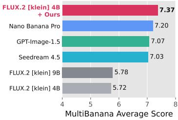

(b) Transfers to Unseen # Refs.  
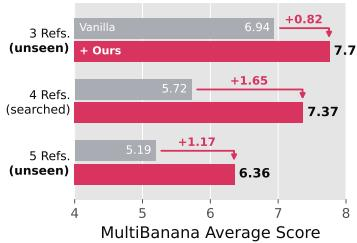

(c) Beyond Model Size and Family  
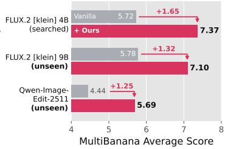  
Figure 1: AutoRef-Harness (+ Ours), optimized on four-reference MultiBanana tasks with FLUX.2 [klein] 4B, (a) enables FLUX.2 [klein] 4B to match or exceed proprietary models on the held-out test split and transfers unchanged to (b) unseen three- and five-reference settings and (c) generators of different scales and families.

## 1 INTRODUCTION

Recent image generation models can take multiple reference images as input and combine them into a new image (Google DeepMind, 2025a;b; OpenAI, 2025a; Wu et al., 2025). This capability, referred to as multi-reference image generation (Wu et al., 2026a; Xia et al., 2026; Zhang et al., 2026c; Huang et al., 2026b), matters for practical image creation because users can specify people, objects, clothing, backgrounds, and styles using separate images. Such control is directly useful in applications including advertising (Inoue et al., 2023; Morita et al., 2025), virtual try-on (Zhu et al., 2023; Chong et al., 2025; Hu et al., 2026), and content creation (Ruiz et al., 2023; Xu et al., 2026). Yet combining multiple references correctly remains challenging. Models may omit or duplicate subjects from the references, or produce images in which the subjects appear pasted in rather than forming a coherent scene (Xia et al., 2026; Huang et al., 2026b).

Recent work has proposed image generation agents that combine image generation and reasoning models through a harness and iteratively plan, generate, diagnose, and refine (Hao et al., 2023; Yang et al., 2024b; Ma et al., 2025; He et al., 2026b). The harness is executable code that specifies how the frozen models are used: how references are interpreted, prompts are constructed, candidates are generated and evaluated, and the output is selected. In multi-reference image generation, however, a good harness is harder to design than in text-to-image generation: references play different roles (e.g., identity, background, or style), and outputs must satisfy many criteria, including fidelity to each reference and the naturalness of the whole image (Oshima et al., 2026; Huang et al., 2026b). Many parts of the harness could therefore be improved, from which references to provide and in what order to how outputs are checked against each one, yet the effect of each change is hard to predict. Indeed, existing human-written harnesses vary widely in performance (Section 6.4).

Recent work on automatic agent optimization has expanded from prompts and workflows to executable code (Lee et al., 2026; Zhang et al., 2026b; Miyai et al., 2026). These methods, however, have largely been developed for tasks with verifiable rewards such as math (Lee et al., 2026) and coding (Lin et al., 2026; Zhang et al., 2026a), whereas image generation relies on noisy visual evaluation and provides little diagnostic information through scalar scores alone. We therefore propose AutoRef, which optimizes harness code while keeping the image generation and reasoning models frozen. To address these challenges, AutoRef separates the tasks used to propose harness updates from those used to select candidates, so that selection does not reuse the examples the proposer sees. It also runs an iterative beam search, in which the top-ranked harnesses on the selection tasks, rather than a harness chosen by the proposer, become the next parents.

AutoRef-Harness, the optimized harness for multi-reference image generation, was discovered by AutoRef on the MultiBanana benchmark (Oshima et al., 2026) using the open-weight FLUX.2 [klein] 4B (Black Forest Labs, 2026). It uses reference-grounded prompting, generates structurally diverse drafts, revises the better draft from explicit complaints, and selects among candidates with failureaware comparisons. With AutoRef-Harness, FLUX.2 [klein] 4B improves from 5.72 to 7.37 on the four-reference MultiBanana held-out test split, matching or exceeding proprietary models including Nano Banana Pro (Google DeepMind, 2025b) and GPT-Image-1.5 (OpenAI, 2025b) (Figure 1). The same harness also improves results without re-optimization when the generator, number of references, benchmark, evaluator, or reasoning model is changed. We release our code and AutoRef-Harness.

## 2 RELATED WORK

Multi-Reference Image Generation. Reference-conditioned image generation has evolved from personalized adaptation to specific subjects, as in DreamBooth (Ruiz et al., 2023), toward generalpurpose multimodal generation that incorporates multiple reference images. Recent models support flexible multi-reference image generation and editing (Deng et al., 2025; Xia et al., 2026; Wu et al., 2026a; Black Forest Labs, 2026; Wu et al., 2025; Google DeepMind, 2025a;b; 2026; OpenAI, 2025a;b). In parallel, recent work has improved multi-reference image generation by scaling referenceconditioned training data and fine-tuning the underlying models (Zhang et al., 2026c; Huang et al., 2026b). In contrast, MultiBanana (Oshima et al., 2026) shows that simple agentic refinement gives only limited gains on multi-reference tasks, indicating that simply wrapping a strong generator with a fixed agent workflow is insufficient. We therefore optimize the agent harness automatically from task feedback, improving multi-reference generation while keeping the generator frozen.

Automatic Optimization of Agentic Systems. Automatic agent optimization searches over prompts (Zhou et al., 2023; Yang et al., 2024a; Pryzant et al., 2023; Guo et al., 2024), modular pipelines (Khattab et al., 2024; Opsahl-Ong et al., 2024), and agent workflows (Zhuge et al., 2024; Hu et al., 2025; Zhang et al., 2025). Language-based feedback guides revisions (Yuksekgonul et al., 2025; Agrawal et al., 2026), while program evolution extends optimization to executable code and self-improving agents (Novikov et al., 2025; Lange et al., 2026; Zelikman et al., 2024; Robeyns et al., 2025; Zhang et al., 2026b). Pryzant et al. (2023) and Guo et al. (2024) keep multiple candidates across iterations, and Agrawal et al. (2026) and Khattab et al. (2024) can select them on held-out examples; all of them tune prompts within a fixed program. Meta-Harness (Lee et al., 2026) lets a coding agent read the code, scores, and execution trajectories of prior candidates, choose which one to build on, and revise the harness around a frozen model, scoring candidates on the same tasks that supply this feedback. AutoDesign (Luo et al., 2026) applies harness optimization to academic paper-to-poster generation. Appendix B discusses inference-time scaling for multimodal generation.

## 3 PRELIMINARIES

Multi-Reference Image Generation. Let $\boldsymbol { x } = ( u , \mathcal { T } )$ denote a multi-reference image generation task (Wu et al., 2026a; Xia et al., 2026; Huang et al., 2026b), where u is the user prompt (the instruction) and $\mathcal { I } = \{ I _ { 1 } , \ldots , I _ { m } \}$ is the set of reference images. Let $M _ { \theta }$ and $G _ { \phi }$ denote a frozen reasoning model and image generator, respectively. A harness H is an executable program that specifies how these models are used: how references are interpreted, prompts constructed, candidates generated and evaluated, and the output selected. Running the harness yields an image y and an execution trajectory τ:

$$
\begin{array} { r } { ( y , \tau ) \sim H ( M _ { \theta } , G _ { \phi } , x ) . } \end{array}\tag{1}
$$

Harness Optimization. Our goal is to optimize the harness while keeping the model parameters θ and $\phi$ frozen (Zhang et al., 2026b; Lin et al., 2026; Miyai et al., 2026). Let $p _ { \mathrm { t a s k } }$ denote the distribution of multi-reference image generation tasks, and let $R ( y , x )$ denote an evaluator that scores the quality of a generated image y for task x. We define the performance of a harness as

$$
J ( H ) = \mathbb { E } _ { x \sim p _ { \mathrm { t a s k } } , y \sim H ( M _ { \theta } , G _ { \phi } , x ) } \left[ R ( y , x ) \right] .\tag{2}
$$

The harness optimization objective is therefore

$$
H ^ { \star } = \arg \operatorname* { m a x } _ { H } J ( H ) .\tag{3}
$$

With $M _ { \theta }$ and $G _ { \phi }$ frozen, optimization acts only on the executable code surrounding the models, which allows changes to prompting, generation, evaluation, selection, and control flow.

Harness Search Loop. We approach this optimization problem through iterative code improvement (Zhang et al., 2026b; Lee et al., 2026; Lin et al., 2026). At iteration t, a coding-agent proposer $P$ has access to the current harness $H _ { t }$ and an accumulated search history $\mathcal { L } _ { t }$ of artifacts from previous iterations: harness implementations, evaluation scores, and execution trajectories. The proposer can selectively inspect and search prior artifacts, diagnose failure modes, and decide how to modify the harness. It then proposes an updated harness:

$$
H _ { t + 1 }  P ( H _ { t } , \mathcal { L } _ { t } ) .\tag{4}
$$

The proposed harness is evaluated on a set of search tasks, and its implementation, scores, and trajectories are added to the history $\mathcal { L } _ { t + 1 }$

## 4 AUTOREF

We propose AutoRef, a method for automatically optimizing harnesses for multi-reference image generation. Existing harness optimization methods (Zhang et al., 2026b; Lee et al., 2026; Miyai et al., 2026) primarily target tasks whose performance can be verified using discrete labels or executable tests. In image generation, however, a visual evaluator must estimate quality; failures are often hard to diagnose from scalar rewards alone, and repeated optimization over a limited set of evaluated examples can overfit to both the search tasks and the evaluator. AutoRef addresses these challenges by (1) separating the tasks used for harness updates from those used for candidate selection, and (2) using beam search that keeps the top-B candidates on the validation tasks as parents for the next iteration. These choices adapt harness optimization to perceptual, non-verifiable image generation tasks. Figure 2 illustrates one iteration; Algorithm 1 (Appendix C) gives the full procedure.

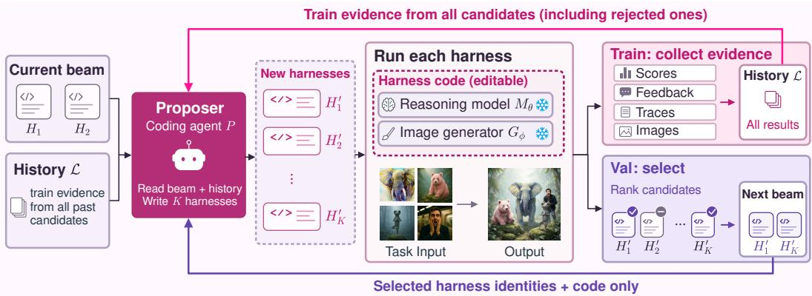  
Figure 2: AutoRef, one iteration. A harness is a program that calls a frozen reasoning model $M _ { \theta }$ and a frozen image generator $G _ { \phi } ;$ the search rewrites this program. The proposer, a coding agent ${ \dot { P } } ,$ reads the current beam and the search history $\mathcal { L }$ and writes $K = 4$ new harnesses as code. On $D _ { \mathrm { t r a i n } }$ (pink), everything from every candidate, rejected ones included — scores, evaluator rationales, execution trajectories, and generated images — enters ${ \mathcal { L } } ,$ , where $P$ may inspect it. $D _ { \mathrm { v a l } }$ (purple) only ranks the four and keeps $B = 2 ; P$ is told which two survived but never their scores. The survivors form the next beam; their parents do not compete again.

Task Separation for Proposal and Selection. Directly optimizing against rich but non-verifiable evaluation feedback risks overfitting the harness to both a small set of search tasks and noise in the evaluator (Huang et al., 2026a; Luo et al., 2026). We therefore separate the tasks used to propose harness updates from those used to select among them. We split the search tasks into disjoint sets $D _ { \mathrm { t r a i n } }$ and $D _ { \mathrm { v a l } }$ , and write $J _ { D } ( H )$ for the mean of $R ( y , x )$ over $x \in D$ . Evaluations on $D _ { \mathrm { t r a i n } }$ provide feedback for harness improvement: scores, evaluator rationales, execution trajectories, and visual artifacts are added to the search history L and may be inspected by the proposer. In contrast, $D _ { \mathrm { v a l } }$ is used only for candidate selection, and its scores and artifacts are never exposed to the proposer or added to L. Thus, the proposer constructs new harnesses using only training-side feedback, while $J _ { D _ { \mathrm { v a l } } }$ selects among them without becoming a direct optimization signal.

Iterative Beam Search. Selecting a single harness at each iteration can commit the search to a lineage favored by stochastic generation or noisy visual evaluation. We therefore maintain a beam of B harnesses. At iteration t, the proposer uses the current beam and accumulated search history to generate K candidate harnesses. Each candidate is evaluated on both $D _ { \mathrm { t r a i n } }$ and $D _ { \mathrm { v a l } }$ and the next beam is formed by the B candidates with the highest $J _ { D _ { \mathrm { v a l } } } .$ The proposer is told which candidates were selected but not their validation scores, while training-side evidence from all candidates, including unselected ones and their generated images, is preserved in L for subsequent iterations. In our experiments, we use $B = 2$ and $K = 4$ , and initialize the beam with two harnesses: the base generator $H _ { \mathrm { v a n i l l a } }$ (the generator called once on the user prompt) and GEMS (He et al., 2026b) as $H _ { \mathrm { i n i t } }$ . In the first iteration, the proposer writes all K candidates from the two initial harnesses; in each later iteration, it writes two candidates from each beam member. The search that produced AutoRef-Harness is traced in Appendix D.

## 5 THE OPTIMIZED AUTOREF-HARNESS

AutoRef-Harness is the harness returned by AutoRef (Section 4). It draws three images from $G _ { \phi }$ and makes all other decisions with $M _ { \theta } { \mathrm { : } }$ it generates drafts A and B from two differently structured prompts, keeps the better one, generates draft C from complaints about the winner, and returns the better of the winner and C (Appendix F). Compared with human-written harnesses, it differs in how each step is specialized for multiple references and how the steps are chained: every prompt assigns each requested element to its reference (§5.1); the two drafts differ in prompt structure, not only in sampling (§5.2); complaints name the reference they concern (§5.3); and selection counts hard failures (e.g., a missing reference) before pairwise judgment, and a later draft replaces the incumbent only if it wins under this rule (§5.4). Each component was added in an iteration that raised the validation score, and alternatives like editing the winner in place were dropped (Appendix D).

## 5.1 REFERENCE-GROUNDED PROMPTING

References play different roles (identity, garment, attribute, background, style); a generator that confuses them leaks attributes or drops references. AutoRef-Harness never passes the raw instruction to the generator: $M _ { \theta }$ reads the instruction and all references and writes a prompt that assigns each requested element to its reference, excluding unrequested content; later prompts use the same format.

## 5.2 STRUCTURALLY DIVERSE DRAFTS

A common failure is a pasted-in look: each subject matches its reference, but its lighting, perspective, or colors disagree with the scene. Resampling one prompt rarely fixes this, so the two drafts use different prompt structures. Draft A describes the scene subject by subject. For draft B, M identifies the reference designated as the background or style, and the prompt asks the generator to keep that reference as the canvas and paint the other subjects into it, so that subjects and scene are rendered jointly. If no such reference exists, draft B is a second sample of draft A’s prompt.

## 5.3 COMPLAINT-DIRECTED REVISION

$M _ { \theta }$ lists up to five concrete complaints about the winner of A and B, each naming the reference it concerns (e.g., wrong identity, attribute from the wrong reference, inconsistent lighting), and rewrites the prompt to address them; draft C is generated from the revised prompt, or by resampling the winner’s prompt if there is no complaint.

## 5.4 FAILURE-AWARE SELECTION

Candidates are compared in pairs. Each draft is first checked for hard failures (missing reference, extra or duplicated subject, wrong background); the draft with fewer failures wins. On a tie, Mθ lists the differences a strict rater would score and names a winner in both presentation orders; the challenger (draft B, then draft C) must win both. Selection uses $M _ { \theta }$ (GPT-5.5), not the evaluator R.

## 6 EXPERIMENTS

## 6.1 EXPERIMENTAL SETTINGS

Benchmarks. We evaluate on MultiBanana (Oshima et al., 2026), a benchmark for multi-reference image generation. We use the 229 tasks with four reference images, split into 48 training tasks, 48 validation tasks, and 133 test tasks, with Qwen3-VL-8B-Instruct (Bai et al., 2025) as the evaluator. We use the training and validation splits for harness optimization, while the held-out test split remains unseen during search. To test generalization across unseen reference counts, we further evaluate on the three- and five-reference settings, randomly sampling 24 tasks per task type (96 per setting).

To evaluate generalization beyond the benchmark and evaluator, we also test on OmniContext (Wu et al., 2026a), which we never use during harness search. We randomly sample 15 tasks from each task type, for 120 tasks in total, and evaluate them using the official GPT-4.1 (OpenAI, 2023) evaluator. With both the benchmark and the evaluator differing from those used in the search, this setting tests whether the learned harness transfers to unseen data distributions and evaluation signals.

Harness Search. We initialize the search with two harnesses: the base FLUX.2 [klein] 4B generator (Black Forest Labs, 2026) and GEMS (He et al., 2026b), an image-generation harness configured with FLUX.2 [klein] 4B as the generator and GPT-5.5 (OpenAI, 2026) as the reasoning model. For AutoRef (Section 4), we use Claude Fable 5.1 as the proposer through the Claude Code CLI (Anthropic, 2025) and run five search iterations. Implementation details and model versions are in Appendix A, and the proposer’s prompts are in Appendix E.

Table 1: MultiBanana (Oshima et al., 2026) with 4 references, held-out test split. Cells are the mean of the five evaluation metrics (1–10) per task type and Avg. the mean of the four. Gen. is images drawn per task, a measured mean over the split rather than a nominal maximum. Best open image generators per column in bold, second best underlined. †: AutoRef-Harness discovered with FLUX.2 [klein] 4B on the four-reference MultiBanana setting.
<table><tr><td>Method</td><td>Gen.</td><td>Object</td><td>Local</td><td>Global</td><td>Background</td><td>Avg.</td></tr><tr><td colspan="7">Proprietary Models</td></tr><tr><td>GPT-Image-1.5</td><td>1</td><td>6.84</td><td>8.12</td><td>7.22</td><td>6.11</td><td>7.07</td></tr><tr><td>Nano Banana Pro</td><td>1</td><td>6.73</td><td>7.98</td><td>7.70</td><td>6.39</td><td>7.20</td></tr><tr><td>Seedream 4.5</td><td>1</td><td>6.65</td><td>7.54</td><td>7.83</td><td>6.10</td><td>7.03</td></tr><tr><td colspan="7">Open Models</td></tr><tr><td>OmniGen2</td><td>1</td><td>3.56</td><td>4.35</td><td>3.64</td><td>3.43</td><td>3.75</td></tr><tr><td>DreamOmni2</td><td>1</td><td>3.38</td><td>5.17</td><td>3.51</td><td>3.28</td><td>3.83</td></tr><tr><td>BAGEL</td><td>1</td><td>2.64</td><td>4.16</td><td>2.76</td><td>3.04</td><td>3.15</td></tr><tr><td>FLUX.2 [klein] 4B</td><td>1</td><td>5.95</td><td>6.11</td><td>5.50</td><td>5.34</td><td>5.72</td></tr><tr><td>+ AutoRef-Harness</td><td>3</td><td>7.27</td><td>7.87</td><td>7.64</td><td>6.70</td><td>7.37</td></tr><tr><td>FLUX.2 [klein] 9B</td><td>1</td><td>6.80</td><td>5.64</td><td>5.58</td><td>5.13</td><td>5.78</td></tr><tr><td>+ AutoRef-Harness</td><td>3</td><td>7.49</td><td>7.30</td><td>7.22</td><td>6.37</td><td>7.10</td></tr><tr><td>Qwen-Image-Edit-2511</td><td>1</td><td>4.05</td><td>5.05</td><td>4.43</td><td>4.23</td><td>4.44</td></tr><tr><td>+ AutoRef-Harness</td><td>3</td><td>5.50</td><td>6.07</td><td>5.79</td><td>5.41</td><td>5.69</td></tr></table>

Table 2: MultiBanana with 3 and 5 references. AutoRef-Harness largely preserves its performance gains when transferred to unseen reference counts. Best open image generators per column in bold, second best underlined. †: AutoRef-Harness discovered with FLUX.2 [klein] 4B on the four-reference MultiBanana setting.
<table><tr><td rowspan="2">Method</td><td rowspan="2">Gen.</td><td colspan="5">3 references</td><td colspan="5">5 references</td></tr><tr><td>Object</td><td>Local</td><td>Global</td><td>Backg.</td><td>Avg.</td><td>Object</td><td>Local</td><td>Global</td><td>Backg.</td><td>Avg.</td></tr><tr><td colspan="10">Proprietary Models</td></tr><tr><td>GPT-Image-1.5</td><td>1</td><td>8.42</td><td>8.14</td><td>7.84</td><td>7.03</td><td>7.86</td><td>5.68</td><td>8.48</td><td>6.20</td><td>6.02</td><td>6.60</td></tr><tr><td>Nano Banana Pro</td><td>1</td><td>8.27</td><td>8.09</td><td>7.62</td><td>6.03</td><td>7.50</td><td>5.53</td><td>8.41</td><td>7.03</td><td>5.88</td><td>6.71</td></tr><tr><td>Seedream 4.5</td><td>1</td><td>6.88</td><td>8.43</td><td>7.68</td><td>6.67</td><td>7.41</td><td>6.02</td><td>8.16</td><td>6.19</td><td>6.04</td><td>6.60</td></tr><tr><td colspan="10">Open Models</td></tr><tr><td>OmniGen2</td><td>1</td><td>4.74</td><td>5.78</td><td>5.62</td><td>4.87</td><td>5.25</td><td>2.68</td><td>4.37</td><td>2.73</td><td>2.93</td><td>3.18</td></tr><tr><td>DreamOmni2</td><td>1</td><td>5.31</td><td>6.26</td><td>5.20</td><td>4.68</td><td>5.36</td><td>2.01</td><td>4.88</td><td>3.17</td><td>2.42</td><td>3.12</td></tr><tr><td>BAGEL</td><td>1</td><td>4.47</td><td>4.50</td><td>3.69</td><td>3.72</td><td>4.10</td><td>2.20</td><td>4.16</td><td>2.83</td><td>2.08</td><td>2.82</td></tr><tr><td>FLUX.2 [klein] 4B</td><td>1</td><td>6.26</td><td>7.90</td><td>6.83</td><td>6.78</td><td>6.94</td><td>4.04</td><td>6.32</td><td>5.72</td><td>4.70</td><td>5.19</td></tr><tr><td>+ AutoRef-Harness†</td><td>3</td><td>7.15</td><td>8.68</td><td>7.82</td><td>7.41</td><td>7.76</td><td>5.67</td><td>7.37</td><td>6.75</td><td>5.65</td><td>6.36</td></tr><tr><td>FLUX.2 [klein] 9B</td><td>1</td><td>6.89</td><td>7.36</td><td>6.69</td><td>6.36</td><td>6.83</td><td>4.84</td><td>7.49</td><td>5.64</td><td>4.45</td><td>5.61</td></tr><tr><td>+ AutoRef-Harness†</td><td>3</td><td>8.04</td><td>8.29</td><td>7.87</td><td>7.09</td><td>7.82</td><td>6.16</td><td>7.67</td><td>6.12</td><td>5.92</td><td>6.47</td></tr><tr><td>Qwen-Image-Edit-2511</td><td>1</td><td>4.56</td><td>5.13</td><td>5.53</td><td>5.03</td><td>5.06</td><td>1.35</td><td>1.83</td><td>2.56</td><td>1.80</td><td>1.89</td></tr><tr><td>+ AutoRef-Harness†</td><td>3</td><td>6.87</td><td>7.86</td><td>6.67</td><td>6.39</td><td>6.95</td><td>1.57</td><td>1.69</td><td>2.30</td><td>1.93</td><td>1.87</td></tr></table>

Baselines. We compare against a broad set of baselines: proprietary image models including GPT-Image-1.5 (OpenAI, 2025b), Nano Banana Pro (Google DeepMind, 2025b), and Seedream 4.5 (ByteDance Seed, 2025), open image models including OmniGen2 (Wu et al., 2026a), DreamOmni2 (Xia et al., 2026), BAGEL (Deng et al., 2025), FLUX.2 [klein] 4B and 9B (Black Forest Labs, 2026), and Qwen-Image-Edit-2511 (Wu et al., 2025), and agentic or search-based methods including Best-of-N (Ma et al., 2025), GEMS (He et al., 2026b), IPR (Oshima et al., 2026), and Idea2Img (Yang et al., 2024b). We also report the harness that Meta-Harness (Lee et al., 2026) converges to under the same budget, generator, reasoning model, and evaluator, so the search algorithm is the only difference between it and AutoRef-Harness.

## 6.2 MAIN RESULTS

As shown in Table 1, AutoRef-Harness improves the performance of FLUX.2 [klein] 4B on the four-reference MultiBanana held-out test split. Despite using the relatively small FLUX.2 [klein] 4B as its image generator, the resulting system outperforms all evaluated open models and achieves performance competitive with proprietary models such as GPT-Image-1.5, Nano Banana Pro, and

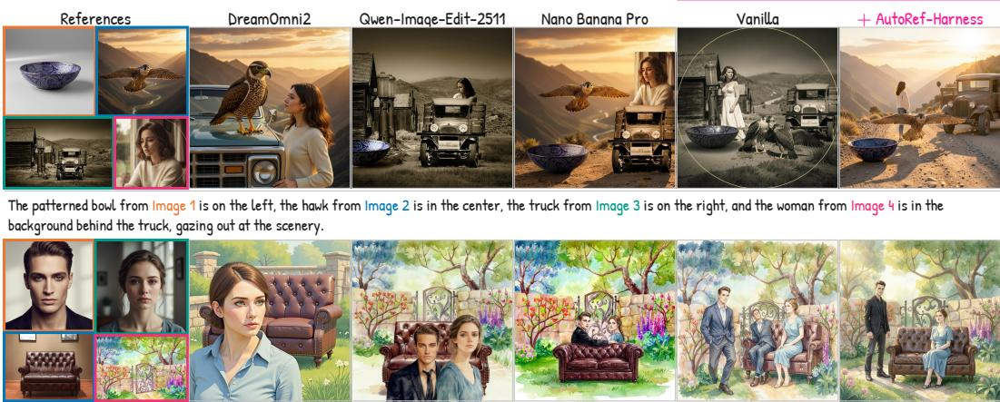  
The man from image 1, the woman from image 3, and the sofa from image 2 are arranged in a garden scene with a stone wal and an ornate gate, in the watercolor style of image 4.

Figure 3: Qualitative comparison on held-out four-reference MultiBanana tasks. Each reference is outlined in a distinct color, and the phrase in the instruction that refers to it is shown in the same color. Baseline models often omit, duplicate, or misplace references, or copy and paste them unnaturally, whereas AutoRef-Harness preserves each reference and integrates all four into a coherent scene.

Seedream 4.5. The gains from AutoRef-Harness also transfer beyond the model used during harness optimization: applying the same harness to the larger FLUX.2 [klein] 9B improves its performance, and replacing FLUX.2 with Qwen-Image-Edit-2511 likewise yields a substantial gain. These results indicate that the benefit of the discovered harness is not limited to a particular model scale or generator family. Importantly, we achieve these improvements without updating the image generator or reasoning model; we only change the inference-time harness. Per-metric results are reported in Appendix H.1, and the harness further improves Qwen-Image-Edit-2511 after fine-tuning for multi-reference image generation with DyRef (Huang et al., 2026b; Appendix H.3).

Figure 3 illustrates qualitative examples. Baseline models often omit, duplicate, or misplace references, or paste them in unnaturally. For instance, the base FLUX.2 [klein] 4B duplicates the hawk and places the woman in the foreground rather than the background in the first example, and duplicates the man in the second. Nano Banana Pro and Qwen-Image-Edit-2511 instead produce copy-and-paste-like results in the first and second examples, respectively. AutoRef-Harness preserves each reference and naturally integrates it into the requested scene. Appendix J shows more examples.

## 6.3 TRANSFERABILITY OF AUTOREF-HARNESS

Across Reference Counts. AutoRef-Harness is discovered on four-reference MultiBanana tasks but applies to different reference counts without modification. As shown in Table 2, it consistently improves FLUX.2 [klein] 4B on both the unseen three- and five-reference settings. With three references, the resulting system outperforms all open image generators without the harness and remains competitive with proprietary models; the gain also persists in the more challenging fivereference setting. The harness likewise improves the other generators, except Qwen-Image-Edit-2511 with five references, where the generator itself fails and the harness cannot compensate (Appendix I). AutoRef-Harness thus does not rely on the four-reference structure used during harness discovery.

Across Benchmarks and Evaluators. We further evaluate the same AutoRef-Harness on Omni-Context, which is never used during harness discovery and is scored by its official GPT-4.1 (OpenAI, 2023) evaluator rather than the Qwen3-VL-8B-Instruct evaluator used for MultiBanana. As shown in Table 3, AutoRef-Harness again improves FLUX.2 [klein] 4B and remains competitive with proprietary image models. Thus, the gains persist under simultaneous changes in both the benchmark distribution and the evaluator, without benchmark-specific modifications to the harness.

Across Reasoning Models. As shown in Section 6.2, AutoRef-Harness transfers across image generators of different scales and families. We next test whether the same harness also transfers across reasoning models. With the open-weight Qwen3-VL-32B (Bai et al., 2025) in place of GPT-5.5

FLUX.2 [klein] 4B MultiBanana (4 Ref.)

Table 3: OmniContext (Wu et al., 2026a), unseen during the search and scored by its GPT-4.1 evaluator. Cells are the geometric mean of prompt following and subject consistency (0–10) per task type, and Avg. the mean of the eight; Char.: character, Obj.: object, C.+O.: character and object. Best open image generators per column in bold, second best underlined. †: AutoRef-Harness discovered with FLUX.2 [klein] 4B on the four-reference MultiBanana setting.
<table><tr><td rowspan="2">Method</td><td rowspan="2">Gen.</td><td colspan="2">SINGLE</td><td colspan="3">MULTIPLE</td><td colspan="3">SCENE</td><td rowspan="2">Avg.</td></tr><tr><td>Char.</td><td>Obj.</td><td>Char.</td><td>Obj.</td><td>C.+0.</td><td>Char.</td><td>Obj.</td><td>C.+0.</td></tr><tr><td colspan="10">Proprietary Models</td></tr><tr><td>GPT-Image-1.5</td><td>1</td><td>9.56</td><td>9.70</td><td>9.32</td><td>9.46</td><td>9.26</td><td>9.69</td><td>9.39</td><td>8.93</td><td>9.41</td></tr><tr><td>Nano Banana Pro</td><td>1</td><td>9.63</td><td>9.42</td><td>9.46</td><td>9.19</td><td>9.02</td><td>9.35</td><td>8.39</td><td>8.20</td><td>9.08</td></tr><tr><td>Seedream 4.5</td><td>1</td><td>9.45</td><td>9.50</td><td>9.09</td><td>9.39</td><td>9.09</td><td>9.35</td><td>8.66</td><td>8.23</td><td>9.09</td></tr><tr><td colspan="10">Open Models</td></tr><tr><td>OmniGen2</td><td>1</td><td>8.51</td><td>5.73</td><td>6.30</td><td>6.58</td><td>7.71</td><td>6.93</td><td>6.10</td><td>7.03</td><td>6.86</td></tr><tr><td>DreamOmni2</td><td>1</td><td>7.81</td><td>6.72</td><td>4.80</td><td>7.07</td><td>5.92</td><td>5.78</td><td>5.63</td><td>5.72</td><td>6.18</td></tr><tr><td>BAGEL</td><td>1</td><td>6.67</td><td>7.09</td><td>3.43</td><td>6.74</td><td>7.08</td><td>3.97</td><td>4.11</td><td>5.63</td><td>5.59</td></tr><tr><td>FLUX.2 [klein] 4B</td><td>1</td><td>9.22</td><td>8.16</td><td>7.91</td><td>8.21</td><td>8.68</td><td>9.18</td><td>7.47</td><td>7.54</td><td>8.30</td></tr><tr><td>+ AutoRef-Harness†</td><td>3</td><td>8.94</td><td>8.99</td><td>9.02</td><td>8.78</td><td>8.59</td><td>9.28</td><td>8.89</td><td>8.28</td><td>8.85</td></tr><tr><td>FLUX.2 [klein] 9B</td><td>1</td><td>9.17</td><td>9.08</td><td>8.66</td><td>8.14</td><td>8.74</td><td>9.35</td><td>8.07</td><td>7.47</td><td>8.59</td></tr><tr><td>+ AutoRef-Harness†</td><td>3</td><td>9.22</td><td>9.18</td><td>9.19</td><td>9.32</td><td>8.82</td><td>9.35</td><td>8.40</td><td>8.30</td><td>8.97</td></tr><tr><td>Qwen-Image-Edit-2511</td><td>1</td><td>9.14</td><td>9.19</td><td>8.66</td><td>9.00</td><td>8.33</td><td>6.97</td><td>8.17</td><td>8.17</td><td>8.45</td></tr><tr><td>+ AutoRef-Harness†</td><td>3</td><td>9.12</td><td>8.64</td><td>9.09</td><td>8.62</td><td>8.34</td><td>8.71</td><td>8.82</td><td>8.28</td><td>8.70</td></tr></table>

FLUX.2 [klein] 4B MultiBanana (4 Ref.)  
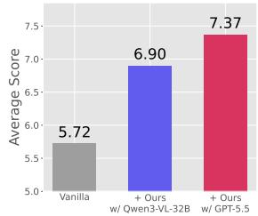

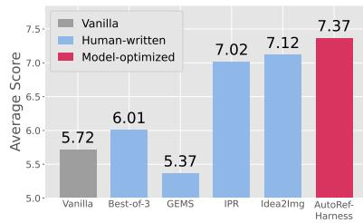

FLUX.2 [klein] 4B MultiBanana (4 Ref.)  
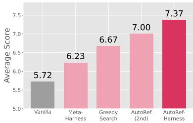  
Figure 4: (Left) Reasoning-model transfer. AutoRef-Harness (+ Ours) improves FLUX.2 [klein] 4B with both GPT-5.5 and the open-weight Qwen3-VL-32B. (Middle) Comparison with human-written harnesses. AutoRef Harness outperforms Best-of-3, GEMS, IPR, and Idea2Img. (Right) Comparison of harness optimization methods. AutoRef discovers stronger harnesses than Meta-Harness and Greedy Search; even its second-best discovered harness outperforms the final harnesses produced by both alternative search procedures.

and the harness structure unchanged, AutoRef-Harness improves FLUX.2 [klein] 4B from 5.72 to 6.90 on the four-reference MultiBanana held-out test split (7.37 with GPT-5.5; Figure 4, Left). This suggests that the orchestration strategy encoded by AutoRef-Harness is not specific to the proprietary reasoning model used during its discovery.

## 6.4 COMPARISON WITH HARNESSES AND HARNESS SEARCH

Comparison with Human-Written Harnesses. We compare AutoRef-Harness with human-written harnesses: Best-of-3 (Ma et al., 2025), GEMS (He et al., 2026b), IPR (Oshima et al., 2026), and Idea2Img (Yang et al., 2024b), which use 3, 2.7, 3, and 9 image generations per task, respectively (details in Appendix G.1). AutoRef-Harness achieves the highest performance on the four-reference MultiBanana held-out test split (Figure 4, Middle). Notably, Idea2Img still underperforms despite using three times AutoRef-Harness’s generation budget.

Comparison with Harness Optimization Methods. We next compare AutoRef with alternative harness optimization methods (details in Appendix G.2). Meta-Harness (Lee et al., 2026) uses the same tasks for optimization feedback and candidate ranking, and its proposer chooses which candidate to build on from the full search history. Greedy Search adopts AutoRef’s train–validation separation but retains only the single best harness per iteration, whereas AutoRef keeps the top-B candidate on $D _ { \mathrm { v a l } }$ as parents for the next iteration. Under the same generator, reasoning model, and evaluator, AutoRef yields the strongest final harness on the held-out test split, followed by Greedy Search and Meta-Harness (Figure 4, Right). The final harnesses of Meta-Harness and Greedy Search also draw more images per task than AutoRef-Harness (4.2 and 5 vs. 3). Moreover, even AutoRef’s second-best harness outperforms both methods’ final harnesses. The successive gains from Meta-Harness to Greedy Search to AutoRef support the value of both train–validation separation and a multi-parent beam when optimizing image-generation harnesses from perceptual evaluation.

## 6.5 ABLATION STUDY

We ablate one component at a time, replacing a removed draft or revision with another sample from the same prompt and failure-aware selection with the Bestof-N selector (Appendix G.1). Reference-grounded prompting cannot be ablated this way, since all drafts and the revision use grounded prompts; we instead evaluate it alone with a single image (grounding only) and the harness without it (selection only). Table 4 shows that each of the four components contributes: removing structurally diverse drafts, complaint-directed revision, or failure-aware selection lowers the average score, and both grounding only and selection only improve over the generator alone. Grounding only (6.91, one image) approaches IPR (7.02, three images), which also rewrites the prompt from the references, and selection only (6.15) is close to Best-of-3 (6.01), which differs only in its selector; yet the same selector adds 0.44 within the full harness (7.37 vs. 6.93), and no partial combination matches the full harness.

Table 4: Component ablation on the held-out test split. Columns are the components of §5.1–5.4; parentheses give the change from the full harness.
<table><tr><td></td><td>§5.1 §5.2</td><td></td><td>§5.3</td><td>§5.4</td><td>Avg.</td></tr><tr><td>Full harness</td><td></td><td></td><td></td><td></td><td>7.37</td></tr><tr><td></td><td></td><td>x</td><td></td><td></td><td>7.01 (−0.36)</td></tr><tr><td>Leave one out</td><td></td><td>V</td><td>x</td><td></td><td>6.99 (−0.38)</td></tr><tr><td></td><td></td><td>√</td><td>√</td><td>X</td><td>6.93 (−0.44)</td></tr><tr><td>Grounding only</td><td></td><td>x</td><td>x</td><td>x</td><td>6.91 (−0.46)</td></tr><tr><td>Selection only</td><td>x</td><td>x</td><td>x</td><td></td><td>6.15 (−1.22)</td></tr><tr><td>Generator only</td><td>×</td><td>x</td><td>x</td><td>x</td><td>5.72 (−1.65)</td></tr></table>

## 6.6 HUMAN EVALUATION

AutoRef optimizes against an automatic evaluator, so we test whether its gains hold for human raters. Four raters compared FLUX.2 [klein] 4B + AutoRef-Harness with each of four baselines on 50 tasks each from the four-reference held-out test split. For each task, raters see the references, the instruction, and the two outputs in random order, and select the better output, or a tie only if they cannot distinguish the two. As shown in Figure 5, AutoRef-Harness achieves a 70% win rate against its base generator, FLUX.2 [klein] 4B (17% loss), wins more often than it loses against FLUX.2 [klein] 9B (64% vs. 24%) and Seedream 4.5 (63% vs. 27%), and is competitive with Nano Banana Pro (46% vs. 40%).

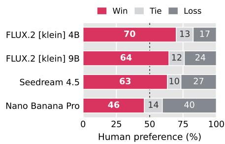  
Figure 5: Win, tie, and loss rates (%) of AutoRef-Harness (FLUX.2 [klein] 4B) against each baseline in pairwise human evaluation.

## 7 DISCUSSION AND LIMITATIONS

AutoRef-Harness changes only how a frozen generator is used, so it cannot exceed what the generator can produce: when no draft is acceptable, as for Qwen-Image-Edit-2511 at five references, better selection does not help (Appendix I). The search maximizes a single VLM evaluator’s score, yet the harness transfers to OmniContext and its GPT-4.1 evaluator. As the evaluator and the proposer are replaceable, AutoRef may benefit from stronger VLMs and coding agents, and richer evaluators could be explored, e.g., combining a VLM with segmentation models (Carion et al., 2026).

## 8 CONCLUSION

We introduced AutoRef, a harness optimization method for multi-reference image generation that keeps the image generator and the reasoning model frozen and changes only the program that combines them. AutoRef separates the tasks that inform proposals from those used to select among them, and continues from the top-ranked harnesses on the selection tasks through iterative beam search. The harness it discovers, AutoRef-Harness, makes the open-weight FLUX.2 [klein] 4B competitive with proprietary models on MultiBanana, transfers to unseen reference counts, an unseen benchmark and evaluator, other generators, and another reasoning model, and adds to the gains of fine-tuning. These results suggest that how frozen models are used is itself worth optimizing.

## AI USE STATEMENT

In this work, we used generative AI tools for the following tasks: design or provide feedback on research methodology or experiments, implement methods, assist with translation, and support qualitative and thematic data analysis. We have not used generative AI tools for the following tasks: help develop theoretical models or conceptual frameworks, formulate mathematical claims, provide critical ingredients for proving mathematical claims, propose or refine hypotheses, clean and reformat datasets, interpret results, and the tasks generate synthetic data sets and assist in the writing of proofs are not applicable to this work. Additionally, we used generative AI tools for the following tasks: create or modify scientific figures or images, create or edit software code, draft parts of a research paper, and edit a research paper to improve readability. We have reviewed all AI-assisted work. Two authors verified and tested LLM-generated code and writing for correctness. We take responsibility for the final content, including text, claims, or artifacts produced with generative AI.

## ETHICS STATEMENT

Our method optimizes only the agent harness and does not update the underlying reasoning or image generation models. Thus, it does not introduce new behaviors through model-weight modification, although it can change how existing model capabilities are composed. As with image generation more broadly, improved multi-reference image generation may be misused to create misleading or unauthorized synthetic content. The harness also inherits limitations and biases from the underlying models and evaluators. We therefore encourage responsible use of the released code and harness.

## REPRODUCIBILITY STATEMENT

We release the AutoRef implementation and AutoRef-Harness at an URL (https://github. com/KuOnoda/AutoRef), together with the data splits and the pinned model revisions. We conduct all evaluations on publicly available benchmarks. The main paper describes the harness optimization procedure, model configurations, data splits, and evaluation protocol, while the Appendix provides additional evaluation details and complete results.

## ACKNOWLEDGEMENTS

We thank Google Japan for its funding support. MS was supported by JSPS KAKENHI Grant Number JP23H04974.

## REFERENCES

Lakshya A Agrawal, Shangyin Tan, Dilara Soylu, Noah Ziems, Rishi Khare, Krista Opsahl-Ong, Arnav Singhvi, Herumb Shandilya, Michael J Ryan, Meng Jiang, Christopher Potts, Koushik Sen, Alex Dimakis, Ion Stoica, Dan Klein, Matei Zaharia, and Omar Khattab. Gepa: Reflective prompt evolution can outperform reinforcement learning. In C. Vondrick, B. Hariharan, C. Raffel, L. Pinto, D. Yang, and A. Faust (eds.), International Conference on Learning Representations, volume 2026, pp. 8479–8565, 2026. URL https://proceedings.iclr.cc/paper\_files/paper/ 2026/file/0e9e708b6f48e14fd0ac29e167413f76-Paper-Conference.pdf.

Anthropic. Claude code. https://claude.com/product/claude-code, 2025. Accessed: 2026-09-18.

Shuai Bai, Yuxuan Cai, Ruizhe Chen, Keqin Chen, Xionghui Chen, Zesen Cheng, Lianghao Deng, Wei Ding, Chang Gao, Chunjiang Ge, Wenbin Ge, Zhifang Guo, Qidong Huang, Jie Huang, Fei Huang, Binyuan Hui, Shutong Jiang, Zhaohai Li, Mingsheng Li, Mei Li, Kaixin Li, Zicheng Lin, Junyang Lin, Xuejing Liu, Jiawei Liu, Chenglong Liu, Yang Liu, Dayiheng Liu, Shixuan Liu,

Dunjie Lu, Ruilin Luo, Chenxu Lv, Rui Men, Lingchen Meng, Xuancheng Ren, Xingzhang Ren, Sibo Song, Yuchong Sun, Jun Tang, Jianhong Tu, Jianqiang Wan, Peng Wang, Pengfei Wang, Qiuyue Wang, Yuxuan Wang, Tianbao Xie, Yiheng Xu, Haiyang Xu, Jin Xu, Zhibo Yang, Mingkun Yang, Jianxin Yang, An Yang, Bowen Yu, Fei Zhang, Hang Zhang, Xi Zhang, Bo Zheng, Humen Zhong, Jingren Zhou, Fan Zhou, Jing Zhou, Yuanzhi Zhu, and Ke Zhu. Qwen3-vl technical report, 2025. URL https://arxiv.org/abs/2511.21631.

Black Forest Labs. FLUX.2 [klein]. https://bfl.ai/models/flux-2-klein, 2026. Accessed: 2026-09-24.

ByteDance Seed. Seedream 4.5. https://seed.bytedance.com/en/seedream4\_5, 2025. Accessed: 2026-09-23.

Nicolas Carion, Laura Gustafson, Yuan-Ting Hu, Shoubhik Debnath, Ronghang Hu, Didac Suris Coll-Vinent, Chaitanya Ryali, Kalyan Vasudev Alwala, Haitham Khedr, Andrew Huang, Jie Lei, Tengyu Ma, Baishan Guo, Arpit Kalla, Markus Marks, Joseph Greer, Meng Wang, Peize Sun, Roman Rädle, Triantafyllos Afouras, Effrosyni Mavroudi, Katherine Xu, Tsung-Han Wu, Yu Zhou, Liliane Momeni, RISHI HAZRA, Shuangrui Ding, Sagar Vaze, Francois Porcher, Feng Li, Siyuan Li, Aishwarya Kamath, Ho Kei Cheng, Piotr Dollar, Nikhila Ravi, Kate Saenko, Pengchuan Zhang, and Christoph Feichtenhofer. SAM 3: Segment anything with concepts. In The Fourteenth International Conference on Learning Representations, 2026. URL https: //openreview.net/forum?id=r35clVtGzw.

Sixiang Chen, Zhaohu Xing, Tian Ye, Xinyu Geng, Yunlong Lin, Jianyu Lai, Xuanhua He, Fuxiang Zhai, Jialin Gao, and Lei Zhu. Genevolve: Self-evolving image generation agents via toolorchestrated visual experience distillation. arXiv preprint arXiv:2605.21605, 2026.

Zheng Chong, Xiao Dong, Haoxiang Li, shiyue Zhang, Wenqing Zhang, Hanqing Zhao, xujie zhang, Dongmei Jiang, and Xiaodan Liang. CatVTON: Concatenation is all you need for virtual try-on with diffusion models. In The Thirteenth International Conference on Learning Representations, 2025. URL https://openreview.net/forum?id=jt1h2dnmng.

Siddhartha Datta, Alexander Ku, Deepak Ramachandran, and Peter Anderson. Prompt expansion for adaptive text-to-image generation. In Proceedings ofthe 62nd Annual Meeting ofthe Association for Computational Linguistics (Volume 1: Long Papers), pp. 3449–3476, Bangkok, Thailand, August 2024. Association for Computational Linguistics. doi: 10.18653/v1/2024.acl-long.189. URL https://aclanthology.org/2024.acl-long.189/.

Chaorui Deng, Deyao Zhu, Kunchang Li, Chenhui Gou, Feng Li, Zeyu Wang, Shu Zhong, Weihao Yu, Xiaonan Nie, Ziang Song, Guang Shi, and Haoqi Fan. Emerging properties in unified multimodal pretraining. arXiv preprint arXiv:2505.14683, 2025.

Hiroki Furuta, Heiga Zen, Dale Schuurmans, Aleksandra Faust, Yutaka Matsuo, Percy Liang, and Sherry Yang. Improving dynamic object interactions in text-to-video generation with ai feedback. arXiv preprint arXiv:2412.02617, 2024.

Google DeepMind. Nano banana: Gemini 2.5 flash image model. https://developers. googleblog.com/en/introducing-gemini-2-5-flash-image/, 2025a. Accessed: 2025-10-31.

Google DeepMind. Nano banana pro. https://deepmind.google/models/ gemini-image/pro/, 2025b. Accessed: 2025-11-27.

Google DeepMind. Nano banana 2: Combining pro capabilities with lightning-fast speed. https: //blog.google/innovation-and-ai/technology/ai/nano-banana-2/, 2026. Accessed: 2026-4-30.

Rogerio Guimaraes and Pietro Perona. Inference-time scaling of diffusion models via progressive seed pruning. arXiv preprint arxiv:2607.21591, 2026.

Litao Guo, Xinli Xu, Luozhou Wang, Jiantao Lin, Jinsong Zhou, Zixin Zhang, Bolan Su, and Yingcong Chen. Comfymind: Toward general-purpose generation via tree-based planning and reactive feedback. In D. Belgrave, C. Zhang, H. Lin, R. Pascanu, P. Koniusz,

M. Ghassemi, and N. Chen (eds.), Advances in Neural Information Processing Systems, volume 38, Main Conference, pp. 45128–45164. Curran Associates, Inc., 2025. doi: 10.52202/ 085713-1503. URL https://proceedings.neurips.cc/paper\_files/paper/ 2025/file/40168e00bf87869c5d153e934d8a3602-Paper-Conference.pdf.

Qingyan Guo, Rui Wang, Junliang Guo, Bei Li, Kaitao Song, Xu Tan, Guoqing Liu, Jiang Bian, and Yujiu Yang. Connecting large language models with evolutionary algorithms yields powerful prompt optimizers. In B. Kim, Y. Yue, S. Chaudhuri, K. Fragkiadaki, M. Khan, and Y. Sun (eds.), International Conference on Learning Representations, volume 2024, pp. 34133–34156, 2024. URL https://proceedings.iclr.cc/paper\_files/paper/2024/file/ 9156b0f6dfa9bbd18c79cc459ef5d61c-Paper-Conference.pdf.

Yaru Hao, Zewen Chi, Li Dong, and Furu Wei. Optimizing prompts for text-to-image generation. In A. Oh, T. Naumann, A. Globerson, K. Saenko, M. Hardt, and S. Levine (eds.), Advances in Neural Information Processing Systems, volume 36, pp. 66923–66939. Curran Associates, Inc., 2023. doi: 10.52202/075280-2923. URL https://proceedings.neurips.cc/paper\_files/paper/2023/file/ d346d91999074dd8d6073d4c3b13733b-Paper-Conference.pdf.

Haoran He, Jiajun Liang, Xintao Wang, Pengfei Wan, Kun Gai, and Ling Pan. Scaling image and video generation via test-time evolutionary search, 2026a. URL https://openreview.net/ forum?id=CFlOUNWsaP.

Zefeng He, Siyuan Huang, Xiaoye Qu, Yafu Li, Tong Zhu, Yu Cheng, and Yang Yang. GEMS: Agent-native multimodal generation with memory and skills. arXiv preprint arXiv:2603.28088, 2026b.

Junyao Hu, Zhongwei Cheng, Waikeung Wong, and Xingxing Zou. Garments2look: A multireference dataset for high-fidelity outfit-level virtual try-on with clothing and accessories. In Proceedings ofthe IEEE/CVF Conference on Computer Vision and Pattern Recognition (CVPR), 2026.

Shengran Hu, Cong Lu, and Jeff Clune. Automated design of agentic systems. In Y. Yue, A. Garg, N. Peng, F. Sha, and R. Yu (eds.), International Conference on Learning Representations, volume 2025, pp. 21344–21377, 2025. URL https://proceedings.iclr.cc/paper\_files/paper/2025/file/ 36b7acf6f6010652b3f2a433774a66fe-Paper-Conference.pdf.

Chengsong Huang, Zifeng Wang, Rujun Han, Jun Yan, Yanfei Chen, Zoey CuiZhu, Ke Jiang, Peng Xia, Han Yu, Yufan Zhuang, Yifei Ming, Jiaqi Pan, Bhavana Dalvi Mishra, Jiaxin Huang, Burak Gokturk, Tomas Pfister, and Chen-Yu Lee. Envharness: Awakening static worlds for agent learning, 2026a. URL https://arxiv.org/abs/2608.19880.

Wenwang Huang, Yusen Fu, Junjie Wang, Mengfei Huang, Yulin Li, Gan Liu, Jing Cai, Yancheng He, and Zhuotao Tian. Scaling multi-reference image generation with dynamic reward optimization. In The 19th European Conference on Computer Vision, 2026b.

Naoto Inoue, Kotaro Kikuchi, Edgar Simo-Serra, Mayu Otani, and Kota Yamaguchi. LayoutDM: Discrete Diffusion Model for Controllable Layout Generation. In Proceedings ofthe IEEE/CVF Conference on Computer Vision and Pattern Recognition (CVPR), pp. 10167–10176, 2023.

Kaixun Jiang, Yuzheng Wang, Junjie Zhou, Pandeng Li, Zhihang Liu, Chen-Wei Xie, Zhaoyu Chen, Yun Zheng, and Wenqiang Zhang. Genagent: Scaling text-to-image generation via agentic multimodal reasoning. The 19th European Conference on Computer Vision, 2026.

Jaemin Jung, Kyeongha Rho, Inkyu Shin, and Joon Son Chung. Inference-time scaling for joint audio-video generation. Transactions on Machine Learning Research, 2026. ISSN 2835-8856. URL https://openreview.net/forum?id=MHNFjjm5nO.

Omar Khattab, Arnav Singhvi, Paridhi Maheshwari, Zhiyuan Zhang, Keshav Santhanam, Sri Vardhamanan A, Saiful Haq, Ashutosh Sharma, Thomas Joshi, Hanna Moazam, Heather Miller, Matei Zaharia, and Christopher Potts. Dspy: Compiling declarative language model calls into stateof-the-art pipelines. In B. Kim, Y. Yue, S. Chaudhuri, K. Fragkiadaki, M. Khan, and Y. Sun

(eds.), International Conference on Learning Representations, volume 2024, pp. 54928–54958, 2024. URL https://proceedings.iclr.cc/paper\_files/paper/2024/file/ f1cf02ce09757f57c3b93c0db83181e0-Paper-Conference.pdf.

Sunwoo Kim, Minkyu Kim, and Dongmin Park. Test-time alignment of diffusion models without reward over-optimization. In The Thirteenth International Conference on Learning Representations, 2025.

Takeshi Kojima, Shixiang (Shane) Gu, Machel Reid, Yutaka Matsuo, and Yusuke Iwasawa. Large language models are zero-shot reasoners. In Advances in Neural Information Processing Systems, volume 35, pp. 22199–22213, 2022.

V Kovalev, A Kuvshinov, A Buzovkin, D Pokidov, and D Timonin. CRAFT: Continuous reasoning and agentic feedback tuning for multimodal text-to-image generation. arXiv preprint arXiv:2512.20362, 2025.

Robert Lange, Yuki Imajuku, and Edoardo Cetin. Shinkaevolve: Towards open-ended and sampleefficient program evolution. In C. Vondrick, B. Hariharan, C. Raffel, L. Pinto, D. Yang, and A. Faust (eds.), International Conference on Learning Representations, volume 2026, pp. 74026– 74078, 2026. URL https://proceedings.iclr.cc/paper\_files/paper/2026/ file/7886b9bafe76c52fd568db10ff9772df-Paper-Conference.pdf.

Yoonho Lee, Roshen Sanjay Nair, Qizheng Zhang, Kangwook Lee, Omar Khattab, and Chelsea Finn. Meta-harness: End-to-end optimization of model harnesses. In Third Conference on Language Modeling, 2026. URL https://openreview.net/forum?id=tmbOUyFx3R.

Jiahang Lin, Shichun Liu, Chengjun Pan, Lizhi Lin, Shihan Dou, Zhiheng Xi, Xuanjing Huang, Hang Yan, Zhenhua Han, Tao Gui, and Yu-Gang Jiang. Agentic harness engineering: Observabilitydriven automatic evolution of coding-agent harnesses, 2026. URL https://arxiv.org/ abs/2604.25850.

Yaxin Luo, Haobin Jiang, Jialv Zou, Xu Huang, Wenhao Yan, Haodong Li, Zhengrong Yue, Jing Li, Xiaofu Chen, Xiaohan Zhao, et al. Autodesign: Meta-harness optimization for long-horizon agentic design. arXiv preprint arXiv:2608.13560, 2026.

Nanye Ma, Shangyuan Tong, Haolin Jia, Hexiang Hu, Yu-Chuan Su, Mingda Zhang, Xuan Yang, Yandong Li, Tommi Jaakkola, Xuhui Jia, and Saining Xie. Scaling inference time compute for diffusion models. In Proceedings of the IEEE/CVF Conference on Computer Vision and Pattern Recognition (CVPR), pp. 2523–2534, June 2025.

Meta. Introducing muse image: Image generation built for your world. Meta Newsroom, July 2026. URL https://about.fb.com/news/2026/07/ introducing-muse-image-meta-ai/. Accessed: 2026-09-15.

Atsuyuki Miyai, Kiyoharu Aizawa, and Toshihiko Yamasaki. Task-coevolve: Efficient harness optimization via adaptive validation task selection. arXiv preprint arxiv:2608.20169, 2026.

Ryugo Morita, Stanislav Frolov, Brian Bernhard Moser, Takahiro Shirakawa, Ko Watanabe, Andreas Dengel, and Jinjia Zhou. Tkg-dm: Training-free chroma key content generation diffusion model. In Proceedings ofthe IEEE/CVF Conference on Computer Vision and Pattern Recognition (CVPR), pp. 13031–13040, June 2025.

Alexander Novikov, Ngân Vu, Marvin Eisenberger, Emilien Dupont, Po-Sen Huang, Adam Zsolt Wag-˜ ner, Sergey Shirobokov, Borislav Kozlovskii, Francisco JR Ruiz, Abbas Mehrabian, et al. AlphaEvolve: A coding agent for scientific and algorithmic discovery. arXiv preprint arXiv:2506.13131, 2025.

Ku Onoda, Paavo Parmas, Hiroki Furuta, Soichiro Nishimori, Yuta Oshima, Shohei Taniguchi, and Yutaka Matsuo. Multi-axis max@k reinforcement learning for representative diversity in text-to-image generation, 2026. URL https://arxiv.org/abs/2607.14962.

OpenAI. Gpt-4 technical report. arXiv preprint arXiv:2303.08774, 2023.

OpenAI. Gpt-4o image generation. https://openai.com/index/ introducing-4o-image-generation/, 2025a. Accessed: 2025-10-31.

OpenAI. The new chatgpt images is here. https://openai.com/index/ new-chatgpt-images-is-here/, 2025b. Accessed: 2026-4-30.

OpenAI. Introducing GPT-5.5. https://openai.com/index/introducing-gpt-5-5/, 2026. Accessed: 2026-09-24.

Krista Opsahl-Ong, Michael J Ryan, Josh Purtell, David Broman, Christopher Potts, Matei Zaharia, and Omar Khattab. Optimizing instructions and demonstrations for multi-stage language model programs. In Yaser Al-Onaizan, Mohit Bansal, and Yun-Nung Chen (eds.), Proceedings of the 2024 Conference on Empirical Methods in Natural Language Processing, pp. 9340–9366, Miami, Florida, USA, November 2024. Association for Computational Linguistics. doi: 10.18653/v1/ 2024.emnlp-main.525. URL https://aclanthology.org/2024.emnlp-main.525/.

Yuta Oshima, Masahiro Suzuki, Yutaka Matsuo, and Hiroki Furuta. Inference-time text-to-video alignment with diffusion latent beam search. In The Thirty-ninth Annual Conference on Neural Information Processing Systems, 2025. URL https://openreview.net/forum?id= c9EAmyYPOv.

Yuta Oshima, Daiki Miyake, Kohsei Matsutani, Yusuke Iwasawa, Masahiro Suzuki, Yutaka Matsuo, and Hiroki Furuta. Multibanana: A challenging benchmark for multi-reference text-to-image generation. In Proceedings of the IEEE/CVF Conference on Computer Vision and Pattern Recognition (CVPR), pp. 448–460, June 2026.

Reid Pryzant, Dan Iter, Jerry Li, Yin Lee, Chenguang Zhu, and Michael Zeng. Automatic prompt optimization with “gradient descent” and beam search. In Houda Bouamor, Juan Pino, and Kalika Bali (eds.), Proceedings of the 2023 Conference on Empirical Methods in Natural Language Processing, pp. 7957–7968, Singapore, December 2023. Association for Computational Linguistics. doi: 10.18653/v1/2023.emnlp-main.494. URL https://aclanthology.org/2023. emnlp-main.494/.

Xiangyan Qu, Zhenlong Yuan, Jing Tang, Rui Chen, Datao Tang, Meng Yu, Lei Sun, Yancheng Bai, Xiangxiang Chu, Gaopeng Gou, Gang Xiong, and Yujun Cai. From scale to speed: Adaptive test-time scaling for image editing. In Proceedings of the IEEE/CVF Conference on Computer Vision and Pattern Recognition (CVPR), pp. 23272–23282, June 2026.

Ruchit Rawal, Reza Shirkavand, Sayak Paul, Yuxin Wen, Heng Huang, Yizheng Chen, Tom Goldstein, and Gowthami Somepalli. Flash-bon: Instant drafts for inference-time scaling in diffusion models. In The 19th European Conference on Computer Vision, 2026.

Maxime Robeyns, Martin Szummer, and Laurence Aitchison. A Self-Improving Coding Agent. In ICLR 2025 Workshop on Scaling Self-Improving Foundation Models, 2025. URL https: //openreview.net/forum?id=rShJCyLsOr.

Nataniel Ruiz, Yuanzhen Li, Varun Jampani, Yael Pritch, Michael Rubinstein, and Kfir Aberman. Dreambooth: Fine tuning text-to-image diffusion models for subject-driven generation. In Proceedings of the IEEE/CVF Conference on Computer Vision and Pattern Recognition (CVPR), pp. 22500–22510, June 2023.

Shreshth Saini, Neil Birkbeck, Yilin Wang, Balu Adsumilli, and Alan C. Bovik. Cachedsearch: Training-free cached exploration for test-time search in video diffusion, 2026. URL https: //arxiv.org/abs/2607.23159.

Yongliang Shen, Kaitao Song, Xu Tan, Dongsheng Li, Weiming Lu, and Yueting Zhuang. Hugginggpt: Solving ai tasks with chatgpt and its friends in hugging face. In A. Oh, T. Naumann, A. Globerson, K. Saenko, M. Hardt, and S. Levine (eds.), Advances in Neural Information Processing Systems, volume 36, pp. 38154–38180. Curran Associates, Inc., 2023. doi: 10.52202/ 075280-1657. URL https://proceedings.neurips.cc/paper\_files/paper/ 2023/file/77c33e6a367922d003ff102ffb92b658-Paper-Conference.pdf.

Raghav Singhal, Zachary Horvitz, Ryan Teehan, Mengye Ren, Zhou Yu, Kathleen McKeown, and Rajesh Ranganath. A general framework for inference-time scaling and steering of diffusion models. In Forty-second International Conference on Machine Learning, 2025. URL https: //openreview.net/forum?id=Jp988ELppQ.

Charlie Victor Snell, Jaehoon Lee, Kelvin Xu, and Aviral Kumar. Scaling LLM test-time compute optimally can be more effective than scaling parameters for reasoning. In The Thirteenth International Conference on Learning Representations, 2025. URL https://openreview.net/ forum?id=4FWAwZtd2n.

Xingchen Wan, Han Zhou, Ruoxi Sun, Hootan Nakhost, Ke Jiang, Rajarishi Sinha, and Sercan Ö Arık. Maestro: Self-improving text-to-image generation via agent orchestration. arXiv preprint arXiv:2509.10704, 2025.

Zhenyu Wang, Aoxue Li, Zhenguo Li, and Xihui Liu. Genartist: Multimodal llm as an agent for unified image generation and editing. In A. Globerson, L. Mackey, D. Belgrave, A. Fan, U. Paquet, J. Tomczak, and C. Zhang (eds.), Advances in Neural Information Processing Systems, volume 37, pp. 128374–128395. Curran Associates, Inc., 2024. doi: 10.52202/ 079017-4077. URL https://proceedings.neurips.cc/paper\_files/paper/ 2024/file/e7c786024ca718f2487712bfe9f51030-Paper-Conference.pdf.

Chenfei Wu, Jiahao Li, Jingren Zhou, Junyang Lin, Kaiyuan Gao, Kun Yan, Sheng ming Yin, Shuai Bai, Xiao Xu, Yilei Chen, Yuxiang Chen, Zecheng Tang, Zekai Zhang, Zhengyi Wang, An Yang, Bowen Yu, Chen Cheng, Dayiheng Liu, Deqing Li, Hang Zhang, Hao Meng, Hu Wei, Jingyuan Ni, Kai Chen, Kuan Cao, Liang Peng, Lin Qu, Minggang Wu, Peng Wang, Shuting Yu, Tingkun Wen, Wensen Feng, Xiaoxiao Xu, Yi Wang, Yichang Zhang, Yongqiang Zhu, Yujia Wu, Yuxuan Cai, and Zenan Liu. Qwen-image technical report, 2025. URL https://arxiv.org/abs/2508. 02324.

Chenyuan Wu, Jiahao Wang, Pengfei Zheng, Ruiran Yan, Shitao Xiao, Xin Luo, Yueze Wang, Wanli Li, Xiyan Jiang, Yexin Liu, et al. Omnigen2: Towards instruction-aligned multimodal generation. In Proceedings of the IEEE/CVF Conference on Computer Vision and Pattern Recognition, pp. 21964–21975, 2026a.

Meiqi Wu, Jiashu Zhu, Xiaokun Feng, Chubin Chen, Chen Zhu, Bingze Song, Fangyuan Mao, Jiahong Wu, Xiangxiang Chu, and Kaiqi Huang. Imagerysearch: Adaptive test-time search for video generation beyond semantic dependency constraints. Proceedings ofthe AAAI Conference on Artificial Intelligence, 40(13):10700–10708, Mar. 2026b. doi: 10.1609/aaai.v40i13.38044. URL https://ojs.aaai.org/index.php/AAAI/article/view/38044.

Bin Xia, bohao peng, Yuechen Zhang, Junjia Huang, Jiyang Liu, Jingyao Li, Haoru Tan, Sitong Wu, Chengyao Wang, Yitong Wang, Bei Yu, and Jiaya Jia. Dreamomni2: Multimodal instruction-based generation and editing. In Proceedings of the IEEE/CVF Conference on Computer Vision and Pattern Recognition (CVPR), pp. 29275–29284, June 2026.

Ruihang Xu, Dewei Zhou, Fan Ma, and Yi Yang. Contextgen: Contextual layout anchoring for identity-consistent multi-instance generation. In The Fourteenth International Conference on Learning Representations, 2026.

Chengrun Yang, Xuezhi Wang, Yifeng Lu, Hanxiao Liu, Quoc V Le, Denny Zhou, and Xinyun Chen. Large language models as optimizers. In B. Kim, Y. Yue, S. Chaudhuri, K. Fragkiadaki, M. Khan, and Y. Sun (eds.), International Conference on Learning Representations, volume 2024, pp. 12028– 12068, 2024a. URL https://proceedings.iclr.cc/paper\_files/paper/2024/ file/3339f19c5fcee3ad74502947a32be9e6-Paper-Conference.pdf.

Zhengyuan Yang, Jianfeng Wang, Linjie Li, Kevin Lin, Chung-Ching Lin, Zicheng Liu, and Lijuan Wang. Idea2img: Iterative self-refinement with gpt-4v for automatic image design and generation. In European conference on computer vision, pp. 167–184. Springer, 2024b.

Mingde Yao, Zhiyuan You, King-Man Tam, Menglu Wang, and Tianfan Xue. PhotoAgent: Exploratory Visual Aesthetic Planning with Large Vision Models. In International Conference on Machine Learning, 2026. URL https://icml.cc/virtual/2026/poster/63474.

Po-Hung Yeh, Kuang-Huei Lee, and Jun cheng Chen. Training-free diffusion model alignment with sampling demons. In The Thirteenth International Conference on Learning Representations, 2025. URL https://openreview.net/forum?id=tfemquulED.

Mert Yuksekgonul, Federico Bianchi, Joseph Boen, Sheng Liu, Pan Lu, Zhi Huang, Carlos Guestrin, and James Zou. Optimizing generative AI by backpropagating language model feedback. Nature, 639(8055):609–616, 2025. doi: 10.1038/s41586-025-08661-4. URL https://www.nature. com/articles/s41586-025-08661-4.

Eric Zelikman, Eliana Lorch, Lester Mackey, and Adam Tauman Kalai. Self-Taught Optimizer (STOP): Recursively Self-Improving Code Generation. In Conference on Language Modeling, 2024. URL https://openreview.net/forum?id=46Zgqo4QIU.

Hangfan Zhang, Shao Zhang, Kangcong Li, Chen Zhang, Yang Chen, Yiqun Zhang, Lei Bai, and Shuyue Hu. Self-harness: Harnesses that improve themselves, 2026a. URL https://arxiv. org/abs/2606.09498.

Jenny Zhang, Shengran Hu, Cong Lu, Robert Lange, and Jeff Clune. Darwin gödel machine: Open-ended evolution of self-improving agents. In C. Vondrick, B. Hariharan, C. Raffel, L. Pinto, D. Yang, and A. Faust (eds.), International Conference on Learning Representations, volume 2026, pp. 104223–104294, 2026b. URL https://proceedings.iclr.cc/paper\_files/paper/2026/file/ aa5f5e6eb6f613ec412f1d948dfa21a5-Paper-Conference.pdf.

Jiayi Zhang, Jinyu Xiang, Zhaoyang Yu, Fengwei Teng, XiongHui Chen, Jiaqi Chen, Mingchen Zhuge, Xin Cheng, Sirui Hong, Jinlin Wang, Bingnan Zheng, Bang Liu, Yuyu Luo, and Chenglin Wu. Aflow: Automating agentic workflow generation. In Y. Yue, A. Garg, N. Peng, F. Sha, and R. Yu (eds.), International Conference on Learning Representations, volume 2025, pp. 34040– 34077, 2025. URL https://proceedings.iclr.cc/paper\_files/paper/2025/ file/5492ecbce4439401798dcd2c90be94cd-Paper-Conference.pdf.

Jingxu Zhang, Daneul Kim, Yueming Pan, Dong Chen, Kai Qiu, Yang Liu, Yifan Yang, Qi Dai, Xiaoyan Sun, and Chong Luo. Rcedit-500k: Reference completion for image-conditioned image editing. In European Conference on Computer Vision (ECCV), 2026c.

XiangCheng Zhang, Haowei Lin, Haotian Ye, James Zou, Jianzhu Ma, Yitao Liang, and Yilun Du. Inference-time scaling of diffusion models through classical search. In The Fourteenth International Conference on Learning Representations, 2026d. URL https://openreview. net/forum?id=b7Ftp6U78i.

Jiahao Zhao, Xiaomin Yu, Zhongxiang Sun, Fengwei Teng, Chengwei Qin, Xiaobin Hu, Jun Xu, and Shuicheng Yan. Toolartist: Tool-using unified multimodal models for agentic image generation. arXiv preprint arXiv:2608.04436, 2026a.

Zengqun Zhao, Ziquan Liu, Yu Cao, Shaogang Gong, Zhensong Zhang, Jifei Song, Jiankang Deng, and Ioannis Patras. Latsearch: Latent reward-guided search for faster inference-time scaling in video diffusion. In European Conference on Computer Vision (ECCV), 2026b.

Yongchao Zhou, Andrei Ioan Muresanu, Ziwen Han, Keiran Paster, Silviu Pitis, Harris Chan, and Jimmy Ba. Large Language Models Are Human-Level Prompt Engineers. In International Conference on Learning Representations, 2023. URL https://openreview.net/forum? id=92gvk82DE-.

Luyang Zhu, Dawei Yang, Tyler Zhu, Fitsum Reda, William Chan, Chitwan Saharia, Mohammad Norouzi, and Ira Kemelmacher-Shlizerman. Tryondiffusion: A tale of two unets. In Proceedings of the IEEE/CVF Conference on Computer Vision and Pattern Recognition (CVPR), pp. 4606–4615, June 2023.

Mingchen Zhuge, Wenyi Wang, Louis Kirsch, Francesco Faccio, Dmitrii Khizbullin, and Jürgen Schmidhuber. GPTSwarm: Language agents as optimizable graphs. In Ruslan Salakhutdinov, Zico Kolter, Katherine Heller, Adrian Weller, Nuria Oliver, Jonathan Scarlett, and Felix Berkenkamp (eds.), Proceedings of the 41st International Conference on Machine Learning, volume 235 of Proceedings ofMachine Learning Research, pp. 62743–62767. PMLR, 21–27 Jul 2024. URL https://proceedings.mlr.press/v235/zhuge24a.html.

## APPENDIX

## A IMPLEMENTATION DETAILS

The proposer is Claude Fable 5.1, run through the Claude Code CLI with the Read, Glob, Grep, Write, Edit, and Bash tools. It receives only text at the start of each session and loads images from the filesystem when it needs to inspect them. The search runs for five iterations, and the search and all evaluations run on NVIDIA RTX 6000 Ada GPUs. Table 5 lists the models and their identifiers. The reasoning model is a dated API snapshot rather than a moving alias, openweight models are pinned to fixed revisions in the released code, and the evaluator decodes greedily. The proprietary models are called through their APIs with all references and the instruction, a square output, and otherwise default settings: GPT-Image-1.5 through the image edit endpoint at 1024 × 1024, Nano Banana Pro through the Gemini API with a 1:1 aspect ratio, and Seedream 4.5 at its native 2048 × 2048, downsampled to 1024 × 1024 before evaluation. Code is available at https://github.com/KuOnoda/AutoRef.

Table 5: Model versions used in this work. Identifiers are Hugging Face repositories or API model names. Exact revisions are pinned in the released code.
<table><tr><td>Model</td><td>Identifier</td></tr><tr><td>Open image models</td><td></td></tr><tr><td>OmniGen2 (Wu et al., 2026a)</td><td>OmniGen2/OmniGen2</td></tr><tr><td>DreamOmni2 (Xia et al., 2026)</td><td>xiabs/DreamOmni2</td></tr><tr><td>BAGEL (Deng et al., 2025)</td><td>ByteDance-Seed/BAGEL-7B-MoT</td></tr><tr><td>FLUX.2 [klein] 4B (Black Forest Labs, 2026)</td><td>black-forest-labs/FLUX.2-klein-4B</td></tr><tr><td>FLUX.2 [klein] 9B (Black Forest Labs, 2026)</td><td>black-forest-labs/FLUX.2-klein-9B</td></tr><tr><td>Qwen-Image-Edit-2511 (Wu et al., 2025)</td><td>Qwen/Qwen-Image-Edit-2511</td></tr><tr><td>DyRef (Huang et al., 2026b)</td><td>Weistrass/Qwen-Image-Edit-2511-DyRef</td></tr><tr><td>Proprietary image models</td><td></td></tr><tr><td>GPT-Image-1.5 (OpenAI, 2025b)</td><td>gpt-image-1.5</td></tr><tr><td>Nano Banana Pro (Google DeepMind, 2025b)</td><td>gemini-3-pro-image</td></tr><tr><td>Seedream 4.5 (ByteDance Seed, 2025)</td><td>seedream-4-5-251128</td></tr><tr><td>Reasoning models</td><td></td></tr><tr><td>GPT-5.5 (OpenAI, 2026)</td><td>gpt-5.5-2026-04-23</td></tr><tr><td>Qwen3-VL-32B-Instruct (Bai et al., 2025)</td><td>Qwen/Qwen3-VL-32B-Instruct</td></tr><tr><td>Evaluator (MultiBanana)</td><td></td></tr><tr><td>Qwen3-VL-8B-Instruct (Bai et al., 2025)</td><td>Qwen/Qwen3-VL-8B-Instruct</td></tr><tr><td>Evaluator (OmniContext)</td><td></td></tr><tr><td>GPT-4.1</td><td>gpt-4.1</td></tr><tr><td>Proposer</td><td></td></tr><tr><td>Claude Fable 5.1 via Claude Code (Anthropic, 2025)</td><td>claude-fable-5-1</td></tr></table>

## B EXTENDED RELATED WORK

Test-Time Scaling for Multimodal Generation. Test-time scaling (TTS), which improves model capabilities by allocating additional computation at inference time, has its roots in the development of reasoning in large language models (Kojima et al., 2022; Snell et al., 2025). This paradigm has recently been extended to image and video generation, where a growing body of work improves generation quality and alignment with human preferences (Furuta et al., 2024; Onoda et al., 2026) by scaling inference-time computation without updating model parameters (Yeh et al., 2025; Kim et al., 2025; Ma et al., 2025; Singhal et al., 2025; Oshima et al., 2025; Zhang et al., 2026d; He et al., 2026a). Beyond uniformly increasing computation for all inputs, adaptive TTS dynamically allocates computation budgets according to input difficulty or intermediate evaluations, aiming to achieve more efficient search (Wu et al., 2026b; Zhao et al., 2026b; Guimaraes & Perona, 2026; Rawal et al., 2026; Saini et al., 2026; Jung et al., 2026), with applications spanning image editing (Qu et al., 2026) and joint audio-video generation (Jung et al., 2026). From a broader perspective, self-improving agents and agentic refinement, which iteratively alternate between generation, evaluation, and revision, can also be viewed as a form of TTS that leverages additional inference-time computation to improve solutions (Hao et al., 2023; Wang et al., 2024; Yao et al., 2026). In this view, our work does not merely increase the search performed for each instance; it automatically optimizes the agent harness to find a more effective and computationally efficient inference procedure.

Image Generation and Editing Agents. Image generation agents combine prompt adaptation (Hao et al., 2023; Datta et al., 2024), tool orchestration (Shen et al., 2023; Wang et al., 2024; Guo et al., 2025), and visual feedback (Yang et al., 2024b; Wan et al., 2025; Kovalev et al., 2025) to improve model outputs. GEMS (He et al., 2026b) integrates iterative generation with trajectory memory and reusable skills. Related systems use tree search for multi-step editing (Yao et al., 2026) or combine tool use and self-refinement with multi-reference composition (Meta, 2026). Beyond runtime refinement, reusable agent policies can be learned through reinforcement learning or experience distillation (Jiang et al., 2026; Chen et al., 2026), with some approaches jointly training reasoning, tool use, and native image generation (Zhao et al., 2026a). Unlike these human-written or trained agents, AutoRef searches over the harness code itself while keeping all models frozen.

## C THE AUTOREF ALGORITHM

Algorithm 1 AutoRef: Harness Optimization for Multi-Reference Image Generation   
Require: Frozen reasoning model $M _ { \theta } .$ , image generator $G _ { \phi } ,$ , evaluator R, proposer $P$   
Require: Training set $D _ { \mathrm { t r a i n } } ,$ validation set $D _ { \mathrm { v a l } }$ , iterations T, beam width $B ,$ candidates per   
iteration K   
Ensure: Final beam ${ \boldsymbol { { B } } _ { T } }$ and search history $\mathcal { L } _ { T }$   
1: $B _ { 0 } \gets \{ H _ { \mathrm { v a n i l l a } } , H _ { \mathrm { i n i t } } \}$   
2: Run each $H \in B _ { 0 }$ on $D _ { \mathrm { t r a i n } }$ and collect training evidence   
3: Initialize $\mathcal { L } _ { 0 }$ with the harnesses and their training evidence   
4: for $t = 0 , \ldots , T - 1$ do   
5: P inspects $B _ { t }$ and $\scriptstyle { \mathcal { L } } _ { t }$ and proposes $\mathcal { C } _ { t + 1 } = \{ H _ { t + 1 } ^ { ( k ) } \} _ { k = 1 } ^ { K }$ ▷ Propose candidate harnesses   
6: for $k = 1 , \ldots , K$ do   
7: Run $H _ { t + 1 } ^ { ( k ) }$ on $D _ { \mathrm { t r a i n } }$ and collect evidence $\mathcal { E } _ { t + 1 } ^ { ( k ) }$ ▷ Collect proposer-visible training evidence   
8: end for   
9: for $k = 1 , \ldots , K$ do   
10: Evaluate $J _ { D _ { \mathrm { v a l } } } ( H _ { t + 1 } ^ { ( k ) } )$   
11: end for   
12: $B _ { t + 1 }  \mathrm { T o p B } _ { H \in \mathcal { C } _ { t + 1 } } J _ { D _ { \mathrm { v a l } } } ( H )$ ▷ Select on the hidden validation set   
13: Append all candidate harnesses, training evidence, and selected candidate identities to $\mathcal { L } _ { t + 1 } ;$   
do not expose validation scores or artifacts   
14: end for   
15: return $( B _ { T } , { \mathcal { L } } _ { T } )$

Algorithm 1 gives the full search loop of Section 4. The search starts with the base generator $H _ { \mathrm { v a n i l l a } }$ and the initial harness $H _ { \mathrm { i n i t } }$ , both run on $D _ { \mathrm { t r a i n } } .$ , so the first history already contains their outputs (lines 1–3). At each iteration, the proposer reads the current beam and the history and writes K new harnesses as code (line 5). Each candidate is run on $D _ { \mathrm { t r a i n } }$ (line 7), and its code, per-task scores, evaluator rationales, execution trajectories, and generated images are added to the search history for later iterations (line 13). Each candidate is then scored on $D _ { \mathrm { v a l } }$ (line 10), and the B candidates with the highest $J _ { D _ { \mathrm { v a l } } }$ form the next beam (line 12). The history records which candidates were kept, but not their validation scores or outputs (line 13): the proposer learns which directions survived without seeing the data that decided it. With $T = 5 , K = 4 ,$ , and $B = 2 ,$ , the search evaluates 20 candidates, and AutoRef-Harness is the member of $\boldsymbol { B } _ { T }$ with the highest ${ \cal J } _ { D _ { \mathrm { v a l } } }$

## D HOW THE HARNESS CHANGED ACROSS ITERATIONS

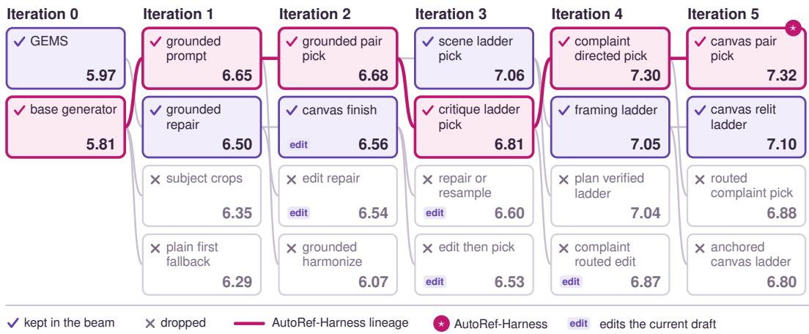  
Figure 6: The AutoRef search that produced AutoRef-Harness. The two initial harnesses and the 20 candidates written over five iterations, each with its $J _ { D _ { \mathrm { v a l } } }$ score; each candidate has an edge to its parent. Checked boxes were kept in the beam; the pink path is the lineage that ends in AutoRef-Harness (⋆), and edit marks candidates that repair a draft by editing it. Candidate names are those given by the proposer.

Figure 6 shows the complete search: two initial harnesses (the base generator and GEMS) and five iterations of K = 4 candidates with a beam of $B = 2$

How AutoRef-Harness was assembled. The lineage of AutoRef-Harness (the pink path) acquired the components of Section 5 over the five iterations; scores in Figure 6 are $J _ { D _ { \mathrm { v a l } } }$ Iteration 1 replaced the raw instruction with a prompt written by the reasoning model that states what each reference contributes, still with one image per task (reference-grounded prompting, §5.1; 5.81 → 6.65). Iteration 2 drew two drafts from two differently framed grounded prompts and chose between them by a pairwise comparison run in both presentation orders (6.68). Iteration 3 drew both drafts from a scene-first prompt and added a third draft generated from a prompt revised for the current winner’s weakest criterion (6.81); the budget has remained at three images per task since. Iteration 4 based this revision on concrete complaints checked against the references and applied a hard-failure check to every draft before the pairwise comparison (complaint-directed revision and failure-aware selection, §5.3–5.4; 7.30). Iteration 5 restored structural diversity: one of the two drafts became canvas-anchored, with the reference that sets the background or style passed to the generator first (structurally diverse drafts, §5.2; 7.32).

Directions that were not retained. The edit candidates repair the current draft by passing it to the generator as the first image, followed by the references and an instruction to change only the failing element. This direction entered at iteration 2 (edit repair, 6.54; canvas finish, 6.56, which also re-renders the draft under a single light). Its descendants reached 6.53 and 6.60, and the direction left the beam at iteration 3, and a later edit-based variant on the main lineage (complaint routed edit, 6.87) was also dropped. The proposer’s own analyses on the training tasks identify the causes: edits left the flagged failure in place on 8 of 12 flagged tasks, and the single-light re-render lowered the score of the draft it was applied to (6.16 → 5.91). Other single-step variants were dropped at once: cropping small subjects from their references (subject crops, 6.35), generating from the raw instruction and grounding only after a failure (plain first fallback, 6.29), and re-rendering the grounded draft under one light (grounded harmonize, 6.07). A second lineage branched off at iteration 3 (scene ladder pick, 7.06, three drafts from one scene-first prompt) and then wrote the scene as a structured plan from which several framings of the prompt were rendered (framing ladder, 7.05; plan verified ladder, 7.04). It remained in the beam until the end and, at iteration 5, also arrived at canvas-anchored drafts (canvas relit ladder, 7.10), but did not reach AutoRef-Harness.

Comparison with other search procedures. Figure 7 shows the best $J _ { D _ { \mathrm { v a l } } }$ reached at each iteration by AutoRef and by the two search baselines of Appendix G.2. After five iterations, AutoRef reaches 7.32, Greedy Search 7.15, and Meta-Harness 6.74.

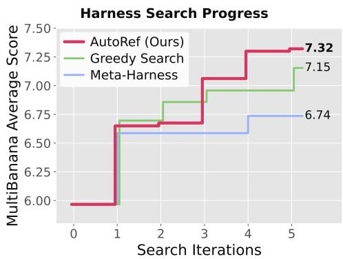  
Figure 7: Search progress on $D _ { \mathrm { v a l } } .$ . Best validation score found so far at each iteration by AutoRef, Greedy Search, and Meta-Harness, with the same proposer, models, and evaluator. Meta-Harness does not select on $D _ { \mathrm { v a l } } ;$ its candidates are scored on it only for this figure.

## E PROMPTS FOR PROPOSER CODING AGENT

The proposer is a coding agent that starts a new session, with no memory of earlier sessions, at every iteration. It receives two prompts: a system prompt that is fixed across iterations and provided as a Claude Code (Anthropic, 2025) skill, and an iteration prompt that specifies the iteration, the number of tasks each candidate is evaluated on, the current beam, and the log files it may read. It gets everything else by reading files. In the excerpts below, split names are replaced by our notation.

Information available to the proposer. The proposer runs in an isolated container. It can read the code, scores, evaluator rationales, execution trajectories, and generated images of every earlier candidate on $D _ { \mathrm { t r a i n } }$ , and the names of the candidates kept in the beam. Evaluation results on $D _ { \mathrm { v a l } }$ and on the held-out test split are stored outside the container and are never exposed.

System prompt. Most of the system prompt describes the task and the harness interface and is adapted from the proposer skill of Meta-Harness (Lee et al., 2026). We reproduce the parts that shape the search: the two model calls available to a harness, and the rules that determine what counts as a valid candidate. In the excerpt, a harness is a Python class whose run method maps a task to an output image, ctx.think calls the reasoning model, ctx.generate calls the image generator, and mean\_generations is the reported number of images per task.

Proposer System Prompt (excerpt)   
[... the task, and the harness interface ...]   
ctx gives you, and nothing else:   
- ctx.think(prompt, images=[...]) -> str – the frozen LLM (gpt-5.5).   
images are bytes or paths; <image> placeholders in the prompt take them in order.   
- ctx.generate(prompt, images=[...]) -> bytes – the frozen image   
model. images are bytes or paths the model conditions on. Call it as many times as   
your mechanism needs; every call is counted and reported as mean\_generations.   
- ctx.calls – the running count of every call this run has made.   
Anti-parameter-tuning rules   
The most common failure mode is creating harnesses that are just parameter variants of   
existing ones. Check evolution\_summary.jsonl for what’s been tried – sweeps (how   
many rounds, how many questions, how many references to pass) almost always regress or   
tie.

Good candidates change a fundamental mechanism:   
- A new verification design (e.g. graded checks instead of yes/no, or checks that compare   
against a specific reference)   
- A new refinement architecture (e.g. separate what must be kept from what must change)   
- A new control flow (e.g. let the first verification decide how many rounds to run)   
- A new rule for what to return   
Bad candidates just tune numbers. If run() is identical to an existing harness except for   
constants, it is a parameter variant. Rewrite with a genuinely novel mechanism.   
Combining harnesses is valid. Take the verification from A and the refinement from B.   
Anti-overfitting rules   
- No task-specific hints. Do not hardcode knowledge about particular prompts or subjects.   
- Never mention the benchmark name in harness code, prompts, or comments.   
- General patterns are OK. “Check the subject before the background” applies broadly.   
- ctx is your only access to the models.

Iteration prompt. This is the only prompt that changes between iterations. It specifies the iteration, the number of tasks per candidate, earlier iterations’ logs, the current beam, and the number of candidates per beam member. The example below is from iteration 5; paths are placeholders.

Iteration Prompt (iteration 5)   
Run iteration 5 of the harness evolution loop for task ‘multibanana’. Each candidate will be   
benchmarked on 48 tasks of Dtrain.   
Run directories   
All logs and results for this run are under <logs>/.   
- <logs>/evolution\_summary.jsonl - past results   
- <logs>/frontier.json - frontier   
- <logs>/runs/<harness>.json/harness\_result.json - per-harness scores,   
tool counts, worst tasks   
- <logs>/runs/<harness>.json/trace/<id>.json - every tool call, per task   
- <logs>/reports/ - post-eval reports   
- Harness files live in <harnesses>/   
- Write pending\_eval.json to: <logs>/pending\_eval.json   
- <logs>/adoption.jsonl - which candidates were kept as base harnesses, and which   
were not   
- <logs>/beam.json - the current base harnesses   
Base harnesses   
The current base harnesses are complaint\_directed\_pick, framing\_ladder   
(files in <harnesses>/). Write exactly 4 candidates: 2 that build on each base. Each   
candidate’s base\_harness is the exact name of its base. Which candidates are kept as   
bases for the next iteration is decided on tasks outside Dtrain that this session cannot see: the   
2 candidates that do best there replace the current bases, so a gain has to hold on unseen tasks   
to be kept.

draft B

draft C, rejected

## F THE FLOW OF AUTOREF-HARNESS

## 1 Input: four references and an instruction

"The Siamese cat in Image 1 is on the left, the purple poodle in Image 2 is in the center, the woman in Image 3 is on the right, and the woman playing the violin in Image 4 is in the foreground. They are all gathered in a dimly lit library, as if to attend a mysterious recital.

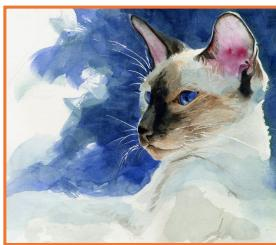

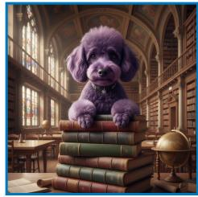

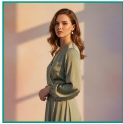

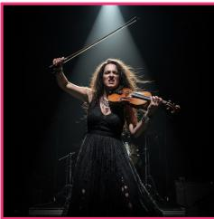  
Identify the scene reference "Which reference does the instruction name as the BACKGROUND, SETTING or LOCATION of the whole picture, and which as the STYLE of the whole picture? A reference that supplies a subject, object, garment or pose is neither. Reply with ONLY JSON... {"background": 2, "style": 0} image 2 becomes the canvas and is moved to the first position

"SETTING: A dimly lit old library at night, warm spotlight from upper left through high shelves and stained qlass, cinematic photograph. CAST: the Siamese cat from image 1 (cream fur, dark mask, blue eyes) is on the left, sitting on the wooden floor ..."

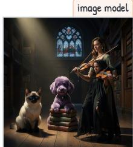  
canvas-anchored prompt (scene reference as image 1)  
"Image 1 is the picture: keep its place, viewpoint, medium, brushwork or grain, light and colours exactly. ... The Siamese caf from image 2 (blue-eyed seal-point cat) rests on the left reading table, repainted in image 1’s medium and lit by image 1's light ..

4 Failure check, then pairwise selection "Check the generated image strictly for HARD failures only: 'missing': ... 'extra': ..'wrong\_background': ... {"missing": [], "extra": [], "wrong\_background": false} both drafts pass, so pairwise selection decides — asked in both orders “Candidate A has two women playing violins, while the instruction only specifies the Image 4 woman as the violin player.” draft B wins in both orders

  
Figure 8: Execution trajectory of AutoRef-Harness on a held-out four-reference task. Steps 1–5 show the input, the identification of the scene reference, the two drafts, failure-aware selection, and complaint-directed revision. Quoted text with a blue bar is a prompt sent to the reasoning model M , and the text below it is the model’s response; boxes labeled “image model” mark calls to the generator G . Prompts and responses are abridged but not otherwise modified. Each reference’s frame color matches that of its number in the text.

Figure 8 shows how AutoRef-Harness processes one task. The reasoning model first infers that image 2, the poodle in a library, sets the scene (step 2). It then writes two structurally different prompts (step 3): a scene-first prompt that describes the setting and then each subject (draft A), and a canvas-anchored prompt that passes image 2 first and places the other subjects in it (draft B). Both drafts pass the failure check, and draft B is preferred in both presentation orders (step 4). The reasoning model lists complaints about draft B, mainly that the violinist in image 4 does not match her reference and is not in the foreground, and its revised prompt produces draft C (step 5). Draft C does not beat draft B under the same rule, so draft B is returned (evaluator score 8.6/10).

## G BASELINES

## G.1 HUMAN-WRITTEN HARNESS BASELINES

All four human-written baselines use the same generator and reasoning model as AutoRef-Harness;   
adaptations to the multi-reference setting are noted per method.

Best-of-N (Ma et al., 2025). N images are sampled independently from the original instruction, and the reasoning model picks one in one call showing the references and candidates, using a priorityordered rubric (every requested subject present, fidelity to each reference, correct background, consistent lighting, realism). We use N = 3 throughout, matching AutoRef-Harness’s three images.

GEMS (He et al., 2026b). An agentic loop with skills and memory. The instruction is routed to a matching skill and decomposed into yes/no requirement questions; each round generates an image, checks every question against it, stops if all pass, and otherwise summarizes the round into memory and rewrites the prompt from the accumulated history. The image satisfying the most questions is returned. We use the published prompts and the default four rounds, and show the verifier the references beside the image, since the original loop verifies single-image text-to-image outputs.

IPR (Oshima et al., 2026). Iterative Prompt Refinement, the agentic baseline proposed with MultiBanana. Over three steps, each step generates from the current prompt, and a planner refines the prompt from the references and the image just generated:

$$
y ^ { t + 1 } = \operatorname { G e n } ( u ^ { t } , \mathbb { Z } ) , \qquad u ^ { t + 1 } = \operatorname { P l a n } ( u ^ { t } , \mathbb { Z } , y ^ { t + 1 } ) .
$$

The generator never sees earlier images, and the last image is returned. No code was released, so we re-implement it from its equations and prompts, with our reasoning model as the planner.

Idea2Img (Yang et al., 2024b). Iterative self-refinement in which a multimodal model drafts several prompts, selects the best image, and writes feedback that, with a memory of earlier prompts and feedback, guides the next round. We keep the official budget of three prompts over three rounds with a final selection among round winners (nine images per task). As this triples AutoRef-Harness’s budget, we also report a budget-matched variant: three prompts, one round, no feedback.

## G.2 HARNESS SEARCH BASELINES

Meta-Harness (Lee et al., 2026). Our implementation of the Meta-Harness protocol, run with the same proposer, models, and evaluator as AutoRef. The proposer sees the full history of earlier candidates — their code, scores, execution trajectories, and images — and the candidates are ranked on the same tasks whose feedback the proposer reads, so there is no separate selection split. It has no explicit parents: the proposer chooses which candidate to build on, and the best candidate on these tasks is reported. We run it for five iterations, as for AutoRef (the original runs 20–40 iterations).

Greedy Search. AutoRef with a beam of one. Proposal and selection use separate splits as in AutoRef $( D _ { \mathrm { t r a i n } }$ for feedback, $D _ { \mathrm { v a l } }$ for selection), but only the single best candidate on $D _ { \mathrm { v a l } }$ is kept at each iteration and becomes the parent of all candidates in the next iteration.

## H FURTHER RESULTS

## H.1 DETAILED MULTIBANANA RESULTS

The Qwen3-VL-8B-Instruct (Bai et al., 2025) evaluator of MultiBanana scores each image on five criteria (instruction alignment, reference consistency, background–subject match, physical realism, and visual quality), and the main text reports their mean. Tables 6–8 report each criterion for four, three, and five references, averaged over task types; per-type averages are in Tables 1 and 2.

Table 6: MultiBanana with 4 references, held-out test split (n=133), by evaluation metric. Each metric is averaged over the four task types (object, local, global, background), and Avg. is the mean of the five metrics, as in the Avg. column of Tables 1 and 2. Gen. is images drawn per task. Inst.: instruction alignment; Ref.: reference consistency; BG: background–subject match; Real.: physical realism; Qual.: visual quality. Best open image generators per column in bold, second best underlined.
<table><tr><td>Method</td><td>Gen.</td><td>Inst.</td><td>Ref.</td><td>BG</td><td>Real.</td><td>Qual.</td><td>Avg.</td></tr><tr><td>GPT-Image-1.5</td><td>1</td><td>6.58</td><td>7.63</td><td>6.49</td><td>6.79</td><td>7.88</td><td>7.07</td></tr><tr><td>Nano Banana Pro</td><td>1</td><td>6.94</td><td>7.74</td><td>6.62</td><td>6.78</td><td>7.94</td><td>7.20</td></tr><tr><td>Seedream 4.5</td><td>1</td><td>6.62</td><td>7.78</td><td>6.38</td><td>6.73</td><td>7.66</td><td>7.03</td></tr><tr><td>OmniGen2</td><td>1</td><td>3.08</td><td>3.36</td><td>3.16</td><td>3.87</td><td>5.26</td><td>3.75</td></tr><tr><td>DreamOmni2</td><td>1</td><td>3.36</td><td>3.57</td><td>3.10</td><td>3.91</td><td>5.22</td><td>3.83</td></tr><tr><td>BAGEL</td><td>1</td><td>2.83</td><td>3.13</td><td>2.66</td><td>3.22</td><td>3.92</td><td>3.15</td></tr><tr><td>FLUX.2 [klein] 4B</td><td>1</td><td>5.25</td><td>5.86</td><td>5.04</td><td>5.64</td><td>6.83</td><td>5.72</td></tr><tr><td>+ Best-of-3 (Ma et al., 2025)</td><td>3</td><td>5.37</td><td>6.08</td><td>5.50</td><td>6.08</td><td>7.02</td><td>6.01</td></tr><tr><td>+ GEMS (He et al., 2026b)</td><td>2.7</td><td>4.92</td><td>5.43</td><td>4.74</td><td>5.38</td><td>6.39</td><td>5.37</td></tr><tr><td>+ IPR (Oshima et al., 2026)</td><td>3</td><td>6.42</td><td>7.08</td><td>6.67</td><td>7.10</td><td>7.84</td><td>7.02</td></tr><tr><td>+ Idea2Img (Yang et al., 2024b)</td><td>9</td><td>6.50</td><td>7.39</td><td>6.71</td><td>7.00</td><td>7.98</td><td>7.12</td></tr><tr><td>+ Idea2Img, budget-matched</td><td>3</td><td>5.89</td><td>6.85</td><td>5.90</td><td>6.24</td><td>7.20</td><td>6.42</td></tr><tr><td>+ Meta-Harness (Lee et al., 2026)</td><td>4.2</td><td>5.64</td><td>6.22</td><td>5.84</td><td>6.29</td><td>7.18</td><td>6.23</td></tr><tr><td>+ Greedy Search</td><td>5</td><td>5.90</td><td>6.82</td><td>6.31</td><td>6.72</td><td>7.58</td><td>6.67</td></tr><tr><td>+ AutoRef (2nd)</td><td>3</td><td>6.15</td><td>6.75</td><td>6.88</td><td>7.37</td><td>7.85</td><td>7.00</td></tr><tr><td>+ AutoRef-Harness</td><td>3</td><td>6.57</td><td>7.15</td><td>7.20</td><td>7.77</td><td>8.16</td><td>7.37</td></tr><tr><td>+ AutoRef-Harness, Qwen3-VL-32B</td><td>3</td><td>6.22</td><td>6.96</td><td>6.46</td><td>7.14</td><td>7.70</td><td>6.90</td></tr><tr><td>FLUX.2 [klein] 9B</td><td>1</td><td>5.19</td><td>5.96</td><td>5.28</td><td>5.80</td><td>6.70</td><td>5.78</td></tr><tr><td>+ AutoRef-Harness</td><td>3</td><td>6.48</td><td>6.85</td><td>6.71</td><td>7.46</td><td>7.99</td><td>7.10</td></tr><tr><td>Qwen-Image-Edit-2511</td><td>1</td><td>3.95</td><td>4.63</td><td>3.66</td><td>4.28</td><td>5.69</td><td>4.44</td></tr><tr><td>+ AutoRef-Harness</td><td>3</td><td>5.11</td><td>5.78</td><td>5.15</td><td>5.82</td><td>6.59</td><td>5.69</td></tr><tr><td>+ DyRef (Huang et al., 2026b)</td><td>1</td><td>4.77</td><td>4.89</td><td>4.23</td><td>4.81</td><td>5.86</td><td>4.91</td></tr><tr><td>+ DyRef + AutoRef-Harness</td><td>3</td><td>5.68</td><td>5.66</td><td>5.22</td><td>6.12</td><td>6.83</td><td>5.90</td></tr></table>

## H.2 COMPONENT ABLATION BY TASK TYPE

Table 9 gives the per-type scores behind Table 4. Removing any one of the three components lowers the score on every task type, and without reference-grounded prompting (selection only) the score falls below all three leave-one-out rows on every task type.

## H.3 COMPATIBILITY WITH FINE-TUNING

We ask whether harness optimization remains useful when the underlying image generator is already optimized for multi-reference image generation. DyRef (Huang et al., 2026b) improves Qwen-Image-Edit-2511 through supervised fine-tuning followed by reward optimization. As shown in Figure 9, AutoRef-Harness applied to the original Qwen-Image-Edit-2511 achieves 5.69, outperforming DyRef alone at 4.91. Applying the same harness to the DyRef-trained model further improves performance to 5.90. These results suggest that harness optimization and model-weight optimization provide complementary gains and can be combined.

Table 7: MultiBanana with 3 references (n=96), by evaluation metric. Columns as in Table 6.
<table><tr><td>Method</td><td>Gen.</td><td>Inst.</td><td>Ref.</td><td>BG</td><td>Real.</td><td>Qual.</td><td>Avg.</td></tr><tr><td>GPT-Image-1.5</td><td>1</td><td>7.22</td><td>8.31</td><td>7.56</td><td>7.84</td><td>8.35</td><td>7.86</td></tr><tr><td>Nano Banana Pro</td><td>1</td><td>6.79</td><td>7.91</td><td>7.15</td><td>7.68</td><td>7.99</td><td>7.50</td></tr><tr><td>Seedream 4.5</td><td>1</td><td>6.95</td><td>8.47</td><td>6.58</td><td>7.06</td><td>8.00</td><td>7.41</td></tr><tr><td>OmniGen2</td><td>1</td><td>4.55</td><td>5.15</td><td>4.51</td><td>5.46</td><td>6.58</td><td>5.25</td></tr><tr><td>DreamOmni2</td><td>1</td><td>4.75</td><td>5.20</td><td>4.67</td><td>5.56</td><td>6.64</td><td>5.36</td></tr><tr><td>BAGEL</td><td>1</td><td>3.77</td><td>4.14</td><td>3.36</td><td>4.16</td><td>5.05</td><td>4.10</td></tr><tr><td>FLUX.2 [klein] 4B</td><td>1</td><td>6.03</td><td>6.96</td><td>6.59</td><td>7.31</td><td>7.82</td><td>6.94</td></tr><tr><td>+ Best-of-3</td><td>3</td><td>6.14</td><td>7.46</td><td>6.51</td><td>6.88</td><td>7.80</td><td>6.96</td></tr><tr><td>+ AutoRef-Harness</td><td>3</td><td>6.99</td><td>7.69</td><td>7.74</td><td>8.03</td><td>8.38</td><td>7.76</td></tr><tr><td>+ AutoRef-Harness, Qwen3-VL-32B</td><td>3</td><td>6.71</td><td>7.71</td><td>7.27</td><td>7.84</td><td>8.41</td><td>7.59</td></tr><tr><td>FLUX.2 [klein] 9B</td><td>1</td><td>6.18</td><td>7.27</td><td>6.31</td><td>6.74</td><td>7.63</td><td>6.83</td></tr><tr><td>+ AutoRef-Harness</td><td>3</td><td>7.05</td><td>7.66</td><td>7.75</td><td>8.21</td><td>8.45</td><td>7.82</td></tr><tr><td>Qwen-Image-Edit-2511</td><td>1</td><td>4.53</td><td>5.48</td><td>4.10</td><td>4.95</td><td>6.25</td><td>5.06</td></tr><tr><td>+ AutoRef-Harness</td><td>3</td><td>6.25</td><td>7.16</td><td>6.48</td><td>7.05</td><td>7.79</td><td>6.95</td></tr></table>

Table 8: MultiBanana with 5 references (n=96), by evaluation metric. Columns as in Table 6.
<table><tr><td>Method</td><td>Gen.</td><td>Inst.</td><td>Ref.</td><td>BG</td><td>Real.</td><td>Qual.</td><td>Avg.</td></tr><tr><td>GPT-Image-1.5</td><td>1</td><td>6.73</td><td>7.45</td><td>5.65</td><td>5.96</td><td>7.20</td><td>6.60</td></tr><tr><td>Nano Banana Pro</td><td>1</td><td>6.82</td><td>7.50</td><td>5.66</td><td>6.21</td><td>7.36</td><td>6.71</td></tr><tr><td>Seedream 4.5</td><td>1</td><td>6.64</td><td>7.36</td><td>5.80</td><td>6.02</td><td>7.19</td><td>6.60</td></tr><tr><td>OmniGen2</td><td>1</td><td>2.84</td><td>2.66</td><td>2.59</td><td>3.20</td><td>4.60</td><td>3.18</td></tr><tr><td>DreamOmni2</td><td>1</td><td>2.54</td><td>3.10</td><td>2.70</td><td>3.17</td><td>4.08</td><td>3.12</td></tr><tr><td>BAGEL</td><td>1</td><td>3.00</td><td>2.73</td><td>2.17</td><td>2.61</td><td>3.57</td><td>2.82</td></tr><tr><td>FLUX.2 [klein] 4B</td><td>1</td><td>5.01</td><td>5.22</td><td>4.38</td><td>4.94</td><td>6.43</td><td>5.19</td></tr><tr><td>+ Best-of-3</td><td>3</td><td>5.42</td><td>5.39</td><td>4.54</td><td>5.19</td><td>6.40</td><td>5.39</td></tr><tr><td>+ AutoRef-Harness</td><td>3</td><td>6.35</td><td>6.24</td><td>5.55</td><td>6.29</td><td>7.36</td><td>6.36</td></tr><tr><td>+ AutoRef-Harness, Qwen3-VL-32B</td><td>3</td><td>5.72</td><td>6.14</td><td>5.07</td><td>5.81</td><td>6.79</td><td>5.91</td></tr><tr><td>FLUX.2 [klein] 9B</td><td>1</td><td>5.65</td><td>5.79</td><td>4.72</td><td>5.31</td><td>6.56</td><td>5.61</td></tr><tr><td>+ AutoRef-Harness</td><td>3</td><td>6.59</td><td>6.91</td><td>5.59</td><td>6.08</td><td>7.16</td><td>6.47</td></tr><tr><td>Qwen-Image-Edit-2511</td><td>1</td><td>1.74</td><td>2.04</td><td>1.55</td><td>1.85</td><td>2.24</td><td>1.89</td></tr><tr><td>+ AutoRef-Harness</td><td>3</td><td>1.72</td><td>2.02</td><td>1.45</td><td>1.70</td><td>2.47</td><td>1.87</td></tr></table>

Table 9: Component ablation on the held-out test split, by task type. Rows as in Table 4; Avg. is the mean over the four task types, as reported there. All rows draw three images per task except Grounding only and Generator only, which draw one.
<table><tr><td></td><td>Object</td><td>Local</td><td>Global</td><td>Background</td><td>Avg.</td></tr><tr><td>Full harness</td><td>7.27</td><td>7.87</td><td>7.64</td><td>6.70</td><td>7.37</td></tr><tr><td>— diverse drafts</td><td>7.07</td><td>7.37</td><td>7.14</td><td>6.47</td><td>7.01</td></tr><tr><td>— complaint revision</td><td>7.24</td><td>7.01</td><td>7.33</td><td>6.38</td><td>6.99</td></tr><tr><td>— failure-aware selection</td><td>6.79</td><td>7.39</td><td>7.55</td><td>6.00</td><td>6.93</td></tr><tr><td>Grounding only</td><td>7.21</td><td>6.72</td><td>7.21</td><td>6.50</td><td>6.91</td></tr><tr><td>Selection only</td><td>6.11</td><td>6.78</td><td>6.14</td><td>5.56</td><td>6.15</td></tr><tr><td>Generator only</td><td>5.95</td><td>6.11</td><td>5.50</td><td>5.34</td><td>5.72</td></tr></table>

## H.4 DETAILED OMNICONTEXT RESULTS

Tables 10 and 11 provide the full OmniContext breakdown behind Table 3, reporting prompt following (PF), subject consistency (SC), and their geometric mean for each task type.

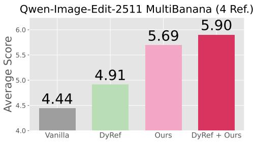  
Figure 9: Harness optimization is compatible with fine-tuning. On Qwen-Image-Edit-2511, AutoRef-Harness outperforms DyRef alone, and applying it to the DyRef-trained model yields a further improvement. Ours denotes AutoRef-Harness.

Table 10: OmniContext, SINGLE and MULTIPLE task types, 15 tasks each: prompt following, subject consistency, and their geometric mean behind Table 3. Gen. is images drawn per task. Best open image generators per column in bold, second best underlined.
<table><tr><td rowspan="3"></td><td rowspan="3"></td><td colspan="6">SINGLE</td><td colspan="8">MULTIPLE</td></tr><tr><td colspan="3">Character</td><td colspan="3">Object</td><td colspan="3">Character</td><td colspan="3">Object</td><td colspan="3">Char. + Obj.</td></tr><tr><td>Gen. PF</td><td>SC</td><td></td><td>Overall</td><td>SC</td><td>Overall</td><td>PF</td><td>SC</td><td>Overall</td><td>PF</td><td>SC</td><td>Overall</td><td>PF</td><td>SC</td><td>Overall</td></tr><tr><td>GPT-Image-1.5</td><td>1</td><td>9.80</td><td>9.33</td><td>9.56</td><td>9.80</td><td>9.60</td><td>9.70</td><td>9.67</td><td>9.00</td><td>9.32</td><td>9.67 9.27</td><td></td><td>9.46</td><td>9.27 9.27</td><td></td><td>9.26</td></tr><tr><td>Nano Banana Pro</td><td>1</td><td>9.53</td><td>9.73</td><td>9.63</td><td>9.53</td><td>9.33</td><td>9.42</td><td>9.73</td><td>9.20</td><td>9.46</td><td>9.40</td><td>9.00</td><td>9.19</td><td>9.00</td><td>9.07</td><td>9.02</td></tr><tr><td>Seedream 4.5</td><td>1</td><td>9.60</td><td>9.33</td><td>9.45</td><td>9.47</td><td>9.60</td><td>9.50</td><td>9.20</td><td>9.13</td><td>9.09</td><td>9.67</td><td>9.13</td><td>9.39</td><td>9.13</td><td>9.07</td><td>9.09</td></tr><tr><td>OmniGen2</td><td>1</td><td>8.20</td><td>8.93</td><td>8.51</td><td>6.87</td><td>6.40</td><td>5.73</td><td>7.13</td><td>5.87</td><td>6.30</td><td>7.67</td><td>5.87</td><td>6.58</td><td>7.80</td><td>7.67</td><td>7.71</td></tr><tr><td>DreamOmni2</td><td>1</td><td>7.53</td><td>8.33</td><td>7.81</td><td>7.20</td><td>6.60</td><td>6.72</td><td>5.07</td><td>5.13</td><td>4.80</td><td>7.00</td><td>7.40</td><td>7.07</td><td>6.73</td><td>5.53</td><td>5.92</td></tr><tr><td>BAGEL</td><td>1</td><td>8.20</td><td>6.40</td><td>6.67</td><td>6.67</td><td>8.53</td><td>7.09</td><td>4.27</td><td>3.07</td><td>3.43</td><td>7.07</td><td>6.80</td><td>6.74</td><td>7.20</td><td>7.20</td><td>7.08</td></tr><tr><td>FLUX.2 [klein] 4B</td><td></td><td>9.40</td><td>9.07</td><td>9.22</td><td>8.27</td><td>8.87</td><td>8.16</td><td>8.00</td><td>7.93</td><td>7.91</td><td>8.87</td><td>7.73</td><td>8.21</td><td>8.47</td><td>8.93</td><td>8.68</td></tr><tr><td>+ Best-of-3</td><td></td><td>9.40</td><td>9.13</td><td>9.26</td><td>8.60</td><td>8.20</td><td>7.97</td><td>8.73</td><td>8.73</td><td>8.71</td><td>8.87</td><td>8.87</td><td>8.81</td><td>8.73</td><td>8.87</td><td>8.79</td></tr><tr><td>+ AutoRef-Harness</td><td>133</td><td>9.33</td><td>8.60</td><td>8.94</td><td>9.20</td><td>9.00</td><td>8.99</td><td>9.33</td><td>8.73</td><td>9.02</td><td>9.00</td><td>8.60</td><td>8.78</td><td>8.53</td><td>8.67</td><td>8.59</td></tr><tr><td>FLUX.2 [klein] 9B</td><td>1</td><td>9.40</td><td>9.00</td><td>9.17</td><td>9.33</td><td>8.93</td><td>9.08</td><td>9.00</td><td>8.40</td><td>8.66</td><td>8.73</td><td>7.73</td><td>8.14</td><td>8.87</td><td>8.67</td><td>8.74</td></tr><tr><td>+ AutoRef-Harness</td><td>3</td><td>9.47</td><td>9.00</td><td>9.22</td><td>9.53</td><td>8.87</td><td>9.18</td><td>9.40</td><td>9.00</td><td>9.19</td><td>9.73</td><td>8.93</td><td>9.32</td><td>8.80</td><td>8.87</td><td>8.82</td></tr><tr><td>Qwen-Image-Edit-2511</td><td>1</td><td>9.40</td><td>8.93</td><td>9.14</td><td>9.73</td><td>8.73</td><td>9.19</td><td>8.87</td><td>8.53</td><td>8.66</td><td>9.60</td><td>8.47</td><td>9.00</td><td>8.20</td><td>8.53</td><td>8.33</td></tr><tr><td>+ AutoRef-Harness</td><td>3</td><td>9.27</td><td>9.00</td><td>9.12</td><td>9.13</td><td>8.47</td><td>8.64</td><td>9.33</td><td>8.87</td><td>9.09</td><td>9.13</td><td>8.20</td><td>8.62</td><td>8.47</td><td>8.27</td><td>8.34</td></tr></table>

Table 11: OmniContext, SCENE task types. Columns as in Table 10.
<table><tr><td></td><td></td><td colspan="9">SCENE</td></tr><tr><td></td><td></td><td colspan="3">Character</td><td colspan="3">Object</td><td colspan="3">Char. + Obj.</td></tr><tr><td>Method</td><td>Gen.</td><td>PF</td><td>SC</td><td>Overall</td><td>PF</td><td>SC</td><td>Overall</td><td>PF</td><td>SC</td><td>Overall</td></tr><tr><td>GPT-Image-1.5</td><td>1</td><td>10.00</td><td>9.40</td><td>9.69</td><td>9.53</td><td>9.27</td><td>9.39</td><td>8.80</td><td>9.13</td><td>8.93</td></tr><tr><td>Nano Banana Pro</td><td>1</td><td>9.73</td><td>9.00</td><td>9.35</td><td>8.07</td><td>8.87</td><td>8.39</td><td>7.93</td><td>8.53</td><td>8.20</td></tr><tr><td>Seedream 4.5</td><td>1</td><td>9.87</td><td>8.87</td><td>9.35</td><td>8.60</td><td>8.80</td><td>8.66</td><td>8.13</td><td>8.47</td><td>8.23</td></tr><tr><td>OmniGen2</td><td>1</td><td>7.27</td><td>6.80</td><td>6.93</td><td>6.47</td><td>5.87</td><td>6.10</td><td>7.53</td><td>6.73</td><td>7.03</td></tr><tr><td>DreamOmni2</td><td>1</td><td>6.40</td><td>5.40</td><td>5.78</td><td>6.40</td><td>5.07</td><td>5.63</td><td>6.20</td><td>5.40</td><td>5.72</td></tr><tr><td>BAGEL</td><td>1</td><td>4.87</td><td>4.00</td><td>3.97</td><td>4.13</td><td>4.20</td><td>4.11</td><td>5.73</td><td>5.67</td><td>5.63</td></tr><tr><td>FLUX.2 [klein] 4B</td><td>1</td><td>9.67</td><td>8.73</td><td>9.18</td><td>7.40</td><td>7.67</td><td>7.47</td><td>7.40</td><td>7.73</td><td>7.54</td></tr><tr><td>+ Best-of-3</td><td>3</td><td>9.73</td><td>8.93</td><td>9.32</td><td>8.73</td><td>8.33</td><td>8.49</td><td>7.93</td><td>7.80</td><td>7.74</td></tr><tr><td>+ AutoRef-Harness</td><td>3</td><td>9.73</td><td>8.87</td><td>9.28</td><td>9.00</td><td>8.80</td><td>8.89</td><td>8.27</td><td>8.33</td><td>8.28</td></tr><tr><td>FLUX.2 [klein] 9B</td><td>1</td><td>9.87</td><td>8.87</td><td>9.35</td><td>7.87</td><td>8.47</td><td>8.07</td><td>7.27</td><td>7.80</td><td>7.47</td></tr><tr><td>+ AutoRef-Harness</td><td>3</td><td>9.87</td><td>8.87</td><td>9.35</td><td>8.80</td><td>8.07</td><td>8.40</td><td>8.60</td><td>8.20</td><td>8.30</td></tr><tr><td>Qwen-Image-Edit-2511</td><td>1</td><td>7.67</td><td>6.60</td><td>6.97</td><td>8.40</td><td>8.07</td><td>8.17</td><td>8.53</td><td>7.87</td><td>8.17</td></tr><tr><td>+ AutoRef-Harness</td><td>3</td><td>9.07</td><td>8.40</td><td>8.71</td><td>9.27</td><td>8.40</td><td>8.82</td><td>8.40</td><td>8.20</td><td>8.28</td></tr></table>

## I WHERE THE HARNESS CANNOT HELP

Qwen-Image-Edit-2511  
FLUX.2 [klein] 4B  
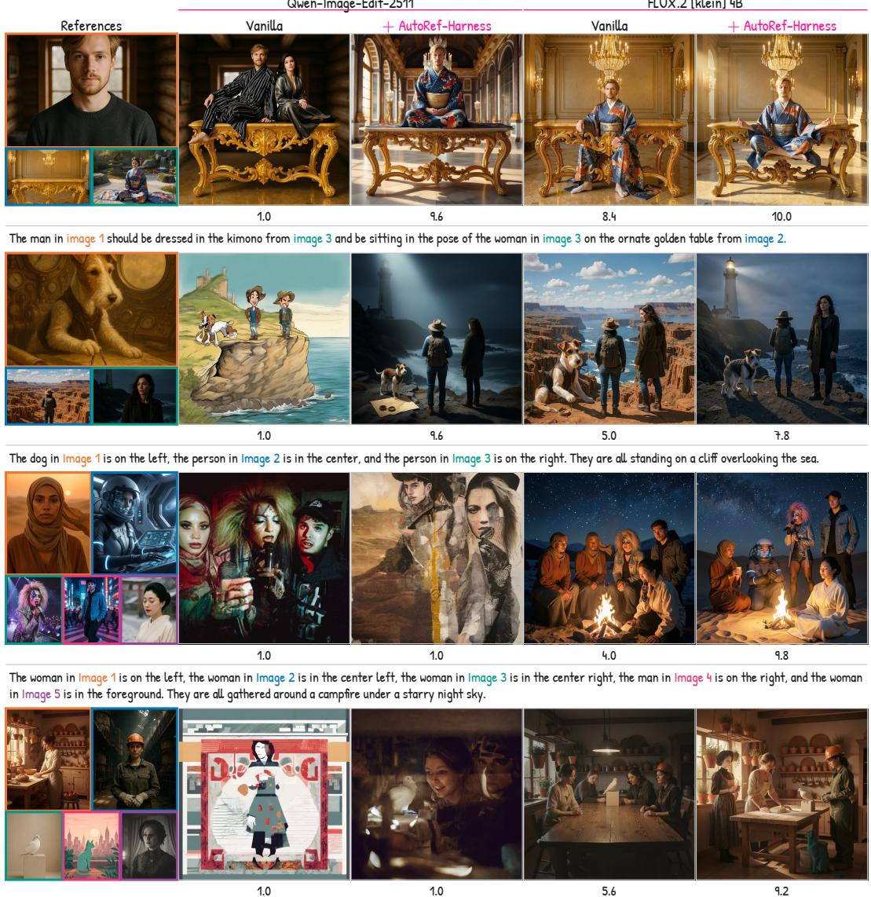  
The woman in Image 1 is in the kitchen, the woman in Image 2 is in the factory, the dove in Image 3 is on a pedestal, the cat in Image 4 is on a rooftop, and the woman in Image 5 is in a dimly lit room. They are al gathered around a large oak table  
Figure 10: AutoRef-Harness helps Qwen-Image-Edit-2511 at three references but not at five. Outputs of Qwen-Image-Edit-2511 and FLUX.2 [klein] 4B, each without and with AutoRef-Harness, on three-reference (top two rows) and five-reference (bottom two rows) tasks. The number below each output is its evaluator score (1–10).

AutoRef-Harness does not change the generator; it can only return one of the images the frozen generator produces. Qwen-Image-Edit-2511 exposes this limit (Figure 10): the harness raises its score from 5.06 to 6.95 at three references and from 4.44 to 5.69 at four, but not at five (from 1.89 to 1.87; Tables 1 and 2). All harness steps still run at five references, but the generator rarely produces an acceptable image: the hard-failure check (§5.4) flags all three drafts on 87 of 96 tasks (91%), versus 9 of 96 (9%) for FLUX.2 [klein] 4B at five references and 7 of 96 (7%) for Qwen-Image-Edit-2511 at three. When no candidate is acceptable, better selection cannot help; overcoming this limit likely requires reducing how many references the generator must compose at once.

## J FURTHER QUALITATIVE COMPARISONS

All figures in this section follow the layout of Figure 3: the references on the left, each framed in a distinct color that also marks its number in the instruction (when the instruction numbers the references), the outputs of five methods, and the full instruction below. Figures 11–13 show three held-out four-reference tasks each, for object composition, local attribute transfer, and background and global style; Figures 14 and 15 show tasks with three and five references, counts not used during the search; and Figure 16 shows OmniContext. None of these tasks was seen during the search. They were selected among the tasks with the largest score gap between the base generator and AutoRef-Harness, so they illustrate the failures the harness removes and are not a random sample; aggregate results are in Appendix H. In all settings, the harness removes the same kinds of failure: a requested reference is dropped or used in the wrong role.

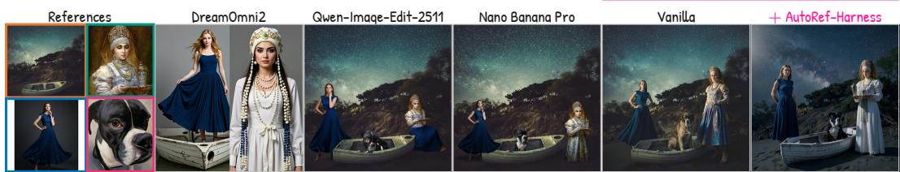

The boat in Image 1 is in the foreground. The girl in Image 2 is standing to the left of the boat. The woman in Image 3 is standing to the right of the boat. The dog in Image 4 is sitting in the boat.  
  
The woman in Image 1 is on the left, the woman in Image 2 is in the center, and the woman in Image 3 is on the right. The cat from Image 4 is sitting in front of them. They are gathered in a park with ancient Roman ruins in the background.

  
The woman splashing water in Image 1 is on the left, the couple looking at the city in Image 2 is in the center, and the green cat in Image 4 is on the right. They are al gathered around the lotus-shaped candle holder from Image 3, which is placed in the center of a table.

Figure 11: Object composition. Held-out four-reference tasks that compose all subjects into one scene.  
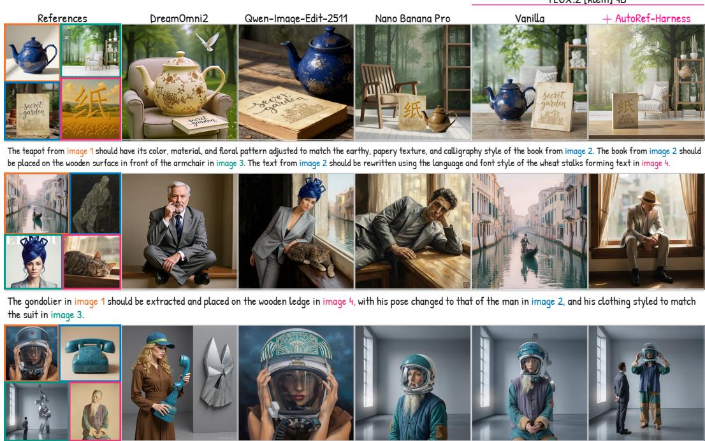  
The woman in the astronaut helmet from image 1 should be wearing the outfit from image 4, with the helmet’s red star replaced by the art deco pattern from image 2. The entire composition should be placed within the galery space from image 3, with the abstract sculpture replaced by the woman.

Figure 12: Local attribute transfer. Held-out four-reference tasks in which an attribute of one reference (e.g., a pose, a garment, a texture, or a text style) is applied to another.

FLUX.2 [klein] 4B  
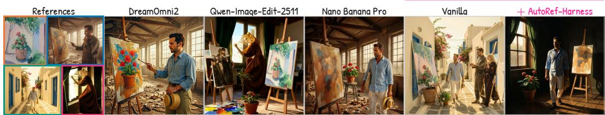

The man walking in the street from image 3 and the potted plant with flowers from image 1 are placed in a studio with an easel and a painting from image 2. The style of the image is the same as in image 4.  
  
The man from image 1, the woman from image 2, and the dog from image 3 are together on the bridge from image 4.

  
The woman from image 1 and the man from image 2 are standing next to the potted plant from image 3, in a scene that resembles the architecture and atmosphere of image 4.  
Figure 13: Background and global style. Held-out four-reference tasks in which one reference sets the background or the style of the whole image.

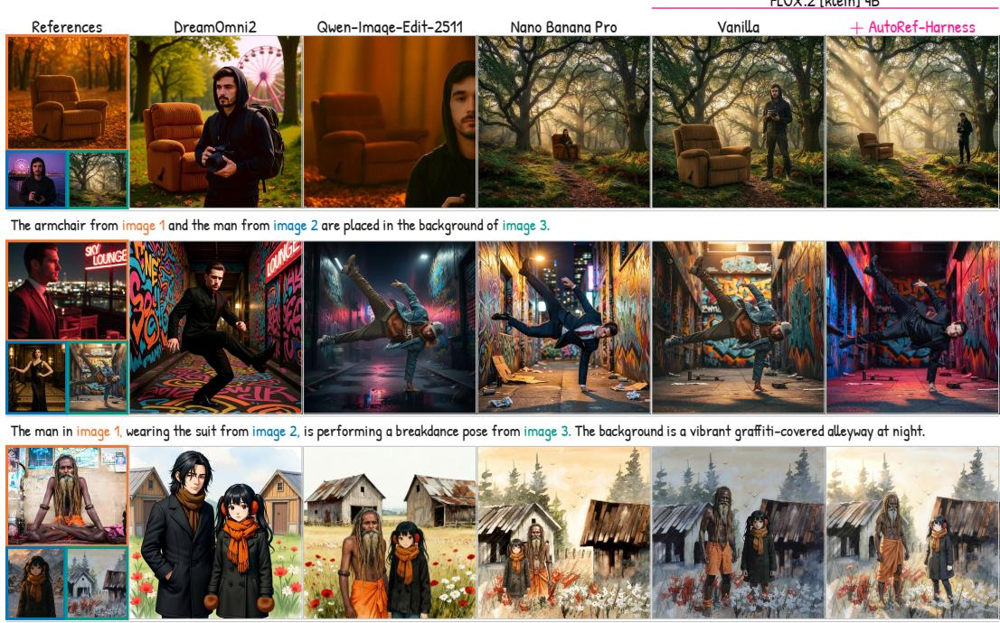  
The sad man from image 1 and the girl from image 2 are standing together in front of two rustic sheds in a field with scattered red and white flowers. The style of the image is the same as in image 3.  
Figure 14: Three references. MultiBanana tasks with three references, a count not used during the search.

FLUX.2 [klein] 4B  
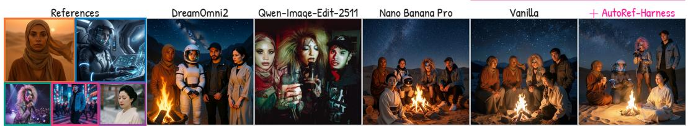  
FLUX.2 [klein] 4B

The woman in Image 1 is on the left, the woman in Image 2 is in the center left, the woman in Image 3 is in the center right, the man in Image 4 is on the right, and the woman in Image 5 is in the foreground. They are al gathered around a campfire under a starry night sky.  
  
The chef from image 2 and the mechanic from image 3 are standing in front of the white sports car from image 4, with the statue from image 1 in the background. The styl of the image is the same as in image 5.

  
The woman in Image 1 is on the left, the tree in Image 2 is in the center background, the owl and sparrows in Image 3 are in the middle ground on the left, the cat in Image 4 is in the right middle ground, and the man in Image 5 is on the far right. They are gathered in a fantastical setting.  
Figure 15: Five references. MultiBanana tasks with five references, a count not used during the search.

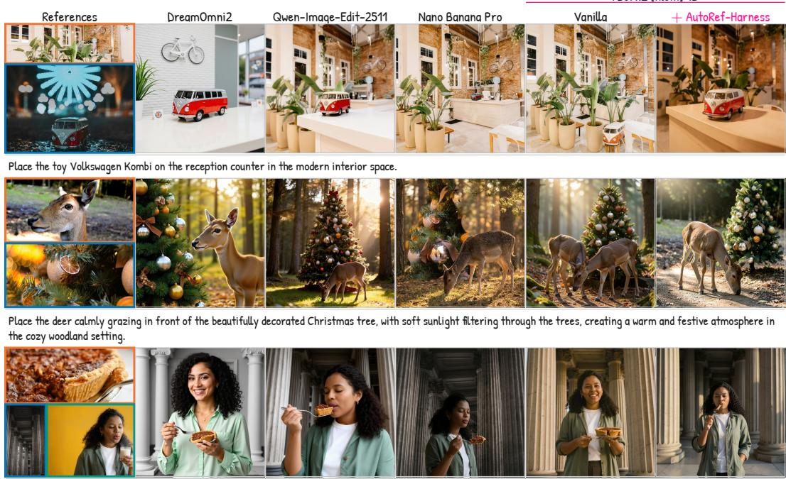  
Have the person from the third image stand among the classical columns in the second, holding the pecan pie from the first image on a silver fork

Figure 16: OmniContext. Tasks with two or three references, from a benchmark not used during the search.