# ActionUNet: Improving Robustness of VLA Models with Efficient Multi-scale Fine-tuning

Di Zhu∗ Ziheng Yan∗ Fang Wan† University of Chinese Academy of Sciences {zhudi25,yanziheng21}@mails.ucas.ac.cn wanfang@ucas.ac.cn

## Abstract

Vision-Language-Action (VLA) models have shown great promise for robotic manipulation by mapping multi-modal semantics to physical actions. However, this mapping inherently struggles to align these coarse-grained semantics with finegrained temporal execution. It leaves VLA models with limited generalization and insufficient robustness in cluttered environments. To overcome this issue, we propose ActionUNet, an efficient multi-scale fine-tuning framework that enhances pre-trained VLA models with minimal computational cost. ActionUNet first constructs a lightweight temporal U-Net within the temporal-aligned action feature space to fuse hierarchical structural priors, effectively bridging the scale gap between semantics and temporal executions. Recognizing that multi-scale modeling can disrupt microscopic temporal continuity and cause mechanical oscillations, ActionUNet then employs a conditional SIREN as a continuous action decoder. Equipped with explicit second-order smoothness constraints, this decoder guarantees temporal continuity and reduces high-frequency motion jitter. By smoothing temporal discontinuities from multi-scale fusion, this continuous formulation reduces mechanical execution failures while preserving the base VLA model’s generalization and manipulation robustness. Extensive experiments on RoboTwin 2.0 and LIBERO-Plus benchmarks, together with real-world hard evaluations, demonstrate that ActionUNet significantly improves $\pi _ { 0 . 5 }$ success rates by absolute 9.8%, 6.1%, and 11.4%, respectively, while also generalizing to the regression-based OpenVLA-OFT backbone, highlighting its effectiveness and efficiency as a fine-tuning strategy. Code and implementation details are available at https://github.com/Di-Zhu123/ActionUNet.

## 1 Introduction

Vision-Language-Action (VLA) models, which combine language instructions with visual environmental perception, have emerged as a dominant paradigm for robotic manipulation tasks. With the rapid progress of vision-language models, a series of VLA approaches [1, 2, 3, 4] have demonstrated promising performance. However, existing VLA models still face critical challenges, including limited generalization ability [5] and insufficient robustness in cluttered or distracting environments [6].

Current VLA models [7, 8, 4] typically attach an action expert to the large vision-language model to predict future action sequences, prompted by a single language instruction. This action expert learns to translate the VLM’s multi-modal representations directly into action trajectories, typically through a transformer decoder or a diffusion-based generative head. While VLMs excel at high-level task reasoning, they often struggle with precise, fine-grained action prediction [9, 10].

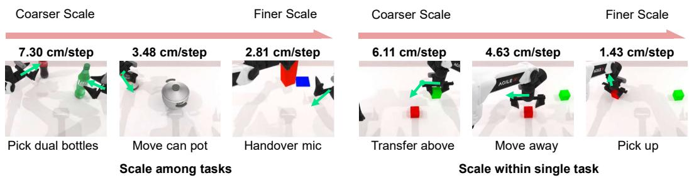  
Figure 1: Illustration of multi-scale temporal dynamics. Per-step end-effector displacements vary significantly across different tasks (left) and over time within a single task “Stack blocks two” (right).

Central to robotic manipulation, action prediction must bridge high-level intentional inference for task planning with fine-grained, low-level control for execution. Furthermore, we observe that the Stack blocks twoper-step end-effector displacement varies significantly not only across different tasks (Fig. 1 left) but also across different stages within the same task (Fig. 1 right). We characterize execution scale using the per-step end-effector displacement, where larger displacements correspond to coarser-scale motions and smaller displacements correspond to finer-scale motions (see Appendix C). This variance in per-step displacement indicates the differences in the temporal scale of actions, implying that VLA models are inherently required to possess multi-scale temporal representation capabilities. Consequently, directly mapping the coarse-grained multi-modal semantics to fine-grained action sequences suffers from a severe temporal scale mismatch issue. This mismatch undermines the VLA models’ robustness to visual observation noise, as the model over-relies on abstract semantics while failing to capture the multi-scale, fine-grained temporal cues necessary for resisting local perturbations.

To address this issue, we introduce multi-scale action modeling in the action feature space. However, implementing such multi-scale representations risks breaking the temporal continuity of actions across different scales. This occurs because aggregating actions from varying granularities often projects disjointed structural priors onto the continuous action space, causing interpolation errors at scale boundaries. Consequently, the generated trajectories often exhibit undesired non-smooth transitions [11], leading to mechanical oscillations and further reducing the execution robustness of VLA models. Therefore, a core challenge lies in equipping VLA models with multi-scale structural priors while simultaneously enforcing action smoothness constraints. Addressing this through efficient fine-tuning strategies has become an urgent necessity.

In this paper, we propose ActionUNet, an efficient multi-scale fine-tuning framework that significantly enhances the robustness of pre-trained VLA models with very low training and inference costs. Specifically, ActionUNet first constructs a lightweight temporal U-Net architecture within the temporal-aligned action feature space, injecting explicit multi-scale priors into the action generation process through hierarchical feature encoding and decoding. Then, ActionUNet introduces a conditional SIREN as a continuous action decoder to efficiently leverage the pre-trained VLA’s action features. This architecture directly incorporates these action features as conditional inputs to preserve intrinsic temporal alignment, while simultaneously mitigating high-frequency motion jitter via explicit second-order smoothness constraints to guarantee temporal continuity.

By integrating the hierarchical structural priors from the temporal U-Net with the continuous temporal constraints of the conditional SIREN, ActionUNet effectively bridges the scale gap between coarse-grained multi-modal semantics and fine-grained physical execution. This ensures the generation of smooth, jitter-resistant action trajectories to enhance the model’s resilience against environmental perturbations, while fully leveraging the pre-trained VLA to improve fine-tuning efficiency.

Our main contributions are summarized as follows:

• We propose ActionUNet, a simple-but-effective multi-scale fine-tuning framework that constructs a temporal U-Net to endow pre-trained VLA models with hierarchical structural priors, effectively mitigating the scale mismatch problem at a minimal computational cost.

• We design a conditional SIREN decoder for continuous action generation, which efficiently leverages the multi-scale fused action features as conditional inputs. This design preserves intrinsic temporal alignment while imposing explicit second-order smoothness constraints to guarantee temporal continuity and mitigate high-frequency motion jitter.

• Extensive experiments on RoboTwin 2.0, LIBERO-Plus, and real-world dual-arm manipulation with hard setting demonstrate that ActionUNet significantly improves $\pi _ { 0 . 5 }$ success rates by 9.8%, 6.1%, and 11.4% in hard/perturbed settings, respectively. Its consistent gains on OpenVLA-OFT further highlight its effectiveness and compatibility as an efficient finetuning strategy.

## 2 Related Work

Vision-Language-Action Model. Vision-Language-Action (VLA) models have emerged as a promising paradigm for robotic manipulation, typically building upon pre-trained Vision-Language Models (VLMs) [12, 13, 14] to map visual and linguistic inputs to actions. Existing VLA architectures can be broadly categorized into two families: autoregressive models that discretize continuous actions into tokens [15, 1, 2, 16], and diffusion-based or flow-matching-based models that generate continuous action chunks [17, 3, 18]. Despite these advances, robustness remains a key concern; prior work has shown that VLA models are vulnerable to visual corruptions [19], and existing robustification strategies often rely on external large models or focus solely on visual perturbations [20, 21]. Meanwhile, most VLA models adopt a single-scale action representation head and generate action sequences without explicit multi-scale or smoothness priors.

Multi-scale Visuomotor Policy Learning. Robotic manipulation requires modeling actions at multiple temporal scales, since a policy must simultaneously capture long-horizon task progression and fine-grained local control. Existing visuomotor approaches can be broadly grouped into two categories. The first category learns discrete multi-scale representations of actions, often through vector-quantized tokenization, and performs hierarchical or scale-wise prediction [22, 23]. While such discretization can improve long-horizon reasoning and autoregressive efficiency, it introduces an information bottleneck that may hinder the transfer of rich visual features to downstream action prediction [24]. The second category operates in continuous action space and introduces multiscale structure either within the action generation process, by predicting action chunks at multiple resolutions [25] or decomposing actions into frequency components [26], or through multi-scale perception and hierarchical policy architectures that fuse features across sensor modalities [27, 28, 29]. These methods, together with VLA-based multi-scale prediction that requires full-model retraining [30], demonstrate that coordinating global planning with local refinement is crucial, but their specially designed policy heads or training paradigms limit direct reuse of strong pre-trained VLA priors. In contrast, we inject multi-scale structure directly into the action feature space, thereby bypassing the discretization bottleneck and the need for architecturally specialized heads, while retaining the base model’s generalization with low fine-tuning overhead.

## 3 Method

## 3.1 Preliminary

In standard VLA fine-tuning, the action head inherits its weights from pre-training and decodes each timestep independently from high-level multi-modal features into a continuous action. However, this single-scale mapping often fails to bridge the gap between coarse-grained multi-modal semantics and the multi-scale, fine-grained requirements of physical execution, leading to the scale mismatch issue.

Our method, referred to as ActionUNet, addresses this issue by introducing two key modules: a temporal U-Net in the temporal-aligned action feature space that restores multi-scale structure, and a continuous action decoder that imposes explicit smoothness constraints. The temporal U-Net enriches the backbone action features with hierarchical priors, jointly capturing coarse task semantics and fine local control cues. These refined features are then decoded into a continuous-time trajectory via local SIREN fields and Matérn-weighted aggregation, producing actions that are both spatially precise and temporally smooth. By constructing the multi-scale prior directly in the continuous feature space, ActionUNet bridges the scale gap between coarse-grained multi-modal semantics and fine-grained actions, helps recover the multi-scale temporal cues needed for robust manipulation, and guarantees temporal continuity.

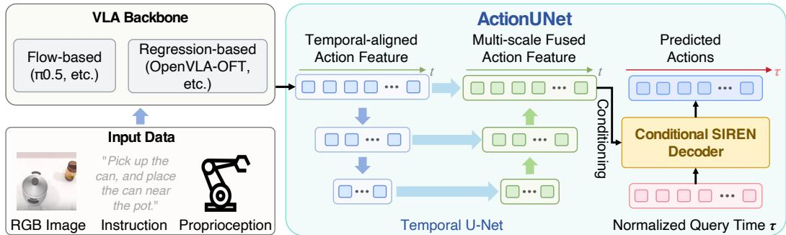  
Figure 2: Overview of ActionUNet. Given input observations and instructions, the VLA backbone first produces temporal-aligned action features. ActionUNet refines these features in the action feature space through multi-scale temporal mapping, and then decodes the fused features with a conditional SIREN into smooth continuous action trajectories.

## 3.2 Temporal U-Net in Action Feature Space

To address the scale mismatch and recover the fine-grained dynamics lacking in standard finetuning approaches, ActionUNet constructs a lightweight temporal U-Net that explicitly encodes multi-scale priors in the temporal-aligned action feature space. Let the action feature be denoted as $\mathbf { h } ^ { ( 0 ) } \in \bar { \mathbb { R } } ^ { H \times d }$ , where H is the action horizon and $d$ is the feature dimension. The temporal U-Net progressively encodes the action feature into lower-resolution temporal representations and subsequently decodes it back to the original resolution. Skip connections recover fine-grained local details during reconstruction. The whole process is represented as:

$$
{ \bf h } ^ { ( \ell + 1 ) } = \mathrm { L N } \Big ( \mathrm { G e L U } \big ( \mathrm { C o n v } 1 \mathrm { D } ^ { ( \ell ) } ( { \bf h } ^ { ( \ell ) } ) \big ) \Big ) , \quad \ell = 0 , \ldots , L - 1 ,\tag{1}
$$

$$
\tilde { \mathbf { h } } ^ { ( \ell ) } = \mathrm { F u s e } ^ { ( \ell ) } \Big ( \mathrm { U p } \big ( \tilde { \mathbf { h } } ^ { ( \ell + 1 ) } \big ) , ~ \mathbf { h } ^ { ( \ell ) } \Big ) , \quad \ell = L - 1 , \ldots , 0 .\tag{2}
$$

In Eq. (1), $\mathrm { C o n v 1 D } ^ { ( \ell ) }$ denotes a one-dimensional convolution with a downsampling rate r that halves the temporal resolution at each stage. The output is passed through a GeLU activation followed by Layer Normalization. Starting from $\mathbf { h } ^ { ( 0 ) } \in \mathbb { R } ^ { H \times \bar { d } }$ , after L stages the hidden state $\mathbf { h } ^ { ( L ) }$ resides in $\mathbb { R } ^ { \lfloor \dot { H } / r ^ { L } \rfloor \times d }$ . A fully connected layer transforms $\mathbf { h } ^ { ( L ) }$ into $\tilde { \mathbf { h } } ^ { ( L ) }$ . Eq. (2) restores temporal resolution in a coarse-to-fine manner. At each stage ℓ, the current hidden state is first upsampled by a factor of two using nearest-neighbor interpolation $( \mathrm { U p } ( \cdot ) )$ . The upsampled feature is then concatenated with the corresponding encoder skip feature $\mathbf { h } ^ { ( \ell ) }$ and processed by a fusion block $\mathrm { F u s e } ^ { ( \ell ) }$ which consists of a single linear layer. The final output $\tilde { \mathbf { h } } ^ { ( 0 ) } \in \mathbb { R } ^ { H \times d }$ serves as the refined action feature.

## 3.3 Conditional SIREN Decoder for Continuous Action Generation

Rather than directly mapping each refined feature vector $\tilde { \mathbf { h } } ^ { ( 0 ) }$ to an isolated action step, we interpret the action chunk as samples from a temporal-continuous trajectory over a normalized time $\tau \in [ - 1 , 1 ]$ . To achieve this goal, we propose the conditional SIREN decoder, where the decoder produces a smooth function that can represent either the action trajectory itself (regression mode) or the flow-matching vector field (flow mode), depending on the training objective. This continuous formulation is motivated by standard robot trajectory-generation practice, where the robot’s actions are often represented as smooth twice-differentiable or piecewise $C ^ { 2 }$ continuous curves to ensure continuity [31].

Local SIREN Fields. Let $\tilde { \mathbf { h } } _ { 1 } ^ { ( 0 ) } , \ldots , \tilde { \mathbf { h } } _ { H } ^ { ( 0 ) } \in \mathbb { R } ^ { d }$ be the refined action features from the temporal U-Net, each associated with a uniformly spaced normalized time $\tau _ { 1 } , \dots , \tau _ { H } \in [ - 1 , 1 ]$ . For i-th feature $\tilde { \mathbf { h } } _ { i } ^ { ( 0 ) }$ , we construct a local implicit field $\Phi _ { i } ( \tau )$ that continuously maps the query time $\tau _ { \textrm { t o } }$ the action space, conditioned on $\tilde { \mathbf { h } } _ { i } ^ { ( 0 ) }$ . To endow every layer with explicit temporal awareness, we replace the standard static biases of SIREN [32] with time-dependent biases defined as simple affine functions

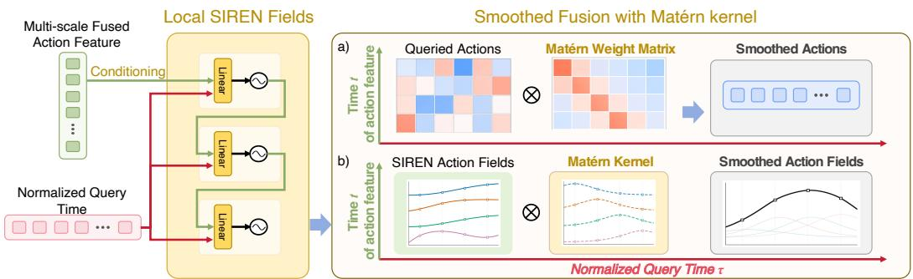  
Figure 3: Overview of the conditional SIREN decoder. Local SIREN fields conditioned on multiscale action features are queried over continuous time and fused with Matérn-kernel weights to generate temporally smooth actions.

of τ . Formally, each hidden layer is a mapping

$$
\phi _ { m } ^ { \tau } \colon \mathbb R ^ { d } \to \mathbb R ^ { d } , \quad \phi _ { m } ^ { \tau } ( \mathbf { z } ) = \mathrm { s i n } \big ( \mathbf { W } _ { m } \mathbf { z } + \mathbf { U } _ { m } \tau + \mathbf { b } _ { m } \big ) , \quad m = 0 , \ldots , M - 1 ,\tag{3}
$$

where $\mathbf { W } _ { m } \in \mathbb { R } ^ { d \times d } , \mathbf { U } _ { m } \in \mathbb { R } ^ { d \times 1 }$ , and $\mathbf { b } _ { m } \in \mathbb { R } ^ { d }$ are learnable parameters. Starting from the refined feature $\tilde { \mathbf { h } } _ { i } ^ { ( 0 ) }$ , the local SIREN field is the composition of these layers followed by a linear readout:

$$
\Phi _ { i } ( \tau ) = { \bf W } _ { M } ( \phi _ { M - 1 } ^ { \tau } \circ \cdots \circ \phi _ { 0 } ^ { \tau } ) ( \tilde { \bf h } _ { i } ^ { ( 0 ) } ) + { \bf b } _ { M } ,\tag{4}
$$

with $\mathbf { W } _ { M } \in \mathbb { R } ^ { D } \times d , \mathbf { b } _ { M } \in \mathbb { R } ^ { D }$ where $D$ is the action dimension. Because every $\phi _ { m } ^ { \tau }$ composes an affine transformation with the analytic sine, and the time dependence enters solely through the parameter $ { \mathbf { b } } _ { m } ( \tau )$ , the overall function $\Phi _ { i } ( \tau )$ remains infinitely differentiable with respect $\mathbf { t o } \tau$ , inheriting the smoothness guarantees of SIREN. This formulation preserves the architectural simplicity of the original SIREN while seamlessly embedding temporal τ information into every hidden layer.

Smooth Fusion with Matérn Kernel. The global continuous function $\psi ( \tau )$ is obtained by aggregating the local SIREN fields with a normalized Matérn- ${ \it \cdot } 5 / 2$ kernel [33] of length-scale parameter $\rho$ as

$$
\psi ( \tau ) = \sum _ { i = 1 } ^ { H } \alpha _ { i } ( \tau ) \Phi _ { i } ( \tau ) , \mathrm { s . t . } \alpha _ { i } ( \tau ) \propto \kappa _ { 5 / 2 } ( | \tau - \tau _ { i } | / \rho ) .\tag{5}
$$

This soft assignment encourages second-order temporal smoothness across neighboring feature positions, reducing high-frequency inconsistencies while preserving local expressiveness. The aggregated output $\{ \check { \psi ( \tau _ { j } ) } \} _ { j = 1 } ^ { H }$ is interpreted as the predicted action chunk (regression) or as the estimated velocity field (flow matching), depending on the training objective of the base policy.

## 3.4 Training Objective

ActionUNet is compatible with both direct regression and flow-matching policies. We keep the pretrained backbone frozen and only fine-tune the action expert with ActionUNet, so the method can be trained under the original objective of the base policy.

Regression Objective. For direct regression, we supervise the output sequence $\{ \psi ( \tau _ { j } ) \} _ { j = 1 } ^ { H }$ with the ground-truth action chunk $\mathbf { a } _ { 1 : H }$ using an $\ell _ { 1 }$ loss:

$$
\mathcal { L } _ { \mathrm { r e g } } = \frac { 1 } { H } \sum _ { j = 1 } ^ { H } \left. \psi ( \tau _ { j } ) - \mathbf { a } _ { j } \right. _ { 1 } .\tag{6}
$$

Flow-matching Objective. For flow-based training, the decoder $\psi ( \tau )$ is trained to predict the conditional vector field that transports noise to data. Following the standard conditional flow-matching formulation [34], we construct a linear interpolation path between a noise sequence $\epsilon _ { 1 : H }$ and the clean action chunk $\mathbf { a } _ { 1 : H }$ . Given an observation and the noisy trajectory $\epsilon _ { 1 : H }$ , the model predicts $\psi ( \tau _ { j } )$ , and we minimize the mean squared error against this velocity:

$$
\mathcal { L } _ { \mathrm { f m } } = \frac { 1 } { H } \sum _ { j = 1 } ^ { H } \left. \psi ( \tau _ { j } ) - ( \mathbf { a } _ { j } - \epsilon _ { j } ) \right. _ { 2 } ^ { 2 } .\tag{7}
$$

Temporally Correlated Flow Noise. To align the flow target with the smoothness prior of our continuous decoder, we replace the standard white Gaussian noise with Matérn-5/2 process noise. Concretely, we sample noise vectors with a temporal covariance $K _ { i j } = \kappa _ { 5 / 2 } ( | i - j | / \sigma ) + \varepsilon \delta _ { i j }$ , where σ controls the correlation length and ε ensures numerical stability. This correlated perturbation reduces high-frequency jitter in the transport target and better matches the $C ^ { 2 }$ continuity induced by the SIREN decoder and Matérn aggregation.

## 4 Experiments

## 4.1 Experimental Setup

Simulation Benchmarks. We evaluate ActionUNet on three simulation benchmarks:

1) RoboTwin 2.0 [35] contains 50 bimanual tasks, each with easy and hard settings (varying distractors, backgrounds, lighting, table heights, and language). We select 12 tasks covering diverse temporal scale compositions. Each single-task policy is trained on 50 clean demonstrations and evaluated over 100 rollouts in both settings. 2) LIBERO [36] comprises four suites (Spatial, Object, Goal, Long), each with 10 tasks and 50 demonstrations. We train on a mixture from all suites. 3) LIBERO-Plus [37] extends LIBERO with seven perturbation types (camera, robot state, language, lighting, background, sensor noise, layout). Models trained on LIBERO are directly evaluated on LIBERO-Plus to measure robustness. All tasks adopt the average success rate as the evaluation metric.

Real-World Robot Experiments. We conduct real-world experiments on the Realman Gen72 dualarm platform. Three Intel RealSense D435 cameras are used: two wrist-mounted cameras placed on the end-effectors and one head camera positioned between the two arms, providing multi-view observations of the workspace. We train and evaluate models on three dual-arm manipulation tasks: Place Object Basket, Stack Blocks Two, and Stack Bowls Two. To test real-world robustness, we consider two evaluation settings: an easy setting matching the training environment and a hard setting with additional distractor objects.

Implementation Details. We apply ActionUNet to both $\pi _ { 0 . 5 } ,$ a flow-based policy, and OpenVLA-OFT, a regression-based policy, to evaluate its compatibility with different VLA frameworks. For ActionUNet, we set the temporal pyramid downsampling rate $r \ = \ 2 .$ , the Matérn kernel lengthscale $\rho = 0 . 2$ , and use standard SIREN initialization [32]. We reproduce $\pi _ { 0 . 5 }$ following the official PyTorch version and OpenVLA-OFT baselines. All other baseline results are cited from [35, 38, 37]. All methods adopt the same dataset-specific training data, inference setting, and evaluation protocol. Unless otherwise specified, fine-tuning hyperparameters follow the settings reported in the original papers or official benchmark reports.

For RoboTwin 2.0, $\pi _ { 0 . 5 }$ and $\pi _ { 0 . 5 } + .$ ActionUNet are trained on 2×RTX 4090 GPUs for 8K steps with a batch size of 64 and a $5 \times 1 0 ^ { - 5 }$ learning rate (cosine decay). For LIBERO and LIBERO-Plus, they are trained on 8×A800 GPUs for 40K steps with a batch size of 256. OpenVLA-OFT and OpenVLA-OFT+ActionUNet follow official settings, except OpenVLA-OFT+ActionUNet on LIBERO uses a reduced learning rate of $5 \times 1 0 ^ { - 5 }$ for stable fine-tuning.

## 4.2 Results on RoboTwin 2.0

Table 1 reports the results on RoboTwin 2.0, where tasks are grouped according to their scale composition. Based on $\pi _ { 0 . 5 } ,$ ActionUNet consistently improves performance across both easy and hard settings. Averaged over all 12 tasks, ActionUNet significantly improves the success rate by 8.8% in the easy setting, and 9.8% in the hard setting. The improvement under the hard setting is especially important, since this setting introduces stronger environmental perturbations and requires the policy to maintain reliable action execution under distractors.

The gains are consistent across scale compositions. On single-scale tasks, ActionUNet improves the average success rate from 66.0% to 72.7% and from 34.0% to 44.0% in the easy and hard settings, respectively. On dual-scale tasks, ActionUNet improves the average success rate from 60.2% to 69.5% and from 29.7% to 40.0% under easy and hard settings, respectively. On threescale tasks, where successful execution requires coordinating more diverse temporal action patterns, ActionUNet improves the average success rate from 52.0% to 62.0% and from 25.7% to 34.3% in the easy and hard settings, respectively. These results show that multi-scale temporal action modeling is beneficial not only for simple action patterns but also for tasks involving more complex scale composition.

Table 1: Task-wise success rates on RoboTwin 2.0 grouped by scale composition.
<table><tr><td rowspan="2">Task</td><td colspan="2">RDT [7]</td><td colspan="2"> $\pi _ { 0 } ~ [ 1 7 ]$ </td><td colspan="2">ACT [39]</td><td colspan="2">DP3 [40]</td><td colspan="2">π0.5 [4]</td><td colspan="2">π0.5+ActionUNet</td></tr><tr><td>Easy</td><td>Hard</td><td>Easy</td><td>Hard</td><td>Easy</td><td>Hard</td><td>Easy</td><td>Hard</td><td>Easy</td><td>Hard</td><td>Easy</td><td>Hard</td></tr><tr><td colspan="10">Single-scale Tasks</td><td></td><td></td><td></td></tr><tr><td>Pick Dual Bottles</td><td>42</td><td>13</td><td>57</td><td>12</td><td>31</td><td>0</td><td>60</td><td>1</td><td>65</td><td>34</td><td>71</td><td>39</td></tr><tr><td>Handover Mic</td><td>90</td><td>31</td><td>98</td><td>13</td><td>85</td><td>0</td><td>100</td><td>3</td><td>100</td><td>55</td><td>100</td><td>76</td></tr><tr><td>Handover Block</td><td>45</td><td>14</td><td>45</td><td>8</td><td>42</td><td>0</td><td>70</td><td>0</td><td>33</td><td>13</td><td>47</td><td>17</td></tr><tr><td colspan="10">Dual-scale Tasks</td><td colspan="3"></td></tr><tr><td>Beat Block Hammer</td><td>77</td><td>37</td><td>43</td><td>21</td><td>56</td><td>3</td><td>72</td><td>8</td><td>77</td><td>28</td><td>89</td><td>43</td></tr><tr><td>Move Can Pot</td><td>25</td><td>12</td><td>58</td><td>21</td><td>22</td><td>4</td><td>70</td><td>6</td><td>66</td><td>52</td><td>77</td><td>69</td></tr><tr><td>Place A2B Left</td><td>3</td><td>1</td><td>31</td><td>1</td><td>1</td><td>0</td><td>46</td><td>2</td><td>46</td><td>7</td><td>55</td><td>10</td></tr><tr><td>Place Object Stand</td><td>15</td><td>5</td><td>36</td><td>11</td><td>1</td><td>0</td><td>60</td><td>0</td><td>51</td><td>29</td><td>62</td><td>38</td></tr><tr><td>Place Phone Stand</td><td>15</td><td>6</td><td>35</td><td>7</td><td>2</td><td>0</td><td>44</td><td>2</td><td>47</td><td>21</td><td>61</td><td>27</td></tr><tr><td>Press Stapler</td><td>41</td><td>24</td><td>62</td><td>29</td><td>31</td><td>6</td><td>69</td><td>3</td><td>74</td><td>41</td><td>73</td><td>53</td></tr><tr><td colspan="10">Three-scale Tasks</td><td colspan="3"></td></tr><tr><td>Stack Blocks Two</td><td>21</td><td>2</td><td>42</td><td>1</td><td>25</td><td>0</td><td>24</td><td>0</td><td>68</td><td>24</td><td>74</td><td>35</td></tr><tr><td>Blocks Ranking RGB</td><td>3</td><td>0</td><td>19</td><td>5</td><td>1</td><td>0</td><td>3</td><td>0</td><td>36</td><td>16</td><td>50</td><td>24</td></tr><tr><td>Put Bottles Dustbin</td><td>21</td><td>4</td><td>54</td><td>13</td><td>27</td><td>1</td><td>60</td><td>21</td><td>52</td><td>37</td><td>62</td><td>44</td></tr><tr><td>Average</td><td>33.2</td><td>12.4</td><td>48.3</td><td>11.8</td><td>27.0</td><td>1.2</td><td>56.5</td><td>3.8</td><td>59.6</td><td>29.8</td><td>68.4</td><td>39.6</td></tr></table>

Table 2: LIBERO benchmark results. We report the average success rate (%) across four LIBERO task suites.
<table><tr><td>Method</td><td>SPATIAL</td><td>OBJECT</td><td>GOAL</td><td>LONG</td><td>Avg.</td></tr><tr><td>Diffusion Policy [41]</td><td>78.3</td><td>92.5</td><td>68.3</td><td>50.5</td><td>72.4</td></tr><tr><td>WorldVLA [42]</td><td>87.6</td><td>96.2</td><td>83.4</td><td>60.0</td><td>81.8</td></tr><tr><td>SmolVLA [43]</td><td>93.0</td><td>94.0</td><td>91.0</td><td>77.0</td><td>88.8</td></tr><tr><td>π0 [17]</td><td>96.8</td><td>98.8</td><td>95.8</td><td>85.2</td><td>94.2</td></tr><tr><td>π0-FAST [16]</td><td>96.4</td><td>96.8</td><td>88.6</td><td>60.2</td><td>85.5</td></tr><tr><td>UniVLA [44]</td><td>96.5</td><td>96.8</td><td>95.6</td><td>92.0</td><td>95.2</td></tr><tr><td>VLA-Adapter [38]</td><td>97.8</td><td>99.2</td><td>97.2</td><td>95.0</td><td>97.3</td></tr><tr><td>OpenVLA-OFT [8]</td><td>98.4</td><td>99.0</td><td>98.4</td><td>95.8</td><td>97.9</td></tr><tr><td>OpenVLA-OFT+ActionUNet</td><td>99.2</td><td>99.0</td><td>99.6</td><td>96.4</td><td>98.6</td></tr><tr><td>[4]  $\pi _ { 0 . 5 }$ </td><td>95.4</td><td>98.4</td><td>97.0</td><td>91.6</td><td>95.6</td></tr><tr><td>π0.5+ActionUNet</td><td>98.6</td><td>99.4</td><td>98.8</td><td>93.8</td><td>97.7</td></tr></table>

Table 3: Performance under environmental perturbations on LIBERO-Plus. All models are trained on LIBERO and evaluated on LIBERO-Plus. We report success rates (%) under 7 perturbation types.
<table><tr><td>Method</td><td>Camera</td><td>Robot</td><td>Lang.</td><td>Light</td><td>Back.</td><td>Noise</td><td>Layout</td><td> $\mathbf { A v g . }$ </td></tr><tr><td>OpenVLA [2]</td><td>0.8</td><td>3.5</td><td>23.0</td><td>8.1</td><td>34.8</td><td>15.2</td><td>28.5</td><td>15.6</td></tr><tr><td>WorldVLA [42]</td><td>0.1</td><td>27.9</td><td>41.6</td><td>43.7</td><td>17.1</td><td>10.9</td><td>38.0</td><td>25.0</td></tr><tr><td>UniVLA [44]</td><td>1.8</td><td>46.2</td><td>69.6</td><td>69.0</td><td>81.0</td><td>21.2</td><td>31.9</td><td>43.9</td></tr><tr><td>π0 [17]</td><td>13.8</td><td>6.0</td><td>58.8</td><td>85.0</td><td>81.4</td><td>79.0</td><td>68.9</td><td>53.6</td></tr><tr><td>π0-FAST [16]</td><td>65.1</td><td>21.6</td><td>61.0</td><td>73.2</td><td>73.2</td><td>74.4</td><td>68.8</td><td>61.6</td></tr><tr><td>OpenVLA-OFT [8]</td><td>36.0</td><td>35.9</td><td>67.0</td><td>82.1</td><td>93.1</td><td>47.1</td><td>82.5</td><td>60.9</td></tr><tr><td>OpenVLA-OFT+ActionUNet</td><td>41.2</td><td>40.8</td><td>68.3</td><td>83.4</td><td>93.7</td><td>54.5</td><td>85.3</td><td>64.6</td></tr><tr><td>π0.5 [4]</td><td>48.2</td><td>45.9</td><td>68.8</td><td>93.0</td><td>87.4</td><td>52.0</td><td>81.7</td><td>65.8</td></tr><tr><td>π0.5+ActionUNet</td><td>56.9</td><td>54.4</td><td>73.3</td><td>94.6</td><td>89.8</td><td>61.1</td><td>85.7</td><td>71.9</td></tr></table>

## 4.3 Results on LIBERO and LIBERO-Plus

Table 2 reports results on the standard LIBERO benchmark. With $\pi _ { 0 . 5 } ,$ ActionUNet improves the performance of all four suites, achieving an average success rate of 97.7% against 95.6%. This improvement extends to the regression-based OpenVLA-OFT backbone (98.6% vs 97.9%), confirming that ActionUNet generalizes across VLA models while preserving strong in-distribution performance.

Table 4: Comparison of our method against the baseline under easy and hard conditions in realworld experiments.
<table><tr><td rowspan="2">Task</td><td colspan="2"> $\pi _ { 0 . 5 }$ </td><td colspan="2"> $\pi _ { 0 . 5 } { \mathrm { + A c t i o n U N e t } }$ </td></tr><tr><td>Easy</td><td>Hard</td><td>Easy</td><td>Hard</td></tr><tr><td>Place Object Basket</td><td>60</td><td>42</td><td>78</td><td>52</td></tr><tr><td>Stack Bowls Two</td><td>88</td><td>62</td><td>96</td><td>74</td></tr><tr><td>Stack Blocks Two</td><td>80</td><td>68</td><td>92</td><td>80</td></tr><tr><td>Average</td><td>76.0</td><td>57.3</td><td>88.7</td><td>68.7</td></tr></table>

Table 5: Ablation results on four RoboTwin 2.0 tasks. Each task reports success rates under easy and hard settings. All non-baseline variants are built on $\pi _ { 0 . 5 }$
<table><tr><td rowspan="2">Task</td><td colspan="2">π0.5</td><td colspan="2">+ U-Net</td><td colspan="2">+ SIREN</td><td colspan="2">+ ActionUNet w/o Matérn</td><td colspan="2">+ ActionUNet</td></tr><tr><td>Easy</td><td>Hard</td><td>Easy</td><td>Hard</td><td>Easy</td><td>Hard</td><td>Easy</td><td>Hard</td><td>Easy</td><td>Hard</td></tr><tr><td>Move Can Pot</td><td>66</td><td>52</td><td>64</td><td>56</td><td>73</td><td>53</td><td>73</td><td>68</td><td>77</td><td>69</td></tr><tr><td>Stack Blocks Two</td><td>68</td><td>24</td><td>75</td><td>27</td><td>74</td><td>24</td><td>71</td><td>34</td><td>74</td><td>35</td></tr><tr><td>Beat Block Hammer</td><td>77</td><td>28</td><td>65</td><td>33</td><td>87</td><td>30</td><td>89</td><td>39</td><td>89</td><td>43</td></tr><tr><td>Pick Dual Bottles</td><td>65</td><td>34</td><td>66</td><td>33</td><td>68</td><td>26</td><td>67</td><td>40</td><td>71</td><td>39</td></tr><tr><td>Average</td><td>69.0</td><td>34.5</td><td>67.5</td><td>37.3</td><td>75.5</td><td>33.3</td><td>75.0</td><td>45.3</td><td>77.8</td><td>46.5</td></tr><tr><td>Gain over π0.5</td><td>一</td><td>一</td><td>-1.5</td><td>+2.8</td><td>+6.5</td><td>-1.2</td><td>+6.0</td><td>+10.8</td><td>+8.8</td><td>+12.0</td></tr></table>

Table 3 evaluates the robustness of ActionUNet and comparison methods under controlled perturbations on LIBERO-Plus. $\pi _ { 0 . 5 } { \mathrm { + A c t i o n U N e t } }$ improves the average success rate from 65.8% to 71.9%, with consistent gains across all seven perturbation types, particularly for camera, robot-state, and sensor-noise perturbations. This result demonstrates that the temporal U-Net refines action features for multi-scale representations, and the continuous decoder reduces high-frequency inconsistency to benefit the robotic execution. With the more powerful regression-based OpenVLA-OFT, ActionUNet still improves the average success rate from 60.9% to 64.6%, indicating its robustness across VLA frameworks.

## 4.4 Real-World Experiments

Evaluation Protocol. We select three representative tasks from the RoboTwin 2.0 benchmark: place Object Basket, Stack Blocks Two, and Stack Bowls Two. Each task contains easy and hard evaluation settings. The easy setting is the same as the training settings. For the hard setting, we randomly add some distractor objects to the environment to introduce visual and physical interference. We report the success rate as the percentage of successful trials out of the 50 rollouts.

Results. Table 4 reports the real-world evaluation results on the Realman Robot. ActionUNet consistently improves the baseline across all three tasks under both easy and hard evaluation settings. The average success rate is significantly improved from 76.0% to 88.7% in the easy setting and from 57.3% to 68.7% in the hard setting. These results demonstrate its robustness in complex real-world environments without compromising performance in standard scenes.

## 4.5 Ablation Study

Module Ablation. We ablate ActionUNet with respect to the temporal U-Net, the conditional SIREN decoder, and the Matérn-weighted aggregation in Table 5. Using only the temporal U-Net on π0.5 improves hard-setting performance from 34.5% to 37.3% while slightly dropping in the easy setting. This suggests that while the temporal U-Net enhances robustness against distractors, it compromises the spatial continuity of actions. In contrast, by adding only the SIREN decoder, the success rate in the easy setting is improved from 69.0% to 75.5% while dropping in the hard setting. It indicates the SIREN decoder is capable of maintaining the spatial continuity of actions to suppress trajectory jitter, but fails to capture multi-scale action representations, leading to a lack of robustness against distractors. The combination of U-Net and SIREN without the Matérn kernel (ActionUNet w/o Matérn) achieves 75.0% and 45.3% success rates in easy and hard settings, significantly outperforming the baseline by 6.0% and 10.8%, demonstrating that multi-scale modeling, aided by SIREN to mitigate action discontinuity, effectively provides crucial robustness against distractors. Incorporating the Matérn kernel further increases performance to 77.8% and 46.5% in easy and hard settings, suggesting that the Matérn kernel supplies a lightweight smoothness prior over neighboring local fields, complementing the learned components.

Effect of Multi-scale Fine-tuning. We compute the response of the 1st, 4th, and 6th layers of temporal U-Net to reflect fine-, mid-, and coarse-scale action feature activations using Grad-CAM on RoboTwin 2.0. The responses are grouped into five bins by ground-truth action scales, and Grad-CAM responses are min-max normalized and averaged per bin. As shown in Fig. 4, action features at each scale respond most strongly to the corresponding ground-truth action scales, suggesting that ActionUNet learns scale-aware temporal representations.

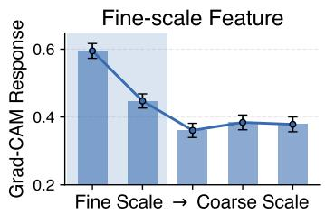

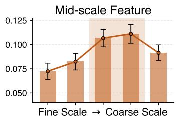

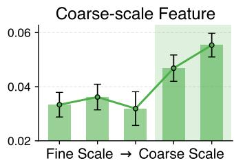  
Figure 4: Scale-conditioned temporal Grad-CAM responses on RoboTwin 2.0. Fine-, mid-, and coarse-resolution temporal features show stronger responses to the corresponding action scales.

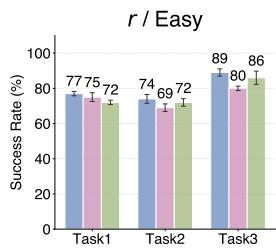

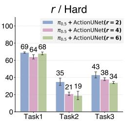  
Figure 5: Ablation study on the downsampling rate r. Task1, Task2, and Task3 correspond to Move Can Pot, Stack Blocks Two, and Beat Block Hammer, respectively.

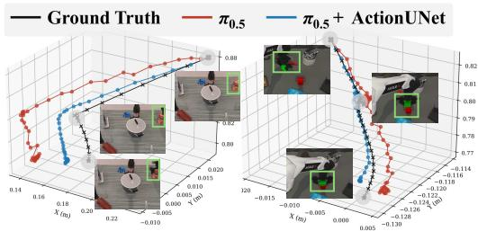  
Figure 6: Predicted end-effector action chunks under the same initial settings. ActionUNet produces actions closer to the ground-truth with smoother local action than $\pi _ { 0 . 5 }$ .

Effect of Hyper-parameters r. Fig. 5 shows that the downsampling rate $r \ : = \ : 2$ in the temporal U-Net performs best under both easy and hard settings. Smaller r provides denser intermediate scales for gradual coarse-to-fine refinement, which is especially beneficial in hard settings where contact-sensitive actions are required.

Visualization Analysis. As shown in Fig. 6, we further visualize predicted end-effector action chunks under the same initial setting. Compared with $\pi _ { 0 . 5 } ,$ , ActionUNet produces smaller spatial deviation and smoother trajectories in these examples. This demonstrates ActionUNet’s effectiveness in generating precise and stable continuous actions.

## 5 Conclusion

We propose ActionUNet, a lightweight multi-scale fine-tuning module for temporal action mapping in pre-trained VLA policies. ActionUNet injects hierarchical temporal priors into the action feature space through a temporal U-Net, and decodes the refined features with a conditional SIREN decoder to preserve smooth action trajectories. This design provides an architecture-compatible interface for both flow-based and regression-based policies, while introducing negligible computational overhead. On RoboTwin 2.0, LIBERO, LIBERO-Plus, and real-world dual-arm experiments,

ActionUNet consistently improves task success and robustness under environmental distractions, showing the effectiveness of multi-scale temporal mapping for efficient VLA adaptation.

## Limitations and Future Work.

ActionUNet currently uses fixed temporal scales, models action chunks independently, and introduces scale-aware modeling only at downstream action stage. Future work will explore adaptive scales, cross-chunk temporal modeling, and scale-aware VLA pre-training.

## References

[1] B. Zitkovich, T. Yu, S. Xu, P. Xu, T. Xiao, F. Xia, J. Wu, P. Wohlhart, S. Welker, A. Wahid et al., “Rt-2: Vision-language-action models transfer web knowledge to robotic control,” in Conf. Robot Learn., 2023, pp. 2165–2183.

[2] M. J. Kim, K. Pertsch, S. Karamcheti, T. Xiao, A. Balakrishna, S. Nair, R. Rafailov, E. P. Foster, P. R. Sanketi, Q. Vuong et al., “Openvla: An open-source vision-language-action model,” in Conf. Robot Learn., 2025, pp. 2679–2713.

[3] J. Bjorck, F. Castañeda, N. Cherniadev, X. Da, R. Ding, L. Fan, Y. Fang, D. Fox, F. Hu, S. Huang et al., “Gr00t n1: An open foundation model for generalist humanoid robots,” arXiv preprint arXiv:2503.14734, 2025.

[4] K. Black, N. Brown, J. Darpinian, K. Dhabalia, D. Driess, A. Esmail, M. R. Equi, C. Finn, N. Fusai, M. Y. Galliker et al., “π0.5: a vision-language-action model with open-world generalization,” in Conf. Robot Learn., 2025.

[5] G. Ma, S. Wang, Z. Zhang, S. Yu, and H. Tang, “Generalvla: Generalizable vision-languageaction models with knowledge-guided trajectory planning,” arXiv preprint arXiv:2602.04315, 2026.

[6] A. Rasouli, M. Alban, S. Pakdamansavoji, Z. Li, Z. Zhang, A. Wu, and X. Zhao, “Distracted robot: How visual clutter undermine robotic manipulation,” arXiv preprint arXiv:2511.22780, 2025.

[7] S. Liu, L. Wu, B. Li, H. Tan, H. Chen, Z. Wang, K. Xu, H. Su, and J. Zhu, “Rdt-1b: a diffusion foundation model for bimanual manipulation,” in Int. Conf. Learn. Represent., 2025.

[8] M. J. Kim, C. Finn, and P. Liang, “Fine-tuning vision-language-action models: Optimizing speed and success,” in Robot.: Sci. Syst., 2025.

[9] W. Yuan, J. Duan, V. Blukis, W. Pumacay, R. Krishna, A. Murali, A. Mousavian, and D. Fox, “Robopoint: A vision-language model for spatial affordance prediction in robotics,” in Conf. Robot Learn., 2024.

[10] E. Zhao, V. Raval, H. Zhang, J. Mao, Z. Shangguan, S. Nikolaidis, Y. Wang, and D. Seita, “Manipbench: Benchmarking vision-language models for low-level robot manipulation,” in Conf. Robot Learn., 2025.

[11] Y. Liu, H. Yu, J. Zhao, B. Li, D. Zhang, M. Li, W. Wu, Y. Hu, J. Xie, J. Guo et al., “Learning native continuation for action chunking flow policies,” arXiv preprint arXiv:2602.12978, 2026.

[12] L. Beyer, A. Steiner, A. S. Pinto, A. Kolesnikov, X. Wang, D. Salz, M. Neumann, I. Alabdulmohsin, M. Tschannen, E. Bugliarello et al., “Paligemma: A versatile 3b vlm for transfer,” arXiv preprint arXiv:2407.07726, 2024.

[13] H. Liu, C. Li, Q. Wu, and Y. J. Lee, “Visual instruction tuning,” Adv. Neural Inform. Process. Syst., vol. 36, pp. 34 892–34 916, 2023.

[14] P. Wang, S. Bai, S. Tan, S. Wang, Z. Fan, J. Bai, K. Chen, X. Liu, J. Wang, W. Ge et al., “Qwen2-vl: Enhancing vision-language model’s perception of the world at any resolution,” arXiv preprint arXiv:2409.12191, 2024.

[15] A. Brohan, N. Brown, J. Carbajal, Y. Chebotar, J. Dabis, C. Finn, K. Gopalakrishnan, K. Hausman, A. Herzog, J. Hsu et al., “Rt-1: Robotics transformer for real-world control at scale,” in Robot.: Sci. Syst., 2023.

[16] K. Pertsch, K. Stachowicz, B. Ichter, D. Driess, S. Nair, Q. Vuong, O. Mees, C. Finn, and S. Levine, “Fast: Efficient action tokenization for vision-language-action models,” arXiv preprint arXiv:2501.09747, 2025.

[17] K. Black, N. Brown, D. Driess, A. Esmail, M. Equi, C. Finn, N. Fusai, L. Groom, K. Hausman, B. Ichter et al., “π0: A vision-language-action flow model for general robot control,” in Robot.: Sci. Syst., 2025.

[18] Q. Li, Y. Liang, Z. Wang, L. Luo, X. Chen, M. Liao, F. Wei, Y. Deng, S. Xu, Y. Zhang et al., “Cogact: A foundational vision-language-action model for synergizing cognition and action in robotic manipulation,” arXiv preprint arXiv:2411.19650, 2024.

[19] Z. Wang, Z. Zhou, J. Song, Y. Huang, Z. Shu, and L. Ma, “Vlatest: Testing and evaluating vision-language-action models for robotic manipulation,” Proceedings of the ACM on Software Engineering, vol. 2, no. FSE, pp. 1615–1638, 2025.

[20] A. J. Hancock, A. Z. Ren, and A. Majumdar, “Run-time observation interventions make visionlanguage-action models more visually robust,” in Int. Conf. Robot. Autom., 2025, pp. 9499– 9506.

[21] H. Zhang, P. Ding, S. Lyu, Y. Peng, and D. Wang, “Gevrm: Goal-expressive video generation model for robust visual manipulation,” arXiv preprint arXiv:2502.09268, 2025.

[22] Z. Gong, P. Ding, S. Lyu, S. Huang, M. Sun, W. Zhao, Z. Fan, and D. Wang, “Carp: Visuomotor policy learning via coarse-to-fine autoregressive prediction,” in Int. Conf. Comput. Vis., 2025, pp. 13 460–13 470.

[23] Z. Sheebaelhamd, M. Tschannen, M. Muehlebach, and C. Vernade, “Quantization-free autoregressive action transformer,” arXiv preprint arXiv:2503.14259, 2025.

[24] T. Shiba, “The compression gap: Why discrete tokenization limits vision-language-action model scaling,” arXiv preprint arXiv:2604.03191, 2026.

[25] D. Yashima, K. Seno, S. Kurita, Y. Oda, and K. Sugiura, “Hiflow: Tokenization-free scale-wise autoregressive policy learning via flow matching,” arXiv preprint arXiv:2603.27281, 2026.

[26] J. Zhang, Z. Han, J. Wang, X. Wu, S. Lin, J. Li, H. Fan, R. Wu, D. Li, and H. Dong, “Hipolicy: Hierarchical multi-frequency action chunking for policy learning,” arXiv preprint arXiv:2604.06067, 2026.

[27] Y. Su, X. Zhan, H. Fang, H. Xue, H.-S. Fang, Y.-L. Li, C. Lu, and L. Yang, “Dense policy: Bidirectional autoregressive learning of actions,” arXiv preprint arXiv:2503.13217, 2025.

[28] Y. Lu, Y. Tian, Z. Yuan, X. Wang, P. Hua, Z. Xue, and H. Xu, “H3dp: Triply-hierarchical diffusion policy for visuomotor learning,” in Int. Conf. Learn. Represent., 2026.

[29] H. Xue, J. Ren, W. Chen, G. Zhang, Y. Fang, G. Gu, H. Xu, and C. Lu, “Reactive diffusion policy: Slow-fast visual-tactile policy learning for contact-rich manipulation,” arXiv preprint arXiv:2503.02881, 2025.

[30] R. Huang, C. Zeng, W. Tang, J. Cai, C. Lu, and P. Cai, “Mimic intent, not just trajectories,” arXiv preprint arXiv:2602.08602, 2026.

[31] S. Kim, J. Kim, and J. J. Lim, “Time optimal execution of action chunk policies beyond demonstration speed,” in Int. Conf. Learn. Represent., 2026.

[32] V. Sitzmann, J. Martel, A. Bergman, D. Lindell, and G. Wetzstein, “Implicit neural representations with periodic activation functions,” Adv. Neural Inform. Process. Syst., vol. 33, pp. 7462–7473, 2020.

[33] C. K. Williams and C. E. Rasmussen, Gaussian processes for machine learning. MIT press Cambridge, MA, 2006, vol. 2, no. 3.

[34] Y. Lipman, R. T. Chen, H. Ben-Hamu, M. Nickel, and M. Le, “Flow matching for generative modeling,” in Int. Conf. Learn. Represent., 2023.

[35] T. Chen, Z. Chen, B. Chen, Z. Cai, Y. Liu, Z. Li, Q. Liang, X. Lin, Y. Ge, Z. Gu et al., “Robotwin 2.0: A scalable data generator and benchmark with strong domain randomization for robust bimanual robotic manipulation,” arXiv preprint arXiv:2506.18088, 2025.

[36] B. Liu, Y. Zhu, C. Gao, Y. Feng, Q. Liu, Y. Zhu, and P. Stone, “Libero: Benchmarking knowledge transfer for lifelong robot learning,” Adv. Neural Inform. Process. Syst., vol. 36, pp. 44 776–44 791, 2023.

[37] S. Fei, S. Wang, J. Shi, Z. Dai, J. Cai, P. Qian, L. Ji, X. He, S. Zhang, Z. Fei et al., “Libero-plus: In-depth robustness analysis of vision-language-action models,” arXiv preprint arXiv:2510.13626, 2025.

[38] Y. Wang, P. Ding, L. Li, C. Cui, Z. Ge, X. Tong, W. Song, H. Zhao, W. Zhao, P. Hou et al., “Vla-adapter: An effective paradigm for tiny-scale vision-language-action model,” in AAAI Conf. Artif. Intell., vol. 40, no. 22, 2026, pp. 18 638–18 646.

[39] T. Z. Zhao, V. Kumar, S. Levine, and C. Finn, “Learning fine-grained bimanual manipulation with low-cost hardware,” in Robot.: Sci. Syst., 2023.

[40] Y. Ze, G. Zhang, K. Zhang, C. Hu, M. Wang, and H. Xu, “3d diffusion policy: Generalizable visuomotor policy learning via simple 3d representations,” in Robot.: Sci. Syst., 2024.

[41] C. Chi, Z. Xu, S. Feng, E. Cousineau, Y. Du, B. Burchfiel, R. Tedrake, and S. Song, “Diffusion policy: Visuomotor policy learning via action diffusion,” Int. J. Robot. Res., vol. 44, no. 10-11, pp. 1684–1704, 2025.

[42] J. Cen, C. Yu, H. Yuan, Y. Jiang, S. Huang, J. Guo, X. Li, Y. Song, H. Luo, F. Wang et al., “Worldvla: Towards autoregressive action world model,” arXiv preprint arXiv:2506.21539, 2025.

[43] M. Shukor, D. Aubakirova, F. Capuano, P. Kooijmans, S. Palma, A. Zouitine, M. Aractingi, C. Pascal, M. Russi, A. Marafioti et al., “Smolvla: A vision-language-action model for affordable and efficient robotics,” arXiv preprint arXiv:2506.01844, 2025.

[44] Q. Bu, Y. Yang, J. Cai, S. Gao, G. Ren, M. Yao, P. Luo, and H. Li, “Univla: Learning to act anywhere with task-centric latent actions,” in Robot.: Sci. Syst., 2025.

[45] K. Black, M. Y. Galliker, and S. Levine, “Real-time execution of action chunking flow policies,” arXiv preprint arXiv:2506.07339, 2025.

[46] D. Snyder, A. J. Hancock, A. Badithela, E. Dixon, P. Miller, R. A. Ambrus, A. Majumdar, M. Itkina, and H. Nishimura, “Is your imitation learning policy better than mine? policy comparison with near-optimal stopping,” in Robot Evaluationfor the Real World, 2025.

[47] Y. Liu, S. Zhang, Z. Dong, B. Ye, T. Yuan, X. Yu, L. Yin, C. Lu, J. Shi, L. J.-T. Yu, L. Zheng, J. Gong, T. Jiang, X. Qiu, and H. Zhao, “FASTer: Toward powerful and efficient autoregressive vision–language–action models with learnable action tokenizer and block-wise decoding,” in Int. Conf. Learn. Represent., 2026.

[48] J. Wu, S. Zhang, Y. Liu, X. Yu, S. Li, S. Wang, H. Zhao, J. Huo, Y. Gao, J. Gong, X. Qiu, and Y.-G. Jiang, “Coarse-to-control: Action-token planning for vision-language-action models,” in Conf. Robot Learn., 2026.

[49] Y. Hu, J. Cui, J. Lu, R. Yang, J. Ye, B. Zhao, X. Chen, X. Lan, and P. Ren, “Echo: Continuous hierarchical memory for vision-language-action models,” arXiv preprint arXiv:2605.10993, 2026.

[50] T. Chen, Y. Chen, Z. Li, J. Tang, K. Su, H. Lu, W. Wan, B. Chen, S. Liu, H. Yan, H. Su, Z. Dou, K. Wang, D. Zhang, Y. Liu, Y. Qin, Q. Liang, Q. Wu, Z. Lin, W. Lin, Y. Wang, M. He, T. Wu, R. Wu, J. Zhou, K.-C. Lei, H. Yu, Y. Ji, W. Jin, G. Lin, X. Li, Q. Xiong, R. Xu, Z. Li, W. Chai, E. Xie, Z. Wang, Y. Mu, H. Dong, W. Matusik, M. Ding, W. Ding, P. Luo, and M. Tomizuka, “Robodojo: A unified sim-and-real benchmark for comprehensive evaluation of generalist robot manipulation policies,” arXiv preprint arXiv:2607.04434, 2026.

## A Additional Method Details

This section provides additional details for the ActionUNet training procedure, the continuous action decoder, and the temporally correlated noise used for flow matching.

Conditional SIREN Decoder. Given the refined action features $\tilde { \mathbf { h } } _ { 1 } ^ { ( 0 ) } , \ldots , \tilde { \mathbf { h } } _ { H } ^ { ( 0 ) }$ , ActionUNet represents an action chunk as samples from a continuous function over the normalized time axis $\tau \in [ - 1 , 1 ]$ . The temporal anchors are uniformly placed as

$$
\tau _ { i } = - 1 + \frac { 2 ( i - 1 ) } { H - 1 } , \qquad i = 1 , \dots , H .\tag{8}
$$

For each anchor $i ,$ the local SIREN field $\Phi _ { i } ( \tau )$ maps a query time τ to the action space while conditioning on the refined action feature $\tilde { \mathbf { h } } _ { i } ^ { ( 0 ) }$ . The final continuous function is obtained by Matérnweighted aggregation:

$$
\psi ( \tau ) = \sum _ { i = 1 } ^ { H } \alpha _ { i } ( \tau ) \Phi _ { i } ( \tau ) , \qquad \tau \in [ - 1 , 1 ] ,\tag{9}
$$

where

$$
\alpha _ { i } ( \tau ) = \frac { \kappa _ { 5 / 2 } ( | \tau - \tau _ { i } | / \rho ) } { \sum _ { j = 1 } ^ { H } \kappa _ { 5 / 2 } ( | \tau - \tau _ { j } | / \rho ) } .\tag{10}
$$

The output sequence $\{ \psi ( \tau _ { j } ) \} _ { j = 1 } ^ { H }$ is interpreted as the predicted action chunk in regression mode, and as the estimated flow-matching velocity field in flow mode.

Smoothness of Matérn-weighted Decoding. The continuous decoder uses Matérn- ${ } . 5 / 2$ weights as deterministic interpolation weights over temporal anchors. We verify that this weighting preserves second-order smoothness of the decoded function.

Let

$$
g _ { \rho } ( t ) = \kappa _ { 5 / 2 } ( t / \rho ) = \left( 1 + \frac { \sqrt { 5 } t } { \rho } + \frac { 5 t ^ { 2 } } { 3 \rho ^ { 2 } } \right) \exp \left( - \frac { \sqrt { 5 } t } { \rho } \right) , \qquad t \geq 0 .\tag{11}
$$

For anchor $\tau _ { i } .$ , define the unnormalized weight

$$
q _ { i } ( \tau ) = g _ { \rho } ( | \tau - \tau _ { i } | ) .\tag{12}
$$

The function $q _ { i }$ is smooth for τ $\neq \tau _ { i } .$ . The only point requiring attention is $\tau = \tau _ { i }$ , where the absolute value is non-smooth. Let $c = { \sqrt { 5 } } / \rho .$ Then

$$
g _ { \rho } ( t ) = \left( 1 + c t + \frac { c ^ { 2 } t ^ { 2 } } { 3 } \right) e ^ { - c t } ,\tag{13}
$$

and

$$
g _ { \rho } ^ { \prime } ( t ) = - \frac { c ^ { 2 } } { 3 } t ( 1 + c t ) e ^ { - c t } .\tag{14}
$$

Thus $g _ { \rho } ^ { \prime } ( 0 ) = 0$ and $g _ { \rho } ^ { \prime \prime } ( 0 ) = - c ^ { 2 } / 3$ is finite. Therefore, the left and right first derivatives of $q _ { i }$ agree at $\tau _ { i } ,$ and the second derivative also has a finite and matching limit:

$$
\operatorname* { l i m } _ { \tau \to \tau _ { i } ^ { - } } q _ { i } ^ { \prime \prime } ( \tau ) = \operatorname* { l i m } _ { \tau \to \tau _ { i } ^ { + } } q _ { i } ^ { \prime \prime } ( \tau ) = g _ { \rho } ^ { \prime \prime } ( 0 ) .\tag{15}
$$

Hence $q _ { i } ( \tau )$ is $C ^ { 2 }$ on $[ - 1 , 1 ]$

The normalized weight is

$$
\alpha _ { i } ( \tau ) = \frac { q _ { i } ( \tau ) } { Z ( \tau ) } , \qquad Z ( \tau ) = \sum _ { j = 1 } ^ { H } q _ { j } ( \tau ) .\tag{16}
$$

Since $q _ { j } ( \tau ) > 0$ for all $j$ and $\tau ,$ the denominator $Z ( \tau )$ is strictly positive. Therefore, each normalized weight $\alpha _ { i } ( \tau )$ is also $C ^ { 2 }$ . Each local SIREN field $\Phi _ { i } ( \tau )$ is smooth in $\tau ,$ , because it is composed of affine maps and sinusoidal nonlinearities. Therefore,

$$
\psi ( \tau ) = \sum _ { i = 1 } ^ { H } \alpha _ { i } ( \tau ) \Phi _ { i } ( \tau )\tag{17}
$$

is a finite sum of products between $C ^ { 2 }$ and smooth functions. Consequently,

$$
\psi ( \tau ) \in C ^ { 2 } ( [ - 1 , 1 ] ; \mathbb { R } ^ { D } ) .\tag{18}
$$

Temporal-grid Discretization. The method section defines the Matérn aggregation in normalized time using the length-scale $\rho .$ In implementation, it is often more convenient to compute the same weights using temporal indices. The grid spacing of the normalized time axis is

$$
\Delta _ { \tau } = \frac { 2 } { H - 1 } .\tag{19}
$$

For two grid points $\tau _ { i }$ and $\tau _ { j }$ , we have

$$
\frac { | \tau _ { i } - \tau _ { j } | } { \rho } = \frac { \Delta _ { \tau } | i - j | } { \rho } = \frac { | i - j | } { \rho / \Delta _ { \tau } } .\tag{20}
$$

Therefore, the continuous-time kernel evaluated on the uniform grid is equivalent to an indexdistance kernel with index-space length-scale

$$
\rho _ { \mathrm { i d x } } = \frac { \rho } { \Delta _ { \tau } } .\tag{21}
$$

Equivalently, if the implementation directly parameterizes the kernel in index space using $\rho _ { \mathrm { i d x } } .$ , then the corresponding normalized-time length-scale is $\rho = \Delta _ { \tau } \rho _ { \mathrm { i d x } }$ . This relation ensures that the index based implementation is exactly a grid evaluation of the continuous Matérn-weighted decoder.

Temporally Correlated Noise for Flow Matching. For flow-based training, we use temporally correlated Gaussian noise on the action grid. This noise construction follows the notation in Sec. 3: σ controls the temporal correlation length of the flow noise, while $\rho$ is reserved for Matérn aggregation in the decoder.

Let

$$
\pmb { \eta } _ { 1 : H } \sim \mathcal { N } ( 0 , I )\tag{22}
$$

be white Gaussian noise. We define the temporal covariance matrix as

$$
K _ { i j } = \kappa _ { 5 / 2 } \bigg ( \frac { | i - j | } { \sigma } \bigg ) + \varepsilon \delta _ { i j } , \qquad i , j = 1 , \dots , H ,\tag{23}
$$

where $\varepsilon$ is a small diagonal jitter for numerical stability. Given the Cholesky decomposition

$$
\begin{array} { r } { K = { \mathbf { R } } { \mathbf { R } } ^ { \top } , } \end{array}\tag{24}
$$

the temporally correlated noise is sampled as

$$
\epsilon _ { 1 : H } = { \bf R } \eta _ { 1 : H } , \qquad \epsilon _ { 1 : H } \sim \mathcal { N } ( 0 , K ) .\tag{25}
$$

For multi-dimensional actions, this temporal covariance is applied independently to each action dimension, equivalently sampling

$$
\mathbf { \epsilon } _ { \mathbf { 1 } : H } \sim \mathcal { N } ( 0 , K \otimes I _ { D } ) ,\tag{26}
$$

where $D$ denotes the action dimension.

We denote the flow interpolation time by $s \in [ 0 , 1 ]$ to avoid overloading the normalized action time τ . For flow-based training, we use a linear interpolation path from temporally correlated noise to the clean action chunk:

$$
\mathbf { x } _ { s } = ( 1 - s ) \epsilon _ { 1 : H } + s \mathbf { a } _ { 1 : H } , \qquad \mathbf { u } _ { s } = \frac { d \mathbf { x } _ { s } } { d s } = \mathbf { a } _ { 1 : H } - \epsilon _ { 1 : H } .\tag{27}
$$

The flow-mode decoder is trained to predict this target velocity at each temporal query $\tau _ { j }$ , i.e., $\psi ( \tau _ { j } )$ estimates the j-th component of $\mathbf { u } _ { s }$ . This construction aligns the flow target with the second-order temporal prior used by the continuous decoder: the temporally correlated noise produces a smooth transport target from noise to data, instead of injecting temporally white perturbations into the action sequence.

## Action Representation and Normalization

Table 6: Compiled policy-call latency on a single RTX 4090 GPU. We report mean latency with 95% confidence intervals computed over repeated policy-call measurements.
<table><tr><td>Metric</td><td> $\pi _ { 0 . 5 }$ </td><td> $\pi _ { 0 . 5 } { \bf + A c t i o n U N e t }$ </td><td>Difference</td></tr><tr><td>Mean latency / policy call (ms)</td><td> $6 0 . 9 4 7 \pm 0 . 2 5 1$ </td><td> $6 4 . 8 8 6 \pm 0 . 3 7 6$ </td><td>+3.939  $( + 6 . 4 6 \% )$ </td></tr></table>

Table 7: Rollout-level policy computation on the 12 RoboTwin2.0 tasks. Average taken steps are task-level unweighted means over successful rollouts. Latency values are estimated by multiplying the average taken steps by the compiled policy-call latency in Table $\begin{array} { r } { 6 ; } \end{array}$ their 95% confidence intervals are propagated from the task-independent policy-call latency measurements. The paired difference is computed as $\pi _ { 0 . 5 } +$ ActionUNet minus $\pi _ { 0 . 5 }$ latency, and its 95% confidence interval is propagated from the two latency confidence intervals.
<table><tr><td rowspan="2">Setting</td><td colspan="2">Average Taken Steps</td><td colspan="3">Latency (s)</td></tr><tr><td>π0.5</td><td> $\pi _ { 0 . 5 } { \mathrm { + A c t i o n U N e t } }$ </td><td>π0.5</td><td> $\pi _ { 0 . 5 } { \bf + A c t i o n U N e t }$ </td><td>Difference</td></tr><tr><td>Easy</td><td>238.80</td><td>238.69</td><td> $1 4 . 5 5 4 \pm 0 . 0 6 0$ </td><td> $1 5 . 4 8 8 \pm 0 . 0 9 0$ </td><td> $+ 0 . 9 3 4 \pm 0 . 1 0 8$ </td></tr><tr><td>Hard</td><td>276.43</td><td>264.29</td><td> $1 6 . 8 4 8 \pm 0 . 0 6 9$ </td><td> $1 7 . 1 4 9 \pm 0 . 0 9 9$ </td><td> $+ 0 . 3 0 1 \pm 0 . 1 2 1$ </td></tr></table>

ActionUNet inherits the action representation of the backbone VLA model without modification. For $\pi _ { 0 . 5 } .$ , actions are represented as continuous end-effector poses in the flow-matching framework. For OpenVLA-OFT, actions are represented as continuous joint/task-space commands in a regression framework.

There are two normalization operations in our pipeline. First, during data preprocessing, actions are normalized to zero mean and unit variance. Second, following SIREN, we map the discrete action horizon H to a continuous normalized time axis $\tau \in [ - 1 , 1 ]$ , which improves training stability and gradient flow through the sinusoidal layers.

## B Inference Efficiency

ActionUNet is designed as a lightweight module for pre-trained VLA policies. We report policylevel inference latency to quantify the computational overhead introduced by the proposed module.

Measurement Protocol. We measure the latency of sampling one action chunk on a single NVIDIA RTX 4090 GPU. Both $\pi _ { 0 . 5 }$ and $\pi _ { 0 . 5 } { \bf + A c t i o n U N e t }$ use the same input observation, action horizon of 50, and 10 flow-matching steps. All measurements are conducted under the same PyTorch inference setting with torch.compile enabled. We report the mean policy inference latency with 95% confidence intervals computed over repeated policy-call measurements.

These measurements correspond to policy computation only. They should not be interpreted as endto-end robot execution latency, which is also affected by mechanical motion, low-level controller constraints, safety-limited velocity, gripper actuation, and contact-rich interactions.

Rollout-level Policy Computation. We compute the average number of taken action steps over successful rollouts on the same 12 RoboTwin2.0 main experimental tasks used in the task-wise success-rate evaluation in Table 1. We then estimate cumulative policy inference latency using the compiled policy-call latency in Table 6. This metric measures policy computation only and excludes physical robot execution time.

As shown in Table $7 , \pi _ { 0 . 5 } { + } \mathbf { A }$ ctionUNet introduces only a small rollout-level increase in policy computation. In the Easy setting, the cumulative policy-computation latency increases by 0.934 seconds. In the Hard setting, $\pi _ { 0 . 5 } { \bf + A c t i o n U N e t }$ uses fewer average taken steps than the baseline, which partially offsets its higher per-call latency; the cumulative policy-computation latency increases by only 0.301 seconds. These results indicate that the additional policy-computation overhead remains small relative to the full successful rollout.

## C Action Scale Computation

This appendix instantiates the task-scale and stage-scale quantities introduced in Sec. 3.1. They are used to characterize temporal action dynamics and to group RoboTwin tasks.

## C.1 End-effector Displacement

We quantify action scale using the Cartesian displacement of the robot end-effectors between consecutive recorded control steps. For each trajectory, let

$$
\mathbf { p } _ { t } ^ { L } \in \mathbb { R } ^ { 3 } , \qquad \mathbf { p } _ { t } ^ { R } \in \mathbb { R } ^ { 3 }
$$

denote the Cartesian positions of the left and right end-effectors at recorded step t. The per-step end-effector displacement is defined as

$$
d _ { t } = \left\| \mathbf { p } _ { t + 1 } ^ { L } - \mathbf { p } _ { t } ^ { L } \right\| _ { 2 } + \left\| \mathbf { p } _ { t + 1 } ^ { R } - \mathbf { p } _ { t } ^ { R } \right\| _ { 2 } .
$$

All values are reported in meters per recorded step, i.e., m/step. We use m/step instead of m/s because the recorded demonstrations are generated from planned waypoints and stored under a fixed recording protocol. Thus, this quantity should be interpreted as a dataset-level action-scale proxy rather than a physical execution velocity.

For each task $\tau ,$ the overall task-level action scale is computed by averaging $d _ { t }$ over all valid consecutive recorded steps from successful episodes:

$$
D _ { \mathrm { t a s k } } ( T ) = \frac { 1 } { \vert { \cal T } _ { T } \vert } \sum _ { t \in { \cal T } _ { T } } d _ { t } ,
$$

where $\mathcal { T } _ { T }$ denotes the set of valid step transitions from task $\tau$

## C.2 Stage-level Scale Regimes

To characterize scale variation within a task, we segment each trajectory into stages according to stable gripper-state transitions. Only stable binary gripper states, i.e., 0 and 1, are used to define stage boundaries. Intermediate gripper values are treated as transition states and are not used as separate stage labels.

For a stage s, its stage-level action scale is computed as

$$
D _ { \mathrm { s t a g e } } ( s ) = \frac { 1 } { | \mathcal { T } _ { s } | } \sum _ { t \in \mathcal { T } _ { s } } d _ { t } ,
$$

where $\mathcal { T } _ { s }$ denotes the set of valid step transitions belonging to stage s. Stages with $D _ { \mathrm { s t a g e } } ( s ) = 0$ are treated as idle or no-op stages and are excluded when determining the number of active scale regimes.

## C.3 Scale Thresholds

We use empirical tertile thresholds to divide both task-level and stage-level displacement values into low-, medium-, and high-scale regimes.

For the task-level overall scale, the thresholds are computed from the distribution of $D _ { \mathrm { t a s k } }$ over all 50 tasks:

$$
\gamma _ { 1 } ^ { \mathrm { t a s k } } = 0 . 0 3 1 3 0 , \qquad \gamma _ { 2 } ^ { \mathrm { t a s k } } = 0 . 0 3 7 1 4 .
$$

The task-level scale label is then defined as

$$
c _ { \mathrm { t a s k } } ( 7 ) = \left\{ \begin{array} { l l } { \mathrm { L o w } , } & { D _ { \mathrm { t a s k } } ( 7 ) < \gamma _ { 1 } ^ { \mathrm { t a s k } } , } \\ { \mathrm { M e d i u m } , } & { \gamma _ { 1 } ^ { \mathrm { t a s k } } \leq D _ { \mathrm { t a s k } } ( 7 ) < \gamma _ { 2 } ^ { \mathrm { t a s k } } , } \\ { \mathrm { H i g h } , } & { D _ { \mathrm { t a s k } } ( 7 ) \geq \gamma _ { 2 } ^ { \mathrm { t a s k } } . } \end{array} \right.
$$

For the stage-level scale, the thresholds are computed from all non-idle stage-level displacement values:

$$
\gamma _ { 1 } ^ { \mathrm { s t a g e } } = 0 . 0 1 9 9 8 , \qquad \gamma _ { 2 } ^ { \mathrm { s t a g e } } = 0 . 0 4 6 9 3 .
$$

The scale label of a non-idle stage s is defined as

$$
c _ { \mathrm { s t a g e } } ( s ) = \left\{ \begin{array} { l l } { \mathrm { L o w } , } & { D _ { \mathrm { s t a g e } } ( s ) < \gamma _ { 1 } ^ { \mathrm { s t a g e } } , } \\ { \mathrm { M e d i u m } , } & { \gamma _ { 1 } ^ { \mathrm { s t a g e } } \leq D _ { \mathrm { s t a g e } } ( s ) < \gamma _ { 2 } ^ { \mathrm { s t a g e } } , } \\ { \mathrm { H i g h } , } & { D _ { \mathrm { s t a g e } } ( s ) \geq \gamma _ { 2 } ^ { \mathrm { s t a g e } } . } \end{array} \right.
$$

For each task, we collect the scale labels of all non-idle stages and count the number of distinct active scale regimes:

$$
K ( \mathcal T ) = \left| \left\{ c _ { \mathrm { s t a g e } } ( s ) : s \in \mathcal T , D _ { \mathrm { s t a g e } } ( s ) > 0 \right\} \right| .
$$

A task is categorized as a single-scale, dual-scale, or three-scale task when $K ( \tau ) = 1 , 2 ,$ or 3, respectively.

## C.4 Scale Analysis on 50 Tasks

In Table 8, L, M, and H denote low-, medium-, and high-scale stages, respectively. The column “Stage sequence” shows the temporal order of non-idle stage-level scale labels. The column “Scale composition” shows the set of active scale regimes in the task.

Table 8: Task-level and stage-level action scale analysis on 50 tasks. The overall scale is computed from the average end-effector displacement over the entire task. Stage sequence is computed from non-idle stage-level displacement values. All displacement values are reported in m/step.
<table><tr><td>Task</td><td>Overall</td><td>Overall Scale</td><td>Stage Sequence</td><td>Composition</td><td>#Regimes</td></tr><tr><td>Adjust Bottle</td><td>0.0442</td><td>High</td><td>H-M</td><td>M+H</td><td>2</td></tr><tr><td>Beat Block Hammer</td><td>0.0372</td><td>High</td><td>H-L</td><td>L+H</td><td>2</td></tr><tr><td>Blocks Ranking RGB</td><td>0.0363</td><td>Medium</td><td>M-L-H-L-H-L-L</td><td>L+M+H</td><td>3</td></tr><tr><td>Blocks Ranking Size</td><td>0.0359</td><td>Medium</td><td>H-L-H-L-H-L-L</td><td>L+H</td><td>2</td></tr><tr><td>Click Alarmclock</td><td>0.0412</td><td>High</td><td>H-M</td><td>M+H</td><td>2</td></tr><tr><td>Click Bell</td><td>0.0373</td><td>High</td><td>H-L</td><td>L+H</td><td>2</td></tr><tr><td>Dump Bin Bigbin</td><td>0.0335</td><td>Medium</td><td>M-L-H-L</td><td>L+M+H</td><td>3</td></tr><tr><td>Grab Roller</td><td>0.0675</td><td>High</td><td>H-M</td><td>M+H</td><td>2</td></tr><tr><td>Handover Block</td><td>0.0348</td><td>Medium</td><td>M-M-M</td><td>M</td><td>1</td></tr><tr><td>Handover Mic</td><td>0.0281</td><td>Low</td><td>M-M-M</td><td>M</td><td>1</td></tr><tr><td>Hanging Mug</td><td>0.0382</td><td>High</td><td>H-L-H-L-L</td><td>L+H</td><td>2</td></tr><tr><td>Lift Pot</td><td>0.0570</td><td>High</td><td>H-M</td><td>M+H</td><td>2</td></tr><tr><td>Move Can Pot</td><td>0.0348</td><td>Medium</td><td>H-L</td><td>L+H</td><td>2</td></tr><tr><td>Move Pillbottle Pad</td><td>0.0346</td><td>Medium</td><td>H-M</td><td>M+H</td><td>2</td></tr><tr><td>Move Playingcard Away</td><td>0.0361</td><td>Medium</td><td>H-M</td><td>M+H</td><td>2</td></tr><tr><td>Move Stapler Pad</td><td>0.0276</td><td>Low</td><td>M-L</td><td>L+M</td><td>2</td></tr><tr><td>Open Laptop</td><td>0.0179</td><td>Low</td><td>M-L</td><td>L+M</td><td>2</td></tr><tr><td>Open Microwave</td><td>0.0116</td><td>Low</td><td>H-L-M-L</td><td>L+M+H</td><td>3</td></tr><tr><td>Pick Diverse Bottles</td><td>0.0736</td><td>High</td><td>H-H</td><td>H</td><td>1</td></tr><tr><td>Pick Dual Bottles</td><td>0.0730</td><td>High</td><td>H-H</td><td>H</td><td>1</td></tr><tr><td>Place A2B Left</td><td>0.0307</td><td>Low</td><td>M-L</td><td>L+M</td><td>2</td></tr><tr><td>Place A2B Right</td><td>0.0299</td><td>Low</td><td>M-M</td><td>M</td><td>1</td></tr><tr><td>Place Bread Basket</td><td>0.0370</td><td>Medium</td><td>H-M-M-L</td><td>L+M+H</td><td>3</td></tr><tr><td>Place Bread Skillet</td><td>0.0438</td><td>High</td><td>H-M</td><td>M+H</td><td>2</td></tr><tr><td>Place Burger Fries</td><td>0.0440</td><td>High</td><td>H-M-M-L</td><td>L+M+H</td><td>3</td></tr><tr><td>Place Can Basket</td><td>0.0460</td><td>High</td><td>H-M-H-L</td><td>L+M+H</td><td>3</td></tr><tr><td>Place Cans Plasticbox</td><td>0.0554</td><td>High</td><td>H-M-H-H</td><td>M+H</td><td>2</td></tr><tr><td>Place Container Plate</td><td>0.0301</td><td>Low</td><td>H-L-L</td><td>L+H</td><td>2</td></tr><tr><td>Place Dual Shoes</td><td>0.0556</td><td>High</td><td>H-M-H</td><td>M+H</td><td>2</td></tr><tr><td>Place Empty Cup</td><td>0.0249</td><td>Low</td><td>M-L-L</td><td>L+M</td><td>2</td></tr><tr><td>Place Fan</td><td>0.0312</td><td>Low</td><td>H-L</td><td>L+H</td><td>2</td></tr><tr><td>Place Mouse Pad</td><td>0.0269</td><td>Low</td><td>M-L</td><td>L+M</td><td>2</td></tr><tr><td>Place Object Basket</td><td>0.0460</td><td>High</td><td>H-L-H-L</td><td>L+H</td><td>2</td></tr><tr><td>Place Object Scale</td><td>0.0316</td><td>Medium</td><td>M-M</td><td>M</td><td>1</td></tr><tr><td>Place Object Stand</td><td>0.0306</td><td>Low</td><td>H-L</td><td>L+H</td><td>2</td></tr><tr><td>Place Phone Stand</td><td>0.0279</td><td>Low</td><td>M-L</td><td>L+M</td><td>2</td></tr><tr><td>Place Shoe</td><td>0.0267</td><td>Low</td><td>M-L</td><td>L+M</td><td>2</td></tr><tr><td>Press Stapler</td><td>0.0296</td><td>Low</td><td>H-L</td><td>L+H</td><td>2</td></tr><tr><td>Put Bottles Dustbin</td><td>0.0384</td><td>High</td><td>M-L-H-M-M-M-H- M-L-H-H</td><td>L+M+H</td><td>3</td></tr><tr><td>Put Object Cabinet</td><td>0.0315</td><td>Medium</td><td>M-M-M</td><td>M</td><td>1</td></tr><tr><td>Rotate QRcode</td><td>0.0237</td><td>Low</td><td>M-L</td><td>L+M</td><td>2</td></tr><tr><td>Scan Object</td><td>0.0448</td><td>High</td><td>H-M</td><td>M+H</td><td>2</td></tr><tr><td>Shake Bottle Horizon- tally</td><td>0.0188</td><td>Low</td><td>H-L</td><td>L+H</td><td>2</td></tr><tr><td>Shake Bottle</td><td>0.0213</td><td>Low</td><td>H-L</td><td>L+H</td><td>2</td></tr><tr><td>Stack Blocks Three</td><td>0.0345</td><td>Medium</td><td>M-L-H-L-H-L-L</td><td>L+M+H</td><td>3</td></tr><tr><td>Stack Blocks Two</td><td>0.0333</td><td>Medium</td><td>M-L-H-L-L</td><td>L+M+H</td><td>3</td></tr><tr><td>Stack Bowls Three</td><td>0.0356</td><td>Medium</td><td>M-L-H-L-H-M-L</td><td>L+M+H</td><td>3</td></tr><tr><td>Stack Bowls Two</td><td>0.0328</td><td>Medium</td><td>M-L-H-M-L</td><td>L+M+H</td><td>3</td></tr><tr><td>Stamp Seal</td><td>0.0343</td><td>Medium</td><td>H-L</td><td>L+H</td><td>2</td></tr><tr><td>Turn Switch</td><td>0.0320</td><td>Medium</td><td>M</td><td>M</td><td>1</td></tr></table>

## D Additional Experimental Results in Real World

Training and Evaluation Details. We evaluate ActionUNet on three representative tasks from the RoboTwin 2.0 benchmark:

(1) Place Object Basket: the robot must grasp one of five kinds of objects and place it in the basket;   
success is recorded when the object is put in the basket.

(2) Stack Blocks Two: the robot must grasp two blocks and stack one on the other one; success is recorded when the block is centrally stacked on the other one.

(3) Stack Bowls Two: the robot must grasp two bowls and stack one on the other one; success is recorded when the bowl is centrally stacked on the other one.

Each task includes 50 demonstrations used for training. Demonstrations are collected through keyboard-based teleoperation. In the hard setting, distractor layouts are randomly sampled across episodes but kept identical across compared models. Success is judged by a blinded human evaluator according to the task-specific criteria above.

Visualizations. We provide visualizations of real-world task executions in Fig. 7, Fig. 8, and Fig. 9. Across Place Object Basket, Stack Bowls Two, and Stack Blocks Two, π +ActionUNet successfully completes the manipulation process in both easy and hard settings, demonstrating stable execution under additional distractor objects.

## E Architecture Exploration: Where Should Multi-scale Features Enter the Continuous Decoder?

We study an alternative design that directly injects multiple U-Net decoder features into different layers of the SIREN decoder. Specifically, given decoder features from the finest, middle, and coarsest resolutions, this variant conditions the first, second, and third SIREN layers on these features, respectively. This design appears natural because the temporal U-Net produces a feature pyramid whose levels correspond to different temporal resolutions. However, as shown in Table 9, this layerwise pyramid conditioning does not improve performance and is consistently worse than our default ActionUNet design.

We attribute this result to a mismatch between the temporal scale hierarchy and the SIREN layer hierarchy. The depth of a SIREN represents nonlinear composition in an implicit continuous field, but it does not provide an ordered coarse-to-fine temporal scale axis. Injecting U-Net features with different temporal resolutions into different sinusoidal layers, therefore forces the continuous decoder to simultaneously align multi-scale features and decode smooth trajectories. Because sine activations are sensitive to feature-induced phase shifts, unaligned coarse and fine conditions can interfere inside the hidden field, producing less stable action predictions. In contrast, ActionUNet first reconciles multi-scale information in the temporal action feature space through the U-Net decoder and then passes a single temporal-aligned refined feature to the conditional SIREN. This separation lets the U-Net model have a hierarchical temporal structure, while the SIREN focuses on continuous and smooth action decoding, which explains the stronger performance of our default design.

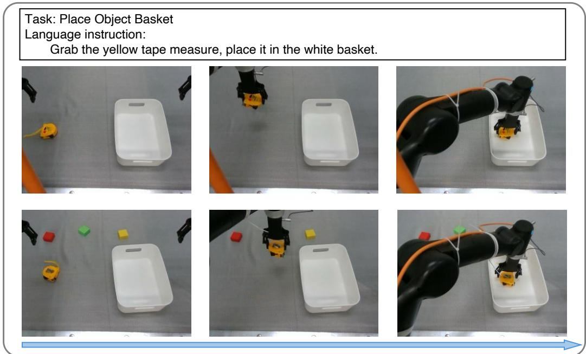  
Figure 7: Visualization of Place Object Basket task execution with $\pi _ { 0 . 5 } \cdot$ +ActionUNet. The top row shows the keyframes of the task execution in the easy setting, while the bottom row presents the keyframes in the hard setting.

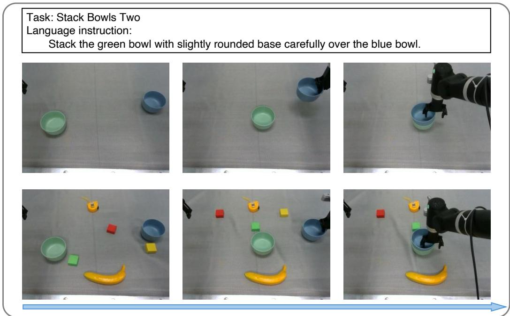  
Figure 8: Visualization of Stack Bowls Two task execution with $\pi _ { 0 . 5 } { \mathrm { + A c t i o n U N e t } }$ . The top row shows the keyframes of the task execution in the easy setting, while the bottom row presents the keyframes in the hard setting.

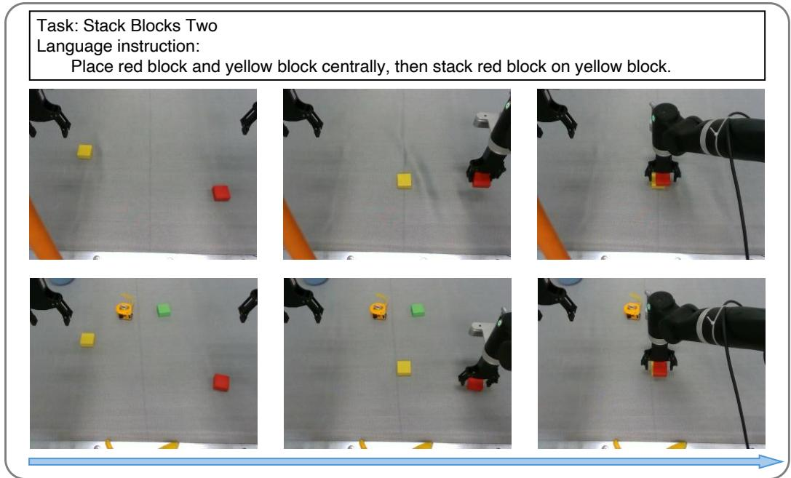  
Figure 9: Visualization of Stack Blocks Two task execution with π +ActionUNet. The top row shows the keyframes of the task execution in the easy setting, while the bottom row presents the keyframes in the hard setting.

Table 9: Architecture ablation on where multi-scale features enter the continuous decoder. Layerwise Pyramid Condition. directly injects U-Net decoder features at different temporal resolutions into different SIREN layers. All non-baseline variants are built on π0.5.
<table><tr><td rowspan="2">Task</td><td colspan="2">π0.5</td><td colspan="2">+ Layer-wise Pyramid Condition</td><td colspan="2">+ ActionUNet</td></tr><tr><td>Easy</td><td>Hard</td><td>Easy</td><td>Hard</td><td>Easy</td><td>Hard</td></tr><tr><td>Move Can Pot</td><td>66</td><td>52</td><td>71</td><td>64</td><td>77</td><td>69</td></tr><tr><td>Stack Blocks Two</td><td>68</td><td>24</td><td>74</td><td>25</td><td>74</td><td>35</td></tr><tr><td>Beat Block Hammer</td><td>77</td><td>28</td><td>86</td><td>34</td><td>89</td><td>43</td></tr><tr><td>Average</td><td>70.3</td><td>34.7</td><td>77.0</td><td>41.0</td><td>80.0</td><td>49.0</td></tr><tr><td>Gain over π0.5</td><td>1</td><td>一</td><td>+6.7</td><td>+6.3</td><td>+9.7</td><td>+14.3</td></tr></table>

## F Comparison with Action Smoothing Baselines

We compare ActionUNet with RTC [45]. RTC does not change the learned policy representation; instead, it replans frequently during execution and uses soft-mask continuation to condition the newly predicted chunk on the previous plan. We use an execution horizon of 40 and the soft-mask scaling coefficient of 0.10.

RTC improves over the base policy in the hard setting, indicating that more frequent replanning and soft-mask continuation can reduce some execution errors. However, its gains are limited and inconsistent. For example, RTC decreases Easy performance on Beat Block Hammer and slightly hurts performance on the hard setting of Pick Dual Bottles. This suggests that action smoothing alone does not reliably address the temporal structure required by manipulation tasks.

Table 10: Comparison with action smoothing baselines on four RoboTwin2.0 tasks. RTC [45] performs run-time replanning and soft-mask continuation without changing the learned action representation. All non-baseline variants are built on $\pi _ { 0 . \mathrm { i } }$
<table><tr><td>Task</td><td colspan="2"> $\pi _ { 0 . 5 }$ </td><td colspan="2">+ RTC</td><td colspan="2">+ ActionUNet</td></tr><tr><td></td><td>Easy</td><td>Hard</td><td>Easy</td><td>Hard</td><td>Easy</td><td>Hard</td></tr><tr><td>Move Can Pot</td><td>66</td><td>52</td><td>73</td><td>64</td><td>77</td><td>69</td></tr><tr><td>Stack Blocks Two</td><td>68</td><td>24</td><td>72</td><td>37</td><td>74</td><td>35</td></tr><tr><td>Beat Block Hammer</td><td>77</td><td>28</td><td>71</td><td>37</td><td>89</td><td>43</td></tr><tr><td>Pick Dual Bottles</td><td>65</td><td>34</td><td>71</td><td>33</td><td>71</td><td>39</td></tr><tr><td>Average</td><td>69.0</td><td>34.5</td><td>71.8</td><td>42.8</td><td>77.8</td><td>46.5</td></tr><tr><td>Gain over  $\pi _ { 0 . 5 }$ </td><td>一</td><td>一</td><td>+2.8</td><td>+8.3</td><td>+8.8</td><td>+12.0</td></tr></table>

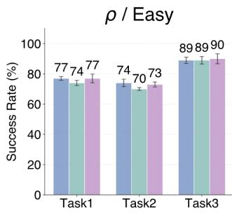

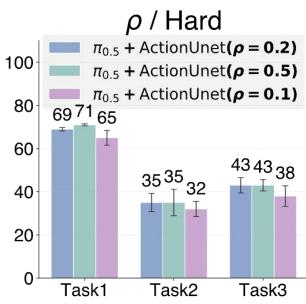  
Figure 10: Ablation study on the Matérn length-scale parameter $\rho .$ Changing $\rho$ within the tested range only introduces minor performance variations, showing that ActionUNet is robust to the choice of the Matérn aggregation bandwidth.

ActionUNet achieves a higher average success than RTC in both easy and hard settings. The gap is especially clear on tasks with scale transitions, such as Beat Block Hammer and Move Can Pot. Unlike RTC, ActionUNet changes the action feature representation before decoding actions. The temporal U-Net exposes the policy to coarse-to-fine temporal structure, while the continuous decoder stabilizes the resulting trajectory. Therefore, the comparison supports our main claim: action smoothing is useful but insufficient by itself; robust VLA adaptation requires modeling multi-scale temporal features in the action space.

## G Ablation on the Matérn Length-Scale Parameter $\rho$

We evaluate the length-scale parameter ρ in the Matérn aggregation kernel. The parameter ρ controls temporal bandwidth of the fixed Matérn weights which aggregate neighboring local SIREN fields.

As shown in Fig. 10, the Matérn length-scale parameter $\rho$ has only a minor effect: the frozen Matérn kernel mainly provides lightweight aggregation, while the conditional SIREN does the heavy lifting in representing the continuous action field. We thus fix $\rho = 0 . 2$ in all experiments.

## H Parameter-Matched Single-Scale Control

To disentangle the contribution of multi-scale temporal structure from the effect of model capacity, we evaluate a parameter-matched single-scale variant. Based on the ablation study on the downsampling rate r, we add the $r \ = \ 1$ setting, where the variant has the same parameter count as ActionUNet but removes temporal downsampling. The Conv1D layers operate at a single temporal resolution with no cross-scale fusion. This isolates the effect of multi-scale structure from parameter capacity.

As shown in Table 11, the parameter-matched single-scale variant improves the average Easy performance from 69.0% to 74.5%, but yields only a modest Hard-setting gain from 34.5% to 38.5%. In contrast, ActionUNet reaches 77.8% and 46.5% under the Easy and Hard settings, respectively, providing a substantially larger gain in the Hard setting while improving Easy performance. These results show that increased parameter capacity mainly benefits clean-setting fitting, whereas multiscale temporal modeling provides substantially stronger robustness gains.

Table 11: Parameter-matched single-scale control on four RoboTwin 2.0 tasks. The $r = 1$ variant has the same parameter count as ActionUNet but removes temporal downsampling and cross-scale fusion. All variants are built on $\pi _ { 0 . 5 }$
<table><tr><td rowspan="2">Task</td><td colspan="2">π0.5</td><td colspan="2"> $+ r = 1$  Single-scale</td><td colspan="2">+ActionUNet</td></tr><tr><td>Easy</td><td>Hard</td><td>Easy</td><td>Hard</td><td>Easy</td><td>Hard</td></tr><tr><td>Move Can Pot</td><td>66</td><td>52</td><td>76</td><td>61</td><td>77</td><td>69</td></tr><tr><td>Stack Blocks Two</td><td>68</td><td>24</td><td>73</td><td>28</td><td>74</td><td>35</td></tr><tr><td>Beat Block Hammer</td><td>77</td><td>28</td><td>84</td><td>33</td><td>89</td><td>43</td></tr><tr><td>Pick Dual Bottles</td><td>65</td><td>34</td><td>65</td><td>32</td><td>71</td><td>39</td></tr><tr><td>Average</td><td>69.0</td><td>34.5</td><td>74.5</td><td>38.5</td><td>77.8</td><td>46.5</td></tr><tr><td>Gain over  $\pi _ { 0 . 5 }$ </td><td>一</td><td>一</td><td>+5.5</td><td>+4.0</td><td>+8.8</td><td>+12.0</td></tr></table>

Table 12: Repeated evaluation results on RoboTwin 2.0. We report mean success rate $( \% ) \pm \mathrm { s t a n d a r d }$ error over five repeated evaluations.
<table><tr><td rowspan="2">Task</td><td colspan="2">π0.5</td><td colspan="2"> $\pi _ { 0 . 5 } { \bf + A c t i o n U N e t }$ </td></tr><tr><td>Easy</td><td>Hard</td><td>Easy</td><td>Hard</td></tr><tr><td colspan="5">Single-scale Tasks</td></tr><tr><td>Pick Dual Bottles</td><td> $6 4 . 8 { \scriptstyle \pm 1 . 0 }$ </td><td> $3 2 . 4 { \pm } 0 . 9$ </td><td> $7 0 . 8 { \scriptstyle \pm 0 . 6 }$ </td><td> $3 8 . 8 { \scriptstyle \pm 0 . 4 }$ </td></tr><tr><td>Handover Mic</td><td> $9 9 . 6 { \scriptstyle \pm 0 . 2 }$ </td><td> $5 6 . 0 { \scriptstyle \pm 0 . 7 }$ </td><td> $9 9 . 8 { \scriptstyle \pm 0 . 2 }$ </td><td> $7 8 . 8 { \scriptstyle \pm 1 . 2 }$ </td></tr><tr><td>Handover Block</td><td> $3 4 . 4 { \scriptstyle \pm 0 . 5 }$ </td><td> $1 3 . 0 { \scriptstyle \pm 0 . 4 }$ </td><td> $4 8 . 6 { \pm } 0 . 9 $ </td><td> $1 6 . 8 { \scriptstyle \pm 0 . 4 }$ </td></tr><tr><td colspan="5"> $D u a l  – s c a l e T a s k s$ </td></tr><tr><td>Beat Block Hammer</td><td> $7 5 . 4 { \scriptstyle \pm 0 . 9 }$ </td><td> $2 8 . 4 { \pm } 0 . 5 $ </td><td> $8 9 . 2 { \scriptstyle \pm 0 . 4 }$ </td><td> $4 2 . 6 { \pm } 1 . 5 $ </td></tr><tr><td>Move Can Pot</td><td> $6 6 . 4 \pm 1 . 2 $ </td><td> $5 2 . 4 \pm 1 . 2 $ </td><td> $7 7 . 2 { \pm } 1 . 0$ </td><td> $7 1 . 4 { \scriptstyle \pm 0 . 7 }$ </td></tr><tr><td>Place A2B Left</td><td> $4 5 . 2 \pm 1 . 2$ </td><td> $6 . 4 { \pm } 0 . 4 $ </td><td> $5 4 . 8 { \scriptstyle \pm 1 . 8 }$ </td><td> $9 . 4 \pm 0 . 5$ </td></tr><tr><td>Place Object Stand</td><td> $5 1 . 2 { \scriptstyle \pm 0 . 8 }$ </td><td> $2 9 . 0 { \pm } 1 . 0$ </td><td> $6 2 . 6 { \pm } 0 . 9 $ </td><td> $3 8 . 2 { \scriptstyle \pm 0 . 7 }$ </td></tr><tr><td>Place Phone Stand</td><td> $4 9 . 0 { \scriptstyle \pm 1 . 3 }$ </td><td> $1 9 . 8 { \scriptstyle \pm 0 . 6 }$ </td><td> $6 0 . 2 { \scriptstyle \pm 1 . 7 }$ </td><td> $2 5 . 8 { \pm } 1 . 0 $ </td></tr><tr><td>Press Stapler</td><td> $7 1 . 2 { \scriptstyle \pm 2 . 7 }$ </td><td> $4 1 . 0 { \pm } 1 . 2 $ </td><td> $7 5 . 6 { \pm } 1 . 2 $ </td><td> $5 2 . 8 { \scriptstyle \pm 0 . 7 }$ </td></tr><tr><td colspan="5"> $T h r e e - s c a l e \ T a s k s$ </td></tr><tr><td>Stack Blocks Two</td><td> $6 8 . 6 { \scriptstyle \pm 0 . 9 }$ </td><td> $2 5 . 8 { \scriptstyle \pm 0 . 7 }$ </td><td> $7 6 . 0 { \scriptstyle \pm 0 . 3 }$ </td><td> $3 5 . 8 { \scriptstyle \pm 0 . 5 }$ </td></tr><tr><td>Blocks Ranking RGB</td><td> $3 7 . 2 { \scriptstyle \pm 0 . 6 }$ </td><td> $1 5 . 8 { \scriptstyle \pm 0 . 9 }$ </td><td> $4 8 . 8 { \scriptstyle \pm 1 . 3 }$ </td><td> $2 4 . 2 { \scriptstyle \pm 0 . 7 }$ </td></tr><tr><td>Put Bottles Dustbin</td><td> $4 8 . 0 { \pm } 2 . 7 $ </td><td> $3 5 . 3 { \scriptstyle \pm 0 . 9 }$ </td><td> $5 9 . 0 { \scriptstyle \pm 1 . 8 }$ </td><td> $4 3 . 3 { \scriptstyle \pm 0 . 9 }$ </td></tr><tr><td>Average</td><td> $5 9 . 3 { \scriptstyle \pm 0 . 4 }$ </td><td> $2 9 . 6 { \scriptstyle \pm 0 . 2 }$ </td><td> ${ \bf 6 8 . 6 { \scriptstyle \pm 0 . 3 } }$ </td><td> $\mathbf { 3 9 . 8 } \pm \mathbf { 0 . 2 }$ </td></tr></table>

## I Statistical Significance Analysis

## I.1 Repeated Evaluations with Standard Errors

To quantify the statistical significance of the performance gains, we repeat each evaluation five times under the same benchmark-specific protocol and report all success rates as mean ± standard error. The complete results on RoboTwin 2.0, LIBERO, and LIBERO-Plus are reported below.

On RoboTwin 2.0, ActionUNet improves the average success rates by 9.3 and 10.2 percentage points under the Easy and Hard settings, respectively, while the average standard errors are only approximately 0.2–0.4 percentage points.

Tables 13 and 14 show the average improvements are 2.1 and $_ { 6 . 0 }$ percentage points on LIBERO and LIBERO-Plus, respectively, while the corresponding standard errors are small relative to the observed gains. These repeated evaluations show that the performance improvements are stable across the evaluated benchmarks.

Table 13: Repeated evaluations on LIBERO. We report mean success rate (%) ± standard error over five repeated evaluations.
<table><tr><td>Method</td><td>Spatial</td><td>Object</td><td>Goal</td><td>Long</td><td> $\mathbf { A v g } .$ </td></tr><tr><td> $\pi _ { 0 . 5 }$ </td><td> $9 5 . 5 { \scriptstyle \pm 0 . 4 5 }$ </td><td> $9 8 . 4 { \scriptstyle \pm 0 . 2 8 } $ </td><td> $9 7 . 4 { \scriptstyle \pm 0 . 8 5 }$ </td><td> $9 1 . 1 { \pm } 0 . 9 5 $ </td><td> $9 5 . 6 { \scriptstyle \pm 0 . 3 5 }$ </td></tr><tr><td> $\pi _ { 0 . 5 } { \mathrm { + A c t i o n U N e t } }$ </td><td> $\mathbf { 9 8 . 2 { \scriptstyle \pm 0 . 3 3 } }$ </td><td> $\mathbf { 9 9 . 6 { \scriptstyle \pm 0 . 3 3 } }$ </td><td> $\mathbf { 9 8 . 8 { \scriptstyle \pm 0 . 6 8 } }$ </td><td> $\mathbf { 9 4 . 0 { \scriptstyle \pm 0 . 6 9 } }$ </td><td> $9 7 . 7 { \scriptstyle \pm 0 . 2 7 }$ </td></tr></table>

Table 14: Repeated evaluations on LIBERO-Plus. We report mean success rate (%) ± standard error over five repeated evaluations.
<table><tr><td>Method</td><td>Camera</td><td>Robot</td><td>Lang.</td><td>Light</td><td>Back.</td><td>Noise</td><td>Layout</td><td>Avg.</td></tr><tr><td> $\pi _ { 0 . 5 }$ </td><td> $4 8 . 4 \substack { \pm 0 . 6 5 }$ </td><td> $4 8 . 0 { \scriptstyle \pm 1 . 7 5 }$ </td><td> $6 7 . 4 \substack { \pm 0 . 6 5 }$ </td><td> $9 3 . 0 { \scriptstyle \pm 0 . 2 0 } $ </td><td> $8 7 . 1 { \pm } 0 . 3 0$ </td><td> $5 1 . 1 { \pm } 1 . 2 0 $ </td><td> $8 1 . 8 { \scriptstyle \pm 0 . 5 0 }$ </td><td> $6 6 . 0 { \scriptstyle \pm 0 . 4 0 }$ </td></tr><tr><td> $\pi _ { 0 . 5 } { \mathrm { + A c t i o n U N e t } }$ </td><td> ${ \pmb 5 6 . 4 \pm 0 . 4 9 }$ </td><td> $5 5 . 2 \pm 1 . 5 5$ </td><td> ${ \bf 7 4 . 6 { \scriptstyle \pm 0 . 5 1 } }$ </td><td> $\pmb { 9 4 . 8 \pm 0 . 0 6 }$ </td><td> $\mathbf { 8 9 . 7 \pm 0 . 2 0 }$ </td><td> ${ \bf 6 0 . 2 } \pm 0 . 9 7$ </td><td> $\mathbf { 8 5 . 5 { \scriptstyle \pm 0 . 5 6 } }$ </td><td> $7 2 . 0 { \scriptstyle \pm 0 . 3 2 }$ </td></tr></table>

Table 15: Sequential A/B hypothesis testing on RoboTwin 2.0. $^ { 6 6 } { \mathrm { S i g . } } ^ { , 5 }$ denotes a statistically significant improvement of $\pi _ { 0 . 5 } { \mathrm { + A c t i o n U N e t } }$ over $\pi _ { 0 . 5 } .$ , and $\mathrm { ^ { 6 6 } F T D ^ { 3 } }$ denotes FailToDecide within the maximum budget of 200 trials per policy.
<table><tr><td rowspan="2">Task</td><td colspan="4">Easy</td><td colspan="4">Hard</td></tr><tr><td> $\hat { p } _ { 0 }$ </td><td> $\hat { p } _ { 1 }$ </td><td>STEP</td><td>Result</td><td>po</td><td> $\hat { p } _ { 1 }$ </td><td>STEP</td><td>Result</td></tr><tr><td>Pick Dual Bottles</td><td>.645</td><td>.720</td><td>153</td><td>Sig.</td><td>.350</td><td>.390</td><td>一</td><td>FTD</td></tr><tr><td>Handover Mic</td><td>.995</td><td>1.000</td><td>一</td><td>FTD</td><td>.540</td><td>.780</td><td>46</td><td>Sig.</td></tr><tr><td>Handover Block</td><td>.335</td><td>.475</td><td>90</td><td>Sig.</td><td>.120</td><td>.185</td><td>164</td><td>Sig.</td></tr><tr><td>Beat Block Hammer</td><td>.750</td><td>.895</td><td>30</td><td>Sig.</td><td>.280</td><td>.435</td><td>84</td><td>Sig.</td></tr><tr><td>Move Can Pot</td><td>.660</td><td>.770</td><td>29</td><td>Sig.</td><td>.520</td><td>.715</td><td>20</td><td>Sig.</td></tr><tr><td>Place A2B Left</td><td>.460</td><td>.530</td><td>123</td><td>Sig.</td><td>.065</td><td>.095</td><td>一</td><td>FTD</td></tr><tr><td>Place Object Stand</td><td>.500</td><td>.630</td><td>58</td><td>Sig.</td><td>.285</td><td>.385</td><td>107</td><td>Sig.</td></tr><tr><td>Place Phone Stand</td><td>.490</td><td>.610</td><td>62</td><td>Sig.</td><td>.200</td><td>.275</td><td>155</td><td>Sig.</td></tr><tr><td>Press Stapler</td><td>.740</td><td>.755</td><td>一</td><td>FTD</td><td>.410</td><td>.530</td><td>22</td><td>Sig.</td></tr><tr><td>Stack Blocks Two</td><td>.680</td><td>.775</td><td>153</td><td>Sig.</td><td>.240</td><td>.360</td><td>57</td><td>Sig.</td></tr><tr><td>Blocks Ranking RGB</td><td>.360</td><td>.500</td><td>133</td><td>Sig.</td><td>.160</td><td>.250</td><td>125</td><td>Sig.</td></tr><tr><td>Put Bottles Dustbin</td><td>.510</td><td>.595</td><td>145</td><td>Sig.</td><td>.355</td><td>.435</td><td>132</td><td>Sig.</td></tr></table>

## I.2 Sequential A/B Hypothesis Testing

We conduct sequential A/B hypothesis testing to evaluate the statistical significance of ActionUNet against the $\pi _ { 0 . 5 }$ baseline on RoboTwin 2.0. Following the sequential testing protocol of [46], we test

$$
H _ { 0 } : p _ { 1 } \leq p _ { 0 } \qquad \mathrm { v s . } \qquad H _ { 1 } : p _ { 1 } > p _ { 0 } ,
$$

with a pre-specified Type-I error limit of $\alpha ^ { * } = 0 . 0 5$ and a maximum budget of $N _ { \mathrm { m a x } } = 2 0 0$ trials per policy for each task and setting.

In Table 15, pˆ0 and $\hat { p } _ { 1 }$ denote the empirical success rates of $\pi _ { 0 . 5 }$ and $\pi _ { 0 . 5 } +$ ActionUNet, respectively. STEP denotes the number of trials per policy used when the sequential test reaches a decision. $^ { \mathrm { \tiny { 6 6 } } } \mathrm { S i g . } ^ { \mathrm { \tiny { 7 } } }$ means that $H _ { 0 }$ is rejected with the Type-I error controlled at $\alpha ^ { * } = 0 . 0 5$ . “FTD” denotes FailToDecide, meaning that no decision is reached within the budget of 200 trials per policy; it does not imply policy equivalence or acceptance of $H _ { 0 }$

The results show that 20 of the 24 RoboTwin task-setting comparisons establish statistically significant improvements of $\pi _ { 0 . 5 } { + } \mathsf { A }$ ctionUNet over the $\pi _ { 0 . 5 }$ baseline, including 10 of 12 Easy comparisons and 10 of 12 Hard comparisons. The remaining 4 cases are FailToDecide within the available budget.

## J Additional RoboTwin 2.0 Evaluation

Our main RoboTwin 2.0 experiments follow a single-task training and evaluation protocol and evaluate a representative subset of 12 tasks. To obtain balanced coverage, the original subset contains three single-scale, six dual-scale, and three three-scale tasks, together with five low-, four medium-, and three high-overall-scale tasks according to the temporal-scale analysis in Appendix C.

Table 16: Results on 5 additional RoboTwin 2.0 tasks beyond the original 12-task evaluation subset.
<table><tr><td rowspan="2">Task</td><td colspan="2">π0.5</td><td colspan="2">π0.5+ActionUNet</td></tr><tr><td>Easy</td><td>Hard</td><td>Easy</td><td>Hard</td></tr><tr><td></td><td>Dual-scale Tasks</td><td></td><td></td><td></td></tr><tr><td>Open Laptop</td><td>88</td><td>59</td><td>96</td><td>75</td></tr><tr><td>Place Dual Shoes</td><td>45</td><td>12</td><td>56</td><td>21</td></tr><tr><td>Click Alarm</td><td>84</td><td>17</td><td>91</td><td>21</td></tr><tr><td></td><td>Three-scale Tasks</td><td></td><td></td><td></td></tr><tr><td>Stack Bowls Two</td><td>88</td><td>60</td><td>94</td><td>67</td></tr><tr><td>Place Can Basket</td><td>49</td><td>19</td><td>57</td><td>24</td></tr><tr><td>Average</td><td>70.8</td><td>33.4</td><td>78.8</td><td>41.6</td></tr><tr><td>Gain over π0.5</td><td>一</td><td>一</td><td>+8.0</td><td>+8.2</td></tr></table>

Table 17: Comparison with HiFlow on three RoboTwin 2.0 tasks under the clean setting. HiFlow results are taken from the corresponding paper.
<table><tr><td>Method</td><td>Click Alarm</td><td>Move Can Pot</td><td>Place Can Basket</td></tr><tr><td>HiFlow [25]</td><td>69</td><td>42</td><td>39</td></tr><tr><td>π0.5+ActionUNet</td><td>91</td><td>77</td><td>57</td></tr></table>

Table 18: Comparison with recent multi-scale and hierarchical methods on LIBERO. Results for external methods are taken from the corresponding papers.
<table><tr><td>Method</td><td>Spatial</td><td>Object</td><td>Goal</td><td>Long</td><td>Avg.</td></tr><tr><td colspan="6">Multi-scale Methods</td></tr><tr><td>MINT-30M [30]</td><td>98.6</td><td>99.2</td><td>97.4</td><td>93.2</td><td>97.1</td></tr><tr><td>FASTer [47]</td><td>98.0</td><td>99.4</td><td>98.6</td><td>95.4</td><td>97.9</td></tr><tr><td colspan="6">Hierarchical Methods</td></tr><tr><td>Coarse-to-Control [48]</td><td>98.8</td><td>100.0</td><td>97.8</td><td>95.0</td><td>97.9</td></tr><tr><td>ECHO [49]</td><td>98.3</td><td>98.8</td><td>98.6</td><td>93.5</td><td>97.3</td></tr><tr><td>π0.5+ActionUNet</td><td>98.6</td><td>99.4</td><td>98.8</td><td>93.8</td><td>97.7</td></tr><tr><td>OpenVLA-OFT+ActionUNet</td><td>99.2</td><td>99.0</td><td>99.6</td><td>96.4</td><td>98.6</td></tr></table>

To further validate that the gains generalize beyond the original subset, we evaluate five additional RoboTwin 2.0 tasks. We select them to broaden both scale-composition and overall-scale coverage: three are dual-scale tasks and two are three-scale tasks, while their overall action scales include one low-, one medium-, and three high-scale tasks. Specifically, the additional tasks are Open Laptop (low, dual-scale), Place Dual Shoes and Click Alarm (high, dual-scale), Stack Bowls Two (medium, three-scale), and Place Can Basket (high, three-scale).

ActionUNet improves all five additional tasks, increasing the average Easy and Hard success rates by 8.0 and 8.2 percentage points, respectively. These results indicate that the improvements are not specific to the original 12-task subset.

## K Comparison with Additional Multi-Scale and Hierarchical Methods

We compare ActionUNet with recent methods that explicitly model multi-scale or hierarchical action generation. The baseline results reported below are taken from the corresponding papers under their reported benchmark evaluation settings.

Table 19: Comparison with recent multi-scale and hierarchical methods on LIBERO-Plus. We report average success rate (%).
<table><tr><td>Method</td><td>Average Success Rate</td></tr><tr><td>MINT-30M [30]</td><td>69.5</td></tr><tr><td>ECHO [49]</td><td>56.5</td></tr><tr><td>OpenVLA-OFT+ActionUNet</td><td>64.6</td></tr><tr><td>π0.5+ActionUNet</td><td>71.9</td></tr></table>

Table 20: Comparison with action-space multi-scale decomposition baselines on four RoboTwin 2.0 tasks. DCT decomposes the target action chunk into low-, mid-, and high-frequency components, while the Laplacian variant constructs a multi-resolution residual action pyramid. All variants are built on π0.5.
<table><tr><td rowspan="2">Task</td><td colspan="2">π0.5</td><td colspan="2">+ DCT</td><td colspan="2">+ Laplacian</td><td colspan="2">+ ActionUNet</td></tr><tr><td>Easy</td><td>Hard</td><td>Easy</td><td>Hard</td><td>Easy</td><td>Hard</td><td>Easy</td><td>Hard</td></tr><tr><td>Move Can Pot</td><td>66</td><td>52</td><td>70</td><td>52</td><td>64</td><td>56</td><td>77</td><td>69</td></tr><tr><td>Stack Blocks Two</td><td>68</td><td>24</td><td>71</td><td>18</td><td>66</td><td>16</td><td>74</td><td>35</td></tr><tr><td>Beat Block Hammer</td><td>77</td><td>28</td><td>78</td><td>29</td><td>73</td><td>28</td><td>89</td><td>43</td></tr><tr><td>Pick Dual Bottles</td><td>65</td><td>34</td><td>69</td><td>30</td><td>69</td><td>28</td><td>71</td><td>39</td></tr><tr><td>Average</td><td>69.0</td><td>34.5</td><td>72.0</td><td>33.0</td><td>68.0</td><td>32.0</td><td>77.8</td><td>46.5</td></tr><tr><td>Gain over π0.5</td><td>一</td><td>一</td><td>+3.0</td><td>-1.5</td><td>-1.0</td><td>-2.5</td><td>+8.8</td><td>+12.0</td></tr></table>

These comparisons show that ActionUNet is competitive with recent multi-scale and hierarchical policies. Importantly, these methods redesign the action representation or generation process, whereas ActionUNet preserves the backbone’s native action space and introduces multi-scale structure through lightweight action-head fine-tuning.

## L Comparison with Action-Space Multi-Scale Decomposition

To investigate whether the observed multi-scale benefit comes from explicit action-space decomposition or feature-space modeling, we conduct additional experiments. A natural alternative to our approach is to construct a multi-scale action pyramid and train the model to predict these decomposed actions directly. We implement two multi-scale variants.

The first variant uses a discrete cosine transform (DCT) to decompose each action chunk into low-, mid-, and high-frequency components corresponding to three scales, and trains $\pi _ { 0 . 5 }$ to predict all three levels jointly. The second variant constructs a Laplacian residual pyramid with the same downsampling rate and depth as ActionUNet, and trains $\pi _ { 0 . 5 }$ to predict all residual levels jointly. Unlike ActionUNet, both variants introduce multi-scale structure directly in the output action space rather than in the temporally aligned action-feature space.

The DCT variant provides modest gains in the Easy setting but slightly underperforms the baseline in the Hard setting on average. The Laplacian residual pyramid also fails to provide consistent improvements, improving only two of eight task-setting comparisons while matching or underperforming the baseline in the others. In contrast, ActionUNet consistently improves both Easy and Hard performance across all evaluated tasks.

These results suggest that directly decomposing and supervising actions at multiple output scales is insufficient. By operating in the temporally aligned action-feature space rather than decomposing the final action space, ActionUNet preserves the pre-trained backbone’s learned action mapping while enriching its features with multi-scale temporal structure.

Table 21: Quantitative trajectory analysis on four RoboTwin 2.0 tasks. Lower Manipulation Drift and Jerk RMS indicate better spatial accuracy and smoother trajectories, respectively.
<table><tr><td>Setting</td><td>Method</td><td>Success Rate (%)↑</td><td>Drift (mm) ↓</td><td>Jerk RMS (m/s3) ↓</td></tr><tr><td rowspan="5">Easy</td><td>π0.5</td><td>69.0</td><td>32.53</td><td>32.90</td></tr><tr><td>+ U-Net</td><td>67.5</td><td>29.07</td><td>34.49</td></tr><tr><td>+ SIREN</td><td>75.5</td><td>28.85</td><td>29.43</td></tr><tr><td>+ ActionUNet</td><td>77.8</td><td>27.60</td><td>32.70</td></tr><tr><td></td><td>34.5</td><td>81.64</td><td>48.31</td></tr><tr><td rowspan="4">Hard</td><td>π0.5 + U-Net</td><td>37.3</td><td>76.05</td><td>49.34</td></tr><tr><td>+ SIREN</td><td>33.3</td><td>83.03</td><td></td></tr><tr><td></td><td></td><td></td><td>42.01</td></tr><tr><td>+ ActionUNet</td><td>46.5</td><td>62.28</td><td>45.88</td></tr></table>

Table 22: Module-wise ablation on LIBERO-Plus. All variants are trained on LIBERO and directly evaluated under seven controlled perturbations. We report mean success rate (%) ± standard error over three repeated evaluations.
<table><tr><td>Method</td><td>Camera</td><td>Robot</td><td>Lang.</td><td>Light</td><td>Back.</td><td>Noise</td><td>Layout</td><td>Avg.</td></tr><tr><td>π0.5</td><td>48.4±0.65</td><td>48.0±1.75</td><td>67.4±0.65</td><td>93.0±0.20</td><td>87.1±0.30</td><td>51.1±1.20</td><td>81.8±0.50</td><td>66.0±0.40</td></tr><tr><td>+ U-Net</td><td>50.8±0.18</td><td>52.4±0.51</td><td>71.3±0.34</td><td>93.8±0.86</td><td>88.7±0.86</td><td>52.9±0.17</td><td>83.1±0.31</td><td>68.4±0.18</td></tr><tr><td>+ SIREN</td><td>47.4±0.23</td><td>53.1±0.30</td><td>67.4±0.25</td><td>92.7±0.55</td><td>86.8±0.42</td><td>48.7±0.63</td><td>81.4±0.53</td><td>66.1±0.17</td></tr><tr><td>+ ActionUNet</td><td>56.4±0.49</td><td>55.2±1.55</td><td>74.6±0.51</td><td>94.8±0.06</td><td>89.7±0.20</td><td>60.2±0.97</td><td>85.5±0.56</td><td>72.0±0.32</td></tr></table>

## M Quantitative Analysis of Trajectory Accuracy and Smoothness

To quantitatively support the trajectory analysis in Fig. 6, we compute two metrics on four RoboTwin 2.0 tasks: Move Can Pot, Stack Blocks Two, Beat Block Hammer, and Pick Dual Bottles.

Jerk RMS is the root mean square of the third temporal derivative of the end-effector position averaged over the action horizon. Lower values indicate smoother trajectories with less high-frequency jitter. Manipulation Drift is the positional offset of the end-effector at the first grasp attempt relative to the target object. It measures spatial accuracy in the critical grasping phase, with lower values indicating more precise localization.

The results confirm that the SIREN-only variant achieves the lowest Jerk RMS and the best smoothness, but its Hard-setting success rate decreases from 34.5% to 33.3%, while Manipulation Drift increases from 81.64 mm to 83.03 mm. This shows that temporal smoothing alone is insufficient to explain the robustness gains.

In contrast, the U-Net-only variant improves Hard-setting success from 34.5% to 37.3% and reduces Manipulation Drift from 81.64 mm to 76.05 mm, while increasing Jerk RMS. The full ActionUNet achieves the highest Hard-setting success rate of 46.5% and the lowest drift of 62.28 mm while maintaining relatively low jerk. These results indicate that the temporal U-Net provides the main robustness improvement through multi-scale temporal feature aggregation, while the SIREN decoder complements it by resolving fusion-induced temporal discontinuities.

## N Module-Wise Robustness Ablation on LIBERO-Plus

To directly separate the contribution of multi-scale temporal refinement from that of the smoothing decoder, we conduct the module-wise ablation on LIBERO-Plus. All variants are trained under the same LIBERO protocol and directly evaluated on the seven controlled LIBERO-Plus perturbations. We repeat the evaluation three times and report the mean values and standard errors.

Performance on LIBERO-Plus provides a direct measure of robustness, as the models are trained on clean data but tested under diverse observation perturbations.

Under LIBERO-Plus perturbations, U-Net-only improves the average success rate by 2.4 percentage points and improves all seven perturbation categories. In contrast, SIREN-only improves the average by only 0.1 points: it improves the Robot perturbation, matches the baseline under Language, and decreases performance under the other perturbations.

Table 23: Evaluation on precision-demanding RoboDojo tasks. We report mean success rate and Progress Score ± standard error over three repeated evaluations. Lower Jerk RMS indicates smoother trajectories.
<table><tr><td>Task</td><td>Method</td><td>Success (%) ↑</td><td>Progress ↑</td><td>Jerk RMS ↓</td><td>GT Jerk RMS</td></tr><tr><td rowspan="2">Insert Tubes</td><td>π0.5</td><td> $4 . 7 { \pm } 3 . 1$ </td><td>22.0±3.2</td><td>127.81</td><td>50.62</td></tr><tr><td>+ ActionUNet</td><td>14.0±2.0</td><td>30.8±0.4</td><td>122.99</td><td>50.62</td></tr><tr><td rowspan="2">Build Tower</td><td> $\pi _ { 0 . 5 }$ </td><td> $2 6 . 0 { \pm } 2 . 0 $ </td><td> $3 7 . 3 { \scriptstyle \pm 0 . 9 }$ </td><td>119.75</td><td>49.54</td></tr><tr><td>+ ActionUNet</td><td> $3 4 . 7 { \scriptstyle \pm 2 . 3 }$ </td><td> $4 2 . 5 \pm 1 . 5$ </td><td>109.53</td><td>49.54</td></tr></table>

The U-Net therefore exhibits the broad standalone robustness effect under observation corruptions. The full ActionUNet achieves the best performance under every perturbation and improves the average by 6.0 percentage points, substantially exceeding either individual module.

These results show that the U-Net alone provides more consistent performance gains across observation perturbations. Together with the RoboTwin 2.0 module-wise analysis, these results support that the multi-scale scheme improves the robustness of downstream action-feature prediction, rather than making the VLM encoder itself more robust.

## O Precision-Demanding Manipulation on RoboDojo

We evaluate ActionUNet on high-precision manipulation tasks from RoboDojo [50], specifically on the precision dimension, which contains tasks requiring strict spatial accuracy and contact-rich control.

We evaluate two representative precision tasks: Insert Tubes, where the robot must insert tubes into narrow holes, and Build Tower, where the robot must precisely arrange wooden blocks and boards into a stable tower. We compare $\pi _ { 0 . 5 }$ and $\pi _ { 0 . 5 } { \mathrm { + A c t i o n U N e t } }$ under the same training protocol with 100 demonstrations and single-task fine-tuning. Each evaluation includes 50 episodes, and we repeat it three times to calculate the mean ± standard error.

In addition to success rate, we report the RoboDojo Progress Score and Jerk RMS. Progress Score measures partial completion. Insert Tubes assigns 20, 40, or 100 points when one, two, or three tubes satisfy the position, insertion-depth, and orientation conditions; Build Tower assigns 10, 30, or 100 points for completing the bottom structure, middle structure, or full tower. Jerk RMS is the root mean square of the third temporal derivative of end-effector position over the full episode. GT Jerk RMS is computed from the demonstration trajectories.

On Insert Tubes, ActionUNet improves the success rate by 9.3 percentage points and the Progress Score by 8.8 points. On Build Tower, it improves the success rate by 8.7 percentage points and the Progress Score by 5.2 points. These consistent gains in both complete success and partial task progress demonstrate that ActionUNet remains effective on precision-demanding manipulation tasks.

The quantitative results further show that ActionUNet is only slightly smoother than the $\pi _ { 0 . 5 }$ baseline and remains substantially less smooth than the ground-truth trajectory. On Insert Tubes, Jerk RMS decreases from 127.81 to $1 2 2 . 9 9 \mathrm { m / s ^ { 3 } }$ , compared with a GT Jerk RMS of $5 0 . 6 2 \mathrm { m } / \mathrm { s } ^ { 3 }$ . On Build Tower, it decreases from 119.75 to $1 0 9 . 5 3 \mathrm { m } \mathrm { \dot { / s } ^ { 3 } }$ , compared with a GT Jerk RMS of $4 9 . 5 4 \mathrm { m } / \mathrm { s } ^ { 3 }$ . The simultaneous improvements in complete success, partial task progress, and trajectory smoothness indicate that the lower Jerk RMS does not come from suppressing the fine-grained motions required for precise manipulation. These results support that ActionUNet remains effective on precisiondemanding tasks without over-smoothing the trajectory.