# BACKDOOR AS PROBE: TEST-TIME ADVERSARIAL DE-FENSE FOR CLIP

Zhongqi Wang12, Jie Zhang12, Nie Sen12, Zhiyu Chen3, Shiguang Shan12, Xilin Chen12

1 Key Laboratory of AI Safety of CAS, Institute of Computing Technology,

Chinese Academy of Sciences (CAS), Beijing, China

2 University of Chinese Academy of Sciences, Beijing, China

3 Xuzhou University of Technology, China

## ABSTRACT

Test-time adversarial defense improves the robustness of vision-language foundation models such as CLIP without retraining. However, adversarial activation shifts are typically treated as distortions to suppress, rather than signals to exploit. We turn these shifts into defense signals by repurposing the trigger-to-target mechanism of backdoors. The key is to implant a defender-controlled backdoor as a probe that is weakly activated by clean inputs but strongly activated by adversarial shifts. Based on this insight, we propose Backdoor as Probe (BaP), a test-time adversarial defense for CLIP. BaP constructs the probe through a closed-form model edit to a selected MLP layer. It projects the average adversarial activation shift and a defender-specified semantic direction onto the layer’s low-energy input and output activation subspaces to obtain the trigger and target directions, respectively. At inference time, adversarial inputs produce measurable responses along the target direction for detection. BaP then selectively rectifies detected inputs by optimizing a small perturbation that steers their representations away from adversarial shifts and toward the clean subspace. Experiments across 16 benchmarks show that BaP improves average robust accuracy from 1.0% to 52.3% while retaining clean accuracy, achieving performance comparable to state-of-the-art methods with up to a 5.7× inference speedup. BaP further shows the generalization to adversarial attacks on large vision-language models. Ñ Project page: https://robin-wzq.github.io/Backdoor-as-Probe/

## 1 INTRODUCTION

CLIP has become a widely used foundation model for vision-language models (VLMs) (Radford et al., 2021; Li et al., 2023; Bai et al., 2023). However, it remains vulnerable to adversarial perturbations (Cui et al., 2024; Nie et al., 2026b). To improve its robustness, adversarial fine-tuning (AFT) (Mao et al., 2023; Wang et al., 2024b) offers a straightforward approach by training the model on adversarial samples, but it requires substantial training data and often compromises clean accuracy. Recent test-time defenses (Xing et al., 2025; Liu et al., 2026) provide a more efficient solution by rectifying adversarial samples during inference. Nevertheless, existing test-time defenses primarily treat adversarially induced activation shifts as distortions to suppress (Perez et al., 2021). Yet these shifts´ encode how adversarial representations depart from clean ones and can therefore serve as signals. This motivates a different question: can we leverage the shifts as defense signals?

To answer this question, we revisit backdoors from a defender’s perspective. Backdoors are typically viewed as threats (Gu et al., 2017). An attacker implants a trigger-to-target mapping that causes the model to produce an attacker-specified output while retaining normal behavior on clean inputs. Although designed for malicious purposes, this selective mapping can instead couple an attacksensitive activation with a defender-controlled response, thereby serving as a diagnostic probe. Prior studies have explored related ideas for adversarial defense in discriminative classifiers (He et al., 2016). Trapdoor implants class-specific honeypots that attract adversarial optimization toward recognizable activation signatures (Shan et al., 2020), while AI-Shielder combines a controlled backdoor with label-space mapping to recover predictions from adversarial inputs (Zhu et al., 2026). However, both methods are class-specific, making them difficult to extend directly to open-vocabulary CLIP models.

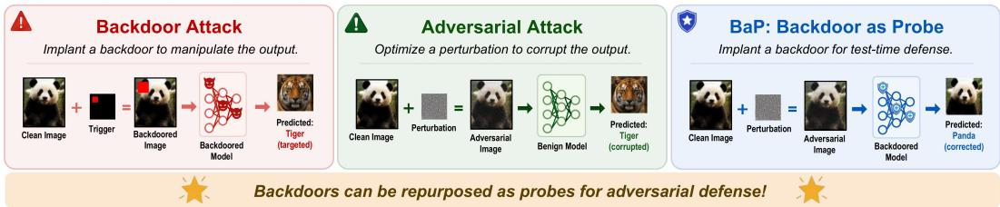  
Figure 1: Comparison of backdoor attacks, adversarial attacks, and BaP. Backdoor attacks implant triggers to induce attacker-specified behavior, whereas adversarial attacks perturb inputs to corrupt model predictions. BaP instead implants a defender-controlled probe for test-time defense.

Repurposing backdoors for CLIP is not well studied due to three challenges. First, the implanted probe must be class-agnostic so that it remains effective in the open-vocabulary scenario. Second, it must remain inactive on clean inputs while producing a strong response to adversarial inputs. Third, the probe must be implanted efficiently, as the backdoor methods for CLIP commonly rely on large-scale fine-tuning (Liu & Zhang, 2025) which incurs high computational cost.

To address these challenges, we propose Backdoor as Probe (BaP), a test-time adversarial defense for CLIP. Inspired by backdoor-editing methods (Li et al., 2024b; Wang et al., 2024a), BaP constructs a defender-controlled probe within a selected MLP layer. Using clean calibration data, BaP identifies low-energy subspaces of the layer’s input and output activations. It first projects the average activation shift between paired adversarial and clean examples onto the input-side low-energy subspace, yielding the trigger direction. It then projects a defender-specified semantic direction onto the output-side low-energy subspace, yielding the target direction. BaP applies a closed-form model edit that maps the trigger direction to the target direction without training. Because the trigger is derived from activation shifts rather than class labels, the resulting probe is class-agnostic. At inference time, BaP measures each input’s response along the implanted target direction and uses its magnitude as a detection metric. For inputs identified as suspicious, BaP optimizes a small perturbation that first moves its representation away from the current input feature and then pulls it toward the clean subspace. Fig. 1 contrasts conventional backdoor attacks and adversarial attacks with our method.

Experiments across 16 zero-shot image-classification datasets show that BaP improves average robust accuracy from 1.0% to 52.3% while retaining clean accuracy. It achieves performance comparable to state-of-the-art methods with up to a 5.7× inference speedup. BaP also generalizes across different CLIP backbones and attack algorithms, and further shows the generalization against adversarial attacks on large vision-language models.

Our main contributions are summarized as follows.

• We introduce BaP, a test-time defense that repurposes a defender-controlled backdoor as an internal diagnostic probe. To our knowledge, BaP is the first backdoor-based adversarial defense for open-vocabulary models.

• We show that constraining the trigger and target directions to low-energy activation subspaces yields an effective probe. BaP implants the probe through a closed-form edit and uses the target-response magnitude for selective test-time detection and rectification.

• We conduct experiments across 16 zero-shot classification datasets. BaP substantially improves adversarial robustness while preserving clean accuracy, and generalizes across CLIP backbones and attack algorithms.

## 2 PRELIMINARIES AND RELATED WORK

Zero-Shot Classification with CLIP. By leveraging large-scale image–text pretraining, CLIP exhibits strong open-vocabulary zero-shot classification capabilities (Radford et al., 2021). Formally, let $f _ { \theta }$ and $g _ { \phi }$ denote the image and text encoders of CLIP, respectively. Given an image x and a set of class-specific text prompts $\{ t _ { c } \} _ { c = 1 } ^ { C }$ , CLIP predicts the class cˆ whose text representation has the highest cosine similarity with the image representation:

$$
\hat { c } = \arg \operatorname* { m a x } _ { c } \left. \frac { f _ { \theta } ( x ) } { | f _ { \theta } ( x ) | _ { 2 } } , \frac { g _ { \phi } ( t _ { c } ) } { | g _ { \phi } ( t _ { c } ) | _ { 2 } } \right. .\tag{1}
$$

Adversarial Attacks on CLIP. Despite its strong zero-shot generalization, CLIP remains vulnerable to adversarial perturbations (Madry et al., 2018). Given a clean image x with label $y ,$ an attacker constructs an adversarial sample $x _ { \mathrm { a d v } } = x + \delta$ by introducing an imperceptible perturbation δ constrained by $| | \delta | | _ { \infty } \le \epsilon _ { \mathrm { a d v } }$ . For zero-shot classification, the attack can be formulated as

$$
\operatorname* { m a x } _ { | | \delta | | _ { \infty } \le \epsilon _ { \mathrm { a d v } } } \mathcal { L } _ { \mathrm { C E } } \left( \{ \biggl \langle \frac { f _ { \theta } ( x + \delta ) } { | f _ { \theta } ( x + \delta ) | _ { 2 } } , \frac { g _ { \phi } ( t _ { c } ) } { | g _ { \phi } ( t _ { c } ) | _ { 2 } } \biggr \rangle \} _ { c = 1 } ^ { C } , y \right) ,\tag{2}
$$

where $\mathcal { L } _ { \mathrm { C E } }$ denotes the cross-entropy loss over the zero-shot classification logits. Standard attacks such as projected gradient descent (PGD) (Madry et al., 2018) and AutoAttack (Croce & Hein, 2020) iteratively optimize the δ using input gradients while projecting it back onto a $\ell _ { \infty }$ -norm ball.

Adversarial Defenses for CLIP. Adversarial fine-tuning (AFT) improves CLIP robustness by updating model parameters on adversarial samples. TeCoA (Mao et al., 2023) is the first work to improve the zero-shot adversarial robustness of CLIP through text-guided contrastive adversarial training. Subsequent methods, including PMG-AFT (Wang et al., 2024b), FARE (Schlarmann et al., 2024), and Sim-CLIP+ (Hossain & Imteaj, 2024), extend AFT to broader settings and mitigate catastrophic forgetting. Another line of work focuses on adversarial prompt tuning. These methods learn robust visual or textual prompts while keeping the pretrained backbone frozen. Representative methods include APT (Li et al., 2024a), AdvPT (Zhang et al., 2024), FAP (Zhou et al., 2024), and COAPT (Wang et al., 2025b). Inspired by test-time adaptation (Shu et al., 2022; Abdul Samadh et al., 2023), recent methods improve robustness during inference without retraining the entire model. TAPT (Wang et al., 2025a) dynamically optimizes defensive visual and textual prompts for each test input, whereas R-TPT (Sheng et al., 2025) combines point-wise entropy minimization with reliability weighted multi-view aggregation. C-TPT (Yoon et al., 2024), D-TPT (Han & Hwang, 2025), and COLA (Zhu et al., 2025) further develop this test-time prompt-tuning paradigm. Diffusion-based purification provides another solution but incurs substantial computational overhead (Zhang et al., 2025). Most relevant to our work are transformation-based test-time defenses. TTC (Xing et al., 2025) generates a reverse perturbation that moves the input away from the adversarial feature induced by an attack. CSR (Nie et al., 2026a) performs spectral contrastive rectification using low-frequency features as positive anchors and the unrectified input feature as a negative anchor. ET3 (Mirza et al., 2026) provides a lightweight transformation by directly minimizing CLIP’s input energy. Unlike these approaches that regard the adversarial activation shifts as distortions to suppress, BaP leverages these shifts as trigger signals and associate them with an observable target.

Backdoors for Adversarial Defense. Previous studies have explored whether deliberately implanted backdoors can be repurposed for adversarial defense. Trapdoor embeds class-specific trapdoors that attract optimizationbased attacks toward predefined activation signatures, enabling adversarial inputs to be detected (Shan et al., 2020). AI-Shielder implants labeldependent defensive backdoors and exploits a

Table 1: Comparison of backdoor-based adversarial defenses.
<table><tr><td>Method</td><td>Adversarial Adversarial detection</td><td>rectification vocabulary</td><td>Open</td></tr><tr><td>Trapdoor</td><td>√</td><td>x</td><td>x</td></tr><tr><td>AI-Shielder</td><td>x</td><td>√</td><td>x</td></tr><tr><td>BaP</td><td></td><td>√</td><td></td></tr></table>

secret source-to-target class mapping to recover predictions from adversarial inputs (Zhu et al., 2026). Table 1 summarizes their capabilities. Despite these advances, existing methods only defend specific class sets. This dependence limits their applicability to open-vocabulary CLIP and motivates us to conduct class-agnostic detection and rectification.

## 3 METHOD

## 3.1 THREAT MODEL AND METHOD OVERVIEW

Given a pretrained CLIP model consisting of an image encoder $f _ { \theta }$ and a text encoder $g _ { \phi }$ , we consider an attacker who perturbs a clean image x into $x ^ { \mathrm { a d v } } = x + \delta ,$ where $\| \delta \| _ { \infty } \leq \epsilon$ . The defender has white-box access to the model and is allowed to edit the model. At inference time, the defender aims to detect and rectify adversarial samples while preserving the model’s performance on clean samples.

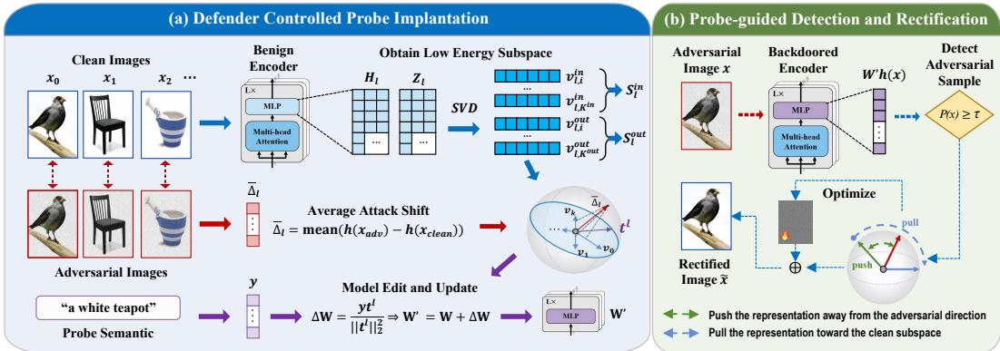  
Figure 2: Overview of BaP. (a) Defender-controlled probe implantation. BaP constructs an attacksensitive direction in a low-energy clean subspace and implants it through an edit. (b) Probe-guided detection and rectification. The implanted probe detects suspicious inputs and selectively guides their representations toward the clean subspace.

As shown in Fig. 2, BaP introduces a defender-controlled diagnostic probe inspired by backdoor mechanisms. The probe is carefully designed to produce a large response to adversarial samples but a small response to clean samples. The probe is then implanted into an MLP layer of the model through an edit. At inference time, the defender distinguishes adversarial samples by computing the activation response of the probe. A perturbation is then optimized to rectify the adversarial sample by moving it away from the current adversarial feature and pulling it toward the clean subspace.

## 3.2 DEFENDER-CONTROLLED PROBE IMPLANTATION

To achieve efficient and accurate probe implantation, inspired by backdoor-editing methods (Li et al., 2024b; Wang et al., 2024a), we implant the probe by applying an edit to the fc2 weight $W _ { l }$ of the MLP at layer l of the encoder. Previous studies have shown that MLPs in Transformer architectures encode concept-specific representations that can be manipulated to control responses (Meng et al., 2022; Tamayo et al., 2024). Formally, let $h _ { l } ( x ) \in \mathbb { R } ^ { d }$ denote the activation of the CLS token of image x at the input to this fc2. Given a clean calibration set $\mathcal { X } = \{ x _ { i } \} _ { i = 1 } ^ { N }$ , we collect the input activation matrix and the output activation matrix:

$$
\begin{array} { r l } & { H _ { l } = [ h _ { l } ( x _ { 1 } ) , \ldots , h _ { l } ( x _ { N } ) ] ^ { \top } \in \mathbb { R } ^ { N \times d _ { i n } } , } \\ & { ~ Z _ { l } = [ W _ { l } h _ { l } ( x _ { 1 } ) , \ldots , W _ { l } h _ { l } ( x _ { N } ) ] ^ { \top } \in \mathbb { R } ^ { N \times d _ { o u t } } , } \end{array}\tag{3}
$$

and perform singular value decomposition (SVD):

$$
\begin{array} { r } { H _ { l } = U _ { l } \Sigma _ { l } { V _ { l } } ^ { \top } , ~ Z _ { l } = U _ { l } ^ { \mathrm { o u t } } \Sigma _ { l } ^ { \mathrm { o u t } } ( V _ { l } ^ { \mathrm { o u t } } ) ^ { \top } . } \end{array}\tag{4}
$$

Let $\mathcal { T } _ { l } ^ { \mathrm { i n } }$ denote the index set of the right singular vectors corresponding to the smallest $K ^ { i n }$ singular values in $H _ { l } .$ , and let $\mathcal { I } _ { l } ^ { \mathrm { o u t } }$ denote the index set of the right singular vectors corresponding to the smallest $K ^ { o u t }$ singular values. We define the input-side low-energy subspace and the output-side low-energy subspace as

$$
S _ { l } ^ { \mathrm { i n } } = \mathrm { s p a n } \{ v _ { l , j } ^ { i n } : j \in \mathcal { Z } _ { l } ^ { \mathrm { i n } } \} , \ S _ { l } ^ { \mathrm { o u t } } = \mathrm { s p a n } \left\{ v _ { l , j } ^ { \mathrm { o u t } } : j \in \mathcal { Z } _ { l } ^ { \mathrm { o u t } } \right\} .\tag{5}
$$

These subspaces characterize the directions with the lowest activation energy of clean samples at the input and output of $\mathtt { f } _ { \mathbf { C } 2 }$ . Constructing the probe within these subspaces therefore helps reduce interference with clean representations.

For the clean samples and their corresponding adversarial pairs $\{ ( x _ { i } , x _ { i } ^ { \mathrm { a d v } } ) \} _ { i = 1 } ^ { N }$ , we compute the average attack activation shift:

$$
\bar { \Delta } _ { l } = \frac { 1 } { N } \sum _ { i = 1 } ^ { N } \left[ h _ { l } ( x _ { i } ^ { \mathrm { a d v } } ) - h _ { l } ( x _ { i } ) \right] .\tag{6}
$$

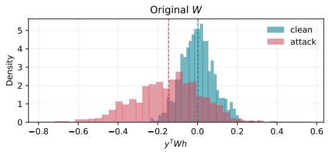

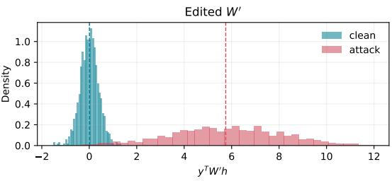  
Figure 3: Visualization of the probe response $p ( x )$ before and after the edit. It contains 1,000 clean and 1,000 adversarial images from STL-10 using CLIP ViT-B/16. The edited probe amplifies adversarial activation shifts into a separable response space.

Let $\sigma _ { l , j } ^ { i n }$ denote the singular value of $H _ { l }$ associated with $v _ { l , j } ^ { i n }$ , such that $\sigma _ { l , j } ^ { i n ^ { 2 } }$ measures the clean activation energy along $v _ { l , j } ^ { i n }$ . For each $j \in \mathcal { T } _ { l } ^ { \mathrm { i n } }$ , we define:

$$
a _ { j } = \frac { { v _ { l , j } ^ { i n } } ^ { \top } \bar { \Delta } _ { l } } { \sigma _ { l , j } ^ { i n } ^ { 2 } } , \qquad t _ { l } = \nu \frac { \sum _ { j \in \mathcal { T } _ { l } ^ { \mathrm { i n } } } a _ { j } v _ { l , j } ^ { i n } } { \left\| \sum _ { j \in \mathcal { T } _ { l } ^ { \mathrm { i n } } } a _ { j } v _ { l , j } ^ { i n } \right\| _ { 2 } } .\tag{7}
$$

This weighting emphasizes directions with large attack-induced shifts and low clean activation energy, where $\nu = 5$ is the predefined norm of the probe direction. In addition to the input-side probe direction, we further construct an output-side target direction for carrying and reading the probe response. Let $p$ be a target semantic prompt specified by the defender, such as $\mathbf { \ddot { a } }$ white teapot,” and let its normalized text feature be $\begin{array} { r } { q = \frac { g _ { \phi } ( p ) } { \| g _ { \phi } ( p ) \| _ { 2 } } } \end{array}$ . Let A be the visual projection matrix of the CLIP vision encoder, and define the semantics-induced hidden-space direction as $y _ { 0 } = A ^ { \dagger } q$ , where $A ^ { \dagger }$ denotes the Moore–Penrose pseudoinverse of A (Penrose, 1955).

We project the semantic direction $y _ { 0 }$ onto this subspace as $\bar { y } _ { l } = P _ { S _ { l } ^ { \mathrm { o u t } } } ( y _ { 0 } )$ , where $P _ { S _ { l } ^ { \mathrm { o u t } } } ( \cdot )$ is the orthogonal projection function, and normalize it to obtain the final target shift vector $\begin{array} { r } { y _ { l } = \gamma \frac { \bar { y } _ { l } } { \| \bar { y } _ { l } \| _ { 2 } } . } \end{array}$ where $\gamma$ is the predefined norm of the target shift. Finally, BaP binds the input-side trigger direction $t _ { l }$ to the output-side semantic target direction $y _ { l }$ through the following closed-form edit:

$$
W _ { l } ^ { \prime } = W _ { l } + \Delta W _ { l } , \qquad \Delta W _ { l } = \frac { y _ { l } t _ { l } ^ { \top } } { \Vert t _ { l } \Vert _ { 2 } ^ { 2 } } .\tag{8}
$$

This edit satisfies $\Delta W _ { l } t _ { l } = y _ { l }$ . Therefore, when the input representation produces a strong response along the attack-sensitive direction $t _ { l } .$ , the edited $\mathtt { f } _ { \mathbf { C } 2 }$ produces a corresponding additional response along the output direction $y _ { l }$ specified by the defender. We denote the encoder after implantation by $f _ { \theta ^ { \prime } }$ and provide a more detailed explanation of the edit in Appendix B.

## 3.3 PROBE-BASED ADVERSARIAL SAMPLE DETECTION

Let ${ \hat { y } } _ { l } = { \frac { y _ { l } } { \| y _ { l } \| _ { 2 } } }$ be the unit output-side direction. For an input $x ,$ BaP obtains the input representation $h _ { l } ( x )$ of fc2 at layer l and directly reads its response along $\hat { y } _ { l }$ from the edited $\mathtt { f } _ { \mathtt { C } 2 }$ output:

$$
p ( x ) = \hat { y } _ { l } ^ { \top } W _ { l } ^ { \prime } h _ { l } ( x ) .\tag{9}
$$

Fig. 3 shows the distribution of the probe response $p ( x )$ for 1,000 clean and 1,000 adversarial images from STL-10 using CLIP ViT-B/16. Before probe implantation, the two distributions overlap substantially. After implantation, clean responses remain concentrated near zero, whereas adversarial responses shift toward much larger values. This separation demonstrates that the edit produces a clean-inactive yet attack-sensitive probe.

In the end, the detection method is:

$$
G ( x ) = \mathbb { I } [ p ( x ) \geq \tau ] .\tag{10}
$$

Here, $\tau$ denotes the detection threshold. If and only if $G ( x ) = 1$ , BaP identifies the input as a suspicious sample and performs the subsequent rectification process.

## 3.4 ADVERSARIAL SAMPLE RECTIFICATION

BaP rectifies each flagged input in two stages, escape and repair. Let ξ denote the rectification perturbation, where $\| \xi \| _ { \infty } \le \epsilon _ { c }$ . We initialize $\xi _ { 0 }$ and define the escape loss:

$$
\mathcal { L } _ { \mathrm { e s c } } ( \xi ) = \left\| f _ { \theta ^ { \prime } } ( x + \xi ) - f _ { \theta ^ { \prime } } ( x ) \right\| _ { 2 } ^ { 2 } .\tag{11}
$$

BaP performs two steps of projected gradient ascent:

$$
\xi _ { r + 1 } = \xi _ { r } + \alpha \mathrm { s i g n } \left( \nabla _ { \xi _ { r } } \mathcal { L } _ { \mathrm { e s c } } ( \xi _ { r } ) \right) , \qquad r = 0 , 1 ,\tag{12}
$$

where $\alpha = 2 / 2 5 5$ . This stage moves the representation away from its current adversarial state.

BaP then guides the representation toward the clean activation distribution. Let $\mathcal { M } _ { l } ^ { \mathrm { c l e a n } }$ denote the principal subspace of the clean activation matrix $H _ { l }$ , and let $P _ { \mathrm { \mathcal { M } } _ { l } ^ { \mathrm { c l e a n } } } \left( \cdot \right)$ denote the orthogonal projection onto this subspace. We define

$$
e _ { l } ( \cdot ) = h _ { l } ^ { \prime } ( \cdot ) - P _ { \mathcal { M } _ { l } ^ { \mathrm { c l e a n } } } \left( h _ { l } ^ { \prime } ( \cdot ) \right)\tag{13}
$$

as the residual component outside this subspace. We precompute a global clean direction $v _ { l } ^ { \mathrm { c l e a n } }$ as the normalized mean residual direction over the calibration set X. The repair loss is:

$$
\mathcal { L } _ { \mathrm { r e p } } ( \xi ) = \underbrace { \Vert e _ { l } ( x + \xi ) \Vert _ { 2 } ^ { 2 } } _ { \mathcal { L } _ { e } } - \lambda \underbrace { \cos ( e _ { l } ( x + \xi ) , v _ { l } ^ { \mathrm { c l e a n } } ) } _ { \mathcal { L } _ { u } } ,\tag{14}
$$

where $\cos ( \cdot , \cdot )$ is the cosine similarity. The first term reduces the distance from the clean subspace, while the second aligns the residual with the clean direction. Starting from $\xi _ { 2 }$ , BaP performs one projected gradient descent step:

$$
\xi _ { 3 } = \xi _ { 2 } - \alpha \mathrm { s i g n } \left( \nabla _ { \xi _ { 2 } } \mathcal { L } _ { \mathrm { r e p } } ( \xi _ { 2 } ) \right) , \qquad \tilde { x } = x + \xi _ { 3 } .\tag{15}
$$

The edited model then classifies x˜. Appendix A provides the complete algorithm.

## 4 EXPERIMENTS

## 4.1 EXPERIMENTAL SETUP

Datasets and Models. Following previous work, we evaluate BaP on a comprehensive benchmark consisting of 16 datasets. These datasets cover general object recognition, including ImageNet (Deng et al., 2009), CIFAR-10/100 (Krizhevsky, 2009), STL10 (Coates et al., 2011), Caltech-101/256 (Fei Fei et al., 2004; Griffin et al., 2007); fine-grained classification, including OxfordPets (Parkhi et al., 2012), Flowers102 (Nilsback & Zisserman, 2008), Food101 (Bossard et al., 2014), StanfordCars (Krause et al., 2013); scene recognition, including SUN397 (Xiao et al., 2010), Country211 (Radford et al., 2021); and domain-specific applications, including FGVCAircraft (Maji et al., 2013), EuroSAT (Helber et al., 2019), DTD (Cimpoi et al., 2014), PCAM (Veeling et al., 2018). For zero-shot image classification, we use the prompt “a photo of $\{ \} ^ { \ast }$ . We adopt CLIP ViT-B/16 as the default backbone and further evaluate BaP on CLIP ViT-B/32 and CLIP ViT-L/14. We also test the performance on CLIP ViT-L/14@336, which is the vision encoder of LLaVA (Liu et al., 2023).

Baselines. We compare BaP with state-of-the-art test-time defenses, including TTE (Perez et al.,´ 2021), HD (Wu et al., 2021), Anti-Adv (Alfarra et al., 2022), LPF (Ziyadinov & Tereshonok, 2023), TTC (Xing et al., 2025), R-TPT (Sheng et al., 2025) and ET3 (Mirza et al., 2026). All baselines are implemented with their original hyperparameter settings to ensure a fair comparison.

Implementation Details. Unless otherwise specified, we set the adversarial perturbation budget to 1/255, with 10 attack steps for PGD and 50 attack steps for AutoAttack. Specifically, we use the targeted APGD variant of the AutoAttack. All experiments are conducted on 8 NVIDIA RTX 4090 GPUs. For BaP, we estimate the adversarial shift using $N = 1 0 0 0 \mathrm { P G D }$ adversarial samples generated on ImageNet with a perturbation budget of 1/255 and 10 attack steps. The rectification noise budget is set to $\epsilon _ { c } = 4 / 2 5 5$ , with a step size of $\alpha = 2 / 2 5 5$ . We set the edited layer to $l = 6 .$ with $\nu = \bar { 5 } , \gamma = 4 0 , K ^ { i n } = \dot { 2 } 5 6 , K ^ { o u t } = 3 2$ , and $\lambda = 0 . 0 5$ . For all datasets, we use a fixed detection threshold of $\tau = 1 . 9 3 .$

Table 2: Top-1 zero-shot accuracy (%) under 10-step PGD with $\ell _ { \infty } = 1 / 2 5 5$ . “Clean” and “Rob.” denote accuracies on clean and adversarial samples, respectively. The final two columns report the performance of our BaP compared to the original CLIP.
<table><tr><td rowspan="2"></td><td rowspan="2">Dataset</td><td colspan="2">Original</td><td colspan="10">Test-Time Defense</td><td colspan="6"></td><td colspan="2">∆</td></tr><tr><td colspan="2">CLIP</td><td colspan="2">R-TPT</td><td colspan="2">LPF</td><td colspan="2">HD</td><td colspan="2">Anti-Adv</td><td colspan="2">TTE</td><td colspan="2">TTC</td><td colspan="2">ET3</td><td colspan="2">BaP (Ours)</td><td></td><td></td></tr><tr><td colspan="2">Type Name</td><td></td><td></td><td>Clean Rob.|Clean Rob.|Clean Rob.|Clean Rob.|Clean Rob.|Clean Rob.|Clean Rob.|Clean Rob.|</td><td></td><td></td><td></td><td></td><td></td><td></td><td></td><td></td><td></td><td></td><td></td><td></td><td></td><td>|Clean Rob.|</td><td></td><td>|Clean Rob.</td></tr><tr><td rowspan="5">Genral</td><td>ImageNet</td><td>63.9</td><td>0.0</td><td>66.7</td><td>51.0</td><td>58.1</td><td>30.5</td><td>59.7</td><td>4.1</td><td>61.5</td><td>23.9</td><td>66.2</td><td>23.2</td><td>40.9</td><td>27.8</td><td>58.6</td><td>10.2</td><td>60.3</td><td>39.6</td><td>-3.6 +39.6</td></tr><tr><td>CIFAR10</td><td>88.1</td><td>0.5</td><td>81.6</td><td>69.2</td><td>89.0</td><td>40.4</td><td>84.1</td><td>11.8</td><td>82.8 63.5</td><td>85.5</td><td>29.8</td><td></td><td>90.0 28.2</td><td>77.7</td><td>29.2</td><td>86.8</td><td>59.1</td><td>-1.3</td><td>+58.6</td></tr><tr><td>CIFAR100</td><td>59.6</td><td>0.1</td><td>51.8</td><td>36.4</td><td>63.4</td><td>19.6</td><td>57.6</td><td>7.9</td><td>51.5</td><td>34.9</td><td>60.4</td><td>14.2</td><td>63.1</td><td>11.1 50.0</td><td>13.9</td><td></td><td>57.5 34.1</td><td>-2.1</td><td>+34.0</td></tr><tr><td>STL10</td><td>97.5</td><td>4.8</td><td>96.8</td><td>92.7</td><td>96.9</td><td>77.6</td><td>96.8</td><td>34.0</td><td>97.2 83.1</td><td></td><td>97.6 75.6</td><td></td><td>96.4 51.1</td><td>92.8 52.1</td><td></td><td>96.7</td><td>93.4</td><td>-0.8</td><td>+88.6</td></tr><tr><td>Caltech101</td><td>83.5</td><td>1.3</td><td>86.1</td><td>80.9</td><td>81.3</td><td>65.6</td><td>82.6</td><td>28.4</td><td>82.3 58.2</td><td></td><td>87.2 61.2</td><td></td><td>75.8 31.3</td><td>80.3</td><td>41.1</td><td>80.6</td><td>76.2</td><td>-2.9</td><td>+74.9</td></tr><tr><td></td><td>Caltech256</td><td>83.5</td><td>1.5</td><td>88.0</td><td>80.5</td><td>82.8</td><td>66.5</td><td>80.4 20.9</td><td>81.6</td><td>55.8</td><td>87.3</td><td>59.4</td><td></td><td>73.4 41.8</td><td>78.2</td><td>34.4</td><td>79.7</td><td>74.8</td><td>-3.8</td><td>+73.3</td></tr><tr><td></td><td>OxfordPets</td><td>88.9</td><td>0.0</td><td>85.8</td><td>68.3</td><td>79.4 41.7</td><td></td><td>84.2</td><td>4.0</td><td>86.5 36.7</td><td>84.8</td><td>12.5</td><td></td><td>78.8 27.0|</td><td>79.5</td><td>16.0|</td><td>83.4</td><td>65.7</td><td>-5.5</td><td>+65.7</td></tr><tr><td>Fi-G</td><td>Flowers102</td><td>66.0</td><td>0.0</td><td>65.8</td><td>48.8</td><td>59.8 33.1</td><td></td><td>63.3</td><td>3.5</td><td>63.5 25.3</td><td>65.3</td><td>5.5</td><td>55.8</td><td>23.3</td><td>59.8</td><td>12.6</td><td>62.8</td><td>55.8</td><td>-3.2</td><td>+55.8</td></tr><tr><td></td><td>Food101</td><td>84.8</td><td>0.0</td><td>86.6 68.9</td><td></td><td>79.6</td><td>38.6</td><td>86.0</td><td>1.1</td><td>83.9 29.3</td><td>85.3</td><td>24.8</td><td>57.5</td><td>33.2</td><td>79.8</td><td>10.4</td><td>81.2</td><td>66.1</td><td>-3.6</td><td>+66.1</td></tr><tr><td></td><td>StanfordCars</td><td>65.2</td><td>0.0</td><td></td><td>68.6 45.4</td><td>54.0</td><td>16.9</td><td>57.8</td><td>1.4</td><td>62.5 13.7</td><td></td><td>59.0 14.4</td><td></td><td>46.6 20.2</td><td>56.9</td><td>5.7</td><td></td><td>58.8 56.4</td><td>-6.4</td><td>+56.4</td></tr><tr><td>Scene</td><td>SUN397</td><td>63.6</td><td>0.2</td><td>64.1</td><td>53.1</td><td></td><td>59.2 31.3|</td><td>59.7</td><td>4.0</td><td>62.5</td><td>22.7</td><td>65.4 20.2</td><td>47.5</td><td>26.2|</td><td>57.0</td><td>9.2</td><td></td><td>60.4 50.0</td><td>-3.2</td><td>+49.8</td></tr><tr><td></td><td>Country211</td><td>17.0</td><td>0.0</td><td>19.2</td><td>8.9</td><td>14.7</td><td>2.5</td><td>15.1</td><td>0.0</td><td>15.2 1.9</td><td>15.8</td><td>0.3</td><td>10.2</td><td>4.4</td><td>13.3</td><td>1.1</td><td>16.7</td><td>14.0</td><td>-0.3</td><td>+14.0</td></tr><tr><td></td><td>FGVCAircraft||</td><td>23.1</td><td>0.0</td><td>23.8</td><td>16.7</td><td>17.8</td><td>7.2</td><td>18.8</td><td>1.3</td><td>20.4 6.0</td><td>23.3</td><td>4.9</td><td>13.8</td><td>10.6</td><td>18.3</td><td>1.5</td><td>20.7</td><td>22.4</td><td>-2.4</td><td>+22.4</td></tr><tr><td>Domain</td><td>EuroSAT</td><td>42.9</td><td>0.0</td><td></td><td>29.6 22.3</td><td>41.6</td><td>4.9</td><td>41.7</td><td>8.5</td><td>38.7 25.5</td><td>42.3</td><td>8.3</td><td>45.6</td><td>10.2</td><td>40.0</td><td>12.8</td><td>42.2</td><td>42.0</td><td>-0.7</td><td>+42.0</td></tr><tr><td></td><td>DTD</td><td>42.3</td><td>0.1</td><td>44.2</td><td>36.2</td><td>40.5</td><td>26.7</td><td>40.4</td><td>8.5</td><td>40.6 22.1</td><td>41.9</td><td>20.6</td><td>35.7</td><td>22.1</td><td>37.4</td><td>14.9</td><td>41.2</td><td>34.7</td><td>-1.1</td><td>+34.6</td></tr><tr><td></td><td>PCAM</td><td>48.4</td><td>7.4</td><td></td><td>54.6 39.2</td><td>48.6 48.4</td><td></td><td>48.4 36.1</td><td></td><td>48.5 48.2</td><td>44.3</td><td>4.3</td><td></td><td>48.2 23.3</td><td>48.9</td><td>48.0</td><td></td><td>48.6 52.8</td><td>+0.2</td><td>+45.4</td></tr><tr><td>All</td><td>Avg.</td><td>63.6</td><td>1.0</td><td></td><td>63.3 51.2|</td><td></td><td>56.7 34.5|</td><td>61.0</td><td>11.0</td><td>61.2 34.4</td><td></td><td>63.2 23.7</td><td></td><td>55.024.5</td><td>58.0</td><td>19.6|</td><td></td><td>61.1 52.3|</td><td>-2.5</td><td>+51.3</td></tr></table>

Table 3: Efficiency analysis on an NVIDIA GeForce RTX 4090 GPU.  
(a) End-to-end inference latency (ms/image).  
(b) Runtime of BaP stages (ms).
<table><tr><td>Time</td><td>CLIP</td><td>R-TPT</td><td>HD</td><td>Anti-Adv</td><td>TTE</td><td>TTC</td><td>ET3</td><td>BaP</td></tr><tr><td> $T _ { C l e a n }$ </td><td>3.37</td><td>176.45</td><td>184.43</td><td>32.39</td><td>5.43</td><td>33.24</td><td>23.17</td><td>3.75</td></tr><tr><td> $T _ { R o b . }$ </td><td>3.37</td><td>176.20</td><td>189.34</td><td>32.44</td><td>5.41</td><td>35.13</td><td>23.58</td><td>57.37</td></tr><tr><td> $T _ { A v g . }$ </td><td>3.37</td><td>176.33</td><td>186.89</td><td>32.42</td><td>5.42</td><td>34.19</td><td>23.38</td><td>30.56</td></tr></table>

<table><tr><td>Stage</td><td>Time</td></tr><tr><td>Rank-one Implantation</td><td>2.70</td></tr><tr><td>Sample Detection</td><td>3.56</td></tr><tr><td>Sample Rectification</td><td>53.94</td></tr></table>

## 4.2 MAIN RESULTS

Results on 16 Datasets. Table 2 reports zero-shot adversarial robustness across 16 datasets. Compared with the original CLIP model, BaP improves the average robust accuracy from 1.0% to 52.3%. Among test-time defenses, R-TPT preserves the highest clean accuracy of 63.3%, but incurs high per-sample inference latency, as shown in Table 3. In contrast, BaP achieves the highest average robust accuracy of 52.3%, outperforming R-TPT while retaining 61.1% clean accuracy. These results validate the effectiveness of repurposing backdoors as internal probes for test-time adversarial defense. The detection ROC curves for all datasets are provided in Appendix G.

Efficiency Analysis. Table 3a compares the inference latency of test-time defenses. Benefiting from selective rectification, BaP processes clean inputs in only 3.75 ms, while adversarial inputs require 57.37 ms. Its average latency is 30.56 ms, making it 5.7× faster than R-TPT and 6× faster than HD. Although TTE and ET3 are faster, their robust accuracies are only 23.7% and 19.6%, respectively. Table 3b further reports the runtime of BaP stages. Notably, the closed-form edit implants the probe in only 2.70 ms. Sample detection requires only 3.56 ms per image, while the 53.94 ms rectification is invoked only for suspicious inputs. Overall, BaP balances adversarial robustness with inference efficiency, supporting practical deployment in real-world scenarios.

Results under Different Attack Objectives. To evaluate the performance of BaP under different attack objectives, we test it against crossmodal, targeted, and label-free attacks with a perturbation budget of $\ell _ { \infty } = 4 / 2 5 5$ . As shown in Table 4, BaP achieves the highest robust accuracy across all seven attack configurations. Although the implanted probe is only trained on ImageNet with PGD attack of $\ell _ { \infty } = 1 / 2 5 5$ , the

Table 4: ImageNet top-1 accuracy (%) across attack objectives at $\ell _ { \infty } = 4 / 2 5 5$ with 50 steps. ‘AA denotes ‘AutoAttack’.
<table><tr><td rowspan="2">Method</td><td rowspan="2">Clean</td><td colspan="2">Cross-modal</td><td colspan="3">Targeted</td><td colspan="2">Label-free</td></tr><tr><td>PGD</td><td>AA</td><td>PGD</td><td>DLR</td><td>AA</td><td>PGD</td><td>AA</td></tr><tr><td>CLIP</td><td>63.9</td><td>0.0</td><td>0.0</td><td>0.0</td><td>0.0</td><td>0.0</td><td>0.1</td><td>0.0</td></tr><tr><td>TTC</td><td>40.9</td><td>2.7</td><td>0.3</td><td>25.4</td><td>6.8</td><td>6.2</td><td>10.2</td><td>1.6</td></tr><tr><td>ET3</td><td>58.6</td><td>3.3</td><td>0.9</td><td>24.5</td><td>16.5 39.3↑39.3</td><td>2.3 36.9↑36.9</td><td>15.9 42.4↑42.3</td><td>8.5 40.0↑40.0</td></tr><tr><td>BaP</td><td colspan="8">60.3↓3.6 34.6134.6 35.1↑35.1 136.1†36.1</td></tr></table>

consistent improvements across objectives indicate that the probe captures transferable adversarial behavior rather than being tied to a specific attack. Appendix C shows more details.

Table 5: Comparison of zero-shot classification accuracy under stronger attacks at $\ell _ { \infty } = 4 / 2 5 5 .$
<table><tr><td rowspan="2">Method</td><td colspan="3">General</td><td colspan="3">Fine-Grained</td><td colspan="3">Scene</td><td colspan="3">Domain</td></tr><tr><td>Clean</td><td>PGD</td><td>AutoAttack</td><td>Clean</td><td>PGD</td><td>AutoAttack</td><td>Clean</td><td>PGD</td><td>AutoAttack</td><td>Clean</td><td>PGD</td><td>AutoAttack</td></tr><tr><td>CLIP</td><td>79.4</td><td>0.0</td><td>0.0</td><td>76.2</td><td>0.0</td><td>0.0</td><td>40.3</td><td>0.0</td><td>0.0</td><td>39.2</td><td>0.0</td><td>0.0</td></tr><tr><td>R-TPT</td><td>78.5</td><td>36.2</td><td>28.4</td><td>76.7</td><td>46.4</td><td>42.8</td><td>41.7</td><td>26.7</td><td>26.4</td><td>38.1</td><td>27.5</td><td>23.2</td></tr><tr><td>TTE</td><td>80.7</td><td>13.4</td><td>11.5</td><td>73.6</td><td>1.7</td><td>0.4</td><td>40.6</td><td>1.2</td><td>1.4</td><td>38.0</td><td>13.4</td><td>11.5</td></tr><tr><td>LPF</td><td>78.6</td><td>37.4</td><td>30.8</td><td>68.2</td><td>11.3</td><td>8.2</td><td>37.0</td><td>8.0</td><td>6.9</td><td>37.1</td><td>18.6</td><td>16.7</td></tr><tr><td>HD</td><td>76.9</td><td>0.5</td><td>0.1</td><td>72.8</td><td>0.0</td><td>0.0</td><td>37.4</td><td>0.0</td><td>0.0</td><td>37.3</td><td>0.1</td><td>0.0</td></tr><tr><td>Anti-Adv</td><td>76.2</td><td>22.6</td><td>2.7</td><td>74.1</td><td>1.7</td><td>0.0</td><td>38.9</td><td>1.1</td><td>0.2</td><td>37.1</td><td>9.8</td><td>1.7</td></tr><tr><td>TTC</td><td>73.3</td><td>14.7</td><td>0.6</td><td>59.7</td><td>2.0</td><td>0.0</td><td>28.9</td><td>1.2</td><td>0.0</td><td>35.8</td><td>9.3</td><td>0.3</td></tr><tr><td>ET3</td><td>72.9</td><td>7.7</td><td>0.3</td><td>69.0</td><td>0.9</td><td>0.0</td><td>35.1</td><td>0.4</td><td>0.0</td><td>36.1</td><td>8.7</td><td>0.1</td></tr><tr><td>BaP</td><td>76.9↓2.5</td><td>57.2↑57.2</td><td>35.3↑35.3</td><td>71.6↓4.6 43.1↑43.1</td><td></td><td>17.4↑17.4</td><td></td><td>38.6↓1.7 22.4↑22.4</td><td>8.2↑8.2</td><td>38.2↓1.0 29.1↑29.1</td><td></td><td>13.8↑13.8</td></tr></table>

Table 6: Comparison of zero-shot classification accuracy on CLIP-B/32 and CLIP-L/14 under 10-step PGD at $\ell _ { \infty } = 1 / 2 5 5$ . More detailed results are provided in Appendix F.
<table><tr><td rowspan="3">Method</td><td colspan="8">CLIP-B/32</td><td colspan="8">CLIP-L/14</td></tr><tr><td colspan="2">General</td><td colspan="2">FG</td><td colspan="2">Scene</td><td colspan="2">Domain</td><td colspan="2">General</td><td colspan="2">FG</td><td colspan="2">Scene</td><td colspan="2">Domain</td></tr><tr><td>clean</td><td>rob</td><td>clean</td><td>rob</td><td>clean</td><td>rob</td><td>clean</td><td>rob</td><td>clean</td><td>rob</td><td>clean</td><td>rob</td><td>clean</td><td>rob</td><td>clean</td><td>rob</td></tr><tr><td>CLIP</td><td>76.7</td><td>4.0</td><td>71.8</td><td>0.3</td><td>38.8</td><td>0.4</td><td>35.9</td><td>6.6</td><td>83.7</td><td>4.0</td><td>84.2</td><td>0.3</td><td>45.3</td><td>0.2</td><td>46.8</td><td>0.3</td></tr><tr><td>R-TPT</td><td>72.9</td><td>41.9</td><td>71.4</td><td>45.4</td><td>38.7</td><td>29.6</td><td>35.7</td><td>27.2</td><td>84.2</td><td>76.8</td><td>83.5</td><td>70.3</td><td>47.1</td><td>37.5</td><td>42.4</td><td>37.3</td></tr><tr><td>LPF</td><td>74.8</td><td>38.0</td><td>62.0</td><td>18.9</td><td>36.2</td><td>11.3</td><td>33.7</td><td>17.4</td><td>84.0</td><td>66.9</td><td>78.8</td><td>51.7</td><td>44.2</td><td>26.2</td><td>44.5</td><td>28.5</td></tr><tr><td>HD</td><td>76.0</td><td>15.9</td><td>68.6</td><td>4.9</td><td>35.1</td><td>3.1</td><td>35.1</td><td>13.6</td><td>82.7</td><td>38.3</td><td>79.7</td><td>9.3</td><td>43.0</td><td>6.2</td><td>44.2</td><td>15.9</td></tr><tr><td>Anti-Adv</td><td>75.3</td><td>39.1</td><td>70.3</td><td>12.6</td><td>37.3</td><td>7.0</td><td>33.2</td><td>19.9</td><td>82.5</td><td>67.9</td><td>82.4</td><td>48.0</td><td>45.2</td><td>22.0</td><td>43.5</td><td>30.9</td></tr><tr><td>TTE</td><td>77.5</td><td>47.3</td><td>68.6</td><td>27.9</td><td>39.3</td><td>9.6</td><td>36.8</td><td>19.3</td><td>86.1</td><td>58.5</td><td>81.6</td><td>32.3</td><td>47.8</td><td>12.2</td><td>43.7</td><td>23.6</td></tr><tr><td>TTC</td><td>74.5</td><td>43.5</td><td>66.5</td><td>27.5</td><td>32.9</td><td>17.5</td><td>34.2</td><td>22.4</td><td>80.5</td><td>33.3</td><td>70.3</td><td>39.7</td><td>35.1</td><td>19.7</td><td>42.0</td><td>15.5</td></tr><tr><td>ET3</td><td>69.4</td><td>34.4</td><td>62.0</td><td>15.6</td><td>35.0</td><td>8.8</td><td>31.3</td><td>20.5</td><td>81.1</td><td>43.3</td><td>77.9</td><td>16.4</td><td>43.4</td><td>8.8</td><td>43.2</td><td>22.0</td></tr><tr><td>BaP</td><td>|74.8↓1.9</td><td>62.4↑58.4</td><td>66.0↓5.8</td><td>54.9↑54.6</td><td>37.5↓1.3</td><td>31.0↑30.6</td><td>634.8↓1.1</td><td>32.7↑26.1</td><td>82.1↓1.6</td><td>62.4↑58.4</td><td>79.8↓4.4</td><td></td><td>70.1169.8 44.4↓0.9</td><td>40.7↑40.5</td><td>44.9↓1.9</td><td>935.5↑35.2</td></tr></table>

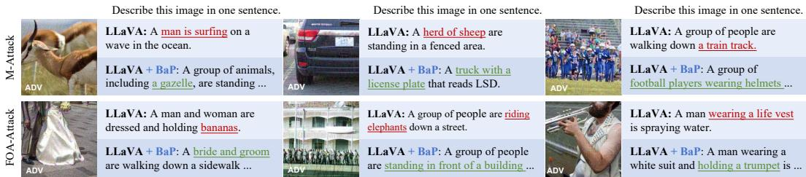  
Figure 4: Qualitative results of BaP against M-Attack and FOA-Attack on image captioning.

Results under Stronger Attacks. Table 5 evaluates the defenses under a larger perturbation budget of $\ell _ { \infty } = 4 / 2 5 5$ using PGD and AutoAttack. Under PGD, BaP achieves the highest accuracy on the General and Domain benchmarks, reaching 57.2% and 29.1%, respectively, while remaining competitive on Fine-Grained and Scene recognition. Under AutoAttack, BaP performs best on the General benchmarks, whereas R-TPT remains stronger on Fine-Grained, Scene, and Domain benchmarks. These results indicate that BaP remains effective under stronger attacks.

Results on Different Backbones. Table 6 evaluates the transferability of BaP to CLIP ViT-B/32 and ViT-L/14. On ViT-B/32, BaP achieves the highest robust accuracy across all four dataset categories. When applied to ViT-L/14, BaP obtains the best robustness on Scene recognition at 40.7% and achieves performance competitive with R-TPT. These results show that BaP remains effective across different CLIP architectures.

Results on Attacks against LVLMs. Recent attacks on large vision-language models (LVLMs) have demonstrated their effectiveness against open-ended generation tasks. To evaluate BaP beyond classification, we assess the robustness of LLaVA on image captioning under M-Attack (Li et al., 2025) and FOA-Attack (Jia et al., 2025). Following their original attack settings, we randomly sample 100 images from COCO (Lin et al., 2014) and generate adversar-

Table 9: Defense performance against M-Attack and FOA-Attack.
<table><tr><td rowspan="2">Method</td><td colspan="2">M-Attack</td><td colspan="2">FOA-Attack</td></tr><tr><td>Clean</td><td>Rob.</td><td>Clean</td><td>Rob.</td></tr><tr><td>Origin Model</td><td>100.0</td><td>21.1</td><td>100.0</td><td>19.1</td></tr><tr><td>+TTC defense</td><td>84.4</td><td>23.8</td><td>84.4</td><td>20.0</td></tr><tr><td>+ET3 defense</td><td>87.2</td><td>19.4</td><td>87.2</td><td>16.7</td></tr><tr><td>+BaP defense 99.9↓0.1</td><td></td><td> $2 4 . 6 ^ { \uparrow 3 . 5 }$ </td><td>99.9↓0.1</td><td> $2 3 . 6 ^ { \uparrow 4 . 5 }$ </td></tr></table>

ial examples with an $\ell _ { \infty }$ budget of 16/255. GPTScore (Li et al., 2025) is used to evaluate captioning performance, where the detailed prompt is provided in Appendix E. Table 9 compares BaP with TTC and ET3. Benefiting from its selective rectification mechanism, BaP preserves a clean score of 99.9, only 0.1 below the undefended model. Under M-Attack and FOA-Attack, BaP improves the robust score from 21.1 to 24.6 and from 19.1 to 23.6, respectively, outperforming both competing defenses. Fig. 4 further provides qualitative comparisons. Under both attacks, the undefended LLaVA produces captions containing attack-induced concepts, whereas BaP recovers key semantics consistent with the visual content. The ROC curves for the detection are provided in Appendix G.

Table 7: Rectification-objective ablation across the 16 datasets.  
Table 8: The adaptive PGD at $\ell _ { \infty } = 1$ /255 with 10 steps.
<table><tr><td> $\mathcal { L } _ { e }$ </td><td> $\mathcal { L } _ { u }$ </td><td> $\mathcal { L } _ { \mathrm { e s c } }$ </td><td>Clean</td><td>Rob.</td></tr><tr><td>V</td><td></td><td></td><td>62.3</td><td>21.3</td></tr><tr><td>√</td><td>√</td><td></td><td>62.3</td><td>22.3</td></tr><tr><td>√</td><td>」</td><td>L</td><td>61.1</td><td>52.3</td></tr></table>

<table><tr><td colspan="2"> $\beta$ </td><td>0</td><td>0.01</td><td>0.1</td><td>1</td></tr><tr><td rowspan="2">w/o BaP</td><td>Clean</td><td>63.9</td><td>63.9</td><td>63.9</td><td>63.9</td></tr><tr><td>Rob.</td><td>0.0</td><td>0.1</td><td>0.3</td><td>2.6</td></tr><tr><td rowspan="2">w/BaP</td><td>Clean</td><td>60.3</td><td>60.3</td><td>60.3</td><td>60.3</td></tr><tr><td>Rob.</td><td>39.6</td><td>34.0</td><td>27.2</td><td>34.7</td></tr></table>

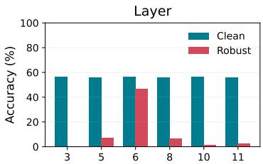

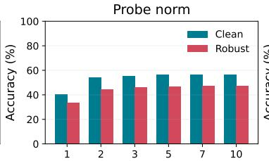

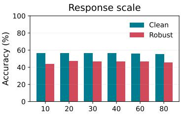  
Figure 5: The sensitivity to the edited layer $l ,$ probe norm $\nu ,$ and response scale $\gamma .$ . More ablation results are in Appendix D.

## 4.3 ABLATION STUDY

Ablation of the Rectification Objective. Table 7 ablates the three objectives used for adversarial rectification. Using only the clean-subspace residual loss $\mathcal { L } _ { e }$ yields robust accuracy of 21.3%. Adding the clean-direction alignment loss $\mathcal { L } _ { u }$ provides an improvement to 22.3%. Incorporating the escape loss $\mathcal { L } _ { \mathrm { e s c } }$ increases robust accuracy to 52.3%, with a limited clean accuracy reduction from 62.3% to 61.1%. Combining all three objectives achieves the best overall performance.

Hyperparameter Sensitivity. Fig. 5 studies the effects of the edited layer l, probe norm ν, and response scale $\gamma .$ . The edited layer has the largest influence on robustness. Placing the probe at Layer 6 yields the highest robust accuracy, whereas earlier or later layers perform considerably worse despite similar clean accuracy. Increasing the probe norm from 1 to moderate values improves both clean and robust accuracy, after which the performance gradually saturates. In contrast, BaP remains stable across response scales ranging from 10 to 80, with the best overall performance obtained around 40. Based on these results, we use Layer $^ { 6 , }$ a probe norm of $5 ,$ and a response scale of 40 as the default configuration.

## 4.4 ROBUSTNESS TO AN ADAPTIVE ATTACK

We evaluate BaP against an adaptive attack that jointly maximizes the cross-entropy loss of the edited model and suppresses the probe response. Given an adversarial input $x _ { \mathrm { a d v } }$ , the attack maximizes

$$
\begin{array} { r } { \mathcal { L } _ { \mathrm { a d a p t } } ( x _ { \mathrm { a d v } } , y ) = \mathrm { C E } ( f _ { \theta ^ { \prime } } ( x _ { \mathrm { a d v } } ) , y ) - \beta \mathrm { R e L U } ( p ( x _ { \mathrm { a d v } } ) - \tau ) , } \end{array}\tag{16}
$$

where $p ( \cdot )$ denotes the probe response of $\operatorname { E q . 9 , } \tau$ is the detection threshold, and $\beta$ controls the strength of regularization term. Table 8 reports the results on ImageNet dataset. Increasing $\beta$ from 0 to 0.1 reduces the robust accuracy of BaP from 39.6% to 27.2%, showing that explicitly targeting the detector weakens the defense. Nevertheless, at $\beta = 0 . 1$ , BaP retains robust accuracy of 27.2%, compared with 0.3% without BaP. Further increasing $\beta$ to 1 raises the robust accuracy of BaP to 34.7%. It is noted that the robust accuracy without BaP increases from 0.0% to 2.6%. This suggests that a larger $\beta$ weakens the attack, allowing BaP to achieve higher robust accuracy.

## 5 CONCLUSION

We propose BaP, a test-time defense that repurposes a controlled backdoor as an internal probe for CLIP. Through a closed-form edit, BaP treats adversarial activation shifts as triggers and maps the induced responses into a defender-specified target space. The resulting probe detects and rectifies adversarial inputs while largely preserving clean performance. Experiments across 16 benchmarks demonstrate its robustness, efficiency, and transferability across backbones and attacks. We hope BaP motivates further exploration of backdoor-inspired probes for improving adversarial robustness.

## ETHICS STATEMENT

Although BaP is inspired by backdoor mechanisms, it is intended for adversarial defense. Its defendercontrolled probe is used to detect and rectify adversarial inputs. It should be applied only to models for which the defender has authorization. We believe this work advances the defensive use of backdoor-inspired mechanisms and contributes to more robust vision-language models.

## REFERENCES

Jameel Abdul Samadh, Mohammad Hanan Gani, Noor Hussein, Muhammad Uzair Khattak, Muhammad Muzammal Naseer, Fahad Shahbaz Khan, and Salman H. Khan. Align your prompts: Test-time prompting with distribution alignment for zero-shot generalization. Advances in Neural Information Processing Systems (NeurIPS), 36:80396–80413, 2023.

Motasem Alfarra, Juan C Perez, Ali Thabet, Adel Bibi, Philip HS Torr, and Bernard Ghanem.´ Combating adversaries with anti-adversaries. In Proceedings ofthe AAAI Conference on Artificial Intelligence (AAAI), volume 36, pp. 5992–6000, 2022.

Jinze Bai, Shuai Bai, Shusheng Yang, Shijie Wang, Sinan Tan, Peng Wang, Junyang Lin, Chang Zhou, and Jingren Zhou. Qwen-vl: A versatile vision-language model for understanding, localization, text reading, and beyond. arXiv preprint arXiv:2308.12966, 2023.

Lukas Bossard, Matthieu Guillaumin, and Luc Van Gool. Food-101–mining discriminative components with random forests. In European Conference on Computer Vision (ECCV), pp. 446–461. Springer, 2014.

Mircea Cimpoi, Subhransu Maji, Iasonas Kokkinos, Sammy Mohamed, and Andrea Vedaldi. Describing textures in the wild. In Proceedings of the IEEE conference on Computer Vision and Pattern Recognition (CVPR), pp. 3606–3613, 2014.

Adam Coates, Andrew Ng, and Honglak Lee. An analysis of single-layer networks in unsupervised feature learning. In Proceedings ofthefourteenth international conference on artificial intelligence and statistics, pp. 215–223. JMLR Workshop and Conference Proceedings, 2011.

Francesco Croce and Matthias Hein. Reliable evaluation of adversarial robustness with an ensemble of diverse parameter-free attacks. In International conference on machine learning, pp. 2206–2216. PMLR, 2020.

Xuanming Cui, Alejandro Aparcedo, Young Kyun Jang, and Ser-Nam Lim. On the robustness of large multimodal models against image adversarial attacks. In 2024 IEEE/CVF Conference on Computer Vision and Pattern Recognition (CVPR), pp. 24625–24634. IEEE, 2024.

Jia Deng, Wei Dong, Richard Socher, Li-Jia Li, Kai Li, and Li Fei-Fei. Imagenet: A large-scale hierarchical image database. In Proceedings of the IEEE conference on Computer Vision and Pattern Recognition (CVPR), pp. 248–255. IEEE, 2009.

Li Fei-Fei, Rob Fergus, and Pietro Perona. Learning generative visual models from few training examples: An incremental bayesian approach tested on 101 object categories. In Proceedings of the IEEE conference on Computer Vision and Pattern Recognition Workshop (CVPRW), pp. 178–178. IEEE, 2004.

Gregory Griffin, Alex Holub, Pietro Perona, et al. Caltech-256 object category dataset. Technical report, Technical Report 7694, California Institute of Technology Pasadena, 2007.

Tianyu Gu, Brendan Dolan-Gavitt, and Siddharth Garg. Identifying vulnerabilities in the machine learning model supply chain. In Proceedings of the Neural Information Processing Symposium Workshop Mach. Learning Security (MLSec), pp. 1–5, 2017.

Jisu Han and Wonjun Hwang. D-tpt: Dimensional entropy maximization for calibrating test-time prompt tuning in vision-language models. arXiv preprint arXiv:2510.09473, 2025.

Kaiming He, Xiangyu Zhang, Shaoqing Ren, and Jian Sun. Deep residual learning for image recognition. In Proceedings ofthe IEEE conference on Computer Vision and Pattern Recognition (CVPR), June 2016.

Patrick Helber, Benjamin Bischke, Andreas Dengel, and Damian Borth. Eurosat: A novel dataset and deep learning benchmark for land use and land cover classification. IEEE Journal ofSelected Topics in Applied Earth Observations and Remote Sensing, 12(7):2217–2226, 2019.

Md Zarif Hossain and Ahmed Imteaj. Securing vision-language models with a robust encoder against jailbreak and adversarial attacks. In 2024 IEEE International Conference on Big Data (BigData), pp. 6250–6259. IEEE, 2024.

Xiaojun Jia, Sensen Gao, Simeng Qin, Tianyu Pang, Chao Du, Yihao Huang, Xinfeng Li, Yiming Li, Bo Li, and Yang Liu. Adversarial attacks against closed-source MLLMs via feature optimal alignment. In The Annual Conference on Neural Information Processing Systems (NeurIPS), 2025.

Jonathan Krause, Michael Stark, Jia Deng, and Li Fei-Fei. 3d object representations for finegrained categorization. In Proceedings of the IEEE International Conference on Computer Vision Workshops (ICCVW), pp. 554–561, 2013.

Alex Krizhevsky. Learning multiple layers of features from tiny images. Technical Report, University of Toronto, 2009.

Junnan Li, Dongxu Li, Silvio Savarese, and Steven Hoi. Blip-2: bootstrapping language-image pre-training with frozen image encoders and large language models. In Proceedings ofthe 40th International Conference on Machine Learning (ICML), 2023.

Lin Li, Haoyan Guan, Jianing Qiu, and Michael Spratling. One prompt word is enough to boost adversarial robustness for pre-trained vision-language models. In Proceedings of the IEEE conference on Computer Vision and Pattern Recognition (CVPR), pp. 24408–24419, 2024a.

Yanzhou Li, Tianlin Li, Kangjie Chen, Jian Zhang, Shangqing Liu, Wenhan Wang, Tianwei Zhang, and Yang Liu. Badedit: Backdooring large language models by model editing. In International Conference on Learning Representations (ICLR), 2024b.

Zhaoyi Li, Xiaohan Zhao, Dong-Dong Wu, Jiacheng Cui, and Zhiqiang Shen. A frustratingly simple yet highly effective attack baseline: Over 90% success rate against the strong black-box models of GPT-4.5/4o/o1. In The Annual Conference on Neural Information Processing Systems (NeurIPS), 2025.

Tsung-Yi Lin, Michael Maire, Serge J. Belongie, James Hays, Pietro Perona, Deva Ramanan, Piotr Dollar, and C. Lawrence Zitnick. Microsoft coco: Common objects in context. In´ Proceedings of the European Conference on Computer Vision (ECCV), 2014.

Haotian Liu, Chunyuan Li, Qingyang Wu, and Yong Jae Lee. Visual instruction tuning. arXiv preprint arXiv:2304.08485, 2023.

Liangsheng Liu, Si Chen, Jiamin Wu, Weiwei Feng, Zhixin Cheng, Xiaotian Yin, Wenfei Yang, and Tianzhu Zhang. Adversarial attacks already tell the answer: Directional bias-guided test-time defense for vision-language models. In The International Conference on Learning Representations (ICLR), 2026.

Zhaoyi Liu and Huan Zhang. Stealthy backdoor attack in self-supervised learning vision encoders for large vision language models. In Proceedings ofthe IEEE/CVF Conference on Computer Vision and Pattern Recognition (CVPR), 2025. doi: 10.1109/CVPR52734.2025.02333.

Aleksander Madry, Aleksandar Makelov, Ludwig Schmidt, Dimitris Tsipras, and Adrian Vladu. Towards deep learning models resistant to adversarial attacks. In International Conference on Learning Representations (ICLR), 2018.

Subhransu Maji, Esa Rahtu, Juho Kannala, Matthew Blaschko, and Andrea Vedaldi. Fine-grained visual classification of aircraft. arXiv preprint arXiv:1306.5151, 2013.

Chengzhi Mao, Scott Geng, Junfeng Yang, Xin Wang, and Carl Vondrick. Understanding zeroshot adversarial robustness for large-scale models. In The International Conference on Learning Representations (ICLR), 2023.

Kevin Meng, David Bau, Alex Andonian, and Yonatan Belinkov. Locating and editing factual associations in gpt. Advances in neural information processing systems (NeurIPS), 35:17359– 17372, 2022.

Mujtaba Hussain Mirza, Antonio D’Orazio, Odelia Melamed, and Iacopo Masi. A provable energyguided test-time defense boosting adversarial robustness of large vision-language models. In Proceedings of the IEEE/CVF Conference on Computer Vision and Pattern Recognition (CVPR), pp. 8598–8609, June 2026.

Sen Nie, Jie Zhang, Zhuo Wang, Shiguang Shan, and Xilin Chen. Contrastive spectral rectification: Test-time defense towards zero-shot adversarial robustness of CLIP. In International Conference on Machine Learning (ICML), 2026a.

Sen Nie, Jie Zhang, Jianxin Yan, Shiguang Shan, and Xilin Chen. V-attack: Targeting disentangled value features for controllable adversarial attacks on lvlms. In Proceedings of the IEEE/CVF Conference on Computer Vision and Pattern Recognition (CVPR), pp. 42257–42267, June 2026b.

Maria-Elena Nilsback and Andrew Zisserman. Automated flower classification over a large number of classes. In Sixth Indian conference on computer vision, graphics & image processing, pp. 722–729. IEEE, 2008.

Omkar M Parkhi, Andrea Vedaldi, Andrew Zisserman, and CV Jawahar. Cats and dogs. In Proceedings of the IEEE conference on Computer Vision and Pattern Recognition (CVPR), pp. 3498–3505. IEEE, 2012.

R. Penrose. A generalized inverse for matrices. Mathematical Proceedings of the Cambridge Philosophical Society, 51(3):406–413, 1955.

Juan C Perez, Motasem Alfarra, Guillaume Jeanneret, Laura Rueda, Ali Thabet, Bernard Ghanem,´ and Pablo Arbelaez. Enhancing adversarial robustness via test-time transformation ensembling. In´ 2021 IEEE/CVF International Conference on Computer Vision Workshops (ICCVW), pp. 81–91. IEEE, 2021.

Alec Radford, Jong Wook Kim, Chris Hallacy, Aditya Ramesh, Gabriel Goh, Sandhini Agarwal, Girish Sastry, Amanda Askell, Pamela Mishkin, Jack Clark, Gretchen Krueger, and Ilya Sutskever. Learning transferable visual models from natural language supervision. In International Conference on Machine Learning (ICML), 2021.

Christian Schlarmann, Naman Deep Singh, Francesco Croce, and Matthias Hein. Robust clip: Unsupervised adversarial fine-tuning of vision embeddings for robust large vision-language models. ICML, 2024.

Shawn Shan, Emily Wenger, Bolun Wang, Bo Li, Haitao Zheng, and Ben Y Zhao. Gotta catch’em all: Using honeypots to catch adversarial attacks on neural networks. In Proceedings of the 2020 ACM SIGSAC conference on computer and communications security, pp. 67–83, 2020.

Lijun Sheng, Jian Liang, Zilei Wang, and Ran He. R-tpt: Improving adversarial robustness of vision-language models through test-time prompt tuning. In Proceedings ofthe IEEE conference on Computer Vision and Pattern Recognition (CVPR), pp. 29958–29967, 2025.

Manli Shu, Weili Nie, De-An Huang, Zhiding Yu, Tom Goldstein, Anima Anandkumar, and Chaowei Xiao. Test-time prompt tuning for zero-shot generalization in vision-language models. Advances in Neural Information Processing Systems (NeurIPS), 35:14274–14289, 2022.

Daniel Tamayo, Aitor Gonzalez-Agirre, Javier Hernando, and Marta Villegas. Mass-editing memory with attention in transformers: A cross-lingual exploration of knowledge. In Lun-Wei Ku, Andre Martins, and Vivek Srikumar (eds.), Findings of the Association for Computational Linguistics (ACL), pp. 5831–5847, Bangkok, Thailand, August 2024. Association for Computational Linguistics.

Bastiaan S Veeling, Jasper Linmans, Jim Winkens, Taco Cohen, and Max Welling. Rotation equivariant cnns for digital pathology. In International Conference on Medical image computing and computer-assisted intervention (MICCAI), pp. 210–218. Springer, 2018.

Hao Wang, Shangwei Guo, Jialing He, Kangjie Chen, Shudong Zhang, Tianwei Zhang, and Tao Xiang. Eviledit: Backdooring text-to-image diffusion models in one second. In Proceedings ofthe 32nd ACM International Conference on Multimedia, pp. 3657–3665, 2024a.

Sibo Wang, Jie Zhang, Zheng Yuan, and Shiguang Shan. Pre-trained model guided fine-tuning for zero-shot adversarial robustness. In Proceedings of the IEEE conference on Computer Vision and Pattern Recognition (CVPR), pp. 24502–24511. IEEE, 2024b.

Xin Wang, Kai Chen, Jiaming Zhang, Jingjing Chen, and Xingjun Ma. Tapt: Test-time adversarial prompt tuning for robust inference in vision-language models. In Proceedings of the IEEE conference on Computer Vision and Pattern Recognition (CVPR), pp. 19910–19920, 2025a.

Zhangyun Wang, Ni Ding, and Aniket Mahanti. Learning robust vision-language models from natural latent spaces. In Advances in Neural Information Processing Systems (NeurIPS), 2025b.

Boxi Wu, Heng Pan, Li Shen, Jindong Gu, Shuai Zhao, Zhifeng Li, Deng Cai, Xiaofei He, and Wei Liu. Attacking adversarial attacks as a defense. arXiv preprint arXiv:2106.04938, 2021.

Jianxiong Xiao, James Hays, Krista A Ehinger, Aude Oliva, and Antonio Torralba. Sun database: Large-scale scene recognition from abbey to zoo. In Proceedings of the IEEE conference on Computer Vision and Pattern Recognition (CVPR), pp. 3485–3492. IEEE, 2010.

Songlong Xing, Zhengyu Zhao, and Nicu Sebe. Clip is strong enough to fight back: Test-time counterattacks towards zero-shot adversarial robustness of clip. In Proceedings of the IEEE conference on Computer Vision and Pattern Recognition (CVPR), pp. 15172–15182. IEEE, 2025.

Hee Suk Yoon, Eunseop Yoon, Joshua Tian Jin Tee, Mark Hasegawa-Johnson, Yingzhen Li, and Chang Yoo. C-tpt: Calibrated test-time prompt tuning for vision-language models via text feature dispersion. In International Conference on Learning Representations (ICLR), 2024.

Jiaming Zhang, Xingjun Ma, Xin Wang, Lingyu Qiu, Jiaqi Wang, Yu-Gang Jiang, and Jitao Sang. Adversarial prompt tuning for vision-language models. In European conference on computer vision (ECCV), pp. 56–72. Springer, 2024.

Mingkun Zhang, Keping Bi, Wei Chen, Jiafeng Guo, and Xueqi Cheng. Clipure: Purification in latent space via CLIP for adversarially robust zero-shot classification. In The International Conference on Learning Representations (ICLR), 2025.

Yiwei Zhou, Xiaobo Xia, Zhiwei Lin, Bo Han, and Tongliang Liu. Few-shot adversarial prompt learning on vision-language models. Advances in Neural Information Processing Systems (NeurIPS), 37:3122–3156, 2024.

Hong Zhu, Shengzhi Zhang, and Kai Chen. Ai-shielder: Exploiting backdoors to defend against adversarial attacks. IEEE Transactions on Dependable and Secure Computing (TDSC), 23(1): 1244–1259, 2026.

Xingyu Zhu, Beier Zhu, Shuo Wang, Kesen Zhao, and Hanwang Zhang. Enhancing clip robustness via cross-modality alignment. The Annual Conference on Neural Information Processing Systems (NeurIPS), 2025.

Vadim Ziyadinov and Maxim Tereshonok. Low-pass image filtering to achieve adversarial robustness. Sensors, 23(22):9032, 2023.

## APPENDIX: TABLE OF CONTENTS

Section A Algorithm of BaP . 14   
Section B Details of the Weight Edit 14   
Section C Details of Different Attack Objectives 15   
Section D More Ablation Studies . 16   
Detection Threshold τ .16   
Target Prompt $p$ 16   
Section E Detailed Prompt for GPTScore . . 16   
Section F Detailed Results on CLIP-B/32 and CLIP-L/14 . 17   
Section G Detection ROC of BaP 17

## A ALGORITHM OF BAP

The full algorithm of BaP is provided in Algorithm 1.

Algorithm 1 BaP Probe Implantation, Detection, and Rectification   
Require: Image encoder $f _ { \theta } ,$ text encoder $g _ { \phi } ,$ , layer weight $W _ { l } ,$ , clean calibration set $x ,$ paired   
adversarial samples $\{ x _ { i } , x _ { i } ^ { \mathrm { a d v } } \} _ { i = 1 } ^ { N }$ on ImageNet, target prompt p, and parameters $K ^ { i n } , K ^ { o u t }$ , ν,   
$\gamma , \epsilon _ { c } , \alpha , \lambda ,$ and $\tau$   
Require: Test input x   
Ensure: Edited weight $W _ { l } ^ { \prime } ,$ detection decision $G ( x )$ , and output image $\tilde { x }$   
1: Construct the input and output activation matrices $H _ { l }$ and $\dot { Z } _ { l }$ from $\mathcal { X }$   
2: Compute the SVDs of $H _ { l }$ and $Z _ { l }$   
3: Construct the low-energy subspaces $S _ { l } ^ { \mathrm { i n } }$ and $\mathcal { S } _ { l } ^ { \mathrm { { o u t } } }$   
4: Compute the mean attack activation shift $\bar { \Delta } _ { l }$   
5: Compute $a _ { j }$ for $j \in \mathcal { T } _ { l } ^ { \mathrm { i n } }$ and obtain the input-side probe direction $t _ { l }$   
6: Encode p as q and compute $y _ { 0 } = A ^ { \dagger } q$   
7: Project $y _ { 0 }$ onto $S _ { l } ^ { \mathrm { o u t } }$ and normalize it to obtain $y _ { l }$   
8: Implant the probe using $W _ { l } ^ { \prime } \gets W _ { l } + y _ { l } t _ { l } ^ { \top } / \| t _ { l } \| _ { 2 } ^ { 2 }$   
9: Construct $\bar { \mathcal { M } } _ { l } ^ { C l e a n }$ and the global clean direction $v _ { l } ^ { \mathrm { c l e a n } }$ from $\mathcal { X }$   
10: Compute $p ( x ) = \hat { y } _ { l } ^ { \top } W _ { l } ^ { \prime } h _ { l } ( x )$   
11: $G ( x ) \bar { \ }  \bar { \mathbb { I } } [ \bar { p } ( \bar { x } ) \geq \bar { \tau } ]$   
12: if $\dot { G ( x ) } = \dot { 1 }$ then   
13: Sample $\xi _ { 0 }$ uniformly from $[ - \epsilon _ { c } , \epsilon _ { c } ]$   
14: for $r = 0 , 1$ do   
15: Update $\xi _ { r + 1 }$ by projected gradient ascent on $\mathcal { L } _ { \mathrm { e s c } }$   
16: end for   
17: Compute $e _ { l } ( \boldsymbol { x } + \boldsymbol { \xi } _ { 2 } )$ and $\mathcal { L } _ { \mathrm { r e p } }$   
18: Update $\xi _ { 3 }$ by one projected gradient descent step on $\mathcal { L } _ { \mathrm { r e p } }$   
19: $\tilde { x } \gets x + \xi _ { 3 }$   
20: else   
21: $\tilde { x } \gets x$   
22: end if   
23: return $W _ { l } ^ { \prime } , G ( x )$ , and $\tilde { x }$

## B DETAILS OF THE WEIGHT EDIT

This section gives the derivation and properties of the weight edit used to implant the defendercontrolled probe. Following (Meng et al., 2022; Li et al., 2024b), we consider the $\mathtt { f } _ { \mathbf { C } 2 }$ map at vision-encoder layer l,

$$
z _ { l } ( x ) = W _ { l } h _ { l } ( x ) , \qquad W _ { l } \in \mathbb { R } ^ { d _ { o } \times d _ { i } } ,\tag{17}
$$

where $h _ { l } ( x ) \in \mathbb { R } ^ { d _ { i } }$ is the input activation of the CLS token. Given a nonzero input-side probe direction $\boldsymbol { t } _ { l } \in \mathbb { R } ^ { d _ { i } }$ and a target shift $\boldsymbol { y } \in \mathbb { R } ^ { d _ { o } }$ , we seek a weight update that maps $t _ { l }$ exactly to y while

changing the original weight as little as possible. This yields the constrained problem

$$
\operatorname* { m i n } _ { \Delta W _ { l } } \ \lVert \Delta W _ { l } \rVert _ { F } ^ { 2 } \quad \mathrm { s u b j e c t t o } \quad \Delta W _ { l } t _ { l } = y .\tag{18}
$$

Closed-form solution. Introduce a Lagrange multiplier $\lambda \in \mathbb { R } ^ { d _ { o } }$ and write

$$
\mathcal { I } ( \Delta W _ { l } , \lambda ) = \frac { 1 } { 2 } \| \Delta W _ { l } \| _ { F } ^ { 2 } + \lambda ^ { \top } ( y - \Delta W _ { l } t _ { l } ) .\tag{19}
$$

Stationarity with respect to $\Delta W _ { l }$ gives $\Delta W _ { l } = \lambda t _ { l } ^ { \top }$ . Substitution into the constraint produces $\lambda = y / \| t _ { l } \| _ { 2 } ^ { 2 }$ , and hence

$$
\Delta W _ { l } ^ { \star } = \frac { y t _ { l } ^ { \top } } { \| t _ { l } \| _ { 2 } ^ { 2 } } , \qquad W _ { l } ^ { \prime } = W _ { l } + \Delta W _ { l } ^ { \star } .\tag{20}
$$

Because the objective in Eq. 18 is strictly convex and the constraint is affine, Eq. 20 is the unique minimum-norm solution. It also satisfies the desired mapping exactly:

$$
\Delta W _ { l } ^ { \star } t _ { l } = \frac { y t _ { l } ^ { \top } t _ { l } } { \| t _ { l } \| _ { 2 } ^ { 2 } } = y .\tag{21}
$$

Response on an arbitrary activation. For any activation $\boldsymbol { h } \in \mathbb { R } ^ { d _ { i } }$ , the edit introduces the output change

$$
\Delta z _ { l } ( h ) = \Delta W _ { l } h = y _ { l } \frac { t _ { l } ^ { \top } h } { \| t _ { l } \| _ { 2 } ^ { 2 } } = \frac { y _ { l } } { \| t _ { l } \| _ { 2 } } \hat { t } _ { l } ^ { \top } h , \qquad \hat { t } _ { l } = \frac { t _ { l } } { \| t _ { l } \| _ { 2 } } .\tag{22}
$$

Let ${ \hat { y } } _ { l } = y _ { l } / \| y _ { l } \| _ { 2 }$ . The signed response of the edited weight along the target direction is

$$
\begin{array} { r l } & { \rho _ { l } ( h ) = \hat { y } _ { l } ^ { \top } W _ { l } ^ { \prime } h } \\ & { \qquad = \hat { y } _ { l } ^ { \top } W _ { l } h + \frac { \| y _ { l } \| _ { 2 } } { \| t _ { l } \| _ { 2 } } \hat { t } _ { l } ^ { \top } h . } \end{array}\tag{23}
$$

The first term in Eq. 23 is the pre-existing response of the original weight, whereas the second term is the response introduced by the edit. The output-side low-energy construction suppresses the former on clean inputs, while the attack-aligned input direction strengthens the latter on adversarial inputs.

## C DETAILS OF DIFFERENT ATTACK OBJECTIVES

To further assess the versatility of BaP, we evaluate it against cross-modal, targeted and label-free attacks. Here, we adopt a threat model with a perturbation budget of $\epsilon _ { \mathrm { a d v } } = 4 / 2 5 5$ and set the number of attack iterations to $T = 5 0$ . All adversarial examples are generated against the editing model. The formulation of each adversarial objective is described in detail below.

Cross-modal Attacks aim to disrupt the alignment between visual and textual representations. Given the ground-truth class y and its textual prompt $t _ { y } ,$ the attack minimizes the cosine similarity between the adversarial visual feature and the corresponding text feature:

$$
\operatorname* { m a x } _ { \| \boldsymbol { \delta } \| _ { \infty } \leq \epsilon _ { \mathrm { a d v } } } - \biggl \langle \frac { f _ { \theta } ( \boldsymbol { x } + \boldsymbol { \delta } ) } { \| f _ { \theta } ( \boldsymbol { x } + \boldsymbol { \delta } ) \| _ { 2 } } , \frac { g _ { \phi } ( t _ { y } ) } { \| g _ { \phi } ( t _ { y } ) \| _ { 2 } } \biggr \rangle ,\tag{24}
$$

where $f _ { \theta } ( \cdot )$ and $g _ { \phi } ( \cdot )$ denote the vision encoder and text encoder, respectively. This objective pushes the adversarial visual representation away from its corresponding textual representation. We optimize it using both PGD and AutoAttack.

Targeted Attacks aim to force the model to classify an adversarial image as a predefined target class $y _ { \mathrm { t a r } }$ . For PGD and AutoAttack, we maximize the negative cross-entropy loss with respect to the target class:

$$
\operatorname* { m a x } _ { \| \delta \| _ { \infty } \le \epsilon _ { \mathrm { a d v } } } - \mathcal { L } _ { \mathrm { C E } } \left( \left\{ \left. \frac { f _ { \theta } ( x + \delta ) } { \| f _ { \theta } ( x + \delta ) \| _ { 2 } } , \frac { g _ { \phi } ( t _ { c } ) } { \| g _ { \phi } ( t _ { c } ) \| _ { 2 } } \right. \right\} _ { c = 1 } ^ { C } , y _ { \mathrm { t a r } } \right) .\tag{25}
$$

We also consider the targeted Difference of Logits Ratio (DLR) loss:

$$
\mathcal { L } _ { \mathrm { D L R } } ^ { \mathrm { t a r } } = - \frac { s _ { y } - s _ { y _ { \mathrm { t a r } } } } { s _ { \pi _ { 1 } } - \frac { 1 } { 2 } \left( s _ { \pi _ { 3 } } + s _ { \pi _ { 4 } } \right) } ,\tag{26}
$$

where

$$
s _ { i } = \left. \frac { f _ { \theta } ( x + \delta ) } { \| f _ { \theta } ( x + \delta ) \| _ { 2 } } , \frac { g _ { \phi } ( t _ { i } ) } { \| g _ { \phi } ( t _ { i } ) \| _ { 2 } } \right.\tag{27}
$$

denotes the cosine similarity for class i, and π sorts these similarities in descending order. Maximizing $\mathcal { L } _ { \mathrm { D L R } } ^ { \mathrm { t a r } }$ reduces the margin between the ground-truth class and the target class.

Label-free Attacks aim to disrupt the consistency between clean and adversarial visual representations without using ground-truth labels or textual prompts. Given a clean image $x ,$ the attack maximizes the negative cosine similarity between its clean and adversarial visual features:

$$
\operatorname* { m a x } _ { \| \boldsymbol { \delta } \| _ { \infty } \leq \epsilon _ { \mathrm { a d v } } } - \left. \frac { f _ { \boldsymbol { \theta } } ( \boldsymbol { x } + \boldsymbol { \delta } ) } { \| f _ { \boldsymbol { \theta } } ( \boldsymbol { x } + \boldsymbol { \delta } ) \| _ { 2 } } , \frac { f _ { \boldsymbol { \theta } } ( \boldsymbol { x } ) } { \| f _ { \boldsymbol { \theta } } ( \boldsymbol { x } ) \| _ { 2 } } \right. .\tag{28}
$$

This objective pushes the adversarial visual representation away from its original representation without relying on label or text information. We optimize it using both PGD and APGD.

## D MORE ABLATION STUDIES

## D.1 ABLATION STUDY ON DETECTION THRESHOLD τ

The detection threshold τ controls which inputs undergo rectification. Since BaP identifies an input as suspicious when $p ( x ) \geq \tau$ , increasing τ reduces the number of rectified inputs. Fig. 6 shows the evaluation results from -5 to 5 in increments of 0.4, where it exhibits a clear trade-off. Clean accuracy increases with τ, while robust accuracy gradually decreases. The detection threshold τ is set to the 95th percentile of clean calibration scores on the held-out ImageNet calibration set, yielding $q _ { 9 5 } = 1 . 9 3$ . This threshold is then fixed for all downstream datasets and attacks.

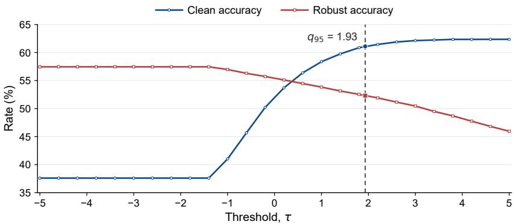  
Figure 6: The sensitivity to the threshold $\tau .$

## D.2 ABLATION STUDY ON TARGET PROMPT $p$

Recall that the target prompt specifies the observable output direction associated with the implanted probe. We therefore investigate whether BaP is sensitive to its semantic content. Table 10 examines the sensitivity of BaP to four semantically distinct target prompts. The results remain highly consistent in terms of clean accuracy and robustness. This stability indicates that the performance of BaP does not rely on the specific semantic content of a backdoor target.

Table 10: Target-prompt sensitivity.
<table><tr><td colspan="2">Target prompt Clean Robustness</td></tr><tr><td>a white teapot</td><td>61.1 52.3</td></tr><tr><td>a red sports car</td><td>61.1 52.3</td></tr><tr><td>a wooden chair</td><td>61.0 52.3</td></tr><tr><td>a cute cat</td><td>61.1 52.1</td></tr></table>

## E DETAILED PROMPT FOR GPTSCORE

Followed by (Li et al., 2025), we compute the captioning performance via GPTScore. The detailed prompt for GPTScore is provided in Fig. 7.

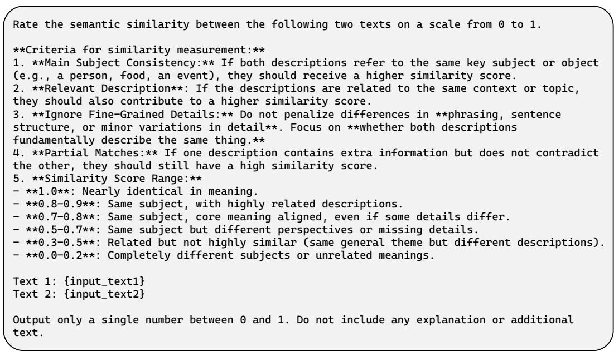  
Figure 7: The system prompt for computing GPTScore.

## F DETAILED RESULTS ON CLIP-B/32 AND CLIP-L/14

Tables 11 and 12 report the per-dataset results across 16 datasets for CLIP ViT-B/32 and ViT-L/14, respectively. These results extend the category-level comparison in Table 6 and further demonstrate the effectiveness of BaP across different CLIP backbones.

## G DETECTION ROC OF BAP

The ROC curves across different backbones are provided in Fig. 8, Fig. 9, Fig. 10 and Fig. 11. BaP achieves consistently high AUC values across backbones and attacks, indicating that its internal probe effectively distinguishes adversarial inputs from clean ones.

Table 11: Performance comparison across different dataset types and method categories on CLIP-B/32. ∆ reports the difference between BaP and the original CLIP.
<table><tr><td rowspan="2"></td><td rowspan="2">Dataset</td><td colspan="2">Original</td><td colspan="10">Test-Time Defense</td><td colspan="7"></td></tr><tr><td colspan="2">CLIP</td><td colspan="2">R-TPT</td><td colspan="2">LPF</td><td colspan="2">HD</td><td colspan="2">Anti-Adv</td><td colspan="2">TTE</td><td colspan="2">TTC</td><td colspan="2">ET3</td><td colspan="2">BaP (Ours)</td><td></td></tr><tr><td colspan="2">Type Name</td><td colspan="2"></td><td colspan="2"></td><td colspan="2"></td><td colspan="2">|Clean Rob.|Clean Rob.|Clean Rob.|Clean Rob.|</td><td colspan="2">|Clean Rob.|</td><td colspan="2"></td><td colspan="2">|Clean Rob. |Clean Rob.|Clean Rob.|</td><td colspan="2">|Clean Rob.|</td><td colspan="2">|Clean Rob.</td></tr><tr><td colspan="2">ImageNet</td><td>57.8</td><td>0.2</td><td>57.4 30.2|</td><td></td><td>52.0 17.4</td><td></td><td>55.2</td><td>3.5</td><td>55.7 10.8</td><td></td><td>61.3 24.1</td><td></td><td>44.024.6</td><td>51.4</td><td>12.4</td><td>53.4</td><td>43.6</td><td>-4.4 +43.4</td></tr><tr><td colspan="2">Genral</td><td>86.1</td><td>0.6</td><td></td><td>76.7 35.1</td><td>84.9</td><td>27.2</td><td>86.5</td><td>4.2</td><td>84.4 41.8</td><td></td><td>86.0 33.7</td><td></td><td>87.6 43.3</td><td>74.1</td><td>30.4</td><td>87.1</td><td>63.1 +1.0</td><td>+62.5</td></tr><tr><td colspan="2">CIFAR10 CIFAR100</td><td>57.2</td><td>0.3</td><td>41.0</td><td>14.7</td><td>56.0</td><td>10.3</td><td>61.6</td><td>4.2</td><td>53.5 20.9</td><td>58.8</td><td>15.5</td><td>58.8</td><td>19.1</td><td>43.5 14.8</td><td>55.5</td><td>35.5</td><td>-1.7</td><td>+35.2</td></tr><tr><td colspan="2">STL10</td><td>96.2</td><td>12.3</td><td>96.5</td><td>78.5</td><td>96.0 67.2</td><td></td><td>95.2 32.6</td><td>95.3</td><td>67.8</td><td>97.4 84.8</td><td></td><td>96.5</td><td>72.5 90.7</td><td>61.1</td><td></td><td>95.6 92.5</td><td>-0.6</td><td>+80.2</td></tr><tr><td colspan="2">Caltech101</td><td>82.3</td><td>6.3</td><td>84.9</td><td>29.4</td><td>81.0 56.7</td><td></td><td>81.9 29.1</td><td></td><td>83.5 50.1</td><td>83.2</td><td>65.7</td><td>82.5 52.1</td><td>79.6</td><td>47.4</td><td></td><td>79.9 71.8</td><td>-2.4</td><td>+65.5</td></tr><tr><td colspan="2">Caltech256</td><td>80.3</td><td>4.1</td><td>80.8 63.5</td><td></td><td>78.6</td><td>49.3</td><td>78.8 21.7</td><td>79.2</td><td>43.1</td><td>78.5</td><td>60.0</td><td>77.3</td><td>49.2 77.2</td><td>40.3</td><td>77.0</td><td>67.9</td><td>-3.3</td><td>+63.8</td></tr><tr><td colspan="2"></td><td></td><td></td><td></td><td>84.2 60.2</td><td>74.6 25.2</td><td></td><td>84.2</td><td>6.4</td><td>83.6 19.9</td><td></td><td>81.7 24.8</td><td>82.2 30.7</td><td></td><td></td><td></td><td>79.1 66.4</td><td>-5.1</td><td>+66.2</td></tr><tr><td colspan="2">Fi-G</td><td>84.2</td><td>0.2 0.8</td><td></td><td>59.2 35.2</td><td>57.8</td><td>25.0</td><td>59.8</td><td>6.2</td><td>60.9 14.2</td><td>61.5</td><td>14.2</td><td>61.926.4</td><td></td><td>75.2 24.3 56.5</td><td>18.9</td><td>60.3 50.0</td><td>-2.4</td><td>+49.2</td></tr><tr><td colspan="2">Flowers102 Food101</td><td>62.7 80.4</td><td>0.1</td><td></td><td>82.1 57.1</td><td>71.0</td><td>20.3</td><td>79.7</td><td>3.6</td><td>78.5 11.4</td><td></td><td>79.9 46.0</td><td>72.7 36.5</td><td>73.7</td><td>13.1</td><td>77.1</td><td>60.4</td><td>-3.3</td><td>+60.3</td></tr><tr><td colspan="2">StanfordCars</td><td>59.9</td><td>0.0</td><td></td><td>60.2 28.1</td><td>44.4</td><td>5.1</td><td>50.5</td><td>3.2 58.1</td><td>4.9</td><td>51.2 26.6</td><td></td><td>49.0 16.3</td><td>42.7</td><td>6.1</td><td></td><td>47.3 42.7</td><td></td><td>-12.6 +42.7</td></tr><tr><td colspan="2"></td><td></td><td>0.8</td><td></td><td>63.1 54.2</td><td>59.3 21.3</td><td></td><td>58.1</td><td>6.1</td><td>61.7 13.2</td><td>62.2</td><td>18.0|</td><td>53.1 31.2</td><td>58.8</td><td></td><td></td><td>61.0 52.7</td><td></td><td>+51.9</td></tr><tr><td colspan="2">Scene</td><td>61.9</td><td>0.0</td><td>14.3</td><td>5.0</td><td>13.1</td><td>1.2</td><td>12.1</td><td>0.0</td><td>12.9 0.8</td><td>16.3</td><td>1.2</td><td>12.6</td><td>3.7 11.2</td><td>15.7 1.8</td><td></td><td>14.0 9.3</td><td>-0.9 -1.7</td><td>+9.3</td></tr><tr><td colspan="2"></td><td>15.7</td><td></td><td></td><td></td><td></td><td></td><td></td><td></td><td></td><td></td><td></td><td></td><td></td><td></td><td></td><td></td><td></td><td></td></tr><tr><td colspan="2">Domain</td><td>FGVCAircraft 17.3</td><td>0.0</td><td>19.7</td><td>13.6</td><td>16.7 29.5</td><td>2.0 1.5</td><td>15.7 35.3</td><td>1.1 2.1</td><td>14.3 2.0 28.7 13.7</td><td>19.8 28.8</td><td>5.1 10.2</td><td>11.4 33.6</td><td>9.2 14.1</td><td>1.8 12.9</td><td>17.1</td><td>19.8|</td><td>-0.2</td><td>+19.8 +32.1</td></tr><tr><td colspan="2"></td><td>34.2</td><td>0.0 1.7</td><td>27.7 21.4</td><td>39.6 32.6</td><td>39.9</td><td>18.0</td><td>40.3</td><td>11.4</td><td>40.9 15.6</td><td>44.2</td><td>23.2</td><td>42.9</td><td>13.9 26.9 22.1 35.6</td><td>18.7</td><td>34.2 38.8</td><td>32.1 28.9</td><td>+0.0 -4.5</td><td>+27.2</td></tr><tr><td colspan="2"></td><td>43.3</td><td>48.924.8</td><td></td><td>55.441.2</td><td>48.7 48.2</td><td></td><td>49.039.8</td><td></td><td>48.8 48.3</td><td></td><td>54.5 38.7</td><td>48.844.2</td><td></td><td>48.6 48.4</td><td></td><td>49.1 49.9</td><td></td><td>+0.2 +25.1</td></tr><tr><td colspan="2">All Avg.</td><td></td><td>60.5 3.3</td><td></td><td>57.937.6|</td><td></td><td>56.5 24.7|</td><td>59.0 11.0|</td><td>58.8 23.7|</td></table>

Table 12: Performance comparison across different dataset types and method categories on CLIP-L/14. ∆ reports the difference between BaP and the original CLIP.
<table><tr><td rowspan="2"></td><td rowspan="2">Dataset</td><td colspan="2">Original</td><td colspan="10">Test-Time Defense</td><td colspan="6"></td><td colspan="2">∆</td></tr><tr><td colspan="2">CLIP</td><td colspan="2">R-TPT</td><td colspan="2">LPF</td><td colspan="2">HD</td><td colspan="2">Anti-Adv</td><td colspan="2">TTE</td><td colspan="2">TTC</td><td colspan="2">ET3</td><td colspan="2">BaP (Ours)</td><td colspan="2"></td></tr><tr><td>Type Name</td><td></td><td>∥Clean Rob. |</td><td></td><td></td><td>|Clean Rob.</td><td>|Clean Rob.</td><td></td><td>|Clean Rob.</td><td></td><td>|Clean Rob.</td><td></td><td>|Clean Rob. |Clean Rob.</td><td></td><td></td><td></td><td>Clean Rob.</td><td></td><td></td><td>|Clean Rob.</td><td>|Clean Rob.</td><td></td></tr><tr><td></td><td>ImageNet</td><td>68.1</td><td>0.6</td><td>71.2</td><td>60.0</td><td>64.2</td><td>43.2</td><td>66.4</td><td>10.1</td><td>68.0</td><td>37.1</td><td>71.5</td><td>32.4</td><td>54.7</td><td>35.8</td><td>66.3</td><td>16.1</td><td>65.9</td><td>60.7</td><td>-2.2</td><td>+60.1</td></tr><tr><td></td><td>CIFAR10</td><td>93.4</td><td>1.1</td><td>90.2</td><td>82.1</td><td>94.3</td><td>71.0</td><td>92.1</td><td>40.5</td><td>89.3</td><td>78.5</td><td>92.3</td><td>47.0</td><td>94.1</td><td>18.4</td><td>86.7</td><td>45.9</td><td>93.2</td><td>53.7</td><td>-0.2</td><td>+52.6</td></tr><tr><td></td><td>CIFAR100</td><td>65.0</td><td>0.1</td><td>65.7</td><td>58.3</td><td>72.8</td><td>40.3</td><td>67.9</td><td>26.7</td><td>64.7</td><td>51.8</td><td>72.9</td><td>37.9</td><td>71.0</td><td>7.0</td><td>62.7</td><td>27.7</td><td>62.3</td><td>28.6</td><td>-2.7</td><td>+28.5</td></tr><tr><td>Genral</td><td>STL10</td><td>99.4</td><td>12.5</td><td>98.8</td><td>93.4</td><td>99.2</td><td>91.7</td><td>98.6</td><td>67.8</td><td>99.0</td><td>93.3</td><td>98.6</td><td>88.9</td><td>99.4</td><td>53.2</td><td>98.2</td><td>72.4</td><td>99.1</td><td>92.9</td><td>-0.3</td><td>+80.4</td></tr><tr><td></td><td>Caltech101</td><td>85.3</td><td>5.0</td><td>89.0</td><td>81.6</td><td>86.3</td><td>77.5</td><td>84.7</td><td>45.2</td><td>86.0</td><td>72.6</td><td>91.2</td><td>73.5</td><td>81.6</td><td>41.6</td><td>84.5</td><td>50.5</td><td>84.2</td><td>65.7</td><td>-1.1</td><td>+60.7</td></tr><tr><td></td><td>Caltech256</td><td>88.4</td><td>4.6</td><td>90.5</td><td>85.4</td><td>87.4</td><td>77.9</td><td>86.2</td><td>39.5</td><td>88.0</td><td>74.3</td><td>89.9</td><td>71.3</td><td>82.0</td><td>44.0</td><td>88.0</td><td>47.2</td><td>87.6</td><td>72.5</td><td>-0.8</td><td>+67.9</td></tr><tr><td></td><td>OxfordPets</td><td>89.9</td><td>0.2</td><td>94.2</td><td>81.4</td><td>88.3</td><td>61.7</td><td>90.5</td><td>13.9</td><td>91.7</td><td>61.1</td><td>90.1</td><td>36.0|</td><td></td><td>84.8 46.8</td><td>87.6 24.4</td><td></td><td></td><td>88.7 77.6</td><td>-1.2</td><td>+77.4</td></tr><tr><td>Fi-G</td><td>Flowers102</td><td>72.4</td><td>0.7</td><td>71.5</td><td>60.8</td><td>72.5</td><td>50.1</td><td>70.9</td><td>10.3</td><td>73.5</td><td>46.3</td><td>73.0</td><td>34.9</td><td>66.0</td><td>33.6</td><td>70.4</td><td>16.4</td><td>71.2</td><td>64.6</td><td>-1.2</td><td>+63.9</td></tr><tr><td></td><td>Food101</td><td>90.0</td><td>0.1</td><td>90.6</td><td>79.3</td><td>86.8</td><td>61.2</td><td>88.7</td><td>7.0</td><td>87.7</td><td>53.1</td><td>89.8</td><td>36.8</td><td>68.3</td><td>47.9</td><td>86.5</td><td>16.3</td><td>87.3</td><td>75.0</td><td>-2.7</td><td>+74.9</td></tr><tr><td></td><td>StanfordCars</td><td>73.0</td><td>0.2</td><td>77.5</td><td>59.8</td><td>67.6</td><td>33.9</td><td>68.8</td><td>5.8</td><td></td><td>76.8 31.6</td><td>73.4</td><td>21.4</td><td>61.9</td><td>30.3</td><td>67.2</td><td>8.4</td><td>71.8</td><td>63.3</td><td>-1.2</td><td>+63.1</td></tr><tr><td>Sccene</td><td>SUN397</td><td>68.2</td><td>0.5</td><td>69.9</td><td>61.5</td><td>65.6</td><td>45.3</td><td>64.9</td><td>11.5</td><td>68.5</td><td>38.0</td><td>69.4</td><td>22.1</td><td>56.4</td><td>33.0</td><td>66.4</td><td>15.7</td><td>65.5</td><td>61.9</td><td>-2.7</td><td>+61.4</td></tr><tr><td></td><td>Country211</td><td>23.8</td><td>0.0</td><td>24.2</td><td>13.4</td><td>22.8</td><td>7.1</td><td>21.1</td><td>0.8</td><td>21.9</td><td>6.0</td><td>26.2</td><td>2.3</td><td>13.8</td><td>6.3</td><td>20.3</td><td>1.9</td><td>23.3</td><td>19.4</td><td>-0.5</td><td>+19.4</td></tr><tr><td></td><td>FGVCAircraft</td><td>28.1</td><td>0.0</td><td>33.2</td><td>20.7</td><td>26.1</td><td>11.1</td><td>26.5</td><td>1.4</td><td>26.5</td><td>10.7</td><td>30.2</td><td>5.3</td><td>23.4</td><td>12.1</td><td>27.3</td><td>1.5</td><td>26.5</td><td>29.2</td><td>-1.6</td><td>+29.2</td></tr><tr><td></td><td>EuroSAT</td><td>54.8</td><td>0.1</td><td>38.8</td><td>33.6</td><td>53.2</td><td>19.0</td><td>47.5</td><td>11.5</td><td>46.9</td><td>30.4</td><td>41.1</td><td>12.0</td><td>52.1</td><td>7.7</td><td>45.3</td><td>16.4</td><td>52.3</td><td>24.8</td><td>-2.5</td><td>+24.7</td></tr><tr><td>Doman</td><td>DTD</td><td>53.0</td><td>0.7</td><td>53.8</td><td>44.4</td><td>48.9</td><td>35.2</td><td>52.3</td><td>15.1</td><td>50.3</td><td>33.5</td><td>52.5</td><td>26.6</td><td>42.4</td><td>25.6</td><td>50.2</td><td>23.1</td><td>51.2</td><td>43.0</td><td>-1.8</td><td>+42.3</td></tr><tr><td></td><td>PCAM</td><td>49.6</td><td>0.2</td><td>43.6</td><td>50.4</td><td>49.9</td><td>48.8</td><td>50.4</td><td>35.4</td><td>50.2</td><td>49.1</td><td>50.8</td><td>50.6</td><td>50.1</td><td>16.6</td><td>50.1</td><td>47.0</td><td>49.5</td><td>44.9</td><td>-0.1</td><td>+44.7</td></tr><tr><td>All</td><td>Avg.</td><td>68.9</td><td>1.7</td><td>68.9</td><td>60.4</td><td>67.9</td><td>48.0</td><td>67.3</td><td>21.4</td><td></td><td>68.1 54.2|</td><td>69.6 37.4</td><td></td><td>62.6</td><td>28.7</td><td>66.1</td><td>26.9</td><td></td><td>67.5 54.9</td><td>-1.4</td></table>

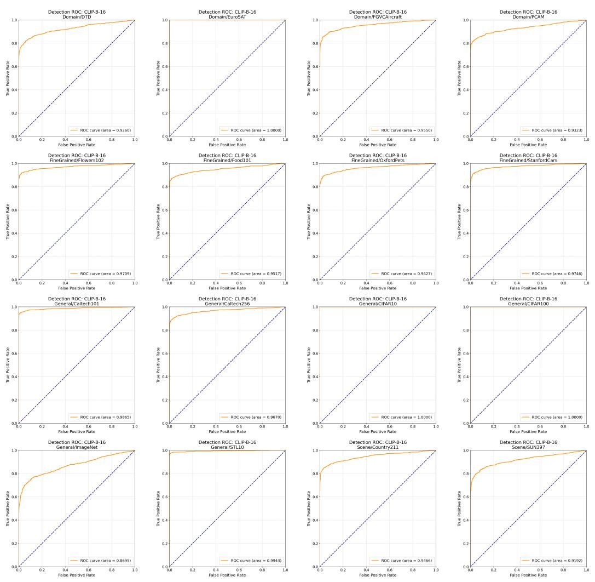  
Figure 8: ROC curves of CLIP-B/16 for adversarial sample detection on 16 datasets.

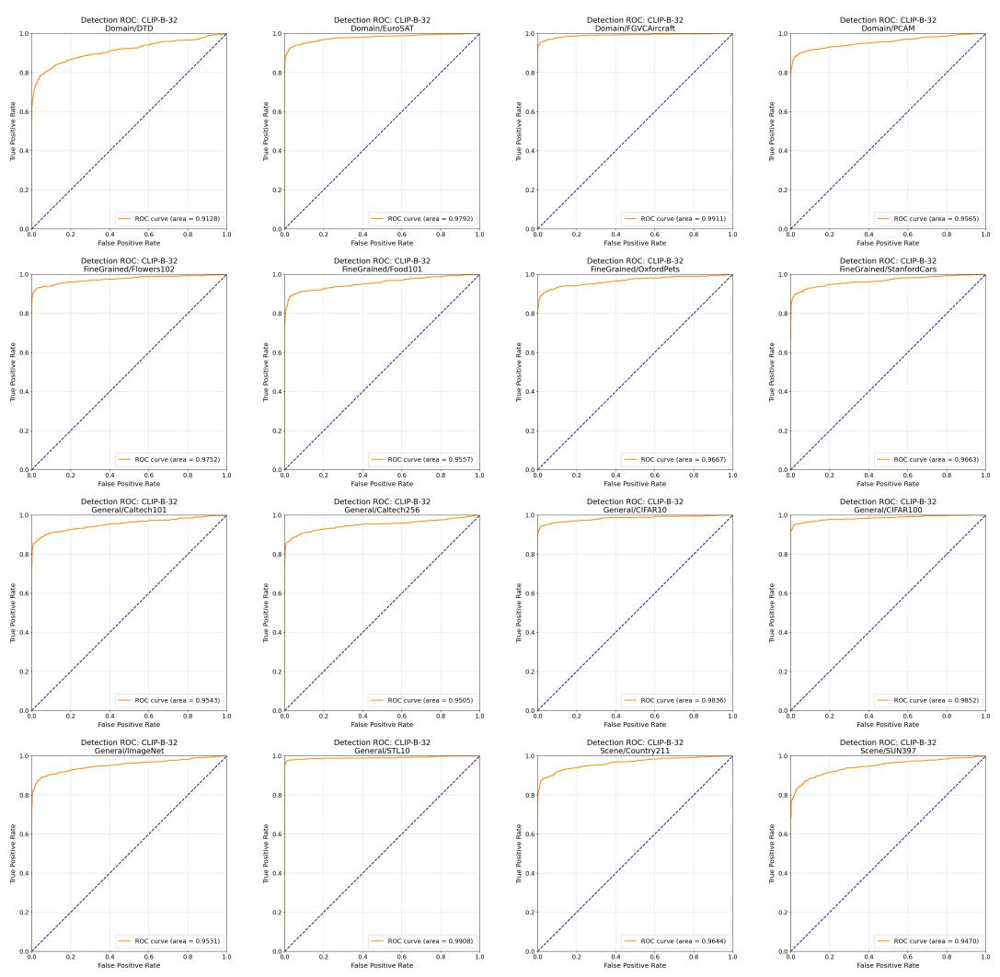  
Figure 9: ROC curves of CLIP-B/32 for adversarial sample detection on 16 datasets.

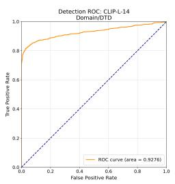

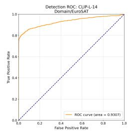

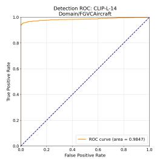

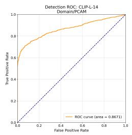

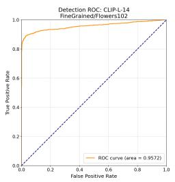

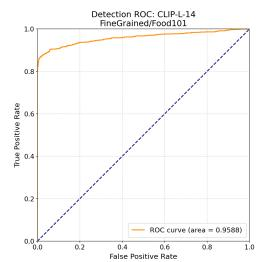

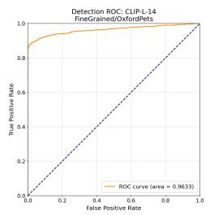

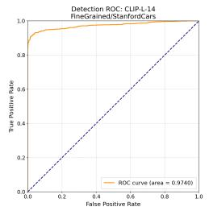

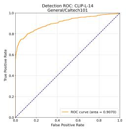

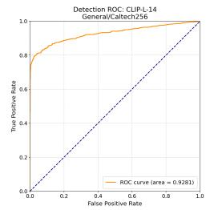

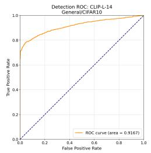

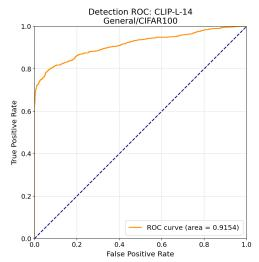

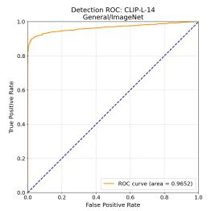

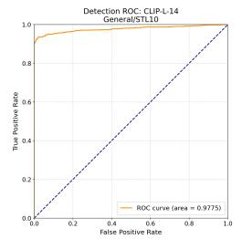

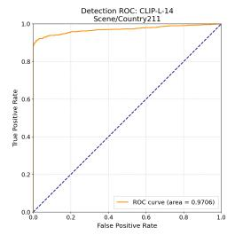  
Figure 10: ROC curves of CLIP-L/14 for adversarial sample detection on 16 datasets.

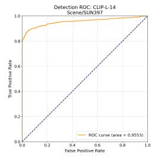

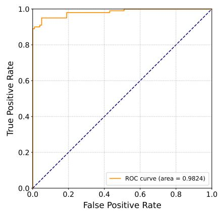  
(a) FOA-Attack.

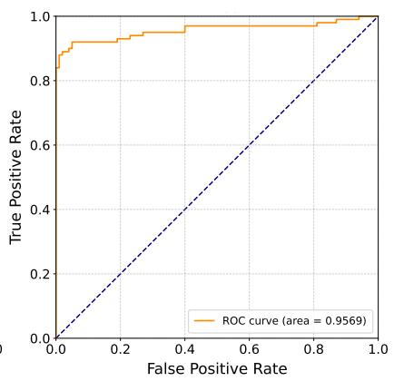  
(b) M-Attack  
Figure 11: ROC curves of CLIP-L/14@336 for LVLM attacks.