# BMND: Direct Poisson Denoising by N-Dimensional Block Matching and Collaborative Filtering

Christof Duhme, Lars Schiefelbein, Florian Büther, Xiaoyi Jiang

University of Münster

## Abstract

Poisson denoising of scientific data requires methods that account for signal-dependent noise while accommodating diferent data dimensionalities and preserving quantitative intensity information. We present BMND, a dimension-independent extension of block matching and collaborative filtering for Gaussian and Poisson observations. Building on the two-stage structure of BM3D and BM4D, BMND processes Poisson data directly, without a variance-stabilizing transform, by combining noise-aware patch matching with propagation of signal-dependent noise variances through collaborative filtering and aggregation. A dimension-independent referencepatch traversal scheme supports arrays with an arbitrary number of axes. An optional aggregationaware mass conservation preserves the observed total intensity after weighted overlap-add. We evaluate the framework on one-dimensional physiological signals, two-dimensional images, and three-dimensional volumes, using controlled noise experiments and measured fluorescence microscopy acquisitions. The experiments demonstrate improved reconstruction quality from noise-aware matching and Wiener filtering, while low-count phantom experiments show reduced denoising-induced intensity loss through mass conservation. The framework provides a unified, non-learning-based approach to denoising across arbitrary data dimensions and is released as an open-source library.

## 1 Introduction

Image and signal denoising is a fundamental ill-posed inverse problem that aims to recover a clean signal x from a noisy observation y. The noise model is application-dependent: while additive white Gaussian noise with variance $\sigma ^ { 2 }$ is a common assumption, many imaging modalities - such as fluorescence microscopy and positron emission tomography - are dominated by Poisson noise, where the observed intensity follows a Poisson distribution with mean equal to the true signal [4]. Unlike additive white Gaussian noise, Poisson noise is signal-dependent, making it more challenging to remove [26, 30]. Classical approaches to this problem include spatial filtering, such as Gaussian filtering and anisotropic difusion [37, 46], as well as transform-domain methods [40] like wavelet shrinkage [7, 8, 14]. Although these methods are computationally eficient, they operate locally or with a fixed basis and inherently struggle to preserve fine structural details, often introducing significant smoothing artifacts [5, 33]. Furthermore, most classical methods are designed for Gaussian noise and require variance-stabilizing transforms (VSTs) (e.g., the Anscombe transform [2, 30]) to handle Poisson data, which struggles in low-count regimes.

These classical methods operate exclusively locally or in a fixed transform basis and neglect the often pronounced self-similarity of natural signals. This oversight then motivated the creation of nonlocal approaches that take advantage of the redundancy of similar structures across the entire data volume. One of the forerunners of this technique was the nonlocal means (NLM) algorithm [5], which computes for each pixel a weighted average of all other pixels, with weight depending on the similarity of the surrounding image patches. The NLM algorithm showed that the exploitation of self-similarity can improve denoising quality substantially, thus laying the foundation for an entire family of patch-based denoising methods. A multitude of refinements improved both robustness and eficiency of NLM, like optimized blockwise processing [9], iterative weight estimation [13] and adaptive parameter selection [20]. With these developments nonlocal self-similarity established itself as a core principle in modern image denoising, paving the way for more sophisticated patch-based approaches.

Building upon the success of nonlocal methods, 3-dimensional block matching (BM3D) [11] represents a landmark advancement in image denoising. BM3D combines block matching with collaborative filtering in a 3D transform domain: first 2D patches are grouped into 3D stacks, which then are jointly transformed using a separable 3D transform (e.g. wavelet or discrete cosine transform (DCT)), afterwards they are shrunk via hard thresholding or Wiener filtering, and finally inverse-transformed to produce the denoised image. The synergy of nonlocal self-similarity and sparse transform-domain representation established BM3D as a powerful tool for removing white Gaussian noise in 2D images. The capabilities of BM3D have been further improved by numerous extensions, including shaped adaptive variants [19], integration of PCA-based dictionaries [12], incorporation of color information [10] and combinations with nonlocal sparse models [28]. The success of BM3D motivated its extension to higher-dimensional data. 4-dimensional block matching (BM4D) [27] generalizes the collaborative filtering paradigm to volumetric data (3D) and video sequences by grouping 3D patches into 4D arrays, achieving positive results in these domains. However, the transfer to arbitrary dimensions has not yet been done. The block-matching step sufers from higher dimensionality, as both computational complexity as well as memory footprint grow exponentially with the number of dimensions [22].

In recent years, deep learning-based methods have achieved remarkable success in image denoising, often outperforming classical nonlocal approaches in terms of peak signal-to-noise ratio (PSNR) and structural similarity index measure (SSIM) on standard benchmarks. Discriminative models such as DnCNN [48] and FFDNet [50] learn a direct mapping from noisy to clean images, while encoderdecoder architectures like U-Net [38] have proven highly efective for various restoration tasks. Self-supervised approaches, including Noise2Noise [24], Noise2Void [23] and Noise2Self [3], have further pushed the boundaries by eliminating the need for clean ground-truth data. However, these models are typically trained for a specific dimensionality and specific noise model (usually Gaussian). Adapting them to n-dimensional data or to Poisson noise requires architectural modifications and retraining, which is often impractical for high-dimensional scientific data where large annotated training datasets are scarce [49]. A further point of limitation is the black-box nature of deep networks, limiting interpretability, which is crucial in medical and scientific imaging [39]. While hybrid approaches such as Plug-and-Play priors [6, 45] integrate classical denoisers into iterative schemes, they still rely on pre-trained models that are not inherently dimension-agnostic. In conclusion, despite the success, these methods do not provide a direct solution to the challenges of n-dimensional, Poisson-corrupted data, highlighting the need for a dedicated framework like N-dimensional block matching (BMND).

Rather than simply adapting existing block-matching filters, our method is a nontrivial extension of BM3D and BM4D. Our key contributions are fourfold:

1. Native Poisson handling. Directly processes Poisson-corrupted data without requiring a VST, preserving accuracy even at low photon counts.

2. Aggregation-aware mass conservation. Conserves the total intensity within each patch group under Poisson noise.

3. Arbitrary-dimensional support. Enables denoising of data with any number of dimensions without manual adaptation.

4. Unified reference-patch traversal. Replaces dimension-specific lookup tables with a unified scheme for arbitrary-dimensional arrays, enabling seamless application to new data types.

In addition, we release our implementation as an open-source library to ensure easy use and reproducibility. Together, these contributions go beyond incremental modifications and establish a self-contained denoising framework for a wide range of data types.

The bmnd package can be downloaded from PyPI (https://pypi.org/project/bmnd/). The source code of the library can be found at https://github.com/cduhme/bmnd.

## 2 Method Overview

This section formalizes the observation model that underlies the proposed denoising framework. We consider both additive Gaussian and Poisson-distributed noise, which require diferent treatment in the filtering process. The subsequent description of the algorithm is structured along the two processing stages illustrated in Figure 1. This provides a high-level overview of the proposed BMND framework, which builds upon the collaborative filtering scheme of BM3D [11] and BM4D [27]. The algorithm consists of two stages over the entire input volume: a hard-thresholding stage followed by a Wiener filtering stage. Both stages share the same core structure - block matching, collaborative transform, coeficient shrinkage, inverse transform, and aggregation - but difer in the shrinkage rule and the use of reference data. The first stage produces a complete intermediate estimate, which is then used as a reference for the second stage to guide block matching and compute Wiener shrinkage coeficients.

The first stage, the hard-thresholding stage, operates directly on the noisy observation. Candidate patches are identified using block matching (Section 4), grouped into stacks, and transformed using an N-dimensional transform. The transformed coeficients are then hard-thresholded (Section 5). After applying the inverse transform and a Kaiser window, the processed patches are aggregated (Section 7) to form the hard-thresholding estimate.

The second stage, the Wiener filtering stage, refines this estimate. It again performs block matching, but now uses the hard-thresholding estimate to find candidate patches, while the actual values used for filtering are taken from the original noisy observation (Section 4). The grouped patches are transformed with another, diferent N-dimensional transform, and Wiener shrinkage is applied (Section 6). An optional mass-conservation constraint (Section 8) is then imposed before the inverse transform and Kaiser window. Finally, aggregation (Section 7) yields the Wiener shrinkage estimate, which is the output of the algorithm.

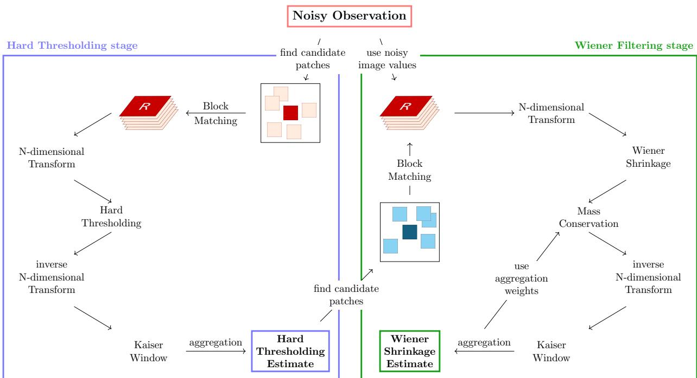  
Figure 1: Overview of the algorithm.

Table 1: Top-down overview of the problems addressed by BMND, the limitations of existing approaches, and the corresponding methodological solutions.

<table><tr><td>Problem and existing limitations</td><td>BMND approach</td></tr><tr><td>Different data modalities and noise models. Parameters, A common formulation with configurable pro- dimensions, and noise assumptions are tightly coupled in existing files for geometry, noise, matching, shrinkage, implementations, which limits their reuse across imaging modalities and aggregation. and acquisition settings.</td><td></td></tr><tr><td>Signal-dependent Poisson noise. Standard squared Euclidean Direct scaled-Poisson processing with a plug- block matching and fixed-variance shrinkage are designed for data- in variance map and Poisson-aware matching independent, stationary Gaussian noise and do not account for the metrics. signal dependence of Poisson noise.</td><td></td></tr><tr><td>Correlated or heteroscedastic noise. A single scalar variance A common covariance interface that propa- per coefficient is inadequate for nonstationary or correlated noise. gates noise through transforms, thresholds,</td><td>Wiener gains, and aggregation weights.</td></tr><tr><td>Arbitrary-dimensional data. BM3D and BM4D are formulated Coupled reference-patch schedules and group for specific data dimensionalities and therefore require dimension- transforms for arrays with an arbitrary num- dependent implementations of patch extraction, grouping, trans- ber of data axes. forms, and traversal.</td><td></td></tr><tr><td>Low-count measurements. High-count asymptotics for discrep- ancy moments become inaccurate for small pooled counts.</td><td>Exact finite-count conditional moments for calibrating acceptance rules and matching scales.</td></tr></table>

Continued on next page

<table><tr><td>Problem and existing limitations</td><td>BMND approach</td></tr><tr><td>Noise-aware block matching. Raw sum of squared distances Poisson deviance, Pearson and Anscombe dis- (SSD) includes the expected contribution of noise and does not crepancies, and noise-bias-corrected SSD un- distinguish structural mismatch from noise fluctuations.</td><td>der Gaussian or Poisson models.</td></tr><tr><td>Hard thresholding with correlated Gaussian noise. Standard Exact transform-domain variance propaga- coefficientwise thresholding relies on a scalar variance per coefficient tion and partial covariance propagation. and does not propagate noise covariance through the transform.</td><td></td></tr><tr><td>Hard thresholding with signal-dependent Poisson noise. Direct-Poisson variance maps and shared- Thresholding rules based on fixed-variance assumptions do not account for the signal dependence of Poisson noise.</td><td>source covariance model for repeated voxels.</td></tr><tr><td>Scalar Wiener risk and pilot signal power. The classical Coefficient-dependent gains, bias-corrected Wiener gain uses a scalar minimum-risk rule and raw pilot pow- pilot powers, and covariance-aware risk. ers that include a noise floor, which is suboptimal for coefficient- dependent noise.</td><td></td></tr><tr><td>Group-level aggregation weights. Standard aggregation assigns Patch-level weighting based on propagated the same weight to all patches in a group and does not exploit variance and predicted marginal risk. patch-level reliability.</td><td></td></tr><tr><td>Aggregation weights ignoring bias and overlap covariance. Bias-aware risk and overlap-aware covariance. Existing reliability weights do not account for bias in the pilot or covariance between overlapping estimates.</td><td></td></tr><tr><td>Loss of total intensity under shrinkage. Aggregation weights Optional aggregation-aware constraint enforc- alone do not ensure that the reconstructed array preserves the ing each filtered group to reproduce the nor- observed total intensity, which is proportional to the number of malized overlap-add contribution of its noisy detected events under the scaled-Poisson model.</td><td>source group via a transform-domain correc- tion.</td></tr></table>

In the following chapters we systematically walk through the problems and limitations of existing nonlocal denoising methods and present the corresponding BMND solutions. The order of presentation follows Table 1 and, at the same time, the order in which the algorithm encounters individual issues. We therefore use the table as a top-down roadmap: each row is a problem-solution pair that is discussed in the corresponding chapter.

Existing implementations such as BM3D and BM4D are designed for specific data dimensionalities and noise models. As a result, their parameters, dimensions, and noise assumptions are tightly coupled, which limits their reuse across imaging modalities and acquisition settings. BMND addresses this limitation by introducing a common formulation with configurable profiles for geometry, noise, matching, shrinkage, and aggregation. In Section 2, we establish this general framework: we define the notation, the patch-group observation model, and the covariance propagation rules that are used throughout the manuscript. The covariance serves as the common interface between the noise model and the algorithm. All thresholds and shrinkage factors are expressed in terms of the transform-domain variances.

Because the standard SSD block matching and fixed-variance shrinkage are specifically designed for data-independent, stationary Gaussian noise, the preexisting implementations are limited in what types of data they may handle. This is additionally visible in the used variance map, which originated as a single scalar variance per coeficient. These limitations do not represent nonstationary or correlated noise and thus in particular not the signal dependence of Poisson noise. In Section 3, we introduce both the stationary Gaussian model as well as the scaled Poisson model and discuss the handling of the variance in both noise modalities. This allows us to establish direct scaled-Poisson processing with a plug-in variance map and Poisson-aware matching metrics in the upcoming sections.

The algorithms BM3D and BM4D use a precomputed lookup table to select reference-patch shifts. These are therefore limited to the provided patch and step sizes. A generalized referencepatch schedule, to overcome these challenges, has thus been added in Section 4.1 to allow for block matching in arbitrary dimensions. The resulting construction supports an arbitrary number of data axes while balancing spatial coverage, boundary validity and computational cost. Shifted traversal improves the coverage of coarse lattice without incurring the full cost of refining every axis simultaneously.

Following the definition of the reference locations, Section 4.2 deals with comparing candidate patches. The commonly used method is SSD, which is particularly suitable for data-independent stationary Gaussian noise. Under signal-dependent Poisson noise, however, the variability of the observation changes with the underlying signal and can therefore reflect noise fluctuations rather than structural diferences. We consequently consider four matching metrics: SSD, Poisson deviance, Pearson discrepancy, and Anscombe SSD.

The scale of the matching metric is particularly important in the low-count regime. The usual χ21−based calibration can be inaccurate for small pooled counts because the conditional moments of the discrepancy depend on the total count. Section 4.3 therefore derives exact finite-count moments under an equal-rate Poisson null and uses them to calibrate low-count acceptance rules. These are moment-calibrated criteria rather than exact conditional tests.

SSD does not distinguish structural diferences between patches from discrepancies caused by noise. The expected noise contribution depends on the spatial covariance under Gaussian noise and on the underlying signal under Poisson noise. In Section 4.4, we therefore derive the noise contribution for both observation models and subtract it from the raw SSD. For Poisson noise, the unknown contribution is estimated using the observed patch values.

Following block matching, the grouped patches are transformed and their coeficients are thresholded. Thresholding rules based on a common noise variance do not account for spatial correlations or the signal dependence of Poisson noise. In Section 5, the noise covariance is therefore propagated through the group transform to determine the individual coeficient variances. For Poisson noise, a plug-in variance map and a shared-source covariance model additionally account for signal-dependent variances and repeated voxels in overlapping patches. Partial covariance propagation allows the accuracy of this model to be balanced against computational cost. The resulting variances are used to scale the coeficientwise thresholds.

The subsequent Wiener stage uses the hard-thresholding estimate to determine the signal power of each coeficient. This estimate still contains residual noise, so the raw squared coeficients can overestimate the underlying signal power. In Section 6, we derive the scalar minimum-risk gain using coeficient-dependent noise variances and introduce noise-floor corrections to the pilot-power estimates. The resulting gains account for the estimated signal and noise contributions when filtering the original noisy coeficients.

Following inverse transformation, the filtered patches are aggregated to form the reconstructed array. Standard group-level aggregation assigns the same weight to all patches in a group and therefore does not account for diferences in their reliability. Section 7 introduces patch-level weighting alongside group-level weighting, using propagated variance and predicted marginal risk to determine the individual patch weights. This allows more reliable patches to contribute more strongly to the reconstructed estimate, even when they belong to the same group.

Aggregation weights based only on the transmitted noise do not account for the signal attenuation introduced by shrinkage. Overlapping patches additionally share source voxels, which introduces dependence between the estimates within a group. In Section 7.2, the predicted Wiener risk therefore includes both the residual noise and the estimated signal loss. The covariance-aware models in Section 7.3 further account for shared-source dependence through inverse transformation and aggregation windowing. This allows the reliability weights to reflect both shrinkage-induced bias and overlap-induced covariance.

Finally, shrinkage can alter the total intensity of the reconstructed array, and aggregation weights alone do not ensure its preservation. Under the scaled-Poisson model, the observed total intensity is proportional to the number of detected events. In Section 8, we therefore introduce an optional aggregation-aware constraint that makes each filtered group reproduce the normalized overlap-add contribution of its noisy source group. The constraint is enforced through a transform-domain correction that accounts for the aggregation weights, window, and overlap normalization. With the aggregation weights held fixed, this preserves the observed total intensity after aggregation.

To describe these steps within a common mathematical framework, we first introduce the notation, the patch-group observation model, and the covariance propagation rule used throughout the manuscript. The following sections then develop the individual processing steps in the order outlined above.

Notation. Spatial-domain group vectors are written in bold lowercase, such as $\mathbf { y } _ { g } ,$ and their transform-domain counterparts in bold uppercase, such as $\mathbf { Y } _ { g } = T _ { g } \mathbf { y } _ { g }$ . Individual entries are written without boldface, for example $y _ { g , i }$ and $Y _ { g , k }$ . Matrices and linear operators generally use non-bold uppercase letters, such as $T _ { g }$ and $U _ { g }$ . Calligraphic letters generally denote sets or collections, with locally defined exceptions for distributions, likelihoods, and selected operators. Hats denote estimates. The superscripts ⊤ and H denote transpose and conjugate transpose, respectively.

Let $D = N - 1$ denote the number of data axes. Stacking D-dimensional patches along an additional grouping axis produces the N-dimensional groups processed by BMND. Let $\Omega \subset \mathbb { Z } ^ { D }$ denote the finite sampling domain, and let $u \in \Omega$ denote a sampling location. Let $y \colon \Omega  \mathbb { R }$ denote the observed array and $x \colon \Omega  \mathbb { R }$ its unknown clean mean. For each reference origin, block matching searches a local window, scores the candidate patches, and retains the best matches. The resulting group is the basic object processed by both collaborative-filtering stages.

Definition 2.1 (Patch-group observation model). After vectorization, a noisy patch group is written as

$$
{ \bf y } _ { g } = { \bf x } _ { g } + { \bf n } _ { g } ,\tag{1}
$$

where $\mathbf { x } _ { g } \in \mathbb { R } ^ { d }$ is the unknown clean group, $\mathbf { n } _ { g } \in \mathbb { R } ^ { d }$ is the corresponding noise vector with $\mathbb { E } [ { \mathbf { n } } _ { g } ] = 0$ and d is the group dimension. A possibly complex-valued combined patch and nonlocal group transform $T \in \mathbb { C } ^ { d \times d }$ produces

$$
\begin{array} { r l r } & { \mathbf { Y } _ { g } = T \mathbf { y } _ { g } = \mathbf { X } _ { g } + \mathbf { N } _ { g } , } & \\ & { \mathbf { X } _ { g } = T \mathbf { x } _ { g } , } & { \mathbf { N } _ { g } = T \mathbf { n } _ { g } . } \end{array}\tag{2}
$$

Spatial-domain entries are denoted by $y _ { g , i } , \boldsymbol { x } _ { g , i }$ , and $n _ { g , i } .$ whereas transformed entries are denoted by $Y _ { g , k } , X _ { g , k } ;$ and $N _ { g , k }$ . When one group is fixed, the group index is suppressed, giving symbols such as $n _ { i } , Y _ { k } , X _ { k }$ , and $N _ { k }$

For complex-valued random vectors, the covariance of $\mathbf { n } _ { g }$ is defined as

$$
\Sigma _ { g } = \mathrm { C o v } ( { \bf n } _ { g } ) = \mathbb E \left[ { \bf n } _ { g } { \bf n } _ { g } ^ { \mathrm { H } } \right] ,\tag{3}
$$

where the zero-mean assumption is used. The transformed covariance is denoted by

$$
\Sigma _ { N , g } = \mathrm { C o v } ( \mathbf { N } _ { g } ) .\tag{4}
$$

Remark 2.2 (Complex-valued transforms). Real-valued source groups may have complex transform coeficients, e.g. when $T$ contains a Fourier transform. When $T$ is complex-valued, it and its inverse $U$ are understood as complex-linear operators on the complex spaces. A real group $\mathbf { x } _ { g } \in \mathbb { R } ^ { d }$ is embedded in $\mathbb { C } ^ { d }$ , its coeficients lie in the real-valued subspace $S _ { g } = T ( \mathbb { R } ^ { d } ) = \{ T \mathbf { x } : \mathbf { x } \in \mathbb { R } ^ { d } \}$ , and the restriction of $U$ to $\mathcal { S } _ { g }$ maps back to $\mathbb { R } ^ { d }$ . For coeficients outside $\mathcal { S } _ { g }$ , the synthesized group need not be real-valued.

For real- or complex-valued random variables, covariance is understood in the Hermitian sense,

$$
\operatorname { C o v } ( z , w ) = \mathbb { E } \left[ ( z - \mathbb { E } [ z ] ) { \overline { { ( w - \mathbb { E } [ w ] ) } } } \right] , \qquad \operatorname { C o v } ( \mathbf { z } ) = \mathbb { E } \left[ ( \mathbf { z } - \mathbb { E } [ \mathbf { z } ] ) ( \mathbf { z } - \mathbb { E } [ \mathbf { z } ] ) ^ { \mathrm { H } } \right] .\tag{5}
$$

The corresponding variance is $\operatorname { V a r } ( z ) = \operatorname { C o v } ( z , z ) = \mathbb { E } [ | z - \mathbb { E } [ z ] | ^ { 2 } ]$ . For real random variables, these expressions reduce to the usual covariance and variance definitions.

The algorithm applies the following sequence twice. In the first pass, transformed coeficients that are small relative to their own noise standard deviations are removed. Inverse transformation and weighted overlap-add produce a pilot estimate. The second pass repeats block matching using that pilot, transforms the pilot and noisy groups together, estimates signal power from the pilot, and applies a Wiener gain to the noisy coeficients. A second overlap-add produces the output. Thus, the covariance is the common interface between the noise model and the algorithm. In what follows, all thresholds and shrinkage factors are defined in terms of the diagonal entries of $\Sigma _ { N , g }$

Lemma 2.3 (Covariance propagation). Let $\mathbf { n } _ { g }$ have finite second moments and covariance $\Sigma _ { g }$ . For a deterministic linear transform $T$ , the transformed noise covariance is

$$
\Sigma _ { N , g } = \mathrm { C o v } ( \mathbf { N } _ { g } ) = T \Sigma _ { g } T ^ { \mathrm { H } } .\tag{6}
$$

In particular, the noise variance of the transformed coeficient k is

$$
\sigma _ { k } ^ { 2 } = ( \Sigma _ { N , g } ) _ { k k } = \sum _ { i , j } T _ { k i } \overline { { T _ { k j } } } \operatorname { C o v } ( n _ { g , i } , n _ { g , j } ) .\tag{7}
$$

Proof. Since $T$ is deterministic and linear,

$$
\mathbf { N } _ { g } - \mathbb { E } [ \mathbf { N } _ { g } ] = T \left( \mathbf { n } _ { g } - \mathbb { E } [ \mathbf { n } _ { g } ] \right) .
$$

Consequently,

$$
\begin{array} { r l } & { \mathrm { C o v } ( { \bf N } _ { g } ) = \mathbb { E } \left[ T \left( { \bf n } _ { g } - \mathbb { E } [ { \bf n } _ { g } ] \right) ( { \bf n } _ { g } - \mathbb { E } [ { \bf n } _ { g } ] ) ^ { \mathrm { H } } T ^ { \mathrm { H } } \right] } \\ & { \quad \quad \quad = T \mathbb { E } \left[ ( { \bf n } _ { g } - \mathbb { E } [ { \bf n } _ { g } ] ) ( { \bf n } _ { g } - \mathbb { E } [ { \bf n } _ { g } ] ) ^ { \mathrm { H } } \right] T ^ { \mathrm { H } } } \\ & { \quad \quad \quad = T \Sigma _ { g } T ^ { \mathrm { H } } . } \end{array}
$$

Equation (7) follows by taking the kth diagonal entry.

Remark 2.4 (Efect of data-dependent group selection). Lemma 2.3 is stated for both a fixed group and a fixed deterministic transform. In the algorithm, however, the group is selected by a data-dependent block-matching procedure. A fully conditional analysis would therefore require the distribution of the noise given the matching outcome. This issue applies to both Gaussian and Poisson observations. In the latter case, the noise covariance is additionally signal-dependent. Unless stated otherwise, the selected group is treated as fixed when computing the local covariance used by the filtering operations.

## 3 Observation Models

Observation models describe how the measured data relate to the underlying clean signal. Two observation models are considered here: additive Gaussian noise and scaled-Poisson noise. The additive white-Gaussian model is inherited from BM3D/BM4D [11, 27], while stationary correlated-Gaussian modeling follows generalized collaborative filtering [29]. For such stationary Gaussian fields, the autocovariance and power spectral density are linked via the discrete Wiener–Khinchin theorem [35]. On the other hand, Poisson noise arises in photon-limited imaging, where the observed counts follow a Poisson distribution. Stored intensities may difer from these counts by a fixed multiplicative conversion factor. This motivates the scaled-Poisson model, meaning that mean and variance formulas follow from standard Poisson moment identities [21]. Direct scaled-Poisson processing and its plug-in variance map extend these noise models in BMND.

Despite their diferent origins, Gaussian and Poisson noise models share a common structure: both define a covariance matrix $\Sigma _ { g }$ that characterizes the noise in the observation domain. Once this covariance is known, the subsequent linear propagation through the filtering pipeline is identical. In the following, these two noise models are formalized, starting with the Gaussian case, and the properties used throughout this work are derived.

## 3.1 Stationary Gaussian Noise

Definition 3.1 (Additive Gaussian observation model). An observation follows the additive Gaussian model if

$$
y = x + n . \qquad n \sim { \mathcal { N } } ( 0 , \Sigma _ { n } ) ,\tag{8}
$$

where $\Sigma _ { n }$ is the covariance matrix of the vectorized noise array.

Definition 3.2 (Wide-sense stationary Gaussian noise). The Gaussian noise field is wide-sense stationary if its mean is constant and its covariance depends only on the displacement τ between sampling locations u and $u + \tau \in \Omega$

$$
\operatorname { C o v } ( n ( u ) , n ( u + \tau ) ) = { \mathfrak { c } } ( \tau ) .\tag{9}
$$

The function c is called the autocovariance.

Under discrete Fourier normalization, the power spectral density (PSD) samples $S ( \omega )$ and the autocovariance satisfy

$$
\mathfrak { c } ( \tau ) = \frac { 1 } { | \Omega | } \mathrm { i f f u n } ( S ) ( \tau ) ,\tag{10}
$$

where |Ω| is the number of samples in the array.

For white noise with PSD $S ( \omega ) = | \Omega | \sigma ^ { 2 }$ this simplifies.

Corollary 3.3 (White-noise transform variance). $I f \Sigma _ { g } = \sigma ^ { 2 } I$ and T is orthonormal, then

$$
\Sigma _ { N , g } = \sigma ^ { 2 } I ,\tag{11}
$$

and every transformed coeficient has noise variance $\sigma ^ { 2 }$

Proof. Lemma 2.3 gives

$$
\Sigma _ { N , g } = T ( \sigma ^ { 2 } I ) T ^ { \mathrm { H } } = \sigma ^ { 2 } T T ^ { \mathrm { H } } = \sigma ^ { 2 } I .
$$

Colored noise instead produces non-zero of-diagonal patch covariance and generally coeficientdependent variances.

## 3.2 Scaled-Poisson Noise

For Poisson noise, there is not only the normal Poisson noise but also its scaled variant. Choosing the Poisson scale $s _ { P } = 1$ , all subsequent formulas reduce to the standard Poisson case.

Definition 3.4 (Scaled-Poisson observation model). Let $K ( u )$ denote the number of detected events at location u. Under the scaled-Poisson model,

$$
K ( u ) \sim \mathcal P ( \lambda ( u ) ) , \qquad Y ( u ) = s _ { P } K ( u ) , \ s _ { P } > 0 .\tag{12}
$$

The corresponding clean mean in stored-intensity units is

$$
X ( u ) = \mathbb { E } [ Y ( u ) ] = s _ { P } \lambda ( u ) .\tag{13}
$$

The standard Poisson model additionally assumes that the random variables $K ( u )$ are independent across sampling locations.

Lemma 3.5 (Scaled-Poisson moments). Under Definition ${ 3 . 4 } ,$

$$
\mathbb { E } [ Y ( u ) ] = X ( u ) , \qquad \mathrm { V a r } [ Y ( u ) ] = s _ { P } X ( u ) .\tag{14}
$$

If the raw counts are independent, then the spatial-domain noise covariance is diagonal, i.e.

$$
\operatorname { C o v } ( Y ( u ) , Y ( v ) ) = { \left\{ \begin{array} { l l } { s _ { P } X ( u ) , } & { u = v } \\ { 0 , } & { u \neq v . } \end{array} \right. }\tag{15}
$$

Proof. Since a Poisson random variable with parameter $\lambda ( u )$ has mean and variance $\lambda ( u )$

$$
\begin{array} { r l } & { \mathbb { E } [ Y ( u ) ] = s _ { P } \mathbb { E } [ K ( u ) ] = s _ { P } \lambda ( u ) = X ( u ) , } \\ & { \mathrm { V a r } ( Y ( u ) ) = s _ { P } ^ { 2 } \mathrm { V a r } ( K ( u ) ) = s _ { P } ^ { 2 } \lambda ( u ) = s _ { P } X ( u ) . } \end{array}
$$

Independence of the raw counts yields Equation (15).

The factor $s _ { P }$ is a change of units, not an additional free noise parameter. An intensity X represents $X / s _ { P }$ expected events. After each event is scaled by $s _ { P }$ , the variance in stored-intensity units is $s _ { P } X$

As a Poisson process does not have a spectral component, a variance map $m _ { \mathrm { v } }$ is defined instead of the PSD.

Definition 3.6 (Poisson variance map). Let $\widehat { X }$ be a nonnegative surrogate of the clean storedintensity mean. Define the variance map

$$
m _ { \mathrm { v } } ( u ) = s _ { P } [ \widehat { X } ( u ) ] _ { + } .\tag{16}
$$

The variance identity in Lemma 3.5 motivates this map. The positive part respects the support of Poisson intensities.

Let $c > 0$ be a conversion factor between stored-intensity units. If the observations, clean means, and Poisson scale are rescaled consistently as

$$
Y ^ { \prime } ( u ) = c Y ( u ) , \qquad X ^ { \prime } ( u ) = c X ( u ) , \qquad s _ { P } ^ { \prime } = c s _ { P } ,\tag{17}
$$

then

$$
\frac { Y ^ { \prime } ( u ) } { s _ { P } ^ { \prime } } = \frac { Y ( u ) } { s _ { P } } .\tag{18}
$$

Thus, any matching statistic based only on equivalent raw counts is invariant to the chosen storage units.

## 4 Block Matching

Block matching identifies patches that are likely to contain similar underlying signal content and groups them for subsequent collaborative filtering. For each reference patch, the algorithm selects a valid reference origin, searches a local neighborhood, evaluates a matching metric against candidate patches, and retains the best matches. In BMND, the reference origins are generated along an arbitrary number of data axes, so the traversal must balance spatial coverage, boundary validity, and computational cost. The matching metric is selected according to the observation model and may require finite-count calibration or correction for the expected contribution of noise. This section first defines the reference patch schedules and then develops the matching metrics and their noise-aware extensions.

Local window search, SSD comparison, and retention of the best matching patches are inherited from BM3D/BM4D [11, 27]. The Gaussian SSD noise bias correction follows generalized collaborative filtering [29]. Poisson deviance, Pearson discrepancy, the Anscombe transform, and conditional Poisson splitting are standard statistical results [2, 21, 32, 36]. Coupled arbitrary-dimensional schedules, exact finite-count calibration, and noise bias-corrected matching extend that construction in BMND.

## 4.1 Reference-Patch Schedule

Using zero-based indexing, a patch origin is the coordinate of its first sample. Along an axis of length $L _ { d }$ , a patch of size $j _ { d } \le L _ { d }$ has valid origins $0 , \ldots , L _ { d } - j _ { d }$ . Therefore, the last valid patch origin is $\ell _ { d } = L _ { d } - j _ { d }$ . Evaluating every valid patch origin gives the densest traversal, but its cost grows approximately as $\Pi _ { d } ( \ell _ { d } + 1 )$ . A coarse traversal with step sizes $h _ { d }$ requires $\begin{array} { r } { \prod _ { d } \Big ( \Big \lceil \frac { \ell _ { d } } { h _ { d } } \Big \rceil + 1 \Big ) } \end{array}$ evaluations. Reducing the step sizes $h _ { d }$ therefore improves coverage at a rapidly increasing cost, particularly when several axes are refined simultaneously. A coarse unshifted lattice is cheaper, but it always samples the same positions and may underrepresent structures lying between them.

Shifted traversal provides an intermediate solution. It retains the coarse step sizes but displaces the lattice between a prescribed number of schedule passes. This samples diferent patch alignments while increasing the number of reference origins by the number of passes rather than by the Cartesian product of finer axiswise lattices.

The BM3D/BM4D reference implementations use a precomputed lookup table to select such shifts for supported patch and step sizes. Unsupported patch and step sizes, as well as dimensions outside the supported two- and three-dimensional cases, fall back to zero shifts. Because this lookup table does not define a general arbitrary-dimensional traversal, BMND replaces it with schedules whose shifts are generated directly from the patch sizes, step sizes, and density parameters.

Definition 4.1 (Clipped reference origin). Let D be the number of data axes, indexed by $d \in$ $\{ 0 , \ldots , D - 1 \}$ . Along axis $d ,$ let $j _ { d }$ be the patch size, $h _ { d }$ the step size, and $\ell _ { d }$ the last valid patch origin. The coarse lattice contains

$$
Z _ { d } = \left\lceil \frac { \ell _ { d } } { h _ { d } } \right\rceil + 1\tag{19}
$$

slots, indexed by $q _ { d } \in \{ 0 , \ldots , Z _ { d } - 1 \}$ . The nominal origin associated with slot $q _ { d }$ is

$$
s _ { d } ^ { \mathrm { s l o t } } = \operatorname* { m i n } \{ q _ { d } h _ { d } , \ell _ { d } \} .\tag{20}
$$

For a nonnegative ofset $o _ { d } .$ , the corresponding reference origin is

$$
r _ { d } = \operatorname* { m i n } \{ \operatorname* { m a x } \{ s _ { d } ^ { \mathrm { s l o t } } - o _ { d } , 0 \} , \ell _ { d } \} .\tag{21}
$$

For the last slot $q _ { d } = Z _ { d } - 1$ , one sets $r _ { d } = \ell _ { d }$ regardless of $o _ { d }$ . Thus every reference patch is valid, and the last slot represents the far boundary independently of the selected ofset.

Clipping determines whether an origin is valid but not how ofsets are selected. BMND constructs a short candidate list for each axis. Let

$$
n _ { d } = \operatorname* { m i n } \left\{ j _ { d } , \operatorname* { m a x } \left( 1 , \left\lceil \rho _ { s } \frac { j _ { d } - 1 } { h _ { d } } \right\rceil \right) \right\} .\tag{22}
$$

Define the ordered candidate shift list by

$$
S _ { d } = ( s _ { d , 0 } , \ldots , s _ { d , n _ { d } - 1 } ) , \qquad s _ { d , j } = \left\{ \begin{array} { l l } { { 0 , } } & { { n _ { d } = 1 , } } \\ { { \left\lfloor \frac { j \left( j _ { d } - 1 \right) } { n _ { d } - 1 } + \frac { 1 } { 2 } \right\rfloor , } } & { { n _ { d } > 1 , } } \end{array} \right.\tag{23}
$$

for $j = 0 , \ldots , n _ { d } - 1$ . Thus $ { \boldsymbol { S } } _ { d }$ consists of rounded uniformly spaced samples of $[ 0 , j _ { d } - 1 ]$ . The shift-density parameter $\rho _ { s }$ controls the resolution of these candidate lists.

Let $K _ { s } \geq 1$ denote the number of schedule passes. For each slot tuple $\mathbf { q } = \left( q _ { 0 } , \ldots , q _ { D - 1 } \right)$ , BMND visits that tuple once in every pass $k \in \{ 0 , \ldots , K _ { s } - 1 \}$ . Each pass selects one ofset vector o and obtains r from Equation (21) coordinatewise. Consequently, the $K _ { s }$ passes construct $K _ { s }$ candidate origins for each slot tuple, of which at most $K _ { s }$ are distinct. Choosing the ofset on every axis independently would instead construct $\Pi _ { d } | S _ { d } |$ candidates. Repeated origins created by clipping or by diferent passes are retained only once.

Definition 4.2 (Generated reference schedule). The generated schedule uses the next-axis slot index to select the ofset of the current axis:

$$
o _ { d } = \left\{ \begin{array} { l l } { S _ { d } [ ( q _ { d + 1 } + k ) \bmod { | S _ { d } | } ] , } & { d < D - 1 , } \\ { 0 , } & { d = D - 1 . } \end{array} \right.\tag{24}
$$

The last axis remains unshifted and anchors the resulting asymmetric hierarchy.

Definition 4.3 (Balanced reference schedule). Let $\begin{array} { r } { Q = \sum _ { e } q _ { e } } \end{array}$ . The balanced schedule sets

$$
o _ { d } = S _ { d } [ ( k + Q - q _ { d } ) \mathrm { ~ m o d ~ } | S _ { d } | ] .\tag{25}
$$

Because $Q - q _ { d }$ is the sum of the slot indices on all other axes, no axis is given a distinguished role. Definition 4.4 (Sparse reference schedule). Define the active axes by

$$
\mathcal { A } = \{ d : Z _ { d } > 1 \mathrm { ~ o r ~ } j _ { d } > 1 \} .\tag{26}
$$

For each $d \in { \mathcal { A } }$ that has a next active axis $e = \operatorname* { m i n } \{ a \in { \mathcal { A } } : a > d \}$ , the sparse schedule sets

$$
o _ { d } = S _ { d } [ ( q _ { e } + k ) \mathrm { ~ m o d ~ } | S _ { d } | ] .\tag{27}
$$

All remaining axes use $o _ { d } = 0$ . Hence singleton axes do not interrupt the hierarchy, while its last active axis remains an unshifted anchor.

Definition 4.5 (Of reference schedule). The of schedule sets $o _ { d } = 0$ and traverses

$$
0 , h _ { d } , 2 h _ { d } , \ldots , \ell _ { d }\tag{28}
$$

along axis $d ,$ appending $\ell _ { d }$ when the stepped sequence would otherwise omit it.

The four schedules difer only in how they couple the axiswise ofsets. The of schedule is the baseline coarse lattice. The generated schedule is an asymmetric hierarchy over consecutive axes, and the sparse schedule removes inactive axes from that hierarchy. The balanced schedule instead couples every axis symmetrically. In all three shifted schedules, increasing the pass index k advances each selected list index cyclically.

## 4.2 Metrics

The original BM3D/BM4D algorithms use the sum of squared distances (SSD) as their blockmatching metric. For white Gaussian noise, which is data-independent and stationary, SSD is a natural choice. As the BMND algorithm further wants to deal with Poisson as an additional noise modality one must verify if SSD remains the correct choice or if perhaps another metric should be used. Poisson noise naturally is data dependent and could thus distort the correctness of correct matches using SSD. Therefore, a total of four metrics are currently usable for denoising using BMND. These are SSD, Poisson Deviance, Pearson, and Anscombe SSD.

Throughout this section, let P denote the number of entries per patch, and let $p = ( p _ { 1 } , \dotsc , p _ { P } ) $ and $q = ( q _ { 1 } , \ldots , q _ { P } )$ denote the reference and candidate patches, respectively. For Poisson metrics, their equivalent raw counts are defined later in Equation (31).

Definition 4.6 (Gaussian SSD matching statistic). For patches $p$ and $q$ containing P entries, the Gaussian matching statistic is the sum of squared diferences

$$
d _ { \mathrm { S S D } } ( p , q ) = \sum _ { i = 1 } ^ { P } ( q _ { i } - p _ { i } ) ^ { 2 } .\tag{29}
$$

This score is measured in square stored-intensity units.

The SSD is directly tied to the Gaussian noise model. The following proposition formalizes these ties.

Proposition 4.7 (SSD as Gaussian negative log-likelihood). Assume that the entries of two patches p and q are generated by

$$
p _ { i } = \mu _ { i } + \varepsilon _ { i } ^ { ( p ) } , \qquad q _ { i } = \mu _ { i } + \varepsilon _ { i } ^ { ( q ) } ,\tag{30}
$$

with i.i.d. Gaussian noise $\varepsilon _ { i } ^ { ( p ) } , \varepsilon _ { i } ^ { ( q ) } \sim \mathcal { N } ( 0 , \sigma ^ { 2 } )$ . Then minimizing the SSD between p and $q$ is equivalent to maximizing the likelihood that both patches share the same underlying mean $\mu .$

Proof. The log-likelihood of the observations $( d _ { i } ) _ { i = 1 } ^ { P }$ is

$$
\log \mathbb { P } ( d _ { 1 } , \dots , d _ { P } \mid \mu ) = \sum _ { i = 1 } ^ { P } \log f ( d _ { i } \mid \mu ) ,
$$

where f is the Gaussian density. Under the model above, the diference $d _ { i } = q _ { i } - p _ { i }$ satisfies

$$
d _ { i } \sim \mathcal { N } ( 0 , 2 \sigma ^ { 2 } ) .
$$

This is given by distribution of $\varepsilon _ { i } ^ { ( p ) }$ and $\varepsilon _ { i } ^ { ( q ) }$ . Up to additive constants, the log-likelihood is

$$
\begin{array} { r } { \log \mathbb { P } ( d _ { 1 } , \dots , d _ { P } \mid \mu ) = \displaystyle \sum _ { i = 1 } ^ { P } \log \left( \frac { 1 } { \sqrt { 4 \pi \sigma ^ { 2 } } } \exp \left( - \frac { d _ { i } ^ { 2 } } { 4 \sigma ^ { 2 } } \right) \right) } \\ { = \displaystyle - \frac { P } { 2 } \log ( 4 \pi \sigma ^ { 2 } ) - \frac { 1 } { 4 \sigma ^ { 2 } } \sum _ { i = 1 } ^ { P } ( q _ { i } - p _ { i } ) ^ { 2 } . } \end{array}
$$

For fixed $\sigma ^ { 2 }$ , the only data-dependent term is proportional to $\textstyle - \sum _ { i } ( q _ { i } - p _ { i } ) ^ { 2 }$ . Hence, maximizing this log-likelihood is equivalent to minimizing

$$
\sum _ { i = 1 } ^ { P } ( q _ { i } - p _ { i } ) ^ { 2 } = d _ { \mathrm { s s d } } ( q , p ) .
$$

For Poisson noise, this does not hold statistically. This is because the variance depends on the mean. Therefore, diferent metrics which derive from the Poisson likelihood have to be considered.

For direct Poisson observation with scale $s _ { P } > 0$ , one defines the equivalent raw counts associated with a patch entry $p _ { i }$ as

$$
r _ { i } = \left[ \frac { p _ { i } } { s _ { P } } \right] _ { + } , \qquad c _ { i } = \left[ \frac { q _ { i } } { s _ { P } } \right] _ { + } .\tag{31}
$$

The positive part enforces non-negativity, and $r _ { i } , c _ { i }$ are interpreted as expected event counts in stored-intensity units.

Definition 4.8 (Poisson deviance matching statistic). Let $r _ { i }$ and $c _ { i }$ be the equivalent raw counts from Equation (31). The symmetric Poisson deviance between patches $p$ and $q$ is defined as

$$
d _ { \mathrm { d e v } } ( p , q ) = { \frac { 2 } { P } } \sum _ { i = 1 } ^ { P } \left( r _ { i } \log { \frac { 2 r _ { i } } { r _ { i } + c _ { i } } } + c _ { i } \log { \frac { 2 c _ { i } } { r _ { i } + c _ { i } } } \right)\tag{32}
$$

Remark 4.9. Here the following convention is adopted: 0 log $0 = 0$ , and any term with $r _ { i } + c _ { i } = 0$ contributes zero to the sum.

Definition 4.10 (Poisson Pearson matching statistic). With $r _ { i }$ and $c _ { i }$ as in Equation (31), the pooled Pearson statistic between patches $p$ and $q$ is

$$
d _ { \mathrm { P e a r s o n } } ( p , q ) = \frac { 1 } { P } \sum _ { i = 1 } ^ { P } \frac { ( c _ { i } - r _ { i } ) ^ { 2 } } { r _ { i } + c _ { i } } .\tag{33}
$$

Terms with $r _ { i } + c _ { i } = 0$ are defined to contribute zero.

Definition 4.11 (Anscombe-SSD matching statistic). Let $A ( n ) = 2 { \sqrt { n + 3 / 8 } }$ be the Anscombe transform [2]. For equivalent raw counts $r _ { i } , c _ { i }$ from Equation (31), define

$$
d _ { \mathrm { A } } ( p , q ) = \frac { 1 } { 2 P } \sum _ { i = 1 } ^ { P } \bigl ( A ( c _ { i } ) - A ( r _ { i } ) \bigr ) ^ { 2 } .\tag{34}
$$

The factor $1 / 2$ accounts for the approximately unit variance of each transformed observation and hence the approximately twofold variance of their diference.

Both $d _ { \mathrm { d e v } }$ and $d _ { \mathrm { P e a r s o n } }$ arise from the Poisson likelihood model. The deviance corresponds to a likelihood-ratio statistic comparing separate rates to a pooled equal-rate model [32], whereas the Pearson statistic is the classical $\chi ^ { 2 } \mathrm { - t y p e }$ goodness-of-fit measure [36]. The next Proposition shows that the deviance is exactly the likelihood-ratio statistic for comparing two rates.

Proposition 4.12 (Poisson deviance as symmetric likelihood-ratio distance). Let $r _ { i }$ and $c _ { i }$ be as in Equation (31). Define the entrywise likelihood-ratio statistic

$$
\Lambda _ { i } = - 2 \log \frac { \mathcal { L } _ { 0 } ( \widehat { \lambda } _ { 0 , i } ) } { \mathcal { L } _ { 1 } ( \widehat { \lambda } _ { r , i } , \widehat { \lambda } _ { c , i } ) } ,\tag{35}
$$

where $\mathcal { L } _ { 0 }$ and $\mathcal { L } _ { 1 }$ are the likelihoods under the null hypothesis of a common rate and under the alternative of separate rates, respectively. Then

$$
\Lambda _ { i } = 2 \left( r _ { i } \log { \frac { 2 r _ { i } } { r _ { i } + c _ { i } } } + c _ { i } \log { \frac { 2 c _ { i } } { r _ { i } + c _ { i } } } \right) .\tag{36}
$$

The symmetric deviance $d _ { \mathrm { d e v } } ( p , q )$ in Definition 4.8 is the average of these entrywise statistics:

$$
d _ { \mathrm { d e v } } ( p , q ) = \frac { 1 } { P } \sum _ { i = 1 } ^ { P } \Lambda _ { i }\tag{37}
$$

Proof. Under the null hypothesis of a common rate $\lambda _ { i } .$ , the joint likelihood is

$$
\mathcal { L } _ { 0 } ( \lambda _ { i } ) = \frac { e ^ { - \lambda _ { i } } \lambda _ { i } ^ { r _ { i } } } { r _ { i } ! } \cdot \frac { e ^ { - \lambda _ { i } } \lambda _ { i } ^ { c _ { i } } } { c _ { i } ! } = \frac { e ^ { - 2 \lambda _ { i } } \lambda _ { i } ^ { r _ { i } + c _ { i } } } { r _ { i } ! c _ { i } ! } .
$$

The maximum-likelihood estimate under $H _ { 0 }$ i

$$
\widehat { \lambda } _ { 0 , i } = \frac { r _ { i } + c _ { i } } 2 .
$$

Under the alternative of separate rates $\lambda _ { i } ^ { ( r ) }$ and $\lambda _ { i } ^ { ( c ) }$ , the likelihood factorizes and the MLEs are

$$
\widehat { \lambda } _ { r , i } = r _ { i } , \qquad \widehat { \lambda } _ { c , i } = c _ { i } .
$$

The likelihood-ratio statistic for entry i is

$$
\Lambda _ { i } = - 2 \log \frac { { \mathcal { L } } _ { 0 } ( { \widehat { \lambda } } _ { 0 , i } ) } { { \mathcal { L } } _ { 1 } ( { \widehat { \lambda } } _ { r , i } , { \widehat { \lambda } } _ { c , i } ) } .
$$

Substituting the likelihoods gives

$$
\begin{array} { r l } & { \Lambda _ { i } = - 2 \Bigl [ - 2 \widehat { \lambda } _ { 0 , i } + ( r _ { i } + c _ { i } ) \log \widehat { \lambda } _ { 0 , i } - \log ( r _ { i } ! c _ { i } ! ) \Bigr ] } \\ & { \mathrm { ~ \ ~ \ } + 2 \Bigl [ - ( \widehat { \lambda } _ { r , i } + \widehat { \lambda } _ { c , i } ) + r _ { i } \log \widehat { \lambda } _ { r , i } + c _ { i } \log \widehat { \lambda } _ { c , i } - \log ( r _ { i } ! c _ { i } ! ) \Bigr ] } \\ & { \mathrm { \ ~ \ } = 2 \Bigl [ r _ { i } \log \frac { r _ { i } } { \widehat { \lambda } _ { 0 , i } } + c _ { i } \log \frac { c _ { i } } { \widehat { \lambda } _ { 0 , i } } \Bigr ] . } \end{array}
$$

Using $\widehat { \lambda } _ { 0 , i } = ( r _ { i } + c _ { i } ) / 2$ , the following is obtained

$$
\Lambda _ { i } = 2 \left( r _ { i } \log { \frac { 2 r _ { i } } { r _ { i } + c _ { i } } } + c _ { i } \log { \frac { 2 c _ { i } } { r _ { i } + c _ { i } } } \right) .
$$

The quantity defined in Equation (32) is exactly the average of these entrywise likelihood-ratio statistics over all $P$ entries:

$$
d _ { \mathrm { d e v } } ( p , q ) = \frac { 1 } { P } \sum _ { i = 1 } ^ { P } \Lambda _ { i } .
$$

The Pearson statistic is the classical $\chi ^ { 2 }$ approximation to the same likelihood-ratio test [36]. Remark 4.13 (Pearson statistic as classical chi-square test for two Poisson counts). The Pearson matching statistic $d _ { \mathrm { P e a r s o n } } ( p , q )$ in Definition 4.10 is the average of the entrywise classical Pearson $\chi ^ { 2 } .$ -statistics for testing equality of two Poisson rates. This follows directly by substituting the maximum-likelihood estimate $\widehat { \lambda } _ { 0 , i } = ( r _ { i } + c _ { i } ) / 2$ under the null hypothesis into the classical Pearson $\chi ^ { 2 }$ formula. This identity explains why the convergence to $\chi _ { 1 } ^ { 2 }$ in Theorem 4.18 is exact for the Pearson metric in the high-count limit, rather than merely an approximation.

After the introduction of the four metrics an examination of their statistical properties is needed. The optimality of the SSD for Gaussian noise, as claimed above, will be discussed first.

Proposition 4.14 (Optimality of SSD under Gaussian noise). Let p and q be two patches generated under the i.i.d. Gaussian model

$$
p _ { i } = \mu _ { i } + \varepsilon _ { i } ^ { ( p ) } \qquad q _ { i } = \mu _ { i } + \varepsilon _ { i } ^ { ( q ) } ,\tag{38}
$$

with $\varepsilon _ { i } ^ { ( p ) } , \varepsilon _ { i } ^ { ( q ) } \overset { i . i . d . } { \sim } \mathcal { N } ( 0 , \sigma ^ { 2 } )$ . Then, among all metrics that depend only on the diference $q - p$ the SSD is, up to a positive scaling factor, the unique metric that satisfies $d ( p , p ) = 0$ and that is proportional to the negative log-likelihood of the hypothesis that p and q share the same underlying mean $\mu$

Proof. Define $d _ { i }$ as in Proposition 4.7. Under the model, $d _ { i } \sim \mathcal { N } ( 0 , 2 \sigma ^ { 2 } )$ independently. The joint density of $\widetilde { d } = ( d _ { 1 } , \ldots , d _ { P } )$ is

$$
f ( \widetilde d \mid \mu ) = \prod _ { i = 1 } ^ { P } \frac { 1 } { \sqrt { 4 \pi \sigma ^ { 2 } } } \exp \left( - \frac { d _ { i } ^ { 2 } } { 4 \sigma ^ { 2 } } \right) .
$$

The log-likelihood is thus

$$
\log \mathrm { P r } ( d _ { 1 } , \ldots , d _ { P } | \mu ) = - \frac { P } { 2 } \log ( 4 \pi \sigma ^ { 2 } ) - \frac { 1 } { 4 \sigma ^ { 2 } } \sum _ { i = 1 } ^ { P } d _ { i } ^ { 2 } .
$$

Any metric that depends only on $q - p$ and is proportional to the negative log-likelihood must be of the form

$$
d ( p , q ) = c _ { 1 } \sum _ { i = 1 } ^ { P } ( q _ { i } - p _ { i } ) ^ { 2 } + c _ { 0 }
$$

with some constants $c _ { 1 } > 0$ and $c _ { 0 } \in \mathbb { R }$ . The requirement of $d ( p , p ) = 0$ requires $c _ { 0 } = 0$ , such that

$$
d ( p , q ) = c _ { 1 } \sum _ { i = 1 } ^ { P } ( q _ { i } - p _ { i } ) ^ { 2 } .
$$

This is precisely the SSD up to scaling.

Consequently, for stationary Gaussian noise with constant variance, the SSD is the statistically canonical matching metric. Therefore the $d _ { \mathrm { s s d } }$ is used as the default metric for Gaussian observations in BMND.

Corollary 4.15 (Deviance as exact likelihood-based metric for Poisson). Let p and q be two patches with equivalent raw counts $r _ { i } , c _ { i }$ defined in Equation (31), and assume that $r _ { i } , c _ { i }$ are independent Poisson realizations with rates $\lambda _ { i } ^ { ( r ) }$ and $\lambda _ { i } ^ { ( c ) }$ . Then the symmetric deviance $d _ { \mathrm { d e v } } ( p , q )$ in Definition $4 . 8$ is, up to the factor $1 / P _ { i }$ , the likelihood-ratio statistic for testing equality of rates $\lambda _ { i } ^ { ( r ) } = \lambda _ { i } ^ { ( c ) }$ against separate rates.

Proof. This follows directly from Proposition 4.12: for each entry i, $\Lambda _ { i }$ is the likelihood-ratio statistic for testing $\lambda _ { i } ^ { ( r ) } = \lambda _ { i } ^ { ( c ) }$ . The total deviance is the average over all entries, hence $d _ { \mathrm { d e v } }$ is the normalized likelihood-ratio statistic. □

The above may be concluded as follows: For Poisson data $d _ { \mathrm { d e v } }$ is the exact metric, but it comes with a more expensive computational cost than $d _ { \mathrm { P e a r s o n } }$ . The Pearson statistic is an approximation that becomes exact as the counts grow. Furthermore $d _ { \mathrm { A } }$ ofers a Gaussian approximation that is convenient but not exact. The following remark and proposition quantify these relationships.

Remark 4.16 (Pearson as asymptotic approximation of Poisson deviance). Under the setting of Corollary 4.15, if all counts are suficiently large, the Pearson contribution $X _ { i } ^ { 2 } = ( r _ { i } - c _ { i } ) ^ { 2 } / ( r _ { i } + c _ { i } )$ converges in probability to the deviance contribution $\Lambda _ { i }$

This follows from a second-order Taylor expansion of the log terms in $\Lambda _ { i }$ around the pooled mean. Consequently, $d _ { \mathrm { P e a r s o n } }$ is a computationally cheaper approximation of the exact likelihood-based deviance in the high-count regime.

Proposition 4.17 (Anscombe-SSD as variance-stabilized Gaussian approximation). Let $K \sim \mathcal { P } ( \lambda )$ with λ suficiently large, and let $A ( n ) = 2 { \sqrt { n + 3 / 8 } }$ be the Anscombe transform $[ { \mathcal { Q } } ]$ . Then

$$
\operatorname { V a r } ( A ( K ) ) \to 1 \quad a s \lambda \to \infty ,\tag{39}
$$

and the distribution of $A ( K )$ is approximately Gaussian. For two independent Poisson counts $r _ { i } , c _ { i }$ with large rates, the squared diference $( A ( c _ { i } ) - A ( r _ { i } ) ) ^ { 2 } / 2$ is an approximate likelihood-based matching statistic under a Gaussian model with unit variance.

Proof. The derivative of A is

$$
A ^ { \prime } ( n ) = { \frac { \partial } { \partial n } } 2 \sqrt { n + 3 / 8 } = { \frac { 1 } { \sqrt { n + 3 / 8 } } } .
$$

By the delta method (cf. [43, Chapter 3]), for $K \sim \mathcal { P } ( \lambda )$

$$
\operatorname { V a r } ( A ( K ) ) \approx ( A ^ { \prime } ( \lambda ) ) ^ { 2 } \operatorname { V a r } ( K ) = { \frac { \lambda } { \lambda + 3 / 8 } } = 1 - { \frac { 3 } { 8 \lambda + 3 } } .
$$

The last expression tends to 1 as $\lambda \to \infty$ , so the variance of $A ( K )$ converges to 1. By the central limit theorem, K is approximately Gaussian for large $\lambda ,$ and the smooth transform A preserves approximate Gaussianity. For two independent such variables $A ( r _ { i } ) , A ( c _ { i } )$ , the diference has approximate variance 2, so that

$$
\frac { ( A ( c _ { i } ) - A ( r _ { i } ) ) ^ { 2 } } { 2 }
$$

is an approximate squared standardized Gaussian diference, i.e., an approximate likelihood-based statistic under a unit-variance Gaussian model. □

Let $m \in \{ \mathrm { d e v } , \mathrm { P e a r s o n } , \mathrm { A } \}$ label the matching metric, and let $\varphi _ { m } ( r _ { i } , c _ { i } )$ denote its per-entry contribution:

$$
\begin{array} { r l r } & { \varphi _ { \mathrm { d e v } } ( r _ { i } , c _ { i } ) = \Lambda _ { i } } & { \mathrm { f o r ~ t h e ~ P o i s s o n ~ d e v i a n c e } , } \\ & { \varphi _ { \mathrm { P e a r s o n } } ( r _ { i } , c _ { i } ) = \cfrac { ( r _ { i } - c _ { i } ) ^ { 2 } } { r _ { i } + c _ { i } } } & { \mathrm { f o r ~ t h e ~ P e a r s o n ~ s t a t i s t i c } , } \\ & { \varphi _ { \mathrm { A } } ( r _ { i } , c _ { i } ) = \cfrac { 1 } { 2 } \big ( A ( c _ { i } ) - A ( r _ { i } ) \big ) ^ { 2 } } & { \mathrm { f o r ~ t h e ~ A n s c o m b e - S S D } . } \end{array}\tag{40}
$$

The corresponding patch-level distance is

$$
d _ { m } ( \boldsymbol { p } , \boldsymbol { q } ) = \frac { 1 } { P } \sum _ { i = 1 } ^ { P } \varphi _ { m } ( \boldsymbol { r } _ { i } , \boldsymbol { c } _ { i } ) .\tag{41}
$$

All three Poisson-based metrics $d _ { \mathrm { d e v } } , d _ { \mathrm { P e a r s o n } }$ and $d _ { \mathrm { A } }$ are asymptotically equivalent in the highcount regime. This can be specified, as done in the below theorem, where their common $\chi ^ { 2 }$ limit, under the null hypothesis of equal rates, is shown.

Theorem 4.18 (Common high-count limit). For each entry $i ,$ write

$$
m _ { i } = \frac { r _ { i } + c _ { i } } { 2 } , \qquad \delta _ { i } = r _ { i } - c _ { i } .\tag{42}
$$

If $m _ { i } \to \infty$ while $| \delta _ { i } | / m _ { i } \to 0$ , the deviance, Pearson, and normalized Anscombe contributions each satisfy

$$
\varphi _ { m } ( r _ { i } , c _ { i } ) = \frac { \delta _ { i } ^ { 2 } } { 2 m _ { i } } + o \left( \frac { \delta _ { i } ^ { 2 } } { m _ { i } } \right) .\tag{43}
$$

For Pearson’s statistic the leading term is exact:

$$
\varphi _ { \mathrm { P e a r s o n } } ( r _ { i } , c _ { i } ) = \frac { ( r _ { i } - c _ { i } ) ^ { 2 } } { r _ { i } + c _ { i } } = \frac { \delta _ { i } ^ { 2 } } { 2 m _ { i } } .\tag{44}
$$

$H ,$ in addition, $r _ { i }$ and $c _ { i }$ are independent $\mathcal { P } ( \mu _ { i } )$ variables under the equal-rate null and $\mu _ { i } \to \infty$ 2 then

$$
\varphi _ { m } ( r _ { i } , c _ { i } ) \stackrel { d } {  } \chi _ { 1 } ^ { 2 } .\tag{45}
$$

Proof. Fix an entry and suppress its index. Write

$$
r = m + { \frac { \delta } { 2 } } = m ( 1 + t ) , \qquad c = m - { \frac { \delta } { 2 } } = m ( 1 - t ) , \qquad t = { \frac { \delta } { 2 m } } .
$$

The assumptions imply $t  0$

For the symmetric deviance, the single-entry contribution is obtained from Equation (32) by omitting the patch-average factor $1 / P \mathrm { : }$

$$
\varphi _ { \mathrm { d e v } } ( r , c ) = 2 \left( r \log \frac { 2 r } { r + c } + c \log \frac { 2 c } { r + c } \right) .
$$

Since $r + c = 2 m$ , the two ratios in the logarithms satisfy $2 r / ( r + c ) = r / m$ and $2 c / ( r + c ) = c / m$ The definition $t = \delta / ( 2 m )$ and the parameterization of r and c give

$$
r = m ( 1 + t ) , \qquad c = m ( 1 - t ) , \qquad { \frac { r } { m } } = 1 + t , \qquad { \frac { c } { m } } = 1 - t .
$$

Substituting these four identities gives

$$
\begin{array} { l } { \displaystyle \varphi _ { \mathrm { d e v } } ( \boldsymbol { r } , c ) = 2 \left( r \log \frac { r } { m } + c \log \frac { c } { m } \right) } \\ { = 2 m \left( ( 1 + t ) \log ( 1 + t ) + ( 1 - t ) \log ( 1 - t ) \right) . } \end{array}
$$

Expanding the two terms separately around $t = 0$ gives

$$
( 1 + t ) \log ( 1 + t ) = t + { \frac { t ^ { 2 } } { 2 } } - { \frac { t ^ { 3 } } { 6 } } + { \frac { t ^ { 4 } } { 1 2 } } - { \frac { t ^ { 5 } } { 2 0 } } + O ( t ^ { 6 } ) ,
$$

$$
( 1 - t ) \log ( 1 - t ) = - t + \frac { t ^ { 2 } } { 2 } + \frac { t ^ { 3 } } { 6 } + \frac { t ^ { 4 } } { 1 2 } + \frac { t ^ { 5 } } { 2 0 } + O ( t ^ { 6 } ) .
$$

Adding these expansions cancels every displayed odd-power term and yields

$$
( 1 + t ) \log ( 1 + t ) + ( 1 - t ) \log ( 1 - t ) = t ^ { 2 } + { \frac { t ^ { 4 } } { 6 } } + O ( t ^ { 6 } ) .
$$

Substituting $t = \delta / ( 2 m )$ therefore gives

$$
\begin{array} { c } { { \varphi _ { \mathrm { d e v } } ( r , c ) = \displaystyle \frac { \delta ^ { 2 } } { 2 m } + \frac { \delta ^ { 4 } } { 4 8 m ^ { 3 } } + { \cal O } \left( \frac { \delta ^ { 6 } } { m ^ { 5 } } \right) } } \\ { { = \displaystyle \frac { \delta ^ { 2 } } { 2 m } + o \left( \frac { \delta ^ { 2 } } { m } \right) , } } \end{array}
$$

because $| \delta | / m  0 .$

For the pooled Pearson statistic, no expansion is required:

$$
\varphi _ { \mathrm { P e a r s o n } } ( r , c ) = { \frac { ( c - r ) ^ { 2 } } { r + c } } = { \frac { \delta ^ { 2 } } { 2 m } } .
$$

For the normalized Anscombe statistic, the mean-value theorem gives a point ξ between r and c such that

$$
A ( c ) - A ( r ) = A ^ { \prime } ( \xi ) ( c - r ) = - \frac { \delta } { \sqrt { \xi + 3 / 8 } } .
$$

Since $| \xi - m | \leq | \delta | / 2$

$$
{ \frac { \xi + 3 / 8 } { m } } = 1 + O \left( { \frac { | \delta | } { m } } \right) + O \left( { \frac { 1 } { m } } \right) \longrightarrow 1 .
$$

Consequently,

$$
\begin{array} { l } { \displaystyle \varphi _ { \mathrm { A } } ( \boldsymbol { r } , \boldsymbol { c } ) = \frac { 1 } { 2 } ( A ( \boldsymbol { c } ) - A ( \boldsymbol { r } ) ) ^ { 2 } } \\ { \displaystyle = \frac { \delta ^ { 2 } } { 2 ( \xi + 3 / 8 ) } } \\ { \displaystyle = \frac { \delta ^ { 2 } } { 2 m } + o \left( \frac { \delta ^ { 2 } } { m } \right) . } \end{array}
$$

Thus, all three single-entry contributions have the stated common high-count limit.

Under the equal-rate Poisson null, the Poisson central limit theorem and independence give

$$
\frac { r - c } { \sqrt { 2 \mu } } \overset { d } { \to } \mathcal { N } ( 0 , 1 ) ,
$$

while

$$
\frac { r + c } { 2 \mu } \longrightarrow 1
$$

in probability. Because the square-root function is continuous at 1, this also implies

$$
\sqrt { \frac { r + c } { 2 \mu } } \longrightarrow 1
$$

in probability. Define

$$
X _ { \mu } = \frac { r - c } { \sqrt { 2 \mu } } , ~ Y _ { \mu } = \sqrt { \frac { r + c } { 2 \mu } } .
$$

Then $X _ { \mu } \overset { d } { \to } \mathcal { N } ( 0 , 1 )$ and $Y _ { \mu } \to 1$ in probability, and

$$
{ \frac { r - c } { \sqrt { r + c } } } = { \frac { X _ { \mu } } { Y _ { \mu } } } .
$$

Slutsky’s theorem [43, Lemma 2.8] permits division by a random sequence converging in probability to the nonzero constant 1, and therefore gives

$$
{ \frac { X _ { \mu } } { Y _ { \mu } } } \ { \overset { d } { \to } } \ N ( 0 , 1 ) .
$$

Since

$$
{ \frac { \delta ^ { 2 } } { 2 m } } = { \frac { ( r - c ) ^ { 2 } } { r + c } } = \left( { \frac { r - c } { \sqrt { r + c } } } \right) ^ { 2 } ,
$$

the continuous mapping theorem [43, Theorem 2.3] shows that the common leading term converges to $\chi _ { 1 } ^ { 2 }$ . The remainder in Equation (43) vanishes in probability under the same null, which proves Equation (45). □

The common high-count limit established in Theorem 4.18 shows that deviance, Pearson and Anscombe-SSD all share the same leading term and converge to the same $\chi _ { 1 } ^ { 2 }$ distribution under the equal-rate null. This justifies their use as matching metrics in the high-count regime. However, for moderate or low counts, the asymptotic approximation becomes inaccurate.

Example 4.19 (Breakdown of Anscombe approximation for small counts). The variance-stabilization property of the Anscombe transform relies on the asymptotic regime $\lambda \to \infty$ . For small counts, the approximation $\operatorname { V a r } ( A ( K ) ) \approx 1$ deteriorates. For example, if $K \sim \mathcal { P } ( 0 )$ , then $A ( K ) = 2 { \sqrt { 3 / 8 } }$ is deterministic, so Var $( A ( K ) ) = 0$ , whereas the asymptotic formula predicts variance close to 1. For $N \sim \mathcal { P } ( 1 )$ , direct computation gives

$$
\mathbb { E } [ A ( K ) ^ { 2 } ] = 4 \left( 1 + { \frac { 3 } { 8 } } \right) = 5 . 5 ,
$$

while numerical evaluation yields $\mathbb { E } [ A ( K ) ] \approx 2 . 1 8 6 9 1$ , hence

$$
\operatorname { V a r } ( A ( K ) ) \approx 5 . 5 - ( 2 . 1 8 6 9 1 ) ^ { 2 } \approx 0 . 7 1 7 4 4 3 ,
$$

which deviates substantially from 1. Hence, for low-count Poisson data, the Anscombe approximation in general, and thus also the Anscombe-SSD in particular, no longer provides an accurate approximation to a likelihood-based metric.

The high-count limit Theorem 4.18 proves the convergence of all three Poisson metrics to the same $\chi ^ { 2 }$ distribution. This approximation can become rather poor for low counts. Thus the next subsection introduces an exact finite-count calibration that corrects for these deviations at small counts.

## 4.3 Exact Finite-Count Moment Calibration

The common high-count limit replaces each entrywise discrepancy by an asymptotic $\chi _ { 1 } ^ { 2 }$ variable. At small pooled counts however, only finitely many allocations between the reference and the candidate are possible, and the conditional mean and variance of the discrepancy can depend on the pooled count. Using the high-count asymptotic mean 1 and variance 2 in the low-count regime therefore assigns diferent efective scales to otherwise comparable low- and high-count patches.

This efect can be corrected by computing exact conditional moments under an equal-rate Poisson null. The moments are exact finite-count quantities. The acceptance rules constructed from them are moment-calibrated rules, not exact conditional tests.

Lemma 4.20 (Conditional Poisson splitting). $\boldsymbol { J } \boldsymbol { f r }$ and c are independent ${ \mathcal { P } } ( \mu )$ variables with $\mu > 0$ then

$$
r \mid ( r + c = n ) \sim \mathrm { B i n } ( n , 1 / 2 ) .\tag{46}
$$

Proof. The sum of the independent variables satisfies $r + c \sim \mathcal { P } ( 2 \mu )$ . For $x \in \{ 0 , \ldots , n \}$ ,

$$
\begin{array} { l } { \operatorname* { P r } ( r = x \mid r + c = n ) = { \frac { \operatorname* { P r } ( r = x , c = n - x ) } { \operatorname* { P r } ( r + c = n ) } } } \\ { = { \frac { e ^ { - 2 \mu } \mu ^ { n } / [ x ! ( n - x ) ! ] } { e ^ { - 2 \mu } ( 2 \mu ) ^ { n } / n ! } } } \\ { = { \frac { n ! } { x ! ( n - x ) ! } } { \frac { \mu ^ { n } } { ( 2 \mu ) ^ { n } } } } \\ { = { \binom { n } { x } } 2 ^ { - n } . } \end{array}
$$

This is the probability mass function of $\mathrm { B i n } ( n , 1 / 2 )$

Conditioning therefore replaces the unknown-rate problem by the finite allocation of n observed events between two measurements [21].

Proposition 4.21 (Universal finite-count moments). For each metric contribution $\varphi _ { m }$ defined in Equation (40) and each pooled count $n \in  { \mathbb { N } } _ { 0 }$ , the exact conditional moments are

$$
\mu _ { m } ( n ) = \sum _ { x = 0 } ^ { n } \binom { n } { x } 2 ^ { - n } \varphi _ { m } ( x , n - x ) ,\tag{47}
$$

$$
v _ { m } ( n ) = \sum _ { x = 0 } ^ { n } \binom { n } { x } 2 ^ { - n } \varphi _ { m } ( x , n - x ) ^ { 2 } - \mu _ { m } ( n ) ^ { 2 } .\tag{48}
$$

These moments depend only on the metric and $n ,$ , not on the image or the unknown rate.

Proof. Using Lemma 4.20, conditional on $r + c = n$ every possible pair is of the form $( r , c ) = ( x , n - x )$ with probability $\binom { n } { x } 2 ^ { - n }$ . The first expression of Equation (48) is the conditional expectation of $\varphi _ { m } ( { \boldsymbol { r } } , { \boldsymbol { c } } )$ . The second expression subtracts the square of this expectation. Neither expression contains $\mu .$ □

At $n = 0$ , the only allocation is $( 0 , 0 )$ , whose contribution is zero for all three metrics. Hence $\mu _ { m } ( 0 ) = v _ { m } ( 0 ) = 0$ . Pearson’s statistic also admits a closed form for every positive count.

Proposition 4.22 (Exact Pearson moments). For $n \geq 1$ , the conditional Pearson moments are

$$
\mu _ { \mathrm { P e a r s o n } } ( n ) = 1 , \qquad v _ { \mathrm { P e a r s o n } } ( n ) = 2 - \frac { 2 } { n } .\tag{49}
$$

At $n = 0$ , both moments are zero.

Proof. For $n = 0$ , the only possible allocation is $( r , c ) = ( 0 , 0 )$ . The zero-total convention therefore gives $\mu _ { \mathrm { P e a r s o n } } ( 0 ) = v _ { \mathrm { P e a r s o n } } ( 0 ) = 0$

Now let $n \geq 1$ . Using Lemma 4.20, conditional on $r + c = n$ gives $r \sim \mathrm { B i n } ( n , 1 / 2 )$ . Equivalently, each of the n pooled events is assigned independently to either r or c with probability $1 / 2$ . Let

$Z _ { j } = 1$ when event $j$ is assigned to r and $Z _ { j } = - 1$ when it is assigned to $c .$ Then the $Z _ { j }$ are independent variables and

$$
r - c = 2 r - n = \sum _ { j = 1 } ^ { n } Z _ { j } .
$$

So the Pearson contribution becomes

$$
\varphi _ { \mathrm { P e a r s o n } } ( r , c ) = { \frac { ( c - r ) ^ { 2 } } { r + c } } = { \frac { 1 } { n } } \left( \sum _ { j = 1 } ^ { n } Z _ { j } \right) ^ { 2 } .
$$

Each $Z _ { j }$ has mean zero and satisfies $Z _ { j } ^ { 2 } = 1$ . Independence therefore gives

$$
\mathbb { E } \left[ \left( \sum _ { j = 1 } ^ { n } Z _ { j } \right) ^ { 2 } \right] = \sum _ { j = 1 } ^ { n } \mathbb { E } [ Z _ { j } ^ { 2 } ] = n ,
$$

because all cross terms have zero expectation. It follows that

$$
\mu _ { \mathrm { P e a r s o n } } ( n ) = \mathbb { E } [ \varphi _ { \mathrm { P e a r s o n } } \mid r + c = n ] = 1 .
$$

To obtain the variance, expand the fourth power. Writing out the product gives

$$
\left( \sum _ { j = 1 } ^ { n } Z _ { j } \right) ^ { 4 } = \sum _ { j , k , \ell , m = 1 } ^ { n } Z _ { j } Z _ { k } Z _ { \ell } Z _ { m } .
$$

Because the variables are independent and have mean zero, a product has zero expectation whenever any index occurs an odd number of times. Only two index patterns remain. First, all four indices can be equal, producing the n terms $Z _ { j } ^ { 4 }$ . Second, two distinct indices can each occur twice, producing terms $Z _ { j } ^ { 2 } Z _ { k } ^ { 2 }$ . There are n2 choices of the pair $\{ j , k \}$ and

$$
\frac { 4 ! } { 2 ! 2 ! } = 6
$$

orders of its four factors. Since $Z _ { j } ^ { 4 } = 1$ and $Z _ { j } ^ { 2 } Z _ { k } ^ { 2 } = 1$ , every surviving term has expectation one. Hence

$$
\mathbb { E } \left[ \left( \sum _ { j = 1 } ^ { n } Z _ { j } \right) ^ { 4 } \right] = n + 6 { \binom { n } { 2 } } = 3 n ^ { 2 } - 2 n .
$$

Consequently,

$$
{ \begin{array} { r l } & { v _ { \mathrm { P e a r s o n } } ( n ) = \mathbb { E } [ \varphi _ { \mathrm { P e a r s o n } } ^ { 2 } \mid r + c = n ] - \mu _ { \mathrm { P e a r s o n } } ( n ) ^ { 2 } } \\ & { \qquad = { \frac { 3 n ^ { 2 } - 2 n } { n ^ { 2 } } } - 1 = 2 - { \cfrac { 2 } { n } } . } \end{array} }
$$

Corollary 4.23 (Patch-level null moments). Let $\pmb { n } = ( n _ { 1 } , . . . , n _ { P } )$ be the vector of pooled counts. If the entry pairs are conditionally independent given n, then

$$
\mathbb { E } [ d _ { m } ( p , q ) \mid n ] = \frac { 1 } { P } \sum _ { i } \mu _ { m } ( n _ { i } ) ,\tag{50}
$$

$$
\mathrm { V a r } [ d _ { m } ( p , q ) \mid n ] = \frac { 1 } { P ^ { 2 } } \sum _ { i } v _ { m } ( n _ { i } ) .\tag{51}
$$

Proof. Let

$$
W _ { i } = \varphi _ { m } ( r _ { i } , c _ { i } )
$$

denote the contribution of entry i. By Proposition 4.21, conditioning on the pooled count $n _ { i }$ gives

$$
\operatorname { \mathbb { E } } [ W _ { i } \mid n _ { i } ] = \mu _ { m } ( n _ { i } ) , \qquad \operatorname { V a r } ( W _ { i } \mid n _ { i } ) = v _ { m } ( n _ { i } ) .
$$

Since by Equation (41) the patch distance is the average of these contributions,

$$
d _ { m } ( p , q ) = \frac { 1 } { P } \sum _ { i = 1 } ^ { P } W _ { i } ,
$$

linearity of conditional expectation gives

$$
\begin{array} { l } { \displaystyle \mathbb { E } \big [ d _ { m } ( p , q ) \bigm | n \big ] = \mathbb { E } \left[ \frac { 1 } { P } \sum _ { i } W _ { i } \biggm | n \right] } \\ { \displaystyle \quad = \frac { 1 } { P } \sum _ { i } \mathbb { E } \big [ W _ { i } \bigm | n _ { i } \bigm ] } \\ { \displaystyle \quad = \frac { 1 } { P } \sum _ { i } \mu _ { m } ( n _ { i } ) . } \end{array}
$$

This calculation does not require independence.

For the variance, conditional independence makes all conditional covariance terms vanish, so

$$
\operatorname { V a r } \left( \sum _ { i } W _ { i } \Big | n \right) = \sum _ { i } \operatorname { V a r } ( W _ { i } \mid n _ { i } ) .
$$

Moreover, Var $\textstyle \cdot ( a X ) = a ^ { 2 }$ Var(X). Therefore,

$$
\begin{array} { l } { { \displaystyle \mathrm { V a r } [ d _ { m } ( p , q ) \mid n ] = \frac { 1 } { P ^ { 2 } } \mathrm { V a r } \left( \sum _ { i } W _ { i } \Bigg | n \right) } } \\ { { \displaystyle ~ = \frac { 1 } { P ^ { 2 } } \sum _ { i } v _ { m } ( n _ { i } ) . } } \end{array}
$$

The entrywise moments remain exact regardless of the patch size. The patch-level variance relies on conditional independence and is only an approximation when overlapping patches cause the same observed voxel to occur in diferent entry pairs.

There are two ways to use the conditional moments without evaluating the complete finite-count distribution of a patch.

Definition 4.24 (Reference finite-count threshold). Let $p$ be the reference patch and $q$ a candidate patch. Let $t \geq 0$ be the threshold multiplier, measured in estimated null standard deviations. Let $\beta _ { s } \geq 0$ control an optional allowance for structural diferences, and let $\kappa _ { s } > 0$ control how this allowance scales with the mean reference intensity. Before inspecting $q ,$ the reference-only rule estimates the pooled count under the equal-mean null by

$$
\begin{array} { r } { \widehat { n } _ { i } ^ { \mathrm { r e f } } = 2 r _ { i } . } \end{array}\tag{52}
$$

The factor 2 follows from the equal-mean null, under which the expected pooled count is twice the expected reference count. Define

$$
\overline { { \mu } } _ { m , p } = \frac { 1 } { P } \sum _ { i } \mu _ { m } ( \hat { n } _ { i } ^ { \mathrm { r e f } } ) , \qquad V _ { m , p } = \frac { 1 } { P ^ { 2 } } \sum _ { i } v _ { m } ( \hat { n } _ { i } ^ { \mathrm { r e f } } ) ,\tag{53}
$$

$$
\overline { { r } } _ { p } = \frac { 1 } { P } \sum _ { i } r _ { i } , \qquad T _ { \mathrm { r e f } } ( p ; t ) = \overline { { \mu } } _ { m , p } + t \sqrt { V _ { m , p } } + \beta _ { s } \overline { { r } } _ { p } ^ { \kappa _ { s } } .\tag{54}
$$

The candidate is accepted when $d _ { m } ( p , q ) < T _ { \mathrm { r e f } } ( p ; t )$ . Setting $\beta _ { s } = 0$ removes the structural allowance and leaves only the finite-count moment calibration.

The first two terms of Equation (54) use exact conditional moment formulas evaluated at the reference-only pooled-count estimate $\hat { n } _ { i } ^ { \mathrm { r e f } } = 2 r _ { i }$ . Consequently, $T _ { \mathrm { r e f } }$ is a plug-in, moment-calibrated threshold rather than an exact conditional quantile. The structural term is heuristic and is not part of the Poisson null but admits controlled structural variation. Because every term depends only on the reference, a candidate cannot alter its own acceptance threshold.

Definition 4.25 (Candidate-standardized distance). Let $\varphi _ { m }$ be the selected per-entry contribution from Equation (40). Let $p$ be the reference patch, q a candidate patch, and $t \geq 0$ the standardizeddistance cutof. For each entry, define the observed pooled count

$$
n _ { i } ^ { p q } = r _ { i } + c _ { i } .\tag{55}
$$

If

$$
\sum _ { i = 1 } ^ { P } v _ { m } ( n _ { i } ^ { p q } ) > 0 ,\tag{56}
$$

define

$$
Z _ { m } ( \boldsymbol { p } , \boldsymbol { q } ) = \frac { \sum _ { i = 1 } ^ { P } \varphi _ { m } ( \boldsymbol { r } _ { i } , \boldsymbol { c } _ { i } ) - \sum _ { i = 1 } ^ { P } \mu _ { m } ( n _ { i } ^ { p q } ) } { \sqrt { \sum _ { i = 1 } ^ { P } v _ { m } ( n _ { i } ^ { p q } ) } } .\tag{57}
$$

If the summed variance is zero, set $Z _ { m } ( p , q ) = 0$ . The candidate is accepted when $Z _ { m } ( p , q ) < t$

The factors $P ^ { - 1 }$ cancel between the centered patch distance and its conditional standard deviation, which explains their absence from Equation (57).

Corollary 4.26 (Standardized null moments). Under the exact count model, condition on the pooled-count vector $\pmb { n } = ( n _ { 1 } , . . . , n _ { P } )$ . If the entry pairs are conditionally independent and

$$
\sum _ { i = 1 } ^ { P } v _ { m } ( n _ { i } ) > 0 ,\tag{58}
$$

then

$$
\mathbb { E } \big [ Z _ { m } ( p , q ) \mid n \big ] = 0 , \qquad \mathrm { V a r } [ Z _ { m } ( p , q ) \mid n ] = 1 .\tag{59}
$$

Proof. Let

$$
A _ { m } ( p , q ) = \sum _ { i = 1 } ^ { P } \varphi _ { m } ( r _ { i } , c _ { i } ) .
$$

By Proposition 4.21 and conditional independence,

$$
\mathbb { E } [ A _ { m } ( p , q ) \mid n ] = \sum _ { i = 1 } ^ { P } \mu _ { m } ( n _ { i } ) ,
$$

and

$$
\operatorname { V a r } [ A _ { m } ( p , q ) \mid n ] = \sum _ { i = 1 } ^ { P } v _ { m } ( n _ { i } ) .
$$

Therefore, Equation (57) can be written as

$$
Z _ { m } ( p , q ) = \frac { A _ { m } ( p , q ) - \mathbb { E } [ A _ { m } ( p , q ) \mid n ] } { \sqrt { \operatorname { V a r } [ A _ { m } ( p , q ) \mid n ] } } .
$$

Taking the conditional expectation gives

$$
\mathbb { E } [ Z _ { m } ( p , q ) \mid n ] = 0 .
$$

Since the denominator is positive and fixed after conditioning on $\mathbf { \nabla } _ { n , \cdot }$

$$
\mathrm { V a r } [ Z _ { m } ( p , q ) \mid n ] = { \frac { \mathrm { V a r } [ A _ { m } ( p , q ) \mid n ] } { \mathrm { V a r } [ A _ { m } ( p , q ) \mid n ] } } = 1 .
$$

Candidate standardization expresses discrepancy in conditional null standard deviations and permits comparisons across count levels. Each candidate influences its own center and scale, so standardized and raw distance rankings need not agree.

## 4.4 Removing the Noise Bias from SSD

Raw SSD contains structural mismatch and the discrepancy between two noise realizations. The expected noise contribution has a simple form under either observation model.

Proposition 4.27 (Gaussian SSD noise bias). For stationary zero-mean Gaussian noise and a displacement $\Delta$ between patch origins, the expected noise-only contribution is

$$
B _ { G } ( \Delta ) = 2 P ( \mathfrak { c } ( 0 ) - \mathfrak { c } ( \Delta ) ) .\tag{60}
$$

Proof. Let $u _ { i }$ be the location of entry i in the reference patch. The corresponding candidate entry is at $u _ { i } + \Delta$ . The noise-only SSD is

$$
\sum _ { i = 1 } ^ { P } \left[ n ( u _ { i } + \Delta ) - n ( u _ { i } ) \right] ^ { 2 } .
$$

Since the noise is zero mean, each diference has mean zero. Expanding the variance and using the stationary covariance function c gives

$$
\begin{array} { r l } & { \mathbb { E } \left[ ( n ( u _ { i } + \Delta ) - n ( u _ { i } ) ) ^ { 2 } \right] = \mathrm { V a r } [ n ( u _ { i } + \Delta ) - n ( u _ { i } ) ] } \\ & { \quad \quad \quad = \mathrm { V a r } [ n ( u _ { i } + \Delta ) ] + \mathrm { V a r } [ n ( u _ { i } ) ] } \\ & { \quad \quad \quad - 2 \mathrm { C o v } ( n ( u _ { i } + \Delta ) , n ( u _ { i } ) ) } \\ & { \quad \quad \quad = 2 \mathfrak { c } ( 0 ) - 2 \mathfrak { c } ( \Delta ) . } \end{array}
$$

The last equality uses the symmetry ${ \mathfrak { c } } ( - \Delta ) = { \mathfrak { c } } ( \Delta )$ of a real-valued stationary covariance function. Linearity of expectation therefore yields

$$
\mathbb { E } \left[ \sum _ { i = 1 } ^ { P } ( n ( u _ { i } + \Delta ) - n ( u _ { i } ) ) ^ { 2 } \right] = 2 P ( \mathfrak { c } ( 0 ) - \mathfrak { c } ( \Delta ) ) ,
$$

which proves Equation (60). Independence between diferent patch entries is not required for this expectation. □

Proposition 4.28 (Scaled-Poisson SSD noise bias). Let P be the number of entries in each patch. For independent scaled-Poisson observations with clean stored means $X _ { p , i }$ and $X _ { q , i } ,$ the expected noise-only contribution to the patch SSD is

$$
s _ { P } \sum _ { i = 1 } ^ { P } ( X _ { p , i } + X _ { q , i } ) .\tag{61}
$$

Replacing the unknown means by the observed patch entries gives the plug-in bias

$$
B _ { P } ( p , q ) = s _ { P } \sum _ { i = 1 } ^ { P } [ p _ { i } + q _ { i } ] _ { + } .\tag{62}
$$

Proof. Write the centered errors as

$$
\varepsilon _ { p , i } = Y _ { p , i } - X _ { p , i } , \varepsilon _ { q , i } = Y _ { q , i } - X _ { q , i } .
$$

By Lemma 3.5,

$$
\mathbb { E } [ \varepsilon _ { p , i } ] = \mathbb { E } [ \varepsilon _ { q , i } ] = 0 , \qquad \mathrm { V a r } ( \varepsilon _ { p , i } ) = s _ { P } X _ { p , i } , \qquad \mathrm { V a r } ( \varepsilon _ { q , i } ) = s _ { P } X _ { q , i } .
$$

Independence of the two observations gives

$$
\begin{array} { r } { \mathbb { E } \left[ ( \varepsilon _ { q , i } - \varepsilon _ { p , i } ) ^ { 2 } \right] = \mathrm { V a r } ( \varepsilon _ { q , i } - \varepsilon _ { p , i } ) } \\ { = s _ { P } ( X _ { q , i } + X _ { p , i } ) . } \end{array}
$$

Thus the exact expected noise contribution to the patch SSD is

$$
s _ { P } \sum _ { i = 1 } ^ { P } ( X _ { p , i } + X _ { q , i } ) .
$$

Replacing the unknown clean means by the observed patch entries and enforcing nonnegativity gives

$$
B _ { P } ( p , q ) = s _ { P } \sum _ { i = 1 } ^ { P } [ p _ { i } + q _ { i } ] _ { + } ,
$$

which is Equation (62).

Definition 4.29 (Noise-bias-corrected SSD). For a reference patch $p$ and a non-reference candidate patch q, let

$$
B _ { * } ( p , q ) = \left\{ { \begin{array} { l l } { B _ { G } ( \Delta ) , } & { { \mathrm { u n d e r ~ t h e ~ G a u s s i a n ~ m o d e l } } , } \\ { B _ { P } ( p , q ) , } & { { \mathrm { u n d e r ~ t h e ~ s c a l e d - P o i s s o n ~ m o d e l } } , } \end{array} } \right.\tag{63}
$$

where $\Delta$ is the displacement between their origins. For a correction strength $\gamma \geq 0$ , define

$$
\widetilde { d } _ { \mathrm { S S D } } ( p , q ) = d _ { \mathrm { S S D } } ( p , q ) - \gamma B _ { \ast } ( p , q ) ,\tag{64}
$$

The choice $\gamma = 0$ disables the correction, while $\gamma = 1$ subtracts one expected or estimated noise contribution. Values $\gamma > 1$ apply a stronger heuristic correction. Because the subtracted term is an expected or estimated noise contribution, $\tilde { d } _ { \mathrm { S S D } }$ may be negative and is a matching score rather than a metric. Unlike the count-aware distances, it retains squared stored-intensity units.

## 5 Hard Thresholding

After block matching, each group of similar patches is transformed into a coeficient domain in which much of the signal energy is concentrated in a relatively small number of coeficients. Hard thresholding suppresses coeficients whose magnitudes are not large relative to their estimated noise standard deviations, producing a pilot group for the subsequent Wiener stage. This section defines the thresholding operation and develops the corresponding Gaussian and Poisson variance models.

The coeficientwise hard-thresholding rule and the construction of a transform-domain pilot group follow BM3D/BM4D [11, 27]. Exact transform-domain variance propagation for correlated Gaussian noise and its use in collaborative shrinkage follow generalized collaborative filtering [29]. Direct-Poisson variance maps, the shared-source covariance model for repeated voxels, and partial covariance propagation extend that framework in BMND. An optional soft-thresholding variant is also included in BMND.

Definition 5.1 (Coeficient thresholding). For a transform-domain coeficient $Y _ { k }$ and noise standard deviation $\sigma _ { k } .$ , define

$$
C _ { k } ^ { \mathrm { H T } } = \left\{ { \begin{array} { l l } { Y _ { k } , } & { \mid Y _ { k } \mid > \lambda _ { \mathrm { H T } } \sigma _ { k } , } \\ { 0 , } & { { \mathrm { o t h e r w i s e } } , } \end{array} } \right.\tag{65}
$$

where $\lambda _ { \mathrm { H T } }$ is a dimensionless threshold parameter. The corresponding soft-thresholded coeficient is

$$
C _ { k } ^ { \mathrm { s o f t } } = \mathrm { s g n } ( Y _ { k } ) [ \mid Y _ { k } \mid - \lambda _ { \mathrm { H T } } \sigma _ { k } ] _ { + } ,\tag{66}
$$

with sgn $( z ) = z / \mid z \mid$ for $z \in \mathbb { C }$

For a group $^ { g , }$ let

$$
\mathbf { Y } _ { g } = ( Y _ { g , 1 } , \ldots , Y _ { g , d } ) ^ { \top }\tag{67}
$$

be its transform-domain coeficients. The hard-thresholded coeficient vector is defined componentwise by Definition 5.1:

$$
\mathbf { C } _ { g } ^ { \mathrm { H T } } = { \left( C _ { g , 1 } ^ { \mathrm { H T } } , \dots , C _ { g , d } ^ { \mathrm { H T } } \right) } ^ { \top } .\tag{68}
$$

Definition 5.2 (Hard-threshold group filter). Define the coeficient mask and corresponding diagonal group filter by

$$
a _ { g , k } = \mathbb { 1 } \left\{ | Y _ { g , k } | > \lambda _ { \mathrm { H T } } \sigma _ { k } \right\} , \qquad A _ { g } = \mathrm { d i a g } ( a _ { g , 1 } , \dots , a _ { g , d } ) .\tag{69}
$$

The hard-thresholded coeficient vector can therefore be written as

$$
\mathbf { C } _ { g } ^ { \mathrm { H T } } = A _ { g } \mathbf { Y } _ { g } .\tag{70}
$$

Scaling by $\sigma _ { k }$ makes the decision dimensionless. A coeficient is retained because it is large relative to its uncertainty, not merely large in stored units.

The threshold in Equation (65) depends on the coeficient variance $\sigma _ { k } ^ { 2 } ,$ , which is obtained from the spatial-domain covariance via Lemma 2.3. For stationary Gaussian noise, this covariance is built from the autocovariance c(τ) as described in Section 3. For direct Poisson observations, two approximations of the spatial-domain covariance are being considered. For each group entry $i \in \{ 1 , \ldots , d \}$ , let $u _ { g , i } \in \Omega$ denote its source sampling location.

Proposition 5.3 (Diagonal Poisson variance propagation). Suppose that the entries of the group are treated as independent and that the variance associated with entry i is estimated by $m _ { \mathrm { v } } ( u _ { g , i } )$ Then

$$
\Sigma _ { g } \approx M _ { \mathrm { v } , g } = \mathrm { d i a g } ( m _ { \mathrm { v } } ( u _ { g , 1 } ) , \dots , m _ { \mathrm { v } } ( u _ { g , d } ) ) ,\tag{71}
$$

and

$$
\sigma _ { k } ^ { 2 } \approx \sum _ { i } \mid T _ { k i } \mid ^ { 2 } m _ { \mathrm { v } } ( u _ { g , i } ) .\tag{72}
$$

Proof. Treating the grouped entries as independent is equivalent to the covariance approximation

$$
\Sigma _ { g } \approx M _ { \mathrm { v } , g } .
$$

Since T is deterministic and linear, covariance propagation (Lemma 2.3) gives

$$
\Sigma _ { N , g } = T \Sigma _ { g } T ^ { \mathrm { H } } \approx T M _ { \mathrm { v } , g } T ^ { \mathrm { H } } .
$$

The variance of the kth transformed coeficient is the corresponding diagonal entry

$$
\begin{array} { l } { { \displaystyle \sigma _ { k } ^ { 2 } \approx ( T M _ { \mathrm { v } , g } T ^ { \mathrm { H } } ) _ { k k } } } \\ { { \displaystyle \quad = \sum _ { i , j } T _ { k i } ( M _ { \mathrm { v } , g } ) _ { i j } \overline { { T _ { k j } } } } } \\ { { \displaystyle \quad = \sum _ { i } \mid T _ { k i } \mid ^ { 2 } m _ { \mathrm { v } } ( u _ { g , i } ) , } } \end{array}
$$

because $( M _ { \mathrm { v } , g } ) _ { i j } = 0$ whenever $i \neq j$ . This is Equation (72).

This diagonal model is inexpensive, but it forgets where each group entry originated. That loss matters when patches overlap. The same source voxel can appear at several positions in one stacked group, and those occurrences share exactly the same noise realization.

Let

$$
\mathcal { U } _ { g } = \{ u _ { g , i } : i = 1 , \ldots , d \}\tag{73}
$$

be the set of distinct source sampling locations represented in group $^ { g , }$ and define

$$
\mathcal { Z } _ { g } ( u ) = \{ i : u _ { g , i } = u \}\tag{74}
$$

as the set of group entries originating from $u \in \mathcal { U } _ { g }$

Under the independent-count assumption stated in Lemma 3.5, distinct source voxels have zero covariance. Consequently, the group covariance satisfies

$$
( \Sigma _ { g } ) _ { i j } = \left\{ { \begin{array} { l l } { m _ { \mathrm { v } } ( u _ { g , i } ) , } & { u _ { g , i } = u _ { g , j } , } \\ { 0 , } & { u _ { g , i } \neq u _ { g , j } . } \end{array} } \right.\tag{75}
$$

In the direct-Poisson setting, the unknown variance $\mathrm { V a r } ( y ( u ) )$ is replaced by the variance-map value $m _ { \mathrm { v } } ( u )$

The transformed covariance and the coeficient variance are then obtained from Lemma 2.3. This propagation combines all weights that multiply one underlying random variable before computing covariance, which preserves overlap-induced dependence. A partial approximation retains this exact structure for only the first selected nonlocal transform planes and uses Equation (72) for the remainder

Definition 5.4 (Efective transform weights). For each coeficient index k and source voxel $u \in \mathcal { U } _ { g }$ 2 define the efective weight

$$
t _ { k u } = \sum _ { i \in \mathscr { T } _ { g } ( u ) } T _ { k i } ,\tag{76}
$$

Definition 5.5 (Partial shared-source Poisson variance model). Let $k _ { \mathrm { e x } } \in \{ 0 , \ldots , d \}$ denote the number of leading transform indices for which shared-source covariance propagation is evaluated explicitly, and define $K _ { \mathrm { e x } } = \{ j \in \{ 1 , \dots , d \} : j \leq k _ { \mathrm { e x } } \}$ . The variance used in the threshold Equation (65) is defined as

$$
\sigma _ { k } ^ { 2 } = \left\{ \begin{array} { l l } { \displaystyle \sum _ { u \in \mathcal { U } _ { g } } \mid t _ { k u } \mid ^ { 2 } \ m _ { \mathrm { v } } ( u ) , } & { k \in \mathcal { K } _ { \mathrm { e x } } , } \\ { \displaystyle \sum _ { i = 1 } ^ { d } \mid T _ { k i } \mid ^ { 2 } \ m _ { \mathrm { v } } ( u _ { g , i } ) , } & { k \notin \mathcal { K } _ { \mathrm { e x } } . } \end{array} \right.\tag{77}
$$

Remark 5.6 (Limiting cases). If $\kappa _ { \mathrm { e x } } = \emptyset$ , Definition 5.5 reduces to the diagonal approximation Equation (72). If $K _ { \mathrm { e x } } = \{ 1 , \ldots , d \}$ , it coincides with the shared-source model Equation (75) for all coeficients.

Definition 5.7 (Pilot Group). For a group g with hard-thresholded coeficient vector $\mathbf { C } _ { g } ^ { \mathrm { H T } }$ , the corresponding spatial-domain pilot group is

$$
\begin{array} { r } { \hat { \mathbf { x } } _ { g } ^ { \mathrm { H T } } = T ^ { - 1 } \mathbf { C } _ { g } ^ { \mathrm { H T } } . } \end{array}\tag{78}
$$

Definition 5.8 (Retained coeficient count). The number of retained coeficients in a group g after hard thresholding is

$$
N _ { g } ^ { \mathrm { H T } } = \sum _ { k = 1 } ^ { d } \mathbb { 1 } \left\{ C _ { g , k } ^ { \mathrm { H T } } \neq 0 \right\} = \sum _ { k = 1 } ^ { d } a _ { g , k }\tag{79}
$$

This quantity is used in Section $7$ to define the group-dependent aggregation weight.

## 6 Wiener Shrinkage

Hard thresholding makes a binary decision. Wiener shrinkage instead uses a continuous gain, retaining most of a coeficient when estimated signal power dominates and attenuating it when noise dominates.

Pilot-guided grouping, coeficientwise Wiener gains, and gain-energy aggregation are inherited from BM3D/BM4D [11, 27]. The scalar minimum-risk Wiener rule is a standard estimation result [47]. Coeficient-dependent gains, bias-corrected pilot powers, and covariance-aware risk extend that construction in BMND.

Definition 6.1 (Paired pilot and observation groups). Let $\widehat { x } ^ { \mathrm { H T } }$ be the aggregated output of the first stage. For a reference origin, block matching on this pilot selects an ordered set of patch origins $\mathcal { T } _ { g } .$ . At exactly those origins, define the paired pilot and observation groups by

$$
\gamma _ { g } = \mathrm { s t a c k } \{ \mathfrak { P } _ { i } { \widehat { x } } ^ { \mathrm { H T } } : i \in \mathbb { Z } _ { g } \} , \qquad \mathbf { y } _ { g } = \mathrm { s t a c k } \{ \mathfrak { P } _ { i } y : i \in \mathbb { Z } _ { g } \} ,\tag{80}
$$

where ${ \mathfrak { P } } _ { i }$ is the linear operator that extracts and vectorizes the patch at origin i. The same ordering and group transform $T _ { g }$ are used for both stacks:

$$
\begin{array} { r } { \mathbf { \Gamma } _ { g } = T _ { g } \boldsymbol { \gamma } _ { g } , \qquad \mathbf { Y } _ { g } = T _ { g } \mathbf { y } _ { g } . } \end{array}\tag{81}
$$

## 6.1 Scalar Wiener Risk and Gain

Theorem 6.2 (Optimal scalar Wiener gain). Let $Y _ { k } = X _ { k } + N _ { k }$ , where signal and noise are uncorrelated, with powers

$$
S _ { k } = \mathbb { E } [ | X _ { k } | ^ { 2 } ] , \qquad \mathbb { E } [ | N _ { k } | ^ { 2 } ] = \sigma _ { k } ^ { 2 } .\tag{82}
$$

Among real scalar linear estimates $\widehat { X } _ { k } = G _ { k } Y _ { k }$ , the mean-squared error is the risk

$$
\Re _ { k } ( G _ { k } ) = ( 1 - G _ { k } ) ^ { 2 } S _ { k } + G _ { k } ^ { 2 } \sigma _ { k } ^ { 2 }\tag{83}
$$

and is minimized by

$$
G _ { k } = \frac { S _ { k } } { S _ { k } + \sigma _ { k } ^ { 2 } } .\tag{84}
$$

Proof. The estimation error is

$$
G _ { k } Y _ { k } - X _ { k } = ( G _ { k } - 1 ) X _ { k } + G _ { k } N _ { k } .
$$

Using the mean-squared error criterion, the squared magnitude of this estimation error is taken. Because $G _ { k }$ is real, expanding it gives

$$
\begin{array} { l } { { | G _ { k } Y _ { k } - X _ { k } | ^ { 2 } = \left( ( G _ { k } - 1 ) X _ { k } + G _ { k } N _ { k } \right) \left( ( G _ { k } - 1 ) \overline { { { X _ { k } } } } + G _ { k } \overline { { { N _ { k } } } } \right) } } \\ { { \mathrm { ~ } = ( G _ { k } - 1 ) ^ { 2 } | X _ { k } | ^ { 2 } + G _ { k } ^ { 2 } | N _ { k } | ^ { 2 } \qquad } } \\ { { \mathrm { ~ } \mathrm { ~ } + G _ { k } ( G _ { k } - 1 ) X _ { k } \overline { { { N _ { k } } } } + G _ { k } ( G _ { k } - 1 ) N _ { k } \overline { { { X _ { k } } } } . } } \end{array}
$$

Taking expectations therefore yields

$$
\begin{array} { r l } & { \mathbb { E } [ | G _ { k } Y _ { k } - X _ { k } | ^ { 2 } ] = ( G _ { k } - 1 ) ^ { 2 } \mathbb { E } [ | X _ { k } | ^ { 2 } ] + G _ { k } ^ { 2 } \mathbb { E } [ | N _ { k } | ^ { 2 } ] } \\ & { \phantom { = } + G _ { k } ( G _ { k } - 1 ) \mathbb { E } [ X _ { k } \overline { { N _ { k } } } ] } \\ & { \phantom { = } + G _ { k } ( G _ { k } - 1 ) \mathbb { E } [ N _ { k } \overline { { X _ { k } } } ] . } \end{array}
$$

The signal and noise being uncorrelated means $\mathbb { E } [ X _ { k } \overline { { N _ { k } } } ] = 0$ . The other cross moment is its complex conjugate,

$$
\mathbb { E } [ N _ { k } \overline { { X _ { k } } } ] = \overline { { \mathbb { E } [ X _ { k } \overline { { N _ { k } } } ] } } = 0 ,
$$

so both cross terms vanish. Substituting $\mathbb { E } [ | X _ { k } | ^ { 2 } ] = S _ { k }$ and $\mathbb { E } [ | N _ { k } | ^ { 2 } ] = \sigma _ { k } ^ { 2 }$ gives Equation (83). Diferentiation then yields

$$
\Re _ { k } ^ { \prime } ( G _ { k } ) = - 2 ( 1 - G _ { k } ) S _ { k } + 2 G _ { k } \sigma _ { k } ^ { 2 } .
$$

Setting this derivative to zero gives Equation (84). The second derivative is $2 ( S _ { k } + \sigma _ { k } ^ { 2 } ) \ge 0$ , with a unique minimizer unless both powers vanish. □

The two terms in Equation (83) expose its bias–variance tradeof. Increasing $G _ { k }$ reduces the signal attenuation $( 1 - G _ { k } ) ^ { 2 } S _ { k }$ but transmits more noise through $G _ { k } ^ { 2 } \sigma _ { k } ^ { 2 }$ . Consequently, the oracle gain tends to one as $S _ { k } / \sigma _ { k } ^ { 2 } \to \infty$ and to zero as $S _ { k } / \sigma _ { k } ^ { 2 }  0$

Definition 6.3 (Practical Wiener gain). Given a pilot signal-power estimate $\widehat { S } _ { k }$ and a variance scale $s _ { v } \geq 0$ such that $\widehat S _ { k } + s _ { v } \sigma _ { k } ^ { 2 } > 0$ , define the variance-scaled gain by

$$
\widehat { G } _ { k } = \frac { \widehat { S } _ { k } } { \widehat { S } _ { k } + s _ { v } \sigma _ { k } ^ { 2 } } .\tag{85}
$$

The gain lies in [0, 1]. The unscaled oracle is recovered when $s _ { v } = 1$ and $\widehat { S } _ { k } = S _ { k }$

Definition 6.4 (Diagonal Wiener group filter). For one group, define the complete coeficientwise operation by

$$
\begin{array} { r } { \mathbf { C } _ { g } ^ { \mathrm { W I E } } = D _ { g } ^ { \mathrm { W I E } } \mathbf { Y } _ { g } , \qquad D _ { g } ^ { \mathrm { W I E } } = \mathrm { d i a g } ( \widehat { G } _ { g , 1 } , \dots , \widehat { G } _ { g , d } ) . } \end{array}\tag{86}
$$

Notice that the pilot $\Gamma _ { g }$ determines $D _ { g } ^ { \mathrm { W I E } }$ , whereas $D _ { g } ^ { \mathrm { W I E } }$ multiplies the observation $\mathbf { Y } _ { g } .$

## 6.2 Estimating Signal Power from the Pilot

The pilot is not noise-free, so its raw squared magnitude includes a noise floor.

Lemma 6.5 (Pilot-power correction). $I f \Gamma _ { k } = X _ { k } + E _ { k }$ , where $E _ { k }$ is zero mean, uncorrelated with $X _ { k }$ , and has variance $\nu _ { k } ^ { 2 } .$ , then

$$
\mathbb { E } [ | \Gamma _ { k } | ^ { 2 } ] = S _ { k } + \nu _ { k } ^ { 2 } .\tag{87}
$$

Proof. Since $\Gamma _ { k } = X _ { k } + E _ { k }$ , its squared magnitude is

$$
\begin{array} { c } { | \Gamma _ { k } | ^ { 2 } = ( X _ { k } + E _ { k } ) ( \overline { { X _ { k } } } + \overline { { E _ { k } } } ) } \\ { = | X _ { k } | ^ { 2 } + | E _ { k } | ^ { 2 } + X _ { k } \overline { { E _ { k } } } + E _ { k } \overline { { X _ { k } } } . } \end{array}
$$

Taking expectations gives

$$
\begin{array} { r l } & { \mathbb { E } [ | \Gamma _ { k } | ^ { 2 } ] = \mathbb { E } [ | X _ { k } | ^ { 2 } ] + \mathbb { E } [ | E _ { k } | ^ { 2 } ] } \\ & { \quad \quad + \mathbb { E } [ X _ { k } \overline { { E _ { k } } } ] + \mathbb { E } [ E _ { k } \overline { { X _ { k } } } ] . } \end{array}
$$

Because $E _ { k }$ is zero mean and uncorrelated with $X _ { k }$

$$
\mathbb { E } [ X _ { k } \overline { { E _ { k } } } ] = 0 .
$$

The other cross moment is its complex conjugate,

$$
\mathbb { E } [ E _ { k } \overline { { X _ { k } } } ] = \overline { { \mathbb { E } [ X _ { k } \overline { { E _ { k } } } ] } } = 0 .
$$

Finally, $\mathbb { E } [ | X _ { k } | ^ { 2 } ] = S _ { k }$ and, because $E _ { k }$ is zero mean with variance $\nu _ { k } ^ { 2 } , \mathbb { E } [ | E _ { k } | ^ { 2 } ] = \nu _ { k } ^ { 2 }$ . Substitution yields $\mathbb { E } [ | \Gamma _ { k } | ^ { 2 } ] = S _ { k } + \nu _ { k } ^ { 2 }$ □

Proposition 6.6 (Bias before nonnegative truncation). Under Lemma 6.5, let $b _ { k } \geq 0$ be deterministic and define the untruncated power estimate

$$
\widetilde { S } _ { k } ( b _ { k } ) = | \Gamma _ { k } | ^ { 2 } - b _ { k } .\tag{88}
$$

Its bias is

$$
\mathbb { E } [ \widetilde { S } _ { k } ( b _ { k } ) ] - S _ { k } = \nu _ { k } ^ { 2 } - b _ { k } .\tag{89}
$$

Consequently, $| \Gamma _ { k } | ^ { 2 }$ has upward bias $\nu _ { k } ^ { 2 } , | \Gamma _ { k } | ^ { 2 } - \sigma _ { k } ^ { 2 }$ is unbiased when $\nu _ { k } ^ { 2 } = \sigma _ { k } ^ { 2 }$ , and $| \Gamma _ { k } | ^ { 2 } - s _ { v } \sigma _ { k } ^ { 2 }$ is unbiased when $\nu _ { k } ^ { 2 } = s _ { v } \sigma _ { k } ^ { 2 }$

Proof. Lemma 6.5 gives

$$
\mathbb { E } [ \widetilde { S } _ { k } ( b _ { k } ) ] = \mathbb { E } [ | \Gamma _ { k } | ^ { 2 } ] - b _ { k } = S _ { k } + \nu _ { k } ^ { 2 } - b _ { k } .
$$

Subtracting $S _ { k }$ proves Equation (89). The three cases follow by setting $b _ { k } = 0 , b _ { k } = \sigma _ { k } ^ { 2 } ,$ and $b _ { k } = s _ { v } \sigma _ { k } ^ { 2 } ,$ , respectively. □

Definition 6.7 (Pilot-power modes). The classic, noise-floor-corrected, and variance-scaled pilotpower estimates are

$$
\widehat { S } _ { k } ^ { \mathrm { c l a s s i c } } = | \Gamma _ { k } | ^ { 2 }\tag{90}
$$

$$
\widehat { S } _ { k } ^ { \mathrm { n f } } = [ | \Gamma _ { k } | ^ { 2 } - \sigma _ { k } ^ { 2 } ] _ { + }\tag{91}
$$

$$
\widehat { S } _ { k } ^ { \mathrm { v s } } = [ | \Gamma _ { k } | ^ { 2 } - s _ { v } \sigma _ { k } ^ { 2 } ] _ { + }\tag{92}
$$

Writing $a = 0 , 1$ , or $s _ { v }$ for the classic, noise-floor-corrected, or variance-scaled mode, respectively, all three estimates can be summarized as

$$
\widehat { S } _ { k } = [ | \Gamma _ { k } | ^ { 2 } - a \sigma _ { k } ^ { 2 } ] _ { + } .\tag{93}
$$

Remark 6.8 (Variance proxy and truncation). The true pilot-error variance $\nu _ { k } ^ { 2 }$ is generally unavailable, so Definition 6.7 uses the second-stage coeficient variance $\sigma _ { k } ^ { 2 }$ as a proxy. The identities $\nu _ { k } ^ { 2 } = \sigma _ { k } ^ { 2 }$ and $\nu _ { k } ^ { 2 } = s _ { v } \sigma _ { k } ^ { 2 }$ are therefore models for residual pilot error, not consequences of the Wiener derivation. The positive part enforces $\widehat { S } _ { k } \geq 0$ , but the resulting truncation generally changes the bias stated in Proposition 6.6.

Proposition 6.9 (Corrected pilot-power Wiener gain). For a corrected pilot-power mode with $a > 0$ and $s _ { v } \sigma _ { k } ^ { 2 } > 0$ , substituting Equation (93) into the practical gain in Equation (85) gives

$$
\widehat { G } _ { k } = \left\{ \begin{array} { l l } { 0 , } & { | \Gamma _ { k } | ^ { 2 } \leq a \sigma _ { k } ^ { 2 } , } \\ { \frac { | \Gamma _ { k } | ^ { 2 } - a \sigma _ { k } ^ { 2 } } { | \Gamma _ { k } | ^ { 2 } - a \sigma _ { k } ^ { 2 } + s _ { v } \sigma _ { k } ^ { 2 } } , } & { | \Gamma _ { k } | ^ { 2 } > a \sigma _ { k } ^ { 2 } . } \end{array} \right.\tag{94}
$$

Proof. If $| \Gamma _ { k } | ^ { 2 } \le a \sigma _ { k } ^ { 2 }$ , then Equation (93) gives $\widehat { S } _ { k } = 0$ . Since $s _ { v } \sigma _ { k } ^ { 2 } > 0$ , Equation (85) then gives $\widehat { G } _ { k } = 0$ . If $| \Gamma _ { k } | ^ { 2 } > a \sigma _ { k } ^ { 2 }$ , then $\widehat { S } _ { k } = | \Gamma _ { k } | ^ { 2 } - a \sigma _ { k } ^ { 2 }$ . Substitution into Equation (85) gives the second branch of Equation (94). □

The corrected modes introduce a pilot-dependent dead zone followed by continuous shrinkage. The classic mode has no positive noise-floor dead zone and can assign a nontrivial gain to residual pilot noise. Conversely, an inaccurate pilot can place a weak true coeficient inside the corrected dead zone, after which the second stage cannot recover it from $Y _ { k }$ . The power mode, therefore, controls a tradeof between residual-noise transmission and pilot-induced attenuation.

## 7 Aggregation Weights

Collaborative filtering can produce several estimates for the same voxel, since patches from neighboring reference groups often overlap. During aggregation, these estimates should not all contribute equally. Predictions from a less reliable group should generally have less influence than those from a more reliable one.

The reliability weight can be defined at either the group or patch level. With group-level aggregation, every patch in a matched group receives the same weight. With patch-level aggregation, individual patches can receive diferent weights based on their predicted marginal risk.

The same basic idea is used in both filtering stages, although the quantities used to estimate reliability difer. For hard thresholding, reliability is derived from the hard mask or soft attenuation and, when the variance model is used, from the coeficient noise variances as well. The Wiener stage uses its gains and may additionally use coeficient noise variances and pilot-based signal power estimates.

These weights should therefore be interpreted as local approximations to estimation precision. They do not assume that errors from overlapping groups are statistically independent.

Group-level weighted overlap-add and the classic coeficient-domain retained-count and gainenergy weights are inherited from BM3D/BM4D [11, 27]. Coeficient-domain patch weighting based on propagated variance follows generalized collaborative filtering [29]. Bias-aware risk and overlap-aware covariance further extend these weighting constructions in BMND.

Definition 7.1 (Weighted overlap-add estimate). Let $p _ { g , j } ( u )$ denote the value assigned to voxel u by synthesized patch j of group g, and let $\omega _ { g , j } ( u ) \geq 0$ be its aggregation-window value. Let $w _ { g , j } > 0$ be the reliability weight assigned to that patch, where each inner sum below includes only synthesized patches whose support contains u. Assume that every reconstructed voxel has positive total aggregation weight:

$$
\sum _ { g } \sum _ { j } w _ { g , j } \omega _ { g , j } ( u ) > 0 .\tag{95}
$$

The aggregated estimate is

$$
\widehat { x } ( u ) = \frac { \displaystyle \sum _ { g } \sum _ { j } w _ { g , j } \omega _ { g , j } ( u ) p _ { g , j } ( u ) } { \displaystyle \sum _ { g } \sum _ { j } w _ { g , j } \omega _ { g , j } ( u ) } .\tag{96}
$$

Definition 7.2 (Aggregation-weight scope). In group scope, one positive predicted risk $\widehat { R } _ { g }$ is shared by every synthesized patch in group g, so

$$
w _ { g , j } = w _ { g } = \frac { 1 } { \widehat { R } _ { g } } .\tag{97}
$$

In patch scope, each synthesized patch has a positive marginal predicted risk $\widehat { R } _ { g , j }$ and weight

$$
w _ { g , j } = \frac { 1 } { \widehat { R } _ { g , j } } .\tag{98}
$$

For independent unbiased estimates of one scalar, the standard minimum-variance rule assigns weights proportional to inverse risk [17]. Foundational BM3D and BM4D adopt this inverse-risk principle at group level, using the retained coeficient count in the hard-thresholding stage and Wiener gain energy in the second stage as coeficient-domain residual-noise surrogates in place of exact group risks [11, 27]. Generalized collaborative filtering instead propagates coeficient variance through inverse nonlocal synthesis and assigns the resulting marginal risk to each synthesized patch [29]. BMND supports both scopes and extends their risk surrogates as described below.

Remark 7.3 (Risk domain). The predicted group risk $\widehat { R } _ { g }$ or marginal patch risk $\widehat { R } _ { g , j }$ may be evaluated either in the coeficient domain or in the windowed synthesized domain. The corresponding risk constructions are introduced in the following subsections. Within one aggregation mode, the same risk domain is used consistently for every group.

This inverse-reliability rule is a local principle rather than an exact global optimality result. Diferent groups cover diferent supports, overlapping groups share noisy voxels, and transform shrinkage generally introduces bias. The fuller models below make $\widehat { R } _ { g }$ or $\widehat { R } _ { g , j }$ a more informative surrogate but do not remove these dependencies.

## 7.1 Hard-Thresholding Weighting Models

The first filtering stage uses either a hard-thresholding mask or, optionally, soft-thresholding attenuation. These coeficient weights define the classic filter-energy surrogate and, together with the coeficient noise variances, the variance surrogate.

Definition 7.4 (Coeficient-domain hard-thresholding weighting models). Suppressing the group index $^ { g , }$ let $a _ { k }$ denote the coeficient mask from Definition 5.2 for hard thresholding or the selected attenuation for optional soft thresholding. For group scope, the coeficient-domain models are

$$
\widehat { R } _ { g } ^ { \mathrm { c l a s s i c } } = \sum _ { k } | a _ { k } | ^ { 2 } ,\tag{99}
$$

$$
\widehat { R } _ { g } ^ { \mathrm { v a r i a n c e } } = \sum _ { k } | a _ { k } | ^ { 2 } \sigma _ { k } ^ { 2 } .\tag{100}
$$

For a hard mask, Equation (79) gives

$$
\widehat { R } _ { g } ^ { \mathrm { c l a s s i c } } = \sum _ { k } a _ { k } = N _ { g } ^ { \mathrm { H T } } .\tag{101}
$$

The variance model reduces to the retained variance $\textstyle \sum _ { k } a _ { k } \sigma _ { k } ^ { 2 }$ . Under white noise, the latter is $\sigma ^ { 2 } \sum _ { k } a _ { k } .$ , and the common factor has no efect after overlap-add normalization.

For patch scope, write the coeficient index as $k = ( \ell , q )$ , where ℓ indexes the nonlocal transform plane and $q$ indexes the spatial-transform coeficient. Let $V _ { g }$ denote the inverse nonlocal transform for group g, and define

$$
r _ { g , \ell } ^ { \mathrm { H T , c l a s s i c } } = \sum _ { q } | a _ { \ell , q } | ^ { 2 } ,\tag{102}
$$

$$
r _ { g , \ell } ^ { \mathrm { H T , v a r i a n c e } } = \sum _ { q } | a _ { \ell , q } | ^ { 2 } \sigma _ { \ell , q } ^ { 2 } .\tag{103}
$$

The marginal surrogate and weight of synthesized patch $j$ are

$$
\widehat { R } _ { g , j } ^ { \mathrm { H T , m o d e l } } = \sum _ { \ell } | ( V _ { g } ) _ { j , \ell } | ^ { 2 } r _ { g , \ell } ^ { \mathrm { H T , m o d e l } } ,\tag{104}
$$

$$
w _ { g , j } ^ { \mathrm { H T , m o d e l } } = \frac { 1 } { \widehat { R } _ { g , j } ^ { \mathrm { H T , m o d e l } } } , \qquad \mathrm { m o d e l } \in \{ \mathrm { c l a s s i c , v a r i a n c e } \} .\tag{105}
$$

The weight is defined whenever the selected marginal surrogate is strictly positive.

Remark 7.5 (No hard-thresholding risk mode). BMND does not use a hard-thresholding risk model because no suficiently reliable independent pilot is available before the first stage to estimate rejected signal power.

## 7.2 Wiener Weighting Models

The Wiener gains already describe how strongly each noisy coeficient contributes to the filtered group. Together with the propagated noise variances and selected signal-power estimates, these gains determine the predicted error of the filtered group.

Proposition 7.6 (Coeficient-domain Wiener risk). Let $G _ { k } \in \mathbb { R }$ denote the fixed diagonal Wiener gain for coeficient k, and assume that signal and noise are uncorrelated. Then the total coeficientdomain mean-squared error is

$$
R _ { g } ^ { \mathrm { W I E } } = \sum _ { k } \Re _ { k } ( G _ { k } ) = \sum _ { k } \left( G _ { k } ^ { 2 } \sigma _ { k } ^ { 2 } + ( 1 - G _ { k } ) ^ { 2 } S _ { k } \right) .\tag{106}
$$

Mutual correlation among the signal coeficients or among the noise coeficients does not change this coeficient-domain diagonal-filter risk.

Proof. For coeficient k, Equation (83) gives

$$
\begin{array} { r } { \mathbb { E } [ | G _ { k } Y _ { k } - X _ { k } | ^ { 2 } ] = G _ { k } ^ { 2 } \sigma _ { k } ^ { 2 } + ( 1 - G _ { k } ) ^ { 2 } S _ { k } . } \end{array}
$$

The squared Euclidean norm is the sum of the coeficientwise squared magnitudes. Taking expectations and summing over k proves Equation (106). Thus correlations between distinct coeficients do not afect the risk, which depends only on the marginal signal and noise powers. □

Taking $\widehat { R } _ { g }$ in Equation (97) to be the plug-in coeficient-domain risk from Proposition 7.6 yields the full Wiener risk weight below. Starting from the classic gain-energy weight, the variance form incorporates coeficient-dependent noise variances, and the full risk form additionally accounts for rejected signal energy.

Definition 7.7 (Coeficient-domain Wiener weighting models). For group scope, the coeficientdomain Wiener models are

$$
w _ { g } ^ { \mathrm { W I E , c l a s s i c } } = \frac { 1 } { \sum _ { k } \widehat { G } _ { k } ^ { 2 } } ,\tag{107}
$$

$$
w _ { g } ^ { \mathrm { W I E , v a r i a n c e } } = \frac { 1 } { \sum _ { k } \widehat { G } _ { k } ^ { 2 } \sigma _ { k } ^ { 2 } } ,\tag{108}
$$

$$
w _ { g } ^ { \mathrm { W I E , r i s k } } = \frac { 1 } { \sum _ { k } \left( \widehat { G } _ { k } ^ { 2 } \sigma _ { k } ^ { 2 } + ( 1 - \widehat { G } _ { k } ) ^ { 2 } \widehat { S } _ { k } \right) } .\tag{109}
$$

For patch scope, write the coeficient index as $k = ( \ell , q )$ , where ℓ indexes the nonlocal transform plane and q indexes the spatial-transform coeficient. Let $V _ { g }$ denote the inverse nonlocal transform for group g, and define

$$
r _ { g , \ell } ^ { \mathrm { W I E , c l a s s i c } } = \sum _ { q } \widehat { G } _ { \ell , q } ^ { 2 } ,\tag{110}
$$

$$
r _ { g , \ell } ^ { \mathrm { W I E , v a r i a n c e } } = \sum _ { q } \widehat { G } _ { \ell , q } ^ { 2 } \sigma _ { \ell , q } ^ { 2 } ,\tag{111}
$$

$$
r _ { g , \ell } ^ { \mathrm { W I E , r i s k } } = \sum _ { q } \left( \widehat { G } _ { \ell , q } ^ { 2 } \sigma _ { \ell , q } ^ { 2 } + ( 1 - \widehat { G } _ { \ell , q } ) ^ { 2 } \widehat { S } _ { \ell , q } \right) .\tag{112}
$$

The marginal surrogate and weight of synthesized patch $j$ are

$$
\widehat { R } _ { g , j } ^ { \mathrm { W I E , m o d e l } } = \sum _ { \ell } | ( V _ { g } ) _ { j , \ell } | ^ { 2 } r _ { g , \ell } ^ { \mathrm { W I E , m o d e l } } ,\tag{113}
$$

$$
w _ { g , j } ^ { \mathrm { W I E , m o d e l } } = \frac { 1 } { \widehat { R } _ { g , j } ^ { \mathrm { W I E , m o d e l } } } , \qquad \mathrm { m o d e l } \in \{ \mathrm { c l a s s i c , v a r i a n c e , r i s k } \} .\tag{114}
$$

Each weight is defined whenever its selected marginal surrogate is strictly positive.

## 7.3 Windowed Synthesized-Domain Weighting Models

The coeficient-domain modes measure error before inverse spatial synthesis and aggregation windowing. When complete inverse synthesis is unitary and the aggregation window is constant, this metric agrees with synthesized-domain error up to a common factor. Otherwise, inverse synthesis or a nonconstant window changes the metric in which the reconstructed error is measured.

Definition 7.8 (Windowed synthesis metrics). Let $U _ { g }$ be the complete inverse transform of group $g .$ . Let $W _ { p }$ be the diagonal operator whose entries are the spatial aggregation-window values of one synthesized patch. The corresponding group-window operator is

$$
W _ { g } = \mathrm { b l o c k d i a g } ( W _ { p } , \dots , W _ { p } ) ,\tag{115}
$$

with one block for each patch in group $g .$ . Thus, $W _ { g }$ applies the spatial window independently to every synthesized patch. Define the linear operator $L _ { g }$ that maps group-transform coeficients to the windowed synthesized group as

$$
L _ { g } = W _ { g } U _ { g } , \qquad H _ { g } = L _ { g } ^ { \mathrm { H } } L _ { g } = U _ { g } ^ { \mathrm { H } } W _ { g } ^ { \mathrm { H } } W _ { g } U _ { g } .\tag{116}
$$

Let $Q _ { g , j }$ extract synthesized patch j from the stacked group. The corresponding patch operators are

$$
\begin{array} { r } { L _ { g , j } = W _ { p } Q _ { g , j } U _ { g } , \qquad H _ { g , j } = L _ { g , j } ^ { \mathrm { H } } L _ { g , j } = U _ { g } ^ { \mathrm { H } } Q _ { g , j } ^ { \mathrm { H } } W _ { p } ^ { \mathrm { H } } W _ { p } Q _ { g , j } U _ { g } . } \end{array}\tag{117}
$$

Because the patch extractors select the disjoint blocks of the stacked group, $\begin{array} { r } { H _ { g } = \sum _ { j } H _ { g , j } } \end{array}$ . Write $\mathcal { L } = L _ { g }$ and $\mathcal { H } = H _ { g }$ in group scope, or $\mathcal { L } = L _ { g , j }$ and $\mathcal { H } = H _ { g , j }$ in patch scope.

Proposition 7.9 (Windowed transmitted-noise energy). Let $F _ { g }$ be a diagonal coeficient filter, and suppose that $\mathbb { E } [ \mathbf { N } _ { g } \mathbf { N } _ { g } ^ { \mathrm { H } } ] = \Sigma _ { N , g }$ . The transmitted-noise energy in the selected synthesized-domain metric is

$$
\begin{array} { r } { \mathbb { E } \Big [ \| \mathcal { L } F _ { g } \mathbf { N } _ { g } \| _ { 2 } ^ { 2 } \Big ] = \mathrm { t r } \Big ( \mathcal { H } F _ { g } \Sigma _ { N , g } F _ { g } ^ { \mathrm { H } } \Big ) . } \end{array}\tag{118}
$$

Proof. The synthesized noise contribution is $\mathcal { L } F _ { g } \mathbf { N } _ { g }$ . Writing its squared norm as a trace gives

$$
\begin{array} { r l } & { \| \mathcal { L } F _ { g } \mathbf { N } _ { g } \| _ { 2 } ^ { 2 } = ( \mathcal { L } F _ { g } \mathbf { N } _ { g } ) ^ { \mathrm { H } } ( \mathcal { L } F _ { g } \mathbf { N } _ { g } ) } \\ & { \qquad = \operatorname { t r } \Bigl ( \mathcal { L } F _ { g } \mathbf { N } _ { g } \mathbf { N } _ { g } ^ { \mathrm { H } } F _ { g } ^ { \mathrm { H } } \mathcal { L } ^ { \mathrm { H } } \Bigr ) . } \end{array}
$$

Taking expectations and using $\mathbb { E } [ \mathbf { N } _ { g } \mathbf { N } _ { g } ^ { \mathrm { H } } ] = \Sigma _ { N , g }$ yields

$$
\begin{array} { r } { \mathbb { E } \Big [ \| \mathcal { L } F _ { g } \mathbf { N } _ { g } \| _ { 2 } ^ { 2 } \Big ] = \mathrm { t r } \Big ( \mathcal { L } F _ { g } \Sigma _ { N , g } F _ { g } ^ { \mathrm { H } } \mathcal { L } ^ { \mathrm { H } } \Big ) . } \end{array}
$$

By cyclic invariance of the trace,

$$
\begin{array} { r l r } & { } & { \mathrm { t r } \Big ( \mathcal { L } F _ { g } \Sigma _ { N , g } F _ { g } ^ { \mathrm { H } } \mathcal { L } ^ { \mathrm { H } } \Big ) = \mathrm { t r } \Big ( \mathcal { L } ^ { \mathrm { H } } \mathcal { L } F _ { g } \Sigma _ { N , g } F _ { g } ^ { \mathrm { H } } \Big ) } \\ & { } & { = \mathrm { t r } \Big ( \mathcal { H } F _ { g } \Sigma _ { N , g } F _ { g } ^ { \mathrm { H } } \Big ) , } \end{array}
$$

where $\mathcal { H } = \mathcal { L } ^ { \mathrm { H } } \mathcal { L }$ by Definition 7.8. This is Equation (118).

Proposition 7.10 (Windowed synthesized-domain Wiener risk). Let $D _ { g } = \operatorname { d i a g } ( G _ { 1 } , . . . , G _ { d } )$ be the Wiener filtering operator. If

$$
\mathbb { E } [ \mathbf { X } _ { g } \mathbf { X } _ { g } ^ { \mathrm { H } } ] = \boldsymbol { \Sigma } _ { X , g } , \qquad \mathbb { E } [ \mathbf { N } _ { g } \mathbf { N } _ { g } ^ { \mathrm { H } } ] = \boldsymbol { \Sigma } _ { N , g } , \qquad \mathbb { E } [ \mathbf { X } _ { g } \mathbf { N } _ { g } ^ { \mathrm { H } } ] = 0 ,\tag{119}
$$

then the Wiener risk in either selected synthesized-domain metric is

$$
\begin{array} { r } { R ^ { \mathrm { w i n } } ( \mathcal { H } ) = \mathrm { t r } ( \mathcal { H } D _ { g } \Sigma _ { N , g } D _ { g } ^ { \mathrm { H } } ) + \mathrm { t r } \Big ( \mathcal { H } ( D _ { g } - I ) \Sigma _ { X , g } ( D _ { g } - I ) ^ { \mathrm { H } } \Big ) . } \end{array}\tag{120}
$$

Proof. The coeficient error is

$$
\mathbf { e } _ { g } = D _ { g } \mathbf { Y } _ { g } - \mathbf { X } _ { g } = ( D _ { g } - I ) \mathbf { X } _ { g } + D _ { g } \mathbf { N } _ { g } .
$$

Its outer product expands as

$$
\begin{array} { r l } & { { \bf e } _ { g } { \bf e } _ { g } ^ { \mathrm { H } } = ( D _ { g } - I ) { \bf X } _ { g } { \bf X } _ { g } ^ { \mathrm { H } } ( D _ { g } - I ) ^ { \mathrm { H } } + D _ { g } { \bf N } _ { g } { \bf N } _ { g } ^ { \mathrm { H } } D _ { g } ^ { \mathrm { H } } } \\ & { \quad \quad \quad + ( D _ { g } - I ) { \bf X } _ { g } { \bf N } _ { g } ^ { \mathrm { H } } D _ { g } ^ { \mathrm { H } } + D _ { g } { \bf N } _ { g } { \bf X } _ { g } ^ { \mathrm { H } } ( D _ { g } - I ) ^ { \mathrm { H } } . } \end{array}
$$

The assumption $\mathbb { E } [ \mathbf { X } _ { g } \mathbf { N } _ { g } ^ { \mathrm { H } } ] = 0$ also implies $\mathbb { E } [ \mathbf { N } _ { g } \mathbf { X } _ { g } ^ { \mathrm { H } } ] = 0$ by conjugate transposition. Consequently, both cross terms vanish after taking expectations, and

$$
\begin{array} { r } { \mathbb { E } [ \mathbf { e } _ { g } \mathbf { e } _ { g } ^ { \mathrm { H } } ] = ( D _ { g } - I ) \Sigma _ { X , g } ( D _ { g } - I ) ^ { \mathrm { H } } + D _ { g } \Sigma _ { N , g } D _ { g } ^ { \mathrm { H } } . } \end{array}
$$

The synthesized-domain risk is

$$
\begin{array} { r l } & { \mathbb { E } [ \| \mathcal { L } \mathbf { e } _ { g } \| _ { 2 } ^ { 2 } ] = \operatorname { t r } \Big ( \mathcal { L } \mathbb { E } [ \mathbf { e } _ { g } \mathbf { e } _ { g } ^ { \mathrm { H } } ] \mathcal { L } ^ { \mathrm { H } } \Big ) } \\ & { \qquad = \operatorname { t r } \Big ( \mathcal { H } \mathbb { E } [ \mathbf { e } _ { g } \mathbf { e } _ { g } ^ { \mathrm { H } } ] \Big ) , } \end{array}
$$

where the second equality uses cyclic invariance of the trace and $\mathcal { H } = \mathcal { L } ^ { \mathrm { H } } \mathcal { L }$ . Substituting $\mathbb { E } [ \mathbf { e } _ { g } \mathbf { e } _ { g } ^ { \mathrm { { H } } } ]$ and using linearity of the trace gives

$$
\begin{array} { r l } & { \mathbb { E } [ \| \mathcal { L } \mathbf { e } _ { g } \| _ { 2 } ^ { 2 } ] = \mathrm { t r } \Big ( \mathcal { H } ( D _ { g } - I ) \Sigma _ { X , g } ( D _ { g } - I ) ^ { \mathrm { H } } \Big ) } \\ & { \qquad + \mathrm { t r } \Big ( \mathcal { H } D _ { g } \Sigma _ { N , g } D _ { g } ^ { \mathrm { H } } \Big ) , } \end{array}
$$

which is Equation (120).

Definition 7.11 (Windowed synthesized-domain weighting models). Let $F _ { g } = A _ { g }$ for hard thresholding and $F _ { g } \ = \ D _ { g } ^ { \mathrm { W I E } }$ for Wiener filtering. The classic and variance models in either stage are

$$
\begin{array} { r } { \widehat { R } ^ { \mathrm { c l a s s i c } } ( \mathcal { H } ) = \mathrm { t r } \left( \mathcal { H } F _ { g } F _ { g } ^ { \mathrm { H } } \right) , } \end{array}\tag{121}
$$

$$
\begin{array} { r } { \widehat { R } ^ { \mathrm { v a r i a n c e } } ( \mathcal { H } ) = \operatorname { t r } \left( \mathcal { H } F _ { g } \widehat { \Sigma } _ { N , g } F _ { g } ^ { \mathrm { H } } \right) . } \end{array}\tag{122}
$$

The Wiener stage additionally admits the risk model

$$
\begin{array} { r } { \widehat { R } ^ { \mathrm { r i s k } } ( \mathcal { H } ) = \mathrm { t r } \Big ( \mathcal { H } D _ { g } ^ { \mathrm { W I E } } \widehat { \Sigma } _ { N , g } ( D _ { g } ^ { \mathrm { W I E } } ) ^ { \mathrm { H } } \Big ) + \mathrm { t r } \Big ( \mathcal { H } ( D _ { g } ^ { \mathrm { W I E } } - I ) \mathrm { d i a g } ( \widehat { S } _ { k } ) ( D _ { g } ^ { \mathrm { W I E } } - I ) ^ { \mathrm { H } } \Big ) . ~ } \end{array}\tag{123}
$$

Here $\widehat { \Sigma } _ { N , g }$ denotes the selected diagonal or covariance-aware noise model, and $\widehat { S } _ { k }$ denotes the selected Wiener signal-power estimate. Each selected surrogate is converted to a weight by Equations (97) and (98).

Remark 7.12 (Diagonal signal model). The practical Wiener risk approximates the transformed clean-group second moment by $\mathrm { d i a g } ( \widehat { S } _ { k } )$ . DCT and Haar transforms often concentrate signal energy and can reduce cross-coeficient dependence over an ensemble of clean groups, which motivates this approximation. Transform orthogonality alone does not imply vanishing cross-moments, however, so the approximation is generally not exact. Unlike the coeficient-domain risk in Proposition $^ { 7 . 6 , }$ of-diagonal signal moments can afect the risk when the selected metric or filtering operator is non-diagonal.

When $U _ { g }$ is unitary and $W _ { g } = I ,$ , then $H _ { g } = I$ , so the first two models reduce to their coeficientdomain forms. Under the same conditions, Equation (120) reduces to Equation (106) when the diagonals of $\Sigma _ { X , g }$ and $\Sigma _ { N , g }$ are $S _ { k }$ and $\sigma _ { k } ^ { 2 } .$

## 8 Aggregation-Aware Mass Conservation

The aggregation weights in Section 7 control how overlapping estimates are combined, but they do not ensure that the reconstructed array preserves the observed total intensity. Under the scaled-Poisson model, this total is proportional to the number of detected events and can be altered by shrinkage. The contribution of an individual group to the reconstructed total depends on its reliability weights, aggregation window, and pointwise overlap denominator. BMND introduces an optional aggregation-aware constraint under which every filtered group reproduces the normalized overlap-add contribution of its noisy source group. The constraint is enforced by a transform-domain correction that adds the same ofset to every entry of a synthesized group.

The stage index is suppressed below, with $\mathbf { C } _ { g }$ denoting either $\mathbf { C } _ { g } ^ { \mathrm { { H T } } }$ or $\mathbf { C } _ { g } ^ { \mathrm { W I E } }$

Definition 8.1 (Normalized aggregation functional). Following Definition 7.1, denote the overlapadd denominator by

$$
\eta ( u ) = \sum _ { g } \sum _ { j } w _ { g , j } \omega _ { g , j } ( u ) ,\tag{124}
$$

and define the normalized patch influences at locations with $\eta ( u ) > 0$ by

$$
\zeta _ { g , j } ( u ) = \frac { w _ { g , j } \omega _ { g , j } ( u ) } { \eta ( u ) } .\tag{125}
$$

Let $\zeta _ { g }$ contain these influences in the stacking order of the synthesized group. Define the aggregationaware coeficient-space mass functional by

$$
\mathbf { h } _ { g } = U _ { g } ^ { \top } \zeta _ { g } .\tag{126}
$$

The contribution of group g to the reconstructed total is therefore

$$
\begin{array} { r } { \boldsymbol { \zeta } _ { g } ^ { \top } U _ { g } \mathbf { C } _ { g } = \mathbf { h } _ { g } ^ { \top } \mathbf { C } _ { g } . } \end{array}\tag{127}
$$

Definition 8.2 (Aggregation-aware constant-synthesis correction). Using the observation group $\mathbf { y } _ { g } .$ define the residual between its normalized contribution and that of the filtered group by

$$
d _ { g } = \zeta _ { g } ^ { \top } \mathbf { y } _ { g } - \mathbf { h } _ { g } ^ { \top } \mathbf { C } _ { g } .\tag{128}
$$

Define the coeficient direction that synthesizes an all-ones group by

$$
{ \bf m } _ { g } = U _ { g } ^ { - 1 } { \bf 1 } , \qquad U _ { g } { \bf m } _ { g } = { \bf 1 } .\tag{129}
$$

For a group with nonzero normalized influence, define its corrected coeficients by

$$
\mathbf { C } _ { g } ^ { \mathrm { m c } } = \mathbf { C } _ { g } + \frac { d _ { g } } { \mathbf { h } _ { g } ^ { \top } \mathbf { m } _ { g } } \mathbf { m } _ { g } = \mathbf { C } _ { g } + \frac { d _ { g } } { \zeta _ { g } ^ { \top } \mathbf { 1 } } \mathbf { m } _ { g } .\tag{130}
$$

Remark 8.3 (Relation to DC coeficients). The correction is constant along both the patch axes and the nonlocal group axis. For a separable orthonormal DCT applied along all these axes, it modifies only the all-axis DC coeficient. For other invertible transforms, including biorthogonal transforms, a constant group may require several coeficients. The direction $\mathbf { m } _ { g } = U _ { g } ^ { - 1 } \mathbf { 1 }$ specifies the same synthesized correction independently of this coeficient representation.

Proposition 8.4 (Exactness of the constant-synthesis correction). Suppose group g has nonzero normalized influence. Then the denominator in Equation (130) is strictly positive, and $\mathbf { C } _ { g } ^ { \mathrm { m c } }$ is the unique coeficient vector of the form $\mathbf { C } _ { g } + \alpha \mathbf { m } _ { g }$ , with scalar α, satisfying

$$
\zeta _ { g } ^ { \top } U _ { g } \mathbf { C } _ { g } ^ { \mathrm { m c } } = \zeta _ { g } ^ { \top } \mathbf { y } _ { g } .\tag{131}
$$

Proof. A coeficient correction of the form $\alpha { \mathbf { m } } _ { g }$ adds a constant ofset to the synthesized group because

$$
U _ { g } ( \mathbf { C } _ { g } + \alpha \mathbf { m } _ { g } ) = U _ { g } \mathbf { C } _ { g } + \alpha \mathbf { 1 } .
$$

Its efect on the normalized mass contribution is determined by

$$
\mathbf { h } _ { g } ^ { \top } \mathbf { m } _ { g } = \zeta _ { g } ^ { \top } U _ { g } \mathbf { m } _ { g } = \zeta _ { g } ^ { \top } \mathbf { 1 } ,
$$

using Equations (126) and (129). The normalized influences are nonnegative, and at least one is positive by assumption. Hence $\mathbf { h } _ { g } ^ { \top } \mathbf { m } _ { g } > 0$ , so the denominator in Equation (130) is nonzero.

Substituting $\mathbf { C } _ { g } + \alpha \mathbf { m } _ { g }$ into the group constraint gives

$$
\begin{array} { r } { \zeta _ { g } ^ { \top } U _ { g } ( \mathbf { C } _ { g } + \alpha \mathbf { m } _ { g } ) = \zeta _ { g } ^ { \top } \mathbf { y } _ { g } , } \\ { \mathbf { h } _ { g } ^ { \top } \mathbf { C } _ { g } + \alpha \mathbf { h } _ { g } ^ { \top } \mathbf { m } _ { g } = \zeta _ { g } ^ { \top } \mathbf { y } _ { g } . } \end{array}
$$

With the residual $d _ { g }$ from Equation (128), this is equivalent to

$$
\alpha \mathbf { h } _ { g } ^ { \top } \mathbf { m } _ { g } = d _ { g } .
$$

Substituting $\mathbf { C } _ { g } + \alpha \mathbf { m } _ { g }$ into Equation (131) gives

$$
\zeta _ { g } ^ { \top } U _ { g } ( \mathbf { C } _ { g } + \alpha \mathbf { m } _ { g } ) = \zeta _ { g } ^ { \top } \mathbf { y } _ { g } .
$$

By linearity, the left-hand side separates into the contribution of the filtered group and that of the correction:

$$
\zeta _ { g } ^ { \top } U _ { g } \mathbf { C } _ { g } + \alpha \zeta _ { g } ^ { \top } U _ { g } \mathbf { m } _ { g } = \zeta _ { g } ^ { \top } \mathbf { y } _ { g } .
$$

Using $\mathbf { h } _ { g } ^ { \top } = \zeta _ { g } ^ { \top } U _ { g }$ from Equation (126), this becomes

$$
\mathbf { h } _ { g } ^ { \top } \mathbf { C } _ { g } + \alpha \mathbf { h } _ { g } ^ { \top } \mathbf { m } _ { g } = \zeta _ { g } ^ { \top } \mathbf { y } _ { g } .
$$

Subtracting the current contribution $\mathbf { h } _ { g } ^ { \top } \mathbf C _ { g }$ from both sides yields

$$
\begin{array} { r } { \alpha \mathbf { h } _ { g } ^ { \top } \mathbf { m } _ { g } = \boldsymbol { \zeta } _ { g } ^ { \top } \mathbf { y } _ { g } - \mathbf { h } _ { g } ^ { \top } \mathbf { C } _ { g } = d _ { g } , } \end{array}
$$

where the last equality follows from Equation (128). Thus, the correction must supply exactly the diference between the observed and filtered group contributions.

Since $\mathbf { h } _ { g } ^ { \top } \mathbf { m } _ { g } > 0$ , this equation has the unique solution

$$
\alpha = \frac { d _ { g } } { \mathbf { h } _ { g } ^ { \top } \mathbf { m } _ { g } } .
$$

The resulting coeficients are exactly those in Equation (130).

Although the correction is constant within each group, it can vary spatially after aggregation because the normalized weights difer between patch occurrences. For complex-valued transforms, let $ { \boldsymbol { S } } _ { g }$ be the coeficient subspace corresponding to real-valued groups, as defined in Remark 2.2. If $\mathbf { C } _ { g } \in { \mathcal { S } } _ { g }$ , the correction amplitude is real and $\mathbf { m } _ { g } = U _ { g } ^ { - 1 } \mathbf { 1 } \in \mathcal { S } _ { g }$ , so the corrected coeficients also synthesize a real-valued group in exact arithmetic.

Theorem 8.5 (Mass conservation after normalized overlap-add). Suppose every sampling location is covered, the reliability weights and denominator in Equation (124) are fixed, and every contributing group satisfies Equation (131). Then the weighted overlap-add estimate in Definition 7.1, formed from the corrected groups, satisfies

$$
\sum _ { u \in \Omega } \widehat { x } ( u ) = \sum _ { u \in \Omega } y ( u ) .\tag{132}
$$

Proof. Summing the corrected group contributions and using that every entry of $\mathbf { y } _ { g }$ is the observation at the corresponding sampling location gives

$$
\begin{array} { r l } { \displaystyle \sum _ { u \in \Omega } \hat { x } ( u ) = \sum _ { g } \zeta _ { g } ^ { \top } U _ { g } \mathrm { C } _ { g } ^ { \mathrm { t r } } } & { } \\ { \displaystyle } & { = \sum _ { g } \zeta _ { g } ^ { \top } \mathrm { y } _ { g } } \\ { \displaystyle } & { = \sum _ { u \in \Omega } y ( u ) \sum _ { g } \sum _ { j } \frac { w _ { g , j } \omega _ { g , j } ( u ) } { \eta ( u ) } } \\ { \displaystyle } & { = \sum _ { u \in \Omega } y ( u ) \frac { \eta ( u ) } { \eta ( u ) } } \\ { \displaystyle } & { = \sum _ { u \in \Omega } y ( u ) . } \end{array}
$$

The theorem preserves the sum of the observed realization, not the unknown clean mass, and it does not impose separate constraints on arbitrary subregions.

Remark 8.6 (Fixed aggregation weights). The normalized aggregation functional depends on the denominator η(u) and therefore on the weights of all contributing groups. These weights are computed from the uncorrected shrinkage estimates and held fixed during mass correction. Recomputing them after correction would change the aggregation functional and could invalidate the imposed constraints.

Each constrained filtering stage is therefore evaluated in two sweeps. The first computes the filtered coeficients, their reliability weights, and the denominator $\eta ( u )$ . The second applies Equation (130) and aggregates the corrected patches using the same weights and denominator. The risk models in Section 7 thus describe the uncorrected shrinkage estimates, not the corrected estimator. The normalized patch weights sum to one at each covered sampling location, ensuring that each observation contributes exactly once to the total in Theorem 8.5.

## 9 Experiments

We evaluate whether BMND combines efective noise reduction with intensity and structural preservation across data dimensions. We begin with controlled experiments on the reference-patch shift schedule and finite-count structural allowance to examine the balance between processing workload and denoising quality, as well as the sensitivity of noise-aware matching. We then investigate how mass conservation afects global intensity, regional bias, and reconstruction quality, first in direct image denoising and then in reconstruction from denoised sinograms. A factorial ablation study extends this analysis across datasets and noise levels to assess the contributions of individual algorithmic choices. Finally, we evaluate performance on measured fluorescence microscopy noise and demonstrate the applicability of the n-dimensional formulation beyond images and volumes on one-dimensional electrocardiography (ECG) signals with added Gaussian noise. These applications test the method beyond controlled image experiments, with particular attention to biological image structures and physiological waveform morphology.

The source code for our experiments can be found at https://zivgitlab.uni-muenster.de/ ag-pria/poisson-denoising.

## 9.1 Datasets

We evaluate BMND on one-dimensional physiological signals, two-dimensional images, and threedimensional volumes. The datasets combine standard benchmarks and application data with generated diagnostic examples that isolate intensity levels and spatial structures. Dataset-specific evaluation protocols are described in the corresponding experimental subsections.

The generated diagnostic datasets provide controlled two- and three-dimensional test cases. The two-dimensional dataset contains three constant images with intensities 0.05, 0.25, and 0.80, a smooth diagonal gradient, sharp intensity transitions with a circular region, spatially varying sinusoidal texture, as well as sparse Gaussian spots and ridge structures adapted from Makitalo and Foi [30]. These examples allow us to examine intensity dependence and the preservation of distinct spatial structures under controlled conditions. The three-dimensional dataset contains a constant volume, spheres of diferent sizes and intensities, crossing or oblique tubes, and sinusoidal texture within a smooth spatial envelope. We refer to these datasets as generated 2D and generated 3D, respectively.

The natural-image benchmarks comprise Berkeley Segmentation Dataset (BSD68) [31], standard 12-image grayscale denoising test set (Set12) as distributed with FFDNet [50], Kodak Lossless True Color Image Suite (Kodak24) [16], and selected reference images from scikit-image [44]. We refer to these four sources collectively as natural in the following experiments. Together, they provide images containing smooth regions, edges, repeated structures, and textures.

For fluorescence microscopy, we use Fluorescence Microscopy Denoising (FMD) [51] to extend the evaluation to biological image structures (examples in Figure 14). We additionally use threedimensional anatomical brain phantom data generated with eXtended CArdiac-Torso (XCAT) [41]. For this, we randomly sample activity distributions and afine transformations. The phantom then gets forward projected into sinogram space. Examples from the generated 2D, generated 3D, natural, FMD, and XCAT datasets are shown in Figure 13.

For the mass-conservation experiments, we use the two-dimensional Shepp–Logan phantom and its forward-projected sinogram (see Figure 5). Its piecewise-constant regions provide controlled reference intensities for assessing global and regional intensity bias under Poisson noise, both in direct image denoising and in reconstruction from denoised sinograms.

For the one-dimensional evaluation, we use electrocardiogram recordings from the MIT–BIH Arrhythmia Database [34] (example waveforms in Figure 17). We use channel zero from all records and assess reconstruction quality and preservation of beat morphology under added Gaussian noise. The subject-level development and confirmation split, segment selection, and evaluation protocol are described in Section 9.8.

## 9.2 Noise Models

For Gaussian observations, let $\sigma _ { 2 5 5 }$ denote the noise standard deviation in [0, 255] units. When the image is stored in [0, 1] units, the corresponding standard deviation is

$$
\sigma = { \frac { \sigma _ { 2 5 5 } } { 2 5 5 } } .\tag{133}
$$

For Poisson observations, let $I _ { i }$ denote the reference intensity in stored units and let $d > 0$ be the normalization divisor. The corresponding normalized intensity is

$$
X _ { i } = { \frac { I _ { i } } { d } } .\tag{134}
$$

Let $\lambda _ { \mathrm { p k } } > 0$ denote the peak expected raw count, namely the Poisson rate at unit normalized intensity. We define

$$
s _ { P } = { \frac { 1 } { \lambda _ { \mathrm { p k } } } } , \qquad K _ { i } \sim { \mathcal { P } } \left( { \frac { X _ { i } } { s _ { P } } } \right) = { \mathcal { P } } \left( \lambda _ { \mathrm { p k } } X _ { i } \right)\tag{135}
$$

and represent the observation in normalized processing units as

$$
Y _ { i } = s _ { P } K _ { i } .\tag{136}
$$

The corresponding observation in the original stored units is

$$
\widetilde { Y } _ { i } = d Y _ { i } = \frac { d } { \lambda _ { \mathrm { p k } } } K _ { i } .\tag{137}
$$

Thus, $d = 1$ for images in [0, 1] and $d = 2 5 5$ for images in [0, 255]. The implementation uses $s _ { P } = 1 / \lambda _ { \mathrm { p k } }$ as the processing-unit Poisson count scale.

## 9.3 Shift Schedule Analysis

First, we measure the reference-patch count and coverage uniformity of each schedule. Second, we measure the resulting denoising quality under additive Gaussian noise at several noise levels. We use reference-patch count as a proxy for computational cost, since each reference patch initiates block matching and collaborative filtering. This measures the scheduled processing workload rather than execution time. All other algorithmic parameters are fixed to the standard configuration in Appendix A.

The sparse schedule is omitted from the two-dimensional quality comparison. It difers from the generated schedule only by removing singleton axes from the axis hierarchy. Since the evaluated two-dimensional images contain no singleton axes, the two schedules generate identical reference origins in this setting.

For each image and schedule, define a coverage map $C ( x )$ by counting how many scheduled $8 \times 8$ reference patches contain pixel x:

$$
C ( x ) = \sum _ { r \in \mathcal { R } } \mathbb { 1 } [ x \in r + \mathcal { B } ] ,\tag{138}
$$

where $\mathcal { R }$ is the set of reference-patch origins and $\boldsymbol { B }$ is the patch support. The spatial mean and standard deviation are then

$$
\mu _ { C } = { \frac { 1 } { | \Omega | } } \sum _ { x \in \Omega } C ( x ) , \qquad \sigma _ { C } = { \sqrt { { \frac { 1 } { | \Omega | } } \sum _ { x \in \Omega } { ( C ( x ) - \mu _ { C } ) ^ { 2 } } } } ,\tag{139}
$$

and the coeficient of variation (CV) is

$$
\operatorname { C V } ( C ) = { \frac { \sigma _ { C } } { \mu _ { C } } } .\tag{140}
$$

We calculate the CV separately for each image and schedule and report its median across images in Figure 2. HT and Wiener values are identical here because both stages use the same patch size and step. CV = 0 means every pixel is covered by exactly the same number of reference patches. A higher CV means reference-patch processing is concentrated more heavily in some spatial regions than others. This measures only reference-schedule geometry, not matched-patch coverage or final aggregation weights.

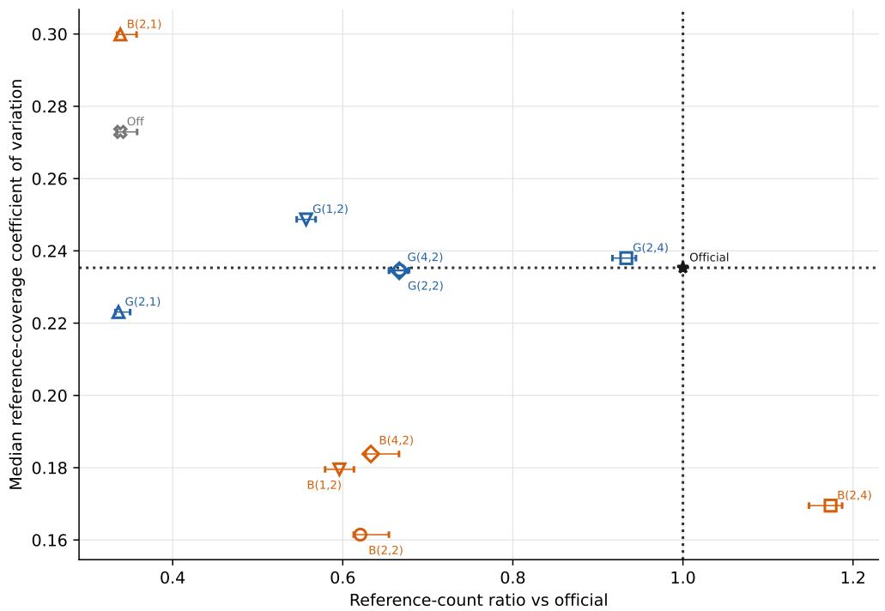  
Figure 2: Reference-patch count and coverage uniformity. Counts are normalized by those of the oficial schedule and averaged across images. Horizontal error bars show their range across image shapes. Uniformity is measured by the median CV of reference-patch coverage across images where lower values indicate more uniform coverage. Dotted lines mark the oficial schedule. G and B denote generated and balanced schedules, with tuples specifying (shift density, schedule density).

Figure 2 compares the number and spatial distribution of the reference patches. The balanced schedules generally give more uniform coverage than the oficial schedule, with balanced (2, 2) giving the lowest CV among configurations using fewer reference patches than the oficial schedule. The generated (2, 2) schedule has nearly the same coverage variation as the oficial schedule while using approximately 67% of its reference patches. Removing shifts or using only one schedule pass reduces the reference count further, but also makes the coverage less uniform.

The corresponding denoising results are shown in Figure 3. All diferences from the oficial schedule are small and remain below 0.05 dB. Schedules using approximately 60-70% of the oficial reference count preserve or slightly improve the mean PSNR. The balanced (4, 2) schedule gives the highest PSNR in this reference-count range, although its advantage over balanced (2, 2) is at most 0.003 dB. Reducing the reference count to approximately one third results in small losses at $\sigma _ { 2 5 5 } = 1 5$ and 25, whereas most schedules improve on the oficial schedule at $\sigma _ { 2 5 5 } = 5 0$

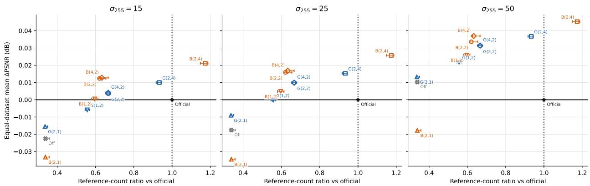  
Figure 3: Denoising quality versus reference-patch count under Gaussian noise. PSNR changes are relative to the oficial schedule and averaged equally across BSD68, Kodak24, Set12, and scikit-image. Counts are normalized by those of the oficial schedule and averaged across images. Horizontal error bars show their range across image shapes. Panels correspond to $\sigma _ { 2 5 5 } \in \{ 1 5 , 2 5 , 5 0 \}$ . G and B denote generated and balanced schedules, with tuples specifying (shift density, schedule density).

For the following experiments, we use the generated (2, 2) schedule. Among the dimensionindependent schedules considered here, it most closely reproduces the oficial schedule while reducing the reference count by approximately one third. Its mean PSNR difers from the oficial schedule by $+ 0 . 0 0 4 , + 0 . 0 1 0$ , and +0.031 dB for $\sigma _ { 2 5 5 } = 1 5$ , 25, and 50, respectively.

## 9.4 Finite-count Structural Allowance Analysis

We examine the sensitivity of denoising quality to the structure factor $\beta _ { s }$ and intensity exponent $\kappa _ { s }$ We vary

$$
\beta _ { s } \in \{ 0 , 0 . 0 2 , 0 . 0 5 , 0 . 1 , 0 . 2 , 0 . 4 , 0 . 8 , 1 . 6 \} , \qquad \kappa _ { s } \in \{ 0 . 2 5 , 0 . 5 , 1 , 2 , 3 , 4 \} .\tag{141}
$$

Finite-count matching is used only in the hard-thresholding stage, while Wiener matching remains fixed and uses the pilot estimate. The remaining parameters are unchanged. For simulated observations, we use peak expected counts between 0.5 and 50 and two noise realizations.

Figure 4 shows that a positive $\beta _ { s }$ improves the mean PSNR on the generated, natural-image, and FMD datasets. The improvement is strongest on the generated two-dimensional data, where it reaches approximately 0.08 dB. Most of the other gains remain below 0.04 dB. The efect on the XCAT dataset is close to zero.

The choice of $\kappa _ { s }$ has a smaller efect. Values below 1 tend to reduce the mean PSNR, while values above 1 give small improvements on several datasets. These diferences are generally below 0.01 dB.

For the following experiments, we use $\beta _ { s } = 0 . 1$ and $\kappa _ { s } = 1$ . At $\beta _ { s } = 0 . 1$ , the structural allowance gives a positive mean change in PSNR. The influence of $\kappa _ { s }$ is small, but $\kappa _ { s } = 1$ generally performs at least as well as the lower exponents and gives the allowance a simple linear dependence on the mean reference count.

## 9.5 Mass Conservation

We evaluate the efect of mass conservation on intensity bias and reconstruction quality using Poisson-corrupted sinograms of the Shepp–Logan phantom. We compare conservation in the hardthresholding stage, the Wiener stage, and both stages with denoising without mass conservation. We measure total sinogram intensity, regional reconstruction bias, and PSNR in sinogram and reconstructed-image space.

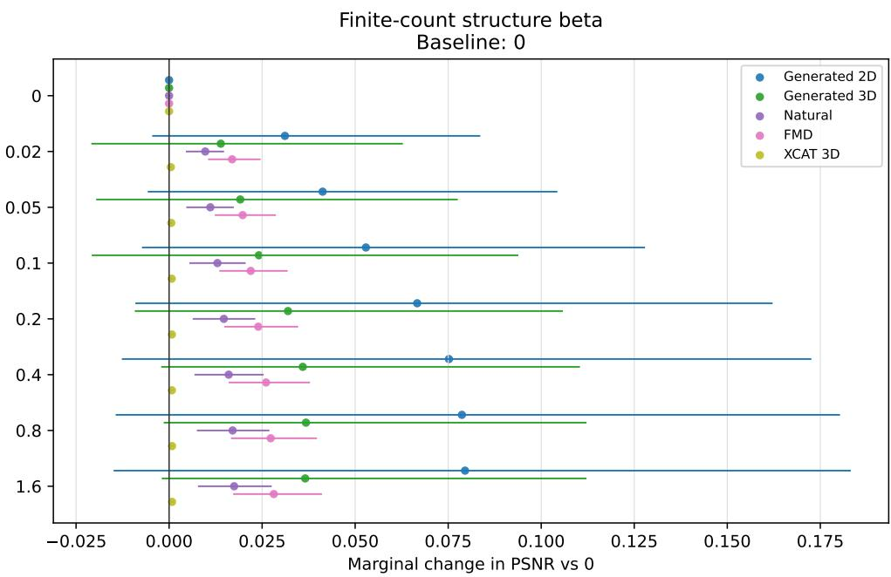

Finite-count intensity power Baseline: 1  
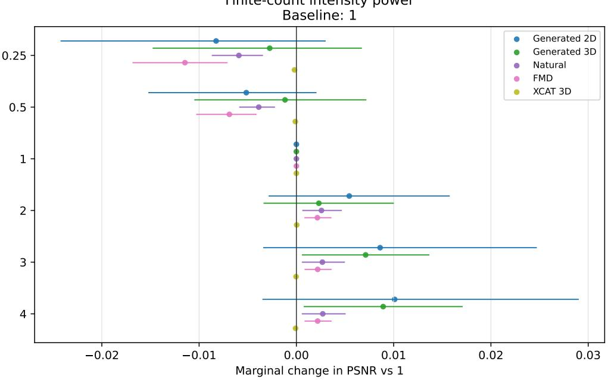  
Figure 4: Source-balanced marginal efects of the finite-count structural allowance on PSNR. Efects are measured relative to $\beta _ { s } = 0$ for the structure factor (top) and $\kappa _ { s } = 1$ for the intensity exponen (bottom), averaging uniformly over the levels of the other factor. Positive values indicate improved reconstruction quality. Error bars denote 95% nonparametric source-unit bootstrap intervals.

We evaluate the efect of mass conservation on intensity bias and reconstruction quality using the Shepp–Logan phantom. We first denoise Poisson-corrupted phantom images directly, then denoise Poisson-corrupted sinograms and evaluate the resulting reconstructions. This separates the efects of denoising from those introduced by the subsequent reconstruction step. In both experiments, we compare conservation in the hard-thresholding stage, the Wiener stage, and both stages with denoising without mass conservation.

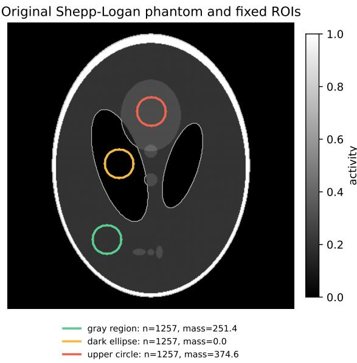

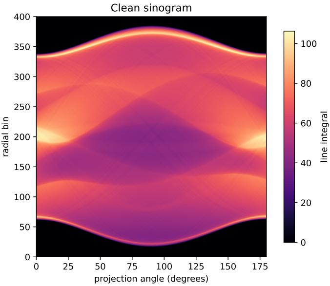  
Figure 5: Shepp–Logan phantom with three fixed regions of interest (left) and its clean sinogram (right). The regions sample the gray background within the object, a dark ellipse with zero phantom activity, and the upper circular structure.

The phantom, evaluation regions, and clean sinogram are shown in Figure 5. We simulate Poisson observations at peak expected bin counts $\lambda _ { \mathrm { p k } } \in \{ 0 . 1 , 0 . 5 , 1 , 2 , 1 0 , 5 0 \}$ , using the same 100 noise realizations for all configurations at each count level.

For image-space evaluation, we use the reconstruction of the clean sinogram as the reference. This separates deviations caused by noise and denoising from the baseline reconstruction error relative to the original phantom. We measure signed mass diferences within the three regions shown in Figure 5 and over the full object support, expressing them as percentages of the corresponding reference mass. For the dark ellipse, whose activity is zero in the original phantom, we instead report the signed mean-intensity diference to avoid normalization by a near-zero reference mass. The whole-sinogram measurement uses the clean sinogram directly as its reference. Bias curves report means over the 100 realizations, with 95% bootstrap confidence intervals. We additionally report paired PSNR diferences relative to denoising without mass conservation in both sinogram and reconstructed-image space.

For direct image denoising, we use the clean phantom as the reference for both intensity bias and PSNR. Figure 6 shows substantial intensity loss without mass conservation at the lowest count levels. At $\lambda _ { \mathrm { p k } } = 0 . 1$ , the mean bias is approximately −97% over the whole image and approaches −100% in the gray region and upper circle. Applying conservation only in the hard-thresholding stage reduces the whole-image bias to approximately −28%. When conservation is applied in the Wiener stage, either alone or together with hard thresholding, the mean whole-image bias remains close to zero across the evaluated count levels.

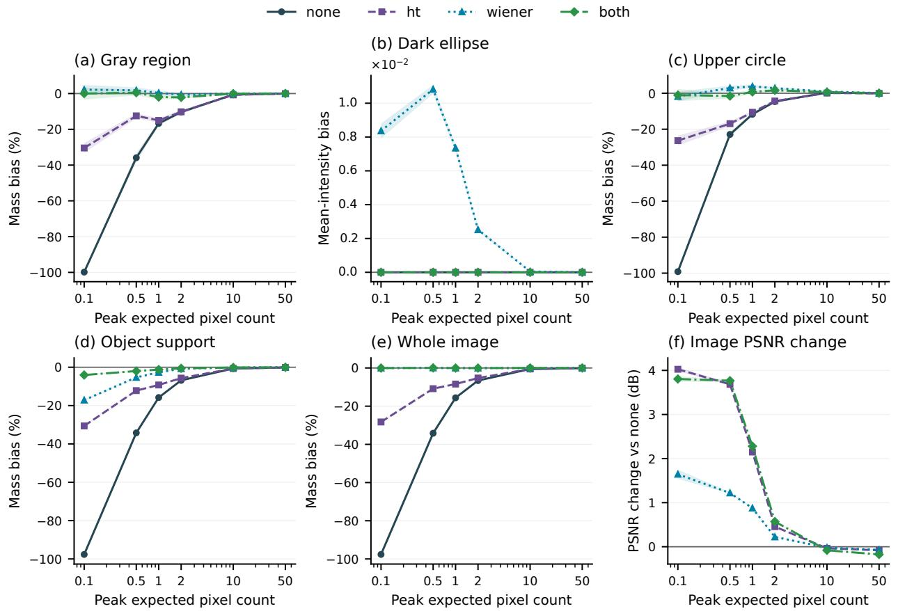  
Figure 6: Mass-conservation efects when denoising Poisson-corrupted Shepp–Logan images directly. Panels show bias in the gray region (a), dark ellipse (b), upper circle (c), object support (d), and whole image (e), measured against the clean phantom. Bias is expressed as a percentage of reference mass, except in (b), which shows the signed mean-intensity diference. Panel (f) shows the PSNR change relative to denoising without mass conservation. Curves show means over 100 Poisson realizations, with shaded 95% bootstrap confidence intervals.

Preserving the whole-image total does not ensure unbiased regional intensities. At $\lambda _ { \mathrm { p k } } = 0 . 1$ Wiener-only conservation retains an object-support bias of approximately −17%, compared with approximately −5% when conservation is applied in both stages. Applying conservation in Wiener or both stages keeps the dark-ellipse bias close to zero.

All three constrained configurations improve image PSNR at the lowest count levels. At $\lambda _ { \mathrm { p k } } = 0 . 1$ , hard-thresholding-only and two-stage conservation give gains of approximately 4.0 and 3.8 dB, respectively, compared with 1.6 dB for Wiener-only conservation. The gains diminish as the expected counts increase, with small losses at the highest evaluated count levels.

We next examine whether these benefits persist when denoising is performed in sinogram space before reconstruction. For whole-sinogram bias and sinogram PSNR, the reference is the clean sinogram. For regional bias and reconstructed-image PSNR, we instead use the reconstruction of the clean sinogram. This separates deviations caused by noise and denoising from the baseline reconstruction error relative to the original phantom.

Figure 7 shows pronounced intensity loss without mass conservation at the lowest count level. At $\lambda _ { \mathrm { p k } } = 0 . 1$ , the mean bias is approximately −77% over the whole sinogram and −71% over the reconstructed object support. Applying conservation only in the hard-thresholding stage reduces these losses, but does not eliminate the final sinogram bias. When conservation is applied in the Wiener stage, either alone or together with hard thresholding, the mean whole-sinogram bias remains close to zero across the evaluated count levels.

The regional results show that preserving the sinogram total does not ensure unbiased reconstructed intensities. Wiener-stage conservation substantially reduces the strong underestimation in the gray region at the lowest count level. Applying conservation in both stages also reduces the object-support bias to approximately −5% at this level. However, regional errors remain, and their sign depends on the region and count level. In the upper-circle ROI, Wiener-stage conservation produces a positive bias of approximately 10% at $\lambda _ { \mathrm { p k } } = 0 . 5$ . The dark ellipse also retains a negative mean-intensity bias at several count levels.

At the lowest count levels, all three constrained configurations improve sinogram PSNR, but their efects on reconstructed-image PSNR difer (Figure 7, panels (f) and (g)). HT-only conservation gives the largest reconstruction gains, approximately 2.6 and 2.9 dB at $\lambda _ { \mathrm { p k } } = 0 . 1$ and 0.5, respectively. Applying conservation in both stages also improves reconstruction PSNR at these levels, by approximately 1.5 and 2.1 dB. In contrast, Wiener-only conservation reduces reconstruction PSNR by approximately 4.4 dB at $\lambda _ { \mathrm { p k } } = 0 . 1$ , despite improving sinogram PSNR. At higher count levels, the benefits diminish, and conservation can cause small PSNR losses.

Across both experiments, Wiener-only and two-stage conservation retain the same observed sinogram mass, yet constraining the pilot as well gives substantially better reconstruction PSNR at the lowest count levels. In this experiment, HT-only conservation provides the largest low-count reconstruction-PSNR gains, whereas two-stage conservation combines preservation of the observed total with improved reconstruction quality.

## 9.6 Ablation Study

We evaluate how the individual algorithmic choices afect reconstruction quality under Poisson noise and on fluorescence microscopy acquisitions. The analysis examines the efects of noise-aware matching, Wiener gains, and aggregation weights, together with the influence of thresholding and covariance modeling. We report marginal changes in PSNR relative to the reference level of each factor, averaging over the other evaluated settings.

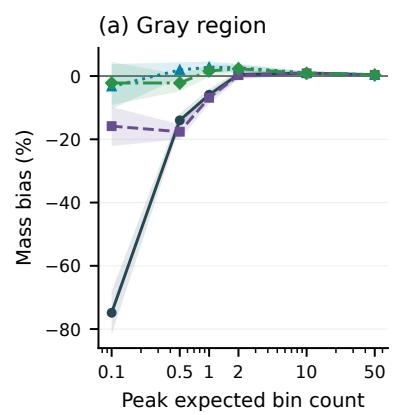

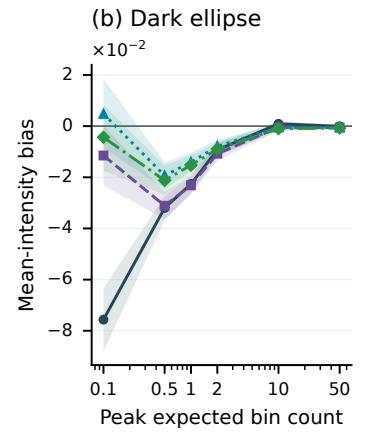

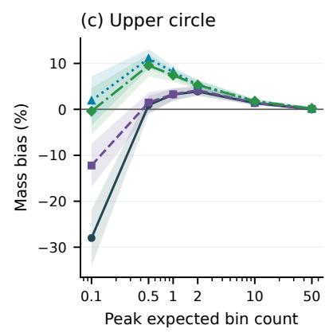

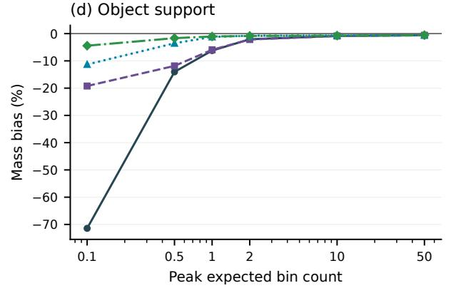

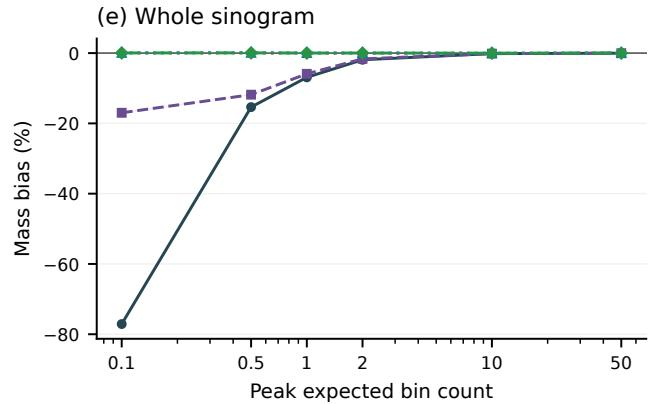

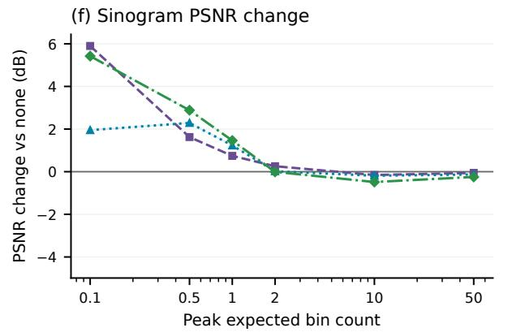

(g) Reconstruction PSNR change  
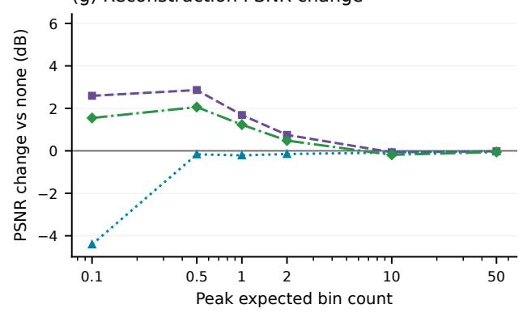  
Figure 7: Mass-conservation efects when denoising Poisson-corrupted Shepp–Logan sinograms. Panels (a)–(d) show bias in the reconstructed gray region, dark ellipse, upper circle, and object support, measured against the reconstruction of the clean sinogram. Panel (e) shows whole-sinogram bias relative to the clean sinogram. Bias is expressed as a percentage of reference mass, except in (b), which shows the signed mean-intensity diference. Panels (f) and (g) show PSNR changes relative to denoising without mass conservation in sinogram and reconstructed-image space, respectively. Curves show means over 100 Poisson realizations, with shaded 95% bootstrap confidence intervals.

We evaluate generated 2D and 3D data, natural images, three-dimensional XCAT brain sinograms, and FMD acquisitions. The simulated-noise experiments comprise eight generated images, four generated volumes, 39 natural images, and 12 XCAT sinograms, each evaluated at peak expected counts $\lambda _ { \mathrm { p k } } \in \{ 1 , 5 , 2 0 , 1 0 0 \}$ . For FMD, we use 36 image-type and field-of-view combinations at averaging levels 1, 4, and 16.

We jointly vary 12 factors in a complete factorial design comprising 276,480 configurations. The factors cover first-stage matching, covariance modeling, thresholding, Wiener gains, aggregation weights in both stages, and group mass conservation. The complete factor levels and fixed settings are listed in Table 5.

We summarize the results separately for each dataset group using source-balanced marginal efects. A source unit is an individual image or volume for the generated and natural-image data, an individual sinogram for XCAT, and an image-type and field-of-view combination for FMD. Within each source unit, we first average PSNR over the evaluated noise conditions and then uniformly over all combinations of the other factors. For each factor level, we subtract the corresponding mean at its reference level and average these diferences equally across source units. Positive values therefore indicate improved reconstruction quality relative to the reference level of that factor, rather than relative to a single common baseline configuration. We obtain 95% confidence intervals from 1000 bootstrap resamples of the source units.

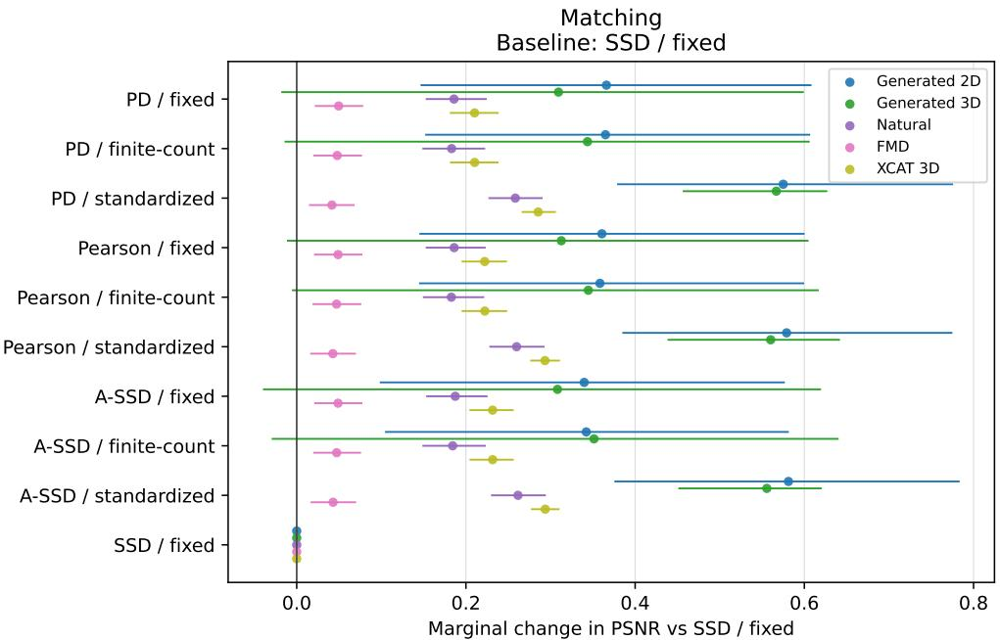  
Figure 8: Marginal efects of the matching strategy on PSNR relative to SSD with fixed calibration. PD denotes Poisson deviance; A-SSD denotes Anscombe-transformed SSD. Finite-count denotes reference-based finite-count calibration; standardized denotes candidate standardization. Error bars denote 95% source-unit bootstrap intervals.

Figure 8 shows positive mean changes in PSNR for all evaluated noise-aware matching strategies relative to SSD with fixed calibration. Poisson deviance, Pearson, and Anscombe-transformed SSD produce similar marginal efects when used with the same calibration. Candidate standardization gives the largest mean improvements on the generated, natural-image, and XCAT datasets, whereas its efect on FMD is similar to that of the other calibration strategies. Fixed and reference-based finite-count calibration give nearly identical marginal results.

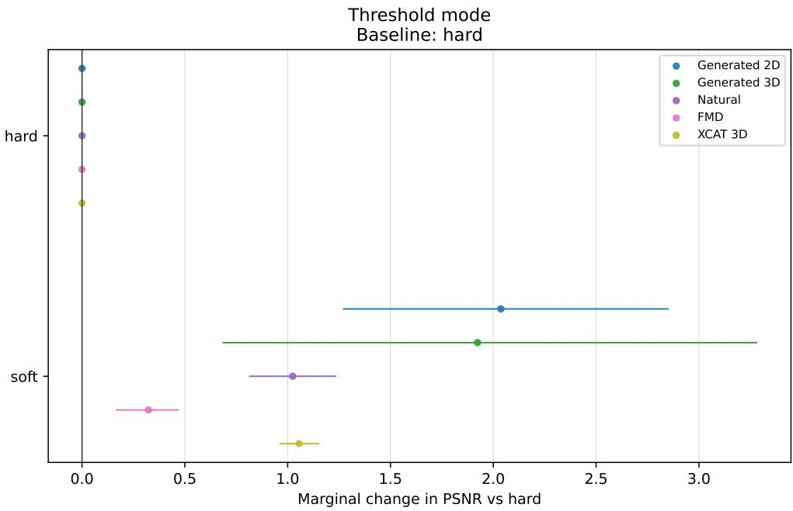

Threshold lambda Baseline: 3  
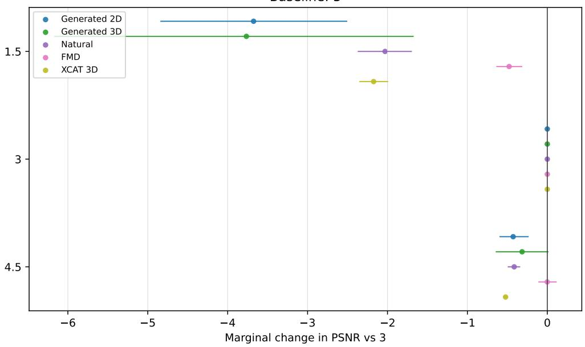  
Figure 9: Marginal PSNR efects of the thresholding rule relative to hard thresholding (top) and the threshold multiplier relative to $\lambda _ { \mathrm { H T } } = 3$ (bottom). Error bars denote 95% source-unit bootstrap intervals. Note the diferent horizontal scales.

The first filtering stage is sensitive to both the thresholding rule and the threshold multiplier. Figure 9 shows that soft thresholding gives higher marginal mean PSNR than hard thresholding across all evaluated dataset groups. The improvement is largest on the generated data and smallest on FMD. Reducing the threshold multiplier from $\lambda _ { \mathrm { H T } } = 3$ to $\lambda _ { \mathrm { H T } } = 1 . 5$ substantially decreases the marginal mean PSNR in every group. Increasing it to $\lambda _ { \mathrm { H T } } = 4 . 5$ produces smaller losses on the generated, natural-image, and XCAT datasets, and little change on FMD.

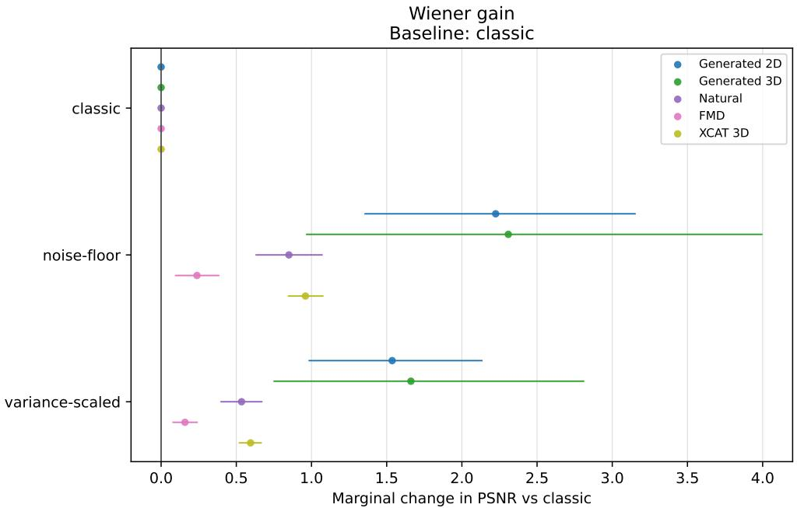  
Figure 10: Marginal efects of the Wiener gain formulation on PSNR relative to classic gains. Error bars denote 95% source-unit bootstrap intervals.

For the second filtering stage, Figure 10 shows positive marginal PSNR changes for both the noise-floor and variance-scaled formulations relative to classic gains across all evaluated dataset groups. The noise-floor formulation gives the larger mean improvement in every group. The gains are strongest on the generated data, but remain positive on natural images, XCAT, and FMD.

Figure 11 compares variance-aware and bias-aware aggregation weights with classic weighting. In the first filtering stage, variance weighting has little efect on natural images and XCAT, while giving a small positive mean change on FMD. The benefit is more pronounced in the Wiener stage, where both variance and risk weighting improve the marginal mean PSNR on natural images and XCAT. The corresponding mean improvements on FMD are smaller. For the generated 2D and 3D datasets, the efects remain inconclusive in both stages. The mean changes are positive in two dimensions and negative in three dimensions, but all corresponding confidence intervals include zero. The bias-aware risk model gives similar marginal results to variance weighting, without a clear additional benefit.

The remaining factor efects are reported in Appendix B. Using exact covariance planes improves the marginal mean PSNR on FMD, but decreases it on natural images and XCAT, while the generated-data efects remain uncertain (Figure 18). Changing the aggregation-weight domain has only small efects in both stages (Figures 19 and 21). Patch-level weighting gives more consistently positive mean changes in the first stage than in the Wiener stage, where the direction depends on the dataset (Figures 20 and 22). Group mass conservation improves the marginal mean PSNR on natural images and XCAT, while its efects on generated data depend on the stage of application and remain close to zero on FMD (Figure 23).

Figure 12 shows that the benefits of the proposed Wiener gain formulations become more pronounced as noise increases. On natural images, XCAT, and FMD, their largest mean improvements occur at the lowest peak count or with single acquisitions. Soft thresholding likewise gives its largest improvements on these datasets under the strongest evaluated noise. The generated datasets difer, retaining substantial benefits from both modifications throughout the evaluated count range.

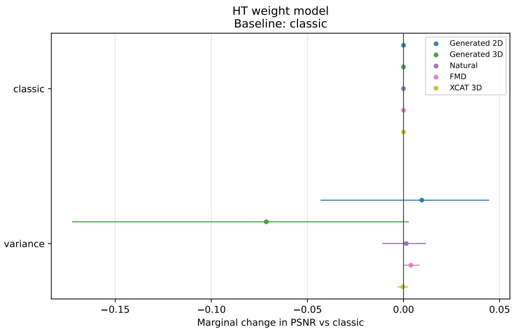

Wiener weight model Baseline: classic  
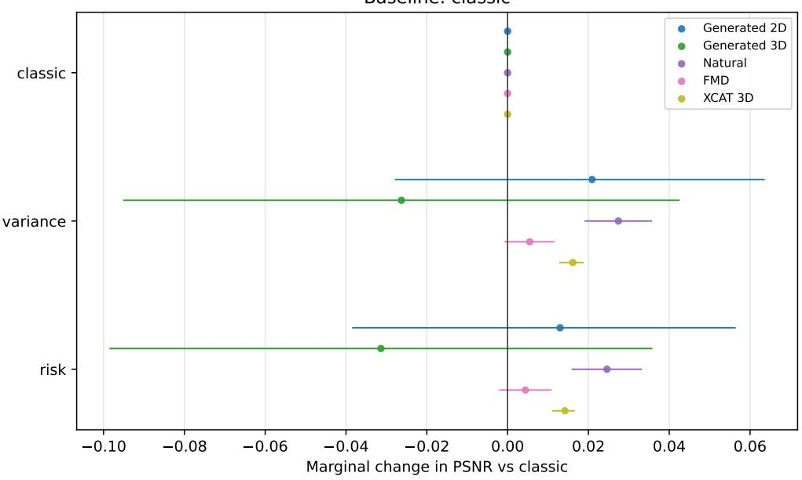  
Figure 11: Marginal PSNR efects of aggregation weights relative to classic weighting in the first filtering stage (top) and Wiener stage (bottom). Error bars denote 95% source-unit bootstrap intervals. Note the diferent horizontal scales.

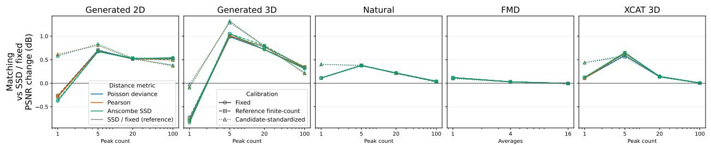

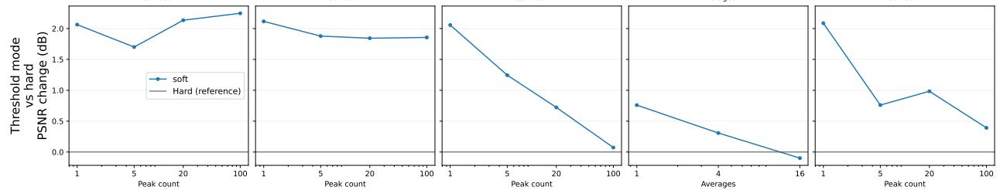

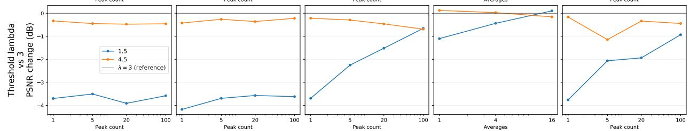

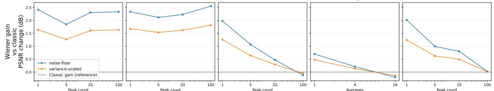

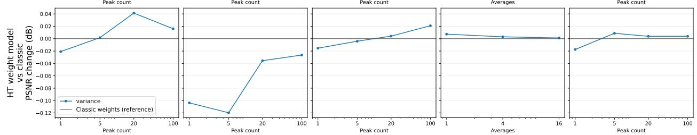

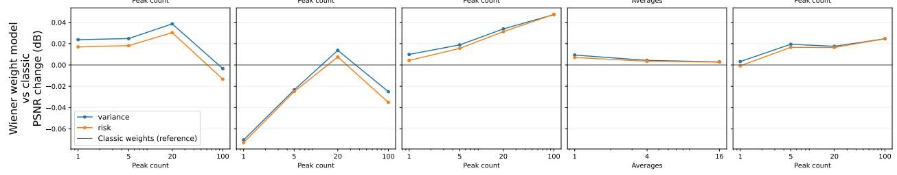  
Figure 12: Source-balanced marginal PSNR efects by noise condition, with dataset groups in columns and algorithmic factors in rows. Efects are relative to the indicated reference settings, averaging over the other factors. Logarithmic horizontal axes show peak expected counts or acquisition averages for FMD. In the matching row, colors identify distances, and line styles and markers identify calibrations. Vertical scales are shared within rows.

The choice of matching calibration has a larger efect on mean PSNR at low counts. At $\lambda _ { \mathrm { p k } } = 1$ candidate standardization improves upon fixed and reference-based finite-count calibration on the generated, natural-image, and XCAT datasets. The calibration strategies give more similar results at higher counts. The aggregation-weight models have smaller efects with a diferent dependence on count level. In particular, the benefits of Wiener variance and risk weighting on natural images increase rather than decrease with count level.

To complement the marginal-efect analysis, Figure 13 compares example reconstructions obtained with Anscombe BMND and direct Poisson BMND across all five dataset groups. For direct Poisson denoising, we use the single configuration ranked first globally across all datasets in the ablation study. The examples are randomly selected. Direct Poisson denoising gives higher PSNR and SSIM in each displayed example.

Overall, noise-aware matching and the modified Wiener gains have positive marginal mean efects on PSNR across the evaluated dataset groups. The results by noise level show larger mean improvements of the modified Wiener gains under strong noise and highlight the importance of matching calibration at low counts. Noise-aware Wiener aggregation yields smaller improvements, most clearly on natural images and anatomical phantom data.

## 9.7 FMD Denoising

We evaluate BMND on fluorescence microscopy images from FMD, covering confocal, two-photon, and widefield microscopy. Unlike the simulated-noise experiments, this evaluation uses noisy acquisitions, with noise levels controlled by averaging 1, 2, 4, 8, or 16 raw images. At each averaging level, we evaluate 48 images of size 512 × 512 from the held-out FOV 19, comprising 20 confocal, 16 two-photon, and 12 widefield images. We calculate PSNR and SSIM against the dataset-provided high-SNR references and report arithmetic means of the per-image metrics.

We compare direct Poisson BMND with an Anscombe-transform approach using Gaussian BMND. Following Zhang et al. [51], both approaches use the same calibrated afine mean-variance model,

$$
\operatorname { V a r } ( Y _ { i } ) = a \mathbb { E } [ Y _ { i } ] + b ,\tag{142}
$$

fitted separately for each image type and averaging level from repeated acquisitions in normalized intensity units. Calibration uses five folds defined over fields of view, with the fold containing the evaluated field excluded from its calibration fit. For direct Poisson denoising, we shift the observation by $b / a$ , use the Poisson count scale $s _ { P } = a$ , and subtract the shift after denoising. This matches the afine variance model but does not imply that the shifted observations follow an exact Poisson distribution. The Anscombe baseline uses the same shift and count scale, applies Gaussian BMND with unit noise standard deviation in the transformed domain, and then applies the inverse transform.

For direct Poisson denoising, we select either one profile across the FMD tuning data or a separate profile for each microscopy modality. Selection maximizes mean PSNR, first averaging within each image-type and field-of-view combination and then equally across these source units. The tuning experiment uses central 64 × 64 regions from six image types and six fields of view at averaging levels 1, 4, and 16. Test FOV 19 is excluded from profile selection. The selected profiles remain fixed across all five test averaging levels.

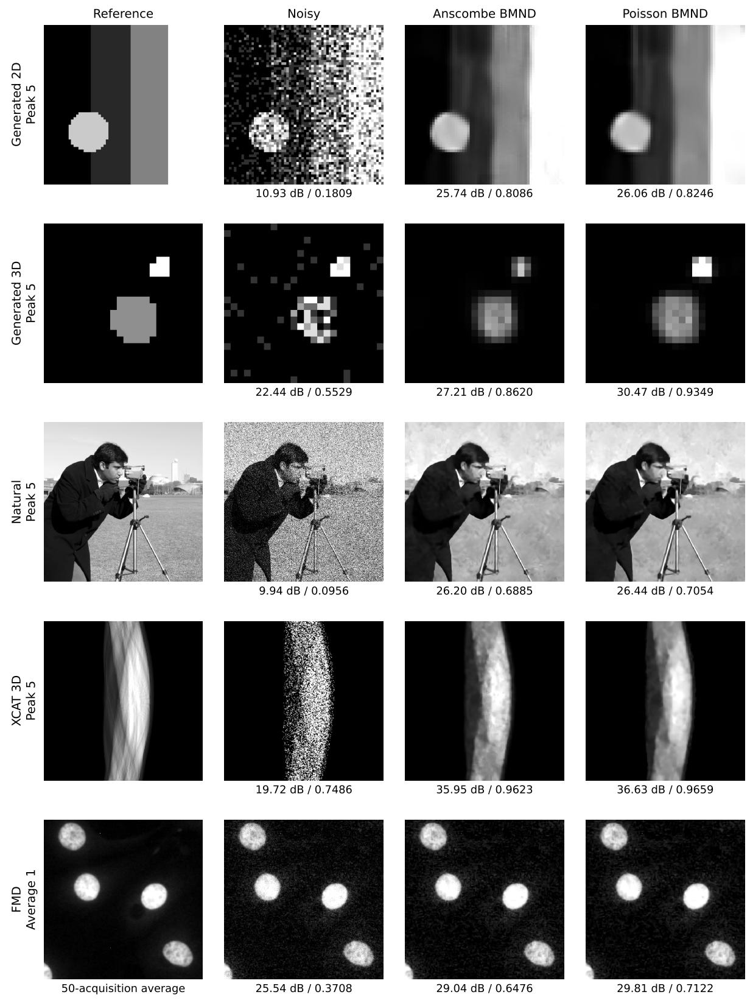  
Figure 13: Denoising examples from the five ablation dataset groups. Columns show the reference, noisy observation, Anscombe BMND, and direct Poisson BMND with the globally top-ranked ablation configuration. Simulated observations use $\lambda _ { \mathrm { p k } } = 5 ;$ the FMD example uses a single acquisition with a 50-acquisition average as reference. Labels report PSNR/SSIM.

Table 2: FMD denoising performance by averaging level. Published results are from Zhang et al. [51]. For the full test set, bold marks the best non-deep-learning score and underlining the best overall. Within each modality subset, bold marks the best score.
<table><tr><td>Method</td><td>Metric</td><td>1</td><td>2</td><td>4</td><td>8</td><td>16</td></tr><tr><td>Reported by Zhang et al. [51]</td><td></td><td></td><td></td><td></td><td></td><td></td></tr><tr><td>Raw</td><td>PSNR (dB) SSIM</td><td>27.22 0.5442</td><td>30.08 0.6800</td><td>32.86 0.7981</td><td>36.03 0.8892</td><td>39.70 0.9487</td></tr><tr><td>VST + BM3D</td><td>PSNR (dB)</td><td>32.71</td><td>34.09</td><td>36.05</td><td>38.01</td><td>40.61</td></tr><tr><td>PURE-LET</td><td>SSIM PSNR (dB)</td><td>0.7922 31.95</td><td>0.8430 33.49</td><td>0.8970 35.29</td><td>0.9336 37.25</td><td>0.9598 39.59</td></tr><tr><td>DnCNN</td><td>SSIM PSNR (dB)</td><td>0.7664 34.88</td><td>0.8270 36.02</td><td>0.8814 37.57</td><td>0.9212 39.28</td><td>0.9450 41.57</td></tr><tr><td>Noise2Noise</td><td>SSIM PSNR (dB)</td><td>0.9063 35.40</td><td>0.9257 36.40</td><td>0.9460 37.59</td><td>0.9588 39.43</td><td>0.9721 41.45</td></tr><tr><td>Our evaluation</td><td>SSIM</td><td>0.9187</td><td>0.9230</td><td>0.9481</td><td>0.9601</td><td>0.9724</td></tr><tr><td>Anscombe BMND</td><td>PSNR (dB)</td><td>33.59</td><td>34.83</td><td>36.64</td><td>38.48</td><td>41.11</td></tr><tr><td>BMND (global)</td><td>SSIM PSNR (dB)</td><td>0.8453 33.83</td><td>0.8853 34.96</td><td>0.9237 36.64</td><td>0.9459 38.29</td><td>0.9661 40.69</td></tr><tr><td>BMND (by modality)</td><td>SSIM PSNR (dB)</td><td>0.8687 34.59</td><td>0.8986 35.62</td><td>0.9285 37.19</td><td>0.9445</td><td>0.9627</td></tr><tr><td></td><td>SSIM</td><td>0.9027</td><td></td><td></td><td>38.86 7 0.9212 0.9418 0.9531 0.9671</td><td>41.24</td></tr><tr><td>Confocal subset Noisy</td><td>PSNR (dB)</td><td>29.13</td><td>32.11</td><td>34.86</td><td>37.97</td><td>41.08</td></tr><tr><td>Anscombe BMND</td><td>SSIM PSNR (dB)</td><td>0.7100 35.88</td><td>0.8131 37.47</td><td>0.8883 38.88</td><td>0.9404 40.63</td><td>0.9721 42.34</td></tr><tr><td>BMND (rank 1)</td><td>SSIM PSNR (dB)</td><td>0.9353 35.95</td><td>0.9523 37.55</td><td>0.9639</td><td>0.9740</td><td>0.9814</td></tr><tr><td>Two-photon subset</td><td>SSIM</td><td>0.9390</td><td>0.9552</td><td>38.90</td><td>40.63 0.9650 0.9743</td><td>42.32 0.9813</td></tr><tr><td>Noisy</td><td>PSNR (dB)</td><td>26.32</td><td>28.95</td><td>31.58</td><td>34.53</td><td>38.70</td></tr><tr><td>Anscombe BMND</td><td>SSIM PSNR (dB)</td><td>0.4781 34.01</td><td>0.6303 33.83</td><td>0.7665 35.55</td><td>0.8727</td><td>0.9417 40.00</td></tr><tr><td>BMND (rank 1)</td><td>SSIM</td><td>0.8953</td><td>0.8996</td><td>0.9308</td><td>36.56 0.9388</td><td>0.9604</td></tr><tr><td></td><td>PSNR (dB) SSIM</td><td>34.00 0.8999</td><td>33.92 0.9061</td><td>35.67 0.9349</td><td>36.70 9 0.9420 0.9631</td><td>40.18</td></tr><tr><td>Widefield subset Noisy</td><td></td><td>25.23</td><td>28.19</td><td></td><td></td><td></td></tr><tr><td></td><td>PSNR (dB) SSIM</td><td>0.3674</td><td>0.5322</td><td>31.23 0.6957</td><td>34.79 0.8293</td><td>38.74 0.9209</td></tr><tr><td>Anscombe BMND</td><td>PSNR (dB) SSIM</td><td>29.20 0.6285</td><td>31.76 0.7544</td><td>34.33 0.8471</td><td>37.47 0.9086</td><td>40.54 0.9483</td></tr><tr><td>BMND (rank 1)</td><td>PSNR (dB) SSIM</td><td>33.11 0.8458 0.8849</td><td>34.65</td><td>36.34 0.9122</td><td>38.78 0.9325 0.9489</td><td>40.84</td></tr></table>

Table 2 reports our results alongside the benchmark values published by Zhang et al. [51]. Modality-specific profiles improve both PSNR and SSIM over the global profile at every averaging level, with PSNR gains between 0.55 and 0.76 dB. They also outperform Anscombe BMND at every level, although the PSNR advantage decreases from 1.00 dB for single acquisitions to 0.13 dB when averaging 16 images.

The modality-specific comparisons show that the advantage over Anscombe BMND is concentrated in widefield microscopy. For single acquisitions, direct Poisson BMND improves PSNR over the noisy input by 6.82, 7.68, and 7.88 dB for confocal, two-photon, and widefield images, respectively. The corresponding gains with Anscombe BMND are 6.75, 7.69, and 3.97 dB. Thus, the two approaches give similar improvements for confocal and two-photon images, whereas the Anscombe approach is substantially less efective on the widefield subset.

For widefield images, the advantage of direct Poisson BMND over Anscombe BMND decreases from 3.91 dB for single acquisitions to 0.30 dB when averaging 16 images. The corresponding SSIM advantage decreases from 0.2173 to 0.0006. This trend is consistent with limitations of the Gaussian approximation after variance stabilization in low-count regions.

Figure 14 shows single-acquisition denoising examples from held-out FOV 19 for all three microscopy modalities. The enlarged regions allow comparison of residual noise and preservation of biological structures between Anscombe BMND and direct Poisson BMND.

The modality-specific full-set results exceed the published VST + BM3D and PURE-LET scores in both metrics at every averaging level, but remain below the best published learned-method results. These scores are taken from the literature. We did not reevaluate the corresponding methods.

## 9.8 1-Dimensional ECG Data Denoising

To demonstrate the applicability of the dimension-independent formulation beyond images and volumes, we evaluate one-dimensional BMND in a controlled experiment with additive white Gaussian noise using channel zero from all records in the MIT–BIH Arrhythmia Database. The dataset is split into 16 development subjects and 31 held-out test subjects. For each record, we evaluate five fixed 20-second windows and retain three seconds of unscored context on either side.

We add Gaussian noise at input signal-to-noise ratio (SNR) levels of 0, 6, 12, and 18 dB without clipping the resulting observations. One noise realization is used during development and two during confirmation. We select the parameters for BMND and each comparator on the development subjects by maximizing the mean SNR improvement across subjects, with equal weighting across the four input SNR levels. Appendix C shows the bounds of this parameter search. All configurations are then fixed before evaluation on the confirmation subjects.

The comparison includes tuned soft thresholding in the discrete wavelet transform (DWT) domain [1, 14, 15], NLM [42], similar-segment cooperative filtering (SSCF) [25], as well as fixed and adaptive Savitzky–Golay filtering [18].

The primary reconstruction metric is SNR improvement, calculated as the diference between the output SNR of the denoised signal and the measured input SNR of the noisy observation. Positive values therefore correspond to a reduction in squared reconstruction error. Output SNR is calculated from the energy of the mean-centered reference ECG and the squared error between the reconstruction and reference.

Global reconstruction error does not separately quantify distortion of the QRS complex, so we also evaluate QRS-specific waveform and amplitude errors. The QRS complex reflects ventricular electrical activation and contains the sharp deflections characteristic of each heartbeat. We measure the root-mean-square error (RMSE) within 80 ms of each expert-annotated beat, together with the relative error and signed bias of beat-centered peak-to-peak QRS amplitude.

Noisy (average 1)  
Anscombe BMND  
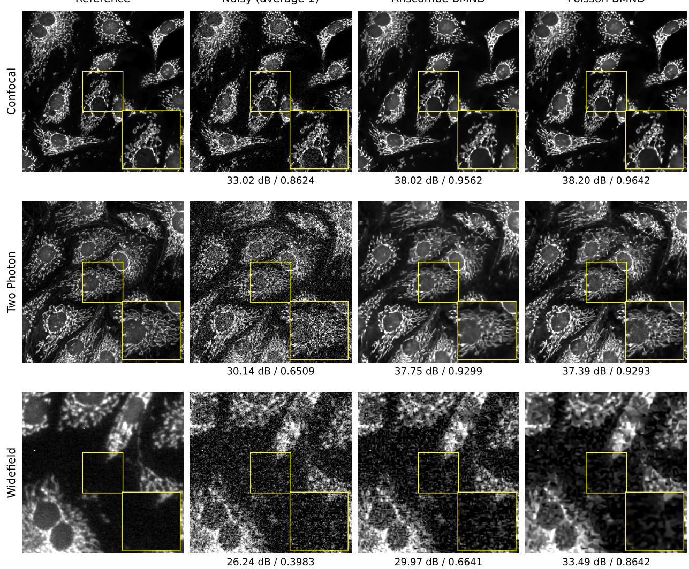  
Figure 14: Single-acquisition FMD denoising examples from held-out FOV 19. Rows show confocal, two-photon, and widefield microscopy. Columns show the reference, noisy input, Anscombe BMND, and direct Poisson BMND with modality-specific profiles. Yellow boxes indicate enlarged regions. Labels report full-image PSNR/SSIM.

Metrics are calculated first for each segment and noise realization, then aggregated within subjects and summarized across subjects. We obtain 95% confidence intervals by bootstrapping subjects, thereby preserving the dependence among segments and repeated noise realizations from the same subject.

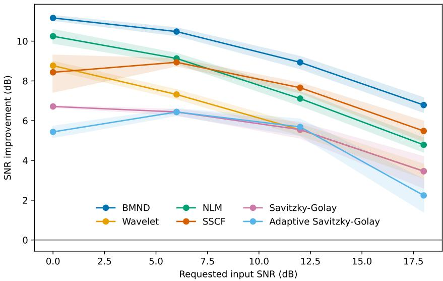  
Figure 15: Mean SNR improvement across confirmation subjects at each input SNR level. Shaded areas denote 95% subject-bootstrap confidence intervals.

As shown in Figure 15, BMND gives the largest mean SNR improvement at every input noise level. Its improvement decreases from 11.17 dB at an input SNR of 0 dB to 6.79 dB at 18 dB.

The subject-level results in Figure 16 follow the same pattern. Every point lies above the identity line, so BMND outperforms each baseline for every confirmation subject after averaging over the four input SNR levels. The diferences are largest for the two Savitzky–Golay methods, while NLM and SSCF are the closest competitors.

Table 3 shows that the gain in SNR is accompanied by lower errors in the evaluated QRS morphology measures. BMND has the lowest QRS waveform RMSE and relative amplitude error at every input SNR level. Its QRS RMSE decreases from 0.1105 to 0.0238, while its relative amplitude error decreases from 7.97% to 1.61%. The signed amplitude bias remains between −1.04% and 0.16%. In contrast, the wavelet method consistently underestimates QRS amplitude, and both Savitzky–Golay methods introduce larger biases at the higher input SNR levels. Figure 17 provides a qualitative comparison with SSCF for an example beat. Both methods preserve the dominant QRS peak, while BMND shows smaller deviations from the reference immediately after the peak in this example. These results indicate that BMND reduces noise with less distortion of QRS amplitude and waveform shape than the evaluated baselines.

## 10 Discussion and Conclusion

In this work, we presented BMND, a dimension-independent formulation of block-matching collaborative filtering for Gaussian and Poisson noise. The formulation incorporates noise-aware patch matching, collaborative filtering, and aggregation, with optional mass conservation. We evaluated the method on one-dimensional physiological signals, two-dimensional images, and three-dimensional volumes.

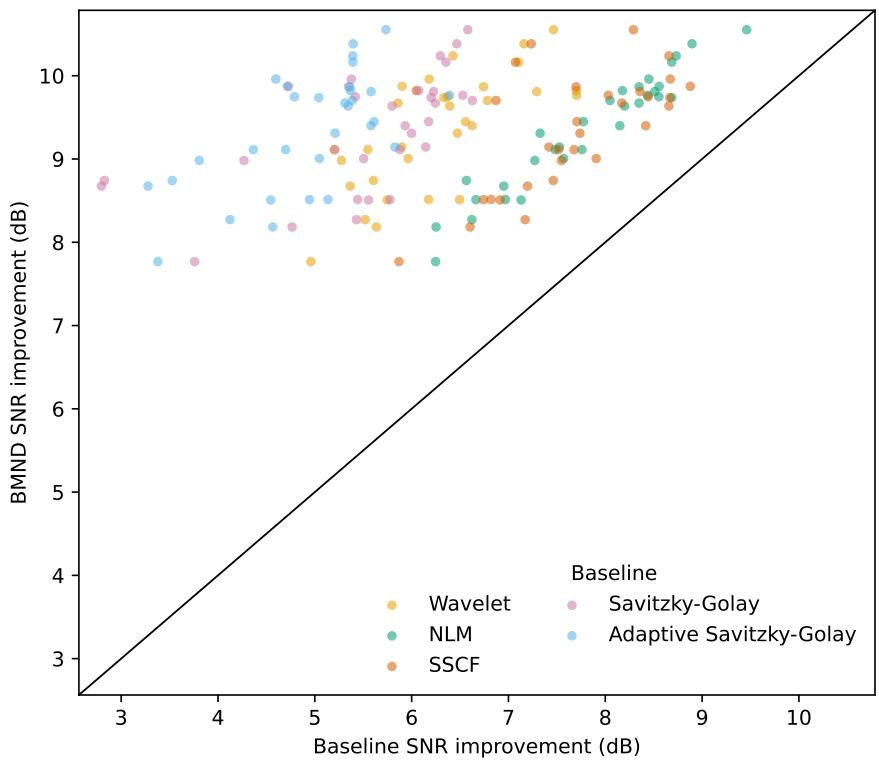  
Figure 16: Paired subject-level comparison of BMND with each baseline, averaged across input SNR levels. Points above the diagonal indicate greater SNR improvement with BMND. Colors identify the corresponding baseline.

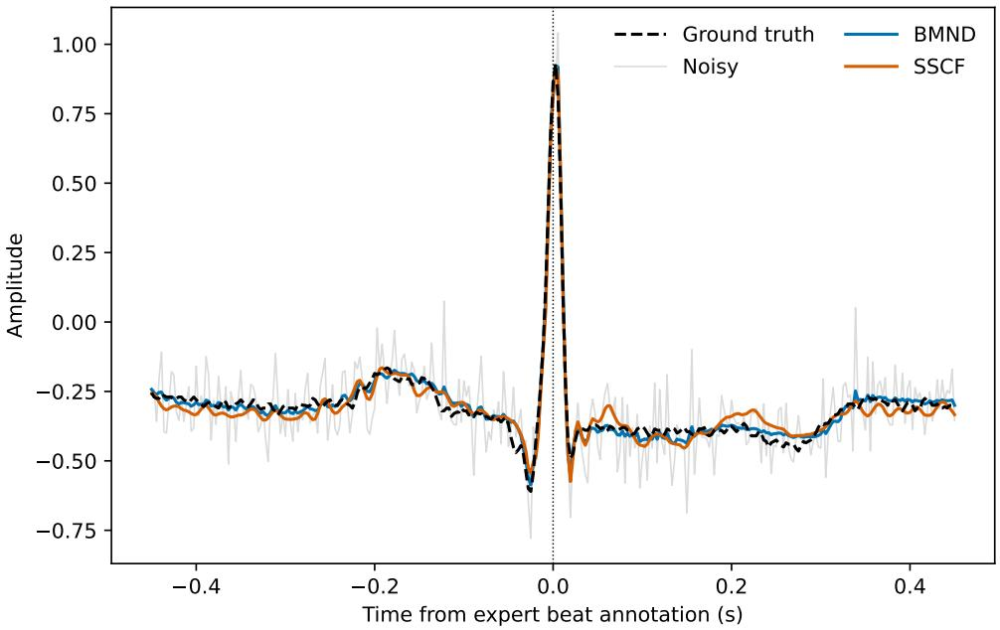  
Figure 17: Example beat-centered ECG waveforms comparing the reference, noisy observation, BMND, and SSCF. The vertical dotted line marks the expert beat annotation.

Table 3: QRS morphology preservation across input SNR levels, measured by waveform RMSE, relative amplitude error, and signed relative amplitude bias. Brackets report 95% subject-bootstrap confidence intervals. Best results are bold and second-best results are underlined.
<table><tr><td>Method</td><td>0 dB</td><td>6 dB</td><td>12 dB</td><td>18 dB</td></tr><tr><td>QRS RMSE↓</td><td></td><td></td><td>0.0388</td><td>0.0238</td></tr><tr><td>BMND</td><td>0.1105 [0.0965, 0.1254]</td><td>0.0638 [0.0557,0.0724]</td><td>[0.0341,0.0437]</td><td>[0.0210,0.0267]</td></tr><tr><td>Wavelet</td><td>0.1901 [0.1699, 0.2113]</td><td>0.1188 [0.1055,0.1322]</td><td>0.0726 [0.0644, 0.0808]</td><td>0.0430 [0.0383, 0.0478]</td></tr><tr><td>NLM</td><td>0.1395 [0.1184, 0.1627]</td><td>0.0768 [0.0682, 0.0858]</td><td>0.0532 [0.0475,0.0592]</td><td>0.0350 [0.0308, 0.0393]</td></tr><tr><td>SSCF</td><td>0.2234 [0.1505, 0.3079]</td><td>0.0700 [0.0615,0.0791]</td><td>0.0415 [0.0366, 0.0465]</td><td>0.0247 [0.0220, 0.0276]</td></tr><tr><td>Savitzky-Golay</td><td>0.1583 [0.1384, 0.1787]</td><td>0.0860 [0.0761,0.0962]</td><td>0.0533 [0.0477, 0.0588]</td><td>0.0401 [0.0353, 0.0453]</td></tr><tr><td>Adaptive Savitzky-Golay</td><td>0.1935 [0.1645,0.2241]</td><td>0.0947 [0.0835,0.1065]</td><td>0.0617 [0.0568, 0.0664]</td><td>0.0534 [0.0487, 0.0580]</td></tr><tr><td>QRS amplitude error (%) ↓</td><td></td><td></td><td></td><td></td></tr><tr><td>BMND</td><td>7.97 [6.85,9.18]</td><td>4.43 [3.99,4.90]</td><td>2.65 [2.43, 2.89]</td><td>1.61 [1.47,1.76]</td></tr><tr><td>Wavelet</td><td>17.67 [15.42, 20.00]</td><td>11.69 [10.14, 13.32]</td><td>7.46 [6.51, 8.45]</td><td>4.59 [4.02, 5.19]</td></tr><tr><td>NLM</td><td>15.20 [11.25, 19.63]</td><td>6.09 [5.13, 7.15]</td><td>4.10 [3.66, 4.57]</td><td>2.63 [2.34, 2.95]</td></tr><tr><td>SSCF</td><td>21.37 [14.45, 29.67]</td><td>4.95 [4.37, 5.59]</td><td>2.89 [2.65, 3.15]</td><td>1.74 [1.58, 1.90]</td></tr><tr><td>Savitzky-Golay</td><td>12.40 [10.69, 14.17]</td><td>6.91 [5.76, 8.33]</td><td>5.62 [4.21, 7.34]</td><td>5.37 [3.83, 7.23]</td></tr><tr><td>Adaptive Savitzky-Golay</td><td>19.15 [15.79, 22.71]</td><td>7.29 [6.50, 8.08]</td><td>5.33 [4.43, 6.38]</td><td>5.68 [4.58, 6.86]</td></tr><tr><td>QRS amplitude bias (%) → 0</td><td></td><td></td><td></td><td></td></tr><tr><td>BMND</td><td>-1.04 [−2.47,0.26]</td><td>-0.01 [−0.41,0.38]</td><td>0.06 [−0.11,0.23]</td><td>0.16 [0.05,0.27]</td></tr><tr><td>Wavelet</td><td>-15.46 [-18.47, -12.53]</td><td>-10.85 [−12.71, -9.05]</td><td>-6.93 [−8.05, -5.83]</td><td>-4.27 [−4.95,-3.61]</td></tr><tr><td>NLM</td><td>-12.00 [-16.82, -7.67]</td><td>0.47 [−0.63, 1.47]</td><td>2.80 [2.37, 3.26]</td><td>1.95 [1.60, 2.30]</td></tr><tr><td>SSCF</td><td>-19.34 [−28.08, -12.14]</td><td>-1.17 [-1.81,-0.57]</td><td>0.16 [−0.07,0.39]</td><td>-0.18 [−0.43, 0.07]</td></tr><tr><td></td><td>6.44</td><td>-1.19</td><td>-3.99</td><td>-4.87</td></tr><tr><td>Savitzky-Golay Adaptive Savitzky-Golay</td><td>[3.07, 9.68] 15.71 [11.20, 20.35]</td><td>[-3.50, 0.96] 1.04 [−0.98, 3.08]</td><td>[−6.02, -2.21] -3.77 [−5.21, -2.47]</td><td>[-6.83,-3.20] -5.41 [−6.68,-4.20]</td></tr></table>

The ablation study shows that the benefits of noise-aware modeling depend on the algorithmic component. Adapting patch matching and Wiener gains to the observation statistics improves marginal mean reconstruction quality across all evaluated dataset groups. Noise-aware aggregation gives smaller improvements, with positive marginal mean efects of Wiener-stage variance and risk weighting on natural images, fluorescence microscopy acquisitions, and anatomical phantom data. Bias-aware risk weighting gives no clear additional benefit over variance weighting, and exact covariance treatment does not consistently improve reconstruction quality across datasets.

The Shepp–Logan experiment shows that mass conservation can reduce denoising-induced intensity loss at low Poisson counts. Preserving the observed total does not, however, guarantee unbiased regional intensities or improved reconstructed-image PSNR. Conservation only in the hardthresholding stage gives the largest low-count reconstruction PSNR gains in this experiment, whereas two-stage conservation combines preservation of the observed total with improved reconstruction quality.

On FMD, direct Poisson BMND uses an intensity shift to match the calibrated afine mean– variance relationship, although this does not ensure that the shifted observations follow an exact Poisson distribution. Its advantage over Anscombe BMND is largest for single-acquisition widefield images and decreases with acquisition averaging. This trend is consistent with a more accurate Gaussian approximation after variance stabilization at higher efective counts. At every evaluated averaging level, modality-specific BMND gives higher aggregate PSNR and SSIM than the evaluated Anscombe baseline and the published VST + BM3D and PURE-LET results, but remains below the best published learning-method scores. The improvement over the selected global configuration also shows that a common formulation does not remove the need for application-specific parameter selection.

The ECG evaluation demonstrates the applicability of the formulation beyond imaging. Under added Gaussian noise, one-dimensional BMND gives larger mean SNR improvements and lower QRS waveform and amplitude errors than the evaluated baselines. This experiment assesses reconstruction and QRS morphology under controlled noise rather than performance on physiological recording artifacts.

Future work will investigate BMND on higher-dimensional positron emission tomography projection data, including sinograms with time-of-flight, dynamic, and gating axes. Such acquisitions can yield six-dimensional or higher-dimensional data representations, providing a natural application of the dimension-independent formulation. Evaluation will assess the benefits of joint processing across these axes while examining sinogram consistency and the preservation of quantitative uptake and temporal fidelity after reconstruction. An explicit mixed Poisson–Gaussian observation model would extend the framework beyond the present scaled-Poisson formulation and its moment-matching approximation for fluorescence data. Finally, we will investigate approximate global block matching under Gaussian and Poisson noise, including search representations adapted to the geometry of the matching statistics. This evaluation will assess computational cost and denoising quality, particularly the trade-of between access to additional self-similar patches and increased susceptibility to noise-driven matches.

## Acknowledgments

This work was supported by grants from Deutsche Forschungsgemeinschaft (CRC1450 project ID 431460824).

OpenAI’s GPT-5.2, GPT-5.4, GPT-5.5, GPT-5.6, and GPT-6 were used during all development steps. OpenAI’s GPT-6 was used for language editing and revisions to the LATEX source.

## References

[1] Paul S. Addison. Wavelet transforms and the ECG: A review. Physiological Measurement, 26 (5):R155–R199, 2005. doi: 10.1088/0967-3334/26/5/R01.

[2] Francis J. Anscombe. The transformation of poisson, binomial and negative-binomial data. Biometrika, 35(3/4):246–254, 1948. doi: 10.1093/biomet/35.3-4.246.

[3] Joshua Batson and Loic Royer. Noise2self: Blind denoising by self-supervision. In International Conference on Machine Learning, pages 524–533. PMLR, 2019.

[4] Mario Bertero, Patrizia Boccacci, and Christine De Mol. Introduction to inverse problems in imaging. CRC Press, 2021.

[5] Antoni Buades, Bartomeu Coll, and Jean-Michel Morel. A review of image denoising algorithms, with a new one. Multiscale Modeling & Simulation, 4(2):490–530, 2005.

[6] Harold C Burger, Christian J Schuler, and Stefan Harmeling. Image denoising: Can plain neural networks compete with bm3d? In 2012 IEEE Conference on Computer Vision and Pattern Recognition, pages 2392–2399. IEEE, 2012.

[7] S Grace Chang, Bin Yu, and Martin Vetterli. Adaptive wavelet thresholding for image denoising and compression. IEEE Transactions on Image Processing, 9(9):1532–1546, 2000.

[8] Ronald R Coifman and David L Donoho. Translation-invariant de-noising. In Wavelets and Statistics, pages 125–150. Springer, 1995.

[9] Pierrick Coupé, Pierre Yger, Sylvain Prima, Pierre Hellier, Charles Kervrann, and Christian Barillot. An optimized blockwise nonlocal means denoising filter for 3-d magnetic resonance images. IEEE Transactions on Medical Imaging, 27(4):425–441, 2008.

[10] Kostadin Dabov, Alessandro Foi, Vladimir Katkovnik, and Karen Egiazarian. Color image denoising via sparse 3d collaborative filtering with grouping constraint in luminance-chrominance space. In 2007 IEEE International Conference on Image Processing, volume 1, pages I–313. IEEE, 2007.

[11] Kostadin Dabov, Alessandro Foi, Vladimir Katkovnik, and Karen Egiazarian. Image denoising by sparse 3-d transform-domain collaborative filtering. IEEE Transactions on Image Processing, 16(8):2080–2095, 2007. doi: 10.1109/TIP.2007.901238.

[12] Aram Danielyan, Vladimir Katkovnik, and Karen Egiazarian. Bm3d frames and variational image deblurring. IEEE Transactions on Image Processing, 21(4):1715–1728, 2011.

[13] Charles-Alban Deledalle, Loïc Denis, and Florence Tupin. Iterative weighted maximum likelihood denoising with probabilistic patch-based weights. IEEE Transactions on Image Processing, 18(12):2661–2672, 2009.

[14] David L. Donoho. De-noising by soft-thresholding. IEEE Transactions on Information Theory, 41(3):613–627, 1995. doi: 10.1109/18.382009.

[15] David L. Donoho and Iain M. Johnstone. Ideal spatial adaptation by wavelet shrinkage. Biometrika, 81(3):425–455, 1994. doi: 10.1093/biomet/81.3.425.

[16] Eastman Kodak Company. Kodak Lossless True Color Image Suite. Online image dataset maintained by Rich Franzen, 1999. URL https://r0k.us/graphics/kodak/.

[17] Franklin A. Graybill and R. B. Deal. Combining unbiased estimators. Biometrics, 15(4): 543–550, 1959. doi: 10.2307/2527652.

[18] Hui Huang, Shiyan Hu, and Ye Sun. A discrete curvature estimation based low-distortion adaptive Savitzky–Golay filter for ECG denoising. Sensors, 19(7):1617, 2019. doi: 10.3390/ s19071617.

[19] Vladimir Katkovnik, Alessandro Foi, Karen Egiazarian, and Jaakko Astola. From local kernel to nonlocal multiple-model image denoising. International Journal of Computer Vision, 86(1): 1–32, 2010.

[20] Charles Kervrann and Jérôme Boulanger. Optimal spatial adaptation for patch-based image denoising. IEEE Transactions on Image Processing, 15(10):2866–2878, 2006.

[21] John F. C. Kingman. Poisson Processes. Clarendon Press, Oxford, 1993.

[22] Tamara G Kolda and Brett W Bader. Tensor decompositions and applications. SIAM Review, 51(3):455–500, 2009.

[23] Alexander Krull, Tim-Oliver Buchholz, and Florian Jug. Noise2void-learning denoising from single noisy images. In 2019 IEEE/CVF Conference on Computer Vision and Pattern Recognition (CVPR), pages 2124–2132. IEEE, 2019.

[24] Jaakko Lehtinen, Jacob Munkberg, Jon Hasselgren, Samuli Laine, Tero Karras, Miika Aittala, and Timo Aila. Noise2noise: Learning image restoration without clean data. arXiv preprint arXiv:1803.04189, 2018.

[25] Baoying Liu and Yuanlu Li. ECG signal denoising based on similar segments cooperative filtering. Biomedical Signal Processing and Control, 68:102751, 2021. doi: 10.1016/j.bspc.2021.102751.

[26] Florian Luisier, Thierry Blu, and Michael Unser. Image denoising in mixed poisson–gaussian noise. IEEE Transactions on Image Processing, 20(3):696–708, 2010.

[27] Matteo Maggioni, Vladimir Katkovnik, Karen Egiazarian, and Alessandro Foi. Nonlocal transform-domain filter for volumetric data denoising and reconstruction. IEEE Transactions on Image Processing, 22(1):119–133, 2012. doi: 10.1109/TIP.2012.2210725.

[28] Julien Mairal, Francis Bach, Jean Ponce, Guillermo Sapiro, and Andrew Zisserman. Non-local sparse models for image restoration. In 2009 IEEE 12th International Conference on Computer Vision, pages 2272–2279. IEEE, 2009.

[29] Ymir Mäkinen, Lucio Azzari, and Alessandro Foi. Collaborative filtering of correlated noise: Exact transform-domain variance for improved shrinkage and patch matching. IEEE Transactions on Image Processing, 29:8339–8354, 2020. doi: 10.1109/TIP.2020.3014721.

[30] Markku Makitalo and Alessandro Foi. Optimal inversion of the anscombe transformation in low-count poisson image denoising. IEEE Transactions on Image Processing, 20(1):99–109, 2010.

[31] David Martin, Charless Fowlkes, Doron Tal, and Jitendra Malik. A database of human segmented natural images and its application to evaluating segmentation algorithms and measuring ecological statistics. In Proceedings Eighth IEEE International Conference on Computer Vision. ICCV 2001, volume 2, pages 416–423. IEEE, 2001.

[32] Peter McCullagh and John A. Nelder. Generalized Linear Models. Chapman and Hall, London, 2 edition, 1989. doi: 10.1007/978-1-4899-3242-6.

[33] Peyman Milanfar. A tour of modern image filtering: New insights and methods, both practical and theoretical. IEEE Signal Processing Magazine, 30(1):106–128, 2012.

[34] George B. Moody and Roger G. Mark. The impact of the MIT-BIH Arrhythmia Database. IEEE Engineering in Medicine and Biology Magazine, 20(3):45–50, 2001. doi: 10.1109/51.932724.

[35] Alan V. Oppenheim and Ronald W. Schafer. Discrete-Time Signal Processing. Prentice Hall, Upper Saddle River, NJ, 3 edition, 2010.

[36] Karl Pearson. On the criterion that a given system of deviations from the probable in the case of a correlated system of variables is such that it can be reasonably supposed to have arisen from random sampling. The London, Edinburgh, and Dublin Philosophical Magazine and Journal of Science, 50(302):157–175, 1900. doi: 10.1080/14786440009463897.

[37] Pietro Perona and Jitendra Malik. Scale-space and edge detection using anisotropic difusion. IEEE Transactions on Pattern Analysis and Machine Intelligence, 12(7):629–639, 1990.

[38] Olaf Ronneberger, Philipp Fischer, and Thomas Brox. U-net: Convolutional networks for biomedical image segmentation. In International Conference on Medical Image Computing and Computer-Assisted Intervention, pages 234–241. Springer, 2015.

[39] Cynthia Rudin. Stop explaining black box machine learning models for high stakes decisions and use interpretable models instead. Nature machine intelligence, 1(5):206–215, 2019.

[40] Leonid I Rudin, Stanley Osher, and Emad Fatemi. Nonlinear total variation based noise removal algorithms. Physica D: Nonlinear Phenomena, 60(1-4):259–268, 1992.

[41] W. P. Segars, G. Sturgeon, S. Mendonca, Jason Grimes, and B. M. W. Tsui. 4D XCAT phantom for multimodality imaging research. Medical Physics, 37(9):4902–4915, 2010. doi: 10.1118/1.3480985.

[42] Brian H. Tracey and Eric L. Miller. Nonlocal means denoising of ECG signals. IEEE Transactions on Biomedical Engineering, 59(9):2383–2386, 2012. doi: 10.1109/TBME.2012.2208964.

[43] A. W. van der Vaart. Asymptotic Statistics. Cambridge Series in Statistical and Probabilistic Mathematics. Cambridge University Press, 1998.

[44] Stéfan van der Walt, Johannes L. Schönberger, Juan Nunez-Iglesias, François Boulogne, Joshua D. Warner, Neil Yager, Emmanuelle Gouillart, Tony Yu, and the scikit-image contributors. scikit-image: Image processing in python. PeerJ, 2:e453, 2014. doi: 10.7717/peerj.453.

[45] Singanallur V Venkatakrishnan, Charles A Bouman, and Brendt Wohlberg. Plug-and-play priors for model based reconstruction. In 2013 IEEE Global Conference on Signal and Information Processing, pages 945–948. IEEE, 2013.

[46] Joachim Weickert et al. Anisotropic difusion in image processing. 1998.

[47] Norbert Wiener. Extrapolation, Interpolation, and Smoothing of Stationary Time Series. MIT Press, Cambridge, MA, 1949.

[48] Kai Zhang, Wangmeng Zuo, Yunjin Chen, Deyu Meng, and Lei Zhang. Beyond a gaussian denoiser: Residual learning of deep cnn for image denoising. IEEE Transactions on Image Processing, 26(7):3142–3155, 2017.

[49] Kai Zhang, Wangmeng Zuo, Shuhang Gu, and Lei Zhang. Learning deep cnn denoiser prior for image restoration. In 2017 IEEE Conference on Computer Vision and Pattern Recognition (CVPR), pages 2808–2817. IEEE, 2017.

[50] Kai Zhang, Wangmeng Zuo, and Lei Zhang. Ffdnet: Toward a fast and flexible solution for cnn-based image denoising. IEEE Transactions on Image Processing, 27(9):4608–4622, 2018.

[51] Yide Zhang, Yinhao Zhu, Evan Nichols, Qingfei Wang, Siyuan Zhang, Cody Smith, and Scott Howard. A poisson-gaussian denoising dataset with real fluorescence microscopy images. In CVPR, 2019.

## A Standard Configuration

Table 4 shows the parameters used for experiments if not stated otherwise. These are taken from the modern BM3D/BM4D implementations.

Table 4: Standard Gaussian BM3D and BM4D profile values used by BMND.
<table><tr><td>Parameter</td><td>Stage</td><td>BM3D</td><td>BM4D</td></tr><tr><td>General and scheduling</td><td></td><td></td><td></td></tr><tr><td>Reference schedule</td><td>Both</td><td>generated</td><td>generated</td></tr><tr><td>Shift density</td><td>Both</td><td>2.0</td><td>2.0</td></tr><tr><td>Schedule density</td><td>Both</td><td>2</td><td>2</td></tr><tr><td>Covariance and matching</td><td></td><td></td><td></td></tr><tr><td>Local-variance domain n f</td><td>Both</td><td>32 × 32</td><td>16 × 16 × 16</td></tr><tr><td>Exact covariance planes k</td><td>Both</td><td>4</td><td>4</td></tr><tr><td>Matching distance</td><td>Both</td><td>ssd</td><td>ssd</td></tr><tr><td>HT SSD bias factor γ</td><td>HT</td><td>3.0</td><td>3.0</td></tr><tr><td>Aggregation</td><td></td><td></td><td></td></tr><tr><td>Weight model / domain / scope</td><td>HT</td><td>variance / coefficient /</td><td>variance / coefficient / patch</td></tr><tr><td>Weight model / domain / scope</td><td>Wiener</td><td>patch variance / coefficient / patch</td><td>variance / coefficient / patch</td></tr><tr><td>Patch grouping</td><td></td><td></td><td></td></tr><tr><td>Block size</td><td>HT</td><td>8 × 8</td><td>4 × 4 × 4</td></tr><tr><td>Block size</td><td>Wiener</td><td>8× 8</td><td>5 × 5 × 5</td></tr><tr><td>Reference step</td><td>HT</td><td>3 × 3</td><td>3 × 3 × 3</td></tr><tr><td>Reference step</td><td>Wiener</td><td>3 × 3</td><td>3 × 3 × 3</td></tr><tr><td>Search window</td><td>HT</td><td>19 × 19</td><td>7 × 7 × 7</td></tr><tr><td>Search window</td><td>Wiener</td><td>19 × 19</td><td>7 × 7 × 7</td></tr><tr><td>Minimum group size</td><td>HT</td><td>2</td><td>2</td></tr><tr><td>Minimum group size</td><td>Wiener</td><td>2</td><td>2</td></tr><tr><td>Maximum group size</td><td>HT</td><td>16</td><td>16</td></tr><tr><td>Maximum group size</td><td>Wiener</td><td>32</td><td>32</td></tr><tr><td>Matching threshold</td><td>HT</td><td>2.9527</td><td>2.9527</td></tr><tr><td>Matching threshold</td><td>Wiener</td><td>0.3937</td><td>0.7689</td></tr><tr><td>Collaborative filtering</td><td></td><td></td><td></td></tr><tr><td>Thresholding</td><td>HT</td><td>hard</td><td>hard</td></tr><tr><td>Threshold multiplier λ</td><td>HT</td><td>3.0</td><td>3.0</td></tr><tr><td>Variance scale</td><td>Wiener</td><td>0.4</td><td>0.4</td></tr><tr><td>Kaiser window β</td><td>HT</td><td>2.0</td><td>2.0</td></tr><tr><td>Kaiser window β</td><td>Wiener</td><td>2.0</td><td>2.0</td></tr><tr><td>Transforms</td><td>HT</td><td>Haar (group), bior1.5 (spatial)</td><td>Haar (group), bior1.5 (spatial)</td></tr><tr><td>Transforms</td><td>Wiener</td><td>Haar (group), DCT (spatial)</td><td>Haar (group), DCT (spatial)</td></tr></table>

## B Ablation Study

Table 5 shows the parameters used for the ablation experiment. All profile fields not listed here retain the dimension-specific standard configuration in Appendix A.

Table 5: Profile space evaluated in the Cartesian ablation. The level count is the number of independently crossed options.
<table><tr><td>Profile parameter</td><td>Candidate values or fixed setting</td><td>Levels</td></tr><tr><td colspan="3">Varied Cartesian factors</td></tr><tr><td></td><td>HT matching distance / policy poisson_deviance / fixed, poisson_deviance / reference_finite_count, poisson_deviance / candidate_standardized, pearson/ fixed, pearson/ reference_finite_count, pearson/ candidate_standardized, anscombe_ssd / fixed,</td><td>10</td></tr><tr><td>Exact covariance planes k</td><td>anscombe_ssd /reference_finite_count, anscombe_ssd / candidate_standardized, ssd / fixed {0, 1, 4, 32}</td><td>4</td></tr><tr><td>Wiener gain</td><td>{classic, noise-floor, variance-scaled }</td><td>3 2</td></tr><tr><td>HT aggregation-weight model HT aggregation-weight domain {coefficient, windowed_synthesis}</td><td>{classic, variance }</td><td>2</td></tr><tr><td>HT aggregation-weight scope</td><td>{group, patch }</td><td>2</td></tr><tr><td>Wiener aggregation-weight</td><td></td><td>3</td></tr><tr><td>model</td><td>{classic, variance, risk}</td><td></td></tr><tr><td>Wiener aggregation-weight</td><td>{coefficient, windowed_synthesis}</td><td>2</td></tr><tr><td>domain Wiener aggregation-weight scope {group, patch }</td><td></td><td>2</td></tr><tr><td>Group-mass conservation stage {none, ht, wiener, both }</td><td></td><td>4</td></tr><tr><td>HT threshold rule</td><td>{hard, soft }</td><td>2</td></tr><tr><td>HT threshold multiplier λ</td><td>{1.5, 3, 4.5}</td><td>3</td></tr><tr><td></td><td>Total Cartesian profiles 276,480</td><td></td></tr><tr><td>Fixed and conditional settings</td><td></td><td></td></tr><tr><td>Noise model</td><td>poisson</td><td>1</td></tr><tr><td>Reference schedule</td><td>generated with shift density 2 and schedule density 2</td><td>1</td></tr><tr><td>Wiener matching</td><td>pilot source / fixed policy</td><td>1</td></tr><tr><td>Wiener variance scale</td><td>0.4</td><td>1</td></tr><tr><td>Global mass conservation</td><td></td><td></td></tr><tr><td></td><td>none</td><td>1</td></tr><tr><td>Finite-count structural</td><td>βs = 0.1 and intensity power κs = 1 when the HT policy is</td><td>1</td></tr><tr><td>allowance</td><td>reference_finite_count</td><td></td></tr><tr><td>HT SSD bias factor γ</td><td>3 when the matching distance is ssd</td><td>1</td></tr></table>

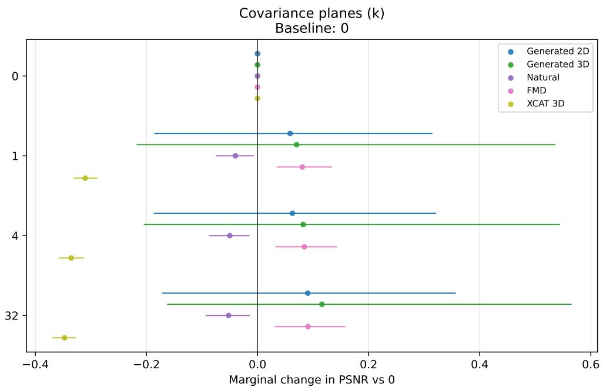  
Figure 18: Marginal efects of the number of covariance planes k on PSNR relative to $k = 0 .$ . Error bars denote 95% source-unit bootstrap intervals.

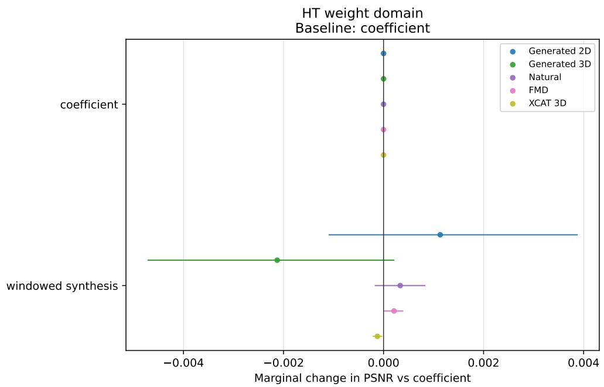  
Figure 19: Marginal efects of the hard-thresholding aggregation-weight domain on PSNR relative to coeficient-domain weighting. Error bars denote 95% source-unit bootstrap intervals.

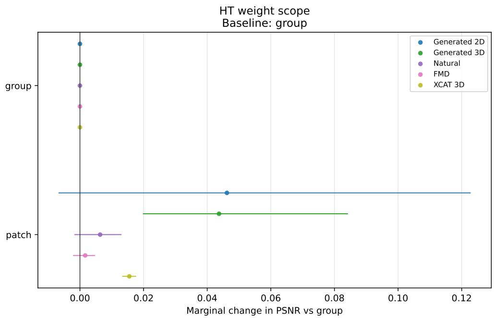  
Figure 20: Marginal efects of the hard-thresholding aggregation-weight scope on PSNR relative to group-level weighting. Error bars denote 95% source-unit bootstrap intervals.

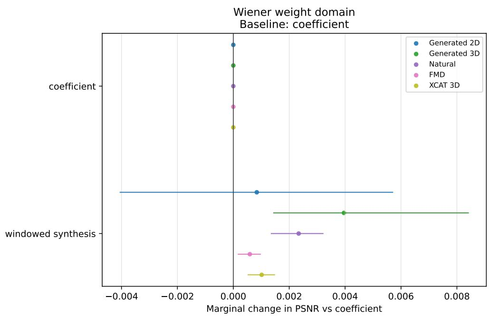  
Figure 21: Marginal efects of the Wiener-stage aggregation-weight domain on PSNR relative to coeficient-domain weighting. Error bars denote 95% source-unit bootstrap intervals.

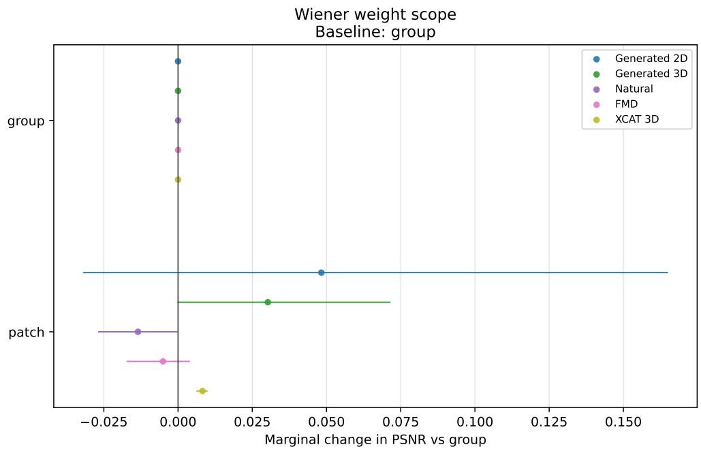  
Figure 22: Marginal efects of the Wiener-stage aggregation-weight scope on PSNR relative to group-level weighting. Error bars denote 95% source-unit bootstrap intervals.

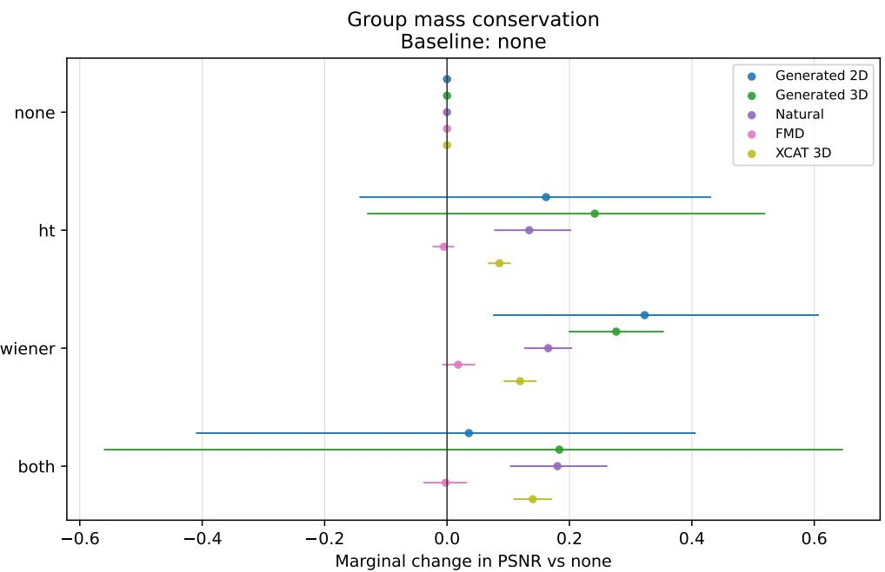  
Figure 23: Marginal efects of group mass conservation on PSNR relative to denoising without mass conservation. Conservation is applied in the hard-thresholding stage, the Wiener stage, or both stages. Error bars denote 95% source-unit bootstrap intervals.

## C ECG Experiment

Table 6: Parameter spaces evaluated in the controlled ECG experiment. Candidate counts include only combinations varied during development, fixed settings are reported for reproducibility.
<table><tr><td>Method and parameter</td><td>Candidate values or fixed setting</td><td>Candidates</td></tr><tr><td>1D BMND</td><td></td><td>240</td></tr><tr><td>Patch length L</td><td>{8, 16, 32, 64, 128} samples</td><td></td></tr><tr><td>Reference step</td><td> $L / 4$  samples</td><td></td></tr><tr><td>One-sided search radius</td><td>{1, 2, 3, 4} s</td><td></td></tr><tr><td>Maximum group size</td><td>{8, 16, 32, 64}</td><td></td></tr><tr><td>Matching-threshold scale  $c _ { m }$ </td><td>{0.5, 1, 2}</td><td></td></tr><tr><td>Hard-thresholding match threshold</td><td> $2 . 9 5 2 7 ( L / 6 4 ) c _ { m }$ </td><td></td></tr><tr><td>Wiener match threshold</td><td> $0 . 3 9 3 7 ( L / 6 4 ) c _ { m }$ </td><td></td></tr><tr><td>Transforms</td><td>Haar group and biorthogonal-1.5 local transforms in the hard-thresholding stage; Haar group and DCT local transforms in the Wiener stage</td><td></td></tr><tr><td>DWT shrinkage</td><td></td><td>84</td></tr><tr><td>Wavelet</td><td>{db4, sym4, coif3}</td><td></td></tr><tr><td>Decomposition level</td><td>{3, 4, 5, 6}</td><td></td></tr><tr><td>Threshold multiplier  $c _ { \lambda }$ </td><td>{0.1, 0.25, 0.5, 0.75, 1, 1.25, 1.5}</td><td></td></tr><tr><td>Threshold rule</td><td>Soft thresholding with  $\lambda = c _ { \lambda } \sigma { \sqrt { 2 \log n } }$  and periodized boundaries</td><td></td></tr><tr><td>Nonlocal means</td><td></td><td>120</td></tr><tr><td>Patch length</td><td>{8, 16, 32, 64, 128} samples</td><td></td></tr><tr><td>One-sided search radius</td><td>{1, 2, 3, 4} s</td><td></td></tr><tr><td>Bandwidth multiplier  $c _ { h }$ </td><td>{0.2, 0.4, 0.6, 0.8, 1, 1.2}</td><td></td></tr><tr><td>Bandwidth and distance correction</td><td> $h = c _ { h } \sigma ;$  patch distances were corrected by subtracting</td><td></td></tr><tr><td>Similar-segment cooperative filtering</td><td></td><td>3</td></tr><tr><td>Segment length</td><td>17 samples</td><td></td></tr><tr><td>Matching-threshold scale</td><td> $\{ 0 . 5 , 1 , 2 \}$ </td><td></td></tr><tr><td> $c _ { \tau }$  Matching threshold</td><td> $\left( 1 3 2 5 v ^ { 3 } - 2 5 2 . 9 8 6 v ^ { 2 } + 2 0 . 3 5 9 v + 0 . 0 6 9 5 , \epsilon \right)$  τ = cτ max</td><td></td></tr><tr><td>Fixed Savitzky-Golay settings</td><td>Seven-sample prefilter; polynomial orders 2 and 4 for</td><td></td></tr><tr><td>Fixed grouping settings</td><td>non-peak and peak groups, respectively Robust peak detection, distance-sorted group members,</td><td></td></tr><tr><td></td><td>first-order fitting across similar segments, and uniform overlap averaging</td><td></td></tr><tr><td>Savitzky-Golay Window length</td><td></td><td>27</td></tr><tr><td>Polynomial order</td><td>{5, 7, 9, 11, 15, 21,31, 41, 61} samples {2, 3, 4}</td><td></td></tr><tr><td>Adaptive Savitzky-Golay</td><td></td><td>84</td></tr><tr><td>Window-length and maximum-order</td><td>{(9, 7), (11, 7), (11, 9), (15, 9), (15, 13), (21, 9), (21, 13)}</td><td></td></tr><tr><td>pairs</td><td></td><td></td></tr><tr><td>Maximum curvature-search length</td><td>{2, 5, 10} samples</td><td></td></tr><tr><td>DSS angle threshold</td><td>{0.01, 0.025, 0.05, 0.1} rad</td><td></td></tr></table>

Continued on next page

<table><tr><td>Method and parameter</td><td>Candidate values or fixed setting</td></tr><tr><td>Order assignment</td><td>Curvature mapped onto integer polynomial orders from 1 to</td></tr><tr><td></td><td>the selected maximum</td></tr><tr><td></td><td>Total development candidates 558</td></tr></table>

Here, n is the number of samples in the denoised segment, σ is the known standard deviation of the added Gaussian noise, v is the SSCF prefilter-residual variance, and ϵ is a small positive numerical constant.