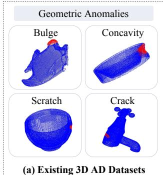
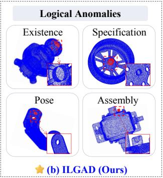
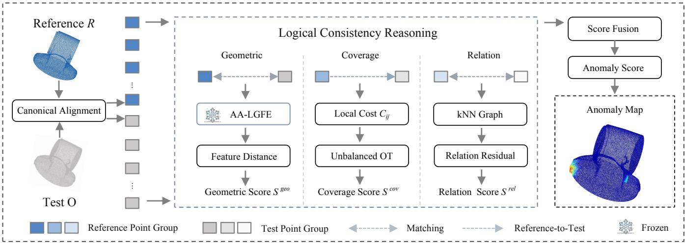
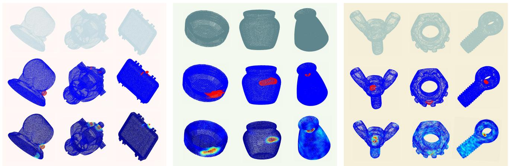
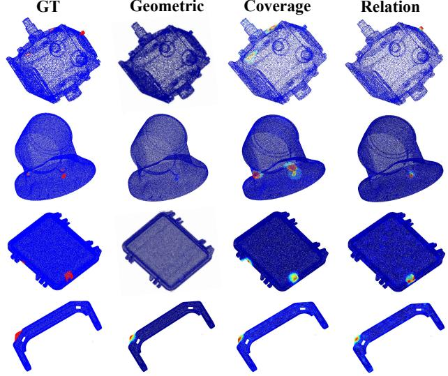

# Beyond Geometry: Benchmarking and Consistency Reasoning for 3D Logical Anomaly Detection

Zhiqiang Qin1,2, He Xie1,2∗, Junfei Yi1,2, Yang Yang1,2, Hao Wang1,2, Yunkang Cao1,2, Hui Zhang1,2, Yaonan Wang1,2

1School of Artificial Intelligence and Robotics, Hunan University

2National Engineering Research Center of Robot Visual Perception and Control Technology, Hunan University

## Abstract

Existing 3D industrial anomaly detection mainly targets local geometric deviations. In contrast, many industrial anomalies violate object-level design or assembly rules, which we define as 3D logical anomalies. To address these challenges, we introduce the Industrial Logical Anomaly Detection Dataset (ILGAD), the first scalable benchmark dedicated to logical anomalies in industrial point clouds. ILGAD contains 2,774 samples from 15 categories with point-level annotations and covers existence, specification, pose, and assembly-state errors. To detect such 3D logical anomalies, we propose a consistency reasoning framework that assesses whether local geometry, structure coverage, and spatial relations conform to the normal design. The framework detects geometric changes, unsupported expected structures, and abnormal local arrangements. Experiments on ILGAD, Anomaly-ShapeNet, and IEC3D demonstrate superior object-level detection and point-level localization, showing that the framework efectively detects logical anomalies and generalizes to conventional geometric defects.

## Introduction

Industrial inspection often involves multi-component products and assemblies rather than only isolated parts. In these settings, correctness depends not only on surface quality but also on component presence, configuration, and intercomponent relations (Bergmann et al. 2022a). An object may contain locally intact components yet remain globally invalid because a required component is absent, redundant, mismatched, misoriented, or incorrectly assembled. This distinction leads to two fundamentally diferent inspection goals. Conventional geometric anomaly detection asks where the observed shape difers, whereas logical anomaly detection asks whether an object satisfies its intended design and assembly rules. The need to assess such rule violations has already motivated logical anomaly detection in 2D industrial inspection. MVTec LOCO AD (Bergmann et al. 2022a) provides a 2D industrial benchmark for logical anomaly detection, where logical anomalies violate constraints on object presence or spatial arrangement. However, image-based settings do not provide explicit 3D geometry for evaluating component pose, spatial relations, and assembly states.

  
Figure 1: Comparison between representative existing 3D anomaly detection datasets and ILGAD. Existing benchmarks mainly focus on geometric anomalies, whereas IL-GAD covers existence, specification, pose, and assemblystate errors. Red markings indicate anomalies, and the insets show the corresponding normal structures.

This limitation motivates the study of logical anomaly detection directly in 3D point clouds, which provide explicit geometric cues for assessing component configurations, spatial relations, and structural validity.

Despite these advantages, most existing 3D anomaly detection methods still identify anomalies through local feature discrepancy, reconstruction error, registration residual, or point-wise deformation (Horwitz and Hoshen 2023; Cao, Xu, and Shen 2024; Wang et al. 2023; Zhou et al. 2024; Liang et al. 2025; Ye et al. 2025). These formulations are effective for scratches, dents, and local deformations because the anomalous evidence is directly present in the observed test geometry. However, they are less suited to logical violations that cannot be identified from local geometric evidence alone. A missing component contributes no test points to match, a wrongly posed component may retain normal local geometry, and an invalid assembly may consist entirely of individually normal parts. The central scientific question is therefore: Can a 3D inspection system determine whether an object is valid according to its intended structure and assembly rules, rather than merely detecting geometric deviations?

Answering this question requires not only a suitable reasoning framework but also a benchmark that explicitly represents object-level structural and assembly violations. Existing benchmarks cover real scanned objects, synthetic shape anomalies, multi-sensor inspection, and subtle local defects (Bergmann et al. 2022b; Liu et al. 2023; Li et al. 2024, 2025; Cheng et al. 2026; Zhang et al. 2026). However, as illustrated by the representative examples in Figure 1(a), these benchmarks mainly focus on visible geometric anomalies and do not explicitly organize anomalies around object-level design and assembly rules. Consequently, they cannot fully evaluate whether a detector can move beyond local shape comparison and determine whether an industrial object is structurally valid. To address this limitation, we construct the Industrial Logical Anomaly Detection Dataset (ILGAD). As shown in Figure 1(b), ILGAD defines four types of logical anomalies, including existence, specification, pose, and assembly-state errors. It contains 2,774 point clouds from 15 industrial categories and provides rule-guided CAD anomaly modeling and point-level annotations, together with a small number of geometric defects for mixed-anomaly evaluation.

Logical anomalies can be identified by examining whether an object remains consistent with its normal design at three complementary levels: local geometry, structure coverage, and spatial relations. We therefore ask three questions. Does each visible local structure match its expected geometry (Q1)? Is every expected structure supported by the test observation (Q2)? Are the normal spatial relations among neighboring structures preserved (Q3)? Based on this formulation, we propose a logical consistency reasoning framework. It addresses Q1, Q2, and Q3 through local geometric consistency, structure coverage consistency, and spatial relation consistency, respectively. Violations of these consistencies reveal specification errors, existence errors, and pose or assembly-state errors. The framework produces both point-level anomaly maps and object-level predictions. Our contributions are summarized below.

• We formulate 3D logical anomaly detection as structural validity assessment beyond local geometric deviation and introduce ILGAD, the first scalable industrial point cloud benchmark dedicated to logical anomalies, with 15 categories, 2,774 samples, and point-level annotations.

• We propose a consistency reasoning framework that moves beyond local shape comparison by jointly reasoning about visible geometry, expected-structure coverage, and spatial relations, thereby detecting visible defects, missing structures, and invalid local arrangements.

• Extensive experiments on ILGAD, Anomaly-ShapeNet, and IEC3D demonstrate superior object-level detection and point-level localization, validating the efectiveness and generalization of the proposed framework.

## ILGAD Benchmark

## Task Definition

Let $O = \{ p _ { i } \} _ { i = 1 } ^ { N }$ denote an observed industrial point cloud and R a normal reference from the same category. A logical anomaly occurs when O violates an object-level design or assembly constraint represented by R, resulting in an existence, specification, pose, or assembly-state error. The task includes object-level detection and point-level localization.

<table><tr><td>Dataset</td><td>Logical</td><td>Rule-guided</td><td>GT</td><td>Asm. Obj.</td></tr><tr><td>MVTec 3D-AD</td><td>X</td><td>X</td><td>√</td><td>X</td></tr><tr><td>Real3D-AD</td><td>×</td><td>X</td><td>√</td><td>X</td></tr><tr><td>Anomaly-ShapeNet</td><td>×</td><td>×</td><td>√</td><td>×</td></tr><tr><td>IEC3D</td><td>×</td><td>×</td><td>√</td><td>X</td></tr><tr><td>ILGAD</td><td>√</td><td>√</td><td>√</td><td>√</td></tr></table>

Table 1: Comparison of representative 3D anomaly detection datasets. Rule-guided indicates that anomalous CAD models are manually constructed by violating predefined structural or assembly requirements. Asm. Obj. indicates whether the dataset contains multi-component assembled objects.

The object-level label $y _ { \mathrm { o b j } } \in \{ 0 , 1 \}$ indicates whether O is anomalous, while the point-level labels $\mathbf { y } _ { \mathrm { p t } } = \{ y _ { i } \} _ { i = 1 } ^ { N }$ where $y _ { i } \in \{ 0 , 1 \}$ , identify visible evidence of the violation. Table 1 compares ILGAD with representative 3D anomaly detection datasets, including MVTec 3D-AD (Bergmann et al. 2022b), Real3D-AD (Liu et al. 2023), Anomaly-ShapeNet (Li et al. 2024), and IEC3D (Guo et al. 2025). Unlike existing benchmarks that mainly focus on visible geometric defects, ILGAD explicitly models logical violations of industrial design and assembly rules.

## Dataset Construction

ILGAD is constructed in four stages. First, professional industrial design engineers define 15 generic industrial component categories containing common structures such as holes, grooves, repeated elements, and assembled subcomponents. Second, defect-free CAD templates are created in SolidWorks, from which normal point clouds are generated with varying sampling densities and global poses. Third, anomalous variants are manually created by violating explicit design and assembly rules, ensuring meaningful logical defects rather than arbitrary geometric perturbations. Finally, all CAD models are converted into point clouds and manually annotated at the point level in CloudCompare. For missing-component anomalies, the removed structure has no corresponding points in the test cloud. We therefore annotate the visible contact or boundary points adjacent to the missing location as point-level ground truth. These labels capture the observable evidence of structural absence while ensuring that the predictions and ground-truth annotations are defined on the same test point set. Logical anomalies are categorized as existence, specification, pose, and assemblystate errors. They respectively describe missing or redundant components, incorrect structural parameters, incorrect component positions or orientations, and invalid assembly states. ILGAD also includes geometric defects for conventional and mixed-anomaly evaluation. Since a test sample may contain multiple logical violations or both logical and geometric defects, the taxonomy describes violated rules rather than mutually exclusive sample classes. Following the standard industrial anomaly detection protocol, the training split contains only defect-free samples, while the test split contains normal and anomalous samples with point-level annotations. No ILGAD anomaly is used for training or model selection.

  
Figure 2: Overview of the Consistency Reasoning Framework. After canonical reference alignment, three parallel components evaluate local geometric consistency, structure coverage consistency, and spatial relation consistency. The resulting scores are propagated to visible test points and fused to produce a point-level anomaly map and an object-level anomaly score.

## Dataset Statistics

ILGAD contains 2,774 samples from 15 industrial component categories in total, including 1,602 normal samples and 1,172 anomalous samples. Among the 1,172 anomalous samples, 908 contain at least one logical violation, including 248 samples with mixed logical and geometric defects, while the remaining 264 samples contain geometric defects only. The categories are Cylindrical Bracket (CLB), Bearing Connector Assembly (BC), Wheel Hub (WH), Box Connector Assembly (BCA), Curved Bracket (CDB), Rectangular Cover (RC), Pipe Bracket (PB), Circular Connector (CC), Mechanical Mounting Base (MMB), Automotive End Cap (AEC), Valve Component (VC), Elbow Joint (EJ), Rail Bracket Assembly (RBA), Rectangular Mounting Plate (RMP), and Oval Mounting Flange (OMF). Each point cloud contains approximately 300K–500K points after preprocessing. Detailed category-wise train–test splits, non-exclusive anomaly-type distributions, and operational definitions for anomaly generation and annotation are provided in the supplementary material for completeness and reproducibility.

## Consistency Reasoning Framework

## Overview

Given the test observation O and the normal reference R from the same category, the framework evaluates three complementary forms of consistency. Local geometric consistency measures visible patch-level changes. Structure coverage consistency evaluates whether each reference structure is supported by the observation, including structures that may be absent from O. Spatial relation consistency measures changes in the relative arrangement of neighboring local structures. As shown in Figure 2, the reference and test point clouds are first aligned to a shared canonical frame. In the local geometric consistency branch (Q1), matched reference and test patches are encoded by a shared Anomaly-Aware Local Geometric Feature Encoder (AA-LGFE). The structure coverage consistency branch (Q2) operates on aligned point coordinates to verify whether expected reference structures are supported by the observation, while the spatial relation consistency branch (Q3) operates on neighborhood structures to assess abnormal local arrangements. The resulting geometric, coverage, and relation scores are then propagated to the visible test points, normalized, and fused for point-level localization and object-level detection.

## Canonical Reference Alignment

To match component-level structure, we canonicalize the normal reference and test point cloud into a shared coordinate frame. Rather than relying on expensive unconstrained global registration, we estimate a stable canonical basis by anchorset voting and then apply small-range ICP refinement.

For each point cloud $\mathbf { \bar { \mathcal { X } } } = \{ x _ { i } \} _ { i = 1 } ^ { N }$ , we first robustly center the points as ${ \bar { x } } _ { i } = x _ { i } - c .$ . We then compute the radial distance $r _ { i } = \| \bar { x } _ { i } \| _ { 2 }$ and select outer and middle anchor sets according to radial-distance quantiles. The outer-anchor set $A _ { \mathrm { o u t } }$ captures the global object extension and is used to estimate the first axis, while the middle-anchor set $\mathcal { A } _ { \mathrm { m i d } }$ is less sensitive to boundary noise and extreme outliers and is used to estimate the second axis. The first axis is obtained from the weighted direction-voting matrix:

$$
A = \sum _ { i \in \mathcal { A } _ { \mathrm { o u t } } } w _ { i } \hat { x } _ { i } \hat { x } _ { i } ^ { \top } , \qquad \hat { x } _ { i } = \frac { \bar { x } _ { i } } { \| \bar { x } _ { i } \| _ { 2 } + \epsilon } .\tag{1}
$$

Here, $w _ { i }$ is a normalized robust density-aware weight computed from the local kNN spacing:

$$
\delta _ { i } = \frac { 1 } { k } \sum _ { j \in \mathcal { N } _ { k } ( i ) } \| \bar { x } _ { i } - \bar { x } _ { j } \| _ { 2 } ,\tag{2}
$$

where $\mathcal { N } _ { k } ( i )$ is obtained from the full centered point cloud. Specifically, $w _ { i }$ combines a density-compensation factor derived from $\delta _ { i }$ and a Huber-type robust reliability factor (Huber 1964). The density-compensation factor reduces the influence of non-uniform sampling, while the robust factor suppresses isolated outliers and unstable boundary points. The first canonical axis $e _ { 1 }$ is the eigenvector corresponding to the largest eigenvalue of A.

To estimate the second axis, each middle center is first projected onto the subspace orthogonal to $e _ { 1 }$ as $z _ { i } =$ $\bar { x } _ { i } - ( \bar { x } _ { i } ^ { \top } e _ { 1 } ) e _ { 1 }$ . A weighted covariance matrix is then computed from the projected middle centers. Its dominant eigenvector is used to obtain the second axis $e _ { 2 }$ after removing any remaining component along $e _ { 1 }$ . The third axis is obtained by $e _ { 3 } = e _ { 1 } \times e _ { 2 }$ . The basis $[ e _ { 1 } , e _ { 2 } , e _ { 3 } ]$ defines the canonical coordinate frame. To resolve axis-sign ambiguity, we evaluate the four right-handed sign configurations and select the one with the smallest symmetric Chamfer distance to the category-level normal reference. A small-range ICP refinement is then applied between the test cloud and the reference template to improve local alignment.

## Anomaly-Aware Feature Encoder

Dense patch-wise comparison requires local descriptors that are both anomaly-sensitive and computationally lightweight. We therefore introduce AA-LGFE, a lightweight network pretrained with source-domain point-level normal-versusanomalous supervision. The anomaly-aware objectives promote compact normal representations and improve their separation from anomalous local structures.

AA-LGFE consists of a shared stem, a stable-geometry branch, a multi-scale geometry branch, and a gated fusion module. The stable-geometry branch uses stacked depthwiseseparable blocks to progressively model regular local patterns over distance-ordered neighbors. In contrast, the multiscale geometry branch employs parallel paths with kernel sizes 1, 3, and 5 to capture geometric structures under diferent receptive fields. For a patch centered at $q _ { j }$ , we construct $U _ { j } \in \mathbb { R } ^ { K \times 7 }$ from its $K$ nearest neighbors, where each point contains normalized relative coordinates, a surface normal, and normalized distance to the patch center. The shared stem maps the patch into feature space:

$$
H _ { j } = \phi _ { 2 } { \big ( } \phi _ { 1 } ( U _ { j } ) { \big ) } ,\tag{3}
$$

where $\phi _ { 1 }$ and $\phi _ { 2 }$ are $1 \times 1$ Conv-BN-ReLU layers. The two branches and gated fusion are given by

$$
\begin{array} { r l r } & { } & { H _ { s , j } = D _ { s } ( H _ { j } ) , \qquad H _ { v , j } = D _ { v } ( H _ { j } ) , } \\ & { } & { [ \alpha _ { s , j } , \alpha _ { v , j } ] = \mathrm { S o f t m a x } \big ( \mathrm { M L P } ( g _ { j } ) \big ) , } \\ & { } & { H _ { f , j } = \alpha _ { s , j } H _ { s , j } + \alpha _ { v , j } H _ { v , j } , \qquad } \end{array}\tag{4}
$$

where $g _ { j }$ is obtained by pooling the branch features. The fused feature $H _ { f , j }$ is aggregated and projected into the normalized patch descriptor $f _ { j }$

A source patch is labeled anomalous when its anomalouspoint fraction is at least 0.05. During pretraining, a temporary binary patch classifier and feature-space objectives encourage compact representations within the normal and anomalous classes and increase their separation. The classifier is then discarded, and the frozen AA-LGFE is shared by the reference and test branches for feature extraction. Additional feature-only comparisons with FPFH and a frozen PointMAE encoder are provided in the supplementary material.

## Logical Consistency Reasoning

Local Geometric Consistency: Local geometric consistency compares matched test and reference patches to identify local structural deviations. For each test center $q _ { i } ,$ , we find its nearest reference center $\hat { q } _ { i }$ in the canonical frame. The matched test and reference patches are encoded by the shared AA-LGFE to obtain descriptors $f _ { i } ^ { O }$ and $f _ { i } ^ { R }$ , respectively. Their geometric inconsistency can be described as:

$$
s _ { i } ^ { \mathrm { g e o } } = \| f _ { i } ^ { O } - f _ { i } ^ { R } \| _ { 2 } .\tag{5}
$$

This score captures visible geometric and specification changes but cannot directly represent a component that is absent from the test cloud.

Structure Coverage Consistency: We perform referenceside verification to determine whether each expected reference structure is supported by the test observation. A missing component has no test-side patch to match. Therefore, the verification direction is reversed from the reference to the test observation. For each reference anchor $^ { a _ { l } , }$ we construct an expected patch $R _ { l }$ and an observed candidate patch $O _ { l }$ at the same canonical location.

For each reference point $r _ { i } \in R _ { l }$ and observed candidate point $p _ { j } \in O _ { l }$ , we compute the squared Euclidean distance:

$$
D _ { i j } = \| r _ { i } - p _ { j } \| _ { 2 } ^ { 2 } .\tag{6}
$$

To make the comparison adaptive to local object scale, the distance matrix is normalized by a reference-side local scale:

$$
C _ { i j } = \frac { D _ { i j } } { \sigma _ { l } + \epsilon } ,\tag{7}
$$

where $\sigma _ { l }$ is the median squared distance from reference patch points to the anchor $a _ { l }$ . This reference-side normalization prevents missing structures from being suppressed when all nearby test points are far from the expected normal structure.

The normalized pairwise costs form the transport cost matrix $C = [ C _ { i j } ]$ . Here, $| R _ { l } |$ and $| O _ { l } |$ denote the numbers of points in the local reference set $R _ { l }$ and the corresponding observed candidate set $O _ { l }$ , respectively. We assign uniform masses to individual reference and observed points as $\mu _ { i } = 1 / | R _ { l } |$ and $\nu _ { j } = 1 / | O _ { l } |$ . The corresponding mass vectors are $\pmb { \mu } = ( \mu _ { i } ) _ { i = 1 } ^ { | R _ { l } | }$ and $\pmb { \nu } = ( \nu _ { j } ) _ { j = 1 } ^ { | O _ { l } | }$ . Using $C , \mu ,$ and $\nu ,$ , we compute an unbalanced transport plan $T$ between $R _ { l }$ and $O _ { l }$ (Cuturi 2013; Chizat et al. 2018). The transported mass measures how much expected reference structure is supported by the observation, while unmatched reference mass indicates missing structural evidence. For each reference point, the missing mass is defined as:

$$
m _ { i } = \operatorname* { m a x } \left( 0 , \mu _ { i } - \sum _ { j } T _ { i j } \right) ,\tag{8}
$$

where $\mu _ { i }$ denotes the reference-side mass. The coverage-gap score at anchor $a _ { l }$ can be described as:

$$
s _ { l } ^ { c o v } = \sum _ { i } m _ { i } .\tag{9}
$$

A high $s _ { l } ^ { \mathrm { c o v } }$ indicates that the expected structure around $a _ { l }$ is insuficiently supported by the observation.

<table><tr><td>Category</td><td>PC-FPFH CVPR&#x27;22</td><td>PC-MAE CVPR&#x27;22</td><td>BTF-Raw CVPRW&#x27;23</td><td>BTF-FPFH CVPRW&#x27;23</td><td>Reg3D-AD NeurIPS&#x27;23</td><td>PO3AD CVPR&#x27;25</td><td>Template3D IJAI&#x27;25</td><td>Simple3D AAAI&#x27;26</td><td>Ours</td></tr><tr><td>CLB</td><td>90.61/72.49</td><td>42.07/55.69</td><td>47.20/47.30</td><td>58.00/70.20</td><td>83.85/64.81</td><td>57.34/65.48</td><td>72.83/95.75</td><td>65.00/68.90</td><td>100.00/99.25</td></tr><tr><td>BC</td><td>82.05/78.26</td><td>61.05/60.03</td><td>54.00/56.00</td><td>52.50/58.00</td><td>78.12/81.61</td><td>47.45/65.89</td><td>52.30/90.73</td><td>62.50/63.90</td><td>77.95/94.99</td></tr><tr><td>WH</td><td>65.43/77.15</td><td>47.97/64.16</td><td>55.60/58.00</td><td>46.20/49.30</td><td>65.85/83.41</td><td>67.95/79.61</td><td>68.05/84.82</td><td>58.00/54.30</td><td>61.52/86.68</td></tr><tr><td>BCA</td><td>81.55/82.47</td><td>50.53/71.15</td><td>46.90/61.10</td><td>47.50/60.70</td><td>67.53/73.44</td><td>60.68/74.84</td><td>53.25/95.02</td><td>78.00/64.60</td><td>99.72/98.95</td></tr><tr><td>CDB</td><td>88.49/79.14</td><td>72.75/76.05</td><td>56.30/45.60</td><td>53.60/63.80</td><td>81.81/84.12</td><td>64.31/67.67</td><td>91.11/93.18</td><td>73.30/55.60</td><td>99.78/94.98</td></tr><tr><td>RC</td><td>77.29/62.98</td><td>51.24/55.07</td><td>50.50/48.80</td><td>47.00/64.20</td><td>75.51/66.76</td><td>62.96/72.18</td><td>63.71/78.24</td><td>53.00/72.40</td><td>100.00/98.38</td></tr><tr><td>PB</td><td>94.51/78.63</td><td>55.03/51.89</td><td>61.00/59.10</td><td>52.70/61.90</td><td>86.97/77.86</td><td>57.37/61.18</td><td>95.29/93.52</td><td>67.90/63.60</td><td>100.00/98.77</td></tr><tr><td>CC</td><td>67.07/69.19</td><td>48.25/52.34</td><td>51.20/57.50</td><td>55.90/64.40</td><td>60.47/68.07</td><td>55.53/56.17</td><td>71.44/83.03</td><td>63.40/70.70</td><td>59.66/83.45</td></tr><tr><td>MMB</td><td>77.03/72.16</td><td>58.57/60.24</td><td>60.70/47.80</td><td>48.90/61.30</td><td>83.24/68.14</td><td>57.42/60.48</td><td>77.73/86.36</td><td>64.10/67.00</td><td>100.00/99.37</td></tr><tr><td>AEC</td><td>51.95/68.73</td><td>52.44/67.01</td><td>34.80/41.20</td><td>45.50/51.20</td><td>54.41/83.17</td><td>48.49/58.58</td><td>78.79/93.99</td><td>42.90/54.70</td><td>92.84/96.20</td></tr><tr><td>VC</td><td>73.30/72.18</td><td>49.61/53.60</td><td>44.20/52.10</td><td>49.20/55.40</td><td>65.80/69.68</td><td>45.38/49.66</td><td>66.00/81.34</td><td>43.50/62.00</td><td>97.81/98.40</td></tr><tr><td>EJ</td><td>61.15/73.01</td><td>52.19/53.67</td><td>42.20/48.60</td><td>49.70/39.30</td><td>52.01/54.50</td><td>53.20/44.53</td><td>84.11/73.84</td><td>64.10/43.00</td><td>97.10/97.88</td></tr><tr><td>RBA</td><td>74.26/62.57</td><td>72.30/62.07</td><td>66.30/67.20</td><td>67.20/66.40</td><td>62.27/75.86</td><td>60.13/71.52</td><td>90.66/98.66</td><td>56.20/75.20</td><td>100.00/99.77</td></tr><tr><td>RMP</td><td>63.82/59.18</td><td>55.50/57.72</td><td>50.10/69.50</td><td>53.00/63.10</td><td>59.56/75.64</td><td>67.13/78.79</td><td>91.26/96.81</td><td>100.00/74.30</td><td>96.75/97.48</td></tr><tr><td>OMF</td><td>78.01/61.34</td><td>57.83/69.27</td><td>56.90/70.60</td><td>60.20/64.40</td><td>62.87/74.26</td><td>82.84/90.54</td><td>82.10/97.06</td><td>99.00/74.40</td><td>95.39/99.68</td></tr><tr><td>Mean</td><td>75.10/71.30</td><td>55.16/60.66</td><td>51.86/55.36</td><td>52.47/59.57</td><td>69.35/73.42</td><td>59.21/66.47</td><td>75.91/89.49</td><td>66.10/64.30</td><td>91.90/96.28</td></tr></table>

Table 2: Quantitative results on ILGAD. The results are reported as O-ROC%/P-ROC%. The best performance is in bold, and the second best is underlined.

Spatial Relation Consistency: Spatial relation consistency evaluates whether neighboring local structures preserve the relative lengths and directions observed in the normal reference. Some logical anomalies retain plausible local geometry while violating these spatial relations. To capture such cases, spatial relation consistency matches local graph relations between the test cloud and the corresponding normal structure. We build a KNN graph over sampled test centers. For each test edge $( q _ { i } , q _ { j } )$ , we use the matched reference centers $\hat { q } _ { i }$ and $\hat { q } _ { j }$ to define:

$$
d _ { i j } ^ { O } = q _ { j } - q _ { i } , \qquad d _ { i j } ^ { R } = \hat { q } _ { j } - \hat { q } _ { i } .\tag{10}
$$

The relation inconsistency score is computed by averaging the length and direction residuals over local neighbors:

$$
s _ { i } ^ { r e l } = \frac { 1 } { \vert \mathcal { N } ( i ) \vert } \sum _ { j \in \mathcal { N } ( i ) } \left( \ell _ { i j } + \eta o _ { i j } \right) ,\tag{11}
$$

where $\begin{array} { r } { \ell _ { i j } ~ = ~ \left| \log \frac { \| d _ { i j } ^ { O } \| _ { 2 } + \epsilon } { \| d _ { i j } ^ { R } \| _ { 2 } + \epsilon } \right| } \end{array}$ measures relative length $( d _ { i j } ^ { O } ) ^ { \top } d _ { i j } ^ { R }$ change, and $\begin{array} { r } { o _ { i j } = 1 - \frac { ( a _ { i j } ) \phantom { } a _ { i j } } { \operatorname* { m a x } ( \parallel d _ { i j } ^ { O } \parallel _ { 2 } , \epsilon _ { r } ) \operatorname* { m a x } ( \parallel d _ { i j } ^ { R } \parallel _ { 2 } , \epsilon _ { r } ) } } \end{array}$ measures direction inconsistency. We set $\eta = 0 . 5$

## Consistency Fusion

The local geometric and spatial relation scores are initially computed at sampled test centers, whereas the structural coverage scores are defined at reference anchors. We interpolate the geometric and relation scores from the sampled test centers to visible test points using local kNN interpolation. The coverage scores are propagated from the reference anchors to nearby visible test points. After normalization, the resulting aligned point-level score maps are denoted by: $\bar { s } _ { i } ^ { \mathrm { g e o } } , \bar { s } _ { i } ^ { \mathrm { c o v } }$ and $\bar { s } _ { i } ^ { \mathrm { r e l } }$ . The fused point-level anomaly score is computed as

$$
S _ { i } = \alpha _ { \mathrm { g e o } } \bar { s } _ { i } ^ { \mathrm { g e o } } + \alpha _ { \mathrm { c o v } } \bar { s } _ { i } ^ { \mathrm { c o v } } + \alpha _ { \mathrm { r e l } } \bar { s } _ { i } ^ { \mathrm { r e l } } ,\tag{12}
$$

where $\alpha _ { \mathrm { g e o } } = \alpha _ { \mathrm { c o v } } = \alpha _ { \mathrm { r e l } } = 1 / 3$ . The object-level invalidity score is obtained by top-0.1% pooling:

$$
S _ { \mathrm { o b j } } = \frac { 1 } { \left| \Omega \right| } \sum _ { i \in \Omega } S _ { i } ,\tag{13}
$$

where Ω contains the top 0.1% of test points ranked by $S _ { i }$

## Experiments

## Experimental Setups

Datasets: We evaluate on ILGAD, Anomaly-ShapeNet (Li et al. 2024), and IEC3D (Guo et al. 2025). ILGAD evaluates logical and mixed anomalies, while Anomaly-ShapeNet and IEC3D assess generalization to synthetic and real-scanned geometric defects.

Implementation Details: AA-LGFE is pretrained once on Real3D-AD using source-domain point-level anomaly annotations and is then frozen for all target datasets. Therefore, no target-domain anomaly is used, while the encoder benefits from external anomaly supervision. At inference, the geometric and relational branches sample 4,096 test centers by farthest-point sampling and extract 128-dimensional descriptors from 64-neighbor patches. The coverage branch samples 2,048 reference anchors, and the relational graph uses a $k = 8$ nearest-neighbor query. The three normalized score maps are fused with equal weights. Additional details of AA-LGFE pretraining, point-cloud canonicalization, unbalanced transport, and hyperparameter settings are provided in the supplementary material.

Metrics: We report object-wise AUROC (O-ROC) and point-wise AUROC (P-ROC) as the primary metrics for object-level anomaly detection and point-level anomaly localization. Category-level results and additional metrics, including O-AP, P-AP, P-Best F1, and P-IoU@F1∗, are reported in the supplementary material.

Comparison Methods: We compare our method with representative classical and recent 3D anomaly detection methods on ILGAD, including feature- and memory-bank-based methods, i.e., BTF-Raw/BTF-FPFH (Horwitz and Hoshen 2023), PC-FPFH (Roth et al. 2022; Rusu, Blodow, and Beetz 2009), and PC-MAE (Roth et al. 2022; Pang et al. 2022); registration- or prototype-based methods, i.e., Reg3D-AD (Liu et al. 2023) and Simple3D (Cheng et al. 2026); the regression-based method PO3AD (Ye et al. 2025); and the template-guided method Template3D (Liu, Zhang, and Yang 2025). For feature variants, “-FPFH” and “-MAE” denote FPFH (Rusu, Blodow, and Beetz 2009) and Point-MAE (Pang et al. 2022) features, respectively. For Anomaly-ShapeNet and IEC3D, we further include representative results reported on the corresponding benchmarks, including M3DM (Wang et al. 2023), CPMF (Cao, Xu, and Shen 2024), IMRNet (Li et al. 2024), R3D-AD (Zhou et al. 2024), ISMP (Liang et al. 2025), PO3AD (Ye et al. 2025), AF3AD (Balapour and Hach 2026), MC3D-AD (Cheng et al. 2025), GMANet (Guo et al. 2025), Point-Patch (Kang et al. 2026), and SeDiR (Kim, Lee, and Cho 2026).

## Benchmarking Results on ILGAD

Table 2 reports category-wise results on ILGAD. Our framework achieves 91.90% O-ROC and 96.28% P-ROC, surpassing the strongest mean baseline, Template3D, by 15.99 and 6.79 percentage points, respectively. This gain shows the benefit ofjointly evaluating visible geometry, structure coverage, and local spatial relations. Most baselines identify visible local changes but do not explicitly verify unsupported expected structures or abnormal relations between neighboring local structures. The high P-ROC further indicates that referenceside violations can be efectively projected onto observable boundary or contact regions.

## Generalization to Geometric Anomalies

Anomaly-ShapeNet: The quantitative comparisons are shown in Table 3. Our method achieves the best performance on both object-level and point-level metrics, with 94.39% O-ROC and 97.33% P-ROC. Compared with the second-best results, our method improves O-ROC over SeDiR by 1.09 percentage points and P-ROC over AF3AD by 4.83 percentage points. These results show that although our framework is designed for logical anomaly detection, it also generalizes well to conventional geometric defect detection. The gain in P-ROC further indicates the proposed framework can provide accurate localization for local shape defects.

IEC3D: The quantitative comparisons on IEC3D are presented in Table 4. IEC3D contains real scanned industrial point clouds and mainly focuses on geometric defects. Our method achieves 89.93% O-ROC and 97.74% P-ROC, outperforming GMANet by 1.90 and 25.22 percentage points, respectively. The improvement in P-ROC is particularly significant, showing that our method can localize anomalous regions more accurately under real scanning conditions. This is important because real scanned point clouds often contain noise, non-uniform density, and partial observations. These results demonstrate that the proposed framework remains effective under real scanning noise, non-uniform density, and partial observations.

<table><tr><td>Method</td><td>Pub./Year</td><td>O-ROC</td><td>P-ROC</td></tr><tr><td>PC-FPFH</td><td>CVPR&#x27;22</td><td>56.80</td><td>58.00</td></tr><tr><td>PC-MAE</td><td>CVPR&#x27;22</td><td>56.20</td><td>57.70</td></tr><tr><td>BTF-Raw</td><td>CVPRW&#x27;23</td><td>49.30</td><td>55.00</td></tr><tr><td>BTF-FPFH</td><td>CVPRW&#x27;23</td><td>52.80</td><td>62.80</td></tr><tr><td>M3DM</td><td>CVPR&#x27;23</td><td>55.20</td><td>61.60</td></tr><tr><td>Reg3D-AD</td><td>NeurIPS&#x27;23</td><td>57.20</td><td>66.80</td></tr><tr><td>CPMF</td><td>PR&#x27;24</td><td>55.90</td><td>57.30</td></tr><tr><td>IMRNet</td><td>CVPR&#x27;24</td><td>66.10</td><td>65.00</td></tr><tr><td>R3D-AD</td><td>ECCV&#x27;24</td><td>74.90</td><td></td></tr><tr><td>ISMP</td><td>AAAI&#x27;25</td><td></td><td>69.10</td></tr><tr><td>PO3AD</td><td>CVPR&#x27;25</td><td>83.90</td><td>89.80</td></tr><tr><td>MC3D-AD</td><td>IJCAI&#x27;25</td><td>84.20</td><td>75.90</td></tr><tr><td>Point-Patch</td><td>CVPR&#x27;26</td><td>87.60</td><td></td></tr><tr><td>AF3AD</td><td>arXiv&#x27;26</td><td>91.50</td><td>92.50</td></tr><tr><td>SeDiR</td><td>CVPR&#x27;26</td><td>93.30</td><td>81.00</td></tr><tr><td>Ours</td><td></td><td>94.39</td><td>97.33</td></tr></table>

Table 3: Quantitative results on Anomaly-ShapeNet. The results are reported as O-ROC% and P-ROC%. The best performance is in bold, and the second best is underlined.
<table><tr><td>Method</td><td>Pub./Year</td><td>O-ROC</td><td>P-ROC</td></tr><tr><td>BTF-Raw</td><td>CVPRW&#x27;23</td><td>68.93</td><td>70.17</td></tr><tr><td>BTF-FPFH</td><td>CVPRW&#x27;23</td><td>48.05</td><td>53.40</td></tr><tr><td>M3DM-PointMAE</td><td>CVPR&#x27;23</td><td>59.65</td><td>55.65</td></tr><tr><td>M3DM-PointBERT</td><td>CVPR&#x27;23</td><td>58.38</td><td>54.17</td></tr><tr><td>PC-FPFH</td><td>CVPR&#x27;22</td><td>86.99</td><td>64.26</td></tr><tr><td>PC-FPFH+Raw</td><td>CVPR&#x27;22</td><td>87.05</td><td>66.86</td></tr><tr><td>PC-PointMAE</td><td>CVPR&#x27;22</td><td>65.10</td><td>66.97</td></tr><tr><td>Reg3D-AD</td><td>NeurIPS&#x27;23</td><td>75.18</td><td>69.89</td></tr><tr><td>IMRNet</td><td>CVPR&#x27;24</td><td>75.05</td><td>71.64</td></tr><tr><td>R3D-AD</td><td>ECCV’24</td><td>75.93</td><td>69.57</td></tr><tr><td>GMANet</td><td>arXiv&#x27;25</td><td>88.03</td><td>72.52</td></tr><tr><td>Ours</td><td></td><td>89.93</td><td>97.74</td></tr></table>

Table 4: Quantitative results on IEC3D. The results are reported as O-ROC% and P-ROC%. The best performance is in bold, and the second best is underlined.

Qualitative Results. Figure 3 shows qualitative anomaly localization results on ILGAD, Anomaly-ShapeNet, and IEC3D. The proposed method produces clear anomaly responses for logical defects in ILGAD, synthetic shape defects in Anomaly-ShapeNet, and real scanned defects in IEC3D.

## Ablation Study

Table 5 evaluates the complementarity of the three consistency branches. The geometric branch reaches 89.34% O-ROC and 89.10% P-ROC on the test set. Adding coverage branch increases P-ROC to 96.16%, consistent with its role in localizing missing or unsupported structures. The relational branch provides modest but consistent gains on the subset containing at least one logical violation, where O-ROC/P-ROC improve from 90.47%/90.28% to 90.99%/90.66%.

Relation

ILGAD

Anomaly-ShapeNet

IEC3D

  
Figure 3: Qualitative anomaly localization results on ILGAD, Anomaly-ShapeNet, and IEC3D. For each dataset, the top row shows the input point clouds, the middle row shows the point-level ground truth, and the bottom row shows the predicted anomaly maps. Red regions indicate anomalous areas or high anomaly responses.

<table><tr><td>Type</td><td>Geo.</td><td>Cov.</td><td>Rel.</td><td>O-ROC</td><td>P-ROC</td></tr><tr><td rowspan="4">Overall</td><td>√</td><td></td><td></td><td>89.34</td><td>89.10</td></tr><tr><td>√</td><td>√</td><td></td><td>90.79</td><td>96.16</td></tr><tr><td>√</td><td></td><td>√</td><td>88.33</td><td>89.60</td></tr><tr><td>√</td><td>√</td><td>√</td><td>91.90</td><td>96.28</td></tr><tr><td rowspan="4">Logical</td><td>√</td><td></td><td></td><td>90.47</td><td>90.28</td></tr><tr><td>√</td><td>√</td><td></td><td>91.18</td><td>96.51</td></tr><tr><td>√</td><td></td><td>√</td><td>90.99</td><td>90.66</td></tr><tr><td>√</td><td>√</td><td>√</td><td>92.29</td><td>96.77</td></tr></table>

Table 5: Ablation study of the proposed consistency branches on ILGAD.  
Geometric  
Coverage

  
Figure 4: Visualization of the three consistency responses on representative logical anomalies.

Combining all three components yields the best performance, reaching 91.90%/96.28% overall and 92.29%/96.77% on logical anomalies. Figure 4 provides a visual interpretation of the three consistency branches. Coverage consistency produces strong responses near missing or insuficiently supported structures, while relational consistency highlights regions with abnormal local arrangements. Geometric consistency mainly responds to visible local shape changes.

## Conclusion

In this paper, we introduced ILGAD, a scalable 3D industrial benchmark dedicated to logical anomaly detection in point clouds. Unlike existing datasets that mainly focus on local geometric defects, ILGAD covers four types of logical defects, including existence errors, specification errors, pose errors, and assembly-state errors. We further proposed a consistency reasoning framework that evaluates a test point cloud through local geometric consistency, structure coverage consistency, and spatial relation consistency. These components jointly capture local structural inconsistency, missing normal structures, and abnormal neighborhood arrangements. Extensive experiments on ILGAD, Anomaly-ShapeNet, and IEC3D demonstrate that our method achieves strong object-level detection and point-level localization performance, showing the importance of reasoning beyond local shape comparison for 3D logical anomaly detection. Despite these promising results, the framework still relies on the normal template and accurate canonicalization. Severe missing structures, strong object symmetry, or noisy partial scans may afect reference-test matching. Future work will extend ILGAD to real scanned industrial scenes and explore more robust pose-equivariant matching for logical anomalies.

## References

Balapour, A.; and Hach, F. 2026. Anomaly Factory 3D: A Modular Framework for Diverse Pseudo-Anomaly Synthesis in Unsupervised 3D Anomaly Detection. arXiv:2606.29181.

Bergmann, P.; Batzner, K.; Fauser, M.; Sattlegger, D.; and Steger, C. 2022a. Beyond Dents and Scratches: Logical Constraints in Unsupervised Anomaly Detection and Localization. International Journal of Computer Vision, 130: 947– 969.

Bergmann, P.; Jin, X.; Sattlegger, D.; and Steger, C. 2022b. The MVTec 3D-AD Dataset for Unsupervised 3D Anomaly Detection and Localization. In Proceedings of the 17th International Joint Conference on Computer Vision, Imaging and Computer Graphics Theory andApplications, volume 5, 202–213.

Cao, Y.; Xu, X.; and Shen, W. 2024. Complementary Pseudo Multimodal Feature for Point Cloud Anomaly Detection. Pattern Recognition, 156: 110761.

Cheng, J.; Gao, C.; Zhou, J.; Wen, J.; Dai, T.; and Wang, J. 2025. MC3D-AD: A Unified Geometry-Aware Reconstruction Model for Multi-Category 3D Anomaly Detection. In Proceedings ofthe Thirty-Fourth International Joint Conference on Artificial Intelligence, 837–845.

Cheng, Y.; Sun, Y.; Zhang, H.; Shen, W.; and Cao, Y. 2026. Towards High-Resolution 3D Anomaly Detection: A Scalable Dataset and Real-Time Framework for Subtle Industrial Defects. In Proceedings ofthe AAAI Conference on Artificial Intelligence, volume 40, 3327–3334.

Chizat, L.; Peyré, G.; Schmitzer, B.; and Vialard, F.-X. 2018. Scaling Algorithms for Unbalanced Optimal Transport Problems. Mathematics ofComputation, 87(314): 2563–2609.

Cuturi, M. 2013. Sinkhorn Distances: Lightspeed Computation ofOptimal Transport. InAdvances in Neural Information Processing Systems, volume 26.

Guo, B.; Li, H.; Yu, R.; Liang, H.; and Wang, J. 2025. IEC3D-AD: A 3D Dataset of Industrial Equipment Components for Unsupervised Point Cloud Anomaly Detection. arXiv preprint arXiv:2511.03267.

Horwitz, E.; and Hoshen, Y. 2023. Back to the Feature: Classical 3D Features Are (Almost) All You Need for 3D Anomaly Detection. In Proceedings ofthe IEEE/CVF Conference on Computer Vision and Pattern Recognition Workshops, 2968–2977.

Huber, P. J. 1964. Robust Estimation ofa Location Parameter. The Annals ofMathematical Statistics, 35(1): 73–101.

Kang, X.; Li, Z.; Lan, T.; Gong, D.; Khoshelham, K.; and Nan, L. 2026. Hierarchical Point-Patch Fusion with Adaptive Patch Codebook for 3D Shape Anomaly Detection. In Proceedings of the IEEE/CVF Conference on Computer Vision and Pattern Recognition, 24258–24267.

Kim, S.; Lee, W.; and Cho, M. 2026. A Semantically Disentangled Unified Model for Multi-category 3D Anomaly Detection. In Proceedings of the IEEE/CVF Conference on Computer Vision and Pattern Recognition, 33036–33045.

Li, W.; Xu, X.; Gu, Y.; Zheng, B.; Gao, S.; and Wu, Y. 2024. Towards Scalable 3D Anomaly Detection and Localization: A Benchmark via 3D Anomaly Synthesis and A Self-Supervised Learning Network. In Proceedings of the IEEE/CVF Conference on Computer Vision and Pattern Recognition, 22207–22216.

Li, W.; Zheng, B.; Xu, X.; Gan, J.; Lu, F.; Li, X.; Ni, N.; Tian, Z.; Huang, X.; Gao, S.; and Wu, Y. 2025. Multi-Sensor Object Anomaly Detection: Unifying Appearance, Geometry, and Internal Properties. In Proceedings of the IEEE/CVF Conference on Computer Vision and Pattern Recognition, 9984–9993.

Liang, H.; Xie, G.; Hou, C.; Wang, B.; Gao, C.; and Wang, J. 2025. Look Inside for More: Internal Spatial Modality Perception for 3D Anomaly Detection. In Proceedings of the AAAI Conference on Artificial Intelligence, volume 39, 5146–5154.

Liu, J.; Xie, G.; Chen, R.; Li, X.; Wang, J.; Liu, Y.; Wang, C.; and Zheng, F. 2023. Real3D-AD: A Dataset of Point Cloud Anomaly Detection. In Advances in Neural Information Processing Systems, volume 36.

Liu, Y.; Zhang, C.; and Yang, Y. 2025. Template3D-AD: Point Cloud Template Matching Method Based on Center Points for 3D Anomaly Detection. In Proceedings of the Thirty-Fourth International Joint Conference on Artificial Intelligence, 1630–1638.

Pang, Y.; Wang, W.; Tay, F. E. H.; Liu, W.; Tian, Y.; and Yuan, L. 2022. Masked Autoencoders for Point Cloud Self-Supervised Learning. In European Conference on Computer Vision, 604–621.

Roth, K.; Pemula, L.; Zepeda, J.; Schölkopf, B.; Brox, T.; and Gehler, P. 2022. Towards Total Recall in Industrial Anomaly Detection. In Proceedings of the IEEE/CVF Conference on Computer Vision and Pattern Recognition, 14318–14328.

Rusu, R. B.; Blodow, N.; and Beetz, M. 2009. Fast Point Feature Histograms (FPFH) for 3D Registration. In 2009 IEEE International Conference on Robotics andAutomation, 3212–3217. IEEE.

Wang, Y.; Peng, J.; Zhang, J.; Yi, R.; Wang, Y.; and Wang, C. 2023. Multimodal Industrial Anomaly Detection via Hybrid Fusion. In Proceedings of the IEEE/CVF Conference on Computer Vision and Pattern Recognition, 8032–8041.

Ye, J.; Zhao, W.; Yang, X.; Cheng, G.; and Huang, K. 2025. PO3AD: Predicting Point Ofsets toward Better 3D Point Cloud Anomaly Detection. In Proceedings ofthe Computer Vision and Pattern Recognition Conference, 1353–1362.

Zhang, Z.; Zhang, J.; Chen, Q.; Li, G.; Chen, D.; Jing, S.; Wang, H.; Li, D.; Liu, C.; Bai, C.; and Chen, S. 2026. Unification of Closed-Open Industrial Detection Scenarios: New Large-Scale Benchmarks, Challenges and Baselines. IEEE Transactions on Pattern Analysis and Machine Intelligence, 48(8): 9571–9588.

Zhou, Z.; Wang, L.; Fang, N.; Wang, Z.; Qiu, L.; and Zhang, S. 2024. R3D-AD: Reconstruction via Difusion for 3D Anomaly Detection. In European Conference on Computer Vision, 91–107.