# BiMoGen: Bidirectional Motion-Text Generation via Unified Masked Discrete Diffusion

Wanjiang Weng1,2,∗ Yongliang Wu1,2,∗ Xiaofeng Tan1,2 Xingyu Zhu3 Wenbo Zhu4 Hongsong Wang1,2,†

1Department of Computer Science and Engineering, Southeast University, Nanjing, China 2Key Laboratory of New Generation Artificial Intelligence Technology and Its Interdisciplinary Applications (Southeast University), Ministry of Education, Nanjing, China 3National University of Singapore 4Opus AI

## Abstract

Text-to-motion generation and motion-to-text captioning are two fundamental tasks in human motion modeling, both grounded in the same underlying motion-text correspondence. Existing unified approaches mostly rely on autoregressive modeling, which imposes a fixed generation order and is therefore poorly suited to the bidirectional dependencies between language and motion, allowing early prediction errors to persist as fixed context and degrade both temporal coherence and crossmodal consistency. Masked discrete diffusion, which models sequences through iterative bidirectional prediction, offers a natural remedy. We therefore propose BiMoGen (Bidirectional Motion-text Generation), a unified masked discrete diffusion framework for bidirectional motion-text modeling. To stabilize training, we design Decoupled Uni- and Cross-Modal Training, in which masked pretraining first establishes cross-modal correspondence on paired motion-text sequences, after which supervised fine-tuning specializes the model for bidirectional generation. Masked diffusion nonetheless introduces its own source of error, as the model is trained on clean ground-truth context yet encounters self-generated and potentially erroneous context at inference, with errors committed under heavily masked states propagating through subsequent steps. We further introduce Generation-Aware Self-Correction that exposes the model to its own predictions during training and applies correction passes at early sampling steps to revise unreliably committed tokens. Extensive experiments on HumanML3D and KIT-ML demonstrate competitive performance on both tasks, validating the effectiveness of the proposed two-stage training and self-correction designs. The project page is available at https://wengwanjiang.github.io/BiMoGen-Page.

## 1 Introduction

Text-to-motion generation (T2M) and motion-to-text captioning (M2T) are two closely related tasks that both rely on understanding the correspondence between human motion and natural language [41, 6, 15, 25, 13, 55, 26]. Recent work has therefore pursued unified frameworks that address both tasks within a single model, since jointly modeling the two directions promises stronger cross-modal grounding and a more compact deployment. Most existing approaches build on autoregressive modeling [21, 65, 52, 46, 63], which discretizes motion into tokens, concatenates them with text tokens, and trains a Transformer through next-token prediction [65, 21, 46, 28, 20]. Yet the underlying causal backbone imposes a fixed left-to-right generation order and provides no mechanism to revise early prediction errors. Once a token is incorrectly produced, it remains in the prefix conditioning al subsequent steps, and the resulting errors propagate through the sequence and ultimately degrade temporal coherence and motion-text consistency.

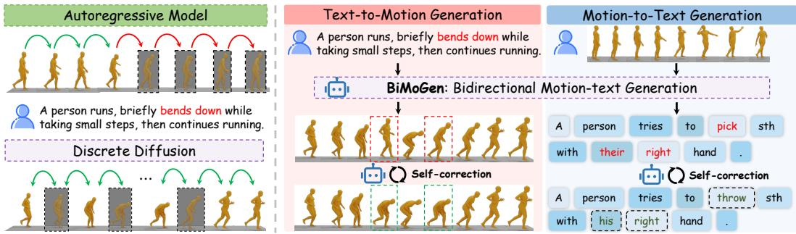  
Figure 1: Overview of the BiMoGen framework. BiMoGen unifies text-to-motion generation and motion-to-text captioning within a single masked discrete diffusion model, and employs a selfcorrection mechanism that revises unreliable predictions at early sampling steps.

Masked discrete diffusion offers a more principled alternative [51, 30, 2, 34, 4, 39, 1]. By iteratively predicting masked tokens from bidirectional context, it naturally captures the bidirectional dependencies between text and motion and avoids premature commitments made under limited information. However, applying masked diffusion to unified motion-text modeling raises two fundamental challenges. First, training a single model for both T2M and M2T entangles cross-modal correspondence learning with conditional generation, forcing the model to produce target tokens before reliable motion-text alignment has emerged and destabilizing optimization. Second, the model is trained on corrupted ground-truth context yet must condition on its own earlier predictions at inference, and this train-test misalignment becomes most severe under the high mask ratios encountered in early sampling steps, where committed errors persist and cascade into later predictions.

To address these challenges, we propose BiMoGen (Bidirectional Motion-text Generation), a unified masked discrete diffusion framework for bidirectional motion-text modeling. As shown in Figure 2, BiMoGen handles both T2M and M2T within a single model through masked token prediction, naturally accommodating the bidirectional dependencies between the two modalities. Recognizing that cross-modal alignment and conditional generation impose fundamentally different learning objectives, we introduce a two-stage strategy named Decoupled Uni- and Cross-Modal Training. The first stage performs masked pretraining on paired motion-text sequences to establish robust cross-modal correspondence, while the second stage applies supervised fine-tuning that specializes the model for bidirectional generation. To further close the gap between training and inference, we propose Generation-Aware Self-Correction that explicitly aligns the two regimes. During training, the model learns to recover ground-truth tokens from its own predicted context, while at inference correction passes are applied at early sampling steps to revise unreliable tokens before errors propagate to subsequent steps. Extensive experiments on HumanML3D [13] and KIT-ML [37] demonstrate that BiMoGen achieves competitive performance on both T2M generation and M2T captioning.

Our contributions are summarized as follows:

• We propose BiMoGen, a unified masked discrete diffusion framework that formulates T2M generation and M2T captioning under a shared bidirectional architecture.

• We introduce Generation-Aware Self-Correction, applied to both training and sampling, to mitigate the train–test misalignment inherent in masked diffusion.

• We design Decoupled Uni- and Cross-Modal Training, which comprises masked pretraining and supervised fine-tuning stages to disentangle cross-modal alignment from conditional generation.

## 2 Related Works

Text-to-Motion Generation. Generating 3D human motion from natural language has emerged as a fundamental task with applications in animation, virtual humans, and embodied agents [49, 60, 48, 62, 64, 40, 7, 10]. Continuous-diffusion approaches model motion either in raw coordinate space [57, 33, 32, 38], as in MDM [41], or in a learned latent space for efficiency, as in MLD [6]. A parallel line of work discretizes motion into tokens via VQ-VAE [42] and models them with sequence models [36, 20, 22]. T2M-GPT [55] adopts a GPT-style autoregressive decoder, whereas

MoMask [15] introduces residual quantization with masked generative modeling. Despite the diversity of generative paradigms, these methods are tailored to unidirectional text-to-motion synthesis and provide neither motion-to-text captioning nor a shared formulation that exploits the bidirectional dependencies between language and motion.

Unified Motion-Text Modeling. Beyond unidirectional synthesis, recent work studies unified models that handle motion generation and captioning within a shared framework [50, 46, 44, 5, 28, 53, 47]. TM2T [14] introduces motion tokens and trains separate translators for the two directions. MotionGPT [21] treats motion as a foreign language and unifies T2M and M2T under an autoregressive Transformer, while MotionGPT3 [65] extends this paradigm with a lightweight diffusion head to improve motion fidelity. However, the underlying causal backbone still imposes a fixed left-to-right generation order, which is misaligned with the inherently bidirectional dependencies between text and motion. A concurrent work, DiMo [59], also adopts masked discrete diffusion for bidirectional motion-text modeling, using an RVQ predictor and reinforcement-learning fine-tuning to enhance motion fidelity and cross-modal alignment. BiMoGen instead focuses on the train-test misalignment and error accumulation of masked diffusion. By introducing generation-aware self-correction during both training and sampling, BiMoGen enables the model to revise unreliable predictions while retaining a simpler single-Transformer design over a single-layer VQ-VAE.

Masked Discrete Diffusion Models. Masked discrete diffusion generates discrete sequences by iteratively predicting masked tokens with a bidirectional Transformer, offering a nonautoregressive alternative to GPT style decoding [9, 18, 16, 11, 3, 45, 24, 51]. D3PM [2] formalizes diffusion over discrete state spaces, MaskGIT [4] introduces confidence guided parallel decoding for image synthesis, and recent works such as SEDD [30] and LLaDA [34] scale this formulation to language modeling. However, applying masked discrete diffusion to bidirectional motion text modeling is not a direct transfer. Motion and text tokens differ not only in semantics but also in sequence length. Motion sequences usually contain many more tokens than captions, which can make unified masked prediction dominated by motion reconstruction and hinder the learning of reliable cross-modal correspondence. Moreover, long motion targets amplify the mismatch between training and sampling, since early self-generated errors can persist and affect subsequent refinement steps. BiMoGen addresses these issues with decoupled cross-modal pretraining and conditional fine-tuning, together with generation-aware self correction to reduce error accumulation during sampling.

## 3 Method

In this section, we present BiMoGen, a unified masked discrete diffusion framework for bidirectional motion-text modeling. We first formulate the unified bidirectional motion-text generation task (Sec. 3.1), then introduce the decoupled training procedure (Sec. 3.2), and finally present generationaware self-correction for training and sampling (Sec. 3.3).

## 3.1 Unified Masked Discrete Diffusion Model

Discrete Representation. We employ a pretrained VQ-VAE [42, 21] as the motion tokenizer, whose encoder E discretizes a motion sequence $\mathbf { m } = ( m _ { 1 } , . . . , m _ { F } )$ of $F$ frames into a sequence of $N _ { m } = F / r$ motion tokens $\mathbf { x } ^ { m } = ( x _ { 1 } ^ { m } , \ldots , x _ { N _ { m } } ^ { m } )$ , where r denotes the temporal downsampling rate, and whose decoder D maps motion tokens back to a continuous motion sequence at inference time. Let $\mathbf { x } ^ { c } = ( x _ { 1 } ^ { c } , \dots , x _ { N _ { c } } ^ { c } )$ denote the corresponding text tokens of length $N _ { c }$ . The motion vocabulary is appended to the text vocabulary so that both modalities share a unified token space [21]. The two modalities are concatenated into a single sequence $\mathbf { x } _ { 0 } = [ \mathbf { x } ^ { c } , \mathbf { x } ^ { m } ]$ of length $N = N _ { c } + N _ { m }$ , which serves as the unified input for masked discrete diffusion.

Forward Process and Training Objective. We follow the masked discrete diffusion formulation [34]. For a timestep t sampled uniformly from (0, 1], each token in $\mathbf { x } _ { \mathrm { 0 } }$ is independently replaced by a mask token [M] with probability t, yielding a corrupted sequence $\mathbf { x } _ { t }$ . A bidirectional Transformer $p _ { \theta } ( \cdot \mid \mathbf { x } _ { t } )$ outputs a distribution over clean tokens at every position and is optimized by

$$
\mathcal { L } _ { \mathrm { M D M } } ( \theta ) = - \mathbb { E } _ { t , \mathbf { x } _ { 0 } , \mathbf { x } _ { t } } \left[ \frac { 1 } { t } \sum _ { i = 1 } ^ { N } \mathbf { 1 } [ x _ { t } ^ { i } = \left[ \mathsf { M } \right] ] \log p _ { \theta } ( x _ { 0 } ^ { i } \mid \mathbf { x } _ { t } ) \right] ,\tag{1}
$$

where the indicator 1[·] restricts supervision to masked positions and the factor $1 / t$ arises from the variational bound and reweights contributions across different mask ratios. The corresponding reverse

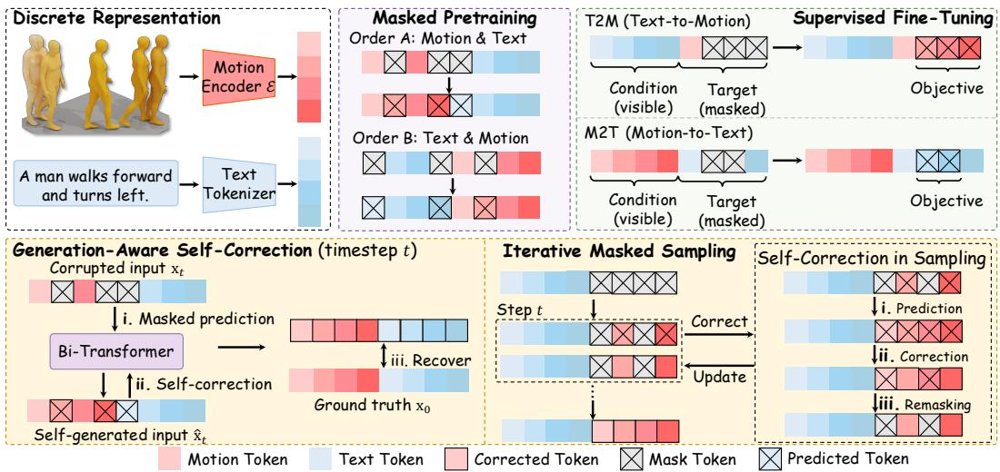  
Figure 2: Overview of the BiMoGen framework. Top: motion and text are represented as discrete tokens in a unified vocabulary, and the model is trained in two-stages, masked pretraining over symmetrically corrupted motion-text sequences and supervised fine-tuning for T2M and M2T generation. Bottom: a self-correction mechanism is applied at both training and sampling, where the model takes its own predictions as input and learns to recover the ground-truth, and analogously revise committed tokens during iterative masked decoding.

process iteratively predicts masked tokens conditioned on currently visible ones, which we instantiate at sampling time in Sec. 3.3.

## 3.2 Decoupled Uni- and Cross-Modal Training

Bidirectional motion-text generation ultimately requires the model to produce one modality conditioned on the other, but conditional generation can only succeed once a reliable cross-modal correspondence has been established. Optimizing both objectives jointly forces the model to generate target tokens before alignment has emerged, which destabilizes training. We therefore introduce Decoupled Uni- and Cross-Modal Training (DUCMT): masked pretraining first learns motion-text correspondence over unified sequences, and supervised fine-tuning then specializes the model for the T2M and M2T directions.

Masked Pretraining for Motion-Text Correspondence. The first stage jointly models text and motion under the masked prediction objective in Eq. (1), with the loss denoted $\mathcal { L } _ { \mathrm { P T } }$ . Each paired sequence is formed by concatenating $\mathbf { x } ^ { c }$ and $\mathbf { x } ^ { m }$ in either order with equal probability, which prevents the model from relying on a fixed modality order as a positional prior. Both modalities are corrupted by the same forward process, and the model is supervised on all masked positions regardless of modality. This symmetric corruption provides direct token-level supervision to both sides and encourages the Transformer to learn motion-text correspondence.

Supervised Fine-tuning for Bidirectional Generation. The second stage adapts the pretrained backbone to conditional generation by fine-tuning on pairs $( \mathbf { x } ^ { \mathrm { { c o n d } } } , \mathbf { x } ^ { \mathrm { { t g t } } } )$ . For T2M, the condition is text $\mathbf { x } ^ { c }$ and the target is the motion $\mathbf { x } ^ { m }$ . For M2T, the assignment is reversed. The condition is kept visible while only the target is corrupted by the forward process, and the masked prediction objective is computed only at masked target positions. The supervised fine-tuning loss is formulated as

$$
\mathcal { L } _ { \mathrm { S F T } } ( \theta ) = - \mathbb { E } _ { t , \mathbf { x } _ { 0 } , \mathbf { x } _ { t } ^ { \mathrm { t g t } } } \left[ \frac { 1 } { t } \sum _ { i = 1 } ^ { N _ { \mathrm { t g t } } } \mathbf { 1 } [ x _ { t } ^ { \mathrm { t g t } , i } = \left[ \mathbb { M } \right] ] \log p _ { \theta } \left( x _ { 0 } ^ { \mathrm { t g t } , i } \mid \mathbf { x } ^ { \mathrm { c o n d } } , \mathbf { x } _ { t } ^ { \mathrm { t g t } } \right) \right] ,\tag{2}
$$

where $N _ { \mathrm { t g t } }$ denotes the length of $\mathbf { x } ^ { \mathrm { t g t } }$ . To support classifier-free guidance at sampling time, we further replace the entire condition with [M] tokens at a 10% dropout rate so that the model jointly learns the conditional and unconditional distributions [17].

Auxiliary Motion-only Supervision. Beyond the two cross-modal directions, we include an auxiliary motion-to-motion (M2M) objective, where motion tokens at randomly sampled positions serve as the

condition and the rest as the target. T2M alone provides only weak supervision to motion since each motion sequence is paired with a single caption, whereas M2M offers dense intra-modal supervision that strengthens the motion prior of the unified model.

## 3.3 Generation-Aware Self-Correction

Both training stages above supervise $p _ { \theta }$ on inputs whose visible positions hold ground-truth tokens, whereas at sampling time these positions are filled by tokens that $p _ { \theta }$ predicted in earlier steps. This train-test misalignment between training on ground-truth context and inference on self-generated context is a core limitation of masked diffusion training. Once a token is unmasked during sampling, it remains as fixed context for all subsequent steps, and an error made under high mask ratios propagates rather than gets corrected. We address this issue by augmenting both training and sampling with Generation-Aware Self-Correction (GASC) that supervises and revises $p _ { \theta }$ on its own predictions.

Training with Self-Correction. Let $\mathcal { G }$ denote the generation region of the current stage, covering the entire sequence in pretraining and only the target in supervised fine-tuning. Given a corrupted input $\mathbf { x } _ { t }$ , the model first performs the standard masked prediction pass. We then construct a self-generated input x˜ by replacing tokens in $\mathcal { G }$ with the model’s detached argmax predictions, while tokens outside $\mathcal { G }$ remain unchanged

$$
\tilde { x } ^ { i } = \mathrm { s g } \Big ( \underset { v } { \arg \operatorname* { m a x } } p _ { \theta } \big ( v \mid \mathbf { x } _ { t } \big ) _ { i } \Big ) , \quad i \in \mathcal { G } ,\tag{3}
$$

where $\operatorname { s g } ( \cdot )$ stops gradients through the discrete prediction. The same Transformer is then applied to $\tilde { \mathbf { x } }$ and trained to recover the ground-truth tokens over the entire generation region

$$
\mathcal { L } _ { \mathrm { S C } } ( \boldsymbol { \theta } ) = - \mathbb { E } _ { t , { \mathbf { x } _ { 0 } } , \tilde { \mathbf { x } } } \left[ \frac { 1 } { t } \sum _ { i \in \mathcal { G } } \log p _ { \boldsymbol { \theta } } ( x _ { 0 } ^ { i } \mid \tilde { \mathbf { x } } ) \right] .\tag{4}
$$

Unlike the standard masked diffusion loss, this correction loss is applied to all positions in ${ \mathcal { G } } ,$ since committed tokens during sampling may also be incorrect and should remain revisable. The full objective for each training stage is

$$
\begin{array} { r } { \mathcal { L } ( \boldsymbol { \theta } ) = \mathcal { L } _ { \mathrm { s t a g e } } ( \boldsymbol { \theta } ) + \lambda \mathcal { L } _ { \mathrm { S C } } ( \boldsymbol { \theta } ) , \quad \mathrm { s t a g e } \in \{ \mathrm { P T } , \mathrm { S F T } \} , } \end{array}\tag{5}
$$

where λ controls the strength of self-correction supervision.

Sampling with Self-Correction. At inference time, BiMoGen generates the target sequence by iteratively refining a fully masked target. Given a condition $\mathbf { x } ^ { \mathrm { { c o n d } } }$ , we initialize $\mathbf { x } ^ { \mathrm { t g t } }$ as a sequence of [M] tokens. For T2M, the target motion length is given. For M2T, we generate up to a maximum text length and truncate the output at the first [EOS] token.

Sampling proceeds for $T$ uniformly spaced timesteps. At each timestep, $p _ { \theta }$ predicts a distribution over clean tokens at all masked positions. We compute the confidence of each masked position as the maximum predicted probability and progressively unmask the most confident positions, while leaving the remaining positions masked for subsequent steps. We further apply classifier-free guidance [17, 6] during sampling, where the conditional and unconditional predictions are linearly combined as

$$
p _ { \theta } ^ { w } \big ( \cdot \mid \mathbf { x } ^ { \mathrm { c o n d } } , \mathbf { x } ^ { \mathrm { t g t } } \big ) = w p _ { \theta } \big ( \cdot \mid \mathbf { x } ^ { \mathrm { c o n d } } , \mathbf { x } ^ { \mathrm { t g t } } \big ) + ( 1 - w ) p _ { \theta } \big ( \cdot \mid \emptyset , \mathbf { x } ^ { \mathrm { t g t } } \big ) ,\tag{6}
$$

where w is the guidance scale and w $^ { , > 1 }$ strengthens the conditioning effect. The unconditional case ∅ corresponds to replacing the entire condition with [M] tokens, matching the dropout used during fine-tuning.

Iterative sampling uses unmasked tokens as context for subsequent steps, so errors made under heavily masked states can affect later predictions. We address this by invoking self-correction at a set of selected sampling steps ${ \mathcal { R } } \subseteq \{ { \dot { 1 } } , \dots , T \}$ . When triggered, the current partially masked target is first predicted into a complete target candidate $\tilde { \mathbf { x } } ^ { \mathrm { t g t } }$ , which is then fed back to the model for correction. The corrected prediction is written back only to positions that have already been unmasked

$$
x ^ { \mathrm { t g t } , i } \gets \arg \operatorname* { m a x } _ { \boldsymbol { v } } p _ { \boldsymbol { \theta } } \left( \boldsymbol { v } \mid \mathbf { x } ^ { \mathrm { c o n d } } , \tilde { \mathbf { x } } ^ { \mathrm { t g t } } \right) _ { i } , \quad \mathrm { f o r } x ^ { \mathrm { t g t } , i } \neq \left[ \mathbb { M } \right] .\tag{7}
$$

The remaining masked positions are kept as [M] and deferred to subsequent sampling steps. This correction step allows tokens committed in earlier iterations to be revised as the context becomes clearer without prematurely filling unresolved positions. After iterative decoding, the predicted motion tokens are decoded back to a continuous motion sequence by the VQ-VAE decoder $\mathcal { D } .$ . The full sampling procedure is summarized in Appendix C.

Table 1: Comparison of bidirectional motion-text generation performance on HumanML3D. We report Text-to-Motion (T2M) and Motion-to-Text (M2T) results across four method categories. The best results within unified models are highlighted in bold, and the second-best are underlined.
<table><tr><td rowspan="2">Method</td><td colspan="6">T2M</td><td colspan="7">M2T</td></tr><tr><td>R@1↑</td><td>R@2↑</td><td>R@3↑</td><td>FID↓</td><td>Div→</td><td>MM Dist↓</td><td>R@1↑ R@3↑</td><td></td><td>BLEU@1↑ BLEU@4↑</td><td></td><td></td><td></td><td>ROUGE-L↑ CIDEr↑ BERTScore↑</td></tr><tr><td></td><td>0.511 0.703</td><td></td><td>0.797</td><td>0.002</td><td>9.503</td><td>2.974</td><td>0.523</td><td>0.828</td><td></td><td>一</td><td></td><td></td><td>一</td></tr><tr><td colspan="10">T2M-Only Models</td><td></td><td></td><td></td><td></td></tr><tr><td>MDM [41]</td><td></td><td></td><td>0.611</td><td>0.544</td><td>9.559</td><td>5.566</td><td></td><td></td><td></td><td></td><td></td><td></td><td></td></tr><tr><td>MotionDiffuse [58]</td><td>0.491</td><td>0.681</td><td>0.782</td><td>0.630</td><td>9.410</td><td>3.113</td><td></td><td></td><td></td><td></td><td></td><td></td><td></td></tr><tr><td>MLD [6]</td><td>0.481</td><td>0.673</td><td>0.772</td><td>0.473</td><td>9.724</td><td>3.196</td><td></td><td></td><td></td><td></td><td></td><td></td><td></td></tr><tr><td>MoMask [15]</td><td>0.521</td><td>0.713</td><td>0.807</td><td>0.045</td><td>9.620</td><td>2.958</td><td></td><td></td><td></td><td></td><td></td><td></td><td></td></tr><tr><td>T2M-GPT [55]</td><td>0.492</td><td>0.679</td><td>0.775</td><td>0.141</td><td>9.722</td><td>3.121</td><td></td><td></td><td></td><td></td><td></td><td></td><td></td></tr><tr><td>ReMoDiffuse [57]</td><td>0.510</td><td>0.698</td><td>0.795</td><td>0.103</td><td>9.018</td><td>2.974</td><td></td><td></td><td></td><td></td><td></td><td></td><td></td></tr><tr><td>MoGenTS [54] MotionLCM [7]</td><td>0.529</td><td>0.719 0.698</td><td>0.812</td><td>0.033</td><td>9.570</td><td>2.867</td><td></td><td></td><td></td><td></td><td></td><td></td><td></td></tr><tr><td>ReMoMask [25]</td><td>0.502 0.531</td><td>0.722</td><td>0.798</td><td>0.304</td><td>9.607</td><td>3.012</td><td></td><td></td><td></td><td></td><td></td><td></td><td></td></tr><tr><td></td><td></td><td></td><td>0.813</td><td>0.099</td><td>9.535</td><td>2.865</td><td></td><td></td><td></td><td></td><td></td><td></td><td></td></tr><tr><td>CoMo [19]</td><td>0.502</td><td>0.692</td><td>0.790</td><td>0.262</td><td>9.936</td><td>3.032</td><td></td><td></td><td></td><td></td><td></td><td></td><td></td></tr><tr><td>MotionMamba [62] EnergyMoGen [56]</td><td>0.502 0.526</td><td>0.693 0.718</td><td>0.792 0.815</td><td>0.281 0.176</td><td>9.871 9.500</td><td>3.060 2.931</td><td></td><td></td><td></td><td></td><td></td><td></td><td></td></tr><tr><td colspan="10"></td><td></td><td></td><td></td><td></td></tr><tr><td colspan="10">Separated Bidirectional Models</td><td></td><td></td><td></td><td></td></tr><tr><td>TM2T [14]</td><td>0.424</td><td>0.618</td><td>0.729</td><td>1.501</td><td>8.589</td><td>3.467</td><td>0.516</td><td>0.823</td><td>48.9</td><td>7.0</td><td>38.1</td><td>16.8</td><td>32.2</td></tr><tr><td>LaMP [26]</td><td>0.557</td><td>0.751</td><td>0.843</td><td>0.032</td><td>9.571</td><td>2.759</td><td>0.547</td><td>0.831</td><td>47.8</td><td>13.0</td><td>37.1</td><td>28.9</td><td></td></tr><tr><td>MG-Mo.LLM [50]</td><td>0.516</td><td>0.706</td><td>0.802</td><td>0.303</td><td>9.960</td><td>2.952</td><td>0.592</td><td>0.866</td><td></td><td>8.1</td><td></td><td></td><td>36.7</td></tr><tr><td colspan="10"></td><td></td><td></td><td></td><td></td></tr><tr><td>MotionGPT [21]</td><td>0.492</td><td>0.681</td><td>0.778</td><td>0.232</td><td>9.528</td><td>3.096</td><td>Unified Bidirectional Models 0.543</td><td>0.827</td><td>48.2</td><td>12.5</td><td>37.4</td><td>29.2</td><td>32.4</td></tr><tr><td>MotionGPT2 [46]</td><td>0.496</td><td>0.691</td><td>0.782</td><td>0.191</td><td>9.860</td><td>3.080</td><td>0.558</td><td>0.838</td><td>48.7</td><td>13.8</td><td>37.6</td><td>29.8</td><td>32.6</td></tr><tr><td>MotionGPT3 [65]</td><td>0.553</td><td>0.747</td><td>0.837</td><td>0.208</td><td>9.700</td><td>2.725</td><td>0.573</td><td>0.864</td><td>59.1</td><td>19.4</td><td>46.2</td><td>28.7</td><td>35.2</td></tr><tr><td>MoTe [52]</td><td>0.548</td><td>0.737</td><td>0.825</td><td>0.075</td><td></td><td>2.867</td><td>0.577</td><td>0.871</td><td>46.7</td><td>11.2</td><td>37.4</td><td>31.5</td><td>30.3</td></tr><tr><td>DiMo [59]</td><td>0.528</td><td>0.724</td><td>0.818</td><td>0.047</td><td>9.419</td><td>2.862</td><td>0.577</td><td>0.855</td><td>64.2</td><td>22.7</td><td>47.1</td><td>58.1</td><td>37.7</td></tr><tr><td>BiMoGen (Ours)</td><td>0.555</td><td>0.744</td><td>0.841</td><td>0.069</td><td>9.524</td><td>2.733</td><td>0.573</td><td>0.866</td><td>60.1</td><td>20.1</td><td>44.4</td><td>60.2</td><td>38.5</td></tr></table>

Table 2: Comparison of bidirectional motion-text generation performance on KIT-ML. We report Text-to-Motion (T2M) and Motion-to-Text (M2T) results across two method categories. The best results within unified models are highlighted in bold, and the second-best are underlined. † denotes a single-task model reported by its author [65].
<table><tr><td rowspan="2">Method</td><td colspan="6">T2M</td><td colspan="6">M2T</td></tr><tr><td>R@1↑</td><td>R@2↑</td><td>R@3↑</td><td>FID↓</td><td>Div→</td><td>MM Dist↓</td><td></td><td>|R@1↑ R@3↑ BLEU@1↑ BLEU@4↑ ROUGE-L↑ CIDEr↑ BERTScore↑</td><td></td><td></td><td></td><td></td></tr><tr><td>Real</td><td>0.424 0.649</td><td>0.779</td><td></td><td>0.031</td><td>11.080</td><td>2.788 0.399</td><td>0.793</td><td></td><td>一</td><td></td><td></td><td>1</td></tr><tr><td colspan="10">Separated Bidirectional Models</td><td></td><td></td><td></td></tr><tr><td>TM2T [14]</td><td>0.280</td><td>0.463</td><td>0.587</td><td>3.599 9.473</td><td>4.591</td><td>0.359</td><td>0.668</td><td>46.7</td><td>18.4</td><td>44.2</td><td>79.5</td><td>23.0</td></tr><tr><td>LaMP [26]</td><td>0.479</td><td>0.691</td><td>0.826</td><td>0.141 10.929</td><td>2.704</td><td>0.540</td><td>0.844</td><td></td><td>一</td><td></td><td></td><td></td></tr><tr><td>MotionGPT3† [65]</td><td>0.456</td><td>0.680</td><td>0.803</td><td>0.227</td><td>11.026 2.704</td><td></td><td></td><td></td><td>一</td><td></td><td></td><td>一</td></tr><tr><td colspan="10">Unified Bidirectional Models</td><td></td><td></td></tr><tr><td>MotionGPT [21]</td><td>0.366</td><td>0.558</td><td>0.680</td><td>0.510 10.350</td><td>3.527</td><td>一</td><td>I</td><td>一</td><td>一</td><td>一</td><td>一</td><td>一</td></tr><tr><td>MotionGPT2 [46]</td><td>0.427</td><td>0.627</td><td>0.764</td><td>0.614 11.256</td><td>3.164</td><td></td><td></td><td></td><td></td><td></td><td></td><td></td></tr><tr><td>MoTe [52]</td><td>0.419</td><td>0.627</td><td>0.741</td><td>0.256</td><td>3.216</td><td>0.421</td><td>0.765</td><td>44.9</td><td>14.1</td><td>41.8</td><td>55.6</td><td>35.9</td></tr><tr><td>DiMo [59]</td><td>0.406</td><td>0.620</td><td>0.741</td><td>0.206</td><td>10.892 2.983</td><td>0.396</td><td>0.723</td><td>52.5</td><td>17.8</td><td>48.0</td><td>68.7</td><td>37.7</td></tr><tr><td>BiMoGen (Ours)</td><td>0.421</td><td>0.632</td><td>0.733</td><td>0.222</td><td>10.880 2.763</td><td>0.405</td><td>0.734</td><td>49.8</td><td>17.3</td><td>46.1</td><td>62.2</td><td>40.4</td></tr></table>

## 4 Experiments

## 4.1 Experimental Setup

Datasets. We evaluate BiMoGen mainly on HumanML3D [13], a standard benchmark for bidirectional text and motion generation. HumanML3D contains 14,616 motion sequences from AMASS [31] and HumanAct12 [12], paired with 44,970 textual descriptions. We also report results on KIT-ML [37], a smaller benchmark with 3,911 motion sequences and 6,278 textual annotations. For both datasets, we follow the settings and motion representations adopted in prior work [21, 6].

Evaluation Protocol. We follow the protocol of [13] using its pretrained motion-text feature extractor. For text-to-motion (T2M) we report Top-k retrieval accuracy (R@k), Fréchet Inception Distance (FID), Diversity (Div), and MM Dist, the average feature-space distance between paired text and generated motion. For motion-to-text (M2T) we report retrieval accuracy R@1/R@3 against ground-truth captions, together with BLEU-1/4, ROUGE-L, CIDEr, and BERTScore for caption quality [43, 27, 61, 35]. See Appendix B.1 for metric definitions and computation details.

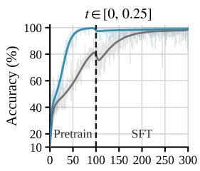  
Epoch

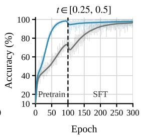

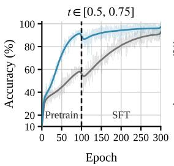

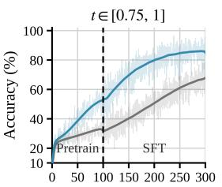  
Epoch

Figure 3: Training accuracy under different masking levels t. Each panel shows one masking interval. The dashed vertical line separates masked pretraining and supervised fine-tuning  
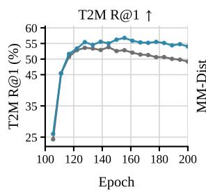

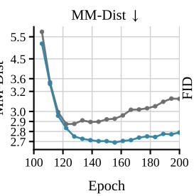

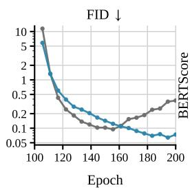

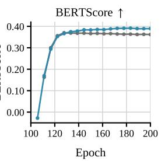  
Figure 4: SFT evaluation over epochs. The first three panels correspond to T2M, and the last panel corresponds to M2T. Curves compare training with and without self-correction.

Implementation Details. The bidirectional Transformer follows the LLaDA backbone [34] with 20 layers and a hidden size of 1024. Motion tokens come from the single-layer VQ-VAE used in MotionGPT [21, 42], with a temporal downsampling rate of 4. We pretrain for 100 epochs at learning rate 2e-4 and fine-tune for 200 epochs at 8e-5, both with AdamW [29]. Fine-tuning batches mix T2M, M2T, and the auxiliary M2M objective at an 8:1:1 ratio, with 10% condition dropout for CFG [17]. The self-correction weight λ is set to 1. At inference we use 20 sampling steps, CFG scale for T2M set to 4, and self-correction at $ \scriptstyle { \mathcal { R } } = \{ T / 4 , T / 2 \}$ . All experiments run on a single NVIDIA H100.

## 4.2 Main Results

Comparisons on Bidirectional Motion-Text Generation. Table 1 reports the main results on HumanML3D. Because BiMoGen is designed as a unified model for both T2M and M2T, we focus our comparisons on the unified bidirectional setting, while using T2M-Only and separated bidirectional methods only as references. On T2M, BiMoGen achieves the best retrieval performance among unified models, with an R@1 of 0.555 and an R@3 of 0.841. It also maintains competitive motion quality, with an FID of 0.069 and an MM Dist of 2.733. These results show that masked bidirectional prediction improves motion-text alignment over autoregressive unified models such as MotionGPT and MotionGPT3 [21, 65], while still producing realistic motions. DiMo [59] reports a better FID, which is expected because it uses an RVQ-VAE [23] as the motion tokenizer together with an additional residual Transformer for motion generation, whereas BiMoGen uses a single-layer VQ-VAE [42]. Therefore, this comparison reflects a difference in motion tokenizer capacity. On M2T, BiMoGen achieves the highest CIDEr and BERTScore among unified models, reaching 60.2 and 38.5, respectively. This indicates a stronger ability in motion understanding, especially compared with autoregressive unified methods.

We additionally validate BiMoGen on KIT-ML in Table 2, where the trends remain similar to those on HumanML3D. Among unified models, BiMoGen obtains the best MM Dist of 2.763 and the best BERTScore of 40.4. These results suggest that the proposed unified masked modeling scheme remains effective even when the training data are more limited.

Table 3: Ablation on the training strategy on HumanML3D. PT denotes masked pretraining for cross-modal correspondence, SFT denotes supervised fine-tuning for bidirectional generation, and SC denotes the self-correction objective. Bold denotes the best performance.
<table><tr><td colspan="3">Training Strategy</td><td colspan="6">T2M</td><td colspan="8">M2T</td></tr><tr><td colspan="2">PT SFT</td><td>SC</td><td>R@1↑</td><td>R@2↑</td><td>R@3↑</td><td>FID↓</td><td>Div →</td><td>MM Dist ↓</td><td>R@1↑</td><td>R@3↑</td><td>BLEU@1↑</td><td>BLEU@4↑</td><td>ROUGE-L ↑</td><td>CIDEr ↑</td><td></td><td>BERTScore ↑</td></tr><tr><td>Real</td><td></td><td></td><td>0.511</td><td>0.703</td><td>0.797</td><td>0.002</td><td>9.503</td><td>2.974</td><td></td><td>0.523</td><td>0.828</td><td>一</td><td>一</td><td>一</td><td>一</td><td>一</td></tr><tr><td>√</td><td>x</td><td>x</td><td>0.416</td><td>0.604</td><td>0.730</td><td>1.219</td><td>10.189</td><td>3.650</td><td></td><td>0.434</td><td>0.736</td><td>24.3</td><td>5.5</td><td>26.4</td><td>6.7</td><td>16.8</td></tr><tr><td>x</td><td>√</td><td>x</td><td>0.466</td><td>0.633</td><td>0.726</td><td>0.325</td><td>9.546</td><td>3.259</td><td>0.474</td><td>0.779</td><td></td><td>54.3</td><td>16.7</td><td>34.9</td><td>41.3</td><td>26.4</td></tr><tr><td>√</td><td>√</td><td>x</td><td>0.514</td><td>0.697</td><td>0.789</td><td>0.102</td><td>9.616</td><td>3.017</td><td></td><td>0.547</td><td>0.832</td><td>56.1</td><td>16.4</td><td>42.9</td><td>44.0</td><td>36.7</td></tr><tr><td>√</td><td>√</td><td>√</td><td>0.555</td><td>0.744</td><td>0.841</td><td>0.069</td><td>9.524</td><td>2.733</td><td></td><td>0.573</td><td>0.866</td><td>60.1</td><td>20.1</td><td>44.4</td><td>60.2</td><td>38.5</td></tr></table>

Table 4: Ablation of the trade-off between quality and computational cost. Representative bidirectional methods are included for reference under the same evaluation protocol. Lat. denotes Latency.
<table><tr><td rowspan="2">Method</td><td colspan="5">Text-to-Motion</td><td colspan="6"></td><td colspan="2">| Computational Cost</td></tr><tr><td>|R@1↑ R@3↑</td><td></td><td>FID↓</td><td>MM Dist.↓</td><td>Lat. (s)↓</td><td>R@1↑</td><td>R@3↑ BLEU@1↑</td><td></td><td>BLEU@4↑</td><td>ROUGE-L↑</td><td>BERTScore↑</td><td>#Params</td><td>FLOPs</td></tr><tr><td>MotionGPT [21]</td><td>0.492</td><td>0.778</td><td>0.232</td><td>3.096</td><td>1.04</td><td>0.543</td><td>0.827</td><td>48.2</td><td>12.5</td><td>37.4</td><td>32.4</td><td>220M</td><td>7.45T</td></tr><tr><td>MotionGPT3 [65]</td><td>0.553</td><td>0.837</td><td>0.208</td><td>2.725</td><td>1.02</td><td>0.573</td><td>0.864</td><td>59.1</td><td>19.4</td><td>46.2</td><td>35.2</td><td>238M</td><td>11.00T</td></tr><tr><td>MG-Mo.LLM [50]</td><td>0.516</td><td>0.802</td><td>0.303</td><td>2.952</td><td>1.09</td><td>0.592</td><td>0.866</td><td></td><td>8.1</td><td>1</td><td>36.7</td><td>220M</td><td>1.66T</td></tr><tr><td>DiMo (20 steps) [59]</td><td>0.528</td><td>0.818</td><td>0.050</td><td>2.862</td><td>1.55</td><td>0.568</td><td>0.845</td><td>62.5</td><td>22.0</td><td>47.3</td><td>35.4</td><td>473M</td><td>2.56T</td></tr><tr><td>Ours (5 steps)</td><td>0.533</td><td>0.832</td><td>0.118</td><td>2.787</td><td>0.20</td><td>0.467</td><td>0.749</td><td>57.6</td><td>16.8</td><td>44.3</td><td>28.9</td><td>334M</td><td>0.34T</td></tr><tr><td>Ours (10 steps)</td><td>0.543</td><td>0.840</td><td>0.082</td><td>2.774</td><td>0.35</td><td>0.525</td><td>0.823</td><td>59.1</td><td>17.3</td><td>44.8</td><td>33.3</td><td>334M</td><td>0.59T</td></tr><tr><td>Ours (20 steps)</td><td>0.555</td><td>0.841</td><td>0.069</td><td>2.733</td><td>0.67</td><td>0.573</td><td>0.866</td><td>60.1</td><td>20.1</td><td>44.4</td><td>38.5</td><td>334M</td><td>1.08T</td></tr><tr><td>Ours (30 steps)</td><td>0.550</td><td>0.840</td><td>0.071</td><td>2.756</td><td>0.95</td><td>0.573</td><td>0.853</td><td>59.2</td><td>19.0</td><td>46.0</td><td>41.2</td><td>334M</td><td>1.57T</td></tr></table>

## 4.3 Ablation and Analysis

Effect of Training Strategy. Table 3 isolates the contribution of each training stage. PT alone learns useful cross-modal correspondence, but its high FID and weak captioning scores show that correspondence pretraining is not sufficient for bidirectional generation. SFT is therefore necessary for producing valid target sequences. Adding PT before SFT mainly improves alignment and semantic grounding. MM Dist decreases from 3.259 to 3.017, and M2T R@1 increases from 0.474 to 0.547, while the main gain in motion realism appears only after SC. This suggests that PT serves as a better initialization for text and motion grounding, rather than as a complete generation objective.

The further improvement comes from SC. With the same backbone and inference setup, adding SC to PT and SFT raises T2M R@1 from 0.514 to 0.555, lowers FID from 0.102 to 0.069, and improves M2T CIDEr from 44.0 to 60.2. These gains demonstrate that BiMoGen benefits from learning to revise its own intermediate predictions. Figure 3 shows the same effect in the training dynamics. At low mask ratios, SC mainly accelerates convergence and reaches a similar final accuracy. As the mask ratio increases, the advantage becomes larger and persists throughout training, especially at t ∈ [0.75, 1]. This regime matches the early stage of iterative sampling, where the model predicts from sparse context and then conditions on its previous outputs. Training with SC therefore reduces the mismatch between training on corrupted ground-truth context and inference on self-generated context, leading to more stable generation in both directions. Figure 4 further reports the SFT evaluation over epochs on both T2M and M2T, comparing training with and without SC.

Effectiveness of Self-Correction. Table 5 studies the timing of SC during masked sampling. Compared with Disabled, applying SC at both T/4 and T/2 improves T2M alignment, increasing R@1 and R@3 to 0.555 and 0.841 and reducing MM Dist from 2.745 to 2.733, while maintaining a competitive FID of 0.069. It also improves M2T R@1, BLEU@4, and CIDEr over Disabled, with a moderate latency increase from 0.55s to 0.67s. Single-step correction at T/4 or T/2 alone brings less consistent gains, while late correction at 3T/4 achieves the lowest FID but weakens text-motion alignment, suggesting that late-stage revision mainly adjusts motion statistics rather than improving cross-modal consistency. Applying SC at every step further improves a few captioning metrics but degrades T2M retrieval. We therefore use $\mathcal { R } = \overline { { \Omega / } } \overline { { 4 } } , T / 2 \}$ as the default.

Table 6 further analyzes the correction behavior. The modification rate decreases from 31.82% at T/4 to 22.38% at T, indicating that earlier states contain more uncertain committed tokens. The stability of revised tokens remains high between 82.73% and 84.70%, so most revisions agree with the next step prediction. Together with the schedule results, these statistics confirm that SC contributes most at early sampling steps, while denser schedules add latency without further benefit.

Table 5: Ablation on the SC schedule during sampling on HumanML3D. Disabled removes SC during sampling only. All variants use the same number of sampling steps T. For T2M, the CFG scale w is fixed to its default value. CFG is not used for M2T. Lat. denotes Latency.
<table><tr><td rowspan="2">SC Schedule R</td><td colspan="5">T2M</td><td colspan="7">M2T</td></tr><tr><td>R@1↑</td><td>R@3↑</td><td>FID↓ Div→</td><td>MM Dist↓ Lat. (s)↓</td><td></td><td>R@1↑ R@3↑</td><td>BLEU@1↑</td><td></td><td>BLEU@4↑</td><td>ROUGE-L↑</td><td>CIDEr↑</td><td>BERTScore↑</td></tr><tr><td>Disabled</td><td>0.551</td><td>0.838</td><td>0.070 9.870</td><td>2.745</td><td>0.55</td><td>0.568</td><td>0.864</td><td>59.2</td><td>18.9</td><td>45.6</td><td>58.8</td><td>39.6</td></tr><tr><td> $T / 4$ </td><td>0.553</td><td>0.836</td><td>0.067 9.397</td><td>2.764</td><td>0.61</td><td>0.570</td><td>0.866</td><td>59.2</td><td>19.0</td><td>45.6</td><td>58.8</td><td>38.6</td></tr><tr><td>T/2</td><td>0.551</td><td>0.837</td><td>0.070 9.697</td><td>2.782</td><td>0.61</td><td>0.570</td><td>0.866</td><td>59.2</td><td>18.9</td><td>45.6</td><td>58.9</td><td>38.6</td></tr><tr><td>3T/4</td><td>0.542</td><td>0.831</td><td>0.056 9.423</td><td>2.833</td><td>0.61</td><td>0.570</td><td>0.866</td><td>59.2</td><td>18.9</td><td>45.6</td><td>59.6</td><td>38.8</td></tr><tr><td>Every step</td><td>0.529</td><td>0.814</td><td>0.066 9.570</td><td>2.948</td><td>0.78</td><td>0.580</td><td>0.868</td><td>60.2</td><td>19.7</td><td>45.8</td><td>61.2</td><td>41.0</td></tr><tr><td>T/4, T/2</td><td>0.555</td><td>0.841</td><td>0.069 9.524</td><td>2.733</td><td>0.67</td><td>0.573</td><td>0.866</td><td>60.1</td><td>20.1</td><td>44.4</td><td>60.2</td><td>38.5</td></tr></table>

Table 6: Self-correction behavior across sampling steps. Modification is the ratio of committed tokens revised by SC. Pred. Stability is the ratio of revised tokens that remain unchanged at the next step.
<table><tr><td>SC Step</td><td>Modification (%)</td><td>Pred. Stability (%)</td></tr><tr><td>T/4</td><td>31.82</td><td>84.70</td></tr><tr><td> $T / 2$ </td><td>29.48</td><td>83.72</td></tr><tr><td> $3 T / 4$ </td><td>25.72</td><td>83.74</td></tr><tr><td>T</td><td>22.38</td><td>82.73</td></tr></table>

Computation-Quality Trade-Off. Table 4 analyzes the effect of sampling steps and compares the computational cost with representative baselines. Increasing the number of steps from 5 to 20 steadily improves both generation directions. For T2M, FID decreases from 0.118 to 0.069. For M2T, retrieval accuracy also increases substantially, with BERTScore increasing from 28.9 to 38.5. The setting with 20 steps gives the best overall balance. It attains the strongest T2M retrieval and the best R@3 among the compared bidirectional methods, while using 1.08T FLOPs. This is substantially lower than MotionGPT and DiMo, which require 7.45T FLOPs and 2.56T FLOPs. Since 30 steps brings no consistent gain, we use 20 denoising steps in the main experiments.

Table 7: T2M results with different motion tokenizers on HumanML3D. Part VQ-VAE follows ParCo [66], which discretizes motion by body parts. VQ-VAE denotes the whole body tokenizer [21].
<table><tr><td rowspan="2">Motion Tokenizer</td><td colspan="6">Text-to-Motion Generation</td></tr><tr><td>R@1↑</td><td>R@2↑</td><td>R@3↑</td><td>FID↓</td><td>Div→</td><td>MM Dist↓</td></tr><tr><td>Real</td><td>0.511</td><td>0.703</td><td>0.797</td><td>0.002</td><td>9.503</td><td>2.974</td></tr><tr><td>Part VQ-VAE [66]</td><td>0.512</td><td>0.703</td><td>0.801</td><td>0.124</td><td>9.886</td><td>3.084</td></tr><tr><td>VQ-VAE [21]</td><td>0.555</td><td>0.744</td><td>0.841</td><td>0.069</td><td>9.524</td><td>2.733</td></tr></table>

Effect of Motion Tokenizer. We study the effect of motion tokenizer by replacing the wholebody VQ-VAE with the Part VQ-VAE from ParCo [66], which quantizes different body parts with independent codebooks. As shown in Table 7, this leads to worse performance. We attribute the drop to the increased learning difficulty introduced by part-wise tokenization under masked bidirectional generation. Part VQ-VAE produces multiple fine-grained tokens, and modeling their dependencies with full attention requires the model to learn both temporal dynamics and cross-part coordination simultaneously, which may be challenging under our current model capacity. We exclude RVQ-VAE [23, 15] from this controlled comparison, since residual codes mainly model reconstruction refinements over base codes and do not provide standalone motion semantics.

## 5 Conclusion

We presented BiMoGen, a unified masked discrete diffusion framework for bidirectional motion-text modeling. By formulating both T2M and M2T as iterative masked prediction in a shared motion-text token space, BiMoGen avoids the rigid left-to-right order of autoregressive decoding and enables bidirectional conditioning between language and motion. With DUCMT and GASC, BiMoGen improves cross-modal correspondence and reduces the train-test mismatch caused by self-generated context. Experiments on HumanML3D and KIT-ML show consistent gains in both directions, with competitive performance among unified bidirectional motion-text models.

## References

[1] M. Arriola, A. Gokaslan, J. T. Chiu, Z. Yang, Z. Qi, J. Han, S. S. Sahoo, and V. Kuleshov. Block diffusion: Interpolating between autoregressive and diffusion language models. arXiv preprint arXiv:2503.09573, 2025.

[2] J. Austin, D. D. Johnson, J. Ho, D. Tarlow, and R. Van Den Berg. Structured denoising diffusion models in discrete state-spaces. Advances in neural information processing systems, 34:17981–17993, 2021.

[3] J. Bruce, M. D. Dennis, A. Edwards, J. Parker-Holder, Y. Shi, E. Hughes, M. Lai, A. Mavalankar, R. Steigerwald, C. Apps, et al. Genie: Generative interactive environments. In Forty-first International Conference on Machine Learning, 2024.

[4] H. Chang, H. Zhang, L. Jiang, C. Liu, and W. T. Freeman. Maskgit: Masked generative image transformer. In Proceedings of the IEEE/CVF conference on computer vision and pattern recognition, pages 11315–11325, 2022.

[5] C. Chen, J. Zhang, S. K. Lakshmikanth, Y. Fang, R. Shao, G. Wetzstein, L. Fei-Fei, and E. Adeli. The language of motion: Unifying verbal and non-verbal language of 3d human motion. In Proceedings ofthe Computer Vision and Pattern Recognition Conference, pages 6200–6211, 2025.

[6] X. Chen, B. Jiang, W. Liu, Z. Huang, B. Fu, T. Chen, and G. Yu. Executing your commands via motion diffusion in latent space. In IEEE/CVF Conference on Computer Vision and Pattern Recognition, pages 18000–18010, 2023.

[7] W. Dai, L.-H. Chen, J. Wang, J. Liu, B. Dai, and Y. Tang. Motionlcm: Real-time controllable motion generation via latent consistency model. In ECCV, pages 390–408, 2025.

[8] J. Devlin, M.-W. Chang, K. Lee, and K. Toutanova. Bert: Pre-training of deep bidirectional transformers for language understanding. In Proceedings ofthe 2019 conference ofthe North American chapter ofthe associationfor computational linguistics: human language technologies, volume 1 (long and short papers), pages 4171–4186, 2019.

[9] S. Dieleman, L. Sartran, A. Roshannai, N. Savinov, Y. Ganin, P. H. Richemond, A. Doucet, R. Strudel, C. Dyer, C. Durkan, et al. Continuous diffusion for categorical data. arXiv preprint arXiv:2211.15089, 2022.

[10] K. Fan, S. Lu, M. Dai, R. Yu, L. Xiao, Z. Dou, J. Dong, L. Ma, and J. Wang. Go to zero: Towards zero-shot motion generation with million-scale data. In Proceedings ofthe IEEE/CVF International Conference on Computer Vision, pages 13336–13348, 2025.

[11] S. Gong, S. Agarwal, Y. Zhang, J. Ye, L. Zheng, M. Li, C. An, P. Zhao, W. Bi, J. Han, et al. Scaling diffusion language models via adaptation from autoregressive models. arXiv preprint arXiv:2410.17891, 2024.

[12] C. Guo, X. Zuo, S. Wang, S. Zou, Q. Sun, A. Deng, M. Gong, and L. Cheng. Action2motion: Conditioned generation of 3d human motions. In Proceedings ofthe 28th ACM international conference on multimedia, pages 2021–2029, 2020.

[13] C. Guo, S. Zou, X. Zuo, S. Wang, W. Ji, X. Li, and L. Cheng. Generating diverse and natural 3d human motions from text. In IEEE/CVF Conference on Computer Vision and Pattern Recognition, pages 5142–5151, 2022.

[14] C. Guo, X. Zuo, S. Wang, and L. Cheng. Tm2t: Stochastic and tokenized modeling for the reciprocal generation of 3d human motions and texts. In European Conference on Computer Vision, pages 580–597. Springer, 2022.

[15] C. Guo, Y. Mu, M. G. Javed, S. Wang, and L. Cheng. Momask: Generative masked modeling of 3d human motions. In IEEE/CVF Conference on Computer Vision and Pattern Recognition, pages 1900–1910, 2024.

[16] Z. He, T. Sun, Q. Tang, K. Wang, X.-J. Huang, and X. Qiu. Diffusionbert: Improving generative masked language models with diffusion models. In Proceedings of the 61st annual meeting of the association for computational linguistics (volume 1: Long papers), pages 4521–4534, 2023.

[17] J. Ho and T. Salimans. Classifier-free diffusion guidance. arXiv preprint arXiv:2207.12598, 2022.

[18] M. Hu, C. Zheng, Z. Yang, T.-J. Cham, H. Zheng, C. Wang, D. Tao, and P. N. Suganthan. Unified discrete diffusion for simultaneous vision-language generation. In The Eleventh International Conference on Learning Representations.

[19] Y. Huang, W. Wan, Y. Yang, C. Callison-Burch, M. Yatskar, and L. Liu. Como: Controllable motion generation through language guided pose code editing. In European Conference on Computer Vision, page 180–196. Springer-Verlag, 2024. ISBN 978-3-031-73396-3.

[20] M. Jeong, Y. Hwang, J. Lee, S. Jung, and W. H. Kim. HGM³: Hierarchical generative masked motion modeling with hard token mining. In The Thirteenth International Conference on Learning Representations, 2025.

[21] B. Jiang, X. Chen, W. Liu, J. Yu, G. Yu, and T. Chen. Motiongpt: Human motion as a foreign language. Advances in Neural Information Processing Systems, 36:20067–20079, 2023.

[22] H. Kong, K. Gong, D. Lian, M. B. Mi, and X. Wang. Priority-centric human motion generation in discrete latent space. In Proceedings of the IEEE/CVF International Conference on Computer Vision, pages 14806–14816, 2023.

[23] D. Lee, C. Kim, S. Kim, M. Cho, and W.-S. Han. Autoregressive image generation using residual quantization. In Proceedings of the IEEE/CVF conference on computer vision and pattern recognition, pages 11523–11532, 2022.

[24] S. Li, K. Kallidromitis, H. Bansal, A. Gokul, Y. Kato, K. Kozuka, J. Kuen, Z. Lin, K.-W. Chang, and A. Grover. Lavida: A large diffusion language model for multimodal understanding. arXiv preprint arXiv:2505.16839, 2025.

[25] Z. Li, S. Wang, Z. Zhang, and H. Tang. Remomask: Retrieval-augmented masked motion generation. arXiv preprint arXiv:2508.02605, 2025.

[26] Z. Li, W. Yuan, L. Qiu, S. Zhu, X. Gu, W. Shen, Y. Dong, Z. Dong, L. T. Yang, et al. Lamp: Language-motion pretraining for motion generation, retrieval, and captioning. In International Conference on Learning Representations, 2025.

[27] C.-Y. Lin. ROUGE: A package for automatic evaluation of summaries. In Text Summarization Branches Out, pages 74–81. Association for Computational Linguistics, 2004.

[28] Z. Ling, B. Han, S. Li, J. Cheng, H. Shen, and C. Zou. Versatilemotion: A unified framework for motion synthesis and comprehension. arXiv preprint arXiv:2411.17335, 2024.

[29] I. Loshchilov and F. Hutter. Decoupled weight decay regularization. arXiv preprint arXiv:1711.05101, 2017.

[30] A. Lou, C. Meng, and S. Ermon. Discrete diffusion modeling by estimating the ratios of the data distribution. arXiv preprint arXiv:2310.16834, 2023.

[31] N. Mahmood, N. Ghorbani, N. F. Troje, G. Pons-Moll, and M. J. Black. Amass: Archive of motion capture as surface shapes. In Proceedings ofthe IEEE/CVF International Conference on Computer Vision (ICCV), pages 5442–5451, 2019.

[32] Z. Meng, Y. Xie, X. Peng, Z. Han, and H. Jiang. Rethinking diffusion for text-driven human motion generation. arXiv preprint arXiv:2411.16575, 2024.

[33] Z. Meng, Z. Han, X. Peng, Y. Xie, and H. Jiang. Absolute coordinates make motion generation easy. arXiv preprint arXiv:2505.19377, 2025.

[34] S. Nie, F. Zhu, Z. You, X. Zhang, J. Ou, J. Hu, J. Zhou, Y. Lin, J.-R. Wen, and C. Li. Large language diffusion models. arXiv preprint arXiv:2502.09992, 2025.

[35] K. Papineni, S. Roukos, T. Ward, and W.-J. Zhu. Bleu: a method for automatic evaluation of machine translation. In Proceedings of the 40th annual meeting of the Association for Computational Linguistics, pages 311–318, 2002.

[36] E. Pinyoanuntapong, M. U. Saleem, P. Wang, M. Lee, S. Das, and C. Chen. Bamm: bidirectional autoregressive motion model. In European Conference on Computer Vision, pages 172–190. Springer, 2024.

[37] M. Plappert, C. Mandery, and T. Asfour. The kit motion-language dataset. Big data, 4(4): 236–252, 2016.

[38] P. Ruiz-Ponce, G. Barquero, C. Palmero, S. Escalera, and J. García-Rodríguez. Mixermdm: Learnable composition of human motion diffusion models. In Proceedings of the Computer Vision and Pattern Recognition Conference, pages 12380–12390, 2025.

[39] S. S. Sahoo, M. Arriola, Y. Schiff, A. Gokaslan, E. Marroquin, J. T. Chiu, A. Rush, and V. Kuleshov. Simple and effective masked diffusion language models. Advances in Neural Information Processing Systems, 37:130136–130184, 2024.

[40] G. Tevet, B. Gordon, A. Hertz, A. H. Bermano, and D. Cohen-Or. Motionclip: Exposing human motion generation to clip space. In European Conference on Computer Vision, pages 358–374. Springer, 2022.

[41] G. Tevet, S. Raab, B. Gordon, Y. Shafir, D. Cohen-or, and A. H. Bermano. Human motion diffusion model. In International Conference on Learning Representations, 2023.

[42] A. Van Den Oord, O. Vinyals, et al. Neural discrete representation learning. Advances in neural information processing systems, 30, 2017.

[43] R. Vedantam, C. Lawrence Zitnick, and D. Parikh. Cider: Consensus-based image description evaluation. In Proceedings of the IEEE conference on computer vision and pattern recognition, pages 4566–4575, 2015.

[44] G. Wang, K. Liu, J. Lin, G. Song, J. Li, and X. Han. Unimo: Unified motion generation and understanding with chain of thought. arXiv preprint arXiv:2601.12126, 2026.

[45] J. Wang, Y. Lai, A. Li, S. Zhang, J. Sun, N. Kang, C. Wu, Z. Li, and P. Luo. Fudoki: Discrete flow-based unified understanding and generation via kinetic-optimal velocities. arXiv preprint arXiv:2505.20147, 2025.

[46] Y. Wang, D. Huang, Y. Zhang, W. Ouyang, J. Jiao, X. Feng, Y. Zhou, P. Wan, S. Tang, and D. Xu. Motiongpt-2: A general-purpose motion-language model for motion generation and understanding. arXiv preprint arXiv:2410.21747, 2024.

[47] Z. Wang, X. Wang, S. Chen, Y. Cong, and M. Liu. Unimotion: A unified framework for motion-text-vision understanding and generation. arXiv preprint arXiv:2603.22282, 2026.

[48] W. Weng, X. Tan, J. Wang, G.-S. Xie, P. Zhou, and H. Wang. Realign: text-to-motion generation via step-aware reward-guided alignment. In Proceedings of the AAAI Conference on Artificial Intelligence, volume 40, pages 10621–10629, 2026.

[49] B. Wu, J. Xie, M. Ding, Z. Kong, J. Ren, R. Bai, R. Qu, and L. Shen. Finemotion: A dataset and benchmark with both spatial and temporal annotation for fine-grained motion generation and editing. arXiv preprint arXiv:2507.19850, 2025.

[50] B. Wu, J. Xie, K. Shen, Z. Kong, J. Ren, R. Bai, R. Qu, and L. Shen. Mg-motionllm: A unified framework for motion comprehension and generation across multiple granularities. In Proceedings ofthe Computer Vision and Pattern Recognition Conference, pages 27849–27858, 2025.

[51] T. Wu, Z. Fan, X. Liu, H.-T. Zheng, Y. Gong, J. Jiao, J. Li, J. Guo, N. Duan, W. Chen, et al. Ardiffusion: Auto-regressive diffusion model for text generation. Advances in Neural Information Processing Systems, 36:39957–39974, 2023.

[52] Y. Wu, W. Ji, K. Zheng, Z. Wang, and D. Xu. Mote: Learning motion-text diffusion model for multiple generation tasks. arXiv preprint arXiv:2411.19786, 2024.

[53] Q. Yu, M. Tanaka, and K. Fujiwara. Remogpt: Part-level retrieval-augmented motion-language models. In Proceedings of the AAAI Conference on Artificial Intelligence, volume 39, pages 9635–9643, 2025.

[54] W. Yuan, Y. He, W. Shen, Y. Dong, X. Gu, Z. Dong, L. Bo, and Q. Huang. Mogents: Motion generation based on spatial-temporal joint modeling. Advances in Neural Information Processing Systems, 37:130739–130763, 2024.

[55] J. Zhang, Y. Zhang, X. Cun, Y. Zhang, H. Zhao, H. Lu, X. Shen, and Y. Shan. Generating human motion from textual descriptions with discrete representations. In IEEE/CVF Conference on Computer Vision and Pattern Recognition, pages 14730–14740, June 2023.

[56] J. Zhang, H. Fan, and Y. Yang. Energymogen: Compositional human motion generation with energy-based diffusion model in latent space. In Proceedings of the Computer Vision and Pattern Recognition Conference, 2025.

[57] M. Zhang, X. Guo, L. Pan, Z. Cai, F. Hong, H. Li, L. Yang, and Z. Liu. Remodiffuse: Retrievalaugmented motion diffusion model. In IEEE/CVF International Conference on Computer Vision, pages 364–373, 2023.

[58] M. Zhang, Z. Cai, L. Pan, F. Hong, X. Guo, L. Yang, and Z. Liu. Motiondiffuse: Text-driven human motion generation with diffusion model. IEEE Transactions on Pattern Analysis and Machine Intelligence, 46(6):4115–4128, 2024.

[59] N. Zhang, Z. Li, K. W. Loh, M. Xu, Q. Wang, Z. Wen, X. He, W. Zhao, K. Gong, and M. Zhang. Dimo: Discrete diffusion modeling for motion generation and understanding. arXiv preprint arXiv:2602.04188, 2026.

[60] P. Zhang, P. Liu, P. Garrido, H. Kim, and B. Chaudhuri. KinMo: Kinematic-aware Human Motion Understanding and Generation. In IEEE/CVF International Conference on Computer Vision, 2025.

[61] T. Zhang, V. Kishore, F. Wu, K. Q. Weinberger, and Y. Artzi. Bertscore: Evaluating text generation with bert. arXiv preprint arXiv:1904.09675, 2019.

[62] Z. Zhang, A. Liu, I. Reid, R. Hartley, B. Zhuang, and H. Tang. Motion mamba: Efficient and long sequence motion generation. In European Conference on Computer Vision, pages 265–282. Springer, 2024.

[63] Z. Zheng, S. Jin, L. Liu, and M. Zhao. Next-scale autoregressive models for text-to-motion generation. 2026.

[64] W. Zhou, Z. Dou, Z. Cao, Z. Liao, J. Wang, W. Wang, Y. Liu, T. Komura, W. Wang, and L. Liu. Emdm: Efficient motion diffusion model for fast and high-quality motion generation. In European Conference on Computer Vision, page 18–38. Springer-Verlag, 2024. ISBN 978-3-031-72626-2.

[65] B. Zhu, B. Jiang, S. Wang, S. Tang, T. Chen, L. Luo, Y. Zheng, and X. Chen. Motiongpt3: Human motion as a second modality. arXiv preprint arXiv:2506.24086, 2025.

[66] Q. Zou, S. Yuan, S. Du, Y. Wang, C. Liu, Y. Xu, J. Chen, and X. Ji. Parco: Part-coordinating text-to-motion synthesis. In European Conference on Computer Vision, pages 126–143, 2025.

(f) A person runs, stops, then runs again.

# BiMoGen: Bidirectional Motion-Text Generation via Unified Masked Discrete Diffusion

Supplementary Material

This supplementary document contains additional visualizations, experimental details, ablation results, a user study, and sampling pseudo-code for BiMoGen. It is structured as follows. Sec. A presents additional qualitative results on text-to-motion generation and motion in-between. Sec. B provides further experimental details (Sec. B.1) and ablation studies (Sec. B.2), including the effects of semiautoregressive sampling, backbones, classifier-free guidance, and a user study. Sec. C presents the full pseudo-code of sampling with self-correction. We also discuss the limitations and boarder impact of the proposed method in Sec. D.

## A More Visualization

In this section, we provide additional qualitative results to further demonstrate the effectiveness of BiMoGen. We compare BiMoGen with representative baselines on text-to-motion generation and motion in-between.

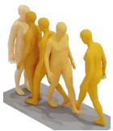  
w/o SC

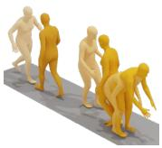  
w/ SC  
(a) The person walked forward and lifted sth. up turned around and walked back.

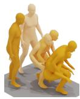  
w/o SC

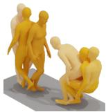  
w/ SC

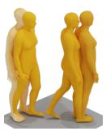  
w/o SC  
(b) A person walks forward, turns and then sits on a chair, then walks back.

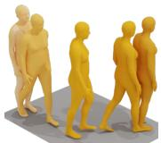  
w/ SC  
(c) A person walks towards the left front.

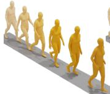  
w/o SC

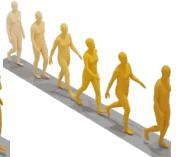  
w/ SC

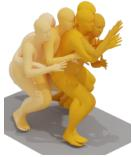  
w/ SC  
w/o SC

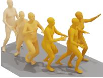

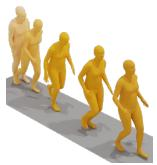  
w/o SC

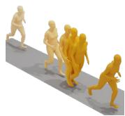  
w/ SC  
(e) A person prepares to shoot a basketball.

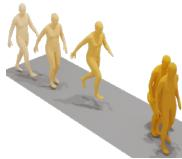  
w/o SC

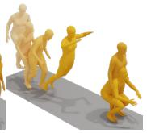  
(g) A person jumps over an obstacle.  
w/ SC

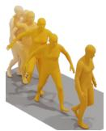  
w/o SC

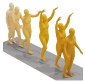  
(h) A person walks forward carefully with raised arms.  
w/ SC

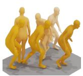  
w/o SC

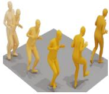  
w/ SC  
(i) A person tiptoes toward the front left.

Figure S1: Qualitative comparison on text-to-motion generation. Red text marks descriptions that are not correctly reflected in the generated motion. BiMoGen produces motions that better align with the input prompts.

Visualization of Text-to-Motion Generation. Fig. S1 shows qualitative comparisons of text-tomotion generation on the HumanML3D test set. Compared with BiMoGen w/o SC, BiMoGen w/ SC produces motions that are more faithful to the input descriptions, especially in cases involving fine-grained semantics and directional cues.

Visualization of Motion In-between. Fig. S2 shows motion in-between results, where the start and end segments are fixed and the middle portion is generated. The masked-diffusion formulation supports this setting without architectural change, and BiMoGen produces smooth and semantically consistent transitions.

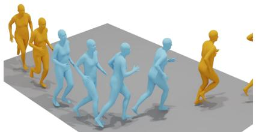  
(a)

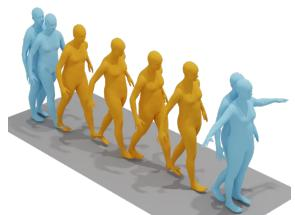  
(b)

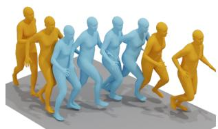  
(c)

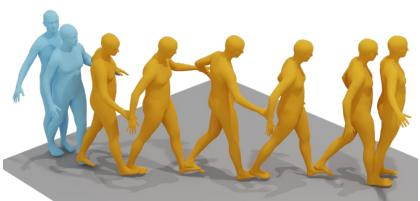  
(d)

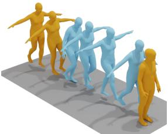  
(e)

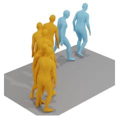  
(f)  
Figure S2: Visualization of motion in-betweening. Given prefix, suffix, middle, or start–end motion, BiMoGen performs motion in-betweening with smooth transitions. The human in blue represents the input, while the one in orange is generated by BiMoGen.

## B Experiments

## B.1 More Experiment Details

Metrics Definition. We follow the evaluation protocol used in prior text and motion generation work [13, 15, 14, 21, 65]. For T2M, we evaluate text and motion alignment, motion realism, and motion diversity. Unless otherwise noted, feature based metrics are computed with the official HumanML3D evaluator [13], using motion encoder ϕ(·) and text encoder ψ(·). For M2T, we follow prior captioning evaluation [14] and adopt standard NLP metrics including BLEU [35], ROUGE-L [27], CIDEr [43], and BERTScore [61] to evaluate the fluency, relevance, and diversity of generated captions. We also report retrieval based R Precision for M2T to measure the alignment between generated texts and the corresponding motions.

Text and motion alignment. R@k measures retrieval accuracy in the shared evaluator space. For each query from one modality, candidates from the other modality are ranked by their evaluator distance, and the score is the fraction of samples whose paired item appears in the top k results. MM Dist measures the average distance between paired text and motion embeddings.

Motion realism. Fréchet Inception Distance measures the distributional distance between generated motions and ground-truth motions in the feature space.

Motion diversity. Diversity measures the variation among generated motions in the evaluator feature space.

Motion captioning. For M2T, generated descriptions are evaluated against reference descriptions. BLEU and ROUGE-L measure lexical overlap, CIDEr measures consensus with reference captions, and BERTScore measures embedding based semantic similarity. These metrics are used together because a single overlap metric does not fully capture caption quality.

## B.2 Additional Ablation Study

We provide additional ablation studies on the design choices of BiMoGen.

Robustness across backbones. Table S1 compares different bidirectional Transformer backbones under the same training recipe. The BERT variants are initialized from pretrained checkpoints, whereas BiMoGen is trained from scratch. Despite this difference, BiMoGen remains on par with BERT-Large and outperforms BERT-Base on most T2M metrics, with the best R@1, R@3, Div, and MM Dist. This result suggests that the proposed training strategy does not rely on language pretrained weights and can make effective use of model capacity across different backbone designs.

Table S1: T2M results with different bidirectional Transformer backbones on HumanML3D. Bert-Base and Bert-Large use pretrained weights, while BiMoGen is trained from scratch with the same training strategy.
<table><tr><td rowspan="2">Backbone</td><td colspan="5">T2M</td></tr><tr><td>#Param</td><td>R@1↑ R@2↑1 R@3↑</td><td>FID↓</td><td>Div→</td><td>MM Dist↓</td></tr><tr><td>Real</td><td>0.511 一</td><td>0.703</td><td>0.797</td><td>0.002 9.503</td><td>2.974</td></tr><tr><td>Bert-Base [8]</td><td>133M 0.544</td><td>0.737</td><td>0.829</td><td>0.063 10.177</td><td>2.792</td></tr><tr><td>Bert-Large [8]</td><td>366M 0.553</td><td>0.747</td><td>0.839</td><td>0.057 10.018</td><td>2.734</td></tr><tr><td>BiMoGen (Ours)</td><td>334M 0.555</td><td>0.744</td><td>0.841</td><td>0.069 9.524</td><td>2.733</td></tr></table>

Table S2: Ablation on the CFG scale w for T2M generation. The number of sampling steps T is set to 20, and the self-correction is disabled.
<table><tr><td rowspan="2">CFG Scale w</td><td colspan="5">Text-to-Motion</td></tr><tr><td>R@1↑</td><td>R@2↑ R@3↑</td><td>FID↓</td><td>Div→</td><td>MM Dist↓</td></tr><tr><td>1.0</td><td>0.505</td><td>0.693</td><td>0.795</td><td>0.323 9.977</td><td>3.305</td></tr><tr><td>2.0</td><td>0.535</td><td>0.729</td><td>0.827</td><td>0.144 10.001</td><td>2.840</td></tr><tr><td>3.0</td><td>0.550</td><td>0.740</td><td>0.829</td><td>0.088 9.884</td><td>2.753</td></tr><tr><td>4.0</td><td>0.551</td><td>0.739</td><td>0.838</td><td>0.070 9.870</td><td>2.745</td></tr><tr><td>5.0</td><td>0.543</td><td>0.739</td><td>0.833</td><td>0.076 9.566</td><td>2.760</td></tr></table>

Effect of classifier-free guidance. Table S2 studies the effect of the CFG scale w for T2M generation. Increasing w from 1.0 to 4.0 consistently strengthens motion-text alignment and motion fidelity: R@1/R@3 improve from 0.505/0.795 to 0.551/0.838, FID decreases from 0.323 to 0.070, and MM Dist drops from 3.305 to 2.745. This confirms that guidance is important for masked bidirectional sampling, where the model must progressively select confident tokens under the textual condition. However, further increasing the scale to 5.0 no longer brings additional gains, slightly degrading R@1, R@3, FID, and MM Dist. We therefore set w= 4.0 as the default CFG scale, which provides the best overall trade-off between alignment quality.

Effect of semi-autoregressive sampling. Following Block Diffusion [1], Table S3 compares the standard parallel sampling of BiMoGen with semi-autoregressive sampling. In semi-autoregressive sampling, each block is denoised in parallel, while blocks are generated sequentially. The results show that parallel sampling consistently achieves the best performance across all metrics, suggesting that preserving global bidirectional refinement is more effective than imposing sequential block dependencies. Among the semi-autoregressive variants, smaller blocks perform better, whereas larger blocks progressively degrade both alignment and motion quality.

User Study. We further conduct a user study to assess the perceptual quality of generated motions. We sample 30 text descriptions from the HumanML3D test set and generate motions under the same prompts for all compared methods. We recruit 15 users and present the generated motions in random order. For the comparison with representative text-to-motion baselines, users are asked to select the best result among MotionLCM, MotionGPT, and BiMoGen in terms of motion-text alignment, physical fidelity, and coherence/fluency. For the SC ablation, users compare BiMoGen with and without SC, with an additional “Same” option when no clear preference is observed.

As shown in Figure S3, BiMoGen achieves the highest preference rates across all three criteria. Adding SC further improves user preference, indicating better text alignment, physical plausibility, and temporal consistency.

## C Sampling with Self-Correction

We provide the pseudo-code of sampling with self-correction in Algorithm 1. Given condition tokens $x ^ { \mathrm { c o n d } }$ , BiMoGen initializes the target sequence as fully masked tokens and iteratively refines it through masked sampling. At each step, the model predicts clean target tokens under classifierfree guidance, followed by remasking of low-confidence predictions. Here, Remask(·) follows the strategy in LlaDA [34], which remasks the tokens with the lowest prediction confidence. At selected steps in R, self-correction is invoked by first completing the current target and then revising the already visible tokens, while the remaining masked tokens are left for later steps.

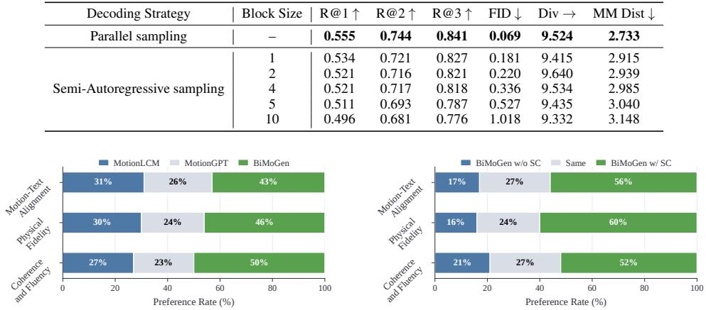

Table S3: Effect of semi-autoregressive sampling for T2M generation. The first row denotes the standard parallel masked decoding used by BiMoGen. The remaining rows denote block-wise leftto-right semi-autoregressive variants, where tokens within each block are generated in parallel and different blocks are generated sequentially.
<table><tr><td>Decoding Strategy</td><td>Block Size</td><td>R@1↑</td><td>R@2↑</td><td>R@3↑</td><td>FID↓</td><td>Div →</td><td>MM Dist ↓</td></tr><tr><td>Parallel sampling</td><td>一 一</td><td>0.555</td><td>0.744</td><td>0.841</td><td>0.069</td><td>9.524</td><td>2.733</td></tr><tr><td rowspan="5">Semi-Autoregressive sampling</td><td>1</td><td>0.534</td><td>0.721</td><td>0.827</td><td>0.181</td><td>9.415</td><td>2.915</td></tr><tr><td>2</td><td>0.521</td><td>0.716</td><td>0.821</td><td>0.220</td><td>9.640</td><td>2.939</td></tr><tr><td>4</td><td>0.521</td><td>0.717</td><td>0.818</td><td>0.336</td><td>9.534</td><td>2.985</td></tr><tr><td>5</td><td>0.511</td><td>0.693</td><td>0.787</td><td>0.527</td><td>9.435</td><td>3.040</td></tr><tr><td>10</td><td>0.496</td><td>0.681</td><td>0.776</td><td>1.018</td><td>9.332</td><td>3.148</td></tr></table>

Figure S3: User study. Preference rates on 30 HumanML3D test prompts. Left: comparison with MotionLCM and MotionGPT. Right: ablation of SC with an additional $s \mathrm { * } _ { \mathrm { S a m e } ^ { \mathrm { * } } }$ option.

Algorithm 1 Iterative Masked Sampling with Self-Correction   
Require: Condition xcond, target length L, model pθ, steps T, CFG scale w, correction steps R   
Ensure: Generated target tokens xb   
1: $x \gets [ M ] ^ { L }$   
2: for t = 1 to T do   
3: Pcond $ p _ { \boldsymbol \theta } ( \cdot \mid x ^ { \mathrm { c o n d } } , x ) .$ Pucond ← pθ(· | ∅, x)   
4: $P  w P ^ { \mathrm { c o n d } } + ( 1 - w ) P$ ucond   
5: yi ← arg max Pi(v), si ← maxv Pi(v) for i with $x _ { i } = [ M ]$   
6: if t ∈ R then   
7: xe ← x   
8: $\widetilde { x } _ { i } \gets y _ { i }$ for i with $x _ { i } = [ M ]$ ▷ temporary complete target   
9: $Q  p _ { \theta } ( \cdot \mid x ^ { \mathrm { c o n d } } , \widetilde { x } )$   
10: xi ← arg max $\mathbf { \Sigma } _ { \cdot v } Q _ { i } ( \tilde { v } )$ for i with $x _ { i } \neq [ M ]$ ▷ revise committed tokens   
11: $\bar { x } _ { i } \gets y _ { i }$ for i with $x _ { i } = [ M ]$ , and $\bar { x } _ { i } \gets x _ { i }$ otherwise   
12: x ← Remask(¯x) ▷ remask low-confidence predictions   
13: ${ \widehat { x } } \gets x$   
14: return xb

## D Limitations and Broader Impact

Limitations. Our method employs a VQ-VAE motion tokenizer to convert continuous human motion into discrete tokens. As a result, generation quality is still partially bounded by the tokenizer’s reconstruction fidelity and codebook expressiveness, especially for subtle or highly detailed motions. Moreover, the current formulation models motion at the sequence level and lacks explicit fine-grained control over individual body parts, such as hands, arms, or legs. Incorporating stronger part-aware tokenizers and more controllable representations is a promising direction for future work.

Broader impact. This work may benefit motion content creation, animation, virtual agents, and motion retrieval through bidirectional language-motion generation. Since the model produces abstract motions rather than identifiable visual appearances, its direct risk is limited. Still, generated motions may be used in downstream synthetic avatar or animation systems, so responsible use, consent for real motion data, and disclosure of synthetic content should be considered in deployment.