# CAPFIELD-OPD: LEARNING CONTINUOUS CAPABIL-ITY FIELDS VIA JOINT-ANCHORED MULTI-TEACHER ON-POLICY DISTILLATION FOR FLOW MODELS

Pengyang Ling1,\*, Yujie Zhou2,\*, Jiazi Bu2,\*, Yibin Wang3, Xiaoxiao Ma1, Yi Jin1, Huaian Chen1,†, Yuhang Zang4,†

1University of Science and Technology of China 2Shanghai Jiao Tong University

3Fudan University 4Shanghai Artificial Intelligence Laboratory

\* Equal contribution. † Corresponding authors.

## ABSTRACT

Reward-specialized post-training produces strong experts for flow-based generative models, while multi-teacher on-policy distillation (OPD) consolidates their capabilities into a single student. Existing methods, however, route each prompt to a single teacher according to its semantic category, implicitly binding the desired capability to prompt content. This coupling makes capability invocation vulnerable to prompt perturbations and prevents users from explicitly adjusting the strength of the desired capability at inference time. In this work, we introduce CapField-OPD, an OPD framework that integrates multiple teachers into a continuous capability field through explicit capability coordinates. We use teacher models as anchors to construct this field, with the coordinates determining how their outputs are combined. Each capability configuration thus receives a unique supervision target, and capability control no longer depends on prompt semantics. Since the training anchors may not be optimal at inference time, we further profile the learned field on a small calibration set. The coordinate with the highest mean reward serves as the recommended default, while coordinates that are frequently optimal offer a promising candidate set for test-time scaling. Extensive experiments on compositional generation, text rendering, and visual aesthetics demonstrate that CapField-OPD consolidates multiple specialized teachers into a single student while preserving or surpassing their performance, reliably invokes the desired capabilities under semantics-preserving prompt variations, and supports continuous capability control and coordinate-based test-time scaling.

## 1 INTRODUCTION

Flow-matching models (Esser et al., 2024; Lipman et al., 2022; Liu et al., 2022) have recently become a popular framework for image generation (Labs, 2024; Team, 2025; Wu et al., 2025), in which a learned velocity field can transport Gaussian noise to data samples via iterative denoising. Reward-based post-training (Liu et al., 2025a; Xue et al., 2025b; Zhou et al., 2026b) further improves specific generation capabilities, such as text-rendering accuracy, compositional fidelity, and visual aesthetics, producing strong and diverse domain experts. However, training and deploying a separate model for each capability is costly. Multi-teacher on-policy distillation (OPD) (Fang et al., 2026) addresses this problem by consolidating reward-specialized teachers into a single student, which is supervised by teachers’ outputs evaluated along student-generated trajectories.

Nevertheless, existing flow-based multi-teacher OPD methods (Fang et al., 2026; Li et al., 2026c; Zhou et al., 2026a) typically split training prompts by task type and assign each subset to one teacher via semantics-driven hard routing. Without an explicit capability signal, the student must infer the desired capability category from prompt semantics, binding capability intent to prompt content. Capability activation thus becomes sensitive to prompt wording and style, especially on out-ofdistribution prompts, and users cannot explicitly control capabilities at inference time. As shown in Fig. 1(b), for the same prompt describing a handwritten sign reading “JAZZ LEGENDS ON VINYL HERE,” one user may prioritize accurate text rendering, another may prefer visual aesthetics, while a third may require both with different strengths. A semantic router cannot distinguish these intention from the prompt alone. When a prompt requires multiple capabilities, naively activating multiple teachers yields conflicting velocity targets under the same student condition. These limitations point to a key issue: capability intent requires explicit representation and control.

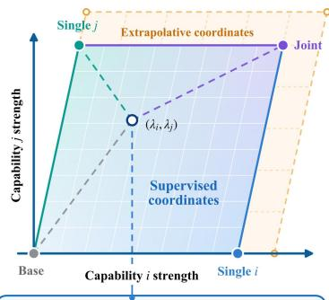

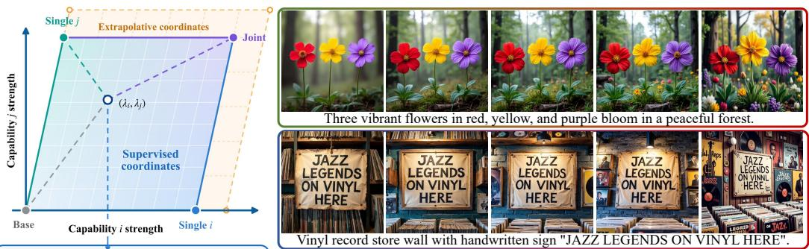  
(b) Continuous capability control: GenEval→Aesthetic (top) OCR→Aesthetic (bottom)

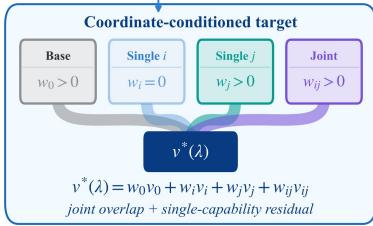  
(a) Coordinate-based capability field

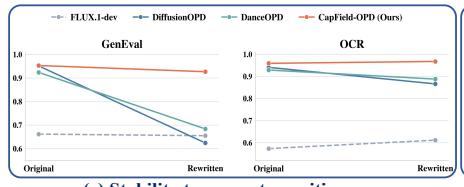  
(c) Stability to prompt rewriting

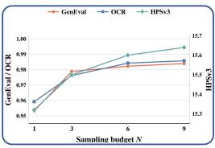  
(d) Test-time scaling  
Figure 1: Overview of CapField-OPD. (a) Teacher anchors define a continuous capability field controlled by explicit, potentially extrapolative coordinates. (b-d) The learned field supports continuous control, robust capability invocation under prompt rewriting, and coordinate-based test-time scaling.

To this end, we propose CapField-OPD, built on the principle that desired capabilities should be explicitly specified rather than implicitly inferred. Specifically, we condition the student on an explicit capability coordinate whose axes control capability strengths, and reinterpret the base, singlecapability, and joint-capability teachers as anchors of a shared capability field. A joint-anchored target field combines their outputs through coordinate-dependent activation weights. For coordinates activating multiple capabilities, the corresponding joint-capability teacher supplies the shared capability components, and remaining activation is allocated to the single-capability teachers, so the field exactly preserves each anchor’s capability while providing a continuous velocity target over the capability space. The student can thus invoke desired capabilities even on boundary or out-ofdistribution prompts where semantic routing may fail (Fig. 1(c)). Coordinate conditioning also adds an inference-time scaling axis. Although supervision spans a bounded range, varying the coordi nates teaches the student how its velocity field changes as capabilities strengthen or combine. The teacher anchors therefore define reference states rather than hard performance limits. As shown in Fig. 1(a), extending coordinates beyond the training range continues the learned capability response, and this bounded extrapolation can yield higher rewards than the teacher anchors. To identify reliable extrapolative settings, we profile in-range and extrapolative coordinates on a small calibration set of prompt–noise pairs. The coordinate with the highest mean reward serves as the default, and frequently optimal coordinates provide candidates for prompt-specific search, enabling coordinatebased test-time scaling (Fig. 1(d)).

Our contributions are as follows: (1) We identify semantic-capability entanglement of hard routing as a central limitation of multi-teacher OPD. (2) We propose CapField-OPD, which learns a continuous capability field through explicit capability conditioning and joint-anchored field supervision, with capability landscape profiling for default-coordinate selection and test-time search. (3) Experiments show CapField-OPD consolidates reward-specialized experts, enhances robustness to prompt perturbations, and supports continuous capability control and coordinate-based test-time scaling.

## 2 RELATED WORK

## 2.1 PREFERENCE ALIGNMENT IN FLOW MODELS

Aligning pretrained flow models with human preferences (Liu et al., 2025b; Xue et al., 2025b; Bu et al., 2026) has emerged as an effective post-training strategy for adapting them to downstream objectives. Existing approaches can be broadly divided into offline preference learning and online reward optimization. Offline DPO-style methods (Wallace et al., 2024; Yang et al., 2024) translate preferred—dispreferred comparisons into flow-matching objectives (Liu et al., 2025b), thereby avoiding explicit reward-model training and online rollouts. Online methods (Liu et al., 2025a; Ling et al., 2026; Li et al., 2026b), in contrast, formulate the sampling trajectory as a Markov de cision process (MDP) and interleave trajectory sampling and reward scoring with policy updates. Specifically, the PPO-style methods (DPOK (Fan et al., 2023), DDPO (Black et al., 2023)) apply policy gradients along denoising trajectories, whereas GRPO-style approaches (Liu et al., 2025a; Li et al., 2025; Wang & Yu, 2025) convert an ordinary differential equation (ODE) sampling into an equivalent stochastic differential equation (SDE) and optimize the sampling distribution using estimated relative advantages. Both of them rely on tractable stochastic transition densities and perform on-policy optimization along the sampled trajectories. In comparison, DiffusionNFT (Zheng et al., 2026) and Advantage Weighted Matching (AWM) (Xue et al., 2025a) develop a different approach. They collect and score generated images, and then re-noise them for reward-derived weighted optimization, achieving substantially faster convergence. Collectively, these techniques improve the performance of preference alignment toward specific reward functions.

## 2.2 ON-POLICY DISTILLATION IN FLOW MODELS

Unlike conventional distillation methods (Yin et al., 2024a;b; Cheng et al., 2025; Chen et al., 2025) that primarily aim to reduce sampling steps, on-policy distillation (OPD) (Fang et al., 2026; Li et al., 2026c; Zhou et al., 2026a) has recently emerged as an effective approach for consolidating the capabilities of multiple teachers into a single student model. Instead of relying on fixed data or teacher-generated results, OPD samples trajectories from the current student and queries teachers at student-visited states, reducing exposure bias while providing dense velocity-field supervision. Specifically, Flow-OPD (Fang et al., 2026) and DiffusionOPD (Li et al., 2026c) independently train reward-specialized teachers and consolidate their capabilities into a unified student through task routing and trajectory-level matching. Subsequent works extend OPD in several directions. For example, DreOPD (Lin et al., 2026) moves beyond direct teacher imitation through degraded-reference velocity extrapolation, while Any-OPD (Fu et al., 2026) enables distillation between heterogeneous teacher–student pairs through representation-space alignment. In addition, CFG-OPD (Li et al., 2026a) separately constrains the positive prediction and the CFG direction, reducing sensitivity to guidance scales. Although these methods improve OPD for flow models, existing multi-teacher OPD methods still rely on semantics-driven hard routing, assigning each trajectory to one expert. This entangles prompt content with capability intent, limiting capability composition and strength control and causing conflicting supervision for multi-capability or boundary prompts.

## 3 METHOD

## 3.1 PRELIMINARIES

Flow Matching Models. Flow matching (Lipman et al., 2022; Liu et al., 2022) learns a timedependent velocity field that transports Gaussian noise to clean data. Given a paired sample $\mathbf { \Psi } ( \mathbf { x } , c ) \sim$ $p _ { \mathrm { d a t a } } ,$ Gaussian noise $\epsilon \sim \mathcal { N } ( \bar { \bf 0 } , \bf { I } )$ , and a timestep $t \sim \mathcal { U } [ 0 , 1 ]$ , the interpolated noisy state is ${ \bf x } _ { t } = ( 1 - t ) { \bf x } + t { \bf \epsilon }$ , where $\mathbf { x } _ { 0 } = \mathbf { x }$ is the clean sample and ${ \bf x } _ { 1 } = \epsilon$ is pure noise. Differentiating the path with respect to t gives the target velocity

$$
v _ { t } = \frac { \mathrm { d } \mathbf { x } _ { t } } { \mathrm { d } t } = \epsilon - \mathbf { x } .\tag{1}
$$

The flow model $v _ { \theta } ( \mathbf { x } _ { t } , t , c )$ is then trained with the flow matching loss

$$
\mathcal { L } _ { \mathrm { F M } } ( \theta ) = \mathbb { E } _ { ( \mathbf { x } , c ) , \epsilon , t } \left[ \big \| v _ { \theta } ( \mathbf { x } _ { t } , t , c ) - v _ { t } \big \| _ { 2 } ^ { 2 } \right] ,\tag{2}
$$

where c is an optional condition such as text or image.

On-Policy Distillation. On-policy distillation (OPD) (Li et al., 2026c) aims to transfer the capabilities of frozen teachers to a student by imitating the teacher’s behavior on student-visited states, thereby offering supervision that adapts to the student’s evolving distribution. Let $v _ { \phi }$ and $v _ { \theta }$ denote

the teacher and student velocity fields, respectively, and let $\tau = \{ \mathbf { x } _ { t _ { i } } \} _ { i = 0 } ^ { M }$ be the trajectory sampled by the student model; the OPD objective is defined as:

$$
\mathcal { L } _ { \mathrm { O P D } } ( \theta ) = \mathbb { E } _ { c , \tau \sim p _ { \theta } ( \tau \mid c ) } \left[ \sum _ { i = 0 } ^ { M - 1 } w ( t _ { i } ) \left. v _ { \theta } ( \mathbf { x } _ { t _ { i } } , t _ { i } , c ) - v _ { \phi } ( \mathbf { x } _ { t _ { i } } , t _ { i } , c ) \right. _ { 2 } ^ { 2 } \right] ,\tag{3}
$$

where $w ( t _ { i } )$ is a timestep-dependent weight. When the student and teacher models share the same per-step covariance, this velocity-matching loss is equivalent to minimizing the per-step KL diver gence between the two models (omit the time-dependent coefficient):

$$
D _ { \mathrm { K L } } ( \pi _ { \boldsymbol { \theta } } ( \cdot  { | } \mathbf { x } _ { t _ { i } } )  { | | } \pi _ { \boldsymbol { \phi } } ( \cdot  { | } \mathbf { x } _ { t _ { i } } ) ) \propto  { \left\| | v _ { \theta } - v _ { \phi } \right\| _ { 2 } ^ { 2 } } .\tag{4}
$$

## 3.2 OBSERVATION

Suppose that K reward-specialized teachers encode capabilities such as compositional fidelity, text rendering, and visual aesthetics. To mitigate cross-teacher supervision conflicts, existing multiteacher OPD methods partition the training prompts into non-overlapping subsets $\{ \mathcal { D } _ { k } \} _ { k = 1 } ^ { \tilde { K } }$ and assign each subset to one teacher:

$$
v ^ { \star } = v _ { \phi _ { k } } , \qquad k = \rho ( c ) \ \mathrm { ~ f o r ~ } c \in { \mathcal { D } } _ { k } ,\tag{5}
$$

where $\rho$ is the fixed task-based routing rule and $v _ { \phi _ { k } }$ denotes the k-th teacher. The selected index k determines the supervision target but is not provided to the student, forcing it to infer the intended capability solely from c and thereby entangling prompt semantics with capability activation.

This design leads to two limitations. First, capability activation is sensitive to linguistic variation: when the wording or style of a prompt deviates from the routed training subsets, the prompt may activate a different expert behavior even if its visual intent is nearly identical (Fig. 1(c) and Fig. 2). This resembles the linguistic hacking observed in reward-based posttraining Wang et al. (2026), but is more pronounced here because a perturbation can switch which capability is activated rather than only changing its strength. Second, semantic routing fixes both capability selection and activation strength in the prompt, so users cannot ad-

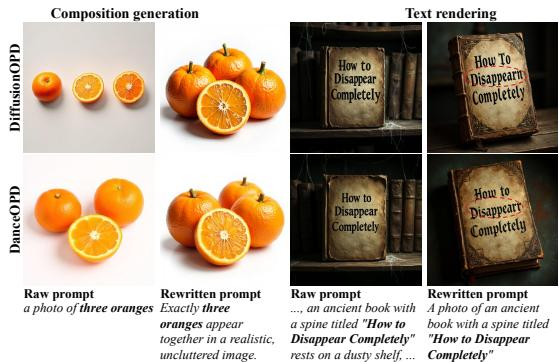  
Figure 2: Visualization under prompt rewriting.

just the strength of a single capability or invoke multiple capabilities together for the same prompt. These limitations arise from entangling semantic content with capability intent and motivate an explicit capability-conditioning mechanism that decouples what to generate from which capabilities to activate and at what strength, so that capability control no longer depends on prompt wording and users can combine and adjust capabilities at inference time.

## 3.3 JOINT-ANCHORED EXPLICIT CAPABILITY FIELD

We parameterize capability intent by $\lambda \in [ 0 , 1 ] ^ { K }$ , where $\lambda _ { i }$ continuously controls capability i, and multiple nonzero entries indicate a request for capability combination. The student $v _ { \theta } ( \mathbf { x } _ { t } , t , c , \lambda )$ receives the coordinate through a small projection added to its global conditioning, i.e.,

$$
\mathbf { h } ( t , c , \pmb { \lambda } ) = \mathbf { h } ( t , c ) + W _ { 2 } \mathrm { S i L U } ( W _ { 1 } \pmb { \lambda } ) .\tag{6}
$$

The projection is bias-free, and $W _ { 2 }$ is initialized to zero. This separates capability control from the text prompt without changing the text encoder or transformer blocks.

Let $v _ { 0 }$ denote the frozen base model without post-training, $v _ { i }$ the expert specialized for capability $i ,$ and $v _ { i j }$ the joint teacher obtained by jointly optimizing the objectives for capabilities i and j during post-training. Consider a capability coordinate λ that is nonzero only on a supported pair $( i , j )$ . The corresponding target velocity is defined by the piecewise-linear capability field

$$
v ^ { * } ( \lambda ) = ( 1 - \lambda _ { i } - \lambda _ { j } + \lambda _ { \operatorname* { m i n } } ) v _ { 0 } + ( \lambda _ { i } - \lambda _ { \operatorname* { m i n } } ) v _ { i } + ( \lambda _ { j } - \lambda _ { \operatorname* { m i n } } ) v _ { j } + \lambda _ { \operatorname* { m i n } } v _ { i j } ,\tag{7}
$$

where $\lambda _ { \operatorname* { m i n } } = \operatorname* { m i n } ( \lambda _ { i } , \lambda _ { j } )$ and, all velocities at the same student-visited state $\left( \mathbf { x } _ { t } , t , c \right)$ , omitted for clarity. The overlap $\lambda _ { \mathrm { m i n } }$ of the two requests goes to the joint teacher, and each single expert covers only the excess of its own coordinate. Specifically, the corner $( \lambda _ { i } , \lambda _ { j } ) = ( 0 , 0 )$ recovers the base model, (1, 0) and (0, 1) recover the two individual experts, and $( 1 , 1 )$ recovers the joint teacher $( \mathrm { F i g . ~ } 1 ( \mathrm { a } ) )$ . Anchored at these four corners, the field is continuous and leaves each teacher exactly reachable from any direction, so composing capabilities does not degrade individual performance. More broadly, Eq. 7 is not tied to a specific pair but provides a general rule for composing any two interacting capabilities, which effectively alleviates conflicts between capabilities. The joint teacher $v _ { i j }$ contributes to the target only when both coordinates are nonzero, since its coefficient $\lambda _ { \mathrm { m i n } }$ vanishes otherwise. At an axis-aligned coordinate such as $( \lambda _ { i } , 0 )$ , the target reduces to interpolation between the base model and a single expert, $v ^ { * } = ( 1 - \lambda _ { i } ) v _ { 0 } + \lambda _ { i } v _ { i }$ , and single-capability supervision never involves a joint teacher. The sampling region of each pair is therefore chosen according to its available anchors. For a pair with a joint teacher, coordinates are sampled over the full unit square, so that combined activations are also supervised. For a pair without a joint teacher, only axis-aligned coordinates are sampled, and the joint term is never used.

The training objective adopts the standard OPD loss, with both the student and target velocity conditioned on the capability coordinates, i.e.,

$$
\begin{array} { r } { \mathcal { L } _ { \mathrm { O P D } } ( \theta ) = \mathbb { E } \Big [ \| v _ { \theta } ( \mathbf { x } _ { t } , t , c , \pmb { \lambda } ) - v ^ { * } ( \mathbf { x } _ { t } , t , c , \pmb { \lambda } ) \| _ { 2 } ^ { 2 } \Big ] . } \end{array}\tag{8}
$$

As the target velocity varies with λ, each requested capability configuration is matched with its unique target, thus the same prompt can be supervised by different teachers or their combinations under different capability coordinates, without introducing inconsistent targets for the same input.

## 3.4 CAPABILITY LANDSCAPE PROFILING

The value $\lambda _ { i } ~ = ~ 1$ marks the training anchor of capability i, but does not necessarily yield the strongest student response. We therefore profile the reward landscape of the learned capability field to identify the coordinate with the highest mean reward and measure how often each coordinate is optimal across prompt–noise pairs. Given a capability set S, we fix all coordinates outside S to zero and construct a probe grid $\Lambda _ { \mathrm { p r o b e } } ^ { \dot { S } } = \Lambda _ { \mathrm { i n } } ^ { S } \cup \Lambda _ { \mathrm { e x t } } ^ { \dot { S } }$ , covering the training range and a bounded extrapolation region. Every coordinate is evaluated on the same calibration bank $\boldsymbol { B _ { \mathrm { c a l } } ^ { S } } = \{ ( c _ { m } , z _ { m } ) \} _ { m = 1 } ^ { M }$ where $c _ { m }$ is a training prompt and $z _ { m }$ is its fixed initial noise. The resulting reward records are

$$
r _ { m } ( \lambda ) = q _ { S } ( G _ { \theta } ( z _ { m } , c _ { m } , \lambda ) ) , \quad m = 1 , \dots , M , \quad \lambda \in \Lambda _ { \mathrm { p r o b e } } ^ { S } ,\tag{9}
$$

where $q _ { S }$ is the corresponding reward function for capability set $S$ (can be a weighted objective under multiple capabilities), and $G _ { \theta } ( \cdot )$ is the image generator. Reusing the same prompt–noise pairs ensures that only the capability coordinates vary across evaluations. From these records, we compute the mean reward and the empirical frequency of optimality at each coordinate:

$$
\bar { r } _ { S } ( \lambda ) = \frac { 1 } { M } \sum _ { m = 1 } ^ { M } r _ { m } ( \lambda ) , \qquad \widehat { P } _ { S } ( \lambda ) = \frac { 1 } { M } \sum _ { m = 1 } ^ { M } \frac { \mathbf { 1 } \{ \lambda \in \Lambda _ { m } ^ { \star } \} } { | \Lambda _ { m } ^ { \star } | } ,\tag{10}
$$

where $\bar { r } _ { S } ( \lambda )$ is the average reward of coordinate λ over the M pairs, $\widehat { P } _ { S } ( \lambda )$ is the fraction of pairs for which λ is optimal, with ties split evenly among the optimal coordinates, and $\Lambda _ { m } ^ { \star } =$ $\arg \operatorname* { m a x } _ { \lambda \in \Lambda _ { \mathrm { { o r o b e } } } ^ { S } } r _ { m } ( \lambda )$ is the set of optimal coordinates for the prompt-noise pair $\left( c _ { m } , z _ { m } \right)$ . These two statistics measure different things: a coordinate that is best on many pairs can still score poorly on the rest $( \widehat { P } _ { S }$ can be high while $\bar { r } _ { S }$ stays moderate), and a coordinate can also score well on every pair without ever being the best (the highest $\bar { r } _ { S }$ can correspond to low ${ \widehat { P } } _ { S } )$ . We therefore define:

$$
\widehat { \lambda } _ { \mathrm { p e a k } } ^ { S } = \arg \operatorname* { m a x } _ { \lambda \in \Lambda _ { \mathrm { p r o b e } } ^ { S } } \bar { r } _ { S } ( \lambda ) , \qquad \Lambda _ { \mathrm { s e a r c h } } ^ { S } = \left\{ \lambda \in \Lambda _ { \mathrm { p r o b e } } ^ { S } : \widehat { P } _ { S } ( \lambda ) > 0 \right\} ,\tag{11}
$$

where $\widehat { \lambda } _ { \mathrm { p e a k } } ^ { S }$ is the recommended coordinate, and $\Lambda _ { \mathrm { s e a r c h } } ^ { S }$ collects every coordinate that is optimal for at least one prompt-noise pair, offering the candidate set for test-time search. Since $\widehat { P } _ { S }$ sums to one and is nonzero exactly on $\Lambda _ { \mathrm { s e a r c h } } ^ { S }$ , it can be used directly as the sampling distribution for test time scaling. The performance gain of coordinate extrapolation can thus be quantified as follows:

$$
\Delta _ { \mathrm { e x t } } ^ { S } = \operatorname* { m a x } _ { \lambda \in \Lambda _ { \mathrm { e x t } } ^ { S } } \bar { r } _ { S } ( \lambda ) - \operatorname* { m a x } _ { \lambda \in \Lambda _ { \mathrm { i n } } ^ { S } } \bar { r } _ { S } ( \lambda ) .\tag{12}
$$

## 3.5 TEST-TIME SCALING OVER CAPABILITY COORDINATES

Although the default coordinate $\widehat { \lambda } _ { \mathrm { p e a k } } ^ { S }$ achieves the highest mean reward during profiling, the optimal coordinate can vary across prompt–noise pairs. We therefore perform test-time search over capability coordinates to improve generation quality for a given initial noise. Specifically, we draw N coordinates from $\Lambda _ { \mathrm { s e a r c h } } ^ { S }$ without replacement, with probability proportional to $\widehat { P } _ { S }$ . Each coordinate produces a candidate record $\left( \mathbf { x } _ { n } , r _ { n } , \lambda _ { n } \right)$

$$
\begin{array} { r } { \mathcal { C } _ { N } = \{ ( { \bf x } _ { n } , r _ { n } , \lambda _ { n } ) \} _ { n = 1 } ^ { N } , \qquad { \bf x } _ { n } = G _ { \theta } ( z , c , \lambda _ { n } ) , \quad r _ { n } = q _ { S } ( { \bf x } _ { n } ) , } \end{array}\tag{13}
$$

where the same initial noise z is used for all candidates, so that only the capability coordinates vary. We then select the record with the highest reward:

$$
( \mathbf { x } ^ { * } , r ^ { * } , \pmb { \lambda } ^ { * } ) \in \arg \operatorname* { m a x } _ { ( \mathbf { x } , r , \pmb { \lambda } ) \in \mathcal { C } _ { N } } r .\tag{14}
$$

Such a search explores different capability configurations for the same initial noise, allowing higherreward outputs to be obtained without resampling random seeds.

## 4 EXPERIMENTS

Tasks and datasets. Following prior work (Fang et al., 2026), we investigate three capabilities: compositional generation, text rendering, and visual aesthetics. For compositional generation and text rendering, we use the training and test splits released by Flow-GRPO (Liu et al., 2025a) for GenEval (Ghosh et al., 2023) and OCR, respectively; for visual aesthetics, prompts are drawn from the HPD (Wu et al., 2023) dataset. Compositional generation and text rendering are evaluated with the GenEval and OCR rewards, while the aesthetic objective combines HPSv3 (Ma et al., 2025), CLIP (Radford et al., 2021), and PickScore (Kirstain et al., 2023) with equal weights 1:1:1. For capability landscape profiling, the calibration bank is drawn from the training split with 200 prompts per capability set, so that coordinate selection never touches testing data.

Teacher construction. We train five teacher models using Flow-GRPO-Fast (Liu et al., 2025a). The three single-capability teachers are trained on the corresponding prompts and rewards above. We additionally train two joint-capability teachers, GenEval+aesthetics on GenEval prompts and OCR+aesthetics on OCR prompts, where every generated sample is evaluated by the task reward together with HPSv3, CLIP, and PickScore at a coefficient ratio of 3:1:1:1. We do not build a GenEval+OCR teacher because the two prompt sets have incompatible formats: GenEval prompts are template-based scene descriptions, whereas OCR prompts must contain a quoted string to render, so no natural prompt requires both capabilities. Aesthetics imposes no constraint on prompt format and thus pairs with either task; the joint teachers directly learn the combination of task correctness and visual quality, providing anchors for coordinates where both capabilities are activated.

Baselines. We use FLUX.1-dev (Labs, 2024) as the backbone for all teacher and student models and apply LoRA with r = 64 and α = 128. Rollout and distillation use 10 sampling steps; evaluation uses 28 steps, and all images are generated at a resolution of 512 × 512. We compare CapField-OPD with the three single-capability teachers, a multi-task teacher trained through multi-objective reinforcement learning (Xue et al., 2025b), DiffusionOPD (Li et al., 2026c), and DanceOPD (Zhou et al., 2026a); all OPD methods use the same teacher models for a fair comparison. More implementation details can be found in the Appendix.

## 4.1 MAIN RESULTS

Tab. 1 presents the main quantitative comparison. The single-capability teachers perform strongly on their target tasks, while the joint teachers provide better balance between correctness and visual quality. Multi-task GRPO and existing OPD methods consolidate these capabilities into one model with a single operating point, and adding joint teachers (Single+Joint) lifts several aesthetic metrics but consistently lowers the GenEval and OCR scores. Without teacher identity as input, this supervision shifts the learned compromise rather than creating separately accessible capability modes. In comparison, the two CapField-OPD rows come from the same student model and differ only in capability coordinates. Single-capability coordinates achieve the best GenEval and OCR scores overall and slightly exceed the aesthetic teacher on all three aesthetic metrics, and some of these coordinates lie beyond the training anchors, so the anchors do not limit the learned field. Jointcapability coordinates give better-balanced operating points while retaining strong task accuracy. CapField-OPD thus supports capability extrapolation and direct switching between specialized and joint behaviors in one model, without retraining. Fig. 3 shows the same trend qualitatively: in single mode, CapField-OPD matches the strongest baseline on text rendering, and joint mode improves visual quality while keeping the text correct.

Table 1: Quantitative comparison. Single-only and Single+Joint distill from the three singlecapability teachers without and with the two joint-capability teachers, respectively. The two CapField-OPD modes share one student model and differ only in their inference coordinates. Bold and underlined values denote the best and second-best results among unified models. Since aesthetic prompts contain no composition target or text-rendering target, the joint mode does not apply, and the corresponding entries are marked “–”.
<table><tr><td rowspan="2">Method</td><td colspan="4">Composition-task prompts</td><td colspan="4">Text-rendering prompts</td><td colspan="3">Aesthetic prompts</td></tr><tr><td>GenEval HPSv3</td><td></td><td>CLIP</td><td>PickScore</td><td>OCR</td><td>HPSv3</td><td>CLIP</td><td>PickScore</td><td>HPSv3</td><td>CLIP</td><td>PickScore</td></tr><tr><td>FLUX.1-dev</td><td>0.6616</td><td>8.65</td><td>0.3966</td><td>23.40</td><td>0.5735</td><td>13.00</td><td>0.4466</td><td>22.91</td><td>13.28</td><td>0.3868</td><td>22.58</td></tr><tr><td>GenEval teacher</td><td>0.9417</td><td>9.16</td><td>0.4092</td><td>23.27</td><td>0.6170</td><td>13.43</td><td>0.4585</td><td>22.97</td><td>13.49</td><td>0.3946</td><td>22.47</td></tr><tr><td>OCR teacher</td><td>0.7166</td><td>8.90</td><td>0.4030</td><td>23.59</td><td>0.9417</td><td>12.74</td><td>0.4567</td><td>22.88</td><td>13.57</td><td>0.3834</td><td>22.64</td></tr><tr><td>Aesthetic teacher</td><td>0.3228</td><td>10.62</td><td>0.4117</td><td>24.04</td><td>0.4824</td><td>15.14</td><td>0.4688</td><td>23.95</td><td>15.23</td><td>0.4181</td><td>23.68</td></tr><tr><td>GenEval+Aesthetic teacher</td><td>0.9253</td><td>11.75</td><td>0.4210</td><td>24.11</td><td>0.6235</td><td>14.74</td><td>0.4525</td><td>23.32</td><td>14.65</td><td>0.3968</td><td>22.71</td></tr><tr><td>OCR+Aesthetic teacher</td><td>0.6041</td><td>9.46</td><td>0.4019</td><td>23.59</td><td>0.9031</td><td>14.40</td><td>0.4631</td><td>23.53</td><td>14.50</td><td>0.3945</td><td>23.06</td></tr><tr><td>Multi-task GRPO</td><td>0.8608</td><td>9.43</td><td>0.4196</td><td>23.89</td><td>0.9369</td><td>13.20</td><td>0.4638</td><td>23.19</td><td>14.32</td><td>0.4024</td><td>23.15</td></tr><tr><td>DiffusionOPD (Single-only)</td><td>0.9514</td><td>8.37</td><td>0.4167</td><td>23.02</td><td>0.9409</td><td>12.76</td><td>0.4574</td><td>22.90</td><td>15.25</td><td>0.4174</td><td>23.72</td></tr><tr><td>DiffusionOPD (Single+Joint)</td><td>0.9434</td><td>10.96</td><td>0.4188</td><td>23.58</td><td>0.9229</td><td>13.86</td><td>0.4632</td><td>23.36</td><td>15.25</td><td>0.4180</td><td>23.70</td></tr><tr><td>DanceOPD (Single-only)</td><td>0.9239</td><td>7.72</td><td>0.4092</td><td>22.97</td><td>0.9289</td><td>12.87</td><td>0.4579</td><td>22.95</td><td>15.19</td><td>0.4156</td><td>23.64</td></tr><tr><td>DanceOPD (Single+Joint)</td><td>0.9236</td><td>11.19</td><td>0.4123</td><td>23.73</td><td>0.8875</td><td>14.09</td><td>0.4604</td><td>23.44</td><td>15.27</td><td>0.4162</td><td>23.70</td></tr><tr><td>CapField-OPD (Single mode)</td><td>0.9531</td><td>8.50</td><td>0.4170</td><td>23.02</td><td>0.9592</td><td>11.96</td><td>0.4439</td><td>22.51</td><td>15.32</td><td>0.4182</td><td>23.71</td></tr><tr><td>CapField-OPD (Joint mode)</td><td>0.9322</td><td>11.76</td><td>0.4201</td><td>23.94</td><td>0.9256</td><td>14.08</td><td>0.4538</td><td>23.32</td><td></td><td></td><td></td></tr></table>

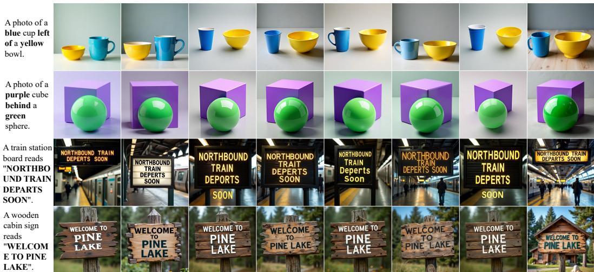  
Figure 3: Visual demonstration of different methods, from left to right: FLUX.1-dev, Multi task GRPO, DiffusionOPD(Single-only), DiffusionOPD(Single+Joint), DanceOPD(Single-only), DanceOPD(Single+Joint), CapField-OPD(Single mode), and CapField-OPD(Joint mode).

## 4.2 ROBUSTNESS TO PROMPT REWRITING

We rewrite the benchmark prompts with GPT-5.6 (OpenAI, 2026) while preserving their task content and evaluate all methods without retraining. As shown in Tab. 2, CapField-OPD achieves the best result on all three metrics, while the compared OPD methods degrade significantly, especially in the GenEval and OCR tasks. This is because these methods infer the capability from prompt semantics, so the rewriting operator perturbs the inferred capability. CapField-OPD instead invokes it through an explicit coordinate that does not change with the wording, decoupling control from prompt phrasing: the learned capabilities transfer to new prompt types and styles.

Table 2: Robustness evaluation under semantics-preserving prompt rewriting.
<table><tr><td rowspan="2">Metric</td><td rowspan="2">FLUX.1-dev</td><td rowspan="2">Multi-task GRPO</td><td colspan="2">DiffusionOPD</td><td colspan="2">DanceOPD</td><td rowspan="2">CapField-OPD Single mode</td></tr><tr><td>Single</td><td>Single+Joint</td><td>Single</td><td>Single+Joint</td></tr><tr><td>GenEval ↑</td><td>0.6550</td><td>0.8461</td><td>0.6241</td><td>0.6132</td><td>0.6838</td><td>0.5560</td><td>0.9267</td></tr><tr><td>OCR↑</td><td>0.6115</td><td>0.9242</td><td>0.8662</td><td>0.8718</td><td>0.8879</td><td>0.8097</td><td>0.9677</td></tr><tr><td>HPSv3 ↑</td><td>13.46</td><td>14.45</td><td>15.13</td><td>15.15</td><td>15.08</td><td>15.17</td><td>15.28</td></tr></table>

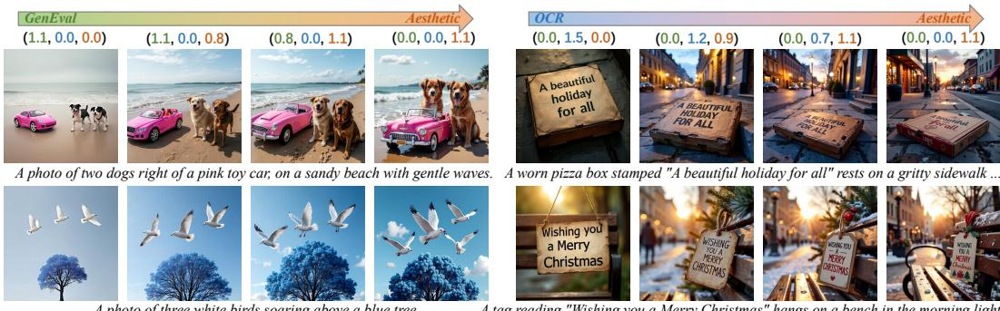  
A tag reading "Wishing you a Merry Christmas" hangs on a bench in the morning light.

Figure 4: Illustration of continuous capability control at inference time.

## 4.3 CONTINUOUS CAPABILITY CONTROL

As shown in Fig. 4, sweeping the capability coordinates with the prompt and initial noise fixed produces smooth transitions between task-oriented and aesthetic behaviors. Moving from GenEval toward aesthetics gradually enriches scene details, whereas moving from OCR toward aesthetics changes lighting and visual style while text fidelity is strongest near the OCR endpoint. The main subjects and overall content remain recognizable throughout each sweep, showing that the coordinates adjust the relative capability emphasis without abrupt behavior changes.

## 4.4 TEST-TIME SCALING OVER CAPABILITY COORDINATES

We compare coordinate-based scaling with conventional seed-based scaling under the same generation budget N ∈ {3, 6, 9}. Seed-based scaling fixes the capability configuration and resamples the initial noise, while coordinate-based scaling fixes the noise and searches over capability coordinates. As shown in Fig. 5, coordinate-based scaling improves the reward steadily as the budget grows and matches seed-based scaling across the three reward objectives, with a difference of about 0.5%. Moreover, seed-based scaling gains reward by resampling the noise, so a higher-reward candidate often comes with a different scene layout or visual appearance. In comparison, coordinate-based scaling keeps the noise fixed and adjusts only capability strengths, so task errors such as incorrect text or wrong object counts are corrected while the original scene is largely preserved. Coordinate search is therefore preferable when the initial generation is largely satisfactory and only minor capability defects remain to be fixed.

## 4.5 ABLATION STUDIES

Effect of explicit capability coordinates. Tab. 1 illustrates the limitation of consolidating teacher behaviors into a single operating point. For DiffusionOPD and DanceOPD, adding joint teachers improves aesthetic metrics but reduces task accuracy, because the student receives no capability signal and one prompt can correspond to several plausible targets. CapField-OPD resolves this ambiguity by making capability intent explicit through coordinates, enabling a single student to support both specialized and joint behaviors.

Effect of joint teachers. Tab. 3 isolates the contribution of joint anchors under the same condi tioning architecture. Adding joint teachers increases GenEval from 0.7723 to 0.9322 and OCR from 0.8716 to 0.9256 under joint activation, while improving all three aesthetic metrics for both capability pairs. Thus, single-capability anchors alone do not fully determine the behavior required at joint coordinates; joint teachers directly anchor these combined operating points.

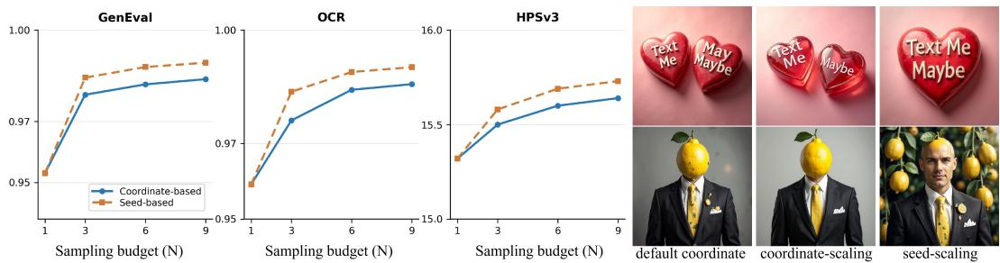  
Figure 5: Demonstration of coordinate-based and seed-based test-time scaling.

Table 3: Effect of joint-teacher anchors at jointly activated tasks.
<table><tr><td rowspan="2">Training anchors</td><td colspan="4">Composition + Aesthetics</td><td colspan="4">Text Rendering + Aesthetics</td></tr><tr><td>GenEval ↑</td><td>HPSv3↑</td><td>CLIP↑</td><td>PickScore ↑</td><td>OCR↑</td><td>HPSv3↑</td><td>CLIP↑</td><td>PickScore ↑</td></tr><tr><td>Base + single</td><td>0.7723</td><td>9.38</td><td>0.4034</td><td>22.23</td><td>0.8716</td><td>13.50</td><td>0.4481</td><td>22.84</td></tr><tr><td>Base + single + joint</td><td>0.9322</td><td>11.76</td><td>0.4201</td><td>23.94</td><td>0.9256</td><td>14.08</td><td>0.4538</td><td>23.32</td></tr></table>

Table 4: Effect of coordinate extrapolation. Each $\hat { \lambda } _ { \mathrm { p e a k } } ^ { S }$ (Eq. 11) reports the full selected coordinate over (GenEval, OCR, aesthetics), with S being the single capability of the corresponding metric.
<table><tr><td rowspan="2">Coordinate selection</td><td colspan="2">Composition</td><td colspan="2">Text Rendering</td><td colspan="4">Aesthetics</td></tr><tr><td> $\hat { \lambda } _ { \mathrm { p e a k } } ^ { S }$ </td><td>GenEval ↑</td><td> $\hat { \lambda } _ { \mathrm { p e a k } } ^ { S }$ </td><td>OCR↑</td><td> $\hat { \lambda } _ { \mathrm { p e a k } } ^ { S }$ </td><td>HPSv3↑</td><td>CLIP↑</td><td>PickScore ↑</td></tr><tr><td>Teacher model</td><td>1</td><td>0.9417</td><td>1</td><td>0.9417</td><td>1</td><td>15.23</td><td>0.4181</td><td>23.68</td></tr><tr><td>In-range profiling</td><td>(1.0, 0.0, 0.0)</td><td>0.9487</td><td>(0.0, 1.0, 0.0)</td><td>0.9390</td><td>(0.0, 0.0, 1.0)</td><td>15.25</td><td>0.4171</td><td>23.70</td></tr><tr><td>Expanded profiling</td><td>(1.05, 0.0, 0.0)</td><td>0.9531</td><td>(0.0, 1.5, 0.0)</td><td>0.9592</td><td>(0.0, 0.0, 1.3)</td><td>15.32</td><td>0.4182</td><td>23.71</td></tr></table>

Effect of coordinate extrapolation. As shown in Tab. 4, expanded profiling improves all metrics over in-range profiling, and the selected coordinates lie beyond the training range. This improvement arises from the continuity of the learned field: it maps coordinate changes to response changes, so the trend observed between anchors extends past them. The training anchors therefore define reference states rather than the best inference settings of the learned field.

## 4.6 LIMITATION

Although the training target is constructed by fusing multiple teacher outputs, these outputs do not participate in rollout and require no gradients, so the extra cost is limited. In practice, compared to DiffusionOPD under the same backbone, batch size, and sampling steps, the per-step training time increases only from 11 s to 12 s (about 9%), which comes from the additional frozen-teacher forward passes used to build the joint-anchored target. Additionally, the proposed method builds the student by consolidating the capabilities of the teachers. If a teacher trained in the RL stage suffers from problems such as reward hacking, the student may inherit similar behaviors from its supervision.

## 5 CONCLUSION

In this work, we present CapField-OPD, an on-policy distillation framework that learns a continuous capability field over explicit capability coordinates, where reward-specialized teachers serve as anchors. Existing multi-teacher OPD methods infer the desired capability from prompt content, which binds capability control to prompt wording and prevents users from adjusting it at inference time. By conditioning the student on these coordinates, CapField-OPD decouples capability control from prompt semantics. The student thus matches or exceeds every anchor on its target task, and the requested capability stays active under prompt rewriting. The coordinates can also extend beyond the training anchors, which serve as reference states rather than hard performance limits. More broadly, explicit capability coordinates offer a way to build generative models whose behaviors are specified by users rather than inferred from prompts.

## REFERENCES

Kevin Black, Michael Janner, Yilun Du, Ilya Kostrikov, and Sergey Levine. Training diffusion models with reinforcement learning. arXiv preprint arXiv:2305.13301, 2023.

Jiazi Bu, Pengyang Ling, Yujie Zhou, Yibin Wang, Yuhang Zang, Tianyi Wei, Xiaohang Zhan, Jiaqi Wang, Tong Wu, Xingang Pan, et al. From sparse to dense: Multi-view grpo for flow models via augmented condition space. In European Conference on Computer Vision, pp. 371–389. Springer, 2026.

Junsong Chen, Shuchen Xue, Yuyang Zhao, Jincheng Yu, Sayak Paul, Junyu Chen, Han Cai, Song Han, and Enze Xie. Sana-sprint: One-step diffusion with continuous-time consistency distillation. In 2025 IEEE/CVF International Conference on Computer Vision (ICCV), pp. 16185–16195. IEEE, 2025.

Zhenglin Cheng, Peng Sun, Jianguo Li, and Tao Lin. Twinflow: Realizing one-step generation on large models with self-adversarial flows. arXiv preprint arXiv:2512.05150, 2025.

Patrick Esser, Sumith Kulal, Andreas Blattmann, Rahim Entezari, Jonas Muller, Harry Saini, Yam¨ Levi, Dominik Lorenz, Axel Sauer, Frederic Boesel, et al. Scaling rectified flow transformers for high-resolution image synthesis. In Forty-first international conference on machine learning, 2024.

Ying Fan, Olivia Watkins, Yuqing Du, Hao Liu, Moonkyung Ryu, Craig Boutilier, Pieter Abbeel, Mohammad Ghavamzadeh, Kangwook Lee, and Kimin Lee. Dpok: Reinforcement learning for fine-tuning text-to-image diffusion models. Advances in Neural Information Processing Systems, 36:79858–79885, 2023.

Zhen Fang, Wenxuan Huang, Yu Zeng, Yiming Zhao, Shuang Chen, Kaituo Feng, Yunlong Lin, Lin Chen, Zehui Chen, Shaosheng Cao, et al. Flow-opd: On-policy distillation for flow matching models. arXiv preprint arXiv:2605.08063, 2026.

Siming Fu, Zheming Fu, Ruizhe He, Hualiang Wang, Jie Huang, Xiaoxiao Ma, Mingchen Zhong, Weihu Huang, Xiaoxuan He, and Haojun Xu. Any-opd: Heterogeneous on-policy distillation for flow-matching models via representation-space bridging. arXiv preprint arXiv:2608.03316, 2026.

Dhruba Ghosh, Hannaneh Hajishirzi, and Ludwig Schmidt. Geneval: An object-focused framework for evaluating text-to-image alignment. Advances in Neural Information Processing Systems, 36: 52132–52152, 2023.

Yuval Kirstain, Adam Polyak, Uriel Singer, Shahbuland Matiana, Joe Penna, and Omer Levy. Picka-pic: An open dataset of user preferences for text-to-image generation. Advances in neural information processing systems, 36:36652–36663, 2023.

Black Forest Labs. Flux. https://github.com/black-forest-labs/flux, 2024.

Bingnan Li, Haozhe Wang, Haozhong Xiong, Fangtai Wu, Jinpeng Yu, Yang Shi, Jiaming Liu, and Ruihua Huang. Rethinking classifier-free guidance in on-policy diffusion distillation. arXiv preprint arXiv:2607.24731, 2026a.

Jiaming Li, Chenyu Zhu, Nanxi Yi, Youjun Bao, Li Sun, Quanying Lv, Xiang Fang, Daizong Liu, Jianjun Li, Kun He, et al. Tmpo: Trajectory matching policy optimization for diverse and efficient diffusion alignment. arXiv preprint arXiv:2605.10983, 2026b.

Junzhe Li, Yutao Cui, Tao Huang, Weijie Kong, Yiming Cheng, Chuxuan Zeng, Yinping Ma, Chun Fan, Miles Yang, Zhao Zhong, et al. Mixgrpo: Unlocking flow-based grpo efficiency with mixed ode-sde. arXiv preprint arXiv:2507.21802, 2025.

Quanhao Li, Junqiu Yu, Kaixun Jiang, Yujie Wei, Zhen Xing, Pandeng Li, Ruihang Chu, Shiwei Zhang, Yu Liu, and Zuxuan Wu. Diffusionopd: A unified perspective of on-policy distillation in diffusion models. arXiv preprint arXiv:2605.15055, 2026c.

Mingfeng Lin, Chengfei Cai, Lin Xu, Yuxiang Wei, and Liang Han. Dreopd: Degraded-reference extrapolative on-policy distillation for flow-matching models. arXiv preprint arXiv:2608.09233, 2026.

Pengyang Ling, Jiazi Bu, Yujie Zhou, Yibin Wang, Zhenyu Hu, Zihan Zhang, Yi Jin, Huaian Chen, and Yuhang Zang. Pave-grpo: Beyond instantaneous guidance through principled average velocity decomposition. arXiv preprint arXiv:2606.01636, 2026.

Yaron Lipman, Ricky TQ Chen, Heli Ben-Hamu, Maximilian Nickel, and Matt Le. Flow matching for generative modeling. arXiv preprint arXiv:2210.02747, 2022.

Jie Liu, Gongye Liu, Jiajun Liang, Yangguang Li, Jiaheng Liu, Xintao Wang, Pengfei Wan, Di Zhang, and Wanli Ouyang. Flow-grpo: Training flow matching models via online rl. arXiv preprint arXiv:2505.05470, 2025a.

Jie Liu, Gongye Liu, Jiajun Liang, Ziyang Yuan, Xiaokun Liu, Mingwu Zheng, Xiele Wu, Qiulin Wang, Wenyu Qin, Menghan Xia, et al. Improving video generation with human feedback. arXiv preprint arXiv:2501.13918, 2025b.

Xingchao Liu, Chengyue Gong, and Qiang Liu. Flow straight and fast: Learning to generate and transfer data with rectified flow. arXiv preprint arXiv:2209.03003, 2022.

Yuhang Ma, Xiaoshi Wu, Keqiang Sun, and Hongsheng Li. Hpsv3: Towards wide-spectrum human preference score. In 2025 IEEE/CVF International Conference on Computer Vision (ICCV), pp. 15086–15095. IEEE, 2025.

OpenAI. GPT-5.6 System Card, 2026. URL https://deploymentsafety.openai.com/ gpt-5-6/gpt-5-6.pdf.

Alec Radford, Jong Wook Kim, Chris Hallacy, Aditya Ramesh, Gabriel Goh, Sandhini Agarwal, Girish Sastry, Amanda Askell, Pamela Mishkin, Jack Clark, et al. Learning transferable visual models from natural language supervision. In International conference on machine learning, pp. 8748–8763. PmLR, 2021.

Z-Image Team. Z-image: An efficient image generation foundation model with single-stream diffusion transformer. arXiv preprint arXiv:2511.22699, 2025.

Bram Wallace, Meihua Dang, Rafael Rafailov, Linqi Zhou, Aaron Lou, Senthil Purushwalkam, Stefano Ermon, Caiming Xiong, Shafiq Joty, and Nikhil Naik. Diffusion model alignment using direct preference optimization. In Proceedings ofthe IEEE/CVF Conference on Computer Vision and Pattern Recognition, pp. 8228–8238, 2024.

Feng Wang and Zihao Yu. Coefficients-preserving sampling for reinforcement learning with flow matching. arXiv preprint arXiv:2509.05952, 2025.

Fu-Yun Wang, Han Zhang, Michael Gharbi, Hongsheng Li, and Taesung Park. Promptrl: Prompt matters in rl for flow-based image generation. arXiv preprint arXiv:2602.01382, 2026.

Chenfei Wu, Jiahao Li, Jingren Zhou, Junyang Lin, Kaiyuan Gao, Kun Yan, Sheng-ming Yin, Shuai Bai, Xiao Xu, Yilei Chen, et al. Qwen-image technical report. arXiv preprint arXiv:2508.02324, 2025.

Xiaoshi Wu, Yiming Hao, Keqiang Sun, Yixiong Chen, Feng Zhu, Rui Zhao, and Hongsheng Li. Human preference score v2: A solid benchmark for evaluating human preferences of text-toimage synthesis. arXiv preprint arXiv:2306.09341, 2023.

Shuchen Xue, Chongjian Ge, Shilong Zhang, Yichen Li, and Zhi-Ming Ma. Advantage weighted matching: Aligning rl with pretraining in diffusion models. arXiv preprint arXiv:2509.25050, 2025a.

Zeyue Xue, Jie Wu, Yu Gao, Fangyuan Kong, Lingting Zhu, Mengzhao Chen, Zhiheng Liu, Wei Liu, Qiushan Guo, Weilin Huang, et al. Dancegrpo: Unleashing grpo on visual generation. arXiv preprint arXiv:2505.07818, 2025b.

Kai Yang, Jian Tao, Jiafei Lyu, Chunjiang Ge, Jiaxin Chen, Weihan Shen, Xiaolong Zhu, and Xiu Li. Using human feedback to fine-tune diffusion models without any reward model. In 2024 IEEE/CVF Conference on Computer Vision and Pattern Recognition (CVPR), pp. 8941–8951. IEEE, 2024.

Tianwei Yin, Michael Gharbi, Taesung Park, Richard Zhang, Eli Shechtman, Fredo Durand, and¨ William T Freeman. Improved distribution matching distillation for fast image synthesis. In The Thirty-eighth Annual Conference on Neural Information Processing Systems, 2024a.

Tianwei Yin, Michael Gharbi, Richard Zhang, Eli Shechtman, Fredo Durand, William T Freeman,¨ and Taesung Park. One-step diffusion with distribution matching distillation. In 2024 IEEE/CVF Conference on Computer Vision and Pattern Recognition (CVPR), pp. 6613–6623. IEEE, 2024b.

Kaiwen Zheng, Huayu Chen, Haotian Ye, Haoxiang Wang, Qinsheng Zhang, Kai Jiang, Hang Su, Stefano Ermon, Jun Zhu, and Ming-Yu Liu. Diffusionnft: Online diffusion reinforcement with forward process. In International Conference on Learning Representations, volume 2026, pp. 134129–134150, 2026.

Wei Zhou, Xiongwei Zhu, Zelin Xu, Bo Dong, Lixue Gong, Yongyuan Liang, Meng Chu, Leigang Qu, Lingdong Kong, Wei Liu, et al. Danceopd: On-policy generative field distillation. arXiv preprint arXiv:2606.27377, 2026a.

Yujie Zhou, Pengyang Ling, Jiazi Bu, Yibin Wang, Yuhang Zang, Jiaqi Wang, Li Niu, and Guangtao Zhai. Fine-grained grpo for precise preference alignment in flow models. In Proceedings of the IEEE/CVF Conference on Computer Vision and Pattern Recognition (CVPR), pp. 20045–20054, June 2026b.

## A APPENDIX

This appendix provides the training pseudocode of CapField-OPD (Sec. A.1), the full hyperparameter configuration together with the capability curves during distillation (Sec. A.2), and additional visualizations of coordinate-based strength control (Sec. A.3).

## A.1 PSEUDOCODE

Algorithm 1 summarizes CapField-OPD training. The single-capability and joint teachers are obtained by reward-based post-training and then frozen, and they supervise the student only at studentvisited states. Each prompt c is paired with a set $\Lambda ( c )$ of matching capability coordinates, and all coordinate sampling is tied to this set. Each rollout is conditioned on a coordinate $\pmb { \lambda } ^ { \mathrm { r o l l } }$ drawn from $\Lambda ( c )$ , and the capability coordinates can be different when computing OPD loss. A single rollout thus supervises many coordinates, so the rollout cost does not scale with the number of supervised coordinates. For pairs without a joint teacher, both the rollout and the supervised coordinates are restricted to axis-aligned ones (Sec. 3.3).

Algorithm 1 CapField-OPD Training   
Input: Frozen base teacher v , single and joint teachers {v }, $\textstyle { \overline { { \{ v _ { i j } \} } } } ;$ prompt datasets $\ddagger \overline { { D _ { k } } } \}$ , where each   
prompt c is paired with its matching capability coordinates $\Lambda ( c ) ;$ noise schedule $\{ t _ { r } \} _ { r = 0 } ^ { S } .$   
Output: Student vθ(x, t, c, λ).   
Initialize vθ from v0 with a trainable LoRA; add the coordinate conditioner (Eq. 6) with $W _ { 2 }  \mathbf { 0 } .$   
for each training iteration do   
Sample a balanced batch of prompts $c \sim \mathcal { D } _ { k } ;$ for each prompt, draw a rollout coordinate $\lambda ^ { \mathrm { r o l l } } \sim \Lambda ( c )$   
Roll out the student on each $( c , \lambda ^ { \mathrm { r o l l } } )$ to obtain on-policy trajectories $\{ \mathbf { x } _ { t _ { r } } \} _ { r = 0 } ^ { S } .$ ▷ no gradient   
for each intermediate state $\left( \mathbf { x } _ { t _ { r } } , t _ { r } , c \right)$ do   
Draw a capability coordinate $\lambda \sim \Lambda ( c )$ for loss computation.   
Compute the teacher target $\mathbf { v } ^ { \star }$ via Eq. 7 at $( \mathbf { x } _ { t _ { r } } , t _ { r } , \bar { c } ) .$ ▷ no gradient   
Accumulate the squared error $\| v _ { \theta } ( \mathbf { x } _ { t _ { r } } ^ { \hat { \star } } , t _ { r } , \dot { c } , \dot { \lambda ) } - \mathbf { v } ^ { \star } \| _ { 2 } ^ { 2 }$ into ${ \mathcal { L } } _ { \mathrm { O P D } } .$   
end for   
Update the LoRA and the coordinate conditioner based on the mean of $\mathcal { L } _ { \mathrm { O P D } }$   
end for

## A.2 HYPERPARAMETER CONFIGURATION AND CAPABILITY CURVES

Table 5 lists the hyperparameter settings used for CapField-OPD training. Fig. 6 reports the validation reward of each capability over distillation steps, evaluated every 200 steps on validation prompts per capability set, in which all the capabilities improve steadily during training.

Table 5: Hyperparameter settings used for CapField-OPD.
<table><tr><td>Parameter</td><td>Value</td><td>Parameter</td><td>Value</td></tr><tr><td>Random seed</td><td>42</td><td>Learning rate</td><td> $2 \times 1 0 ^ { - 4 }$ </td></tr><tr><td>Optimizer</td><td>AdamW</td><td>Weight decay</td><td> $1 \times 1 0 ^ { - 4 }$ </td></tr><tr><td>AdamW  $\beta _ { 1 } , \beta _ { 2 }$ </td><td>0.9, 0.999</td><td>AdamW €</td><td> $1 \times 1 0 ^ { - 8 }$ </td></tr><tr><td>LR scheduler</td><td>Constant</td><td>Text length (CLIP / T5)</td><td> $7 7 / 2 5 6$ </td></tr><tr><td>LoRA rank  $/ \alpha$ </td><td>64/128</td><td>Cond. dimensions</td><td> $3  2 5 6  3 0 7 2$ </td></tr><tr><td>Batch size</td><td>8</td><td>Number of GPUs</td><td>8</td></tr><tr><td>Mixed precision</td><td>bfloat16</td><td>Max. grad norm</td><td>1.0</td></tr><tr><td>Denoising steps</td><td>10</td><td>Train time indices</td><td> $0 , \ldots , 9$ </td></tr><tr><td>Resolution</td><td>512×512</td><td>Guidance scale</td><td>4.5</td></tr><tr><td>Loss target</td><td>Velocity</td><td>Timestep aggregation</td><td>Mean</td></tr><tr><td>EMA decay</td><td>0.9</td><td>EMA update interval</td><td>8 steps</td></tr><tr><td>Calibration size M</td><td>200</td><td>Probe grid spacing</td><td>0.05</td></tr><tr><td>Extrapolation bound</td><td>1.5</td><td>Search budget N</td><td>{3, 6, 9}</td></tr></table>

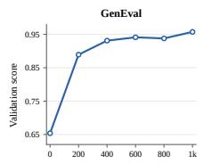

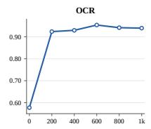

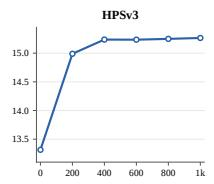

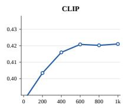

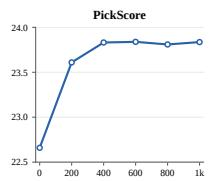  
Figure 6: Capability curves during CapField-OPD training.

## A.3 ADDITIONAL VISUALIZATIONS OF CAPABILITY CONTROL

Fig. 7 and Fig. 8 represent more visual results of coordinate sweeping at inference time for the two supported pairs, (GenEval, aesthetics) and (OCR, aesthetics). Each row fixes the prompt and the initial noise and varies only the coordinates, so the differences within a row come from the capability field rather than the seed. For a given prompt-noise pair, sweeping the coordinate moves the output smoothly along the corresponding capability axis while the composition stays close to the shared starting point. The control behavior is therefore a property of the field itself, not of a particular capability pair or seed.

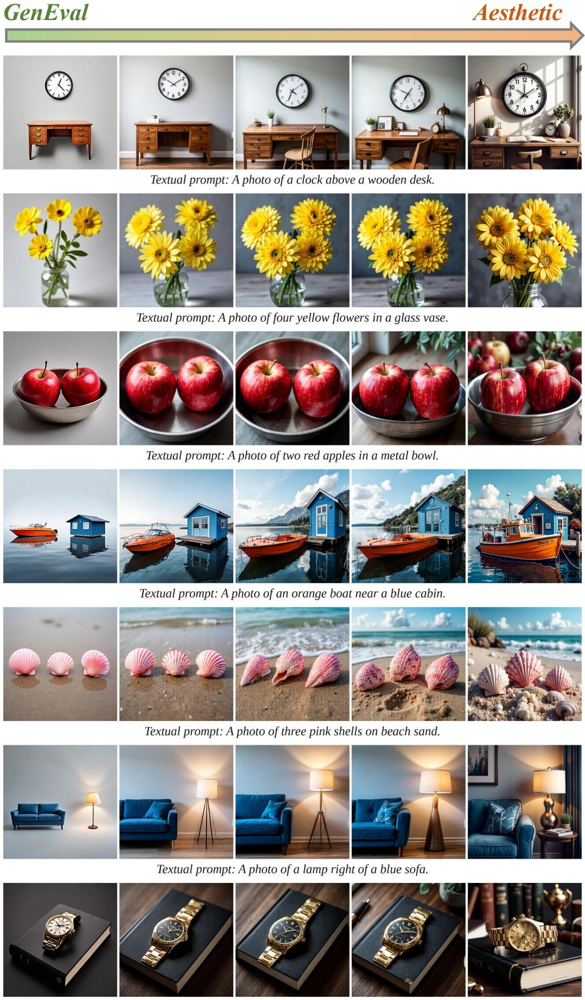  
Textual prompt: A photo of a gold watch on a black book.

Figure 7: Additional coordinate sweeps at inference time from GenEval to aesthetics.

Aesthetic

  
Textual prompt: A wooden bakery board says "FRESH BREAD DAILY" in chalk

  
Textual prompt: A red bus display reads "CITY CENTER 24" at dusk

  
Textual prompt: A glass office door reads "MEETING ROOM C" with reflections.

  
Textual prompt: A cafe menu card says "SOUP SALAD BREAD"

  
Textual prompt: A bus shelter poster reads "VOTE FOR CLEAN PARKS"

  
Textual prompt: A striped scarf tag reads "MADE WITH PURE WOOL".

  
Textual prompt: A paper cup reads "HOT CHOCOLATE FOR MAYA".

Figure 8: Additional coordinate sweeps at inference time from OCR to aesthetics.