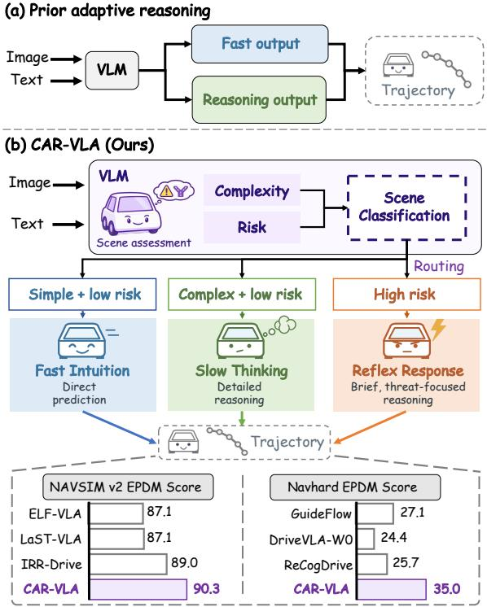
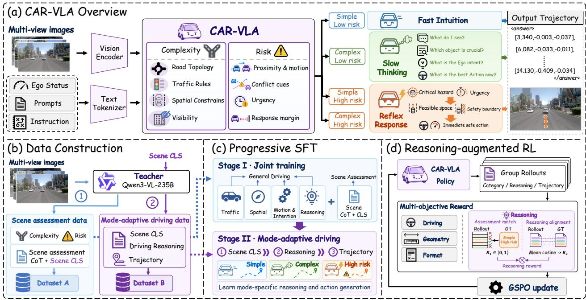
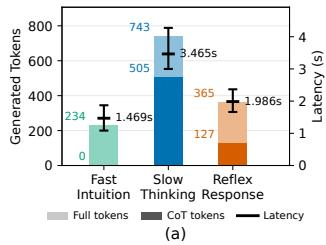
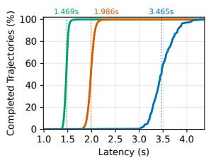
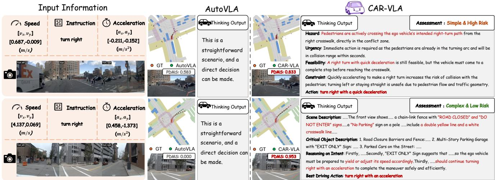
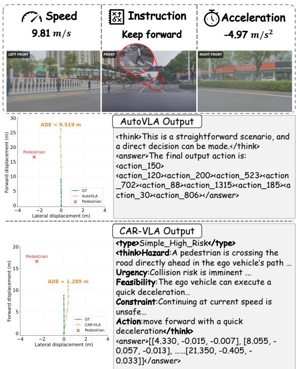

# CAR-VLA: Complexity-Aware and Risk-Adaptive Reasoning for Autonomous Driving

Xiaolei Chen1, Zhuolin He1,2,†, Yuxuan Liang1, Xu Li1, Haotian Chen1, Shi Fan3, Mengyang Zhao1, Wenjuan Meng1, Zisheng Chen4, Zhihao Zhu2, Zhounan Jin5, Hengli Wang5, Qingfan Wang2, Jiamei Liang2, Bin Li1, Xiangyang Xue1,B

Abstract— Existing adaptive reasoning methods for driving Vision-Language-Action (VLA) models primarily focus on whether to reason, overlooking how reasoning should differ across driving situations. Our key insight is that while scene complexity informs reasoning depth, dynamic risk is equally critical for deciding how to reason in time-critical situations. We therefore propose CAR-VLA, a unified driving VLA model that jointly considers scene complexity and dynamic risk to guide reasoning depth, urgency, and focus. CAR-VLA maps four complexity–risk categories to three reasoning modes: Fast Intuition for direct trajectory generation in simple low-risk scenes, Slow Thinking for deliberate reasoning in complex lowrisk scenes, and Reflex Response for compact, hazard-focused reasoning in high-risk scenes regardless of complexity. Rather than merely shortening deliberation, Reflex Response centers reasoning on the most critical hazard and the immediate safe response. We train CAR-VLA through progressive supervised learning that links scene assessment, reasoning-mode selection, and trajectory generation, followed by reasoning-augmented reinforcement learning to improve driving quality and reasoning behavior. Experiments on NAVSIM v1(91.1 PDMS), NAVSIM v2(90.3 EPDMS), and Navhard(35.0 EPDMS) demonstrate competitive driving performance. Qualitative comparisons on navtest and in-house high-risk scenarios further illustrate riskaware reasoning and hazard-responsive trajectory generation. The code for this paper will be released publicly at: https: //github.com/chenxl124578/CAR-VLA.git.

## I. INTRODUCTION

Vision-Language-Action (VLA) models are increasingly used in embodied agent intelligence to connect visual perception, language understanding, and action generation within a unified framework [1], [2], [3]. Recent driving VLAs further incorporate explicit reasoning to improve planning quality and decision making [4], [5]. As autonomous driving moves toward real-world deployment, safety, reliability, and timely decision making remain central requirements [6]. This creates a distinct challenge for reasoning-based driving models: while some situations benefit from deliberate analysis, time-critical hazards require rapid and focused responses. Therefore, adaptive reasoning should not only determine whether more reasoning is needed, but also what form of reasoning best matches the current driving situation.

Existing reasoning-based driving VLA primarily addresses this challenge through adaptive selection of reasoning, as shown in Fig.1(a). AutoVLA [7] learns fast trajectoryonly prediction and slow chain-of-thought reasoning, while AdaThinkDrive [8] encourages the model to invoke slow reasoning only when it improves trajectory quality. IRR-Drive [9] similarly switches between direct prediction and reflective refinement according to scene complexity. Although these methods all consider the use of reasoning to optimize actions, they primarily place adaptation in a single dimension: whether the scenario requires additional reasoning to optimize the trajectory. This overlooks an important distinction in driving: a complex junction may require more analysis even when there is no immediate safety threat, whereas a sudden cut-in on a simple road may require less deliberation but a faster and more focused response.

  
Fig. 1. Comparison of Reasoning-based VLA Paradigms. (a) Prior adaptive reasoning methods adaptively choose whether to perform reasoning, without recognizing that different scenes require different reasoning styles. (b) Our CAR-VLA analyzes scene complexity and risk, and routes different scene categories to different reasoning modes. These choices represent different reasoning focuses and depths, satisfying the reasoning requirements of diverse scenarios. The results below demonstrate CAR-VLA’s superior performance on the NAVSIM leaderboard.

This distinction leads to our key insight: while scene complexity is an important factor in determining reasoning depth, dynamic risk provides an equally critical dimension for deciding how to reason in time-critical driving situations. Scene complexity reflects the difficulty of understanding and planning in a scene, arising mainly from road topology, traffic rules, and spatial layout. However, complexity alone does not capture the urgency of interactions with surrounding objects. Dynamic risk complements this perspective by characterizing the imminence of potential conflicts, thereby informing how quickly and with what focus the model should respond. In this sense, complexity primarily shapes the need for deliberation, while risk shapes the urgency and focus of reasoning. Together, these factors motivate different reasoning regimes: simple low-risk scenes can be handled with direct planning, complex but lowrisk scenes benefit from deliberate reasoning, and highrisk scenes call for compact, hazard-focused reasoning. Our central contribution is therefore to extend adaptive driving reasoning beyond complexity-based depth adaptation by explicitly incorporating dynamic risk, allowing both dimensions to jointly guide reasoning depth, urgency, and focus.

Based on this formulation, we propose CAR-VLA, a unified driving VLA that adapts its reasoning according to scene complexity and dynamic risk, as shown in Fig. 1(b). CAR-VLA maps four complexity–risk categories to three reasoning modes: Fast Intuition for direct trajectory generation in simple low-risk scenes, Slow Thinking for detailed reasoning in complex low-risk scenes, and Reflex Response for brief, threat-focused reasoning in high-risk scenes, regardless of scene complexity. Unlike simply shortening deliberative reasoning, Reflex Response reorganizes the reasoning process around the most critical hazard and the immediate safe response. We train CAR-VLA through progressive supervised learning to link scene assessment, reasoning-mode selection, and trajectory generation, followed by reasoning-augmented Reinforcement Learning (RL) to improve driving quality and reasoning behavior. Our contributions are as follows:

• We formulate adaptive driving reasoning around two complementary factors, scene complexity and dynamic risk, which capture different demands on deliberation and response urgency.

• We propose CAR-VLA, a unified VLA framework that adapts among Fast Intuition, Slow Thinking, and Reflex Response which includes a dedicated hazard-focused reasoning mode for high-risk situations.

• We develop a progressive learning strategy that links scene assessment, reasoning-mode selection, and trajectory generation, and further improves driving performance through reasoning-augmented RL.

• Extensive experiments demonstrating competitive performance on NAVSIM v1 (91.1 PDMS), NAVSIM v2 (90.3 EPDMS) and Navhard (35.0 EPDMS). Qualitative comparisons on Navtest and in-house high risk scenario further illustrate CAR-VLA’s risk-aware reasoning and its generation of trajectories that respond to identified hazards.

## II. RELATED WORK

## A. Vision-Language-Action Driving

VLA models connect scene understanding with action generation through multimodal modeling and language-action alignment [10], [11], [12], [13]. OpenDriveVLA [1] introduces hierarchical vision-language alignment and structured interaction modeling, while LinkVLA [2] uses shared discrete representations and coarse-to-fine action decoding. To enhance reasoning and planning, AutoDrive-R2 [5] combines chain-of-thought reasoning, self-reflection, and reinforcement learning, while HybridDriveVLA [4] incorporates visual chain-of-thought reasoning and Tree-of-Thoughtinspired waypoint evaluation. These studies show a clear trend toward using VLA models as unified driving systems that connect semantic understanding with trajectory generation.

## B. Adaptive Reasoning for Autonomous Driving

Recent studies have begun to question whether explicit reasoning should be applied uniformly across all driving scenes. AutoVLA [7] introduces fast and slow thinking modes, using trajectory-only prediction for straightforward scenes and chain-of-thought reasoning when additional reasoning is needed. Counterfactual VLA [14] further adopts adaptive thinking by selectively activating counterfactual self-reflection in challenging scenarios. FutureSight-Drive [15] introduces visual spatio-temporal CoT that captures future scene evolution and spatial relationships to guide trajectory planning. Meanwhile, Latent-CoT-Drive [16] replaces text-based reasoning with action-aligned latent reasoning to improve inference efficiency, while NoRD [17] shows that competitive driving performance can also be achieved without explicit reasoning, highlighting that reasoning is not always necessary. However, existing adaptive approaches mainly adjust the amount or representation of reasoning according to scene difficulty. They do not explicitly separate scene complexity, which determines the need for deliberation, from dynamic risk, which determines the urgency of action. Our work focuses on this distinction and uses both factors to determine the reasoning process for different driving situations.

## III. METHOD

CAR-VLA dynamically adapts its driving reasoning strategy according to scene complexity and dynamic risk. The unified VLA model maps four complexity–risk scene categories to three reasoning modes: Fast Intuition for simple low-risk scenes, Slow Thinking for complex low-risk scenes, and Reflex Response for high-risk scenes, as shown in Fig. 2(a). We next formulate this adaptive reasoning framework and describe its data construction and training.

  
Fig. 2. Overview of CAR-VLA. (a) CAR-VLA separately assesses scene complexity and risk, mapping four scene categories to three driving modes: Fast Intuition for simple, low-risk scenes, Slow Thinking for complex, low-risk scenes, and Reflex Response for high-risk scenes regardless of complexity. The selected mode guides subsequent trajectory generation. (b) Teacher-assisted data construction produces two complementary datasets: scene assessment data containing assessment reasoning and scene labels, and mode-adaptive driving data containing scene labels, driving reasoning, and trajectories. (c) Progressive supervised fine-tuning jointly learns general driving knowledge and scene assessment in Stage I, then learns scene classification, mode-specific reasoning, and trajectory generation in Stage II. (d) Reasoning-augmented reinforcement learning updates the policy through GSPO using driving, geometry, format, and reasoning rewards. The reasoning reward combines scene-assessment correctness with alignment to reference reasoning.

## A. Problem Formulation

Given camera observations $\mathcal { T } _ { t } .$ , ego state $\mathbf { s } _ { t } .$ , and navigation instruction $u _ { t } ,$ we define the driving query as $q _ { t } =$ $\left( \mathcal { T } _ { t } , \mathbf { s } _ { t } , u _ { t } \right)$ . The planning task is to predict a future ego trajectory

$$
\begin{array} { r } { \hat { \boldsymbol { \tau } } _ { t } = \big ( \big ( \hat { x } _ { t , k } , \hat { y } _ { t , k } , \hat { \psi } _ { t , k } \big ) \big ) _ { k = 1 } ^ { K } , } \end{array}\tag{1}
$$

where each pose specifies the ego position and heading at time $t + k \Delta t$ . We use $K = 1 0$ and $\Delta t = 0 . 5 \mathrm { s }$ , yielding a five-second planning horizon.

We characterize each scene by a category $z _ { t } = ( C _ { t } , D _ { t } ) \in$ $\{ 0 , 1 \} ^ { 2 }$ , where $C _ { t } ~ = ~ 0 / 1$ denotes simple/complex scenes and $D _ { t } = 0 / 1$ denotes low/high dynamic risk. Complexity is assessed from static or quasi-static context, whereas risk concerns short-term interaction threats and the available margin for a safe response. The four complexity–risk categories are mapped to three reasoning modes:

$$
f ( z _ { t } ) = \left\{ \begin{array} { l l } { \mathrm { F a s t ~ I n t u i t i o n , } } & { z _ { t } = ( 0 , 0 ) , } \\ { \mathrm { S l o w ~ T h i n k i n g , } } & { z _ { t } = ( 1 , 0 ) , } \\ { \mathrm { R e f l e x ~ R e s p o n s e , } } & { z _ { t } \in \{ ( 0 , 1 ) , ( 1 , 1 ) \} . } \end{array} \right.\tag{2}
$$

Thus, the two high-risk categories remain distinct scene labels but share the same reasoning mode.

CAR-VLA uses a single autoregressive policy to generate the scene category, mode-specific driving reasoning, and trajectory in sequence:

$$
y _ { t } = \big ( \hat { z } _ { t } , c _ { t } , \hat { \pmb { \tau } } _ { t } \big ) \sim \pi _ { \theta } \big ( \cdot \mid q _ { t } \big ) ,\tag{3}
$$

where $\hat { z } _ { t }$ is the predicted scene category and $c _ { t }$ denotes the driving reasoning associated with $f ( \hat { z } _ { t } )$ . For Fast Intuition, $c _ { t } = \emptyset$ , so the model generates the trajectory directly after the scene category.

## B. Complexity–Risk Guided Data Construction

Complexity–risk-guided supervision is constructed from 103k navtrain scenes [18], [19], as illustrated in Fig. 2(b). Each multi-view driving scene is annotated by a Qwen3-VL-235B teacher [20] for scene assessment and mode-specific driving reasoning.

The teacher assesses scene complexity and dynamic risk separately. Scene complexity captures road topology, traffic rules, spatial constraints, and visibility, while dynamic risk reflects relative motion, potential conflicts, and response urgency. Dimension-specific evidence is required for each assessment, so environmental complexity alone does not indicate high risk. The annotations provide scene assessment reasoning and the corresponding scene category (represented by Scene assessment CoT and SceneCLS respectively in Fig. 2(b)).

The scene category determines the driving reasoning according to Eq. (2). Simple low-risk scenes use Fast Intuition without explicit reasoning, while complex low-risk scenes use the Slow Thinking template from AutoVLA [7]. For high-risk scenes, we introduce a compact Reflex Response template with five components: Hazard, Urgency, Feasibility, Constraint, and Action. It focuses on the most critical hazard and its urgency, feasible maneuvers and safety boundary, and the immediate response. Unlike extended deliberation, Reflex Response prioritizes the critical conflict and available response options.

The final driving target contains the scene category, modespecific driving reasoning, and ground-truth trajectory, without the preceding scene assessment reasoning.

## C. Progressive Supervised Fine-Tuning

As shown in Fig. 2(c), CAR-VLA is fine-tuned in two stages: general driving understanding and scene assessment are jointly learned first, followed by mode-adaptive driving fine-tuning.

CAR-VLA is jointly fine-tuned on general driving data from ReCogDrive [21] and the scene assessment annotations described above. The ReCogDrive data covers traffic understanding, spatial relations, motion and intention understanding, and driving reasoning. Scene assessment annotations supervise the reasoning and classification of scene complexity and dynamic risk. This joint training equips the model with general driving knowledge and complexity–risk assessment capability.

The resulting model is further fine-tuned with the modeadaptive driving annotations. Each target contains the scene category, mode-specific driving reasoning, and ground-truth trajectory. For Fast Intuition, the reasoning component is omitted and the trajectory is generated directly after the scene category. All three reasoning modes are learned within the same autoregressive policy.

Both stages minimize the autoregressive negative loglikelihood of the target response:

$$
\mathcal { L } _ { \mathrm { S F T } } ( \theta ; \mathcal { D } ) = - \mathbb { E } _ { ( q , y ) \sim \mathcal { D } } \left[ \sum _ { j = 1 } ^ { | y | } \log \pi _ { \theta } ( y _ { j } \mid q , y _ { < j } ) \right] ,\tag{4}
$$

where y denotes the target response and D denotes the training data used in each step. The resulting SFT policy initializes the subsequent reinforcement-learning stage.

## D. Reasoning-Augmented Reinforcement Learning

The SFT policy is further optimized through GSPO [31], using feedback on driving performance and reasoning quality. As shown in Fig. 2(d), the total reward combines driving, geometry, and reasoning rewards under a binary format gate:

$$
R ( q , y ) = R _ { \mathrm { f o r m a t } } \Big ( \lambda _ { \mathrm { d } } R _ { \mathrm { d r i v e } } + \lambda _ { \mathrm { g } } R _ { \mathrm { g e o m e t r y } } + \lambda _ { \mathrm { r } } R _ { \mathrm { r e a s o n } } \Big ) _ { \mathcal { C } }\tag{5}
$$

where $\lambda _ { \mathrm { d } } , \lambda _ { \mathrm { g } } ,$ , and $\lambda _ { \mathrm { r } }$ are nonnegative reward weights.

The driving reward $R _ { \mathrm { d r i v e } } \in [ 0 , 1 ]$ is the PDMS of the predicted trajectory evaluated in NAVSIM [19]. The geometry reward $R _ { \mathrm { g e o m e t r y } }$ is the concentric OBB-FDE reward from IRR-Drive [9]. The format reward $R _ { \mathrm { f o r m a t } } \ \in \ \{ 0 , 1 \}$ checks the mode-specific output structure, including the use of <type>, <think>, and <answer> tags. The trajectory must parse into exactly ten numerical poses. Responses that satisfy these requirements receive $R _ { \mathrm { f o r m a t } } ~ = ~ 1$ . Any violation sets the total reward to zero, without evaluating the remaining reward terms.

We introduce the reasoning reward combines scenecategory correctness with section-wise reasoning alignment. Alignment is evaluated only when the predicted scene category matches the annotation:

$$
R _ { \mathrm { c l s } } = { \bf 1 } [ \hat { z } = z ^ { * } ] , R _ { \mathrm { r e a s o n } } = \left\{ \begin{array} { l l } { R _ { \mathrm { a l i g n } } , } & { R _ { \mathrm { c l s } } = 1 , } \\ { 0 , } & { R _ { \mathrm { c l s } } = 0 , } \end{array} \right.\tag{6}
$$

where $\hat { z }$ and $z ^ { * }$ denote the predicted and annotated scene categories, respectively.

For correctly classified Slow Thinking and Reflex Response samples, the generated reasoning is compared with the reference annotation under matching section headings:

$$
R _ { \mathrm { a l i g n } } = \Bigg [ \frac { 1 } { | \mathcal { H } | } \sum _ { h \in \mathcal { H } } \cos ( E ( c _ { h } ) , E ( c _ { h } ^ { * } ) ) \Bigg ] _ { + } ,\tag{7}
$$

where H is the set of section headings in the reference reasoning template. The texts $c _ { h }$ and $c _ { h } ^ { * }$ contain the generated and reference reasoning under heading h, and E is a sentence embedding encoder. The operator $[ a ] _ { + } = \operatorname* { m a x } ( 0 , a )$ clips the mean cosine similarity at zero, giving $R _ { \mathrm { a l i g n } } ~ \in ~ [ 0 , 1 ]$ Each reasoning section is compared with its corresponding reference rather than scoring the entire trace as a single text.

Fast Intuition requires no explicit driving reasoning, so $R _ { \mathrm { a l i g n } }$ is set to 1 for correctly classified samples. Its reasoning reward therefore reduces to scene-category correctness. Any incorrect category receives zero reasoning reward, including confusion between the two high-risk categories that share Reflex Response. Category errors do not affect the driving or geometry rewards for format-valid responses.

During policy optimization, a group of responses $\{ y _ { i } \} _ { i = 1 } ^ { G }$ is sampled from the rollout policy $\tau \theta _ { \mathrm { o l d } } ( \cdot \mid q )$ for each query q and scored using Eq. (5). The rewards are normalized within each group to obtain relative advantages. The policy is then optimized with GSPO, using length-normalized sequence likelihood ratios and sequence-level clipping.

## IV. EXPERIMENTS

We evaluate CAR-VLA on NAVSIM v1, NAVSIM $\mathbf { v } 2 ,$ and the two-stage Navhard protocol, comparing its planning performance with conventional end-to-end planners and VLA-based methods. We report both SFT and RL results to assess the contribution of policy optimization. We further analyze the generation length and inference latency of the three reasoning modes in Sec. IV-C, and examine the effects of reward components and Stage I pretraining in Sec. IV-D.

## A. Experimental Setup

1) Training Data and Evaluation Protocols: Our scene assessment and mode-adaptive driving datasets are constructed from the same 103k scenes in the navtrain split [18], [19], as described in Sec. III-B. Stage I additionally uses the general driving data provided by ReCogDrive [21]. We evaluate the SFT and RL policies on NAVSIM v1 and $\mathbf { v } 2 ,$ following their respective metric suites. For Navhard, we report the component metrics of both evaluation stages and the overall EPDMS. All comparisons are conducted within the corresponding evaluation protocol.

TABLE I  
PERFORMANCE COMPARISON ON NAVTEST SPLIT IN NAVSIM V1 AND V2 USING CLOSED-LOOP METRICS.
<table><tr><td rowspan="2">Method</td><td colspan="4">NAVSIM v1</td><td colspan="7">NAVSIM v2</td></tr><tr><td>|NC↑</td><td>DAC↑ EP↑ TTC↑</td><td>C.↑</td><td>|PDMS↑</td><td>NC↑</td><td></td><td></td><td></td><td>DAC↑ DDC↑ TLC↑ E↑ TTC↑ LK↑ HC↑ EC↑</td><td></td><td>|EPDMS↑</td></tr><tr><td colspan="10">Traditional End-to-End Methods</td></tr><tr><td>HydraMDP++ [22]</td><td>97.6</td><td>96.0 80.4 93.1 100.0</td><td></td><td>86.6</td><td>97.2</td><td>97.5</td><td>99.4</td><td></td><td></td><td>99.6 83.1 96.5 94.4 98.2 70.9</td><td>81.4</td></tr><tr><td>DriveSuprim [23]</td><td>97.8</td><td>97.3 86.7 93.6</td><td>100.0</td><td>89.9</td><td>97.5</td><td>96.5</td><td>99.4</td><td>99.6</td><td>88.4 96.6</td><td>95.5 98.3 77.0</td><td>83.1</td></tr><tr><td>DiffusionDrive [24]</td><td>98.2</td><td>96.2 82.2 94.7</td><td>100.0</td><td>88.1</td><td>98.2</td><td>95.9</td><td>99.4</td><td>99.8</td><td>87.5 97.3</td><td>96.8 98.3 87.7</td><td>84.5</td></tr><tr><td>ResAD [25]</td><td>98.0</td><td>97.5 83.3 94.1</td><td>100.0</td><td>88.8</td><td>97.8</td><td>97.2</td><td>99.5</td><td>99.8</td><td>88.2 96.9</td><td>97.0 98.4 88.2</td><td>85.5</td></tr><tr><td colspan="10">VLA Methods Without Explicit Reasoning</td></tr><tr><td>ReCogDrive [21]</td><td>98.2</td><td>97.5 83.5 95.2</td><td>99.9</td><td>89.6</td><td>98.3</td><td>95.2</td><td>99.5</td><td></td><td>99.8 87.1 97.5</td><td>96.6 98.3 86.5</td><td>83.6</td></tr><tr><td>DriveVLA-W0 [26]</td><td>98.7</td><td>99.1 83.3 95.3</td><td>99.3</td><td>90.3</td><td>98.5</td><td>99.1</td><td>98.0</td><td>99.7</td><td>86.4 98.1</td><td>93.2 97.9 58.9</td><td>86.1</td></tr><tr><td>DriveFine [27]</td><td>98.6</td><td>97.9 85.5 95.2</td><td>99.9</td><td>90.7</td><td>98.7</td><td>97.3</td><td>98.8</td><td>99.8</td><td>88.2 97.8</td><td>97.7 98.4 84.7</td><td>87.1</td></tr><tr><td>SGDrive [28]</td><td>98.6</td><td>97.8 85.8 96.2</td><td>100.0</td><td>91.1</td><td>98.6</td><td>94.3</td><td>99.5</td><td>99.9</td><td>86.0 97.9</td><td>96.1 98.3 85.9</td><td>86.2</td></tr><tr><td colspan="10">VLA Methods With Explicit Reasoning</td></tr><tr><td>AutoVLA† [7]</td><td>98.4</td><td>95.6 81.9 98.0</td><td>99.9</td><td>89.1</td><td>98.9</td><td>94.8</td><td>99.0</td><td>99.9</td><td>86.9 98.1</td><td>97.7 98.0 84.3</td><td>87.6</td></tr><tr><td>ELF-VLA [29]</td><td>98.9</td><td>98.1 85.3 96.0</td><td>100.0</td><td>91.0</td><td>98.9</td><td>98.1</td><td>99.4</td><td>99.8</td><td>88.5 98.4</td><td>96.9 98.3 87.2</td><td>87.1</td></tr><tr><td>LaST-VLA [30]</td><td>98.7</td><td>97.9 86.8 95.6</td><td>100.0</td><td>91.3</td><td>98.7</td><td>97.9</td><td>99.2</td><td>99.7</td><td>90.3 98.2</td><td>96.6 98.3 86.3</td><td>87.1</td></tr><tr><td>IRR-Drive [9]</td><td>98.0</td><td>98.3 88.5 93.7</td><td>100.0</td><td>91.3</td><td>97.0</td><td>98.3</td><td>98.9</td><td>99.5</td><td>92.3 96.8</td><td>95.8 97.6 82.2</td><td>89.0</td></tr><tr><td>AdaThinkDrive [8]</td><td>98.4</td><td>97.8 84.4 95.2</td><td>100.0</td><td>90.3</td><td></td><td></td><td></td><td></td><td></td><td></td><td></td></tr><tr><td>CAR-VLA-SFT (Ours)</td><td>98.4</td><td>96.6 81.3</td><td>95.3 100.0</td><td>88.1</td><td>98.6</td><td>96.6</td><td>99.5</td><td>99.9</td><td>86.3</td><td>98.0 97.4 98.3 86.0</td><td>88.5</td></tr><tr><td>CAR-VLA-RL (Ours)</td><td>98.4</td><td>98.1 86.7</td><td>95.0100.0</td><td>91.1</td><td>98.5</td><td>98.1</td><td>99.4</td><td>99.9</td><td>89.0 97.9</td><td>97.4 98.3 85.8</td><td>90.3</td></tr></table>

C. denotes comfort. † means NAVSIM v2 results reproduced using the official checkpoint. ↑ indicates higher is better. The best and second best results are bold and underlined, respectively.

TABLE II  
PERFORMANCE COMPARISON ON NAVHARD SPLIT IN NAVSIM V2 USING CLOSED-LOOP METRICS.
<table><tr><td>Method</td><td>Stage</td><td>NC↑</td><td>DAC↑</td><td>DDC↑</td><td>TLC↑</td><td>EP↑</td><td>TTC↑</td><td>LK↑</td><td>HC↑</td><td>EC↑</td><td>S.↑</td><td>EPDMS↑</td></tr><tr><td colspan="9">Traditional End-to-End Methods</td><td colspan="3"></td></tr><tr><td rowspan="2">LTF</td><td>S1</td><td>96.2</td><td>79.6</td><td>99.1</td><td>99.6</td><td>84.1</td><td>95.1</td><td>94.2</td><td>97.6</td><td>79.1</td><td></td><td rowspan="2">25.1</td></tr><tr><td>S2</td><td>77.8</td><td>70.2</td><td>84.3</td><td>98.1</td><td>85.1</td><td>85.1</td><td>45.4</td><td>95.7</td><td>76.0</td><td>- 1</td></tr><tr><td>GuideFlow</td><td>S1</td><td>96.6</td><td>80.5</td><td>96.3</td><td>99.3</td><td>82.3</td><td>94.9</td><td>91.5</td><td>97.7</td><td>67.8</td><td>一</td><td rowspan="2">27.1</td></tr><tr><td></td><td>S2</td><td>87.3</td><td>76.7</td><td>88.8</td><td>99.2</td><td>84.3</td><td>85.1</td><td>49.7</td><td>93.1</td><td>44.5</td><td>一</td></tr><tr><td colspan="11">VLA-based Methods</td></tr><tr><td>DriveVLA-W0</td><td>S1</td><td>96.8</td><td>83.3</td><td>99.0</td><td>99.6</td><td>84.6</td><td>95.3</td><td>96.4</td><td>97.6</td><td>78.2</td><td>一</td><td>24.4</td></tr><tr><td rowspan="2">ReCogDrive</td><td>S2</td><td>76.8</td><td>64.3</td><td>79.9</td><td>98.3</td><td>89.2</td><td>75.0</td><td>46.8</td><td>95.8</td><td>53.1</td><td>一</td><td rowspan="2">25.7</td></tr><tr><td>S1</td><td>96.4</td><td>78.9</td><td>98.7</td><td>99.8</td><td>82.6</td><td>95.6</td><td>94.4</td><td>97.6</td><td>74.2</td><td>67.7</td></tr><tr><td rowspan="2">SGDrive</td><td>S2</td><td>80.2</td><td>65.0</td><td>82.4</td><td>98.7</td><td>85.2</td><td>76.9</td><td>43.8</td><td>96.6</td><td>71.8</td><td>37.6</td><td rowspan="2">25.5</td></tr><tr><td>S1</td><td>95.8</td><td>87.6</td><td>97.8</td><td>99.8</td><td>84.4</td><td>94.7</td><td>92.9</td><td>97.8</td><td>28.9</td><td>71.1</td></tr><tr><td rowspan="2">CAR-VLA (Ours)</td><td>S2</td><td>79.4</td><td>65.4</td><td>79.1</td><td>98.9</td><td>88.9</td><td>75.3</td><td>42.7</td><td>96.4</td><td>29.6</td><td>35.2</td><td rowspan="2">35.0</td></tr><tr><td>S1</td><td>96.0</td><td>92.2</td><td>98.8</td><td>99.6</td><td>86.5</td><td>94.9</td><td>94.7</td><td>97.6</td><td>73.8</td><td>79.3</td></tr><tr><td></td><td>S2</td><td>79.0</td><td>77.9</td><td>85.3</td><td>97.7</td><td>91.8</td><td>74.7</td><td>52.2</td><td>95.0</td><td>57.8</td><td>43.5</td><td></td></tr></table>

S. denotes the per-stage EPDM score. ↑ indicates higher is better. The best and second best results are bold and underlined, respectively.

2) Metrics: For NAVSIM v1, we report NC, DAC, EP, TTC, Comf, and the aggregate PDMS. With subscores normalized to [0, 1], the per-scene PDMS is

$$
\mathrm { P D M S } = \mathrm { N C } \cdot \mathrm { D A C } \cdot { \frac { { \mathrm { 5 E P } } + { \mathrm { 5 T T C } } + { \mathrm { 2 C o m f } } } { 1 2 } } .\tag{8}
$$

NAVSIM v2 and Navhard use EPDMS, which combines multiplicative penalties with weighted performance terms:

$$
\mathrm { E P D M S } = \left( \prod _ { m \in \mathcal { M } } \tilde { s } _ { m } \right) \frac { \sum _ { m \in \mathcal { W } } w _ { m } \tilde { s } _ { m } } { \sum _ { m \in \mathcal { W } } w _ { m } } ,\tag{9}
$$

where

$$
\begin{array} { r } { \mathcal { M } = \{ \mathrm { N C , D A C , D D C , T L C } \} , } \\ { \mathcal { W } = \{ \mathrm { E P , T T C , L K , H C , E C } \} . } \end{array}
$$

The weights are 5 for EP and TTC, and 2 for LK, HC, and EC. Following the human-reference filtering protocol, we use

$$
\begin{array} { r } { \tilde { s } _ { m } = \left\{ \begin{array} { l l } { 1 , } & { s _ { m } ^ { \mathrm { h u m a n } } = 0 , } \\ { s _ { m } , } & { \mathrm { o t h e r w i s e } , } \end{array} \right. } \end{array}\tag{10}
$$

where $s _ { m }$ and $s _ { m } ^ { \mathrm { h u m a n } }$ denote the agent and human-reference subscores, respectively.

3) Implementation Details: CAR-VLA is initialized from Qwen3-VL-4B [20]. For annotation, the Qwen3-VL-235B-A22B teacher receives four historical frames at 2 Hz from each front-left, front, and front-right camera (12 images per scene). SFT Stage II training uses one frame per view (3 images). Following AutoVLA [7], fixed rules map groundtruth future ego speed and acceleration to action hints used only for offline driving-reasoning annotation. CAR-VLA predicts ten future ego poses at 0.5 s intervals over 5 s.

  
Fast Intuition Reflex Response Slow Thinking (b)  
Fig. 3. Inference efficiency of CAR-VLA. (a) Cumulative percentage of navtest samples completing trajectory generation within a given latency. (b) Total and chain-of-thought (CoT) token counts and inference latency across the three reasoning modes.

Both SFT stages use eight NVIDIA H200 GPUs. Stage I freezes the vision encoder and projector with a learning rate of $1 0 ^ { - 5 } ;$ ; Stage II trains all parameters at $2 ~ \times$ $1 0 ^ { - 5 }$ . Reasoning-augmented RL uses Qwen3-Embedding-0.6B [32] for sentence embedding, a learning rate of $2 ~ \times$ $1 0 ^ { - 6 } , \lambda _ { \mathrm { d } } { = } 0 . 7 , \lambda _ { \mathrm { g } } { = } 0 . 2 , \lambda _ { \mathrm { r } } { = } 0 . 1$ , rollout/global batch sizes of 256/128, and 10k hard scenes selected for high rolloutreward variance or low mean reward from Navtrain following ELF-VLA [29]. We evaluate after Stage II SFT and RL.

## B. Main Results

1) NAVSIM v1 and v2 Navtest: Table I compares CAR-VLA with end-to-end and VLA-based baselines. CAR-VLA-RL achieves the highest NAVSIM v2 EPDMS among the compared methods at 90.3, surpassing IRR-Drive by 1.3 points, while obtaining a competitive PDMS of 91.1 on NAVSIM v1. Compared with CAR-VLA-SFT, reinforcement learning improves the aggregate scores by 3.0 and 1.8 points on v1 and v2, respectively, alongside gains in ego progress and drivable-area compliance.

2) NAVSIM v2 Navhard: Table II presents the Navhard results. CAR-VLA achieves an overall EPDMS of 35.0, exceeding the strongest compared baseline, GuideFlow, by 7.9 points. It also achieves the highest reported scores in both Stage 1 and Stage 2, at 79.3 and 43.5, respectively. Together with the leading DAC and EP scores in both stages, these results demonstrate CAR-VLA’s competitive planning performance on challenging scenarios, particularly in maintaining progress and drivable-area compliance.

## C. Adaptive-Reasoning Analysis

Fig. 3(a) compares generation length and latency across the three reasoning modes. Fast Intuition generates 234 total tokens without an explicit reasoning trace and has a reported latency of 1.469 s. Slow Thinking generates 743 total tokens, including 505 reasoning tokens, with a latency of 3.465 s. Reflex Response occupies an intermediate regime, producing 365 total tokens with 127 reasoning tokens and a latency of 1.986 s.

Compared with Slow Thinking, Reflex Response reduces reasoning tokens by 74.9% and reported latency by 42.7%, while retaining explicit reasoning. Fast Intuition further reduces latency by omitting the reasoning trace. The latency distributions in Fig. 3(b) show the same ordering, with Fast Intuition and Reflex Response outputs completed earlier than Slow Thinking outputs. These observations support the intended differentiation in computational cost: detailed deliberation incurs the largest generation overhead, while hazard-focused reasoning provides a shorter intermediate response. The figure characterizes generation efficiency and the planning comparisons are reported separately in Sec. IV-B.

TABLE III  
ABLATION STUDY OF RL REWARD COMPONENTS. VALUES IN PARENTHESES DENOTE EPDMS CHANGES RELATIVE TO THE BASELINE.
<table><tr><td>Reward</td><td>NC</td><td>DAC DDC</td><td></td><td>TLC</td><td>EP TTC</td><td>LK</td><td>HC</td><td>EC</td><td>EPDMS</td></tr><tr><td>SFT(baseline)</td><td>98.6</td><td>96.6</td><td>99.5</td><td>99.9</td><td>86.3 98.0</td><td>97.4</td><td>98.3</td><td>86.0|</td><td>88.5</td></tr><tr><td> $R _ { \mathrm { d . } } + R _ { \mathrm { f . } }$ </td><td>97.1</td><td>95.5</td><td>98.9</td><td>99.8</td><td>93.5</td><td>96.7</td><td>96.2 97.9</td><td>84.7</td><td>87.2 (-1.3)</td></tr><tr><td> $+ R _ { \mathrm { { g } } } .$ </td><td>98.4</td><td>97.8</td><td>99.3</td><td>99.8</td><td>88.2</td><td>97.7 96.9</td><td>98.2</td><td>86.4</td><td>89.7 (+1.2)</td></tr><tr><td> $+ R _ { \mathrm { r } } .$ </td><td>98.5</td><td>98.1</td><td>99.4</td><td>99.9</td><td>89.0 97.9</td><td></td><td>97.4 98.3 85.8</td><td></td><td>90.3 (+1.8)</td></tr></table>

TABLE IV

ABLATION STUDY ON CAR-VLA COMPONENTS.
<table><tr><td rowspan=1 colspan=3>Model        NCDACDDCTLCEPTTCLKHCECEPDMS</td></tr><tr><td rowspan=1 colspan=1>SFT w/o Stage+ RL</td><td rowspan=1 colspan=1>98.496.499.499.986.297.897.498.385.998.497.899.499.888.297.896.998.386.4</td><td rowspan=1 colspan=1>88.189.9</td></tr><tr><td rowspan=1 colspan=1>SFT w/ Stage I+ RL</td><td rowspan=1 colspan=1>98.696.699.599.986.398.097.498.386.098.598.199.499.989.097.997.4 98.385.8</td><td rowspan=1 colspan=1>88.590.3</td></tr></table>

## D. Ablation Studies

1) Effect of Reward Components: Table III evaluates the progressive addition of reward components on NAVSIM v2. Optimizing the driving and format rewards alone yields 87.2 EPDMS, 1.3 points below the SFT baseline. Although EP increases from 86.3 to 93.5, NC, DAC, and TTC decrease from 98.6, 96.6, and 98.0 to 97.1, 95.5, and 96.7, respectively. This configuration therefore improves progress at the expense of other driving criteria and does not improve the aggregate score.

Adding the geometry reward raises EPDMS to 89.7, a gain of 2.5 points over the basic reward configuration. NC, DAC, and TTC recover to 98.4, 97.8, and 97.7, while EP decreases to 88.2. This pattern is consistent with the terminalgeometry objective providing an additional constraint on trajectory optimization. Adding the final reasoning reward term, denoted by $R _ { \mathrm { r } }$ in the table, further increases EPDMS to 90.3, with improvements in EP, DAC, TTC, and LK over the geometry-augmented configuration. The complete reward achieves a 1.8-point gain over SFT. These cumulative comparisons show the incremental benefit of the auxiliary terms within the reported reward sequence.

2) Effect of Stage I SFT: Table IV examines stage I SFT training before the subsequent stage II SFT and RL. Stage I SFT improves EPDMS from 88.1 to 88.5 and the post-RL score from 89.9 to 90.3, giving a consistent 0.4- point improvement in both settings. After RL, the model also achieves higher EP, DAC, and LK than its counterpart without stage I training, although the gains do not extend to every component metric.

  
Fig. 4. Qualitative comparison of AutoVLA and CAR-VLA. CAR-VLA adapts its reasoning to simple, high-risk (top) and complex, low-risk (bottom) scenes through Reflex Response and Slow Thinking, respectively, achieving higher PDMS in both cases and correctly identifying the risk factors.

  
Fig. 5. Qualitative comparison in a pedestrian-crossing scenario. CAR-VLA recognizes the high risk despite low scene complexity and invokes Reflex Response, producing a trajectory closer to the ground truth than AutoVLA (ADE: 1.289 m vs. 9.519 m).

Reinforcement learning adds 1.8 EPDMS points with or without Stage I SFT. Thus, the advantage is retained after policy optimization, while RL provides a further improvement in either setting. The strongest configuration combines 2-stage SFT with RL and reaches 90.3 EPDMS.

## E. Qualitative Analysis

1) Comparison on Navtest: Fig. 4 compares AutoVLA and CAR-VLA on two navtest scenes with the same rightturn instruction but different reasoning requirements. AutoVLA treats both scenes as straightforward and opts for direct planning, whereas CAR-VLA selects different reasoning modes based on its complexity–risk assessment.

Simple high-risk scene (top). CAR-VLA classifies the scene as simple–high-risk and invokes Reflex Response. Its reasoning identifies pedestrians crossing the intended rightturn path as the critical hazard, emphasizes the need to stop before the crosswalk, and recommends a right turn with rapid deceleration. This contrasts with AutoVLA’s generic direct-decision response, which provides no explicit account of the pedestrian conflict. The resulting CAR-VLA trajectory achieves a PDMS of 0.833, compared with 0.583 for AutoVLA.

Complex low-risk scene (bottom). CAR-VLA predicts complex–low-risk and adopts Slow Thinking. Its reasoning considers road-closure signs, lane markings, and a parkinggarage exit, relating these environmental cues to the intended maneuver before recommending a right turn with acceleration. CAR-VLA achieves a PDMS of 0.953, whereas AutoVLA scores 0.000.

These cases illustrate the distinction between interaction urgency and environmental interpretation demands: CAR-VLA focuses on the immediate pedestrian conflict in the former and performs broader structural and regulatory analysis in the latter, with higher planning scores in both examples.

2) In-House High-Risk Scenario: Fig. 5 presents a pedestrian-crossing case from our in-house data (involving an AEB scenario). AutoVLA treats the scene as straightforward and predicts substantially greater forward displacement than the ground truth. In contrast, CAR-VLA classifies it as simple–high-risk and invokes Reflex Response, identifying the pedestrian conflict and recommending rapid deceleration. Its trajectory more closely matches the ground truth, achieving an ADE of 1.289 m compared with 9.519 m for AutoVLA. In terms of the outcome, CAR-VLA’s timely deceleration ultimately avoids a collision with the pedestrian.

## V. CONCLUSION

We presented CAR-VLA, a unified driving VLA that adapts reasoning depth and focus to static complexity and dynamic risk. It maps four scene categories to Fast Intuition, Slow Thinking, and Reflex Response, with a dedicated hazard-focused reasoning process for high-risk situations. Complexity–risk-guided data curation and two-stage supervised fine-tuning connect scene assessment with modespecific reasoning and trajectory generation, while reasoningaugmented reinforcement learning further optimizes driving performance and reasoning alignment. Experiments on NAVSIM v1, NAVSIM v2, and Navhard demonstrate competitive planning performance, while qualitative cases illustrate responses to identified hazards. Our findings highlight the value of adapting not only whether to reason, but also how to reason according to the demands of the driving scene.

## ACKNOWLEDGMENTS

The author used ChatGPT (OpenAI) to polish the language and provided suggestions on chart layout, cartoon icon design, and presentation methods. The research methodology, experimental design, analysis, and conclusions were independently developed and verified by the authors.

## REFERENCES

[1] X. Zhou, X. Han, F. Yang, Y. Ma, V. Tresp, and A. Knoll, “Opendrivevla: Towards end-to-end autonomous driving with large vision language action model,” in Proceedings of the AAAI Conference on Artificial Intelligence, vol. 40, no. 16, 2026, pp. 13 782–13 790.

[2] X. Wang, Q. Liu, W. Ding, Z. Yang, W. Li, C. Liu, B. Li, K. Zhan, X. Lang, and W. Chen, “Unifying language-action understanding and generation for autonomous driving,” in Proceedings of the IEEE/CVF Conference on Computer Vision and Pattern Recognition, 2026, pp. 25 193–25 203.

[3] C. Huang, O. Mees, A. Zeng, and W. Burgard, “Visual language maps for robot navigation,” in 2023 IEEE International Conference on Robotics and Automation (ICRA). IEEE, 2023, pp. 10 608–10 615.

[4] Y. C. F. Bassole, S. Kim, J. Jung, and Y. Sung, “Hybriddrivevla: Vision-language-action model with visual cot reasoning and tot evaluation for autonomous driving,” in Proceedings of the IEEE/CVF Conference on Computer Vision and Pattern Recognition, 2026, pp. 32 421–32 430.

[5] Z. Yuan, C. Qian, J. Tang, R. Chen, Z. Song, L. Sun, X. Chu, Y. Cai, D. Zhang, and S. Li, “Autodrive-r2: Incentivizing reasoning and self-reflection capacity for vla model in autonomous driving,” in International Conference on Learning Representations, vol. 2026, 2026, pp. 97 934–97 955.

[6] S. Feng, H. Zhu, H. Sun, X. Yan, L. He, J. Yang, G. Su, B. Li, S. Li, L. Wang et al., “Breaking through safety performance stagnation in autonomous vehicles with dense learning,” Nature Communications, vol. 17, no. 1, p. 3163, 2026.

[7] Z. Zhou, T. Cai, S. Zhao, Y. Zhang, Z. Huang, B. Zhou, and J. Ma, “Autovla: A vision-language-action model for end-to-end autonomous driving with adaptive reasoning and reinforcement fine-tuning,” in Advances in Neural Information Processing Systems, vol. 38, 2025.

[8] Y. Luo, F. Li, S. Xu, Z. Lai, L. Yang, Q. Chen, Z. Luo, Z. Xie, S. Jiang, J. Liu et al., “AdaThinkDrive: Adaptive thinking via reinforcement learning for autonomous driving,” arXiv preprint arXiv:2509.13769, 2025.

[9] Z. Chen, Y. Qiu, J. Han, T. Tang, X. Chen, L. Zhang, Y.-C. Chen, H. Xu, and X. Liang, “Intend, reflect, refine: An adaptive multimodal reflection framework for autonomous driving,” arXiv preprint arXiv:2606.22913, 2026.

[10] J.-J. Hwang, R. Xu, H. Lin, W.-C. Hung, J. Ji, K. Choi, D. Huang, T. He, P. Covington, B. Sapp et al., “Emma: End-to-end multimodal model for autonomous driving,” arXiv preprint arXiv:2410.23262, 2024.

[11] K. Renz, L. Chen, E. Arani, and O. Sinavski, “Simlingo: Visiononly closed-loop autonomous driving with language-action alignment,” in 2025 IEEE/CVF Conference on Computer Vision and Pattern Recognition (CVPR). IEEE, 2025, pp. 11 993–12 003.

[12] B. Jiang, S. Chen, B. Liao, X. Zhang, W. Yin, Q. Zhang, C. Huang, W. Liu, and X. Wang, “Senna: Bridging large vision-language models and end-to-end autonomous driving,” International Journal of Computer Vision, vol. 134, no. 9, p. 407, 2026.

[13] H. Fu, D. Zhang, Z. Zhao, J. Cui, D. Liang, C. Zhang, D. Zhang, H. Xie, B. Wang, and X. Bai, “Orion: A holistic end-to-end autonomous driving framework by vision-language instructed action generation,” in 2025 IEEE/CVF International Conference on Computer Vision (ICCV). IEEE, 2025, pp. 24 823–24 834.

[14] Z. Peng, W. Ding, Y. You, Y. Chen, W. Luo, T. Tian, Y. Cao, A. Sharma, D. Xu, B. Ivanovic et al., “Counterfactual vla: Selfreflective vision-language-action model with adaptive reasoning,” in Proceedings of the IEEE/CVF Conference on Computer Vision and Pattern Recognition, 2026, pp. 4022–4031.

[15] S. Zeng, X. Chang, M. Xie, X. Liu, Y. Bai, Z. Pan, M. Xu, and X. Wei, “Futuresightdrive: Thinking visually with spatio-temporal cot for autonomous driving,” Advances in Neural Information Processing Systems, vol. 38, pp. 67 299–67 318, 2026.

[16] S. Tan, K. Chitta, Y. Chen, R. Tian, Y. You, Y. Wang, W. Luo, Y. Cao, P. Krahenb¨ uhl, M. Pavone¨ et al., “Latent chain-of-thought world modeling for end-to-end autonomous driving,” in Proceedings of the IEEE/CVF Conference on Computer Vision and Pattern Recognition, 2026, pp. 39 724–39 733.

[17] I. Rawal, S. Gupta, Y. Hu, and W. Zhan, “Nord: A data-efficient visionlanguage-action model that drives without reasoning,” in Proceedings of the IEEE/CVF Conference on Computer Vision and Pattern Recognition, 2026, pp. 10 965–10 975.

[18] H. Caesar, J. Kabzan, K. S. Tan, W. K. Fong, E. Wolff, A. Lang, L. Fletcher, O. Beijbom, and S. Omari, “Nuplan: A closed-loop mlbased planning benchmark for autonomous vehicles,” arXiv preprint arXiv:2106.11810, 2021.

[19] D. Dauner, M. Hallgarten, T. Li, X. Weng, Z. Huang, Z. Yang, H. Li, I. Gilitschenski, B. Ivanovic, M. Pavone et al., “Navsim: Data-driven non-reactive autonomous vehicle simulation and benchmarking,” Advances in Neural Information Processing Systems, vol. 37, pp. 28 706– 28 719, 2024.

[20] S. Bai, Y. Cai, R. Chen, K. Chen, X. Chen, Z. Cheng, L. Deng, W. Ding, C. Gao, C. Ge et al., “Qwen3-vl technical report,” arXiv preprint arXiv:2511.21631, 2025.

[21] K. Xiong, X. Guo, F. Li, S. Yan, G. Xu, L. Zhou, L. Chen, H. Sun, B. Wang, K. Ma et al., “Recogdrive: A reinforced cognitive framework for end-to-end autonomous driving,” in International Conference on Learning Representations, vol. 2026, 2026, pp. 157 518–157 556.

[22] K. Li, Z. Li, S. Lan, Y. Xie, Z. Zhang, J. Liu, Z. Wu, Z. Yu, and J. M. Alvarez, “Hydra-mdp++: Advancing end-to-end driving via expertguided hydra-distillation,” arXiv preprint arXiv:2503.12820, 2025.

[23] W. Yao, Z. Li, S. Lan, Z. Wang, X. Sun, J. M. Alvarez, and Z. Wu, “Drivesuprim: Towards precise trajectory selection for endto-end planning,” in Proceedings of the AAAI Conference on Artificial Intelligence, vol. 40, no. 14, 2026, pp. 11 910–11 918.

[24] B. Liao, S. Chen, H. Yin, B. Jiang, C. Wang, S. Yan, X. Zhang, X. Li, Y. Zhang, Q. Zhang et al., “Diffusiondrive: Truncated diffusion model for end-to-end autonomous driving,” in 2025 IEEE/CVF Conference on Computer Vision and Pattern Recognition (CVPR). IEEE, 2025, pp. 12 037–12 047.

[25] Z. Zheng, S. Chen, H. Yin, X. Zhang, J. Zou, X. Wang, Q. Zhang, and L. Zhang, “Resad: Normalized residual trajectory modeling for end-toend autonomous driving,” in Proceedings of the IEEE/CVF Conference on Computer Vision and Pattern Recognition, 2026, pp. 3729–3739.

[26] Y. Li, S. Shang, W. Liu, B. Zhan, H. Wang, Y. Wang, Y. Chen, X. Wang, Y. An, C. Tang et al., “Drivevla-w0: World models amplify data scaling law in autonomous driving,” in International Conference on Learning Representations, vol. 2026, 2026, pp. 7890–7911.

[27] C. Dang, S. Ang, Y. Li, H. Tian, J. Wang, G. Li, H. Ye, J. Ma, L. Chen, and Y. Wang, “Drivefine: Refining-augmented masked diffusion vla for precise and robust driving,” arXiv preprint arXiv:2602.14577, 2026.

[28] J. Li, J. Wu, D. Hu, X. Huang, B. Sun, Z. Hao, X. Lang, X. Zhu, and L. Zhang, “Sgdrive: Scene-to-goal hierarchical world cognition for autonomous driving,” arXiv preprint arXiv:2601.05640, 2026.

[29] Y. Luo, F. Li, Q. Chen, S. Xu, J. Liu, Z. Song, Z.-x. Yang, and F. Wen, “Unleashing vla potentials in autonomous driving via explicit learning from failures,” in Proceedings of the IEEE/CVF Conference on Computer Vision and Pattern Recognition, 2026, pp. 24 833–24 842.

[30] Y. Luo, F. Li, S. Xu, Y. Ji, Z. Zhang, B. Wang, Y. Shen, J. Cui, L. Chen, G. Chen et al., “Last-vla: Thinking in latent spatio-temporal space for vision-language-action in autonomous driving,” arXiv preprint arXiv:2603.01928, 2026.

[31] C. Zheng, S. Liu, M. Li, X.-H. Chen, B. Yu, C. Gao, K. Dang, Y. Liu, R. Men, A. Yang, J. Zhou, and J. Lin, “Group sequence policy optimization,” arXiv preprint arXiv:2507.18071, 2025.

[32] Y. Zhang, M. Li, D. Long, X. Zhang, H. Lin, B. Yang, P. Xie, A. Yang, D. Liu, J. Lin et al., “Qwen3 embedding: Advancing text embedding and reranking through foundation models,” arXiv preprint arXiv:2506.05176, 2025.