(c) MODA vs. requirements

# CAT-Free: Multi-View Pedestrian Localization without Calibration, Annotations, or Target-Scene Training via Adaptive Geometric Filtering

Taigo Sakai1 Hiroki Kouno2

Naoki Kato2 Kazuhiro Hotta1

1Meijo University Department of Science Technology 2Chubu Electric Power Co., Inc.

263441505@ccmailg.meijo-u.ac.jp, kazuhotta@meijo-u.ac.jp Kouno.Hiroki@chuden.co.jp, Katou.Naoki7@chuden.co.jp

(b) output: recovered cameras, ground, and tracks

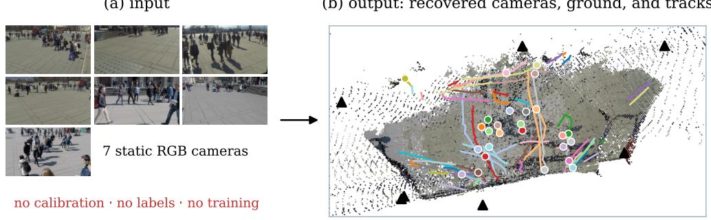

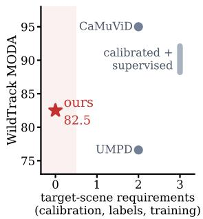  
Figure 1. RGB video in, tracked ground positions out, with no supplied calibration, no position annotations from the target scene, and no target-scene training. (b) shows the recovered ground, cameras, and every trajectory in the WildTrack test sequence. (c) relates published WildTrack MODA to each method’s requirements. Table 9 in the supplement lists the protocol differences.

## Abstract

Multi-camera pedestrian localization is usefulfor widearea monitoring in public and commercial spaces. However, deploying these systems often requires considerable setup for each new environment. Existing methods typically require camera calibration, position annotations, or targetscene training. CAT-Free removes all three requirements. It uses synchronized RGB video as its only scene-specific input. Camera configuration is estimated directlyfrom the video. Pedestrian locations are then estimated by combining observationsfrom multiple cameras. Automatic camera estimation is not always accurate. This can produce unreliable pedestrian locations. CAT-Free therefore introduces two adaptive geometric filters, removing unreliable position estimates. Their thresholds are estimatedfrom each input sequence. CAT-Free achieves 82.5, 84.5, and 65.7 MODA on WildTrack, MultiviewX, and GMVD. It uses no supplied calibration, position annotations, or target-scene training. Published methods using such scene-specific information report 88.2–95.0 MODA on WildTrack and 83.9–96.5 on MultiviewX under their respective protocols. CAT-Free also

transfers without retuning. It reaches 74.9 MODA onfour additional sequences and 78.6 on an unseen 8-camera installation. Finally, localization uncertainty predicts MODA with r = −0.98. This provides a label-free estimate of localization reliability.

## 1. Introduction

Multi-camera pedestrian localization is important for widearea monitoring in public and commercial spaces. It estimates people’s locations by combining observations from multiple cameras. However, deploying such systems in a new environment still requires considerable preparation. Camera positions and orientations must often be measured in advance. Position annotations and target-scene training can also be required. These requirements increase deployment cost when the camera installation changes.

Recent supervised methods achieve high accuracy on WildTrack and MultiviewX [7, 8, 16, 17], but rely on calibrated cameras and labeled data from each new environment. CaMuViD removes supplied camera calibration, but trains its models on annotated data from each new environment [4]. Label-free methods such as UMPD and DCHM still require known camera parameters and learn from images of the new environment [11, 13]. MVUDA instead adapts a model to a new camera environment [2]. Thus, removing calibration alone does not eliminate the preparation required for a new camera installation.

To eliminate per-installation calibration, annotation, and training, we propose CAT-Free. The method requires only synchronized RGB video. From this video, a pretrained 3D reconstruction model estimates the camera positions and orientations. Pretrained person detectors identify pedestrians in each view. CAT-Free then combines observations across cameras to estimate each pedestrian’s position on the ground (Fig. 1). No model is trained or fine-tuned for the new environment. The same localization and tracking settings are used across datasets, avoiding dataset-specific tuning.

Without supplied calibration, the recovered scene has no fixed metric scale [6, 21]. Fixed distance thresholds therefore do not transfer across scenes. To address this problem, CAT-Free uses two adaptive geometric filters. The first evaluates the uncertainty of each estimated pedestrian position. The second checks whether the estimated position is consistent with the recovered ground. Both thresholds are estimated automatically from the unlabeled input sequence. This enables CAT-Free to adapt its geometric decisions without scene-specific tuning.

CAT-Free achieves 82.5, 84.5, and 65.7 MODA on Wild-Track, MultiviewX, and GMVD, respectively. Despite using no supplied calibration, no position annotations, or no targetscene training, its accuracy approaches published methods that rely on such scene-specific information. The method also transfers without retuning. Four additional sequences reach 74.9 ± 3.2 MODA, while an unseen 8-camera installation reaches 78.6 ± 6.5 MODA. Moreover, the estimated localization uncertainty predicts MODA with r = −0.98 across changes in camera availability and time. This provides a label-free indicator of when localization is likely to be reliable.

Our contributions are summarized as follows.

• Calibration-, annotation-, and training-free localization. CAT-Free localizes pedestrians from synchronized RGB video without supplied camera calibration, position annotations, or target-scene training.

• Adaptive geometric filtering. We introduce two geometric filters that reject unreliable position estimates. Their thresholds are estimated directly from unlabeled video, removing scene-specific threshold tuning.

• Transfer and label-free reliability estimation. CAT-Free transfers without dataset-specific retuning to additional sequences and an unseen camera installation. The estimated uncertainty also provides a label-free indicator of localization reliability.

## 2. Related Work

Supervised multi-view detection and tracking. MVDet [8] combines information from multiple cameras on a shared top-down map of the monitored area and predicts where people are located. MVDeTr [7] improves this multi-view feature aggregation with attention and view-consistent data augmentation. EarlyBird [16] and TrackTacular [17] extend this idea from pedestrian localization to tracking. These methods achieve high accuracy, but require calibrated cameras and position annotations collected in each new environment. CaMuViD [4] removes the need for supplied camera calibration by learning how each camera view maps to the shared top-down space. However, it still requires annotated data and training for each new environment. Classical probabilistic occupancy maps [5] avoid model training, but still require camera calibration. These requirements are practical for a fixed benchmark, but become costly when the system must be deployed across many different camera installations.

Label-free learning and domain adaptation. GMVD [20] introduces a synthetic benchmark with varied scenes and camera configurations to study generalization. UMPD [11] learns to estimate pedestrian locations in 3D space without manual position annotations, but still requires calibrated and synchronized cameras. DCHM [13] uses consistency between different camera views to generate pseudo-depth labels and improve pedestrian localization without manual position annotations. MVUDA [2] adapts a model to a new camera environment using unlabeled images from that environment. These methods reduce manual annotation, but still require known camera parameters or additional training on images from the new environment.

Calibration-free 3D reconstruction. Recent 3D reconstruction models such as DUSt3R [23] and VGGT [21] can estimate camera positions, orientations, and scene structure directly from uncalibrated images. Veng et al. [19] use VGGT for calibration-free indoor multi-camera tracking by estimating 3D human positions from reconstructed depth. CAT-Free instead combines observations of the same pedestrian across multiple cameras to estimate the pedestrian’s position on the ground. Unlike UMPD and DCHM, CAT-Free does not require known camera parameters or additional training in the new environment. Unlike CaMuViD, it also requires no position annotations from that environment.

## 3. Method

CAT-Free consists of four stages, as shown in Fig. 2. ⃝1 Pretrained models with fixed weights extract information from each camera view. They estimate the camera positions

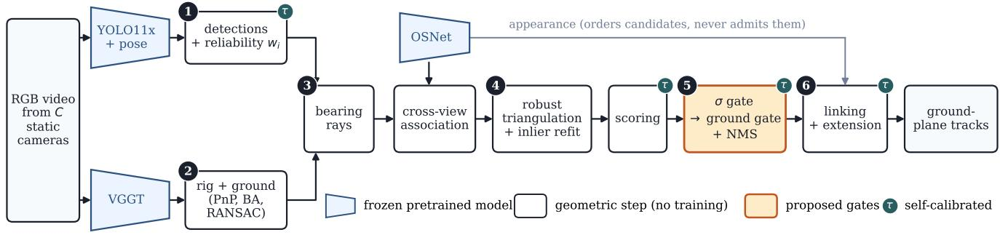

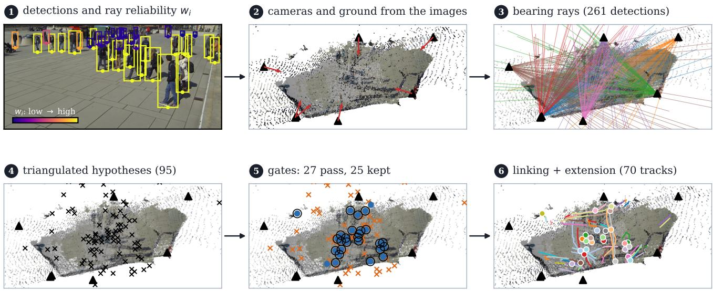  
Figure 2. CAT-Free pipeline. ❶ Pretrained models with fixed weights extract information from each camera view: VGGT estimates the camera configuration and ground surface, YOLO11x with pose provides pedestrian detections and 3D rays with reliability wi, and OSNet provides appearance features. ❷ Detections of the same pedestrian are matched across cameras, and their rays are combined to estimate candidate 3D pedestrian positions. ❸ The proposed filters remove positions that are imprecise $( \sigma > \tau _ { \sigma } )$ or inconsistent with the ground $( g > \tau _ { g } )$ , followed by non-maximum suppression (NMS). ❹ The remaining positions are linked over time to form pedestrian trajectories on the ground. Both thresholds are estimated from the input sequence, without supplied calibration, position annotations, or target-scene training. The lower row shows the four stages on WildTrack frame 1900. No ground truth is used.

and orientations, the ground surface, and pedestrian detections. Each detection is also converted into a 3D ray from the camera toward the detected pedestrian.

⃝2 Detections of the same pedestrian are matched across cameras. Their rays are then combined to estimate candidate 3D pedestrian positions.

⃝3 The proposed adaptive geometric filters remove unreliable position estimates. Duplicate estimates are then removed by non-maximum suppression.

⃝4 The remaining positions are linked over time to form pedestrian trajectories on the ground.

Table 5 in the supplement lists all fixed settings and values estimated from each input sequence.

## 3.1. Camera configuration and ground estimation

We first estimate the camera positions, orientations, and 3D scene structure from synchronized images using VGGT.

The per-frame predictions are combined into a fixed multicamera setup.

We then refine the camera parameters using pedestrians observed by multiple cameras. Pedestrians supported by at least three cameras are treated as 3D reference points. The camera parameters are optimized to reduce reprojection error, i.e., the difference between observed image points and their projections from 3D. We use bundle adjustment with a Huber loss for this refinement. Pedestrian association and camera refinement are repeated for a fixed number of iterations. The result with the smallest median geometric error is retained.

The ground surface is estimated as a plane from the reconstructed 3D point cloud using RANSAC. We reject the estimate when image-derived checks suggest that the fitted plane corresponds to a wall rather than the floor. All datasets use the VGGT-Ω checkpoint [22].

## 3.2. Pedestrian observations and ray reliability

Each camera is processed independently using YOLO11x for pedestrian detection and pose estimation [9]. Detections are linked into short per-camera tracks, and OSNet [24] extracts appearance features for matching pedestrians across cameras.

Each detection defines a 3D ray from the camera toward the detected pedestrian. The ray starts at the camera center and passes through the bottom center of the bounding box. We use this point because our goal is to estimate the pedestrian position on the ground. For detection $i ,$ the camera center is $\mathbf { o } _ { i }$ and the unit ray direction is $\mathbf { d } _ { i }$ . The angular residual between a candidate 3D position x and ray i is

$$
\theta _ { i } ( \mathbf { x } ) = \operatorname { a r c c o s } \left( \mathbf { d } _ { i } ^ { \top } \frac { \mathbf { x } - \mathbf { o } _ { i } } { \| \mathbf { x } - \mathbf { o } _ { i } \| } \right) .\tag{1}
$$

Not all rays provide equally reliable pedestrian locations. We therefore assign each ray a reliability weight $w _ { i } \in ( 0 , 1 ]$ using two cues estimated from the input sequence.

First, we use ankle visibility from the pose estimator. Detections with confirmed ankle keypoints provide more reliable estimates of where the pedestrian touches the ground. From an initial unweighted triangulation, we compute the median angular residuals $s _ { \mathrm { p o s e } }$ and $s _ { \mathrm { o t h e r } }$ for detections with and without confirmed ankles. Their pose-based weight is

$$
w _ { i } ^ { \mathrm { p o s e } } = \left\{ \begin{array} { l l } { 1 , } & { \mathrm { i f ~ a n k l e ~ k e y p o i n t s ~ a r e ~ c o n f i r m e d , } } \\ { \left( s _ { \mathrm { p o s e } } / s _ { \mathrm { o t h e r } } \right) ^ { 2 } , } & { \mathrm { o t h e r w i s e . } } \end{array} \right.\tag{2}
$$

Second, distant pedestrians appear smaller in the image, making their ground position less precise. We therefore reduce the weight of detections with small bounding-box height. Using the median box height ${ \tilde { h } } ,$ the final reliability is Fig. 3 shows the resulting weights on a WildTrack frame.

$$
w _ { i } = w _ { i } ^ { \mathrm { p o s e } } \operatorname* { m i n } \left( 1 , \left( \frac { h _ { i } } { \tilde { h } } \right) ^ { 2 } \right) .\tag{3}
$$

## 3.3. Matching pedestrians across cameras

For each frame, detections from different cameras are grouped when they are likely to correspond to the same pedestrian. Two groups can be merged only if they do not contain detections from the same camera.

We first estimate the 3D position that best fits all rays in the merged group. The merge is accepted only when every ray is geometrically consistent with this position

$$
\operatorname* { m a x } _ { i } \theta _ { i } ( \hat { \mathbf { x } } ) \leq 2 \sigma _ { \theta } .\tag{4}
$$

Candidate merges are processed in order of pedestrian appearance similarity measured by OSNet. A merge is normally rejected when the appearance distance exceeds 0.6.

For two groups that each contain only one detection, we relax this appearance threshold when the pair is geometrically much more consistent with each other than with any alternative detection in the other camera. Specifically, the angular residual for the pair must be at most 0.3 times that of the best alternative. Every accepted merge must satisfy the geometric consistency test.

## 3.4. Robust 3D position estimation

We estimate each pedestrian’s 3D position by finding the point that best fits the rays from multiple cameras. Each ray is weighted by its reliability $w _ { i }$ from Sec. 3.2. Incorrect associations can produce rays that are far from the true position. We therefore use iteratively reweighted least squares with a Huber loss to reduce the influence of large errors.

Because RGB reconstruction has an arbitrary scale, distance parameters are defined relative to the reconstructed scene extent E. We set the Huber scale to $\delta = 0 . 0 1 E$ and estimate the 3D position as

$$
\hat { \mathbf { x } } = \arg \operatorname* { m i n } _ { \mathbf { x } } \sum _ { i \in \mathcal { R } } w _ { i } \rho _ { \delta } \left( \left\| ( \mathbf { I } - \mathbf { d } _ { i } \mathbf { d } _ { i } ^ { \top } ) ( \mathbf { x } - \mathbf { o } _ { i } ) \right\| \right) .\tag{5}
$$

After the initial estimate, rays whose distance from the estimated position exceeds 3δ are treated as outliers. If at least one outlier is found and at least two rays remain, we estimate the position again using only the remaining rays. This prevents rejected rays from shifting the final position.

We estimate the position freely in 3D rather than forcing it onto the ground. This is important because incorrect crosscamera matches often produce intersections above or below the ground, which provides a useful signal for rejecting them in the next stage. The final pedestrian location is obtained by projecting the estimated 3D position onto the ground plane.

## 3.5. Selecting pedestrian positions

After 3D position estimation, we first remove candidates whose rays remain geometrically inconsistent. A candidate is removed when the RMS angular error of its rays exceeds $2 \sigma _ { \theta }$ . This is a final consistency check after the association and triangulation steps described above.

Cross-camera association can split detections of the same pedestrian into multiple candidates. We therefore recount how many cameras support each estimated 3D position. For each camera, any detection ray passing within $\sigma _ { \theta }$ of the position can provide support, even if that detection was originally assigned to another candidate. When multiple rays from the same camera support the position, we use the one with the highest reliability $w _ { i }$ . Allowing this shared support prevents an early association error from removing the correct pedestrian position. The following adaptive filters then determine whether each candidate is sufficiently reliable.

Localization uncertainty filter. A 3D position is unreliable when the pedestrian is far from the cameras or when the viewing rays intersect at poor angles. We therefore estimate the uncertainty of each pedestrian position directly. Fig. 4 illustrates both filters.

For ray i, a fixed angular error $\sigma _ { \theta }$ produces a larger positional error as the distance $L _ { i } = \| \hat { \mathbf { x } } - \mathbf { o } _ { i } \|$ increases. Combining this error across all supporting rays gives

$$
\Lambda = \sum _ { i \in \mathcal { R } } \frac { w _ { i } } { ( \sigma _ { \theta } L _ { i } ) ^ { 2 } } \left( \mathbf { I } - \mathbf { d } _ { i } \mathbf { d } _ { i } ^ { \top } \right) , \qquad \sigma = \sqrt { \frac { 1 } { 2 } \operatorname { t r } \left( \mathbf { P } ^ { \top } \Lambda ^ { - 1 } \mathbf { P } \right) } .\tag{6}
$$

Here, σ represents the uncertainty of the estimated pedestrian position on the ground. It becomes large when the pedestrian is far away or when the rays provide poor intersection geometry. A candidate is accepted when $\sigma \leq \tau _ { \sigma }$

The threshold $\tau _ { \sigma }$ is estimated automatically from the input sequence using Otsu’s method

$$
\tau _ { \sigma } = \exp \left( \operatorname { O t s u } ( \{ \log \sigma \} ) \right) .\tag{7}
$$

We apply Otsu’s method in log space because σ has a strongly skewed distribution with a small number of large values. Fig. 6 plots the two statistics and the thresholds they produce.

Ground-plane consistency filter. The uncertainty filter measures how precisely a 3D position is determined, but it does not guarantee that the rays come from the same pedestrian. An incorrect cross-camera match can still produce a stable 3D position.

We therefore use the estimated ground as a second geometric cue. Because the position is estimated freely in 3D, rays from different pedestrians often intersect above or below the ground. In contrast, a correct pedestrian position should lie close to the ground.

We measure the distance g between the estimated 3D position xˆ and the estimated ground plane

$$
\begin{array} { r } { g = | \mathbf n ^ { \top } \hat { \mathbf x } + b | , } \end{array}\tag{8}
$$

where (n, b) defines the ground plane. A candidate is accepted when

$$
g \leq \tau _ { g } , \qquad \tau _ { g } = \exp \left( \mathrm { O t s u } ( \{ \log g \} ) \right) .\tag{9}
$$

The threshold $\tau _ { g }$ is estimated from the candidates that pass the localization uncertainty filter. This ordering first removes unstable positions and then tests whether the remaining positions are consistent with the ground.

Temporal consistency, duplicate removal, and recovery. We first require temporal consistency. A cross-camera match is kept only when the same pair of short tracks from two cameras is supported in at least two frames. This removes accidental matches that appear only once.

We then remove duplicate nearby pedestrian positions using non-maximum suppression (NMS) with radius r. When several candidates overlap, those with stronger camera support and a higher auxiliary score are kept first.

Finally, we re-examine candidates that are farther than r from all accepted positions. For these remaining candidates, the adaptive thresholds are estimated again. A recovered candidate must also be supported by multiple reliable camera observations.

## 3.6. Trajectories

Accepted pedestrian positions are linked across consecutive frames to form trajectories. We consider only positions within a distance of 0.04E and use the Hungarian algorithm for one-to-one matching.

Among spatially valid candidates, appearance difference measured by OSNet is also used to determine the matching cost. Appearance therefore helps choose between nearby candidates, but does not create a match between distant positions. Tracks shorter than two frames are removed.

We then extend each track by up to two frames at both ends. The next position is predicted by assuming that the recent motion continues at the same velocity. A predicted position is added only when detections from at least two cameras are geometrically consistent with it, no other track occupies the same area, and at least one supporting detection has sufficiently similar appearance. The appearance threshold is estimated automatically using Otsu’s method from appearance differences within the same track and between different tracks.

## 4. Experiments

Input and output. The input is synchronized RGB video from C static cameras. For each frame, CAT-Free outputs pedestrian positions on the ground together with track identities. No supplied camera calibration, pedestrian position annotations, or target-scene training are used. CAT-Free uses fixed pretrained models and currently operates offline on the complete input sequence.

Scale normalization. Distance thresholds depend on the unknown reconstruction scale and are therefore normalized by the reconstructed scene extent E. In contrast, angular errors are scale-independent, so we use the same $\sigma _ { \theta } = 0 . 0 2 0 6$ rad for all datasets.

Evaluation protocol. The reconstructed coordinate system differs from each dataset’s coordinate system by a global rotation, translation, and scale. For evaluation only, we align the predictions with a 7-DoF Umeyama transform [18] fitted between the estimated and ground-truth camera centers. This alignment is computed after inference and is not used by any localization, filtering, or tracking step. Because it uses ground-truth camera positions, the reported results measure relative localization rather than absolute metric localization.

MODA and MODP [10] use the repository multi-view detection evaluator with a 0.5 m matching threshold. MOTA, MOTP [1], and IDF1 [15] use a 1 m matching threshold. HOTA [12] is computed with the official TrackEval implementation on the same top-down positions. We use point similarity $s = \operatorname* { m a x } ( 0 , 1 - d / 1 \mathrm { m } )$ and report the standard average over α. Under this definition, α = 0.5 corresponds to a 0.5 m localization threshold. The dataset evaluator ignores predictions outside the annotated evaluation area. The supplement also reports results that count these predictions as false positives.

## 4.1. Datasets and protocol

WildTrack [3] contains 7 real cameras. We evaluate the standard test frames 1800–1995, sampling every fifth frame for 40 frames and 952 pedestrian instances. After method development, we also evaluate the 360 annotated frames 0– 1795, containing 8,566 instances, that were not used during development.

MultiviewX [8] contains 6 synthetic cameras. We evaluate frames 360–399, containing 40 frames and 1,494 pedestrian instances.

GMVD [20] contains multiple synthetic scenes and camera configurations. The development sequence is scene 5, configuration 1, sequence 1, with 6 cameras, 105 sampled frames, and 4,083 pedestrian instances. For postdevelopment evaluation, we use sequences 2–5 from the same camera configuration on all available frames in their splits (100/101/100/100 frames and 2,802/2,803/4,160/2,692 instances). These sequences reuse the camera configuration and 3D reconstruction estimated from sequence 1, while pedestrian detection uses the same confidence threshold of 0.30. We also evaluate all five sequences of scene 5, configuration 2, an unseen synthetic 8-camera installation. Its camera configuration is estimated from RGB using the same procedure as in Sec. 3.1, with the fixed 25 iterations used during development. The iteration with the smallest median geometric error is retained; this selects iteration 20.

## 4.2. Main results

CAT-Free works without per-installation calibration, annotation, or training. Without supplied camera calibration, pedestrian position annotations, or target-scene training, CAT-Free reaches 82.5, 84.5, and 65.7 MODA on WildTrack,

MultiviewX, and GMVD, respectively (Table 1). Table 2 places the first two results alongside published methods and their per-installation requirements. CAT-Free is the only method in the table that requires none of the three resources. On WildTrack, its 82.5 MODA is 1.7 points below DCHM, while on MultiviewX its 84.5 MODA is 6.1 points above DCHM and 0.6 points above MVDet. These cross-paper differences are descriptive because the reported protocols are not identical. Precision remains above 92% on all three datasets; the lowest recall is 68.1% on GMVD. The median localization errors of matched pedestrians are 11.8, 9.9, and 17.4 cm.

The same method transfers without retuning. The localization, filtering, and tracking settings are kept fixed in all post-development evaluations. Four later GMVD sequences from the same camera installation reach 74.9 ± 3.2 MODA. An unseen synthetic 8-camera installation reaches $7 8 . 6 \pm 6 . 5$ MODA after re-estimating only its camera configuration from RGB using Sec. 3.1 (Table 8). These values measure transfer under different evaluation conditions rather than a direct ranking against the development sequences.

CAT-Free can detect unreliable localization without labels. The localization uncertainty σ in Sec. 3.5 measures how precisely a pedestrian position is determined from the available camera views. Across eight settings that vary camera availability or time, σ is strongly correlated with MODA (r = −0.98; Sec. B). Thus, a large uncertainty indicates that localization is likely to be unreliable even when ground-truth pedestrian positions are unavailable.

## 4.3. Ablations

Cumulative improvements over the initial baseline. The initial controlled baseline uses only pose-confirmed detections and unweighted rays. Relative to this baseline, the final CAT-Free improves MODA by +3.8, +5.6, and +9.3 on Wild-Track, MultiviewX, and GMVD, respectively (Table 13).

Multiple cameras improve 3D position estimation. Single-camera ground projection is substantially less accurate because a small angular error can produce a large position error when the ray intersects the ground at a shallow angle. The multi-camera 3D position estimation in Sec. 3.4 constrains the position from several directions. With all later processing unchanged, CAT-Free improves over the best tworay estimate by +3.4, +9.3, and +5.1 MODA on WildTrack, MultiviewX, and GMVD (Table 4).

Replacing the estimated camera configuration from Sec. 3.1 with ground-truth calibration does not improve MODA on these development sequences. The changes are −2.5, −3.3, and −0.5 points. This indicates that imperfect camera estimation alone is not the dominant error source under the evaluated 0.5 m localization threshold.

Table 1. Main results. The upper block contains the three development sequences. The lower block reports post-development transfer. The bold column is the primary localization metric. MODA and MODP use a 0.5 m matching threshold; MOTA, MOTP, and IDF1 use 1 m. HOTA is computed with TrackEval.
<table><tr><td></td><td colspan="4">Localization</td><td colspan="4">Tracking</td></tr><tr><td>Dataset</td><td>MODA</td><td>MODP</td><td>Precision</td><td>Recall</td><td>MOTA</td><td>MOTP↓</td><td>IDF1</td><td>HOTA</td></tr><tr><td>WildTrack</td><td>82.46</td><td>70.94</td><td>92.52</td><td>89.71</td><td>81.41</td><td>0.156</td><td>71.36</td><td>64.72</td></tr><tr><td>MultiviewX</td><td>84.54</td><td>77.04</td><td>96.74</td><td>87.48</td><td>79.05</td><td>0.138</td><td>64.96</td><td>59.65</td></tr><tr><td>GMVD (s5/c1/seq1)</td><td>65.69</td><td>62.12</td><td>96.56</td><td>68.11</td><td>64.00</td><td>0.212</td><td>55.23</td><td>46.44</td></tr><tr><td>WildTrack, 360 unused frames</td><td>58.27</td><td>65.49</td><td>88.96</td><td>66.52</td><td>59.46</td><td>0.215</td><td>52.31</td><td>46.52</td></tr><tr><td>GMVD c1, seqs. 2–5, mean</td><td>74.90</td><td>61.22</td><td>94.69</td><td>79.37</td><td>74.36</td><td>0.216</td><td>58.03</td><td>50.19</td></tr><tr><td>GMVD c2 (unseen synthetic installation), mean</td><td>78.55</td><td>67.73</td><td>95.14</td><td>82.83</td><td>76.71</td><td>0.180</td><td>66.07</td><td>58.15</td></tr></table>

Table 2. Published MODA on WildTrack and MultiviewX together with the per-installation resources used by each reported result. “Supplied calibration” indicates that dataset camera calibration is given to the method, “Target annotations” indicates that annotations from the target environment are used for learning, and “Target training” indicates that model fitting or fine-tuning is performed on images from tha environment. Published accuracy values follow the respective papers and may use different training and evaluation protocols; the table is therefore intended to contextualize accuracy against deployment requirements rather than provide a strict controlled ranking.
<table><tr><td>Method</td><td>Supplied calibration</td><td>Target annotations</td><td>Target training</td><td>WildTrack MODA</td><td>MultiviewX MODA</td></tr><tr><td>UMPD [11]</td><td>Yes</td><td>No</td><td>Yes</td><td>76.6</td><td>67.5</td></tr><tr><td>DCHM [13]</td><td>Yes</td><td>No</td><td>Yes</td><td>84.2</td><td>78.4</td></tr><tr><td>CAT-Free (ours)</td><td>No</td><td>No</td><td>No</td><td>82.5</td><td>84.5</td></tr><tr><td>MVDet [8]</td><td>Yes</td><td>Yes</td><td>Yes</td><td>88.2</td><td>83.9</td></tr><tr><td>MVDeTr [7]</td><td>Yes</td><td>Yes</td><td>Yes</td><td>91.5</td><td>93.7</td></tr><tr><td>EarlyBird [16]</td><td>Yes</td><td>Yes</td><td>Yes</td><td>91.2</td><td>94.2</td></tr><tr><td>TrackTacular [17]</td><td>Yes</td><td>Yes</td><td>Yes</td><td>93.2</td><td>96.5</td></tr><tr><td>CaMuViD [4]</td><td>No</td><td>Yes</td><td>Yes</td><td>95.0</td><td>96.5</td></tr></table>

Table 3. Adaptive-filter ablation on the development sequences (MODA). ∆ Mean is relative to Q. The best ordering applies localization uncertainty before ground-plane consistency.
<table><tr><td>Variant</td><td>WT</td><td>MVX</td><td>GMVD</td><td>Mean</td><td>∆ Mean</td></tr><tr><td>Q (camera support)</td><td>80.99</td><td>82.06</td><td>59.93</td><td>74.33</td><td></td></tr><tr><td>Ground only</td><td>81.51</td><td>81.73</td><td>59.71</td><td>74.32</td><td>-0.01</td></tr><tr><td>Uncertainty, add</td><td>76.89</td><td>82.93</td><td>64.58</td><td>74.80</td><td>+0.47</td></tr><tr><td>Uncertainty, replace</td><td>78.47</td><td>83.07</td><td>64.68</td><td>75.41</td><td>+1.08</td></tr><tr><td>Ground → uncertainty, replace</td><td>80.46</td><td>83.94</td><td>63.14</td><td>75.85</td><td>+1.52</td></tr><tr><td>Ground → uncertainty, add</td><td>79.83</td><td>84.40</td><td>63.80</td><td>76.01</td><td>+1.68</td></tr><tr><td>Uncertainty → ground (ours)</td><td>81.62</td><td>84.34</td><td>64.51</td><td>76.82</td><td>+2.49</td></tr><tr><td>Q, position constrained to ground</td><td>80.67</td><td>80.86</td><td>55.84</td><td>72.46</td><td>-1.87</td></tr><tr><td>Ours, position constrained to ground</td><td>76.26</td><td>78.25</td><td>50.16</td><td>68.22</td><td>-6.11</td></tr></table>

The two adaptive filters remove different failure modes. The localization uncertainty and ground-plane consistency filters are defined in Sec. 3.5. The uncertainty filter removes positions that are poorly constrained by the available camera views. A stable 3D position, however, can still come from an incorrect cross-camera match. The ground-plane consistency filter targets these cases by checking whether the estimated position lies near the recovered ground. Applying the filters in this order improves mean MODA by +2.49 over Q and improves all three development datasets (Table 3).

Table 4. Controlled localization baselines on the development sequences (MODA). WT denotes WildTrack and MVX denotes MultiviewX. All rows use the same pedestrian detections, estimated ground, and trajectory stage.
<table><tr><td>Variant</td><td>WT</td><td>MVX</td><td>GMVD</td></tr><tr><td>(A) single-camera ground projection</td><td>32.88</td><td>15.66</td><td>42.84</td></tr><tr><td>(B) best two-ray estimate</td><td>79.10</td><td>75.23</td><td>60.59</td></tr><tr><td>CAT-Free</td><td>82.46</td><td>84.54</td><td>65.69</td></tr><tr><td>(C) CAT-Free with ground-truth calibration</td><td>79.94</td><td>81.26</td><td>65.17</td></tr></table>

Among candidates that pass the localization uncertainty filter, distance to the estimated ground separates correct and incorrect cross-camera matches with an area under the ROC curve (AUC) of 0.952 on WildTrack and 0.788 on MultiviewX. On WildTrack, the ground-plane consistency filter removes about 90% of false-positive candidates while reducing coverage of annotated pedestrians by 1.8 percentage points. These detailed diagnostics support the complementary roles of the two filters.

The order matters because the second threshold is estimated from the candidates that pass the first filter. A fixed percentile shared across datasets performs worse on average: the 50th percentile is best on WildTrack, whereas the 70th percentile is best on MultiviewX and GMVD (Table 15 in the supplement). The same uncertainty-to-ground ordering also performs best on the unseen synthetic 8-camera installation: 78.55 MODA versus 75.25 for the reversed order, 73.34 for uncertainty alone, and 72.95 for camera support (Table 16).

Constraining the estimated 3D position to the ground removes a useful error signal. It reduces mean MODA by 1.9 points from Q and 8.6 points from the full ordered-filter variant. Allowing the position to move above or below the ground helps reveal incorrect cross-camera matches.

## 5. Limitations

CAT-Free has two broad limitations. First, evaluation requires a global similarity alignment fitted to ground-truth camera centers. The reported results therefore measure relative localization rather than absolute metric localization. Absolute metric deployment would require an independent source of global scale and coordinate alignment.

Second, the current implementation operates offline and uses the complete processed sequence for camera estimation, tracking, and adaptive threshold estimation. Future work will investigate online localization and tracking while preserving the same calibration-, annotation-, and target-scene-trainingfree setting.

## 6. Conclusion

CAT-Free localizes and tracks pedestrians from synchronized RGB video without supplied camera calibration, pedestrian position annotations, or target-scene training. It reaches 82.5, 84.5, and 65.7 MODA on WildTrack, MultiviewX, and GMVD, respectively. With all method settings fixed, four later GMVD sequences reach 74.9 ± 3.2 MODA, and an unseen synthetic 8-camera installation reaches 78.6 ± 6.5 after estimating its camera configuration from RGB. Across changes in camera availability and time, localization uncertainty is strongly correlated with MODA (r = −0.98), allowing unreliable localization conditions to be identified without ground-truth pedestrian positions. Together, these results show that camera configuration estimated from RGB and adaptive geometric filtering can reduce per-installation setup while retaining multi-camera localization accuracy.

## References

[1] Keni Bernardin and Rainer Stiefelhagen. Evaluating multiple object tracking performance: The CLEAR MOT metrics. EURASIP Journal on Image and Video Processing, 2008. 6

[2] Erik Brorsson, Lennart Svensson, Kristofer Bengtsson, and Knut Akesson. MVUDA: Unsupervised domain adaptation ˚ for multi-view pedestrian detection. Machine Vision and Applications, 37(1):6, 2026. 2

[3] Tatjana Chavdarova, Pierre Baque, St´ ephane Bouquet, Andri´ Maksai, Cijo Jose, Timur Bagautdinov, Louis Lettry, Pascal Fua, Luc Van Gool, and Franc¸ois Fleuret. WILDTRACK: A multi-camera HD dataset for dense unscripted pedestrian detection. In Proceedings ofthe IEEE Conference on Computer Vision and Pattern Recognition, 2018. 6

[4] Amir Etefaghi Daryani, M. Usman Maqbool Bhutta, Byron Hernandez, and Henry Medeiros. CaMuViD: Calibrationfree multi-view detection. In Proceedings ofthe IEEE/CVF Conference on Computer Vision and Pattern Recognition, pages 1220–1229, 2025. 2, 7, 13

[5] Franc¸ois Fleuret, Jer´ ome Berclaz, Richard Lengagne, andˆ Pascal Fua. Multicamera people tracking with a probabilistic occupancy map. IEEE Transactions on Pattern Analysis and Machine Intelligence, 30(2):267–282, 2008. 2

[6] Richard Hartley and Andrew Zisserman. Multiple View Geometry in Computer Vision. Cambridge University Press, 2 edition, 2004. 2

[7] Yunzhong Hou and Liang Zheng. Multiview detection with shadow transformer (and view-coherent data augmentation). In Proceedings of the ACM International Conference on Multimedia, 2021. 1, 2, 7, 13

[8] Yunzhong Hou, Liang Zheng, and Stephen Gould. Multiview detection with feature perspective transformation. In Proceedings ofthe European Conference on Computer Vision, 2020. 1, 2, 6, 7, 13

[9] Glenn Jocher and Jing Qiu. Ultralytics YOLO11. https: //github.com/ultralytics/ultralytics, 2024. 4

[10] Rangachar Kasturi, Dmitry Goldgof, Padmanabhan Soundararajan, Vasant Manohar, John Garofolo, Rachel Bowers, Matthew Boonstra, Valentina Korzhova, and Jing Zhang. Framework for performance evaluation of face, text, and vehicle detection and tracking in video: Data, metrics, and protocol. IEEE Transactions on Pattern Analysis and Machine Intelligence, 31(2):319–336, 2009. 6

[11] Mengyin Liu, Chao Zhu, Shiqi Ren, and Xu-Cheng Yin. Unsupervised multi-view pedestrian detection. In Proceedings ofthe ACM International Conference on Multimedia, 2024. arXiv:2305.12457. 2, 7, 13

[12] Jonathon Luiten, Aljosa Osep, Patrick Dendorfer, Philip Torr, Andreas Geiger, Laura Leal-Taixe, and Bastian Leibe. HOTA:´ A higher order metric for evaluating multi-object tracking. International Journal ofComputer Vision, 129:548–578, 2021. 6

[13] Jiahao Ma, Tianyu Wang, Miaomiao Liu, David Ahmedt-Aristizabal, and Chuong Nguyen. DCHM: Depth-consistent human modeling for multiview detection. In Proceedings of the IEEE/CVF International Conference on Computer Vision, 2025. 2, 7

[14] Maxime Oquab, Timothee Darcet, Th´ eo Moutakanni, et al.´ DINOv2: Learning robust visual features without supervision. Transactions on Machine Learning Research, 2024. 16

[15] Ergys Ristani, Francesco Solera, Roger Zou, Rita Cucchiara, and Carlo Tomasi. Performance measures and a data set for multi-target, multi-camera tracking. In Proceedings of the European Conference on Computer Vision Workshops, 2016. 6

[16] Torben Teepe, Philipp Wolters, Johannes Gilg, Fabian Herzog, and Gerhard Rigoll. EarlyBird: Early-fusion for multiview tracking in the bird’s eye view. In Proceedings of the IEEE/CVF Winter Conference on Applications of Computer Vision Workshops, pages 102–111, 2024. 1, 2, 7, 13

[17] Torben Teepe, Philipp Wolters, Johannes Gilg, Fabian Herzog, and Gerhard Rigoll. Lifting multi-view detection and tracking to the bird’s eye view. In Proceedings of the IEEE/CVF Conference on Computer Vision and Pattern Recognition Workshops, 2024. arXiv:2403.12573. 1, 2, 7, 13

[18] Shinji Umeyama. Least-squares estimation of transformation parameters between two point patterns. IEEE Transactions on Pattern Analysis and Machine Intelligence, 13(4):376–380, 1991. 6

[19] Ponleur Veng, Dominique Vaufreydaz, and Phutphalla Kong. Calibration-free 3D multi-camera people tracking for indoor environment, 2026. arXiv:2607.22731. 2

[20] Jeet Vora, Swetanjal Dutta, Kanishk Jain, Shyamgopal Karthik, and Vineet Gandhi. Bringing generalization to deep multi-view pedestrian detection. In Proceedings ofthe IEEE/CVF Winter Conference on Applications of Computer Vision Workshops, pages 110–119, 2023. 2, 6

[21] Jianyuan Wang, Minghao Chen, Nikita Karaev, Andrea Vedaldi, Christian Rupprecht, and David Novotny. VGGT: Visual geometry grounded transformer. In Proceedings of the IEEE/CVF Conference on Computer Vision and Pattern Recognition, 2025. 2

[22] Jianyuan Wang, Minghao Chen, Shangzhan Zhang, Nikita Karaev, Johannes Schonberger, Patrick Labatut, Piotr Bo-¨ janowski, David Novotny, Andrea Vedaldi, and Christian Rupprecht. VGGT-ω. In Proceedings ofthe IEEE/CVF Conference on Computer Vision and Pattern Recognition, 2026. arXiv:2605.15195. 4

[23] Shuzhe Wang, Vincent Leroy, Yohann Cabon, Boris Chidlovskii, and Jerome Revaud. DUSt3R: Geometric 3D vision made easy. In Proceedings ofthe IEEE/CVF Conference on Computer Vision and Pattern Recognition, 2024. 2

[24] Kaiyang Zhou, Yongxin Yang, Andrea Cavallaro, and Tao Xiang. Omni-scale feature learning for person re-identification. In Proceedings of the IEEE/CVF International Conference on Computer Vision, 2019. 4

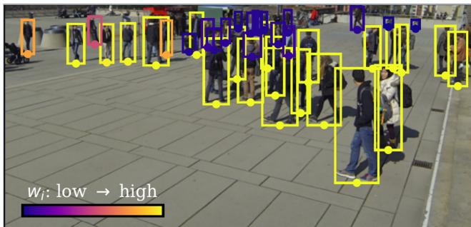  
Figure 3. Ray reliability $w _ { i }$ on WildTrack frame 1900. Each box is a detection and each dot is the bottom-center point that defines its back-projection ray. Colour is wi from Eq. (3): distant people project to short boxes, so their foot point carries a larger angular error and receives a smaller weight. Triangulation and view support use these weights; no ground truth is involved.

## A. Additional Protocol and Results

Runtime. All stages run on one workstation (NVIDIA RTX A6000, single process) and reuse cached detections, rig, and reconstruction. Processing from detection through tracking takes 135 s on WildTrack (40 frames, 7 cameras), 237 s on MultiviewX (40 frames, 6 cameras), and 158–230 s on a 100-frame GMVD sequence (6 cameras). Cross-view association dominates at 61–71% of that time. It compares every pair of detections in a frame and is the only stage that scales quadratically with the number of detections per frame.

## B. Effects of Camera Geometry and Time

Table 10 varies co-visibility directly, by removing cameras from the development frames, and the dependence is steep: 91 MODA points separate two cameras from seven, and the two-camera run is below zero because false positives outnumber recovered people. This experiment measures how accuracy depends on the available camera geometry. The uncertainty statistic can be computed before labels are available.

It also helps explain the temporal variation in Table 6. Covisibility alone does not reconcile the two experiments: the worst held-out block has co-visibility 3.68 and scores 33.37, whereas the sweep at the same co-visibility (five cameras) scores 66.81. The quantity that does reconcile them is the propagated uncertainty of Eq. (6), evaluated at the annotated positions with the dataset’s calibration. It is 36.9 cm in that block against 20.3 cm at the five-camera point, because σ grows with ray length and with missing views, and people stand farther from the cameras early in the recording (mean 18.9 m against 14.8 m on the development window).

Removing cameras and moving through the recording are very different ways of making the problem harder, and they land on one σ–MODA curve (Table 11). We therefore interpret the temporal variation through the pipeline’s uncertainty model. The calibration diagnostic excludes the estimated camera parameters as the primary cause, while separate analyses exclude crowding, detection supply, and the thresholds estimated from each sequence. The remaining caveat is that σ here is computed at ground-truth positions for analysis, and that the k-camera subsets are a fixed prefix of the rig whereas the windows vary geometry by where people stand.

## C. The Scoring Stage

Each hypothesis gets seven image-derived signals: number of supporting rays, negative median residual, detector confidence, view support ratio, consistency of implied person heights, temporal persistence, and reconstruction confidence at the ray pixels. The signals are standardized over the sequence and weighted by their Otsu separability. Reconstruction confidence is also scaled by its correlation with the consensus of the other six signals. The combined score ranks hypotheses for NMS. Hypotheses above the Otsu threshold are kept, and weaker hypotheses are kept only when they lie outside the NMS radius $r = 0 . 0 1 8 E$ of all previously accepted hypotheses.

## D. Evaluation Alignment and Scoring Ablation

Effect of evaluation alignment. All reported coordinates pass through a 7-DoF similarity fitted to the C ground-truth camera centers, so part of the accuracy could come from that fit rather than from the predictions. We refit it with one camera held out at a time and rescore every prediction. Mean MODA over the C refits is 81.87, 84.56, and 64.64 on WildTrack, MultiviewX, and GMVD sequence 1, within 0.6, 0.0, and 1.1 points of the value using all cameras. The worst single refit loses 2.84, 0.27, and 3.21 points. In the same refits the held-out camera center lands 0.30 m (Wild-Track), 0.19 m (MultiviewX), and 0.40 m (GMVD) from its annotated position, which measures the recovered rig itself rather than the localizer (Table 12).

Effect of the auxiliary score. Before selection, a scoring stage fuses seven image-derived signals, and it is fair to ask how much of the result is attributable to it rather than to the two geometric filters. Removing the stage entirely and feeding the triangulated hypotheses directly into the filters changes MODA by +0.10, +0.07, and +0.02 on the development sequences, with the same true-positive counts and one false positive fewer, and by +0.02 on average across the five sequences of the unseen installation. The reported margins thus come from the geometric filters rather than the auxiliary score. We retain the score so that all post-development results use the configuration fixed during development.

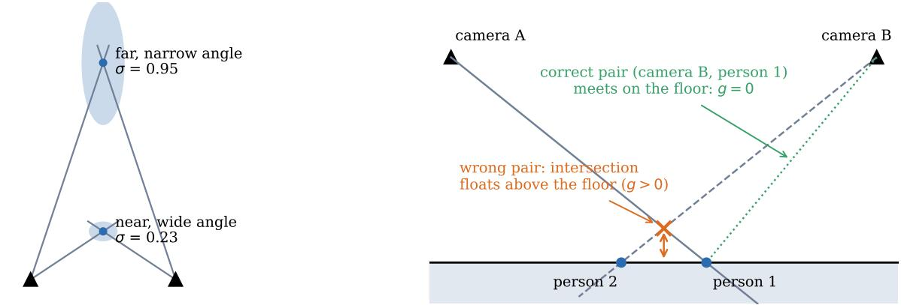  
(a) position uncertainty (top view)

Table 5. Downstream settings after detection and camera estimation. Fixed values are shared across datasets. E is the reconstructed scene extent, and $\sigma _ { \theta }$ is the angular noise standard deviation.
<table><tr><td>Stage</td><td>Fixed setting</td><td>Estimated per sequence</td></tr><tr><td>Detection</td><td> $\mathrm { c o n f i d e n c e } \geq 0 . 3 0$ </td><td></td></tr><tr><td>Rays</td><td> $\sigma _ { \theta } = 0 . 0 2 0 6 \mathrm { r a d }$ </td><td>pose/non-pose ratio  $( s _ { \mathrm { p o s e } } / s _ { \mathrm { o t h e r } } ) ^ { 2 } ;$  median box height ¯</td></tr><tr><td>Association</td><td>residual  $\leq 2 \sigma _ { \theta } ;$  appearance threshold 0.6; uniqueness ratio 0.3</td><td></td></tr><tr><td>Triangulation</td><td>Huber  $\delta = 0 . 0 1 E ;$ </td><td></td></tr><tr><td>Scoring</td><td></td><td>signal weights and threshold (Otsu); reconstruc- tion confidence gain</td></tr><tr><td>Selection</td><td>residual  $\leq 2 \sigma _ { \theta } ;$  support radius  $\sigma _ { \theta } ; \mathrm { N M S } ~ r = 0 . 0 1 8 E ;$  tracklet pairs  $\geq 2 ;$  second-pass support  $\geq 3$ </td><td>Tσ,  $\tau _ { g }$  (log-Otsu) </td></tr><tr><td>Trajectory</td><td>link radius  $0 . 0 4 E ;$  appearance weight 1.5; min length 2; extension  $\leq 2$  frames,  $\geq 2$  supporting cameras</td><td>extension appearance threshold (Otsu)</td></tr></table>

(b) ground offset (side view)  
Figure 4. The two geometric filters. (a) Localization uncertainty σ increases with viewing distance and poor intersection angles. Ellipses show the positional covariance $\Lambda ^ { - 1 }$ of Eq. (6). (b) The point-to-plane distance g exposes an incorrect correspondence that ground-constrained triangulation would hide.

## E. Incremental and Additional Ablations

The intermediate step K includes short static-track removal inherited from an earlier version, and step BT removes that rule. Replacing weighted view support gives the largest single gain on GMVD at +4.75 MODA, although it lowers WildTrack by 2.52 points in isolation. Adding the groundplane consistency filter recovers WildTrack and is the first configuration to improve all three datasets over Q. Table 14 removes the trajectory rules one at a time: track extension is the one that matters, and dropping short static-track removal is what separates BT from BS.

The trajectory stage adds 2.8 MODA points over perframe positions, almost fully through track extension. Removing short static tracks mainly deletes real people. On GMVD, retaining them adds 44 true positives and one false positive. This choice lowers IDF1 by 0.46 on WildTrack and 0.36 on GMVD. Gap interpolation has no effect because the linker connects consecutive frames only. Refitting the triangulated position on robust inliers raises MODA by 0.63, 0.20, and 0.12 points and raises MOTA on all three datasets.

What the out-of-grid predictions are. MultiviewX is the dataset most affected by the evaluation boundary: 288 of 1,639 predictions fall outside the annotated 25 × 16 m grid, and counting them as false positives lowers MODA from 84.54 to 65.26. They are not displaced annotated people: their median distance to the nearest annotated person is 5.0 m (10th percentile 2.2 m), and their median distance outside the grid boundary is 2.2 m. A geometric prior that the method could apply does not separate them either: every one of them is imaged by at least two recovered cameras, and requiring three cameras removes only 6 of the 288. They are thus false positives in the part of the observed scene that the dataset does not annotate, and the strict variant is the honest reading for MultiviewX.

Table 6. Evaluation on 360 WildTrack frames not used during development, grouped into 200-frame intervals. Camera parameters and dense reconstruction come from frames 1800–1995. Thresholds are estimated again on the 360 evaluation frames. The right block replaces the estimated camera parameters with ground-truth calibration as a diagnostic.
<table><tr><td></td><td></td><td></td><td></td><td colspan="3">Recovered rig (RGB only)</td><td colspan="3">GT calibration (diagnostic)</td></tr><tr><td>Frames</td><td>GT</td><td>People/frame</td><td>Cameras/person</td><td>MODA</td><td>Recall</td><td>Precision</td><td>MODA</td><td>Recall</td><td>Precision</td></tr><tr><td>0-199</td><td>989</td><td>24.7</td><td>3.68</td><td>33.37</td><td>46.01</td><td>78.45</td><td>40.34</td><td>49.14</td><td>84.82</td></tr><tr><td>200-399</td><td>703</td><td>17.6</td><td>3.74</td><td>48.22</td><td>64.72</td><td>79.68</td><td>52.49</td><td>65.29</td><td>83.61</td></tr><tr><td>400-599</td><td>898</td><td>22.4</td><td>3.75</td><td>50.33</td><td>62.69</td><td>83.53</td><td>54.68</td><td>63.47</td><td>87.83</td></tr><tr><td>600-799</td><td>931</td><td>23.3</td><td>4.16</td><td>62.84</td><td>67.56</td><td>93.46</td><td>63.05</td><td>67.78</td><td>93.48</td></tr><tr><td>800-999</td><td>1,264</td><td>31.6</td><td>4.35</td><td>60.05</td><td>66.06</td><td>91.66</td><td>63.05</td><td>66.06</td><td>95.65</td></tr><tr><td>1000-1199</td><td>1,227</td><td>30.7</td><td>4.28</td><td>59.33</td><td>63.90</td><td>93.33</td><td>60.07</td><td>63.24</td><td>95.21</td></tr><tr><td>1200-1399</td><td>1,036</td><td>25.9</td><td>4.40</td><td>67.08</td><td>71.04</td><td>94.72</td><td>67.28</td><td>69.79</td><td>96.53</td></tr><tr><td>1400-1599</td><td>862</td><td>21.6</td><td>4.52</td><td>70.65</td><td>76.91</td><td>92.47</td><td>70.65</td><td>74.48</td><td>95.11</td></tr><tr><td>1600-1799</td><td>656</td><td>16.4</td><td>5.12</td><td>75.30</td><td>88.11</td><td>87.31</td><td>72.56</td><td>85.98</td><td>86.50</td></tr><tr><td>All 360 unused frames</td><td>8,566</td><td>23.8</td><td>4.21</td><td>58.27</td><td>66.52</td><td>88.96</td><td>60.26</td><td>66.38</td><td>91.56</td></tr><tr><td>1800–1995 (development)</td><td>952</td><td>23.8</td><td>5.28</td><td>82.46</td><td>89.71</td><td>92.52</td><td>79.94</td><td>87.80</td><td>91.80</td></tr></table>

Table 7. Post-development evaluation on four additional GMVD scene-5/configuration-1 sequences. The method and sequence-1 camera parameters are fixed. $\mathbf { M O D A _ { o u t - F P } }$ counts predictions outside the evaluation grid as false positives.
<table><tr><td> ${ \mathrm { S e q . } }$ </td><td>GT</td><td>MODA</td><td>MODP</td><td>Prec.</td><td>Rec.</td><td>MOTA</td><td>MOTP↓</td><td>IDF1</td><td>HOTA</td><td>Out</td><td>MODAout-FP</td></tr><tr><td>2</td><td>2,802</td><td>74.09</td><td>66.81</td><td>96.97</td><td>76.48</td><td>73.98</td><td>0.184</td><td>66.80</td><td>57.41 265</td><td></td><td>64.63</td></tr><tr><td>3</td><td>2,803</td><td>79.02</td><td>58.25</td><td>94.86</td><td>83.55</td><td>79.27</td><td>0.221</td><td>61.04</td><td>50.22</td><td>216</td><td>71.32</td></tr><tr><td>4</td><td>4,160</td><td>71.32</td><td>62.32</td><td>93.01</td><td>77.12</td><td>71.01</td><td>0.230</td><td>51.52</td><td>46.26</td><td>80</td><td>69.40</td></tr><tr><td>5</td><td>2,692</td><td>75.15</td><td>57.49</td><td>93.92</td><td>80.35</td><td>73.18</td><td>0.227</td><td>52.77</td><td>46.86</td><td>80</td><td>72.18</td></tr><tr><td>Mean</td><td colspan="9">74.90±3.19 61.22±4.29 94.69±1.70 79.37±3.26</td><td></td><td></td><td>69.38±3.37</td></tr></table>

Table 8. Post-development evaluation on an unseen 8-camera installation, GMVD scene 5, configuration 2. Camera parameters are estimated from RGB with the fixed 25-iteration procedure. Iteration 20 is selected by triangulation residual. $\mathbf { M O D A _ { o u t - F P } }$ counts predictions outside the evaluation grid as false positives.
<table><tr><td> ${ \mathrm { S e q . } }$ </td><td>GT</td><td>MODA</td><td>MODP</td><td>Prec.</td><td> $\operatorname { R e c } .$ </td><td>MOTA</td><td>MOTP↓</td><td>IDF1</td><td>HOTA Out</td><td></td><td> $\mathbf { M O D A _ { o u t - F P } }$ </td></tr><tr><td>1</td><td>4,086</td><td>70.31</td><td>69.70</td><td>95.16</td><td>74.08</td><td>69.43</td><td>0.172</td><td>65.61</td><td></td><td>56.74191</td><td>65.64</td></tr><tr><td>2</td><td>2,802</td><td>73.55</td><td>65.03</td><td>96.40</td><td>76.41</td><td>73.09</td><td>0.194</td><td>72.71</td><td></td><td>61.03 487</td><td>56.17</td></tr><tr><td>3</td><td>2,803</td><td>86.41</td><td>69.43</td><td>95.91</td><td>90.26</td><td>84.34</td><td>0.167</td><td>71.24</td><td></td><td>61.55 366</td><td>73.35</td></tr><tr><td>4</td><td>4,161</td><td>80.25</td><td>67.90</td><td>94.94</td><td>84.76</td><td>77.63</td><td>0.185</td><td>61.96</td><td></td><td>56.28 159</td><td>76.42</td></tr><tr><td>5</td><td>2,692</td><td>82.24</td><td>66.58</td><td>93.28</td><td>88.63</td><td>79.05</td><td>0.182</td><td>58.82</td><td>55.13 238</td><td></td><td>73.40</td></tr></table>

Mean – 78.55±6.54 67.73±1.96 95.14±1.19 82.83±7.25 76.71±5.71 0.180±0.011 66.07±5.92 58.15±2.95 – 69.00±8.25

When do both filters accept an incorrect correspondence? The two filters use geometry, so their failure cases can be characterized without image data. We place two cameras on a 20 m circle at 3 m height, two people on the floor at a fixed separation, and pair one camera’s ray to the first person with the other camera’s ray to the second, adding angular noise $\sigma _ { \theta } .$ For each incorrect pair, we compute the closest point of the two rays, its point-to-plane distance, and Eq. (6). We then apply the WildTrack thresholds $\tau _ { \sigma } = 2 . 7 8 r$ and $\tau _ { g } = 0 . 5 3 r$ with $r = 0 . 3 9 \mathrm { m }$ . Table 17 reports the fraction of wrong pairs that survive, over 200,000 samples per row. The uncertainty filter is insensitive to identity errors because 93–94% of incorrect pairs pass it at every separation. The ground-plane filter provides the discrimination, and its effect grows with person separation. About 30% of incorrect pairs survive at 2 m, compared with 70% at 0.5 m. The hardest case contains two people separated perpendicular to the line joining the cameras. At 1 m separation, 72% of those incorrect pairs pass both filters, compared with 41% for people aligned with that line. Real sequences are more favorable because most hypotheses use more than two cameras and first pass angular consistency filtering.

## F. Bootstrap Intervals

## G. Broader Impact

Removing calibration and annotation lowers the cost of deploying multi-camera person localization, which cuts both ways: it helps crowd safety and equally lowers the barrier to unconsented surveillance. The pipeline localizes positions rather than identifying people, but its re-identification embedding is biometric and its tracks are personal data in most

WildTrack, camera 1, frame 1900

evaluation area  
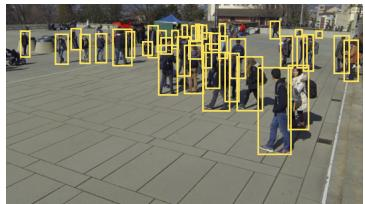

MultiviewX, camera 1, frame 380  
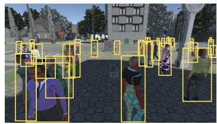

GMVD, camera 1, frame 1196  
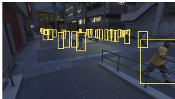

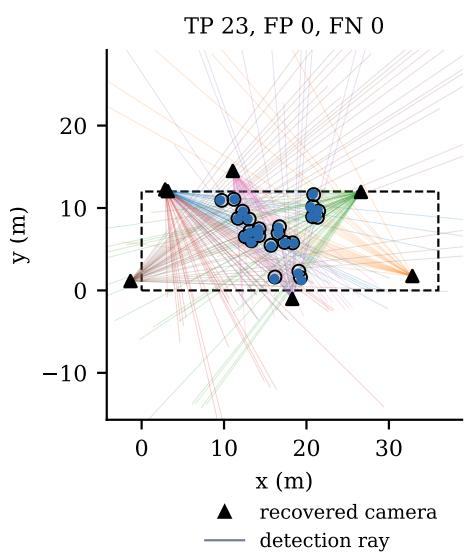

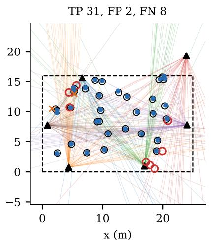  
person (matched) ● prediction (TP) person (missed) prediction (FP)

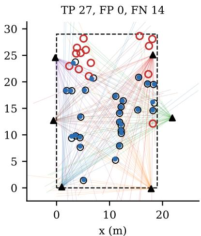  
Figure 5. Qualitative results on the middle evaluation frame of each development dataset. Top: camera 1 and person detections. Bottom: bird’s-eye view after evaluation-only similarity alignment. Predictions and people are matched at the 0.5 m MODA threshold.

Table 9. Resource and protocol context using reported MODA. This is not a controlled ranking because each method follows its authors protocol. CAT-Free uses development-set method selection, full-sequence processing, and evaluation-time similarity alignment.
<table><tr><td>Method</td><td>Given calibration</td><td>Target labels</td><td>Target training</td><td>Eval. GT align</td><td>WildTrack</td><td>MultiviewX</td></tr><tr><td>MVDet [8]</td><td>√</td><td>√</td><td>√</td><td>一</td><td>88.2</td><td>83.9</td></tr><tr><td>MVDeTr [7]</td><td>√</td><td>√</td><td>√</td><td></td><td>91.5</td><td>93.7</td></tr><tr><td>EarlyBird [16]</td><td>√</td><td>√</td><td>√</td><td></td><td>91.2</td><td>94.2</td></tr><tr><td>TrackTacular [17]</td><td>√</td><td>√</td><td>√</td><td>1</td><td>93.2</td><td>96.5</td></tr><tr><td>CaMuViD [4]</td><td>一</td><td>√</td><td>√</td><td>一</td><td>95.0</td><td>96.5</td></tr><tr><td>UMPD [11]</td><td>V</td><td>一</td><td>√</td><td>一</td><td>76.6</td><td>67.5</td></tr><tr><td>Ours</td><td>一</td><td>一</td><td>一</td><td>√</td><td>82.5</td><td>84.5</td></tr></table>

jurisdictions. We evaluate only on public research datasets recorded for that purpose.

## H. Reproducibility

Every constant, filter, and threshold needed to reimplement the method is listed in Table 5 and Sec. 3. The three prespecified evaluation protocols appear in Sec. I. In our implementation, scripts/reproduce/ replays detection through tracking from cached detections, camera parameters, and reconstruction outputs. It also reproduces the experiment on the unseen installation and its 25-iteration camera refinement. The current implementation does not provide a single command from RGB input to final output.

## I. Prespecified Evaluation Protocols

Each post-development evaluation was specified in a file written and committed before any prediction of that experiment was scored. We summarize the operative content of those files below.

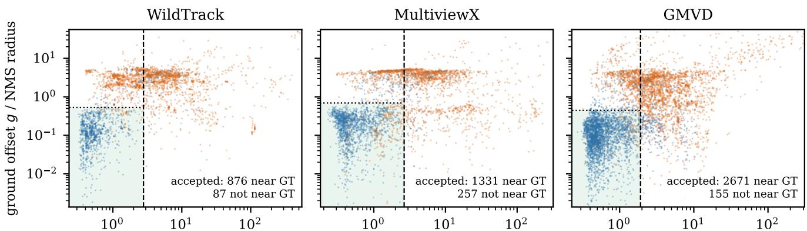  
position uncertainty / NMS radius position uncertainty / NMS radius position uncertainty / NMS radius within 0.5 m of a person not within 0.5 m $\tau _ { \sigma }$

Figure 6. Localization uncertainty σ and point-to-plane distance g after angular consistency filtering, normalized by the NMS radius. Log-Otsu estimates $\tau _ { \sigma }$ from all hypotheses and $\tau _ { g }$ from hypotheses with $\sigma \leq \tau _ { \sigma }$ . The shaded region is accepted. Ground truth is used only to color points.  
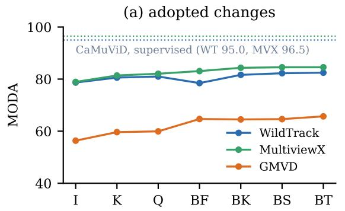

(b) where people are lost (final pipeline)  
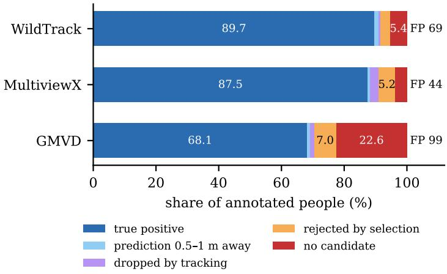  
Figure 7. (a) Development MODA after each adopted change. (b) Outcome of every annotated person under the final pipeline. Outcomes are a true positive, a prediction 0.5–1 m away, removal by tracking, rejection by selection, or no triangulated hypothesis. FP is the number o false positives.

P1: unused WildTrack frames (real data, transfer across time). Scope. WildTrack frames 0–1795 contain 360 annotated frames from 7 cameras and were not used in development. Development used only the standard test split 1800–1995. These are the training frames for supervised methods. We train nothing, so they are unused. The camera rig is the one estimated from the test frames. Because the cameras are static, this tests transfer across time on a real installation, not rig estimation. Procedure. We use the same YOLO11x detector and pose model, image resolution, confidence threshold, tracklet linking, and OSNet embedding. Method BT keeps every constant, filter order, and trajectory rule unchanged. Ray reliabilities and both filter thresholds are estimated again from these frames, as in every run. The experiment uses the existing image-based camera estimates and reconstruction. All 360 frames are predicted before evaluation. We report the full split with the standard metric and with predictions outside the grid counted as false positives. There is no subset selection or threshold change after evaluation. Stated limits. This protocol does not test camera estimation on an unseen installation. It uses the same scene and cameras as the development split.

P2: further GMVD sequences (transfer across time, shared installation). Scope. GMVD scene 5, configuration 1, sequences 2–5 are used for evaluation, while development used sequence 1. The sequences share a camera installation. This tests transfer across time, not to an unseen scene or camera rig. Procedure. Method BT keeps every constant, filter, stopping rule, and trajectory rule unchanged. It uses the image-based camera estimates and reconstruction selected for sequence 1, together with existing confidence-0.30 detections. All four sequences are predicted before any evaluator or output computed from ground truth is read. Every sequence is reported without later subset selection. Stated limits. The experiment starts from cached detections, camera parameters, and reconstruction. It is not an end-toend RGB reproduction and does not test camera estimation on an unseen installation. HOTA was withheld at the time of writing until an implementation validated with TrackEval was available. The values in Table 7 were computed later with that implementation.

Table 10. Camera-removal experiment on the WildTrack development frames. Frames, detections, camera parameters, ground plane, and fixed constants do not change. The first k of seven cameras provide the rays. Co-visibility is the mean number of those cameras that observe each annotated person.
<table><tr><td>Cameras</td><td>Co-visibility</td><td>MODA</td><td>Recall</td><td>Precision</td></tr><tr><td>2</td><td>1.80</td><td>-8.51</td><td>5.9</td><td>29.0</td></tr><tr><td>3</td><td>2.76</td><td>47.58</td><td>49.4</td><td>96.5</td></tr><tr><td>4</td><td>2.95</td><td>56.20</td><td>62.5</td><td>90.8</td></tr><tr><td>5</td><td>3.68</td><td>66.81</td><td>75.0</td><td>90.2</td></tr><tr><td>6</td><td>4.66</td><td>81.41</td><td>87.9</td><td>93.1</td></tr><tr><td>7</td><td>5.28</td><td>82.46</td><td>89.7</td><td>92.5</td></tr></table>

Table 11. One curve, two ways of varying difficulty. Median σ from Eq. (6) at the annotated positions, against measured MODA, pooling the camera-removal sweep with two time windows evaluated at the full seven cameras. Over these eight settings log σ predicts MODA with Pearson r = −0.98 (Spearman −0.93, $p < 0 . 0 0 1 $ ).
<table><tr><td>Setting</td><td>Median σ (cm)</td><td>MODA</td></tr><tr><td>2 cameras, development frames</td><td>76.4</td><td>-8.51</td></tr><tr><td>3 cameras, development frames</td><td>31.9</td><td>47.58</td></tr><tr><td>4 cameras, development frames</td><td>31.2</td><td>56.20</td></tr><tr><td>5 cameras, development frames</td><td>20.3</td><td>66.81</td></tr><tr><td>6 cameras, development frames</td><td>18.2</td><td>81.41</td></tr><tr><td>7 cameras, development frames</td><td>15.2</td><td>82.46</td></tr><tr><td>Frames 0–199, 7 cameras</td><td>36.9</td><td>33.37</td></tr><tr><td>Frames 1600–1799, 7 cameras</td><td>14.9</td><td>75.30</td></tr></table>

P3: unseen camera installation (rig re-estimated from RGB). Scope. GMVD scene 5, configuration 2 has 8 cameras and was not used during development. All five sequences are evaluated and reported. Procedure. Camera estimation follows the development procedure. It starts from the existing VGGT aggregate, builds detection rays, and alternates association with camera refinement for 25 iterations. The iterate with the smallest median triangulation residual is retained without using ground truth. Method BT remains unchanged, and both filter thresholds are estimated for each sequence. Inputs are the existing confidence-0.30 detections and configuration-2 reconstruction. All five sequences are predicted before evaluation. Every sequence is reported, including failures and the number of completed camera refinement iterations. A failed ground-plane validity check would be reported as the outcome. Artifact choices fixed before evaluation. The reconstruction belongs to the same model family as the development reconstruction and is selected by name rather than score. Camera parameters are estimated from the pose-confirmed subset of cached detections (11,601 of 26,473), matching the development procedure. Downstream stages use all detections. Camera parameters are estimated once on sequence 1 and reused for all five sequences, matching configuration 1. Outcome as recorded. Camera refinement completed all 25 iterations without an abort. The label-free triangulation residual selected iteration 20, and no constant, filter, or rule changed. Stated limits. This experiment does not test an unseen scene, a real-world installation beyond WildTrack, or an end-to-end run that also estimates the VGGT reconstruction.

## J. Stage-Level Error Analysis

Table 18 follows ground-truth coverage stage by stage. Candidate generation misses 5.4%, 3.7%, and 22.6% of annotated people on WildTrack, MultiviewX, and GMVD. Selection rejects a further 3.0%, 5.2%, and 7.0%. Candidate generation is the larger measured loss on WildTrack and GMVD, while selection is larger on MultiviewX.

The analyses in this section use ground truth only to label outcomes.

Candidate generation. Before selection, the hypotheses cover 92.2%, 93.4%, and 74.6% of annotated people. Moving every unmatched prediction within 1 m of an unmatched person inside the 0.5 m radius would raise MODA by at most 1.5–2.5 points. Fig. 7b decomposes the final misses. Candidate generation misses 5.4%, 3.7%, and 22.6%. Selection rejects 3.0%, 5.2%, and 7.0%. Tracking drops 0.6–2.8%, and 0.7–1.3% are missed by less than 1 m.

Among people without an initial candidate in BK (Wild-Track 59, MultiviewX 59, GMVD 948), GMVD has 415 visible people matched by fewer than two detections, 230 whose correct ray pair is assigned elsewhere by the greedy partition, and 185 not localized within 0.5 m even by their correct rays. On MultiviewX, the greedy partition accounts for 34 of 59. On WildTrack, correct pairs that fail the angular consistency test (20) or greedy partition (17) dominate.

Qualitative examples. Fig. 5 shows one evaluation frame per development dataset, with the camera view above and the aligned bird’s-eye view below.

Table 12. Leave-one-camera-out evaluation alignment. The similarity transform is refitted after withholding one camera center, and all predictions are rescored. The last column measures the distance between the withheld camera’s estimated and annotated centers after alignment.
<table><tr><td>Dataset</td><td>Cameras</td><td>All-camera MODA</td><td>LOO mean</td><td>LOO min</td><td>LOO SD</td><td>Held-out center error</td></tr><tr><td>WildTrack</td><td>7</td><td>82.46</td><td>81.87</td><td>79.62</td><td>1.13</td><td>0.30 m</td></tr><tr><td>MultiviewX</td><td>6</td><td>84.54</td><td>84.56</td><td>84.27</td><td>0.16</td><td>0.19 m</td></tr><tr><td>GMVD (s5/c1/seq1)</td><td>6</td><td>65.69</td><td>64.64</td><td>62.48</td><td>1.14</td><td>0.40 m</td></tr></table>

Table 13. Development-set MODA after cumulative changes. Method I is the initial controlled baseline. Variants were selected on these sequences.
<table><tr><td></td><td>Change</td><td>WildTrack</td><td>MultiviewX</td><td>GMVD</td><td>Mean</td></tr><tr><td>I</td><td>earlier baseline (pose-confirmed detections only, unweighted</td><td>78.68</td><td>78.92</td><td>56.36</td><td>71.32</td></tr><tr><td>K</td><td>rays) all detections ≥ 0.30 + ray reliability wi</td><td>80.57</td><td>81.39</td><td>59.64</td><td>73.87</td></tr><tr><td>Q</td><td>remove exclusive assignment after support recount</td><td>80.99</td><td>82.06</td><td>59.93</td><td>74.33</td></tr><tr><td>BF</td><td>weighted view support → uncertainty filter</td><td>78.47</td><td>83.07</td><td>64.68</td><td>75.41</td></tr><tr><td>BK</td><td>+ ground-plane filter after the uncertainty filter</td><td>81.62</td><td>84.34</td><td>64.51</td><td>76.82</td></tr><tr><td>BS</td><td>+ inlier refit of the triangulated position</td><td>82.25</td><td>84.54</td><td>64.63</td><td>77.14</td></tr><tr><td>BT</td><td>remove short static-track removal</td><td>82.46</td><td>84.54</td><td>65.69</td><td>77.56</td></tr></table>

Table 14. Trajectory ablation on the peaks of BS (MODA). Each row removes one rule from BS.
<table><tr><td>Variant</td><td>WildTrack</td><td>MultiviewX</td><td>GMVD</td><td>Mean</td></tr><tr><td>no trajectory stage (per-frame positions)</td><td>79.94</td><td>81.12</td><td>62.01</td><td>74.36</td></tr><tr><td>BS (all rules)</td><td>82.25</td><td>84.54</td><td>64.63</td><td>77.14</td></tr><tr><td>— short static-track removal (BT)</td><td>82.46</td><td>84.54</td><td>65.69</td><td>77.56</td></tr><tr><td>gap interpolation</td><td>82.25</td><td>84.54</td><td>64.63</td><td>77.14</td></tr><tr><td>track extension</td><td>80.46</td><td>78.92</td><td>59.03</td><td>72.80</td></tr><tr><td>appearance in linking and extension</td><td>81.72</td><td>84.20</td><td>64.46</td><td>76.79</td></tr><tr><td>appearance in extension</td><td>82.25</td><td>84.14</td><td>64.63</td><td>77.01</td></tr></table>

Cross-view cues. On WildTrack hypotheses from an earlier pipeline version, the correct partner was closer than the chosen incorrect partner under OSNet appearance in 9.4% of cases, DINOv2 [14] in 47.4%, per-camera motion in 45.3%, and estimated body height in 47.6%. Adding short-term temporal candidates raised coverage from 92.2% to 93.3% but lowered MODA from 80.99 to 62.92.

Missed GMVD detections. At detector confidence 0.30, 31.8% of visible annotated boxes have no detection with IoU ≥ 0.5. Lowering confidence to 0.10 recovers 8% of them. The miss rate rises with occlusion (20.6% at maximum interperson IoU below 0.1, 44.2% at 0.3–0.5) and is 28% for boxes taller than 250 pixels. Enlarged overlapping tiles change recall from 68.5% to 68.8% on a subset. Cropping each missed box with ground-truth coordinates recovers 12.5%.

Table 15. Per-sequence versus fixed thresholds (MODA). Both filter thresholds are replaced by the same fixed quantile on every dataset. The best fixed quantile differs by dataset, while log-Otsu is within 0.6 points of the best fixed choice on WildTrack and MultiviewX.
<table><tr><td>Threshold rule</td><td>WildTrack</td><td>MultiviewX</td><td>GMVD</td><td>Mean</td></tr><tr><td>fixed quantile p50</td><td>81.83</td><td>55.69</td><td>41.56</td><td>59.69</td></tr><tr><td>fixed quantile p60</td><td>79.52</td><td>74.50</td><td>57.19</td><td>70.40</td></tr><tr><td>fixed quantile p70</td><td>76.26</td><td>84.27</td><td>67.38</td><td>75.97</td></tr><tr><td>log-Otsu (ours)</td><td>82.46</td><td>84.54</td><td>65.69</td><td>77.56</td></tr></table>

Table 16. Filter ablation on the unseen 8-camera installation (GMVD configuration 2, MODA). The variants match Table 3. The order selected on the development sequences performs best on every sequence.
<table><tr><td>Variant</td><td>seq1</td><td>seq2</td><td>seq3</td><td>seq4</td><td>seq5</td><td>Mean</td></tr><tr><td>weighted view support</td><td>64.83</td><td>67.31</td><td>80.73</td><td>74.86</td><td>77.04</td><td>72.95</td></tr><tr><td>uncertainty filter only</td><td>67.79</td><td>64.85</td><td>83.59</td><td>77.12</td><td>73.37</td><td>73.34</td></tr><tr><td>ground-plane filter first</td><td>67.16</td><td>69.38</td><td>81.63</td><td>78.23</td><td>79.83</td><td>75.25</td></tr><tr><td>uncertainty then ground-plane filter (ours)</td><td>70.31</td><td>73.55</td><td>86.41</td><td>80.25</td><td>82.24</td><td>78.55</td></tr></table>

Table 17. Fraction of incorrect two-camera pairs that survive each filter, grouped by the angle ϕ between the directions joining the two people and the two cameras. Lower is better.
<table><tr><td>Separation</td><td>Filter</td><td> $\phi < 1 0 ^ { \circ }$ </td><td> $1 0 { - } 3 0 ^ { \circ }$ </td><td> $3 0 { - } 4 5 ^ { \circ }$ </td><td> $4 5 { - } 6 0 ^ { \circ }$ </td><td> $6 0 { - } 7 5 ^ { \circ }$ </td><td> $7 5 { - } 9 0 ^ { \circ }$ </td></tr><tr><td rowspan="2">0.5m</td><td>uncertainty</td><td>93.4</td><td>93.3</td><td>93.1</td><td>93.4</td><td>93.2</td><td>93.3</td></tr><tr><td>both</td><td>64.2</td><td>65.1</td><td>68.1</td><td>72.0</td><td>75.0</td><td>77.4</td></tr><tr><td rowspan="2">1.0m</td><td>uncertainty</td><td>93.5</td><td>93.5</td><td>93.6</td><td>93.9</td><td>93.8</td><td>93.8</td></tr><tr><td>both</td><td>40.1</td><td>42.4</td><td>49.1</td><td>57.8</td><td>66.1</td><td>72.0</td></tr><tr><td rowspan="2">2.0m</td><td>uncertainty</td><td>92.3</td><td>92.6</td><td>93.3</td><td>94.2</td><td>94.7</td><td>94.9</td></tr><tr><td>both</td><td>8.1</td><td>11.3</td><td>19.9</td><td>32.9</td><td>47.8</td><td>58.3</td></tr></table>

Table 18. GT coverage (fraction of annotated people within 0.5 m of some output) after each stage of BK, and the MODA upper bound from fixing near misses of BT.
<table><tr><td></td><td>WildTrack</td><td>MultiviewX</td><td>GMVD</td></tr><tr><td>all triangulated hypotheses</td><td>92.2</td><td>93.4</td><td>74.6</td></tr><tr><td>+ angular consistency filter</td><td>91.5</td><td>93.4</td><td>74.3</td></tr><tr><td>+ uncertainty filter</td><td>89.0</td><td>90.3</td><td>67.4</td></tr><tr><td>+ ground-plane filter</td><td>87.2</td><td>89.1</td><td>65.1</td></tr><tr><td>BT: unmatched GT-prediction pairs within 0.5–1 m</td><td>12</td><td>11</td><td>46</td></tr><tr><td>BT: MODA if all were fixed</td><td>84.98 (+2.52)</td><td>86.01 (+1.47)</td><td>67.94 (+2.25)</td></tr></table>